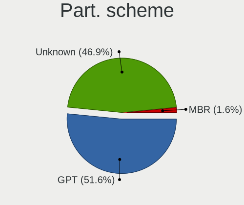
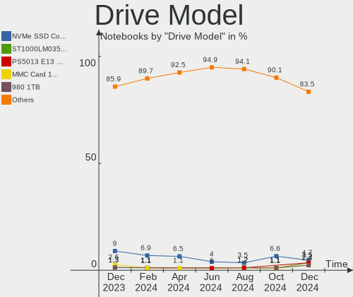
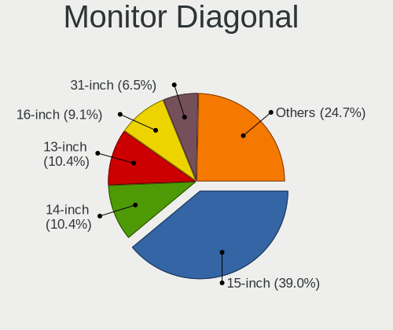
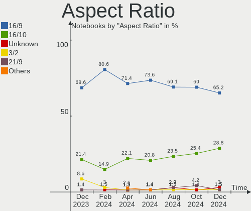
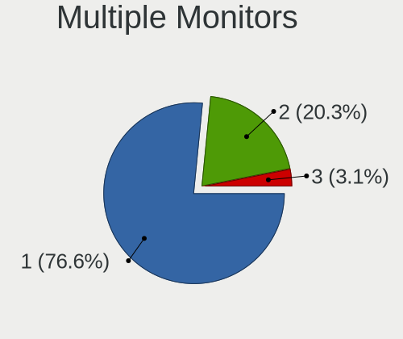

Manjaro - Hardware Trends (Notebooks)
-------------------------------------

A project to identify most popular hardware characteristics and track their change
over time based on data collected by Linux users at https://Linux-Hardware.org.

Anyone can contribute to this report by the [hw-probe](https://github.com/linuxhw/hw-probe) tool:

    sudo -E hw-probe -all -upload

This report is for one last month. Overall report since the beginning of time: [TestDays](https://github.com/linuxhw/TestDays)

Period: Dec, 2024.

Contents
--------

* [ System ](#system)
  - [ OS                       ](#os)
  - [ OS Family                ](#os-family)
  - [ Kernel                   ](#kernel)
  - [ Kernel Family            ](#kernel-family)
  - [ Kernel Major Ver.        ](#kernel-major-ver)
  - [ Arch                     ](#arch)
  - [ DE                       ](#de)
  - [ Display Server           ](#display-server)
  - [ Display Manager          ](#display-manager)
  - [ OS Lang                  ](#os-lang)
  - [ Boot Mode                ](#boot-mode)
  - [ Filesystem               ](#filesystem)
  - [ Part. scheme             ](#part-scheme)
  - [ Dual Boot with Linux/BSD ](#dual-boot-with-linuxbsd)
  - [ Dual Boot (Win)          ](#dual-boot-win)

* [ Board ](#board)
  - [ Vendor                   ](#vendor)
  - [ Model                    ](#model)
  - [ Model Family             ](#model-family)
  - [ MFG Year                 ](#mfg-year)
  - [ Form Factor              ](#form-factor)
  - [ Secure Boot              ](#secure-boot)
  - [ Coreboot                 ](#coreboot)
  - [ RAM Size                 ](#ram-size)
  - [ RAM Used                 ](#ram-used)
  - [ Total Drives             ](#total-drives)
  - [ Has CD-ROM               ](#has-cd-rom)
  - [ Has Ethernet             ](#has-ethernet)
  - [ Has WiFi                 ](#has-wifi)
  - [ Has Bluetooth            ](#has-bluetooth)

* [ Location ](#location)
  - [ Country                  ](#country)
  - [ City                     ](#city)

* [ Drives ](#drives)
  - [ Drive Vendor             ](#drive-vendor)
  - [ Drive Model              ](#drive-model)
  - [ HDD Vendor               ](#hdd-vendor)
  - [ SSD Vendor               ](#ssd-vendor)
  - [ Drive Kind               ](#drive-kind)
  - [ Drive Connector          ](#drive-connector)
  - [ Drive Size               ](#drive-size)
  - [ Space Total              ](#space-total)
  - [ Space Used               ](#space-used)
  - [ Malfunc. Drives          ](#malfunc-drives)
  - [ Malfunc. Drive Vendor    ](#malfunc-drive-vendor)
  - [ Malfunc. HDD Vendor      ](#malfunc-hdd-vendor)
  - [ Malfunc. Drive Kind      ](#malfunc-drive-kind)
  - [ Failed Drives            ](#failed-drives)
  - [ Failed Drive Vendor      ](#failed-drive-vendor)
  - [ Drive Status             ](#drive-status)

* [ Storage controller ](#storage-controller)
  - [ Storage Vendor           ](#storage-vendor)
  - [ Storage Model            ](#storage-model)
  - [ Storage Kind             ](#storage-kind)

* [ Processor ](#processor)
  - [ CPU Vendor               ](#cpu-vendor)
  - [ CPU Model                ](#cpu-model)
  - [ CPU Model Family         ](#cpu-model-family)
  - [ CPU Cores                ](#cpu-cores)
  - [ CPU Sockets              ](#cpu-sockets)
  - [ CPU Threads              ](#cpu-threads)
  - [ CPU Op-Modes             ](#cpu-op-modes)
  - [ CPU Microcode            ](#cpu-microcode)
  - [ CPU Microarch            ](#cpu-microarch)

* [ Graphics ](#graphics)
  - [ GPU Vendor               ](#gpu-vendor)
  - [ GPU Model                ](#gpu-model)
  - [ GPU Combo                ](#gpu-combo)
  - [ GPU Driver               ](#gpu-driver)
  - [ GPU Memory               ](#gpu-memory)

* [ Monitor ](#monitor)
  - [ Monitor Vendor           ](#monitor-vendor)
  - [ Monitor Model            ](#monitor-model)
  - [ Monitor Resolution       ](#monitor-resolution)
  - [ Monitor Diagonal         ](#monitor-diagonal)
  - [ Monitor Width            ](#monitor-width)
  - [ Aspect Ratio             ](#aspect-ratio)
  - [ Monitor Area             ](#monitor-area)
  - [ Pixel Density            ](#pixel-density)
  - [ Multiple Monitors        ](#multiple-monitors)

* [ Network ](#network)
  - [ Net Controller Vendor    ](#net-controller-vendor)
  - [ Net Controller Model     ](#net-controller-model)
  - [ Wireless Vendor          ](#wireless-vendor)
  - [ Wireless Model           ](#wireless-model)
  - [ Ethernet Vendor          ](#ethernet-vendor)
  - [ Ethernet Model           ](#ethernet-model)
  - [ Net Controller Kind      ](#net-controller-kind)
  - [ Used Controller          ](#used-controller)
  - [ NICs                     ](#nics)
  - [ IPv6                     ](#ipv6)

* [ Bluetooth ](#bluetooth)
  - [ Bluetooth Vendor         ](#bluetooth-vendor)
  - [ Bluetooth Model          ](#bluetooth-model)

* [ Sound ](#sound)
  - [ Sound Vendor             ](#sound-vendor)
  - [ Sound Model              ](#sound-model)

* [ Memory ](#memory)
  - [ Memory Vendor            ](#memory-vendor)
  - [ Memory Model             ](#memory-model)
  - [ Memory Kind              ](#memory-kind)
  - [ Memory Form Factor       ](#memory-form-factor)
  - [ Memory Size              ](#memory-size)
  - [ Memory Speed             ](#memory-speed)

* [ Printers & scanners ](#printers--scanners)
  - [ Printer Vendor           ](#printer-vendor)
  - [ Printer Model            ](#printer-model)
  - [ Scanner Vendor           ](#scanner-vendor)
  - [ Scanner Model            ](#scanner-model)

* [ Camera ](#camera)
  - [ Camera Vendor            ](#camera-vendor)
  - [ Camera Model             ](#camera-model)

* [ Security ](#security)
  - [ Fingerprint Vendor       ](#fingerprint-vendor)
  - [ Fingerprint Model        ](#fingerprint-model)
  - [ Chipcard Vendor          ](#chipcard-vendor)
  - [ Chipcard Model           ](#chipcard-model)

* [ Unsupported ](#unsupported)
  - [ Unsupported Devices      ](#unsupported-devices)
  - [ Unsupported Device Types ](#unsupported-device-types)

System
------

OS
--

Installed operating systems

| Name            | Notebooks | Percent |
|-----------------|-----------|---------|
| Manjaro         | 30        | 46.88%  |
| Manjaro 24.2.0  | 17        | 26.56%  |
| Manjaro 24.2.1  | 13        | 20.31%  |
| Manjaro Rolling | 2         | 3.13%   |
| Manjaro 24.1.2  | 1         | 1.56%   |
| Manjaro 23.1.2  | 1         | 1.56%   |

OS Family
---------

OS without a version

| Name    | Notebooks | Percent |
|---------|-----------|---------|
| Manjaro | 64        | 100%    |

Kernel
------

Version of the Linux kernel

| Version                | Notebooks | Percent |
|------------------------|-----------|---------|
| 6.11.10-2-MANJARO      | 15        | 23.44%  |
| 6.12.4-1-MANJARO       | 14        | 21.88%  |
| 6.12.1-4-MANJARO       | 12        | 18.75%  |
| 6.11.11-1-MANJARO      | 9         | 14.06%  |
| 6.6.65-1-MANJARO       | 4         | 6.25%   |
| 6.10.13-3-MANJARO      | 2         | 3.13%   |
| 6.6.8-2-MANJARO        | 1         | 1.56%   |
| 6.6.63-1-MANJARO       | 1         | 1.56%   |
| 6.6.54-2-MANJARO       | 1         | 1.56%   |
| 6.13.0-rc4-1-MANJARO   | 1         | 1.56%   |
| 6.12.1-arch1-1.1-g14   | 1         | 1.56%   |
| 6.10.7-x64v2-xanmod1-1 | 1         | 1.56%   |
| 6.10.11-2-MANJARO      | 1         | 1.56%   |
| 5.10.102-1-MANJARO     | 1         | 1.56%   |

Kernel Family
-------------

Linux kernel without a distro release

| Version  | Notebooks | Percent |
|----------|-----------|---------|
| 6.11.10  | 15        | 23.44%  |
| 6.12.4   | 14        | 21.88%  |
| 6.12.1   | 13        | 20.31%  |
| 6.11.11  | 9         | 14.06%  |
| 6.6.65   | 4         | 6.25%   |
| 6.10.13  | 2         | 3.13%   |
| 6.6.8    | 1         | 1.56%   |
| 6.6.63   | 1         | 1.56%   |
| 6.6.54   | 1         | 1.56%   |
| 6.13.0   | 1         | 1.56%   |
| 6.10.7   | 1         | 1.56%   |
| 6.10.11  | 1         | 1.56%   |
| 5.10.102 | 1         | 1.56%   |

Kernel Major Ver.
-----------------

Linux kernel major version

| Version | Notebooks | Percent |
|---------|-----------|---------|
| 6.12    | 27        | 42.19%  |
| 6.11    | 24        | 37.5%   |
| 6.6     | 7         | 10.94%  |
| 6.10    | 4         | 6.25%   |
| 6.13    | 1         | 1.56%   |
| 5.10    | 1         | 1.56%   |

Arch
----

OS architecture (x86_64, i586, etc.)

| Name   | Notebooks | Percent |
|--------|-----------|---------|
| x86_64 | 64        | 100%    |

DE
--

Desktop Environment

| Name       | Notebooks | Percent |
|------------|-----------|---------|
| KDE6       | 31        | 48.44%  |
| GNOME      | 13        | 20.31%  |
| KDE5       | 7         | 10.94%  |
| XFCE       | 6         | 9.38%   |
| X-Cinnamon | 2         | 3.13%   |
| Hyprland   | 2         | 3.13%   |
| sway       | 1         | 1.56%   |
| KDE        | 1         | 1.56%   |
| i3         | 1         | 1.56%   |

Display Server
--------------

X11 or Wayland

| Name    | Notebooks | Percent |
|---------|-----------|---------|
| X11     | 42        | 65.63%  |
| Wayland | 21        | 32.81%  |
| Unknown | 1         | 1.56%   |

Display Manager
---------------

SDDM, LightDM, etc.

| Name    | Notebooks | Percent |
|---------|-----------|---------|
| Unknown | 32        | 50%     |
| SDDM    | 17        | 26.56%  |
| LightDM | 7         | 10.94%  |
| GDM     | 7         | 10.94%  |
| GREETD  | 1         | 1.56%   |

OS Lang
-------

Language

| Lang  | Notebooks | Percent |
|-------|-----------|---------|
| en_US | 30        | 46.88%  |
| de_DE | 6         | 9.38%   |
| ru_RU | 4         | 6.25%   |
| it_IT | 4         | 6.25%   |
| en_CA | 4         | 6.25%   |
| pl_PL | 3         | 4.69%   |
| es_ES | 3         | 4.69%   |
| en_GB | 3         | 4.69%   |
| sv_SE | 1         | 1.56%   |
| pt_BR | 1         | 1.56%   |
| nl_BE | 1         | 1.56%   |
| es_PY | 1         | 1.56%   |
| en_IL | 1         | 1.56%   |
| en_AU | 1         | 1.56%   |
| cs_CZ | 1         | 1.56%   |

Boot Mode
---------

EFI or BIOS

| Mode | Notebooks | Percent |
|------|-----------|---------|
| BIOS | 39        | 60.94%  |
| EFI  | 25        | 39.06%  |

Filesystem
----------

Type of filesystem

| Type    | Notebooks | Percent |
|---------|-----------|---------|
| Ext4    | 45        | 70.31%  |
| Btrfs   | 10        | 15.63%  |
| Tmpfs   | 7         | 10.94%  |
| Overlay | 1         | 1.56%   |
| F2fs    | 1         | 1.56%   |

Part. scheme
------------

Scheme of partitioning

| Type    | Notebooks | Percent |
|---------|-----------|---------|
| GPT     | 33        | 51.56%  |
| Unknown | 30        | 46.88%  |
| MBR     | 1         | 1.56%   |

Dual Boot with Linux/BSD
------------------------

Hosting more than one Linux/BSD

| Dual boot | Notebooks | Percent |
|-----------|-----------|---------|
| No        | 60        | 93.75%  |
| Yes       | 4         | 6.25%   |

Dual Boot (Win)
---------------

Hosting Linux and Windows

| Dual boot | Notebooks | Percent |
|-----------|-----------|---------|
| No        | 50        | 78.13%  |
| Yes       | 14        | 21.88%  |

Board
-----

Vendor
------

Motherboard manufacturer

| Name                | Notebooks | Percent |
|---------------------|-----------|---------|
| Lenovo              | 16        | 25%     |
| Dell                | 8         | 12.5%   |
| ASUSTek Computer    | 8         | 12.5%   |
| Hewlett-Packard     | 6         | 9.38%   |
| MSI                 | 3         | 4.69%   |
| HUAWEI              | 3         | 4.69%   |
| Apple               | 3         | 4.69%   |
| TongFang            | 2         | 3.13%   |
| Samsung Electronics | 2         | 3.13%   |
| Acer                | 2         | 3.13%   |
| Unknown             | 2         | 3.13%   |
| Toshiba             | 1         | 1.56%   |
| Timi                | 1         | 1.56%   |
| Panasonic           | 1         | 1.56%   |
| Notebook            | 1         | 1.56%   |
| Medion              | 1         | 1.56%   |
| Lunnen              | 1         | 1.56%   |
| Google              | 1         | 1.56%   |
| Fujitsu             | 1         | 1.56%   |
| Eluktronics         | 1         | 1.56%   |

Model
-----

Motherboard model

| Name                                       | Notebooks | Percent |
|--------------------------------------------|-----------|---------|
| TongFang GX5HRXL                           | 2         | 3.13%   |
| Unknown                                    | 2         | 3.13%   |
| Toshiba Satellite L500                     | 1         | 1.56%   |
| Timi TM1701                                | 1         | 1.56%   |
| Samsung 800G5M/800G5W                      | 1         | 1.56%   |
| Samsung 300V3A/300V4A/300V5A/200A4B/200A5B | 1         | 1.56%   |
| Panasonic CFLX6-2                          | 1         | 1.56%   |
| Notebook NH5xAx                            | 1         | 1.56%   |
| MSI Stealth 16 AI Studio A1VGG             | 1         | 1.56%   |
| MSI Katana GF76 12UC                       | 1         | 1.56%   |
| MSI GP75 Leopard 10SFK                     | 1         | 1.56%   |
| Medion E15410                              | 1         | 1.56%   |
| Lunnen LL5FAW                              | 1         | 1.56%   |
| Lenovo ThinkPad X270 20K5S1A524            | 1         | 1.56%   |
| Lenovo ThinkPad T480 20L6S0RK00            | 1         | 1.56%   |
| Lenovo ThinkPad T470 W10DG 20JNS08304      | 1         | 1.56%   |
| Lenovo ThinkPad T470 20HD000WUS            | 1         | 1.56%   |
| Lenovo ThinkPad T400 6475WKP               | 1         | 1.56%   |
| Lenovo ThinkPad E15 Gen 4 21ED004NGE       | 1         | 1.56%   |
| Lenovo ThinkBook 14 G6 ABP 21KJ            | 1         | 1.56%   |
| Lenovo ThinkBook 14 G5+ APO 21J1           | 1         | 1.56%   |
| Lenovo Slim 7 14IMH9 83D8                  | 1         | 1.56%   |
| Lenovo Legion Slim 5 16APH8 82Y9           | 1         | 1.56%   |
| Lenovo Legion 5 Pro 16ARH7H 82RG           | 1         | 1.56%   |
| Lenovo Legion 5 82B5                       | 1         | 1.56%   |
| Lenovo Legion 5 15IMH05H 81Y6              | 1         | 1.56%   |
| Lenovo IdeaPad Y700-15ISK 80NV             | 1         | 1.56%   |
| Lenovo IdeaPad 330-15ARR 81D2              | 1         | 1.56%   |
| Lenovo G500 20236                          | 1         | 1.56%   |
| HUAWEI VGHH-XX                             | 1         | 1.56%   |
| HUAWEI KLVL-WXX9                           | 1         | 1.56%   |
| HUAWEI HVY-WXX9                            | 1         | 1.56%   |
| HP Victus by Gaming Laptop 15-fb2xxx       | 1         | 1.56%   |
| HP ProBook 455R G6                         | 1         | 1.56%   |
| HP EliteBook 8740w                         | 1         | 1.56%   |
| HP EliteBook 735 G6                        | 1         | 1.56%   |
| HP 630                                     | 1         | 1.56%   |
| HP 250 G7 Notebook PC                      | 1         | 1.56%   |
| Google Akemi                               | 1         | 1.56%   |
| Fujitsu CELSIUS H970                       | 1         | 1.56%   |

Model Family
------------

Motherboard model prefix

| Name               | Notebooks | Percent |
|--------------------|-----------|---------|
| Lenovo ThinkPad    | 6         | 9.38%   |
| Lenovo Legion      | 4         | 6.25%   |
| TongFang GX5HRXL   | 2         | 3.13%   |
| Lenovo ThinkBook   | 2         | 3.13%   |
| Lenovo IdeaPad     | 2         | 3.13%   |
| HP EliteBook       | 2         | 3.13%   |
| Dell XPS           | 2         | 3.13%   |
| Dell Precision     | 2         | 3.13%   |
| Dell Latitude      | 2         | 3.13%   |
| ASUS Zenbook       | 2         | 3.13%   |
| Acer Aspire        | 2         | 3.13%   |
| Unknown            | 2         | 3.13%   |
| Toshiba Satellite  | 1         | 1.56%   |
| Timi TM1701        | 1         | 1.56%   |
| Samsung 800G5M     | 1         | 1.56%   |
| Samsung 300V3A     | 1         | 1.56%   |
| Panasonic CFLX6-2  | 1         | 1.56%   |
| Notebook NH5xAx    | 1         | 1.56%   |
| MSI Stealth        | 1         | 1.56%   |
| MSI Katana         | 1         | 1.56%   |
| MSI GP75           | 1         | 1.56%   |
| Medion E15410      | 1         | 1.56%   |
| Lunnen LL5FAW      | 1         | 1.56%   |
| Lenovo Slim        | 1         | 1.56%   |
| Lenovo G500        | 1         | 1.56%   |
| HUAWEI VGHH-XX     | 1         | 1.56%   |
| HUAWEI KLVL-WXX9   | 1         | 1.56%   |
| HUAWEI HVY-WXX9    | 1         | 1.56%   |
| HP Victus          | 1         | 1.56%   |
| HP ProBook         | 1         | 1.56%   |
| HP 630             | 1         | 1.56%   |
| HP 250             | 1         | 1.56%   |
| Google Akemi       | 1         | 1.56%   |
| Fujitsu CELSIUS    | 1         | 1.56%   |
| Eluktronics MAG-15 | 1         | 1.56%   |
| Dell Vostro        | 1         | 1.56%   |
| Dell Inspiron      | 1         | 1.56%   |
| ASUS VivoBook      | 1         | 1.56%   |
| ASUS Strix         | 1         | 1.56%   |
| ASUS ROG           | 1         | 1.56%   |

MFG Year
--------

Motherboard manufacture year

| Year | Notebooks | Percent |
|------|-----------|---------|
| 2024 | 10        | 15.63%  |
| 2023 | 9         | 14.06%  |
| 2020 | 8         | 12.5%   |
| 2022 | 6         | 9.38%   |
| 2017 | 6         | 9.38%   |
| 2018 | 5         | 7.81%   |
| 2019 | 4         | 6.25%   |
| 2021 | 3         | 4.69%   |
| 2011 | 3         | 4.69%   |
| 2015 | 2         | 3.13%   |
| 2013 | 2         | 3.13%   |
| 2014 | 1         | 1.56%   |
| 2012 | 1         | 1.56%   |
| 2010 | 1         | 1.56%   |
| 2009 | 1         | 1.56%   |
| 2008 | 1         | 1.56%   |
| 2007 | 1         | 1.56%   |

Form Factor
-----------

Physical design of the computer

| Name     | Notebooks | Percent |
|----------|-----------|---------|
| Notebook | 64        | 100%    |

Secure Boot
-----------

Enabled or disabled

| State    | Notebooks | Percent |
|----------|-----------|---------|
| Disabled | 64        | 100%    |

Coreboot
--------

Have coreboot on board

| Used | Notebooks | Percent |
|------|-----------|---------|
| No   | 63        | 98.44%  |
| Yes  | 1         | 1.56%   |

RAM Size
--------

Total RAM memory

| Size in GB  | Notebooks | Percent |
|-------------|-----------|---------|
| 32.01-64.0  | 18        | 28.13%  |
| 16.01-24.0  | 15        | 23.44%  |
| 8.01-16.0   | 12        | 18.75%  |
| 4.01-8.0    | 11        | 17.19%  |
| 24.01-32.0  | 3         | 4.69%   |
| 3.01-4.0    | 2         | 3.13%   |
| 64.01-256.0 | 2         | 3.13%   |
| 1.01-2.0    | 1         | 1.56%   |

RAM Used
--------

Used RAM memory

| Used GB    | Notebooks | Percent |
|------------|-----------|---------|
| 4.01-8.0   | 22        | 34.38%  |
| 3.01-4.0   | 13        | 20.31%  |
| 1.01-2.0   | 12        | 18.75%  |
| 2.01-3.0   | 9         | 14.06%  |
| 8.01-16.0  | 6         | 9.38%   |
| 16.01-24.0 | 1         | 1.56%   |
| 0.51-1.0   | 1         | 1.56%   |

Total Drives
------------

Number of drives on board

| Drives | Notebooks | Percent |
|--------|-----------|---------|
| 1      | 46        | 71.88%  |
| 2      | 16        | 25%     |
| 3      | 2         | 3.13%   |

Has CD-ROM
----------

Has CD-ROM on board

| Presented | Notebooks | Percent |
|-----------|-----------|---------|
| No        | 54        | 84.38%  |
| Yes       | 10        | 15.63%  |

Has Ethernet
------------

Has Ethernet on board

| Presented | Notebooks | Percent |
|-----------|-----------|---------|
| Yes       | 53        | 82.81%  |
| No        | 11        | 17.19%  |

Has WiFi
--------

Has WiFi module

| Presented | Notebooks | Percent |
|-----------|-----------|---------|
| Yes       | 60        | 93.75%  |
| No        | 4         | 6.25%   |

Has Bluetooth
-------------

Has Bluetooth module

| Presented | Notebooks | Percent |
|-----------|-----------|---------|
| Yes       | 61        | 95.31%  |
| No        | 3         | 4.69%   |

Location
--------

Country
-------

Geographic location (country)

| Country    | Notebooks | Percent |
|------------|-----------|---------|
| USA        | 15        | 23.44%  |
| Germany    | 8         | 12.5%   |
| Russia     | 6         | 9.38%   |
| Italy      | 5         | 7.81%   |
| Canada     | 4         | 6.25%   |
| Poland     | 3         | 4.69%   |
| France     | 3         | 4.69%   |
| Bulgaria   | 3         | 4.69%   |
| UK         | 2         | 3.13%   |
| Spain      | 2         | 3.13%   |
| Czechia    | 2         | 3.13%   |
| Sweden     | 1         | 1.56%   |
| Serbia     | 1         | 1.56%   |
| Paraguay   | 1         | 1.56%   |
| Lithuania  | 1         | 1.56%   |
| Kazakhstan | 1         | 1.56%   |
| Israel     | 1         | 1.56%   |
| Iran       | 1         | 1.56%   |
| Brazil     | 1         | 1.56%   |
| Belgium    | 1         | 1.56%   |
| Belarus    | 1         | 1.56%   |
| Australia  | 1         | 1.56%   |

City
----

Geographic location (city)

| City                 | Notebooks | Percent |
|----------------------|-----------|---------|
| Sofia                | 3         | 4.69%   |
| Warsaw               | 2         | 3.13%   |
| Zlín                | 1         | 1.56%   |
| Zaragoza             | 1         | 1.56%   |
| Würzburg            | 1         | 1.56%   |
| Wilmington           | 1         | 1.56%   |
| Waterdown            | 1         | 1.56%   |
| Vincennes            | 1         | 1.56%   |
| Vilnius              | 1         | 1.56%   |
| Twin City            | 1         | 1.56%   |
| Tver                 | 1         | 1.56%   |
| Turin                | 1         | 1.56%   |
| Tsepeli              | 1         | 1.56%   |
| Tel Aviv             | 1         | 1.56%   |
| Talavera de la Reina | 1         | 1.56%   |
| Shiraz               | 1         | 1.56%   |
| Sesto Fiorentino     | 1         | 1.56%   |
| San Antonio          | 1         | 1.56%   |
| Rostov-on-Don        | 1         | 1.56%   |
| Rognes               | 1         | 1.56%   |
| Richmond             | 1         | 1.56%   |
| Raleigh              | 1         | 1.56%   |
| Prescot              | 1         | 1.56%   |
| Potsdam              | 1         | 1.56%   |
| Pars-les-Romilly     | 1         | 1.56%   |
| Orange               | 1         | 1.56%   |
| Odintsovo            | 1         | 1.56%   |
| Novi Sad             | 1         | 1.56%   |
| Nola                 | 1         | 1.56%   |
| Nijlen               | 1         | 1.56%   |
| Mountville           | 1         | 1.56%   |
| Moscow               | 1         | 1.56%   |
| Misinto              | 1         | 1.56%   |
| Melbourne            | 1         | 1.56%   |
| Marl                 | 1         | 1.56%   |
| Lusk                 | 1         | 1.56%   |
| Liverpool            | 1         | 1.56%   |
| Klaessbol            | 1         | 1.56%   |
| Kirov                | 1         | 1.56%   |
| Ilsede               | 1         | 1.56%   |

Drives
------

Drive Vendor
------------

Hard drive vendors

| Vendor                       | Notebooks | Drives | Percent |
|------------------------------|-----------|--------|---------|
| Samsung Electronics          | 16        | 19     | 19.75%  |
| Sandisk                      | 8         | 8      | 9.88%   |
| Unknown                      | 5         | 5      | 6.17%   |
| Phison Electronics           | 5         | 6      | 6.17%   |
| Micron Technology            | 5         | 5      | 6.17%   |
| Kingston                     | 5         | 5      | 6.17%   |
| WDC                          | 4         | 4      | 4.94%   |
| Seagate                      | 4         | 5      | 4.94%   |
| SK hynix                     | 3         | 3      | 3.7%    |
| Shenzhen Longsys Electronics | 3         | 3      | 3.7%    |
| Kingston Technology Company  | 2         | 2      | 2.47%   |
| China                        | 2         | 2      | 2.47%   |
| Union Memory (Shenzhen)      | 1         | 1      | 1.23%   |
| Union Memory                 | 1         | 1      | 1.23%   |
| Toshiba                      | 1         | 1      | 1.23%   |
| Teclast                      | 1         | 1      | 1.23%   |
| Smartbuy                     | 1         | 1      | 1.23%   |
| Silicon Motion               | 1         | 1      | 1.23%   |
| SCY                          | 1         | 1      | 1.23%   |
| Realtek Semiconductor        | 1         | 1      | 1.23%   |
| Neo                          | 1         | 1      | 1.23%   |
| Micron/Crucial Technology    | 1         | 1      | 1.23%   |
| MAXIO Technology (Hangzhou)  | 1         | 1      | 1.23%   |
| LITEONIT                     | 1         | 1      | 1.23%   |
| KIOXIA                       | 1         | 1      | 1.23%   |
| Intel                        | 1         | 1      | 1.23%   |
| Hitachi                      | 1         | 1      | 1.23%   |
| GOODRAM                      | 1         | 1      | 1.23%   |
| Biwin Storage Technology     | 1         | 1      | 1.23%   |
| A-DATA Technology            | 1         | 1      | 1.23%   |
| Unknown                      | 1         | 1      | 1.23%   |

Drive Model
-----------

Hard drive models

| Model                                                | Notebooks | Percent |
|------------------------------------------------------|-----------|---------|
| Samsung NVMe SSD Controller SM981/PM981/PM983 512GB  | 4         | 4.71%   |
| Seagate ST1000LM035-1RK172 1TB                       | 3         | 3.53%   |
| Phison PS5013 E13 NVMe Controller 512GB              | 3         | 3.53%   |
| Unknown MMC Card  128GB                              | 2         | 2.35%   |
| Samsung SSD 980 1TB                                  | 2         | 2.35%   |
| Samsung NVMe SSD Controller SM961/PM961/SM963 256GB  | 2         | 2.35%   |
| Samsung NVMe SSD Controller PM9A1/PM9A3/980PRO 512GB | 2         | 2.35%   |
| Kingston Company SNV2S2000G 2TB                      | 2         | 2.35%   |
| Kingston SA400S37120G 120GB SSD                      | 2         | 2.35%   |
| WDC WD7500BPVT-60HXZT3 752GB                         | 1         | 1.18%   |
| WDC WD5000LPCX-75VHAT0 500GB                         | 1         | 1.18%   |
| WDC WD20 NPVX-00EA4T0 2TB                            | 1         | 1.18%   |
| WDC WD10SPCX-24HWST1 1TB                             | 1         | 1.18%   |
| Unknown SD/MMC/MS PRO 128GB                          | 1         | 1.18%   |
| Unknown MMC Card  64GB                               | 1         | 1.18%   |
| Unknown MMC Card  16GB                               | 1         | 1.18%   |
| Union Memory UMIS RPITJ512VME2OWD 512GB              | 1         | 1.18%   |
| Union Memory (Shenzhen) UMIS RPEYJ1T24MKN2QWY 1TB    | 1         | 1.18%   |
| Toshiba XG6 NVMe SSD Controller 1024GB               | 1         | 1.18%   |
| Teclast BD 256GB SSD                                 | 1         | 1.18%   |
| Smartbuy SSD 90GB                                    | 1         | 1.18%   |
| SK hynix SKHynix_HFS512GEJ4X112N 512GB               | 1         | 1.18%   |
| SK hynix HFS256G32TNF-N3A0A 256GB SSD                | 1         | 1.18%   |
| SK hynix HFS001TEJ9X108N 1TB                         | 1         | 1.18%   |
| Silicon Motion PCIe-8 SSD 512GB                      | 1         | 1.18%   |
| Shenzhen Longsys Lexar SSD NM790 1TB                 | 1         | 1.18%   |
| Shenzhen Longsys Lexar SSD NM620 512GB               | 1         | 1.18%   |
| Shenzhen Longsys Gamestop 1024GB                     | 1         | 1.18%   |
| Seagate ST500LM021-1KJ152 500GB                      | 1         | 1.18%   |
| Seagate ST2000LM015-2E8174 2TB                       | 1         | 1.18%   |
| SCY NVMe SSD Drive 512GB                             | 1         | 1.18%   |
| Sandisk WD_BLACK SN770 1TB                           | 1         | 1.18%   |
| Sandisk WD PC SN740 SDDQNQD-1T00-1014 1TB            | 1         | 1.18%   |
| Sandisk WD PC SN740 SDDQMQD-512G-1001 512GB          | 1         | 1.18%   |
| Sandisk WD PC SN740 SDDPNQE-2T00-1127 2TB            | 1         | 1.18%   |
| Sandisk WD PC SN735 SDBPNHH-1T00-1002 1024GB         | 1         | 1.18%   |
| Sandisk WD PC SN560 SDDPNQE-1T00-1102 1024GB         | 1         | 1.18%   |
| Sandisk WD Blue SN500 / PC SN520 NVMe SSD 256GB      | 1         | 1.18%   |
| SanDisk SDSSDH3 4T00 4TB                             | 1         | 1.18%   |
| Samsung SSD 990 PRO 4TB                              | 1         | 1.18%   |

HDD Vendor
----------

Hard disk drive vendors

| Vendor  | Notebooks | Drives | Percent |
|---------|-----------|--------|---------|
| WDC     | 4         | 4      | 40%     |
| Seagate | 4         | 5      | 40%     |
| Unknown | 1         | 1      | 10%     |
| Hitachi | 1         | 1      | 10%     |

SSD Vendor
----------

Solid state drive vendors

| Vendor              | Notebooks | Drives | Percent |
|---------------------|-----------|--------|---------|
| Samsung Electronics | 3         | 4      | 18.75%  |
| Kingston            | 3         | 3      | 18.75%  |
| China               | 2         | 2      | 12.5%   |
| Teclast             | 1         | 1      | 6.25%   |
| Smartbuy            | 1         | 1      | 6.25%   |
| SK hynix            | 1         | 1      | 6.25%   |
| SanDisk             | 1         | 1      | 6.25%   |
| Neo                 | 1         | 1      | 6.25%   |
| LITEONIT            | 1         | 1      | 6.25%   |
| GOODRAM             | 1         | 1      | 6.25%   |
| A-DATA Technology   | 1         | 1      | 6.25%   |

Drive Kind
----------

HDD or SSD

| Kind | Notebooks | Drives | Percent |
|------|-----------|--------|---------|
| NVMe | 49        | 53     | 61.25%  |
| SSD  | 16        | 17     | 20%     |
| HDD  | 10        | 11     | 12.5%   |
| MMC  | 5         | 5      | 6.25%   |

Drive Connector
---------------

SATA, SAS, NVMe, etc.

| Type | Notebooks | Drives | Percent |
|------|-----------|--------|---------|
| NVMe | 49        | 53     | 62.82%  |
| SATA | 22        | 26     | 28.21%  |
| MMC  | 5         | 5      | 6.41%   |
| SAS  | 2         | 2      | 2.56%   |

Drive Size
----------

Size of hard drive

| Size in TB | Notebooks | Drives | Percent |
|------------|-----------|--------|---------|
| 0.01-0.5   | 15        | 16     | 57.69%  |
| 0.51-1.0   | 7         | 8      | 26.92%  |
| 3.01-4.0   | 2         | 2      | 7.69%   |
| 1.01-2.0   | 2         | 2      | 7.69%   |

Space Total
-----------

Amount of disk space available on the file system

| Size in GB     | Notebooks | Percent |
|----------------|-----------|---------|
| 101-250        | 17        | 26.56%  |
| 251-500        | 10        | 15.63%  |
| 1001-2000      | 10        | 15.63%  |
| 501-1000       | 10        | 15.63%  |
| 1-20           | 5         | 7.81%   |
| Unknown        | 5         | 7.81%   |
| More than 3000 | 4         | 6.25%   |
| 21-50          | 1         | 1.56%   |
| 2001-3000      | 1         | 1.56%   |
| 51-100         | 1         | 1.56%   |

Space Used
----------

Amount of used disk space

| Used GB   | Notebooks | Percent |
|-----------|-----------|---------|
| 21-50     | 12        | 18.75%  |
| 1-20      | 12        | 18.75%  |
| 101-250   | 11        | 17.19%  |
| 51-100    | 9         | 14.06%  |
| 251-500   | 6         | 9.38%   |
| 501-1000  | 5         | 7.81%   |
| Unknown   | 5         | 7.81%   |
| 1001-2000 | 3         | 4.69%   |
| 2001-3000 | 1         | 1.56%   |

Malfunc. Drives
---------------

Drive models with a malfunction

| Model                                              | Notebooks | Drives | Percent |
|----------------------------------------------------|-----------|--------|---------|
| Shenzhen Longsys Electronics Lexar SSD NM620 512GB | 1         | 1      | 100%    |

Malfunc. Drive Vendor
---------------------

Vendors of faulty drives

| Vendor                       | Notebooks | Drives | Percent |
|------------------------------|-----------|--------|---------|
| Shenzhen Longsys Electronics | 1         | 1      | 100%    |

Malfunc. HDD Vendor
-------------------

Vendors of faulty HDD drives

Zero info for selected period =(

Malfunc. Drive Kind
-------------------

Kinds of faulty drives

| Kind | Notebooks | Drives | Percent |
|------|-----------|--------|---------|
| NVMe | 1         | 1      | 100%    |

Failed Drives
-------------

Failed drive models

Zero info for selected period =(

Failed Drive Vendor
-------------------

Failed drive vendors

Zero info for selected period =(

Drive Status
------------

Number of failed and malfunc. drives

| Status   | Notebooks | Drives | Percent |
|----------|-----------|--------|---------|
| Detected | 51        | 67     | 73.91%  |
| Works    | 17        | 18     | 24.64%  |
| Malfunc  | 1         | 1      | 1.45%   |

Storage controller
------------------

Storage Vendor
--------------

Storage controller vendors

| Vendor                                  | Notebooks | Percent |
|-----------------------------------------|-----------|---------|
| Intel                                   | 28        | 33.33%  |
| Samsung Electronics                     | 13        | 15.48%  |
| SanDisk                                 | 7         | 8.33%   |
| AMD                                     | 6         | 7.14%   |
| Phison Electronics                      | 5         | 5.95%   |
| Micron Technology                       | 5         | 5.95%   |
| Shenzhen Longsys Electronics            | 4         | 4.76%   |
| Kingston Technology Company             | 4         | 4.76%   |
| SK hynix                                | 2         | 2.38%   |
| Union Memory (Shenzhen)                 | 1         | 1.19%   |
| Toshiba America Info Systems            | 1         | 1.19%   |
| Silicon Motion                          | 1         | 1.19%   |
| Shenzhen Unionmemory Information System | 1         | 1.19%   |
| Shenzhen Shichuangyi Electronics        | 1         | 1.19%   |
| Realtek Semiconductor                   | 1         | 1.19%   |
| Micron/Crucial Technology               | 1         | 1.19%   |
| MAXIO Technology (Hangzhou)             | 1         | 1.19%   |
| KIOXIA                                  | 1         | 1.19%   |
| Biwin Storage Technology                | 1         | 1.19%   |

Storage Model
-------------

Storage controller models

| Model                                                                                                              | Notebooks | Percent |
|--------------------------------------------------------------------------------------------------------------------|-----------|---------|
| AMD FCH SATA Controller [AHCI mode]                                                                                | 6         | 6.98%   |
| SanDisk WD Black SN770 / PC SN740 256GB / PC SN560 (DRAM-less) NVMe SSD                                            | 4         | 4.65%   |
| Samsung NVMe SSD Controller SM981/PM981/PM983                                                                      | 4         | 4.65%   |
| Intel Cannon Lake Mobile PCH SATA AHCI Controller                                                                  | 4         | 4.65%   |
| Shenzhen Longsys Lexar NM790 NVME SSD (DRAM-less)                                                                  | 3         | 3.49%   |
| Samsung NVMe SSD Controller S4LV008[Pascal]                                                                        | 3         | 3.49%   |
| Samsung NVMe SSD Controller 980 (DRAM-less)                                                                        | 3         | 3.49%   |
| Phison PS5013-E13 PCIe3 NVMe Controller (DRAM-less)                                                                | 3         | 3.49%   |
| Micron 2400 NVMe SSD (DRAM-less)                                                                                   | 3         | 3.49%   |
| SK hynix BC901 NVMe Solid State Drive (DRAM-less)                                                                  | 2         | 2.33%   |
| Samsung NVMe SSD Controller SM961/PM961/SM963                                                                      | 2         | 2.33%   |
| Samsung NVMe SSD Controller PM9A1/PM9A3/980PRO                                                                     | 2         | 2.33%   |
| Micron 3400 NVMe SSD [Hendrix]                                                                                     | 2         | 2.33%   |
| Kingston Company NV2 NVMe SSD [SM2267XT] (DRAM-less)                                                               | 2         | 2.33%   |
| Intel HM170/QM170 Chipset SATA Controller [AHCI Mode]                                                              | 2         | 2.33%   |
| Intel 82801 Mobile SATA Controller [RAID mode]                                                                     | 2         | 2.33%   |
| Intel 7 Series Chipset Family 6-port SATA Controller [AHCI mode]                                                   | 2         | 2.33%   |
| Intel 400 Series Chipset Family SATA AHCI Controller                                                               | 2         | 2.33%   |
| Union Memory (Shenzhen) AH631 PCIe 3.0 NVMe SSD 512GB                                                              | 1         | 1.16%   |
| Toshiba America Info Systems XG6 NVMe SSD Controller                                                               | 1         | 1.16%   |
| Silicon Motion Non-Volatile memory controller                                                                      | 1         | 1.16%   |
| Shenzhen Unionmemory Information System RPEYJ1T24MKN2QWY PCIe 4.0 NVMe SSD 1024GB (DRAM-less)                      | 1         | 1.16%   |
| Shenzhen Shichuangyi MAP1202-Based NVMe SSD (DRAM-less)                                                            | 1         | 1.16%   |
| Shenzhen Longsys FORESEE XP1000 / Lexar Professional CFexpress Type B Gold series, NM620 PCIe NVME SSD (DRAM-less) | 1         | 1.16%   |
| Sandisk WD PC SN740 NVMe SSD 512GB (DRAM-less)                                                                     | 1         | 1.16%   |
| SanDisk WD Blue SN500 / PC SN520 x2 M.2 2280 NVMe SSD                                                              | 1         | 1.16%   |
| SanDisk PC SN735 / WD_BLACK SN750 SE NVMe SSD (DRAM-less)                                                          | 1         | 1.16%   |
| Realtek RTS5763DL NVMe SSD Controller (DRAM-less)                                                                  | 1         | 1.16%   |
| Phison E8 PCIe3 x2 NVMe Controller                                                                                 | 1         | 1.16%   |
| Phison E12 NVMe Controller                                                                                         | 1         | 1.16%   |
| Micron/Crucial P5 Plus NVMe PCIe SSD                                                                               | 1         | 1.16%   |
| MAXIO (Hangzhou) NVMe SSD Controller MAP1602 (DRAM-less)                                                           | 1         | 1.16%   |
| KIOXIA NVMe SSD Controller BG4 (DRAM-less)                                                                         | 1         | 1.16%   |
| Kingston Company OM8SBP NVMe PCIe SSD (DRAM-less)                                                                  | 1         | 1.16%   |
| Kingston Company KC3000/FURY Renegade NVMe SSD [E18]                                                               | 1         | 1.16%   |
| Intel Volume Management Device NVMe RAID Controller Intel Corporation                                              | 1         | 1.16%   |
| Intel Sunrise Point-LP SATA Controller [AHCI mode]                                                                 | 1         | 1.16%   |
| Intel SSD DC P4101/Pro 7600p/760p/E 6100p Series                                                                   | 1         | 1.16%   |
| Intel Q170/Q150/B150/H170/H110/Z170/CM236 Chipset SATA Controller [AHCI Mode]                                      | 1         | 1.16%   |
| Intel Jasper Lake SATA AHCI Controller                                                                             | 1         | 1.16%   |

Storage Kind
------------

Kind of storage controller (IDE, SATA, NVMe, SAS, ...)

| Kind | Notebooks | Percent |
|------|-----------|---------|
| NVMe | 48        | 59.26%  |
| SATA | 29        | 35.8%   |
| RAID | 3         | 3.7%    |
| IDE  | 1         | 1.23%   |

Processor
---------

CPU Vendor
----------

Processor vendors

| Vendor | Notebooks | Percent |
|--------|-----------|---------|
| Intel  | 43        | 67.19%  |
| AMD    | 21        | 32.81%  |

CPU Model
---------

Processor models

| Model                                       | Notebooks | Percent |
|---------------------------------------------|-----------|---------|
| Intel Core Ultra 7 155H                     | 3         | 4.69%   |
| Intel Core i7-8750H CPU @ 2.20GHz           | 2         | 3.13%   |
| Intel Core i5-8250U CPU @ 1.60GHz           | 2         | 3.13%   |
| Intel Core i5-7200U CPU @ 2.50GHz           | 2         | 3.13%   |
| Intel Core i5-10210U CPU @ 1.60GHz          | 2         | 3.13%   |
| AMD Ryzen 7 8845HS w/ Radeon 780M Graphics  | 2         | 3.13%   |
| AMD Ryzen 5 4600H with Radeon Graphics      | 2         | 3.13%   |
| Intel Xeon CPU E3-1535M v6 @ 3.10GHz        | 1         | 1.56%   |
| Intel Pentium Dual-Core CPU T4200 @ 2.00GHz | 1         | 1.56%   |
| Intel Pentium CPU N3700 @ 1.60GHz           | 1         | 1.56%   |
| Intel Pentium CPU N3530 @ 2.16GHz           | 1         | 1.56%   |
| Intel N95                                   | 1         | 1.56%   |
| Intel Core Ultra 9 185H                     | 1         | 1.56%   |
| Intel Core Ultra 7 256V                     | 1         | 1.56%   |
| Intel Core i7-9750H CPU @ 2.60GHz           | 1         | 1.56%   |
| Intel Core i7-7700HQ CPU @ 2.80GHz          | 1         | 1.56%   |
| Intel Core i7-6700HQ CPU @ 2.60GHz          | 1         | 1.56%   |
| Intel Core i7-3615QM CPU @ 2.30GHz          | 1         | 1.56%   |
| Intel Core i7-2640M CPU @ 2.80GHz           | 1         | 1.56%   |
| Intel Core i7-10750H CPU @ 2.60GHz          | 1         | 1.56%   |
| Intel Core i7 CPU Q 720 @ 1.60GHz           | 1         | 1.56%   |
| Intel Core i5-9400H CPU @ 2.50GHz           | 1         | 1.56%   |
| Intel Core i5-8265U CPU @ 1.60GHz           | 1         | 1.56%   |
| Intel Core i5-7300U CPU @ 2.60GHz           | 1         | 1.56%   |
| Intel Core i5-7300HQ CPU @ 2.50GHz          | 1         | 1.56%   |
| Intel Core i5-6200U CPU @ 2.30GHz           | 1         | 1.56%   |
| Intel Core i5-5250U CPU @ 1.60GHz           | 1         | 1.56%   |
| Intel Core i5-3230M CPU @ 2.60GHz           | 1         | 1.56%   |
| Intel Core i5-1035G1 CPU @ 1.00GHz          | 1         | 1.56%   |
| Intel Core i5-10300H CPU @ 2.50GHz          | 1         | 1.56%   |
| Intel Core i3-4010U CPU @ 1.70GHz           | 1         | 1.56%   |
| Intel Core i3-2350M CPU @ 2.30GHz           | 1         | 1.56%   |
| Intel Core i3 CPU M 370 @ 2.40GHz           | 1         | 1.56%   |
| Intel Core 2 Duo CPU P8400 @ 2.26GHz        | 1         | 1.56%   |
| Intel Celeron N5100 @ 1.10GHz               | 1         | 1.56%   |
| Intel 13th Gen Core i9-13980HX              | 1         | 1.56%   |
| Intel 12th Gen Core i7-12700H               | 1         | 1.56%   |
| Intel 12th Gen Core i5-12500H               | 1         | 1.56%   |
| Intel 11th Gen Core i7-1165G7 @ 2.80GHz     | 1         | 1.56%   |
| AMD Ryzen AI 9 HX 370 w/ Radeon 890M        | 1         | 1.56%   |

CPU Model Family
----------------

Processor model prefix

| Model                   | Notebooks | Percent |
|-------------------------|-----------|---------|
| Intel Core i5           | 15        | 23.44%  |
| Intel Core i7           | 9         | 14.06%  |
| AMD Ryzen 7             | 9         | 14.06%  |
| AMD Ryzen 5             | 7         | 10.94%  |
| Other                   | 6         | 9.38%   |
| Intel Core              | 5         | 7.81%   |
| Intel Core i3           | 3         | 4.69%   |
| Intel Pentium           | 2         | 3.13%   |
| AMD Ryzen 5 PRO         | 2         | 3.13%   |
| Intel Xeon              | 1         | 1.56%   |
| Intel Pentium Dual-Core | 1         | 1.56%   |
| Intel Core 2 Duo        | 1         | 1.56%   |
| Intel Celeron           | 1         | 1.56%   |
| AMD Ryzen 9             | 1         | 1.56%   |
| AMD Ryzen 3             | 1         | 1.56%   |

CPU Cores
---------

Number of processor cores

| Number | Notebooks | Percent |
|--------|-----------|---------|
| 4      | 21        | 32.81%  |
| 2      | 13        | 20.31%  |
| 6      | 12        | 18.75%  |
| 8      | 10        | 15.63%  |
| 16     | 4         | 6.25%   |
| 12     | 2         | 3.13%   |
| 24     | 1         | 1.56%   |
| 14     | 1         | 1.56%   |

CPU Sockets
-----------

Number of sockets

| Number | Notebooks | Percent |
|--------|-----------|---------|
| 1      | 64        | 100%    |

CPU Threads
-----------

Threads per core (Hyper-Threading)

| Number | Notebooks | Percent |
|--------|-----------|---------|
| 2      | 54        | 84.38%  |
| 1      | 10        | 15.63%  |

CPU Op-Modes
------------

CPU Operation Modes (32-bit, 64-bit)

| Op mode        | Notebooks | Percent |
|----------------|-----------|---------|
| 32-bit, 64-bit | 64        | 100%    |

CPU Microcode
-------------

Microcode number

| Number     | Notebooks | Percent |
|------------|-----------|---------|
| Unknown    | 62        | 96.88%  |
| 0x0a500011 | 1         | 1.56%   |
| 0x08600106 | 1         | 1.56%   |

CPU Microarch
-------------

Microarchitecture

| Name              | Notebooks | Percent |
|-------------------|-----------|---------|
| Unknown           | 18        | 28.13%  |
| KabyLake          | 15        | 23.44%  |
| Zen 2             | 4         | 6.25%   |
| Zen 3             | 3         | 4.69%   |
| Zen+              | 2         | 3.13%   |
| Skylake           | 2         | 3.13%   |
| Silvermont        | 2         | 3.13%   |
| SandyBridge       | 2         | 3.13%   |
| Penryn            | 2         | 3.13%   |
| IvyBridge         | 2         | 3.13%   |
| CometLake         | 2         | 3.13%   |
| Zen               | 1         | 1.56%   |
| Westmere          | 1         | 1.56%   |
| Tremont           | 1         | 1.56%   |
| TigerLake         | 1         | 1.56%   |
| Nehalem           | 1         | 1.56%   |
| Meteorlake Hybrid | 1         | 1.56%   |
| Lunarlake Hybrid  | 1         | 1.56%   |
| IceLake           | 1         | 1.56%   |
| Haswell           | 1         | 1.56%   |
| Broadwell         | 1         | 1.56%   |

Graphics
--------

GPU Vendor
----------

Vendors of graphics cards

| Vendor | Notebooks | Percent |
|--------|-----------|---------|
| Intel  | 42        | 46.67%  |
| Nvidia | 27        | 30%     |
| AMD    | 21        | 23.33%  |

GPU Model
---------

Graphics card models

| Model                                                                     | Notebooks | Percent |
|---------------------------------------------------------------------------|-----------|---------|
| Intel Meteor Lake-P [Intel Arc Graphics]                                  | 4         | 4.4%    |
| Intel CoffeeLake-H GT2 [UHD Graphics 630]                                 | 4         | 4.4%    |
| Nvidia AD106M [GeForce RTX 4070 Max-Q / Mobile]                           | 3         | 3.3%    |
| Intel HD Graphics 620                                                     | 3         | 3.3%    |
| AMD Renoir [Radeon Vega Series / Radeon Vega Mobile Series]               | 3         | 3.3%    |
| AMD Rembrandt [Radeon 680M]                                               | 3         | 3.3%    |
| AMD Phoenix3                                                              | 3         | 3.3%    |
| AMD Barcelo                                                               | 3         | 3.3%    |
| Nvidia GP108M [GeForce MX150]                                             | 2         | 2.2%    |
| Intel UHD Graphics 620                                                    | 2         | 2.2%    |
| Intel Mobile 4 Series Chipset Integrated Graphics Controller              | 2         | 2.2%    |
| Intel HD Graphics 630                                                     | 2         | 2.2%    |
| Intel CometLake-U GT2 [UHD Graphics]                                      | 2         | 2.2%    |
| Intel CometLake-H GT2 [UHD Graphics]                                      | 2         | 2.2%    |
| Intel Alder Lake-P GT2 [Iris Xe Graphics]                                 | 2         | 2.2%    |
| Intel 3rd Gen Core processor Graphics Controller                          | 2         | 2.2%    |
| Intel 2nd Generation Core Processor Family Integrated Graphics Controller | 2         | 2.2%    |
| AMD Picasso/Raven 2 [Radeon Vega Series / Radeon Vega Mobile Series]      | 2         | 2.2%    |
| AMD Phoenix1                                                              | 2         | 2.2%    |
| AMD Lucienne                                                              | 2         | 2.2%    |
| Nvidia TU117M [GeForce GTX 1650 Ti Mobile]                                | 1         | 1.1%    |
| Nvidia TU117GLM [Quadro T500 Mobile]                                      | 1         | 1.1%    |
| Nvidia TU116M [GeForce GTX 1660 Ti Mobile]                                | 1         | 1.1%    |
| Nvidia TU106M [GeForce RTX 2070 Mobile]                                   | 1         | 1.1%    |
| Nvidia TU106M [GeForce RTX 2070 Mobile / Max-Q Refresh]                   | 1         | 1.1%    |
| Nvidia TU106M [GeForce RTX 2060 Mobile]                                   | 1         | 1.1%    |
| Nvidia GP108M [GeForce MX330]                                             | 1         | 1.1%    |
| Nvidia GP107M [GeForce GTX 1050 Ti Mobile]                                | 1         | 1.1%    |
| Nvidia GP107M [GeForce GTX 1050 Mobile]                                   | 1         | 1.1%    |
| Nvidia GP106M [GeForce GTX 1060 Mobile]                                   | 1         | 1.1%    |
| Nvidia GP104GLM [Quadro P4000 Mobile]                                     | 1         | 1.1%    |
| Nvidia GM108M [GeForce MX110]                                             | 1         | 1.1%    |
| Nvidia GM107M [GeForce GTX 960M]                                          | 1         | 1.1%    |
| Nvidia GK107M [GeForce GT 650M Mac Edition]                               | 1         | 1.1%    |
| Nvidia GF119M [GeForce GT 520MX]                                          | 1         | 1.1%    |
| Nvidia GF104GLM [Quadro 3000M]                                            | 1         | 1.1%    |
| Nvidia GA107M [GeForce RTX 3050 Mobile]                                   | 1         | 1.1%    |
| Nvidia GA106M [GeForce RTX 3060 Mobile / Max-Q]                           | 1         | 1.1%    |
| Nvidia GA104 [Geforce RTX 3070 Ti Laptop GPU]                             | 1         | 1.1%    |
| Nvidia G92GLM [Quadro FX 2800M]                                           | 1         | 1.1%    |

GPU Combo
---------

Combinations of graphics cards

| Name           | Notebooks | Percent |
|----------------|-----------|---------|
| 1 x Intel      | 22        | 34.38%  |
| Intel + Nvidia | 19        | 29.69%  |
| 1 x AMD        | 13        | 20.31%  |
| AMD + Nvidia   | 6         | 9.38%   |
| 1 x Nvidia     | 2         | 3.13%   |
| 2 x AMD        | 1         | 1.56%   |
| Intel + AMD    | 1         | 1.56%   |

GPU Driver
----------

Free vs proprietary

| Driver      | Notebooks | Percent |
|-------------|-----------|---------|
| Free        | 44        | 68.75%  |
| Proprietary | 14        | 21.88%  |
| Unknown     | 6         | 9.38%   |

GPU Memory
----------

Total video memory

| Size in GB | Notebooks | Percent |
|------------|-----------|---------|
| Unknown    | 54        | 84.38%  |
| 0.01-0.5   | 5         | 7.81%   |
| 1.01-2.0   | 4         | 6.25%   |
| 5.01-6.0   | 1         | 1.56%   |

Monitor
-------

Monitor Vendor
--------------

Monitor vendors

| Vendor                  | Notebooks | Percent |
|-------------------------|-----------|---------|
| BOE                     | 18        | 23.08%  |
| Samsung Electronics     | 13        | 16.67%  |
| Chimei Innolux          | 8         | 10.26%  |
| AU Optronics            | 8         | 10.26%  |
| LG Display              | 5         | 6.41%   |
| Philips                 | 3         | 3.85%   |
| Apple                   | 3         | 3.85%   |
| Sharp                   | 2         | 2.56%   |
| Lenovo                  | 2         | 2.56%   |
| Goldstar                | 2         | 2.56%   |
| Dell                    | 2         | 2.56%   |
| ZTR                     | 1         | 1.28%   |
| VXN                     | 1         | 1.28%   |
| Vizio                   | 1         | 1.28%   |
| ViewSonic               | 1         | 1.28%   |
| Unknown                 | 1         | 1.28%   |
| SWH                     | 1         | 1.28%   |
| PANDA                   | 1         | 1.28%   |
| MSI                     | 1         | 1.28%   |
| Medion                  | 1         | 1.28%   |
| InfoVision              | 1         | 1.28%   |
| Chi Mei Optoelectronics | 1         | 1.28%   |
| Acer                    | 1         | 1.28%   |

Monitor Model
-------------

Monitor models

| Model                                                                  | Notebooks | Percent |
|------------------------------------------------------------------------|-----------|---------|
| BOE LCD Monitor BOE0C85 2560x1600 329x206mm 15.3-inch                  | 2         | 2.56%   |
| ZTR LCD Monitor ZTR0001 1920x1080 344x194mm 15.5-inch                  | 1         | 1.28%   |
| VXN VisN236HUZ15 VXN1421                                               | 1         | 1.28%   |
| Vizio VHD32M-0807 VIZ0007 1920x1080 698x392mm 31.5-inch                | 1         | 1.28%   |
| ViewSonic VX2452 Series VSCDE2E 1920x1080 521x293mm 23.5-inch          | 1         | 1.28%   |
| Unknown LCD Monitor NCP 1920x1080                                      | 1         | 1.28%   |
| SWH SWITCH SWH1001 1920x1080 480x270mm 21.7-inch                       | 1         | 1.28%   |
| Sharp LCD Monitor SHP148D 3840x2160 344x194mm 15.5-inch                | 1         | 1.28%   |
| Sharp LCD Monitor SHP143A 3840x2160 346x194mm 15.6-inch                | 1         | 1.28%   |
| Samsung Electronics LCD Monitor SEC5441 1280x800 286x179mm 13.3-inch   | 1         | 1.28%   |
| Samsung Electronics LCD Monitor SEC3848 1920x1200 367x230mm 17.1-inch  | 1         | 1.28%   |
| Samsung Electronics LCD Monitor SEC324A 1366x768 344x194mm 15.5-inch   | 1         | 1.28%   |
| Samsung Electronics LCD Monitor SDC419D 2880x1800 302x189mm 14.0-inch  | 1         | 1.28%   |
| Samsung Electronics LCD Monitor SDC4187 1920x1200 302x189mm 14.0-inch  | 1         | 1.28%   |
| Samsung Electronics LCD Monitor SDC4180 2880x1620 344x194mm 15.5-inch  | 1         | 1.28%   |
| Samsung Electronics LCD Monitor SDC4178 3200x2000 344x215mm 16.0-inch  | 1         | 1.28%   |
| Samsung Electronics LCD Monitor SDC415D 3840x2400 344x215mm 16.0-inch  | 1         | 1.28%   |
| Samsung Electronics LCD Monitor SDC4154 2880x1800 302x189mm 14.0-inch  | 1         | 1.28%   |
| Samsung Electronics LCD Monitor SAM71B4 3840x2160 1110x620mm 50.1-inch | 1         | 1.28%   |
| Samsung Electronics LCD Monitor SAM0E4C 1366x768 522x293mm 23.6-inch   | 1         | 1.28%   |
| Samsung Electronics LCD Monitor SAM0900 1366x768 700x390mm 31.5-inch   | 1         | 1.28%   |
| Samsung Electronics C32R50x SAM7000 1920x1080 698x393mm 31.5-inch      | 1         | 1.28%   |
| Philips PHL 329P1 PHL0959 3840x2160 697x392mm 31.5-inch                | 1         | 1.28%   |
| Philips PHL 273V7 PHLC156 1920x1080 598x336mm 27.0-inch                | 1         | 1.28%   |
| Philips PHL 242V8 PHLC219 1920x1080 527x296mm 23.8-inch                | 1         | 1.28%   |
| PANDA LCD Monitor NCP002B 1920x1080 309x174mm 14.0-inch                | 1         | 1.28%   |
| MSI G24C6 E2 MSI9BA0 1920x1080 521x293mm 23.5-inch                     | 1         | 1.28%   |
| Medion MD 20122 MED3602 1680x1050 474x296mm 22.0-inch                  | 1         | 1.28%   |
| LG Display LCD Monitor LGD078C 2560x1600 288x180mm 13.4-inch           | 1         | 1.28%   |
| LG Display LCD Monitor LGD062E 1920x1080 344x194mm 15.5-inch           | 1         | 1.28%   |
| LG Display LCD Monitor LGD0521 1920x1080 309x174mm 14.0-inch           | 1         | 1.28%   |
| LG Display LCD Monitor LGD04E8 1920x1080 382x215mm 17.3-inch           | 1         | 1.28%   |
| LG Display LCD Monitor LGD033A 1366x768 340x190mm 15.3-inch            | 1         | 1.28%   |
| Lenovo R27qe LEN67C5 2560x1440 600x340mm 27.2-inch                     | 1         | 1.28%   |
| Lenovo LCD Monitor LEN4031 1280x800 304x190mm 14.1-inch                | 1         | 1.28%   |
| InfoVision LCD Monitor IVO8544 1920x1080 294x165mm 13.3-inch           | 1         | 1.28%   |
| Goldstar ULTRAWIDE GSM59F1 2560x1080 677x290mm 29.0-inch               | 1         | 1.28%   |
| Goldstar ULTRAGEAR GSM7765 2560x1440 697x392mm 31.5-inch               | 1         | 1.28%   |
| Dell P2422H DELA1C4 1920x1080 527x296mm 23.8-inch                      | 1         | 1.28%   |
| Dell AW2521HFL DELA17B 1920x1080 544x303mm 24.5-inch                   | 1         | 1.28%   |

Monitor Resolution
------------------

Monitor screen resolution

| Resolution         | Notebooks | Percent |
|--------------------|-----------|---------|
| 1920x1080 (FHD)    | 33        | 45.83%  |
| 1366x768 (WXGA)    | 7         | 9.72%   |
| 3840x2160 (4K)     | 5         | 6.94%   |
| 2880x1800          | 5         | 6.94%   |
| 2560x1600          | 5         | 6.94%   |
| 2560x1440 (QHD)    | 3         | 4.17%   |
| 1920x1200 (WUXGA)  | 3         | 4.17%   |
| 1440x900 (WXGA+)   | 2         | 2.78%   |
| 3840x2400          | 1         | 1.39%   |
| 3200x2000          | 1         | 1.39%   |
| 2880x1620          | 1         | 1.39%   |
| 2560x1080          | 1         | 1.39%   |
| 2160x1440          | 1         | 1.39%   |
| 1680x1050 (WSXGA+) | 1         | 1.39%   |
| 1600x900 (HD+)     | 1         | 1.39%   |
| 1280x800 (WXGA)    | 1         | 1.39%   |
| Unknown            | 1         | 1.39%   |

Monitor Diagonal
----------------

Diagonal size in inches

| Inches  | Notebooks | Percent |
|---------|-----------|---------|
| 15      | 30        | 38.96%  |
| 14      | 8         | 10.39%  |
| 13      | 8         | 10.39%  |
| 16      | 7         | 9.09%   |
| 31      | 5         | 6.49%   |
| 17      | 4         | 5.19%   |
| 27      | 3         | 3.9%    |
| 24      | 3         | 3.9%    |
| 23      | 2         | 2.6%    |
| Unknown | 2         | 2.6%    |
| 84      | 1         | 1.3%    |
| 34      | 1         | 1.3%    |
| 22      | 1         | 1.3%    |
| 21      | 1         | 1.3%    |
| 12      | 1         | 1.3%    |

Monitor Width
-------------

Physical width

| Width in mm | Notebooks | Percent |
|-------------|-----------|---------|
| 301-350     | 46        | 59.74%  |
| 501-600     | 7         | 9.09%   |
| 601-700     | 6         | 7.79%   |
| 351-400     | 6         | 7.79%   |
| 201-300     | 6         | 7.79%   |
| 401-500     | 2         | 2.6%    |
| Unknown     | 2         | 2.6%    |
| 701-800     | 1         | 1.3%    |
| 1501-2000   | 1         | 1.3%    |

Aspect Ratio
------------

Proportional relationship between the width and the height

| Ratio   | Notebooks | Percent |
|---------|-----------|---------|
| 16/9    | 43        | 65.15%  |
| 16/10   | 19        | 28.79%  |
| Unknown | 2         | 3.03%   |
| 3/2     | 1         | 1.52%   |
| 21/9    | 1         | 1.52%   |

Monitor Area
------------

Area in inch²

| Area in inch² | Notebooks | Percent |
|----------------|-----------|---------|
| 101-110        | 31        | 40.26%  |
| 81-90          | 12        | 15.58%  |
| 351-500        | 6         | 7.79%   |
| 201-250        | 6         | 7.79%   |
| 111-120        | 6         | 7.79%   |
| 71-80          | 4         | 5.19%   |
| 301-350        | 3         | 3.9%    |
| 121-130        | 3         | 3.9%    |
| Unknown        | 2         | 2.6%    |
| More than 1000 | 1         | 1.3%    |
| 61-70          | 1         | 1.3%    |
| 251-300        | 1         | 1.3%    |
| 131-140        | 1         | 1.3%    |

Pixel Density
-------------

Pixels per inch

| Density       | Notebooks | Percent |
|---------------|-----------|---------|
| 121-160       | 30        | 40%     |
| 161-240       | 15        | 20%     |
| 51-100        | 13        | 17.33%  |
| 101-120       | 8         | 10.67%  |
| More than 240 | 6         | 8%      |
| Unknown       | 2         | 2.67%   |
| 1-50          | 1         | 1.33%   |

Multiple Monitors
-----------------

Total monitors connected

| Total | Notebooks | Percent |
|-------|-----------|---------|
| 1     | 49        | 76.56%  |
| 2     | 13        | 20.31%  |
| 3     | 2         | 3.13%   |

Network
-------

Net Controller Vendor
---------------------

Controller vendors

| Vendor                                 | Notebooks | Percent |
|----------------------------------------|-----------|---------|
| Realtek Semiconductor                  | 38        | 36.54%  |
| Intel                                  | 37        | 35.58%  |
| MediaTek                               | 9         | 8.65%   |
| Qualcomm Atheros                       | 7         | 6.73%   |
| Suzhou Motorcomm Electronic Technology | 2         | 1.92%   |
| Broadcom                               | 2         | 1.92%   |
| Xiaomi                                 | 1         | 0.96%   |
| Sierra Wireless                        | 1         | 0.96%   |
| Qualcomm Atheros Communications        | 1         | 0.96%   |
| Lenovo                                 | 1         | 0.96%   |
| Google                                 | 1         | 0.96%   |
| Fibocom                                | 1         | 0.96%   |
| DisplayLink                            | 1         | 0.96%   |
| Broadcom Limited                       | 1         | 0.96%   |
| Aquantia                               | 1         | 0.96%   |

Net Controller Model
--------------------

Controller models

| Model                                                                  | Notebooks | Percent |
|------------------------------------------------------------------------|-----------|---------|
| Realtek RTL8111/8168/8211/8411 PCI Express Gigabit Ethernet Controller | 29        | 22.83%  |
| Intel Wireless 8265 / 8275                                             | 6         | 4.72%   |
| Intel Wi-Fi 6 AX200                                                    | 6         | 4.72%   |
| Realtek RTL8153 Gigabit Ethernet Adapter                               | 4         | 3.15%   |
| MediaTek MT7922 802.11ax PCI Express Wireless Network Adapter          | 4         | 3.15%   |
| Intel Wi-Fi 6E(802.11ax) AX210/AX1675* 2x2 [Typhoon Peak]              | 4         | 3.15%   |
| Realtek 802.11ac NIC                                                   | 3         | 2.36%   |
| MediaTek MT7921 802.11ax PCI Express Wireless Network Adapter          | 3         | 2.36%   |
| Suzhou Motorcomm Electronic YT6801 Gigabit Ethernet Controller         | 2         | 1.57%   |
| Realtek RTL8852BE PCIe 802.11ax Wireless Network Controller            | 2         | 1.57%   |
| Realtek RTL8822BE 802.11a/b/g/n/ac WiFi adapter                        | 2         | 1.57%   |
| Qualcomm Atheros QCA9377 802.11ac Wireless Network Adapter             | 2         | 1.57%   |
| Qualcomm Atheros QCA6174 802.11ac Wireless Network Adapter             | 2         | 1.57%   |
| Intel Wi-Fi 7(802.11be) AX1775*/AX1790*/BE20*/BE401/BE1750* 2x2        | 2         | 1.57%   |
| Intel Meteor Lake PCH CNVi WiFi                                        | 2         | 1.57%   |
| Intel Ethernet Connection (4) I219-V                                   | 2         | 1.57%   |
| Intel Comet Lake PCH-LP CNVi WiFi                                      | 2         | 1.57%   |
| Intel Comet Lake PCH CNVi WiFi                                         | 2         | 1.57%   |
| Intel Centrino Ultimate-N 6300                                         | 2         | 1.57%   |
| Intel Alder Lake-P PCH CNVi WiFi                                       | 2         | 1.57%   |
| Xiaomi Mi/Redmi series (RNDIS + ADB)                                   | 1         | 0.79%   |
| Sierra Wireless EM7305 Modem                                           | 1         | 0.79%   |
| Realtek RTL8822CE 802.11ac PCIe Wireless Network Adapter               | 1         | 0.79%   |
| Realtek RTL8821CE 802.11ac PCIe Wireless Network Adapter               | 1         | 0.79%   |
| Realtek RTL8821AE 802.11ac PCIe Wireless Network Adapter               | 1         | 0.79%   |
| Realtek RTL8192E/RTL8192SE Wireless LAN Controller                     | 1         | 0.79%   |
| Realtek RTL8152 Fast Ethernet Adapter                                  | 1         | 0.79%   |
| Realtek RTL8125 2.5GbE Controller                                      | 1         | 0.79%   |
| Realtek RTL810xE PCI Express Fast Ethernet controller                  | 1         | 0.79%   |
| Realtek Killer E3000 2.5GbE Controller                                 | 1         | 0.79%   |
| Qualcomm Atheros QCA9565 / AR9565 Wireless Network Adapter             | 1         | 0.79%   |
| Qualcomm Atheros QCA8172 Fast Ethernet                                 | 1         | 0.79%   |
| Qualcomm Atheros AR9271 802.11n                                        | 1         | 0.79%   |
| Qualcomm Atheros AR9485 Wireless Network Adapter                       | 1         | 0.79%   |
| Qualcomm Atheros AR9285 Wireless Network Adapter (PCI-Express)         | 1         | 0.79%   |
| MediaTek Wi-Fi 6E MT7902 Wireless Network Adapter                      | 1         | 0.79%   |
| MediaTek Network controller                                            | 1         | 0.79%   |
| Lenovo USB-C Dock Ethernet                                             | 1         | 0.79%   |
| Intel Wireless 8260                                                    | 1         | 0.79%   |
| Intel Wireless 7265                                                    | 1         | 0.79%   |

Wireless Vendor
---------------

Wireless vendors

| Vendor                          | Notebooks | Percent |
|---------------------------------|-----------|---------|
| Intel                           | 36        | 54.55%  |
| Realtek Semiconductor           | 11        | 16.67%  |
| Qualcomm Atheros                | 7         | 10.61%  |
| MediaTek                        | 6         | 9.09%   |
| Broadcom                        | 2         | 3.03%   |
| Sierra Wireless                 | 1         | 1.52%   |
| Qualcomm Atheros Communications | 1         | 1.52%   |
| Fibocom                         | 1         | 1.52%   |
| Broadcom Limited                | 1         | 1.52%   |

Wireless Model
--------------

Wireless models

| Model                                                                | Notebooks | Percent |
|----------------------------------------------------------------------|-----------|---------|
| Intel Wireless 8265 / 8275                                           | 6         | 9.09%   |
| Intel Wi-Fi 6 AX200                                                  | 6         | 9.09%   |
| Intel Wi-Fi 6E(802.11ax) AX210/AX1675* 2x2 [Typhoon Peak]            | 4         | 6.06%   |
| Realtek 802.11ac NIC                                                 | 3         | 4.55%   |
| MediaTek MT7921 802.11ax PCI Express Wireless Network Adapter        | 3         | 4.55%   |
| Realtek RTL8852BE PCIe 802.11ax Wireless Network Controller          | 2         | 3.03%   |
| Realtek RTL8822BE 802.11a/b/g/n/ac WiFi adapter                      | 2         | 3.03%   |
| Qualcomm Atheros QCA9377 802.11ac Wireless Network Adapter           | 2         | 3.03%   |
| Qualcomm Atheros QCA6174 802.11ac Wireless Network Adapter           | 2         | 3.03%   |
| Intel Wi-Fi 7(802.11be) AX1775*/AX1790*/BE20*/BE401/BE1750* 2x2      | 2         | 3.03%   |
| Intel Meteor Lake PCH CNVi WiFi                                      | 2         | 3.03%   |
| Intel Comet Lake PCH-LP CNVi WiFi                                    | 2         | 3.03%   |
| Intel Comet Lake PCH CNVi WiFi                                       | 2         | 3.03%   |
| Intel Centrino Ultimate-N 6300                                       | 2         | 3.03%   |
| Intel Alder Lake-P PCH CNVi WiFi                                     | 2         | 3.03%   |
| Sierra Wireless EM7305 Modem                                         | 1         | 1.52%   |
| Realtek RTL8822CE 802.11ac PCIe Wireless Network Adapter             | 1         | 1.52%   |
| Realtek RTL8821CE 802.11ac PCIe Wireless Network Adapter             | 1         | 1.52%   |
| Realtek RTL8821AE 802.11ac PCIe Wireless Network Adapter             | 1         | 1.52%   |
| Realtek RTL8192E/RTL8192SE Wireless LAN Controller                   | 1         | 1.52%   |
| Qualcomm Atheros QCA9565 / AR9565 Wireless Network Adapter           | 1         | 1.52%   |
| Qualcomm Atheros AR9271 802.11n                                      | 1         | 1.52%   |
| Qualcomm Atheros AR9485 Wireless Network Adapter                     | 1         | 1.52%   |
| Qualcomm Atheros AR9285 Wireless Network Adapter (PCI-Express)       | 1         | 1.52%   |
| MediaTek Wi-Fi 6E MT7902 Wireless Network Adapter                    | 1         | 1.52%   |
| MediaTek Network controller                                          | 1         | 1.52%   |
| MediaTek MT7922 802.11ax PCI Express Wireless Network Adapter        | 1         | 1.52%   |
| Intel Wireless 8260                                                  | 1         | 1.52%   |
| Intel Wireless 7265                                                  | 1         | 1.52%   |
| Intel Wireless 7260                                                  | 1         | 1.52%   |
| Intel Wi-Fi 6 AX201                                                  | 1         | 1.52%   |
| Intel Ultimate N WiFi Link 5300                                      | 1         | 1.52%   |
| Intel Dual Band Wireless-AC 3165 Plus Bluetooth                      | 1         | 1.52%   |
| Intel Centrino Wireless-N 130                                        | 1         | 1.52%   |
| Intel Cannon Lake PCH CNVi WiFi                                      | 1         | 1.52%   |
| Fibocom L831-EAU-00                                                  | 1         | 1.52%   |
| Broadcom Limited BCM4360 802.11ac Dual Band Wireless Network Adapter | 1         | 1.52%   |
| Broadcom BCM43602 802.11ac Wireless LAN SoC                          | 1         | 1.52%   |
| Broadcom BCM4331 802.11a/b/g/n                                       | 1         | 1.52%   |

Ethernet Vendor
---------------

Ethernet vendors

| Vendor                                 | Notebooks | Percent |
|----------------------------------------|-----------|---------|
| Realtek Semiconductor                  | 35        | 59.32%  |
| Intel                                  | 12        | 20.34%  |
| MediaTek                               | 3         | 5.08%   |
| Suzhou Motorcomm Electronic Technology | 2         | 3.39%   |
| Xiaomi                                 | 1         | 1.69%   |
| Qualcomm Atheros                       | 1         | 1.69%   |
| Lenovo                                 | 1         | 1.69%   |
| Google                                 | 1         | 1.69%   |
| DisplayLink                            | 1         | 1.69%   |
| Broadcom                               | 1         | 1.69%   |
| Aquantia                               | 1         | 1.69%   |

Ethernet Model
--------------

Ethernet models

| Model                                                                           | Notebooks | Percent |
|---------------------------------------------------------------------------------|-----------|---------|
| Realtek RTL8111/8168/8211/8411 PCI Express Gigabit Ethernet Controller          | 29        | 47.54%  |
| Realtek RTL8153 Gigabit Ethernet Adapter                                        | 4         | 6.56%   |
| MediaTek MT7922 802.11ax PCI Express Wireless Network Adapter                   | 3         | 4.92%   |
| Suzhou Motorcomm Electronic YT6801 Gigabit Ethernet Controller                  | 2         | 3.28%   |
| Intel Ethernet Connection (4) I219-V                                            | 2         | 3.28%   |
| Xiaomi Mi/Redmi series (RNDIS + ADB)                                            | 1         | 1.64%   |
| Realtek RTL8152 Fast Ethernet Adapter                                           | 1         | 1.64%   |
| Realtek RTL8125 2.5GbE Controller                                               | 1         | 1.64%   |
| Realtek RTL810xE PCI Express Fast Ethernet controller                           | 1         | 1.64%   |
| Realtek Killer E3000 2.5GbE Controller                                          | 1         | 1.64%   |
| Qualcomm Atheros QCA8172 Fast Ethernet                                          | 1         | 1.64%   |
| Lenovo USB-C Dock Ethernet                                                      | 1         | 1.64%   |
| Intel Wi-Fi 6E AX231 160MHz                                                     | 1         | 1.64%   |
| Intel Ethernet Connection I219-V                                                | 1         | 1.64%   |
| Intel Ethernet Connection I218-LM                                               | 1         | 1.64%   |
| Intel Ethernet Connection (7) I219-LM                                           | 1         | 1.64%   |
| Intel Ethernet Connection (4) I219-LM                                           | 1         | 1.64%   |
| Intel Ethernet Connection (2) I219-LM                                           | 1         | 1.64%   |
| Intel Ethernet Connection (13) I219-V                                           | 1         | 1.64%   |
| Intel 82579LM Gigabit Network Connection (Lewisville)                           | 1         | 1.64%   |
| Intel 82577LM Gigabit Network Connection                                        | 1         | 1.64%   |
| Intel 82567LM Gigabit Network Connection                                        | 1         | 1.64%   |
| Google Pixel 6a                                                                 | 1         | 1.64%   |
| DisplayLink ThinkPad USB 3.0 Ultra Dock                                         | 1         | 1.64%   |
| Broadcom NetXtreme BCM57765 Gigabit Ethernet PCIe                               | 1         | 1.64%   |
| Aquantia AQtion AQC107S NBase-T/IEEE 802.3an Ethernet Controller [Atlantic 10G] | 1         | 1.64%   |

Net Controller Kind
-------------------

Ethernet, WiFi or modem

| Kind     | Notebooks | Percent |
|----------|-----------|---------|
| WiFi     | 60        | 53.1%   |
| Ethernet | 53        | 46.9%   |

Used Controller
---------------

Currently used network controller

| Kind     | Notebooks | Percent |
|----------|-----------|---------|
| WiFi     | 48        | 70.59%  |
| Ethernet | 20        | 29.41%  |

NICs
----

Total network controllers on board

| Total | Notebooks | Percent |
|-------|-----------|---------|
| 2     | 48        | 75%     |
| 1     | 16        | 25%     |

IPv6
----

IPv6 vs IPv4

| Used | Notebooks | Percent |
|------|-----------|---------|
| No   | 41        | 64.06%  |
| Yes  | 23        | 35.94%  |

Bluetooth
---------

Bluetooth Vendor
----------------

Controller vendors

| Vendor                          | Notebooks | Percent |
|---------------------------------|-----------|---------|
| Intel                           | 33        | 54.1%   |
| Qualcomm Atheros Communications | 7         | 11.48%  |
| Foxconn / Hon Hai               | 6         | 9.84%   |
| Realtek Semiconductor           | 5         | 8.2%    |
| Realtek                         | 2         | 3.28%   |
| Apple                           | 2         | 3.28%   |
| MediaTek                        | 1         | 1.64%   |
| Lite-On Technology              | 1         | 1.64%   |
| IMC Networks                    | 1         | 1.64%   |
| Hewlett-Packard                 | 1         | 1.64%   |
| Dell                            | 1         | 1.64%   |
| Cambridge Silicon Radio         | 1         | 1.64%   |

Bluetooth Model
---------------

Controller models

| Model                                               | Notebooks | Percent |
|-----------------------------------------------------|-----------|---------|
| Intel Bluetooth wireless interface                  | 9         | 14.75%  |
| Intel AX200 Bluetooth                               | 6         | 9.84%   |
| Qualcomm Atheros  Bluetooth Device                  | 5         | 8.2%    |
| Intel AX201 Bluetooth                               | 5         | 8.2%    |
| Intel AX210 Bluetooth                               | 4         | 6.56%   |
| Foxconn / Hon Hai Wireless_Device                   | 4         | 6.56%   |
| Realtek Bluetooth Radio                             | 3         | 4.92%   |
| Intel Bluetooth Device                              | 3         | 4.92%   |
| Intel AX211 Bluetooth                               | 3         | 4.92%   |
| Realtek  Bluetooth 4.2 Adapter                      | 2         | 3.28%   |
| Realtek Bluetooth Radio                             | 2         | 3.28%   |
| Intel Bluetooth 9460/9560 Jefferson Peak (JfP)      | 2         | 3.28%   |
| Foxconn / Hon Hai MediaTek Bluetooth Adapter        | 2         | 3.28%   |
| Apple Bluetooth USB Host Controller                 | 2         | 3.28%   |
| Qualcomm Atheros AR3012 Bluetooth 4.0               | 1         | 1.64%   |
| Qualcomm Atheros AR3011 Bluetooth                   | 1         | 1.64%   |
| MediaTek Wireless_Device                            | 1         | 1.64%   |
| Lite-On Wireless_Device                             | 1         | 1.64%   |
| Intel Centrino Advanced-N 6230 Bluetooth adapter    | 1         | 1.64%   |
| IMC Networks Wireless_Device                        | 1         | 1.64%   |
| HP Broadcom 2070 Bluetooth Combo                    | 1         | 1.64%   |
| Dell DW375 Bluetooth Module                         | 1         | 1.64%   |
| Cambridge Silicon Radio Bluetooth Dongle (HCI mode) | 1         | 1.64%   |

Sound
-----

Sound Vendor
------------

Sound card vendors

| Vendor              | Notebooks | Percent |
|---------------------|-----------|---------|
| Intel               | 42        | 50%     |
| AMD                 | 22        | 26.19%  |
| Nvidia              | 15        | 17.86%  |
| Plantronics         | 1         | 1.19%   |
| Logitech            | 1         | 1.19%   |
| Lenovo              | 1         | 1.19%   |
| Kingston Technology | 1         | 1.19%   |
| C-Media Electronics | 1         | 1.19%   |

Sound Model
-----------

Sound card models

| Model                                                                                             | Notebooks | Percent |
|---------------------------------------------------------------------------------------------------|-----------|---------|
| AMD Family 17h/19h/1ah HD Audio Controller                                                        | 19        | 18.27%  |
| AMD Rembrandt Radeon High Definition Audio Controller                                             | 9         | 8.65%   |
| AMD Renoir Radeon High Definition Audio Controller                                                | 7         | 6.73%   |
| Intel Sunrise Point-LP HD Audio                                                                   | 6         | 5.77%   |
| Intel Meteor Lake-P HD Audio Controller                                                           | 4         | 3.85%   |
| Intel Cannon Lake PCH cAVS                                                                        | 4         | 3.85%   |
| Nvidia TU106 High Definition Audio Controller                                                     | 3         | 2.88%   |
| Nvidia AD106M High Definition Audio Controller                                                    | 3         | 2.88%   |
| AMD Raven/Raven2/Fenghuang HDMI/DP Audio Controller                                               | 3         | 2.88%   |
| Nvidia AD107 High Definition Audio Controller                                                     | 2         | 1.92%   |
| Intel Comet Lake PCH-LP cAVS                                                                      | 2         | 1.92%   |
| Intel Comet Lake PCH cAVS                                                                         | 2         | 1.92%   |
| Intel CM238 HD Audio Controller                                                                   | 2         | 1.92%   |
| Intel Alder Lake PCH-P High Definition Audio Controller                                           | 2         | 1.92%   |
| Intel 82801I (ICH9 Family) HD Audio Controller                                                    | 2         | 1.92%   |
| Intel 7 Series/C216 Chipset Family High Definition Audio Controller                               | 2         | 1.92%   |
| Intel 6 Series/C200 Series Chipset Family High Definition Audio Controller                        | 2         | 1.92%   |
| Intel 5 Series/3400 Series Chipset High Definition Audio                                          | 2         | 1.92%   |
| Intel 100 Series/C230 Series Chipset Family HD Audio Controller                                   | 2         | 1.92%   |
| Plantronics Blackwire C5220 headset (remote control and 3.5mm audio adapter)                      | 1         | 0.96%   |
| Nvidia TU116 High Definition Audio Controller                                                     | 1         | 0.96%   |
| Nvidia GP106 High Definition Audio Controller                                                     | 1         | 0.96%   |
| Nvidia GP104 High Definition Audio Controller                                                     | 1         | 0.96%   |
| Nvidia GK107 HDMI Audio Controller                                                                | 1         | 0.96%   |
| Nvidia GF104 High Definition Audio Controller                                                     | 1         | 0.96%   |
| Nvidia GA106 High Definition Audio Controller                                                     | 1         | 0.96%   |
| Nvidia GA104 High Definition Audio Controller                                                     | 1         | 0.96%   |
| Logitech Yeti Nano                                                                                | 1         | 0.96%   |
| Lenovo ThinkPad USB-C Dock Gen2 USB Audio                                                         | 1         | 0.96%   |
| Kingston Technology HyperX 7.1 Audio                                                              | 1         | 0.96%   |
| Intel Wildcat Point-LP High Definition Audio Controller                                           | 1         | 0.96%   |
| Intel Tiger Lake-LP Smart Sound Technology Audio Controller                                       | 1         | 0.96%   |
| Intel Raptor Lake High Definition Audio Controller                                                | 1         | 0.96%   |
| Intel Jasper Lake HD Audio                                                                        | 1         | 0.96%   |
| Intel Ice Lake-LP Smart Sound Technology Audio Controller                                         | 1         | 0.96%   |
| Intel Haswell-ULT HD Audio Controller                                                             | 1         | 0.96%   |
| Intel Cannon Point-LP High Definition Audio Controller                                            | 1         | 0.96%   |
| Intel Broadwell-U Audio Controller                                                                | 1         | 0.96%   |
| Intel Atom/Celeron/Pentium Processor x5-E8000/J3xxx/N3xxx Series High Definition Audio Controller | 1         | 0.96%   |
| Intel Atom Processor Z36xxx/Z37xxx Series High Definition Audio Controller                        | 1         | 0.96%   |

Memory
------

Memory Vendor
-------------

Memory module vendors

| Vendor              | Notebooks | Percent |
|---------------------|-----------|---------|
| SK hynix            | 11        | 35.48%  |
| Samsung Electronics | 9         | 29.03%  |
| Kingston            | 3         | 9.68%   |
| Unknown             | 3         | 9.68%   |
| Unknown             | 2         | 6.45%   |
| Teclast             | 1         | 3.23%   |
| Micron Technology   | 1         | 3.23%   |
| Crucial             | 1         | 3.23%   |

Memory Model
------------

Memory module models

| Model                                                        | Notebooks | Percent |
|--------------------------------------------------------------|-----------|---------|
| Unknown                                                      | 3         | 9.09%   |
| SK hynix RAM HMAA2GS6CJR8N-XN 16GB SODIMM DDR4 3200MT/s      | 2         | 6.06%   |
| Samsung RAM M471A1K43CB1-CTD 8GB SODIMM DDR4 2667MT/s        | 2         | 6.06%   |
| Kingston RAM 9905789-153.A00G 32GB SODIMM DDR5 5600MT/s      | 2         | 6.06%   |
| Kingston RAM 9905789-038.A00G 32GB SODIMM DDR5 5600MT/s      | 2         | 6.06%   |
| Unknown RAM Module 4GB SODIMM DDR4 2667MT/s                  | 1         | 3.03%   |
| Unknown RAM Module 16GB SODIMM DDR4 2133MT/s                 | 1         | 3.03%   |
| Teclast RAM BDD48G26N5 8GB SODIMM DDR4 2667MT/s              | 1         | 3.03%   |
| SK hynix RAM Module 8GB SODIMM DDR4 2667MT/s                 | 1         | 3.03%   |
| SK hynix RAM Module 4GB SODIMM DDR3 1600MT/s                 | 1         | 3.03%   |
| SK hynix RAM HMAA1GS6CJR6N-XN 8GB Row Of Chips DDR4 3200MT/s | 1         | 3.03%   |
| SK hynix RAM HMA82GS6JJR8N-VK 16GB SODIMM DDR4 2667MT/s      | 1         | 3.03%   |
| SK hynix RAM HMA82GS6CJR8N-VK 16GB SODIMM DDR4 2667MT/s      | 1         | 3.03%   |
| SK hynix RAM HMA81GS6DJR8N-XN 8GB SODIMM DDR4 3200MT/s       | 1         | 3.03%   |
| SK hynix RAM HMA81GS6CJR8N-XN 8GB SODIMM DDR4 3200MT/s       | 1         | 3.03%   |
| SK hynix RAM H9JCNNNFA5MLYR-N6E 8GB SODIMM LPDDR5 6400MT/s   | 1         | 3.03%   |
| SK hynix RAM H58G66BK7BX067 8GB Row Of Chips LPDDR5 7500MT/s | 1         | 3.03%   |
| Samsung RAM Module 2GB Row Of Chips LPDDR5 8533MT/s          | 1         | 3.03%   |
| Samsung RAM M471A2K43EB1-CWE 16GB Row Of Chips DDR4 3200MT/s | 1         | 3.03%   |
| Samsung RAM M471A2K43CB1-CRC 16GB SODIMM DDR4 2667MT/s       | 1         | 3.03%   |
| Samsung RAM M471A1K43EB1-CWE 8GB SODIMM DDR4 3200MT/s        | 1         | 3.03%   |
| Samsung RAM M471A1K43DB1-CWE 8GB SODIMM DDR4 3200MT/s        | 1         | 3.03%   |
| Samsung RAM M471A1G44AB0-CTD 8GB Row Of Chips DDR4 2667MT/s  | 1         | 3.03%   |
| Samsung RAM M471A1G43DB0-CPB 8GB SODIMM DDR4 3200MT/s        | 1         | 3.03%   |
| Micron RAM MT62F2G32D4DS-026 WT 8GB SODIMM LPDDR5 7500MT/s   | 1         | 3.03%   |
| Kingston RAM LV32D4S2S8HD-8 8GB SODIMM DDR4 3200MT/s         | 1         | 3.03%   |
| Crucial RAM CT32G56C46S5.M16B2 32GB SODIMM DDR5 5600MT/s     | 1         | 3.03%   |

Memory Kind
-----------

Memory module kinds

| Kind   | Notebooks | Percent |
|--------|-----------|---------|
| DDR4   | 19        | 67.86%  |
| LPDDR5 | 5         | 17.86%  |
| DDR5   | 3         | 10.71%  |
| DDR3   | 1         | 3.57%   |

Memory Form Factor
------------------

Physical design of the memory module

| Name         | Notebooks | Percent |
|--------------|-----------|---------|
| SODIMM       | 23        | 82.14%  |
| Row Of Chips | 5         | 17.86%  |

Memory Size
-----------

Memory module size

| Size  | Notebooks | Percent |
|-------|-----------|---------|
| 8192  | 12        | 40%     |
| 16384 | 10        | 33.33%  |
| 32768 | 4         | 13.33%  |
| 4096  | 3         | 10%     |
| 2048  | 1         | 3.33%   |

Memory Speed
------------

Memory module speed

| Speed | Notebooks | Percent |
|-------|-----------|---------|
| 3200  | 10        | 34.48%  |
| 2667  | 9         | 31.03%  |
| 5600  | 3         | 10.34%  |
| 7500  | 2         | 6.9%    |
| 8533  | 1         | 3.45%   |
| 7467  | 1         | 3.45%   |
| 6400  | 1         | 3.45%   |
| 2133  | 1         | 3.45%   |
| 1600  | 1         | 3.45%   |

Printers & scanners
-------------------

Printer Vendor
--------------

Printer device vendors

Zero info for selected period =(

Printer Model
-------------

Printer device models

Zero info for selected period =(

Scanner Vendor
--------------

Scanner device vendors

Zero info for selected period =(

Scanner Model
-------------

Scanner device models

Zero info for selected period =(

Camera
------

Camera Vendor
-------------

Camera device vendors

| Vendor                                 | Notebooks | Percent |
|----------------------------------------|-----------|---------|
| Chicony Electronics                    | 13        | 21.67%  |
| IMC Networks                           | 6         | 10%     |
| Microdia                               | 5         | 8.33%   |
| Bison Electronics                      | 4         | 6.67%   |
| Shinetech                              | 3         | 5%      |
| Luxvisions Innotech Limited            | 3         | 5%      |
| Sunplus Innovation Technology          | 2         | 3.33%   |
| Silicon Motion                         | 2         | 3.33%   |
| Realtek Semiconductor                  | 2         | 3.33%   |
| Logitech                               | 2         | 3.33%   |
| kingcome                               | 2         | 3.33%   |
| Cheng Uei Precision Industry (Foxlink) | 2         | 3.33%   |
| Apple                                  | 2         | 3.33%   |
| Acer                                   | 2         | 3.33%   |
| UltraSemi                              | 1         | 1.67%   |
| Syntek                                 | 1         | 1.67%   |
| Suyin                                  | 1         | 1.67%   |
| Sonix Technology                       | 1         | 1.67%   |
| Samsung Electronics                    | 1         | 1.67%   |
| Quanta                                 | 1         | 1.67%   |
| OYT Tech                               | 1         | 1.67%   |
| Lite-On Technology                     | 1         | 1.67%   |
| Lenovo                                 | 1         | 1.67%   |
| Alcor Micro                            | 1         | 1.67%   |

Camera Model
------------

Camera device models

| Model                                                                      | Notebooks | Percent |
|----------------------------------------------------------------------------|-----------|---------|
| Chicony Integrated Camera                                                  | 6         | 10%     |
| Microdia Integrated_Webcam_HD                                              | 3         | 5%      |
| IMC Networks USB2.0 HD UVC WebCam                                          | 3         | 5%      |
| Shinetech ASUS FHD webcam                                                  | 2         | 3.33%   |
| Realtek Integrated_Webcam_HD                                               | 2         | 3.33%   |
| Luxvisions Innotech Limited Integrated Camera                              | 2         | 3.33%   |
| kingcome FHD WebCam                                                        | 2         | 3.33%   |
| IMC Networks HD Camera                                                     | 2         | 3.33%   |
| UltraSemi USB3 Video                                                       | 1         | 1.67%   |
| Syntek Lenovo EasyCamera                                                   | 1         | 1.67%   |
| Suyin USB 2.0 Camera                                                       | 1         | 1.67%   |
| Sunplus Laptop_Integrated_Webcam_FHD                                       | 1         | 1.67%   |
| Sunplus HD WebCam                                                          | 1         | 1.67%   |
| Sonix USB2.0 FHD UVC WebCam                                                | 1         | 1.67%   |
| Silicon Motion WebCam SCB-1100N                                            | 1         | 1.67%   |
| Silicon Motion Web Camera                                                  | 1         | 1.67%   |
| Shinetech USB2.0 FHD UVC WebCam                                            | 1         | 1.67%   |
| Samsung Galaxy series, misc. (MTP mode)                                    | 1         | 1.67%   |
| Quanta ACER HD User Facing                                                 | 1         | 1.67%   |
| OYT Tech OYV1RDFF5                                                         | 1         | 1.67%   |
| Microdia USB 2.0 Camera                                                    | 1         | 1.67%   |
| Microdia Laptop_Integrated_Webcam_HD                                       | 1         | 1.67%   |
| Luxvisions Innotech Limited Integrated RGB Camera                          | 1         | 1.67%   |
| Logitech Webcam C930e                                                      | 1         | 1.67%   |
| Logitech Webcam C270                                                       | 1         | 1.67%   |
| Lite-On HP HD Camera                                                       | 1         | 1.67%   |
| Lenovo Integrated Webcam                                                   | 1         | 1.67%   |
| IMC Networks EasyCamera                                                    | 1         | 1.67%   |
| Chicony XiaoMi USB 2.0 Webcam                                              | 1         | 1.67%   |
| Chicony USB2.0 VGA UVC WebCam                                              | 1         | 1.67%   |
| Chicony USB2.0 Camera                                                      | 1         | 1.67%   |
| Chicony HP Wide Vision HD Camera                                           | 1         | 1.67%   |
| Chicony HP Webcam [2 MP Macro]                                             | 1         | 1.67%   |
| Chicony HD Webcam                                                          | 1         | 1.67%   |
| Chicony Chicony USB2.0 Camera                                              | 1         | 1.67%   |
| Cheng Uei Precision Industry (Foxlink) HP Wide Vision HD Integrated Webcam | 1         | 1.67%   |
| Cheng Uei Precision Industry (Foxlink) HP TrueVision HD Camera             | 1         | 1.67%   |
| Bison USB HD Webcam                                                        | 1         | 1.67%   |
| Bison SunplusIT Integrated Camera                                          | 1         | 1.67%   |
| Bison Integrated Camera                                                    | 1         | 1.67%   |

Security
--------

Fingerprint Vendor
------------------

Fingerprint sensor vendors

| Vendor                     | Notebooks | Percent |
|----------------------------|-----------|---------|
| Validity Sensors           | 5         | 45.45%  |
| Synaptics                  | 2         | 18.18%  |
| Shenzhen Goodix Technology | 2         | 18.18%  |
| FocalTech                  | 1         | 9.09%   |
| Elan Microelectronics      | 1         | 9.09%   |

Fingerprint Model
-----------------

Fingerprint sensor models

| Model                                      | Notebooks | Percent |
|--------------------------------------------|-----------|---------|
| Validity Sensors Synaptics WBDI            | 2         | 18.18%  |
| Synaptics Fingerprint reader [HP G6]       | 2         | 18.18%  |
| Shenzhen Goodix  Fingerprint Device        | 2         | 18.18%  |
| Validity Sensors VFS495 Fingerprint Reader | 1         | 9.09%   |
| Validity Sensors VFS451 Fingerprint Reader | 1         | 9.09%   |
| Validity Sensors Swipe Fingerprint Sensor  | 1         | 9.09%   |
| FocalTech FocalTech Fingerprint Device     | 1         | 9.09%   |
| Elan ELAN:Fingerprint                      | 1         | 9.09%   |

Chipcard Vendor
---------------

Chipcard module vendors

| Vendor      | Notebooks | Percent |
|-------------|-----------|---------|
| O2 Micro    | 1         | 33.33%  |
| Broadcom    | 1         | 33.33%  |
| Alcor Micro | 1         | 33.33%  |

Chipcard Model
--------------

Chipcard module models

| Model                                          | Notebooks | Percent |
|------------------------------------------------|-----------|---------|
| O2 Micro OZ776 CCID Smartcard Reader           | 1         | 33.33%  |
| Broadcom BCM5880 Secure Applications Processor | 1         | 33.33%  |
| Alcor Micro AU9540 Smartcard Reader            | 1         | 33.33%  |

Unsupported
-----------

Unsupported Devices
-------------------

Total unsupported devices on board

| Total | Notebooks | Percent |
|-------|-----------|---------|
| 0     | 39        | 60.94%  |
| 1     | 22        | 34.38%  |
| 2     | 2         | 3.13%   |
| 3     | 1         | 1.56%   |

Unsupported Device Types
------------------------

Types of unsupported devices

| Type                     | Notebooks | Percent |
|--------------------------|-----------|---------|
| Fingerprint reader       | 10        | 34.48%  |
| Graphics card            | 6         | 20.69%  |
| Multimedia controller    | 3         | 10.34%  |
| Chipcard                 | 3         | 10.34%  |
| Storage/nvme             | 1         | 3.45%   |
| Storage                  | 1         | 3.45%   |
| Net/wireless             | 1         | 3.45%   |
| Net/ethernet             | 1         | 3.45%   |
| Communication controller | 1         | 3.45%   |
| Card reader              | 1         | 3.45%   |
| Camera                   | 1         | 3.45%   |

