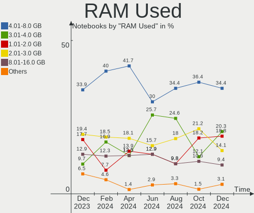
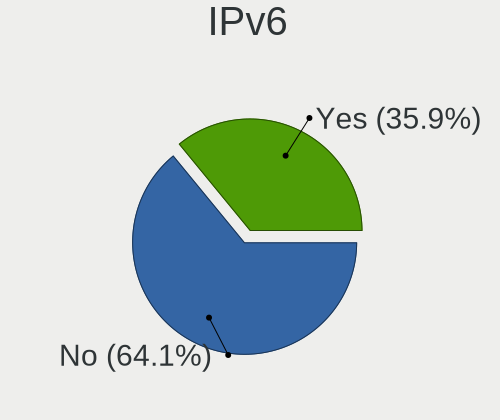

Manjaro Hardware Trends (Notebooks)
-----------------------------------

A project to identify most popular hardware characteristics and track their change
over time based on data collected by Manjaro users at https://Linux-Hardware.org.

Anyone can contribute to this report by the [hw-probe](https://github.com/linuxhw/hw-probe) tool:

    sudo -E hw-probe -all -upload

Full-feature report is available here: https://linux-hardware.org/?view=trends&formfactor=notebook

Period: Sep, 2021.

Contents
--------

* [ System ](#system)
  - [ OS                       ](#os)
  - [ OS Family                ](#os-family)
  - [ Kernel                   ](#kernel)
  - [ Kernel Family            ](#kernel-family)
  - [ Kernel Major Ver.        ](#kernel-major-ver)
  - [ Arch                     ](#arch)
  - [ DE                       ](#de)
  - [ Display Server           ](#display-server)
  - [ Display Manager          ](#display-manager)
  - [ OS Lang                  ](#os-lang)
  - [ Boot Mode                ](#boot-mode)
  - [ Filesystem               ](#filesystem)
  - [ Part. scheme             ](#part-scheme)
  - [ Dual Boot with Linux/BSD ](#dual-boot-with-linuxbsd)
  - [ Dual Boot (Win)          ](#dual-boot-win)

* [ Board ](#board)
  - [ Vendor                   ](#vendor)
  - [ Model                    ](#model)
  - [ Model Family             ](#model-family)
  - [ MFG Year                 ](#mfg-year)
  - [ Form Factor              ](#form-factor)
  - [ Secure Boot              ](#secure-boot)
  - [ Coreboot                 ](#coreboot)
  - [ RAM Size                 ](#ram-size)
  - [ RAM Used                 ](#ram-used)
  - [ Total Drives             ](#total-drives)
  - [ Has CD-ROM               ](#has-cd-rom)
  - [ Has Ethernet             ](#has-ethernet)
  - [ Has WiFi                 ](#has-wifi)
  - [ Has Bluetooth            ](#has-bluetooth)

* [ Location ](#location)
  - [ Country                  ](#country)
  - [ City                     ](#city)

* [ Drives ](#drives)
  - [ Drive Vendor             ](#drive-vendor)
  - [ Drive Model              ](#drive-model)
  - [ HDD Vendor               ](#hdd-vendor)
  - [ SSD Vendor               ](#ssd-vendor)
  - [ Drive Kind               ](#drive-kind)
  - [ Drive Connector          ](#drive-connector)
  - [ Drive Size               ](#drive-size)
  - [ Space Total              ](#space-total)
  - [ Space Used               ](#space-used)
  - [ Malfunc. Drives          ](#malfunc-drives)
  - [ Malfunc. Drive Vendor    ](#malfunc-drive-vendor)
  - [ Malfunc. HDD Vendor      ](#malfunc-hdd-vendor)
  - [ Malfunc. Drive Kind      ](#malfunc-drive-kind)
  - [ Failed Drives            ](#failed-drives)
  - [ Failed Drive Vendor      ](#failed-drive-vendor)
  - [ Drive Status             ](#drive-status)

* [ Storage controller ](#storage-controller)
  - [ Storage Vendor           ](#storage-vendor)
  - [ Storage Model            ](#storage-model)
  - [ Storage Kind             ](#storage-kind)

* [ Processor ](#processor)
  - [ CPU Vendor               ](#cpu-vendor)
  - [ CPU Model                ](#cpu-model)
  - [ CPU Model Family         ](#cpu-model-family)
  - [ CPU Cores                ](#cpu-cores)
  - [ CPU Sockets              ](#cpu-sockets)
  - [ CPU Threads              ](#cpu-threads)
  - [ CPU Op-Modes             ](#cpu-op-modes)
  - [ CPU Microcode            ](#cpu-microcode)
  - [ CPU Microarch            ](#cpu-microarch)

* [ Graphics ](#graphics)
  - [ GPU Vendor               ](#gpu-vendor)
  - [ GPU Model                ](#gpu-model)
  - [ GPU Combo                ](#gpu-combo)
  - [ GPU Driver               ](#gpu-driver)
  - [ GPU Memory               ](#gpu-memory)

* [ Monitor ](#monitor)
  - [ Monitor Vendor           ](#monitor-vendor)
  - [ Monitor Model            ](#monitor-model)
  - [ Monitor Resolution       ](#monitor-resolution)
  - [ Monitor Diagonal         ](#monitor-diagonal)
  - [ Monitor Width            ](#monitor-width)
  - [ Aspect Ratio             ](#aspect-ratio)
  - [ Monitor Area             ](#monitor-area)
  - [ Pixel Density            ](#pixel-density)
  - [ Multiple Monitors        ](#multiple-monitors)

* [ Network ](#network)
  - [ Net Controller Vendor    ](#net-controller-vendor)
  - [ Net Controller Model     ](#net-controller-model)
  - [ Wireless Vendor          ](#wireless-vendor)
  - [ Wireless Model           ](#wireless-model)
  - [ Ethernet Vendor          ](#ethernet-vendor)
  - [ Ethernet Model           ](#ethernet-model)
  - [ Net Controller Kind      ](#net-controller-kind)
  - [ Used Controller          ](#used-controller)
  - [ NICs                     ](#nics)
  - [ IPv6                     ](#ipv6)

* [ Bluetooth ](#bluetooth)
  - [ Bluetooth Vendor         ](#bluetooth-vendor)
  - [ Bluetooth Model          ](#bluetooth-model)

* [ Sound ](#sound)
  - [ Sound Vendor             ](#sound-vendor)
  - [ Sound Model              ](#sound-model)

* [ Memory ](#memory)
  - [ Memory Vendor            ](#memory-vendor)
  - [ Memory Model             ](#memory-model)
  - [ Memory Kind              ](#memory-kind)
  - [ Memory Form Factor       ](#memory-form-factor)
  - [ Memory Size              ](#memory-size)
  - [ Memory Speed             ](#memory-speed)

* [ Printers & scanners ](#printers--scanners)
  - [ Printer Vendor           ](#printer-vendor)
  - [ Printer Model            ](#printer-model)
  - [ Scanner Vendor           ](#scanner-vendor)
  - [ Scanner Model            ](#scanner-model)

* [ Camera ](#camera)
  - [ Camera Vendor            ](#camera-vendor)
  - [ Camera Model             ](#camera-model)

* [ Security ](#security)
  - [ Fingerprint Vendor       ](#fingerprint-vendor)
  - [ Fingerprint Model        ](#fingerprint-model)
  - [ Chipcard Vendor          ](#chipcard-vendor)
  - [ Chipcard Model           ](#chipcard-model)

* [ Unsupported ](#unsupported)
  - [ Unsupported Devices      ](#unsupported-devices)
  - [ Unsupported Device Types ](#unsupported-device-types)

System
------

OS
--

Installed operating systems

| Name           | Notebooks | Percent |
|----------------|-----------|---------|
| Manjaro        | 42        | 41.18%  |
| Manjaro 21.1.2 | 23        | 22.55%  |
| Manjaro 21.1.3 | 18        | 17.65%  |
| Manjaro 21.1.4 | 9         | 8.82%   |
| Manjaro 21.1.1 | 9         | 8.82%   |
| Manjaro 21.2.0 | 1         | 0.98%   |

OS Family
---------

OS without a version

| Name    | Notebooks | Percent |
|---------|-----------|---------|
| Manjaro | 102       | 100%    |

Kernel
------

Version of the Linux kernel

| Version                     | Notebooks | Percent |
|-----------------------------|-----------|---------|
| 5.13.13-1-MANJARO           | 19        | 18.63%  |
| 5.13.15-1-MANJARO           | 11        | 10.78%  |
| 5.10.61-1-MANJARO           | 11        | 10.78%  |
| 5.13.12-1-MANJARO           | 10        | 9.8%    |
| 5.14.2-1-MANJARO            | 7         | 6.86%   |
| 5.10.60-1-MANJARO           | 7         | 6.86%   |
| 5.14.7-2-MANJARO            | 6         | 5.88%   |
| 5.14.0-0-MANJARO            | 6         | 5.88%   |
| 5.10.63-1-MANJARO           | 4         | 3.92%   |
| 5.13.19-2-MANJARO           | 3         | 2.94%   |
| 5.9.16-1-MANJARO            | 2         | 1.96%   |
| 5.4.144-1-MANJARO           | 2         | 1.96%   |
| 5.14.0-1-MANJARO            | 2         | 1.96%   |
| 5.12.19-1-MANJARO           | 2         | 1.96%   |
| 5.10.68-1-MANJARO           | 2         | 1.96%   |
| 5.4.143-1-MANJARO           | 1         | 0.98%   |
| 5.14.8-hardened1-1-hardened | 1         | 0.98%   |
| 5.14.1-2-MANJARO            | 1         | 0.98%   |
| 5.14.1-1-MANJARO            | 1         | 0.98%   |
| 5.13.19-xanmod1-MANJARO     | 1         | 0.98%   |
| 5.11.6-1-MANJARO            | 1         | 0.98%   |
| 5.10.53-1-MANJARO           | 1         | 0.98%   |
| 5.10.52-3-rt47-MANJARO      | 1         | 0.98%   |

Kernel Family
-------------

Linux kernel without a distro release

| Version | Notebooks | Percent |
|---------|-----------|---------|
| 5.13.13 | 19        | 18.63%  |
| 5.13.15 | 11        | 10.78%  |
| 5.10.61 | 11        | 10.78%  |
| 5.13.12 | 10        | 9.8%    |
| 5.14.0  | 8         | 7.84%   |
| 5.14.2  | 7         | 6.86%   |
| 5.10.60 | 7         | 6.86%   |
| 5.14.7  | 6         | 5.88%   |
| 5.13.19 | 4         | 3.92%   |
| 5.10.63 | 4         | 3.92%   |
| 5.9.16  | 2         | 1.96%   |
| 5.4.144 | 2         | 1.96%   |
| 5.14.1  | 2         | 1.96%   |
| 5.12.19 | 2         | 1.96%   |
| 5.10.68 | 2         | 1.96%   |
| 5.4.143 | 1         | 0.98%   |
| 5.14.8  | 1         | 0.98%   |
| 5.11.6  | 1         | 0.98%   |
| 5.10.53 | 1         | 0.98%   |
| 5.10.52 | 1         | 0.98%   |

Kernel Major Ver.
-----------------

Linux kernel major version

| Version | Notebooks | Percent |
|---------|-----------|---------|
| 5.13    | 44        | 43.14%  |
| 5.10    | 26        | 25.49%  |
| 5.14    | 24        | 23.53%  |
| 5.4     | 3         | 2.94%   |
| 5.9     | 2         | 1.96%   |
| 5.12    | 2         | 1.96%   |
| 5.11    | 1         | 0.98%   |

Arch
----

OS architecture (x86_64, i586, etc.)

| Name   | Notebooks | Percent |
|--------|-----------|---------|
| x86_64 | 102       | 100%    |

DE
--

Desktop Environment

| Name            | Notebooks | Percent |
|-----------------|-----------|---------|
| KDE5            | 27        | 26.47%  |
| XFCE            | 25        | 24.51%  |
| GNOME           | 22        | 21.57%  |
| KDE             | 10        | 9.8%    |
| i3              | 4         | 3.92%   |
| Unknown         | 4         | 3.92%   |
| X-Cinnamon      | 3         | 2.94%   |
| MATE            | 3         | 2.94%   |
| LXQt            | 1         | 0.98%   |
| i3-with-shmlog  | 1         | 0.98%   |
| GNOME Flashback | 1         | 0.98%   |
| Deepin          | 1         | 0.98%   |

Display Server
--------------

X11 or Wayland

| Name    | Notebooks | Percent |
|---------|-----------|---------|
| X11     | 82        | 80.39%  |
| Wayland | 16        | 15.69%  |
| Unknown | 3         | 2.94%   |
| Tty     | 1         | 0.98%   |

Display Manager
---------------

SDDM, LightDM, etc.

| Name    | Notebooks | Percent |
|---------|-----------|---------|
| Unknown | 42        | 41.18%  |
| SDDM    | 25        | 24.51%  |
| LightDM | 22        | 21.57%  |
| GDM     | 13        | 12.75%  |

OS Lang
-------

Language

| Lang    | Notebooks | Percent |
|---------|-----------|---------|
| en_US   | 44        | 43.14%  |
| en_GB   | 10        | 9.8%    |
| de_DE   | 9         | 8.82%   |
| fr_FR   | 7         | 6.86%   |
| pt_BR   | 6         | 5.88%   |
| ru_UA   | 3         | 2.94%   |
| ru_RU   | 3         | 2.94%   |
| en_AU   | 3         | 2.94%   |
| tr_TR   | 2         | 1.96%   |
| it_IT   | 2         | 1.96%   |
| fi_FI   | 2         | 1.96%   |
| es_ES   | 2         | 1.96%   |
| zh_TW   | 1         | 0.98%   |
| pt_PT   | 1         | 0.98%   |
| ko_KR   | 1         | 0.98%   |
| eu_ES   | 1         | 0.98%   |
| es_MX   | 1         | 0.98%   |
| es_HN   | 1         | 0.98%   |
| es_BO   | 1         | 0.98%   |
| cs_CZ   | 1         | 0.98%   |
| Unknown | 1         | 0.98%   |

Boot Mode
---------

EFI or BIOS

| Mode | Notebooks | Percent |
|------|-----------|---------|
| EFI  | 54        | 52.94%  |
| BIOS | 48        | 47.06%  |

Filesystem
----------

Type of filesystem

| Type     | Notebooks | Percent |
|----------|-----------|---------|
| Ext4     | 83        | 81.37%  |
| Btrfs    | 14        | 13.73%  |
| Overlay  | 3         | 2.94%   |
| Xfs      | 1         | 0.98%   |
| Reiserfs | 1         | 0.98%   |

Part. scheme
------------

Scheme of partitioning

| Type    | Notebooks | Percent |
|---------|-----------|---------|
| GPT     | 55        | 53.92%  |
| Unknown | 39        | 38.24%  |
| MBR     | 8         | 7.84%   |

Dual Boot with Linux/BSD
------------------------

Hosting more than one Linux/BSD

| Dual boot | Notebooks | Percent |
|-----------|-----------|---------|
| No        | 90        | 88.24%  |
| Yes       | 12        | 11.76%  |

Dual Boot (Win)
---------------

Hosting Linux and Windows

| Dual boot | Notebooks | Percent |
|-----------|-----------|---------|
| No        | 73        | 71.57%  |
| Yes       | 29        | 28.43%  |

Board
-----

Vendor
------

Motherboard manufacturer

| Name                | Notebooks | Percent |
|---------------------|-----------|---------|
| Hewlett-Packard     | 23        | 22.55%  |
| Lenovo              | 20        | 19.61%  |
| Dell                | 20        | 19.61%  |
| ASUSTek Computer    | 11        | 10.78%  |
| Acer                | 8         | 7.84%   |
| Samsung Electronics | 3         | 2.94%   |
| MSI                 | 2         | 1.96%   |
| HUAWEI              | 2         | 1.96%   |
| Google              | 2         | 1.96%   |
| UNOWHY              | 1         | 0.98%   |
| TUXEDO              | 1         | 0.98%   |
| Toshiba             | 1         | 0.98%   |
| Semp Toshiba        | 1         | 0.98%   |
| Notebook            | 1         | 0.98%   |
| Monster             | 1         | 0.98%   |
| Gigabyte Technology | 1         | 0.98%   |
| eii                 | 1         | 0.98%   |
| Apple               | 1         | 0.98%   |
| Alienware           | 1         | 0.98%   |
| Unknown             | 1         | 0.98%   |

Model
-----

Motherboard model

| Name                                                  | Notebooks | Percent |
|-------------------------------------------------------|-----------|---------|
| HP Laptop 15-bs0xx                                    | 2         | 1.96%   |
| Dell XPS 15 9500                                      | 2         | 1.96%   |
| ASUS G751JT                                           | 2         | 1.96%   |
| Unknown                                               | 2         | 1.96%   |
| UNOWHY Y13G010S4EI                                    | 1         | 0.98%   |
| Toshiba Satellite NB10t-A-102                         | 1         | 0.98%   |
| Semp Toshiba IS 1412                                  | 1         | 0.98%   |
| Samsung RV420/RV520/RV720/E3530/S3530/E3420/E3520     | 1         | 0.98%   |
| Samsung 730QCJ/730QCR                                 | 1         | 0.98%   |
| Samsung 300E5EV/300E4EV/270E5EV/270E4EV/2470EV/2470EE | 1         | 0.98%   |
| Notebook W65_W67RN,RC1,RCY                            | 1         | 0.98%   |
| MSI MS-168A                                           | 1         | 0.98%   |
| MSI GS76 Stealth 11UH                                 | 1         | 0.98%   |
| Monster TULPAR T7 V24.1                               | 1         | 0.98%   |
| Lenovo V130-15IKB 81HN                                | 1         | 0.98%   |
| Lenovo ThinkPad X230 2324CD1                          | 1         | 0.98%   |
| Lenovo ThinkPad X1 Carbon 5th 20HQS1V700              | 1         | 0.98%   |
| Lenovo ThinkPad T470 W10DG 20JNS09G1T                 | 1         | 0.98%   |
| Lenovo ThinkPad T430s 2356GPU                         | 1         | 0.98%   |
| Lenovo ThinkPad T14 Gen 2a 20XK0015US                 | 1         | 0.98%   |
| Lenovo ThinkPad E460 20ET0014LM                       | 1         | 0.98%   |
| Lenovo ThinkPad E14 Gen 3 20Y7003XGE                  | 1         | 0.98%   |
| Lenovo Legion 5 15ACH6H 82JU                          | 1         | 0.98%   |
| Lenovo IdeaPad S340-15IML 81NA                        | 1         | 0.98%   |
| Lenovo IdeaPad Gaming 3 15IMH05 81Y4                  | 1         | 0.98%   |
| Lenovo IdeaPad Gaming 3 15ARH05 82EY                  | 1         | 0.98%   |
| Lenovo IdeaPad 5 Pro 14ACN6 82L7                      | 1         | 0.98%   |
| Lenovo IdeaPad 5 15ARE05 81YQ                         | 1         | 0.98%   |
| Lenovo IdeaPad 5 14IIL05 81YH                         | 1         | 0.98%   |
| Lenovo IdeaPad 5 14ALC05 82LM                         | 1         | 0.98%   |
| Lenovo IdeaPad 330-17IKB 81DM                         | 1         | 0.98%   |
| Lenovo IdeaPad 100-14IBD 80RK                         | 1         | 0.98%   |
| Lenovo G50-80 80L0                                    | 1         | 0.98%   |
| Lenovo B570e HuronRiver Platform                      | 1         | 0.98%   |
| HUAWEI MACH-WX9                                       | 1         | 0.98%   |
| HUAWEI BOHK-WAX9X                                     | 1         | 0.98%   |
| HP ZBook Studio G5                                    | 1         | 0.98%   |
| HP ZBook 17 G6                                        | 1         | 0.98%   |
| HP ProBook 440 G6                                     | 1         | 0.98%   |
| HP Pro Tablet 608 G1                                  | 1         | 0.98%   |
| HP Pavilion Gaming Laptop 15z-ec200                   | 1         | 0.98%   |
| HP Pavilion Gaming Laptop 15-dk1xxx                   | 1         | 0.98%   |
| HP Pavilion dv6500                                    | 1         | 0.98%   |
| HP Pavilion dv6                                       | 1         | 0.98%   |
| HP Pavilion 15                                        | 1         | 0.98%   |
| HP Notebook                                           | 1         | 0.98%   |
| HP Laptop 17-ak0xx                                    | 1         | 0.98%   |
| HP Laptop 15s-eq2xxx                                  | 1         | 0.98%   |
| HP G72                                                | 1         | 0.98%   |
| HP ENVY dv6                                           | 1         | 0.98%   |
| HP EliteBook 8470p                                    | 1         | 0.98%   |
| HP EliteBook 840 G2                                   | 1         | 0.98%   |
| HP 255 G4                                             | 1         | 0.98%   |
| HP 250 G7 Notebook PC                                 | 1         | 0.98%   |
| HP 250 G6 Notebook PC                                 | 1         | 0.98%   |
| HP 250 G5 Notebook PC                                 | 1         | 0.98%   |
| HP 240 G7 Notebook PC                                 | 1         | 0.98%   |
| Google Delbin                                         | 1         | 0.98%   |
| Google Akemi                                          | 1         | 0.98%   |
| Gigabyte Sabre 17KV8                                  | 1         | 0.98%   |

Model Family
------------

Motherboard model prefix

| Name               | Notebooks | Percent |
|--------------------|-----------|---------|
| Lenovo IdeaPad     | 9         | 8.82%   |
| Dell XPS           | 8         | 7.84%   |
| Lenovo ThinkPad    | 7         | 6.86%   |
| HP Pavilion        | 5         | 4.9%    |
| HP Laptop          | 4         | 3.92%   |
| Dell Latitude      | 4         | 3.92%   |
| Dell Inspiron      | 4         | 3.92%   |
| Acer Aspire        | 4         | 3.92%   |
| HP 250             | 3         | 2.94%   |
| ASUS ROG           | 3         | 2.94%   |
| Acer Swift         | 3         | 2.94%   |
| HP ZBook           | 2         | 1.96%   |
| HP EliteBook       | 2         | 1.96%   |
| Dell Vostro        | 2         | 1.96%   |
| Dell Precision     | 2         | 1.96%   |
| ASUS G751JT        | 2         | 1.96%   |
| Unknown            | 2         | 1.96%   |
| UNOWHY Y13G010S4EI | 1         | 0.98%   |
| Toshiba Satellite  | 1         | 0.98%   |
| Semp Toshiba IS    | 1         | 0.98%   |
| Samsung RV420      | 1         | 0.98%   |
| Samsung 730QCJ     | 1         | 0.98%   |
| Samsung 300E5EV    | 1         | 0.98%   |
| Notebook W65       | 1         | 0.98%   |
| MSI MS-168A        | 1         | 0.98%   |
| MSI GS76           | 1         | 0.98%   |
| Monster TULPAR     | 1         | 0.98%   |
| Lenovo V130-15IKB  | 1         | 0.98%   |
| Lenovo Legion      | 1         | 0.98%   |
| Lenovo G50-80      | 1         | 0.98%   |
| Lenovo B570e       | 1         | 0.98%   |
| HUAWEI MACH-WX9    | 1         | 0.98%   |
| HUAWEI BOHK-WAX9X  | 1         | 0.98%   |
| HP ProBook         | 1         | 0.98%   |
| HP Pro             | 1         | 0.98%   |
| HP Notebook        | 1         | 0.98%   |
| HP G72             | 1         | 0.98%   |
| HP ENVY            | 1         | 0.98%   |
| HP 255             | 1         | 0.98%   |
| HP 240             | 1         | 0.98%   |
| Google Delbin      | 1         | 0.98%   |
| Google Akemi       | 1         | 0.98%   |
| Gigabyte Sabre     | 1         | 0.98%   |
| eii Ezpad          | 1         | 0.98%   |
| ASUS X540LA        | 1         | 0.98%   |
| ASUS X45U          | 1         | 0.98%   |
| ASUS VivoBook      | 1         | 0.98%   |
| ASUS UX303UB       | 1         | 0.98%   |
| ASUS G73Jh         | 1         | 0.98%   |
| ASUS F5VL          | 1         | 0.98%   |
| Apple MacBookPro9  | 1         | 0.98%   |
| Alienware m17      | 1         | 0.98%   |
| Acer Predator      | 1         | 0.98%   |

MFG Year
--------

Motherboard manufacture year

| Year | Notebooks | Percent |
|------|-----------|---------|
| 2021 | 27        | 26.47%  |
| 2020 | 18        | 17.65%  |
| 2019 | 15        | 14.71%  |
| 2018 | 8         | 7.84%   |
| 2011 | 6         | 5.88%   |
| 2016 | 5         | 4.9%    |
| 2015 | 5         | 4.9%    |
| 2014 | 4         | 3.92%   |
| 2013 | 4         | 3.92%   |
| 2017 | 3         | 2.94%   |
| 2012 | 2         | 1.96%   |
| 2007 | 2         | 1.96%   |
| 2010 | 1         | 0.98%   |
| 2009 | 1         | 0.98%   |
| 2008 | 1         | 0.98%   |

Form Factor
-----------

Physical design of the computer

| Name     | Notebooks | Percent |
|----------|-----------|---------|
| Notebook | 102       | 100%    |

Secure Boot
-----------

Enabled or disabled

| State    | Notebooks | Percent |
|----------|-----------|---------|
| Disabled | 102       | 100%    |

Coreboot
--------

Have coreboot on board

| Used | Notebooks | Percent |
|------|-----------|---------|
| No   | 100       | 98.04%  |
| Yes  | 2         | 1.96%   |

RAM Size
--------

Total RAM memory

| Size in GB  | Notebooks | Percent |
|-------------|-----------|---------|
| 4.01-8.0    | 33        | 32.35%  |
| 16.01-24.0  | 23        | 22.55%  |
| 3.01-4.0    | 17        | 16.67%  |
| 8.01-16.0   | 15        | 14.71%  |
| 32.01-64.0  | 10        | 9.8%    |
| 24.01-32.0  | 1         | 0.98%   |
| 2.01-3.0    | 1         | 0.98%   |
| 64.01-256.0 | 1         | 0.98%   |
| 1.01-2.0    | 1         | 0.98%   |

RAM Used
--------

Used RAM memory

| Used GB    | Notebooks | Percent |
|------------|-----------|---------|
| 2.01-3.0   | 27        | 26.47%  |
| 1.01-2.0   | 24        | 23.53%  |
| 4.01-8.0   | 22        | 21.57%  |
| 3.01-4.0   | 15        | 14.71%  |
| 8.01-16.0  | 6         | 5.88%   |
| 0.51-1.0   | 6         | 5.88%   |
| 16.01-24.0 | 2         | 1.96%   |

Total Drives
------------

Number of drives on board

| Drives | Notebooks | Percent |
|--------|-----------|---------|
| 1      | 71        | 69.61%  |
| 2      | 28        | 27.45%  |
| 3      | 3         | 2.94%   |

Has CD-ROM
----------

Has CD-ROM on board

| Presented | Notebooks | Percent |
|-----------|-----------|---------|
| No        | 71        | 69.61%  |
| Yes       | 31        | 30.39%  |

Has Ethernet
------------

Has Ethernet on board

| Presented | Notebooks | Percent |
|-----------|-----------|---------|
| Yes       | 80        | 78.43%  |
| No        | 22        | 21.57%  |

Has WiFi
--------

Has WiFi module

| Presented | Notebooks | Percent |
|-----------|-----------|---------|
| Yes       | 100       | 98.04%  |
| No        | 2         | 1.96%   |

Has Bluetooth
-------------

Has Bluetooth module

| Presented | Notebooks | Percent |
|-----------|-----------|---------|
| Yes       | 80        | 78.43%  |
| No        | 22        | 21.57%  |

Location
--------

Country
-------

Geographic location (country)

| Country            | Notebooks | Percent |
|--------------------|-----------|---------|
| USA                | 15        | 14.71%  |
| Germany            | 12        | 11.76%  |
| France             | 9         | 8.82%   |
| Russia             | 7         | 6.86%   |
| UK                 | 6         | 5.88%   |
| Brazil             | 6         | 5.88%   |
| Ukraine            | 4         | 3.92%   |
| Spain              | 4         | 3.92%   |
| Turkey             | 3         | 2.94%   |
| Taiwan             | 3         | 2.94%   |
| Italy              | 3         | 2.94%   |
| Australia          | 3         | 2.94%   |
| Poland             | 2         | 1.96%   |
| India              | 2         | 1.96%   |
| Finland            | 2         | 1.96%   |
| Sudan              | 1         | 0.98%   |
| South Korea        | 1         | 0.98%   |
| South Africa       | 1         | 0.98%   |
| Slovakia           | 1         | 0.98%   |
| Romania            | 1         | 0.98%   |
| Portugal           | 1         | 0.98%   |
| Netherlands        | 1         | 0.98%   |
| Mexico             | 1         | 0.98%   |
| Malaysia           | 1         | 0.98%   |
| Israel             | 1         | 0.98%   |
| Iran               | 1         | 0.98%   |
| Indonesia          | 1         | 0.98%   |
| Hungary            | 1         | 0.98%   |
| Honduras           | 1         | 0.98%   |
| Dominican Republic | 1         | 0.98%   |
| Czechia            | 1         | 0.98%   |
| Canada             | 1         | 0.98%   |
| Bolivia            | 1         | 0.98%   |
| Bangladesh         | 1         | 0.98%   |
| Azerbaijan         | 1         | 0.98%   |
| Austria            | 1         | 0.98%   |

City
----

Geographic location (city)

| City                       | Notebooks | Percent |
|----------------------------|-----------|---------|
| Taoyuan District           | 2         | 1.96%   |
| St Petersburg              | 2         | 1.96%   |
| Rome                       | 2         | 1.96%   |
| Moscow                     | 2         | 1.96%   |
| Madrid                     | 2         | 1.96%   |
| Lille                      | 2         | 1.96%   |
| Greoux-les-Bains           | 2         | 1.96%   |
| Bengaluru                  | 2         | 1.96%   |
| Yekaterinburg              | 1         | 0.98%   |
| Winston-Salem              | 1         | 0.98%   |
| Windermere                 | 1         | 0.98%   |
| Walldorf                   | 1         | 0.98%   |
| Vyhne                      | 1         | 0.98%   |
| Viersen                    | 1         | 0.98%   |
| Vienna                     | 1         | 0.98%   |
| Torun                      | 1         | 0.98%   |
| Tel Aviv                   | 1         | 0.98%   |
| Tehran                     | 1         | 0.98%   |
| Tegucigalpa                | 1         | 0.98%   |
| Tangerang                  | 1         | 0.98%   |
| Taichung                   | 1         | 0.98%   |
| Sydney                     | 1         | 0.98%   |
| St Louis                   | 1         | 0.98%   |
| Sindelfingen               | 1         | 0.98%   |
| Sesto San Giovanni         | 1         | 0.98%   |
| Seongbuk-gu                | 1         | 0.98%   |
| Santiago de los Caballeros | 1         | 0.98%   |
| Sabirabad                  | 1         | 0.98%   |
| Roche-la-Moliere           | 1         | 0.98%   |
| Rennes                     | 1         | 0.98%   |
| Recife                     | 1         | 0.98%   |
| Quinta Do Conde            | 1         | 0.98%   |
| Puebla City                | 1         | 0.98%   |
| Prague                     | 1         | 0.98%   |
| Poplar                     | 1         | 0.98%   |
| Pflugerville               | 1         | 0.98%   |
| Perm                       | 1         | 0.98%   |
| Periers                    | 1         | 0.98%   |
| Pasadena                   | 1         | 0.98%   |
| Paris                      | 1         | 0.98%   |
| Oldenburg                  | 1         | 0.98%   |
| Nottingham                 | 1         | 0.98%   |
| Noisy-le-Grand             | 1         | 0.98%   |
| Munich                     | 1         | 0.98%   |
| Montreal                   | 1         | 0.98%   |
| Mersin                     | 1         | 0.98%   |
| Mansfield                  | 1         | 0.98%   |
| Lviv                       | 1         | 0.98%   |
| Los Angeles                | 1         | 0.98%   |
| Long Beach                 | 1         | 0.98%   |
| Londrina                   | 1         | 0.98%   |
| London                     | 1         | 0.98%   |
| Little Rock                | 1         | 0.98%   |
| Lindenhurst                | 1         | 0.98%   |
| Lesnoy Gorodok             | 1         | 0.98%   |
| La Paz                     | 1         | 0.98%   |
| La Cavada                  | 1         | 0.98%   |
| Kyiv                       | 1         | 0.98%   |
| Kuala Lumpur               | 1         | 0.98%   |
| Kherson                    | 1         | 0.98%   |

Drives
------

Drive Vendor
------------

Hard drive vendors

| Vendor                         | Notebooks | Drives | Percent |
|--------------------------------|-----------|--------|---------|
| Samsung Electronics            | 21        | 24     | 16.41%  |
| WDC                            | 12        | 12     | 9.38%   |
| SK Hynix                       | 12        | 12     | 9.38%   |
| Toshiba                        | 11        | 11     | 8.59%   |
| Seagate                        | 9         | 9      | 7.03%   |
| SanDisk                        | 9         | 11     | 7.03%   |
| Kingston                       | 7         | 7      | 5.47%   |
| Unknown                        | 5         | 7      | 3.91%   |
| Micron Technology              | 5         | 5      | 3.91%   |
| HGST                           | 5         | 5      | 3.91%   |
| Crucial                        | 5         | 5      | 3.91%   |
| Intel                          | 3         | 3      | 2.34%   |
| Hitachi                        | 3         | 3      | 2.34%   |
| Patriot                        | 2         | 2      | 1.56%   |
| KIOXIA                         | 2         | 2      | 1.56%   |
| USB3.2                         | 1         | 1      | 0.78%   |
| Union Memory (Shenzhen)        | 1         | 1      | 0.78%   |
| Transcend                      | 1         | 1      | 0.78%   |
| Solid State Storage Technology | 1         | 1      | 0.78%   |
| Solid State Storage            | 1         | 1      | 0.78%   |
| Silicon Motion                 | 1         | 1      | 0.78%   |
| PLEXTOR                        | 1         | 1      | 0.78%   |
| OSCOO                          | 1         | 1      | 0.78%   |
| OCZ                            | 1         | 1      | 0.78%   |
| LITEON                         | 1         | 1      | 0.78%   |
| KingSpec                       | 1         | 1      | 0.78%   |
| JMicron                        | 1         | 1      | 0.78%   |
| Hewlett-Packard                | 1         | 1      | 0.78%   |
| Fujitsu                        | 1         | 1      | 0.78%   |
| China                          | 1         | 1      | 0.78%   |
| Biostar                        | 1         | 1      | 0.78%   |
| A-DATA Technology              | 1         | 1      | 0.78%   |

Drive Model
-----------

Hard drive models

| Model                                        | Notebooks | Percent |
|----------------------------------------------|-----------|---------|
| Toshiba MQ01ABD100 1TB                       | 4         | 2.99%   |
| SK Hynix NVMe SSD Drive 512GB                | 3         | 2.24%   |
| Samsung NVMe SSD Drive 256GB                 | 3         | 2.24%   |
| Intel SSDPEKNW512G8 512GB                    | 3         | 2.24%   |
| HGST HTS721010A9E630 1TB                     | 3         | 2.24%   |
| Unknown MMC Card  64GB                       | 2         | 1.49%   |
| Unknown MMC Card  128GB                      | 2         | 1.49%   |
| Toshiba NVMe SSD Drive 512GB                 | 2         | 1.49%   |
| Seagate ST500LM012 HN-M500MBB 500GB          | 2         | 1.49%   |
| Sandisk NVMe SSD Drive 1024GB                | 2         | 1.49%   |
| Samsung NVMe SSD Drive 512GB                 | 2         | 1.49%   |
| Micron 1100_MTFDDAV256TBN 256GB SSD          | 2         | 1.49%   |
| WDC WDS100T2B0B 1TB SSD                      | 1         | 0.75%   |
| WDC WDBNCE5000PNC 500GB SSD                  | 1         | 0.75%   |
| WDC WD5000LPVX-22V0TT0 500GB                 | 1         | 0.75%   |
| WDC WD5000LPLX-60ZNTT0 500GB                 | 1         | 0.75%   |
| WDC WD5000BEVT-22ZAT0 500GB                  | 1         | 0.75%   |
| WDC WD10SPZX-24Z10 1TB                       | 1         | 0.75%   |
| WDC WD10JPVX-22JC3T0 1TB                     | 1         | 0.75%   |
| WDC WD10JPVT-75A1YT0 1TB                     | 1         | 0.75%   |
| WDC WD10JPLX-00MBPT0 1TB                     | 1         | 0.75%   |
| WDC PC SN720 SDAPNTW-1T00-1006 1TB           | 1         | 0.75%   |
| WDC PC SN530 SDBPNPZ-1T00-1114 1TB           | 1         | 0.75%   |
| WDC PC SN530 SDBPMPZ-512G-1101 512GB         | 1         | 0.75%   |
| USB3.2 FLASH DRIVE 250GB                     | 1         | 0.75%   |
| Unknown MMC Card  32GB                       | 1         | 0.75%   |
| Unknown HCG4a2  64GB                         | 1         | 0.75%   |
| Unknown ED4QT  128GB                         | 1         | 0.75%   |
| Union Memory (Shenzhen) NVMe SSD Drive 128GB | 1         | 0.75%   |
| Transcend TS128GSSD370S 128GB                | 1         | 0.75%   |
| Toshiba MQ01ABF050 500GB                     | 1         | 0.75%   |
| Toshiba MK2555GSX 250GB                      | 1         | 0.75%   |
| Toshiba KXG60ZNV512G NVMe KIOXIA 512GB       | 1         | 0.75%   |
| Toshiba KBG30ZMV256G 256GB                   | 1         | 0.75%   |
| Toshiba KBG30ZMS128G 128GB NVMe SSD          | 1         | 0.75%   |
| Solid State Storage NVMe SSD Drive 512GB     | 1         | 0.75%   |
| Solid State Storage SSSTC CL1-4D512 512GB    | 1         | 0.75%   |
| SK Hynix SKHynix_HFM512GDHTNI-87A0B 512GB    | 1         | 0.75%   |
| SK Hynix SKHynix_HFM512GD3HX015N 512GB       | 1         | 0.75%   |
| SK Hynix SC311 SATA 256GB SSD                | 1         | 0.75%   |
| SK Hynix PC611 NVMe 512GB                    | 1         | 0.75%   |
| SK Hynix NVMe SSD Drive 1TB                  | 1         | 0.75%   |
| SK Hynix NVMe SSD Drive 128GB                | 1         | 0.75%   |
| SK Hynix HFS256G3BTND-N210A 256GB SSD        | 1         | 0.75%   |
| SK Hynix HFS256G32MND-2200A 256GB SSD        | 1         | 0.75%   |
| SK Hynix HFM512GD3JX016N 512GB               | 1         | 0.75%   |
| Silicon Motion NVMe SSD Drive 256GB          | 1         | 0.75%   |
| Seagate ST9750420AS 752GB                    | 1         | 0.75%   |
| Seagate ST9320320AS 320GB                    | 1         | 0.75%   |
| Seagate ST640LM000 HM641JI 640GB             | 1         | 0.75%   |
| Seagate ST500VT000-1DK142 500GB              | 1         | 0.75%   |
| Seagate ST500LM021-1KJ152 500GB              | 1         | 0.75%   |
| Seagate ST2000LM 003 HN-M201RAD 2TB          | 1         | 0.75%   |
| Seagate Expansion 1TB                        | 1         | 0.75%   |
| SanDisk SSD PLUS 1000GB                      | 1         | 0.75%   |
| SanDisk SSD 128G                             | 1         | 0.75%   |
| SanDisk SD8TN8U-256G-1006 256GB SSD          | 1         | 0.75%   |
| SanDisk SD8SBBU480G1122 480GB SSD            | 1         | 0.75%   |
| Sandisk NVMe SSD Drive 512GB                 | 1         | 0.75%   |
| Sandisk NVMe SSD Drive 1TB                   | 1         | 0.75%   |

HDD Vendor
----------

Hard disk drive vendors

| Vendor  | Notebooks | Drives | Percent |
|---------|-----------|--------|---------|
| Seagate | 9         | 9      | 29.03%  |
| WDC     | 7         | 7      | 22.58%  |
| Toshiba | 6         | 6      | 19.35%  |
| HGST    | 5         | 5      | 16.13%  |
| Hitachi | 3         | 3      | 9.68%   |
| Fujitsu | 1         | 1      | 3.23%   |

SSD Vendor
----------

Solid state drive vendors

| Vendor              | Notebooks | Drives | Percent |
|---------------------|-----------|--------|---------|
| Samsung Electronics | 8         | 8      | 20%     |
| SanDisk             | 5         | 5      | 12.5%   |
| Kingston            | 4         | 4      | 10%     |
| Crucial             | 4         | 4      | 10%     |
| SK Hynix            | 3         | 3      | 7.5%    |
| Micron Technology   | 3         | 3      | 7.5%    |
| WDC                 | 2         | 2      | 5%      |
| Patriot             | 2         | 2      | 5%      |
| Transcend           | 1         | 1      | 2.5%    |
| PLEXTOR             | 1         | 1      | 2.5%    |
| OCZ                 | 1         | 1      | 2.5%    |
| LITEON              | 1         | 1      | 2.5%    |
| KingSpec            | 1         | 1      | 2.5%    |
| Hewlett-Packard     | 1         | 1      | 2.5%    |
| China               | 1         | 1      | 2.5%    |
| Biostar             | 1         | 1      | 2.5%    |
| A-DATA Technology   | 1         | 1      | 2.5%    |

Drive Kind
----------

HDD or SSD

| Kind    | Notebooks | Drives | Percent |
|---------|-----------|--------|---------|
| NVMe    | 45        | 53     | 36.89%  |
| SSD     | 38        | 40     | 31.15%  |
| HDD     | 30        | 31     | 24.59%  |
| MMC     | 6         | 8      | 4.92%   |
| Unknown | 3         | 3      | 2.46%   |

Drive Connector
---------------

SATA, SAS, NVMe, etc.

| Type | Notebooks | Drives | Percent |
|------|-----------|--------|---------|
| SATA | 60        | 69     | 51.72%  |
| NVMe | 45        | 53     | 38.79%  |
| MMC  | 6         | 8      | 5.17%   |
| SAS  | 5         | 5      | 4.31%   |

Drive Size
----------

Size of hard drive

| Size in TB | Notebooks | Drives | Percent |
|------------|-----------|--------|---------|
| 0.01-0.5   | 46        | 48     | 66.67%  |
| 0.51-1.0   | 19        | 19     | 27.54%  |
| 1.01-2.0   | 4         | 4      | 5.8%    |

Space Total
-----------

Amount of disk space available on the file system

| Size in GB     | Notebooks | Percent |
|----------------|-----------|---------|
| 251-500        | 30        | 29.41%  |
| 101-250        | 24        | 23.53%  |
| 1001-2000      | 12        | 11.76%  |
| 501-1000       | 11        | 10.78%  |
| 51-100         | 8         | 7.84%   |
| 1-20           | 5         | 4.9%    |
| Unknown        | 5         | 4.9%    |
| 21-50          | 3         | 2.94%   |
| More than 3000 | 2         | 1.96%   |
| 2001-3000      | 2         | 1.96%   |

Space Used
----------

Amount of used disk space

| Used GB   | Notebooks | Percent |
|-----------|-----------|---------|
| 101-250   | 23        | 22.55%  |
| 21-50     | 20        | 19.61%  |
| 1-20      | 19        | 18.63%  |
| 51-100    | 18        | 17.65%  |
| 251-500   | 8         | 7.84%   |
| 501-1000  | 6         | 5.88%   |
| Unknown   | 5         | 4.9%    |
| 1001-2000 | 3         | 2.94%   |

Malfunc. Drives
---------------

Drive models with a malfunction

| Model                               | Notebooks | Drives | Percent |
|-------------------------------------|-----------|--------|---------|
| Toshiba MQ01ABD100 1TB              | 2         | 2      | 25%     |
| Seagate ST500LM021-1KJ152 500GB     | 1         | 1      | 12.5%   |
| SanDisk SD8TN8U-256G-1006 256GB SSD | 1         | 1      | 12.5%   |
| LITEON CV8-8E128-HP 128GB SSD       | 1         | 1      | 12.5%   |
| Hitachi HTS545032A7E380 320GB       | 1         | 1      | 12.5%   |
| HGST HTS721010A9E630 1TB            | 1         | 1      | 12.5%   |
| HGST HTS545050A7E680 500GB          | 1         | 1      | 12.5%   |

Malfunc. Drive Vendor
---------------------

Vendors of faulty drives

| Vendor  | Notebooks | Drives | Percent |
|---------|-----------|--------|---------|
| Toshiba | 2         | 2      | 25%     |
| HGST    | 2         | 2      | 25%     |
| Seagate | 1         | 1      | 12.5%   |
| SanDisk | 1         | 1      | 12.5%   |
| LITEON  | 1         | 1      | 12.5%   |
| Hitachi | 1         | 1      | 12.5%   |

Malfunc. HDD Vendor
-------------------

Vendors of faulty HDD drives

| Vendor  | Notebooks | Drives | Percent |
|---------|-----------|--------|---------|
| Toshiba | 2         | 2      | 33.33%  |
| HGST    | 2         | 2      | 33.33%  |
| Seagate | 1         | 1      | 16.67%  |
| Hitachi | 1         | 1      | 16.67%  |

Malfunc. Drive Kind
-------------------

Kinds of faulty drives

| Kind | Notebooks | Drives | Percent |
|------|-----------|--------|---------|
| HDD  | 6         | 6      | 75%     |
| SSD  | 2         | 2      | 25%     |

Failed Drives
-------------

Failed drive models

Zero info for selected period =(

Failed Drive Vendor
-------------------

Failed drive vendors

Zero info for selected period =(

Drive Status
------------

Number of failed and malfunc. drives

| Status   | Notebooks | Drives | Percent |
|----------|-----------|--------|---------|
| Detected | 55        | 67     | 49.55%  |
| Works    | 48        | 60     | 43.24%  |
| Malfunc  | 8         | 8      | 7.21%   |

Storage controller
------------------

Storage Vendor
--------------

Storage controller vendors

| Vendor                           | Notebooks | Percent |
|----------------------------------|-----------|---------|
| Intel                            | 66        | 52.8%   |
| Samsung Electronics              | 14        | 11.2%   |
| AMD                              | 13        | 10.4%   |
| SK Hynix                         | 9         | 7.2%    |
| Sandisk                          | 6         | 4.8%    |
| Toshiba America Info Systems     | 5         | 4%      |
| Kingston Technology Company      | 3         | 2.4%    |
| Micron Technology                | 2         | 1.6%    |
| KIOXIA                           | 2         | 1.6%    |
| Union Memory (Shenzhen)          | 1         | 0.8%    |
| Solid State Storage Technology   | 1         | 0.8%    |
| Silicon Motion                   | 1         | 0.8%    |
| Silicon Integrated Systems [SiS] | 1         | 0.8%    |
| Micron/Crucial Technology        | 1         | 0.8%    |

Storage Model
-------------

Storage controller models

| Model                                                                            | Notebooks | Percent |
|----------------------------------------------------------------------------------|-----------|---------|
| AMD FCH SATA Controller [AHCI mode]                                              | 13        | 10%     |
| Intel Sunrise Point-LP SATA Controller [AHCI mode]                               | 10        | 7.69%   |
| Samsung NVMe SSD Controller SM981/PM981/PM983                                    | 8         | 6.15%   |
| Intel 7 Series Chipset Family 6-port SATA Controller [AHCI mode]                 | 7         | 5.38%   |
| Intel 82801 Mobile SATA Controller [RAID mode]                                   | 6         | 4.62%   |
| Intel 6 Series/C200 Series Chipset Family 6 port Mobile SATA AHCI Controller     | 5         | 3.85%   |
| SK Hynix Gold P31 SSD                                                            | 4         | 3.08%   |
| Samsung NVMe SSD Controller 980                                                  | 4         | 3.08%   |
| Intel Wildcat Point-LP SATA Controller [AHCI Mode]                               | 4         | 3.08%   |
| Intel Cannon Lake Mobile PCH SATA AHCI Controller                                | 4         | 3.08%   |
| Intel 5 Series/3400 Series Chipset 4 port SATA AHCI Controller                   | 4         | 3.08%   |
| Samsung NVMe SSD Controller PM9A1/PM9A3/980PRO                                   | 3         | 2.31%   |
| Intel SSD 660P Series                                                            | 3         | 2.31%   |
| Intel Celeron/Pentium Silver Processor SATA Controller                           | 3         | 2.31%   |
| Toshiba America Info Systems XG6 NVMe SSD Controller                             | 2         | 1.54%   |
| Toshiba America Info Systems Toshiba America Info Non-Volatile memory controller | 2         | 1.54%   |
| SK Hynix Non-Volatile memory controller                                          | 2         | 1.54%   |
| Sandisk WD Blue SN550 NVMe SSD                                                   | 2         | 1.54%   |
| Sandisk Non-Volatile memory controller                                           | 2         | 1.54%   |
| Micron Non-Volatile memory controller                                            | 2         | 1.54%   |
| KIOXIA Non-Volatile memory controller                                            | 2         | 1.54%   |
| Kingston Company Company Non-Volatile memory controller                          | 2         | 1.54%   |
| Intel HM170/QM170 Chipset SATA Controller [AHCI Mode]                            | 2         | 1.54%   |
| Intel Comet Lake SATA AHCI Controller                                            | 2         | 1.54%   |
| Intel Atom Processor E3800 Series SATA AHCI Controller                           | 2         | 1.54%   |
| Intel 82801IBM/IEM (ICH9M/ICH9M-E) 4 port SATA Controller [AHCI mode]            | 2         | 1.54%   |
| Intel 8 Series/C220 Series Chipset Family 6-port SATA Controller 1 [AHCI mode]   | 2         | 1.54%   |
| Intel 8 Series SATA Controller 1 [AHCI mode]                                     | 2         | 1.54%   |
| Intel 400 Series Chipset Family SATA AHCI Controller                             | 2         | 1.54%   |
| Union Memory (Shenzhen) Non-Volatile memory controller                           | 1         | 0.77%   |
| Toshiba America Info Systems BG3 NVMe SSD Controller                             | 1         | 0.77%   |
| Solid State Storage Non-Volatile memory controller                               | 1         | 0.77%   |
| SK Hynix PC300 NVMe Solid State Drive 512GB                                      | 1         | 0.77%   |
| SK Hynix BC511                                                                   | 1         | 0.77%   |
| SK Hynix BC501 NVMe Solid State Drive                                            | 1         | 0.77%   |
| Silicon Motion Non-Volatile memory controller                                    | 1         | 0.77%   |
| Silicon Integrated Systems [SiS] SATA Controller / IDE mode                      | 1         | 0.77%   |
| Silicon Integrated Systems [SiS] 5513 IDE Controller                             | 1         | 0.77%   |
| Sandisk WD Black SN750 / PC SN730 NVMe SSD                                       | 1         | 0.77%   |
| Sandisk WD Black 2018/SN750 / PC SN720 NVMe SSD                                  | 1         | 0.77%   |
| Micron/Crucial NVMe Controller                                                   | 1         | 0.77%   |
| Kingston Company A2000 NVMe SSD                                                  | 1         | 0.77%   |
| Intel Volume Management Device NVMe RAID Controller                              | 1         | 0.77%   |
| Intel Celeron N3350/Pentium N4200/Atom E3900 Series SATA AHCI Controller         | 1         | 0.77%   |
| Intel Cannon Point-LP SATA Controller [AHCI Mode]                                | 1         | 0.77%   |
| Intel Atom/Celeron/Pentium Processor x5-E8000/J3xxx/N3xxx Series SATA Controller | 1         | 0.77%   |
| Intel 82801IBM/IEM (ICH9M/ICH9M-E) 2 port SATA Controller [IDE mode]             | 1         | 0.77%   |
| Intel 82801HM/HEM (ICH8M/ICH8M-E) SATA Controller [AHCI mode]                    | 1         | 0.77%   |
| Intel 82801HM/HEM (ICH8M/ICH8M-E) IDE Controller                                 | 1         | 0.77%   |
| Intel 500 Series Chipset Family SATA AHCI Controller                             | 1         | 0.77%   |
| AMD FCH IDE Controller                                                           | 1         | 0.77%   |

Storage Kind
------------

Kind of storage controller (IDE, SATA, NVMe, SAS, ...)

| Kind | Notebooks | Percent |
|------|-----------|---------|
| SATA | 69        | 55.2%   |
| NVMe | 45        | 36%     |
| RAID | 7         | 5.6%    |
| IDE  | 4         | 3.2%    |

Processor
---------

CPU Vendor
----------

Processor vendors

| Vendor | Notebooks | Percent |
|--------|-----------|---------|
| Intel  | 84        | 82.35%  |
| AMD    | 18        | 17.65%  |

CPU Model
---------

Processor models

| Model                                       | Notebooks | Percent |
|---------------------------------------------|-----------|---------|
| Intel Core i7-10750H CPU @ 2.60GHz          | 4         | 3.92%   |
| Intel Core i7-10510U CPU @ 1.80GHz          | 3         | 2.94%   |
| Intel Core i5-8250U CPU @ 1.60GHz           | 3         | 2.94%   |
| Intel 11th Gen Core i5-1135G7 @ 2.40GHz     | 3         | 2.94%   |
| Intel Core i7-9750H CPU @ 2.60GHz           | 2         | 1.96%   |
| Intel Core i7-8565U CPU @ 1.80GHz           | 2         | 1.96%   |
| Intel Core i7-7500U CPU @ 2.70GHz           | 2         | 1.96%   |
| Intel Core i5-5300U CPU @ 2.30GHz           | 2         | 1.96%   |
| Intel Core i5-3320M CPU @ 2.60GHz           | 2         | 1.96%   |
| Intel Core i5-10300H CPU @ 2.50GHz          | 2         | 1.96%   |
| Intel Core i3-6006U CPU @ 2.00GHz           | 2         | 1.96%   |
| Intel Core i3-5005U CPU @ 2.00GHz           | 2         | 1.96%   |
| Intel 11th Gen Core i7-11800H @ 2.30GHz     | 2         | 1.96%   |
| AMD Ryzen 7 4700U with Radeon Graphics      | 2         | 1.96%   |
| AMD Ryzen 5 5600U with Radeon Graphics      | 2         | 1.96%   |
| AMD Ryzen 5 5600H with Radeon Graphics      | 2         | 1.96%   |
| Intel Pentium Silver N5000 CPU @ 1.10GHz    | 1         | 0.98%   |
| Intel Pentium Dual-Core CPU T4300 @ 2.10GHz | 1         | 0.98%   |
| Intel Pentium CPU N3510 @ 1.99GHz           | 1         | 0.98%   |
| Intel Core i9-9880H CPU @ 2.30GHz           | 1         | 0.98%   |
| Intel Core i7-8750H CPU @ 2.20GHz           | 1         | 0.98%   |
| Intel Core i7-8550U CPU @ 1.80GHz           | 1         | 0.98%   |
| Intel Core i7-7700HQ CPU @ 2.80GHz          | 1         | 0.98%   |
| Intel Core i7-6700HQ CPU @ 2.60GHz          | 1         | 0.98%   |
| Intel Core i7-6500U CPU @ 2.50GHz           | 1         | 0.98%   |
| Intel Core i7-5600U CPU @ 2.60GHz           | 1         | 0.98%   |
| Intel Core i7-4720HQ CPU @ 2.60GHz          | 1         | 0.98%   |
| Intel Core i7-4710HQ CPU @ 2.50GHz          | 1         | 0.98%   |
| Intel Core i7-3632QM CPU @ 2.20GHz          | 1         | 0.98%   |
| Intel Core i7-3630QM CPU @ 2.40GHz          | 1         | 0.98%   |
| Intel Core i7-2670QM CPU @ 2.20GHz          | 1         | 0.98%   |
| Intel Core i7-10870H CPU @ 2.20GHz          | 1         | 0.98%   |
| Intel Core i7-10850H CPU @ 2.70GHz          | 1         | 0.98%   |
| Intel Core i7-1065G7 CPU @ 1.30GHz          | 1         | 0.98%   |
| Intel Core i7 CPU Q 720 @ 1.60GHz           | 1         | 0.98%   |
| Intel Core i7 CPU M 620 @ 2.67GHz           | 1         | 0.98%   |
| Intel Core i5-8265U CPU @ 1.60GHz           | 1         | 0.98%   |
| Intel Core i5-7200U CPU @ 2.50GHz           | 1         | 0.98%   |
| Intel Core i5-6300U CPU @ 2.40GHz           | 1         | 0.98%   |
| Intel Core i5-6300HQ CPU @ 2.30GHz          | 1         | 0.98%   |
| Intel Core i5-6200U CPU @ 2.30GHz           | 1         | 0.98%   |
| Intel Core i5-3360M CPU @ 2.80GHz           | 1         | 0.98%   |
| Intel Core i5-3230M CPU @ 2.60GHz           | 1         | 0.98%   |
| Intel Core i5-3210M CPU @ 2.50GHz           | 1         | 0.98%   |
| Intel Core i5-2540M CPU @ 2.60GHz           | 1         | 0.98%   |
| Intel Core i5-2520M CPU @ 2.50GHz           | 1         | 0.98%   |
| Intel Core i5-2410M CPU @ 2.30GHz           | 1         | 0.98%   |
| Intel Core i5-1035G1 CPU @ 1.00GHz          | 1         | 0.98%   |
| Intel Core i5-10210U CPU @ 1.60GHz          | 1         | 0.98%   |
| Intel Core i5 CPU M 430 @ 2.27GHz           | 1         | 0.98%   |
| Intel Core i3-4010U CPU @ 1.70GHz           | 1         | 0.98%   |
| Intel Core i3-4005U CPU @ 1.70GHz           | 1         | 0.98%   |
| Intel Core i3-2350M CPU @ 2.30GHz           | 1         | 0.98%   |
| Intel Core i3-10110U CPU @ 2.10GHz          | 1         | 0.98%   |
| Intel Core i3 CPU M 370 @ 2.40GHz           | 1         | 0.98%   |
| Intel Core 2 Duo CPU T9600 @ 2.80GHz        | 1         | 0.98%   |
| Intel Core 2 Duo CPU T7500 @ 2.20GHz        | 1         | 0.98%   |
| Intel Core 2 Duo CPU T7100 @ 1.80GHz        | 1         | 0.98%   |
| Intel Core 2 Duo CPU P8600 @ 2.40GHz        | 1         | 0.98%   |
| Intel Celeron N4100 CPU @ 1.10GHz           | 1         | 0.98%   |

CPU Model Family
----------------

Processor model prefix

| Model                   | Notebooks | Percent |
|-------------------------|-----------|---------|
| Intel Core i7           | 29        | 28.43%  |
| Intel Core i5           | 23        | 22.55%  |
| Other                   | 9         | 8.82%   |
| Intel Core i3           | 9         | 8.82%   |
| AMD Ryzen 5             | 6         | 5.88%   |
| Intel Celeron           | 5         | 4.9%    |
| AMD Ryzen 7             | 5         | 4.9%    |
| Intel Core 2 Duo        | 4         | 3.92%   |
| Intel Atom              | 2         | 1.96%   |
| Intel Pentium Silver    | 1         | 0.98%   |
| Intel Pentium Dual-Core | 1         | 0.98%   |
| Intel Pentium           | 1         | 0.98%   |
| Intel Core i9           | 1         | 0.98%   |
| AMD Ryzen 5 PRO         | 1         | 0.98%   |
| AMD Ryzen 3             | 1         | 0.98%   |
| AMD E1                  | 1         | 0.98%   |
| AMD C-70                | 1         | 0.98%   |
| AMD A8                  | 1         | 0.98%   |
| AMD A6                  | 1         | 0.98%   |

CPU Cores
---------

Number of processor cores

| Number | Notebooks | Percent |
|--------|-----------|---------|
| 2      | 41        | 40.2%   |
| 4      | 37        | 36.27%  |
| 6      | 14        | 13.73%  |
| 8      | 10        | 9.8%    |

CPU Sockets
-----------

Number of sockets

| Number | Notebooks | Percent |
|--------|-----------|---------|
| 1      | 102       | 100%    |

CPU Threads
-----------

Threads per core (Hyper-Threading)

| Number | Notebooks | Percent |
|--------|-----------|---------|
| 2      | 79        | 77.45%  |
| 1      | 23        | 22.55%  |

CPU Op-Modes
------------

CPU Operation Modes (32-bit, 64-bit)

| Op mode        | Notebooks | Percent |
|----------------|-----------|---------|
| 32-bit, 64-bit | 102       | 100%    |

CPU Microcode
-------------

Microcode number

| Number     | Notebooks | Percent |
|------------|-----------|---------|
| Unknown    | 44        | 43.14%  |
| 0xa0652    | 5         | 4.9%    |
| 0x806c1    | 5         | 4.9%    |
| 0x306a9    | 4         | 3.92%   |
| 0x906ea    | 3         | 2.94%   |
| 0x706a1    | 3         | 2.94%   |
| 0x08608103 | 3         | 2.94%   |
| 0x806ec    | 2         | 1.96%   |
| 0x806eb    | 2         | 1.96%   |
| 0x806ea    | 2         | 1.96%   |
| 0x806e9    | 2         | 1.96%   |
| 0x806d1    | 2         | 1.96%   |
| 0x706e5    | 2         | 1.96%   |
| 0x406e3    | 2         | 1.96%   |
| 0x306c3    | 2         | 1.96%   |
| 0x206a7    | 2         | 1.96%   |
| 0x0a50000c | 2         | 1.96%   |
| 0x0a50000b | 2         | 1.96%   |
| 0x906ed    | 1         | 0.98%   |
| 0x6fb      | 1         | 0.98%   |
| 0x506e3    | 1         | 0.98%   |
| 0x40651    | 1         | 0.98%   |
| 0x306d4    | 1         | 0.98%   |
| 0x30678    | 1         | 0.98%   |
| 0x30673    | 1         | 0.98%   |
| 0x1067a    | 1         | 0.98%   |
| 0x08600106 | 1         | 0.98%   |
| 0x08600104 | 1         | 0.98%   |
| 0x0700010f | 1         | 0.98%   |
| 0x06006705 | 1         | 0.98%   |
| 0x05000119 | 1         | 0.98%   |

CPU Microarch
-------------

Microarchitecture

| Name          | Notebooks | Percent |
|---------------|-----------|---------|
| KabyLake      | 20        | 19.61%  |
| IvyBridge     | 8         | 7.84%   |
| CometLake     | 8         | 7.84%   |
| Skylake       | 7         | 6.86%   |
| Zen 3         | 5         | 4.9%    |
| TigerLake     | 5         | 4.9%    |
| SandyBridge   | 5         | 4.9%    |
| Broadwell     | 5         | 4.9%    |
| Zen 2         | 4         | 3.92%   |
| Silvermont    | 4         | 3.92%   |
| IceLake       | 4         | 3.92%   |
| Haswell       | 4         | 3.92%   |
| Unknown       | 4         | 3.92%   |
| Westmere      | 3         | 2.94%   |
| Penryn        | 3         | 2.94%   |
| Goldmont plus | 3         | 2.94%   |
| Core          | 2         | 1.96%   |
| Zen+          | 1         | 0.98%   |
| Puma          | 1         | 0.98%   |
| Nehalem       | 1         | 0.98%   |
| K10 Llano     | 1         | 0.98%   |
| Jaguar        | 1         | 0.98%   |
| Goldmont      | 1         | 0.98%   |
| Excavator     | 1         | 0.98%   |
| Bobcat        | 1         | 0.98%   |

Graphics
--------

GPU Vendor
----------

Vendors of graphics cards

| Vendor | Notebooks | Percent |
|--------|-----------|---------|
| Intel  | 74        | 55.22%  |
| Nvidia | 36        | 26.87%  |
| AMD    | 24        | 17.91%  |

GPU Model
---------

Graphics card models

| Model                                                                                    | Notebooks | Percent |
|------------------------------------------------------------------------------------------|-----------|---------|
| Intel CometLake-H GT2 [UHD Graphics]                                                     | 8         | 5.84%   |
| Intel 3rd Gen Core processor Graphics Controller                                         | 8         | 5.84%   |
| Intel Skylake GT2 [HD Graphics 520]                                                      | 5         | 3.65%   |
| Intel HD Graphics 5500                                                                   | 5         | 3.65%   |
| Intel CometLake-U GT2 [UHD Graphics]                                                     | 5         | 3.65%   |
| Intel UHD Graphics 620                                                                   | 4         | 2.92%   |
| Intel TigerLake-LP GT2 [Iris Xe Graphics]                                                | 4         | 2.92%   |
| Intel 2nd Generation Core Processor Family Integrated Graphics Controller                | 4         | 2.92%   |
| AMD Renoir                                                                               | 4         | 2.92%   |
| AMD Cezanne                                                                              | 4         | 2.92%   |
| Nvidia TU117M [GeForce GTX 1650 Ti Mobile]                                               | 3         | 2.19%   |
| Nvidia TU116M [GeForce GTX 1660 Ti Mobile]                                               | 3         | 2.19%   |
| Intel WhiskeyLake-U GT2 [UHD Graphics 620]                                               | 3         | 2.19%   |
| Intel TigerLake-H GT1 [UHD Graphics]                                                     | 3         | 2.19%   |
| Intel HD Graphics 620                                                                    | 3         | 2.19%   |
| Intel CoffeeLake-H GT2 [UHD Graphics 630]                                                | 3         | 2.19%   |
| AMD Sun XT [Radeon HD 8670A/8670M/8690M / R5 M330 / M430 / Radeon 520 Mobile]            | 3         | 2.19%   |
| AMD Lucienne                                                                             | 3         | 2.19%   |
| Nvidia TU117M                                                                            | 2         | 1.46%   |
| Nvidia TU117GLM [Quadro T2000 Mobile / Max-Q]                                            | 2         | 1.46%   |
| Nvidia GM204M [GeForce GTX 970M]                                                         | 2         | 1.46%   |
| Nvidia GM108M [GeForce MX130]                                                            | 2         | 1.46%   |
| Nvidia GA106M [GeForce RTX 3060 Mobile / Max-Q]                                          | 2         | 1.46%   |
| Nvidia GA104M [GeForce RTX 3080 Mobile / Max-Q 8GB/16GB]                                 | 2         | 1.46%   |
| Intel Mobile 4 Series Chipset Integrated Graphics Controller                             | 2         | 1.46%   |
| Intel Haswell-ULT Integrated Graphics Controller                                         | 2         | 1.46%   |
| Intel GeminiLake [UHD Graphics 600]                                                      | 2         | 1.46%   |
| Intel Atom/Celeron/Pentium Processor x5-E8000/J3xxx/N3xxx Integrated Graphics Controller | 2         | 1.46%   |
| Intel Atom Processor Z36xxx/Z37xxx Series Graphics & Display                             | 2         | 1.46%   |
| Nvidia TU117GLM [Quadro T1000 Mobile]                                                    | 1         | 0.73%   |
| Nvidia TU106M [GeForce RTX 2060 Mobile]                                                  | 1         | 0.73%   |
| Nvidia GT218M [GeForce 310M]                                                             | 1         | 0.73%   |
| Nvidia GP108M [GeForce MX250]                                                            | 1         | 0.73%   |
| Nvidia GP108M [GeForce MX150]                                                            | 1         | 0.73%   |
| Nvidia GP107M [GeForce GTX 1050 Ti Mobile]                                               | 1         | 0.73%   |
| Nvidia GP107M [GeForce GTX 1050 Mobile]                                                  | 1         | 0.73%   |
| Nvidia GP107GLM [Quadro P2000 Mobile]                                                    | 1         | 0.73%   |
| Nvidia GP104BM [GeForce GTX 1070 Mobile]                                                 | 1         | 0.73%   |
| Nvidia GM108M [GeForce 940M]                                                             | 1         | 0.73%   |
| Nvidia GM107M [GeForce GTX 950M]                                                         | 1         | 0.73%   |
| Nvidia GF119M [NVS 4200M]                                                                | 1         | 0.73%   |
| Nvidia GF119M [GeForce GT 520M]                                                          | 1         | 0.73%   |
| Nvidia GF108M [GeForce GT 620M/630M/635M/640M LE]                                        | 1         | 0.73%   |
| Nvidia GF108M [GeForce GT 540M]                                                          | 1         | 0.73%   |
| Nvidia GA107M [GeForce RTX 3050 Ti Mobile]                                               | 1         | 0.73%   |
| Nvidia GA107M [GeForce RTX 3050 Mobile]                                                  | 1         | 0.73%   |
| Nvidia G96CM [GeForce 9600M GT]                                                          | 1         | 0.73%   |
| Intel Tiger Lake UHD Graphics                                                            | 1         | 0.73%   |
| Intel Mobile GM965/GL960 Integrated Graphics Controller (secondary)                      | 1         | 0.73%   |
| Intel Mobile GM965/GL960 Integrated Graphics Controller (primary)                        | 1         | 0.73%   |
| Intel Iris Plus Graphics G7                                                              | 1         | 0.73%   |
| Intel Iris Plus Graphics G1 (Ice Lake)                                                   | 1         | 0.73%   |
| Intel HD Graphics 630                                                                    | 1         | 0.73%   |
| Intel HD Graphics 530                                                                    | 1         | 0.73%   |
| Intel GeminiLake [UHD Graphics 605]                                                      | 1         | 0.73%   |
| Intel Core Processor Integrated Graphics Controller                                      | 1         | 0.73%   |
| Intel Celeron N3350/Pentium N4200/Atom E3900 Series Integrated Graphics Controller       | 1         | 0.73%   |
| AMD Wrestler [Radeon HD 7290]                                                            | 1         | 0.73%   |
| AMD Whistler [Radeon HD 6630M/6650M/6750M/7670M/7690M]                                   | 1         | 0.73%   |
| AMD Sumo [Radeon HD 6520G]                                                               | 1         | 0.73%   |

GPU Combo
---------

Combinations of graphics cards

| Name           | Notebooks | Percent |
|----------------|-----------|---------|
| 1 x Intel      | 46        | 45.1%   |
| Intel + Nvidia | 25        | 24.51%  |
| 1 x AMD        | 15        | 14.71%  |
| 1 x Nvidia     | 7         | 6.86%   |
| AMD + Nvidia   | 4         | 3.92%   |
| Intel + AMD    | 3         | 2.94%   |
| 2 x AMD        | 2         | 1.96%   |

GPU Driver
----------

Free vs proprietary

| Driver      | Notebooks | Percent |
|-------------|-----------|---------|
| Free        | 80        | 78.43%  |
| Proprietary | 22        | 21.57%  |

GPU Memory
----------

Total video memory

| Size in GB | Notebooks | Percent |
|------------|-----------|---------|
| Unknown    | 78        | 76.47%  |
| 0.01-0.5   | 9         | 8.82%   |
| 3.01-4.0   | 4         | 3.92%   |
| 1.01-2.0   | 4         | 3.92%   |
| 0.51-1.0   | 3         | 2.94%   |
| 5.01-6.0   | 2         | 1.96%   |
| 2.01-3.0   | 2         | 1.96%   |

Monitor
-------

Monitor Vendor
--------------

Monitor vendors

| Vendor                  | Notebooks | Percent |
|-------------------------|-----------|---------|
| AU Optronics            | 21        | 18.1%   |
| LG Display              | 20        | 17.24%  |
| BOE                     | 17        | 14.66%  |
| Chimei Innolux          | 13        | 11.21%  |
| Samsung Electronics     | 9         | 7.76%   |
| Sharp                   | 7         | 6.03%   |
| PANDA                   | 5         | 4.31%   |
| Dell                    | 4         | 3.45%   |
| InfoVision              | 2         | 1.72%   |
| Goldstar                | 2         | 1.72%   |
| Chi Mei Optoelectronics | 2         | 1.72%   |
| AOC                     | 2         | 1.72%   |
| Acer                    | 2         | 1.72%   |
| ViewSonic               | 1         | 0.86%   |
| Philips                 | 1         | 0.86%   |
| Panasonic               | 1         | 0.86%   |
| NLK                     | 1         | 0.86%   |
| MTD                     | 1         | 0.86%   |
| MStar                   | 1         | 0.86%   |
| JDI                     | 1         | 0.86%   |
| Hewlett-Packard         | 1         | 0.86%   |
| CPT                     | 1         | 0.86%   |
| Apple                   | 1         | 0.86%   |

Monitor Model
-------------

Monitor models

| Model                                                                  | Notebooks | Percent |
|------------------------------------------------------------------------|-----------|---------|
| BOE LCD Monitor BOE06A4 1366x768 344x194mm 15.5-inch                   | 3         | 2.56%   |
| Sharp LCD Monitor SHP14D0 3840x2400 336x210mm 15.6-inch                | 2         | 1.71%   |
| LG Display LCD Monitor LGD046C 1920x1080 380x210mm 17.1-inch           | 2         | 1.71%   |
| AU Optronics LCD Monitor AUO38ED 1920x1080 340x190mm 15.3-inch         | 2         | 1.71%   |
| ViewSonic XG2405 VSC0D39 1920x1080 530x300mm 24.0-inch                 | 1         | 0.85%   |
| Sharp LCD Monitor SHP14F9 1920x1200 288x180mm 13.4-inch                | 1         | 0.85%   |
| Sharp LCD Monitor SHP14D1 1920x1200 336x210mm 15.6-inch                | 1         | 0.85%   |
| Sharp LCD Monitor SHP14CB 1920x1200 288x180mm 13.4-inch                | 1         | 0.85%   |
| Sharp LCD Monitor SHP14BA 1920x1080 344x194mm 15.5-inch                | 1         | 0.85%   |
| Sharp LCD Monitor SHP1476 3840x2160 346x194mm 15.6-inch                | 1         | 0.85%   |
| Samsung Electronics T22C300 SAM0AB3 1920x1080 477x268mm 21.5-inch      | 1         | 0.85%   |
| Samsung Electronics LF24T650F SAM7077 1920x1080 527x296mm 23.8-inch    | 1         | 0.85%   |
| Samsung Electronics LCD Monitor SEC5442 1440x900 367x230mm 17.1-inch   | 1         | 0.85%   |
| Samsung Electronics LCD Monitor SEC3245 1366x768 344x194mm 15.5-inch   | 1         | 0.85%   |
| Samsung Electronics LCD Monitor SEC304C 1920x1080 353x198mm 15.9-inch  | 1         | 0.85%   |
| Samsung Electronics LCD Monitor SDC4C51 1366x768 344x194mm 15.5-inch   | 1         | 0.85%   |
| Samsung Electronics LCD Monitor SDC4852 3840x2160 340x190mm 15.3-inch  | 1         | 0.85%   |
| Samsung Electronics LCD Monitor SAM0902 1920x1080 1020x570mm 46.0-inch | 1         | 0.85%   |
| Samsung Electronics C24F390 SAM0D2C 1920x1080 520x290mm 23.4-inch      | 1         | 0.85%   |
| Philips PHL 243V7 PHLC155 1920x1080 530x300mm 24.0-inch                | 1         | 0.85%   |
| PANDA LCD Monitor NCP0050 1920x1080 309x174mm 14.0-inch                | 1         | 0.85%   |
| PANDA LCD Monitor NCP004D 1920x1080 344x194mm 15.5-inch                | 1         | 0.85%   |
| PANDA LCD Monitor NCP0046 1920x1080 344x194mm 15.5-inch                | 1         | 0.85%   |
| PANDA LCD Monitor NCP0040 1920x1080 344x194mm 15.5-inch                | 1         | 0.85%   |
| PANDA LC133LF2L03 NCP0015 1920x1080 294x165mm 13.3-inch                | 1         | 0.85%   |
| Panasonic TV MEIC10C 1920x540 697x392mm 31.5-inch                      | 1         | 0.85%   |
| NLK MStar Demo NLK0030 2288x1430 708x398mm 32.0-inch                   | 1         | 0.85%   |
| MTD LCD Monitor MTD0001 1280x800 303x190mm 14.1-inch                   | 1         | 0.85%   |
| MStar TV_MONITOR MST0030 1440x900 1150x650mm 52.0-inch                 | 1         | 0.85%   |
| LG Display LCD Monitor LGD068A 1920x1080 309x174mm 14.0-inch           | 1         | 0.85%   |
| LG Display LCD Monitor LGD0618 1920x1080 344x194mm 15.5-inch           | 1         | 0.85%   |
| LG Display LCD Monitor LGD05F1 1920x1080 309x174mm 14.0-inch           | 1         | 0.85%   |
| LG Display LCD Monitor LGD05E5 1920x1080 344x194mm 15.5-inch           | 1         | 0.85%   |
| LG Display LCD Monitor LGD05B9 1920x1080 380x210mm 17.1-inch           | 1         | 0.85%   |
| LG Display LCD Monitor LGD059E 1920x1080 382x215mm 17.3-inch           | 1         | 0.85%   |
| LG Display LCD Monitor LGD058B 2560x1440 309x174mm 14.0-inch           | 1         | 0.85%   |
| LG Display LCD Monitor LGD056D 1920x1080 380x210mm 17.1-inch           | 1         | 0.85%   |
| LG Display LCD Monitor LGD04B1 1366x768 310x174mm 14.0-inch            | 1         | 0.85%   |
| LG Display LCD Monitor LGD04A7 1920x1080 340x190mm 15.3-inch           | 1         | 0.85%   |
| LG Display LCD Monitor LGD045E 1366x768 309x174mm 14.0-inch            | 1         | 0.85%   |
| LG Display LCD Monitor LGD037F 1920x1080 344x194mm 15.5-inch           | 1         | 0.85%   |
| LG Display LCD Monitor LGD033A 1366x768 340x190mm 15.3-inch            | 1         | 0.85%   |
| LG Display LCD Monitor LGD0335 1366x768 310x174mm 14.0-inch            | 1         | 0.85%   |
| LG Display LCD Monitor LGD02D8 1366x768 277x156mm 12.5-inch            | 1         | 0.85%   |
| LG Display LCD Monitor LGD0266 1366x768 344x194mm 15.5-inch            | 1         | 0.85%   |
| LG Display LCD Monitor LGD0214 1600x900 345x194mm 15.6-inch            | 1         | 0.85%   |
| LG Display LCD Monitor LGD01DD 1600x900 382x215mm 17.3-inch            | 1         | 0.85%   |
| JDI LCD Monitor JDI422A 3000x2000 293x196mm 13.9-inch                  | 1         | 0.85%   |
| InfoVision LCD Monitor IVO8C45 2240x1400 302x188mm 14.0-inch           | 1         | 0.85%   |
| InfoVision LCD Monitor IVO0536 1920x1080 294x165mm 13.3-inch           | 1         | 0.85%   |
| Hewlett-Packard E233 HPN3460 1920x1080 509x286mm 23.0-inch             | 1         | 0.85%   |
| Goldstar LCD Monitor GSM5807 1920x1080 480x270mm 21.7-inch             | 1         | 0.85%   |
| Goldstar E2251 GSM586E 1920x1080 477x268mm 21.5-inch                   | 1         | 0.85%   |
| Dell S3220DGF DELD0F2 2560x1440 697x392mm 31.5-inch                    | 1         | 0.85%   |
| Dell P2720D DELD101 2560x1440 597x336mm 27.0-inch                      | 1         | 0.85%   |
| Dell P2018H DELD0C8 1600x900 434x236mm 19.4-inch                       | 1         | 0.85%   |
| Dell E2218HN DELF09E 1920x1080 476x268mm 21.5-inch                     | 1         | 0.85%   |
| CPT LCD Monitor CPT14C7 1366x768 344x194mm 15.5-inch                   | 1         | 0.85%   |
| Chimei Innolux LCD Monitor CMN1746 1600x900 382x214mm 17.2-inch        | 1         | 0.85%   |
| Chimei Innolux LCD Monitor CMN15E3 1920x1080 344x193mm 15.5-inch       | 1         | 0.85%   |

Monitor Resolution
------------------

Monitor screen resolution

| Resolution        | Notebooks | Percent |
|-------------------|-----------|---------|
| 1920x1080 (FHD)   | 54        | 51.92%  |
| 1366x768 (WXGA)   | 23        | 22.12%  |
| 1600x900 (HD+)    | 6         | 5.77%   |
| 3840x2160 (4K)    | 5         | 4.81%   |
| 1280x800 (WXGA)   | 4         | 3.85%   |
| 2560x1440 (QHD)   | 3         | 2.88%   |
| 1920x1200 (WUXGA) | 3         | 2.88%   |
| 3840x2400         | 2         | 1.92%   |
| 3000x2000         | 1         | 0.96%   |
| 2240x1400         | 1         | 0.96%   |
| 1920x540          | 1         | 0.96%   |
| 1440x900 (WXGA+)  | 1         | 0.96%   |

Monitor Diagonal
----------------

Diagonal size in inches

| Inches  | Notebooks | Percent |
|---------|-----------|---------|
| 15      | 43        | 37.07%  |
| 14      | 20        | 17.24%  |
| 13      | 18        | 15.52%  |
| 17      | 11        | 9.48%   |
| 24      | 4         | 3.45%   |
| 23      | 4         | 3.45%   |
| 21      | 4         | 3.45%   |
| 31      | 2         | 1.72%   |
| 27      | 2         | 1.72%   |
| 11      | 2         | 1.72%   |
| 52      | 1         | 0.86%   |
| 46      | 1         | 0.86%   |
| 32      | 1         | 0.86%   |
| 19      | 1         | 0.86%   |
| 12      | 1         | 0.86%   |
| Unknown | 1         | 0.86%   |

Monitor Width
-------------

Physical width

| Width in mm | Notebooks | Percent |
|-------------|-----------|---------|
| 301-350     | 70        | 60.34%  |
| 201-300     | 13        | 11.21%  |
| 351-400     | 12        | 10.34%  |
| 501-600     | 10        | 8.62%   |
| 401-500     | 5         | 4.31%   |
| 601-700     | 2         | 1.72%   |
| 1001-1500   | 2         | 1.72%   |
| 701-800     | 1         | 0.86%   |
| Unknown     | 1         | 0.86%   |

Aspect Ratio
------------

Proportional relationship between the width and the height

| Ratio   | Notebooks | Percent |
|---------|-----------|---------|
| 16/9    | 87        | 87%     |
| 16/10   | 11        | 11%     |
| 3/2     | 1         | 1%      |
| Unknown | 1         | 1%      |

Monitor Area
------------

Area in inch

| Area in inch | Notebooks | Percent |
|----------------|-----------|---------|
| 101-110        | 43        | 37.39%  |
| 81-90          | 30        | 26.09%  |
| 201-250        | 11        | 9.57%   |
| 121-130        | 10        | 8.7%    |
| 71-80          | 8         | 6.96%   |
| 351-500        | 3         | 2.61%   |
| 51-60          | 2         | 1.74%   |
| 301-350        | 2         | 1.74%   |
| More than 1000 | 1         | 0.87%   |
| 61-70          | 1         | 0.87%   |
| 151-200        | 1         | 0.87%   |
| 131-140        | 1         | 0.87%   |
| 501-1000       | 1         | 0.87%   |
| Unknown        | 1         | 0.87%   |

Pixel Density
-------------

Pixels per inch

| Density       | Notebooks | Percent |
|---------------|-----------|---------|
| 121-160       | 47        | 40.52%  |
| 101-120       | 32        | 27.59%  |
| 51-100        | 18        | 15.52%  |
| 161-240       | 10        | 8.62%   |
| More than 240 | 6         | 5.17%   |
| 1-50          | 2         | 1.72%   |
| Unknown       | 1         | 0.86%   |

Multiple Monitors
-----------------

Total monitors connected

| Total | Notebooks | Percent |
|-------|-----------|---------|
| 1     | 84        | 82.35%  |
| 2     | 14        | 13.73%  |
| 0     | 2         | 1.96%   |
| 4     | 1         | 0.98%   |
| 3     | 1         | 0.98%   |

Network
-------

Net Controller Vendor
---------------------

Controller vendors

| Vendor                | Notebooks | Percent |
|-----------------------|-----------|---------|
| Realtek Semiconductor | 63        | 39.13%  |
| Intel                 | 62        | 38.51%  |
| Qualcomm Atheros      | 20        | 12.42%  |
| Ralink                | 3         | 1.86%   |
| Broadcom              | 3         | 1.86%   |
| TP-Link               | 2         | 1.24%   |
| Broadcom Limited      | 2         | 1.24%   |
| Ralink Technology     | 1         | 0.62%   |
| Microsoft             | 1         | 0.62%   |
| MEDIATEK              | 1         | 0.62%   |
| Lenovo                | 1         | 0.62%   |
| Huawei Technologies   | 1         | 0.62%   |
| Hewlett-Packard       | 1         | 0.62%   |

Net Controller Model
--------------------

Controller models

| Model                                                                   | Notebooks | Percent |
|-------------------------------------------------------------------------|-----------|---------|
| Realtek RTL8111/8168/8411 PCI Express Gigabit Ethernet Controller       | 38        | 20%     |
| Realtek RTL810xE PCI Express Fast Ethernet controller                   | 12        | 6.32%   |
| Realtek RTL8153 Gigabit Ethernet Adapter                                | 9         | 4.74%   |
| Intel Wi-Fi 6 AX200                                                     | 8         | 4.21%   |
| Intel Comet Lake PCH CNVi WiFi                                          | 6         | 3.16%   |
| Intel Wireless 3165                                                     | 5         | 2.63%   |
| Qualcomm Atheros QCA9565 / AR9565 Wireless Network Adapter              | 4         | 2.11%   |
| Qualcomm Atheros AR9285 Wireless Network Adapter (PCI-Express)          | 4         | 2.11%   |
| Intel Wi-Fi 6 AX201                                                     | 4         | 2.11%   |
| Intel 82579LM Gigabit Network Connection (Lewisville)                   | 4         | 2.11%   |
| Realtek RTL8852AE 802.11ax PCIe Wireless Network Adapter                | 3         | 1.58%   |
| Realtek RTL8822CE 802.11ac PCIe Wireless Network Adapter                | 3         | 1.58%   |
| Qualcomm Atheros QCA6174 802.11ac Wireless Network Adapter              | 3         | 1.58%   |
| Intel Wireless 7265                                                     | 3         | 1.58%   |
| Intel Wireless 7260                                                     | 3         | 1.58%   |
| Intel Centrino Advanced-N 6205 [Taylor Peak]                            | 3         | 1.58%   |
| Realtek RTL8822BE 802.11a/b/g/n/ac WiFi adapter                         | 2         | 1.05%   |
| Realtek RTL8723BE PCIe Wireless Network Adapter                         | 2         | 1.05%   |
| Realtek Realtek Network controller                                      | 2         | 1.05%   |
| Qualcomm Atheros QCA9377 802.11ac Wireless Network Adapter              | 2         | 1.05%   |
| Qualcomm Atheros AR9485 Wireless Network Adapter                        | 2         | 1.05%   |
| Intel Wireless 8265 / 8275                                              | 2         | 1.05%   |
| Intel Wireless 8260                                                     | 2         | 1.05%   |
| Intel WiFi Link 5100                                                    | 2         | 1.05%   |
| Intel Tiger Lake PCH CNVi WiFi                                          | 2         | 1.05%   |
| Intel Ice Lake-LP PCH CNVi WiFi                                         | 2         | 1.05%   |
| Intel Ethernet Connection (3) I218-LM                                   | 2         | 1.05%   |
| Intel Dual Band Wireless-AC 3168NGW [Stone Peak]                        | 2         | 1.05%   |
| Intel Dual Band Wireless-AC 3165 Plus Bluetooth                         | 2         | 1.05%   |
| Intel Comet Lake PCH-LP CNVi WiFi                                       | 2         | 1.05%   |
| Intel Centrino Wireless-N 2230                                          | 2         | 1.05%   |
| Intel Cannon Point-LP CNVi [Wireless-AC]                                | 2         | 1.05%   |
| Intel Cannon Lake PCH CNVi WiFi                                         | 2         | 1.05%   |
| Broadcom Limited BCM4312 802.11b/g LP-PHY                               | 2         | 1.05%   |
| TP-Link TL-WN722N v2                                                    | 1         | 0.53%   |
| TP-Link 802.11ac NIC                                                    | 1         | 0.53%   |
| Realtek RTL8723DE Wireless Network Adapter                              | 1         | 0.53%   |
| Realtek RTL8723BU 802.11b/g/n WLAN Adapter                              | 1         | 0.53%   |
| Realtek RTL8192CU 802.11n WLAN Adapter                                  | 1         | 0.53%   |
| Realtek RTL8187B Wireless 802.11g 54Mbps Network Adapter                | 1         | 0.53%   |
| Realtek RTL-8100/8101L/8139 PCI Fast Ethernet Adapter                   | 1         | 0.53%   |
| Realtek Killer E3000 2.5GbE Controller                                  | 1         | 0.53%   |
| Ralink Conceptronic C54RU v2 802.11bg Wireless Adapter [Ralink RT2571]  | 1         | 0.53%   |
| Ralink RT5390 Wireless 802.11n 1T/1R PCIe                               | 1         | 0.53%   |
| Ralink RT3290 Wireless 802.11n 1T/1R PCIe                               | 1         | 0.53%   |
| Ralink RT3090 Wireless 802.11n 1T/1R PCIe                               | 1         | 0.53%   |
| Qualcomm Atheros Killer E2400 Gigabit Ethernet Controller               | 1         | 0.53%   |
| Qualcomm Atheros AR8161 Gigabit Ethernet                                | 1         | 0.53%   |
| Qualcomm Atheros AR8131 Gigabit Ethernet                                | 1         | 0.53%   |
| Qualcomm Atheros AR8121/AR8113/AR8114 Gigabit or Fast Ethernet          | 1         | 0.53%   |
| Qualcomm Atheros AR242x / AR542x Wireless Network Adapter (PCI-Express) | 1         | 0.53%   |
| Microsoft Xbox 360 Wireless Adapter                                     | 1         | 0.53%   |
| MEDIATEK Network controller                                             | 1         | 0.53%   |
| Lenovo ThinkPad Lan                                                     | 1         | 0.53%   |
| Intel Wireless-AC 9260                                                  | 1         | 0.53%   |
| Intel Wireless 3160                                                     | 1         | 0.53%   |
| Intel Wi-Fi 6 AX210/AX211/AX411 160MHz                                  | 1         | 0.53%   |
| Intel PRO/Wireless 3945ABG [Golan] Network Connection                   | 1         | 0.53%   |
| Intel I210 Gigabit Network Connection                                   | 1         | 0.53%   |
| Intel Gemini Lake PCH CNVi WiFi                                         | 1         | 0.53%   |

Wireless Vendor
---------------

Wireless vendors

| Vendor                | Notebooks | Percent |
|-----------------------|-----------|---------|
| Intel                 | 61        | 58.1%   |
| Realtek Semiconductor | 16        | 15.24%  |
| Qualcomm Atheros      | 16        | 15.24%  |
| Ralink                | 3         | 2.86%   |
| TP-Link               | 2         | 1.9%    |
| Broadcom Limited      | 2         | 1.9%    |
| Broadcom              | 2         | 1.9%    |
| Ralink Technology     | 1         | 0.95%   |
| Microsoft             | 1         | 0.95%   |
| MEDIATEK              | 1         | 0.95%   |

Wireless Model
--------------

Wireless models

| Model                                                                   | Notebooks | Percent |
|-------------------------------------------------------------------------|-----------|---------|
| Intel Wi-Fi 6 AX200                                                     | 8         | 7.62%   |
| Intel Comet Lake PCH CNVi WiFi                                          | 6         | 5.71%   |
| Intel Wireless 3165                                                     | 5         | 4.76%   |
| Qualcomm Atheros QCA9565 / AR9565 Wireless Network Adapter              | 4         | 3.81%   |
| Qualcomm Atheros AR9285 Wireless Network Adapter (PCI-Express)          | 4         | 3.81%   |
| Intel Wi-Fi 6 AX201                                                     | 4         | 3.81%   |
| Realtek RTL8852AE 802.11ax PCIe Wireless Network Adapter                | 3         | 2.86%   |
| Realtek RTL8822CE 802.11ac PCIe Wireless Network Adapter                | 3         | 2.86%   |
| Qualcomm Atheros QCA6174 802.11ac Wireless Network Adapter              | 3         | 2.86%   |
| Intel Wireless 7265                                                     | 3         | 2.86%   |
| Intel Wireless 7260                                                     | 3         | 2.86%   |
| Intel Centrino Advanced-N 6205 [Taylor Peak]                            | 3         | 2.86%   |
| Realtek RTL8822BE 802.11a/b/g/n/ac WiFi adapter                         | 2         | 1.9%    |
| Realtek RTL8723BE PCIe Wireless Network Adapter                         | 2         | 1.9%    |
| Realtek Realtek Network controller                                      | 2         | 1.9%    |
| Qualcomm Atheros QCA9377 802.11ac Wireless Network Adapter              | 2         | 1.9%    |
| Qualcomm Atheros AR9485 Wireless Network Adapter                        | 2         | 1.9%    |
| Intel Wireless 8265 / 8275                                              | 2         | 1.9%    |
| Intel Wireless 8260                                                     | 2         | 1.9%    |
| Intel WiFi Link 5100                                                    | 2         | 1.9%    |
| Intel Tiger Lake PCH CNVi WiFi                                          | 2         | 1.9%    |
| Intel Ice Lake-LP PCH CNVi WiFi                                         | 2         | 1.9%    |
| Intel Dual Band Wireless-AC 3168NGW [Stone Peak]                        | 2         | 1.9%    |
| Intel Dual Band Wireless-AC 3165 Plus Bluetooth                         | 2         | 1.9%    |
| Intel Comet Lake PCH-LP CNVi WiFi                                       | 2         | 1.9%    |
| Intel Centrino Wireless-N 2230                                          | 2         | 1.9%    |
| Intel Cannon Point-LP CNVi [Wireless-AC]                                | 2         | 1.9%    |
| Intel Cannon Lake PCH CNVi WiFi                                         | 2         | 1.9%    |
| Broadcom Limited BCM4312 802.11b/g LP-PHY                               | 2         | 1.9%    |
| TP-Link TL-WN722N v2                                                    | 1         | 0.95%   |
| TP-Link 802.11ac NIC                                                    | 1         | 0.95%   |
| Realtek RTL8723DE Wireless Network Adapter                              | 1         | 0.95%   |
| Realtek RTL8723BU 802.11b/g/n WLAN Adapter                              | 1         | 0.95%   |
| Realtek RTL8192CU 802.11n WLAN Adapter                                  | 1         | 0.95%   |
| Realtek RTL8187B Wireless 802.11g 54Mbps Network Adapter                | 1         | 0.95%   |
| Ralink Conceptronic C54RU v2 802.11bg Wireless Adapter [Ralink RT2571]  | 1         | 0.95%   |
| Ralink RT5390 Wireless 802.11n 1T/1R PCIe                               | 1         | 0.95%   |
| Ralink RT3290 Wireless 802.11n 1T/1R PCIe                               | 1         | 0.95%   |
| Ralink RT3090 Wireless 802.11n 1T/1R PCIe                               | 1         | 0.95%   |
| Qualcomm Atheros AR242x / AR542x Wireless Network Adapter (PCI-Express) | 1         | 0.95%   |
| Microsoft Xbox 360 Wireless Adapter                                     | 1         | 0.95%   |
| MEDIATEK Network controller                                             | 1         | 0.95%   |
| Intel Wireless-AC 9260                                                  | 1         | 0.95%   |
| Intel Wireless 3160                                                     | 1         | 0.95%   |
| Intel Wi-Fi 6 AX210/AX211/AX411 160MHz                                  | 1         | 0.95%   |
| Intel PRO/Wireless 3945ABG [Golan] Network Connection                   | 1         | 0.95%   |
| Intel Gemini Lake PCH CNVi WiFi                                         | 1         | 0.95%   |
| Intel Centrino Wireless-N 1000 [Condor Peak]                            | 1         | 0.95%   |
| Intel Centrino Ultimate-N 6300                                          | 1         | 0.95%   |
| Broadcom BCM4331 802.11a/b/g/n                                          | 1         | 0.95%   |
| Broadcom BCM4313 802.11bgn Wireless Network Adapter                     | 1         | 0.95%   |

Ethernet Vendor
---------------

Ethernet vendors

| Vendor                | Notebooks | Percent |
|-----------------------|-----------|---------|
| Realtek Semiconductor | 58        | 73.42%  |
| Intel                 | 13        | 16.46%  |
| Qualcomm Atheros      | 4         | 5.06%   |
| Broadcom              | 2         | 2.53%   |
| Lenovo                | 1         | 1.27%   |
| Broadcom Limited      | 1         | 1.27%   |

Ethernet Model
--------------

Ethernet models

| Model                                                             | Notebooks | Percent |
|-------------------------------------------------------------------|-----------|---------|
| Realtek RTL8111/8168/8411 PCI Express Gigabit Ethernet Controller | 38        | 45.78%  |
| Realtek RTL810xE PCI Express Fast Ethernet controller             | 12        | 14.46%  |
| Realtek RTL8153 Gigabit Ethernet Adapter                          | 9         | 10.84%  |
| Intel 82579LM Gigabit Network Connection (Lewisville)             | 4         | 4.82%   |
| Intel Ethernet Connection (3) I218-LM                             | 2         | 2.41%   |
| Realtek RTL-8100/8101L/8139 PCI Fast Ethernet Adapter             | 1         | 1.2%    |
| Realtek Killer E3000 2.5GbE Controller                            | 1         | 1.2%    |
| Qualcomm Atheros Killer E2400 Gigabit Ethernet Controller         | 1         | 1.2%    |
| Qualcomm Atheros AR8161 Gigabit Ethernet                          | 1         | 1.2%    |
| Qualcomm Atheros AR8131 Gigabit Ethernet                          | 1         | 1.2%    |
| Qualcomm Atheros AR8121/AR8113/AR8114 Gigabit or Fast Ethernet    | 1         | 1.2%    |
| Lenovo ThinkPad Lan                                               | 1         | 1.2%    |
| Intel I210 Gigabit Network Connection                             | 1         | 1.2%    |
| Intel Ethernet controller                                         | 1         | 1.2%    |
| Intel Ethernet Connection I219-V                                  | 1         | 1.2%    |
| Intel Ethernet Connection I219-LM                                 | 1         | 1.2%    |
| Intel Ethernet Connection (7) I219-LM                             | 1         | 1.2%    |
| Intel Ethernet Connection (4) I219-V                              | 1         | 1.2%    |
| Intel Ethernet Connection (13) I219-V                             | 1         | 1.2%    |
| Intel Ethernet Connection (11) I219-LM                            | 1         | 1.2%    |
| Broadcom NetXtreme BCM57765 Gigabit Ethernet PCIe                 | 1         | 1.2%    |
| Broadcom NetLink BCM57785 Gigabit Ethernet PCIe                   | 1         | 1.2%    |
| Broadcom Limited NetXtreme BCM5761e Gigabit Ethernet PCIe         | 1         | 1.2%    |

Net Controller Kind
-------------------

Ethernet, WiFi or modem

| Kind     | Notebooks | Percent |
|----------|-----------|---------|
| WiFi     | 100       | 55.56%  |
| Ethernet | 78        | 43.33%  |
| Modem    | 2         | 1.11%   |

Used Controller
---------------

Currently used network controller

| Kind     | Notebooks | Percent |
|----------|-----------|---------|
| WiFi     | 88        | 69.29%  |
| Ethernet | 39        | 30.71%  |

NICs
----

Total network controllers on board

| Total | Notebooks | Percent |
|-------|-----------|---------|
| 2     | 66        | 64.71%  |
| 1     | 32        | 31.37%  |
| 3     | 3         | 2.94%   |
| 0     | 1         | 0.98%   |

IPv6
----

IPv6 vs IPv4

| Used | Notebooks | Percent |
|------|-----------|---------|
| No   | 70        | 68.63%  |
| Yes  | 32        | 31.37%  |

Bluetooth
---------

Bluetooth Vendor
----------------

Controller vendors

| Vendor                          | Notebooks | Percent |
|---------------------------------|-----------|---------|
| Intel                           | 52        | 65%     |
| Realtek Semiconductor           | 10        | 12.5%   |
| Qualcomm Atheros Communications | 9         | 11.25%  |
| Broadcom                        | 3         | 3.75%   |
| Toshiba                         | 1         | 1.25%   |
| Realtek                         | 1         | 1.25%   |
| Ralink                          | 1         | 1.25%   |
| Lite-On Technology              | 1         | 1.25%   |
| IMC Networks                    | 1         | 1.25%   |
| Apple                           | 1         | 1.25%   |

Bluetooth Model
---------------

Controller models

| Model                                          | Notebooks | Percent |
|------------------------------------------------|-----------|---------|
| Intel AX201 Bluetooth                          | 15        | 18.75%  |
| Intel Bluetooth Device                         | 12        | 15%     |
| Realtek Bluetooth Radio                        | 9         | 11.25%  |
| Intel Bluetooth wireless interface             | 8         | 10%     |
| Intel AX200 Bluetooth                          | 8         | 10%     |
| Intel Bluetooth 9460/9560 Jefferson Peak (JfP) | 6         | 7.5%    |
| Qualcomm Atheros  Bluetooth Device             | 5         | 6.25%   |
| Qualcomm Atheros QCA61x4 Bluetooth 4.0         | 2         | 2.5%    |
| Intel Centrino Bluetooth Wireless Transceiver  | 2         | 2.5%    |
| Toshiba Bluetooth Device                       | 1         | 1.25%   |
| Realtek  Bluetooth 4.2 Adapter                 | 1         | 1.25%   |
| Realtek Bluetooth Radio                        | 1         | 1.25%   |
| Ralink RT3290 Bluetooth                        | 1         | 1.25%   |
| Qualcomm Atheros AR9462 Bluetooth              | 1         | 1.25%   |
| Qualcomm Atheros AR3011 Bluetooth              | 1         | 1.25%   |
| Lite-On Wireless_Device                        | 1         | 1.25%   |
| Intel AX210 Bluetooth                          | 1         | 1.25%   |
| IMC Networks Bluetooth Device                  | 1         | 1.25%   |
| Broadcom HP Portable SoftSailing               | 1         | 1.25%   |
| Broadcom BCM20702 Bluetooth 4.0 [ThinkPad]     | 1         | 1.25%   |
| Broadcom BCM2045 Bluetooth                     | 1         | 1.25%   |
| Apple Bluetooth USB Host Controller            | 1         | 1.25%   |

Sound
-----

Sound Vendor
------------

Sound card vendors

| Vendor                               | Notebooks | Percent |
|--------------------------------------|-----------|---------|
| Intel                                | 82        | 62.12%  |
| AMD                                  | 21        | 15.91%  |
| Nvidia                               | 18        | 13.64%  |
| GN Netcom                            | 3         | 2.27%   |
| C-Media Electronics                  | 2         | 1.52%   |
| Thesycon Systemsoftware & Consulting | 1         | 0.76%   |
| SteelSeries ApS                      | 1         | 0.76%   |
| Silicon Integrated Systems [SiS]     | 1         | 0.76%   |
| Realtek Semiconductor                | 1         | 0.76%   |
| Other World Computing                | 1         | 0.76%   |
| JMTek                                | 1         | 0.76%   |

Sound Model
-----------

Sound card models

| Model                                                                                             | Notebooks | Percent |
|---------------------------------------------------------------------------------------------------|-----------|---------|
| AMD Family 17h (Models 10h-1fh) HD Audio Controller                                               | 13        | 8.44%   |
| Intel Sunrise Point-LP HD Audio                                                                   | 12        | 7.79%   |
| AMD Renoir Radeon High Definition Audio Controller                                                | 9         | 5.84%   |
| Intel Comet Lake PCH cAVS                                                                         | 8         | 5.19%   |
| Intel 7 Series/C216 Chipset Family High Definition Audio Controller                               | 8         | 5.19%   |
| Intel Wildcat Point-LP High Definition Audio Controller                                           | 5         | 3.25%   |
| Intel Tiger Lake-LP Smart Sound Technology Audio Controller                                       | 5         | 3.25%   |
| Intel Comet Lake PCH-LP cAVS                                                                      | 5         | 3.25%   |
| Intel Broadwell-U Audio Controller                                                                | 5         | 3.25%   |
| Intel 6 Series/C200 Series Chipset Family High Definition Audio Controller                        | 5         | 3.25%   |
| Nvidia TU107 GeForce GTX 1650 High Definition Audio Controller                                    | 4         | 2.6%    |
| Intel Cannon Lake PCH cAVS                                                                        | 4         | 2.6%    |
| Intel 5 Series/3400 Series Chipset High Definition Audio                                          | 4         | 2.6%    |
| AMD FCH Azalia Controller                                                                         | 4         | 2.6%    |
| Intel Tiger Lake-H HD Audio Controller                                                            | 3         | 1.95%   |
| Intel Celeron/Pentium Silver Processor High Definition Audio                                      | 3         | 1.95%   |
| Intel Cannon Point-LP High Definition Audio Controller                                            | 3         | 1.95%   |
| Intel 82801I (ICH9 Family) HD Audio Controller                                                    | 3         | 1.95%   |
| Nvidia GM204 High Definition Audio Controller                                                     | 2         | 1.3%    |
| Nvidia GF119 HDMI Audio Controller                                                                | 2         | 1.3%    |
| Nvidia GF108 High Definition Audio Controller                                                     | 2         | 1.3%    |
| Nvidia GA104 High Definition Audio Controller                                                     | 2         | 1.3%    |
| Nvidia Audio device                                                                               | 2         | 1.3%    |
| Intel Ice Lake-LP Smart Sound Technology Audio Controller                                         | 2         | 1.3%    |
| Intel Haswell-ULT HD Audio Controller                                                             | 2         | 1.3%    |
| Intel Atom Processor Z36xxx/Z37xxx Series High Definition Audio Controller                        | 2         | 1.3%    |
| Intel 8 Series/C220 Series Chipset High Definition Audio Controller                               | 2         | 1.3%    |
| Intel 8 Series HD Audio Controller                                                                | 2         | 1.3%    |
| Intel 100 Series/C230 Series Chipset Family HD Audio Controller                                   | 2         | 1.3%    |
| AMD Kabini HDMI/DP Audio                                                                          | 2         | 1.3%    |
| Thesycon Systemsoftware & Consulting xDuoo USB Audio 2.0                                          | 1         | 0.65%   |
| SteelSeries ApS SteelSeries Arctis 7                                                              | 1         | 0.65%   |
| Silicon Integrated Systems [SiS] Azalia Audio Controller                                          | 1         | 0.65%   |
| Realtek Semiconductor USB Audio                                                                   | 1         | 0.65%   |
| Other World Computing OWC Thunderbolt 3 Audio Device                                              | 1         | 0.65%   |
| Nvidia TU116 High Definition Audio Controller                                                     | 1         | 0.65%   |
| Nvidia TU106 High Definition Audio Controller                                                     | 1         | 0.65%   |
| Nvidia High Definition Audio Controller                                                           | 1         | 0.65%   |
| Nvidia GP104 High Definition Audio Controller                                                     | 1         | 0.65%   |
| JMTek USB PnP Audio Device(EEPROM)                                                                | 1         | 0.65%   |
| Intel CM238 HD Audio Controller                                                                   | 1         | 0.65%   |
| Intel Celeron N3350/Pentium N4200/Atom E3900 Series Audio Cluster                                 | 1         | 0.65%   |
| Intel Atom/Celeron/Pentium Processor x5-E8000/J3xxx/N3xxx Series High Definition Audio Controller | 1         | 0.65%   |
| Intel 82801H (ICH8 Family) HD Audio Controller                                                    | 1         | 0.65%   |
| GN Netcom Jabra Link 380                                                                          | 1         | 0.65%   |
| GN Netcom Jabra Link 370                                                                          | 1         | 0.65%   |
| GN Netcom DELL PRO STEREO HEADSET UC350                                                           | 1         | 0.65%   |
| C-Media Electronics USB Audio Device                                                              | 1         | 0.65%   |
| C-Media Electronics Q9-1                                                                          | 1         | 0.65%   |
| AMD Wrestler HDMI Audio                                                                           | 1         | 0.65%   |
| AMD RV710/730 HDMI Audio [Radeon HD 4000 series]                                                  | 1         | 0.65%   |
| AMD Raven/Raven2/Fenghuang HDMI/DP Audio Controller                                               | 1         | 0.65%   |
| AMD Juniper HDMI Audio [Radeon HD 5700 Series]                                                    | 1         | 0.65%   |
| AMD High Definition Audio Controller                                                              | 1         | 0.65%   |
| AMD Family 15h (Models 60h-6fh) Audio Controller                                                  | 1         | 0.65%   |
| AMD Cedar HDMI Audio [Radeon HD 5400/6300/7300 Series]                                            | 1         | 0.65%   |
| AMD BeaverCreek HDMI Audio [Radeon HD 6500D and 6400G-6600G series]                               | 1         | 0.65%   |

Memory
------

Memory Vendor
-------------

Memory module vendors

| Vendor              | Notebooks | Percent |
|---------------------|-----------|---------|
| Samsung Electronics | 23        | 27.06%  |
| SK Hynix            | 18        | 21.18%  |
| Micron Technology   | 12        | 14.12%  |
| Kingston            | 8         | 9.41%   |
| Unknown             | 5         | 5.88%   |
| Crucial             | 4         | 4.71%   |
| Nanya Technology    | 3         | 3.53%   |
| Smart               | 2         | 2.35%   |
| Ramaxel Technology  | 2         | 2.35%   |
| A-DATA Technology   | 2         | 2.35%   |
| V-Color             | 1         | 1.18%   |
| Unknown (ABCD)      | 1         | 1.18%   |
| Unknown (0xF705)    | 1         | 1.18%   |
| Unknown (08AE)      | 1         | 1.18%   |
| Transcend           | 1         | 1.18%   |
| High Bridge         | 1         | 1.18%   |

Memory Model
------------

Memory module models

| Model                                                             | Notebooks | Percent |
|-------------------------------------------------------------------|-----------|---------|
| Samsung RAM M471A1G44AB0-CWE 8GB SODIMM DDR4 3200MT/s             | 5         | 5.68%   |
| SK Hynix RAM HMA81GS6DJR8N-XN 8GB SODIMM DDR4 3200MT/s            | 2         | 2.27%   |
| Samsung RAM M471B1G73DB0-YK0 8192MB SODIMM DDR3 1600MT/s          | 2         | 2.27%   |
| Samsung RAM M471A1K43DB1-CWE 8192MB SODIMM DDR4 3200MT/s          | 2         | 2.27%   |
| Micron RAM 4ATF1G64HZ-3G2E1 8192MB Row Of Chips DDR4 3200MT/s     | 2         | 2.27%   |
| V-Color RAM TN416G24D817-VHA/R 16GB SODIMM DDR4 2400MT/s          | 1         | 1.14%   |
| Unknown RAM Module 8192MB Row Of Chips LPDDR4 4267MT/s            | 1         | 1.14%   |
| Unknown RAM Module 4GB SODIMM DDR4 2400MT/s                       | 1         | 1.14%   |
| Unknown RAM Module 2GB SODIMM SDRAM                               | 1         | 1.14%   |
| Unknown RAM Module 2GB SODIMM DDR3 1333MT/s                       | 1         | 1.14%   |
| Unknown RAM Module 2GB Row Of Chips LPDDR4 4267MT/s               | 1         | 1.14%   |
| Unknown (ABCD) RAM 123456789012345678 3GB SODIMM LPDDR4 2400MT/s  | 1         | 1.14%   |
| Unknown (0xF705) RAM J641GU49J2320NE 8GB SODIMM DDR4 1866MT/s     | 1         | 1.14%   |
| Unknown (08AE) RAM Module 4GB SODIMM DDR3 1600MT/s                | 1         | 1.14%   |
| Transcend RAM Module 16GB SODIMM DDR4 2667MT/s                    | 1         | 1.14%   |
| Smart RAM SH564568FH8NZPHSCR 2GB SODIMM DDR3 1333MT/s             | 1         | 1.14%   |
| Smart RAM SH564128FJ8NWRNSQR 4096MB SODIMM DDR3 1600MT/s          | 1         | 1.14%   |
| SK Hynix RAM Module 32GB SODIMM DDR4 2667MT/s                     | 1         | 1.14%   |
| SK Hynix RAM Module 2GB SODIMM DDR3 1600MT/s                      | 1         | 1.14%   |
| SK Hynix RAM HMT41GS6MFR8C-PB 8GB SODIMM DDR3 1600MT/s            | 1         | 1.14%   |
| SK Hynix RAM HMT41GS6BFR8A-PB 8GB SODIMM DDR3 1600MT/s            | 1         | 1.14%   |
| SK Hynix RAM HMT41GS6AFR8A-PB 8GB SODIMM DDR3 1600MT/s            | 1         | 1.14%   |
| SK Hynix RAM HMT351S6CFR8C-H9 4096MB SODIMM DDR3 1333MT/s         | 1         | 1.14%   |
| SK Hynix RAM HMT125S6TFR8C-G7 2GB SODIMM 1067MT/s                 | 1         | 1.14%   |
| SK Hynix RAM HMT125S6BFR8C-G7 2GB SODIMM 1067MT/s                 | 1         | 1.14%   |
| SK Hynix RAM HMAB2GS6AMR6N-XN 16GB Row Of Chips DDR4 3200MT/s     | 1         | 1.14%   |
| SK Hynix RAM HMA851S6CJR6N-XN 4GB SODIMM DDR4 3200MT/s            | 1         | 1.14%   |
| SK Hynix RAM HMA82GS6JJR8N-VK 16384MB SODIMM DDR4 2667MT/s        | 1         | 1.14%   |
| SK Hynix RAM HMA82GS6DJR8N-XN 16GB SODIMM DDR4 3200MT/s           | 1         | 1.14%   |
| SK Hynix RAM HMA81GS6AFR8N-UH 8192MB SODIMM DDR4 2667MT/s         | 1         | 1.14%   |
| SK Hynix RAM HMA41GS6AFR8N-TF 8GB SODIMM DDR4 2133MT/s            | 1         | 1.14%   |
| SK Hynix RAM HCNNNCPMMLXR-NEE 2GB Row Of Chips LPDDR4 4267MT/s    | 1         | 1.14%   |
| SK Hynix RAM H9HCNNNCPMMLXR-NEE 8GB SODIMM LPDDR4 4266MT/s        | 1         | 1.14%   |
| SK Hynix RAM H9HCNNNBKMMLXR-NEE 1GB LPDDR4 3733MT/s               | 1         | 1.14%   |
| Samsung RAM Module 8GB SODIMM DDR4 2133MT/s                       | 1         | 1.14%   |
| Samsung RAM Module 16GB SODIMM DDR4 2667MT/s                      | 1         | 1.14%   |
| Samsung RAM M471B5773DH0-CH9 2048MB SODIMM DDR3 1600MT/s          | 1         | 1.14%   |
| Samsung RAM M471B5273DH0-CH9 4096MB SODIMM DDR3 1334MT/s          | 1         | 1.14%   |
| Samsung RAM M471B5173QH0-YK0 4GB SODIMM DDR3 1600MT/s             | 1         | 1.14%   |
| Samsung RAM M471B5173DB0-YK0 4GB SODIMM DDR3 1600MT/s             | 1         | 1.14%   |
| Samsung RAM M471B1G73EB0-YK0 8192MB SODIMM DDR3 1600MT/s          | 1         | 1.14%   |
| Samsung RAM M471A5244CB0-CTD 4GB DDR4 2667MT/s                    | 1         | 1.14%   |
| Samsung RAM M471A5244CB0-CTD 4096MB SODIMM DDR4 3266MT/s          | 1         | 1.14%   |
| Samsung RAM M471A5244CB0-CRC 4096MB SODIMM DDR4 2667MT/s          | 1         | 1.14%   |
| Samsung RAM M471A5244BB0-CRC 4096MB SODIMM DDR4 2667MT/s          | 1         | 1.14%   |
| Samsung RAM M471A4G43AB1-CWE 32GB SODIMM DDR4 3200MT/s            | 1         | 1.14%   |
| Samsung RAM M471A2K43DB1-CWE 16384MB SODIMM DDR4 3200MT/s         | 1         | 1.14%   |
| Samsung RAM M471A2G43AB2-CWE 16384MB SODIMM DDR4 3200MT/s         | 1         | 1.14%   |
| Samsung RAM K4E6E304EB-EGCF 4096MB Row Of Chips LPDDR3 1867MT/s   | 1         | 1.14%   |
| Ramaxel RAM RMT3170MN68F9F1600 4096MB SODIMM DDR3 1600MT/s        | 1         | 1.14%   |
| Ramaxel RAM RMT3010EC58E8F1333 2GB SODIMM DDR3 1600MT/s           | 1         | 1.14%   |
| Nanya RAM NT4GC64B8HG0NS-DI 4096MB SODIMM DDR3 1600MT/s           | 1         | 1.14%   |
| Nanya RAM NT4GC64B8HG0NS-CG 4096MB SODIMM DDR3 1333MT/s           | 1         | 1.14%   |
| Nanya RAM NT2GT64U8HD0BN-AD 2048MB SODIMM DDR2 975MT/s            | 1         | 1.14%   |
| Nanya RAM NT2GC64B88B0NS-CG 2048MB SODIMM DDR3 1334MT/s           | 1         | 1.14%   |
| Micron RAM MT52L512M32D2PF-09 4096MB Row Of Chips LPDDR3 2133MT/s | 1         | 1.14%   |
| Micron RAM Module 8GB SODIMM DDR4 2667MT/s                        | 1         | 1.14%   |
| Micron RAM Module 2GB SODIMM DDR3 1600MT/s                        | 1         | 1.14%   |
| Micron RAM 8KTF51264HZ-1G9P2 4GB SODIMM DDR3 1867MT/s             | 1         | 1.14%   |
| Micron RAM 8ATF1G64HZ-3G2J1 8GB SODIMM DDR4 3200MT/s              | 1         | 1.14%   |

Memory Kind
-----------

Memory module kinds

| Kind   | Notebooks | Percent |
|--------|-----------|---------|
| DDR4   | 40        | 54.05%  |
| DDR3   | 24        | 32.43%  |
| LPDDR4 | 6         | 8.11%   |
| SDRAM  | 2         | 2.7%    |
| LPDDR3 | 2         | 2.7%    |

Memory Form Factor
------------------

Physical design of the memory module

| Name         | Notebooks | Percent |
|--------------|-----------|---------|
| SODIMM       | 63        | 85.14%  |
| Row Of Chips | 9         | 12.16%  |
| Unknown      | 2         | 2.7%    |

Memory Size
-----------

Memory module size

| Size  | Notebooks | Percent |
|-------|-----------|---------|
| 8192  | 32        | 39.02%  |
| 4096  | 23        | 28.05%  |
| 2048  | 12        | 14.63%  |
| 16384 | 11        | 13.41%  |
| 32768 | 3         | 3.66%   |
| 1024  | 1         | 1.22%   |

Memory Speed
------------

Memory module speed

| Speed   | Notebooks | Percent |
|---------|-----------|---------|
| 3200    | 22        | 27.5%   |
| 1600    | 17        | 21.25%  |
| 2400    | 9         | 11.25%  |
| 2667    | 8         | 10%     |
| 1333    | 5         | 6.25%   |
| 2133    | 4         | 5%      |
| 4267    | 3         | 3.75%   |
| 1334    | 3         | 3.75%   |
| 1867    | 2         | 2.5%    |
| 4266    | 1         | 1.25%   |
| 3733    | 1         | 1.25%   |
| 3266    | 1         | 1.25%   |
| 2048    | 1         | 1.25%   |
| 1866    | 1         | 1.25%   |
| 1067    | 1         | 1.25%   |
| Unknown | 1         | 1.25%   |

Printers & scanners
-------------------

Printer Vendor
--------------

Printer device vendors

| Vendor      | Notebooks | Percent |
|-------------|-----------|---------|
| Seiko Epson | 1         | 50%     |
| Kyocera     | 1         | 50%     |

Printer Model
-------------

Printer device models

| Model                    | Notebooks | Percent |
|--------------------------|-----------|---------|
| Seiko Epson L355 Series  | 1         | 50%     |
| Kyocera FS-1030D printer | 1         | 50%     |

Scanner Vendor
--------------

Scanner device vendors

Zero info for selected period =(

Scanner Model
-------------

Scanner device models

Zero info for selected period =(

Camera
------

Camera Vendor
-------------

Camera device vendors

| Vendor                                 | Notebooks | Percent |
|----------------------------------------|-----------|---------|
| Chicony Electronics                    | 23        | 23.71%  |
| Realtek Semiconductor                  | 9         | 9.28%   |
| Microdia                               | 9         | 9.28%   |
| IMC Networks                           | 9         | 9.28%   |
| Quanta                                 | 8         | 8.25%   |
| Acer                                   | 7         | 7.22%   |
| Cheng Uei Precision Industry (Foxlink) | 6         | 6.19%   |
| Suyin                                  | 5         | 5.15%   |
| Sunplus Innovation Technology          | 4         | 4.12%   |
| Apple                                  | 3         | 3.09%   |
| Alcor Micro                            | 3         | 3.09%   |
| Syntek                                 | 2         | 2.06%   |
| Silicon Motion                         | 2         | 2.06%   |
| Unknown                                | 1         | 1.03%   |
| Ricoh                                  | 1         | 1.03%   |
| Luxvisions Innotech Limited            | 1         | 1.03%   |
| Logitech                               | 1         | 1.03%   |
| Lite-On Technology                     | 1         | 1.03%   |
| KYE Systems (Mouse Systems)            | 1         | 1.03%   |
| Genesys Logic                          | 1         | 1.03%   |

Camera Model
------------

Camera device models

| Model                                                                      | Notebooks | Percent |
|----------------------------------------------------------------------------|-----------|---------|
| Realtek Integrated_Webcam_HD                                               | 8         | 8.25%   |
| IMC Networks Integrated Camera                                             | 6         | 6.19%   |
| Microdia Integrated_Webcam_HD                                              | 5         | 5.15%   |
| Chicony Integrated Camera                                                  | 3         | 3.09%   |
| Chicony HP TrueVision HD                                                   | 3         | 3.09%   |
| Chicony HD WebCam                                                          | 3         | 3.09%   |
| Acer Integrated Camera                                                     | 3         | 3.09%   |
| Sunplus Integrated_Webcam_HD                                               | 2         | 2.06%   |
| Quanta HP TrueVision HD Camera                                             | 2         | 2.06%   |
| Quanta HD User Facing                                                      | 2         | 2.06%   |
| Chicony USB2.0 HD UVC WebCam                                               | 2         | 2.06%   |
| Chicony HP Webcam                                                          | 2         | 2.06%   |
| Cheng Uei Precision Industry (Foxlink) HP TrueVision HD Camera             | 2         | 2.06%   |
| Apple iPhone5/5C/5S/6                                                      | 2         | 2.06%   |
| Alcor Micro USB 2.0 Camera                                                 | 2         | 2.06%   |
| Acer BisonCam, NB Pro                                                      | 2         | 2.06%   |
| Unknown 720p HD Camera                                                     | 1         | 1.03%   |
| Syntek Web Cam - Asus A8J, F3S, F5R, VX2S, V1S                             | 1         | 1.03%   |
| Syntek Integrated Camera                                                   | 1         | 1.03%   |
| Suyin Integrated Webcam                                                    | 1         | 1.03%   |
| Suyin HP Webcam-101                                                        | 1         | 1.03%   |
| Suyin HP TrueVision HD                                                     | 1         | 1.03%   |
| Suyin Asus Integrated Webcam                                               | 1         | 1.03%   |
| Suyin Acer HD Crystal Eye webcam                                           | 1         | 1.03%   |
| Sunplus HP HD Webcam [Fixed]                                               | 1         | 1.03%   |
| Sunplus ASUS USB2.0 Webcam                                                 | 1         | 1.03%   |
| Silicon Motion WebCam SC-10HDD12636N                                       | 1         | 1.03%   |
| Silicon Motion WebCam SC-0311139N                                          | 1         | 1.03%   |
| Ricoh Laptop_Integrated_Webcam_FHD                                         | 1         | 1.03%   |
| Realtek EasyCamera                                                         | 1         | 1.03%   |
| Quanta USB2.0 HD UVC WebCam                                                | 1         | 1.03%   |
| Quanta ov9734_techfront_camera                                             | 1         | 1.03%   |
| Quanta Laptop_Integrated_Webcam_2HDM                                       | 1         | 1.03%   |
| Quanta HP HD Camera                                                        | 1         | 1.03%   |
| Microdia Lenovo EasyCamera                                                 | 1         | 1.03%   |
| Microdia Laptop_Integrated_Webcam_HD                                       | 1         | 1.03%   |
| Microdia HP Webcam                                                         | 1         | 1.03%   |
| Microdia 1.3 MPixel Integrated Webcam                                      | 1         | 1.03%   |
| Luxvisions Innotech Limited HP TrueVision HD Camera                        | 1         | 1.03%   |
| Logitech HD Pro Webcam C920                                                | 1         | 1.03%   |
| Lite-On TOSHIBA Web Camera - HD                                            | 1         | 1.03%   |
| KYE Systems (Mouse Systems) USB20 Camera                                   | 1         | 1.03%   |
| IMC Networks USB2.0 HD UVC WebCam                                          | 1         | 1.03%   |
| IMC Networks SunplusIT Integrated Camera                                   | 1         | 1.03%   |
| IMC Networks HP TrueVision HD Camera                                       | 1         | 1.03%   |
| Genesys Logic Camera                                                       | 1         | 1.03%   |
| Chicony VGA 24fps UVC Webcam                                               | 1         | 1.03%   |
| Chicony USB2.0 VGA UVC WebCam                                              | 1         | 1.03%   |
| Chicony USB2.0 Camera                                                      | 1         | 1.03%   |
| Chicony USB 2.0 Camera                                                     | 1         | 1.03%   |
| Chicony thinkpad t430s camera                                              | 1         | 1.03%   |
| Chicony HP Wide Vision HD Camera                                           | 1         | 1.03%   |
| Chicony HP HD Camera                                                       | 1         | 1.03%   |
| Chicony HD User Facing                                                     | 1         | 1.03%   |
| Chicony CNF8161                                                            | 1         | 1.03%   |
| Chicony 2.0M UVC Webcam / CNF7129                                          | 1         | 1.03%   |
| Cheng Uei Precision Industry (Foxlink) HP Wide Vision HD Integrated Webcam | 1         | 1.03%   |
| Cheng Uei Precision Industry (Foxlink) HP Truevision HD                    | 1         | 1.03%   |
| Cheng Uei Precision Industry (Foxlink) HP EliteBook integrated HD Webcam   | 1         | 1.03%   |
| Cheng Uei Precision Industry (Foxlink) HD Camera                           | 1         | 1.03%   |

Security
--------

Fingerprint Vendor
------------------

Fingerprint sensor vendors

| Vendor                     | Notebooks | Percent |
|----------------------------|-----------|---------|
| Validity Sensors           | 9         | 42.86%  |
| Shenzhen Goodix Technology | 5         | 23.81%  |
| Synaptics                  | 2         | 9.52%   |
| Elan Microelectronics      | 2         | 9.52%   |
| Samsung Electronics        | 1         | 4.76%   |
| LighTuning Technology      | 1         | 4.76%   |
| AuthenTec                  | 1         | 4.76%   |

Fingerprint Model
-----------------

Fingerprint sensor models

| Model                                                                      | Notebooks | Percent |
|----------------------------------------------------------------------------|-----------|---------|
| Shenzhen Goodix FingerPrint                                                | 3         | 14.29%  |
| Validity Sensors Synaptics VFS7552 Touch Fingerprint Sensor with PurePrint | 2         | 9.52%   |
| Validity Sensors Fingerprint scanner                                       | 2         | 9.52%   |
| Shenzhen Goodix  FingerPrint Device                                        | 2         | 9.52%   |
| Elan ELAN:Fingerprint                                                      | 2         | 9.52%   |
| Validity Sensors VFS7552 Touch Fingerprint Sensor                          | 1         | 4.76%   |
| Validity Sensors VFS5011 Fingerprint Reader                                | 1         | 4.76%   |
| Validity Sensors VFS495 Fingerprint Reader                                 | 1         | 4.76%   |
| Validity Sensors VFS101 Fingerprint Reader                                 | 1         | 4.76%   |
| Validity Sensors Synaptics WBDI                                            | 1         | 4.76%   |
| Synaptics  VFS7552 Touch Fingerprint Sensor with PurePrint                 | 1         | 4.76%   |
| Synaptics Prometheus MIS Touch Fingerprint Reader                          | 1         | 4.76%   |
| Samsung Fingerprint Sensor Device - 730B                                   | 1         | 4.76%   |
| LighTuning EgisTec Touch Fingerprint Sensor                                | 1         | 4.76%   |
| AuthenTec AES2501 Fingerprint Sensor                                       | 1         | 4.76%   |

Chipcard Vendor
---------------

Chipcard module vendors

| Vendor   | Notebooks | Percent |
|----------|-----------|---------|
| Broadcom | 2         | 66.67%  |
| Upek     | 1         | 33.33%  |

Chipcard Model
--------------

Chipcard module models

| Model                                                      | Notebooks | Percent |
|------------------------------------------------------------|-----------|---------|
| Upek TouchChip Fingerprint Coprocessor (WBF advanced mode) | 1         | 33.33%  |
| Broadcom BCM5880 Secure Applications Processor             | 1         | 33.33%  |
| Broadcom 58200                                             | 1         | 33.33%  |

Unsupported
-----------

Unsupported Devices
-------------------

Total unsupported devices on board

| Total | Notebooks | Percent |
|-------|-----------|---------|
| 0     | 60        | 58.82%  |
| 1     | 32        | 31.37%  |
| 2     | 7         | 6.86%   |
| 3     | 3         | 2.94%   |

Unsupported Device Types
------------------------

Types of unsupported devices

| Type                  | Notebooks | Percent |
|-----------------------|-----------|---------|
| Fingerprint reader    | 21        | 37.5%   |
| Graphics card         | 12        | 21.43%  |
| Net/wireless          | 6         | 10.71%  |
| Camera                | 6         | 10.71%  |
| Multimedia controller | 3         | 5.36%   |
| Chipcard              | 3         | 5.36%   |
| Net/ethernet          | 2         | 3.57%   |
| Storage/nvme          | 1         | 1.79%   |
| Storage               | 1         | 1.79%   |
| Bluetooth             | 1         | 1.79%   |

