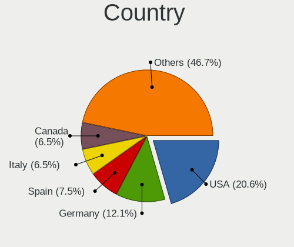
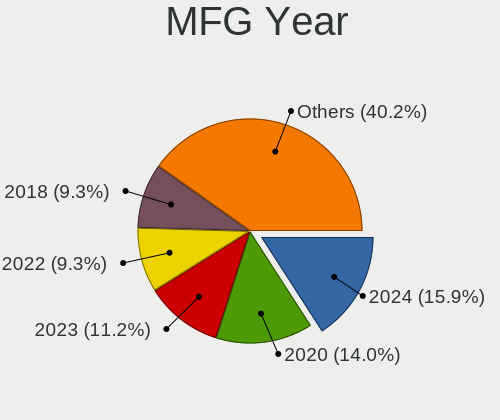

Manjaro Hardware Trends
-----------------------

A project to identify most popular hardware characteristics and track their change
over time based on data collected by Manjaro users at https://Linux-Hardware.org.

Anyone can contribute to the study by uploading probes of their computers by
the [hw-probe](https://github.com/linuxhw/hw-probe) tool:

    sudo -E hw-probe -all -upload

This is a report for all computer types. See also reports for [desktops](/Dist/Manjaro/Desktop/README.md) and [notebooks](/Dist/Manjaro/Notebook/README.md).

Full-feature report is available here: https://linux-hardware.org/?view=trends

Period: May, 2020.

Contents
--------

- [ OS                       ](#os)
- [ OS Family                ](#os-family)
- [ Kernel                   ](#kernel)
- [ Kernel Family            ](#kernel-family)
- [ Kernel Major Ver.        ](#kernel-major-ver)
- [ Arch                     ](#arch)
- [ DE                       ](#de)
- [ Display Server           ](#display-server)
- [ Display Manager          ](#display-manager)
- [ OS Lang                  ](#os-lang)
- [ Boot Mode                ](#boot-mode)
- [ Filesystem               ](#filesystem)
- [ Part. scheme             ](#part-scheme)
- [ Dual Boot with Linux/BSD ](#dual-boot-with-linux/bsd)
- [ Dual Boot (Win)          ](#dual-boot-win)
- [ Country                  ](#country)
- [ City                     ](#city)
- [ Vendor                   ](#vendor)
- [ Model                    ](#model)
- [ Model Family             ](#model-family)
- [ MFG Year                 ](#mfg-year)
- [ Form Factor              ](#form-factor)
- [ Secure Boot              ](#secure-boot)
- [ Coreboot                 ](#coreboot)
- [ RAM Size                 ](#ram-size)
- [ RAM Used                 ](#ram-used)
- [ Drive Vendor             ](#drive-vendor)
- [ Drive Model              ](#drive-model)
- [ Drive Kind               ](#drive-kind)
- [ Drive Connector          ](#drive-connector)
- [ Drive Size               ](#drive-size)
- [ Space Total              ](#space-total)
- [ Space Used               ](#space-used)
- [ Malfunc. Drives          ](#malfunc-drives)
- [ Malfunc. Drive Vendor    ](#malfunc-drive-vendor)
- [ Malfunc. Drive Kind      ](#malfunc-drive-kind)
- [ Failed Drives            ](#failed-drives)
- [ Failed Drive Vendor      ](#failed-drive-vendor)
- [ Drive Status             ](#drive-status)
- [ Storage Vendor           ](#storage-vendor)
- [ Storage Model            ](#storage-model)
- [ Storage Kind             ](#storage-kind)
- [ CPU Vendor               ](#cpu-vendor)
- [ CPU Model                ](#cpu-model)
- [ CPU Model Family         ](#cpu-model-family)
- [ CPU Cores                ](#cpu-cores)
- [ CPU Sockets              ](#cpu-sockets)
- [ CPU Threads              ](#cpu-threads)
- [ CPU Op-Modes             ](#cpu-op-modes)
- [ CPU Microcode            ](#cpu-microcode)
- [ CPU Microarch            ](#cpu-microarch)
- [ GPU Vendor               ](#gpu-vendor)
- [ GPU Model                ](#gpu-model)
- [ GPU Combo                ](#gpu-combo)
- [ GPU Driver               ](#gpu-driver)
- [ GPU Memory               ](#gpu-memory)
- [ Monitor Vendor           ](#monitor-vendor)
- [ Monitor Model            ](#monitor-model)
- [ Monitor Resolution       ](#monitor-resolution)
- [ Monitor Diagonal         ](#monitor-diagonal)
- [ Monitor Width            ](#monitor-width)
- [ Aspect Ratio             ](#aspect-ratio)
- [ Monitor Area             ](#monitor-area)
- [ Pixel Density            ](#pixel-density)
- [ Multiple Monitors        ](#multiple-monitors)
- [ Net Controller Vendor    ](#net-controller-vendor)
- [ Net Controller Model     ](#net-controller-model)
- [ Net Controller Kind      ](#net-controller-kind)
- [ Used Controller          ](#used-controller)
- [ NICs                     ](#nics)
- [ Unsupported Devices      ](#unsupported-devices)
- [ Unsupported Device Types ](#unsupported-device-types)

OS
--

Installed operating systems

| Name           | Computers | Percent |
|----------------|-----------|---------|
| Manjaro        | 81        | 48.21%  |
| Manjaro 20.0.1 | 62        | 36.9%   |
| Manjaro 20.0   | 23        | 13.69%  |
| Manjaro 20.0.2 | 2         | 1.19%   |

OS Family
---------

OS without a version

| Name    | Computers | Percent |
|---------|-----------|---------|
| Manjaro | 168       | 100%    |

Kernel
------

Version of the Linux kernel

| Version                | Computers | Percent |
|------------------------|-----------|---------|
| 5.6.12-1-MANJARO       | 42        | 25%     |
| 5.6.11-1-MANJARO       | 24        | 14.29%  |
| 5.6.7-1-MANJARO        | 22        | 13.1%   |
| 5.6.8-1-MANJARO        | 13        | 7.74%   |
| 5.4.40-1-MANJARO       | 13        | 7.74%   |
| 5.7.0-1-MANJARO        | 7         | 4.17%   |
| 5.6.10-3-MANJARO       | 7         | 4.17%   |
| 5.4.35-1-MANJARO       | 7         | 4.17%   |
| 5.4.39-1-MANJARO       | 5         | 2.98%   |
| 5.4.34-1-MANJARO       | 4         | 2.38%   |
| 5.6.10-1-MANJARO       | 3         | 1.79%   |
| 5.5.19-1-MANJARO       | 3         | 1.79%   |
| 5.6.14-1-MANJARO       | 2         | 1.19%   |
| 5.4.38-1-MANJARO       | 2         | 1.19%   |
| 5.4.36-1-MANJARO       | 2         | 1.19%   |
| 5.6.6-1-MANJARO        | 1         | 0.6%    |
| 5.6.4-1-rt3-MANJARO    | 1         | 0.6%    |
| 5.6.15-1-MANJARO       | 1         | 0.6%    |
| 5.6.12-27-tkg-pds      | 1         | 0.6%    |
| 5.6.12-2-ck            | 1         | 0.6%    |
| 5.6.10-arch1-1-macbook | 1         | 0.6%    |
| 5.5.8-1-rc             | 1         | 0.6%    |
| 5.5.18-3-MANJARO       | 1         | 0.6%    |
| 5.4.31-1-MANJARO       | 1         | 0.6%    |
| 5.4.24-1-MANJARO       | 1         | 0.6%    |
| 5.4.23-1-MANJARO       | 1         | 0.6%    |
| 4.19.122-1-MANJARO     | 1         | 0.6%    |

Kernel Family
-------------

Linux kernel without a distro release

| Version  | Computers | Percent |
|----------|-----------|---------|
| 5.6.12   | 44        | 26.19%  |
| 5.6.11   | 24        | 14.29%  |
| 5.6.7    | 22        | 13.1%   |
| 5.6.8    | 13        | 7.74%   |
| 5.4.40   | 13        | 7.74%   |
| 5.6.10   | 11        | 6.55%   |
| 5.7.0    | 7         | 4.17%   |
| 5.4.35   | 7         | 4.17%   |
| 5.4.39   | 5         | 2.98%   |
| 5.4.34   | 4         | 2.38%   |
| 5.5.19   | 3         | 1.79%   |
| 5.6.14   | 2         | 1.19%   |
| 5.4.38   | 2         | 1.19%   |
| 5.4.36   | 2         | 1.19%   |
| 5.6.6    | 1         | 0.6%    |
| 5.6.4    | 1         | 0.6%    |
| 5.6.15   | 1         | 0.6%    |
| 5.5.8    | 1         | 0.6%    |
| 5.5.18   | 1         | 0.6%    |
| 5.4.31   | 1         | 0.6%    |
| 5.4.24   | 1         | 0.6%    |
| 5.4.23   | 1         | 0.6%    |
| 4.19.122 | 1         | 0.6%    |

Kernel Major Ver.
-----------------

Linux kernel major version

| Version | Computers | Percent |
|---------|-----------|---------|
| 5.6     | 119       | 70.83%  |
| 5.4     | 36        | 21.43%  |
| 5.7     | 7         | 4.17%   |
| 5.5     | 5         | 2.98%   |
| 4.19    | 1         | 0.6%    |

Arch
----

OS architecture (x86_64, i586, etc.)

| Name   | Computers | Percent |
|--------|-----------|---------|
| x86_64 | 168       | 100%    |

DE
--

Desktop Environment

| Name       | Computers | Percent |
|------------|-----------|---------|
| XFCE       | 40        | 23.81%  |
| KDE        | 36        | 21.43%  |
| KDE5       | 35        | 20.83%  |
| GNOME      | 29        | 17.26%  |
| X-Cinnamon | 7         | 4.17%   |
| MATE       | 7         | 4.17%   |
| Cinnamon   | 5         | 2.98%   |
| Deepin     | 3         | 1.79%   |
| i3         | 2         | 1.19%   |
| Unknown    | 2         | 1.19%   |
| LXQt       | 1         | 0.6%    |
| Budgie     | 1         | 0.6%    |

Display Server
--------------

X11 or Wayland

| Name    | Computers | Percent |
|---------|-----------|---------|
| X11     | 156       | 92.86%  |
| Wayland | 8         | 4.76%   |
| Tty     | 3         | 1.79%   |
| Unknown | 1         | 0.6%    |

Display Manager
---------------

SDDM, LightDM, etc.

| Name    | Computers | Percent |
|---------|-----------|---------|
| Unknown | 82        | 48.81%  |
| LightDM | 39        | 23.21%  |
| SDDM    | 33        | 19.64%  |
| GDM     | 14        | 8.33%   |

OS Lang
-------

Language

| Lang       | Computers | Percent |
|------------|-----------|---------|
| en_US      | 51        | 30.36%  |
| ru_RU      | 20        | 11.9%   |
| de_DE      | 13        | 7.74%   |
| en_US.utf8 | 12        | 7.14%   |
| uk_UA      | 5         | 2.98%   |
| pl_PL      | 5         | 2.98%   |
| it_IT      | 5         | 2.98%   |
| en_GB      | 5         | 2.98%   |
| de_DE.utf8 | 5         | 2.98%   |
| pt_BR      | 4         | 2.38%   |
| ru_RU.utf8 | 3         | 1.79%   |
| fr_FR      | 3         | 1.79%   |
| zh_TW      | 2         | 1.19%   |
| nl_NL.utf8 | 2         | 1.19%   |
| hu_HU.utf8 | 2         | 1.19%   |
| en_NZ.utf8 | 2         | 1.19%   |
| en_GB.utf8 | 2         | 1.19%   |
| en_AU      | 2         | 1.19%   |
| da_DK      | 2         | 1.19%   |
| C          | 2         | 1.19%   |
| tr_TR.utf8 | 1         | 0.6%    |
| pt_BR.utf8 | 1         | 0.6%    |
| pl_PL.utf8 | 1         | 0.6%    |
| nl_NL      | 1         | 0.6%    |
| nl_BE      | 1         | 0.6%    |
| hu_HU      | 1         | 0.6%    |
| fi_FI      | 1         | 0.6%    |
| es_ES      | 1         | 0.6%    |
| es_CL      | 1         | 0.6%    |
| es_AR.utf8 | 1         | 0.6%    |
| es_AR      | 1         | 0.6%    |
| en_ZA      | 1         | 0.6%    |
| en_NZ      | 1         | 0.6%    |
| en_IE      | 1         | 0.6%    |
| en_DK      | 1         | 0.6%    |
| en_CA.utf8 | 1         | 0.6%    |
| en_CA      | 1         | 0.6%    |
| de_CH.utf8 | 1         | 0.6%    |
| de_AT.utf8 | 1         | 0.6%    |
| de_AT      | 1         | 0.6%    |
| Unknown    | 1         | 0.6%    |

Boot Mode
---------

EFI or BIOS

| Mode | Computers | Percent |
|------|-----------|---------|
| BIOS | 105       | 62.5%   |
| EFI  | 63        | 37.5%   |

Filesystem
----------

Type of filesystem

| Type    | Computers | Percent |
|---------|-----------|---------|
| Ext4    | 150       | 89.29%  |
| Btrfs   | 10        | 5.95%   |
| Xfs     | 4         | 2.38%   |
| Overlay | 2         | 1.19%   |
| Ext2    | 2         | 1.19%   |

Part. scheme
------------

Scheme of partitioning

| Type    | Computers | Percent |
|---------|-----------|---------|
| Unknown | 120       | 71.43%  |
| GPT     | 36        | 21.43%  |
| MBR     | 12        | 7.14%   |

Dual Boot with Linux/BSD
------------------------

Hosting more than one Linux/BSD

| Dual boot | Computers | Percent |
|-----------|-----------|---------|
| No        | 141       | 83.93%  |
| Yes       | 27        | 16.07%  |

Dual Boot (Win)
---------------

Hosting Linux and Windows

| Dual boot | Computers | Percent |
|-----------|-----------|---------|
| No        | 108       | 64.29%  |
| Yes       | 60        | 35.71%  |

Country
-------

Geographic location (country)

| Country      | Computers | Percent |
|--------------|-----------|---------|
| USA          | 28        | 16.67%  |
| Russia       | 26        | 15.48%  |
| Germany      | 24        | 14.29%  |
| Ukraine      | 9         | 5.36%   |
| Poland       | 7         | 4.17%   |
| Italy        | 7         | 4.17%   |
| Brazil       | 6         | 3.57%   |
| Hungary      | 4         | 2.38%   |
| Denmark      | 4         | 2.38%   |
| Belgium      | 4         | 2.38%   |
| Spain        | 3         | 1.79%   |
| Romania      | 3         | 1.79%   |
| New Zealand  | 3         | 1.79%   |
| Netherlands  | 3         | 1.79%   |
| France       | 3         | 1.79%   |
| China        | 3         | 1.79%   |
| Austria      | 3         | 1.79%   |
| UK           | 2         | 1.19%   |
| Taiwan       | 2         | 1.19%   |
| Sweden       | 2         | 1.19%   |
| South Africa | 2         | 1.19%   |
| Canada       | 2         | 1.19%   |
| Belarus      | 2         | 1.19%   |
| Australia    | 2         | 1.19%   |
| Argentina    | 2         | 1.19%   |
| Uruguay      | 1         | 0.6%    |
| Turkey       | 1         | 0.6%    |
| Switzerland  | 1         | 0.6%    |
| Pakistan     | 1         | 0.6%    |
| Mexico       | 1         | 0.6%    |
| Ireland      | 1         | 0.6%    |
| Finland      | 1         | 0.6%    |
| Egypt        | 1         | 0.6%    |
| Colombia     | 1         | 0.6%    |
| Chile        | 1         | 0.6%    |
| Bangladesh   | 1         | 0.6%    |
| Armenia      | 1         | 0.6%    |

City
----

Geographic location (city)

| City                  | Computers | Percent |
|-----------------------|-----------|---------|
| Vienna                | 3         | 1.79%   |
| St Petersburg         | 3         | 1.79%   |
| Moscow                | 3         | 1.79%   |
| Kyiv                  | 3         | 1.79%   |
| Demorest              | 3         | 1.79%   |
| Copenhagen            | 3         | 1.79%   |
| Yegor'yevsk           | 2         | 1.19%   |
| Warsaw                | 2         | 1.19%   |
| Voronezh              | 2         | 1.19%   |
| Taoyuan District      | 2         | 1.19%   |
| Stockholm             | 2         | 1.19%   |
| Oordegem              | 2         | 1.19%   |
| Kropyvnytskyi         | 2         | 1.19%   |
| Frankfurt am Main     | 2         | 1.19%   |
| Budapest              | 2         | 1.19%   |
| Bonn                  | 2         | 1.19%   |
| Érd                  | 1         | 0.6%    |
| Zurich                | 1         | 0.6%    |
| Zhlobin               | 1         | 0.6%    |
| Xochimilco            | 1         | 0.6%    |
| Xi'an                 | 1         | 0.6%    |
| Westminster           | 1         | 0.6%    |
| West Frankfort        | 1         | 0.6%    |
| Wellington            | 1         | 0.6%    |
| Waterloo              | 1         | 0.6%    |
| Warffum               | 1         | 0.6%    |
| Vyshhorod             | 1         | 0.6%    |
| Vladivostok           | 1         | 0.6%    |
| Varese                | 1         | 0.6%    |
| Tver                  | 1         | 0.6%    |
| Tuusula               | 1         | 0.6%    |
| Tula                  | 1         | 0.6%    |
| Trieste               | 1         | 0.6%    |
| Tomsk                 | 1         | 0.6%    |
| Theilheim             | 1         | 0.6%    |
| Taboao da Serra       | 1         | 0.6%    |
| São Paulo            | 1         | 0.6%    |
| Szekszárd            | 1         | 0.6%    |
| Szczecin              | 1         | 0.6%    |
| Syktyvkar             | 1         | 0.6%    |
| Sueca                 | 1         | 0.6%    |
| Stuttgart             | 1         | 0.6%    |
| Southampton           | 1         | 0.6%    |
| Shanghai              | 1         | 0.6%    |
| Sevan                 | 1         | 0.6%    |
| Savona                | 1         | 0.6%    |
| Santiago              | 1         | 0.6%    |
| Sant'Angelo Lodigiano | 1         | 0.6%    |
| Sangerhausen          | 1         | 0.6%    |
| Salt Lake City        | 1         | 0.6%    |
| Saginaw               | 1         | 0.6%    |
| Roseburg              | 1         | 0.6%    |
| Rio Pardo             | 1         | 0.6%    |
| Reutlingen            | 1         | 0.6%    |
| Pretoria              | 1         | 0.6%    |
| Poznan                | 1         | 0.6%    |
| Portland              | 1         | 0.6%    |
| Porta Westfalica      | 1         | 0.6%    |
| Port Saint Lucie      | 1         | 0.6%    |
| Plano                 | 1         | 0.6%    |

Vendor
------

Motherboard manufacturer

| Name                             | Computers | Percent |
|----------------------------------|-----------|---------|
| ASUSTek Computer                 | 37        | 22.02%  |
| Lenovo                           | 25        | 14.88%  |
| Hewlett-Packard                  | 21        | 12.5%   |
| Gigabyte Technology              | 17        | 10.12%  |
| Dell                             | 15        | 8.93%   |
| Acer                             | 13        | 7.74%   |
| MSI                              | 12        | 7.14%   |
| ASRock                           | 9         | 5.36%   |
| Apple                            | 3         | 1.79%   |
| Unknown                          | 2         | 1.19%   |
| Timi                             | 1         | 0.6%    |
| Sony                             | 1         | 0.6%    |
| Semp Toshiba                     | 1         | 0.6%    |
| Prestigio                        | 1         | 0.6%    |
| PC Specialist                    | 1         | 0.6%    |
| Panasonic                        | 1         | 0.6%    |
| ONE-NETBOOK TECHNOLOGY           | 1         | 0.6%    |
| LG Electronics                   | 1         | 0.6%    |
| Intel                            | 1         | 0.6%    |
| HUAWEI                           | 1         | 0.6%    |
| HARDKERNEL                       | 1         | 0.6%    |
| Hannspree                        | 1         | 0.6%    |
| FUJITSU CLIENT COMPUTING LIMITED | 1         | 0.6%    |
| Alienware                        | 1         | 0.6%    |

Model
-----

Motherboard model

| Name                                     | Computers | Percent |
|------------------------------------------|-----------|---------|
| ASUS All Series                          | 4         | 2.38%   |
| Lenovo G580 20150                        | 3         | 1.79%   |
| HP Notebook                              | 3         | 1.79%   |
| HP Pavilion Laptop 15-cc0xx              | 2         | 1.19%   |
| Dell G3 3779                             | 2         | 1.19%   |
| ASUS ROG STRIX B450-E GAMING             | 2         | 1.19%   |
| ASRock 970 Pro3 R2.0                     | 2         | 1.19%   |
| Acer Aspire TC-885                       | 2         | 1.19%   |
| Unknown                                  | 2         | 1.19%   |
| Timi RedmiBook 14                        | 1         | 0.6%    |
| Sony SVF13N2J2RS                         | 1         | 0.6%    |
| Semp Toshiba IS 1412                     | 1         | 0.6%    |
| Prestigio PSB133S01ZFH                   | 1         | 0.6%    |
| PC Specialist N141CU                     | 1         | 0.6%    |
| Panasonic CF-31WBM7BLM                   | 1         | 0.6%    |
| ONE-NETBOOK TECHNOLOGY One-Mix3 Pro      | 1         | 0.6%    |
| MSI MS-7C02                              | 1         | 0.6%    |
| MSI MS-7B90                              | 1         | 0.6%    |
| MSI MS-7B89                              | 1         | 0.6%    |
| MSI MS-7B86                              | 1         | 0.6%    |
| MSI MS-7B85                              | 1         | 0.6%    |
| MSI MS-7B79                              | 1         | 0.6%    |
| MSI MS-7A38                              | 1         | 0.6%    |
| MSI MS-7977                              | 1         | 0.6%    |
| MSI MS-7816                              | 1         | 0.6%    |
| MSI MS-7592                              | 1         | 0.6%    |
| MSI MS-6657                              | 1         | 0.6%    |
| MSI GT72 2QD                             | 1         | 0.6%    |
| LG Electronics 13Z990-V.AA53C            | 1         | 0.6%    |
| Lenovo ZHAOYANG E42-80 80T8              | 1         | 0.6%    |
| Lenovo Z710 20250                        | 1         | 0.6%    |
| Lenovo V330-14IKB 81B0                   | 1         | 0.6%    |
| Lenovo ThinkPad X380 Yoga 20LHCTO1WW     | 1         | 0.6%    |
| Lenovo ThinkPad X1 Carbon 6th 20KHCTO1WW | 1         | 0.6%    |
| Lenovo ThinkPad T540p 20BE00B4GE         | 1         | 0.6%    |
| Lenovo ThinkPad T480s 20L8S5U502         | 1         | 0.6%    |
| Lenovo ThinkPad T460s 20FAS23L07         | 1         | 0.6%    |
| Lenovo ThinkPad T430 23495B2             | 1         | 0.6%    |
| Lenovo ThinkPad P50 20EQS20D00           | 1         | 0.6%    |
| Lenovo ThinkPad P1 Gen 2 20QUS0PW00      | 1         | 0.6%    |
| Lenovo ThinkPad Edge E540 20C6005VRT     | 1         | 0.6%    |
| Lenovo Legion Y530-15ICH 81FV            | 1         | 0.6%    |
| Lenovo IdeaPad Y580                      | 1         | 0.6%    |
| Lenovo IdeaPad L340-17IRH Gaming 81LL    | 1         | 0.6%    |
| Lenovo IdeaPad Flex 5 14ARE05 81X2       | 1         | 0.6%    |
| Lenovo IdeaPad 330S-15ARR 81FB           | 1         | 0.6%    |
| Lenovo IdeaPad 330-15ICH 81FK            | 1         | 0.6%    |
| Lenovo IdeaPad 2in1 14 81CW              | 1         | 0.6%    |
| Lenovo IdeaCentre K300                   | 1         | 0.6%    |
| Lenovo G500 20236                        | 1         | 0.6%    |
| Lenovo B590 20208                        | 1         | 0.6%    |
| Intel NUC10i7FNH                         | 1         | 0.6%    |
| HUAWEI NBLK-WAX9X                        | 1         | 0.6%    |
| HP ZBook 14u G6                          | 1         | 0.6%    |
| HP ProDesk 400 G1 SFF                    | 1         | 0.6%    |
| HP ProBook 6560b                         | 1         | 0.6%    |
| HP ProBook 450 G6                        | 1         | 0.6%    |
| HP Pavilion Gaming Laptop 17-cd0xxx      | 1         | 0.6%    |
| HP Pavilion g6                           | 1         | 0.6%    |
| HP Laptop 17-ca1xxx                      | 1         | 0.6%    |

Model Family
------------

Motherboard model prefix

| Name                            | Computers | Percent |
|---------------------------------|-----------|---------|
| Acer Aspire                     | 10        | 5.95%   |
| Lenovo ThinkPad                 | 9         | 5.36%   |
| Lenovo IdeaPad                  | 6         | 3.57%   |
| Dell Inspiron                   | 5         | 2.98%   |
| HP Pavilion                     | 4         | 2.38%   |
| ASUS ROG                        | 4         | 2.38%   |
| ASUS PRIME                      | 4         | 2.38%   |
| ASUS All                        | 4         | 2.38%   |
| Lenovo G580                     | 3         | 1.79%   |
| HP Notebook                     | 3         | 1.79%   |
| Dell OptiPlex                   | 3         | 1.79%   |
| Dell G3                         | 3         | 1.79%   |
| HP ProBook                      | 2         | 1.19%   |
| HP Laptop                       | 2         | 1.19%   |
| HP Compaq                       | 2         | 1.19%   |
| Gigabyte X570                   | 2         | 1.19%   |
| Gigabyte B450M                  | 2         | 1.19%   |
| ASUS VivoBook                   | 2         | 1.19%   |
| ASRock 970                      | 2         | 1.19%   |
| Unknown                         | 2         | 1.19%   |
| Timi RedmiBook                  | 1         | 0.6%    |
| Sony SVF13N2J2RS                | 1         | 0.6%    |
| Semp Toshiba IS                 | 1         | 0.6%    |
| Prestigio PSB133S01ZFH          | 1         | 0.6%    |
| PC Specialist N141CU            | 1         | 0.6%    |
| Panasonic CF-31WBM7BLM          | 1         | 0.6%    |
| ONE-NETBOOK TECHNOLOGY One-Mix3 | 1         | 0.6%    |
| MSI MS-7C02                     | 1         | 0.6%    |
| MSI MS-7B90                     | 1         | 0.6%    |
| MSI MS-7B89                     | 1         | 0.6%    |
| MSI MS-7B86                     | 1         | 0.6%    |
| MSI MS-7B85                     | 1         | 0.6%    |
| MSI MS-7B79                     | 1         | 0.6%    |
| MSI MS-7A38                     | 1         | 0.6%    |
| MSI MS-7977                     | 1         | 0.6%    |
| MSI MS-7816                     | 1         | 0.6%    |
| MSI MS-7592                     | 1         | 0.6%    |
| MSI MS-6657                     | 1         | 0.6%    |
| MSI GT72                        | 1         | 0.6%    |
| LG Electronics 13Z990-V.AA53C   | 1         | 0.6%    |
| Lenovo ZHAOYANG                 | 1         | 0.6%    |
| Lenovo Z710                     | 1         | 0.6%    |
| Lenovo V330-14IKB               | 1         | 0.6%    |
| Lenovo Legion                   | 1         | 0.6%    |
| Lenovo IdeaCentre               | 1         | 0.6%    |
| Lenovo G500                     | 1         | 0.6%    |
| Lenovo B590                     | 1         | 0.6%    |
| Intel NUC10i7FNH                | 1         | 0.6%    |
| HUAWEI NBLK-WAX9X               | 1         | 0.6%    |
| HP ZBook                        | 1         | 0.6%    |
| HP ProDesk                      | 1         | 0.6%    |
| HP ENVY                         | 1         | 0.6%    |
| HP EliteBook                    | 1         | 0.6%    |
| HP Elite                        | 1         | 0.6%    |
| HP 255                          | 1         | 0.6%    |
| HP 250                          | 1         | 0.6%    |
| HP 15                           | 1         | 0.6%    |
| HARDKERNEL ODROID-H2            | 1         | 0.6%    |
| Hannspree SN12E200              | 1         | 0.6%    |
| Gigabyte Z97X-Gaming            | 1         | 0.6%    |

MFG Year
--------

Motherboard manufacture year

| Year    | Computers | Percent |
|---------|-----------|---------|
| 2019    | 55        | 32.74%  |
| 2018    | 15        | 8.93%   |
| 2014    | 15        | 8.93%   |
| 2020    | 14        | 8.33%   |
| 2017    | 12        | 7.14%   |
| 2013    | 11        | 6.55%   |
| 2015    | 9         | 5.36%   |
| 2016    | 8         | 4.76%   |
| 2012    | 7         | 4.17%   |
| 2011    | 7         | 4.17%   |
| 2010    | 7         | 4.17%   |
| 2009    | 4         | 2.38%   |
| Unknown | 2         | 1.19%   |
| 2008    | 1         | 0.6%    |
| 2006    | 1         | 0.6%    |

Form Factor
-----------

Physical design of the computer

| Name        | Computers | Percent |
|-------------|-----------|---------|
| Notebook    | 88        | 52.38%  |
| Desktop     | 72        | 42.86%  |
| Convertible | 4         | 2.38%   |
| All in one  | 2         | 1.19%   |
| Tablet      | 1         | 0.6%    |
| Mini pc     | 1         | 0.6%    |

Secure Boot
-----------

Enabled or disabled

| State    | Computers | Percent |
|----------|-----------|---------|
| Disabled | 168       | 100%    |

Coreboot
--------

Have coreboot on board

| Used | Computers | Percent |
|------|-----------|---------|
| No   | 168       | 100%    |

RAM Size
--------

Total RAM memory

| Size in GB  | Computers | Percent |
|-------------|-----------|---------|
| 16.01-24.0  | 51        | 30.36%  |
| 4.01-8.0    | 40        | 23.81%  |
| 8.01-16.0   | 35        | 20.83%  |
| 3.01-4.0    | 23        | 13.69%  |
| 32.01-64.0  | 13        | 7.74%   |
| 2.01-3.0    | 3         | 1.79%   |
| 24.01-32.0  | 1         | 0.6%    |
| 64.01-256.0 | 1         | 0.6%    |
| 1.01-2.0    | 1         | 0.6%    |

RAM Used
--------

Used RAM memory

| Used GB    | Computers | Percent |
|------------|-----------|---------|
| 1.01-2.0   | 55        | 32.74%  |
| 2.01-3.0   | 44        | 26.19%  |
| 4.01-8.0   | 28        | 16.67%  |
| 3.01-4.0   | 22        | 13.1%   |
| 0.01-1.0   | 10        | 5.95%   |
| 8.01-16.0  | 8         | 4.76%   |
| 16.01-24.0 | 1         | 0.6%    |

Drive Vendor
------------

Hard drive vendors

| Vendor              | Computers | Drives | Percent |
|---------------------|-----------|--------|---------|
| Seagate             | 55        | 67     | 20.6%   |
| WDC                 | 51        | 63     | 19.1%   |
| Samsung Electronics | 36        | 44     | 13.48%  |
| Kingston            | 21        | 23     | 7.87%   |
| Toshiba             | 14        | 15     | 5.24%   |
| Unknown             | 10        | 10     | 3.75%   |
| SanDisk             | 8         | 9      | 3%      |
| Crucial             | 8         | 8      | 3%      |
| HGST                | 7         | 9      | 2.62%   |
| Hitachi             | 5         | 5      | 1.87%   |
| A-DATA Technology   | 5         | 6      | 1.87%   |
| SPCC                | 4         | 4      | 1.5%    |
| Transcend           | 3         | 3      | 1.12%   |
| PLEXTOR             | 3         | 3      | 1.12%   |
| Intenso             | 3         | 3      | 1.12%   |
| Intel               | 3         | 3      | 1.12%   |
| HL-DT-ST            | 3         | 2      | 1.12%   |
| Apple               | 3         | 3      | 1.12%   |
| SK Hynix            | 2         | 2      | 0.75%   |
| PNY                 | 2         | 2      | 0.75%   |
| Micron Technology   | 2         | 2      | 0.75%   |
| Lexar               | 2         | 2      | 0.75%   |
| GOODRAM             | 2         | 2      | 0.75%   |
| Union Memory        | 1         | 1      | 0.37%   |
| ShineDisk           | 1         | 1      | 0.37%   |
| SABRENT             | 1         | 1      | 0.37%   |
| Ramsta              | 1         | 1      | 0.37%   |
| Mushkin             | 1         | 1      | 0.37%   |
| LITEON              | 1         | 1      | 0.37%   |
| Lenovo              | 1         | 1      | 0.37%   |
| KIOXIA              | 1         | 1      | 0.37%   |
| Hewlett-Packard     | 1         | 1      | 0.37%   |
| Generic             | 1         | 1      | 0.37%   |
| FORESEE             | 1         | 1      | 0.37%   |
| External            | 1         | 1      | 0.37%   |
| Corsair             | 1         | 1      | 0.37%   |
| China               | 1         | 1      | 0.37%   |
| Apacer              | 1         | 1      | 0.37%   |

Drive Model
-----------

Hard drive models

| Model                        | Computers | Percent |
|------------------------------|-----------|---------|
| ST1000LM035-1RK172 1TB       | 6         | 1.96%   |
| SSD 860 EVO 500GB            | 6         | 1.96%   |
| SA400S37240G 240GB SSD       | 6         | 1.96%   |
| SSD 850 EVO 500GB            | 5         | 1.63%   |
| SA400S37120G 120GB SSD       | 5         | 1.63%   |
| SV300S37A120G 120GB SSD      | 4         | 1.31%   |
| MMC Card  64GB               | 4         | 1.31%   |
| 512GB SSD                    | 4         | 1.31%   |
| WD20EZRZ-00Z5HB0 2TB         | 3         | 0.98%   |
| ST500LM012 HN-M500MBB 500GB  | 3         | 0.98%   |
| ST1000LM024 HN-M101MBB 1TB   | 3         | 0.98%   |
| SSD 840 EVO 120GB            | 3         | 0.98%   |
| WD5000AACS-00G8B1 500GB      | 2         | 0.65%   |
| WD30EZRX-00DC0B0 3TB         | 2         | 0.65%   |
| WD15EARS-00MVWB0 1TB         | 2         | 0.65%   |
| WD10EZEX-00WN4A0 1TB         | 2         | 0.65%   |
| ST750LM022 HN-M750MBB 752GB  | 2         | 0.65%   |
| ST500LT012-9WS142 500GB      | 2         | 0.65%   |
| ST500DM002-1BD142 500GB      | 2         | 0.65%   |
| ST4000DM004-2CV104 4TB       | 2         | 0.65%   |
| ST4000DM000-1F2168 4TB       | 2         | 0.65%   |
| ST3320620AS 320GB            | 2         | 0.65%   |
| ST31000528AS 1TB             | 2         | 0.65%   |
| ST31000524AS 1TB             | 2         | 0.65%   |
| ST2000LM007-1R8174 2TB       | 2         | 0.65%   |
| ST1000LM049-2GH172 1TB       | 2         | 0.65%   |
| ST1000DM003-9YN162 1TB       | 2         | 0.65%   |
| ST1000DM003-1ER162 1TB       | 2         | 0.65%   |
| SSD 860 QVO 1TB              | 2         | 0.65%   |
| SSD 860 EVO M.2 250GB        | 2         | 0.65%   |
| SSD 860 EVO 1TB              | 2         | 0.65%   |
| SSD 750 EVO 250GB            | 2         | 0.65%   |
| SD/MMC/MS PRO 128GB          | 2         | 0.65%   |
| RBUSNS8180S3128GI 128GB SSD  | 2         | 0.65%   |
| MQ01ABF050 500GB             | 2         | 0.65%   |
| MQ01ABD100 1TB               | 2         | 0.65%   |
| HTS721010A9E630 1TB          | 2         | 0.65%   |
| HTS545050A7E680 500GB        | 2         | 0.65%   |
| DVDRAM GUE1N 3GB             | 2         | 0.65%   |
| DT01ACA100 1TB               | 2         | 0.65%   |
| CT1000MX500SSD1 1TB          | 2         | 0.65%   |
| CS900 120GB SSD              | 2         | 0.65%   |
| WDS500G3X0C-00SJG0 500GB     | 1         | 0.33%   |
| WDS500G2B0B-00YS70 500GB SSD | 1         | 0.33%   |
| WDS500G2B0A-00SM50 500GB SSD | 1         | 0.33%   |
| WDS250G2X0C-00L350 250GB     | 1         | 0.33%   |
| WDS240G2G0A-00JH30 240GB SSD | 1         | 0.33%   |
| WDS120G2G0B-00EPW0 120GB SSD | 1         | 0.33%   |
| WDS100T2B0B-00YS70 1TB SSD   | 1         | 0.33%   |
| WDS100T2B0A-00SM50 1TB SSD   | 1         | 0.33%   |
| WD800JD-75MSA3 80GB          | 1         | 0.33%   |
| WD800AAJS-70TDA1 80GB        | 1         | 0.33%   |
| WD7501AALS-00J7B0 752GB      | 1         | 0.33%   |
| WD6400AAKS-65Z7B0 640GB      | 1         | 0.33%   |
| WD6400AAKS-65A7B2 640GB      | 1         | 0.33%   |
| WD6400AAKS-00A7B2 640GB      | 1         | 0.33%   |
| WD5001FZWX-00ZHUA0 5TB       | 1         | 0.33%   |
| WD5000LPLX-00ZNTT0 500GB     | 1         | 0.33%   |
| WD5000LPCX-60VHAT0 500GB     | 1         | 0.33%   |
| WD5000LPCX-22VHAT0 500GB     | 1         | 0.33%   |

Drive Kind
----------

HDD or SSD

| Kind    | Computers | Drives | Percent |
|---------|-----------|--------|---------|
| HDD     | 96        | 153    | 42.29%  |
| SSD     | 95        | 114    | 41.85%  |
| NVMe    | 17        | 20     | 7.49%   |
| Unknown | 11        | 10     | 4.85%   |
| MMC     | 8         | 8      | 3.52%   |

Drive Connector
---------------

SATA, SAS, NVMe, etc.

| Type | Computers | Drives | Percent |
|------|-----------|--------|---------|
| SATA | 146       | 266    | 79.78%  |
| NVMe | 17        | 20     | 9.29%   |
| SAS  | 12        | 11     | 6.56%   |
| MMC  | 8         | 8      | 4.37%   |

Drive Size
----------

Size of hard drive

| Size in TB | Computers | Drives | Percent |
|------------|-----------|--------|---------|
| 0.01-0.5   | 118       | 168    | 50.43%  |
| 0.51-1.0   | 77        | 91     | 32.91%  |
| 1.01-2.0   | 19        | 25     | 8.12%   |
| 3.01-4.0   | 8         | 8      | 3.42%   |
| 2.01-3.0   | 8         | 8      | 3.42%   |
| 4.01-10.0  | 4         | 5      | 1.71%   |

Space Total
-----------

Amount of disk space available on the file system

| Size in GB     | Computers | Percent |
|----------------|-----------|---------|
| 101-250        | 51        | 30.36%  |
| 251-500        | 35        | 20.83%  |
| 501-1000       | 28        | 16.67%  |
| 1001-2000      | 18        | 10.71%  |
| More than 3000 | 10        | 5.95%   |
| 51-100         | 10        | 5.95%   |
| 2001-3000      | 5         | 2.98%   |
| Unknown        | 5         | 2.98%   |
| 1-20           | 4         | 2.38%   |
| 21-50          | 2         | 1.19%   |

Space Used
----------

Amount of used disk space

| Used GB        | Computers | Percent |
|----------------|-----------|---------|
| 1-20           | 37        | 22.02%  |
| 101-250        | 32        | 19.05%  |
| 51-100         | 30        | 17.86%  |
| 21-50          | 26        | 15.48%  |
| 251-500        | 15        | 8.93%   |
| 501-1000       | 12        | 7.14%   |
| Unknown        | 5         | 2.98%   |
| More than 3000 | 4         | 2.38%   |
| 1001-2000      | 4         | 2.38%   |
| 2001-3000      | 3         | 1.79%   |

Malfunc. Drives
---------------

Drive models with a malfunction

| Model                    | Computers | Drives | Percent |
|--------------------------|-----------|--------|---------|
| ST500LT012-9WS142 500GB  | 2         | 2      | 10%     |
| WD5000LPLX-00ZNTT0 500GB | 1         | 1      | 5%      |
| WD5000BPVT-22HXZT3 500GB | 1         | 1      | 5%      |
| WD15EARS-00MVWB0 1TB     | 1         | 1      | 5%      |
| WD10JPVX-75JC3T0 1TB     | 1         | 1      | 5%      |
| WD10JPVX-22JC3T0 1TB     | 1         | 1      | 5%      |
| WD10EFRX-68PJCN0 1TB     | 1         | 1      | 5%      |
| WD10EARS-00Y5B1 1TB      | 1         | 1      | 5%      |
| WD1002FAEX-00Z3A0 1TB    | 1         | 1      | 5%      |
| ST9320325AS 320GB        | 1         | 1      | 5%      |
| ST8000VN0022-2EL112 8TB  | 1         | 1      | 5%      |
| ST380013AS 80GB          | 1         | 1      | 5%      |
| ST2000DM001-1ER164 2TB   | 1         | 1      | 5%      |
| ST1000NM0033-9ZM173 1TB  | 1         | 1      | 5%      |
| SSDSC2CT120A3 120GB      | 1         | 1      | 5%      |
| SSD 960 EVO 250GB        | 1         | 1      | 5%      |
| MQ01ABD100 1TB           | 1         | 1      | 5%      |
| HTS723232A7A364 320GB    | 1         | 1      | 5%      |
| HD103UJ 1TB              | 1         | 1      | 5%      |

Malfunc. Drive Vendor
---------------------

Vendors of faulty drives

| Vendor              | Computers | Drives | Percent |
|---------------------|-----------|--------|---------|
| WDC                 | 8         | 8      | 42.11%  |
| Seagate             | 6         | 7      | 31.58%  |
| Samsung Electronics | 2         | 2      | 10.53%  |
| Toshiba             | 1         | 1      | 5.26%   |
| Intel               | 1         | 1      | 5.26%   |
| Hitachi             | 1         | 1      | 5.26%   |

Malfunc. Drive Kind
-------------------

Kinds of faulty drives

| Kind | Computers | Drives | Percent |
|------|-----------|--------|---------|
| HDD  | 17        | 18     | 89.47%  |
| NVMe | 1         | 1      | 5.26%   |
| SSD  | 1         | 1      | 5.26%   |

Failed Drives
-------------

Failed drive models

Zero info for selected period =(

Failed Drive Vendor
-------------------

Failed drive vendors

Zero info for selected period =(

Drive Status
------------

Number of failed and malfunc. drives

| Status   | Computers | Drives | Percent |
|----------|-----------|--------|---------|
| Detected | 95        | 182    | 54.91%  |
| Works    | 60        | 103    | 34.68%  |
| Malfunc  | 18        | 20     | 10.4%   |

Storage Vendor
--------------

Storage controller vendors

| Vendor                       | Computers | Percent |
|------------------------------|-----------|---------|
| Intel                        | 104       | 47.93%  |
| AMD                          | 51        | 23.5%   |
| Samsung Electronics          | 17        | 7.83%   |
| ASMedia Technology           | 7         | 3.23%   |
| Toshiba America Info Systems | 5         | 2.3%    |
| Sandisk                      | 5         | 2.3%    |
| Phison Electronics           | 5         | 2.3%    |
| SK Hynix                     | 4         | 1.84%   |
| Nvidia                       | 4         | 1.84%   |
| Micron Technology            | 3         | 1.38%   |
| Union Memory (Shenzhen)      | 2         | 0.92%   |
| Marvell Technology Group     | 2         | 0.92%   |
| VIA Technologies             | 1         | 0.46%   |
| Silicon Motion               | 1         | 0.46%   |
| Silicon Image                | 1         | 0.46%   |
| Shenzhen Longsys Electronics | 1         | 0.46%   |
| Realtek Semiconductor        | 1         | 0.46%   |
| Lite-On Technology           | 1         | 0.46%   |
| Kingston Technology Company  | 1         | 0.46%   |
| JMicron Technology           | 1         | 0.46%   |

Storage Model
-------------

Storage controller models

| Model                                                                      | Computers | Percent |
|----------------------------------------------------------------------------|-----------|---------|
| FCH SATA Controller [AHCI mode]                                            | 38        | 14.56%  |
| 400 Series Chipset SATA Controller                                         | 17        | 6.51%   |
| Non-Volatile memory controller                                             | 12        | 4.6%    |
| 8 Series/C220 Series Chipset Family 6-port SATA Controller 1 [AHCI mode]   | 12        | 4.6%    |
| NVMe SSD Controller SM981/PM981/PM983                                      | 11        | 4.21%   |
| Sunrise Point-LP SATA Controller [AHCI mode]                               | 10        | 3.83%   |
| SB7x0/SB8x0/SB9x0 SATA Controller [AHCI mode]                              | 10        | 3.83%   |
| 7 Series Chipset Family 6-port SATA Controller [AHCI mode]                 | 10        | 3.83%   |
| SB7x0/SB8x0/SB9x0 IDE Controller                                           | 9         | 3.45%   |
| Cannon Lake Mobile PCH SATA AHCI Controller                                | 9         | 3.45%   |
| ASM1062 Serial ATA Controller                                              | 7         | 2.68%   |
| 82801 Mobile SATA Controller [RAID mode]                                   | 7         | 2.68%   |
| 8 Series SATA Controller 1 [AHCI mode]                                     | 5         | 1.92%   |
| Wildcat Point-LP SATA Controller [AHCI Mode]                               | 4         | 1.53%   |
| E12 NVMe Controller                                                        | 4         | 1.53%   |
| Cannon Point-LP SATA Controller [AHCI Mode]                                | 4         | 1.53%   |
| 6 Series/C200 Series Chipset Family 6 port Mobile SATA AHCI Controller     | 4         | 1.53%   |
| SB7x0/SB8x0/SB9x0 SATA Controller [IDE mode]                               | 3         | 1.15%   |
| Q170/Q150/B150/H170/H110/Z170/CM236 Chipset SATA Controller [AHCI Mode]    | 3         | 1.15%   |
| NVMe SSD Controller SM961/PM961                                            | 3         | 1.15%   |
| Celeron N3350/Pentium N4200/Atom E3900 Series SATA AHCI Controller         | 3         | 1.15%   |
| Cannon Lake PCH SATA AHCI Controller                                       | 3         | 1.15%   |
| Atom/Celeron/Pentium Processor x5-E8000/J3xxx/N3xxx Series SATA Controller | 3         | 1.15%   |
| 5 Series/3400 Series Chipset 4 port SATA AHCI Controller                   | 3         | 1.15%   |
| 300 Series Chipset SATA Controller                                         | 3         | 1.15%   |
| WD Black 2018/PC SN720 NVMe SSD                                            | 2         | 0.77%   |
| WD Black 2018/PC SN520 NVMe SSD                                            | 2         | 0.77%   |
| Toshiba America Info Non-Volatile memory controller                        | 2         | 0.77%   |
| MCP79 AHCI Controller                                                      | 2         | 0.77%   |
| Comet Lake SATA AHCI Controller                                            | 2         | 0.77%   |
| BG3 NVMe SSD Controller                                                    | 2         | 0.77%   |
| 82801JI (ICH10 Family) SATA AHCI Controller                                | 2         | 0.77%   |
| 5 Series/3400 Series Chipset 6 port SATA AHCI Controller                   | 2         | 0.77%   |
| X399 Series Chipset SATA Controller                                        | 1         | 0.38%   |
| X370 Series Chipset SATA Controller                                        | 1         | 0.38%   |
| VT6415 PATA IDE Host Controller                                            | 1         | 0.38%   |
| SSD Pro 7600p/760p/E 6100p Series                                          | 1         | 0.38%   |
| SSD 660P Series                                                            | 1         | 0.38%   |
| SSD 600P Series                                                            | 1         | 0.38%   |
| SATA Controller [RAID mode]                                                | 1         | 0.38%   |
| SATA controller                                                            | 1         | 0.38%   |
| Realtek Non-Volatile memory controller                                     | 1         | 0.38%   |
| PCI0680 Ultra ATA-133 Host Controller                                      | 1         | 0.38%   |
| PC300 NVMe Solid State Drive 256GB                                         | 1         | 0.38%   |
| NVMe Storage Controller                                                    | 1         | 0.38%   |
| NVMe SSD Controller SM951/PM951                                            | 1         | 0.38%   |
| NVMe Controller                                                            | 1         | 0.38%   |
| NM10/ICH7 Family SATA Controller [IDE mode]                                | 1         | 0.38%   |
| MCP78S [GeForce 8200] SATA Controller (non-AHCI mode)                      | 1         | 0.38%   |
| MCP78S [GeForce 8200] IDE                                                  | 1         | 0.38%   |
| JMB363 SATA/IDE Controller                                                 | 1         | 0.38%   |
| Ice Lake-LP SATA Controller [AHCI mode]                                    | 1         | 0.38%   |
| HM170/QM170 Chipset SATA Controller [AHCI Mode]                            | 1         | 0.38%   |
| FCH SATA Controller D                                                      | 1         | 0.38%   |
| FCH IDE Controller                                                         | 1         | 0.38%   |
| Electronics SATA controller                                                | 1         | 0.38%   |
| Electronics Non-Volatile memory controller                                 | 1         | 0.38%   |
| CK804 Serial ATA Controller                                                | 1         | 0.38%   |
| CK804 IDE                                                                  | 1         | 0.38%   |
| BC501 NVMe Solid State Drive 512GB                                         | 1         | 0.38%   |

Storage Kind
------------

Kind of storage controller (IDE, SATA, NVMe, SAS, ...)

| Kind | Computers | Percent |
|------|-----------|---------|
| SATA | 143       | 65%     |
| NVMe | 45        | 20.45%  |
| IDE  | 23        | 10.45%  |
| RAID | 9         | 4.09%   |

CPU Vendor
----------

Processor vendors

| Vendor | Computers | Percent |
|--------|-----------|---------|
| Intel  | 114       | 67.86%  |
| AMD    | 54        | 32.14%  |

CPU Model
---------

Processor models

| Model                                         | Computers | Percent |
|-----------------------------------------------|-----------|---------|
| AMD FX-8350 Eight-Core Processor              | 5         | 2.98%   |
| Intel Core i5-8265U CPU @ 1.60GHz             | 4         | 2.38%   |
| Intel Core i5-3230M CPU @ 2.60GHz             | 4         | 2.38%   |
| AMD Ryzen 5 3600 6-Core Processor             | 4         | 2.38%   |
| Intel Core i7-8750H CPU @ 2.20GHz             | 3         | 1.79%   |
| Intel Core i7-8565U CPU @ 1.80GHz             | 3         | 1.79%   |
| Intel Core i7-7500U CPU @ 2.70GHz             | 3         | 1.79%   |
| Intel Core i3-5005U CPU @ 2.00GHz             | 3         | 1.79%   |
| Intel Core 2 Duo CPU E8400 @ 3.00GHz          | 3         | 1.79%   |
| AMD Ryzen 7 2700X Eight-Core Processor        | 3         | 1.79%   |
| AMD Ryzen 5 3500U with Radeon Vega Mobile Gfx | 3         | 1.79%   |
| AMD Ryzen 5 2600 Six-Core Processor           | 3         | 1.79%   |
| Intel Pentium CPU P6200 @ 2.13GHz             | 2         | 1.19%   |
| Intel Pentium CPU N4200 @ 1.10GHz             | 2         | 1.19%   |
| Intel Pentium CPU N3710 @ 1.60GHz             | 2         | 1.19%   |
| Intel Core i7-9750H CPU @ 2.60GHz             | 2         | 1.19%   |
| Intel Core i7-8700 CPU @ 3.20GHz              | 2         | 1.19%   |
| Intel Core i7-8550U CPU @ 1.80GHz             | 2         | 1.19%   |
| Intel Core i7-4720HQ CPU @ 2.60GHz            | 2         | 1.19%   |
| Intel Core i5-9300H CPU @ 2.40GHz             | 2         | 1.19%   |
| Intel Core i5-8250U CPU @ 1.60GHz             | 2         | 1.19%   |
| Intel Core i5-7200U CPU @ 2.50GHz             | 2         | 1.19%   |
| Intel Core i5-4670K CPU @ 3.40GHz             | 2         | 1.19%   |
| Intel Core i5-3470 CPU @ 3.20GHz              | 2         | 1.19%   |
| Intel Core i3-4005U CPU @ 1.70GHz             | 2         | 1.19%   |
| AMD Ryzen 7 3700X 8-Core Processor            | 2         | 1.19%   |
| AMD Ryzen 7 2700 Eight-Core Processor         | 2         | 1.19%   |
| AMD Ryzen 7 1700X Eight-Core Processor        | 2         | 1.19%   |
| AMD Ryzen 5 2500U with Radeon Vega Mobile Gfx | 2         | 1.19%   |
| AMD FX-6300 Six-Core Processor                | 2         | 1.19%   |
| Intel Xeon CPU E5450 @ 3.00GHz                | 1         | 0.6%    |
| Intel Xeon CPU E5-2420 v2 @ 2.20GHz           | 1         | 0.6%    |
| Intel Xeon CPU E5-1620 v2 @ 3.70GHz           | 1         | 0.6%    |
| Intel Pentium Dual-Core CPU T4200 @ 2.00GHz   | 1         | 0.6%    |
| Intel Pentium Dual-Core CPU E5800 @ 3.20GHz   | 1         | 0.6%    |
| Intel Pentium CPU G3220 @ 3.00GHz             | 1         | 0.6%    |
| Intel Pentium CPU 4415U @ 2.30GHz             | 1         | 0.6%    |
| Intel Pentium CPU 4405U @ 2.10GHz             | 1         | 0.6%    |
| Intel Pentium CPU 2020M @ 2.40GHz             | 1         | 0.6%    |
| Intel Genuine CPU U4100 @ 1.30GHz             | 1         | 0.6%    |
| Intel Core i9-9880H CPU @ 2.30GHz             | 1         | 0.6%    |
| Intel Core i9-8950HK CPU @ 2.90GHz            | 1         | 0.6%    |
| Intel Core i7-8650U CPU @ 1.90GHz             | 1         | 0.6%    |
| Intel Core i7-8086K CPU @ 4.00GHz             | 1         | 0.6%    |
| Intel Core i7-7700HQ CPU @ 2.80GHz            | 1         | 0.6%    |
| Intel Core i7-7600U CPU @ 2.80GHz             | 1         | 0.6%    |
| Intel Core i7-6820HQ CPU @ 2.70GHz            | 1         | 0.6%    |
| Intel Core i7-6700K CPU @ 4.00GHz             | 1         | 0.6%    |
| Intel Core i7-4790 CPU @ 3.60GHz              | 1         | 0.6%    |
| Intel Core i7-4771 CPU @ 3.50GHz              | 1         | 0.6%    |
| Intel Core i7-4710MQ CPU @ 2.50GHz            | 1         | 0.6%    |
| Intel Core i7-4700MQ CPU @ 2.40GHz            | 1         | 0.6%    |
| Intel Core i7-4500U CPU @ 1.80GHz             | 1         | 0.6%    |
| Intel Core i7-3770S CPU @ 3.10GHz             | 1         | 0.6%    |
| Intel Core i7-3770 CPU @ 3.40GHz              | 1         | 0.6%    |
| Intel Core i7-3632QM CPU @ 2.20GHz            | 1         | 0.6%    |
| Intel Core i7-3610QM CPU @ 2.30GHz            | 1         | 0.6%    |
| Intel Core i7-10710U CPU @ 1.10GHz            | 1         | 0.6%    |
| Intel Core i7-1065G7 CPU @ 1.30GHz            | 1         | 0.6%    |
| Intel Core i7-10510Y CPU @ 1.20GHz            | 1         | 0.6%    |

CPU Model Family
----------------

Processor model prefix

| Model                   | Computers | Percent |
|-------------------------|-----------|---------|
| Intel Core i5           | 40        | 23.81%  |
| Intel Core i7           | 38        | 22.62%  |
| AMD Ryzen 5             | 18        | 10.71%  |
| AMD Ryzen 7             | 11        | 6.55%   |
| Intel Pentium           | 10        | 5.95%   |
| AMD FX                  | 9         | 5.36%   |
| Intel Core i3           | 8         | 4.76%   |
| Intel Core 2 Duo        | 5         | 2.98%   |
| Intel Celeron           | 4         | 2.38%   |
| Intel Xeon              | 3         | 1.79%   |
| AMD A6                  | 3         | 1.79%   |
| Intel Pentium Dual-Core | 2         | 1.19%   |
| Intel Core i9           | 2         | 1.19%   |
| AMD Ryzen 3             | 2         | 1.19%   |
| AMD A8                  | 2         | 1.19%   |
| Intel Genuine           | 1         | 0.6%    |
| Intel Atom              | 1         | 0.6%    |
| AMD Ryzen Threadripper  | 1         | 0.6%    |
| AMD Phenom II X6        | 1         | 0.6%    |
| AMD Phenom II X4        | 1         | 0.6%    |
| AMD Athlon II X3        | 1         | 0.6%    |
| AMD Athlon II X2        | 1         | 0.6%    |
| AMD Athlon II Dual-Core | 1         | 0.6%    |
| AMD Athlon 64           | 1         | 0.6%    |
| AMD A4                  | 1         | 0.6%    |
| AMD A10                 | 1         | 0.6%    |

CPU Cores
---------

Number of processor cores

| Number | Computers | Percent |
|--------|-----------|---------|
| 4      | 73        | 43.45%  |
| 2      | 54        | 32.14%  |
| 6      | 22        | 13.1%   |
| 8      | 13        | 7.74%   |
| 3      | 3         | 1.79%   |
| 1      | 3         | 1.79%   |

CPU Sockets
-----------

Number of sockets

| Number | Computers | Percent |
|--------|-----------|---------|
| 1      | 168       | 100%    |

CPU Threads
-----------

Threads per core (Hyper-Threading)

| Number | Computers | Percent |
|--------|-----------|---------|
| 2      | 123       | 73.21%  |
| 1      | 45        | 26.79%  |

CPU Op-Modes
------------

CPU Operation Modes (32-bit, 64-bit)

| Op mode        | Computers | Percent |
|----------------|-----------|---------|
| 32-bit, 64-bit | 168       | 100%    |

CPU Microcode
-------------

Microcode number

| Number     | Computers | Percent |
|------------|-----------|---------|
| Unknown    | 86        | 51.19%  |
| 0x306a9    | 10        | 5.95%   |
| 0x0800820d | 8         | 4.76%   |
| 0x906ea    | 7         | 4.17%   |
| 0x806ec    | 4         | 2.38%   |
| 0x306c3    | 4         | 2.38%   |
| 0x06000852 | 4         | 2.38%   |
| 0x806ea    | 3         | 1.79%   |
| 0x506c9    | 3         | 1.79%   |
| 0x20655    | 3         | 1.79%   |
| 0x1067a    | 3         | 1.79%   |
| 0x806e9    | 2         | 1.19%   |
| 0x506e3    | 2         | 1.19%   |
| 0x406c4    | 2         | 1.19%   |
| 0x40651    | 2         | 1.19%   |
| 0x08701013 | 2         | 1.19%   |
| 0x06001119 | 2         | 1.19%   |
| 0xa0660    | 1         | 0.6%    |
| 0x906ed    | 1         | 0.6%    |
| 0x906e9    | 1         | 0.6%    |
| 0x806eb    | 1         | 0.6%    |
| 0x706e5    | 1         | 0.6%    |
| 0x406e3    | 1         | 0.6%    |
| 0x306e4    | 1         | 0.6%    |
| 0x306d4    | 1         | 0.6%    |
| 0x206a7    | 1         | 0.6%    |
| 0x106a5    | 1         | 0.6%    |
| 0x08600102 | 1         | 0.6%    |
| 0x08108109 | 1         | 0.6%    |
| 0x08108102 | 1         | 0.6%    |
| 0x08101016 | 1         | 0.6%    |
| 0x0810100b | 1         | 0.6%    |
| 0x08001138 | 1         | 0.6%    |
| 0x08001137 | 1         | 0.6%    |
| 0x08001129 | 1         | 0.6%    |
| 0x0800111c | 1         | 0.6%    |
| 0x010000dc | 1         | 0.6%    |
| 0x010000c8 | 1         | 0.6%    |

CPU Microarch
-------------

Microarchitecture

| Name          | Computers | Percent |
|---------------|-----------|---------|
| KabyLake      | 24        | 14.29%  |
| Skylake       | 21        | 12.5%   |
| Haswell       | 20        | 11.9%   |
| IvyBridge     | 17        | 10.12%  |
| Zen+          | 15        | 8.93%   |
| Piledriver    | 13        | 7.74%   |
| Zen 2         | 8         | 4.76%   |
| Zen           | 8         | 4.76%   |
| Penryn        | 6         | 3.57%   |
| K10           | 5         | 2.98%   |
| Westmere      | 4         | 2.38%   |
| Silvermont    | 4         | 2.38%   |
| SandyBridge   | 4         | 2.38%   |
| Broadwell     | 4         | 2.38%   |
| Goldmont      | 3         | 1.79%   |
| Core          | 3         | 1.79%   |
| Nehalem       | 2         | 1.19%   |
| Excavator     | 2         | 1.19%   |
| K8 Hammer     | 1         | 0.6%    |
| Jaguar        | 1         | 0.6%    |
| Icelake       | 1         | 0.6%    |
| Goldmont plus | 1         | 0.6%    |
| Unknown       | 1         | 0.6%    |

GPU Vendor
----------

Vendors of graphics cards

| Vendor | Computers | Percent |
|--------|-----------|---------|
| Intel  | 93        | 44.93%  |
| Nvidia | 68        | 32.85%  |
| AMD    | 46        | 22.22%  |

GPU Model
---------

Graphics card models

| Model                                                                              | Computers | Percent |
|------------------------------------------------------------------------------------|-----------|---------|
| Ellesmere [Radeon RX 470/480/570/570X/580/580X/590]                                | 12        | 5.58%   |
| UHD Graphics 630 (Mobile)                                                          | 11        | 5.12%   |
| 3rd Gen Core processor Graphics Controller                                         | 11        | 5.12%   |
| UHD Graphics 620 (Whiskey Lake)                                                    | 7         | 3.26%   |
| HD Graphics 620                                                                    | 6         | 2.79%   |
| Haswell-ULT Integrated Graphics Controller                                         | 6         | 2.79%   |
| Xeon E3-1200 v3/4th Gen Core Processor Integrated Graphics Controller              | 5         | 2.33%   |
| UHD Graphics 620                                                                   | 5         | 2.33%   |
| Navi 10 [Radeon RX 5600 OEM/5600 XT / 5700/5700 XT]                                | 5         | 2.33%   |
| Picasso                                                                            | 4         | 1.86%   |
| HD Graphics 5500                                                                   | 4         | 1.86%   |
| GP107 [GeForce GTX 1050 Ti]                                                        | 4         | 1.86%   |
| GF117M [GeForce 610M/710M/810M/820M / GT 620M/625M/630M/720M]                      | 4         | 1.86%   |
| Atom/Celeron/Pentium Processor x5-E8000/J3xxx/N3xxx Integrated Graphics Controller | 4         | 1.86%   |
| 4th Gen Core Processor Integrated Graphics Controller                              | 4         | 1.86%   |
| Xeon E3-1200 v2/3rd Gen Core processor Graphics Controller                         | 3         | 1.4%    |
| UHD Graphics                                                                       | 3         | 1.4%    |
| Raven Ridge [Radeon Vega Series / Radeon Vega Mobile Series]                       | 3         | 1.4%    |
| GP104 [GeForce GTX 1070]                                                           | 3         | 1.4%    |
| Core Processor Integrated Graphics Controller                                      | 3         | 1.4%    |
| UHD Graphics 630 (Desktop)                                                         | 2         | 0.93%   |
| TU116 [GeForce GTX 1660 SUPER]                                                     | 2         | 0.93%   |
| TU104 [GeForce RTX 2070 SUPER]                                                     | 2         | 0.93%   |
| Sun XT [Radeon HD 8670A/8670M/8690M / R5 M330 / M430 / Radeon 520 Mobile]          | 2         | 0.93%   |
| Mobile 4 Series Chipset Integrated Graphics Controller                             | 2         | 0.93%   |
| Kaby Lake-U GT1 Integrated Graphics Controller                                     | 2         | 0.93%   |
| GP107M [GeForce GTX 1050 Mobile]                                                   | 2         | 0.93%   |
| GP107M [GeForce GTX 1050 3 GB Max-Q]                                               | 2         | 0.93%   |
| GP106M [GeForce GTX 1060 Mobile]                                                   | 2         | 0.93%   |
| GM108M [GeForce MX130]                                                             | 2         | 0.93%   |
| GM107 [GeForce GTX 750]                                                            | 2         | 0.93%   |
| GK208M [GeForce GT 740M]                                                           | 2         | 0.93%   |
| GK208B [GeForce GT 730]                                                            | 2         | 0.93%   |
| Celeron N3350/Pentium N4200/Atom E3900 Series Integrated Graphics Controller       | 2         | 0.93%   |
| Baffin [Radeon RX 550 640SP / RX 560/560X]                                         | 2         | 0.93%   |
| 4 Series Chipset Integrated Graphics Controller                                    | 2         | 0.93%   |
| 2nd Generation Core Processor Family Integrated Graphics Controller                | 2         | 0.93%   |
| Vega 10 XL/XT [Radeon RX Vega 56/64]                                               | 1         | 0.47%   |
| UHD Graphics 615                                                                   | 1         | 0.47%   |
| UHD Graphics 605                                                                   | 1         | 0.47%   |
| TU117M [GeForce GTX 1650 Mobile / Max-Q]                                           | 1         | 0.47%   |
| TU117GLM [Quadro T2000 Mobile / Max-Q]                                             | 1         | 0.47%   |
| TU117 [GeForce GTX 1650]                                                           | 1         | 0.47%   |
| TU116M [GeForce GTX 1660 Ti Mobile]                                                | 1         | 0.47%   |
| TU116 [GeForce GTX 1650 SUPER]                                                     | 1         | 0.47%   |
| TU104 [GeForce RTX 2080 SUPER]                                                     | 1         | 0.47%   |
| Trinity [Radeon HD 7600G]                                                          | 1         | 0.47%   |
| Trinity 2 [Radeon HD 7520G]                                                        | 1         | 0.47%   |
| Trinity 2 [Radeon HD 7480D]                                                        | 1         | 0.47%   |
| Topaz XT [Radeon R7 M260/M265 / M340/M360 / M440/M445 / 530/535 / 620/625 Mobile]  | 1         | 0.47%   |
| Tonga XT / Amethyst XT [Radeon R9 380X / R9 M295X]                                 | 1         | 0.47%   |
| Thames [Radeon HD 7500M/7600M Series]                                              | 1         | 0.47%   |
| Sun PRO [Radeon HD 8570A/8570M]                                                    | 1         | 0.47%   |
| Stoney [Radeon R2/R3/R4/R5 Graphics]                                               | 1         | 0.47%   |
| Skylake GT2 [HD Graphics 520]                                                      | 1         | 0.47%   |
| Seymour [Radeon HD 6400M/7400M Series]                                             | 1         | 0.47%   |
| RV730/M96-XT [Mobility Radeon HD 4670]                                             | 1         | 0.47%   |
| RV530 [Radeon X1600] (Secondary)                                                   | 1         | 0.47%   |
| RV530 [Radeon X1600 PRO]                                                           | 1         | 0.47%   |
| RS780C [Radeon 3100]                                                               | 1         | 0.47%   |

GPU Combo
---------

Combinations of graphics cards

| Name           | Computers | Percent |
|----------------|-----------|---------|
| 1 x Intel      | 53        | 31.55%  |
| 1 x AMD        | 35        | 20.83%  |
| Intel + Nvidia | 34        | 20.24%  |
| 1 x Nvidia     | 33        | 19.64%  |
| 2 x AMD        | 7         | 4.17%   |
| Intel + AMD    | 4         | 2.38%   |
| 2 x Nvidia     | 2         | 1.19%   |

GPU Driver
----------

Free vs proprietary

| Driver      | Computers | Percent |
|-------------|-----------|---------|
| Free        | 125       | 74.4%   |
| Proprietary | 43        | 25.6%   |

GPU Memory
----------

Total video memory

| Size in GB | Computers | Percent |
|------------|-----------|---------|
| Unknown    | 107       | 63.69%  |
| 1.01-2.0   | 16        | 9.52%   |
| 7.01-8.0   | 15        | 8.93%   |
| 0.51-1.0   | 10        | 5.95%   |
| 3.01-4.0   | 7         | 4.17%   |
| 0.01-0.5   | 7         | 4.17%   |
| 5.01-6.0   | 3         | 1.79%   |
| 2.01-3.0   | 2         | 1.19%   |
| 8.01-16.0  | 1         | 0.6%    |

Monitor Vendor
--------------

Monitor vendors

| Vendor                  | Computers | Percent |
|-------------------------|-----------|---------|
| Samsung Electronics     | 27        | 14.84%  |
| LG Display              | 22        | 12.09%  |
| AU Optronics            | 18        | 9.89%   |
| Chimei Innolux          | 16        | 8.79%   |
| BOE                     | 10        | 5.49%   |
| Dell                    | 9         | 4.95%   |
| Hewlett-Packard         | 8         | 4.4%    |
| AOC                     | 8         | 4.4%    |
| Acer                    | 8         | 4.4%    |
| Ancor Communications    | 5         | 2.75%   |
| Sharp                   | 4         | 2.2%    |
| Goldstar                | 4         | 2.2%    |
| Philips                 | 3         | 1.65%   |
| PANDA                   | 3         | 1.65%   |
| LG Electronics          | 3         | 1.65%   |
| BenQ                    | 3         | 1.65%   |
| ASUSTek Computer        | 3         | 1.65%   |
| Apple                   | 3         | 1.65%   |
| Medion                  | 2         | 1.1%    |
| Iiyama                  | 2         | 1.1%    |
| HannStar                | 2         | 1.1%    |
| Chi Mei Optoelectronics | 2         | 1.1%    |
| Viotek                  | 1         | 0.55%   |
| ViewSonic               | 1         | 0.55%   |
| Unknown                 | 1         | 0.55%   |
| Toshiba                 | 1         | 0.55%   |
| TCL                     | 1         | 0.55%   |
| Sony                    | 1         | 0.55%   |
| Pioneer Electronic      | 1         | 0.55%   |
| Panasonic               | 1         | 0.55%   |
| Packard Bell            | 1         | 0.55%   |
| MSI                     | 1         | 0.55%   |
| Microstep               | 1         | 0.55%   |
| Marantz                 | 1         | 0.55%   |
| Lenovo                  | 1         | 0.55%   |
| eMachines               | 1         | 0.55%   |
| CVT                     | 1         | 0.55%   |
| Belinea                 | 1         | 0.55%   |
| AUS                     | 1         | 0.55%   |

Monitor Model
-------------

Monitor models

| Model                                               | Computers | Percent |
|-----------------------------------------------------|-----------|---------|
| VA326 AUS32FA 1920x1080 698x393mm 31.5-inch         | 2         | 1.09%   |
| MD 20430 MED36A2 1920x1080 521x293mm 23.5-inch      | 2         | 1.09%   |
| LCD Monitor SAM03BC 1920x1080                       | 2         | 1.09%   |
| LCD Monitor LGD033A 1366x768 340x190mm 15.3-inch    | 2         | 1.09%   |
| LCD Monitor LGD02DC 1366x768 344x194mm 15.5-inch    | 2         | 1.09%   |
| LCD Monitor CMN1738 1920x1080 381x214mm 17.2-inch   | 2         | 1.09%   |
| LCD Monitor CMN15CA 1366x768 340x190mm 15.3-inch    | 2         | 1.09%   |
| LCD Monitor BOE0696 1366x768 309x173mm 13.9-inch    | 2         | 1.09%   |
| LCD Monitor AUO23ED 1920x1080 344x193mm 15.5-inch   | 2         | 1.09%   |
| LCD Monitor AUO10EC 1366x768 340x190mm 15.3-inch    | 2         | 1.09%   |
| VVX13F009G00 MEI96A2 1920x1080 290x170mm 13.2-inch  | 1         | 0.55%   |
| Viseo243D PKB0386 1920x1080 531x299mm 24.0-inch     | 1         | 0.55%   |
| VH240a HPN3499 1920x1080 527x296mm 23.8-inch        | 1         | 0.55%   |
| VG278 AUS27AD 1920x1080 598x336mm 27.0-inch         | 1         | 0.55%   |
| V206HQL ACR0334 1280x1024 430x240mm 19.4-inch       | 1         | 0.55%   |
| Ultra HD GSM5B08 3840x2160 600x340mm 27.2-inch      | 1         | 0.55%   |
| U32H85x SAM0E3C 3840x2160 697x392mm 31.5-inch       | 1         | 0.55%   |
| U28E570 SAM0D6F 3840x2160 607x345mm 27.5-inch       | 1         | 0.55%   |
| U2711 DELA055 2560x1440 597x336mm 27.0-inch         | 1         | 0.55%   |
| U2412M DELA07A 1920x1200 518x324mm 24.1-inch        | 1         | 0.55%   |
| U2410 DELF015 1920x1200 520x320mm 24.0-inch         | 1         | 0.55%   |
| U2311H DELA060 1920x1080 509x286mm 23.0-inch        | 1         | 0.55%   |
| T27C350 SAM0AC5 1920x1080 598x336mm 27.0-inch       | 1         | 0.55%   |
| T24C310 SAM0AEA 1920x1080 531x299mm 24.0-inch       | 1         | 0.55%   |
| SyncMaster SAM0524 1920x1080 477x268mm 21.5-inch    | 1         | 0.55%   |
| SyncMaster SAM01E1 1280x1024 376x301mm 19.0-inch    | 1         | 0.55%   |
| SyncMaster SAM010B 1280x1024 338x270mm 17.0-inch    | 1         | 0.55%   |
| SMS24A450 SAM083A 1920x1200 518x324mm 24.1-inch     | 1         | 0.55%   |
| SME2020N SAM06A6 1600x900 443x249mm 20.0-inch       | 1         | 0.55%   |
| SMART TV TCL6586 3840x2160 1210x680mm 54.6-inch     | 1         | 0.55%   |
| SE2417HG DELD08E 1920x1080 521x293mm 23.5-inch      | 1         | 0.55%   |
| SB220Q ACR06AB 1920x1080 476x268mm 21.5-inch        | 1         | 0.55%   |
| S22E390 SAM0C18 1920x1080 480x270mm 21.7-inch       | 1         | 0.55%   |
| S22B300 SAM08A9 1440x900 440x250mm 19.9-inch        | 1         | 0.55%   |
| PL3270Q IVM7608 2560x1440 698x393mm 31.5-inch       | 1         | 0.55%   |
| PL2530H IVM6132 1920x1080 544x303mm 24.5-inch       | 1         | 0.55%   |
| PHL 273V5 PHLC0D2 1920x1080 600x340mm 27.2-inch     | 1         | 0.55%   |
| PHL 243V7 PHLC155 1920x1080 530x300mm 24.0-inch     | 1         | 0.55%   |
| P2715Q DEL40BD 3840x2160 597x336mm 27.0-inch        | 1         | 0.55%   |
| P223WA ACR000E 1680x1050 474x296mm 22.0-inch        | 1         | 0.55%   |
| P205H ACR00C5 1600x900 440x250mm 19.9-inch          | 1         | 0.55%   |
| P2014H DEL4096 1600x900 434x236mm 19.4-inch         | 1         | 0.55%   |
| Optix MAG27CQ MSI1462 2560x1440 597x336mm 27.0-inch | 1         | 0.55%   |
| MP59HT GSM5B44 1920x1080 480x270mm 21.7-inch        | 1         | 0.55%   |
| LS27R75 SAM102D 2560x1440 598x336mm 27.0-inch       | 1         | 0.55%   |
| LQ133M1JW35 SHP14B0 1920x1080 294x165mm 13.3-inch   | 1         | 0.55%   |
| LP156WH2-TLE1 LGDCF01 1366x768 344x194mm 15.5-inch  | 1         | 0.55%   |
| LL-T17A4-B SHP20AF 1280x1024 338x270mm 17.0-inch    | 1         | 0.55%   |
| LEN LT2223pwC LEN60A1 1920x1080 477x268mm 21.5-inch | 1         | 0.55%   |
| LCD-MONITOR LCDE980 1440x900 408x255mm 18.9-inch    | 1         | 0.55%   |
| LCD Monitor X34 3440x1440                           | 1         | 0.55%   |
| LCD Monitor Wind Net1 22 1920x1080                  | 1         | 0.55%   |
| LCD Monitor W1943 1360x768                          | 1         | 0.55%   |
| LCD Monitor VSX-920                                 | 1         | 0.55%   |
| LCD Monitor VG27A 2560x1440                         | 1         | 0.55%   |
| LCD Monitor U2713HM 2560x1440                       | 1         | 0.55%   |
| LCD Monitor SHP14BA 1920x1080 344x194mm 15.5-inch   | 1         | 0.55%   |
| LCD Monitor SHP143B 3840x2160 350x190mm 15.7-inch   | 1         | 0.55%   |
| LCD Monitor SEC4442 1280x800 303x190mm 14.1-inch    | 1         | 0.55%   |
| LCD Monitor SEC4252 1366x768 344x194mm 15.5-inch    | 1         | 0.55%   |

Monitor Resolution
------------------

Monitor screen resolution

| Resolution         | Computers | Percent |
|--------------------|-----------|---------|
| 1920x1080 (FHD)    | 78        | 45.35%  |
| 1366x768 (WXGA)    | 38        | 22.09%  |
| 3840x2160 (4K)     | 10        | 5.81%   |
| 1600x900 (HD+)     | 9         | 5.23%   |
| 2560x1440 (QHD)    | 7         | 4.07%   |
| 1280x1024 (SXGA)   | 7         | 4.07%   |
| 1920x1200 (WUXGA)  | 3         | 1.74%   |
| 1680x1050 (WSXGA+) | 3         | 1.74%   |
| 1440x900 (WXGA+)   | 3         | 1.74%   |
| Unknown            | 3         | 1.74%   |
| 2560x1080          | 2         | 1.16%   |
| 4480x1200          | 1         | 0.58%   |
| 3840x1080          | 1         | 0.58%   |
| 3440x1440          | 1         | 0.58%   |
| 3000x2000          | 1         | 0.58%   |
| 2944x1080          | 1         | 0.58%   |
| 2560x1600          | 1         | 0.58%   |
| 1600x2560          | 1         | 0.58%   |
| 1360x768           | 1         | 0.58%   |
| 1280x800 (WXGA)    | 1         | 0.58%   |

Monitor Diagonal
----------------

Diagonal size in inches

| Inches  | Computers | Percent |
|---------|-----------|---------|
| 15      | 49        | 27.68%  |
| 13      | 15        | 8.47%   |
| Unknown | 15        | 8.47%   |
| 27      | 14        | 7.91%   |
| 17      | 13        | 7.34%   |
| 24      | 11        | 6.21%   |
| 23      | 11        | 6.21%   |
| 21      | 10        | 5.65%   |
| 19      | 7         | 3.95%   |
| 14      | 7         | 3.95%   |
| 31      | 6         | 3.39%   |
| 22      | 3         | 1.69%   |
| 20      | 3         | 1.69%   |
| 18      | 3         | 1.69%   |
| 54      | 2         | 1.13%   |
| 34      | 2         | 1.13%   |
| 12      | 2         | 1.13%   |
| 46      | 1         | 0.56%   |
| 43      | 1         | 0.56%   |
| 26      | 1         | 0.56%   |
| 8       | 1         | 0.56%   |

Monitor Width
-------------

Physical width

| Width in mm | Computers | Percent |
|-------------|-----------|---------|
| 301-350     | 68        | 39.31%  |
| 501-600     | 33        | 19.08%  |
| 401-500     | 20        | 11.56%  |
| 351-400     | 16        | 9.25%   |
| Unknown     | 15        | 8.67%   |
| 601-700     | 7         | 4.05%   |
| 201-300     | 7         | 4.05%   |
| 1001-1500   | 3         | 1.73%   |
| 701-800     | 2         | 1.16%   |
| 101-200     | 1         | 0.58%   |
| 901-1000    | 1         | 0.58%   |

Aspect Ratio
------------

Proportional relationship between the width and the height

| Ratio   | Computers | Percent |
|---------|-----------|---------|
| 16/9    | 127       | 78.4%   |
| Unknown | 13        | 8.02%   |
| 16/10   | 11        | 6.79%   |
| 5/4     | 6         | 3.7%    |
| 21/9    | 2         | 1.23%   |
| 6/5     | 1         | 0.62%   |
| 3/2     | 1         | 0.62%   |
| 0.62    | 1         | 0.62%   |

Monitor Area
------------

Area in inch²

| Area in inch² | Computers | Percent |
|----------------|-----------|---------|
| 101-110        | 48        | 27.59%  |
| 201-250        | 22        | 12.64%  |
| 81-90          | 18        | 10.34%  |
| 151-200        | 15        | 8.62%   |
| Unknown        | 15        | 8.62%   |
| 301-350        | 14        | 8.05%   |
| 121-130        | 11        | 6.32%   |
| 351-500        | 8         | 4.6%    |
| 251-300        | 8         | 4.6%    |
| 71-80          | 4         | 2.3%    |
| 141-150        | 3         | 1.72%   |
| More than 1000 | 2         | 1.15%   |
| 61-70          | 2         | 1.15%   |
| 501-1000       | 2         | 1.15%   |
| 1-40           | 1         | 0.57%   |
| 91-100         | 1         | 0.57%   |

Pixel Density
-------------

Pixels per inch

| Density       | Computers | Percent |
|---------------|-----------|---------|
| 51-100        | 55        | 32.16%  |
| 101-120       | 50        | 29.24%  |
| 121-160       | 40        | 23.39%  |
| Unknown       | 15        | 8.77%   |
| 161-240       | 8         | 4.68%   |
| More than 240 | 3         | 1.75%   |

Multiple Monitors
-----------------

Total monitors connected

| Total | Computers | Percent |
|-------|-----------|---------|
| 1     | 140       | 83.33%  |
| 2     | 24        | 14.29%  |
| 3     | 2         | 1.19%   |
| 0     | 2         | 1.19%   |

Net Controller Vendor
---------------------

Controller vendors

| Vendor                | Computers | Percent |
|-----------------------|-----------|---------|
| Intel                 | 21        | 51.22%  |
| Realtek Semiconductor | 7         | 17.07%  |
| Xiaomi                | 2         | 4.88%   |
| Sierra Wireless       | 2         | 4.88%   |
| Huawei Technologies   | 2         | 4.88%   |
| ASIX Electronics      | 2         | 4.88%   |
| Samsung Electronics   | 1         | 2.44%   |
| Nvidia                | 1         | 2.44%   |
| HMD Global            | 1         | 2.44%   |
| Google                | 1         | 2.44%   |
| DisplayLink           | 1         | 2.44%   |

Net Controller Model
--------------------

Controller models

| Model                                               | Computers | Percent |
|-----------------------------------------------------|-----------|---------|
| I211 Gigabit Network Connection                     | 10        | 22.73%  |
| 82579LM Gigabit Network Connection (Lewisville)     | 5         | 11.36%  |
| Wi-Fi 6 AX200                                       | 4         | 9.09%   |
| RTL8153 Gigabit Ethernet Adapter                    | 3         | 6.82%   |
| Mi/Redmi series (RNDIS)                             | 2         | 4.55%   |
| USB3.0 Dual Video Dock                              | 1         | 2.27%   |
| RTL8723DE Wireless Network Adapter                  | 1         | 2.27%   |
| RTL8125 2.5GbE Controller                           | 1         | 2.27%   |
| Nokia7.2                                            | 1         | 2.27%   |
| Nexus 4/5/7/10 (tether)                             | 1         | 2.27%   |
| GT-I9070 (network tethering, USB debugging enabled) | 1         | 2.27%   |
| FIG-LX1                                             | 1         | 2.27%   |
| EM7455 Qualcomm Snapdragon X7 LTE-A                 | 1         | 2.27%   |
| EM7345 4G LTE                                       | 1         | 2.27%   |
| E353/E3131                                          | 1         | 2.27%   |
| CK804 Ethernet Controller                           | 1         | 2.27%   |
| Centrino Advanced-N 6235                            | 1         | 2.27%   |
| Centrino Advanced-N 6205 [Taylor Peak]              | 1         | 2.27%   |
| AX88772                                             | 1         | 2.27%   |
| AX88179 Gigabit Ethernet                            | 1         | 2.27%   |
| 82579V Gigabit Network Connection                   | 1         | 2.27%   |
| 82567LM-3 Gigabit Network Connection                | 1         | 2.27%   |
| 82562V-2 10/100 Network Connection                  | 1         | 2.27%   |
| 802.11n WLAN Adapter                                | 1         | 2.27%   |
| 802.11ac NIC                                        | 1         | 2.27%   |

Net Controller Kind
-------------------

Ethernet, WiFi or modem

| Kind     | Computers | Percent |
|----------|-----------|---------|
| Ethernet | 29        | 72.5%   |
| WiFi     | 11        | 27.5%   |

Used Controller
---------------

Currently used network controller

| Kind     | Computers | Percent |
|----------|-----------|---------|
| Ethernet | 20        | 80%     |
| WiFi     | 5         | 20%     |

NICs
----

Total network controllers on board

| Total | Computers | Percent |
|-------|-----------|---------|
| 2     | 95        | 56.55%  |
| 1     | 67        | 39.88%  |
| 3     | 4         | 2.38%   |
| 0     | 2         | 1.19%   |

Unsupported Devices
-------------------

Total unsupported devices on board

| Total | Computers | Percent |
|-------|-----------|---------|
| 0     | 117       | 69.64%  |
| 1     | 42        | 25%     |
| 2     | 9         | 5.36%   |

Unsupported Device Types
------------------------

Types of unsupported devices

| Type                     | Computers | Percent |
|--------------------------|-----------|---------|
| Graphics card            | 20        | 32.26%  |
| Fingerprint reader       | 14        | 22.58%  |
| Net/wireless             | 12        | 19.35%  |
| Chipcard                 | 6         | 9.68%   |
| Multimedia controller    | 3         | 4.84%   |
| Net/ethernet             | 2         | 3.23%   |
| Network                  | 1         | 1.61%   |
| Communication controller | 1         | 1.61%   |
| Card reader              | 1         | 1.61%   |
| Camera                   | 1         | 1.61%   |
| Bluetooth                | 1         | 1.61%   |

