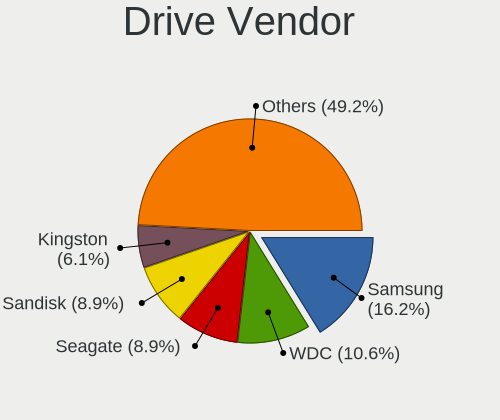
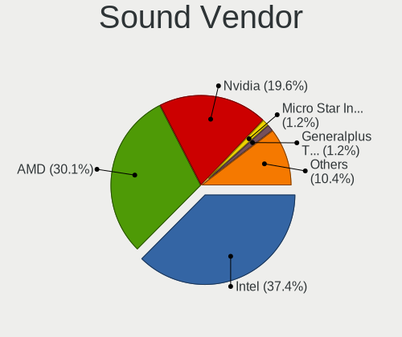

Manjaro - Hardware Trends
-------------------------

A project to identify most popular hardware characteristics and track their change
over time based on data collected by Linux users at https://Linux-Hardware.org.

Anyone can contribute to this report by the [hw-probe](https://github.com/linuxhw/hw-probe) tool:

    sudo -E hw-probe -all -upload

This is a report for all computer types. See also reports for [desktops](/Dist/Manjaro/Desktop/README.md) and [notebooks](/Dist/Manjaro/Notebook/README.md).

This report is for one last month. Overall report since the beginning of time: [TestCoverage](https://github.com/linuxhw/TestCoverage)

Period: Aug, 2022.

Contents
--------

* [ System ](#system)
  - [ OS                       ](#os)
  - [ OS Family                ](#os-family)
  - [ Kernel                   ](#kernel)
  - [ Kernel Family            ](#kernel-family)
  - [ Kernel Major Ver.        ](#kernel-major-ver)
  - [ Arch                     ](#arch)
  - [ DE                       ](#de)
  - [ Display Server           ](#display-server)
  - [ Display Manager          ](#display-manager)
  - [ OS Lang                  ](#os-lang)
  - [ Boot Mode                ](#boot-mode)
  - [ Filesystem               ](#filesystem)
  - [ Part. scheme             ](#part-scheme)
  - [ Dual Boot with Linux/BSD ](#dual-boot-with-linuxbsd)
  - [ Dual Boot (Win)          ](#dual-boot-win)

* [ Board ](#board)
  - [ Vendor                   ](#vendor)
  - [ Model                    ](#model)
  - [ Model Family             ](#model-family)
  - [ MFG Year                 ](#mfg-year)
  - [ Form Factor              ](#form-factor)
  - [ Secure Boot              ](#secure-boot)
  - [ Coreboot                 ](#coreboot)
  - [ RAM Size                 ](#ram-size)
  - [ RAM Used                 ](#ram-used)
  - [ Total Drives             ](#total-drives)
  - [ Has CD-ROM               ](#has-cd-rom)
  - [ Has Ethernet             ](#has-ethernet)
  - [ Has WiFi                 ](#has-wifi)
  - [ Has Bluetooth            ](#has-bluetooth)

* [ Location ](#location)
  - [ Country                  ](#country)
  - [ City                     ](#city)

* [ Drives ](#drives)
  - [ Drive Vendor             ](#drive-vendor)
  - [ Drive Model              ](#drive-model)
  - [ HDD Vendor               ](#hdd-vendor)
  - [ SSD Vendor               ](#ssd-vendor)
  - [ Drive Kind               ](#drive-kind)
  - [ Drive Connector          ](#drive-connector)
  - [ Drive Size               ](#drive-size)
  - [ Space Total              ](#space-total)
  - [ Space Used               ](#space-used)
  - [ Malfunc. Drives          ](#malfunc-drives)
  - [ Malfunc. Drive Vendor    ](#malfunc-drive-vendor)
  - [ Malfunc. HDD Vendor      ](#malfunc-hdd-vendor)
  - [ Malfunc. Drive Kind      ](#malfunc-drive-kind)
  - [ Failed Drives            ](#failed-drives)
  - [ Failed Drive Vendor      ](#failed-drive-vendor)
  - [ Drive Status             ](#drive-status)

* [ Storage controller ](#storage-controller)
  - [ Storage Vendor           ](#storage-vendor)
  - [ Storage Model            ](#storage-model)
  - [ Storage Kind             ](#storage-kind)

* [ Processor ](#processor)
  - [ CPU Vendor               ](#cpu-vendor)
  - [ CPU Model                ](#cpu-model)
  - [ CPU Model Family         ](#cpu-model-family)
  - [ CPU Cores                ](#cpu-cores)
  - [ CPU Sockets              ](#cpu-sockets)
  - [ CPU Threads              ](#cpu-threads)
  - [ CPU Op-Modes             ](#cpu-op-modes)
  - [ CPU Microcode            ](#cpu-microcode)
  - [ CPU Microarch            ](#cpu-microarch)

* [ Graphics ](#graphics)
  - [ GPU Vendor               ](#gpu-vendor)
  - [ GPU Model                ](#gpu-model)
  - [ GPU Combo                ](#gpu-combo)
  - [ GPU Driver               ](#gpu-driver)
  - [ GPU Memory               ](#gpu-memory)

* [ Monitor ](#monitor)
  - [ Monitor Vendor           ](#monitor-vendor)
  - [ Monitor Model            ](#monitor-model)
  - [ Monitor Resolution       ](#monitor-resolution)
  - [ Monitor Diagonal         ](#monitor-diagonal)
  - [ Monitor Width            ](#monitor-width)
  - [ Aspect Ratio             ](#aspect-ratio)
  - [ Monitor Area             ](#monitor-area)
  - [ Pixel Density            ](#pixel-density)
  - [ Multiple Monitors        ](#multiple-monitors)

* [ Network ](#network)
  - [ Net Controller Vendor    ](#net-controller-vendor)
  - [ Net Controller Model     ](#net-controller-model)
  - [ Wireless Vendor          ](#wireless-vendor)
  - [ Wireless Model           ](#wireless-model)
  - [ Ethernet Vendor          ](#ethernet-vendor)
  - [ Ethernet Model           ](#ethernet-model)
  - [ Net Controller Kind      ](#net-controller-kind)
  - [ Used Controller          ](#used-controller)
  - [ NICs                     ](#nics)
  - [ IPv6                     ](#ipv6)

* [ Bluetooth ](#bluetooth)
  - [ Bluetooth Vendor         ](#bluetooth-vendor)
  - [ Bluetooth Model          ](#bluetooth-model)

* [ Sound ](#sound)
  - [ Sound Vendor             ](#sound-vendor)
  - [ Sound Model              ](#sound-model)

* [ Memory ](#memory)
  - [ Memory Vendor            ](#memory-vendor)
  - [ Memory Model             ](#memory-model)
  - [ Memory Kind              ](#memory-kind)
  - [ Memory Form Factor       ](#memory-form-factor)
  - [ Memory Size              ](#memory-size)
  - [ Memory Speed             ](#memory-speed)

* [ Printers & scanners ](#printers--scanners)
  - [ Printer Vendor           ](#printer-vendor)
  - [ Printer Model            ](#printer-model)
  - [ Scanner Vendor           ](#scanner-vendor)
  - [ Scanner Model            ](#scanner-model)

* [ Camera ](#camera)
  - [ Camera Vendor            ](#camera-vendor)
  - [ Camera Model             ](#camera-model)

* [ Security ](#security)
  - [ Fingerprint Vendor       ](#fingerprint-vendor)
  - [ Fingerprint Model        ](#fingerprint-model)
  - [ Chipcard Vendor          ](#chipcard-vendor)
  - [ Chipcard Model           ](#chipcard-model)

* [ Unsupported ](#unsupported)
  - [ Unsupported Devices      ](#unsupported-devices)
  - [ Unsupported Device Types ](#unsupported-device-types)

System
------

OS
--

Installed operating systems

| Name           | Computers | Percent |
|----------------|-----------|---------|
| Manjaro        | 62        | 45.93%  |
| Manjaro 21.3.6 | 40        | 29.63%  |
| Manjaro 21.3.7 | 27        | 20%     |
| Manjaro 22.0.0 | 2         | 1.48%   |
| Manjaro 21.3.5 | 2         | 1.48%   |
| Manjaro 21.2.6 | 1         | 0.74%   |
| Manjaro 21.2.2 | 1         | 0.74%   |

OS Family
---------

OS without a version

| Name    | Computers | Percent |
|---------|-----------|---------|
| Manjaro | 135       | 100%    |

Kernel
------

Version of the Linux kernel

| Version                | Computers | Percent |
|------------------------|-----------|---------|
| 5.15.60-1-MANJARO      | 31        | 22.96%  |
| 5.19.1-3-MANJARO       | 18        | 13.33%  |
| 5.15.57-2-MANJARO      | 14        | 10.37%  |
| 5.18.14-1-MANJARO      | 13        | 9.63%   |
| 5.15.59-1-MANJARO      | 10        | 7.41%   |
| 5.19.0-2-MANJARO       | 8         | 5.93%   |
| 5.19.1-2-MANJARO       | 6         | 4.44%   |
| 5.19.0-1-MANJARO       | 6         | 4.44%   |
| 5.18.17-1-MANJARO      | 4         | 2.96%   |
| 5.18.16-1-MANJARO      | 4         | 2.96%   |
| 5.15.55-1-MANJARO      | 4         | 2.96%   |
| 5.15.53-1-MANJARO      | 3         | 2.22%   |
| 5.10.136-1-MANJARO     | 3         | 2.22%   |
| 6.0.0-1-MANJARO        | 1         | 0.74%   |
| 5.19.4-lqx1-1-lqx      | 1         | 0.74%   |
| 5.19.4-269-tkg-bmq     | 1         | 0.74%   |
| 5.19.4-1-MANJARO       | 1         | 0.74%   |
| 5.19.0-xanmod2-2-x64v2 | 1         | 0.74%   |
| 5.19.0-4-MANJARO       | 1         | 0.74%   |
| 5.19.0-1-rt10-MANJARO  | 1         | 0.74%   |
| 5.17.15-1-MANJARO      | 1         | 0.74%   |
| 5.15.57-1-MANJARO      | 1         | 0.74%   |
| 5.15.41-1-MANJARO      | 1         | 0.74%   |
| 5.15.16-1-MANJARO      | 1         | 0.74%   |

Kernel Family
-------------

Linux kernel without a distro release

| Version  | Computers | Percent |
|----------|-----------|---------|
| 5.15.60  | 31        | 22.96%  |
| 5.19.1   | 24        | 17.78%  |
| 5.19.0   | 17        | 12.59%  |
| 5.15.57  | 15        | 11.11%  |
| 5.18.14  | 13        | 9.63%   |
| 5.15.59  | 10        | 7.41%   |
| 5.18.17  | 4         | 2.96%   |
| 5.18.16  | 4         | 2.96%   |
| 5.15.55  | 4         | 2.96%   |
| 5.19.4   | 3         | 2.22%   |
| 5.15.53  | 3         | 2.22%   |
| 5.10.136 | 3         | 2.22%   |
| 6.0.0    | 1         | 0.74%   |
| 5.17.15  | 1         | 0.74%   |
| 5.15.41  | 1         | 0.74%   |
| 5.15.16  | 1         | 0.74%   |

Kernel Major Ver.
-----------------

Linux kernel major version

| Version | Computers | Percent |
|---------|-----------|---------|
| 5.15    | 65        | 48.15%  |
| 5.19    | 44        | 32.59%  |
| 5.18    | 21        | 15.56%  |
| 5.10    | 3         | 2.22%   |
| 6.0     | 1         | 0.74%   |
| 5.17    | 1         | 0.74%   |

Arch
----

OS architecture (x86_64, i586, etc.)

| Name   | Computers | Percent |
|--------|-----------|---------|
| x86_64 | 135       | 100%    |

DE
--

Desktop Environment

| Name       | Computers | Percent |
|------------|-----------|---------|
| KDE5       | 77        | 57.04%  |
| GNOME      | 23        | 17.04%  |
| XFCE       | 21        | 15.56%  |
| Unknown    | 6         | 4.44%   |
| MATE       | 2         | 1.48%   |
| i3         | 2         | 1.48%   |
| X-Cinnamon | 1         | 0.74%   |
| sway       | 1         | 0.74%   |
| Deepin     | 1         | 0.74%   |
| Cinnamon   | 1         | 0.74%   |

Display Server
--------------

X11 or Wayland

| Name    | Computers | Percent |
|---------|-----------|---------|
| X11     | 116       | 85.93%  |
| Wayland | 16        | 11.85%  |
| Unknown | 2         | 1.48%   |
| Tty     | 1         | 0.74%   |

Display Manager
---------------

SDDM, LightDM, etc.

| Name    | Computers | Percent |
|---------|-----------|---------|
| Unknown | 63        | 46.67%  |
| SDDM    | 42        | 31.11%  |
| LightDM | 20        | 14.81%  |
| GDM     | 10        | 7.41%   |

OS Lang
-------

Language

| Lang    | Computers | Percent |
|---------|-----------|---------|
| en_US   | 67        | 49.63%  |
| ru_RU   | 9         | 6.67%   |
| en_GB   | 7         | 5.19%   |
| de_DE   | 7         | 5.19%   |
| pt_BR   | 6         | 4.44%   |
| pl_PL   | 4         | 2.96%   |
| fr_FR   | 3         | 2.22%   |
| es_ES   | 3         | 2.22%   |
| Unknown | 3         | 2.22%   |
| es_UY   | 2         | 1.48%   |
| es_MX   | 2         | 1.48%   |
| en_IN   | 2         | 1.48%   |
| en_AU   | 2         | 1.48%   |
| en_AG   | 2         | 1.48%   |
| Default | 2         | 1.48%   |
| tr_TR   | 1         | 0.74%   |
| pt_PT   | 1         | 0.74%   |
| nl_NL   | 1         | 0.74%   |
| ja_JP   | 1         | 0.74%   |
| it_IT   | 1         | 0.74%   |
| he_IL   | 1         | 0.74%   |
| es_VE   | 1         | 0.74%   |
| es_GT   | 1         | 0.74%   |
| es_EC   | 1         | 0.74%   |
| en_PH   | 1         | 0.74%   |
| en_IE   | 1         | 0.74%   |
| en_DK   | 1         | 0.74%   |
| en_CA   | 1         | 0.74%   |
| da_DK   | 1         | 0.74%   |

Boot Mode
---------

EFI or BIOS

| Mode | Computers | Percent |
|------|-----------|---------|
| BIOS | 79        | 58.52%  |
| EFI  | 56        | 41.48%  |

Filesystem
----------

Type of filesystem

| Type    | Computers | Percent |
|---------|-----------|---------|
| Ext4    | 106       | 78.52%  |
| Btrfs   | 24        | 17.78%  |
| Xfs     | 4         | 2.96%   |
| Overlay | 1         | 0.74%   |

Part. scheme
------------

Scheme of partitioning

| Type    | Computers | Percent |
|---------|-----------|---------|
| Unknown | 76        | 56.3%   |
| GPT     | 53        | 39.26%  |
| MBR     | 6         | 4.44%   |

Dual Boot with Linux/BSD
------------------------

Hosting more than one Linux/BSD

| Dual boot | Computers | Percent |
|-----------|-----------|---------|
| No        | 121       | 89.63%  |
| Yes       | 14        | 10.37%  |

Dual Boot (Win)
---------------

Hosting Linux and Windows

| Dual boot | Computers | Percent |
|-----------|-----------|---------|
| No        | 100       | 74.07%  |
| Yes       | 35        | 25.93%  |

Board
-----

Vendor
------

Motherboard manufacturer

| Name                | Computers | Percent |
|---------------------|-----------|---------|
| ASUSTek Computer    | 34        | 25.19%  |
| Lenovo              | 19        | 14.07%  |
| Hewlett-Packard     | 16        | 11.85%  |
| Dell                | 14        | 10.37%  |
| MSI                 | 13        | 9.63%   |
| Gigabyte Technology | 8         | 5.93%   |
| ASRock              | 8         | 5.93%   |
| Acer                | 3         | 2.22%   |
| Razer               | 2         | 1.48%   |
| HUAWEI              | 2         | 1.48%   |
| Unknown             | 2         | 1.48%   |
| VS Company          | 1         | 0.74%   |
| TUXEDO              | 1         | 0.74%   |
| Timi                | 1         | 0.74%   |
| Samsung Electronics | 1         | 0.74%   |
| MACHINIST           | 1         | 0.74%   |
| GPD                 | 1         | 0.74%   |
| Google              | 1         | 0.74%   |
| Framework           | 1         | 0.74%   |
| ECS                 | 1         | 0.74%   |
| Digma               | 1         | 0.74%   |
| Daten Tecnologia    | 1         | 0.74%   |
| Chuwi               | 1         | 0.74%   |
| AZW                 | 1         | 0.74%   |
| Apple               | 1         | 0.74%   |

Model
-----

Motherboard model

| Name                                   | Computers | Percent |
|----------------------------------------|-----------|---------|
| ASUS TUF Gaming X570-PLUS              | 3         | 2.22%   |
| Unknown                                | 3         | 2.22%   |
| Gigabyte B550M S2H                     | 2         | 1.48%   |
| Dell XPS 15 9500                       | 2         | 1.48%   |
| ASUS ROG Strix G513QY_G513QY           | 2         | 1.48%   |
| VS Company H61H2                       | 1         | 0.74%   |
| TUXEDO Polaris AMD Gen2 (REN)          | 1         | 0.74%   |
| Timi RedmiBook 14                      | 1         | 0.74%   |
| Samsung 950QDA                         | 1         | 0.74%   |
| Razer Book 13 - RZ09-0357              | 1         | 0.74%   |
| Razer Blade                            | 1         | 0.74%   |
| MSI PS63 Modern 8RC                    | 1         | 0.74%   |
| MSI MS-7C94                            | 1         | 0.74%   |
| MSI MS-7C56                            | 1         | 0.74%   |
| MSI MS-7C37                            | 1         | 0.74%   |
| MSI MS-7C02                            | 1         | 0.74%   |
| MSI MS-7B85                            | 1         | 0.74%   |
| MSI MS-7B79                            | 1         | 0.74%   |
| MSI MS-7B38                            | 1         | 0.74%   |
| MSI MS-7850                            | 1         | 0.74%   |
| MSI MS-7693                            | 1         | 0.74%   |
| MSI MS-7589                            | 1         | 0.74%   |
| MSI GS66 Stealth 10SGS                 | 1         | 0.74%   |
| MSI GE75 Raider 10SF                   | 1         | 0.74%   |
| MACHINIST H81M-PRO S1 V2.0             | 1         | 0.74%   |
| Lenovo Z710 20250                      | 1         | 0.74%   |
| Lenovo V14-ADA 82C6                    | 1         | 0.74%   |
| Lenovo ThinkPad X250 20CLS3UW00        | 1         | 0.74%   |
| Lenovo ThinkPad T450s 20BXCTO1WW       | 1         | 0.74%   |
| Lenovo ThinkPad T14 Gen 2a 20XLS0BP00  | 1         | 0.74%   |
| Lenovo ThinkPad E580 20KS003GMH        | 1         | 0.74%   |
| Lenovo ThinkCentre M79 10JAS00P00      | 1         | 0.74%   |
| Lenovo Legion 5 15ARH05H 82B1          | 1         | 0.74%   |
| Lenovo IdeaPad S145-15IIL 82DJ         | 1         | 0.74%   |
| Lenovo IdeaPad S145-15API 81V7         | 1         | 0.74%   |
| Lenovo IdeaPad Gaming 3 15ACH6 82K2    | 1         | 0.74%   |
| Lenovo IdeaPad Flex-14API 81SS         | 1         | 0.74%   |
| Lenovo IdeaPad 5 Pro 14ACN6 82L7       | 1         | 0.74%   |
| Lenovo IdeaPad 5 15ITL05 82FG          | 1         | 0.74%   |
| Lenovo IdeaPad 5 15ALC05 82LN          | 1         | 0.74%   |
| Lenovo IdeaPad 3 15IML05 D1 81WB       | 1         | 0.74%   |
| Lenovo IdeaPad 1 15ALC7 82R4           | 1         | 0.74%   |
| Lenovo IdeaCentre 720-18APR 90HY002APG | 1         | 0.74%   |
| Lenovo G580 20150                      | 1         | 0.74%   |
| HUAWEI NBD-WXX9                        | 1         | 0.74%   |
| HUAWEI MACHC-WAX9                      | 1         | 0.74%   |
| HP ZBook 17 G6                         | 1         | 0.74%   |
| HP ProDesk 400 G4 SFF                  | 1         | 0.74%   |
| HP ProBook 450 G7                      | 1         | 0.74%   |
| HP Pavilion x360 m3 Convertible        | 1         | 0.74%   |
| HP Pavilion Laptop 14-ec0xxx           | 1         | 0.74%   |
| HP Pavilion Gaming Laptop 15-cx0xxx    | 1         | 0.74%   |
| HP Laptop 15-dw3xxx                    | 1         | 0.74%   |
| HP Laptop 14-dq1xxx                    | 1         | 0.74%   |
| HP ENVY m6 Notebook                    | 1         | 0.74%   |
| HP EliteDesk 800 G2 TWR                | 1         | 0.74%   |
| HP EliteBook 8460p                     | 1         | 0.74%   |
| HP EliteBook 755 G5                    | 1         | 0.74%   |
| HP EliteBook 2760p                     | 1         | 0.74%   |
| HP Dratini                             | 1         | 0.74%   |

Model Family
------------

Motherboard model prefix

| Name               | Computers | Percent |
|--------------------|-----------|---------|
| ASUS ROG           | 14        | 10.37%  |
| Lenovo IdeaPad     | 9         | 6.67%   |
| Dell XPS           | 5         | 3.7%    |
| Lenovo ThinkPad    | 4         | 2.96%   |
| Dell Latitude      | 4         | 2.96%   |
| ASUS TUF           | 4         | 2.96%   |
| HP Pavilion        | 3         | 2.22%   |
| HP EliteBook       | 3         | 2.22%   |
| ASUS VivoBook      | 3         | 2.22%   |
| ASUS PRIME         | 3         | 2.22%   |
| Acer Aspire        | 3         | 2.22%   |
| Unknown            | 3         | 2.22%   |
| HP Laptop          | 2         | 1.48%   |
| Gigabyte B550M     | 2         | 1.48%   |
| Gigabyte B450      | 2         | 1.48%   |
| Dell Vostro        | 2         | 1.48%   |
| Dell Inspiron      | 2         | 1.48%   |
| ASUS ZenBook       | 2         | 1.48%   |
| ASUS ProArt        | 2         | 1.48%   |
| VS Company H61H2   | 1         | 0.74%   |
| TUXEDO Polaris     | 1         | 0.74%   |
| Timi RedmiBook     | 1         | 0.74%   |
| Samsung 950QDA     | 1         | 0.74%   |
| Razer Book         | 1         | 0.74%   |
| Razer Blade        | 1         | 0.74%   |
| MSI PS63           | 1         | 0.74%   |
| MSI MS-7C94        | 1         | 0.74%   |
| MSI MS-7C56        | 1         | 0.74%   |
| MSI MS-7C37        | 1         | 0.74%   |
| MSI MS-7C02        | 1         | 0.74%   |
| MSI MS-7B85        | 1         | 0.74%   |
| MSI MS-7B79        | 1         | 0.74%   |
| MSI MS-7B38        | 1         | 0.74%   |
| MSI MS-7850        | 1         | 0.74%   |
| MSI MS-7693        | 1         | 0.74%   |
| MSI MS-7589        | 1         | 0.74%   |
| MSI GS66           | 1         | 0.74%   |
| MSI GE75           | 1         | 0.74%   |
| MACHINIST H81M-PRO | 1         | 0.74%   |
| Lenovo Z710        | 1         | 0.74%   |
| Lenovo V14-ADA     | 1         | 0.74%   |
| Lenovo ThinkCentre | 1         | 0.74%   |
| Lenovo Legion      | 1         | 0.74%   |
| Lenovo IdeaCentre  | 1         | 0.74%   |
| Lenovo G580        | 1         | 0.74%   |
| HUAWEI NBD-WXX9    | 1         | 0.74%   |
| HUAWEI MACHC-WAX9  | 1         | 0.74%   |
| HP ZBook           | 1         | 0.74%   |
| HP ProDesk         | 1         | 0.74%   |
| HP ProBook         | 1         | 0.74%   |
| HP ENVY            | 1         | 0.74%   |
| HP EliteDesk       | 1         | 0.74%   |
| HP Dratini         | 1         | 0.74%   |
| HP 255             | 1         | 0.74%   |
| GPD G1621-02       | 1         | 0.74%   |
| Google Blorb       | 1         | 0.74%   |
| Gigabyte X570      | 1         | 0.74%   |
| Gigabyte H61M-S2P  | 1         | 0.74%   |
| Gigabyte B550      | 1         | 0.74%   |
| Gigabyte B150M-D3H | 1         | 0.74%   |

MFG Year
--------

Motherboard manufacture year

| Year | Computers | Percent |
|------|-----------|---------|
| 2021 | 32        | 23.7%   |
| 2020 | 26        | 19.26%  |
| 2019 | 16        | 11.85%  |
| 2018 | 12        | 8.89%   |
| 2022 | 11        | 8.15%   |
| 2012 | 8         | 5.93%   |
| 2015 | 6         | 4.44%   |
| 2016 | 5         | 3.7%    |
| 2011 | 5         | 3.7%    |
| 2013 | 4         | 2.96%   |
| 2017 | 3         | 2.22%   |
| 2014 | 3         | 2.22%   |
| 2009 | 3         | 2.22%   |
| 2008 | 1         | 0.74%   |

Form Factor
-----------

Physical design of the computer

| Name        | Computers | Percent |
|-------------|-----------|---------|
| Notebook    | 74        | 54.81%  |
| Desktop     | 56        | 41.48%  |
| Convertible | 3         | 2.22%   |
| Tablet      | 1         | 0.74%   |
| All in one  | 1         | 0.74%   |

Secure Boot
-----------

Enabled or disabled

| State    | Computers | Percent |
|----------|-----------|---------|
| Disabled | 134       | 99.26%  |
| Enabled  | 1         | 0.74%   |

Coreboot
--------

Have coreboot on board

| Used | Computers | Percent |
|------|-----------|---------|
| No   | 133       | 98.52%  |
| Yes  | 2         | 1.48%   |

RAM Size
--------

Total RAM memory

| Size in GB  | Computers | Percent |
|-------------|-----------|---------|
| 16.01-24.0  | 34        | 25.19%  |
| 8.01-16.0   | 29        | 21.48%  |
| 4.01-8.0    | 27        | 20%     |
| 32.01-64.0  | 22        | 16.3%   |
| 3.01-4.0    | 9         | 6.67%   |
| 64.01-256.0 | 9         | 6.67%   |
| 24.01-32.0  | 5         | 3.7%    |

RAM Used
--------

Used RAM memory

| Used GB    | Computers | Percent |
|------------|-----------|---------|
| 2.01-3.0   | 37        | 27.41%  |
| 4.01-8.0   | 33        | 24.44%  |
| 1.01-2.0   | 26        | 19.26%  |
| 3.01-4.0   | 18        | 13.33%  |
| 8.01-16.0  | 15        | 11.11%  |
| 32.01-64.0 | 2         | 1.48%   |
| 16.01-24.0 | 2         | 1.48%   |
| 24.01-32.0 | 1         | 0.74%   |
| 0.51-1.0   | 1         | 0.74%   |

Total Drives
------------

Number of drives on board

| Drives | Computers | Percent |
|--------|-----------|---------|
| 1      | 65        | 48.15%  |
| 2      | 42        | 31.11%  |
| 3      | 13        | 9.63%   |
| 5      | 8         | 5.93%   |
| 4      | 3         | 2.22%   |
| 6      | 2         | 1.48%   |
| 11     | 1         | 0.74%   |
| 9      | 1         | 0.74%   |

Has CD-ROM
----------

Has CD-ROM on board

| Presented | Computers | Percent |
|-----------|-----------|---------|
| No        | 116       | 85.93%  |
| Yes       | 19        | 14.07%  |

Has Ethernet
------------

Has Ethernet on board

| Presented | Computers | Percent |
|-----------|-----------|---------|
| Yes       | 98        | 72.59%  |
| No        | 37        | 27.41%  |

Has WiFi
--------

Has WiFi module

| Presented | Computers | Percent |
|-----------|-----------|---------|
| Yes       | 104       | 77.04%  |
| No        | 31        | 22.96%  |

Has Bluetooth
-------------

Has Bluetooth module

| Presented | Computers | Percent |
|-----------|-----------|---------|
| Yes       | 99        | 73.33%  |
| No        | 36        | 26.67%  |

Location
--------

Country
-------

Geographic location (country)

| Country      | Computers | Percent |
|--------------|-----------|---------|
| USA          | 35        | 25.93%  |
| Russia       | 11        | 8.15%   |
| Germany      | 10        | 7.41%   |
| Brazil       | 8         | 5.93%   |
| India        | 6         | 4.44%   |
| Poland       | 5         | 3.7%    |
| Spain        | 4         | 2.96%   |
| UK           | 3         | 2.22%   |
| Netherlands  | 3         | 2.22%   |
| Mexico       | 3         | 2.22%   |
| Japan        | 3         | 2.22%   |
| Canada       | 3         | 2.22%   |
| Uruguay      | 2         | 1.48%   |
| Sweden       | 2         | 1.48%   |
| Italy        | 2         | 1.48%   |
| France       | 2         | 1.48%   |
| Egypt        | 2         | 1.48%   |
| Denmark      | 2         | 1.48%   |
| Bangladesh   | 2         | 1.48%   |
| Austria      | 2         | 1.48%   |
| Australia    | 2         | 1.48%   |
| Vietnam      | 1         | 0.74%   |
| Venezuela    | 1         | 0.74%   |
| Ukraine      | 1         | 0.74%   |
| Turkey       | 1         | 0.74%   |
| Tunisia      | 1         | 0.74%   |
| South Korea  | 1         | 0.74%   |
| Saudi Arabia | 1         | 0.74%   |
| Portugal     | 1         | 0.74%   |
| Philippines  | 1         | 0.74%   |
| Morocco      | 1         | 0.74%   |
| Lithuania    | 1         | 0.74%   |
| Latvia       | 1         | 0.74%   |
| Israel       | 1         | 0.74%   |
| Ireland      | 1         | 0.74%   |
| Iran         | 1         | 0.74%   |
| Guatemala    | 1         | 0.74%   |
| Georgia      | 1         | 0.74%   |
| Ecuador      | 1         | 0.74%   |
| Czechia      | 1         | 0.74%   |
| Croatia      | 1         | 0.74%   |
| Bulgaria     | 1         | 0.74%   |
| Belgium      | 1         | 0.74%   |
| Armenia      | 1         | 0.74%   |

City
----

Geographic location (city)

| City                   | Computers | Percent |
|------------------------|-----------|---------|
| Pune                   | 3         | 2.22%   |
| Stockholm              | 2         | 1.48%   |
| St Petersburg          | 2         | 1.48%   |
| Novosibirsk            | 2         | 1.48%   |
| Montevideo             | 2         | 1.48%   |
| Hamburg                | 2         | 1.48%   |
| Fortaleza              | 2         | 1.48%   |
| Dhaka                  | 2         | 1.48%   |
| Dallas                 | 2         | 1.48%   |
| Cairo                  | 2         | 1.48%   |
| Atlanta                | 2         | 1.48%   |
| Zagreb                 | 1         | 0.74%   |
| Yerevan                | 1         | 0.74%   |
| Wolnzach               | 1         | 0.74%   |
| Winston-Salem          | 1         | 0.74%   |
| West Bromwich          | 1         | 0.74%   |
| Welland                | 1         | 0.74%   |
| Waterloo               | 1         | 0.74%   |
| Voznesensk             | 1         | 0.74%   |
| Vladimir               | 1         | 0.74%   |
| Vilnius                | 1         | 0.74%   |
| Vienna                 | 1         | 0.74%   |
| Tunis                  | 1         | 0.74%   |
| Tolyatti               | 1         | 0.74%   |
| Tijuana                | 1         | 0.74%   |
| Targuist               | 1         | 0.74%   |
| Tajrīsh               | 1         | 0.74%   |
| Szczecin               | 1         | 0.74%   |
| Sydney                 | 1         | 0.74%   |
| Suyeong-gu             | 1         | 0.74%   |
| Sunderland             | 1         | 0.74%   |
| Sunbury                | 1         | 0.74%   |
| Sofia                  | 1         | 0.74%   |
| Skawina                | 1         | 0.74%   |
| Siemianowice Śląskie | 1         | 0.74%   |
| Shinnston              | 1         | 0.74%   |
| Shimotoda              | 1         | 0.74%   |
| Shillong               | 1         | 0.74%   |
| Salt Lake City         | 1         | 0.74%   |
| Ryazan                 | 1         | 0.74%   |
| Riga                   | 1         | 0.74%   |
| Queretaro              | 1         | 0.74%   |
| Providence             | 1         | 0.74%   |
| Pelotas                | 1         | 0.74%   |
| Ovid                   | 1         | 0.74%   |
| Oklahoma City          | 1         | 0.74%   |
| Odemira                | 1         | 0.74%   |
| Norfolk                | 1         | 0.74%   |
| Nijkerk                | 1         | 0.74%   |
| New Rochelle           | 1         | 0.74%   |
| Natchez                | 1         | 0.74%   |
| Moscow                 | 1         | 0.74%   |
| Monza                  | 1         | 0.74%   |
| Milwaukee              | 1         | 0.74%   |
| Milan                  | 1         | 0.74%   |
| Midland                | 1         | 0.74%   |
| Mexico City            | 1         | 0.74%   |
| Medina                 | 1         | 0.74%   |
| Malbork                | 1         | 0.74%   |
| Madrid                 | 1         | 0.74%   |

Drives
------

Drive Vendor
------------

Hard drive vendors

| Vendor                      | Computers | Drives | Percent |
|-----------------------------|-----------|--------|---------|
| Samsung Electronics         | 44        | 61     | 18.88%  |
| WDC                         | 30        | 33     | 12.88%  |
| Seagate                     | 20        | 26     | 8.58%   |
| SanDisk                     | 18        | 19     | 7.73%   |
| Kingston                    | 13        | 17     | 5.58%   |
| Toshiba                     | 11        | 11     | 4.72%   |
| Micron Technology           | 11        | 11     | 4.72%   |
| Unknown                     | 9         | 10     | 3.86%   |
| Crucial                     | 9         | 15     | 3.86%   |
| SK hynix                    | 8         | 8      | 3.43%   |
| Intel                       | 8         | 8      | 3.43%   |
| Hitachi                     | 6         | 6      | 2.58%   |
| Phison                      | 5         | 5      | 2.15%   |
| China                       | 4         | 4      | 1.72%   |
| KIOXIA                      | 3         | 3      | 1.29%   |
| GOODRAM                     | 3         | 3      | 1.29%   |
| A-DATA Technology           | 3         | 3      | 1.29%   |
| Transcend                   | 2         | 2      | 0.86%   |
| Micron/Crucial Technology   | 2         | 2      | 0.86%   |
| XPG                         | 1         | 1      | 0.43%   |
| USB                         | 1         | 1      | 0.43%   |
| Union Memory (Shenzhen)     | 1         | 1      | 0.43%   |
| Teutons                     | 1         | 1      | 0.43%   |
| Teclast                     | 1         | 1      | 0.43%   |
| Team                        | 1         | 1      | 0.43%   |
| Silicon Motion              | 1         | 1      | 0.43%   |
| Realtek Semiconductor       | 1         | 1      | 0.43%   |
| Realtek                     | 1         | 1      | 0.43%   |
| Phison Electronics          | 1         | 1      | 0.43%   |
| Oyen                        | 1         | 1      | 0.43%   |
| Netac                       | 1         | 1      | 0.43%   |
| MyDigitalSSD                | 1         | 1      | 0.43%   |
| Mushkin                     | 1         | 1      | 0.43%   |
| Maxtor                      | 1         | 1      | 0.43%   |
| Kingston Technology Company | 1         | 1      | 0.43%   |
| JMicron Technology          | 1         | 1      | 0.43%   |
| Inland                      | 1         | 1      | 0.43%   |
| Indilinx                    | 1         | 1      | 0.43%   |
| HGST                        | 1         | 1      | 0.43%   |
| Fujitsu                     | 1         | 1      | 0.43%   |
| BIWIN                       | 1         | 1      | 0.43%   |
| Apple                       | 1         | 2      | 0.43%   |
| Apacer                      | 1         | 1      | 0.43%   |

Drive Model
-----------

Hard drive models

| Model                                              | Computers | Percent |
|----------------------------------------------------|-----------|---------|
| Kingston SA400S37240G 240GB SSD                    | 5         | 1.92%   |
| Intel NVMe SSD Drive 512GB                         | 4         | 1.54%   |
| SanDisk NVMe SSD Drive 256GB                       | 3         | 1.15%   |
| Samsung SSD 860 EVO 500GB                          | 3         | 1.15%   |
| Samsung NVMe SSD Drive 512GB                       | 3         | 1.15%   |
| Samsung NVMe SSD Drive 1TB                         | 3         | 1.15%   |
| Micron NVMe SSD Drive 512GB                        | 3         | 1.15%   |
| Crucial CT500MX500SSD1 500GB                       | 3         | 1.15%   |
| WDC WD10EZEX-60ZF5A0 1TB                           | 2         | 0.77%   |
| Unknown MMC Card  64GB                             | 2         | 0.77%   |
| Seagate ST3160318AS 160GB                          | 2         | 0.77%   |
| Seagate ST2000DM006-2DM164 2TB                     | 2         | 0.77%   |
| Seagate ST1000DM010-2EP102 1TB                     | 2         | 0.77%   |
| SanDisk SSD PLUS 240GB                             | 2         | 0.77%   |
| SanDisk NVMe SSD Drive 512GB                       | 2         | 0.77%   |
| SanDisk NVMe SSD Drive 500GB                       | 2         | 0.77%   |
| Samsung SSD 970 EVO Plus 500GB                     | 2         | 0.77%   |
| Samsung SSD 960 EVO 250GB                          | 2         | 0.77%   |
| Samsung SSD 870 EVO 500GB                          | 2         | 0.77%   |
| Samsung SSD 860 EVO 250GB                          | 2         | 0.77%   |
| Samsung SSD 860 EVO 1TB                            | 2         | 0.77%   |
| Samsung SSD 850 EVO 1TB                            | 2         | 0.77%   |
| Samsung NVMe SSD Drive 2TB                         | 2         | 0.77%   |
| Samsung NVMe SSD Drive 250GB                       | 2         | 0.77%   |
| Samsung NVMe SSD Controller SM981/PM981/PM983 1TB  | 2         | 0.77%   |
| Samsung NVMe SSD Controller PM9A1/PM9A3/980PRO 1TB | 2         | 0.77%   |
| Micron/Crucial NVMe SSD Drive 1TB                  | 2         | 0.77%   |
| Micron NVMe SSD Drive 256GB                        | 2         | 0.77%   |
| Micron NVMe SSD Drive 1024GB                       | 2         | 0.77%   |
| Kingston NVMe SSD Drive 512GB                      | 2         | 0.77%   |
| XPG NVMe SSD Drive 1024GB                          | 1         | 0.38%   |
| WDC WDS240G2G0C-00AJM0 240GB                       | 1         | 0.38%   |
| WDC WDS200T2B0A-00SM50 2TB SSD                     | 1         | 0.38%   |
| WDC WDBRPG5000ANC-WRSN 500GB                       | 1         | 0.38%   |
| WDC WD82PURZ-85TEUY0 8TB                           | 1         | 0.38%   |
| WDC WD80EDAZ-11TA3A0 8TB                           | 1         | 0.38%   |
| WDC WD7500BPKT-22PK4T0 752GB                       | 1         | 0.38%   |
| WDC WD5000LPCX-6 500GB                             | 1         | 0.38%   |
| WDC WD5000AZLX-75K2TA0 500GB                       | 1         | 0.38%   |
| WDC WD5000AAKX-003CA0 500GB                        | 1         | 0.38%   |
| WDC WD5000AAKS-00UU3A0 500GB                       | 1         | 0.38%   |
| WDC WD40EZRZ-00GXCB0 4TB                           | 1         | 0.38%   |
| WDC WD2500LPCX-24C6HT0 250GB                       | 1         | 0.38%   |
| WDC WD20EZRZ-00Z5HB0 2TB                           | 1         | 0.38%   |
| WDC WD20EARX-00PASB0 2TB                           | 1         | 0.38%   |
| WDC WD20EARX-00AZ6B0 2TB                           | 1         | 0.38%   |
| WDC WD2003FZEX-00SRLA0 2TB                         | 1         | 0.38%   |
| WDC WD1600AAJS-22L7A0 160GB                        | 1         | 0.38%   |
| WDC WD10SPZX-24Z10 1TB                             | 1         | 0.38%   |
| WDC WD10SPZX-08Z10 1TB                             | 1         | 0.38%   |
| WDC WD10EZRX-00L4HB0 1TB                           | 1         | 0.38%   |
| WDC WD10EZEX-60WN4A0 1TB                           | 1         | 0.38%   |
| WDC WD10EZEX-22MFCA0 1TB                           | 1         | 0.38%   |
| WDC WD10EZEX-08WN4A0 1TB                           | 1         | 0.38%   |
| WDC WD10EZEX-00BN5A0 1TB                           | 1         | 0.38%   |
| WDC WD10EADS-114BB1 1TB                            | 1         | 0.38%   |
| WDC WD10EADS-00L5B1 1TB                            | 1         | 0.38%   |
| WDC WD1003FZEX-00MK2A0 1TB                         | 1         | 0.38%   |
| WDC WD10 SPZX-08Z10 1TB                            | 1         | 0.38%   |
| WDC PC SN530 SDBPNPZ-256G-1006 256GB               | 1         | 0.38%   |

HDD Vendor
----------

Hard disk drive vendors

| Vendor              | Computers | Drives | Percent |
|---------------------|-----------|--------|---------|
| WDC                 | 25        | 28     | 39.06%  |
| Seagate             | 19        | 25     | 29.69%  |
| Toshiba             | 6         | 6      | 9.38%   |
| Hitachi             | 6         | 6      | 9.38%   |
| Samsung Electronics | 3         | 3      | 4.69%   |
| USB                 | 1         | 1      | 1.56%   |
| Maxtor              | 1         | 1      | 1.56%   |
| HGST                | 1         | 1      | 1.56%   |
| Fujitsu             | 1         | 1      | 1.56%   |
| Apple               | 1         | 1      | 1.56%   |

SSD Vendor
----------

Solid state drive vendors

| Vendor              | Computers | Drives | Percent |
|---------------------|-----------|--------|---------|
| Samsung Electronics | 18        | 26     | 27.27%  |
| Kingston            | 8         | 10     | 12.12%  |
| Crucial             | 7         | 13     | 10.61%  |
| SanDisk             | 6         | 7      | 9.09%   |
| China               | 4         | 4      | 6.06%   |
| Toshiba             | 3         | 3      | 4.55%   |
| GOODRAM             | 3         | 3      | 4.55%   |
| A-DATA Technology   | 3         | 3      | 4.55%   |
| Micron Technology   | 2         | 2      | 3.03%   |
| WDC                 | 1         | 1      | 1.52%   |
| Teutons             | 1         | 1      | 1.52%   |
| Teclast             | 1         | 1      | 1.52%   |
| Team                | 1         | 1      | 1.52%   |
| Seagate             | 1         | 1      | 1.52%   |
| Netac               | 1         | 1      | 1.52%   |
| MyDigitalSSD        | 1         | 1      | 1.52%   |
| JMicron Technology  | 1         | 1      | 1.52%   |
| Inland              | 1         | 1      | 1.52%   |
| Indilinx            | 1         | 1      | 1.52%   |
| Apple               | 1         | 1      | 1.52%   |
| Apacer              | 1         | 1      | 1.52%   |

Drive Kind
----------

HDD or SSD

| Kind    | Computers | Drives | Percent |
|---------|-----------|--------|---------|
| NVMe    | 83        | 104    | 42.35%  |
| SSD     | 58        | 83     | 29.59%  |
| HDD     | 45        | 73     | 22.96%  |
| MMC     | 7         | 8      | 3.57%   |
| Unknown | 3         | 4      | 1.53%   |

Drive Connector
---------------

SATA, SAS, NVMe, etc.

| Type | Computers | Drives | Percent |
|------|-----------|--------|---------|
| NVMe | 83        | 103    | 46.63%  |
| SATA | 75        | 145    | 42.13%  |
| SAS  | 13        | 16     | 7.3%    |
| MMC  | 7         | 8      | 3.93%   |

Drive Size
----------

Size of hard drive

| Size in TB | Computers | Drives | Percent |
|------------|-----------|--------|---------|
| 0.01-0.5   | 57        | 80     | 49.14%  |
| 0.51-1.0   | 35        | 44     | 30.17%  |
| 1.01-2.0   | 12        | 16     | 10.34%  |
| 3.01-4.0   | 6         | 7      | 5.17%   |
| 4.01-10.0  | 5         | 8      | 4.31%   |
| 2.01-3.0   | 1         | 1      | 0.86%   |

Space Total
-----------

Amount of disk space available on the file system

| Size in GB     | Computers | Percent |
|----------------|-----------|---------|
| 251-500        | 29        | 21.48%  |
| 101-250        | 23        | 17.04%  |
| 501-1000       | 22        | 16.3%   |
| More than 3000 | 17        | 12.59%  |
| 1001-2000      | 13        | 9.63%   |
| Unknown        | 13        | 9.63%   |
| 51-100         | 9         | 6.67%   |
| 2001-3000      | 7         | 5.19%   |
| 21-50          | 2         | 1.48%   |

Space Used
----------

Amount of used disk space

| Used GB        | Computers | Percent |
|----------------|-----------|---------|
| 101-250        | 23        | 17.04%  |
| 1-20           | 20        | 14.81%  |
| 21-50          | 19        | 14.07%  |
| 51-100         | 16        | 11.85%  |
| 251-500        | 15        | 11.11%  |
| Unknown        | 13        | 9.63%   |
| More than 3000 | 10        | 7.41%   |
| 1001-2000      | 10        | 7.41%   |
| 501-1000       | 6         | 4.44%   |
| 2001-3000      | 3         | 2.22%   |

Malfunc. Drives
---------------

Drive models with a malfunction

| Model                              | Computers | Drives | Percent |
|------------------------------------|-----------|--------|---------|
| WDC WD1600AAJS-22L7A0 160GB        | 1         | 1      | 20%     |
| WDC WD10 SPZX-08Z10 1TB            | 1         | 1      | 20%     |
| Seagate ST500LT012-9WS142 500GB    | 1         | 1      | 20%     |
| Seagate ST1000LM024 HN-M101MBB 1TB | 1         | 1      | 20%     |
| Hitachi HDS721010CLA332 1TB        | 1         | 1      | 20%     |

Malfunc. Drive Vendor
---------------------

Vendors of faulty drives

| Vendor  | Computers | Drives | Percent |
|---------|-----------|--------|---------|
| WDC     | 2         | 2      | 40%     |
| Seagate | 2         | 2      | 40%     |
| Hitachi | 1         | 1      | 20%     |

Malfunc. HDD Vendor
-------------------

Vendors of faulty HDD drives

| Vendor  | Computers | Drives | Percent |
|---------|-----------|--------|---------|
| WDC     | 2         | 2      | 40%     |
| Seagate | 2         | 2      | 40%     |
| Hitachi | 1         | 1      | 20%     |

Malfunc. Drive Kind
-------------------

Kinds of faulty drives

| Kind | Computers | Drives | Percent |
|------|-----------|--------|---------|
| HDD  | 5         | 5      | 100%    |

Failed Drives
-------------

Failed drive models

Zero info for selected period =(

Failed Drive Vendor
-------------------

Failed drive vendors

Zero info for selected period =(

Drive Status
------------

Number of failed and malfunc. drives

| Status   | Computers | Drives | Percent |
|----------|-----------|--------|---------|
| Detected | 92        | 164    | 63.01%  |
| Works    | 49        | 103    | 33.56%  |
| Malfunc  | 5         | 5      | 3.42%   |

Storage controller
------------------

Storage Vendor
--------------

Storage controller vendors

| Vendor                       | Computers | Percent |
|------------------------------|-----------|---------|
| Intel                        | 66        | 32.35%  |
| AMD                          | 44        | 21.57%  |
| Samsung Electronics          | 28        | 13.73%  |
| SanDisk                      | 14        | 6.86%   |
| Micron Technology            | 9         | 4.41%   |
| SK hynix                     | 8         | 3.92%   |
| Phison Electronics           | 6         | 2.94%   |
| Kingston Technology Company  | 6         | 2.94%   |
| Silicon Motion               | 4         | 1.96%   |
| Micron/Crucial Technology    | 4         | 1.96%   |
| ASMedia Technology           | 4         | 1.96%   |
| KIOXIA                       | 3         | 1.47%   |
| Toshiba America Info Systems | 2         | 0.98%   |
| Union Memory (Shenzhen)      | 1         | 0.49%   |
| Realtek Semiconductor        | 1         | 0.49%   |
| Nvidia                       | 1         | 0.49%   |
| LSI Logic / Symbios Logic    | 1         | 0.49%   |
| Biwin Storage Technology     | 1         | 0.49%   |
| ADATA Technology             | 1         | 0.49%   |

Storage Model
-------------

Storage controller models

| Model                                                                                   | Computers | Percent |
|-----------------------------------------------------------------------------------------|-----------|---------|
| AMD FCH SATA Controller [AHCI mode]                                                     | 27        | 11.89%  |
| Samsung NVMe SSD Controller SM981/PM981/PM983                                           | 15        | 6.61%   |
| AMD 500 Series Chipset SATA Controller                                                  | 10        | 4.41%   |
| Micron Non-Volatile memory controller                                                   | 9         | 3.96%   |
| Intel Volume Management Device NVMe RAID Controller                                     | 9         | 3.96%   |
| AMD 400 Series Chipset SATA Controller                                                  | 9         | 3.96%   |
| Samsung NVMe SSD Controller PM9A1/PM9A3/980PRO                                          | 6         | 2.64%   |
| SK hynix Gold P31 SSD                                                                   | 5         | 2.2%    |
| SanDisk WD Blue SN550 NVMe SSD                                                          | 5         | 2.2%    |
| Intel Comet Lake SATA AHCI Controller                                                   | 5         | 2.2%    |
| Intel 8 Series/C220 Series Chipset Family 6-port SATA Controller 1 [AHCI mode]          | 5         | 2.2%    |
| Intel Non-Volatile memory controller                                                    | 4         | 1.76%   |
| ASMedia ASM1062 Serial ATA Controller                                                   | 4         | 1.76%   |
| Samsung NVMe SSD Controller SM961/PM961/SM963                                           | 3         | 1.32%   |
| Samsung NVMe SSD Controller SM951/PM951                                                 | 3         | 1.32%   |
| Samsung NVMe SSD Controller 980                                                         | 3         | 1.32%   |
| Micron/Crucial P2 NVMe PCIe SSD                                                         | 3         | 1.32%   |
| Kingston Company A2000 NVMe SSD                                                         | 3         | 1.32%   |
| Intel Tiger Lake-LP SATA Controller                                                     | 3         | 1.32%   |
| Intel Sunrise Point-LP SATA Controller [AHCI mode]                                      | 3         | 1.32%   |
| Intel SSD 660P Series                                                                   | 3         | 1.32%   |
| Intel Q170/Q150/B150/H170/H110/Z170/CM236 Chipset SATA Controller [AHCI Mode]           | 3         | 1.32%   |
| Intel Celeron/Pentium Silver Processor SATA Controller                                  | 3         | 1.32%   |
| Intel 82801 Mobile SATA Controller [RAID mode]                                          | 3         | 1.32%   |
| Intel 7 Series/C210 Series Chipset Family 6-port SATA Controller [AHCI mode]            | 3         | 1.32%   |
| Intel 6 Series/C200 Series Chipset Family Desktop SATA Controller (IDE mode, ports 4-5) | 3         | 1.32%   |
| Intel 6 Series/C200 Series Chipset Family Desktop SATA Controller (IDE mode, ports 0-3) | 3         | 1.32%   |
| Intel 6 Series/C200 Series Chipset Family 6 port Mobile SATA AHCI Controller            | 3         | 1.32%   |
| Silicon Motion SM2263EN/SM2263XT SSD Controller                                         | 2         | 0.88%   |
| Silicon Motion SM2262/SM2262EN SSD Controller                                           | 2         | 0.88%   |
| SanDisk WD PC SN810 / Black SN850 NVMe SSD                                              | 2         | 0.88%   |
| SanDisk WD Blue SN500 / PC SN520 NVMe SSD                                               | 2         | 0.88%   |
| SanDisk WD Black SN750 / PC SN730 NVMe SSD                                              | 2         | 0.88%   |
| SanDisk Non-Volatile memory controller                                                  | 2         | 0.88%   |
| Phison E16 PCIe4 NVMe Controller                                                        | 2         | 0.88%   |
| Phison E12 NVMe Controller                                                              | 2         | 0.88%   |
| KIOXIA Non-Volatile memory controller                                                   | 2         | 0.88%   |
| Intel Wildcat Point-LP SATA Controller [AHCI Mode]                                      | 2         | 0.88%   |
| Intel Cannon Lake PCH SATA AHCI Controller                                              | 2         | 0.88%   |
| Intel Cannon Lake Mobile PCH SATA AHCI Controller                                       | 2         | 0.88%   |
| Intel 7 Series Chipset Family 6-port SATA Controller [AHCI mode]                        | 2         | 0.88%   |
| Intel 200 Series PCH SATA controller [AHCI mode]                                        | 2         | 0.88%   |
| AMD SB7x0/SB8x0/SB9x0 SATA Controller [AHCI mode]                                       | 2         | 0.88%   |
| Union Memory (Shenzhen) AM630 PCIe 4.0 x4 NVMe SSD Controller                           | 1         | 0.44%   |
| Toshiba America Info Systems XG6 NVMe SSD Controller                                    | 1         | 0.44%   |
| Toshiba America Info Systems Toshiba America Info Non-Volatile memory controller        | 1         | 0.44%   |
| SK hynix PC401 NVMe Solid State Drive 256GB                                             | 1         | 0.44%   |
| SK hynix Non-Volatile memory controller                                                 | 1         | 0.44%   |
| SK hynix BC511                                                                          | 1         | 0.44%   |
| SanDisk WD Black 2018/SN750 / PC SN720 NVMe SSD                                         | 1         | 0.44%   |
| Realtek Realtek Non-Volatile memory controller                                          | 1         | 0.44%   |
| Phison PS5013 E13 NVMe Controller                                                       | 1         | 0.44%   |
| Phison E18 PCIe4 NVMe Controller                                                        | 1         | 0.44%   |
| Nvidia MCP61 SATA Controller                                                            | 1         | 0.44%   |
| Micron/Crucial Non-Volatile memory controller                                           | 1         | 0.44%   |
| LSI Logic / Symbios Logic SAS2008 PCI-Express Fusion-MPT SAS-2 [Falcon]                 | 1         | 0.44%   |
| KIOXIA NVMe SSD Controller BG4                                                          | 1         | 0.44%   |
| Kingston Company U-SNS8154P3 NVMe SSD                                                   | 1         | 0.44%   |
| Kingston Company Company Non-Volatile memory controller                                 | 1         | 0.44%   |
| Kingston Company OM3PDP3 NVMe SSD                                                       | 1         | 0.44%   |

Storage Kind
------------

Kind of storage controller (IDE, SATA, NVMe, SAS, ...)

| Kind | Computers | Percent |
|------|-----------|---------|
| SATA | 92        | 46.7%   |
| NVMe | 83        | 42.13%  |
| RAID | 12        | 6.09%   |
| IDE  | 9         | 4.57%   |
| SAS  | 1         | 0.51%   |

Processor
---------

CPU Vendor
----------

Processor vendors

| Vendor | Computers | Percent |
|--------|-----------|---------|
| Intel  | 77        | 57.04%  |
| AMD    | 58        | 42.96%  |

CPU Model
---------

Processor models

| Model                                       | Computers | Percent |
|---------------------------------------------|-----------|---------|
| Intel 11th Gen Core i7-1165G7 @ 2.80GHz     | 6         | 4.44%   |
| AMD Ryzen 5 5600X 6-Core Processor          | 4         | 2.96%   |
| AMD Ryzen 5 5600G with Radeon Graphics      | 4         | 2.96%   |
| Intel Core i7-10750H CPU @ 2.60GHz          | 3         | 2.22%   |
| Intel Core i5-10210U CPU @ 1.60GHz          | 3         | 2.22%   |
| Intel Celeron N4020 CPU @ 1.10GHz           | 3         | 2.22%   |
| AMD Ryzen 9 5950X 16-Core Processor         | 3         | 2.22%   |
| AMD Ryzen 9 5900HX with Radeon Graphics     | 3         | 2.22%   |
| AMD Ryzen 7 3800X 8-Core Processor          | 3         | 2.22%   |
| Intel Core i7-3770 CPU @ 3.40GHz            | 2         | 1.48%   |
| Intel Core i7-10510U CPU @ 1.80GHz          | 2         | 1.48%   |
| Intel Core i5-5200U CPU @ 2.20GHz           | 2         | 1.48%   |
| Intel Core i5-2520M CPU @ 2.50GHz           | 2         | 1.48%   |
| Intel Core i3-1005G1 CPU @ 1.20GHz          | 2         | 1.48%   |
| Intel 12th Gen Core i9-12900H               | 2         | 1.48%   |
| Intel 12th Gen Core i7-12700H               | 2         | 1.48%   |
| AMD Ryzen 7 5700U with Radeon Graphics      | 2         | 1.48%   |
| AMD Ryzen 7 4800H with Radeon Graphics      | 2         | 1.48%   |
| AMD Ryzen 5 3600 6-Core Processor           | 2         | 1.48%   |
| AMD Ryzen 5 2600 Six-Core Processor         | 2         | 1.48%   |
| Intel Xeon CPU E3-1220 v3 @ 3.10GHz         | 1         | 0.74%   |
| Intel Pentium Dual-Core CPU T4400 @ 2.20GHz | 1         | 0.74%   |
| Intel Pentium Dual CPU E2200 @ 2.20GHz      | 1         | 0.74%   |
| Intel Pentium CPU N3710 @ 1.60GHz           | 1         | 0.74%   |
| Intel Pentium CPU G2030 @ 3.00GHz           | 1         | 0.74%   |
| Intel Pentium CPU 2020M @ 2.40GHz           | 1         | 0.74%   |
| Intel Core i9-9900K CPU @ 3.60GHz           | 1         | 0.74%   |
| Intel Core i9-10900K CPU @ 3.70GHz          | 1         | 0.74%   |
| Intel Core i7-9750H CPU @ 2.60GHz           | 1         | 0.74%   |
| Intel Core i7-9700K CPU @ 3.60GHz           | 1         | 0.74%   |
| Intel Core i7-8650U CPU @ 1.90GHz           | 1         | 0.74%   |
| Intel Core i7-8565U CPU @ 1.80GHz           | 1         | 0.74%   |
| Intel Core i7-7700HQ CPU @ 2.80GHz          | 1         | 0.74%   |
| Intel Core i7-6850K CPU @ 3.60GHz           | 1         | 0.74%   |
| Intel Core i7-6700 CPU @ 3.40GHz            | 1         | 0.74%   |
| Intel Core i7-4790 CPU @ 3.60GHz            | 1         | 0.74%   |
| Intel Core i7-3770S CPU @ 3.10GHz           | 1         | 0.74%   |
| Intel Core i7-2620M CPU @ 2.70GHz           | 1         | 0.74%   |
| Intel Core i7-10870H CPU @ 2.20GHz          | 1         | 0.74%   |
| Intel Core i7 CPU 860 @ 2.80GHz             | 1         | 0.74%   |
| Intel Core i5-9400F CPU @ 2.90GHz           | 1         | 0.74%   |
| Intel Core i5-8365U CPU @ 1.60GHz           | 1         | 0.74%   |
| Intel Core i5-8350U CPU @ 1.70GHz           | 1         | 0.74%   |
| Intel Core i5-8300H CPU @ 2.30GHz           | 1         | 0.74%   |
| Intel Core i5-8250U CPU @ 1.60GHz           | 1         | 0.74%   |
| Intel Core i5-7500 CPU @ 3.40GHz            | 1         | 0.74%   |
| Intel Core i5-6600K CPU @ 3.50GHz           | 1         | 0.74%   |
| Intel Core i5-4670K CPU @ 3.40GHz           | 1         | 0.74%   |
| Intel Core i5-4570 CPU @ 3.20GHz            | 1         | 0.74%   |
| Intel Core i5-4200M CPU @ 2.50GHz           | 1         | 0.74%   |
| Intel Core i5-3470 CPU @ 3.20GHz            | 1         | 0.74%   |
| Intel Core i5-2400 CPU @ 3.10GHz            | 1         | 0.74%   |
| Intel Core i5-1035G1 CPU @ 1.00GHz          | 1         | 0.74%   |
| Intel Core i5-10310U CPU @ 1.70GHz          | 1         | 0.74%   |
| Intel Core i5-10300H CPU @ 2.50GHz          | 1         | 0.74%   |
| Intel Core i3-6320 CPU @ 3.90GHz            | 1         | 0.74%   |
| Intel Core i3-6100U CPU @ 2.30GHz           | 1         | 0.74%   |
| Intel Core i3-3217U CPU @ 1.80GHz           | 1         | 0.74%   |
| Intel Celeron N5095 @ 2.00GHz               | 1         | 0.74%   |
| Intel Celeron N4120 CPU @ 1.10GHz           | 1         | 0.74%   |

CPU Model Family
----------------

Processor model prefix

| Model                   | Computers | Percent |
|-------------------------|-----------|---------|
| Intel Core i5           | 22        | 16.3%   |
| Intel Core i7           | 19        | 14.07%  |
| AMD Ryzen 5             | 19        | 14.07%  |
| Other                   | 17        | 12.59%  |
| AMD Ryzen 7             | 14        | 10.37%  |
| AMD Ryzen 9             | 9         | 6.67%   |
| Intel Celeron           | 6         | 4.44%   |
| Intel Core i3           | 5         | 3.7%    |
| Intel Pentium           | 3         | 2.22%   |
| AMD Ryzen 3             | 3         | 2.22%   |
| AMD FX                  | 3         | 2.22%   |
| Intel Core i9           | 2         | 1.48%   |
| AMD Ryzen 5 PRO         | 2         | 1.48%   |
| Intel Xeon              | 1         | 0.74%   |
| Intel Pentium Dual-Core | 1         | 0.74%   |
| Intel Pentium Dual      | 1         | 0.74%   |
| AMD Turion 64 X2 Mobile | 1         | 0.74%   |
| AMD Ryzen 3 PRO         | 1         | 0.74%   |
| AMD Athlon II X2        | 1         | 0.74%   |
| AMD Athlon              | 1         | 0.74%   |
| AMD A8                  | 1         | 0.74%   |
| AMD A6                  | 1         | 0.74%   |
| AMD A4                  | 1         | 0.74%   |
| AMD A10                 | 1         | 0.74%   |

CPU Cores
---------

Number of processor cores

| Number | Computers | Percent |
|--------|-----------|---------|
| 4      | 49        | 36.3%   |
| 2      | 27        | 20%     |
| 6      | 25        | 18.52%  |
| 8      | 24        | 17.78%  |
| 14     | 4         | 2.96%   |
| 16     | 3         | 2.22%   |
| 12     | 1         | 0.74%   |
| 10     | 1         | 0.74%   |
| 1      | 1         | 0.74%   |

CPU Sockets
-----------

Number of sockets

| Number | Computers | Percent |
|--------|-----------|---------|
| 1      | 135       | 100%    |

CPU Threads
-----------

Threads per core (Hyper-Threading)

| Number | Computers | Percent |
|--------|-----------|---------|
| 2      | 106       | 78.52%  |
| 1      | 29        | 21.48%  |

CPU Op-Modes
------------

CPU Operation Modes (32-bit, 64-bit)

| Op mode        | Computers | Percent |
|----------------|-----------|---------|
| 32-bit, 64-bit | 135       | 100%    |

CPU Microcode
-------------

Microcode number

| Number     | Computers | Percent |
|------------|-----------|---------|
| Unknown    | 79        | 58.52%  |
| 0x0a50000c | 6         | 4.44%   |
| 0xa0652    | 3         | 2.22%   |
| 0x806ec    | 3         | 2.22%   |
| 0x806ea    | 3         | 2.22%   |
| 0x806c1    | 3         | 2.22%   |
| 0x206a7    | 3         | 2.22%   |
| 0x306c3    | 2         | 1.48%   |
| 0x306a9    | 2         | 1.48%   |
| 0x0a20120a | 2         | 1.48%   |
| 0x08701021 | 2         | 1.48%   |
| 0x08608103 | 2         | 1.48%   |
| 0x06000852 | 2         | 1.48%   |
| 0xa0655    | 1         | 0.74%   |
| 0x906ea    | 1         | 0.74%   |
| 0x906e9    | 1         | 0.74%   |
| 0x906a3    | 1         | 0.74%   |
| 0x90672    | 1         | 0.74%   |
| 0x706e5    | 1         | 0.74%   |
| 0x706a8    | 1         | 0.74%   |
| 0x6fd      | 1         | 0.74%   |
| 0x506ca    | 1         | 0.74%   |
| 0x406f1    | 1         | 0.74%   |
| 0x406e3    | 1         | 0.74%   |
| 0x406c4    | 1         | 0.74%   |
| 0x106e5    | 1         | 0.74%   |
| 0x0a50000d | 1         | 0.74%   |
| 0x0a404101 | 1         | 0.74%   |
| 0x08608102 | 1         | 0.74%   |
| 0x08600106 | 1         | 0.74%   |
| 0x08600104 | 1         | 0.74%   |
| 0x08108109 | 1         | 0.74%   |
| 0x0800820d | 1         | 0.74%   |
| 0x07030106 | 1         | 0.74%   |
| 0x06006110 | 1         | 0.74%   |
| 0x06001119 | 1         | 0.74%   |

CPU Microarch
-------------

Microarchitecture

| Name             | Computers | Percent |
|------------------|-----------|---------|
| Zen 3            | 20        | 14.81%  |
| KabyLake         | 18        | 13.33%  |
| Zen 2            | 14        | 10.37%  |
| Unknown          | 11        | 8.15%   |
| TigerLake        | 10        | 7.41%   |
| Zen+             | 7         | 5.19%   |
| IvyBridge        | 7         | 5.19%   |
| CometLake        | 6         | 4.44%   |
| Haswell          | 5         | 3.7%    |
| Skylake          | 4         | 2.96%   |
| SandyBridge      | 4         | 2.96%   |
| Piledriver       | 4         | 2.96%   |
| Goldmont plus    | 4         | 2.96%   |
| Zen              | 3         | 2.22%   |
| IceLake          | 3         | 2.22%   |
| Broadwell        | 3         | 2.22%   |
| Alderlake Hybrid | 2         | 1.48%   |
| Steamroller      | 1         | 0.74%   |
| Silvermont       | 1         | 0.74%   |
| Puma             | 1         | 0.74%   |
| Penryn           | 1         | 0.74%   |
| Nehalem          | 1         | 0.74%   |
| K8 Hammer        | 1         | 0.74%   |
| K10              | 1         | 0.74%   |
| Goldmont         | 1         | 0.74%   |
| Excavator        | 1         | 0.74%   |
| Core             | 1         | 0.74%   |

Graphics
--------

GPU Vendor
----------

Vendors of graphics cards

| Vendor | Computers | Percent |
|--------|-----------|---------|
| Intel  | 61        | 37.65%  |
| Nvidia | 58        | 35.8%   |
| AMD    | 43        | 26.54%  |

GPU Model
---------

Graphics card models

| Model                                                                     | Computers | Percent |
|---------------------------------------------------------------------------|-----------|---------|
| AMD Cezanne                                                               | 11        | 6.63%   |
| Intel TigerLake-LP GT2 [Iris Xe Graphics]                                 | 8         | 4.82%   |
| Intel CometLake-U GT2 [UHD Graphics]                                      | 6         | 3.61%   |
| Intel CometLake-H GT2 [UHD Graphics]                                      | 5         | 3.01%   |
| Intel GeminiLake [UHD Graphics 600]                                       | 4         | 2.41%   |
| Intel Alder Lake-P Integrated Graphics Controller                         | 4         | 2.41%   |
| AMD Renoir                                                                | 4         | 2.41%   |
| AMD Picasso/Raven 2 [Radeon Vega Series / Radeon Vega Mobile Series]      | 4         | 2.41%   |
| Nvidia TU117M [GeForce MX450]                                             | 3         | 1.81%   |
| Nvidia GP108 [GeForce GT 1030]                                            | 3         | 1.81%   |
| Nvidia GP107 [GeForce GTX 1050 Ti]                                        | 3         | 1.81%   |
| Nvidia GM107 [GeForce GTX 750 Ti]                                         | 3         | 1.81%   |
| Nvidia GA107M [GeForce RTX 3050 Ti Mobile]                                | 3         | 1.81%   |
| Nvidia GA104M [GeForce RTX 3070 Mobile / Max-Q]                           | 3         | 1.81%   |
| Intel UHD Graphics 620                                                    | 3         | 1.81%   |
| Intel Iris Plus Graphics G1 (Ice Lake)                                    | 3         | 1.81%   |
| Intel 2nd Generation Core Processor Family Integrated Graphics Controller | 3         | 1.81%   |
| AMD Raven Ridge [Radeon Vega Series / Radeon Vega Mobile Series]          | 3         | 1.81%   |
| AMD Navi 22 [Radeon RX 6700/6700 XT/6750 XT / 6800M]                      | 3         | 1.81%   |
| AMD Lucienne                                                              | 3         | 1.81%   |
| AMD Ellesmere [Radeon RX 470/480/570/570X/580/580X/590]                   | 3         | 1.81%   |
| Nvidia TU117M [GeForce GTX 1650 Ti Mobile]                                | 2         | 1.2%    |
| Nvidia TU104 [GeForce RTX 2080 Rev. A]                                    | 2         | 1.2%    |
| Nvidia GT218 [GeForce 210]                                                | 2         | 1.2%    |
| Nvidia GP107M [GeForce GTX 1050 Mobile]                                   | 2         | 1.2%    |
| Nvidia GP106 [GeForce GTX 1060 6GB]                                       | 2         | 1.2%    |
| Nvidia GA106M [GeForce RTX 3060 Mobile / Max-Q]                           | 2         | 1.2%    |
| Nvidia GA106 [GeForce RTX 3060 Lite Hash Rate]                            | 2         | 1.2%    |
| Intel Xeon E3-1200 v2/3rd Gen Core processor Graphics Controller          | 2         | 1.2%    |
| Intel WhiskeyLake-U GT2 [UHD Graphics 620]                                | 2         | 1.2%    |
| Intel Tiger Lake UHD Graphics                                             | 2         | 1.2%    |
| Intel IvyBridge GT2 [HD Graphics 4000]                                    | 2         | 1.2%    |
| Intel HD Graphics 630                                                     | 2         | 1.2%    |
| Intel HD Graphics 5500                                                    | 2         | 1.2%    |
| Intel HD Graphics 530                                                     | 2         | 1.2%    |
| Intel CoffeeLake-H GT2 [UHD Graphics 630]                                 | 2         | 1.2%    |
| Intel 3rd Gen Core processor Graphics Controller                          | 2         | 1.2%    |
| AMD Vega 10 XL/XT [Radeon RX Vega 56/64]                                  | 2         | 1.2%    |
| AMD Rembrandt [Radeon 680M]                                               | 2         | 1.2%    |
| AMD Navi 14 [Radeon RX 5500/5500M / Pro 5500M]                            | 2         | 1.2%    |
| Nvidia TU106M [GeForce RTX 2070 Mobile / Max-Q Refresh]                   | 1         | 0.6%    |
| Nvidia TU106M [GeForce RTX 2060 Mobile]                                   | 1         | 0.6%    |
| Nvidia TU106 [GeForce RTX 2060 12GB]                                      | 1         | 0.6%    |
| Nvidia TU104M [GeForce RTX 2080 SUPER Mobile / Max-Q]                     | 1         | 0.6%    |
| Nvidia TU104 [GeForce RTX 2080 SUPER]                                     | 1         | 0.6%    |
| Nvidia TU104 [GeForce RTX 2060]                                           | 1         | 0.6%    |
| Nvidia TU102 [GeForce RTX 2080 Ti Rev. A]                                 | 1         | 0.6%    |
| Nvidia GP108M [GeForce MX250]                                             | 1         | 0.6%    |
| Nvidia GP108BM [GeForce MX250]                                            | 1         | 0.6%    |
| Nvidia GP107M [GeForce MX350]                                             | 1         | 0.6%    |
| Nvidia GP106M [GeForce GTX 1060 Mobile]                                   | 1         | 0.6%    |
| Nvidia GP104 [GeForce GTX 1070 Ti]                                        | 1         | 0.6%    |
| Nvidia GP102 [GeForce GTX 1080 Ti]                                        | 1         | 0.6%    |
| Nvidia GM108M [GeForce MX130]                                             | 1         | 0.6%    |
| Nvidia GK208B [GeForce GT 710]                                            | 1         | 0.6%    |
| Nvidia GK107 [GeForce GTX 650]                                            | 1         | 0.6%    |
| Nvidia GK106 [GeForce GTX 660]                                            | 1         | 0.6%    |
| Nvidia GK104M [GeForce GTX 680MX]                                         | 1         | 0.6%    |
| Nvidia GK104 [GeForce GTX 760]                                            | 1         | 0.6%    |
| Nvidia GF110 [GeForce GTX 580]                                            | 1         | 0.6%    |

GPU Combo
---------

Combinations of graphics cards

| Name           | Computers | Percent |
|----------------|-----------|---------|
| 1 x Intel      | 40        | 29.63%  |
| 1 x Nvidia     | 33        | 24.44%  |
| 1 x AMD        | 32        | 23.7%   |
| Intel + Nvidia | 19        | 14.07%  |
| AMD + Nvidia   | 6         | 4.44%   |
| 2 x AMD        | 4         | 2.96%   |
| Other          | 1         | 0.74%   |

GPU Driver
----------

Free vs proprietary

| Driver      | Computers | Percent |
|-------------|-----------|---------|
| Free        | 85        | 62.96%  |
| Proprietary | 50        | 37.04%  |

GPU Memory
----------

Total video memory

| Size in GB | Computers | Percent |
|------------|-----------|---------|
| Unknown    | 81        | 60%     |
| 1.01-2.0   | 17        | 12.59%  |
| 7.01-8.0   | 8         | 5.93%   |
| 8.01-16.0  | 8         | 5.93%   |
| 0.51-1.0   | 6         | 4.44%   |
| 5.01-6.0   | 5         | 3.7%    |
| 0.01-0.5   | 5         | 3.7%    |
| 3.01-4.0   | 4         | 2.96%   |
| 16.01-24.0 | 1         | 0.74%   |

Monitor
-------

Monitor Vendor
--------------

Monitor vendors

| Vendor                  | Computers | Percent |
|-------------------------|-----------|---------|
| BOE                     | 22        | 13.58%  |
| AU Optronics            | 15        | 9.26%   |
| LG Display              | 13        | 8.02%   |
| Samsung Electronics     | 12        | 7.41%   |
| Chimei Innolux          | 10        | 6.17%   |
| Sharp                   | 9         | 5.56%   |
| Dell                    | 9         | 5.56%   |
| Ancor Communications    | 9         | 5.56%   |
| BenQ                    | 6         | 3.7%    |
| AOC                     | 6         | 3.7%    |
| Goldstar                | 5         | 3.09%   |
| ViewSonic               | 4         | 2.47%   |
| Philips                 | 3         | 1.85%   |
| PANDA                   | 3         | 1.85%   |
| Acer                    | 3         | 1.85%   |
| Panasonic               | 2         | 1.23%   |
| MSI                     | 2         | 1.23%   |
| Lenovo                  | 2         | 1.23%   |
| KTC                     | 2         | 1.23%   |
| Hewlett-Packard         | 2         | 1.23%   |
| Vizio                   | 1         | 0.62%   |
| VIZ                     | 1         | 0.62%   |
| Unknown                 | 1         | 0.62%   |
| Toshiba                 | 1         | 0.62%   |
| TMX                     | 1         | 0.62%   |
| Tianma XM               | 1         | 0.62%   |
| Sony                    | 1         | 0.62%   |
| Sceptre                 | 1         | 0.62%   |
| SAC                     | 1         | 0.62%   |
| Microstep               | 1         | 0.62%   |
| Medion                  | 1         | 0.62%   |
| Marantz                 | 1         | 0.62%   |
| LG Electronics          | 1         | 0.62%   |
| KDC                     | 1         | 0.62%   |
| Iiyama                  | 1         | 0.62%   |
| Gigabyte Technology     | 1         | 0.62%   |
| ELM                     | 1         | 0.62%   |
| Daewoo                  | 1         | 0.62%   |
| CSO                     | 1         | 0.62%   |
| Chi Mei Optoelectronics | 1         | 0.62%   |
| ASUSTek Computer        | 1         | 0.62%   |
| Apple                   | 1         | 0.62%   |
| Unknown                 | 1         | 0.62%   |

Monitor Model
-------------

Monitor models

| Model                                                                 | Computers | Percent |
|-----------------------------------------------------------------------|-----------|---------|
| Sharp LQ156M1JW25 SHP152C 1920x1080 344x194mm 15.5-inch               | 2         | 1.17%   |
| KTC 23L13-H-AN KTC2302 1920x1080 510x287mm 23.0-inch                  | 2         | 1.17%   |
| Vizio E422VLE VIZ0092 1920x1080 930x523mm 42.0-inch                   | 1         | 0.58%   |
| VIZ LCD Monitor D43n-E4 1920x1080                                     | 1         | 0.58%   |
| ViewSonic VX3276-QHD VSCE635 2560x1440 698x393mm 31.5-inch            | 1         | 0.58%   |
| ViewSonic VG2755-2K VSC4E37 2560x1440 597x336mm 27.0-inch             | 1         | 0.58%   |
| ViewSonic VA1903a VSC8A31 1366x768 410x230mm 18.5-inch                | 1         | 0.58%   |
| ViewSonic LCD Monitor VX2480-2K 2560x1440                             | 1         | 0.58%   |
| Unknown LCD Monitor SAMSUNG 3840x2160                                 | 1         | 0.58%   |
| Toshiba ScreenXpert TSB8888 1080x2160                                 | 1         | 0.58%   |
| TMX TL156MDMP11-0 TMX1560 3200x2000 336x210mm 15.6-inch               | 1         | 0.58%   |
| Tianma XM LCD Monitor TLX1388 3000x2000 293x196mm 13.9-inch           | 1         | 0.58%   |
| Sony TV *00 SNY4904 3840x2160                                         | 1         | 0.58%   |
| Sharp LQ156M1JW26 SHP1532 1920x1080 344x194mm 15.5-inch               | 1         | 0.58%   |
| Sharp LQ134R1JW52 SHP154E 3840x2400 288x180mm 13.4-inch               | 1         | 0.58%   |
| Sharp LQ134N1JW48 SHP1527 1920x1200 288x180mm 13.4-inch               | 1         | 0.58%   |
| Sharp LCD Monitor SHP1515 1920x1200 336x210mm 15.6-inch               | 1         | 0.58%   |
| Sharp LCD Monitor SHP14D1 1920x1200 336x210mm 15.6-inch               | 1         | 0.58%   |
| Sharp LCD Monitor SHP14D0 3840x2400 336x210mm 15.6-inch               | 1         | 0.58%   |
| Sharp LCD Monitor SHP1479 1920x1280 259x173mm 12.3-inch               | 1         | 0.58%   |
| Sceptre LCD Monitor P30 6400x1080                                     | 1         | 0.58%   |
| Sceptre LCD Monitor M27                                               | 1         | 0.58%   |
| Samsung Electronics SyncMaster SAM0656 1920x1080 510x287mm 23.0-inch  | 1         | 0.58%   |
| Samsung Electronics SyncMaster SAM0571 1920x1080 510x287mm 23.0-inch  | 1         | 0.58%   |
| Samsung Electronics SyncMaster SAM0425 1920x1200 520x320mm 24.0-inch  | 1         | 0.58%   |
| Samsung Electronics SMB2440L SAM069F 1920x1080 521x293mm 23.5-inch    | 1         | 0.58%   |
| Samsung Electronics S24D332 SAM0F5E 1920x1080 530x300mm 24.0-inch     | 1         | 0.58%   |
| Samsung Electronics S23B300 SAM08AE 1920x1080 510x287mm 23.0-inch     | 1         | 0.58%   |
| Samsung Electronics S22F350 SAM0D1B 1920x1080 477x268mm 21.5-inch     | 1         | 0.58%   |
| Samsung Electronics LS49A950U SAM71CD 3840x1080 1192x336mm 48.8-inch  | 1         | 0.58%   |
| Samsung Electronics LCD Monitor SyncMaster 3840x1200                  | 1         | 0.58%   |
| Samsung Electronics LCD Monitor SEC5741 1280x800 261x163mm 12.1-inch  | 1         | 0.58%   |
| Samsung Electronics LCD Monitor SDC4143 3840x2160 344x194mm 15.5-inch | 1         | 0.58%   |
| Samsung Electronics LCD Monitor S24E650 3840x1080                     | 1         | 0.58%   |
| Samsung Electronics LCD Monitor LS27A800U 3840x2160                   | 1         | 0.58%   |
| SAC LED MONITOR SAC952D 1920x1080 480x270mm 21.7-inch                 | 1         | 0.58%   |
| Philips PHL 247E6 PHLC0E7 1920x1080 521x293mm 23.5-inch               | 1         | 0.58%   |
| Philips PHL 246E9Q PHLC17C 1920x1080 527x296mm 23.8-inch              | 1         | 0.58%   |
| Philips PHL 244E5 PHLC0C0 1920x1080 527x296mm 23.8-inch               | 1         | 0.58%   |
| Philips PHL 243V7 PHLC155 1920x1080 527x296mm 23.8-inch               | 1         | 0.58%   |
| Philips LCD Monitor PHL 246E9Q 3840x1080                              | 1         | 0.58%   |
| Philips LCD Monitor PHL 246E9Q                                        | 1         | 0.58%   |
| PANDA LCD Monitor NCP004D 1920x1080 344x194mm 15.5-inch               | 1         | 0.58%   |
| PANDA LCD Monitor NCP004A 1920x1080 309x174mm 14.0-inch               | 1         | 0.58%   |
| PANDA LCD Monitor NCP0035 1920x1080 309x174mm 14.0-inch               | 1         | 0.58%   |
| Panasonic LCD Monitor TV 1920x1080                                    | 1         | 0.58%   |
| Panasonic LCD Monitor TV 1280x720                                     | 1         | 0.58%   |
| MSI MAG322CQR MSI3DA7 2560x1440 697x392mm 31.5-inch                   | 1         | 0.58%   |
| MSI G27CQ4 MSI3CB0 2560x1440 600x340mm 27.2-inch                      | 1         | 0.58%   |
| Microstep LCD Monitor MSI G27C4 1920x1080                             | 1         | 0.58%   |
| Medion MD 20889 MED3687 1920x1080 509x286mm 23.0-inch                 | 1         | 0.58%   |
| Marantz AVR MJI003C 1920x540                                          | 1         | 0.58%   |
| LG Electronics LCD Monitor LG ULTRAWIDE 4240x1080                     | 1         | 0.58%   |
| LG Display LP156WH1-TLA3 LGD01C2 1366x768 344x194mm 15.5-inch         | 1         | 0.58%   |
| LG Display LCD Monitor LGD06F0 1920x1080 309x174mm 14.0-inch          | 1         | 0.58%   |
| LG Display LCD Monitor LGD06DA 1920x1080 344x194mm 15.5-inch          | 1         | 0.58%   |
| LG Display LCD Monitor LGD0690 2560x1440 344x194mm 15.5-inch          | 1         | 0.58%   |
| LG Display LCD Monitor LGD065A 1920x1080 344x194mm 15.5-inch          | 1         | 0.58%   |
| LG Display LCD Monitor LGD059E 1920x1080 382x215mm 17.3-inch          | 1         | 0.58%   |
| LG Display LCD Monitor LGD0569 1920x1080 309x174mm 14.0-inch          | 1         | 0.58%   |

Monitor Resolution
------------------

Monitor screen resolution

| Resolution         | Computers | Percent |
|--------------------|-----------|---------|
| 1920x1080 (FHD)    | 73        | 46.5%   |
| 2560x1440 (QHD)    | 18        | 11.46%  |
| 1366x768 (WXGA)    | 15        | 9.55%   |
| 3840x2160 (4K)     | 11        | 7.01%   |
| 1920x1200 (WUXGA)  | 6         | 3.82%   |
| Unknown            | 6         | 3.82%   |
| 3840x1080          | 5         | 3.18%   |
| 1280x1024 (SXGA)   | 4         | 2.55%   |
| 3840x2400          | 2         | 1.27%   |
| 1680x1050 (WSXGA+) | 2         | 1.27%   |
| 1280x800 (WXGA)    | 2         | 1.27%   |
| 6400x1080          | 1         | 0.64%   |
| 4240x1080          | 1         | 0.64%   |
| 3840x1200          | 1         | 0.64%   |
| 3840x1100          | 1         | 0.64%   |
| 3200x2000          | 1         | 0.64%   |
| 3000x2000          | 1         | 0.64%   |
| 2880x1800          | 1         | 0.64%   |
| 2560x1600          | 1         | 0.64%   |
| 2256x1504          | 1         | 0.64%   |
| 1920x540           | 1         | 0.64%   |
| 1920x1280          | 1         | 0.64%   |
| 1280x720 (HD)      | 1         | 0.64%   |
| 1024x768 (XGA)     | 1         | 0.64%   |

Monitor Diagonal
----------------

Diagonal size in inches

| Inches  | Computers | Percent |
|---------|-----------|---------|
| 15      | 41        | 25.79%  |
| Unknown | 19        | 11.95%  |
| 24      | 14        | 8.81%   |
| 27      | 13        | 8.18%   |
| 13      | 13        | 8.18%   |
| 14      | 12        | 7.55%   |
| 23      | 11        | 6.92%   |
| 31      | 7         | 4.4%    |
| 17      | 7         | 4.4%    |
| 21      | 5         | 3.14%   |
| 12      | 4         | 2.52%   |
| 11      | 3         | 1.89%   |
| 72      | 2         | 1.26%   |
| 18      | 2         | 1.26%   |
| 60      | 1         | 0.63%   |
| 48      | 1         | 0.63%   |
| 26      | 1         | 0.63%   |
| 22      | 1         | 0.63%   |
| 19      | 1         | 0.63%   |
| 16      | 1         | 0.63%   |

Monitor Width
-------------

Physical width

| Width in mm | Computers | Percent |
|-------------|-----------|---------|
| 301-350     | 61        | 39.87%  |
| 501-600     | 33        | 21.57%  |
| Unknown     | 19        | 12.42%  |
| 201-300     | 14        | 9.15%   |
| 601-700     | 8         | 5.23%   |
| 401-500     | 7         | 4.58%   |
| 351-400     | 7         | 4.58%   |
| 1501-2000   | 2         | 1.31%   |
| 1001-1500   | 2         | 1.31%   |

Aspect Ratio
------------

Proportional relationship between the width and the height

| Ratio   | Computers | Percent |
|---------|-----------|---------|
| 16/9    | 98        | 69.5%   |
| Unknown | 18        | 12.77%  |
| 16/10   | 14        | 9.93%   |
| 3/2     | 3         | 2.13%   |
| 5/4     | 2         | 1.42%   |
| 4/3     | 2         | 1.42%   |
| 32/9    | 2         | 1.42%   |
| 3.40    | 1         | 0.71%   |
| 1.03    | 1         | 0.71%   |

Monitor Area
------------

Area in inch²

| Area in inch² | Computers | Percent |
|----------------|-----------|---------|
| 101-110        | 39        | 24.53%  |
| 201-250        | 23        | 14.47%  |
| 81-90          | 19        | 11.95%  |
| Unknown        | 19        | 11.95%  |
| 301-350        | 14        | 8.81%   |
| 351-500        | 7         | 4.4%    |
| 71-80          | 6         | 3.77%   |
| 121-130        | 6         | 3.77%   |
| 251-300        | 5         | 3.14%   |
| 151-200        | 5         | 3.14%   |
| 51-60          | 4         | 2.52%   |
| More than 1000 | 3         | 1.89%   |
| 61-70          | 3         | 1.89%   |
| 141-150        | 2         | 1.26%   |
| 111-120        | 2         | 1.26%   |
| 501-1000       | 1         | 0.63%   |
| 91-100         | 1         | 0.63%   |

Pixel Density
-------------

Pixels per inch

| Density       | Computers | Percent |
|---------------|-----------|---------|
| 121-160       | 50        | 32.26%  |
| 51-100        | 40        | 25.81%  |
| 101-120       | 24        | 15.48%  |
| Unknown       | 19        | 12.26%  |
| 161-240       | 14        | 9.03%   |
| More than 240 | 6         | 3.87%   |
| 1-50          | 2         | 1.29%   |

Multiple Monitors
-----------------

Total monitors connected

| Total | Computers | Percent |
|-------|-----------|---------|
| 1     | 102       | 75.56%  |
| 2     | 30        | 22.22%  |
| 3     | 3         | 2.22%   |

Network
-------

Net Controller Vendor
---------------------

Controller vendors

| Vendor                          | Computers | Percent |
|---------------------------------|-----------|---------|
| Realtek Semiconductor           | 72        | 38.5%   |
| Intel                           | 65        | 34.76%  |
| Qualcomm Atheros                | 16        | 8.56%   |
| MediaTek                        | 8         | 4.28%   |
| Broadcom                        | 5         | 2.67%   |
| TP-Link                         | 3         | 1.6%    |
| Microsoft                       | 2         | 1.07%   |
| Broadcom Limited                | 2         | 1.07%   |
| ZTE WCDMA Technologies MSM      | 1         | 0.53%   |
| Ralink Technology               | 1         | 0.53%   |
| Qualcomm Atheros Communications | 1         | 0.53%   |
| Nvidia                          | 1         | 0.53%   |
| NetGear                         | 1         | 0.53%   |
| Motorola PCS                    | 1         | 0.53%   |
| Microchip Technology            | 1         | 0.53%   |
| InterBiometrics                 | 1         | 0.53%   |
| Hewlett-Packard                 | 1         | 0.53%   |
| Google                          | 1         | 0.53%   |
| D-Link System                   | 1         | 0.53%   |
| ASUSTek Computer                | 1         | 0.53%   |
| ASIX Electronics                | 1         | 0.53%   |
| Aquantia                        | 1         | 0.53%   |

Net Controller Model
--------------------

Controller models

| Model                                                             | Computers | Percent |
|-------------------------------------------------------------------|-----------|---------|
| Realtek RTL8111/8168/8411 PCI Express Gigabit Ethernet Controller | 49        | 22.07%  |
| Intel Wi-Fi 6 AX201                                               | 8         | 3.6%    |
| Realtek RTL8125 2.5GbE Controller                                 | 7         | 3.15%   |
| Intel Wi-Fi 6 AX200                                               | 7         | 3.15%   |
| Intel Comet Lake PCH CNVi WiFi                                    | 6         | 2.7%    |
| Realtek RTL8822CE 802.11ac PCIe Wireless Network Adapter          | 5         | 2.25%   |
| MediaTek MT7921 802.11ax PCI Express Wireless Network Adapter     | 5         | 2.25%   |
| Intel Wi-Fi 6 AX210/AX211/AX411 160MHz                            | 5         | 2.25%   |
| Intel Ethernet Controller I225-V                                  | 5         | 2.25%   |
| Intel Comet Lake PCH-LP CNVi WiFi                                 | 5         | 2.25%   |
| Realtek RTL8153 Gigabit Ethernet Adapter                          | 4         | 1.8%    |
| Qualcomm Atheros QCA6174 802.11ac Wireless Network Adapter        | 4         | 1.8%    |
| Qualcomm Atheros AR9485 Wireless Network Adapter                  | 4         | 1.8%    |
| Intel Wireless-AC 9260                                            | 4         | 1.8%    |
| Intel Wireless 3165                                               | 4         | 1.8%    |
| Intel I211 Gigabit Network Connection                             | 4         | 1.8%    |
| Intel Alder Lake-P PCH CNVi WiFi                                  | 4         | 1.8%    |
| Realtek RTL8822BE 802.11a/b/g/n/ac WiFi adapter                   | 3         | 1.35%   |
| Realtek RTL810xE PCI Express Fast Ethernet controller             | 3         | 1.35%   |
| Intel Wireless 8265 / 8275                                        | 3         | 1.35%   |
| Realtek RTL88x2bu [AC1200 Techkey]                                | 2         | 0.9%    |
| Realtek RTL8852AE 802.11ax PCIe Wireless Network Adapter          | 2         | 0.9%    |
| Realtek RTL8723BU 802.11b/g/n WLAN Adapter                        | 2         | 0.9%    |
| Realtek RTL8188FTV 802.11b/g/n 1T1R 2.4G WLAN Adapter             | 2         | 0.9%    |
| Qualcomm Atheros QCA9377 802.11ac Wireless Network Adapter        | 2         | 0.9%    |
| Qualcomm Atheros AR8162 Fast Ethernet                             | 2         | 0.9%    |
| Microsoft XBOX ACC                                                | 2         | 0.9%    |
| Intel Wireless 7265                                               | 2         | 0.9%    |
| Intel Ethernet Connection (7) I219-V                              | 2         | 0.9%    |
| Intel Ethernet Connection (2) I219-V                              | 2         | 0.9%    |
| Intel Centrino Advanced-N 6205 [Taylor Peak]                      | 2         | 0.9%    |
| Intel Cannon Lake PCH CNVi WiFi                                   | 2         | 0.9%    |
| Intel 82579LM Gigabit Network Connection (Lewisville)             | 2         | 0.9%    |
| Broadcom NetLink BCM57781 Gigabit Ethernet PCIe                   | 2         | 0.9%    |
| Broadcom BCM43142 802.11b/g/n                                     | 2         | 0.9%    |
| ZTE WCDMA MSM ZTE Mobile Broadband Station                        | 1         | 0.45%   |
| TP-Link TL-WN823N v2/v3 [Realtek RTL8192EU]                       | 1         | 0.45%   |
| TP-Link Archer T3U [Realtek RTL8812BU]                            | 1         | 0.45%   |
| TP-Link 802.11ac WLAN Adapter                                     | 1         | 0.45%   |
| Realtek RTL8821CE 802.11ac PCIe Wireless Network Adapter          | 1         | 0.45%   |
| Realtek RTL8723BE PCIe Wireless Network Adapter                   | 1         | 0.45%   |
| Realtek RTL8192EU 802.11b/g/n WLAN Adapter                        | 1         | 0.45%   |
| Realtek RTL8192CE PCIe Wireless Network Adapter                   | 1         | 0.45%   |
| Realtek RTL8188EUS 802.11n Wireless Network Adapter               | 1         | 0.45%   |
| Realtek Killer E2600 Gigabit Ethernet Controller                  | 1         | 0.45%   |
| Realtek 802.11n WLAN Adapter                                      | 1         | 0.45%   |
| Realtek 802.11ac NIC                                              | 1         | 0.45%   |
| Ralink MT7601U Wireless Adapter                                   | 1         | 0.45%   |
| Qualcomm Atheros QCA8171 Gigabit Ethernet                         | 1         | 0.45%   |
| Qualcomm Atheros Killer E2500 Gigabit Ethernet Controller         | 1         | 0.45%   |
| Qualcomm Atheros AR9271 802.11n                                   | 1         | 0.45%   |
| Qualcomm Atheros AR93xx Wireless Network Adapter                  | 1         | 0.45%   |
| Qualcomm Atheros AR928X Wireless Network Adapter (PCI-Express)    | 1         | 0.45%   |
| Qualcomm Atheros AR9285 Wireless Network Adapter (PCI-Express)    | 1         | 0.45%   |
| Qualcomm Atheros AR8151 v2.0 Gigabit Ethernet                     | 1         | 0.45%   |
| Qualcomm Atheros AR8132 Fast Ethernet                             | 1         | 0.45%   |
| Nvidia MCP61 Ethernet                                             | 1         | 0.45%   |
| NetGear WNA3100(v1) Wireless-N 300 [Broadcom BCM43231]            | 1         | 0.45%   |
| Motorola PCS Moto E (4) Plus                                      | 1         | 0.45%   |
| Microchip MCP2200 USB Serial Port Emulator                        | 1         | 0.45%   |

Wireless Vendor
---------------

Wireless vendors

| Vendor                          | Computers | Percent |
|---------------------------------|-----------|---------|
| Intel                           | 57        | 51.82%  |
| Realtek Semiconductor           | 22        | 20%     |
| Qualcomm Atheros                | 13        | 11.82%  |
| MediaTek                        | 7         | 6.36%   |
| TP-Link                         | 3         | 2.73%   |
| Microsoft                       | 2         | 1.82%   |
| Broadcom                        | 2         | 1.82%   |
| Ralink Technology               | 1         | 0.91%   |
| Qualcomm Atheros Communications | 1         | 0.91%   |
| NetGear                         | 1         | 0.91%   |
| Broadcom Limited                | 1         | 0.91%   |

Wireless Model
--------------

Wireless models

| Model                                                          | Computers | Percent |
|----------------------------------------------------------------|-----------|---------|
| Intel Wi-Fi 6 AX201                                            | 8         | 7.21%   |
| Intel Wi-Fi 6 AX200                                            | 7         | 6.31%   |
| Intel Comet Lake PCH CNVi WiFi                                 | 6         | 5.41%   |
| Realtek RTL8822CE 802.11ac PCIe Wireless Network Adapter       | 5         | 4.5%    |
| MediaTek MT7921 802.11ax PCI Express Wireless Network Adapter  | 5         | 4.5%    |
| Intel Wi-Fi 6 AX210/AX211/AX411 160MHz                         | 5         | 4.5%    |
| Intel Comet Lake PCH-LP CNVi WiFi                              | 5         | 4.5%    |
| Qualcomm Atheros QCA6174 802.11ac Wireless Network Adapter     | 4         | 3.6%    |
| Qualcomm Atheros AR9485 Wireless Network Adapter               | 4         | 3.6%    |
| Intel Wireless-AC 9260                                         | 4         | 3.6%    |
| Intel Wireless 3165                                            | 4         | 3.6%    |
| Intel Alder Lake-P PCH CNVi WiFi                               | 4         | 3.6%    |
| Realtek RTL8822BE 802.11a/b/g/n/ac WiFi adapter                | 3         | 2.7%    |
| Intel Wireless 8265 / 8275                                     | 3         | 2.7%    |
| Realtek RTL88x2bu [AC1200 Techkey]                             | 2         | 1.8%    |
| Realtek RTL8852AE 802.11ax PCIe Wireless Network Adapter       | 2         | 1.8%    |
| Realtek RTL8723BU 802.11b/g/n WLAN Adapter                     | 2         | 1.8%    |
| Realtek RTL8188FTV 802.11b/g/n 1T1R 2.4G WLAN Adapter          | 2         | 1.8%    |
| Qualcomm Atheros QCA9377 802.11ac Wireless Network Adapter     | 2         | 1.8%    |
| Microsoft XBOX ACC                                             | 2         | 1.8%    |
| Intel Wireless 7265                                            | 2         | 1.8%    |
| Intel Centrino Advanced-N 6205 [Taylor Peak]                   | 2         | 1.8%    |
| Intel Cannon Lake PCH CNVi WiFi                                | 2         | 1.8%    |
| Broadcom BCM43142 802.11b/g/n                                  | 2         | 1.8%    |
| TP-Link TL-WN823N v2/v3 [Realtek RTL8192EU]                    | 1         | 0.9%    |
| TP-Link Archer T3U [Realtek RTL8812BU]                         | 1         | 0.9%    |
| TP-Link 802.11ac WLAN Adapter                                  | 1         | 0.9%    |
| Realtek RTL8821CE 802.11ac PCIe Wireless Network Adapter       | 1         | 0.9%    |
| Realtek RTL8723BE PCIe Wireless Network Adapter                | 1         | 0.9%    |
| Realtek RTL8192EU 802.11b/g/n WLAN Adapter                     | 1         | 0.9%    |
| Realtek RTL8192CE PCIe Wireless Network Adapter                | 1         | 0.9%    |
| Realtek RTL8188EUS 802.11n Wireless Network Adapter            | 1         | 0.9%    |
| Realtek 802.11n WLAN Adapter                                   | 1         | 0.9%    |
| Realtek 802.11ac NIC                                           | 1         | 0.9%    |
| Ralink MT7601U Wireless Adapter                                | 1         | 0.9%    |
| Qualcomm Atheros AR9271 802.11n                                | 1         | 0.9%    |
| Qualcomm Atheros AR93xx Wireless Network Adapter               | 1         | 0.9%    |
| Qualcomm Atheros AR928X Wireless Network Adapter (PCI-Express) | 1         | 0.9%    |
| Qualcomm Atheros AR9285 Wireless Network Adapter (PCI-Express) | 1         | 0.9%    |
| NetGear WNA3100(v1) Wireless-N 300 [Broadcom BCM43231]         | 1         | 0.9%    |
| MediaTek WLAN controller                                       | 1         | 0.9%    |
| MediaTek MT7922 802.11ax PCI Express Wireless Network Adapter  | 1         | 0.9%    |
| Intel Tiger Lake PCH CNVi WiFi                                 | 1         | 0.9%    |
| Intel Ice Lake-LP PCH CNVi WiFi                                | 1         | 0.9%    |
| Intel Gemini Lake PCH CNVi WiFi                                | 1         | 0.9%    |
| Intel Dual Band Wireless-AC 3165 Plus Bluetooth                | 1         | 0.9%    |
| Intel Cannon Point-LP CNVi [Wireless-AC]                       | 1         | 0.9%    |
| Broadcom Limited BCM4331 802.11a/b/g/n                         | 1         | 0.9%    |

Ethernet Vendor
---------------

Ethernet vendors

| Vendor                | Computers | Percent |
|-----------------------|-----------|---------|
| Realtek Semiconductor | 62        | 59.62%  |
| Intel                 | 24        | 23.08%  |
| Qualcomm Atheros      | 6         | 5.77%   |
| Broadcom              | 3         | 2.88%   |
| Nvidia                | 1         | 0.96%   |
| Motorola PCS          | 1         | 0.96%   |
| MediaTek              | 1         | 0.96%   |
| Google                | 1         | 0.96%   |
| D-Link System         | 1         | 0.96%   |
| Broadcom Limited      | 1         | 0.96%   |
| ASUSTek Computer      | 1         | 0.96%   |
| ASIX Electronics      | 1         | 0.96%   |
| Aquantia              | 1         | 0.96%   |

Ethernet Model
--------------

Ethernet models

| Model                                                               | Computers | Percent |
|---------------------------------------------------------------------|-----------|---------|
| Realtek RTL8111/8168/8411 PCI Express Gigabit Ethernet Controller   | 49        | 45.79%  |
| Realtek RTL8125 2.5GbE Controller                                   | 7         | 6.54%   |
| Intel Ethernet Controller I225-V                                    | 5         | 4.67%   |
| Realtek RTL8153 Gigabit Ethernet Adapter                            | 4         | 3.74%   |
| Intel I211 Gigabit Network Connection                               | 4         | 3.74%   |
| Realtek RTL810xE PCI Express Fast Ethernet controller               | 3         | 2.8%    |
| Qualcomm Atheros AR8162 Fast Ethernet                               | 2         | 1.87%   |
| Intel Ethernet Connection (7) I219-V                                | 2         | 1.87%   |
| Intel Ethernet Connection (2) I219-V                                | 2         | 1.87%   |
| Intel 82579LM Gigabit Network Connection (Lewisville)               | 2         | 1.87%   |
| Broadcom NetLink BCM57781 Gigabit Ethernet PCIe                     | 2         | 1.87%   |
| Realtek Killer E2600 Gigabit Ethernet Controller                    | 1         | 0.93%   |
| Qualcomm Atheros QCA8171 Gigabit Ethernet                           | 1         | 0.93%   |
| Qualcomm Atheros Killer E2500 Gigabit Ethernet Controller           | 1         | 0.93%   |
| Qualcomm Atheros AR8151 v2.0 Gigabit Ethernet                       | 1         | 0.93%   |
| Qualcomm Atheros AR8132 Fast Ethernet                               | 1         | 0.93%   |
| Nvidia MCP61 Ethernet                                               | 1         | 0.93%   |
| Motorola PCS Moto E (4) Plus                                        | 1         | 0.93%   |
| MediaTek moto e6s                                                   | 1         | 0.93%   |
| Intel I210 Gigabit Network Connection                               | 1         | 0.93%   |
| Intel Ethernet controller                                           | 1         | 0.93%   |
| Intel Ethernet Connection I217-V                                    | 1         | 0.93%   |
| Intel Ethernet Connection I217-LM                                   | 1         | 0.93%   |
| Intel Ethernet Connection (7) I219-LM                               | 1         | 0.93%   |
| Intel Ethernet Connection (4) I219-LM                               | 1         | 0.93%   |
| Intel Ethernet Connection (3) I218-V                                | 1         | 0.93%   |
| Intel Ethernet Connection (3) I218-LM                               | 1         | 0.93%   |
| Intel Ethernet Connection (2) I219-LM                               | 1         | 0.93%   |
| Intel Ethernet Connection (14) I219-LM                              | 1         | 0.93%   |
| Google Pixel 6                                                      | 1         | 0.93%   |
| D-Link System DGE-528T Gigabit Ethernet Adapter                     | 1         | 0.93%   |
| Broadcom NetXtreme BCM57766 Gigabit Ethernet PCIe                   | 1         | 0.93%   |
| Broadcom Limited NetLink BCM5787M Gigabit Ethernet PCI Express      | 1         | 0.93%   |
| ASUS USB 10/100/1G/2.5G LAN                                         | 1         | 0.93%   |
| ASIX AX88179 Gigabit Ethernet                                       | 1         | 0.93%   |
| Aquantia AQC113CS NBase-T/IEEE 802.3bz Ethernet Controller [AQtion] | 1         | 0.93%   |

Net Controller Kind
-------------------

Ethernet, WiFi or modem

| Kind     | Computers | Percent |
|----------|-----------|---------|
| WiFi     | 104       | 50.49%  |
| Ethernet | 98        | 47.57%  |
| Modem    | 4         | 1.94%   |

Used Controller
---------------

Currently used network controller

| Kind     | Computers | Percent |
|----------|-----------|---------|
| WiFi     | 86        | 61.43%  |
| Ethernet | 54        | 38.57%  |

NICs
----

Total network controllers on board

| Total | Computers | Percent |
|-------|-----------|---------|
| 1     | 75        | 55.56%  |
| 2     | 53        | 39.26%  |
| 3     | 4         | 2.96%   |
| 0     | 3         | 2.22%   |

IPv6
----

IPv6 vs IPv4

| Used | Computers | Percent |
|------|-----------|---------|
| No   | 106       | 78.52%  |
| Yes  | 29        | 21.48%  |

Bluetooth
---------

Bluetooth Vendor
----------------

Controller vendors

| Vendor                          | Computers | Percent |
|---------------------------------|-----------|---------|
| Intel                           | 54        | 54%     |
| Realtek Semiconductor           | 12        | 12%     |
| Qualcomm Atheros Communications | 8         | 8%      |
| Cambridge Silicon Radio         | 7         | 7%      |
| IMC Networks                    | 5         | 5%      |
| Foxconn / Hon Hai               | 3         | 3%      |
| Lite-On Technology              | 2         | 2%      |
| Hewlett-Packard                 | 2         | 2%      |
| Broadcom                        | 2         | 2%      |
| ASUSTek Computer                | 2         | 2%      |
| Foxconn International           | 1         | 1%      |
| Dynex                           | 1         | 1%      |
| Apple                           | 1         | 1%      |

Bluetooth Model
---------------

Controller models

| Model                                                    | Computers | Percent |
|----------------------------------------------------------|-----------|---------|
| Intel AX201 Bluetooth                                    | 17        | 17%     |
| Realtek Bluetooth Radio                                  | 10        | 10%     |
| Intel Bluetooth 9460/9560 Jefferson Peak (JfP)           | 9         | 9%      |
| Intel Bluetooth wireless interface                       | 8         | 8%      |
| Intel AX200 Bluetooth                                    | 7         | 7%      |
| Cambridge Silicon Radio Bluetooth Dongle (HCI mode)      | 7         | 7%      |
| Intel Wireless-AC 9260 Bluetooth Adapter                 | 5         | 5%      |
| Intel AX210 Bluetooth                                    | 5         | 5%      |
| IMC Networks Wireless_Device                             | 4         | 4%      |
| Qualcomm Atheros  Bluetooth Device                       | 3         | 3%      |
| Intel Bluetooth Device                                   | 3         | 3%      |
| Foxconn / Hon Hai Wireless_Device                        | 3         | 3%      |
| Qualcomm Atheros QCA61x4 Bluetooth 4.0                   | 2         | 2%      |
| HP Broadcom 2070 Bluetooth Combo                         | 2         | 2%      |
| ASUS Broadcom BCM20702A0 Bluetooth                       | 2         | 2%      |
| Realtek RTL8822BE Bluetooth 4.2 Adapter                  | 1         | 1%      |
| Realtek  Bluetooth 4.2 Adapter                           | 1         | 1%      |
| Qualcomm Atheros Bluetooth USB Host Controller           | 1         | 1%      |
| Qualcomm Atheros AR3012 Bluetooth 4.0                    | 1         | 1%      |
| Qualcomm Atheros AR3011 Bluetooth                        | 1         | 1%      |
| Lite-On Bluetooth Radio                                  | 1         | 1%      |
| Lite-On Bluetooth Device                                 | 1         | 1%      |
| IMC Networks Bluetooth Radio                             | 1         | 1%      |
| Foxconn International BCM43142A0 Bluetooth module        | 1         | 1%      |
| Dynex Bluetooth 4.0 Adapter [Broadcom, 1.12, BCM20702A0] | 1         | 1%      |
| Broadcom Bluetooth 2.0+eDR dongle                        | 1         | 1%      |
| Broadcom BCM43142A0 Bluetooth 4.0                        | 1         | 1%      |
| Apple Bluetooth USB Host Controller                      | 1         | 1%      |

Sound
-----

Sound Vendor
------------

Sound card vendors

| Vendor                     | Computers | Percent |
|----------------------------|-----------|---------|
| Intel                      | 77        | 35.98%  |
| AMD                        | 57        | 26.64%  |
| Nvidia                     | 43        | 20.09%  |
| C-Media Electronics        | 5         | 2.34%   |
| JMTek                      | 3         | 1.4%    |
| Corsair                    | 3         | 1.4%    |
| SteelSeries ApS            | 2         | 0.93%   |
| Sony                       | 2         | 0.93%   |
| Razer USA                  | 2         | 0.93%   |
| Logitech                   | 2         | 0.93%   |
| GN Netcom                  | 2         | 0.93%   |
| Creative Labs              | 2         | 0.93%   |
| Blue Microphones           | 2         | 0.93%   |
| Yealink Network Technology | 1         | 0.47%   |
| Valve Software             | 1         | 0.47%   |
| Schiit Audio               | 1         | 0.47%   |
| Kingston Technology        | 1         | 0.47%   |
| Giga-Byte Technology       | 1         | 0.47%   |
| Focusrite-Novation         | 1         | 0.47%   |
| ESI Audiotechnik           | 1         | 0.47%   |
| Elgato Systems             | 1         | 0.47%   |
| DCMT Technology            | 1         | 0.47%   |
| BEHRINGER International    | 1         | 0.47%   |
| ASUSTek Computer           | 1         | 0.47%   |
| Alesis                     | 1         | 0.47%   |

Sound Model
-----------

Sound card models

| Model                                                                      | Computers | Percent |
|----------------------------------------------------------------------------|-----------|---------|
| AMD Family 17h/19h HD Audio Controller                                     | 29        | 11.2%   |
| AMD Renoir Radeon High Definition Audio Controller                         | 18        | 6.95%   |
| AMD Starship/Matisse HD Audio Controller                                   | 15        | 5.79%   |
| Intel Tiger Lake-LP Smart Sound Technology Audio Controller                | 10        | 3.86%   |
| AMD Raven/Raven2/Fenghuang HDMI/DP Audio Controller                        | 7         | 2.7%    |
| Intel Comet Lake PCH-LP cAVS                                               | 6         | 2.32%   |
| Intel Comet Lake PCH cAVS                                                  | 6         | 2.32%   |
| Intel 6 Series/C200 Series Chipset Family High Definition Audio Controller | 6         | 2.32%   |
| Nvidia GA104 High Definition Audio Controller                              | 5         | 1.93%   |
| Intel 8 Series/C220 Series Chipset High Definition Audio Controller        | 5         | 1.93%   |
| Intel 7 Series/C216 Chipset Family High Definition Audio Controller        | 5         | 1.93%   |
| Nvidia TU104 HD Audio Controller                                           | 4         | 1.54%   |
| Nvidia GP107GL High Definition Audio Controller                            | 4         | 1.54%   |
| Intel Sunrise Point-LP HD Audio                                            | 4         | 1.54%   |
| Intel Celeron/Pentium Silver Processor High Definition Audio               | 4         | 1.54%   |
| Intel Cannon Lake PCH cAVS                                                 | 4         | 1.54%   |
| Intel Alder Lake PCH-P High Definition Audio Controller                    | 4         | 1.54%   |
| AMD Navi 21/23 HDMI/DP Audio Controller                                    | 4         | 1.54%   |
| AMD FCH Azalia Controller                                                  | 4         | 1.54%   |
| Nvidia TU106 High Definition Audio Controller                              | 3         | 1.16%   |
| Nvidia GP108 High Definition Audio Controller                              | 3         | 1.16%   |
| Nvidia GP106 High Definition Audio Controller                              | 3         | 1.16%   |
| Nvidia GM107 High Definition Audio Controller [GeForce 940MX]              | 3         | 1.16%   |
| Nvidia GA106 High Definition Audio Controller                              | 3         | 1.16%   |
| Intel Ice Lake-LP Smart Sound Technology Audio Controller                  | 3         | 1.16%   |
| Intel 100 Series/C230 Series Chipset Family HD Audio Controller            | 3         | 1.16%   |
| AMD SBx00 Azalia (Intel HDA)                                               | 3         | 1.16%   |
| AMD Navi 10 HDMI Audio                                                     | 3         | 1.16%   |
| AMD Family 17h (Models 00h-0fh) HD Audio Controller                        | 3         | 1.16%   |
| AMD Ellesmere HDMI Audio [Radeon RX 470/480 / 570/580/590]                 | 3         | 1.16%   |
| Nvidia High Definition Audio Controller                                    | 2         | 0.77%   |
| Nvidia GK104 HDMI Audio Controller                                         | 2         | 0.77%   |
| JMTek USB PnP Audio Device                                                 | 2         | 0.77%   |
| Intel Wildcat Point-LP High Definition Audio Controller                    | 2         | 0.77%   |
| Intel Tiger Lake-H HD Audio Controller                                     | 2         | 0.77%   |
| Intel Cannon Point-LP High Definition Audio Controller                     | 2         | 0.77%   |
| Intel Broadwell-U Audio Controller                                         | 2         | 0.77%   |
| Intel 200 Series PCH HD Audio                                              | 2         | 0.77%   |
| Creative Labs Sound Core3D [Sound Blaster Recon3D / Z-Series]              | 2         | 0.77%   |
| AMD Vega 10 HDMI Audio [Radeon Vega 56/64]                                 | 2         | 0.77%   |
| AMD Kabini HDMI/DP Audio                                                   | 2         | 0.77%   |
| Yealink Network Technology Yealink UH34                                    | 1         | 0.39%   |
| Valve Software Valve VR Radio & HMD Mic                                    | 1         | 0.39%   |
| SteelSeries ApS SteelSeries Arctis Pro                                     | 1         | 0.39%   |
| SteelSeries ApS SteelSeries Arctis 7                                       | 1         | 0.39%   |
| Sony UAB-80                                                                | 1         | 0.39%   |
| Sony DualShock 4 [CUH-ZCT2x]                                               | 1         | 0.39%   |
| Schiit Audio Schiit Modi 3+                                                | 1         | 0.39%   |
| Razer USA RC30-026902, Gaming Headset [Nari Essential, Wireless, Receiver] | 1         | 0.39%   |
| Razer USA Kraken Kitty Edition                                             | 1         | 0.39%   |
| Nvidia TU107 GeForce GTX 1650 High Definition Audio Controller             | 1         | 0.39%   |
| Nvidia TU102 High Definition Audio Controller                              | 1         | 0.39%   |
| Nvidia MCP61 High Definition Audio                                         | 1         | 0.39%   |
| Nvidia GP104 High Definition Audio Controller                              | 1         | 0.39%   |
| Nvidia GP102 HDMI Audio Controller                                         | 1         | 0.39%   |
| Nvidia GK208 HDMI/DP Audio Controller                                      | 1         | 0.39%   |
| Nvidia GK107 HDMI Audio Controller                                         | 1         | 0.39%   |
| Nvidia GK106 HDMI Audio Controller                                         | 1         | 0.39%   |
| Nvidia GF110 High Definition Audio Controller                              | 1         | 0.39%   |
| Nvidia GF108 High Definition Audio Controller                              | 1         | 0.39%   |

Memory
------

Memory Vendor
-------------

Memory module vendors

| Vendor              | Computers | Percent |
|---------------------|-----------|---------|
| Samsung Electronics | 18        | 24%     |
| SK hynix            | 14        | 18.67%  |
| Micron Technology   | 8         | 10.67%  |
| Corsair             | 6         | 8%      |
| Unknown             | 5         | 6.67%   |
| G.Skill             | 5         | 6.67%   |
| Crucial             | 5         | 6.67%   |
| Team                | 3         | 4%      |
| Kingston            | 3         | 4%      |
| Patriot             | 2         | 2.67%   |
| GOODRAM             | 2         | 2.67%   |
| Unknown (ABCD)      | 1         | 1.33%   |
| AMD                 | 1         | 1.33%   |
| A-DATA Technology   | 1         | 1.33%   |
| Unknown             | 1         | 1.33%   |

Memory Model
------------

Memory module models

| Model                                                               | Computers | Percent |
|---------------------------------------------------------------------|-----------|---------|
| Samsung RAM M471A1G44AB0-CWE 8GB SODIMM DDR4 3200MT/s               | 3         | 3.85%   |
| Samsung RAM UBE3D4AA-MGCR 2GB Row Of Chips LPDDR4 4267MT/s          | 2         | 2.56%   |
| Samsung RAM M471A5244BB0-CRC 4GB SODIMM DDR4 2667MT/s               | 2         | 2.56%   |
| Unknown RAM Module 8GB SODIMM DDR3 800MT/s                          | 1         | 1.28%   |
| Unknown RAM Module 4GB SODIMM DDR4 2667MT/s                         | 1         | 1.28%   |
| Unknown RAM Module 4GB Row Of Chips LPDDR3 1867MT/s                 | 1         | 1.28%   |
| Unknown RAM Module 4GB DIMM DDR3 1333MT/s                           | 1         | 1.28%   |
| Unknown RAM Module 1GB DIMM DDR2                                    | 1         | 1.28%   |
| Unknown (ABCD) RAM 123456789012345678 2048MB SODIMM LPDDR4 2400MT/s | 1         | 1.28%   |
| Team RAM TEAMGROUP-UD3-1600 8GB DIMM DDR3 1600MT/s                  | 1         | 1.28%   |
| Team RAM TEAMGROUP-SD4-3200 16GB SODIMM DDR4 3200MT/s               | 1         | 1.28%   |
| Team RAM TEAMGROUP-SD3-1600 8192MB SODIMM DDR3 1600MT/s             | 1         | 1.28%   |
| SK hynix RAM Module 4GB SODIMM DDR3 1600MT/s                        | 1         | 1.28%   |
| SK hynix RAM Module 32GB SODIMM DDR4 2667MT/s                       | 1         | 1.28%   |
| SK hynix RAM HMT451S6BFR8A-PB 4GB SODIMM DDR3 1600MT/s              | 1         | 1.28%   |
| SK hynix RAM HMT451S6AFR8C-PB 4GB SODIMM DDR3 1600MT/s              | 1         | 1.28%   |
| SK hynix RAM HMT41GS6AFR8A-PB 8GB SODIMM DDR3 1600MT/s              | 1         | 1.28%   |
| SK hynix RAM HMT351S6CFR8C-PB 4GB SODIMM DDR3 1600MT/s              | 1         | 1.28%   |
| SK hynix RAM HMT351S6CFR8A-PB 4GB SODIMM DDR3 1600MT/s              | 1         | 1.28%   |
| SK hynix RAM HMCG66MEBSA095N 8GB SODIMM DDR5 4800MT/s               | 1         | 1.28%   |
| SK hynix RAM HMAA1GS6CJR6N-XN 8GB SODIMM DDR4 3200MT/s              | 1         | 1.28%   |
| SK hynix RAM HMA851S6DJR6N-XN 4GB SODIMM DDR4 3200MT/s              | 1         | 1.28%   |
| SK hynix RAM HMA851S6CJR6N-VK 4GB Row Of Chips DDR4 2667MT/s        | 1         | 1.28%   |
| SK hynix RAM HMA81GS6DJR8N-XN 8GB SODIMM DDR4 3200MT/s              | 1         | 1.28%   |
| SK hynix RAM HMA81GS6DJR8N-VK 8GB SODIMM DDR4 2667MT/s              | 1         | 1.28%   |
| SK hynix RAM HMA81GS6CJR8N-VK 8GB SODIMM DDR4 2667MT/s              | 1         | 1.28%   |
| SK hynix RAM H9CCNNNCLGALAR-NVD 8GB Row Of Chips LPDDR3 2133MT/s    | 1         | 1.28%   |
| Samsung RAM M471B5173QH0-YK0 4GB SODIMM DDR3 1600MT/s               | 1         | 1.28%   |
| Samsung RAM M471A5644EB0-CRC 2GB SODIMM DDR4 2400MT/s               | 1         | 1.28%   |
| Samsung RAM M471A5244CB0-CWE 4GB SODIMM DDR4 3200MT/s               | 1         | 1.28%   |
| Samsung RAM M471A4G43AB1-CWE 32GB SODIMM DDR4 3200MT/s              | 1         | 1.28%   |
| Samsung RAM M471A2K43CB1-CTD 16GB SODIMM DDR4 8400MT/s              | 1         | 1.28%   |
| Samsung RAM M471A1K43DB1-CTD 8GB SODIMM DDR4 2667MT/s               | 1         | 1.28%   |
| Samsung RAM M471A1K43CB1-CTD 8GB SODIMM DDR4 2667MT/s               | 1         | 1.28%   |
| Samsung RAM M471A1G44BB0-CWE 8GB Row Of Chips DDR4 3200MT/s         | 1         | 1.28%   |
| Samsung RAM M471A1G44AB0-CWE 8GB Row Of Chips DDR4 3200MT/s         | 1         | 1.28%   |
| Samsung RAM M425R1GB4BB0-CQKOL 8GB SODIMM 4800MT/s                  | 1         | 1.28%   |
| Samsung RAM M378B5773DH0-CH9 2GB DIMM DDR3 1333MT/s                 | 1         | 1.28%   |
| Samsung RAM K4E6E304EC-EGCG 4GB Row Of Chips LPDDR3 2133MT/s        | 1         | 1.28%   |
| Samsung RAM K3LKBKB0BM-MGCP 2GB Row Of Chips LPDDR5 6400MT/s        | 1         | 1.28%   |
| Patriot RAM PSD34G13332S 4GB SODIMM DDR3 1334MT/s                   | 1         | 1.28%   |
| Patriot RAM 3200 C16 Series 8GB DIMM DDR4 3200MT/s                  | 1         | 1.28%   |
| Micron RAM Module 16GB SODIMM DDR4 3200MT/s                         | 1         | 1.28%   |
| Micron RAM 8JTF51264AZ-1G6E1 4096MB DIMM DDR3 1600MT/s              | 1         | 1.28%   |
| Micron RAM 8ATF1G64HZ-3G2R1 8GB SODIMM DDR4 3200MT/s                | 1         | 1.28%   |
| Micron RAM 8ATF1G64HZ-3G2J1 8GB SODIMM DDR4 3200MT/s                | 1         | 1.28%   |
| Micron RAM 53E1G32D2NP-046 2GB Row Of Chips LPDDR4 4267MT/s         | 1         | 1.28%   |
| Micron RAM 4ATF51264HZ-2G6E! 4GB SODIMM DDR4 2400MT/s               | 1         | 1.28%   |
| Micron RAM 4ATF1G64HZ-3G2E2 8GB SODIMM DDR4 3200MT/s                | 1         | 1.28%   |
| Micron RAM 16KTF51264HZ-1G6M1 4GB SODIMM DDR3 1600MT/s              | 1         | 1.28%   |
| Kingston RAM KHX1600C10D3/8GX 8192MB DIMM DDR3 1600MT/s             | 1         | 1.28%   |
| Kingston RAM KF3200C20S4/16G 16GB SODIMM DDR4 3200MT/s              | 1         | 1.28%   |
| Kingston RAM 99U5471-052.A00LF 8GB DIMM DDR3 1333MT/s               | 1         | 1.28%   |
| GOODRAM RAM IR2400D464L15S/8G 8GB DIMM DDR4 3200MT/s                | 1         | 1.28%   |
| GOODRAM RAM GR1333S364L9/8G 8GB SODIMM DDR3 1333MT/s                | 1         | 1.28%   |
| G.Skill RAM F5-6000U3636E16G 16GB DIMM DDR5 6000MT/s                | 1         | 1.28%   |
| G.Skill RAM F4-3600C18-16GTZN 16GB DIMM DDR4 3666MT/s               | 1         | 1.28%   |
| G.Skill RAM F4-3200C22-8GRS 8GB SODIMM DDR4 3200MT/s                | 1         | 1.28%   |
| G.Skill RAM F4-3200C18-16GRS 16GB SODIMM DDR4 3200MT/s              | 1         | 1.28%   |
| G.Skill RAM F4-3200C16-8GVKB 8GB DIMM DDR4 3200MT/s                 | 1         | 1.28%   |

Memory Kind
-----------

Memory module kinds

| Kind   | Computers | Percent |
|--------|-----------|---------|
| DDR4   | 37        | 56.92%  |
| DDR3   | 14        | 21.54%  |
| LPDDR4 | 4         | 6.15%   |
| LPDDR3 | 3         | 4.62%   |
| DDR5   | 3         | 4.62%   |
| SDRAM  | 2         | 3.08%   |
| LPDDR5 | 1         | 1.54%   |
| DDR2   | 1         | 1.54%   |

Memory Form Factor
------------------

Physical design of the memory module

| Name         | Computers | Percent |
|--------------|-----------|---------|
| SODIMM       | 35        | 52.24%  |
| DIMM         | 21        | 31.34%  |
| Row Of Chips | 11        | 16.42%  |

Memory Size
-----------

Memory module size

| Size  | Computers | Percent |
|-------|-----------|---------|
| 8192  | 38        | 52.05%  |
| 4096  | 17        | 23.29%  |
| 16384 | 7         | 9.59%   |
| 32768 | 6         | 8.22%   |
| 2048  | 4         | 5.48%   |
| 1024  | 1         | 1.37%   |

Memory Speed
------------

Memory module speed

| Speed   | Computers | Percent |
|---------|-----------|---------|
| 3200    | 20        | 28.17%  |
| 1600    | 11        | 15.49%  |
| 2667    | 9         | 12.68%  |
| 1333    | 5         | 7.04%   |
| 3600    | 4         | 5.63%   |
| 2400    | 4         | 5.63%   |
| 4267    | 3         | 4.23%   |
| 4800    | 2         | 2.82%   |
| 2133    | 2         | 2.82%   |
| 8400    | 1         | 1.41%   |
| 6400    | 1         | 1.41%   |
| 6000    | 1         | 1.41%   |
| 3666    | 1         | 1.41%   |
| 3466    | 1         | 1.41%   |
| 3000    | 1         | 1.41%   |
| 1867    | 1         | 1.41%   |
| 1800    | 1         | 1.41%   |
| 1334    | 1         | 1.41%   |
| 800     | 1         | 1.41%   |
| Unknown | 1         | 1.41%   |

Printers & scanners
-------------------

Printer Vendor
--------------

Printer device vendors

| Vendor              | Computers | Percent |
|---------------------|-----------|---------|
| Hewlett-Packard     | 3         | 75%     |
| Prolific Technology | 1         | 25%     |

Printer Model
-------------

Printer device models

| Model                         | Computers | Percent |
|-------------------------------|-----------|---------|
| Prolific PL2305 Parallel Port | 1         | 25%     |
| HP LaserJet 1018              | 1         | 25%     |
| HP ENVY 6000 series           | 1         | 25%     |
| HP DeskJet 1110 series        | 1         | 25%     |

Scanner Vendor
--------------

Scanner device vendors

Zero info for selected period =(

Scanner Model
-------------

Scanner device models

Zero info for selected period =(

Camera
------

Camera Vendor
-------------

Camera device vendors

| Vendor                                 | Computers | Percent |
|----------------------------------------|-----------|---------|
| IMC Networks                           | 14        | 16.09%  |
| Chicony Electronics                    | 14        | 16.09%  |
| Microdia                               | 8         | 9.2%    |
| Logitech                               | 8         | 9.2%    |
| Realtek Semiconductor                  | 6         | 6.9%    |
| Quanta                                 | 5         | 5.75%   |
| Syntek                                 | 4         | 4.6%    |
| Acer                                   | 4         | 4.6%    |
| Sunplus Innovation Technology          | 3         | 3.45%   |
| Suyin                                  | 2         | 2.3%    |
| Microsoft                              | 2         | 2.3%    |
| Lite-On Technology                     | 2         | 2.3%    |
| Cheng Uei Precision Industry (Foxlink) | 2         | 2.3%    |
| Y Media                                | 1         | 1.15%   |
| Valve Software                         | 1         | 1.15%   |
| USB Camera CS                          | 1         | 1.15%   |
| Unknown                                | 1         | 1.15%   |
| Samsung Electronics                    | 1         | 1.15%   |
| Ricoh                                  | 1         | 1.15%   |
| Razer USA                              | 1         | 1.15%   |
| KYE Systems (Mouse Systems)            | 1         | 1.15%   |
| icSpring                               | 1         | 1.15%   |
| Google                                 | 1         | 1.15%   |
| GEMBIRD                                | 1         | 1.15%   |
| Apple                                  | 1         | 1.15%   |
| Alcor Micro                            | 1         | 1.15%   |

Camera Model
------------

Camera device models

| Model                                                           | Computers | Percent |
|-----------------------------------------------------------------|-----------|---------|
| IMC Networks USB2.0 HD UVC WebCam                               | 6         | 6.9%    |
| Chicony Integrated Camera                                       | 6         | 6.9%    |
| Realtek Integrated_Webcam_HD                                    | 4         | 4.6%    |
| Microdia Integrated_Webcam_HD                                   | 4         | 4.6%    |
| IMC Networks Integrated Camera                                  | 4         | 4.6%    |
| Syntek Integrated Camera                                        | 3         | 3.45%   |
| Microdia USB 2.0 Camera                                         | 3         | 3.45%   |
| Logitech HD Pro Webcam C920                                     | 3         | 3.45%   |
| Logitech Webcam C270                                            | 2         | 2.3%    |
| Logitech C920 PRO HD Webcam                                     | 2         | 2.3%    |
| Lite-On HP HD Camera                                            | 2         | 2.3%    |
| Chicony HD Webcam                                               | 2         | 2.3%    |
| Y Media USB Camera                                              | 1         | 1.15%   |
| Valve Software 3D Camera                                        | 1         | 1.15%   |
| USB Camera CS USB Camera CS                                     | 1         | 1.15%   |
| Unknown 720p HD Camera                                          | 1         | 1.15%   |
| Syntek Lenovo EasyCamera                                        | 1         | 1.15%   |
| Suyin HP Truevision HD                                          | 1         | 1.15%   |
| Suyin Acer/HP Integrated Webcam [CN0314]                        | 1         | 1.15%   |
| Sunplus Integrated_Webcam_HD                                    | 1         | 1.15%   |
| Sunplus HP Wide Vision HD                                       | 1         | 1.15%   |
| Sunplus HP Universal Camera                                     | 1         | 1.15%   |
| Samsung Galaxy series, misc. (MTP mode)                         | 1         | 1.15%   |
| Ricoh Integrated Webcam                                         | 1         | 1.15%   |
| Realtek USB Camera                                              | 1         | 1.15%   |
| Realtek Laptop Camera                                           | 1         | 1.15%   |
| Razer USA Razer Kiyo Pro                                        | 1         | 1.15%   |
| Quanta USB2.0 HD UVC WebCam                                     | 1         | 1.15%   |
| Quanta HP Wide Vision HD Camera                                 | 1         | 1.15%   |
| Quanta HP TrueVision HD Camera                                  | 1         | 1.15%   |
| Quanta HD User Facing                                           | 1         | 1.15%   |
| Quanta HD Camera                                                | 1         | 1.15%   |
| Microsoft LifeCam HD-5000                                       | 1         | 1.15%   |
| Microsoft LifeCam HD-3000                                       | 1         | 1.15%   |
| Microdia Integrated_Webcam_FHD                                  | 1         | 1.15%   |
| Logitech C922 Pro Stream Webcam                                 | 1         | 1.15%   |
| KYE Systems (Mouse Systems) PC-LM1E Camera                      | 1         | 1.15%   |
| IMC Networks XHC Camera                                         | 1         | 1.15%   |
| IMC Networks USB2.0 VGA UVC WebCam                              | 1         | 1.15%   |
| IMC Networks USB2.0 UVC HD Webcam                               | 1         | 1.15%   |
| IMC Networks HP TrueVision HD Camera                            | 1         | 1.15%   |
| icSpring camera                                                 | 1         | 1.15%   |
| Google Nexus/Pixel Device (MTP + debug)                         | 1         | 1.15%   |
| GEMBIRD USB2.0 PC CAMERA                                        | 1         | 1.15%   |
| Chicony Lenovo EasyCamera                                       | 1         | 1.15%   |
| Chicony HP Wide Vision HD Camera                                | 1         | 1.15%   |
| Chicony HP Webcam                                               | 1         | 1.15%   |
| Chicony HP HD Webcam [Fixed]                                    | 1         | 1.15%   |
| Chicony HP HD Camera                                            | 1         | 1.15%   |
| Chicony HD User Facing                                          | 1         | 1.15%   |
| Cheng Uei Precision Industry (Foxlink) HP Wide Vision HD Camera | 1         | 1.15%   |
| Cheng Uei Precision Industry (Foxlink) HD Camera                | 1         | 1.15%   |
| Apple FaceTime HD Camera (Built-in)                             | 1         | 1.15%   |
| Alcor Micro USB 2.0 Camera                                      | 1         | 1.15%   |
| Acer SunplusIT Integrated Camera                                | 1         | 1.15%   |
| Acer Integrated Camera                                          | 1         | 1.15%   |
| Acer HD Webcam                                                  | 1         | 1.15%   |
| Acer HD Camera                                                  | 1         | 1.15%   |

Security
--------

Fingerprint Vendor
------------------

Fingerprint sensor vendors

| Vendor                     | Computers | Percent |
|----------------------------|-----------|---------|
| Shenzhen Goodix Technology | 6         | 40%     |
| Synaptics                  | 4         | 26.67%  |
| Validity Sensors           | 2         | 13.33%  |
| Samsung Electronics        | 1         | 6.67%   |
| Elan Microelectronics      | 1         | 6.67%   |
| AuthenTec                  | 1         | 6.67%   |

Fingerprint Model
-----------------

Fingerprint sensor models

| Model                                                      | Computers | Percent |
|------------------------------------------------------------|-----------|---------|
| Shenzhen Goodix  FingerPrint Device                        | 3         | 20%     |
| Validity Sensors VFS471 Fingerprint Reader                 | 2         | 13.33%  |
| Shenzhen Goodix FingerPrint                                | 2         | 13.33%  |
| Synaptics  VFS7552 Touch Fingerprint Sensor with PurePrint | 1         | 6.67%   |
| Synaptics Prometheus MIS Touch Fingerprint Reader          | 1         | 6.67%   |
| Synaptics Metallica MOH Touch Fingerprint Reader           | 1         | 6.67%   |
| Shenzhen Goodix Fingerprint Reader                         | 1         | 6.67%   |
| Samsung Fingerprint Sensor Device - 730B                   | 1         | 6.67%   |
| Elan ELAN:ARM-M4                                           | 1         | 6.67%   |
| AuthenTec AES2501 Fingerprint Sensor                       | 1         | 6.67%   |
| Unknown                                                    | 1         | 6.67%   |

Chipcard Vendor
---------------

Chipcard module vendors

| Vendor                | Computers | Percent |
|-----------------------|-----------|---------|
| Broadcom              | 2         | 33.33%  |
| Alcor Micro           | 2         | 33.33%  |
| Yubico.com            | 1         | 16.67%  |
| Realtek Semiconductor | 1         | 16.67%  |

Chipcard Model
--------------

Chipcard module models

| Model                                             | Computers | Percent |
|---------------------------------------------------|-----------|---------|
| Alcor Micro AU9540 Smartcard Reader               | 2         | 33.33%  |
| Yubico.com Yubikey 4 U2F+CCID                     | 1         | 16.67%  |
| Realtek Semiconductor Smart Card Reader Interface | 1         | 16.67%  |
| Broadcom 5880                                     | 1         | 16.67%  |
| Broadcom 58200                                    | 1         | 16.67%  |

Unsupported
-----------

Unsupported Devices
-------------------

Total unsupported devices on board

| Total | Computers | Percent |
|-------|-----------|---------|
| 0     | 102       | 75.56%  |
| 1     | 27        | 20%     |
| 2     | 6         | 4.44%   |

Unsupported Device Types
------------------------

Types of unsupported devices

| Type                  | Computers | Percent |
|-----------------------|-----------|---------|
| Fingerprint reader    | 14        | 36.84%  |
| Net/wireless          | 7         | 18.42%  |
| Graphics card         | 5         | 13.16%  |
| Chipcard              | 4         | 10.53%  |
| Multimedia controller | 3         | 7.89%   |
| Camera                | 2         | 5.26%   |
| Unassigned class      | 1         | 2.63%   |
| Net/ethernet          | 1         | 2.63%   |
| Bluetooth             | 1         | 2.63%   |

