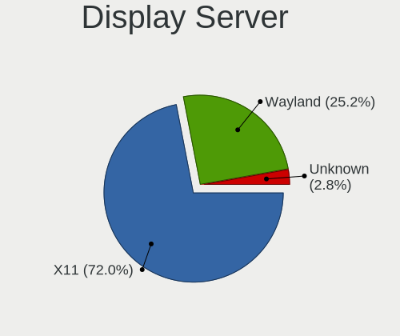
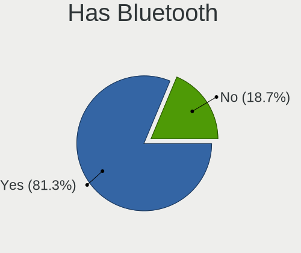
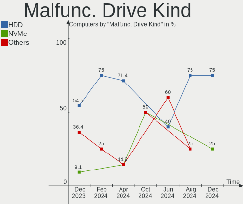
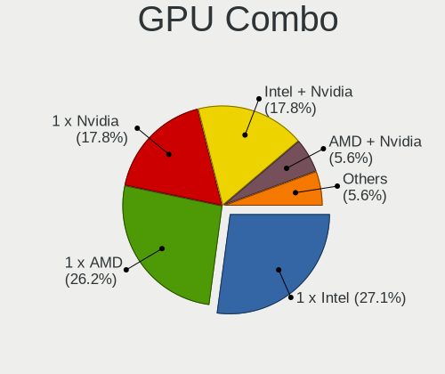
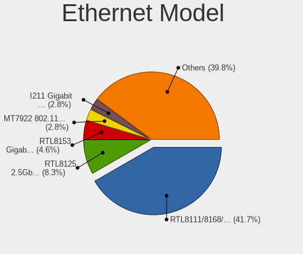
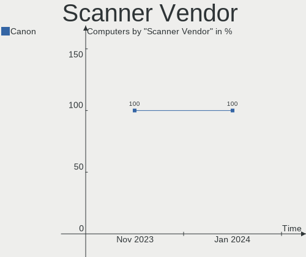
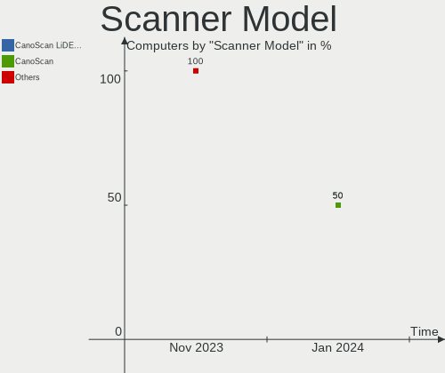
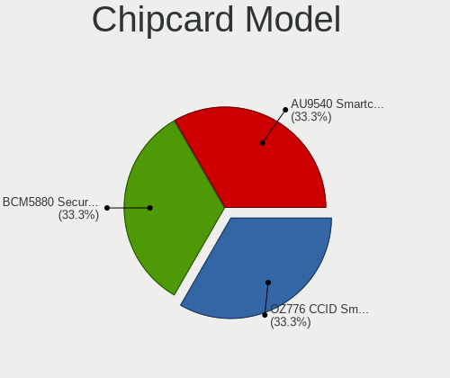

Manjaro - Hardware Trends
-------------------------

A project to identify most popular hardware characteristics and track their change
over time based on data collected by Linux users at https://Linux-Hardware.org.

Anyone can contribute to this report by the [hw-probe](https://github.com/linuxhw/hw-probe) tool:

    sudo -E hw-probe -all -upload

This is a report for all computer types. See also reports for [desktops](/Dist/Manjaro/Desktop/README.md) and [notebooks](/Dist/Manjaro/Notebook/README.md).

This report is for one last month. Overall report since the beginning of time: [TestCoverage](https://github.com/linuxhw/TestCoverage)

Period: Sep, 2022.

Contents
--------

* [ System ](#system)
  - [ OS                       ](#os)
  - [ OS Family                ](#os-family)
  - [ Kernel                   ](#kernel)
  - [ Kernel Family            ](#kernel-family)
  - [ Kernel Major Ver.        ](#kernel-major-ver)
  - [ Arch                     ](#arch)
  - [ DE                       ](#de)
  - [ Display Server           ](#display-server)
  - [ Display Manager          ](#display-manager)
  - [ OS Lang                  ](#os-lang)
  - [ Boot Mode                ](#boot-mode)
  - [ Filesystem               ](#filesystem)
  - [ Part. scheme             ](#part-scheme)
  - [ Dual Boot with Linux/BSD ](#dual-boot-with-linuxbsd)
  - [ Dual Boot (Win)          ](#dual-boot-win)

* [ Board ](#board)
  - [ Vendor                   ](#vendor)
  - [ Model                    ](#model)
  - [ Model Family             ](#model-family)
  - [ MFG Year                 ](#mfg-year)
  - [ Form Factor              ](#form-factor)
  - [ Secure Boot              ](#secure-boot)
  - [ Coreboot                 ](#coreboot)
  - [ RAM Size                 ](#ram-size)
  - [ RAM Used                 ](#ram-used)
  - [ Total Drives             ](#total-drives)
  - [ Has CD-ROM               ](#has-cd-rom)
  - [ Has Ethernet             ](#has-ethernet)
  - [ Has WiFi                 ](#has-wifi)
  - [ Has Bluetooth            ](#has-bluetooth)

* [ Location ](#location)
  - [ Country                  ](#country)
  - [ City                     ](#city)

* [ Drives ](#drives)
  - [ Drive Vendor             ](#drive-vendor)
  - [ Drive Model              ](#drive-model)
  - [ HDD Vendor               ](#hdd-vendor)
  - [ SSD Vendor               ](#ssd-vendor)
  - [ Drive Kind               ](#drive-kind)
  - [ Drive Connector          ](#drive-connector)
  - [ Drive Size               ](#drive-size)
  - [ Space Total              ](#space-total)
  - [ Space Used               ](#space-used)
  - [ Malfunc. Drives          ](#malfunc-drives)
  - [ Malfunc. Drive Vendor    ](#malfunc-drive-vendor)
  - [ Malfunc. HDD Vendor      ](#malfunc-hdd-vendor)
  - [ Malfunc. Drive Kind      ](#malfunc-drive-kind)
  - [ Failed Drives            ](#failed-drives)
  - [ Failed Drive Vendor      ](#failed-drive-vendor)
  - [ Drive Status             ](#drive-status)

* [ Storage controller ](#storage-controller)
  - [ Storage Vendor           ](#storage-vendor)
  - [ Storage Model            ](#storage-model)
  - [ Storage Kind             ](#storage-kind)

* [ Processor ](#processor)
  - [ CPU Vendor               ](#cpu-vendor)
  - [ CPU Model                ](#cpu-model)
  - [ CPU Model Family         ](#cpu-model-family)
  - [ CPU Cores                ](#cpu-cores)
  - [ CPU Sockets              ](#cpu-sockets)
  - [ CPU Threads              ](#cpu-threads)
  - [ CPU Op-Modes             ](#cpu-op-modes)
  - [ CPU Microcode            ](#cpu-microcode)
  - [ CPU Microarch            ](#cpu-microarch)

* [ Graphics ](#graphics)
  - [ GPU Vendor               ](#gpu-vendor)
  - [ GPU Model                ](#gpu-model)
  - [ GPU Combo                ](#gpu-combo)
  - [ GPU Driver               ](#gpu-driver)
  - [ GPU Memory               ](#gpu-memory)

* [ Monitor ](#monitor)
  - [ Monitor Vendor           ](#monitor-vendor)
  - [ Monitor Model            ](#monitor-model)
  - [ Monitor Resolution       ](#monitor-resolution)
  - [ Monitor Diagonal         ](#monitor-diagonal)
  - [ Monitor Width            ](#monitor-width)
  - [ Aspect Ratio             ](#aspect-ratio)
  - [ Monitor Area             ](#monitor-area)
  - [ Pixel Density            ](#pixel-density)
  - [ Multiple Monitors        ](#multiple-monitors)

* [ Network ](#network)
  - [ Net Controller Vendor    ](#net-controller-vendor)
  - [ Net Controller Model     ](#net-controller-model)
  - [ Wireless Vendor          ](#wireless-vendor)
  - [ Wireless Model           ](#wireless-model)
  - [ Ethernet Vendor          ](#ethernet-vendor)
  - [ Ethernet Model           ](#ethernet-model)
  - [ Net Controller Kind      ](#net-controller-kind)
  - [ Used Controller          ](#used-controller)
  - [ NICs                     ](#nics)
  - [ IPv6                     ](#ipv6)

* [ Bluetooth ](#bluetooth)
  - [ Bluetooth Vendor         ](#bluetooth-vendor)
  - [ Bluetooth Model          ](#bluetooth-model)

* [ Sound ](#sound)
  - [ Sound Vendor             ](#sound-vendor)
  - [ Sound Model              ](#sound-model)

* [ Memory ](#memory)
  - [ Memory Vendor            ](#memory-vendor)
  - [ Memory Model             ](#memory-model)
  - [ Memory Kind              ](#memory-kind)
  - [ Memory Form Factor       ](#memory-form-factor)
  - [ Memory Size              ](#memory-size)
  - [ Memory Speed             ](#memory-speed)

* [ Printers & scanners ](#printers--scanners)
  - [ Printer Vendor           ](#printer-vendor)
  - [ Printer Model            ](#printer-model)
  - [ Scanner Vendor           ](#scanner-vendor)
  - [ Scanner Model            ](#scanner-model)

* [ Camera ](#camera)
  - [ Camera Vendor            ](#camera-vendor)
  - [ Camera Model             ](#camera-model)

* [ Security ](#security)
  - [ Fingerprint Vendor       ](#fingerprint-vendor)
  - [ Fingerprint Model        ](#fingerprint-model)
  - [ Chipcard Vendor          ](#chipcard-vendor)
  - [ Chipcard Model           ](#chipcard-model)

* [ Unsupported ](#unsupported)
  - [ Unsupported Devices      ](#unsupported-devices)
  - [ Unsupported Device Types ](#unsupported-device-types)

System
------

OS
--

Installed operating systems

| Name           | Computers | Percent |
|----------------|-----------|---------|
| Manjaro        | 64        | 44.14%  |
| Manjaro 22.0.0 | 56        | 38.62%  |
| Manjaro 21.3.7 | 21        | 14.48%  |
| Manjaro 21.3.6 | 2         | 1.38%   |
| Manjaro 21.2.6 | 2         | 1.38%   |

OS Family
---------

OS without a version

| Name    | Computers | Percent |
|---------|-----------|---------|
| Manjaro | 145       | 100%    |

Kernel
------

Version of the Linux kernel

| Version                                      | Computers | Percent |
|----------------------------------------------|-----------|---------|
| 5.15.65-1-MANJARO                            | 41        | 28.28%  |
| 5.15.60-1-MANJARO                            | 27        | 18.62%  |
| 5.19.7-1-MANJARO                             | 23        | 15.86%  |
| 5.19.1-3-MANJARO                             | 9         | 6.21%   |
| 6.0.0-1-MANJARO                              | 7         | 4.83%   |
| 5.19.0-3-rt10-MANJARO                        | 6         | 4.14%   |
| 5.18.17-1-MANJARO                            | 5         | 3.45%   |
| 5.10.136-1-MANJARO                           | 3         | 2.07%   |
| 5.19.10-1-MANJARO                            | 2         | 1.38%   |
| 5.18.19-3-MANJARO                            | 2         | 1.38%   |
| 5.15.67-1-MANJARO                            | 2         | 1.38%   |
| 5.15.41-1-MANJARO                            | 2         | 1.38%   |
| 6.0.0-rc4-2-git-rtw89-00284-gce888220d5c7    | 1         | 0.69%   |
| 5.19.7-arch1-g14-1                           | 1         | 0.69%   |
| 5.19.6-lqx1-1-lqx                            | 1         | 0.69%   |
| 5.19.6-1-MANJARO                             | 1         | 0.69%   |
| 5.19.0-2-T2                                  | 1         | 0.69%   |
| 5.18.0-2-rt11-MANJARO                        | 1         | 0.69%   |
| 5.18.0-1-rt11-MANJARO                        | 1         | 0.69%   |
| 5.17.6-1-MANJARO                             | 1         | 0.69%   |
| 5.17.15-1-MANJARO                            | 1         | 0.69%   |
| 5.15.66-1-MANJARO                            | 1         | 0.69%   |
| 5.15.28-1-MANJARO                            | 1         | 0.69%   |
| 5.14.10-1-MANJARO                            | 1         | 0.69%   |
| 5.13.0-valve21-1-steamos-02209-g2a5bdc1102a0 | 1         | 0.69%   |
| 5.10.41-1-MANJARO                            | 1         | 0.69%   |
| 5.10.141-1-MANJARO                           | 1         | 0.69%   |
| 4.19.257-1-MANJARO                           | 1         | 0.69%   |

Kernel Family
-------------

Linux kernel without a distro release

| Version  | Computers | Percent |
|----------|-----------|---------|
| 5.15.65  | 41        | 28.28%  |
| 5.15.60  | 27        | 18.62%  |
| 5.19.7   | 24        | 16.55%  |
| 5.19.1   | 9         | 6.21%   |
| 6.0.0    | 8         | 5.52%   |
| 5.19.0   | 7         | 4.83%   |
| 5.18.17  | 5         | 3.45%   |
| 5.10.136 | 3         | 2.07%   |
| 5.19.6   | 2         | 1.38%   |
| 5.19.10  | 2         | 1.38%   |
| 5.18.19  | 2         | 1.38%   |
| 5.18.0   | 2         | 1.38%   |
| 5.15.67  | 2         | 1.38%   |
| 5.15.41  | 2         | 1.38%   |
| 5.17.6   | 1         | 0.69%   |
| 5.17.15  | 1         | 0.69%   |
| 5.15.66  | 1         | 0.69%   |
| 5.15.28  | 1         | 0.69%   |
| 5.14.10  | 1         | 0.69%   |
| 5.13.0   | 1         | 0.69%   |
| 5.10.41  | 1         | 0.69%   |
| 5.10.141 | 1         | 0.69%   |
| 4.19.257 | 1         | 0.69%   |

Kernel Major Ver.
-----------------

Linux kernel major version

| Version | Computers | Percent |
|---------|-----------|---------|
| 5.15    | 74        | 51.03%  |
| 5.19    | 44        | 30.34%  |
| 5.18    | 9         | 6.21%   |
| 6.0     | 8         | 5.52%   |
| 5.10    | 5         | 3.45%   |
| 5.17    | 2         | 1.38%   |
| 5.14    | 1         | 0.69%   |
| 5.13    | 1         | 0.69%   |
| 4.19    | 1         | 0.69%   |

Arch
----

OS architecture (x86_64, i586, etc.)

| Name   | Computers | Percent |
|--------|-----------|---------|
| x86_64 | 145       | 100%    |

DE
--

Desktop Environment

| Name       | Computers | Percent |
|------------|-----------|---------|
| KDE5       | 80        | 55.17%  |
| GNOME      | 30        | 20.69%  |
| XFCE       | 26        | 17.93%  |
| Unknown    | 4         | 2.76%   |
| i3         | 2         | 1.38%   |
| X-Cinnamon | 1         | 0.69%   |
| Deepin     | 1         | 0.69%   |
| awesome    | 1         | 0.69%   |

Display Server
--------------

X11 or Wayland

| Name    | Computers | Percent |
|---------|-----------|---------|
| X11     | 110       | 75.86%  |
| Wayland | 33        | 22.76%  |
| Unknown | 2         | 1.38%   |

Display Manager
---------------

SDDM, LightDM, etc.

| Name    | Computers | Percent |
|---------|-----------|---------|
| Unknown | 64        | 44.14%  |
| SDDM    | 44        | 30.34%  |
| LightDM | 20        | 13.79%  |
| GDM     | 16        | 11.03%  |
| CDM     | 1         | 0.69%   |

OS Lang
-------

Language

| Lang  | Computers | Percent |
|-------|-----------|---------|
| en_US | 68        | 46.9%   |
| ru_RU | 13        | 8.97%   |
| en_GB | 13        | 8.97%   |
| de_DE | 8         | 5.52%   |
| it_IT | 7         | 4.83%   |
| fr_FR | 7         | 4.83%   |
| pt_BR | 3         | 2.07%   |
| es_MX | 3         | 2.07%   |
| es_ES | 3         | 2.07%   |
| en_AU | 3         | 2.07%   |
| es_UY | 2         | 1.38%   |
| de_AT | 2         | 1.38%   |
| zh_CN | 1         | 0.69%   |
| tr_TR | 1         | 0.69%   |
| ru_UA | 1         | 0.69%   |
| pl_PL | 1         | 0.69%   |
| nb_NO | 1         | 0.69%   |
| es_SV | 1         | 0.69%   |
| es_CO | 1         | 0.69%   |
| es_AR | 1         | 0.69%   |
| en_PH | 1         | 0.69%   |
| en_IL | 1         | 0.69%   |
| en_DK | 1         | 0.69%   |
| en_CA | 1         | 0.69%   |
| ca_ES | 1         | 0.69%   |

Boot Mode
---------

EFI or BIOS

| Mode | Computers | Percent |
|------|-----------|---------|
| BIOS | 90        | 62.07%  |
| EFI  | 55        | 37.93%  |

Filesystem
----------

Type of filesystem

| Type    | Computers | Percent |
|---------|-----------|---------|
| Ext4    | 120       | 82.76%  |
| Btrfs   | 22        | 15.17%  |
| Xfs     | 2         | 1.38%   |
| Overlay | 1         | 0.69%   |

Part. scheme
------------

Scheme of partitioning

| Type    | Computers | Percent |
|---------|-----------|---------|
| Unknown | 82        | 56.55%  |
| GPT     | 56        | 38.62%  |
| MBR     | 7         | 4.83%   |

Dual Boot with Linux/BSD
------------------------

Hosting more than one Linux/BSD

| Dual boot | Computers | Percent |
|-----------|-----------|---------|
| No        | 130       | 89.66%  |
| Yes       | 15        | 10.34%  |

Dual Boot (Win)
---------------

Hosting Linux and Windows

| Dual boot | Computers | Percent |
|-----------|-----------|---------|
| No        | 108       | 74.48%  |
| Yes       | 37        | 25.52%  |

Board
-----

Vendor
------

Motherboard manufacturer

| Name                 | Computers | Percent |
|----------------------|-----------|---------|
| ASUSTek Computer     | 33        | 22.76%  |
| Lenovo               | 25        | 17.24%  |
| Hewlett-Packard      | 19        | 13.1%   |
| Dell                 | 12        | 8.28%   |
| Gigabyte Technology  | 10        | 6.9%    |
| MSI                  | 7         | 4.83%   |
| ASRock               | 7         | 4.83%   |
| Intel                | 4         | 2.76%   |
| Timi                 | 3         | 2.07%   |
| Apple                | 3         | 2.07%   |
| Acer                 | 3         | 2.07%   |
| Toshiba              | 2         | 1.38%   |
| Samsung Electronics  | 2         | 1.38%   |
| HUAWEI               | 2         | 1.38%   |
| Sony                 | 1         | 0.69%   |
| Schenker             | 1         | 0.69%   |
| Minix                | 1         | 0.69%   |
| Irbis                | 1         | 0.69%   |
| Intel Client Systems | 1         | 0.69%   |
| Huanan               | 1         | 0.69%   |
| Gateway              | 1         | 0.69%   |
| Foxconn              | 1         | 0.69%   |
| Exo                  | 1         | 0.69%   |
| CyberPowerPC         | 1         | 0.69%   |
| Chuwi                | 1         | 0.69%   |
| AXDIA International  | 1         | 0.69%   |
| Unknown              | 1         | 0.69%   |

Model
-----

Motherboard model

| Name                                              | Computers | Percent |
|---------------------------------------------------|-----------|---------|
| Timi RedmiBook Pro 15S                            | 2         | 1.38%   |
| Dell OptiPlex 3020                                | 2         | 1.38%   |
| ASUS All Series                                   | 2         | 1.38%   |
| Unknown                                           | 2         | 1.38%   |
| Toshiba Satellite NB10t-A-102                     | 1         | 0.69%   |
| Toshiba Satellite C650D                           | 1         | 0.69%   |
| Timi Redmi Book Pro 15 2022                       | 1         | 0.69%   |
| Sony VPCF236FM                                    | 1         | 0.69%   |
| Schenker VISION 15 (SVS15E21)                     | 1         | 0.69%   |
| Samsung RV420/RV520/RV720/E3530/S3530/E3420/E3520 | 1         | 0.69%   |
| Samsung 950QCG                                    | 1         | 0.69%   |
| MSI MS-7C91                                       | 1         | 0.69%   |
| MSI MS-7C37                                       | 1         | 0.69%   |
| MSI MS-7C02                                       | 1         | 0.69%   |
| MSI MS-7A70                                       | 1         | 0.69%   |
| MSI MS-7A38                                       | 1         | 0.69%   |
| MSI MS-7850                                       | 1         | 0.69%   |
| MSI Delta 15 A5EFK                                | 1         | 0.69%   |
| Minix NEO G41V-4 Max                              | 1         | 0.69%   |
| Lenovo Yoga Slim 7 Pro 14IAP7 82SV                | 1         | 0.69%   |
| Lenovo Yoga Slim 7 14ARE05 82A2                   | 1         | 0.69%   |
| Lenovo Yoga C740-15IML 81TD                       | 1         | 0.69%   |
| Lenovo V310-15ISK 80SY                            | 1         | 0.69%   |
| Lenovo ThinkStation P300 10DACTO1WW               | 1         | 0.69%   |
| Lenovo ThinkPad X270 W10DG 20K5S17R0L             | 1         | 0.69%   |
| Lenovo ThinkPad X1 Extreme 20MF000BUS             | 1         | 0.69%   |
| Lenovo ThinkPad X1 Carbon 5th 20HR000DUS          | 1         | 0.69%   |
| Lenovo ThinkPad X1 Carbon 4th 20FRS08T00          | 1         | 0.69%   |
| Lenovo ThinkPad T540p 20BFA05FUS                  | 1         | 0.69%   |
| Lenovo ThinkPad T460p 20FW000EGE                  | 1         | 0.69%   |
| Lenovo ThinkPad T430 2349A17                      | 1         | 0.69%   |
| Lenovo ThinkPad Edge E531 68852BS                 | 1         | 0.69%   |
| Lenovo ThinkPad E560 20EV002FUS                   | 1         | 0.69%   |
| Lenovo ThinkPad E14 Gen 3 20Y70073GE              | 1         | 0.69%   |
| Lenovo Legion S7 15ACH6 82K8                      | 1         | 0.69%   |
| Lenovo Legion 5 15ACH6 82QJ                       | 1         | 0.69%   |
| Lenovo Legion 5 15ACH6 82JW                       | 1         | 0.69%   |
| Lenovo IdeaPad Slim 1-14AST-05 81VS               | 1         | 0.69%   |
| Lenovo IdeaPad Gaming 3 15ARH05 82EY              | 1         | 0.69%   |
| Lenovo IdeaPad 700-15ISK 80RU                     | 1         | 0.69%   |

Model Family
------------

Motherboard model prefix

| Name                | Computers | Percent |
|---------------------|-----------|---------|
| Lenovo ThinkPad     | 10        | 6.9%    |
| ASUS ROG            | 10        | 6.9%    |
| Lenovo IdeaPad      | 5         | 3.45%   |
| HP ENVY             | 5         | 3.45%   |
| Dell Inspiron       | 4         | 2.76%   |
| Lenovo Yoga         | 3         | 2.07%   |
| Lenovo Legion       | 3         | 2.07%   |
| HP ProBook          | 3         | 2.07%   |
| HP Pavilion         | 3         | 2.07%   |
| Dell OptiPlex       | 3         | 2.07%   |
| Dell Latitude       | 3         | 2.07%   |
| ASUS TUF            | 3         | 2.07%   |
| Toshiba Satellite   | 2         | 1.38%   |
| Timi RedmiBook      | 2         | 1.38%   |
| HP Laptop           | 2         | 1.38%   |
| Gigabyte B550M      | 2         | 1.38%   |
| ASUS ZenBook        | 2         | 1.38%   |
| ASUS VivoBook       | 2         | 1.38%   |
| ASUS PRIME          | 2         | 1.38%   |
| ASUS ASUS           | 2         | 1.38%   |
| ASUS All            | 2         | 1.38%   |
| Acer Nitro          | 2         | 1.38%   |
| Unknown             | 2         | 1.38%   |
| Timi Redmi          | 1         | 0.69%   |
| Sony VPCF236FM      | 1         | 0.69%   |
| Schenker VISION     | 1         | 0.69%   |
| Samsung RV420       | 1         | 0.69%   |
| Samsung 950QCG      | 1         | 0.69%   |
| MSI MS-7C91         | 1         | 0.69%   |
| MSI MS-7C37         | 1         | 0.69%   |
| MSI MS-7C02         | 1         | 0.69%   |
| MSI MS-7A70         | 1         | 0.69%   |
| MSI MS-7A38         | 1         | 0.69%   |
| MSI MS-7850         | 1         | 0.69%   |
| MSI Delta           | 1         | 0.69%   |
| Minix NEO           | 1         | 0.69%   |
| Lenovo V310-15ISK   | 1         | 0.69%   |
| Lenovo ThinkStation | 1         | 0.69%   |
| Lenovo G580         | 1         | 0.69%   |
| Lenovo B580         | 1         | 0.69%   |

MFG Year
--------

Motherboard manufacture year

| Year | Computers | Percent |
|------|-----------|---------|
| 2021 | 27        | 18.62%  |
| 2018 | 18        | 12.41%  |
| 2019 | 17        | 11.72%  |
| 2020 | 12        | 8.28%   |
| 2022 | 10        | 6.9%    |
| 2016 | 9         | 6.21%   |
| 2015 | 9         | 6.21%   |
| 2012 | 9         | 6.21%   |
| 2017 | 8         | 5.52%   |
| 2014 | 6         | 4.14%   |
| 2013 | 6         | 4.14%   |
| 2011 | 4         | 2.76%   |
| 2010 | 4         | 2.76%   |
| 2009 | 4         | 2.76%   |
| 2008 | 1         | 0.69%   |
| 2005 | 1         | 0.69%   |

Form Factor
-----------

Physical design of the computer

| Name        | Computers | Percent |
|-------------|-----------|---------|
| Notebook    | 86        | 59.31%  |
| Desktop     | 49        | 33.79%  |
| Convertible | 7         | 4.83%   |
| Mini pc     | 1         | 0.69%   |
| All in one  | 1         | 0.69%   |
| Server      | 1         | 0.69%   |

Secure Boot
-----------

Enabled or disabled

| State    | Computers | Percent |
|----------|-----------|---------|
| Disabled | 145       | 100%    |

Coreboot
--------

Have coreboot on board

| Used | Computers | Percent |
|------|-----------|---------|
| No   | 145       | 100%    |

RAM Size
--------

Total RAM memory

| Size in GB  | Computers | Percent |
|-------------|-----------|---------|
| 16.01-24.0  | 38        | 26.21%  |
| 8.01-16.0   | 37        | 25.52%  |
| 4.01-8.0    | 30        | 20.69%  |
| 32.01-64.0  | 17        | 11.72%  |
| 3.01-4.0    | 11        | 7.59%   |
| 64.01-256.0 | 5         | 3.45%   |
| 24.01-32.0  | 3         | 2.07%   |
| 2.01-3.0    | 2         | 1.38%   |
| 1.01-2.0    | 2         | 1.38%   |

RAM Used
--------

Used RAM memory

| Used GB    | Computers | Percent |
|------------|-----------|---------|
| 4.01-8.0   | 34        | 23.45%  |
| 3.01-4.0   | 32        | 22.07%  |
| 2.01-3.0   | 32        | 22.07%  |
| 1.01-2.0   | 30        | 20.69%  |
| 8.01-16.0  | 11        | 7.59%   |
| 0.51-1.0   | 4         | 2.76%   |
| 24.01-32.0 | 1         | 0.69%   |
| 16.01-24.0 | 1         | 0.69%   |

Total Drives
------------

Number of drives on board

| Drives | Computers | Percent |
|--------|-----------|---------|
| 1      | 75        | 51.72%  |
| 2      | 45        | 31.03%  |
| 3      | 15        | 10.34%  |
| 4      | 5         | 3.45%   |
| 5      | 4         | 2.76%   |
| 7      | 1         | 0.69%   |

Has CD-ROM
----------

Has CD-ROM on board

| Presented | Computers | Percent |
|-----------|-----------|---------|
| No        | 110       | 75.86%  |
| Yes       | 35        | 24.14%  |

Has Ethernet
------------

Has Ethernet on board

| Presented | Computers | Percent |
|-----------|-----------|---------|
| Yes       | 114       | 78.62%  |
| No        | 31        | 21.38%  |

Has WiFi
--------

Has WiFi module

| Presented | Computers | Percent |
|-----------|-----------|---------|
| Yes       | 119       | 82.07%  |
| No        | 26        | 17.93%  |

Has Bluetooth
-------------

Has Bluetooth module

| Presented | Computers | Percent |
|-----------|-----------|---------|
| Yes       | 104       | 71.72%  |
| No        | 41        | 28.28%  |

Location
--------

Country
-------

Geographic location (country)

| Country         | Computers | Percent |
|-----------------|-----------|---------|
| USA             | 29        | 20%     |
| Russia          | 13        | 8.97%   |
| Italy           | 13        | 8.97%   |
| Germany         | 13        | 8.97%   |
| Spain           | 6         | 4.14%   |
| Mexico          | 6         | 4.14%   |
| France          | 6         | 4.14%   |
| UK              | 5         | 3.45%   |
| Brazil          | 5         | 3.45%   |
| Australia       | 4         | 2.76%   |
| Vietnam         | 3         | 2.07%   |
| Poland          | 3         | 2.07%   |
| Netherlands     | 3         | 2.07%   |
| Uruguay         | 2         | 1.38%   |
| Turkey          | 2         | 1.38%   |
| Sri Lanka       | 2         | 1.38%   |
| Portugal        | 2         | 1.38%   |
| Norway          | 2         | 1.38%   |
| Israel          | 2         | 1.38%   |
| Belarus         | 2         | 1.38%   |
| Austria         | 2         | 1.38%   |
| Venezuela       | 1         | 0.69%   |
| Tunisia         | 1         | 0.69%   |
| Switzerland     | 1         | 0.69%   |
| Philippines     | 1         | 0.69%   |
| North Macedonia | 1         | 0.69%   |
| Kyrgyzstan      | 1         | 0.69%   |
| Kazakhstan      | 1         | 0.69%   |
| Hungary         | 1         | 0.69%   |
| Ghana           | 1         | 0.69%   |
| Finland         | 1         | 0.69%   |
| Ethiopia        | 1         | 0.69%   |
| El Salvador     | 1         | 0.69%   |
| Egypt           | 1         | 0.69%   |
| Denmark         | 1         | 0.69%   |
| Colombia        | 1         | 0.69%   |
| China           | 1         | 0.69%   |
| Canada          | 1         | 0.69%   |
| Bulgaria        | 1         | 0.69%   |
| Belgium         | 1         | 0.69%   |

City
----

Geographic location (city)

| City                      | Computers | Percent |
|---------------------------|-----------|---------|
| Milan                     | 4         | 2.76%   |
| Galati Mamertino          | 3         | 2.07%   |
| Chelyabinsk               | 3         | 2.07%   |
| St Petersburg             | 2         | 1.38%   |
| Paris                     | 2         | 1.38%   |
| Montevideo                | 2         | 1.38%   |
| Mexico City               | 2         | 1.38%   |
| Melbourne                 | 2         | 1.38%   |
| Ho Chi Minh City          | 2         | 1.38%   |
| Barcelona                 | 2         | 1.38%   |
| Amsterdam                 | 2         | 1.38%   |
| Aachen                    | 2         | 1.38%   |
| Yekaterinburg             | 1         | 0.69%   |
| Wodzisław Śląski       | 1         | 0.69%   |
| Windlach                  | 1         | 0.69%   |
| West Palm Beach           | 1         | 0.69%   |
| Wendelstein               | 1         | 0.69%   |
| Wembley                   | 1         | 0.69%   |
| Wasilla                   | 1         | 0.69%   |
| Vladivostok               | 1         | 0.69%   |
| Villahermosa              | 1         | 0.69%   |
| Vienna                    | 1         | 0.69%   |
| Valencia                  | 1         | 0.69%   |
| Uberaba                   | 1         | 0.69%   |
| Turin                     | 1         | 0.69%   |
| Tunis                     | 1         | 0.69%   |
| Trondheim                 | 1         | 0.69%   |
| Trofa                     | 1         | 0.69%   |
| Tolyatti                  | 1         | 0.69%   |
| Tel Aviv                  | 1         | 0.69%   |
| Sri Jayewardenepura Kotte | 1         | 0.69%   |
| Sofia                     | 1         | 0.69%   |
| Skopje                    | 1         | 0.69%   |
| Sellersville              | 1         | 0.69%   |
| Seattle                   | 1         | 0.69%   |
| Sao José dos Campos      | 1         | 0.69%   |
| San Salvador              | 1         | 0.69%   |
| San Francisco             | 1         | 0.69%   |
| Salzburg                  | 1         | 0.69%   |
| Saint Paul                | 1         | 0.69%   |

Drives
------

Drive Vendor
------------

Hard drive vendors

| Vendor                       | Computers | Drives | Percent |
|------------------------------|-----------|--------|---------|
| Samsung Electronics          | 34        | 41     | 13.99%  |
| WDC                          | 30        | 31     | 12.35%  |
| Seagate                      | 28        | 30     | 11.52%  |
| Toshiba                      | 17        | 17     | 7%      |
| Sandisk                      | 17        | 20     | 7%      |
| Micron Technology            | 11        | 11     | 4.53%   |
| Unknown                      | 10        | 12     | 4.12%   |
| Crucial                      | 10        | 11     | 4.12%   |
| Kingston                     | 9         | 12     | 3.7%    |
| SK hynix                     | 8         | 8      | 3.29%   |
| Intel                        | 6         | 6      | 2.47%   |
| KIOXIA                       | 4         | 4      | 1.65%   |
| Phison Electronics           | 3         | 3      | 1.23%   |
| Micron/Crucial Technology    | 3         | 4      | 1.23%   |
| Kingston Technology Company  | 3         | 3      | 1.23%   |
| Hitachi                      | 3         | 3      | 1.23%   |
| Team                         | 2         | 2      | 0.82%   |
| Silicon Motion               | 2         | 2      | 0.82%   |
| Shenzhen Longsys Electronics | 2         | 2      | 0.82%   |
| PNY                          | 2         | 2      | 0.82%   |
| OCZ                          | 2         | 3      | 0.82%   |
| Netac                        | 2         | 2      | 0.82%   |
| Lexar                        | 2         | 2      | 0.82%   |
| HGST                         | 2         | 2      | 0.82%   |
| GOODRAM                      | 2         | 2      | 0.82%   |
| Apple                        | 2         | 2      | 0.82%   |
| XUM                          | 1         | 1      | 0.41%   |
| XrayDisk                     | 1         | 1      | 0.41%   |
| Transcend                    | 1         | 1      | 0.41%   |
| TO Exter                     | 1         | 1      | 0.41%   |
| Teclast                      | 1         | 1      | 0.41%   |
| sobetter                     | 1         | 1      | 0.41%   |
| SK 2TB                       | 1         | 1      | 0.41%   |
| Seagate Technology           | 1         | 1      | 0.41%   |
| SATAFIRM                     | 1         | 1      | 0.41%   |
| Realtek Semiconductor        | 1         | 1      | 0.41%   |
| Plextor                      | 1         | 1      | 0.41%   |
| Phison                       | 1         | 1      | 0.41%   |
| MyDigitalSSD                 | 1         | 1      | 0.41%   |
| Maxtor                       | 1         | 1      | 0.41%   |

Drive Model
-----------

Hard drive models

| Model                                                 | Computers | Percent |
|-------------------------------------------------------|-----------|---------|
| Samsung NVMe SSD Controller SM981/PM981/PM983 256GB   | 8         | 3.11%   |
| Seagate ST1000DM010-2EP102 1TB                        | 5         | 1.95%   |
| WDC WDS240G2G0B-00EPW0 240GB SSD                      | 3         | 1.17%   |
| Unknown MMC Card  64GB                                | 3         | 1.17%   |
| SK hynix NVMe SSD Drive 512GB                         | 3         | 1.17%   |
| Seagate ST500LM021-1KJ152 500GB                       | 3         | 1.17%   |
| Seagate ST2000DM008-2FR102 2TB                        | 3         | 1.17%   |
| Seagate ST1000LM024 HN-M101MBB 1TB                    | 3         | 1.17%   |
| Sandisk WD Blue SN500 / PC SN520 NVMe SSD 256GB       | 3         | 1.17%   |
| Samsung SSD 860 EVO 250GB                             | 3         | 1.17%   |
| Samsung NVMe SSD Drive 256GB                          | 3         | 1.17%   |
| Samsung NVMe SSD Controller PM9A1/PM9A3/980PRO 1024GB | 3         | 1.17%   |
| Kingston Company A2000 NVMe SSD 1TB                   | 3         | 1.17%   |
| Kingston SA400S37240G 240GB SSD                       | 3         | 1.17%   |
| Crucial CT480BX500SSD1 480GB                          | 3         | 1.17%   |
| WDC WDS500G2B0A-00SM50 500GB SSD                      | 2         | 0.78%   |
| Unknown MMC Card  32GB                                | 2         | 0.78%   |
| Unknown MMC Card  16GB                                | 2         | 0.78%   |
| Toshiba MQ04ABF100 1TB                                | 2         | 0.78%   |
| Toshiba MQ01ABD100 1TB                                | 2         | 0.78%   |
| Toshiba HDWD110 1TB                                   | 2         | 0.78%   |
| SK hynix HFM001TD3JX013N 1024GB                       | 2         | 0.78%   |
| Sandisk WD Blue SN550 NVMe SSD 1024GB                 | 2         | 0.78%   |
| Sandisk WD Black SN750 / PC SN730 NVMe SSD 1024GB     | 2         | 0.78%   |
| Samsung SSD 850 EVO 250GB                             | 2         | 0.78%   |
| Samsung NVMe SSD Controller SM961/PM961/SM963 256GB   | 2         | 0.78%   |
| Phison PS5013 E13 NVMe Controller 512GB               | 2         | 0.78%   |
| Micron MTFDHBA256TCK-1AS1AABHA 256GB                  | 2         | 0.78%   |
| Kingston SA400S37480G 480GB SSD                       | 2         | 0.78%   |
| Kingston NVMe SSD Drive 128GB                         | 2         | 0.78%   |
| Crucial CT240BX500SSD1 240GB                          | 2         | 0.78%   |
| XUM HX256GSSDSATA3 256GB                              | 1         | 0.39%   |
| XrayDisk 512GB                                        | 1         | 0.39%   |
| WDC WDS100T2B0C-00PXH0 1TB                            | 1         | 0.39%   |
| WDC WD7500BPKT-22PK4T0 752GB                          | 1         | 0.39%   |
| WDC WD60EZAZ-00ZGHB0 6TB                              | 1         | 0.39%   |
| WDC WD5000LPLX-60ZNTT2 500GB                          | 1         | 0.39%   |
| WDC WD5000AVDS-63U7B1 500GB                           | 1         | 0.39%   |
| WDC WD5000AAKX-60U6AA0 500GB                          | 1         | 0.39%   |
| WDC WD40EZAZ-00SF3B0 4TB                              | 1         | 0.39%   |

HDD Vendor
----------

Hard disk drive vendors

| Vendor   | Computers | Drives | Percent |
|----------|-----------|--------|---------|
| Seagate  | 26        | 28     | 36.62%  |
| WDC      | 23        | 24     | 32.39%  |
| Toshiba  | 14        | 14     | 19.72%  |
| Hitachi  | 3         | 3      | 4.23%   |
| HGST     | 2         | 2      | 2.82%   |
| Unknown  | 1         | 1      | 1.41%   |
| SATAFIRM | 1         | 1      | 1.41%   |
| ASMedia  | 1         | 1      | 1.41%   |

SSD Vendor
----------

Solid state drive vendors

| Vendor              | Computers | Drives | Percent |
|---------------------|-----------|--------|---------|
| Samsung Electronics | 14        | 16     | 19.72%  |
| Crucial             | 10        | 11     | 14.08%  |
| Kingston            | 6         | 8      | 8.45%   |
| WDC                 | 5         | 5      | 7.04%   |
| SanDisk             | 4         | 4      | 5.63%   |
| Intel               | 4         | 4      | 5.63%   |
| Micron Technology   | 3         | 3      | 4.23%   |
| PNY                 | 2         | 2      | 2.82%   |
| OCZ                 | 2         | 3      | 2.82%   |
| Lexar               | 2         | 2      | 2.82%   |
| GOODRAM             | 2         | 2      | 2.82%   |
| XUM                 | 1         | 1      | 1.41%   |
| Transcend           | 1         | 1      | 1.41%   |
| TO Exter            | 1         | 1      | 1.41%   |
| Teclast             | 1         | 1      | 1.41%   |
| Seagate             | 1         | 1      | 1.41%   |
| Plextor             | 1         | 1      | 1.41%   |
| Netac               | 1         | 1      | 1.41%   |
| MyDigitalSSD        | 1         | 1      | 1.41%   |
| Maxtor              | 1         | 1      | 1.41%   |
| LITEON              | 1         | 1      | 1.41%   |
| Kingmax             | 1         | 1      | 1.41%   |
| Kimtigo             | 1         | 1      | 1.41%   |
| Juhor               | 1         | 1      | 1.41%   |
| Intenso             | 1         | 1      | 1.41%   |
| China               | 1         | 1      | 1.41%   |
| Apple               | 1         | 1      | 1.41%   |
| Unknown             | 1         | 1      | 1.41%   |

Drive Kind
----------

HDD or SSD

| Kind    | Computers | Drives | Percent |
|---------|-----------|--------|---------|
| NVMe    | 75        | 96     | 34.72%  |
| HDD     | 63        | 74     | 29.17%  |
| SSD     | 62        | 77     | 28.7%   |
| MMC     | 8         | 9      | 3.7%    |
| Unknown | 8         | 8      | 3.7%    |

Drive Connector
---------------

SATA, SAS, NVMe, etc.

| Type | Computers | Drives | Percent |
|------|-----------|--------|---------|
| SATA | 96        | 148    | 50.26%  |
| NVMe | 75        | 95     | 39.27%  |
| SAS  | 12        | 12     | 6.28%   |
| MMC  | 8         | 9      | 4.19%   |

Drive Size
----------

Size of hard drive

| Size in TB | Computers | Drives | Percent |
|------------|-----------|--------|---------|
| 0.01-0.5   | 67        | 87     | 54.47%  |
| 0.51-1.0   | 40        | 45     | 32.52%  |
| 1.01-2.0   | 7         | 10     | 5.69%   |
| 3.01-4.0   | 6         | 6      | 4.88%   |
| 2.01-3.0   | 2         | 2      | 1.63%   |
| 4.01-10.0  | 1         | 1      | 0.81%   |

Space Total
-----------

Amount of disk space available on the file system

| Size in GB     | Computers | Percent |
|----------------|-----------|---------|
| 251-500        | 32        | 22.07%  |
| 501-1000       | 31        | 21.38%  |
| 101-250        | 30        | 20.69%  |
| 1001-2000      | 20        | 13.79%  |
| More than 3000 | 9         | 6.21%   |
| 51-100         | 7         | 4.83%   |
| Unknown        | 7         | 4.83%   |
| 2001-3000      | 6         | 4.14%   |
| 1-20           | 3         | 2.07%   |

Space Used
----------

Amount of used disk space

| Used GB        | Computers | Percent |
|----------------|-----------|---------|
| 101-250        | 31        | 21.38%  |
| 1-20           | 24        | 16.55%  |
| 251-500        | 22        | 15.17%  |
| 501-1000       | 17        | 11.72%  |
| 21-50          | 16        | 11.03%  |
| 51-100         | 15        | 10.34%  |
| 1001-2000      | 8         | 5.52%   |
| Unknown        | 7         | 4.83%   |
| More than 3000 | 2         | 1.38%   |
| 2001-3000      | 2         | 1.38%   |
| 0              | 1         | 0.69%   |

Malfunc. Drives
---------------

Drive models with a malfunction

| Model                           | Computers | Drives | Percent |
|---------------------------------|-----------|--------|---------|
| WDC WD30PURX-64P6ZY0 3TB        | 1         | 1      | 10%     |
| Toshiba MK7559GSXP 752GB        | 1         | 1      | 10%     |
| Toshiba HDWE140 4TB             | 1         | 1      | 10%     |
| Seagate ST500LT012-9WS142 500GB | 1         | 1      | 10%     |
| Seagate ST1000DM010-2EP102 1TB  | 1         | 1      | 10%     |
| SanDisk SSD PLUS 240GB          | 1         | 1      | 10%     |
| Intel SSDSC2KW120H6 120GB       | 1         | 1      | 10%     |
| Intel SSDSC2KW010T8 1TB         | 1         | 1      | 10%     |
| Hitachi HTS723232A7A364 320GB   | 1         | 1      | 10%     |
| HGST HTS545050A7E680 500GB      | 1         | 1      | 10%     |

Malfunc. Drive Vendor
---------------------

Vendors of faulty drives

| Vendor  | Computers | Drives | Percent |
|---------|-----------|--------|---------|
| Toshiba | 2         | 2      | 20%     |
| Seagate | 2         | 2      | 20%     |
| Intel   | 2         | 2      | 20%     |
| WDC     | 1         | 1      | 10%     |
| SanDisk | 1         | 1      | 10%     |
| Hitachi | 1         | 1      | 10%     |
| HGST    | 1         | 1      | 10%     |

Malfunc. HDD Vendor
-------------------

Vendors of faulty HDD drives

| Vendor  | Computers | Drives | Percent |
|---------|-----------|--------|---------|
| Toshiba | 2         | 2      | 28.57%  |
| Seagate | 2         | 2      | 28.57%  |
| WDC     | 1         | 1      | 14.29%  |
| Hitachi | 1         | 1      | 14.29%  |
| HGST    | 1         | 1      | 14.29%  |

Malfunc. Drive Kind
-------------------

Kinds of faulty drives

| Kind | Computers | Drives | Percent |
|------|-----------|--------|---------|
| HDD  | 7         | 7      | 70%     |
| SSD  | 3         | 3      | 30%     |

Failed Drives
-------------

Failed drive models

Zero info for selected period =(

Failed Drive Vendor
-------------------

Failed drive vendors

Zero info for selected period =(

Drive Status
------------

Number of failed and malfunc. drives

| Status   | Computers | Drives | Percent |
|----------|-----------|--------|---------|
| Detected | 101       | 169    | 61.59%  |
| Works    | 53        | 85     | 32.32%  |
| Malfunc  | 10        | 10     | 6.1%    |

Storage controller
------------------

Storage Vendor
--------------

Storage controller vendors

| Vendor                       | Computers | Percent |
|------------------------------|-----------|---------|
| Intel                        | 80        | 38.28%  |
| AMD                          | 35        | 16.75%  |
| Samsung Electronics          | 23        | 11%     |
| SanDisk                      | 14        | 6.7%    |
| SK hynix                     | 8         | 3.83%   |
| Micron Technology            | 8         | 3.83%   |
| Kingston Technology Company  | 7         | 3.35%   |
| KIOXIA                       | 5         | 2.39%   |
| Phison Electronics           | 4         | 1.91%   |
| Micron/Crucial Technology    | 3         | 1.44%   |
| ASMedia Technology           | 3         | 1.44%   |
| Toshiba America Info Systems | 2         | 0.96%   |
| Silicon Motion               | 2         | 0.96%   |
| Shenzhen Longsys Electronics | 2         | 0.96%   |
| Realtek Semiconductor        | 2         | 0.96%   |
| Nvidia                       | 2         | 0.96%   |
| Unknown                      | 1         | 0.48%   |
| Transcend                    | 1         | 0.48%   |
| Seagate Technology           | 1         | 0.48%   |
| PMC-Sierra                   | 1         | 0.48%   |
| Marvell Technology Group     | 1         | 0.48%   |
| LSI Logic / Symbios Logic    | 1         | 0.48%   |
| Biwin Storage Technology     | 1         | 0.48%   |
| Apple                        | 1         | 0.48%   |
| ADATA Technology             | 1         | 0.48%   |

Storage Model
-------------

Storage controller models

| Model                                                                          | Computers | Percent |
|--------------------------------------------------------------------------------|-----------|---------|
| AMD FCH SATA Controller [AHCI mode]                                            | 23        | 10.18%  |
| Intel Sunrise Point-LP SATA Controller [AHCI mode]                             | 10        | 4.42%   |
| Intel 8 Series/C220 Series Chipset Family 6-port SATA Controller 1 [AHCI mode] | 9         | 3.98%   |
| Samsung NVMe SSD Controller SM981/PM981/PM983                                  | 8         | 3.54%   |
| Micron Non-Volatile memory controller                                          | 8         | 3.54%   |
| AMD 400 Series Chipset SATA Controller                                         | 8         | 3.54%   |
| Intel Celeron/Pentium Silver Processor SATA Controller                         | 7         | 3.1%    |
| SK hynix Gold P31 SSD                                                          | 6         | 2.65%   |
| SanDisk Non-Volatile memory controller                                         | 5         | 2.21%   |
| Samsung NVMe SSD Controller 980                                                | 5         | 2.21%   |
| Intel 82801 Mobile SATA Controller [RAID mode]                                 | 5         | 2.21%   |
| Samsung NVMe SSD Controller PM9A1/PM9A3/980PRO                                 | 4         | 1.77%   |
| Intel Volume Management Device NVMe RAID Controller                            | 4         | 1.77%   |
| Intel Cannon Lake Mobile PCH SATA AHCI Controller                              | 4         | 1.77%   |
| Intel 7 Series Chipset Family 6-port SATA Controller [AHCI mode]               | 4         | 1.77%   |
| Intel 6 Series/C200 Series Chipset Family 6 port Mobile SATA AHCI Controller   | 4         | 1.77%   |
| SanDisk WD Blue SN550 NVMe SSD                                                 | 3         | 1.33%   |
| SanDisk WD Blue SN500 / PC SN520 NVMe SSD                                      | 3         | 1.33%   |
| Samsung NVMe SSD Controller SM961/PM961/SM963                                  | 3         | 1.33%   |
| Kingston Company A2000 NVMe SSD                                                | 3         | 1.33%   |
| Intel HM170/QM170 Chipset SATA Controller [AHCI Mode]                          | 3         | 1.33%   |
| Intel Cannon Lake PCH SATA AHCI Controller                                     | 3         | 1.33%   |
| ASMedia ASM1062 Serial ATA Controller                                          | 3         | 1.33%   |
| AMD 500 Series Chipset SATA Controller                                         | 3         | 1.33%   |
| Silicon Motion SM2262/SM2262EN SSD Controller                                  | 2         | 0.88%   |
| SanDisk WD Black SN750 / PC SN730 NVMe SSD                                     | 2         | 0.88%   |
| Samsung NVMe SSD Controller SM951/PM951                                        | 2         | 0.88%   |
| Phison PS5013 E13 NVMe Controller                                              | 2         | 0.88%   |
| Phison E12 NVMe Controller                                                     | 2         | 0.88%   |
| KIOXIA NVMe SSD Controller BG4                                                 | 2         | 0.88%   |
| KIOXIA Non-Volatile memory controller                                          | 2         | 0.88%   |
| Kingston Company U-SNS8154P3 NVMe SSD                                          | 2         | 0.88%   |
| Intel Q170/Q150/B150/H170/H110/Z170/CM236 Chipset SATA Controller [AHCI Mode]  | 2         | 0.88%   |
| Intel C610/X99 series chipset sSATA Controller [AHCI mode]                     | 2         | 0.88%   |
| Intel C610/X99 series chipset 6-Port SATA Controller [AHCI mode]               | 2         | 0.88%   |
| Intel 8 Series SATA Controller 1 [AHCI mode]                                   | 2         | 0.88%   |
| Intel 7 Series/C210 Series Chipset Family 6-port SATA Controller [AHCI mode]   | 2         | 0.88%   |
| Intel 200 Series PCH SATA controller [AHCI mode]                               | 2         | 0.88%   |
| AMD X399 Series Chipset SATA Controller                                        | 2         | 0.88%   |
| AMD SB7x0/SB8x0/SB9x0 SATA Controller [IDE mode]                               | 2         | 0.88%   |

Storage Kind
------------

Kind of storage controller (IDE, SATA, NVMe, SAS, ...)

| Kind | Computers | Percent |
|------|-----------|---------|
| SATA | 104       | 52.79%  |
| NVMe | 74        | 37.56%  |
| RAID | 10        | 5.08%   |
| IDE  | 7         | 3.55%   |
| SAS  | 2         | 1.02%   |

Processor
---------

CPU Vendor
----------

Processor vendors

| Vendor | Computers | Percent |
|--------|-----------|---------|
| Intel  | 92        | 63.45%  |
| AMD    | 53        | 36.55%  |

CPU Model
---------

Processor models

| Model                                   | Computers | Percent |
|-----------------------------------------|-----------|---------|
| Intel Celeron N4020 CPU @ 1.10GHz       | 4         | 2.76%   |
| AMD Ryzen 7 5800H with Radeon Graphics  | 4         | 2.76%   |
| AMD Ryzen 9 5900HX with Radeon Graphics | 3         | 2.07%   |
| AMD Ryzen 5 5600H with Radeon Graphics  | 3         | 2.07%   |
| Intel Core i7-9750H CPU @ 2.60GHz       | 2         | 1.38%   |
| Intel Core i7-8750H CPU @ 2.20GHz       | 2         | 1.38%   |
| Intel Core i7-8550U CPU @ 1.80GHz       | 2         | 1.38%   |
| Intel Core i7-6700HQ CPU @ 2.60GHz      | 2         | 1.38%   |
| Intel Core i7-6500U CPU @ 2.50GHz       | 2         | 1.38%   |
| Intel Core i5-9400 CPU @ 2.90GHz        | 2         | 1.38%   |
| Intel Core i5-8250U CPU @ 1.60GHz       | 2         | 1.38%   |
| Intel Core i5-6200U CPU @ 2.30GHz       | 2         | 1.38%   |
| Intel Core i5-2430M CPU @ 2.40GHz       | 2         | 1.38%   |
| Intel Celeron N4120 CPU @ 1.10GHz       | 2         | 1.38%   |
| Intel 11th Gen Core i7-1165G7 @ 2.80GHz | 2         | 1.38%   |
| AMD Ryzen 9 3900X 12-Core Processor     | 2         | 1.38%   |
| AMD Ryzen 7 6800HS with Radeon Graphics | 2         | 1.38%   |
| AMD Ryzen 7 5700U with Radeon Graphics  | 2         | 1.38%   |
| AMD Ryzen 5 5600X 6-Core Processor      | 2         | 1.38%   |
| AMD Ryzen 5 3600X 6-Core Processor      | 2         | 1.38%   |
| Intel Xeon CPU E5-2690 v3 @ 2.60GHz     | 1         | 0.69%   |
| Intel Xeon CPU E5-2678 v3 @ 2.50GHz     | 1         | 0.69%   |
| Intel Xeon CPU E5-2660 v3 @ 2.60GHz     | 1         | 0.69%   |
| Intel Xeon CPU E5-1620 v3 @ 3.50GHz     | 1         | 0.69%   |
| Intel Xeon CPU E3-1240 v3 @ 3.40GHz     | 1         | 0.69%   |
| Intel Xeon CPU E3-1226 v3 @ 3.30GHz     | 1         | 0.69%   |
| Intel Pentium CPU N3510 @ 1.99GHz       | 1         | 0.69%   |
| Intel Pentium CPU G4600 @ 3.60GHz       | 1         | 0.69%   |
| Intel Pentium CPU 2020M @ 2.40GHz       | 1         | 0.69%   |
| Intel Core i9-9900K CPU @ 3.60GHz       | 1         | 0.69%   |
| Intel Core i7-6850K CPU @ 3.60GHz       | 1         | 0.69%   |
| Intel Core i7-6600U CPU @ 2.60GHz       | 1         | 0.69%   |
| Intel Core i7-4810MQ CPU @ 2.80GHz      | 1         | 0.69%   |
| Intel Core i7-4710MQ CPU @ 2.50GHz      | 1         | 0.69%   |
| Intel Core i7-4702MQ CPU @ 2.20GHz      | 1         | 0.69%   |
| Intel Core i7-4600U CPU @ 2.10GHz       | 1         | 0.69%   |
| Intel Core i7-4600M CPU @ 2.90GHz       | 1         | 0.69%   |
| Intel Core i7-3770 CPU @ 3.40GHz        | 1         | 0.69%   |
| Intel Core i7-3632QM CPU @ 2.20GHz      | 1         | 0.69%   |
| Intel Core i7-2670QM CPU @ 2.20GHz      | 1         | 0.69%   |

CPU Model Family
----------------

Processor model prefix

| Model                  | Computers | Percent |
|------------------------|-----------|---------|
| Intel Core i5          | 30        | 20.69%  |
| Intel Core i7          | 25        | 17.24%  |
| AMD Ryzen 5            | 16        | 11.03%  |
| AMD Ryzen 7            | 15        | 10.34%  |
| Other                  | 10        | 6.9%    |
| AMD Ryzen 9            | 10        | 6.9%    |
| Intel Celeron          | 8         | 5.52%   |
| Intel Xeon             | 6         | 4.14%   |
| Intel Core i3          | 4         | 2.76%   |
| Intel Pentium          | 3         | 2.07%   |
| Intel Core 2 Duo       | 3         | 2.07%   |
| AMD Ryzen Threadripper | 2         | 1.38%   |
| AMD Ryzen 3            | 2         | 1.38%   |
| AMD FX                 | 2         | 1.38%   |
| AMD E                  | 2         | 1.38%   |
| Intel Core i9          | 1         | 0.69%   |
| Intel Core 2           | 1         | 0.69%   |
| Intel Atom             | 1         | 0.69%   |
| AMD Athlon II X2       | 1         | 0.69%   |
| AMD Athlon             | 1         | 0.69%   |
| AMD A6                 | 1         | 0.69%   |
| AMD A10                | 1         | 0.69%   |

CPU Cores
---------

Number of processor cores

| Number | Computers | Percent |
|--------|-----------|---------|
| 4      | 43        | 29.66%  |
| 2      | 42        | 28.97%  |
| 8      | 26        | 17.93%  |
| 6      | 21        | 14.48%  |
| 12     | 6         | 4.14%   |
| 10     | 3         | 2.07%   |
| 16     | 2         | 1.38%   |
| 14     | 1         | 0.69%   |
| 3      | 1         | 0.69%   |

CPU Sockets
-----------

Number of sockets

| Number | Computers | Percent |
|--------|-----------|---------|
| 1      | 145       | 100%    |

CPU Threads
-----------

Threads per core (Hyper-Threading)

| Number | Computers | Percent |
|--------|-----------|---------|
| 2      | 109       | 75.17%  |
| 1      | 36        | 24.83%  |

CPU Op-Modes
------------

CPU Operation Modes (32-bit, 64-bit)

| Op mode        | Computers | Percent |
|----------------|-----------|---------|
| 32-bit, 64-bit | 145       | 100%    |

CPU Microcode
-------------

Microcode number

| Number     | Computers | Percent |
|------------|-----------|---------|
| Unknown    | 84        | 57.93%  |
| 0x0a50000c | 6         | 4.14%   |
| 0x306a9    | 4         | 2.76%   |
| 0x08701021 | 4         | 2.76%   |
| 0x906a3    | 3         | 2.07%   |
| 0x806ea    | 3         | 2.07%   |
| 0x806c1    | 3         | 2.07%   |
| 0x306c3    | 3         | 2.07%   |
| 0x906ea    | 2         | 1.38%   |
| 0x706a8    | 2         | 1.38%   |
| 0x306f2    | 2         | 1.38%   |
| 0x0a404102 | 2         | 1.38%   |
| 0x906ec    | 1         | 0.69%   |
| 0x906e9    | 1         | 0.69%   |
| 0x90672    | 1         | 0.69%   |
| 0x806ec    | 1         | 0.69%   |
| 0x806e9    | 1         | 0.69%   |
| 0x706e5    | 1         | 0.69%   |
| 0x506e3    | 1         | 0.69%   |
| 0x406e3    | 1         | 0.69%   |
| 0x406c4    | 1         | 0.69%   |
| 0x30673    | 1         | 0.69%   |
| 0x206a7    | 1         | 0.69%   |
| 0x106e5    | 1         | 0.69%   |
| 0x106a5    | 1         | 0.69%   |
| 0x1067a    | 1         | 0.69%   |
| 0x0a50000d | 1         | 0.69%   |
| 0x0a404101 | 1         | 0.69%   |
| 0x0a201016 | 1         | 0.69%   |
| 0x0a201006 | 1         | 0.69%   |
| 0x08701013 | 1         | 0.69%   |
| 0x08608103 | 1         | 0.69%   |
| 0x08600106 | 1         | 0.69%   |
| 0x08108109 | 1         | 0.69%   |
| 0x08108102 | 1         | 0.69%   |
| 0x08101016 | 1         | 0.69%   |
| 0x0800820d | 1         | 0.69%   |
| 0x08001137 | 1         | 0.69%   |
| 0x05000029 | 1         | 0.69%   |

CPU Microarch
-------------

Microarchitecture

| Name             | Computers | Percent |
|------------------|-----------|---------|
| KabyLake         | 20        | 13.79%  |
| Zen 3            | 16        | 11.03%  |
| Haswell          | 16        | 11.03%  |
| Zen 2            | 12        | 8.28%   |
| Unknown          | 11        | 7.59%   |
| Skylake          | 10        | 6.9%    |
| IvyBridge        | 7         | 4.83%   |
| Goldmont plus    | 7         | 4.83%   |
| SandyBridge      | 6         | 4.14%   |
| Zen+             | 5         | 3.45%   |
| Zen              | 5         | 3.45%   |
| TigerLake        | 4         | 2.76%   |
| Silvermont       | 3         | 2.07%   |
| Piledriver       | 3         | 2.07%   |
| Penryn           | 3         | 2.07%   |
| IceLake          | 3         | 2.07%   |
| Alderlake Hybrid | 3         | 2.07%   |
| Nehalem          | 2         | 1.38%   |
| Broadwell        | 2         | 1.38%   |
| Bobcat           | 2         | 1.38%   |
| Westmere         | 1         | 0.69%   |
| K10              | 1         | 0.69%   |
| Excavator        | 1         | 0.69%   |
| Core             | 1         | 0.69%   |
| CometLake        | 1         | 0.69%   |

Graphics
--------

GPU Vendor
----------

Vendors of graphics cards

| Vendor            | Computers | Percent |
|-------------------|-----------|---------|
| Intel             | 69        | 38.98%  |
| AMD               | 55        | 31.07%  |
| Nvidia            | 52        | 29.38%  |
| ASPEED Technology | 1         | 0.56%   |

GPU Model
---------

Graphics card models

| Model                                                                         | Computers | Percent |
|-------------------------------------------------------------------------------|-----------|---------|
| AMD Cezanne                                                                   | 11        | 5.95%   |
| Intel GeminiLake [UHD Graphics 600]                                           | 7         | 3.78%   |
| Intel Skylake GT2 [HD Graphics 520]                                           | 6         | 3.24%   |
| Intel 3rd Gen Core processor Graphics Controller                              | 5         | 2.7%    |
| AMD Rembrandt [Radeon 680M]                                                   | 5         | 2.7%    |
| Intel UHD Graphics 620                                                        | 4         | 2.16%   |
| Intel TigerLake-LP GT2 [Iris Xe Graphics]                                     | 4         | 2.16%   |
| Intel CoffeeLake-H GT2 [UHD Graphics 630]                                     | 4         | 2.16%   |
| Intel 4th Gen Core Processor Integrated Graphics Controller                   | 4         | 2.16%   |
| AMD Renoir                                                                    | 4         | 2.16%   |
| AMD Navi 10 [Radeon RX 5600 OEM/5600 XT / 5700/5700 XT]                       | 4         | 2.16%   |
| AMD Ellesmere [Radeon RX 470/480/570/570X/580/580X/590]                       | 4         | 2.16%   |
| Nvidia GA107M [GeForce RTX 3050 Mobile]                                       | 3         | 1.62%   |
| Nvidia GA102 [GeForce RTX 3090]                                               | 3         | 1.62%   |
| Intel HD Graphics 620                                                         | 3         | 1.62%   |
| Intel HD Graphics 530                                                         | 3         | 1.62%   |
| AMD Picasso/Raven 2 [Radeon Vega Series / Radeon Vega Mobile Series]          | 3         | 1.62%   |
| AMD Lucienne                                                                  | 3         | 1.62%   |
| AMD Baffin [Radeon RX 460/560D / Pro 450/455/460/555/555X/560/560X]           | 3         | 1.62%   |
| Nvidia GP104 [GeForce GTX 1070 Ti]                                            | 2         | 1.08%   |
| Nvidia GM107M [GeForce GTX 950M]                                              | 2         | 1.08%   |
| Nvidia GA107BM [GeForce RTX 3050 Mobile]                                      | 2         | 1.08%   |
| Nvidia GA106M [GeForce RTX 3060 Mobile / Max-Q]                               | 2         | 1.08%   |
| Intel HD Graphics 630                                                         | 2         | 1.08%   |
| Intel Haswell-ULT Integrated Graphics Controller                              | 2         | 1.08%   |
| Intel CoffeeLake-S GT2 [UHD Graphics 630]                                     | 2         | 1.08%   |
| Intel Atom Processor Z36xxx/Z37xxx Series Graphics & Display                  | 2         | 1.08%   |
| Intel Alder Lake-P Integrated Graphics Controller                             | 2         | 1.08%   |
| Intel 2nd Generation Core Processor Family Integrated Graphics Controller     | 2         | 1.08%   |
| AMD Wrestler [Radeon HD 6310]                                                 | 2         | 1.08%   |
| AMD Sun XT [Radeon HD 8670A/8670M/8690M / R5 M330 / M430 / Radeon 520 Mobile] | 2         | 1.08%   |
| AMD Oland PRO [Radeon R7 240/340 / Radeon 520]                                | 2         | 1.08%   |
| AMD Navi 23 [Radeon RX 6650 XT]                                               | 2         | 1.08%   |
| AMD Navi 22 [Radeon RX 6700/6700 XT/6750 XT / 6800M]                          | 2         | 1.08%   |
| Nvidia TU117M [GeForce GTX 1650 Ti Mobile]                                    | 1         | 0.54%   |
| Nvidia TU117M [GeForce GTX 1650 Mobile / Max-Q]                               | 1         | 0.54%   |
| Nvidia TU117M                                                                 | 1         | 0.54%   |
| Nvidia TU117 [GeForce GTX 1650]                                               | 1         | 0.54%   |
| Nvidia TU116M [GeForce GTX 1660 Ti Mobile]                                    | 1         | 0.54%   |
| Nvidia TU116 [GeForce GTX 1650]                                               | 1         | 0.54%   |

GPU Combo
---------

Combinations of graphics cards

| Name            | Computers | Percent |
|-----------------|-----------|---------|
| 1 x Intel       | 48        | 33.1%   |
| 1 x AMD         | 33        | 22.76%  |
| 1 x Nvidia      | 24        | 16.55%  |
| Intel + Nvidia  | 15        | 10.34%  |
| AMD + Nvidia    | 10        | 6.9%    |
| 2 x AMD         | 6         | 4.14%   |
| Intel + AMD     | 6         | 4.14%   |
| 2 x Nvidia      | 2         | 1.38%   |
| Nvidia + ASPEED | 1         | 0.69%   |

GPU Driver
----------

Free vs proprietary

| Driver      | Computers | Percent |
|-------------|-----------|---------|
| Free        | 106       | 73.1%   |
| Proprietary | 39        | 26.9%   |

GPU Memory
----------

Total video memory

| Size in GB | Computers | Percent |
|------------|-----------|---------|
| Unknown    | 98        | 67.59%  |
| 1.01-2.0   | 11        | 7.59%   |
| 7.01-8.0   | 10        | 6.9%    |
| 0.01-0.5   | 8         | 5.52%   |
| 3.01-4.0   | 7         | 4.83%   |
| 0.51-1.0   | 4         | 2.76%   |
| 5.01-6.0   | 2         | 1.38%   |
| 16.01-24.0 | 2         | 1.38%   |
| 8.01-16.0  | 2         | 1.38%   |
| 2.01-3.0   | 1         | 0.69%   |

Monitor
-------

Monitor Vendor
--------------

Monitor vendors

| Vendor                  | Computers | Percent |
|-------------------------|-----------|---------|
| BOE                     | 24        | 14.12%  |
| AU Optronics            | 17        | 10%     |
| Samsung Electronics     | 16        | 9.41%   |
| LG Display              | 13        | 7.65%   |
| Chimei Innolux          | 11        | 6.47%   |
| Goldstar                | 9         | 5.29%   |
| Hewlett-Packard         | 7         | 4.12%   |
| BenQ                    | 6         | 3.53%   |
| Acer                    | 6         | 3.53%   |
| TMX                     | 5         | 2.94%   |
| Dell                    | 5         | 2.94%   |
| Ancor Communications    | 5         | 2.94%   |
| Philips                 | 4         | 2.35%   |
| LG Electronics          | 4         | 2.35%   |
| PANDA                   | 3         | 1.76%   |
| Lenovo                  | 3         | 1.76%   |
| CSO                     | 3         | 1.76%   |
| Chi Mei Optoelectronics | 3         | 1.76%   |
| ASUSTek Computer        | 3         | 1.76%   |
| Apple                   | 3         | 1.76%   |
| AOC                     | 3         | 1.76%   |
| Sharp                   | 2         | 1.18%   |
| KTC                     | 2         | 1.18%   |
| Iiyama                  | 2         | 1.18%   |
| Gigabyte Technology     | 2         | 1.18%   |
| Wacom Tech              | 1         | 0.59%   |
| Vizio                   | 1         | 0.59%   |
| ViewSonic               | 1         | 0.59%   |
| Sceptre                 | 1         | 0.59%   |
| NEC Computers           | 1         | 0.59%   |
| Mi                      | 1         | 0.59%   |
| Insignia                | 1         | 0.59%   |
| HUAWEI                  | 1         | 0.59%   |
| eMachines               | 1         | 0.59%   |

Monitor Model
-------------

Monitor models

| Model                                                                   | Computers | Percent |
|-------------------------------------------------------------------------|-----------|---------|
| TMX TL156MDMP01-0 TMX1560 3200x2000 336x210mm 15.6-inch                 | 4         | 2.23%   |
| Goldstar FULL HD GSM5B55 1920x1080 480x270mm 21.7-inch                  | 3         | 1.68%   |
| Samsung Electronics LCD Monitor SDC4158 1920x1080 294x165mm 13.3-inch   | 2         | 1.12%   |
| Philips PHL 243V7 PHLC155 1920x1080 527x296mm 23.8-inch                 | 2         | 1.12%   |
| CSO LCD Monitor CSO140C 2880x1800 302x188mm 14.0-inch                   | 2         | 1.12%   |
| Chimei Innolux LCD Monitor CMN14D6 1366x768 309x173mm 13.9-inch         | 2         | 1.12%   |
| AU Optronics LCD Monitor AUOA08B 1920x1080 344x193mm 15.5-inch          | 2         | 1.12%   |
| AU Optronics LCD Monitor AUO46EC 1366x768 344x193mm 15.5-inch           | 2         | 1.12%   |
| AU Optronics LCD Monitor AUO21ED 1920x1080 344x193mm 15.5-inch          | 2         | 1.12%   |
| Wacom Tech LCD Monitor Cintiq W1310                                     | 1         | 0.56%   |
| Vizio D24h-C1 VIZ0095 1360x768 521x293mm 23.5-inch                      | 1         | 0.56%   |
| ViewSonic VX2705-2KP VSC3B3A 2560x1440 597x336mm 27.0-inch              | 1         | 0.56%   |
| TMX TL140VDXP10 TMX1485 1920x1200 301x188mm 14.0-inch                   | 1         | 0.56%   |
| Sharp LQ173M1JW04 SHP14E1 1920x1080 382x215mm 17.3-inch                 | 1         | 0.56%   |
| Sharp LQ156M1JW03 SHP155D 1920x1080 344x194mm 15.5-inch                 | 1         | 0.56%   |
| Sceptre LCD Monitor P30 6400x1080                                       | 1         | 0.56%   |
| Sceptre LCD Monitor M27                                                 | 1         | 0.56%   |
| Samsung Electronics T22C310 SAM0AE9 1920x1080 477x268mm 21.5-inch       | 1         | 0.56%   |
| Samsung Electronics S24F350 SAM0D20 1920x1080 521x293mm 23.5-inch       | 1         | 0.56%   |
| Samsung Electronics LCD Monitor SyncMaster                              | 1         | 0.56%   |
| Samsung Electronics LCD Monitor SMS19A100                               | 1         | 0.56%   |
| Samsung Electronics LCD Monitor SEC5442 1440x900 303x190mm 14.1-inch    | 1         | 0.56%   |
| Samsung Electronics LCD Monitor SEC3245 1366x768 344x194mm 15.5-inch    | 1         | 0.56%   |
| Samsung Electronics LCD Monitor SEC3150 1366x768 344x193mm 15.5-inch    | 1         | 0.56%   |
| Samsung Electronics LCD Monitor SDC5441 1366x768 344x193mm 15.5-inch    | 1         | 0.56%   |
| Samsung Electronics LCD Monitor SDC4171 2880x1800 302x189mm 14.0-inch   | 1         | 0.56%   |
| Samsung Electronics LCD Monitor SAM0FEE 3840x2160 1872x1053mm 84.6-inch | 1         | 0.56%   |
| Samsung Electronics LCD Monitor S24E450 5520x1080                       | 1         | 0.56%   |
| Samsung Electronics LCD Monitor S24E450                                 | 1         | 0.56%   |
| Samsung Electronics LCD Monitor S24D332 3840x1080                       | 1         | 0.56%   |
| Samsung Electronics LCD Monitor S22B350                                 | 1         | 0.56%   |
| Samsung Electronics LCD Monitor S22B300                                 | 1         | 0.56%   |
| Samsung Electronics LCD Monitor S22B150 5760x1080                       | 1         | 0.56%   |
| Samsung Electronics C49HG9x SAM0E5E 3840x1080 1196x336mm 48.9-inch      | 1         | 0.56%   |
| Samsung Electronics C24FG7x SAM0E43 1920x1080 532x304mm 24.1-inch       | 1         | 0.56%   |
| Philips PHL 272B7QU PHL0926 2560x1440 597x336mm 27.0-inch               | 1         | 0.56%   |
| Philips 226V4 PHLC0B1 1920x1080 477x268mm 21.5-inch                     | 1         | 0.56%   |
| PANDA LCD Monitor NCP0058 1920x1080 344x194mm 15.5-inch                 | 1         | 0.56%   |
| PANDA LCD Monitor NCP004D 1920x1080 344x194mm 15.5-inch                 | 1         | 0.56%   |
| PANDA LCD Monitor NCP0036 1920x1080 344x194mm 15.5-inch                 | 1         | 0.56%   |

Monitor Resolution
------------------

Monitor screen resolution

| Resolution         | Computers | Percent |
|--------------------|-----------|---------|
| 1920x1080 (FHD)    | 78        | 47.27%  |
| 1366x768 (WXGA)    | 23        | 13.94%  |
| 3840x2160 (4K)     | 11        | 6.67%   |
| 2560x1440 (QHD)    | 8         | 4.85%   |
| Unknown            | 8         | 4.85%   |
| 3840x1080          | 4         | 2.42%   |
| 3440x1440          | 4         | 2.42%   |
| 3200x2000          | 4         | 2.42%   |
| 2880x1800          | 4         | 2.42%   |
| 2560x1080          | 4         | 2.42%   |
| 1440x900 (WXGA+)   | 3         | 1.82%   |
| 1920x1200 (WUXGA)  | 2         | 1.21%   |
| 1600x900 (HD+)     | 2         | 1.21%   |
| 6400x1080          | 1         | 0.61%   |
| 5760x1080          | 1         | 0.61%   |
| 5520x1080          | 1         | 0.61%   |
| 5120x1440          | 1         | 0.61%   |
| 3520x1080          | 1         | 0.61%   |
| 3286x1080          | 1         | 0.61%   |
| 2560x1600          | 1         | 0.61%   |
| 2160x1440          | 1         | 0.61%   |
| 1680x1050 (WSXGA+) | 1         | 0.61%   |
| 1360x768           | 1         | 0.61%   |

Monitor Diagonal
----------------

Diagonal size in inches

| Inches  | Computers | Percent |
|---------|-----------|---------|
| 15      | 50        | 30.67%  |
| 14      | 16        | 9.82%   |
| 24      | 13        | 7.98%   |
| Unknown | 13        | 7.98%   |
| 27      | 12        | 7.36%   |
| 13      | 12        | 7.36%   |
| 21      | 10        | 6.13%   |
| 23      | 8         | 4.91%   |
| 34      | 6         | 3.68%   |
| 17      | 4         | 2.45%   |
| 11      | 4         | 2.45%   |
| 16      | 3         | 1.84%   |
| 31      | 2         | 1.23%   |
| 18      | 2         | 1.23%   |
| 84      | 1         | 0.61%   |
| 49      | 1         | 0.61%   |
| 32      | 1         | 0.61%   |
| 25      | 1         | 0.61%   |
| 22      | 1         | 0.61%   |
| 20      | 1         | 0.61%   |
| 19      | 1         | 0.61%   |
| 12      | 1         | 0.61%   |

Monitor Width
-------------

Physical width

| Width in mm | Computers | Percent |
|-------------|-----------|---------|
| 301-350     | 71        | 44.38%  |
| 501-600     | 30        | 18.75%  |
| 401-500     | 14        | 8.75%   |
| Unknown     | 13        | 8.13%   |
| 201-300     | 12        | 7.5%    |
| 701-800     | 7         | 4.38%   |
| 351-400     | 7         | 4.38%   |
| 601-700     | 4         | 2.5%    |
| 1501-2000   | 1         | 0.63%   |
| 1001-1500   | 1         | 0.63%   |

Aspect Ratio
------------

Proportional relationship between the width and the height

| Ratio   | Computers | Percent |
|---------|-----------|---------|
| 16/9    | 112       | 75.17%  |
| 16/10   | 16        | 10.74%  |
| Unknown | 13        | 8.72%   |
| 21/9    | 6         | 4.03%   |
| 32/9    | 1         | 0.67%   |
| 3/2     | 1         | 0.67%   |

Monitor Area
------------

Area in inch²

| Area in inch² | Computers | Percent |
|----------------|-----------|---------|
| 101-110        | 51        | 32.08%  |
| 201-250        | 24        | 15.09%  |
| 81-90          | 22        | 13.84%  |
| Unknown        | 13        | 8.18%   |
| 301-350        | 12        | 7.55%   |
| 351-500        | 8         | 5.03%   |
| 71-80          | 6         | 3.77%   |
| 251-300        | 5         | 3.14%   |
| 51-60          | 4         | 2.52%   |
| 151-200        | 3         | 1.89%   |
| 121-130        | 3         | 1.89%   |
| 141-150        | 2         | 1.26%   |
| More than 1000 | 1         | 0.63%   |
| 61-70          | 1         | 0.63%   |
| 131-140        | 1         | 0.63%   |
| 111-120        | 1         | 0.63%   |
| 501-1000       | 1         | 0.63%   |
| 91-100         | 1         | 0.63%   |

Pixel Density
-------------

Pixels per inch

| Density       | Computers | Percent |
|---------------|-----------|---------|
| 121-160       | 52        | 32.1%   |
| 51-100        | 37        | 22.84%  |
| 101-120       | 35        | 21.6%   |
| 161-240       | 14        | 8.64%   |
| Unknown       | 13        | 8.02%   |
| More than 240 | 8         | 4.94%   |
| 1-50          | 3         | 1.85%   |

Multiple Monitors
-----------------

Total monitors connected

| Total | Computers | Percent |
|-------|-----------|---------|
| 1     | 112       | 77.24%  |
| 2     | 26        | 17.93%  |
| 3     | 6         | 4.14%   |
| 0     | 1         | 0.69%   |

Network
-------

Net Controller Vendor
---------------------

Controller vendors

| Vendor                        | Computers | Percent |
|-------------------------------|-----------|---------|
| Realtek Semiconductor         | 87        | 40.85%  |
| Intel                         | 69        | 32.39%  |
| Qualcomm Atheros              | 16        | 7.51%   |
| Broadcom                      | 10        | 4.69%   |
| MediaTek                      | 6         | 2.82%   |
| TP-Link                       | 5         | 2.35%   |
| Xiaomi                        | 2         | 0.94%   |
| Ralink Technology             | 2         | 0.94%   |
| Ralink                        | 2         | 0.94%   |
| Nvidia                        | 2         | 0.94%   |
| Broadcom Limited              | 2         | 0.94%   |
| ASUSTek Computer              | 2         | 0.94%   |
| Wacom                         | 1         | 0.47%   |
| Qualcomm                      | 1         | 0.47%   |
| OnePlus Technology (Shenzhen) | 1         | 0.47%   |
| Motorola PCS                  | 1         | 0.47%   |
| Marvell Technology Group      | 1         | 0.47%   |
| ASIX Electronics              | 1         | 0.47%   |
| Aquantia                      | 1         | 0.47%   |
| Apple                         | 1         | 0.47%   |

Net Controller Model
--------------------

Controller models

| Model                                                             | Computers | Percent |
|-------------------------------------------------------------------|-----------|---------|
| Realtek RTL8111/8168/8411 PCI Express Gigabit Ethernet Controller | 59        | 23.32%  |
| Intel Wi-Fi 6 AX200                                               | 11        | 4.35%   |
| Intel I211 Gigabit Network Connection                             | 8         | 3.16%   |
| Realtek RTL8125 2.5GbE Controller                                 | 7         | 2.77%   |
| Realtek RTL8852AE 802.11ax PCIe Wireless Network Adapter          | 6         | 2.37%   |
| Realtek RTL8153 Gigabit Ethernet Adapter                          | 5         | 1.98%   |
| Realtek RTL810xE PCI Express Fast Ethernet controller             | 5         | 1.98%   |
| Intel Dual Band Wireless-AC 3168NGW [Stone Peak]                  | 5         | 1.98%   |
| Intel Cannon Lake PCH CNVi WiFi                                   | 5         | 1.98%   |
| Realtek RTL8822CE 802.11ac PCIe Wireless Network Adapter          | 4         | 1.58%   |
| Intel Wireless 8265 / 8275                                        | 4         | 1.58%   |
| Intel Wireless 7260                                               | 4         | 1.58%   |
| Intel Alder Lake-P PCH CNVi WiFi                                  | 4         | 1.58%   |
| Realtek RTL8821CE 802.11ac PCIe Wireless Network Adapter          | 3         | 1.19%   |
| Realtek RTL8723BE PCIe Wireless Network Adapter                   | 3         | 1.19%   |
| Realtek 802.11ac NIC                                              | 3         | 1.19%   |
| Qualcomm Atheros QCA9377 802.11ac Wireless Network Adapter        | 3         | 1.19%   |
| Qualcomm Atheros QCA6174 802.11ac Wireless Network Adapter        | 3         | 1.19%   |
| Intel Wireless 8260                                               | 3         | 1.19%   |
| Intel Wi-Fi 6 AX210/AX211/AX411 160MHz                            | 3         | 1.19%   |
| Intel Wi-Fi 6 AX201                                               | 3         | 1.19%   |
| Intel Ethernet Connection I217-LM                                 | 3         | 1.19%   |
| Intel Ethernet Connection (7) I219-V                              | 3         | 1.19%   |
| Intel 82579LM Gigabit Network Connection (Lewisville)             | 3         | 1.19%   |
| TP-Link 802.11ac NIC                                              | 2         | 0.79%   |
| Realtek RTL8723BU 802.11b/g/n WLAN Adapter                        | 2         | 0.79%   |
| Realtek Realtek Network controller                                | 2         | 0.79%   |
| Qualcomm Atheros AR9285 Wireless Network Adapter (PCI-Express)    | 2         | 0.79%   |
| Qualcomm Atheros AR8151 v2.0 Gigabit Ethernet                     | 2         | 0.79%   |
| MediaTek WLAN controller                                          | 2         | 0.79%   |
| MediaTek MT7922 802.11ax PCI Express Wireless Network Adapter     | 2         | 0.79%   |
| Intel Wireless 7265                                               | 2         | 0.79%   |
| Intel Wireless 3165                                               | 2         | 0.79%   |
| Intel Ice Lake-LP PCH CNVi WiFi                                   | 2         | 0.79%   |
| Intel Ethernet Connection I219-LM                                 | 2         | 0.79%   |
| Intel Ethernet Connection I218-LM                                 | 2         | 0.79%   |
| Intel Ethernet Connection (2) I219-LM                             | 2         | 0.79%   |
| Intel Ethernet Connection (2) I218-V                              | 2         | 0.79%   |
| Intel Dual Band Wireless-AC 3165 Plus Bluetooth                   | 2         | 0.79%   |
| Broadcom BCM4360 802.11ac Wireless Network Adapter                | 2         | 0.79%   |

Wireless Vendor
---------------

Wireless vendors

| Vendor                | Computers | Percent |
|-----------------------|-----------|---------|
| Intel                 | 57        | 45.24%  |
| Realtek Semiconductor | 30        | 23.81%  |
| Qualcomm Atheros      | 12        | 9.52%   |
| Broadcom              | 8         | 6.35%   |
| MediaTek              | 6         | 4.76%   |
| TP-Link               | 5         | 3.97%   |
| Ralink Technology     | 2         | 1.59%   |
| Ralink                | 2         | 1.59%   |
| ASUSTek Computer      | 2         | 1.59%   |
| Wacom                 | 1         | 0.79%   |
| Broadcom Limited      | 1         | 0.79%   |

Wireless Model
--------------

Wireless models

| Model                                                          | Computers | Percent |
|----------------------------------------------------------------|-----------|---------|
| Intel Wi-Fi 6 AX200                                            | 11        | 8.66%   |
| Realtek RTL8852AE 802.11ax PCIe Wireless Network Adapter       | 6         | 4.72%   |
| Intel Dual Band Wireless-AC 3168NGW [Stone Peak]               | 5         | 3.94%   |
| Intel Cannon Lake PCH CNVi WiFi                                | 5         | 3.94%   |
| Realtek RTL8822CE 802.11ac PCIe Wireless Network Adapter       | 4         | 3.15%   |
| Intel Wireless 8265 / 8275                                     | 4         | 3.15%   |
| Intel Wireless 7260                                            | 4         | 3.15%   |
| Intel Alder Lake-P PCH CNVi WiFi                               | 4         | 3.15%   |
| Realtek RTL8821CE 802.11ac PCIe Wireless Network Adapter       | 3         | 2.36%   |
| Realtek RTL8723BE PCIe Wireless Network Adapter                | 3         | 2.36%   |
| Realtek 802.11ac NIC                                           | 3         | 2.36%   |
| Qualcomm Atheros QCA9377 802.11ac Wireless Network Adapter     | 3         | 2.36%   |
| Qualcomm Atheros QCA6174 802.11ac Wireless Network Adapter     | 3         | 2.36%   |
| Intel Wireless 8260                                            | 3         | 2.36%   |
| Intel Wi-Fi 6 AX210/AX211/AX411 160MHz                         | 3         | 2.36%   |
| Intel Wi-Fi 6 AX201                                            | 3         | 2.36%   |
| TP-Link 802.11ac NIC                                           | 2         | 1.57%   |
| Realtek RTL8723BU 802.11b/g/n WLAN Adapter                     | 2         | 1.57%   |
| Realtek Realtek Network controller                             | 2         | 1.57%   |
| Qualcomm Atheros AR9285 Wireless Network Adapter (PCI-Express) | 2         | 1.57%   |
| MediaTek WLAN controller                                       | 2         | 1.57%   |
| MediaTek MT7922 802.11ax PCI Express Wireless Network Adapter  | 2         | 1.57%   |
| Intel Wireless 7265                                            | 2         | 1.57%   |
| Intel Wireless 3165                                            | 2         | 1.57%   |
| Intel Ice Lake-LP PCH CNVi WiFi                                | 2         | 1.57%   |
| Intel Dual Band Wireless-AC 3165 Plus Bluetooth                | 2         | 1.57%   |
| Broadcom BCM4360 802.11ac Wireless Network Adapter             | 2         | 1.57%   |
| Broadcom BCM43142 802.11b/g/n                                  | 2         | 1.57%   |
| Broadcom BCM4313 802.11bgn Wireless Network Adapter            | 2         | 1.57%   |
| Wacom ACK-40401 [Wireless Accessory Kit]                       | 1         | 0.79%   |
| TP-Link RTL8812AU Archer T4U 802.11ac                          | 1         | 0.79%   |
| TP-Link Archer T4UH v2 [Realtek RTL8812AU]                     | 1         | 0.79%   |
| TP-Link AC600 wireless Realtek RTL8811AU [Archer T2U Nano]     | 1         | 0.79%   |
| Realtek RTL8822BE 802.11a/b/g/n/ac WiFi adapter                | 1         | 0.79%   |
| Realtek RTL8821AE 802.11ac PCIe Wireless Network Adapter       | 1         | 0.79%   |
| Realtek RTL8192EU 802.11b/g/n WLAN Adapter                     | 1         | 0.79%   |
| Realtek RTL8192EE PCIe Wireless Network Adapter                | 1         | 0.79%   |
| Realtek RTL8192CE PCIe Wireless Network Adapter                | 1         | 0.79%   |
| Realtek RTL8188EE Wireless Network Adapter                     | 1         | 0.79%   |
| Realtek RTL8188CE 802.11b/g/n WiFi Adapter                     | 1         | 0.79%   |

Ethernet Vendor
---------------

Ethernet vendors

| Vendor                        | Computers | Percent |
|-------------------------------|-----------|---------|
| Realtek Semiconductor         | 75        | 60.48%  |
| Intel                         | 30        | 24.19%  |
| Qualcomm Atheros              | 5         | 4.03%   |
| Xiaomi                        | 2         | 1.61%   |
| Nvidia                        | 2         | 1.61%   |
| Broadcom                      | 2         | 1.61%   |
| Qualcomm                      | 1         | 0.81%   |
| OnePlus Technology (Shenzhen) | 1         | 0.81%   |
| Motorola PCS                  | 1         | 0.81%   |
| Marvell Technology Group      | 1         | 0.81%   |
| Broadcom Limited              | 1         | 0.81%   |
| ASIX Electronics              | 1         | 0.81%   |
| Aquantia                      | 1         | 0.81%   |
| Apple                         | 1         | 0.81%   |

Ethernet Model
--------------

Ethernet models

| Model                                                             | Computers | Percent |
|-------------------------------------------------------------------|-----------|---------|
| Realtek RTL8111/8168/8411 PCI Express Gigabit Ethernet Controller | 59        | 46.83%  |
| Intel I211 Gigabit Network Connection                             | 8         | 6.35%   |
| Realtek RTL8125 2.5GbE Controller                                 | 7         | 5.56%   |
| Realtek RTL8153 Gigabit Ethernet Adapter                          | 5         | 3.97%   |
| Realtek RTL810xE PCI Express Fast Ethernet controller             | 5         | 3.97%   |
| Intel Ethernet Connection I217-LM                                 | 3         | 2.38%   |
| Intel Ethernet Connection (7) I219-V                              | 3         | 2.38%   |
| Intel 82579LM Gigabit Network Connection (Lewisville)             | 3         | 2.38%   |
| Qualcomm Atheros AR8151 v2.0 Gigabit Ethernet                     | 2         | 1.59%   |
| Intel Ethernet Connection I219-LM                                 | 2         | 1.59%   |
| Intel Ethernet Connection I218-LM                                 | 2         | 1.59%   |
| Intel Ethernet Connection (2) I219-LM                             | 2         | 1.59%   |
| Intel Ethernet Connection (2) I218-V                              | 2         | 1.59%   |
| Xiaomi Mi/Redmi series (RNDIS)                                    | 1         | 0.79%   |
| Xiaomi Mi/Redmi series (RNDIS + ADB)                              | 1         | 0.79%   |
| Qualcomm Redmi 5 Plus                                             | 1         | 0.79%   |
| Qualcomm Atheros QCA8171 Gigabit Ethernet                         | 1         | 0.79%   |
| Qualcomm Atheros AR8162 Fast Ethernet                             | 1         | 0.79%   |
| Qualcomm Atheros AR8152 v2.0 Fast Ethernet                        | 1         | 0.79%   |
| OnePlus (Shenzhen) OnePlus                                        | 1         | 0.79%   |
| Nvidia MCP79 Ethernet                                             | 1         | 0.79%   |
| Nvidia MCP61 Ethernet                                             | 1         | 0.79%   |
| Motorola PCS Moto G (5) Plus                                      | 1         | 0.79%   |
| Marvell Group 88E8056 PCI-E Gigabit Ethernet Controller           | 1         | 0.79%   |
| Intel I210 Gigabit Network Connection                             | 1         | 0.79%   |
| Intel Ethernet Connection I219-V                                  | 1         | 0.79%   |
| Intel Ethernet Connection (4) I219-LM                             | 1         | 0.79%   |
| Intel Ethernet Connection (2) I218-LM                             | 1         | 0.79%   |
| Intel 82576 Gigabit Network Connection                            | 1         | 0.79%   |
| Intel 82567LM Gigabit Network Connection                          | 1         | 0.79%   |
| Broadcom NetLink BCM57785 Gigabit Ethernet PCIe                   | 1         | 0.79%   |
| Broadcom NetLink BCM57780 Gigabit Ethernet PCIe                   | 1         | 0.79%   |
| Broadcom Limited BCM4401-B0 100Base-TX                            | 1         | 0.79%   |
| ASIX AX88179 Gigabit Ethernet                                     | 1         | 0.79%   |
| Aquantia AQC107 NBase-T/IEEE 802.3bz Ethernet Controller [AQtion] | 1         | 0.79%   |
| Apple iBridge                                                     | 1         | 0.79%   |

Net Controller Kind
-------------------

Ethernet, WiFi or modem

| Kind     | Computers | Percent |
|----------|-----------|---------|
| WiFi     | 120       | 51.28%  |
| Ethernet | 114       | 48.72%  |

Used Controller
---------------

Currently used network controller

| Kind     | Computers | Percent |
|----------|-----------|---------|
| WiFi     | 97        | 64.24%  |
| Ethernet | 54        | 35.76%  |

NICs
----

Total network controllers on board

| Total | Computers | Percent |
|-------|-----------|---------|
| 2     | 75        | 51.72%  |
| 1     | 62        | 42.76%  |
| 3     | 5         | 3.45%   |
| 0     | 3         | 2.07%   |

IPv6
----

IPv6 vs IPv4

| Used | Computers | Percent |
|------|-----------|---------|
| No   | 109       | 75.17%  |
| Yes  | 36        | 24.83%  |

Bluetooth
---------

Bluetooth Vendor
----------------

Controller vendors

| Vendor                          | Computers | Percent |
|---------------------------------|-----------|---------|
| Intel                           | 52        | 49.52%  |
| Realtek Semiconductor           | 16        | 15.24%  |
| IMC Networks                    | 8         | 7.62%   |
| Cambridge Silicon Radio         | 7         | 6.67%   |
| Qualcomm Atheros Communications | 5         | 4.76%   |
| Foxconn / Hon Hai               | 2         | 1.9%    |
| Broadcom                        | 2         | 1.9%    |
| Apple                           | 2         | 1.9%    |
| Toshiba                         | 1         | 0.95%   |
| Realtek                         | 1         | 0.95%   |
| Ralink Technology               | 1         | 0.95%   |
| Opticis                         | 1         | 0.95%   |
| MediaTek                        | 1         | 0.95%   |
| Lite-On Technology              | 1         | 0.95%   |
| Foxconn International           | 1         | 0.95%   |
| Edimax Technology               | 1         | 0.95%   |
| Dell                            | 1         | 0.95%   |
| D-Link                          | 1         | 0.95%   |
| ASUSTek Computer                | 1         | 0.95%   |

Bluetooth Model
---------------

Controller models

| Model                                                 | Computers | Percent |
|-------------------------------------------------------|-----------|---------|
| Realtek Bluetooth Radio                               | 15        | 14.29%  |
| Intel Bluetooth wireless interface                    | 15        | 14.29%  |
| Intel AX200 Bluetooth                                 | 11        | 10.48%  |
| Intel AX201 Bluetooth                                 | 9         | 8.57%   |
| Cambridge Silicon Radio Bluetooth Dongle (HCI mode)   | 7         | 6.67%   |
| Intel Bluetooth 9460/9560 Jefferson Peak (JfP)        | 6         | 5.71%   |
| Intel Wireless-AC 3168 Bluetooth                      | 5         | 4.76%   |
| IMC Networks Bluetooth Radio                          | 4         | 3.81%   |
| Qualcomm Atheros  Bluetooth Device                    | 3         | 2.86%   |
| Intel AX210 Bluetooth                                 | 3         | 2.86%   |
| IMC Networks Wireless_Device                          | 3         | 2.86%   |
| Intel Bluetooth Device                                | 2         | 1.9%    |
| Foxconn / Hon Hai Wireless_Device                     | 2         | 1.9%    |
| Toshiba Bluetooth Device                              | 1         | 0.95%   |
| Realtek  Bluetooth 4.2 Adapter                        | 1         | 0.95%   |
| Realtek Bluetooth Radio                               | 1         | 0.95%   |
| Ralink CSR BS8510                                     | 1         | 0.95%   |
| Qualcomm Atheros QCA61x4 Bluetooth 4.0                | 1         | 0.95%   |
| Qualcomm Atheros AR3011 Bluetooth                     | 1         | 0.95%   |
| Opticis Bluetooth Radio                               | 1         | 0.95%   |
| MediaTek MT7630e Bluetooth Adapter                    | 1         | 0.95%   |
| Lite-On Bluetooth Device                              | 1         | 0.95%   |
| Intel Centrino Bluetooth Wireless Transceiver         | 1         | 0.95%   |
| IMC Networks Bluetooth Device                         | 1         | 0.95%   |
| Foxconn International BCM43142A0 Bluetooth module     | 1         | 0.95%   |
| Edimax Bluetooth Adapter                              | 1         | 0.95%   |
| Dell Wireless 370 Bluetooth Mini-card                 | 1         | 0.95%   |
| D-Link DBT-122 Bluetooth adapter                      | 1         | 0.95%   |
| Broadcom BCM20702 Bluetooth 4.0 [ThinkPad]            | 1         | 0.95%   |
| Broadcom BCM2070 Bluetooth 2.1 + EDR                  | 1         | 0.95%   |
| ASUS Broadcom BCM20702 Single-Chip Bluetooth 4.0 + LE | 1         | 0.95%   |
| Apple Built-in Bluetooth 2.0+EDR HCI                  | 1         | 0.95%   |
| Apple Bluetooth USB Host Controller                   | 1         | 0.95%   |

Sound
-----

Sound Vendor
------------

Sound card vendors

| Vendor                                          | Computers | Percent |
|-------------------------------------------------|-----------|---------|
| Intel                                           | 87        | 39.55%  |
| AMD                                             | 60        | 27.27%  |
| Nvidia                                          | 41        | 18.64%  |
| Logitech                                        | 4         | 1.82%   |
| C-Media Electronics                             | 3         | 1.36%   |
| Razer USA                                       | 2         | 0.91%   |
| Kingston Technology                             | 2         | 0.91%   |
| Corsair                                         | 2         | 0.91%   |
| Unknown                                         | 2         | 0.91%   |
| USB-MIC                                         | 1         | 0.45%   |
| Texas Instruments                               | 1         | 0.45%   |
| SteelSeries ApS                                 | 1         | 0.45%   |
| Realtek Semiconductor                           | 1         | 0.45%   |
| Magic Control Technology                        | 1         | 0.45%   |
| M-Audio                                         | 1         | 0.45%   |
| Licensed by Sony Computer Entertainment America | 1         | 0.45%   |
| JMTek                                           | 1         | 0.45%   |
| Hewlett-Packard                                 | 1         | 0.45%   |
| GN Netcom                                       | 1         | 0.45%   |
| Generalplus Technology                          | 1         | 0.45%   |
| Elgato Systems                                  | 1         | 0.45%   |
| Creative Technology                             | 1         | 0.45%   |
| Creative Labs                                   | 1         | 0.45%   |
| Cooler Master                                   | 1         | 0.45%   |
| ASUSTek Computer                                | 1         | 0.45%   |
| Apple                                           | 1         | 0.45%   |

Sound Model
-----------

Sound card models

| Model                                                                      | Computers | Percent |
|----------------------------------------------------------------------------|-----------|---------|
| AMD Family 17h/19h HD Audio Controller                                     | 29        | 10.58%  |
| AMD Renoir Radeon High Definition Audio Controller                         | 15        | 5.47%   |
| Intel Sunrise Point-LP HD Audio                                            | 13        | 4.74%   |
| AMD Starship/Matisse HD Audio Controller                                   | 12        | 4.38%   |
| Intel 8 Series/C220 Series Chipset High Definition Audio Controller        | 9         | 3.28%   |
| Intel 7 Series/C216 Chipset Family High Definition Audio Controller        | 8         | 2.92%   |
| Intel Xeon E3-1200 v3/4th Gen Core Processor HD Audio Controller           | 7         | 2.55%   |
| Intel Celeron/Pentium Silver Processor High Definition Audio               | 7         | 2.55%   |
| Intel Cannon Lake PCH cAVS                                                 | 7         | 2.55%   |
| AMD Navi 21/23 HDMI/DP Audio Controller                                    | 7         | 2.55%   |
| Intel 6 Series/C200 Series Chipset Family High Definition Audio Controller | 5         | 1.82%   |
| AMD Oland/Hainan/Cape Verde/Pitcairn HDMI Audio [Radeon HD 7000 Series]    | 5         | 1.82%   |
| AMD Family 17h (Models 00h-0fh) HD Audio Controller                        | 5         | 1.82%   |
| Nvidia TU107 GeForce GTX 1650 High Definition Audio Controller             | 4         | 1.46%   |
| Nvidia GA106 High Definition Audio Controller                              | 4         | 1.46%   |
| Nvidia GA102 High Definition Audio Controller                              | 4         | 1.46%   |
| Nvidia Audio device                                                        | 4         | 1.46%   |
| Intel Tiger Lake-LP Smart Sound Technology Audio Controller                | 4         | 1.46%   |
| Intel Alder Lake PCH-P High Definition Audio Controller                    | 4         | 1.46%   |
| Intel 100 Series/C230 Series Chipset Family HD Audio Controller            | 4         | 1.46%   |
| AMD SBx00 Azalia (Intel HDA)                                               | 4         | 1.46%   |
| AMD Rembrandt Radeon High Definition Audio Controller                      | 4         | 1.46%   |
| AMD Raven/Raven2/Fenghuang HDMI/DP Audio Controller                        | 4         | 1.46%   |
| AMD Navi 10 HDMI Audio                                                     | 4         | 1.46%   |
| AMD Ellesmere HDMI Audio [Radeon RX 470/480 / 570/580/590]                 | 4         | 1.46%   |
| Nvidia GP104 High Definition Audio Controller                              | 3         | 1.09%   |
| Intel Ice Lake-LP Smart Sound Technology Audio Controller                  | 3         | 1.09%   |
| Intel C610/X99 series chipset HD Audio Controller                          | 3         | 1.09%   |
| Nvidia TU116 High Definition Audio Controller                              | 2         | 0.73%   |
| Nvidia GP106 High Definition Audio Controller                              | 2         | 0.73%   |
| Nvidia GM204 High Definition Audio Controller                              | 2         | 0.73%   |
| Nvidia GK208 HDMI/DP Audio Controller                                      | 2         | 0.73%   |
| Nvidia GF116 High Definition Audio Controller                              | 2         | 0.73%   |
| Nvidia GF108 High Definition Audio Controller                              | 2         | 0.73%   |
| Nvidia GA104 High Definition Audio Controller                              | 2         | 0.73%   |
| Intel NM10/ICH7 Family High Definition Audio Controller                    | 2         | 0.73%   |
| Intel Haswell-ULT HD Audio Controller                                      | 2         | 0.73%   |
| Intel 8 Series HD Audio Controller                                         | 2         | 0.73%   |
| Intel 5 Series/3400 Series Chipset High Definition Audio                   | 2         | 0.73%   |
| Intel 200 Series PCH HD Audio                                              | 2         | 0.73%   |

Memory
------

Memory Vendor
-------------

Memory module vendors

| Vendor              | Computers | Percent |
|---------------------|-----------|---------|
| Samsung Electronics | 32        | 34.78%  |
| Micron Technology   | 10        | 10.87%  |
| Kingston            | 10        | 10.87%  |
| SK hynix            | 8         | 8.7%    |
| Unknown             | 6         | 6.52%   |
| Crucial             | 6         | 6.52%   |
| Corsair             | 6         | 6.52%   |
| G.Skill             | 3         | 3.26%   |
| Smart               | 2         | 2.17%   |
| Patriot             | 2         | 2.17%   |
| A-DATA Technology   | 2         | 2.17%   |
| Unknown (ABCD)      | 1         | 1.09%   |
| Timetec             | 1         | 1.09%   |
| Team                | 1         | 1.09%   |
| Atermiter           | 1         | 1.09%   |
| Unknown             | 1         | 1.09%   |

Memory Model
------------

Memory module models

| Model                                                           | Computers | Percent |
|-----------------------------------------------------------------|-----------|---------|
| Samsung RAM M471A1G44AB0-CWE 8GB Row Of Chips DDR4 3200MT/s     | 4         | 4.17%   |
| Samsung RAM M425R1GB4BB0-CQKOL 8GB SODIMM DDR5 4800MT/s         | 3         | 3.13%   |
| Unknown RAM Module 8GB SODIMM DDR3 800MT/s                      | 1         | 1.04%   |
| Unknown RAM Module 8GB DIMM DDR4 2667MT/s                       | 1         | 1.04%   |
| Unknown RAM Module 4GB SODIMM DDR3                              | 1         | 1.04%   |
| Unknown RAM Module 4GB DIMM SDRAM                               | 1         | 1.04%   |
| Unknown RAM Module 4GB DIMM 1066MT/s                            | 1         | 1.04%   |
| Unknown RAM Module 2GB SODIMM DDR3 1333MT/s                     | 1         | 1.04%   |
| Unknown (ABCD) RAM 123456789012345678 2048MB DIMM DDR3 2133MT/s | 1         | 1.04%   |
| Timetec RAM SD3-1600 8GB SODIMM DDR3 1600MT/s                   | 1         | 1.04%   |
| Team RAM TEAMGROUP-UD4-3200 8GB DIMM DDR4 3200MT/s              | 1         | 1.04%   |
| Smart RAM SMS4WEC8C1K0446FCG 8GB SODIMM DDR4 3200MT/s           | 1         | 1.04%   |
| Smart RAM SF4641G8CK8I6GKSEG 8GB DIMM DDR4 2400MT/s             | 1         | 1.04%   |
| SK hynix RAM Module 2GB SODIMM DDR3 1067MT/s                    | 1         | 1.04%   |
| SK hynix RAM HMT451S6CFR6A-PB 4GB SODIMM DDR3 1600MT/s          | 1         | 1.04%   |
| SK hynix RAM HMT41GS6AFR8A-PB 8GB SODIMM DDR3 1600MT/s          | 1         | 1.04%   |
| SK hynix RAM HMT325S6BFR8C-H9 2GB SODIMM DDR3 1334MT/s          | 1         | 1.04%   |
| SK hynix RAM HMAA1GS6CJR6N-XN 8GB SODIMM DDR4 3200MT/s          | 1         | 1.04%   |
| SK hynix RAM HMA851S6AFR6N-UH 4GB SODIMM DDR4 2667MT/s          | 1         | 1.04%   |
| SK hynix RAM HMA82GS6CJR8N-VK 16GB SODIMM DDR4 2667MT/s         | 1         | 1.04%   |
| SK hynix RAM HMA81GS6MFR8N-TF 8GB SODIMM DDR4 2133MT/s          | 1         | 1.04%   |
| SK hynix RAM H9JCNNNCP3MLYR-N6E 2GB Row Of Chips 6400MT/s       | 1         | 1.04%   |
| Samsung RAM UBE3D4AA-MGCR 2GB Row Of Chips LPDDR4 4267MT/s      | 1         | 1.04%   |
| Samsung RAM Module 8GB SODIMM DDR4 2667MT/s                     | 1         | 1.04%   |
| Samsung RAM M471B5273DH0-CH9 4GB SODIMM DDR3 1334MT/s           | 1         | 1.04%   |
| Samsung RAM M471B5173EB0-YK0 4GB SODIMM DDR3 1600MT/s           | 1         | 1.04%   |
| Samsung RAM M471B2873FHS-CH9 1GB SODIMM DDR3 1334MT/s           | 1         | 1.04%   |
| Samsung RAM M471B1G73QH0-YK0 8192MB SODIMM DDR3 1600MT/s        | 1         | 1.04%   |
| Samsung RAM M471B1G73DB0-YK0 8GB SODIMM DDR3 1600MT/s           | 1         | 1.04%   |
| Samsung RAM M471A5244CB0-CWE 4GB SODIMM DDR4 3200MT/s           | 1         | 1.04%   |
| Samsung RAM M471A5244CB0-CTD 4GB SODIMM DDR4 3266MT/s           | 1         | 1.04%   |
| Samsung RAM M471A1K43EB1-CWE 8GB SODIMM DDR4 3200MT/s           | 1         | 1.04%   |
| Samsung RAM M471A1K43CB1-CRC 8GB SODIMM DDR4 2667MT/s           | 1         | 1.04%   |
| Samsung RAM M471A1G44AB0-CWE 8GB SODIMM DDR4 3200MT/s           | 1         | 1.04%   |
| Samsung RAM M471A1G43DB0-CPB 8GB SODIMM DDR4 2400MT/s           | 1         | 1.04%   |
| Samsung RAM M425R1GB4BB0-CQKOD 8GB SODIMM DDR5 4800MT/s         | 1         | 1.04%   |
| Samsung RAM M393A2G40DB0-CPB 16GB RIMM DDR4 2133MT/s            | 1         | 1.04%   |
| Samsung RAM M378B5673FH0-CH9 2GB DIMM DDR3 1600MT/s             | 1         | 1.04%   |
| Samsung RAM M378B5173EB0-CK0 4096MB DIMM DDR3 1600MT/s          | 1         | 1.04%   |
| Samsung RAM M378A5244CB0-CTD 4GB DIMM DDR4 3334MT/s             | 1         | 1.04%   |

Memory Kind
-----------

Memory module kinds

| Kind    | Computers | Percent |
|---------|-----------|---------|
| DDR4    | 40        | 52.63%  |
| DDR3    | 16        | 21.05%  |
| LPDDR4  | 7         | 9.21%   |
| LPDDR5  | 4         | 5.26%   |
| LPDDR3  | 3         | 3.95%   |
| DDR5    | 3         | 3.95%   |
| SDRAM   | 2         | 2.63%   |
| Unknown | 1         | 1.32%   |

Memory Form Factor
------------------

Physical design of the memory module

| Name         | Computers | Percent |
|--------------|-----------|---------|
| SODIMM       | 32        | 41.56%  |
| DIMM         | 26        | 33.77%  |
| Row Of Chips | 16        | 20.78%  |
| Chip         | 2         | 2.6%    |
| RIMM         | 1         | 1.3%    |

Memory Size
-----------

Memory module size

| Size  | Computers | Percent |
|-------|-----------|---------|
| 8192  | 38        | 45.78%  |
| 4096  | 24        | 28.92%  |
| 16384 | 11        | 13.25%  |
| 2048  | 8         | 9.64%   |
| 32768 | 2         | 2.41%   |

Memory Speed
------------

Memory module speed

| Speed   | Computers | Percent |
|---------|-----------|---------|
| 3200    | 20        | 24.39%  |
| 1600    | 9         | 10.98%  |
| 2667    | 7         | 8.54%   |
| 3600    | 5         | 6.1%    |
| 2400    | 5         | 6.1%    |
| 6400    | 4         | 4.88%   |
| 4267    | 4         | 4.88%   |
| 2133    | 4         | 4.88%   |
| 4800    | 3         | 3.66%   |
| 1867    | 3         | 3.66%   |
| 1334    | 3         | 3.66%   |
| 3400    | 2         | 2.44%   |
| 1333    | 2         | 2.44%   |
| Unknown | 2         | 2.44%   |
| 4266    | 1         | 1.22%   |
| 3334    | 1         | 1.22%   |
| 3266    | 1         | 1.22%   |
| 3000    | 1         | 1.22%   |
| 2933    | 1         | 1.22%   |
| 2666    | 1         | 1.22%   |
| 1067    | 1         | 1.22%   |
| 1066    | 1         | 1.22%   |
| 800     | 1         | 1.22%   |

Printers & scanners
-------------------

Printer Vendor
--------------

Printer device vendors

Zero info for selected period =(

Printer Model
-------------

Printer device models

Zero info for selected period =(

Scanner Vendor
--------------

Scanner device vendors

| Vendor | Computers | Percent |
|--------|-----------|---------|
| Canon  | 1         | 100%    |

Scanner Model
-------------

Scanner device models

| Model                  | Computers | Percent |
|------------------------|-----------|---------|
| Canon CanoScan LiDE 90 | 1         | 100%    |

Camera
------

Camera Vendor
-------------

Camera device vendors

| Vendor                                 | Computers | Percent |
|----------------------------------------|-----------|---------|
| Chicony Electronics                    | 17        | 18.48%  |
| IMC Networks                           | 14        | 15.22%  |
| Quanta                                 | 7         | 7.61%   |
| Acer                                   | 7         | 7.61%   |
| Microdia                               | 6         | 6.52%   |
| Logitech                               | 6         | 6.52%   |
| Realtek Semiconductor                  | 5         | 5.43%   |
| Lite-On Technology                     | 4         | 4.35%   |
| Sunplus Innovation Technology          | 3         | 3.26%   |
| Apple                                  | 3         | 3.26%   |
| Syntek                                 | 2         | 2.17%   |
| Sonix Technology                       | 2         | 2.17%   |
| Cheng Uei Precision Industry (Foxlink) | 2         | 2.17%   |
| USB Camera CS                          | 1         | 1.09%   |
| Unknown                                | 1         | 1.09%   |
| SunplusIT                              | 1         | 1.09%   |
| SN0002                                 | 1         | 1.09%   |
| Silicon Motion                         | 1         | 1.09%   |
| Ricoh                                  | 1         | 1.09%   |
| Primax Electronics                     | 1         | 1.09%   |
| Pixart Imaging                         | 1         | 1.09%   |
| Novatek Microelectronics               | 1         | 1.09%   |
| Microsoft                              | 1         | 1.09%   |
| KYE Systems (Mouse Systems)            | 1         | 1.09%   |
| Importek                               | 1         | 1.09%   |
| icSpring                               | 1         | 1.09%   |
| Generalplus Technology                 | 1         | 1.09%   |

Camera Model
------------

Camera device models

| Model                                | Computers | Percent |
|--------------------------------------|-----------|---------|
| Chicony Integrated Camera            | 7         | 7.61%   |
| IMC Networks USB2.0 HD UVC WebCam    | 5         | 5.43%   |
| Acer Integrated Camera               | 4         | 4.35%   |
| Microdia Integrated Webcam           | 3         | 3.26%   |
| Syntek Integrated Camera             | 2         | 2.17%   |
| Sunplus XiaoMi USB 2.0 Webcam        | 2         | 2.17%   |
| Quanta USB2.0 HD UVC WebCam          | 2         | 2.17%   |
| Quanta HP Wide Vision HD Camera      | 2         | 2.17%   |
| IMC Networks Integrated Camera       | 2         | 2.17%   |
| Chicony USB2.0 VGA UVC WebCam        | 2         | 2.17%   |
| Chicony Lenovo EasyCamera            | 2         | 2.17%   |
| Chicony HP Wide Vision HD Camera     | 2         | 2.17%   |
| Acer HD Webcam                       | 2         | 2.17%   |
| USB Camera CS USB Camera CS          | 1         | 1.09%   |
| Unknown 720p HD Camera               | 1         | 1.09%   |
| SunplusIT XiaoMi USB 2.0 Webcam      | 1         | 1.09%   |
| Sunplus ASUS USB2.0 Webcam           | 1         | 1.09%   |
| Sonix USB2.0 VGAUVC WebCam           | 1         | 1.09%   |
| Sonix USB2.0 HD UVC WebCam           | 1         | 1.09%   |
| SN0002 1080P Web Camera              | 1         | 1.09%   |
| Silicon Motion WebCam SC-0311139N    | 1         | 1.09%   |
| Ricoh USB2.0 Camera                  | 1         | 1.09%   |
| Realtek USB2.0 VGA UVC WebCam        | 1         | 1.09%   |
| Realtek USB Camera                   | 1         | 1.09%   |
| Realtek Integrated_Webcam_HD         | 1         | 1.09%   |
| Realtek HP Wide Vision HD Camera     | 1         | 1.09%   |
| Realtek HD WebCam                    | 1         | 1.09%   |
| Quanta HP True Vision 5MP Camera     | 1         | 1.09%   |
| Quanta hm1091_techfront              | 1         | 1.09%   |
| Quanta HD Webcam                     | 1         | 1.09%   |
| Primax Villem                        | 1         | 1.09%   |
| Pixart Imaging GE 1.3 MP MiniCam Pro | 1         | 1.09%   |
| Novatek USB HD Camera                | 1         | 1.09%   |
| Microsoft LifeCam Cinema             | 1         | 1.09%   |
| Microdia USB 2.0 Camera              | 1         | 1.09%   |
| Microdia Integrated_Webcam_HD        | 1         | 1.09%   |
| Microdia CameraA                     | 1         | 1.09%   |
| Logitech Webcam C310                 | 1         | 1.09%   |
| Logitech Webcam C270                 | 1         | 1.09%   |
| Logitech StreamCam                   | 1         | 1.09%   |

Security
--------

Fingerprint Vendor
------------------

Fingerprint sensor vendors

| Vendor                     | Computers | Percent |
|----------------------------|-----------|---------|
| Validity Sensors           | 8         | 57.14%  |
| Shenzhen Goodix Technology | 3         | 21.43%  |
| Synaptics                  | 2         | 14.29%  |
| Samsung Electronics        | 1         | 7.14%   |

Fingerprint Model
-----------------

Fingerprint sensor models

| Model                                                                      | Computers | Percent |
|----------------------------------------------------------------------------|-----------|---------|
| Validity Sensors VFS7500 Touch Fingerprint Sensor                          | 2         | 14.29%  |
| Shenzhen Goodix  Fingerprint Device                                        | 2         | 14.29%  |
| Validity Sensors VFS5011 Fingerprint Reader                                | 1         | 7.14%   |
| Validity Sensors VFS495 Fingerprint Reader                                 | 1         | 7.14%   |
| Validity Sensors VFS 5011 fingerprint sensor                               | 1         | 7.14%   |
| Validity Sensors Synaptics WBDI                                            | 1         | 7.14%   |
| Validity Sensors Synaptics VFS7552 Touch Fingerprint Sensor with PurePrint | 1         | 7.14%   |
| Validity Sensors Swipe Fingerprint Sensor                                  | 1         | 7.14%   |
| Synaptics Metallica MIS Touch Fingerprint Reader                           | 1         | 7.14%   |
| Shenzhen Goodix Fingerprint Reader                                         | 1         | 7.14%   |
| Samsung Fingerprint Sensor Device - 730B                                   | 1         | 7.14%   |
| Unknown                                                                    | 1         | 7.14%   |

Chipcard Vendor
---------------

Chipcard module vendors

| Vendor      | Computers | Percent |
|-------------|-----------|---------|
| Broadcom    | 2         | 50%     |
| Clay Logic  | 1         | 25%     |
| Alcor Micro | 1         | 25%     |

Chipcard Model
--------------

Chipcard module models

| Model                                          | Computers | Percent |
|------------------------------------------------|-----------|---------|
| Broadcom BCM5880 Secure Applications Processor | 2         | 50%     |
| Clay Logic Nitrokey Pro                        | 1         | 25%     |
| Alcor Micro AU9540 Smartcard Reader            | 1         | 25%     |

Unsupported
-----------

Unsupported Devices
-------------------

Total unsupported devices on board

| Total | Computers | Percent |
|-------|-----------|---------|
| 0     | 101       | 69.66%  |
| 1     | 35        | 24.14%  |
| 2     | 9         | 6.21%   |

Unsupported Device Types
------------------------

Types of unsupported devices

| Type                     | Computers | Percent |
|--------------------------|-----------|---------|
| Fingerprint reader       | 14        | 25.93%  |
| Graphics card            | 10        | 18.52%  |
| Multimedia controller    | 8         | 14.81%  |
| Net/wireless             | 6         | 11.11%  |
| Camera                   | 5         | 9.26%   |
| Unassigned class         | 4         | 7.41%   |
| Communication controller | 2         | 3.7%    |
| Chipcard                 | 2         | 3.7%    |
| Bluetooth                | 2         | 3.7%    |
| Net/ethernet             | 1         | 1.85%   |

