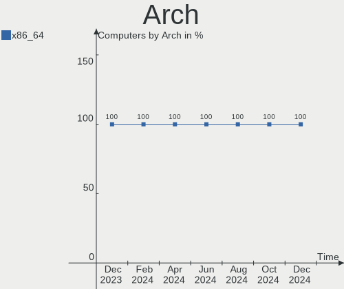
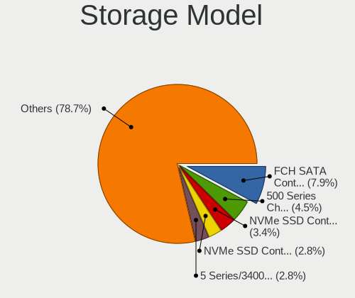
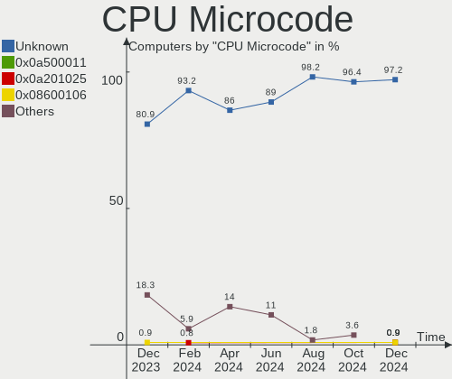
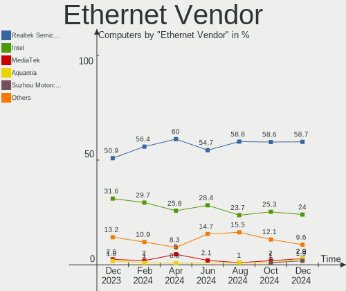
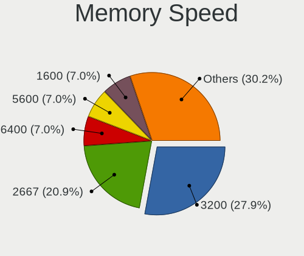

Manjaro Hardware Trends
-----------------------

A project to identify most popular hardware characteristics and track their change
over time based on data collected by Manjaro users at https://Linux-Hardware.org.

Anyone can contribute to this report by the [hw-probe](https://github.com/linuxhw/hw-probe) tool:

    sudo -E hw-probe -all -upload

This is a report for all computer types. See also reports for [desktops](/Dist/Manjaro/Desktop/README.md) and [notebooks](/Dist/Manjaro/Notebook/README.md).

Full-feature report is available here: https://linux-hardware.org/?view=trends

Period: Sep, 2021.

Contents
--------

* [ System ](#system)
  - [ OS                       ](#os)
  - [ OS Family                ](#os-family)
  - [ Kernel                   ](#kernel)
  - [ Kernel Family            ](#kernel-family)
  - [ Kernel Major Ver.        ](#kernel-major-ver)
  - [ Arch                     ](#arch)
  - [ DE                       ](#de)
  - [ Display Server           ](#display-server)
  - [ Display Manager          ](#display-manager)
  - [ OS Lang                  ](#os-lang)
  - [ Boot Mode                ](#boot-mode)
  - [ Filesystem               ](#filesystem)
  - [ Part. scheme             ](#part-scheme)
  - [ Dual Boot with Linux/BSD ](#dual-boot-with-linuxbsd)
  - [ Dual Boot (Win)          ](#dual-boot-win)

* [ Board ](#board)
  - [ Vendor                   ](#vendor)
  - [ Model                    ](#model)
  - [ Model Family             ](#model-family)
  - [ MFG Year                 ](#mfg-year)
  - [ Form Factor              ](#form-factor)
  - [ Secure Boot              ](#secure-boot)
  - [ Coreboot                 ](#coreboot)
  - [ RAM Size                 ](#ram-size)
  - [ RAM Used                 ](#ram-used)
  - [ Total Drives             ](#total-drives)
  - [ Has CD-ROM               ](#has-cd-rom)
  - [ Has Ethernet             ](#has-ethernet)
  - [ Has WiFi                 ](#has-wifi)
  - [ Has Bluetooth            ](#has-bluetooth)

* [ Location ](#location)
  - [ Country                  ](#country)
  - [ City                     ](#city)

* [ Drives ](#drives)
  - [ Drive Vendor             ](#drive-vendor)
  - [ Drive Model              ](#drive-model)
  - [ HDD Vendor               ](#hdd-vendor)
  - [ SSD Vendor               ](#ssd-vendor)
  - [ Drive Kind               ](#drive-kind)
  - [ Drive Connector          ](#drive-connector)
  - [ Drive Size               ](#drive-size)
  - [ Space Total              ](#space-total)
  - [ Space Used               ](#space-used)
  - [ Malfunc. Drives          ](#malfunc-drives)
  - [ Malfunc. Drive Vendor    ](#malfunc-drive-vendor)
  - [ Malfunc. HDD Vendor      ](#malfunc-hdd-vendor)
  - [ Malfunc. Drive Kind      ](#malfunc-drive-kind)
  - [ Failed Drives            ](#failed-drives)
  - [ Failed Drive Vendor      ](#failed-drive-vendor)
  - [ Drive Status             ](#drive-status)

* [ Storage controller ](#storage-controller)
  - [ Storage Vendor           ](#storage-vendor)
  - [ Storage Model            ](#storage-model)
  - [ Storage Kind             ](#storage-kind)

* [ Processor ](#processor)
  - [ CPU Vendor               ](#cpu-vendor)
  - [ CPU Model                ](#cpu-model)
  - [ CPU Model Family         ](#cpu-model-family)
  - [ CPU Cores                ](#cpu-cores)
  - [ CPU Sockets              ](#cpu-sockets)
  - [ CPU Threads              ](#cpu-threads)
  - [ CPU Op-Modes             ](#cpu-op-modes)
  - [ CPU Microcode            ](#cpu-microcode)
  - [ CPU Microarch            ](#cpu-microarch)

* [ Graphics ](#graphics)
  - [ GPU Vendor               ](#gpu-vendor)
  - [ GPU Model                ](#gpu-model)
  - [ GPU Combo                ](#gpu-combo)
  - [ GPU Driver               ](#gpu-driver)
  - [ GPU Memory               ](#gpu-memory)

* [ Monitor ](#monitor)
  - [ Monitor Vendor           ](#monitor-vendor)
  - [ Monitor Model            ](#monitor-model)
  - [ Monitor Resolution       ](#monitor-resolution)
  - [ Monitor Diagonal         ](#monitor-diagonal)
  - [ Monitor Width            ](#monitor-width)
  - [ Aspect Ratio             ](#aspect-ratio)
  - [ Monitor Area             ](#monitor-area)
  - [ Pixel Density            ](#pixel-density)
  - [ Multiple Monitors        ](#multiple-monitors)

* [ Network ](#network)
  - [ Net Controller Vendor    ](#net-controller-vendor)
  - [ Net Controller Model     ](#net-controller-model)
  - [ Wireless Vendor          ](#wireless-vendor)
  - [ Wireless Model           ](#wireless-model)
  - [ Ethernet Vendor          ](#ethernet-vendor)
  - [ Ethernet Model           ](#ethernet-model)
  - [ Net Controller Kind      ](#net-controller-kind)
  - [ Used Controller          ](#used-controller)
  - [ NICs                     ](#nics)
  - [ IPv6                     ](#ipv6)

* [ Bluetooth ](#bluetooth)
  - [ Bluetooth Vendor         ](#bluetooth-vendor)
  - [ Bluetooth Model          ](#bluetooth-model)

* [ Sound ](#sound)
  - [ Sound Vendor             ](#sound-vendor)
  - [ Sound Model              ](#sound-model)

* [ Memory ](#memory)
  - [ Memory Vendor            ](#memory-vendor)
  - [ Memory Model             ](#memory-model)
  - [ Memory Kind              ](#memory-kind)
  - [ Memory Form Factor       ](#memory-form-factor)
  - [ Memory Size              ](#memory-size)
  - [ Memory Speed             ](#memory-speed)

* [ Printers & scanners ](#printers--scanners)
  - [ Printer Vendor           ](#printer-vendor)
  - [ Printer Model            ](#printer-model)
  - [ Scanner Vendor           ](#scanner-vendor)
  - [ Scanner Model            ](#scanner-model)

* [ Camera ](#camera)
  - [ Camera Vendor            ](#camera-vendor)
  - [ Camera Model             ](#camera-model)

* [ Security ](#security)
  - [ Fingerprint Vendor       ](#fingerprint-vendor)
  - [ Fingerprint Model        ](#fingerprint-model)
  - [ Chipcard Vendor          ](#chipcard-vendor)
  - [ Chipcard Model           ](#chipcard-model)

* [ Unsupported ](#unsupported)
  - [ Unsupported Devices      ](#unsupported-devices)
  - [ Unsupported Device Types ](#unsupported-device-types)

System
------

OS
--

Installed operating systems

| Name           | Computers | Percent |
|----------------|-----------|---------|
| Manjaro        | 76        | 43.43%  |
| Manjaro 21.1.2 | 39        | 22.29%  |
| Manjaro 21.1.3 | 28        | 16%     |
| Manjaro 21.1.1 | 17        | 9.71%   |
| Manjaro 21.1.4 | 13        | 7.43%   |
| Manjaro 21.2.0 | 1         | 0.57%   |
| Manjaro 21.1.5 | 1         | 0.57%   |

OS Family
---------

OS without a version

| Name    | Computers | Percent |
|---------|-----------|---------|
| Manjaro | 175       | 100%    |

Kernel
------

Version of the Linux kernel

| Version                     | Computers | Percent |
|-----------------------------|-----------|---------|
| 5.13.13-1-MANJARO           | 30        | 17.14%  |
| 5.14.0-0-MANJARO            | 19        | 10.86%  |
| 5.13.12-1-MANJARO           | 18        | 10.29%  |
| 5.13.15-1-MANJARO           | 16        | 9.14%   |
| 5.14.2-1-MANJARO            | 14        | 8%      |
| 5.10.61-1-MANJARO           | 13        | 7.43%   |
| 5.10.60-1-MANJARO           | 13        | 7.43%   |
| 5.10.63-1-MANJARO           | 8         | 4.57%   |
| 5.14.7-2-MANJARO            | 6         | 3.43%   |
| 5.13.19-2-MANJARO           | 5         | 2.86%   |
| 5.12.19-1-MANJARO           | 5         | 2.86%   |
| 5.9.16-1-MANJARO            | 4         | 2.29%   |
| 5.10.68-1-MANJARO           | 4         | 2.29%   |
| 5.14.0-1-MANJARO            | 3         | 1.71%   |
| 5.4.144-1-MANJARO           | 2         | 1.14%   |
| 5.11.22-2-MANJARO           | 2         | 1.14%   |
| 5.4.143-1-MANJARO           | 1         | 0.57%   |
| 5.14.8-hardened1-1-hardened | 1         | 0.57%   |
| 5.14.5-AMD-znver2           | 1         | 0.57%   |
| 5.14.3-arch1-2-vfio         | 1         | 0.57%   |
| 5.14.1-2-MANJARO            | 1         | 0.57%   |
| 5.14.1-1-MANJARO            | 1         | 0.57%   |
| 5.13.19-xanmod1-MANJARO     | 1         | 0.57%   |
| 5.11.6-1-MANJARO            | 1         | 0.57%   |
| 5.10.64-1-MANJARO           | 1         | 0.57%   |
| 5.10.53-1-MANJARO           | 1         | 0.57%   |
| 5.10.52-3-rt47-MANJARO      | 1         | 0.57%   |
| 5.10.2-2-MANJARO            | 1         | 0.57%   |
| 4.14.9-1-ARCH               | 1         | 0.57%   |

Kernel Family
-------------

Linux kernel without a distro release

| Version | Computers | Percent |
|---------|-----------|---------|
| 5.13.13 | 30        | 17.14%  |
| 5.14.0  | 22        | 12.57%  |
| 5.13.12 | 18        | 10.29%  |
| 5.13.15 | 16        | 9.14%   |
| 5.14.2  | 14        | 8%      |
| 5.10.61 | 13        | 7.43%   |
| 5.10.60 | 13        | 7.43%   |
| 5.10.63 | 8         | 4.57%   |
| 5.14.7  | 6         | 3.43%   |
| 5.13.19 | 6         | 3.43%   |
| 5.12.19 | 5         | 2.86%   |
| 5.9.16  | 4         | 2.29%   |
| 5.10.68 | 4         | 2.29%   |
| 5.4.144 | 2         | 1.14%   |
| 5.14.1  | 2         | 1.14%   |
| 5.11.22 | 2         | 1.14%   |
| 5.4.143 | 1         | 0.57%   |
| 5.14.8  | 1         | 0.57%   |
| 5.14.5  | 1         | 0.57%   |
| 5.14.3  | 1         | 0.57%   |
| 5.11.6  | 1         | 0.57%   |
| 5.10.64 | 1         | 0.57%   |
| 5.10.53 | 1         | 0.57%   |
| 5.10.52 | 1         | 0.57%   |
| 5.10.2  | 1         | 0.57%   |
| 4.14.9  | 1         | 0.57%   |

Kernel Major Ver.
-----------------

Linux kernel major version

| Version | Computers | Percent |
|---------|-----------|---------|
| 5.13    | 70        | 40%     |
| 5.14    | 47        | 26.86%  |
| 5.10    | 42        | 24%     |
| 5.12    | 5         | 2.86%   |
| 5.9     | 4         | 2.29%   |
| 5.4     | 3         | 1.71%   |
| 5.11    | 3         | 1.71%   |
| 4.14    | 1         | 0.57%   |

Arch
----

OS architecture (x86_64, i586, etc.)

| Name   | Computers | Percent |
|--------|-----------|---------|
| x86_64 | 175       | 100%    |

DE
--

Desktop Environment

| Name            | Computers | Percent |
|-----------------|-----------|---------|
| KDE5            | 45        | 25.71%  |
| GNOME           | 43        | 24.57%  |
| XFCE            | 36        | 20.57%  |
| KDE             | 19        | 10.86%  |
| X-Cinnamon      | 8         | 4.57%   |
| Unknown         | 7         | 4%      |
| MATE            | 6         | 3.43%   |
| i3              | 5         | 2.86%   |
| Deepin          | 3         | 1.71%   |
| LXQt            | 1         | 0.57%   |
| i3-with-shmlog  | 1         | 0.57%   |
| GNOME Flashback | 1         | 0.57%   |

Display Server
--------------

X11 or Wayland

| Name    | Computers | Percent |
|---------|-----------|---------|
| X11     | 141       | 80.57%  |
| Wayland | 29        | 16.57%  |
| Unknown | 3         | 1.71%   |
| Tty     | 2         | 1.14%   |

Display Manager
---------------

SDDM, LightDM, etc.

| Name    | Computers | Percent |
|---------|-----------|---------|
| Unknown | 74        | 42.29%  |
| SDDM    | 44        | 25.14%  |
| LightDM | 36        | 20.57%  |
| GDM     | 21        | 12%     |

OS Lang
-------

Language

| Lang    | Computers | Percent |
|---------|-----------|---------|
| en_US   | 70        | 40%     |
| en_GB   | 17        | 9.71%   |
| de_DE   | 17        | 9.71%   |
| pt_BR   | 10        | 5.71%   |
| ru_RU   | 9         | 5.14%   |
| fr_FR   | 9         | 5.14%   |
| en_AU   | 5         | 2.86%   |
| ru_UA   | 4         | 2.29%   |
| en_CA   | 4         | 2.29%   |
| it_IT   | 3         | 1.71%   |
| es_ES   | 3         | 1.71%   |
| tr_TR   | 2         | 1.14%   |
| pt_PT   | 2         | 1.14%   |
| fi_FI   | 2         | 1.14%   |
| es_MX   | 2         | 1.14%   |
| es_BO   | 2         | 1.14%   |
| en_IN   | 2         | 1.14%   |
| zh_TW   | 1         | 0.57%   |
| zh_CN   | 1         | 0.57%   |
| pl_PL   | 1         | 0.57%   |
| nb_NO   | 1         | 0.57%   |
| ko_KR   | 1         | 0.57%   |
| hu_HU   | 1         | 0.57%   |
| eu_ES   | 1         | 0.57%   |
| es_PE   | 1         | 0.57%   |
| es_HN   | 1         | 0.57%   |
| en_NZ   | 1         | 0.57%   |
| cs_CZ   | 1         | 0.57%   |
| Unknown | 1         | 0.57%   |

Boot Mode
---------

EFI or BIOS

| Mode | Computers | Percent |
|------|-----------|---------|
| BIOS | 93        | 53.14%  |
| EFI  | 82        | 46.86%  |

Filesystem
----------

Type of filesystem

| Type     | Computers | Percent |
|----------|-----------|---------|
| Ext4     | 142       | 81.14%  |
| Btrfs    | 23        | 13.14%  |
| Overlay  | 5         | 2.86%   |
| Xfs      | 3         | 1.71%   |
| Zfs      | 1         | 0.57%   |
| Reiserfs | 1         | 0.57%   |

Part. scheme
------------

Scheme of partitioning

| Type    | Computers | Percent |
|---------|-----------|---------|
| GPT     | 86        | 49.14%  |
| Unknown | 75        | 42.86%  |
| MBR     | 14        | 8%      |

Dual Boot with Linux/BSD
------------------------

Hosting more than one Linux/BSD

| Dual boot | Computers | Percent |
|-----------|-----------|---------|
| No        | 150       | 85.71%  |
| Yes       | 25        | 14.29%  |

Dual Boot (Win)
---------------

Hosting Linux and Windows

| Dual boot | Computers | Percent |
|-----------|-----------|---------|
| No        | 113       | 64.57%  |
| Yes       | 62        | 35.43%  |

Board
-----

Vendor
------

Motherboard manufacturer

| Name                | Computers | Percent |
|---------------------|-----------|---------|
| ASUSTek Computer    | 31        | 17.71%  |
| Hewlett-Packard     | 27        | 15.43%  |
| Lenovo              | 24        | 13.71%  |
| Dell                | 23        | 13.14%  |
| Gigabyte Technology | 17        | 9.71%   |
| MSI                 | 10        | 5.71%   |
| Acer                | 8         | 4.57%   |
| ASRock              | 6         | 3.43%   |
| Apple               | 5         | 2.86%   |
| Samsung Electronics | 3         | 1.71%   |
| Intel               | 2         | 1.14%   |
| HUAWEI              | 2         | 1.14%   |
| Google              | 2         | 1.14%   |
| UNOWHY              | 1         | 0.57%   |
| TUXEDO              | 1         | 0.57%   |
| Toshiba             | 1         | 0.57%   |
| Teclast             | 1         | 0.57%   |
| Semp Toshiba        | 1         | 0.57%   |
| Pegatron            | 1         | 0.57%   |
| Notebook            | 1         | 0.57%   |
| Monster             | 1         | 0.57%   |
| JGINYUE             | 1         | 0.57%   |
| Huanan              | 1         | 0.57%   |
| Fusion5             | 1         | 0.57%   |
| eii                 | 1         | 0.57%   |
| BESSTAR Tech        | 1         | 0.57%   |
| Alienware           | 1         | 0.57%   |
| Unknown             | 1         | 0.57%   |

Model
-----

Motherboard model

| Name                                                  | Computers | Percent |
|-------------------------------------------------------|-----------|---------|
| ASUS All Series                                       | 5         | 2.86%   |
| HP Laptop 15-bs0xx                                    | 2         | 1.14%   |
| Dell XPS 15 9500                                      | 2         | 1.14%   |
| ASUS G751JT                                           | 2         | 1.14%   |
| ASUS A0000001                                         | 2         | 1.14%   |
| Unknown                                               | 2         | 1.14%   |
| UNOWHY Y13G010S4EI                                    | 1         | 0.57%   |
| Toshiba Satellite NB10t-A-102                         | 1         | 0.57%   |
| Teclast F5                                            | 1         | 0.57%   |
| Semp Toshiba IS 1412                                  | 1         | 0.57%   |
| Samsung RV420/RV520/RV720/E3530/S3530/E3420/E3520     | 1         | 0.57%   |
| Samsung 730QCJ/730QCR                                 | 1         | 0.57%   |
| Samsung 300E5EV/300E4EV/270E5EV/270E4EV/2470EV/2470EE | 1         | 0.57%   |
| Pegatron IPMSB-H61                                    | 1         | 0.57%   |
| Notebook W65_W67RN,RC1,RCY                            | 1         | 0.57%   |
| MSI MS-7C92                                           | 1         | 0.57%   |
| MSI MS-7C09                                           | 1         | 0.57%   |
| MSI MS-7B86                                           | 1         | 0.57%   |
| MSI MS-7A58                                           | 1         | 0.57%   |
| MSI MS-7A35                                           | 1         | 0.57%   |
| MSI MS-7A34                                           | 1         | 0.57%   |
| MSI MS-7900                                           | 1         | 0.57%   |
| MSI MS-7693                                           | 1         | 0.57%   |
| MSI MS-168A                                           | 1         | 0.57%   |
| MSI GS76 Stealth 11UH                                 | 1         | 0.57%   |
| Monster TULPAR T7 V24.1                               | 1         | 0.57%   |
| Lenovo V130-15IKB 81HN                                | 1         | 0.57%   |
| Lenovo ThinkPad X230 2324CD1                          | 1         | 0.57%   |
| Lenovo ThinkPad X1 Carbon 5th 20HQS1V700              | 1         | 0.57%   |
| Lenovo ThinkPad T470 W10DG 20JNS09G1T                 | 1         | 0.57%   |
| Lenovo ThinkPad T430s 2356GPU                         | 1         | 0.57%   |
| Lenovo ThinkPad T14 Gen 2a 20XK0015US                 | 1         | 0.57%   |
| Lenovo ThinkPad E460 20ET0014LM                       | 1         | 0.57%   |
| Lenovo ThinkPad E14 Gen 3 20Y7003XGE                  | 1         | 0.57%   |
| Lenovo Legion 5 15ACH6H 82JU                          | 1         | 0.57%   |
| Lenovo IdeaPad S740-15IRH 81NY                        | 1         | 0.57%   |
| Lenovo IdeaPad S340-15IML 81NA                        | 1         | 0.57%   |
| Lenovo IdeaPad Gaming 3 15IMH05 81Y4                  | 1         | 0.57%   |
| Lenovo IdeaPad Gaming 3 15ARH05 82EY                  | 1         | 0.57%   |
| Lenovo IdeaPad Flex 5 14ARE05 81X2                    | 1         | 0.57%   |
| Lenovo IdeaPad 5 Pro 14ACN6 82L7                      | 1         | 0.57%   |
| Lenovo IdeaPad 5 15ARE05 81YQ                         | 1         | 0.57%   |
| Lenovo IdeaPad 5 14IIL05 81YH                         | 1         | 0.57%   |
| Lenovo IdeaPad 5 14ALC05 82LM                         | 1         | 0.57%   |
| Lenovo IdeaPad 330-17IKB 81DM                         | 1         | 0.57%   |
| Lenovo IdeaPad 100-14IBD 80RK                         | 1         | 0.57%   |
| Lenovo IdeaCentre 720-18APR 90HY002APG                | 1         | 0.57%   |
| Lenovo H50-55 90BF001SUK                              | 1         | 0.57%   |
| Lenovo G50-80 80L0                                    | 1         | 0.57%   |
| Lenovo B570e HuronRiver Platform                      | 1         | 0.57%   |
| JGINYUE H97I PLUS V2.0                                | 1         | 0.57%   |
| Intel DH77EB AAG39073-304                             | 1         | 0.57%   |
| Intel DB75EN AAG39650-302                             | 1         | 0.57%   |
| HUAWEI MACH-WX9                                       | 1         | 0.57%   |
| HUAWEI BOHK-WAX9X                                     | 1         | 0.57%   |
| Huanan X99-F8                                         | 1         | 0.57%   |
| HP ZBook Studio G5                                    | 1         | 0.57%   |
| HP ZBook 17 G6                                        | 1         | 0.57%   |
| HP ProBook 440 G6                                     | 1         | 0.57%   |
| HP Pro Tablet 608 G1                                  | 1         | 0.57%   |

Model Family
------------

Motherboard model prefix

| Name               | Computers | Percent |
|--------------------|-----------|---------|
| Lenovo IdeaPad     | 11        | 6.29%   |
| Dell XPS           | 8         | 4.57%   |
| Lenovo ThinkPad    | 7         | 4%      |
| Dell Inspiron      | 6         | 3.43%   |
| HP Pavilion        | 5         | 2.86%   |
| ASUS ROG           | 5         | 2.86%   |
| ASUS All           | 5         | 2.86%   |
| HP Laptop          | 4         | 2.29%   |
| Dell Latitude      | 4         | 2.29%   |
| ASUS PRIME         | 4         | 2.29%   |
| Acer Aspire        | 4         | 2.29%   |
| HP ENVY            | 3         | 1.71%   |
| HP 250             | 3         | 1.71%   |
| Acer Swift         | 3         | 1.71%   |
| HP ZBook           | 2         | 1.14%   |
| HP EliteBook       | 2         | 1.14%   |
| HP Compaq          | 2         | 1.14%   |
| Gigabyte X570      | 2         | 1.14%   |
| Gigabyte H61M-DS2  | 2         | 1.14%   |
| Dell Vostro        | 2         | 1.14%   |
| Dell Precision     | 2         | 1.14%   |
| ASUS TUF           | 2         | 1.14%   |
| ASUS G751JT        | 2         | 1.14%   |
| ASUS A0000001      | 2         | 1.14%   |
| Apple iMac12       | 2         | 1.14%   |
| Unknown            | 2         | 1.14%   |
| UNOWHY Y13G010S4EI | 1         | 0.57%   |
| Toshiba Satellite  | 1         | 0.57%   |
| Teclast F5         | 1         | 0.57%   |
| Semp Toshiba IS    | 1         | 0.57%   |
| Samsung RV420      | 1         | 0.57%   |
| Samsung 730QCJ     | 1         | 0.57%   |
| Samsung 300E5EV    | 1         | 0.57%   |
| Pegatron IPMSB-H61 | 1         | 0.57%   |
| Notebook W65       | 1         | 0.57%   |
| MSI MS-7C92        | 1         | 0.57%   |
| MSI MS-7C09        | 1         | 0.57%   |
| MSI MS-7B86        | 1         | 0.57%   |
| MSI MS-7A58        | 1         | 0.57%   |
| MSI MS-7A35        | 1         | 0.57%   |
| MSI MS-7A34        | 1         | 0.57%   |
| MSI MS-7900        | 1         | 0.57%   |
| MSI MS-7693        | 1         | 0.57%   |
| MSI MS-168A        | 1         | 0.57%   |
| MSI GS76           | 1         | 0.57%   |
| Monster TULPAR     | 1         | 0.57%   |
| Lenovo V130-15IKB  | 1         | 0.57%   |
| Lenovo Legion      | 1         | 0.57%   |
| Lenovo IdeaCentre  | 1         | 0.57%   |
| Lenovo H50-55      | 1         | 0.57%   |
| Lenovo G50-80      | 1         | 0.57%   |
| Lenovo B570e       | 1         | 0.57%   |
| JGINYUE H97I       | 1         | 0.57%   |
| Intel DH77EB       | 1         | 0.57%   |
| Intel DB75EN       | 1         | 0.57%   |
| HUAWEI MACH-WX9    | 1         | 0.57%   |
| HUAWEI BOHK-WAX9X  | 1         | 0.57%   |
| Huanan X99-F8      | 1         | 0.57%   |
| HP ProBook         | 1         | 0.57%   |
| HP Pro             | 1         | 0.57%   |

MFG Year
--------

Motherboard manufacture year

| Year | Computers | Percent |
|------|-----------|---------|
| 2021 | 44        | 25.14%  |
| 2020 | 32        | 18.29%  |
| 2019 | 27        | 15.43%  |
| 2014 | 12        | 6.86%   |
| 2018 | 11        | 6.29%   |
| 2012 | 8         | 4.57%   |
| 2016 | 7         | 4%      |
| 2015 | 7         | 4%      |
| 2013 | 7         | 4%      |
| 2011 | 6         | 3.43%   |
| 2017 | 5         | 2.86%   |
| 2010 | 2         | 1.14%   |
| 2009 | 2         | 1.14%   |
| 2008 | 2         | 1.14%   |
| 2007 | 2         | 1.14%   |
| 2006 | 1         | 0.57%   |

Form Factor
-----------

Physical design of the computer

| Name        | Computers | Percent |
|-------------|-----------|---------|
| Notebook    | 102       | 58.29%  |
| Desktop     | 59        | 33.71%  |
| Convertible | 7         | 4%      |
| All in one  | 4         | 2.29%   |
| Mini pc     | 2         | 1.14%   |
| Tablet      | 1         | 0.57%   |

Secure Boot
-----------

Enabled or disabled

| State    | Computers | Percent |
|----------|-----------|---------|
| Disabled | 175       | 100%    |

Coreboot
--------

Have coreboot on board

| Used | Computers | Percent |
|------|-----------|---------|
| No   | 173       | 98.86%  |
| Yes  | 2         | 1.14%   |

RAM Size
--------

Total RAM memory

| Size in GB  | Computers | Percent |
|-------------|-----------|---------|
| 16.01-24.0  | 48        | 27.43%  |
| 4.01-8.0    | 43        | 24.57%  |
| 8.01-16.0   | 34        | 19.43%  |
| 3.01-4.0    | 24        | 13.71%  |
| 32.01-64.0  | 18        | 10.29%  |
| 64.01-256.0 | 3         | 1.71%   |
| 24.01-32.0  | 2         | 1.14%   |
| 1.01-2.0    | 2         | 1.14%   |
| 2.01-3.0    | 1         | 0.57%   |

RAM Used
--------

Used RAM memory

| Used GB    | Computers | Percent |
|------------|-----------|---------|
| 2.01-3.0   | 51        | 29.14%  |
| 4.01-8.0   | 40        | 22.86%  |
| 1.01-2.0   | 37        | 21.14%  |
| 3.01-4.0   | 23        | 13.14%  |
| 8.01-16.0  | 10        | 5.71%   |
| 0.51-1.0   | 9         | 5.14%   |
| 16.01-24.0 | 4         | 2.29%   |
| 0.01-0.5   | 1         | 0.57%   |

Total Drives
------------

Number of drives on board

| Drives | Computers | Percent |
|--------|-----------|---------|
| 1      | 98        | 56%     |
| 2      | 49        | 28%     |
| 3      | 17        | 9.71%   |
| 4      | 7         | 4%      |
| 5      | 2         | 1.14%   |
| 6      | 1         | 0.57%   |
| 0      | 1         | 0.57%   |

Has CD-ROM
----------

Has CD-ROM on board

| Presented | Computers | Percent |
|-----------|-----------|---------|
| No        | 120       | 68.57%  |
| Yes       | 55        | 31.43%  |

Has Ethernet
------------

Has Ethernet on board

| Presented | Computers | Percent |
|-----------|-----------|---------|
| Yes       | 145       | 82.86%  |
| No        | 30        | 17.14%  |

Has WiFi
--------

Has WiFi module

| Presented | Computers | Percent |
|-----------|-----------|---------|
| Yes       | 142       | 81.14%  |
| No        | 33        | 18.86%  |

Has Bluetooth
-------------

Has Bluetooth module

| Presented | Computers | Percent |
|-----------|-----------|---------|
| Yes       | 118       | 67.43%  |
| No        | 57        | 32.57%  |

Location
--------

Country
-------

Geographic location (country)

| Country                | Computers | Percent |
|------------------------|-----------|---------|
| USA                    | 26        | 14.86%  |
| Germany                | 21        | 12%     |
| Russia                 | 15        | 8.57%   |
| Brazil                 | 13        | 7.43%   |
| UK                     | 12        | 6.86%   |
| France                 | 11        | 6.29%   |
| Ukraine                | 5         | 2.86%   |
| Spain                  | 5         | 2.86%   |
| Italy                  | 5         | 2.86%   |
| Canada                 | 5         | 2.86%   |
| Australia              | 5         | 2.86%   |
| India                  | 4         | 2.29%   |
| Turkey                 | 3         | 1.71%   |
| Taiwan                 | 3         | 1.71%   |
| Poland                 | 3         | 1.71%   |
| Portugal               | 2         | 1.14%   |
| New Zealand            | 2         | 1.14%   |
| Mexico                 | 2         | 1.14%   |
| Hungary                | 2         | 1.14%   |
| Finland                | 2         | 1.14%   |
| Bolivia                | 2         | 1.14%   |
| Trinidad and Tobago    | 1         | 0.57%   |
| Thailand               | 1         | 0.57%   |
| Sudan                  | 1         | 0.57%   |
| South Korea            | 1         | 0.57%   |
| South Africa           | 1         | 0.57%   |
| Slovakia               | 1         | 0.57%   |
| Romania                | 1         | 0.57%   |
| Peru                   | 1         | 0.57%   |
| Norway                 | 1         | 0.57%   |
| Netherlands            | 1         | 0.57%   |
| Malaysia               | 1         | 0.57%   |
| Lithuania              | 1         | 0.57%   |
| Latvia                 | 1         | 0.57%   |
| Israel                 | 1         | 0.57%   |
| Iran                   | 1         | 0.57%   |
| Indonesia              | 1         | 0.57%   |
| Honduras               | 1         | 0.57%   |
| Dominican Republic     | 1         | 0.57%   |
| Czechia                | 1         | 0.57%   |
| Colombia               | 1         | 0.57%   |
| China                  | 1         | 0.57%   |
| Bosnia and Herzegovina | 1         | 0.57%   |
| Belgium                | 1         | 0.57%   |
| Belarus                | 1         | 0.57%   |
| Bangladesh             | 1         | 0.57%   |
| Azerbaijan             | 1         | 0.57%   |
| Austria                | 1         | 0.57%   |

City
----

Geographic location (city)

| City                       | Computers | Percent |
|----------------------------|-----------|---------|
| Moscow                     | 6         | 3.43%   |
| St Petersburg              | 3         | 1.71%   |
| Madrid                     | 3         | 1.71%   |
| Yekaterinburg              | 2         | 1.14%   |
| Trenton                    | 2         | 1.14%   |
| Taoyuan District           | 2         | 1.14%   |
| Saint Paul                 | 2         | 1.14%   |
| Rome                       | 2         | 1.14%   |
| Paris                      | 2         | 1.14%   |
| Lille                      | 2         | 1.14%   |
| La Paz                     | 2         | 1.14%   |
| Greoux-les-Bains           | 2         | 1.14%   |
| Florence                   | 2         | 1.14%   |
| Berlin                     | 2         | 1.14%   |
| Bengaluru                  | 2         | 1.14%   |
| Auckland                   | 2         | 1.14%   |
| Zaventem                   | 1         | 0.57%   |
| Winston-Salem              | 1         | 0.57%   |
| Windermere                 | 1         | 0.57%   |
| Walldorf                   | 1         | 0.57%   |
| Vyhne                      | 1         | 0.57%   |
| Vilnius                    | 1         | 0.57%   |
| Viersen                    | 1         | 0.57%   |
| Vienna                     | 1         | 0.57%   |
| Vancouver                  | 1         | 0.57%   |
| Urbana                     | 1         | 0.57%   |
| Uberl??ndia                | 1         | 0.57%   |
| Tualatin                   | 1         | 0.57%   |
| Torun                      | 1         | 0.57%   |
| Tel Aviv                   | 1         | 0.57%   |
| Tehran                     | 1         | 0.57%   |
| Tegucigalpa                | 1         | 0.57%   |
| Tangerang                  | 1         | 0.57%   |
| Taichung                   | 1         | 0.57%   |
| Tadepallegudem             | 1         | 0.57%   |
| Szombathely                | 1         | 0.57%   |
| Sydney                     | 1         | 0.57%   |
| Stokmarknes                | 1         | 0.57%   |
| St Louis                   | 1         | 0.57%   |
| Sindelfingen               | 1         | 0.57%   |
| Sesto San Giovanni         | 1         | 0.57%   |
| Serra                      | 1         | 0.57%   |
| Seongbuk-gu                | 1         | 0.57%   |
| Schwerte                   | 1         | 0.57%   |
| Schifferstadt              | 1         | 0.57%   |
| Sarnia                     | 1         | 0.57%   |
| Sao Teotonio               | 1         | 0.57%   |
| Sao Jose                   | 1         | 0.57%   |
| Santos                     | 1         | 0.57%   |
| Santo Amaro                | 1         | 0.57%   |
| Santiago de los Caballeros | 1         | 0.57%   |
| Sabirabad                  | 1         | 0.57%   |
| Roche-la-Moliere           | 1         | 0.57%   |
| Rivne                      | 1         | 0.57%   |
| Rio de Janeiro             | 1         | 0.57%   |
| Riga                       | 1         | 0.57%   |
| Rennes                     | 1         | 0.57%   |
| Recife                     | 1         | 0.57%   |
| Quinta Do Conde            | 1         | 0.57%   |
| Puebla City                | 1         | 0.57%   |

Drives
------

Drive Vendor
------------

Hard drive vendors

| Vendor                         | Computers | Drives | Percent |
|--------------------------------|-----------|--------|---------|
| Samsung Electronics            | 44        | 55     | 17.46%  |
| WDC                            | 38        | 45     | 15.08%  |
| Seagate                        | 36        | 43     | 14.29%  |
| Kingston                       | 17        | 19     | 6.75%   |
| Toshiba                        | 15        | 15     | 5.95%   |
| Sandisk                        | 14        | 18     | 5.56%   |
| SK Hynix                       | 12        | 12     | 4.76%   |
| Crucial                        | 12        | 15     | 4.76%   |
| Unknown                        | 7         | 11     | 2.78%   |
| Hitachi                        | 7         | 7      | 2.78%   |
| Micron Technology              | 5         | 5      | 1.98%   |
| HGST                           | 5         | 5      | 1.98%   |
| Intel                          | 4         | 5      | 1.59%   |
| PNY                            | 3         | 3      | 1.19%   |
| Union Memory (Shenzhen)        | 2         | 2      | 0.79%   |
| Patriot                        | 2         | 2      | 0.79%   |
| KIOXIA                         | 2         | 2      | 0.79%   |
| China                          | 2         | 2      | 0.79%   |
| A-DATA Technology              | 2         | 2      | 0.79%   |
| USB3.2                         | 1         | 1      | 0.4%    |
| Transcend                      | 1         | 1      | 0.4%    |
| TO Exter                       | 1         | 1      | 0.4%    |
| Teclast                        | 1         | 1      | 0.4%    |
| Super Talent                   | 1         | 1      | 0.4%    |
| SPCC                           | 1         | 1      | 0.4%    |
| Solid State Storage Technology | 1         | 1      | 0.4%    |
| Solid State Storage            | 1         | 1      | 0.4%    |
| Silicon Motion                 | 1         | 1      | 0.4%    |
| PLEXTOR                        | 1         | 1      | 0.4%    |
| Phison                         | 1         | 1      | 0.4%    |
| OSCOO                          | 1         | 1      | 0.4%    |
| OCZ                            | 1         | 1      | 0.4%    |
| LITEON                         | 1         | 1      | 0.4%    |
| KingSpec                       | 1         | 1      | 0.4%    |
| JMicron                        | 1         | 1      | 0.4%    |
| Intenso                        | 1         | 1      | 0.4%    |
| Hewlett-Packard                | 1         | 1      | 0.4%    |
| Gigabyte Technology            | 1         | 1      | 0.4%    |
| Fujitsu                        | 1         | 1      | 0.4%    |
| Biostar                        | 1         | 1      | 0.4%    |
| Apple                          | 1         | 1      | 0.4%    |
| AMD-RAID                       | 1         | 1      | 0.4%    |

Drive Model
-----------

Hard drive models

| Model                               | Computers | Percent |
|-------------------------------------|-----------|---------|
| Samsung SSD 860 EVO 500GB           | 6         | 2.1%    |
| Kingston SA400S37120G 120GB SSD     | 5         | 1.75%   |
| Toshiba MQ01ABD100 1TB              | 4         | 1.4%    |
| Seagate Expansion Desk 4TB          | 4         | 1.4%    |
| WDC WD10EZEX-00WN4A0 1TB            | 3         | 1.05%   |
| Unknown MMC Card  64GB              | 3         | 1.05%   |
| SK Hynix NVMe SSD Drive 512GB       | 3         | 1.05%   |
| Seagate ST500LM012 HN-M500MBB 500GB | 3         | 1.05%   |
| Seagate ST3500418AS 500GB           | 3         | 1.05%   |
| Seagate ST2000DM001-1ER164 2TB      | 3         | 1.05%   |
| Seagate Expansion 1TB               | 3         | 1.05%   |
| Samsung SSD 860 EVO 1TB             | 3         | 1.05%   |
| Samsung NVMe SSD Drive 512GB        | 3         | 1.05%   |
| Samsung NVMe SSD Drive 256GB        | 3         | 1.05%   |
| Kingston SA400S37240G 240GB SSD     | 3         | 1.05%   |
| Intel SSDPEKNW512G8 512GB           | 3         | 1.05%   |
| HGST HTS721010A9E630 1TB            | 3         | 1.05%   |
| Crucial CT500MX500SSD1 500GB        | 3         | 1.05%   |
| WDC WDS250G2B0B-00YS70 250GB SSD    | 2         | 0.7%    |
| WDC WDS240G2G0A-00JH30 240GB SSD    | 2         | 0.7%    |
| WDC WDBNCE5000PNC 500GB SSD         | 2         | 0.7%    |
| WDC WD10EZRX-00A8LB0 1TB            | 2         | 0.7%    |
| WDC PC SN720 SDAPNTW-1T00-1006 1TB  | 2         | 0.7%    |
| Unknown MMC Card  128GB             | 2         | 0.7%    |
| Toshiba NVMe SSD Drive 512GB        | 2         | 0.7%    |
| Seagate ST2000DM006-2DM164 2TB      | 2         | 0.7%    |
| Seagate ST1000DM010-2EP102 1TB      | 2         | 0.7%    |
| SanDisk SDSSDA240G 240GB            | 2         | 0.7%    |
| Sandisk NVMe SSD Drive 500GB        | 2         | 0.7%    |
| Sandisk NVMe SSD Drive 1024GB       | 2         | 0.7%    |
| Samsung SSD 970 EVO Plus 500GB      | 2         | 0.7%    |
| Samsung SSD 950 PRO 512GB           | 2         | 0.7%    |
| Samsung NVMe SSD Drive 500GB        | 2         | 0.7%    |
| Samsung MZVLB512HBJQ-000H1 512GB    | 2         | 0.7%    |
| Micron 1100_MTFDDAV256TBN 256GB SSD | 2         | 0.7%    |
| Kingston NVMe SSD Drive 1TB         | 2         | 0.7%    |
| Crucial CT1000MX500SSD1 1TB         | 2         | 0.7%    |
| WDC WDS500G2B0A-00SM50 500GB SSD    | 1         | 0.35%   |
| WDC WDS200T2B0A-00SM50 2TB SSD      | 1         | 0.35%   |
| WDC WDS100T2B0B 1TB SSD             | 1         | 0.35%   |
| WDC WDS100T2B0A-00SM50 1TB SSD      | 1         | 0.35%   |
| WDC WDBNCE2500PNC 250GB SSD         | 1         | 0.35%   |
| WDC WD5000LUCT-63RC2Y0 500GB        | 1         | 0.35%   |
| WDC WD5000LPVX-22V0TT0 500GB        | 1         | 0.35%   |
| WDC WD5000LPLX-60ZNTT0 500GB        | 1         | 0.35%   |
| WDC WD5000BEVT-22ZAT0 500GB         | 1         | 0.35%   |
| WDC WD5000AVDS-73U7B1 500GB         | 1         | 0.35%   |
| WDC WD5000AAKX-001CA0 500GB         | 1         | 0.35%   |
| WDC WD40EZRX-00SPEB0 4TB            | 1         | 0.35%   |
| WDC WD30EZRZ-00GXCB0 3TB            | 1         | 0.35%   |
| WDC WD3000F9YZ-09N20L0 3TB          | 1         | 0.35%   |
| WDC WD2500AAKX-00ERMA0 250GB        | 1         | 0.35%   |
| WDC WD20EZRZ-00Z5HB0 2TB            | 1         | 0.35%   |
| WDC WD2000FYYZ-01UL1B0 2TB          | 1         | 0.35%   |
| WDC WD121KRYZ-01W0RB0 12TB          | 1         | 0.35%   |
| WDC WD10SPZX-24Z10 1TB              | 1         | 0.35%   |
| WDC WD10SPZX-21Z10T0 1TB            | 1         | 0.35%   |
| WDC WD10JPVX-22JC3T0 1TB            | 1         | 0.35%   |
| WDC WD10JPVT-75A1YT0 1TB            | 1         | 0.35%   |
| WDC WD10JPLX-00MBPT0 1TB            | 1         | 0.35%   |

HDD Vendor
----------

Hard disk drive vendors

| Vendor              | Computers | Drives | Percent |
|---------------------|-----------|--------|---------|
| Seagate             | 36        | 43     | 40%     |
| WDC                 | 28        | 30     | 31.11%  |
| Toshiba             | 10        | 10     | 11.11%  |
| Hitachi             | 7         | 7      | 7.78%   |
| HGST                | 5         | 5      | 5.56%   |
| TO Exter            | 1         | 1      | 1.11%   |
| Samsung Electronics | 1         | 1      | 1.11%   |
| Fujitsu             | 1         | 1      | 1.11%   |
| Apple               | 1         | 1      | 1.11%   |

SSD Vendor
----------

Solid state drive vendors

| Vendor              | Computers | Drives | Percent |
|---------------------|-----------|--------|---------|
| Samsung Electronics | 23        | 27     | 25.27%  |
| Kingston            | 13        | 14     | 14.29%  |
| Crucial             | 11        | 13     | 12.09%  |
| WDC                 | 10        | 11     | 10.99%  |
| SanDisk             | 8         | 9      | 8.79%   |
| SK Hynix            | 3         | 3      | 3.3%    |
| Micron Technology   | 3         | 3      | 3.3%    |
| PNY                 | 2         | 2      | 2.2%    |
| Patriot             | 2         | 2      | 2.2%    |
| China               | 2         | 2      | 2.2%    |
| A-DATA Technology   | 2         | 2      | 2.2%    |
| Transcend           | 1         | 1      | 1.1%    |
| Teclast             | 1         | 1      | 1.1%    |
| SPCC                | 1         | 1      | 1.1%    |
| PLEXTOR             | 1         | 1      | 1.1%    |
| OCZ                 | 1         | 1      | 1.1%    |
| LITEON              | 1         | 1      | 1.1%    |
| KingSpec            | 1         | 1      | 1.1%    |
| Intenso             | 1         | 1      | 1.1%    |
| Hewlett-Packard     | 1         | 1      | 1.1%    |
| Gigabyte Technology | 1         | 1      | 1.1%    |
| Biostar             | 1         | 1      | 1.1%    |
| AMD-RAID            | 1         | 1      | 1.1%    |

Drive Kind
----------

HDD or SSD

| Kind    | Computers | Drives | Percent |
|---------|-----------|--------|---------|
| SSD     | 81        | 100    | 34.32%  |
| HDD     | 78        | 99     | 33.05%  |
| NVMe    | 65        | 76     | 27.54%  |
| MMC     | 8         | 12     | 3.39%   |
| Unknown | 4         | 4      | 1.69%   |

Drive Connector
---------------

SATA, SAS, NVMe, etc.

| Type | Computers | Drives | Percent |
|------|-----------|--------|---------|
| SATA | 122       | 189    | 58.94%  |
| NVMe | 65        | 76     | 31.4%   |
| SAS  | 12        | 14     | 5.8%    |
| MMC  | 8         | 12     | 3.86%   |

Drive Size
----------

Size of hard drive

| Size in TB | Computers | Drives | Percent |
|------------|-----------|--------|---------|
| 0.01-0.5   | 93        | 115    | 54.71%  |
| 0.51-1.0   | 46        | 50     | 27.06%  |
| 1.01-2.0   | 17        | 19     | 10%     |
| 3.01-4.0   | 9         | 9      | 5.29%   |
| 2.01-3.0   | 4         | 5      | 2.35%   |
| 10.01-20.0 | 1         | 1      | 0.59%   |

Space Total
-----------

Amount of disk space available on the file system

| Size in GB     | Computers | Percent |
|----------------|-----------|---------|
| 251-500        | 44        | 25.14%  |
| 101-250        | 40        | 22.86%  |
| 501-1000       | 20        | 11.43%  |
| 1001-2000      | 18        | 10.29%  |
| More than 3000 | 15        | 8.57%   |
| 51-100         | 12        | 6.86%   |
| Unknown        | 9         | 5.14%   |
| 1-20           | 7         | 4%      |
| 2001-3000      | 6         | 3.43%   |
| 21-50          | 4         | 2.29%   |

Space Used
----------

Amount of used disk space

| Used GB        | Computers | Percent |
|----------------|-----------|---------|
| 101-250        | 32        | 18.29%  |
| 21-50          | 31        | 17.71%  |
| 51-100         | 31        | 17.71%  |
| 1-20           | 29        | 16.57%  |
| 251-500        | 14        | 8%      |
| 501-1000       | 14        | 8%      |
| Unknown        | 9         | 5.14%   |
| More than 3000 | 6         | 3.43%   |
| 2001-3000      | 5         | 2.86%   |
| 1001-2000      | 4         | 2.29%   |

Malfunc. Drives
---------------

Drive models with a malfunction

| Model                               | Computers | Drives | Percent |
|-------------------------------------|-----------|--------|---------|
| Toshiba MQ01ABD100 1TB              | 2         | 2      | 14.29%  |
| WDC WD40EZRX-00SPEB0 4TB            | 1         | 1      | 7.14%   |
| Seagate ST500LM021-1KJ152 500GB     | 1         | 1      | 7.14%   |
| Seagate ST3500630NS 500GB           | 1         | 1      | 7.14%   |
| Seagate ST2000DX001-1CM164 2TB      | 1         | 1      | 7.14%   |
| SanDisk SD8TN8U-256G-1006 256GB SSD | 1         | 1      | 7.14%   |
| Samsung Electronics HD103SJ 1TB     | 1         | 1      | 7.14%   |
| LITEON CV8-8E128-HP 128GB SSD       | 1         | 1      | 7.14%   |
| Kingston SA400S37480G 480GB SSD     | 1         | 1      | 7.14%   |
| Intenso SSD 120GB                   | 1         | 1      | 7.14%   |
| Hitachi HTS545032A7E380 320GB       | 1         | 1      | 7.14%   |
| HGST HTS721010A9E630 1TB            | 1         | 1      | 7.14%   |
| HGST HTS545050A7E680 500GB          | 1         | 1      | 7.14%   |

Malfunc. Drive Vendor
---------------------

Vendors of faulty drives

| Vendor              | Computers | Drives | Percent |
|---------------------|-----------|--------|---------|
| Seagate             | 3         | 3      | 21.43%  |
| Toshiba             | 2         | 2      | 14.29%  |
| HGST                | 2         | 2      | 14.29%  |
| WDC                 | 1         | 1      | 7.14%   |
| SanDisk             | 1         | 1      | 7.14%   |
| Samsung Electronics | 1         | 1      | 7.14%   |
| LITEON              | 1         | 1      | 7.14%   |
| Kingston            | 1         | 1      | 7.14%   |
| Intenso             | 1         | 1      | 7.14%   |
| Hitachi             | 1         | 1      | 7.14%   |

Malfunc. HDD Vendor
-------------------

Vendors of faulty HDD drives

| Vendor              | Computers | Drives | Percent |
|---------------------|-----------|--------|---------|
| Seagate             | 3         | 3      | 30%     |
| Toshiba             | 2         | 2      | 20%     |
| HGST                | 2         | 2      | 20%     |
| WDC                 | 1         | 1      | 10%     |
| Samsung Electronics | 1         | 1      | 10%     |
| Hitachi             | 1         | 1      | 10%     |

Malfunc. Drive Kind
-------------------

Kinds of faulty drives

| Kind | Computers | Drives | Percent |
|------|-----------|--------|---------|
| HDD  | 10        | 10     | 71.43%  |
| SSD  | 4         | 4      | 28.57%  |

Failed Drives
-------------

Failed drive models

Zero info for selected period =(

Failed Drive Vendor
-------------------

Failed drive vendors

Zero info for selected period =(

Drive Status
------------

Number of failed and malfunc. drives

| Status   | Computers | Drives | Percent |
|----------|-----------|--------|---------|
| Detected | 100       | 157    | 52.08%  |
| Works    | 78        | 120    | 40.63%  |
| Malfunc  | 14        | 14     | 7.29%   |

Storage controller
------------------

Storage Vendor
--------------

Storage controller vendors

| Vendor                           | Computers | Percent |
|----------------------------------|-----------|---------|
| Intel                            | 102       | 46.79%  |
| AMD                              | 45        | 20.64%  |
| Samsung Electronics              | 25        | 11.47%  |
| SK Hynix                         | 9         | 4.13%   |
| Sandisk                          | 9         | 4.13%   |
| Toshiba America Info Systems     | 5         | 2.29%   |
| Kingston Technology Company      | 4         | 1.83%   |
| Union Memory (Shenzhen)          | 2         | 0.92%   |
| Phison Electronics               | 2         | 0.92%   |
| Micron/Crucial Technology        | 2         | 0.92%   |
| Micron Technology                | 2         | 0.92%   |
| Marvell Technology Group         | 2         | 0.92%   |
| KIOXIA                           | 2         | 0.92%   |
| ASMedia Technology               | 2         | 0.92%   |
| Solid State Storage Technology   | 1         | 0.46%   |
| Silicon Motion                   | 1         | 0.46%   |
| Silicon Integrated Systems [SiS] | 1         | 0.46%   |
| Nvidia                           | 1         | 0.46%   |
| JMicron Technology               | 1         | 0.46%   |

Storage Model
-------------

Storage controller models

| Model                                                                                   | Computers | Percent |
|-----------------------------------------------------------------------------------------|-----------|---------|
| AMD FCH SATA Controller [AHCI mode]                                                     | 29        | 12.08%  |
| Samsung NVMe SSD Controller SM981/PM981/PM983                                           | 16        | 6.67%   |
| Intel Sunrise Point-LP SATA Controller [AHCI mode]                                      | 10        | 4.17%   |
| Intel 82801 Mobile SATA Controller [RAID mode]                                          | 8         | 3.33%   |
| Intel 7 Series Chipset Family 6-port SATA Controller [AHCI mode]                        | 8         | 3.33%   |
| AMD Starship/Matisse Chipset SATA Controller [AHCI mode]                                | 7         | 2.92%   |
| AMD 400 Series Chipset SATA Controller                                                  | 7         | 2.92%   |
| Intel 7 Series/C210 Series Chipset Family 6-port SATA Controller [AHCI mode]            | 6         | 2.5%    |
| Intel 8 Series/C220 Series Chipset Family 6-port SATA Controller 1 [AHCI mode]          | 5         | 2.08%   |
| Intel 6 Series/C200 Series Chipset Family 6 port Mobile SATA AHCI Controller            | 5         | 2.08%   |
| SK Hynix Gold P31 SSD                                                                   | 4         | 1.67%   |
| Samsung NVMe SSD Controller 980                                                         | 4         | 1.67%   |
| Intel Wildcat Point-LP SATA Controller [AHCI Mode]                                      | 4         | 1.67%   |
| Intel Celeron/Pentium Silver Processor SATA Controller                                  | 4         | 1.67%   |
| Intel Cannon Lake Mobile PCH SATA AHCI Controller                                       | 4         | 1.67%   |
| Intel 6 Series/C200 Series Chipset Family 6 port Desktop SATA AHCI Controller           | 4         | 1.67%   |
| Intel 5 Series/3400 Series Chipset 4 port SATA AHCI Controller                          | 4         | 1.67%   |
| Sandisk WD Black SN750 / PC SN730 NVMe SSD                                              | 3         | 1.25%   |
| Samsung NVMe SSD Controller PM9A1/PM9A3/980PRO                                          | 3         | 1.25%   |
| Intel SSD 660P Series                                                                   | 3         | 1.25%   |
| Intel Comet Lake SATA AHCI Controller                                                   | 3         | 1.25%   |
| Intel C610/X99 series chipset 6-Port SATA Controller [AHCI mode]                        | 3         | 1.25%   |
| Intel 6 Series/C200 Series Chipset Family Desktop SATA Controller (IDE mode, ports 4-5) | 3         | 1.25%   |
| Intel 6 Series/C200 Series Chipset Family Desktop SATA Controller (IDE mode, ports 0-3) | 3         | 1.25%   |
| Intel 200 Series PCH SATA controller [AHCI mode]                                        | 3         | 1.25%   |
| Union Memory (Shenzhen) Non-Volatile memory controller                                  | 2         | 0.83%   |
| Toshiba America Info Systems XG6 NVMe SSD Controller                                    | 2         | 0.83%   |
| Toshiba America Info Systems Toshiba America Info Non-Volatile memory controller        | 2         | 0.83%   |
| SK Hynix Non-Volatile memory controller                                                 | 2         | 0.83%   |
| Sandisk WD Blue SN550 NVMe SSD                                                          | 2         | 0.83%   |
| Sandisk WD Black 2018/SN750 / PC SN720 NVMe SSD                                         | 2         | 0.83%   |
| Sandisk Non-Volatile memory controller                                                  | 2         | 0.83%   |
| Samsung NVMe SSD Controller SM951/PM951                                                 | 2         | 0.83%   |
| Micron Non-Volatile memory controller                                                   | 2         | 0.83%   |
| KIOXIA Non-Volatile memory controller                                                   | 2         | 0.83%   |
| Kingston Company Company Non-Volatile memory controller                                 | 2         | 0.83%   |
| Kingston Company A2000 NVMe SSD                                                         | 2         | 0.83%   |
| Intel SATA Controller [RAID mode]                                                       | 2         | 0.83%   |
| Intel Q170/Q150/B150/H170/H110/Z170/CM236 Chipset SATA Controller [AHCI Mode]           | 2         | 0.83%   |
| Intel HM170/QM170 Chipset SATA Controller [AHCI Mode]                                   | 2         | 0.83%   |
| Intel C610/X99 series chipset sSATA Controller [AHCI mode]                              | 2         | 0.83%   |
| Intel Atom Processor E3800 Series SATA AHCI Controller                                  | 2         | 0.83%   |
| Intel 82801IBM/IEM (ICH9M/ICH9M-E) 4 port SATA Controller [AHCI mode]                   | 2         | 0.83%   |
| Intel 8 Series SATA Controller 1 [AHCI mode]                                            | 2         | 0.83%   |
| Intel 400 Series Chipset Family SATA AHCI Controller                                    | 2         | 0.83%   |
| ASMedia ASM1062 Serial ATA Controller                                                   | 2         | 0.83%   |
| AMD X370 Series Chipset SATA Controller                                                 | 2         | 0.83%   |
| AMD SB7x0/SB8x0/SB9x0 SATA Controller [IDE mode]                                        | 2         | 0.83%   |
| AMD SB7x0/SB8x0/SB9x0 IDE Controller                                                    | 2         | 0.83%   |
| AMD FCH IDE Controller                                                                  | 2         | 0.83%   |
| AMD 300 Series Chipset SATA Controller                                                  | 2         | 0.83%   |
| Toshiba America Info Systems BG3 NVMe SSD Controller                                    | 1         | 0.42%   |
| Solid State Storage Non-Volatile memory controller                                      | 1         | 0.42%   |
| SK Hynix PC300 NVMe Solid State Drive 512GB                                             | 1         | 0.42%   |
| SK Hynix BC511                                                                          | 1         | 0.42%   |
| SK Hynix BC501 NVMe Solid State Drive                                                   | 1         | 0.42%   |
| Silicon Motion Non-Volatile memory controller                                           | 1         | 0.42%   |
| Silicon Integrated Systems [SiS] SATA Controller / IDE mode                             | 1         | 0.42%   |
| Silicon Integrated Systems [SiS] 5513 IDE Controller                                    | 1         | 0.42%   |
| Samsung NVMe SSD Controller SM961/PM961/SM963                                           | 1         | 0.42%   |

Storage Kind
------------

Kind of storage controller (IDE, SATA, NVMe, SAS, ...)

| Kind | Computers | Percent |
|------|-----------|---------|
| SATA | 127       | 58.8%   |
| NVMe | 65        | 30.09%  |
| RAID | 12        | 5.56%   |
| IDE  | 12        | 5.56%   |

Processor
---------

CPU Vendor
----------

Processor vendors

| Vendor | Computers | Percent |
|--------|-----------|---------|
| Intel  | 123       | 70.29%  |
| AMD    | 52        | 29.71%  |

CPU Model
---------

Processor models

| Model                                       | Computers | Percent |
|---------------------------------------------|-----------|---------|
| Intel Core i7-10750H CPU @ 2.60GHz          | 4         | 2.29%   |
| AMD Ryzen 5 3600 6-Core Processor           | 4         | 2.29%   |
| Intel Core i7-9750H CPU @ 2.60GHz           | 3         | 1.71%   |
| Intel Core i7-8565U CPU @ 1.80GHz           | 3         | 1.71%   |
| Intel Core i7-10510U CPU @ 1.80GHz          | 3         | 1.71%   |
| Intel Core i5-9400F CPU @ 2.90GHz           | 3         | 1.71%   |
| Intel Core i5-8250U CPU @ 1.60GHz           | 3         | 1.71%   |
| Intel 11th Gen Core i5-1135G7 @ 2.40GHz     | 3         | 1.71%   |
| AMD Ryzen 7 3700X 8-Core Processor          | 3         | 1.71%   |
| Intel Core i7-7500U CPU @ 2.70GHz           | 2         | 1.14%   |
| Intel Core i7-1065G7 CPU @ 1.30GHz          | 2         | 1.14%   |
| Intel Core i5-5300U CPU @ 2.30GHz           | 2         | 1.14%   |
| Intel Core i5-3450 CPU @ 3.10GHz            | 2         | 1.14%   |
| Intel Core i5-3320M CPU @ 2.60GHz           | 2         | 1.14%   |
| Intel Core i5-3210M CPU @ 2.50GHz           | 2         | 1.14%   |
| Intel Core i5-10300H CPU @ 2.50GHz          | 2         | 1.14%   |
| Intel Core i3-6006U CPU @ 2.00GHz           | 2         | 1.14%   |
| Intel Core i3-5005U CPU @ 2.00GHz           | 2         | 1.14%   |
| Intel Core i3-3220 CPU @ 3.30GHz            | 2         | 1.14%   |
| Intel Celeron N4100 CPU @ 1.10GHz           | 2         | 1.14%   |
| Intel Atom x5-Z8350 CPU @ 1.44GHz           | 2         | 1.14%   |
| Intel 11th Gen Core i7-11800H @ 2.30GHz     | 2         | 1.14%   |
| AMD Ryzen 7 4700U with Radeon Graphics      | 2         | 1.14%   |
| AMD Ryzen 5 5600X 6-Core Processor          | 2         | 1.14%   |
| AMD Ryzen 5 5600U with Radeon Graphics      | 2         | 1.14%   |
| AMD Ryzen 5 5600H with Radeon Graphics      | 2         | 1.14%   |
| AMD Ryzen 5 4500U with Radeon Graphics      | 2         | 1.14%   |
| AMD Ryzen 5 2600 Six-Core Processor         | 2         | 1.14%   |
| AMD Ryzen 5 1600 Six-Core Processor         | 2         | 1.14%   |
| Intel Xeon CPU E5-2680 v3 @ 2.50GHz         | 1         | 0.57%   |
| Intel Pentium Silver N5000 CPU @ 1.10GHz    | 1         | 0.57%   |
| Intel Pentium Dual-Core CPU T4300 @ 2.10GHz | 1         | 0.57%   |
| Intel Pentium CPU N3510 @ 1.99GHz           | 1         | 0.57%   |
| Intel Pentium CPU G4600 @ 3.60GHz           | 1         | 0.57%   |
| Intel Genuine CPU 0000 @ 2.40GHz            | 1         | 0.57%   |
| Intel Core i9-9880H CPU @ 2.30GHz           | 1         | 0.57%   |
| Intel Core i7-8750H CPU @ 2.20GHz           | 1         | 0.57%   |
| Intel Core i7-8550U CPU @ 1.80GHz           | 1         | 0.57%   |
| Intel Core i7-7700HQ CPU @ 2.80GHz          | 1         | 0.57%   |
| Intel Core i7-6700HQ CPU @ 2.60GHz          | 1         | 0.57%   |
| Intel Core i7-6500U CPU @ 2.50GHz           | 1         | 0.57%   |
| Intel Core i7-5930K CPU @ 3.50GHz           | 1         | 0.57%   |
| Intel Core i7-5820K CPU @ 3.30GHz           | 1         | 0.57%   |
| Intel Core i7-5600U CPU @ 2.60GHz           | 1         | 0.57%   |
| Intel Core i7-4770 CPU @ 3.40GHz            | 1         | 0.57%   |
| Intel Core i7-4720HQ CPU @ 2.60GHz          | 1         | 0.57%   |
| Intel Core i7-4710HQ CPU @ 2.50GHz          | 1         | 0.57%   |
| Intel Core i7-3632QM CPU @ 2.20GHz          | 1         | 0.57%   |
| Intel Core i7-3630QM CPU @ 2.40GHz          | 1         | 0.57%   |
| Intel Core i7-2670QM CPU @ 2.20GHz          | 1         | 0.57%   |
| Intel Core i7-10870H CPU @ 2.20GHz          | 1         | 0.57%   |
| Intel Core i7-10850H CPU @ 2.70GHz          | 1         | 0.57%   |
| Intel Core i7 CPU X 980 @ 3.33GHz           | 1         | 0.57%   |
| Intel Core i7 CPU Q 720 @ 1.60GHz           | 1         | 0.57%   |
| Intel Core i7 CPU M 620 @ 2.67GHz           | 1         | 0.57%   |
| Intel Core i5-8265U CPU @ 1.60GHz           | 1         | 0.57%   |
| Intel Core i5-7500 CPU @ 3.40GHz            | 1         | 0.57%   |
| Intel Core i5-7200U CPU @ 2.50GHz           | 1         | 0.57%   |
| Intel Core i5-6300U CPU @ 2.40GHz           | 1         | 0.57%   |
| Intel Core i5-6300HQ CPU @ 2.30GHz          | 1         | 0.57%   |

CPU Model Family
----------------

Processor model prefix

| Model                   | Computers | Percent |
|-------------------------|-----------|---------|
| Intel Core i5           | 41        | 23.43%  |
| Intel Core i7           | 36        | 20.57%  |
| AMD Ryzen 5             | 22        | 12.57%  |
| Intel Core i3           | 14        | 8%      |
| AMD Ryzen 7             | 11        | 6.29%   |
| Other                   | 10        | 5.71%   |
| Intel Celeron           | 7         | 4%      |
| Intel Core 2 Duo        | 4         | 2.29%   |
| Intel Atom              | 4         | 2.29%   |
| Intel Pentium           | 2         | 1.14%   |
| AMD Ryzen 9             | 2         | 1.14%   |
| AMD Ryzen 5 PRO         | 2         | 1.14%   |
| AMD Athlon II X2        | 2         | 1.14%   |
| AMD A8                  | 2         | 1.14%   |
| AMD A6                  | 2         | 1.14%   |
| AMD A10                 | 2         | 1.14%   |
| Intel Xeon              | 1         | 0.57%   |
| Intel Pentium Silver    | 1         | 0.57%   |
| Intel Pentium Dual-Core | 1         | 0.57%   |
| Intel Genuine           | 1         | 0.57%   |
| Intel Core i9           | 1         | 0.57%   |
| Intel Core 2 Quad       | 1         | 0.57%   |
| AMD Ryzen 3             | 1         | 0.57%   |
| AMD Phenom II X4        | 1         | 0.57%   |
| AMD FX                  | 1         | 0.57%   |
| AMD E1                  | 1         | 0.57%   |
| AMD C-70                | 1         | 0.57%   |
| AMD Athlon              | 1         | 0.57%   |

CPU Cores
---------

Number of processor cores

| Number | Computers | Percent |
|--------|-----------|---------|
| 4      | 64        | 36.57%  |
| 2      | 54        | 30.86%  |
| 6      | 37        | 21.14%  |
| 8      | 16        | 9.14%   |
| 12     | 3         | 1.71%   |
| 1      | 1         | 0.57%   |

CPU Sockets
-----------

Number of sockets

| Number | Computers | Percent |
|--------|-----------|---------|
| 1      | 175       | 100%    |

CPU Threads
-----------

Threads per core (Hyper-Threading)

| Number | Computers | Percent |
|--------|-----------|---------|
| 2      | 125       | 71.43%  |
| 1      | 50        | 28.57%  |

CPU Op-Modes
------------

CPU Operation Modes (32-bit, 64-bit)

| Op mode        | Computers | Percent |
|----------------|-----------|---------|
| 32-bit, 64-bit | 175       | 100%    |

CPU Microcode
-------------

Microcode number

| Number     | Computers | Percent |
|------------|-----------|---------|
| Unknown    | 79        | 45.14%  |
| 0x806c1    | 6         | 3.43%   |
| 0x306a9    | 6         | 3.43%   |
| 0xa0652    | 5         | 2.86%   |
| 0x906ea    | 5         | 2.86%   |
| 0x306c3    | 5         | 2.86%   |
| 0x206a7    | 5         | 2.86%   |
| 0x706a1    | 4         | 2.29%   |
| 0x806ec    | 3         | 1.71%   |
| 0x706e5    | 3         | 1.71%   |
| 0x0a50000c | 3         | 1.71%   |
| 0x08701021 | 3         | 1.71%   |
| 0x08608103 | 3         | 1.71%   |
| 0x0800820d | 3         | 1.71%   |
| 0x906e9    | 2         | 1.14%   |
| 0x806eb    | 2         | 1.14%   |
| 0x806ea    | 2         | 1.14%   |
| 0x806e9    | 2         | 1.14%   |
| 0x806d1    | 2         | 1.14%   |
| 0x406e3    | 2         | 1.14%   |
| 0x306f2    | 2         | 1.14%   |
| 0x0a50000b | 2         | 1.14%   |
| 0x0a201016 | 2         | 1.14%   |
| 0x08600106 | 2         | 1.14%   |
| 0x08600104 | 2         | 1.14%   |
| 0xa0653    | 1         | 0.57%   |
| 0x906ed    | 1         | 0.57%   |
| 0x6fb      | 1         | 0.57%   |
| 0x506e3    | 1         | 0.57%   |
| 0x406c4    | 1         | 0.57%   |
| 0x40651    | 1         | 0.57%   |
| 0x306d4    | 1         | 0.57%   |
| 0x30678    | 1         | 0.57%   |
| 0x30673    | 1         | 0.57%   |
| 0x206c2    | 1         | 0.57%   |
| 0x1067a    | 1         | 0.57%   |
| 0x0a201009 | 1         | 0.57%   |
| 0x08600102 | 1         | 0.57%   |
| 0x08108109 | 1         | 0.57%   |
| 0x08001138 | 1         | 0.57%   |
| 0x0800111c | 1         | 0.57%   |
| 0x0700010f | 1         | 0.57%   |
| 0x06006705 | 1         | 0.57%   |
| 0x05000119 | 1         | 0.57%   |
| 0x010000c8 | 1         | 0.57%   |

CPU Microarch
-------------

Microarchitecture

| Name          | Computers | Percent |
|---------------|-----------|---------|
| KabyLake      | 28        | 16%     |
| IvyBridge     | 17        | 9.71%   |
| Zen 2         | 15        | 8.57%   |
| Haswell       | 13        | 7.43%   |
| Zen 3         | 10        | 5.71%   |
| SandyBridge   | 10        | 5.71%   |
| CometLake     | 9         | 5.14%   |
| Skylake       | 7         | 4%      |
| Zen+          | 6         | 3.43%   |
| TigerLake     | 6         | 3.43%   |
| Silvermont    | 6         | 3.43%   |
| Zen           | 5         | 2.86%   |
| IceLake       | 5         | 2.86%   |
| Broadwell     | 5         | 2.86%   |
| Westmere      | 4         | 2.29%   |
| Penryn        | 4         | 2.29%   |
| Goldmont plus | 4         | 2.29%   |
| Unknown       | 4         | 2.29%   |
| Piledriver    | 3         | 1.71%   |
| K10           | 3         | 1.71%   |
| Steamroller   | 2         | 1.14%   |
| Core          | 2         | 1.14%   |
| Puma          | 1         | 0.57%   |
| Nehalem       | 1         | 0.57%   |
| K10 Llano     | 1         | 0.57%   |
| Jaguar        | 1         | 0.57%   |
| Goldmont      | 1         | 0.57%   |
| Excavator     | 1         | 0.57%   |
| Bobcat        | 1         | 0.57%   |

Graphics
--------

GPU Vendor
----------

Vendors of graphics cards

| Vendor | Computers | Percent |
|--------|-----------|---------|
| Intel  | 92        | 43.6%   |
| Nvidia | 63        | 29.86%  |
| AMD    | 56        | 26.54%  |

GPU Model
---------

Graphics card models

| Model                                                                                    | Computers | Percent |
|------------------------------------------------------------------------------------------|-----------|---------|
| Intel 3rd Gen Core processor Graphics Controller                                         | 9         | 4.15%   |
| Intel CometLake-H GT2 [UHD Graphics]                                                     | 8         | 3.69%   |
| Intel 2nd Generation Core Processor Family Integrated Graphics Controller                | 7         | 3.23%   |
| AMD Renoir                                                                               | 7         | 3.23%   |
| AMD Cezanne                                                                              | 6         | 2.76%   |
| Intel TigerLake-LP GT2 [Iris Xe Graphics]                                                | 5         | 2.3%    |
| Intel Skylake GT2 [HD Graphics 520]                                                      | 5         | 2.3%    |
| Intel HD Graphics 5500                                                                   | 5         | 2.3%    |
| Intel CometLake-U GT2 [UHD Graphics]                                                     | 5         | 2.3%    |
| AMD Ellesmere [Radeon RX 470/480/570/570X/580/580X/590]                                  | 5         | 2.3%    |
| Intel WhiskeyLake-U GT2 [UHD Graphics 620]                                               | 4         | 1.84%   |
| Intel UHD Graphics 620                                                                   | 4         | 1.84%   |
| Intel CoffeeLake-H GT2 [UHD Graphics 630]                                                | 4         | 1.84%   |
| Intel Atom/Celeron/Pentium Processor x5-E8000/J3xxx/N3xxx Integrated Graphics Controller | 4         | 1.84%   |
| Nvidia TU117M [GeForce GTX 1650 Ti Mobile]                                               | 3         | 1.38%   |
| Nvidia TU116M [GeForce GTX 1660 Ti Mobile]                                               | 3         | 1.38%   |
| Nvidia GP106 [GeForce GTX 1060 6GB]                                                      | 3         | 1.38%   |
| Nvidia GM108M [GeForce MX130]                                                            | 3         | 1.38%   |
| Intel Xeon E3-1200 v2/3rd Gen Core processor Graphics Controller                         | 3         | 1.38%   |
| Intel TigerLake-H GT1 [UHD Graphics]                                                     | 3         | 1.38%   |
| Intel HD Graphics 630                                                                    | 3         | 1.38%   |
| Intel HD Graphics 620                                                                    | 3         | 1.38%   |
| Intel GeminiLake [UHD Graphics 600]                                                      | 3         | 1.38%   |
| AMD Sun XT [Radeon HD 8670A/8670M/8690M / R5 M330 / M430 / Radeon 520 Mobile]            | 3         | 1.38%   |
| AMD Lucienne                                                                             | 3         | 1.38%   |
| Nvidia TU117M                                                                            | 2         | 0.92%   |
| Nvidia TU117GLM [Quadro T2000 Mobile / Max-Q]                                            | 2         | 0.92%   |
| Nvidia GP107 [GeForce GTX 1050]                                                          | 2         | 0.92%   |
| Nvidia GM206 [GeForce GTX 960]                                                           | 2         | 0.92%   |
| Nvidia GM204M [GeForce GTX 970M]                                                         | 2         | 0.92%   |
| Nvidia GM107 [GeForce GTX 750 Ti]                                                        | 2         | 0.92%   |
| Nvidia GA106M [GeForce RTX 3060 Mobile / Max-Q]                                          | 2         | 0.92%   |
| Nvidia GA104M [GeForce RTX 3080 Mobile / Max-Q 8GB/16GB]                                 | 2         | 0.92%   |
| Intel Mobile 4 Series Chipset Integrated Graphics Controller                             | 2         | 0.92%   |
| Intel Iris Plus Graphics G7                                                              | 2         | 0.92%   |
| Intel Haswell-ULT Integrated Graphics Controller                                         | 2         | 0.92%   |
| Intel Atom Processor Z36xxx/Z37xxx Series Graphics & Display                             | 2         | 0.92%   |
| AMD Whistler [Radeon HD 6630M/6650M/6750M/7670M/7690M]                                   | 2         | 0.92%   |
| AMD Vega 10 XL/XT [Radeon RX Vega 56/64]                                                 | 2         | 0.92%   |
| AMD Raven Ridge [Radeon Vega Series / Radeon Vega Mobile Series]                         | 2         | 0.92%   |
| AMD Curacao XT / Trinidad XT [Radeon R7 370 / R9 270X/370X]                              | 2         | 0.92%   |
| Nvidia TU117GLM [Quadro T1000 Mobile]                                                    | 1         | 0.46%   |
| Nvidia TU116 [GeForce GTX 1660]                                                          | 1         | 0.46%   |
| Nvidia TU116 [GeForce GTX 1650]                                                          | 1         | 0.46%   |
| Nvidia TU106M [GeForce RTX 2060 Mobile]                                                  | 1         | 0.46%   |
| Nvidia GT218M [GeForce 310M]                                                             | 1         | 0.46%   |
| Nvidia GP108M [GeForce MX250]                                                            | 1         | 0.46%   |
| Nvidia GP108M [GeForce MX150]                                                            | 1         | 0.46%   |
| Nvidia GP108 [GeForce GT 1030]                                                           | 1         | 0.46%   |
| Nvidia GP107M [GeForce GTX 1050 Ti Mobile]                                               | 1         | 0.46%   |
| Nvidia GP107M [GeForce GTX 1050 Mobile]                                                  | 1         | 0.46%   |
| Nvidia GP107GLM [Quadro P2000 Mobile]                                                    | 1         | 0.46%   |
| Nvidia GP106 [GeForce GTX 1060 3GB]                                                      | 1         | 0.46%   |
| Nvidia GP104BM [GeForce GTX 1070 Mobile]                                                 | 1         | 0.46%   |
| Nvidia GP104 [GeForce GTX 1080]                                                          | 1         | 0.46%   |
| Nvidia GP104 [GeForce GTX 1070]                                                          | 1         | 0.46%   |
| Nvidia GM204 [GeForce GTX 980]                                                           | 1         | 0.46%   |
| Nvidia GM204 [GeForce GTX 970]                                                           | 1         | 0.46%   |
| Nvidia GM108M [GeForce 940M]                                                             | 1         | 0.46%   |
| Nvidia GM107M [GeForce GTX 950M]                                                         | 1         | 0.46%   |

GPU Combo
---------

Combinations of graphics cards

| Name           | Computers | Percent |
|----------------|-----------|---------|
| 1 x Intel      | 61        | 34.86%  |
| 1 x AMD        | 44        | 25.14%  |
| 1 x Nvidia     | 31        | 17.71%  |
| Intel + Nvidia | 26        | 14.86%  |
| AMD + Nvidia   | 5         | 2.86%   |
| 2 x AMD        | 4         | 2.29%   |
| Intel + AMD    | 3         | 1.71%   |
| 2 x Nvidia     | 1         | 0.57%   |

GPU Driver
----------

Free vs proprietary

| Driver      | Computers | Percent |
|-------------|-----------|---------|
| Free        | 129       | 73.71%  |
| Proprietary | 46        | 26.29%  |

GPU Memory
----------

Total video memory

| Size in GB | Computers | Percent |
|------------|-----------|---------|
| Unknown    | 115       | 65.71%  |
| 0.01-0.5   | 16        | 9.14%   |
| 1.01-2.0   | 12        | 6.86%   |
| 3.01-4.0   | 9         | 5.14%   |
| 7.01-8.0   | 6         | 3.43%   |
| 5.01-6.0   | 6         | 3.43%   |
| 0.51-1.0   | 5         | 2.86%   |
| 2.01-3.0   | 4         | 2.29%   |
| 8.01-16.0  | 2         | 1.14%   |

Monitor
-------

Monitor Vendor
--------------

Monitor vendors

| Vendor                  | Computers | Percent |
|-------------------------|-----------|---------|
| AU Optronics            | 23        | 11.73%  |
| Samsung Electronics     | 20        | 10.2%   |
| LG Display              | 20        | 10.2%   |
| BOE                     | 19        | 9.69%   |
| Chimei Innolux          | 15        | 7.65%   |
| Goldstar                | 14        | 7.14%   |
| Dell                    | 10        | 5.1%    |
| Sharp                   | 8         | 4.08%   |
| Hewlett-Packard         | 7         | 3.57%   |
| AOC                     | 7         | 3.57%   |
| PANDA                   | 6         | 3.06%   |
| Ancor Communications    | 6         | 3.06%   |
| Acer                    | 6         | 3.06%   |
| BenQ                    | 4         | 2.04%   |
| Apple                   | 4         | 2.04%   |
| Lenovo                  | 3         | 1.53%   |
| Philips                 | 2         | 1.02%   |
| LG Electronics          | 2         | 1.02%   |
| InfoVision              | 2         | 1.02%   |
| Chi Mei Optoelectronics | 2         | 1.02%   |
| ViewSonic               | 1         | 0.51%   |
| Vestel Elektronik       | 1         | 0.51%   |
| Sony                    | 1         | 0.51%   |
| Panasonic               | 1         | 0.51%   |
| NLK                     | 1         | 0.51%   |
| MTD                     | 1         | 0.51%   |
| MStar                   | 1         | 0.51%   |
| Mi                      | 1         | 0.51%   |
| JDI                     | 1         | 0.51%   |
| Grundig                 | 1         | 0.51%   |
| Fujitsu Siemens         | 1         | 0.51%   |
| CPT                     | 1         | 0.51%   |
| Belinea                 | 1         | 0.51%   |
| AUS                     | 1         | 0.51%   |
| ASUSTek Computer        | 1         | 0.51%   |
| AGO                     | 1         | 0.51%   |

Monitor Model
-------------

Monitor models

| Model                                                                   | Computers | Percent |
|-------------------------------------------------------------------------|-----------|---------|
| BOE LCD Monitor BOE06A4 1366x768 344x194mm 15.5-inch                    | 3         | 1.49%   |
| Sharp LCD Monitor SHP14D0 3840x2400 336x210mm 15.6-inch                 | 2         | 1%      |
| LG Display LCD Monitor LGD046C 1920x1080 380x210mm 17.1-inch            | 2         | 1%      |
| AU Optronics LCD Monitor AUO38ED 1920x1080 340x190mm 15.3-inch          | 2         | 1%      |
| Acer SA240Y ACR057F 1920x1080 527x296mm 23.8-inch                       | 2         | 1%      |
| ViewSonic XG2405 VSC0D39 1920x1080 530x300mm 24.0-inch                  | 1         | 0.5%    |
| Vestel Elektronik 50UHD_LCD_TV VES3700 3840x2160 1872x1053mm 84.6-inch  | 1         | 0.5%    |
| Sony TV SNYEF03 1680x1050 1600x900mm 72.3-inch                          | 1         | 0.5%    |
| Sharp LCD Monitor SHP14F9 1920x1200 288x180mm 13.4-inch                 | 1         | 0.5%    |
| Sharp LCD Monitor SHP14D1 1920x1200 336x210mm 15.6-inch                 | 1         | 0.5%    |
| Sharp LCD Monitor SHP14CB 1920x1200 288x180mm 13.4-inch                 | 1         | 0.5%    |
| Sharp LCD Monitor SHP14BA 1920x1080 344x194mm 15.5-inch                 | 1         | 0.5%    |
| Sharp LCD Monitor SHP1476 3840x2160 346x194mm 15.6-inch                 | 1         | 0.5%    |
| Sharp LC55LBU591C SHP4353 3840x2160 800x450mm 36.1-inch                 | 1         | 0.5%    |
| Samsung Electronics T22C300 SAM0AB3 1920x1080 477x268mm 21.5-inch       | 1         | 0.5%    |
| Samsung Electronics SyncMaster SAM0564 1024x768 410x230mm 18.5-inch     | 1         | 0.5%    |
| Samsung Electronics SyncMaster SAM0373 1680x1050 459x296mm 21.5-inch    | 1         | 0.5%    |
| Samsung Electronics SyncMaster SAM0291 1280x1024 376x301mm 19.0-inch    | 1         | 0.5%    |
| Samsung Electronics S27F350 SAM0D23 1920x1080 598x336mm 27.0-inch       | 1         | 0.5%    |
| Samsung Electronics S27D360 SAM0B27 1920x1080 598x336mm 27.0-inch       | 1         | 0.5%    |
| Samsung Electronics LF24T650F SAM7077 1920x1080 527x296mm 23.8-inch     | 1         | 0.5%    |
| Samsung Electronics LCD Monitor T20C310                                 | 1         | 0.5%    |
| Samsung Electronics LCD Monitor SyncMaster 3200x1080                    | 1         | 0.5%    |
| Samsung Electronics LCD Monitor SyncMaster 1680x1050                    | 1         | 0.5%    |
| Samsung Electronics LCD Monitor SEC5442 1440x900 367x230mm 17.1-inch    | 1         | 0.5%    |
| Samsung Electronics LCD Monitor SEC3245 1366x768 344x194mm 15.5-inch    | 1         | 0.5%    |
| Samsung Electronics LCD Monitor SEC304C 1920x1080 353x198mm 15.9-inch   | 1         | 0.5%    |
| Samsung Electronics LCD Monitor SDC4C51 1366x768 344x194mm 15.5-inch    | 1         | 0.5%    |
| Samsung Electronics LCD Monitor SDC4852 3840x2160 340x190mm 15.3-inch   | 1         | 0.5%    |
| Samsung Electronics LCD Monitor SAM0F13 3840x2160 1872x1053mm 84.6-inch | 1         | 0.5%    |
| Samsung Electronics LCD Monitor SAM0902 1920x1080 1020x570mm 46.0-inch  | 1         | 0.5%    |
| Samsung Electronics LCD Monitor SAM04FD 1920x1080                       | 1         | 0.5%    |
| Samsung Electronics C27F390 SAM0D32 1920x1080 600x340mm 27.2-inch       | 1         | 0.5%    |
| Samsung Electronics C24F390 SAM0D2C 1920x1080 520x290mm 23.4-inch       | 1         | 0.5%    |
| Philips PHL 278E9Q PHLC17F 1920x1080 598x336mm 27.0-inch                | 1         | 0.5%    |
| Philips PHL 243V7 PHLC155 1920x1080 530x300mm 24.0-inch                 | 1         | 0.5%    |
| PANDA LCD Monitor NCP0050 1920x1080 309x174mm 14.0-inch                 | 1         | 0.5%    |
| PANDA LCD Monitor NCP004D 1920x1080 344x194mm 15.5-inch                 | 1         | 0.5%    |
| PANDA LCD Monitor NCP0046 1920x1080 344x194mm 15.5-inch                 | 1         | 0.5%    |
| PANDA LCD Monitor NCP0040 1920x1080 344x194mm 15.5-inch                 | 1         | 0.5%    |
| PANDA LC133LF2L03 NCP0015 1920x1080 294x165mm 13.3-inch                 | 1         | 0.5%    |
| PANDA LC116LF3L03 NCP000A 1920x1080 256x144mm 11.6-inch                 | 1         | 0.5%    |
| Panasonic TV MEIC10C 1920x540 697x392mm 31.5-inch                       | 1         | 0.5%    |
| NLK MStar Demo NLK0030 2288x1430 708x398mm 32.0-inch                    | 1         | 0.5%    |
| MTD LCD Monitor MTD0001 1280x800 303x190mm 14.1-inch                    | 1         | 0.5%    |
| MStar TV_MONITOR MST0030 1440x900 1150x650mm 52.0-inch                  | 1         | 0.5%    |
| Mi Redmi Monitor XMI23C3 1920x1080 527x293mm 23.7-inch                  | 1         | 0.5%    |
| LG Electronics LCD Monitor LG ULTRAWIDE 4160x1080                       | 1         | 0.5%    |
| LG Electronics LCD Monitor D2342P 1920x1080                             | 1         | 0.5%    |
| LG Display LCD Monitor LGD068A 1920x1080 309x174mm 14.0-inch            | 1         | 0.5%    |
| LG Display LCD Monitor LGD0618 1920x1080 344x194mm 15.5-inch            | 1         | 0.5%    |
| LG Display LCD Monitor LGD05F1 1920x1080 309x174mm 14.0-inch            | 1         | 0.5%    |
| LG Display LCD Monitor LGD05E5 1920x1080 344x194mm 15.5-inch            | 1         | 0.5%    |
| LG Display LCD Monitor LGD05B9 1920x1080 380x210mm 17.1-inch            | 1         | 0.5%    |
| LG Display LCD Monitor LGD059E 1920x1080 382x215mm 17.3-inch            | 1         | 0.5%    |
| LG Display LCD Monitor LGD058B 2560x1440 309x174mm 14.0-inch            | 1         | 0.5%    |
| LG Display LCD Monitor LGD056D 1920x1080 380x210mm 17.1-inch            | 1         | 0.5%    |
| LG Display LCD Monitor LGD04B1 1366x768 310x174mm 14.0-inch             | 1         | 0.5%    |
| LG Display LCD Monitor LGD04A7 1920x1080 340x190mm 15.3-inch            | 1         | 0.5%    |
| LG Display LCD Monitor LGD045E 1366x768 309x174mm 14.0-inch             | 1         | 0.5%    |

Monitor Resolution
------------------

Monitor screen resolution

| Resolution         | Computers | Percent |
|--------------------|-----------|---------|
| 1920x1080 (FHD)    | 95        | 52.2%   |
| 1366x768 (WXGA)    | 25        | 13.74%  |
| 3840x2160 (4K)     | 12        | 6.59%   |
| 2560x1440 (QHD)    | 10        | 5.49%   |
| 1600x900 (HD+)     | 9         | 4.95%   |
| 1920x1200 (WUXGA)  | 6         | 3.3%    |
| 1680x1050 (WSXGA+) | 4         | 2.2%    |
| 1280x800 (WXGA)    | 4         | 2.2%    |
| 2560x1080          | 3         | 1.65%   |
| 1280x1024 (SXGA)   | 3         | 1.65%   |
| 3840x2400          | 2         | 1.1%    |
| Unknown            | 2         | 1.1%    |
| 4160x1080          | 1         | 0.55%   |
| 3200x1080          | 1         | 0.55%   |
| 3000x2000          | 1         | 0.55%   |
| 2240x1400          | 1         | 0.55%   |
| 1920x540           | 1         | 0.55%   |
| 1440x900 (WXGA+)   | 1         | 0.55%   |
| 1360x768           | 1         | 0.55%   |

Monitor Diagonal
----------------

Diagonal size in inches

| Inches  | Computers | Percent |
|---------|-----------|---------|
| 15      | 45        | 23.2%   |
| 14      | 21        | 10.82%  |
| 13      | 21        | 10.82%  |
| 27      | 15        | 7.73%   |
| 21      | 14        | 7.22%   |
| 24      | 13        | 6.7%    |
| 23      | 11        | 5.67%   |
| 17      | 11        | 5.67%   |
| Unknown | 9         | 4.64%   |
| 19      | 7         | 3.61%   |
| 31      | 4         | 2.06%   |
| 34      | 3         | 1.55%   |
| 22      | 3         | 1.55%   |
| 18      | 3         | 1.55%   |
| 11      | 3         | 1.55%   |
| 84      | 2         | 1.03%   |
| 72      | 2         | 1.03%   |
| 32      | 2         | 1.03%   |
| 12      | 2         | 1.03%   |
| 52      | 1         | 0.52%   |
| 46      | 1         | 0.52%   |
| 43      | 1         | 0.52%   |

Monitor Width
-------------

Physical width

| Width in mm | Computers | Percent |
|-------------|-----------|---------|
| 301-350     | 74        | 38.54%  |
| 501-600     | 38        | 19.79%  |
| 401-500     | 22        | 11.46%  |
| 201-300     | 17        | 8.85%   |
| 351-400     | 16        | 8.33%   |
| Unknown     | 9         | 4.69%   |
| 701-800     | 5         | 2.6%    |
| 601-700     | 4         | 2.08%   |
| 1501-2000   | 4         | 2.08%   |
| 1001-1500   | 2         | 1.04%   |
| 901-1000    | 1         | 0.52%   |

Aspect Ratio
------------

Proportional relationship between the width and the height

| Ratio   | Computers | Percent |
|---------|-----------|---------|
| 16/9    | 138       | 79.77%  |
| 16/10   | 17        | 9.83%   |
| Unknown | 9         | 5.2%    |
| 5/4     | 4         | 2.31%   |
| 21/9    | 3         | 1.73%   |
| 4/3     | 1         | 0.58%   |
| 3/2     | 1         | 0.58%   |

Monitor Area
------------

Area in inch

| Area in inch | Computers | Percent |
|----------------|-----------|---------|
| 101-110        | 45        | 23.2%   |
| 201-250        | 37        | 19.07%  |
| 81-90          | 32        | 16.49%  |
| 301-350        | 15        | 7.73%   |
| 71-80          | 11        | 5.67%   |
| 121-130        | 10        | 5.15%   |
| 351-500        | 9         | 4.64%   |
| Unknown        | 9         | 4.64%   |
| 151-200        | 8         | 4.12%   |
| More than 1000 | 5         | 2.58%   |
| 51-60          | 3         | 1.55%   |
| 251-300        | 3         | 1.55%   |
| 141-150        | 3         | 1.55%   |
| 501-1000       | 2         | 1.03%   |
| 61-70          | 1         | 0.52%   |
| 131-140        | 1         | 0.52%   |

Pixel Density
-------------

Pixels per inch

| Density       | Computers | Percent |
|---------------|-----------|---------|
| 51-100        | 59        | 31.05%  |
| 121-160       | 51        | 26.84%  |
| 101-120       | 46        | 24.21%  |
| 161-240       | 14        | 7.37%   |
| Unknown       | 9         | 4.74%   |
| More than 240 | 7         | 3.68%   |
| 1-50          | 4         | 2.11%   |

Multiple Monitors
-----------------

Total monitors connected

| Total | Computers | Percent |
|-------|-----------|---------|
| 1     | 145       | 82.86%  |
| 2     | 24        | 13.71%  |
| 4     | 2         | 1.14%   |
| 3     | 2         | 1.14%   |
| 0     | 2         | 1.14%   |

Network
-------

Net Controller Vendor
---------------------

Controller vendors

| Vendor                          | Computers | Percent |
|---------------------------------|-----------|---------|
| Realtek Semiconductor           | 105       | 39.77%  |
| Intel                           | 92        | 34.85%  |
| Qualcomm Atheros                | 27        | 10.23%  |
| Broadcom                        | 9         | 3.41%   |
| Ralink Technology               | 5         | 1.89%   |
| TP-Link                         | 4         | 1.52%   |
| Ralink                          | 4         | 1.52%   |
| Huawei Technologies             | 3         | 1.14%   |
| Broadcom Limited                | 3         | 1.14%   |
| Tenda                           | 1         | 0.38%   |
| T & A Mobile Phones             | 1         | 0.38%   |
| Qualcomm Atheros Communications | 1         | 0.38%   |
| Nvidia                          | 1         | 0.38%   |
| Motorola PCS                    | 1         | 0.38%   |
| Microsoft                       | 1         | 0.38%   |
| Mercucys                        | 1         | 0.38%   |
| MEDIATEK                        | 1         | 0.38%   |
| Marvell Technology Group        | 1         | 0.38%   |
| Lenovo                          | 1         | 0.38%   |
| Hewlett-Packard                 | 1         | 0.38%   |
| Edimax Technology               | 1         | 0.38%   |

Net Controller Model
--------------------

Controller models

| Model                                                             | Computers | Percent |
|-------------------------------------------------------------------|-----------|---------|
| Realtek RTL8111/8168/8411 PCI Express Gigabit Ethernet Controller | 70        | 22.8%   |
| Intel Wi-Fi 6 AX200                                               | 16        | 5.21%   |
| Realtek RTL810xE PCI Express Fast Ethernet controller             | 12        | 3.91%   |
| Realtek RTL8153 Gigabit Ethernet Adapter                          | 10        | 3.26%   |
| Intel I211 Gigabit Network Connection                             | 6         | 1.95%   |
| Intel Comet Lake PCH CNVi WiFi                                    | 6         | 1.95%   |
| Intel 82579LM Gigabit Network Connection (Lewisville)             | 6         | 1.95%   |
| Realtek RTL8822CE 802.11ac PCIe Wireless Network Adapter          | 5         | 1.63%   |
| Intel Wireless 3165                                               | 5         | 1.63%   |
| Intel Wi-Fi 6 AX201                                               | 5         | 1.63%   |
| Qualcomm Atheros QCA9565 / AR9565 Wireless Network Adapter        | 4         | 1.3%    |
| Qualcomm Atheros QCA6174 802.11ac Wireless Network Adapter        | 4         | 1.3%    |
| Qualcomm Atheros AR9285 Wireless Network Adapter (PCI-Express)    | 4         | 1.3%    |
| Intel Wireless 7265                                               | 4         | 1.3%    |
| Intel Cannon Lake PCH CNVi WiFi                                   | 4         | 1.3%    |
| Realtek RTL8852AE 802.11ax PCIe Wireless Network Adapter          | 3         | 0.98%   |
| Realtek RTL8125 2.5GbE Controller                                 | 3         | 0.98%   |
| Realtek 802.11ac NIC                                              | 3         | 0.98%   |
| Intel Wireless 7260                                               | 3         | 0.98%   |
| Intel Ice Lake-LP PCH CNVi WiFi                                   | 3         | 0.98%   |
| Intel Ethernet Connection (2) I218-V                              | 3         | 0.98%   |
| Intel Centrino Advanced-N 6205 [Taylor Peak]                      | 3         | 0.98%   |
| Intel Cannon Point-LP CNVi [Wireless-AC]                          | 3         | 0.98%   |
| Intel 82579V Gigabit Network Connection                           | 3         | 0.98%   |
| Broadcom NetXtreme BCM57765 Gigabit Ethernet PCIe                 | 3         | 0.98%   |
| Realtek RTL8822BE 802.11a/b/g/n/ac WiFi adapter                   | 2         | 0.65%   |
| Realtek RTL8821CE 802.11ac PCIe Wireless Network Adapter          | 2         | 0.65%   |
| Realtek RTL8723BE PCIe Wireless Network Adapter                   | 2         | 0.65%   |
| Realtek RTL-8100/8101L/8139 PCI Fast Ethernet Adapter             | 2         | 0.65%   |
| Realtek Realtek Network controller                                | 2         | 0.65%   |
| Ralink RT2870/RT3070 Wireless Adapter                             | 2         | 0.65%   |
| Ralink MT7601U Wireless Adapter                                   | 2         | 0.65%   |
| Qualcomm Atheros QCA9377 802.11ac Wireless Network Adapter        | 2         | 0.65%   |
| Qualcomm Atheros Killer E220x Gigabit Ethernet Controller         | 2         | 0.65%   |
| Qualcomm Atheros AR9485 Wireless Network Adapter                  | 2         | 0.65%   |
| Qualcomm Atheros AR93xx Wireless Network Adapter                  | 2         | 0.65%   |
| Qualcomm Atheros AR8161 Gigabit Ethernet                          | 2         | 0.65%   |
| Intel Wireless 8265 / 8275                                        | 2         | 0.65%   |
| Intel Wireless 8260                                               | 2         | 0.65%   |
| Intel WiFi Link 5100                                              | 2         | 0.65%   |
| Intel Wi-Fi 6 AX210/AX211/AX411 160MHz                            | 2         | 0.65%   |
| Intel Tiger Lake PCH CNVi WiFi                                    | 2         | 0.65%   |
| Intel I210 Gigabit Network Connection                             | 2         | 0.65%   |
| Intel Ethernet Connection (3) I218-LM                             | 2         | 0.65%   |
| Intel Ethernet Connection (2) I219-V                              | 2         | 0.65%   |
| Intel Dual Band Wireless-AC 3168NGW [Stone Peak]                  | 2         | 0.65%   |
| Intel Dual Band Wireless-AC 3165 Plus Bluetooth                   | 2         | 0.65%   |
| Intel Comet Lake PCH-LP CNVi WiFi                                 | 2         | 0.65%   |
| Intel Centrino Wireless-N 2230                                    | 2         | 0.65%   |
| Broadcom NetXtreme BCM57766 Gigabit Ethernet PCIe                 | 2         | 0.65%   |
| Broadcom Limited BCM4312 802.11b/g LP-PHY                         | 2         | 0.65%   |
| Broadcom BCM4331 802.11a/b/g/n                                    | 2         | 0.65%   |
| TP-Link TL-WN822N Version 4 RTL8192EU                             | 1         | 0.33%   |
| TP-Link TL-WN722N v2                                              | 1         | 0.33%   |
| TP-Link 802.11ac WLAN Adapter                                     | 1         | 0.33%   |
| TP-Link 802.11ac NIC                                              | 1         | 0.33%   |
| Tenda U12                                                         | 1         | 0.33%   |
| T & A Mobile Phones Alcatel_5002R                                 | 1         | 0.33%   |
| Realtek RTL8821AE 802.11ac PCIe Wireless Network Adapter          | 1         | 0.33%   |
| Realtek RTL8723DE Wireless Network Adapter                        | 1         | 0.33%   |

Wireless Vendor
---------------

Wireless vendors

| Vendor                          | Computers | Percent |
|---------------------------------|-----------|---------|
| Intel                           | 76        | 51.35%  |
| Realtek Semiconductor           | 25        | 16.89%  |
| Qualcomm Atheros                | 20        | 13.51%  |
| Ralink Technology               | 5         | 3.38%   |
| Broadcom                        | 5         | 3.38%   |
| TP-Link                         | 4         | 2.7%    |
| Ralink                          | 4         | 2.7%    |
| Broadcom Limited                | 3         | 2.03%   |
| Tenda                           | 1         | 0.68%   |
| Qualcomm Atheros Communications | 1         | 0.68%   |
| Microsoft                       | 1         | 0.68%   |
| Mercucys                        | 1         | 0.68%   |
| MEDIATEK                        | 1         | 0.68%   |
| Edimax Technology               | 1         | 0.68%   |

Wireless Model
--------------

Wireless models

| Model                                                                   | Computers | Percent |
|-------------------------------------------------------------------------|-----------|---------|
| Intel Wi-Fi 6 AX200                                                     | 16        | 10.74%  |
| Intel Comet Lake PCH CNVi WiFi                                          | 6         | 4.03%   |
| Realtek RTL8822CE 802.11ac PCIe Wireless Network Adapter                | 5         | 3.36%   |
| Intel Wireless 3165                                                     | 5         | 3.36%   |
| Intel Wi-Fi 6 AX201                                                     | 5         | 3.36%   |
| Qualcomm Atheros QCA9565 / AR9565 Wireless Network Adapter              | 4         | 2.68%   |
| Qualcomm Atheros QCA6174 802.11ac Wireless Network Adapter              | 4         | 2.68%   |
| Qualcomm Atheros AR9285 Wireless Network Adapter (PCI-Express)          | 4         | 2.68%   |
| Intel Wireless 7265                                                     | 4         | 2.68%   |
| Intel Cannon Lake PCH CNVi WiFi                                         | 4         | 2.68%   |
| Realtek RTL8852AE 802.11ax PCIe Wireless Network Adapter                | 3         | 2.01%   |
| Realtek 802.11ac NIC                                                    | 3         | 2.01%   |
| Intel Wireless 7260                                                     | 3         | 2.01%   |
| Intel Ice Lake-LP PCH CNVi WiFi                                         | 3         | 2.01%   |
| Intel Centrino Advanced-N 6205 [Taylor Peak]                            | 3         | 2.01%   |
| Intel Cannon Point-LP CNVi [Wireless-AC]                                | 3         | 2.01%   |
| Realtek RTL8822BE 802.11a/b/g/n/ac WiFi adapter                         | 2         | 1.34%   |
| Realtek RTL8821CE 802.11ac PCIe Wireless Network Adapter                | 2         | 1.34%   |
| Realtek RTL8723BE PCIe Wireless Network Adapter                         | 2         | 1.34%   |
| Realtek Realtek Network controller                                      | 2         | 1.34%   |
| Ralink RT2870/RT3070 Wireless Adapter                                   | 2         | 1.34%   |
| Ralink MT7601U Wireless Adapter                                         | 2         | 1.34%   |
| Qualcomm Atheros QCA9377 802.11ac Wireless Network Adapter              | 2         | 1.34%   |
| Qualcomm Atheros AR9485 Wireless Network Adapter                        | 2         | 1.34%   |
| Qualcomm Atheros AR93xx Wireless Network Adapter                        | 2         | 1.34%   |
| Intel Wireless 8265 / 8275                                              | 2         | 1.34%   |
| Intel Wireless 8260                                                     | 2         | 1.34%   |
| Intel WiFi Link 5100                                                    | 2         | 1.34%   |
| Intel Wi-Fi 6 AX210/AX211/AX411 160MHz                                  | 2         | 1.34%   |
| Intel Tiger Lake PCH CNVi WiFi                                          | 2         | 1.34%   |
| Intel Dual Band Wireless-AC 3168NGW [Stone Peak]                        | 2         | 1.34%   |
| Intel Dual Band Wireless-AC 3165 Plus Bluetooth                         | 2         | 1.34%   |
| Intel Comet Lake PCH-LP CNVi WiFi                                       | 2         | 1.34%   |
| Intel Centrino Wireless-N 2230                                          | 2         | 1.34%   |
| Broadcom Limited BCM4312 802.11b/g LP-PHY                               | 2         | 1.34%   |
| Broadcom BCM4331 802.11a/b/g/n                                          | 2         | 1.34%   |
| TP-Link TL-WN822N Version 4 RTL8192EU                                   | 1         | 0.67%   |
| TP-Link TL-WN722N v2                                                    | 1         | 0.67%   |
| TP-Link 802.11ac WLAN Adapter                                           | 1         | 0.67%   |
| TP-Link 802.11ac NIC                                                    | 1         | 0.67%   |
| Tenda U12                                                               | 1         | 0.67%   |
| Realtek RTL8821AE 802.11ac PCIe Wireless Network Adapter                | 1         | 0.67%   |
| Realtek RTL8723DE Wireless Network Adapter                              | 1         | 0.67%   |
| Realtek RTL8723BU 802.11b/g/n WLAN Adapter                              | 1         | 0.67%   |
| Realtek RTL8192EU 802.11b/g/n WLAN Adapter                              | 1         | 0.67%   |
| Realtek RTL8192CU 802.11n WLAN Adapter                                  | 1         | 0.67%   |
| Realtek RTL8188EUS 802.11n Wireless Network Adapter                     | 1         | 0.67%   |
| Realtek RTL8187B Wireless 802.11g 54Mbps Network Adapter                | 1         | 0.67%   |
| Ralink Conceptronic C54RU v2 802.11bg Wireless Adapter [Ralink RT2571]  | 1         | 0.67%   |
| Ralink RT5390 Wireless 802.11n 1T/1R PCIe                               | 1         | 0.67%   |
| Ralink RT3290 Wireless 802.11n 1T/1R PCIe                               | 1         | 0.67%   |
| Ralink RT3090 Wireless 802.11n 1T/1R PCIe                               | 1         | 0.67%   |
| Ralink RT2760 Wireless 802.11n 1T/2R                                    | 1         | 0.67%   |
| Qualcomm Atheros AR9271 802.11n                                         | 1         | 0.67%   |
| Qualcomm Atheros AR242x / AR542x Wireless Network Adapter (PCI-Express) | 1         | 0.67%   |
| Qualcomm Atheros AR2417 Wireless Network Adapter [AR5007G 802.11bg]     | 1         | 0.67%   |
| Microsoft Xbox 360 Wireless Adapter                                     | 1         | 0.67%   |
| Mercucys 802.11n NIC                                                    | 1         | 0.67%   |
| MEDIATEK Network controller                                             | 1         | 0.67%   |
| Intel Wireless-AC 9260                                                  | 1         | 0.67%   |

Ethernet Vendor
---------------

Ethernet vendors

| Vendor                   | Computers | Percent |
|--------------------------|-----------|---------|
| Realtek Semiconductor    | 94        | 63.95%  |
| Intel                    | 34        | 23.13%  |
| Qualcomm Atheros         | 8         | 5.44%   |
| Broadcom                 | 6         | 4.08%   |
| Nvidia                   | 1         | 0.68%   |
| Marvell Technology Group | 1         | 0.68%   |
| Lenovo                   | 1         | 0.68%   |
| Huawei Technologies      | 1         | 0.68%   |
| Broadcom Limited         | 1         | 0.68%   |

Ethernet Model
--------------

Ethernet models

| Model                                                             | Computers | Percent |
|-------------------------------------------------------------------|-----------|---------|
| Realtek RTL8111/8168/8411 PCI Express Gigabit Ethernet Controller | 70        | 45.75%  |
| Realtek RTL810xE PCI Express Fast Ethernet controller             | 12        | 7.84%   |
| Realtek RTL8153 Gigabit Ethernet Adapter                          | 10        | 6.54%   |
| Intel I211 Gigabit Network Connection                             | 6         | 3.92%   |
| Intel 82579LM Gigabit Network Connection (Lewisville)             | 6         | 3.92%   |
| Realtek RTL8125 2.5GbE Controller                                 | 3         | 1.96%   |
| Intel Ethernet Connection (2) I218-V                              | 3         | 1.96%   |
| Intel 82579V Gigabit Network Connection                           | 3         | 1.96%   |
| Broadcom NetXtreme BCM57765 Gigabit Ethernet PCIe                 | 3         | 1.96%   |
| Realtek RTL-8100/8101L/8139 PCI Fast Ethernet Adapter             | 2         | 1.31%   |
| Qualcomm Atheros Killer E220x Gigabit Ethernet Controller         | 2         | 1.31%   |
| Qualcomm Atheros AR8161 Gigabit Ethernet                          | 2         | 1.31%   |
| Intel I210 Gigabit Network Connection                             | 2         | 1.31%   |
| Intel Ethernet Connection (3) I218-LM                             | 2         | 1.31%   |
| Intel Ethernet Connection (2) I219-V                              | 2         | 1.31%   |
| Broadcom NetXtreme BCM57766 Gigabit Ethernet PCIe                 | 2         | 1.31%   |
| Realtek Killer E3000 2.5GbE Controller                            | 1         | 0.65%   |
| Qualcomm Atheros Killer E2500 Gigabit Ethernet Controller         | 1         | 0.65%   |
| Qualcomm Atheros Killer E2400 Gigabit Ethernet Controller         | 1         | 0.65%   |
| Qualcomm Atheros AR8131 Gigabit Ethernet                          | 1         | 0.65%   |
| Qualcomm Atheros AR8121/AR8113/AR8114 Gigabit or Fast Ethernet    | 1         | 0.65%   |
| Nvidia MCP61 Ethernet                                             | 1         | 0.65%   |
| Marvell Group 88E8056 PCI-E Gigabit Ethernet Controller           | 1         | 0.65%   |
| Lenovo ThinkPad Lan                                               | 1         | 0.65%   |
| Intel Ethernet Controller I225-V                                  | 1         | 0.65%   |
| Intel Ethernet controller                                         | 1         | 0.65%   |
| Intel Ethernet Connection I219-V                                  | 1         | 0.65%   |
| Intel Ethernet Connection I219-LM                                 | 1         | 0.65%   |
| Intel Ethernet Connection I217-LM                                 | 1         | 0.65%   |
| Intel Ethernet Connection (7) I219-V                              | 1         | 0.65%   |
| Intel Ethernet Connection (7) I219-LM                             | 1         | 0.65%   |
| Intel Ethernet Connection (4) I219-V                              | 1         | 0.65%   |
| Intel Ethernet Connection (13) I219-V                             | 1         | 0.65%   |
| Intel Ethernet Connection (11) I219-V                             | 1         | 0.65%   |
| Intel Ethernet Connection (11) I219-LM                            | 1         | 0.65%   |
| Intel 82567V-2 Gigabit Network Connection                         | 1         | 0.65%   |
| Huawei ANE-LX1                                                    | 1         | 0.65%   |
| Broadcom NetLink BCM57785 Gigabit Ethernet PCIe                   | 1         | 0.65%   |
| Broadcom Limited NetXtreme BCM5761e Gigabit Ethernet PCIe         | 1         | 0.65%   |

Net Controller Kind
-------------------

Ethernet, WiFi or modem

| Kind     | Computers | Percent |
|----------|-----------|---------|
| Ethernet | 143       | 49.31%  |
| WiFi     | 142       | 48.97%  |
| Modem    | 4         | 1.38%   |
| Unknown  | 1         | 0.34%   |

Used Controller
---------------

Currently used network controller

| Kind     | Computers | Percent |
|----------|-----------|---------|
| WiFi     | 121       | 57.08%  |
| Ethernet | 91        | 42.92%  |

NICs
----

Total network controllers on board

| Total | Computers | Percent |
|-------|-----------|---------|
| 2     | 87        | 49.71%  |
| 1     | 79        | 45.14%  |
| 3     | 6         | 3.43%   |
| 0     | 3         | 1.71%   |

IPv6
----

IPv6 vs IPv4

| Used | Computers | Percent |
|------|-----------|---------|
| No   | 120       | 68.57%  |
| Yes  | 55        | 31.43%  |

Bluetooth
---------

Bluetooth Vendor
----------------

Controller vendors

| Vendor                          | Computers | Percent |
|---------------------------------|-----------|---------|
| Intel                           | 65        | 54.62%  |
| Realtek Semiconductor           | 17        | 14.29%  |
| Cambridge Silicon Radio         | 11        | 9.24%   |
| Qualcomm Atheros Communications | 10        | 8.4%    |
| Broadcom                        | 5         | 4.2%    |
| Apple                           | 5         | 4.2%    |
| Toshiba                         | 1         | 0.84%   |
| Realtek                         | 1         | 0.84%   |
| Ralink                          | 1         | 0.84%   |
| Lite-On Technology              | 1         | 0.84%   |
| IMC Networks                    | 1         | 0.84%   |
| ASUSTek Computer                | 1         | 0.84%   |

Bluetooth Model
---------------

Controller models

| Model                                               | Computers | Percent |
|-----------------------------------------------------|-----------|---------|
| Intel AX201 Bluetooth                               | 17        | 14.29%  |
| Realtek Bluetooth Radio                             | 16        | 13.45%  |
| Intel AX200 Bluetooth                               | 15        | 12.61%  |
| Intel Bluetooth Device                              | 13        | 10.92%  |
| Cambridge Silicon Radio Bluetooth Dongle (HCI mode) | 11        | 9.24%   |
| Intel Bluetooth 9460/9560 Jefferson Peak (JfP)      | 9         | 7.56%   |
| Intel Bluetooth wireless interface                  | 8         | 6.72%   |
| Qualcomm Atheros  Bluetooth Device                  | 5         | 4.2%    |
| Qualcomm Atheros QCA61x4 Bluetooth 4.0              | 3         | 2.52%   |
| Apple Bluetooth USB Host Controller                 | 3         | 2.52%   |
| Intel Centrino Bluetooth Wireless Transceiver       | 2         | 1.68%   |
| Broadcom BCM20702A0 Bluetooth 4.0                   | 2         | 1.68%   |
| Apple Built-in Bluetooth 2.0+EDR HCI                | 2         | 1.68%   |
| Toshiba Bluetooth Device                            | 1         | 0.84%   |
| Realtek  Bluetooth 4.2 Adapter                      | 1         | 0.84%   |
| Realtek Bluetooth Radio                             | 1         | 0.84%   |
| Ralink RT3290 Bluetooth                             | 1         | 0.84%   |
| Qualcomm Atheros AR9462 Bluetooth                   | 1         | 0.84%   |
| Qualcomm Atheros AR3011 Bluetooth                   | 1         | 0.84%   |
| Lite-On Wireless_Device                             | 1         | 0.84%   |
| Intel AX210 Bluetooth                               | 1         | 0.84%   |
| IMC Networks Bluetooth Device                       | 1         | 0.84%   |
| Broadcom HP Portable SoftSailing                    | 1         | 0.84%   |
| Broadcom BCM20702 Bluetooth 4.0 [ThinkPad]          | 1         | 0.84%   |
| Broadcom BCM2045 Bluetooth                          | 1         | 0.84%   |
| ASUS Broadcom BCM20702A0 Bluetooth                  | 1         | 0.84%   |

Sound
-----

Sound Vendor
------------

Sound card vendors

| Vendor                               | Computers | Percent |
|--------------------------------------|-----------|---------|
| Intel                                | 118       | 45.56%  |
| AMD                                  | 63        | 24.32%  |
| Nvidia                               | 43        | 16.6%   |
| C-Media Electronics                  | 8         | 3.09%   |
| GN Netcom                            | 3         | 1.16%   |
| Realtek Semiconductor                | 2         | 0.77%   |
| Logitech                             | 2         | 0.77%   |
| VIA Technologies                     | 1         | 0.39%   |
| Toshiba                              | 1         | 0.39%   |
| Thesycon Systemsoftware & Consulting | 1         | 0.39%   |
| SteelSeries ApS                      | 1         | 0.39%   |
| Silicon Labs                         | 1         | 0.39%   |
| Silicon Integrated Systems [SiS]     | 1         | 0.39%   |
| PreSonus Audio Electronics           | 1         | 0.39%   |
| Plantronics                          | 1         | 0.39%   |
| Other World Computing                | 1         | 0.39%   |
| M-Audio                              | 1         | 0.39%   |
| Kingston Technology                  | 1         | 0.39%   |
| JMTek                                | 1         | 0.39%   |
| Generalplus Technology               | 1         | 0.39%   |
| Focusrite-Novation                   | 1         | 0.39%   |
| Elgato Systems                       | 1         | 0.39%   |
| Dell                                 | 1         | 0.39%   |
| Creative Technology                  | 1         | 0.39%   |
| Cooler Master                        | 1         | 0.39%   |
| Blue Microphones                     | 1         | 0.39%   |
| Barco Display Systems                | 1         | 0.39%   |

Sound Model
-----------

Sound card models

| Model                                                                       | Computers | Percent |
|-----------------------------------------------------------------------------|-----------|---------|
| AMD Family 17h (Models 10h-1fh) HD Audio Controller                         | 21        | 6.8%    |
| Intel 7 Series/C216 Chipset Family High Definition Audio Controller         | 15        | 4.85%   |
| AMD Renoir Radeon High Definition Audio Controller                          | 14        | 4.53%   |
| Intel Sunrise Point-LP HD Audio                                             | 12        | 3.88%   |
| Intel 6 Series/C200 Series Chipset Family High Definition Audio Controller  | 12        | 3.88%   |
| AMD Starship/Matisse HD Audio Controller                                    | 11        | 3.56%   |
| Intel Comet Lake PCH cAVS                                                   | 9         | 2.91%   |
| AMD FCH Azalia Controller                                                   | 8         | 2.59%   |
| AMD Family 17h (Models 00h-0fh) HD Audio Controller                         | 7         | 2.27%   |
| Intel Tiger Lake-LP Smart Sound Technology Audio Controller                 | 6         | 1.94%   |
| Intel Cannon Lake PCH cAVS                                                  | 6         | 1.94%   |
| Intel 8 Series/C220 Series Chipset High Definition Audio Controller         | 6         | 1.94%   |
| Intel Wildcat Point-LP High Definition Audio Controller                     | 5         | 1.62%   |
| Intel Comet Lake PCH-LP cAVS                                                | 5         | 1.62%   |
| Intel Broadwell-U Audio Controller                                          | 5         | 1.62%   |
| AMD Oland/Hainan/Cape Verde/Pitcairn HDMI Audio [Radeon HD 7000 Series]     | 5         | 1.62%   |
| AMD Ellesmere HDMI Audio [Radeon RX 470/480 / 570/580/590]                  | 5         | 1.62%   |
| Nvidia TU107 GeForce GTX 1650 High Definition Audio Controller              | 4         | 1.29%   |
| Nvidia GP106 High Definition Audio Controller                               | 4         | 1.29%   |
| Nvidia GM204 High Definition Audio Controller                               | 4         | 1.29%   |
| Nvidia GF119 HDMI Audio Controller                                          | 4         | 1.29%   |
| Intel Celeron/Pentium Silver Processor High Definition Audio                | 4         | 1.29%   |
| Intel Cannon Point-LP High Definition Audio Controller                      | 4         | 1.29%   |
| Intel 82801I (ICH9 Family) HD Audio Controller                              | 4         | 1.29%   |
| Intel 5 Series/3400 Series Chipset High Definition Audio                    | 4         | 1.29%   |
| Intel 100 Series/C230 Series Chipset Family HD Audio Controller             | 4         | 1.29%   |
| C-Media Electronics Q9-1                                                    | 4         | 1.29%   |
| Nvidia TU116 High Definition Audio Controller                               | 3         | 0.97%   |
| Nvidia GP104 High Definition Audio Controller                               | 3         | 0.97%   |
| Nvidia GA104 High Definition Audio Controller                               | 3         | 0.97%   |
| Intel Tiger Lake-H HD Audio Controller                                      | 3         | 0.97%   |
| Intel Ice Lake-LP Smart Sound Technology Audio Controller                   | 3         | 0.97%   |
| Intel 200 Series PCH HD Audio                                               | 3         | 0.97%   |
| AMD SBx00 Azalia (Intel HDA)                                                | 3         | 0.97%   |
| AMD Raven/Raven2/Fenghuang HDMI/DP Audio Controller                         | 3         | 0.97%   |
| Nvidia GP107GL High Definition Audio Controller                             | 2         | 0.65%   |
| Nvidia GM107 High Definition Audio Controller [GeForce 940MX]               | 2         | 0.65%   |
| Nvidia GK208 HDMI/DP Audio Controller                                       | 2         | 0.65%   |
| Nvidia GF108 High Definition Audio Controller                               | 2         | 0.65%   |
| Nvidia Audio device                                                         | 2         | 0.65%   |
| Intel Xeon E3-1200 v3/4th Gen Core Processor HD Audio Controller            | 2         | 0.65%   |
| Intel Haswell-ULT HD Audio Controller                                       | 2         | 0.65%   |
| Intel C610/X99 series chipset HD Audio Controller                           | 2         | 0.65%   |
| Intel Atom Processor Z36xxx/Z37xxx Series High Definition Audio Controller  | 2         | 0.65%   |
| Intel 9 Series Chipset Family HD Audio Controller                           | 2         | 0.65%   |
| Intel 8 Series HD Audio Controller                                          | 2         | 0.65%   |
| AMD Vega 10 HDMI Audio [Radeon Vega 56/64]                                  | 2         | 0.65%   |
| AMD Turks HDMI Audio [Radeon HD 6500/6600 / 6700M Series]                   | 2         | 0.65%   |
| AMD Trinity HDMI Audio Controller                                           | 2         | 0.65%   |
| AMD RV710/730 HDMI Audio [Radeon HD 4000 series]                            | 2         | 0.65%   |
| AMD Kabini HDMI/DP Audio                                                    | 2         | 0.65%   |
| AMD Juniper HDMI Audio [Radeon HD 5700 Series]                              | 2         | 0.65%   |
| VIA Technologies VT1720/24 [Envy24PT/HT] PCI Multi-Channel Audio Controller | 1         | 0.32%   |
| Toshiba Thunderbolt3 Dock Audio                                             | 1         | 0.32%   |
| Thesycon Systemsoftware & Consulting xDuoo USB Audio 2.0                    | 1         | 0.32%   |
| SteelSeries ApS SteelSeries Arctis 7                                        | 1         | 0.32%   |
| Silicon Labs HIRESFI USB DAC 5102A                                          | 1         | 0.32%   |
| Silicon Integrated Systems [SiS] Azalia Audio Controller                    | 1         | 0.32%   |
| Realtek Semiconductor USB Audio                                             | 1         | 0.32%   |
| Realtek Semiconductor Realtek Audio USB                                     | 1         | 0.32%   |

Memory
------

Memory Vendor
-------------

Memory module vendors

| Vendor              | Computers | Percent |
|---------------------|-----------|---------|
| Samsung Electronics | 28        | 21.21%  |
| SK Hynix            | 22        | 16.67%  |
| Kingston            | 14        | 10.61%  |
| Micron Technology   | 13        | 9.85%   |
| Unknown             | 11        | 8.33%   |
| Crucial             | 7         | 5.3%    |
| Corsair             | 7         | 5.3%    |
| G.Skill             | 5         | 3.79%   |
| Patriot             | 3         | 2.27%   |
| Nanya Technology    | 3         | 2.27%   |
| Unknown (ABCD)      | 2         | 1.52%   |
| Smart               | 2         | 1.52%   |
| Ramaxel Technology  | 2         | 1.52%   |
| A-DATA Technology   | 2         | 1.52%   |
| V-Color             | 1         | 0.76%   |
| Unknown (0xF705)    | 1         | 0.76%   |
| Unknown (08AE)      | 1         | 0.76%   |
| Transcend           | 1         | 0.76%   |
| Thermaltake         | 1         | 0.76%   |
| Team                | 1         | 0.76%   |
| Kllisre             | 1         | 0.76%   |
| KLEVV               | 1         | 0.76%   |
| Kingmax             | 1         | 0.76%   |
| High Bridge         | 1         | 0.76%   |
| Elpida              | 1         | 0.76%   |

Memory Model
------------

Memory module models

| Model                                                            | Computers | Percent |
|------------------------------------------------------------------|-----------|---------|
| Samsung RAM M471A1G44AB0-CWE 8GB SODIMM DDR4 3200MT/s            | 5         | 3.57%   |
| Unknown (ABCD) RAM 123456789012345678 3GB SODIMM LPDDR4 2400MT/s | 2         | 1.43%   |
| SK Hynix RAM HMA81GS6DJR8N-XN 8GB SODIMM DDR4 3200MT/s           | 2         | 1.43%   |
| Samsung RAM M471B5173DB0-YK0 4GB SODIMM DDR3 1600MT/s            | 2         | 1.43%   |
| Samsung RAM M471B1G73DB0-YK0 8192MB SODIMM DDR3 1600MT/s         | 2         | 1.43%   |
| Samsung RAM M471A1K43DB1-CWE 8192MB SODIMM DDR4 3200MT/s         | 2         | 1.43%   |
| Patriot RAM PSD38G16002 8192MB DIMM DDR3 1600MT/s                | 2         | 1.43%   |
| Micron RAM 8ATF1G64HZ-3G2J1 8GB SODIMM DDR4 3200MT/s             | 2         | 1.43%   |
| Micron RAM 4ATF1G64HZ-3G2E1 8192MB Row Of Chips DDR4 3200MT/s    | 2         | 1.43%   |
| V-Color RAM TN416G24D817-VHA/R 16GB SODIMM DDR4 2400MT/s         | 1         | 0.71%   |
| Unknown RAM Module 8192MB Row Of Chips LPDDR4 4267MT/s           | 1         | 0.71%   |
| Unknown RAM Module 8192MB DIMM DDR4 2133MT/s                     | 1         | 0.71%   |
| Unknown RAM Module 4GB SODIMM DDR4 2400MT/s                      | 1         | 0.71%   |
| Unknown RAM Module 4GB DIMM DDR4 2133MT/s                        | 1         | 0.71%   |
| Unknown RAM Module 4GB DIMM DDR3 1333MT/s                        | 1         | 0.71%   |
| Unknown RAM Module 4GB DIMM                                      | 1         | 0.71%   |
| Unknown RAM Module 2GB SODIMM SDRAM                              | 1         | 0.71%   |
| Unknown RAM Module 2GB SODIMM DDR3 1333MT/s                      | 1         | 0.71%   |
| Unknown RAM Module 2GB Row Of Chips LPDDR4 4267MT/s              | 1         | 0.71%   |
| Unknown RAM Module 2GB DIMM 1333MT/s                             | 1         | 0.71%   |
| Unknown RAM 53E1G32D2NP-046 8GB Row Of Chips LPDDR4 4267MT/s     | 1         | 0.71%   |
| Unknown (0xF705) RAM J641GU49J2320NE 8GB SODIMM DDR4 1866MT/s    | 1         | 0.71%   |
| Unknown (08AE) RAM Module 4GB SODIMM DDR3 1600MT/s               | 1         | 0.71%   |
| Transcend RAM Module 16GB SODIMM DDR4 2667MT/s                   | 1         | 0.71%   |
| Thermaltake RAM zp-4G2666 4GB DIMM DDR4 2666MT/s                 | 1         | 0.71%   |
| Team RAM TEAMGROUP-UD4-3200 8192MB DIMM DDR4 3200MT/s            | 1         | 0.71%   |
| Smart RAM SH564568FH8NZPHSCR 2GB SODIMM DDR3 1333MT/s            | 1         | 0.71%   |
| Smart RAM SH564128FJ8NWRNSQR 4096MB SODIMM DDR3 1600MT/s         | 1         | 0.71%   |
| SK Hynix RAM Module 4GB SODIMM DDR3 1066MT/s                     | 1         | 0.71%   |
| SK Hynix RAM Module 32GB SODIMM DDR4 2667MT/s                    | 1         | 0.71%   |
| SK Hynix RAM Module 2GB SODIMM DDR3 1600MT/s                     | 1         | 0.71%   |
| SK Hynix RAM Module 2GB SODIMM DDR3 1067MT/s                     | 1         | 0.71%   |
| SK Hynix RAM HMT41GS6MFR8C-PB 8GB SODIMM DDR3 1600MT/s           | 1         | 0.71%   |
| SK Hynix RAM HMT41GS6BFR8A-PB 8GB SODIMM DDR3 1600MT/s           | 1         | 0.71%   |
| SK Hynix RAM HMT41GS6AFR8A-PB 8GB SODIMM DDR3 1600MT/s           | 1         | 0.71%   |
| SK Hynix RAM HMT351S6CFR8C-H9 4096MB SODIMM DDR3 1333MT/s        | 1         | 0.71%   |
| SK Hynix RAM HMT125S6TFR8C-G7 2GB SODIMM 1067MT/s                | 1         | 0.71%   |
| SK Hynix RAM HMT125S6BFR8C-G7 2GB SODIMM 1067MT/s                | 1         | 0.71%   |
| SK Hynix RAM HMAB2GS6AMR6N-XN 16GB Row Of Chips DDR4 3200MT/s    | 1         | 0.71%   |
| SK Hynix RAM HMA851S6CJR6N-XN 4GB SODIMM DDR4 3200MT/s           | 1         | 0.71%   |
| SK Hynix RAM HMA82GS6JJR8N-VK 16384MB SODIMM DDR4 2667MT/s       | 1         | 0.71%   |
| SK Hynix RAM HMA82GS6DJR8N-XN 16GB SODIMM DDR4 3200MT/s          | 1         | 0.71%   |
| SK Hynix RAM HMA81GU6AFR8N-UH 8GB DIMM DDR4 2400MT/s             | 1         | 0.71%   |
| SK Hynix RAM HMA81GS6AFR8N-UH 8192MB SODIMM DDR4 2667MT/s        | 1         | 0.71%   |
| SK Hynix RAM HMA41GS6AFR8N-TF 8GB SODIMM DDR4 2133MT/s           | 1         | 0.71%   |
| SK Hynix RAM HMA41GR7MFR8N-TF 8GB DIMM DDR4 2133MT/s             | 1         | 0.71%   |
| SK Hynix RAM HCNNNCPMMLXR-NEE 2GB Row Of Chips LPDDR4 4267MT/s   | 1         | 0.71%   |
| SK Hynix RAM H9HCNNNCPMMLXR-NEE 8GB SODIMM LPDDR4 4266MT/s       | 1         | 0.71%   |
| SK Hynix RAM H9HCNNNBKMMLXR-NEE 1GB LPDDR4 3733MT/s              | 1         | 0.71%   |
| Samsung RAM Module 8GB SODIMM DDR4 2133MT/s                      | 1         | 0.71%   |
| Samsung RAM Module 16GB SODIMM DDR4 2667MT/s                     | 1         | 0.71%   |
| Samsung RAM M471B5773DH0-CH9 2048MB SODIMM DDR3 1600MT/s         | 1         | 0.71%   |
| Samsung RAM M471B5273DH0-CH9 4096MB SODIMM DDR3 1334MT/s         | 1         | 0.71%   |
| Samsung RAM M471B5173QH0-YK0 4GB SODIMM DDR3 1600MT/s            | 1         | 0.71%   |
| Samsung RAM M471B1G73EB0-YK0 8192MB SODIMM DDR3 1600MT/s         | 1         | 0.71%   |
| Samsung RAM M471A5244CB0-CTD 4GB DDR4 2667MT/s                   | 1         | 0.71%   |
| Samsung RAM M471A5244CB0-CTD 4096MB SODIMM DDR4 3266MT/s         | 1         | 0.71%   |
| Samsung RAM M471A5244CB0-CRC 4096MB SODIMM DDR4 2667MT/s         | 1         | 0.71%   |
| Samsung RAM M471A5244BB0-CRC 4096MB SODIMM DDR4 2667MT/s         | 1         | 0.71%   |
| Samsung RAM M471A4G43AB1-CWE 32GB SODIMM DDR4 3200MT/s           | 1         | 0.71%   |

Memory Kind
-----------

Memory module kinds

| Kind    | Computers | Percent |
|---------|-----------|---------|
| DDR4    | 67        | 57.76%  |
| DDR3    | 35        | 30.17%  |
| LPDDR4  | 8         | 6.9%    |
| SDRAM   | 2         | 1.72%   |
| LPDDR3  | 2         | 1.72%   |
| Unknown | 2         | 1.72%   |

Memory Form Factor
------------------

Physical design of the memory module

| Name         | Computers | Percent |
|--------------|-----------|---------|
| SODIMM       | 69        | 58.97%  |
| DIMM         | 34        | 29.06%  |
| Row Of Chips | 12        | 10.26%  |
| Unknown      | 2         | 1.71%   |

Memory Size
-----------

Memory module size

| Size  | Computers | Percent |
|-------|-----------|---------|
| 8192  | 53        | 42.4%   |
| 4096  | 34        | 27.2%   |
| 16384 | 18        | 14.4%   |
| 2048  | 15        | 12%     |
| 32768 | 4         | 3.2%    |
| 1024  | 1         | 0.8%    |

Memory Speed
------------

Memory module speed

| Speed   | Computers | Percent |
|---------|-----------|---------|
| 3200    | 30        | 23.62%  |
| 1600    | 24        | 18.9%   |
| 2400    | 15        | 11.81%  |
| 2667    | 11        | 8.66%   |
| 2133    | 9         | 7.09%   |
| 1333    | 8         | 6.3%    |
| 4267    | 4         | 3.15%   |
| 3600    | 4         | 3.15%   |
| 1867    | 4         | 3.15%   |
| 1334    | 3         | 2.36%   |
| 3733    | 2         | 1.57%   |
| 1067    | 2         | 1.57%   |
| Unknown | 2         | 1.57%   |
| 4266    | 1         | 0.79%   |
| 3400    | 1         | 0.79%   |
| 3266    | 1         | 0.79%   |
| 3000    | 1         | 0.79%   |
| 2933    | 1         | 0.79%   |
| 2666    | 1         | 0.79%   |
| 2048    | 1         | 0.79%   |
| 1866    | 1         | 0.79%   |
| 1066    | 1         | 0.79%   |

Printers & scanners
-------------------

Printer Vendor
--------------

Printer device vendors

| Vendor             | Computers | Percent |
|--------------------|-----------|---------|
| Brother Industries | 2         | 33.33%  |
| Seiko Epson        | 1         | 16.67%  |
| Pantum             | 1         | 16.67%  |
| Kyocera            | 1         | 16.67%  |
| Canon              | 1         | 16.67%  |

Printer Model
-------------

Printer device models

| Model                    | Computers | Percent |
|--------------------------|-----------|---------|
| Seiko Epson L355 Series  | 1         | 16.67%  |
| Pantum P2500W series     | 1         | 16.67%  |
| Kyocera FS-1030D printer | 1         | 16.67%  |
| Canon MF4800 Series      | 1         | 16.67%  |
| Brother HL-1110 series   | 1         | 16.67%  |
| Brother DCP-1610W        | 1         | 16.67%  |

Scanner Vendor
--------------

Scanner device vendors

Zero info for selected period =(

Scanner Model
-------------

Scanner device models

Zero info for selected period =(

Camera
------

Camera Vendor
-------------

Camera device vendors

| Vendor                                 | Computers | Percent |
|----------------------------------------|-----------|---------|
| Chicony Electronics                    | 24        | 20%     |
| Realtek Semiconductor                  | 11        | 9.17%   |
| Microdia                               | 11        | 9.17%   |
| IMC Networks                           | 9         | 7.5%    |
| Quanta                                 | 8         | 6.67%   |
| Logitech                               | 7         | 5.83%   |
| Apple                                  | 7         | 5.83%   |
| Acer                                   | 7         | 5.83%   |
| Cheng Uei Precision Industry (Foxlink) | 6         | 5%      |
| Suyin                                  | 5         | 4.17%   |
| Sunplus Innovation Technology          | 4         | 3.33%   |
| Syntek                                 | 3         | 2.5%    |
| Alcor Micro                            | 3         | 2.5%    |
| Silicon Motion                         | 2         | 1.67%   |
| Samsung Electronics                    | 2         | 1.67%   |
| Microsoft                              | 2         | 1.67%   |
| Genesys Logic                          | 2         | 1.67%   |
| Unknown                                | 1         | 0.83%   |
| SunplusIT                              | 1         | 0.83%   |
| SHENZHEN Fullhan                       | 1         | 0.83%   |
| Ricoh                                  | 1         | 0.83%   |
| Luxvisions Innotech Limited            | 1         | 0.83%   |
| Lite-On Technology                     | 1         | 0.83%   |
| KYE Systems (Mouse Systems)            | 1         | 0.83%   |

Camera Model
------------

Camera device models

| Model                                                          | Computers | Percent |
|----------------------------------------------------------------|-----------|---------|
| Realtek Integrated_Webcam_HD                                   | 10        | 8.33%   |
| IMC Networks Integrated Camera                                 | 6         | 5%      |
| Microdia Integrated_Webcam_HD                                  | 5         | 4.17%   |
| Logitech HD Pro Webcam C920                                    | 3         | 2.5%    |
| Chicony Integrated Camera                                      | 3         | 2.5%    |
| Chicony HP TrueVision HD                                       | 3         | 2.5%    |
| Chicony HD WebCam                                              | 3         | 2.5%    |
| Apple iPhone5/5C/5S/6                                          | 3         | 2.5%    |
| Apple FaceTime HD Camera (Built-in)                            | 3         | 2.5%    |
| Acer Integrated Camera                                         | 3         | 2.5%    |
| Syntek Integrated Camera                                       | 2         | 1.67%   |
| Sunplus Integrated_Webcam_HD                                   | 2         | 1.67%   |
| Samsung Galaxy A5 (MTP)                                        | 2         | 1.67%   |
| Quanta HP TrueVision HD Camera                                 | 2         | 1.67%   |
| Quanta HD User Facing                                          | 2         | 1.67%   |
| Microsoft LifeCam HD-3000                                      | 2         | 1.67%   |
| Logitech Webcam C270                                           | 2         | 1.67%   |
| Chicony USB2.0 HD UVC WebCam                                   | 2         | 1.67%   |
| Chicony HP Wide Vision HD Camera                               | 2         | 1.67%   |
| Chicony HP Webcam                                              | 2         | 1.67%   |
| Cheng Uei Precision Industry (Foxlink) HP TrueVision HD Camera | 2         | 1.67%   |
| Alcor Micro USB 2.0 Camera                                     | 2         | 1.67%   |
| Acer BisonCam, NB Pro                                          | 2         | 1.67%   |
| Unknown 720p HD Camera                                         | 1         | 0.83%   |
| Syntek Web Cam - Asus A8J, F3S, F5R, VX2S, V1S                 | 1         | 0.83%   |
| Suyin Integrated Webcam                                        | 1         | 0.83%   |
| Suyin HP Webcam-101                                            | 1         | 0.83%   |
| Suyin HP TrueVision HD                                         | 1         | 0.83%   |
| Suyin Asus Integrated Webcam                                   | 1         | 0.83%   |
| Suyin Acer HD Crystal Eye webcam                               | 1         | 0.83%   |
| SunplusIT MTD camera                                           | 1         | 0.83%   |
| Sunplus HP HD Webcam [Fixed]                                   | 1         | 0.83%   |
| Sunplus ASUS USB2.0 Webcam                                     | 1         | 0.83%   |
| Silicon Motion WebCam SC-10HDD12636N                           | 1         | 0.83%   |
| Silicon Motion WebCam SC-0311139N                              | 1         | 0.83%   |
| SHENZHEN Fullhan webcam                                        | 1         | 0.83%   |
| Ricoh Laptop_Integrated_Webcam_FHD                             | 1         | 0.83%   |
| Realtek EasyCamera                                             | 1         | 0.83%   |
| Quanta USB2.0 HD UVC WebCam                                    | 1         | 0.83%   |
| Quanta ov9734_techfront_camera                                 | 1         | 0.83%   |
| Quanta Laptop_Integrated_Webcam_2HDM                           | 1         | 0.83%   |
| Quanta HP HD Camera                                            | 1         | 0.83%   |
| Microdia USB 2.0 Camera                                        | 1         | 0.83%   |
| Microdia Lenovo EasyCamera                                     | 1         | 0.83%   |
| Microdia Laptop_Integrated_Webcam_HD                           | 1         | 0.83%   |
| Microdia HP Webcam                                             | 1         | 0.83%   |
| Microdia Defender G-Lens 2577 HD720p Camera                    | 1         | 0.83%   |
| Microdia 1.3 MPixel Integrated Webcam                          | 1         | 0.83%   |
| Luxvisions Innotech Limited HP TrueVision HD Camera            | 1         | 0.83%   |
| Logitech Webcam Pro 9000                                       | 1         | 0.83%   |
| Logitech Webcam B500                                           | 1         | 0.83%   |
| Lite-On TOSHIBA Web Camera - HD                                | 1         | 0.83%   |
| KYE Systems (Mouse Systems) USB20 Camera                       | 1         | 0.83%   |
| IMC Networks USB2.0 HD UVC WebCam                              | 1         | 0.83%   |
| IMC Networks SunplusIT Integrated Camera                       | 1         | 0.83%   |
| IMC Networks HP TrueVision HD Camera                           | 1         | 0.83%   |
| Genesys Logic Digital Microscope                               | 1         | 0.83%   |
| Genesys Logic Camera                                           | 1         | 0.83%   |
| Chicony VGA 24fps UVC Webcam                                   | 1         | 0.83%   |
| Chicony USB2.0 VGA UVC WebCam                                  | 1         | 0.83%   |

Security
--------

Fingerprint Vendor
------------------

Fingerprint sensor vendors

| Vendor                     | Computers | Percent |
|----------------------------|-----------|---------|
| Validity Sensors           | 9         | 36%     |
| Shenzhen Goodix Technology | 7         | 28%     |
| Synaptics                  | 4         | 16%     |
| Elan Microelectronics      | 2         | 8%      |
| Samsung Electronics        | 1         | 4%      |
| LighTuning Technology      | 1         | 4%      |
| AuthenTec                  | 1         | 4%      |

Fingerprint Model
-----------------

Fingerprint sensor models

| Model                                                                      | Computers | Percent |
|----------------------------------------------------------------------------|-----------|---------|
| Shenzhen Goodix FingerPrint                                                | 3         | 12%     |
| Validity Sensors Synaptics VFS7552 Touch Fingerprint Sensor with PurePrint | 2         | 8%      |
| Validity Sensors Fingerprint scanner                                       | 2         | 8%      |
| Shenzhen Goodix  FingerPrint Device                                        | 2         | 8%      |
| Shenzhen Goodix Fingerprint Reader                                         | 2         | 8%      |
| Elan ELAN:Fingerprint                                                      | 2         | 8%      |
| Unknown                                                                    | 2         | 8%      |
| Validity Sensors VFS7552 Touch Fingerprint Sensor                          | 1         | 4%      |
| Validity Sensors VFS5011 Fingerprint Reader                                | 1         | 4%      |
| Validity Sensors VFS495 Fingerprint Reader                                 | 1         | 4%      |
| Validity Sensors VFS101 Fingerprint Reader                                 | 1         | 4%      |
| Validity Sensors Synaptics WBDI                                            | 1         | 4%      |
| Synaptics  VFS7552 Touch Fingerprint Sensor with PurePrint                 | 1         | 4%      |
| Synaptics Prometheus MIS Touch Fingerprint Reader                          | 1         | 4%      |
| Samsung Fingerprint Sensor Device - 730B                                   | 1         | 4%      |
| LighTuning EgisTec Touch Fingerprint Sensor                                | 1         | 4%      |
| AuthenTec AES2501 Fingerprint Sensor                                       | 1         | 4%      |

Chipcard Vendor
---------------

Chipcard module vendors

| Vendor   | Computers | Percent |
|----------|-----------|---------|
| Broadcom | 2         | 66.67%  |
| Upek     | 1         | 33.33%  |

Chipcard Model
--------------

Chipcard module models

| Model                                                      | Computers | Percent |
|------------------------------------------------------------|-----------|---------|
| Upek TouchChip Fingerprint Coprocessor (WBF advanced mode) | 1         | 33.33%  |
| Broadcom BCM5880 Secure Applications Processor             | 1         | 33.33%  |
| Broadcom 58200                                             | 1         | 33.33%  |

Unsupported
-----------

Unsupported Devices
-------------------

Total unsupported devices on board

| Total | Computers | Percent |
|-------|-----------|---------|
| 0     | 119       | 68%     |
| 1     | 43        | 24.57%  |
| 2     | 10        | 5.71%   |
| 3     | 3         | 1.71%   |

Unsupported Device Types
------------------------

Types of unsupported devices

| Type                  | Computers | Percent |
|-----------------------|-----------|---------|
| Fingerprint reader    | 25        | 34.72%  |
| Graphics card         | 12        | 16.67%  |
| Net/wireless          | 10        | 13.89%  |
| Camera                | 8         | 11.11%  |
| Unassigned class      | 3         | 4.17%   |
| Multimedia controller | 3         | 4.17%   |
| Chipcard              | 3         | 4.17%   |
| Net/ethernet          | 2         | 2.78%   |
| Storage/nvme          | 1         | 1.39%   |
| Storage               | 1         | 1.39%   |
| Sound                 | 1         | 1.39%   |
| Network               | 1         | 1.39%   |
| Dvb card              | 1         | 1.39%   |
| Bluetooth             | 1         | 1.39%   |

