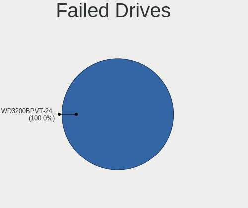
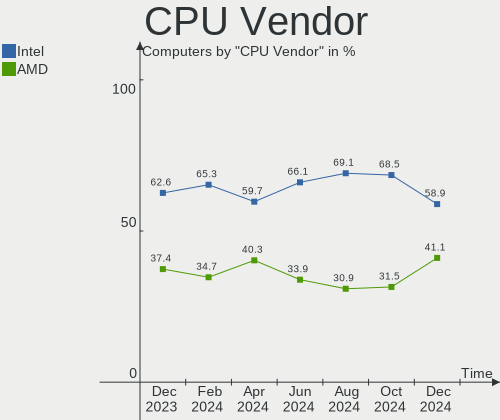
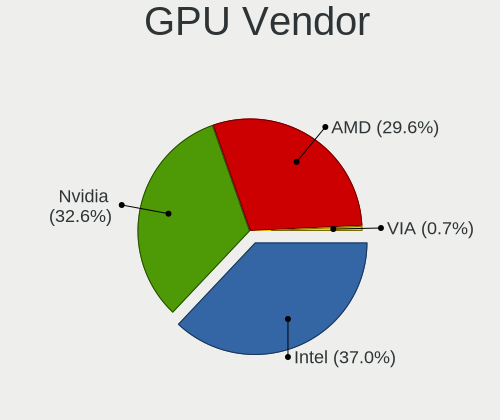

Manjaro Hardware Trends
-----------------------

A project to identify most popular hardware characteristics and track their change
over time based on data collected by Manjaro users at https://Linux-Hardware.org.

Anyone can contribute to the study by uploading probes of their computers by
the [hw-probe](https://github.com/linuxhw/hw-probe) tool:

    sudo hw-probe -all -upload

This is a report for all computer types. See also reports for [desktops](/Dist/Manjaro/Desktop/README.md) and [notebooks](/Dist/Manjaro/Notebook/README.md).

Full-feature report is available here: https://linux-hardware.org/?view=trends

Period: Mar, 2020.

Contents
--------

- [ OS                       ](#os)
- [ OS Family                ](#os-family)
- [ Kernel                   ](#kernel)
- [ Kernel Family            ](#kernel-family)
- [ Kernel Major Ver.        ](#kernel-major-ver)
- [ Arch                     ](#arch)
- [ DE                       ](#de)
- [ Display Server           ](#display-server)
- [ OS Lang                  ](#os-lang)
- [ Boot Mode                ](#boot-mode)
- [ Filesystem               ](#filesystem)
- [ Dual Boot with Linux     ](#dual-boot-with-linux)
- [ Dual Boot (Win)          ](#dual-boot-win)
- [ Country                  ](#country)
- [ City                     ](#city)
- [ Vendor                   ](#vendor)
- [ Model                    ](#model)
- [ Model Family             ](#model-family)
- [ MFG Year                 ](#mfg-year)
- [ Form Factor              ](#form-factor)
- [ Secure Boot              ](#secure-boot)
- [ Coreboot                 ](#coreboot)
- [ RAM Size                 ](#ram-size)
- [ RAM Used                 ](#ram-used)
- [ Drive Vendor             ](#drive-vendor)
- [ Drive Model              ](#drive-model)
- [ Drive Kind               ](#drive-kind)
- [ Drive Connector          ](#drive-connector)
- [ Drive Size               ](#drive-size)
- [ Space Total              ](#space-total)
- [ Space Used               ](#space-used)
- [ Malfunc. Drives          ](#malfunc-drives)
- [ Malfunc. Drive Vendor    ](#malfunc-drive-vendor)
- [ Malfunc. Drive Kind      ](#malfunc-drive-kind)
- [ Failed Drives            ](#failed-drives)
- [ Failed Drive Vendor      ](#failed-drive-vendor)
- [ Drive Status             ](#drive-status)
- [ Storage Vendor           ](#storage-vendor)
- [ Storage Model            ](#storage-model)
- [ Storage Kind             ](#storage-kind)
- [ CPU Vendor               ](#cpu-vendor)
- [ CPU Model                ](#cpu-model)
- [ CPU Model Family         ](#cpu-model-family)
- [ CPU Cores                ](#cpu-cores)
- [ CPU Sockets              ](#cpu-sockets)
- [ CPU Threads              ](#cpu-threads)
- [ CPU Op-Modes             ](#cpu-op-modes)
- [ CPU Microarch            ](#cpu-microarch)
- [ CPU Microcode            ](#cpu-microcode)
- [ GPU Vendor               ](#gpu-vendor)
- [ GPU Model                ](#gpu-model)
- [ GPU Combo                ](#gpu-combo)
- [ GPU Driver               ](#gpu-driver)
- [ GPU Memory               ](#gpu-memory)
- [ Monitor Vendor           ](#monitor-vendor)
- [ Monitor Model            ](#monitor-model)
- [ Monitor Resolution       ](#monitor-resolution)
- [ Monitor Diagonal         ](#monitor-diagonal)
- [ Monitor Width            ](#monitor-width)
- [ Aspect Ratio             ](#aspect-ratio)
- [ Monitor Area             ](#monitor-area)
- [ Pixel Density            ](#pixel-density)
- [ Multiple Monitors        ](#multiple-monitors)
- [ Net Controller Vendor    ](#net-controller-vendor)
- [ Net Controller Model     ](#net-controller-model)
- [ Net Controller Kind      ](#net-controller-kind)
- [ Used Controller          ](#used-controller)
- [ NICs                     ](#nics)
- [ Unsupported Devices      ](#unsupported-devices)
- [ Unsupported Device Types ](#unsupported-device-types)

OS
--

Installed operating systems

| Name           | Computers | Percent |
|----------------|-----------|---------|
| Manjaro 19.0.2 | 56        | 45.53%  |
| Manjaro        | 55        | 44.72%  |
| Manjaro 19.0.1 | 10        | 8.13%   |
| Manjaro 19.0   | 1         | 0.81%   |
| Manjaro 18.1.5 | 1         | 0.81%   |

OS Family
---------

OS without a version

| Name    | Computers | Percent |
|---------|-----------|---------|
| Manjaro | 123       | 100%    |

Kernel
------

Version of the Linux kernel

| Version                   | Computers | Percent |
|---------------------------|-----------|---------|
| 5.4.23-1-MANJARO          | 21        | 17.07%  |
| 5.5.8-1-MANJARO           | 15        | 12.2%   |
| 5.4.24-1-MANJARO          | 12        | 9.76%   |
| 5.4.22-1-MANJARO          | 12        | 9.76%   |
| 5.5.7-1-MANJARO           | 9         | 7.32%   |
| 5.5.13-1-MANJARO          | 8         | 6.5%    |
| 5.4.27-1-MANJARO          | 8         | 6.5%    |
| 5.6.0-2-MANJARO           | 7         | 5.69%   |
| 5.5.6-1-MANJARO           | 4         | 3.25%   |
| 5.5.11-1-MANJARO          | 4         | 3.25%   |
| 4.19.108-1-MANJARO        | 4         | 3.25%   |
| 5.4.28-1-MANJARO          | 3         | 2.44%   |
| 5.4.18-1-MANJARO          | 3         | 2.44%   |
| 5.6.0-1-MANJARO           | 2         | 1.63%   |
| 4.19.107-1-MANJARO        | 2         | 1.63%   |
| 4.19.106-1-MANJARO        | 2         | 1.63%   |
| 5.6.0-rc4-1-clear-current | 1         | 0.81%   |
| 5.5.3-14-tkg-pds          | 1         | 0.81%   |
| 5.5.10-1-MANJARO          | 1         | 0.81%   |
| 5.4.6-2-MANJARO           | 1         | 0.81%   |
| 5.4.19-rt11-MANJARO       | 1         | 0.81%   |
| 5.3.18-1-MANJARO          | 1         | 0.81%   |
| 4.19.112-1-MANJARO        | 1         | 0.81%   |

Kernel Family
-------------

Linux kernel without a distro release

| Version  | Computers | Percent |
|----------|-----------|---------|
| 5.4.23   | 21        | 17.07%  |
| 5.5.8    | 15        | 12.2%   |
| 5.4.24   | 12        | 9.76%   |
| 5.4.22   | 12        | 9.76%   |
| 5.6.0    | 10        | 8.13%   |
| 5.5.7    | 9         | 7.32%   |
| 5.5.13   | 8         | 6.5%    |
| 5.4.27   | 8         | 6.5%    |
| 5.5.6    | 4         | 3.25%   |
| 5.5.11   | 4         | 3.25%   |
| 4.19.108 | 4         | 3.25%   |
| 5.4.28   | 3         | 2.44%   |
| 5.4.18   | 3         | 2.44%   |
| 4.19.107 | 2         | 1.63%   |
| 4.19.106 | 2         | 1.63%   |
| 5.5.3    | 1         | 0.81%   |
| 5.5.10   | 1         | 0.81%   |
| 5.4.6    | 1         | 0.81%   |
| 5.4.19   | 1         | 0.81%   |
| 5.3.18   | 1         | 0.81%   |
| 4.19.112 | 1         | 0.81%   |

Kernel Major Ver.
-----------------

Linux kernel major version

| Version | Computers | Percent |
|---------|-----------|---------|
| 5.4     | 61        | 49.59%  |
| 5.5     | 42        | 34.15%  |
| 5.6     | 10        | 8.13%   |
| 4.19    | 9         | 7.32%   |
| 5.3     | 1         | 0.81%   |

Arch
----

OS architecture (x86_64, i586, etc.)

| Name   | Computers | Percent |
|--------|-----------|---------|
| x86_64 | 123       | 100%    |

DE
--

Desktop Environment

| Name           | Computers | Percent |
|----------------|-----------|---------|
| XFCE           | 39        | 31.71%  |
| KDE5           | 23        | 18.7%   |
| GNOME          | 23        | 18.7%   |
| KDE            | 16        | 13.01%  |
| Unknown        | 6         | 4.88%   |
| X-Cinnamon     | 4         | 3.25%   |
| Cinnamon       | 3         | 2.44%   |
| Budgie         | 3         | 2.44%   |
| i3             | 2         | 1.63%   |
| MATE           | 1         | 0.81%   |
| i3-with-shmlog | 1         | 0.81%   |
| Deepin         | 1         | 0.81%   |
| Awesome        | 1         | 0.81%   |

Display Server
--------------

X11 or Wayland

| Name    | Computers | Percent |
|---------|-----------|---------|
| X11     | 115       | 93.5%   |
| Wayland | 5         | 4.07%   |
| Unknown | 2         | 1.63%   |
| Tty     | 1         | 0.81%   |

OS Lang
-------

Language

| Lang       | Computers | Percent |
|------------|-----------|---------|
| en_US      | 42        | 34.15%  |
| en_US.utf8 | 17        | 13.82%  |
| ru_RU      | 9         | 7.32%   |
| de_DE      | 6         | 4.88%   |
| en_GB.utf8 | 5         | 4.07%   |
| en_GB      | 5         | 4.07%   |
| es_ES      | 3         | 2.44%   |
| en_CA      | 3         | 2.44%   |
| en_AU      | 3         | 2.44%   |
| de_DE.utf8 | 3         | 2.44%   |
| sv_SE      | 2         | 1.63%   |
| ru_RU.utf8 | 2         | 1.63%   |
| pt_BR      | 2         | 1.63%   |
| it_IT      | 2         | 1.63%   |
| en_CA.utf8 | 2         | 1.63%   |
| zh_CN.utf8 | 1         | 0.81%   |
| zh_CN      | 1         | 0.81%   |
| uk_UA      | 1         | 0.81%   |
| ru_UA      | 1         | 0.81%   |
| pt_BR.utf8 | 1         | 0.81%   |
| pl_PL      | 1         | 0.81%   |
| it_IT.utf8 | 1         | 0.81%   |
| hu_HU.utf8 | 1         | 0.81%   |
| fr_FR.utf8 | 1         | 0.81%   |
| fr_FR      | 1         | 0.81%   |
| fi_FI      | 1         | 0.81%   |
| es_MX      | 1         | 0.81%   |
| es_ES.utf8 | 1         | 0.81%   |
| en_IE      | 1         | 0.81%   |
| da_DK.utf8 | 1         | 0.81%   |
| cs_CZ.utf8 | 1         | 0.81%   |
| Unknown    | 1         | 0.81%   |

Boot Mode
---------

EFI or BIOS

| Mode | Computers | Percent |
|------|-----------|---------|
| BIOS | 66        | 53.66%  |
| EFI  | 57        | 46.34%  |

Filesystem
----------

Type of filesystem

| Type    | Computers | Percent |
|---------|-----------|---------|
| Ext4    | 105       | 85.37%  |
| Btrfs   | 8         | 6.5%    |
| Overlay | 4         | 3.25%   |
| Xfs     | 3         | 2.44%   |
| Tmpfs   | 1         | 0.81%   |
| F2fs    | 1         | 0.81%   |
| Unknown | 1         | 0.81%   |

Dual Boot with Linux
--------------------

Hosting more than one Linux

| Dual boot | Computers | Percent |
|-----------|-----------|---------|
| No        | 110       | 89.43%  |
| Yes       | 13        | 10.57%  |

Dual Boot (Win)
---------------

Hosting Linux and Windows

| Dual boot | Computers | Percent |
|-----------|-----------|---------|
| No        | 84        | 68.29%  |
| Yes       | 39        | 31.71%  |

Country
-------

Geographic location (country)

| Country                | Computers | Percent |
|------------------------|-----------|---------|
| USA                    | 28        | 22.76%  |
| Germany                | 13        | 10.57%  |
| Russia                 | 10        | 8.13%   |
| Sweden                 | 6         | 4.88%   |
| Ukraine                | 5         | 4.07%   |
| Canada                 | 5         | 4.07%   |
| Spain                  | 4         | 3.25%   |
| Italy                  | 4         | 3.25%   |
| France                 | 4         | 3.25%   |
| China                  | 4         | 3.25%   |
| Brazil                 | 4         | 3.25%   |
| UK                     | 3         | 2.44%   |
| Australia              | 3         | 2.44%   |
| Romania                | 2         | 1.63%   |
| Poland                 | 2         | 1.63%   |
| Norway                 | 2         | 1.63%   |
| Mexico                 | 2         | 1.63%   |
| Bulgaria               | 2         | 1.63%   |
| Belgium                | 2         | 1.63%   |
| Switzerland            | 1         | 0.81%   |
| South Africa           | 1         | 0.81%   |
| Slovenia               | 1         | 0.81%   |
| Serbia                 | 1         | 0.81%   |
| Portugal               | 1         | 0.81%   |
| Luxembourg             | 1         | 0.81%   |
| Lithuania              | 1         | 0.81%   |
| Ireland                | 1         | 0.81%   |
| Indonesia              | 1         | 0.81%   |
| India                  | 1         | 0.81%   |
| Hungary                | 1         | 0.81%   |
| Greece                 | 1         | 0.81%   |
| Finland                | 1         | 0.81%   |
| Denmark                | 1         | 0.81%   |
| Czech Republic         | 1         | 0.81%   |
| Colombia               | 1         | 0.81%   |
| Bosnia and Herzegovina | 1         | 0.81%   |
| Austria                | 1         | 0.81%   |

City
----

Geographic location (city)

| City                 | Computers | Percent |
|----------------------|-----------|---------|
| Kyiv                 | 3         | 2.44%   |
| Stockholm            | 2         | 1.63%   |
| Sofia                | 2         | 1.63%   |
| Seattle              | 2         | 1.63%   |
| Neuburg an der Donau | 2         | 1.63%   |
| Moscow               | 2         | 1.63%   |
| Montreal             | 2         | 1.63%   |
| Madrid               | 2         | 1.63%   |
| Ekaterinburg         | 2         | 1.63%   |
| Brussels             | 2         | 1.63%   |
| Xi'an                | 1         | 0.81%   |
| Worthing             | 1         | 0.81%   |
| West Branch          | 1         | 0.81%   |
| Warsaw               | 1         | 0.81%   |
| Warren               | 1         | 0.81%   |
| Voronezh             | 1         | 0.81%   |
| Vojnuv Mestec        | 1         | 0.81%   |
| Vladikavkaz          | 1         | 0.81%   |
| Vilnius              | 1         | 0.81%   |
| Vienna               | 1         | 0.81%   |
| Verona               | 1         | 0.81%   |
| Uppsala              | 1         | 0.81%   |
| Udine                | 1         | 0.81%   |
| Tuzla                | 1         | 0.81%   |
| Timișoara           | 1         | 0.81%   |
| Tianjin              | 1         | 0.81%   |
| Tampere              | 1         | 0.81%   |
| São Paulo           | 1         | 0.81%   |
| Södertälje         | 1         | 0.81%   |
| Stuttgart            | 1         | 0.81%   |
| Strassen             | 1         | 0.81%   |
| St Petersburg        | 1         | 0.81%   |
| Speyer               | 1         | 0.81%   |
| Skien                | 1         | 0.81%   |
| Sevnica              | 1         | 0.81%   |
| Schortens            | 1         | 0.81%   |
| Savannah             | 1         | 0.81%   |
| Sault Ste. Marie     | 1         | 0.81%   |
| Sao Jose             | 1         | 0.81%   |
| Santo André         | 1         | 0.81%   |
| Salem                | 1         | 0.81%   |
| Saeffle              | 1         | 0.81%   |
| Ruelle-sur-Touvre    | 1         | 0.81%   |
| Rome                 | 1         | 0.81%   |
| Rocklin              | 1         | 0.81%   |
| Rio de Janeiro       | 1         | 0.81%   |
| Qujing               | 1         | 0.81%   |
| Puebla City          | 1         | 0.81%   |
| Povoa de Santa Iria  | 1         | 0.81%   |
| Port Elizabeth       | 1         | 0.81%   |
| Phoenix              | 1         | 0.81%   |
| Perth                | 1         | 0.81%   |
| Owasso               | 1         | 0.81%   |
| Ottawa               | 1         | 0.81%   |
| Oslo                 | 1         | 0.81%   |
| Orsay                | 1         | 0.81%   |
| Orenburg             | 1         | 0.81%   |
| Novi Sad             | 1         | 0.81%   |
| North Augusta        | 1         | 0.81%   |
| Nizhniy Novgorod     | 1         | 0.81%   |

Vendor
------

Motherboard manufacturer

| Name                  | Computers | Percent |
|-----------------------|-----------|---------|
| Lenovo                | 23        | 18.7%   |
| ASUSTek Computer      | 21        | 17.07%  |
| Hewlett-Packard       | 15        | 12.2%   |
| Dell                  | 15        | 12.2%   |
| Gigabyte Technology   | 10        | 8.13%   |
| MSI                   | 9         | 7.32%   |
| Acer                  | 7         | 5.69%   |
| ASRock                | 5         | 4.07%   |
| Notebook              | 3         | 2.44%   |
| Intel                 | 2         | 1.63%   |
| Apple                 | 2         | 1.63%   |
| Timi                  | 1         | 0.81%   |
| StationX              | 1         | 0.81%   |
| Shuttle               | 1         | 0.81%   |
| Samsung Electronics   | 1         | 0.81%   |
| Multilaser Industrial | 1         | 0.81%   |
| Medion                | 1         | 0.81%   |
| IntegralTech          | 1         | 0.81%   |
| GPD                   | 1         | 0.81%   |
| Biostar               | 1         | 0.81%   |
| Bak USA Technologies  | 1         | 0.81%   |
| Unknown               | 1         | 0.81%   |

Model
-----

Motherboard model

| Name                                        | Computers | Percent |
|---------------------------------------------|-----------|---------|
| MSI MS-7B79                                 | 2         | 1.63%   |
| Lenovo IdeaPad 330S-15ARR 81FB              | 2         | 1.63%   |
| Gigabyte B450M DS3H                         | 2         | 1.63%   |
| Timi TM1613                                 | 1         | 0.81%   |
| StationX Manjaro Spitfire                   | 1         | 0.81%   |
| Shuttle SH87R                               | 1         | 0.81%   |
| Samsung Electronics 530U3BI/530U4BI/530U4BH | 1         | 0.81%   |
| Notebook W35xSTQ_370ST                      | 1         | 0.81%   |
| Notebook P65_P67RGRERA                      | 1         | 0.81%   |
| Notebook N141CU                             | 1         | 0.81%   |
| Multilaser Industrial PC150                 | 1         | 0.81%   |
| MSI PS63 Modern 8SC                         | 1         | 0.81%   |
| MSI MS-7A63                                 | 1         | 0.81%   |
| MSI MS-7996                                 | 1         | 0.81%   |
| MSI MS-7979                                 | 1         | 0.81%   |
| MSI MS-7977                                 | 1         | 0.81%   |
| MSI MS-7821                                 | 1         | 0.81%   |
| MSI MS-6657                                 | 1         | 0.81%   |
| Medion MS-7621                              | 1         | 0.81%   |
| Lenovo Yoga C940-14IIL 81Q9                 | 1         | 0.81%   |
| Lenovo Yoga C930-13IKB                      | 1         | 0.81%   |
| Lenovo Yoga C740-15IML 81TD                 | 1         | 0.81%   |
| Lenovo YB1-X91F                             | 1         | 0.81%   |
| Lenovo XiaoXinPro-13IML 2019 81XB           | 1         | 0.81%   |
| Lenovo V580c 20160                          | 1         | 0.81%   |
| Lenovo ThinkPad X220 4290FP2                | 1         | 0.81%   |
| Lenovo ThinkPad X1 Carbon 7th 20R1S04100    | 1         | 0.81%   |
| Lenovo ThinkPad X1 Carbon 7th 20QDCTO1WW    | 1         | 0.81%   |
| Lenovo ThinkPad X1 Carbon 7th 20QD003LRT    | 1         | 0.81%   |
| Lenovo ThinkPad X1 Carbon 3rd 20BSCTO1WW    | 1         | 0.81%   |
| Lenovo ThinkPad T480 20L5CTO1WW             | 1         | 0.81%   |
| Lenovo ThinkPad T470 20HES2SF00             | 1         | 0.81%   |
| Lenovo ThinkPad T440s 20ARA0K400            | 1         | 0.81%   |
| Lenovo ThinkPad S1 Yoga 20CD0038MZ          | 1         | 0.81%   |
| Lenovo ThinkCentre M93p 10A6S0RN00          | 1         | 0.81%   |
| Lenovo ThinkCentre M920s 10SJ001JPB         | 1         | 0.81%   |
| Lenovo ThinkCentre M91p 0266RZ1             | 1         | 0.81%   |
| Lenovo Legion Y530-15ICH 81FV               | 1         | 0.81%   |
| Lenovo IdeaPad S540-14API 81NH              | 1         | 0.81%   |
| Lenovo IdeaPad 100-15IBD 80QQ               | 1         | 0.81%   |
| Intel NUC5PPYB H76558-106                   | 1         | 0.81%   |
| Intel NUC10i7FNH                            | 1         | 0.81%   |
| IntegralTech 35404V4C4D0S                   | 1         | 0.81%   |
| HP ProOne 400 G3 20.0-in Non-Touch AiO      | 1         | 0.81%   |
| HP ProBook 650 G5                           | 1         | 0.81%   |
| HP ProBook 450 G5                           | 1         | 0.81%   |
| HP Pavilion Gaming Desktop 690-00xx         | 1         | 0.81%   |
| HP Laptop 17-by0xxx                         | 1         | 0.81%   |
| HP Laptop 15-bs1xx                          | 1         | 0.81%   |
| HP G42                                      | 1         | 0.81%   |
| HP ENVY x360 Convertible 15-ds0xxx          | 1         | 0.81%   |
| HP ENVY x360 Convertible 13-ar0xxx          | 1         | 0.81%   |
| HP ENVY Laptop 13-aq0xxx                    | 1         | 0.81%   |
| HP EliteBook 840 G6                         | 1         | 0.81%   |
| HP EliteBook 840 G5                         | 1         | 0.81%   |
| HP EliteBook 840 G2                         | 1         | 0.81%   |
| HP Compaq 8710w (GC125EA#ABN)               | 1         | 0.81%   |
| HP 500-480nr                                | 1         | 0.81%   |
| GPD P2 MAX                                  | 1         | 0.81%   |
| Gigabyte Z87X-UD7 TH                        | 1         | 0.81%   |

Model Family
------------

Motherboard model prefix

| Name                        | Computers | Percent |
|-----------------------------|-----------|---------|
| Lenovo ThinkPad             | 9         | 7.32%   |
| Dell Inspiron               | 5         | 4.07%   |
| Lenovo IdeaPad              | 4         | 3.25%   |
| Dell Latitude               | 4         | 3.25%   |
| ASUS ROG                    | 4         | 3.25%   |
| Acer Aspire                 | 4         | 3.25%   |
| Lenovo Yoga                 | 3         | 2.44%   |
| Lenovo ThinkCentre          | 3         | 2.44%   |
| HP ENVY                     | 3         | 2.44%   |
| HP EliteBook                | 3         | 2.44%   |
| Dell Precision              | 3         | 2.44%   |
| MSI MS-7B79                 | 2         | 1.63%   |
| HP ProBook                  | 2         | 1.63%   |
| HP Laptop                   | 2         | 1.63%   |
| Gigabyte B450M              | 2         | 1.63%   |
| Dell OptiPlex               | 2         | 1.63%   |
| ASUS TUF                    | 2         | 1.63%   |
| Timi TM1613                 | 1         | 0.81%   |
| StationX Manjaro            | 1         | 0.81%   |
| Shuttle SH87R               | 1         | 0.81%   |
| Samsung Electronics 530U3BI | 1         | 0.81%   |
| Notebook W35xSTQ            | 1         | 0.81%   |
| Notebook P65                | 1         | 0.81%   |
| Notebook N141CU             | 1         | 0.81%   |
| Multilaser Industrial PC150 | 1         | 0.81%   |
| MSI PS63                    | 1         | 0.81%   |
| MSI MS-7A63                 | 1         | 0.81%   |
| MSI MS-7996                 | 1         | 0.81%   |
| MSI MS-7979                 | 1         | 0.81%   |
| MSI MS-7977                 | 1         | 0.81%   |
| MSI MS-7821                 | 1         | 0.81%   |
| MSI MS-6657                 | 1         | 0.81%   |
| Medion MS-7621              | 1         | 0.81%   |
| Lenovo YB1-X91F             | 1         | 0.81%   |
| Lenovo XiaoXinPro-13IML     | 1         | 0.81%   |
| Lenovo V580c                | 1         | 0.81%   |
| Lenovo Legion               | 1         | 0.81%   |
| Intel NUC5PPYB              | 1         | 0.81%   |
| Intel NUC10i7FNH            | 1         | 0.81%   |
| IntegralTech 35404V4C4D0S   | 1         | 0.81%   |
| HP ProOne                   | 1         | 0.81%   |
| HP Pavilion                 | 1         | 0.81%   |
| HP G42                      | 1         | 0.81%   |
| HP Compaq                   | 1         | 0.81%   |
| HP 500-480nr                | 1         | 0.81%   |
| GPD P2                      | 1         | 0.81%   |
| Gigabyte Z87X-UD7           | 1         | 0.81%   |
| Gigabyte Z370P              | 1         | 0.81%   |
| Gigabyte Z270X-Ultra        | 1         | 0.81%   |
| Gigabyte X570               | 1         | 0.81%   |
| Gigabyte Q270M-D3H          | 1         | 0.81%   |
| Gigabyte H170-HD3-CF        | 1         | 0.81%   |
| Gigabyte B250M-DS3H         | 1         | 0.81%   |
| Gigabyte AB350-Gaming       | 1         | 0.81%   |
| Dell G7                     | 1         | 0.81%   |
| Biostar B350ET2             | 1         | 0.81%   |
| Bak USA Technologies Atlas  | 1         | 0.81%   |
| ASUS X750LB                 | 1         | 0.81%   |
| ASUS X540SA                 | 1         | 0.81%   |
| ASUS X510UAR                | 1         | 0.81%   |

MFG Year
--------

Motherboard manufacture year

| Year | Computers | Percent |
|------|-----------|---------|
| 2019 | 56        | 45.53%  |
| 2018 | 16        | 13.01%  |
| 2016 | 9         | 7.32%   |
| 2020 | 7         | 5.69%   |
| 2013 | 7         | 5.69%   |
| 2017 | 5         | 4.07%   |
| 2015 | 5         | 4.07%   |
| 2014 | 4         | 3.25%   |
| 2011 | 4         | 3.25%   |
| 2010 | 3         | 2.44%   |
| 2012 | 2         | 1.63%   |
| 2008 | 2         | 1.63%   |
| 2007 | 2         | 1.63%   |
| 2009 | 1         | 0.81%   |

Form Factor
-----------

Physical design of the computer

| Name        | Computers | Percent |
|-------------|-----------|---------|
| Notebook    | 68        | 55.28%  |
| Desktop     | 44        | 35.77%  |
| Convertible | 7         | 5.69%   |
| Mini pc     | 2         | 1.63%   |
| All in one  | 2         | 1.63%   |

Secure Boot
-----------

Enabled or disabled

| State    | Computers | Percent |
|----------|-----------|---------|
| Disabled | 123       | 100%    |

Coreboot
--------

Have coreboot on board

| Used | Computers | Percent |
|------|-----------|---------|
| No   | 123       | 100%    |

RAM Size
--------

Total RAM memory

| Size in GB  | Computers | Percent |
|-------------|-----------|---------|
| 16.01-24.0  | 47        | 38.21%  |
| 4.01-8.0    | 28        | 22.76%  |
| 8.01-16.0   | 19        | 15.45%  |
| 3.01-4.0    | 15        | 12.2%   |
| 32.01-64.0  | 7         | 5.69%   |
| 1.01-2.0    | 4         | 3.25%   |
| 64.01-256.0 | 2         | 1.63%   |
| 24.01-32.0  | 1         | 0.81%   |

RAM Used
--------

Used RAM memory

| Used GB   | Computers | Percent |
|-----------|-----------|---------|
| 2.01-3.0  | 42        | 34.15%  |
| 1.01-2.0  | 33        | 26.83%  |
| 3.01-4.0  | 23        | 18.7%   |
| 4.01-8.0  | 18        | 14.63%  |
| 0.01-1.0  | 5         | 4.07%   |
| 8.01-16.0 | 2         | 1.63%   |

Drive Vendor
------------

Hard drive vendors

| Vendor              | Computers | Drives | Percent |
|---------------------|-----------|--------|---------|
| Samsung Electronics | 33        | 39     | 19.88%  |
| Seagate             | 31        | 34     | 18.67%  |
| WDC                 | 25        | 27     | 15.06%  |
| Intel               | 11        | 11     | 6.63%   |
| Toshiba             | 7         | 8      | 4.22%   |
| Kingston            | 7         | 8      | 4.22%   |
| SanDisk             | 6         | 7      | 3.61%   |
| Crucial             | 6         | 6      | 3.61%   |
| Unknown             | 5         | 5      | 3.01%   |
| Hitachi             | 4         | 4      | 2.41%   |
| A-DATA Technology   | 4         | 5      | 2.41%   |
| SK Hynix            | 3         | 3      | 1.81%   |
| Intenso             | 3         | 3      | 1.81%   |
| Transcend           | 2         | 2      | 1.2%    |
| SPCC                | 2         | 2      | 1.2%    |
| Micron Technology   | 2         | 2      | 1.2%    |
| LITEONIT            | 2         | 2      | 1.2%    |
| Apple               | 2         | 2      | 1.2%    |
| XPG                 | 1         | 1      | 0.6%    |
| SKhynix             | 1         | 1      | 0.6%    |
| PNY                 | 1         | 1      | 0.6%    |
| Phison              | 1         | 1      | 0.6%    |
| Patriot             | 1         | 1      | 0.6%    |
| HGST                | 1         | 1      | 0.6%    |
| Hewlett-Packard     | 1         | 1      | 0.6%    |
| FORESEE             | 1         | 1      | 0.6%    |
| China               | 1         | 1      | 0.6%    |
| BIWIN               | 1         | 1      | 0.6%    |
| Apacer              | 1         | 1      | 0.6%    |

Drive Model
-----------

Hard drive models

| Model                        | Computers | Percent |
|------------------------------|-----------|---------|
| ST1000LM035-1RK172 1TB       | 4         | 2.23%   |
| SSD 850 EVO 250GB            | 4         | 2.23%   |
| SSDPEKKF010T8L 1TB           | 3         | 1.68%   |
| SSD 840 EVO 250GB            | 3         | 1.68%   |
| WDS240G2G0B-00EPW0 240GB SSD | 2         | 1.12%   |
| SV300S37A120G 120GB SSD      | 2         | 1.12%   |
| ST3000DM001-1ER166 3TB       | 2         | 1.12%   |
| ST3000DM001-1CH166 3TB       | 2         | 1.12%   |
| ST1000LM024 HN-M101MBB 1TB   | 2         | 1.12%   |
| ST1000DM003-1SB102 1TB       | 2         | 1.12%   |
| ST1000DM003-1CH162 1TB       | 2         | 1.12%   |
| SSD 860 EVO 250GB            | 2         | 1.12%   |
| SSD 860 EVO 1TB              | 2         | 1.12%   |
| SSD 850 PRO 256GB            | 2         | 1.12%   |
| SA400S37120G 120GB SSD       | 2         | 1.12%   |
| SA400M8240G 240GB SSD        | 2         | 1.12%   |
| MZVLB512HBJQ-000L2 512GB     | 2         | 1.12%   |
| DT01ACA200 2TB               | 2         | 1.12%   |
| CT525MX300SSD1 528GB         | 2         | 1.12%   |
| WDS500G2B0B-00YS70 500GB SSD | 1         | 0.56%   |
| WDS100T2B0A-00SM50 1TB SSD   | 1         | 0.56%   |
| WD5001AALS-00E3A0 500GB      | 1         | 0.56%   |
| WD5000AAKX-75U6AA0 500GB     | 1         | 0.56%   |
| WD40EFRX-68N32N0 4TB         | 1         | 0.56%   |
| WD4005FZBX-00K5WB0 4TB       | 1         | 0.56%   |
| WD3200KS-00PFB0 320GB        | 1         | 0.56%   |
| WD3200BPVT-22JJ5T0 320GB     | 1         | 0.56%   |
| WD3200BEVT-22ZCT0 320GB      | 1         | 0.56%   |
| WD3200BEVT-00ZAT0 320GB      | 1         | 0.56%   |
| WD3200AAKX-221CA1 320GB      | 1         | 0.56%   |
| WD2500BPVT-22ZEST0 250GB     | 1         | 0.56%   |
| WD2500AAKX-083CA1 250GB      | 1         | 0.56%   |
| WD20EARX-00PASB0 2TB         | 1         | 0.56%   |
| WD1600AAJS-65WAA0 160GB      | 1         | 0.56%   |
| WD1600AAJS-00B4A0 160GB      | 1         | 0.56%   |
| WD10SPZX-21Z10T0 1TB         | 1         | 0.56%   |
| WD10EZEX-22BN5A0 1TB         | 1         | 0.56%   |
| WD10EZEX-08M2NA0 1TB         | 1         | 0.56%   |
| WD10EZEX-00WN4A0 1TB         | 1         | 0.56%   |
| WD10EZEX-00RKKA0 1TB         | 1         | 0.56%   |
| WD10EARX-00N0YB0 1TB         | 1         | 0.56%   |
| WD10EARS-00Y5B1 1TB          | 1         | 0.56%   |
| VT180 480GB SSD              | 1         | 0.56%   |
| TS512GMTS430S 512GB SSD      | 1         | 0.56%   |
| TS256GMTS400 256GB SSD       | 1         | 0.56%   |
| SX8200PNP 256GB              | 1         | 0.56%   |
| SV300S37A240G 240GB SSD      | 1         | 0.56%   |
| SU650 120GB SSD              | 1         | 0.56%   |
| ST95005620AS 500GB           | 1         | 0.56%   |
| ST9500325AS 500GB            | 1         | 0.56%   |
| ST8000DM004-2CX188 8TB       | 1         | 0.56%   |
| ST500LT012-9WS142 500GB      | 1         | 0.56%   |
| ST500LT012-1DG142 500GB      | 1         | 0.56%   |
| ST500LM034-2GH17A 500GB      | 1         | 0.56%   |
| ST5000AS0011-1L5178 5TB      | 1         | 0.56%   |
| ST4000VN000-1H4168 4TB       | 1         | 0.56%   |
| ST3500414CS 500GB            | 1         | 0.56%   |
| ST31500341AS 1TB             | 1         | 0.56%   |
| ST2000LX001-1RG174 2TB       | 1         | 0.56%   |
| ST2000LM003 HN-M201RAD 2TB   | 1         | 0.56%   |

Drive Kind
----------

HDD or SSD

| Kind    | Computers | Drives | Percent |
|---------|-----------|--------|---------|
| SSD     | 67        | 81     | 45.89%  |
| HDD     | 53        | 73     | 36.3%   |
| NVMe    | 19        | 20     | 13.01%  |
| MMC     | 5         | 5      | 3.42%   |
| Unknown | 2         | 2      | 1.37%   |

Drive Connector
---------------

SATA, SAS, NVMe, etc.

| Type | Computers | Drives | Percent |
|------|-----------|--------|---------|
| SATA | 97        | 152    | 77.6%   |
| NVMe | 19        | 20     | 15.2%   |
| MMC  | 5         | 5      | 4%      |
| SAS  | 4         | 4      | 3.2%    |

Drive Size
----------

Size of hard drive

| Size in TB | Computers | Drives | Percent |
|------------|-----------|--------|---------|
| 0.01-0.5   | 80        | 102    | 52.98%  |
| 0.51-1.0   | 48        | 54     | 31.79%  |
| 1.01-2.0   | 11        | 12     | 7.28%   |
| 2.01-3.0   | 7         | 8      | 4.64%   |
| 3.01-4.0   | 3         | 3      | 1.99%   |
| 4.01-10.0  | 2         | 2      | 1.32%   |

Space Total
-----------

Amount of disk space available on the file system

| Size in GB     | Computers | Percent |
|----------------|-----------|---------|
| 251-500        | 29        | 23.58%  |
| 101-250        | 27        | 21.95%  |
| 501-1000       | 23        | 18.7%   |
| 1001-2000      | 13        | 10.57%  |
| 51-100         | 12        | 9.76%   |
| Unknown        | 7         | 5.69%   |
| More than 3000 | 4         | 3.25%   |
| 1-20           | 4         | 3.25%   |
| 21-50          | 3         | 2.44%   |
| 2001-3000      | 1         | 0.81%   |

Space Used
----------

Amount of used disk space

| Used GB        | Computers | Percent |
|----------------|-----------|---------|
| 1-20           | 37        | 30.08%  |
| 101-250        | 23        | 18.7%   |
| 21-50          | 15        | 12.2%   |
| 51-100         | 14        | 11.38%  |
| 251-500        | 10        | 8.13%   |
| 501-1000       | 10        | 8.13%   |
| Unknown        | 7         | 5.69%   |
| 1001-2000      | 6         | 4.88%   |
| More than 3000 | 1         | 0.81%   |

Malfunc. Drives
---------------

Drive models with a malfunction

| Model                             | Computers | Drives | Percent |
|-----------------------------------|-----------|--------|---------|
| CT525MX300SSD1 528GB              | 2         | 2      | 25%     |
| ST5000AS0011-1L5178 5TB           | 1         | 1      | 12.5%   |
| ST1000DX001-1CM162 1TB            | 1         | 1      | 12.5%   |
| SSDSC2KW360H6 360GB               | 1         | 1      | 12.5%   |
| MTFDDAV256TDL-1AW1ZABHA 256GB SSD | 1         | 1      | 12.5%   |
| iSSD P4 16GB                      | 1         | 1      | 12.5%   |
| HTS545050A7E380 500GB             | 1         | 1      | 12.5%   |

Malfunc. Drive Vendor
---------------------

Vendors of faulty drives

| Vendor            | Computers | Drives | Percent |
|-------------------|-----------|--------|---------|
| Seagate           | 2         | 2      | 25%     |
| Crucial           | 2         | 2      | 25%     |
| SanDisk           | 1         | 1      | 12.5%   |
| Micron Technology | 1         | 1      | 12.5%   |
| Intel             | 1         | 1      | 12.5%   |
| Hitachi           | 1         | 1      | 12.5%   |

Malfunc. Drive Kind
-------------------

Kinds of faulty drives

| Kind | Computers | Drives | Percent |
|------|-----------|--------|---------|
| SSD  | 5         | 5      | 62.5%   |
| HDD  | 3         | 3      | 37.5%   |

Failed Drives
-------------

Failed drive models

| Model                   | Computers | Drives | Percent |
|-------------------------|-----------|--------|---------|
| WD1600AAJS-65WAA0 160GB | 1         | 1      | 50%     |
| HD321HJ 320GB           | 1         | 1      | 50%     |

Failed Drive Vendor
-------------------

Failed drive vendors

| Vendor              | Computers | Drives | Percent |
|---------------------|-----------|--------|---------|
| WDC                 | 1         | 1      | 50%     |
| Samsung Electronics | 1         | 1      | 50%     |

Drive Status
------------

Number of failed and malfunc. drives

| Status   | Computers | Drives | Percent |
|----------|-----------|--------|---------|
| Detected | 74        | 118    | 61.67%  |
| Works    | 37        | 53     | 30.83%  |
| Malfunc  | 7         | 8      | 5.83%   |
| Failed   | 2         | 2      | 1.67%   |

Storage Vendor
--------------

Storage controller vendors

| Vendor                        | Computers | Percent |
|-------------------------------|-----------|---------|
| Intel                         | 83        | 54.97%  |
| AMD                           | 25        | 16.56%  |
| Samsung Electronics           | 16        | 10.6%   |
| Silicon Motion                | 5         | 3.31%   |
| Nvidia                        | 5         | 3.31%   |
| Sandisk                       | 4         | 2.65%   |
| Phison Electronics            | 3         | 1.99%   |
| Toshiba America Info Systems  | 2         | 1.32%   |
| Union Memory (Shenzhen)       | 1         | 0.66%   |
| SK Hynix                      | 1         | 0.66%   |
| Silicon Image                 | 1         | 0.66%   |
| Realtek Semiconductor         | 1         | 0.66%   |
| KIOXIA                        | 1         | 0.66%   |
| Integrated Technology Express | 1         | 0.66%   |
| ASMedia Technology            | 1         | 0.66%   |
| ADATA Technology              | 1         | 0.66%   |

Storage Model
-------------

Storage controller models

| Model                                                                             | Computers | Percent |
|-----------------------------------------------------------------------------------|-----------|---------|
| FCH SATA Controller [AHCI mode]                                                   | 24        | 13.87%  |
| NVMe SSD Controller SM981/PM981/PM983                                             | 13        | 7.51%   |
| Sunrise Point-LP SATA Controller [AHCI mode]                                      | 8         | 4.62%   |
| Non-Volatile memory controller                                                    | 8         | 4.62%   |
| 8 Series/C220 Series Chipset Family 6-port SATA Controller 1 [AHCI mode]          | 8         | 4.62%   |
| 400 Series Chipset SATA Controller                                                | 7         | 4.05%   |
| 82801 Mobile SATA Controller [RAID mode]                                          | 6         | 3.47%   |
| 200 Series PCH SATA controller [AHCI mode]                                        | 6         | 3.47%   |
| 8 Series SATA Controller 1 [AHCI mode]                                            | 5         | 2.89%   |
| 6 Series/C200 Series Chipset Family 6 port Mobile SATA AHCI Controller            | 5         | 2.89%   |
| Wildcat Point-LP SATA Controller [AHCI Mode]                                      | 4         | 2.31%   |
| SSD 660P Series                                                                   | 4         | 2.31%   |
| Q170/Q150/B150/H170/H110/Z170/CM236 Chipset SATA Controller [AHCI Mode]           | 4         | 2.31%   |
| Cannon Point-LP SATA Controller [AHCI Mode]                                       | 4         | 2.31%   |
| 300 Series Chipset SATA Controller                                                | 4         | 2.31%   |
| SSD Pro 7600p/760p/E 6100p Series                                                 | 3         | 1.73%   |
| SATA Controller [RAID mode]                                                       | 3         | 1.73%   |
| Comet Lake SATA AHCI Controller                                                   | 3         | 1.73%   |
| Cannon Lake Mobile PCH SATA AHCI Controller                                       | 3         | 1.73%   |
| WD Black 2018/PC SN520 NVMe SSD                                                   | 2         | 1.16%   |
| SATA controller                                                                   | 2         | 1.16%   |
| NVMe SSD Controller SM951/PM951                                                   | 2         | 1.16%   |
| MCP79 AHCI Controller                                                             | 2         | 1.16%   |
| E12 NVMe Controller                                                               | 2         | 1.16%   |
| Cannon Lake PCH SATA AHCI Controller                                              | 2         | 1.16%   |
| Atom/Celeron/Pentium Processor x5-E8000/J3xxx/N3xxx Series SATA Controller        | 2         | 1.16%   |
| 82801HM/HEM (ICH8M/ICH8M-E) SATA Controller [AHCI mode]                           | 2         | 1.16%   |
| 82801HM/HEM (ICH8M/ICH8M-E) IDE Controller                                        | 2         | 1.16%   |
| 5 Series/3400 Series Chipset 4 port SATA AHCI Controller                          | 2         | 1.16%   |
| XPG SX8200 Pro PCIe Gen3x4 M.2 2280 Solid State Drive                             | 1         | 0.58%   |
| XG4 NVMe SSD Controller                                                           | 1         | 0.58%   |
| X399 Series Chipset SATA Controller                                               | 1         | 0.58%   |
| WD Black 2018/PC SN720 NVMe SSD                                                   | 1         | 0.58%   |
| Toshiba America Info Non-Volatile memory controller                               | 1         | 0.58%   |
| SB7x0/SB8x0/SB9x0 SATA Controller [AHCI mode]                                     | 1         | 0.58%   |
| Realtek Non-Volatile memory controller                                            | 1         | 0.58%   |
| PCI0680 Ultra ATA-133 Host Controller                                             | 1         | 0.58%   |
| NM10/ICH7 Family SATA Controller [IDE mode]                                       | 1         | 0.58%   |
| Mobile PM965/GM965 PT IDER Controller                                             | 1         | 0.58%   |
| MCP89 SATA Controller (AHCI mode)                                                 | 1         | 0.58%   |
| MCP78S [GeForce 8200] SATA Controller (non-AHCI mode)                             | 1         | 0.58%   |
| MCP78S [GeForce 8200] IDE                                                         | 1         | 0.58%   |
| MCP67 IDE Controller                                                              | 1         | 0.58%   |
| MCP67 AHCI Controller                                                             | 1         | 0.58%   |
| IT8213 IDE Controller                                                             | 1         | 0.58%   |
| HM170/QM170 Chipset SATA Controller [AHCI Mode]                                   | 1         | 0.58%   |
| FCH SATA Controller D                                                             | 1         | 0.58%   |
| Electronics SATA controller                                                       | 1         | 0.58%   |
| E16 PCIe4 NVMe Controller                                                         | 1         | 0.58%   |
| BC501 NVMe Solid State Drive 512GB                                                | 1         | 0.58%   |
| ASM1062 Serial ATA Controller                                                     | 1         | 0.58%   |
| 9 Series Chipset Family SATA Controller [AHCI Mode]                               | 1         | 0.58%   |
| 82801IR/IO/IH (ICH9R/DO/DH) 6 port SATA Controller [AHCI mode]                    | 1         | 0.58%   |
| 82801IBM/IEM (ICH9M/ICH9M-E) 4 port SATA Controller [AHCI mode]                   | 1         | 0.58%   |
| 82801G (ICH7 Family) IDE Controller                                               | 1         | 0.58%   |
| 7 Series/C210 Series Chipset Family 6-port SATA Controller [AHCI mode]            | 1         | 0.58%   |
| 7 Series Chipset Family 6-port SATA Controller [AHCI mode]                        | 1         | 0.58%   |
| 6 Series/C200 Series Chipset Family Desktop SATA Controller (IDE mode, ports 4-5) | 1         | 0.58%   |
| 6 Series/C200 Series Chipset Family Desktop SATA Controller (IDE mode, ports 0-3) | 1         | 0.58%   |
| 6 Series/C200 Series Chipset Family 6 port Desktop SATA AHCI Controller           | 1         | 0.58%   |

Storage Kind
------------

Kind of storage controller (IDE, SATA, NVMe, SAS, ...)

| Kind | Computers | Percent |
|------|-----------|---------|
| SATA | 96        | 63.16%  |
| NVMe | 39        | 25.66%  |
| RAID | 10        | 6.58%   |
| IDE  | 7         | 4.61%   |

CPU Vendor
----------

Processor vendors

| Vendor | Computers | Percent |
|--------|-----------|---------|
| Intel  | 93        | 75.61%  |
| AMD    | 30        | 24.39%  |

CPU Model
---------

Processor models

| Model                                         | Computers | Percent |
|-----------------------------------------------|-----------|---------|
| Intel Core i7-8750H CPU @ 2.20GHz             | 4         | 3.25%   |
| Intel Core i7-8565U CPU @ 1.80GHz             | 4         | 3.25%   |
| Intel Core i5-8250U CPU @ 1.60GHz             | 4         | 3.25%   |
| Intel Core i7-6700K CPU @ 4.00GHz             | 3         | 2.44%   |
| Intel Core i7-10710U CPU @ 1.10GHz            | 3         | 2.44%   |
| AMD Ryzen 5 3600 6-Core Processor             | 3         | 2.44%   |
| AMD Ryzen 5 2500U with Radeon Vega Mobile Gfx | 3         | 2.44%   |
| Intel Pentium CPU N3700 @ 1.60GHz             | 2         | 1.63%   |
| Intel Core i7-8665U CPU @ 1.90GHz             | 2         | 1.63%   |
| Intel Core i7-8550U CPU @ 1.80GHz             | 2         | 1.63%   |
| Intel Core i7-4500U CPU @ 1.80GHz             | 2         | 1.63%   |
| Intel Core i5-8265U CPU @ 1.60GHz             | 2         | 1.63%   |
| Intel Core i5-4570 CPU @ 3.20GHz              | 2         | 1.63%   |
| Intel Core 2 Duo CPU T6600 @ 2.20GHz          | 2         | 1.63%   |
| AMD Ryzen 7 2700X Eight-Core Processor        | 2         | 1.63%   |
| AMD Ryzen 7 2700 Eight-Core Processor         | 2         | 1.63%   |
| AMD Ryzen 5 3500U with Radeon Vega Mobile Gfx | 2         | 1.63%   |
| Intel Xeon CPU E5-2689 0 @ 2.60GHz            | 1         | 0.81%   |
| Intel Pentium Dual-Core CPU T4400 @ 2.20GHz   | 1         | 0.81%   |
| Intel Pentium Dual-Core CPU E5300 @ 2.60GHz   | 1         | 0.81%   |
| Intel Core m3-8100Y CPU @ 1.10GHz             | 1         | 0.81%   |
| Intel Core i7-9850H CPU @ 2.60GHz             | 1         | 0.81%   |
| Intel Core i7-9700K CPU @ 3.60GHz             | 1         | 0.81%   |
| Intel Core i7-8700K CPU @ 3.70GHz             | 1         | 0.81%   |
| Intel Core i7-8650U CPU @ 1.90GHz             | 1         | 0.81%   |
| Intel Core i7-7500U CPU @ 2.70GHz             | 1         | 0.81%   |
| Intel Core i7-6820HQ CPU @ 2.70GHz            | 1         | 0.81%   |
| Intel Core i7-6700T CPU @ 2.80GHz             | 1         | 0.81%   |
| Intel Core i7-6700HQ CPU @ 2.60GHz            | 1         | 0.81%   |
| Intel Core i7-6500U CPU @ 2.50GHz             | 1         | 0.81%   |
| Intel Core i7-5600U CPU @ 2.60GHz             | 1         | 0.81%   |
| Intel Core i7-4850HQ CPU @ 2.30GHz            | 1         | 0.81%   |
| Intel Core i7-4790S CPU @ 3.20GHz             | 1         | 0.81%   |
| Intel Core i7-4770S CPU @ 3.10GHz             | 1         | 0.81%   |
| Intel Core i7-4702HQ CPU @ 2.20GHz            | 1         | 0.81%   |
| Intel Core i7-4700MQ CPU @ 2.40GHz            | 1         | 0.81%   |
| Intel Core i7-4600U CPU @ 2.10GHz             | 1         | 0.81%   |
| Intel Core i7-2640M CPU @ 2.80GHz             | 1         | 0.81%   |
| Intel Core i7-1065G7 CPU @ 1.30GHz            | 1         | 0.81%   |
| Intel Core i7-10510U CPU @ 1.80GHz            | 1         | 0.81%   |
| Intel Core i7 CPU Q 740 @ 1.73GHz             | 1         | 0.81%   |
| Intel Core i5-8600K CPU @ 3.60GHz             | 1         | 0.81%   |
| Intel Core i5-8500 CPU @ 3.00GHz              | 1         | 0.81%   |
| Intel Core i5-8400 CPU @ 2.80GHz              | 1         | 0.81%   |
| Intel Core i5-8365U CPU @ 1.60GHz             | 1         | 0.81%   |
| Intel Core i5-7500T CPU @ 2.70GHz             | 1         | 0.81%   |
| Intel Core i5-7400 CPU @ 3.00GHz              | 1         | 0.81%   |
| Intel Core i5-7300U CPU @ 2.60GHz             | 1         | 0.81%   |
| Intel Core i5-7200U CPU @ 2.50GHz             | 1         | 0.81%   |
| Intel Core i5-6600K CPU @ 3.50GHz             | 1         | 0.81%   |
| Intel Core i5-5300U CPU @ 2.30GHz             | 1         | 0.81%   |
| Intel Core i5-4690 CPU @ 3.50GHz              | 1         | 0.81%   |
| Intel Core i5-4670K CPU @ 3.40GHz             | 1         | 0.81%   |
| Intel Core i5-4590 CPU @ 3.30GHz              | 1         | 0.81%   |
| Intel Core i5-4210U CPU @ 1.70GHz             | 1         | 0.81%   |
| Intel Core i5-4200U CPU @ 1.60GHz             | 1         | 0.81%   |
| Intel Core i5-2520M CPU @ 2.50GHz             | 1         | 0.81%   |
| Intel Core i5-2467M CPU @ 1.60GHz             | 1         | 0.81%   |
| Intel Core i5-2450M CPU @ 2.50GHz             | 1         | 0.81%   |
| Intel Core i5-2410M CPU @ 2.30GHz             | 1         | 0.81%   |

CPU Model Family
----------------

Processor model prefix

| Model                   | Computers | Percent |
|-------------------------|-----------|---------|
| Intel Core i7           | 40        | 32.52%  |
| Intel Core i5           | 32        | 26.02%  |
| AMD Ryzen 5             | 13        | 10.57%  |
| AMD Ryzen 7             | 7         | 5.69%   |
| Intel Core i3           | 5         | 4.07%   |
| Intel Core 2 Duo        | 4         | 3.25%   |
| Intel Celeron           | 4         | 3.25%   |
| Intel Pentium Dual-Core | 2         | 1.63%   |
| Intel Pentium           | 2         | 1.63%   |
| AMD Ryzen 3             | 2         | 1.63%   |
| Intel Xeon              | 1         | 0.81%   |
| Intel Core m3           | 1         | 0.81%   |
| Intel Core 2 Quad       | 1         | 0.81%   |
| Intel Atom              | 1         | 0.81%   |
| AMD Turion 64 X2 Mobile | 1         | 0.81%   |
| AMD Ryzen Threadripper  | 1         | 0.81%   |
| AMD Ryzen 9             | 1         | 0.81%   |
| AMD Phenom II X4        | 1         | 0.81%   |
| AMD FX                  | 1         | 0.81%   |
| AMD Athlon              | 1         | 0.81%   |
| AMD A6                  | 1         | 0.81%   |
| AMD A4                  | 1         | 0.81%   |

CPU Cores
---------

Number of processor cores

| Number | Computers | Percent |
|--------|-----------|---------|
| 4      | 58        | 47.15%  |
| 2      | 37        | 30.08%  |
| 6      | 18        | 14.63%  |
| 8      | 7         | 5.69%   |
| 16     | 1         | 0.81%   |
| 12     | 1         | 0.81%   |
| 1      | 1         | 0.81%   |

CPU Sockets
-----------

Number of sockets

| Number | Computers | Percent |
|--------|-----------|---------|
| 1      | 123       | 100%    |

CPU Threads
-----------

Threads per core (Hyper-Threading)

| Number | Computers | Percent |
|--------|-----------|---------|
| 2      | 91        | 73.98%  |
| 1      | 32        | 26.02%  |

CPU Op-Modes
------------

CPU Operation Modes (32-bit, 64-bit)

| Op mode        | Computers | Percent |
|----------------|-----------|---------|
| 32-bit, 64-bit | 123       | 100%    |

CPU Microarch
-------------

Microarchitecture

| Name          | Computers | Percent |
|---------------|-----------|---------|
| Skylake       | 35        | 28.46%  |
| Haswell       | 15        | 12.2%   |
| Zen+          | 12        | 9.76%   |
| KabyLake      | 12        | 9.76%   |
| Zen           | 8         | 6.5%    |
| SandyBridge   | 7         | 5.69%   |
| Zen 2         | 5         | 4.07%   |
| Penryn        | 5         | 4.07%   |
| Broadwell     | 4         | 3.25%   |
| Silvermont    | 3         | 2.44%   |
| Core          | 3         | 2.44%   |
| Westmere      | 2         | 1.63%   |
| IvyBridge     | 2         | 1.63%   |
| Icelake       | 2         | 1.63%   |
| Goldmont plus | 2         | 1.63%   |
| Puma          | 1         | 0.81%   |
| Piledriver    | 1         | 0.81%   |
| Nehalem       | 1         | 0.81%   |
| K8 Hammer     | 1         | 0.81%   |
| K10           | 1         | 0.81%   |
| Excavator     | 1         | 0.81%   |

CPU Microcode
-------------

Microcode number

| Number     | Computers | Percent |
|------------|-----------|---------|
| Unknown    | 54        | 43.9%   |
| 0x806ec    | 9         | 7.32%   |
| 0x906ea    | 7         | 5.69%   |
| 0x306c3    | 5         | 4.07%   |
| 0x806ea    | 4         | 3.25%   |
| 0x08108102 | 4         | 3.25%   |
| 0x0810100b | 4         | 3.25%   |
| 0xa0660    | 3         | 2.44%   |
| 0x806e9    | 3         | 2.44%   |
| 0x40651    | 3         | 2.44%   |
| 0x0800820d | 3         | 2.44%   |
| 0x706e5    | 2         | 1.63%   |
| 0x506e3    | 2         | 1.63%   |
| 0x306d4    | 2         | 1.63%   |
| 0x206a7    | 2         | 1.63%   |
| 0x08701013 | 2         | 1.63%   |
| 0x906e9    | 1         | 0.81%   |
| 0x806eb    | 1         | 0.81%   |
| 0x706a1    | 1         | 0.81%   |
| 0x6fb      | 1         | 0.81%   |
| 0x406e3    | 1         | 0.81%   |
| 0x406c4    | 1         | 0.81%   |
| 0x406c3    | 1         | 0.81%   |
| 0x40661    | 1         | 0.81%   |
| 0x206d7    | 1         | 0.81%   |
| 0x106e5    | 1         | 0.81%   |
| 0x08001138 | 1         | 0.81%   |
| 0x08001137 | 1         | 0.81%   |
| 0x06006705 | 1         | 0.81%   |
| 0x06000852 | 1         | 0.81%   |

GPU Vendor
----------

Vendors of graphics cards

| Vendor | Computers | Percent |
|--------|-----------|---------|
| Intel  | 67        | 45.58%  |
| Nvidia | 49        | 33.33%  |
| AMD    | 31        | 21.09%  |

GPU Model
---------

Graphics card models

| Model                                                                              | Computers | Percent |
|------------------------------------------------------------------------------------|-----------|---------|
| UHD Graphics 620 (Whiskey Lake)                                                    | 9         | 6.04%   |
| UHD Graphics 620                                                                   | 7         | 4.7%    |
| Ellesmere [Radeon RX 470/480/570/570X/580/580X/590]                                | 7         | 4.7%    |
| Raven Ridge [Radeon Vega Series / Radeon Vega Mobile Series]                       | 6         | 4.03%   |
| UHD Graphics 630 (Mobile)                                                          | 5         | 3.36%   |
| UHD Graphics                                                                       | 5         | 3.36%   |
| Picasso                                                                            | 5         | 3.36%   |
| Haswell-ULT Integrated Graphics Controller                                         | 5         | 3.36%   |
| 2nd Generation Core Processor Family Integrated Graphics Controller                | 5         | 3.36%   |
| HD Graphics 5500                                                                   | 4         | 2.68%   |
| HD Graphics 620                                                                    | 3         | 2.01%   |
| GP106 [GeForce GTX 1060 6GB]                                                       | 3         | 2.01%   |
| Atom/Celeron/Pentium Processor x5-E8000/J3xxx/N3xxx Integrated Graphics Controller | 3         | 2.01%   |
| Xeon E3-1200 v3/4th Gen Core Processor Integrated Graphics Controller              | 2         | 1.34%   |
| UHD Graphics 605                                                                   | 2         | 1.34%   |
| TU116 [GeForce GTX 1660]                                                           | 2         | 1.34%   |
| Navi 10 [Radeon RX 5600 OEM/5600 XT / 5700/5700 XT]                                | 2         | 1.34%   |
| HD Graphics 530                                                                    | 2         | 1.34%   |
| GP108M [GeForce MX150]                                                             | 2         | 1.34%   |
| GP107M [GeForce GTX 1050 Ti Mobile]                                                | 2         | 1.34%   |
| GP104 [GeForce GTX 1070]                                                           | 2         | 1.34%   |
| GP104 [GeForce GTX 1070 Ti]                                                        | 2         | 1.34%   |
| GM206 [GeForce GTX 960]                                                            | 2         | 1.34%   |
| Core Processor Integrated Graphics Controller                                      | 2         | 1.34%   |
| 4th Gen Core Processor Integrated Graphics Controller                              | 2         | 1.34%   |
| Xeon E3-1200 v2/3rd Gen Core processor Graphics Controller                         | 1         | 0.67%   |
| Vega 20 [Radeon VII]                                                               | 1         | 0.67%   |
| Vega 10 XL/XT [Radeon RX Vega 56/64]                                               | 1         | 0.67%   |
| UHD Graphics 630 (Desktop)                                                         | 1         | 0.67%   |
| UHD Graphics 615                                                                   | 1         | 0.67%   |
| Turks PRO [Radeon HD 6570/7570/8550]                                               | 1         | 0.67%   |
| TU117M [GeForce GTX 1650 Mobile / Max-Q]                                           | 1         | 0.67%   |
| Stoney [Radeon R2/R3/R4/R5 Graphics]                                               | 1         | 0.67%   |
| Skylake GT2 [HD Graphics 520]                                                      | 1         | 0.67%   |
| RV710/M92 [Mobility Radeon HD 4530/4570/545v]                                      | 1         | 0.67%   |
| Robson CE [Radeon HD 6370M/7370M]                                                  | 1         | 0.67%   |
| Pitcairn PRO [Radeon HD 7850 / R7 265 / R9 270 1024SP]                             | 1         | 0.67%   |
| Mullins [Radeon R4/R5 Graphics]                                                    | 1         | 0.67%   |
| Mobile GM965/GL960 Integrated Graphics Controller (secondary)                      | 1         | 0.67%   |
| Mobile GM965/GL960 Integrated Graphics Controller (primary)                        | 1         | 0.67%   |
| MCP89 [GeForce 320M]                                                               | 1         | 0.67%   |
| Jet PRO [Radeon R5 M230 / R7 M260DX / Radeon 520 Mobile]                           | 1         | 0.67%   |
| Iris Plus Graphics G7                                                              | 1         | 0.67%   |
| Iris Plus Graphics G4 (Ice Lake)                                                   | 1         | 0.67%   |
| HD Graphics 630                                                                    | 1         | 0.67%   |
| GP108M [GeForce MX250]                                                             | 1         | 0.67%   |
| GP108BM [GeForce MX250]                                                            | 1         | 0.67%   |
| GP107M [GeForce MX150]                                                             | 1         | 0.67%   |
| GP107M [GeForce GTX 1050 Mobile]                                                   | 1         | 0.67%   |
| GP107 [GeForce GTX 1050]                                                           | 1         | 0.67%   |
| GP107 [GeForce GTX 1050 Ti]                                                        | 1         | 0.67%   |
| GP106M [GeForce GTX 1060 Mobile]                                                   | 1         | 0.67%   |
| GP104 [GeForce GTX 1080]                                                           | 1         | 0.67%   |
| GP104 [GeForce GTX 1060 6GB]                                                       | 1         | 0.67%   |
| GM204M [GeForce GTX 970M]                                                          | 1         | 0.67%   |
| GM108M [GeForce 940MX]                                                             | 1         | 0.67%   |
| GM108M [GeForce 930MX]                                                             | 1         | 0.67%   |
| GM107GLM [Quadro M1000M]                                                           | 1         | 0.67%   |
| GM107 [GeForce GTX 750 Ti]                                                         | 1         | 0.67%   |
| GM107 [GeForce GTX 745]                                                            | 1         | 0.67%   |

GPU Combo
---------

Combinations of graphics cards

| Name           | Computers | Percent |
|----------------|-----------|---------|
| 1 x Intel      | 46        | 37.4%   |
| 1 x Nvidia     | 26        | 21.14%  |
| 1 x AMD        | 26        | 21.14%  |
| Intel + Nvidia | 20        | 16.26%  |
| AMD + Nvidia   | 3         | 2.44%   |
| 2 x AMD        | 1         | 0.81%   |
| Intel + AMD    | 1         | 0.81%   |

GPU Driver
----------

Free vs proprietary

| Driver      | Computers | Percent |
|-------------|-----------|---------|
| Free        | 94        | 76.42%  |
| Proprietary | 29        | 23.58%  |

GPU Memory
----------

Total video memory

| Size in GB | Computers | Percent |
|------------|-----------|---------|
| Unknown    | 82        | 66.67%  |
| 1.01-2.0   | 12        | 9.76%   |
| 7.01-8.0   | 11        | 8.94%   |
| 0.51-1.0   | 6         | 4.88%   |
| 5.01-6.0   | 5         | 4.07%   |
| 0.01-0.5   | 5         | 4.07%   |
| 3.01-4.0   | 2         | 1.63%   |

Monitor Vendor
--------------

Monitor vendors

| Vendor                  | Computers | Percent |
|-------------------------|-----------|---------|
| AU Optronics            | 20        | 14.6%   |
| LG Display              | 17        | 12.41%  |
| Samsung Electronics     | 14        | 10.22%  |
| Chimei Innolux          | 14        | 10.22%  |
| BOE                     | 9         | 6.57%   |
| Goldstar                | 7         | 5.11%   |
| Acer                    | 7         | 5.11%   |
| Philips                 | 5         | 3.65%   |
| Dell                    | 5         | 3.65%   |
| BenQ                    | 4         | 2.92%   |
| ASUSTek Computer        | 4         | 2.92%   |
| Ancor Communications    | 4         | 2.92%   |
| Sharp                   | 3         | 2.19%   |
| LG Electronics          | 2         | 1.46%   |
| Hewlett-Packard         | 2         | 1.46%   |
| Chi Mei Optoelectronics | 2         | 1.46%   |
| Apple                   | 2         | 1.46%   |
| AOC                     | 2         | 1.46%   |
| ViewSonic               | 1         | 0.73%   |
| Tech Concepts           | 1         | 0.73%   |
| Plain Tree Systems      | 1         | 0.73%   |
| Nvidia                  | 1         | 0.73%   |
| Microstep               | 1         | 0.73%   |
| Lenovo                  | 1         | 0.73%   |
| KTC                     | 1         | 0.73%   |
| InfoVision              | 1         | 0.73%   |
| Iiyama                  | 1         | 0.73%   |
| Idek Iiyama             | 1         | 0.73%   |
| HPN                     | 1         | 0.73%   |
| eMachines               | 1         | 0.73%   |
| CSOT T3                 | 1         | 0.73%   |
| AUS                     | 1         | 0.73%   |

Monitor Model
-------------

Monitor models

| Model                                               | Computers | Percent |
|-----------------------------------------------------|-----------|---------|
| VG289 AUS28BA 3840x2160 620x340mm 27.8-inch         | 2         | 1.4%    |
| LCD Monitor CMN15B1 1920x1080 344x194mm 15.5-inch   | 2         | 1.4%    |
| LCD Monitor AUO572D 1920x1080 293x165mm 13.2-inch   | 2         | 1.4%    |
| LCD Monitor AUO123D 1920x1080 309x173mm 13.9-inch   | 2         | 1.4%    |
| VZ229 AUS22CC 1920x1080 476x268mm 21.5-inch         | 1         | 0.7%    |
| VX2776 Series VSC3E32 1920x1080 598x336mm 27.0-inch | 1         | 0.7%    |
| VG248 ACI24A4 1920x1080 530x300mm 24.0-inch         | 1         | 0.7%    |
| VG240Y ACR0673 1920x1080 527x296mm 23.8-inch        | 1         | 0.7%    |
| VA326 AUS32FA 1920x1080 698x393mm 31.5-inch         | 1         | 0.7%    |
| ULTRAWIDE GSM5AE2 3440x1440 800x335mm 34.1-inch     | 1         | 0.7%    |
| Ultra HD GSM5B09 3840x2160 600x340mm 27.2-inch      | 1         | 0.7%    |
| SyncMaster SAM0524 1920x1080 477x268mm 21.5-inch    | 1         | 0.7%    |
| SyncMaster SAM0304 1680x1050 494x320mm 23.2-inch    | 1         | 0.7%    |
| SE2717H/HX DELD0A1 1920x1080 600x340mm 27.2-inch    | 1         | 0.7%    |
| S34J55x SAM0F71 3440x1440 797x333mm 34.0-inch       | 1         | 0.7%    |
| S273HL ACR00DB 1920x1080 600x340mm 27.2-inch        | 1         | 0.7%    |
| S24D590 SAM0B47 1920x1080 520x290mm 23.4-inch       | 1         | 0.7%    |
| S24D330 SAM0D92 1920x1080 531x299mm 24.0-inch       | 1         | 0.7%    |
| S230HL ACR0280 1920x1080 509x286mm 23.0-inch        | 1         | 0.7%    |
| S22C650 SAM0A05 1920x1080 477x268mm 21.5-inch       | 1         | 0.7%    |
| S19B300 SAM08A6 1366x768 410x230mm 18.5-inch        | 1         | 0.7%    |
| S-9005L12-N KTC1990 1280x1024 338x270mm 17.0-inch   | 1         | 0.7%    |
| RT280K ACR065F 3840x2160 621x341mm 27.9-inch        | 1         | 0.7%    |
| PL2792Q IVM6637 2560x1440 597x336mm 27.0-inch       | 1         | 0.7%    |
| PHL BDM4065 PHL08E1 1920x1080 880x490mm 39.7-inch   | 1         | 0.7%    |
| PHL 436M6VBP PHLC179 3840x2160 941x529mm 42.5-inch  | 1         | 0.7%    |
| PHL 246E9Q PHLC17C 1920x1080 527x296mm 23.8-inch    | 1         | 0.7%    |
| P2419H DELD0DA 1920x1080 527x296mm 23.8-inch        | 1         | 0.7%    |
| P2214H DELA097 1920x1080 480x270mm 21.7-inch        | 1         | 0.7%    |
| Monitor PTS0899 1680x1050 474x296mm 22.0-inch       | 1         | 0.7%    |
| LP2475w HWP26F6 1920x1200 546x352mm 25.6-inch       | 1         | 0.7%    |
| LG ULTRAWIDE GSM59F1 1920x1080 580x240mm 24.7-inch  | 1         | 0.7%    |
| LEN T23i-10 LEN61AB 1920x1080 509x286mm 23.0-inch   | 1         | 0.7%    |
| LCD Monitor Wind Net1 22 1920x1080                  | 1         | 0.7%    |
| LCD Monitor W2240                                   | 1         | 0.7%    |
| LCD Monitor VG248 1920x1080                         | 1         | 0.7%    |
| LCD Monitor SMB2330H                                | 1         | 0.7%    |
| LCD Monitor SHP1447 1920x1080 290x170mm 13.2-inch   | 1         | 0.7%    |
| LCD Monitor SHP143E 3840x2160 346x194mm 15.6-inch   | 1         | 0.7%    |
| LCD Monitor SHP13F8 3200x1800 346x194mm 15.6-inch   | 1         | 0.7%    |
| LCD Monitor SEC4945 1280x800 330x210mm 15.4-inch    | 1         | 0.7%    |
| LCD Monitor SAM0FF0 3840x2160 1872x1053mm 84.6-inch | 1         | 0.7%    |
| LCD Monitor SAM0F14 3840x2160 1872x1053mm 84.6-inch | 1         | 0.7%    |
| LCD Monitor SAM0BC9 1920x1080 600x340mm 27.2-inch   | 1         | 0.7%    |
| LCD Monitor SAM0900 1920x1080 700x390mm 31.5-inch   | 1         | 0.7%    |
| LCD Monitor SAM07BA 1920x1080 890x500mm 40.2-inch   | 1         | 0.7%    |
| LCD Monitor PLX2783H 1920x1080                      | 1         | 0.7%    |
| LCD Monitor PHL 243V7 1920x1080                     | 1         | 0.7%    |
| LCD Monitor LGD061F 1920x1080 309x174mm 14.0-inch   | 1         | 0.7%    |
| LCD Monitor LGD0608 1920x1080 309x174mm 14.0-inch   | 1         | 0.7%    |
| LCD Monitor LGD05EC 1920x1080 309x174mm 14.0-inch   | 1         | 0.7%    |
| LCD Monitor LGD05E5 1920x1080 344x194mm 15.5-inch   | 1         | 0.7%    |
| LCD Monitor LGD05DA 1920x1080 309x174mm 14.0-inch   | 1         | 0.7%    |
| LCD Monitor LGD05D8 1920x1080 344x194mm 15.5-inch   | 1         | 0.7%    |
| LCD Monitor LGD05BC 3840x2160 309x174mm 14.0-inch   | 1         | 0.7%    |
| LCD Monitor LGD0573 1920x1080 344x194mm 15.5-inch   | 1         | 0.7%    |
| LCD Monitor LGD0563 1920x1080 344x194mm 15.5-inch   | 1         | 0.7%    |
| LCD Monitor LGD053F 1920x1080 344x194mm 15.5-inch   | 1         | 0.7%    |
| LCD Monitor LGD04E1 1366x768 340x190mm 15.3-inch    | 1         | 0.7%    |
| LCD Monitor LGD046F 1920x1080 344x194mm 15.5-inch   | 1         | 0.7%    |

Monitor Resolution
------------------

Monitor screen resolution

| Resolution         | Computers | Percent |
|--------------------|-----------|---------|
| 1920x1080 (FHD)    | 70        | 54.69%  |
| 1366x768 (WXGA)    | 19        | 14.84%  |
| 3840x2160 (4K)     | 12        | 9.38%   |
| 1680x1050 (WSXGA+) | 4         | 3.13%   |
| 2560x1440 (QHD)    | 3         | 2.34%   |
| 1280x800 (WXGA)    | 3         | 2.34%   |
| 3440x1440          | 2         | 1.56%   |
| 1280x1024 (SXGA)   | 2         | 1.56%   |
| Unknown            | 2         | 1.56%   |
| 6400x2160          | 1         | 0.78%   |
| 5760x1080          | 1         | 0.78%   |
| 4480x1440          | 1         | 0.78%   |
| 3200x1800 (QHD+)   | 1         | 0.78%   |
| 2880x1800          | 1         | 0.78%   |
| 2560x1600          | 1         | 0.78%   |
| 2560x1080          | 1         | 0.78%   |
| 2256x1504          | 1         | 0.78%   |
| 1920x1200 (WUXGA)  | 1         | 0.78%   |
| 1600x900 (HD+)     | 1         | 0.78%   |
| 1440x900 (WXGA+)   | 1         | 0.78%   |

Monitor Diagonal
----------------

Diagonal size in inches

| Inches  | Computers | Percent |
|---------|-----------|---------|
| 15      | 35        | 26.12%  |
| 13      | 18        | 13.43%  |
| Unknown | 12        | 8.96%   |
| 14      | 11        | 8.21%   |
| 27      | 10        | 7.46%   |
| 23      | 10        | 7.46%   |
| 21      | 9         | 6.72%   |
| 24      | 6         | 4.48%   |
| 17      | 5         | 3.73%   |
| 18      | 3         | 2.24%   |
| 34      | 2         | 1.49%   |
| 22      | 2         | 1.49%   |
| 12      | 2         | 1.49%   |
| 84      | 1         | 0.75%   |
| 43      | 1         | 0.75%   |
| 42      | 1         | 0.75%   |
| 40      | 1         | 0.75%   |
| 39      | 1         | 0.75%   |
| 31      | 1         | 0.75%   |
| 28      | 1         | 0.75%   |
| 26      | 1         | 0.75%   |
| 25      | 1         | 0.75%   |

Monitor Width
-------------

Physical width

| Width in mm | Computers | Percent |
|-------------|-----------|---------|
| 301-350     | 58        | 43.61%  |
| 501-600     | 23        | 17.29%  |
| 401-500     | 14        | 10.53%  |
| Unknown     | 12        | 9.02%   |
| 201-300     | 10        | 7.52%   |
| 601-700     | 5         | 3.76%   |
| 351-400     | 4         | 3.01%   |
| 801-900     | 2         | 1.5%    |
| 701-800     | 2         | 1.5%    |
| 901-1000    | 2         | 1.5%    |
| 1501-2000   | 1         | 0.75%   |

Aspect Ratio
------------

Proportional relationship between the width and the height

| Ratio   | Computers | Percent |
|---------|-----------|---------|
| 16/9    | 89        | 74.79%  |
| Unknown | 12        | 10.08%  |
| 16/10   | 10        | 8.4%    |
| 3/2     | 3         | 2.52%   |
| 21/9    | 3         | 2.52%   |
| 5/4     | 2         | 1.68%   |

Monitor Area
------------

Area in inch²

| Area in inch² | Computers | Percent |
|----------------|-----------|---------|
| 101-110        | 35        | 26.32%  |
| 81-90          | 22        | 16.54%  |
| 201-250        | 18        | 13.53%  |
| Unknown        | 12        | 9.02%   |
| 301-350        | 10        | 7.52%   |
| 151-200        | 8         | 6.02%   |
| 71-80          | 7         | 5.26%   |
| 251-300        | 4         | 3.01%   |
| 141-150        | 4         | 3.01%   |
| 501-1000       | 4         | 3.01%   |
| 351-500        | 3         | 2.26%   |
| 61-70          | 2         | 1.5%    |
| 121-130        | 2         | 1.5%    |
| More than 1000 | 1         | 0.75%   |
| 131-140        | 1         | 0.75%   |

Pixel Density
-------------

Pixels per inch

| Density       | Computers | Percent |
|---------------|-----------|---------|
| 121-160       | 38        | 29.23%  |
| 51-100        | 33        | 25.38%  |
| 101-120       | 31        | 23.85%  |
| 161-240       | 12        | 9.23%   |
| Unknown       | 12        | 9.23%   |
| More than 240 | 4         | 3.08%   |

Multiple Monitors
-----------------

Total monitors connected

| Total | Computers | Percent |
|-------|-----------|---------|
| 1     | 100       | 81.3%   |
| 2     | 20        | 16.26%  |
| 3     | 2         | 1.63%   |
| 0     | 1         | 0.81%   |

Net Controller Vendor
---------------------

Controller vendors

| Vendor                | Computers | Percent |
|-----------------------|-----------|---------|
| Intel                 | 19        | 59.38%  |
| Realtek Semiconductor | 7         | 21.88%  |
| Dell                  | 2         | 6.25%   |
| Microchip Technology  | 1         | 3.13%   |
| Mellanox Technologies | 1         | 3.13%   |
| Huawei Technologies   | 1         | 3.13%   |
| DisplayLink           | 1         | 3.13%   |

Net Controller Model
--------------------

Controller models

| Model                                           | Computers | Percent |
|-------------------------------------------------|-----------|---------|
| Wi-Fi 6 AX200                                   | 5         | 14.71%  |
| I211 Gigabit Network Connection                 | 5         | 14.71%  |
| RTL8153 Gigabit Ethernet Adapter                | 4         | 11.76%  |
| Wireless 8265 / 8275                            | 3         | 8.82%   |
| 82579LM Gigabit Network Connection (Lewisville) | 2         | 5.88%   |
| RTL8723DE Wireless Network Adapter              | 1         | 2.94%   |
| RTL8723BU 802.11n WLAN Adapter                  | 1         | 2.94%   |
| RTL8125 2.5GbE Controller                       | 1         | 2.94%   |
| MT26448 [ConnectX EN 10GigE, PCIe 2.0 5GT/s]    | 1         | 2.94%   |
| ME936 LTE/HSDPA+ 4G modem                       | 1         | 2.94%   |
| I210 Gigabit Network Connection                 | 1         | 2.94%   |
| HTC Hub Controller                              | 1         | 2.94%   |
| F3607gw v2 Mobile Broadband Module              | 1         | 2.94%   |
| DW5811e Snapdragon X7 LTE                       | 1         | 2.94%   |
| Dell USB3.0 Dock                                | 1         | 2.94%   |
| Centrino Advanced-N 6230 [Rainbow Peak]         | 1         | 2.94%   |
| Centrino Advanced-N 6205 [Taylor Peak]          | 1         | 2.94%   |
| 82577LM Gigabit Network Connection              | 1         | 2.94%   |
| 82566MM Gigabit Network Connection              | 1         | 2.94%   |
| 82566DM-2 Gigabit Network Connection            | 1         | 2.94%   |

Net Controller Kind
-------------------

Ethernet, WiFi or modem

| Kind     | Computers | Percent |
|----------|-----------|---------|
| Ethernet | 17        | 51.52%  |
| WiFi     | 13        | 39.39%  |
| Modem    | 3         | 9.09%   |

Used Controller
---------------

Currently used network controller

| Kind     | Computers | Percent |
|----------|-----------|---------|
| Ethernet | 12        | 57.14%  |
| WiFi     | 9         | 42.86%  |

NICs
----

Total network controllers on board

| Total | Computers | Percent |
|-------|-----------|---------|
| 2     | 59        | 47.97%  |
| 1     | 59        | 47.97%  |
| 3     | 4         | 3.25%   |
| 0     | 1         | 0.81%   |

Unsupported Devices
-------------------

Total unsupported devices on board

| Total | Computers | Percent |
|-------|-----------|---------|
| 0     | 79        | 64.23%  |
| 1     | 35        | 28.46%  |
| 2     | 8         | 6.5%    |
| 3     | 1         | 0.81%   |

Unsupported Device Types
------------------------

Types of unsupported devices

| Type                  | Computers | Percent |
|-----------------------|-----------|---------|
| Fingerprint reader    | 23        | 43.4%   |
| Graphics card         | 8         | 15.09%  |
| Chipcard              | 7         | 13.21%  |
| Multimedia controller | 4         | 7.55%   |
| Net/wireless          | 3         | 5.66%   |
| Camera                | 3         | 5.66%   |
| Storage               | 1         | 1.89%   |
| Sound                 | 1         | 1.89%   |
| Network               | 1         | 1.89%   |
| Net/ethernet          | 1         | 1.89%   |
| Bluetooth             | 1         | 1.89%   |

