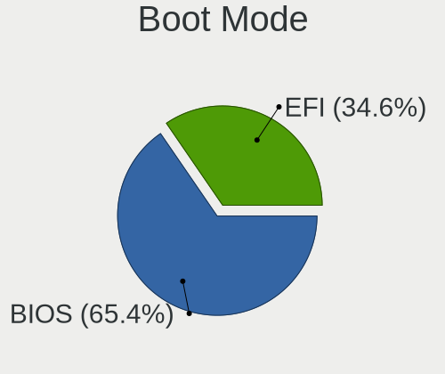
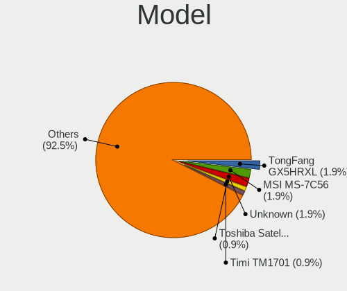
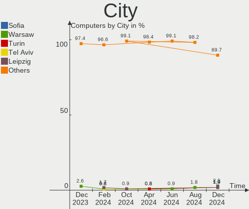
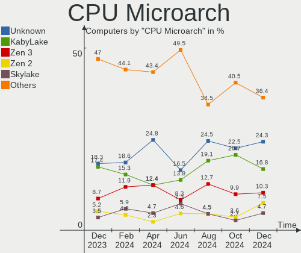
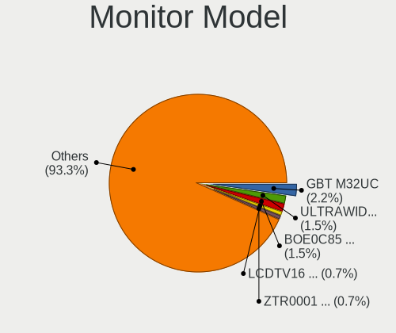
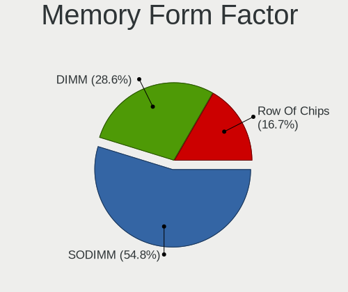
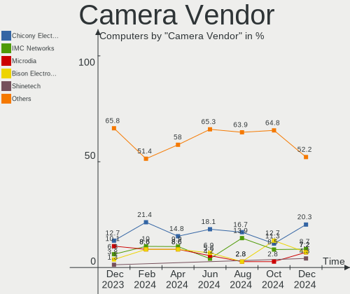
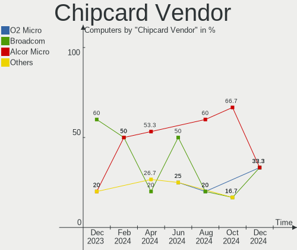

Manjaro - Hardware Trends
-------------------------

A project to identify most popular hardware characteristics and track their change
over time based on data collected by Linux users at https://Linux-Hardware.org.

Anyone can contribute to this report by the [hw-probe](https://github.com/linuxhw/hw-probe) tool:

    sudo -E hw-probe -all -upload

This is a report for all computer types. See also reports for [desktops](/Dist/Manjaro/Desktop/README.md) and [notebooks](/Dist/Manjaro/Notebook/README.md).

This report is for one last month. Overall report since the beginning of time: [TestCoverage](https://github.com/linuxhw/TestCoverage)

Period: May, 2022.

Contents
--------

* [ System ](#system)
  - [ OS                       ](#os)
  - [ OS Family                ](#os-family)
  - [ Kernel                   ](#kernel)
  - [ Kernel Family            ](#kernel-family)
  - [ Kernel Major Ver.        ](#kernel-major-ver)
  - [ Arch                     ](#arch)
  - [ DE                       ](#de)
  - [ Display Server           ](#display-server)
  - [ Display Manager          ](#display-manager)
  - [ OS Lang                  ](#os-lang)
  - [ Boot Mode                ](#boot-mode)
  - [ Filesystem               ](#filesystem)
  - [ Part. scheme             ](#part-scheme)
  - [ Dual Boot with Linux/BSD ](#dual-boot-with-linuxbsd)
  - [ Dual Boot (Win)          ](#dual-boot-win)

* [ Board ](#board)
  - [ Vendor                   ](#vendor)
  - [ Model                    ](#model)
  - [ Model Family             ](#model-family)
  - [ MFG Year                 ](#mfg-year)
  - [ Form Factor              ](#form-factor)
  - [ Secure Boot              ](#secure-boot)
  - [ Coreboot                 ](#coreboot)
  - [ RAM Size                 ](#ram-size)
  - [ RAM Used                 ](#ram-used)
  - [ Total Drives             ](#total-drives)
  - [ Has CD-ROM               ](#has-cd-rom)
  - [ Has Ethernet             ](#has-ethernet)
  - [ Has WiFi                 ](#has-wifi)
  - [ Has Bluetooth            ](#has-bluetooth)

* [ Location ](#location)
  - [ Country                  ](#country)
  - [ City                     ](#city)

* [ Drives ](#drives)
  - [ Drive Vendor             ](#drive-vendor)
  - [ Drive Model              ](#drive-model)
  - [ HDD Vendor               ](#hdd-vendor)
  - [ SSD Vendor               ](#ssd-vendor)
  - [ Drive Kind               ](#drive-kind)
  - [ Drive Connector          ](#drive-connector)
  - [ Drive Size               ](#drive-size)
  - [ Space Total              ](#space-total)
  - [ Space Used               ](#space-used)
  - [ Malfunc. Drives          ](#malfunc-drives)
  - [ Malfunc. Drive Vendor    ](#malfunc-drive-vendor)
  - [ Malfunc. HDD Vendor      ](#malfunc-hdd-vendor)
  - [ Malfunc. Drive Kind      ](#malfunc-drive-kind)
  - [ Failed Drives            ](#failed-drives)
  - [ Failed Drive Vendor      ](#failed-drive-vendor)
  - [ Drive Status             ](#drive-status)

* [ Storage controller ](#storage-controller)
  - [ Storage Vendor           ](#storage-vendor)
  - [ Storage Model            ](#storage-model)
  - [ Storage Kind             ](#storage-kind)

* [ Processor ](#processor)
  - [ CPU Vendor               ](#cpu-vendor)
  - [ CPU Model                ](#cpu-model)
  - [ CPU Model Family         ](#cpu-model-family)
  - [ CPU Cores                ](#cpu-cores)
  - [ CPU Sockets              ](#cpu-sockets)
  - [ CPU Threads              ](#cpu-threads)
  - [ CPU Op-Modes             ](#cpu-op-modes)
  - [ CPU Microcode            ](#cpu-microcode)
  - [ CPU Microarch            ](#cpu-microarch)

* [ Graphics ](#graphics)
  - [ GPU Vendor               ](#gpu-vendor)
  - [ GPU Model                ](#gpu-model)
  - [ GPU Combo                ](#gpu-combo)
  - [ GPU Driver               ](#gpu-driver)
  - [ GPU Memory               ](#gpu-memory)

* [ Monitor ](#monitor)
  - [ Monitor Vendor           ](#monitor-vendor)
  - [ Monitor Model            ](#monitor-model)
  - [ Monitor Resolution       ](#monitor-resolution)
  - [ Monitor Diagonal         ](#monitor-diagonal)
  - [ Monitor Width            ](#monitor-width)
  - [ Aspect Ratio             ](#aspect-ratio)
  - [ Monitor Area             ](#monitor-area)
  - [ Pixel Density            ](#pixel-density)
  - [ Multiple Monitors        ](#multiple-monitors)

* [ Network ](#network)
  - [ Net Controller Vendor    ](#net-controller-vendor)
  - [ Net Controller Model     ](#net-controller-model)
  - [ Wireless Vendor          ](#wireless-vendor)
  - [ Wireless Model           ](#wireless-model)
  - [ Ethernet Vendor          ](#ethernet-vendor)
  - [ Ethernet Model           ](#ethernet-model)
  - [ Net Controller Kind      ](#net-controller-kind)
  - [ Used Controller          ](#used-controller)
  - [ NICs                     ](#nics)
  - [ IPv6                     ](#ipv6)

* [ Bluetooth ](#bluetooth)
  - [ Bluetooth Vendor         ](#bluetooth-vendor)
  - [ Bluetooth Model          ](#bluetooth-model)

* [ Sound ](#sound)
  - [ Sound Vendor             ](#sound-vendor)
  - [ Sound Model              ](#sound-model)

* [ Memory ](#memory)
  - [ Memory Vendor            ](#memory-vendor)
  - [ Memory Model             ](#memory-model)
  - [ Memory Kind              ](#memory-kind)
  - [ Memory Form Factor       ](#memory-form-factor)
  - [ Memory Size              ](#memory-size)
  - [ Memory Speed             ](#memory-speed)

* [ Printers & scanners ](#printers--scanners)
  - [ Printer Vendor           ](#printer-vendor)
  - [ Printer Model            ](#printer-model)
  - [ Scanner Vendor           ](#scanner-vendor)
  - [ Scanner Model            ](#scanner-model)

* [ Camera ](#camera)
  - [ Camera Vendor            ](#camera-vendor)
  - [ Camera Model             ](#camera-model)

* [ Security ](#security)
  - [ Fingerprint Vendor       ](#fingerprint-vendor)
  - [ Fingerprint Model        ](#fingerprint-model)
  - [ Chipcard Vendor          ](#chipcard-vendor)
  - [ Chipcard Model           ](#chipcard-model)

* [ Unsupported ](#unsupported)
  - [ Unsupported Devices      ](#unsupported-devices)
  - [ Unsupported Device Types ](#unsupported-device-types)

System
------

OS
--

Installed operating systems

| Name                      | Computers | Percent |
|---------------------------|-----------|---------|
| Manjaro                   | 109       | 51.42%  |
| Manjaro 21.2.6            | 99        | 46.7%   |
| Manjaro 22.04-development | 1         | 0.47%   |
| Manjaro 21.2.5            | 1         | 0.47%   |
| Manjaro 21.2.4            | 1         | 0.47%   |
| Manjaro 21.2.0            | 1         | 0.47%   |

OS Family
---------

OS without a version

| Name    | Computers | Percent |
|---------|-----------|---------|
| Manjaro | 212       | 100%    |

Kernel
------

Version of the Linux kernel

| Version                                    | Computers | Percent |
|--------------------------------------------|-----------|---------|
| 5.15.32-1-MANJARO                          | 48        | 22.64%  |
| 5.15.38-1-MANJARO                          | 34        | 16.04%  |
| 5.17.1-3-MANJARO                           | 25        | 11.79%  |
| 5.17.6-1-MANJARO                           | 22        | 10.38%  |
| 5.15.41-1-MANJARO                          | 18        | 8.49%   |
| 5.10.109-1-MANJARO                         | 10        | 4.72%   |
| 5.17.9-1-MANJARO                           | 9         | 4.25%   |
| 5.16.18-1-MANJARO                          | 9         | 4.25%   |
| 5.16.20-2-MANJARO                          | 7         | 3.3%    |
| 5.13.19-2-MANJARO                          | 5         | 2.36%   |
| 5.18.0-1-MANJARO                           | 3         | 1.42%   |
| 5.17.5-2-MANJARO                           | 2         | 0.94%   |
| 5.10.114-1-MANJARO                         | 2         | 0.94%   |
| 5.10.105-1-MANJARO                         | 2         | 0.94%   |
| 5.4.192-1-MANJARO                          | 1         | 0.47%   |
| 5.4.188-1-MANJARO                          | 1         | 0.47%   |
| 5.18.0-rc5-1-git-rtw89-00178-g30c8e80f7932 | 1         | 0.47%   |
| 5.17.9-zen-gcdd22facad20-dirty             | 1         | 0.47%   |
| 5.17.8-2-MANJARO                           | 1         | 0.47%   |
| 5.17.5-256-tkg-pds                         | 1         | 0.47%   |
| 5.17.5-256-tkg-bmq                         | 1         | 0.47%   |
| 5.17.11-xanmod1-1                          | 1         | 0.47%   |
| 5.17.1-3-rt17-MANJARO                      | 1         | 0.47%   |
| 5.17.1-1-rt17-MANJARO                      | 1         | 0.47%   |
| 5.17.1-1-rt16-MANJARO                      | 1         | 0.47%   |
| 5.16.2-3-rt19-MANJARO                      | 1         | 0.47%   |
| 5.16.14-1-MANJARO                          | 1         | 0.47%   |
| 5.15.36-1-MANJARO                          | 1         | 0.47%   |
| 5.10.112-1-MANJARO                         | 1         | 0.47%   |
| 4.14.275-1-MANJARO                         | 1         | 0.47%   |

Kernel Family
-------------

Linux kernel without a distro release

| Version  | Computers | Percent |
|----------|-----------|---------|
| 5.15.32  | 48        | 22.64%  |
| 5.15.38  | 34        | 16.04%  |
| 5.17.1   | 28        | 13.21%  |
| 5.17.6   | 22        | 10.38%  |
| 5.15.41  | 18        | 8.49%   |
| 5.17.9   | 10        | 4.72%   |
| 5.10.109 | 10        | 4.72%   |
| 5.16.18  | 9         | 4.25%   |
| 5.16.20  | 7         | 3.3%    |
| 5.13.19  | 5         | 2.36%   |
| 5.18.0   | 4         | 1.89%   |
| 5.17.5   | 4         | 1.89%   |
| 5.10.114 | 2         | 0.94%   |
| 5.10.105 | 2         | 0.94%   |
| 5.4.192  | 1         | 0.47%   |
| 5.4.188  | 1         | 0.47%   |
| 5.17.8   | 1         | 0.47%   |
| 5.17.11  | 1         | 0.47%   |
| 5.16.2   | 1         | 0.47%   |
| 5.16.14  | 1         | 0.47%   |
| 5.15.36  | 1         | 0.47%   |
| 5.10.112 | 1         | 0.47%   |
| 4.14.275 | 1         | 0.47%   |

Kernel Major Ver.
-----------------

Linux kernel major version

| Version | Computers | Percent |
|---------|-----------|---------|
| 5.15    | 101       | 47.64%  |
| 5.17    | 66        | 31.13%  |
| 5.16    | 18        | 8.49%   |
| 5.10    | 15        | 7.08%   |
| 5.13    | 5         | 2.36%   |
| 5.18    | 4         | 1.89%   |
| 5.4     | 2         | 0.94%   |
| 4.14    | 1         | 0.47%   |

Arch
----

OS architecture (x86_64, i586, etc.)

| Name   | Computers | Percent |
|--------|-----------|---------|
| x86_64 | 212       | 100%    |

DE
--

Desktop Environment

| Name       | Computers | Percent |
|------------|-----------|---------|
| KDE5       | 110       | 51.89%  |
| GNOME      | 50        | 23.58%  |
| XFCE       | 34        | 16.04%  |
| X-Cinnamon | 6         | 2.83%   |
| Unknown    | 5         | 2.36%   |
| Cinnamon   | 2         | 0.94%   |
| Unity      | 1         | 0.47%   |
| sway       | 1         | 0.47%   |
| LXQt       | 1         | 0.47%   |
| i3         | 1         | 0.47%   |
| Budgie     | 1         | 0.47%   |

Display Server
--------------

X11 or Wayland

| Name    | Computers | Percent |
|---------|-----------|---------|
| X11     | 167       | 78.77%  |
| Wayland | 37        | 17.45%  |
| Tty     | 4         | 1.89%   |
| Unknown | 4         | 1.89%   |

Display Manager
---------------

SDDM, LightDM, etc.

| Name    | Computers | Percent |
|---------|-----------|---------|
| Unknown | 109       | 51.42%  |
| SDDM    | 50        | 23.58%  |
| LightDM | 29        | 13.68%  |
| GDM     | 24        | 11.32%  |

OS Lang
-------

Language

| Lang    | Computers | Percent |
|---------|-----------|---------|
| en_US   | 93        | 43.87%  |
| en_GB   | 22        | 10.38%  |
| de_DE   | 21        | 9.91%   |
| ru_RU   | 17        | 8.02%   |
| pt_BR   | 9         | 4.25%   |
| en_CA   | 9         | 4.25%   |
| it_IT   | 4         | 1.89%   |
| es_MX   | 3         | 1.42%   |
| es_ES   | 3         | 1.42%   |
| zh_CN   | 2         | 0.94%   |
| fr_FR   | 2         | 0.94%   |
| es_AR   | 2         | 0.94%   |
| en_ZA   | 2         | 0.94%   |
| en_DK   | 2         | 0.94%   |
| en_AU   | 2         | 0.94%   |
| Unknown | 2         | 0.94%   |
| tr_TR   | 1         | 0.47%   |
| szl_PL  | 1         | 0.47%   |
| ru_UA   | 1         | 0.47%   |
| ro_RO   | 1         | 0.47%   |
| pl_PL   | 1         | 0.47%   |
| nl_BE   | 1         | 0.47%   |
| nb_NO   | 1         | 0.47%   |
| ja_JP   | 1         | 0.47%   |
| fr_LU   | 1         | 0.47%   |
| es_GT   | 1         | 0.47%   |
| es_CO   | 1         | 0.47%   |
| en_IN   | 1         | 0.47%   |
| en_IE   | 1         | 0.47%   |
| el_GR   | 1         | 0.47%   |
| de_CH   | 1         | 0.47%   |
| da_DK   | 1         | 0.47%   |
| C       | 1         | 0.47%   |

Boot Mode
---------

EFI or BIOS

| Mode | Computers | Percent |
|------|-----------|---------|
| BIOS | 143       | 67.45%  |
| EFI  | 69        | 32.55%  |

Filesystem
----------

Type of filesystem

| Type  | Computers | Percent |
|-------|-----------|---------|
| Ext4  | 175       | 82.55%  |
| Btrfs | 34        | 16.04%  |
| Xfs   | 2         | 0.94%   |
| F2fs  | 1         | 0.47%   |

Part. scheme
------------

Scheme of partitioning

| Type    | Computers | Percent |
|---------|-----------|---------|
| Unknown | 133       | 62.74%  |
| GPT     | 68        | 32.08%  |
| MBR     | 11        | 5.19%   |

Dual Boot with Linux/BSD
------------------------

Hosting more than one Linux/BSD

| Dual boot | Computers | Percent |
|-----------|-----------|---------|
| No        | 195       | 91.98%  |
| Yes       | 17        | 8.02%   |

Dual Boot (Win)
---------------

Hosting Linux and Windows

| Dual boot | Computers | Percent |
|-----------|-----------|---------|
| No        | 163       | 76.89%  |
| Yes       | 49        | 23.11%  |

Board
-----

Vendor
------

Motherboard manufacturer

| Name                   | Computers | Percent |
|------------------------|-----------|---------|
| ASUSTek Computer       | 42        | 19.81%  |
| Lenovo                 | 33        | 15.57%  |
| Hewlett-Packard        | 22        | 10.38%  |
| MSI                    | 21        | 9.91%   |
| Dell                   | 16        | 7.55%   |
| Gigabyte Technology    | 15        | 7.08%   |
| Acer                   | 10        | 4.72%   |
| ASRock                 | 9         | 4.25%   |
| Apple                  | 5         | 2.36%   |
| Sony                   | 3         | 1.42%   |
| Samsung Electronics    | 3         | 1.42%   |
| Intel                  | 3         | 1.42%   |
| TUXEDO                 | 2         | 0.94%   |
| Toshiba                | 2         | 0.94%   |
| Schenker               | 2         | 0.94%   |
| Razer                  | 2         | 0.94%   |
| Pegatron               | 2         | 0.94%   |
| Packard Bell           | 2         | 0.94%   |
| Notebook               | 2         | 0.94%   |
| Google                 | 2         | 0.94%   |
| Fujitsu                | 2         | 0.94%   |
| Star Labs              | 1         | 0.47%   |
| Standard               | 1         | 0.47%   |
| Positivo Bahia - VAIO  | 1         | 0.47%   |
| Panasonic              | 1         | 0.47%   |
| IP3 Tech               | 1         | 0.47%   |
| HUAWEI                 | 1         | 0.47%   |
| HONOR                  | 1         | 0.47%   |
| Chuwi                  | 1         | 0.47%   |
| Chatreey               | 1         | 0.47%   |
| BESSTAR Tech           | 1         | 0.47%   |
| Avell High Performance | 1         | 0.47%   |
| Unknown                | 1         | 0.47%   |

Model
-----

Motherboard model

| Name                                                  | Computers | Percent |
|-------------------------------------------------------|-----------|---------|
| Lenovo ThinkBook 16p Gen 2 20YM                       | 2         | 0.94%   |
| HP ProBook 455 G7                                     | 2         | 0.94%   |
| Google Guado                                          | 2         | 0.94%   |
| Dell XPS 15 9570                                      | 2         | 0.94%   |
| Dell XPS 15 9500                                      | 2         | 0.94%   |
| ASUS TUF Gaming X570-PLUS                             | 2         | 0.94%   |
| ASUS TUF Gaming B550-PLUS                             | 2         | 0.94%   |
| ASUS ROG STRIX B550-F GAMING                          | 2         | 0.94%   |
| ASUS PRIME X570-PRO                                   | 2         | 0.94%   |
| ASUS N53SM                                            | 2         | 0.94%   |
| TUXEDO Pulse 14 Gen1                                  | 1         | 0.47%   |
| TUXEDO InfinityBook Pro 14 Gen6                       | 1         | 0.47%   |
| Toshiba Satellite L10W-B-101                          | 1         | 0.47%   |
| Toshiba Satellite C850-D1W                            | 1         | 0.47%   |
| Star Labs Lite                                        | 1         | 0.47%   |
| Standard B14HM21                                      | 1         | 0.47%   |
| Sony VPCF236FM                                        | 1         | 0.47%   |
| Sony SVS1512U1RW                                      | 1         | 0.47%   |
| Sony SVS13137PGB                                      | 1         | 0.47%   |
| Schenker XMG_APEX15_XAP15E20                          | 1         | 0.47%   |
| Schenker VISION 15 (SVS15E21)                         | 1         | 0.47%   |
| Samsung 750XDA                                        | 1         | 0.47%   |
| Samsung 550XDA                                        | 1         | 0.47%   |
| Samsung 530XBB                                        | 1         | 0.47%   |
| Razer Blade 15 Advanced Model (Early 2020) - RZ09-033 | 1         | 0.47%   |
| Razer Blade                                           | 1         | 0.47%   |
| Positivo Bahia - VAIO VJFE43F11X-XXXXXX               | 1         | 0.47%   |
| Pegatron H36ST                                        | 1         | 0.47%   |
| Pegatron BQ466AAR-ABA s5510f                          | 1         | 0.47%   |
| Panasonic CF-19THRAXF9                                | 1         | 0.47%   |
| Packard Bell EasyNote TE69CXP                         | 1         | 0.47%   |
| Packard Bell EasyNote LM98                            | 1         | 0.47%   |
| Notebook NLx0MU                                       | 1         | 0.47%   |
| Notebook Multicom Xishan NL50                         | 1         | 0.47%   |
| MSI MS-7D32                                           | 1         | 0.47%   |
| MSI MS-7D03                                           | 1         | 0.47%   |
| MSI MS-7C94                                           | 1         | 0.47%   |
| MSI MS-7C91                                           | 1         | 0.47%   |
| MSI MS-7C09                                           | 1         | 0.47%   |
| MSI MS-7C02                                           | 1         | 0.47%   |
| MSI MS-7B98                                           | 1         | 0.47%   |
| MSI MS-7B90                                           | 1         | 0.47%   |
| MSI MS-7B89                                           | 1         | 0.47%   |
| MSI MS-7B86                                           | 1         | 0.47%   |
| MSI MS-7B79                                           | 1         | 0.47%   |
| MSI MS-7B17                                           | 1         | 0.47%   |
| MSI MS-7A70                                           | 1         | 0.47%   |
| MSI MS-7A38                                           | 1         | 0.47%   |
| MSI MS-7977                                           | 1         | 0.47%   |
| MSI MS-7924                                           | 1         | 0.47%   |
| MSI MS-7885                                           | 1         | 0.47%   |
| MSI MS-7758                                           | 1         | 0.47%   |
| MSI MS-16Y1                                           | 1         | 0.47%   |
| MSI Modern 14 B11MO                                   | 1         | 0.47%   |
| MSI Modern 14 B10MW                                   | 1         | 0.47%   |
| Lenovo Yoga Slim 7 14ARE05 82A2                       | 1         | 0.47%   |
| Lenovo Yoga 6 13ALC6 82ND                             | 1         | 0.47%   |
| Lenovo Yoga 510-14IKB 80VB                            | 1         | 0.47%   |
| Lenovo Y40-70 20347                                   | 1         | 0.47%   |
| Lenovo V145-15AST 81MT                                | 1         | 0.47%   |

Model Family
------------

Motherboard model prefix

| Name                                    | Computers | Percent |
|-----------------------------------------|-----------|---------|
| Lenovo ThinkPad                         | 11        | 5.19%   |
| ASUS TUF                                | 9         | 4.25%   |
| ASUS ROG                                | 9         | 4.25%   |
| Lenovo IdeaPad                          | 8         | 3.77%   |
| Acer Aspire                             | 8         | 3.77%   |
| Dell Inspiron                           | 7         | 3.3%    |
| Dell XPS                                | 6         | 2.83%   |
| ASUS PRIME                              | 6         | 2.83%   |
| Lenovo ThinkBook                        | 4         | 1.89%   |
| HP ProBook                              | 4         | 1.89%   |
| ASUS VivoBook                           | 4         | 1.89%   |
| Lenovo Yoga                             | 3         | 1.42%   |
| HP Laptop                               | 3         | 1.42%   |
| HP ENVY                                 | 3         | 1.42%   |
| HP EliteBook                            | 3         | 1.42%   |
| Toshiba Satellite                       | 2         | 0.94%   |
| Razer Blade                             | 2         | 0.94%   |
| Packard Bell EasyNote                   | 2         | 0.94%   |
| MSI Modern                              | 2         | 0.94%   |
| Lenovo Legion                           | 2         | 0.94%   |
| HP Pavilion                             | 2         | 0.94%   |
| Google Guado                            | 2         | 0.94%   |
| Gigabyte B550                           | 2         | 0.94%   |
| ASUS N53SM                              | 2         | 0.94%   |
| ASUS ASUS                               | 2         | 0.94%   |
| ASRock B550M                            | 2         | 0.94%   |
| ASRock AB350                            | 2         | 0.94%   |
| TUXEDO Pulse                            | 1         | 0.47%   |
| TUXEDO InfinityBook                     | 1         | 0.47%   |
| Star Labs Lite                          | 1         | 0.47%   |
| Standard B14HM21                        | 1         | 0.47%   |
| Sony VPCF236FM                          | 1         | 0.47%   |
| Sony SVS1512U1RW                        | 1         | 0.47%   |
| Sony SVS13137PGB                        | 1         | 0.47%   |
| Schenker XMG                            | 1         | 0.47%   |
| Schenker VISION                         | 1         | 0.47%   |
| Samsung 750XDA                          | 1         | 0.47%   |
| Samsung 550XDA                          | 1         | 0.47%   |
| Samsung 530XBB                          | 1         | 0.47%   |
| Positivo Bahia - VAIO VJFE43F11X-XXXXXX | 1         | 0.47%   |
| Pegatron H36ST                          | 1         | 0.47%   |
| Pegatron BQ466AAR-ABA                   | 1         | 0.47%   |
| Panasonic CF-19THRAXF9                  | 1         | 0.47%   |
| Notebook NLx0MU                         | 1         | 0.47%   |
| Notebook Multicom                       | 1         | 0.47%   |
| MSI MS-7D32                             | 1         | 0.47%   |
| MSI MS-7D03                             | 1         | 0.47%   |
| MSI MS-7C94                             | 1         | 0.47%   |
| MSI MS-7C91                             | 1         | 0.47%   |
| MSI MS-7C09                             | 1         | 0.47%   |
| MSI MS-7C02                             | 1         | 0.47%   |
| MSI MS-7B98                             | 1         | 0.47%   |
| MSI MS-7B90                             | 1         | 0.47%   |
| MSI MS-7B89                             | 1         | 0.47%   |
| MSI MS-7B86                             | 1         | 0.47%   |
| MSI MS-7B79                             | 1         | 0.47%   |
| MSI MS-7B17                             | 1         | 0.47%   |
| MSI MS-7A70                             | 1         | 0.47%   |
| MSI MS-7A38                             | 1         | 0.47%   |
| MSI MS-7977                             | 1         | 0.47%   |

MFG Year
--------

Motherboard manufacture year

| Year | Computers | Percent |
|------|-----------|---------|
| 2020 | 43        | 20.28%  |
| 2021 | 35        | 16.51%  |
| 2019 | 26        | 12.26%  |
| 2018 | 23        | 10.85%  |
| 2017 | 11        | 5.19%   |
| 2015 | 11        | 5.19%   |
| 2012 | 11        | 5.19%   |
| 2014 | 10        | 4.72%   |
| 2022 | 9         | 4.25%   |
| 2016 | 9         | 4.25%   |
| 2011 | 7         | 3.3%    |
| 2010 | 7         | 3.3%    |
| 2013 | 6         | 2.83%   |
| 2007 | 2         | 0.94%   |
| 2009 | 1         | 0.47%   |
| 2008 | 1         | 0.47%   |

Form Factor
-----------

Physical design of the computer

| Name        | Computers | Percent |
|-------------|-----------|---------|
| Notebook    | 119       | 56.13%  |
| Desktop     | 79        | 37.26%  |
| Convertible | 10        | 4.72%   |
| Mini pc     | 3         | 1.42%   |
| Tablet      | 1         | 0.47%   |

Secure Boot
-----------

Enabled or disabled

| State    | Computers | Percent |
|----------|-----------|---------|
| Disabled | 212       | 100%    |

Coreboot
--------

Have coreboot on board

| Used | Computers | Percent |
|------|-----------|---------|
| No   | 209       | 98.58%  |
| Yes  | 3         | 1.42%   |

RAM Size
--------

Total RAM memory

| Size in GB  | Computers | Percent |
|-------------|-----------|---------|
| 16.01-24.0  | 54        | 25.47%  |
| 4.01-8.0    | 50        | 23.58%  |
| 8.01-16.0   | 41        | 19.34%  |
| 32.01-64.0  | 38        | 17.92%  |
| 3.01-4.0    | 16        | 7.55%   |
| 24.01-32.0  | 5         | 2.36%   |
| 64.01-256.0 | 5         | 2.36%   |
| 2.01-3.0    | 2         | 0.94%   |
| 1.01-2.0    | 1         | 0.47%   |

RAM Used
--------

Used RAM memory

| Used GB    | Computers | Percent |
|------------|-----------|---------|
| 2.01-3.0   | 60        | 28.3%   |
| 4.01-8.0   | 51        | 24.06%  |
| 3.01-4.0   | 48        | 22.64%  |
| 1.01-2.0   | 31        | 14.62%  |
| 8.01-16.0  | 20        | 9.43%   |
| 16.01-24.0 | 1         | 0.47%   |
| 0.51-1.0   | 1         | 0.47%   |

Total Drives
------------

Number of drives on board

| Drives | Computers | Percent |
|--------|-----------|---------|
| 1      | 101       | 47.64%  |
| 2      | 67        | 31.6%   |
| 3      | 19        | 8.96%   |
| 4      | 9         | 4.25%   |
| 5      | 7         | 3.3%    |
| 6      | 6         | 2.83%   |
| 10     | 1         | 0.47%   |
| 9      | 1         | 0.47%   |
| 8      | 1         | 0.47%   |

Has CD-ROM
----------

Has CD-ROM on board

| Presented | Computers | Percent |
|-----------|-----------|---------|
| No        | 172       | 81.13%  |
| Yes       | 40        | 18.87%  |

Has Ethernet
------------

Has Ethernet on board

| Presented | Computers | Percent |
|-----------|-----------|---------|
| Yes       | 174       | 82.08%  |
| No        | 38        | 17.92%  |

Has WiFi
--------

Has WiFi module

| Presented | Computers | Percent |
|-----------|-----------|---------|
| Yes       | 181       | 85.38%  |
| No        | 31        | 14.62%  |

Has Bluetooth
-------------

Has Bluetooth module

| Presented | Computers | Percent |
|-----------|-----------|---------|
| Yes       | 168       | 79.25%  |
| No        | 44        | 20.75%  |

Location
--------

Country
-------

Geographic location (country)

| Country      | Computers | Percent |
|--------------|-----------|---------|
| USA          | 35        | 16.51%  |
| Germany      | 31        | 14.62%  |
| Russia       | 20        | 9.43%   |
| Brazil       | 10        | 4.72%   |
| Canada       | 9         | 4.25%   |
| UK           | 7         | 3.3%    |
| Poland       | 7         | 3.3%    |
| Spain        | 6         | 2.83%   |
| Italy        | 6         | 2.83%   |
| Mexico       | 5         | 2.36%   |
| Ukraine      | 4         | 1.89%   |
| Netherlands  | 4         | 1.89%   |
| France       | 4         | 1.89%   |
| Peru         | 3         | 1.42%   |
| Denmark      | 3         | 1.42%   |
| Czechia      | 3         | 1.42%   |
| Belgium      | 3         | 1.42%   |
| Austria      | 3         | 1.42%   |
| Turkey       | 2         | 0.94%   |
| Sweden       | 2         | 0.94%   |
| South Africa | 2         | 0.94%   |
| Saudi Arabia | 2         | 0.94%   |
| Romania      | 2         | 0.94%   |
| Jamaica      | 2         | 0.94%   |
| Iran         | 2         | 0.94%   |
| Hungary      | 2         | 0.94%   |
| Greece       | 2         | 0.94%   |
| China        | 2         | 0.94%   |
| Bangladesh   | 2         | 0.94%   |
| Australia    | 2         | 0.94%   |
| Argentina    | 2         | 0.94%   |
| Vietnam      | 1         | 0.47%   |
| Thailand     | 1         | 0.47%   |
| Syria        | 1         | 0.47%   |
| Switzerland  | 1         | 0.47%   |
| Slovakia     | 1         | 0.47%   |
| Norway       | 1         | 0.47%   |
| Morocco      | 1         | 0.47%   |
| Luxembourg   | 1         | 0.47%   |
| Latvia       | 1         | 0.47%   |
| Kuwait       | 1         | 0.47%   |
| Japan        | 1         | 0.47%   |
| Isle of Man  | 1         | 0.47%   |
| Ireland      | 1         | 0.47%   |
| Indonesia    | 1         | 0.47%   |
| India        | 1         | 0.47%   |
| Guatemala    | 1         | 0.47%   |
| Finland      | 1         | 0.47%   |
| Croatia      | 1         | 0.47%   |
| Colombia     | 1         | 0.47%   |
| Chile        | 1         | 0.47%   |
| Bulgaria     | 1         | 0.47%   |
| Belarus      | 1         | 0.47%   |
| Andorra      | 1         | 0.47%   |

City
----

Geographic location (city)

| City              | Computers | Percent |
|-------------------|-----------|---------|
| Moscow            | 5         | 2.36%   |
| St Petersburg     | 4         | 1.89%   |
| Frankfurt am Main | 4         | 1.89%   |
| Vienna            | 3         | 1.42%   |
| Lima              | 3         | 1.42%   |
| Warsaw            | 2         | 0.94%   |
| Sao Paulo         | 2         | 0.94%   |
| Recife            | 2         | 0.94%   |
| Port Orchard      | 2         | 0.94%   |
| Munich            | 2         | 0.94%   |
| Muelheim-Kaerlich | 2         | 0.94%   |
| Mission           | 2         | 0.94%   |
| Milan             | 2         | 0.94%   |
| Madrid            | 2         | 0.94%   |
| Lviv              | 2         | 0.94%   |
| Chelyabinsk       | 2         | 0.94%   |
| Berlin            | 2         | 0.94%   |
| Amsterdam         | 2         | 0.94%   |
| Zarinsk           | 1         | 0.47%   |
| Ypres             | 1         | 0.47%   |
| Yorba Linda       | 1         | 0.47%   |
| Wuppertal         | 1         | 0.47%   |
| Whitsett          | 1         | 0.47%   |
| Westwood          | 1         | 0.47%   |
| West Chester      | 1         | 0.47%   |
| Weitramsdorf      | 1         | 0.47%   |
| Weiden            | 1         | 0.47%   |
| Waltershausen     | 1         | 0.47%   |
| Vinderup          | 1         | 0.47%   |
| Villahermosa      | 1         | 0.47%   |
| Villa Ballester   | 1         | 0.47%   |
| Velika Gorica     | 1         | 0.47%   |
| Unieszewo         | 1         | 0.47%   |
| Turin             | 1         | 0.47%   |
| Tulcea            | 1         | 0.47%   |
| Torrefarrera      | 1         | 0.47%   |
| Toronto           | 1         | 0.47%   |
| The Bronx         | 1         | 0.47%   |
| Tehran            | 1         | 0.47%   |
| Szentendre        | 1         | 0.47%   |
| Syktyvkar         | 1         | 0.47%   |
| Sydney            | 1         | 0.47%   |
| Stuttgart         | 1         | 0.47%   |
| Stockholm         | 1         | 0.47%   |
| Smolensk          | 1         | 0.47%   |
| Sliven            | 1         | 0.47%   |
| Shenyang          | 1         | 0.47%   |
| Setagaya-ku       | 1         | 0.47%   |
| Sarzana           | 1         | 0.47%   |
| Sarrion           | 1         | 0.47%   |
| Sao Jose          | 1         | 0.47%   |
| Santa Cruz do Sul | 1         | 0.47%   |
| Santa Coloma      | 1         | 0.47%   |
| San Jose          | 1         | 0.47%   |
| Samara            | 1         | 0.47%   |
| Šaľa            | 1         | 0.47%   |
| Roztoky           | 1         | 0.47%   |
| Riyadh            | 1         | 0.47%   |
| Rixheim           | 1         | 0.47%   |
| Rio de Janeiro    | 1         | 0.47%   |

Drives
------

Drive Vendor
------------

Hard drive vendors

| Vendor                         | Computers | Drives | Percent |
|--------------------------------|-----------|--------|---------|
| Samsung Electronics            | 68        | 96     | 18.48%  |
| WDC                            | 46        | 57     | 12.5%   |
| Seagate                        | 38        | 46     | 10.33%  |
| SanDisk                        | 29        | 31     | 7.88%   |
| Toshiba                        | 22        | 24     | 5.98%   |
| Kingston                       | 20        | 22     | 5.43%   |
| Crucial                        | 14        | 15     | 3.8%    |
| SK Hynix                       | 12        | 14     | 3.26%   |
| Hitachi                        | 11        | 12     | 2.99%   |
| Phison                         | 9         | 9      | 2.45%   |
| Unknown                        | 8         | 11     | 2.17%   |
| Intel                          | 8         | 9      | 2.17%   |
| HGST                           | 8         | 8      | 2.17%   |
| A-DATA Technology              | 8         | 8      | 2.17%   |
| Micron Technology              | 6         | 6      | 1.63%   |
| KIOXIA                         | 4         | 4      | 1.09%   |
| XPG                            | 3         | 3      | 0.82%   |
| SPCC                           | 3         | 3      | 0.82%   |
| Solid State Storage Technology | 3         | 3      | 0.82%   |
| OCZ                            | 3         | 3      | 0.82%   |
| Micron/Crucial Technology      | 3         | 3      | 0.82%   |
| GOODRAM                        | 3         | 3      | 0.82%   |
| China                          | 3         | 3      | 0.82%   |
| Apple                          | 3         | 3      | 0.82%   |
| Silicon Motion                 | 2         | 2      | 0.54%   |
| Realtek Semiconductor          | 2         | 2      | 0.54%   |
| PNY                            | 2         | 2      | 0.54%   |
| Netac                          | 2         | 2      | 0.54%   |
| DOGFISH                        | 2         | 2      | 0.54%   |
| ASMT                           | 2         | 3      | 0.54%   |
| XrayDisk                       | 1         | 1      | 0.27%   |
| walram                         | 1         | 2      | 0.27%   |
| USB3.0                         | 1         | 1      | 0.27%   |
| USB 3.0                        | 1         | 1      | 0.27%   |
| Union Memory (Shenzhen)        | 1         | 1      | 0.27%   |
| Transcend                      | 1         | 1      | 0.27%   |
| Star                           | 1         | 1      | 0.27%   |
| SSD2SC96                       | 1         | 1      | 0.27%   |
| Realtek                        | 1         | 1      | 0.27%   |
| PLEXTOR                        | 1         | 1      | 0.27%   |
| Phison Electronics             | 1         | 1      | 0.27%   |
| OWC                            | 1         | 1      | 0.27%   |
| OSCOO                          | 1         | 1      | 0.27%   |
| MAXIO Technology (Hangzhou)    | 1         | 1      | 0.27%   |
| LuminouTek                     | 1         | 1      | 0.27%   |
| Lexar                          | 1         | 1      | 0.27%   |
| Leven                          | 1         | 1      | 0.27%   |
| JMicron                        | 1         | 1      | 0.27%   |
| BIWIN                          | 1         | 1      | 0.27%   |
| Apacer                         | 1         | 1      | 0.27%   |
| Unknown                        | 1         | 1      | 0.27%   |

Drive Model
-----------

Hard drive models

| Model                                    | Computers | Percent |
|------------------------------------------|-----------|---------|
| Samsung NVMe SSD Drive 1TB               | 8         | 1.97%   |
| Sandisk NVMe SSD Drive 1TB               | 7         | 1.72%   |
| Samsung NVMe SSD Drive 500GB             | 6         | 1.48%   |
| Samsung NVMe SSD Drive 250GB             | 6         | 1.48%   |
| Sandisk NVMe SSD Drive 500GB             | 5         | 1.23%   |
| Seagate ST1000LM035-1RK172 1TB           | 4         | 0.99%   |
| Samsung NVMe SSD Drive 1024GB            | 4         | 0.99%   |
| WDC WDS500G2B0A-00SM50 500GB SSD         | 3         | 0.74%   |
| WDC WD10EZEX-08WN4A0 1TB                 | 3         | 0.74%   |
| Toshiba MQ04ABF100 1TB                   | 3         | 0.74%   |
| Toshiba MQ01ABF050 500GB                 | 3         | 0.74%   |
| Toshiba DT01ACA100 1TB                   | 3         | 0.74%   |
| SK Hynix NVMe SSD Drive 256GB            | 3         | 0.74%   |
| Seagate ST1000DM010-2EP102 1TB           | 3         | 0.74%   |
| Samsung SSD 850 EVO 250GB                | 3         | 0.74%   |
| Samsung NVMe SSD Drive 2TB               | 3         | 0.74%   |
| Samsung NVMe SSD Drive 256GB             | 3         | 0.74%   |
| Micron/Crucial NVMe SSD Drive 1TB        | 3         | 0.74%   |
| KIOXIA NVMe SSD Drive 256GB              | 3         | 0.74%   |
| Kingston SA400S37240G 240GB SSD          | 3         | 0.74%   |
| Kingston NVMe SSD Drive 512GB            | 3         | 0.74%   |
| Intel SSDPEKNU512GZ 512GB                | 3         | 0.74%   |
| HGST HTS721010A9E630 1TB                 | 3         | 0.74%   |
| XPG NVMe SSD Drive 512GB                 | 2         | 0.49%   |
| WDC WD20EZBX-00AYRA0 2TB                 | 2         | 0.49%   |
| WDC WD10EZEX-00BN5A0 1TB                 | 2         | 0.49%   |
| WDC WD1003FZEX-00MK2A0 1TB               | 2         | 0.49%   |
| Unknown MMC Card  128GB                  | 2         | 0.49%   |
| Unknown Externa 128GB                    | 2         | 0.49%   |
| SPCC M.2 PCIe SSD 2TB                    | 2         | 0.49%   |
| Solid State Storage NVMe SSD Drive 512GB | 2         | 0.49%   |
| Seagate ST500LT012-9WS142 500GB          | 2         | 0.49%   |
| Seagate ST3250318AS 250GB                | 2         | 0.49%   |
| Seagate ST2000DM008-2FR102 2TB           | 2         | 0.49%   |
| Seagate ST2000DM001-1ER164 2TB           | 2         | 0.49%   |
| Seagate ST1000DM003-9YN162 1TB           | 2         | 0.49%   |
| Seagate ST1000DM003-1SB10C 1TB           | 2         | 0.49%   |
| SanDisk SSD PLUS 1000GB                  | 2         | 0.49%   |
| Sandisk NVMe SSD Drive 256GB             | 2         | 0.49%   |
| Sandisk NVMe SSD Drive 250GB             | 2         | 0.49%   |
| Samsung SSD 980 PRO 2TB                  | 2         | 0.49%   |
| Samsung SSD 970 EVO 1TB                  | 2         | 0.49%   |
| Samsung SSD 870 QVO 2TB                  | 2         | 0.49%   |
| Samsung SSD 870 EVO 1TB                  | 2         | 0.49%   |
| Samsung SSD 860 EVO 500GB                | 2         | 0.49%   |
| Samsung SSD 860 EVO 1TB                  | 2         | 0.49%   |
| Samsung SSD 850 EVO 120GB                | 2         | 0.49%   |
| Samsung PSSD T7 500GB                    | 2         | 0.49%   |
| Samsung NVMe SSD Drive 512GB             | 2         | 0.49%   |
| Phison Sabrent Rocket Q 1TB              | 2         | 0.49%   |
| Phison NVMe SSD Drive 512GB              | 2         | 0.49%   |
| Phison NVMe SSD Drive 1TB                | 2         | 0.49%   |
| Micron 1100_MTFDDAV256TBN 256GB SSD      | 2         | 0.49%   |
| Kingston SA400S37480G 480GB SSD          | 2         | 0.49%   |
| Kingston SA400S37120G 120GB SSD          | 2         | 0.49%   |
| Kingston NVMe SSD Drive 500GB            | 2         | 0.49%   |
| Kingston NVMe SSD Drive 256GB            | 2         | 0.49%   |
| Intel NVMe SSD Drive 512GB               | 2         | 0.49%   |
| DOGFISH SSD 512GB                        | 2         | 0.49%   |
| Crucial CT480BX500SSD1 480GB             | 2         | 0.49%   |

HDD Vendor
----------

Hard disk drive vendors

| Vendor              | Computers | Drives | Percent |
|---------------------|-----------|--------|---------|
| Seagate             | 38        | 46     | 32.76%  |
| WDC                 | 36        | 46     | 31.03%  |
| Toshiba             | 18        | 19     | 15.52%  |
| Hitachi             | 11        | 12     | 9.48%   |
| HGST                | 8         | 8      | 6.9%    |
| Samsung Electronics | 3         | 4      | 2.59%   |
| ASMT                | 2         | 3      | 1.72%   |

SSD Vendor
----------

Solid state drive vendors

| Vendor              | Computers | Drives | Percent |
|---------------------|-----------|--------|---------|
| Samsung Electronics | 27        | 43     | 24.77%  |
| SanDisk             | 12        | 13     | 11.01%  |
| Kingston            | 11        | 13     | 10.09%  |
| Crucial             | 9         | 10     | 8.26%   |
| WDC                 | 8         | 8      | 7.34%   |
| A-DATA Technology   | 7         | 7      | 6.42%   |
| Micron Technology   | 4         | 4      | 3.67%   |
| OCZ                 | 3         | 3      | 2.75%   |
| GOODRAM             | 3         | 3      | 2.75%   |
| China               | 3         | 3      | 2.75%   |
| SK Hynix            | 2         | 2      | 1.83%   |
| PNY                 | 2         | 2      | 1.83%   |
| Netac               | 2         | 2      | 1.83%   |
| DOGFISH             | 2         | 2      | 1.83%   |
| Apple               | 2         | 2      | 1.83%   |
| walram              | 1         | 1      | 0.92%   |
| USB3.0              | 1         | 1      | 0.92%   |
| Transcend           | 1         | 1      | 0.92%   |
| Star                | 1         | 1      | 0.92%   |
| PLEXTOR             | 1         | 1      | 0.92%   |
| OSCOO               | 1         | 1      | 0.92%   |
| LuminouTek          | 1         | 1      | 0.92%   |
| Lexar               | 1         | 1      | 0.92%   |
| Leven               | 1         | 1      | 0.92%   |
| JMicron             | 1         | 1      | 0.92%   |
| BIWIN               | 1         | 1      | 0.92%   |
| Apacer              | 1         | 1      | 0.92%   |

Drive Kind
----------

HDD or SSD

| Kind    | Computers | Drives | Percent |
|---------|-----------|--------|---------|
| NVMe    | 118       | 147    | 38.56%  |
| SSD     | 88        | 129    | 28.76%  |
| HDD     | 87        | 138    | 28.43%  |
| MMC     | 7         | 8      | 2.29%   |
| Unknown | 6         | 9      | 1.96%   |

Drive Connector
---------------

SATA, SAS, NVMe, etc.

| Type | Computers | Drives | Percent |
|------|-----------|--------|---------|
| SATA | 134       | 252    | 48.73%  |
| NVMe | 118       | 146    | 42.91%  |
| SAS  | 16        | 25     | 5.82%   |
| MMC  | 7         | 8      | 2.55%   |

Drive Size
----------

Size of hard drive

| Size in TB | Computers | Drives | Percent |
|------------|-----------|--------|---------|
| 0.01-0.5   | 96        | 129    | 48%     |
| 0.51-1.0   | 71        | 89     | 35.5%   |
| 1.01-2.0   | 23        | 29     | 11.5%   |
| 3.01-4.0   | 4         | 6      | 2%      |
| 4.01-10.0  | 3         | 8      | 1.5%    |
| 2.01-3.0   | 2         | 4      | 1%      |
| 10.01-20.0 | 1         | 2      | 0.5%    |

Space Total
-----------

Amount of disk space available on the file system

| Size in GB     | Computers | Percent |
|----------------|-----------|---------|
| 251-500        | 54        | 25.47%  |
| 501-1000       | 42        | 19.81%  |
| 101-250        | 36        | 16.98%  |
| 1001-2000      | 26        | 12.26%  |
| More than 3000 | 23        | 10.85%  |
| 2001-3000      | 9         | 4.25%   |
| Unknown        | 9         | 4.25%   |
| 21-50          | 5         | 2.36%   |
| 51-100         | 5         | 2.36%   |
| 1-20           | 3         | 1.42%   |

Space Used
----------

Amount of used disk space

| Used GB        | Computers | Percent |
|----------------|-----------|---------|
| 251-500        | 41        | 19.34%  |
| 101-250        | 31        | 14.62%  |
| 1-20           | 31        | 14.62%  |
| 21-50          | 27        | 12.74%  |
| 51-100         | 23        | 10.85%  |
| 501-1000       | 20        | 9.43%   |
| 1001-2000      | 13        | 6.13%   |
| 2001-3000      | 9         | 4.25%   |
| Unknown        | 9         | 4.25%   |
| More than 3000 | 8         | 3.77%   |

Malfunc. Drives
---------------

Drive models with a malfunction

| Model                               | Computers | Drives | Percent |
|-------------------------------------|-----------|--------|---------|
| WDC WD7500BPVX-16JC3T3 752GB        | 1         | 1      | 12.5%   |
| Seagate ST500LT012-9WS142 500GB     | 1         | 1      | 12.5%   |
| Seagate ST1000DX001-1CM162 1TB      | 1         | 1      | 12.5%   |
| Samsung Electronics SSD 870 EVO 1TB | 1         | 1      | 12.5%   |
| HGST HTS725050A7E630 500GB          | 1         | 1      | 12.5%   |
| HGST HTS541010A9E680 1TB            | 1         | 1      | 12.5%   |
| Apacer AS510S 256GB SSD             | 1         | 1      | 12.5%   |
| A-DATA Technology SX8100NP 4TB      | 1         | 1      | 12.5%   |

Malfunc. Drive Vendor
---------------------

Vendors of faulty drives

| Vendor              | Computers | Drives | Percent |
|---------------------|-----------|--------|---------|
| Seagate             | 2         | 2      | 25%     |
| HGST                | 2         | 2      | 25%     |
| WDC                 | 1         | 1      | 12.5%   |
| Samsung Electronics | 1         | 1      | 12.5%   |
| Apacer              | 1         | 1      | 12.5%   |
| A-DATA Technology   | 1         | 1      | 12.5%   |

Malfunc. HDD Vendor
-------------------

Vendors of faulty HDD drives

| Vendor  | Computers | Drives | Percent |
|---------|-----------|--------|---------|
| Seagate | 2         | 2      | 40%     |
| HGST    | 2         | 2      | 40%     |
| WDC     | 1         | 1      | 20%     |

Malfunc. Drive Kind
-------------------

Kinds of faulty drives

| Kind | Computers | Drives | Percent |
|------|-----------|--------|---------|
| HDD  | 5         | 5      | 62.5%   |
| SSD  | 2         | 2      | 25%     |
| NVMe | 1         | 1      | 12.5%   |

Failed Drives
-------------

Failed drive models

Zero info for selected period =(

Failed Drive Vendor
-------------------

Failed drive vendors

Zero info for selected period =(

Drive Status
------------

Number of failed and malfunc. drives

| Status   | Computers | Drives | Percent |
|----------|-----------|--------|---------|
| Detected | 162       | 331    | 71.05%  |
| Works    | 58        | 92     | 25.44%  |
| Malfunc  | 8         | 8      | 3.51%   |

Storage controller
------------------

Storage Vendor
--------------

Storage controller vendors

| Vendor                         | Computers | Percent |
|--------------------------------|-----------|---------|
| Intel                          | 114       | 36.42%  |
| AMD                            | 63        | 20.13%  |
| Samsung Electronics            | 44        | 14.06%  |
| Sandisk                        | 20        | 6.39%   |
| Phison Electronics             | 12        | 3.83%   |
| SK Hynix                       | 10        | 3.19%   |
| Kingston Technology Company    | 9         | 2.88%   |
| Micron/Crucial Technology      | 6         | 1.92%   |
| Toshiba America Info Systems   | 4         | 1.28%   |
| Realtek Semiconductor          | 4         | 1.28%   |
| KIOXIA                         | 4         | 1.28%   |
| ASMedia Technology             | 4         | 1.28%   |
| Solid State Storage Technology | 3         | 0.96%   |
| Micron Technology              | 3         | 0.96%   |
| ADATA Technology               | 3         | 0.96%   |
| Silicon Motion                 | 2         | 0.64%   |
| Nvidia                         | 2         | 0.64%   |
| JMicron Technology             | 2         | 0.64%   |
| Union Memory (Shenzhen)        | 1         | 0.32%   |
| MAXIO Technology (Hangzhou)    | 1         | 0.32%   |
| Marvell Technology Group       | 1         | 0.32%   |
| Apple                          | 1         | 0.32%   |

Storage Model
-------------

Storage controller models

| Model                                                                            | Computers | Percent |
|----------------------------------------------------------------------------------|-----------|---------|
| AMD FCH SATA Controller [AHCI mode]                                              | 42        | 12.1%   |
| Samsung NVMe SSD Controller SM981/PM981/PM983                                    | 21        | 6.05%   |
| AMD 500 Series Chipset SATA Controller                                           | 15        | 4.32%   |
| AMD 400 Series Chipset SATA Controller                                           | 12        | 3.46%   |
| Samsung NVMe SSD Controller PM9A1/PM9A3/980PRO                                   | 11        | 3.17%   |
| Samsung NVMe SSD Controller 980                                                  | 10        | 2.88%   |
| Intel Volume Management Device NVMe RAID Controller                              | 10        | 2.88%   |
| Phison E12 NVMe Controller                                                       | 9         | 2.59%   |
| Intel Sunrise Point-LP SATA Controller [AHCI mode]                               | 9         | 2.59%   |
| Intel Celeron/Pentium Silver Processor SATA Controller                           | 7         | 2.02%   |
| Intel 7 Series Chipset Family 6-port SATA Controller [AHCI mode]                 | 7         | 2.02%   |
| Sandisk Non-Volatile memory controller                                           | 6         | 1.73%   |
| Intel Wildcat Point-LP SATA Controller [AHCI Mode]                               | 6         | 1.73%   |
| Intel Tiger Lake-LP SATA Controller [AHCI mode]                                  | 6         | 1.73%   |
| Intel Non-Volatile memory controller                                             | 6         | 1.73%   |
| Intel 6 Series/C200 Series Chipset Family 6 port Mobile SATA AHCI Controller     | 6         | 1.73%   |
| SK Hynix Gold P31 SSD                                                            | 5         | 1.44%   |
| Intel SATA Controller [RAID mode]                                                | 5         | 1.44%   |
| Intel Comet Lake SATA AHCI Controller                                            | 5         | 1.44%   |
| Intel 8 Series SATA Controller 1 [AHCI mode]                                     | 5         | 1.44%   |
| AMD 300 Series Chipset SATA Controller                                           | 5         | 1.44%   |
| Sandisk WD PC SN810 / Black SN850 NVMe SSD                                       | 4         | 1.15%   |
| Sandisk WD Black SN750 / PC SN730 NVMe SSD                                       | 4         | 1.15%   |
| Samsung NVMe SSD Controller SM961/PM961/SM963                                    | 4         | 1.15%   |
| KIOXIA Non-Volatile memory controller                                            | 4         | 1.15%   |
| Intel HM170/QM170 Chipset SATA Controller [AHCI Mode]                            | 4         | 1.15%   |
| Intel Cannon Lake Mobile PCH SATA AHCI Controller                                | 4         | 1.15%   |
| ASMedia ASM1062 Serial ATA Controller                                            | 4         | 1.15%   |
| Toshiba America Info Systems XG6 NVMe SSD Controller                             | 3         | 0.86%   |
| Solid State Storage Non-Volatile memory controller                               | 3         | 0.86%   |
| Sandisk WD Blue SN570 NVMe SSD                                                   | 3         | 0.86%   |
| Micron/Crucial Non-Volatile memory controller                                    | 3         | 0.86%   |
| Micron Non-Volatile memory controller                                            | 3         | 0.86%   |
| Intel 9 Series Chipset Family SATA Controller [AHCI Mode]                        | 3         | 0.86%   |
| Intel 7 Series/C210 Series Chipset Family 6-port SATA Controller [AHCI mode]     | 3         | 0.86%   |
| Intel 6 Series/C200 Series Chipset Family 6 port Desktop SATA AHCI Controller    | 3         | 0.86%   |
| Intel 200 Series PCH SATA controller [AHCI mode]                                 | 3         | 0.86%   |
| ADATA XPG SX8200 Pro PCIe Gen3x4 M.2 2280 Solid State Drive                      | 3         | 0.86%   |
| SK Hynix BC511                                                                   | 2         | 0.58%   |
| Silicon Motion SM2263EN/SM2263XT SSD Controller                                  | 2         | 0.58%   |
| Realtek RTS5763DL NVMe SSD Controller                                            | 2         | 0.58%   |
| Realtek Realtek Non-Volatile memory controller                                   | 2         | 0.58%   |
| Nvidia MCP61 SATA Controller                                                     | 2         | 0.58%   |
| Micron/Crucial P2 NVMe PCIe SSD                                                  | 2         | 0.58%   |
| Kingston Company U-SNS8154P3 NVMe SSD                                            | 2         | 0.58%   |
| Kingston Company Company Non-Volatile memory controller                          | 2         | 0.58%   |
| Kingston Company OM3PDP3 NVMe SSD                                                | 2         | 0.58%   |
| Kingston Company A2000 NVMe SSD                                                  | 2         | 0.58%   |
| Intel Q170/Q150/B150/H170/H110/Z170/CM236 Chipset SATA Controller [AHCI Mode]    | 2         | 0.58%   |
| Intel Ice Lake-LP SATA Controller [AHCI mode]                                    | 2         | 0.58%   |
| Intel Cannon Lake PCH SATA AHCI Controller                                       | 2         | 0.58%   |
| Intel Alder Lake-S PCH SATA Controller [AHCI Mode]                               | 2         | 0.58%   |
| Intel 82801JD/DO (ICH10 Family) SATA AHCI Controller                             | 2         | 0.58%   |
| Intel 8 Series/C220 Series Chipset Family 6-port SATA Controller 1 [AHCI mode]   | 2         | 0.58%   |
| Intel 5 Series/3400 Series Chipset 6 port SATA AHCI Controller                   | 2         | 0.58%   |
| Intel 5 Series/3400 Series Chipset 4 port SATA AHCI Controller                   | 2         | 0.58%   |
| Intel 400 Series Chipset Family SATA AHCI Controller                             | 2         | 0.58%   |
| AMD X370 Series Chipset SATA Controller                                          | 2         | 0.58%   |
| Union Memory (Shenzhen) Non-Volatile memory controller                           | 1         | 0.29%   |
| Toshiba America Info Systems Toshiba America Info Non-Volatile memory controller | 1         | 0.29%   |

Storage Kind
------------

Kind of storage controller (IDE, SATA, NVMe, SAS, ...)

| Kind | Computers | Percent |
|------|-----------|---------|
| SATA | 160       | 52.98%  |
| NVMe | 118       | 39.07%  |
| RAID | 16        | 5.3%    |
| IDE  | 8         | 2.65%   |

Processor
---------

CPU Vendor
----------

Processor vendors

| Vendor | Computers | Percent |
|--------|-----------|---------|
| Intel  | 133       | 62.74%  |
| AMD    | 79        | 37.26%  |

CPU Model
---------

Processor models

| Model                                         | Computers | Percent |
|-----------------------------------------------|-----------|---------|
| Intel 11th Gen Core i5-1135G7 @ 2.40GHz       | 7         | 3.3%    |
| Intel 11th Gen Core i7-1165G7 @ 2.80GHz       | 6         | 2.83%   |
| Intel Core i7-8750H CPU @ 2.20GHz             | 5         | 2.36%   |
| Intel Core i7-6700HQ CPU @ 2.60GHz            | 5         | 2.36%   |
| AMD Ryzen 7 3700X 8-Core Processor            | 5         | 2.36%   |
| AMD Ryzen 5 5500U with Radeon Graphics        | 5         | 2.36%   |
| AMD Ryzen 7 5800H with Radeon Graphics        | 4         | 1.89%   |
| AMD Ryzen 5 3600 6-Core Processor             | 4         | 1.89%   |
| Intel Core i7-2670QM CPU @ 2.20GHz            | 3         | 1.42%   |
| Intel Core i5-1035G4 CPU @ 1.10GHz            | 3         | 1.42%   |
| Intel Celeron J4125 CPU @ 2.00GHz             | 3         | 1.42%   |
| AMD Ryzen 7 5800X 8-Core Processor            | 3         | 1.42%   |
| AMD Ryzen 7 2700X Eight-Core Processor        | 3         | 1.42%   |
| AMD Ryzen 5 5600X 6-Core Processor            | 3         | 1.42%   |
| AMD Ryzen 5 2600 Six-Core Processor           | 3         | 1.42%   |
| Intel Core i7-8565U CPU @ 1.80GHz             | 2         | 0.94%   |
| Intel Core i7-5500U CPU @ 2.40GHz             | 2         | 0.94%   |
| Intel Core i7-10875H CPU @ 2.30GHz            | 2         | 0.94%   |
| Intel Core i7-10750H CPU @ 2.60GHz            | 2         | 0.94%   |
| Intel Core i5-8250U CPU @ 1.60GHz             | 2         | 0.94%   |
| Intel Core i5-7200U CPU @ 2.50GHz             | 2         | 0.94%   |
| Intel Core i5-6300U CPU @ 2.40GHz             | 2         | 0.94%   |
| Intel Core i5-5200U CPU @ 2.20GHz             | 2         | 0.94%   |
| Intel Core i5-4460 CPU @ 3.20GHz              | 2         | 0.94%   |
| Intel Core i5-10210U CPU @ 1.60GHz            | 2         | 0.94%   |
| Intel Core i3-10110U CPU @ 2.10GHz            | 2         | 0.94%   |
| Intel Core i3 CPU M 370 @ 2.40GHz             | 2         | 0.94%   |
| Intel 11th Gen Core i7-1195G7 @ 2.90GHz       | 2         | 0.94%   |
| AMD Ryzen 9 5900X 12-Core Processor           | 2         | 0.94%   |
| AMD Ryzen 9 5900HX with Radeon Graphics       | 2         | 0.94%   |
| AMD Ryzen 9 3900X 12-Core Processor           | 2         | 0.94%   |
| AMD Ryzen 7 5700U with Radeon Graphics        | 2         | 0.94%   |
| AMD Ryzen 7 4800H with Radeon Graphics        | 2         | 0.94%   |
| AMD Ryzen 7 3800X 8-Core Processor            | 2         | 0.94%   |
| AMD Ryzen 7 3700U with Radeon Vega Mobile Gfx | 2         | 0.94%   |
| AMD Ryzen 5 5600G with Radeon Graphics        | 2         | 0.94%   |
| AMD Ryzen 5 4500U with Radeon Graphics        | 2         | 0.94%   |
| AMD Ryzen 5 3500U with Radeon Vega Mobile Gfx | 2         | 0.94%   |
| AMD Ryzen 5 1600X Six-Core Processor          | 2         | 0.94%   |
| Intel Xeon CPU E5-2689 0 @ 2.60GHz            | 1         | 0.47%   |
| Intel Xeon CPU E5-1620 v4 @ 3.50GHz           | 1         | 0.47%   |
| Intel Pentium Silver N5030 CPU @ 1.10GHz      | 1         | 0.47%   |
| Intel Pentium Silver N5000 CPU @ 1.10GHz      | 1         | 0.47%   |
| Intel Pentium Gold G5400 CPU @ 3.70GHz        | 1         | 0.47%   |
| Intel Pentium CPU G4600 @ 3.60GHz             | 1         | 0.47%   |
| Intel Pentium 3558U @ 1.70GHz                 | 1         | 0.47%   |
| Intel Core i9-9900KF CPU @ 3.60GHz            | 1         | 0.47%   |
| Intel Core i9-9900K CPU @ 3.60GHz             | 1         | 0.47%   |
| Intel Core i7-9750H CPU @ 2.60GHz             | 1         | 0.47%   |
| Intel Core i7-9700K CPU @ 3.60GHz             | 1         | 0.47%   |
| Intel Core i7-8550U CPU @ 1.80GHz             | 1         | 0.47%   |
| Intel Core i7-7700 CPU @ 3.60GHz              | 1         | 0.47%   |
| Intel Core i7-6700K CPU @ 4.00GHz             | 1         | 0.47%   |
| Intel Core i7-6700 CPU @ 3.40GHz              | 1         | 0.47%   |
| Intel Core i7-6500U CPU @ 2.50GHz             | 1         | 0.47%   |
| Intel Core i7-5820K CPU @ 3.30GHz             | 1         | 0.47%   |
| Intel Core i7-5600U CPU @ 2.60GHz             | 1         | 0.47%   |
| Intel Core i7-4870HQ CPU @ 2.50GHz            | 1         | 0.47%   |
| Intel Core i7-4790 CPU @ 3.60GHz              | 1         | 0.47%   |
| Intel Core i7-4510U CPU @ 2.00GHz             | 1         | 0.47%   |

CPU Model Family
----------------

Processor model prefix

| Model                | Computers | Percent |
|----------------------|-----------|---------|
| Intel Core i7        | 45        | 21.23%  |
| Intel Core i5        | 33        | 15.57%  |
| AMD Ryzen 5          | 31        | 14.62%  |
| AMD Ryzen 7          | 27        | 12.74%  |
| Other                | 20        | 9.43%   |
| Intel Core i3        | 16        | 7.55%   |
| AMD Ryzen 9          | 8         | 3.77%   |
| Intel Celeron        | 7         | 3.3%    |
| AMD Ryzen 3          | 5         | 2.36%   |
| Intel Xeon           | 2         | 0.94%   |
| Intel Pentium Silver | 2         | 0.94%   |
| Intel Pentium        | 2         | 0.94%   |
| Intel Core i9        | 2         | 0.94%   |
| Intel Core 2 Duo     | 2         | 0.94%   |
| AMD Ryzen 7 PRO      | 2         | 0.94%   |
| Intel Pentium Gold   | 1         | 0.47%   |
| Intel Atom           | 1         | 0.47%   |
| AMD Phenom           | 1         | 0.47%   |
| AMD E                | 1         | 0.47%   |
| AMD Athlon 64 X2     | 1         | 0.47%   |
| AMD Athlon           | 1         | 0.47%   |
| AMD A6               | 1         | 0.47%   |
| AMD A10              | 1         | 0.47%   |

CPU Cores
---------

Number of processor cores

| Number | Computers | Percent |
|--------|-----------|---------|
| 4      | 72        | 33.96%  |
| 2      | 57        | 26.89%  |
| 8      | 38        | 17.92%  |
| 6      | 36        | 16.98%  |
| 12     | 6         | 2.83%   |
| 16     | 1         | 0.47%   |
| 14     | 1         | 0.47%   |
| 3      | 1         | 0.47%   |

CPU Sockets
-----------

Number of sockets

| Number | Computers | Percent |
|--------|-----------|---------|
| 1      | 212       | 100%    |

CPU Threads
-----------

Threads per core (Hyper-Threading)

| Number | Computers | Percent |
|--------|-----------|---------|
| 2      | 179       | 84.43%  |
| 1      | 33        | 15.57%  |

CPU Op-Modes
------------

CPU Operation Modes (32-bit, 64-bit)

| Op mode        | Computers | Percent |
|----------------|-----------|---------|
| 32-bit, 64-bit | 212       | 100%    |

CPU Microcode
-------------

Microcode number

| Number     | Computers | Percent |
|------------|-----------|---------|
| Unknown    | 138       | 65.09%  |
| 0x806c1    | 7         | 3.3%    |
| 0x306a9    | 6         | 2.83%   |
| 0x08701021 | 6         | 2.83%   |
| 0x306c3    | 4         | 1.89%   |
| 0x206a7    | 4         | 1.89%   |
| 0x0a50000c | 4         | 1.89%   |
| 0x08600106 | 4         | 1.89%   |
| 0x306d4    | 3         | 1.42%   |
| 0x08608103 | 3         | 1.42%   |
| 0x0800820d | 3         | 1.42%   |
| 0xa0652    | 2         | 0.94%   |
| 0x906ea    | 2         | 0.94%   |
| 0x806ec    | 2         | 0.94%   |
| 0x806ea    | 2         | 0.94%   |
| 0x0a201016 | 2         | 0.94%   |
| 0x0810100b | 2         | 0.94%   |
| 0xa0660    | 1         | 0.47%   |
| 0x906a3    | 1         | 0.47%   |
| 0x90672    | 1         | 0.47%   |
| 0x806eb    | 1         | 0.47%   |
| 0x806c2    | 1         | 0.47%   |
| 0x706a8    | 1         | 0.47%   |
| 0x506e3    | 1         | 0.47%   |
| 0x406f1    | 1         | 0.47%   |
| 0x406e3    | 1         | 0.47%   |
| 0x40651    | 1         | 0.47%   |
| 0x206d7    | 1         | 0.47%   |
| 0x20655    | 1         | 0.47%   |
| 0x0a20120a | 1         | 0.47%   |
| 0x0a201205 | 1         | 0.47%   |
| 0x08600104 | 1         | 0.47%   |
| 0x08600103 | 1         | 0.47%   |
| 0x08108109 | 1         | 0.47%   |
| 0x08001138 | 1         | 0.47%   |

CPU Microarch
-------------

Microarchitecture

| Name             | Computers | Percent |
|------------------|-----------|---------|
| KabyLake         | 27        | 12.74%  |
| Zen 2            | 25        | 11.79%  |
| Zen 3            | 19        | 8.96%   |
| TigerLake        | 16        | 7.55%   |
| Zen+             | 13        | 6.13%   |
| Haswell          | 13        | 6.13%   |
| Skylake          | 12        | 5.66%   |
| IvyBridge        | 12        | 5.66%   |
| SandyBridge      | 11        | 5.19%   |
| Unknown          | 11        | 5.19%   |
| Zen              | 9         | 4.25%   |
| CometLake        | 9         | 4.25%   |
| Broadwell        | 8         | 3.77%   |
| Goldmont plus    | 7         | 3.3%    |
| Westmere         | 5         | 2.36%   |
| IceLake          | 4         | 1.89%   |
| Silvermont       | 2         | 0.94%   |
| Penryn           | 2         | 0.94%   |
| Alderlake Hybrid | 2         | 0.94%   |
| Piledriver       | 1         | 0.47%   |
| K8 Hammer        | 1         | 0.47%   |
| K10              | 1         | 0.47%   |
| Excavator        | 1         | 0.47%   |
| Bobcat           | 1         | 0.47%   |

Graphics
--------

GPU Vendor
----------

Vendors of graphics cards

| Vendor | Computers | Percent |
|--------|-----------|---------|
| Intel  | 105       | 40.23%  |
| Nvidia | 79        | 30.27%  |
| AMD    | 77        | 29.5%   |

GPU Model
---------

Graphics card models

| Model                                                                         | Computers | Percent |
|-------------------------------------------------------------------------------|-----------|---------|
| Intel TigerLake-LP GT2 [Iris Xe Graphics]                                     | 15        | 5.68%   |
| Intel 3rd Gen Core processor Graphics Controller                              | 8         | 3.03%   |
| AMD Renoir                                                                    | 8         | 3.03%   |
| AMD Lucienne                                                                  | 8         | 3.03%   |
| AMD Cezanne                                                                   | 8         | 3.03%   |
| AMD Picasso/Raven 2 [Radeon Vega Series / Radeon Vega Mobile Series]          | 7         | 2.65%   |
| Intel HD Graphics 5500                                                        | 6         | 2.27%   |
| Intel CometLake-H GT2 [UHD Graphics]                                          | 6         | 2.27%   |
| Intel CoffeeLake-H GT2 [UHD Graphics 630]                                     | 6         | 2.27%   |
| Intel 2nd Generation Core Processor Family Integrated Graphics Controller     | 6         | 2.27%   |
| AMD Ellesmere [Radeon RX 470/480/570/570X/580/580X/590]                       | 6         | 2.27%   |
| Intel Skylake GT2 [HD Graphics 520]                                           | 5         | 1.89%   |
| Intel HD Graphics 530                                                         | 5         | 1.89%   |
| Intel Haswell-ULT Integrated Graphics Controller                              | 5         | 1.89%   |
| Intel GeminiLake [UHD Graphics 600]                                           | 5         | 1.89%   |
| Intel Core Processor Integrated Graphics Controller                           | 5         | 1.89%   |
| Intel CometLake-U GT2 [UHD Graphics]                                          | 5         | 1.89%   |
| AMD Navi 22 [Radeon RX 6700/6700 XT/6750 XT / 6800M]                          | 5         | 1.89%   |
| Nvidia TU117M [GeForce GTX 1650 Ti Mobile]                                    | 4         | 1.52%   |
| Nvidia GP107M [GeForce GTX 1050 Ti Mobile]                                    | 4         | 1.52%   |
| Nvidia GP106 [GeForce GTX 1060 6GB]                                           | 4         | 1.52%   |
| Nvidia GM107M [GeForce GTX 960M]                                              | 4         | 1.52%   |
| Nvidia GA106M [GeForce RTX 3060 Mobile / Max-Q]                               | 4         | 1.52%   |
| Intel UHD Graphics 620                                                        | 4         | 1.52%   |
| AMD Raven Ridge [Radeon Vega Series / Radeon Vega Mobile Series]              | 4         | 1.52%   |
| Nvidia TU106 [GeForce RTX 2060 SUPER]                                         | 3         | 1.14%   |
| Nvidia TU102 [GeForce RTX 2080 Ti Rev. A]                                     | 3         | 1.14%   |
| Nvidia GP104 [GeForce GTX 1070]                                               | 3         | 1.14%   |
| Nvidia GF108M [GeForce GT 620M/630M/635M/640M LE]                             | 3         | 1.14%   |
| Intel Iris Plus Graphics G4 (Ice Lake)                                        | 3         | 1.14%   |
| AMD Navi 14 [Radeon RX 5500/5500M / Pro 5500M]                                | 3         | 1.14%   |
| Nvidia GM206 [GeForce GTX 960]                                                | 2         | 0.76%   |
| Nvidia GM107 [GeForce GTX 750 Ti]                                             | 2         | 0.76%   |
| Nvidia GK107M [GeForce GT 640M LE]                                            | 2         | 0.76%   |
| Nvidia GF117M [GeForce 610M/710M/810M/820M / GT 620M/625M/630M/720M]          | 2         | 0.76%   |
| Nvidia GA104M [GeForce RTX 3070 Mobile / Max-Q]                               | 2         | 0.76%   |
| Intel Xeon E3-1200 v3/4th Gen Core Processor Integrated Graphics Controller   | 2         | 0.76%   |
| Intel WhiskeyLake-U GT2 [UHD Graphics 620]                                    | 2         | 0.76%   |
| Intel HD Graphics 620                                                         | 2         | 0.76%   |
| Intel GeminiLake [UHD Graphics 605]                                           | 2         | 0.76%   |
| AMD Vega 10 XL/XT [Radeon RX Vega 56/64]                                      | 2         | 0.76%   |
| AMD Sun XT [Radeon HD 8670A/8670M/8690M / R5 M330 / M430 / Radeon 520 Mobile] | 2         | 0.76%   |
| AMD Navi 24 [Radeon RX 6400 / 6500 XT]                                        | 2         | 0.76%   |
| AMD Navi 23 [Radeon RX 6600/6600 XT/6600M]                                    | 2         | 0.76%   |
| AMD Navi 21 [Radeon RX 6800/6800 XT / 6900 XT]                                | 2         | 0.76%   |
| AMD Navi 10 [Radeon RX 5600 OEM/5600 XT / 5700/5700 XT]                       | 2         | 0.76%   |
| AMD Lexa PRO [Radeon 540/540X/550/550X / RX 540X/550/550X]                    | 2         | 0.76%   |
| Nvidia TU117M [GeForce MX450]                                                 | 1         | 0.38%   |
| Nvidia TU117GLM [Quadro T500 Mobile]                                          | 1         | 0.38%   |
| Nvidia TU117GLM [Quadro T2000 Mobile / Max-Q]                                 | 1         | 0.38%   |
| Nvidia TU116M [GeForce GTX 1660 Ti Mobile]                                    | 1         | 0.38%   |
| Nvidia TU116 [GeForce GTX 1660 Ti]                                            | 1         | 0.38%   |
| Nvidia TU116 [GeForce GTX 1650 SUPER]                                         | 1         | 0.38%   |
| Nvidia TU106M [GeForce RTX 2070 Mobile]                                       | 1         | 0.38%   |
| Nvidia TU106M [GeForce RTX 2070 Mobile / Max-Q Refresh]                       | 1         | 0.38%   |
| Nvidia TU106M [GeForce RTX 2060 Max-Q]                                        | 1         | 0.38%   |
| Nvidia TU106 [GeForce RTX 2060 Rev. A]                                        | 1         | 0.38%   |
| Nvidia TU104M [GeForce RTX 2080 SUPER Mobile / Max-Q]                         | 1         | 0.38%   |
| Nvidia TU104 [GeForce RTX 2080 Rev. A]                                        | 1         | 0.38%   |
| Nvidia TU104 [GeForce RTX 2060]                                               | 1         | 0.38%   |

GPU Combo
---------

Combinations of graphics cards

| Name               | Computers | Percent |
|--------------------|-----------|---------|
| 1 x Intel          | 65        | 30.66%  |
| 1 x AMD            | 59        | 27.83%  |
| 1 x Nvidia         | 37        | 17.45%  |
| Intel + Nvidia     | 31        | 14.62%  |
| AMD + Nvidia       | 9         | 4.25%   |
| Intel + AMD        | 8         | 3.77%   |
| 2 x Nvidia         | 1         | 0.47%   |
| 2 x AMD            | 1         | 0.47%   |
| Intel + 2 x Nvidia | 1         | 0.47%   |

GPU Driver
----------

Free vs proprietary

| Driver      | Computers | Percent |
|-------------|-----------|---------|
| Free        | 151       | 71.23%  |
| Proprietary | 61        | 28.77%  |

GPU Memory
----------

Total video memory

| Size in GB | Computers | Percent |
|------------|-----------|---------|
| Unknown    | 145       | 68.4%   |
| 7.01-8.0   | 16        | 7.55%   |
| 1.01-2.0   | 13        | 6.13%   |
| 0.01-0.5   | 11        | 5.19%   |
| 3.01-4.0   | 9         | 4.25%   |
| 8.01-16.0  | 7         | 3.3%    |
| 5.01-6.0   | 6         | 2.83%   |
| 0.51-1.0   | 5         | 2.36%   |

Monitor
-------

Monitor Vendor
--------------

Monitor vendors

| Vendor                  | Computers | Percent |
|-------------------------|-----------|---------|
| LG Display              | 25        | 9.69%   |
| BOE                     | 25        | 9.69%   |
| AU Optronics            | 25        | 9.69%   |
| Samsung Electronics     | 24        | 9.3%    |
| Chimei Innolux          | 20        | 7.75%   |
| AOC                     | 17        | 6.59%   |
| Goldstar                | 11        | 4.26%   |
| Dell                    | 11        | 4.26%   |
| Acer                    | 10        | 3.88%   |
| BenQ                    | 7         | 2.71%   |
| Sharp                   | 6         | 2.33%   |
| LG Electronics          | 6         | 2.33%   |
| Ancor Communications    | 6         | 2.33%   |
| Apple                   | 5         | 1.94%   |
| ViewSonic               | 4         | 1.55%   |
| Hewlett-Packard         | 4         | 1.55%   |
| ASUSTek Computer        | 4         | 1.55%   |
| Unknown                 | 3         | 1.16%   |
| Philips                 | 3         | 1.16%   |
| PANDA                   | 3         | 1.16%   |
| CSO                     | 3         | 1.16%   |
| Unknown                 | 3         | 1.16%   |
| NEC Computers           | 2         | 0.78%   |
| MSI                     | 2         | 0.78%   |
| Lenovo                  | 2         | 0.78%   |
| Iiyama                  | 2         | 0.78%   |
| Gigabyte Technology     | 2         | 0.78%   |
| Eizo                    | 2         | 0.78%   |
| CHD                     | 2         | 0.78%   |
| Westinghouse            | 1         | 0.39%   |
| TMX                     | 1         | 0.39%   |
| TCL                     | 1         | 0.39%   |
| Sony                    | 1         | 0.39%   |
| SKY                     | 1         | 0.39%   |
| Onkyo                   | 1         | 0.39%   |
| Microstep               | 1         | 0.39%   |
| InnoLux Display         | 1         | 0.39%   |
| InfoVision              | 1         | 0.39%   |
| Idek Iiyama             | 1         | 0.39%   |
| Gateway                 | 1         | 0.39%   |
| FUS                     | 1         | 0.39%   |
| FUN                     | 1         | 0.39%   |
| FL_                     | 1         | 0.39%   |
| Element                 | 1         | 0.39%   |
| DST                     | 1         | 0.39%   |
| Chi Mei Optoelectronics | 1         | 0.39%   |
| AUS                     | 1         | 0.39%   |
| APO                     | 1         | 0.39%   |

Monitor Model
-------------

Monitor models

| Model                                                                 | Computers | Percent |
|-----------------------------------------------------------------------|-----------|---------|
| Chimei Innolux LCD Monitor CMN1521 1920x1080 344x193mm 15.5-inch      | 3         | 1.15%   |
| AOC 27G2G4 AOC2702 1920x1080 598x336mm 27.0-inch                      | 3         | 1.15%   |
| Unknown                                                               | 3         | 1.15%   |
| Sharp LCD Monitor SHP149A 1920x1080 344x194mm 15.5-inch               | 2         | 0.76%   |
| LG Display LCD Monitor LGD046F 1920x1080 344x194mm 15.5-inch          | 2         | 0.76%   |
| Goldstar ULTRAWIDE GSM5AFB 2560x1080 798x334mm 34.1-inch              | 2         | 0.76%   |
| CSO LCD Monitor CSO1500 3840x2160 344x194mm 15.5-inch                 | 2         | 0.76%   |
| Chimei Innolux LCD Monitor CMN15D5 1920x1080 344x193mm 15.5-inch      | 2         | 0.76%   |
| Chimei Innolux LCD Monitor CMN1526 1920x1080 344x193mm 15.5-inch      | 2         | 0.76%   |
| Chimei Innolux LCD Monitor CMN14D4 1920x1080 309x173mm 13.9-inch      | 2         | 0.76%   |
| Chimei Innolux LCD Monitor CMN14C9 1920x1080 309x173mm 13.9-inch      | 2         | 0.76%   |
| BOE LCD Monitor BOE0757 1366x768 344x194mm 15.5-inch                  | 2         | 0.76%   |
| BenQ GW2480 BNQ78E7 1920x1080 527x296mm 23.8-inch                     | 2         | 0.76%   |
| AU Optronics LCD Monitor AUOA08B 1920x1080 344x193mm 15.5-inch        | 2         | 0.76%   |
| AU Optronics LCD Monitor AUO21ED 1920x1080 344x194mm 15.5-inch        | 2         | 0.76%   |
| AU Optronics LCD Monitor AUO1296 2560x1600 344x215mm 16.0-inch        | 2         | 0.76%   |
| AOC U34G2G1 AOC3402 3440x1440 797x334mm 34.0-inch                     | 2         | 0.76%   |
| Ancor Communications VS248 ACI2498 1920x1080 531x299mm 24.0-inch      | 2         | 0.76%   |
| Ancor Communications ROG PG279Q ACI27EC 2560x1440 600x340mm 27.2-inch | 2         | 0.76%   |
| Westinghouse WD32HB1120-C WET0029 1366x768 700x390mm 31.5-inch        | 1         | 0.38%   |
| ViewSonic VX2776-4K-mhd VSC7137 3840x2160 608x355mm 27.7-inch         | 1         | 0.38%   |
| ViewSonic VX2718 series VSCE439 1920x1080 609x348mm 27.6-inch         | 1         | 0.38%   |
| ViewSonic VX2457 VSCB931 1920x1080 521x293mm 23.5-inch                | 1         | 0.38%   |
| ViewSonic VA2359 Series VSC6332 1920x1080 509x286mm 23.0-inch         | 1         | 0.38%   |
| Unknown LCD Monitor VTK GN32DB 2560x1440                              | 1         | 0.38%   |
| Unknown LCD Monitor SAMSUNG 3840x2160                                 | 1         | 0.38%   |
| Unknown LCD Monitor NCP 3840x1080                                     | 1         | 0.38%   |
| TMX TL156VDXP01 TMX1560 1920x1080 344x194mm 15.5-inch                 | 1         | 0.38%   |
| TCL LCD TV TCL0030 1920x1080 708x398mm 32.0-inch                      | 1         | 0.38%   |
| Sony LCD Monitor SNY050A 1280x720 800x450mm 36.1-inch                 | 1         | 0.38%   |
| SKY TV-monitor SKY0001 1920x1080 890x500mm 40.2-inch                  | 1         | 0.38%   |
| Sharp LQ133M1JW40 SHP10CD 1920x1080 294x165mm 13.3-inch               | 1         | 0.38%   |
| Sharp LCD Monitor SHP1517 3840x2400 366x229mm 17.0-inch               | 1         | 0.38%   |
| Sharp LCD Monitor SHP14D1 1920x1200 336x210mm 15.6-inch               | 1         | 0.38%   |
| Sharp LCD Monitor SHP14D0 3840x2400 336x210mm 15.6-inch               | 1         | 0.38%   |
| Samsung Electronics U32R59x SAM0F94 3840x2160 697x392mm 31.5-inch     | 1         | 0.38%   |
| Samsung Electronics U28E590 SAM0C4E 3840x2160 610x350mm 27.7-inch     | 1         | 0.38%   |
| Samsung Electronics U28E590 SAM0C4C 3840x2160 608x345mm 27.5-inch     | 1         | 0.38%   |
| Samsung Electronics SyncMaster SAM016C 1280x1024 376x301mm 19.0-inch  | 1         | 0.38%   |
| Samsung Electronics S27D390 SAM0B67 1920x1080 598x336mm 27.0-inch     | 1         | 0.38%   |
| Samsung Electronics S22D300 SAM0B3F 1920x1080 477x268mm 21.5-inch     | 1         | 0.38%   |
| Samsung Electronics LU28R55 SAM1018 3840x2160 632x360mm 28.6-inch     | 1         | 0.38%   |
| Samsung Electronics LS28AG700N SAM7177 3840x2160 632x360mm 28.6-inch  | 1         | 0.38%   |
| Samsung Electronics LCD Monitor V32F390 3200x1080                     | 1         | 0.38%   |
| Samsung Electronics LCD Monitor SEC4149 1366x768 292x174mm 13.4-inch  | 1         | 0.38%   |
| Samsung Electronics LCD Monitor SEC3241 1366x768 344x194mm 15.5-inch  | 1         | 0.38%   |
| Samsung Electronics LCD Monitor SEC3152 1366x768 344x194mm 15.5-inch  | 1         | 0.38%   |
| Samsung Electronics LCD Monitor SDC4E51 1366x768 344x194mm 15.5-inch  | 1         | 0.38%   |
| Samsung Electronics LCD Monitor SDC414F 3456x2160 288x180mm 13.4-inch | 1         | 0.38%   |
| Samsung Electronics LCD Monitor SDC3754 1600x900 382x215mm 17.3-inch  | 1         | 0.38%   |
| Samsung Electronics LCD Monitor SDC374A 3200x1800 293x165mm 13.2-inch | 1         | 0.38%   |
| Samsung Electronics LCD Monitor SDC3150 1920x1080 344x194mm 15.5-inch | 1         | 0.38%   |
| Samsung Electronics LCD Monitor SAM7106 1920x1080 530x300mm 24.0-inch | 1         | 0.38%   |
| Samsung Electronics LCD Monitor SAM0B60 1920x1080 887x500mm 40.1-inch | 1         | 0.38%   |
| Samsung Electronics LCD Monitor SAM07D0 1360x768 700x390mm 31.5-inch  | 1         | 0.38%   |
| Samsung Electronics LCD Monitor SAM05EA 1920x1080                     | 1         | 0.38%   |
| Samsung Electronics LCD Monitor C49RG9x 3840x1080                     | 1         | 0.38%   |
| Samsung Electronics LCD Monitor C32JG5x 5120x1440                     | 1         | 0.38%   |
| Samsung Electronics LC49G95T SAM7053 3840x1080 1193x336mm 48.8-inch   | 1         | 0.38%   |
| Samsung Electronics C27JG5x SAM0FDC 2560x1440 597x336mm 27.0-inch     | 1         | 0.38%   |

Monitor Resolution
------------------

Monitor screen resolution

| Resolution         | Computers | Percent |
|--------------------|-----------|---------|
| 1920x1080 (FHD)    | 114       | 46.72%  |
| 1366x768 (WXGA)    | 28        | 11.48%  |
| 2560x1440 (QHD)    | 24        | 9.84%   |
| 3840x2160 (4K)     | 19        | 7.79%   |
| Unknown            | 11        | 4.51%   |
| 3840x1080          | 5         | 2.05%   |
| 4480x1440          | 4         | 1.64%   |
| 3440x1440          | 4         | 1.64%   |
| 2560x1080          | 4         | 1.64%   |
| 1920x1200 (WUXGA)  | 4         | 1.64%   |
| 1680x1050 (WSXGA+) | 3         | 1.23%   |
| 1440x900 (WXGA+)   | 3         | 1.23%   |
| 3840x2400          | 2         | 0.82%   |
| 2560x1600          | 2         | 0.82%   |
| 1600x900 (HD+)     | 2         | 0.82%   |
| 1280x1024 (SXGA)   | 2         | 0.82%   |
| 5120x1440          | 1         | 0.41%   |
| 4480x1080          | 1         | 0.41%   |
| 3840x1600          | 1         | 0.41%   |
| 3456x2160          | 1         | 0.41%   |
| 3360x1080          | 1         | 0.41%   |
| 3200x2000          | 1         | 0.41%   |
| 3200x1800 (QHD+)   | 1         | 0.41%   |
| 3200x1080          | 1         | 0.41%   |
| 3072x1920          | 1         | 0.41%   |
| 2880x1800          | 1         | 0.41%   |
| 1360x768           | 1         | 0.41%   |
| 1280x800 (WXGA)    | 1         | 0.41%   |
| 1280x720 (HD)      | 1         | 0.41%   |

Monitor Diagonal
----------------

Diagonal size in inches

| Inches  | Computers | Percent |
|---------|-----------|---------|
| 15      | 68        | 27.87%  |
| Unknown | 25        | 10.25%  |
| 27      | 23        | 9.43%   |
| 13      | 22        | 9.02%   |
| 24      | 17        | 6.97%   |
| 14      | 15        | 6.15%   |
| 23      | 13        | 5.33%   |
| 21      | 9         | 3.69%   |
| 17      | 8         | 3.28%   |
| 34      | 6         | 2.46%   |
| 31      | 5         | 2.05%   |
| 16      | 5         | 2.05%   |
| 11      | 4         | 1.64%   |
| 19      | 3         | 1.23%   |
| 54      | 2         | 0.82%   |
| 48      | 2         | 0.82%   |
| 36      | 2         | 0.82%   |
| 32      | 2         | 0.82%   |
| 28      | 2         | 0.82%   |
| 22      | 2         | 0.82%   |
| 18      | 2         | 0.82%   |
| 12      | 2         | 0.82%   |
| 72      | 1         | 0.41%   |
| 65      | 1         | 0.41%   |
| 40      | 1         | 0.41%   |
| 37      | 1         | 0.41%   |
| 20      | 1         | 0.41%   |

Monitor Width
-------------

Physical width

| Width in mm | Computers | Percent |
|-------------|-----------|---------|
| 301-350     | 98        | 40.5%   |
| 501-600     | 45        | 18.6%   |
| Unknown     | 25        | 10.33%  |
| 201-300     | 16        | 6.61%   |
| 401-500     | 15        | 6.2%    |
| 601-700     | 13        | 5.37%   |
| 351-400     | 12        | 4.96%   |
| 701-800     | 10        | 4.13%   |
| 1001-1500   | 5         | 2.07%   |
| 801-900     | 2         | 0.83%   |
| 1501-2000   | 1         | 0.41%   |

Aspect Ratio
------------

Proportional relationship between the width and the height

| Ratio   | Computers | Percent |
|---------|-----------|---------|
| 16/9    | 166       | 75.8%   |
| Unknown | 24        | 10.96%  |
| 16/10   | 18        | 8.22%   |
| 21/9    | 7         | 3.2%    |
| 5/4     | 2         | 0.91%   |
| 32/9    | 2         | 0.91%   |

Monitor Area
------------

Area in inch²

| Area in inch² | Computers | Percent |
|----------------|-----------|---------|
| 101-110        | 69        | 28.4%   |
| 201-250        | 35        | 14.4%   |
| 81-90          | 28        | 11.52%  |
| Unknown        | 25        | 10.29%  |
| 301-350        | 23        | 9.47%   |
| 351-500        | 16        | 6.58%   |
| 71-80          | 9         | 3.7%    |
| 121-130        | 7         | 2.88%   |
| 151-200        | 6         | 2.47%   |
| 501-1000       | 5         | 2.06%   |
| More than 1000 | 4         | 1.65%   |
| 51-60          | 4         | 1.65%   |
| 111-120        | 4         | 1.65%   |
| 251-300        | 3         | 1.23%   |
| 61-70          | 2         | 0.82%   |
| 141-150        | 2         | 0.82%   |
| 131-140        | 1         | 0.41%   |

Pixel Density
-------------

Pixels per inch

| Density       | Computers | Percent |
|---------------|-----------|---------|
| 121-160       | 88        | 36.67%  |
| 51-100        | 53        | 22.08%  |
| 101-120       | 45        | 18.75%  |
| Unknown       | 25        | 10.42%  |
| 161-240       | 14        | 5.83%   |
| More than 240 | 9         | 3.75%   |
| 1-50          | 6         | 2.5%    |

Multiple Monitors
-----------------

Total monitors connected

| Total | Computers | Percent |
|-------|-----------|---------|
| 1     | 157       | 74.06%  |
| 2     | 48        | 22.64%  |
| 3     | 5         | 2.36%   |
| 0     | 2         | 0.94%   |

Network
-------

Net Controller Vendor
---------------------

Controller vendors

| Vendor                     | Computers | Percent |
|----------------------------|-----------|---------|
| Realtek Semiconductor      | 120       | 36.47%  |
| Intel                      | 117       | 35.56%  |
| Qualcomm Atheros           | 30        | 9.12%   |
| Broadcom                   | 13        | 3.95%   |
| MEDIATEK                   | 7         | 2.13%   |
| TP-Link                    | 4         | 1.22%   |
| Broadcom Limited           | 4         | 1.22%   |
| Sierra Wireless            | 3         | 0.91%   |
| Microsoft                  | 3         | 0.91%   |
| Linksys                    | 3         | 0.91%   |
| ASIX Electronics           | 3         | 0.91%   |
| Ralink Technology          | 2         | 0.61%   |
| Ralink                     | 2         | 0.61%   |
| Nvidia                     | 2         | 0.61%   |
| Edimax Technology          | 2         | 0.61%   |
| Aquantia                   | 2         | 0.61%   |
| Wacom                      | 1         | 0.3%    |
| Tenda                      | 1         | 0.3%    |
| T & A Mobile Phones        | 1         | 0.3%    |
| Quectel Wireless Solutions | 1         | 0.3%    |
| Qualcomm                   | 1         | 0.3%    |
| Microchip Technology       | 1         | 0.3%    |
| Lenovo                     | 1         | 0.3%    |
| JMicron Technology         | 1         | 0.3%    |
| Hewlett-Packard            | 1         | 0.3%    |
| DisplayLink                | 1         | 0.3%    |
| Belkin Components          | 1         | 0.3%    |
| ASUSTek Computer           | 1         | 0.3%    |

Net Controller Model
--------------------

Controller models

| Model                                                             | Computers | Percent |
|-------------------------------------------------------------------|-----------|---------|
| Realtek RTL8111/8168/8411 PCI Express Gigabit Ethernet Controller | 85        | 22.19%  |
| Intel Wi-Fi 6 AX200                                               | 22        | 5.74%   |
| Intel I211 Gigabit Network Connection                             | 12        | 3.13%   |
| Intel Wi-Fi 6 AX201                                               | 11        | 2.87%   |
| Intel Wireless 7265                                               | 10        | 2.61%   |
| Realtek RTL8153 Gigabit Ethernet Adapter                          | 9         | 2.35%   |
| Qualcomm Atheros QCA9377 802.11ac Wireless Network Adapter        | 9         | 2.35%   |
| Intel Ethernet Controller I225-V                                  | 9         | 2.35%   |
| Realtek RTL8125 2.5GbE Controller                                 | 8         | 2.09%   |
| Realtek RTL810xE PCI Express Fast Ethernet controller             | 6         | 1.57%   |
| Qualcomm Atheros QCA9565 / AR9565 Wireless Network Adapter        | 6         | 1.57%   |
| MEDIATEK MT7921 802.11ax PCI Express Wireless Network Adapter     | 6         | 1.57%   |
| Intel Comet Lake PCH CNVi WiFi                                    | 6         | 1.57%   |
| Realtek RTL8822CE 802.11ac PCIe Wireless Network Adapter          | 5         | 1.31%   |
| Intel Wi-Fi 6 AX210/AX211/AX411 160MHz                            | 5         | 1.31%   |
| Intel Cannon Lake PCH CNVi WiFi                                   | 5         | 1.31%   |
| Realtek RTL8852AE 802.11ax PCIe Wireless Network Adapter          | 4         | 1.04%   |
| Qualcomm Atheros QCA6174 802.11ac Wireless Network Adapter        | 4         | 1.04%   |
| Qualcomm Atheros AR9285 Wireless Network Adapter (PCI-Express)    | 4         | 1.04%   |
| Intel Ice Lake-LP PCH CNVi WiFi                                   | 4         | 1.04%   |
| Intel Dual Band Wireless-AC 3168NGW [Stone Peak]                  | 4         | 1.04%   |
| Intel Comet Lake PCH-LP CNVi WiFi                                 | 4         | 1.04%   |
| Realtek RTL8821CE 802.11ac PCIe Wireless Network Adapter          | 3         | 0.78%   |
| Intel Wireless 8260                                               | 3         | 0.78%   |
| Intel Wireless 7260                                               | 3         | 0.78%   |
| Intel Gemini Lake PCH CNVi WiFi                                   | 3         | 0.78%   |
| Intel Ethernet Connection (7) I219-V                              | 3         | 0.78%   |
| Intel Ethernet Connection (13) I219-V                             | 3         | 0.78%   |
| Intel Dual Band Wireless-AC 3165 Plus Bluetooth                   | 3         | 0.78%   |
| Broadcom BCM4360 802.11ac Wireless Network Adapter                | 3         | 0.78%   |
| ASIX AX88179 Gigabit Ethernet                                     | 3         | 0.78%   |
| Realtek RTL8723BU 802.11b/g/n WLAN Adapter                        | 2         | 0.52%   |
| Realtek RTL8723BE PCIe Wireless Network Adapter                   | 2         | 0.52%   |
| Realtek RTL8188EUS 802.11n Wireless Network Adapter               | 2         | 0.52%   |
| Qualcomm Atheros AR9287 Wireless Network Adapter (PCI-Express)    | 2         | 0.52%   |
| Qualcomm Atheros AR8151 v2.0 Gigabit Ethernet                     | 2         | 0.52%   |
| Nvidia MCP61 Ethernet                                             | 2         | 0.52%   |
| Microsoft Wireless XBox Controller Dongle                         | 2         | 0.52%   |
| Intel Wireless-AC 9260                                            | 2         | 0.52%   |
| Intel Wireless 3165                                               | 2         | 0.52%   |
| Intel I210 Gigabit Network Connection                             | 2         | 0.52%   |
| Intel Ethernet Connection I217-LM                                 | 2         | 0.52%   |
| Intel Ethernet Connection (6) I219-V                              | 2         | 0.52%   |
| Intel Ethernet Connection (11) I219-LM                            | 2         | 0.52%   |
| Intel Ethernet Connection (10) I219-V                             | 2         | 0.52%   |
| Intel Centrino Advanced-N 6235                                    | 2         | 0.52%   |
| Intel Centrino Advanced-N 6205 [Taylor Peak]                      | 2         | 0.52%   |
| Intel Alder Lake-S PCH CNVi WiFi                                  | 2         | 0.52%   |
| Intel 82579LM Gigabit Network Connection (Lewisville)             | 2         | 0.52%   |
| Broadcom NetXtreme BCM57786 Gigabit Ethernet PCIe                 | 2         | 0.52%   |
| Broadcom BCM43142 802.11b/g/n                                     | 2         | 0.52%   |
| Aquantia AQC107 NBase-T/IEEE 802.3bz Ethernet Controller [AQtion] | 2         | 0.52%   |
| Wacom ACK-40401 [Wireless Accessory Kit]                          | 1         | 0.26%   |
| TP-Link USB 10/100 LAN                                            | 1         | 0.26%   |
| TP-Link Archer T3U [Realtek RTL8812BU]                            | 1         | 0.26%   |
| TP-Link Archer T2U PLUS [RTL8821AU]                               | 1         | 0.26%   |
| TP-Link 802.11ac NIC                                              | 1         | 0.26%   |
| Tenda U12                                                         | 1         | 0.26%   |
| T & A Mobile Phones A507DL                                        | 1         | 0.26%   |
| Sierra Wireless EM7421                                            | 1         | 0.26%   |

Wireless Vendor
---------------

Wireless vendors

| Vendor                     | Computers | Percent |
|----------------------------|-----------|---------|
| Intel                      | 99        | 51.03%  |
| Qualcomm Atheros           | 27        | 13.92%  |
| Realtek Semiconductor      | 26        | 13.4%   |
| Broadcom                   | 10        | 5.15%   |
| MEDIATEK                   | 7         | 3.61%   |
| TP-Link                    | 3         | 1.55%   |
| Sierra Wireless            | 3         | 1.55%   |
| Microsoft                  | 3         | 1.55%   |
| Linksys                    | 3         | 1.55%   |
| Ralink Technology          | 2         | 1.03%   |
| Ralink                     | 2         | 1.03%   |
| Edimax Technology          | 2         | 1.03%   |
| Broadcom Limited           | 2         | 1.03%   |
| Wacom                      | 1         | 0.52%   |
| Tenda                      | 1         | 0.52%   |
| Quectel Wireless Solutions | 1         | 0.52%   |
| Belkin Components          | 1         | 0.52%   |
| ASUSTek Computer           | 1         | 0.52%   |

Wireless Model
--------------

Wireless models

| Model                                                            | Computers | Percent |
|------------------------------------------------------------------|-----------|---------|
| Intel Wi-Fi 6 AX200                                              | 22        | 11.28%  |
| Intel Wi-Fi 6 AX201                                              | 11        | 5.64%   |
| Intel Wireless 7265                                              | 10        | 5.13%   |
| Qualcomm Atheros QCA9377 802.11ac Wireless Network Adapter       | 9         | 4.62%   |
| Qualcomm Atheros QCA9565 / AR9565 Wireless Network Adapter       | 6         | 3.08%   |
| MEDIATEK MT7921 802.11ax PCI Express Wireless Network Adapter    | 6         | 3.08%   |
| Intel Comet Lake PCH CNVi WiFi                                   | 6         | 3.08%   |
| Realtek RTL8822CE 802.11ac PCIe Wireless Network Adapter         | 5         | 2.56%   |
| Intel Wi-Fi 6 AX210/AX211/AX411 160MHz                           | 5         | 2.56%   |
| Intel Cannon Lake PCH CNVi WiFi                                  | 5         | 2.56%   |
| Realtek RTL8852AE 802.11ax PCIe Wireless Network Adapter         | 4         | 2.05%   |
| Qualcomm Atheros QCA6174 802.11ac Wireless Network Adapter       | 4         | 2.05%   |
| Qualcomm Atheros AR9285 Wireless Network Adapter (PCI-Express)   | 4         | 2.05%   |
| Intel Ice Lake-LP PCH CNVi WiFi                                  | 4         | 2.05%   |
| Intel Dual Band Wireless-AC 3168NGW [Stone Peak]                 | 4         | 2.05%   |
| Intel Comet Lake PCH-LP CNVi WiFi                                | 4         | 2.05%   |
| Realtek RTL8821CE 802.11ac PCIe Wireless Network Adapter         | 3         | 1.54%   |
| Intel Wireless 8260                                              | 3         | 1.54%   |
| Intel Wireless 7260                                              | 3         | 1.54%   |
| Intel Gemini Lake PCH CNVi WiFi                                  | 3         | 1.54%   |
| Intel Dual Band Wireless-AC 3165 Plus Bluetooth                  | 3         | 1.54%   |
| Broadcom BCM4360 802.11ac Wireless Network Adapter               | 3         | 1.54%   |
| Realtek RTL8723BU 802.11b/g/n WLAN Adapter                       | 2         | 1.03%   |
| Realtek RTL8723BE PCIe Wireless Network Adapter                  | 2         | 1.03%   |
| Realtek RTL8188EUS 802.11n Wireless Network Adapter              | 2         | 1.03%   |
| Qualcomm Atheros AR9287 Wireless Network Adapter (PCI-Express)   | 2         | 1.03%   |
| Microsoft Wireless XBox Controller Dongle                        | 2         | 1.03%   |
| Intel Wireless-AC 9260                                           | 2         | 1.03%   |
| Intel Wireless 3165                                              | 2         | 1.03%   |
| Intel Centrino Advanced-N 6235                                   | 2         | 1.03%   |
| Intel Centrino Advanced-N 6205 [Taylor Peak]                     | 2         | 1.03%   |
| Intel Alder Lake-S PCH CNVi WiFi                                 | 2         | 1.03%   |
| Broadcom BCM43142 802.11b/g/n                                    | 2         | 1.03%   |
| Wacom ACK-40401 [Wireless Accessory Kit]                         | 1         | 0.51%   |
| TP-Link Archer T3U [Realtek RTL8812BU]                           | 1         | 0.51%   |
| TP-Link Archer T2U PLUS [RTL8821AU]                              | 1         | 0.51%   |
| TP-Link 802.11ac NIC                                             | 1         | 0.51%   |
| Tenda U12                                                        | 1         | 0.51%   |
| Sierra Wireless EM7421                                           | 1         | 0.51%   |
| Sierra Wireless EM7345 4G LTE                                    | 1         | 0.51%   |
| Sierra Wireless EM7305 Modem                                     | 1         | 0.51%   |
| Realtek RTL88x2bu [AC1200 Techkey]                               | 1         | 0.51%   |
| Realtek RTL8822BE 802.11a/b/g/n/ac WiFi adapter                  | 1         | 0.51%   |
| Realtek RTL8812AU 802.11a/b/g/n/ac 2T2R DB WLAN Adapter          | 1         | 0.51%   |
| Realtek RTL8723DE Wireless Network Adapter                       | 1         | 0.51%   |
| Realtek RTL8723AE PCIe Wireless Network Adapter                  | 1         | 0.51%   |
| Realtek RTL8191SEvB Wireless LAN Controller                      | 1         | 0.51%   |
| Realtek RTL8188CE 802.11b/g/n WiFi Adapter                       | 1         | 0.51%   |
| Realtek 802.11ac NIC                                             | 1         | 0.51%   |
| Ralink MT7610U ("Archer T2U" 2.4G+5G WLAN Adapter                | 1         | 0.51%   |
| Ralink MT7601U Wireless Adapter                                  | 1         | 0.51%   |
| Ralink RT5390 [802.11 b/g/n 1T1R G-band PCI Express Single Chip] | 1         | 0.51%   |
| Ralink RT3290 Wireless 802.11n 1T/1R PCIe                        | 1         | 0.51%   |
| Quectel Wireless Solutions Quectel EM05-CE                       | 1         | 0.51%   |
| Qualcomm Atheros AR9462 Wireless Network Adapter                 | 1         | 0.51%   |
| Qualcomm Atheros AR93xx Wireless Network Adapter                 | 1         | 0.51%   |
| Microsoft XBOX ACC                                               | 1         | 0.51%   |
| MEDIATEK MT7921K (RZ608) Wi-Fi 6E 80MHz                          | 1         | 0.51%   |
| Linksys WUSB6300 V2                                              | 1         | 0.51%   |
| Linksys WUSB6100M 802.11a/b/g/n/ac Wireless Adapter              | 1         | 0.51%   |

Ethernet Vendor
---------------

Ethernet vendors

| Vendor                | Computers | Percent |
|-----------------------|-----------|---------|
| Realtek Semiconductor | 106       | 58.56%  |
| Intel                 | 50        | 27.62%  |
| Qualcomm Atheros      | 5         | 2.76%   |
| Broadcom              | 5         | 2.76%   |
| ASIX Electronics      | 3         | 1.66%   |
| Nvidia                | 2         | 1.1%    |
| Broadcom Limited      | 2         | 1.1%    |
| Aquantia              | 2         | 1.1%    |
| TP-Link               | 1         | 0.55%   |
| T & A Mobile Phones   | 1         | 0.55%   |
| Qualcomm              | 1         | 0.55%   |
| Lenovo                | 1         | 0.55%   |
| JMicron Technology    | 1         | 0.55%   |
| DisplayLink           | 1         | 0.55%   |

Ethernet Model
--------------

Ethernet models

| Model                                                             | Computers | Percent |
|-------------------------------------------------------------------|-----------|---------|
| Realtek RTL8111/8168/8411 PCI Express Gigabit Ethernet Controller | 85        | 45.7%   |
| Intel I211 Gigabit Network Connection                             | 12        | 6.45%   |
| Realtek RTL8153 Gigabit Ethernet Adapter                          | 9         | 4.84%   |
| Intel Ethernet Controller I225-V                                  | 9         | 4.84%   |
| Realtek RTL8125 2.5GbE Controller                                 | 8         | 4.3%    |
| Realtek RTL810xE PCI Express Fast Ethernet controller             | 6         | 3.23%   |
| Intel Ethernet Connection (7) I219-V                              | 3         | 1.61%   |
| Intel Ethernet Connection (13) I219-V                             | 3         | 1.61%   |
| ASIX AX88179 Gigabit Ethernet                                     | 3         | 1.61%   |
| Qualcomm Atheros AR8151 v2.0 Gigabit Ethernet                     | 2         | 1.08%   |
| Nvidia MCP61 Ethernet                                             | 2         | 1.08%   |
| Intel I210 Gigabit Network Connection                             | 2         | 1.08%   |
| Intel Ethernet Connection I217-LM                                 | 2         | 1.08%   |
| Intel Ethernet Connection (6) I219-V                              | 2         | 1.08%   |
| Intel Ethernet Connection (11) I219-LM                            | 2         | 1.08%   |
| Intel Ethernet Connection (10) I219-V                             | 2         | 1.08%   |
| Intel 82579LM Gigabit Network Connection (Lewisville)             | 2         | 1.08%   |
| Broadcom NetXtreme BCM57786 Gigabit Ethernet PCIe                 | 2         | 1.08%   |
| Aquantia AQC107 NBase-T/IEEE 802.3bz Ethernet Controller [AQtion] | 2         | 1.08%   |
| TP-Link USB 10/100 LAN                                            | 1         | 0.54%   |
| T & A Mobile Phones A507DL                                        | 1         | 0.54%   |
| Realtek RTL8152 Fast Ethernet Adapter                             | 1         | 0.54%   |
| Realtek Killer E2600 Gigabit Ethernet Controller                  | 1         | 0.54%   |
| Qualcomm Redmi Note 9S                                            | 1         | 0.54%   |
| Qualcomm Atheros Killer E2400 Gigabit Ethernet Controller         | 1         | 0.54%   |
| Qualcomm Atheros Killer E220x Gigabit Ethernet Controller         | 1         | 0.54%   |
| Qualcomm Atheros AR8131 Gigabit Ethernet                          | 1         | 0.54%   |
| Lenovo USB-C Dock Ethernet                                        | 1         | 0.54%   |
| JMicron JMC250 PCI Express Gigabit Ethernet Controller            | 1         | 0.54%   |
| Intel Ethernet Connection I219-V                                  | 1         | 0.54%   |
| Intel Ethernet Connection I219-LM                                 | 1         | 0.54%   |
| Intel Ethernet Connection I218-LM                                 | 1         | 0.54%   |
| Intel Ethernet Connection (4) I219-V                              | 1         | 0.54%   |
| Intel Ethernet Connection (3) I218-LM                             | 1         | 0.54%   |
| Intel Ethernet Connection (2) I219-V                              | 1         | 0.54%   |
| Intel Ethernet Connection (2) I219-LM                             | 1         | 0.54%   |
| Intel Ethernet Connection (2) I218-LM                             | 1         | 0.54%   |
| Intel Ethernet Connection (10) I219-LM                            | 1         | 0.54%   |
| Intel 82579V Gigabit Network Connection                           | 1         | 0.54%   |
| Intel 82577LM Gigabit Network Connection                          | 1         | 0.54%   |
| Intel 82567LM-3 Gigabit Network Connection                        | 1         | 0.54%   |
| DisplayLink Dell Universal Dock D6000                             | 1         | 0.54%   |
| Broadcom NetXtreme BCM57765 Gigabit Ethernet PCIe                 | 1         | 0.54%   |
| Broadcom NetLink BCM57781 Gigabit Ethernet PCIe                   | 1         | 0.54%   |
| Broadcom NetLink BCM57780 Gigabit Ethernet PCIe                   | 1         | 0.54%   |
| Broadcom Limited NetXtreme BCM5751 Gigabit Ethernet PCI Express   | 1         | 0.54%   |
| Broadcom Limited NetLink BCM5787 Gigabit Ethernet PCI Express     | 1         | 0.54%   |

Net Controller Kind
-------------------

Ethernet, WiFi or modem

| Kind     | Computers | Percent |
|----------|-----------|---------|
| WiFi     | 181       | 50.7%   |
| Ethernet | 174       | 48.74%  |
| Modem    | 2         | 0.56%   |

Used Controller
---------------

Currently used network controller

| Kind     | Computers | Percent |
|----------|-----------|---------|
| WiFi     | 137       | 63.43%  |
| Ethernet | 79        | 36.57%  |

NICs
----

Total network controllers on board

| Total | Computers | Percent |
|-------|-----------|---------|
| 2     | 119       | 56.13%  |
| 1     | 90        | 42.45%  |
| 3     | 2         | 0.94%   |
| 0     | 1         | 0.47%   |

IPv6
----

IPv6 vs IPv4

| Used | Computers | Percent |
|------|-----------|---------|
| No   | 161       | 75.94%  |
| Yes  | 51        | 24.06%  |

Bluetooth
---------

Bluetooth Vendor
----------------

Controller vendors

| Vendor                          | Computers | Percent |
|---------------------------------|-----------|---------|
| Intel                           | 91        | 52.91%  |
| Realtek Semiconductor           | 15        | 8.72%   |
| Cambridge Silicon Radio         | 14        | 8.14%   |
| Qualcomm Atheros Communications | 11        | 6.4%    |
| Lite-On Technology              | 8         | 4.65%   |
| IMC Networks                    | 6         | 3.49%   |
| Broadcom                        | 5         | 2.91%   |
| Apple                           | 4         | 2.33%   |
| ASUSTek Computer                | 3         | 1.74%   |
| Toshiba                         | 2         | 1.16%   |
| MediaTek                        | 2         | 1.16%   |
| Foxconn / Hon Hai               | 2         | 1.16%   |
| SINO WEALTH                     | 1         | 0.58%   |
| Realtek                         | 1         | 0.58%   |
| Ralink Technology               | 1         | 0.58%   |
| Ralink                          | 1         | 0.58%   |
| HTC (High Tech Computer)        | 1         | 0.58%   |
| Hewlett-Packard                 | 1         | 0.58%   |
| Foxconn International           | 1         | 0.58%   |
| Edimax Technology               | 1         | 0.58%   |
| Alps Electric                   | 1         | 0.58%   |

Bluetooth Model
---------------

Controller models

| Model                                                                | Computers | Percent |
|----------------------------------------------------------------------|-----------|---------|
| Intel AX201 Bluetooth                                                | 23        | 13.37%  |
| Intel Bluetooth wireless interface                                   | 22        | 12.79%  |
| Intel AX200 Bluetooth                                                | 20        | 11.63%  |
| Cambridge Silicon Radio Bluetooth Dongle (HCI mode)                  | 14        | 8.14%   |
| Intel Bluetooth 9460/9560 Jefferson Peak (JfP)                       | 12        | 6.98%   |
| Realtek Bluetooth Radio                                              | 11        | 6.4%    |
| Qualcomm Atheros  Bluetooth Device                                   | 7         | 4.07%   |
| Intel AX210 Bluetooth                                                | 5         | 2.91%   |
| Lite-On Qualcomm Atheros QCA9377 Bluetooth                           | 4         | 2.33%   |
| Intel Wireless-AC 3168 Bluetooth                                     | 4         | 2.33%   |
| IMC Networks Wireless_Device                                         | 3         | 1.74%   |
| IMC Networks Bluetooth Device                                        | 3         | 1.74%   |
| Realtek  Bluetooth 4.2 Adapter                                       | 2         | 1.16%   |
| Realtek 802.11ac WLAN Adapter                                        | 2         | 1.16%   |
| Qualcomm Atheros AR3011 Bluetooth                                    | 2         | 1.16%   |
| MediaTek Wireless_Device                                             | 2         | 1.16%   |
| Lite-On Wireless_Device                                              | 2         | 1.16%   |
| Intel Wireless-AC 9260 Bluetooth Adapter                             | 2         | 1.16%   |
| Intel Centrino Bluetooth Wireless Transceiver                        | 2         | 1.16%   |
| Foxconn / Hon Hai Bluetooth Device                                   | 2         | 1.16%   |
| Broadcom BCM20702A0 Bluetooth 4.0                                    | 2         | 1.16%   |
| ASUS Broadcom BCM20702A0 Bluetooth                                   | 2         | 1.16%   |
| Apple Bluetooth Host Controller                                      | 2         | 1.16%   |
| Toshiba RT Bluetooth Radio                                           | 1         | 0.58%   |
| Toshiba Bluetooth Radio                                              | 1         | 0.58%   |
| SINO WEALTH RK Bluetooth Keyboar                                     | 1         | 0.58%   |
| Realtek Bluetooth Radio                                              | 1         | 0.58%   |
| Ralink CSR BS8510                                                    | 1         | 0.58%   |
| Ralink RT3290 Bluetooth                                              | 1         | 0.58%   |
| Qualcomm Atheros QCA61x4 Bluetooth 4.0                               | 1         | 0.58%   |
| Qualcomm Atheros AR3012 Bluetooth                                    | 1         | 0.58%   |
| Lite-On Broadcom BCM43142A0 Bluetooth Device                         | 1         | 0.58%   |
| Lite-On Atheros AR3012 Bluetooth                                     | 1         | 0.58%   |
| Intel Bluetooth Device                                               | 1         | 0.58%   |
| HTC (High Tech Computer) Vive Hub Bluetooth 4.1 (Broadcom BCM920703) | 1         | 0.58%   |
| HP Broadcom 2070 Bluetooth Combo                                     | 1         | 0.58%   |
| Foxconn International BCM43142A0 Bluetooth module                    | 1         | 0.58%   |
| Edimax Bluetooth Device                                              | 1         | 0.58%   |
| Broadcom HP Portable Bumble Bee                                      | 1         | 0.58%   |
| Broadcom Bluetooth 3.0 Device                                        | 1         | 0.58%   |
| Broadcom BCM43142A0 Bluetooth 4.0                                    | 1         | 0.58%   |
| ASUS Bluetooth Adapter                                               | 1         | 0.58%   |
| Apple Built-in Bluetooth 2.0+EDR HCI                                 | 1         | 0.58%   |
| Apple Bluetooth USB Host Controller                                  | 1         | 0.58%   |
| Alps Electric UGTZ4 Bluetooth                                        | 1         | 0.58%   |

Sound
-----

Sound Vendor
------------

Sound card vendors

| Vendor                   | Computers | Percent |
|--------------------------|-----------|---------|
| Intel                    | 130       | 37.57%  |
| AMD                      | 87        | 25.14%  |
| Nvidia                   | 59        | 17.05%  |
| C-Media Electronics      | 13        | 3.76%   |
| SteelSeries ApS          | 5         | 1.45%   |
| JMTek                    | 3         | 0.87%   |
| Blue Microphones         | 3         | 0.87%   |
| ASUSTek Computer         | 3         | 0.87%   |
| Texas Instruments        | 2         | 0.58%   |
| Sony                     | 2         | 0.58%   |
| Micro Star International | 2         | 0.58%   |
| Logitech                 | 2         | 0.58%   |
| Kingston Technology      | 2         | 0.58%   |
| GYROCOM C&C              | 2         | 0.58%   |
| Focusrite-Novation       | 2         | 0.58%   |
| Elgato Systems           | 2         | 0.58%   |
| Creative Labs            | 2         | 0.58%   |
| BEHRINGER International  | 2         | 0.58%   |
| Alesis                   | 2         | 0.58%   |
| VIA Technologies         | 1         | 0.29%   |
| USB-MIC                  | 1         | 0.29%   |
| SAVITECH                 | 1         | 0.29%   |
| RODE Microphones         | 1         | 0.29%   |
| Realtek Semiconductor    | 1         | 0.29%   |
| Razer USA                | 1         | 0.29%   |
| QinHeng Electronics      | 1         | 0.29%   |
| Plugable                 | 1         | 0.29%   |
| Microsoft                | 1         | 0.29%   |
| Mark of the Unicorn      | 1         | 0.29%   |
| Lenovo                   | 1         | 0.29%   |
| JOUNIVO JV601            | 1         | 0.29%   |
| JBL                      | 1         | 0.29%   |
| Generalplus Technology   | 1         | 0.29%   |
| ESS Technology           | 1         | 0.29%   |
| Edifier Technology       | 1         | 0.29%   |
| DEXP BK-20               | 1         | 0.29%   |
| Creative Technology      | 1         | 0.29%   |
| Corsair                  | 1         | 0.29%   |
| BigBen Interactive       | 1         | 0.29%   |
| Apple                    | 1         | 0.29%   |

Sound Model
-----------

Sound card models

| Model                                                                      | Computers | Percent |
|----------------------------------------------------------------------------|-----------|---------|
| AMD Family 17h/19h HD Audio Controller                                     | 36        | 8.59%   |
| AMD Starship/Matisse HD Audio Controller                                   | 26        | 6.21%   |
| AMD Renoir Radeon High Definition Audio Controller                         | 21        | 5.01%   |
| Intel Tiger Lake-LP Smart Sound Technology Audio Controller                | 16        | 3.82%   |
| Intel 7 Series/C216 Chipset Family High Definition Audio Controller        | 13        | 3.1%    |
| Intel Sunrise Point-LP HD Audio                                            | 11        | 2.63%   |
| AMD Raven/Raven2/Fenghuang HDMI/DP Audio Controller                        | 11        | 2.63%   |
| AMD Navi 21/23 HDMI/DP Audio Controller                                    | 11        | 2.63%   |
| Intel Cannon Lake PCH cAVS                                                 | 10        | 2.39%   |
| Intel 6 Series/C200 Series Chipset Family High Definition Audio Controller | 10        | 2.39%   |
| AMD Family 17h (Models 00h-0fh) HD Audio Controller                        | 10        | 2.39%   |
| Nvidia TU106 High Definition Audio Controller                              | 7         | 1.67%   |
| Intel Wildcat Point-LP High Definition Audio Controller                    | 7         | 1.67%   |
| Intel Comet Lake PCH cAVS                                                  | 7         | 1.67%   |
| Intel Celeron/Pentium Silver Processor High Definition Audio               | 7         | 1.67%   |
| Intel Broadwell-U Audio Controller                                         | 7         | 1.67%   |
| Intel 100 Series/C230 Series Chipset Family HD Audio Controller            | 7         | 1.67%   |
| Intel Comet Lake PCH-LP cAVS                                               | 6         | 1.43%   |
| AMD Ellesmere HDMI Audio [Radeon RX 470/480 / 570/580/590]                 | 6         | 1.43%   |
| Nvidia GF108 High Definition Audio Controller                              | 5         | 1.19%   |
| Nvidia Audio device                                                        | 5         | 1.19%   |
| Intel Haswell-ULT HD Audio Controller                                      | 5         | 1.19%   |
| Intel 8 Series HD Audio Controller                                         | 5         | 1.19%   |
| Intel 5 Series/3400 Series Chipset High Definition Audio                   | 5         | 1.19%   |
| AMD Navi 10 HDMI Audio                                                     | 5         | 1.19%   |
| Nvidia TU102 High Definition Audio Controller                              | 4         | 0.95%   |
| Nvidia GP106 High Definition Audio Controller                              | 4         | 0.95%   |
| Nvidia GP104 High Definition Audio Controller                              | 4         | 0.95%   |
| Nvidia GA104 High Definition Audio Controller                              | 4         | 0.95%   |
| Intel Ice Lake-LP Smart Sound Technology Audio Controller                  | 4         | 0.95%   |
| Intel 8 Series/C220 Series Chipset High Definition Audio Controller        | 4         | 0.95%   |
| Nvidia TU116 High Definition Audio Controller                              | 3         | 0.72%   |
| Nvidia TU104 HD Audio Controller                                           | 3         | 0.72%   |
| Nvidia GP107GL High Definition Audio Controller                            | 3         | 0.72%   |
| Nvidia GM204 High Definition Audio Controller                              | 3         | 0.72%   |
| JMTek USB PnP Audio Device                                                 | 3         | 0.72%   |
| Intel Xeon E3-1200 v3/4th Gen Core Processor HD Audio Controller           | 3         | 0.72%   |
| Intel 9 Series Chipset Family HD Audio Controller                          | 3         | 0.72%   |
| Intel 200 Series PCH HD Audio                                              | 3         | 0.72%   |
| C-Media Electronics SADES Luna                                             | 3         | 0.72%   |
| Blue Microphones Yeti Stereo Microphone                                    | 3         | 0.72%   |
| AMD Baffin HDMI/DP Audio [Radeon RX 550 640SP / RX 560/560X]               | 3         | 0.72%   |
| Texas Instruments PCM2902 Audio Codec                                      | 2         | 0.48%   |
| Nvidia TU107 GeForce GTX 1650 High Definition Audio Controller             | 2         | 0.48%   |
| Nvidia MCP61 High Definition Audio                                         | 2         | 0.48%   |
| Nvidia GM206 High Definition Audio Controller                              | 2         | 0.48%   |
| Nvidia GM107 High Definition Audio Controller [GeForce 940MX]              | 2         | 0.48%   |
| Nvidia GK208 HDMI/DP Audio Controller                                      | 2         | 0.48%   |
| Nvidia GK107 HDMI Audio Controller                                         | 2         | 0.48%   |
| Nvidia GA102 High Definition Audio Controller                              | 2         | 0.48%   |
| Micro Star International USB Audio                                         | 2         | 0.48%   |
| Intel USB PnP Sound Device                                                 | 2         | 0.48%   |
| Intel Cannon Point-LP High Definition Audio Controller                     | 2         | 0.48%   |
| Intel C610/X99 series chipset HD Audio Controller                          | 2         | 0.48%   |
| GYROCOM C&C Fiio E10                                                       | 2         | 0.48%   |
| C-Media Electronics USB Advanced Audio Device                              | 2         | 0.48%   |
| C-Media Electronics TONOR TC30 Audio Device                                | 2         | 0.48%   |
| C-Media Electronics CM108 Audio Controller                                 | 2         | 0.48%   |
| BEHRINGER International UMC404HD 192k                                      | 2         | 0.48%   |
| AMD Vega 10 HDMI Audio [Radeon Vega 56/64]                                 | 2         | 0.48%   |

Memory
------

Memory Vendor
-------------

Memory module vendors

| Vendor              | Computers | Percent |
|---------------------|-----------|---------|
| Samsung Electronics | 20        | 18.52%  |
| SK Hynix            | 19        | 17.59%  |
| Micron Technology   | 16        | 14.81%  |
| Kingston            | 15        | 13.89%  |
| Crucial             | 7         | 6.48%   |
| Corsair             | 7         | 6.48%   |
| Unknown             | 5         | 4.63%   |
| G.Skill             | 4         | 3.7%    |
| Patriot             | 2         | 1.85%   |
| Nanya Technology    | 2         | 1.85%   |
| Unknown (ABCD)      | 1         | 0.93%   |
| Transcend           | 1         | 0.93%   |
| Teikon              | 1         | 0.93%   |
| Team                | 1         | 0.93%   |
| SHARETRONIC         | 1         | 0.93%   |
| Kllisre             | 1         | 0.93%   |
| GOODRAM             | 1         | 0.93%   |
| GEIL                | 1         | 0.93%   |
| Elpida              | 1         | 0.93%   |
| A-DATA Technology   | 1         | 0.93%   |
| Unknown             | 1         | 0.93%   |

Memory Model
------------

Memory module models

| Model                                                            | Computers | Percent |
|------------------------------------------------------------------|-----------|---------|
| Samsung RAM M471A1G44AB0-CWE 8GB Row Of Chips DDR4 3200MT/s      | 3         | 2.59%   |
| Corsair RAM CMK16GX4M2B3200C16 8GB DIMM DDR4 3600MT/s            | 3         | 2.59%   |
| Unknown RAM Module 4GB SODIMM DDR3                               | 2         | 1.72%   |
| SK Hynix RAM HMAB2GS6AMR6N-XN 16GB SODIMM DDR4 3200MT/s          | 2         | 1.72%   |
| SK Hynix RAM HMAA1GS6CJR6N-XN 8192MB SODIMM DDR4 3200MT/s        | 2         | 1.72%   |
| SK Hynix RAM HMAA1GS6CJR6N-XN 8192MB Row Of Chips DDR4 3200MT/s  | 2         | 1.72%   |
| Micron RAM 4ATF1G64HZ-3G2E2 8GB SODIMM DDR4 3200MT/s             | 2         | 1.72%   |
| Unknown RAM Module 8GB SODIMM DDR4 2667MT/s                      | 1         | 0.86%   |
| Unknown RAM Module 8GB SODIMM DDR3                               | 1         | 0.86%   |
| Unknown RAM Module 2GB Row Of Chips LPDDR4 4267MT/s              | 1         | 0.86%   |
| Unknown RAM 3000 C16 Series 8192MB DIMM DDR4 2133MT/s            | 1         | 0.86%   |
| Unknown (ABCD) RAM 123456789012345678 2GB DIMM LPDDR4 2400MT/s   | 1         | 0.86%   |
| Transcend RAM JM3200HSB-8G 8GB SODIMM DDR4 3200MT/s              | 1         | 0.86%   |
| Teikon RAM TMT451S6BFR8A-PBHJ 4GB SODIMM DDR3 1600MT/s           | 1         | 0.86%   |
| Team RAM TEAMGROUP-UD4-3600 16GB DIMM DDR4 3600MT/s              | 1         | 0.86%   |
| SK Hynix RAM Module 8GB SODIMM DDR4 3200MT/s                     | 1         | 0.86%   |
| SK Hynix RAM HMT451S6BFR8A-PB 4GB SODIMM DDR3 1600MT/s           | 1         | 0.86%   |
| SK Hynix RAM HMT425S6CFR6A-PB 2GB SODIMM DDR3 1600MT/s           | 1         | 0.86%   |
| SK Hynix RAM HMT41GS6BFR8A-PB 8GB SODIMM DDR3 1600MT/s           | 1         | 0.86%   |
| SK Hynix RAM HMT351U6CFR8C-PB 4096MB DIMM DDR3 1800MT/s          | 1         | 0.86%   |
| SK Hynix RAM HMT351S6CFR8C-PB 4GB SODIMM DDR3 1600MT/s           | 1         | 0.86%   |
| SK Hynix RAM HMT325U6CFR8C-H9 2GB DIMM DDR3 1600MT/s             | 1         | 0.86%   |
| SK Hynix RAM HMT112S6BFR6C-G7 1GB SODIMM 1067MT/s                | 1         | 0.86%   |
| SK Hynix RAM HMAA1GS6CJR6N-XN 8GB SODIMM DDR4 3200MT/s           | 1         | 0.86%   |
| SK Hynix RAM HMA851S6CJR6N-VK 4GB SODIMM DDR4 2667MT/s           | 1         | 0.86%   |
| SK Hynix RAM HMA851S6CJR6N-VK 4GB Row Of Chips DDR4 2667MT/s     | 1         | 0.86%   |
| SK Hynix RAM HMA851S6AFR6N-UH 4GB SODIMM DDR4 2667MT/s           | 1         | 0.86%   |
| SK Hynix RAM HMA81GS6DJR8N-XN 8GB SODIMM DDR4 3200MT/s           | 1         | 0.86%   |
| SK Hynix RAM HMA81GS6CJR8N-VK 8192MB SODIMM DDR4 2667MT/s        | 1         | 0.86%   |
| SHARETRONIC RAM Module 4GB SODIMM DDR3 1333MT/s                  | 1         | 0.86%   |
| Samsung RAM Module 2GB SODIMM DDR3 1600MT/s                      | 1         | 0.86%   |
| Samsung RAM M471B5273CH0-CH9 4GB SODIMM DDR3 1334MT/s            | 1         | 0.86%   |
| Samsung RAM M471B5173DB0-YK0 4GB SODIMM DDR3 1600MT/s            | 1         | 0.86%   |
| Samsung RAM M471B1G73DB0-YK0 8192MB SODIMM DDR3 1600MT/s         | 1         | 0.86%   |
| Samsung RAM M471A5244CB0-CWE 4GB SODIMM DDR4 3200MT/s            | 1         | 0.86%   |
| Samsung RAM M471A5244BB0-CRC 4GB SODIMM DDR4 2667MT/s            | 1         | 0.86%   |
| Samsung RAM M471A2K43DB1-CWE 16GB SODIMM DDR4 3200MT/s           | 1         | 0.86%   |
| Samsung RAM M471A2G43AB2-CWE 16GB SODIMM DDR4 3200MT/s           | 1         | 0.86%   |
| Samsung RAM M471A1K43EB1-CWE 8GB SODIMM DDR4 3200MT/s            | 1         | 0.86%   |
| Samsung RAM M471A1K43DB1-CWE 8GB SODIMM DDR4 3200MT/s            | 1         | 0.86%   |
| Samsung RAM M471A1K43DB1-CTD 8GB SODIMM DDR4 2667MT/s            | 1         | 0.86%   |
| Samsung RAM M471A1K43CB1-CTD 8GB SODIMM DDR4 2667MT/s            | 1         | 0.86%   |
| Samsung RAM M471A1K43BB1-CTD 8GB SODIMM DDR4 2667MT/s            | 1         | 0.86%   |
| Samsung RAM M471A1G44AB0-CWE 8GB SODIMM DDR4 3200MT/s            | 1         | 0.86%   |
| Samsung RAM M425R4GA3BB0-CQKOD 32GB SODIMM 4800MT/s              | 1         | 0.86%   |
| Samsung RAM M393B5170GB0 4GB DIMM DDR3 1866MT/s                  | 1         | 0.86%   |
| Samsung RAM M393A1K43BB0-CRC 8GB DIMM DDR4 2400MT/s              | 1         | 0.86%   |
| Samsung RAM M378A5244CB0-CTD 4GB DIMM DDR4 3334MT/s              | 1         | 0.86%   |
| Samsung RAM M378A5244CB0-CRC 4GB DIMM DDR4 3066MT/s              | 1         | 0.86%   |
| Patriot RAM PSD432G32002S 32GB SODIMM DDR4 3200MT/s              | 1         | 0.86%   |
| Patriot RAM 2400 C15 Series 8GB SODIMM DDR4 2667MT/s             | 1         | 0.86%   |
| Nanya RAM NT2GC64B8HC0NS-BE 2GB SODIMM DDR3 1067MT/s             | 1         | 0.86%   |
| Nanya RAM M2S2G64CB88D5N-CG 2GB SODIMM DDR3 1333MT/s             | 1         | 0.86%   |
| Micron RAM MT53E1G32D4NQ-046WTE 8GB Row Of Chips LPDDR4 4266MT/s | 1         | 0.86%   |
| Micron RAM MT52L1G32D4PG-093 8GB Row Of Chips LPDDR3 2133MT/s    | 1         | 0.86%   |
| Micron RAM Module 16GB SODIMM DDR4 3200MT/s                      | 1         | 0.86%   |
| Micron RAM 8ATF1G64HZ-3G2J1 8GB SODIMM DDR4 3200MT/s             | 1         | 0.86%   |
| Micron RAM 8ATF1G64HZ-2G6E1 8GB SODIMM DDR4 2667MT/s             | 1         | 0.86%   |
| Micron RAM 53E1G32D4NQ-046 2GB Row Of Chips LPDDR4 4267MT/s      | 1         | 0.86%   |
| Micron RAM 4ATS2G64HZ-3G2B1 16GB SODIMM DDR4 3200MT/s            | 1         | 0.86%   |

Memory Kind
-----------

Memory module kinds

| Kind    | Computers | Percent |
|---------|-----------|---------|
| DDR4    | 58        | 65.91%  |
| DDR3    | 23        | 26.14%  |
| LPDDR4  | 5         | 5.68%   |
| LPDDR3  | 1         | 1.14%   |
| Unknown | 1         | 1.14%   |

Memory Form Factor
------------------

Physical design of the memory module

| Name         | Computers | Percent |
|--------------|-----------|---------|
| SODIMM       | 51        | 56.67%  |
| DIMM         | 28        | 31.11%  |
| Row Of Chips | 11        | 12.22%  |

Memory Size
-----------

Memory module size

| Size  | Computers | Percent |
|-------|-----------|---------|
| 8192  | 45        | 45%     |
| 4096  | 25        | 25%     |
| 16384 | 16        | 16%     |
| 2048  | 8         | 8%      |
| 32768 | 5         | 5%      |
| 1024  | 1         | 1%      |

Memory Speed
------------

Memory module speed

| Speed   | Computers | Percent |
|---------|-----------|---------|
| 3200    | 27        | 27.55%  |
| 2667    | 15        | 15.31%  |
| 1600    | 14        | 14.29%  |
| 3600    | 8         | 8.16%   |
| 2400    | 8         | 8.16%   |
| 1333    | 3         | 3.06%   |
| 4267    | 2         | 2.04%   |
| 3466    | 2         | 2.04%   |
| 2133    | 2         | 2.04%   |
| 1866    | 2         | 2.04%   |
| 1334    | 2         | 2.04%   |
| Unknown | 2         | 2.04%   |
| 4800    | 1         | 1.02%   |
| 4400    | 1         | 1.02%   |
| 4266    | 1         | 1.02%   |
| 3334    | 1         | 1.02%   |
| 3066    | 1         | 1.02%   |
| 3000    | 1         | 1.02%   |
| 2800    | 1         | 1.02%   |
| 2666    | 1         | 1.02%   |
| 1867    | 1         | 1.02%   |
| 1800    | 1         | 1.02%   |
| 1067    | 1         | 1.02%   |

Printers & scanners
-------------------

Printer Vendor
--------------

Printer device vendors

| Vendor              | Computers | Percent |
|---------------------|-----------|---------|
| Prolific Technology | 1         | 20%     |
| Pantum              | 1         | 20%     |
| Hewlett-Packard     | 1         | 20%     |
| Canon               | 1         | 20%     |
| Apple               | 1         | 20%     |

Printer Model
-------------

Printer device models

| Model                           | Computers | Percent |
|---------------------------------|-----------|---------|
| Prolific PL2305 Parallel Port   | 1         | 20%     |
| Pantum P2200 series             | 1         | 20%     |
| HP LaserJet 200 colorMFP M276nw | 1         | 20%     |
| Canon MG5700 series             | 1         | 20%     |
| Apple Gamesir-T1s 2.0b          | 1         | 20%     |

Scanner Vendor
--------------

Scanner device vendors

Zero info for selected period =(

Scanner Model
-------------

Scanner device models

Zero info for selected period =(

Camera
------

Camera Vendor
-------------

Camera device vendors

| Vendor                                 | Computers | Percent |
|----------------------------------------|-----------|---------|
| Chicony Electronics                    | 34        | 24.64%  |
| IMC Networks                           | 14        | 10.14%  |
| Microdia                               | 13        | 9.42%   |
| Acer                                   | 11        | 7.97%   |
| Realtek Semiconductor                  | 9         | 6.52%   |
| Sunplus Innovation Technology          | 8         | 5.8%    |
| Quanta                                 | 8         | 5.8%    |
| Logitech                               | 8         | 5.8%    |
| Syntek                                 | 5         | 3.62%   |
| Cheng Uei Precision Industry (Foxlink) | 5         | 3.62%   |
| Luxvisions Innotech Limited            | 3         | 2.17%   |
| Sonix Technology                       | 2         | 1.45%   |
| Samsung Electronics                    | 2         | 1.45%   |
| Microsoft                              | 2         | 1.45%   |
| Lite-On Technology                     | 2         | 1.45%   |
| GEMBIRD                                | 2         | 1.45%   |
| Apple                                  | 2         | 1.45%   |
| USB Camera                             | 1         | 0.72%   |
| SunplusIT                              | 1         | 0.72%   |
| Silicon Motion                         | 1         | 0.72%   |
| Ruision                                | 1         | 0.72%   |
| Ricoh                                  | 1         | 0.72%   |
| MacroSilicon                           | 1         | 0.72%   |
| HD WEBCAM                              | 1         | 0.72%   |
| ARC International                      | 1         | 0.72%   |

Camera Model
------------

Camera device models

| Model                                                         | Computers | Percent |
|---------------------------------------------------------------|-----------|---------|
| Chicony Integrated Camera                                     | 12        | 8.63%   |
| Microdia Integrated_Webcam_HD                                 | 8         | 5.76%   |
| IMC Networks Integrated Camera                                | 7         | 5.04%   |
| Acer Integrated Camera                                        | 6         | 4.32%   |
| IMC Networks USB2.0 HD UVC WebCam                             | 5         | 3.6%    |
| Realtek Integrated_Webcam_HD                                  | 3         | 2.16%   |
| Chicony HD Webcam                                             | 3         | 2.16%   |
| Syntek USB2.0 Camera                                          | 2         | 1.44%   |
| Syntek Integrated Camera                                      | 2         | 1.44%   |
| Sunplus Integrated_Webcam_HD                                  | 2         | 1.44%   |
| Sunplus HD WebCam                                             | 2         | 1.44%   |
| Sunplus ASUS Webcam                                           | 2         | 1.44%   |
| Samsung Galaxy A5 (MTP)                                       | 2         | 1.44%   |
| Realtek USB Camera                                            | 2         | 1.44%   |
| Realtek HD WebCam                                             | 2         | 1.44%   |
| Quanta HD User Facing                                         | 2         | 1.44%   |
| Microdia USB 2.0 Camera                                       | 2         | 1.44%   |
| Luxvisions Innotech Limited HP TrueVision HD Camera           | 2         | 1.44%   |
| Logitech C922 Pro Stream Webcam                               | 2         | 1.44%   |
| Chicony USB2.0 HD UVC WebCam                                  | 2         | 1.44%   |
| Chicony HP Truevision HD                                      | 2         | 1.44%   |
| Chicony HP HD Webcam                                          | 2         | 1.44%   |
| Chicony HD User Facing                                        | 2         | 1.44%   |
| Cheng Uei Precision Industry (Foxlink) USB2.0 UVC 1.3M Webcam | 2         | 1.44%   |
| Acer BisonCam,NB Pro                                          | 2         | 1.44%   |
| USB Camera USB Camera                                         | 1         | 0.72%   |
| Syntek Lenovo EasyCamera                                      | 1         | 0.72%   |
| SunplusIT 720p HD Camera                                      | 1         | 0.72%   |
| Sunplus HP TrueVision HD Camera                               | 1         | 0.72%   |
| Sunplus HP HD Webcam [Fixed]                                  | 1         | 0.72%   |
| Sonix USB2.0 HD UVC WebCam                                    | 1         | 0.72%   |
| Sonix Foscam Webcam W41 Audio                                 | 1         | 0.72%   |
| Silicon Motion Web Camera                                     | 1         | 0.72%   |
| Ruision UVC Camera                                            | 1         | 0.72%   |
| Ricoh USB2.0 Camera                                           | 1         | 0.72%   |
| Realtek VGA WebCam                                            | 1         | 0.72%   |
| Realtek USB2.0 HD UVC WebCam                                  | 1         | 0.72%   |
| Quanta VGA WebCam                                             | 1         | 0.72%   |
| Quanta USB2.0 VGA UVC WebCam                                  | 1         | 0.72%   |
| Quanta ov9734_techfront_camera                                | 1         | 0.72%   |
| Quanta HP Wide Vision HD Camera                               | 1         | 0.72%   |
| Quanta HP TrueVision HD Camera                                | 1         | 0.72%   |
| Quanta HD Camera                                              | 1         | 0.72%   |
| Microsoft Microsoft LifeCam Cinema                          | 1         | 0.72%   |
| Microsoft LifeCam VX-800                                      | 1         | 0.72%   |
| Microdia USB Camera                                           | 1         | 0.72%   |
| Microdia Laptop_Integrated_Webcam_2M                          | 1         | 0.72%   |
| Microdia Integrated Webcam                                    | 1         | 0.72%   |
| MacroSilicon USB Video                                        | 1         | 0.72%   |
| Luxvisions Innotech Limited HP HD Camera                      | 1         | 0.72%   |
| Logitech Webcam C270                                          | 1         | 0.72%   |
| Logitech HD Webcam C525                                       | 1         | 0.72%   |
| Logitech HD Pro Webcam C920                                   | 1         | 0.72%   |
| Logitech C920 PRO HD Webcam                                   | 1         | 0.72%   |
| Logitech C505e HD Webcam                                      | 1         | 0.72%   |
| Logitech BRIO Ultra HD Webcam                                 | 1         | 0.72%   |
| Lite-On HP Wide Vision HD Camera                              | 1         | 0.72%   |
| Lite-On HP IR Camera                                          | 1         | 0.72%   |
| Lite-On HP HD Camera                                          | 1         | 0.72%   |
| IMC Networks USB2.0 VGA UVC WebCam                            | 1         | 0.72%   |

Security
--------

Fingerprint Vendor
------------------

Fingerprint sensor vendors

| Vendor                     | Computers | Percent |
|----------------------------|-----------|---------|
| Synaptics                  | 10        | 33.33%  |
| Shenzhen Goodix Technology | 10        | 33.33%  |
| Validity Sensors           | 7         | 23.33%  |
| Elan Microelectronics      | 2         | 6.67%   |
| Samsung Electronics        | 1         | 3.33%   |

Fingerprint Model
-----------------

Fingerprint sensor models

| Model                                                     | Computers | Percent |
|-----------------------------------------------------------|-----------|---------|
| Synaptics Prometheus MIS Touch Fingerprint Reader         | 5         | 16.67%  |
| Shenzhen Goodix  Fingerprint Device                       | 4         | 13.33%  |
| Shenzhen Goodix Fingerprint Reader                        | 3         | 10%     |
| Shenzhen Goodix FingerPrint                               | 3         | 10%     |
| Validity Sensors VFS495 Fingerprint Reader                | 2         | 6.67%   |
| Synaptics  FS7604 Touch Fingerprint Sensor with PurePrint | 2         | 6.67%   |
| Unknown                                                   | 2         | 6.67%   |
| Validity Sensors VFS7500 Touch Fingerprint Sensor         | 1         | 3.33%   |
| Validity Sensors VFS471 Fingerprint Reader                | 1         | 3.33%   |
| Validity Sensors VFS 5011 fingerprint sensor              | 1         | 3.33%   |
| Validity Sensors Swipe Fingerprint Sensor                 | 1         | 3.33%   |
| Validity Sensors Fingerprint scanner                      | 1         | 3.33%   |
| Synaptics Metallica MIS Touch Fingerprint Reader          | 1         | 3.33%   |
| Samsung Fingerprint Device                                | 1         | 3.33%   |
| Elan fingerprint sensor [FeinTech FPS00200]               | 1         | 3.33%   |
| Elan ELAN:Fingerprint                                     | 1         | 3.33%   |

Chipcard Vendor
---------------

Chipcard module vendors

| Vendor      | Computers | Percent |
|-------------|-----------|---------|
| Alcor Micro | 5         | 55.56%  |
| Upek        | 1         | 11.11%  |
| O2 Micro    | 1         | 11.11%  |
| Clay Logic  | 1         | 11.11%  |
| Broadcom    | 1         | 11.11%  |

Chipcard Model
--------------

Chipcard module models

| Model                                                      | Computers | Percent |
|------------------------------------------------------------|-----------|---------|
| Alcor Micro AU9540 Smartcard Reader                        | 5         | 55.56%  |
| Upek TouchChip Fingerprint Coprocessor (WBF advanced mode) | 1         | 11.11%  |
| O2 Micro OZ776 CCID Smartcard Reader                       | 1         | 11.11%  |
| Clay Logic Nitrokey Pro                                    | 1         | 11.11%  |
| Broadcom BCM5880 Secure Applications Processor             | 1         | 11.11%  |

Unsupported
-----------

Unsupported Devices
-------------------

Total unsupported devices on board

| Total | Computers | Percent |
|-------|-----------|---------|
| 0     | 151       | 71.23%  |
| 1     | 48        | 22.64%  |
| 2     | 11        | 5.19%   |
| 4     | 1         | 0.47%   |
| 3     | 1         | 0.47%   |

Unsupported Device Types
------------------------

Types of unsupported devices

| Type                     | Computers | Percent |
|--------------------------|-----------|---------|
| Fingerprint reader       | 30        | 38.96%  |
| Graphics card            | 10        | 12.99%  |
| Multimedia controller    | 9         | 11.69%  |
| Chipcard                 | 8         | 10.39%  |
| Net/wireless             | 7         | 9.09%   |
| Camera                   | 4         | 5.19%   |
| Unassigned class         | 2         | 2.6%    |
| Net/ethernet             | 2         | 2.6%    |
| Sound                    | 1         | 1.3%    |
| Network                  | 1         | 1.3%    |
| Communication controller | 1         | 1.3%    |
| Card reader              | 1         | 1.3%    |
| Bluetooth                | 1         | 1.3%    |

