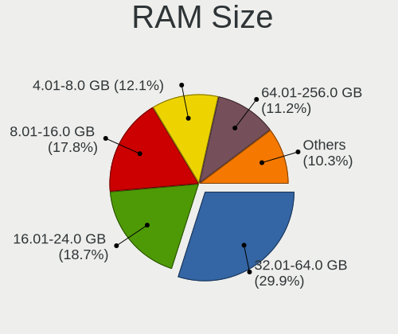
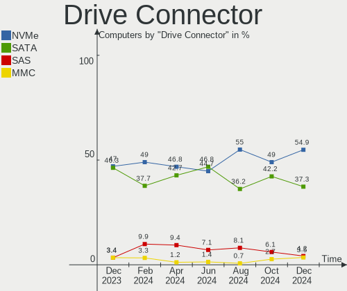
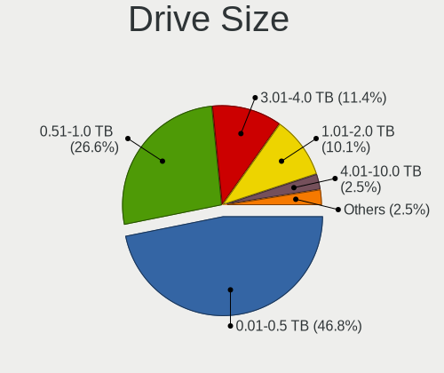
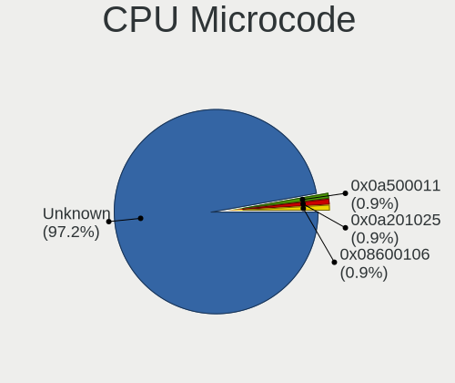
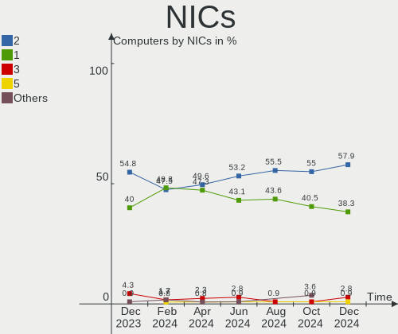
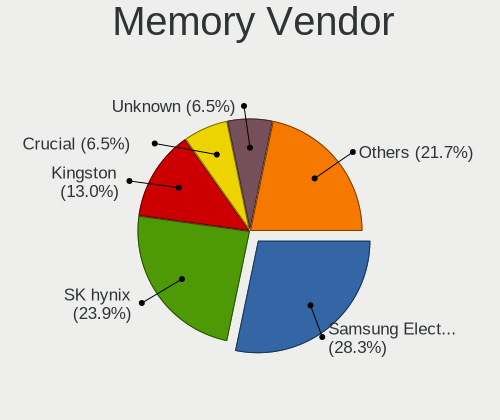
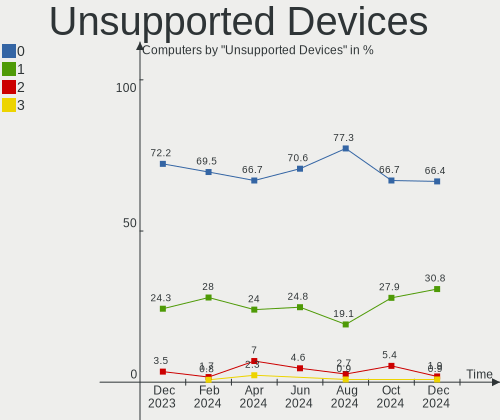

Manjaro - Hardware Trends
-------------------------

A project to identify most popular hardware characteristics and track their change
over time based on data collected by Linux users at https://Linux-Hardware.org.

Anyone can contribute to this report by the [hw-probe](https://github.com/linuxhw/hw-probe) tool:

    sudo -E hw-probe -all -upload

This is a report for all computer types. See also reports for [desktops](/Dist/Manjaro/Desktop/README.md) and [notebooks](/Dist/Manjaro/Notebook/README.md).

This report is for one last month. Overall report since the beginning of time: [TestCoverage](https://github.com/linuxhw/TestCoverage)

Period: Jun, 2022.

Contents
--------

* [ System ](#system)
  - [ OS                       ](#os)
  - [ OS Family                ](#os-family)
  - [ Kernel                   ](#kernel)
  - [ Kernel Family            ](#kernel-family)
  - [ Kernel Major Ver.        ](#kernel-major-ver)
  - [ Arch                     ](#arch)
  - [ DE                       ](#de)
  - [ Display Server           ](#display-server)
  - [ Display Manager          ](#display-manager)
  - [ OS Lang                  ](#os-lang)
  - [ Boot Mode                ](#boot-mode)
  - [ Filesystem               ](#filesystem)
  - [ Part. scheme             ](#part-scheme)
  - [ Dual Boot with Linux/BSD ](#dual-boot-with-linuxbsd)
  - [ Dual Boot (Win)          ](#dual-boot-win)

* [ Board ](#board)
  - [ Vendor                   ](#vendor)
  - [ Model                    ](#model)
  - [ Model Family             ](#model-family)
  - [ MFG Year                 ](#mfg-year)
  - [ Form Factor              ](#form-factor)
  - [ Secure Boot              ](#secure-boot)
  - [ Coreboot                 ](#coreboot)
  - [ RAM Size                 ](#ram-size)
  - [ RAM Used                 ](#ram-used)
  - [ Total Drives             ](#total-drives)
  - [ Has CD-ROM               ](#has-cd-rom)
  - [ Has Ethernet             ](#has-ethernet)
  - [ Has WiFi                 ](#has-wifi)
  - [ Has Bluetooth            ](#has-bluetooth)

* [ Location ](#location)
  - [ Country                  ](#country)
  - [ City                     ](#city)

* [ Drives ](#drives)
  - [ Drive Vendor             ](#drive-vendor)
  - [ Drive Model              ](#drive-model)
  - [ HDD Vendor               ](#hdd-vendor)
  - [ SSD Vendor               ](#ssd-vendor)
  - [ Drive Kind               ](#drive-kind)
  - [ Drive Connector          ](#drive-connector)
  - [ Drive Size               ](#drive-size)
  - [ Space Total              ](#space-total)
  - [ Space Used               ](#space-used)
  - [ Malfunc. Drives          ](#malfunc-drives)
  - [ Malfunc. Drive Vendor    ](#malfunc-drive-vendor)
  - [ Malfunc. HDD Vendor      ](#malfunc-hdd-vendor)
  - [ Malfunc. Drive Kind      ](#malfunc-drive-kind)
  - [ Failed Drives            ](#failed-drives)
  - [ Failed Drive Vendor      ](#failed-drive-vendor)
  - [ Drive Status             ](#drive-status)

* [ Storage controller ](#storage-controller)
  - [ Storage Vendor           ](#storage-vendor)
  - [ Storage Model            ](#storage-model)
  - [ Storage Kind             ](#storage-kind)

* [ Processor ](#processor)
  - [ CPU Vendor               ](#cpu-vendor)
  - [ CPU Model                ](#cpu-model)
  - [ CPU Model Family         ](#cpu-model-family)
  - [ CPU Cores                ](#cpu-cores)
  - [ CPU Sockets              ](#cpu-sockets)
  - [ CPU Threads              ](#cpu-threads)
  - [ CPU Op-Modes             ](#cpu-op-modes)
  - [ CPU Microcode            ](#cpu-microcode)
  - [ CPU Microarch            ](#cpu-microarch)

* [ Graphics ](#graphics)
  - [ GPU Vendor               ](#gpu-vendor)
  - [ GPU Model                ](#gpu-model)
  - [ GPU Combo                ](#gpu-combo)
  - [ GPU Driver               ](#gpu-driver)
  - [ GPU Memory               ](#gpu-memory)

* [ Monitor ](#monitor)
  - [ Monitor Vendor           ](#monitor-vendor)
  - [ Monitor Model            ](#monitor-model)
  - [ Monitor Resolution       ](#monitor-resolution)
  - [ Monitor Diagonal         ](#monitor-diagonal)
  - [ Monitor Width            ](#monitor-width)
  - [ Aspect Ratio             ](#aspect-ratio)
  - [ Monitor Area             ](#monitor-area)
  - [ Pixel Density            ](#pixel-density)
  - [ Multiple Monitors        ](#multiple-monitors)

* [ Network ](#network)
  - [ Net Controller Vendor    ](#net-controller-vendor)
  - [ Net Controller Model     ](#net-controller-model)
  - [ Wireless Vendor          ](#wireless-vendor)
  - [ Wireless Model           ](#wireless-model)
  - [ Ethernet Vendor          ](#ethernet-vendor)
  - [ Ethernet Model           ](#ethernet-model)
  - [ Net Controller Kind      ](#net-controller-kind)
  - [ Used Controller          ](#used-controller)
  - [ NICs                     ](#nics)
  - [ IPv6                     ](#ipv6)

* [ Bluetooth ](#bluetooth)
  - [ Bluetooth Vendor         ](#bluetooth-vendor)
  - [ Bluetooth Model          ](#bluetooth-model)

* [ Sound ](#sound)
  - [ Sound Vendor             ](#sound-vendor)
  - [ Sound Model              ](#sound-model)

* [ Memory ](#memory)
  - [ Memory Vendor            ](#memory-vendor)
  - [ Memory Model             ](#memory-model)
  - [ Memory Kind              ](#memory-kind)
  - [ Memory Form Factor       ](#memory-form-factor)
  - [ Memory Size              ](#memory-size)
  - [ Memory Speed             ](#memory-speed)

* [ Printers & scanners ](#printers--scanners)
  - [ Printer Vendor           ](#printer-vendor)
  - [ Printer Model            ](#printer-model)
  - [ Scanner Vendor           ](#scanner-vendor)
  - [ Scanner Model            ](#scanner-model)

* [ Camera ](#camera)
  - [ Camera Vendor            ](#camera-vendor)
  - [ Camera Model             ](#camera-model)

* [ Security ](#security)
  - [ Fingerprint Vendor       ](#fingerprint-vendor)
  - [ Fingerprint Model        ](#fingerprint-model)
  - [ Chipcard Vendor          ](#chipcard-vendor)
  - [ Chipcard Model           ](#chipcard-model)

* [ Unsupported ](#unsupported)
  - [ Unsupported Devices      ](#unsupported-devices)
  - [ Unsupported Device Types ](#unsupported-device-types)

System
------

OS
--

Installed operating systems

| Name           | Computers | Percent |
|----------------|-----------|---------|
| Manjaro        | 73        | 44.79%  |
| Manjaro 21.2.6 | 37        | 22.7%   |
| Manjaro 21.3.0 | 31        | 19.02%  |
| Manjaro 21.3.1 | 22        | 13.5%   |

OS Family
---------

OS without a version

| Name    | Computers | Percent |
|---------|-----------|---------|
| Manjaro | 163       | 100%    |

Kernel
------

Version of the Linux kernel

| Version                | Computers | Percent |
|------------------------|-----------|---------|
| 5.15.41-1-MANJARO      | 32        | 19.63%  |
| 5.15.48-1-MANJARO      | 22        | 13.5%   |
| 5.15.49-1-MANJARO      | 15        | 9.2%    |
| 5.18.5-1-MANJARO       | 13        | 7.98%   |
| 5.18.3-1-MANJARO       | 12        | 7.36%   |
| 5.17.9-1-MANJARO       | 12        | 7.36%   |
| 5.15.46-1-MANJARO      | 11        | 6.75%   |
| 5.18.6-1-MANJARO       | 6         | 3.68%   |
| 5.18.0-1-MANJARO       | 6         | 3.68%   |
| 5.17.15-1-MANJARO      | 4         | 2.45%   |
| 5.17.1-3-rt17-MANJARO  | 4         | 2.45%   |
| 5.15.32-1-MANJARO      | 4         | 2.45%   |
| 5.17.7-xanmod1-MANJARO | 3         | 1.84%   |
| 5.19.0-1-MANJARO       | 2         | 1.23%   |
| 5.16.20-2-MANJARO      | 2         | 1.23%   |
| 5.10.123-1-MANJARO     | 2         | 1.23%   |
| 5.4.195-1-MANJARO      | 1         | 0.61%   |
| 5.18.7-lqx1-2-lqx      | 1         | 0.61%   |
| 5.18.4-xanmod1-1-zen2  | 1         | 0.61%   |
| 5.18.3-xanmod1-1-x64v2 | 1         | 0.61%   |
| 5.18.1-1-MANJARO       | 1         | 0.61%   |
| 5.18.0-zen1-1-zen      | 1         | 0.61%   |
| 5.18.0-1-rt11-MANJARO  | 1         | 0.61%   |
| 5.15.50-1-MANJARO      | 1         | 0.61%   |
| 5.15.44-1-MANJARO      | 1         | 0.61%   |
| 5.15.38-1-MANJARO      | 1         | 0.61%   |
| 5.10.124-1-MANJARO     | 1         | 0.61%   |
| 5.10.117-1-MANJARO     | 1         | 0.61%   |
| 4.19.248-1-MANJARO     | 1         | 0.61%   |

Kernel Family
-------------

Linux kernel without a distro release

| Version  | Computers | Percent |
|----------|-----------|---------|
| 5.15.41  | 32        | 19.63%  |
| 5.15.48  | 22        | 13.5%   |
| 5.15.49  | 15        | 9.2%    |
| 5.18.5   | 13        | 7.98%   |
| 5.18.3   | 13        | 7.98%   |
| 5.17.9   | 12        | 7.36%   |
| 5.15.46  | 11        | 6.75%   |
| 5.18.0   | 8         | 4.91%   |
| 5.18.6   | 6         | 3.68%   |
| 5.17.15  | 4         | 2.45%   |
| 5.17.1   | 4         | 2.45%   |
| 5.15.32  | 4         | 2.45%   |
| 5.17.7   | 3         | 1.84%   |
| 5.19.0   | 2         | 1.23%   |
| 5.16.20  | 2         | 1.23%   |
| 5.10.123 | 2         | 1.23%   |
| 5.4.195  | 1         | 0.61%   |
| 5.18.7   | 1         | 0.61%   |
| 5.18.4   | 1         | 0.61%   |
| 5.18.1   | 1         | 0.61%   |
| 5.15.50  | 1         | 0.61%   |
| 5.15.44  | 1         | 0.61%   |
| 5.15.38  | 1         | 0.61%   |
| 5.10.124 | 1         | 0.61%   |
| 5.10.117 | 1         | 0.61%   |
| 4.19.248 | 1         | 0.61%   |

Kernel Major Ver.
-----------------

Linux kernel major version

| Version | Computers | Percent |
|---------|-----------|---------|
| 5.15    | 87        | 53.37%  |
| 5.18    | 43        | 26.38%  |
| 5.17    | 23        | 14.11%  |
| 5.10    | 4         | 2.45%   |
| 5.19    | 2         | 1.23%   |
| 5.16    | 2         | 1.23%   |
| 5.4     | 1         | 0.61%   |
| 4.19    | 1         | 0.61%   |

Arch
----

OS architecture (x86_64, i586, etc.)

| Name   | Computers | Percent |
|--------|-----------|---------|
| x86_64 | 163       | 100%    |

DE
--

Desktop Environment

| Name          | Computers | Percent |
|---------------|-----------|---------|
| KDE5          | 99        | 60.74%  |
| XFCE          | 27        | 16.56%  |
| GNOME         | 22        | 13.5%   |
| Unknown       | 4         | 2.45%   |
| MATE          | 3         | 1.84%   |
| i3            | 2         | 1.23%   |
| Budgie        | 2         | 1.23%   |
| GNOME Classic | 1         | 0.61%   |
| Deepin        | 1         | 0.61%   |
| Cinnamon      | 1         | 0.61%   |
| awesome       | 1         | 0.61%   |

Display Server
--------------

X11 or Wayland

| Name    | Computers | Percent |
|---------|-----------|---------|
| X11     | 137       | 84.05%  |
| Wayland | 19        | 11.66%  |
| Unknown | 4         | 2.45%   |
| Tty     | 3         | 1.84%   |

Display Manager
---------------

SDDM, LightDM, etc.

| Name    | Computers | Percent |
|---------|-----------|---------|
| Unknown | 73        | 44.79%  |
| SDDM    | 40        | 24.54%  |
| LightDM | 30        | 18.4%   |
| GDM     | 20        | 12.27%  |

OS Lang
-------

Language

| Lang    | Computers | Percent |
|---------|-----------|---------|
| en_US   | 65        | 39.88%  |
| de_DE   | 19        | 11.66%  |
| fr_FR   | 9         | 5.52%   |
| en_CA   | 9         | 5.52%   |
| en_GB   | 8         | 4.91%   |
| ru_RU   | 7         | 4.29%   |
| pt_BR   | 4         | 2.45%   |
| pl_PL   | 4         | 2.45%   |
| es_MX   | 3         | 1.84%   |
| es_AR   | 3         | 1.84%   |
| en_PH   | 3         | 1.84%   |
| en_AU   | 3         | 1.84%   |
| de_CH   | 3         | 1.84%   |
| pt_PT   | 2         | 1.23%   |
| ja_JP   | 2         | 1.23%   |
| en_IN   | 2         | 1.23%   |
| en_DK   | 2         | 1.23%   |
| de_AT   | 2         | 1.23%   |
| tr_TR   | 1         | 0.61%   |
| hu_HU   | 1         | 0.61%   |
| es_VE   | 1         | 0.61%   |
| es_GT   | 1         | 0.61%   |
| es_ES   | 1         | 0.61%   |
| en_ZA   | 1         | 0.61%   |
| en_SG   | 1         | 0.61%   |
| en_NZ   | 1         | 0.61%   |
| en_MY   | 1         | 0.61%   |
| en_IE   | 1         | 0.61%   |
| en_AG   | 1         | 0.61%   |
| C       | 1         | 0.61%   |
| Unknown | 1         | 0.61%   |

Boot Mode
---------

EFI or BIOS

| Mode | Computers | Percent |
|------|-----------|---------|
| BIOS | 103       | 63.19%  |
| EFI  | 60        | 36.81%  |

Filesystem
----------

Type of filesystem

| Type    | Computers | Percent |
|---------|-----------|---------|
| Ext4    | 139       | 85.28%  |
| Btrfs   | 18        | 11.04%  |
| Xfs     | 4         | 2.45%   |
| Overlay | 1         | 0.61%   |
| F2fs    | 1         | 0.61%   |

Part. scheme
------------

Scheme of partitioning

| Type    | Computers | Percent |
|---------|-----------|---------|
| Unknown | 91        | 55.83%  |
| GPT     | 65        | 39.88%  |
| MBR     | 7         | 4.29%   |

Dual Boot with Linux/BSD
------------------------

Hosting more than one Linux/BSD

| Dual boot | Computers | Percent |
|-----------|-----------|---------|
| No        | 146       | 89.57%  |
| Yes       | 17        | 10.43%  |

Dual Boot (Win)
---------------

Hosting Linux and Windows

| Dual boot | Computers | Percent |
|-----------|-----------|---------|
| No        | 119       | 73.01%  |
| Yes       | 44        | 26.99%  |

Board
-----

Vendor
------

Motherboard manufacturer

| Name                 | Computers | Percent |
|----------------------|-----------|---------|
| Lenovo               | 30        | 18.4%   |
| ASUSTek Computer     | 29        | 17.79%  |
| Hewlett-Packard      | 26        | 15.95%  |
| Gigabyte Technology  | 20        | 12.27%  |
| Dell                 | 14        | 8.59%   |
| MSI                  | 13        | 7.98%   |
| ASRock               | 6         | 3.68%   |
| Samsung Electronics  | 3         | 1.84%   |
| Acer                 | 2         | 1.23%   |
| Unknown              | 2         | 1.23%   |
| TrekStor             | 1         | 0.61%   |
| System76             | 1         | 0.61%   |
| Sony                 | 1         | 0.61%   |
| SLIMBOOK             | 1         | 0.61%   |
| Razer                | 1         | 0.61%   |
| Purism               | 1         | 0.61%   |
| Positivo             | 1         | 0.61%   |
| Minix                | 1         | 0.61%   |
| LG Electronics       | 1         | 0.61%   |
| Intel Client Systems | 1         | 0.61%   |
| Intel                | 1         | 0.61%   |
| Huanan               | 1         | 0.61%   |
| HONOR                | 1         | 0.61%   |
| Fujitsu              | 1         | 0.61%   |
| ECS                  | 1         | 0.61%   |
| BESSTAR Tech         | 1         | 0.61%   |
| AZW                  | 1         | 0.61%   |
| Apple                | 1         | 0.61%   |

Model
-----

Motherboard model

| Name                                                                                     | Computers | Percent |
|------------------------------------------------------------------------------------------|-----------|---------|
| HP ProBook 455 G7                                                                        | 2         | 1.23%   |
| HP EliteBook 8470p                                                                       | 2         | 1.23%   |
| ASUS TUF Gaming FX504GD_FX80GD                                                           | 2         | 1.23%   |
| Unknown                                                                                  | 2         | 1.23%   |
| TrekStor YOURBOOK C11B                                                                   | 1         | 0.61%   |
| System76 Lemur Pro                                                                       | 1         | 0.61%   |
| Sony VPCF236FM                                                                           | 1         | 0.61%   |
| SLIMBOOK PROX14-AMD                                                                      | 1         | 0.61%   |
| Samsung RC420/RC520/RC720                                                                | 1         | 0.61%   |
| Samsung 355V4C/355V4X/355V5C/355V5X/356V4C/356V4X/356V5C/356V5X/3445VC/3445VX/3545VC/354 | 1         | 0.61%   |
| Samsung 300E5M/300E5L                                                                    | 1         | 0.61%   |
| Razer Blade 15 Advanced Model (Early 2021) - RZ09-036                                    | 1         | 0.61%   |
| Purism Librem 14                                                                         | 1         | 0.61%   |
| Positivo C464C                                                                           | 1         | 0.61%   |
| MSI MS-7C84                                                                              | 1         | 0.61%   |
| MSI MS-7C37                                                                              | 1         | 0.61%   |
| MSI MS-7C36                                                                              | 1         | 0.61%   |
| MSI MS-7B84                                                                              | 1         | 0.61%   |
| MSI MS-7B53                                                                              | 1         | 0.61%   |
| MSI MS-7B00                                                                              | 1         | 0.61%   |
| MSI MS-7A38                                                                              | 1         | 0.61%   |
| MSI MS-7A34                                                                              | 1         | 0.61%   |
| MSI MS-7851                                                                              | 1         | 0.61%   |
| MSI MS-7817                                                                              | 1         | 0.61%   |
| MSI GP60 2OD                                                                             | 1         | 0.61%   |
| MSI GE75 Raider 10SF                                                                     | 1         | 0.61%   |
| MSI Bravo 15 A4DDR                                                                       | 1         | 0.61%   |
| Minix Z83-4 Pro                                                                          | 1         | 0.61%   |
| LG 14Z90N-VA76K                                                                          | 1         | 0.61%   |
| Lenovo Yoga 730-15IWL 81JS                                                               | 1         | 0.61%   |
| Lenovo V520S-08IKL 10NM0064UK                                                            | 1         | 0.61%   |
| Lenovo ThinkPad X61 Tablet 7762B6G                                                       | 1         | 0.61%   |
| Lenovo ThinkPad X250 20CLS06L00                                                          | 1         | 0.61%   |
| Lenovo ThinkPad X230 23252EG                                                             | 1         | 0.61%   |
| Lenovo ThinkPad X1 Carbon 7th 20QES2PW00                                                 | 1         | 0.61%   |
| Lenovo ThinkPad T550 20CK003HMD                                                          | 1         | 0.61%   |
| Lenovo ThinkPad T470s 20HGS2KW16                                                         | 1         | 0.61%   |
| Lenovo ThinkPad T450 20BV0005US                                                          | 1         | 0.61%   |
| Lenovo ThinkPad T420 4177Q5U                                                             | 1         | 0.61%   |
| Lenovo ThinkPad T14s Gen 1 20T0004KGE                                                    | 1         | 0.61%   |
| Lenovo ThinkPad T14 Gen 1 20UDCTO1WW                                                     | 1         | 0.61%   |
| Lenovo ThinkPad T14 Gen 1 20UD0005US                                                     | 1         | 0.61%   |
| Lenovo ThinkPad S2 20GJA00S00                                                            | 1         | 0.61%   |
| Lenovo ThinkPad P15v Gen 1 20TQCTO1WW                                                    | 1         | 0.61%   |
| Lenovo ThinkPad E15 Gen 4 21EES00100                                                     | 1         | 0.61%   |
| Lenovo ThinkPad E14 Gen 3 20YDS06J00                                                     | 1         | 0.61%   |
| Lenovo ThinkPad E14 Gen 3 20Y7CTO1WW                                                     | 1         | 0.61%   |
| Lenovo ThinkBook 15-IIL 20SM                                                             | 1         | 0.61%   |
| Lenovo Legion S7 15IMH5 82BC                                                             | 1         | 0.61%   |
| Lenovo Legion 5 Pro 16ACH6H 82JQ                                                         | 1         | 0.61%   |
| Lenovo Legion 5 82B5                                                                     | 1         | 0.61%   |
| Lenovo IdeaPadFlex 5 14ARE05 81X2                                                        | 1         | 0.61%   |
| Lenovo IdeaPadFlex 5 14ALC05 82HU                                                        | 1         | 0.61%   |
| Lenovo IdeaPad Slim 7 Carbon 14ACN6 82L1                                                 | 1         | 0.61%   |
| Lenovo IdeaPad Gaming 3 15IMH05 81Y4                                                     | 1         | 0.61%   |
| Lenovo IdeaPad D330-10IGM 81H3                                                           | 1         | 0.61%   |
| Lenovo IdeaPad 5 15ARE05 81YQ                                                            | 1         | 0.61%   |
| Lenovo IdeaPad 320-14AST 80XU                                                            | 1         | 0.61%   |
| Lenovo G580 20150                                                                        | 1         | 0.61%   |
| Intel NUC11PHi7                                                                          | 1         | 0.61%   |

Model Family
------------

Motherboard model prefix

| Name                          | Computers | Percent |
|-------------------------------|-----------|---------|
| Lenovo ThinkPad               | 16        | 9.82%   |
| ASUS ROG                      | 8         | 4.91%   |
| HP Laptop                     | 7         | 4.29%   |
| Dell Latitude                 | 6         | 3.68%   |
| ASUS TUF                      | 6         | 3.68%   |
| Lenovo IdeaPad                | 5         | 3.07%   |
| HP ProBook                    | 5         | 3.07%   |
| Dell Inspiron                 | 5         | 3.07%   |
| HP EliteBook                  | 4         | 2.45%   |
| ASUS VivoBook                 | 4         | 2.45%   |
| Lenovo Legion                 | 3         | 1.84%   |
| ASUS PRIME                    | 3         | 1.84%   |
| Lenovo IdeaPadFlex            | 2         | 1.23%   |
| HP Pavilion                   | 2         | 1.23%   |
| HP EliteDesk                  | 2         | 1.23%   |
| Gigabyte B550M                | 2         | 1.23%   |
| Gigabyte B550                 | 2         | 1.23%   |
| Gigabyte B450M                | 2         | 1.23%   |
| Gigabyte B450                 | 2         | 1.23%   |
| Unknown                       | 2         | 1.23%   |
| TrekStor YOURBOOK             | 1         | 0.61%   |
| System76 Lemur                | 1         | 0.61%   |
| Sony VPCF236FM                | 1         | 0.61%   |
| SLIMBOOK PROX14-AMD           | 1         | 0.61%   |
| Samsung RC420                 | 1         | 0.61%   |
| Samsung 355V4C                | 1         | 0.61%   |
| Samsung 300E5M                | 1         | 0.61%   |
| Razer Blade                   | 1         | 0.61%   |
| Purism Librem                 | 1         | 0.61%   |
| Positivo C464C                | 1         | 0.61%   |
| MSI MS-7C84                   | 1         | 0.61%   |
| MSI MS-7C37                   | 1         | 0.61%   |
| MSI MS-7C36                   | 1         | 0.61%   |
| MSI MS-7B84                   | 1         | 0.61%   |
| MSI MS-7B53                   | 1         | 0.61%   |
| MSI MS-7B00                   | 1         | 0.61%   |
| MSI MS-7A38                   | 1         | 0.61%   |
| MSI MS-7A34                   | 1         | 0.61%   |
| MSI MS-7851                   | 1         | 0.61%   |
| MSI MS-7817                   | 1         | 0.61%   |
| MSI GP60                      | 1         | 0.61%   |
| MSI GE75                      | 1         | 0.61%   |
| MSI Bravo                     | 1         | 0.61%   |
| Minix Z83-4                   | 1         | 0.61%   |
| LG 14Z90N-VA76K               | 1         | 0.61%   |
| Lenovo Yoga                   | 1         | 0.61%   |
| Lenovo V520S-08IKL            | 1         | 0.61%   |
| Lenovo ThinkBook              | 1         | 0.61%   |
| Lenovo G580                   | 1         | 0.61%   |
| Intel NUC11PHi7               | 1         | 0.61%   |
| Intel Client Systems LAPKC71F | 1         | 0.61%   |
| Huanan X99-TF                 | 1         | 0.61%   |
| HONOR BMH-WCX9                | 1         | 0.61%   |
| HP Z600                       | 1         | 0.61%   |
| HP Z440                       | 1         | 0.61%   |
| HP xw6600                     | 1         | 0.61%   |
| HP OMEN                       | 1         | 0.61%   |
| HP ENVY                       | 1         | 0.61%   |
| HP 255                        | 1         | 0.61%   |
| Gigabyte Z97X-SLI             | 1         | 0.61%   |

MFG Year
--------

Motherboard manufacture year

| Year    | Computers | Percent |
|---------|-----------|---------|
| 2020    | 38        | 23.31%  |
| 2021    | 28        | 17.18%  |
| 2018    | 22        | 13.5%   |
| 2019    | 12        | 7.36%   |
| 2017    | 11        | 6.75%   |
| 2012    | 9         | 5.52%   |
| 2011    | 8         | 4.91%   |
| 2015    | 7         | 4.29%   |
| 2014    | 7         | 4.29%   |
| 2013    | 7         | 4.29%   |
| 2022    | 4         | 2.45%   |
| 2016    | 3         | 1.84%   |
| 2010    | 3         | 1.84%   |
| 2008    | 2         | 1.23%   |
| 2007    | 1         | 0.61%   |
| Unknown | 1         | 0.61%   |

Form Factor
-----------

Physical design of the computer

| Name        | Computers | Percent |
|-------------|-----------|---------|
| Notebook    | 89        | 54.6%   |
| Desktop     | 64        | 39.26%  |
| Convertible | 6         | 3.68%   |
| Mini pc     | 2         | 1.23%   |
| Tablet      | 1         | 0.61%   |
| All in one  | 1         | 0.61%   |

Secure Boot
-----------

Enabled or disabled

| State    | Computers | Percent |
|----------|-----------|---------|
| Disabled | 163       | 100%    |

Coreboot
--------

Have coreboot on board

| Used | Computers | Percent |
|------|-----------|---------|
| No   | 160       | 98.16%  |
| Yes  | 3         | 1.84%   |

RAM Size
--------

Total RAM memory

| Size in GB  | Computers | Percent |
|-------------|-----------|---------|
| 16.01-24.0  | 43        | 26.38%  |
| 8.01-16.0   | 42        | 25.77%  |
| 32.01-64.0  | 27        | 16.56%  |
| 4.01-8.0    | 24        | 14.72%  |
| 3.01-4.0    | 15        | 9.2%    |
| 64.01-256.0 | 8         | 4.91%   |
| 24.01-32.0  | 3         | 1.84%   |
| 1.01-2.0    | 1         | 0.61%   |

RAM Used
--------

Used RAM memory

| Used GB    | Computers | Percent |
|------------|-----------|---------|
| 4.01-8.0   | 41        | 25.15%  |
| 2.01-3.0   | 40        | 24.54%  |
| 3.01-4.0   | 38        | 23.31%  |
| 1.01-2.0   | 29        | 17.79%  |
| 8.01-16.0  | 12        | 7.36%   |
| 32.01-64.0 | 1         | 0.61%   |
| 24.01-32.0 | 1         | 0.61%   |
| 0.51-1.0   | 1         | 0.61%   |

Total Drives
------------

Number of drives on board

| Drives | Computers | Percent |
|--------|-----------|---------|
| 1      | 82        | 50.31%  |
| 2      | 52        | 31.9%   |
| 3      | 13        | 7.98%   |
| 4      | 9         | 5.52%   |
| 5      | 5         | 3.07%   |
| 7      | 2         | 1.23%   |

Has CD-ROM
----------

Has CD-ROM on board

| Presented | Computers | Percent |
|-----------|-----------|---------|
| No        | 131       | 80.37%  |
| Yes       | 32        | 19.63%  |

Has Ethernet
------------

Has Ethernet on board

| Presented | Computers | Percent |
|-----------|-----------|---------|
| Yes       | 141       | 86.5%   |
| No        | 22        | 13.5%   |

Has WiFi
--------

Has WiFi module

| Presented | Computers | Percent |
|-----------|-----------|---------|
| Yes       | 136       | 83.44%  |
| No        | 27        | 16.56%  |

Has Bluetooth
-------------

Has Bluetooth module

| Presented | Computers | Percent |
|-----------|-----------|---------|
| Yes       | 122       | 74.85%  |
| No        | 41        | 25.15%  |

Location
--------

Country
-------

Geographic location (country)

| Country         | Computers | Percent |
|-----------------|-----------|---------|
| USA             | 21        | 12.88%  |
| Germany         | 19        | 11.66%  |
| Russia          | 12        | 7.36%   |
| France          | 12        | 7.36%   |
| Poland          | 7         | 4.29%   |
| UK              | 6         | 3.68%   |
| Canada          | 6         | 3.68%   |
| Brazil          | 5         | 3.07%   |
| Mexico          | 4         | 2.45%   |
| Hungary         | 4         | 2.45%   |
| Switzerland     | 3         | 1.84%   |
| Philippines     | 3         | 1.84%   |
| Malaysia        | 3         | 1.84%   |
| Austria         | 3         | 1.84%   |
| Australia       | 3         | 1.84%   |
| Argentina       | 3         | 1.84%   |
| Ukraine         | 2         | 1.23%   |
| Spain           | 2         | 1.23%   |
| South Korea     | 2         | 1.23%   |
| Serbia          | 2         | 1.23%   |
| Portugal        | 2         | 1.23%   |
| Pakistan        | 2         | 1.23%   |
| Netherlands     | 2         | 1.23%   |
| Japan           | 2         | 1.23%   |
| Italy           | 2         | 1.23%   |
| Iran            | 2         | 1.23%   |
| India           | 2         | 1.23%   |
| Denmark         | 2         | 1.23%   |
| Czechia         | 2         | 1.23%   |
| China           | 2         | 1.23%   |
| Venezuela       | 1         | 0.61%   |
| Uzbekistan      | 1         | 0.61%   |
| Turkey          | 1         | 0.61%   |
| Syria           | 1         | 0.61%   |
| Sweden          | 1         | 0.61%   |
| South Africa    | 1         | 0.61%   |
| Slovenia        | 1         | 0.61%   |
| Slovakia        | 1         | 0.61%   |
| Singapore       | 1         | 0.61%   |
| North Macedonia | 1         | 0.61%   |
| Nigeria         | 1         | 0.61%   |
| New Zealand     | 1         | 0.61%   |
| Nepal           | 1         | 0.61%   |
| Moldova         | 1         | 0.61%   |
| Kazakhstan      | 1         | 0.61%   |
| Ireland         | 1         | 0.61%   |
| Indonesia       | 1         | 0.61%   |
| Guatemala       | 1         | 0.61%   |
| Greece          | 1         | 0.61%   |
| Bulgaria        | 1         | 0.61%   |
| Bangladesh      | 1         | 0.61%   |

City
----

Geographic location (city)

| City               | Computers | Percent |
|--------------------|-----------|---------|
| Vienna             | 2         | 1.23%   |
| Toronto            | 2         | 1.23%   |
| St Petersburg      | 2         | 1.23%   |
| Setagaya-ku        | 2         | 1.23%   |
| Seocho-gu          | 2         | 1.23%   |
| San Francisco      | 2         | 1.23%   |
| Moscow             | 2         | 1.23%   |
| Lviv               | 2         | 1.23%   |
| Kuala Lumpur       | 2         | 1.23%   |
| Karlsruhe          | 2         | 1.23%   |
| Hamburg            | 2         | 1.23%   |
| Greoux-les-Bains   | 2         | 1.23%   |
| Combs-la-Ville     | 2         | 1.23%   |
| Budapest           | 2         | 1.23%   |
| Belgrade           | 2         | 1.23%   |
| Yekaterinburg      | 1         | 0.61%   |
| Xicheng District   | 1         | 0.61%   |
| Worcester          | 1         | 0.61%   |
| Woburn             | 1         | 0.61%   |
| Wittmund           | 1         | 0.61%   |
| Winnipeg           | 1         | 0.61%   |
| Wellington         | 1         | 0.61%   |
| Weimar             | 1         | 0.61%   |
| Warsaw             | 1         | 0.61%   |
| Walsall            | 1         | 0.61%   |
| Voderady           | 1         | 0.61%   |
| Vitoria do Mearim  | 1         | 0.61%   |
| Villa Rica         | 1         | 0.61%   |
| Villa Ballester    | 1         | 0.61%   |
| Unieszewo          | 1         | 0.61%   |
| Ufa                | 1         | 0.61%   |
| Tomsk              | 1         | 0.61%   |
| The Hague          | 1         | 0.61%   |
| The Bronx          | 1         | 0.61%   |
| Tehran             | 1         | 0.61%   |
| Tashkent           | 1         | 0.61%   |
| Sungai Buloh       | 1         | 0.61%   |
| Sofia              | 1         | 0.61%   |
| Smiths Falls       | 1         | 0.61%   |
| Singapore          | 1         | 0.61%   |
| Sesto San Giovanni | 1         | 0.61%   |
| Seattle            | 1         | 0.61%   |
| Sarrion            | 1         | 0.61%   |
| Sao Paulo          | 1         | 0.61%   |
| Salisbury          | 1         | 0.61%   |
| Salford            | 1         | 0.61%   |
| Rouen              | 1         | 0.61%   |
| Rio de Janeiro     | 1         | 0.61%   |
| Quezon City        | 1         | 0.61%   |
| Prague             | 1         | 0.61%   |
| Posadas            | 1         | 0.61%   |
| Portland           | 1         | 0.61%   |
| Pilsen             | 1         | 0.61%   |
| Perth              | 1         | 0.61%   |
| Passos             | 1         | 0.61%   |
| Paranaque City     | 1         | 0.61%   |
| Overland Park      | 1         | 0.61%   |
| Oryol              | 1         | 0.61%   |
| Odemira            | 1         | 0.61%   |
| Novokuznetsk       | 1         | 0.61%   |

Drives
------

Drive Vendor
------------

Hard drive vendors

| Vendor                         | Computers | Drives | Percent |
|--------------------------------|-----------|--------|---------|
| Samsung Electronics            | 40        | 49     | 14.81%  |
| WDC                            | 37        | 46     | 13.7%   |
| Seagate                        | 35        | 40     | 12.96%  |
| SanDisk                        | 19        | 21     | 7.04%   |
| Toshiba                        | 15        | 18     | 5.56%   |
| Kingston                       | 14        | 15     | 5.19%   |
| SK hynix                       | 12        | 12     | 4.44%   |
| Phison                         | 10        | 11     | 3.7%    |
| Crucial                        | 8         | 9      | 2.96%   |
| Unknown                        | 7         | 8      | 2.59%   |
| Micron Technology              | 6         | 6      | 2.22%   |
| Intel                          | 6         | 6      | 2.22%   |
| Hitachi                        | 6         | 6      | 2.22%   |
| A-DATA Technology              | 5         | 6      | 1.85%   |
| Solid State Storage Technology | 4         | 4      | 1.48%   |
| Transcend                      | 3         | 3      | 1.11%   |
| Team                           | 3         | 3      | 1.11%   |
| KIOXIA                         | 3         | 3      | 1.11%   |
| HGST                           | 3         | 3      | 1.11%   |
| Goodram                        | 3         | 3      | 1.11%   |
| XPG                            | 2         | 2      | 0.74%   |
| SPCC                           | 2         | 2      | 0.74%   |
| Realtek Semiconductor          | 2         | 2      | 0.74%   |
| PNY                            | 2         | 2      | 0.74%   |
| Micron/Crucial Technology      | 2         | 2      | 0.74%   |
| Lite-On                        | 2         | 2      | 0.74%   |
| HS-SSD-E100                    | 2         | 2      | 0.74%   |
| XUM                            | 1         | 1      | 0.37%   |
| USB3.0                         | 1         | 1      | 0.37%   |
| UMIS                           | 1         | 1      | 0.37%   |
| Silicon Motion                 | 1         | 1      | 0.37%   |
| OSCOO                          | 1         | 1      | 0.37%   |
| NGFF                           | 1         | 1      | 0.37%   |
| Mushkin                        | 1         | 1      | 0.37%   |
| Lexar                          | 1         | 1      | 0.37%   |
| Leven                          | 1         | 1      | 0.37%   |
| Intenso                        | 1         | 1      | 0.37%   |
| INNOVATION IT                  | 1         | 1      | 0.37%   |
| Inateck                        | 1         | 1      | 0.37%   |
| Hewlett-Packard                | 1         | 1      | 0.37%   |
| Gigabyte Technology            | 1         | 1      | 0.37%   |
| Apple                          | 1         | 1      | 0.37%   |
| Apacer                         | 1         | 1      | 0.37%   |
| Unknown                        | 1         | 1      | 0.37%   |

Drive Model
-----------

Hard drive models

| Model                                  | Computers | Percent |
|----------------------------------------|-----------|---------|
| SK hynix NVMe SSD Drive 512GB          | 7         | 2.35%   |
| SanDisk NVMe SSD Drive 1TB             | 5         | 1.68%   |
| Toshiba MQ04ABF100 1TB                 | 4         | 1.34%   |
| Samsung SSD 860 EVO 1TB                | 4         | 1.34%   |
| Kingston SA400S37120G 120GB SSD        | 4         | 1.34%   |
| WDC WD10EZEX-08WN4A0 1TB               | 3         | 1.01%   |
| SanDisk NVMe SSD Drive 256GB           | 3         | 1.01%   |
| Samsung SSD 860 EVO 500GB              | 3         | 1.01%   |
| Samsung SM963 2.5" NVMe PCIe SSD 500GB | 3         | 1.01%   |
| Samsung NVMe SSD Drive 2TB             | 3         | 1.01%   |
| Samsung NVMe SSD Drive 1TB             | 3         | 1.01%   |
| WDC WDS240G2G0B-00EPW0 240GB SSD       | 2         | 0.67%   |
| WDC WD20EZRZ-00Z5HB0 2TB               | 2         | 0.67%   |
| WDC WD20EZRX-00D8PB0 2TB               | 2         | 0.67%   |
| WDC WD1003FZEX-00MK2A0 1TB             | 2         | 0.67%   |
| Unknown SD16G  16GB                    | 2         | 0.67%   |
| Unknown MMC Card  64GB                 | 2         | 0.67%   |
| Toshiba HDWD110 1TB                    | 2         | 0.67%   |
| Seagate ST500LT012-9WS142 500GB        | 2         | 0.67%   |
| Seagate ST500LT012-1DG142 500GB        | 2         | 0.67%   |
| Seagate ST500LM012 HN-M500MBB 500GB    | 2         | 0.67%   |
| Seagate ST4000DM004-2CV104 4TB         | 2         | 0.67%   |
| Seagate ST1000LM035-1RK172 1TB         | 2         | 0.67%   |
| Seagate ST1000DM010-2EP102 1TB         | 2         | 0.67%   |
| Seagate ST1000DM003-1ER162 1TB         | 2         | 0.67%   |
| Seagate ST1000DM003-1CH162 1TB         | 2         | 0.67%   |
| SanDisk SSD PLUS 1000GB                | 2         | 0.67%   |
| Samsung SSD 850 EVO 500GB              | 2         | 0.67%   |
| Samsung SSD 850 EVO 250GB              | 2         | 0.67%   |
| Samsung NVMe SSD Drive 512GB           | 2         | 0.67%   |
| Samsung NVMe SSD Drive 256GB           | 2         | 0.67%   |
| Phison Sabrent Rocket Q 1TB            | 2         | 0.67%   |
| Phison NVMe SSD Drive 1TB              | 2         | 0.67%   |
| Phison NVMe SSD Drive 1024GB           | 2         | 0.67%   |
| Micron/Crucial NVMe SSD Drive 500GB    | 2         | 0.67%   |
| KIOXIA NVMe SSD Drive 256GB            | 2         | 0.67%   |
| Kingston SV300S37A 60G SSD             | 2         | 0.67%   |
| HGST HTS721010A9E630 1TB               | 2         | 0.67%   |
| XUM HX256GSSDSATA3 256GB               | 1         | 0.34%   |
| XPG NVMe SSD Drive 512GB               | 1         | 0.34%   |
| XPG NVMe SSD Drive 2TB                 | 1         | 0.34%   |
| WDC WDS500G2B0C-00PXH0 500GB           | 1         | 0.34%   |
| WDC WDS100T2B0C-00PXH0 1TB             | 1         | 0.34%   |
| WDC WDS100T2B0B-00YS70 1TB SSD         | 1         | 0.34%   |
| WDC WDS100T2B0A-00SM50 1TB SSD         | 1         | 0.34%   |
| WDC WDBNCE5000PNC 500GB SSD            | 1         | 0.34%   |
| WDC WDBA3V0010BNC-WRSN 1TB             | 1         | 0.34%   |
| WDC WD7500BPVX-22JC3T0 752GB           | 1         | 0.34%   |
| WDC WD7500AARS-003BB1 752GB            | 1         | 0.34%   |
| WDC WD5000LPCX-24VHAT0 500GB           | 1         | 0.34%   |
| WDC WD5000LPCX-24C6HT0 500GB           | 1         | 0.34%   |
| WDC WD5000BPKT-22PK4T0 500GB           | 1         | 0.34%   |
| WDC WD5000AZLX-75K2TA0 500GB           | 1         | 0.34%   |
| WDC WD5000AAKS-00UU3A0 500GB           | 1         | 0.34%   |
| WDC WD40EZRZ-00GXCB0 4TB               | 1         | 0.34%   |
| WDC WD3200BPVT-24ZEST0 320GB           | 1         | 0.34%   |
| WDC WD3200BEKT-08PVMT1 320GB           | 1         | 0.34%   |
| WDC WD30EZRX-00SPEB0 3TB               | 1         | 0.34%   |
| WDC WD30EZRX-00D8PB0 3TB               | 1         | 0.34%   |
| WDC WD20SPZX-00UA7T0 2TB               | 1         | 0.34%   |

HDD Vendor
----------

Hard disk drive vendors

| Vendor              | Computers | Drives | Percent |
|---------------------|-----------|--------|---------|
| Seagate             | 32        | 37     | 36.78%  |
| WDC                 | 28        | 33     | 32.18%  |
| Toshiba             | 14        | 16     | 16.09%  |
| Hitachi             | 6         | 6      | 6.9%    |
| HGST                | 3         | 3      | 3.45%   |
| Samsung Electronics | 2         | 2      | 2.3%    |
| Unknown             | 1         | 1      | 1.15%   |
| Inateck             | 1         | 1      | 1.15%   |

SSD Vendor
----------

Solid state drive vendors

| Vendor              | Computers | Drives | Percent |
|---------------------|-----------|--------|---------|
| Samsung Electronics | 21        | 24     | 25.93%  |
| Kingston            | 10        | 10     | 12.35%  |
| Crucial             | 8         | 9      | 9.88%   |
| SanDisk             | 7         | 9      | 8.64%   |
| WDC                 | 4         | 5      | 4.94%   |
| A-DATA Technology   | 4         | 5      | 4.94%   |
| Transcend           | 3         | 3      | 3.7%    |
| Team                | 3         | 3      | 3.7%    |
| Goodram             | 3         | 3      | 3.7%    |
| HS-SSD-E100         | 2         | 2      | 2.47%   |
| XUM                 | 1         | 1      | 1.23%   |
| USB3.0              | 1         | 1      | 1.23%   |
| SPCC                | 1         | 1      | 1.23%   |
| PNY                 | 1         | 1      | 1.23%   |
| OSCOO               | 1         | 1      | 1.23%   |
| NGFF                | 1         | 1      | 1.23%   |
| Mushkin             | 1         | 1      | 1.23%   |
| Micron Technology   | 1         | 1      | 1.23%   |
| Lexar               | 1         | 1      | 1.23%   |
| Leven               | 1         | 1      | 1.23%   |
| Intel               | 1         | 1      | 1.23%   |
| INNOVATION IT       | 1         | 1      | 1.23%   |
| Gigabyte Technology | 1         | 1      | 1.23%   |
| Apple               | 1         | 1      | 1.23%   |
| Apacer              | 1         | 1      | 1.23%   |
| Unknown             | 1         | 1      | 1.23%   |

Drive Kind
----------

HDD or SSD

| Kind    | Computers | Drives | Percent |
|---------|-----------|--------|---------|
| NVMe    | 84        | 104    | 36.21%  |
| HDD     | 70        | 99     | 30.17%  |
| SSD     | 68        | 89     | 29.31%  |
| MMC     | 7         | 8      | 3.02%   |
| Unknown | 3         | 3      | 1.29%   |

Drive Connector
---------------

SATA, SAS, NVMe, etc.

| Type | Computers | Drives | Percent |
|------|-----------|--------|---------|
| SATA | 104       | 184    | 51.49%  |
| NVMe | 84        | 104    | 41.58%  |
| SAS  | 7         | 7      | 3.47%   |
| MMC  | 7         | 8      | 3.47%   |

Drive Size
----------

Size of hard drive

| Size in TB | Computers | Drives | Percent |
|------------|-----------|--------|---------|
| 0.01-0.5   | 68        | 89     | 44.74%  |
| 0.51-1.0   | 57        | 67     | 37.5%   |
| 1.01-2.0   | 14        | 14     | 9.21%   |
| 3.01-4.0   | 8         | 11     | 5.26%   |
| 4.01-10.0  | 3         | 4      | 1.97%   |
| 2.01-3.0   | 2         | 3      | 1.32%   |

Space Total
-----------

Amount of disk space available on the file system

| Size in GB     | Computers | Percent |
|----------------|-----------|---------|
| 501-1000       | 32        | 19.63%  |
| 251-500        | 31        | 19.02%  |
| 101-250        | 31        | 19.02%  |
| 1001-2000      | 21        | 12.88%  |
| Unknown        | 15        | 9.2%    |
| More than 3000 | 11        | 6.75%   |
| 2001-3000      | 9         | 5.52%   |
| 51-100         | 8         | 4.91%   |
| 1-20           | 3         | 1.84%   |
| 21-50          | 2         | 1.23%   |

Space Used
----------

Amount of used disk space

| Used GB        | Computers | Percent |
|----------------|-----------|---------|
| 101-250        | 32        | 19.63%  |
| 21-50          | 22        | 13.5%   |
| 251-500        | 21        | 12.88%  |
| 501-1000       | 21        | 12.88%  |
| 1-20           | 19        | 11.66%  |
| 51-100         | 19        | 11.66%  |
| Unknown        | 15        | 9.2%    |
| 1001-2000      | 9         | 5.52%   |
| More than 3000 | 3         | 1.84%   |
| 2001-3000      | 2         | 1.23%   |

Malfunc. Drives
---------------

Drive models with a malfunction

| Model                                   | Computers | Drives | Percent |
|-----------------------------------------|-----------|--------|---------|
| WDC WD7500AARS-003BB1 752GB             | 1         | 1      | 7.69%   |
| Transcend TS64GSSD720 64GB              | 1         | 1      | 7.69%   |
| Toshiba MK7559GSXP 752GB                | 1         | 1      | 7.69%   |
| SK hynix BC511 HFM256GDJTNI-82A0A 256GB | 1         | 1      | 7.69%   |
| Seagate ST9320325AS 320GB               | 1         | 1      | 7.69%   |
| Seagate ST500LT012-9WS142 500GB         | 1         | 1      | 7.69%   |
| Seagate ST500LM012 HN-M500MBB 500GB     | 1         | 1      | 7.69%   |
| Seagate ST1000LM035-1RK172 1TB          | 1         | 1      | 7.69%   |
| Samsung Electronics HD103UJ 1TB         | 1         | 1      | 7.69%   |
| HGST HTS721010A9E630 1TB                | 1         | 1      | 7.69%   |
| Hewlett-Packard SSD EX900 250GB         | 1         | 1      | 7.69%   |
| Apacer AS350 128GB SSD                  | 1         | 1      | 7.69%   |
| A-DATA Technology SX8100NP 4TB          | 1         | 1      | 7.69%   |

Malfunc. Drive Vendor
---------------------

Vendors of faulty drives

| Vendor              | Computers | Drives | Percent |
|---------------------|-----------|--------|---------|
| Seagate             | 4         | 4      | 30.77%  |
| WDC                 | 1         | 1      | 7.69%   |
| Transcend           | 1         | 1      | 7.69%   |
| Toshiba             | 1         | 1      | 7.69%   |
| SK hynix            | 1         | 1      | 7.69%   |
| Samsung Electronics | 1         | 1      | 7.69%   |
| HGST                | 1         | 1      | 7.69%   |
| Hewlett-Packard     | 1         | 1      | 7.69%   |
| Apacer              | 1         | 1      | 7.69%   |
| A-DATA Technology   | 1         | 1      | 7.69%   |

Malfunc. HDD Vendor
-------------------

Vendors of faulty HDD drives

| Vendor              | Computers | Drives | Percent |
|---------------------|-----------|--------|---------|
| Seagate             | 4         | 4      | 50%     |
| WDC                 | 1         | 1      | 12.5%   |
| Toshiba             | 1         | 1      | 12.5%   |
| Samsung Electronics | 1         | 1      | 12.5%   |
| HGST                | 1         | 1      | 12.5%   |

Malfunc. Drive Kind
-------------------

Kinds of faulty drives

| Kind | Computers | Drives | Percent |
|------|-----------|--------|---------|
| HDD  | 8         | 8      | 61.54%  |
| NVMe | 3         | 3      | 23.08%  |
| SSD  | 2         | 2      | 15.38%  |

Failed Drives
-------------

Failed drive models

| Model                        | Computers | Drives | Percent |
|------------------------------|-----------|--------|---------|
| WDC WD3200BPVT-24ZEST0 320GB | 1         | 1      | 100%    |

Failed Drive Vendor
-------------------

Failed drive vendors

| Vendor | Computers | Drives | Percent |
|--------|-----------|--------|---------|
| WDC    | 1         | 1      | 100%    |

Drive Status
------------

Number of failed and malfunc. drives

| Status   | Computers | Drives | Percent |
|----------|-----------|--------|---------|
| Detected | 115       | 204    | 63.54%  |
| Works    | 54        | 85     | 29.83%  |
| Malfunc  | 11        | 13     | 6.08%   |
| Failed   | 1         | 1      | 0.55%   |

Storage controller
------------------

Storage Vendor
--------------

Storage controller vendors

| Vendor                         | Computers | Percent |
|--------------------------------|-----------|---------|
| Intel                          | 84        | 36.68%  |
| AMD                            | 47        | 20.52%  |
| Samsung Electronics            | 22        | 9.61%   |
| SanDisk                        | 17        | 7.42%   |
| SK hynix                       | 12        | 5.24%   |
| Phison Electronics             | 12        | 5.24%   |
| Micron Technology              | 5         | 2.18%   |
| Solid State Storage Technology | 4         | 1.75%   |
| Kingston Technology Company    | 4         | 1.75%   |
| ASMedia Technology             | 4         | 1.75%   |
| Realtek Semiconductor          | 3         | 1.31%   |
| KIOXIA                         | 3         | 1.31%   |
| Silicon Motion                 | 2         | 0.87%   |
| Micron/Crucial Technology      | 2         | 0.87%   |
| Lite-On Technology             | 2         | 0.87%   |
| ADATA Technology               | 2         | 0.87%   |
| Union Memory (Shenzhen)        | 1         | 0.44%   |
| Toshiba America Info Systems   | 1         | 0.44%   |
| Seagate Technology             | 1         | 0.44%   |
| Marvell Technology Group       | 1         | 0.44%   |

Storage Model
-------------

Storage controller models

| Model                                                                          | Computers | Percent |
|--------------------------------------------------------------------------------|-----------|---------|
| AMD FCH SATA Controller [AHCI mode]                                            | 33        | 12.94%  |
| SK hynix Gold P31 SSD                                                          | 8         | 3.14%   |
| SanDisk WD Blue SN550 NVMe SSD                                                 | 8         | 3.14%   |
| Samsung NVMe SSD Controller SM981/PM981/PM983                                  | 8         | 3.14%   |
| Phison E12 NVMe Controller                                                     | 8         | 3.14%   |
| AMD 500 Series Chipset SATA Controller                                         | 8         | 3.14%   |
| Intel 7 Series Chipset Family 6-port SATA Controller [AHCI mode]               | 7         | 2.75%   |
| SanDisk WD Black SN750 / PC SN730 NVMe SSD                                     | 6         | 2.35%   |
| Samsung NVMe SSD Controller PM9A1/PM9A3/980PRO                                 | 6         | 2.35%   |
| Intel 8 Series/C220 Series Chipset Family 6-port SATA Controller 1 [AHCI mode] | 6         | 2.35%   |
| Samsung NVMe SSD Controller SM961/PM961/SM963                                  | 5         | 1.96%   |
| Micron Non-Volatile memory controller                                          | 5         | 1.96%   |
| Intel Wildcat Point-LP SATA Controller [AHCI Mode]                             | 5         | 1.96%   |
| Intel Volume Management Device NVMe RAID Controller                            | 5         | 1.96%   |
| Intel Sunrise Point-LP SATA Controller [AHCI mode]                             | 5         | 1.96%   |
| AMD 400 Series Chipset SATA Controller                                         | 5         | 1.96%   |
| AMD 300 Series Chipset SATA Controller                                         | 5         | 1.96%   |
| Solid State Storage Non-Volatile memory controller                             | 4         | 1.57%   |
| Samsung NVMe SSD Controller 980                                                | 4         | 1.57%   |
| Phison E16 PCIe4 NVMe Controller                                               | 3         | 1.18%   |
| KIOXIA Non-Volatile memory controller                                          | 3         | 1.18%   |
| Intel SATA Controller [RAID mode]                                              | 3         | 1.18%   |
| Intel Celeron/Pentium Silver Processor SATA Controller                         | 3         | 1.18%   |
| Intel Celeron N3350/Pentium N4200/Atom E3900 Series SATA AHCI Controller       | 3         | 1.18%   |
| Intel Cannon Lake PCH SATA AHCI Controller                                     | 3         | 1.18%   |
| Intel Cannon Lake Mobile PCH SATA AHCI Controller                              | 3         | 1.18%   |
| Intel Alder Lake-S PCH SATA Controller [AHCI Mode]                             | 3         | 1.18%   |
| Intel 82801 Mobile SATA Controller [RAID mode]                                 | 3         | 1.18%   |
| Intel 6 Series/C200 Series Chipset Family 6 port Mobile SATA AHCI Controller   | 3         | 1.18%   |
| Intel 6 Series/C200 Series Chipset Family 6 port Desktop SATA AHCI Controller  | 3         | 1.18%   |
| Intel 500 Series Chipset Family SATA AHCI Controller                           | 3         | 1.18%   |
| Intel 400 Series Chipset Family SATA AHCI Controller                           | 3         | 1.18%   |
| ASMedia ASM1062 Serial ATA Controller                                          | 3         | 1.18%   |
| AMD SB7x0/SB8x0/SB9x0 SATA Controller [AHCI mode]                              | 3         | 1.18%   |
| SK hynix Non-Volatile memory controller                                        | 2         | 0.78%   |
| SK hynix BC511                                                                 | 2         | 0.78%   |
| Silicon Motion SM2263EN/SM2263XT SSD Controller                                | 2         | 0.78%   |
| SanDisk Non-Volatile memory controller                                         | 2         | 0.78%   |
| Realtek RTS5763DL NVMe SSD Controller                                          | 2         | 0.78%   |
| Intel Tiger Lake-LP SATA Controller [AHCI mode]                                | 2         | 0.78%   |
| Intel SSD 660P Series                                                          | 2         | 0.78%   |
| Intel Non-Volatile memory controller                                           | 2         | 0.78%   |
| Intel Ice Lake-LP SATA Controller [AHCI mode]                                  | 2         | 0.78%   |
| Intel HM170/QM170 Chipset SATA Controller [AHCI Mode]                          | 2         | 0.78%   |
| Intel C610/X99 series chipset sSATA Controller [AHCI mode]                     | 2         | 0.78%   |
| Intel 8 Series SATA Controller 1 [AHCI mode]                                   | 2         | 0.78%   |
| AMD FCH SATA Controller D                                                      | 2         | 0.78%   |
| ADATA XPG SX8200 Pro PCIe Gen3x4 M.2 2280 Solid State Drive                    | 2         | 0.78%   |
| Union Memory (Shenzhen) AM630 PCIe 4.0 x4 NVMe SSD Controller                  | 1         | 0.39%   |
| Toshiba America Info Systems XG6 NVMe SSD Controller                           | 1         | 0.39%   |
| Seagate FireCuda 530 SSD                                                       | 1         | 0.39%   |
| SanDisk WD Blue SN570 NVMe SSD                                                 | 1         | 0.39%   |
| SanDisk WD Black 2018/SN750 / PC SN720 NVMe SSD                                | 1         | 0.39%   |
| Samsung Apple PCIe SSD                                                         | 1         | 0.39%   |
| Realtek Realtek Non-Volatile memory controller                                 | 1         | 0.39%   |
| Phison PS5013 E13 NVMe Controller                                              | 1         | 0.39%   |
| Micron/Crucial P2 NVMe PCIe SSD                                                | 1         | 0.39%   |
| Micron/Crucial P1 NVMe PCIe SSD                                                | 1         | 0.39%   |
| Marvell Group 88SS9183 PCIe SSD Controller                                     | 1         | 0.39%   |
| Lite-On NVMe Controller                                                        | 1         | 0.39%   |

Storage Kind
------------

Kind of storage controller (IDE, SATA, NVMe, SAS, ...)

| Kind | Computers | Percent |
|------|-----------|---------|
| SATA | 118       | 53.15%  |
| NVMe | 84        | 37.84%  |
| RAID | 13        | 5.86%   |
| IDE  | 7         | 3.15%   |

Processor
---------

CPU Vendor
----------

Processor vendors

| Vendor | Computers | Percent |
|--------|-----------|---------|
| Intel  | 100       | 61.35%  |
| AMD    | 63        | 38.65%  |

CPU Model
---------

Processor models

| Model                                       | Computers | Percent |
|---------------------------------------------|-----------|---------|
| Intel Core i5-5200U CPU @ 2.20GHz           | 5         | 3.07%   |
| AMD Ryzen 9 3900X 12-Core Processor         | 4         | 2.45%   |
| AMD Ryzen 5 4500U with Radeon Graphics      | 4         | 2.45%   |
| Intel Core i7-10750H CPU @ 2.60GHz          | 3         | 1.84%   |
| Intel Core i5-7200U CPU @ 2.50GHz           | 3         | 1.84%   |
| Intel Celeron CPU N3350 @ 1.10GHz           | 3         | 1.84%   |
| Intel 11th Gen Core i5-1135G7 @ 2.40GHz     | 3         | 1.84%   |
| AMD Ryzen 7 5800H with Radeon Graphics      | 3         | 1.84%   |
| AMD Ryzen 7 5700U with Radeon Graphics      | 3         | 1.84%   |
| AMD Ryzen 7 4800H with Radeon Graphics      | 3         | 1.84%   |
| Intel Core i7-8565U CPU @ 1.80GHz           | 2         | 1.23%   |
| Intel Core i7-10875H CPU @ 2.30GHz          | 2         | 1.23%   |
| Intel Core i7-10510U CPU @ 1.80GHz          | 2         | 1.23%   |
| Intel Core i5-4460 CPU @ 3.20GHz            | 2         | 1.23%   |
| Intel 11th Gen Core i7-1165G7 @ 2.80GHz     | 2         | 1.23%   |
| AMD Ryzen 9 5950X 16-Core Processor         | 2         | 1.23%   |
| AMD Ryzen 9 5900HX with Radeon Graphics     | 2         | 1.23%   |
| AMD Ryzen 7 PRO 4750U with Radeon Graphics  | 2         | 1.23%   |
| AMD Ryzen 7 3700X 8-Core Processor          | 2         | 1.23%   |
| AMD Ryzen 5 5500U with Radeon Graphics      | 2         | 1.23%   |
| AMD Ryzen 5 3600 6-Core Processor           | 2         | 1.23%   |
| AMD Ryzen 5 3400G with Radeon Vega Graphics | 2         | 1.23%   |
| AMD FX-8300 Eight-Core Processor            | 2         | 1.23%   |
| Intel Xeon CPU X5570 @ 2.93GHz              | 1         | 0.61%   |
| Intel Xeon CPU E5450 @ 3.00GHz              | 1         | 0.61%   |
| Intel Xeon CPU E5-2678 v3 @ 2.50GHz         | 1         | 0.61%   |
| Intel Xeon CPU E5-1620 v3 @ 3.50GHz         | 1         | 0.61%   |
| Intel Pentium Silver N5030 CPU @ 1.10GHz    | 1         | 0.61%   |
| Intel Pentium Gold G5400 CPU @ 3.70GHz      | 1         | 0.61%   |
| Intel Pentium CPU N3710 @ 1.60GHz           | 1         | 0.61%   |
| Intel Pentium CPU G2030 @ 3.00GHz           | 1         | 0.61%   |
| Intel Pentium CPU 2020M @ 2.40GHz           | 1         | 0.61%   |
| Intel Core i9-9900KF CPU @ 3.60GHz          | 1         | 0.61%   |
| Intel Core i7-8750H CPU @ 2.20GHz           | 1         | 0.61%   |
| Intel Core i7-8700 CPU @ 3.20GHz            | 1         | 0.61%   |
| Intel Core i7-6700HQ CPU @ 2.60GHz          | 1         | 0.61%   |
| Intel Core i7-6700 CPU @ 3.40GHz            | 1         | 0.61%   |
| Intel Core i7-6500U CPU @ 2.50GHz           | 1         | 0.61%   |
| Intel Core i7-4790K CPU @ 4.00GHz           | 1         | 0.61%   |
| Intel Core i7-4770 CPU @ 3.40GHz            | 1         | 0.61%   |
| Intel Core i7-4710HQ CPU @ 2.50GHz          | 1         | 0.61%   |
| Intel Core i7-4700MQ CPU @ 2.40GHz          | 1         | 0.61%   |
| Intel Core i7-4578U CPU @ 3.00GHz           | 1         | 0.61%   |
| Intel Core i7-4510U CPU @ 2.00GHz           | 1         | 0.61%   |
| Intel Core i7-3770 CPU @ 3.40GHz            | 1         | 0.61%   |
| Intel Core i7-3630QM CPU @ 2.40GHz          | 1         | 0.61%   |
| Intel Core i7-3520M CPU @ 2.90GHz           | 1         | 0.61%   |
| Intel Core i7-2670QM CPU @ 2.20GHz          | 1         | 0.61%   |
| Intel Core i7-2640M CPU @ 2.80GHz           | 1         | 0.61%   |
| Intel Core i7-2600 CPU @ 3.40GHz            | 1         | 0.61%   |
| Intel Core i7-10870H CPU @ 2.20GHz          | 1         | 0.61%   |
| Intel Core i7-10710U CPU @ 1.10GHz          | 1         | 0.61%   |
| Intel Core i7-10700T CPU @ 2.00GHz          | 1         | 0.61%   |
| Intel Core i7-1065G7 CPU @ 1.30GHz          | 1         | 0.61%   |
| Intel Core i5-9300H CPU @ 2.40GHz           | 1         | 0.61%   |
| Intel Core i5-8400 CPU @ 2.80GHz            | 1         | 0.61%   |
| Intel Core i5-8300H CPU @ 2.30GHz           | 1         | 0.61%   |
| Intel Core i5-8265U CPU @ 1.60GHz           | 1         | 0.61%   |
| Intel Core i5-8250U CPU @ 1.60GHz           | 1         | 0.61%   |
| Intel Core i5-7300U CPU @ 2.60GHz           | 1         | 0.61%   |

CPU Model Family
----------------

Processor model prefix

| Model                  | Computers | Percent |
|------------------------|-----------|---------|
| Intel Core i5          | 36        | 22.09%  |
| Intel Core i7          | 30        | 18.4%   |
| AMD Ryzen 7            | 19        | 11.66%  |
| AMD Ryzen 5            | 19        | 11.66%  |
| Other                  | 11        | 6.75%   |
| AMD Ryzen 9            | 10        | 6.13%   |
| Intel Celeron          | 8         | 4.91%   |
| AMD Ryzen 3            | 5         | 3.07%   |
| Intel Xeon             | 4         | 2.45%   |
| Intel Pentium          | 3         | 1.84%   |
| Intel Core i3          | 3         | 1.84%   |
| AMD FX                 | 3         | 1.84%   |
| Intel Core 2 Duo       | 2         | 1.23%   |
| AMD Ryzen 7 PRO        | 2         | 1.23%   |
| AMD A6                 | 2         | 1.23%   |
| Intel Pentium Silver   | 1         | 0.61%   |
| Intel Pentium Gold     | 1         | 0.61%   |
| Intel Core i9          | 1         | 0.61%   |
| Intel Atom             | 1         | 0.61%   |
| AMD Ryzen Threadripper | 1         | 0.61%   |
| AMD Athlon             | 1         | 0.61%   |

CPU Cores
---------

Number of processor cores

| Number | Computers | Percent |
|--------|-----------|---------|
| 4      | 50        | 30.67%  |
| 2      | 43        | 26.38%  |
| 8      | 31        | 19.02%  |
| 6      | 25        | 15.34%  |
| 12     | 7         | 4.29%   |
| 16     | 4         | 2.45%   |
| 10     | 1         | 0.61%   |
| 3      | 1         | 0.61%   |
| 1      | 1         | 0.61%   |

CPU Sockets
-----------

Number of sockets

| Number | Computers | Percent |
|--------|-----------|---------|
| 1      | 161       | 98.77%  |
| 2      | 2         | 1.23%   |

CPU Threads
-----------

Threads per core (Hyper-Threading)

| Number | Computers | Percent |
|--------|-----------|---------|
| 2      | 132       | 80.98%  |
| 1      | 31        | 19.02%  |

CPU Op-Modes
------------

CPU Operation Modes (32-bit, 64-bit)

| Op mode        | Computers | Percent |
|----------------|-----------|---------|
| 32-bit, 64-bit | 163       | 100%    |

CPU Microcode
-------------

Microcode number

| Number     | Computers | Percent |
|------------|-----------|---------|
| Unknown    | 102       | 62.58%  |
| 0x306a9    | 6         | 3.68%   |
| 0x08701021 | 4         | 2.45%   |
| 0xa0652    | 3         | 1.84%   |
| 0x40651    | 3         | 1.84%   |
| 0x0a50000c | 3         | 1.84%   |
| 0x08600106 | 3         | 1.84%   |
| 0x08108109 | 3         | 1.84%   |
| 0x906ea    | 2         | 1.23%   |
| 0x806ec    | 2         | 1.23%   |
| 0x806c1    | 2         | 1.23%   |
| 0x706e5    | 2         | 1.23%   |
| 0x706a8    | 2         | 1.23%   |
| 0x08608103 | 2         | 1.23%   |
| 0x08600104 | 2         | 1.23%   |
| 0xa0660    | 1         | 0.61%   |
| 0x906c0    | 1         | 0.61%   |
| 0x90672    | 1         | 0.61%   |
| 0x806ea    | 1         | 0.61%   |
| 0x806e9    | 1         | 0.61%   |
| 0x806d1    | 1         | 0.61%   |
| 0x506e3    | 1         | 0.61%   |
| 0x506c9    | 1         | 0.61%   |
| 0x406e3    | 1         | 0.61%   |
| 0x406c4    | 1         | 0.61%   |
| 0x306f2    | 1         | 0.61%   |
| 0x306d4    | 1         | 0.61%   |
| 0x306c3    | 1         | 0.61%   |
| 0x206a7    | 1         | 0.61%   |
| 0x0a404101 | 1         | 0.61%   |
| 0x0a20120a | 1         | 0.61%   |
| 0x08600103 | 1         | 0.61%   |
| 0x08200103 | 1         | 0.61%   |
| 0x08101102 | 1         | 0.61%   |
| 0x0800820d | 1         | 0.61%   |
| 0x08001138 | 1         | 0.61%   |
| 0x08001137 | 1         | 0.61%   |

CPU Microarch
-------------

Microarchitecture

| Name             | Computers | Percent |
|------------------|-----------|---------|
| Zen 2            | 23        | 14.11%  |
| KabyLake         | 20        | 12.27%  |
| Zen 3            | 15        | 9.2%    |
| Haswell          | 13        | 7.98%   |
| Unknown          | 11        | 6.75%   |
| CometLake        | 10        | 6.13%   |
| IvyBridge        | 9         | 5.52%   |
| Zen+             | 7         | 4.29%   |
| SandyBridge      | 7         | 4.29%   |
| Zen              | 6         | 3.68%   |
| Broadwell        | 6         | 3.68%   |
| TigerLake        | 5         | 3.07%   |
| Skylake          | 5         | 3.07%   |
| Piledriver       | 4         | 2.45%   |
| IceLake          | 4         | 2.45%   |
| Goldmont plus    | 4         | 2.45%   |
| Goldmont         | 3         | 1.84%   |
| Westmere         | 2         | 1.23%   |
| Silvermont       | 2         | 1.23%   |
| Penryn           | 2         | 1.23%   |
| Tremont          | 1         | 0.61%   |
| Nehalem          | 1         | 0.61%   |
| Excavator        | 1         | 0.61%   |
| Core             | 1         | 0.61%   |
| Alderlake Hybrid | 1         | 0.61%   |

Graphics
--------

GPU Vendor
----------

Vendors of graphics cards

| Vendor | Computers | Percent |
|--------|-----------|---------|
| Intel  | 82        | 41.21%  |
| Nvidia | 64        | 32.16%  |
| AMD    | 53        | 26.63%  |

GPU Model
---------

Graphics card models

| Model                                                                                    | Computers | Percent |
|------------------------------------------------------------------------------------------|-----------|---------|
| AMD Renoir                                                                               | 12        | 5.97%   |
| AMD Cezanne                                                                              | 8         | 3.98%   |
| Intel CometLake-H GT2 [UHD Graphics]                                                     | 7         | 3.48%   |
| Intel HD Graphics 5500                                                                   | 6         | 2.99%   |
| Intel 3rd Gen Core processor Graphics Controller                                         | 6         | 2.99%   |
| AMD Lucienne                                                                             | 6         | 2.99%   |
| Intel TigerLake-LP GT2 [Iris Xe Graphics]                                                | 5         | 2.49%   |
| Nvidia GA106M [GeForce RTX 3060 Mobile / Max-Q]                                          | 4         | 1.99%   |
| Intel HD Graphics 620                                                                    | 4         | 1.99%   |
| Intel Haswell-ULT Integrated Graphics Controller                                         | 4         | 1.99%   |
| AMD Picasso/Raven 2 [Radeon Vega Series / Radeon Vega Mobile Series]                     | 4         | 1.99%   |
| Nvidia TU117M [GeForce GTX 1650 Ti Mobile]                                               | 3         | 1.49%   |
| Nvidia GP107M [GeForce GTX 1050 Mobile]                                                  | 3         | 1.49%   |
| Intel Xeon E3-1200 v3/4th Gen Core Processor Integrated Graphics Controller              | 3         | 1.49%   |
| Intel WhiskeyLake-U GT2 [UHD Graphics 620]                                               | 3         | 1.49%   |
| Intel Skylake GT2 [HD Graphics 520]                                                      | 3         | 1.49%   |
| Intel HD Graphics 500                                                                    | 3         | 1.49%   |
| Intel GeminiLake [UHD Graphics 600]                                                      | 3         | 1.49%   |
| Intel CoffeeLake-H GT2 [UHD Graphics 630]                                                | 3         | 1.49%   |
| Intel 2nd Generation Core Processor Family Integrated Graphics Controller                | 3         | 1.49%   |
| Nvidia GP108 [GeForce GT 1030]                                                           | 2         | 1%      |
| Nvidia GM204 [GeForce GTX 970]                                                           | 2         | 1%      |
| Nvidia GK208M [GeForce GT 740M]                                                          | 2         | 1%      |
| Nvidia GA104M [GeForce RTX 3070 Mobile / Max-Q]                                          | 2         | 1%      |
| Nvidia GA102 [GeForce RTX 3090]                                                          | 2         | 1%      |
| Nvidia GA102 [GeForce RTX 3080 Lite Hash Rate]                                           | 2         | 1%      |
| Intel JasperLake [UHD Graphics]                                                          | 2         | 1%      |
| Intel HD Graphics 630                                                                    | 2         | 1%      |
| Intel HD Graphics 530                                                                    | 2         | 1%      |
| Intel Core Processor Integrated Graphics Controller                                      | 2         | 1%      |
| Intel CometLake-U GT2 [UHD Graphics]                                                     | 2         | 1%      |
| Intel CoffeeLake-S GT2 [UHD Graphics 630]                                                | 2         | 1%      |
| Intel Atom/Celeron/Pentium Processor x5-E8000/J3xxx/N3xxx Integrated Graphics Controller | 2         | 1%      |
| AMD Turks XT [Radeon HD 6670/7670]                                                       | 2         | 1%      |
| AMD Navi 22 [Radeon RX 6700/6700 XT/6750 XT / 6800M]                                     | 2         | 1%      |
| AMD Navi 14 [Radeon RX 5500/5500M / Pro 5500M]                                           | 2         | 1%      |
| AMD Ellesmere [Radeon RX 470/480/570/570X/580/580X/590]                                  | 2         | 1%      |
| Nvidia TU117M [GeForce MX450]                                                            | 1         | 0.5%    |
| Nvidia TU117M [GeForce GTX 1650 Mobile / Max-Q]                                          | 1         | 0.5%    |
| Nvidia TU116M [GeForce GTX 1660 Ti Mobile]                                               | 1         | 0.5%    |
| Nvidia TU116 [GeForce GTX 1660 SUPER]                                                    | 1         | 0.5%    |
| Nvidia TU116 [GeForce GTX 1650]                                                          | 1         | 0.5%    |
| Nvidia TU106M [GeForce RTX 2070 Mobile / Max-Q Refresh]                                  | 1         | 0.5%    |
| Nvidia TU106M [GeForce RTX 2060 Mobile]                                                  | 1         | 0.5%    |
| Nvidia TU106M [GeForce RTX 2060 Max-Q]                                                   | 1         | 0.5%    |
| Nvidia TU106 [GeForce RTX 2070]                                                          | 1         | 0.5%    |
| Nvidia TU106 [GeForce RTX 2060 SUPER]                                                    | 1         | 0.5%    |
| Nvidia TU106 [GeForce RTX 2060 Rev. A]                                                   | 1         | 0.5%    |
| Nvidia TU102 [GeForce RTX 2080 Ti Rev. A]                                                | 1         | 0.5%    |
| Nvidia GP108M [GeForce MX230]                                                            | 1         | 0.5%    |
| Nvidia GP106 [GeForce GTX 1060 6GB]                                                      | 1         | 0.5%    |
| Nvidia GP104 [GeForce GTX 1080]                                                          | 1         | 0.5%    |
| Nvidia GP104 [GeForce GTX 1070 Ti]                                                       | 1         | 0.5%    |
| Nvidia GP104 [GeForce GTX 1060 6GB]                                                      | 1         | 0.5%    |
| Nvidia GP102 [GeForce GTX 1080 Ti]                                                       | 1         | 0.5%    |
| Nvidia GM204M [GeForce GTX 970M]                                                         | 1         | 0.5%    |
| Nvidia GM108M [GeForce MX110]                                                            | 1         | 0.5%    |
| Nvidia GM108M [GeForce 920MX]                                                            | 1         | 0.5%    |
| Nvidia GM107M [GeForce GTX 960M]                                                         | 1         | 0.5%    |
| Nvidia GM107M [GeForce GTX 950M]                                                         | 1         | 0.5%    |

GPU Combo
---------

Combinations of graphics cards

| Name           | Computers | Percent |
|----------------|-----------|---------|
| 1 x Intel      | 56        | 34.36%  |
| 1 x AMD        | 43        | 26.38%  |
| 1 x Nvidia     | 31        | 19.02%  |
| Intel + Nvidia | 24        | 14.72%  |
| AMD + Nvidia   | 7         | 4.29%   |
| 2 x AMD        | 1         | 0.61%   |
| Intel + AMD    | 1         | 0.61%   |

GPU Driver
----------

Free vs proprietary

| Driver      | Computers | Percent |
|-------------|-----------|---------|
| Free        | 112       | 68.71%  |
| Proprietary | 51        | 31.29%  |

GPU Memory
----------

Total video memory

| Size in GB | Computers | Percent |
|------------|-----------|---------|
| Unknown    | 113       | 69.33%  |
| 0.01-0.5   | 10        | 6.13%   |
| 8.01-16.0  | 8         | 4.91%   |
| 1.01-2.0   | 7         | 4.29%   |
| 7.01-8.0   | 6         | 3.68%   |
| 5.01-6.0   | 6         | 3.68%   |
| 3.01-4.0   | 6         | 3.68%   |
| 0.51-1.0   | 5         | 3.07%   |
| 2.01-3.0   | 1         | 0.61%   |
| 16.01-24.0 | 1         | 0.61%   |

Monitor
-------

Monitor Vendor
--------------

Monitor vendors

| Vendor                  | Computers | Percent |
|-------------------------|-----------|---------|
| Samsung Electronics     | 27        | 13.99%  |
| Chimei Innolux          | 22        | 11.4%   |
| AU Optronics            | 20        | 10.36%  |
| BOE                     | 16        | 8.29%   |
| LG Display              | 13        | 6.74%   |
| Dell                    | 13        | 6.74%   |
| Goldstar                | 9         | 4.66%   |
| AOC                     | 9         | 4.66%   |
| LG Electronics          | 5         | 2.59%   |
| Acer                    | 5         | 2.59%   |
| Lenovo                  | 4         | 2.07%   |
| Hewlett-Packard         | 4         | 2.07%   |
| Chi Mei Optoelectronics | 4         | 2.07%   |
| Ancor Communications    | 4         | 2.07%   |
| Unknown                 | 4         | 2.07%   |
| Philips                 | 3         | 1.55%   |
| Iiyama                  | 3         | 1.55%   |
| BenQ                    | 3         | 1.55%   |
| Sharp                   | 2         | 1.04%   |
| Fujitsu Siemens         | 2         | 1.04%   |
| CSO                     | 2         | 1.04%   |
| CHD                     | 2         | 1.04%   |
| ASUSTek Computer        | 2         | 1.04%   |
| Westinghouse            | 1         | 0.52%   |
| ViewSonic               | 1         | 0.52%   |
| Unknown                 | 1         | 0.52%   |
| Toshiba                 | 1         | 0.52%   |
| Seiko/Epson             | 1         | 0.52%   |
| PANDA                   | 1         | 0.52%   |
| NEC Computers           | 1         | 0.52%   |
| Mi                      | 1         | 0.52%   |
| Medion                  | 1         | 0.52%   |
| Kogan                   | 1         | 0.52%   |
| InfoVision              | 1         | 0.52%   |
| Idek Iiyama             | 1         | 0.52%   |
| FUS                     | 1         | 0.52%   |
| Eizo                    | 1         | 0.52%   |
| AUS                     | 1         | 0.52%   |

Monitor Model
-------------

Monitor models

| Model                                                                 | Computers | Percent |
|-----------------------------------------------------------------------|-----------|---------|
| Unknown                                                               | 4         | 1.9%    |
| Chimei Innolux LCD Monitor CMN14D5 1920x1080 309x173mm 13.9-inch      | 3         | 1.43%   |
| Samsung Electronics U28E590 SAM0C4C 3840x2160 608x345mm 27.5-inch     | 2         | 0.95%   |
| Samsung Electronics S22C300 SAM0A20 1920x1080 480x270mm 21.7-inch     | 2         | 0.95%   |
| Samsung Electronics LCD Monitor SEC5441 1366x768 344x194mm 15.5-inch  | 2         | 0.95%   |
| Samsung Electronics C24F390 SAM0D2C 1920x1080 521x293mm 23.5-inch     | 2         | 0.95%   |
| Chimei Innolux LCD Monitor CMN15DB 1366x768 344x193mm 15.5-inch       | 2         | 0.95%   |
| Chimei Innolux LCD Monitor CMN1521 1920x1080 344x193mm 15.5-inch      | 2         | 0.95%   |
| Chimei Innolux LCD Monitor CMN151E 1920x1080 344x193mm 15.5-inch      | 2         | 0.95%   |
| CHD GDM-245JN CHD0240 1920x1080 530x300mm 24.0-inch                   | 2         | 0.95%   |
| BOE LCD Monitor BOE0920 1366x768 344x194mm 15.5-inch                  | 2         | 0.95%   |
| BOE LCD Monitor BOE0903 1920x1080 344x194mm 15.5-inch                 | 2         | 0.95%   |
| BOE LCD Monitor BOE069C 1920x1080 344x193mm 15.5-inch                 | 2         | 0.95%   |
| BenQ GL2460 BNQ78CE 1920x1080 531x299mm 24.0-inch                     | 2         | 0.95%   |
| AU Optronics LCD Monitor AUO35ED 1920x1080 344x193mm 15.5-inch        | 2         | 0.95%   |
| AU Optronics LCD Monitor AUO21ED 1920x1080 344x193mm 15.5-inch        | 2         | 0.95%   |
| Westinghouse WD32HB1120-C WET0029 1366x768 700x390mm 31.5-inch        | 1         | 0.48%   |
| ViewSonic XG2405 VSC0D39 1920x1080 530x300mm 24.0-inch                | 1         | 0.48%   |
| Unknown LCD Monitor SAMSUNG                                           | 1         | 0.48%   |
| Toshiba TV TSB0200 1360x768 409x230mm 18.5-inch                       | 1         | 0.48%   |
| Sharp LQ173M1JW04 SHP14E1 1920x1080 382x215mm 17.3-inch               | 1         | 0.48%   |
| Sharp LCD Monitor SHP14D0 3840x2400 336x210mm 15.6-inch               | 1         | 0.48%   |
| Seiko/Epson LCD Monitor                                               | 1         | 0.48%   |
| Samsung Electronics U32R59x SAM0F96 3840x2160 697x392mm 31.5-inch     | 1         | 0.48%   |
| Samsung Electronics SyncMaster SAM011E 1280x1024 338x270mm 17.0-inch  | 1         | 0.48%   |
| Samsung Electronics SE790C SAM0BFD 3440x1440 797x333mm 34.0-inch      | 1         | 0.48%   |
| Samsung Electronics S34J55x SAM0F72 3440x1440 797x333mm 34.0-inch     | 1         | 0.48%   |
| Samsung Electronics S24D300 SAM0B43 1920x1080 530x300mm 24.0-inch     | 1         | 0.48%   |
| Samsung Electronics S22B350 SAM08D4 1920x1080 477x268mm 21.5-inch     | 1         | 0.48%   |
| Samsung Electronics S22B300 SAM08C8 1920x1080 477x268mm 21.5-inch     | 1         | 0.48%   |
| Samsung Electronics S22B150 SAM08A3 1920x1080 477x268mm 21.5-inch     | 1         | 0.48%   |
| Samsung Electronics LCD Monitor SEC4351 1366x768 344x194mm 15.5-inch  | 1         | 0.48%   |
| Samsung Electronics LCD Monitor SEC3859 1366x768 293x165mm 13.2-inch  | 1         | 0.48%   |
| Samsung Electronics LCD Monitor SEC304C 1366x768 353x198mm 15.9-inch  | 1         | 0.48%   |
| Samsung Electronics LCD Monitor SDC4172 2880x1800 289x186mm 13.5-inch | 1         | 0.48%   |
| Samsung Electronics LCD Monitor SDC4171 2880x1800 302x189mm 14.0-inch | 1         | 0.48%   |
| Samsung Electronics LCD Monitor SDC4161 1920x1080 344x194mm 15.5-inch | 1         | 0.48%   |
| Samsung Electronics LCD Monitor SDC4152 2880x1800 302x189mm 14.0-inch | 1         | 0.48%   |
| Samsung Electronics LCD Monitor SAM07C0 1920x1080 890x500mm 40.2-inch | 1         | 0.48%   |
| Samsung Electronics LCD Monitor S22B350                               | 1         | 0.48%   |
| Samsung Electronics LCD Monitor S22B300                               | 1         | 0.48%   |
| Samsung Electronics LCD Monitor S22B150 5760x1080                     | 1         | 0.48%   |
| Samsung Electronics LCD Monitor Q90A                                  | 1         | 0.48%   |
| Samsung Electronics LCD Monitor C27F390 4480x1600                     | 1         | 0.48%   |
| Samsung Electronics LCD Monitor C27F390                               | 1         | 0.48%   |
| Samsung Electronics LC27G5xT SAM707A 2560x1440 597x336mm 27.0-inch    | 1         | 0.48%   |
| Samsung Electronics F27G3xTF SAM710E 1920x1080 600x330mm 27.0-inch    | 1         | 0.48%   |
| Samsung Electronics Color LCD SDCA029 2160x1440 252x168mm 11.9-inch   | 1         | 0.48%   |
| Samsung Electronics C49HG9x SAM0E5D 3840x1080 1196x336mm 48.9-inch    | 1         | 0.48%   |
| Samsung Electronics C32F391 SAM0D34 1920x1080 698x393mm 31.5-inch     | 1         | 0.48%   |
| Philips PHL 499P9 PHL092A 3840x1080 1193x336mm 48.8-inch              | 1         | 0.48%   |
| Philips PHL 223V5 PHLC0CF 1920x1080 477x268mm 21.5-inch               | 1         | 0.48%   |
| Philips LCD Monitor PHL 224E5 1920x1080                               | 1         | 0.48%   |
| PANDA LCD Monitor NCP002D 1920x1080 344x194mm 15.5-inch               | 1         | 0.48%   |
| NEC Computers LCD1970GX NEC6685 1280x1024 376x301mm 19.0-inch         | 1         | 0.48%   |
| Mi Monitor XMI23C3 1920x1080 527x293mm 23.7-inch                      | 1         | 0.48%   |
| Medion MD 20110 MED3604 1920x1080 521x293mm 23.5-inch                 | 1         | 0.48%   |
| LG Electronics LCD Monitor LG ULTRAGEAR 1920x1080                     | 1         | 0.48%   |
| LG Electronics LCD Monitor LG TV SSCR2                                | 1         | 0.48%   |
| LG Electronics LCD Monitor LG HDR 4K 3840x2160                        | 1         | 0.48%   |

Monitor Resolution
------------------

Monitor screen resolution

| Resolution         | Computers | Percent |
|--------------------|-----------|---------|
| 1920x1080 (FHD)    | 89        | 45.88%  |
| 1366x768 (WXGA)    | 27        | 13.92%  |
| 2560x1440 (QHD)    | 13        | 6.7%    |
| 3840x2160 (4K)     | 12        | 6.19%   |
| Unknown            | 12        | 6.19%   |
| 1280x1024 (SXGA)   | 6         | 3.09%   |
| 3440x1440          | 5         | 2.58%   |
| 1680x1050 (WSXGA+) | 4         | 2.06%   |
| 5120x1440          | 3         | 1.55%   |
| 3840x1080          | 3         | 1.55%   |
| 2880x1800          | 3         | 1.55%   |
| 1920x1200 (WUXGA)  | 3         | 1.55%   |
| 5760x1080          | 2         | 1.03%   |
| 1600x900 (HD+)     | 2         | 1.03%   |
| 7680x2160          | 1         | 0.52%   |
| 6400x2160          | 1         | 0.52%   |
| 4480x1600          | 1         | 0.52%   |
| 4480x1440          | 1         | 0.52%   |
| 3840x2400          | 1         | 0.52%   |
| 3286x1080          | 1         | 0.52%   |
| 3200x1080          | 1         | 0.52%   |
| 2560x1080          | 1         | 0.52%   |
| 1280x800 (WXGA)    | 1         | 0.52%   |
| 1024x768 (XGA)     | 1         | 0.52%   |

Monitor Diagonal
----------------

Diagonal size in inches

| Inches  | Computers | Percent |
|---------|-----------|---------|
| 15      | 52        | 27.81%  |
| Unknown | 19        | 10.16%  |
| 14      | 15        | 8.02%   |
| 13      | 15        | 8.02%   |
| 24      | 14        | 7.49%   |
| 27      | 13        | 6.95%   |
| 23      | 12        | 6.42%   |
| 21      | 9         | 4.81%   |
| 17      | 8         | 4.28%   |
| 34      | 6         | 3.21%   |
| 31      | 6         | 3.21%   |
| 19      | 4         | 2.14%   |
| 22      | 3         | 1.6%    |
| 12      | 3         | 1.6%    |
| 72      | 1         | 0.53%   |
| 54      | 1         | 0.53%   |
| 49      | 1         | 0.53%   |
| 48      | 1         | 0.53%   |
| 46      | 1         | 0.53%   |
| 33      | 1         | 0.53%   |
| 20      | 1         | 0.53%   |
| 16      | 1         | 0.53%   |

Monitor Width
-------------

Physical width

| Width in mm | Computers | Percent |
|-------------|-----------|---------|
| 301-350     | 78        | 42.62%  |
| 501-600     | 33        | 18.03%  |
| Unknown     | 19        | 10.38%  |
| 351-400     | 14        | 7.65%   |
| 401-500     | 13        | 7.1%    |
| 601-700     | 8         | 4.37%   |
| 701-800     | 7         | 3.83%   |
| 201-300     | 6         | 3.28%   |
| 1001-1500   | 4         | 2.19%   |
| 1501-2000   | 1         | 0.55%   |

Aspect Ratio
------------

Proportional relationship between the width and the height

| Ratio   | Computers | Percent |
|---------|-----------|---------|
| 16/9    | 124       | 72.51%  |
| Unknown | 19        | 11.11%  |
| 16/10   | 12        | 7.02%   |
| 5/4     | 6         | 3.51%   |
| 21/9    | 6         | 3.51%   |
| 32/9    | 2         | 1.17%   |
| 4/3     | 1         | 0.58%   |
| 3/2     | 1         | 0.58%   |

Monitor Area
------------

Area in inch

| Area in inch | Computers | Percent |
|----------------|-----------|---------|
| 101-110        | 52        | 28.26%  |
| 201-250        | 29        | 15.76%  |
| 81-90          | 28        | 15.22%  |
| Unknown        | 19        | 10.33%  |
| 351-500        | 13        | 7.07%   |
| 301-350        | 13        | 7.07%   |
| 151-200        | 8         | 4.35%   |
| 121-130        | 6         | 3.26%   |
| 61-70          | 3         | 1.63%   |
| 251-300        | 3         | 1.63%   |
| 501-1000       | 3         | 1.63%   |
| More than 1000 | 2         | 1.09%   |
| 71-80          | 2         | 1.09%   |
| 141-150        | 2         | 1.09%   |
| 111-120        | 1         | 0.54%   |

Pixel Density
-------------

Pixels per inch

| Density       | Computers | Percent |
|---------------|-----------|---------|
| 121-160       | 61        | 33.33%  |
| 51-100        | 51        | 27.87%  |
| 101-120       | 38        | 20.77%  |
| Unknown       | 19        | 10.38%  |
| More than 240 | 7         | 3.83%   |
| 161-240       | 4         | 2.19%   |
| 1-50          | 3         | 1.64%   |

Multiple Monitors
-----------------

Total monitors connected

| Total | Computers | Percent |
|-------|-----------|---------|
| 1     | 117       | 71.78%  |
| 2     | 41        | 25.15%  |
| 3     | 3         | 1.84%   |
| 0     | 2         | 1.23%   |

Network
-------

Net Controller Vendor
---------------------

Controller vendors

| Vendor                | Computers | Percent |
|-----------------------|-----------|---------|
| Realtek Semiconductor | 104       | 41.77%  |
| Intel                 | 88        | 35.34%  |
| Qualcomm Atheros      | 13        | 5.22%   |
| Broadcom              | 9         | 3.61%   |
| MediaTek              | 7         | 2.81%   |
| TP-Link               | 6         | 2.41%   |
| Xiaomi                | 3         | 1.2%    |
| Microsoft             | 3         | 1.2%    |
| Aquantia              | 3         | 1.2%    |
| Huawei Technologies   | 2         | 0.8%    |
| Hewlett-Packard       | 2         | 0.8%    |
| Broadcom Limited      | 2         | 0.8%    |
| ASUSTek Computer      | 2         | 0.8%    |
| Wacom                 | 1         | 0.4%    |
| Samsung Electronics   | 1         | 0.4%    |
| Ralink Technology     | 1         | 0.4%    |
| Dell                  | 1         | 0.4%    |
| AVM                   | 1         | 0.4%    |

Net Controller Model
--------------------

Controller models

| Model                                                             | Computers | Percent |
|-------------------------------------------------------------------|-----------|---------|
| Realtek RTL8111/8168/8411 PCI Express Gigabit Ethernet Controller | 72        | 23.3%   |
| Intel Wi-Fi 6 AX200                                               | 20        | 6.47%   |
| Realtek RTL8153 Gigabit Ethernet Adapter                          | 9         | 2.91%   |
| Realtek RTL8821CE 802.11ac PCIe Wireless Network Adapter          | 8         | 2.59%   |
| Realtek RTL8125 2.5GbE Controller                                 | 8         | 2.59%   |
| Intel Wireless 7265                                               | 8         | 2.59%   |
| Realtek RTL8822CE 802.11ac PCIe Wireless Network Adapter          | 6         | 1.94%   |
| Intel Ethernet Controller I225-V                                  | 6         | 1.94%   |
| Intel Comet Lake PCH CNVi WiFi                                    | 6         | 1.94%   |
| Intel 82579LM Gigabit Network Connection (Lewisville)             | 6         | 1.94%   |
| MediaTek MT7921 802.11ax PCI Express Wireless Network Adapter     | 5         | 1.62%   |
| Intel Wireless 8265 / 8275                                        | 5         | 1.62%   |
| Realtek RTL810xE PCI Express Fast Ethernet controller             | 4         | 1.29%   |
| Intel I211 Gigabit Network Connection                             | 4         | 1.29%   |
| Intel Centrino Advanced-N 6205 [Taylor Peak]                      | 4         | 1.29%   |
| Intel Cannon Lake PCH CNVi WiFi                                   | 4         | 1.29%   |
| Realtek RTL8152 Fast Ethernet Adapter                             | 3         | 0.97%   |
| Realtek 802.11ac NIC                                              | 3         | 0.97%   |
| Qualcomm Atheros QCA9377 802.11ac Wireless Network Adapter        | 3         | 0.97%   |
| Qualcomm Atheros AR9485 Wireless Network Adapter                  | 3         | 0.97%   |
| Intel Wireless-AC 9260                                            | 3         | 0.97%   |
| Intel Wireless 7260                                               | 3         | 0.97%   |
| Intel Wireless 3165                                               | 3         | 0.97%   |
| Intel Wi-Fi 6 AX201                                               | 3         | 0.97%   |
| Intel Ethernet Connection (7) I219-V                              | 3         | 0.97%   |
| Xiaomi Mi/Redmi series (RNDIS)                                    | 2         | 0.65%   |
| TP-Link Archer T4U ver.3                                          | 2         | 0.65%   |
| TP-Link 802.11ac WLAN Adapter                                     | 2         | 0.65%   |
| Realtek RTL8821AE 802.11ac PCIe Wireless Network Adapter          | 2         | 0.65%   |
| Realtek RTL8188EUS 802.11n Wireless Network Adapter               | 2         | 0.65%   |
| Qualcomm Atheros Killer E2500 Gigabit Ethernet Controller         | 2         | 0.65%   |
| Microsoft XBOX ACC                                                | 2         | 0.65%   |
| Microsoft Xbox 360 Wireless Adapter                               | 2         | 0.65%   |
| Intel Wireless 3160                                               | 2         | 0.65%   |
| Intel Wi-Fi 6 AX210/AX211/AX411 160MHz                            | 2         | 0.65%   |
| Intel Ice Lake-LP PCH CNVi WiFi                                   | 2         | 0.65%   |
| Intel Ethernet Connection (4) I219-LM                             | 2         | 0.65%   |
| Intel Ethernet Connection (3) I218-V                              | 2         | 0.65%   |
| Intel Ethernet Connection (3) I218-LM                             | 2         | 0.65%   |
| Intel Dual Band Wireless-AC 3168NGW [Stone Peak]                  | 2         | 0.65%   |
| Intel Comet Lake PCH-LP CNVi WiFi                                 | 2         | 0.65%   |
| Intel Cannon Point-LP CNVi [Wireless-AC]                          | 2         | 0.65%   |
| Intel Alder Lake-S PCH CNVi WiFi                                  | 2         | 0.65%   |
| Huawei COL-L29                                                    | 2         | 0.65%   |
| Broadcom BCM4360 802.11ac Wireless Network Adapter                | 2         | 0.65%   |
| Broadcom BCM43142 802.11b/g/n                                     | 2         | 0.65%   |
| Xiaomi Mi/Redmi series (RNDIS + ADB)                              | 1         | 0.32%   |
| Wacom ACK-40401 [Wireless Accessory Kit]                          | 1         | 0.32%   |
| TP-Link TL-WN822N Version 4 RTL8192EU                             | 1         | 0.32%   |
| TP-Link 802.11ac NIC                                              | 1         | 0.32%   |
| Samsung Galaxy series, misc. (tethering mode)                     | 1         | 0.32%   |
| Realtek RTL8852AE 802.11ax PCIe Wireless Network Adapter          | 1         | 0.32%   |
| Realtek RTL8811AU 802.11a/b/g/n/ac WLAN Adapter                   | 1         | 0.32%   |
| Realtek RTL8723DE Wireless Network Adapter                        | 1         | 0.32%   |
| Realtek RTL8723BU 802.11b/g/n WLAN Adapter                        | 1         | 0.32%   |
| Realtek RTL8723BE PCIe Wireless Network Adapter                   | 1         | 0.32%   |
| Realtek RTL8723AE PCIe Wireless Network Adapter                   | 1         | 0.32%   |
| Realtek RTL8188FTV 802.11b/g/n 1T1R 2.4G WLAN Adapter             | 1         | 0.32%   |
| Realtek RTL8188CUS 802.11n WLAN Adapter                           | 1         | 0.32%   |
| Realtek RTL8188CE 802.11b/g/n WiFi Adapter                        | 1         | 0.32%   |

Wireless Vendor
---------------

Wireless vendors

| Vendor                | Computers | Percent |
|-----------------------|-----------|---------|
| Intel                 | 79        | 54.11%  |
| Realtek Semiconductor | 30        | 20.55%  |
| Qualcomm Atheros      | 8         | 5.48%   |
| MediaTek              | 7         | 4.79%   |
| TP-Link               | 6         | 4.11%   |
| Broadcom              | 6         | 4.11%   |
| Microsoft             | 3         | 2.05%   |
| Broadcom Limited      | 2         | 1.37%   |
| Wacom                 | 1         | 0.68%   |
| Ralink Technology     | 1         | 0.68%   |
| Hewlett-Packard       | 1         | 0.68%   |
| AVM                   | 1         | 0.68%   |
| ASUSTek Computer      | 1         | 0.68%   |

Wireless Model
--------------

Wireless models

| Model                                                         | Computers | Percent |
|---------------------------------------------------------------|-----------|---------|
| Intel Wi-Fi 6 AX200                                           | 20        | 13.42%  |
| Realtek RTL8821CE 802.11ac PCIe Wireless Network Adapter      | 8         | 5.37%   |
| Intel Wireless 7265                                           | 8         | 5.37%   |
| Realtek RTL8822CE 802.11ac PCIe Wireless Network Adapter      | 6         | 4.03%   |
| Intel Comet Lake PCH CNVi WiFi                                | 6         | 4.03%   |
| MediaTek MT7921 802.11ax PCI Express Wireless Network Adapter | 5         | 3.36%   |
| Intel Wireless 8265 / 8275                                    | 5         | 3.36%   |
| Intel Centrino Advanced-N 6205 [Taylor Peak]                  | 4         | 2.68%   |
| Intel Cannon Lake PCH CNVi WiFi                               | 4         | 2.68%   |
| Realtek 802.11ac NIC                                          | 3         | 2.01%   |
| Qualcomm Atheros QCA9377 802.11ac Wireless Network Adapter    | 3         | 2.01%   |
| Qualcomm Atheros AR9485 Wireless Network Adapter              | 3         | 2.01%   |
| Intel Wireless-AC 9260                                        | 3         | 2.01%   |
| Intel Wireless 7260                                           | 3         | 2.01%   |
| Intel Wireless 3165                                           | 3         | 2.01%   |
| Intel Wi-Fi 6 AX201                                           | 3         | 2.01%   |
| TP-Link Archer T4U ver.3                                      | 2         | 1.34%   |
| TP-Link 802.11ac WLAN Adapter                                 | 2         | 1.34%   |
| Realtek RTL8821AE 802.11ac PCIe Wireless Network Adapter      | 2         | 1.34%   |
| Realtek RTL8188EUS 802.11n Wireless Network Adapter           | 2         | 1.34%   |
| Microsoft XBOX ACC                                            | 2         | 1.34%   |
| Microsoft Xbox 360 Wireless Adapter                           | 2         | 1.34%   |
| Intel Wireless 3160                                           | 2         | 1.34%   |
| Intel Wi-Fi 6 AX210/AX211/AX411 160MHz                        | 2         | 1.34%   |
| Intel Ice Lake-LP PCH CNVi WiFi                               | 2         | 1.34%   |
| Intel Dual Band Wireless-AC 3168NGW [Stone Peak]              | 2         | 1.34%   |
| Intel Comet Lake PCH-LP CNVi WiFi                             | 2         | 1.34%   |
| Intel Cannon Point-LP CNVi [Wireless-AC]                      | 2         | 1.34%   |
| Intel Alder Lake-S PCH CNVi WiFi                              | 2         | 1.34%   |
| Broadcom BCM4360 802.11ac Wireless Network Adapter            | 2         | 1.34%   |
| Broadcom BCM43142 802.11b/g/n                                 | 2         | 1.34%   |
| Wacom ACK-40401 [Wireless Accessory Kit]                      | 1         | 0.67%   |
| TP-Link TL-WN822N Version 4 RTL8192EU                         | 1         | 0.67%   |
| TP-Link 802.11ac NIC                                          | 1         | 0.67%   |
| Realtek RTL8852AE 802.11ax PCIe Wireless Network Adapter      | 1         | 0.67%   |
| Realtek RTL8811AU 802.11a/b/g/n/ac WLAN Adapter               | 1         | 0.67%   |
| Realtek RTL8723DE Wireless Network Adapter                    | 1         | 0.67%   |
| Realtek RTL8723BU 802.11b/g/n WLAN Adapter                    | 1         | 0.67%   |
| Realtek RTL8723BE PCIe Wireless Network Adapter               | 1         | 0.67%   |
| Realtek RTL8723AE PCIe Wireless Network Adapter               | 1         | 0.67%   |
| Realtek RTL8188FTV 802.11b/g/n 1T1R 2.4G WLAN Adapter         | 1         | 0.67%   |
| Realtek RTL8188CUS 802.11n WLAN Adapter                       | 1         | 0.67%   |
| Realtek RTL8188CE 802.11b/g/n WiFi Adapter                    | 1         | 0.67%   |
| Realtek Realtek Network controller                            | 1         | 0.67%   |
| Ralink RT3072 Wireless Adapter                                | 1         | 0.67%   |
| Qualcomm Atheros QCA9565 / AR9565 Wireless Network Adapter    | 1         | 0.67%   |
| Qualcomm Atheros QCA6174 802.11ac Wireless Network Adapter    | 1         | 0.67%   |
| MediaTek MT7922 802.11ax PCI Express Wireless Network Adapter | 1         | 0.67%   |
| MediaTek MT7921K (RZ608) Wi-Fi 6E 80MHz                       | 1         | 0.67%   |
| Intel Wireless 8260                                           | 1         | 0.67%   |
| Intel Tiger Lake PCH CNVi WiFi                                | 1         | 0.67%   |
| Intel PRO/Wireless 4965 AG or AGN [Kedron] Network Connection | 1         | 0.67%   |
| Intel Centrino Wireless-N 6150                                | 1         | 0.67%   |
| Intel Centrino Wireless-N + WiMAX 6150                        | 1         | 0.67%   |
| Intel Centrino Ultimate-N 6300                                | 1         | 0.67%   |
| Intel Centrino Advanced-N 6200                                | 1         | 0.67%   |
| HP lt4112 Gobi 4G Module Network Device                       | 1         | 0.67%   |
| Broadcom Limited BCM4360 802.11ac Wireless Network Adapter    | 1         | 0.67%   |
| Broadcom Limited BCM4313 802.11bgn Wireless Network Adapter   | 1         | 0.67%   |
| Broadcom BCM43228 802.11a/b/g/n                               | 1         | 0.67%   |

Ethernet Vendor
---------------

Ethernet vendors

| Vendor                | Computers | Percent |
|-----------------------|-----------|---------|
| Realtek Semiconductor | 93        | 60.78%  |
| Intel                 | 41        | 26.8%   |
| Qualcomm Atheros      | 5         | 3.27%   |
| Broadcom              | 4         | 2.61%   |
| Xiaomi                | 3         | 1.96%   |
| Aquantia              | 3         | 1.96%   |
| Huawei Technologies   | 2         | 1.31%   |
| Samsung Electronics   | 1         | 0.65%   |
| ASUSTek Computer      | 1         | 0.65%   |

Ethernet Model
--------------

Ethernet models

| Model                                                             | Computers | Percent |
|-------------------------------------------------------------------|-----------|---------|
| Realtek RTL8111/8168/8411 PCI Express Gigabit Ethernet Controller | 72        | 45.57%  |
| Realtek RTL8153 Gigabit Ethernet Adapter                          | 9         | 5.7%    |
| Realtek RTL8125 2.5GbE Controller                                 | 8         | 5.06%   |
| Intel Ethernet Controller I225-V                                  | 6         | 3.8%    |
| Intel 82579LM Gigabit Network Connection (Lewisville)             | 6         | 3.8%    |
| Realtek RTL810xE PCI Express Fast Ethernet controller             | 4         | 2.53%   |
| Intel I211 Gigabit Network Connection                             | 4         | 2.53%   |
| Realtek RTL8152 Fast Ethernet Adapter                             | 3         | 1.9%    |
| Intel Ethernet Connection (7) I219-V                              | 3         | 1.9%    |
| Xiaomi Mi/Redmi series (RNDIS)                                    | 2         | 1.27%   |
| Qualcomm Atheros Killer E2500 Gigabit Ethernet Controller         | 2         | 1.27%   |
| Intel Ethernet Connection (4) I219-LM                             | 2         | 1.27%   |
| Intel Ethernet Connection (3) I218-V                              | 2         | 1.27%   |
| Intel Ethernet Connection (3) I218-LM                             | 2         | 1.27%   |
| Huawei COL-L29                                                    | 2         | 1.27%   |
| Xiaomi Mi/Redmi series (RNDIS + ADB)                              | 1         | 0.63%   |
| Samsung Galaxy series, misc. (tethering mode)                     | 1         | 0.63%   |
| Realtek RTL-8100/8101L/8139 PCI Fast Ethernet Adapter             | 1         | 0.63%   |
| Realtek Killer E2600 Gigabit Ethernet Controller                  | 1         | 0.63%   |
| Qualcomm Atheros Osprey Emulation Wireless Network Adapter        | 1         | 0.63%   |
| Qualcomm Atheros AR8162 Fast Ethernet                             | 1         | 0.63%   |
| Qualcomm Atheros AR8161 Gigabit Ethernet                          | 1         | 0.63%   |
| Intel Ethernet Controller I225-LM                                 | 1         | 0.63%   |
| Intel Ethernet Connection I219-V                                  | 1         | 0.63%   |
| Intel Ethernet Connection I218-LM                                 | 1         | 0.63%   |
| Intel Ethernet Connection I217-V                                  | 1         | 0.63%   |
| Intel Ethernet Connection I217-LM                                 | 1         | 0.63%   |
| Intel Ethernet Connection (6) I219-V                              | 1         | 0.63%   |
| Intel Ethernet Connection (4) I219-V                              | 1         | 0.63%   |
| Intel Ethernet Connection (2) I219-LM                             | 1         | 0.63%   |
| Intel Ethernet Connection (2) I218-LM                             | 1         | 0.63%   |
| Intel Ethernet Connection (14) I219-V                             | 1         | 0.63%   |
| Intel Ethernet Connection (11) I219-LM                            | 1         | 0.63%   |
| Intel Ethernet Connection (10) I219-V                             | 1         | 0.63%   |
| Intel 82577LM Gigabit Network Connection                          | 1         | 0.63%   |
| Intel 82577LC Gigabit Network Connection                          | 1         | 0.63%   |
| Intel 82567LM Gigabit Network Connection                          | 1         | 0.63%   |
| Intel 82566MM Gigabit Network Connection                          | 1         | 0.63%   |
| Broadcom NetXtreme BCM57766 Gigabit Ethernet PCIe                 | 1         | 0.63%   |
| Broadcom NetXtreme BCM5764M Gigabit Ethernet PCIe                 | 1         | 0.63%   |
| Broadcom NetXtreme BCM5755 Gigabit Ethernet PCI Express           | 1         | 0.63%   |
| Broadcom NetLink BCM57781 Gigabit Ethernet PCIe                   | 1         | 0.63%   |
| ASUS USB 10/100/1G/2.5G LAN                                       | 1         | 0.63%   |
| Aquantia Ethernet controller                                      | 1         | 0.63%   |
| Aquantia AQC107 NBase-T/IEEE 802.3bz Ethernet Controller [AQtion] | 1         | 0.63%   |
| Aquantia AQC100 10G Ethernet MAC controller [AQtion]              | 1         | 0.63%   |

Net Controller Kind
-------------------

Ethernet, WiFi or modem

| Kind     | Computers | Percent |
|----------|-----------|---------|
| Ethernet | 140       | 50.36%  |
| WiFi     | 136       | 48.92%  |
| Modem    | 2         | 0.72%   |

Used Controller
---------------

Currently used network controller

| Kind     | Computers | Percent |
|----------|-----------|---------|
| WiFi     | 101       | 58.72%  |
| Ethernet | 71        | 41.28%  |

NICs
----

Total network controllers on board

| Total | Computers | Percent |
|-------|-----------|---------|
| 2     | 91        | 55.83%  |
| 1     | 65        | 39.88%  |
| 3     | 6         | 3.68%   |
| 0     | 1         | 0.61%   |

IPv6
----

IPv6 vs IPv4

| Used | Computers | Percent |
|------|-----------|---------|
| No   | 115       | 70.55%  |
| Yes  | 48        | 29.45%  |

Bluetooth
---------

Bluetooth Vendor
----------------

Controller vendors

| Vendor                          | Computers | Percent |
|---------------------------------|-----------|---------|
| Intel                           | 70        | 56.91%  |
| Realtek Semiconductor           | 16        | 13.01%  |
| IMC Networks                    | 9         | 7.32%   |
| Qualcomm Atheros Communications | 8         | 6.5%    |
| Cambridge Silicon Radio         | 7         | 5.69%   |
| Broadcom                        | 5         | 4.07%   |
| Foxconn / Hon Hai               | 2         | 1.63%   |
| SINO WEALTH                     | 1         | 0.81%   |
| MediaTek                        | 1         | 0.81%   |
| Lite-On Technology              | 1         | 0.81%   |
| Foxconn International           | 1         | 0.81%   |
| Dell                            | 1         | 0.81%   |
| Apple                           | 1         | 0.81%   |

Bluetooth Model
---------------

Controller models

| Model                                               | Computers | Percent |
|-----------------------------------------------------|-----------|---------|
| Intel AX200 Bluetooth                               | 21        | 17.07%  |
| Intel Bluetooth wireless interface                  | 20        | 16.26%  |
| Intel Bluetooth Device                              | 15        | 12.2%   |
| Realtek Bluetooth Radio                             | 13        | 10.57%  |
| Intel Bluetooth 9460/9560 Jefferson Peak (JfP)      | 7         | 5.69%   |
| Cambridge Silicon Radio Bluetooth Dongle (HCI mode) | 7         | 5.69%   |
| IMC Networks Wireless_Device                        | 4         | 3.25%   |
| IMC Networks Bluetooth Radio                        | 4         | 3.25%   |
| Qualcomm Atheros  Bluetooth Device                  | 3         | 2.44%   |
| Intel Wireless-AC 9260 Bluetooth Adapter            | 3         | 2.44%   |
| Realtek  Bluetooth 4.2 Adapter                      | 2         | 1.63%   |
| Qualcomm Atheros Bluetooth USB Host Controller      | 2         | 1.63%   |
| Qualcomm Atheros AR3012 Bluetooth 4.0               | 2         | 1.63%   |
| Intel Wireless-AC 3168 Bluetooth                    | 2         | 1.63%   |
| Intel AX210 Bluetooth                               | 2         | 1.63%   |
| Foxconn / Hon Hai Wireless_Device                   | 2         | 1.63%   |
| Broadcom HP Portable SoftSailing                    | 2         | 1.63%   |
| SINO WEALTH RK Bluetooth Keyboar                    | 1         | 0.81%   |
| Realtek RTL8821A Bluetooth                          | 1         | 0.81%   |
| Qualcomm Atheros AR9462 Bluetooth                   | 1         | 0.81%   |
| MediaTek Wireless_Device                            | 1         | 0.81%   |
| Lite-On Qualcomm Atheros QCA9377 Bluetooth          | 1         | 0.81%   |
| IMC Networks Bluetooth                              | 1         | 0.81%   |
| Foxconn International BCM43142A0 Bluetooth module   | 1         | 0.81%   |
| Dell DW375 Bluetooth Module                         | 1         | 0.81%   |
| Broadcom BCM43142 Bluetooth 4.0                     | 1         | 0.81%   |
| Broadcom BCM20702 Bluetooth 4.0 [ThinkPad]          | 1         | 0.81%   |
| Broadcom BCM2070 Bluetooth Device                   | 1         | 0.81%   |
| Apple Bluetooth Host Controller                     | 1         | 0.81%   |

Sound
-----

Sound Vendor
------------

Sound card vendors

| Vendor                      | Computers | Percent |
|-----------------------------|-----------|---------|
| Intel                       | 99        | 38.08%  |
| AMD                         | 67        | 25.77%  |
| Nvidia                      | 47        | 18.08%  |
| C-Media Electronics         | 8         | 3.08%   |
| Texas Instruments           | 3         | 1.15%   |
| Logitech                    | 3         | 1.15%   |
| Kingston Technology         | 3         | 1.15%   |
| GN Netcom                   | 3         | 1.15%   |
| Generalplus Technology      | 3         | 1.15%   |
| SteelSeries ApS             | 2         | 0.77%   |
| JMTek                       | 2         | 0.77%   |
| Creative Labs               | 2         | 0.77%   |
| BEHRINGER International     | 2         | 0.77%   |
| ASUSTek Computer            | 2         | 0.77%   |
| USB-MIC                     | 1         | 0.38%   |
| TC Electronic               | 1         | 0.38%   |
| RME                         | 1         | 0.38%   |
| Realtek Semiconductor       | 1         | 0.38%   |
| Giga-Byte Technology        | 1         | 0.38%   |
| Focusrite-Novation          | 1         | 0.38%   |
| FiiO Electronics Technology | 1         | 0.38%   |
| DEXP BK-20                  | 1         | 0.38%   |
| Dell                        | 1         | 0.38%   |
| DCMT Technology             | 1         | 0.38%   |
| Creative Technology         | 1         | 0.38%   |
| Corsair                     | 1         | 0.38%   |
| AKAI                        | 1         | 0.38%   |
| A4Tech                      | 1         | 0.38%   |

Sound Model
-----------

Sound card models

| Model                                                                      | Computers | Percent |
|----------------------------------------------------------------------------|-----------|---------|
| AMD Family 17h/19h HD Audio Controller                                     | 36        | 11.25%  |
| AMD Renoir Radeon High Definition Audio Controller                         | 24        | 7.5%    |
| AMD Starship/Matisse HD Audio Controller                                   | 16        | 5%      |
| Intel Sunrise Point-LP HD Audio                                            | 8         | 2.5%    |
| Intel Cannon Lake PCH cAVS                                                 | 8         | 2.5%    |
| Intel 7 Series/C216 Chipset Family High Definition Audio Controller        | 8         | 2.5%    |
| Nvidia Audio device                                                        | 7         | 2.19%   |
| Intel Comet Lake PCH cAVS                                                  | 7         | 2.19%   |
| Intel 6 Series/C200 Series Chipset Family High Definition Audio Controller | 7         | 2.19%   |
| Nvidia TU106 High Definition Audio Controller                              | 6         | 1.88%   |
| Intel Wildcat Point-LP High Definition Audio Controller                    | 6         | 1.88%   |
| Intel Broadwell-U Audio Controller                                         | 6         | 1.88%   |
| Intel 8 Series/C220 Series Chipset High Definition Audio Controller        | 6         | 1.88%   |
| AMD Family 17h (Models 00h-0fh) HD Audio Controller                        | 6         | 1.88%   |
| Nvidia GA102 High Definition Audio Controller                              | 5         | 1.56%   |
| Intel Tiger Lake-LP Smart Sound Technology Audio Controller                | 5         | 1.56%   |
| AMD Raven/Raven2/Fenghuang HDMI/DP Audio Controller                        | 5         | 1.56%   |
| Nvidia GA104 High Definition Audio Controller                              | 4         | 1.25%   |
| Intel Xeon E3-1200 v3/4th Gen Core Processor HD Audio Controller           | 4         | 1.25%   |
| Intel Haswell-ULT HD Audio Controller                                      | 4         | 1.25%   |
| Intel Celeron/Pentium Silver Processor High Definition Audio               | 4         | 1.25%   |
| Intel 8 Series HD Audio Controller                                         | 4         | 1.25%   |
| C-Media Electronics Audio Adapter (Unitek Y-247A)                          | 4         | 1.25%   |
| Nvidia TU116 High Definition Audio Controller                              | 3         | 0.94%   |
| Nvidia GP104 High Definition Audio Controller                              | 3         | 0.94%   |
| Nvidia GM204 High Definition Audio Controller                              | 3         | 0.94%   |
| Nvidia GM107 High Definition Audio Controller [GeForce 940MX]              | 3         | 0.94%   |
| Nvidia GF119 HDMI Audio Controller                                         | 3         | 0.94%   |
| Intel Ice Lake-LP Smart Sound Technology Audio Controller                  | 3         | 0.94%   |
| Intel Comet Lake PCH-LP cAVS                                               | 3         | 0.94%   |
| Intel Celeron N3350/Pentium N4200/Atom E3900 Series Audio Cluster          | 3         | 0.94%   |
| Intel Cannon Point-LP High Definition Audio Controller                     | 3         | 0.94%   |
| Intel Alder Lake-S HD Audio Controller                                     | 3         | 0.94%   |
| Generalplus Technology IMYB 7.1 Channel                                    | 3         | 0.94%   |
| AMD Turks HDMI Audio [Radeon HD 6500/6600 / 6700M Series]                  | 3         | 0.94%   |
| AMD SBx00 Azalia (Intel HDA)                                               | 3         | 0.94%   |
| AMD Navi 21/23 HDMI/DP Audio Controller                                    | 3         | 0.94%   |
| Texas Instruments PCM2902 Audio Codec                                      | 2         | 0.63%   |
| Nvidia TU107 GeForce GTX 1650 High Definition Audio Controller             | 2         | 0.63%   |
| Nvidia GP108 High Definition Audio Controller                              | 2         | 0.63%   |
| Logitech USB Headset                                                       | 2         | 0.63%   |
| Kingston Technology HyperX 7.1 Audio                                       | 2         | 0.63%   |
| JMTek USB PnP Audio Device                                                 | 2         | 0.63%   |
| Intel Tiger Lake-H HD Audio Controller                                     | 2         | 0.63%   |
| Intel Jasper Lake HD Audio                                                 | 2         | 0.63%   |
| Intel C610/X99 series chipset HD Audio Controller                          | 2         | 0.63%   |
| Intel Audio device                                                         | 2         | 0.63%   |
| Intel 5 Series/3400 Series Chipset High Definition Audio                   | 2         | 0.63%   |
| Intel 100 Series/C230 Series Chipset Family HD Audio Controller            | 2         | 0.63%   |
| GN Netcom Jabra Link 370                                                   | 2         | 0.63%   |
| AMD Tahiti HDMI Audio [Radeon HD 7870 XT / 7950/7970]                      | 2         | 0.63%   |
| AMD Oland/Hainan/Cape Verde/Pitcairn HDMI Audio [Radeon HD 7000 Series]    | 2         | 0.63%   |
| AMD Navi 10 HDMI Audio                                                     | 2         | 0.63%   |
| AMD Ellesmere HDMI Audio [Radeon RX 470/480 / 570/580/590]                 | 2         | 0.63%   |
| AMD Baffin HDMI/DP Audio [Radeon RX 550 640SP / RX 560/560X]               | 2         | 0.63%   |
| USB-MIC USB-MIC                                                            | 1         | 0.31%   |
| Texas Instruments PCM2900 Audio Codec                                      | 1         | 0.31%   |
| TC Electronic GoXLRMini                                                    | 1         | 0.31%   |
| SteelSeries ApS SteelSeries Arctis 7                                       | 1         | 0.31%   |
| SteelSeries ApS SteelSeries Arctis 5                                       | 1         | 0.31%   |

Memory
------

Memory Vendor
-------------

Memory module vendors

| Vendor              | Computers | Percent |
|---------------------|-----------|---------|
| Samsung Electronics | 21        | 21.21%  |
| SK hynix            | 18        | 18.18%  |
| Kingston            | 10        | 10.1%   |
| Micron Technology   | 9         | 9.09%   |
| Corsair             | 7         | 7.07%   |
| Crucial             | 6         | 6.06%   |
| Unknown             | 4         | 4.04%   |
| G.Skill             | 4         | 4.04%   |
| Team                | 3         | 3.03%   |
| Patriot             | 3         | 3.03%   |
| Unknown (ABCD)      | 2         | 2.02%   |
| Elpida              | 2         | 2.02%   |
| A-DATA Technology   | 2         | 2.02%   |
| Unknown             | 2         | 2.02%   |
| TwinMOS             | 1         | 1.01%   |
| Ramaxel Technology  | 1         | 1.01%   |
| Qumo                | 1         | 1.01%   |
| Nanya Technology    | 1         | 1.01%   |
| Goldkey             | 1         | 1.01%   |
| GIGA-BYTE           | 1         | 1.01%   |

Memory Model
------------

Memory module models

| Model                                                          | Computers | Percent |
|----------------------------------------------------------------|-----------|---------|
| Samsung RAM M471A1K43DB1-CWE 8GB SODIMM DDR4 3200MT/s          | 4         | 3.85%   |
| Samsung RAM M471A1G44AB0-CWE 8192MB SODIMM DDR4 3200MT/s       | 3         | 2.88%   |
| Micron RAM 8ATF1G64HZ-3G2J1 8GB SODIMM DDR4 3200MT/s           | 3         | 2.88%   |
| Unknown (ABCD) RAM 123456789012345678 2GB DIMM LPDDR4 2400MT/s | 2         | 1.92%   |
| SK hynix RAM HMAA1GS6CJR6N-XN 8GB SODIMM DDR4 3200MT/s         | 2         | 1.92%   |
| Samsung RAM M471B1G73QH0-YK0 8GB SODIMM DDR3 1600MT/s          | 2         | 1.92%   |
| Unknown                                                        | 2         | 1.92%   |
| Unknown RAM Module 8GB SODIMM DDR3 1600MT/s                    | 1         | 0.96%   |
| Unknown RAM Module 4GB SODIMM DDR4 2133MT/s                    | 1         | 0.96%   |
| Unknown RAM Module 4GB SODIMM DDR3                             | 1         | 0.96%   |
| Unknown RAM DDR4 NB 8G 2666 8GB SODIMM DDR4 2667MT/s           | 1         | 0.96%   |
| TwinMOS RAM CT16G4SFS8266.C8FB 16GB SODIMM DDR4 3200MT/s       | 1         | 0.96%   |
| Team RAM TEAMGROUP-UD4-3200 32GB DIMM DDR4 3200MT/s            | 1         | 0.96%   |
| Team RAM TEAMGROUP-UD4-2666 16GB DIMM DDR4 3000MT/s            | 1         | 0.96%   |
| Team RAM TEAMGROUP-SD4-3200 16GB SODIMM DDR4 3200MT/s          | 1         | 0.96%   |
| SK hynix RAM Module 8GB SODIMM DDR4 3200MT/s                   | 1         | 0.96%   |
| SK hynix RAM Module 8GB Row Of Chips LPDDR3 2133MT/s           | 1         | 0.96%   |
| SK hynix RAM Module 4GB SODIMM DDR3 1600MT/s                   | 1         | 0.96%   |
| SK hynix RAM Module 4GB DIMM DDR3 1600MT/s                     | 1         | 0.96%   |
| SK hynix RAM HMT451S6BFR8A-PB 4096MB SODIMM DDR3 1600MT/s      | 1         | 0.96%   |
| SK hynix RAM HMT425S6AFR6A-PB 2GB SODIMM DDR3 1600MT/s         | 1         | 0.96%   |
| SK hynix RAM HMT41GS6BFR8A-PB 8GB SODIMM DDR3 1600MT/s         | 1         | 0.96%   |
| SK hynix RAM HMAA51S6AMR6N-UH 8GB SODIMM DDR4 2400MT/s         | 1         | 0.96%   |
| SK hynix RAM HMAA1GS6CMR6N-XN 8GB Row Of Chips DDR4 3200MT/s   | 1         | 0.96%   |
| SK hynix RAM HMA851S6CJR6N-XN 4GB Row Of Chips DDR4 3200MT/s   | 1         | 0.96%   |
| SK hynix RAM HMA82GS6JJR8N-VK 16GB SODIMM DDR4 2667MT/s        | 1         | 0.96%   |
| SK hynix RAM HMA81GS6DJR8N-XN 8192MB SODIMM DDR4 3200MT/s      | 1         | 0.96%   |
| SK hynix RAM HMA81GS6DJR8N-VK 8GB SODIMM DDR4 2667MT/s         | 1         | 0.96%   |
| SK hynix RAM HMA81GS6CJR8N-XN 8GB SODIMM DDR4 3200MT/s         | 1         | 0.96%   |
| SK hynix RAM HMA81GS6CJR8N-VK 8GB SODIMM DDR4 2667MT/s         | 1         | 0.96%   |
| SK hynix RAM HMA81GS6AFR8N-UH 8GB SODIMM DDR4 2667MT/s         | 1         | 0.96%   |
| SK hynix RAM HMA41GS6AFR8N-TF 8GB SODIMM DDR4 2667MT/s         | 1         | 0.96%   |
| Samsung RAM Module 1GB SODIMM LPDDR4 2133MT/s                  | 1         | 0.96%   |
| Samsung RAM Module 16GB SODIMM DDR4 2400MT/s                   | 1         | 0.96%   |
| Samsung RAM M471B5273CH0-CH9 4GB SODIMM DDR3 1334MT/s          | 1         | 0.96%   |
| Samsung RAM M471A5244CB0-CWE 4GB SODIMM DDR4 3200MT/s          | 1         | 0.96%   |
| Samsung RAM M471A4G43MB1-CTD 32GB SODIMM DDR4 2667MT/s         | 1         | 0.96%   |
| Samsung RAM M471A4G43AB1-CWE 32GB SODIMM DDR4 3200MT/s         | 1         | 0.96%   |
| Samsung RAM M471A2K43BB1-CPB 16GB SODIMM DDR4 2133MT/s         | 1         | 0.96%   |
| Samsung RAM M471A1K43EB1-CWE 8GB SODIMM DDR4 3200MT/s          | 1         | 0.96%   |
| Samsung RAM M471A1K43BB1-CRC 8GB SODIMM DDR4 2667MT/s          | 1         | 0.96%   |
| Samsung RAM M471A1G44BB0-CWE 8GB SODIMM DDR4 3200MT/s          | 1         | 0.96%   |
| Samsung RAM K4UBE3D4AA-MGCR 2GB Row Of Chips LPDDR4 4267MT/s   | 1         | 0.96%   |
| Samsung RAM K4AAG165WA-BCTD 8GB SODIMM DDR4 2667MT/s           | 1         | 0.96%   |
| Samsung RAM K3LKBKB0BM-MGCP 4GB SODIMM 6400MT/s                | 1         | 0.96%   |
| Ramaxel RAM RMSA3320MJ78HAF-3200 8GB SODIMM DDR4 3200MT/s      | 1         | 0.96%   |
| Qumo RAM QUM4U-8G2400P16 8GB DIMM DDR4 2400MT/s                | 1         | 0.96%   |
| Patriot RAM PSD48G266681S 8GB SODIMM DDR4 2667MT/s             | 1         | 0.96%   |
| Patriot RAM PSD34G13332S 4GB SODIMM DDR3 1334MT/s              | 1         | 0.96%   |
| Patriot RAM 3200 C16 Series 8GB DIMM DDR4 3200MT/s             | 1         | 0.96%   |
| Patriot RAM 2400 C15 Series 8GB SODIMM DDR4 2667MT/s           | 1         | 0.96%   |
| Nanya RAM NT4GC64B8HG0NS-DI 4GB SODIMM DDR3 1600MT/s           | 1         | 0.96%   |
| Micron RAM 4ATS2G64HZ-3G2B1 16GB SODIMM DDR4 3200MT/s          | 1         | 0.96%   |
| Micron RAM 4ATF1G64HZ-3G2E2 8GB SODIMM DDR4 3200MT/s           | 1         | 0.96%   |
| Micron RAM 4ATF1264HZ-2G6E1 4GB SODIMM DDR4 2400MT/s           | 1         | 0.96%   |
| Micron RAM 36ASF2G72PZ-2G1A2 16GB DIMM DDR4 2133MT/s           | 1         | 0.96%   |
| Micron RAM 18KSF51272AZ-1G4K1 4GB DIMM DDR3 1067MT/s           | 1         | 0.96%   |
| Micron RAM 16ATF4G64HZ-3G2B2 32GB SODIMM DDR4 3200MT/s         | 1         | 0.96%   |
| Kingston RAM MSI16D3LS1KBG/4G 4GB SODIMM DDR3 1600MT/s         | 1         | 0.96%   |
| Kingston RAM KN2M64-ETB 8GB SODIMM DDR3 1600MT/s               | 1         | 0.96%   |

Memory Kind
-----------

Memory module kinds

| Kind    | Computers | Percent |
|---------|-----------|---------|
| DDR4    | 55        | 64.71%  |
| DDR3    | 22        | 25.88%  |
| LPDDR4  | 4         | 4.71%   |
| Unknown | 2         | 2.35%   |
| LPDDR3  | 1         | 1.18%   |
| DRAM    | 1         | 1.18%   |

Memory Form Factor
------------------

Physical design of the memory module

| Name         | Computers | Percent |
|--------------|-----------|---------|
| SODIMM       | 53        | 61.63%  |
| DIMM         | 29        | 33.72%  |
| Row Of Chips | 4         | 4.65%   |

Memory Size
-----------

Memory module size

| Size  | Computers | Percent |
|-------|-----------|---------|
| 8192  | 45        | 50%     |
| 16384 | 17        | 18.89%  |
| 4096  | 17        | 18.89%  |
| 32768 | 9         | 10%     |
| 2048  | 1         | 1.11%   |
| 1024  | 1         | 1.11%   |

Memory Speed
------------

Memory module speed

| Speed   | Computers | Percent |
|---------|-----------|---------|
| 3200    | 27        | 29.67%  |
| 2667    | 15        | 16.48%  |
| 1600    | 12        | 13.19%  |
| 2400    | 8         | 8.79%   |
| 2133    | 6         | 6.59%   |
| 3000    | 3         | 3.3%    |
| 1334    | 3         | 3.3%    |
| 3600    | 2         | 2.2%    |
| 6400    | 1         | 1.1%    |
| 4800    | 1         | 1.1%    |
| 4267    | 1         | 1.1%    |
| 3800    | 1         | 1.1%    |
| 3533    | 1         | 1.1%    |
| 3466    | 1         | 1.1%    |
| 3400    | 1         | 1.1%    |
| 3334    | 1         | 1.1%    |
| 2800    | 1         | 1.1%    |
| 2666    | 1         | 1.1%    |
| 1867    | 1         | 1.1%    |
| 1866    | 1         | 1.1%    |
| 1333    | 1         | 1.1%    |
| 1067    | 1         | 1.1%    |
| Unknown | 1         | 1.1%    |

Printers & scanners
-------------------

Printer Vendor
--------------

Printer device vendors

| Vendor             | Computers | Percent |
|--------------------|-----------|---------|
| Hewlett-Packard    | 1         | 50%     |
| Brother Industries | 1         | 50%     |

Printer Model
-------------

Printer device models

| Model                  | Computers | Percent |
|------------------------|-----------|---------|
| HP DeskJet 2700 series | 1         | 50%     |
| Brother DCP-7040       | 1         | 50%     |

Scanner Vendor
--------------

Scanner device vendors

Zero info for selected period =(

Scanner Model
-------------

Scanner device models

Zero info for selected period =(

Camera
------

Camera Vendor
-------------

Camera device vendors

| Vendor                                 | Computers | Percent |
|----------------------------------------|-----------|---------|
| Chicony Electronics                    | 23        | 21.7%   |
| Logitech                               | 13        | 12.26%  |
| IMC Networks                           | 13        | 12.26%  |
| Acer                                   | 9         | 8.49%   |
| Realtek Semiconductor                  | 8         | 7.55%   |
| Microdia                               | 7         | 6.6%    |
| Quanta                                 | 5         | 4.72%   |
| Lite-On Technology                     | 4         | 3.77%   |
| Sunplus Innovation Technology          | 3         | 2.83%   |
| Luxvisions Innotech Limited            | 3         | 2.83%   |
| Cheng Uei Precision Industry (Foxlink) | 3         | 2.83%   |
| Syntek                                 | 2         | 1.89%   |
| Ricoh                                  | 2         | 1.89%   |
| Alcor Micro                            | 2         | 1.89%   |
| Z-Star Microelectronics                | 1         | 0.94%   |
| Sonix Technology                       | 1         | 0.94%   |
| Silicon Motion                         | 1         | 0.94%   |
| Samsung Electronics                    | 1         | 0.94%   |
| Microsoft                              | 1         | 0.94%   |
| DigiTech                               | 1         | 0.94%   |
| Creative Technology                    | 1         | 0.94%   |
| ARC International                      | 1         | 0.94%   |
| Apple                                  | 1         | 0.94%   |

Camera Model
------------

Camera device models

| Model                                               | Computers | Percent |
|-----------------------------------------------------|-----------|---------|
| Chicony integrated camera                           | 10        | 9.35%   |
| IMC Networks USB2.0 HD UVC WebCam                   | 5         | 4.67%   |
| Acer Integrated Camera                              | 5         | 4.67%   |
| Logitech Webcam C270                                | 4         | 3.74%   |
| IMC Networks Integrated Camera                      | 4         | 3.74%   |
| Realtek Integrated_Webcam_HD                        | 3         | 2.8%    |
| Quanta HP TrueVision HD Camera                      | 3         | 2.8%    |
| IMC Networks USB2.0 VGA UVC WebCam                  | 3         | 2.8%    |
| Chicony HD Webcam                                   | 3         | 2.8%    |
| Microdia Integrated Webcam                          | 2         | 1.87%   |
| Luxvisions Innotech Limited HP TrueVision HD Camera | 2         | 1.87%   |
| Logitech Webcam C925e                               | 2         | 1.87%   |
| Chicony Integrated HP HD Webcam                     | 2         | 1.87%   |
| Chicony HP TrueVision HD Camera                     | 2         | 1.87%   |
| Z-Star A4 tech USB2.0 Camera                        | 1         | 0.93%   |
| Syntek Integrated Camera                            | 1         | 0.93%   |
| Syntek EasyCamera                                   | 1         | 0.93%   |
| Sunplus Laptop_Integrated_Webcam_FHD                | 1         | 0.93%   |
| Sunplus HP Wide Vision HD                           | 1         | 0.93%   |
| Sunplus HP TrueVision HD Camera                     | 1         | 0.93%   |
| Sonix USB2.0 HD UVC WebCam                          | 1         | 0.93%   |
| Silicon Motion Web Camera                           | 1         | 0.93%   |
| Samsung Galaxy series, misc. (MTP mode)             | 1         | 0.93%   |
| Ricoh USB2.0 Camera                                 | 1         | 0.93%   |
| Ricoh HD Webcam                                     | 1         | 0.93%   |
| Realtek USB2.0 VGA UVC WebCam                       | 1         | 0.93%   |
| Realtek USB2.0 camera                               | 1         | 0.93%   |
| Realtek USB Camera                                  | 1         | 0.93%   |
| Realtek LG Camera                                   | 1         | 0.93%   |
| Realtek Intergrated Camera 5M                       | 1         | 0.93%   |
| Realtek Integrated Webcam_HD                        | 1         | 0.93%   |
| Quanta USB2.0 HD UVC WebCam                         | 1         | 0.93%   |
| Quanta HD User Facing                               | 1         | 0.93%   |
| Microsoft LifeCam VX-2000                           | 1         | 0.93%   |
| Microdia WebCam SC-13HDL12639P                      | 1         | 0.93%   |
| Microdia USB 2.0 Camera                             | 1         | 0.93%   |
| Microdia Laptop_Integrated_Webcam_HD                | 1         | 0.93%   |
| Microdia Integrated_Webcam_HD                       | 1         | 0.93%   |
| Microdia Integrated HD Webcam                       | 1         | 0.93%   |
| Luxvisions Innotech Limited HP HD Camera            | 1         | 0.93%   |
| Logitech StreamCam                                  | 1         | 0.93%   |
| Logitech Logi 4K Stream Edition                     | 1         | 0.93%   |
| Logitech HD Webcam C615                             | 1         | 0.93%   |
| Logitech HD Pro Webcam C920                         | 1         | 0.93%   |
| Logitech C922 Pro Stream Webcam                     | 1         | 0.93%   |
| Logitech BRIO Ultra HD Webcam                       | 1         | 0.93%   |
| Logitech B525 HD Webcam                             | 1         | 0.93%   |
| Lite-On Integrated Camera                           | 1         | 0.93%   |
| Lite-On HP Wide Vision HD Camera                    | 1         | 0.93%   |
| Lite-On HP HD Webcam                                | 1         | 0.93%   |
| Lite-On HP HD Camera                                | 1         | 0.93%   |
| IMC Networks HD Camera                              | 1         | 0.93%   |
| DigiTech WebCam SCB-1110M                           | 1         | 0.93%   |
| Creative Live! Cam Chat HD [VF0700]                 | 1         | 0.93%   |
| Chicony USB2.0 HD UVC WebCam                        | 1         | 0.93%   |
| Chicony USB2.0 Camera                               | 1         | 0.93%   |
| Chicony Lenovo EasyCamera                           | 1         | 0.93%   |
| Chicony HP Wide Vision HD Camera                    | 1         | 0.93%   |
| Chicony HP HD Camera                                | 1         | 0.93%   |
| Chicony FJ Camera                                   | 1         | 0.93%   |

Security
--------

Fingerprint Vendor
------------------

Fingerprint sensor vendors

| Vendor                     | Computers | Percent |
|----------------------------|-----------|---------|
| Synaptics                  | 10        | 37.04%  |
| Validity Sensors           | 9         | 33.33%  |
| Shenzhen Goodix Technology | 6         | 22.22%  |
| STMicroelectronics         | 1         | 3.7%    |
| Elan Microelectronics      | 1         | 3.7%    |

Fingerprint Model
-----------------

Fingerprint sensor models

| Model                                                                      | Computers | Percent |
|----------------------------------------------------------------------------|-----------|---------|
| Shenzhen Goodix  FingerPrint Device                                        | 5         | 18.52%  |
| Synaptics Prometheus MIS Touch Fingerprint Reader                          | 4         | 14.81%  |
| Unknown                                                                    | 3         | 11.11%  |
| Validity Sensors VFS495 Fingerprint Reader                                 | 2         | 7.41%   |
| Validity Sensors VFS491                                                    | 2         | 7.41%   |
| Synaptics  FS7604 Touch Fingerprint Sensor with PurePrint                  | 2         | 7.41%   |
| Validity Sensors VFS5011 Fingerprint Reader                                | 1         | 3.7%    |
| Validity Sensors VFS451 Fingerprint Reader                                 | 1         | 3.7%    |
| Validity Sensors VFS 5011 fingerprint sensor                               | 1         | 3.7%    |
| Validity Sensors Synaptics WBDI                                            | 1         | 3.7%    |
| Validity Sensors Synaptics VFS7552 Touch Fingerprint Sensor with PurePrint | 1         | 3.7%    |
| Synaptics  WBDI                                                            | 1         | 3.7%    |
| STMicroelectronics Fingerprint Reader                                      | 1         | 3.7%    |
| Shenzhen Goodix FingerPrint                                                | 1         | 3.7%    |
| Elan ELAN:ARM-M4                                                           | 1         | 3.7%    |

Chipcard Vendor
---------------

Chipcard module vendors

| Vendor      | Computers | Percent |
|-------------|-----------|---------|
| Broadcom    | 4         | 50%     |
| Alcor Micro | 3         | 37.5%   |
| Upek        | 1         | 12.5%   |

Chipcard Model
--------------

Chipcard module models

| Model                                                                        | Computers | Percent |
|------------------------------------------------------------------------------|-----------|---------|
| Broadcom BCM5880 Secure Applications Processor                               | 3         | 37.5%   |
| Alcor Micro AU9540 Smartcard Reader                                          | 3         | 37.5%   |
| Upek TouchChip Fingerprint Coprocessor (WBF advanced mode)                   | 1         | 12.5%   |
| Broadcom BCM5880 Secure Applications Processor with fingerprint swipe sensor | 1         | 12.5%   |

Unsupported
-----------

Unsupported Devices
-------------------

Total unsupported devices on board

| Total | Computers | Percent |
|-------|-----------|---------|
| 0     | 105       | 64.42%  |
| 1     | 45        | 27.61%  |
| 2     | 13        | 7.98%   |

Unsupported Device Types
------------------------

Types of unsupported devices

| Type                     | Computers | Percent |
|--------------------------|-----------|---------|
| Fingerprint reader       | 26        | 37.14%  |
| Multimedia controller    | 10        | 14.29%  |
| Graphics card            | 7         | 10%     |
| Chipcard                 | 7         | 10%     |
| Net/wireless             | 6         | 8.57%   |
| Net/ethernet             | 3         | 4.29%   |
| Communication controller | 3         | 4.29%   |
| Camera                   | 3         | 4.29%   |
| Unassigned class         | 2         | 2.86%   |
| Bluetooth                | 2         | 2.86%   |
| Storage                  | 1         | 1.43%   |

