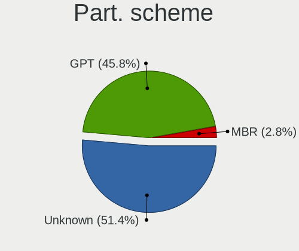
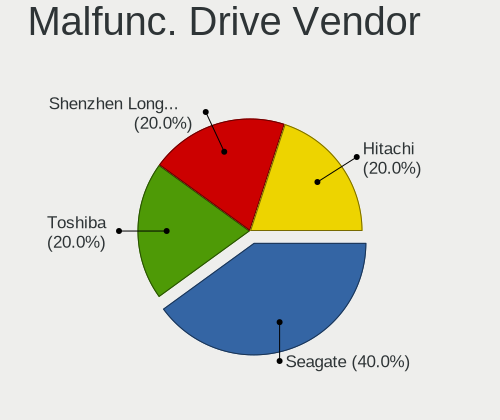
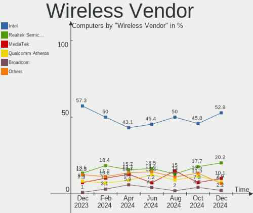
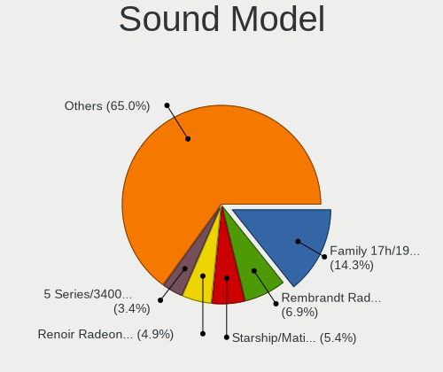
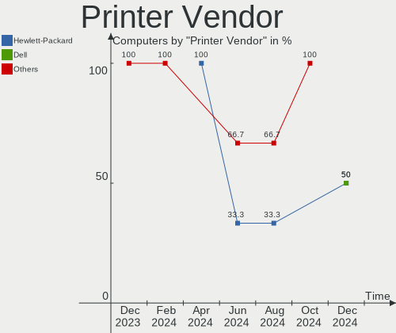

Manjaro Hardware Trends
-----------------------

A project to identify most popular hardware characteristics and track their change
over time based on data collected by Manjaro users at https://Linux-Hardware.org.

Anyone can contribute to the study by uploading probes of their computers by
the [hw-probe](https://github.com/linuxhw/hw-probe) tool:

    sudo -E hw-probe -all -upload

This is a report for all computer types. See also reports for [desktops](/Dist/Manjaro/Desktop/README.md) and [notebooks](/Dist/Manjaro/Notebook/README.md).

Full-feature report is available here: https://linux-hardware.org/?view=trends

Period: Dec, 2020.

Contents
--------

- [ OS                       ](#os)
- [ OS Family                ](#os-family)
- [ Kernel                   ](#kernel)
- [ Kernel Family            ](#kernel-family)
- [ Kernel Major Ver.        ](#kernel-major-ver)
- [ Arch                     ](#arch)
- [ DE                       ](#de)
- [ Display Server           ](#display-server)
- [ Display Manager          ](#display-manager)
- [ OS Lang                  ](#os-lang)
- [ Boot Mode                ](#boot-mode)
- [ Filesystem               ](#filesystem)
- [ Part. scheme             ](#part-scheme)
- [ Dual Boot with Linux/BSD ](#dual-boot-with-linux/bsd)
- [ Dual Boot (Win)          ](#dual-boot-win)
- [ Country                  ](#country)
- [ City                     ](#city)
- [ Vendor                   ](#vendor)
- [ Model                    ](#model)
- [ Model Family             ](#model-family)
- [ MFG Year                 ](#mfg-year)
- [ Form Factor              ](#form-factor)
- [ Secure Boot              ](#secure-boot)
- [ Coreboot                 ](#coreboot)
- [ RAM Size                 ](#ram-size)
- [ RAM Used                 ](#ram-used)
- [ Has CD-ROM               ](#has-cd-rom)
- [ Total Drives             ](#total-drives)
- [ Has Ethernet             ](#has-ethernet)
- [ Drive Vendor             ](#drive-vendor)
- [ Drive Model              ](#drive-model)
- [ HDD Vendor               ](#hdd-vendor)
- [ SSD Vendor               ](#ssd-vendor)
- [ Drive Kind               ](#drive-kind)
- [ Drive Connector          ](#drive-connector)
- [ Drive Size               ](#drive-size)
- [ Space Total              ](#space-total)
- [ Space Used               ](#space-used)
- [ Malfunc. Drives          ](#malfunc-drives)
- [ Malfunc. Drive Vendor    ](#malfunc-drive-vendor)
- [ Malfunc. HDD Vendor      ](#malfunc-hdd-vendor)
- [ Malfunc. Drive Kind      ](#malfunc-drive-kind)
- [ Failed Drives            ](#failed-drives)
- [ Failed Drive Vendor      ](#failed-drive-vendor)
- [ Drive Status             ](#drive-status)
- [ Storage Vendor           ](#storage-vendor)
- [ Storage Model            ](#storage-model)
- [ Storage Kind             ](#storage-kind)
- [ CPU Vendor               ](#cpu-vendor)
- [ CPU Model                ](#cpu-model)
- [ CPU Model Family         ](#cpu-model-family)
- [ CPU Cores                ](#cpu-cores)
- [ CPU Sockets              ](#cpu-sockets)
- [ CPU Threads              ](#cpu-threads)
- [ CPU Op-Modes             ](#cpu-op-modes)
- [ CPU Microcode            ](#cpu-microcode)
- [ CPU Microarch            ](#cpu-microarch)
- [ GPU Vendor               ](#gpu-vendor)
- [ GPU Model                ](#gpu-model)
- [ GPU Combo                ](#gpu-combo)
- [ GPU Driver               ](#gpu-driver)
- [ GPU Memory               ](#gpu-memory)
- [ Monitor Vendor           ](#monitor-vendor)
- [ Monitor Model            ](#monitor-model)
- [ Monitor Resolution       ](#monitor-resolution)
- [ Monitor Diagonal         ](#monitor-diagonal)
- [ Monitor Width            ](#monitor-width)
- [ Aspect Ratio             ](#aspect-ratio)
- [ Monitor Area             ](#monitor-area)
- [ Pixel Density            ](#pixel-density)
- [ Multiple Monitors        ](#multiple-monitors)
- [ Net Controller Vendor    ](#net-controller-vendor)
- [ Net Controller Model     ](#net-controller-model)
- [ Wireless Vendor          ](#wireless-vendor)
- [ Wireless Model           ](#wireless-model)
- [ Ethernet Vendor          ](#ethernet-vendor)
- [ Ethernet Model           ](#ethernet-model)
- [ Net Controller Kind      ](#net-controller-kind)
- [ Used Controller          ](#used-controller)
- [ NICs                     ](#nics)
- [ Memory Vendor            ](#memory-vendor)
- [ Memory Model             ](#memory-model)
- [ Memory Kind              ](#memory-kind)
- [ Memory Form Factor       ](#memory-form-factor)
- [ Memory Size              ](#memory-size)
- [ Memory Speed             ](#memory-speed)
- [ Sound Vendor             ](#sound-vendor)
- [ Sound Model              ](#sound-model)
- [ Camera Vendor            ](#camera-vendor)
- [ Camera Model             ](#camera-model)
- [ Fingerprint Vendor       ](#fingerprint-vendor)
- [ Fingerprint Model        ](#fingerprint-model)
- [ Chipcard Vendor          ](#chipcard-vendor)
- [ Chipcard Model           ](#chipcard-model)
- [ Printer Vendor           ](#printer-vendor)
- [ Printer Model            ](#printer-model)
- [ Scanner Vendor           ](#scanner-vendor)
- [ Scanner Model            ](#scanner-model)
- [ Bluetooth Vendor         ](#bluetooth-vendor)
- [ Bluetooth Model          ](#bluetooth-model)
- [ Unsupported Devices      ](#unsupported-devices)
- [ Unsupported Device Types ](#unsupported-device-types)

OS
--

Installed operating systems

| Name           | Computers | Percent |
|----------------|-----------|---------|
| Manjaro        | 111       | 50.23%  |
| Manjaro 20.2   | 107       | 48.42%  |
| Manjaro 20.1.2 | 2         | 0.9%    |
| Manjaro 20.0.3 | 1         | 0.45%   |

OS Family
---------

OS without a version

| Name    | Computers | Percent |
|---------|-----------|---------|
| Manjaro | 221       | 100%    |

Kernel
------

Version of the Linux kernel

| Version               | Computers | Percent |
|-----------------------|-----------|---------|
| 5.9.11-3-MANJARO      | 115       | 52.04%  |
| 5.8.18-1-MANJARO      | 40        | 18.1%   |
| 5.4.80-2-MANJARO      | 21        | 9.5%    |
| 5.10.0-1-MANJARO      | 5         | 2.26%   |
| 5.8.16-2-MANJARO      | 4         | 1.81%   |
| 5.7.19-2-MANJARO      | 4         | 1.81%   |
| 5.9.16-1-MANJARO      | 3         | 1.36%   |
| 5.9.12-1-MANJARO      | 3         | 1.36%   |
| 5.10.2-2-MANJARO      | 3         | 1.36%   |
| 5.9.11-2-MANJARO      | 2         | 0.9%    |
| 5.9.1-1-rt19-MANJARO  | 2         | 0.9%    |
| 5.9.3-1-MANJARO       | 1         | 0.45%   |
| 5.9.13-lqx1-1-lqx     | 1         | 0.45%   |
| 5.9.13-1-MANJARO      | 1         | 0.45%   |
| 5.9.11-lqx1-1-lqx     | 1         | 0.45%   |
| 5.9.10-1-MANJARO      | 1         | 0.45%   |
| 5.9.1-2-MANJARO       | 1         | 0.45%   |
| 5.8.6-1-MANJARO       | 1         | 0.45%   |
| 5.8.11-1-MANJARO      | 1         | 0.45%   |
| 5.7.17-2-MANJARO      | 1         | 0.45%   |
| 5.6.15-1-MANJARO      | 1         | 0.45%   |
| 5.4.78-1-MANJARO      | 1         | 0.45%   |
| 5.4.74-1-MANJARO      | 1         | 0.45%   |
| 5.4.67-1-MANJARO      | 1         | 0.45%   |
| 5.11.0-rc1-1-mainline | 1         | 0.45%   |
| 5.10.1-5-MANJARO      | 1         | 0.45%   |
| 5.10.1-4-MANJARO      | 1         | 0.45%   |
| 5.10.1-2-MANJARO      | 1         | 0.45%   |
| 4.19.157-1-MANJARO    | 1         | 0.45%   |
| 4.14.209-1-MANJARO    | 1         | 0.45%   |

Kernel Family
-------------

Linux kernel without a distro release

| Version  | Computers | Percent |
|----------|-----------|---------|
| 5.9.11   | 118       | 53.39%  |
| 5.8.18   | 40        | 18.1%   |
| 5.4.80   | 21        | 9.5%    |
| 5.10.0   | 5         | 2.26%   |
| 5.8.16   | 4         | 1.81%   |
| 5.7.19   | 4         | 1.81%   |
| 5.9.16   | 3         | 1.36%   |
| 5.9.12   | 3         | 1.36%   |
| 5.9.1    | 3         | 1.36%   |
| 5.10.2   | 3         | 1.36%   |
| 5.10.1   | 3         | 1.36%   |
| 5.9.13   | 2         | 0.9%    |
| 5.9.3    | 1         | 0.45%   |
| 5.9.10   | 1         | 0.45%   |
| 5.8.6    | 1         | 0.45%   |
| 5.8.11   | 1         | 0.45%   |
| 5.7.17   | 1         | 0.45%   |
| 5.6.15   | 1         | 0.45%   |
| 5.4.78   | 1         | 0.45%   |
| 5.4.74   | 1         | 0.45%   |
| 5.4.67   | 1         | 0.45%   |
| 5.11.0   | 1         | 0.45%   |
| 4.19.157 | 1         | 0.45%   |
| 4.14.209 | 1         | 0.45%   |

Kernel Major Ver.
-----------------

Linux kernel major version

| Version | Computers | Percent |
|---------|-----------|---------|
| 5.9     | 131       | 59.28%  |
| 5.8     | 46        | 20.81%  |
| 5.4     | 24        | 10.86%  |
| 5.10    | 11        | 4.98%   |
| 5.7     | 5         | 2.26%   |
| 5.6     | 1         | 0.45%   |
| 5.11    | 1         | 0.45%   |
| 4.19    | 1         | 0.45%   |
| 4.14    | 1         | 0.45%   |

Arch
----

OS architecture (x86_64, i586, etc.)

| Name   | Computers | Percent |
|--------|-----------|---------|
| x86_64 | 221       | 100%    |

DE
--

Desktop Environment

| Name       | Computers | Percent |
|------------|-----------|---------|
| XFCE       | 62        | 28.05%  |
| GNOME      | 52        | 23.53%  |
| KDE        | 43        | 19.46%  |
| KDE5       | 39        | 17.65%  |
| X-Cinnamon | 9         | 4.07%   |
| MATE       | 3         | 1.36%   |
| i3         | 3         | 1.36%   |
| Deepin     | 3         | 1.36%   |
| Budgie     | 2         | 0.9%    |
| Unknown    | 2         | 0.9%    |
| LXQt       | 1         | 0.45%   |
| Cinnamon   | 1         | 0.45%   |
| awesome    | 1         | 0.45%   |

Display Server
--------------

X11 or Wayland

| Name    | Computers | Percent |
|---------|-----------|---------|
| X11     | 191       | 86.43%  |
| Wayland | 27        | 12.22%  |
| Unknown | 2         | 0.9%    |
| Tty     | 1         | 0.45%   |

Display Manager
---------------

SDDM, LightDM, etc.

| Name    | Computers | Percent |
|---------|-----------|---------|
| Unknown | 109       | 49.32%  |
| LightDM | 43        | 19.46%  |
| SDDM    | 40        | 18.1%   |
| GDM     | 25        | 11.31%  |
| TDM     | 4         | 1.81%   |

OS Lang
-------

Language

| Lang       | Computers | Percent |
|------------|-----------|---------|
| en_US      | 64        | 28.96%  |
| en_US.utf8 | 32        | 14.48%  |
| de_DE      | 26        | 11.76%  |
| pt_BR      | 7         | 3.17%   |
| en_GB      | 7         | 3.17%   |
| ru_RU      | 6         | 2.71%   |
| pl_PL      | 6         | 2.71%   |
| it_IT      | 6         | 2.71%   |
| fr_FR      | 6         | 2.71%   |
| de_DE.utf8 | 6         | 2.71%   |
| ru_RU.utf8 | 4         | 1.81%   |
| pl_PL.utf8 | 3         | 1.36%   |
| en_IN      | 3         | 1.36%   |
| zh_CN      | 2         | 0.9%    |
| ru_UA      | 2         | 0.9%    |
| fr_FR.utf8 | 2         | 0.9%    |
| fr_CA      | 2         | 0.9%    |
| fr_BE      | 2         | 0.9%    |
| es_ES      | 2         | 0.9%    |
| en_IL      | 2         | 0.9%    |
| en_GB.utf8 | 2         | 0.9%    |
| en_CA      | 2         | 0.9%    |
| en_AU      | 2         | 0.9%    |
| de_CH      | 2         | 0.9%    |
| sv_SE.utf8 | 1         | 0.45%   |
| sv_SE      | 1         | 0.45%   |
| ru_UA.utf8 | 1         | 0.45%   |
| ro_RO      | 1         | 0.45%   |
| nl_NL.utf8 | 1         | 0.45%   |
| id_ID.utf8 | 1         | 0.45%   |
| hu_HU      | 1         | 0.45%   |
| hr_HR      | 1         | 0.45%   |
| fi_FI      | 1         | 0.45%   |
| es_PE.utf8 | 1         | 0.45%   |
| es_MX.utf8 | 1         | 0.45%   |
| es_CO.utf8 | 1         | 0.45%   |
| es_AR      | 1         | 0.45%   |
| en_ZA      | 1         | 0.45%   |
| en_SG.utf8 | 1         | 0.45%   |
| en_IN.utf8 | 1         | 0.45%   |
| en_IE.utf8 | 1         | 0.45%   |
| en_DK      | 1         | 0.45%   |
| en_CA.utf8 | 1         | 0.45%   |
| el_GR      | 1         | 0.45%   |
| cs_CZ      | 1         | 0.45%   |
| C          | 1         | 0.45%   |
| Unknown    | 1         | 0.45%   |

Boot Mode
---------

EFI or BIOS

| Mode | Computers | Percent |
|------|-----------|---------|
| BIOS | 133       | 60.18%  |
| EFI  | 88        | 39.82%  |

Filesystem
----------

Type of filesystem

| Type    | Computers | Percent |
|---------|-----------|---------|
| Ext4    | 203       | 91.86%  |
| Overlay | 7         | 3.17%   |
| Btrfs   | 7         | 3.17%   |
| Xfs     | 3         | 1.36%   |
| Zfs     | 1         | 0.45%   |

Part. scheme
------------

Scheme of partitioning

| Type    | Computers | Percent |
|---------|-----------|---------|
| Unknown | 109       | 49.32%  |
| GPT     | 97        | 43.89%  |
| MBR     | 15        | 6.79%   |

Dual Boot with Linux/BSD
------------------------

Hosting more than one Linux/BSD

| Dual boot | Computers | Percent |
|-----------|-----------|---------|
| No        | 197       | 89.14%  |
| Yes       | 24        | 10.86%  |

Dual Boot (Win)
---------------

Hosting Linux and Windows

| Dual boot | Computers | Percent |
|-----------|-----------|---------|
| No        | 148       | 66.97%  |
| Yes       | 73        | 33.03%  |

Country
-------

Geographic location (country)

| Country                   | Computers | Percent |
|---------------------------|-----------|---------|
| Germany                   | 40        | 18.1%   |
| USA                       | 36        | 16.29%  |
| Poland                    | 11        | 4.98%   |
| Russia                    | 9         | 4.07%   |
| Canada                    | 9         | 4.07%   |
| France                    | 8         | 3.62%   |
| Brazil                    | 8         | 3.62%   |
| Italy                     | 7         | 3.17%   |
| Vietnam                   | 6         | 2.71%   |
| Switzerland               | 6         | 2.71%   |
| UK                        | 5         | 2.26%   |
| Ukraine                   | 4         | 1.81%   |
| India                     | 4         | 1.81%   |
| Greece                    | 4         | 1.81%   |
| Sweden                    | 3         | 1.36%   |
| Romania                   | 3         | 1.36%   |
| Netherlands               | 3         | 1.36%   |
| Israel                    | 3         | 1.36%   |
| Indonesia                 | 3         | 1.36%   |
| Australia                 | 3         | 1.36%   |
| Turkey                    | 2         | 0.9%    |
| Saudi Arabia              | 2         | 0.9%    |
| Peru                      | 2         | 0.9%    |
| Mexico                    | 2         | 0.9%    |
| Ireland                   | 2         | 0.9%    |
| Hungary                   | 2         | 0.9%    |
| Colombia                  | 2         | 0.9%    |
| China                     | 2         | 0.9%    |
| Bulgaria                  | 2         | 0.9%    |
| Austria                   | 2         | 0.9%    |
| UAE                       | 1         | 0.45%   |
| Tunisia                   | 1         | 0.45%   |
| Spain                     | 1         | 0.45%   |
| South Africa              | 1         | 0.45%   |
| Slovenia                  | 1         | 0.45%   |
| Slovakia                  | 1         | 0.45%   |
| Singapore                 | 1         | 0.45%   |
| Portugal                  | 1         | 0.45%   |
| Philippines               | 1         | 0.45%   |
| Norway                    | 1         | 0.45%   |
| Nigeria                   | 1         | 0.45%   |
| Moldova, Republic of      | 1         | 0.45%   |
| Kazakhstan                | 1         | 0.45%   |
| Iraq                      | 1         | 0.45%   |
| Iran, Islamic Republic of | 1         | 0.45%   |
| Honduras                  | 1         | 0.45%   |
| Finland                   | 1         | 0.45%   |
| Denmark                   | 1         | 0.45%   |
| Czech Republic            | 1         | 0.45%   |
| Croatia                   | 1         | 0.45%   |
| Costa Rica                | 1         | 0.45%   |
| Belize                    | 1         | 0.45%   |
| Belgium                   | 1         | 0.45%   |
| Belarus                   | 1         | 0.45%   |
| Argentina                 | 1         | 0.45%   |
| Algeria                   | 1         | 0.45%   |

City
----

Geographic location (city)

| City                 | Computers | Percent |
|----------------------|-----------|---------|
| Ho Chi Minh City     | 4         | 1.81%   |
| Berlin               | 4         | 1.81%   |
| Zurich               | 3         | 1.36%   |
| Montreal             | 3         | 1.36%   |
| Kyiv                 | 3         | 1.36%   |
| Westfield            | 2         | 0.9%    |
| Warsaw               | 2         | 0.9%    |
| Stuttgart            | 2         | 0.9%    |
| Rome                 | 2         | 0.9%    |
| Riyadh               | 2         | 0.9%    |
| Port Orange          | 2         | 0.9%    |
| Perth                | 2         | 0.9%    |
| Osasco               | 2         | 0.9%    |
| Novosibirsk          | 2         | 0.9%    |
| Moscow               | 2         | 0.9%    |
| Milan                | 2         | 0.9%    |
| Los Angeles          | 2         | 0.9%    |
| Düsseldorf          | 2         | 0.9%    |
| Dublin               | 2         | 0.9%    |
| Bucharest            | 2         | 0.9%    |
| Bogotá              | 2         | 0.9%    |
| Bern                 | 2         | 0.9%    |
| Bengaluru            | 2         | 0.9%    |
| Atlanta              | 2         | 0.9%    |
| Athens               | 2         | 0.9%    |
| Łódź              | 1         | 0.45%   |
| Zandvoort            | 1         | 0.45%   |
| Yuzhno-Sakhalinsk    | 1         | 0.45%   |
| Xi'an                | 1         | 0.45%   |
| Woodland Hills       | 1         | 0.45%   |
| West Jordan          | 1         | 0.45%   |
| Voronezh             | 1         | 0.45%   |
| Vikesa               | 1         | 0.45%   |
| Vienna               | 1         | 0.45%   |
| Victoria             | 1         | 0.45%   |
| Versmold             | 1         | 0.45%   |
| Verona               | 1         | 0.45%   |
| Turin                | 1         | 0.45%   |
| Trujillo             | 1         | 0.45%   |
| Toronto              | 1         | 0.45%   |
| Tegucigalpa          | 1         | 0.45%   |
| Tandil               | 1         | 0.45%   |
| Tampere              | 1         | 0.45%   |
| São Paulo           | 1         | 0.45%   |
| Syracuse             | 1         | 0.45%   |
| Surabaya             | 1         | 0.45%   |
| Sunderland           | 1         | 0.45%   |
| Stockholm            | 1         | 0.45%   |
| Staten Island        | 1         | 0.45%   |
| St Albans            | 1         | 0.45%   |
| Sinzig               | 1         | 0.45%   |
| Singapore            | 1         | 0.45%   |
| Sindelfingen         | 1         | 0.45%   |
| Semarang             | 1         | 0.45%   |
| Secaucus             | 1         | 0.45%   |
| Schiedam             | 1         | 0.45%   |
| San Diego            | 1         | 0.45%   |
| Rüsselsheim am Main | 1         | 0.45%   |
| Rotherhithe          | 1         | 0.45%   |
| Rostov-on-Don        | 1         | 0.45%   |

Vendor
------

Motherboard manufacturer

| Name                | Computers | Percent |
|---------------------|-----------|---------|
| Lenovo              | 44        | 19.91%  |
| Hewlett-Packard     | 37        | 16.74%  |
| ASUSTek Computer    | 36        | 16.29%  |
| Gigabyte Technology | 29        | 13.12%  |
| Dell                | 21        | 9.5%    |
| MSI                 | 16        | 7.24%   |
| ASRock              | 7         | 3.17%   |
| Acer                | 7         | 3.17%   |
| Samsung Electronics | 3         | 1.36%   |
| Microsoft           | 2         | 0.9%    |
| HUAWEI              | 2         | 0.9%    |
| Fujitsu             | 2         | 0.9%    |
| Biostar             | 2         | 0.9%    |
| Apple               | 2         | 0.9%    |
| TUXEDO              | 1         | 0.45%   |
| Toshiba             | 1         | 0.45%   |
| Teclast             | 1         | 0.45%   |
| Sony                | 1         | 0.45%   |
| Razer               | 1         | 0.45%   |
| Panasonic           | 1         | 0.45%   |
| Notebook            | 1         | 0.45%   |
| Medion              | 1         | 0.45%   |
| Intel               | 1         | 0.45%   |
| Clevo               | 1         | 0.45%   |
| Unknown             | 1         | 0.45%   |

Model
-----

Motherboard model

| Name                                                  | Computers | Percent |
|-------------------------------------------------------|-----------|---------|
| MSI MS-7C02                                           | 4         | 1.81%   |
| Dell Latitude E5530 non-vPro                          | 3         | 1.36%   |
| Samsung 340XAA/350XAA/550XAA                          | 2         | 0.9%    |
| MSI MS-7C37                                           | 2         | 0.9%    |
| HP ProBook x360 435 G7                                | 2         | 0.9%    |
| HP Pavilion Laptop 15-cw1xxx                          | 2         | 0.9%    |
| HP ENVY x360 Convertible 13-ay0xxx                    | 2         | 0.9%    |
| Gigabyte G41M-ES2L                                    | 2         | 0.9%    |
| Gigabyte B450M DS3H                                   | 2         | 0.9%    |
| Gigabyte A320M-S2H                                    | 2         | 0.9%    |
| Unknown                                               | 2         | 0.9%    |
| TUXEDO Pulse 15 Gen1                                  | 1         | 0.45%   |
| Toshiba Satellite C660                                | 1         | 0.45%   |
| Teclast F7 Plus                                       | 1         | 0.45%   |
| Sony VGN-CR11S_W                                      | 1         | 0.45%   |
| Samsung 535U4C                                        | 1         | 0.45%   |
| Razer Blade 15 Advanced Model (Early 2020) - RZ09-033 | 1         | 0.45%   |
| Panasonic CF-C1BD06EFG                                | 1         | 0.45%   |
| Notebook N150ZU                                       | 1         | 0.45%   |
| MSI Prestige 14Evo A11M                               | 1         | 0.45%   |
| MSI MS-7C84                                           | 1         | 0.45%   |
| MSI MS-7B93                                           | 1         | 0.45%   |
| MSI MS-7A38                                           | 1         | 0.45%   |
| MSI MS-7977                                           | 1         | 0.45%   |
| MSI MS-7924                                           | 1         | 0.45%   |
| MSI MS-7721                                           | 1         | 0.45%   |
| MSI MS-7592                                           | 1         | 0.45%   |
| MSI GE60 2PC                                          | 1         | 0.45%   |
| MSI Alpha 15 A3DDK                                    | 1         | 0.45%   |
| Microsoft Surface Pro 4                               | 1         | 0.45%   |
| Microsoft Surface Pro 3                               | 1         | 0.45%   |
| Medion S15450                                         | 1         | 0.45%   |
| Lenovo Z70-80 80FG                                    | 1         | 0.45%   |
| Lenovo Yoga C640-13IML 81UE                           | 1         | 0.45%   |
| Lenovo Yoga 720-15IKB 80X7                            | 1         | 0.45%   |
| Lenovo Yoga 520-14IKB 80X8                            | 1         | 0.45%   |
| Lenovo Y520-15IKBN 80WK                               | 1         | 0.45%   |
| Lenovo Y50-70 20378                                   | 1         | 0.45%   |
| Lenovo V330-15IKB 81AX                                | 1         | 0.45%   |
| Lenovo ThinkStation P330 30CY002DGE                   | 1         | 0.45%   |
| Lenovo ThinkPad X240 20AMA1W5PB                       | 1         | 0.45%   |
| Lenovo ThinkPad X201 3680U18                          | 1         | 0.45%   |
| Lenovo ThinkPad X1 Carbon Gen 8 20U90044MX            | 1         | 0.45%   |
| Lenovo ThinkPad W540 20BG0015US                       | 1         | 0.45%   |
| Lenovo ThinkPad T470s 20HGS11D00                      | 1         | 0.45%   |
| Lenovo ThinkPad T430 2349A17                          | 1         | 0.45%   |
| Lenovo ThinkPad T420 4180C31                          | 1         | 0.45%   |
| Lenovo ThinkPad P71 20HK0003GE                        | 1         | 0.45%   |
| Lenovo ThinkPad P52s 20LBCTO1WW                       | 1         | 0.45%   |
| Lenovo ThinkPad P14s Gen 1 20Y10002MZ                 | 1         | 0.45%   |
| Lenovo ThinkPad P1 Gen 3 20THS0BK00                   | 1         | 0.45%   |
| Lenovo ThinkPad L380 Yoga 20M7S0HE00                  | 1         | 0.45%   |
| Lenovo ThinkPad Edge E145 20BC0006GE                  | 1         | 0.45%   |
| Lenovo ThinkPad E15 20RD0011SC                        | 1         | 0.45%   |
| Lenovo ThinkPad E14 Gen 2 20T6000RSC                  | 1         | 0.45%   |
| Lenovo ThinkPad E14 Gen 2 20T6000RGE                  | 1         | 0.45%   |
| Lenovo ThinkPad E14 20RA005CTX                        | 1         | 0.45%   |
| Lenovo MIIX 510-12ISK 80U1                            | 1         | 0.45%   |
| Lenovo Legion Y9000X 2020 81TH                        | 1         | 0.45%   |
| Lenovo Legion R7000 2020 82B6                         | 1         | 0.45%   |

Model Family
------------

Motherboard model prefix

| Name                   | Computers | Percent |
|------------------------|-----------|---------|
| Lenovo ThinkPad        | 17        | 7.69%   |
| HP Pavilion            | 11        | 4.98%   |
| Lenovo IdeaPad         | 9         | 4.07%   |
| Lenovo Legion          | 6         | 2.71%   |
| ASUS ROG               | 6         | 2.71%   |
| HP ProBook             | 5         | 2.26%   |
| HP EliteBook           | 5         | 2.26%   |
| Dell Latitude          | 5         | 2.26%   |
| Dell Inspiron          | 5         | 2.26%   |
| Acer Aspire            | 5         | 2.26%   |
| MSI MS-7C02            | 4         | 1.81%   |
| HP Laptop              | 4         | 1.81%   |
| HP ENVY                | 4         | 1.81%   |
| Lenovo Yoga            | 3         | 1.36%   |
| Gigabyte X570          | 3         | 1.36%   |
| Gigabyte A320M-S2H     | 3         | 1.36%   |
| Dell Vostro            | 3         | 1.36%   |
| Dell Precision         | 3         | 1.36%   |
| ASUS PRIME             | 3         | 1.36%   |
| Samsung 340XAA         | 2         | 0.9%    |
| MSI MS-7C37            | 2         | 0.9%    |
| Microsoft Surface      | 2         | 0.9%    |
| Gigabyte Z390          | 2         | 0.9%    |
| Gigabyte G41M-ES2L     | 2         | 0.9%    |
| Gigabyte B450M         | 2         | 0.9%    |
| Gigabyte B450          | 2         | 0.9%    |
| Dell XPS               | 2         | 0.9%    |
| Dell OptiPlex          | 2         | 0.9%    |
| ASUS TUF               | 2         | 0.9%    |
| ASUS P8Z77-V           | 2         | 0.9%    |
| Apple MacBookPro11     | 2         | 0.9%    |
| Unknown                | 2         | 0.9%    |
| TUXEDO Pulse           | 1         | 0.45%   |
| Toshiba Satellite      | 1         | 0.45%   |
| Teclast F7             | 1         | 0.45%   |
| Sony VGN-CR11S         | 1         | 0.45%   |
| Samsung 535U4C         | 1         | 0.45%   |
| Razer Blade            | 1         | 0.45%   |
| Panasonic CF-C1BD06EFG | 1         | 0.45%   |
| Notebook N150ZU        | 1         | 0.45%   |
| MSI Prestige           | 1         | 0.45%   |
| MSI MS-7C84            | 1         | 0.45%   |
| MSI MS-7B93            | 1         | 0.45%   |
| MSI MS-7A38            | 1         | 0.45%   |
| MSI MS-7977            | 1         | 0.45%   |
| MSI MS-7924            | 1         | 0.45%   |
| MSI MS-7721            | 1         | 0.45%   |
| MSI MS-7592            | 1         | 0.45%   |
| MSI GE60               | 1         | 0.45%   |
| MSI Alpha              | 1         | 0.45%   |
| Medion S15450          | 1         | 0.45%   |
| Lenovo Z70-80          | 1         | 0.45%   |
| Lenovo Y520-15IKBN     | 1         | 0.45%   |
| Lenovo Y50-70          | 1         | 0.45%   |
| Lenovo V330-15IKB      | 1         | 0.45%   |
| Lenovo ThinkStation    | 1         | 0.45%   |
| Lenovo MIIX            | 1         | 0.45%   |
| Lenovo G580            | 1         | 0.45%   |
| Lenovo B50-70          | 1         | 0.45%   |
| Intel X79              | 1         | 0.45%   |

MFG Year
--------

Motherboard manufacture year

| Year | Computers | Percent |
|------|-----------|---------|
| 2020 | 66        | 29.86%  |
| 2019 | 40        | 18.1%   |
| 2018 | 26        | 11.76%  |
| 2015 | 13        | 5.88%   |
| 2016 | 12        | 5.43%   |
| 2012 | 12        | 5.43%   |
| 2014 | 11        | 4.98%   |
| 2017 | 10        | 4.52%   |
| 2013 | 10        | 4.52%   |
| 2010 | 7         | 3.17%   |
| 2009 | 6         | 2.71%   |
| 2011 | 5         | 2.26%   |
| 2007 | 3         | 1.36%   |

Form Factor
-----------

Physical design of the computer

| Name        | Computers | Percent |
|-------------|-----------|---------|
| Notebook    | 124       | 56.11%  |
| Desktop     | 82        | 37.1%   |
| Convertible | 10        | 4.52%   |
| Tablet      | 3         | 1.36%   |
| Mini pc     | 1         | 0.45%   |
| All in one  | 1         | 0.45%   |

Secure Boot
-----------

Enabled or disabled

| State    | Computers | Percent |
|----------|-----------|---------|
| Disabled | 221       | 100%    |

Coreboot
--------

Have coreboot on board

| Used | Computers | Percent |
|------|-----------|---------|
| No   | 221       | 100%    |

RAM Size
--------

Total RAM memory

| Size in GB  | Computers | Percent |
|-------------|-----------|---------|
| 16.01-24.0  | 50        | 22.62%  |
| 8.01-16.0   | 48        | 21.72%  |
| 4.01-8.0    | 43        | 19.46%  |
| 3.01-4.0    | 32        | 14.48%  |
| 32.01-64.0  | 31        | 14.03%  |
| 64.01-256.0 | 8         | 3.62%   |
| 1.01-2.0    | 5         | 2.26%   |
| 24.01-32.0  | 4         | 1.81%   |

RAM Used
--------

Used RAM memory

| Used GB    | Computers | Percent |
|------------|-----------|---------|
| 1.01-2.0   | 67        | 30.32%  |
| 2.01-3.0   | 56        | 25.34%  |
| 4.01-8.0   | 37        | 16.74%  |
| 3.01-4.0   | 37        | 16.74%  |
| 8.01-16.0  | 15        | 6.79%   |
| 0.51-1.0   | 7         | 3.17%   |
| 24.01-32.0 | 1         | 0.45%   |
| 16.01-24.0 | 1         | 0.45%   |

Has CD-ROM
----------

Has CD-ROM on board

| Presented | Computers | Percent |
|-----------|-----------|---------|
| No        | 153       | 69.23%  |
| Yes       | 68        | 30.77%  |

Total Drives
------------

Number of drives on board

| Drives | Computers | Percent |
|--------|-----------|---------|
| 1      | 108       | 48.87%  |
| 2      | 67        | 30.32%  |
| 3      | 21        | 9.5%    |
| 5      | 10        | 4.52%   |
| 4      | 9         | 4.07%   |
| 0      | 4         | 1.81%   |
| 6      | 2         | 0.9%    |

Has Ethernet
------------

Has Ethernet on board

| Presented | Computers | Percent |
|-----------|-----------|---------|
| Yes       | 189       | 85.52%  |
| No        | 32        | 14.48%  |

Drive Vendor
------------

Hard drive vendors

| Vendor                    | Computers | Drives | Percent |
|---------------------------|-----------|--------|---------|
| Samsung Electronics       | 71        | 89     | 19.56%  |
| Seagate                   | 67        | 73     | 18.46%  |
| WDC                       | 56        | 66     | 15.43%  |
| Toshiba                   | 20        | 20     | 5.51%   |
| Crucial                   | 13        | 14     | 3.58%   |
| SanDisk                   | 12        | 12     | 3.31%   |
| Kingston                  | 12        | 12     | 3.31%   |
| HGST                      | 12        | 13     | 3.31%   |
| SK Hynix                  | 11        | 11     | 3.03%   |
| Intel                     | 11        | 12     | 3.03%   |
| Hitachi                   | 10        | 11     | 2.75%   |
| Unknown                   | 7         | 7      | 1.93%   |
| OCZ                       | 5         | 5      | 1.38%   |
| Micron/Crucial Technology | 4         | 4      | 1.1%    |
| JMicron                   | 4         | 4      | 1.1%    |
| Intenso                   | 4         | 4      | 1.1%    |
| Silicon Motion            | 3         | 3      | 0.83%   |
| Phison                    | 3         | 3      | 0.83%   |
| Maxtor                    | 3         | 3      | 0.83%   |
| China                     | 3         | 3      | 0.83%   |
| XPG                       | 2         | 2      | 0.55%   |
| SABRENT                   | 2         | 2      | 0.55%   |
| Micron Technology         | 2         | 2      | 0.55%   |
| GOODRAM                   | 2         | 2      | 0.55%   |
| Apple                     | 2         | 2      | 0.55%   |
| A-DATA Technology         | 2         | 2      | 0.55%   |
| Union Memory              | 1         | 1      | 0.28%   |
| TO Exter                  | 1         | 1      | 0.28%   |
| Team                      | 1         | 1      | 0.28%   |
| SSSTC                     | 1         | 1      | 0.28%   |
| SSD 128G                  | 1         | 1      | 0.28%   |
| SPCC                      | 1         | 1      | 0.28%   |
| Reeinno                   | 1         | 1      | 0.28%   |
| Realtek Semiconductor     | 1         | 1      | 0.28%   |
| PLEXTOR                   | 1         | 1      | 0.28%   |
| Pioneer                   | 1         | 1      | 0.28%   |
| Patriot                   | 1         | 1      | 0.28%   |
| NGFF                      | 1         | 1      | 0.28%   |
| Netac                     | 1         | 1      | 0.28%   |
| Maxone                    | 1         | 1      | 0.28%   |
| Leven                     | 1         | 1      | 0.28%   |
| KIOXIA-EXCERIA            | 1         | 1      | 0.28%   |
| KingSpec                  | 1         | 1      | 0.28%   |
| KingDian                  | 1         | 1      | 0.28%   |
| DREVO                     | 1         | 1      | 0.28%   |
| Corsair                   | 1         | 1      | 0.28%   |

Drive Model
-----------

Hard drive models

| Model                               | Computers | Percent |
|-------------------------------------|-----------|---------|
| Seagate ST1000LM035-1RK172 1TB      | 9         | 2.33%   |
| Samsung NVMe SSD Drive 512GB        | 7         | 1.81%   |
| Samsung SSD 850 EVO 500GB           | 5         | 1.3%    |
| Samsung NVMe SSD Drive 1TB          | 5         | 1.3%    |
| Kingston SA400S37240G 240GB SSD     | 5         | 1.3%    |
| Seagate ST500DM002-1BD142 500GB     | 4         | 1.04%   |
| Samsung SSD 970 EVO 1TB             | 4         | 1.04%   |
| Samsung SSD 860 EVO 500GB           | 4         | 1.04%   |
| Samsung NVMe SSD Drive 500GB        | 4         | 1.04%   |
| Intel NVMe SSD Drive 512GB          | 4         | 1.04%   |
| WDC WD10EZEX-08WN4A0 1TB            | 3         | 0.78%   |
| Seagate ST1000DM010-2EP102 1TB      | 3         | 0.78%   |
| Samsung SSD 860 EVO 1TB             | 3         | 0.78%   |
| Samsung SSD 850 EVO 250GB           | 3         | 0.78%   |
| Samsung NVMe SSD Drive 256GB        | 3         | 0.78%   |
| Micron/Crucial NVMe SSD Drive 1TB   | 3         | 0.78%   |
| JMicron Tech 250GB                  | 3         | 0.78%   |
| Hitachi HTS545050A7E380 500GB       | 3         | 0.78%   |
| HGST HTS721010A9E630 1TB            | 3         | 0.78%   |
| Crucial CT1000MX500SSD1 1TB         | 3         | 0.78%   |
| XPG NVMe SSD Drive 512GB            | 2         | 0.52%   |
| WDC WDS240G2G0B-00EPW0 240GB SSD    | 2         | 0.52%   |
| WDC WDS240G2G0A-00JH30 240GB SSD    | 2         | 0.52%   |
| WDC WDS100T2B0A-00SM50 1TB SSD      | 2         | 0.52%   |
| WDC WD5000LPVX-75V0TT0 500GB        | 2         | 0.52%   |
| WDC WD20EARS-00MVWB0 2TB            | 2         | 0.52%   |
| Unknown SD/MMC/MS PRO 128GB         | 2         | 0.52%   |
| Unknown MMC Card  32GB              | 2         | 0.52%   |
| Toshiba MQ01ABD100 1TB              | 2         | 0.52%   |
| Toshiba HDWD110 1TB                 | 2         | 0.52%   |
| Toshiba DT01ACA200 2TB              | 2         | 0.52%   |
| Silicon Motion NVMe SSD Drive 512GB | 2         | 0.52%   |
| Seagate ST9500423AS 500GB           | 2         | 0.52%   |
| Seagate ST9500325AS 500GB           | 2         | 0.52%   |
| Seagate ST500LM000-1EJ162 500GB     | 2         | 0.52%   |
| Seagate ST2000DM008-2FR102 2TB      | 2         | 0.52%   |
| Seagate ST2000DM006-2DM164 2TB      | 2         | 0.52%   |
| Seagate ST1000LM048-2E7172 1TB      | 2         | 0.52%   |
| Seagate ST1000DM003-1SB102 1TB      | 2         | 0.52%   |
| Seagate ST1000DM003-1CH162 1TB      | 2         | 0.52%   |
| Seagate Expansion Desk 2TB          | 2         | 0.52%   |
| SanDisk SDSSDA120G 120GB            | 2         | 0.52%   |
| Sandisk NVMe SSD Drive 512GB        | 2         | 0.52%   |
| Samsung SSD 970 EVO Plus 250GB      | 2         | 0.52%   |
| Samsung SSD 850 EVO 120GB           | 2         | 0.52%   |
| Samsung SSD 840 EVO 250GB           | 2         | 0.52%   |
| Samsung MZVLB512HBJQ-000L2 512GB    | 2         | 0.52%   |
| SABRENT Disk 240GB                  | 2         | 0.52%   |
| OCZ AGILITY3 240GB SSD              | 2         | 0.52%   |
| HGST HTS545050A7E680 500GB          | 2         | 0.52%   |
| HGST HTS545050A7E380 500GB          | 2         | 0.52%   |
| HGST HTS541010B7E610 1TB            | 2         | 0.52%   |
| Crucial M4-CT256M4SSD2 256GB        | 2         | 0.52%   |
| WDC WDS500G2B0C-00PXH0 500GB        | 1         | 0.26%   |
| WDC WDS480G2G0A-00JH30 480GB SSD    | 1         | 0.26%   |
| WDC WDS250G3X0C-00SJG0 250GB        | 1         | 0.26%   |
| WDC WDS100T2G0A-00JH30 1TB SSD      | 1         | 0.26%   |
| WDC WDS100T2B0B-00YS70 1TB SSD      | 1         | 0.26%   |
| WDC WDS100T1B0A-00H9H0 1TB SSD      | 1         | 0.26%   |
| WDC WDBNCE5000PNC 500GB SSD         | 1         | 0.26%   |

HDD Vendor
----------

Hard disk drive vendors

| Vendor              | Computers | Drives | Percent |
|---------------------|-----------|--------|---------|
| Seagate             | 65        | 70     | 43.05%  |
| WDC                 | 39        | 45     | 25.83%  |
| Toshiba             | 14        | 14     | 9.27%   |
| HGST                | 12        | 13     | 7.95%   |
| Hitachi             | 10        | 11     | 6.62%   |
| Samsung Electronics | 6         | 6      | 3.97%   |
| Maxtor              | 2         | 2      | 1.32%   |
| TO Exter            | 1         | 1      | 0.66%   |
| Maxone              | 1         | 1      | 0.66%   |
| Apple               | 1         | 1      | 0.66%   |

SSD Vendor
----------

Solid state drive vendors

| Vendor              | Computers | Drives | Percent |
|---------------------|-----------|--------|---------|
| Samsung Electronics | 31        | 39     | 26.96%  |
| Crucial             | 13        | 14     | 11.3%   |
| WDC                 | 12        | 13     | 10.43%  |
| Kingston            | 11        | 11     | 9.57%   |
| SanDisk             | 8         | 8      | 6.96%   |
| OCZ                 | 5         | 5      | 4.35%   |
| SK Hynix            | 4         | 4      | 3.48%   |
| Intenso             | 3         | 3      | 2.61%   |
| Intel               | 3         | 3      | 2.61%   |
| China               | 3         | 3      | 2.61%   |
| SABRENT             | 2         | 2      | 1.74%   |
| GOODRAM             | 2         | 2      | 1.74%   |
| Unknown             | 1         | 1      | 0.87%   |
| Toshiba             | 1         | 1      | 0.87%   |
| Team                | 1         | 1      | 0.87%   |
| SPCC                | 1         | 1      | 0.87%   |
| Reeinno             | 1         | 1      | 0.87%   |
| Pioneer             | 1         | 1      | 0.87%   |
| Patriot             | 1         | 1      | 0.87%   |
| NGFF                | 1         | 1      | 0.87%   |
| Netac               | 1         | 1      | 0.87%   |
| Micron Technology   | 1         | 1      | 0.87%   |
| Maxtor              | 1         | 1      | 0.87%   |
| Leven               | 1         | 1      | 0.87%   |
| KingSpec            | 1         | 1      | 0.87%   |
| KingDian            | 1         | 1      | 0.87%   |
| JMicron             | 1         | 1      | 0.87%   |
| DREVO               | 1         | 1      | 0.87%   |
| Corsair             | 1         | 1      | 0.87%   |
| Apple               | 1         | 1      | 0.87%   |

Drive Kind
----------

HDD or SSD

| Kind    | Computers | Drives | Percent |
|---------|-----------|--------|---------|
| HDD     | 123       | 164    | 38.56%  |
| SSD     | 96        | 125    | 30.09%  |
| NVMe    | 85        | 96     | 26.65%  |
| Unknown | 11        | 12     | 3.45%   |
| MMC     | 4         | 4      | 1.25%   |

Drive Connector
---------------

SATA, SAS, NVMe, etc.

| Type | Computers | Drives | Percent |
|------|-----------|--------|---------|
| SATA | 164       | 284    | 60.97%  |
| NVMe | 85        | 96     | 31.6%   |
| SAS  | 16        | 17     | 5.95%   |
| MMC  | 4         | 4      | 1.49%   |

Drive Size
----------

Size of hard drive

| Size in TB | Computers | Drives | Percent |
|------------|-----------|--------|---------|
| 0.01-0.5   | 112       | 166    | 52.34%  |
| 0.51-1.0   | 71        | 87     | 33.18%  |
| 1.01-2.0   | 17        | 20     | 7.94%   |
| 4.01-10.0  | 6         | 8      | 2.8%    |
| 3.01-4.0   | 5         | 5      | 2.34%   |
| 2.01-3.0   | 3         | 3      | 1.4%    |

Space Total
-----------

Amount of disk space available on the file system

| Size in GB     | Computers | Percent |
|----------------|-----------|---------|
| 101-250        | 49        | 22.17%  |
| 251-500        | 48        | 21.72%  |
| 501-1000       | 40        | 18.1%   |
| 1001-2000      | 30        | 13.57%  |
| More than 3000 | 14        | 6.33%   |
| 1-20           | 14        | 6.33%   |
| Unknown        | 11        | 4.98%   |
| 51-100         | 8         | 3.62%   |
| 21-50          | 5         | 2.26%   |
| 2001-3000      | 2         | 0.9%    |

Space Used
----------

Amount of used disk space

| Used GB        | Computers | Percent |
|----------------|-----------|---------|
| 1-20           | 53        | 23.98%  |
| 21-50          | 38        | 17.19%  |
| 101-250        | 29        | 13.12%  |
| 251-500        | 28        | 12.67%  |
| 501-1000       | 22        | 9.95%   |
| 51-100         | 22        | 9.95%   |
| Unknown        | 11        | 4.98%   |
| 1001-2000      | 9         | 4.07%   |
| More than 3000 | 6         | 2.71%   |
| 2001-3000      | 2         | 0.9%    |
| 0              | 1         | 0.45%   |

Malfunc. Drives
---------------

Drive models with a malfunction

| Model                                 | Computers | Drives | Percent |
|---------------------------------------|-----------|--------|---------|
| WDC WD3200AAJS-00B4A0 320GB           | 1         | 1      | 5.88%   |
| WDC WD10JPVX-75JC3T0 1TB              | 1         | 1      | 5.88%   |
| SK Hynix HFS256G3BTND-N210A 256GB SSD | 1         | 1      | 5.88%   |
| SK Hynix HFS256G3AMNB-2200A 256GB SSD | 1         | 1      | 5.88%   |
| Seagate ST500LT012-9WS142 500GB       | 1         | 1      | 5.88%   |
| Seagate ST500DM002-1BD142 500GB       | 1         | 1      | 5.88%   |
| Seagate ST4000DM000-1F2168 4TB        | 1         | 1      | 5.88%   |
| Seagate ST3750630AS 752GB             | 1         | 1      | 5.88%   |
| Seagate ST3200820AS 200GB             | 1         | 1      | 5.88%   |
| Seagate ST3160811AS 160GB             | 1         | 1      | 5.88%   |
| Seagate ST1000LM035-1RK172 1TB        | 1         | 1      | 5.88%   |
| Seagate ST1000DM010-2EP102 1TB        | 1         | 1      | 5.88%   |
| SanDisk SD9SN8W-256G-1006 256GB SSD   | 1         | 1      | 5.88%   |
| Hitachi HTS545050A7E380 500GB         | 1         | 1      | 5.88%   |
| HGST HTS545050A7E680 500GB            | 1         | 1      | 5.88%   |
| HGST HTS545050A7E380 500GB            | 1         | 1      | 5.88%   |
| Crucial M4-CT256M4SSD2 256GB          | 1         | 1      | 5.88%   |

Malfunc. Drive Vendor
---------------------

Vendors of faulty drives

| Vendor   | Computers | Drives | Percent |
|----------|-----------|--------|---------|
| Seagate  | 8         | 8      | 47.06%  |
| WDC      | 2         | 2      | 11.76%  |
| SK Hynix | 2         | 2      | 11.76%  |
| HGST     | 2         | 2      | 11.76%  |
| SanDisk  | 1         | 1      | 5.88%   |
| Hitachi  | 1         | 1      | 5.88%   |
| Crucial  | 1         | 1      | 5.88%   |

Malfunc. HDD Vendor
-------------------

Vendors of faulty HDD drives

| Vendor  | Computers | Drives | Percent |
|---------|-----------|--------|---------|
| Seagate | 8         | 8      | 61.54%  |
| WDC     | 2         | 2      | 15.38%  |
| HGST    | 2         | 2      | 15.38%  |
| Hitachi | 1         | 1      | 7.69%   |

Malfunc. Drive Kind
-------------------

Kinds of faulty drives

| Kind | Computers | Drives | Percent |
|------|-----------|--------|---------|
| HDD  | 13        | 13     | 76.47%  |
| SSD  | 4         | 4      | 23.53%  |

Failed Drives
-------------

Failed drive models

| Model                     | Computers | Drives | Percent |
|---------------------------|-----------|--------|---------|
| Seagate ST9640320AS 640GB | 1         | 1      | 100%    |

Failed Drive Vendor
-------------------

Failed drive vendors

| Vendor  | Computers | Drives | Percent |
|---------|-----------|--------|---------|
| Seagate | 1         | 1      | 100%    |

Drive Status
------------

Number of failed and malfunc. drives

| Status   | Computers | Drives | Percent |
|----------|-----------|--------|---------|
| Detected | 139       | 253    | 58.65%  |
| Works    | 80        | 130    | 33.76%  |
| Malfunc  | 17        | 17     | 7.17%   |
| Failed   | 1         | 1      | 0.42%   |

Storage Vendor
--------------

Storage controller vendors

| Vendor                       | Computers | Percent |
|------------------------------|-----------|---------|
| Intel                        | 123       | 41.84%  |
| AMD                          | 71        | 24.15%  |
| Samsung Electronics          | 42        | 14.29%  |
| Sandisk                      | 11        | 3.74%   |
| SK Hynix                     | 7         | 2.38%   |
| JMicron Technology           | 5         | 1.7%    |
| ASMedia Technology           | 5         | 1.7%    |
| Toshiba America Info Systems | 4         | 1.36%   |
| Micron/Crucial Technology    | 4         | 1.36%   |
| ADATA Technology             | 4         | 1.36%   |
| Silicon Motion               | 3         | 1.02%   |
| Phison Electronics           | 3         | 1.02%   |
| Marvell Technology Group     | 3         | 1.02%   |
| KIOXIA                       | 2         | 0.68%   |
| Union Memory (Shenzhen)      | 1         | 0.34%   |
| Realtek Semiconductor        | 1         | 0.34%   |
| Micron Technology            | 1         | 0.34%   |
| LSI Logic / Symbios Logic    | 1         | 0.34%   |
| Lite-On Technology           | 1         | 0.34%   |
| Kingston Technology Company  | 1         | 0.34%   |
| Broadcom / LSI               | 1         | 0.34%   |

Storage Model
-------------

Storage controller models

| Model                                                                          | Computers | Percent |
|--------------------------------------------------------------------------------|-----------|---------|
| AMD FCH SATA Controller [AHCI mode]                                            | 57        | 17.33%  |
| Samsung NVMe SSD Controller SM981/PM981/PM983                                  | 33        | 10.03%  |
| Intel Sunrise Point-LP SATA Controller [AHCI mode]                             | 11        | 3.34%   |
| Intel 8 Series/C220 Series Chipset Family 6-port SATA Controller 1 [AHCI mode] | 10        | 3.04%   |
| AMD 400 Series Chipset SATA Controller                                         | 10        | 3.04%   |
| Intel 82801 Mobile SATA Controller [RAID mode]                                 | 7         | 2.13%   |
| Intel 7 Series Chipset Family 6-port SATA Controller [AHCI mode]               | 7         | 2.13%   |
| SK Hynix Non-Volatile memory controller                                        | 6         | 1.82%   |
| Intel Wildcat Point-LP SATA Controller [AHCI Mode]                             | 6         | 1.82%   |
| Intel 8 Series SATA Controller 1 [AHCI mode]                                   | 6         | 1.82%   |
| Intel SSD 660P Series                                                          | 5         | 1.52%   |
| Intel NM10/ICH7 Family SATA Controller [IDE mode]                              | 5         | 1.52%   |
| Intel HM170/QM170 Chipset SATA Controller [AHCI Mode]                          | 5         | 1.52%   |
| Intel Cannon Lake PCH SATA AHCI Controller                                     | 5         | 1.52%   |
| Intel Cannon Lake Mobile PCH SATA AHCI Controller                              | 5         | 1.52%   |
| Intel 7 Series/C210 Series Chipset Family 6-port SATA Controller [AHCI mode]   | 5         | 1.52%   |
| Intel 6 Series/C200 Series Chipset Family 6 port Mobile SATA AHCI Controller   | 5         | 1.52%   |
| Intel 200 Series PCH SATA controller [AHCI mode]                               | 5         | 1.52%   |
| ASMedia ASM1062 Serial ATA Controller                                          | 5         | 1.52%   |
| Samsung Electronics Non-Volatile memory controller                             | 4         | 1.22%   |
| AMD SB7x0/SB8x0/SB9x0 IDE Controller                                           | 4         | 1.22%   |
| ADATA XPG SX8200 Pro PCIe Gen3x4 M.2 2280 Solid State Drive                    | 4         | 1.22%   |
| Silicon Motion SM2263EN/SM2263XT SSD Controller                                | 3         | 0.91%   |
| Sandisk WD Blue SN550 NVMe SSD                                                 | 3         | 0.91%   |
| Sandisk WD Black SN750 / PC SN730 NVMe SSD                                     | 3         | 0.91%   |
| Samsung NVMe SSD Controller SM961/PM961/SM963                                  | 3         | 0.91%   |
| Intel SATA Controller [RAID mode]                                              | 3         | 0.91%   |
| Intel Q170/Q150/B150/H170/H110/Z170/CM236 Chipset SATA Controller [AHCI Mode]  | 3         | 0.91%   |
| Intel C600/X79 series chipset IDE-r Controller                                 | 3         | 0.91%   |
| Intel 82801G (ICH7 Family) IDE Controller                                      | 3         | 0.91%   |
| Intel 6 Series/C200 Series Chipset Family 6 port Desktop SATA AHCI Controller  | 3         | 0.91%   |
| Intel 5 Series/3400 Series Chipset 4 port SATA AHCI Controller                 | 3         | 0.91%   |
| Intel 400 Series Chipset Family SATA AHCI Controller                           | 3         | 0.91%   |
| AMD SB7x0/SB8x0/SB9x0 SATA Controller [IDE mode]                               | 3         | 0.91%   |
| AMD SB7x0/SB8x0/SB9x0 SATA Controller [AHCI mode]                              | 3         | 0.91%   |
| AMD SATA controller                                                            | 3         | 0.91%   |
| AMD FCH SATA Controller D                                                      | 3         | 0.91%   |
| Toshiba America Info Systems XG6 NVMe SSD Controller                           | 2         | 0.61%   |
| Toshiba America Info Systems BG3 NVMe SSD Controller                           | 2         | 0.61%   |
| Sandisk WD Blue SN500 / PC SN520 NVMe SSD                                      | 2         | 0.61%   |
| Sandisk Non-Volatile memory controller                                         | 2         | 0.61%   |
| Phison E16 PCIe4 NVMe Controller                                               | 2         | 0.61%   |
| Micron/Crucial P1 NVMe PCIe SSD                                                | 2         | 0.61%   |
| Micron/Crucial Non-Volatile memory controller                                  | 2         | 0.61%   |
| JMicron JMB363 SATA/IDE Controller                                             | 2         | 0.61%   |
| Intel Comet Lake SATA AHCI Controller                                          | 2         | 0.61%   |
| Intel Celeron/Pentium Silver Processor SATA Controller                         | 2         | 0.61%   |
| Intel C602 chipset 4-Port SATA Storage Control Unit                            | 2         | 0.61%   |
| Intel C600/X79 series chipset 6-Port SATA AHCI Controller                      | 2         | 0.61%   |
| Intel 9 Series Chipset Family SATA Controller [AHCI Mode]                      | 2         | 0.61%   |
| Intel 82801JI (ICH10 Family) 4 port SATA IDE Controller #1                     | 2         | 0.61%   |
| Intel 82801JI (ICH10 Family) 2 port SATA IDE Controller #2                     | 2         | 0.61%   |
| Intel 82801IBM/IEM (ICH9M/ICH9M-E) 4 port SATA Controller [AHCI mode]          | 2         | 0.61%   |
| Intel 5 Series/3400 Series Chipset 6 port SATA AHCI Controller                 | 2         | 0.61%   |
| AMD X399 Series Chipset SATA Controller                                        | 2         | 0.61%   |
| Union Memory (Shenzhen) Non-Volatile memory controller                         | 1         | 0.3%    |
| SK Hynix BC501 NVMe Solid State Drive 512GB                                    | 1         | 0.3%    |
| Sandisk WD Black 2018 / PC SN720 NVMe SSD                                      | 1         | 0.3%    |
| Samsung XP941 PCIe SSD                                                         | 1         | 0.3%    |
| Samsung NVMe SSD Controller SM951/PM951                                        | 1         | 0.3%    |

Storage Kind
------------

Kind of storage controller (IDE, SATA, NVMe, SAS, ...)

| Kind | Computers | Percent |
|------|-----------|---------|
| SATA | 170       | 59.23%  |
| NVMe | 85        | 29.62%  |
| IDE  | 17        | 5.92%   |
| RAID | 13        | 4.53%   |
| SAS  | 2         | 0.7%    |

CPU Vendor
----------

Processor vendors

| Vendor | Computers | Percent |
|--------|-----------|---------|
| Intel  | 140       | 63.35%  |
| AMD    | 81        | 36.65%  |

CPU Model
---------

Processor models

| Model                                         | Computers | Percent |
|-----------------------------------------------|-----------|---------|
| AMD Ryzen 7 4800H with Radeon Graphics        | 6         | 2.71%   |
| Intel Core i7-10510U CPU @ 1.80GHz            | 5         | 2.26%   |
| AMD Ryzen 7 4700U with Radeon Graphics        | 5         | 2.26%   |
| AMD Ryzen 5 3600 6-Core Processor             | 5         | 2.26%   |
| Intel Core i5-8265U CPU @ 1.60GHz             | 4         | 1.81%   |
| Intel Core i7-8550U CPU @ 1.80GHz             | 3         | 1.36%   |
| Intel Core i7-6700HQ CPU @ 2.60GHz            | 3         | 1.36%   |
| Intel Core i7-4720HQ CPU @ 2.60GHz            | 3         | 1.36%   |
| Intel Core i5-5200U CPU @ 2.20GHz             | 3         | 1.36%   |
| AMD Ryzen 7 3700X 8-Core Processor            | 3         | 1.36%   |
| AMD Ryzen 5 4500U with Radeon Graphics        | 3         | 1.36%   |
| AMD Ryzen 5 3500U with Radeon Vega Mobile Gfx | 3         | 1.36%   |
| AMD Ryzen 5 3400G with Radeon Vega Graphics   | 3         | 1.36%   |
| Intel Core i7-9750H CPU @ 2.60GHz             | 2         | 0.9%    |
| Intel Core i7-8700 CPU @ 3.20GHz              | 2         | 0.9%    |
| Intel Core i7-7700HQ CPU @ 2.80GHz            | 2         | 0.9%    |
| Intel Core i7-3632QM CPU @ 2.20GHz            | 2         | 0.9%    |
| Intel Core i7 CPU 930 @ 2.80GHz               | 2         | 0.9%    |
| Intel Core i5-9400F CPU @ 2.90GHz             | 2         | 0.9%    |
| Intel Core i5-8250U CPU @ 1.60GHz             | 2         | 0.9%    |
| Intel Core i5-7200U CPU @ 2.50GHz             | 2         | 0.9%    |
| Intel Core i5-4300U CPU @ 1.90GHz             | 2         | 0.9%    |
| Intel Core i5-4200U CPU @ 1.60GHz             | 2         | 0.9%    |
| Intel Core i5-3320M CPU @ 2.60GHz             | 2         | 0.9%    |
| Intel Core i5-2500K CPU @ 3.30GHz             | 2         | 0.9%    |
| Intel Core i3-8130U CPU @ 2.20GHz             | 2         | 0.9%    |
| Intel Core i3 CPU M 370 @ 2.40GHz             | 2         | 0.9%    |
| Intel Core 2 Duo CPU E7500 @ 2.93GHz          | 2         | 0.9%    |
| Intel 11th Gen Core i7-1165G7 @ 2.80GHz       | 2         | 0.9%    |
| AMD Ryzen 9 3900X 12-Core Processor           | 2         | 0.9%    |
| AMD Ryzen 7 PRO 4750U with Radeon Graphics    | 2         | 0.9%    |
| AMD Ryzen 7 2700 Eight-Core Processor         | 2         | 0.9%    |
| AMD Ryzen 5 4600H with Radeon Graphics        | 2         | 0.9%    |
| AMD Ryzen 5 3600X 6-Core Processor            | 2         | 0.9%    |
| AMD A10-5800K APU with Radeon HD Graphics     | 2         | 0.9%    |
| Intel Xeon CPU X3360 @ 2.83GHz                | 1         | 0.45%   |
| Intel Xeon CPU E5-2680 0 @ 2.70GHz            | 1         | 0.45%   |
| Intel Xeon CPU E5-2650 v2 @ 2.60GHz           | 1         | 0.45%   |
| Intel Xeon CPU E5-2650 0 @ 2.00GHz            | 1         | 0.45%   |
| Intel Xeon CPU E5-2630 0 @ 2.30GHz            | 1         | 0.45%   |
| Intel Pentium Silver N5000 CPU @ 1.10GHz      | 1         | 0.45%   |
| Intel Pentium Dual-Core CPU E6500 @ 2.93GHz   | 1         | 0.45%   |
| Intel Pentium CPU G840 @ 2.80GHz              | 1         | 0.45%   |
| Intel Pentium CPU G4400 @ 3.30GHz             | 1         | 0.45%   |
| Intel Pentium CPU 2020M @ 2.40GHz             | 1         | 0.45%   |
| Intel Pentium 3805U @ 1.90GHz                 | 1         | 0.45%   |
| Intel Core i9-9900K CPU @ 3.60GHz             | 1         | 0.45%   |
| Intel Core i9-9900 CPU @ 3.10GHz              | 1         | 0.45%   |
| Intel Core i9-9880H CPU @ 2.30GHz             | 1         | 0.45%   |
| Intel Core i9-8950HK CPU @ 2.90GHz            | 1         | 0.45%   |
| Intel Core i7-9700 CPU @ 3.00GHz              | 1         | 0.45%   |
| Intel Core i7-8750H CPU @ 2.20GHz             | 1         | 0.45%   |
| Intel Core i7-8700K CPU @ 3.70GHz             | 1         | 0.45%   |
| Intel Core i7-8650U CPU @ 1.90GHz             | 1         | 0.45%   |
| Intel Core i7-8565U CPU @ 1.80GHz             | 1         | 0.45%   |
| Intel Core i7-7820HQ CPU @ 2.90GHz            | 1         | 0.45%   |
| Intel Core i7-7700K CPU @ 4.20GHz             | 1         | 0.45%   |
| Intel Core i7-7600U CPU @ 2.80GHz             | 1         | 0.45%   |
| Intel Core i7-7500U CPU @ 2.70GHz             | 1         | 0.45%   |
| Intel Core i7-6820HQ CPU @ 2.70GHz            | 1         | 0.45%   |

CPU Model Family
----------------

Processor model prefix

| Model                   | Computers | Percent |
|-------------------------|-----------|---------|
| Intel Core i7           | 51        | 23.08%  |
| Intel Core i5           | 46        | 20.81%  |
| AMD Ryzen 5             | 22        | 9.95%   |
| AMD Ryzen 7             | 21        | 9.5%    |
| Intel Core i3           | 13        | 5.88%   |
| Other                   | 6         | 2.71%   |
| Intel Core 2 Duo        | 6         | 2.71%   |
| Intel Xeon              | 5         | 2.26%   |
| Intel Celeron           | 5         | 2.26%   |
| Intel Pentium           | 4         | 1.81%   |
| Intel Core i9           | 4         | 1.81%   |
| AMD A8                  | 4         | 1.81%   |
| AMD A6                  | 4         | 1.81%   |
| AMD A10                 | 4         | 1.81%   |
| AMD Ryzen 7 PRO         | 3         | 1.36%   |
| AMD Ryzen 3             | 3         | 1.36%   |
| AMD FX                  | 3         | 1.36%   |
| AMD Ryzen Threadripper  | 2         | 0.9%    |
| AMD Ryzen 9             | 2         | 0.9%    |
| AMD Ryzen 5 PRO         | 2         | 0.9%    |
| AMD Athlon II X4        | 2         | 0.9%    |
| Intel Pentium Silver    | 1         | 0.45%   |
| Intel Pentium Dual-Core | 1         | 0.45%   |
| Intel Atom              | 1         | 0.45%   |
| AMD Turion 64 X2 Mobile | 1         | 0.45%   |
| AMD Sempron             | 1         | 0.45%   |
| AMD Phenom II X2        | 1         | 0.45%   |
| AMD E1                  | 1         | 0.45%   |
| AMD C-60                | 1         | 0.45%   |
| AMD A4                  | 1         | 0.45%   |

CPU Cores
---------

Number of processor cores

| Number | Computers | Percent |
|--------|-----------|---------|
| 4      | 86        | 38.91%  |
| 2      | 69        | 31.22%  |
| 8      | 29        | 13.12%  |
| 6      | 27        | 12.22%  |
| 16     | 4         | 1.81%   |
| 12     | 3         | 1.36%   |
| 1      | 2         | 0.9%    |
| 3      | 1         | 0.45%   |

CPU Sockets
-----------

Number of sockets

| Number | Computers | Percent |
|--------|-----------|---------|
| 1      | 218       | 98.64%  |
| 2      | 3         | 1.36%   |

CPU Threads
-----------

Threads per core (Hyper-Threading)

| Number | Computers | Percent |
|--------|-----------|---------|
| 2      | 160       | 72.4%   |
| 1      | 61        | 27.6%   |

CPU Op-Modes
------------

CPU Operation Modes (32-bit, 64-bit)

| Op mode        | Computers | Percent |
|----------------|-----------|---------|
| 32-bit, 64-bit | 221       | 100%    |

CPU Microcode
-------------

Microcode number

| Number     | Computers | Percent |
|------------|-----------|---------|
| Unknown    | 120       | 54.3%   |
| 0x906ea    | 5         | 2.26%   |
| 0x806ec    | 5         | 2.26%   |
| 0x306a9    | 5         | 2.26%   |
| 0x1067a    | 5         | 2.26%   |
| 0x08701021 | 5         | 2.26%   |
| 0x08600104 | 5         | 2.26%   |
| 0x08108109 | 5         | 2.26%   |
| 0x806ea    | 4         | 1.81%   |
| 0x08600103 | 4         | 1.81%   |
| 0x806e9    | 3         | 1.36%   |
| 0x40651    | 3         | 1.36%   |
| 0x08701013 | 3         | 1.36%   |
| 0x08600106 | 3         | 1.36%   |
| 0x06001119 | 3         | 1.36%   |
| 0xa0652    | 2         | 0.9%    |
| 0x906ed    | 2         | 0.9%    |
| 0x906e9    | 2         | 0.9%    |
| 0x706e5    | 2         | 0.9%    |
| 0x506e3    | 2         | 0.9%    |
| 0x306c3    | 2         | 0.9%    |
| 0x206d7    | 2         | 0.9%    |
| 0x206a7    | 2         | 0.9%    |
| 0x08600102 | 2         | 0.9%    |
| 0x08108102 | 2         | 0.9%    |
| 0x06006705 | 2         | 0.9%    |
| 0x06000852 | 2         | 0.9%    |
| 0x806eb    | 1         | 0.45%   |
| 0x806c1    | 1         | 0.45%   |
| 0x706a1    | 1         | 0.45%   |
| 0x6fd      | 1         | 0.45%   |
| 0x406c4    | 1         | 0.45%   |
| 0x306d4    | 1         | 0.45%   |
| 0x30678    | 1         | 0.45%   |
| 0x20655    | 1         | 0.45%   |
| 0x106e5    | 1         | 0.45%   |
| 0x10677    | 1         | 0.45%   |
| 0x08101013 | 1         | 0.45%   |
| 0x0800820d | 1         | 0.45%   |
| 0x07030105 | 1         | 0.45%   |
| 0x0700010f | 1         | 0.45%   |
| 0x06006704 | 1         | 0.45%   |
| 0x06003106 | 1         | 0.45%   |
| 0x05000119 | 1         | 0.45%   |
| 0x010000db | 1         | 0.45%   |
| 0x010000c8 | 1         | 0.45%   |

CPU Microarch
-------------

Microarchitecture

| Name          | Computers | Percent |
|---------------|-----------|---------|
| KabyLake      | 45        | 20.36%  |
| Zen 2         | 34        | 15.38%  |
| Haswell       | 21        | 9.5%    |
| Zen+          | 16        | 7.24%   |
| IvyBridge     | 13        | 5.88%   |
| SandyBridge   | 12        | 5.43%   |
| Skylake       | 11        | 4.98%   |
| Piledriver    | 10        | 4.52%   |
| Penryn        | 8         | 3.62%   |
| Broadwell     | 6         | 2.71%   |
| CometLake     | 5         | 2.26%   |
| Zen           | 4         | 1.81%   |
| Westmere      | 4         | 1.81%   |
| Excavator     | 4         | 1.81%   |
| TigerLake     | 3         | 1.36%   |
| Silvermont    | 3         | 1.36%   |
| Nehalem       | 3         | 1.36%   |
| K10           | 3         | 1.36%   |
| Jaguar        | 3         | 1.36%   |
| Steamroller   | 2         | 0.9%    |
| IceLake       | 2         | 0.9%    |
| Goldmont plus | 2         | 0.9%    |
| Core          | 2         | 0.9%    |
| Puma          | 1         | 0.45%   |
| K8 Hammer     | 1         | 0.45%   |
| K10 Llano     | 1         | 0.45%   |
| Bobcat        | 1         | 0.45%   |
| Unknown       | 1         | 0.45%   |

GPU Vendor
----------

Vendors of graphics cards

| Vendor | Computers | Percent |
|--------|-----------|---------|
| Intel  | 102       | 37.92%  |
| AMD    | 87        | 32.34%  |
| Nvidia | 80        | 29.74%  |

GPU Model
---------

Graphics card models

| Model                                                                                    | Computers | Percent |
|------------------------------------------------------------------------------------------|-----------|---------|
| AMD Renoir                                                                               | 20        | 7.25%   |
| AMD Ellesmere [Radeon RX 470/480/570/570X/580/580X/590]                                  | 20        | 7.25%   |
| AMD Picasso                                                                              | 11        | 3.99%   |
| Intel UHD Graphics 620                                                                   | 9         | 3.26%   |
| Intel UHD Graphics                                                                       | 7         | 2.54%   |
| Intel Haswell-ULT Integrated Graphics Controller                                         | 7         | 2.54%   |
| Intel 3rd Gen Core processor Graphics Controller                                         | 7         | 2.54%   |
| Intel UHD Graphics 630 (Mobile)                                                          | 6         | 2.17%   |
| Intel HD Graphics 620                                                                    | 6         | 2.17%   |
| Intel UHD Graphics 620 (Whiskey Lake)                                                    | 5         | 1.81%   |
| Intel HD Graphics 5500                                                                   | 5         | 1.81%   |
| Intel HD Graphics 530                                                                    | 5         | 1.81%   |
| Intel 4th Gen Core Processor Integrated Graphics Controller                              | 5         | 1.81%   |
| Intel 2nd Generation Core Processor Family Integrated Graphics Controller                | 5         | 1.81%   |
| Nvidia GM107M [GeForce GTX 960M]                                                         | 4         | 1.45%   |
| AMD Stoney [Radeon R2/R3/R4/R5 Graphics]                                                 | 4         | 1.45%   |
| Nvidia TU117M [GeForce GTX 1650 Ti Mobile]                                               | 3         | 1.09%   |
| Nvidia TU117M                                                                            | 3         | 1.09%   |
| Nvidia GP107 [GeForce GTX 1050 Ti]                                                       | 3         | 1.09%   |
| Nvidia GM108M [GeForce MX110]                                                            | 3         | 1.09%   |
| Intel Xeon E3-1200 v3/4th Gen Core Processor Integrated Graphics Controller              | 3         | 1.09%   |
| Intel Xeon E3-1200 v2/3rd Gen Core processor Graphics Controller                         | 3         | 1.09%   |
| Intel Skylake GT2 [HD Graphics 520]                                                      | 3         | 1.09%   |
| Intel Iris Xe Graphics                                                                   | 3         | 1.09%   |
| Intel HD Graphics 630                                                                    | 3         | 1.09%   |
| Intel Core Processor Integrated Graphics Controller                                      | 3         | 1.09%   |
| AMD Navi 14 [Radeon RX 5500/5500M / Pro 5500M]                                           | 3         | 1.09%   |
| AMD Baffin [Radeon RX 460/560D / Pro 450/455/460/555/555X/560/560X]                      | 3         | 1.09%   |
| Nvidia GP104 [GeForce GTX 1070]                                                          | 2         | 0.72%   |
| Nvidia GM204M [GeForce GTX 970M]                                                         | 2         | 0.72%   |
| Nvidia GM200 [GeForce GTX 980 Ti]                                                        | 2         | 0.72%   |
| Nvidia GM108M [GeForce MX130]                                                            | 2         | 0.72%   |
| Nvidia GM107M [GeForce GTX 950M]                                                         | 2         | 0.72%   |
| Nvidia GF117M [GeForce 610M/710M/810M/820M / GT 620M/625M/630M/720M]                     | 2         | 0.72%   |
| Intel UHD Graphics 605                                                                   | 2         | 0.72%   |
| Intel Atom/Celeron/Pentium Processor x5-E8000/J3xxx/N3xxx Integrated Graphics Controller | 2         | 0.72%   |
| Intel 4 Series Chipset Integrated Graphics Controller                                    | 2         | 0.72%   |
| AMD Sun XT [Radeon HD 8670A/8670M/8690M / R5 M330 / M430 / Radeon 520 Mobile]            | 2         | 0.72%   |
| AMD Redwood XT [Radeon HD 5670/5690/5730]                                                | 2         | 0.72%   |
| AMD Raven Ridge [Radeon Vega Series / Radeon Vega Mobile Series]                         | 2         | 0.72%   |
| Nvidia TU117M [GeForce GTX 1650 Mobile / Max-Q]                                          | 1         | 0.36%   |
| Nvidia TU117GLM [Quadro T2000 Mobile / Max-Q]                                            | 1         | 0.36%   |
| Nvidia TU117 [GeForce GTX 1650]                                                          | 1         | 0.36%   |
| Nvidia TU116M [GeForce GTX 1660 Ti Mobile]                                               | 1         | 0.36%   |
| Nvidia TU116 [GeForce GTX 1660 SUPER]                                                    | 1         | 0.36%   |
| Nvidia TU106M [GeForce RTX 2070 Mobile]                                                  | 1         | 0.36%   |
| Nvidia TU106M [GeForce RTX 2060 Mobile]                                                  | 1         | 0.36%   |
| Nvidia TU106 [GeForce RTX 2060 Rev. A]                                                   | 1         | 0.36%   |
| Nvidia TU104M [GeForce RTX 2080 SUPER Mobile / Max-Q]                                    | 1         | 0.36%   |
| Nvidia TU104 [GeForce RTX 2070 SUPER]                                                    | 1         | 0.36%   |
| Nvidia GT218 [GeForce 8400 GS Rev. 3]                                                    | 1         | 0.36%   |
| Nvidia GT200b [GeForce GTX 285]                                                          | 1         | 0.36%   |
| Nvidia GP108M [GeForce MX330]                                                            | 1         | 0.36%   |
| Nvidia GP108M [GeForce MX150]                                                            | 1         | 0.36%   |
| Nvidia GP108GLM [Quadro P500 Mobile]                                                     | 1         | 0.36%   |
| Nvidia GP107M [GeForce MX350]                                                            | 1         | 0.36%   |
| Nvidia GP107M [GeForce GTX 1050 Ti Mobile]                                               | 1         | 0.36%   |
| Nvidia GP107M [GeForce GTX 1050 Mobile]                                                  | 1         | 0.36%   |
| Nvidia GP107GLM [Quadro P2000 Mobile]                                                    | 1         | 0.36%   |
| Nvidia GP107GL [Quadro P1000]                                                            | 1         | 0.36%   |

GPU Combo
---------

Combinations of graphics cards

| Name           | Computers | Percent |
|----------------|-----------|---------|
| 1 x AMD        | 70        | 31.67%  |
| 1 x Intel      | 61        | 27.6%   |
| 1 x Nvidia     | 40        | 18.1%   |
| Intel + Nvidia | 33        | 14.93%  |
| AMD + Nvidia   | 7         | 3.17%   |
| 2 x AMD        | 6         | 2.71%   |
| Intel + AMD    | 4         | 1.81%   |

GPU Driver
----------

Free vs proprietary

| Driver      | Computers | Percent |
|-------------|-----------|---------|
| Free        | 172       | 77.83%  |
| Proprietary | 49        | 22.17%  |

GPU Memory
----------

Total video memory

| Size in GB | Computers | Percent |
|------------|-----------|---------|
| Unknown    | 140       | 63.35%  |
| 0.01-0.5   | 20        | 9.05%   |
| 3.01-4.0   | 15        | 6.79%   |
| 1.01-2.0   | 14        | 6.33%   |
| 7.01-8.0   | 13        | 5.88%   |
| 0.51-1.0   | 10        | 4.52%   |
| 5.01-6.0   | 8         | 3.62%   |
| 2.01-3.0   | 1         | 0.45%   |

Monitor Vendor
--------------

Monitor vendors

| Vendor                  | Computers | Percent |
|-------------------------|-----------|---------|
| AU Optronics            | 37        | 14.92%  |
| Samsung Electronics     | 31        | 12.5%   |
| Chimei Innolux          | 23        | 9.27%   |
| LG Display              | 21        | 8.47%   |
| Dell                    | 21        | 8.47%   |
| BOE                     | 20        | 8.06%   |
| Goldstar                | 16        | 6.45%   |
| BenQ                    | 9         | 3.63%   |
| Hewlett-Packard         | 8         | 3.23%   |
| Ancor Communications    | 7         | 2.82%   |
| Acer                    | 6         | 2.42%   |
| Sharp                   | 5         | 2.02%   |
| Lenovo                  | 4         | 1.61%   |
| AOC                     | 4         | 1.61%   |
| PANDA                   | 3         | 1.21%   |
| InfoVision              | 3         | 1.21%   |
| Unknown                 | 2         | 0.81%   |
| Sony                    | 2         | 0.81%   |
| LG Electronics          | 2         | 0.81%   |
| Idek Iiyama             | 2         | 0.81%   |
| Chi Mei Optoelectronics | 2         | 0.81%   |
| Apple                   | 2         | 0.81%   |
| ViewSonic               | 1         | 0.4%    |
| Sceptre Tech            | 1         | 0.4%    |
| Pixio                   | 1         | 0.4%    |
| Philips                 | 1         | 0.4%    |
| MStar                   | 1         | 0.4%    |
| Medion                  | 1         | 0.4%    |
| KTC                     | 1         | 0.4%    |
| Insignia                | 1         | 0.4%    |
| Iiyama                  | 1         | 0.4%    |
| Grundig                 | 1         | 0.4%    |
| FL_                     | 1         | 0.4%    |
| Element                 | 1         | 0.4%    |
| Denver                  | 1         | 0.4%    |
| Compal                  | 1         | 0.4%    |
| CMN                     | 1         | 0.4%    |
| CHD                     | 1         | 0.4%    |
| AUS                     | 1         | 0.4%    |
| AML                     | 1         | 0.4%    |

Monitor Model
-------------

Monitor models

| Model                                                                   | Computers | Percent |
|-------------------------------------------------------------------------|-----------|---------|
| AU Optronics LCD Monitor AUO38ED 1920x1080 340x190mm 15.3-inch          | 5         | 1.95%   |
| Chimei Innolux LCD Monitor CMN15E8 1920x1080 344x193mm 15.5-inch        | 3         | 1.17%   |
| AU Optronics LCD Monitor 1920x1080                                      | 3         | 1.17%   |
| Samsung Electronics SME1720NR SAM0696 1280x1024 338x270mm 17.0-inch     | 2         | 0.78%   |
| Samsung Electronics LCD Monitor SEC5448 1920x1080 344x194mm 15.5-inch   | 2         | 0.78%   |
| Samsung Electronics LCD Monitor SEC5441 1366x768 344x194mm 15.5-inch    | 2         | 0.78%   |
| LG Display LCD Monitor LGD046F 1920x1080 344x194mm 15.5-inch            | 2         | 0.78%   |
| LG Display LCD Monitor LGD046C 1920x1080 380x210mm 17.1-inch            | 2         | 0.78%   |
| Goldstar IPS FULLHD GSM5AB8 1920x1080 480x270mm 21.7-inch               | 2         | 0.78%   |
| Dell SE2419H DELF109 1920x1080 527x296mm 23.8-inch                      | 2         | 0.78%   |
| Chimei Innolux LCD Monitor CMN15F5 1920x1080 344x193mm 15.5-inch        | 2         | 0.78%   |
| Chimei Innolux LCD Monitor CMN15C0 1920x1080 344x194mm 15.5-inch        | 2         | 0.78%   |
| Chimei Innolux LCD Monitor CMN15AB 1366x768 350x190mm 15.7-inch         | 2         | 0.78%   |
| BenQ GL2450H BNQ78A7 1920x1080 530x300mm 24.0-inch                      | 2         | 0.78%   |
| AU Optronics LCD Monitor AUOD1ED 1920x1080 340x190mm 15.3-inch          | 2         | 0.78%   |
| AU Optronics LCD Monitor AUO61ED 1920x1080 340x190mm 15.3-inch          | 2         | 0.78%   |
| AU Optronics LCD Monitor AUO403D 1920x1080 309x173mm 13.9-inch          | 2         | 0.78%   |
| ViewSonic VX3276-QHD VSCE635 2560x1440 698x393mm 31.5-inch              | 1         | 0.39%   |
| Unknown SMART TV 6488 3840x2160 1209x680mm 54.6-inch                    | 1         | 0.39%   |
| Unknown LCD Monitor SAMSUNG 1366x768                                    | 1         | 0.39%   |
| Sony TV SNY9C01 1920x1080 1600x900mm 72.3-inch                          | 1         | 0.39%   |
| Sony TV SNY5803 1920x1080 1600x900mm 72.3-inch                          | 1         | 0.39%   |
| Sharp LQ156M1JW09 SHP14D3 1920x1080 344x194mm 15.5-inch                 | 1         | 0.39%   |
| Sharp LQ156M1JW01 SHP14C3 1920x1080 344x194mm 15.5-inch                 | 1         | 0.39%   |
| Sharp LCD Monitor SHP14F9 1920x1200 288x180mm 13.4-inch                 | 1         | 0.39%   |
| Sharp LCD Monitor SHP148D 3840x2160 344x194mm 15.5-inch                 | 1         | 0.39%   |
| Sharp HDMI SHP1009 1280x720 820x460mm 37.0-inch                         | 1         | 0.39%   |
| Sceptre Tech E248W-1920 SPT099D 1920x1080 443x249mm 20.0-inch           | 1         | 0.39%   |
| Samsung Electronics U28E590 SAM0C4D 3840x2160 607x345mm 27.5-inch       | 1         | 0.39%   |
| Samsung Electronics U28E590 SAM0C4C 3840x2160 608x345mm 27.5-inch       | 1         | 0.39%   |
| Samsung Electronics SyncMaster SAM0613 1920x1080                        | 1         | 0.39%   |
| Samsung Electronics SyncMaster SAM060D 1920x1080 531x299mm 24.0-inch    | 1         | 0.39%   |
| Samsung Electronics SyncMaster SAM0604 1920x1080                        | 1         | 0.39%   |
| Samsung Electronics SyncMaster SAM021B 1400x1050 408x300mm 19.9-inch    | 1         | 0.39%   |
| Samsung Electronics SMBX2431 SAM0771 1920x1080 531x299mm 24.0-inch      | 1         | 0.39%   |
| Samsung Electronics S27H85x SAM0E0F 2560x1440 597x336mm 27.0-inch       | 1         | 0.39%   |
| Samsung Electronics LCD Monitor SyncMaster                              | 1         | 0.39%   |
| Samsung Electronics LCD Monitor SMBX2440 3360x1080                      | 1         | 0.39%   |
| Samsung Electronics LCD Monitor SEC3859 1366x768 293x165mm 13.2-inch    | 1         | 0.39%   |
| Samsung Electronics LCD Monitor SEC3555 1366x768 308x184mm 14.1-inch    | 1         | 0.39%   |
| Samsung Electronics LCD Monitor SEC3542 2160x1440 250x170mm 11.9-inch   | 1         | 0.39%   |
| Samsung Electronics LCD Monitor SEC3449 1366x768 309x174mm 14.0-inch    | 1         | 0.39%   |
| Samsung Electronics LCD Monitor SEC334B 1440x900 367x230mm 17.1-inch    | 1         | 0.39%   |
| Samsung Electronics LCD Monitor SDC5441 1366x768 340x190mm 15.3-inch    | 1         | 0.39%   |
| Samsung Electronics LCD Monitor SDC3853 2736x1824 260x173mm 12.3-inch   | 1         | 0.39%   |
| Samsung Electronics LCD Monitor SAM0F13 3840x2160 1872x1053mm 84.6-inch | 1         | 0.39%   |
| Samsung Electronics LCD Monitor SAM0E8C 1920x1080 885x498mm 40.0-inch   | 1         | 0.39%   |
| Samsung Electronics LCD Monitor SAM08FC 1366x768                        | 1         | 0.39%   |
| Samsung Electronics LCD Monitor SAM07C0 1920x1080 700x390mm 31.5-inch   | 1         | 0.39%   |
| Samsung Electronics LCD Monitor SAM0659 1920x1080                       | 1         | 0.39%   |
| Samsung Electronics LCD Monitor S24D300                                 | 1         | 0.39%   |
| Samsung Electronics Color LCD SDCA029 2160x1440 252x168mm 11.9-inch     | 1         | 0.39%   |
| Samsung Electronics C43J89x SAM0F5B 3840x1200 1052x329mm 43.4-inch      | 1         | 0.39%   |
| Samsung Electronics C24F390 SAM0D2C 1920x1080 520x290mm 23.4-inch       | 1         | 0.39%   |
| Pixio LCD Monitor ICB7D04 3840x2160 710x400mm 32.1-inch                 | 1         | 0.39%   |
| Philips LCD Monitor PHL0001 1920x1080 710x400mm 32.1-inch               | 1         | 0.39%   |
| PANDA LM156LF9L02 NCP002F 1920x1080 344x194mm 15.5-inch                 | 1         | 0.39%   |
| PANDA LCD Monitor NCP004D 1920x1080 344x194mm 15.5-inch                 | 1         | 0.39%   |
| PANDA LCD Monitor NCP002D 1920x1080 344x194mm 15.5-inch                 | 1         | 0.39%   |
| MStar TV_MONITOR MST0030 1440x900 1150x650mm 52.0-inch                  | 1         | 0.39%   |

Monitor Resolution
------------------

Monitor screen resolution

| Resolution         | Computers | Percent |
|--------------------|-----------|---------|
| 1920x1080 (FHD)    | 122       | 53.28%  |
| 1366x768 (WXGA)    | 35        | 15.28%  |
| 3840x2160 (4K)     | 15        | 6.55%   |
| 2560x1440 (QHD)    | 12        | 5.24%   |
| 1280x1024 (SXGA)   | 7         | 3.06%   |
| 1680x1050 (WSXGA+) | 6         | 2.62%   |
| 1600x900 (HD+)     | 4         | 1.75%   |
| Unknown            | 4         | 1.75%   |
| 1920x1200 (WUXGA)  | 3         | 1.31%   |
| 1280x800 (WXGA)    | 3         | 1.31%   |
| 2560x1080          | 2         | 0.87%   |
| 2160x1440          | 2         | 0.87%   |
| 1440x900 (WXGA+)   | 2         | 0.87%   |
| 1360x768           | 2         | 0.87%   |
| 7680x1080          | 1         | 0.44%   |
| 3840x1200          | 1         | 0.44%   |
| 3840x1080          | 1         | 0.44%   |
| 3440x1440          | 1         | 0.44%   |
| 3360x1080          | 1         | 0.44%   |
| 2880x1800          | 1         | 0.44%   |
| 2736x1824          | 1         | 0.44%   |
| 2640x1050          | 1         | 0.44%   |
| 2560x1600          | 1         | 0.44%   |
| 1400x1050          | 1         | 0.44%   |

Monitor Diagonal
----------------

Diagonal size in inches

| Inches  | Computers | Percent |
|---------|-----------|---------|
| 15      | 70        | 28.57%  |
| 13      | 25        | 10.2%   |
| 24      | 21        | 8.57%   |
| Unknown | 17        | 6.94%   |
| 14      | 16        | 6.53%   |
| 27      | 14        | 5.71%   |
| 21      | 11        | 4.49%   |
| 17      | 11        | 4.49%   |
| 23      | 9         | 3.67%   |
| 19      | 7         | 2.86%   |
| 31      | 5         | 2.04%   |
| 20      | 5         | 2.04%   |
| 18      | 4         | 1.63%   |
| 12      | 4         | 1.63%   |
| 72      | 3         | 1.22%   |
| 40      | 3         | 1.22%   |
| 34      | 3         | 1.22%   |
| 32      | 3         | 1.22%   |
| 54      | 2         | 0.82%   |
| 43      | 2         | 0.82%   |
| 11      | 2         | 0.82%   |
| 84      | 1         | 0.41%   |
| 52      | 1         | 0.41%   |
| 49      | 1         | 0.41%   |
| 37      | 1         | 0.41%   |
| 36      | 1         | 0.41%   |
| 25      | 1         | 0.41%   |
| 22      | 1         | 0.41%   |
| 16      | 1         | 0.41%   |

Monitor Width
-------------

Physical width

| Width in mm | Computers | Percent |
|-------------|-----------|---------|
| 301-350     | 101       | 41.74%  |
| 501-600     | 39        | 16.12%  |
| 401-500     | 23        | 9.5%    |
| 201-300     | 18        | 7.44%   |
| Unknown     | 17        | 7.02%   |
| 351-400     | 15        | 6.2%    |
| 601-700     | 8         | 3.31%   |
| 701-800     | 7         | 2.89%   |
| 1001-1500   | 5         | 2.07%   |
| 801-900     | 4         | 1.65%   |
| 1501-2000   | 4         | 1.65%   |
| 901-1000    | 1         | 0.41%   |

Aspect Ratio
------------

Proportional relationship between the width and the height

| Ratio   | Computers | Percent |
|---------|-----------|---------|
| 16/9    | 172       | 79.63%  |
| 16/10   | 14        | 6.48%   |
| Unknown | 13        | 6.02%   |
| 5/4     | 9         | 4.17%   |
| 3/2     | 3         | 1.39%   |
| 21/9    | 3         | 1.39%   |
| 4/3     | 1         | 0.46%   |
| 3.20    | 1         | 0.46%   |

Monitor Area
------------

Area in inch²

| Area in inch² | Computers | Percent |
|----------------|-----------|---------|
| 101-110        | 70        | 28.69%  |
| 201-250        | 34        | 13.93%  |
| 81-90          | 29        | 11.89%  |
| Unknown        | 17        | 6.97%   |
| 151-200        | 16        | 6.56%   |
| 301-350        | 14        | 5.74%   |
| 71-80          | 12        | 4.92%   |
| 351-500        | 10        | 4.1%    |
| More than 1000 | 8         | 3.28%   |
| 141-150        | 8         | 3.28%   |
| 501-1000       | 7         | 2.87%   |
| 121-130        | 6         | 2.46%   |
| 251-300        | 5         | 2.05%   |
| 61-70          | 4         | 1.64%   |
| 51-60          | 2         | 0.82%   |
| 131-140        | 1         | 0.41%   |
| 111-120        | 1         | 0.41%   |

Pixel Density
-------------

Pixels per inch

| Density       | Computers | Percent |
|---------------|-----------|---------|
| 121-160       | 80        | 33.61%  |
| 51-100        | 74        | 31.09%  |
| 101-120       | 40        | 16.81%  |
| Unknown       | 17        | 7.14%   |
| 161-240       | 14        | 5.88%   |
| 1-50          | 7         | 2.94%   |
| More than 240 | 6         | 2.52%   |

Multiple Monitors
-----------------

Total monitors connected

| Total | Computers | Percent |
|-------|-----------|---------|
| 1     | 172       | 77.83%  |
| 2     | 39        | 17.65%  |
| 3     | 5         | 2.26%   |
| 0     | 4         | 1.81%   |
| 4     | 1         | 0.45%   |

Net Controller Vendor
---------------------

Controller vendors

| Vendor                         | Computers | Percent |
|--------------------------------|-----------|---------|
| Realtek Semiconductor          | 137       | 41.9%   |
| Intel                          | 106       | 32.42%  |
| Qualcomm Atheros               | 30        | 9.17%   |
| Broadcom Inc. and subsidiaries | 12        | 3.67%   |
| TP-Link                        | 5         | 1.53%   |
| Ralink Technology              | 5         | 1.53%   |
| Ralink                         | 4         | 1.22%   |
| Marvell Technology Group       | 4         | 1.22%   |
| Broadcom Limited               | 4         | 1.22%   |
| Microsoft                      | 3         | 0.92%   |
| D-Link                         | 2         | 0.61%   |
| Broadcom                       | 2         | 0.61%   |
| ASIX Electronics               | 2         | 0.61%   |
| Xiaomi                         | 1         | 0.31%   |
| Samsung Electronics            | 1         | 0.31%   |
| NetGear                        | 1         | 0.31%   |
| Linksys                        | 1         | 0.31%   |
| ICS Advent                     | 1         | 0.31%   |
| Fitbit                         | 1         | 0.31%   |
| Dell                           | 1         | 0.31%   |
| Belkin Components              | 1         | 0.31%   |
| Attansic Technology            | 1         | 0.31%   |
| ASUSTek Computer               | 1         | 0.31%   |
| Apple                          | 1         | 0.31%   |

Net Controller Model
--------------------

Controller models

| Model                                                                     | Computers | Percent |
|---------------------------------------------------------------------------|-----------|---------|
| Realtek RTL8111/8168/8411 PCI Express Gigabit Ethernet Controller         | 102       | 26.84%  |
| Intel Wi-Fi 6 AX200                                                       | 21        | 5.53%   |
| Realtek RTL810xE PCI Express Fast Ethernet controller                     | 15        | 3.95%   |
| Qualcomm Atheros QCA9377 802.11ac Wireless Network Adapter                | 10        | 2.63%   |
| Intel Wireless 8265 / 8275                                                | 10        | 2.63%   |
| Intel Wireless 7260                                                       | 9         | 2.37%   |
| Intel I211 Gigabit Network Connection                                     | 9         | 2.37%   |
| Realtek RTL8822CE 802.11ac PCIe Wireless Network Adapter                  | 8         | 2.11%   |
| Intel 82579LM Gigabit Network Connection (Lewisville)                     | 7         | 1.84%   |
| Intel Wireless 8260                                                       | 5         | 1.32%   |
| Intel Ethernet Connection (2) I219-V                                      | 5         | 1.32%   |
| Broadcom Inc. and subsidiaries BCM43142 802.11b/g/n                       | 5         | 1.32%   |
| Realtek RTL8822BE 802.11a/b/g/n/ac WiFi adapter                           | 4         | 1.05%   |
| Realtek RTL8821CE 802.11ac PCIe Wireless Network Adapter                  | 4         | 1.05%   |
| Realtek RTL8153 Gigabit Ethernet Adapter                                  | 4         | 1.05%   |
| Realtek 802.11ac NIC                                                      | 4         | 1.05%   |
| Qualcomm Atheros AR9485 Wireless Network Adapter                          | 4         | 1.05%   |
| Qualcomm Atheros AR8151 v2.0 Gigabit Ethernet                             | 4         | 1.05%   |
| Intel Wireless 3160                                                       | 4         | 1.05%   |
| Intel Ethernet Connection (4) I219-LM                                     | 4         | 1.05%   |
| Intel Comet Lake PCH-LP CNVi WiFi                                         | 4         | 1.05%   |
| Ralink RT2870/RT3070 Wireless Adapter                                     | 3         | 0.79%   |
| Qualcomm Atheros AR9462 Wireless Network Adapter                          | 3         | 0.79%   |
| Intel Wireless-AC 9560 [Jefferson Peak]                                   | 3         | 0.79%   |
| Intel Wireless 7265                                                       | 3         | 0.79%   |
| Intel Wi-Fi 6 AX201                                                       | 3         | 0.79%   |
| Intel Ethernet Connection I217-LM                                         | 3         | 0.79%   |
| Intel Ethernet Connection (7) I219-V                                      | 3         | 0.79%   |
| Intel Comet Lake PCH CNVi WiFi                                            | 3         | 0.79%   |
| Intel 82579V Gigabit Network Connection                                   | 3         | 0.79%   |
| Broadcom Inc. and subsidiaries NetXtreme BCM5761 Gigabit Ethernet PCIe    | 3         | 0.79%   |
| TP-Link TL-WN722N v2/v3 [Realtek RTL8188EUS]                              | 2         | 0.53%   |
| Realtek RTL88x2bu [AC1200 Techkey]                                        | 2         | 0.53%   |
| Realtek RTL8812AE 802.11ac PCIe Wireless Network Adapter                  | 2         | 0.53%   |
| Realtek RTL8723BE PCIe Wireless Network Adapter                           | 2         | 0.53%   |
| Realtek RTL8125 2.5GbE Controller                                         | 2         | 0.53%   |
| Ralink RT3290 Wireless 802.11n 1T/1R PCIe                                 | 2         | 0.53%   |
| Qualcomm Atheros QCA9565 / AR9565 Wireless Network Adapter                | 2         | 0.53%   |
| Qualcomm Atheros QCA6174 802.11ac Wireless Network Adapter                | 2         | 0.53%   |
| Qualcomm Atheros AR9285 Wireless Network Adapter (PCI-Express)            | 2         | 0.53%   |
| Microsoft RTL8153 GigE [Surface Dock Ethernet]                            | 2         | 0.53%   |
| Marvell Group 88W8897 [AVASTAR] 802.11ac Wireless                         | 2         | 0.53%   |
| Intel Wireless-AC 9260                                                    | 2         | 0.53%   |
| Intel PRO/Wireless 5100 AGN [Shiloh] Network Connection                   | 2         | 0.53%   |
| Intel Killer Wi-Fi 6 AX1650i 160MHz Wireless Network Adapter (201NGW)     | 2         | 0.53%   |
| Intel Ethernet Connection I218-LM                                         | 2         | 0.53%   |
| Intel Ethernet Connection (4) I219-V                                      | 2         | 0.53%   |
| Intel Dual Band Wireless-AC 3168NGW [Stone Peak]                          | 2         | 0.53%   |
| Intel Dual Band Wireless-AC 3165 Plus Bluetooth                           | 2         | 0.53%   |
| Intel Centrino Advanced-N 6235                                            | 2         | 0.53%   |
| Intel Centrino Advanced-N 6205 [Taylor Peak]                              | 2         | 0.53%   |
| Intel Cannon Point-LP CNVi [Wireless-AC]                                  | 2         | 0.53%   |
| Intel 82574L Gigabit Network Connection                                   | 2         | 0.53%   |
| Broadcom Inc. and subsidiaries BCM4313 802.11bgn Wireless Network Adapter | 2         | 0.53%   |
| ASIX AX88772A Fast Ethernet                                               | 2         | 0.53%   |
| Xiaomi Mi/Redmi series (RNDIS)                                            | 1         | 0.26%   |
| TP-Link TL-WN822N Version 4 RTL8192EU                                     | 1         | 0.26%   |
| TP-Link Archer T4U v2 [Realtek RTL8812AU]                                 | 1         | 0.26%   |
| TP-Link Archer T2U PLUS [RTL8821AU]                                       | 1         | 0.26%   |
| Samsung WIS09ABGN LinkStick Wireless LAN Adapter                          | 1         | 0.26%   |

Wireless Vendor
---------------

Wireless vendors

| Vendor                         | Computers | Percent |
|--------------------------------|-----------|---------|
| Intel                          | 84        | 46.15%  |
| Realtek Semiconductor          | 32        | 17.58%  |
| Qualcomm Atheros               | 25        | 13.74%  |
| Broadcom Inc. and subsidiaries | 9         | 4.95%   |
| TP-Link                        | 5         | 2.75%   |
| Ralink Technology              | 5         | 2.75%   |
| Ralink                         | 4         | 2.2%    |
| Marvell Technology Group       | 3         | 1.65%   |
| Broadcom Limited               | 3         | 1.65%   |
| D-Link                         | 2         | 1.1%    |
| Broadcom                       | 2         | 1.1%    |
| Samsung Electronics            | 1         | 0.55%   |
| NetGear                        | 1         | 0.55%   |
| Microsoft                      | 1         | 0.55%   |
| Linksys                        | 1         | 0.55%   |
| Dell                           | 1         | 0.55%   |
| Belkin Components              | 1         | 0.55%   |
| ASUSTek Computer               | 1         | 0.55%   |
| Apple                          | 1         | 0.55%   |

Wireless Model
--------------

Wireless models

| Model                                                                     | Computers | Percent |
|---------------------------------------------------------------------------|-----------|---------|
| Intel Wi-Fi 6 AX200                                                       | 21        | 11.41%  |
| Qualcomm Atheros QCA9377 802.11ac Wireless Network Adapter                | 10        | 5.43%   |
| Intel Wireless 8265 / 8275                                                | 10        | 5.43%   |
| Intel Wireless 7260                                                       | 9         | 4.89%   |
| Realtek RTL8822CE 802.11ac PCIe Wireless Network Adapter                  | 8         | 4.35%   |
| Intel Wireless 8260                                                       | 5         | 2.72%   |
| Broadcom Inc. and subsidiaries BCM43142 802.11b/g/n                       | 5         | 2.72%   |
| Realtek RTL8822BE 802.11a/b/g/n/ac WiFi adapter                           | 4         | 2.17%   |
| Realtek RTL8821CE 802.11ac PCIe Wireless Network Adapter                  | 4         | 2.17%   |
| Realtek 802.11ac NIC                                                      | 4         | 2.17%   |
| Qualcomm Atheros AR9485 Wireless Network Adapter                          | 4         | 2.17%   |
| Intel Wireless 3160                                                       | 4         | 2.17%   |
| Intel Comet Lake PCH-LP CNVi WiFi                                         | 4         | 2.17%   |
| Ralink RT2870/RT3070 Wireless Adapter                                     | 3         | 1.63%   |
| Qualcomm Atheros AR9462 Wireless Network Adapter                          | 3         | 1.63%   |
| Intel Wireless-AC 9560 [Jefferson Peak]                                   | 3         | 1.63%   |
| Intel Wireless 7265                                                       | 3         | 1.63%   |
| Intel Wi-Fi 6 AX201                                                       | 3         | 1.63%   |
| Intel Comet Lake PCH CNVi WiFi                                            | 3         | 1.63%   |
| TP-Link TL-WN722N v2/v3 [Realtek RTL8188EUS]                              | 2         | 1.09%   |
| Realtek RTL88x2bu [AC1200 Techkey]                                        | 2         | 1.09%   |
| Realtek RTL8812AE 802.11ac PCIe Wireless Network Adapter                  | 2         | 1.09%   |
| Realtek RTL8723BE PCIe Wireless Network Adapter                           | 2         | 1.09%   |
| Ralink RT3290 Wireless 802.11n 1T/1R PCIe                                 | 2         | 1.09%   |
| Qualcomm Atheros QCA9565 / AR9565 Wireless Network Adapter                | 2         | 1.09%   |
| Qualcomm Atheros QCA6174 802.11ac Wireless Network Adapter                | 2         | 1.09%   |
| Qualcomm Atheros AR9285 Wireless Network Adapter (PCI-Express)            | 2         | 1.09%   |
| Marvell Group 88W8897 [AVASTAR] 802.11ac Wireless                         | 2         | 1.09%   |
| Intel Wireless-AC 9260                                                    | 2         | 1.09%   |
| Intel PRO/Wireless 5100 AGN [Shiloh] Network Connection                   | 2         | 1.09%   |
| Intel Killer Wi-Fi 6 AX1650i 160MHz Wireless Network Adapter (201NGW)     | 2         | 1.09%   |
| Intel Dual Band Wireless-AC 3168NGW [Stone Peak]                          | 2         | 1.09%   |
| Intel Dual Band Wireless-AC 3165 Plus Bluetooth                           | 2         | 1.09%   |
| Intel Centrino Advanced-N 6235                                            | 2         | 1.09%   |
| Intel Centrino Advanced-N 6205 [Taylor Peak]                              | 2         | 1.09%   |
| Intel Cannon Point-LP CNVi [Wireless-AC]                                  | 2         | 1.09%   |
| Broadcom Inc. and subsidiaries BCM4313 802.11bgn Wireless Network Adapter | 2         | 1.09%   |
| TP-Link TL-WN822N Version 4 RTL8192EU                                     | 1         | 0.54%   |
| TP-Link Archer T4U v2 [Realtek RTL8812AU]                                 | 1         | 0.54%   |
| TP-Link Archer T2U PLUS [RTL8821AU]                                       | 1         | 0.54%   |
| Samsung WIS09ABGN LinkStick Wireless LAN Adapter                          | 1         | 0.54%   |
| Realtek RTL8821AE 802.11ac PCIe Wireless Network Adapter                  | 1         | 0.54%   |
| Realtek RTL8814AU 802.11a/b/g/n/ac Wireless Adapter                       | 1         | 0.54%   |
| Realtek RTL8811AU 802.11a/b/g/n/ac WLAN Adapter                           | 1         | 0.54%   |
| Realtek RTL8192CU 802.11n WLAN Adapter                                    | 1         | 0.54%   |
| Realtek RTL8192CE PCIe Wireless Network Adapter                           | 1         | 0.54%   |
| Realtek RTL8191SEvB Wireless LAN Controller                               | 1         | 0.54%   |
| Realtek RTL8188CUS 802.11n WLAN Adapter                                   | 1         | 0.54%   |
| Realtek RTL8188CE 802.11b/g/n WiFi Adapter                                | 1         | 0.54%   |
| Ralink RT5370 Wireless Adapter                                            | 1         | 0.54%   |
| Ralink MT7601U Wireless Adapter                                           | 1         | 0.54%   |
| Ralink RT5390 [802.11 b/g/n 1T1R G-band PCI Express Single Chip]          | 1         | 0.54%   |
| Ralink RT3592 Wireless 802.11abgn 2T/2R PCIe                              | 1         | 0.54%   |
| Qualcomm Atheros AR93xx Wireless Network Adapter                          | 1         | 0.54%   |
| Qualcomm Atheros AR9287 Wireless Network Adapter (PCI-Express)            | 1         | 0.54%   |
| NetGear Nighthawk A7000 802.11ac Wireless Adapter AC1900 [Realtek 8814AU] | 1         | 0.54%   |
| Microsoft Xbox 360 Wireless Adapter                                       | 1         | 0.54%   |
| Marvell Group 88w8335 [Libertas] 802.11b/g Wireless                       | 1         | 0.54%   |
| Linksys WUSB600N v2 Dual-Band Wireless-N Network Adapter [Ralink RT3572]  | 1         | 0.54%   |
| Intel Wireless 3165                                                       | 1         | 0.54%   |

Ethernet Vendor
---------------

Ethernet vendors

| Vendor                         | Computers | Percent |
|--------------------------------|-----------|---------|
| Realtek Semiconductor          | 125       | 64.77%  |
| Intel                          | 48        | 24.87%  |
| Qualcomm Atheros               | 7         | 3.63%   |
| Broadcom Inc. and subsidiaries | 4         | 2.07%   |
| Microsoft                      | 2         | 1.04%   |
| ASIX Electronics               | 2         | 1.04%   |
| Xiaomi                         | 1         | 0.52%   |
| Marvell Technology Group       | 1         | 0.52%   |
| ICS Advent                     | 1         | 0.52%   |
| Broadcom Limited               | 1         | 0.52%   |
| Attansic Technology            | 1         | 0.52%   |

Ethernet Model
--------------

Ethernet models

| Model                                                                  | Computers | Percent |
|------------------------------------------------------------------------|-----------|---------|
| Realtek RTL8111/8168/8411 PCI Express Gigabit Ethernet Controller      | 102       | 52.31%  |
| Realtek RTL810xE PCI Express Fast Ethernet controller                  | 15        | 7.69%   |
| Intel I211 Gigabit Network Connection                                  | 9         | 4.62%   |
| Intel 82579LM Gigabit Network Connection (Lewisville)                  | 7         | 3.59%   |
| Intel Ethernet Connection (2) I219-V                                   | 5         | 2.56%   |
| Realtek RTL8153 Gigabit Ethernet Adapter                               | 4         | 2.05%   |
| Qualcomm Atheros AR8151 v2.0 Gigabit Ethernet                          | 4         | 2.05%   |
| Intel Ethernet Connection (4) I219-LM                                  | 4         | 2.05%   |
| Intel Ethernet Connection I217-LM                                      | 3         | 1.54%   |
| Intel Ethernet Connection (7) I219-V                                   | 3         | 1.54%   |
| Intel 82579V Gigabit Network Connection                                | 3         | 1.54%   |
| Broadcom Inc. and subsidiaries NetXtreme BCM5761 Gigabit Ethernet PCIe | 3         | 1.54%   |
| Realtek RTL8125 2.5GbE Controller                                      | 2         | 1.03%   |
| Microsoft RTL8153 GigE [Surface Dock Ethernet]                         | 2         | 1.03%   |
| Intel Ethernet Connection I218-LM                                      | 2         | 1.03%   |
| Intel Ethernet Connection (4) I219-V                                   | 2         | 1.03%   |
| Intel 82574L Gigabit Network Connection                                | 2         | 1.03%   |
| ASIX AX88772A Fast Ethernet                                            | 2         | 1.03%   |
| Xiaomi Mi/Redmi series (RNDIS)                                         | 1         | 0.51%   |
| Realtek RTL-8100/8101L/8139 PCI Fast Ethernet Adapter                  | 1         | 0.51%   |
| Realtek Killer E2600 Gigabit Ethernet Controller                       | 1         | 0.51%   |
| Qualcomm Atheros Killer E2400 Gigabit Ethernet Controller              | 1         | 0.51%   |
| Qualcomm Atheros Killer E220x Gigabit Ethernet Controller              | 1         | 0.51%   |
| Qualcomm Atheros AR8162 Fast Ethernet                                  | 1         | 0.51%   |
| Marvell Group 88E8056 PCI-E Gigabit Ethernet Controller                | 1         | 0.51%   |
| Intel Ethernet Connection I217-V                                       | 1         | 0.51%   |
| Intel Ethernet Connection (7) I219-LM                                  | 1         | 0.51%   |
| Intel Ethernet Connection (6) I219-V                                   | 1         | 0.51%   |
| Intel Ethernet Connection (5) I219-LM                                  | 1         | 0.51%   |
| Intel Ethernet Connection (3) I218-LM                                  | 1         | 0.51%   |
| Intel Ethernet Connection (2) I219-LM                                  | 1         | 0.51%   |
| Intel Ethernet Connection (2) I218-V                                   | 1         | 0.51%   |
| Intel Ethernet Connection (12) I219-V                                  | 1         | 0.51%   |
| Intel Ethernet Connection (10) I219-V                                  | 1         | 0.51%   |
| Intel 82577LM Gigabit Network Connection                               | 1         | 0.51%   |
| ICS Advent DM9601 Fast Ethernet Adapter                                | 1         | 0.51%   |
| Broadcom Limited BCM4401-B0 100Base-TX                                 | 1         | 0.51%   |
| Broadcom Inc. and subsidiaries NetLink BCM57785 Gigabit Ethernet PCIe  | 1         | 0.51%   |
| Attansic AR8152 v2.0 Fast Ethernet                                     | 1         | 0.51%   |

Net Controller Kind
-------------------

Ethernet, WiFi or modem

| Kind     | Computers | Percent |
|----------|-----------|---------|
| Ethernet | 188       | 52.22%  |
| WiFi     | 171       | 47.5%   |
| Modem    | 1         | 0.28%   |

Used Controller
---------------

Currently used network controller

| Kind     | Computers | Percent |
|----------|-----------|---------|
| WiFi     | 153       | 53.87%  |
| Ethernet | 131       | 46.13%  |

NICs
----

Total network controllers on board

| Total | Computers | Percent |
|-------|-----------|---------|
| 2     | 120       | 54.3%   |
| 1     | 96        | 43.44%  |
| 0     | 3         | 1.36%   |
| 3     | 2         | 0.9%    |

Memory Vendor
-------------

Memory module vendors

| Vendor              | Computers | Percent |
|---------------------|-----------|---------|
| Samsung Electronics | 31        | 23.66%  |
| Unknown             | 19        | 14.5%   |
| SK Hynix            | 19        | 14.5%   |
| Kingston            | 17        | 12.98%  |
| Micron Technology   | 9         | 6.87%   |
| Corsair             | 8         | 6.11%   |
| G.Skill             | 7         | 5.34%   |
| Ramaxel Technology  | 4         | 3.05%   |
| Team                | 3         | 2.29%   |
| Crucial             | 3         | 2.29%   |
| A-DATA Technology   | 3         | 2.29%   |
| Elpida              | 2         | 1.53%   |
| Unknown (ABCD)      | 1         | 0.76%   |
| PNY                 | 1         | 0.76%   |
| Patriot             | 1         | 0.76%   |
| Kllisre             | 1         | 0.76%   |
| ASint Technology    | 1         | 0.76%   |
| Apacer              | 1         | 0.76%   |

Memory Model
------------

Memory module models

| Model                                                               | Computers | Percent |
|---------------------------------------------------------------------|-----------|---------|
| Samsung RAM M471A1K43DB1-CWE 8GB SODIMM DDR4 3200MT/s               | 3         | 2.21%   |
| Unknown RAM Module 2GB DIMM DDR2 800MT/s                            | 2         | 1.47%   |
| Unknown RAM Module 1GB DIMM 800MT/s                                 | 2         | 1.47%   |
| Samsung RAM M471A5244CB0-CTD 4096MB SODIMM DDR4 2667MT/s            | 2         | 1.47%   |
| Samsung RAM M471A4G43MB1-CTD 32GB SODIMM DDR4 2667MT/s              | 2         | 1.47%   |
| Samsung RAM M471A2K43DB1-CWE 16384MB SODIMM DDR4 3200MT/s           | 2         | 1.47%   |
| Samsung RAM M471A1K43CB1-CTD 8GB SODIMM DDR4 2667MT/s               | 2         | 1.47%   |
| Samsung RAM M471A1K43CB1-CRC 8192MB SODIMM DDR4 2667MT/s            | 2         | 1.47%   |
| Samsung RAM M471A1G44AB0-CWE 8GB Row Of Chips DDR4 3200MT/s         | 2         | 1.47%   |
| Samsung RAM M471A1G43DB0-CPB 8192MB SODIMM DDR4 2133MT/s            | 2         | 1.47%   |
| Micron RAM Module 4GB SODIMM DDR3 1600MT/s                          | 2         | 1.47%   |
| Kingston RAM LV32D4S2S8HD-8 8GB SODIMM DDR4 3200MT/s                | 2         | 1.47%   |
| Kingston RAM HP16D3LS1KFG/4G 4GB SODIMM DDR3 1600MT/s               | 2         | 1.47%   |
| Kingston RAM 9905624-033.A00G 8GB SODIMM DDR4 2400MT/s              | 2         | 1.47%   |
| Unknown RAM Module 8GB DIMM DDR4 2667MT/s                           | 1         | 0.74%   |
| Unknown RAM Module 8192MB DIMM DDR3 1600MT/s                        | 1         | 0.74%   |
| Unknown RAM Module 512MB DIMM 667MT/s                               | 1         | 0.74%   |
| Unknown RAM Module 4GB SODIMM DDR3 1600MT/s                         | 1         | 0.74%   |
| Unknown RAM Module 4GB DIMM DDR3 1333MT/s                           | 1         | 0.74%   |
| Unknown RAM Module 4GB DIMM DDR3 1066MT/s                           | 1         | 0.74%   |
| Unknown RAM Module 4GB DIMM 1600MT/s                                | 1         | 0.74%   |
| Unknown RAM Module 4GB DIMM 1333MT/s                                | 1         | 0.74%   |
| Unknown RAM Module 2GB SODIMM DRAM                                  | 1         | 0.74%   |
| Unknown RAM Module 2GB SODIMM DDR3 1334MT/s                         | 1         | 0.74%   |
| Unknown RAM Module 2GB SODIMM DDR3 1333MT/s                         | 1         | 0.74%   |
| Unknown RAM Module 2GB Row Of Chips LPDDR4 4267MT/s                 | 1         | 0.74%   |
| Unknown RAM Module 2GB DIMM SDRAM 667MT/s                           | 1         | 0.74%   |
| Unknown RAM Module 2GB DIMM 400MT/s                                 | 1         | 0.74%   |
| Unknown RAM Module 1GB DIMM 667MT/s                                 | 1         | 0.74%   |
| Unknown RAM 991586 2GB DIMM DDR3 1333MT/s                           | 1         | 0.74%   |
| Unknown (ABCD) RAM 123456789012345678 2048MB SODIMM LPDDR4 2400MT/s | 1         | 0.74%   |
| Team RAM TEAMGROUP-UD4-3200 16GB DIMM DDR4 3200MT/s                 | 1         | 0.74%   |
| Team RAM TEAMGROUP-SD4-2666 8GB SODIMM DDR4 2667MT/s                | 1         | 0.74%   |
| Team RAM Dark-1600 4GB DIMM DDR3 1600MT/s                           | 1         | 0.74%   |
| SK Hynix RAM Module 8GB SODIMM DDR4 3200MT/s                        | 1         | 0.74%   |
| SK Hynix RAM Module 8GB Row Of Chips LPDDR3 2133MT/s                | 1         | 0.74%   |
| SK Hynix RAM HMT451S6BFR8A-PB 4096MB SODIMM DDR3 1600MT/s           | 1         | 0.74%   |
| SK Hynix RAM HMT451S6AFR8A-PB 4GB SODIMM DDR3 1600MT/s              | 1         | 0.74%   |
| SK Hynix RAM HMT425S6AFR6A-PB 2GB SODIMM DDR3 1600MT/s              | 1         | 0.74%   |
| SK Hynix RAM HMT351S6CFR8C-H9 4GB SODIMM DDR3 1334MT/s              | 1         | 0.74%   |
| SK Hynix RAM HMT351S6CFR8C-H9 4GB SODIMM DDR3 1333MT/s              | 1         | 0.74%   |
| SK Hynix RAM HMAA1GS6CMR6N-VK 8192MB SODIMM DDR4 2667MT/s           | 1         | 0.74%   |
| SK Hynix RAM HMA851S6JJR6N-VK 4GB SODIMM DDR4 2667MT/s              | 1         | 0.74%   |
| SK Hynix RAM HMA851S6CJR6N-VK 4096MB Row Of Chips DDR4 1866MT/s     | 1         | 0.74%   |
| SK Hynix RAM HMA851S6AFR6N-UH 4GB SODIMM DDR4 2400MT/s              | 1         | 0.74%   |
| SK Hynix RAM HMA82GS6JJR8N-VK 16GB SODIMM DDR4 2667MT/s             | 1         | 0.74%   |
| SK Hynix RAM HMA82GS6AFR8N-UH 16GB SODIMM DDR4 2400MT/s             | 1         | 0.74%   |
| SK Hynix RAM HMA81GS6CJR8N-VK 8GB SODIMM DDR4 2667MT/s              | 1         | 0.74%   |
| SK Hynix RAM HMA81GS6AFR8N-UH 8GB SODIMM DDR4 2667MT/s              | 1         | 0.74%   |
| SK Hynix RAM HMA81GS6AFR8N-UH 8GB SODIMM DDR4 2400MT/s              | 1         | 0.74%   |
| SK Hynix RAM HCNNNCPMMLXR-NEE 2GB Row Of Chips LPDDR4 4267MT/s      | 1         | 0.74%   |
| SK Hynix RAM H9HCNNNCPUMLHR-NME 4096MB SODIMM LPDDR4 3733MT/s       | 1         | 0.74%   |
| SK Hynix RAM H5ANAG6NCMR-XNC 8GB Row Of Chips DDR4 3200MT/s         | 1         | 0.74%   |
| Samsung RAM Module 8GB SODIMM DDR4 3200MT/s                         | 1         | 0.74%   |
| Samsung RAM Module 16384MB SODIMM DDR4 2400MT/s                     | 1         | 0.74%   |
| Samsung RAM M471B5773CHS-CH9 2048MB SODIMM DDR3 4199MT/s            | 1         | 0.74%   |
| Samsung RAM M471B5273DH0-YK0 4GB SODIMM DDR3 1600MT/s               | 1         | 0.74%   |
| Samsung RAM M471B5173DB0-YK0 4GB SODIMM DDR3 1600MT/s               | 1         | 0.74%   |
| Samsung RAM M471B1G73QH0-YK0 8GB SODIMM DDR3 1600MT/s               | 1         | 0.74%   |
| Samsung RAM M471A5244CB0-CWE 4GB Row Of Chips DDR4 3200MT/s         | 1         | 0.74%   |

Memory Kind
-----------

Memory module kinds

| Kind    | Computers | Percent |
|---------|-----------|---------|
| DDR4    | 67        | 58.26%  |
| DDR3    | 31        | 26.96%  |
| Unknown | 6         | 5.22%   |
| LPDDR4  | 4         | 3.48%   |
| SDRAM   | 2         | 1.74%   |
| LPDDR3  | 2         | 1.74%   |
| DDR2    | 2         | 1.74%   |
| DRAM    | 1         | 0.87%   |

Memory Form Factor
------------------

Physical design of the memory module

| Name         | Computers | Percent |
|--------------|-----------|---------|
| SODIMM       | 66        | 56.9%   |
| DIMM         | 39        | 33.62%  |
| Row Of Chips | 11        | 9.48%   |

Memory Size
-----------

Memory module size

| Size  | Computers | Percent |
|-------|-----------|---------|
| 8192  | 53        | 42.74%  |
| 4096  | 28        | 22.58%  |
| 16384 | 21        | 16.94%  |
| 2048  | 13        | 10.48%  |
| 32768 | 5         | 4.03%   |
| 1024  | 3         | 2.42%   |
| 512   | 1         | 0.81%   |

Memory Speed
------------

Memory module speed

| Speed   | Computers | Percent |
|---------|-----------|---------|
| 3200    | 29        | 23.39%  |
| 2667    | 25        | 20.16%  |
| 1600    | 20        | 16.13%  |
| 2400    | 10        | 8.06%   |
| 1333    | 10        | 8.06%   |
| 2133    | 6         | 4.84%   |
| 1334    | 4         | 3.23%   |
| 800     | 4         | 3.23%   |
| 1866    | 3         | 2.42%   |
| 4267    | 2         | 1.61%   |
| 1066    | 2         | 1.61%   |
| 667     | 2         | 1.61%   |
| 4199    | 1         | 0.81%   |
| 3733    | 1         | 0.81%   |
| 3600    | 1         | 0.81%   |
| 3533    | 1         | 0.81%   |
| 2666    | 1         | 0.81%   |
| 400     | 1         | 0.81%   |
| Unknown | 1         | 0.81%   |

Sound Vendor
------------

Sound card vendors

| Vendor                    | Computers | Percent |
|---------------------------|-----------|---------|
| Intel                     | 137       | 45.51%  |
| AMD                       | 94        | 31.23%  |
| Nvidia                    | 44        | 14.62%  |
| Plantronics               | 4         | 1.33%   |
| GN Netcom                 | 3         | 1%      |
| Logitech                  | 2         | 0.66%   |
| Focusrite-Novation        | 2         | 0.66%   |
| Creative Labs             | 2         | 0.66%   |
| C-Media Electronics       | 2         | 0.66%   |
| VIA Technologies          | 1         | 0.33%   |
| Sennheiser Communications | 1         | 0.33%   |
| Roland                    | 1         | 0.33%   |
| Microsoft                 | 1         | 0.33%   |
| Lautsprecher Teufel       | 1         | 0.33%   |
| JMTek                     | 1         | 0.33%   |
| Corsair                   | 1         | 0.33%   |
| AudioQuest                | 1         | 0.33%   |
| ASUSTek Computer          | 1         | 0.33%   |
| Astro Gaming              | 1         | 0.33%   |
| Alesis                    | 1         | 0.33%   |

Sound Model
-----------

Sound card models

| Model                                                                      | Computers | Percent |
|----------------------------------------------------------------------------|-----------|---------|
| AMD Family 17h (Models 10h-1fh) HD Audio Controller                        | 34        | 8.76%   |
| AMD Ellesmere HDMI Audio [Radeon RX 470/480 / 570/580/590]                 | 20        | 5.15%   |
| Intel Sunrise Point-LP HD Audio                                            | 18        | 4.64%   |
| AMD Renoir Radeon High Definition Audio Controller                         | 15        | 3.87%   |
| AMD Starship/Matisse HD Audio Controller                                   | 14        | 3.61%   |
| AMD FCH Azalia Controller                                                  | 14        | 3.61%   |
| Intel 8 Series/C220 Series Chipset High Definition Audio Controller        | 12        | 3.09%   |
| AMD Raven/Raven2/Fenghuang HDMI/DP Audio Controller                        | 12        | 3.09%   |
| Intel Cannon Lake PCH cAVS                                                 | 11        | 2.84%   |
| Intel 7 Series/C216 Chipset Family High Definition Audio Controller        | 11        | 2.84%   |
| Intel Xeon E3-1200 v3/4th Gen Core Processor HD Audio Controller           | 9         | 2.32%   |
| Intel 6 Series/C200 Series Chipset Family High Definition Audio Controller | 8         | 2.06%   |
| AMD SBx00 Azalia (Intel HDA)                                               | 8         | 2.06%   |
| Intel Haswell-ULT HD Audio Controller                                      | 7         | 1.8%    |
| Intel 8 Series HD Audio Controller                                         | 7         | 1.8%    |
| Intel 200 Series PCH HD Audio                                              | 7         | 1.8%    |
| Intel 100 Series/C230 Series Chipset Family HD Audio Controller            | 7         | 1.8%    |
| AMD Family 17h (Models 00h-0fh) HD Audio Controller                        | 7         | 1.8%    |
| Intel Wildcat Point-LP High Definition Audio Controller                    | 6         | 1.55%   |
| Intel Broadwell-U Audio Controller                                         | 6         | 1.55%   |
| AMD Trinity HDMI Audio Controller                                          | 6         | 1.55%   |
| Intel NM10/ICH7 Family High Definition Audio Controller                    | 5         | 1.29%   |
| Intel Comet Lake PCH-LP cAVS                                               | 5         | 1.29%   |
| Intel Cannon Point-LP High Definition Audio Controller                     | 5         | 1.29%   |
| Intel 5 Series/3400 Series Chipset High Definition Audio                   | 5         | 1.29%   |
| Nvidia GP107GL High Definition Audio Controller                            | 4         | 1.03%   |
| Nvidia GP104 High Definition Audio Controller                              | 4         | 1.03%   |
| Nvidia GM107 High Definition Audio Controller [GeForce 940MX]              | 4         | 1.03%   |
| Intel Comet Lake PCH cAVS                                                  | 4         | 1.03%   |
| Intel C600/X79 series chipset High Definition Audio Controller             | 4         | 1.03%   |
| AMD Navi 10 HDMI Audio                                                     | 4         | 1.03%   |
| AMD High Definition Audio Controller                                       | 4         | 1.03%   |
| AMD Family 15h (Models 60h-6fh) Audio Controller                           | 4         | 1.03%   |
| Nvidia TU107 GeForce GTX 1650 High Definition Audio Controller             | 3         | 0.77%   |
| Nvidia GP106 High Definition Audio Controller                              | 3         | 0.77%   |
| Nvidia GK106 HDMI Audio Controller                                         | 3         | 0.77%   |
| Nvidia GF108 High Definition Audio Controller                              | 3         | 0.77%   |
| Intel Tiger Lake-LP Smart Sound Technology Audio Controller                | 3         | 0.77%   |
| Intel CM238 HD Audio Controller                                            | 3         | 0.77%   |
| Intel 82801JI (ICH10 Family) HD Audio Controller                           | 3         | 0.77%   |
| AMD Kabini HDMI/DP Audio                                                   | 3         | 0.77%   |
| Nvidia TU116 High Definition Audio Controller                              | 2         | 0.52%   |
| Nvidia GM206 High Definition Audio Controller                              | 2         | 0.52%   |
| Nvidia GM204 High Definition Audio Controller                              | 2         | 0.52%   |
| Nvidia GM200 High Definition Audio                                         | 2         | 0.52%   |
| Nvidia GK208 HDMI/DP Audio Controller                                      | 2         | 0.52%   |
| Nvidia GK107 HDMI Audio Controller                                         | 2         | 0.52%   |
| Intel Ice Lake-LP Smart Sound Technology Audio Controller                  | 2         | 0.52%   |
| Intel Celeron/Pentium Silver Processor High Definition Audio               | 2         | 0.52%   |
| Intel 9 Series Chipset Family HD Audio Controller                          | 2         | 0.52%   |
| Intel 82801I (ICH9 Family) HD Audio Controller                             | 2         | 0.52%   |
| Intel 82801H (ICH8 Family) HD Audio Controller                             | 2         | 0.52%   |
| AMD Redwood HDMI Audio [Radeon HD 5000 Series]                             | 2         | 0.52%   |
| AMD Baffin HDMI/DP Audio [Radeon RX 550 640SP / RX 560/560X]               | 2         | 0.52%   |
| VIA Technologies ICE1712 [Envy24] PCI Multi-Channel I/O Controller         | 1         | 0.26%   |
| Sennheiser Communications SCx5 MS                                          | 1         | 0.26%   |
| Roland QUAD-CAPTURE                                                        | 1         | 0.26%   |
| Plantronics RIG 800HD                                                      | 1         | 0.26%   |
| Plantronics C725                                                           | 1         | 0.26%   |
| Plantronics C520-M                                                         | 1         | 0.26%   |

Camera Vendor
-------------

Camera device vendors

| Vendor                                 | Computers | Percent |
|----------------------------------------|-----------|---------|
| Chicony Electronics                    | 35        | 25.36%  |
| IMC Networks                           | 14        | 10.14%  |
| Sunplus Innovation Technology          | 11        | 7.97%   |
| Acer                                   | 11        | 7.97%   |
| Realtek Semiconductor                  | 10        | 7.25%   |
| Microdia                               | 8         | 5.8%    |
| Syntek                                 | 6         | 4.35%   |
| Logitech                               | 6         | 4.35%   |
| Silicon Motion                         | 5         | 3.62%   |
| Quanta                                 | 5         | 3.62%   |
| Cheng Uei Precision Industry (Foxlink) | 5         | 3.62%   |
| Microsoft                              | 4         | 2.9%    |
| Luxvisions Innotech Limited            | 4         | 2.9%    |
| Suyin                                  | 3         | 2.17%   |
| Lite-On Technology                     | 3         | 2.17%   |
| Z-Star Microelectronics                | 1         | 0.72%   |
| Samsung Electronics                    | 1         | 0.72%   |
| Ricoh                                  | 1         | 0.72%   |
| MACROSILICON                           | 1         | 0.72%   |
| Linux Foundation                       | 1         | 0.72%   |
| Lenovo                                 | 1         | 0.72%   |
| Creative Technology                    | 1         | 0.72%   |
| Alcor Micro                            | 1         | 0.72%   |

Camera Model
------------

Camera device models

| Model                                               | Computers | Percent |
|-----------------------------------------------------|-----------|---------|
| Chicony Integrated Camera                           | 11        | 7.91%   |
| IMC Networks Integrated Camera                      | 6         | 4.32%   |
| Syntek Integrated Camera                            | 5         | 3.6%    |
| Microdia Integrated_Webcam_HD                       | 5         | 3.6%    |
| Realtek EasyCamera                                  | 4         | 2.88%   |
| Acer Integrated Camera                              | 4         | 2.88%   |
| Chicony USB2.0 HD UVC WebCam                        | 3         | 2.16%   |
| Chicony HP HD Camera                                | 3         | 2.16%   |
| Chicony HD Webcam                                   | 3         | 2.16%   |
| Sunplus Integrated_Webcam_HD                        | 2         | 1.44%   |
| Sunplus HP Wide Vision HD                           | 2         | 1.44%   |
| Sunplus HD WebCam                                   | 2         | 1.44%   |
| Silicon Motion Web Camera                           | 2         | 1.44%   |
| Silicon Motion HP Webcam                            | 2         | 1.44%   |
| Luxvisions Innotech Limited HP HD Camera            | 2         | 1.44%   |
| Lite-On Integrated Camera                           | 2         | 1.44%   |
| IMC Networks USB2.0 HD UVC WebCam                   | 2         | 1.44%   |
| Chicony HP Truevision HD camera                     | 2         | 1.44%   |
| Chicony HP HD Webcam                                | 2         | 1.44%   |
| Acer Lenovo EasyCamera                              | 2         | 1.44%   |
| Acer EasyCamera                                     | 2         | 1.44%   |
| Z-Star Venus USB2.0 Camera                          | 1         | 0.72%   |
| Syntek Lenovo EasyCamera                            | 1         | 0.72%   |
| Suyin Integrated_Webcam_HD                          | 1         | 0.72%   |
| Suyin HP Truevision HD                              | 1         | 0.72%   |
| Suyin 1.3M HD WebCam                                | 1         | 0.72%   |
| Sunplus Laptop Integrated Webcam HD                 | 1         | 0.72%   |
| Sunplus HP Truevision HD                            | 1         | 0.72%   |
| Sunplus HP HD Webcam [Fixed]                        | 1         | 0.72%   |
| Sunplus Full HD webcam                              | 1         | 0.72%   |
| Sunplus Asus Webcam                                 | 1         | 0.72%   |
| Silicon Motion WebCam SC-13HDL11431N                | 1         | 0.72%   |
| Samsung Galaxy (debugging mode)                     | 1         | 0.72%   |
| Ricoh Visual Communication Camera VGP-VCC6 [R5U870] | 1         | 0.72%   |
| Realtek USB2.0 HD UVC WebCam                        | 1         | 0.72%   |
| Realtek USB Camera                                  | 1         | 0.72%   |
| Realtek Lenovo EasyCamera                           | 1         | 0.72%   |
| Realtek Integrated_Webcam_HD                        | 1         | 0.72%   |
| Realtek HP Truevision HD                            | 1         | 0.72%   |
| Realtek HD webcam                                   | 1         | 0.72%   |
| Quanta Laptop_Integrated_Webcam_2HDM                | 1         | 0.72%   |
| Quanta HP Webcam                                    | 1         | 0.72%   |
| Quanta HP TrueVision HD Camera                      | 1         | 0.72%   |
| Quanta HD Webcam                                    | 1         | 0.72%   |
| Quanta HD User Facing                               | 1         | 0.72%   |
| Microsoft Microsoft LifeCam Studio                | 1         | 0.72%   |
| Microsoft LifeCam Rear                              | 1         | 0.72%   |
| Microsoft LifeCam HD-3000                           | 1         | 0.72%   |
| Microsoft LifeCam Front                             | 1         | 0.72%   |
| Microsoft LifeCam Cinema                            | 1         | 0.72%   |
| Microdia USB 2.0 Camera                             | 1         | 0.72%   |
| Microdia Integrated Webcam                          | 1         | 0.72%   |
| Microdia 1.3 MPixel Integrated Webcam               | 1         | 0.72%   |
| MACROSILICON USB Video                              | 1         | 0.72%   |
| Luxvisions Innotech Limited HP TrueVision HD Camera | 1         | 0.72%   |
| Luxvisions Innotech Limited HP 5MP Camera           | 1         | 0.72%   |
| Logitech Webcam C925e                               | 1         | 0.72%   |
| Logitech Webcam C270                                | 1         | 0.72%   |
| Logitech Webcam C200                                | 1         | 0.72%   |
| Logitech Webcam C170                                | 1         | 0.72%   |

Fingerprint Vendor
------------------

Fingerprint sensor vendors

| Vendor                     | Computers | Percent |
|----------------------------|-----------|---------|
| Synaptics                  | 14        | 43.75%  |
| Validity Sensors           | 8         | 25%     |
| Shenzhen Goodix Technology | 8         | 25%     |
| Upek                       | 2         | 6.25%   |

Fingerprint Model
-----------------

Fingerprint sensor models

| Model                                                                      | Computers | Percent |
|----------------------------------------------------------------------------|-----------|---------|
| Unknown                                                                    | 6         | 18.75%  |
| Shenzhen Goodix  FingerPrint Device                                        | 5         | 15.63%  |
| Synaptics  WBDI                                                            | 3         | 9.38%   |
| Synaptics Prometheus MIS Touch Fingerprint Reader                          | 3         | 9.38%   |
| Shenzhen Goodix Fingerprint Reader                                         | 3         | 9.38%   |
| Validity Sensors VFS101 Fingerprint Reader                                 | 2         | 6.25%   |
| Validity Sensors VFS 5011 fingerprint sensor                               | 2         | 6.25%   |
| Validity Sensors VFS495 Fingerprint Reader                                 | 1         | 3.13%   |
| Validity Sensors VFS491                                                    | 1         | 3.13%   |
| Validity Sensors Synaptics WBDI                                            | 1         | 3.13%   |
| Validity Sensors Synaptics VFS7552 Touch Fingerprint Sensor with PurePrint | 1         | 3.13%   |
| Upek TCS5B Fingerprint sensor                                              | 1         | 3.13%   |
| Upek Biometric Touchchip/Touchstrip Fingerprint Sensor                     | 1         | 3.13%   |
| Synaptics  VFS7552 Touch Fingerprint Sensor with PurePrint                 | 1         | 3.13%   |
| Synaptics Metallica MOH Touch Fingerprint Reader                           | 1         | 3.13%   |

Chipcard Vendor
---------------

Chipcard module vendors

| Vendor      | Computers | Percent |
|-------------|-----------|---------|
| Alcor Micro | 3         | 50%     |
| Yubico.com  | 1         | 16.67%  |
| O2 Micro    | 1         | 16.67%  |
| Broadcom    | 1         | 16.67%  |

Chipcard Model
--------------

Chipcard module models

| Model                                          | Computers | Percent |
|------------------------------------------------|-----------|---------|
| Alcor Micro AU9540 Smartcard Reader            | 3         | 50%     |
| Yubico.com Yubikey NEO(-N) OTP+CCID            | 1         | 16.67%  |
| O2 Micro OZ776 CCID Smartcard Reader           | 1         | 16.67%  |
| Broadcom BCM5880 Secure Applications Processor | 1         | 16.67%  |

Printer Vendor
--------------

Printer device vendors

| Vendor              | Computers | Percent |
|---------------------|-----------|---------|
| Xerox               | 1         | 25%     |
| Seiko Epson         | 1         | 25%     |
| Samsung Electronics | 1         | 25%     |
| Hewlett-Packard     | 1         | 25%     |

Printer Model
-------------

Printer device models

| Model                                  | Computers | Percent |
|----------------------------------------|-----------|---------|
| Xerox Phaser 3020                      | 1         | 25%     |
| Seiko Epson Stylus NX230/SX235W Series | 1         | 25%     |
| Samsung CLX-3180 Series                | 1         | 25%     |
| HP DeskJet 3830 series                 | 1         | 25%     |

Scanner Vendor
--------------

Scanner device vendors

| Vendor | Computers | Percent |
|--------|-----------|---------|
| Canon  | 1         | 100%    |

Scanner Model
-------------

Scanner device models

| Model                   | Computers | Percent |
|-------------------------|-----------|---------|
| Canon CanoScan LiDE 110 | 1         | 100%    |

Bluetooth Vendor
----------------

Controller vendors

| Vendor                          | Computers | Percent |
|---------------------------------|-----------|---------|
| Intel                           | 71        | 48.63%  |
| Realtek Semiconductor           | 14        | 9.59%   |
| Qualcomm Atheros Communications | 12        | 8.22%   |
| Broadcom                        | 9         | 6.16%   |
| Cambridge Silicon Radio         | 7         | 4.79%   |
| IMC Networks                    | 6         | 4.11%   |
| Lite-On Technology              | 5         | 3.42%   |
| ASUSTek Computer                | 4         | 2.74%   |
| Dell                            | 3         | 2.05%   |
| Apple                           | 3         | 2.05%   |
| Realtek                         | 2         | 1.37%   |
| Ralink                          | 2         | 1.37%   |
| Marvell Semiconductor           | 2         | 1.37%   |
| Dynex                           | 2         | 1.37%   |
| Hewlett-Packard                 | 1         | 0.68%   |
| Foxconn International           | 1         | 0.68%   |
| Belkin Components               | 1         | 0.68%   |
| Alps Electric                   | 1         | 0.68%   |

Bluetooth Model
---------------

Controller models

| Model                                                    | Computers | Percent |
|----------------------------------------------------------|-----------|---------|
| Intel Bluetooth Device                                   | 38        | 26.03%  |
| Intel Bluetooth wireless interface                       | 17        | 11.64%  |
| Qualcomm Atheros  Bluetooth Device                       | 11        | 7.53%   |
| Realtek Bluetooth Radio                                  | 9         | 6.16%   |
| Intel Bluetooth 9460/9560 Jefferson Peak (JfP)           | 8         | 5.48%   |
| Cambridge Silicon Radio Bluetooth Dongle (HCI mode)      | 7         | 4.79%   |
| Realtek  Bluetooth 4.2 Adapter                           | 5         | 3.42%   |
| Broadcom BCM20702A0 Bluetooth 4.0                        | 4         | 2.74%   |
| Intel Wireless-AC 3168 Bluetooth                         | 3         | 2.05%   |
| Intel Centrino Bluetooth Wireless Transceiver            | 3         | 2.05%   |
| IMC Networks Bluetooth Radio                             | 3         | 2.05%   |
| Realtek Bluetooth Radio                                  | 2         | 1.37%   |
| Ralink RT3290 Bluetooth                                  | 2         | 1.37%   |
| Lite-On Qualcomm Atheros QCA9377 Bluetooth               | 2         | 1.37%   |
| Lite-On Bluetooth Device                                 | 2         | 1.37%   |
| Intel Wireless-AC 9260 Bluetooth Adapter                 | 2         | 1.37%   |
| Dynex Bluetooth 4.0 Adapter [Broadcom, 1.12, BCM20702A0] | 2         | 1.37%   |
| Dell BCM20702A0 Bluetooth Module                         | 2         | 1.37%   |
| ASUS Broadcom BCM20702A0 Bluetooth                       | 2         | 1.37%   |
| Apple Bluetooth Host Controller                          | 2         | 1.37%   |
| Qualcomm Atheros QCA61x4 Bluetooth 4.0                   | 1         | 0.68%   |
| Marvell Bluetooth and Wireless LAN Composite Device      | 1         | 0.68%   |
| Marvell Bluetooth and Wireless LAN Composite             | 1         | 0.68%   |
| Lite-On Broadcom BCM43142A0 Bluetooth Device             | 1         | 0.68%   |
| IMC Networks Bluetooth Device                            | 1         | 0.68%   |
| IMC Networks Azurewave 43228+20702                       | 1         | 0.68%   |
| IMC Networks Atheros AR3012 Bluetooth 4.0 Adapter        | 1         | 0.68%   |
| HP Bluetooth 2.0 Interface [Broadcom BCM2045]            | 1         | 0.68%   |
| Foxconn International BCM43142A0 Bluetooth module        | 1         | 0.68%   |
| Dell Broadcom BCM20702A0 Bluetooth                       | 1         | 0.68%   |
| Broadcom HP Portable SoftSailing                         | 1         | 0.68%   |
| Broadcom BCM43142A0 Bluetooth Device                     | 1         | 0.68%   |
| Broadcom BCM43142A0 Bluetooth 4.0                        | 1         | 0.68%   |
| Broadcom BCM43142 Bluetooth 4.0                          | 1         | 0.68%   |
| Broadcom BCM2045B (BDC-2.1)                              | 1         | 0.68%   |
| Belkin Components Bluetooth Mini Dongle                  | 1         | 0.68%   |
| ASUS Bluetooth Radio                                     | 1         | 0.68%   |
| ASUS Bluetooth Adapter                                   | 1         | 0.68%   |
| Apple Bluetooth USB Host Controller                      | 1         | 0.68%   |
| Alps Electric Bluetooth Controller (ALPS/UGPZ6)          | 1         | 0.68%   |

Unsupported Devices
-------------------

Total unsupported devices on board

| Total | Computers | Percent |
|-------|-----------|---------|
| 0     | 154       | 69.68%  |
| 1     | 59        | 26.7%   |
| 2     | 8         | 3.62%   |

Unsupported Device Types
------------------------

Types of unsupported devices

| Type                  | Computers | Percent |
|-----------------------|-----------|---------|
| Fingerprint reader    | 32        | 44.44%  |
| Graphics card         | 15        | 20.83%  |
| Net/wireless          | 12        | 16.67%  |
| Multimedia controller | 6         | 8.33%   |
| Chipcard              | 3         | 4.17%   |
| Bluetooth             | 3         | 4.17%   |
| Network               | 1         | 1.39%   |

