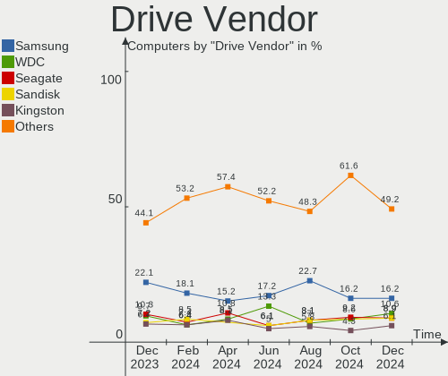
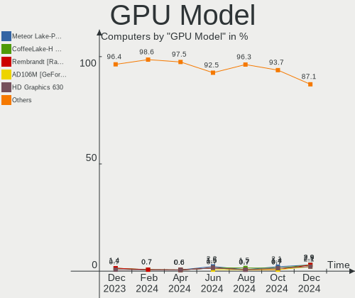
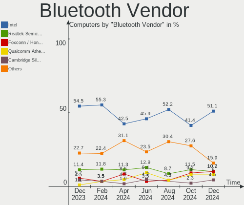
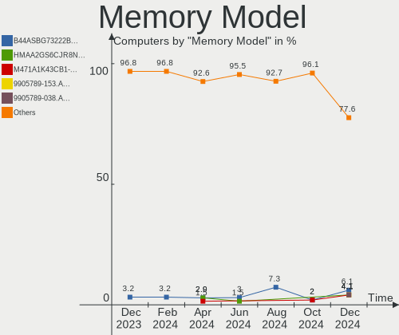
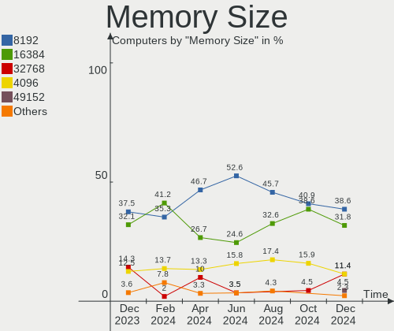
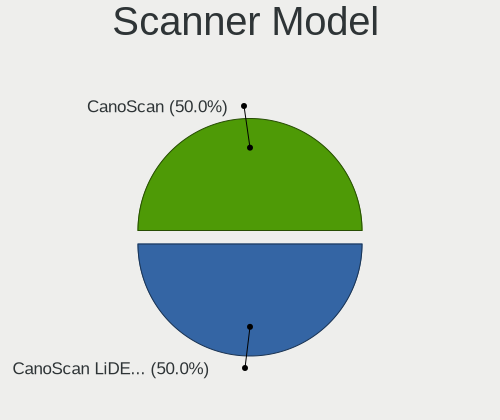

Manjaro - Hardware Trends
-------------------------

A project to identify most popular hardware characteristics and track their change
over time based on data collected by Linux users at https://Linux-Hardware.org.

Anyone can contribute to this report by the [hw-probe](https://github.com/linuxhw/hw-probe) tool:

    sudo -E hw-probe -all -upload

This is a report for all computer types. See also reports for [desktops](/Dist/Manjaro/Desktop/README.md) and [notebooks](/Dist/Manjaro/Notebook/README.md).

This report is for one last month. Overall report since the beginning of time: [TestDays](https://github.com/linuxhw/TestDays)

Period: Nov, 2023.

Contents
--------

* [ System ](#system)
  - [ OS                       ](#os)
  - [ OS Family                ](#os-family)
  - [ Kernel                   ](#kernel)
  - [ Kernel Family            ](#kernel-family)
  - [ Kernel Major Ver.        ](#kernel-major-ver)
  - [ Arch                     ](#arch)
  - [ DE                       ](#de)
  - [ Display Server           ](#display-server)
  - [ Display Manager          ](#display-manager)
  - [ OS Lang                  ](#os-lang)
  - [ Boot Mode                ](#boot-mode)
  - [ Filesystem               ](#filesystem)
  - [ Part. scheme             ](#part-scheme)
  - [ Dual Boot with Linux/BSD ](#dual-boot-with-linuxbsd)
  - [ Dual Boot (Win)          ](#dual-boot-win)

* [ Board ](#board)
  - [ Vendor                   ](#vendor)
  - [ Model                    ](#model)
  - [ Model Family             ](#model-family)
  - [ MFG Year                 ](#mfg-year)
  - [ Form Factor              ](#form-factor)
  - [ Secure Boot              ](#secure-boot)
  - [ Coreboot                 ](#coreboot)
  - [ RAM Size                 ](#ram-size)
  - [ RAM Used                 ](#ram-used)
  - [ Total Drives             ](#total-drives)
  - [ Has CD-ROM               ](#has-cd-rom)
  - [ Has Ethernet             ](#has-ethernet)
  - [ Has WiFi                 ](#has-wifi)
  - [ Has Bluetooth            ](#has-bluetooth)

* [ Location ](#location)
  - [ Country                  ](#country)
  - [ City                     ](#city)

* [ Drives ](#drives)
  - [ Drive Vendor             ](#drive-vendor)
  - [ Drive Model              ](#drive-model)
  - [ HDD Vendor               ](#hdd-vendor)
  - [ SSD Vendor               ](#ssd-vendor)
  - [ Drive Kind               ](#drive-kind)
  - [ Drive Connector          ](#drive-connector)
  - [ Drive Size               ](#drive-size)
  - [ Space Total              ](#space-total)
  - [ Space Used               ](#space-used)
  - [ Malfunc. Drives          ](#malfunc-drives)
  - [ Malfunc. Drive Vendor    ](#malfunc-drive-vendor)
  - [ Malfunc. HDD Vendor      ](#malfunc-hdd-vendor)
  - [ Malfunc. Drive Kind      ](#malfunc-drive-kind)
  - [ Failed Drives            ](#failed-drives)
  - [ Failed Drive Vendor      ](#failed-drive-vendor)
  - [ Drive Status             ](#drive-status)

* [ Storage controller ](#storage-controller)
  - [ Storage Vendor           ](#storage-vendor)
  - [ Storage Model            ](#storage-model)
  - [ Storage Kind             ](#storage-kind)

* [ Processor ](#processor)
  - [ CPU Vendor               ](#cpu-vendor)
  - [ CPU Model                ](#cpu-model)
  - [ CPU Model Family         ](#cpu-model-family)
  - [ CPU Cores                ](#cpu-cores)
  - [ CPU Sockets              ](#cpu-sockets)
  - [ CPU Threads              ](#cpu-threads)
  - [ CPU Op-Modes             ](#cpu-op-modes)
  - [ CPU Microcode            ](#cpu-microcode)
  - [ CPU Microarch            ](#cpu-microarch)

* [ Graphics ](#graphics)
  - [ GPU Vendor               ](#gpu-vendor)
  - [ GPU Model                ](#gpu-model)
  - [ GPU Combo                ](#gpu-combo)
  - [ GPU Driver               ](#gpu-driver)
  - [ GPU Memory               ](#gpu-memory)

* [ Monitor ](#monitor)
  - [ Monitor Vendor           ](#monitor-vendor)
  - [ Monitor Model            ](#monitor-model)
  - [ Monitor Resolution       ](#monitor-resolution)
  - [ Monitor Diagonal         ](#monitor-diagonal)
  - [ Monitor Width            ](#monitor-width)
  - [ Aspect Ratio             ](#aspect-ratio)
  - [ Monitor Area             ](#monitor-area)
  - [ Pixel Density            ](#pixel-density)
  - [ Multiple Monitors        ](#multiple-monitors)

* [ Network ](#network)
  - [ Net Controller Vendor    ](#net-controller-vendor)
  - [ Net Controller Model     ](#net-controller-model)
  - [ Wireless Vendor          ](#wireless-vendor)
  - [ Wireless Model           ](#wireless-model)
  - [ Ethernet Vendor          ](#ethernet-vendor)
  - [ Ethernet Model           ](#ethernet-model)
  - [ Net Controller Kind      ](#net-controller-kind)
  - [ Used Controller          ](#used-controller)
  - [ NICs                     ](#nics)
  - [ IPv6                     ](#ipv6)

* [ Bluetooth ](#bluetooth)
  - [ Bluetooth Vendor         ](#bluetooth-vendor)
  - [ Bluetooth Model          ](#bluetooth-model)

* [ Sound ](#sound)
  - [ Sound Vendor             ](#sound-vendor)
  - [ Sound Model              ](#sound-model)

* [ Memory ](#memory)
  - [ Memory Vendor            ](#memory-vendor)
  - [ Memory Model             ](#memory-model)
  - [ Memory Kind              ](#memory-kind)
  - [ Memory Form Factor       ](#memory-form-factor)
  - [ Memory Size              ](#memory-size)
  - [ Memory Speed             ](#memory-speed)

* [ Printers & scanners ](#printers--scanners)
  - [ Printer Vendor           ](#printer-vendor)
  - [ Printer Model            ](#printer-model)
  - [ Scanner Vendor           ](#scanner-vendor)
  - [ Scanner Model            ](#scanner-model)

* [ Camera ](#camera)
  - [ Camera Vendor            ](#camera-vendor)
  - [ Camera Model             ](#camera-model)

* [ Security ](#security)
  - [ Fingerprint Vendor       ](#fingerprint-vendor)
  - [ Fingerprint Model        ](#fingerprint-model)
  - [ Chipcard Vendor          ](#chipcard-vendor)
  - [ Chipcard Model           ](#chipcard-model)

* [ Unsupported ](#unsupported)
  - [ Unsupported Devices      ](#unsupported-devices)
  - [ Unsupported Device Types ](#unsupported-device-types)

System
------

OS
--

Installed operating systems

| Name           | Computers | Percent |
|----------------|-----------|---------|
| Manjaro        | 65        | 47.79%  |
| Manjaro 23.1.0 | 45        | 33.09%  |
| Manjaro 23.0.4 | 24        | 17.65%  |
| Manjaro 23.0.3 | 1         | 0.74%   |
| Manjaro 23.0   | 1         | 0.74%   |

OS Family
---------

OS without a version

| Name    | Computers | Percent |
|---------|-----------|---------|
| Manjaro | 136       | 100%    |

Kernel
------

Version of the Linux kernel

| Version             | Computers | Percent |
|---------------------|-----------|---------|
| 6.5.11-1-MANJARO    | 24        | 17.65%  |
| 6.5.5-1-MANJARO     | 23        | 16.91%  |
| 6.1.55-1-MANJARO    | 15        | 11.03%  |
| 6.6.1-1-MANJARO     | 13        | 9.56%   |
| 6.5.9-1-MANJARO     | 13        | 9.56%   |
| 6.6.0-1-MANJARO     | 12        | 8.82%   |
| 6.1.60-1-MANJARO    | 7         | 5.15%   |
| 6.1.62-1-MANJARO    | 6         | 4.41%   |
| 5.15.133-1-MANJARO  | 4         | 2.94%   |
| 6.6.2-1-MANJARO     | 2         | 1.47%   |
| 6.5.12-1-MANJARO    | 2         | 1.47%   |
| 6.5.0-1-MANJARO     | 2         | 1.47%   |
| 6.4.16-5-MANJARO    | 2         | 1.47%   |
| 6.1.63-1-MANJARO    | 2         | 1.47%   |
| 5.15.137-1-MANJARO  | 2         | 1.47%   |
| 6.7.0-1-MANJARO     | 1         | 0.74%   |
| 6.6.2-lqx1-1-lqx    | 1         | 0.74%   |
| 6.5.2-1-rt8-MANJARO | 1         | 0.74%   |
| 6.1.38-1-MANJARO    | 1         | 0.74%   |
| 5.9.16-1-MANJARO    | 1         | 0.74%   |
| 5.4.260-1-MANJARO   | 1         | 0.74%   |
| 5.15.138-1-MANJARO  | 1         | 0.74%   |

Kernel Family
-------------

Linux kernel without a distro release

| Version  | Computers | Percent |
|----------|-----------|---------|
| 6.5.11   | 24        | 17.65%  |
| 6.5.5    | 23        | 16.91%  |
| 6.1.55   | 15        | 11.03%  |
| 6.6.1    | 13        | 9.56%   |
| 6.5.9    | 13        | 9.56%   |
| 6.6.0    | 12        | 8.82%   |
| 6.1.60   | 7         | 5.15%   |
| 6.1.62   | 6         | 4.41%   |
| 5.15.133 | 4         | 2.94%   |
| 6.6.2    | 3         | 2.21%   |
| 6.5.12   | 2         | 1.47%   |
| 6.5.0    | 2         | 1.47%   |
| 6.4.16   | 2         | 1.47%   |
| 6.1.63   | 2         | 1.47%   |
| 5.15.137 | 2         | 1.47%   |
| 6.7.0    | 1         | 0.74%   |
| 6.5.2    | 1         | 0.74%   |
| 6.1.38   | 1         | 0.74%   |
| 5.9.16   | 1         | 0.74%   |
| 5.4.260  | 1         | 0.74%   |
| 5.15.138 | 1         | 0.74%   |

Kernel Major Ver.
-----------------

Linux kernel major version

| Version | Computers | Percent |
|---------|-----------|---------|
| 6.5     | 65        | 47.79%  |
| 6.1     | 31        | 22.79%  |
| 6.6     | 28        | 20.59%  |
| 5.15    | 7         | 5.15%   |
| 6.4     | 2         | 1.47%   |
| 6.7     | 1         | 0.74%   |
| 5.9     | 1         | 0.74%   |
| 5.4     | 1         | 0.74%   |

Arch
----

OS architecture (x86_64, i586, etc.)

| Name   | Computers | Percent |
|--------|-----------|---------|
| x86_64 | 136       | 100%    |

DE
--

Desktop Environment

| Name       | Computers | Percent |
|------------|-----------|---------|
| KDE5       | 71        | 52.21%  |
| GNOME      | 37        | 27.21%  |
| XFCE       | 19        | 13.97%  |
| i3         | 4         | 2.94%   |
| X-Cinnamon | 2         | 1.47%   |
| Unknown    | 2         | 1.47%   |
| KDE        | 1         | 0.74%   |

Display Server
--------------

X11 or Wayland

| Name    | Computers | Percent |
|---------|-----------|---------|
| X11     | 103       | 75.74%  |
| Wayland | 29        | 21.32%  |
| Tty     | 2         | 1.47%   |
| Unknown | 2         | 1.47%   |

Display Manager
---------------

SDDM, LightDM, etc.

| Name    | Computers | Percent |
|---------|-----------|---------|
| Unknown | 66        | 48.53%  |
| SDDM    | 34        | 25%     |
| GDM     | 19        | 13.97%  |
| LightDM | 17        | 12.5%   |

OS Lang
-------

Language

| Lang    | Computers | Percent |
|---------|-----------|---------|
| en_US   | 58        | 42.65%  |
| en_GB   | 15        | 11.03%  |
| it_IT   | 11        | 8.09%   |
| ru_RU   | 7         | 5.15%   |
| pt_BR   | 7         | 5.15%   |
| de_DE   | 6         | 4.41%   |
| pl_PL   | 4         | 2.94%   |
| fr_FR   | 3         | 2.21%   |
| en_CA   | 3         | 2.21%   |
| ro_RO   | 2         | 1.47%   |
| es_ES   | 2         | 1.47%   |
| sv_SE   | 1         | 0.74%   |
| nl_NL   | 1         | 0.74%   |
| id_ID   | 1         | 0.74%   |
| hu_HU   | 1         | 0.74%   |
| fr_CA   | 1         | 0.74%   |
| fi_FI   | 1         | 0.74%   |
| es_VE   | 1         | 0.74%   |
| es_MX   | 1         | 0.74%   |
| es_CO   | 1         | 0.74%   |
| es_AR   | 1         | 0.74%   |
| en_ZA   | 1         | 0.74%   |
| en_PH   | 1         | 0.74%   |
| en_IN   | 1         | 0.74%   |
| en_AU   | 1         | 0.74%   |
| de_CH   | 1         | 0.74%   |
| de_AT   | 1         | 0.74%   |
| cs_CZ   | 1         | 0.74%   |
| Unknown | 1         | 0.74%   |

Boot Mode
---------

EFI or BIOS

| Mode | Computers | Percent |
|------|-----------|---------|
| BIOS | 80        | 58.82%  |
| EFI  | 56        | 41.18%  |

Filesystem
----------

Type of filesystem

| Type  | Computers | Percent |
|-------|-----------|---------|
| Ext4  | 102       | 75%     |
| Btrfs | 18        | 13.24%  |
| Tmpfs | 14        | 10.29%  |
| Xfs   | 1         | 0.74%   |
| Ext3  | 1         | 0.74%   |

Part. scheme
------------

Scheme of partitioning

| Type    | Computers | Percent |
|---------|-----------|---------|
| GPT     | 64        | 47.06%  |
| Unknown | 62        | 45.59%  |
| MBR     | 10        | 7.35%   |

Dual Boot with Linux/BSD
------------------------

Hosting more than one Linux/BSD

| Dual boot | Computers | Percent |
|-----------|-----------|---------|
| No        | 121       | 88.97%  |
| Yes       | 15        | 11.03%  |

Dual Boot (Win)
---------------

Hosting Linux and Windows

| Dual boot | Computers | Percent |
|-----------|-----------|---------|
| No        | 102       | 75%     |
| Yes       | 34        | 25%     |

Board
-----

Vendor
------

Motherboard manufacturer

| Name                       | Computers | Percent |
|----------------------------|-----------|---------|
| ASUSTek Computer           | 23        | 16.91%  |
| Lenovo                     | 21        | 15.44%  |
| Hewlett-Packard            | 21        | 15.44%  |
| Acer                       | 10        | 7.35%   |
| MSI                        | 9         | 6.62%   |
| Dell                       | 8         | 5.88%   |
| Gigabyte Technology        | 7         | 5.15%   |
| ASRock                     | 6         | 4.41%   |
| Apple                      | 5         | 3.68%   |
| Samsung Electronics        | 3         | 2.21%   |
| TUXEDO                     | 2         | 1.47%   |
| HUAWEI                     | 2         | 1.47%   |
| Fujitsu                    | 2         | 1.47%   |
| Unknown                    | 2         | 1.47%   |
| Timi                       | 1         | 0.74%   |
| Thomson                    | 1         | 0.74%   |
| TECNO Mobile Limited       | 1         | 0.74%   |
| Shenzhen WEIBU Information | 1         | 0.74%   |
| Panasonic                  | 1         | 0.74%   |
| Olivetti                   | 1         | 0.74%   |
| Notebook                   | 1         | 0.74%   |
| Microsoft                  | 1         | 0.74%   |
| Medion                     | 1         | 0.74%   |
| Maibenben                  | 1         | 0.74%   |
| Google                     | 1         | 0.74%   |
| GEO                        | 1         | 0.74%   |
| Gateway                    | 1         | 0.74%   |
| Framework                  | 1         | 0.74%   |
| Alurin                     | 1         | 0.74%   |

Model
-----

Motherboard model

| Name                                        | Computers | Percent |
|---------------------------------------------|-----------|---------|
| Gigabyte P35-DS3                            | 2         | 1.47%   |
| Unknown                                     | 2         | 1.47%   |
| TUXEDO Stellaris Intel Gen4                 | 1         | 0.74%   |
| TUXEDO InfinityBook S 15/17 Gen7            | 1         | 0.74%   |
| Timi Mi Laptop Pro 15 2020                  | 1         | 0.74%   |
| Thomson N14C4WH64                           | 1         | 0.74%   |
| TECNO Mobile Limited MEGABOOK T14TA         | 1         | 0.74%   |
| Shenzhen WEIBU Information Alder Lake N     | 1         | 0.74%   |
| Samsung RV411/RV511/E3511/S3511/RV711/E3411 | 1         | 0.74%   |
| Samsung 950QED                              | 1         | 0.74%   |
| Samsung 730QED                              | 1         | 0.74%   |
| Panasonic CF-54-1                           | 1         | 0.74%   |
| Olivetti P55-AEU-323-4G320                  | 1         | 0.74%   |
| Notebook P7xxTM                             | 1         | 0.74%   |
| MSI Thin GF63 12VF                          | 1         | 0.74%   |
| MSI Prestige 14Evo A12M                     | 1         | 0.74%   |
| MSI MS-7E06                                 | 1         | 0.74%   |
| MSI MS-7D20                                 | 1         | 0.74%   |
| MSI MS-7D14                                 | 1         | 0.74%   |
| MSI MS-7C91                                 | 1         | 0.74%   |
| MSI MS-7C37                                 | 1         | 0.74%   |
| MSI MS-7C02                                 | 1         | 0.74%   |
| MSI MS-7995                                 | 1         | 0.74%   |
| Microsoft Surface Pro 4                     | 1         | 0.74%   |
| Medion E4251 MD61435                        | 1         | 0.74%   |
| Maibenben MaiBook M                         | 1         | 0.74%   |
| Lenovo Yoga Slim 7 Pro 14IAH7 82UT          | 1         | 0.74%   |
| Lenovo Yoga Slim 7 Carbon 14ACN6 82L0       | 1         | 0.74%   |
| Lenovo Yoga Pro 7 14APH8 82Y8               | 1         | 0.74%   |
| Lenovo ThinkPad X280 20KFCTO1WW             | 1         | 0.74%   |
| Lenovo ThinkPad X260 20F5S9GM01             | 1         | 0.74%   |
| Lenovo ThinkPad T480 20L6S4XW00             | 1         | 0.74%   |
| Lenovo ThinkPad T480 20L60017UK             | 1         | 0.74%   |
| Lenovo ThinkPad T440 20B7A0CYMH             | 1         | 0.74%   |
| Lenovo ThinkPad L460 20FVS12A00             | 1         | 0.74%   |
| Lenovo ThinkPad L14 Gen 3 21C1005TPB        | 1         | 0.74%   |
| Lenovo ThinkCentre M93 10A50002GE           | 1         | 0.74%   |
| Lenovo ThinkBook 15-IIL 20SM                | 1         | 0.74%   |
| Lenovo ThinkBook 15 G2 ARE 20VG             | 1         | 0.74%   |
| Lenovo Legion Slim 5 16APH8 82Y9            | 1         | 0.74%   |

Model Family
------------

Motherboard model prefix

| Name                             | Computers | Percent |
|----------------------------------|-----------|---------|
| Lenovo ThinkPad                  | 7         | 5.15%   |
| ASUS VivoBook                    | 6         | 4.41%   |
| ASUS ROG                         | 6         | 4.41%   |
| Acer Aspire                      | 6         | 4.41%   |
| HP EliteBook                     | 4         | 2.94%   |
| ASUS PRIME                       | 4         | 2.94%   |
| Lenovo Yoga                      | 3         | 2.21%   |
| HP ProBook                       | 3         | 2.21%   |
| Lenovo ThinkBook                 | 2         | 1.47%   |
| Lenovo Legion                    | 2         | 1.47%   |
| Lenovo IdeaCentre                | 2         | 1.47%   |
| HP Pavilion                      | 2         | 1.47%   |
| HP Laptop                        | 2         | 1.47%   |
| HP ENVY                          | 2         | 1.47%   |
| Gigabyte P35-DS3                 | 2         | 1.47%   |
| Fujitsu LIFEBOOK                 | 2         | 1.47%   |
| Dell XPS                         | 2         | 1.47%   |
| Dell Precision                   | 2         | 1.47%   |
| Dell OptiPlex                    | 2         | 1.47%   |
| ASUS Zenbook                     | 2         | 1.47%   |
| Acer Predator                    | 2         | 1.47%   |
| Unknown                          | 2         | 1.47%   |
| TUXEDO Stellaris                 | 1         | 0.74%   |
| TUXEDO InfinityBook              | 1         | 0.74%   |
| Timi Mi                          | 1         | 0.74%   |
| Thomson N14C4WH64                | 1         | 0.74%   |
| TECNO Mobile Limited MEGABOOK    | 1         | 0.74%   |
| Shenzhen WEIBU Information Alder | 1         | 0.74%   |
| Samsung RV411                    | 1         | 0.74%   |
| Samsung 950QED                   | 1         | 0.74%   |
| Samsung 730QED                   | 1         | 0.74%   |
| Panasonic CF-54-1                | 1         | 0.74%   |
| Olivetti P55-AEU-323-4G320       | 1         | 0.74%   |
| Notebook P7xxTM                  | 1         | 0.74%   |
| MSI Thin                         | 1         | 0.74%   |
| MSI Prestige                     | 1         | 0.74%   |
| MSI MS-7E06                      | 1         | 0.74%   |
| MSI MS-7D20                      | 1         | 0.74%   |
| MSI MS-7D14                      | 1         | 0.74%   |
| MSI MS-7C91                      | 1         | 0.74%   |

MFG Year
--------

Motherboard manufacture year

| Year | Computers | Percent |
|------|-----------|---------|
| 2020 | 24        | 17.65%  |
| 2022 | 21        | 15.44%  |
| 2023 | 12        | 8.82%   |
| 2021 | 12        | 8.82%   |
| 2019 | 10        | 7.35%   |
| 2018 | 10        | 7.35%   |
| 2013 | 7         | 5.15%   |
| 2017 | 6         | 4.41%   |
| 2016 | 6         | 4.41%   |
| 2012 | 6         | 4.41%   |
| 2010 | 5         | 3.68%   |
| 2015 | 4         | 2.94%   |
| 2014 | 4         | 2.94%   |
| 2007 | 4         | 2.94%   |
| 2011 | 3         | 2.21%   |
| 2008 | 2         | 1.47%   |

Form Factor
-----------

Physical design of the computer

| Name        | Computers | Percent |
|-------------|-----------|---------|
| Notebook    | 78        | 57.35%  |
| Desktop     | 46        | 33.82%  |
| Convertible | 9         | 6.62%   |
| Tablet      | 2         | 1.47%   |
| All in one  | 1         | 0.74%   |

Secure Boot
-----------

Enabled or disabled

| State    | Computers | Percent |
|----------|-----------|---------|
| Disabled | 136       | 100%    |

Coreboot
--------

Have coreboot on board

| Used | Computers | Percent |
|------|-----------|---------|
| No   | 135       | 99.26%  |
| Yes  | 1         | 0.74%   |

RAM Size
--------

Total RAM memory

| Size in GB  | Computers | Percent |
|-------------|-----------|---------|
| 16.01-24.0  | 37        | 27.21%  |
| 8.01-16.0   | 30        | 22.06%  |
| 4.01-8.0    | 20        | 14.71%  |
| 3.01-4.0    | 18        | 13.24%  |
| 32.01-64.0  | 17        | 12.5%   |
| 24.01-32.0  | 6         | 4.41%   |
| 64.01-256.0 | 6         | 4.41%   |
| 2.01-3.0    | 2         | 1.47%   |

RAM Used
--------

Used RAM memory

| Used GB    | Computers | Percent |
|------------|-----------|---------|
| 4.01-8.0   | 50        | 36.76%  |
| 3.01-4.0   | 27        | 19.85%  |
| 2.01-3.0   | 25        | 18.38%  |
| 1.01-2.0   | 19        | 13.97%  |
| 8.01-16.0  | 11        | 8.09%   |
| 0.51-1.0   | 3         | 2.21%   |
| 16.01-24.0 | 1         | 0.74%   |

Total Drives
------------

Number of drives on board

| Drives | Computers | Percent |
|--------|-----------|---------|
| 1      | 87        | 63.97%  |
| 2      | 29        | 21.32%  |
| 3      | 10        | 7.35%   |
| 4      | 5         | 3.68%   |
| 5      | 3         | 2.21%   |
| 6      | 2         | 1.47%   |

Has CD-ROM
----------

Has CD-ROM on board

| Presented | Computers | Percent |
|-----------|-----------|---------|
| No        | 109       | 80.15%  |
| Yes       | 27        | 19.85%  |

Has Ethernet
------------

Has Ethernet on board

| Presented | Computers | Percent |
|-----------|-----------|---------|
| Yes       | 101       | 74.26%  |
| No        | 35        | 25.74%  |

Has WiFi
--------

Has WiFi module

| Presented | Computers | Percent |
|-----------|-----------|---------|
| Yes       | 118       | 86.76%  |
| No        | 18        | 13.24%  |

Has Bluetooth
-------------

Has Bluetooth module

| Presented | Computers | Percent |
|-----------|-----------|---------|
| Yes       | 100       | 73.53%  |
| No        | 36        | 26.47%  |

Location
--------

Country
-------

Geographic location (country)

| Country      | Computers | Percent |
|--------------|-----------|---------|
| USA          | 18        | 13.24%  |
| Italy        | 16        | 11.76%  |
| Russia       | 15        | 11.03%  |
| Germany      | 13        | 9.56%   |
| Brazil       | 7         | 5.15%   |
| France       | 6         | 4.41%   |
| Poland       | 5         | 3.68%   |
| Canada       | 5         | 3.68%   |
| Switzerland  | 4         | 2.94%   |
| Norway       | 4         | 2.94%   |
| UK           | 3         | 2.21%   |
| Indonesia    | 3         | 2.21%   |
| Hungary      | 3         | 2.21%   |
| Greece       | 3         | 2.21%   |
| Sweden       | 2         | 1.47%   |
| Spain        | 2         | 1.47%   |
| South Africa | 2         | 1.47%   |
| Romania      | 2         | 1.47%   |
| Netherlands  | 2         | 1.47%   |
| Czechia      | 2         | 1.47%   |
| Colombia     | 2         | 1.47%   |
| Bulgaria     | 2         | 1.47%   |
| Venezuela    | 1         | 0.74%   |
| Slovenia     | 1         | 0.74%   |
| Philippines  | 1         | 0.74%   |
| Paraguay     | 1         | 0.74%   |
| Mexico       | 1         | 0.74%   |
| Jamaica      | 1         | 0.74%   |
| Iran         | 1         | 0.74%   |
| India        | 1         | 0.74%   |
| Finland      | 1         | 0.74%   |
| Egypt        | 1         | 0.74%   |
| China        | 1         | 0.74%   |
| Bangladesh   | 1         | 0.74%   |
| Austria      | 1         | 0.74%   |
| Australia    | 1         | 0.74%   |
| Argentina    | 1         | 0.74%   |

City
----

Geographic location (city)

| City                     | Computers | Percent |
|--------------------------|-----------|---------|
| Moscow                   | 6         | 4.41%   |
| Porsgrunn                | 3         | 2.21%   |
| Sao Paulo                | 2         | 1.47%   |
| Samara                   | 2         | 1.47%   |
| L’Aquila               | 2         | 1.47%   |
| Lublin                   | 2         | 1.47%   |
| Leipzig                  | 2         | 1.47%   |
| Buzau                    | 2         | 1.47%   |
| Bogotá                  | 2         | 1.47%   |
| Berlin                   | 2         | 1.47%   |
| Yaroslavl                | 1         | 0.74%   |
| Würzburg                | 1         | 0.74%   |
| Winterthur               | 1         | 0.74%   |
| Walsenburg               | 1         | 0.74%   |
| Vancouver                | 1         | 0.74%   |
| Urbana                   | 1         | 0.74%   |
| Ulan-Ude                 | 1         | 0.74%   |
| Turku                    | 1         | 0.74%   |
| Turin                    | 1         | 0.74%   |
| Toronto                  | 1         | 0.74%   |
| Topuzevo                 | 1         | 0.74%   |
| Thun                     | 1         | 0.74%   |
| Thessaloniki             | 1         | 0.74%   |
| Tehran                   | 1         | 0.74%   |
| Szigetszentmiklos        | 1         | 0.74%   |
| St Petersburg            | 1         | 0.74%   |
| Sofia                    | 1         | 0.74%   |
| Siena                    | 1         | 0.74%   |
| Siegen                   | 1         | 0.74%   |
| Siegburg                 | 1         | 0.74%   |
| Shenzhen                 | 1         | 0.74%   |
| Sesto Fiorentino         | 1         | 0.74%   |
| Seattle                  | 1         | 0.74%   |
| Schwelm                  | 1         | 0.74%   |
| Schweinfurt              | 1         | 0.74%   |
| Saratov                  | 1         | 0.74%   |
| Sao Jose                 | 1         | 0.74%   |
| Santa Maria Capua Vetere | 1         | 0.74%   |
| San Juan                 | 1         | 0.74%   |
| San Jose                 | 1         | 0.74%   |

Drives
------

Drive Vendor
------------

Hard drive vendors

| Vendor                       | Computers | Drives | Percent |
|------------------------------|-----------|--------|---------|
| Samsung Electronics          | 35        | 43     | 17.68%  |
| SanDisk                      | 19        | 19     | 9.6%    |
| WDC                          | 16        | 20     | 8.08%   |
| Seagate                      | 16        | 22     | 8.08%   |
| Toshiba                      | 13        | 13     | 6.57%   |
| Crucial                      | 13        | 13     | 6.57%   |
| Kingston                     | 10        | 12     | 5.05%   |
| Intel                        | 8         | 8      | 4.04%   |
| Unknown                      | 7         | 9      | 3.54%   |
| Micron/Crucial Technology    | 5         | 5      | 2.53%   |
| Micron Technology            | 4         | 4      | 2.02%   |
| Hitachi                      | 4         | 4      | 2.02%   |
| SK hynix                     | 3         | 3      | 1.52%   |
| Silicon Motion               | 3         | 3      | 1.52%   |
| KIOXIA                       | 3         | 3      | 1.52%   |
| China                        | 3         | 3      | 1.52%   |
| Apple                        | 3         | 3      | 1.52%   |
| Phison Electronics           | 2         | 2      | 1.01%   |
| Phison                       | 2         | 2      | 1.01%   |
| Patriot                      | 2         | 2      | 1.01%   |
| MAXIO Technology (Hangzhou)  | 2         | 2      | 1.01%   |
| Kingston Technology Company  | 2         | 2      | 1.01%   |
| Emtec                        | 2         | 2      | 1.01%   |
| A-DATA Technology            | 2         | 2      | 1.01%   |
| WDC WDS1                     | 1         | 1      | 0.51%   |
| Union Memory (Shenzhen)      | 1         | 1      | 0.51%   |
| Union Memory                 | 1         | 1      | 0.51%   |
| Transcend                    | 1         | 1      | 0.51%   |
| StoreJet                     | 1         | 1      | 0.51%   |
| SPCC                         | 1         | 1      | 0.51%   |
| Shenzhen Longsys Electronics | 1         | 1      | 0.51%   |
| Realtek Semiconductor        | 1         | 1      | 0.51%   |
| Ramos Technology             | 1         | 1      | 0.51%   |
| PNY                          | 1         | 1      | 0.51%   |
| Lite-On Technology           | 1         | 1      | 0.51%   |
| Lexar                        | 1         | 1      | 0.51%   |
| KIOXIA-EXCERIA               | 1         | 1      | 0.51%   |
| JMicron Technology           | 1         | 1      | 0.51%   |
| Hoodisk                      | 1         | 1      | 0.51%   |
| GOODRAM                      | 1         | 1      | 0.51%   |

Drive Model
-----------

Hard drive models

| Model                                                 | Computers | Percent |
|-------------------------------------------------------|-----------|---------|
| Samsung NVMe SSD Controller SM981/PM981/PM983 250GB   | 10        | 4.59%   |
| Samsung NVMe SSD Controller PM9A1/PM9A3/980PRO 2TB    | 7         | 3.21%   |
| Crucial CT1000MX500SSD1 1TB                           | 7         | 3.21%   |
| Intel SSD 660P Series 512GB                           | 6         | 2.75%   |
| Crucial CT500MX500SSD1 500GB                          | 5         | 2.29%   |
| Unknown MMC Card  64GB                                | 4         | 1.83%   |
| Micron/Crucial P2 NVMe PCIe SSD 1TB                   | 4         | 1.83%   |
| Toshiba MQ01ABD100 1TB                                | 3         | 1.38%   |
| Sandisk WD Blue SN550 NVMe SSD 512GB                  | 3         | 1.38%   |
| Samsung NVMe SSD Controller SM961/PM961/SM963 256GB   | 3         | 1.38%   |
| WDC WD3200BPVT-75JJ5T0 320GB                          | 2         | 0.92%   |
| Toshiba XG6 NVMe SSD Controller 512GB                 | 2         | 0.92%   |
| Toshiba HDWD110 1TB                                   | 2         | 0.92%   |
| Toshiba DT01ACA100 1TB                                | 2         | 0.92%   |
| SK hynix SKHynix_HFS512GEJ9X115N 512GB                | 2         | 0.92%   |
| Silicon Motion SM2263EN/SM2263XT SSD Controller 256GB | 2         | 0.92%   |
| Seagate ST500LT012-9WS142 500GB                       | 2         | 0.92%   |
| Seagate ST2000DM001-1ER164 2TB                        | 2         | 0.92%   |
| Seagate ST1000DM010-2EP102 1TB                        | 2         | 0.92%   |
| Seagate ST1000DM003-9YN162 1TB                        | 2         | 0.92%   |
| Seagate ST1000DM003-1ER162 1TB                        | 2         | 0.92%   |
| Sandisk WD PC SN735 SDBPNHH-1T00-1002 1TB             | 2         | 0.92%   |
| Sandisk WD Blue SN570 1TB                             | 2         | 0.92%   |
| Sandisk WD Black SN750 / PC SN730 NVMe SSD 500GB      | 2         | 0.92%   |
| SanDisk SSD PLUS 240GB                                | 2         | 0.92%   |
| Samsung SSD 980 1TB                                   | 2         | 0.92%   |
| Samsung MZALQ512HALU-000L2 512GB                      | 2         | 0.92%   |
| Samsung MZ7TD128HAFV-000L1 128GB SSD                  | 2         | 0.92%   |
| Patriot Burst 240GB SSD                               | 2         | 0.92%   |
| MAXIO (Hangzhou) NVMe SSD Controller MAP1202 1024GB   | 2         | 0.92%   |
| Kingston SA400S37480G 480GB SSD                       | 2         | 0.92%   |
| Kingston SA400S37240G 240GB SSD                       | 2         | 0.92%   |
| Kingston OM8PCP3512F-AB 512GB                         | 2         | 0.92%   |
| WDC WDS240G2G0A-00JH30 240GB SSD                      | 1         | 0.46%   |
| WDC WDS1 00T2B0A-00SM50 1TB SSD                       | 1         | 0.46%   |
| WDC WD7500AAKS-00RBA0 752GB                           | 1         | 0.46%   |
| WDC WD7500AACS-00D6B1 752GB                           | 1         | 0.46%   |
| WDC WD60EZAZ-00ZGHB0 6TB                              | 1         | 0.46%   |
| WDC WD5000LPCX-24VHAT0 500GB                          | 1         | 0.46%   |
| WDC WD5000BPKX-60HPJT0 500GB                          | 1         | 0.46%   |

HDD Vendor
----------

Hard disk drive vendors

| Vendor              | Computers | Drives | Percent |
|---------------------|-----------|--------|---------|
| WDC                 | 16        | 19     | 32%     |
| Seagate             | 15        | 20     | 30%     |
| Toshiba             | 9         | 9      | 18%     |
| Hitachi             | 4         | 4      | 8%      |
| Samsung Electronics | 2         | 3      | 4%      |
| Apple               | 2         | 2      | 4%      |
| StoreJet            | 1         | 1      | 2%      |
| Fujitsu             | 1         | 1      | 2%      |

SSD Vendor
----------

Solid state drive vendors

| Vendor              | Computers | Drives | Percent |
|---------------------|-----------|--------|---------|
| Crucial             | 13        | 13     | 22.81%  |
| Samsung Electronics | 12        | 13     | 21.05%  |
| Kingston            | 5         | 6      | 8.77%   |
| SanDisk             | 4         | 4      | 7.02%   |
| China               | 3         | 3      | 5.26%   |
| Patriot             | 2         | 2      | 3.51%   |
| Emtec               | 2         | 2      | 3.51%   |
| A-DATA Technology   | 2         | 2      | 3.51%   |
| WDC WDS1            | 1         | 1      | 1.75%   |
| WDC                 | 1         | 1      | 1.75%   |
| Transcend           | 1         | 1      | 1.75%   |
| SPCC                | 1         | 1      | 1.75%   |
| Ramos Technology    | 1         | 1      | 1.75%   |
| PNY                 | 1         | 1      | 1.75%   |
| Phison              | 1         | 1      | 1.75%   |
| Micron Technology   | 1         | 1      | 1.75%   |
| Lexar               | 1         | 1      | 1.75%   |
| JMicron Technology  | 1         | 1      | 1.75%   |
| Hoodisk             | 1         | 1      | 1.75%   |
| GOODRAM             | 1         | 1      | 1.75%   |
| Galaxy              | 1         | 1      | 1.75%   |
| Apple               | 1         | 1      | 1.75%   |

Drive Kind
----------

HDD or SSD

| Kind    | Computers | Drives | Percent |
|---------|-----------|--------|---------|
| NVMe    | 83        | 91     | 45.86%  |
| SSD     | 47        | 59     | 25.97%  |
| HDD     | 42        | 59     | 23.2%   |
| MMC     | 5         | 6      | 2.76%   |
| Unknown | 4         | 5      | 2.21%   |

Drive Connector
---------------

SATA, SAS, NVMe, etc.

| Type | Computers | Drives | Percent |
|------|-----------|--------|---------|
| NVMe | 83        | 91     | 50%     |
| SATA | 72        | 115    | 43.37%  |
| SAS  | 6         | 8      | 3.61%   |
| MMC  | 5         | 6      | 3.01%   |

Drive Size
----------

Size of hard drive

| Size in TB | Computers | Drives | Percent |
|------------|-----------|--------|---------|
| 0.01-0.5   | 47        | 61     | 48.96%  |
| 0.51-1.0   | 36        | 44     | 37.5%   |
| 1.01-2.0   | 5         | 5      | 5.21%   |
| 3.01-4.0   | 3         | 3      | 3.13%   |
| 4.01-10.0  | 3         | 3      | 3.13%   |
| 2.01-3.0   | 2         | 2      | 2.08%   |

Space Total
-----------

Amount of disk space available on the file system

| Size in GB     | Computers | Percent |
|----------------|-----------|---------|
| 251-500        | 34        | 25%     |
| 101-250        | 29        | 21.32%  |
| 501-1000       | 24        | 17.65%  |
| More than 3000 | 12        | 8.82%   |
| Unknown        | 12        | 8.82%   |
| 1001-2000      | 8         | 5.88%   |
| 51-100         | 8         | 5.88%   |
| 1-20           | 5         | 3.68%   |
| 2001-3000      | 3         | 2.21%   |
| 21-50          | 1         | 0.74%   |

Space Used
----------

Amount of used disk space

| Used GB        | Computers | Percent |
|----------------|-----------|---------|
| 1-20           | 27        | 19.85%  |
| 21-50          | 24        | 17.65%  |
| 101-250        | 24        | 17.65%  |
| 51-100         | 17        | 12.5%   |
| 251-500        | 13        | 9.56%   |
| Unknown        | 12        | 8.82%   |
| 1001-2000      | 7         | 5.15%   |
| 501-1000       | 6         | 4.41%   |
| More than 3000 | 4         | 2.94%   |
| 2001-3000      | 2         | 1.47%   |

Malfunc. Drives
---------------

Drive models with a malfunction

| Model                          | Computers | Drives | Percent |
|--------------------------------|-----------|--------|---------|
| WDC WD10EZEX-22MFCA0 1TB       | 1         | 1      | 12.5%   |
| WDC WD10EZEX-08WN4A0 1TB       | 1         | 1      | 12.5%   |
| Toshiba DT01ACA100 1TB         | 1         | 1      | 12.5%   |
| Seagate ST9250315AS 250GB      | 1         | 1      | 12.5%   |
| Seagate ST4000DM000-1F2168 4TB | 1         | 1      | 12.5%   |
| Seagate ST3250318AS 250GB      | 1         | 1      | 12.5%   |
| Seagate ST1000DM003-9YN162 1TB | 1         | 1      | 12.5%   |
| Hitachi HTS543225A7A384 250GB  | 1         | 1      | 12.5%   |

Malfunc. Drive Vendor
---------------------

Vendors of faulty drives

| Vendor  | Computers | Drives | Percent |
|---------|-----------|--------|---------|
| Seagate | 4         | 4      | 57.14%  |
| WDC     | 1         | 2      | 14.29%  |
| Toshiba | 1         | 1      | 14.29%  |
| Hitachi | 1         | 1      | 14.29%  |

Malfunc. HDD Vendor
-------------------

Vendors of faulty HDD drives

| Vendor  | Computers | Drives | Percent |
|---------|-----------|--------|---------|
| Seagate | 4         | 4      | 57.14%  |
| WDC     | 1         | 2      | 14.29%  |
| Toshiba | 1         | 1      | 14.29%  |
| Hitachi | 1         | 1      | 14.29%  |

Malfunc. Drive Kind
-------------------

Kinds of faulty drives

| Kind | Computers | Drives | Percent |
|------|-----------|--------|---------|
| HDD  | 6         | 8      | 100%    |

Failed Drives
-------------

Failed drive models

Zero info for selected period =(

Failed Drive Vendor
-------------------

Failed drive vendors

Zero info for selected period =(

Drive Status
------------

Number of failed and malfunc. drives

| Status   | Computers | Drives | Percent |
|----------|-----------|--------|---------|
| Detected | 92        | 140    | 63.01%  |
| Works    | 48        | 72     | 32.88%  |
| Malfunc  | 6         | 8      | 4.11%   |

Storage controller
------------------

Storage Vendor
--------------

Storage controller vendors

| Vendor                       | Computers | Percent |
|------------------------------|-----------|---------|
| Intel                        | 74        | 38.95%  |
| AMD                          | 27        | 14.21%  |
| Samsung Electronics          | 24        | 12.63%  |
| SanDisk                      | 15        | 7.89%   |
| Kingston Technology Company  | 8         | 4.21%   |
| Micron/Crucial Technology    | 5         | 2.63%   |
| Toshiba America Info Systems | 4         | 2.11%   |
| KIOXIA                       | 4         | 2.11%   |
| SK hynix                     | 3         | 1.58%   |
| Silicon Motion               | 3         | 1.58%   |
| Phison Electronics           | 3         | 1.58%   |
| Micron Technology            | 3         | 1.58%   |
| JMicron Technology           | 3         | 1.58%   |
| ASMedia Technology           | 3         | 1.58%   |
| Union Memory (Shenzhen)      | 2         | 1.05%   |
| MAXIO Technology (Hangzhou)  | 2         | 1.05%   |
| Shenzhen Longsys Electronics | 1         | 0.53%   |
| Realtek Semiconductor        | 1         | 0.53%   |
| Nvidia                       | 1         | 0.53%   |
| Marvell Technology Group     | 1         | 0.53%   |
| Lite-On Technology           | 1         | 0.53%   |
| Broadcom / LSI               | 1         | 0.53%   |
| ADATA Technology             | 1         | 0.53%   |

Storage Model
-------------

Storage controller models

| Model                                                                          | Computers | Percent |
|--------------------------------------------------------------------------------|-----------|---------|
| AMD FCH SATA Controller [AHCI mode]                                            | 20        | 9.57%   |
| Samsung NVMe SSD Controller SM981/PM981/PM983                                  | 10        | 4.78%   |
| Samsung NVMe SSD Controller PM9A1/PM9A3/980PRO                                 | 7         | 3.35%   |
| Samsung NVMe SSD Controller 980 (DRAM-less)                                    | 6         | 2.87%   |
| Intel SSD 660P Series                                                          | 6         | 2.87%   |
| Intel 8 Series/C220 Series Chipset Family 6-port SATA Controller 1 [AHCI mode] | 5         | 2.39%   |
| Micron/Crucial P2 [Nick P2] / P3 / P3 Plus NVMe PCIe SSD (DRAM-less)           | 4         | 1.91%   |
| Intel 7 Series Chipset Family 6-port SATA Controller [AHCI mode]               | 4         | 1.91%   |
| AMD 500 Series Chipset SATA Controller                                         | 4         | 1.91%   |
| AMD 400 Series Chipset SATA Controller                                         | 4         | 1.91%   |
| SanDisk Ultra 3D / WD Blue SN550 NVMe SSD                                      | 3         | 1.44%   |
| Samsung NVMe SSD Controller SM961/PM961/SM963                                  | 3         | 1.44%   |
| Kingston Company OM8PCP Design-In PCIe 3 NVMe SSD (DRAM-less)                  | 3         | 1.44%   |
| Intel Wildcat Point-LP SATA Controller [AHCI Mode]                             | 3         | 1.44%   |
| Intel Volume Management Device NVMe RAID Controller                            | 3         | 1.44%   |
| Intel Sunrise Point-LP SATA Controller [AHCI mode]                             | 3         | 1.44%   |
| Intel SATA Controller [RAID mode]                                              | 3         | 1.44%   |
| Intel Ice Lake-LP SATA Controller [AHCI mode]                                  | 3         | 1.44%   |
| Intel Celeron/Pentium Silver Processor SATA Controller                         | 3         | 1.44%   |
| Intel 82801 Mobile SATA Controller [RAID mode]                                 | 3         | 1.44%   |
| Intel 8 Series SATA Controller 1 [AHCI mode]                                   | 3         | 1.44%   |
| Intel 700 Series Chipset Family SATA AHCI Controller                           | 3         | 1.44%   |
| Intel 500 Series Chipset Family SATA AHCI Controller                           | 3         | 1.44%   |
| Intel 200 Series PCH SATA controller [AHCI mode]                               | 3         | 1.44%   |
| ASMedia ASM1062 Serial ATA Controller                                          | 3         | 1.44%   |
| Toshiba America Info Systems XG6 NVMe SSD Controller                           | 2         | 0.96%   |
| SK hynix Platinum P41/PC801 NVMe Solid State Drive                             | 2         | 0.96%   |
| Silicon Motion SM2263EN/SM2263XT (DRAM-less) NVMe SSD Controllers              | 2         | 0.96%   |
| SanDisk WD PC SN540 / Green SN350 NVMe SSD 1 TB (DRAM-less)                    | 2         | 0.96%   |
| SanDisk Ultra 3D / WD Blue SN570 NVMe SSD (DRAM-less)                          | 2         | 0.96%   |
| SanDisk PC SN735 NVMe SSD (DRAM-less)                                          | 2         | 0.96%   |
| SanDisk Extreme Pro / WD Black SN750 / PC SN730 / Red SN700 NVMe SSD           | 2         | 0.96%   |
| Phison PS5013-E13 PCIe3 NVMe Controller (DRAM-less)                            | 2         | 0.96%   |
| Micron 2450 NVMe SSD [HendrixV] (DRAM-less)                                    | 2         | 0.96%   |
| MAXIO (Hangzhou) NVMe SSD Controller MAP1202                                   | 2         | 0.96%   |
| KIOXIA NVMe SSD Controller BG4 (DRAM-less)                                     | 2         | 0.96%   |
| Kingston Company NV2 NVMe SSD SM2267XT                                         | 2         | 0.96%   |
| JMicron JMB363 SATA/IDE Controller                                             | 2         | 0.96%   |
| Intel SSD 670p Series [Keystone Harbor]                                        | 2         | 0.96%   |
| Intel Celeron N3350/Pentium N4200/Atom E3900 Series SATA AHCI Controller       | 2         | 0.96%   |

Storage Kind
------------

Kind of storage controller (IDE, SATA, NVMe, SAS, ...)

| Kind | Computers | Percent |
|------|-----------|---------|
| SATA | 85        | 44.97%  |
| NVMe | 83        | 43.92%  |
| RAID | 11        | 5.82%   |
| IDE  | 9         | 4.76%   |
| SAS  | 1         | 0.53%   |

Processor
---------

CPU Vendor
----------

Processor vendors

| Vendor | Computers | Percent |
|--------|-----------|---------|
| Intel  | 93        | 68.38%  |
| AMD    | 43        | 31.62%  |

CPU Model
---------

Processor models

| Model                                   | Computers | Percent |
|-----------------------------------------|-----------|---------|
| Intel 12th Gen Core i5-1235U            | 3         | 2.21%   |
| Intel N95                               | 2         | 1.47%   |
| Intel Core i7-8700 CPU @ 3.20GHz        | 2         | 1.47%   |
| Intel Core i7-8650U CPU @ 1.90GHz       | 2         | 1.47%   |
| Intel Core i7-10750H CPU @ 2.60GHz      | 2         | 1.47%   |
| Intel Core i7-10510U CPU @ 1.80GHz      | 2         | 1.47%   |
| Intel Core i5-6300U CPU @ 2.40GHz       | 2         | 1.47%   |
| Intel Core i5-4300U CPU @ 1.90GHz       | 2         | 1.47%   |
| Intel Core i5-3230M CPU @ 2.60GHz       | 2         | 1.47%   |
| Intel Core i3-10100 CPU @ 3.60GHz       | 2         | 1.47%   |
| Intel Core 2 Quad CPU Q9550 @ 2.83GHz   | 2         | 1.47%   |
| Intel Celeron N4020 CPU @ 1.10GHz       | 2         | 1.47%   |
| Intel 12th Gen Core i7-1260P            | 2         | 1.47%   |
| Intel 12th Gen Core i5-12500H           | 2         | 1.47%   |
| Intel 11th Gen Core i7-11800H @ 2.30GHz | 2         | 1.47%   |
| AMD Ryzen 7 4700U with Radeon Graphics  | 2         | 1.47%   |
| AMD Ryzen 5 5625U with Radeon Graphics  | 2         | 1.47%   |
| AMD Ryzen 5 5500U with Radeon Graphics  | 2         | 1.47%   |
| AMD Ryzen 5 4500U with Radeon Graphics  | 2         | 1.47%   |
| AMD Ryzen 3 3100 4-Core Processor       | 2         | 1.47%   |
| Intel Xeon CPU X5690 @ 3.47GHz          | 1         | 0.74%   |
| Intel Xeon CPU X5650 @ 2.67GHz          | 1         | 0.74%   |
| Intel Xeon CPU E5-2690 0 @ 2.90GHz      | 1         | 0.74%   |
| Intel Pentium Dual CPU T2310 @ 1.46GHz  | 1         | 0.74%   |
| Intel Pentium CPU N4200 @ 1.10GHz       | 1         | 0.74%   |
| Intel Pentium CPU 4405U @ 2.10GHz       | 1         | 0.74%   |
| Intel N100                              | 1         | 0.74%   |
| Intel Core i7-9750H CPU @ 2.60GHz       | 1         | 0.74%   |
| Intel Core i7-8565U CPU @ 1.80GHz       | 1         | 0.74%   |
| Intel Core i7-7700HQ CPU @ 2.80GHz      | 1         | 0.74%   |
| Intel Core i7-7700 CPU @ 3.60GHz        | 1         | 0.74%   |
| Intel Core i7-7600U CPU @ 2.80GHz       | 1         | 0.74%   |
| Intel Core i7-6700K CPU @ 4.00GHz       | 1         | 0.74%   |
| Intel Core i7-4810MQ CPU @ 2.80GHz      | 1         | 0.74%   |
| Intel Core i7-4790 CPU @ 3.60GHz        | 1         | 0.74%   |
| Intel Core i7-4770K CPU @ 3.50GHz       | 1         | 0.74%   |
| Intel Core i7-4770 CPU @ 3.40GHz        | 1         | 0.74%   |
| Intel Core i7-4500U CPU @ 1.80GHz       | 1         | 0.74%   |
| Intel Core i7-3770K CPU @ 3.50GHz       | 1         | 0.74%   |
| Intel Core i7-3615QM CPU @ 2.30GHz      | 1         | 0.74%   |

CPU Model Family
----------------

Processor model prefix

| Model              | Computers | Percent |
|--------------------|-----------|---------|
| Other              | 29        | 21.32%  |
| Intel Core i7      | 24        | 17.65%  |
| Intel Core i5      | 19        | 13.97%  |
| AMD Ryzen 7        | 14        | 10.29%  |
| AMD Ryzen 5        | 14        | 10.29%  |
| Intel Celeron      | 6         | 4.41%   |
| Intel Core i3      | 5         | 3.68%   |
| Intel Xeon         | 3         | 2.21%   |
| AMD Ryzen 9        | 3         | 2.21%   |
| AMD Ryzen 3        | 3         | 2.21%   |
| Intel Pentium      | 2         | 1.47%   |
| Intel Core 2 Quad  | 2         | 1.47%   |
| Intel Core 2 Duo   | 2         | 1.47%   |
| AMD E1             | 2         | 1.47%   |
| Intel Pentium Dual | 1         | 0.74%   |
| Intel Core 2       | 1         | 0.74%   |
| AMD Phenom II X6   | 1         | 0.74%   |
| AMD FX             | 1         | 0.74%   |
| AMD E2             | 1         | 0.74%   |
| AMD A6             | 1         | 0.74%   |
| AMD A4             | 1         | 0.74%   |
| AMD A12            | 1         | 0.74%   |

CPU Cores
---------

Number of processor cores

| Number | Computers | Percent |
|--------|-----------|---------|
| 4      | 45        | 33.09%  |
| 2      | 32        | 23.53%  |
| 6      | 23        | 16.91%  |
| 8      | 18        | 13.24%  |
| 12     | 6         | 4.41%   |
| 10     | 5         | 3.68%   |
| 16     | 4         | 2.94%   |
| 14     | 3         | 2.21%   |

CPU Sockets
-----------

Number of sockets

| Number | Computers | Percent |
|--------|-----------|---------|
| 1      | 134       | 98.53%  |
| 2      | 2         | 1.47%   |

CPU Threads
-----------

Threads per core (Hyper-Threading)

| Number | Computers | Percent |
|--------|-----------|---------|
| 2      | 105       | 77.21%  |
| 1      | 31        | 22.79%  |

CPU Op-Modes
------------

CPU Operation Modes (32-bit, 64-bit)

| Op mode        | Computers | Percent |
|----------------|-----------|---------|
| 32-bit, 64-bit | 136       | 100%    |

CPU Microcode
-------------

Microcode number

| Number     | Computers | Percent |
|------------|-----------|---------|
| Unknown    | 97        | 71.32%  |
| 0x0a50000c | 3         | 2.21%   |
| 0x906a3    | 2         | 1.47%   |
| 0x806ec    | 2         | 1.47%   |
| 0x806d1    | 2         | 1.47%   |
| 0x0a704103 | 2         | 1.47%   |
| 0x03000027 | 2         | 1.47%   |
| 0xa0671    | 1         | 0.74%   |
| 0xa0655    | 1         | 0.74%   |
| 0xa0652    | 1         | 0.74%   |
| 0x906ea    | 1         | 0.74%   |
| 0x906a4    | 1         | 0.74%   |
| 0x806ea    | 1         | 0.74%   |
| 0x806e9    | 1         | 0.74%   |
| 0x806c1    | 1         | 0.74%   |
| 0x6f6      | 1         | 0.74%   |
| 0x40651    | 1         | 0.74%   |
| 0x206c2    | 1         | 0.74%   |
| 0x206a7    | 1         | 0.74%   |
| 0x20655    | 1         | 0.74%   |
| 0x0a50000d | 1         | 0.74%   |
| 0x0a404101 | 1         | 0.74%   |
| 0x0a201025 | 1         | 0.74%   |
| 0x08701021 | 1         | 0.74%   |
| 0x08608103 | 1         | 0.74%   |
| 0x08600109 | 1         | 0.74%   |
| 0x08600104 | 1         | 0.74%   |
| 0x08600102 | 1         | 0.74%   |
| 0x08108109 | 1         | 0.74%   |
| 0x07030106 | 1         | 0.74%   |
| 0x07030104 | 1         | 0.74%   |
| 0x06006705 | 1         | 0.74%   |
| 0x06000852 | 1         | 0.74%   |

CPU Microarch
-------------

Microarchitecture

| Name             | Computers | Percent |
|------------------|-----------|---------|
| Unknown          | 20        | 14.71%  |
| KabyLake         | 15        | 11.03%  |
| Zen 3            | 12        | 8.82%   |
| Haswell          | 10        | 7.35%   |
| Zen 2            | 8         | 5.88%   |
| Alderlake Hybrid | 8         | 5.88%   |
| TigerLake        | 6         | 4.41%   |
| IceLake          | 6         | 4.41%   |
| CometLake        | 6         | 4.41%   |
| IvyBridge        | 5         | 3.68%   |
| Zen+             | 4         | 2.94%   |
| Westmere         | 4         | 2.94%   |
| Skylake          | 4         | 2.94%   |
| Penryn           | 4         | 2.94%   |
| Puma             | 3         | 2.21%   |
| Goldmont plus    | 3         | 2.21%   |
| Broadwell        | 3         | 2.21%   |
| SandyBridge      | 2         | 1.47%   |
| K10 Llano        | 2         | 1.47%   |
| Gracemont        | 2         | 1.47%   |
| Goldmont         | 2         | 1.47%   |
| Excavator        | 2         | 1.47%   |
| Core             | 2         | 1.47%   |
| Silvermont       | 1         | 0.74%   |
| Piledriver       | 1         | 0.74%   |
| K10              | 1         | 0.74%   |

Graphics
--------

GPU Vendor
----------

Vendors of graphics cards

| Vendor | Computers | Percent |
|--------|-----------|---------|
| Intel  | 71        | 44.38%  |
| AMD    | 46        | 28.75%  |
| Nvidia | 43        | 26.88%  |

GPU Model
---------

Graphics card models

| Model                                                                       | Computers | Percent |
|-----------------------------------------------------------------------------|-----------|---------|
| Intel Alder Lake-P GT2 [Iris Xe Graphics]                                   | 7         | 4.29%   |
| AMD Renoir [Radeon RX Vega 6 (Ryzen 4000/5000 Mobile Series)]               | 5         | 3.07%   |
| AMD Ellesmere [Radeon RX 470/480/570/570X/580/580X/590]                     | 5         | 3.07%   |
| Nvidia GA106M [GeForce RTX 3060 Mobile / Max-Q]                             | 4         | 2.45%   |
| Intel TigerLake-LP GT2 [Iris Xe Graphics]                                   | 4         | 2.45%   |
| Intel 3rd Gen Core processor Graphics Controller                            | 4         | 2.45%   |
| AMD Cezanne [Radeon Vega Series / Radeon Vega Mobile Series]                | 4         | 2.45%   |
| Intel Xeon E3-1200 v3/4th Gen Core Processor Integrated Graphics Controller | 3         | 1.84%   |
| Intel UHD Graphics 620                                                      | 3         | 1.84%   |
| Intel Haswell-ULT Integrated Graphics Controller                            | 3         | 1.84%   |
| Intel GeminiLake [UHD Graphics 600]                                         | 3         | 1.84%   |
| Intel CometLake-H GT2 [UHD Graphics]                                        | 3         | 1.84%   |
| Intel Alder Lake-UP3 GT2 [Iris Xe Graphics]                                 | 3         | 1.84%   |
| Intel Alder Lake-N [UHD Graphics]                                           | 3         | 1.84%   |
| AMD Rembrandt [Radeon 680M]                                                 | 3         | 1.84%   |
| AMD Phoenix1                                                                | 3         | 1.84%   |
| AMD Mullins [Radeon R2 Graphics]                                            | 3         | 1.84%   |
| AMD Barcelo                                                                 | 3         | 1.84%   |
| Nvidia TU116M [GeForce GTX 1660 Ti Mobile]                                  | 2         | 1.23%   |
| Nvidia GA107M [GeForce RTX 3050 Ti Mobile]                                  | 2         | 1.23%   |
| Nvidia GA104 [GeForce RTX 3060]                                             | 2         | 1.23%   |
| Nvidia AD107M [GeForce RTX 4060 Max-Q / Mobile]                             | 2         | 1.23%   |
| Intel WhiskeyLake-U GT2 [UHD Graphics 620]                                  | 2         | 1.23%   |
| Intel TigerLake-H GT1 [UHD Graphics]                                        | 2         | 1.23%   |
| Intel Skylake GT2 [HD Graphics 520]                                         | 2         | 1.23%   |
| Intel Iris Plus Graphics G1 (Ice Lake)                                      | 2         | 1.23%   |
| Intel HD Graphics 620                                                       | 2         | 1.23%   |
| Intel HD Graphics 5500                                                      | 2         | 1.23%   |
| Intel CometLake-U GT2 [UHD Graphics]                                        | 2         | 1.23%   |
| AMD Raphael                                                                 | 2         | 1.23%   |
| AMD Picasso/Raven 2 [Radeon Vega Series / Radeon Vega Mobile Series]        | 2         | 1.23%   |
| AMD Lucienne                                                                | 2         | 1.23%   |
| AMD Hawaii PRO [Radeon R9 290/390]                                          | 2         | 1.23%   |
| Nvidia TU117M [GeForce GTX 1650 Mobile / Max-Q]                             | 1         | 0.61%   |
| Nvidia TU117GLM [Quadro T1000 Mobile]                                       | 1         | 0.61%   |
| Nvidia TU116 [GeForce GTX 1660]                                             | 1         | 0.61%   |
| Nvidia TU116 [GeForce GTX 1660 Ti]                                          | 1         | 0.61%   |
| Nvidia TU116 [GeForce GTX 1660 SUPER]                                       | 1         | 0.61%   |
| Nvidia TU116 [GeForce GTX 1650 SUPER]                                       | 1         | 0.61%   |
| Nvidia TU106M [GeForce RTX 2060 Mobile]                                     | 1         | 0.61%   |

GPU Combo
---------

Combinations of graphics cards

| Name           | Computers | Percent |
|----------------|-----------|---------|
| 1 x Intel      | 53        | 38.97%  |
| 1 x AMD        | 37        | 27.21%  |
| 1 x Nvidia     | 21        | 15.44%  |
| Intel + Nvidia | 16        | 11.76%  |
| AMD + Nvidia   | 6         | 4.41%   |
| 2 x Intel      | 1         | 0.74%   |
| 2 x AMD        | 1         | 0.74%   |
| Intel + AMD    | 1         | 0.74%   |

GPU Driver
----------

Free vs proprietary

| Driver      | Computers | Percent |
|-------------|-----------|---------|
| Free        | 102       | 75%     |
| Proprietary | 32        | 23.53%  |
| Unknown     | 2         | 1.47%   |

GPU Memory
----------

Total video memory

| Size in GB | Computers | Percent |
|------------|-----------|---------|
| Unknown    | 94        | 69.12%  |
| 0.01-0.5   | 15        | 11.03%  |
| 1.01-2.0   | 6         | 4.41%   |
| 7.01-8.0   | 5         | 3.68%   |
| 5.01-6.0   | 5         | 3.68%   |
| 8.01-16.0  | 5         | 3.68%   |
| 3.01-4.0   | 4         | 2.94%   |
| 0.51-1.0   | 2         | 1.47%   |

Monitor
-------

Monitor Vendor
--------------

Monitor vendors

| Vendor                  | Computers | Percent |
|-------------------------|-----------|---------|
| Chimei Innolux          | 23        | 14.02%  |
| Samsung Electronics     | 22        | 13.41%  |
| BOE                     | 18        | 10.98%  |
| AU Optronics            | 17        | 10.37%  |
| Dell                    | 10        | 6.1%    |
| Hewlett-Packard         | 8         | 4.88%   |
| BenQ                    | 7         | 4.27%   |
| Sharp                   | 6         | 3.66%   |
| LG Display              | 6         | 3.66%   |
| Goldstar                | 6         | 3.66%   |
| Apple                   | 4         | 2.44%   |
| ViewSonic               | 3         | 1.83%   |
| Philips                 | 3         | 1.83%   |
| LG Electronics          | 3         | 1.83%   |
| ASUSTek Computer        | 3         | 1.83%   |
| AOC                     | 3         | 1.83%   |
| Acer                    | 3         | 1.83%   |
| HKC                     | 2         | 1.22%   |
| Gigabyte Technology     | 2         | 1.22%   |
| CSO                     | 2         | 1.22%   |
| Unknown                 | 2         | 1.22%   |
| ZTR                     | 1         | 0.61%   |
| Vestel Elektronik       | 1         | 0.61%   |
| SLD                     | 1         | 0.61%   |
| SAC                     | 1         | 0.61%   |
| NCS                     | 1         | 0.61%   |
| MPI                     | 1         | 0.61%   |
| LG Philips              | 1         | 0.61%   |
| Lenovo                  | 1         | 0.61%   |
| Iiyama                  | 1         | 0.61%   |
| Chi Mei Optoelectronics | 1         | 0.61%   |
| Ancor Communications    | 1         | 0.61%   |

Monitor Model
-------------

Monitor models

| Model                                                                 | Computers | Percent |
|-----------------------------------------------------------------------|-----------|---------|
| Chimei Innolux LCD Monitor CMN15F5 1920x1080 344x193mm 15.5-inch      | 3         | 1.75%   |
| BenQ XL2420T BNQ7F06 1920x1080 531x298mm 24.0-inch                    | 3         | 1.75%   |
| Chimei Innolux LCD Monitor CMN15E7 1920x1080 344x193mm 15.5-inch      | 2         | 1.17%   |
| Chimei Innolux LCD Monitor CMN1406 1920x1080 309x173mm 13.9-inch      | 2         | 1.17%   |
| BOE LCD Monitor BOE0700 1920x1080 344x194mm 15.5-inch                 | 2         | 1.17%   |
| Unknown                                                               | 2         | 1.17%   |
| ZTR LCD Monitor ZTR0001 1366x768 309x173mm 13.9-inch                  | 1         | 0.58%   |
| ViewSonic VG2448 VSC3B35 1920x1080 527x296mm 23.8-inch                | 1         | 0.58%   |
| ViewSonic VA1926wSERIES VSC5920 1440x900 410x256mm 19.0-inch          | 1         | 0.58%   |
| ViewSonic LCD Monitor VX3276-QHD 2560x1440                            | 1         | 0.58%   |
| Vestel Elektronik 32W_LCD_TV VES3700 1920x1080 706x398mm 31.9-inch    | 1         | 0.58%   |
| SLD LCD Monitor SLD003C 1366x768 309x173mm 13.9-inch                  | 1         | 0.58%   |
| Sharp LQ156M1JW01 SHP14C3 1920x1080 344x194mm 15.5-inch               | 1         | 0.58%   |
| Sharp LQ134N1JW55 SHP1558 1920x1200 288x180mm 13.4-inch               | 1         | 0.58%   |
| Sharp LQ133M1JW01 SHP141B 1920x1080 294x165mm 13.3-inch               | 1         | 0.58%   |
| Sharp LCD Monitor SHP1526 1920x1280 274x183mm 13.0-inch               | 1         | 0.58%   |
| Sharp LCD Monitor SHP14F9 1920x1200 288x180mm 13.4-inch               | 1         | 0.58%   |
| Sharp LCD Monitor SHP14D1 1920x1200 336x210mm 15.6-inch               | 1         | 0.58%   |
| Sharp LCD Monitor SHP14BA 1920x1080 344x194mm 15.5-inch               | 1         | 0.58%   |
| Samsung Electronics U32J59x SAM0F35 3840x2160 697x392mm 31.5-inch     | 1         | 0.58%   |
| Samsung Electronics SA300/SA350 SAM078B 1600x900 443x249mm 20.0-inch  | 1         | 0.58%   |
| Samsung Electronics S27F350 SAM0D22 1920x1080 598x336mm 27.0-inch     | 1         | 0.58%   |
| Samsung Electronics S27B550 SAM091A 1920x1080 598x336mm 27.0-inch     | 1         | 0.58%   |
| Samsung Electronics S24F350 SAM0D20 1920x1080 521x293mm 23.5-inch     | 1         | 0.58%   |
| Samsung Electronics S22R35x SAM103A 1920x1080 476x268mm 21.5-inch     | 1         | 0.58%   |
| Samsung Electronics S20B300 SAM08A8 1600x900 443x249mm 20.0-inch      | 1         | 0.58%   |
| Samsung Electronics LS32B30 SAM7246 1920x1080 698x393mm 31.5-inch     | 1         | 0.58%   |
| Samsung Electronics LF27T35 SAM707F 1920x1080 598x337mm 27.0-inch     | 1         | 0.58%   |
| Samsung Electronics LCD Monitor U32R59x 3840x2160                     | 1         | 0.58%   |
| Samsung Electronics LCD Monitor T24D390 1920x1080                     | 1         | 0.58%   |
| Samsung Electronics LCD Monitor SEC3847 1440x900 367x230mm 17.1-inch  | 1         | 0.58%   |
| Samsung Electronics LCD Monitor SDC4642 1366x768 309x174mm 14.0-inch  | 1         | 0.58%   |
| Samsung Electronics LCD Monitor SDC4172 2880x1800 289x186mm 13.5-inch | 1         | 0.58%   |
| Samsung Electronics LCD Monitor SDC4171 2880x1800 302x189mm 14.0-inch | 1         | 0.58%   |
| Samsung Electronics LCD Monitor SDC416E 2880x1620 344x194mm 15.5-inch | 1         | 0.58%   |
| Samsung Electronics LCD Monitor SDC4159 1920x1080 344x194mm 15.5-inch | 1         | 0.58%   |
| Samsung Electronics LCD Monitor SDC4156 1920x1080 294x165mm 13.3-inch | 1         | 0.58%   |
| Samsung Electronics LCD Monitor SDC4152 2880x1800 302x189mm 14.0-inch | 1         | 0.58%   |
| Samsung Electronics LCD Monitor SDC3853 2736x1824 260x173mm 12.3-inch | 1         | 0.58%   |
| Samsung Electronics LCD Monitor SDC364D 1920x1080 309x174mm 14.0-inch | 1         | 0.58%   |

Monitor Resolution
------------------

Monitor screen resolution

| Resolution        | Computers | Percent |
|-------------------|-----------|---------|
| 1920x1080 (FHD)   | 72        | 45.57%  |
| 1366x768 (WXGA)   | 19        | 12.03%  |
| 2560x1440 (QHD)   | 12        | 7.59%   |
| 1920x1200 (WUXGA) | 10        | 6.33%   |
| 3840x2160 (4K)    | 8         | 5.06%   |
| 2880x1800         | 5         | 3.16%   |
| 1440x900 (WXGA+)  | 5         | 3.16%   |
| 1600x900 (HD+)    | 4         | 2.53%   |
| Unknown           | 4         | 2.53%   |
| 2560x1600         | 3         | 1.9%    |
| 1360x768          | 2         | 1.27%   |
| 800x480           | 1         | 0.63%   |
| 5120x1440         | 1         | 0.63%   |
| 4480x1440         | 1         | 0.63%   |
| 3840x1080         | 1         | 0.63%   |
| 3440x1440         | 1         | 0.63%   |
| 2880x1620         | 1         | 0.63%   |
| 2736x1824         | 1         | 0.63%   |
| 2560x1080         | 1         | 0.63%   |
| 2256x1504         | 1         | 0.63%   |
| 2160x1440         | 1         | 0.63%   |
| 1920x1280         | 1         | 0.63%   |
| 1280x800 (WXGA)   | 1         | 0.63%   |
| 1280x768          | 1         | 0.63%   |
| 1280x1024 (SXGA)  | 1         | 0.63%   |

Monitor Diagonal
----------------

Diagonal size in inches

| Inches  | Computers | Percent |
|---------|-----------|---------|
| 15      | 43        | 26.71%  |
| 13      | 20        | 12.42%  |
| 14      | 19        | 11.8%   |
| 27      | 15        | 9.32%   |
| 24      | 9         | 5.59%   |
| Unknown | 9         | 5.59%   |
| 31      | 7         | 4.35%   |
| 21      | 7         | 4.35%   |
| 23      | 5         | 3.11%   |
| 12      | 5         | 3.11%   |
| 26      | 3         | 1.86%   |
| 20      | 3         | 1.86%   |
| 19      | 3         | 1.86%   |
| 17      | 3         | 1.86%   |
| 16      | 3         | 1.86%   |
| 34      | 2         | 1.24%   |
| 22      | 2         | 1.24%   |
| 84      | 1         | 0.62%   |
| 54      | 1         | 0.62%   |
| 18      | 1         | 0.62%   |

Monitor Width
-------------

Physical width

| Width in mm | Computers | Percent |
|-------------|-----------|---------|
| 301-350     | 73        | 46.5%   |
| 501-600     | 29        | 18.47%  |
| 201-300     | 17        | 10.83%  |
| 401-500     | 16        | 10.19%  |
| Unknown     | 9         | 5.73%   |
| 601-700     | 7         | 4.46%   |
| 701-800     | 2         | 1.27%   |
| 351-400     | 2         | 1.27%   |
| 1501-2000   | 1         | 0.64%   |
| 1001-1500   | 1         | 0.64%   |

Aspect Ratio
------------

Proportional relationship between the width and the height

| Ratio   | Computers | Percent |
|---------|-----------|---------|
| 16/9    | 99        | 68.28%  |
| 16/10   | 27        | 18.62%  |
| Unknown | 9         | 6.21%   |
| 3/2     | 4         | 2.76%   |
| 4/3     | 2         | 1.38%   |
| 21/9    | 2         | 1.38%   |
| 5/4     | 1         | 0.69%   |
| 1.00    | 1         | 0.69%   |

Monitor Area
------------

Area in inch²

| Area in inch² | Computers | Percent |
|----------------|-----------|---------|
| 101-110        | 43        | 27.04%  |
| 81-90          | 30        | 18.87%  |
| 201-250        | 19        | 11.95%  |
| 301-350        | 17        | 10.69%  |
| 351-500        | 9         | 5.66%   |
| Unknown        | 9         | 5.66%   |
| 71-80          | 8         | 5.03%   |
| 151-200        | 6         | 3.77%   |
| 61-70          | 4         | 2.52%   |
| 111-120        | 4         | 2.52%   |
| 251-300        | 3         | 1.89%   |
| More than 1000 | 2         | 1.26%   |
| 141-150        | 2         | 1.26%   |
| 131-140        | 1         | 0.63%   |
| 121-130        | 1         | 0.63%   |
| 91-100         | 1         | 0.63%   |

Pixel Density
-------------

Pixels per inch

| Density       | Computers | Percent |
|---------------|-----------|---------|
| 121-160       | 42        | 26.25%  |
| 51-100        | 42        | 26.25%  |
| 101-120       | 33        | 20.63%  |
| 161-240       | 25        | 15.63%  |
| Unknown       | 9         | 5.63%   |
| More than 240 | 6         | 3.75%   |
| 1-50          | 3         | 1.88%   |

Multiple Monitors
-----------------

Total monitors connected

| Total | Computers | Percent |
|-------|-----------|---------|
| 1     | 106       | 77.94%  |
| 2     | 22        | 16.18%  |
| 3     | 6         | 4.41%   |
| 4     | 1         | 0.74%   |
| 0     | 1         | 0.74%   |

Network
-------

Net Controller Vendor
---------------------

Controller vendors

| Vendor                          | Computers | Percent |
|---------------------------------|-----------|---------|
| Realtek Semiconductor           | 75        | 36.76%  |
| Intel                           | 66        | 32.35%  |
| MediaTek                        | 15        | 7.35%   |
| Broadcom                        | 14        | 6.86%   |
| Qualcomm Atheros                | 12        | 5.88%   |
| TP-Link                         | 6         | 2.94%   |
| Xiaomi                          | 2         | 0.98%   |
| Ralink Technology               | 2         | 0.98%   |
| Qualcomm Atheros Communications | 2         | 0.98%   |
| Lenovo                          | 2         | 0.98%   |
| Broadcom Limited                | 2         | 0.98%   |
| Sierra Wireless                 | 1         | 0.49%   |
| Ralink                          | 1         | 0.49%   |
| Qualcomm                        | 1         | 0.49%   |
| Nvidia                          | 1         | 0.49%   |
| Marvell Technology Group        | 1         | 0.49%   |
| ASIX Electronics                | 1         | 0.49%   |

Net Controller Model
--------------------

Controller models

| Model                                                             | Computers | Percent |
|-------------------------------------------------------------------|-----------|---------|
| Realtek RTL8111/8168/8411 PCI Express Gigabit Ethernet Controller | 48        | 20.51%  |
| Intel Alder Lake-P PCH CNVi WiFi                                  | 11        | 4.7%    |
| MediaTek MT7922 802.11ax PCI Express Wireless Network Adapter     | 9         | 3.85%   |
| Realtek RTL8125 2.5GbE Controller                                 | 8         | 3.42%   |
| Intel Wi-Fi 6 AX200                                               | 7         | 2.99%   |
| Realtek RTL8821CE 802.11ac PCIe Wireless Network Adapter          | 6         | 2.56%   |
| Realtek RTL8153 Gigabit Ethernet Adapter                          | 5         | 2.14%   |
| Realtek RTL8822CE 802.11ac PCIe Wireless Network Adapter          | 4         | 1.71%   |
| Qualcomm Atheros QCA9377 802.11ac Wireless Network Adapter        | 4         | 1.71%   |
| MediaTek MT7612U 802.11a/b/g/n/ac Wireless Adapter                | 4         | 1.71%   |
| Intel Wireless 7265                                               | 4         | 1.71%   |
| Intel Ethernet Controller I225-V                                  | 4         | 1.71%   |
| Intel Ethernet Connection (4) I219-LM                             | 4         | 1.71%   |
| Intel Wireless 8265 / 8275                                        | 3         | 1.28%   |
| Intel Wireless 7260                                               | 3         | 1.28%   |
| Intel Wi-Fi 6 AX201                                               | 3         | 1.28%   |
| Intel Ice Lake-LP PCH CNVi WiFi                                   | 3         | 1.28%   |
| Intel Ethernet Connection I217-LM                                 | 3         | 1.28%   |
| Intel Comet Lake PCH CNVi WiFi                                    | 3         | 1.28%   |
| Xiaomi Mi/Redmi series (RNDIS)                                    | 2         | 0.85%   |
| Realtek RTL8852BE PCIe 802.11ax Wireless Network Controller       | 2         | 0.85%   |
| Realtek RTL8723BE PCIe Wireless Network Adapter                   | 2         | 0.85%   |
| Realtek RTL810xE PCI Express Fast Ethernet controller             | 2         | 0.85%   |
| Ralink MT7601U Wireless Adapter                                   | 2         | 0.85%   |
| Qualcomm Atheros Killer E2500 Gigabit Ethernet Controller         | 2         | 0.85%   |
| Qualcomm Atheros AR9271 802.11n                                   | 2         | 0.85%   |
| MediaTek MT7921 802.11ax PCI Express Wireless Network Adapter     | 2         | 0.85%   |
| Intel Wireless 8260                                               | 2         | 0.85%   |
| Intel Wi-Fi 6 AX210/AX211/AX411 160MHz                            | 2         | 0.85%   |
| Intel Ethernet Connection I218-LM                                 | 2         | 0.85%   |
| Intel Dual Band Wireless-AC 3168NGW [Stone Peak]                  | 2         | 0.85%   |
| Intel Comet Lake PCH-LP CNVi WiFi                                 | 2         | 0.85%   |
| Intel 82579V Gigabit Network Connection                           | 2         | 0.85%   |
| Intel 82579LM Gigabit Network Connection (Lewisville)             | 2         | 0.85%   |
| Intel 82574L Gigabit Network Connection                           | 2         | 0.85%   |
| Broadcom NetXtreme BCM5764M Gigabit Ethernet PCIe                 | 2         | 0.85%   |
| Broadcom BCM4360 802.11ac Dual Band Wireless Network Adapter      | 2         | 0.85%   |
| Broadcom BCM4313 802.11bgn Wireless Network Adapter               | 2         | 0.85%   |
| TP-Link TL-WN823N v2/v3 [Realtek RTL8192EU]                       | 1         | 0.43%   |
| TP-Link TL-WN821N v5/v6 [RTL8192EU]                               | 1         | 0.43%   |

Wireless Vendor
---------------

Wireless vendors

| Vendor                          | Computers | Percent |
|---------------------------------|-----------|---------|
| Intel                           | 54        | 42.86%  |
| Realtek Semiconductor           | 21        | 16.67%  |
| MediaTek                        | 15        | 11.9%   |
| Broadcom                        | 11        | 8.73%   |
| Qualcomm Atheros                | 9         | 7.14%   |
| TP-Link                         | 6         | 4.76%   |
| Ralink Technology               | 2         | 1.59%   |
| Qualcomm Atheros Communications | 2         | 1.59%   |
| Broadcom Limited                | 2         | 1.59%   |
| Sierra Wireless                 | 1         | 0.79%   |
| Ralink                          | 1         | 0.79%   |
| Qualcomm                        | 1         | 0.79%   |
| Marvell Technology Group        | 1         | 0.79%   |

Wireless Model
--------------

Wireless models

| Model                                                         | Computers | Percent |
|---------------------------------------------------------------|-----------|---------|
| Intel Alder Lake-P PCH CNVi WiFi                              | 11        | 8.73%   |
| MediaTek MT7922 802.11ax PCI Express Wireless Network Adapter | 9         | 7.14%   |
| Intel Wi-Fi 6 AX200                                           | 7         | 5.56%   |
| Realtek RTL8821CE 802.11ac PCIe Wireless Network Adapter      | 6         | 4.76%   |
| Realtek RTL8822CE 802.11ac PCIe Wireless Network Adapter      | 4         | 3.17%   |
| Qualcomm Atheros QCA9377 802.11ac Wireless Network Adapter    | 4         | 3.17%   |
| MediaTek MT7612U 802.11a/b/g/n/ac Wireless Adapter            | 4         | 3.17%   |
| Intel Wireless 7265                                           | 4         | 3.17%   |
| Intel Wireless 8265 / 8275                                    | 3         | 2.38%   |
| Intel Wireless 7260                                           | 3         | 2.38%   |
| Intel Wi-Fi 6 AX201                                           | 3         | 2.38%   |
| Intel Ice Lake-LP PCH CNVi WiFi                               | 3         | 2.38%   |
| Intel Comet Lake PCH CNVi WiFi                                | 3         | 2.38%   |
| Realtek RTL8852BE PCIe 802.11ax Wireless Network Controller   | 2         | 1.59%   |
| Realtek RTL8723BE PCIe Wireless Network Adapter               | 2         | 1.59%   |
| Ralink MT7601U Wireless Adapter                               | 2         | 1.59%   |
| Qualcomm Atheros AR9271 802.11n                               | 2         | 1.59%   |
| MediaTek MT7921 802.11ax PCI Express Wireless Network Adapter | 2         | 1.59%   |
| Intel Wireless 8260                                           | 2         | 1.59%   |
| Intel Wi-Fi 6 AX210/AX211/AX411 160MHz                        | 2         | 1.59%   |
| Intel Dual Band Wireless-AC 3168NGW [Stone Peak]              | 2         | 1.59%   |
| Intel Comet Lake PCH-LP CNVi WiFi                             | 2         | 1.59%   |
| Broadcom BCM4360 802.11ac Dual Band Wireless Network Adapter  | 2         | 1.59%   |
| Broadcom BCM4313 802.11bgn Wireless Network Adapter           | 2         | 1.59%   |
| TP-Link TL-WN823N v2/v3 [Realtek RTL8192EU]                   | 1         | 0.79%   |
| TP-Link TL-WN821N v5/v6 [RTL8192EU]                           | 1         | 0.79%   |
| TP-Link Archer T9UH v1 [Realtek RTL8814AU]                    | 1         | 0.79%   |
| TP-Link Archer T2U PLUS [RTL8821AU]                           | 1         | 0.79%   |
| TP-Link 802.11n NIC                                           | 1         | 0.79%   |
| TP-Link 802.11ac NIC                                          | 1         | 0.79%   |
| Sierra Wireless EM7305 Modem                                  | 1         | 0.79%   |
| Realtek RTL88x2bu [AC1200 Techkey]                            | 1         | 0.79%   |
| Realtek RTL8852AE 802.11ax PCIe Wireless Network Adapter      | 1         | 0.79%   |
| Realtek RTL8821AE 802.11ac PCIe Wireless Network Adapter      | 1         | 0.79%   |
| Realtek RTL8188FTV 802.11b/g/n 1T1R 2.4G WLAN Adapter         | 1         | 0.79%   |
| Realtek RTL8188EE Wireless Network Adapter                    | 1         | 0.79%   |
| Realtek Realtek WLAN controller                               | 1         | 0.79%   |
| Realtek 802.11n WLAN Adapter                                  | 1         | 0.79%   |
| Ralink RT2790 Wireless 802.11n 1T/2R PCIe                     | 1         | 0.79%   |
| Qualcomm QCA6390 Wireless Network Adapter                     | 1         | 0.79%   |

Ethernet Vendor
---------------

Ethernet vendors

| Vendor                | Computers | Percent |
|-----------------------|-----------|---------|
| Realtek Semiconductor | 65        | 61.32%  |
| Intel                 | 27        | 25.47%  |
| Broadcom              | 5         | 4.72%   |
| Qualcomm Atheros      | 3         | 2.83%   |
| Xiaomi                | 2         | 1.89%   |
| Lenovo                | 2         | 1.89%   |
| Nvidia                | 1         | 0.94%   |
| ASIX Electronics      | 1         | 0.94%   |

Ethernet Model
--------------

Ethernet models

| Model                                                                | Computers | Percent |
|----------------------------------------------------------------------|-----------|---------|
| Realtek RTL8111/8168/8411 PCI Express Gigabit Ethernet Controller    | 48        | 44.44%  |
| Realtek RTL8125 2.5GbE Controller                                    | 8         | 7.41%   |
| Realtek RTL8153 Gigabit Ethernet Adapter                             | 5         | 4.63%   |
| Intel Ethernet Controller I225-V                                     | 4         | 3.7%    |
| Intel Ethernet Connection (4) I219-LM                                | 4         | 3.7%    |
| Intel Ethernet Connection I217-LM                                    | 3         | 2.78%   |
| Xiaomi Mi/Redmi series (RNDIS)                                       | 2         | 1.85%   |
| Realtek RTL810xE PCI Express Fast Ethernet controller                | 2         | 1.85%   |
| Qualcomm Atheros Killer E2500 Gigabit Ethernet Controller            | 2         | 1.85%   |
| Intel Ethernet Connection I218-LM                                    | 2         | 1.85%   |
| Intel 82579V Gigabit Network Connection                              | 2         | 1.85%   |
| Intel 82579LM Gigabit Network Connection (Lewisville)                | 2         | 1.85%   |
| Intel 82574L Gigabit Network Connection                              | 2         | 1.85%   |
| Broadcom NetXtreme BCM5764M Gigabit Ethernet PCIe                    | 2         | 1.85%   |
| Realtek USB 10/100/1G/2.5G LAN                                       | 1         | 0.93%   |
| Realtek RTL8152 Fast Ethernet Adapter                                | 1         | 0.93%   |
| Realtek Killer E2600 Gigabit Ethernet Controller                     | 1         | 0.93%   |
| Qualcomm Atheros QCA8171 Gigabit Ethernet                            | 1         | 0.93%   |
| Nvidia MCP61 Ethernet                                                | 1         | 0.93%   |
| Lenovo ThinkPad Lan                                                  | 1         | 0.93%   |
| Lenovo ThinkPad Dock Ethernet [Realtek RTL8153B]                     | 1         | 0.93%   |
| Intel Ethernet Connection I219-LM                                    | 1         | 0.93%   |
| Intel Ethernet Connection (6) I219-V                                 | 1         | 0.93%   |
| Intel Ethernet Connection (3) I218-LM                                | 1         | 0.93%   |
| Intel Ethernet Connection (2) I219-V                                 | 1         | 0.93%   |
| Intel Ethernet Connection (16) I219-V                                | 1         | 0.93%   |
| Intel Ethernet Connection (13) I219-LM                               | 1         | 0.93%   |
| Intel 82567LM-3 Gigabit Network Connection                           | 1         | 0.93%   |
| Intel 82566DM-2 Gigabit Network Connection                           | 1         | 0.93%   |
| Intel 82562ET/EZ/GT/GZ - PRO/100 VE (LOM) Ethernet Controller Mobile | 1         | 0.93%   |
| Broadcom NetXtreme BCM57786 Gigabit Ethernet PCIe                    | 1         | 0.93%   |
| Broadcom NetXtreme BCM57766 Gigabit Ethernet PCIe                    | 1         | 0.93%   |
| Broadcom NetXtreme BCM57765 Gigabit Ethernet PCIe                    | 1         | 0.93%   |
| ASIX AX88179 Gigabit Ethernet                                        | 1         | 0.93%   |

Net Controller Kind
-------------------

Ethernet, WiFi or modem

| Kind     | Computers | Percent |
|----------|-----------|---------|
| WiFi     | 117       | 53.67%  |
| Ethernet | 101       | 46.33%  |

Used Controller
---------------

Currently used network controller

| Kind     | Computers | Percent |
|----------|-----------|---------|
| WiFi     | 94        | 64.38%  |
| Ethernet | 52        | 35.62%  |

NICs
----

Total network controllers on board

| Total | Computers | Percent |
|-------|-----------|---------|
| 2     | 67        | 49.26%  |
| 1     | 66        | 48.53%  |
| 3     | 2         | 1.47%   |
| 0     | 1         | 0.74%   |

IPv6
----

IPv6 vs IPv4

| Used | Computers | Percent |
|------|-----------|---------|
| No   | 101       | 74.26%  |
| Yes  | 35        | 25.74%  |

Bluetooth
---------

Bluetooth Vendor
----------------

Controller vendors

| Vendor                  | Computers | Percent |
|-------------------------|-----------|---------|
| Intel                   | 47        | 47%     |
| Realtek Semiconductor   | 14        | 14%     |
| IMC Networks            | 9         | 9%      |
| Lite-On Technology      | 5         | 5%      |
| Foxconn / Hon Hai       | 5         | 5%      |
| ASUSTek Computer        | 5         | 5%      |
| Apple                   | 5         | 5%      |
| Broadcom                | 3         | 3%      |
| MediaTek                | 2         | 2%      |
| Cambridge Silicon Radio | 2         | 2%      |
| TP-Link                 | 1         | 1%      |
| Realtek                 | 1         | 1%      |
| Edimax Technology       | 1         | 1%      |

Bluetooth Model
---------------

Controller models

| Model                                               | Computers | Percent |
|-----------------------------------------------------|-----------|---------|
| Intel AX201 Bluetooth                               | 14        | 14%     |
| Intel Bluetooth wireless interface                  | 11        | 11%     |
| Realtek Bluetooth Radio                             | 8         | 8%      |
| Intel Bluetooth Device                              | 7         | 7%      |
| Intel AX200 Bluetooth                               | 7         | 7%      |
| IMC Networks Wireless_Device                        | 5         | 5%      |
| Realtek 802.11ac WLAN Adapter                       | 3         | 3%      |
| Intel Bluetooth 9460/9560 Jefferson Peak (JfP)      | 3         | 3%      |
| Realtek RTL8723B Bluetooth                          | 2         | 2%      |
| MediaTek Wireless_Device                            | 2         | 2%      |
| Lite-On Qualcomm Atheros QCA9377 Bluetooth          | 2         | 2%      |
| Lite-On Bluetooth Device                            | 2         | 2%      |
| Intel Wireless-AC 3168 Bluetooth                    | 2         | 2%      |
| Intel AX210 Bluetooth                               | 2         | 2%      |
| IMC Networks Bluetooth Device                       | 2         | 2%      |
| Foxconn / Hon Hai Wireless_Device                   | 2         | 2%      |
| Foxconn / Hon Hai Bluetooth Adapter                 | 2         | 2%      |
| Cambridge Silicon Radio Bluetooth Dongle (HCI mode) | 2         | 2%      |
| Apple Bluetooth USB Host Controller                 | 2         | 2%      |
| Apple Bluetooth Host Controller                     | 2         | 2%      |
| TP-Link TP-Cdj+ UB5A Adapter                        | 1         | 1%      |
| Realtek  Bluetooth 4.2 Adapter                      | 1         | 1%      |
| Realtek 802.11ac WLAN Adapter                       | 1         | 1%      |
| Lite-On Atheros AR3012 Bluetooth                    | 1         | 1%      |
| Intel Wireless-AC 9260 Bluetooth Adapter            | 1         | 1%      |
| IMC Networks Bluetooth Radio                        | 1         | 1%      |
| IMC Networks BCM20702A0                             | 1         | 1%      |
| Foxconn / Hon Hai MediaTek Bluetooth Adapter        | 1         | 1%      |
| Edimax Bluetooth Adapter                            | 1         | 1%      |
| Broadcom HP Portable Valentine                      | 1         | 1%      |
| Broadcom BCM43142 Bluetooth 4.0                     | 1         | 1%      |
| Broadcom BCM2070 Bluetooth Device                   | 1         | 1%      |
| ASUS Broadcom BCM20702A0 Bluetooth                  | 1         | 1%      |
| ASUS Bluetooth Adapter                              | 1         | 1%      |
| ASUS BCM20702A0                                     | 1         | 1%      |
| ASUS ASUS USB-BT500                                 | 1         | 1%      |
| ASUS 2045 Bluetooth 2.0 Device with trace filter    | 1         | 1%      |
| Apple Built-in Bluetooth 2.0+EDR HCI                | 1         | 1%      |

Sound
-----

Sound Vendor
------------

Sound card vendors

| Vendor                                       | Computers | Percent |
|----------------------------------------------|-----------|---------|
| Intel                                        | 92        | 45.54%  |
| AMD                                          | 51        | 25.25%  |
| Nvidia                                       | 37        | 18.32%  |
| C-Media Electronics                          | 4         | 1.98%   |
| ASUSTek Computer                             | 2         | 0.99%   |
| Zoran Co. Personal Media Division (Nogatech) | 1         | 0.5%    |
| ZOOM                                         | 1         | 0.5%    |
| Trust                                        | 1         | 0.5%    |
| SteelSeries ApS                              | 1         | 0.5%    |
| Sony                                         | 1         | 0.5%    |
| Microsoft                                    | 1         | 0.5%    |
| Medeli Electronics                           | 1         | 0.5%    |
| Lenovo                                       | 1         | 0.5%    |
| Hewlett-Packard                              | 1         | 0.5%    |
| fifine Microphone                            | 1         | 0.5%    |
| FDUCE PRO AUDIO MADE                         | 1         | 0.5%    |
| DSEA A/S                                     | 1         | 0.5%    |
| DCMT Technology                              | 1         | 0.5%    |
| BR25                                         | 1         | 0.5%    |
| Audio-Technica                               | 1         | 0.5%    |
| Audient                                      | 1         | 0.5%    |

Sound Model
-----------

Sound card models

| Model                                                               | Computers | Percent |
|---------------------------------------------------------------------|-----------|---------|
| AMD Family 17h/19h HD Audio Controller                              | 25        | 10.08%  |
| AMD Renoir Radeon High Definition Audio Controller                  | 16        | 6.45%   |
| Intel Alder Lake PCH-P High Definition Audio Controller             | 12        | 4.84%   |
| Intel Sunrise Point-LP HD Audio                                     | 8         | 3.23%   |
| AMD Rembrandt Radeon High Definition Audio Controller               | 7         | 2.82%   |
| Nvidia TU116 High Definition Audio Controller                       | 6         | 2.42%   |
| Intel Tiger Lake-LP Smart Sound Technology Audio Controller         | 6         | 2.42%   |
| Intel 8 Series/C220 Series Chipset High Definition Audio Controller | 6         | 2.42%   |
| AMD Starship/Matisse HD Audio Controller                            | 6         | 2.42%   |
| AMD Ellesmere HDMI Audio [Radeon RX 470/480 / 570/580/590]          | 6         | 2.42%   |
| Nvidia GA106 High Definition Audio Controller                       | 5         | 2.02%   |
| Intel 7 Series/C216 Chipset Family High Definition Audio Controller | 5         | 2.02%   |
| AMD FCH Azalia Controller                                           | 5         | 2.02%   |
| Nvidia GA104 High Definition Audio Controller                       | 4         | 1.61%   |
| Nvidia Audio device                                                 | 4         | 1.61%   |
| Intel Tiger Lake-H HD Audio Controller                              | 4         | 1.61%   |
| AMD Kabini HDMI/DP Audio                                            | 4         | 1.61%   |
| Intel Xeon E3-1200 v3/4th Gen Core Processor HD Audio Controller    | 3         | 1.21%   |
| Intel Wildcat Point-LP High Definition Audio Controller             | 3         | 1.21%   |
| Intel Ice Lake-LP Smart Sound Technology Audio Controller           | 3         | 1.21%   |
| Intel Haswell-ULT HD Audio Controller                               | 3         | 1.21%   |
| Intel Comet Lake PCH cAVS                                           | 3         | 1.21%   |
| Intel Celeron/Pentium Silver Processor High Definition Audio        | 3         | 1.21%   |
| Intel Broadwell-U Audio Controller                                  | 3         | 1.21%   |
| Intel Alder Lake-N HD Graphics SGPC                                 | 3         | 1.21%   |
| Intel 8 Series HD Audio Controller                                  | 3         | 1.21%   |
| Intel 700 Series Chipset Family Precise Touch and Stylus Port #1    | 3         | 1.21%   |
| Intel 200 Series PCH HD Audio                                       | 3         | 1.21%   |
| Nvidia High Definition Audio Controller                             | 2         | 0.81%   |
| Nvidia GM107 High Definition Audio Controller [GeForce 940MX]       | 2         | 0.81%   |
| Nvidia GK107 HDMI Audio Controller                                  | 2         | 0.81%   |
| Intel Comet Lake PCH-V cAVS                                         | 2         | 0.81%   |
| Intel Comet Lake PCH-LP cAVS                                        | 2         | 0.81%   |
| Intel Celeron N3350/Pentium N4200/Atom E3900 Series Audio Cluster   | 2         | 0.81%   |
| Intel Cannon Point-LP High Definition Audio Controller              | 2         | 0.81%   |
| Intel 82801JI (ICH10 Family) HD Audio Controller                    | 2         | 0.81%   |
| Intel 82801I (ICH9 Family) HD Audio Controller                      | 2         | 0.81%   |
| Intel 5 Series/3400 Series Chipset High Definition Audio            | 2         | 0.81%   |
| Intel 100 Series/C230 Series Chipset Family HD Audio Controller     | 2         | 0.81%   |
| ASUSTek Computer USB Audio                                          | 2         | 0.81%   |

Memory
------

Memory Vendor
-------------

Memory module vendors

| Vendor                       | Computers | Percent |
|------------------------------|-----------|---------|
| Samsung Electronics          | 22        | 27.16%  |
| SK hynix                     | 11        | 13.58%  |
| Kingston                     | 11        | 13.58%  |
| Micron Technology            | 10        | 12.35%  |
| Crucial                      | 6         | 7.41%   |
| Unknown                      | 3         | 3.7%    |
| Unknown (ABCD)               | 2         | 2.47%   |
| Team                         | 2         | 2.47%   |
| G.Skill                      | 2         | 2.47%   |
| Corsair                      | 2         | 2.47%   |
| A-DATA Technology            | 2         | 2.47%   |
| Unknown (AB)                 | 1         | 1.23%   |
| Ramaxel Technology           | 1         | 1.23%   |
| pqi                          | 1         | 1.23%   |
| Patriot Memory (PDP Systems) | 1         | 1.23%   |
| Nanya Technology             | 1         | 1.23%   |
| Elpida                       | 1         | 1.23%   |
| AMD                          | 1         | 1.23%   |
| Unknown                      | 1         | 1.23%   |

Memory Model
------------

Memory module models

| Model                                                             | Computers | Percent |
|-------------------------------------------------------------------|-----------|---------|
| Samsung RAM M471A1K43EB1-CWE 8GB SODIMM DDR4 3200MT/s             | 3         | 3.3%    |
| Samsung RAM M471B5273DH0-CH9 4GB SODIMM DDR3 1334MT/s             | 2         | 2.2%    |
| Samsung RAM M471A1G44BB0-CWE 8GB SODIMM DDR4 3200MT/s             | 2         | 2.2%    |
| Crucial RAM CT8G4DFD8213.C16FBD2 8192MB DIMM DDR4 2500MT/s        | 2         | 2.2%    |
| Unknown RAM Module 8GB SODIMM DDR4 2400MT/s                       | 1         | 1.1%    |
| Unknown RAM Module 4GB SODIMM DDR3 1067MT/s                       | 1         | 1.1%    |
| Unknown RAM Module 4GB Row Of Chips LPDDR4 4267MT/s               | 1         | 1.1%    |
| Unknown (ABCD) RAM 123456789012345678 2GB SODIMM LPDDR4 2400MT/s  | 1         | 1.1%    |
| Unknown (ABCD) RAM 123456789012345678 1536MB DIMM LPDDR4 2400MT/s | 1         | 1.1%    |
| Unknown (AB) RAM Module 3GB DIMM LPDDR3 1600MT/s                  | 1         | 1.1%    |
| Team RAM TEAMGROUP-UD4-3000 8192MB DIMM DDR4 3200MT/s             | 1         | 1.1%    |
| Team RAM Elite-1600 4GB DIMM DDR3 1600MT/s                        | 1         | 1.1%    |
| SK hynix RAM Module 8GB SODIMM DDR4 2667MT/s                      | 1         | 1.1%    |
| SK hynix RAM Module 4GB SODIMM DDR3 1600MT/s                      | 1         | 1.1%    |
| SK hynix RAM HMT451S6MFR8A-PB 4GB SODIMM DDR3 1600MT/s            | 1         | 1.1%    |
| SK hynix RAM HMT451S6MFR6A-PB 4GB SODIMM DDR3 1600MT/s            | 1         | 1.1%    |
| SK hynix RAM HMT151R7TFR4C-H9 4GB DIMM DDR3 1333MT/s              | 1         | 1.1%    |
| SK hynix RAM HMAA1GS6CMR6N-VK 8GB SODIMM DDR4 2667MT/s            | 1         | 1.1%    |
| SK hynix RAM HMA851S6DJR6N-XN 4GB SODIMM DDR4 3200MT/s            | 1         | 1.1%    |
| SK hynix RAM HMA82GS6JJR8N-VK 16GB SODIMM DDR4 2667MT/s           | 1         | 1.1%    |
| SK hynix RAM HMA81GS6JJR8N-VK 8GB SODIMM DDR4 2667MT/s            | 1         | 1.1%    |
| SK hynix RAM HMA81GS6CJR8N-XN 8GB SODIMM DDR4 3200MT/s            | 1         | 1.1%    |
| SK hynix RAM HMA81GS6AFR8N-TF 8GB SODIMM DDR4 2133MT/s            | 1         | 1.1%    |
| SK hynix RAM HMA41GS6AFR8N-TF 8GB SODIMM DDR4 2667MT/s            | 1         | 1.1%    |
| SK hynix RAM H9HCNNNCPMMLXR-NEE 2GB Row Of Chips LPDDR4 4267MT/s  | 1         | 1.1%    |
| SK hynix RAM H5AN8G6NCJR-XNC 4GB Row Of Chips DDR4 3200MT/s       | 1         | 1.1%    |
| Samsung RAM UBE3D4AA-MGCL 2GB Row Of Chips LPDDR4 4267MT/s        | 1         | 1.1%    |
| Samsung RAM Module 8GB SODIMM DDR4 2667MT/s                       | 1         | 1.1%    |
| Samsung RAM Module 2GB Row Of Chips LPDDR5 6400MT/s               | 1         | 1.1%    |
| Samsung RAM M471B5273CH0-CH9 4GB SODIMM DDR3 1334MT/s             | 1         | 1.1%    |
| Samsung RAM M471B5174EB0-YK0 4GB SODIMM DDR3 1600MT/s             | 1         | 1.1%    |
| Samsung RAM M471B1G73BH0-YK0 8GB SODIMM DDR3 1600MT/s             | 1         | 1.1%    |
| Samsung RAM M471A5244CB0-CWE 4GB SODIMM DDR4 3200MT/s             | 1         | 1.1%    |
| Samsung RAM M471A5244CB0-CTD 4GB SODIMM DDR4 3266MT/s             | 1         | 1.1%    |
| Samsung RAM M471A2K43BB1-CPB 16GB SODIMM DDR4 2133MT/s            | 1         | 1.1%    |
| Samsung RAM M471A2G43BB2-CWE 16GB SODIMM DDR4 3200MT/s            | 1         | 1.1%    |
| Samsung RAM M471A2G43AB2-CWE 16GB SODIMM DDR4 3200MT/s            | 1         | 1.1%    |
| Samsung RAM M471A1K43CB1-CTD 8GB SODIMM DDR4 2667MT/s             | 1         | 1.1%    |
| Samsung RAM M471A1G44AB0-CWE 8GB Row Of Chips DDR4 3200MT/s       | 1         | 1.1%    |
| Samsung RAM M4 70T5663QZ3-CF7 2GB SODIMM DDR2 2048MT/s            | 1         | 1.1%    |

Memory Kind
-----------

Memory module kinds

| Kind   | Computers | Percent |
|--------|-----------|---------|
| DDR4   | 35        | 50.72%  |
| DDR3   | 16        | 23.19%  |
| LPDDR4 | 8         | 11.59%  |
| LPDDR5 | 5         | 7.25%   |
| DDR5   | 2         | 2.9%    |
| SDRAM  | 1         | 1.45%   |
| LPDDR3 | 1         | 1.45%   |
| DDR2   | 1         | 1.45%   |

Memory Form Factor
------------------

Physical design of the memory module

| Name         | Computers | Percent |
|--------------|-----------|---------|
| SODIMM       | 41        | 61.19%  |
| DIMM         | 13        | 19.4%   |
| Row Of Chips | 12        | 17.91%  |
| Unknown      | 1         | 1.49%   |

Memory Size
-----------

Memory module size

| Size  | Computers | Percent |
|-------|-----------|---------|
| 8192  | 33        | 43.42%  |
| 4096  | 18        | 23.68%  |
| 16384 | 17        | 22.37%  |
| 2048  | 4         | 5.26%   |
| 3072  | 2         | 2.63%   |
| 32768 | 1         | 1.32%   |
| 1024  | 1         | 1.32%   |

Memory Speed
------------

Memory module speed

| Speed | Computers | Percent |
|-------|-----------|---------|
| 3200  | 20        | 26.32%  |
| 1600  | 10        | 13.16%  |
| 2667  | 9         | 11.84%  |
| 2400  | 6         | 7.89%   |
| 6400  | 5         | 6.58%   |
| 4267  | 4         | 5.26%   |
| 2133  | 3         | 3.95%   |
| 1333  | 3         | 3.95%   |
| 5600  | 2         | 2.63%   |
| 4266  | 2         | 2.63%   |
| 2500  | 2         | 2.63%   |
| 1867  | 2         | 2.63%   |
| 1334  | 2         | 2.63%   |
| 3733  | 1         | 1.32%   |
| 3266  | 1         | 1.32%   |
| 2666  | 1         | 1.32%   |
| 2048  | 1         | 1.32%   |
| 1067  | 1         | 1.32%   |
| 975   | 1         | 1.32%   |

Printers & scanners
-------------------

Printer Vendor
--------------

Printer device vendors

| Vendor              | Computers | Percent |
|---------------------|-----------|---------|
| STMicroelectronics  | 1         | 25%     |
| Samsung Electronics | 1         | 25%     |
| Hewlett-Packard     | 1         | 25%     |
| Brother Industries  | 1         | 25%     |

Printer Model
-------------

Printer device models

| Model                                                     | Computers | Percent |
|-----------------------------------------------------------|-----------|---------|
| STMicroelectronics LED badge -- mini LED display -- 11x44 | 1         | 25%     |
| Samsung M2020 Series                                      | 1         | 25%     |
| HP LaserJet 3020                                          | 1         | 25%     |
| Brother Printer                                           | 1         | 25%     |

Scanner Vendor
--------------

Scanner device vendors

| Vendor | Computers | Percent |
|--------|-----------|---------|
| Canon  | 1         | 100%    |

Scanner Model
-------------

Scanner device models

| Model                              | Computers | Percent |
|------------------------------------|-----------|---------|
| Canon CanoScan N670U/N676U/LiDE 20 | 1         | 100%    |

Camera
------

Camera Vendor
-------------

Camera device vendors

| Vendor                                 | Computers | Percent |
|----------------------------------------|-----------|---------|
| Chicony Electronics                    | 15        | 17.24%  |
| IMC Networks                           | 13        | 14.94%  |
| Quanta                                 | 8         | 9.2%    |
| Luxvisions Innotech Limited            | 6         | 6.9%    |
| Logitech                               | 6         | 6.9%    |
| Apple                                  | 5         | 5.75%   |
| Microdia                               | 4         | 4.6%    |
| Bison Electronics                      | 4         | 4.6%    |
| SunplusIT                              | 3         | 3.45%   |
| Cheng Uei Precision Industry (Foxlink) | 3         | 3.45%   |
| Sunplus Innovation Technology          | 2         | 2.3%    |
| Sonix Technology                       | 2         | 2.3%    |
| Realtek Semiconductor                  | 2         | 2.3%    |
| Y Media                                | 1         | 1.15%   |
| Syntek                                 | 1         | 1.15%   |
| Suyin                                  | 1         | 1.15%   |
| Silicon Motion                         | 1         | 1.15%   |
| ShineTech                              | 1         | 1.15%   |
| Pixart Imaging                         | 1         | 1.15%   |
| Microsoft                              | 1         | 1.15%   |
| Lite-On Technology                     | 1         | 1.15%   |
| Linux Foundation                       | 1         | 1.15%   |
| icSpring                               | 1         | 1.15%   |
| HDR webcam                             | 1         | 1.15%   |
| Genesys Logic                          | 1         | 1.15%   |
| Alcor Micro                            | 1         | 1.15%   |
| Acer                                   | 1         | 1.15%   |

Camera Model
------------

Camera device models

| Model                                                 | Computers | Percent |
|-------------------------------------------------------|-----------|---------|
| IMC Networks USB2.0 HD UVC WebCam                     | 6         | 6.82%   |
| IMC Networks USB2.0 VGA UVC WebCam                    | 3         | 3.41%   |
| IMC Networks Integrated Camera                        | 3         | 3.41%   |
| Chicony Integrated Camera                             | 3         | 3.41%   |
| Quanta HD User Facing                                 | 2         | 2.27%   |
| Microdia Integrated_Webcam_HD                         | 2         | 2.27%   |
| Logitech C922 Pro Stream Webcam                       | 2         | 2.27%   |
| Chicony HD User Facing                                | 2         | 2.27%   |
| Chicony FJ Camera                                     | 2         | 2.27%   |
| Bison Integrated Camera                               | 2         | 2.27%   |
| Apple FaceTime HD Camera (Built-in)                   | 2         | 2.27%   |
| Y Media USB Camera                                    | 1         | 1.14%   |
| Syntek Integrated Camera                              | 1         | 1.14%   |
| Suyin HD WebCam                                       | 1         | 1.14%   |
| SunplusIT MTD camera                                  | 1         | 1.14%   |
| SunplusIT HP TrueVision HD Camera                     | 1         | 1.14%   |
| SunplusIT 720p HD Camera                              | 1         | 1.14%   |
| Sunplus Webcam                                        | 1         | 1.14%   |
| Sunplus 1080p FHD Camera                              | 1         | 1.14%   |
| Sonix USB2.0 FHD UVC WebCam                           | 1         | 1.14%   |
| Sonix Usb Camera                                      | 1         | 1.14%   |
| Silicon Motion WebCam SCB-0385N                       | 1         | 1.14%   |
| ShineTech USB2.0 HD UVC WebCam                        | 1         | 1.14%   |
| Realtek Integrated_Webcam_HD                          | 1         | 1.14%   |
| Realtek Acer 640 x 480 laptop camera                  | 1         | 1.14%   |
| Quanta VGA WebCam                                     | 1         | 1.14%   |
| Quanta USB HD Webcam                                  | 1         | 1.14%   |
| Quanta ov9734_techfront_camera                        | 1         | 1.14%   |
| Quanta HP TrueVision HD Camera                        | 1         | 1.14%   |
| Quanta HP HD Camera                                   | 1         | 1.14%   |
| Quanta HD Camera                                      | 1         | 1.14%   |
| Pixart Imaging Digital_Camera                         | 1         | 1.14%   |
| Microsoft LifeCam HD-3000                             | 1         | 1.14%   |
| Microdia USB 2.0 Camera                               | 1         | 1.14%   |
| Microdia Integrated Webcam                            | 1         | 1.14%   |
| Luxvisions Innotech Limited Integrated RGB Camera     | 1         | 1.14%   |
| Luxvisions Innotech Limited Integrated Camera         | 1         | 1.14%   |
| Luxvisions Innotech Limited HP Wide Vision HD Camera  | 1         | 1.14%   |
| Luxvisions Innotech Limited HP Wide Vision 5MP Camera | 1         | 1.14%   |
| Luxvisions Innotech Limited HP HD Camera              | 1         | 1.14%   |

Security
--------

Fingerprint Vendor
------------------

Fingerprint sensor vendors

| Vendor                             | Computers | Percent |
|------------------------------------|-----------|---------|
| Synaptics                          | 7         | 33.33%  |
| Elan Microelectronics              | 6         | 28.57%  |
| Shenzhen Goodix Technology         | 5         | 23.81%  |
| Validity Sensors                   | 1         | 4.76%   |
| Realtek USB2.0 Finger Print Bridge | 1         | 4.76%   |
| Focal-systems.Corp                 | 1         | 4.76%   |

Fingerprint Model
-----------------

Fingerprint sensor models

| Model                                                           | Computers | Percent |
|-----------------------------------------------------------------|-----------|---------|
| Shenzhen Goodix  FingerPrint Device                             | 3         | 14.29%  |
| Elan ELAN:Fingerprint                                           | 3         | 14.29%  |
| Elan ELAN:ARM-M4                                                | 3         | 14.29%  |
| Synaptics Metallica MIS Touch Fingerprint Reader                | 2         | 9.52%   |
| Validity Sensors VFS491                                         | 1         | 4.76%   |
| Synaptics WBDI Fingerprint Reader USB 086                       | 1         | 4.76%   |
| Synaptics WBDI Device                                           | 1         | 4.76%   |
| Synaptics UWP WBDI Device                                       | 1         | 4.76%   |
| Synaptics UWP WBDI                                              | 1         | 4.76%   |
| Synaptics Fingerprint reader [HP G6]                            | 1         | 4.76%   |
| Shenzhen Goodix Fingerprint Reader                              | 1         | 4.76%   |
| Shenzhen Goodix FingerPrint                                     | 1         | 4.76%   |
| Realtek USB2.0 Finger Print Bridge FocalTech Fingerprint Device | 1         | 4.76%   |
| Focal-systems.Corp FT9201Fingerprint.                           | 1         | 4.76%   |

Chipcard Vendor
---------------

Chipcard module vendors

| Vendor                | Computers | Percent |
|-----------------------|-----------|---------|
| Alcor Micro           | 4         | 66.67%  |
| Gemalto (was Gemplus) | 1         | 16.67%  |
| Broadcom              | 1         | 16.67%  |

Chipcard Model
--------------

Chipcard module models

| Model                                            | Computers | Percent |
|--------------------------------------------------|-----------|---------|
| Alcor Micro AU9540 Smartcard Reader              | 4         | 66.67%  |
| Gemalto (was Gemplus) GemPC Key SmartCard Reader | 1         | 16.67%  |
| Broadcom BCM5880 Secure Applications Processor   | 1         | 16.67%  |

Unsupported
-----------

Unsupported Devices
-------------------

Total unsupported devices on board

| Total | Computers | Percent |
|-------|-----------|---------|
| 0     | 96        | 70.59%  |
| 1     | 34        | 25%     |
| 2     | 6         | 4.41%   |

Unsupported Device Types
------------------------

Types of unsupported devices

| Type                     | Computers | Percent |
|--------------------------|-----------|---------|
| Fingerprint reader       | 21        | 46.67%  |
| Net/wireless             | 5         | 11.11%  |
| Multimedia controller    | 5         | 11.11%  |
| Graphics card            | 5         | 11.11%  |
| Chipcard                 | 4         | 8.89%   |
| Camera                   | 3         | 6.67%   |
| Net/ethernet             | 1         | 2.22%   |
| Communication controller | 1         | 2.22%   |

