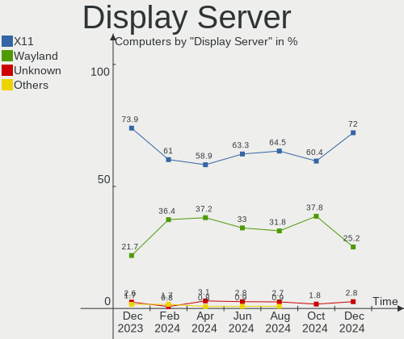
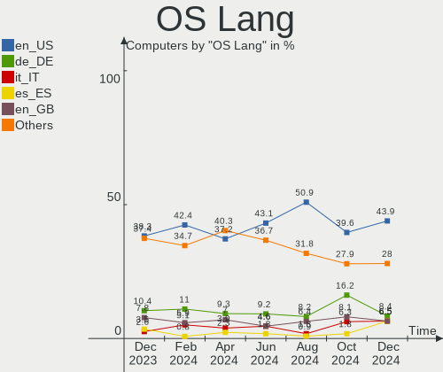

Manjaro Hardware Trends
-----------------------

A project to identify most popular hardware characteristics and track their change
over time based on data collected by Manjaro users at https://Linux-Hardware.org.

Anyone can contribute to the study by uploading probes of their computers by
the [hw-probe](https://github.com/linuxhw/hw-probe) tool:

    sudo hw-probe -all -upload

This is a report for all computer types. See also reports for [desktops](/Dist/Manjaro/Desktop/README.md) and [notebooks](/Dist/Manjaro/Notebook/README.md).

Full-feature report is available here: https://linux-hardware.org/?view=trends

Period: Feb, 2020.

Contents
--------

- [ OS                       ](#os)
- [ OS Family                ](#os-family)
- [ Kernel                   ](#kernel)
- [ Kernel Family            ](#kernel-family)
- [ Kernel Major Ver.        ](#kernel-major-ver)
- [ Arch                     ](#arch)
- [ DE                       ](#de)
- [ Display Server           ](#display-server)
- [ OS Lang                  ](#os-lang)
- [ Boot Mode                ](#boot-mode)
- [ Filesystem               ](#filesystem)
- [ Dual Boot with Linux     ](#dual-boot-with-linux)
- [ Dual Boot (Win)          ](#dual-boot-win)
- [ Country                  ](#country)
- [ City                     ](#city)
- [ Vendor                   ](#vendor)
- [ Model                    ](#model)
- [ Model Family             ](#model-family)
- [ MFG Year                 ](#mfg-year)
- [ Form Factor              ](#form-factor)
- [ Secure Boot              ](#secure-boot)
- [ Coreboot                 ](#coreboot)
- [ RAM Size                 ](#ram-size)
- [ RAM Used                 ](#ram-used)
- [ Drive Vendor             ](#drive-vendor)
- [ Drive Model              ](#drive-model)
- [ Drive Kind               ](#drive-kind)
- [ Drive Connector          ](#drive-connector)
- [ Drive Size               ](#drive-size)
- [ Space Total              ](#space-total)
- [ Space Used               ](#space-used)
- [ Malfunc. Drives          ](#malfunc-drives)
- [ Malfunc. Drive Vendor    ](#malfunc-drive-vendor)
- [ Malfunc. Drive Kind      ](#malfunc-drive-kind)
- [ Failed Drives            ](#failed-drives)
- [ Failed Drive Vendor      ](#failed-drive-vendor)
- [ Drive Status             ](#drive-status)
- [ Storage Vendor           ](#storage-vendor)
- [ Storage Model            ](#storage-model)
- [ Storage Kind             ](#storage-kind)
- [ CPU Vendor               ](#cpu-vendor)
- [ CPU Model                ](#cpu-model)
- [ CPU Model Family         ](#cpu-model-family)
- [ CPU Cores                ](#cpu-cores)
- [ CPU Sockets              ](#cpu-sockets)
- [ CPU Threads              ](#cpu-threads)
- [ CPU Op-Modes             ](#cpu-op-modes)
- [ CPU Microarch            ](#cpu-microarch)
- [ CPU Microcode            ](#cpu-microcode)
- [ GPU Vendor               ](#gpu-vendor)
- [ GPU Model                ](#gpu-model)
- [ GPU Combo                ](#gpu-combo)
- [ GPU Driver               ](#gpu-driver)
- [ GPU Memory               ](#gpu-memory)
- [ Monitor Vendor           ](#monitor-vendor)
- [ Monitor Model            ](#monitor-model)
- [ Monitor Resolution       ](#monitor-resolution)
- [ Monitor Diagonal         ](#monitor-diagonal)
- [ Monitor Width            ](#monitor-width)
- [ Aspect Ratio             ](#aspect-ratio)
- [ Monitor Area             ](#monitor-area)
- [ Pixel Density            ](#pixel-density)
- [ Multiple Monitors        ](#multiple-monitors)
- [ Net Controller Vendor    ](#net-controller-vendor)
- [ Net Controller Model     ](#net-controller-model)
- [ Net Controller Kind      ](#net-controller-kind)
- [ Used Controller          ](#used-controller)
- [ NICs                     ](#nics)
- [ Unsupported Devices      ](#unsupported-devices)
- [ Unsupported Device Types ](#unsupported-device-types)

OS
--

Installed operating systems

| Name              | Computers | Percent |
|-------------------|-----------|---------|
| Manjaro 18.1.5    | 70        | 51.09%  |
| Manjaro           | 47        | 34.31%  |
| Manjaro 19.0      | 10        | 7.3%    |
| Manjaro 19.0.0    | 8         | 5.84%   |
| Manjaro 19.0.1    | 1         | 0.73%   |
| Manjaro 19.0-pre1 | 1         | 0.73%   |

OS Family
---------

OS without a version

| Name    | Computers | Percent |
|---------|-----------|---------|
| Manjaro | 137       | 100%    |

Kernel
------

Version of the Linux kernel

| Version             | Computers | Percent |
|---------------------|-----------|---------|
| 5.4.15-2-MANJARO    | 40        | 29.2%   |
| 5.4.18-1-MANJARO    | 21        | 15.33%  |
| 5.5.2-1-MANJARO     | 20        | 14.6%   |
| 5.5.0-1-MANJARO     | 16        | 11.68%  |
| 5.4.6-2-MANJARO     | 6         | 4.38%   |
| 5.3.18-1-MANJARO    | 6         | 4.38%   |
| 5.4.17-1-MANJARO    | 4         | 2.92%   |
| 4.19.102-1-MANJARO  | 4         | 2.92%   |
| 5.6.0-2-MANJARO     | 2         | 1.46%   |
| 5.5.6-1-MANJARO     | 2         | 1.46%   |
| 5.4.22-1-MANJARO    | 2         | 1.46%   |
| 5.4.16-1-MANJARO    | 2         | 1.46%   |
| 5.4.14-2-MANJARO    | 2         | 1.46%   |
| 5.4.13-rt7-MANJARO  | 2         | 1.46%   |
| 4.19.99-1-MANJARO   | 2         | 1.46%   |
| 5.4.13-3-MANJARO    | 1         | 0.73%   |
| 5.4.12-1-MANJARO    | 1         | 0.73%   |
| 5.2.21-rt15-MANJARO | 1         | 0.73%   |
| 4.19.97-1-MANJARO   | 1         | 0.73%   |
| 4.19.81-1-MANJARO   | 1         | 0.73%   |
| 4.19.101-1-MANJARO  | 1         | 0.73%   |

Kernel Family
-------------

Linux kernel without a distro release

| Version  | Computers | Percent |
|----------|-----------|---------|
| 5.4.15   | 40        | 29.2%   |
| 5.4.18   | 21        | 15.33%  |
| 5.5.2    | 20        | 14.6%   |
| 5.5.0    | 16        | 11.68%  |
| 5.4.6    | 6         | 4.38%   |
| 5.3.18   | 6         | 4.38%   |
| 5.4.17   | 4         | 2.92%   |
| 4.19.102 | 4         | 2.92%   |
| 5.4.13   | 3         | 2.19%   |
| 5.6.0    | 2         | 1.46%   |
| 5.5.6    | 2         | 1.46%   |
| 5.4.22   | 2         | 1.46%   |
| 5.4.16   | 2         | 1.46%   |
| 5.4.14   | 2         | 1.46%   |
| 4.19.99  | 2         | 1.46%   |
| 5.4.12   | 1         | 0.73%   |
| 5.2.21   | 1         | 0.73%   |
| 4.19.97  | 1         | 0.73%   |
| 4.19.81  | 1         | 0.73%   |
| 4.19.101 | 1         | 0.73%   |

Kernel Major Ver.
-----------------

Linux kernel major version

| Version | Computers | Percent |
|---------|-----------|---------|
| 5.4     | 81        | 59.12%  |
| 5.5     | 38        | 27.74%  |
| 4.19    | 9         | 6.57%   |
| 5.3     | 6         | 4.38%   |
| 5.6     | 2         | 1.46%   |
| 5.2     | 1         | 0.73%   |

Arch
----

OS architecture (x86_64, i586, etc.)

| Name   | Computers | Percent |
|--------|-----------|---------|
| x86_64 | 137       | 100%    |

DE
--

Desktop Environment

| Name       | Computers | Percent |
|------------|-----------|---------|
| KDE5       | 48        | 35.04%  |
| XFCE       | 29        | 21.17%  |
| KDE        | 22        | 16.06%  |
| GNOME      | 22        | 16.06%  |
| MATE       | 3         | 2.19%   |
| i3         | 3         | 2.19%   |
| Unknown    | 3         | 2.19%   |
| Cinnamon   | 2         | 1.46%   |
| Budgie     | 2         | 1.46%   |
| X-Cinnamon | 1         | 0.73%   |
| Deepin     | 1         | 0.73%   |
| Awesome    | 1         | 0.73%   |

Display Server
--------------

X11 or Wayland

| Name    | Computers | Percent |
|---------|-----------|---------|
| X11     | 126       | 91.97%  |
| Wayland | 9         | 6.57%   |
| Tty     | 2         | 1.46%   |

OS Lang
-------

Language

| Lang       | Computers | Percent |
|------------|-----------|---------|
| en_US      | 48        | 35.04%  |
| en_US.utf8 | 11        | 8.03%   |
| en_GB      | 9         | 6.57%   |
| de_DE      | 9         | 6.57%   |
| en_CA      | 8         | 5.84%   |
| ru_RU      | 7         | 5.11%   |
| pl_PL      | 7         | 5.11%   |
| de_DE.utf8 | 4         | 2.92%   |
| ru_RU.utf8 | 2         | 1.46%   |
| pt_BR.utf8 | 2         | 1.46%   |
| pt_BR      | 2         | 1.46%   |
| it_IT.utf8 | 2         | 1.46%   |
| fi_FI      | 2         | 1.46%   |
| et_EE      | 2         | 1.46%   |
| zh_CN.utf8 | 1         | 0.73%   |
| zh_CN      | 1         | 0.73%   |
| uk_UA      | 1         | 0.73%   |
| sv_SE      | 1         | 0.73%   |
| ro_RO      | 1         | 0.73%   |
| nl_BE      | 1         | 0.73%   |
| it_IT      | 1         | 0.73%   |
| hu_HU      | 1         | 0.73%   |
| fr_FR      | 1         | 0.73%   |
| fr_BE      | 1         | 0.73%   |
| es_ES      | 1         | 0.73%   |
| es_AR      | 1         | 0.73%   |
| en_ZA      | 1         | 0.73%   |
| en_IN      | 1         | 0.73%   |
| en_GB.utf8 | 1         | 0.73%   |
| en_DK      | 1         | 0.73%   |
| en_CA.utf8 | 1         | 0.73%   |
| en_AU      | 1         | 0.73%   |
| de_AT      | 1         | 0.73%   |
| da_DK.utf8 | 1         | 0.73%   |
| bg_BG      | 1         | 0.73%   |
| Unknown    | 1         | 0.73%   |

Boot Mode
---------

EFI or BIOS

| Mode | Computers | Percent |
|------|-----------|---------|
| BIOS | 73        | 53.28%  |
| EFI  | 64        | 46.72%  |

Filesystem
----------

Type of filesystem

| Type  | Computers | Percent |
|-------|-----------|---------|
| Ext4  | 125       | 91.24%  |
| Btrfs | 9         | 6.57%   |
| Tmpfs | 2         | 1.46%   |
| Xfs   | 1         | 0.73%   |

Dual Boot with Linux
--------------------

Hosting more than one Linux

| Dual boot | Computers | Percent |
|-----------|-----------|---------|
| No        | 117       | 85.4%   |
| Yes       | 20        | 14.6%   |

Dual Boot (Win)
---------------

Hosting Linux and Windows

| Dual boot | Computers | Percent |
|-----------|-----------|---------|
| No        | 77        | 56.2%   |
| Yes       | 60        | 43.8%   |

Country
-------

Geographic location (country)

| Country        | Computers | Percent |
|----------------|-----------|---------|
| USA            | 23        | 16.79%  |
| Germany        | 12        | 8.76%   |
| Russia         | 11        | 8.03%   |
| Canada         | 11        | 8.03%   |
| Poland         | 8         | 5.84%   |
| UK             | 5         | 3.65%   |
| Brazil         | 5         | 3.65%   |
| Ukraine        | 4         | 2.92%   |
| Italy          | 4         | 2.92%   |
| Indonesia      | 4         | 2.92%   |
| Austria        | 4         | 2.92%   |
| Sweden         | 3         | 2.19%   |
| Romania        | 3         | 2.19%   |
| Hungary        | 3         | 2.19%   |
| Finland        | 3         | 2.19%   |
| Estonia        | 3         | 2.19%   |
| Denmark        | 3         | 2.19%   |
| Belgium        | 3         | 2.19%   |
| Czech Republic | 2         | 1.46%   |
| China          | 2         | 1.46%   |
| Argentina      | 2         | 1.46%   |
| Spain          | 1         | 0.73%   |
| South Africa   | 1         | 0.73%   |
| Slovenia       | 1         | 0.73%   |
| Slovakia       | 1         | 0.73%   |
| Serbia         | 1         | 0.73%   |
| Portugal       | 1         | 0.73%   |
| Panama         | 1         | 0.73%   |
| Norway         | 1         | 0.73%   |
| Netherlands    | 1         | 0.73%   |
| Mexico         | 1         | 0.73%   |
| Mauritius      | 1         | 0.73%   |
| Lithuania      | 1         | 0.73%   |
| India          | 1         | 0.73%   |
| Iceland        | 1         | 0.73%   |
| Greece         | 1         | 0.73%   |
| France         | 1         | 0.73%   |
| Croatia        | 1         | 0.73%   |
| Bangladesh     | 1         | 0.73%   |
| Australia      | 1         | 0.73%   |

City
----

Geographic location (city)

| City                | Computers | Percent |
|---------------------|-----------|---------|
| St Petersburg       | 3         | 2.19%   |
| Kitchener           | 3         | 2.19%   |
| Brussels            | 3         | 2.19%   |
| Wrocław            | 2         | 1.46%   |
| Warsaw              | 2         | 1.46%   |
| Vienna              | 2         | 1.46%   |
| Oshawa              | 2         | 1.46%   |
| Moscow              | 2         | 1.46%   |
| Linz                | 2         | 1.46%   |
| Helsinki            | 2         | 1.46%   |
| Colorado Springs    | 2         | 1.46%   |
| Budapest            | 2         | 1.46%   |
| Bucharest           | 2         | 1.46%   |
| Berlin              | 2         | 1.46%   |
| Bandung             | 2         | 1.46%   |
| Yorktown            | 1         | 0.73%   |
| Yekaterinburg       | 1         | 0.73%   |
| Wakefield           | 1         | 0.73%   |
| Vilnius             | 1         | 0.73%   |
| Vaskjala            | 1         | 0.73%   |
| Turin               | 1         | 0.73%   |
| Toruń              | 1         | 0.73%   |
| Tallinn             | 1         | 0.73%   |
| São Paulo          | 1         | 0.73%   |
| Stockholm           | 1         | 0.73%   |
| St. Petersburg      | 1         | 0.73%   |
| Spokane             | 1         | 0.73%   |
| Singsas             | 1         | 0.73%   |
| Sikeston            | 1         | 0.73%   |
| Shepherds Bush      | 1         | 0.73%   |
| Sheboygan           | 1         | 0.73%   |
| Serravalle Scrivia  | 1         | 0.73%   |
| Seattle             | 1         | 0.73%   |
| Santo André        | 1         | 0.73%   |
| Río Cuarto         | 1         | 0.73%   |
| Rzeszów            | 1         | 0.73%   |
| Rome                | 1         | 0.73%   |
| Rio de Janeiro      | 1         | 0.73%   |
| Richmond            | 1         | 0.73%   |
| Reykjavik           | 1         | 0.73%   |
| Revelstoke          | 1         | 0.73%   |
| Qujing              | 1         | 0.73%   |
| Pullman             | 1         | 0.73%   |
| Ptujska Gora        | 1         | 0.73%   |
| Prague              | 1         | 0.73%   |
| Povoa de Santa Iria | 1         | 0.73%   |
| Port Louis          | 1         | 0.73%   |
| Pontal              | 1         | 0.73%   |
| Plympton            | 1         | 0.73%   |
| Passaic             | 1         | 0.73%   |
| Paris               | 1         | 0.73%   |
| Panama City         | 1         | 0.73%   |
| Osa                 | 1         | 0.73%   |
| Nuremberg           | 1         | 0.73%   |
| North York          | 1         | 0.73%   |
| Netishyn            | 1         | 0.73%   |
| Nanning             | 1         | 0.73%   |
| Münster            | 1         | 0.73%   |
| Monterrey           | 1         | 0.73%   |
| Moncton             | 1         | 0.73%   |

Vendor
------

Motherboard manufacturer

| Name                  | Computers | Percent |
|-----------------------|-----------|---------|
| ASUSTek Computer      | 35        | 25.55%  |
| Hewlett-Packard       | 25        | 18.25%  |
| Lenovo                | 18        | 13.14%  |
| Dell                  | 16        | 11.68%  |
| MSI                   | 13        | 9.49%   |
| Gigabyte Technology   | 9         | 6.57%   |
| ASRock                | 4         | 2.92%   |
| Acer                  | 4         | 2.92%   |
| Sony                  | 3         | 2.19%   |
| Intel                 | 2         | 1.46%   |
| Quanta                | 1         | 0.73%   |
| Multilaser Industrial | 1         | 0.73%   |
| Medion                | 1         | 0.73%   |
| Fujitsu               | 1         | 0.73%   |
| Dream Machines        | 1         | 0.73%   |
| Digibras              | 1         | 0.73%   |
| Biostar               | 1         | 0.73%   |
| Alienware             | 1         | 0.73%   |

Model
-----

Motherboard model

| Name                                   | Computers | Percent |
|----------------------------------------|-----------|---------|
| ASUS All Series                        | 3         | 2.19%   |
| MSI MS-7C37                            | 2         | 1.46%   |
| HP Notebook                            | 2         | 1.46%   |
| HP 15                                  | 2         | 1.46%   |
| ASUS Rampage IV EXTREME                | 2         | 1.46%   |
| Sony VPCEB2M1R                         | 1         | 0.73%   |
| Sony SVF15218SNW                       | 1         | 0.73%   |
| Sony SVE11125CVW                       | 1         | 0.73%   |
| Quanta TWH                             | 1         | 0.73%   |
| Multilaser Industrial PC150            | 1         | 0.73%   |
| MSI MS-7B98                            | 1         | 0.73%   |
| MSI MS-7B79                            | 1         | 0.73%   |
| MSI MS-7B38                            | 1         | 0.73%   |
| MSI MS-7A59                            | 1         | 0.73%   |
| MSI MS-7A32                            | 1         | 0.73%   |
| MSI MS-7821                            | 1         | 0.73%   |
| MSI MS-7640                            | 1         | 0.73%   |
| MSI MS-7360                            | 1         | 0.73%   |
| MSI GS63VR 7RG                         | 1         | 0.73%   |
| MSI GL63 8RE                           | 1         | 0.73%   |
| MSI GE75 Raider 9SE                    | 1         | 0.73%   |
| Medion E7424 MD60150                   | 1         | 0.73%   |
| Lenovo Z50-70 20354                    | 1         | 0.73%   |
| Lenovo XiaoXin Air 13IWL 81J8          | 1         | 0.73%   |
| Lenovo ThinkPad T480s 20L7S0XM00       | 1         | 0.73%   |
| Lenovo ThinkPad T480 20L5000AHV        | 1         | 0.73%   |
| Lenovo ThinkPad T440s 20ARS34900       | 1         | 0.73%   |
| Lenovo ThinkPad T420 4180PBG           | 1         | 0.73%   |
| Lenovo ThinkPad Edge E540 20C6003QPB   | 1         | 0.73%   |
| Lenovo ThinkPad Edge E530 3259AHG      | 1         | 0.73%   |
| Lenovo ThinkPad E595 20NF0000GE        | 1         | 0.73%   |
| Lenovo ThinkPad E15 20RDCTO1WW         | 1         | 0.73%   |
| Lenovo ThinkCentre M600 10G9000NUS     | 1         | 0.73%   |
| Lenovo ThinkBook 15-IML 20RW           | 1         | 0.73%   |
| Lenovo IdeaPad S340-15API 81NC         | 1         | 0.73%   |
| Lenovo IdeaPad 530S-15IKB 81EV         | 1         | 0.73%   |
| Lenovo IdeaPad 330S-15ARR 81FB         | 1         | 0.73%   |
| Lenovo IdeaPad 330-15IKB 81DE          | 1         | 0.73%   |
| Lenovo IdeaPad 100-14IBY 80MH          | 1         | 0.73%   |
| Lenovo Flex 2-15 20405                 | 1         | 0.73%   |
| Intel NUC7i7BNHXG                      | 1         | 0.73%   |
| Intel DH61WW AAG23116-303              | 1         | 0.73%   |
| HP Z420 Workstation                    | 1         | 0.73%   |
| HP Z400 Workstation                    | 1         | 0.73%   |
| HP Stream Laptop 14-cb102ca            | 1         | 0.73%   |
| HP ProBook 650 G5                      | 1         | 0.73%   |
| HP ProBook 650 G1                      | 1         | 0.73%   |
| HP ProBook 450 G6                      | 1         | 0.73%   |
| HP ProBook 430 G1                      | 1         | 0.73%   |
| HP Pavilion Gaming Laptop 17-cd0xxx    | 1         | 0.73%   |
| HP Pavilion g6                         | 1         | 0.73%   |
| HP Pavilion dv7                        | 1         | 0.73%   |
| HP OMEN by HP Obelisk Desktop 875-1xxx | 1         | 0.73%   |
| HP OMEN by HP Laptop 15-dc1xxx         | 1         | 0.73%   |
| HP G42                                 | 1         | 0.73%   |
| HP ENVY x360 Convertible 15-cp0xxx     | 1         | 0.73%   |
| HP EliteBook 8570p                     | 1         | 0.73%   |
| HP EliteBook 8470p                     | 1         | 0.73%   |
| HP EliteBook 840 G6                    | 1         | 0.73%   |
| HP EliteBook 840 G3                    | 1         | 0.73%   |

Model Family
------------

Motherboard model prefix

| Name                        | Computers | Percent |
|-----------------------------|-----------|---------|
| Lenovo ThinkPad             | 8         | 5.84%   |
| Lenovo IdeaPad              | 5         | 3.65%   |
| HP EliteBook                | 5         | 3.65%   |
| Dell Latitude               | 5         | 3.65%   |
| Dell Inspiron               | 5         | 3.65%   |
| HP ProBook                  | 4         | 2.92%   |
| HP Pavilion                 | 3         | 2.19%   |
| ASUS ROG                    | 3         | 2.19%   |
| ASUS PRIME                  | 3         | 2.19%   |
| ASUS All                    | 3         | 2.19%   |
| MSI MS-7C37                 | 2         | 1.46%   |
| HP OMEN                     | 2         | 1.46%   |
| HP Notebook                 | 2         | 1.46%   |
| HP 250                      | 2         | 1.46%   |
| HP 15                       | 2         | 1.46%   |
| Dell XPS                    | 2         | 1.46%   |
| Dell Precision              | 2         | 1.46%   |
| ASUS Rampage                | 2         | 1.46%   |
| ASUS Maximus                | 2         | 1.46%   |
| Sony VPCEB2M1R              | 1         | 0.73%   |
| Sony SVF15218SNW            | 1         | 0.73%   |
| Sony SVE11125CVW            | 1         | 0.73%   |
| Quanta TWH                  | 1         | 0.73%   |
| Multilaser Industrial PC150 | 1         | 0.73%   |
| MSI MS-7B98                 | 1         | 0.73%   |
| MSI MS-7B79                 | 1         | 0.73%   |
| MSI MS-7B38                 | 1         | 0.73%   |
| MSI MS-7A59                 | 1         | 0.73%   |
| MSI MS-7A32                 | 1         | 0.73%   |
| MSI MS-7821                 | 1         | 0.73%   |
| MSI MS-7640                 | 1         | 0.73%   |
| MSI MS-7360                 | 1         | 0.73%   |
| MSI GS63VR                  | 1         | 0.73%   |
| MSI GL63                    | 1         | 0.73%   |
| MSI GE75                    | 1         | 0.73%   |
| Medion E7424                | 1         | 0.73%   |
| Lenovo Z50-70               | 1         | 0.73%   |
| Lenovo XiaoXin              | 1         | 0.73%   |
| Lenovo ThinkCentre          | 1         | 0.73%   |
| Lenovo ThinkBook            | 1         | 0.73%   |
| Lenovo Flex                 | 1         | 0.73%   |
| Intel NUC7i7BNHXG           | 1         | 0.73%   |
| Intel DH61WW                | 1         | 0.73%   |
| HP Z420                     | 1         | 0.73%   |
| HP Z400                     | 1         | 0.73%   |
| HP Stream                   | 1         | 0.73%   |
| HP G42                      | 1         | 0.73%   |
| HP ENVY                     | 1         | 0.73%   |
| Gigabyte Z87X-UD7           | 1         | 0.73%   |
| Gigabyte X570               | 1         | 0.73%   |
| Gigabyte H61M-S2PV          | 1         | 0.73%   |
| Gigabyte G1.Sniper          | 1         | 0.73%   |
| Gigabyte EP35-DS3           | 1         | 0.73%   |
| Gigabyte B450               | 1         | 0.73%   |
| Gigabyte B250M-DS3H         | 1         | 0.73%   |
| Gigabyte A320M-S2H          | 1         | 0.73%   |
| Gigabyte 970A-DS3P          | 1         | 0.73%   |
| Fujitsu LIFEBOOK            | 1         | 0.73%   |
| Dream Machines N85          | 1         | 0.73%   |
| Digibras NH4CU03            | 1         | 0.73%   |

MFG Year
--------

Motherboard manufacture year

| Year | Computers | Percent |
|------|-----------|---------|
| 2019 | 47        | 34.31%  |
| 2018 | 19        | 13.87%  |
| 2013 | 18        | 13.14%  |
| 2014 | 12        | 8.76%   |
| 2017 | 11        | 8.03%   |
| 2016 | 7         | 5.11%   |
| 2015 | 6         | 4.38%   |
| 2012 | 4         | 2.92%   |
| 2011 | 4         | 2.92%   |
| 2020 | 3         | 2.19%   |
| 2010 | 2         | 1.46%   |
| 2008 | 2         | 1.46%   |
| 2009 | 1         | 0.73%   |
| 2007 | 1         | 0.73%   |

Form Factor
-----------

Physical design of the computer

| Name        | Computers | Percent |
|-------------|-----------|---------|
| Notebook    | 77        | 56.2%   |
| Desktop     | 56        | 40.88%  |
| Convertible | 3         | 2.19%   |
| Mini pc     | 1         | 0.73%   |

Secure Boot
-----------

Enabled or disabled

| State    | Computers | Percent |
|----------|-----------|---------|
| Disabled | 137       | 100%    |

Coreboot
--------

Have coreboot on board

| Used | Computers | Percent |
|------|-----------|---------|
| No   | 137       | 100%    |

RAM Size
--------

Total RAM memory

| Size in GB  | Computers | Percent |
|-------------|-----------|---------|
| 16.01-24.0  | 47        | 34.31%  |
| 4.01-8.0    | 29        | 21.17%  |
| 8.01-16.0   | 22        | 16.06%  |
| 3.01-4.0    | 17        | 12.41%  |
| 32.01-64.0  | 13        | 9.49%   |
| 24.01-32.0  | 5         | 3.65%   |
| 64.01-256.0 | 3         | 2.19%   |
| 1.01-2.0    | 1         | 0.73%   |

RAM Used
--------

Used RAM memory

| Used GB   | Computers | Percent |
|-----------|-----------|---------|
| 1.01-2.0  | 39        | 28.47%  |
| 4.01-8.0  | 32        | 23.36%  |
| 2.01-3.0  | 31        | 22.63%  |
| 3.01-4.0  | 22        | 16.06%  |
| 8.01-16.0 | 9         | 6.57%   |
| 0.01-1.0  | 4         | 2.92%   |

Drive Vendor
------------

Hard drive vendors

| Vendor              | Computers | Drives  | Percent |
|---------------------|-----------|---------|---------|
| WDC                 | 38        | 51      | 18.81%  |
| Samsung Electronics | 37        | 50      | 18.32%  |
| Seagate             | 33        | 39      | 16.34%  |
| Kingston            | 16        | 18      | 7.92%   |
| Crucial             | 14        | 19      | 6.93%   |
| Toshiba             | 13        | 14      | 6.44%   |
| SanDisk             | 10        | 11      | 4.95%   |
| Unknown             | 6         | 6       | 2.97%   |
| Intel               | 6         | 7       | 2.97%   |
| HGST                | 4         | 4       | 1.98%   |
| Hitachi             | 3         | 3       | 1.49%   |
| SK Hynix            | 2         | 2       | 0.99%   |
| Patriot             | 2         | 2       | 0.99%   |
| Hewlett-Packard     | 2         | 1       | 0.99%   |
| Corsair             | 2         | 2       | 0.99%   |
| Verbatim            | 1         | 1       | 0.5%    |
| Transcend           | 1         | 1       | 0.5%    |
| PNY                 | 1         | 1       | 0.5%    |
| PLEXTOR             | 1         | 1       | 0.5%    |
| Phison              | 1         | 1       | 0.5%    |
| OTG V2              | 1         | 1       | 0.5%    |
| OCZ                 | 1         | 1       | 0.5%    |
| Micron Technology   | 1         | 1       | 0.5%    |
| LITEONIT            | 1         | 1       | 0.5%    |
| KESU                | 1         | 1       | 0.5%    |
| JMicron             | 1         | 1       | 0.5%    |
| Intenso             | 1         | 1       | 0.5%    |
| HL-DT-ST            | 1         | Unknown | 0.5%    |
| A-DATA Technology   | 1         | 1       | 0.5%    |

Drive Model
-----------

Hard drive models

| Model                          | Computers | Percent |
|--------------------------------|-----------|---------|
| SV300S37A240G 240GB SSD        | 4         | 1.69%   |
| SA400S37240G 240GB SSD         | 4         | 1.69%   |
| SA400S37120G 120GB SSD         | 4         | 1.69%   |
| CT1000MX500SSD1 1TB            | 4         | 1.69%   |
| ST1000LM049-2GH172 1TB         | 3         | 1.27%   |
| ST1000DM003-1CH162 1TB         | 3         | 1.27%   |
| SSD 850 EVO 500GB              | 3         | 1.27%   |
| DT01ACA100 1TB                 | 3         | 1.27%   |
| CT240BX500SSD1 240GB           | 3         | 1.27%   |
| WD10S21X-24R1BT0-SSHD-8GB      | 2         | 0.85%   |
| WD10EZEX-08M2NA0 1TB           | 2         | 0.85%   |
| WD10EZEX-00RKKA0 1TB           | 2         | 0.85%   |
| ST2000LX001-1RG174 2TB         | 2         | 0.85%   |
| ST2000LM015-2E8174 2TB         | 2         | 0.85%   |
| ST2000DM008-2FR102 2TB         | 2         | 0.85%   |
| ST1000LM024 HN-M101MBB 1TB     | 2         | 0.85%   |
| ST1000DM010-2EP102 1TB         | 2         | 0.85%   |
| SSD 970 EVO Plus 500GB         | 2         | 0.85%   |
| SSD 860 QVO 1TB                | 2         | 0.85%   |
| SSD 860 EVO 500GB              | 2         | 0.85%   |
| SSD 860 EVO 1TB                | 2         | 0.85%   |
| SSD 840 EVO 250GB              | 2         | 0.85%   |
| SSD 750 EVO 250GB              | 2         | 0.85%   |
| SA400S37960G 960GB SSD         | 2         | 0.85%   |
| MQ01ABD100 1TB                 | 2         | 0.85%   |
| HD322HJ 320GB                  | 2         | 0.85%   |
| CT500MX500SSD1 500GB           | 2         | 0.85%   |
| CT1000P1SSD8 1TB               | 2         | 0.85%   |
| BC501 HFM512GDJTNG-8310A 512GB | 2         | 0.85%   |
| X400 2.5 7MM 256GB SSD         | 1         | 0.42%   |
| WDS500G2B0A-00SM50 500GB SSD   | 1         | 0.42%   |
| WDS500G2B0A 500GB SSD          | 1         | 0.42%   |
| WDS256G1X0C-00ENX0 256GB       | 1         | 0.42%   |
| WDS240G1G0A-00SS50 240GB SSD   | 1         | 0.42%   |
| WDS120G2G0A-00JH30 120GB SSD   | 1         | 0.42%   |
| WDS100T2B0B-00YS70 1TB SSD     | 1         | 0.42%   |
| WDBNCE2500PNC 250GB SSD        | 1         | 0.42%   |
| WD800JD-75MSA3 80GB            | 1         | 0.42%   |
| WD7500BPVT-08HXZT3 752GB       | 1         | 0.42%   |
| WD6400AAKS-65A7B2 640GB        | 1         | 0.42%   |
| WD6400AACS-00G8B1 640GB        | 1         | 0.42%   |
| WD50EZRZ-32RWYB1 5TB           | 1         | 0.42%   |
| WD5000LPVX-60V0TT0 500GB       | 1         | 0.42%   |
| WD5000LPVX-22V0TT0 500GB       | 1         | 0.42%   |
| WD5000AZLX-60K2TA0 500GB       | 1         | 0.42%   |
| WD5000AAKX-60U6AA0 500GB       | 1         | 0.42%   |
| WD5000AAKX-004EA0 500GB        | 1         | 0.42%   |
| WD5000AAKX-001CA0 500GB        | 1         | 0.42%   |
| WD5000AAKS-65V0A0 500GB        | 1         | 0.42%   |
| WD5000AAKS-00A7B0 500GB        | 1         | 0.42%   |
| WD3200BPVT-22JJ5T0 320GB       | 1         | 0.42%   |
| WD30EFRX-68AX9N0 3TB           | 1         | 0.42%   |
| WD2500AAJS-07VWA0 250GB        | 1         | 0.42%   |
| WD2003FZEX-00SRLA0 2TB         | 1         | 0.42%   |
| WD2002FAEX-007BA0 2TB          | 1         | 0.42%   |
| WD10SPZX-21Z10T0 1TB           | 1         | 0.42%   |
| WD10JPVX-60JC3T0 1TB           | 1         | 0.42%   |
| WD10JPVX-22JC3T0 1TB           | 1         | 0.42%   |
| WD10JPVX-08JC3T5 1TB           | 1         | 0.42%   |
| WD10EZEX-00ZF5A0 1TB           | 1         | 0.42%   |

Drive Kind
----------

HDD or SSD

| Kind    | Computers | Drives | Percent |
|---------|-----------|--------|---------|
| HDD     | 76        | 108    | 42.22%  |
| SSD     | 71        | 101    | 39.44%  |
| NVMe    | 21        | 23     | 11.67%  |
| Unknown | 7         | 5      | 3.89%   |
| MMC     | 5         | 5      | 2.78%   |

Drive Connector
---------------

SATA, SAS, NVMe, etc.

| Type | Computers | Drives | Percent |
|------|-----------|--------|---------|
| SATA | 115       | 206    | 76.16%  |
| NVMe | 21        | 23     | 13.91%  |
| SAS  | 10        | 8      | 6.62%   |
| MMC  | 5         | 5      | 3.31%   |

Drive Size
----------

Size of hard drive

| Size in TB | Computers | Drives | Percent |
|------------|-----------|--------|---------|
| 0.01-0.5   | 95        | 129    | 51.08%  |
| 0.51-1.0   | 69        | 86     | 37.1%   |
| 1.01-2.0   | 14        | 17     | 7.53%   |
| 3.01-4.0   | 3         | 3      | 1.61%   |
| 2.01-3.0   | 3         | 4      | 1.61%   |
| 4.01-10.0  | 2         | 3      | 1.08%   |

Space Total
-----------

Amount of disk space available on the file system

| Size in GB     | Computers | Percent |
|----------------|-----------|---------|
| 101-250        | 35        | 25.55%  |
| 251-500        | 26        | 18.98%  |
| 1001-2000      | 20        | 14.6%   |
| 501-1000       | 19        | 13.87%  |
| 51-100         | 13        | 9.49%   |
| 2001-3000      | 10        | 7.3%    |
| Unknown        | 6         | 4.38%   |
| More than 3000 | 5         | 3.65%   |
| 21-50          | 3         | 2.19%   |

Space Used
----------

Amount of used disk space

| Used GB        | Computers | Percent |
|----------------|-----------|---------|
| 1-20           | 27        | 19.71%  |
| 51-100         | 21        | 15.33%  |
| 21-50          | 20        | 14.6%   |
| 101-250        | 17        | 12.41%  |
| 501-1000       | 16        | 11.68%  |
| 251-500        | 13        | 9.49%   |
| 1001-2000      | 13        | 9.49%   |
| Unknown        | 6         | 4.38%   |
| More than 3000 | 4         | 2.92%   |

Malfunc. Drives
---------------

Drive models with a malfunction

| Model                   | Computers | Drives | Percent |
|-------------------------|-----------|--------|---------|
| HD322HJ 320GB           | 2         | 2      | 20%     |
| WD5000AAKX-004EA0 500GB | 1         | 1      | 10%     |
| WD5000AAKX-001CA0 500GB | 1         | 1      | 10%     |
| WD5000AAKS-00A7B0 500GB | 1         | 2      | 10%     |
| WD10JPVX-22JC3T0 1TB    | 1         | 1      | 10%     |
| ST1000LX015-1U7172 1TB  | 1         | 1      | 10%     |
| MK3252GSX 320GB         | 1         | 1      | 10%     |
| HTS545050A7E380 500GB   | 1         | 1      | 10%     |
| CT1000P1SSD8 1TB        | 1         | 1      | 10%     |

Malfunc. Drive Vendor
---------------------

Vendors of faulty drives

| Vendor              | Computers | Drives | Percent |
|---------------------|-----------|--------|---------|
| WDC                 | 4         | 5      | 40%     |
| Samsung Electronics | 2         | 2      | 20%     |
| Toshiba             | 1         | 1      | 10%     |
| Seagate             | 1         | 1      | 10%     |
| HGST                | 1         | 1      | 10%     |
| Crucial             | 1         | 1      | 10%     |

Malfunc. Drive Kind
-------------------

Kinds of faulty drives

| Kind | Computers | Drives | Percent |
|------|-----------|--------|---------|
| HDD  | 8         | 10     | 88.89%  |
| NVMe | 1         | 1      | 11.11%  |

Failed Drives
-------------

Failed drive models

| Model                    | Computers | Drives | Percent |
|--------------------------|-----------|--------|---------|
| WDS256G1X0C-00ENX0 256GB | 1         | 1      | 100%    |

Failed Drive Vendor
-------------------

Failed drive vendors

| Vendor | Computers | Drives | Percent |
|--------|-----------|--------|---------|
| WDC    | 1         | 1      | 100%    |

Drive Status
------------

Number of failed and malfunc. drives

| Status   | Computers | Drives | Percent |
|----------|-----------|--------|---------|
| Detected | 74        | 125    | 54.01%  |
| Works    | 53        | 105    | 38.69%  |
| Malfunc  | 9         | 11     | 6.57%   |
| Failed   | 1         | 1      | 0.73%   |

Storage Vendor
--------------

Storage controller vendors

| Vendor                       | Computers | Percent |
|------------------------------|-----------|---------|
| Intel                        | 98        | 53.85%  |
| AMD                          | 34        | 18.68%  |
| Samsung Electronics          | 15        | 8.24%   |
| ASMedia Technology           | 8         | 4.4%    |
| Sandisk                      | 6         | 3.3%    |
| SK Hynix                     | 4         | 2.2%    |
| Phison Electronics           | 3         | 1.65%   |
| Marvell Technology Group     | 3         | 1.65%   |
| Toshiba America Info Systems | 2         | 1.1%    |
| Nvidia                       | 2         | 1.1%    |
| Micron/Crucial Technology    | 2         | 1.1%    |
| VIA Technologies             | 1         | 0.55%   |
| Silicon Motion               | 1         | 0.55%   |
| Silicon Image                | 1         | 0.55%   |
| Realtek Semiconductor        | 1         | 0.55%   |
| Lite-On Technology           | 1         | 0.55%   |

Storage Model
-------------

Storage controller models

| Model                                                                             | Computers | Percent |
|-----------------------------------------------------------------------------------|-----------|---------|
| FCH SATA Controller [AHCI mode]                                                   | 30        | 14.29%  |
| NVMe SSD Controller SM981/PM981/PM983                                             | 12        | 5.71%   |
| 82801 Mobile SATA Controller [RAID mode]                                          | 11        | 5.24%   |
| 8 Series/C220 Series Chipset Family 6-port SATA Controller 1 [AHCI mode]          | 11        | 5.24%   |
| Non-Volatile memory controller                                                    | 10        | 4.76%   |
| Sunrise Point-LP SATA Controller [AHCI mode]                                      | 8         | 3.81%   |
| ASM1062 Serial ATA Controller                                                     | 8         | 3.81%   |
| 7 Series Chipset Family 6-port SATA Controller [AHCI mode]                        | 8         | 3.81%   |
| 400 Series Chipset SATA Controller                                                | 7         | 3.33%   |
| Q170/Q150/B150/H170/H110/Z170/CM236 Chipset SATA Controller [AHCI Mode]           | 6         | 2.86%   |
| 8 Series SATA Controller 1 [AHCI mode]                                            | 6         | 2.86%   |
| NVMe SSD Controller SM961/PM961                                                   | 5         | 2.38%   |
| HM170/QM170 Chipset SATA Controller [AHCI Mode]                                   | 5         | 2.38%   |
| SSD 660P Series                                                                   | 4         | 1.9%    |
| SB7x0/SB8x0/SB9x0 SATA Controller [AHCI mode]                                     | 4         | 1.9%    |
| Cannon Lake Mobile PCH SATA AHCI Controller                                       | 4         | 1.9%    |
| 200 Series PCH SATA controller [AHCI mode]                                        | 4         | 1.9%    |
| X370 Series Chipset SATA Controller                                               | 3         | 1.43%   |
| Cannon Lake PCH SATA AHCI Controller                                              | 3         | 1.43%   |
| C600/X79 series chipset 6-Port SATA AHCI Controller                               | 3         | 1.43%   |
| 5 Series/3400 Series Chipset 4 port SATA AHCI Controller                          | 3         | 1.43%   |
| WD Black 2018/PC SN720 NVMe SSD                                                   | 2         | 0.95%   |
| P1 NVMe PCIe SSD                                                                  | 2         | 0.95%   |
| Comet Lake SATA AHCI Controller                                                   | 2         | 0.95%   |
| Cannon Point-LP SATA Controller [AHCI Mode]                                       | 2         | 0.95%   |
| 82801IB (ICH9) 2 port SATA Controller [IDE mode]                                  | 2         | 0.95%   |
| 82801I (ICH9 Family) 2 port SATA Controller [IDE mode]                            | 2         | 0.95%   |
| 6 Series/C200 Series Chipset Family Desktop SATA Controller (IDE mode, ports 4-5) | 2         | 0.95%   |
| 6 Series/C200 Series Chipset Family Desktop SATA Controller (IDE mode, ports 0-3) | 2         | 0.95%   |
| 6 Series/C200 Series Chipset Family 6 port Mobile SATA AHCI Controller            | 2         | 0.95%   |
| XG4 NVMe SSD Controller                                                           | 1         | 0.48%   |
| Wildcat Point-LP SATA Controller [AHCI Mode]                                      | 1         | 0.48%   |
| WD Black NVMe SSD                                                                 | 1         | 0.48%   |
| WD Black 2018/PC SN520 NVMe SSD                                                   | 1         | 0.48%   |
| VT6421 IDE/SATA Controller                                                        | 1         | 0.48%   |
| Toshiba America Info Non-Volatile memory controller                               | 1         | 0.48%   |
| SSD Pro 7600p/760p/E 6100p Series                                                 | 1         | 0.48%   |
| SSD 600P Series                                                                   | 1         | 0.48%   |
| SB7x0/SB8x0/SB9x0 IDE Controller                                                  | 1         | 0.48%   |
| SATA Controller [RAID mode]                                                       | 1         | 0.48%   |
| Realtek Non-Volatile memory controller                                            | 1         | 0.48%   |
| PCI0680 Ultra ATA-133 Host Controller                                             | 1         | 0.48%   |
| MCP78S [GeForce 8200] SATA Controller (non-AHCI mode)                             | 1         | 0.48%   |
| MCP78S [GeForce 8200] IDE                                                         | 1         | 0.48%   |
| MCP61 SATA Controller                                                             | 1         | 0.48%   |
| MCP61 IDE                                                                         | 1         | 0.48%   |
| FCH SATA Controller D                                                             | 1         | 0.48%   |
| FCH IDE Controller                                                                | 1         | 0.48%   |
| E7 NVMe Controller                                                                | 1         | 0.48%   |
| E16 PCIe4 NVMe Controller                                                         | 1         | 0.48%   |
| E12 NVMe Controller                                                               | 1         | 0.48%   |
| Celeron N3350/Pentium N4200/Atom E3900 Series SATA AHCI Controller                | 1         | 0.48%   |
| C602 chipset 4-Port SATA Storage Control Unit                                     | 1         | 0.48%   |
| C600/X79 series chipset SATA RAID Controller                                      | 1         | 0.48%   |
| C600/X79 series chipset IDE-r Controller                                          | 1         | 0.48%   |
| Atom/Celeron/Pentium Processor x5-E8000/J3xxx/N3xxx Series SATA Controller        | 1         | 0.48%   |
| Atom Processor E3800 Series SATA AHCI Controller                                  | 1         | 0.48%   |
| 88SE9128 PCIe SATA 6 Gb/s RAID controller with HyperDuo                           | 1         | 0.48%   |
| 88SE6111/6121 SATA II / PATA Controller                                           | 1         | 0.48%   |
| 88SE6101/6102 single-port PATA133 interface                                       | 1         | 0.48%   |

Storage Kind
------------

Kind of storage controller (IDE, SATA, NVMe, SAS, ...)

| Kind | Computers | Percent |
|------|-----------|---------|
| SATA | 109       | 61.58%  |
| NVMe | 41        | 23.16%  |
| RAID | 15        | 8.47%   |
| IDE  | 11        | 6.21%   |
| SAS  | 1         | 0.56%   |

CPU Vendor
----------

Processor vendors

| Vendor | Computers | Percent |
|--------|-----------|---------|
| Intel  | 100       | 72.99%  |
| AMD    | 37        | 27.01%  |

CPU Model
---------

Processor models

| Model                                         | Computers | Percent |
|-----------------------------------------------|-----------|---------|
| Intel Core i7-8550U CPU @ 1.80GHz             | 5         | 3.65%   |
| Intel Core i7-7700HQ CPU @ 2.80GHz            | 4         | 2.92%   |
| AMD Ryzen 7 3700X 8-Core Processor            | 4         | 2.92%   |
| Intel Core i7-8565U CPU @ 1.80GHz             | 3         | 2.19%   |
| Intel Core i5-7300HQ CPU @ 2.50GHz            | 3         | 2.19%   |
| Intel Core i5-7200U CPU @ 2.50GHz             | 3         | 2.19%   |
| Intel Core i5-4670K CPU @ 3.40GHz             | 3         | 2.19%   |
| Intel Core i5-4210U CPU @ 1.70GHz             | 3         | 2.19%   |
| AMD Ryzen 7 2700X Eight-Core Processor        | 3         | 2.19%   |
| AMD Ryzen 5 2500U with Radeon Vega Mobile Gfx | 3         | 2.19%   |
| Intel Core i7-9750H CPU @ 2.60GHz             | 2         | 1.46%   |
| Intel Core i7-7700K CPU @ 4.20GHz             | 2         | 1.46%   |
| Intel Core i7-6700K CPU @ 4.00GHz             | 2         | 1.46%   |
| Intel Core i7-3930K CPU @ 3.20GHz             | 2         | 1.46%   |
| Intel Core i5-8300H CPU @ 2.30GHz             | 2         | 1.46%   |
| Intel Core i5-8265U CPU @ 1.60GHz             | 2         | 1.46%   |
| Intel Core i5-3360M CPU @ 2.80GHz             | 2         | 1.46%   |
| Intel Core i5-3210M CPU @ 2.50GHz             | 2         | 1.46%   |
| AMD Ryzen 9 3950X 16-Core Processor           | 2         | 1.46%   |
| AMD Ryzen 5 3600 6-Core Processor             | 2         | 1.46%   |
| AMD Ryzen 3 3200U with Radeon Vega Mobile Gfx | 2         | 1.46%   |
| Intel Xeon CPU X5650 @ 2.67GHz                | 1         | 0.73%   |
| Intel Xeon CPU E5-1650 v2 @ 3.50GHz           | 1         | 0.73%   |
| Intel Xeon CPU E3-1505M v6 @ 3.00GHz          | 1         | 0.73%   |
| Intel Pentium Dual-Core CPU E5200 @ 2.50GHz   | 1         | 0.73%   |
| Intel Pentium CPU N4200 @ 1.10GHz             | 1         | 0.73%   |
| Intel Pentium CPU N3700 @ 1.60GHz             | 1         | 0.73%   |
| Intel Pentium CPU G2030 @ 3.00GHz             | 1         | 0.73%   |
| Intel Core i9-9900K CPU @ 3.60GHz             | 1         | 0.73%   |
| Intel Core i7-9700 CPU @ 3.00GHz              | 1         | 0.73%   |
| Intel Core i7-8750H CPU @ 2.20GHz             | 1         | 0.73%   |
| Intel Core i7-8665U CPU @ 1.90GHz             | 1         | 0.73%   |
| Intel Core i7-7567U CPU @ 3.50GHz             | 1         | 0.73%   |
| Intel Core i7-6700T CPU @ 2.80GHz             | 1         | 0.73%   |
| Intel Core i7-6700HQ CPU @ 2.60GHz            | 1         | 0.73%   |
| Intel Core i7-6600U CPU @ 2.60GHz             | 1         | 0.73%   |
| Intel Core i7-4790 CPU @ 3.60GHz              | 1         | 0.73%   |
| Intel Core i7-4770 CPU @ 3.40GHz              | 1         | 0.73%   |
| Intel Core i7-4710HQ CPU @ 2.50GHz            | 1         | 0.73%   |
| Intel Core i7-4702MQ CPU @ 2.20GHz            | 1         | 0.73%   |
| Intel Core i7-4600U CPU @ 2.10GHz             | 1         | 0.73%   |
| Intel Core i7-4510U CPU @ 2.00GHz             | 1         | 0.73%   |
| Intel Core i7-3820 CPU @ 3.60GHz              | 1         | 0.73%   |
| Intel Core i7-3740QM CPU @ 2.70GHz            | 1         | 0.73%   |
| Intel Core i7-3610QM CPU @ 2.30GHz            | 1         | 0.73%   |
| Intel Core i7-10510U CPU @ 1.80GHz            | 1         | 0.73%   |
| Intel Core i5-9600K CPU @ 3.70GHz             | 1         | 0.73%   |
| Intel Core i5-8400H CPU @ 2.50GHz             | 1         | 0.73%   |
| Intel Core i5-7300U CPU @ 2.60GHz             | 1         | 0.73%   |
| Intel Core i5-6500 CPU @ 3.20GHz              | 1         | 0.73%   |
| Intel Core i5-6400 CPU @ 2.70GHz              | 1         | 0.73%   |
| Intel Core i5-6200U CPU @ 2.30GHz             | 1         | 0.73%   |
| Intel Core i5-5200U CPU @ 2.20GHz             | 1         | 0.73%   |
| Intel Core i5-4570 CPU @ 3.20GHz              | 1         | 0.73%   |
| Intel Core i5-4460 CPU @ 3.20GHz              | 1         | 0.73%   |
| Intel Core i5-4310U CPU @ 2.00GHz             | 1         | 0.73%   |
| Intel Core i5-4200M CPU @ 2.50GHz             | 1         | 0.73%   |
| Intel Core i5-4200H CPU @ 2.80GHz             | 1         | 0.73%   |
| Intel Core i5-3340M CPU @ 2.70GHz             | 1         | 0.73%   |
| Intel Core i5-3337U CPU @ 1.80GHz             | 1         | 0.73%   |

CPU Model Family
----------------

Processor model prefix

| Model                   | Computers | Percent |
|-------------------------|-----------|---------|
| Intel Core i5           | 42        | 30.66%  |
| Intel Core i7           | 37        | 27.01%  |
| AMD Ryzen 7             | 9         | 6.57%   |
| AMD Ryzen 5             | 9         | 6.57%   |
| Intel Core i3           | 8         | 5.84%   |
| AMD FX                  | 4         | 2.92%   |
| Intel Xeon              | 3         | 2.19%   |
| Intel Pentium           | 3         | 2.19%   |
| Intel Core 2 Duo        | 3         | 2.19%   |
| AMD Ryzen 9             | 3         | 2.19%   |
| AMD Ryzen 3             | 3         | 2.19%   |
| AMD A10                 | 3         | 2.19%   |
| Intel Celeron           | 2         | 1.46%   |
| AMD A4                  | 2         | 1.46%   |
| Intel Pentium Dual-Core | 1         | 0.73%   |
| Intel Core i9           | 1         | 0.73%   |
| AMD Phenom II X4        | 1         | 0.73%   |
| AMD E2                  | 1         | 0.73%   |
| AMD E1                  | 1         | 0.73%   |
| AMD Athlon 64 X2        | 1         | 0.73%   |

CPU Cores
---------

Number of processor cores

| Number | Computers | Percent |
|--------|-----------|---------|
| 4      | 57        | 41.61%  |
| 2      | 51        | 37.23%  |
| 6      | 13        | 9.49%   |
| 8      | 10        | 7.3%    |
| 16     | 2         | 1.46%   |
| 3      | 2         | 1.46%   |
| 12     | 1         | 0.73%   |
| 1      | 1         | 0.73%   |

CPU Sockets
-----------

Number of sockets

| Number | Computers | Percent |
|--------|-----------|---------|
| 1      | 137       | 100%    |

CPU Threads
-----------

Threads per core (Hyper-Threading)

| Number | Computers | Percent |
|--------|-----------|---------|
| 2      | 107       | 78.1%   |
| 1      | 30        | 21.9%   |

CPU Op-Modes
------------

CPU Operation Modes (32-bit, 64-bit)

| Op mode        | Computers | Percent |
|----------------|-----------|---------|
| 32-bit, 64-bit | 137       | 100%    |

CPU Microarch
-------------

Microarchitecture

| Name          | Computers | Percent |
|---------------|-----------|---------|
| Skylake       | 28        | 20.44%  |
| KabyLake      | 19        | 13.87%  |
| Haswell       | 18        | 13.14%  |
| IvyBridge     | 15        | 10.95%  |
| Zen 2         | 10        | 7.3%    |
| Zen+          | 9         | 6.57%   |
| SandyBridge   | 7         | 5.11%   |
| Piledriver    | 6         | 4.38%   |
| Zen           | 5         | 3.65%   |
| Westmere      | 4         | 2.92%   |
| Silvermont    | 2         | 1.46%   |
| Penryn        | 2         | 1.46%   |
| Excavator     | 2         | 1.46%   |
| Core          | 2         | 1.46%   |
| K8 Hammer     | 1         | 0.73%   |
| K10           | 1         | 0.73%   |
| Jaguar        | 1         | 0.73%   |
| Goldmont plus | 1         | 0.73%   |
| Goldmont      | 1         | 0.73%   |
| Bulldozer     | 1         | 0.73%   |
| Broadwell     | 1         | 0.73%   |
| Bobcat        | 1         | 0.73%   |

CPU Microcode
-------------

Microcode number

| Number     | Computers | Percent |
|------------|-----------|---------|
| Unknown    | 56        | 40.88%  |
| 0x306a9    | 8         | 5.84%   |
| 0x906e9    | 7         | 5.11%   |
| 0x306c3    | 7         | 5.11%   |
| 0x08701013 | 6         | 4.38%   |
| 0x806e9    | 5         | 3.65%   |
| 0x40651    | 5         | 3.65%   |
| 0x906ea    | 4         | 2.92%   |
| 0x0800820d | 4         | 2.92%   |
| 0x806ec    | 3         | 2.19%   |
| 0x806ea    | 3         | 2.19%   |
| 0x08108102 | 3         | 2.19%   |
| 0x0810100b | 3         | 2.19%   |
| 0x906ed    | 2         | 1.46%   |
| 0x806eb    | 2         | 1.46%   |
| 0x506e3    | 2         | 1.46%   |
| 0x206d7    | 2         | 1.46%   |
| 0x206a7    | 2         | 1.46%   |
| 0x10676    | 2         | 1.46%   |
| 0x906ec    | 1         | 0.73%   |
| 0x706a1    | 1         | 0.73%   |
| 0x406e3    | 1         | 0.73%   |
| 0x30678    | 1         | 0.73%   |
| 0x206d6    | 1         | 0.73%   |
| 0x206c2    | 1         | 0.73%   |
| 0x08008206 | 1         | 0.73%   |
| 0x08001126 | 1         | 0.73%   |
| 0x0700010f | 1         | 0.73%   |
| 0x06006705 | 1         | 0.73%   |
| 0x06000852 | 1         | 0.73%   |

GPU Vendor
----------

Vendors of graphics cards

| Vendor | Computers | Percent |
|--------|-----------|---------|
| Intel  | 72        | 43.37%  |
| Nvidia | 62        | 37.35%  |
| AMD    | 32        | 19.28%  |

GPU Model
---------

Graphics card models

| Model                                                                     | Computers | Percent |
|---------------------------------------------------------------------------|-----------|---------|
| 3rd Gen Core processor Graphics Controller                                | 12        | 7.14%   |
| HD Graphics 630                                                           | 8         | 4.76%   |
| Haswell-ULT Integrated Graphics Controller                                | 7         | 4.17%   |
| Ellesmere [Radeon RX 470/480/570/570X/580/580X/590]                       | 7         | 4.17%   |
| UHD Graphics 620 (Whiskey Lake)                                           | 6         | 3.57%   |
| UHD Graphics 630 (Mobile)                                                 | 5         | 2.98%   |
| UHD Graphics 620                                                          | 5         | 2.98%   |
| HD Graphics 620                                                           | 5         | 2.98%   |
| Picasso                                                                   | 4         | 2.38%   |
| GP106 [GeForce GTX 1060 6GB]                                              | 4         | 2.38%   |
| 4th Gen Core Processor Integrated Graphics Controller                     | 4         | 2.38%   |
| Raven Ridge [Radeon Vega Series / Radeon Vega Mobile Series]              | 3         | 1.79%   |
| HD Graphics 530                                                           | 3         | 1.79%   |
| GP107M [GeForce GTX 1050 Mobile]                                          | 3         | 1.79%   |
| GP104 [GeForce GTX 1070]                                                  | 3         | 1.79%   |
| GF108M [GeForce GT 620M/630M/635M/640M LE]                                | 3         | 1.79%   |
| UHD Graphics                                                              | 2         | 1.19%   |
| TU106M [GeForce RTX 2060 Mobile]                                          | 2         | 1.19%   |
| TU106 [GeForce RTX 2060 Rev. A]                                           | 2         | 1.19%   |
| TU104 [GeForce RTX 2070 SUPER]                                            | 2         | 1.19%   |
| Skylake GT2 [HD Graphics 520]                                             | 2         | 1.19%   |
| Navi 10 [Radeon RX 5600 OEM/5600 XT / 5700/5700 XT]                       | 2         | 1.19%   |
| GP108M [GeForce MX150]                                                    | 2         | 1.19%   |
| GP107 [GeForce GTX 1050 Ti]                                               | 2         | 1.19%   |
| GP106M [GeForce GTX 1060 Mobile]                                          | 2         | 1.19%   |
| GP104 [GeForce GTX 1080]                                                  | 2         | 1.19%   |
| GP102 [GeForce GTX 1080 Ti]                                               | 2         | 1.19%   |
| GM108M [GeForce 840M]                                                     | 2         | 1.19%   |
| G96C [GeForce 9500 GT]                                                    | 2         | 1.19%   |
| Core Processor Integrated Graphics Controller                             | 2         | 1.19%   |
| Baffin [Radeon RX 460/560D / Pro 450/455/460/555/555X/560/560X]           | 2         | 1.19%   |
| 2nd Generation Core Processor Family Integrated Graphics Controller       | 2         | 1.19%   |
| Xeon E3-1200 v3/4th Gen Core Processor Integrated Graphics Controller     | 1         | 0.6%    |
| Wrestler [Radeon HD 7340]                                                 | 1         | 0.6%    |
| Wani [Radeon R5/R6/R7 Graphics]                                           | 1         | 0.6%    |
| Vega 20 [Radeon VII]                                                      | 1         | 0.6%    |
| Vega 10 XL/XT [Radeon RX Vega 56/64]                                      | 1         | 0.6%    |
| UHD Graphics 605                                                          | 1         | 0.6%    |
| Turks PRO [Radeon HD 7570]                                                | 1         | 0.6%    |
| TU117M [GeForce GTX 1650 Mobile / Max-Q]                                  | 1         | 0.6%    |
| TU117 [GeForce GTX 1650]                                                  | 1         | 0.6%    |
| TU106 [GeForce RTX 2070]                                                  | 1         | 0.6%    |
| TU106 [GeForce RTX 2070 Rev. A]                                           | 1         | 0.6%    |
| Trinity 2 [Radeon HD 7480D]                                               | 1         | 0.6%    |
| Thames [Radeon HD 7500M/7600M Series]                                     | 1         | 0.6%    |
| Sun XT [Radeon HD 8670A/8670M/8690M / R5 M330 / M430 / Radeon 520 Mobile] | 1         | 0.6%    |
| Stoney [Radeon R2/R3/R4/R5 Graphics]                                      | 1         | 0.6%    |
| Richland [Radeon HD 8670D]                                                | 1         | 0.6%    |
| Richland [Radeon HD 8650G]                                                | 1         | 0.6%    |
| Park [Mobility Radeon HD 5430/5450/5470]                                  | 1         | 0.6%    |
| NV44 [GeForce 6200 TurboCache]                                            | 1         | 0.6%    |
| Mobile 4 Series Chipset Integrated Graphics Controller                    | 1         | 0.6%    |
| Mars [Radeon HD 8670A/8670M/8750M]                                        | 1         | 0.6%    |
| Kabini [Radeon HD 8210]                                                   | 1         | 0.6%    |
| Iris Plus Graphics 650                                                    | 1         | 0.6%    |
| HD Graphics P630                                                          | 1         | 0.6%    |
| HD Graphics 5500                                                          | 1         | 0.6%    |
| GT218 [GeForce 210]                                                       | 1         | 0.6%    |
| GP108M [GeForce MX250]                                                    | 1         | 0.6%    |
| GP107M [GeForce GTX 1050 Ti Mobile]                                       | 1         | 0.6%    |

GPU Combo
---------

Combinations of graphics cards

| Name           | Computers | Percent |
|----------------|-----------|---------|
| 1 x Intel      | 43        | 31.39%  |
| 1 x Nvidia     | 37        | 27.01%  |
| 1 x AMD        | 28        | 20.44%  |
| Intel + Nvidia | 25        | 18.25%  |
| 2 x AMD        | 2         | 1.46%   |
| Intel + AMD    | 2         | 1.46%   |

GPU Driver
----------

Free vs proprietary

| Driver      | Computers | Percent |
|-------------|-----------|---------|
| Free        | 97        | 70.8%   |
| Proprietary | 40        | 29.2%   |

GPU Memory
----------

Total video memory

| Size in GB | Computers | Percent |
|------------|-----------|---------|
| Unknown    | 85        | 62.04%  |
| 7.01-8.0   | 15        | 10.95%  |
| 5.01-6.0   | 10        | 7.3%    |
| 3.01-4.0   | 9         | 6.57%   |
| 1.01-2.0   | 8         | 5.84%   |
| 0.01-0.5   | 5         | 3.65%   |
| 8.01-16.0  | 2         | 1.46%   |
| 0.51-1.0   | 2         | 1.46%   |
| 2.01-3.0   | 1         | 0.73%   |

Monitor Vendor
--------------

Monitor vendors

| Vendor                  | Computers | Percent |
|-------------------------|-----------|---------|
| AU Optronics            | 18        | 11.46%  |
| Chimei Innolux          | 16        | 10.19%  |
| BOE                     | 16        | 10.19%  |
| LG Display              | 15        | 9.55%   |
| Dell                    | 14        | 8.92%   |
| Samsung Electronics     | 12        | 7.64%   |
| Acer                    | 9         | 5.73%   |
| Goldstar                | 8         | 5.1%    |
| AOC                     | 8         | 5.1%    |
| BenQ                    | 6         | 3.82%   |
| Philips                 | 4         | 2.55%   |
| Hewlett-Packard         | 4         | 2.55%   |
| Ancor Communications    | 4         | 2.55%   |
| Sharp                   | 3         | 1.91%   |
| Sony                    | 2         | 1.27%   |
| LGD                     | 2         | 1.27%   |
| Lenovo                  | 2         | 1.27%   |
| CPT                     | 2         | 1.27%   |
| ASUSTek Computer        | 2         | 1.27%   |
| VIZ                     | 1         | 0.64%   |
| Panasonic               | 1         | 0.64%   |
| NEC Computers           | 1         | 0.64%   |
| Mecer                   | 1         | 0.64%   |
| Marantz                 | 1         | 0.64%   |
| InfoVision              | 1         | 0.64%   |
| Iiyama                  | 1         | 0.64%   |
| Gateway                 | 1         | 0.64%   |
| eMachines               | 1         | 0.64%   |
| Chi Mei Optoelectronics | 1         | 0.64%   |

Monitor Model
-------------

Monitor models

| Model                                              | Computers | Percent |
|----------------------------------------------------|-----------|---------|
| U2412M DELA07A 1920x1200 518x324mm 24.1-inch       | 2         | 1.21%   |
| Q3279WG5B AOC3279 2560x1440 725x428mm 33.1-inch    | 2         | 1.21%   |
| LCD Monitor LGD0533 1920x1080 344x194mm 15.5-inch  | 2         | 1.21%   |
| LCD Monitor CMN15C4 1920x1080 344x193mm 15.5-inch  | 2         | 1.21%   |
| LCD Monitor CMN14C9 1920x1080 309x173mm 13.9-inch  | 2         | 1.21%   |
| LCD Monitor BOE0700 1920x1080 344x194mm 15.5-inch  | 2         | 1.21%   |
| LCD Monitor BOE0687 1920x1080 344x193mm 15.5-inch  | 2         | 1.21%   |
| LCD Monitor AUO10EC 1366x768 340x190mm 15.3-inch   | 2         | 1.21%   |
| e2752Vq AOC2752 1920x1080 598x336mm 27.0-inch      | 2         | 1.21%   |
| 2460 AOC2460 1920x1080 531x299mm 24.0-inch         | 2         | 1.21%   |
| Z271 T ACR0532 1920x1080 600x340mm 27.2-inch       | 1         | 0.61%   |
| XG35V AUS3551 3440x1440 819x346mm 35.0-inch        | 1         | 0.61%   |
| X2483_2481 IVM6128 1920x1080 527x296mm 23.8-inch   | 1         | 0.61%   |
| VG270 ACR06C0 1920x1080 598x336mm 27.0-inch        | 1         | 0.61%   |
| VA326 AUS32FA 1920x1080 698x393mm 31.5-inch        | 1         | 0.61%   |
| U2718Q DELA0EC 3840x2160 609x349mm 27.6-inch       | 1         | 0.61%   |
| U2715H DELD065 2560x1440 597x336mm 27.0-inch       | 1         | 0.61%   |
| U2515H DELD06F 2560x1440 553x311mm 25.0-inch       | 1         | 0.61%   |
| U2515H DELD06E 1920x1080 550x310mm 24.9-inch       | 1         | 0.61%   |
| U2417H DEL40E8 1920x1080 527x296mm 23.8-inch       | 1         | 0.61%   |
| U2412M DELA07B 1920x1200 518x324mm 24.1-inch       | 1         | 0.61%   |
| U2312HM DEL4072 1920x1080 510x290mm 23.1-inch      | 1         | 0.61%   |
| TW999 MUS9996 1440x900 408x255mm 18.9-inch         | 1         | 0.61%   |
| TV SNYC901 1920x1080 1600x900mm 72.3-inch          | 1         | 0.61%   |
| TinyinOne24 LEN10EF 1920x1080 509x286mm 23.0-inch  | 1         | 0.61%   |
| SyncMaster SAM05CB 1920x1080 530x300mm 24.0-inch   | 1         | 0.61%   |
| SyncMaster SAM0524 1920x1080 477x268mm 21.5-inch   | 1         | 0.61%   |
| SyncMaster SAM0370 1680x1050 459x296mm 21.5-inch   | 1         | 0.61%   |
| SA240Y ACR057F 1920x1080 527x296mm 23.8-inch       | 1         | 0.61%   |
| S2716DG DELA0D1 2560x1440 598x336mm 27.0-inch      | 1         | 0.61%   |
| S270n HPN352E 3840x2160 597x336mm 27.0-inch        | 1         | 0.61%   |
| S24F350 SAM0D20 1920x1080 521x293mm 23.5-inch      | 1         | 0.61%   |
| S24E390 SAM0C19 1920x1080 521x293mm 23.5-inch      | 1         | 0.61%   |
| S24D300 SAM0B43 1920x1080 531x299mm 24.0-inch      | 1         | 0.61%   |
| S2231 HWP2905 1920x1080 477x268mm 21.5-inch        | 1         | 0.61%   |
| RT280K ACR065F 3840x2160 621x341mm 27.9-inch       | 1         | 0.61%   |
| ROG PG279Q ACI27EC 2560x1440 598x336mm 27.0-inch   | 1         | 0.61%   |
| RL2455 BNQ7F1C 1920x1080 531x298mm 24.0-inch       | 1         | 0.61%   |
| PanasonicTV0 MEIA0D7 1920x540 698x392mm 31.5-inch  | 1         | 0.61%   |
| Nvidia Defaul SNY05FA 1366x768 290x170mm 13.2-inch | 1         | 0.61%   |
| M227WD GSM56D5 1920x1080 476x268mm 21.5-inch       | 1         | 0.61%   |
| LCD Monitor VW26L HDTV10F 1360x768                 | 1         | 0.61%   |
| LCD Monitor VG248 1920x1080                        | 1         | 0.61%   |
| LCD Monitor U3818DW 3840x1600                      | 1         | 0.61%   |
| LCD Monitor U3011 2560x1600                        | 1         | 0.61%   |
| LCD Monitor U28E590                                | 1         | 0.61%   |
| LCD Monitor U2412M 3840x1200                       | 1         | 0.61%   |
| LCD Monitor U2412M 1920x1200                       | 1         | 0.61%   |
| LCD Monitor SHP148B 3840x2160 294x165mm 13.3-inch  | 1         | 0.61%   |
| LCD Monitor SHP1476 3840x2160 346x194mm 15.6-inch  | 1         | 0.61%   |
| LCD Monitor SHP1453 1920x1080 346x194mm 15.6-inch  | 1         | 0.61%   |
| LCD Monitor SDCC34F 3840x2160 344x194mm 15.5-inch  | 1         | 0.61%   |
| LCD Monitor SDC4E51 1366x768 340x190mm 15.3-inch   | 1         | 0.61%   |
| LCD Monitor SDC4951 1366x768 344x194mm 15.5-inch   | 1         | 0.61%   |
| LCD Monitor SAM08FC 1366x768                       | 1         | 0.61%   |
| LCD Monitor SAM051A 1920x1080                      | 1         | 0.61%   |
| LCD Monitor SAM0505 1920x540                       | 1         | 0.61%   |
| LCD Monitor Pavilion32 2560x1440                   | 1         | 0.61%   |
| LCD Monitor P2214H                                 | 1         | 0.61%   |
| LCD Monitor LGD40A0 1366x768 310x174mm 14.0-inch   | 1         | 0.61%   |

Monitor Resolution
------------------

Monitor screen resolution

| Resolution         | Computers | Percent |
|--------------------|-----------|---------|
| 1920x1080 (FHD)    | 77        | 50.66%  |
| 1366x768 (WXGA)    | 26        | 17.11%  |
| 2560x1440 (QHD)    | 10        | 6.58%   |
| 3840x2160 (4K)     | 9         | 5.92%   |
| 1680x1050 (WSXGA+) | 6         | 3.95%   |
| 1920x1200 (WUXGA)  | 4         | 2.63%   |
| 1600x900 (HD+)     | 4         | 2.63%   |
| 3440x1440          | 3         | 1.97%   |
| 1920x540           | 3         | 1.97%   |
| 1440x900 (WXGA+)   | 3         | 1.97%   |
| Unknown            | 2         | 1.32%   |
| 3840x1600          | 1         | 0.66%   |
| 3840x1200          | 1         | 0.66%   |
| 2560x1600          | 1         | 0.66%   |
| 1360x768           | 1         | 0.66%   |
| 1280x1024 (SXGA)   | 1         | 0.66%   |

Monitor Diagonal
----------------

Diagonal size in inches

| Inches  | Computers | Percent |
|---------|-----------|---------|
| 15      | 46        | 28.93%  |
| 13      | 18        | 11.32%  |
| Unknown | 15        | 9.43%   |
| 27      | 14        | 8.81%   |
| 24      | 13        | 8.18%   |
| 23      | 11        | 6.92%   |
| 21      | 8         | 5.03%   |
| 14      | 8         | 5.03%   |
| 22      | 4         | 2.52%   |
| 17      | 4         | 2.52%   |
| 33      | 3         | 1.89%   |
| 18      | 3         | 1.89%   |
| 65      | 2         | 1.26%   |
| 31      | 2         | 1.26%   |
| 72      | 1         | 0.63%   |
| 35      | 1         | 0.63%   |
| 34      | 1         | 0.63%   |
| 32      | 1         | 0.63%   |
| 25      | 1         | 0.63%   |
| 20      | 1         | 0.63%   |
| 19      | 1         | 0.63%   |
| 11      | 1         | 0.63%   |

Monitor Width
-------------

Physical width

| Width in mm | Computers | Percent |
|-------------|-----------|---------|
| 301-350     | 66        | 42.86%  |
| 501-600     | 32        | 20.78%  |
| 401-500     | 16        | 10.39%  |
| Unknown     | 15        | 9.74%   |
| 201-300     | 7         | 4.55%   |
| 701-800     | 5         | 3.25%   |
| 351-400     | 5         | 3.25%   |
| 601-700     | 4         | 2.6%    |
| 1001-1500   | 2         | 1.3%    |
| 801-900     | 1         | 0.65%   |
| 1501-2000   | 1         | 0.65%   |

Aspect Ratio
------------

Proportional relationship between the width and the height

| Ratio   | Computers | Percent |
|---------|-----------|---------|
| 16/9    | 113       | 79.58%  |
| 16/10   | 12        | 8.45%   |
| Unknown | 11        | 7.75%   |
| 21/9    | 3         | 2.11%   |
| 32/9    | 2         | 1.41%   |
| 5/4     | 1         | 0.7%    |

Monitor Area
------------

Area in inch²

| Area in inch² | Computers | Percent |
|----------------|-----------|---------|
| 101-110        | 44        | 28.21%  |
| 201-250        | 22        | 14.1%   |
| 81-90          | 20        | 12.82%  |
| Unknown        | 15        | 9.62%   |
| 301-350        | 14        | 8.97%   |
| 151-200        | 10        | 6.41%   |
| 351-500        | 8         | 5.13%   |
| 71-80          | 6         | 3.85%   |
| 251-300        | 6         | 3.85%   |
| 121-130        | 4         | 2.56%   |
| More than 1000 | 3         | 1.92%   |
| 91-100         | 2         | 1.28%   |
| 51-60          | 1         | 0.64%   |
| 141-150        | 1         | 0.64%   |

Pixel Density
-------------

Pixels per inch

| Density       | Computers | Percent |
|---------------|-----------|---------|
| 121-160       | 48        | 31.37%  |
| 101-120       | 42        | 27.45%  |
| 51-100        | 37        | 24.18%  |
| Unknown       | 15        | 9.8%    |
| More than 240 | 4         | 2.61%   |
| 161-240       | 4         | 2.61%   |
| 1-50          | 3         | 1.96%   |

Multiple Monitors
-----------------

Total monitors connected

| Total | Computers | Percent |
|-------|-----------|---------|
| 1     | 110       | 80.29%  |
| 2     | 22        | 16.06%  |
| 3     | 5         | 3.65%   |

Net Controller Vendor
---------------------

Controller vendors

| Vendor                            | Computers | Percent |
|-----------------------------------|-----------|---------|
| Intel                             | 25        | 69.44%  |
| Realtek Semiconductor             | 5         | 13.89%  |
| Huawei Technologies               | 2         | 5.56%   |
| Nvidia                            | 1         | 2.78%   |
| Hewlett-Packard                   | 1         | 2.78%   |
| Ericsson Business Mobile Networks | 1         | 2.78%   |
| Dell                              | 1         | 2.78%   |

Net Controller Model
--------------------

Controller models

| Model                                                     | Computers | Percent |
|-----------------------------------------------------------|-----------|---------|
| I211 Gigabit Network Connection                           | 9         | 21.95%  |
| 82579LM Gigabit Network Connection (Lewisville)           | 7         | 17.07%  |
| 82579V Gigabit Network Connection                         | 4         | 9.76%   |
| Wi-Fi 6 AX200                                             | 3         | 7.32%   |
| Centrino Advanced-N 6205 [Taylor Peak]                    | 3         | 7.32%   |
| RTL8153 Gigabit Ethernet Adapter                          | 2         | 4.88%   |
| Wireless 8265 / 8275                                      | 1         | 2.44%   |
| RTL8723BU 802.11n WLAN Adapter                            | 1         | 2.44%   |
| RTL8125 2.5GbE Controller                                 | 1         | 2.44%   |
| RTL8111/8168/8411 PCI Express Gigabit Ethernet Controller | 1         | 2.44%   |
| MCP61 Ethernet                                            | 1         | 2.44%   |
| I210 Gigabit Network Connection                           | 1         | 2.44%   |
| hs2350 HSPA+ MobileBroadband                              | 1         | 2.44%   |
| F5521gw                                                   | 1         | 2.44%   |
| EM770W miniPCI WCDMA Modem                                | 1         | 2.44%   |
| DW5811e Snapdragon X7 LTE                                 | 1         | 2.44%   |
| DLI-TL20                                                  | 1         | 2.44%   |
| Centrino Ultimate-N 6300                                  | 1         | 2.44%   |
| Centrino Advanced-N 6200                                  | 1         | 2.44%   |

Net Controller Kind
-------------------

Ethernet, WiFi or modem

| Kind     | Computers | Percent |
|----------|-----------|---------|
| Ethernet | 26        | 65%     |
| WiFi     | 11        | 27.5%   |
| Modem    | 3         | 7.5%    |

Used Controller
---------------

Currently used network controller

| Kind     | Computers | Percent |
|----------|-----------|---------|
| Ethernet | 19        | 73.08%  |
| WiFi     | 7         | 26.92%  |

NICs
----

Total network controllers on board

| Total | Computers | Percent |
|-------|-----------|---------|
| 2     | 74        | 54.01%  |
| 1     | 58        | 42.34%  |
| 3     | 4         | 2.92%   |
| 0     | 1         | 0.73%   |

Unsupported Devices
-------------------

Total unsupported devices on board

| Total | Computers | Percent |
|-------|-----------|---------|
| 0     | 104       | 75.91%  |
| 1     | 23        | 16.79%  |
| 2     | 9         | 6.57%   |
| 3     | 1         | 0.73%   |

Unsupported Device Types
------------------------

Types of unsupported devices

| Type                  | Computers | Percent |
|-----------------------|-----------|---------|
| Fingerprint reader    | 18        | 40.91%  |
| Graphics card         | 12        | 27.27%  |
| Chipcard              | 7         | 15.91%  |
| Multimedia controller | 2         | 4.55%   |
| Camera                | 2         | 4.55%   |
| Net/wireless          | 1         | 2.27%   |
| Card reader           | 1         | 2.27%   |
| Bluetooth             | 1         | 2.27%   |

