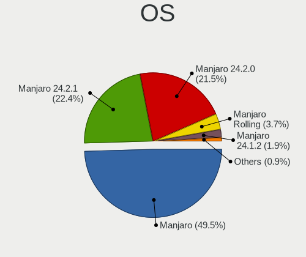
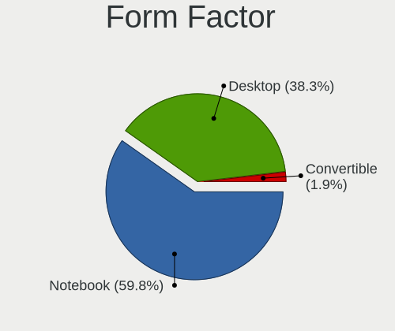
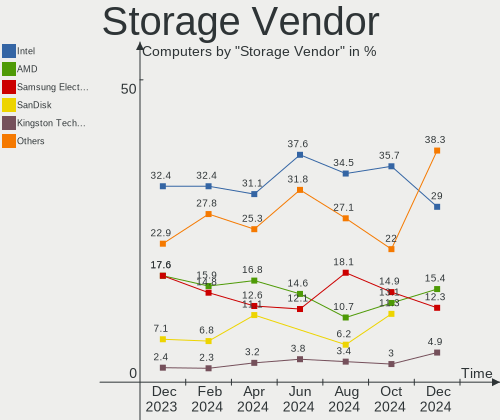
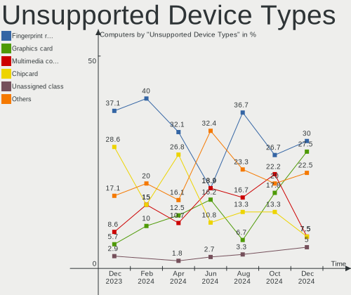

Manjaro - Hardware Trends
-------------------------

A project to identify most popular hardware characteristics and track their change
over time based on data collected by Linux users at https://Linux-Hardware.org.

Anyone can contribute to this report by the [hw-probe](https://github.com/linuxhw/hw-probe) tool:

    sudo -E hw-probe -all -upload

This is a report for all computer types. See also reports for [desktops](/Dist/Manjaro/Desktop/README.md) and [notebooks](/Dist/Manjaro/Notebook/README.md).

This report is for one last month. Overall report since the beginning of time: [TestDays](https://github.com/linuxhw/TestDays)

Period: Jun, 2023.

Contents
--------

* [ System ](#system)
  - [ OS                       ](#os)
  - [ OS Family                ](#os-family)
  - [ Kernel                   ](#kernel)
  - [ Kernel Family            ](#kernel-family)
  - [ Kernel Major Ver.        ](#kernel-major-ver)
  - [ Arch                     ](#arch)
  - [ DE                       ](#de)
  - [ Display Server           ](#display-server)
  - [ Display Manager          ](#display-manager)
  - [ OS Lang                  ](#os-lang)
  - [ Boot Mode                ](#boot-mode)
  - [ Filesystem               ](#filesystem)
  - [ Part. scheme             ](#part-scheme)
  - [ Dual Boot with Linux/BSD ](#dual-boot-with-linuxbsd)
  - [ Dual Boot (Win)          ](#dual-boot-win)

* [ Board ](#board)
  - [ Vendor                   ](#vendor)
  - [ Model                    ](#model)
  - [ Model Family             ](#model-family)
  - [ MFG Year                 ](#mfg-year)
  - [ Form Factor              ](#form-factor)
  - [ Secure Boot              ](#secure-boot)
  - [ Coreboot                 ](#coreboot)
  - [ RAM Size                 ](#ram-size)
  - [ RAM Used                 ](#ram-used)
  - [ Total Drives             ](#total-drives)
  - [ Has CD-ROM               ](#has-cd-rom)
  - [ Has Ethernet             ](#has-ethernet)
  - [ Has WiFi                 ](#has-wifi)
  - [ Has Bluetooth            ](#has-bluetooth)

* [ Location ](#location)
  - [ Country                  ](#country)
  - [ City                     ](#city)

* [ Drives ](#drives)
  - [ Drive Vendor             ](#drive-vendor)
  - [ Drive Model              ](#drive-model)
  - [ HDD Vendor               ](#hdd-vendor)
  - [ SSD Vendor               ](#ssd-vendor)
  - [ Drive Kind               ](#drive-kind)
  - [ Drive Connector          ](#drive-connector)
  - [ Drive Size               ](#drive-size)
  - [ Space Total              ](#space-total)
  - [ Space Used               ](#space-used)
  - [ Malfunc. Drives          ](#malfunc-drives)
  - [ Malfunc. Drive Vendor    ](#malfunc-drive-vendor)
  - [ Malfunc. HDD Vendor      ](#malfunc-hdd-vendor)
  - [ Malfunc. Drive Kind      ](#malfunc-drive-kind)
  - [ Failed Drives            ](#failed-drives)
  - [ Failed Drive Vendor      ](#failed-drive-vendor)
  - [ Drive Status             ](#drive-status)

* [ Storage controller ](#storage-controller)
  - [ Storage Vendor           ](#storage-vendor)
  - [ Storage Model            ](#storage-model)
  - [ Storage Kind             ](#storage-kind)

* [ Processor ](#processor)
  - [ CPU Vendor               ](#cpu-vendor)
  - [ CPU Model                ](#cpu-model)
  - [ CPU Model Family         ](#cpu-model-family)
  - [ CPU Cores                ](#cpu-cores)
  - [ CPU Sockets              ](#cpu-sockets)
  - [ CPU Threads              ](#cpu-threads)
  - [ CPU Op-Modes             ](#cpu-op-modes)
  - [ CPU Microcode            ](#cpu-microcode)
  - [ CPU Microarch            ](#cpu-microarch)

* [ Graphics ](#graphics)
  - [ GPU Vendor               ](#gpu-vendor)
  - [ GPU Model                ](#gpu-model)
  - [ GPU Combo                ](#gpu-combo)
  - [ GPU Driver               ](#gpu-driver)
  - [ GPU Memory               ](#gpu-memory)

* [ Monitor ](#monitor)
  - [ Monitor Vendor           ](#monitor-vendor)
  - [ Monitor Model            ](#monitor-model)
  - [ Monitor Resolution       ](#monitor-resolution)
  - [ Monitor Diagonal         ](#monitor-diagonal)
  - [ Monitor Width            ](#monitor-width)
  - [ Aspect Ratio             ](#aspect-ratio)
  - [ Monitor Area             ](#monitor-area)
  - [ Pixel Density            ](#pixel-density)
  - [ Multiple Monitors        ](#multiple-monitors)

* [ Network ](#network)
  - [ Net Controller Vendor    ](#net-controller-vendor)
  - [ Net Controller Model     ](#net-controller-model)
  - [ Wireless Vendor          ](#wireless-vendor)
  - [ Wireless Model           ](#wireless-model)
  - [ Ethernet Vendor          ](#ethernet-vendor)
  - [ Ethernet Model           ](#ethernet-model)
  - [ Net Controller Kind      ](#net-controller-kind)
  - [ Used Controller          ](#used-controller)
  - [ NICs                     ](#nics)
  - [ IPv6                     ](#ipv6)

* [ Bluetooth ](#bluetooth)
  - [ Bluetooth Vendor         ](#bluetooth-vendor)
  - [ Bluetooth Model          ](#bluetooth-model)

* [ Sound ](#sound)
  - [ Sound Vendor             ](#sound-vendor)
  - [ Sound Model              ](#sound-model)

* [ Memory ](#memory)
  - [ Memory Vendor            ](#memory-vendor)
  - [ Memory Model             ](#memory-model)
  - [ Memory Kind              ](#memory-kind)
  - [ Memory Form Factor       ](#memory-form-factor)
  - [ Memory Size              ](#memory-size)
  - [ Memory Speed             ](#memory-speed)

* [ Printers & scanners ](#printers--scanners)
  - [ Printer Vendor           ](#printer-vendor)
  - [ Printer Model            ](#printer-model)
  - [ Scanner Vendor           ](#scanner-vendor)
  - [ Scanner Model            ](#scanner-model)

* [ Camera ](#camera)
  - [ Camera Vendor            ](#camera-vendor)
  - [ Camera Model             ](#camera-model)

* [ Security ](#security)
  - [ Fingerprint Vendor       ](#fingerprint-vendor)
  - [ Fingerprint Model        ](#fingerprint-model)
  - [ Chipcard Vendor          ](#chipcard-vendor)
  - [ Chipcard Model           ](#chipcard-model)

* [ Unsupported ](#unsupported)
  - [ Unsupported Devices      ](#unsupported-devices)
  - [ Unsupported Device Types ](#unsupported-device-types)

System
------

OS
--

Installed operating systems

| Name                      | Computers | Percent |
|---------------------------|-----------|---------|
| Manjaro                   | 81        | 56.25%  |
| Manjaro 23.0.0            | 55        | 38.19%  |
| Manjaro 22.1.3            | 6         | 4.17%   |
| Manjaro 23.06-development | 2         | 1.39%   |

OS Family
---------

OS without a version

| Name    | Computers | Percent |
|---------|-----------|---------|
| Manjaro | 144       | 100%    |

Kernel
------

Version of the Linux kernel

| Version               | Computers | Percent |
|-----------------------|-----------|---------|
| 6.1.31-2-MANJARO      | 58        | 40.28%  |
| 6.3.5-2-MANJARO       | 30        | 20.83%  |
| 5.15.114-2-MANJARO    | 9         | 6.25%   |
| 6.1.31-1-MANJARO      | 6         | 4.17%   |
| 6.1.30-1-MANJARO      | 6         | 4.17%   |
| 6.3.3-1-MANJARO       | 3         | 2.08%   |
| 6.3.1-1-rt13-MANJARO  | 3         | 2.08%   |
| 6.4.0-1-MANJARO       | 2         | 1.39%   |
| 6.3.7-1-MANJARO       | 2         | 1.39%   |
| 6.3.5-1-MANJARO       | 2         | 1.39%   |
| 6.2.16-1-MANJARO      | 2         | 1.39%   |
| 6.2.0-2-rt3-MANJARO   | 2         | 1.39%   |
| 5.9.16-1-MANJARO      | 2         | 1.39%   |
| 6.3.9-1-MANJARO       | 1         | 0.69%   |
| 6.3.8-4-MANJARO       | 1         | 0.69%   |
| 6.3.7-x64v2-xanmod1-1 | 1         | 0.69%   |
| 6.3.5-lqx1-1-lqx      | 1         | 0.69%   |
| 6.3.4-zen1-1-zen      | 1         | 0.69%   |
| 6.3.3-1-rt15-MANJARO  | 1         | 0.69%   |
| 6.3.10-1-MANJARO      | 1         | 0.69%   |
| 6.2.16-2-MANJARO      | 1         | 0.69%   |
| 6.2.0-4-tt            | 1         | 0.69%   |
| 6.1.19-1-MANJARO      | 1         | 0.69%   |
| 5.9.11-3-MANJARO      | 1         | 0.69%   |
| 5.4.244-2-MANJARO     | 1         | 0.69%   |
| 5.16.14-1-MANJARO     | 1         | 0.69%   |
| 5.15.114-1-MANJARO    | 1         | 0.69%   |
| 5.15.113-1-MANJARO    | 1         | 0.69%   |
| 5.10.181-1-MANJARO    | 1         | 0.69%   |
| 5.10.179-1-MANJARO    | 1         | 0.69%   |

Kernel Family
-------------

Linux kernel without a distro release

| Version  | Computers | Percent |
|----------|-----------|---------|
| 6.1.31   | 64        | 44.44%  |
| 6.3.5    | 33        | 22.92%  |
| 5.15.114 | 10        | 6.94%   |
| 6.1.30   | 6         | 4.17%   |
| 6.3.3    | 4         | 2.78%   |
| 6.3.7    | 3         | 2.08%   |
| 6.3.1    | 3         | 2.08%   |
| 6.2.16   | 3         | 2.08%   |
| 6.2.0    | 3         | 2.08%   |
| 6.4.0    | 2         | 1.39%   |
| 5.9.16   | 2         | 1.39%   |
| 6.3.9    | 1         | 0.69%   |
| 6.3.8    | 1         | 0.69%   |
| 6.3.4    | 1         | 0.69%   |
| 6.3.10   | 1         | 0.69%   |
| 6.1.19   | 1         | 0.69%   |
| 5.9.11   | 1         | 0.69%   |
| 5.4.244  | 1         | 0.69%   |
| 5.16.14  | 1         | 0.69%   |
| 5.15.113 | 1         | 0.69%   |
| 5.10.181 | 1         | 0.69%   |
| 5.10.179 | 1         | 0.69%   |

Kernel Major Ver.
-----------------

Linux kernel major version

| Version | Computers | Percent |
|---------|-----------|---------|
| 6.1     | 71        | 49.31%  |
| 6.3     | 47        | 32.64%  |
| 5.15    | 11        | 7.64%   |
| 6.2     | 6         | 4.17%   |
| 5.9     | 3         | 2.08%   |
| 6.4     | 2         | 1.39%   |
| 5.10    | 2         | 1.39%   |
| 5.4     | 1         | 0.69%   |
| 5.16    | 1         | 0.69%   |

Arch
----

OS architecture (x86_64, i586, etc.)

| Name   | Computers | Percent |
|--------|-----------|---------|
| x86_64 | 144       | 100%    |

DE
--

Desktop Environment

| Name       | Computers | Percent |
|------------|-----------|---------|
| KDE5       | 76        | 52.78%  |
| GNOME      | 35        | 24.31%  |
| XFCE       | 23        | 15.97%  |
| MATE       | 3         | 2.08%   |
| Unknown    | 2         | 1.39%   |
| X-Cinnamon | 1         | 0.69%   |
| sway       | 1         | 0.69%   |
| i3         | 1         | 0.69%   |
| Budgie     | 1         | 0.69%   |
| awesome    | 1         | 0.69%   |

Display Server
--------------

X11 or Wayland

| Name    | Computers | Percent |
|---------|-----------|---------|
| X11     | 106       | 73.61%  |
| Wayland | 35        | 24.31%  |
| Tty     | 2         | 1.39%   |
| Unknown | 1         | 0.69%   |

Display Manager
---------------

SDDM, LightDM, etc.

| Name    | Computers | Percent |
|---------|-----------|---------|
| Unknown | 81        | 56.25%  |
| SDDM    | 33        | 22.92%  |
| LightDM | 18        | 12.5%   |
| GDM     | 11        | 7.64%   |
| GREETD  | 1         | 0.69%   |

OS Lang
-------

Language

| Lang  | Computers | Percent |
|-------|-----------|---------|
| en_US | 57        | 39.58%  |
| en_GB | 18        | 12.5%   |
| ru_RU | 8         | 5.56%   |
| pt_BR | 8         | 5.56%   |
| de_DE | 8         | 5.56%   |
| en_CA | 5         | 3.47%   |
| es_ES | 4         | 2.78%   |
| de_AT | 4         | 2.78%   |
| en_AU | 3         | 2.08%   |
| de_CH | 3         | 2.08%   |
| zh_CN | 2         | 1.39%   |
| it_IT | 2         | 1.39%   |
| hu_HU | 2         | 1.39%   |
| fr_FR | 2         | 1.39%   |
| es_PE | 2         | 1.39%   |
| es_CL | 2         | 1.39%   |
| zh_TW | 1         | 0.69%   |
| tr_TR | 1         | 0.69%   |
| ro_RO | 1         | 0.69%   |
| pt_PT | 1         | 0.69%   |
| pl_PL | 1         | 0.69%   |
| ja_JP | 1         | 0.69%   |
| fr_CA | 1         | 0.69%   |
| fi_FI | 1         | 0.69%   |
| es_UY | 1         | 0.69%   |
| es_MX | 1         | 0.69%   |
| es_AR | 1         | 0.69%   |
| en_IL | 1         | 0.69%   |
| en_DE | 1         | 0.69%   |
| cs_CZ | 1         | 0.69%   |

Boot Mode
---------

EFI or BIOS

| Mode | Computers | Percent |
|------|-----------|---------|
| BIOS | 87        | 60.42%  |
| EFI  | 57        | 39.58%  |

Filesystem
----------

Type of filesystem

| Type    | Computers | Percent |
|---------|-----------|---------|
| Ext4    | 92        | 63.89%  |
| Btrfs   | 37        | 25.69%  |
| Tmpfs   | 13        | 9.03%   |
| Xfs     | 1         | 0.69%   |
| Overlay | 1         | 0.69%   |

Part. scheme
------------

Scheme of partitioning

| Type    | Computers | Percent |
|---------|-----------|---------|
| Unknown | 81        | 56.25%  |
| GPT     | 59        | 40.97%  |
| MBR     | 4         | 2.78%   |

Dual Boot with Linux/BSD
------------------------

Hosting more than one Linux/BSD

| Dual boot | Computers | Percent |
|-----------|-----------|---------|
| No        | 133       | 92.36%  |
| Yes       | 11        | 7.64%   |

Dual Boot (Win)
---------------

Hosting Linux and Windows

| Dual boot | Computers | Percent |
|-----------|-----------|---------|
| No        | 115       | 79.86%  |
| Yes       | 29        | 20.14%  |

Board
-----

Vendor
------

Motherboard manufacturer

| Name                | Computers | Percent |
|---------------------|-----------|---------|
| ASUSTek Computer    | 21        | 14.58%  |
| Lenovo              | 19        | 13.19%  |
| MSI                 | 17        | 11.81%  |
| Hewlett-Packard     | 16        | 11.11%  |
| Dell                | 12        | 8.33%   |
| Gigabyte Technology | 10        | 6.94%   |
| Acer                | 9         | 6.25%   |
| ASRock              | 8         | 5.56%   |
| HONOR               | 3         | 2.08%   |
| Google              | 3         | 2.08%   |
| HUAWEI              | 2         | 1.39%   |
| Fujitsu             | 2         | 1.39%   |
| Apple               | 2         | 1.39%   |
| Unknown             | 2         | 1.39%   |
| WOOKING             | 1         | 0.69%   |
| Timi                | 1         | 0.69%   |
| Teclast             | 1         | 0.69%   |
| Sony                | 1         | 0.69%   |
| Schenker            | 1         | 0.69%   |
| Samsung Electronics | 1         | 0.69%   |
| Positivo            | 1         | 0.69%   |
| Multilaser          | 1         | 0.69%   |
| LG Electronics      | 1         | 0.69%   |
| Intel               | 1         | 0.69%   |
| Framework           | 1         | 0.69%   |
| Foxconn             | 1         | 0.69%   |
| DIEBOLD             | 1         | 0.69%   |
| Chuwi               | 1         | 0.69%   |
| Biostar             | 1         | 0.69%   |
| AZW                 | 1         | 0.69%   |
| Alurin              | 1         | 0.69%   |
| Alienware           | 1         | 0.69%   |

Model
-----

Motherboard model

| Name                                     | Computers | Percent |
|------------------------------------------|-----------|---------|
| MSI MS-7C37                              | 3         | 2.08%   |
| MSI MS-7C91                              | 2         | 1.39%   |
| MSI MS-7C02                              | 2         | 1.39%   |
| Unknown                                  | 2         | 1.39%   |
| WOOKING X16                              | 1         | 0.69%   |
| Timi Redmi Book Pro 15 2022              | 1         | 0.69%   |
| Teclast F15Plus 2                        | 1         | 0.69%   |
| Sony VGN-FW41J_H                         | 1         | 0.69%   |
| Schenker VIA 15 Pro                      | 1         | 0.69%   |
| Samsung 300E5K/300E5Q                    | 1         | 0.69%   |
| Positivo POS-EIQ87CY                     | 1         | 0.69%   |
| Multilaser UB82X                         | 1         | 0.69%   |
| MSI U200                                 | 1         | 0.69%   |
| MSI Prestige 14Evo A12M                  | 1         | 0.69%   |
| MSI MS-7C95                              | 1         | 0.69%   |
| MSI MS-7B93                              | 1         | 0.69%   |
| MSI MS-7A95                              | 1         | 0.69%   |
| MSI MS-7A35                              | 1         | 0.69%   |
| MSI MS-7978                              | 1         | 0.69%   |
| MSI MS-7597                              | 1         | 0.69%   |
| MSI GT70 2OC/2OD                         | 1         | 0.69%   |
| MSI GS60 6QE                             | 1         | 0.69%   |
| LG 16Z90P-G.AA55H                        | 1         | 0.69%   |
| Lenovo Y520-15IKBN 80WK                  | 1         | 0.69%   |
| Lenovo ThinkPad X380 Yoga 20LJS2MG00     | 1         | 0.69%   |
| Lenovo ThinkPad X1 Carbon 3rd 20BTS1SQ00 | 1         | 0.69%   |
| Lenovo ThinkPad T480 20L6S7PE0G          | 1         | 0.69%   |
| Lenovo ThinkPad T470s 20HF005QMX         | 1         | 0.69%   |
| Lenovo ThinkPad T470 W10DG 20JNS1FJ00    | 1         | 0.69%   |
| Lenovo ThinkPad T440p 20AWS38H0G         | 1         | 0.69%   |
| Lenovo ThinkPad P51 20HJS02000           | 1         | 0.69%   |
| Lenovo ThinkPad L470 20J5S01S00          | 1         | 0.69%   |
| Lenovo ThinkPad E560 20EV002FUS          | 1         | 0.69%   |
| Lenovo ThinkPad E15 Gen 4 21EDCTO1WW     | 1         | 0.69%   |
| Lenovo Legion Y740-15IRHg 81UH           | 1         | 0.69%   |
| Lenovo Legion S7 16IAH7 82TF             | 1         | 0.69%   |
| Lenovo IdeaPad Y700-15ISK 80NV           | 1         | 0.69%   |
| Lenovo IdeaPad S145-15API 81V7           | 1         | 0.69%   |
| Lenovo IdeaPad Pro 5 16ARP8 83AS         | 1         | 0.69%   |
| Lenovo IdeaPad 330-17IKB 81DM            | 1         | 0.69%   |

Model Family
------------

Motherboard model prefix

| Name                 | Computers | Percent |
|----------------------|-----------|---------|
| Lenovo ThinkPad      | 10        | 6.94%   |
| Acer Aspire          | 8         | 5.56%   |
| ASUS ROG             | 6         | 4.17%   |
| Dell Latitude        | 5         | 3.47%   |
| Lenovo IdeaPad       | 4         | 2.78%   |
| HP EliteBook         | 4         | 2.78%   |
| ASUS VivoBook        | 4         | 2.78%   |
| MSI MS-7C37          | 3         | 2.08%   |
| HP OMEN              | 3         | 2.08%   |
| Dell XPS             | 3         | 2.08%   |
| ASUS PRIME           | 3         | 2.08%   |
| MSI MS-7C91          | 2         | 1.39%   |
| MSI MS-7C02          | 2         | 1.39%   |
| Lenovo Legion        | 2         | 1.39%   |
| HP Pavilion          | 2         | 1.39%   |
| Dell OptiPlex        | 2         | 1.39%   |
| Dell Inspiron        | 2         | 1.39%   |
| ASUS TUF             | 2         | 1.39%   |
| ASRock B450          | 2         | 1.39%   |
| Unknown              | 2         | 1.39%   |
| WOOKING X16          | 1         | 0.69%   |
| Timi Redmi           | 1         | 0.69%   |
| Teclast F15Plus      | 1         | 0.69%   |
| Sony VGN-FW41J       | 1         | 0.69%   |
| Schenker VIA         | 1         | 0.69%   |
| Samsung 300E5K       | 1         | 0.69%   |
| Positivo POS-EIQ87CY | 1         | 0.69%   |
| Multilaser UB82X     | 1         | 0.69%   |
| MSI U200             | 1         | 0.69%   |
| MSI Prestige         | 1         | 0.69%   |
| MSI MS-7C95          | 1         | 0.69%   |
| MSI MS-7B93          | 1         | 0.69%   |
| MSI MS-7A95          | 1         | 0.69%   |
| MSI MS-7A35          | 1         | 0.69%   |
| MSI MS-7978          | 1         | 0.69%   |
| MSI MS-7597          | 1         | 0.69%   |
| MSI GT70             | 1         | 0.69%   |
| MSI GS60             | 1         | 0.69%   |
| LG 16Z90P-G.AA55H    | 1         | 0.69%   |
| Lenovo Y520-15IKBN   | 1         | 0.69%   |

MFG Year
--------

Motherboard manufacture year

| Year    | Computers | Percent |
|---------|-----------|---------|
| 2020    | 19        | 13.19%  |
| 2022    | 18        | 12.5%   |
| 2021    | 18        | 12.5%   |
| 2017    | 15        | 10.42%  |
| 2018    | 14        | 9.72%   |
| 2019    | 11        | 7.64%   |
| 2023    | 10        | 6.94%   |
| 2015    | 8         | 5.56%   |
| 2014    | 8         | 5.56%   |
| 2016    | 6         | 4.17%   |
| 2013    | 4         | 2.78%   |
| 2012    | 3         | 2.08%   |
| 2011    | 3         | 2.08%   |
| 2009    | 3         | 2.08%   |
| 2010    | 2         | 1.39%   |
| 2008    | 1         | 0.69%   |
| Unknown | 1         | 0.69%   |

Form Factor
-----------

Physical design of the computer

| Name        | Computers | Percent |
|-------------|-----------|---------|
| Notebook    | 79        | 54.86%  |
| Desktop     | 59        | 40.97%  |
| Mini pc     | 2         | 1.39%   |
| All in one  | 2         | 1.39%   |
| Tablet      | 1         | 0.69%   |
| Convertible | 1         | 0.69%   |

Secure Boot
-----------

Enabled or disabled

| State    | Computers | Percent |
|----------|-----------|---------|
| Disabled | 144       | 100%    |

Coreboot
--------

Have coreboot on board

| Used | Computers | Percent |
|------|-----------|---------|
| No   | 141       | 97.92%  |
| Yes  | 3         | 2.08%   |

RAM Size
--------

Total RAM memory

| Size in GB  | Computers | Percent |
|-------------|-----------|---------|
| 16.01-24.0  | 35        | 24.31%  |
| 4.01-8.0    | 33        | 22.92%  |
| 32.01-64.0  | 30        | 20.83%  |
| 8.01-16.0   | 21        | 14.58%  |
| 3.01-4.0    | 13        | 9.03%   |
| 24.01-32.0  | 8         | 5.56%   |
| 64.01-256.0 | 4         | 2.78%   |

RAM Used
--------

Used RAM memory

| Used GB    | Computers | Percent |
|------------|-----------|---------|
| 4.01-8.0   | 47        | 32.64%  |
| 3.01-4.0   | 29        | 20.14%  |
| 2.01-3.0   | 28        | 19.44%  |
| 1.01-2.0   | 23        | 15.97%  |
| 8.01-16.0  | 12        | 8.33%   |
| 16.01-24.0 | 2         | 1.39%   |
| 0.51-1.0   | 2         | 1.39%   |
| 24.01-32.0 | 1         | 0.69%   |

Total Drives
------------

Number of drives on board

| Drives | Computers | Percent |
|--------|-----------|---------|
| 1      | 72        | 50%     |
| 2      | 36        | 25%     |
| 3      | 17        | 11.81%  |
| 4      | 13        | 9.03%   |
| 5      | 3         | 2.08%   |
| 6      | 2         | 1.39%   |
| 9      | 1         | 0.69%   |

Has CD-ROM
----------

Has CD-ROM on board

| Presented | Computers | Percent |
|-----------|-----------|---------|
| No        | 119       | 82.64%  |
| Yes       | 25        | 17.36%  |

Has Ethernet
------------

Has Ethernet on board

| Presented | Computers | Percent |
|-----------|-----------|---------|
| Yes       | 113       | 78.47%  |
| No        | 31        | 21.53%  |

Has WiFi
--------

Has WiFi module

| Presented | Computers | Percent |
|-----------|-----------|---------|
| Yes       | 114       | 79.17%  |
| No        | 30        | 20.83%  |

Has Bluetooth
-------------

Has Bluetooth module

| Presented | Computers | Percent |
|-----------|-----------|---------|
| Yes       | 106       | 73.61%  |
| No        | 38        | 26.39%  |

Location
--------

Country
-------

Geographic location (country)

| Country            | Computers | Percent |
|--------------------|-----------|---------|
| USA                | 22        | 15.28%  |
| Germany            | 17        | 11.81%  |
| Brazil             | 14        | 9.72%   |
| UK                 | 10        | 6.94%   |
| Canada             | 10        | 6.94%   |
| Russia             | 8         | 5.56%   |
| France             | 5         | 3.47%   |
| Spain              | 4         | 2.78%   |
| Hungary            | 4         | 2.78%   |
| Austria            | 4         | 2.78%   |
| Australia          | 4         | 2.78%   |
| Switzerland        | 3         | 2.08%   |
| Sweden             | 3         | 2.08%   |
| Israel             | 3         | 2.08%   |
| China              | 3         | 2.08%   |
| Turkey             | 2         | 1.39%   |
| Portugal           | 2         | 1.39%   |
| Peru               | 2         | 1.39%   |
| Italy              | 2         | 1.39%   |
| Chile              | 2         | 1.39%   |
| Uruguay            | 1         | 0.69%   |
| Taiwan             | 1         | 0.69%   |
| Sri Lanka          | 1         | 0.69%   |
| Romania            | 1         | 0.69%   |
| Poland             | 1         | 0.69%   |
| Netherlands        | 1         | 0.69%   |
| Moldova            | 1         | 0.69%   |
| Mexico             | 1         | 0.69%   |
| Kyrgyzstan         | 1         | 0.69%   |
| Japan              | 1         | 0.69%   |
| Ireland            | 1         | 0.69%   |
| Indonesia          | 1         | 0.69%   |
| India              | 1         | 0.69%   |
| Finland            | 1         | 0.69%   |
| Dominican Republic | 1         | 0.69%   |
| Denmark            | 1         | 0.69%   |
| Czechia            | 1         | 0.69%   |
| Cyprus             | 1         | 0.69%   |
| Colombia           | 1         | 0.69%   |
| Argentina          | 1         | 0.69%   |

City
----

Geographic location (city)

| City            | Computers | Percent |
|-----------------|-----------|---------|
| Moscow          | 6         | 4.17%   |
| Seattle         | 4         | 2.78%   |
| Wels            | 2         | 1.39%   |
| Toronto         | 2         | 1.39%   |
| Sao Paulo       | 2         | 1.39%   |
| Rio de Janeiro  | 2         | 1.39%   |
| Paris           | 2         | 1.39%   |
| Munich          | 2         | 1.39%   |
| Leeds           | 2         | 1.39%   |
| Gothenburg      | 2         | 1.39%   |
| Curitiba        | 2         | 1.39%   |
| Budapest        | 2         | 1.39%   |
| Brisbane        | 2         | 1.39%   |
| Zhengzhou       | 1         | 0.69%   |
| Zalaegerszeg    | 1         | 0.69%   |
| Yekaterinburg   | 1         | 0.69%   |
| Xuzhou          | 1         | 0.69%   |
| Wuppertal       | 1         | 0.69%   |
| Wolfville       | 1         | 0.69%   |
| Whittier        | 1         | 0.69%   |
| Westville       | 1         | 0.69%   |
| Wangen          | 1         | 0.69%   |
| Virginia Beach  | 1         | 0.69%   |
| Vila Velha      | 1         | 0.69%   |
| Vienna          | 1         | 0.69%   |
| Varberg         | 1         | 0.69%   |
| Uruguaiana      | 1         | 0.69%   |
| Tyler           | 1         | 0.69%   |
| Twickenham      | 1         | 0.69%   |
| Tübingen       | 1         | 0.69%   |
| Tomar           | 1         | 0.69%   |
| Tokyo           | 1         | 0.69%   |
| Timișoara      | 1         | 0.69%   |
| Thunder Bay     | 1         | 0.69%   |
| Thun            | 1         | 0.69%   |
| Taipei          | 1         | 0.69%   |
| Sydney          | 1         | 0.69%   |
| Sucha Beskidzka | 1         | 0.69%   |
| State College   | 1         | 0.69%   |
| Spruce Grove    | 1         | 0.69%   |

Drives
------

Drive Vendor
------------

Hard drive vendors

| Vendor                       | Computers | Drives | Percent |
|------------------------------|-----------|--------|---------|
| Samsung Electronics          | 43        | 53     | 17.55%  |
| Seagate                      | 29        | 37     | 11.84%  |
| WDC                          | 23        | 31     | 9.39%   |
| Toshiba                      | 18        | 21     | 7.35%   |
| Sandisk                      | 18        | 23     | 7.35%   |
| Unknown                      | 11        | 13     | 4.49%   |
| Kingston                     | 11        | 12     | 4.49%   |
| Crucial                      | 8         | 8      | 3.27%   |
| SK hynix                     | 7         | 7      | 2.86%   |
| Micron/Crucial Technology    | 6         | 6      | 2.45%   |
| Micron Technology            | 5         | 5      | 2.04%   |
| Intel                        | 5         | 6      | 2.04%   |
| China                        | 5         | 5      | 2.04%   |
| Phison Electronics           | 4         | 4      | 1.63%   |
| HGST                         | 4         | 4      | 1.63%   |
| ADATA Technology             | 4         | 4      | 1.63%   |
| Kingston Technology Company  | 3         | 3      | 1.22%   |
| Hitachi                      | 3         | 3      | 1.22%   |
| A-DATA Technology            | 3         | 3      | 1.22%   |
| PNY                          | 2         | 2      | 0.82%   |
| OCZ                          | 2         | 2      | 0.82%   |
| KIOXIA                       | 2         | 2      | 0.82%   |
| KingSpec                     | 2         | 3      | 0.82%   |
| Apple                        | 2         | 2      | 0.82%   |
| ZTE                          | 1         | 1      | 0.41%   |
| Yangtze Memory Technologies  | 1         | 1      | 0.41%   |
| Transcend                    | 1         | 1      | 0.41%   |
| Teclast                      | 1         | 1      | 0.41%   |
| Team                         | 1         | 1      | 0.41%   |
| TCSUNBOW                     | 1         | 1      | 0.41%   |
| SPCC                         | 1         | 1      | 0.41%   |
| Solid State Storage          | 1         | 1      | 0.41%   |
| Silicon Motion               | 1         | 1      | 0.41%   |
| ShiJi                        | 1         | 1      | 0.41%   |
| Shenzhen Longsys Electronics | 1         | 1      | 0.41%   |
| Realtek Semiconductor        | 1         | 1      | 0.41%   |
| Netac                        | 1         | 1      | 0.41%   |
| MAXIO Technology (Hangzhou)  | 1         | 1      | 0.41%   |
| Marvell Technology Group     | 1         | 1      | 0.41%   |
| Lexar                        | 1         | 1      | 0.41%   |

Drive Model
-----------

Hard drive models

| Model                                                             | Computers | Percent |
|-------------------------------------------------------------------|-----------|---------|
| Samsung NVMe SSD Controller SM981/PM981/PM983 250GB               | 16        | 5.82%   |
| Samsung NVMe SSD Controller PM9A1/PM9A3/980PRO 2TB                | 6         | 2.18%   |
| Toshiba DT01ACA100 1TB                                            | 4         | 1.45%   |
| Seagate ST1000DM010-2EP102 1TB                                    | 4         | 1.45%   |
| Unknown MMC Card  64GB                                            | 3         | 1.09%   |
| Seagate ST1000LM035-1RK172 1TB                                    | 3         | 1.09%   |
| SanDisk SSD PLUS 480GB                                            | 3         | 1.09%   |
| Samsung NVMe SSD Controller SM961/PM961/SM963 256GB               | 3         | 1.09%   |
| Phison E12 NVMe Controller 1TB                                    | 3         | 1.09%   |
| Kingston SNVS500G 500GB                                           | 3         | 1.09%   |
| Intel SSD 660P Series 512GB                                       | 3         | 1.09%   |
| Crucial CT500MX500SSD1 500GB                                      | 3         | 1.09%   |
| WDC WDS100T2B0B-00YS70 1TB SSD                                    | 2         | 0.73%   |
| WDC WD30EFRX-68EUZN0 3TB                                          | 2         | 0.73%   |
| Unknown SD/MMC/MS PRO 250GB                                       | 2         | 0.73%   |
| Unknown MMC Card  32GB                                            | 2         | 0.73%   |
| Toshiba XG6 NVMe SSD Controller 2TB                               | 2         | 0.73%   |
| Toshiba MQ01ABD100 1TB                                            | 2         | 0.73%   |
| Seagate ST500DM002-1BD142 500GB                                   | 2         | 0.73%   |
| Seagate ST3250318AS 250GB                                         | 2         | 0.73%   |
| Seagate ST250DM000-1BD141 250GB                                   | 2         | 0.73%   |
| Seagate ST2000DM008-2FR102 2TB                                    | 2         | 0.73%   |
| Seagate ST1000DM003-1CH162 1TB                                    | 2         | 0.73%   |
| Sandisk WD_BLACK SN770 1TB                                        | 2         | 0.73%   |
| Sandisk WD Black SN850 1TB                                        | 2         | 0.73%   |
| Sandisk WD Black SN750 / PC SN730 NVMe SSD 500GB                  | 2         | 0.73%   |
| Samsung SSD 980 1TB                                               | 2         | 0.73%   |
| Samsung SSD 870 QVO 1TB                                           | 2         | 0.73%   |
| Samsung SSD 860 EVO 1TB                                           | 2         | 0.73%   |
| Samsung SSD 850 EVO 250GB                                         | 2         | 0.73%   |
| Micron/Crucial P2 NVMe PCIe SSD 4TB                               | 2         | 0.73%   |
| Micron 2450_MTFDKBA512TFK 512GB                                   | 2         | 0.73%   |
| Kingston SNV2S500G 500GB                                          | 2         | 0.73%   |
| Kingston SA400S37120G 120GB SSD                                   | 2         | 0.73%   |
| HGST HTS545050A7E380 500GB                                        | 2         | 0.73%   |
| Crucial CT1000MX500SSD1 1TB                                       | 2         | 0.73%   |
| China SSD 1TB                                                     | 2         | 0.73%   |
| China SATA SSD 120GB                                              | 2         | 0.73%   |
| ADATA XPG SX8200 Pro PCIe Gen3x4 M.2 2280 Solid State Drive 512GB | 2         | 0.73%   |
| ADATA XPG GAMMIX S70 BLADE 1TB                                    | 2         | 0.73%   |

HDD Vendor
----------

Hard disk drive vendors

| Vendor  | Computers | Drives | Percent |
|---------|-----------|--------|---------|
| Seagate | 28        | 35     | 40.58%  |
| WDC     | 18        | 24     | 26.09%  |
| Toshiba | 13        | 15     | 18.84%  |
| HGST    | 4         | 4      | 5.8%    |
| Hitachi | 3         | 3      | 4.35%   |
| Unknown | 2         | 2      | 2.9%    |
| Fujitsu | 1         | 1      | 1.45%   |

SSD Vendor
----------

Solid state drive vendors

| Vendor              | Computers | Drives | Percent |
|---------------------|-----------|--------|---------|
| Samsung Electronics | 18        | 22     | 24%     |
| Crucial             | 8         | 8      | 10.67%  |
| SanDisk             | 7         | 8      | 9.33%   |
| WDC                 | 5         | 7      | 6.67%   |
| Kingston            | 5         | 5      | 6.67%   |
| China               | 5         | 5      | 6.67%   |
| SK hynix            | 3         | 3      | 4%      |
| A-DATA Technology   | 3         | 3      | 4%      |
| Toshiba             | 2         | 2      | 2.67%   |
| PNY                 | 2         | 2      | 2.67%   |
| OCZ                 | 2         | 2      | 2.67%   |
| KingSpec            | 2         | 3      | 2.67%   |
| Apple               | 2         | 2      | 2.67%   |
| Transcend           | 1         | 1      | 1.33%   |
| Teclast             | 1         | 1      | 1.33%   |
| Team                | 1         | 1      | 1.33%   |
| SPCC                | 1         | 1      | 1.33%   |
| Seagate             | 1         | 1      | 1.33%   |
| Netac               | 1         | 1      | 1.33%   |
| Lexar               | 1         | 1      | 1.33%   |
| GOODRAM             | 1         | 1      | 1.33%   |
| ASMT                | 1         | 1      | 1.33%   |
| ADATA LE            | 1         | 1      | 1.33%   |
| Acer                | 1         | 1      | 1.33%   |

Drive Kind
----------

HDD or SSD

| Kind    | Computers | Drives | Percent |
|---------|-----------|--------|---------|
| NVMe    | 86        | 103    | 39.27%  |
| SSD     | 67        | 83     | 30.59%  |
| HDD     | 53        | 84     | 24.2%   |
| Unknown | 7         | 8      | 3.2%    |
| MMC     | 6         | 6      | 2.74%   |

Drive Connector
---------------

SATA, SAS, NVMe, etc.

| Type | Computers | Drives | Percent |
|------|-----------|--------|---------|
| SATA | 93        | 161    | 47.69%  |
| NVMe | 86        | 102    | 44.1%   |
| SAS  | 10        | 15     | 5.13%   |
| MMC  | 6         | 6      | 3.08%   |

Drive Size
----------

Size of hard drive

| Size in TB | Computers | Drives | Percent |
|------------|-----------|--------|---------|
| 0.01-0.5   | 56        | 74     | 42.75%  |
| 0.51-1.0   | 42        | 53     | 32.06%  |
| 1.01-2.0   | 15        | 18     | 11.45%  |
| 3.01-4.0   | 9         | 9      | 6.87%   |
| 2.01-3.0   | 4         | 7      | 3.05%   |
| 4.01-10.0  | 4         | 5      | 3.05%   |
| 10.01-20.0 | 1         | 1      | 0.76%   |

Space Total
-----------

Amount of disk space available on the file system

| Size in GB     | Computers | Percent |
|----------------|-----------|---------|
| 101-250        | 30        | 20.83%  |
| 501-1000       | 27        | 18.75%  |
| 251-500        | 26        | 18.06%  |
| More than 3000 | 21        | 14.58%  |
| 1001-2000      | 20        | 13.89%  |
| 2001-3000      | 6         | 4.17%   |
| Unknown        | 6         | 4.17%   |
| 21-50          | 3         | 2.08%   |
| 51-100         | 3         | 2.08%   |
| 1-20           | 2         | 1.39%   |

Space Used
----------

Amount of used disk space

| Used GB        | Computers | Percent |
|----------------|-----------|---------|
| 101-250        | 28        | 19.44%  |
| 1-20           | 25        | 17.36%  |
| 21-50          | 17        | 11.81%  |
| 51-100         | 16        | 11.11%  |
| 501-1000       | 15        | 10.42%  |
| 251-500        | 14        | 9.72%   |
| 1001-2000      | 13        | 9.03%   |
| More than 3000 | 7         | 4.86%   |
| Unknown        | 6         | 4.17%   |
| 2001-3000      | 3         | 2.08%   |

Malfunc. Drives
---------------

Drive models with a malfunction

| Model                                                           | Computers | Drives | Percent |
|-----------------------------------------------------------------|-----------|--------|---------|
| WDC WD3000FYYZ-01UL1B0 3TB                                      | 1         | 2      | 14.29%  |
| WDC WD1002FAEX-00Z3A0 1TB                                       | 1         | 1      | 14.29%  |
| Toshiba MQ01ABD100 1TB                                          | 1         | 1      | 14.29%  |
| Seagate ST4000DM004-2CV104 4TB                                  | 1         | 1      | 14.29%  |
| Seagate ST33000651AS 3TB                                        | 1         | 1      | 14.29%  |
| Seagate ST3250310NS 250GB                                       | 1         | 1      | 14.29%  |
| Samsung Electronics NVMe SSD Controller SM961/PM961/SM963 256GB | 1         | 1      | 14.29%  |

Malfunc. Drive Vendor
---------------------

Vendors of faulty drives

| Vendor              | Computers | Drives | Percent |
|---------------------|-----------|--------|---------|
| Seagate             | 3         | 3      | 42.86%  |
| WDC                 | 2         | 3      | 28.57%  |
| Toshiba             | 1         | 1      | 14.29%  |
| Samsung Electronics | 1         | 1      | 14.29%  |

Malfunc. HDD Vendor
-------------------

Vendors of faulty HDD drives

| Vendor  | Computers | Drives | Percent |
|---------|-----------|--------|---------|
| Seagate | 3         | 3      | 50%     |
| WDC     | 2         | 3      | 33.33%  |
| Toshiba | 1         | 1      | 16.67%  |

Malfunc. Drive Kind
-------------------

Kinds of faulty drives

| Kind | Computers | Drives | Percent |
|------|-----------|--------|---------|
| HDD  | 5         | 7      | 83.33%  |
| NVMe | 1         | 1      | 16.67%  |

Failed Drives
-------------

Failed drive models

Zero info for selected period =(

Failed Drive Vendor
-------------------

Failed drive vendors

Zero info for selected period =(

Drive Status
------------

Number of failed and malfunc. drives

| Status   | Computers | Drives | Percent |
|----------|-----------|--------|---------|
| Detected | 113       | 209    | 73.38%  |
| Works    | 35        | 67     | 22.73%  |
| Malfunc  | 6         | 8      | 3.9%    |

Storage controller
------------------

Storage Vendor
--------------

Storage controller vendors

| Vendor                         | Computers | Percent |
|--------------------------------|-----------|---------|
| Intel                          | 75        | 34.09%  |
| AMD                            | 40        | 18.18%  |
| Samsung Electronics            | 31        | 14.09%  |
| SanDisk                        | 13        | 5.91%   |
| Kingston Technology Company    | 10        | 4.55%   |
| Micron/Crucial Technology      | 6         | 2.73%   |
| ASMedia Technology             | 6         | 2.73%   |
| Micron Technology              | 5         | 2.27%   |
| Toshiba America Info Systems   | 4         | 1.82%   |
| SK hynix                       | 4         | 1.82%   |
| Phison Electronics             | 4         | 1.82%   |
| ADATA Technology               | 4         | 1.82%   |
| Marvell Technology Group       | 3         | 1.36%   |
| KIOXIA                         | 2         | 0.91%   |
| JMicron Technology             | 2         | 0.91%   |
| Yangtze Memory Technologies    | 1         | 0.45%   |
| Solidigm                       | 1         | 0.45%   |
| Solid State Storage Technology | 1         | 0.45%   |
| Silicon Motion                 | 1         | 0.45%   |
| Shenzhen Longsys Electronics   | 1         | 0.45%   |
| Realtek Semiconductor          | 1         | 0.45%   |
| Nvidia                         | 1         | 0.45%   |
| Netac Technology               | 1         | 0.45%   |
| MAXIO Technology (Hangzhou)    | 1         | 0.45%   |
| INNOGRIT                       | 1         | 0.45%   |
| Biwin Storage Technology       | 1         | 0.45%   |

Storage Model
-------------

Storage controller models

| Model                                                                          | Computers | Percent |
|--------------------------------------------------------------------------------|-----------|---------|
| AMD FCH SATA Controller [AHCI mode]                                            | 25        | 10.04%  |
| Samsung NVMe SSD Controller SM981/PM981/PM983                                  | 16        | 6.43%   |
| AMD 400 Series Chipset SATA Controller                                         | 12        | 4.82%   |
| Intel Volume Management Device NVMe RAID Controller                            | 9         | 3.61%   |
| Intel Sunrise Point-LP SATA Controller [AHCI mode]                             | 7         | 2.81%   |
| Samsung NVMe SSD Controller PM9A1/PM9A3/980PRO                                 | 6         | 2.41%   |
| Intel Q170/Q150/B150/H170/H110/Z170/CM236 Chipset SATA Controller [AHCI Mode]  | 6         | 2.41%   |
| Intel Celeron/Pentium Silver Processor SATA Controller                         | 6         | 2.41%   |
| ASMedia ASM1062 Serial ATA Controller                                          | 6         | 2.41%   |
| AMD 500 Series Chipset SATA Controller                                         | 6         | 2.41%   |
| Samsung NVMe SSD Controller 980                                                | 5         | 2.01%   |
| SanDisk WD Black SN770 NVMe SSD                                                | 4         | 1.61%   |
| Micron 2450 NVMe SSD (DRAM-less)                                               | 4         | 1.61%   |
| Kingston Company Company Non-Volatile memory controller                        | 4         | 1.61%   |
| Intel HM170/QM170 Chipset SATA Controller [AHCI Mode]                          | 4         | 1.61%   |
| Intel 8 Series/C220 Series Chipset Family 6-port SATA Controller 1 [AHCI mode] | 4         | 1.61%   |
| Intel 200 Series PCH SATA controller [AHCI mode]                               | 4         | 1.61%   |
| Samsung NVMe SSD Controller SM961/PM961/SM963                                  | 3         | 1.2%    |
| Phison E12 NVMe Controller                                                     | 3         | 1.2%    |
| Micron/Crucial NVMe Storage Controller                                         | 3         | 1.2%    |
| Intel Tiger Lake-LP SATA Controller                                            | 3         | 1.2%    |
| Intel SSD 660P Series                                                          | 3         | 1.2%    |
| Intel Alder Lake-S PCH SATA Controller [AHCI Mode]                             | 3         | 1.2%    |
| Intel 82801 Mobile SATA Controller [RAID mode]                                 | 3         | 1.2%    |
| Intel 8 Series SATA Controller 1 [AHCI mode]                                   | 3         | 1.2%    |
| Intel 500 Series Chipset Family SATA AHCI Controller                           | 3         | 1.2%    |
| AMD SB7x0/SB8x0/SB9x0 SATA Controller [AHCI mode]                              | 3         | 1.2%    |
| AMD SB7x0/SB8x0/SB9x0 IDE Controller                                           | 3         | 1.2%    |
| Toshiba America Info Systems XG6 NVMe SSD Controller                           | 2         | 0.8%    |
| SK hynix Platinum P41/PC801 NVMe Solid State Drive                             | 2         | 0.8%    |
| SanDisk WD PC SN810 / Black SN850 NVMe SSD                                     | 2         | 0.8%    |
| SanDisk WD Blue SN570 NVMe SSD 1TB                                             | 2         | 0.8%    |
| SanDisk WD Black SN750 / PC SN730 NVMe SSD                                     | 2         | 0.8%    |
| SanDisk Non-Volatile memory controller                                         | 2         | 0.8%    |
| Micron/Crucial P2 NVMe PCIe SSD                                                | 2         | 0.8%    |
| KIOXIA Non-Volatile memory controller                                          | 2         | 0.8%    |
| Kingston Company SNVS2000G [NV1 NVMe PCIe SSD 2TB]                             | 2         | 0.8%    |
| Kingston Company NVMe Controller                                               | 2         | 0.8%    |
| Intel Wildcat Point-LP SATA Controller [AHCI Mode]                             | 2         | 0.8%    |
| Intel Comet Lake SATA AHCI Controller                                          | 2         | 0.8%    |

Storage Kind
------------

Kind of storage controller (IDE, SATA, NVMe, SAS, ...)

| Kind | Computers | Percent |
|------|-----------|---------|
| SATA | 107       | 49.77%  |
| NVMe | 86        | 40%     |
| RAID | 14        | 6.51%   |
| IDE  | 8         | 3.72%   |

Processor
---------

CPU Vendor
----------

Processor vendors

| Vendor | Computers | Percent |
|--------|-----------|---------|
| Intel  | 93        | 64.58%  |
| AMD    | 51        | 35.42%  |

CPU Model
---------

Processor models

| Model                                         | Computers | Percent |
|-----------------------------------------------|-----------|---------|
| Intel Core i5-7200U CPU @ 2.50GHz             | 4         | 2.78%   |
| AMD Ryzen 5 3600 6-Core Processor             | 4         | 2.78%   |
| Intel Celeron N4020 CPU @ 1.10GHz             | 3         | 2.08%   |
| Intel 11th Gen Core i5-1135G7 @ 2.40GHz       | 3         | 2.08%   |
| AMD Ryzen 7 5800X 8-Core Processor            | 3         | 2.08%   |
| AMD Ryzen 7 5700G with Radeon Graphics        | 3         | 2.08%   |
| Intel Core i7-8550U CPU @ 1.80GHz             | 2         | 1.39%   |
| Intel Core i7-6700HQ CPU @ 2.60GHz            | 2         | 1.39%   |
| Intel Core i5-6500 CPU @ 3.20GHz              | 2         | 1.39%   |
| Intel 12th Gen Core i7-12700H                 | 2         | 1.39%   |
| Intel 11th Gen Core i5-11400 @ 2.60GHz        | 2         | 1.39%   |
| Intel 11th Gen Core i3-1115G4 @ 3.00GHz       | 2         | 1.39%   |
| AMD Ryzen 9 5900X 12-Core Processor           | 2         | 1.39%   |
| AMD Ryzen 7 7735HS with Radeon Graphics       | 2         | 1.39%   |
| AMD Ryzen 7 4800H with Radeon Graphics        | 2         | 1.39%   |
| AMD Ryzen 7 3700X 8-Core Processor            | 2         | 1.39%   |
| AMD Ryzen 7 3700U with Radeon Vega Mobile Gfx | 2         | 1.39%   |
| AMD Ryzen 5 5500U with Radeon Graphics        | 2         | 1.39%   |
| AMD Ryzen 5 5500                              | 2         | 1.39%   |
| AMD FX-6300 Six-Core Processor                | 2         | 1.39%   |
| Intel Xeon CPU E3-1505M v6 @ 3.00GHz          | 1         | 0.69%   |
| Intel Pentium Silver N6000 @ 1.10GHz          | 1         | 0.69%   |
| Intel Pentium Dual-Core CPU E5800 @ 3.20GHz   | 1         | 0.69%   |
| Intel Pentium CPU N3700 @ 1.60GHz             | 1         | 0.69%   |
| Intel Pentium CPU G3260 @ 3.30GHz             | 1         | 0.69%   |
| Intel Pentium CPU G2020 @ 2.90GHz             | 1         | 0.69%   |
| Intel N200                                    | 1         | 0.69%   |
| Intel Core m7-6Y75 CPU @ 1.20GHz              | 1         | 0.69%   |
| Intel Core m3-8100Y CPU @ 1.10GHz             | 1         | 0.69%   |
| Intel Core i7-9750H CPU @ 2.60GHz             | 1         | 0.69%   |
| Intel Core i7-8700K CPU @ 3.70GHz             | 1         | 0.69%   |
| Intel Core i7-8650U CPU @ 1.90GHz             | 1         | 0.69%   |
| Intel Core i7-7820HQ CPU @ 2.90GHz            | 1         | 0.69%   |
| Intel Core i7-7820HK CPU @ 2.90GHz            | 1         | 0.69%   |
| Intel Core i7-7800X CPU @ 3.50GHz             | 1         | 0.69%   |
| Intel Core i7-7700K CPU @ 4.20GHz             | 1         | 0.69%   |
| Intel Core i7-7700HQ CPU @ 2.80GHz            | 1         | 0.69%   |
| Intel Core i7-7500U CPU @ 2.70GHz             | 1         | 0.69%   |
| Intel Core i7-5600U CPU @ 2.60GHz             | 1         | 0.69%   |
| Intel Core i7-4790 CPU @ 3.60GHz              | 1         | 0.69%   |

CPU Model Family
----------------

Processor model prefix

| Model                   | Computers | Percent |
|-------------------------|-----------|---------|
| Other                   | 24        | 16.67%  |
| Intel Core i7           | 22        | 15.28%  |
| Intel Core i5           | 22        | 15.28%  |
| AMD Ryzen 7             | 20        | 13.89%  |
| AMD Ryzen 5             | 15        | 10.42%  |
| Intel Core i3           | 8         | 5.56%   |
| Intel Celeron           | 8         | 5.56%   |
| AMD Ryzen 9             | 6         | 4.17%   |
| AMD FX                  | 4         | 2.78%   |
| Intel Pentium           | 3         | 2.08%   |
| Intel Core 2 Duo        | 2         | 1.39%   |
| Intel Xeon              | 1         | 0.69%   |
| Intel Pentium Silver    | 1         | 0.69%   |
| Intel Pentium Dual-Core | 1         | 0.69%   |
| Intel Core m7           | 1         | 0.69%   |
| Intel Core m3           | 1         | 0.69%   |
| AMD Ryzen 5 PRO         | 1         | 0.69%   |
| AMD Ryzen 3             | 1         | 0.69%   |
| AMD Phenom II X4        | 1         | 0.69%   |
| AMD E1                  | 1         | 0.69%   |
| AMD Athlon II X2        | 1         | 0.69%   |

CPU Cores
---------

Number of processor cores

| Number | Computers | Percent |
|--------|-----------|---------|
| 4      | 43        | 29.86%  |
| 2      | 36        | 25%     |
| 8      | 23        | 15.97%  |
| 6      | 22        | 15.28%  |
| 12     | 6         | 4.17%   |
| 14     | 5         | 3.47%   |
| 16     | 3         | 2.08%   |
| 10     | 3         | 2.08%   |
| 3      | 2         | 1.39%   |
| 1      | 1         | 0.69%   |

CPU Sockets
-----------

Number of sockets

| Number | Computers | Percent |
|--------|-----------|---------|
| 1      | 144       | 100%    |

CPU Threads
-----------

Threads per core (Hyper-Threading)

| Number | Computers | Percent |
|--------|-----------|---------|
| 2      | 114       | 79.17%  |
| 1      | 30        | 20.83%  |

CPU Op-Modes
------------

CPU Operation Modes (32-bit, 64-bit)

| Op mode        | Computers | Percent |
|----------------|-----------|---------|
| 32-bit, 64-bit | 144       | 100%    |

CPU Microcode
-------------

Microcode number

| Number     | Computers | Percent |
|------------|-----------|---------|
| Unknown    | 92        | 63.89%  |
| 0x0a20120a | 4         | 2.78%   |
| 0x306c3    | 3         | 2.08%   |
| 0x0a601203 | 3         | 2.08%   |
| 0x0a50000d | 3         | 2.08%   |
| 0x906a3    | 2         | 1.39%   |
| 0x806ea    | 2         | 1.39%   |
| 0x806c1    | 2         | 1.39%   |
| 0x706a8    | 2         | 1.39%   |
| 0x306d4    | 2         | 1.39%   |
| 0x1067a    | 2         | 1.39%   |
| 0x0a404102 | 2         | 1.39%   |
| 0x08608103 | 2         | 1.39%   |
| 0x08600106 | 2         | 1.39%   |
| 0x08108109 | 2         | 1.39%   |
| 0xb06a2    | 1         | 0.69%   |
| 0xb0671    | 1         | 0.69%   |
| 0x906ea    | 1         | 0.69%   |
| 0x906a4    | 1         | 0.69%   |
| 0x806e9    | 1         | 0.69%   |
| 0x506e3    | 1         | 0.69%   |
| 0x506c9    | 1         | 0.69%   |
| 0x406e3    | 1         | 0.69%   |
| 0x40651    | 1         | 0.69%   |
| 0x306a9    | 1         | 0.69%   |
| 0x206c2    | 1         | 0.69%   |
| 0x0a704101 | 1         | 0.69%   |
| 0x0a50000c | 1         | 0.69%   |
| 0x08600109 | 1         | 0.69%   |
| 0x08600103 | 1         | 0.69%   |
| 0x08108102 | 1         | 0.69%   |
| 0x0800820d | 1         | 0.69%   |
| 0x06000852 | 1         | 0.69%   |
| 0x010000db | 1         | 0.69%   |

CPU Microarch
-------------

Microarchitecture

| Name             | Computers | Percent |
|------------------|-----------|---------|
| KabyLake         | 24        | 16.67%  |
| Unknown          | 20        | 13.89%  |
| Zen 3            | 15        | 10.42%  |
| Zen 2            | 12        | 8.33%   |
| Haswell          | 11        | 7.64%   |
| Skylake          | 10        | 6.94%   |
| Zen+             | 7         | 4.86%   |
| Alderlake Hybrid | 7         | 4.86%   |
| Goldmont plus    | 6         | 4.17%   |
| TigerLake        | 5         | 3.47%   |
| Piledriver       | 4         | 2.78%   |
| Penryn           | 4         | 2.78%   |
| IceLake          | 4         | 2.78%   |
| IvyBridge        | 3         | 2.08%   |
| Broadwell        | 3         | 2.08%   |
| Westmere         | 2         | 1.39%   |
| K10              | 2         | 1.39%   |
| Zen              | 1         | 0.69%   |
| Silvermont       | 1         | 0.69%   |
| Puma             | 1         | 0.69%   |
| Goldmont         | 1         | 0.69%   |
| CometLake        | 1         | 0.69%   |

Graphics
--------

GPU Vendor
----------

Vendors of graphics cards

| Vendor | Computers | Percent |
|--------|-----------|---------|
| Intel  | 76        | 43.68%  |
| Nvidia | 51        | 29.31%  |
| AMD    | 47        | 27.01%  |

GPU Model
---------

Graphics card models

| Model                                                                       | Computers | Percent |
|-----------------------------------------------------------------------------|-----------|---------|
| Intel HD Graphics 620                                                       | 6         | 3.41%   |
| Intel GeminiLake [UHD Graphics 600]                                         | 6         | 3.41%   |
| AMD Cezanne [Radeon Vega Series / Radeon Vega Mobile Series]                | 6         | 3.41%   |
| Intel HD Graphics 630                                                       | 5         | 2.84%   |
| Intel HD Graphics 530                                                       | 5         | 2.84%   |
| Intel UHD Graphics 620                                                      | 4         | 2.27%   |
| Intel Haswell-ULT Integrated Graphics Controller                            | 4         | 2.27%   |
| Intel Alder Lake-P Integrated Graphics Controller                           | 4         | 2.27%   |
| AMD Renoir                                                                  | 4         | 2.27%   |
| AMD Picasso/Raven 2 [Radeon Vega Series / Radeon Vega Mobile Series]        | 4         | 2.27%   |
| Nvidia TU116 [GeForce GTX 1660 SUPER]                                       | 3         | 1.7%    |
| Intel TigerLake-LP GT2 [Iris Xe Graphics]                                   | 3         | 1.7%    |
| Intel 4th Gen Core Processor Integrated Graphics Controller                 | 3         | 1.7%    |
| AMD Raphael                                                                 | 3         | 1.7%    |
| AMD Navi 14 [Radeon RX 5500/5500M / Pro 5500M]                              | 3         | 1.7%    |
| AMD Ellesmere [Radeon RX 470/480/570/570X/580/580X/590]                     | 3         | 1.7%    |
| Nvidia TU117M [GeForce GTX 1650 Mobile / Max-Q]                             | 2         | 1.14%   |
| Nvidia TU117 [GeForce GTX 1650]                                             | 2         | 1.14%   |
| Nvidia GP108M [GeForce MX150]                                               | 2         | 1.14%   |
| Nvidia GP106 [GeForce GTX 1060 6GB]                                         | 2         | 1.14%   |
| Nvidia GA107M [GeForce RTX 2050]                                            | 2         | 1.14%   |
| Nvidia GA106 [GeForce RTX 3060 Lite Hash Rate]                              | 2         | 1.14%   |
| Nvidia GA104 [GeForce RTX 3060 Ti Lite Hash Rate]                           | 2         | 1.14%   |
| Nvidia AD106M [GeForce RTX 4070 Max-Q / Mobile]                             | 2         | 1.14%   |
| Nvidia AD104 [GeForce RTX 4070]                                             | 2         | 1.14%   |
| Intel Xeon E3-1200 v3/4th Gen Core Processor Integrated Graphics Controller | 2         | 1.14%   |
| Intel Tiger Lake-LP GT2 [UHD Graphics G4]                                   | 2         | 1.14%   |
| Intel Skylake GT2 [HD Graphics 520]                                         | 2         | 1.14%   |
| Intel RocketLake-S GT1 [UHD Graphics 730]                                   | 2         | 1.14%   |
| Intel Raptor Lake-P [Iris Xe Graphics]                                      | 2         | 1.14%   |
| Intel Mobile 4 Series Chipset Integrated Graphics Controller                | 2         | 1.14%   |
| Intel HD Graphics 5500                                                      | 2         | 1.14%   |
| Intel CometLake-U GT2 [UHD Graphics]                                        | 2         | 1.14%   |
| Intel Alder Lake-UP3 GT2 [Iris Xe Graphics]                                 | 2         | 1.14%   |
| Intel Alder Lake-N [UHD Graphics]                                           | 2         | 1.14%   |
| AMD Rembrandt [Radeon 680M]                                                 | 2         | 1.14%   |
| AMD Navi 31 [Radeon RX 7900 XT/7900 XTX]                                    | 2         | 1.14%   |
| AMD Navi 24 [Radeon RX 6400/6500 XT/6500M]                                  | 2         | 1.14%   |
| AMD Navi 23 [Radeon RX 6600/6600 XT/6600M]                                  | 2         | 1.14%   |
| AMD Lucienne                                                                | 2         | 1.14%   |

GPU Combo
---------

Combinations of graphics cards

| Name           | Computers | Percent |
|----------------|-----------|---------|
| 1 x Intel      | 52        | 36.11%  |
| 1 x AMD        | 38        | 26.39%  |
| 1 x Nvidia     | 25        | 17.36%  |
| Intel + Nvidia | 19        | 13.19%  |
| AMD + Nvidia   | 6         | 4.17%   |
| 2 x AMD        | 2         | 1.39%   |
| 2 x Intel      | 1         | 0.69%   |
| Intel + AMD    | 1         | 0.69%   |

GPU Driver
----------

Free vs proprietary

| Driver      | Computers | Percent |
|-------------|-----------|---------|
| Free        | 104       | 72.22%  |
| Proprietary | 40        | 27.78%  |

GPU Memory
----------

Total video memory

| Size in GB | Computers | Percent |
|------------|-----------|---------|
| Unknown    | 98        | 68.06%  |
| 3.01-4.0   | 10        | 6.94%   |
| 7.01-8.0   | 9         | 6.25%   |
| 1.01-2.0   | 6         | 4.17%   |
| 8.01-16.0  | 5         | 3.47%   |
| 0.01-0.5   | 5         | 3.47%   |
| 5.01-6.0   | 4         | 2.78%   |
| 0.51-1.0   | 3         | 2.08%   |
| 2.01-3.0   | 2         | 1.39%   |
| 16.01-24.0 | 2         | 1.39%   |

Monitor
-------

Monitor Vendor
--------------

Monitor vendors

| Vendor                  | Computers | Percent |
|-------------------------|-----------|---------|
| BOE                     | 24        | 14.91%  |
| Samsung Electronics     | 20        | 12.42%  |
| LG Display              | 12        | 7.45%   |
| Goldstar                | 12        | 7.45%   |
| Chimei Innolux          | 12        | 7.45%   |
| AU Optronics            | 12        | 7.45%   |
| Dell                    | 10        | 6.21%   |
| TMX                     | 4         | 2.48%   |
| Ancor Communications    | 4         | 2.48%   |
| Acer                    | 4         | 2.48%   |
| ViewSonic               | 3         | 1.86%   |
| Philips                 | 3         | 1.86%   |
| Lenovo                  | 3         | 1.86%   |
| Iiyama                  | 3         | 1.86%   |
| BenQ                    | 3         | 1.86%   |
| Sharp                   | 2         | 1.24%   |
| Sceptre Tech            | 2         | 1.24%   |
| Panasonic               | 2         | 1.24%   |
| Hewlett-Packard         | 2         | 1.24%   |
| ASUSTek Computer        | 2         | 1.24%   |
| Apple                   | 2         | 1.24%   |
| AOC                     | 2         | 1.24%   |
| Unknown                 | 1         | 0.62%   |
| Sony                    | 1         | 0.62%   |
| PANDA                   | 1         | 0.62%   |
| MSI                     | 1         | 0.62%   |
| Mi                      | 1         | 0.62%   |
| LG Philips              | 1         | 0.62%   |
| LG Electronics          | 1         | 0.62%   |
| JVC                     | 1         | 0.62%   |
| ITE                     | 1         | 0.62%   |
| InfoVision              | 1         | 0.62%   |
| Idek Iiyama             | 1         | 0.62%   |
| Higer                   | 1         | 0.62%   |
| HannStar                | 1         | 0.62%   |
| Gigabyte Technology     | 1         | 0.62%   |
| CSO                     | 1         | 0.62%   |
| CND                     | 1         | 0.62%   |
| Chi Mei Optoelectronics | 1         | 0.62%   |
| Unknown                 | 1         | 0.62%   |

Monitor Model
-------------

Monitor models

| Model                                                                 | Computers | Percent |
|-----------------------------------------------------------------------|-----------|---------|
| Samsung Electronics C27F390 SAM0D32 1920x1080 598x336mm 27.0-inch     | 2         | 1.18%   |
| LG Display LCD Monitor LGD0521 1920x1080 309x174mm 14.0-inch          | 2         | 1.18%   |
| Goldstar HDR WFHD GSM7714 2560x1080 798x334mm 34.1-inch               | 2         | 1.18%   |
| Goldstar HDR 4K GSM7707 3840x2160 600x340mm 27.2-inch                 | 2         | 1.18%   |
| Goldstar FULL HD GSM5B55 1920x1080 480x270mm 21.7-inch                | 2         | 1.18%   |
| BOE LCD Monitor BOE092E 1920x1080 310x173mm 14.0-inch                 | 2         | 1.18%   |
| BOE LCD Monitor BOE0877 1920x1080 309x173mm 13.9-inch                 | 2         | 1.18%   |
| BOE LCD Monitor BOE084E 1920x1080 382x215mm 17.3-inch                 | 2         | 1.18%   |
| ViewSonic VX3276-QHD VSCE635 2560x1440 698x393mm 31.5-inch            | 1         | 0.59%   |
| ViewSonic VX3258 series VSCDE35 2560x1440 700x390mm 31.5-inch         | 1         | 0.59%   |
| ViewSonic VA2246 SERIES VSC6F2E 1920x1080 480x270mm 21.7-inch         | 1         | 0.59%   |
| Unknown LCD Monitor HISENSE 3840x2160                                 | 1         | 0.59%   |
| TMX TL156MDMP11-0 TMX1560 3200x2000 336x210mm 15.6-inch               | 1         | 0.59%   |
| TMX TL142GDXP02-0 TMX1420 2520x1680 300x200mm 14.2-inch               | 1         | 0.59%   |
| TMX TL140BDXP02-0 TMX1400 2560x1440 310x174mm 14.0-inch               | 1         | 0.59%   |
| TMX TL070FVXS01-0 TMX0002 1920x1080 160x100mm 7.4-inch                | 1         | 0.59%   |
| Sony TV SNYEE01 1920x1080                                             | 1         | 0.59%   |
| Sharp LCD Monitor SHP1517 3840x2400 366x229mm 17.0-inch               | 1         | 0.59%   |
| Sharp LCD Monitor SHP1484 1920x1080 294x165mm 13.3-inch               | 1         | 0.59%   |
| Sceptre Tech Sceptre J20 SPT080D 1600x900 435x237mm 19.5-inch         | 1         | 0.59%   |
| Sceptre Tech Sceptre F27 SPT0AD7 1920x1080 600x330mm 27.0-inch        | 1         | 0.59%   |
| Samsung Electronics U32J59x SAM0F35 3840x2160 697x392mm 31.5-inch     | 1         | 0.59%   |
| Samsung Electronics U28E590 SAM0C4E 3840x2160 608x345mm 27.5-inch     | 1         | 0.59%   |
| Samsung Electronics T27B350 SAM0943 1920x1080 598x336mm 27.0-inch     | 1         | 0.59%   |
| Samsung Electronics SyncMaster SAM0472 1440x900 367x229mm 17.0-inch   | 1         | 0.59%   |
| Samsung Electronics SMB2340 SAM0691 1920x1080 510x287mm 23.0-inch     | 1         | 0.59%   |
| Samsung Electronics S27A950D SAM079F 1920x1080 598x336mm 27.0-inch    | 1         | 0.59%   |
| Samsung Electronics S27A950D SAM079E 1920x1080 598x336mm 27.0-inch    | 1         | 0.59%   |
| Samsung Electronics S27A950D SAM079D 1920x1080 598x336mm 27.0-inch    | 1         | 0.59%   |
| Samsung Electronics LS32B30 SAM7247 1920x1080 698x393mm 31.5-inch     | 1         | 0.59%   |
| Samsung Electronics LS32B30 SAM7246 1920x1080 698x393mm 31.5-inch     | 1         | 0.59%   |
| Samsung Electronics LCD Monitor T24B300 1920x1080                     | 1         | 0.59%   |
| Samsung Electronics LCD Monitor SEC544B 1600x900 382x215mm 17.3-inch  | 1         | 0.59%   |
| Samsung Electronics LCD Monitor SEC4C47 1680x1050 367x229mm 17.0-inch | 1         | 0.59%   |
| Samsung Electronics LCD Monitor SDC415A 3200x1800 293x165mm 13.2-inch | 1         | 0.59%   |
| Samsung Electronics LCD Monitor SDC414D 3456x2160 336x210mm 15.6-inch | 1         | 0.59%   |
| Samsung Electronics LCD Monitor SDC324C 1920x1080 344x194mm 15.5-inch | 1         | 0.59%   |
| Samsung Electronics LCD Monitor S23A700 1920x1080                     | 1         | 0.59%   |
| Samsung Electronics LCD Monitor LF27T450F 1920x1080                   | 1         | 0.59%   |
| Samsung Electronics LCD Monitor LF22T35 1920x1080                     | 1         | 0.59%   |

Monitor Resolution
------------------

Monitor screen resolution

| Resolution         | Computers | Percent |
|--------------------|-----------|---------|
| 1920x1080 (FHD)    | 76        | 49.03%  |
| 2560x1440 (QHD)    | 14        | 9.03%   |
| 1366x768 (WXGA)    | 14        | 9.03%   |
| 3840x2160 (4K)     | 13        | 8.39%   |
| 2560x1600          | 5         | 3.23%   |
| 2560x1080          | 4         | 2.58%   |
| 1920x1200 (WUXGA)  | 4         | 2.58%   |
| 1600x900 (HD+)     | 3         | 1.94%   |
| 1440x900 (WXGA+)   | 3         | 1.94%   |
| 3840x2400          | 2         | 1.29%   |
| 1680x1050 (WSXGA+) | 2         | 1.29%   |
| 1280x720 (HD)      | 2         | 1.29%   |
| 1280x1024 (SXGA)   | 2         | 1.29%   |
| Unknown            | 2         | 1.29%   |
| 6000x1440          | 1         | 0.65%   |
| 3600x1200          | 1         | 0.65%   |
| 3456x2160          | 1         | 0.65%   |
| 3440x1440          | 1         | 0.65%   |
| 3200x2000          | 1         | 0.65%   |
| 2520x1680          | 1         | 0.65%   |
| 2256x1504          | 1         | 0.65%   |
| 2160x1440          | 1         | 0.65%   |
| 1280x800 (WXGA)    | 1         | 0.65%   |

Monitor Diagonal
----------------

Diagonal size in inches

| Inches  | Computers | Percent |
|---------|-----------|---------|
| 15      | 28        | 17.61%  |
| 27      | 21        | 13.21%  |
| 13      | 17        | 10.69%  |
| 14      | 15        | 9.43%   |
| Unknown | 13        | 8.18%   |
| 24      | 12        | 7.55%   |
| 17      | 12        | 7.55%   |
| 21      | 10        | 6.29%   |
| 31      | 5         | 3.14%   |
| 16      | 5         | 3.14%   |
| 34      | 4         | 2.52%   |
| 23      | 4         | 2.52%   |
| 19      | 3         | 1.89%   |
| 72      | 2         | 1.26%   |
| 40      | 2         | 1.26%   |
| 84      | 1         | 0.63%   |
| 22      | 1         | 0.63%   |
| 20      | 1         | 0.63%   |
| 12      | 1         | 0.63%   |
| 11      | 1         | 0.63%   |
| 7       | 1         | 0.63%   |

Monitor Width
-------------

Physical width

| Width in mm | Computers | Percent |
|-------------|-----------|---------|
| 301-350     | 54        | 33.96%  |
| 501-600     | 32        | 20.13%  |
| 351-400     | 15        | 9.43%   |
| 401-500     | 13        | 8.18%   |
| Unknown     | 13        | 8.18%   |
| 201-300     | 12        | 7.55%   |
| 601-700     | 10        | 6.29%   |
| 701-800     | 4         | 2.52%   |
| 1501-2000   | 3         | 1.89%   |
| 801-900     | 2         | 1.26%   |
| 101-200     | 1         | 0.63%   |

Aspect Ratio
------------

Proportional relationship between the width and the height

| Ratio   | Computers | Percent |
|---------|-----------|---------|
| 16/9    | 98        | 68.53%  |
| 16/10   | 23        | 16.08%  |
| Unknown | 12        | 8.39%   |
| 21/9    | 4         | 2.8%    |
| 3/2     | 3         | 2.1%    |
| 5/4     | 2         | 1.4%    |
| 4/3     | 1         | 0.7%    |

Monitor Area
------------

Area in inch²

| Area in inch² | Computers | Percent |
|----------------|-----------|---------|
| 101-110        | 28        | 17.83%  |
| 81-90          | 23        | 14.65%  |
| 301-350        | 21        | 13.38%  |
| 201-250        | 18        | 11.46%  |
| Unknown        | 13        | 8.28%   |
| 121-130        | 10        | 6.37%   |
| 351-500        | 8         | 5.1%    |
| 71-80          | 7         | 4.46%   |
| 251-300        | 6         | 3.82%   |
| 151-200        | 6         | 3.82%   |
| 111-120        | 5         | 3.18%   |
| More than 1000 | 3         | 1.91%   |
| 131-140        | 2         | 1.27%   |
| 501-1000       | 2         | 1.27%   |
| 91-100         | 2         | 1.27%   |
| 61-70          | 1         | 0.64%   |
| 51-60          | 1         | 0.64%   |
| 1-40           | 1         | 0.64%   |

Pixel Density
-------------

Pixels per inch

| Density       | Computers | Percent |
|---------------|-----------|---------|
| 121-160       | 46        | 29.49%  |
| 51-100        | 40        | 25.64%  |
| 101-120       | 33        | 21.15%  |
| 161-240       | 16        | 10.26%  |
| Unknown       | 13        | 8.33%   |
| More than 240 | 6         | 3.85%   |
| 1-50          | 2         | 1.28%   |

Multiple Monitors
-----------------

Total monitors connected

| Total | Computers | Percent |
|-------|-----------|---------|
| 1     | 111       | 77.08%  |
| 2     | 26        | 18.06%  |
| 3     | 4         | 2.78%   |
| 0     | 2         | 1.39%   |
| 4     | 1         | 0.69%   |

Network
-------

Net Controller Vendor
---------------------

Controller vendors

| Vendor                            | Computers | Percent |
|-----------------------------------|-----------|---------|
| Realtek Semiconductor             | 75        | 36.23%  |
| Intel                             | 75        | 36.23%  |
| Qualcomm Atheros                  | 17        | 8.21%   |
| MediaTek                          | 12        | 5.8%    |
| TP-Link                           | 3         | 1.45%   |
| Broadcom Limited                  | 3         | 1.45%   |
| Sierra Wireless                   | 2         | 0.97%   |
| Samsung Electronics               | 2         | 0.97%   |
| Ralink Technology                 | 2         | 0.97%   |
| ASIX Electronics                  | 2         | 0.97%   |
| ZTE WCDMA Technologies MSM        | 1         | 0.48%   |
| Xiaomi                            | 1         | 0.48%   |
| Qualcomm                          | 1         | 0.48%   |
| NetGear                           | 1         | 0.48%   |
| Motorola PCS                      | 1         | 0.48%   |
| Mellanox Technologies             | 1         | 0.48%   |
| Marvell Technology Group          | 1         | 0.48%   |
| Lenovo                            | 1         | 0.48%   |
| Fibocom                           | 1         | 0.48%   |
| Ericsson Business Mobile Networks | 1         | 0.48%   |
| Edimax Technology                 | 1         | 0.48%   |
| DisplayLink                       | 1         | 0.48%   |
| Broadcom                          | 1         | 0.48%   |
| ASUSTek Computer                  | 1         | 0.48%   |

Net Controller Model
--------------------

Controller models

| Model                                                             | Computers | Percent |
|-------------------------------------------------------------------|-----------|---------|
| Realtek RTL8111/8168/8411 PCI Express Gigabit Ethernet Controller | 52        | 20.39%  |
| Intel Wi-Fi 6 AX200                                               | 10        | 3.92%   |
| Intel Wireless 8265 / 8275                                        | 9         | 3.53%   |
| Intel I211 Gigabit Network Connection                             | 8         | 3.14%   |
| Realtek RTL8125 2.5GbE Controller                                 | 7         | 2.75%   |
| Realtek RTL8821CE 802.11ac PCIe Wireless Network Adapter          | 6         | 2.35%   |
| Realtek RTL8153 Gigabit Ethernet Adapter                          | 5         | 1.96%   |
| Intel Wi-Fi 6 AX210/AX211/AX411 160MHz                            | 5         | 1.96%   |
| Intel Ethernet Controller I225-V                                  | 5         | 1.96%   |
| Intel Alder Lake-P PCH CNVi WiFi                                  | 5         | 1.96%   |
| Realtek RTL8822CE 802.11ac PCIe Wireless Network Adapter          | 4         | 1.57%   |
| Qualcomm Atheros QCA9565 / AR9565 Wireless Network Adapter        | 4         | 1.57%   |
| MediaTek MT7922 802.11ax PCI Express Wireless Network Adapter     | 4         | 1.57%   |
| Intel Wireless 7265                                               | 4         | 1.57%   |
| Intel Wireless 7260                                               | 4         | 1.57%   |
| Realtek RTL810xE PCI Express Fast Ethernet controller             | 3         | 1.18%   |
| Qualcomm Atheros QCA9377 802.11ac Wireless Network Adapter        | 3         | 1.18%   |
| Qualcomm Atheros QCA6174 802.11ac Wireless Network Adapter        | 3         | 1.18%   |
| MediaTek MT7921K (RZ608) Wi-Fi 6E 80MHz                           | 3         | 1.18%   |
| MediaTek MT7921 802.11ax PCI Express Wireless Network Adapter     | 3         | 1.18%   |
| Intel WiFi Link 5100                                              | 3         | 1.18%   |
| Intel Ethernet Connection I217-LM                                 | 3         | 1.18%   |
| Intel Ethernet Connection (5) I219-LM                             | 3         | 1.18%   |
| Intel Ethernet Connection (4) I219-V                              | 3         | 1.18%   |
| Intel Ethernet Connection (2) I219-V                              | 3         | 1.18%   |
| Intel Dual Band Wireless-AC 3168NGW [Stone Peak]                  | 3         | 1.18%   |
| Samsung Galaxy series, misc. (tethering mode)                     | 2         | 0.78%   |
| Realtek RTL8852BE PCIe 802.11ax Wireless Network Controller       | 2         | 0.78%   |
| Realtek RTL8723DE Wireless Network Adapter                        | 2         | 0.78%   |
| Realtek 802.11ac NIC                                              | 2         | 0.78%   |
| Qualcomm Atheros Killer E2500 Gigabit Ethernet Controller         | 2         | 0.78%   |
| Qualcomm Atheros Killer E2400 Gigabit Ethernet Controller         | 2         | 0.78%   |
| Qualcomm Atheros AR9485 Wireless Network Adapter                  | 2         | 0.78%   |
| Intel Wireless 8260                                               | 2         | 0.78%   |
| Intel Wi-Fi 6 AX201                                               | 2         | 0.78%   |
| Intel Ethernet Connection I218-LM                                 | 2         | 0.78%   |
| Intel Ethernet Connection (7) I219-V                              | 2         | 0.78%   |
| Intel Ethernet Connection (4) I219-LM                             | 2         | 0.78%   |
| Intel Ethernet Connection (14) I219-V                             | 2         | 0.78%   |
| Intel Cannon Lake PCH CNVi WiFi                                   | 2         | 0.78%   |

Wireless Vendor
---------------

Wireless vendors

| Vendor                | Computers | Percent |
|-----------------------|-----------|---------|
| Intel                 | 61        | 50%     |
| Realtek Semiconductor | 21        | 17.21%  |
| Qualcomm Atheros      | 14        | 11.48%  |
| MediaTek              | 11        | 9.02%   |
| TP-Link               | 3         | 2.46%   |
| Sierra Wireless       | 2         | 1.64%   |
| Ralink Technology     | 2         | 1.64%   |
| Broadcom Limited      | 2         | 1.64%   |
| Qualcomm              | 1         | 0.82%   |
| NetGear               | 1         | 0.82%   |
| Fibocom               | 1         | 0.82%   |
| Edimax Technology     | 1         | 0.82%   |
| Broadcom              | 1         | 0.82%   |
| ASUSTek Computer      | 1         | 0.82%   |

Wireless Model
--------------

Wireless models

| Model                                                         | Computers | Percent |
|---------------------------------------------------------------|-----------|---------|
| Intel Wi-Fi 6 AX200                                           | 10        | 8.06%   |
| Intel Wireless 8265 / 8275                                    | 9         | 7.26%   |
| Realtek RTL8821CE 802.11ac PCIe Wireless Network Adapter      | 6         | 4.84%   |
| Intel Wi-Fi 6 AX210/AX211/AX411 160MHz                        | 5         | 4.03%   |
| Intel Alder Lake-P PCH CNVi WiFi                              | 5         | 4.03%   |
| Realtek RTL8822CE 802.11ac PCIe Wireless Network Adapter      | 4         | 3.23%   |
| Qualcomm Atheros QCA9565 / AR9565 Wireless Network Adapter    | 4         | 3.23%   |
| MediaTek MT7922 802.11ax PCI Express Wireless Network Adapter | 4         | 3.23%   |
| Intel Wireless 7265                                           | 4         | 3.23%   |
| Intel Wireless 7260                                           | 4         | 3.23%   |
| Qualcomm Atheros QCA9377 802.11ac Wireless Network Adapter    | 3         | 2.42%   |
| Qualcomm Atheros QCA6174 802.11ac Wireless Network Adapter    | 3         | 2.42%   |
| MediaTek MT7921K (RZ608) Wi-Fi 6E 80MHz                       | 3         | 2.42%   |
| MediaTek MT7921 802.11ax PCI Express Wireless Network Adapter | 3         | 2.42%   |
| Intel WiFi Link 5100                                          | 3         | 2.42%   |
| Intel Dual Band Wireless-AC 3168NGW [Stone Peak]              | 3         | 2.42%   |
| Realtek RTL8852BE PCIe 802.11ax Wireless Network Controller   | 2         | 1.61%   |
| Realtek RTL8723DE Wireless Network Adapter                    | 2         | 1.61%   |
| Realtek 802.11ac NIC                                          | 2         | 1.61%   |
| Qualcomm Atheros AR9485 Wireless Network Adapter              | 2         | 1.61%   |
| Intel Wireless 8260                                           | 2         | 1.61%   |
| Intel Wi-Fi 6 AX201                                           | 2         | 1.61%   |
| Intel Cannon Lake PCH CNVi WiFi                               | 2         | 1.61%   |
| Intel Alder Lake-U CNVi: Wireless-AC                          | 2         | 1.61%   |
| Intel Alder Lake-N Wireless-AC                                | 2         | 1.61%   |
| Broadcom Limited BCM4360 802.11ac Wireless Network Adapter    | 2         | 1.61%   |
| TP-Link TL-WN823N v2/v3 [Realtek RTL8192EU]                   | 1         | 0.81%   |
| TP-Link TL-WN821N v5/v6 [RTL8192EU]                           | 1         | 0.81%   |
| TP-Link AC600 wireless Realtek RTL8811AU [Archer T2U Nano]    | 1         | 0.81%   |
| Sierra Wireless EM7455                                        | 1         | 0.81%   |
| Sierra Wireless AirPrime MC7455 3G/4G LTE Modem               | 1         | 0.81%   |
| Realtek RTL8852AE 802.11ax PCIe Wireless Network Adapter      | 1         | 0.81%   |
| Realtek RTL8822BE 802.11a/b/g/n/ac WiFi adapter               | 1         | 0.81%   |
| Realtek RTL8723BU 802.11b/g/n WLAN Adapter                    | 1         | 0.81%   |
| Realtek RTL8188EE Wireless Network Adapter                    | 1         | 0.81%   |
| Realtek Realtek WLAN controller                               | 1         | 0.81%   |
| Ralink RT5572 Wireless Adapter                                | 1         | 0.81%   |
| Ralink RT5370 Wireless Adapter                                | 1         | 0.81%   |
| Qualcomm QCNFA765 Wireless Network Adapter                    | 1         | 0.81%   |
| Qualcomm Atheros AR9462 Wireless Network Adapter              | 1         | 0.81%   |

Ethernet Vendor
---------------

Ethernet vendors

| Vendor                   | Computers | Percent |
|--------------------------|-----------|---------|
| Realtek Semiconductor    | 64        | 52.89%  |
| Intel                    | 41        | 33.88%  |
| Qualcomm Atheros         | 5         | 4.13%   |
| Samsung Electronics      | 2         | 1.65%   |
| ASIX Electronics         | 2         | 1.65%   |
| Xiaomi                   | 1         | 0.83%   |
| Motorola PCS             | 1         | 0.83%   |
| Mellanox Technologies    | 1         | 0.83%   |
| Marvell Technology Group | 1         | 0.83%   |
| Lenovo                   | 1         | 0.83%   |
| DisplayLink              | 1         | 0.83%   |
| Broadcom Limited         | 1         | 0.83%   |

Ethernet Model
--------------

Ethernet models

| Model                                                             | Computers | Percent |
|-------------------------------------------------------------------|-----------|---------|
| Realtek RTL8111/8168/8411 PCI Express Gigabit Ethernet Controller | 52        | 40.63%  |
| Intel I211 Gigabit Network Connection                             | 8         | 6.25%   |
| Realtek RTL8125 2.5GbE Controller                                 | 7         | 5.47%   |
| Realtek RTL8153 Gigabit Ethernet Adapter                          | 5         | 3.91%   |
| Intel Ethernet Controller I225-V                                  | 5         | 3.91%   |
| Realtek RTL810xE PCI Express Fast Ethernet controller             | 3         | 2.34%   |
| Intel Ethernet Connection I217-LM                                 | 3         | 2.34%   |
| Intel Ethernet Connection (5) I219-LM                             | 3         | 2.34%   |
| Intel Ethernet Connection (4) I219-V                              | 3         | 2.34%   |
| Intel Ethernet Connection (2) I219-V                              | 3         | 2.34%   |
| Samsung Galaxy series, misc. (tethering mode)                     | 2         | 1.56%   |
| Qualcomm Atheros Killer E2500 Gigabit Ethernet Controller         | 2         | 1.56%   |
| Qualcomm Atheros Killer E2400 Gigabit Ethernet Controller         | 2         | 1.56%   |
| Intel Ethernet Connection I218-LM                                 | 2         | 1.56%   |
| Intel Ethernet Connection (7) I219-V                              | 2         | 1.56%   |
| Intel Ethernet Connection (4) I219-LM                             | 2         | 1.56%   |
| Intel Ethernet Connection (14) I219-V                             | 2         | 1.56%   |
| ASIX AX88179 Gigabit Ethernet                                     | 2         | 1.56%   |
| Xiaomi Mi/Redmi series (RNDIS + ADB)                              | 1         | 0.78%   |
| Realtek Killer E2600 Gigabit Ethernet Controller                  | 1         | 0.78%   |
| Qualcomm Atheros Killer E220x Gigabit Ethernet Controller         | 1         | 0.78%   |
| Motorola PCS moto g(30)                                           | 1         | 0.78%   |
| Mellanox MT27500 Family [ConnectX-3]                              | 1         | 0.78%   |
| Marvell Group 88E8055 PCI-E Gigabit Ethernet Controller           | 1         | 0.78%   |
| Lenovo ThinkPad Lan                                               | 1         | 0.78%   |
| Intel I210 Gigabit Network Connection                             | 1         | 0.78%   |
| Intel Ethernet Connection I219-V                                  | 1         | 0.78%   |
| Intel Ethernet Connection I219-LM                                 | 1         | 0.78%   |
| Intel Ethernet Connection I217-V                                  | 1         | 0.78%   |
| Intel Ethernet Connection (7) I219-LM                             | 1         | 0.78%   |
| Intel Ethernet Connection (3) I218-LM                             | 1         | 0.78%   |
| Intel Ethernet Connection (16) I219-LM                            | 1         | 0.78%   |
| Intel 82579LM Gigabit Network Connection (Lewisville)             | 1         | 0.78%   |
| Intel 82577LM Gigabit Network Connection                          | 1         | 0.78%   |
| Intel 82567V-4 Gigabit Network Connection                         | 1         | 0.78%   |
| Intel 82567V-2 Gigabit Network Connection                         | 1         | 0.78%   |
| DisplayLink HP Port Replicator (Composite Device)                 | 1         | 0.78%   |
| Broadcom Limited NetXtreme BCM5761e Gigabit Ethernet PCIe         | 1         | 0.78%   |

Net Controller Kind
-------------------

Ethernet, WiFi or modem

| Kind     | Computers | Percent |
|----------|-----------|---------|
| WiFi     | 114       | 49.57%  |
| Ethernet | 113       | 49.13%  |
| Modem    | 3         | 1.3%    |

Used Controller
---------------

Currently used network controller

| Kind     | Computers | Percent |
|----------|-----------|---------|
| WiFi     | 83        | 56.46%  |
| Ethernet | 64        | 43.54%  |

NICs
----

Total network controllers on board

| Total | Computers | Percent |
|-------|-----------|---------|
| 2     | 74        | 51.39%  |
| 1     | 64        | 44.44%  |
| 3     | 4         | 2.78%   |
| 0     | 2         | 1.39%   |

IPv6
----

IPv6 vs IPv4

| Used | Computers | Percent |
|------|-----------|---------|
| No   | 102       | 70.83%  |
| Yes  | 42        | 29.17%  |

Bluetooth
---------

Bluetooth Vendor
----------------

Controller vendors

| Vendor                          | Computers | Percent |
|---------------------------------|-----------|---------|
| Intel                           | 55        | 51.4%   |
| Realtek Semiconductor           | 11        | 10.28%  |
| Qualcomm Atheros Communications | 8         | 7.48%   |
| Lite-On Technology              | 6         | 5.61%   |
| Foxconn / Hon Hai               | 5         | 4.67%   |
| MediaTek                        | 4         | 3.74%   |
| Cambridge Silicon Radio         | 4         | 3.74%   |
| IMC Networks                    | 3         | 2.8%    |
| Realtek                         | 2         | 1.87%   |
| ASUSTek Computer                | 2         | 1.87%   |
| Apple                           | 2         | 1.87%   |
| TP-Link                         | 1         | 0.93%   |
| Opticis                         | 1         | 0.93%   |
| Hewlett-Packard                 | 1         | 0.93%   |
| Edimax Technology               | 1         | 0.93%   |
| Alps Electric                   | 1         | 0.93%   |

Bluetooth Model
---------------

Controller models

| Model                                               | Computers | Percent |
|-----------------------------------------------------|-----------|---------|
| Intel Bluetooth wireless interface                  | 19        | 17.76%  |
| Intel AX200 Bluetooth                               | 11        | 10.28%  |
| Realtek Bluetooth Radio                             | 8         | 7.48%   |
| Intel Bluetooth Device                              | 8         | 7.48%   |
| Intel AX210 Bluetooth                               | 5         | 4.67%   |
| Intel AX201 Bluetooth                               | 5         | 4.67%   |
| MediaTek Wireless_Device                            | 4         | 3.74%   |
| Cambridge Silicon Radio Bluetooth Dongle (HCI mode) | 4         | 3.74%   |
| Realtek  Bluetooth 4.2 Adapter                      | 3         | 2.8%    |
| Qualcomm Atheros  Bluetooth Device                  | 3         | 2.8%    |
| Qualcomm Atheros AR3012 Bluetooth 4.0               | 3         | 2.8%    |
| Lite-On Wireless_Device                             | 3         | 2.8%    |
| Intel Wireless-AC 3168 Bluetooth                    | 3         | 2.8%    |
| Intel Bluetooth 9460/9560 Jefferson Peak (JfP)      | 3         | 2.8%    |
| IMC Networks Bluetooth Radio                        | 3         | 2.8%    |
| Realtek Bluetooth Radio                             | 2         | 1.87%   |
| Foxconn / Hon Hai Wireless_Device                   | 2         | 1.87%   |
| Foxconn / Hon Hai Bluetooth Device                  | 2         | 1.87%   |
| TP-Link UB500 Adapter                               | 1         | 0.93%   |
| Qualcomm Atheros QCA61x4 Bluetooth 4.0              | 1         | 0.93%   |
| Qualcomm Atheros AR9462 Bluetooth                   | 1         | 0.93%   |
| Opticis Bluetooth Radio                             | 1         | 0.93%   |
| Lite-On Qualcomm Atheros QCA9377 Bluetooth          | 1         | 0.93%   |
| Lite-On Bluetooth Radio                             | 1         | 0.93%   |
| Lite-On Bluetooth Device                            | 1         | 0.93%   |
| Intel Wireless-AC 9260 Bluetooth Adapter            | 1         | 0.93%   |
| HP Broadcom 2070 Bluetooth Combo                    | 1         | 0.93%   |
| Foxconn / Hon Hai MediaTek Bluetooth Adapter        | 1         | 0.93%   |
| Edimax Bluetooth Adapter                            | 1         | 0.93%   |
| ASUS Broadcom BCM20702A0 Bluetooth                  | 1         | 0.93%   |
| ASUS Bluetooth Radio                                | 1         | 0.93%   |
| Apple Bluetooth USB Host Controller                 | 1         | 0.93%   |
| Apple Bluetooth Host Controller                     | 1         | 0.93%   |
| Alps Electric BCM2046 Bluetooth Device              | 1         | 0.93%   |

Sound
-----

Sound Vendor
------------

Sound card vendors

| Vendor               | Computers | Percent |
|----------------------|-----------|---------|
| Intel                | 93        | 42.86%  |
| AMD                  | 59        | 27.19%  |
| Nvidia               | 38        | 17.51%  |
| C-Media Electronics  | 4         | 1.84%   |
| Logitech             | 3         | 1.38%   |
| Razer USA            | 2         | 0.92%   |
| Kingston Technology  | 2         | 0.92%   |
| JMTek                | 2         | 0.92%   |
| Creative Technology  | 2         | 0.92%   |
| Texas Instruments    | 1         | 0.46%   |
| SteelSeries ApS      | 1         | 0.46%   |
| ROCCAT               | 1         | 0.46%   |
| Plantronics          | 1         | 0.46%   |
| Harman               | 1         | 0.46%   |
| GN Netcom            | 1         | 0.46%   |
| Giga-Byte Technology | 1         | 0.46%   |
| Focusrite-Novation   | 1         | 0.46%   |
| FDUCE PRO AUDIO MADE | 1         | 0.46%   |
| DSEA A/S             | 1         | 0.46%   |
| Audio-Technica       | 1         | 0.46%   |
| ASUSTek Computer     | 1         | 0.46%   |

Sound Model
-----------

Sound card models

| Model                                                               | Computers | Percent |
|---------------------------------------------------------------------|-----------|---------|
| AMD Family 17h/19h HD Audio Controller                              | 27        | 10.15%  |
| Intel Sunrise Point-LP HD Audio                                     | 14        | 5.26%   |
| AMD Renoir Radeon High Definition Audio Controller                  | 14        | 5.26%   |
| AMD Starship/Matisse HD Audio Controller                            | 13        | 4.89%   |
| Intel Alder Lake PCH-P High Definition Audio Controller             | 7         | 2.63%   |
| Intel Celeron/Pentium Silver Processor High Definition Audio        | 6         | 2.26%   |
| Intel 8 Series/C220 Series Chipset High Definition Audio Controller | 6         | 2.26%   |
| AMD Navi 21/23 HDMI/DP Audio Controller                             | 6         | 2.26%   |
| Nvidia Audio device                                                 | 5         | 1.88%   |
| Intel Tiger Lake-LP Smart Sound Technology Audio Controller         | 5         | 1.88%   |
| Intel CM238 HD Audio Controller                                     | 5         | 1.88%   |
| Intel 100 Series/C230 Series Chipset Family HD Audio Controller     | 5         | 1.88%   |
| AMD SBx00 Azalia (Intel HDA)                                        | 5         | 1.88%   |
| AMD Rembrandt Radeon High Definition Audio Controller               | 5         | 1.88%   |
| Nvidia TU116 High Definition Audio Controller                       | 4         | 1.5%    |
| Nvidia GP106 High Definition Audio Controller                       | 4         | 1.5%    |
| Nvidia GA104 High Definition Audio Controller                       | 4         | 1.5%    |
| Intel Xeon E3-1200 v3/4th Gen Core Processor HD Audio Controller    | 4         | 1.5%    |
| Intel Haswell-ULT HD Audio Controller                               | 4         | 1.5%    |
| Intel Cannon Lake PCH cAVS                                          | 4         | 1.5%    |
| Intel 8 Series HD Audio Controller                                  | 4         | 1.5%    |
| Intel 200 Series PCH HD Audio                                       | 4         | 1.5%    |
| AMD Navi 10 HDMI Audio                                              | 4         | 1.5%    |
| Nvidia TU107 GeForce GTX 1650 High Definition Audio Controller      | 3         | 1.13%   |
| Nvidia GM107 High Definition Audio Controller [GeForce 940MX]       | 3         | 1.13%   |
| Intel Wildcat Point-LP High Definition Audio Controller             | 3         | 1.13%   |
| Intel Tiger Lake-H HD Audio Controller                              | 3         | 1.13%   |
| Intel Broadwell-U Audio Controller                                  | 3         | 1.13%   |
| Intel Alder Lake-S HD Audio Controller                              | 3         | 1.13%   |
| Intel 82801I (ICH9 Family) HD Audio Controller                      | 3         | 1.13%   |
| AMD Raven/Raven2/Fenghuang HDMI/DP Audio Controller                 | 3         | 1.13%   |
| AMD Family 17h (Models 00h-0fh) HD Audio Controller                 | 3         | 1.13%   |
| AMD Ellesmere HDMI Audio [Radeon RX 470/480 / 570/580/590]          | 3         | 1.13%   |
| Nvidia GP107GL High Definition Audio Controller                     | 2         | 0.75%   |
| Nvidia GP104 High Definition Audio Controller                       | 2         | 0.75%   |
| Nvidia GK208 HDMI/DP Audio Controller                               | 2         | 0.75%   |
| Nvidia GA106 High Definition Audio Controller                       | 2         | 0.75%   |
| JMTek USB PnP Audio Device                                          | 2         | 0.75%   |
| Intel Ice Lake-LP Smart Sound Technology Audio Controller           | 2         | 0.75%   |
| Intel Comet Lake PCH-LP cAVS                                        | 2         | 0.75%   |

Memory
------

Memory Vendor
-------------

Memory module vendors

| Vendor                       | Computers | Percent |
|------------------------------|-----------|---------|
| Samsung Electronics          | 18        | 26.47%  |
| Micron Technology            | 9         | 13.24%  |
| SK hynix                     | 7         | 10.29%  |
| Crucial                      | 6         | 8.82%   |
| Kingston                     | 5         | 7.35%   |
| Corsair                      | 4         | 5.88%   |
| G.Skill                      | 3         | 4.41%   |
| A-DATA Technology            | 2         | 2.94%   |
| Unknown (ABCD)               | 1         | 1.47%   |
| Unknown                      | 1         | 1.47%   |
| Transcend                    | 1         | 1.47%   |
| Team                         | 1         | 1.47%   |
| Smart Brazil                 | 1         | 1.47%   |
| Ramaxel Technology           | 1         | 1.47%   |
| PNY                          | 1         | 1.47%   |
| Patriot Memory (PDP Systems) | 1         | 1.47%   |
| Patriot                      | 1         | 1.47%   |
| Neo Forza                    | 1         | 1.47%   |
| Kingmax                      | 1         | 1.47%   |
| GOODRAM                      | 1         | 1.47%   |
| fef5                         | 1         | 1.47%   |
| AMD                          | 1         | 1.47%   |

Memory Model
------------

Memory module models

| Model                                                                    | Computers | Percent |
|--------------------------------------------------------------------------|-----------|---------|
| Samsung RAM M425R1GB4BB0-CQKOL 8GB SODIMM DDR5 4800MT/s                  | 2         | 2.74%   |
| Unknown RAM Module 8GB DIMM 667MT/s                                      | 1         | 1.37%   |
| Unknown (ABCD) RAM 123456789012345678 3GB SODIMM LPDDR4 2400MT/s         | 1         | 1.37%   |
| Transcend RAM TS256MSQ64V6U 2GB SODIMM DDR2                              | 1         | 1.37%   |
| Team RAM TEAMGROUP-UD4-3200 8GB DIMM DDR4 3800MT/s                       | 1         | 1.37%   |
| Smart Brazil RAM SMS4TDC3C0K0446SCG 4GB SODIMM DDR4 2667MT/s             | 1         | 1.37%   |
| SK hynix RAM HMT351S6EFR8A-PB 4GB SODIMM DDR3 1600MT/s                   | 1         | 1.37%   |
| SK hynix RAM HMCG78MEBSA095N 16GB SODIMM DDR5 4800MT/s                   | 1         | 1.37%   |
| SK hynix RAM HMA82GS6JJR8N-VK 16GB SODIMM DDR4 2667MT/s                  | 1         | 1.37%   |
| SK hynix RAM HMA41GS6AFR8N-TF 8GB SODIMM DDR4 2667MT/s                   | 1         | 1.37%   |
| SK hynix RAM HCNNNCPMMLXR-NEE 2GB Row Of Chips LPDDR4 4267MT/s           | 1         | 1.37%   |
| SK hynix RAM H9HCNNNCPMMLXR-NEE 2GB Row Of Chips LPDDR4 4267MT/s         | 1         | 1.37%   |
| SK hynix RAM H9CCNNNCLGALAR-NVD 8GB Row Of Chips LPDDR3 2133MT/s         | 1         | 1.37%   |
| Samsung RAM Module 8GB DIMM DDR4 3200MT/s                                | 1         | 1.37%   |
| Samsung RAM M471B5773DH0-CK0 2GB SODIMM DDR3 1600MT/s                    | 1         | 1.37%   |
| Samsung RAM M471B5674-M0-YK0 4GB Chip DDR3 1600MT/s                      | 1         | 1.37%   |
| Samsung RAM M471B1G73QH0-YK0 8GB SODIMM DDR3 1867MT/s                    | 1         | 1.37%   |
| Samsung RAM M471A4G43AB1-CWE 32GB SODIMM DDR4 3200MT/s                   | 1         | 1.37%   |
| Samsung RAM M471A1K43BB1-CRC 8GB SODIMM DDR4 2667MT/s                    | 1         | 1.37%   |
| Samsung RAM M471A1G44BB0-CWE 8GB SODIMM DDR4 3200MT/s                    | 1         | 1.37%   |
| Samsung RAM M471A1G44AB0-CWE 8GB SODIMM DDR4 3200MT/s                    | 1         | 1.37%   |
| Samsung RAM M425R1GB4BB0-CQKOD 8GB Row Of Chips DDR5 4800MT/s            | 1         | 1.37%   |
| Samsung RAM M4 70T5663EH3-CF7 2GB SODIMM DDR2 975MT/s                    | 1         | 1.37%   |
| Samsung RAM M378B5173QH0-CK0 4GB DIMM DDR3 1600MT/s                      | 1         | 1.37%   |
| Samsung RAM M378B1G73QH0-CK0 8GB DIMM DDR3 1600MT/s                      | 1         | 1.37%   |
| Samsung RAM K4F8E304HB-MGCJ 1GB 2400MT/s                                 | 1         | 1.37%   |
| Samsung RAM K4EBE304EB-EGCF 8GB LPDDR3 1867MT/s                          | 1         | 1.37%   |
| Samsung RAM K4E6E304ED-EGCG 4GB LPDDR3 1867MT/s                          | 1         | 1.37%   |
| Samsung RAM K3LKBKB@BM-MGCP 2GB Row Of Chips LPDDR5 6400MT/s             | 1         | 1.37%   |
| Samsung RAM K3LKBKB0BM-MGCP 4GB SODIMM LPDDR5 6400MT/s                   | 1         | 1.37%   |
| Ramaxel RAM RMSA3260ME78HAF-2666 8GB SODIMM DDR4 2667MT/s                | 1         | 1.37%   |
| PNY RAM M4S16S682LJJJ43-12 16GB SODIMM DDR4 2667MT/s                     | 1         | 1.37%   |
| Patriot RAM 3200 C16 Series 8GB DIMM DDR4 3266MT/s                       | 1         | 1.37%   |
| Patriot Memory (PDP Systems) RAM 4000 C20 Series 16GB DIMM DDR4 3000MT/s | 1         | 1.37%   |
| Neo Forza RAM NMUD480E82-3600D 8GB DIMM DDR4 3600MT/s                    | 1         | 1.37%   |
| Micron RAM MT62F1G32D4DR-031 WT 4GB Row Of Chips LPDDR5 6400MT/s         | 1         | 1.37%   |
| Micron RAM Module 8GB SODIMM DDR4 3200MT/s                               | 1         | 1.37%   |
| Micron RAM 8JSF25664HZ-1G4D1 2GB SODIMM DDR3 1334MT/s                    | 1         | 1.37%   |
| Micron RAM 8ATF1G64HZ-2G3E1 8GB SODIMM DDR4 2400MT/s                     | 1         | 1.37%   |
| Micron RAM 4ATF51264HZ-3G2J1 4GB Row Of Chips DDR4 3200MT/s              | 1         | 1.37%   |

Memory Kind
-----------

Memory module kinds

| Kind    | Computers | Percent |
|---------|-----------|---------|
| DDR4    | 30        | 50.85%  |
| DDR5    | 7         | 11.86%  |
| DDR3    | 7         | 11.86%  |
| LPDDR4  | 4         | 6.78%   |
| LPDDR5  | 3         | 5.08%   |
| LPDDR3  | 3         | 5.08%   |
| DDR2    | 2         | 3.39%   |
| Unknown | 2         | 3.39%   |
| SDRAM   | 1         | 1.69%   |

Memory Form Factor
------------------

Physical design of the memory module

| Name         | Computers | Percent |
|--------------|-----------|---------|
| SODIMM       | 29        | 50%     |
| DIMM         | 18        | 31.03%  |
| Row Of Chips | 7         | 12.07%  |
| Unknown      | 3         | 5.17%   |
| Chip         | 1         | 1.72%   |

Memory Size
-----------

Memory module size

| Size  | Computers | Percent |
|-------|-----------|---------|
| 8192  | 24        | 39.34%  |
| 16384 | 17        | 27.87%  |
| 4096  | 10        | 16.39%  |
| 32768 | 5         | 8.2%    |
| 2048  | 4         | 6.56%   |
| 1024  | 1         | 1.64%   |

Memory Speed
------------

Memory module speed

| Speed   | Computers | Percent |
|---------|-----------|---------|
| 3200    | 13        | 20.63%  |
| 2667    | 6         | 9.52%   |
| 2400    | 6         | 9.52%   |
| 4800    | 4         | 6.35%   |
| 1600    | 4         | 6.35%   |
| 6400    | 3         | 4.76%   |
| 667     | 3         | 4.76%   |
| 6000    | 2         | 3.17%   |
| 4267    | 2         | 3.17%   |
| 3866    | 2         | 3.17%   |
| 3800    | 2         | 3.17%   |
| 3600    | 2         | 3.17%   |
| 1867    | 2         | 3.17%   |
| 1334    | 2         | 3.17%   |
| 5600    | 1         | 1.59%   |
| 3534    | 1         | 1.59%   |
| 3266    | 1         | 1.59%   |
| 3100    | 1         | 1.59%   |
| 3000    | 1         | 1.59%   |
| 2133    | 1         | 1.59%   |
| 2048    | 1         | 1.59%   |
| 1866    | 1         | 1.59%   |
| 1333    | 1         | 1.59%   |
| Unknown | 1         | 1.59%   |

Printers & scanners
-------------------

Printer Vendor
--------------

Printer device vendors

| Vendor             | Computers | Percent |
|--------------------|-----------|---------|
| Hewlett-Packard    | 2         | 40%     |
| Brother Industries | 2         | 40%     |
| Canon              | 1         | 20%     |

Printer Model
-------------

Printer device models

| Model                    | Computers | Percent |
|--------------------------|-----------|---------|
| HP OfficeJet 3830 series | 1         | 20%     |
| HP LaserJet 3020         | 1         | 20%     |
| Canon G3010 series       | 1         | 20%     |
| Brother Printer          | 1         | 20%     |
| Brother MFC-J4440DW      | 1         | 20%     |

Scanner Vendor
--------------

Scanner device vendors

Zero info for selected period =(

Scanner Model
-------------

Scanner device models

Zero info for selected period =(

Camera
------

Camera Vendor
-------------

Camera device vendors

| Vendor                                 | Computers | Percent |
|----------------------------------------|-----------|---------|
| Microdia                               | 14        | 14.74%  |
| Quanta                                 | 13        | 13.68%  |
| Chicony Electronics                    | 12        | 12.63%  |
| Realtek Semiconductor                  | 10        | 10.53%  |
| IMC Networks                           | 9         | 9.47%   |
| Logitech                               | 7         | 7.37%   |
| Bison Electronics                      | 5         | 5.26%   |
| Sunplus Innovation Technology          | 3         | 3.16%   |
| Syntek                                 | 2         | 2.11%   |
| SunplusIT                              | 2         | 2.11%   |
| Cheng Uei Precision Industry (Foxlink) | 2         | 2.11%   |
| YGTek                                  | 1         | 1.05%   |
| USB Camera                             | 1         | 1.05%   |
| Tobii Technology AB                    | 1         | 1.05%   |
| Sonix Technology                       | 1         | 1.05%   |
| Silicon Motion                         | 1         | 1.05%   |
| Ricoh                                  | 1         | 1.05%   |
| Oculus VR                              | 1         | 1.05%   |
| Microsoft                              | 1         | 1.05%   |
| MacroSilicon                           | 1         | 1.05%   |
| Luxvisions Innotech Limited            | 1         | 1.05%   |
| Linux Foundation                       | 1         | 1.05%   |
| HD USB Camera                          | 1         | 1.05%   |
| Apple                                  | 1         | 1.05%   |
| AlcorMicroCorp                         | 1         | 1.05%   |
| Acer                                   | 1         | 1.05%   |
| 2M UVC CAMERA                          | 1         | 1.05%   |

Camera Model
------------

Camera device models

| Model                                 | Computers | Percent |
|---------------------------------------|-----------|---------|
| Microdia Webcam Vitade AF             | 5         | 5.21%   |
| Chicony Integrated Camera             | 5         | 5.21%   |
| Realtek Integrated_Webcam_HD          | 3         | 3.13%   |
| Quanta HD User Facing                 | 3         | 3.13%   |
| Quanta ACER HD User Facing            | 3         | 3.13%   |
| IMC Networks Integrated Camera        | 3         | 3.13%   |
| Syntek Integrated Camera              | 2         | 2.08%   |
| Sunplus Integrated_Webcam_HD          | 2         | 2.08%   |
| Realtek EasyCamera                    | 2         | 2.08%   |
| Quanta ov9734_techfront_camera        | 2         | 2.08%   |
| Microdia REDRAGON Live Camera Audio   | 2         | 2.08%   |
| Microdia Integrated_Webcam_HD         | 2         | 2.08%   |
| Microdia Integrated_Webcam_FHD        | 2         | 2.08%   |
| Logitech C922 Pro Stream Webcam       | 2         | 2.08%   |
| IMC Networks USB2.0 VGA UVC WebCam    | 2         | 2.08%   |
| IMC Networks USB2.0 HD UVC WebCam     | 2         | 2.08%   |
| YGTek Webcam                          | 1         | 1.04%   |
| USB Camera USB Camera                 | 1         | 1.04%   |
| Tobii AB EyeChip                      | 1         | 1.04%   |
| SunplusIT XiaoMi USB 2.0 Webcam       | 1         | 1.04%   |
| SunplusIT HD Camera                   | 1         | 1.04%   |
| Sunplus FHD Camera Microphone         | 1         | 1.04%   |
| Sonix USB2.0 HD UVC WebCam            | 1         | 1.04%   |
| Silicon Motion Web Camera             | 1         | 1.04%   |
| Ricoh Sony Vaio Integrated Webcam     | 1         | 1.04%   |
| Realtek USB2.0 HD UVC WebCam          | 1         | 1.04%   |
| Realtek USB2.0 camera                 | 1         | 1.04%   |
| Realtek Integrated Webcam HD          | 1         | 1.04%   |
| Realtek HD WebCam                     | 1         | 1.04%   |
| Realtek Bluetooth Radio               | 1         | 1.04%   |
| Quanta VGA WebCam                     | 1         | 1.04%   |
| Quanta USB2.0 HD UVC WebCam           | 1         | 1.04%   |
| Quanta HP TrueVision HD Camera        | 1         | 1.04%   |
| Quanta HP Truevision HD               | 1         | 1.04%   |
| Quanta HD Camera                      | 1         | 1.04%   |
| Oculus VR Quest 2                     | 1         | 1.04%   |
| Microsoft Microsoft LifeCam HD-5001 | 1         | 1.04%   |
| Microdia USB Camera                   | 1         | 1.04%   |
| Microdia USB 2.0 Camera               | 1         | 1.04%   |
| Microdia Lenovo EasyCamera            | 1         | 1.04%   |

Security
--------

Fingerprint Vendor
------------------

Fingerprint sensor vendors

| Vendor                     | Computers | Percent |
|----------------------------|-----------|---------|
| Validity Sensors           | 10        | 52.63%  |
| Synaptics                  | 3         | 15.79%  |
| Shenzhen Goodix Technology | 3         | 15.79%  |
| Elan Microelectronics      | 3         | 15.79%  |

Fingerprint Model
-----------------

Fingerprint sensor models

| Model                                                     | Computers | Percent |
|-----------------------------------------------------------|-----------|---------|
| Validity Sensors Synaptics WBDI                           | 4         | 21.05%  |
| Shenzhen Goodix  Fingerprint Device                       | 3         | 15.79%  |
| Validity Sensors VFS5011 Fingerprint Reader               | 2         | 10.53%  |
| Validity Sensors VFS 5011 fingerprint sensor              | 2         | 10.53%  |
| Elan ELAN:Fingerprint                                     | 2         | 10.53%  |
| Validity Sensors VFS495 Fingerprint Reader                | 1         | 5.26%   |
| Validity Sensors VFS451 Fingerprint Reader                | 1         | 5.26%   |
| Synaptics WBDI Fingerprint Reader USB 086                 | 1         | 5.26%   |
| Synaptics  FS7604 Touch Fingerprint Sensor with PurePrint | 1         | 5.26%   |
| Synaptics Metallica MIS Touch Fingerprint Reader          | 1         | 5.26%   |
| Elan ELAN:ARM-M4                                          | 1         | 5.26%   |

Chipcard Vendor
---------------

Chipcard module vendors

| Vendor      | Computers | Percent |
|-------------|-----------|---------|
| Alcor Micro | 4         | 57.14%  |
| Broadcom    | 2         | 28.57%  |
| Yubico.com  | 1         | 14.29%  |

Chipcard Model
--------------

Chipcard module models

| Model                               | Computers | Percent |
|-------------------------------------|-----------|---------|
| Alcor Micro AU9540 Smartcard Reader | 4         | 57.14%  |
| Yubico.com Yubikey 4/5 U2F+CCID     | 1         | 14.29%  |
| Broadcom 5880                       | 1         | 14.29%  |
| Broadcom 58200                      | 1         | 14.29%  |

Unsupported
-----------

Unsupported Devices
-------------------

Total unsupported devices on board

| Total | Computers | Percent |
|-------|-----------|---------|
| 0     | 111       | 77.08%  |
| 1     | 27        | 18.75%  |
| 2     | 5         | 3.47%   |
| 3     | 1         | 0.69%   |

Unsupported Device Types
------------------------

Types of unsupported devices

| Type                  | Computers | Percent |
|-----------------------|-----------|---------|
| Fingerprint reader    | 18        | 45%     |
| Net/wireless          | 6         | 15%     |
| Chipcard              | 6         | 15%     |
| Multimedia controller | 4         | 10%     |
| Graphics card         | 4         | 10%     |
| Sound                 | 1         | 2.5%    |
| Camera                | 1         | 2.5%    |

