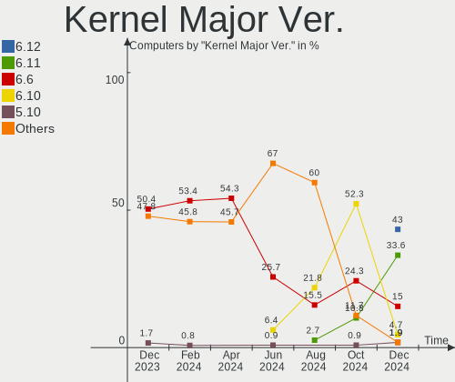
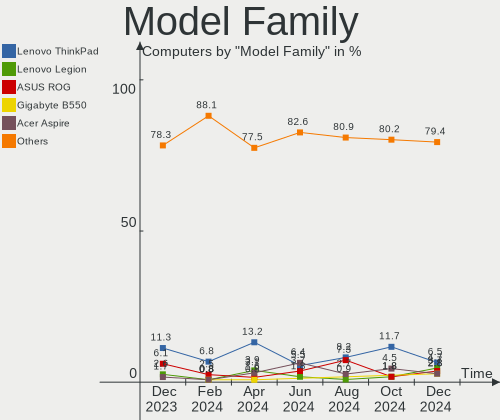
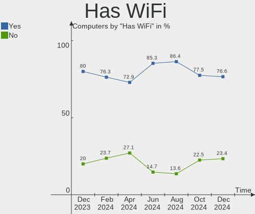
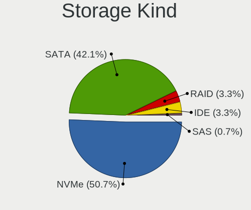
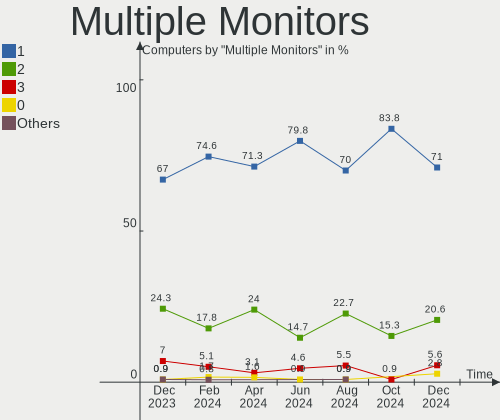
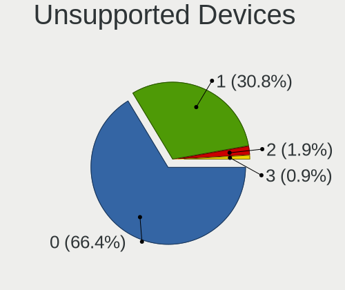

Manjaro - Hardware Trends
-------------------------

A project to identify most popular hardware characteristics and track their change
over time based on data collected by Linux users at https://Linux-Hardware.org.

Anyone can contribute to this report by the [hw-probe](https://github.com/linuxhw/hw-probe) tool:

    sudo -E hw-probe -all -upload

This is a report for all computer types. See also reports for [desktops](/Dist/Manjaro/Desktop/README.md) and [notebooks](/Dist/Manjaro/Notebook/README.md).

This report is for one last month. Overall report since the beginning of time: [TestCoverage](https://github.com/linuxhw/TestCoverage)

Period: Nov, 2022.

Contents
--------

* [ System ](#system)
  - [ OS                       ](#os)
  - [ OS Family                ](#os-family)
  - [ Kernel                   ](#kernel)
  - [ Kernel Family            ](#kernel-family)
  - [ Kernel Major Ver.        ](#kernel-major-ver)
  - [ Arch                     ](#arch)
  - [ DE                       ](#de)
  - [ Display Server           ](#display-server)
  - [ Display Manager          ](#display-manager)
  - [ OS Lang                  ](#os-lang)
  - [ Boot Mode                ](#boot-mode)
  - [ Filesystem               ](#filesystem)
  - [ Part. scheme             ](#part-scheme)
  - [ Dual Boot with Linux/BSD ](#dual-boot-with-linuxbsd)
  - [ Dual Boot (Win)          ](#dual-boot-win)

* [ Board ](#board)
  - [ Vendor                   ](#vendor)
  - [ Model                    ](#model)
  - [ Model Family             ](#model-family)
  - [ MFG Year                 ](#mfg-year)
  - [ Form Factor              ](#form-factor)
  - [ Secure Boot              ](#secure-boot)
  - [ Coreboot                 ](#coreboot)
  - [ RAM Size                 ](#ram-size)
  - [ RAM Used                 ](#ram-used)
  - [ Total Drives             ](#total-drives)
  - [ Has CD-ROM               ](#has-cd-rom)
  - [ Has Ethernet             ](#has-ethernet)
  - [ Has WiFi                 ](#has-wifi)
  - [ Has Bluetooth            ](#has-bluetooth)

* [ Location ](#location)
  - [ Country                  ](#country)
  - [ City                     ](#city)

* [ Drives ](#drives)
  - [ Drive Vendor             ](#drive-vendor)
  - [ Drive Model              ](#drive-model)
  - [ HDD Vendor               ](#hdd-vendor)
  - [ SSD Vendor               ](#ssd-vendor)
  - [ Drive Kind               ](#drive-kind)
  - [ Drive Connector          ](#drive-connector)
  - [ Drive Size               ](#drive-size)
  - [ Space Total              ](#space-total)
  - [ Space Used               ](#space-used)
  - [ Malfunc. Drives          ](#malfunc-drives)
  - [ Malfunc. Drive Vendor    ](#malfunc-drive-vendor)
  - [ Malfunc. HDD Vendor      ](#malfunc-hdd-vendor)
  - [ Malfunc. Drive Kind      ](#malfunc-drive-kind)
  - [ Failed Drives            ](#failed-drives)
  - [ Failed Drive Vendor      ](#failed-drive-vendor)
  - [ Drive Status             ](#drive-status)

* [ Storage controller ](#storage-controller)
  - [ Storage Vendor           ](#storage-vendor)
  - [ Storage Model            ](#storage-model)
  - [ Storage Kind             ](#storage-kind)

* [ Processor ](#processor)
  - [ CPU Vendor               ](#cpu-vendor)
  - [ CPU Model                ](#cpu-model)
  - [ CPU Model Family         ](#cpu-model-family)
  - [ CPU Cores                ](#cpu-cores)
  - [ CPU Sockets              ](#cpu-sockets)
  - [ CPU Threads              ](#cpu-threads)
  - [ CPU Op-Modes             ](#cpu-op-modes)
  - [ CPU Microcode            ](#cpu-microcode)
  - [ CPU Microarch            ](#cpu-microarch)

* [ Graphics ](#graphics)
  - [ GPU Vendor               ](#gpu-vendor)
  - [ GPU Model                ](#gpu-model)
  - [ GPU Combo                ](#gpu-combo)
  - [ GPU Driver               ](#gpu-driver)
  - [ GPU Memory               ](#gpu-memory)

* [ Monitor ](#monitor)
  - [ Monitor Vendor           ](#monitor-vendor)
  - [ Monitor Model            ](#monitor-model)
  - [ Monitor Resolution       ](#monitor-resolution)
  - [ Monitor Diagonal         ](#monitor-diagonal)
  - [ Monitor Width            ](#monitor-width)
  - [ Aspect Ratio             ](#aspect-ratio)
  - [ Monitor Area             ](#monitor-area)
  - [ Pixel Density            ](#pixel-density)
  - [ Multiple Monitors        ](#multiple-monitors)

* [ Network ](#network)
  - [ Net Controller Vendor    ](#net-controller-vendor)
  - [ Net Controller Model     ](#net-controller-model)
  - [ Wireless Vendor          ](#wireless-vendor)
  - [ Wireless Model           ](#wireless-model)
  - [ Ethernet Vendor          ](#ethernet-vendor)
  - [ Ethernet Model           ](#ethernet-model)
  - [ Net Controller Kind      ](#net-controller-kind)
  - [ Used Controller          ](#used-controller)
  - [ NICs                     ](#nics)
  - [ IPv6                     ](#ipv6)

* [ Bluetooth ](#bluetooth)
  - [ Bluetooth Vendor         ](#bluetooth-vendor)
  - [ Bluetooth Model          ](#bluetooth-model)

* [ Sound ](#sound)
  - [ Sound Vendor             ](#sound-vendor)
  - [ Sound Model              ](#sound-model)

* [ Memory ](#memory)
  - [ Memory Vendor            ](#memory-vendor)
  - [ Memory Model             ](#memory-model)
  - [ Memory Kind              ](#memory-kind)
  - [ Memory Form Factor       ](#memory-form-factor)
  - [ Memory Size              ](#memory-size)
  - [ Memory Speed             ](#memory-speed)

* [ Printers & scanners ](#printers--scanners)
  - [ Printer Vendor           ](#printer-vendor)
  - [ Printer Model            ](#printer-model)
  - [ Scanner Vendor           ](#scanner-vendor)
  - [ Scanner Model            ](#scanner-model)

* [ Camera ](#camera)
  - [ Camera Vendor            ](#camera-vendor)
  - [ Camera Model             ](#camera-model)

* [ Security ](#security)
  - [ Fingerprint Vendor       ](#fingerprint-vendor)
  - [ Fingerprint Model        ](#fingerprint-model)
  - [ Chipcard Vendor          ](#chipcard-vendor)
  - [ Chipcard Model           ](#chipcard-model)

* [ Unsupported ](#unsupported)
  - [ Unsupported Devices      ](#unsupported-devices)
  - [ Unsupported Device Types ](#unsupported-device-types)

System
------

OS
--

Installed operating systems

| Name                      | Computers | Percent |
|---------------------------|-----------|---------|
| Manjaro 22.0.0            | 67        | 48.55%  |
| Manjaro                   | 67        | 48.55%  |
| Manjaro 21.3.7            | 3         | 2.17%   |
| Manjaro 22.10-development | 1         | 0.72%   |

OS Family
---------

OS without a version

| Name    | Computers | Percent |
|---------|-----------|---------|
| Manjaro | 138       | 100%    |

Kernel
------

Version of the Linux kernel

| Version                     | Computers | Percent |
|-----------------------------|-----------|---------|
| 5.15.78-1-MANJARO           | 32        | 23.19%  |
| 5.15.76-1-MANJARO           | 19        | 13.77%  |
| 6.0.8-1-MANJARO             | 18        | 13.04%  |
| 6.0.6-1-MANJARO             | 10        | 7.25%   |
| 5.15.74-3-MANJARO           | 10        | 7.25%   |
| 6.1.0-1-MANJARO             | 8         | 5.8%    |
| 6.0.2-2-MANJARO             | 7         | 5.07%   |
| 5.15.60-1-MANJARO           | 5         | 3.62%   |
| 5.19.17-2-MANJARO           | 4         | 2.9%    |
| 5.19.17-1-MANJARO           | 3         | 2.17%   |
| 5.10.148-1-MANJARO          | 3         | 2.17%   |
| 6.0.9-1-MANJARO             | 2         | 1.45%   |
| 5.19.16-2-MANJARO           | 2         | 1.45%   |
| 6.0.8-lqx1-1-lqx            | 1         | 0.72%   |
| 6.0.7-x64v1-xanmod1-MANJARO | 1         | 0.72%   |
| 6.0.7-x64v1-xanmod1-1       | 1         | 0.72%   |
| 6.0.7-2-MANJARO             | 1         | 0.72%   |
| 6.0.7-1-MANJARO             | 1         | 0.72%   |
| 6.0.6-zen1-1-zen            | 1         | 0.72%   |
| 6.0.6-2-MANJARO             | 1         | 0.72%   |
| 5.9.16-1-MANJARO            | 1         | 0.72%   |
| 5.4.224-1-MANJARO           | 1         | 0.72%   |
| 5.4.218-2-MANJARO           | 1         | 0.72%   |
| 5.19.0-3-rt10-MANJARO       | 1         | 0.72%   |
| 5.18.19-3-MANJARO           | 1         | 0.72%   |
| 5.15.72-1-MANJARO           | 1         | 0.72%   |
| 5.15.71-1-MANJARO           | 1         | 0.72%   |
| 5.14.21-2-MANJARO           | 1         | 0.72%   |

Kernel Family
-------------

Linux kernel without a distro release

| Version  | Computers | Percent |
|----------|-----------|---------|
| 5.15.78  | 32        | 23.19%  |
| 6.0.8    | 19        | 13.77%  |
| 5.15.76  | 19        | 13.77%  |
| 6.0.6    | 12        | 8.7%    |
| 5.15.74  | 10        | 7.25%   |
| 6.1.0    | 8         | 5.8%    |
| 6.0.2    | 7         | 5.07%   |
| 5.19.17  | 7         | 5.07%   |
| 5.15.60  | 5         | 3.62%   |
| 6.0.7    | 4         | 2.9%    |
| 5.10.148 | 3         | 2.17%   |
| 6.0.9    | 2         | 1.45%   |
| 5.19.16  | 2         | 1.45%   |
| 5.9.16   | 1         | 0.72%   |
| 5.4.224  | 1         | 0.72%   |
| 5.4.218  | 1         | 0.72%   |
| 5.19.0   | 1         | 0.72%   |
| 5.18.19  | 1         | 0.72%   |
| 5.15.72  | 1         | 0.72%   |
| 5.15.71  | 1         | 0.72%   |
| 5.14.21  | 1         | 0.72%   |

Kernel Major Ver.
-----------------

Linux kernel major version

| Version | Computers | Percent |
|---------|-----------|---------|
| 5.15    | 68        | 49.28%  |
| 6.0     | 44        | 31.88%  |
| 5.19    | 10        | 7.25%   |
| 6.1     | 8         | 5.8%    |
| 5.10    | 3         | 2.17%   |
| 5.4     | 2         | 1.45%   |
| 5.9     | 1         | 0.72%   |
| 5.18    | 1         | 0.72%   |
| 5.14    | 1         | 0.72%   |

Arch
----

OS architecture (x86_64, i586, etc.)

| Name   | Computers | Percent |
|--------|-----------|---------|
| x86_64 | 138       | 100%    |

DE
--

Desktop Environment

| Name       | Computers | Percent |
|------------|-----------|---------|
| KDE5       | 78        | 56.52%  |
| GNOME      | 30        | 21.74%  |
| XFCE       | 23        | 16.67%  |
| KDE        | 4         | 2.9%    |
| X-Cinnamon | 1         | 0.72%   |
| Budgie     | 1         | 0.72%   |
| Unknown    | 1         | 0.72%   |

Display Server
--------------

X11 or Wayland

| Name    | Computers | Percent |
|---------|-----------|---------|
| X11     | 107       | 77.54%  |
| Wayland | 28        | 20.29%  |
| Unknown | 2         | 1.45%   |
| Tty     | 1         | 0.72%   |

Display Manager
---------------

SDDM, LightDM, etc.

| Name    | Computers | Percent |
|---------|-----------|---------|
| Unknown | 66        | 47.83%  |
| SDDM    | 43        | 31.16%  |
| GDM     | 15        | 10.87%  |
| LightDM | 14        | 10.14%  |

OS Lang
-------

Language

| Lang    | Computers | Percent |
|---------|-----------|---------|
| en_US   | 60        | 43.48%  |
| de_DE   | 15        | 10.87%  |
| it_IT   | 10        | 7.25%   |
| es_ES   | 7         | 5.07%   |
| pl_PL   | 6         | 4.35%   |
| ru_RU   | 5         | 3.62%   |
| en_GB   | 5         | 3.62%   |
| en_AU   | 5         | 3.62%   |
| fr_FR   | 3         | 2.17%   |
| zh_CN   | 2         | 1.45%   |
| pt_BR   | 2         | 1.45%   |
| es_AR   | 2         | 1.45%   |
| en_CA   | 2         | 1.45%   |
| zh_TW   | 1         | 0.72%   |
| tr_TR   | 1         | 0.72%   |
| nl_NL   | 1         | 0.72%   |
| fr_CH   | 1         | 0.72%   |
| fr_CA   | 1         | 0.72%   |
| fi_FI   | 1         | 0.72%   |
| es_UY   | 1         | 0.72%   |
| es_CO   | 1         | 0.72%   |
| es_BO   | 1         | 0.72%   |
| en_ZA   | 1         | 0.72%   |
| en_HK   | 1         | 0.72%   |
| en_AG   | 1         | 0.72%   |
| de_CH   | 1         | 0.72%   |
| Unknown | 1         | 0.72%   |

Boot Mode
---------

EFI or BIOS

| Mode | Computers | Percent |
|------|-----------|---------|
| BIOS | 85        | 61.59%  |
| EFI  | 53        | 38.41%  |

Filesystem
----------

Type of filesystem

| Type    | Computers | Percent |
|---------|-----------|---------|
| Ext4    | 120       | 86.96%  |
| Btrfs   | 12        | 8.7%    |
| Overlay | 3         | 2.17%   |
| F2fs    | 2         | 1.45%   |
| Xfs     | 1         | 0.72%   |

Part. scheme
------------

Scheme of partitioning

| Type    | Computers | Percent |
|---------|-----------|---------|
| GPT     | 68        | 49.28%  |
| Unknown | 62        | 44.93%  |
| MBR     | 8         | 5.8%    |

Dual Boot with Linux/BSD
------------------------

Hosting more than one Linux/BSD

| Dual boot | Computers | Percent |
|-----------|-----------|---------|
| No        | 129       | 93.48%  |
| Yes       | 9         | 6.52%   |

Dual Boot (Win)
---------------

Hosting Linux and Windows

| Dual boot | Computers | Percent |
|-----------|-----------|---------|
| No        | 104       | 75.36%  |
| Yes       | 34        | 24.64%  |

Board
-----

Vendor
------

Motherboard manufacturer

| Name                | Computers | Percent |
|---------------------|-----------|---------|
| Lenovo              | 30        | 21.74%  |
| ASUSTek Computer    | 25        | 18.12%  |
| Hewlett-Packard     | 21        | 15.22%  |
| MSI                 | 12        | 8.7%    |
| Gigabyte Technology | 12        | 8.7%    |
| Dell                | 12        | 8.7%    |
| ASRock              | 6         | 4.35%   |
| Acer                | 5         | 3.62%   |
| Samsung Electronics | 2         | 1.45%   |
| TUXEDO              | 1         | 0.72%   |
| Toshiba             | 1         | 0.72%   |
| Timi                | 1         | 0.72%   |
| Schenker            | 1         | 0.72%   |
| Razer               | 1         | 0.72%   |
| Pegatron            | 1         | 0.72%   |
| Intel               | 1         | 0.72%   |
| HUAWEI              | 1         | 0.72%   |
| Google              | 1         | 0.72%   |
| Fujitsu             | 1         | 0.72%   |
| AZW                 | 1         | 0.72%   |
| Apple               | 1         | 0.72%   |
| Alienware           | 1         | 0.72%   |

Model
-----

Motherboard model

| Name                                     | Computers | Percent |
|------------------------------------------|-----------|---------|
| Gigabyte X570 AORUS ULTRA                | 2         | 1.45%   |
| ASUS ROG STRIX B550-F GAMING             | 2         | 1.45%   |
| ASUS PRIME A320M-K                       | 2         | 1.45%   |
| ASRock B550M Pro4                        | 2         | 1.45%   |
| TUXEDO Pulse 15 Gen1                     | 1         | 0.72%   |
| Toshiba TECRA S11                        | 1         | 0.72%   |
| Timi Xiaomi Book Pro 16 2022             | 1         | 0.72%   |
| Schenker VISION 15 (SVS15E21)            | 1         | 0.72%   |
| Samsung 730QED                           | 1         | 0.72%   |
| Samsung 350V5C/351V5C/3540VC/3440VC      | 1         | 0.72%   |
| Razer Blade                              | 1         | 0.72%   |
| Pegatron p7-1016de                       | 1         | 0.72%   |
| MSI MS-7D42                              | 1         | 0.72%   |
| MSI MS-7D25                              | 1         | 0.72%   |
| MSI MS-7C91                              | 1         | 0.72%   |
| MSI MS-7C56                              | 1         | 0.72%   |
| MSI MS-7B61                              | 1         | 0.72%   |
| MSI MS-7916                              | 1         | 0.72%   |
| MSI MS-7846                              | 1         | 0.72%   |
| MSI MS-7760                              | 1         | 0.72%   |
| MSI MS-7693                              | 1         | 0.72%   |
| MSI GS60 6QE                             | 1         | 0.72%   |
| MSI GP63 Leopard 8RE                     | 1         | 0.72%   |
| MSI GL62 7QF                             | 1         | 0.72%   |
| Lenovo V15-IIL 82C5                      | 1         | 0.72%   |
| Lenovo ThinkPad Yoga 370 20JJS1DU05      | 1         | 0.72%   |
| Lenovo ThinkPad X13 Gen 2a 20XH005BUS    | 1         | 0.72%   |
| Lenovo ThinkPad X1 Carbon 3rd 20BS003BUS | 1         | 0.72%   |
| Lenovo ThinkPad X1 Carbon 2nd 20A7000NAD | 1         | 0.72%   |
| Lenovo ThinkPad T490 20N3S7BC02          | 1         | 0.72%   |
| Lenovo ThinkPad T460s 20FAS16J00         | 1         | 0.72%   |
| Lenovo ThinkPad T450s 20BW000DHV         | 1         | 0.72%   |
| Lenovo ThinkPad T430 2349KQ3             | 1         | 0.72%   |
| Lenovo ThinkPad T430 2344BZU             | 1         | 0.72%   |
| Lenovo ThinkPad T14 Gen 2i 20W1S34Y00    | 1         | 0.72%   |
| Lenovo ThinkPad P14s Gen 3 21AK0054FR    | 1         | 0.72%   |
| Lenovo ThinkPad P14s Gen 1 20Y1CTO1WW    | 1         | 0.72%   |
| Lenovo ThinkPad L460 20FVS1Y500          | 1         | 0.72%   |
| Lenovo ThinkPad E15 Gen 2 20TDS0XG00     | 1         | 0.72%   |
| Lenovo ThinkPad E14 Gen 3 20YDS06K00     | 1         | 0.72%   |

Model Family
------------

Motherboard model prefix

| Name               | Computers | Percent |
|--------------------|-----------|---------|
| Lenovo ThinkPad    | 15        | 10.87%  |
| Dell Latitude      | 5         | 3.62%   |
| ASUS ROG           | 5         | 3.62%   |
| ASUS PRIME         | 5         | 3.62%   |
| Lenovo Legion      | 4         | 2.9%    |
| HP EliteBook       | 4         | 2.9%    |
| Lenovo IdeaPad     | 3         | 2.17%   |
| HP ProBook         | 3         | 2.17%   |
| HP ENVY            | 3         | 2.17%   |
| Dell Precision     | 3         | 2.17%   |
| Dell Inspiron      | 3         | 2.17%   |
| ASUS VivoBook      | 3         | 2.17%   |
| Acer Aspire        | 3         | 2.17%   |
| Lenovo ThinkBook   | 2         | 1.45%   |
| HP Spectre         | 2         | 1.45%   |
| HP Compaq          | 2         | 1.45%   |
| Gigabyte X570      | 2         | 1.45%   |
| Gigabyte B550M     | 2         | 1.45%   |
| ASRock B550M       | 2         | 1.45%   |
| TUXEDO Pulse       | 1         | 0.72%   |
| Toshiba TECRA      | 1         | 0.72%   |
| Timi Xiaomi        | 1         | 0.72%   |
| Schenker VISION    | 1         | 0.72%   |
| Samsung 730QED     | 1         | 0.72%   |
| Samsung 350V5C     | 1         | 0.72%   |
| Razer Blade        | 1         | 0.72%   |
| Pegatron p7-1016de | 1         | 0.72%   |
| MSI MS-7D42        | 1         | 0.72%   |
| MSI MS-7D25        | 1         | 0.72%   |
| MSI MS-7C91        | 1         | 0.72%   |
| MSI MS-7C56        | 1         | 0.72%   |
| MSI MS-7B61        | 1         | 0.72%   |
| MSI MS-7916        | 1         | 0.72%   |
| MSI MS-7846        | 1         | 0.72%   |
| MSI MS-7760        | 1         | 0.72%   |
| MSI MS-7693        | 1         | 0.72%   |
| MSI GS60           | 1         | 0.72%   |
| MSI GP63           | 1         | 0.72%   |
| MSI GL62           | 1         | 0.72%   |
| Lenovo V15-IIL     | 1         | 0.72%   |

MFG Year
--------

Motherboard manufacture year

| Year | Computers | Percent |
|------|-----------|---------|
| 2021 | 25        | 18.12%  |
| 2020 | 20        | 14.49%  |
| 2019 | 16        | 11.59%  |
| 2017 | 13        | 9.42%   |
| 2022 | 11        | 7.97%   |
| 2012 | 11        | 7.97%   |
| 2016 | 8         | 5.8%    |
| 2018 | 7         | 5.07%   |
| 2015 | 6         | 4.35%   |
| 2011 | 6         | 4.35%   |
| 2013 | 5         | 3.62%   |
| 2014 | 4         | 2.9%    |
| 2010 | 4         | 2.9%    |
| 2008 | 1         | 0.72%   |
| 2007 | 1         | 0.72%   |

Form Factor
-----------

Physical design of the computer

| Name        | Computers | Percent |
|-------------|-----------|---------|
| Notebook    | 74        | 53.62%  |
| Desktop     | 53        | 38.41%  |
| Convertible | 9         | 6.52%   |
| Tablet      | 1         | 0.72%   |
| Mini pc     | 1         | 0.72%   |

Secure Boot
-----------

Enabled or disabled

| State    | Computers | Percent |
|----------|-----------|---------|
| Disabled | 138       | 100%    |

Coreboot
--------

Have coreboot on board

| Used | Computers | Percent |
|------|-----------|---------|
| No   | 137       | 99.28%  |
| Yes  | 1         | 0.72%   |

RAM Size
--------

Total RAM memory

| Size in GB  | Computers | Percent |
|-------------|-----------|---------|
| 16.01-24.0  | 38        | 27.54%  |
| 4.01-8.0    | 34        | 24.64%  |
| 8.01-16.0   | 33        | 23.91%  |
| 32.01-64.0  | 18        | 13.04%  |
| 3.01-4.0    | 7         | 5.07%   |
| 24.01-32.0  | 6         | 4.35%   |
| 64.01-256.0 | 2         | 1.45%   |

RAM Used
--------

Used RAM memory

| Used GB    | Computers | Percent |
|------------|-----------|---------|
| 4.01-8.0   | 45        | 32.61%  |
| 2.01-3.0   | 41        | 29.71%  |
| 3.01-4.0   | 27        | 19.57%  |
| 8.01-16.0  | 13        | 9.42%   |
| 1.01-2.0   | 10        | 7.25%   |
| 24.01-32.0 | 1         | 0.72%   |
| 16.01-24.0 | 1         | 0.72%   |

Total Drives
------------

Number of drives on board

| Drives | Computers | Percent |
|--------|-----------|---------|
| 1      | 72        | 52.17%  |
| 2      | 37        | 26.81%  |
| 3      | 16        | 11.59%  |
| 4      | 5         | 3.62%   |
| 5      | 4         | 2.9%    |
| 7      | 2         | 1.45%   |
| 12     | 1         | 0.72%   |
| 6      | 1         | 0.72%   |

Has CD-ROM
----------

Has CD-ROM on board

| Presented | Computers | Percent |
|-----------|-----------|---------|
| No        | 115       | 83.33%  |
| Yes       | 23        | 16.67%  |

Has Ethernet
------------

Has Ethernet on board

| Presented | Computers | Percent |
|-----------|-----------|---------|
| Yes       | 114       | 82.61%  |
| No        | 24        | 17.39%  |

Has WiFi
--------

Has WiFi module

| Presented | Computers | Percent |
|-----------|-----------|---------|
| Yes       | 113       | 81.88%  |
| No        | 25        | 18.12%  |

Has Bluetooth
-------------

Has Bluetooth module

| Presented | Computers | Percent |
|-----------|-----------|---------|
| Yes       | 101       | 73.19%  |
| No        | 37        | 26.81%  |

Location
--------

Country
-------

Geographic location (country)

| Country            | Computers | Percent |
|--------------------|-----------|---------|
| USA                | 22        | 15.94%  |
| Germany            | 21        | 15.22%  |
| Italy              | 15        | 10.87%  |
| Spain              | 7         | 5.07%   |
| Russia             | 7         | 5.07%   |
| Poland             | 6         | 4.35%   |
| France             | 6         | 4.35%   |
| Australia          | 5         | 3.62%   |
| Netherlands        | 4         | 2.9%    |
| UK                 | 3         | 2.17%   |
| Switzerland        | 3         | 2.17%   |
| Hungary            | 3         | 2.17%   |
| Brazil             | 3         | 2.17%   |
| Austria            | 3         | 2.17%   |
| Kazakhstan         | 2         | 1.45%   |
| Finland            | 2         | 1.45%   |
| China              | 2         | 1.45%   |
| Canada             | 2         | 1.45%   |
| Argentina          | 2         | 1.45%   |
| Ukraine            | 1         | 0.72%   |
| Turkey             | 1         | 0.72%   |
| Thailand           | 1         | 0.72%   |
| Taiwan             | 1         | 0.72%   |
| Sweden             | 1         | 0.72%   |
| South Africa       | 1         | 0.72%   |
| Romania            | 1         | 0.72%   |
| Malta              | 1         | 0.72%   |
| Iran               | 1         | 0.72%   |
| Indonesia          | 1         | 0.72%   |
| India              | 1         | 0.72%   |
| Hong Kong          | 1         | 0.72%   |
| Greece             | 1         | 0.72%   |
| Estonia            | 1         | 0.72%   |
| Dominican Republic | 1         | 0.72%   |
| Czechia            | 1         | 0.72%   |
| Colombia           | 1         | 0.72%   |
| Chile              | 1         | 0.72%   |
| Bolivia            | 1         | 0.72%   |
| Belarus            | 1         | 0.72%   |

City
----

Geographic location (city)

| City                     | Computers | Percent |
|--------------------------|-----------|---------|
| Milan                    | 3         | 2.17%   |
| Budapest                 | 3         | 2.17%   |
| Warsaw                   | 2         | 1.45%   |
| Sommerein                | 2         | 1.45%   |
| Rome                     | 2         | 1.45%   |
| Paris                    | 2         | 1.45%   |
| Melbourne                | 2         | 1.45%   |
| Guangzhou                | 2         | 1.45%   |
| Frankfurt am Main        | 2         | 1.45%   |
| Zollikofen               | 1         | 0.72%   |
| Zaandam                  | 1         | 0.72%   |
| Wroclaw                  | 1         | 0.72%   |
| Wollongong               | 1         | 0.72%   |
| Winterswijk              | 1         | 0.72%   |
| Wiesbaden                | 1         | 0.72%   |
| Wichita                  | 1         | 0.72%   |
| West Malling             | 1         | 0.72%   |
| Weilburg                 | 1         | 0.72%   |
| Vienna                   | 1         | 0.72%   |
| Tupos                    | 1         | 0.72%   |
| Thessaloniki             | 1         | 0.72%   |
| Tallinn                  | 1         | 0.72%   |
| Sydney                   | 1         | 0.72%   |
| Stolberg                 | 1         | 0.72%   |
| Stockholm                | 1         | 0.72%   |
| St Petersburg            | 1         | 0.72%   |
| Solothurn                | 1         | 0.72%   |
| Sindelfingen             | 1         | 0.72%   |
| Shelby                   | 1         | 0.72%   |
| Sheboygan                | 1         | 0.72%   |
| Shawnee                  | 1         | 0.72%   |
| Sellano                  | 1         | 0.72%   |
| Seattle                  | 1         | 0.72%   |
| Santiago                 | 1         | 0.72%   |
| San Diego                | 1         | 0.72%   |
| Salzhausen               | 1         | 0.72%   |
| Salaya                   | 1         | 0.72%   |
| Saint-Jean-sur-Richelieu | 1         | 0.72%   |
| Saint-Cloud              | 1         | 0.72%   |
| Saint Venera             | 1         | 0.72%   |

Drives
------

Drive Vendor
------------

Hard drive vendors

| Vendor                      | Computers | Drives | Percent |
|-----------------------------|-----------|--------|---------|
| Samsung Electronics         | 51        | 67     | 22.37%  |
| WDC                         | 25        | 41     | 10.96%  |
| Seagate                     | 22        | 26     | 9.65%   |
| Sandisk                     | 17        | 19     | 7.46%   |
| Toshiba                     | 13        | 15     | 5.7%    |
| Kingston                    | 12        | 13     | 5.26%   |
| SK hynix                    | 11        | 11     | 4.82%   |
| Micron Technology           | 11        | 11     | 4.82%   |
| Crucial                     | 11        | 11     | 4.82%   |
| Unknown                     | 9         | 9      | 3.95%   |
| KIOXIA                      | 5         | 5      | 2.19%   |
| Kingston Technology Company | 4         | 4      | 1.75%   |
| HGST                        | 4         | 4      | 1.75%   |
| Phison Electronics          | 3         | 4      | 1.32%   |
| Transcend                   | 2         | 2      | 0.88%   |
| Silicon Motion              | 2         | 2      | 0.88%   |
| Patriot                     | 2         | 2      | 0.88%   |
| OCZ                         | 2         | 2      | 0.88%   |
| LITEONIT                    | 2         | 2      | 0.88%   |
| Intel                       | 2         | 2      | 0.88%   |
| Hitachi                     | 2         | 2      | 0.88%   |
| ADATA Technology            | 2         | 2      | 0.88%   |
| A-DATA Technology           | 2         | 2      | 0.88%   |
| WD Green                    | 1         | 1      | 0.44%   |
| USB3.0                      | 1         | 1      | 0.44%   |
| PNY                         | 1         | 1      | 0.44%   |
| Micron/Crucial Technology   | 1         | 1      | 0.44%   |
| Leven                       | 1         | 1      | 0.44%   |
| JMicron Technology          | 1         | 1      | 0.44%   |
| Hewlett-Packard             | 1         | 1      | 0.44%   |
| GOODRAM                     | 1         | 1      | 0.44%   |
| Corsair                     | 1         | 1      | 0.44%   |
| Colorful                    | 1         | 1      | 0.44%   |
| China                       | 1         | 1      | 0.44%   |
| Apple                       | 1         | 1      | 0.44%   |

Drive Model
-----------

Hard drive models

| Model                                                             | Computers | Percent |
|-------------------------------------------------------------------|-----------|---------|
| Samsung NVMe SSD Controller SM981/PM981/PM983 1TB                 | 15        | 5.84%   |
| Samsung SSD 980 1TB                                               | 6         | 2.33%   |
| Crucial CT500MX500SSD1 500GB                                      | 5         | 1.95%   |
| Samsung NVMe SSD Controller PM9A1/PM9A3/980PRO 250GB              | 4         | 1.56%   |
| Unknown MMC Card  128GB                                           | 3         | 1.17%   |
| Toshiba XG6 NVMe SSD Controller 256GB                             | 3         | 1.17%   |
| Seagate ST1000DM010-2EP102 1TB                                    | 3         | 1.17%   |
| Sandisk WD Black SN750 / PC SN730 NVMe SSD 1024GB                 | 3         | 1.17%   |
| Micron MTFDHBA512TDV-1AZ1AABHA 512GB                              | 3         | 1.17%   |
| Kingston SNVS500G 500GB                                           | 3         | 1.17%   |
| Kingston SA400S37240G 240GB SSD                                   | 3         | 1.17%   |
| HGST HTS721010A9E630 1TB                                          | 3         | 1.17%   |
| WDC WDS240G2G0B-00EPW0 240GB SSD                                  | 2         | 0.78%   |
| Unknown SD/MMC/MS PRO 8GB                                         | 2         | 0.78%   |
| Toshiba MQ01ABF050 500GB                                          | 2         | 0.78%   |
| Toshiba DT01ACA100 1TB                                            | 2         | 0.78%   |
| SK hynix SKHynix_HFS512GD9TNI-L2A0B 512GB                         | 2         | 0.78%   |
| Silicon Motion SM2263EN/SM2263XT SSD Controller 128GB             | 2         | 0.78%   |
| Seagate ST3500418AS 500GB                                         | 2         | 0.78%   |
| Seagate ST2000DX001-1CM164 2TB                                    | 2         | 0.78%   |
| Seagate ST2000DM008-2FR102 2TB                                    | 2         | 0.78%   |
| Sandisk WDC PC SN530 SDBPMPZ-512G-1101 512GB                      | 2         | 0.78%   |
| Samsung SSD 870 QVO 1TB                                           | 2         | 0.78%   |
| Samsung SSD 860 EVO 500GB                                         | 2         | 0.78%   |
| Samsung SSD 860 EVO 250GB                                         | 2         | 0.78%   |
| Samsung SSD 860 EVO 1TB                                           | 2         | 0.78%   |
| Samsung SSD 850 EVO 500GB                                         | 2         | 0.78%   |
| Samsung NVMe SSD Controller SM961/PM961/SM963 250GB               | 2         | 0.78%   |
| Patriot Burst 240GB SSD                                           | 2         | 0.78%   |
| Micron MTFDKCD512TFK 512GB                                        | 2         | 0.78%   |
| KIOXIA KBG40ZNV256G 256GB                                         | 2         | 0.78%   |
| Kingston Company A2000 NVMe SSD 500GB                             | 2         | 0.78%   |
| Kingston SA400S37480G 480GB SSD                                   | 2         | 0.78%   |
| Crucial CT240BX500SSD1 240GB                                      | 2         | 0.78%   |
| ADATA XPG SX8200 Pro PCIe Gen3x4 M.2 2280 Solid State Drive 512GB | 2         | 0.78%   |
| WDC WDS500G2B0A-00SM50 500GB SSD                                  | 1         | 0.39%   |
| WDC WDS240G2G0A-00JH30 240GB SSD                                  | 1         | 0.39%   |
| WDC WDS120G1G0A-00SS50 120GB SSD                                  | 1         | 0.39%   |
| WDC WDS100T2B0A-00SM50 1TB SSD                                    | 1         | 0.39%   |
| WDC WDBNCE0010PNC 1TB SSD                                         | 1         | 0.39%   |

HDD Vendor
----------

Hard disk drive vendors

| Vendor              | Computers | Drives | Percent |
|---------------------|-----------|--------|---------|
| Seagate             | 22        | 26     | 35.48%  |
| WDC                 | 20        | 34     | 32.26%  |
| Toshiba             | 8         | 10     | 12.9%   |
| Samsung Electronics | 4         | 4      | 6.45%   |
| HGST                | 4         | 4      | 6.45%   |
| Unknown             | 2         | 2      | 3.23%   |
| Hitachi             | 2         | 2      | 3.23%   |

SSD Vendor
----------

Solid state drive vendors

| Vendor              | Computers | Drives | Percent |
|---------------------|-----------|--------|---------|
| Samsung Electronics | 23        | 23     | 29.49%  |
| Crucial             | 11        | 11     | 14.1%   |
| Kingston            | 8         | 9      | 10.26%  |
| WDC                 | 7         | 7      | 8.97%   |
| SanDisk             | 5         | 5      | 6.41%   |
| Micron Technology   | 4         | 4      | 5.13%   |
| Patriot             | 2         | 2      | 2.56%   |
| OCZ                 | 2         | 2      | 2.56%   |
| LITEONIT            | 2         | 2      | 2.56%   |
| A-DATA Technology   | 2         | 2      | 2.56%   |
| USB3.0              | 1         | 1      | 1.28%   |
| Transcend           | 1         | 1      | 1.28%   |
| Toshiba             | 1         | 1      | 1.28%   |
| SK hynix            | 1         | 1      | 1.28%   |
| PNY                 | 1         | 1      | 1.28%   |
| Intel               | 1         | 1      | 1.28%   |
| Hewlett-Packard     | 1         | 1      | 1.28%   |
| GOODRAM             | 1         | 1      | 1.28%   |
| Corsair             | 1         | 1      | 1.28%   |
| Colorful            | 1         | 1      | 1.28%   |
| China               | 1         | 1      | 1.28%   |
| Apple               | 1         | 1      | 1.28%   |

Drive Kind
----------

HDD or SSD

| Kind    | Computers | Drives | Percent |
|---------|-----------|--------|---------|
| NVMe    | 78        | 100    | 39.39%  |
| SSD     | 64        | 79     | 32.32%  |
| HDD     | 47        | 82     | 23.74%  |
| MMC     | 5         | 5      | 2.53%   |
| Unknown | 4         | 4      | 2.02%   |

Drive Connector
---------------

SATA, SAS, NVMe, etc.

| Type | Computers | Drives | Percent |
|------|-----------|--------|---------|
| SATA | 81        | 154    | 46.29%  |
| NVMe | 78        | 100    | 44.57%  |
| SAS  | 11        | 11     | 6.29%   |
| MMC  | 5         | 5      | 2.86%   |

Drive Size
----------

Size of hard drive

| Size in TB | Computers | Drives | Percent |
|------------|-----------|--------|---------|
| 0.01-0.5   | 61        | 87     | 50.83%  |
| 0.51-1.0   | 33        | 40     | 27.5%   |
| 1.01-2.0   | 11        | 12     | 9.17%   |
| 4.01-10.0  | 6         | 11     | 5%      |
| 3.01-4.0   | 5         | 6      | 4.17%   |
| 2.01-3.0   | 4         | 5      | 3.33%   |

Space Total
-----------

Amount of disk space available on the file system

| Size in GB     | Computers | Percent |
|----------------|-----------|---------|
| 251-500        | 42        | 30.43%  |
| 101-250        | 26        | 18.84%  |
| 501-1000       | 21        | 15.22%  |
| 1001-2000      | 12        | 8.7%    |
| Unknown        | 12        | 8.7%    |
| More than 3000 | 11        | 7.97%   |
| 51-100         | 7         | 5.07%   |
| 2001-3000      | 3         | 2.17%   |
| 1-20           | 3         | 2.17%   |
| 21-50          | 1         | 0.72%   |

Space Used
----------

Amount of used disk space

| Used GB        | Computers | Percent |
|----------------|-----------|---------|
| 101-250        | 29        | 21.01%  |
| 51-100         | 22        | 15.94%  |
| 21-50          | 21        | 15.22%  |
| 251-500        | 17        | 12.32%  |
| 1-20           | 14        | 10.14%  |
| Unknown        | 12        | 8.7%    |
| 501-1000       | 10        | 7.25%   |
| 1001-2000      | 6         | 4.35%   |
| More than 3000 | 5         | 3.62%   |
| 2001-3000      | 2         | 1.45%   |

Malfunc. Drives
---------------

Drive models with a malfunction

| Model                                                         | Computers | Drives | Percent |
|---------------------------------------------------------------|-----------|--------|---------|
| WDC WD60EZRZ-00RWYB1 6TB                                      | 1         | 2      | 11.11%  |
| WDC WD30PURX-64P6ZY0 3TB                                      | 1         | 2      | 11.11%  |
| Toshiba HDWD130 3TB                                           | 1         | 1      | 11.11%  |
| Seagate ST500LT012-9WS142 500GB                               | 1         | 1      | 11.11%  |
| Seagate ST4000DM000-1F2168 4TB                                | 1         | 1      | 11.11%  |
| Seagate ST2000DX001-1CM164 2TB                                | 1         | 1      | 11.11%  |
| Samsung Electronics NVMe SSD Controller SM981/PM981/PM983 1TB | 1         | 1      | 11.11%  |
| Samsung Electronics HD502HJ 500GB                             | 1         | 1      | 11.11%  |
| OCZ AGILITY3 120GB SSD                                        | 1         | 1      | 11.11%  |

Malfunc. Drive Vendor
---------------------

Vendors of faulty drives

| Vendor              | Computers | Drives | Percent |
|---------------------|-----------|--------|---------|
| Seagate             | 3         | 3      | 33.33%  |
| WDC                 | 2         | 4      | 22.22%  |
| Samsung Electronics | 2         | 2      | 22.22%  |
| Toshiba             | 1         | 1      | 11.11%  |
| OCZ                 | 1         | 1      | 11.11%  |

Malfunc. HDD Vendor
-------------------

Vendors of faulty HDD drives

| Vendor              | Computers | Drives | Percent |
|---------------------|-----------|--------|---------|
| Seagate             | 3         | 3      | 42.86%  |
| WDC                 | 2         | 4      | 28.57%  |
| Toshiba             | 1         | 1      | 14.29%  |
| Samsung Electronics | 1         | 1      | 14.29%  |

Malfunc. Drive Kind
-------------------

Kinds of faulty drives

| Kind | Computers | Drives | Percent |
|------|-----------|--------|---------|
| HDD  | 6         | 9      | 75%     |
| NVMe | 1         | 1      | 12.5%   |
| SSD  | 1         | 1      | 12.5%   |

Failed Drives
-------------

Failed drive models

Zero info for selected period =(

Failed Drive Vendor
-------------------

Failed drive vendors

Zero info for selected period =(

Drive Status
------------

Number of failed and malfunc. drives

| Status   | Computers | Drives | Percent |
|----------|-----------|--------|---------|
| Detected | 91        | 162    | 61.07%  |
| Works    | 50        | 97     | 33.56%  |
| Malfunc  | 8         | 11     | 5.37%   |

Storage controller
------------------

Storage Vendor
--------------

Storage controller vendors

| Vendor                       | Computers | Percent |
|------------------------------|-----------|---------|
| Intel                        | 64        | 31.53%  |
| AMD                          | 41        | 20.2%   |
| Samsung Electronics          | 34        | 16.75%  |
| SanDisk                      | 12        | 5.91%   |
| SK hynix                     | 10        | 4.93%   |
| Kingston Technology Company  | 8         | 3.94%   |
| Micron Technology            | 7         | 3.45%   |
| KIOXIA                       | 5         | 2.46%   |
| Toshiba America Info Systems | 4         | 1.97%   |
| Phison Electronics           | 3         | 1.48%   |
| ASMedia Technology           | 3         | 1.48%   |
| Silicon Motion               | 2         | 0.99%   |
| Marvell Technology Group     | 2         | 0.99%   |
| JMicron Technology           | 2         | 0.99%   |
| ADATA Technology             | 2         | 0.99%   |
| VIA Technologies             | 1         | 0.49%   |
| Transcend                    | 1         | 0.49%   |
| Nvidia                       | 1         | 0.49%   |
| Micron/Crucial Technology    | 1         | 0.49%   |

Storage Model
-------------

Storage controller models

| Model                                                                          | Computers | Percent |
|--------------------------------------------------------------------------------|-----------|---------|
| AMD FCH SATA Controller [AHCI mode]                                            | 26        | 11.76%  |
| Samsung NVMe SSD Controller SM981/PM981/PM983                                  | 15        | 6.79%   |
| Samsung NVMe SSD Controller 980                                                | 14        | 6.33%   |
| AMD 500 Series Chipset SATA Controller                                         | 9         | 4.07%   |
| Micron Non-Volatile memory controller                                          | 7         | 3.17%   |
| Intel 82801 Mobile SATA Controller [RAID mode]                                 | 6         | 2.71%   |
| Intel 7 Series Chipset Family 6-port SATA Controller [AHCI mode]               | 6         | 2.71%   |
| SK hynix Gold P31/PC711 NVMe Solid State Drive                                 | 5         | 2.26%   |
| SanDisk Non-Volatile memory controller                                         | 5         | 2.26%   |
| KIOXIA NVMe SSD Controller BG4                                                 | 5         | 2.26%   |
| Intel Volume Management Device NVMe RAID Controller                            | 5         | 2.26%   |
| Intel Q170/Q150/B150/H170/H110/Z170/CM236 Chipset SATA Controller [AHCI Mode]  | 5         | 2.26%   |
| Intel Alder Lake-S PCH SATA Controller [AHCI Mode]                             | 5         | 2.26%   |
| Samsung NVMe SSD Controller PM9A1/PM9A3/980PRO                                 | 4         | 1.81%   |
| Intel Sunrise Point-LP SATA Controller [AHCI mode]                             | 4         | 1.81%   |
| AMD FCH SATA Controller D                                                      | 4         | 1.81%   |
| Toshiba America Info Systems XG6 NVMe SSD Controller                           | 3         | 1.36%   |
| SanDisk WD Black SN750 / PC SN730 NVMe SSD                                     | 3         | 1.36%   |
| Kingston Company Company Non-Volatile memory controller                        | 3         | 1.36%   |
| Intel Cannon Lake Mobile PCH SATA AHCI Controller                              | 3         | 1.36%   |
| Intel 6 Series/C200 Series Chipset Family 6 port Mobile SATA AHCI Controller   | 3         | 1.36%   |
| Intel 200 Series PCH SATA controller [AHCI mode]                               | 3         | 1.36%   |
| ASMedia ASM1062 Serial ATA Controller                                          | 3         | 1.36%   |
| AMD SB7x0/SB8x0/SB9x0 SATA Controller [AHCI mode]                              | 3         | 1.36%   |
| SK hynix Non-Volatile memory controller                                        | 2         | 0.9%    |
| Silicon Motion SM2263EN/SM2263XT SSD Controller                                | 2         | 0.9%    |
| Samsung NVMe SSD Controller SM961/PM961/SM963                                  | 2         | 0.9%    |
| Samsung Electronics SATA controller                                            | 2         | 0.9%    |
| Kingston Company SNVS2000G [NV1 NVMe PCIe SSD 2TB]                             | 2         | 0.9%    |
| Kingston Company A2000 NVMe SSD                                                | 2         | 0.9%    |
| Intel Ice Lake-LP SATA Controller [AHCI mode]                                  | 2         | 0.9%    |
| Intel HM170/QM170 Chipset SATA Controller [AHCI Mode]                          | 2         | 0.9%    |
| Intel 8 Series/C220 Series Chipset Family 6-port SATA Controller 1 [AHCI mode] | 2         | 0.9%    |
| Intel 6 Series/C200 Series Chipset Family 6 port Desktop SATA AHCI Controller  | 2         | 0.9%    |
| Intel 5 Series/3400 Series Chipset 6 port SATA AHCI Controller                 | 2         | 0.9%    |
| Intel 400 Series Chipset Family SATA AHCI Controller                           | 2         | 0.9%    |
| AMD SB7x0/SB8x0/SB9x0 IDE Controller                                           | 2         | 0.9%    |
| AMD 300 Series Chipset SATA Controller                                         | 2         | 0.9%    |
| ADATA XPG SX8200 Pro PCIe Gen3x4 M.2 2280 Solid State Drive                    | 2         | 0.9%    |
| VIA VT6415 PATA IDE Host Controller                                            | 1         | 0.45%   |

Storage Kind
------------

Kind of storage controller (IDE, SATA, NVMe, SAS, ...)

| Kind | Computers | Percent |
|------|-----------|---------|
| SATA | 94        | 48.96%  |
| NVMe | 78        | 40.63%  |
| RAID | 12        | 6.25%   |
| IDE  | 8         | 4.17%   |

Processor
---------

CPU Vendor
----------

Processor vendors

| Vendor | Computers | Percent |
|--------|-----------|---------|
| Intel  | 85        | 61.59%  |
| AMD    | 53        | 38.41%  |

CPU Model
---------

Processor models

| Model                                       | Computers | Percent |
|---------------------------------------------|-----------|---------|
| Intel 11th Gen Core i7-1165G7 @ 2.80GHz     | 6         | 4.35%   |
| AMD Ryzen 5 5600G with Radeon Graphics      | 4         | 2.9%    |
| Intel Core i5-6300U CPU @ 2.40GHz           | 3         | 2.17%   |
| Intel 12th Gen Core i7-1260P                | 3         | 2.17%   |
| AMD Ryzen 7 5800H with Radeon Graphics      | 3         | 2.17%   |
| Intel Pentium Silver N6000 @ 1.10GHz        | 2         | 1.45%   |
| Intel Pentium CPU 2020M @ 2.40GHz           | 2         | 1.45%   |
| Intel Core i7-8700 CPU @ 3.20GHz            | 2         | 1.45%   |
| Intel Core i7-5600U CPU @ 2.60GHz           | 2         | 1.45%   |
| Intel Core i5-8250U CPU @ 1.60GHz           | 2         | 1.45%   |
| Intel Core i5-3320M CPU @ 2.60GHz           | 2         | 1.45%   |
| Intel Core i5-2520M CPU @ 2.50GHz           | 2         | 1.45%   |
| Intel Core i5-10400 CPU @ 2.90GHz           | 2         | 1.45%   |
| Intel Core i3-1005G1 CPU @ 1.20GHz          | 2         | 1.45%   |
| AMD Ryzen 9 5900X 12-Core Processor         | 2         | 1.45%   |
| AMD Ryzen 7 PRO 5850U with Radeon Graphics  | 2         | 1.45%   |
| AMD Ryzen 7 5700U with Radeon Graphics      | 2         | 1.45%   |
| AMD Ryzen 5 5600H with Radeon Graphics      | 2         | 1.45%   |
| AMD Ryzen 5 5500U with Radeon Graphics      | 2         | 1.45%   |
| AMD Ryzen 5 3600 6-Core Processor           | 2         | 1.45%   |
| AMD Ryzen 5 1600 Six-Core Processor         | 2         | 1.45%   |
| AMD Ryzen 3 3100 4-Core Processor           | 2         | 1.45%   |
| AMD A8-7410 APU with AMD Radeon R5 Graphics | 2         | 1.45%   |
| Intel Xeon CPU E3-1220 v5 @ 3.00GHz         | 1         | 0.72%   |
| Intel Pentium CPU N3540 @ 2.16GHz           | 1         | 0.72%   |
| Intel Core i9-8950HK CPU @ 2.90GHz          | 1         | 0.72%   |
| Intel Core i7-9750H CPU @ 2.60GHz           | 1         | 0.72%   |
| Intel Core i7-9700K CPU @ 3.60GHz           | 1         | 0.72%   |
| Intel Core i7-8750H CPU @ 2.20GHz           | 1         | 0.72%   |
| Intel Core i7-8665U CPU @ 1.90GHz           | 1         | 0.72%   |
| Intel Core i7-8565U CPU @ 1.80GHz           | 1         | 0.72%   |
| Intel Core i7-8550U CPU @ 1.80GHz           | 1         | 0.72%   |
| Intel Core i7-7820HQ CPU @ 2.90GHz          | 1         | 0.72%   |
| Intel Core i7-7700HQ CPU @ 2.80GHz          | 1         | 0.72%   |
| Intel Core i7-6700HQ CPU @ 2.60GHz          | 1         | 0.72%   |
| Intel Core i7-6600U CPU @ 2.60GHz           | 1         | 0.72%   |
| Intel Core i7-4790K CPU @ 4.00GHz           | 1         | 0.72%   |
| Intel Core i7-4790 CPU @ 3.60GHz            | 1         | 0.72%   |
| Intel Core i7-4770K CPU @ 3.50GHz           | 1         | 0.72%   |
| Intel Core i7-4720HQ CPU @ 2.60GHz          | 1         | 0.72%   |

CPU Model Family
----------------

Processor model prefix

| Model                | Computers | Percent |
|----------------------|-----------|---------|
| Intel Core i5        | 32        | 23.19%  |
| Intel Core i7        | 24        | 17.39%  |
| AMD Ryzen 5          | 21        | 15.22%  |
| Other                | 20        | 14.49%  |
| AMD Ryzen 7          | 10        | 7.25%   |
| AMD Ryzen 3          | 4         | 2.9%    |
| Intel Pentium        | 3         | 2.17%   |
| AMD Ryzen 7 PRO      | 3         | 2.17%   |
| AMD FX               | 3         | 2.17%   |
| AMD A8               | 3         | 2.17%   |
| Intel Pentium Silver | 2         | 1.45%   |
| Intel Core i3        | 2         | 1.45%   |
| AMD Ryzen 9          | 2         | 1.45%   |
| Intel Xeon           | 1         | 0.72%   |
| Intel Core i9        | 1         | 0.72%   |
| Intel Core 2 Quad    | 1         | 0.72%   |
| AMD E1               | 1         | 0.72%   |
| AMD Athlon X2        | 1         | 0.72%   |
| AMD Athlon II X4     | 1         | 0.72%   |
| AMD Athlon           | 1         | 0.72%   |
| AMD A4               | 1         | 0.72%   |
| AMD A10              | 1         | 0.72%   |

CPU Cores
---------

Number of processor cores

| Number | Computers | Percent |
|--------|-----------|---------|
| 4      | 49        | 35.51%  |
| 6      | 32        | 23.19%  |
| 2      | 31        | 22.46%  |
| 8      | 14        | 10.14%  |
| 12     | 7         | 5.07%   |
| 10     | 3         | 2.17%   |
| 16     | 2         | 1.45%   |

CPU Sockets
-----------

Number of sockets

| Number | Computers | Percent |
|--------|-----------|---------|
| 1      | 138       | 100%    |

CPU Threads
-----------

Threads per core (Hyper-Threading)

| Number | Computers | Percent |
|--------|-----------|---------|
| 2      | 108       | 78.26%  |
| 1      | 30        | 21.74%  |

CPU Op-Modes
------------

CPU Operation Modes (32-bit, 64-bit)

| Op mode        | Computers | Percent |
|----------------|-----------|---------|
| 32-bit, 64-bit | 138       | 100%    |

CPU Microcode
-------------

Microcode number

| Number     | Computers | Percent |
|------------|-----------|---------|
| Unknown    | 81        | 58.7%   |
| 0x806c1    | 6         | 4.35%   |
| 0x306a9    | 4         | 2.9%    |
| 0x08701021 | 4         | 2.9%    |
| 0x906ea    | 3         | 2.17%   |
| 0x906a3    | 3         | 2.17%   |
| 0x0a50000c | 3         | 2.17%   |
| 0x906e9    | 2         | 1.45%   |
| 0x90672    | 2         | 1.45%   |
| 0x806ec    | 2         | 1.45%   |
| 0x706e5    | 2         | 1.45%   |
| 0x306c3    | 2         | 1.45%   |
| 0x206a7    | 2         | 1.45%   |
| 0x0a50000d | 2         | 1.45%   |
| 0x08108109 | 2         | 1.45%   |
| 0x906c0    | 1         | 0.72%   |
| 0x806d1    | 1         | 0.72%   |
| 0x506e3    | 1         | 0.72%   |
| 0x406e3    | 1         | 0.72%   |
| 0x206d7    | 1         | 0.72%   |
| 0x20652    | 1         | 0.72%   |
| 0x10677    | 1         | 0.72%   |
| 0x0a404102 | 1         | 0.72%   |
| 0x0a20120a | 1         | 0.72%   |
| 0x0a201016 | 1         | 0.72%   |
| 0x08608103 | 1         | 0.72%   |
| 0x08608102 | 1         | 0.72%   |
| 0x08600106 | 1         | 0.72%   |
| 0x08600103 | 1         | 0.72%   |
| 0x08001138 | 1         | 0.72%   |
| 0x06006705 | 1         | 0.72%   |
| 0x06000852 | 1         | 0.72%   |
| 0x03000027 | 1         | 0.72%   |

CPU Microarch
-------------

Microarchitecture

| Name             | Computers | Percent |
|------------------|-----------|---------|
| KabyLake         | 20        | 14.49%  |
| Zen 3            | 16        | 11.59%  |
| Unknown          | 13        | 9.42%   |
| Zen 2            | 11        | 7.97%   |
| Skylake          | 9         | 6.52%   |
| TigerLake        | 8         | 5.8%    |
| IvyBridge        | 8         | 5.8%    |
| Zen+             | 7         | 5.07%   |
| SandyBridge      | 7         | 5.07%   |
| Haswell          | 6         | 4.35%   |
| IceLake          | 5         | 3.62%   |
| CometLake        | 4         | 2.9%    |
| Alderlake Hybrid | 4         | 2.9%    |
| Piledriver       | 3         | 2.17%   |
| Westmere         | 2         | 1.45%   |
| Puma             | 2         | 1.45%   |
| K10              | 2         | 1.45%   |
| Jaguar           | 2         | 1.45%   |
| Broadwell        | 2         | 1.45%   |
| Zen              | 1         | 0.72%   |
| Tremont          | 1         | 0.72%   |
| Silvermont       | 1         | 0.72%   |
| Penryn           | 1         | 0.72%   |
| K10 Llano        | 1         | 0.72%   |
| Excavator        | 1         | 0.72%   |
| Bulldozer        | 1         | 0.72%   |

Graphics
--------

GPU Vendor
----------

Vendors of graphics cards

| Vendor | Computers | Percent |
|--------|-----------|---------|
| Intel  | 63        | 39.13%  |
| AMD    | 53        | 32.92%  |
| Nvidia | 45        | 27.95%  |

GPU Model
---------

Graphics card models

| Model                                                                     | Computers | Percent |
|---------------------------------------------------------------------------|-----------|---------|
| AMD Cezanne [Radeon Vega Series / Radeon Vega Mobile Series]              | 10        | 6.06%   |
| Intel TigerLake-LP GT2 [Iris Xe Graphics]                                 | 7         | 4.24%   |
| Intel 3rd Gen Core processor Graphics Controller                          | 7         | 4.24%   |
| AMD Ellesmere [Radeon RX 470/480/570/570X/580/580X/590]                   | 6         | 3.64%   |
| AMD Picasso/Raven 2 [Radeon Vega Series / Radeon Vega Mobile Series]      | 5         | 3.03%   |
| Intel WhiskeyLake-U GT2 [UHD Graphics 620]                                | 4         | 2.42%   |
| Intel Skylake GT2 [HD Graphics 520]                                       | 4         | 2.42%   |
| AMD Renoir                                                                | 4         | 2.42%   |
| AMD Navi 23 [Radeon RX 6600/6600 XT/6600M]                                | 4         | 2.42%   |
| AMD Lucienne                                                              | 4         | 2.42%   |
| Nvidia GA106M [GeForce RTX 3060 Mobile / Max-Q]                           | 3         | 1.82%   |
| Intel UHD Graphics 620                                                    | 3         | 1.82%   |
| Intel HD Graphics 630                                                     | 3         | 1.82%   |
| Intel CoffeeLake-H GT2 [UHD Graphics 630]                                 | 3         | 1.82%   |
| Intel Alder Lake-P Integrated Graphics Controller                         | 3         | 1.82%   |
| Nvidia TU116 [GeForce GTX 1660 SUPER]                                     | 2         | 1.21%   |
| Nvidia TU106 [GeForce RTX 2070]                                           | 2         | 1.21%   |
| Nvidia GP106M [GeForce GTX 1060 Mobile]                                   | 2         | 1.21%   |
| Nvidia GP104 [GeForce GTX 1070]                                           | 2         | 1.21%   |
| Nvidia GM204M [GeForce GTX 970M]                                          | 2         | 1.21%   |
| Nvidia GM204 [GeForce GTX 970]                                            | 2         | 1.21%   |
| Intel JasperLake [UHD Graphics]                                           | 2         | 1.21%   |
| Intel Iris Plus Graphics G1 (Ice Lake)                                    | 2         | 1.21%   |
| Intel HD Graphics 5500                                                    | 2         | 1.21%   |
| Intel HD Graphics 530                                                     | 2         | 1.21%   |
| Intel Haswell-ULT Integrated Graphics Controller                          | 2         | 1.21%   |
| Intel AlderLake-S GT1                                                     | 2         | 1.21%   |
| Intel Alder Lake-UP3 GT2 [Iris Xe Graphics]                               | 2         | 1.21%   |
| Intel 2nd Generation Core Processor Family Integrated Graphics Controller | 2         | 1.21%   |
| AMD Navi 22 [Radeon RX 6700/6700 XT/6750 XT / 6800M]                      | 2         | 1.21%   |
| AMD Mullins [Radeon R4/R5 Graphics]                                       | 2         | 1.21%   |
| Nvidia TU117M [GeForce MX450]                                             | 1         | 0.61%   |
| Nvidia TU117M [GeForce GTX 1650 Mobile / Max-Q]                           | 1         | 0.61%   |
| Nvidia TU117GLM [T550 Laptop GPU]                                         | 1         | 0.61%   |
| Nvidia TU106M [GeForce RTX 2070 Mobile / Max-Q Refresh]                   | 1         | 0.61%   |
| Nvidia TU106 [GeForce RTX 2060 SUPER]                                     | 1         | 0.61%   |
| Nvidia TU104 [GeForce RTX 2080 Rev. A]                                    | 1         | 0.61%   |
| Nvidia GT218M [NVS 2100M]                                                 | 1         | 0.61%   |
| Nvidia GT216GL [Quadro 400]                                               | 1         | 0.61%   |
| Nvidia GP108M [GeForce MX230]                                             | 1         | 0.61%   |

GPU Combo
---------

Combinations of graphics cards

| Name           | Computers | Percent |
|----------------|-----------|---------|
| 1 x Intel      | 46        | 33.33%  |
| 1 x AMD        | 43        | 31.16%  |
| 1 x Nvidia     | 24        | 17.39%  |
| Intel + Nvidia | 15        | 10.87%  |
| AMD + Nvidia   | 6         | 4.35%   |
| 2 x AMD        | 3         | 2.17%   |
| Intel + AMD    | 1         | 0.72%   |

GPU Driver
----------

Free vs proprietary

| Driver      | Computers | Percent |
|-------------|-----------|---------|
| Free        | 101       | 73.19%  |
| Proprietary | 37        | 26.81%  |

GPU Memory
----------

Total video memory

| Size in GB | Computers | Percent |
|------------|-----------|---------|
| Unknown    | 87        | 63.04%  |
| 0.01-0.5   | 11        | 7.97%   |
| 7.01-8.0   | 9         | 6.52%   |
| 3.01-4.0   | 8         | 5.8%    |
| 1.01-2.0   | 7         | 5.07%   |
| 5.01-6.0   | 5         | 3.62%   |
| 0.51-1.0   | 5         | 3.62%   |
| 8.01-16.0  | 4         | 2.9%    |
| 16.01-24.0 | 2         | 1.45%   |

Monitor
-------

Monitor Vendor
--------------

Monitor vendors

| Vendor                  | Computers | Percent |
|-------------------------|-----------|---------|
| Samsung Electronics     | 25        | 14.79%  |
| BOE                     | 19        | 11.24%  |
| Chimei Innolux          | 18        | 10.65%  |
| LG Display              | 15        | 8.88%   |
| AU Optronics            | 13        | 7.69%   |
| Dell                    | 9         | 5.33%   |
| BenQ                    | 9         | 5.33%   |
| Acer                    | 9         | 5.33%   |
| Goldstar                | 7         | 4.14%   |
| LG Electronics          | 6         | 3.55%   |
| AOC                     | 5         | 2.96%   |
| Philips                 | 3         | 1.78%   |
| InfoVision              | 3         | 1.78%   |
| ASUSTek Computer        | 3         | 1.78%   |
| Hewlett-Packard         | 2         | 1.18%   |
| Unknown                 | 2         | 1.18%   |
| Vizio                   | 1         | 0.59%   |
| ViewSonic               | 1         | 0.59%   |
| TMX                     | 1         | 0.59%   |
| Sharp                   | 1         | 0.59%   |
| Seiko/Epson             | 1         | 0.59%   |
| Sceptre Tech            | 1         | 0.59%   |
| QBell                   | 1         | 0.59%   |
| PANDA                   | 1         | 0.59%   |
| ONN                     | 1         | 0.59%   |
| Mi                      | 1         | 0.59%   |
| Lenovo                  | 1         | 0.59%   |
| InnoView                | 1         | 0.59%   |
| Iiyama                  | 1         | 0.59%   |
| Idek Iiyama             | 1         | 0.59%   |
| Fujitsu Siemens         | 1         | 0.59%   |
| eMachines               | 1         | 0.59%   |
| DENON                   | 1         | 0.59%   |
| CSO                     | 1         | 0.59%   |
| Chi Mei Optoelectronics | 1         | 0.59%   |
| Apple                   | 1         | 0.59%   |
| Ancor Communications    | 1         | 0.59%   |

Monitor Model
-------------

Monitor models

| Model                                                                 | Computers | Percent |
|-----------------------------------------------------------------------|-----------|---------|
| Samsung Electronics C34H89x SAM0E25 3440x1440 800x330mm 34.1-inch     | 2         | 1.14%   |
| Samsung Electronics C24F390 SAM0D2C 1920x1080 520x290mm 23.4-inch     | 2         | 1.14%   |
| Goldstar ULTRAWIDE GSM76F6 3440x1440 800x335mm 34.1-inch              | 2         | 1.14%   |
| Chimei Innolux LCD Monitor CMN14D4 1920x1080 309x173mm 13.9-inch      | 2         | 1.14%   |
| Unknown                                                               | 2         | 1.14%   |
| Vizio V320M-TW VIZ0058 1920x1080 700x390mm 31.5-inch                  | 1         | 0.57%   |
| ViewSonic VX4380 SERIES VSC5B34 3840x2160 941x529mm 42.5-inch         | 1         | 0.57%   |
| TMX TL160VDMP01 TMX1602 1920x1200 345x215mm 16.0-inch                 | 1         | 0.57%   |
| Sharp LCD Monitor SHP147B 1920x1080 290x170mm 13.2-inch               | 1         | 0.57%   |
| Seiko/Epson LCD Monitor 3286x1080                                     | 1         | 0.57%   |
| Sceptre Tech E27 SPT0ABF 1920x1080 521x293mm 23.5-inch                | 1         | 0.57%   |
| Samsung Electronics U32R59x SAM0F94 3840x2160 697x392mm 31.5-inch     | 1         | 0.57%   |
| Samsung Electronics T24C370 SAM0ADB 1920x1080 521x293mm 23.5-inch     | 1         | 0.57%   |
| Samsung Electronics SyncMaster SAM05CD 1920x1080                      | 1         | 0.57%   |
| Samsung Electronics SyncMaster SAM05CC 1920x1080 530x300mm 24.0-inch  | 1         | 0.57%   |
| Samsung Electronics SyncMaster SAM03E5 1680x1050 474x296mm 22.0-inch  | 1         | 0.57%   |
| Samsung Electronics SMBX2231 SAM076D 1920x1080 477x268mm 21.5-inch    | 1         | 0.57%   |
| Samsung Electronics S27A950D SAM079F 1920x1080 598x336mm 27.0-inch    | 1         | 0.57%   |
| Samsung Electronics S24F350 SAM0D21 1920x1080 521x293mm 23.5-inch     | 1         | 0.57%   |
| Samsung Electronics S24F350 SAM0D20 1920x1080 521x293mm 23.5-inch     | 1         | 0.57%   |
| Samsung Electronics LCD Monitor SME2320 1920x1080                     | 1         | 0.57%   |
| Samsung Electronics LCD Monitor SDC4752 1366x768 344x194mm 15.5-inch  | 1         | 0.57%   |
| Samsung Electronics LCD Monitor SDC4173 3840x2400 344x215mm 16.0-inch | 1         | 0.57%   |
| Samsung Electronics LCD Monitor SDC4156 1920x1080 294x165mm 13.3-inch | 1         | 0.57%   |
| Samsung Electronics LCD Monitor SDC324C 1920x1080 344x194mm 15.5-inch | 1         | 0.57%   |
| Samsung Electronics LCD Monitor SDC3150 1920x1080 344x194mm 15.5-inch | 1         | 0.57%   |
| Samsung Electronics LCD Monitor SAM0C3C 1366x768 609x347mm 27.6-inch  | 1         | 0.57%   |
| Samsung Electronics LCD Monitor SAM0C39 1920x1080 885x498mm 40.0-inch | 1         | 0.57%   |
| Samsung Electronics LCD Monitor LS27A800U                             | 1         | 0.57%   |
| Samsung Electronics LCD Monitor C34H89x 6880x1440                     | 1         | 0.57%   |
| Samsung Electronics LCD Monitor C32F391 1920x1080                     | 1         | 0.57%   |
| Samsung Electronics C49HG9x SAM0E5E 3840x1080 1196x336mm 48.9-inch    | 1         | 0.57%   |
| Samsung Electronics C27HG7x SAM0E16 2560x1440 600x340mm 27.2-inch     | 1         | 0.57%   |
| Samsung Electronics C27F390 SAM0D32 1920x1080 598x336mm 27.0-inch     | 1         | 0.57%   |
| QBell QXV.23WA QBL8012 1920x1080 300x230mm 14.9-inch                  | 1         | 0.57%   |
| Philips TV PHL5035 1920x1080 640x360mm 28.9-inch                      | 1         | 0.57%   |
| Philips PHL 272B7QU PHL0926 2560x1440 597x336mm 27.0-inch             | 1         | 0.57%   |
| Philips PHL 243V7 PHLC155 1920x1080 527x296mm 23.8-inch               | 1         | 0.57%   |
| PANDA LCD Monitor NCP004D 1920x1080 344x194mm 15.5-inch               | 1         | 0.57%   |
| ONN 100002480 ONN0101 1920x1080 474x296mm 22.0-inch                   | 1         | 0.57%   |

Monitor Resolution
------------------

Monitor screen resolution

| Resolution         | Computers | Percent |
|--------------------|-----------|---------|
| 1920x1080 (FHD)    | 80        | 49.08%  |
| 1366x768 (WXGA)    | 21        | 12.88%  |
| 3840x2160 (4K)     | 12        | 7.36%   |
| 1920x1200 (WUXGA)  | 8         | 4.91%   |
| 3440x1440          | 7         | 4.29%   |
| 2560x1440 (QHD)    | 6         | 3.68%   |
| Unknown            | 6         | 3.68%   |
| 2560x1600          | 3         | 1.84%   |
| 1440x900 (WXGA+)   | 3         | 1.84%   |
| 2560x1080          | 2         | 1.23%   |
| 2160x1440          | 2         | 1.23%   |
| 1680x1050 (WSXGA+) | 2         | 1.23%   |
| 1600x900 (HD+)     | 2         | 1.23%   |
| 7280x2160          | 1         | 0.61%   |
| 6880x1440          | 1         | 0.61%   |
| 5760x2160          | 1         | 0.61%   |
| 4480x1440          | 1         | 0.61%   |
| 3840x2400          | 1         | 0.61%   |
| 3840x1080          | 1         | 0.61%   |
| 3286x1080          | 1         | 0.61%   |
| 2288x1287          | 1         | 0.61%   |
| 1360x768           | 1         | 0.61%   |

Monitor Diagonal
----------------

Diagonal size in inches

| Inches  | Computers | Percent |
|---------|-----------|---------|
| 15      | 36        | 21.82%  |
| 13      | 21        | 12.73%  |
| Unknown | 17        | 10.3%   |
| 27      | 16        | 9.7%    |
| 14      | 13        | 7.88%   |
| 24      | 9         | 5.45%   |
| 23      | 7         | 4.24%   |
| 16      | 6         | 3.64%   |
| 21      | 5         | 3.03%   |
| 34      | 4         | 2.42%   |
| 31      | 4         | 2.42%   |
| 18      | 4         | 2.42%   |
| 11      | 3         | 1.82%   |
| 40      | 2         | 1.21%   |
| 35      | 2         | 1.21%   |
| 32      | 2         | 1.21%   |
| 22      | 2         | 1.21%   |
| 19      | 2         | 1.21%   |
| 12      | 2         | 1.21%   |
| 72      | 1         | 0.61%   |
| 60      | 1         | 0.61%   |
| 49      | 1         | 0.61%   |
| 47      | 1         | 0.61%   |
| 42      | 1         | 0.61%   |
| 33      | 1         | 0.61%   |
| 29      | 1         | 0.61%   |
| 28      | 1         | 0.61%   |

Monitor Width
-------------

Physical width

| Width in mm | Computers | Percent |
|-------------|-----------|---------|
| 301-350     | 60        | 36.14%  |
| 501-600     | 31        | 18.67%  |
| 201-300     | 19        | 11.45%  |
| Unknown     | 17        | 10.24%  |
| 401-500     | 12        | 7.23%   |
| 701-800     | 7         | 4.22%   |
| 601-700     | 7         | 4.22%   |
| 801-900     | 5         | 3.01%   |
| 351-400     | 3         | 1.81%   |
| 1001-1500   | 3         | 1.81%   |
| 1501-2000   | 1         | 0.6%    |
| 901-1000    | 1         | 0.6%    |

Aspect Ratio
------------

Proportional relationship between the width and the height

| Ratio   | Computers | Percent |
|---------|-----------|---------|
| 16/9    | 103       | 70.07%  |
| 16/10   | 17        | 11.56%  |
| Unknown | 16        | 10.88%  |
| 21/9    | 6         | 4.08%   |
| 3/2     | 2         | 1.36%   |
| 5/4     | 1         | 0.68%   |
| 4/3     | 1         | 0.68%   |
| 32/9    | 1         | 0.68%   |

Monitor Area
------------

Area in inch

| Area in inch | Computers | Percent |
|----------------|-----------|---------|
| 101-110        | 39        | 23.78%  |
| 81-90          | 22        | 13.41%  |
| 201-250        | 19        | 11.59%  |
| Unknown        | 17        | 10.37%  |
| 301-350        | 16        | 9.76%   |
| 351-500        | 15        | 9.15%   |
| 71-80          | 11        | 6.71%   |
| 151-200        | 5         | 3.05%   |
| 111-120        | 4         | 2.44%   |
| 501-1000       | 4         | 2.44%   |
| 51-60          | 3         | 1.83%   |
| 141-150        | 3         | 1.83%   |
| More than 1000 | 2         | 1.22%   |
| 61-70          | 2         | 1.22%   |
| 251-300        | 2         | 1.22%   |

Pixel Density
-------------

Pixels per inch

| Density       | Computers | Percent |
|---------------|-----------|---------|
| 121-160       | 51        | 31.48%  |
| 51-100        | 43        | 26.54%  |
| 101-120       | 28        | 17.28%  |
| 161-240       | 17        | 10.49%  |
| Unknown       | 17        | 10.49%  |
| 1-50          | 4         | 2.47%   |
| More than 240 | 2         | 1.23%   |

Multiple Monitors
-----------------

Total monitors connected

| Total | Computers | Percent |
|-------|-----------|---------|
| 1     | 103       | 74.64%  |
| 2     | 31        | 22.46%  |
| 3     | 4         | 2.9%    |

Network
-------

Net Controller Vendor
---------------------

Controller vendors

| Vendor                          | Computers | Percent |
|---------------------------------|-----------|---------|
| Intel                           | 78        | 37.68%  |
| Realtek Semiconductor           | 73        | 35.27%  |
| Qualcomm Atheros                | 19        | 9.18%   |
| MediaTek                        | 4         | 1.93%   |
| Dell                            | 3         | 1.45%   |
| Broadcom                        | 3         | 1.45%   |
| TP-Link                         | 2         | 0.97%   |
| Samsung Electronics             | 2         | 0.97%   |
| Qualcomm                        | 2         | 0.97%   |
| Microsoft                       | 2         | 0.97%   |
| DisplayLink                     | 2         | 0.97%   |
| ASIX Electronics                | 2         | 0.97%   |
| ZyDAS                           | 1         | 0.48%   |
| Sierra Wireless                 | 1         | 0.48%   |
| Ralink Technology               | 1         | 0.48%   |
| Ralink                          | 1         | 0.48%   |
| Qualcomm Atheros Communications | 1         | 0.48%   |
| Philips (or NXP)                | 1         | 0.48%   |
| OnePlus Technology (Shenzhen)   | 1         | 0.48%   |
| Nvidia                          | 1         | 0.48%   |
| Mercucys                        | 1         | 0.48%   |
| Marvell Technology Group        | 1         | 0.48%   |
| Linksys                         | 1         | 0.48%   |
| Lenovo                          | 1         | 0.48%   |
| D-Link                          | 1         | 0.48%   |
| Broadcom Limited                | 1         | 0.48%   |
| AVM                             | 1         | 0.48%   |

Net Controller Model
--------------------

Controller models

| Model                                                             | Computers | Percent |
|-------------------------------------------------------------------|-----------|---------|
| Realtek RTL8111/8168/8411 PCI Express Gigabit Ethernet Controller | 50        | 20.24%  |
| Intel Wi-Fi 6 AX200                                               | 15        | 6.07%   |
| Intel 82579LM Gigabit Network Connection (Lewisville)             | 8         | 3.24%   |
| Realtek RTL8153 Gigabit Ethernet Adapter                          | 6         | 2.43%   |
| Qualcomm Atheros QCA6174 802.11ac Wireless Network Adapter        | 6         | 2.43%   |
| Intel Ethernet Controller I225-V                                  | 6         | 2.43%   |
| Intel Wi-Fi 6 AX201                                               | 5         | 2.02%   |
| Intel Alder Lake-P PCH CNVi WiFi                                  | 5         | 2.02%   |
| Realtek RTL8852AE 802.11ax PCIe Wireless Network Adapter          | 4         | 1.62%   |
| Realtek RTL8822CE 802.11ac PCIe Wireless Network Adapter          | 4         | 1.62%   |
| Realtek RTL8125 2.5GbE Controller                                 | 4         | 1.62%   |
| Realtek RTL810xE PCI Express Fast Ethernet controller             | 4         | 1.62%   |
| Intel Wireless 8260                                               | 4         | 1.62%   |
| Intel Cannon Point-LP CNVi [Wireless-AC]                          | 4         | 1.62%   |
| Realtek RTL8821CE 802.11ac PCIe Wireless Network Adapter          | 3         | 1.21%   |
| Qualcomm Atheros AR9485 Wireless Network Adapter                  | 3         | 1.21%   |
| Intel Wireless 8265 / 8275                                        | 3         | 1.21%   |
| Intel Ice Lake-LP PCH CNVi WiFi                                   | 3         | 1.21%   |
| Intel I211 Gigabit Network Connection                             | 3         | 1.21%   |
| Intel Ethernet Connection (2) I219-V                              | 3         | 1.21%   |
| Intel Centrino Ultimate-N 6300                                    | 3         | 1.21%   |
| Intel Centrino Advanced-N 6205 [Taylor Peak]                      | 3         | 1.21%   |
| Samsung Galaxy series, misc. (tethering mode)                     | 2         | 0.81%   |
| Qualcomm Atheros QCA9565 / AR9565 Wireless Network Adapter        | 2         | 0.81%   |
| Qualcomm Atheros QCA9377 802.11ac Wireless Network Adapter        | 2         | 0.81%   |
| Qualcomm Atheros QCA8171 Gigabit Ethernet                         | 2         | 0.81%   |
| Qualcomm Atheros Killer E2400 Gigabit Ethernet Controller         | 2         | 0.81%   |
| Qualcomm Atheros Killer E220x Gigabit Ethernet Controller         | 2         | 0.81%   |
| Microsoft Xbox 360 Wireless Adapter                               | 2         | 0.81%   |
| MediaTek MT7922 802.11ax PCI Express Wireless Network Adapter     | 2         | 0.81%   |
| Intel Wireless 7265                                               | 2         | 0.81%   |
| Intel Wi-Fi 6 AX210/AX211/AX411 160MHz                            | 2         | 0.81%   |
| Intel Wi-Fi 6 AX201 160MHz                                        | 2         | 0.81%   |
| Intel Ethernet Connection I219-LM                                 | 2         | 0.81%   |
| Intel Ethernet Connection (4) I219-LM                             | 2         | 0.81%   |
| Intel Ethernet Connection (3) I218-LM                             | 2         | 0.81%   |
| Intel Ethernet Connection (2) I219-LM                             | 2         | 0.81%   |
| Intel Dual Band Wireless-AC 3168NGW [Stone Peak]                  | 2         | 0.81%   |
| Intel Cannon Lake PCH CNVi WiFi                                   | 2         | 0.81%   |
| Intel Alder Lake-S PCH CNVi WiFi                                  | 2         | 0.81%   |

Wireless Vendor
---------------

Wireless vendors

| Vendor                          | Computers | Percent |
|---------------------------------|-----------|---------|
| Intel                           | 64        | 53.78%  |
| Realtek Semiconductor           | 17        | 14.29%  |
| Qualcomm Atheros                | 14        | 11.76%  |
| MediaTek                        | 4         | 3.36%   |
| Broadcom                        | 3         | 2.52%   |
| TP-Link                         | 2         | 1.68%   |
| Microsoft                       | 2         | 1.68%   |
| ZyDAS                           | 1         | 0.84%   |
| Sierra Wireless                 | 1         | 0.84%   |
| Ralink Technology               | 1         | 0.84%   |
| Ralink                          | 1         | 0.84%   |
| Qualcomm Atheros Communications | 1         | 0.84%   |
| Qualcomm                        | 1         | 0.84%   |
| Philips (or NXP)                | 1         | 0.84%   |
| Mercucys                        | 1         | 0.84%   |
| Linksys                         | 1         | 0.84%   |
| Dell                            | 1         | 0.84%   |
| D-Link                          | 1         | 0.84%   |
| Broadcom Limited                | 1         | 0.84%   |
| AVM                             | 1         | 0.84%   |

Wireless Model
--------------

Wireless models

| Model                                                         | Computers | Percent |
|---------------------------------------------------------------|-----------|---------|
| Intel Wi-Fi 6 AX200                                           | 15        | 12.5%   |
| Qualcomm Atheros QCA6174 802.11ac Wireless Network Adapter    | 6         | 5%      |
| Intel Wi-Fi 6 AX201                                           | 5         | 4.17%   |
| Intel Alder Lake-P PCH CNVi WiFi                              | 5         | 4.17%   |
| Realtek RTL8852AE 802.11ax PCIe Wireless Network Adapter      | 4         | 3.33%   |
| Realtek RTL8822CE 802.11ac PCIe Wireless Network Adapter      | 4         | 3.33%   |
| Intel Wireless 8260                                           | 4         | 3.33%   |
| Intel Cannon Point-LP CNVi [Wireless-AC]                      | 4         | 3.33%   |
| Realtek RTL8821CE 802.11ac PCIe Wireless Network Adapter      | 3         | 2.5%    |
| Qualcomm Atheros AR9485 Wireless Network Adapter              | 3         | 2.5%    |
| Intel Wireless 8265 / 8275                                    | 3         | 2.5%    |
| Intel Ice Lake-LP PCH CNVi WiFi                               | 3         | 2.5%    |
| Intel Centrino Ultimate-N 6300                                | 3         | 2.5%    |
| Intel Centrino Advanced-N 6205 [Taylor Peak]                  | 3         | 2.5%    |
| Qualcomm Atheros QCA9565 / AR9565 Wireless Network Adapter    | 2         | 1.67%   |
| Qualcomm Atheros QCA9377 802.11ac Wireless Network Adapter    | 2         | 1.67%   |
| Microsoft Xbox 360 Wireless Adapter                           | 2         | 1.67%   |
| MediaTek MT7922 802.11ax PCI Express Wireless Network Adapter | 2         | 1.67%   |
| Intel Wireless 7265                                           | 2         | 1.67%   |
| Intel Wi-Fi 6 AX210/AX211/AX411 160MHz                        | 2         | 1.67%   |
| Intel Wi-Fi 6 AX201 160MHz                                    | 2         | 1.67%   |
| Intel Dual Band Wireless-AC 3168NGW [Stone Peak]              | 2         | 1.67%   |
| Intel Cannon Lake PCH CNVi WiFi                               | 2         | 1.67%   |
| Intel Alder Lake-S PCH CNVi WiFi                              | 2         | 1.67%   |
| ZyDAS ZD1211B 802.11g                                         | 1         | 0.83%   |
| TP-Link Archer T4U ver.3                                      | 1         | 0.83%   |
| TP-Link Archer T2U PLUS [RTL8821AU]                           | 1         | 0.83%   |
| Sierra Wireless EM7305 Modem                                  | 1         | 0.83%   |
| Realtek RTL88x2bu [AC1200 Techkey]                            | 1         | 0.83%   |
| Realtek RTL8812AE 802.11ac PCIe Wireless Network Adapter      | 1         | 0.83%   |
| Realtek RTL8188EUS 802.11n Wireless Network Adapter           | 1         | 0.83%   |
| Realtek RTL8187 Wireless Adapter                              | 1         | 0.83%   |
| Realtek Realtek Network controller                            | 1         | 0.83%   |
| Realtek 802.11n WLAN Adapter                                  | 1         | 0.83%   |
| Realtek 802.11ac NIC                                          | 1         | 0.83%   |
| Ralink RT5370 Wireless Adapter                                | 1         | 0.83%   |
| Ralink RT2561/RT61 802.11g PCI                                | 1         | 0.83%   |
| Qualcomm QCNFA765 Wireless Network Adapter                    | 1         | 0.83%   |
| Qualcomm Atheros AR9271 802.11n                               | 1         | 0.83%   |
| Qualcomm Atheros AR9462 Wireless Network Adapter              | 1         | 0.83%   |

Ethernet Vendor
---------------

Ethernet vendors

| Vendor                   | Computers | Percent |
|--------------------------|-----------|---------|
| Realtek Semiconductor    | 64        | 52.89%  |
| Intel                    | 39        | 32.23%  |
| Qualcomm Atheros         | 8         | 6.61%   |
| Samsung Electronics      | 2         | 1.65%   |
| DisplayLink              | 2         | 1.65%   |
| ASIX Electronics         | 2         | 1.65%   |
| Qualcomm                 | 1         | 0.83%   |
| Nvidia                   | 1         | 0.83%   |
| Marvell Technology Group | 1         | 0.83%   |
| Lenovo                   | 1         | 0.83%   |

Ethernet Model
--------------

Ethernet models

| Model                                                             | Computers | Percent |
|-------------------------------------------------------------------|-----------|---------|
| Realtek RTL8111/8168/8411 PCI Express Gigabit Ethernet Controller | 50        | 40.32%  |
| Intel 82579LM Gigabit Network Connection (Lewisville)             | 8         | 6.45%   |
| Realtek RTL8153 Gigabit Ethernet Adapter                          | 6         | 4.84%   |
| Intel Ethernet Controller I225-V                                  | 6         | 4.84%   |
| Realtek RTL8125 2.5GbE Controller                                 | 4         | 3.23%   |
| Realtek RTL810xE PCI Express Fast Ethernet controller             | 4         | 3.23%   |
| Intel I211 Gigabit Network Connection                             | 3         | 2.42%   |
| Intel Ethernet Connection (2) I219-V                              | 3         | 2.42%   |
| Samsung Galaxy series, misc. (tethering mode)                     | 2         | 1.61%   |
| Qualcomm Atheros QCA8171 Gigabit Ethernet                         | 2         | 1.61%   |
| Qualcomm Atheros Killer E2400 Gigabit Ethernet Controller         | 2         | 1.61%   |
| Qualcomm Atheros Killer E220x Gigabit Ethernet Controller         | 2         | 1.61%   |
| Intel Ethernet Connection I219-LM                                 | 2         | 1.61%   |
| Intel Ethernet Connection (4) I219-LM                             | 2         | 1.61%   |
| Intel Ethernet Connection (3) I218-LM                             | 2         | 1.61%   |
| Intel Ethernet Connection (2) I219-LM                             | 2         | 1.61%   |
| ASIX AX88179 Gigabit Ethernet                                     | 2         | 1.61%   |
| Realtek RTL-8100/8101L/8139 PCI Fast Ethernet Adapter             | 1         | 0.81%   |
| Realtek Realtek Ethernet controller                               | 1         | 0.81%   |
| Qualcomm OnePlus 6                                                | 1         | 0.81%   |
| Qualcomm Atheros QCA8172 Fast Ethernet                            | 1         | 0.81%   |
| Qualcomm Atheros AR8162 Fast Ethernet                             | 1         | 0.81%   |
| Nvidia MCP61 Ethernet                                             | 1         | 0.81%   |
| Marvell Group 88E8056 PCI-E Gigabit Ethernet Controller           | 1         | 0.81%   |
| Lenovo ThinkPad Lan                                               | 1         | 0.81%   |
| Intel Ethernet Connection I219-V                                  | 1         | 0.81%   |
| Intel Ethernet Connection I218-V                                  | 1         | 0.81%   |
| Intel Ethernet Connection I217-V                                  | 1         | 0.81%   |
| Intel Ethernet Connection (7) I219-V                              | 1         | 0.81%   |
| Intel Ethernet Connection (7) I219-LM                             | 1         | 0.81%   |
| Intel Ethernet Connection (6) I219-LM                             | 1         | 0.81%   |
| Intel Ethernet Connection (5) I219-LM                             | 1         | 0.81%   |
| Intel Ethernet Connection (16) I219-V                             | 1         | 0.81%   |
| Intel 82579V Gigabit Network Connection                           | 1         | 0.81%   |
| Intel 82578DC Gigabit Network Connection                          | 1         | 0.81%   |
| Intel 82577LM Gigabit Network Connection                          | 1         | 0.81%   |
| Intel 82541PI Gigabit Ethernet Controller                         | 1         | 0.81%   |
| DisplayLink USB 3.0 DOCK                                          | 1         | 0.81%   |
| DisplayLink Targus USB3 DV4K DOCK w PD100W                        | 1         | 0.81%   |

Net Controller Kind
-------------------

Ethernet, WiFi or modem

| Kind     | Computers | Percent |
|----------|-----------|---------|
| Ethernet | 114       | 49.57%  |
| WiFi     | 113       | 49.13%  |
| Modem    | 2         | 0.87%   |
| Unknown  | 1         | 0.43%   |

Used Controller
---------------

Currently used network controller

| Kind     | Computers | Percent |
|----------|-----------|---------|
| WiFi     | 83        | 58.87%  |
| Ethernet | 58        | 41.13%  |

NICs
----

Total network controllers on board

| Total | Computers | Percent |
|-------|-----------|---------|
| 2     | 72        | 52.17%  |
| 1     | 63        | 45.65%  |
| 3     | 2         | 1.45%   |
| 0     | 1         | 0.72%   |

IPv6
----

IPv6 vs IPv4

| Used | Computers | Percent |
|------|-----------|---------|
| No   | 104       | 75.36%  |
| Yes  | 34        | 24.64%  |

Bluetooth
---------

Bluetooth Vendor
----------------

Controller vendors

| Vendor                          | Computers | Percent |
|---------------------------------|-----------|---------|
| Intel                           | 51        | 50.5%   |
| Realtek Semiconductor           | 10        | 9.9%    |
| Qualcomm Atheros Communications | 9         | 8.91%   |
| Cambridge Silicon Radio         | 6         | 5.94%   |
| Foxconn / Hon Hai               | 4         | 3.96%   |
| Broadcom                        | 4         | 3.96%   |
| IMC Networks                    | 3         | 2.97%   |
| Dell                            | 3         | 2.97%   |
| ASUSTek Computer                | 2         | 1.98%   |
| TP-Link                         | 1         | 0.99%   |
| Toshiba                         | 1         | 0.99%   |
| SINO WEALTH                     | 1         | 0.99%   |
| Realtek                         | 1         | 0.99%   |
| MediaTek                        | 1         | 0.99%   |
| Lite-On Technology              | 1         | 0.99%   |
| Hewlett-Packard                 | 1         | 0.99%   |
| Foxconn International           | 1         | 0.99%   |
| Apple                           | 1         | 0.99%   |

Bluetooth Model
---------------

Controller models

| Model                                               | Computers | Percent |
|-----------------------------------------------------|-----------|---------|
| Intel AX201 Bluetooth                               | 14        | 13.86%  |
| Intel AX200 Bluetooth                               | 14        | 13.86%  |
| Realtek Bluetooth Radio                             | 9         | 8.91%   |
| Intel Bluetooth wireless interface                  | 8         | 7.92%   |
| Cambridge Silicon Radio Bluetooth Dongle (HCI mode) | 6         | 5.94%   |
| Intel Bluetooth Device                              | 5         | 4.95%   |
| Qualcomm Atheros  Bluetooth Device                  | 4         | 3.96%   |
| Intel Bluetooth 9460/9560 Jefferson Peak (JfP)      | 4         | 3.96%   |
| Qualcomm Atheros QCA61x4 Bluetooth 4.0              | 3         | 2.97%   |
| Qualcomm Atheros AR3012 Bluetooth 4.0               | 2         | 1.98%   |
| Intel Wireless-AC 3168 Bluetooth                    | 2         | 1.98%   |
| Intel AX210 Bluetooth                               | 2         | 1.98%   |
| IMC Networks Bluetooth Device                       | 2         | 1.98%   |
| Foxconn / Hon Hai Wireless_Device                   | 2         | 1.98%   |
| Foxconn / Hon Hai Bluetooth Device                  | 2         | 1.98%   |
| Dell DW375 Bluetooth Module                         | 2         | 1.98%   |
| Broadcom BCM20702A0 Bluetooth 4.0                   | 2         | 1.98%   |
| Broadcom BCM20702 Bluetooth 4.0 [ThinkPad]          | 2         | 1.98%   |
| ASUS ASUS USB-BT500                                 | 2         | 1.98%   |
| TP-Link UB500 Adapter                               | 1         | 0.99%   |
| Toshiba Integrated Bluetooth HCI                    | 1         | 0.99%   |
| SINO WEALTH RK Bluetooth Keyboar                    | 1         | 0.99%   |
| Realtek  Bluetooth 4.2 Adapter                      | 1         | 0.99%   |
| Realtek Bluetooth Radio                             | 1         | 0.99%   |
| MediaTek Wireless_Device                            | 1         | 0.99%   |
| Lite-On Wireless_Device                             | 1         | 0.99%   |
| Intel Wireless-AC 9260 Bluetooth Adapter            | 1         | 0.99%   |
| Intel Centrino Bluetooth Wireless Transceiver       | 1         | 0.99%   |
| IMC Networks Bluetooth Radio                        | 1         | 0.99%   |
| HP Broadcom 2070 Bluetooth Combo                    | 1         | 0.99%   |
| Foxconn International BCM43142A0 Bluetooth module   | 1         | 0.99%   |
| Dell BCM20702A0 Bluetooth Module                    | 1         | 0.99%   |
| Apple Bluetooth USB Host Controller                 | 1         | 0.99%   |

Sound
-----

Sound Vendor
------------

Sound card vendors

| Vendor                  | Computers | Percent |
|-------------------------|-----------|---------|
| Intel                   | 83        | 40.49%  |
| AMD                     | 58        | 28.29%  |
| Nvidia                  | 37        | 18.05%  |
| C-Media Electronics     | 3         | 1.46%   |
| Kingston Technology     | 2         | 0.98%   |
| Creative Technology     | 2         | 0.98%   |
| Creative Labs           | 2         | 0.98%   |
| Corsair                 | 2         | 0.98%   |
| SteelSeries ApS         | 1         | 0.49%   |
| Sony                    | 1         | 0.49%   |
| Realtek Semiconductor   | 1         | 0.49%   |
| Razer USA               | 1         | 0.49%   |
| M-Audio                 | 1         | 0.49%   |
| Logitech                | 1         | 0.49%   |
| JMTek                   | 1         | 0.49%   |
| Hewlett-Packard         | 1         | 0.49%   |
| Harman                  | 1         | 0.49%   |
| Giga-Byte Technology    | 1         | 0.49%   |
| DEXP BK-20              | 1         | 0.49%   |
| BEHRINGER International | 1         | 0.49%   |
| Barco Display Systems   | 1         | 0.49%   |
| Audio-Technica          | 1         | 0.49%   |
| ASUSTek Computer        | 1         | 0.49%   |
| Alesis                  | 1         | 0.49%   |

Sound Model
-----------

Sound card models

| Model                                                                                           | Computers | Percent |
|-------------------------------------------------------------------------------------------------|-----------|---------|
| AMD Family 17h/19h HD Audio Controller                                                          | 25        | 9.8%    |
| AMD Renoir Radeon High Definition Audio Controller                                              | 18        | 7.06%   |
| AMD Starship/Matisse HD Audio Controller                                                        | 11        | 4.31%   |
| Intel Tiger Lake-LP Smart Sound Technology Audio Controller                                     | 8         | 3.14%   |
| Intel Sunrise Point-LP HD Audio                                                                 | 8         | 3.14%   |
| Intel 7 Series/C216 Chipset Family High Definition Audio Controller                             | 8         | 3.14%   |
| AMD Navi 21/23 HDMI/DP Audio Controller                                                         | 7         | 2.75%   |
| Intel 6 Series/C200 Series Chipset Family High Definition Audio Controller                      | 6         | 2.35%   |
| AMD FCH Azalia Controller                                                                       | 6         | 2.35%   |
| AMD Ellesmere HDMI Audio [Radeon RX 470/480 / 570/580/590]                                      | 6         | 2.35%   |
| Nvidia GP104 High Definition Audio Controller                                                   | 5         | 1.96%   |
| Intel Cannon Lake PCH cAVS                                                                      | 5         | 1.96%   |
| Intel Alder Lake PCH-P High Definition Audio Controller                                         | 5         | 1.96%   |
| AMD Raven/Raven2/Fenghuang HDMI/DP Audio Controller                                             | 5         | 1.96%   |
| Nvidia TU106 High Definition Audio Controller                                                   | 4         | 1.57%   |
| Nvidia GA106 High Definition Audio Controller                                                   | 4         | 1.57%   |
| Intel Ice Lake-LP Smart Sound Technology Audio Controller                                       | 4         | 1.57%   |
| Intel Cannon Point-LP High Definition Audio Controller                                          | 4         | 1.57%   |
| Intel Alder Lake-S HD Audio Controller                                                          | 4         | 1.57%   |
| Intel 100 Series/C230 Series Chipset Family HD Audio Controller                                 | 4         | 1.57%   |
| AMD SBx00 Azalia (Intel HDA)                                                                    | 4         | 1.57%   |
| AMD Kabini HDMI/DP Audio                                                                        | 4         | 1.57%   |
| Nvidia GP106 High Definition Audio Controller                                                   | 3         | 1.18%   |
| Nvidia GA102 High Definition Audio Controller                                                   | 3         | 1.18%   |
| Intel CM238 HD Audio Controller                                                                 | 3         | 1.18%   |
| Intel 8 Series/C220 Series Chipset High Definition Audio Controller                             | 3         | 1.18%   |
| Intel 200 Series PCH HD Audio                                                                   | 3         | 1.18%   |
| AMD Family 17h (Models 00h-0fh) HD Audio Controller                                             | 3         | 1.18%   |
| Nvidia TU116 High Definition Audio Controller                                                   | 2         | 0.78%   |
| Nvidia GM204 High Definition Audio Controller                                                   | 2         | 0.78%   |
| Nvidia GK208 HDMI/DP Audio Controller                                                           | 2         | 0.78%   |
| Intel Wildcat Point-LP High Definition Audio Controller                                         | 2         | 0.78%   |
| Intel Jasper Lake HD Audio                                                                      | 2         | 0.78%   |
| Intel Haswell-ULT HD Audio Controller                                                           | 2         | 0.78%   |
| Intel Comet Lake PCH-V cAVS                                                                     | 2         | 0.78%   |
| Intel Broadwell-U Audio Controller                                                              | 2         | 0.78%   |
| Intel 8 Series HD Audio Controller                                                              | 2         | 0.78%   |
| Intel 5 Series/3400 Series Chipset High Definition Audio                                        | 2         | 0.78%   |
| Creative Labs CA0132 Sound Core3D [Sound Blaster Recon3D / Z-Series / Sound BlasterX AE-5 Plus] | 2         | 0.78%   |
| AMD Rembrandt Radeon High Definition Audio Controller                                           | 2         | 0.78%   |

Memory
------

Memory Vendor
-------------

Memory module vendors

| Vendor              | Computers | Percent |
|---------------------|-----------|---------|
| Micron Technology   | 18        | 23.38%  |
| Samsung Electronics | 14        | 18.18%  |
| SK hynix            | 13        | 16.88%  |
| Corsair             | 6         | 7.79%   |
| Unknown             | 5         | 6.49%   |
| G.Skill             | 5         | 6.49%   |
| Kingston            | 4         | 5.19%   |
| Crucial             | 4         | 5.19%   |
| Transcend           | 1         | 1.3%    |
| Timetec             | 1         | 1.3%    |
| Team                | 1         | 1.3%    |
| Ramaxel Technology  | 1         | 1.3%    |
| GOODRAM             | 1         | 1.3%    |
| GeIL                | 1         | 1.3%    |
| Apacer              | 1         | 1.3%    |
| Unknown             | 1         | 1.3%    |

Memory Model
------------

Memory module models

| Model                                                            | Computers | Percent |
|------------------------------------------------------------------|-----------|---------|
| Micron RAM 8ATF1G64HZ-3G2J1 8GB SODIMM DDR4 3200MT/s             | 2         | 2.53%   |
| Micron RAM 4ATF1G64HZ-3G2E1 8GB Row Of Chips DDR4 3200MT/s       | 2         | 2.53%   |
| Unknown RAM Module 8GB SODIMM DDR4 2133MT/s                      | 1         | 1.27%   |
| Unknown RAM Module 8GB SODIMM DDR3 800MT/s                       | 1         | 1.27%   |
| Unknown RAM Module 4GB DIMM 1333MT/s                             | 1         | 1.27%   |
| Unknown RAM Module 2GB Row Of Chips LPDDR4 4267MT/s              | 1         | 1.27%   |
| Unknown RAM Module 2GB DIMM DDR 1066MT/s                         | 1         | 1.27%   |
| Transcend RAM JM3200HSE-32G 32GB SODIMM DDR4 3200MT/s            | 1         | 1.27%   |
| Timetec RAM SD4-2400 4GB SODIMM DDR4 2400MT/s                    | 1         | 1.27%   |
| Team RAM TEAMGROUP-UD4-3000 8GB DIMM DDR4 3200MT/s               | 1         | 1.27%   |
| SK hynix RAM Module 8GB SODIMM DDR4 3200MT/s                     | 1         | 1.27%   |
| SK hynix RAM HMT451S6AFR6A-PB N0 2GB Chip DDR3 1600MT/s          | 1         | 1.27%   |
| SK hynix RAM HMT41GU6BFR8C-PB 8192MB DIMM DDR3 1600MT/s          | 1         | 1.27%   |
| SK hynix RAM HMT41GS6AFR8A-PB 8GB SODIMM DDR3 1600MT/s           | 1         | 1.27%   |
| SK hynix RAM HMAB2GS6AMR6N-XN 16GB SODIMM DDR4 3200MT/s          | 1         | 1.27%   |
| SK hynix RAM HMAA2GS6CJR8N-XN 16GB SODIMM DDR4 3200MT/s          | 1         | 1.27%   |
| SK hynix RAM HMA851S6JJR6N-VK 4GB SODIMM DDR4 2667MT/s           | 1         | 1.27%   |
| SK hynix RAM HMA851S6DJR6N-XN 4GB SODIMM DDR4 3200MT/s           | 1         | 1.27%   |
| SK hynix RAM HMA851S6AFR6N-UH 4GB SODIMM DDR4 2667MT/s           | 1         | 1.27%   |
| SK hynix RAM HMA41GS6AFR8N-TF 8GB SODIMM DDR4 2667MT/s           | 1         | 1.27%   |
| SK hynix RAM H9JCNNNCP3MLYR-N6E 2048MB Row Of Chips 6400MT/s     | 1         | 1.27%   |
| SK hynix RAM H9HCNNNCPMALHR-NEE 8GB Row Of Chips LPDDR4 4800MT/s | 1         | 1.27%   |
| SK hynix RAM H5ANAG6NCMR-XNC 8GB SODIMM DDR4 3200MT/s            | 1         | 1.27%   |
| Samsung RAM UBE3D4AA-MGCR 2GB Row Of Chips LPDDR4 4267MT/s       | 1         | 1.27%   |
| Samsung RAM Module 32GB SODIMM DDR5 4800MT/s                     | 1         | 1.27%   |
| Samsung RAM Module 16GB SODIMM DDR4 3200MT/s                     | 1         | 1.27%   |
| Samsung RAM M471B5673FH0-CF8 2GB SODIMM DDR3 1067MT/s            | 1         | 1.27%   |
| Samsung RAM M471B5173QH0-YK0 4GB SODIMM DDR3 1600MT/s            | 1         | 1.27%   |
| Samsung RAM M471A5244CB0-CTD 4GB SODIMM DDR4 3266MT/s            | 1         | 1.27%   |
| Samsung RAM M471A5244CB0-CTD 4GB Row Of Chips DDR4 2667MT/s      | 1         | 1.27%   |
| Samsung RAM M471A2K43EB1-CWE 16GB SODIMM DDR4 3200MT/s           | 1         | 1.27%   |
| Samsung RAM M471A2G44BM0-CWE 16GB SODIMM DDR4 3200MT/s           | 1         | 1.27%   |
| Samsung RAM M471A2G44AM0-CWE 16GB SODIMM DDR4 3200MT/s           | 1         | 1.27%   |
| Samsung RAM M471A2G43BB2-CWE 16GB SODIMM DDR4 3200MT/s           | 1         | 1.27%   |
| Samsung RAM M471A1K43EB1-CWE 8GB SODIMM DDR4 3200MT/s            | 1         | 1.27%   |
| Samsung RAM M471A1G44AB0-CWE 8GB SODIMM DDR4 3200MT/s            | 1         | 1.27%   |
| Samsung RAM K4UBE3D4AA-MGCR 2GB Row Of Chips LPDDR4 4267MT/s     | 1         | 1.27%   |
| Samsung RAM K4B8G1646B-MYK0 4GB SODIMM DDR3 1600MT/s             | 1         | 1.27%   |
| Ramaxel RAM RMSA3320ME88HBF-3200 16GB SODIMM DDR4 3200MT/s       | 1         | 1.27%   |
| Micron RAM MTC4C10163S1SC48BA1 8GB SODIMM 4800MT/s               | 1         | 1.27%   |

Memory Kind
-----------

Memory module kinds

| Kind    | Computers | Percent |
|---------|-----------|---------|
| DDR4    | 41        | 59.42%  |
| DDR3    | 13        | 18.84%  |
| LPDDR4  | 9         | 13.04%  |
| DDR5    | 3         | 4.35%   |
| LPDDR5  | 1         | 1.45%   |
| DDR     | 1         | 1.45%   |
| Unknown | 1         | 1.45%   |

Memory Form Factor
------------------

Physical design of the memory module

| Name         | Computers | Percent |
|--------------|-----------|---------|
| SODIMM       | 38        | 54.29%  |
| DIMM         | 20        | 28.57%  |
| Row Of Chips | 10        | 14.29%  |
| Chip         | 1         | 1.43%   |
| Unknown      | 1         | 1.43%   |

Memory Size
-----------

Memory module size

| Size  | Computers | Percent |
|-------|-----------|---------|
| 8192  | 34        | 48.57%  |
| 4096  | 14        | 20%     |
| 16384 | 13        | 18.57%  |
| 2048  | 6         | 8.57%   |
| 32768 | 3         | 4.29%   |

Memory Speed
------------

Memory module speed

| Speed | Computers | Percent |
|-------|-----------|---------|
| 3200  | 26        | 35.62%  |
| 1600  | 11        | 15.07%  |
| 2667  | 6         | 8.22%   |
| 4267  | 5         | 6.85%   |
| 4800  | 4         | 5.48%   |
| 2400  | 4         | 5.48%   |
| 3600  | 2         | 2.74%   |
| 3400  | 2         | 2.74%   |
| 2133  | 2         | 2.74%   |
| 1333  | 2         | 2.74%   |
| 6400  | 1         | 1.37%   |
| 4266  | 1         | 1.37%   |
| 3266  | 1         | 1.37%   |
| 2933  | 1         | 1.37%   |
| 2747  | 1         | 1.37%   |
| 2448  | 1         | 1.37%   |
| 1067  | 1         | 1.37%   |
| 1066  | 1         | 1.37%   |
| 800   | 1         | 1.37%   |

Printers & scanners
-------------------

Printer Vendor
--------------

Printer device vendors

| Vendor             | Computers | Percent |
|--------------------|-----------|---------|
| Hewlett-Packard    | 2         | 50%     |
| Canon              | 1         | 25%     |
| Brother Industries | 1         | 25%     |

Printer Model
-------------

Printer device models

| Model                     | Computers | Percent |
|---------------------------|-----------|---------|
| HP Smart Install          | 1         | 25%     |
| HP Laserjet P1505         | 1         | 25%     |
| Canon PIXMA MG3000 series | 1         | 25%     |
| Brother DCP-7040          | 1         | 25%     |

Scanner Vendor
--------------

Scanner device vendors

| Vendor | Computers | Percent |
|--------|-----------|---------|
| Canon  | 1         | 100%    |

Scanner Model
-------------

Scanner device models

| Model                  | Computers | Percent |
|------------------------|-----------|---------|
| Canon CanoScan LiDE 90 | 1         | 100%    |

Camera
------

Camera Vendor
-------------

Camera device vendors

| Vendor                        | Computers | Percent |
|-------------------------------|-----------|---------|
| Chicony Electronics           | 22        | 26.19%  |
| IMC Networks                  | 9         | 10.71%  |
| Realtek Semiconductor         | 7         | 8.33%   |
| Acer                          | 7         | 8.33%   |
| Microdia                      | 6         | 7.14%   |
| Sunplus Innovation Technology | 5         | 5.95%   |
| Quanta                        | 4         | 4.76%   |
| Logitech                      | 4         | 4.76%   |
| Lite-On Technology            | 4         | 4.76%   |
| Luxvisions Innotech Limited   | 3         | 3.57%   |
| Syntek                        | 2         | 2.38%   |
| Samsung Electronics           | 2         | 2.38%   |
| TANDBERG                      | 1         | 1.19%   |
| Suyin                         | 1         | 1.19%   |
| SunplusIT                     | 1         | 1.19%   |
| Sonix Technology              | 1         | 1.19%   |
| Silicon Motion                | 1         | 1.19%   |
| Microsoft                     | 1         | 1.19%   |
| Elgato Systems                | 1         | 1.19%   |
| ARC International             | 1         | 1.19%   |
| Apple                         | 1         | 1.19%   |

Camera Model
------------

Camera device models

| Model                                               | Computers | Percent |
|-----------------------------------------------------|-----------|---------|
| Chicony Integrated Camera                           | 8         | 9.52%   |
| Acer Integrated Camera                              | 5         | 5.95%   |
| Realtek USB Camera                                  | 3         | 3.57%   |
| IMC Networks Integrated Camera                      | 3         | 3.57%   |
| Samsung Galaxy series, misc. (MTP mode)             | 2         | 2.38%   |
| Realtek Integrated_Webcam_HD                        | 2         | 2.38%   |
| Quanta HP Wide Vision HD Camera                     | 2         | 2.38%   |
| Microdia Integrated_Webcam_HD                       | 2         | 2.38%   |
| Logitech Webcam C270                                | 2         | 2.38%   |
| Lite-On Integrated Camera                           | 2         | 2.38%   |
| Lite-On HP HD Camera                                | 2         | 2.38%   |
| IMC Networks USB2.0 VGA UVC WebCam                  | 2         | 2.38%   |
| Chicony HP HD Camera                                | 2         | 2.38%   |
| Chicony HD Webcam                                   | 2         | 2.38%   |
| TANDBERG PrecisionHD Camera                         | 1         | 1.19%   |
| Syntek Lenovo EasyCamera                            | 1         | 1.19%   |
| Syntek Integrated Camera                            | 1         | 1.19%   |
| Suyin HP Truevision HD                              | 1         | 1.19%   |
| SunplusIT 720p HD Camera                            | 1         | 1.19%   |
| Sunplus XiaoMi WebCam                               | 1         | 1.19%   |
| Sunplus Laptop_Integrated_Webcam_HD                 | 1         | 1.19%   |
| Sunplus Laptop_Integrated_Webcam_FHD                | 1         | 1.19%   |
| Sunplus Integrated_Webcam_HD                        | 1         | 1.19%   |
| Sunplus Canyon CNS-CWC5 Webcam                      | 1         | 1.19%   |
| Sonix USB2.0 HD UVC WebCam                          | 1         | 1.19%   |
| Silicon Motion WebCam SC-13HDL11939N                | 1         | 1.19%   |
| Realtek WEB CAMERA M9 Pro                           | 1         | 1.19%   |
| Realtek Integrated Webcam_HD                        | 1         | 1.19%   |
| Quanta HP 5MP Camera                                | 1         | 1.19%   |
| Quanta HD Webcam                                    | 1         | 1.19%   |
| Microsoft LifeCam Studio                            | 1         | 1.19%   |
| Microdia USB 2.0 Camera                             | 1         | 1.19%   |
| Microdia Integrated_Webcam_FHD                      | 1         | 1.19%   |
| Microdia Integrated Webcam                          | 1         | 1.19%   |
| Microdia Dell Integrated HD Webcam                  | 1         | 1.19%   |
| Luxvisions Innotech Limited Integrated Camera 5M    | 1         | 1.19%   |
| Luxvisions Innotech Limited Integrated Camera       | 1         | 1.19%   |
| Luxvisions Innotech Limited HP TrueVision HD Camera | 1         | 1.19%   |
| Logitech HD Pro Webcam C920                         | 1         | 1.19%   |
| Logitech BRIO                                       | 1         | 1.19%   |

Security
--------

Fingerprint Vendor
------------------

Fingerprint sensor vendors

| Vendor                     | Computers | Percent |
|----------------------------|-----------|---------|
| Synaptics                  | 10        | 38.46%  |
| Validity Sensors           | 6         | 23.08%  |
| Shenzhen Goodix Technology | 6         | 23.08%  |
| LighTuning Technology      | 2         | 7.69%   |
| Elan Microelectronics      | 1         | 3.85%   |
| AuthenTec                  | 1         | 3.85%   |

Fingerprint Model
-----------------

Fingerprint sensor models

| Model                                                      | Computers | Percent |
|------------------------------------------------------------|-----------|---------|
| Shenzhen Goodix  FingerPrint Device                        | 6         | 23.08%  |
| Unknown                                                    | 4         | 15.38%  |
| Synaptics Prometheus MIS Touch Fingerprint Reader          | 3         | 11.54%  |
| Validity Sensors Swipe Fingerprint Sensor                  | 2         | 7.69%   |
| LighTuning EgisTec Touch Fingerprint Sensor                | 2         | 7.69%   |
| Validity Sensors VFS495 Fingerprint Reader                 | 1         | 3.85%   |
| Validity Sensors VFS471 Fingerprint Reader                 | 1         | 3.85%   |
| Validity Sensors VFS 5011 fingerprint sensor               | 1         | 3.85%   |
| Validity Sensors Synaptics WBDI                            | 1         | 3.85%   |
| Synaptics  WBDI                                            | 1         | 3.85%   |
| Synaptics  VFS7552 Touch Fingerprint Sensor with PurePrint | 1         | 3.85%   |
| Synaptics  FS7604 Touch Fingerprint Sensor with PurePrint  | 1         | 3.85%   |
| Elan ELAN:Fingerprint                                      | 1         | 3.85%   |
| AuthenTec Fingerprint Sensor                               | 1         | 3.85%   |

Chipcard Vendor
---------------

Chipcard module vendors

| Vendor      | Computers | Percent |
|-------------|-----------|---------|
| Broadcom    | 4         | 44.44%  |
| Alcor Micro | 2         | 22.22%  |
| Upek        | 1         | 11.11%  |
| O2 Micro    | 1         | 11.11%  |
| Clay Logic  | 1         | 11.11%  |

Chipcard Model
--------------

Chipcard module models

| Model                                                                        | Computers | Percent |
|------------------------------------------------------------------------------|-----------|---------|
| Broadcom 5880                                                                | 2         | 22.22%  |
| Alcor Micro AU9540 Smartcard Reader                                          | 2         | 22.22%  |
| Upek TouchChip Fingerprint Coprocessor (WBF advanced mode)                   | 1         | 11.11%  |
| O2 Micro OZ776 CCID Smartcard Reader                                         | 1         | 11.11%  |
| Clay Logic Nitrokey Pro                                                      | 1         | 11.11%  |
| Broadcom BCM5880 Secure Applications Processor with fingerprint swipe sensor | 1         | 11.11%  |
| Broadcom BCM5880 Secure Applications Processor                               | 1         | 11.11%  |

Unsupported
-----------

Unsupported Devices
-------------------

Total unsupported devices on board

| Total | Computers | Percent |
|-------|-----------|---------|
| 0     | 90        | 65.22%  |
| 1     | 39        | 28.26%  |
| 2     | 8         | 5.8%    |
| 3     | 1         | 0.72%   |

Unsupported Device Types
------------------------

Types of unsupported devices

| Type                  | Computers | Percent |
|-----------------------|-----------|---------|
| Fingerprint reader    | 25        | 43.1%   |
| Chipcard              | 8         | 13.79%  |
| Multimedia controller | 5         | 8.62%   |
| Net/wireless          | 3         | 5.17%   |
| Net/ethernet          | 3         | 5.17%   |
| Graphics card         | 3         | 5.17%   |
| Card reader           | 3         | 5.17%   |
| Storage               | 2         | 3.45%   |
| Camera                | 2         | 3.45%   |
| Bluetooth             | 2         | 3.45%   |
| Storage/ata           | 1         | 1.72%   |
| Dvb card              | 1         | 1.72%   |

