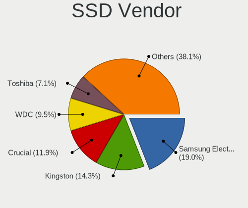
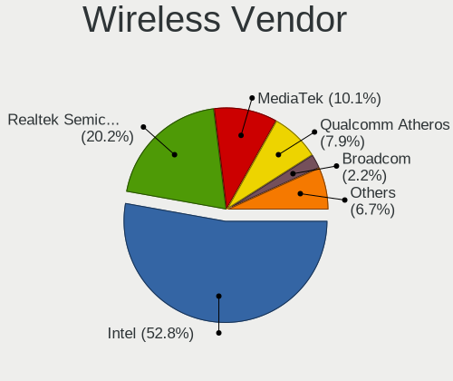
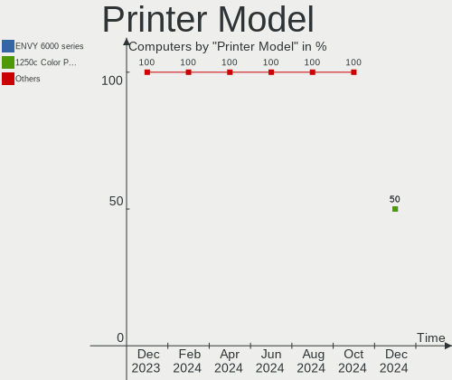

Manjaro Hardware Trends
-----------------------

A project to identify most popular hardware characteristics and track their change
over time based on data collected by Manjaro users at https://Linux-Hardware.org.

Anyone can contribute to this report by the [hw-probe](https://github.com/linuxhw/hw-probe) tool:

    sudo -E hw-probe -all -upload

This is a report for all computer types. See also reports for [desktops](/Dist/Manjaro/Desktop/README.md) and [notebooks](/Dist/Manjaro/Notebook/README.md).

Full-feature report is available here: https://linux-hardware.org/?view=trends

Period: Nov, 2021.

Contents
--------

* [ System ](#system)
  - [ OS                       ](#os)
  - [ OS Family                ](#os-family)
  - [ Kernel                   ](#kernel)
  - [ Kernel Family            ](#kernel-family)
  - [ Kernel Major Ver.        ](#kernel-major-ver)
  - [ Arch                     ](#arch)
  - [ DE                       ](#de)
  - [ Display Server           ](#display-server)
  - [ Display Manager          ](#display-manager)
  - [ OS Lang                  ](#os-lang)
  - [ Boot Mode                ](#boot-mode)
  - [ Filesystem               ](#filesystem)
  - [ Part. scheme             ](#part-scheme)
  - [ Dual Boot with Linux/BSD ](#dual-boot-with-linuxbsd)
  - [ Dual Boot (Win)          ](#dual-boot-win)

* [ Board ](#board)
  - [ Vendor                   ](#vendor)
  - [ Model                    ](#model)
  - [ Model Family             ](#model-family)
  - [ MFG Year                 ](#mfg-year)
  - [ Form Factor              ](#form-factor)
  - [ Secure Boot              ](#secure-boot)
  - [ Coreboot                 ](#coreboot)
  - [ RAM Size                 ](#ram-size)
  - [ RAM Used                 ](#ram-used)
  - [ Total Drives             ](#total-drives)
  - [ Has CD-ROM               ](#has-cd-rom)
  - [ Has Ethernet             ](#has-ethernet)
  - [ Has WiFi                 ](#has-wifi)
  - [ Has Bluetooth            ](#has-bluetooth)

* [ Location ](#location)
  - [ Country                  ](#country)
  - [ City                     ](#city)

* [ Drives ](#drives)
  - [ Drive Vendor             ](#drive-vendor)
  - [ Drive Model              ](#drive-model)
  - [ HDD Vendor               ](#hdd-vendor)
  - [ SSD Vendor               ](#ssd-vendor)
  - [ Drive Kind               ](#drive-kind)
  - [ Drive Connector          ](#drive-connector)
  - [ Drive Size               ](#drive-size)
  - [ Space Total              ](#space-total)
  - [ Space Used               ](#space-used)
  - [ Malfunc. Drives          ](#malfunc-drives)
  - [ Malfunc. Drive Vendor    ](#malfunc-drive-vendor)
  - [ Malfunc. HDD Vendor      ](#malfunc-hdd-vendor)
  - [ Malfunc. Drive Kind      ](#malfunc-drive-kind)
  - [ Failed Drives            ](#failed-drives)
  - [ Failed Drive Vendor      ](#failed-drive-vendor)
  - [ Drive Status             ](#drive-status)

* [ Storage controller ](#storage-controller)
  - [ Storage Vendor           ](#storage-vendor)
  - [ Storage Model            ](#storage-model)
  - [ Storage Kind             ](#storage-kind)

* [ Processor ](#processor)
  - [ CPU Vendor               ](#cpu-vendor)
  - [ CPU Model                ](#cpu-model)
  - [ CPU Model Family         ](#cpu-model-family)
  - [ CPU Cores                ](#cpu-cores)
  - [ CPU Sockets              ](#cpu-sockets)
  - [ CPU Threads              ](#cpu-threads)
  - [ CPU Op-Modes             ](#cpu-op-modes)
  - [ CPU Microcode            ](#cpu-microcode)
  - [ CPU Microarch            ](#cpu-microarch)

* [ Graphics ](#graphics)
  - [ GPU Vendor               ](#gpu-vendor)
  - [ GPU Model                ](#gpu-model)
  - [ GPU Combo                ](#gpu-combo)
  - [ GPU Driver               ](#gpu-driver)
  - [ GPU Memory               ](#gpu-memory)

* [ Monitor ](#monitor)
  - [ Monitor Vendor           ](#monitor-vendor)
  - [ Monitor Model            ](#monitor-model)
  - [ Monitor Resolution       ](#monitor-resolution)
  - [ Monitor Diagonal         ](#monitor-diagonal)
  - [ Monitor Width            ](#monitor-width)
  - [ Aspect Ratio             ](#aspect-ratio)
  - [ Monitor Area             ](#monitor-area)
  - [ Pixel Density            ](#pixel-density)
  - [ Multiple Monitors        ](#multiple-monitors)

* [ Network ](#network)
  - [ Net Controller Vendor    ](#net-controller-vendor)
  - [ Net Controller Model     ](#net-controller-model)
  - [ Wireless Vendor          ](#wireless-vendor)
  - [ Wireless Model           ](#wireless-model)
  - [ Ethernet Vendor          ](#ethernet-vendor)
  - [ Ethernet Model           ](#ethernet-model)
  - [ Net Controller Kind      ](#net-controller-kind)
  - [ Used Controller          ](#used-controller)
  - [ NICs                     ](#nics)
  - [ IPv6                     ](#ipv6)

* [ Bluetooth ](#bluetooth)
  - [ Bluetooth Vendor         ](#bluetooth-vendor)
  - [ Bluetooth Model          ](#bluetooth-model)

* [ Sound ](#sound)
  - [ Sound Vendor             ](#sound-vendor)
  - [ Sound Model              ](#sound-model)

* [ Memory ](#memory)
  - [ Memory Vendor            ](#memory-vendor)
  - [ Memory Model             ](#memory-model)
  - [ Memory Kind              ](#memory-kind)
  - [ Memory Form Factor       ](#memory-form-factor)
  - [ Memory Size              ](#memory-size)
  - [ Memory Speed             ](#memory-speed)

* [ Printers & scanners ](#printers--scanners)
  - [ Printer Vendor           ](#printer-vendor)
  - [ Printer Model            ](#printer-model)
  - [ Scanner Vendor           ](#scanner-vendor)
  - [ Scanner Model            ](#scanner-model)

* [ Camera ](#camera)
  - [ Camera Vendor            ](#camera-vendor)
  - [ Camera Model             ](#camera-model)

* [ Security ](#security)
  - [ Fingerprint Vendor       ](#fingerprint-vendor)
  - [ Fingerprint Model        ](#fingerprint-model)
  - [ Chipcard Vendor          ](#chipcard-vendor)
  - [ Chipcard Model           ](#chipcard-model)

* [ Unsupported ](#unsupported)
  - [ Unsupported Devices      ](#unsupported-devices)
  - [ Unsupported Device Types ](#unsupported-device-types)

System
------

OS
--

Installed operating systems

| Name             | Computers | Percent |
|------------------|-----------|---------|
| Manjaro          | 77        | 39.09%  |
| Manjaro 21.1.6   | 71        | 36.04%  |
| Manjaro 21.2.0   | 42        | 21.32%  |
| Manjaro 21.2pre1 | 5         | 2.54%   |
| Manjaro 21.1.2   | 1         | 0.51%   |
| Manjaro 21.0.7   | 1         | 0.51%   |

OS Family
---------

OS without a version

| Name    | Computers | Percent |
|---------|-----------|---------|
| Manjaro | 197       | 100%    |

Kernel
------

Version of the Linux kernel

| Version                     | Computers | Percent |
|-----------------------------|-----------|---------|
| 5.13.19-2-MANJARO           | 62        | 31.47%  |
| 5.15.2-2-MANJARO            | 30        | 15.23%  |
| 5.14.10-1-MANJARO           | 29        | 14.72%  |
| 5.10.70-1-MANJARO           | 22        | 11.17%  |
| 5.10.79-1-MANJARO           | 18        | 9.14%   |
| 5.15.0-1-MANJARO            | 6         | 3.05%   |
| 5.14.18-1-MANJARO           | 6         | 3.05%   |
| 5.9.16-1-MANJARO            | 3         | 1.52%   |
| 5.15.2-1-rt19-MANJARO       | 3         | 1.52%   |
| 5.4.150-1-MANJARO           | 2         | 1.02%   |
| 5.16.0-1-MANJARO            | 2         | 1.02%   |
| 5.14.14-1-MANJARO           | 2         | 1.02%   |
| 5.6.7-1-MANJARO             | 1         | 0.51%   |
| 5.15.3-lqx2-1-lqx           | 1         | 0.51%   |
| 5.14.17-xanmod1-1           | 1         | 0.51%   |
| 5.14.16-214-tkg-pds         | 1         | 0.51%   |
| 5.14.15-xanmod1-cacule-1    | 1         | 0.51%   |
| 5.13.13-1-MANJARO           | 1         | 0.51%   |
| 5.11.22-2-MANJARO           | 1         | 0.51%   |
| 5.10.82-1-MANJARO           | 1         | 0.51%   |
| 5.10.75-1-MANJARO           | 1         | 0.51%   |
| 5.10.73-xanmod1-MANJARO-LTS | 1         | 0.51%   |
| 5.10.56-1-MANJARO           | 1         | 0.51%   |
| 4.19.217-1-MANJARO          | 1         | 0.51%   |

Kernel Family
-------------

Linux kernel without a distro release

| Version  | Computers | Percent |
|----------|-----------|---------|
| 5.13.19  | 62        | 31.47%  |
| 5.15.2   | 33        | 16.75%  |
| 5.14.10  | 29        | 14.72%  |
| 5.10.70  | 22        | 11.17%  |
| 5.10.79  | 18        | 9.14%   |
| 5.15.0   | 6         | 3.05%   |
| 5.14.18  | 6         | 3.05%   |
| 5.9.16   | 3         | 1.52%   |
| 5.4.150  | 2         | 1.02%   |
| 5.16.0   | 2         | 1.02%   |
| 5.14.14  | 2         | 1.02%   |
| 5.6.7    | 1         | 0.51%   |
| 5.15.3   | 1         | 0.51%   |
| 5.14.17  | 1         | 0.51%   |
| 5.14.16  | 1         | 0.51%   |
| 5.14.15  | 1         | 0.51%   |
| 5.13.13  | 1         | 0.51%   |
| 5.11.22  | 1         | 0.51%   |
| 5.10.82  | 1         | 0.51%   |
| 5.10.75  | 1         | 0.51%   |
| 5.10.73  | 1         | 0.51%   |
| 5.10.56  | 1         | 0.51%   |
| 4.19.217 | 1         | 0.51%   |

Kernel Major Ver.
-----------------

Linux kernel major version

| Version | Computers | Percent |
|---------|-----------|---------|
| 5.13    | 63        | 31.98%  |
| 5.10    | 44        | 22.34%  |
| 5.15    | 40        | 20.3%   |
| 5.14    | 40        | 20.3%   |
| 5.9     | 3         | 1.52%   |
| 5.4     | 2         | 1.02%   |
| 5.16    | 2         | 1.02%   |
| 5.6     | 1         | 0.51%   |
| 5.11    | 1         | 0.51%   |
| 4.19    | 1         | 0.51%   |

Arch
----

OS architecture (x86_64, i586, etc.)

| Name   | Computers | Percent |
|--------|-----------|---------|
| x86_64 | 197       | 100%    |

DE
--

Desktop Environment

| Name           | Computers | Percent |
|----------------|-----------|---------|
| KDE5           | 70        | 35.53%  |
| GNOME          | 51        | 25.89%  |
| XFCE           | 47        | 23.86%  |
| Unknown        | 14        | 7.11%   |
| X-Cinnamon     | 6         | 3.05%   |
| KDE            | 2         | 1.02%   |
| Deepin         | 2         | 1.02%   |
| LXQt           | 1         | 0.51%   |
| i3-with-shmlog | 1         | 0.51%   |
| i3             | 1         | 0.51%   |
| Cinnamon       | 1         | 0.51%   |
| bspwm          | 1         | 0.51%   |

Display Server
--------------

X11 or Wayland

| Name    | Computers | Percent |
|---------|-----------|---------|
| X11     | 162       | 82.23%  |
| Wayland | 31        | 15.74%  |
| Unknown | 3         | 1.52%   |
| Tty     | 1         | 0.51%   |

Display Manager
---------------

SDDM, LightDM, etc.

| Name    | Computers | Percent |
|---------|-----------|---------|
| Unknown | 77        | 39.09%  |
| SDDM    | 45        | 22.84%  |
| LightDM | 44        | 22.34%  |
| GDM     | 31        | 15.74%  |

OS Lang
-------

Language

| Lang    | Computers | Percent |
|---------|-----------|---------|
| en_US   | 82        | 41.62%  |
| de_DE   | 20        | 10.15%  |
| en_GB   | 14        | 7.11%   |
| ru_RU   | 11        | 5.58%   |
| fr_FR   | 11        | 5.58%   |
| en_CA   | 11        | 5.58%   |
| pt_BR   | 8         | 4.06%   |
| it_IT   | 5         | 2.54%   |
| Unknown | 5         | 2.54%   |
| pl_PL   | 4         | 2.03%   |
| es_ES   | 3         | 1.52%   |
| pt_PT   | 2         | 1.02%   |
| es_CL   | 2         | 1.02%   |
| es_AR   | 2         | 1.02%   |
| en_AU   | 2         | 1.02%   |
| zh_CN   | 1         | 0.51%   |
| tr_TR   | 1         | 0.51%   |
| ru_UA   | 1         | 0.51%   |
| ja_JP   | 1         | 0.51%   |
| fi_FI   | 1         | 0.51%   |
| es_US   | 1         | 0.51%   |
| es_MX   | 1         | 0.51%   |
| en_SG   | 1         | 0.51%   |
| en_IL   | 1         | 0.51%   |
| en_IE   | 1         | 0.51%   |
| en_DE   | 1         | 0.51%   |
| en_AT   | 1         | 0.51%   |
| el_GR   | 1         | 0.51%   |
| de_AT   | 1         | 0.51%   |
| ar_SA   | 1         | 0.51%   |

Boot Mode
---------

EFI or BIOS

| Mode | Computers | Percent |
|------|-----------|---------|
| BIOS | 123       | 62.44%  |
| EFI  | 74        | 37.56%  |

Filesystem
----------

Type of filesystem

| Type    | Computers | Percent |
|---------|-----------|---------|
| Ext4    | 166       | 84.26%  |
| Btrfs   | 24        | 12.18%  |
| Overlay | 3         | 1.52%   |
| Xfs     | 2         | 1.02%   |
| Tmpfs   | 1         | 0.51%   |
| F2fs    | 1         | 0.51%   |

Part. scheme
------------

Scheme of partitioning

| Type    | Computers | Percent |
|---------|-----------|---------|
| Unknown | 121       | 61.42%  |
| GPT     | 66        | 33.5%   |
| MBR     | 10        | 5.08%   |

Dual Boot with Linux/BSD
------------------------

Hosting more than one Linux/BSD

| Dual boot | Computers | Percent |
|-----------|-----------|---------|
| No        | 178       | 90.36%  |
| Yes       | 19        | 9.64%   |

Dual Boot (Win)
---------------

Hosting Linux and Windows

| Dual boot | Computers | Percent |
|-----------|-----------|---------|
| No        | 136       | 69.04%  |
| Yes       | 61        | 30.96%  |

Board
-----

Vendor
------

Motherboard manufacturer

| Name                | Computers | Percent |
|---------------------|-----------|---------|
| Lenovo              | 35        | 17.77%  |
| ASUSTek Computer    | 35        | 17.77%  |
| Dell                | 26        | 13.2%   |
| Hewlett-Packard     | 19        | 9.64%   |
| Gigabyte Technology | 19        | 9.64%   |
| Acer                | 17        | 8.63%   |
| MSI                 | 16        | 8.12%   |
| HUAWEI              | 4         | 2.03%   |
| ASRock              | 4         | 2.03%   |
| Toshiba             | 3         | 1.52%   |
| Intel               | 3         | 1.52%   |
| Sony                | 2         | 1.02%   |
| Timi                | 1         | 0.51%   |
| Schenker            | 1         | 0.51%   |
| Samsung Electronics | 1         | 0.51%   |
| Positivo            | 1         | 0.51%   |
| Pegatron            | 1         | 0.51%   |
| PC Specialist       | 1         | 0.51%   |
| Notebook            | 1         | 0.51%   |
| LG Electronics      | 1         | 0.51%   |
| Kanji               | 1         | 0.51%   |
| Google              | 1         | 0.51%   |
| Fujitsu             | 1         | 0.51%   |
| Clevo               | 1         | 0.51%   |
| Apple               | 1         | 0.51%   |
| Acidanthera         | 1         | 0.51%   |

Model
-----

Motherboard model

| Name                                         | Computers | Percent |
|----------------------------------------------|-----------|---------|
| Toshiba Satellite NB10t-A-102                | 2         | 1.02%   |
| Lenovo Z50-70 20354                          | 2         | 1.02%   |
| Lenovo ThinkBook 15-IIL 20SM                 | 2         | 1.02%   |
| Lenovo IdeaPad 120S-14IAP 81A5               | 2         | 1.02%   |
| Gigabyte X470 AORUS ULTRA GAMING             | 2         | 1.02%   |
| Gigabyte B450M DS3H                          | 2         | 1.02%   |
| Dell XPS 13 9310                             | 2         | 1.02%   |
| Dell Vostro 5402                             | 2         | 1.02%   |
| ASUS All Series                              | 2         | 1.02%   |
| Toshiba Satellite C50-A                      | 1         | 0.51%   |
| Timi RedmiBook Pro 14S                       | 1         | 0.51%   |
| Sony VPCEB2Z1E                               | 1         | 0.51%   |
| Sony SVF14N1E2ES                             | 1         | 0.51%   |
| Schenker XMG CORE 15(M20, RTX 2060)          | 1         | 0.51%   |
| Samsung 950QDA                               | 1         | 0.51%   |
| Positivo C464C                               | 1         | 0.51%   |
| Pegatron s5-1120br                           | 1         | 0.51%   |
| PC Specialist NH5x_7xRCx,RDx                 | 1         | 0.51%   |
| Notebook NH5xAx                              | 1         | 0.51%   |
| MSI Prestige 15 A11SCX                       | 1         | 0.51%   |
| MSI MS-7D30                                  | 1         | 0.51%   |
| MSI MS-7C95                                  | 1         | 0.51%   |
| MSI MS-7C94                                  | 1         | 0.51%   |
| MSI MS-7C92                                  | 1         | 0.51%   |
| MSI MS-7C91                                  | 1         | 0.51%   |
| MSI MS-7C56                                  | 1         | 0.51%   |
| MSI MS-7C09                                  | 1         | 0.51%   |
| MSI MS-7C02                                  | 1         | 0.51%   |
| MSI MS-7B79                                  | 1         | 0.51%   |
| MSI MS-7B29                                  | 1         | 0.51%   |
| MSI MS-7A38                                  | 1         | 0.51%   |
| MSI MS-7817                                  | 1         | 0.51%   |
| MSI MS-7693                                  | 1         | 0.51%   |
| MSI GP66 Leopard 11UG                        | 1         | 0.51%   |
| MSI GP66 Leopard 10UG                        | 1         | 0.51%   |
| LG R510                                      | 1         | 0.51%   |
| Lenovo Yoga 920-13IKB 80Y7                   | 1         | 0.51%   |
| Lenovo V330-15IKB 81AX                       | 1         | 0.51%   |
| Lenovo ThinkStation S20 4157FY2              | 1         | 0.51%   |
| Lenovo ThinkPad X380 Yoga 20LJS2YE1H         | 1         | 0.51%   |
| Lenovo ThinkPad X250 20CLS7R400              | 1         | 0.51%   |
| Lenovo ThinkPad X230 2324FV6                 | 1         | 0.51%   |
| Lenovo ThinkPad X1 Extreme Gen 4i 20Y50011US | 1         | 0.51%   |
| Lenovo ThinkPad X1 Extreme 2nd 20QVCTO1WW    | 1         | 0.51%   |
| Lenovo ThinkPad X1 Carbon Gen 9 20XW00A9US   | 1         | 0.51%   |
| Lenovo ThinkPad X1 Carbon Gen 8 20U9005MUS   | 1         | 0.51%   |
| Lenovo ThinkPad T470s 20HF003QUS             | 1         | 0.51%   |
| Lenovo ThinkPad T460s 20F9S08Y00             | 1         | 0.51%   |
| Lenovo ThinkPad T450s 20BWS3MG00             | 1         | 0.51%   |
| Lenovo ThinkPad T440s 20AQ004URT             | 1         | 0.51%   |
| Lenovo ThinkPad T430 2349Y3D                 | 1         | 0.51%   |
| Lenovo ThinkPad T430 2349G4G                 | 1         | 0.51%   |
| Lenovo ThinkPad E15 Gen 3 20YHS00A00         | 1         | 0.51%   |
| Lenovo ThinkPad E14 Gen 2 20TA000DUK         | 1         | 0.51%   |
| Lenovo ThinkCentre M93p 10A8S3C100           | 1         | 0.51%   |
| Lenovo ThinkBook 14 G2 ARE 20VF              | 1         | 0.51%   |
| Lenovo ThinkBook 13s G2 ITL 20V9             | 1         | 0.51%   |
| Lenovo IdeaPadFlex Pro-13IKB 81TF            | 1         | 0.51%   |
| Lenovo IdeaPad C340-14IWL 81N4               | 1         | 0.51%   |
| Lenovo IdeaPad 5 14ITL05 82FE                | 1         | 0.51%   |

Model Family
------------

Motherboard model prefix

| Name                | Computers | Percent |
|---------------------|-----------|---------|
| Lenovo ThinkPad     | 15        | 7.61%   |
| Acer Aspire         | 12        | 6.09%   |
| Lenovo IdeaPad      | 7         | 3.55%   |
| HP Pavilion         | 7         | 3.55%   |
| Dell Inspiron       | 6         | 3.05%   |
| ASUS ROG            | 6         | 3.05%   |
| Dell XPS            | 5         | 2.54%   |
| Dell Latitude       | 5         | 2.54%   |
| Lenovo ThinkBook    | 4         | 2.03%   |
| Dell Vostro         | 4         | 2.03%   |
| Dell OptiPlex       | 4         | 2.03%   |
| ASUS TUF            | 4         | 2.03%   |
| ASUS PRIME          | 4         | 2.03%   |
| Toshiba Satellite   | 3         | 1.52%   |
| ASUS VivoBook       | 3         | 1.52%   |
| MSI GP66            | 2         | 1.02%   |
| Lenovo Z50-70       | 2         | 1.02%   |
| HP ProBook          | 2         | 1.02%   |
| HP Laptop           | 2         | 1.02%   |
| HP EliteBook        | 2         | 1.02%   |
| HP 250              | 2         | 1.02%   |
| Gigabyte X470       | 2         | 1.02%   |
| Gigabyte B450M      | 2         | 1.02%   |
| Dell Precision      | 2         | 1.02%   |
| ASUS SABERTOOTH     | 2         | 1.02%   |
| ASUS P8Z77-V        | 2         | 1.02%   |
| ASUS ASUS           | 2         | 1.02%   |
| ASUS All            | 2         | 1.02%   |
| Acer Swift          | 2         | 1.02%   |
| Timi RedmiBook      | 1         | 0.51%   |
| Sony VPCEB2Z1E      | 1         | 0.51%   |
| Sony SVF14N1E2ES    | 1         | 0.51%   |
| Schenker XMG        | 1         | 0.51%   |
| Samsung 950QDA      | 1         | 0.51%   |
| Positivo C464C      | 1         | 0.51%   |
| Pegatron s5-1120br  | 1         | 0.51%   |
| PC Specialist NH5x  | 1         | 0.51%   |
| Notebook NH5xAx     | 1         | 0.51%   |
| MSI Prestige        | 1         | 0.51%   |
| MSI MS-7D30         | 1         | 0.51%   |
| MSI MS-7C95         | 1         | 0.51%   |
| MSI MS-7C94         | 1         | 0.51%   |
| MSI MS-7C92         | 1         | 0.51%   |
| MSI MS-7C91         | 1         | 0.51%   |
| MSI MS-7C56         | 1         | 0.51%   |
| MSI MS-7C09         | 1         | 0.51%   |
| MSI MS-7C02         | 1         | 0.51%   |
| MSI MS-7B79         | 1         | 0.51%   |
| MSI MS-7B29         | 1         | 0.51%   |
| MSI MS-7A38         | 1         | 0.51%   |
| MSI MS-7817         | 1         | 0.51%   |
| MSI MS-7693         | 1         | 0.51%   |
| LG R510             | 1         | 0.51%   |
| Lenovo Yoga         | 1         | 0.51%   |
| Lenovo V330-15IKB   | 1         | 0.51%   |
| Lenovo ThinkStation | 1         | 0.51%   |
| Lenovo ThinkCentre  | 1         | 0.51%   |
| Lenovo IdeaPadFlex  | 1         | 0.51%   |
| Lenovo G70-35       | 1         | 0.51%   |
| Lenovo G50-80       | 1         | 0.51%   |

MFG Year
--------

Motherboard manufacture year

| Year | Computers | Percent |
|------|-----------|---------|
| 2021 | 57        | 28.93%  |
| 2019 | 31        | 15.74%  |
| 2020 | 27        | 13.71%  |
| 2013 | 17        | 8.63%   |
| 2018 | 12        | 6.09%   |
| 2017 | 9         | 4.57%   |
| 2014 | 8         | 4.06%   |
| 2015 | 7         | 3.55%   |
| 2012 | 7         | 3.55%   |
| 2016 | 6         | 3.05%   |
| 2011 | 5         | 2.54%   |
| 2009 | 4         | 2.03%   |
| 2010 | 3         | 1.52%   |
| 2007 | 2         | 1.02%   |
| 2008 | 1         | 0.51%   |
| 2006 | 1         | 0.51%   |

Form Factor
-----------

Physical design of the computer

| Name        | Computers | Percent |
|-------------|-----------|---------|
| Notebook    | 108       | 54.82%  |
| Desktop     | 77        | 39.09%  |
| Convertible | 11        | 5.58%   |
| All in one  | 1         | 0.51%   |

Secure Boot
-----------

Enabled or disabled

| State    | Computers | Percent |
|----------|-----------|---------|
| Disabled | 197       | 100%    |

Coreboot
--------

Have coreboot on board

| Used | Computers | Percent |
|------|-----------|---------|
| No   | 196       | 99.49%  |
| Yes  | 1         | 0.51%   |

RAM Size
--------

Total RAM memory

| Size in GB  | Computers | Percent |
|-------------|-----------|---------|
| 16.01-24.0  | 49        | 24.87%  |
| 8.01-16.0   | 46        | 23.35%  |
| 4.01-8.0    | 41        | 20.81%  |
| 3.01-4.0    | 29        | 14.72%  |
| 32.01-64.0  | 18        | 9.14%   |
| 64.01-256.0 | 8         | 4.06%   |
| 24.01-32.0  | 4         | 2.03%   |
| 2.01-3.0    | 1         | 0.51%   |
| 1.01-2.0    | 1         | 0.51%   |

RAM Used
--------

Used RAM memory

| Used GB    | Computers | Percent |
|------------|-----------|---------|
| 2.01-3.0   | 52        | 26.4%   |
| 1.01-2.0   | 52        | 26.4%   |
| 4.01-8.0   | 43        | 21.83%  |
| 3.01-4.0   | 30        | 15.23%  |
| 8.01-16.0  | 13        | 6.6%    |
| 0.51-1.0   | 6         | 3.05%   |
| 16.01-24.0 | 1         | 0.51%   |

Total Drives
------------

Number of drives on board

| Drives | Computers | Percent |
|--------|-----------|---------|
| 1      | 92        | 46.7%   |
| 2      | 64        | 32.49%  |
| 3      | 17        | 8.63%   |
| 4      | 11        | 5.58%   |
| 5      | 9         | 4.57%   |
| 6      | 2         | 1.02%   |
| 8      | 1         | 0.51%   |
| 7      | 1         | 0.51%   |

Has CD-ROM
----------

Has CD-ROM on board

| Presented | Computers | Percent |
|-----------|-----------|---------|
| No        | 149       | 75.63%  |
| Yes       | 48        | 24.37%  |

Has Ethernet
------------

Has Ethernet on board

| Presented | Computers | Percent |
|-----------|-----------|---------|
| Yes       | 163       | 82.74%  |
| No        | 34        | 17.26%  |

Has WiFi
--------

Has WiFi module

| Presented | Computers | Percent |
|-----------|-----------|---------|
| Yes       | 154       | 78.17%  |
| No        | 43        | 21.83%  |

Has Bluetooth
-------------

Has Bluetooth module

| Presented | Computers | Percent |
|-----------|-----------|---------|
| Yes       | 132       | 67.01%  |
| No        | 65        | 32.99%  |

Location
--------

Country
-------

Geographic location (country)

| Country      | Computers | Percent |
|--------------|-----------|---------|
| USA          | 35        | 17.77%  |
| Germany      | 31        | 15.74%  |
| France       | 13        | 6.6%    |
| Canada       | 12        | 6.09%   |
| Brazil       | 11        | 5.58%   |
| Russia       | 10        | 5.08%   |
| UK           | 7         | 3.55%   |
| Italy        | 7         | 3.55%   |
| Poland       | 5         | 2.54%   |
| Greece       | 4         | 2.03%   |
| Bulgaria     | 4         | 2.03%   |
| Turkey       | 3         | 1.52%   |
| Spain        | 3         | 1.52%   |
| Portugal     | 3         | 1.52%   |
| Netherlands  | 3         | 1.52%   |
| Hungary      | 3         | 1.52%   |
| Austria      | 3         | 1.52%   |
| Ukraine      | 2         | 1.02%   |
| Sri Lanka    | 2         | 1.02%   |
| Slovenia     | 2         | 1.02%   |
| Romania      | 2         | 1.02%   |
| Kenya        | 2         | 1.02%   |
| Japan        | 2         | 1.02%   |
| India        | 2         | 1.02%   |
| Czechia      | 2         | 1.02%   |
| Chile        | 2         | 1.02%   |
| Belarus      | 2         | 1.02%   |
| Australia    | 2         | 1.02%   |
| Argentina    | 2         | 1.02%   |
| Venezuela    | 1         | 0.51%   |
| Uruguay      | 1         | 0.51%   |
| Switzerland  | 1         | 0.51%   |
| Sweden       | 1         | 0.51%   |
| South Korea  | 1         | 0.51%   |
| Singapore    | 1         | 0.51%   |
| Saudi Arabia | 1         | 0.51%   |
| Peru         | 1         | 0.51%   |
| Pakistan     | 1         | 0.51%   |
| Mexico       | 1         | 0.51%   |
| Lebanon      | 1         | 0.51%   |
| Israel       | 1         | 0.51%   |
| Iran         | 1         | 0.51%   |
| Indonesia    | 1         | 0.51%   |
| Finland      | 1         | 0.51%   |
| China        | 1         | 0.51%   |

City
----

Geographic location (city)

| City             | Computers | Percent |
|------------------|-----------|---------|
| Sofia            | 4         | 2.03%   |
| Chamb?©ry        | 4         | 2.03%   |
| S??o Paulo       | 3         | 1.52%   |
| Paris            | 3         | 1.52%   |
| Montreal         | 3         | 1.52%   |
| Budapest         | 3         | 1.52%   |
| Berlin           | 3         | 1.52%   |
| Vienna           | 2         | 1.02%   |
| Spruce Grove     | 2         | 1.02%   |
| Porto            | 2         | 1.02%   |
| New York         | 2         | 1.02%   |
| Nairobi          | 2         | 1.02%   |
| Minsk            | 2         | 1.02%   |
| Iasi             | 2         | 1.02%   |
| Edmonton         | 2         | 1.02%   |
| Athens           | 2         | 1.02%   |
| Ankara           | 2         | 1.02%   |
| Yulee            | 1         | 0.51%   |
| Wonosari         | 1         | 0.51%   |
| Wilmington       | 1         | 0.51%   |
| Weitramsdorf     | 1         | 0.51%   |
| Warsaw           | 1         | 0.51%   |
| Vladimir         | 1         | 0.51%   |
| Vilshult         | 1         | 0.51%   |
| Vila Velha       | 1         | 0.51%   |
| Viguzzolo        | 1         | 0.51%   |
| Venice           | 1         | 0.51%   |
| Vechelde         | 1         | 0.51%   |
| Vaudreuil-Dorion | 1         | 0.51%   |
| Unicov           | 1         | 0.51%   |
| Ulyanovsk        | 1         | 0.51%   |
| Turek            | 1         | 0.51%   |
| Trofarello       | 1         | 0.51%   |
| Trikala          | 1         | 0.51%   |
| Toulouse         | 1         | 0.51%   |
| Tigre            | 1         | 0.51%   |
| Thomasville      | 1         | 0.51%   |
| The Hague        | 1         | 0.51%   |
| Tehran           | 1         | 0.51%   |
| Tarn??w          | 1         | 0.51%   |
| Syktyvkar        | 1         | 0.51%   |
| Sydney           | 1         | 0.51%   |
| Suyeong-gu       | 1         | 0.51%   |
| Stuttgart        | 1         | 0.51%   |
| Southend-on-Sea  | 1         | 0.51%   |
| Singapore        | 1         | 0.51%   |
| Sindelfingen     | 1         | 0.51%   |
| Shenzhen         | 1         | 0.51%   |
| Seville          | 1         | 0.51%   |
| Settsu           | 1         | 0.51%   |
| Scottsdale       | 1         | 0.51%   |
| Santiago         | 1         | 0.51%   |
| Santa Ana        | 1         | 0.51%   |
| San Rafael       | 1         | 0.51%   |
| San Diego        | 1         | 0.51%   |
| San Antonio      | 1         | 0.51%   |
| Salem            | 1         | 0.51%   |
| Rome             | 1         | 0.51%   |
| Rockford         | 1         | 0.51%   |
| Riyadh           | 1         | 0.51%   |

Drives
------

Drive Vendor
------------

Hard drive vendors

| Vendor                    | Computers | Drives | Percent |
|---------------------------|-----------|--------|---------|
| Samsung Electronics       | 55        | 72     | 17.03%  |
| Seagate                   | 50        | 65     | 15.48%  |
| WDC                       | 47        | 61     | 14.55%  |
| SanDisk                   | 24        | 26     | 7.43%   |
| Kingston                  | 23        | 25     | 7.12%   |
| Toshiba                   | 16        | 16     | 4.95%   |
| Intel                     | 13        | 16     | 4.02%   |
| Crucial                   | 13        | 14     | 4.02%   |
| Unknown                   | 10        | 14     | 3.1%    |
| A-DATA Technology         | 9         | 11     | 2.79%   |
| Phison                    | 7         | 7      | 2.17%   |
| Micron Technology         | 6         | 8      | 1.86%   |
| SK Hynix                  | 5         | 5      | 1.55%   |
| KIOXIA                    | 5         | 5      | 1.55%   |
| Intenso                   | 4         | 5      | 1.24%   |
| Patriot                   | 3         | 4      | 0.93%   |
| Hitachi                   | 3         | 4      | 0.93%   |
| HGST                      | 3         | 6      | 0.93%   |
| SPCC                      | 2         | 2      | 0.62%   |
| Silicon Motion            | 2         | 2      | 0.62%   |
| OCZ                       | 2         | 2      | 0.62%   |
| China                     | 2         | 2      | 0.62%   |
| ADATA Technology          | 2         | 2      | 0.62%   |
| ZTE                       | 1         | 1      | 0.31%   |
| YMTC                      | 1         | 1      | 0.31%   |
| XPG                       | 1         | 1      | 0.31%   |
| Transcend                 | 1         | 1      | 0.31%   |
| Team                      | 1         | 1      | 0.31%   |
| PNY                       | 1         | 1      | 0.31%   |
| Mushkin                   | 1         | 1      | 0.31%   |
| Morebeck-V602             | 1         | 1      | 0.31%   |
| Micron/Crucial Technology | 1         | 1      | 0.31%   |
| Lexar                     | 1         | 1      | 0.31%   |
| Leven                     | 1         | 1      | 0.31%   |
| KingSpec                  | 1         | 1      | 0.31%   |
| JMicron                   | 1         | 1      | 0.31%   |
| IBM                       | 1         | 1      | 0.31%   |
| Gigabyte Technology       | 1         | 2      | 0.31%   |
| Fujitsu                   | 1         | 1      | 0.31%   |
| ASMedia                   | 1         | 1      | 0.31%   |

Drive Model
-----------

Hard drive models

| Model                                  | Computers | Percent |
|----------------------------------------|-----------|---------|
| Kingston SA400S37240G 240GB SSD        | 7         | 1.87%   |
| Samsung SSD 850 EVO 500GB              | 6         | 1.6%    |
| Samsung NVMe SSD Drive 500GB           | 6         | 1.6%    |
| Samsung NVMe SSD Drive 512GB           | 5         | 1.34%   |
| Samsung NVMe SSD Drive 1TB             | 5         | 1.34%   |
| Seagate ST2000DM008-2FR102 2TB         | 4         | 1.07%   |
| Seagate ST1000DM010-2EP102 1TB         | 4         | 1.07%   |
| Seagate ST1000DM003-1ER162 1TB         | 4         | 1.07%   |
| Samsung SSD 970 EVO Plus 1TB           | 4         | 1.07%   |
| Samsung SSD 850 EVO 250GB              | 4         | 1.07%   |
| WDC WDS100T2B0A-00SM50 1TB SSD         | 3         | 0.8%    |
| Toshiba MQ04ABF100 1TB                 | 3         | 0.8%    |
| Seagate ST500LT012-1DG142 500GB        | 3         | 0.8%    |
| Seagate ST2000DM006-2DM164 2TB         | 3         | 0.8%    |
| Sandisk NVMe SSD Drive 512GB           | 3         | 0.8%    |
| Samsung MZALQ512HALU-000L2 512GB       | 3         | 0.8%    |
| Kingston NVMe SSD Drive 512GB          | 3         | 0.8%    |
| WDC WDS500G2B0A-00SM50 500GB SSD       | 2         | 0.53%   |
| WDC WDS120G2G0A-00JH30 120GB SSD       | 2         | 0.53%   |
| WDC WD5000LUCT-63RC2Y0 500GB           | 2         | 0.53%   |
| WDC WD20PURX-64P6ZY0 2TB               | 2         | 0.53%   |
| WDC WD20EZRX-00D8PB0 2TB               | 2         | 0.53%   |
| WDC WD10EZEX-00BN5A0 1TB               | 2         | 0.53%   |
| WDC WD10EARX-00N0YB0 1TB               | 2         | 0.53%   |
| WDC WD10EALX-009BA0 1TB                | 2         | 0.53%   |
| WDC PC SN730 NVMe 512GB                | 2         | 0.53%   |
| Unknown SD/MMC/MS PRO 394GB            | 2         | 0.53%   |
| Unknown MMC Card  64GB                 | 2         | 0.53%   |
| Unknown HBG4a2  32GB                   | 2         | 0.53%   |
| Toshiba MQ01ABF050 500GB               | 2         | 0.53%   |
| Seagate ST500LM021-1KJ152 500GB        | 2         | 0.53%   |
| Seagate ST4000DM004-2CV104 4TB         | 2         | 0.53%   |
| Seagate ST3320418AS 320GB              | 2         | 0.53%   |
| Seagate ST2000DM001-1CH164 2TB         | 2         | 0.53%   |
| Seagate ST1000LM035-1RK172 1TB         | 2         | 0.53%   |
| Seagate ST1000DM003-1SB102 1TB         | 2         | 0.53%   |
| Seagate Expansion Desk 8TB             | 2         | 0.53%   |
| Seagate Expansion 1TB                  | 2         | 0.53%   |
| Sandisk NVMe SSD Drive 500GB           | 2         | 0.53%   |
| Sandisk NVMe SSD Drive 256GB           | 2         | 0.53%   |
| Sandisk NVMe SSD Drive 1TB             | 2         | 0.53%   |
| SanDisk DF4032  32GB                   | 2         | 0.53%   |
| Samsung SSD 970 EVO Plus 500GB         | 2         | 0.53%   |
| Samsung SSD 870 QVO 1TB                | 2         | 0.53%   |
| Samsung SSD 870 EVO 1TB                | 2         | 0.53%   |
| Samsung SSD 860 EVO 500GB              | 2         | 0.53%   |
| Samsung SSD 860 EVO 1TB                | 2         | 0.53%   |
| Samsung SSD 850 EVO 1TB                | 2         | 0.53%   |
| Samsung SSD 830 Series 256GB           | 2         | 0.53%   |
| Samsung SM963 2.5" NVMe PCIe SSD 250GB | 2         | 0.53%   |
| Phison NVMe SSD Drive 2TB              | 2         | 0.53%   |
| Patriot Burst 120GB SSD                | 2         | 0.53%   |
| KIOXIA KBG40ZNV256G 256GB              | 2         | 0.53%   |
| Kingston SV300S37A 60G SSD             | 2         | 0.53%   |
| Kingston SA400S37480G 480GB SSD        | 2         | 0.53%   |
| Kingston NVMe SSD Drive 500GB          | 2         | 0.53%   |
| Kingston NVMe SSD Drive 256GB          | 2         | 0.53%   |
| Intel SSDPEKNW512G8 512GB              | 2         | 0.53%   |
| Intel NVMe SSD Drive 512GB             | 2         | 0.53%   |
| Intel NVMe SSD Drive 32GB              | 2         | 0.53%   |

HDD Vendor
----------

Hard disk drive vendors

| Vendor              | Computers | Drives | Percent |
|---------------------|-----------|--------|---------|
| Seagate             | 49        | 63     | 43.75%  |
| WDC                 | 36        | 42     | 32.14%  |
| Toshiba             | 12        | 12     | 10.71%  |
| Samsung Electronics | 5         | 6      | 4.46%   |
| Hitachi             | 3         | 4      | 2.68%   |
| HGST                | 3         | 6      | 2.68%   |
| Unknown             | 2         | 2      | 1.79%   |
| Fujitsu             | 1         | 1      | 0.89%   |
| ASMedia             | 1         | 1      | 0.89%   |

SSD Vendor
----------

Solid state drive vendors

| Vendor              | Computers | Drives | Percent |
|---------------------|-----------|--------|---------|
| Samsung Electronics | 24        | 29     | 22.22%  |
| Kingston            | 14        | 15     | 12.96%  |
| Crucial             | 12        | 13     | 11.11%  |
| SanDisk             | 11        | 13     | 10.19%  |
| WDC                 | 9         | 12     | 8.33%   |
| A-DATA Technology   | 7         | 9      | 6.48%   |
| Intel               | 5         | 6      | 4.63%   |
| Intenso             | 4         | 5      | 3.7%    |
| Patriot             | 3         | 4      | 2.78%   |
| SPCC                | 2         | 2      | 1.85%   |
| Seagate             | 2         | 2      | 1.85%   |
| OCZ                 | 2         | 2      | 1.85%   |
| China               | 2         | 2      | 1.85%   |
| Transcend           | 1         | 1      | 0.93%   |
| Toshiba             | 1         | 1      | 0.93%   |
| SK Hynix            | 1         | 1      | 0.93%   |
| PNY                 | 1         | 1      | 0.93%   |
| Mushkin             | 1         | 1      | 0.93%   |
| Morebeck-V602       | 1         | 1      | 0.93%   |
| Micron Technology   | 1         | 2      | 0.93%   |
| Lexar               | 1         | 1      | 0.93%   |
| Leven               | 1         | 1      | 0.93%   |
| KingSpec            | 1         | 1      | 0.93%   |
| JMicron             | 1         | 1      | 0.93%   |

Drive Kind
----------

HDD or SSD

| Kind    | Computers | Drives | Percent |
|---------|-----------|--------|---------|
| HDD     | 96        | 137    | 33.1%   |
| NVMe    | 91        | 111    | 31.38%  |
| SSD     | 89        | 126    | 30.69%  |
| MMC     | 10        | 12     | 3.45%   |
| Unknown | 4         | 6      | 1.38%   |

Drive Connector
---------------

SATA, SAS, NVMe, etc.

| Type | Computers | Drives | Percent |
|------|-----------|--------|---------|
| SATA | 138       | 245    | 54.55%  |
| NVMe | 91        | 111    | 35.97%  |
| SAS  | 14        | 24     | 5.53%   |
| MMC  | 10        | 12     | 3.95%   |

Drive Size
----------

Size of hard drive

| Size in TB | Computers | Drives | Percent |
|------------|-----------|--------|---------|
| 0.01-0.5   | 94        | 134    | 47.96%  |
| 0.51-1.0   | 61        | 75     | 31.12%  |
| 1.01-2.0   | 25        | 30     | 12.76%  |
| 3.01-4.0   | 7         | 8      | 3.57%   |
| 2.01-3.0   | 6         | 11     | 3.06%   |
| 4.01-10.0  | 2         | 4      | 1.02%   |
| 10.01-20.0 | 1         | 1      | 0.51%   |

Space Total
-----------

Amount of disk space available on the file system

| Size in GB     | Computers | Percent |
|----------------|-----------|---------|
| 251-500        | 40        | 20.3%   |
| 101-250        | 37        | 18.78%  |
| 1001-2000      | 31        | 15.74%  |
| 501-1000       | 31        | 15.74%  |
| More than 3000 | 17        | 8.63%   |
| 51-100         | 14        | 7.11%   |
| Unknown        | 13        | 6.6%    |
| 2001-3000      | 7         | 3.55%   |
| 1-20           | 4         | 2.03%   |
| 21-50          | 3         | 1.52%   |

Space Used
----------

Amount of used disk space

| Used GB        | Computers | Percent |
|----------------|-----------|---------|
| 21-50          | 36        | 18.27%  |
| 1-20           | 35        | 17.77%  |
| 101-250        | 33        | 16.75%  |
| 51-100         | 25        | 12.69%  |
| 251-500        | 17        | 8.63%   |
| 501-1000       | 17        | 8.63%   |
| 1001-2000      | 14        | 7.11%   |
| Unknown        | 13        | 6.6%    |
| 2001-3000      | 4         | 2.03%   |
| More than 3000 | 3         | 1.52%   |

Malfunc. Drives
---------------

Drive models with a malfunction

| Model                           | Computers | Drives | Percent |
|---------------------------------|-----------|--------|---------|
| WDC WD10EARX-00N0YB0 1TB        | 2         | 2      | 13.33%  |
| WDC WD3200BPVT-22JJ5T0 320GB    | 1         | 1      | 6.67%   |
| WDC WD30EZRX-00DC0B0 3TB        | 1         | 2      | 6.67%   |
| WDC WD10JPVT-75A1YT0 1TB        | 1         | 1      | 6.67%   |
| WDC WD10EZEX-00BN5A0 1TB        | 1         | 1      | 6.67%   |
| Seagate ST500LM021-1KJ152 500GB | 1         | 1      | 6.67%   |
| Seagate ST500DM002-1BD142 500GB | 1         | 1      | 6.67%   |
| Seagate ST3000DM001-1CH166 3TB  | 1         | 1      | 6.67%   |
| SanDisk SDSSDX480GG25 480GB     | 1         | 1      | 6.67%   |
| SanDisk SDSSDP256G 256GB        | 1         | 1      | 6.67%   |
| Intenso SSD 120GB               | 1         | 1      | 6.67%   |
| Intel SSDSC2BW120A4 120GB       | 1         | 1      | 6.67%   |
| HGST HTS545050A7E680 500GB      | 1         | 1      | 6.67%   |
| HGST HTS541075A9E680 752GB      | 1         | 1      | 6.67%   |

Malfunc. Drive Vendor
---------------------

Vendors of faulty drives

| Vendor  | Computers | Drives | Percent |
|---------|-----------|--------|---------|
| WDC     | 6         | 7      | 40%     |
| Seagate | 3         | 3      | 20%     |
| SanDisk | 2         | 2      | 13.33%  |
| HGST    | 2         | 2      | 13.33%  |
| Intenso | 1         | 1      | 6.67%   |
| Intel   | 1         | 1      | 6.67%   |

Malfunc. HDD Vendor
-------------------

Vendors of faulty HDD drives

| Vendor  | Computers | Drives | Percent |
|---------|-----------|--------|---------|
| WDC     | 6         | 7      | 54.55%  |
| Seagate | 3         | 3      | 27.27%  |
| HGST    | 2         | 2      | 18.18%  |

Malfunc. Drive Kind
-------------------

Kinds of faulty drives

| Kind | Computers | Drives | Percent |
|------|-----------|--------|---------|
| HDD  | 11        | 12     | 73.33%  |
| SSD  | 4         | 4      | 26.67%  |

Failed Drives
-------------

Failed drive models

Zero info for selected period =(

Failed Drive Vendor
-------------------

Failed drive vendors

Zero info for selected period =(

Drive Status
------------

Number of failed and malfunc. drives

| Status   | Computers | Drives | Percent |
|----------|-----------|--------|---------|
| Detected | 137       | 276    | 64.02%  |
| Works    | 64        | 100    | 29.91%  |
| Malfunc  | 13        | 16     | 6.07%   |

Storage controller
------------------

Storage Vendor
--------------

Storage controller vendors

| Vendor                       | Computers | Percent |
|------------------------------|-----------|---------|
| Intel                        | 124       | 45.76%  |
| AMD                          | 44        | 16.24%  |
| Samsung Electronics          | 32        | 11.81%  |
| Sandisk                      | 16        | 5.9%    |
| Kingston Technology Company  | 9         | 3.32%   |
| Phison Electronics           | 7         | 2.58%   |
| KIOXIA                       | 5         | 1.85%   |
| SK Hynix                     | 4         | 1.48%   |
| Micron Technology            | 4         | 1.48%   |
| ADATA Technology             | 4         | 1.48%   |
| Toshiba America Info Systems | 3         | 1.11%   |
| Marvell Technology Group     | 3         | 1.11%   |
| LSI Logic / Symbios Logic    | 3         | 1.11%   |
| ASMedia Technology           | 3         | 1.11%   |
| Silicon Motion               | 2         | 0.74%   |
| Realtek Semiconductor        | 2         | 0.74%   |
| Micron/Crucial Technology    | 2         | 0.74%   |
| JMicron Technology           | 2         | 0.74%   |
| Yangtze Memory Technologies  | 1         | 0.37%   |
| VIA Technologies             | 1         | 0.37%   |

Storage Model
-------------

Storage controller models

| Model                                                                          | Computers | Percent |
|--------------------------------------------------------------------------------|-----------|---------|
| AMD FCH SATA Controller [AHCI mode]                                            | 24        | 7.87%   |
| Samsung NVMe SSD Controller SM981/PM981/PM983                                  | 21        | 6.89%   |
| AMD 400 Series Chipset SATA Controller                                         | 15        | 4.92%   |
| Intel 7 Series Chipset Family 6-port SATA Controller [AHCI mode]               | 12        | 3.93%   |
| AMD Starship/Matisse Chipset SATA Controller [AHCI mode]                       | 9         | 2.95%   |
| Intel Sunrise Point-LP SATA Controller [AHCI mode]                             | 8         | 2.62%   |
| Intel Volume Management Device NVMe RAID Controller                            | 7         | 2.3%    |
| Sandisk WD Blue SN550 NVMe SSD                                                 | 6         | 1.97%   |
| Samsung NVMe SSD Controller 980                                                | 6         | 1.97%   |
| Intel Cannon Point-LP SATA Controller [AHCI Mode]                              | 6         | 1.97%   |
| Intel Cannon Lake Mobile PCH SATA AHCI Controller                              | 6         | 1.97%   |
| Intel 82801 Mobile SATA Controller [RAID mode]                                 | 6         | 1.97%   |
| Intel 6 Series/C200 Series Chipset Family 6 port Desktop SATA AHCI Controller  | 6         | 1.97%   |
| Intel 200 Series PCH SATA controller [AHCI mode]                               | 6         | 1.97%   |
| Phison E16 PCIe4 NVMe Controller                                               | 5         | 1.64%   |
| KIOXIA Non-Volatile memory controller                                          | 5         | 1.64%   |
| Intel Wildcat Point-LP SATA Controller [AHCI Mode]                             | 5         | 1.64%   |
| Intel 8 Series SATA Controller 1 [AHCI mode]                                   | 5         | 1.64%   |
| Intel 7 Series/C210 Series Chipset Family 6-port SATA Controller [AHCI mode]   | 5         | 1.64%   |
| Sandisk WD Black SN750 / PC SN730 NVMe SSD                                     | 4         | 1.31%   |
| Micron Non-Volatile memory controller                                          | 4         | 1.31%   |
| Kingston Company A2000 NVMe SSD                                                | 4         | 1.31%   |
| Intel Celeron N3350/Pentium N4200/Atom E3900 Series SATA AHCI Controller       | 4         | 1.31%   |
| Intel 8 Series/C220 Series Chipset Family 6-port SATA Controller 1 [AHCI mode] | 4         | 1.31%   |
| AMD SB7x0/SB8x0/SB9x0 SATA Controller [AHCI mode]                              | 4         | 1.31%   |
| Sandisk Non-Volatile memory controller                                         | 3         | 0.98%   |
| Samsung NVMe SSD Controller SM961/PM961/SM963                                  | 3         | 0.98%   |
| Samsung NVMe SSD Controller PM9A1/PM9A3/980PRO                                 | 3         | 0.98%   |
| LSI Logic / Symbios Logic SAS2008 PCI-Express Fusion-MPT SAS-2 [Falcon]        | 3         | 0.98%   |
| Kingston Company Company Non-Volatile memory controller                        | 3         | 0.98%   |
| Intel SSD 660P Series                                                          | 3         | 0.98%   |
| Intel Non-Volatile memory controller                                           | 3         | 0.98%   |
| Intel NM10/ICH7 Family SATA Controller [IDE mode]                              | 3         | 0.98%   |
| Intel Comet Lake SATA AHCI Controller                                          | 3         | 0.98%   |
| Intel Atom Processor E3800 Series SATA AHCI Controller                         | 3         | 0.98%   |
| ASMedia ASM1062 Serial ATA Controller                                          | 3         | 0.98%   |
| AMD SB7x0/SB8x0/SB9x0 IDE Controller                                           | 3         | 0.98%   |
| SK Hynix Gold P31 SSD                                                          | 2         | 0.66%   |
| Silicon Motion SM2263EN/SM2263XT SSD Controller                                | 2         | 0.66%   |
| Sandisk WD Blue SN500 / PC SN520 NVMe SSD                                      | 2         | 0.66%   |
| Sandisk WD Black 2018/SN750 / PC SN720 NVMe SSD                                | 2         | 0.66%   |
| Realtek Realtek Non-Volatile memory controller                                 | 2         | 0.66%   |
| Phison E12 NVMe Controller                                                     | 2         | 0.66%   |
| Intel Tiger Lake-LP SATA Controller [AHCI mode]                                | 2         | 0.66%   |
| Intel Ice Lake-LP SATA Controller [AHCI mode]                                  | 2         | 0.66%   |
| Intel HM170/QM170 Chipset SATA Controller [AHCI Mode]                          | 2         | 0.66%   |
| Intel Celeron/Pentium Silver Processor SATA Controller                         | 2         | 0.66%   |
| Intel Cannon Lake PCH SATA AHCI Controller                                     | 2         | 0.66%   |
| Intel C600/X79 series chipset 6-Port SATA AHCI Controller                      | 2         | 0.66%   |
| Intel 82801JI (ICH10 Family) SATA AHCI Controller                              | 2         | 0.66%   |
| Intel 82801IBM/IEM (ICH9M/ICH9M-E) 4 port SATA Controller [AHCI mode]          | 2         | 0.66%   |
| Intel 82801HM/HEM (ICH8M/ICH8M-E) SATA Controller [AHCI mode]                  | 2         | 0.66%   |
| Intel 82801HM/HEM (ICH8M/ICH8M-E) IDE Controller                               | 2         | 0.66%   |
| Intel 82801G (ICH7 Family) IDE Controller                                      | 2         | 0.66%   |
| Intel 6 Series/C200 Series Chipset Family 6 port Mobile SATA AHCI Controller   | 2         | 0.66%   |
| AMD SB7x0/SB8x0/SB9x0 SATA Controller [IDE mode]                               | 2         | 0.66%   |
| ADATA XPG SX8200 Pro PCIe Gen3x4 M.2 2280 Solid State Drive                    | 2         | 0.66%   |
| ADATA Non-Volatile memory controller                                           | 2         | 0.66%   |
| Yangtze Memory Non-Volatile memory controller                                  | 1         | 0.33%   |
| VIA VT6415 PATA IDE Host Controller                                            | 1         | 0.33%   |

Storage Kind
------------

Kind of storage controller (IDE, SATA, NVMe, SAS, ...)

| Kind | Computers | Percent |
|------|-----------|---------|
| SATA | 146       | 53.87%  |
| NVMe | 90        | 33.21%  |
| RAID | 17        | 6.27%   |
| IDE  | 14        | 5.17%   |
| SAS  | 4         | 1.48%   |

Processor
---------

CPU Vendor
----------

Processor vendors

| Vendor | Computers | Percent |
|--------|-----------|---------|
| Intel  | 150       | 76.14%  |
| AMD    | 47        | 23.86%  |

CPU Model
---------

Processor models

| Model                                         | Computers | Percent |
|-----------------------------------------------|-----------|---------|
| Intel 11th Gen Core i5-1135G7 @ 2.40GHz       | 9         | 4.57%   |
| AMD Ryzen 5 3600 6-Core Processor             | 7         | 3.55%   |
| Intel Core i5-8265U CPU @ 1.60GHz             | 6         | 3.05%   |
| Intel Core i7-9750H CPU @ 2.60GHz             | 5         | 2.54%   |
| Intel Core i5-8250U CPU @ 1.60GHz             | 4         | 2.03%   |
| Intel Celeron CPU N3350 @ 1.10GHz             | 4         | 2.03%   |
| Intel 11th Gen Core i7-1165G7 @ 2.80GHz       | 4         | 2.03%   |
| AMD Ryzen 7 3700X 8-Core Processor            | 4         | 2.03%   |
| Intel Core i7-8550U CPU @ 1.80GHz             | 3         | 1.52%   |
| Intel Core i5-9400F CPU @ 2.90GHz             | 3         | 1.52%   |
| Intel Core i5-3450 CPU @ 3.10GHz              | 3         | 1.52%   |
| AMD Ryzen 7 2700 Eight-Core Processor         | 3         | 1.52%   |
| Intel Pentium CPU N3510 @ 1.99GHz             | 2         | 1.02%   |
| Intel Core i7-8565U CPU @ 1.80GHz             | 2         | 1.02%   |
| Intel Core i7-7700HQ CPU @ 2.80GHz            | 2         | 1.02%   |
| Intel Core i7-3632QM CPU @ 2.20GHz            | 2         | 1.02%   |
| Intel Core i7-2600K CPU @ 3.40GHz             | 2         | 1.02%   |
| Intel Core i5-7200U CPU @ 2.50GHz             | 2         | 1.02%   |
| Intel Core i5-5200U CPU @ 2.20GHz             | 2         | 1.02%   |
| Intel Core i5-3320M CPU @ 2.60GHz             | 2         | 1.02%   |
| Intel Core i5-1035G4 CPU @ 1.10GHz            | 2         | 1.02%   |
| Intel Core i3-6006U CPU @ 2.00GHz             | 2         | 1.02%   |
| Intel Core i3-5010U CPU @ 2.10GHz             | 2         | 1.02%   |
| Intel Celeron CPU 1000M @ 1.80GHz             | 2         | 1.02%   |
| Intel 11th Gen Core i7-1185G7 @ 3.00GHz       | 2         | 1.02%   |
| AMD Ryzen 9 5900X 12-Core Processor           | 2         | 1.02%   |
| AMD Ryzen 7 5700G with Radeon Graphics        | 2         | 1.02%   |
| AMD Ryzen 7 2700X Eight-Core Processor        | 2         | 1.02%   |
| AMD Ryzen 5 4600H with Radeon Graphics        | 2         | 1.02%   |
| AMD Ryzen 5 3500U with Radeon Vega Mobile Gfx | 2         | 1.02%   |
| AMD FX-6300 Six-Core Processor                | 2         | 1.02%   |
| Intel Xeon CPU W3550 @ 3.07GHz                | 1         | 0.51%   |
| Intel Xeon CPU E5-2690 0 @ 2.90GHz            | 1         | 0.51%   |
| Intel Xeon CPU E5-2670 v2 @ 2.50GHz           | 1         | 0.51%   |
| Intel Xeon CPU E5-1650 0 @ 3.20GHz            | 1         | 0.51%   |
| Intel Xeon CPU E3-1231 v3 @ 3.40GHz           | 1         | 0.51%   |
| Intel Pentium Silver N5000 CPU @ 1.10GHz      | 1         | 0.51%   |
| Intel Pentium Gold G5500 CPU @ 3.80GHz        | 1         | 0.51%   |
| Intel Pentium Gold 7505 @ 2.00GHz             | 1         | 0.51%   |
| Intel Pentium Dual-Core CPU T4400 @ 2.20GHz   | 1         | 0.51%   |
| Intel Pentium Dual-Core CPU T4200 @ 2.00GHz   | 1         | 0.51%   |
| Intel Pentium D CPU 2.80GHz                   | 1         | 0.51%   |
| Intel Pentium CPU N3710 @ 1.60GHz             | 1         | 0.51%   |
| Intel Pentium CPU B950 @ 2.10GHz              | 1         | 0.51%   |
| Intel Pentium CPU 4415U @ 2.30GHz             | 1         | 0.51%   |
| Intel Pentium 3558U @ 1.70GHz                 | 1         | 0.51%   |
| Intel Pentium 3556U @ 1.70GHz                 | 1         | 0.51%   |
| Intel Core i9-10900K CPU @ 3.70GHz            | 1         | 0.51%   |
| Intel Core i9-10885H CPU @ 2.40GHz            | 1         | 0.51%   |
| Intel Core i9-10850K CPU @ 3.60GHz            | 1         | 0.51%   |
| Intel Core i7-8750H CPU @ 2.20GHz             | 1         | 0.51%   |
| Intel Core i7-8700K CPU @ 3.70GHz             | 1         | 0.51%   |
| Intel Core i7-8665U CPU @ 1.90GHz             | 1         | 0.51%   |
| Intel Core i7-7600U CPU @ 2.80GHz             | 1         | 0.51%   |
| Intel Core i7-6700K CPU @ 4.00GHz             | 1         | 0.51%   |
| Intel Core i7-5820K CPU @ 3.30GHz             | 1         | 0.51%   |
| Intel Core i7-4770 CPU @ 3.40GHz              | 1         | 0.51%   |
| Intel Core i7-4510U CPU @ 2.00GHz             | 1         | 0.51%   |
| Intel Core i7-3520M CPU @ 2.90GHz             | 1         | 0.51%   |
| Intel Core i7-2630QM CPU @ 2.00GHz            | 1         | 0.51%   |

CPU Model Family
----------------

Processor model prefix

| Model                   | Computers | Percent |
|-------------------------|-----------|---------|
| Intel Core i5           | 49        | 24.87%  |
| Intel Core i7           | 29        | 14.72%  |
| Other                   | 21        | 10.66%  |
| AMD Ryzen 7             | 15        | 7.61%   |
| AMD Ryzen 5             | 15        | 7.61%   |
| Intel Core i3           | 12        | 6.09%   |
| Intel Celeron           | 11        | 5.58%   |
| Intel Pentium           | 7         | 3.55%   |
| Intel Xeon              | 5         | 2.54%   |
| AMD Ryzen 9             | 4         | 2.03%   |
| AMD FX                  | 4         | 2.03%   |
| Intel Core i9           | 3         | 1.52%   |
| Intel Core 2 Duo        | 3         | 1.52%   |
| Intel Pentium Gold      | 2         | 1.02%   |
| Intel Pentium Dual-Core | 2         | 1.02%   |
| Intel Core 2 Quad       | 2         | 1.02%   |
| Intel Core 2            | 2         | 1.02%   |
| AMD Ryzen 5 PRO         | 2         | 1.02%   |
| AMD Ryzen 3             | 2         | 1.02%   |
| Intel Pentium Silver    | 1         | 0.51%   |
| Intel Pentium D         | 1         | 0.51%   |
| AMD Phenom II X4        | 1         | 0.51%   |
| AMD E2                  | 1         | 0.51%   |
| AMD E                   | 1         | 0.51%   |
| AMD A6                  | 1         | 0.51%   |
| AMD A4                  | 1         | 0.51%   |

CPU Cores
---------

Number of processor cores

| Number | Computers | Percent |
|--------|-----------|---------|
| 4      | 80        | 40.61%  |
| 2      | 57        | 28.93%  |
| 6      | 28        | 14.21%  |
| 8      | 21        | 10.66%  |
| 16     | 3         | 1.52%   |
| 12     | 2         | 1.02%   |
| 10     | 2         | 1.02%   |
| 3      | 2         | 1.02%   |
| 20     | 1         | 0.51%   |
| 1      | 1         | 0.51%   |

CPU Sockets
-----------

Number of sockets

| Number | Computers | Percent |
|--------|-----------|---------|
| 1      | 196       | 99.49%  |
| 2      | 1         | 0.51%   |

CPU Threads
-----------

Threads per core (Hyper-Threading)

| Number | Computers | Percent |
|--------|-----------|---------|
| 2      | 144       | 73.1%   |
| 1      | 53        | 26.9%   |

CPU Op-Modes
------------

CPU Operation Modes (32-bit, 64-bit)

| Op mode        | Computers | Percent |
|----------------|-----------|---------|
| 32-bit, 64-bit | 197       | 100%    |

CPU Microcode
-------------

Microcode number

| Number     | Computers | Percent |
|------------|-----------|---------|
| Unknown    | 108       | 54.82%  |
| 0x806c1    | 11        | 5.58%   |
| 0x306a9    | 10        | 5.08%   |
| 0x906ea    | 5         | 2.54%   |
| 0x806eb    | 4         | 2.03%   |
| 0x806ea    | 4         | 2.03%   |
| 0xa0652    | 3         | 1.52%   |
| 0x806ec    | 3         | 1.52%   |
| 0x506c9    | 3         | 1.52%   |
| 0x08701021 | 3         | 1.52%   |
| 0xa0655    | 2         | 1.02%   |
| 0x806e9    | 2         | 1.02%   |
| 0x806d1    | 2         | 1.02%   |
| 0x506e3    | 2         | 1.02%   |
| 0x406e3    | 2         | 1.02%   |
| 0x306c3    | 2         | 1.02%   |
| 0x30673    | 2         | 1.02%   |
| 0x206a7    | 2         | 1.02%   |
| 0x1067a    | 2         | 1.02%   |
| 0x08701013 | 2         | 1.02%   |
| 0x08600106 | 2         | 1.02%   |
| 0x0800820d | 2         | 1.02%   |
| 0x06000852 | 2         | 1.02%   |
| 0xa0671    | 1         | 0.51%   |
| 0x906e9    | 1         | 0.51%   |
| 0x706e5    | 1         | 0.51%   |
| 0x6f2      | 1         | 0.51%   |
| 0x406c4    | 1         | 0.51%   |
| 0x40661    | 1         | 0.51%   |
| 0x40651    | 1         | 0.51%   |
| 0x306f2    | 1         | 0.51%   |
| 0x306d4    | 1         | 0.51%   |
| 0x30678    | 1         | 0.51%   |
| 0x106a5    | 1         | 0.51%   |
| 0x0a50000c | 1         | 0.51%   |
| 0x0a201016 | 1         | 0.51%   |
| 0x0a201009 | 1         | 0.51%   |
| 0x08608103 | 1         | 0.51%   |
| 0x08600104 | 1         | 0.51%   |
| 0x07030105 | 1         | 0.51%   |

CPU Microarch
-------------

Microarchitecture

| Name          | Computers | Percent |
|---------------|-----------|---------|
| KabyLake      | 42        | 21.32%  |
| IvyBridge     | 19        | 9.64%   |
| Zen 2         | 18        | 9.14%   |
| TigerLake     | 17        | 8.63%   |
| Haswell       | 11        | 5.58%   |
| Zen+          | 10        | 5.08%   |
| SandyBridge   | 9         | 4.57%   |
| Zen 3         | 6         | 3.05%   |
| Skylake       | 6         | 3.05%   |
| Penryn        | 6         | 3.05%   |
| IceLake       | 6         | 3.05%   |
| CometLake     | 6         | 3.05%   |
| Silvermont    | 5         | 2.54%   |
| Broadwell     | 5         | 2.54%   |
| Goldmont      | 4         | 2.03%   |
| Core          | 4         | 2.03%   |
| Unknown       | 4         | 2.03%   |
| Westmere      | 3         | 1.52%   |
| Piledriver    | 3         | 1.52%   |
| Zen           | 2         | 1.02%   |
| Puma          | 2         | 1.02%   |
| Nehalem       | 2         | 1.02%   |
| Goldmont plus | 2         | 1.02%   |
| Bobcat        | 2         | 1.02%   |
| NetBurst      | 1         | 0.51%   |
| K10           | 1         | 0.51%   |
| Bulldozer     | 1         | 0.51%   |

Graphics
--------

GPU Vendor
----------

Vendors of graphics cards

| Vendor | Computers | Percent |
|--------|-----------|---------|
| Intel  | 114       | 47.3%   |
| Nvidia | 72        | 29.88%  |
| AMD    | 55        | 22.82%  |

GPU Model
---------

Graphics card models

| Model                                                                                    | Computers | Percent |
|------------------------------------------------------------------------------------------|-----------|---------|
| Intel TigerLake-LP GT2 [Iris Xe Graphics]                                                | 15        | 6.12%   |
| Intel 3rd Gen Core processor Graphics Controller                                         | 11        | 4.49%   |
| AMD Ellesmere [Radeon RX 470/480/570/570X/580/580X/590]                                  | 10        | 4.08%   |
| Intel WhiskeyLake-U GT2 [UHD Graphics 620]                                               | 9         | 3.67%   |
| Intel UHD Graphics 620                                                                   | 9         | 3.67%   |
| Intel CoffeeLake-H GT2 [UHD Graphics 630]                                                | 7         | 2.86%   |
| Intel HD Graphics 5500                                                                   | 5         | 2.04%   |
| Intel Haswell-ULT Integrated Graphics Controller                                         | 5         | 2.04%   |
| AMD Renoir                                                                               | 5         | 2.04%   |
| Nvidia TU116 [GeForce GTX 1660 SUPER]                                                    | 4         | 1.63%   |
| Intel HD Graphics 620                                                                    | 4         | 1.63%   |
| Intel HD Graphics 500                                                                    | 4         | 1.63%   |
| AMD Picasso/Raven 2 [Radeon Vega Series / Radeon Vega Mobile Series]                     | 4         | 1.63%   |
| Nvidia TU117M                                                                            | 3         | 1.22%   |
| Nvidia GP107M [GeForce GTX 1050 Mobile]                                                  | 3         | 1.22%   |
| Nvidia GP106 [GeForce GTX 1060 6GB]                                                      | 3         | 1.22%   |
| Nvidia GK208B [GeForce GT 730]                                                           | 3         | 1.22%   |
| Nvidia GA104M [GeForce RTX 3070 Mobile / Max-Q]                                          | 3         | 1.22%   |
| Intel Mobile 4 Series Chipset Integrated Graphics Controller                             | 3         | 1.22%   |
| Intel CometLake-U GT2 [UHD Graphics]                                                     | 3         | 1.22%   |
| Intel CometLake-H GT2 [UHD Graphics]                                                     | 3         | 1.22%   |
| Intel Atom Processor Z36xxx/Z37xxx Series Graphics & Display                             | 3         | 1.22%   |
| Intel 2nd Generation Core Processor Family Integrated Graphics Controller                | 3         | 1.22%   |
| Nvidia TU117M [GeForce GTX 1650 Mobile / Max-Q]                                          | 2         | 0.82%   |
| Nvidia TU116M [GeForce GTX 1660 Ti Mobile]                                               | 2         | 0.82%   |
| Nvidia TU116 [GeForce GTX 1660 Ti]                                                       | 2         | 0.82%   |
| Nvidia TU106M [GeForce RTX 2060 Mobile]                                                  | 2         | 0.82%   |
| Nvidia GP106M [GeForce GTX 1060 Mobile]                                                  | 2         | 0.82%   |
| Nvidia GP106 [GeForce GTX 1060 3GB]                                                      | 2         | 0.82%   |
| Nvidia GM108M [GeForce 920MX]                                                            | 2         | 0.82%   |
| Nvidia GM108M [GeForce 840M]                                                             | 2         | 0.82%   |
| Nvidia GK208B [GeForce GT 710]                                                           | 2         | 0.82%   |
| Nvidia GK104 [GeForce GTX 670]                                                           | 2         | 0.82%   |
| Intel Xeon E3-1200 v2/3rd Gen Core processor Graphics Controller                         | 2         | 0.82%   |
| Intel TigerLake-H GT1 [UHD Graphics]                                                     | 2         | 0.82%   |
| Intel Tiger Lake UHD Graphics                                                            | 2         | 0.82%   |
| Intel Skylake GT2 [HD Graphics 520]                                                      | 2         | 0.82%   |
| Intel Mobile GM965/GL960 Integrated Graphics Controller (secondary)                      | 2         | 0.82%   |
| Intel Mobile GM965/GL960 Integrated Graphics Controller (primary)                        | 2         | 0.82%   |
| Intel Iris Plus Graphics G4 (Ice Lake)                                                   | 2         | 0.82%   |
| Intel HD Graphics 630                                                                    | 2         | 0.82%   |
| Intel Atom/Celeron/Pentium Processor x5-E8000/J3xxx/N3xxx Integrated Graphics Controller | 2         | 0.82%   |
| Intel 82945G/GZ Integrated Graphics Controller                                           | 2         | 0.82%   |
| AMD Topaz XT [Radeon R7 M260/M265 / M340/M360 / M440/M445 / 530/535 / 620/625 Mobile]    | 2         | 0.82%   |
| AMD Sun XT [Radeon HD 8670A/8670M/8690M / R5 M330 / M430 / Radeon 520 Mobile]            | 2         | 0.82%   |
| AMD Navi 10 [Radeon RX 5600 OEM/5600 XT / 5700/5700 XT]                                  | 2         | 0.82%   |
| AMD Lucienne                                                                             | 2         | 0.82%   |
| AMD Juniper XT [Radeon HD 5770]                                                          | 2         | 0.82%   |
| AMD Cezanne                                                                              | 2         | 0.82%   |
| AMD Cedar [Radeon HD 5000/6000/7350/8350 Series]                                         | 2         | 0.82%   |
| AMD Baffin [Radeon RX 550 640SP / RX 560/560X]                                           | 2         | 0.82%   |
| Nvidia TU117M [GeForce MX450]                                                            | 1         | 0.41%   |
| Nvidia TU117M [GeForce GTX 1650 Ti Mobile]                                               | 1         | 0.41%   |
| Nvidia TU106M [GeForce RTX 2070 Mobile / Max-Q Refresh]                                  | 1         | 0.41%   |
| Nvidia TU106 [GeForce RTX 2070]                                                          | 1         | 0.41%   |
| Nvidia TU106 [GeForce RTX 2070 Rev. A]                                                   | 1         | 0.41%   |
| Nvidia TU106 [GeForce RTX 2060 SUPER]                                                    | 1         | 0.41%   |
| Nvidia TU104 [GeForce RTX 2080 SUPER]                                                    | 1         | 0.41%   |
| Nvidia TU104 [GeForce RTX 2070 SUPER]                                                    | 1         | 0.41%   |
| Nvidia GT218M [GeForce 310M]                                                             | 1         | 0.41%   |

GPU Combo
---------

Combinations of graphics cards

| Name           | Computers | Percent |
|----------------|-----------|---------|
| 1 x Intel      | 75        | 38.07%  |
| 1 x AMD        | 44        | 22.34%  |
| 1 x Nvidia     | 35        | 17.77%  |
| Intel + Nvidia | 32        | 16.24%  |
| Intel + AMD    | 6         | 3.05%   |
| AMD + Nvidia   | 3         | 1.52%   |
| 2 x AMD        | 2         | 1.02%   |

GPU Driver
----------

Free vs proprietary

| Driver      | Computers | Percent |
|-------------|-----------|---------|
| Free        | 137       | 69.54%  |
| Proprietary | 60        | 30.46%  |

GPU Memory
----------

Total video memory

| Size in GB | Computers | Percent |
|------------|-----------|---------|
| Unknown    | 141       | 71.57%  |
| 7.01-8.0   | 15        | 7.61%   |
| 1.01-2.0   | 12        | 6.09%   |
| 5.01-6.0   | 10        | 5.08%   |
| 0.51-1.0   | 7         | 3.55%   |
| 3.01-4.0   | 5         | 2.54%   |
| 0.01-0.5   | 3         | 1.52%   |
| 2.01-3.0   | 2         | 1.02%   |
| 8.01-16.0  | 2         | 1.02%   |

Monitor
-------

Monitor Vendor
--------------

Monitor vendors

| Vendor                  | Computers | Percent |
|-------------------------|-----------|---------|
| BOE                     | 26        | 10.74%  |
| AU Optronics            | 26        | 10.74%  |
| LG Display              | 25        | 10.33%  |
| Samsung Electronics     | 21        | 8.68%   |
| Chimei Innolux          | 17        | 7.02%   |
| AOC                     | 10        | 4.13%   |
| Acer                    | 10        | 4.13%   |
| Dell                    | 9         | 3.72%   |
| Goldstar                | 8         | 3.31%   |
| BenQ                    | 8         | 3.31%   |
| Ancor Communications    | 8         | 3.31%   |
| Hewlett-Packard         | 7         | 2.89%   |
| Sharp                   | 6         | 2.48%   |
| LG Electronics          | 6         | 2.48%   |
| PANDA                   | 5         | 2.07%   |
| Philips                 | 4         | 1.65%   |
| Sony                    | 3         | 1.24%   |
| InfoVision              | 3         | 1.24%   |
| Unknown                 | 3         | 1.24%   |
| LGD                     | 2         | 0.83%   |
| LG Philips              | 2         | 0.83%   |
| Lenovo                  | 2         | 0.83%   |
| KTC                     | 2         | 0.83%   |
| Insignia                | 2         | 0.83%   |
| Fujitsu Siemens         | 2         | 0.83%   |
| Eizo                    | 2         | 0.83%   |
| CND                     | 2         | 0.83%   |
| Chi Mei Optoelectronics | 2         | 0.83%   |
| Vizio                   | 1         | 0.41%   |
| Toshiba                 | 1         | 0.41%   |
| Sceptre Tech            | 1         | 0.41%   |
| Positivo                | 1         | 0.41%   |
| OEM                     | 1         | 0.41%   |
| NEC Computers           | 1         | 0.41%   |
| MSI                     | 1         | 0.41%   |
| Microstep               | 1         | 0.41%   |
| Lenovo Group Limited    | 1         | 0.41%   |
| IOD                     | 1         | 0.41%   |
| Hitachi                 | 1         | 0.41%   |
| FUS                     | 1         | 0.41%   |
| DZX                     | 1         | 0.41%   |
| CAL                     | 1         | 0.41%   |
| BBY                     | 1         | 0.41%   |
| AUS                     | 1         | 0.41%   |
| Apple                   | 1         | 0.41%   |
| AMO                     | 1         | 0.41%   |
| AGO                     | 1         | 0.41%   |

Monitor Model
-------------

Monitor models

| Model                                                                   | Computers | Percent |
|-------------------------------------------------------------------------|-----------|---------|
| BOE LCD Monitor BOE0700 1920x1080 344x194mm 15.5-inch                   | 3         | 1.2%    |
| AU Optronics LCD Monitor AUO403D 1920x1080 309x173mm 13.9-inch          | 3         | 1.2%    |
| Unknown                                                                 | 3         | 1.2%    |
| Sony SDM-HX73 SNY2870 1280x1024 338x270mm 17.0-inch                     | 2         | 0.8%    |
| Sharp LCD Monitor SHP14F9 1920x1200 288x180mm 13.4-inch                 | 2         | 0.8%    |
| LG Display LCD Monitor LGD0384 1366x768 344x194mm 15.5-inch             | 2         | 0.8%    |
| Insignia NS-39D40SNA14 BBY3943 1920x1080 853x480mm 38.5-inch            | 2         | 0.8%    |
| CND CNDLCD CND1376 1366x768 300x230mm 14.9-inch                         | 2         | 0.8%    |
| Chimei Innolux LCD Monitor CMN14D4 1920x1080 309x173mm 13.9-inch        | 2         | 0.8%    |
| Chimei Innolux LCD Monitor CMN1119 1366x768 260x140mm 11.6-inch         | 2         | 0.8%    |
| BOE LCD Monitor BOE06BD 1366x768 309x173mm 13.9-inch                    | 2         | 0.8%    |
| AU Optronics LCD Monitor AUO303D 1920x1080 309x174mm 14.0-inch          | 2         | 0.8%    |
| AU Optronics LCD Monitor AUO213E 1600x900 309x174mm 14.0-inch           | 2         | 0.8%    |
| Ancor Communications VE247 ACI2493 1920x1080 531x299mm 24.0-inch        | 2         | 0.8%    |
| Vizio E601i-A3 VIZ0092 1920x1080 1329x748mm 60.0-inch                   | 1         | 0.4%    |
| Toshiba LCD Monitor TV 1920x1080                                        | 1         | 0.4%    |
| Sony Nvidia Defaul SNY05FA 1366x768 290x170mm 13.2-inch                 | 1         | 0.4%    |
| Sharp LCD Monitor SHP14D0 3840x2400 336x210mm 15.6-inch                 | 1         | 0.4%    |
| Sharp LCD Monitor SHP14BA 1920x1080 344x194mm 15.5-inch                 | 1         | 0.4%    |
| Sharp LCD Monitor SHP1479 1920x1280 259x173mm 12.3-inch                 | 1         | 0.4%    |
| Sharp HDMI SHP0FFB 1920x1080 820x460mm 37.0-inch                        | 1         | 0.4%    |
| Sceptre Tech C24 SPT09A7 1920x1080 520x320mm 24.0-inch                  | 1         | 0.4%    |
| Samsung Electronics U32J59x SAM0F34 3840x2160 697x392mm 31.5-inch       | 1         | 0.4%    |
| Samsung Electronics SyncMaster SAM0304 1680x1050 494x320mm 23.2-inch    | 1         | 0.4%    |
| Samsung Electronics S27E332 SAM0F61 1920x1080 598x336mm 27.0-inch       | 1         | 0.4%    |
| Samsung Electronics S24D332 SAM0F5E 1920x1080 531x299mm 24.0-inch       | 1         | 0.4%    |
| Samsung Electronics S22F350 SAM0D1A 1920x1080 480x270mm 21.7-inch       | 1         | 0.4%    |
| Samsung Electronics LCD Monitor SyncMaster 3200x1080                    | 1         | 0.4%    |
| Samsung Electronics LCD Monitor SyncMaster 1680x1050                    | 1         | 0.4%    |
| Samsung Electronics LCD Monitor SyncMaster                              | 1         | 0.4%    |
| Samsung Electronics LCD Monitor SMS24A650 1920x1080                     | 1         | 0.4%    |
| Samsung Electronics LCD Monitor SMBX2440 3360x1080                      | 1         | 0.4%    |
| Samsung Electronics LCD Monitor SMB2240W 1680x1050                      | 1         | 0.4%    |
| Samsung Electronics LCD Monitor SEC3050 1366x768 309x174mm 14.0-inch    | 1         | 0.4%    |
| Samsung Electronics LCD Monitor SDC5441 1366x768 340x190mm 15.3-inch    | 1         | 0.4%    |
| Samsung Electronics LCD Monitor SDC4852 3840x2160 340x190mm 15.3-inch   | 1         | 0.4%    |
| Samsung Electronics LCD Monitor SDC414D 1366x768 309x174mm 14.0-inch    | 1         | 0.4%    |
| Samsung Electronics LCD Monitor SAM7003 3840x2160 1872x1053mm 84.6-inch | 1         | 0.4%    |
| Samsung Electronics LCD Monitor SAM0DF6 3840x2160 890x500mm 40.2-inch   | 1         | 0.4%    |
| Samsung Electronics LCD Monitor SAM0D51 1920x1080 1210x680mm 54.6-inch  | 1         | 0.4%    |
| Samsung Electronics LCD Monitor SAM0390 1920x1080                       | 1         | 0.4%    |
| Samsung Electronics LC27G5xT SAM707A 2560x1440 698x393mm 31.5-inch      | 1         | 0.4%    |
| Samsung Electronics C27F390 SAM0D32 1920x1080 600x340mm 27.2-inch       | 1         | 0.4%    |
| Samsung Electronics C24F390 SAM0D2C 1920x1080 520x290mm 23.4-inch       | 1         | 0.4%    |
| Positivo SMILE563 NON1503 1360x768 344x194mm 15.5-inch                  | 1         | 0.4%    |
| Philips PHL 436M6VBP PHLC179 3840x2160 941x529mm 42.5-inch              | 1         | 0.4%    |
| Philips PHL 276E8V PHLC18F 3840x2160 597x336mm 27.0-inch                | 1         | 0.4%    |
| Philips LCD Monitor PHL 223V7 1920x1080                                 | 1         | 0.4%    |
| Philips 150S PHL0829 1024x768 300x230mm 14.9-inch                       | 1         | 0.4%    |
| PANDA LCD Monitor NCP0059 2560x1600 302x189mm 14.0-inch                 | 1         | 0.4%    |
| PANDA LCD Monitor NCP004D 1920x1080 344x194mm 15.5-inch                 | 1         | 0.4%    |
| PANDA LCD Monitor NCP004B 1920x1080 344x194mm 15.5-inch                 | 1         | 0.4%    |
| PANDA LCD Monitor NCP0040 1920x1080 344x194mm 15.5-inch                 | 1         | 0.4%    |
| PANDA LCD Monitor NCP0036 1920x1080 344x194mm 15.5-inch                 | 1         | 0.4%    |
| OEM 32W_LCD_TV OEM3700 1920x1080                                        | 1         | 0.4%    |
| NEC Computers E221N NEC2C82 1920x1080 476x268mm 21.5-inch               | 1         | 0.4%    |
| MSI G271 MSI3CB5 1920x1080 598x336mm 27.0-inch                          | 1         | 0.4%    |
| Microstep LCD Monitor MSI MAG272CQR 2560x1440                           | 1         | 0.4%    |
| Microstep LCD Monitor MSI MAG271CQR                                     | 1         | 0.4%    |
| LGD LCD Monitor 1920x1080                                               | 1         | 0.4%    |

Monitor Resolution
------------------

Monitor screen resolution

| Resolution         | Computers | Percent |
|--------------------|-----------|---------|
| 1920x1080 (FHD)    | 102       | 44.16%  |
| 1366x768 (WXGA)    | 38        | 16.45%  |
| 3840x2160 (4K)     | 13        | 5.63%   |
| 2560x1440 (QHD)    | 13        | 5.63%   |
| Unknown            | 10        | 4.33%   |
| 1680x1050 (WSXGA+) | 7         | 3.03%   |
| 1280x1024 (SXGA)   | 7         | 3.03%   |
| 1600x900 (HD+)     | 6         | 2.6%    |
| 1920x1200 (WUXGA)  | 4         | 1.73%   |
| 1280x800 (WXGA)    | 4         | 1.73%   |
| 3840x1080          | 3         | 1.3%    |
| 2560x1600          | 3         | 1.3%    |
| 1360x768           | 3         | 1.3%    |
| 3440x1440          | 2         | 0.87%   |
| 2560x1080          | 2         | 0.87%   |
| 1920x540           | 2         | 0.87%   |
| 6720x1440          | 1         | 0.43%   |
| 4480x1440          | 1         | 0.43%   |
| 4240x1440          | 1         | 0.43%   |
| 3840x2400          | 1         | 0.43%   |
| 3600x1080          | 1         | 0.43%   |
| 3456x2160          | 1         | 0.43%   |
| 3360x1080          | 1         | 0.43%   |
| 3200x1080          | 1         | 0.43%   |
| 2160x1440          | 1         | 0.43%   |
| 1920x1280          | 1         | 0.43%   |
| 11520x2400         | 1         | 0.43%   |
| 1024x768 (XGA)     | 1         | 0.43%   |

Monitor Diagonal
----------------

Diagonal size in inches

| Inches  | Computers | Percent |
|---------|-----------|---------|
| 15      | 60        | 25.75%  |
| Unknown | 31        | 13.3%   |
| 14      | 29        | 12.45%  |
| 13      | 18        | 7.73%   |
| 27      | 16        | 6.87%   |
| 24      | 14        | 6.01%   |
| 23      | 10        | 4.29%   |
| 21      | 8         | 3.43%   |
| 17      | 8         | 3.43%   |
| 31      | 5         | 2.15%   |
| 22      | 4         | 1.72%   |
| 19      | 4         | 1.72%   |
| 12      | 4         | 1.72%   |
| 20      | 3         | 1.29%   |
| 11      | 3         | 1.29%   |
| 84      | 2         | 0.86%   |
| 38      | 2         | 0.86%   |
| 34      | 2         | 0.86%   |
| 18      | 2         | 0.86%   |
| 60      | 1         | 0.43%   |
| 54      | 1         | 0.43%   |
| 44      | 1         | 0.43%   |
| 42      | 1         | 0.43%   |
| 37      | 1         | 0.43%   |
| 32      | 1         | 0.43%   |
| 25      | 1         | 0.43%   |
| 16      | 1         | 0.43%   |

Monitor Width
-------------

Physical width

| Width in mm | Computers | Percent |
|-------------|-----------|---------|
| 301-350     | 99        | 43.81%  |
| 501-600     | 33        | 14.6%   |
| Unknown     | 31        | 13.72%  |
| 401-500     | 17        | 7.52%   |
| 201-300     | 16        | 7.08%   |
| 351-400     | 11        | 4.87%   |
| 601-700     | 7         | 3.1%    |
| 801-900     | 3         | 1.33%   |
| 701-800     | 3         | 1.33%   |
| 1501-2000   | 2         | 0.88%   |
| 1001-1500   | 2         | 0.88%   |
| 901-1000    | 2         | 0.88%   |

Aspect Ratio
------------

Proportional relationship between the width and the height

| Ratio   | Computers | Percent |
|---------|-----------|---------|
| 16/9    | 143       | 69.08%  |
| Unknown | 28        | 13.53%  |
| 16/10   | 19        | 9.18%   |
| 5/4     | 7         | 3.38%   |
| 4/3     | 4         | 1.93%   |
| 3/2     | 3         | 1.45%   |
| 21/9    | 2         | 0.97%   |
| 32/9    | 1         | 0.48%   |

Monitor Area
------------

Area in inch²

| Area in inch² | Computers | Percent |
|----------------|-----------|---------|
| 101-110        | 62        | 26.61%  |
| 81-90          | 37        | 15.88%  |
| 201-250        | 31        | 13.3%   |
| Unknown        | 31        | 13.3%   |
| 301-350        | 16        | 6.87%   |
| 151-200        | 10        | 4.29%   |
| 71-80          | 8         | 3.43%   |
| 351-500        | 8         | 3.43%   |
| 121-130        | 6         | 2.58%   |
| 501-1000       | 5         | 2.15%   |
| More than 1000 | 4         | 1.72%   |
| 141-150        | 4         | 1.72%   |
| 61-70          | 3         | 1.29%   |
| 51-60          | 3         | 1.29%   |
| 251-300        | 3         | 1.29%   |
| 91-100         | 2         | 0.86%   |

Pixel Density
-------------

Pixels per inch

| Density       | Computers | Percent |
|---------------|-----------|---------|
| 121-160       | 67        | 30.18%  |
| 51-100        | 53        | 23.87%  |
| 101-120       | 49        | 22.07%  |
| Unknown       | 31        | 13.96%  |
| 161-240       | 14        | 6.31%   |
| More than 240 | 4         | 1.8%    |
| 1-50          | 4         | 1.8%    |

Multiple Monitors
-----------------

Total monitors connected

| Total | Computers | Percent |
|-------|-----------|---------|
| 1     | 148       | 75.13%  |
| 2     | 44        | 22.34%  |
| 3     | 5         | 2.54%   |

Network
-------

Net Controller Vendor
---------------------

Controller vendors

| Vendor                                | Computers | Percent |
|---------------------------------------|-----------|---------|
| Realtek Semiconductor                 | 114       | 38.78%  |
| Intel                                 | 110       | 37.41%  |
| Qualcomm Atheros                      | 29        | 9.86%   |
| Broadcom                              | 13        | 4.42%   |
| TP-Link                               | 4         | 1.36%   |
| Ralink Technology                     | 3         | 1.02%   |
| Ralink                                | 3         | 1.02%   |
| MEDIATEK                              | 3         | 1.02%   |
| Xiaomi                                | 2         | 0.68%   |
| Sierra Wireless                       | 2         | 0.68%   |
| Marvell Technology Group              | 2         | 0.68%   |
| ASUSTek Computer                      | 2         | 0.68%   |
| ZTE WCDMA Technologies MSM            | 1         | 0.34%   |
| Samsung Electronics                   | 1         | 0.34%   |
| Qualcomm                              | 1         | 0.34%   |
| NetGear                               | 1         | 0.34%   |
| Huawei Technologies                   | 1         | 0.34%   |
| Aquantia                              | 1         | 0.34%   |
| 802.11g Adapter [Linksys WUSB54GC v3] | 1         | 0.34%   |

Net Controller Model
--------------------

Controller models

| Model                                                             | Computers | Percent |
|-------------------------------------------------------------------|-----------|---------|
| Realtek RTL8111/8168/8411 PCI Express Gigabit Ethernet Controller | 79        | 23.44%  |
| Intel Wi-Fi 6 AX200                                               | 16        | 4.75%   |
| Intel Wi-Fi 6 AX201                                               | 12        | 3.56%   |
| Realtek RTL8153 Gigabit Ethernet Adapter                          | 10        | 2.97%   |
| Realtek RTL810xE PCI Express Fast Ethernet controller             | 10        | 2.97%   |
| Intel I211 Gigabit Network Connection                             | 9         | 2.67%   |
| Intel 82579LM Gigabit Network Connection (Lewisville)             | 9         | 2.67%   |
| Realtek RTL8125 2.5GbE Controller                                 | 6         | 1.78%   |
| Qualcomm Atheros QCA9565 / AR9565 Wireless Network Adapter        | 6         | 1.78%   |
| Qualcomm Atheros QCA6174 802.11ac Wireless Network Adapter        | 6         | 1.78%   |
| Intel Wireless 7265                                               | 6         | 1.78%   |
| Qualcomm Atheros QCA9377 802.11ac Wireless Network Adapter        | 5         | 1.48%   |
| Intel Ethernet Controller I225-V                                  | 5         | 1.48%   |
| Realtek RTL8822CE 802.11ac PCIe Wireless Network Adapter          | 4         | 1.19%   |
| Realtek RTL8723BU 802.11b/g/n WLAN Adapter                        | 4         | 1.19%   |
| Realtek RTL8723BE PCIe Wireless Network Adapter                   | 4         | 1.19%   |
| Qualcomm Atheros AR9485 Wireless Network Adapter                  | 4         | 1.19%   |
| Intel Wireless 8265 / 8275                                        | 4         | 1.19%   |
| Intel Wi-Fi 6 AX210/AX211/AX411 160MHz                            | 4         | 1.19%   |
| Intel Ethernet Connection (2) I219-V                              | 4         | 1.19%   |
| Intel Dual Band Wireless-AC 3168NGW [Stone Peak]                  | 4         | 1.19%   |
| Intel Cannon Point-LP CNVi [Wireless-AC]                          | 4         | 1.19%   |
| Realtek RTL8822BE 802.11a/b/g/n/ac WiFi adapter                   | 3         | 0.89%   |
| Intel Wireless-AC 9260                                            | 3         | 0.89%   |
| Intel Wireless 7260                                               | 3         | 0.89%   |
| Intel Ice Lake-LP PCH CNVi WiFi                                   | 3         | 0.89%   |
| Intel Ethernet Connection (4) I219-LM                             | 3         | 0.89%   |
| Intel Dual Band Wireless-AC 3165 Plus Bluetooth                   | 3         | 0.89%   |
| Intel Comet Lake PCH-LP CNVi WiFi                                 | 3         | 0.89%   |
| Intel Cannon Lake PCH CNVi WiFi                                   | 3         | 0.89%   |
| TP-Link 802.11ac NIC                                              | 2         | 0.59%   |
| Realtek RTL88x2bu [AC1200 Techkey]                                | 2         | 0.59%   |
| Realtek RTL-8110SC/8169SC Gigabit Ethernet                        | 2         | 0.59%   |
| Ralink RT3290 Wireless 802.11n 1T/1R PCIe                         | 2         | 0.59%   |
| Qualcomm Atheros AR9287 Wireless Network Adapter (PCI-Express)    | 2         | 0.59%   |
| Qualcomm Atheros AR8151 v2.0 Gigabit Ethernet                     | 2         | 0.59%   |
| MEDIATEK Network controller                                       | 2         | 0.59%   |
| Intel Wireless 3165                                               | 2         | 0.59%   |
| Intel Ethernet Connection (3) I218-LM                             | 2         | 0.59%   |
| Intel Ethernet Connection (2) I218-V                              | 2         | 0.59%   |
| Intel Comet Lake PCH CNVi WiFi                                    | 2         | 0.59%   |
| Intel 82579V Gigabit Network Connection                           | 2         | 0.59%   |
| Broadcom BCM4360 802.11ac Wireless Network Adapter                | 2         | 0.59%   |
| Broadcom BCM4352 802.11ac Wireless Network Adapter                | 2         | 0.59%   |
| Broadcom BCM4313 802.11bgn Wireless Network Adapter               | 2         | 0.59%   |
| ZTE WCDMA MSM ZTE Mobile Broadband                                | 1         | 0.3%    |
| Xiaomi Redmi 9A                                                   | 1         | 0.3%    |
| Xiaomi Mi/Redmi series (RNDIS)                                    | 1         | 0.3%    |
| TP-Link UE300 10/100/1000 LAN (ethernet mode) [Realtek RTL8153]   | 1         | 0.3%    |
| TP-Link TL-WN722N v2/v3 [Realtek RTL8188EUS]                      | 1         | 0.3%    |
| Sierra Wireless EM7421                                            | 1         | 0.3%    |
| Sierra Wireless EM7345 4G LTE                                     | 1         | 0.3%    |
| Samsung Galaxy series, misc. (tethering mode)                     | 1         | 0.3%    |
| Realtek RTL8852AE 802.11ax PCIe Wireless Network Adapter          | 1         | 0.3%    |
| Realtek RTL8821CE 802.11ac PCIe Wireless Network Adapter          | 1         | 0.3%    |
| Realtek RTL8821AE 802.11ac PCIe Wireless Network Adapter          | 1         | 0.3%    |
| Realtek RTL8723AE PCIe Wireless Network Adapter                   | 1         | 0.3%    |
| Realtek RTL8188EUS 802.11n Wireless Network Adapter               | 1         | 0.3%    |
| Realtek RTL8188EE Wireless Network Adapter                        | 1         | 0.3%    |
| Realtek RTL-8100/8101L/8139 PCI Fast Ethernet Adapter             | 1         | 0.3%    |

Wireless Vendor
---------------

Wireless vendors

| Vendor                                | Computers | Percent |
|---------------------------------------|-----------|---------|
| Intel                                 | 82        | 51.25%  |
| Qualcomm Atheros                      | 26        | 16.25%  |
| Realtek Semiconductor                 | 24        | 15%     |
| Broadcom                              | 9         | 5.63%   |
| TP-Link                               | 3         | 1.88%   |
| Ralink Technology                     | 3         | 1.88%   |
| Ralink                                | 3         | 1.88%   |
| MediaTek                              | 3         | 1.88%   |
| Sierra Wireless                       | 2         | 1.25%   |
| ASUSTek Computer                      | 2         | 1.25%   |
| Qualcomm                              | 1         | 0.63%   |
| NetGear                               | 1         | 0.63%   |
| 802.11g Adapter [Linksys WUSB54GC v3] | 1         | 0.63%   |

Wireless Model
--------------

Wireless models

| Model                                                          | Computers | Percent |
|----------------------------------------------------------------|-----------|---------|
| Intel Wi-Fi 6 AX200                                            | 16        | 10%     |
| Intel Wi-Fi 6 AX201                                            | 12        | 7.5%    |
| Qualcomm Atheros QCA9565 / AR9565 Wireless Network Adapter     | 6         | 3.75%   |
| Qualcomm Atheros QCA6174 802.11ac Wireless Network Adapter     | 6         | 3.75%   |
| Intel Wireless 7265                                            | 6         | 3.75%   |
| Qualcomm Atheros QCA9377 802.11ac Wireless Network Adapter     | 5         | 3.13%   |
| Realtek RTL8822CE 802.11ac PCIe Wireless Network Adapter       | 4         | 2.5%    |
| Realtek RTL8723BU 802.11b/g/n WLAN Adapter                     | 4         | 2.5%    |
| Realtek RTL8723BE PCIe Wireless Network Adapter                | 4         | 2.5%    |
| Qualcomm Atheros AR9485 Wireless Network Adapter               | 4         | 2.5%    |
| Intel Wireless 8265 / 8275                                     | 4         | 2.5%    |
| Intel Wi-Fi 6 AX210/AX211/AX411 160MHz                         | 4         | 2.5%    |
| Intel Dual Band Wireless-AC 3168NGW [Stone Peak]               | 4         | 2.5%    |
| Intel Cannon Point-LP CNVi [Wireless-AC]                       | 4         | 2.5%    |
| Realtek RTL8822BE 802.11a/b/g/n/ac WiFi adapter                | 3         | 1.88%   |
| Intel Wireless-AC 9260                                         | 3         | 1.88%   |
| Intel Wireless 7260                                            | 3         | 1.88%   |
| Intel Ice Lake-LP PCH CNVi WiFi                                | 3         | 1.88%   |
| Intel Dual Band Wireless-AC 3165 Plus Bluetooth                | 3         | 1.88%   |
| Intel Comet Lake PCH-LP CNVi WiFi                              | 3         | 1.88%   |
| Intel Cannon Lake PCH CNVi WiFi                                | 3         | 1.88%   |
| TP-Link 802.11ac NIC                                           | 2         | 1.25%   |
| Realtek RTL88x2bu [AC1200 Techkey]                             | 2         | 1.25%   |
| Ralink RT3290 Wireless 802.11n 1T/1R PCIe                      | 2         | 1.25%   |
| Qualcomm Atheros AR9287 Wireless Network Adapter (PCI-Express) | 2         | 1.25%   |
| MEDIATEK Network controller                                    | 2         | 1.25%   |
| Intel Wireless 3165                                            | 2         | 1.25%   |
| Intel Comet Lake PCH CNVi WiFi                                 | 2         | 1.25%   |
| Broadcom BCM4360 802.11ac Wireless Network Adapter             | 2         | 1.25%   |
| Broadcom BCM4352 802.11ac Wireless Network Adapter             | 2         | 1.25%   |
| Broadcom BCM4313 802.11bgn Wireless Network Adapter            | 2         | 1.25%   |
| TP-Link TL-WN722N v2/v3 [Realtek RTL8188EUS]                   | 1         | 0.63%   |
| Sierra Wireless EM7421                                         | 1         | 0.63%   |
| Sierra Wireless EM7345 4G LTE                                  | 1         | 0.63%   |
| Realtek RTL8852AE 802.11ax PCIe Wireless Network Adapter       | 1         | 0.63%   |
| Realtek RTL8821CE 802.11ac PCIe Wireless Network Adapter       | 1         | 0.63%   |
| Realtek RTL8821AE 802.11ac PCIe Wireless Network Adapter       | 1         | 0.63%   |
| Realtek RTL8723AE PCIe Wireless Network Adapter                | 1         | 0.63%   |
| Realtek RTL8188EUS 802.11n Wireless Network Adapter            | 1         | 0.63%   |
| Realtek RTL8188EE Wireless Network Adapter                     | 1         | 0.63%   |
| Realtek Realtek Network controller                             | 1         | 0.63%   |
| Ralink RT5370 Wireless Adapter                                 | 1         | 0.63%   |
| Ralink RT2870/RT3070 Wireless Adapter                          | 1         | 0.63%   |
| Ralink MT7601U Wireless Adapter                                | 1         | 0.63%   |
| Ralink RT2760 Wireless 802.11n 1T/2R                           | 1         | 0.63%   |
| Qualcomm QCA6390 Wireless Network Adapter [AX500-DBS (2x2)]    | 1         | 0.63%   |
| Qualcomm Atheros AR9462 Wireless Network Adapter               | 1         | 0.63%   |
| Qualcomm Atheros AR928X Wireless Network Adapter (PCI-Express) | 1         | 0.63%   |
| Qualcomm Atheros AR9285 Wireless Network Adapter (PCI-Express) | 1         | 0.63%   |
| NetGear A6210                                                  | 1         | 0.63%   |
| MediaTek MT7612U 802.11a/b/g/n/ac Wireless Adapter             | 1         | 0.63%   |
| Intel Wireless 8260                                            | 1         | 0.63%   |
| Intel Wireless 3160                                            | 1         | 0.63%   |
| Intel Ultimate N WiFi Link 5300                                | 1         | 0.63%   |
| Intel Tiger Lake PCH CNVi WiFi                                 | 1         | 0.63%   |
| Intel PRO/Wireless 3945ABG [Golan] Network Connection          | 1         | 0.63%   |
| Intel Gemini Lake PCH CNVi WiFi                                | 1         | 0.63%   |
| Intel Centrino Wireless-N 2230                                 | 1         | 0.63%   |
| Intel Centrino Wireless-N 1030 [Rainbow Peak]                  | 1         | 0.63%   |
| Intel Centrino Ultimate-N 6300                                 | 1         | 0.63%   |

Ethernet Vendor
---------------

Ethernet vendors

| Vendor                   | Computers | Percent |
|--------------------------|-----------|---------|
| Realtek Semiconductor    | 103       | 61.31%  |
| Intel                    | 48        | 28.57%  |
| Qualcomm Atheros         | 6         | 3.57%   |
| Broadcom                 | 5         | 2.98%   |
| Marvell Technology Group | 2         | 1.19%   |
| Xiaomi                   | 1         | 0.6%    |
| TP-Link                  | 1         | 0.6%    |
| Samsung Electronics      | 1         | 0.6%    |
| Aquantia                 | 1         | 0.6%    |

Ethernet Model
--------------

Ethernet models

| Model                                                                          | Computers | Percent |
|--------------------------------------------------------------------------------|-----------|---------|
| Realtek RTL8111/8168/8411 PCI Express Gigabit Ethernet Controller              | 79        | 45.4%   |
| Realtek RTL8153 Gigabit Ethernet Adapter                                       | 10        | 5.75%   |
| Realtek RTL810xE PCI Express Fast Ethernet controller                          | 10        | 5.75%   |
| Intel I211 Gigabit Network Connection                                          | 9         | 5.17%   |
| Intel 82579LM Gigabit Network Connection (Lewisville)                          | 9         | 5.17%   |
| Realtek RTL8125 2.5GbE Controller                                              | 6         | 3.45%   |
| Intel Ethernet Controller I225-V                                               | 5         | 2.87%   |
| Intel Ethernet Connection (2) I219-V                                           | 4         | 2.3%    |
| Intel Ethernet Connection (4) I219-LM                                          | 3         | 1.72%   |
| Realtek RTL-8110SC/8169SC Gigabit Ethernet                                     | 2         | 1.15%   |
| Qualcomm Atheros AR8151 v2.0 Gigabit Ethernet                                  | 2         | 1.15%   |
| Intel Ethernet Connection (3) I218-LM                                          | 2         | 1.15%   |
| Intel Ethernet Connection (2) I218-V                                           | 2         | 1.15%   |
| Intel 82579V Gigabit Network Connection                                        | 2         | 1.15%   |
| Xiaomi Mi/Redmi series (RNDIS)                                                 | 1         | 0.57%   |
| TP-Link UE300 10/100/1000 LAN (ethernet mode) [Realtek RTL8153]                | 1         | 0.57%   |
| Samsung Galaxy series, misc. (tethering mode)                                  | 1         | 0.57%   |
| Realtek RTL-8100/8101L/8139 PCI Fast Ethernet Adapter                          | 1         | 0.57%   |
| Qualcomm Atheros Killer E2500 Gigabit Ethernet Controller                      | 1         | 0.57%   |
| Qualcomm Atheros AR8162 Fast Ethernet                                          | 1         | 0.57%   |
| Qualcomm Atheros AR8132 Fast Ethernet                                          | 1         | 0.57%   |
| Qualcomm Atheros AR8131 Gigabit Ethernet                                       | 1         | 0.57%   |
| Marvell Group Yukon Optima 88E8059 [PCIe Gigabit Ethernet Controller with AVB] | 1         | 0.57%   |
| Marvell Group 88E8040 PCI-E Fast Ethernet Controller                           | 1         | 0.57%   |
| Intel PRO/100 VE Network Connection                                            | 1         | 0.57%   |
| Intel Ethernet Connection I219-V                                               | 1         | 0.57%   |
| Intel Ethernet Connection I218-V                                               | 1         | 0.57%   |
| Intel Ethernet Connection I217-LM                                              | 1         | 0.57%   |
| Intel Ethernet Connection (7) I219-V                                           | 1         | 0.57%   |
| Intel Ethernet Connection (6) I219-LM                                          | 1         | 0.57%   |
| Intel Ethernet Connection (13) I219-LM                                         | 1         | 0.57%   |
| Intel Ethernet Connection (10) I219-V                                          | 1         | 0.57%   |
| Intel 82599ES 10-Gigabit SFI/SFP+ Network Connection                           | 1         | 0.57%   |
| Intel 82578DC Gigabit Network Connection                                       | 1         | 0.57%   |
| Intel 82567LM-3 Gigabit Network Connection                                     | 1         | 0.57%   |
| Intel 82567LM Gigabit Network Connection                                       | 1         | 0.57%   |
| Intel 82566DM-2 Gigabit Network Connection                                     | 1         | 0.57%   |
| Broadcom NetXtreme BCM57766 Gigabit Ethernet PCIe                              | 1         | 0.57%   |
| Broadcom NetXtreme BCM5755M Gigabit Ethernet PCI Express                       | 1         | 0.57%   |
| Broadcom NetXtreme BCM5755 Gigabit Ethernet PCI Express                        | 1         | 0.57%   |
| Broadcom NetLink BCM57785 Gigabit Ethernet PCIe                                | 1         | 0.57%   |
| Broadcom NetLink BCM57780 Gigabit Ethernet PCIe                                | 1         | 0.57%   |
| Aquantia AQC107 NBase-T/IEEE 802.3bz Ethernet Controller [AQtion]              | 1         | 0.57%   |

Net Controller Kind
-------------------

Ethernet, WiFi or modem

| Kind     | Computers | Percent |
|----------|-----------|---------|
| Ethernet | 163       | 50.94%  |
| WiFi     | 154       | 48.13%  |
| Modem    | 3         | 0.94%   |

Used Controller
---------------

Currently used network controller

| Kind     | Computers | Percent |
|----------|-----------|---------|
| WiFi     | 139       | 53.88%  |
| Ethernet | 119       | 46.12%  |

NICs
----

Total network controllers on board

| Total | Computers | Percent |
|-------|-----------|---------|
| 2     | 99        | 50.25%  |
| 1     | 92        | 46.7%   |
| 3     | 4         | 2.03%   |
| 0     | 2         | 1.02%   |

IPv6
----

IPv6 vs IPv4

| Used | Computers | Percent |
|------|-----------|---------|
| No   | 139       | 70.56%  |
| Yes  | 58        | 29.44%  |

Bluetooth
---------

Bluetooth Vendor
----------------

Controller vendors

| Vendor                          | Computers | Percent |
|---------------------------------|-----------|---------|
| Intel                           | 70        | 52.24%  |
| Cambridge Silicon Radio         | 14        | 10.45%  |
| Realtek Semiconductor           | 11        | 8.21%   |
| Qualcomm Atheros Communications | 10        | 7.46%   |
| IMC Networks                    | 6         | 4.48%   |
| Lite-On Technology              | 5         | 3.73%   |
| Toshiba                         | 3         | 2.24%   |
| Broadcom                        | 3         | 2.24%   |
| ASUSTek Computer                | 3         | 2.24%   |
| Ralink                          | 2         | 1.49%   |
| TP-Link                         | 1         | 0.75%   |
| Realtek                         | 1         | 0.75%   |
| Opticis                         | 1         | 0.75%   |
| Foxconn / Hon Hai               | 1         | 0.75%   |
| Dell                            | 1         | 0.75%   |
| Conwise Technology              | 1         | 0.75%   |
| Apple                           | 1         | 0.75%   |

Bluetooth Model
---------------

Controller models

| Model                                               | Computers | Percent |
|-----------------------------------------------------|-----------|---------|
| Intel Bluetooth Device                              | 19        | 14.18%  |
| Intel Bluetooth wireless interface                  | 15        | 11.19%  |
| Intel AX200 Bluetooth                               | 14        | 10.45%  |
| Cambridge Silicon Radio Bluetooth Dongle (HCI mode) | 14        | 10.45%  |
| Intel Bluetooth 9460/9560 Jefferson Peak (JfP)      | 10        | 7.46%   |
| Realtek Bluetooth Radio                             | 6         | 4.48%   |
| Qualcomm Atheros  Bluetooth Device                  | 6         | 4.48%   |
| Intel Wireless-AC 3168 Bluetooth                    | 4         | 2.99%   |
| Intel AX210 Bluetooth                               | 4         | 2.99%   |
| IMC Networks Bluetooth Radio                        | 4         | 2.99%   |
| Toshiba Bluetooth Device                            | 3         | 2.24%   |
| Realtek RTL8723B Bluetooth                          | 3         | 2.24%   |
| Intel Wireless-AC 9260 Bluetooth Adapter            | 3         | 2.24%   |
| Ralink RT3290 Bluetooth                             | 2         | 1.49%   |
| Lite-On Qualcomm Atheros QCA9377 Bluetooth          | 2         | 1.49%   |
| Lite-On Bluetooth Device                            | 2         | 1.49%   |
| TP-Link UB500 Adapter                               | 1         | 0.75%   |
| Realtek RTL8821A Bluetooth                          | 1         | 0.75%   |
| Realtek  Bluetooth 4.2 Adapter                      | 1         | 0.75%   |
| Realtek Bluetooth Radio                             | 1         | 0.75%   |
| Qualcomm Atheros QCA61x4 Bluetooth 4.0              | 1         | 0.75%   |
| Qualcomm Atheros Bluetooth USB Host Controller      | 1         | 0.75%   |
| Qualcomm Atheros AR9462 Bluetooth                   | 1         | 0.75%   |
| Qualcomm Atheros AR3012 Bluetooth 4.0               | 1         | 0.75%   |
| Opticis Bluetooth Radio                             | 1         | 0.75%   |
| Lite-On Wireless_Device                             | 1         | 0.75%   |
| Intel Centrino Advanced-N 6230 Bluetooth adapter    | 1         | 0.75%   |
| IMC Networks Wireless_Device                        | 1         | 0.75%   |
| IMC Networks Bluetooth Device                       | 1         | 0.75%   |
| Foxconn / Hon Hai BCM43142A0                        | 1         | 0.75%   |
| Dell Wireless 360 Bluetooth                         | 1         | 0.75%   |
| Conwise CW6622                                      | 1         | 0.75%   |
| Broadcom BCM20702A0 Bluetooth 4.0                   | 1         | 0.75%   |
| Broadcom BCM20702 Bluetooth 4.0 [ThinkPad]          | 1         | 0.75%   |
| Broadcom BCM2070 Bluetooth Device                   | 1         | 0.75%   |
| ASUS Broadcom BCM20702A0 Bluetooth                  | 1         | 0.75%   |
| ASUS Bluetooth Radio                                | 1         | 0.75%   |
| ASUS BCM20702A0                                     | 1         | 0.75%   |
| Apple Bluetooth USB Host Controller                 | 1         | 0.75%   |

Sound
-----

Sound Vendor
------------

Sound card vendors

| Vendor                               | Computers | Percent |
|--------------------------------------|-----------|---------|
| Intel                                | 148       | 49.5%   |
| AMD                                  | 59        | 19.73%  |
| Nvidia                               | 51        | 17.06%  |
| C-Media Electronics                  | 5         | 1.67%   |
| Logitech                             | 4         | 1.34%   |
| Creative Labs                        | 4         | 1.34%   |
| Thesycon Systemsoftware & Consulting | 2         | 0.67%   |
| Texas Instruments                    | 2         | 0.67%   |
| SteelSeries ApS                      | 2         | 0.67%   |
| Kingston Technology                  | 2         | 0.67%   |
| GN Netcom                            | 2         | 0.67%   |
| Creative Technology                  | 2         | 0.67%   |
| ASUSTek Computer                     | 2         | 0.67%   |
| Yamaha                               | 1         | 0.33%   |
| Valve Software                       | 1         | 0.33%   |
| Tenx Technology                      | 1         | 0.33%   |
| Sony                                 | 1         | 0.33%   |
| Realtek Semiconductor                | 1         | 0.33%   |
| Razer USA                            | 1         | 0.33%   |
| Micro Star International             | 1         | 0.33%   |
| M-Audio                              | 1         | 0.33%   |
| Huawei Technologies                  | 1         | 0.33%   |
| Generalplus Technology               | 1         | 0.33%   |
| Corsair                              | 1         | 0.33%   |
| BEHRINGER International              | 1         | 0.33%   |
| Audio-Technica                       | 1         | 0.33%   |
| Astro Gaming                         | 1         | 0.33%   |

Sound Model
-----------

Sound card models

| Model                                                                                             | Computers | Percent |
|---------------------------------------------------------------------------------------------------|-----------|---------|
| Intel Sunrise Point-LP HD Audio                                                                   | 18        | 5.25%   |
| Intel Tiger Lake-LP Smart Sound Technology Audio Controller                                       | 17        | 4.96%   |
| Intel 7 Series/C216 Chipset Family High Definition Audio Controller                               | 16        | 4.66%   |
| AMD Starship/Matisse HD Audio Controller                                                          | 16        | 4.66%   |
| AMD Family 17h (Models 10h-1fh) HD Audio Controller                                               | 13        | 3.79%   |
| AMD Ellesmere HDMI Audio [Radeon RX 470/480 / 570/580/590]                                        | 10        | 2.92%   |
| Intel Cannon Point-LP High Definition Audio Controller                                            | 9         | 2.62%   |
| Intel Cannon Lake PCH cAVS                                                                        | 9         | 2.62%   |
| Intel 6 Series/C200 Series Chipset Family High Definition Audio Controller                        | 8         | 2.33%   |
| Nvidia TU116 High Definition Audio Controller                                                     | 7         | 2.04%   |
| AMD Renoir Radeon High Definition Audio Controller                                                | 7         | 2.04%   |
| AMD Family 17h (Models 00h-0fh) HD Audio Controller                                               | 7         | 2.04%   |
| Nvidia TU106 High Definition Audio Controller                                                     | 6         | 1.75%   |
| Nvidia GP106 High Definition Audio Controller                                                     | 6         | 1.75%   |
| Nvidia GK208 HDMI/DP Audio Controller                                                             | 6         | 1.75%   |
| Intel 200 Series PCH HD Audio                                                                     | 6         | 1.75%   |
| Intel Wildcat Point-LP High Definition Audio Controller                                           | 5         | 1.46%   |
| Intel Haswell-ULT HD Audio Controller                                                             | 5         | 1.46%   |
| Intel Comet Lake PCH cAVS                                                                         | 5         | 1.46%   |
| Intel Broadwell-U Audio Controller                                                                | 5         | 1.46%   |
| Intel 8 Series HD Audio Controller                                                                | 5         | 1.46%   |
| AMD SBx00 Azalia (Intel HDA)                                                                      | 5         | 1.46%   |
| Intel Tiger Lake-H HD Audio Controller                                                            | 4         | 1.17%   |
| Intel NM10/ICH7 Family High Definition Audio Controller                                           | 4         | 1.17%   |
| Intel Celeron N3350/Pentium N4200/Atom E3900 Series Audio Cluster                                 | 4         | 1.17%   |
| Intel 82801I (ICH9 Family) HD Audio Controller                                                    | 4         | 1.17%   |
| Intel 8 Series/C220 Series Chipset High Definition Audio Controller                               | 4         | 1.17%   |
| AMD Raven/Raven2/Fenghuang HDMI/DP Audio Controller                                               | 4         | 1.17%   |
| Nvidia TU107 GeForce GTX 1650 High Definition Audio Controller                                    | 3         | 0.87%   |
| Nvidia GK104 HDMI Audio Controller                                                                | 3         | 0.87%   |
| Nvidia GA104 High Definition Audio Controller                                                     | 3         | 0.87%   |
| Intel Ice Lake-LP Smart Sound Technology Audio Controller                                         | 3         | 0.87%   |
| Intel Comet Lake PCH-LP cAVS                                                                      | 3         | 0.87%   |
| Intel C600/X79 series chipset High Definition Audio Controller                                    | 3         | 0.87%   |
| Intel Atom Processor Z36xxx/Z37xxx Series High Definition Audio Controller                        | 3         | 0.87%   |
| Intel 5 Series/3400 Series Chipset High Definition Audio                                          | 3         | 0.87%   |
| AMD Oland/Hainan/Cape Verde/Pitcairn HDMI Audio [Radeon HD 7000 Series]                           | 3         | 0.87%   |
| AMD Juniper HDMI Audio [Radeon HD 5700 Series]                                                    | 3         | 0.87%   |
| AMD FCH Azalia Controller                                                                         | 3         | 0.87%   |
| Thesycon Systemsoftware & Consulting DX3 Pro                                                      | 2         | 0.58%   |
| Texas Instruments PCM2902 Audio Codec                                                             | 2         | 0.58%   |
| Nvidia TU104 HD Audio Controller                                                                  | 2         | 0.58%   |
| Nvidia High Definition Audio Controller                                                           | 2         | 0.58%   |
| Nvidia GP107GL High Definition Audio Controller                                                   | 2         | 0.58%   |
| Nvidia GP104 High Definition Audio Controller                                                     | 2         | 0.58%   |
| Nvidia GM206 High Definition Audio Controller                                                     | 2         | 0.58%   |
| Kingston Technology HyperX 7.1 Audio                                                              | 2         | 0.58%   |
| Intel CM238 HD Audio Controller                                                                   | 2         | 0.58%   |
| Intel Celeron/Pentium Silver Processor High Definition Audio                                      | 2         | 0.58%   |
| Intel Atom/Celeron/Pentium Processor x5-E8000/J3xxx/N3xxx Series High Definition Audio Controller | 2         | 0.58%   |
| Intel 82801H (ICH8 Family) HD Audio Controller                                                    | 2         | 0.58%   |
| Creative Labs CA0106/CA0111 [SB Live!/Audigy/X-Fi Series]                                         | 2         | 0.58%   |
| AMD Wrestler HDMI Audio                                                                           | 2         | 0.58%   |
| AMD Turks HDMI Audio [Radeon HD 6500/6600 / 6700M Series]                                         | 2         | 0.58%   |
| AMD Navi 21 HDMI Audio [Radeon RX 6800/6800 XT / 6900 XT]                                         | 2         | 0.58%   |
| AMD Navi 10 HDMI Audio                                                                            | 2         | 0.58%   |
| AMD Kabini HDMI/DP Audio                                                                          | 2         | 0.58%   |
| AMD Cedar HDMI Audio [Radeon HD 5400/6300/7300 Series]                                            | 2         | 0.58%   |
| AMD Baffin HDMI/DP Audio [Radeon RX 550 640SP / RX 560/560X]                                      | 2         | 0.58%   |
| Yamaha Steinberg UR12                                                                             | 1         | 0.29%   |

Memory
------

Memory Vendor
-------------

Memory module vendors

| Vendor              | Computers | Percent |
|---------------------|-----------|---------|
| Samsung Electronics | 35        | 28%     |
| SK Hynix            | 18        | 14.4%   |
| Micron Technology   | 15        | 12%     |
| Kingston            | 12        | 9.6%    |
| Corsair             | 9         | 7.2%    |
| Unknown             | 8         | 6.4%    |
| G.Skill             | 5         | 4%      |
| Crucial             | 5         | 4%      |
| Nanya Technology    | 4         | 3.2%    |
| Ramaxel Technology  | 3         | 2.4%    |
| Team                | 2         | 1.6%    |
| Patriot             | 2         | 1.6%    |
| Unknown (ABCD)      | 1         | 0.8%    |
| Transcend           | 1         | 0.8%    |
| Smart               | 1         | 0.8%    |
| Patriot Memory      | 1         | 0.8%    |
| Kllisre             | 1         | 0.8%    |
| Gigabyte Technology | 1         | 0.8%    |
| A-DATA Technology   | 1         | 0.8%    |

Memory Model
------------

Memory module models

| Model                                                             | Computers | Percent |
|-------------------------------------------------------------------|-----------|---------|
| Samsung RAM M471A5244CB0-CRC 4GB SODIMM DDR4 2667MT/s             | 4         | 2.92%   |
| Samsung RAM M471B5173QH0-YK0 4096MB SODIMM DDR3 1600MT/s          | 3         | 2.19%   |
| Samsung RAM M471A1K43DB1-CWE 8GB SODIMM DDR4 3200MT/s             | 3         | 2.19%   |
| Unknown RAM Module 1GB Row Of Chips LPDDR4 4267MT/s               | 2         | 1.46%   |
| SK Hynix RAM HMA82GS6JJR8N-VK 16GB SODIMM DDR4 2667MT/s           | 2         | 1.46%   |
| Samsung RAM Module 16GB SODIMM DDR4 2667MT/s                      | 2         | 1.46%   |
| Samsung RAM M471A2G43AB2-CWE 16384MB SODIMM DDR4 3200MT/s         | 2         | 1.46%   |
| Samsung RAM M471A1K43DB1-CTD 8GB SODIMM DDR4 2667MT/s             | 2         | 1.46%   |
| Samsung RAM M471A1G44AB0-CWE 8192MB SODIMM DDR4 3200MT/s          | 2         | 1.46%   |
| Samsung RAM M378B5173DB0-CK0 4GB DIMM DDR3 1600MT/s               | 2         | 1.46%   |
| Samsung RAM K4F8E304HB-MGCj 4GB SODIMM DDR4 2400MT/s              | 2         | 1.46%   |
| Ramaxel RAM RMT3170ME68F9F1600 4GB SODIMM DDR3 1600MT/s           | 2         | 1.46%   |
| Nanya RAM NT4GC64B8HG0NF-DI 4GB DIMM DDR3 1600MT/s                | 2         | 1.46%   |
| Micron RAM 8KTF51264HZ-1G6E1 4GB SODIMM DDR3 1600MT/s             | 2         | 1.46%   |
| Micron RAM 16JTF51264AZ-1G6M1 4GB DIMM DDR3 1600MT/s              | 2         | 1.46%   |
| Kingston RAM KHX1866C10D3/8G 8GB DIMM DDR3 1867MT/s               | 2         | 1.46%   |
| Corsair RAM CMZ12GX3M3A1600C9 4GB DIMM DDR3 1333MT/s              | 2         | 1.46%   |
| Unknown RAM Module 4GB SODIMM DDR4 2400MT/s                       | 1         | 0.73%   |
| Unknown RAM Module 4GB Row Of Chips LPDDR3 1867MT/s               | 1         | 0.73%   |
| Unknown RAM Module 4GB DIMM DDR3 1333MT/s                         | 1         | 0.73%   |
| Unknown RAM Module 4GB DIMM 1066MT/s                              | 1         | 0.73%   |
| Unknown RAM Module 2GB DIMM DDR2                                  | 1         | 0.73%   |
| Unknown RAM Module 2GB DIMM 800MT/s                               | 1         | 0.73%   |
| Unknown RAM Module 2GB DIMM 1066MT/s                              | 1         | 0.73%   |
| Unknown (ABCD) RAM 123456789012345678 2GB SODIMM DDR4 2400MT/s    | 1         | 0.73%   |
| Transcend RAM Module 16GB SODIMM DDR4 2667MT/s                    | 1         | 0.73%   |
| Team RAM Xtreem-LV-2133 4GB DIMM DDR3 2133MT/s                    | 1         | 0.73%   |
| Team RAM TEAMGROUP-UD4-3200 8192MB DIMM DDR4 3200MT/s             | 1         | 0.73%   |
| Team RAM Dark-1600 2GB DIMM DDR3 1600MT/s                         | 1         | 0.73%   |
| Smart RAM SH564128FJ8NZRNSDG 4096MB SODIMM DDR3 1600MT/s          | 1         | 0.73%   |
| Smart RAM SH564128FJ8NWRNSQG 4GB SODIMM DDR3 1600MT/s             | 1         | 0.73%   |
| SK Hynix RAM Module 8GB SODIMM DDR4 3200MT/s                      | 1         | 0.73%   |
| SK Hynix RAM Module 4GB SODIMM DDR3 1600MT/s                      | 1         | 0.73%   |
| SK Hynix RAM Module 16GB SODIMM DDR4 2667MT/s                     | 1         | 0.73%   |
| SK Hynix RAM HYMP125S64CP8-S6 2048MB SODIMM DDR 975MT/s           | 1         | 0.73%   |
| SK Hynix RAM HYMP112S64CP6-S6 1GB SODIMM DDR 975MT/s              | 1         | 0.73%   |
| SK Hynix RAM HMT41GS6BFR8A-PB 8GB SODIMM DDR3 1600MT/s            | 1         | 0.73%   |
| SK Hynix RAM HMT351S6EFR8C-PB 4GB SODIMM DDR3 1600MT/s            | 1         | 0.73%   |
| SK Hynix RAM HMT351S6CFR8C-PB 4GB SODIMM DDR3 1600MT/s            | 1         | 0.73%   |
| SK Hynix RAM HMT325S6CFR8C-H9 2GB SODIMM DDR3 1334MT/s            | 1         | 0.73%   |
| SK Hynix RAM HMT325S6BFR8C-H9 2GB SODIMM DDR3 1600MT/s            | 1         | 0.73%   |
| SK Hynix RAM HMAA4GS6AJR8N-XN 32GB SODIMM DDR4 3200MT/s           | 1         | 0.73%   |
| SK Hynix RAM HMAA2GS6AJR8N-XN 16GB SODIMM DDR4 3200MT/s           | 1         | 0.73%   |
| SK Hynix RAM HMA851S6DJR6N-XN 4096MB Row Of Chips DDR4 3200MT/s   | 1         | 0.73%   |
| SK Hynix RAM HMA851S6CJR6N-XN 4GB Row Of Chips DDR4 3200MT/s      | 1         | 0.73%   |
| SK Hynix RAM HMA851S6CJR6N-VK 4096MB SODIMM DDR4 2667MT/s         | 1         | 0.73%   |
| SK Hynix RAM HMA81GS6AFR8N-UH 8192MB SODIMM DDR4 2667MT/s         | 1         | 0.73%   |
| SK Hynix RAM HMA41GS6AFR8N-TF 8192MB SODIMM DDR4 2667MT/s         | 1         | 0.73%   |
| SK Hynix RAM HCNNNCPMBLHR-NEE 2048MB Row Of Chips LPDDR4 4267MT/s | 1         | 0.73%   |
| SK Hynix RAM H9CCNNNBJTALAR-NVD 4GB Row Of Chips LPDDR3 2133MT/s  | 1         | 0.73%   |
| Samsung RAM UBE3D4AA-MGCR 8GB Row Of Chips LPDDR4 4267MT/s        | 1         | 0.73%   |
| Samsung RAM M471B5273DH0-CK0 4GB SODIMM DDR3 1600MT/s             | 1         | 0.73%   |
| Samsung RAM M471B5173EB0-YK0 4096MB SODIMM DDR3 1600MT/s          | 1         | 0.73%   |
| Samsung RAM M471B1G73DB0-YK0 8GB SODIMM DDR3 1600MT/s             | 1         | 0.73%   |
| Samsung RAM M471A5244CB0-CTD 4096MB DDR4 2667MT/s                 | 1         | 0.73%   |
| Samsung RAM M471A5244BB0-CRC 4GB SODIMM DDR4 2667MT/s             | 1         | 0.73%   |
| Samsung RAM M471A2K43DB1-CWE 16GB SODIMM DDR4 3200MT/s            | 1         | 0.73%   |
| Samsung RAM M471A2K43CB1-CTD 16384MB SODIMM DDR4 2667MT/s         | 1         | 0.73%   |
| Samsung RAM M471A1K43CB1-CRC 8GB SODIMM DDR4 2667MT/s             | 1         | 0.73%   |
| Samsung RAM M471A1G44BB0-CWE 8GB SODIMM DDR4 3200MT/s             | 1         | 0.73%   |

Memory Kind
-----------

Memory module kinds

| Kind    | Computers | Percent |
|---------|-----------|---------|
| DDR4    | 63        | 58.88%  |
| DDR3    | 29        | 27.1%   |
| LPDDR4  | 8         | 7.48%   |
| DDR2    | 3         | 2.8%    |
| LPDDR3  | 2         | 1.87%   |
| Unknown | 2         | 1.87%   |

Memory Form Factor
------------------

Physical design of the memory module

| Name         | Computers | Percent |
|--------------|-----------|---------|
| SODIMM       | 65        | 60.19%  |
| DIMM         | 31        | 28.7%   |
| Row Of Chips | 10        | 9.26%   |
| Chip         | 1         | 0.93%   |
| Unknown      | 1         | 0.93%   |

Memory Size
-----------

Memory module size

| Size  | Computers | Percent |
|-------|-----------|---------|
| 4096  | 42        | 36.21%  |
| 8192  | 40        | 34.48%  |
| 16384 | 20        | 17.24%  |
| 2048  | 6         | 5.17%   |
| 32768 | 5         | 4.31%   |
| 1024  | 3         | 2.59%   |

Memory Speed
------------

Memory module speed

| Speed   | Computers | Percent |
|---------|-----------|---------|
| 1600    | 26        | 22.41%  |
| 3200    | 24        | 20.69%  |
| 2667    | 23        | 19.83%  |
| 2400    | 10        | 8.62%   |
| 2133    | 7         | 6.03%   |
| 4267    | 5         | 4.31%   |
| 1333    | 4         | 3.45%   |
| 3600    | 3         | 2.59%   |
| 3466    | 2         | 1.72%   |
| 1867    | 2         | 1.72%   |
| 800     | 2         | 1.72%   |
| 3733    | 1         | 0.86%   |
| 3100    | 1         | 0.86%   |
| 3000    | 1         | 0.86%   |
| 2800    | 1         | 0.86%   |
| 1334    | 1         | 0.86%   |
| 1066    | 1         | 0.86%   |
| 975     | 1         | 0.86%   |
| Unknown | 1         | 0.86%   |

Printers & scanners
-------------------

Printer Vendor
--------------

Printer device vendors

| Vendor          | Computers | Percent |
|-----------------|-----------|---------|
| Hewlett-Packard | 1         | 50%     |
| Canon           | 1         | 50%     |

Printer Model
-------------

Printer device models

| Model                    | Computers | Percent |
|--------------------------|-----------|---------|
| HP OfficeJet 5200 series | 1         | 50%     |
| Canon MF4800 Series      | 1         | 50%     |

Scanner Vendor
--------------

Scanner device vendors

| Vendor | Computers | Percent |
|--------|-----------|---------|
| Canon  | 1         | 100%    |

Scanner Model
-------------

Scanner device models

| Model                   | Computers | Percent |
|-------------------------|-----------|---------|
| Canon CanoScan LiDE 220 | 1         | 100%    |

Camera
------

Camera Vendor
-------------

Camera device vendors

| Vendor                                 | Computers | Percent |
|----------------------------------------|-----------|---------|
| Chicony Electronics                    | 25        | 17.48%  |
| Acer                                   | 20        | 13.99%  |
| Microdia                               | 14        | 9.79%   |
| IMC Networks                           | 14        | 9.79%   |
| Realtek Semiconductor                  | 11        | 7.69%   |
| Logitech                               | 11        | 7.69%   |
| Quanta                                 | 7         | 4.9%    |
| Suyin                                  | 5         | 3.5%    |
| Sunplus Innovation Technology          | 5         | 3.5%    |
| Lite-On Technology                     | 5         | 3.5%    |
| Syntek                                 | 3         | 2.1%    |
| Samsung Electronics                    | 3         | 2.1%    |
| LG Electronics                         | 2         | 1.4%    |
| Apple                                  | 2         | 1.4%    |
| Alcor Micro                            | 2         | 1.4%    |
| Xiaomi                                 | 1         | 0.7%    |
| Valve Software                         | 1         | 0.7%    |
| Unknown                                | 1         | 0.7%    |
| Sunplus Technology                     | 1         | 0.7%    |
| Sunplus IT                             | 1         | 0.7%    |
| Sonix Technology                       | 1         | 0.7%    |
| Razer USA                              | 1         | 0.7%    |
| Microsoft                              | 1         | 0.7%    |
| Luxvisions Innotech Limited            | 1         | 0.7%    |
| Importek                               | 1         | 0.7%    |
| Google                                 | 1         | 0.7%    |
| Creative Technology                    | 1         | 0.7%    |
| Cheng Uei Precision Industry (Foxlink) | 1         | 0.7%    |
| ALi                                    | 1         | 0.7%    |

Camera Model
------------

Camera device models

| Model                                                 | Computers | Percent |
|-------------------------------------------------------|-----------|---------|
| Chicony Integrated Camera                             | 9         | 6.29%   |
| Acer Integrated Camera                                | 6         | 4.2%    |
| Realtek Integrated_Webcam_HD                          | 5         | 3.5%    |
| Logitech Webcam C270                                  | 5         | 3.5%    |
| Acer EasyCamera                                       | 5         | 3.5%    |
| Microdia Webcam Vitade AF                             | 4         | 2.8%    |
| Microdia Integrated_Webcam_HD                         | 4         | 2.8%    |
| IMC Networks USB2.0 HD UVC WebCam                     | 4         | 2.8%    |
| Syntek Integrated Camera                              | 3         | 2.1%    |
| Samsung Galaxy A5 (MTP)                               | 3         | 2.1%    |
| Quanta HD User Facing                                 | 3         | 2.1%    |
| IMC Networks USB2.0 VGA UVC WebCam                    | 3         | 2.1%    |
| IMC Networks HD Camera                                | 3         | 2.1%    |
| Chicony HD WebCam                                     | 3         | 2.1%    |
| Sunplus FHD Camera Microphone                         | 2         | 1.4%    |
| Realtek HD WebCam                                     | 2         | 1.4%    |
| Quanta HP TrueVision HD Camera                        | 2         | 1.4%    |
| Microdia HP Webcam                                    | 2         | 1.4%    |
| Logitech HD Pro Webcam C920                           | 2         | 1.4%    |
| Lite-On TOSHIBA Web Camera - HD                       | 2         | 1.4%    |
| Lite-On HP HD Camera                                  | 2         | 1.4%    |
| LG LM-X420xxx/G2/G3 Android Phone (MTP/download mode) | 2         | 1.4%    |
| Chicony HP HD Camera                                  | 2         | 1.4%    |
| Chicony EasyCamera                                    | 2         | 1.4%    |
| Acer Lenovo EasyCamera                                | 2         | 1.4%    |
| Acer HD Webcam                                        | 2         | 1.4%    |
| Acer BisonCam,NB Pro                                  | 2         | 1.4%    |
| Xiaomi MI 9                                           | 1         | 0.7%    |
| Valve Software 3D Camera                              | 1         | 0.7%    |
| Unknown 720p HD Camera                                | 1         | 0.7%    |
| Suyin Laptop_Integrated_Webcam_HD                     | 1         | 0.7%    |
| Suyin HP TrueVision HD Integrated Webcam              | 1         | 0.7%    |
| Suyin HP Truevision HD                                | 1         | 0.7%    |
| Suyin Asus Integrated Webcam                          | 1         | 0.7%    |
| Suyin Acer/HP Integrated Webcam [CN0314]              | 1         | 0.7%    |
| Sunplus 1.3M HD WebCam                                | 1         | 0.7%    |
| Sunplus IT AUKEY PC-LM1 USB Camera                    | 1         | 0.7%    |
| Sunplus XiaoMi USB 2.0 Webcam                         | 1         | 0.7%    |
| Sunplus HD WebCam                                     | 1         | 0.7%    |
| Sunplus HD User Facing                                | 1         | 0.7%    |
| Sonix USB2.0 HD UVC WebCam                            | 1         | 0.7%    |
| Realtek USB Camera                                    | 1         | 0.7%    |
| Realtek Lenovo EasyCamera                             | 1         | 0.7%    |
| Realtek Integrated Webcam HD                          | 1         | 0.7%    |
| Realtek Integrated Webcam                             | 1         | 0.7%    |
| Razer USA Gaming Webcam [Kiyo]                        | 1         | 0.7%    |
| Quanta LG Webcam                                      | 1         | 0.7%    |
| Quanta HP HD Camera                                   | 1         | 0.7%    |
| Microsoft LifeCam HD-3000                             | 1         | 0.7%    |
| Microdia Webcam                                       | 1         | 0.7%    |
| Microdia USB 2.0 Camera                               | 1         | 0.7%    |
| Microdia Laptop_Integrated_Webcam_HD                  | 1         | 0.7%    |
| Microdia Dell Laptop Integrated Webcam HD             | 1         | 0.7%    |
| Luxvisions Innotech Limited HP Wide Vision HD Camera  | 1         | 0.7%    |
| Logitech Webcam C930e                                 | 1         | 0.7%    |
| Logitech Webcam C310                                  | 1         | 0.7%    |
| Logitech HD Webcam C910                               | 1         | 0.7%    |
| Logitech HD Webcam C615                               | 1         | 0.7%    |
| Lite-On HP Webcam                                     | 1         | 0.7%    |
| Importek TOSHIBA Web Camera - HD                      | 1         | 0.7%    |

Security
--------

Fingerprint Vendor
------------------

Fingerprint sensor vendors

| Vendor                     | Computers | Percent |
|----------------------------|-----------|---------|
| Shenzhen Goodix Technology | 10        | 33.33%  |
| Synaptics                  | 9         | 30%     |
| Validity Sensors           | 6         | 20%     |
| LighTuning Technology      | 2         | 6.67%   |
| Elan Microelectronics      | 2         | 6.67%   |
| Samsung Electronics        | 1         | 3.33%   |

Fingerprint Model
-----------------

Fingerprint sensor models

| Model                                                                      | Computers | Percent |
|----------------------------------------------------------------------------|-----------|---------|
| Shenzhen Goodix  Fingerprint Device                                        | 5         | 16.67%  |
| Synaptics  WBDI                                                            | 3         | 10%     |
| Shenzhen Goodix FingerPrint                                                | 3         | 10%     |
| Validity Sensors Synaptics WBDI                                            | 2         | 6.67%   |
| Synaptics Prometheus MIS Touch Fingerprint Reader                          | 2         | 6.67%   |
| Shenzhen Goodix Fingerprint Reader                                         | 2         | 6.67%   |
| LighTuning EgisTec Touch Fingerprint Sensor                                | 2         | 6.67%   |
| Elan ELAN:Fingerprint                                                      | 2         | 6.67%   |
| Unknown                                                                    | 2         | 6.67%   |
| Validity Sensors VFS7500 Touch Fingerprint Sensor                          | 1         | 3.33%   |
| Validity Sensors VFS495 Fingerprint Reader                                 | 1         | 3.33%   |
| Validity Sensors Synaptics VFS7552 Touch Fingerprint Sensor with PurePrint | 1         | 3.33%   |
| Validity Sensors Fingerprint scanner                                       | 1         | 3.33%   |
| Synaptics  VFS7552 Touch Fingerprint Sensor with PurePrint                 | 1         | 3.33%   |
| Synaptics  FS7604 Touch Fingerprint Sensor with PurePrint                  | 1         | 3.33%   |
| Samsung Fingerprint Sensor Device - 730B                                   | 1         | 3.33%   |

Chipcard Vendor
---------------

Chipcard module vendors

| Vendor      | Computers | Percent |
|-------------|-----------|---------|
| Alcor Micro | 4         | 57.14%  |
| Upek        | 1         | 14.29%  |
| O2 Micro    | 1         | 14.29%  |
| Broadcom    | 1         | 14.29%  |

Chipcard Model
--------------

Chipcard module models

| Model                                                      | Computers | Percent |
|------------------------------------------------------------|-----------|---------|
| Alcor Micro AU9540 Smartcard Reader                        | 4         | 57.14%  |
| Upek TouchChip Fingerprint Coprocessor (WBF advanced mode) | 1         | 14.29%  |
| O2 Micro OZ776 CCID Smartcard Reader                       | 1         | 14.29%  |
| Broadcom BCM5880 Secure Applications Processor             | 1         | 14.29%  |

Unsupported
-----------

Unsupported Devices
-------------------

Total unsupported devices on board

| Total | Computers | Percent |
|-------|-----------|---------|
| 0     | 140       | 71.07%  |
| 1     | 52        | 26.4%   |
| 2     | 4         | 2.03%   |
| 3     | 1         | 0.51%   |

Unsupported Device Types
------------------------

Types of unsupported devices

| Type                     | Computers | Percent |
|--------------------------|-----------|---------|
| Fingerprint reader       | 30        | 48.39%  |
| Chipcard                 | 6         | 9.68%   |
| Camera                   | 6         | 9.68%   |
| Net/ethernet             | 5         | 8.06%   |
| Graphics card            | 4         | 6.45%   |
| Net/wireless             | 2         | 3.23%   |
| Communication controller | 2         | 3.23%   |
| Bluetooth                | 2         | 3.23%   |
| Unassigned class         | 1         | 1.61%   |
| Storage/raid             | 1         | 1.61%   |
| Network                  | 1         | 1.61%   |
| Multimedia controller    | 1         | 1.61%   |
| Card reader              | 1         | 1.61%   |

