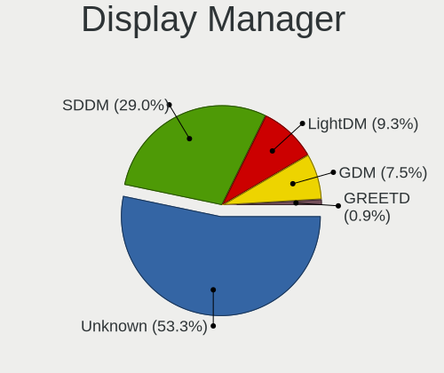
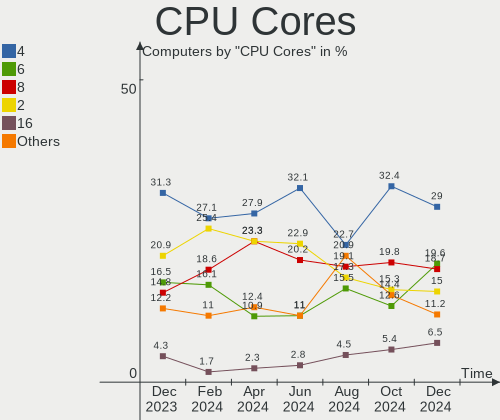

Manjaro Hardware Trends
-----------------------

A project to identify most popular hardware characteristics and track their change
over time based on data collected by Manjaro users at https://Linux-Hardware.org.

Anyone can contribute to the study by uploading probes of their computers by
the [hw-probe](https://github.com/linuxhw/hw-probe) tool:

    sudo -E hw-probe -all -upload

This is a report for all computer types. See also reports for [desktops](/Dist/Manjaro/Desktop/README.md) and [notebooks](/Dist/Manjaro/Notebook/README.md).

Full-feature report is available here: https://linux-hardware.org/?view=trends

Period: Feb, 2021.

Contents
--------

- [ OS                       ](#os)
- [ OS Family                ](#os-family)
- [ Kernel                   ](#kernel)
- [ Kernel Family            ](#kernel-family)
- [ Kernel Major Ver.        ](#kernel-major-ver)
- [ Arch                     ](#arch)
- [ DE                       ](#de)
- [ Display Server           ](#display-server)
- [ Display Manager          ](#display-manager)
- [ OS Lang                  ](#os-lang)
- [ Boot Mode                ](#boot-mode)
- [ Filesystem               ](#filesystem)
- [ Part. scheme             ](#part-scheme)
- [ Dual Boot with Linux/BSD ](#dual-boot-with-linux/bsd)
- [ Dual Boot (Win)          ](#dual-boot-win)
- [ Country                  ](#country)
- [ City                     ](#city)
- [ Vendor                   ](#vendor)
- [ Model                    ](#model)
- [ Model Family             ](#model-family)
- [ MFG Year                 ](#mfg-year)
- [ Form Factor              ](#form-factor)
- [ Secure Boot              ](#secure-boot)
- [ Coreboot                 ](#coreboot)
- [ RAM Size                 ](#ram-size)
- [ RAM Used                 ](#ram-used)
- [ Has CD-ROM               ](#has-cd-rom)
- [ Total Drives             ](#total-drives)
- [ Has Ethernet             ](#has-ethernet)
- [ Drive Vendor             ](#drive-vendor)
- [ Drive Model              ](#drive-model)
- [ HDD Vendor               ](#hdd-vendor)
- [ SSD Vendor               ](#ssd-vendor)
- [ Drive Kind               ](#drive-kind)
- [ Drive Connector          ](#drive-connector)
- [ Drive Size               ](#drive-size)
- [ Space Total              ](#space-total)
- [ Space Used               ](#space-used)
- [ Malfunc. Drives          ](#malfunc-drives)
- [ Malfunc. Drive Vendor    ](#malfunc-drive-vendor)
- [ Malfunc. HDD Vendor      ](#malfunc-hdd-vendor)
- [ Malfunc. Drive Kind      ](#malfunc-drive-kind)
- [ Failed Drives            ](#failed-drives)
- [ Failed Drive Vendor      ](#failed-drive-vendor)
- [ Drive Status             ](#drive-status)
- [ Storage Vendor           ](#storage-vendor)
- [ Storage Model            ](#storage-model)
- [ Storage Kind             ](#storage-kind)
- [ CPU Vendor               ](#cpu-vendor)
- [ CPU Model                ](#cpu-model)
- [ CPU Model Family         ](#cpu-model-family)
- [ CPU Cores                ](#cpu-cores)
- [ CPU Sockets              ](#cpu-sockets)
- [ CPU Threads              ](#cpu-threads)
- [ CPU Op-Modes             ](#cpu-op-modes)
- [ CPU Microcode            ](#cpu-microcode)
- [ CPU Microarch            ](#cpu-microarch)
- [ GPU Vendor               ](#gpu-vendor)
- [ GPU Model                ](#gpu-model)
- [ GPU Combo                ](#gpu-combo)
- [ GPU Driver               ](#gpu-driver)
- [ GPU Memory               ](#gpu-memory)
- [ Monitor Vendor           ](#monitor-vendor)
- [ Monitor Model            ](#monitor-model)
- [ Monitor Resolution       ](#monitor-resolution)
- [ Monitor Diagonal         ](#monitor-diagonal)
- [ Monitor Width            ](#monitor-width)
- [ Aspect Ratio             ](#aspect-ratio)
- [ Monitor Area             ](#monitor-area)
- [ Pixel Density            ](#pixel-density)
- [ Multiple Monitors        ](#multiple-monitors)
- [ Net Controller Vendor    ](#net-controller-vendor)
- [ Net Controller Model     ](#net-controller-model)
- [ Wireless Vendor          ](#wireless-vendor)
- [ Wireless Model           ](#wireless-model)
- [ Ethernet Vendor          ](#ethernet-vendor)
- [ Ethernet Model           ](#ethernet-model)
- [ Net Controller Kind      ](#net-controller-kind)
- [ Used Controller          ](#used-controller)
- [ NICs                     ](#nics)
- [ Memory Vendor            ](#memory-vendor)
- [ Memory Model             ](#memory-model)
- [ Memory Kind              ](#memory-kind)
- [ Memory Form Factor       ](#memory-form-factor)
- [ Memory Size              ](#memory-size)
- [ Memory Speed             ](#memory-speed)
- [ Sound Vendor             ](#sound-vendor)
- [ Sound Model              ](#sound-model)
- [ Camera Vendor            ](#camera-vendor)
- [ Camera Model             ](#camera-model)
- [ Fingerprint Vendor       ](#fingerprint-vendor)
- [ Fingerprint Model        ](#fingerprint-model)
- [ Chipcard Vendor          ](#chipcard-vendor)
- [ Chipcard Model           ](#chipcard-model)
- [ Printer Vendor           ](#printer-vendor)
- [ Printer Model            ](#printer-model)
- [ Scanner Vendor           ](#scanner-vendor)
- [ Scanner Model            ](#scanner-model)
- [ Bluetooth Vendor         ](#bluetooth-vendor)
- [ Bluetooth Model          ](#bluetooth-model)
- [ Unsupported Devices      ](#unsupported-devices)
- [ Unsupported Device Types ](#unsupported-device-types)

OS
--

Installed operating systems

| Name           | Computers | Percent |
|----------------|-----------|---------|
| Manjaro 20.2.1 | 107       | 55.15%  |
| Manjaro        | 84        | 43.3%   |
| Manjaro 20.2   | 2         | 1.03%   |
| Manjaro 19.0.1 | 1         | 0.52%   |

OS Family
---------

OS without a version

| Name    | Computers | Percent |
|---------|-----------|---------|
| Manjaro | 194       | 100%    |

Kernel
------

Version of the Linux kernel

| Version                 | Computers | Percent |
|-------------------------|-----------|---------|
| 5.9.16-1-MANJARO        | 83        | 42.78%  |
| 5.10.15-1-MANJARO       | 37        | 19.07%  |
| 5.10.7-3-MANJARO        | 30        | 15.46%  |
| 5.11.0-1-MANJARO        | 9         | 4.64%   |
| 5.10.13-2-MANJARO       | 7         | 3.61%   |
| 5.4.95-1-MANJARO        | 4         | 2.06%   |
| 5.4.89-1-MANJARO        | 3         | 1.55%   |
| 5.4.85-1-MANJARO        | 2         | 1.03%   |
| 5.10.2-2-MANJARO        | 2         | 1.03%   |
| 5.10.17-1-MANJARO       | 2         | 1.03%   |
| 4.19.160-1-MANJARO      | 2         | 1.03%   |
| 5.9.11-3-MANJARO        | 1         | 0.52%   |
| 5.8.18-1-MANJARO        | 1         | 0.52%   |
| 5.7.0-3-MANJARO         | 1         | 0.52%   |
| 5.4.97-1-MANJARO        | 1         | 0.52%   |
| 5.4.80-2-MANJARO        | 1         | 0.52%   |
| 5.4.64-1-MANJARO        | 1         | 0.52%   |
| 5.4.22-1-MANJARO        | 1         | 0.52%   |
| 5.11.1-1-MANJARO        | 1         | 0.52%   |
| 5.11.0-126-tkg-MuQSS    | 1         | 0.52%   |
| 5.10.18-1-MANJARO       | 1         | 0.52%   |
| 5.10.14-arch1-1-vfio    | 1         | 0.52%   |
| 5.10.10-arch1-1-surface | 1         | 0.52%   |
| 4.19.173-1-MANJARO      | 1         | 0.52%   |

Kernel Family
-------------

Linux kernel without a distro release

| Version  | Computers | Percent |
|----------|-----------|---------|
| 5.9.16   | 83        | 42.78%  |
| 5.10.15  | 37        | 19.07%  |
| 5.10.7   | 30        | 15.46%  |
| 5.11.0   | 10        | 5.15%   |
| 5.10.13  | 7         | 3.61%   |
| 5.4.95   | 4         | 2.06%   |
| 5.4.89   | 3         | 1.55%   |
| 5.4.85   | 2         | 1.03%   |
| 5.10.2   | 2         | 1.03%   |
| 5.10.17  | 2         | 1.03%   |
| 4.19.160 | 2         | 1.03%   |
| 5.9.11   | 1         | 0.52%   |
| 5.8.18   | 1         | 0.52%   |
| 5.7.0    | 1         | 0.52%   |
| 5.4.97   | 1         | 0.52%   |
| 5.4.80   | 1         | 0.52%   |
| 5.4.64   | 1         | 0.52%   |
| 5.4.22   | 1         | 0.52%   |
| 5.11.1   | 1         | 0.52%   |
| 5.10.18  | 1         | 0.52%   |
| 5.10.14  | 1         | 0.52%   |
| 5.10.10  | 1         | 0.52%   |
| 4.19.173 | 1         | 0.52%   |

Kernel Major Ver.
-----------------

Linux kernel major version

| Version | Computers | Percent |
|---------|-----------|---------|
| 5.9     | 84        | 43.3%   |
| 5.10    | 81        | 41.75%  |
| 5.4     | 13        | 6.7%    |
| 5.11    | 11        | 5.67%   |
| 4.19    | 3         | 1.55%   |
| 5.8     | 1         | 0.52%   |
| 5.7     | 1         | 0.52%   |

Arch
----

OS architecture (x86_64, i586, etc.)

| Name   | Computers | Percent |
|--------|-----------|---------|
| x86_64 | 194       | 100%    |

DE
--

Desktop Environment

| Name       | Computers | Percent |
|------------|-----------|---------|
| XFCE       | 46        | 23.71%  |
| KDE5       | 46        | 23.71%  |
| GNOME      | 42        | 21.65%  |
| KDE        | 36        | 18.56%  |
| X-Cinnamon | 5         | 2.58%   |
| MATE       | 4         | 2.06%   |
| Deepin     | 4         | 2.06%   |
| Unknown    | 4         | 2.06%   |
| i3         | 3         | 1.55%   |
| Cinnamon   | 2         | 1.03%   |
| Budgie     | 1         | 0.52%   |
| awesome    | 1         | 0.52%   |

Display Server
--------------

X11 or Wayland

| Name    | Computers | Percent |
|---------|-----------|---------|
| X11     | 170       | 87.63%  |
| Wayland | 20        | 10.31%  |
| Unknown | 4         | 2.06%   |

Display Manager
---------------

SDDM, LightDM, etc.

| Name    | Computers | Percent |
|---------|-----------|---------|
| Unknown | 83        | 42.78%  |
| SDDM    | 49        | 25.26%  |
| LightDM | 40        | 20.62%  |
| GDM     | 20        | 10.31%  |
| TDM     | 2         | 1.03%   |

OS Lang
-------

Language

| Lang    | Computers | Percent |
|---------|-----------|---------|
| en_US   | 88        | 45.36%  |
| de_DE   | 19        | 9.79%   |
| ru_RU   | 15        | 7.73%   |
| pt_BR   | 12        | 6.19%   |
| en_GB   | 10        | 5.15%   |
| fr_FR   | 9         | 4.64%   |
| it_IT   | 8         | 4.12%   |
| es_ES   | 3         | 1.55%   |
| ru_UA   | 2         | 1.03%   |
| pl_PL   | 2         | 1.03%   |
| en_NZ   | 2         | 1.03%   |
| en_IN   | 2         | 1.03%   |
| en_CA   | 2         | 1.03%   |
| en_AU   | 2         | 1.03%   |
| el_GR   | 2         | 1.03%   |
| Unknown | 2         | 1.03%   |
| sv_SE   | 1         | 0.52%   |
| sk_SK   | 1         | 0.52%   |
| ko_KR   | 1         | 0.52%   |
| hu_HU   | 1         | 0.52%   |
| fr_CA   | 1         | 0.52%   |
| fi_FI   | 1         | 0.52%   |
| es_SV   | 1         | 0.52%   |
| es_MX   | 1         | 0.52%   |
| en_ZA   | 1         | 0.52%   |
| en_IL   | 1         | 0.52%   |
| en_IE   | 1         | 0.52%   |
| en_DE   | 1         | 0.52%   |
| de_CH   | 1         | 0.52%   |
| bg_BG   | 1         | 0.52%   |

Boot Mode
---------

EFI or BIOS

| Mode | Computers | Percent |
|------|-----------|---------|
| BIOS | 107       | 55.15%  |
| EFI  | 87        | 44.85%  |

Filesystem
----------

Type of filesystem

| Type    | Computers | Percent |
|---------|-----------|---------|
| Ext4    | 181       | 93.3%   |
| Btrfs   | 8         | 4.12%   |
| Xfs     | 2         | 1.03%   |
| Overlay | 2         | 1.03%   |
| Zfs     | 1         | 0.52%   |

Part. scheme
------------

Scheme of partitioning

| Type    | Computers | Percent |
|---------|-----------|---------|
| GPT     | 94        | 48.45%  |
| Unknown | 82        | 42.27%  |
| MBR     | 18        | 9.28%   |

Dual Boot with Linux/BSD
------------------------

Hosting more than one Linux/BSD

| Dual boot | Computers | Percent |
|-----------|-----------|---------|
| No        | 173       | 89.18%  |
| Yes       | 21        | 10.82%  |

Dual Boot (Win)
---------------

Hosting Linux and Windows

| Dual boot | Computers | Percent |
|-----------|-----------|---------|
| No        | 122       | 62.89%  |
| Yes       | 72        | 37.11%  |

Country
-------

Geographic location (country)

| Country              | Computers | Percent |
|----------------------|-----------|---------|
| USA                  | 24        | 12.37%  |
| Germany              | 24        | 12.37%  |
| Brazil               | 16        | 8.25%   |
| Russia               | 15        | 7.73%   |
| Italy                | 10        | 5.15%   |
| France               | 10        | 5.15%   |
| UK                   | 9         | 4.64%   |
| Mexico               | 7         | 3.61%   |
| Ukraine              | 5         | 2.58%   |
| Canada               | 5         | 2.58%   |
| Bulgaria             | 5         | 2.58%   |
| Poland               | 4         | 2.06%   |
| Belarus              | 4         | 2.06%   |
| Sweden               | 3         | 1.55%   |
| Spain                | 3         | 1.55%   |
| Romania              | 3         | 1.55%   |
| Netherlands          | 3         | 1.55%   |
| Iran                 | 3         | 1.55%   |
| Greece               | 3         | 1.55%   |
| Turkey               | 2         | 1.03%   |
| South Africa         | 2         | 1.03%   |
| New Zealand          | 2         | 1.03%   |
| India                | 2         | 1.03%   |
| Finland              | 2         | 1.03%   |
| Australia            | 2         | 1.03%   |
| Argentina            | 2         | 1.03%   |
| Venezuela            | 1         | 0.52%   |
| UAE                  | 1         | 0.52%   |
| Trinidad and Tobago  | 1         | 0.52%   |
| Switzerland          | 1         | 0.52%   |
| Slovenia             | 1         | 0.52%   |
| Slovakia             | 1         | 0.52%   |
| Serbia               | 1         | 0.52%   |
| Puerto Rico          | 1         | 0.52%   |
| Portugal             | 1         | 0.52%   |
| Norway               | 1         | 0.52%   |
| Moldova, Republic of | 1         | 0.52%   |
| Lithuania            | 1         | 0.52%   |
| Kosovo               | 1         | 0.52%   |
| Korea, Republic of   | 1         | 0.52%   |
| Israel               | 1         | 0.52%   |
| Indonesia            | 1         | 0.52%   |
| Hungary              | 1         | 0.52%   |
| El Salvador          | 1         | 0.52%   |
| Czech Republic       | 1         | 0.52%   |
| Croatia              | 1         | 0.52%   |
| China                | 1         | 0.52%   |
| Belgium              | 1         | 0.52%   |
| Bangladesh           | 1         | 0.52%   |
| Austria              | 1         | 0.52%   |

City
----

Geographic location (city)

| City              | Computers | Percent |
|-------------------|-----------|---------|
| Moscow            | 5         | 2.58%   |
| Berlin            | 4         | 2.06%   |
| Minsk             | 3         | 1.55%   |
| Curitiba          | 3         | 1.55%   |
| St Petersburg     | 2         | 1.03%   |
| Sofia             | 2         | 1.03%   |
| Rio de Janeiro    | 2         | 1.03%   |
| Milan             | 2         | 1.03%   |
| Johannesburg      | 2         | 1.03%   |
| Göttingen        | 2         | 1.03%   |
| Freiburg          | 2         | 1.03%   |
| Florianópolis    | 2         | 1.03%   |
| Brescia           | 2         | 1.03%   |
| Birmingham        | 2         | 1.03%   |
| Zurich            | 1         | 0.52%   |
| Zakotnoye         | 1         | 0.52%   |
| Worksop           | 1         | 0.52%   |
| Whitby            | 1         | 0.52%   |
| West Drayton      | 1         | 0.52%   |
| Warsaw            | 1         | 0.52%   |
| Voskresensk       | 1         | 0.52%   |
| Visakhapatnam     | 1         | 0.52%   |
| Vilnius           | 1         | 0.52%   |
| Ville-Houdlemont  | 1         | 0.52%   |
| Vigo              | 1         | 0.52%   |
| Vienna            | 1         | 0.52%   |
| Varna             | 1         | 0.52%   |
| Vantaa            | 1         | 0.52%   |
| Uppsala           | 1         | 0.52%   |
| Ulyanovsk         | 1         | 0.52%   |
| Tywyn             | 1         | 0.52%   |
| Troyes            | 1         | 0.52%   |
| Trondheim         | 1         | 0.52%   |
| Tehran            | 1         | 0.52%   |
| Tajrīsh          | 1         | 0.52%   |
| Sulingen          | 1         | 0.52%   |
| Streatham         | 1         | 0.52%   |
| Stockholm         | 1         | 0.52%   |
| Stevenage         | 1         | 0.52%   |
| Stadthagen        | 1         | 0.52%   |
| St Louis          | 1         | 0.52%   |
| Shotts            | 1         | 0.52%   |
| Setúbal          | 1         | 0.52%   |
| Serrone           | 1         | 0.52%   |
| Sergach           | 1         | 0.52%   |
| Sao Jose          | 1         | 0.52%   |
| Santa Úrsula     | 1         | 0.52%   |
| San Salvador      | 1         | 0.52%   |
| San Juan del Río | 1         | 0.52%   |
| San Cristóbal    | 1         | 0.52%   |
| San Bernardino    | 1         | 0.52%   |
| Ružomberok       | 1         | 0.52%   |
| Rouen             | 1         | 0.52%   |
| Rotherhithe       | 1         | 0.52%   |
| Rostov-on-Don     | 1         | 0.52%   |
| Rome              | 1         | 0.52%   |
| Rochester         | 1         | 0.52%   |
| Rio Ceballos      | 1         | 0.52%   |
| Rector            | 1         | 0.52%   |
| Razgrad           | 1         | 0.52%   |

Vendor
------

Motherboard manufacturer

| Name                | Computers | Percent |
|---------------------|-----------|---------|
| ASUSTek Computer    | 40        | 20.62%  |
| Lenovo              | 35        | 18.04%  |
| Hewlett-Packard     | 25        | 12.89%  |
| Dell                | 23        | 11.86%  |
| Gigabyte Technology | 16        | 8.25%   |
| MSI                 | 12        | 6.19%   |
| Acer                | 10        | 5.15%   |
| ASRock              | 7         | 3.61%   |
| Samsung Electronics | 5         | 2.58%   |
| HUAWEI              | 3         | 1.55%   |
| Toshiba             | 2         | 1.03%   |
| Packard Bell        | 2         | 1.03%   |
| Fujitsu             | 2         | 1.03%   |
| Apple               | 2         | 1.03%   |
| Razer               | 1         | 0.52%   |
| Notebook            | 1         | 0.52%   |
| Microsoft           | 1         | 0.52%   |
| Intel               | 1         | 0.52%   |
| Huanan              | 1         | 0.52%   |
| Google              | 1         | 0.52%   |
| Gateway             | 1         | 0.52%   |
| ECS                 | 1         | 0.52%   |
| Biostar             | 1         | 0.52%   |
| Alienware           | 1         | 0.52%   |

Model
-----

Motherboard model

| Name                                                  | Computers | Percent |
|-------------------------------------------------------|-----------|---------|
| Samsung 300V3A/300V4A/300V5A/200A4B/200A5B            | 2         | 1.03%   |
| Lenovo Legion 5 15ARH05 82B5                          | 2         | 1.03%   |
| Lenovo IdeaPad L340-15IRH Gaming 81LK                 | 2         | 1.03%   |
| HUAWEI NBLK-WAX9X                                     | 2         | 1.03%   |
| HP Laptop 15-bw0xx                                    | 2         | 1.03%   |
| HP EliteBook 2540p                                    | 2         | 1.03%   |
| ASUS VivoBook_ASUSLaptop X509DAP_M509DA               | 2         | 1.03%   |
| ASUS All Series                                       | 2         | 1.03%   |
| Toshiba Satellite S50-B                               | 1         | 0.52%   |
| Toshiba Satellite L775D                               | 1         | 0.52%   |
| Samsung 850XBC                                        | 1         | 0.52%   |
| Samsung 750XBE/730XBE                                 | 1         | 0.52%   |
| Samsung 340XAA/350XAA/550XAA                          | 1         | 0.52%   |
| Razer Blade 15 Advanced Model (Early 2020) - RZ09-033 | 1         | 0.52%   |
| Packard Bell ipower G5800                             | 1         | 0.52%   |
| Packard Bell EasyNote_ST85-M-001SPD                   | 1         | 0.52%   |
| Notebook N85_N87,HJ,HJ1,HK1                           | 1         | 0.52%   |
| MSI MS-7C96                                           | 1         | 0.52%   |
| MSI MS-7C94                                           | 1         | 0.52%   |
| MSI MS-7C89                                           | 1         | 0.52%   |
| MSI MS-7C51                                           | 1         | 0.52%   |
| MSI MS-7C02                                           | 1         | 0.52%   |
| MSI MS-7B86                                           | 1         | 0.52%   |
| MSI MS-7B45                                           | 1         | 0.52%   |
| MSI MS-7A68                                           | 1         | 0.52%   |
| MSI MS-7979                                           | 1         | 0.52%   |
| MSI MS-7758                                           | 1         | 0.52%   |
| MSI GS66 Stealth 10SGS                                | 1         | 0.52%   |
| MSI GL63 8RC                                          | 1         | 0.52%   |
| Microsoft Surface Pro 2                               | 1         | 0.52%   |
| Lenovo Zhaoyang E49L 20178                            | 1         | 0.52%   |
| Lenovo Z50-70 20354                                   | 1         | 0.52%   |
| Lenovo ThinkStation P340 Tiny 30DFCTO1WW              | 1         | 0.52%   |
| Lenovo ThinkStation D20 415892G                       | 1         | 0.52%   |
| Lenovo ThinkPad X1 Carbon 6th 20KHCTO1WW              | 1         | 0.52%   |
| Lenovo ThinkPad W530 2447H21                          | 1         | 0.52%   |
| Lenovo ThinkPad T460 20FMS2D600                       | 1         | 0.52%   |
| Lenovo ThinkPad T440p 20AWS1XV00                      | 1         | 0.52%   |
| Lenovo ThinkPad T440p 20ANCTO1WW                      | 1         | 0.52%   |
| Lenovo ThinkPad T430 2349D17                          | 1         | 0.52%   |
| Lenovo ThinkPad S1 Yoga 20CD00A5RT                    | 1         | 0.52%   |
| Lenovo ThinkPad Edge E540 20C6005VRT                  | 1         | 0.52%   |
| Lenovo ThinkPad E14 20RA001LMC                        | 1         | 0.52%   |
| Lenovo ThinkCentre M93p 10A8                          | 1         | 0.52%   |
| Lenovo ThinkCentre M920s 10SJ001JPB                   | 1         | 0.52%   |
| Lenovo ThinkCentre M77 2209A12                        | 1         | 0.52%   |
| Lenovo ThinkBook 15-IIL 20SM                          | 1         | 0.52%   |
| Lenovo ThinkBook 14-IML 20RV                          | 1         | 0.52%   |
| Lenovo Legion 5 82B5                                  | 1         | 0.52%   |
| Lenovo Legion 5 15IMH05 82AU                          | 1         | 0.52%   |
| Lenovo IdeaPad Z510 20287                             | 1         | 0.52%   |
| Lenovo IdeaPad S145-15API 81V7                        | 1         | 0.52%   |
| Lenovo IdeaPad Flex 5 14ARE05 81X2                    | 1         | 0.52%   |
| Lenovo IdeaPad 3 15IIL05 81WE                         | 1         | 0.52%   |
| Lenovo IdeaPad 3 14ADA05 81W0                         | 1         | 0.52%   |
| Lenovo IdeaPad 110-15ISK 80UD                         | 1         | 0.52%   |
| Lenovo IdeaPad 1 14ADA05 82GW                         | 1         | 0.52%   |
| Lenovo H520e 10159                                    | 1         | 0.52%   |
| Lenovo G580 20150                                     | 1         | 0.52%   |
| Lenovo Board                                          | 1         | 0.52%   |

Model Family
------------

Motherboard model prefix

| Name                  | Computers | Percent |
|-----------------------|-----------|---------|
| Lenovo ThinkPad       | 9         | 4.64%   |
| Lenovo IdeaPad        | 9         | 4.64%   |
| Dell Inspiron         | 7         | 3.61%   |
| Acer Aspire           | 7         | 3.61%   |
| Dell Latitude         | 6         | 3.09%   |
| Dell XPS              | 5         | 2.58%   |
| ASUS VivoBook         | 5         | 2.58%   |
| ASUS TUF              | 5         | 2.58%   |
| ASUS ROG              | 5         | 2.58%   |
| Lenovo Legion         | 4         | 2.06%   |
| HP ProBook            | 4         | 2.06%   |
| HP Laptop             | 4         | 2.06%   |
| HP EliteBook          | 4         | 2.06%   |
| Lenovo ThinkCentre    | 3         | 1.55%   |
| Dell Vostro           | 3         | 1.55%   |
| ASUS PRIME            | 3         | 1.55%   |
| Toshiba Satellite     | 2         | 1.03%   |
| Samsung 300V3A        | 2         | 1.03%   |
| Lenovo ThinkStation   | 2         | 1.03%   |
| Lenovo ThinkBook      | 2         | 1.03%   |
| HUAWEI NBLK-WAX9X     | 2         | 1.03%   |
| HP Compaq             | 2         | 1.03%   |
| Gigabyte B450M        | 2         | 1.03%   |
| Gigabyte B450         | 2         | 1.03%   |
| Dell OptiPlex         | 2         | 1.03%   |
| ASUS ZenBook          | 2         | 1.03%   |
| ASUS Maximus          | 2         | 1.03%   |
| ASUS M5A97            | 2         | 1.03%   |
| ASUS All              | 2         | 1.03%   |
| Acer TravelMate       | 2         | 1.03%   |
| Samsung 850XBC        | 1         | 0.52%   |
| Samsung 750XBE        | 1         | 0.52%   |
| Samsung 340XAA        | 1         | 0.52%   |
| Razer Blade           | 1         | 0.52%   |
| Packard Bell ipower   | 1         | 0.52%   |
| Packard Bell EasyNote | 1         | 0.52%   |
| Notebook N85          | 1         | 0.52%   |
| MSI MS-7C96           | 1         | 0.52%   |
| MSI MS-7C94           | 1         | 0.52%   |
| MSI MS-7C89           | 1         | 0.52%   |
| MSI MS-7C51           | 1         | 0.52%   |
| MSI MS-7C02           | 1         | 0.52%   |
| MSI MS-7B86           | 1         | 0.52%   |
| MSI MS-7B45           | 1         | 0.52%   |
| MSI MS-7A68           | 1         | 0.52%   |
| MSI MS-7979           | 1         | 0.52%   |
| MSI MS-7758           | 1         | 0.52%   |
| MSI GS66              | 1         | 0.52%   |
| MSI GL63              | 1         | 0.52%   |
| Microsoft Surface     | 1         | 0.52%   |
| Lenovo Zhaoyang       | 1         | 0.52%   |
| Lenovo Z50-70         | 1         | 0.52%   |
| Lenovo H520e          | 1         | 0.52%   |
| Lenovo G580           | 1         | 0.52%   |
| Lenovo Board          | 1         | 0.52%   |
| Lenovo 7033EW4        | 1         | 0.52%   |
| Intel X99             | 1         | 0.52%   |
| HUAWEI HN-WX9X        | 1         | 0.52%   |
| Huanan X99-F8         | 1         | 0.52%   |
| HP ZBook              | 1         | 0.52%   |

MFG Year
--------

Motherboard manufacture year

| Year | Computers | Percent |
|------|-----------|---------|
| 2020 | 72        | 37.11%  |
| 2019 | 28        | 14.43%  |
| 2018 | 22        | 11.34%  |
| 2013 | 13        | 6.7%    |
| 2014 | 12        | 6.19%   |
| 2011 | 9         | 4.64%   |
| 2015 | 7         | 3.61%   |
| 2017 | 6         | 3.09%   |
| 2012 | 6         | 3.09%   |
| 2010 | 5         | 2.58%   |
| 2016 | 4         | 2.06%   |
| 2008 | 4         | 2.06%   |
| 2007 | 4         | 2.06%   |
| 2021 | 1         | 0.52%   |
| 2009 | 1         | 0.52%   |

Form Factor
-----------

Physical design of the computer

| Name        | Computers | Percent |
|-------------|-----------|---------|
| Notebook    | 107       | 55.15%  |
| Desktop     | 78        | 40.21%  |
| Convertible | 5         | 2.58%   |
| Mini pc     | 2         | 1.03%   |
| Tablet      | 1         | 0.52%   |
| All in one  | 1         | 0.52%   |

Secure Boot
-----------

Enabled or disabled

| State    | Computers | Percent |
|----------|-----------|---------|
| Disabled | 194       | 100%    |

Coreboot
--------

Have coreboot on board

| Used | Computers | Percent |
|------|-----------|---------|
| No   | 193       | 99.48%  |
| Yes  | 1         | 0.52%   |

RAM Size
--------

Total RAM memory

| Size in GB  | Computers | Percent |
|-------------|-----------|---------|
| 16.01-24.0  | 52        | 26.8%   |
| 4.01-8.0    | 44        | 22.68%  |
| 8.01-16.0   | 34        | 17.53%  |
| 3.01-4.0    | 27        | 13.92%  |
| 32.01-64.0  | 20        | 10.31%  |
| 64.01-256.0 | 8         | 4.12%   |
| 24.01-32.0  | 5         | 2.58%   |
| 1.01-2.0    | 3         | 1.55%   |
| 0.51-1.0    | 1         | 0.52%   |

RAM Used
--------

Used RAM memory

| Used GB    | Computers | Percent |
|------------|-----------|---------|
| 1.01-2.0   | 57        | 29.38%  |
| 2.01-3.0   | 45        | 23.2%   |
| 4.01-8.0   | 37        | 19.07%  |
| 3.01-4.0   | 35        | 18.04%  |
| 8.01-16.0  | 10        | 5.15%   |
| 0.51-1.0   | 8         | 4.12%   |
| 32.01-64.0 | 1         | 0.52%   |
| 16.01-24.0 | 1         | 0.52%   |

Has CD-ROM
----------

Has CD-ROM on board

| Presented | Computers | Percent |
|-----------|-----------|---------|
| No        | 131       | 67.53%  |
| Yes       | 63        | 32.47%  |

Total Drives
------------

Number of drives on board

| Drives | Computers | Percent |
|--------|-----------|---------|
| 1      | 90        | 46.39%  |
| 2      | 58        | 29.9%   |
| 3      | 22        | 11.34%  |
| 4      | 12        | 6.19%   |
| 5      | 6         | 3.09%   |
| 6      | 4         | 2.06%   |
| 0      | 2         | 1.03%   |

Has Ethernet
------------

Has Ethernet on board

| Presented | Computers | Percent |
|-----------|-----------|---------|
| Yes       | 163       | 84.02%  |
| No        | 31        | 15.98%  |

Drive Vendor
------------

Hard drive vendors

| Vendor                    | Computers | Drives | Percent |
|---------------------------|-----------|--------|---------|
| WDC                       | 49        | 60     | 14.89%  |
| Samsung Electronics       | 48        | 55     | 14.59%  |
| Seagate                   | 46        | 58     | 13.98%  |
| Sandisk                   | 26        | 27     | 7.9%    |
| Crucial                   | 23        | 30     | 6.99%   |
| Toshiba                   | 20        | 23     | 6.08%   |
| Kingston                  | 17        | 18     | 5.17%   |
| HGST                      | 14        | 15     | 4.26%   |
| Intel                     | 12        | 12     | 3.65%   |
| Hitachi                   | 9         | 9      | 2.74%   |
| Unknown                   | 8         | 9      | 2.43%   |
| Micron Technology         | 6         | 7      | 1.82%   |
| A-DATA Technology         | 6         | 6      | 1.82%   |
| XPG                       | 5         | 5      | 1.52%   |
| LITEONIT                  | 5         | 5      | 1.52%   |
| SK Hynix                  | 4         | 4      | 1.22%   |
| China                     | 4         | 4      | 1.22%   |
| Silicon Motion            | 3         | 3      | 0.91%   |
| GOODRAM                   | 3         | 3      | 0.91%   |
| TO Exter                  | 2         | 2      | 0.61%   |
| PNY                       | 2         | 2      | 0.61%   |
| LITEON                    | 2         | 2      | 0.61%   |
| USB3.0                    | 1         | 1      | 0.3%    |
| Union Memory              | 1         | 1      | 0.3%    |
| SPCC                      | 1         | 1      | 0.3%    |
| Realtek Semiconductor     | 1         | 1      | 0.3%    |
| Realtek                   | 1         | 1      | 0.3%    |
| Phison                    | 1         | 1      | 0.3%    |
| Patriot                   | 1         | 1      | 0.3%    |
| OCZ                       | 1         | 1      | 0.3%    |
| Micron/Crucial Technology | 1         | 1      | 0.3%    |
| KingDian                  | 1         | 1      | 0.3%    |
| JMicron                   | 1         | 1      | 0.3%    |
| Fujitsu                   | 1         | 1      | 0.3%    |
| Corsair                   | 1         | 1      | 0.3%    |
| ATOM                      | 1         | 1      | 0.3%    |
| Apacer                    | 1         | 1      | 0.3%    |

Drive Model
-----------

Hard drive models

| Model                               | Computers | Percent |
|-------------------------------------|-----------|---------|
| Sandisk NVMe SSD Drive 256GB        | 5         | 1.37%   |
| HGST HTS725050A7E630 500GB          | 5         | 1.37%   |
| Toshiba MQ01ABD100 1TB              | 4         | 1.1%    |
| HGST HTS721010A9E630 1TB            | 4         | 1.1%    |
| Crucial CT500MX500SSD1 500GB        | 4         | 1.1%    |
| Crucial CT240BX500SSD1 240GB        | 4         | 1.1%    |
| WDC WD10SPZX-24Z10 1TB              | 3         | 0.82%   |
| Toshiba HDWD110 1TB                 | 3         | 0.82%   |
| Seagate ST2000DX002-2DV164 2TB      | 3         | 0.82%   |
| Seagate ST1000DM010-2EP102 1TB      | 3         | 0.82%   |
| Sandisk NVMe SSD Drive 512GB        | 3         | 0.82%   |
| Sandisk NVMe SSD Drive 1TB          | 3         | 0.82%   |
| Samsung SSD 860 EVO 500GB           | 3         | 0.82%   |
| Samsung SSD 850 EVO 500GB           | 3         | 0.82%   |
| Samsung NVMe SSD Drive 500GB        | 3         | 0.82%   |
| Samsung NVMe SSD Drive 1TB          | 3         | 0.82%   |
| Kingston SV300S37A120G 120GB SSD    | 3         | 0.82%   |
| Kingston SA400S37240G 240GB SSD     | 3         | 0.82%   |
| Crucial CT500MX200SSD1 500GB        | 3         | 0.82%   |
| A-DATA SU650 240GB SSD              | 3         | 0.82%   |
| XPG NVMe SSD Drive 512GB            | 2         | 0.55%   |
| XPG NVMe SSD Drive 1024GB           | 2         | 0.55%   |
| WDC WDS500G3X0C-00SJG0 500GB        | 2         | 0.55%   |
| WDC WD40EFRX-68WT0N0 4TB            | 2         | 0.55%   |
| WDC WD3200AAJS-00L7A0 320GB         | 2         | 0.55%   |
| WDC WD20EZRZ-00Z5HB0 2TB            | 2         | 0.55%   |
| Unknown MMC Card  32GB              | 2         | 0.55%   |
| Unknown MMC Card  16GB              | 2         | 0.55%   |
| Toshiba MQ04ABF100 1TB              | 2         | 0.55%   |
| Toshiba DT01ACA200 2TB              | 2         | 0.55%   |
| TO Exter nal USB 3.0 1TB            | 2         | 0.55%   |
| Seagate ST500LM012 HN-M500MBB 500GB | 2         | 0.55%   |
| Seagate ST500DM002-1BD142 500GB     | 2         | 0.55%   |
| Seagate ST3500418AS 500GB           | 2         | 0.55%   |
| Seagate ST3000DM001-1CH166 3TB      | 2         | 0.55%   |
| Seagate ST1000LM035-1RK172 1TB      | 2         | 0.55%   |
| Seagate ST1000LM014-1EJ164 1TB      | 2         | 0.55%   |
| Seagate ST1000DM003-1SB102 1TB      | 2         | 0.55%   |
| Seagate Expansion 500GB             | 2         | 0.55%   |
| Sandisk NVMe SSD Drive 500GB        | 2         | 0.55%   |
| Samsung SSD 840 EVO 250GB           | 2         | 0.55%   |
| Samsung SSD 830 Series 128GB        | 2         | 0.55%   |
| Samsung NVMe SSD Drive 512GB        | 2         | 0.55%   |
| Samsung NVMe SSD Drive 250GB        | 2         | 0.55%   |
| Micron MTFDHBA256TDV 256GB          | 2         | 0.55%   |
| Intel NVMe SSD Drive 1024GB         | 2         | 0.55%   |
| HGST HTS545050A7E680 500GB          | 2         | 0.55%   |
| Crucial CT480BX500SSD1 480GB        | 2         | 0.55%   |
| Crucial CT240M500SSD1 240GB         | 2         | 0.55%   |
| Crucial CT120BX500SSD1 120GB        | 2         | 0.55%   |
| Crucial CT1000MX500SSD4 1TB         | 2         | 0.55%   |
| Crucial CT1000MX500SSD1 1TB         | 2         | 0.55%   |
| China SSD 512GB                     | 2         | 0.55%   |
| XPG SPECTRIX S40G 512GB             | 1         | 0.27%   |
| WDC WDS250G2B0A-00SM50 250GB SSD    | 1         | 0.27%   |
| WDC WDS240G2G0B-00EPW0 240GB SSD    | 1         | 0.27%   |
| WDC WDS120G2G0B-00EPW0 120GB SSD    | 1         | 0.27%   |
| WDC WDS100T2B0C-00PXH0 1TB          | 1         | 0.27%   |
| WDC WDS100T2B0A-00SM50 1TB SSD      | 1         | 0.27%   |
| WDC WD7500AALX-009BA0 752GB         | 1         | 0.27%   |

HDD Vendor
----------

Hard disk drive vendors

| Vendor              | Computers | Drives | Percent |
|---------------------|-----------|--------|---------|
| Seagate             | 44        | 54     | 33.08%  |
| WDC                 | 41        | 50     | 30.83%  |
| Toshiba             | 17        | 17     | 12.78%  |
| HGST                | 14        | 15     | 10.53%  |
| Hitachi             | 9         | 9      | 6.77%   |
| Samsung Electronics | 4         | 6      | 3.01%   |
| TO Exter            | 2         | 2      | 1.5%    |
| USB3.0              | 1         | 1      | 0.75%   |
| Fujitsu             | 1         | 1      | 0.75%   |

SSD Vendor
----------

Solid state drive vendors

| Vendor              | Computers | Drives | Percent |
|---------------------|-----------|--------|---------|
| Samsung Electronics | 22        | 25     | 21.15%  |
| Crucial             | 21        | 28     | 20.19%  |
| Kingston            | 14        | 15     | 13.46%  |
| SanDisk             | 12        | 12     | 11.54%  |
| LITEONIT            | 5         | 5      | 4.81%   |
| WDC                 | 4         | 4      | 3.85%   |
| China               | 4         | 4      | 3.85%   |
| A-DATA Technology   | 4         | 4      | 3.85%   |
| GOODRAM             | 3         | 3      | 2.88%   |
| Toshiba             | 2         | 3      | 1.92%   |
| PNY                 | 2         | 2      | 1.92%   |
| Micron Technology   | 2         | 2      | 1.92%   |
| Intel               | 2         | 2      | 1.92%   |
| SK Hynix            | 1         | 1      | 0.96%   |
| Patriot             | 1         | 1      | 0.96%   |
| OCZ                 | 1         | 1      | 0.96%   |
| LITEON              | 1         | 1      | 0.96%   |
| KingDian            | 1         | 1      | 0.96%   |
| Corsair             | 1         | 1      | 0.96%   |
| Apacer              | 1         | 1      | 0.96%   |

Drive Kind
----------

HDD or SSD

| Kind    | Computers | Drives | Percent |
|---------|-----------|--------|---------|
| HDD     | 104       | 155    | 36.36%  |
| SSD     | 89        | 116    | 31.12%  |
| NVMe    | 81        | 89     | 28.32%  |
| MMC     | 7         | 8      | 2.45%   |
| Unknown | 5         | 6      | 1.75%   |

Drive Connector
---------------

SATA, SAS, NVMe, etc.

| Type | Computers | Drives | Percent |
|------|-----------|--------|---------|
| SATA | 146       | 263    | 59.11%  |
| NVMe | 81        | 88     | 32.79%  |
| SAS  | 13        | 15     | 5.26%   |
| MMC  | 7         | 8      | 2.83%   |

Drive Size
----------

Size of hard drive

| Size in TB | Computers | Drives | Percent |
|------------|-----------|--------|---------|
| 0.01-0.5   | 109       | 151    | 52.66%  |
| 0.51-1.0   | 70        | 83     | 33.82%  |
| 1.01-2.0   | 18        | 23     | 8.7%    |
| 4.01-10.0  | 5         | 7      | 2.42%   |
| 3.01-4.0   | 3         | 5      | 1.45%   |
| 2.01-3.0   | 2         | 2      | 0.97%   |

Space Total
-----------

Amount of disk space available on the file system

| Size in GB     | Computers | Percent |
|----------------|-----------|---------|
| 101-250        | 46        | 23.71%  |
| 251-500        | 43        | 22.16%  |
| 501-1000       | 29        | 14.95%  |
| 1001-2000      | 25        | 12.89%  |
| More than 3000 | 13        | 6.7%    |
| 51-100         | 12        | 6.19%   |
| 2001-3000      | 10        | 5.15%   |
| Unknown        | 8         | 4.12%   |
| 21-50          | 6         | 3.09%   |
| 1-20           | 2         | 1.03%   |

Space Used
----------

Amount of used disk space

| Used GB        | Computers | Percent |
|----------------|-----------|---------|
| 1-20           | 45        | 23.2%   |
| 21-50          | 31        | 15.98%  |
| 101-250        | 31        | 15.98%  |
| 251-500        | 23        | 11.86%  |
| 51-100         | 23        | 11.86%  |
| 501-1000       | 16        | 8.25%   |
| 1001-2000      | 8         | 4.12%   |
| Unknown        | 8         | 4.12%   |
| More than 3000 | 6         | 3.09%   |
| 2001-3000      | 3         | 1.55%   |

Malfunc. Drives
---------------

Drive models with a malfunction

| Model                             | Computers | Drives | Percent |
|-----------------------------------|-----------|--------|---------|
| HGST HTS725050A7E630 500GB        | 2         | 2      | 11.11%  |
| Crucial CT240M500SSD1 240GB       | 2         | 2      | 11.11%  |
| WDC WDS240G2G0B-00EPW0 240GB SSD  | 1         | 1      | 5.56%   |
| WDC WD3200AAJS-00L7A0 320GB       | 1         | 1      | 5.56%   |
| WDC WD10JPVX-75JC3T0 1TB          | 1         | 1      | 5.56%   |
| WDC WD10EARS-22Y5B1 1TB           | 1         | 1      | 5.56%   |
| WDC WD1001FALS-00J7B0 1TB         | 1         | 1      | 5.56%   |
| Toshiba MQ01ABD100 1TB            | 1         | 1      | 5.56%   |
| Seagate ST8000VN0022-2EL112 8TB   | 1         | 1      | 5.56%   |
| Seagate ST2000DM001-9YN164 2TB    | 1         | 1      | 5.56%   |
| Seagate ST1000LM014-1EJ164 1TB    | 1         | 1      | 5.56%   |
| Hitachi HDS721050CLA660 500GB     | 1         | 1      | 5.56%   |
| HGST HTS545050A7E680 500GB        | 1         | 1      | 5.56%   |
| Crucial M4-CT256M4SSD3 256GB      | 1         | 1      | 5.56%   |
| Corsair Neutron GTX SSD 240GB     | 1         | 1      | 5.56%   |
| A-DATA Technology SU650 240GB SSD | 1         | 1      | 5.56%   |

Malfunc. Drive Vendor
---------------------

Vendors of faulty drives

| Vendor            | Computers | Drives | Percent |
|-------------------|-----------|--------|---------|
| WDC               | 5         | 5      | 27.78%  |
| Seagate           | 3         | 3      | 16.67%  |
| HGST              | 3         | 3      | 16.67%  |
| Crucial           | 3         | 3      | 16.67%  |
| Toshiba           | 1         | 1      | 5.56%   |
| Hitachi           | 1         | 1      | 5.56%   |
| Corsair           | 1         | 1      | 5.56%   |
| A-DATA Technology | 1         | 1      | 5.56%   |

Malfunc. HDD Vendor
-------------------

Vendors of faulty HDD drives

| Vendor  | Computers | Drives | Percent |
|---------|-----------|--------|---------|
| WDC     | 4         | 4      | 33.33%  |
| Seagate | 3         | 3      | 25%     |
| HGST    | 3         | 3      | 25%     |
| Toshiba | 1         | 1      | 8.33%   |
| Hitachi | 1         | 1      | 8.33%   |

Malfunc. Drive Kind
-------------------

Kinds of faulty drives

| Kind | Computers | Drives | Percent |
|------|-----------|--------|---------|
| HDD  | 12        | 12     | 66.67%  |
| SSD  | 6         | 6      | 33.33%  |

Failed Drives
-------------

Failed drive models

| Model                                | Computers | Drives | Percent |
|--------------------------------------|-----------|--------|---------|
| WDC PC SN520 SDAPNUW-256G-1102 256GB | 1         | 1      | 100%    |

Failed Drive Vendor
-------------------

Failed drive vendors

| Vendor | Computers | Drives | Percent |
|--------|-----------|--------|---------|
| WDC    | 1         | 1      | 100%    |

Drive Status
------------

Number of failed and malfunc. drives

| Status   | Computers | Drives | Percent |
|----------|-----------|--------|---------|
| Detected | 123       | 229    | 57.75%  |
| Works    | 72        | 126    | 33.8%   |
| Malfunc  | 17        | 18     | 7.98%   |
| Failed   | 1         | 1      | 0.47%   |

Storage Vendor
--------------

Storage controller vendors

| Vendor                       | Computers | Percent |
|------------------------------|-----------|---------|
| Intel                        | 121       | 45.32%  |
| AMD                          | 57        | 21.35%  |
| Samsung Electronics          | 22        | 8.24%   |
| Sandisk                      | 20        | 7.49%   |
| Marvell Technology Group     | 5         | 1.87%   |
| JMicron Technology           | 5         | 1.87%   |
| ADATA Technology             | 5         | 1.87%   |
| Micron Technology            | 4         | 1.5%    |
| Toshiba America Info Systems | 3         | 1.12%   |
| SK Hynix                     | 3         | 1.12%   |
| Silicon Motion               | 3         | 1.12%   |
| Realtek Semiconductor        | 3         | 1.12%   |
| Micron/Crucial Technology    | 3         | 1.12%   |
| Kingston Technology Company  | 3         | 1.12%   |
| Phison Electronics           | 2         | 0.75%   |
| Nvidia                       | 2         | 0.75%   |
| ASMedia Technology           | 2         | 0.75%   |
| Union Memory (Shenzhen)      | 1         | 0.37%   |
| Seagate Technology           | 1         | 0.37%   |
| Lite-On Technology           | 1         | 0.37%   |
| Adaptec                      | 1         | 0.37%   |

Storage Model
-------------

Storage controller models

| Model                                                                            | Computers | Percent |
|----------------------------------------------------------------------------------|-----------|---------|
| AMD FCH SATA Controller [AHCI mode]                                              | 39        | 12.7%   |
| Samsung NVMe SSD Controller SM981/PM981/PM983                                    | 18        | 5.86%   |
| Intel 8 Series/C220 Series Chipset Family 6-port SATA Controller 1 [AHCI mode]   | 13        | 4.23%   |
| Intel Sunrise Point-LP SATA Controller [AHCI mode]                               | 12        | 3.91%   |
| Intel 82801 Mobile SATA Controller [RAID mode]                                   | 10        | 3.26%   |
| Intel 7 Series Chipset Family 6-port SATA Controller [AHCI mode]                 | 9         | 2.93%   |
| AMD SB7x0/SB8x0/SB9x0 SATA Controller [AHCI mode]                                | 8         | 2.61%   |
| AMD 400 Series Chipset SATA Controller                                           | 8         | 2.61%   |
| Intel 8 Series SATA Controller 1 [AHCI mode]                                     | 7         | 2.28%   |
| Sandisk WD Blue SN550 NVMe SSD                                                   | 6         | 1.95%   |
| Intel SSD 660P Series                                                            | 6         | 1.95%   |
| Sandisk WD Blue SN500 / PC SN520 NVMe SSD                                        | 5         | 1.63%   |
| Intel 400 Series Chipset Family SATA AHCI Controller                             | 5         | 1.63%   |
| ADATA XPG SX8200 Pro PCIe Gen3x4 M.2 2280 Solid State Drive                      | 5         | 1.63%   |
| Sandisk WD Black SN750 / PC SN730 NVMe SSD                                       | 4         | 1.3%    |
| Micron Non-Volatile memory controller                                            | 4         | 1.3%    |
| Intel Cannon Point-LP SATA Controller [AHCI Mode]                                | 4         | 1.3%    |
| Intel C610/X99 series chipset sSATA Controller [AHCI mode]                       | 4         | 1.3%    |
| Intel 7 Series/C210 Series Chipset Family 6-port SATA Controller [AHCI mode]     | 4         | 1.3%    |
| AMD SATA controller                                                              | 4         | 1.3%    |
| AMD FCH SATA Controller D                                                        | 4         | 1.3%    |
| Silicon Motion SM2263EN/SM2263XT SSD Controller                                  | 3         | 0.98%   |
| Realtek RTS5763DL NVMe SSD Controller                                            | 3         | 0.98%   |
| Kingston Company A2000 NVMe SSD                                                  | 3         | 0.98%   |
| Intel SATA Controller [RAID mode]                                                | 3         | 0.98%   |
| Intel HM170/QM170 Chipset SATA Controller [AHCI Mode]                            | 3         | 0.98%   |
| Intel Comet Lake SATA AHCI Controller                                            | 3         | 0.98%   |
| Intel Cannon Lake PCH SATA AHCI Controller                                       | 3         | 0.98%   |
| Intel Cannon Lake Mobile PCH SATA AHCI Controller                                | 3         | 0.98%   |
| Intel C610/X99 series chipset 6-Port SATA Controller [AHCI mode]                 | 3         | 0.98%   |
| Intel 6 Series/C200 Series Chipset Family 6 port Desktop SATA AHCI Controller    | 3         | 0.98%   |
| Intel 5 Series/3400 Series Chipset 6 port SATA AHCI Controller                   | 3         | 0.98%   |
| AMD SB7x0/SB8x0/SB9x0 IDE Controller                                             | 3         | 0.98%   |
| AMD 300 Series Chipset SATA Controller                                           | 3         | 0.98%   |
| Toshiba America Info Systems XG6 NVMe SSD Controller                             | 2         | 0.65%   |
| Sandisk WD Black 2018/SN750 / PC SN720 NVMe SSD                                  | 2         | 0.65%   |
| Sandisk PC SN520 NVMe SSD                                                        | 2         | 0.65%   |
| Samsung NVMe SSD Controller SM961/PM961/SM963                                    | 2         | 0.65%   |
| Micron/Crucial P1 NVMe PCIe SSD                                                  | 2         | 0.65%   |
| JMicron JMB362 SATA Controller                                                   | 2         | 0.65%   |
| Intel Wildcat Point-LP SATA Controller [AHCI Mode]                               | 2         | 0.65%   |
| Intel Q170/Q150/B150/H170/H110/Z170/CM236 Chipset SATA Controller [AHCI Mode]    | 2         | 0.65%   |
| Intel NM10/ICH7 Family SATA Controller [IDE mode]                                | 2         | 0.65%   |
| Intel Ice Lake-LP SATA Controller [AHCI mode]                                    | 2         | 0.65%   |
| Intel 9 Series Chipset Family SATA Controller [AHCI Mode]                        | 2         | 0.65%   |
| Intel 82801JI (ICH10 Family) SATA AHCI Controller                                | 2         | 0.65%   |
| Intel 82801IR/IO/IH (ICH9R/DO/DH) 4 port SATA Controller [IDE mode]              | 2         | 0.65%   |
| Intel 82801I (ICH9 Family) 2 port SATA Controller [IDE mode]                     | 2         | 0.65%   |
| Intel 82801G (ICH7 Family) IDE Controller                                        | 2         | 0.65%   |
| Intel 6 Series/C200 Series Chipset Family 6 port Mobile SATA AHCI Controller     | 2         | 0.65%   |
| Intel 5 Series/3400 Series Chipset 4 port SATA IDE Controller                    | 2         | 0.65%   |
| Intel 5 Series/3400 Series Chipset 2 port SATA IDE Controller                    | 2         | 0.65%   |
| ASMedia ASM1062 Serial ATA Controller                                            | 2         | 0.65%   |
| AMD FCH IDE Controller                                                           | 2         | 0.65%   |
| Union Memory (Shenzhen) Non-Volatile memory controller                           | 1         | 0.33%   |
| Toshiba America Info Systems Toshiba America Info Non-Volatile memory controller | 1         | 0.33%   |
| SK Hynix PC300 NVMe Solid State Drive 512GB                                      | 1         | 0.33%   |
| SK Hynix BC511                                                                   | 1         | 0.33%   |
| SK Hynix BC501 NVMe Solid State Drive 512GB                                      | 1         | 0.33%   |
| Seagate Non-Volatile memory controller                                           | 1         | 0.33%   |

Storage Kind
------------

Kind of storage controller (IDE, SATA, NVMe, SAS, ...)

| Kind | Computers | Percent |
|------|-----------|---------|
| SATA | 149       | 55.81%  |
| NVMe | 80        | 29.96%  |
| IDE  | 21        | 7.87%   |
| RAID | 17        | 6.37%   |

CPU Vendor
----------

Processor vendors

| Vendor | Computers | Percent |
|--------|-----------|---------|
| Intel  | 128       | 65.98%  |
| AMD    | 66        | 34.02%  |

CPU Model
---------

Processor models

| Model                                           | Computers | Percent |
|-------------------------------------------------|-----------|---------|
| AMD Ryzen 5 3600 6-Core Processor               | 6         | 3.09%   |
| AMD Ryzen 5 3500U with Radeon Vega Mobile Gfx   | 6         | 3.09%   |
| Intel Core i7-10510U CPU @ 1.80GHz              | 5         | 2.58%   |
| Intel Core i5-8265U CPU @ 1.60GHz               | 5         | 2.58%   |
| Intel Core i5-4200M CPU @ 2.50GHz               | 5         | 2.58%   |
| Intel Core i7-8565U CPU @ 1.80GHz               | 3         | 1.55%   |
| Intel Core i7-8550U CPU @ 1.80GHz               | 3         | 1.55%   |
| Intel Core i5-7200U CPU @ 2.50GHz               | 3         | 1.55%   |
| Intel Core i5-4210U CPU @ 1.70GHz               | 3         | 1.55%   |
| AMD Ryzen 5 4500U with Radeon Graphics          | 3         | 1.55%   |
| AMD Ryzen 5 2600 Six-Core Processor             | 3         | 1.55%   |
| Intel Core i7-8750H CPU @ 2.20GHz               | 2         | 1.03%   |
| Intel Core i7-7700HQ CPU @ 2.80GHz              | 2         | 1.03%   |
| Intel Core i7-10875H CPU @ 2.30GHz              | 2         | 1.03%   |
| Intel Core i7-10750H CPU @ 2.60GHz              | 2         | 1.03%   |
| Intel Core i5-9300H CPU @ 2.40GHz               | 2         | 1.03%   |
| Intel Core i5-8250U CPU @ 1.60GHz               | 2         | 1.03%   |
| Intel Core i5-4570 CPU @ 3.20GHz                | 2         | 1.03%   |
| Intel Core i5-2400 CPU @ 3.10GHz                | 2         | 1.03%   |
| Intel Core i5-10400 CPU @ 2.90GHz               | 2         | 1.03%   |
| Intel Core i5-1035G1 CPU @ 1.00GHz              | 2         | 1.03%   |
| AMD Ryzen 7 4800H with Radeon Graphics          | 2         | 1.03%   |
| AMD Ryzen 7 3800X 8-Core Processor              | 2         | 1.03%   |
| AMD Ryzen 7 3700X 8-Core Processor              | 2         | 1.03%   |
| AMD Ryzen 5 5600X 6-Core Processor              | 2         | 1.03%   |
| AMD Ryzen 5 4600H with Radeon Graphics          | 2         | 1.03%   |
| AMD Ryzen 5 1600X Six-Core Processor            | 2         | 1.03%   |
| AMD Ryzen 3 3250U with Radeon Graphics          | 2         | 1.03%   |
| AMD A12-9720P RADEON R7, 12 COMPUTE CORES 4C+8G | 2         | 1.03%   |
| Intel Xeon CPU X5670 @ 2.93GHz                  | 1         | 0.52%   |
| Intel Xeon CPU X5570 @ 2.93GHz                  | 1         | 0.52%   |
| Intel Xeon CPU E5-2680 v4 @ 2.40GHz             | 1         | 0.52%   |
| Intel Xeon CPU E5-2620 v3 @ 2.40GHz             | 1         | 0.52%   |
| Intel Pentium Dual-Core CPU E5700 @ 3.00GHz     | 1         | 0.52%   |
| Intel Pentium CPU N3710 @ 1.60GHz               | 1         | 0.52%   |
| Intel Pentium CPU G3258 @ 3.20GHz               | 1         | 0.52%   |
| Intel Pentium CPU G3220 @ 3.00GHz               | 1         | 0.52%   |
| Intel Pentium CPU 2020M @ 2.40GHz               | 1         | 0.52%   |
| Intel Core i9-10900 CPU @ 2.80GHz               | 1         | 0.52%   |
| Intel Core i7-9750H CPU @ 2.60GHz               | 1         | 0.52%   |
| Intel Core i7-8700K CPU @ 3.70GHz               | 1         | 0.52%   |
| Intel Core i7-8700 CPU @ 3.20GHz                | 1         | 0.52%   |
| Intel Core i7-8665U CPU @ 1.90GHz               | 1         | 0.52%   |
| Intel Core i7-8086K CPU @ 4.00GHz               | 1         | 0.52%   |
| Intel Core i7-7700K CPU @ 4.20GHz               | 1         | 0.52%   |
| Intel Core i7-7500U CPU @ 2.70GHz               | 1         | 0.52%   |
| Intel Core i7-6700K CPU @ 4.00GHz               | 1         | 0.52%   |
| Intel Core i7-6700HQ CPU @ 2.60GHz              | 1         | 0.52%   |
| Intel Core i7-5930K CPU @ 3.50GHz               | 1         | 0.52%   |
| Intel Core i7-5820K CPU @ 3.30GHz               | 1         | 0.52%   |
| Intel Core i7-5500U CPU @ 2.40GHz               | 1         | 0.52%   |
| Intel Core i7-4790 CPU @ 3.60GHz                | 1         | 0.52%   |
| Intel Core i7-4770K CPU @ 3.50GHz               | 1         | 0.52%   |
| Intel Core i7-4720HQ CPU @ 2.60GHz              | 1         | 0.52%   |
| Intel Core i7-4710MQ CPU @ 2.50GHz              | 1         | 0.52%   |
| Intel Core i7-4610M CPU @ 3.00GHz               | 1         | 0.52%   |
| Intel Core i7-4600U CPU @ 2.10GHz               | 1         | 0.52%   |
| Intel Core i7-4500U CPU @ 1.80GHz               | 1         | 0.52%   |
| Intel Core i7-3820QM CPU @ 2.70GHz              | 1         | 0.52%   |
| Intel Core i7-3770K CPU @ 3.50GHz               | 1         | 0.52%   |

CPU Model Family
----------------

Processor model prefix

| Model                   | Computers | Percent |
|-------------------------|-----------|---------|
| Intel Core i5           | 49        | 25.26%  |
| Intel Core i7           | 48        | 24.74%  |
| AMD Ryzen 5             | 29        | 14.95%  |
| Intel Core i3           | 9         | 4.64%   |
| AMD Ryzen 7             | 8         | 4.12%   |
| AMD FX                  | 5         | 2.58%   |
| Intel Xeon              | 4         | 2.06%   |
| Intel Pentium           | 4         | 2.06%   |
| Intel Core 2 Duo        | 4         | 2.06%   |
| Intel Celeron           | 3         | 1.55%   |
| AMD Ryzen 3             | 3         | 1.55%   |
| AMD Athlon              | 3         | 1.55%   |
| Intel Core 2 Quad       | 2         | 1.03%   |
| Intel Core 2            | 2         | 1.03%   |
| AMD Turion 64 X2 Mobile | 2         | 1.03%   |
| AMD Ryzen 7 PRO         | 2         | 1.03%   |
| AMD E1                  | 2         | 1.03%   |
| AMD A12                 | 2         | 1.03%   |
| Other                   | 1         | 0.52%   |
| Intel Pentium Dual-Core | 1         | 0.52%   |
| Intel Core i9           | 1         | 0.52%   |
| AMD Ryzen Threadripper  | 1         | 0.52%   |
| AMD Ryzen 9             | 1         | 0.52%   |
| AMD E2                  | 1         | 0.52%   |
| AMD E                   | 1         | 0.52%   |
| AMD Athlon X4           | 1         | 0.52%   |
| AMD Athlon II X4        | 1         | 0.52%   |
| AMD Athlon II           | 1         | 0.52%   |
| AMD Athlon 64 X2        | 1         | 0.52%   |
| AMD A6                  | 1         | 0.52%   |
| AMD A4                  | 1         | 0.52%   |

CPU Cores
---------

Number of processor cores

| Number | Computers | Percent |
|--------|-----------|---------|
| 4      | 72        | 37.11%  |
| 2      | 66        | 34.02%  |
| 6      | 36        | 18.56%  |
| 8      | 13        | 6.7%    |
| 12     | 2         | 1.03%   |
| 16     | 1         | 0.52%   |
| 14     | 1         | 0.52%   |
| 10     | 1         | 0.52%   |
| 3      | 1         | 0.52%   |
| 1      | 1         | 0.52%   |

CPU Sockets
-----------

Number of sockets

| Number | Computers | Percent |
|--------|-----------|---------|
| 1      | 192       | 98.97%  |
| 2      | 2         | 1.03%   |

CPU Threads
-----------

Threads per core (Hyper-Threading)

| Number | Computers | Percent |
|--------|-----------|---------|
| 2      | 153       | 78.87%  |
| 1      | 41        | 21.13%  |

CPU Op-Modes
------------

CPU Operation Modes (32-bit, 64-bit)

| Op mode        | Computers | Percent |
|----------------|-----------|---------|
| 32-bit, 64-bit | 194       | 100%    |

CPU Microcode
-------------

Microcode number

| Number     | Computers | Percent |
|------------|-----------|---------|
| Unknown    | 89        | 45.88%  |
| 0x08701021 | 9         | 4.64%   |
| 0x306c3    | 8         | 4.12%   |
| 0x906ea    | 7         | 3.61%   |
| 0x806ec    | 7         | 3.61%   |
| 0x08108109 | 7         | 3.61%   |
| 0x806ea    | 5         | 2.58%   |
| 0x40651    | 5         | 2.58%   |
| 0x306a9    | 5         | 2.58%   |
| 0x08600103 | 4         | 2.06%   |
| 0x206a7    | 3         | 1.55%   |
| 0x20655    | 3         | 1.55%   |
| 0xa0653    | 2         | 1.03%   |
| 0xa0652    | 2         | 1.03%   |
| 0x906e9    | 2         | 1.03%   |
| 0x6f2      | 2         | 1.03%   |
| 0x506e3    | 2         | 1.03%   |
| 0x306f2    | 2         | 1.03%   |
| 0x1067a    | 2         | 1.03%   |
| 0x0a201009 | 2         | 1.03%   |
| 0x08108102 | 2         | 1.03%   |
| 0x806eb    | 1         | 0.52%   |
| 0x806e9    | 1         | 0.52%   |
| 0x706e5    | 1         | 0.52%   |
| 0x406f1    | 1         | 0.52%   |
| 0x406e3    | 1         | 0.52%   |
| 0x406c4    | 1         | 0.52%   |
| 0x306d4    | 1         | 0.52%   |
| 0x106e5    | 1         | 0.52%   |
| 0x10676    | 1         | 0.52%   |
| 0x08701013 | 1         | 0.52%   |
| 0x08600106 | 1         | 0.52%   |
| 0x08600102 | 1         | 0.52%   |
| 0x08200103 | 1         | 0.52%   |
| 0x0810100b | 1         | 0.52%   |
| 0x0800820d | 1         | 0.52%   |
| 0x08001138 | 1         | 0.52%   |
| 0x07000110 | 1         | 0.52%   |
| 0x0700010f | 1         | 0.52%   |
| 0x06006705 | 1         | 0.52%   |
| 0x0600611a | 1         | 0.52%   |
| 0x06006118 | 1         | 0.52%   |
| 0x06000852 | 1         | 0.52%   |
| 0x06000629 | 1         | 0.52%   |
| 0x05000119 | 1         | 0.52%   |

CPU Microarch
-------------

Microarchitecture

| Name        | Computers | Percent |
|-------------|-----------|---------|
| KabyLake    | 41        | 21.13%  |
| Haswell     | 26        | 13.4%   |
| Zen 2       | 20        | 10.31%  |
| Zen+        | 16        | 8.25%   |
| IvyBridge   | 12        | 6.19%   |
| CometLake   | 9         | 4.64%   |
| Zen         | 7         | 3.61%   |
| SandyBridge | 7         | 3.61%   |
| Penryn      | 7         | 3.61%   |
| Westmere    | 5         | 2.58%   |
| Skylake     | 5         | 2.58%   |
| Piledriver  | 5         | 2.58%   |
| Broadwell   | 4         | 2.06%   |
| Nehalem     | 3         | 1.55%   |
| K8 Hammer   | 3         | 1.55%   |
| IceLake     | 3         | 1.55%   |
| Excavator   | 3         | 1.55%   |
| Unknown     | 3         | 1.55%   |
| Silvermont  | 2         | 1.03%   |
| K10         | 2         | 1.03%   |
| Jaguar      | 2         | 1.03%   |
| Core        | 2         | 1.03%   |
| Bulldozer   | 2         | 1.03%   |
| Bobcat      | 2         | 1.03%   |
| TigerLake   | 1         | 0.52%   |
| K10 Llano   | 1         | 0.52%   |
| Goldmont    | 1         | 0.52%   |

GPU Vendor
----------

Vendors of graphics cards

| Vendor | Computers | Percent |
|--------|-----------|---------|
| Intel  | 95        | 40.6%   |
| Nvidia | 77        | 32.91%  |
| AMD    | 62        | 26.5%   |

GPU Model
---------

Graphics card models

| Model                                                                                    | Computers | Percent |
|------------------------------------------------------------------------------------------|-----------|---------|
| AMD Picasso                                                                              | 11        | 4.58%   |
| Intel WhiskeyLake-U GT2 [UHD Graphics 620]                                               | 10        | 4.17%   |
| Intel 4th Gen Core Processor Integrated Graphics Controller                              | 8         | 3.33%   |
| Intel Haswell-ULT Integrated Graphics Controller                                         | 7         | 2.92%   |
| Intel CometLake-S GT2 [UHD Graphics 630]                                                 | 7         | 2.92%   |
| Intel 3rd Gen Core processor Graphics Controller                                         | 7         | 2.92%   |
| AMD Renoir                                                                               | 7         | 2.92%   |
| Intel UHD Graphics 620                                                                   | 6         | 2.5%    |
| Intel CometLake-U GT2 [UHD Graphics]                                                     | 6         | 2.5%    |
| AMD Ellesmere [Radeon RX 470/480/570/570X/580/580X/590]                                  | 6         | 2.5%    |
| Intel Xeon E3-1200 v3/4th Gen Core Processor Integrated Graphics Controller              | 5         | 2.08%   |
| Intel HD Graphics 620                                                                    | 5         | 2.08%   |
| Nvidia GK208B [GeForce GT 710]                                                           | 4         | 1.67%   |
| Intel CoffeeLake-H GT2 [UHD Graphics 630]                                                | 4         | 1.67%   |
| AMD Navi 10 [Radeon RX 5600 OEM/5600 XT / 5700/5700 XT]                                  | 4         | 1.67%   |
| Nvidia GP108 [GeForce GT 1030]                                                           | 3         | 1.25%   |
| Nvidia GP104 [GeForce GTX 1080]                                                          | 3         | 1.25%   |
| Intel Core Processor Integrated Graphics Controller                                      | 3         | 1.25%   |
| Intel CometLake-H GT2 [UHD Graphics]                                                     | 3         | 1.25%   |
| Intel 2nd Generation Core Processor Family Integrated Graphics Controller                | 3         | 1.25%   |
| Nvidia TU117M [GeForce GTX 1650 Ti Mobile]                                               | 2         | 0.83%   |
| Nvidia TU117M [GeForce GTX 1650 Mobile / Max-Q]                                          | 2         | 0.83%   |
| Nvidia TU117M                                                                            | 2         | 0.83%   |
| Nvidia TU117 [GeForce GTX 1650]                                                          | 2         | 0.83%   |
| Nvidia TU106 [GeForce RTX 2060 SUPER]                                                    | 2         | 0.83%   |
| Nvidia TU104M [GeForce RTX 2080 SUPER Mobile / Max-Q]                                    | 2         | 0.83%   |
| Nvidia GT218 [GeForce 8400 GS Rev. 3]                                                    | 2         | 0.83%   |
| Nvidia GP107M [GeForce GTX 1050 Ti Mobile]                                               | 2         | 0.83%   |
| Nvidia GP107M [GeForce GTX 1050 Mobile]                                                  | 2         | 0.83%   |
| Nvidia GP107 [GeForce GTX 1050 Ti]                                                       | 2         | 0.83%   |
| Nvidia GP106 [GeForce GTX 1060 3GB]                                                      | 2         | 0.83%   |
| Nvidia GP102 [GeForce GTX 1080 Ti]                                                       | 2         | 0.83%   |
| Nvidia GM206 [GeForce GTX 950]                                                           | 2         | 0.83%   |
| Nvidia GM204M [GeForce GTX 970M]                                                         | 2         | 0.83%   |
| Nvidia GM108M [GeForce 940MX]                                                            | 2         | 0.83%   |
| Nvidia GM108M [GeForce 930MX]                                                            | 2         | 0.83%   |
| Nvidia GK208M [GeForce GT 740M]                                                          | 2         | 0.83%   |
| Nvidia GF117M [GeForce 610M/710M/810M/820M / GT 620M/625M/630M/720M]                     | 2         | 0.83%   |
| Nvidia GA104 [GeForce RTX 3070]                                                          | 2         | 0.83%   |
| Intel Xeon E3-1200 v2/3rd Gen Core processor Graphics Controller                         | 2         | 0.83%   |
| Intel Skylake GT2 [HD Graphics 520]                                                      | 2         | 0.83%   |
| Intel Mobile 945GM/GMS/GME, 943/940GML Express Integrated Graphics Controller            | 2         | 0.83%   |
| Intel Mobile 945GM/GMS, 943/940GML Express Integrated Graphics Controller                | 2         | 0.83%   |
| Intel Iris Plus Graphics G1 (Ice Lake)                                                   | 2         | 0.83%   |
| Intel HD Graphics 630                                                                    | 2         | 0.83%   |
| Intel HD Graphics 5500                                                                   | 2         | 0.83%   |
| Intel Atom/Celeron/Pentium Processor x5-E8000/J3xxx/N3xxx Integrated Graphics Controller | 2         | 0.83%   |
| Intel 4 Series Chipset Integrated Graphics Controller                                    | 2         | 0.83%   |
| AMD Wani [Radeon R5/R6/R7 Graphics]                                                      | 2         | 0.83%   |
| AMD Vega 10 XL/XT [Radeon RX Vega 56/64]                                                 | 2         | 0.83%   |
| AMD Topaz XT [Radeon R7 M260/M265 / M340/M360 / M440/M445 / 530/535 / 620/625 Mobile]    | 2         | 0.83%   |
| AMD Lexa PRO [Radeon 540/540X/550/550X / RX 540X/550/550X]                               | 2         | 0.83%   |
| Nvidia TU116 [GeForce GTX 1660 Ti]                                                       | 1         | 0.42%   |
| Nvidia TU116 [GeForce GTX 1660 SUPER]                                                    | 1         | 0.42%   |
| Nvidia TU106M [GeForce RTX 2060 Mobile]                                                  | 1         | 0.42%   |
| Nvidia TU106M [GeForce RTX 2060 Max-Q]                                                   | 1         | 0.42%   |
| Nvidia TU106BM [GeForce RTX 2060 Mobile]                                                 | 1         | 0.42%   |
| Nvidia GT218 [GeForce 210]                                                               | 1         | 0.42%   |
| Nvidia GT216 [GeForce GT 220]                                                            | 1         | 0.42%   |
| Nvidia GP108M [GeForce MX250]                                                            | 1         | 0.42%   |

GPU Combo
---------

Combinations of graphics cards

| Name           | Computers | Percent |
|----------------|-----------|---------|
| 1 x Intel      | 61        | 31.44%  |
| 1 x AMD        | 48        | 24.74%  |
| 1 x Nvidia     | 42        | 21.65%  |
| Intel + Nvidia | 28        | 14.43%  |
| Intel + AMD    | 6         | 3.09%   |
| AMD + Nvidia   | 5         | 2.58%   |
| 2 x Nvidia     | 2         | 1.03%   |
| 2 x AMD        | 2         | 1.03%   |

GPU Driver
----------

Free vs proprietary

| Driver      | Computers | Percent |
|-------------|-----------|---------|
| Free        | 148       | 76.29%  |
| Proprietary | 46        | 23.71%  |

GPU Memory
----------

Total video memory

| Size in GB | Computers | Percent |
|------------|-----------|---------|
| Unknown    | 117       | 60.31%  |
| 1.01-2.0   | 19        | 9.79%   |
| 7.01-8.0   | 13        | 6.7%    |
| 3.01-4.0   | 13        | 6.7%    |
| 0.51-1.0   | 13        | 6.7%    |
| 0.01-0.5   | 13        | 6.7%    |
| 5.01-6.0   | 6         | 3.09%   |

Monitor Vendor
--------------

Monitor vendors

| Vendor                  | Computers | Percent |
|-------------------------|-----------|---------|
| Samsung Electronics     | 34        | 14.35%  |
| AU Optronics            | 27        | 11.39%  |
| BOE                     | 25        | 10.55%  |
| LG Display              | 18        | 7.59%   |
| Chimei Innolux          | 18        | 7.59%   |
| Goldstar                | 15        | 6.33%   |
| BenQ                    | 9         | 3.8%    |
| Hewlett-Packard         | 7         | 2.95%   |
| Dell                    | 7         | 2.95%   |
| Acer                    | 7         | 2.95%   |
| Lenovo                  | 6         | 2.53%   |
| Philips                 | 5         | 2.11%   |
| AOC                     | 5         | 2.11%   |
| Sharp                   | 4         | 1.69%   |
| ASUSTek Computer        | 4         | 1.69%   |
| Ancor Communications    | 4         | 1.69%   |
| LG Electronics          | 3         | 1.27%   |
| ViewSonic               | 2         | 0.84%   |
| MSI                     | 2         | 0.84%   |
| IBM                     | 2         | 0.84%   |
| Chi Mei Optoelectronics | 2         | 0.84%   |
| Belinea                 | 2         | 0.84%   |
| Apple                   | 2         | 0.84%   |
| ___                     | 1         | 0.42%   |
| Vizio                   | 1         | 0.42%   |
| Vestel                  | 1         | 0.42%   |
| Unknown                 | 1         | 0.42%   |
| Toshiba                 | 1         | 0.42%   |
| Sony                    | 1         | 0.42%   |
| SEE                     | 1         | 0.42%   |
| Sceptre Tech            | 1         | 0.42%   |
| PKB                     | 1         | 0.42%   |
| PANDA                   | 1         | 0.42%   |
| Panasonic               | 1         | 0.42%   |
| NEC Computers           | 1         | 0.42%   |
| Microstep               | 1         | 0.42%   |
| Medion                  | 1         | 0.42%   |
| LG Philips              | 1         | 0.42%   |
| KTC                     | 1         | 0.42%   |
| KDC                     | 1         | 0.42%   |
| InnoLux Display         | 1         | 0.42%   |
| Iiyama                  | 1         | 0.42%   |
| HPN                     | 1         | 0.42%   |
| HKC                     | 1         | 0.42%   |
| HannStar                | 1         | 0.42%   |
| FUS                     | 1         | 0.42%   |
| Fujitsu Siemens         | 1         | 0.42%   |
| BOE Technology Group    | 1         | 0.42%   |
| AUS                     | 1         | 0.42%   |
| ALP                     | 1         | 0.42%   |

Monitor Model
-------------

Monitor models

| Model                                                                                 | Computers | Percent |
|---------------------------------------------------------------------------------------|-----------|---------|
| Samsung Electronics LCD Monitor SEC324A 1366x768 344x194mm 15.5-inch                  | 2         | 0.81%   |
| Samsung Electronics C32F391 SAM0D35 1920x1080 698x393mm 31.5-inch                     | 2         | 0.81%   |
| Samsung Electronics C24F390 SAM0D2C 1920x1080 520x290mm 23.4-inch                     | 2         | 0.81%   |
| MSI Optix AG32C MSI1462 1920x1080 700x390mm 31.5-inch                                 | 2         | 0.81%   |
| Goldstar LG ULTRAWIDE GSM59F1 1920x1080 580x240mm 24.7-inch                           | 2         | 0.81%   |
| Goldstar FULL HD GSM5B55 1920x1080 480x270mm 21.7-inch                                | 2         | 0.81%   |
| Chimei Innolux LCD Monitor CMN15F5 1920x1080 344x193mm 15.5-inch                      | 2         | 0.81%   |
| Chimei Innolux LCD Monitor CMN14D4 1920x1080 309x173mm 13.9-inch                      | 2         | 0.81%   |
| BOE LCD Monitor BOE0903 1920x1080 344x194mm 15.5-inch                                 | 2         | 0.81%   |
| BOE LCD Monitor BOE0700 1920x1080 344x194mm 15.5-inch                                 | 2         | 0.81%   |
| AU Optronics LCD Monitor AUO80EC 1366x768 344x193mm 15.5-inch                         | 2         | 0.81%   |
| AU Optronics LCD Monitor AUO38ED 1920x1080 340x190mm 15.3-inch                        | 2         | 0.81%   |
| AU Optronics LCD Monitor 1920x1080                                                    | 2         | 0.81%   |
| ___ Monitor ranges (GTF): 48-62Hz V, 14-68kHz H, max dotclock 150MHz ___9000 1440x900 | 1         | 0.4%    |
| Vizio E371VL VIZ0090 1920x1080 820x460mm 37.0-inch                                    | 1         | 0.4%    |
| ViewSonic LCD Monitor VX2457                                                          | 1         | 0.4%    |
| ViewSonic LCD Monitor VX2450 SERIES 1920x1080                                         | 1         | 0.4%    |
| Vestel LCD Monitor 55UHD_LCD_TV 3840x2160                                             | 1         | 0.4%    |
| Unknown LCDTV16 9000 1360x768 1600x900mm 72.3-inch                                    | 1         | 0.4%    |
| Toshiba TV TSB1205 1920x540                                                           | 1         | 0.4%    |
| Sony TV *00 SNY4B04 3840x2160 1600x900mm 72.3-inch                                    | 1         | 0.4%    |
| Sharp LCD Monitor SHP14FA 3840x2400 288x180mm 13.4-inch                               | 1         | 0.4%    |
| Sharp LCD Monitor SHP14D6 3840x2400 366x229mm 17.0-inch                               | 1         | 0.4%    |
| Sharp LCD Monitor SHP14AE 1920x1080 294x165mm 13.3-inch                               | 1         | 0.4%    |
| Sharp LCD Monitor SHP1453 1920x1080 346x194mm 15.6-inch                               | 1         | 0.4%    |
| SEE SEEYOO SEE3130 1280x1024 698x392mm 31.5-inch                                      | 1         | 0.4%    |
| Sceptre Tech E275W-1920 SPT0ABF 1920x1080 443x249mm 20.0-inch                         | 1         | 0.4%    |
| Samsung Electronics U32H85x SAM0E3C 3840x2160 697x392mm 31.5-inch                     | 1         | 0.4%    |
| Samsung Electronics T23C350 SAM0ABC 1920x1080 510x287mm 23.0-inch                     | 1         | 0.4%    |
| Samsung Electronics SyncMaster SAM05C4 1920x1080 510x287mm 23.0-inch                  | 1         | 0.4%    |
| Samsung Electronics SyncMaster SAM0472 1440x900 367x229mm 17.0-inch                   | 1         | 0.4%    |
| Samsung Electronics SyncMaster SAM030D 1680x1050 474x296mm 22.0-inch                  | 1         | 0.4%    |
| Samsung Electronics SMT22A550 SAM07AF 1920x1080 477x268mm 21.5-inch                   | 1         | 0.4%    |
| Samsung Electronics SMS23A350H SAM07D4 1920x1080 510x290mm 23.1-inch                  | 1         | 0.4%    |
| Samsung Electronics SMFX2490HD SAM074A 1920x1080 530x300mm 24.0-inch                  | 1         | 0.4%    |
| Samsung Electronics SMB2270HD SAM070C 1920x1080 476x268mm 21.5-inch                   | 1         | 0.4%    |
| Samsung Electronics SMB2230HD SAM070B 1920x1080 476x268mm 21.5-inch                   | 1         | 0.4%    |
| Samsung Electronics S27E500 SAM0D0D 1920x1080 600x340mm 27.2-inch                     | 1         | 0.4%    |
| Samsung Electronics S24R35x SAM100E 1920x1080 530x300mm 24.0-inch                     | 1         | 0.4%    |
| Samsung Electronics S24C450 SAM09CA 1920x1080 531x299mm 24.0-inch                     | 1         | 0.4%    |
| Samsung Electronics S22B350 SAM08D4 1920x1080 480x270mm 21.7-inch                     | 1         | 0.4%    |
| Samsung Electronics LCD Monitor SyncMaster 3200x1080                                  | 1         | 0.4%    |
| Samsung Electronics LCD Monitor SEC5448 1920x1080 344x194mm 15.5-inch                 | 1         | 0.4%    |
| Samsung Electronics LCD Monitor SEC4D45 1280x800 331x207mm 15.4-inch                  | 1         | 0.4%    |
| Samsung Electronics LCD Monitor SEC4B41 1280x800 261x163mm 12.1-inch                  | 1         | 0.4%    |
| Samsung Electronics LCD Monitor SEC364C 1366x768 309x174mm 14.0-inch                  | 1         | 0.4%    |
| Samsung Electronics LCD Monitor SEC3245 1366x768 344x194mm 15.5-inch                  | 1         | 0.4%    |
| Samsung Electronics LCD Monitor SEC3242 1920x1080 230x130mm 10.4-inch                 | 1         | 0.4%    |
| Samsung Electronics LCD Monitor SDC4C51 1366x768 344x194mm 15.5-inch                  | 1         | 0.4%    |
| Samsung Electronics LCD Monitor SDC4751 1366x768 344x194mm 15.5-inch                  | 1         | 0.4%    |
| Samsung Electronics LCD Monitor SAM065D 1920x1080                                     | 1         | 0.4%    |
| Samsung Electronics LC27RG50 SAM100A 1920x1080 532x304mm 24.1-inch                    | 1         | 0.4%    |
| Samsung Electronics LC27RG50 SAM1009 1920x1080 530x300mm 24.0-inch                    | 1         | 0.4%    |
| Samsung Electronics Color LCD SDCA029 2160x1440 252x168mm 11.9-inch                   | 1         | 0.4%    |
| Samsung Electronics C34H89x SAM0E25 3440x1440 797x333mm 34.0-inch                     | 1         | 0.4%    |
| Samsung Electronics C27JG5x SAM0F58 2560x1440 597x336mm 27.0-inch                     | 1         | 0.4%    |
| Samsung Electronics C27JG5x SAM0F56 2560x1440 597x336mm 27.0-inch                     | 1         | 0.4%    |
| Samsung Electronics C27F390 SAM0D32 1920x1080 600x340mm 27.2-inch                     | 1         | 0.4%    |
| PKB LCD Monitor Viseo 223Ws                                                           | 1         | 0.4%    |
| Philips PHL 277E7 PHLC0FE 1920x1080 600x340mm 27.2-inch                               | 1         | 0.4%    |

Monitor Resolution
------------------

Monitor screen resolution

| Resolution         | Computers | Percent |
|--------------------|-----------|---------|
| 1920x1080 (FHD)    | 107       | 47.56%  |
| 1366x768 (WXGA)    | 32        | 14.22%  |
| 2560x1440 (QHD)    | 10        | 4.44%   |
| 3840x2160 (4K)     | 8         | 3.56%   |
| 1440x900 (WXGA+)   | 8         | 3.56%   |
| Unknown            | 8         | 3.56%   |
| 1600x900 (HD+)     | 7         | 3.11%   |
| 3440x1440          | 5         | 2.22%   |
| 1920x1200 (WUXGA)  | 5         | 2.22%   |
| 1280x800 (WXGA)    | 5         | 2.22%   |
| 2560x1080          | 4         | 1.78%   |
| 1680x1050 (WSXGA+) | 4         | 1.78%   |
| 1280x1024 (SXGA)   | 4         | 1.78%   |
| 3840x1080          | 3         | 1.33%   |
| 1360x768           | 3         | 1.33%   |
| 3840x2400          | 2         | 0.89%   |
| 1600x1200          | 2         | 0.89%   |
| 5760x1080          | 1         | 0.44%   |
| 3280x1050          | 1         | 0.44%   |
| 3200x1080          | 1         | 0.44%   |
| 2720x1024          | 1         | 0.44%   |
| 2640x1050          | 1         | 0.44%   |
| 2160x1440          | 1         | 0.44%   |
| 1920x540           | 1         | 0.44%   |
| 1024x768 (XGA)     | 1         | 0.44%   |

Monitor Diagonal
----------------

Diagonal size in inches

| Inches  | Computers | Percent |
|---------|-----------|---------|
| 15      | 60        | 25.86%  |
| 24      | 21        | 9.05%   |
| 13      | 21        | 9.05%   |
| Unknown | 19        | 8.19%   |
| 27      | 17        | 7.33%   |
| 23      | 14        | 6.03%   |
| 14      | 14        | 6.03%   |
| 21      | 11        | 4.74%   |
| 34      | 9         | 3.88%   |
| 31      | 7         | 3.02%   |
| 17      | 7         | 3.02%   |
| 20      | 5         | 2.16%   |
| 19      | 5         | 2.16%   |
| 12      | 5         | 2.16%   |
| 18      | 4         | 1.72%   |
| 32      | 3         | 1.29%   |
| 11      | 3         | 1.29%   |
| 72      | 2         | 0.86%   |
| 22      | 2         | 0.86%   |
| 42      | 1         | 0.43%   |
| 37      | 1         | 0.43%   |
| 10      | 1         | 0.43%   |

Monitor Width
-------------

Physical width

| Width in mm | Computers | Percent |
|-------------|-----------|---------|
| 301-350     | 86        | 38.22%  |
| 501-600     | 46        | 20.44%  |
| 401-500     | 23        | 10.22%  |
| 201-300     | 19        | 8.44%   |
| Unknown     | 19        | 8.44%   |
| 701-800     | 12        | 5.33%   |
| 351-400     | 9         | 4%      |
| 601-700     | 7         | 3.11%   |
| 1501-2000   | 2         | 0.89%   |
| 801-900     | 1         | 0.44%   |
| 901-1000    | 1         | 0.44%   |

Aspect Ratio
------------

Proportional relationship between the width and the height

| Ratio   | Computers | Percent |
|---------|-----------|---------|
| 16/9    | 151       | 72.95%  |
| 16/10   | 22        | 10.63%  |
| Unknown | 16        | 7.73%   |
| 21/9    | 9         | 4.35%   |
| 5/4     | 3         | 1.45%   |
| 4/3     | 3         | 1.45%   |
| 6/5     | 1         | 0.48%   |
| 32/9    | 1         | 0.48%   |
| 3/2     | 1         | 0.48%   |

Monitor Area
------------

Area in inch²

| Area in inch² | Computers | Percent |
|----------------|-----------|---------|
| 101-110        | 58        | 25.66%  |
| 201-250        | 33        | 14.6%   |
| 81-90          | 25        | 11.06%  |
| 351-500        | 19        | 8.41%   |
| Unknown        | 19        | 8.41%   |
| 301-350        | 17        | 7.52%   |
| 151-200        | 11        | 4.87%   |
| 71-80          | 10        | 4.42%   |
| 251-300        | 9         | 3.98%   |
| 61-70          | 5         | 2.21%   |
| 141-150        | 4         | 1.77%   |
| 121-130        | 4         | 1.77%   |
| 51-60          | 3         | 1.33%   |
| More than 1000 | 2         | 0.88%   |
| 131-140        | 2         | 0.88%   |
| 501-1000       | 2         | 0.88%   |
| 91-100         | 2         | 0.88%   |
| 41-50          | 1         | 0.44%   |

Pixel Density
-------------

Pixels per inch

| Density       | Computers | Percent |
|---------------|-----------|---------|
| 51-100        | 70        | 31.53%  |
| 121-160       | 65        | 29.28%  |
| 101-120       | 51        | 22.97%  |
| Unknown       | 19        | 8.56%   |
| 161-240       | 11        | 4.95%   |
| More than 240 | 4         | 1.8%    |
| 1-50          | 2         | 0.9%    |

Multiple Monitors
-----------------

Total monitors connected

| Total | Computers | Percent |
|-------|-----------|---------|
| 1     | 144       | 74.23%  |
| 2     | 43        | 22.16%  |
| 3     | 7         | 3.61%   |

Net Controller Vendor
---------------------

Controller vendors

| Vendor                          | Computers | Percent |
|---------------------------------|-----------|---------|
| Realtek Semiconductor           | 112       | 39.16%  |
| Intel                           | 94        | 32.87%  |
| Qualcomm Atheros                | 27        | 9.44%   |
| Broadcom Inc. and subsidiaries  | 18        | 6.29%   |
| Broadcom Limited                | 6         | 2.1%    |
| TP-Link                         | 4         | 1.4%    |
| Marvell Technology Group        | 3         | 1.05%   |
| Ralink Technology               | 2         | 0.7%    |
| Nvidia                          | 2         | 0.7%    |
| Dell                            | 2         | 0.7%    |
| Sierra Wireless                 | 1         | 0.35%   |
| Ralink                          | 1         | 0.35%   |
| Qualcomm Atheros Communications | 1         | 0.35%   |
| Motorola PCS                    | 1         | 0.35%   |
| Microsoft                       | 1         | 0.35%   |
| MediaTek                        | 1         | 0.35%   |
| Linksys                         | 1         | 0.35%   |
| ICS Advent                      | 1         | 0.35%   |
| Huawei Technologies             | 1         | 0.35%   |
| Hewlett-Packard                 | 1         | 0.35%   |
| Google                          | 1         | 0.35%   |
| DisplayLink                     | 1         | 0.35%   |
| D-Link System                   | 1         | 0.35%   |
| Broadcom                        | 1         | 0.35%   |
| ASUSTek Computer                | 1         | 0.35%   |
| Aquantia                        | 1         | 0.35%   |

Net Controller Model
--------------------

Controller models

| Model                                                                     | Computers | Percent |
|---------------------------------------------------------------------------|-----------|---------|
| Realtek RTL8111/8168/8411 PCI Express Gigabit Ethernet Controller         | 79        | 23.65%  |
| Intel Wi-Fi 6 AX200                                                       | 16        | 4.79%   |
| Realtek RTL810xE PCI Express Fast Ethernet controller                     | 12        | 3.59%   |
| Intel Wireless 7260                                                       | 9         | 2.69%   |
| Qualcomm Atheros QCA6174 802.11ac Wireless Network Adapter                | 8         | 2.4%    |
| Realtek RTL8821CE 802.11ac PCIe Wireless Network Adapter                  | 7         | 2.1%    |
| Intel Wireless 8265 / 8275                                                | 7         | 2.1%    |
| Qualcomm Atheros QCA9377 802.11ac Wireless Network Adapter                | 6         | 1.8%    |
| Intel Ethernet Connection I217-LM                                         | 6         | 1.8%    |
| Intel Cannon Point-LP CNVi [Wireless-AC]                                  | 6         | 1.8%    |
| Intel 82579LM Gigabit Network Connection (Lewisville)                     | 6         | 1.8%    |
| Realtek RTL8822CE 802.11ac PCIe Wireless Network Adapter                  | 5         | 1.5%    |
| Intel I211 Gigabit Network Connection                                     | 5         | 1.5%    |
| Intel Comet Lake PCH CNVi WiFi                                            | 5         | 1.5%    |
| Realtek RTL88x2bu [AC1200 Techkey]                                        | 4         | 1.2%    |
| Realtek RTL8822BE 802.11a/b/g/n/ac WiFi adapter                           | 4         | 1.2%    |
| Realtek RTL8125 2.5GbE Controller                                         | 4         | 1.2%    |
| Intel Wireless-AC 9560 [Jefferson Peak]                                   | 4         | 1.2%    |
| Intel Wireless 7265                                                       | 4         | 1.2%    |
| Intel Ethernet Connection (2) I219-V                                      | 4         | 1.2%    |
| Intel Comet Lake PCH-LP CNVi WiFi                                         | 4         | 1.2%    |
| Realtek RTL8153 Gigabit Ethernet Adapter                                  | 3         | 0.9%    |
| Qualcomm Atheros QCA9565 / AR9565 Wireless Network Adapter                | 3         | 0.9%    |
| Intel Ethernet Connection (7) I219-V                                      | 3         | 0.9%    |
| Intel Ethernet Connection (2) I218-V                                      | 3         | 0.9%    |
| Broadcom Inc. and subsidiaries BCM4352 802.11ac Wireless Network Adapter  | 3         | 0.9%    |
| Broadcom Inc. and subsidiaries BCM4313 802.11bgn Wireless Network Adapter | 3         | 0.9%    |
| Realtek RTL8723DE Wireless Network Adapter                                | 2         | 0.6%    |
| Realtek RTL8723BE PCIe Wireless Network Adapter                           | 2         | 0.6%    |
| Qualcomm Atheros AR9485 Wireless Network Adapter                          | 2         | 0.6%    |
| Qualcomm Atheros AR9285 Wireless Network Adapter (PCI-Express)            | 2         | 0.6%    |
| Marvell Group 88E8056 PCI-E Gigabit Ethernet Controller                   | 2         | 0.6%    |
| Intel Killer Wi-Fi 6 AX1650i 160MHz Wireless Network Adapter (201NGW)     | 2         | 0.6%    |
| Intel Ethernet Connection I217-V                                          | 2         | 0.6%    |
| Intel Ethernet Connection (4) I219-V                                      | 2         | 0.6%    |
| Intel Centrino Ultimate-N 6300                                            | 2         | 0.6%    |
| Intel Centrino Advanced-N 6200                                            | 2         | 0.6%    |
| Intel 82577LM Gigabit Network Connection                                  | 2         | 0.6%    |
| Broadcom Inc. and subsidiaries NetXtreme BCM5761 Gigabit Ethernet PCIe    | 2         | 0.6%    |
| TP-Link TL-WN821N v5/v6 [RTL8192EU]                                       | 1         | 0.3%    |
| TP-Link TL-WN722N v2/v3 [Realtek RTL8188EUS]                              | 1         | 0.3%    |
| TP-Link Archer T3U [Realtek RTL8812BU]                                    | 1         | 0.3%    |
| TP-Link 802.11ac NIC                                                      | 1         | 0.3%    |
| Sierra Wireless MC8355                                                    | 1         | 0.3%    |
| Realtek RTL8821AE 802.11ac PCIe Wireless Network Adapter                  | 1         | 0.3%    |
| Realtek RTL8813AE 802.11ac PCIe Wireless Network Adapter                  | 1         | 0.3%    |
| Realtek RTL8812AE 802.11ac PCIe Wireless Network Adapter                  | 1         | 0.3%    |
| Realtek RTL8192CE PCIe Wireless Network Adapter                           | 1         | 0.3%    |
| Realtek RTL8188EUS 802.11n Wireless Network Adapter                       | 1         | 0.3%    |
| Realtek RTL8188EE Wireless Network Adapter                                | 1         | 0.3%    |
| Realtek 802.11n WLAN Adapter                                              | 1         | 0.3%    |
| Ralink RT5572 Wireless Adapter                                            | 1         | 0.3%    |
| Ralink MT7601U Wireless Adapter                                           | 1         | 0.3%    |
| Ralink RT3090 Wireless 802.11n 1T/1R PCIe                                 | 1         | 0.3%    |
| Qualcomm Atheros QCA8171 Gigabit Ethernet                                 | 1         | 0.3%    |
| Qualcomm Atheros Killer E220x Gigabit Ethernet Controller                 | 1         | 0.3%    |
| Qualcomm Atheros AR9271 802.11n                                           | 1         | 0.3%    |
| Qualcomm Atheros AR9462 Wireless Network Adapter                          | 1         | 0.3%    |
| Qualcomm Atheros AR93xx Wireless Network Adapter                          | 1         | 0.3%    |
| Qualcomm Atheros AR928X Wireless Network Adapter (PCI-Express)            | 1         | 0.3%    |

Wireless Vendor
---------------

Wireless vendors

| Vendor                          | Computers | Percent |
|---------------------------------|-----------|---------|
| Intel                           | 73        | 45.91%  |
| Realtek Semiconductor           | 30        | 18.87%  |
| Qualcomm Atheros                | 25        | 15.72%  |
| Broadcom Inc. and subsidiaries  | 12        | 7.55%   |
| TP-Link                         | 4         | 2.52%   |
| Broadcom Limited                | 3         | 1.89%   |
| Ralink Technology               | 2         | 1.26%   |
| Sierra Wireless                 | 1         | 0.63%   |
| Ralink                          | 1         | 0.63%   |
| Qualcomm Atheros Communications | 1         | 0.63%   |
| Microsoft                       | 1         | 0.63%   |
| Linksys                         | 1         | 0.63%   |
| Hewlett-Packard                 | 1         | 0.63%   |
| Dell                            | 1         | 0.63%   |
| D-Link System                   | 1         | 0.63%   |
| Broadcom                        | 1         | 0.63%   |
| ASUSTek Computer                | 1         | 0.63%   |

Wireless Model
--------------

Wireless models

| Model                                                                     | Computers | Percent |
|---------------------------------------------------------------------------|-----------|---------|
| Intel Wi-Fi 6 AX200                                                       | 16        | 10%     |
| Intel Wireless 7260                                                       | 9         | 5.63%   |
| Qualcomm Atheros QCA6174 802.11ac Wireless Network Adapter                | 8         | 5%      |
| Realtek RTL8821CE 802.11ac PCIe Wireless Network Adapter                  | 7         | 4.38%   |
| Intel Wireless 8265 / 8275                                                | 7         | 4.38%   |
| Qualcomm Atheros QCA9377 802.11ac Wireless Network Adapter                | 6         | 3.75%   |
| Intel Cannon Point-LP CNVi [Wireless-AC]                                  | 6         | 3.75%   |
| Realtek RTL8822CE 802.11ac PCIe Wireless Network Adapter                  | 5         | 3.13%   |
| Intel Comet Lake PCH CNVi WiFi                                            | 5         | 3.13%   |
| Realtek RTL88x2bu [AC1200 Techkey]                                        | 4         | 2.5%    |
| Realtek RTL8822BE 802.11a/b/g/n/ac WiFi adapter                           | 4         | 2.5%    |
| Intel Wireless-AC 9560 [Jefferson Peak]                                   | 4         | 2.5%    |
| Intel Wireless 7265                                                       | 4         | 2.5%    |
| Intel Comet Lake PCH-LP CNVi WiFi                                         | 4         | 2.5%    |
| Qualcomm Atheros QCA9565 / AR9565 Wireless Network Adapter                | 3         | 1.88%   |
| Broadcom Inc. and subsidiaries BCM4352 802.11ac Wireless Network Adapter  | 3         | 1.88%   |
| Broadcom Inc. and subsidiaries BCM4313 802.11bgn Wireless Network Adapter | 3         | 1.88%   |
| Realtek RTL8723DE Wireless Network Adapter                                | 2         | 1.25%   |
| Realtek RTL8723BE PCIe Wireless Network Adapter                           | 2         | 1.25%   |
| Qualcomm Atheros AR9485 Wireless Network Adapter                          | 2         | 1.25%   |
| Qualcomm Atheros AR9285 Wireless Network Adapter (PCI-Express)            | 2         | 1.25%   |
| Intel Killer Wi-Fi 6 AX1650i 160MHz Wireless Network Adapter (201NGW)     | 2         | 1.25%   |
| Intel Centrino Ultimate-N 6300                                            | 2         | 1.25%   |
| Intel Centrino Advanced-N 6200                                            | 2         | 1.25%   |
| TP-Link TL-WN821N v5/v6 [RTL8192EU]                                       | 1         | 0.63%   |
| TP-Link TL-WN722N v2/v3 [Realtek RTL8188EUS]                              | 1         | 0.63%   |
| TP-Link Archer T3U [Realtek RTL8812BU]                                    | 1         | 0.63%   |
| TP-Link 802.11ac NIC                                                      | 1         | 0.63%   |
| Sierra Wireless MC8355                                                    | 1         | 0.63%   |
| Realtek RTL8821AE 802.11ac PCIe Wireless Network Adapter                  | 1         | 0.63%   |
| Realtek RTL8813AE 802.11ac PCIe Wireless Network Adapter                  | 1         | 0.63%   |
| Realtek RTL8812AE 802.11ac PCIe Wireless Network Adapter                  | 1         | 0.63%   |
| Realtek RTL8192CE PCIe Wireless Network Adapter                           | 1         | 0.63%   |
| Realtek RTL8188EUS 802.11n Wireless Network Adapter                       | 1         | 0.63%   |
| Realtek RTL8188EE Wireless Network Adapter                                | 1         | 0.63%   |
| Realtek 802.11n WLAN Adapter                                              | 1         | 0.63%   |
| Ralink RT5572 Wireless Adapter                                            | 1         | 0.63%   |
| Ralink MT7601U Wireless Adapter                                           | 1         | 0.63%   |
| Ralink RT3090 Wireless 802.11n 1T/1R PCIe                                 | 1         | 0.63%   |
| Qualcomm Atheros AR9271 802.11n                                           | 1         | 0.63%   |
| Qualcomm Atheros AR9462 Wireless Network Adapter                          | 1         | 0.63%   |
| Qualcomm Atheros AR93xx Wireless Network Adapter                          | 1         | 0.63%   |
| Qualcomm Atheros AR928X Wireless Network Adapter (PCI-Express)            | 1         | 0.63%   |
| Qualcomm Atheros AR2417 Wireless Network Adapter [AR5007G 802.11bg]       | 1         | 0.63%   |
| Microsoft Xbox 360 Wireless Adapter                                       | 1         | 0.63%   |
| Linksys AE3000 802.11abgn (3x3) Wireless Adapter [Ralink RT3573]          | 1         | 0.63%   |
| Intel Wireless 8260                                                       | 1         | 0.63%   |
| Intel Wireless 3165                                                       | 1         | 0.63%   |
| Intel Wireless 3160                                                       | 1         | 0.63%   |
| Intel WiFi Link 5100                                                      | 1         | 0.63%   |
| Intel Wi-Fi 6 AX201                                                       | 1         | 0.63%   |
| Intel Ultimate N WiFi Link 5300                                           | 1         | 0.63%   |
| Intel PRO/Wireless 3945ABG [Golan] Network Connection                     | 1         | 0.63%   |
| Intel Dual Band Wireless-AC 3168NGW [Stone Peak]                          | 1         | 0.63%   |
| Intel Centrino Wireless-N 130                                             | 1         | 0.63%   |
| Intel Centrino Advanced-N 6235                                            | 1         | 0.63%   |
| Intel Centrino Advanced-N 6230 [Rainbow Peak]                             | 1         | 0.63%   |
| Intel Centrino Advanced-N 6205 [Taylor Peak]                              | 1         | 0.63%   |
| HP lt4112 Gobi 4G Module Network Device                                   | 1         | 0.63%   |
| Dell Wireless 5570 HSPA+ (42Mbps) Mobile Broadband Card                   | 1         | 0.63%   |

Ethernet Vendor
---------------

Ethernet vendors

| Vendor                         | Computers | Percent |
|--------------------------------|-----------|---------|
| Realtek Semiconductor          | 98        | 57.31%  |
| Intel                          | 47        | 27.49%  |
| Broadcom Inc. and subsidiaries | 7         | 4.09%   |
| Qualcomm Atheros               | 5         | 2.92%   |
| Marvell Technology Group       | 3         | 1.75%   |
| Broadcom Limited               | 3         | 1.75%   |
| Nvidia                         | 2         | 1.17%   |
| MediaTek                       | 1         | 0.58%   |
| ICS Advent                     | 1         | 0.58%   |
| Huawei Technologies            | 1         | 0.58%   |
| Google                         | 1         | 0.58%   |
| DisplayLink                    | 1         | 0.58%   |
| Aquantia                       | 1         | 0.58%   |

Ethernet Model
--------------

Ethernet models

| Model                                                                         | Computers | Percent |
|-------------------------------------------------------------------------------|-----------|---------|
| Realtek RTL8111/8168/8411 PCI Express Gigabit Ethernet Controller             | 79        | 45.93%  |
| Realtek RTL810xE PCI Express Fast Ethernet controller                         | 12        | 6.98%   |
| Intel Ethernet Connection I217-LM                                             | 6         | 3.49%   |
| Intel 82579LM Gigabit Network Connection (Lewisville)                         | 6         | 3.49%   |
| Intel I211 Gigabit Network Connection                                         | 5         | 2.91%   |
| Realtek RTL8125 2.5GbE Controller                                             | 4         | 2.33%   |
| Intel Ethernet Connection (2) I219-V                                          | 4         | 2.33%   |
| Realtek RTL8153 Gigabit Ethernet Adapter                                      | 3         | 1.74%   |
| Intel Ethernet Connection (7) I219-V                                          | 3         | 1.74%   |
| Intel Ethernet Connection (2) I218-V                                          | 3         | 1.74%   |
| Marvell Group 88E8056 PCI-E Gigabit Ethernet Controller                       | 2         | 1.16%   |
| Intel Ethernet Connection I217-V                                              | 2         | 1.16%   |
| Intel Ethernet Connection (4) I219-V                                          | 2         | 1.16%   |
| Intel 82577LM Gigabit Network Connection                                      | 2         | 1.16%   |
| Broadcom Inc. and subsidiaries NetXtreme BCM5761 Gigabit Ethernet PCIe        | 2         | 1.16%   |
| Qualcomm Atheros QCA8171 Gigabit Ethernet                                     | 1         | 0.58%   |
| Qualcomm Atheros Killer E220x Gigabit Ethernet Controller                     | 1         | 0.58%   |
| Qualcomm Atheros AR8162 Fast Ethernet                                         | 1         | 0.58%   |
| Qualcomm Atheros AR8152 v2.0 Fast Ethernet                                    | 1         | 0.58%   |
| Qualcomm Atheros AR8152 v1.1 Fast Ethernet                                    | 1         | 0.58%   |
| Nvidia MCP65 Ethernet                                                         | 1         | 0.58%   |
| Nvidia MCP61 Ethernet                                                         | 1         | 0.58%   |
| MediaTek TECNO CAMON 15 Air                                                   | 1         | 0.58%   |
| Marvell Group 88E8058 PCI-E Gigabit Ethernet Controller                       | 1         | 0.58%   |
| Intel Ethernet Controller I225-V                                              | 1         | 0.58%   |
| Intel Ethernet controller                                                     | 1         | 0.58%   |
| Intel Ethernet Connection I219-LM                                             | 1         | 0.58%   |
| Intel Ethernet Connection I218-LM                                             | 1         | 0.58%   |
| Intel Ethernet Connection (7) I219-LM                                         | 1         | 0.58%   |
| Intel Ethernet Connection (6) I219-LM                                         | 1         | 0.58%   |
| Intel Ethernet Connection (4) I219-LM                                         | 1         | 0.58%   |
| Intel Ethernet Connection (12) I219-V                                         | 1         | 0.58%   |
| Intel Ethernet Connection (11) I219-LM                                        | 1         | 0.58%   |
| Intel Ethernet Connection (10) I219-V                                         | 1         | 0.58%   |
| Intel 82579V Gigabit Network Connection                                       | 1         | 0.58%   |
| Intel 82574L Gigabit Network Connection                                       | 1         | 0.58%   |
| Intel 82571EB/82571GB Gigabit Ethernet Controller D0/D1 (copper applications) | 1         | 0.58%   |
| Intel 82567LM Gigabit Network Connection                                      | 1         | 0.58%   |
| Intel 82567LF-2 Gigabit Network Connection                                    | 1         | 0.58%   |
| ICS Advent DM9601 Fast Ethernet Adapter                                       | 1         | 0.58%   |
| Huawei JNY-LX1                                                                | 1         | 0.58%   |
| Google Nexus/Pixel Device (tether)                                            | 1         | 0.58%   |
| DisplayLink Targus USB3 DV1K-2K Compact Dock                                  | 1         | 0.58%   |
| Broadcom Limited NetXtreme BCM5755 Gigabit Ethernet PCI Express               | 1         | 0.58%   |
| Broadcom Limited NetLink BCM57780 Gigabit Ethernet PCIe                       | 1         | 0.58%   |
| Broadcom Limited BCM4401-B0 100Base-TX                                        | 1         | 0.58%   |
| Broadcom Inc. and subsidiaries NetXtreme BCM57761 Gigabit Ethernet PCIe       | 1         | 0.58%   |
| Broadcom Inc. and subsidiaries NetXtreme BCM5764M Gigabit Ethernet PCIe       | 1         | 0.58%   |
| Broadcom Inc. and subsidiaries NetXtreme BCM5754 Gigabit Ethernet PCI Express | 1         | 0.58%   |
| Broadcom Inc. and subsidiaries NetXtreme BCM5752 Gigabit Ethernet PCI Express | 1         | 0.58%   |
| Broadcom Inc. and subsidiaries BCM4401-B0 100Base-TX                          | 1         | 0.58%   |
| Aquantia AQC111 NBase-T/IEEE 802.3bz Ethernet Controller [AQtion]             | 1         | 0.58%   |

Net Controller Kind
-------------------

Ethernet, WiFi or modem

| Kind     | Computers | Percent |
|----------|-----------|---------|
| Ethernet | 163       | 51.42%  |
| WiFi     | 152       | 47.95%  |
| Modem    | 1         | 0.32%   |
| Unknown  | 1         | 0.32%   |

Used Controller
---------------

Currently used network controller

| Kind     | Computers | Percent |
|----------|-----------|---------|
| WiFi     | 127       | 53.14%  |
| Ethernet | 111       | 46.44%  |
| Modem    | 1         | 0.42%   |

NICs
----

Total network controllers on board

| Total | Computers | Percent |
|-------|-----------|---------|
| 2     | 107       | 55.15%  |
| 1     | 81        | 41.75%  |
| 3     | 4         | 2.06%   |
| 0     | 2         | 1.03%   |

Memory Vendor
-------------

Memory module vendors

| Vendor                       | Computers | Percent |
|------------------------------|-----------|---------|
| Samsung Electronics          | 31        | 24.03%  |
| SK Hynix                     | 26        | 20.16%  |
| Kingston                     | 15        | 11.63%  |
| Micron Technology            | 13        | 10.08%  |
| Unknown                      | 10        | 7.75%   |
| Crucial                      | 9         | 6.98%   |
| Corsair                      | 8         | 6.2%    |
| G.Skill                      | 7         | 5.43%   |
| A-DATA Technology            | 4         | 3.1%    |
| Ramaxel Technology           | 2         | 1.55%   |
| Unknown (0x7F7F7F8A00000000) | 1         | 0.78%   |
| SMART Brazil                 | 1         | 0.78%   |
| Neo Forza                    | 1         | 0.78%   |
| Avant                        | 1         | 0.78%   |

Memory Model
------------

Memory module models

| Model                                                            | Computers | Percent |
|------------------------------------------------------------------|-----------|---------|
| SK Hynix RAM HMA81GS6AFR8N-UH 8GB SODIMM DDR4 2667MT/s           | 3         | 2.11%   |
| Samsung RAM M471A1K43DB1-CWE 8192MB SODIMM DDR4 3200MT/s         | 3         | 2.11%   |
| Unknown RAM Module 4GB DIMM SDRAM                                | 2         | 1.41%   |
| SK Hynix RAM HMA851S6CJR6N-VK 4GB Row Of Chips DDR4 2667MT/s     | 2         | 1.41%   |
| SK Hynix RAM HMA81GS6JJR8N-VK 8192MB SODIMM DDR4 2667MT/s        | 2         | 1.41%   |
| Samsung RAM Module 4GB SODIMM DDR3 1600MT/s                      | 2         | 1.41%   |
| Samsung RAM M471B5673FH0-CH9 2048MB SODIMM DDR3 1334MT/s         | 2         | 1.41%   |
| Samsung RAM M471B5173QH0-YK0 4096MB SODIMM DDR3 1600MT/s         | 2         | 1.41%   |
| Samsung RAM M471A5244CB0-CTD 4GB SODIMM DDR4 2667MT/s            | 2         | 1.41%   |
| Samsung RAM M471A1K43CB1-CRC 8192MB SODIMM DDR4 2667MT/s         | 2         | 1.41%   |
| Micron RAM MT52L1G32D4PG-093 8GB Row Of Chips LPDDR3 2133MT/s    | 2         | 1.41%   |
| Unknown RAM Module 2GB SODIMM DRAM                               | 1         | 0.7%    |
| Unknown RAM Module 2GB SODIMM DDR3 1600MT/s                      | 1         | 0.7%    |
| Unknown RAM Module 2GB SODIMM DDR2 667MT/s                       | 1         | 0.7%    |
| Unknown RAM Module 2GB DIMM DDR3 1333MT/s                        | 1         | 0.7%    |
| Unknown RAM Module 2GB DIMM DDR3 1067MT/s                        | 1         | 0.7%    |
| Unknown RAM HNMI8GD4240D0 8GB DIMM DDR4 2400MT/s                 | 1         | 0.7%    |
| Unknown RAM DDR4 3200 16GB DIMM DDR4 2933MT/s                    | 1         | 0.7%    |
| Unknown RAM 6 6 6 8GB DIMM DDR4 2667MT/s                         | 1         | 0.7%    |
| Unknown (0x7F7F7F8A00000000) RAM Module 2GB SODIMM DDR2 800MT/s  | 1         | 0.7%    |
| SMART Brazil RAM SMS4TDC3C0K0446SCG 4GB SODIMM DDR4 2667MT/s     | 1         | 0.7%    |
| SK Hynix RAM Module 8GB Row Of Chips LPDDR3 2133MT/s             | 1         | 0.7%    |
| SK Hynix RAM Module 2GB SODIMM DDR3 1600MT/s                     | 1         | 0.7%    |
| SK Hynix RAM HYMP564S64CP6-Y5 512MB SODIMM DDR 667MT/s           | 1         | 0.7%    |
| SK Hynix RAM HMT451S6AFR8A-PB 4096MB SODIMM DDR3 1600MT/s        | 1         | 0.7%    |
| SK Hynix RAM HMT425S6CFR6A-PB 2GB SODIMM DDR3 1600MT/s           | 1         | 0.7%    |
| SK Hynix RAM HMT425S6AFR6A-PB 2GB SODIMM DDR3 1600MT/s           | 1         | 0.7%    |
| SK Hynix RAM HMT41GU6MFR8C-PB 8192MB DIMM DDR3 1600MT/s          | 1         | 0.7%    |
| SK Hynix RAM HMT41GU6BFR8C-PB 8GB DIMM DDR3 1600MT/s             | 1         | 0.7%    |
| SK Hynix RAM HMT41GU6AFR8C-PB 8GB DIMM DDR3 1600MT/s             | 1         | 0.7%    |
| SK Hynix RAM HMT41GS6AFR8A-PB 8GB SODIMM DDR3 1600MT/s           | 1         | 0.7%    |
| SK Hynix RAM HMT351S6EFR8C-PB 4GB SODIMM DDR3 1600MT/s           | 1         | 0.7%    |
| SK Hynix RAM HMT325S6EFR8C-PB 2048MB SODIMM DDR3 1600MT/s        | 1         | 0.7%    |
| SK Hynix RAM HMAA1GS6CMR6N-VK 8GB SODIMM DDR4 2667MT/s           | 1         | 0.7%    |
| SK Hynix RAM HMAA1GS6CMR6N-VK 8192MB SODIMM DDR4 2667MT/s        | 1         | 0.7%    |
| SK Hynix RAM HMA851S6CJR6N-VK 4GB SODIMM DDR4 2667MT/s           | 1         | 0.7%    |
| SK Hynix RAM HMA851S6CJR6N-VK 4096MB SODIMM DDR4 2667MT/s        | 1         | 0.7%    |
| SK Hynix RAM HMA851S6AFR6N-UH 4096MB SODIMM DDR4 2667MT/s        | 1         | 0.7%    |
| SK Hynix RAM HMA82GS6DJR8N-XN 16GB SODIMM DDR4 3200MT/s          | 1         | 0.7%    |
| SK Hynix RAM HMA82GS6CJR8N-VK 16GB SODIMM DDR4 2667MT/s          | 1         | 0.7%    |
| SK Hynix RAM HMA81GU6DJR8N-XN 8GB DIMM DDR4 3200MT/s             | 1         | 0.7%    |
| SK Hynix RAM HMA81GS6JJR8N-VK 8GB SODIMM DDR4 2667MT/s           | 1         | 0.7%    |
| SK Hynix RAM H9CCNNNCLGALAR-NVD 8GB Row Of Chips LPDDR3 2133MT/s | 1         | 0.7%    |
| SK Hynix RAM H5TC8G63AMR-PBR 4GB SODIMM DDR3 1600MT/s            | 1         | 0.7%    |
| Samsung RAM Module 2GB DIMM DDR3 1333MT/s                        | 1         | 0.7%    |
| Samsung RAM M471B5173EB0-YK0 4096MB SODIMM DDR3 1600MT/s         | 1         | 0.7%    |
| Samsung RAM M471B5173DB0-YK0 4GB SODIMM DDR3 1600MT/s            | 1         | 0.7%    |
| Samsung RAM M471B1G73EB0-YK0 8GB SODIMM DDR3 1600MT/s            | 1         | 0.7%    |
| Samsung RAM M471A5244CB0-CWE 4096MB Row Of Chips DDR4 3200MT/s   | 1         | 0.7%    |
| Samsung RAM M471A5244CB0-CTD 4GB Row Of Chips DDR4 2667MT/s      | 1         | 0.7%    |
| Samsung RAM M471A5244CB0-CRC 4GB SODIMM DDR4 2667MT/s            | 1         | 0.7%    |
| Samsung RAM M471A5244BB0-CRC 4GB SODIMM DDR4 2400MT/s            | 1         | 0.7%    |
| Samsung RAM M471A5143EB0-CPB 4GB SODIMM DDR4 2133MT/s            | 1         | 0.7%    |
| Samsung RAM M471A2K43DB1-CWE 16GB SODIMM DDR4 3200MT/s           | 1         | 0.7%    |
| Samsung RAM M471A2K43BB1-CRC 16GB SODIMM DDR4 2400MT/s           | 1         | 0.7%    |
| Samsung RAM M471A2K43BB1-CPB 16GB SODIMM DDR4 2133MT/s           | 1         | 0.7%    |
| Samsung RAM M471A1K44BM0-CRC 8GB SODIMM DDR4 2400MT/s            | 1         | 0.7%    |
| Samsung RAM M471A1G44AB0-CWE 8GB Row Of Chips DDR4 3200MT/s      | 1         | 0.7%    |
| Samsung RAM M378B5273DH0-CH9 4GB DIMM DDR3 2133MT/s              | 1         | 0.7%    |
| Samsung RAM M378A2K43BB1-CRC 16GB DIMM DDR4 3200MT/s             | 1         | 0.7%    |

Memory Kind
-----------

Memory module kinds

| Kind   | Computers | Percent |
|--------|-----------|---------|
| DDR4   | 67        | 57.76%  |
| DDR3   | 35        | 30.17%  |
| LPDDR3 | 6         | 5.17%   |
| DDR2   | 4         | 3.45%   |
| SDRAM  | 2         | 1.72%   |
| LPDDR4 | 1         | 0.86%   |
| DRAM   | 1         | 0.86%   |

Memory Form Factor
------------------

Physical design of the memory module

| Name         | Computers | Percent |
|--------------|-----------|---------|
| SODIMM       | 66        | 56.41%  |
| DIMM         | 39        | 33.33%  |
| Row Of Chips | 12        | 10.26%  |

Memory Size
-----------

Memory module size

| Size  | Computers | Percent |
|-------|-----------|---------|
| 8192  | 51        | 39.84%  |
| 4096  | 36        | 28.13%  |
| 16384 | 21        | 16.41%  |
| 2048  | 16        | 12.5%   |
| 32768 | 3         | 2.34%   |
| 512   | 1         | 0.78%   |

Memory Speed
------------

Memory module speed

| Speed   | Computers | Percent |
|---------|-----------|---------|
| 2667    | 28        | 22.05%  |
| 1600    | 26        | 20.47%  |
| 3200    | 22        | 17.32%  |
| 2400    | 13        | 10.24%  |
| 2133    | 12        | 9.45%   |
| 3600    | 4         | 3.15%   |
| 1333    | 4         | 3.15%   |
| 1334    | 3         | 2.36%   |
| 667     | 3         | 2.36%   |
| Unknown | 3         | 2.36%   |
| 3500    | 1         | 0.79%   |
| 3466    | 1         | 0.79%   |
| 3266    | 1         | 0.79%   |
| 2933    | 1         | 0.79%   |
| 1867    | 1         | 0.79%   |
| 1866    | 1         | 0.79%   |
| 1067    | 1         | 0.79%   |
| 1066    | 1         | 0.79%   |
| 800     | 1         | 0.79%   |

Sound Vendor
------------

Sound card vendors

| Vendor                      | Computers | Percent |
|-----------------------------|-----------|---------|
| Intel                       | 127       | 44.72%  |
| AMD                         | 76        | 26.76%  |
| Nvidia                      | 45        | 15.85%  |
| C-Media Electronics         | 6         | 2.11%   |
| Logitech                    | 5         | 1.76%   |
| JMTek                       | 3         | 1.06%   |
| Creative Labs               | 3         | 1.06%   |
| Samson Technologies         | 2         | 0.7%    |
| Realtek Semiconductor       | 2         | 0.7%    |
| Razer USA                   | 2         | 0.7%    |
| Kingston Technology         | 2         | 0.7%    |
| Tenx Technology             | 1         | 0.35%   |
| SteelSeries ApS             | 1         | 0.35%   |
| Sony                        | 1         | 0.35%   |
| Samsung Electronics         | 1         | 0.35%   |
| Plantronics                 | 1         | 0.35%   |
| Logic3                      | 1         | 0.35%   |
| FiiO Electronics Technology | 1         | 0.35%   |
| Elgato Systems              | 1         | 0.35%   |
| Creative Technology         | 1         | 0.35%   |
| Corsair                     | 1         | 0.35%   |
| Audio-Technica              | 1         | 0.35%   |

Sound Model
-----------

Sound card models

| Model                                                                                             | Computers | Percent |
|---------------------------------------------------------------------------------------------------|-----------|---------|
| AMD Family 17h (Models 10h-1fh) HD Audio Controller                                               | 22        | 6.29%   |
| AMD Starship/Matisse HD Audio Controller                                                          | 15        | 4.29%   |
| Intel 8 Series/C220 Series Chipset High Definition Audio Controller                               | 14        | 4%      |
| Intel Xeon E3-1200 v3/4th Gen Core Processor HD Audio Controller                                  | 13        | 3.71%   |
| Intel Sunrise Point-LP HD Audio                                                                   | 13        | 3.71%   |
| Intel 7 Series/C216 Chipset Family High Definition Audio Controller                               | 13        | 3.71%   |
| AMD Raven/Raven2/Fenghuang HDMI/DP Audio Controller                                               | 11        | 3.14%   |
| Intel Cannon Point-LP High Definition Audio Controller                                            | 10        | 2.86%   |
| Intel Cannon Lake PCH cAVS                                                                        | 10        | 2.86%   |
| AMD SBx00 Azalia (Intel HDA)                                                                      | 9         | 2.57%   |
| AMD Family 17h (Models 00h-0fh) HD Audio Controller                                               | 9         | 2.57%   |
| Intel Haswell-ULT HD Audio Controller                                                             | 7         | 2%      |
| Intel 8 Series HD Audio Controller                                                                | 7         | 2%      |
| Intel Comet Lake PCH-LP cAVS                                                                      | 6         | 1.71%   |
| Intel 6 Series/C200 Series Chipset Family High Definition Audio Controller                        | 6         | 1.71%   |
| AMD Ellesmere HDMI Audio [Radeon RX 470/480 / 570/580/590]                                        | 6         | 1.71%   |
| Nvidia TU106 High Definition Audio Controller                                                     | 5         | 1.43%   |
| Nvidia GP104 High Definition Audio Controller                                                     | 5         | 1.43%   |
| Intel Comet Lake PCH cAVS                                                                         | 5         | 1.43%   |
| Intel 5 Series/3400 Series Chipset High Definition Audio                                          | 5         | 1.43%   |
| AMD Renoir Radeon High Definition Audio Controller                                                | 5         | 1.43%   |
| AMD FCH Azalia Controller                                                                         | 5         | 1.43%   |
| Nvidia TU107 GeForce GTX 1650 High Definition Audio Controller                                    | 4         | 1.14%   |
| Nvidia GK208 HDMI/DP Audio Controller                                                             | 4         | 1.14%   |
| Intel NM10/ICH7 Family High Definition Audio Controller                                           | 4         | 1.14%   |
| Intel C610/X99 series chipset HD Audio Controller                                                 | 4         | 1.14%   |
| Intel Audio device                                                                                | 4         | 1.14%   |
| Intel 82801I (ICH9 Family) HD Audio Controller                                                    | 4         | 1.14%   |
| AMD Oland/Hainan/Cape Verde/Pitcairn HDMI Audio [Radeon HD 7000 Series]                           | 4         | 1.14%   |
| AMD Navi 10 HDMI Audio                                                                            | 4         | 1.14%   |
| Nvidia High Definition Audio Controller                                                           | 3         | 0.86%   |
| Nvidia GP108 High Definition Audio Controller                                                     | 3         | 0.86%   |
| Nvidia GP106 High Definition Audio Controller                                                     | 3         | 0.86%   |
| Intel Wildcat Point-LP High Definition Audio Controller                                           | 3         | 0.86%   |
| Intel Ice Lake-LP Smart Sound Technology Audio Controller                                         | 3         | 0.86%   |
| Intel Broadwell-U Audio Controller                                                                | 3         | 0.86%   |
| Intel 82801JI (ICH10 Family) HD Audio Controller                                                  | 3         | 0.86%   |
| C-Media Electronics CMI8738/CMI8768 PCI Audio                                                     | 3         | 0.86%   |
| AMD Kabini HDMI/DP Audio                                                                          | 3         | 0.86%   |
| AMD Family 15h (Models 60h-6fh) Audio Controller                                                  | 3         | 0.86%   |
| Realtek Semiconductor USB Audio                                                                   | 2         | 0.57%   |
| Razer USA Nari (Wireless)                                                                         | 2         | 0.57%   |
| Nvidia TU116 High Definition Audio Controller                                                     | 2         | 0.57%   |
| Nvidia GM206 High Definition Audio Controller                                                     | 2         | 0.57%   |
| Nvidia GM204 High Definition Audio Controller                                                     | 2         | 0.57%   |
| Nvidia GK104 HDMI Audio Controller                                                                | 2         | 0.57%   |
| Nvidia GF108 High Definition Audio Controller                                                     | 2         | 0.57%   |
| Nvidia GA104 High Definition Audio Controller                                                     | 2         | 0.57%   |
| Kingston Technology HyperX Virtual Surround Sound                                                 | 2         | 0.57%   |
| JMTek USB PnP Audio Device                                                                        | 2         | 0.57%   |
| Intel CM238 HD Audio Controller                                                                   | 2         | 0.57%   |
| Intel Atom/Celeron/Pentium Processor x5-E8000/J3xxx/N3xxx Series High Definition Audio Controller | 2         | 0.57%   |
| Intel 9 Series Chipset Family HD Audio Controller                                                 | 2         | 0.57%   |
| Intel 200 Series PCH HD Audio                                                                     | 2         | 0.57%   |
| Intel 100 Series/C230 Series Chipset Family HD Audio Controller                                   | 2         | 0.57%   |
| AMD Wrestler HDMI Audio                                                                           | 2         | 0.57%   |
| AMD Vega 10 HDMI Audio [Radeon Vega 56/64]                                                        | 2         | 0.57%   |
| AMD RV635 HDMI Audio [Radeon HD 3650/3730/3750]                                                   | 2         | 0.57%   |
| AMD Hawaii HDMI Audio [Radeon R9 290/290X / 390/390X]                                             | 2         | 0.57%   |
| AMD Cedar HDMI Audio [Radeon HD 5400/6300/7300 Series]                                            | 2         | 0.57%   |

Camera Vendor
-------------

Camera device vendors

| Vendor                                 | Computers | Percent |
|----------------------------------------|-----------|---------|
| IMC Networks                           | 23        | 19.33%  |
| Chicony Electronics                    | 21        | 17.65%  |
| Microdia                               | 11        | 9.24%   |
| Realtek Semiconductor                  | 9         | 7.56%   |
| Syntek                                 | 8         | 6.72%   |
| Logitech                               | 8         | 6.72%   |
| Acer                                   | 6         | 5.04%   |
| Sunplus Innovation Technology          | 5         | 4.2%    |
| Silicon Motion                         | 4         | 3.36%   |
| Quanta                                 | 4         | 3.36%   |
| Microsoft                              | 4         | 3.36%   |
| Suyin                                  | 3         | 2.52%   |
| Luxvisions Innotech Limited            | 3         | 2.52%   |
| Lite-On Technology                     | 3         | 2.52%   |
| Cheng Uei Precision Industry (Foxlink) | 2         | 1.68%   |
| Unknown                                | 1         | 0.84%   |
| Samsung Electronics                    | 1         | 0.84%   |
| Google                                 | 1         | 0.84%   |
| Asuscom Network                        | 1         | 0.84%   |
| Apple                                  | 1         | 0.84%   |

Camera Model
------------

Camera device models

| Model                                                       | Computers | Percent |
|-------------------------------------------------------------|-----------|---------|
| Syntek Integrated Camera                                    | 6         | 5%      |
| Microdia Integrated_Webcam_HD                               | 5         | 4.17%   |
| IMC Networks USB2.0 HD UVC WebCam                           | 5         | 4.17%   |
| Realtek Integrated_Webcam_HD                                | 4         | 3.33%   |
| IMC Networks Integrated Camera                              | 4         | 3.33%   |
| Chicony Integrated Camera                                   | 4         | 3.33%   |
| Logitech HD Pro Webcam C920                                 | 3         | 2.5%    |
| IMC Networks USB2.0 VGA UVC WebCam                          | 3         | 2.5%    |
| IMC Networks USB2.0 HD IR UVC WebCam                        | 3         | 2.5%    |
| Chicony HP Webcam                                           | 3         | 2.5%    |
| Acer Integrated Camera                                      | 3         | 2.5%    |
| Sunplus Integrated_Webcam_HD                                | 2         | 1.67%   |
| Silicon Motion WebCam SCB-1100N                             | 2         | 1.67%   |
| Silicon Motion Web Camera                                   | 2         | 1.67%   |
| Quanta HD Webcam                                            | 2         | 1.67%   |
| Microdia Laptop_Integrated_Webcam_HD                        | 2         | 1.67%   |
| Luxvisions Innotech Limited HP HD Camera                    | 2         | 1.67%   |
| Lite-On Integrated Camera                                   | 2         | 1.67%   |
| IMC Networks ov9734_azurewave_camera                        | 2         | 1.67%   |
| Chicony USB 2.0 Camera                                      | 2         | 1.67%   |
| Chicony HP HD Webcam                                        | 2         | 1.67%   |
| Chicony HP HD Camera                                        | 2         | 1.67%   |
| Chicony HD User Facing                                      | 2         | 1.67%   |
| Acer Lenovo Integrated Webcam                               | 2         | 1.67%   |
| Unknown 720p HD Camera                                      | 1         | 0.83%   |
| Syntek Syntek USB 2.0 UVC PC Camera                         | 1         | 0.83%   |
| Syntek Lenovo EasyCamera                                    | 1         | 0.83%   |
| Suyin HP Webcam                                             | 1         | 0.83%   |
| Suyin HP Truevision HD                                      | 1         | 0.83%   |
| Suyin 1.3M WebCam (notebook emachines E730, Acer sub-brand) | 1         | 0.83%   |
| Sunplus HP HD Webcam [Fixed]                                | 1         | 0.83%   |
| Sunplus HD User Facing                                      | 1         | 0.83%   |
| Sunplus FHD Camera Microphone                               | 1         | 0.83%   |
| Samsung Galaxy A5 (MTP)                                     | 1         | 0.83%   |
| Realtek VGA WebCam                                          | 1         | 0.83%   |
| Realtek USB2.0 VGA UVC WebCam                               | 1         | 0.83%   |
| Realtek Integrated Webcam HD                                | 1         | 0.83%   |
| Realtek Integrated Webcam                                   | 1         | 0.83%   |
| Realtek EasyCamera                                          | 1         | 0.83%   |
| Quanta USB2.0 HD UVC WebCam                                 | 1         | 0.83%   |
| Quanta HP Wide Vision HD Camera                             | 1         | 0.83%   |
| Microsoft Rear LifeCam                                      | 1         | 0.83%   |
| Microsoft Microsoft LifeCam Studio                        | 1         | 0.83%   |
| Microsoft LifeCam VX-2000                                   | 1         | 0.83%   |
| Microsoft LifeCam HD-3000                                   | 1         | 0.83%   |
| Microsoft Front LifeCam                                     | 1         | 0.83%   |
| Microdia Integrated_Webcam_2M                               | 1         | 0.83%   |
| Microdia Integrated Webcam HD                               | 1         | 0.83%   |
| Microdia Integrated Camera                                  | 1         | 0.83%   |
| Microdia 1.3 MPixel Integrated Webcam                       | 1         | 0.83%   |
| Luxvisions Innotech Limited HP TrueVision HD Camera         | 1         | 0.83%   |
| Logitech Webcam C270                                        | 1         | 0.83%   |
| Logitech Webcam C170                                        | 1         | 0.83%   |
| Logitech QuickCam Orbit/Sphere AF                           | 1         | 0.83%   |
| Logitech HD Webcam C615                                     | 1         | 0.83%   |
| Logitech HD Webcam C510                                     | 1         | 0.83%   |
| Lite-On HP HD Webcam                                        | 1         | 0.83%   |
| IMC Networks VGA UVC WebCam                                 | 1         | 0.83%   |
| IMC Networks TOSHIBA Web Camera - HD                        | 1         | 0.83%   |
| IMC Networks Lenovo EasyCamera                              | 1         | 0.83%   |

Fingerprint Vendor
------------------

Fingerprint sensor vendors

| Vendor                     | Computers | Percent |
|----------------------------|-----------|---------|
| Validity Sensors           | 6         | 30%     |
| Shenzhen Goodix Technology | 6         | 30%     |
| Synaptics                  | 4         | 20%     |
| AuthenTec                  | 2         | 10%     |
| Samsung Electronics        | 1         | 5%      |
| LighTuning Technology      | 1         | 5%      |

Fingerprint Model
-----------------

Fingerprint sensor models

| Model                                            | Computers | Percent |
|--------------------------------------------------|-----------|---------|
| Shenzhen Goodix  Fingerprint Device              | 3         | 15%     |
| Unknown                                          | 3         | 15%     |
| Validity Sensors VFS495 Fingerprint Reader       | 2         | 10%     |
| Shenzhen Goodix FingerPrint                      | 2         | 10%     |
| Validity Sensors VFS5011 Fingerprint Reader      | 1         | 5%      |
| Validity Sensors VFS491                          | 1         | 5%      |
| Validity Sensors VFS451 Fingerprint Reader       | 1         | 5%      |
| Validity Sensors VFS 5011 fingerprint sensor     | 1         | 5%      |
| Synaptics Metallica MIS Touch Fingerprint Reader | 1         | 5%      |
| Shenzhen Goodix Fingerprint Reader               | 1         | 5%      |
| Samsung Fingerprint Device                       | 1         | 5%      |
| LighTuning EgisTec Touch Fingerprint Sensor      | 1         | 5%      |
| AuthenTec Fingerprint Sensor                     | 1         | 5%      |
| AuthenTec AES2501 Fingerprint Sensor             | 1         | 5%      |

Chipcard Vendor
---------------

Chipcard module vendors

| Vendor     | Computers | Percent |
|------------|-----------|---------|
| Broadcom   | 2         | 33.33%  |
| Yubico.com | 1         | 16.67%  |
| Upek       | 1         | 16.67%  |
| O2 Micro   | 1         | 16.67%  |
| Lenovo     | 1         | 16.67%  |

Chipcard Model
--------------

Chipcard module models

| Model                                                      | Computers | Percent |
|------------------------------------------------------------|-----------|---------|
| Yubico.com Yubikey NEO(-N) OTP+CCID                        | 1         | 16.67%  |
| Upek TouchChip Fingerprint Coprocessor (WBF advanced mode) | 1         | 16.67%  |
| O2 Micro Oz776 SmartCard Reader                            | 1         | 16.67%  |
| Lenovo Integrated Smart Card Reader                        | 1         | 16.67%  |
| Broadcom BCM5880 Secure Applications Processor             | 1         | 16.67%  |
| Broadcom 5880                                              | 1         | 16.67%  |

Printer Vendor
--------------

Printer device vendors

| Vendor          | Computers | Percent |
|-----------------|-----------|---------|
| Hewlett-Packard | 1         | 50%     |
| Canon           | 1         | 50%     |

Printer Model
-------------

Printer device models

| Model               | Computers | Percent |
|---------------------|-----------|---------|
| HP DeskJet 930c     | 1         | 50%     |
| Canon MG5700 series | 1         | 50%     |

Scanner Vendor
--------------

Scanner device vendors

| Vendor | Computers | Percent |
|--------|-----------|---------|
| Canon  | 1         | 100%    |

Scanner Model
-------------

Scanner device models

| Model                   | Computers | Percent |
|-------------------------|-----------|---------|
| Canon CanoScan LiDE 200 | 1         | 100%    |

Bluetooth Vendor
----------------

Controller vendors

| Vendor                          | Computers | Percent |
|---------------------------------|-----------|---------|
| Intel                           | 59        | 46.46%  |
| Qualcomm Atheros Communications | 14        | 11.02%  |
| Realtek Semiconductor           | 13        | 10.24%  |
| Cambridge Silicon Radio         | 10        | 7.87%   |
| IMC Networks                    | 9         | 7.09%   |
| Lite-On Technology              | 4         | 3.15%   |
| Broadcom                        | 4         | 3.15%   |
| Realtek                         | 3         | 2.36%   |
| ASUSTek Computer                | 3         | 2.36%   |
| Foxconn / Hon Hai               | 2         | 1.57%   |
| Apple                           | 2         | 1.57%   |
| Marvell Semiconductor           | 1         | 0.79%   |
| Foxconn International           | 1         | 0.79%   |
| Dell                            | 1         | 0.79%   |
| Belkin Components               | 1         | 0.79%   |

Bluetooth Model
---------------

Controller models

| Model                                               | Computers | Percent |
|-----------------------------------------------------|-----------|---------|
| Intel Bluetooth wireless interface                  | 20        | 15.75%  |
| Intel AX200 Bluetooth                               | 15        | 11.81%  |
| Intel Bluetooth Device                              | 11        | 8.66%   |
| Intel Bluetooth 9460/9560 Jefferson Peak (JfP)      | 11        | 8.66%   |
| Cambridge Silicon Radio Bluetooth Dongle (HCI mode) | 10        | 7.87%   |
| Realtek Bluetooth Radio                             | 9         | 7.09%   |
| IMC Networks Bluetooth Radio                        | 6         | 4.72%   |
| Qualcomm Atheros  Bluetooth Device                  | 5         | 3.94%   |
| Realtek  Bluetooth 4.2 Adapter                      | 4         | 3.15%   |
| Realtek Bluetooth Radio                             | 3         | 2.36%   |
| Qualcomm Atheros QCA61x4 Bluetooth 4.0              | 3         | 2.36%   |
| Qualcomm Atheros AR3012 Bluetooth 4.0               | 2         | 1.57%   |
| Lite-On Qualcomm Atheros QCA9377 Bluetooth          | 2         | 1.57%   |
| Lite-On Bluetooth Device                            | 2         | 1.57%   |
| IMC Networks Bluetooth Device                       | 2         | 1.57%   |
| Qualcomm Atheros Bluetooth USB Host Controller      | 1         | 0.79%   |
| Qualcomm Atheros AR9462 Bluetooth                   | 1         | 0.79%   |
| Qualcomm Atheros AR3012 Bluetooth                   | 1         | 0.79%   |
| Qualcomm Atheros AR3011 Bluetooth                   | 1         | 0.79%   |
| Marvell Bluetooth and Wireless LAN Composite Device | 1         | 0.79%   |
| Intel Wireless-AC 3168 Bluetooth                    | 1         | 0.79%   |
| Intel Centrino Bluetooth Wireless Transceiver       | 1         | 0.79%   |
| IMC Networks BCM20702A0                             | 1         | 0.79%   |
| Foxconn International BCM43142A0 Bluetooth module   | 1         | 0.79%   |
| Foxconn / Hon Hai Bluetooth Device                  | 1         | 0.79%   |
| Foxconn / Hon Hai BCM20702A0                        | 1         | 0.79%   |
| Dell BCM20702A0 Bluetooth Module                    | 1         | 0.79%   |
| Broadcom HP Portable SoftSailing                    | 1         | 0.79%   |
| Broadcom HP Portable Bumble Bee                     | 1         | 0.79%   |
| Broadcom BCM20702A0 Bluetooth 4.0                   | 1         | 0.79%   |
| Broadcom BCM2045A0                                  | 1         | 0.79%   |
| Belkin Components Bluetooth Mini Dongle             | 1         | 0.79%   |
| ASUS BT-253 Bluetooth Adapter                       | 1         | 0.79%   |
| ASUS Bluetooth Radio                                | 1         | 0.79%   |
| ASUS BCM20702A0                                     | 1         | 0.79%   |
| Apple Bluetooth USB Host Controller                 | 1         | 0.79%   |
| Apple Bluetooth HCI                                 | 1         | 0.79%   |

Unsupported Devices
-------------------

Total unsupported devices on board

| Total | Computers | Percent |
|-------|-----------|---------|
| 0     | 140       | 72.16%  |
| 1     | 47        | 24.23%  |
| 2     | 7         | 3.61%   |

Unsupported Device Types
------------------------

Types of unsupported devices

| Type                  | Computers | Percent |
|-----------------------|-----------|---------|
| Fingerprint reader    | 19        | 33.33%  |
| Net/wireless          | 12        | 21.05%  |
| Graphics card         | 11        | 19.3%   |
| Multimedia controller | 5         | 8.77%   |
| Unassigned class      | 4         | 7.02%   |
| Chipcard              | 4         | 7.02%   |
| Storage/raid          | 1         | 1.75%   |
| Net/ethernet          | 1         | 1.75%   |

