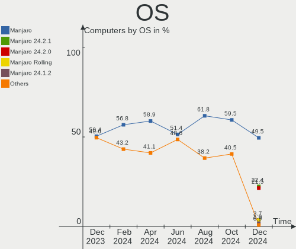
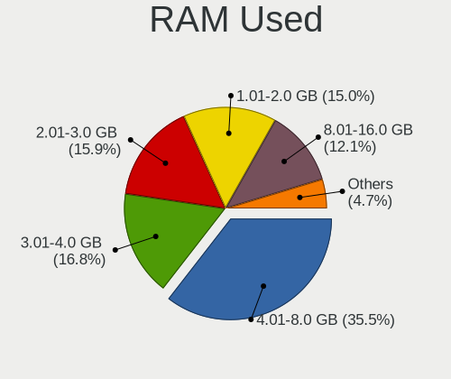
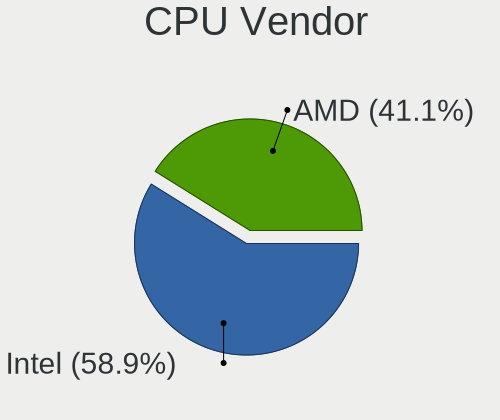
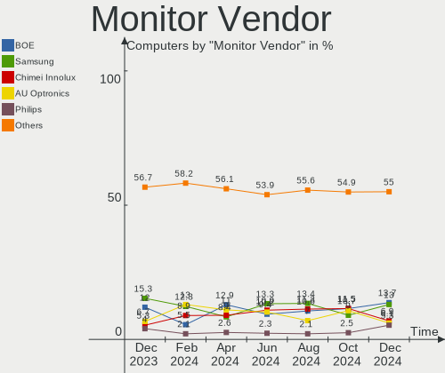

Manjaro Hardware Trends
-----------------------

A project to identify most popular hardware characteristics and track their change
over time based on data collected by Manjaro users at https://Linux-Hardware.org.

Anyone can contribute to the study by uploading probes of their computers by
the [hw-probe](https://github.com/linuxhw/hw-probe) tool:

    sudo hw-probe -all -upload

This is a report for all computer types. See also reports for [desktops](/Dist/Manjaro/Desktop/README.md) and [notebooks](/Dist/Manjaro/Notebook/README.md).

Full-feature report is available here: https://linux-hardware.org/?view=trends

Period: Jan, 2020.

Contents
--------

- [ OS                       ](#os)
- [ OS Family                ](#os-family)
- [ Kernel                   ](#kernel)
- [ Kernel Family            ](#kernel-family)
- [ Kernel Major Ver.        ](#kernel-major-ver)
- [ Arch                     ](#arch)
- [ DE                       ](#de)
- [ Display Server           ](#display-server)
- [ OS Lang                  ](#os-lang)
- [ Boot Mode                ](#boot-mode)
- [ Filesystem               ](#filesystem)
- [ Dual Boot with Linux     ](#dual-boot-with-linux)
- [ Dual Boot (Win)          ](#dual-boot-win)
- [ Country                  ](#country)
- [ City                     ](#city)
- [ Vendor                   ](#vendor)
- [ Model                    ](#model)
- [ Model Family             ](#model-family)
- [ MFG Year                 ](#mfg-year)
- [ Form Factor              ](#form-factor)
- [ Secure Boot              ](#secure-boot)
- [ Coreboot                 ](#coreboot)
- [ RAM Size                 ](#ram-size)
- [ RAM Used                 ](#ram-used)
- [ Drive Vendor             ](#drive-vendor)
- [ Drive Model              ](#drive-model)
- [ Drive Kind               ](#drive-kind)
- [ Drive Connector          ](#drive-connector)
- [ Drive Size               ](#drive-size)
- [ Space Total              ](#space-total)
- [ Space Used               ](#space-used)
- [ Malfunc. Drives          ](#malfunc-drives)
- [ Malfunc. Drive Vendor    ](#malfunc-drive-vendor)
- [ Malfunc. Drive Kind      ](#malfunc-drive-kind)
- [ Failed Drives            ](#failed-drives)
- [ Failed Drive Vendor      ](#failed-drive-vendor)
- [ Drive Status             ](#drive-status)
- [ Storage Vendor           ](#storage-vendor)
- [ Storage Model            ](#storage-model)
- [ Storage Kind             ](#storage-kind)
- [ CPU Vendor               ](#cpu-vendor)
- [ CPU Model                ](#cpu-model)
- [ CPU Model Family         ](#cpu-model-family)
- [ CPU Cores                ](#cpu-cores)
- [ CPU Sockets              ](#cpu-sockets)
- [ CPU Threads              ](#cpu-threads)
- [ CPU Op-Modes             ](#cpu-op-modes)
- [ CPU Microarch            ](#cpu-microarch)
- [ CPU Microcode            ](#cpu-microcode)
- [ GPU Vendor               ](#gpu-vendor)
- [ GPU Model                ](#gpu-model)
- [ GPU Combo                ](#gpu-combo)
- [ GPU Driver               ](#gpu-driver)
- [ GPU Memory               ](#gpu-memory)
- [ Monitor Vendor           ](#monitor-vendor)
- [ Monitor Model            ](#monitor-model)
- [ Monitor Resolution       ](#monitor-resolution)
- [ Monitor Diagonal         ](#monitor-diagonal)
- [ Monitor Width            ](#monitor-width)
- [ Aspect Ratio             ](#aspect-ratio)
- [ Monitor Area             ](#monitor-area)
- [ Pixel Density            ](#pixel-density)
- [ Multiple Monitors        ](#multiple-monitors)
- [ Net Controller Vendor    ](#net-controller-vendor)
- [ Net Controller Model     ](#net-controller-model)
- [ Net Controller Kind      ](#net-controller-kind)
- [ Used Controller          ](#used-controller)
- [ NICs                     ](#nics)
- [ Unsupported Devices      ](#unsupported-devices)
- [ Unsupported Device Types ](#unsupported-device-types)

OS
--

Installed operating systems

| Name              | Computers | Percent |
|-------------------|-----------|---------|
| Manjaro 18.1.5    | 68        | 64.76%  |
| Manjaro           | 33        | 31.43%  |
| Manjaro 18.1.1    | 2         | 1.9%    |
| Manjaro 19.0-pre2 | 1         | 0.95%   |
| Manjaro 18.1.3    | 1         | 0.95%   |

OS Family
---------

OS without a version

| Name    | Computers | Percent |
|---------|-----------|---------|
| Manjaro | 105       | 100%    |

Kernel
------

Version of the Linux kernel

| Version                 | Computers | Percent |
|-------------------------|-----------|---------|
| 5.4.6-2-MANJARO         | 32        | 30.48%  |
| 5.4.13-3-MANJARO        | 22        | 20.95%  |
| 5.4.14-2-MANJARO        | 9         | 8.57%   |
| 5.4.12-1-MANJARO        | 7         | 6.67%   |
| 4.19.91-1-MANJARO       | 5         | 4.76%   |
| 5.5.0-1-MANJARO         | 4         | 3.81%   |
| 5.3.18-1-MANJARO        | 4         | 3.81%   |
| 4.19.98-1-MANJARO       | 3         | 2.86%   |
| 5.4.15-2-MANJARO        | 2         | 1.9%    |
| 5.4.13-2-MANJARO        | 2         | 1.9%    |
| 4.19.97-1-MANJARO       | 2         | 1.9%    |
| 4.14.160-1-MANJARO      | 2         | 1.9%    |
| 5.4.8-2-clear-mrazster  | 1         | 0.95%   |
| 5.4.2-1-MANJARO         | 1         | 0.95%   |
| 5.4.14-xanmod8-1-xanmod | 1         | 0.95%   |
| 5.4.13-1-MANJARO        | 1         | 0.95%   |
| 5.3.6-1-MANJARO         | 1         | 0.95%   |
| 5.3.12-1-MANJARO        | 1         | 0.95%   |
| 5.2.21-rt15-MANJARO     | 1         | 0.95%   |
| 5.2.21-1-MANJARO        | 1         | 0.95%   |
| 4.19.96-1-MANJARO       | 1         | 0.95%   |
| 4.19.88-1-MANJARO       | 1         | 0.95%   |
| 4.19.85-1-MANJARO       | 1         | 0.95%   |

Kernel Family
-------------

Linux kernel without a distro release

| Version  | Computers | Percent |
|----------|-----------|---------|
| 5.4.6    | 32        | 30.48%  |
| 5.4.13   | 25        | 23.81%  |
| 5.4.14   | 10        | 9.52%   |
| 5.4.12   | 7         | 6.67%   |
| 4.19.91  | 5         | 4.76%   |
| 5.5.0    | 4         | 3.81%   |
| 5.3.18   | 4         | 3.81%   |
| 4.19.98  | 3         | 2.86%   |
| 5.4.15   | 2         | 1.9%    |
| 5.2.21   | 2         | 1.9%    |
| 4.19.97  | 2         | 1.9%    |
| 4.14.160 | 2         | 1.9%    |
| 5.4.8    | 1         | 0.95%   |
| 5.4.2    | 1         | 0.95%   |
| 5.3.6    | 1         | 0.95%   |
| 5.3.12   | 1         | 0.95%   |
| 4.19.96  | 1         | 0.95%   |
| 4.19.88  | 1         | 0.95%   |
| 4.19.85  | 1         | 0.95%   |

Kernel Major Ver.
-----------------

Linux kernel major version

| Version | Computers | Percent |
|---------|-----------|---------|
| 5.4     | 78        | 74.29%  |
| 4.19    | 13        | 12.38%  |
| 5.3     | 6         | 5.71%   |
| 5.5     | 4         | 3.81%   |
| 5.2     | 2         | 1.9%    |
| 4.14    | 2         | 1.9%    |

Arch
----

OS architecture (x86_64, i586, etc.)

| Name   | Computers | Percent |
|--------|-----------|---------|
| x86_64 | 105       | 100%    |

DE
--

Desktop Environment

| Name       | Computers | Percent |
|------------|-----------|---------|
| KDE5       | 30        | 28.57%  |
| XFCE       | 25        | 23.81%  |
| GNOME      | 17        | 16.19%  |
| KDE        | 15        | 14.29%  |
| Cinnamon   | 6         | 5.71%   |
| Unknown    | 3         | 2.86%   |
| i3         | 2         | 1.9%    |
| Deepin     | 2         | 1.9%    |
| X-Cinnamon | 1         | 0.95%   |
| MATE       | 1         | 0.95%   |
| LXQt       | 1         | 0.95%   |
| Budgie     | 1         | 0.95%   |
| Awesome    | 1         | 0.95%   |

Display Server
--------------

X11 or Wayland

| Name    | Computers | Percent |
|---------|-----------|---------|
| X11     | 97        | 92.38%  |
| Wayland | 7         | 6.67%   |
| Unknown | 1         | 0.95%   |

OS Lang
-------

Language

| Lang       | Computers | Percent |
|------------|-----------|---------|
| en_US      | 41        | 39.05%  |
| en_US.utf8 | 13        | 12.38%  |
| de_DE      | 8         | 7.62%   |
| en_GB      | 6         | 5.71%   |
| en_CA      | 6         | 5.71%   |
| ru_RU      | 3         | 2.86%   |
| de_DE.utf8 | 3         | 2.86%   |
| pt_BR.utf8 | 2         | 1.9%    |
| pl_PL      | 2         | 1.9%    |
| fr_FR      | 2         | 1.9%    |
| fi_FI      | 2         | 1.9%    |
| de_AT      | 2         | 1.9%    |
| zh_CN      | 1         | 0.95%   |
| sv_SE.utf8 | 1         | 0.95%   |
| ru_UA.utf8 | 1         | 0.95%   |
| pt_BR      | 1         | 0.95%   |
| it_IT      | 1         | 0.95%   |
| hu_HU.utf8 | 1         | 0.95%   |
| en_GB.utf8 | 1         | 0.95%   |
| en_DK      | 1         | 0.95%   |
| en_CA.utf8 | 1         | 0.95%   |
| en_AU.utf8 | 1         | 0.95%   |
| en_AU      | 1         | 0.95%   |
| de_CH      | 1         | 0.95%   |
| cs_CZ      | 1         | 0.95%   |
| C          | 1         | 0.95%   |
| Unknown    | 1         | 0.95%   |

Boot Mode
---------

EFI or BIOS

| Mode | Computers | Percent |
|------|-----------|---------|
| EFI  | 59        | 56.19%  |
| BIOS | 46        | 43.81%  |

Filesystem
----------

Type of filesystem

| Type    | Computers | Percent |
|---------|-----------|---------|
| Ext4    | 92        | 87.62%  |
| Btrfs   | 6         | 5.71%   |
| Overlay | 4         | 3.81%   |
| Xfs     | 2         | 1.9%    |
| F2fs    | 1         | 0.95%   |

Dual Boot with Linux
--------------------

Hosting more than one Linux

| Dual boot | Computers | Percent |
|-----------|-----------|---------|
| No        | 86        | 81.9%   |
| Yes       | 19        | 18.1%   |

Dual Boot (Win)
---------------

Hosting Linux and Windows

| Dual boot | Computers | Percent |
|-----------|-----------|---------|
| No        | 69        | 65.71%  |
| Yes       | 36        | 34.29%  |

Country
-------

Geographic location (country)

| Country        | Computers | Percent |
|----------------|-----------|---------|
| USA            | 17        | 16.19%  |
| Germany        | 16        | 15.24%  |
| Canada         | 9         | 8.57%   |
| Russia         | 6         | 5.71%   |
| UK             | 4         | 3.81%   |
| Austria        | 4         | 3.81%   |
| Spain          | 3         | 2.86%   |
| Serbia         | 3         | 2.86%   |
| Poland         | 3         | 2.86%   |
| Finland        | 3         | 2.86%   |
| Brazil         | 3         | 2.86%   |
| Ukraine        | 2         | 1.9%    |
| Sweden         | 2         | 1.9%    |
| Romania        | 2         | 1.9%    |
| Portugal       | 2         | 1.9%    |
| Norway         | 2         | 1.9%    |
| Netherlands    | 2         | 1.9%    |
| Italy          | 2         | 1.9%    |
| Iceland        | 2         | 1.9%    |
| France         | 2         | 1.9%    |
| Australia      | 2         | 1.9%    |
| Turkey         | 1         | 0.95%   |
| Thailand       | 1         | 0.95%   |
| Switzerland    | 1         | 0.95%   |
| Mexico         | 1         | 0.95%   |
| Lithuania      | 1         | 0.95%   |
| Indonesia      | 1         | 0.95%   |
| Hungary        | 1         | 0.95%   |
| Georgia        | 1         | 0.95%   |
| Egypt          | 1         | 0.95%   |
| Czech Republic | 1         | 0.95%   |
| Croatia        | 1         | 0.95%   |
| Colombia       | 1         | 0.95%   |
| China          | 1         | 0.95%   |
| Belarus        | 1         | 0.95%   |

City
----

Geographic location (city)

| City                | Computers | Percent |
|---------------------|-----------|---------|
| Toronto             | 2         | 1.9%    |
| Ottawa              | 2         | 1.9%    |
| Los Angeles         | 2         | 1.9%    |
| Keflavik            | 2         | 1.9%    |
| Ingolstadt          | 2         | 1.9%    |
| Frankfurt am Main   | 2         | 1.9%    |
| Zapopan             | 1         | 0.95%   |
| Zagreb              | 1         | 0.95%   |
| Yoshkar-Ola         | 1         | 0.95%   |
| Yekaterinburg       | 1         | 0.95%   |
| Wuppertal           | 1         | 0.95%   |
| Wrocław            | 1         | 0.95%   |
| Wetzlar             | 1         | 0.95%   |
| West Kelowna        | 1         | 0.95%   |
| Warsaw              | 1         | 0.95%   |
| Voronezh            | 1         | 0.95%   |
| Vienna              | 1         | 0.95%   |
| Victoria            | 1         | 0.95%   |
| Verdun              | 1         | 0.95%   |
| Utena               | 1         | 0.95%   |
| Umkirch             | 1         | 0.95%   |
| Turda               | 1         | 0.95%   |
| Troy                | 1         | 0.95%   |
| Tromsø             | 1         | 0.95%   |
| Traismauer          | 1         | 0.95%   |
| Tbilisi             | 1         | 0.95%   |
| Tampere             | 1         | 0.95%   |
| Tagelswangen        | 1         | 0.95%   |
| Subotica            | 1         | 0.95%   |
| Stockholm           | 1         | 0.95%   |
| Staten Island       | 1         | 0.95%   |
| Stargard            | 1         | 0.95%   |
| St Petersburg       | 1         | 0.95%   |
| Sloviansk           | 1         | 0.95%   |
| Sinn                | 1         | 0.95%   |
| Sibiu               | 1         | 0.95%   |
| Sarasota            | 1         | 0.95%   |
| Santa Cruz do Sul   | 1         | 0.95%   |
| Sabac               | 1         | 0.95%   |
| Rusko               | 1         | 0.95%   |
| Rostov-on-Don       | 1         | 0.95%   |
| Revelstoke          | 1         | 0.95%   |
| Pozuelo de Alarcón | 1         | 0.95%   |
| Novi Sad            | 1         | 0.95%   |
| Nonthaburi          | 1         | 0.95%   |
| Nanning             | 1         | 0.95%   |
| Mustang             | 1         | 0.95%   |
| Munich              | 1         | 0.95%   |
| Moscow              | 1         | 0.95%   |
| Morisset            | 1         | 0.95%   |
| Montcada i Reixac   | 1         | 0.95%   |
| Minsk               | 1         | 0.95%   |
| Minneapolis         | 1         | 0.95%   |
| Miami               | 1         | 0.95%   |
| Mery-sur-Oise       | 1         | 0.95%   |
| Mersin              | 1         | 0.95%   |
| Mendig              | 1         | 0.95%   |
| Melbourne           | 1         | 0.95%   |
| Mauthausen          | 1         | 0.95%   |
| Marília            | 1         | 0.95%   |

Vendor
------

Motherboard manufacturer

| Name                  | Computers | Percent |
|-----------------------|-----------|---------|
| Lenovo                | 16        | 15.24%  |
| ASUSTek Computer      | 16        | 15.24%  |
| Dell                  | 14        | 13.33%  |
| Gigabyte Technology   | 12        | 11.43%  |
| MSI                   | 11        | 10.48%  |
| Hewlett-Packard       | 9         | 8.57%   |
| Acer                  | 8         | 7.62%   |
| ASRock                | 7         | 6.67%   |
| Apple                 | 2         | 1.9%    |
| StationX              | 1         | 0.95%   |
| PC Specialist         | 1         | 0.95%   |
| Multilaser Industrial | 1         | 0.95%   |
| Medion                | 1         | 0.95%   |
| HUAWEI                | 1         | 0.95%   |
| Fujitsu               | 1         | 0.95%   |
| EVGA                  | 1         | 0.95%   |
| Digibras              | 1         | 0.95%   |
| Chuwi                 | 1         | 0.95%   |
| Biostar               | 1         | 0.95%   |

Model
-----

Motherboard model

| Name                                | Computers | Percent |
|-------------------------------------|-----------|---------|
| MSI MS-7B89                         | 2         | 1.9%    |
| Gigabyte X570 AORUS PRO             | 2         | 1.9%    |
| ASUS PRIME X470-PRO                 | 2         | 1.9%    |
| StationX Manjaro Spitfire           | 1         | 0.95%   |
| PC Specialist N2x0WU                | 1         | 0.95%   |
| Multilaser Industrial MLX11 EDUC    | 1         | 0.95%   |
| MSI Prestige 15 A10SC               | 1         | 0.95%   |
| MSI MS-7B45                         | 1         | 0.95%   |
| MSI MS-7A39                         | 1         | 0.95%   |
| MSI MS-7A34                         | 1         | 0.95%   |
| MSI MS-7885                         | 1         | 0.95%   |
| MSI MS-7821                         | 1         | 0.95%   |
| MSI MS-7786                         | 1         | 0.95%   |
| MSI MS-6657                         | 1         | 0.95%   |
| MSI GL62 6QD                        | 1         | 0.95%   |
| Medion E7424 MD60150                | 1         | 0.95%   |
| Lenovo Z50-70 20354                 | 1         | 0.95%   |
| Lenovo Y720-15IKB 80VR              | 1         | 0.95%   |
| Lenovo Y520-15IKBN 80WK             | 1         | 0.95%   |
| Lenovo Y50-70 20378                 | 1         | 0.95%   |
| Lenovo ThinkPad Yoga 11e 20DAS0SF00 | 1         | 0.95%   |
| Lenovo ThinkPad T460 20FN002JUS     | 1         | 0.95%   |
| Lenovo ThinkPad T440s 20AQ0069MZ    | 1         | 0.95%   |
| Lenovo ThinkPad T430 2349PQ4        | 1         | 0.95%   |
| Lenovo ThinkPad E480 20KN001QGE     | 1         | 0.95%   |
| Lenovo IdeaPad S540-14API 81NH      | 1         | 0.95%   |
| Lenovo IdeaPad 530S-14ARR 81H1      | 1         | 0.95%   |
| Lenovo IdeaPad 330-15AST 81D6       | 1         | 0.95%   |
| Lenovo IdeaPad 320-15ABR 80XS       | 1         | 0.95%   |
| Lenovo G505s 20255                  | 1         | 0.95%   |
| Lenovo G50-80 80L0                  | 1         | 0.95%   |
| Lenovo B570e HuronRiver Platform    | 1         | 0.95%   |
| HUAWEI WRT-WX9                      | 1         | 0.95%   |
| HP ZBook 17 G2                      | 1         | 0.95%   |
| HP ProDesk 600 G2 SFF               | 1         | 0.95%   |
| HP ProBook 470 G4                   | 1         | 0.95%   |
| HP Pavilion dv8                     | 1         | 0.95%   |
| HP Pavilion dv6                     | 1         | 0.95%   |
| HP Laptop 15-db0xxx                 | 1         | 0.95%   |
| HP EliteBook 850 G6                 | 1         | 0.95%   |
| HP EliteBook 8460p                  | 1         | 0.95%   |
| HP EliteBook 1040 G4                | 1         | 0.95%   |
| Gigabyte Z97X-UD3H                  | 1         | 0.95%   |
| Gigabyte Z390 GAMING SLI            | 1         | 0.95%   |
| Gigabyte Z390 AORUS MASTER          | 1         | 0.95%   |
| Gigabyte Z270-Gaming K3             | 1         | 0.95%   |
| Gigabyte P35V3                      | 1         | 0.95%   |
| Gigabyte GA-970A-D3                 | 1         | 0.95%   |
| Gigabyte EP45-DS4                   | 1         | 0.95%   |
| Gigabyte B360M-DS3H                 | 1         | 0.95%   |
| Gigabyte AX370-Gaming 5             | 1         | 0.95%   |
| Gigabyte A320M-S2H V2               | 1         | 0.95%   |
| Fujitsu D3674-B1 S26361-D3674-B1    | 1         | 0.95%   |
| Digibras NH4CU03                    | 1         | 0.95%   |
| Dell XPS 8900                       | 1         | 0.95%   |
| Dell XPS 15 9560                    | 1         | 0.95%   |
| Dell XPS 15 9550                    | 1         | 0.95%   |
| Dell XPS 13 9380                    | 1         | 0.95%   |
| Dell Studio 1747                    | 1         | 0.95%   |
| Dell OptiPlex GX620                 | 1         | 0.95%   |

Model Family
------------

Motherboard model prefix

| Name                        | Computers | Percent |
|-----------------------------|-----------|---------|
| Acer Aspire                 | 7         | 6.67%   |
| Lenovo ThinkPad             | 5         | 4.76%   |
| ASUS PRIME                  | 5         | 4.76%   |
| Lenovo IdeaPad              | 4         | 3.81%   |
| Dell XPS                    | 4         | 3.81%   |
| Dell Inspiron               | 4         | 3.81%   |
| HP EliteBook                | 3         | 2.86%   |
| Dell Latitude               | 3         | 2.86%   |
| MSI MS-7B89                 | 2         | 1.9%    |
| HP Pavilion                 | 2         | 1.9%    |
| Gigabyte Z390               | 2         | 1.9%    |
| Gigabyte X570               | 2         | 1.9%    |
| Dell OptiPlex               | 2         | 1.9%    |
| StationX Manjaro            | 1         | 0.95%   |
| PC Specialist N2x0WU        | 1         | 0.95%   |
| Multilaser Industrial MLX11 | 1         | 0.95%   |
| MSI Prestige                | 1         | 0.95%   |
| MSI MS-7B45                 | 1         | 0.95%   |
| MSI MS-7A39                 | 1         | 0.95%   |
| MSI MS-7A34                 | 1         | 0.95%   |
| MSI MS-7885                 | 1         | 0.95%   |
| MSI MS-7821                 | 1         | 0.95%   |
| MSI MS-7786                 | 1         | 0.95%   |
| MSI MS-6657                 | 1         | 0.95%   |
| MSI GL62                    | 1         | 0.95%   |
| Medion E7424                | 1         | 0.95%   |
| Lenovo Z50-70               | 1         | 0.95%   |
| Lenovo Y720-15IKB           | 1         | 0.95%   |
| Lenovo Y520-15IKBN          | 1         | 0.95%   |
| Lenovo Y50-70               | 1         | 0.95%   |
| Lenovo G505s                | 1         | 0.95%   |
| Lenovo G50-80               | 1         | 0.95%   |
| Lenovo B570e                | 1         | 0.95%   |
| HUAWEI WRT-WX9              | 1         | 0.95%   |
| HP ZBook                    | 1         | 0.95%   |
| HP ProDesk                  | 1         | 0.95%   |
| HP ProBook                  | 1         | 0.95%   |
| HP Laptop                   | 1         | 0.95%   |
| Gigabyte Z97X-UD3H          | 1         | 0.95%   |
| Gigabyte Z270-Gaming        | 1         | 0.95%   |
| Gigabyte P35V3              | 1         | 0.95%   |
| Gigabyte GA-970A-D3         | 1         | 0.95%   |
| Gigabyte EP45-DS4           | 1         | 0.95%   |
| Gigabyte B360M-DS3H         | 1         | 0.95%   |
| Gigabyte AX370-Gaming       | 1         | 0.95%   |
| Gigabyte A320M-S2H          | 1         | 0.95%   |
| Fujitsu D3674-B1            | 1         | 0.95%   |
| Digibras NH4CU03            | 1         | 0.95%   |
| Dell Studio                 | 1         | 0.95%   |
| Chuwi LapBook               | 1         | 0.95%   |
| Biostar A10N-8800E          | 1         | 0.95%   |
| ASUS Z170-P                 | 1         | 0.95%   |
| ASUS Z170                   | 1         | 0.95%   |
| ASUS X540SA                 | 1         | 0.95%   |
| ASUS S451LB                 | 1         | 0.95%   |
| ASUS P8H77-V                | 1         | 0.95%   |
| ASUS P7H55-M                | 1         | 0.95%   |
| ASUS M5A97                  | 1         | 0.95%   |
| ASUS M5A78L-M               | 1         | 0.95%   |
| ASUS M5A78L                 | 1         | 0.95%   |

MFG Year
--------

Motherboard manufacture year

| Year | Computers | Percent |
|------|-----------|---------|
| 2019 | 37        | 35.24%  |
| 2018 | 21        | 20%     |
| 2017 | 8         | 7.62%   |
| 2015 | 8         | 7.62%   |
| 2013 | 7         | 6.67%   |
| 2014 | 6         | 5.71%   |
| 2016 | 4         | 3.81%   |
| 2010 | 4         | 3.81%   |
| 2012 | 3         | 2.86%   |
| 2011 | 2         | 1.9%    |
| 2007 | 2         | 1.9%    |
| 2009 | 1         | 0.95%   |
| 2008 | 1         | 0.95%   |
| 2005 | 1         | 0.95%   |

Form Factor
-----------

Physical design of the computer

| Name        | Computers | Percent |
|-------------|-----------|---------|
| Notebook    | 57        | 54.29%  |
| Desktop     | 46        | 43.81%  |
| Convertible | 1         | 0.95%   |
| All in one  | 1         | 0.95%   |

Secure Boot
-----------

Enabled or disabled

| State    | Computers | Percent |
|----------|-----------|---------|
| Disabled | 105       | 100%    |

Coreboot
--------

Have coreboot on board

| Used | Computers | Percent |
|------|-----------|---------|
| No   | 105       | 100%    |

RAM Size
--------

Total RAM memory

| Size in GB  | Computers | Percent |
|-------------|-----------|---------|
| 16.01-24.0  | 40        | 38.1%   |
| 4.01-8.0    | 20        | 19.05%  |
| 8.01-16.0   | 18        | 17.14%  |
| 3.01-4.0    | 12        | 11.43%  |
| 32.01-64.0  | 10        | 9.52%   |
| 64.01-256.0 | 2         | 1.9%    |
| 1.01-2.0    | 2         | 1.9%    |
| 24.01-32.0  | 1         | 0.95%   |

RAM Used
--------

Used RAM memory

| Used GB    | Computers | Percent |
|------------|-----------|---------|
| 1.01-2.0   | 29        | 27.62%  |
| 2.01-3.0   | 25        | 23.81%  |
| 4.01-8.0   | 23        | 21.9%   |
| 3.01-4.0   | 10        | 9.52%   |
| 0.01-1.0   | 9         | 8.57%   |
| 8.01-16.0  | 6         | 5.71%   |
| 16.01-24.0 | 2         | 1.9%    |
| 24.01-32.0 | 1         | 0.95%   |

Drive Vendor
------------

Hard drive vendors

| Vendor              | Computers | Drives  | Percent |
|---------------------|-----------|---------|---------|
| Samsung Electronics | 36        | 48      | 19.25%  |
| WDC                 | 33        | 41      | 17.65%  |
| Seagate             | 22        | 23      | 11.76%  |
| Kingston            | 14        | 16      | 7.49%   |
| Toshiba             | 13        | 14      | 6.95%   |
| Crucial             | 8         | 8       | 4.28%   |
| SanDisk             | 7         | 8       | 3.74%   |
| HGST                | 7         | 9       | 3.74%   |
| Unknown             | 6         | 6       | 3.21%   |
| Hitachi             | 6         | 7       | 3.21%   |
| Intel               | 5         | 5       | 2.67%   |
| SK Hynix            | 3         | 3       | 1.6%    |
| A-DATA Technology   | 3         | 3       | 1.6%    |
| Transcend           | 2         | 2       | 1.07%   |
| OCZ                 | 2         | 2       | 1.07%   |
| Intenso             | 2         | 2       | 1.07%   |
| Corsair             | 2         | 2       | 1.07%   |
| Apple               | 2         | 2       | 1.07%   |
| SPCC                | 1         | 1       | 0.53%   |
| sobetter            | 1         | 1       | 0.53%   |
| PNY                 | 1         | 1       | 0.53%   |
| PLEXTOR             | 1         | 1       | 0.53%   |
| Micron Technology   | 1         | 1       | 0.53%   |
| LITEON              | 1         | 2       | 0.53%   |
| HL-DT-ST            | 1         | Unknown | 0.53%   |
| Hewlett-Packard     | 1         | 1       | 0.53%   |
| Generic             | 1         | 1       | 0.53%   |
| FORESEE             | 1         | 1       | 0.53%   |
| Colorful            | 1         | 1       | 0.53%   |
| China               | 1         | 1       | 0.53%   |
| Apacer              | 1         | 1       | 0.53%   |
| ADplus              | 1         | 1       | 0.53%   |

Drive Model
-----------

Hard drive models

| Model                        | Computers | Percent |
|------------------------------|-----------|---------|
| SSD 850 EVO 500GB            | 5         | 2.43%   |
| SA400S37240G 240GB SSD       | 5         | 2.43%   |
| SSD 860 EVO 1TB              | 3         | 1.46%   |
| SSD 850 EVO 250GB            | 3         | 1.46%   |
| SA400S37120G 120GB SSD       | 3         | 1.46%   |
| HTS721010A9E630 1TB          | 3         | 1.46%   |
| WD2003FZEX-00SRLA0 2TB       | 2         | 0.97%   |
| SSD PLUS 1000GB              | 2         | 0.97%   |
| SSD 970 EVO 500GB            | 2         | 0.97%   |
| SSD 860 EVO 500GB            | 2         | 0.97%   |
| SSD 860 EVO 250GB            | 2         | 0.97%   |
| SSD 840 EVO 250GB            | 2         | 0.97%   |
| HDS721032CLA362 320GB        | 2         | 0.97%   |
| HDN724040ALE640 4TB          | 2         | 0.97%   |
| CT500MX500SSD1 500GB         | 2         | 0.97%   |
| CT240BX500SSD1 240GB         | 2         | 0.97%   |
| xD/SD/M.S.                   | 1         | 0.49%   |
| WDS500G2X0C-00L350 500GB     | 1         | 0.49%   |
| WDS500G2B0B-00YS70 500GB SSD | 1         | 0.49%   |
| WDS500G2B0A 500GB SSD        | 1         | 0.49%   |
| WD6400AAKS-65A7B2 640GB      | 1         | 0.49%   |
| WD6400AAKS-00H2B1 640GB      | 1         | 0.49%   |
| WD5003AZEX-00K3CA0 500GB     | 1         | 0.49%   |
| WD5000LPVX-22V0TT0 500GB     | 1         | 0.49%   |
| WD5000LPLX-22ZNTT0 500GB     | 1         | 0.49%   |
| WD5000AAKX-60U6AA0 500GB     | 1         | 0.49%   |
| WD5000AAKS-22TMA0 500GB      | 1         | 0.49%   |
| WD40EZRZ-00WN9B0 4TB         | 1         | 0.49%   |
| WD40EZRZ-00GXCB0 4TB         | 1         | 0.49%   |
| WD40EFRX-68WT0N0 4TB         | 1         | 0.49%   |
| WD4003FZEX-00Z4SA0 4TB       | 1         | 0.49%   |
| WD3200BPVT-22ZEST0 320GB     | 1         | 0.49%   |
| WD3200BJKT-00F4T0 320GB      | 1         | 0.49%   |
| WD30EZRX-00MMMB0 3TB         | 1         | 0.49%   |
| WD30EJRX-89G3VY0 3TB         | 1         | 0.49%   |
| WD3000FYYZ-01UL1B3 3TB       | 1         | 0.49%   |
| WD20EZRX-00D8PB0 2TB         | 1         | 0.49%   |
| WD2003FZEX-00Z4SA0 2TB       | 1         | 0.49%   |
| WD15EARS-00MVWB0 1TB         | 1         | 0.49%   |
| WD1502FAEX-007BA0 1TB        | 1         | 0.49%   |
| WD10SPZX-24Z10 1TB           | 1         | 0.49%   |
| WD10SPZX-08Z10 1TB           | 1         | 0.49%   |
| WD10SPCX-24HWST1 1TB         | 1         | 0.49%   |
| WD10JPCX-24UE4T0 1TB         | 1         | 0.49%   |
| WD10EZEX-00WN4A0 1TB         | 1         | 0.49%   |
| WD10EZEX-00BN5A0 1TB         | 1         | 0.49%   |
| WD10EFRX-68PJCN0 1TB         | 1         | 0.49%   |
| WD1003FZEX-00K3CA0 1TB       | 1         | 0.49%   |
| WD1002FAEX-00Z3A0 1TB        | 1         | 0.49%   |
| WD1001FALS-40K1B0 1TB        | 1         | 0.49%   |
| WD1001FALS-00K1B0 1TB        | 1         | 0.49%   |
| VERTEX4 128GB SSD            | 1         | 0.49%   |
| Ultra II 240GB SSD           | 1         | 0.49%   |
| TS240GSSD220S 240GB          | 1         | 0.49%   |
| TS1TMTE220S 1TB              | 1         | 0.49%   |
| THNSNJ128GCSU 128GB SSD      | 1         | 0.49%   |
| THNSN5512GPUK 512GB          | 1         | 0.49%   |
| SX900 256GB SSD              | 1         | 0.49%   |
| SUV500MS480G 480GB SSD       | 1         | 0.49%   |
| SUV500240G 240GB SSD         | 1         | 0.49%   |

Drive Kind
----------

HDD or SSD

| Kind    | Computers | Drives | Percent |
|---------|-----------|--------|---------|
| SSD     | 66        | 92     | 43.14%  |
| HDD     | 59        | 94     | 38.56%  |
| NVMe    | 19        | 21     | 12.42%  |
| Unknown | 5         | 4      | 3.27%   |
| MMC     | 4         | 4      | 2.61%   |

Drive Connector
---------------

SATA, SAS, NVMe, etc.

| Type | Computers | Drives | Percent |
|------|-----------|--------|---------|
| SATA | 92        | 183    | 74.8%   |
| NVMe | 19        | 21     | 15.45%  |
| SAS  | 8         | 7      | 6.5%    |
| MMC  | 4         | 4      | 3.25%   |

Drive Size
----------

Size of hard drive

| Size in TB | Computers | Drives | Percent |
|------------|-----------|--------|---------|
| 0.01-0.5   | 78        | 118    | 51.66%  |
| 0.51-1.0   | 48        | 65     | 31.79%  |
| 1.01-2.0   | 12        | 16     | 7.95%   |
| 3.01-4.0   | 5         | 7      | 3.31%   |
| 2.01-3.0   | 5         | 5      | 3.31%   |
| 4.01-10.0  | 3         | 4      | 1.99%   |

Space Total
-----------

Amount of disk space available on the file system

| Size in GB     | Computers | Percent |
|----------------|-----------|---------|
| 101-250        | 22        | 20.95%  |
| 251-500        | 16        | 15.24%  |
| 501-1000       | 16        | 15.24%  |
| 1001-2000      | 15        | 14.29%  |
| More than 3000 | 11        | 10.48%  |
| 2001-3000      | 9         | 8.57%   |
| 51-100         | 5         | 4.76%   |
| Unknown        | 5         | 4.76%   |
| 1-20           | 4         | 3.81%   |
| 21-50          | 2         | 1.9%    |

Space Used
----------

Amount of used disk space

| Used GB        | Computers | Percent |
|----------------|-----------|---------|
| 101-250        | 17        | 16.19%  |
| 1-20           | 17        | 16.19%  |
| 21-50          | 14        | 13.33%  |
| 501-1000       | 12        | 11.43%  |
| 251-500        | 10        | 9.52%   |
| 51-100         | 10        | 9.52%   |
| 1001-2000      | 9         | 8.57%   |
| More than 3000 | 7         | 6.67%   |
| Unknown        | 5         | 4.76%   |
| 2001-3000      | 4         | 3.81%   |

Malfunc. Drives
---------------

Drive models with a malfunction

| Model                 | Computers | Drives | Percent |
|-----------------------|-----------|--------|---------|
| WD40EFRX-68WT0N0 4TB  | 1         | 1      | 14.29%  |
| WD1001FALS-40K1B0 1TB | 1         | 1      | 14.29%  |
| ST1000LM014-SSHD-8GB  | 1         | 1      | 14.29%  |
| SSDSC2BW240H6 240GB   | 1         | 1      | 14.29%  |
| HTS725050A9A364 500GB | 1         | 1      | 14.29%  |
| Force LS SSD 64GB     | 1         | 1      | 14.29%  |
| CT1000P1SSD8 1TB      | 1         | 1      | 14.29%  |

Malfunc. Drive Vendor
---------------------

Vendors of faulty drives

| Vendor  | Computers | Drives | Percent |
|---------|-----------|--------|---------|
| WDC     | 2         | 2      | 28.57%  |
| Seagate | 1         | 1      | 14.29%  |
| Intel   | 1         | 1      | 14.29%  |
| Hitachi | 1         | 1      | 14.29%  |
| Crucial | 1         | 1      | 14.29%  |
| Corsair | 1         | 1      | 14.29%  |

Malfunc. Drive Kind
-------------------

Kinds of faulty drives

| Kind | Computers | Drives | Percent |
|------|-----------|--------|---------|
| HDD  | 4         | 4      | 57.14%  |
| SSD  | 2         | 2      | 28.57%  |
| NVMe | 1         | 1      | 14.29%  |

Failed Drives
-------------

Failed drive models

Zero info for selected period =(

Failed Drive Vendor
-------------------

Failed drive vendors

Zero info for selected period =(

Drive Status
------------

Number of failed and malfunc. drives

| Status   | Computers | Drives | Percent |
|----------|-----------|--------|---------|
| Detected | 55        | 107    | 49.11%  |
| Works    | 50        | 101    | 44.64%  |
| Malfunc  | 7         | 7      | 6.25%   |

Storage Vendor
--------------

Storage controller vendors

| Vendor                           | Computers | Percent |
|----------------------------------|-----------|---------|
| Intel                            | 68        | 48.57%  |
| AMD                              | 30        | 21.43%  |
| Samsung Electronics              | 15        | 10.71%  |
| Sandisk                          | 6         | 4.29%   |
| SK Hynix                         | 3         | 2.14%   |
| Marvell Technology Group         | 3         | 2.14%   |
| Toshiba America Info Systems     | 2         | 1.43%   |
| Phison Electronics               | 2         | 1.43%   |
| ASMedia Technology               | 2         | 1.43%   |
| Union Memory (Shenzhen)          | 1         | 0.71%   |
| Silicon Motion                   | 1         | 0.71%   |
| Silicon Integrated Systems [SiS] | 1         | 0.71%   |
| Nvidia                           | 1         | 0.71%   |
| Micron/Crucial Technology        | 1         | 0.71%   |
| Lite-On Technology               | 1         | 0.71%   |
| JMicron Technology               | 1         | 0.71%   |
| Integrated Technology Express    | 1         | 0.71%   |
| ADATA Technology                 | 1         | 0.71%   |

Storage Model
-------------

Storage controller models

| Model                                                                      | Computers | Percent |
|----------------------------------------------------------------------------|-----------|---------|
| FCH SATA Controller [AHCI mode]                                            | 25        | 15.06%  |
| NVMe SSD Controller SM981/PM981/PM983                                      | 11        | 6.63%   |
| Sunrise Point-LP SATA Controller [AHCI mode]                               | 8         | 4.82%   |
| HM170/QM170 Chipset SATA Controller [AHCI Mode]                            | 7         | 4.22%   |
| 8 Series/C220 Series Chipset Family 6-port SATA Controller 1 [AHCI mode]   | 7         | 4.22%   |
| Non-Volatile memory controller                                             | 6         | 3.61%   |
| Cannon Lake PCH SATA AHCI Controller                                       | 5         | 3.01%   |
| 8 Series SATA Controller 1 [AHCI mode]                                     | 5         | 3.01%   |
| 6 Series/C200 Series Chipset Family 6 port Mobile SATA AHCI Controller     | 5         | 3.01%   |
| 400 Series Chipset SATA Controller                                         | 5         | 3.01%   |
| WD Black 2018/PC SN720 NVMe SSD                                            | 3         | 1.81%   |
| SB7x0/SB8x0/SB9x0 SATA Controller [AHCI mode]                              | 3         | 1.81%   |
| SB7x0/SB8x0/SB9x0 IDE Controller                                           | 3         | 1.81%   |
| Q170/Q150/B150/H170/H110/Z170/CM236 Chipset SATA Controller [AHCI Mode]    | 3         | 1.81%   |
| FCH IDE Controller                                                         | 3         | 1.81%   |
| 82801 Mobile SATA Controller [RAID mode]                                   | 3         | 1.81%   |
| 7 Series Chipset Family 6-port SATA Controller [AHCI mode]                 | 3         | 1.81%   |
| 300 Series Chipset SATA Controller                                         | 3         | 1.81%   |
| X370 Series Chipset SATA Controller                                        | 2         | 1.2%    |
| WD Black 2018/PC SN520 NVMe SSD                                            | 2         | 1.2%    |
| SSD 660P Series                                                            | 2         | 1.2%    |
| SSD 600P Series                                                            | 2         | 1.2%    |
| NVMe SSD Controller SM961/PM961                                            | 2         | 1.2%    |
| NVMe SSD Controller SM951/PM951                                            | 2         | 1.2%    |
| E12 NVMe Controller                                                        | 2         | 1.2%    |
| ASM1062 Serial ATA Controller                                              | 2         | 1.2%    |
| 5 Series/3400 Series Chipset 4 port SATA IDE Controller                    | 2         | 1.2%    |
| 5 Series/3400 Series Chipset 2 port SATA IDE Controller                    | 2         | 1.2%    |
| 200 Series PCH SATA controller [AHCI mode]                                 | 2         | 1.2%    |
| XPG SX8200 Pro PCIe Gen3x4 M.2 2280 Solid State Drive                      | 1         | 0.6%    |
| XG4 NVMe SSD Controller                                                    | 1         | 0.6%    |
| X399 Series Chipset SATA Controller                                        | 1         | 0.6%    |
| Wildcat Point-LP SATA Controller [AHCI Mode]                               | 1         | 0.6%    |
| Toshiba America Info Non-Volatile memory controller                        | 1         | 0.6%    |
| SSD Pro 7600p/760p/E 6100p Series                                          | 1         | 0.6%    |
| SB7x0/SB8x0/SB9x0 SATA Controller [IDE mode]                               | 1         | 0.6%    |
| SATA Controller [RAID mode]                                                | 1         | 0.6%    |
| SATA Controller / IDE mode                                                 | 1         | 0.6%    |
| SATA controller                                                            | 1         | 0.6%    |
| P1 NVMe PCIe SSD                                                           | 1         | 0.6%    |
| NM10/ICH7 Family SATA Controller [IDE mode]                                | 1         | 0.6%    |
| MCP79 AHCI Controller                                                      | 1         | 0.6%    |
| M8Pe Series NVMe SSD                                                       | 1         | 0.6%    |
| JMB368 IDE controller                                                      | 1         | 0.6%    |
| IT8213 IDE Controller                                                      | 1         | 0.6%    |
| FCH SATA Controller [IDE mode]                                             | 1         | 0.6%    |
| FCH SATA Controller D                                                      | 1         | 0.6%    |
| Celeron N3350/Pentium N4200/Atom E3900 Series SATA AHCI Controller         | 1         | 0.6%    |
| C610/X99 series chipset 6-Port SATA Controller [AHCI mode]                 | 1         | 0.6%    |
| Atom/Celeron/Pentium Processor x5-E8000/J3xxx/N3xxx Series SATA Controller | 1         | 0.6%    |
| Atom Processor E3800 Series SATA AHCI Controller                           | 1         | 0.6%    |
| 92xx SATA 6G Controller                                                    | 1         | 0.6%    |
| 9 Series Chipset Family SATA Controller [AHCI Mode]                        | 1         | 0.6%    |
| 88SS9183 PCIe SSD Controller                                               | 1         | 0.6%    |
| 88SE9128 PCIe SATA 6 Gb/s RAID controller                                  | 1         | 0.6%    |
| 82801JI (ICH10 Family) 4 port SATA IDE Controller #1                       | 1         | 0.6%    |
| 82801JI (ICH10 Family) 2 port SATA IDE Controller #2                       | 1         | 0.6%    |
| 82801IBM/IEM (ICH9M/ICH9M-E) 4 port SATA Controller [AHCI mode]            | 1         | 0.6%    |
| 82801GBM/GHM (ICH7-M Family) SATA Controller [IDE mode]                    | 1         | 0.6%    |
| 82801G (ICH7 Family) IDE Controller                                        | 1         | 0.6%    |

Storage Kind
------------

Kind of storage controller (IDE, SATA, NVMe, SAS, ...)

| Kind | Computers | Percent |
|------|-----------|---------|
| SATA | 87        | 62.59%  |
| NVMe | 35        | 25.18%  |
| IDE  | 13        | 9.35%   |
| RAID | 4         | 2.88%   |

CPU Vendor
----------

Processor vendors

| Vendor | Computers | Percent |
|--------|-----------|---------|
| Intel  | 74        | 70.48%  |
| AMD    | 31        | 29.52%  |

CPU Model
---------

Processor models

| Model                                         | Computers | Percent |
|-----------------------------------------------|-----------|---------|
| Intel Core i7-8565U CPU @ 1.80GHz             | 4         | 3.81%   |
| AMD Ryzen 7 3700X 8-Core Processor            | 3         | 2.86%   |
| Intel Core i7-7700HQ CPU @ 2.80GHz            | 2         | 1.9%    |
| Intel Core i7-7500U CPU @ 2.70GHz             | 2         | 1.9%    |
| Intel Core i7-6700HQ CPU @ 2.60GHz            | 2         | 1.9%    |
| Intel Core i7-4500U CPU @ 1.80GHz             | 2         | 1.9%    |
| Intel Core i7 CPU Q 720 @ 1.60GHz             | 2         | 1.9%    |
| Intel Core i5-8250U CPU @ 1.60GHz             | 2         | 1.9%    |
| Intel Core i5-7300HQ CPU @ 2.50GHz            | 2         | 1.9%    |
| Intel Core i5-7200U CPU @ 2.50GHz             | 2         | 1.9%    |
| AMD Ryzen 7 2700X Eight-Core Processor        | 2         | 1.9%    |
| AMD Ryzen 7 2700 Eight-Core Processor         | 2         | 1.9%    |
| AMD Ryzen 7 1700 Eight-Core Processor         | 2         | 1.9%    |
| AMD Ryzen 5 3600 6-Core Processor             | 2         | 1.9%    |
| AMD Ryzen 3 2200U with Radeon Vega Mobile Gfx | 2         | 1.9%    |
| AMD FX-6100 Six-Core Processor                | 2         | 1.9%    |
| Intel Xeon CPU E3-1231 v3 @ 3.40GHz           | 1         | 0.95%   |
| Intel Pentium D CPU 3.00GHz                   | 1         | 0.95%   |
| Intel Pentium CPU N3700 @ 1.60GHz             | 1         | 0.95%   |
| Intel Pentium CPU G4600 @ 3.60GHz             | 1         | 0.95%   |
| Intel Pentium CPU B960 @ 2.20GHz              | 1         | 0.95%   |
| Intel Genuine CPU 2160 @ 1.80GHz              | 1         | 0.95%   |
| Intel Core i9-9900K CPU @ 3.60GHz             | 1         | 0.95%   |
| Intel Core i7-9700KF CPU @ 3.60GHz            | 1         | 0.95%   |
| Intel Core i7-9700K CPU @ 3.60GHz             | 1         | 0.95%   |
| Intel Core i7-8700 CPU @ 3.20GHz              | 1         | 0.95%   |
| Intel Core i7-8550U CPU @ 1.80GHz             | 1         | 0.95%   |
| Intel Core i7-6820HK CPU @ 2.70GHz            | 1         | 0.95%   |
| Intel Core i7-6700K CPU @ 4.00GHz             | 1         | 0.95%   |
| Intel Core i7-6700 CPU @ 3.40GHz              | 1         | 0.95%   |
| Intel Core i7-5820K CPU @ 3.30GHz             | 1         | 0.95%   |
| Intel Core i7-4860HQ CPU @ 2.40GHz            | 1         | 0.95%   |
| Intel Core i7-4710MQ CPU @ 2.50GHz            | 1         | 0.95%   |
| Intel Core i7-4710HQ CPU @ 2.50GHz            | 1         | 0.95%   |
| Intel Core i7-4702MQ CPU @ 2.20GHz            | 1         | 0.95%   |
| Intel Core i7-4610M CPU @ 3.00GHz             | 1         | 0.95%   |
| Intel Core i7-4600U CPU @ 2.10GHz             | 1         | 0.95%   |
| Intel Core i7-2630QM CPU @ 2.00GHz            | 1         | 0.95%   |
| Intel Core i7-10710U CPU @ 1.10GHz            | 1         | 0.95%   |
| Intel Core i5-9300H CPU @ 2.40GHz             | 1         | 0.95%   |
| Intel Core i5-8400 CPU @ 2.80GHz              | 1         | 0.95%   |
| Intel Core i5-6600K CPU @ 3.50GHz             | 1         | 0.95%   |
| Intel Core i5-6500 CPU @ 3.20GHz              | 1         | 0.95%   |
| Intel Core i5-6300U CPU @ 2.40GHz             | 1         | 0.95%   |
| Intel Core i5-5200U CPU @ 2.20GHz             | 1         | 0.95%   |
| Intel Core i5-4670K CPU @ 3.40GHz             | 1         | 0.95%   |
| Intel Core i5-4570 CPU @ 3.20GHz              | 1         | 0.95%   |
| Intel Core i5-4278U CPU @ 2.60GHz             | 1         | 0.95%   |
| Intel Core i5-4210U CPU @ 1.70GHz             | 1         | 0.95%   |
| Intel Core i5-3470 CPU @ 3.20GHz              | 1         | 0.95%   |
| Intel Core i5-3320M CPU @ 2.60GHz             | 1         | 0.95%   |
| Intel Core i5-2520M CPU @ 2.50GHz             | 1         | 0.95%   |
| Intel Core i5-2415M CPU @ 2.30GHz             | 1         | 0.95%   |
| Intel Core i5-2410M CPU @ 2.30GHz             | 1         | 0.95%   |
| Intel Core i5-2300 CPU @ 2.80GHz              | 1         | 0.95%   |
| Intel Core i5 CPU 760 @ 2.80GHz               | 1         | 0.95%   |
| Intel Core i3-8100 CPU @ 3.60GHz              | 1         | 0.95%   |
| Intel Core i3-7100U CPU @ 2.40GHz             | 1         | 0.95%   |
| Intel Core i3-4130 CPU @ 3.40GHz              | 1         | 0.95%   |
| Intel Core i3-4005U CPU @ 1.70GHz             | 1         | 0.95%   |

CPU Model Family
----------------

Processor model prefix

| Model                  | Computers | Percent |
|------------------------|-----------|---------|
| Intel Core i7          | 30        | 28.57%  |
| Intel Core i5          | 23        | 21.9%   |
| AMD Ryzen 7            | 11        | 10.48%  |
| Intel Core i3          | 6         | 5.71%   |
| Intel Celeron          | 4         | 3.81%   |
| AMD Ryzen 5            | 4         | 3.81%   |
| AMD Ryzen 3            | 4         | 3.81%   |
| AMD FX                 | 4         | 3.81%   |
| Intel Pentium          | 3         | 2.86%   |
| Intel Core 2 Duo       | 2         | 1.9%    |
| Intel Xeon             | 1         | 0.95%   |
| Intel Pentium D        | 1         | 0.95%   |
| Intel Genuine          | 1         | 0.95%   |
| Intel Core i9          | 1         | 0.95%   |
| Intel Core 2 Quad      | 1         | 0.95%   |
| Intel Core 2           | 1         | 0.95%   |
| AMD Ryzen Threadripper | 1         | 0.95%   |
| AMD Phenom II X4       | 1         | 0.95%   |
| AMD Athlon II X4       | 1         | 0.95%   |
| AMD A8                 | 1         | 0.95%   |
| AMD A6                 | 1         | 0.95%   |
| AMD A4                 | 1         | 0.95%   |
| AMD A12                | 1         | 0.95%   |
| AMD A10                | 1         | 0.95%   |

CPU Cores
---------

Number of processor cores

| Number | Computers | Percent |
|--------|-----------|---------|
| 4      | 41        | 39.05%  |
| 2      | 39        | 37.14%  |
| 8      | 13        | 12.38%  |
| 6      | 8         | 7.62%   |
| 3      | 2         | 1.9%    |
| 16     | 1         | 0.95%   |
| 1      | 1         | 0.95%   |

CPU Sockets
-----------

Number of sockets

| Number | Computers | Percent |
|--------|-----------|---------|
| 1      | 105       | 100%    |

CPU Threads
-----------

Threads per core (Hyper-Threading)

| Number | Computers | Percent |
|--------|-----------|---------|
| 2      | 75        | 71.43%  |
| 1      | 30        | 28.57%  |

CPU Op-Modes
------------

CPU Operation Modes (32-bit, 64-bit)

| Op mode        | Computers | Percent |
|----------------|-----------|---------|
| 32-bit, 64-bit | 105       | 100%    |

CPU Microarch
-------------

Microarchitecture

| Name          | Computers | Percent |
|---------------|-----------|---------|
| Skylake       | 22        | 20.95%  |
| Haswell       | 16        | 15.24%  |
| KabyLake      | 10        | 9.52%   |
| Zen+          | 7         | 6.67%   |
| Zen           | 7         | 6.67%   |
| SandyBridge   | 7         | 6.67%   |
| Zen 2         | 6         | 5.71%   |
| Piledriver    | 4         | 3.81%   |
| IvyBridge     | 4         | 3.81%   |
| Nehalem       | 3         | 2.86%   |
| Excavator     | 3         | 2.86%   |
| Core          | 3         | 2.86%   |
| Silvermont    | 2         | 1.9%    |
| Penryn        | 2         | 1.9%    |
| Bulldozer     | 2         | 1.9%    |
| NetBurst      | 1         | 0.95%   |
| K10 Llano     | 1         | 0.95%   |
| K10           | 1         | 0.95%   |
| Goldmont plus | 1         | 0.95%   |
| Goldmont      | 1         | 0.95%   |
| CometLake     | 1         | 0.95%   |
| Broadwell     | 1         | 0.95%   |

CPU Microcode
-------------

Microcode number

| Number     | Computers | Percent |
|------------|-----------|---------|
| Unknown    | 38        | 36.19%  |
| 0x08701013 | 6         | 5.71%   |
| 0x906e9    | 5         | 4.76%   |
| 0x806e9    | 4         | 3.81%   |
| 0x506e3    | 4         | 3.81%   |
| 0x40651    | 4         | 3.81%   |
| 0x806ea    | 3         | 2.86%   |
| 0x306c3    | 3         | 2.86%   |
| 0x0800820d | 3         | 2.86%   |
| 0x906ec    | 2         | 1.9%    |
| 0x906ea    | 2         | 1.9%    |
| 0x806eb    | 2         | 1.9%    |
| 0x206a7    | 2         | 1.9%    |
| 0x106e5    | 2         | 1.9%    |
| 0x08108102 | 2         | 1.9%    |
| 0x0810100b | 2         | 1.9%    |
| 0x0600611a | 2         | 1.9%    |
| 0x06001119 | 2         | 1.9%    |
| 0xf44      | 1         | 0.95%   |
| 0xa0660    | 1         | 0.95%   |
| 0x906eb    | 1         | 0.95%   |
| 0x6fb      | 1         | 0.95%   |
| 0x6f2      | 1         | 0.95%   |
| 0x506c9    | 1         | 0.95%   |
| 0x406e3    | 1         | 0.95%   |
| 0x406c3    | 1         | 0.95%   |
| 0x40661    | 1         | 0.95%   |
| 0x306a9    | 1         | 0.95%   |
| 0x0800820b | 1         | 0.95%   |
| 0x08008206 | 1         | 0.95%   |
| 0x08001138 | 1         | 0.95%   |
| 0x08001136 | 1         | 0.95%   |
| 0x06000852 | 1         | 0.95%   |
| 0x0600063d | 1         | 0.95%   |
| 0x03000027 | 1         | 0.95%   |

GPU Vendor
----------

Vendors of graphics cards

| Vendor | Computers | Percent |
|--------|-----------|---------|
| Intel  | 54        | 42.52%  |
| Nvidia | 38        | 29.92%  |
| AMD    | 35        | 27.56%  |

GPU Model
---------

Graphics card models

| Model                                                                             | Computers | Percent |
|-----------------------------------------------------------------------------------|-----------|---------|
| Ellesmere [Radeon RX 470/480/570/570X/580/580X/590]                               | 7         | 5.43%   |
| HD Graphics 530                                                                   | 6         | 4.65%   |
| Haswell-ULT Integrated Graphics Controller                                        | 6         | 4.65%   |
| 2nd Generation Core Processor Family Integrated Graphics Controller               | 6         | 4.65%   |
| HD Graphics 620                                                                   | 5         | 3.88%   |
| UHD Graphics 620 (Whiskey Lake)                                                   | 4         | 3.1%    |
| HD Graphics 630                                                                   | 4         | 3.1%    |
| UHD Graphics 620                                                                  | 3         | 2.33%   |
| Raven Ridge [Radeon Vega Series / Radeon Vega Mobile Series]                      | 3         | 2.33%   |
| Navi 10 [Radeon RX 5600 OEM/5600 XT / 5700/5700 XT]                               | 3         | 2.33%   |
| 4th Gen Core Processor Integrated Graphics Controller                             | 3         | 2.33%   |
| 3rd Gen Core processor Graphics Controller                                        | 3         | 2.33%   |
| Wani [Radeon R5/R6/R7 Graphics]                                                   | 2         | 1.55%   |
| Vega 10 XL/XT [Radeon RX Vega 56/64]                                              | 2         | 1.55%   |
| UHD Graphics 630 (Desktop)                                                        | 2         | 1.55%   |
| Picasso                                                                           | 2         | 1.55%   |
| GP107M [GeForce GTX 1050 Mobile]                                                  | 2         | 1.55%   |
| GP106 [GeForce GTX 1060 6GB]                                                      | 2         | 1.55%   |
| GP104 [GeForce GTX 1080]                                                          | 2         | 1.55%   |
| GM204 [GeForce GTX 980]                                                           | 2         | 1.55%   |
| Xeon E3-1200 v2/3rd Gen Core processor Graphics Controller                        | 1         | 0.78%   |
| Whistler [Radeon HD 6730M/6770M/7690M XT]                                         | 1         | 0.78%   |
| UHD Graphics 630 (Mobile)                                                         | 1         | 0.78%   |
| UHD Graphics 605                                                                  | 1         | 0.78%   |
| UHD Graphics                                                                      | 1         | 0.78%   |
| TU117M [GeForce GTX 1650 Mobile / Max-Q]                                          | 1         | 0.78%   |
| TU116 [GeForce GTX 1650 SUPER]                                                    | 1         | 0.78%   |
| TU104 [GeForce RTX 2070 SUPER]                                                    | 1         | 0.78%   |
| Topaz XT [Radeon R7 M260/M265 / M340/M360 / M440/M445 / 530/535 / 620/625 Mobile] | 1         | 0.78%   |
| Sun XT [Radeon HD 8670A/8670M/8690M / R5 M330 / M430 / Radeon 520 Mobile]         | 1         | 0.78%   |
| Sun PRO [Radeon HD 8570A/8570M]                                                   | 1         | 0.78%   |
| Stoney [Radeon R2/R3/R4/R5 Graphics]                                              | 1         | 0.78%   |
| Skylake GT2 [HD Graphics 520]                                                     | 1         | 0.78%   |
| RV730/M96 [Mobility Radeon HD 4650/5165]                                          | 1         | 0.78%   |
| RV710 [Radeon HD 4350/4550]                                                       | 1         | 0.78%   |
| RV515/M54 [Mobility Radeon X1400]                                                 | 1         | 0.78%   |
| Richland [Radeon HD 8670D]                                                        | 1         | 0.78%   |
| Richland [Radeon HD 8550G]                                                        | 1         | 0.78%   |
| Richland [Radeon HD 8370D]                                                        | 1         | 0.78%   |
| Mobile 4 Series Chipset Integrated Graphics Controller                            | 1         | 0.78%   |
| Mars XTX [Radeon HD 8790M]                                                        | 1         | 0.78%   |
| HD Graphics 5500                                                                  | 1         | 0.78%   |
| HD Graphics 500                                                                   | 1         | 0.78%   |
| Hawaii PRO [Radeon R9 290/390]                                                    | 1         | 0.78%   |
| GT218 [GeForce 210]                                                               | 1         | 0.78%   |
| GT216M [GeForce GT 230M]                                                          | 1         | 0.78%   |
| GP108M [GeForce MX150]                                                            | 1         | 0.78%   |
| GP108 [GeForce GT 1030]                                                           | 1         | 0.78%   |
| GP107M [GeForce GTX 1050 Ti Mobile]                                               | 1         | 0.78%   |
| GP107M [GeForce GTX 1050 3 GB Max-Q]                                              | 1         | 0.78%   |
| GP107 [GeForce GTX 1050 Ti]                                                       | 1         | 0.78%   |
| GP106M [GeForce GTX 1060 Mobile]                                                  | 1         | 0.78%   |
| GP104 [GeForce GTX 1070 Ti]                                                       | 1         | 0.78%   |
| GP102 [GeForce GTX 1080 Ti]                                                       | 1         | 0.78%   |
| GM204M [GeForce GTX 980M]                                                         | 1         | 0.78%   |
| GM204 [GeForce GTX 970]                                                           | 1         | 0.78%   |
| GM108M [GeForce 940MX]                                                            | 1         | 0.78%   |
| GM108M [GeForce 930MX]                                                            | 1         | 0.78%   |
| GM108M [GeForce 840M]                                                             | 1         | 0.78%   |
| GM107M [GeForce GTX 960M]                                                         | 1         | 0.78%   |

GPU Combo
---------

Combinations of graphics cards

| Name           | Computers | Percent |
|----------------|-----------|---------|
| 1 x Intel      | 32        | 30.48%  |
| 1 x AMD        | 29        | 27.62%  |
| 1 x Nvidia     | 21        | 20%     |
| Intel + Nvidia | 17        | 16.19%  |
| Intel + AMD    | 4         | 3.81%   |
| 2 x AMD        | 2         | 1.9%    |

GPU Driver
----------

Free vs proprietary

| Driver      | Computers | Percent |
|-------------|-----------|---------|
| Free        | 81        | 77.14%  |
| Proprietary | 23        | 21.9%   |
| Unknown     | 1         | 0.95%   |

GPU Memory
----------

Total video memory

| Size in GB | Computers | Percent |
|------------|-----------|---------|
| Unknown    | 59        | 56.19%  |
| 3.01-4.0   | 12        | 11.43%  |
| 0.51-1.0   | 12        | 11.43%  |
| 7.01-8.0   | 9         | 8.57%   |
| 1.01-2.0   | 7         | 6.67%   |
| 0.01-0.5   | 3         | 2.86%   |
| 5.01-6.0   | 2         | 1.9%    |
| 8.01-16.0  | 1         | 0.95%   |

Monitor Vendor
--------------

Monitor vendors

| Vendor                  | Computers | Percent |
|-------------------------|-----------|---------|
| Samsung Electronics     | 14        | 10.61%  |
| Chimei Innolux          | 13        | 9.85%   |
| Acer                    | 12        | 9.09%   |
| AU Optronics            | 11        | 8.33%   |
| Dell                    | 10        | 7.58%   |
| LG Display              | 8         | 6.06%   |
| BOE                     | 8         | 6.06%   |
| Ancor Communications    | 8         | 6.06%   |
| Goldstar                | 7         | 5.3%    |
| AOC                     | 5         | 3.79%   |
| Sharp                   | 4         | 3.03%   |
| Philips                 | 4         | 3.03%   |
| ViewSonic               | 2         | 1.52%   |
| Panasonic               | 2         | 1.52%   |
| Lenovo                  | 2         | 1.52%   |
| Chi Mei Optoelectronics | 2         | 1.52%   |
| BenQ                    | 2         | 1.52%   |
| ASUSTek Computer        | 2         | 1.52%   |
| Apple                   | 2         | 1.52%   |
| TCL                     | 1         | 0.76%   |
| Sony                    | 1         | 0.76%   |
| Sceptre Tech            | 1         | 0.76%   |
| Q@L                     | 1         | 0.76%   |
| NEC Computers           | 1         | 0.76%   |
| Microstep               | 1         | 0.76%   |
| Medion                  | 1         | 0.76%   |
| LG Electronics          | 1         | 0.76%   |
| Iiyama                  | 1         | 0.76%   |
| HPN                     | 1         | 0.76%   |
| Hewlett-Packard         | 1         | 0.76%   |
| GKK                     | 1         | 0.76%   |
| FF058                   | 1         | 0.76%   |
| CPT                     | 1         | 0.76%   |

Monitor Model
-------------

Monitor models

| Model                                              | Computers | Percent |
|----------------------------------------------------|-----------|---------|
| LCD Monitor SDC4852 3840x2160 340x190mm 15.3-inch  | 2         | 1.49%   |
| LCD Monitor BOE06C6 1920x1080 344x194mm 15.5-inch  | 2         | 1.49%   |
| LCD Monitor AUO22EC 1366x768 344x193mm 15.5-inch   | 2         | 1.49%   |
| ASUS MG279 ACI27A7 2560x1440 597x336mm 27.0-inch   | 2         | 1.49%   |
| XG32V AUS32B1 2560x1440 697x393mm 31.5-inch        | 1         | 0.75%   |
| X223HQ ACR00AB 1920x1080 476x268mm 21.5-inch       | 1         | 0.75%   |
| W2243 GSM56FF 1920x1080 477x268mm 21.5-inch        | 1         | 0.75%   |
| VZ249 AUS24CC 1920x1080 527x296mm 23.8-inch        | 1         | 0.75%   |
| VX229 ACI22E5 1920x1080 476x268mm 21.5-inch        | 1         | 0.75%   |
| VX2257 VSCB731 1920x1080 477x268mm 21.5-inch       | 1         | 0.75%   |
| VVX13F009G00 MEI96A2 1920x1080 290x170mm 13.2-inch | 1         | 0.75%   |
| VN279 ACI27A4 1920x1080 597x336mm 27.0-inch        | 1         | 0.75%   |
| VG270U P ACR06CF 2560x1440 597x336mm 27.0-inch     | 1         | 0.75%   |
| VA926 Series VSC7D20 1280x1024 376x301mm 19.0-inch | 1         | 0.75%   |
| V246HYL ACR03FC 1920x1080 527x296mm 23.8-inch      | 1         | 0.75%   |
| V193HQV ACR0133 1366x768 410x230mm 18.5-inch       | 1         | 0.75%   |
| Ultra HD GSM5B09 3840x2160 600x340mm 27.2-inch     | 1         | 0.75%   |
| Ultra HD GSM5B08 3840x2160 600x340mm 27.2-inch     | 1         | 0.75%   |
| U2515H DELD06E 1920x1080 550x310mm 24.9-inch       | 1         | 0.75%   |
| U2412M DELA07B 1920x1200 518x324mm 24.1-inch       | 1         | 0.75%   |
| U2312HM DEL4073 1920x1080 510x287mm 23.0-inch      | 1         | 0.75%   |
| TV SNY5A01 1280x720 1600x900mm 72.3-inch           | 1         | 0.75%   |
| TV MEIA296 1920x1080 1280x720mm 57.8-inch          | 1         | 0.75%   |
| SyncMaster SAM04D5 1920x540                        | 1         | 0.75%   |
| SyncMaster SAM027F 1680x1050 474x296mm 22.0-inch   | 1         | 0.75%   |
| SyncMaster SAM0218 1280x1024 376x301mm 19.0-inch   | 1         | 0.75%   |
| SMS22A450 SAM0835 1680x1050 470x300mm 22.0-inch    | 1         | 0.75%   |
| SE2717H/HX DELD0A1 1920x1080 600x340mm 27.2-inch   | 1         | 0.75%   |
| SA270 ACR0580 1920x1080 598x336mm 27.0-inch        | 1         | 0.75%   |
| S2715H DEL40BB 1920x1080 598x336mm 27.0-inch       | 1         | 0.75%   |
| S24D590 SAM0B47 1920x1080 520x290mm 23.4-inch      | 1         | 0.75%   |
| S240HL ACR0289 1920x1080 531x299mm 24.0-inch       | 1         | 0.75%   |
| S22B420 SAM0979 1680x1050 473x291mm 21.9-inch      | 1         | 0.75%   |
| PLE2483H IVM6113 1920x1080 531x299mm 24.0-inch     | 1         | 0.75%   |
| PHL 326M6V PHLC193 3840x2160 698x398mm 31.6-inch   | 1         | 0.75%   |
| PHL 272P7V PHL0902 3840x2160 597x336mm 27.0-inch   | 1         | 0.75%   |
| P2411H DELA06E 1920x1080 531x299mm 24.0-inch       | 1         | 0.75%   |
| P193WA ACR000C 1440x900 410x256mm 19.0-inch        | 1         | 0.75%   |
| P130ZDZ-EF1 CMN8201 2160x1440 275x183mm 13.0-inch  | 1         | 0.75%   |
| P1130 DEL5000 1800x1440 400x300mm 19.7-inch        | 1         | 0.75%   |
| MST6M182 TCL3788 1360x768 808x454mm 36.5-inch      | 1         | 0.75%   |
| MONITOR GKK0200 1366x768                           | 1         | 0.75%   |
| MD 20122 MED3602 1680x1050 474x296mm 22.0-inch     | 1         | 0.75%   |
| LS32R75 SAM0F92 3840x2160 697x392mm 31.5-inch      | 1         | 0.75%   |
| LQ173D1JW31 SHP145E 3840x2160 382x215mm 17.3-inch  | 1         | 0.75%   |
| LQ133M1JW08 SHP1425 1920x1080 294x165mm 13.3-inch  | 1         | 0.75%   |
| LG ULTRAWIDE GSM76FD 2560x1080 800x340mm 34.2-inch | 1         | 0.75%   |
| LG ULTRAWIDE GSM59F1 1920x1080 580x240mm 24.7-inch | 1         | 0.75%   |
| LEN L27q-10 LEN65CE 2560x1440 597x336mm 27.0-inch  | 1         | 0.75%   |
| LCD Monitor XL2420T 3840x1080                      | 1         | 0.75%   |
| LCD Monitor Wind Net1 22 1920x1080                 | 1         | 0.75%   |
| LCD Monitor U28E850                                | 1         | 0.75%   |
| LCD Monitor U2312HM 1920x1080                      | 1         | 0.75%   |
| LCD Monitor SHP1453 1920x1080 346x194mm 15.6-inch  | 1         | 0.75%   |
| LCD Monitor SHP143E 3840x2160 346x194mm 15.6-inch  | 1         | 0.75%   |
| LCD Monitor SEC314A 1920x1080 408x230mm 18.4-inch  | 1         | 0.75%   |
| LCD Monitor SDC4652 1366x768 344x194mm 15.5-inch   | 1         | 0.75%   |
| LCD Monitor Q@L0057 1680x1050 330x210mm 15.4-inch  | 1         | 0.75%   |
| LCD Monitor PHLC0B1 1920x1080 480x270mm 21.7-inch  | 1         | 0.75%   |
| LCD Monitor LGD0618 1920x1080 344x194mm 15.5-inch  | 1         | 0.75%   |

Monitor Resolution
------------------

Monitor screen resolution

| Resolution         | Computers | Percent |
|--------------------|-----------|---------|
| 1920x1080 (FHD)    | 56        | 44.8%   |
| 1366x768 (WXGA)    | 24        | 19.2%   |
| 3840x2160 (4K)     | 7         | 5.6%    |
| 1680x1050 (WSXGA+) | 7         | 5.6%    |
| 2560x1440 (QHD)    | 6         | 4.8%    |
| 1280x1024 (SXGA)   | 4         | 3.2%    |
| 1920x1200 (WUXGA)  | 3         | 2.4%    |
| 1600x900 (HD+)     | 3         | 2.4%    |
| 2560x1080          | 2         | 1.6%    |
| Unknown            | 2         | 1.6%    |
| 5760x2160          | 1         | 0.8%    |
| 3840x1080          | 1         | 0.8%    |
| 2560x1600          | 1         | 0.8%    |
| 2256x1504          | 1         | 0.8%    |
| 2160x1440          | 1         | 0.8%    |
| 1920x540           | 1         | 0.8%    |
| 1800x1440          | 1         | 0.8%    |
| 1440x900 (WXGA+)   | 1         | 0.8%    |
| 1360x768           | 1         | 0.8%    |
| 1280x800 (WXGA)    | 1         | 0.8%    |
| 1280x720 (HD)      | 1         | 0.8%    |

Monitor Diagonal
----------------

Diagonal size in inches

| Inches  | Computers | Percent |
|---------|-----------|---------|
| 15      | 29        | 22.31%  |
| 27      | 14        | 10.77%  |
| 23      | 11        | 8.46%   |
| 13      | 11        | 8.46%   |
| 21      | 9         | 6.92%   |
| 24      | 8         | 6.15%   |
| 19      | 8         | 6.15%   |
| 17      | 7         | 5.38%   |
| Unknown | 7         | 5.38%   |
| 31      | 6         | 4.62%   |
| 14      | 6         | 4.62%   |
| 22      | 5         | 3.85%   |
| 18      | 3         | 2.31%   |
| 29      | 2         | 1.54%   |
| 72      | 1         | 0.77%   |
| 36      | 1         | 0.77%   |
| 34      | 1         | 0.77%   |
| 11      | 1         | 0.77%   |

Monitor Width
-------------

Physical width

| Width in mm | Computers | Percent |
|-------------|-----------|---------|
| 301-350     | 39        | 31.71%  |
| 501-600     | 29        | 23.58%  |
| 401-500     | 17        | 13.82%  |
| 351-400     | 12        | 9.76%   |
| 601-700     | 8         | 6.5%    |
| 201-300     | 8         | 6.5%    |
| Unknown     | 7         | 5.69%   |
| 801-900     | 1         | 0.81%   |
| 701-800     | 1         | 0.81%   |
| 1501-2000   | 1         | 0.81%   |

Aspect Ratio
------------

Proportional relationship between the width and the height

| Ratio   | Computers | Percent |
|---------|-----------|---------|
| 16/9    | 85        | 75.89%  |
| 16/10   | 11        | 9.82%   |
| Unknown | 5         | 4.46%   |
| 5/4     | 4         | 3.57%   |
| 3/2     | 3         | 2.68%   |
| 21/9    | 2         | 1.79%   |
| 4/3     | 1         | 0.89%   |
| 32/9    | 1         | 0.89%   |

Monitor Area
------------

Area in inch²

| Area in inch² | Computers | Percent |
|----------------|-----------|---------|
| 101-110        | 29        | 23.02%  |
| 201-250        | 24        | 19.05%  |
| 301-350        | 14        | 11.11%  |
| 81-90          | 12        | 9.52%   |
| 151-200        | 12        | 9.52%   |
| 351-500        | 7         | 5.56%   |
| 121-130        | 7         | 5.56%   |
| Unknown        | 7         | 5.56%   |
| 71-80          | 5         | 3.97%   |
| 251-300        | 3         | 2.38%   |
| 141-150        | 3         | 2.38%   |
| More than 1000 | 1         | 0.79%   |
| 51-60          | 1         | 0.79%   |
| 501-1000       | 1         | 0.79%   |

Pixel Density
-------------

Pixels per inch

| Density       | Computers | Percent |
|---------------|-----------|---------|
| 51-100        | 37        | 31.09%  |
| 101-120       | 36        | 30.25%  |
| 121-160       | 26        | 21.85%  |
| 161-240       | 9         | 7.56%   |
| Unknown       | 7         | 5.88%   |
| More than 240 | 2         | 1.68%   |
| 1-50          | 2         | 1.68%   |

Multiple Monitors
-----------------

Total monitors connected

| Total | Computers | Percent |
|-------|-----------|---------|
| 1     | 71        | 67.62%  |
| 2     | 30        | 28.57%  |
| 3     | 3         | 2.86%   |
| 0     | 1         | 0.95%   |

Net Controller Vendor
---------------------

Controller vendors

| Vendor                            | Computers | Percent |
|-----------------------------------|-----------|---------|
| Intel                             | 18        | 66.67%  |
| Realtek Semiconductor             | 4         | 14.81%  |
| Samsung Electronics               | 1         | 3.7%    |
| Ericsson Business Mobile Networks | 1         | 3.7%    |
| Broadcom Inc. and subsidiaries    | 1         | 3.7%    |
| ASIX Electronics                  | 1         | 3.7%    |
| Apple                             | 1         | 3.7%    |

Net Controller Model
--------------------

Controller models

| Model                                                              | Computers | Percent |
|--------------------------------------------------------------------|-----------|---------|
| I211 Gigabit Network Connection                                    | 9         | 31.03%  |
| Wireless 8265 / 8275                                               | 3         | 10.34%  |
| 82579LM Gigabit Network Connection (Lewisville)                    | 3         | 10.34%  |
| Wi-Fi 6 AX200                                                      | 2         | 6.9%    |
| RTL8153 Gigabit Ethernet Adapter                                   | 2         | 6.9%    |
| Centrino Advanced-N 6205 [Taylor Peak]                             | 2         | 6.9%    |
| RTL8723DE Wireless Network Adapter                                 | 1         | 3.45%   |
| RTL8187 Wireless LAN Adapter                                       | 1         | 3.45%   |
| N5321 gw                                                           | 1         | 3.45%   |
| GT-I9500 [Galaxy S4] / GT-I9250 [Galaxy Nexus] (network tethering) | 1         | 3.45%   |
| Ethernet Adapter [A1277]                                           | 1         | 3.45%   |
| Centrino Advanced-N 6235                                           | 1         | 3.45%   |
| BCM4401-B0 100Base-TX                                              | 1         | 3.45%   |
| AX88772B                                                           | 1         | 3.45%   |

Net Controller Kind
-------------------

Ethernet, WiFi or modem

| Kind     | Computers | Percent |
|----------|-----------|---------|
| Ethernet | 18        | 62.07%  |
| WiFi     | 11        | 37.93%  |

Used Controller
---------------

Currently used network controller

| Kind     | Computers | Percent |
|----------|-----------|---------|
| Ethernet | 13        | 61.9%   |
| WiFi     | 8         | 38.1%   |

NICs
----

Total network controllers on board

| Total | Computers | Percent |
|-------|-----------|---------|
| 2     | 53        | 50.48%  |
| 1     | 49        | 46.67%  |
| 3     | 2         | 1.9%    |
| 4     | 1         | 0.95%   |

Unsupported Devices
-------------------

Total unsupported devices on board

| Total | Computers | Percent |
|-------|-----------|---------|
| 0     | 72        | 68.57%  |
| 1     | 29        | 27.62%  |
| 2     | 4         | 3.81%   |

Unsupported Device Types
------------------------

Types of unsupported devices

| Type                  | Computers | Percent |
|-----------------------|-----------|---------|
| Graphics card         | 13        | 36.11%  |
| Fingerprint reader    | 13        | 36.11%  |
| Net/wireless          | 3         | 8.33%   |
| Chipcard              | 2         | 5.56%   |
| Unassigned class      | 1         | 2.78%   |
| Storage               | 1         | 2.78%   |
| Sound                 | 1         | 2.78%   |
| Multimedia controller | 1         | 2.78%   |
| Camera                | 1         | 2.78%   |

