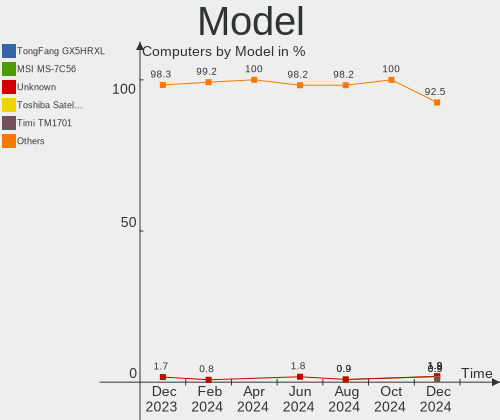
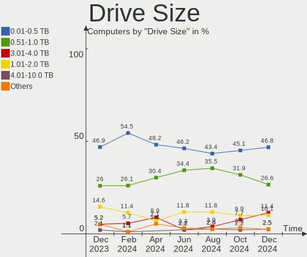
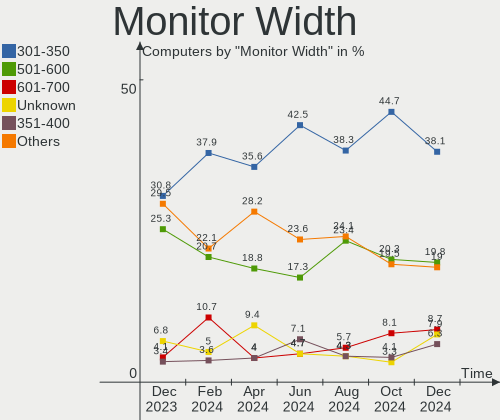
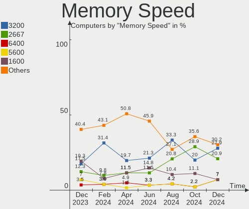
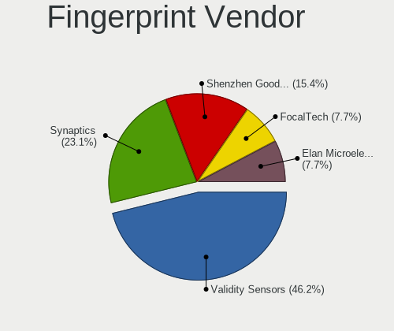

Manjaro - Hardware Trends
-------------------------

A project to identify most popular hardware characteristics and track their change
over time based on data collected by Linux users at https://Linux-Hardware.org.

Anyone can contribute to this report by the [hw-probe](https://github.com/linuxhw/hw-probe) tool:

    sudo -E hw-probe -all -upload

This is a report for all computer types. See also reports for [desktops](/Dist/Manjaro/Desktop/README.md) and [notebooks](/Dist/Manjaro/Notebook/README.md).

This report is for one last month. Overall report since the beginning of time: [TestDays](https://github.com/linuxhw/TestDays)

Period: Feb, 2023.

Contents
--------

* [ System ](#system)
  - [ OS                       ](#os)
  - [ OS Family                ](#os-family)
  - [ Kernel                   ](#kernel)
  - [ Kernel Family            ](#kernel-family)
  - [ Kernel Major Ver.        ](#kernel-major-ver)
  - [ Arch                     ](#arch)
  - [ DE                       ](#de)
  - [ Display Server           ](#display-server)
  - [ Display Manager          ](#display-manager)
  - [ OS Lang                  ](#os-lang)
  - [ Boot Mode                ](#boot-mode)
  - [ Filesystem               ](#filesystem)
  - [ Part. scheme             ](#part-scheme)
  - [ Dual Boot with Linux/BSD ](#dual-boot-with-linuxbsd)
  - [ Dual Boot (Win)          ](#dual-boot-win)

* [ Board ](#board)
  - [ Vendor                   ](#vendor)
  - [ Model                    ](#model)
  - [ Model Family             ](#model-family)
  - [ MFG Year                 ](#mfg-year)
  - [ Form Factor              ](#form-factor)
  - [ Secure Boot              ](#secure-boot)
  - [ Coreboot                 ](#coreboot)
  - [ RAM Size                 ](#ram-size)
  - [ RAM Used                 ](#ram-used)
  - [ Total Drives             ](#total-drives)
  - [ Has CD-ROM               ](#has-cd-rom)
  - [ Has Ethernet             ](#has-ethernet)
  - [ Has WiFi                 ](#has-wifi)
  - [ Has Bluetooth            ](#has-bluetooth)

* [ Location ](#location)
  - [ Country                  ](#country)
  - [ City                     ](#city)

* [ Drives ](#drives)
  - [ Drive Vendor             ](#drive-vendor)
  - [ Drive Model              ](#drive-model)
  - [ HDD Vendor               ](#hdd-vendor)
  - [ SSD Vendor               ](#ssd-vendor)
  - [ Drive Kind               ](#drive-kind)
  - [ Drive Connector          ](#drive-connector)
  - [ Drive Size               ](#drive-size)
  - [ Space Total              ](#space-total)
  - [ Space Used               ](#space-used)
  - [ Malfunc. Drives          ](#malfunc-drives)
  - [ Malfunc. Drive Vendor    ](#malfunc-drive-vendor)
  - [ Malfunc. HDD Vendor      ](#malfunc-hdd-vendor)
  - [ Malfunc. Drive Kind      ](#malfunc-drive-kind)
  - [ Failed Drives            ](#failed-drives)
  - [ Failed Drive Vendor      ](#failed-drive-vendor)
  - [ Drive Status             ](#drive-status)

* [ Storage controller ](#storage-controller)
  - [ Storage Vendor           ](#storage-vendor)
  - [ Storage Model            ](#storage-model)
  - [ Storage Kind             ](#storage-kind)

* [ Processor ](#processor)
  - [ CPU Vendor               ](#cpu-vendor)
  - [ CPU Model                ](#cpu-model)
  - [ CPU Model Family         ](#cpu-model-family)
  - [ CPU Cores                ](#cpu-cores)
  - [ CPU Sockets              ](#cpu-sockets)
  - [ CPU Threads              ](#cpu-threads)
  - [ CPU Op-Modes             ](#cpu-op-modes)
  - [ CPU Microcode            ](#cpu-microcode)
  - [ CPU Microarch            ](#cpu-microarch)

* [ Graphics ](#graphics)
  - [ GPU Vendor               ](#gpu-vendor)
  - [ GPU Model                ](#gpu-model)
  - [ GPU Combo                ](#gpu-combo)
  - [ GPU Driver               ](#gpu-driver)
  - [ GPU Memory               ](#gpu-memory)

* [ Monitor ](#monitor)
  - [ Monitor Vendor           ](#monitor-vendor)
  - [ Monitor Model            ](#monitor-model)
  - [ Monitor Resolution       ](#monitor-resolution)
  - [ Monitor Diagonal         ](#monitor-diagonal)
  - [ Monitor Width            ](#monitor-width)
  - [ Aspect Ratio             ](#aspect-ratio)
  - [ Monitor Area             ](#monitor-area)
  - [ Pixel Density            ](#pixel-density)
  - [ Multiple Monitors        ](#multiple-monitors)

* [ Network ](#network)
  - [ Net Controller Vendor    ](#net-controller-vendor)
  - [ Net Controller Model     ](#net-controller-model)
  - [ Wireless Vendor          ](#wireless-vendor)
  - [ Wireless Model           ](#wireless-model)
  - [ Ethernet Vendor          ](#ethernet-vendor)
  - [ Ethernet Model           ](#ethernet-model)
  - [ Net Controller Kind      ](#net-controller-kind)
  - [ Used Controller          ](#used-controller)
  - [ NICs                     ](#nics)
  - [ IPv6                     ](#ipv6)

* [ Bluetooth ](#bluetooth)
  - [ Bluetooth Vendor         ](#bluetooth-vendor)
  - [ Bluetooth Model          ](#bluetooth-model)

* [ Sound ](#sound)
  - [ Sound Vendor             ](#sound-vendor)
  - [ Sound Model              ](#sound-model)

* [ Memory ](#memory)
  - [ Memory Vendor            ](#memory-vendor)
  - [ Memory Model             ](#memory-model)
  - [ Memory Kind              ](#memory-kind)
  - [ Memory Form Factor       ](#memory-form-factor)
  - [ Memory Size              ](#memory-size)
  - [ Memory Speed             ](#memory-speed)

* [ Printers & scanners ](#printers--scanners)
  - [ Printer Vendor           ](#printer-vendor)
  - [ Printer Model            ](#printer-model)
  - [ Scanner Vendor           ](#scanner-vendor)
  - [ Scanner Model            ](#scanner-model)

* [ Camera ](#camera)
  - [ Camera Vendor            ](#camera-vendor)
  - [ Camera Model             ](#camera-model)

* [ Security ](#security)
  - [ Fingerprint Vendor       ](#fingerprint-vendor)
  - [ Fingerprint Model        ](#fingerprint-model)
  - [ Chipcard Vendor          ](#chipcard-vendor)
  - [ Chipcard Model           ](#chipcard-model)

* [ Unsupported ](#unsupported)
  - [ Unsupported Devices      ](#unsupported-devices)
  - [ Unsupported Device Types ](#unsupported-device-types)

System
------

OS
--

Installed operating systems

| Name           | Computers | Percent |
|----------------|-----------|---------|
| Manjaro        | 93        | 57.41%  |
| Manjaro 22.0.3 | 21        | 12.96%  |
| Manjaro 22.0.4 | 20        | 12.35%  |
| Manjaro 22.0.2 | 19        | 11.73%  |
| Manjaro 22.0.1 | 9         | 5.56%   |

OS Family
---------

OS without a version

| Name    | Computers | Percent |
|---------|-----------|---------|
| Manjaro | 162       | 100%    |

Kernel
------

Version of the Linux kernel

| Version                         | Computers | Percent |
|---------------------------------|-----------|---------|
| 6.1.11-1-MANJARO                | 35        | 21.6%   |
| 6.1.9-1-MANJARO                 | 30        | 18.52%  |
| 6.1.12-1-MANJARO                | 24        | 14.81%  |
| 5.15.94-1-MANJARO               | 12        | 7.41%   |
| 6.1.7-1-MANJARO                 | 11        | 6.79%   |
| 5.15.93-1-MANJARO               | 9         | 5.56%   |
| 5.15.91-1-MANJARO               | 8         | 4.94%   |
| 5.15.89-1-MANJARO               | 8         | 4.94%   |
| 6.0.19-3-MANJARO                | 3         | 1.85%   |
| 6.2.0-1-MANJARO                 | 2         | 1.23%   |
| 6.0.19-4-MANJARO                | 2         | 1.23%   |
| 5.15.53-1-MANJARO               | 2         | 1.23%   |
| 5.10.164-1-MANJARO              | 2         | 1.23%   |
| 6.2.0-AMD                       | 1         | 0.62%   |
| 6.2.0-2-MANJARO                 | 1         | 0.62%   |
| 6.1.9-zen1-1-zen                | 1         | 0.62%   |
| 6.1.10-lqx1-1-lqx               | 1         | 0.62%   |
| 6.1.1-1-MANJARO                 | 1         | 0.62%   |
| 6.0.6-1-MANJARO                 | 1         | 0.62%   |
| 6.0.5-4-rt14-MANJARO            | 1         | 0.62%   |
| 5.4.228-1-MANJARO               | 1         | 0.62%   |
| 5.18.19-3-MANJARO               | 1         | 0.62%   |
| 5.15.95-xanmod1-1-lts           | 1         | 0.62%   |
| 5.15.81-1-MANJARO               | 1         | 0.62%   |
| 5.15.74-zen1-1-zen-515lts-dirty | 1         | 0.62%   |
| 5.15.74-3-MANJARO               | 1         | 0.62%   |
| 5.15.65-1-MANJARO               | 1         | 0.62%   |

Kernel Family
-------------

Linux kernel without a distro release

| Version  | Computers | Percent |
|----------|-----------|---------|
| 6.1.11   | 35        | 21.6%   |
| 6.1.9    | 31        | 19.14%  |
| 6.1.12   | 24        | 14.81%  |
| 5.15.94  | 12        | 7.41%   |
| 6.1.7    | 11        | 6.79%   |
| 5.15.93  | 9         | 5.56%   |
| 5.15.91  | 8         | 4.94%   |
| 5.15.89  | 8         | 4.94%   |
| 6.0.19   | 5         | 3.09%   |
| 6.2.0    | 4         | 2.47%   |
| 5.15.74  | 2         | 1.23%   |
| 5.15.53  | 2         | 1.23%   |
| 5.10.164 | 2         | 1.23%   |
| 6.1.10   | 1         | 0.62%   |
| 6.1.1    | 1         | 0.62%   |
| 6.0.6    | 1         | 0.62%   |
| 6.0.5    | 1         | 0.62%   |
| 5.4.228  | 1         | 0.62%   |
| 5.18.19  | 1         | 0.62%   |
| 5.15.95  | 1         | 0.62%   |
| 5.15.81  | 1         | 0.62%   |
| 5.15.65  | 1         | 0.62%   |

Kernel Major Ver.
-----------------

Linux kernel major version

| Version | Computers | Percent |
|---------|-----------|---------|
| 6.1     | 103       | 63.58%  |
| 5.15    | 44        | 27.16%  |
| 6.0     | 7         | 4.32%   |
| 6.2     | 4         | 2.47%   |
| 5.10    | 2         | 1.23%   |
| 5.4     | 1         | 0.62%   |
| 5.18    | 1         | 0.62%   |

Arch
----

OS architecture (x86_64, i586, etc.)

| Name   | Computers | Percent |
|--------|-----------|---------|
| x86_64 | 162       | 100%    |

DE
--

Desktop Environment

| Name       | Computers | Percent |
|------------|-----------|---------|
| KDE5       | 98        | 60.49%  |
| GNOME      | 29        | 17.9%   |
| XFCE       | 21        | 12.96%  |
| Unknown    | 5         | 3.09%   |
| X-Cinnamon | 3         | 1.85%   |
| KDE        | 2         | 1.23%   |
| i3         | 2         | 1.23%   |
| MATE       | 1         | 0.62%   |
| Deepin     | 1         | 0.62%   |

Display Server
--------------

X11 or Wayland

| Name    | Computers | Percent |
|---------|-----------|---------|
| X11     | 135       | 83.33%  |
| Wayland | 21        | 12.96%  |
| Unknown | 4         | 2.47%   |
| Tty     | 2         | 1.23%   |

Display Manager
---------------

SDDM, LightDM, etc.

| Name    | Computers | Percent |
|---------|-----------|---------|
| Unknown | 94        | 58.02%  |
| SDDM    | 35        | 21.6%   |
| GDM     | 19        | 11.73%  |
| LightDM | 13        | 8.02%   |
| LXDM    | 1         | 0.62%   |

OS Lang
-------

Language

| Lang    | Computers | Percent |
|---------|-----------|---------|
| en_US   | 65        | 40.12%  |
| de_DE   | 18        | 11.11%  |
| ru_RU   | 17        | 10.49%  |
| en_GB   | 14        | 8.64%   |
| pt_BR   | 8         | 4.94%   |
| fr_FR   | 4         | 2.47%   |
| Unknown | 4         | 2.47%   |
| pl_PL   | 3         | 1.85%   |
| nl_NL   | 3         | 1.85%   |
| it_IT   | 2         | 1.23%   |
| es_MX   | 2         | 1.23%   |
| es_ES   | 2         | 1.23%   |
| en_IN   | 2         | 1.23%   |
| en_AU   | 2         | 1.23%   |
| de_AT   | 2         | 1.23%   |
| tr_TR   | 1         | 0.62%   |
| ro_RO   | 1         | 0.62%   |
| fr_CA   | 1         | 0.62%   |
| fi_FI   | 1         | 0.62%   |
| es_PE   | 1         | 0.62%   |
| es_CO   | 1         | 0.62%   |
| en_ZW   | 1         | 0.62%   |
| en_SE   | 1         | 0.62%   |
| en_PH   | 1         | 0.62%   |
| en_IE   | 1         | 0.62%   |
| en_DE   | 1         | 0.62%   |
| en_CA   | 1         | 0.62%   |
| cs_CZ   | 1         | 0.62%   |
| aa_DJ   | 1         | 0.62%   |

Boot Mode
---------

EFI or BIOS

| Mode | Computers | Percent |
|------|-----------|---------|
| BIOS | 99        | 61.11%  |
| EFI  | 63        | 38.89%  |

Filesystem
----------

Type of filesystem

| Type    | Computers | Percent |
|---------|-----------|---------|
| Ext4    | 132       | 81.48%  |
| Btrfs   | 28        | 17.28%  |
| Xfs     | 1         | 0.62%   |
| Overlay | 1         | 0.62%   |

Part. scheme
------------

Scheme of partitioning

| Type    | Computers | Percent |
|---------|-----------|---------|
| Unknown | 86        | 53.09%  |
| GPT     | 71        | 43.83%  |
| MBR     | 5         | 3.09%   |

Dual Boot with Linux/BSD
------------------------

Hosting more than one Linux/BSD

| Dual boot | Computers | Percent |
|-----------|-----------|---------|
| No        | 151       | 93.21%  |
| Yes       | 11        | 6.79%   |

Dual Boot (Win)
---------------

Hosting Linux and Windows

| Dual boot | Computers | Percent |
|-----------|-----------|---------|
| No        | 127       | 78.4%   |
| Yes       | 35        | 21.6%   |

Board
-----

Vendor
------

Motherboard manufacturer

| Name                                 | Computers | Percent |
|--------------------------------------|-----------|---------|
| ASUSTek Computer                     | 35        | 21.6%   |
| Dell                                 | 22        | 13.58%  |
| Lenovo                               | 20        | 12.35%  |
| MSI                                  | 16        | 9.88%   |
| Hewlett-Packard                      | 16        | 9.88%   |
| Acer                                 | 10        | 6.17%   |
| Gigabyte Technology                  | 9         | 5.56%   |
| ASRock                               | 8         | 4.94%   |
| Intel                                | 3         | 1.85%   |
| HUAWEI                               | 3         | 1.85%   |
| Timi                                 | 2         | 1.23%   |
| AZW                                  | 2         | 1.23%   |
| Apple                                | 2         | 1.23%   |
| Unknown                              | 2         | 1.23%   |
| TUXEDO                               | 1         | 0.62%   |
| System76                             | 1         | 0.62%   |
| Shuttle                              | 1         | 0.62%   |
| Shenzhen Meigao Electronic Equipment | 1         | 0.62%   |
| Schenker                             | 1         | 0.62%   |
| Samsung Electronics                  | 1         | 0.62%   |
| Positivo                             | 1         | 0.62%   |
| Kllisre                              | 1         | 0.62%   |
| HONOR                                | 1         | 0.62%   |
| GPD                                  | 1         | 0.62%   |
| Google                               | 1         | 0.62%   |
| Fujitsu                              | 1         | 0.62%   |

Model
-----

Motherboard model

| Name                                        | Computers | Percent |
|---------------------------------------------|-----------|---------|
| ASUS All Series                             | 4         | 2.47%   |
| MSI MS-7C91                                 | 2         | 1.23%   |
| MSI MS-7C37                                 | 2         | 1.23%   |
| MSI GF63 Thin 11UC                          | 2         | 1.23%   |
| Intel H61                                   | 2         | 1.23%   |
| ASRock B450M Steel Legend                   | 2         | 1.23%   |
| Unknown                                     | 2         | 1.23%   |
| TUXEDO Stellaris Intel Gen4                 | 1         | 0.62%   |
| Timi Xiaomi Book Pro 14 2022                | 1         | 0.62%   |
| Timi A34S                                   | 1         | 0.62%   |
| System76 Serval WS                          | 1         | 0.62%   |
| Shuttle SX79R                               | 1         | 0.62%   |
| Shenzhen Meigao Electronic Equipment UM690  | 1         | 0.62%   |
| Schenker VISION 15 (SVS15E21)               | 1         | 0.62%   |
| Samsung 530U3BI/530U4BI/530U4BH             | 1         | 0.62%   |
| Positivo POS-EIH61CE                        | 1         | 0.62%   |
| MSI Summit E13FlipEvo A11MT                 | 1         | 0.62%   |
| MSI MS-7C09                                 | 1         | 0.62%   |
| MSI MS-7B98                                 | 1         | 0.62%   |
| MSI MS-7B86                                 | 1         | 0.62%   |
| MSI MS-7B84                                 | 1         | 0.62%   |
| MSI MS-7B12                                 | 1         | 0.62%   |
| MSI MS-7846                                 | 1         | 0.62%   |
| MSI MS-7693                                 | 1         | 0.62%   |
| MSI GF63 Thin 9RCX                          | 1         | 0.62%   |
| MSI GE60 2QE                                | 1         | 0.62%   |
| Lenovo Yoga Slim 7 Pro 14IAP7 82SV          | 1         | 0.62%   |
| Lenovo Yoga 6 13ALC6 82ND                   | 1         | 0.62%   |
| Lenovo ThinkPad X230 2324A82                | 1         | 0.62%   |
| Lenovo ThinkPad X1 Extreme Gen 3 20TK0047US | 1         | 0.62%   |
| Lenovo ThinkPad T530 2392AQU                | 1         | 0.62%   |
| Lenovo ThinkPad T460 20FMS06V00             | 1         | 0.62%   |
| Lenovo ThinkPad T430s 2356BQ5               | 1         | 0.62%   |
| Lenovo ThinkPad P51 20HJS02000              | 1         | 0.62%   |
| Lenovo ThinkPad L15 Gen1 20U70003CK         | 1         | 0.62%   |
| Lenovo ThinkPad L15 Gen 2 20X4S6U400        | 1         | 0.62%   |
| Lenovo ThinkBook 15 G2 ITL 20VE             | 1         | 0.62%   |
| Lenovo Legion Y540-15IRH 81SX               | 1         | 0.62%   |
| Lenovo Legion S7 16ARHA7 82UG               | 1         | 0.62%   |
| Lenovo Legion 5 Pro 16ACH6 82JS             | 1         | 0.62%   |

Model Family
------------

Motherboard model prefix

| Name                                       | Computers | Percent |
|--------------------------------------------|-----------|---------|
| ASUS ROG                                   | 9         | 5.56%   |
| Lenovo ThinkPad                            | 8         | 4.94%   |
| ASUS PRIME                                 | 7         | 4.32%   |
| Dell Latitude                              | 6         | 3.7%    |
| Lenovo Legion                              | 5         | 3.09%   |
| HP EliteBook                               | 5         | 3.09%   |
| Dell OptiPlex                              | 4         | 2.47%   |
| ASUS VivoBook                              | 4         | 2.47%   |
| ASUS All                                   | 4         | 2.47%   |
| Acer Aspire                                | 4         | 2.47%   |
| MSI GF63                                   | 3         | 1.85%   |
| Lenovo IdeaPad                             | 3         | 1.85%   |
| HP Pavilion                                | 3         | 1.85%   |
| Dell XPS                                   | 3         | 1.85%   |
| Dell Inspiron                              | 3         | 1.85%   |
| ASUS TUF                                   | 3         | 1.85%   |
| MSI MS-7C91                                | 2         | 1.23%   |
| MSI MS-7C37                                | 2         | 1.23%   |
| Lenovo Yoga                                | 2         | 1.23%   |
| Intel H61                                  | 2         | 1.23%   |
| HP ProBook                                 | 2         | 1.23%   |
| Gigabyte Z690                              | 2         | 1.23%   |
| Dell Vostro                                | 2         | 1.23%   |
| Dell Precision                             | 2         | 1.23%   |
| ASRock B450M                               | 2         | 1.23%   |
| ASRock B450                                | 2         | 1.23%   |
| Acer TravelMate                            | 2         | 1.23%   |
| Acer Predator                              | 2         | 1.23%   |
| Unknown                                    | 2         | 1.23%   |
| TUXEDO Stellaris                           | 1         | 0.62%   |
| Timi Xiaomi                                | 1         | 0.62%   |
| Timi A34S                                  | 1         | 0.62%   |
| System76 Serval                            | 1         | 0.62%   |
| Shuttle SX79R                              | 1         | 0.62%   |
| Shenzhen Meigao Electronic Equipment UM690 | 1         | 0.62%   |
| Schenker VISION                            | 1         | 0.62%   |
| Samsung 530U3BI                            | 1         | 0.62%   |
| Positivo POS-EIH61CE                       | 1         | 0.62%   |
| MSI Summit                                 | 1         | 0.62%   |
| MSI MS-7C09                                | 1         | 0.62%   |

MFG Year
--------

Motherboard manufacture year

| Year | Computers | Percent |
|------|-----------|---------|
| 2021 | 30        | 18.52%  |
| 2019 | 22        | 13.58%  |
| 2022 | 21        | 12.96%  |
| 2020 | 19        | 11.73%  |
| 2018 | 18        | 11.11%  |
| 2012 | 12        | 7.41%   |
| 2017 | 9         | 5.56%   |
| 2016 | 6         | 3.7%    |
| 2014 | 6         | 3.7%    |
| 2015 | 5         | 3.09%   |
| 2013 | 5         | 3.09%   |
| 2011 | 4         | 2.47%   |
| 2010 | 2         | 1.23%   |
| 2009 | 2         | 1.23%   |
| 2008 | 1         | 0.62%   |

Form Factor
-----------

Physical design of the computer

| Name        | Computers | Percent |
|-------------|-----------|---------|
| Notebook    | 87        | 53.7%   |
| Desktop     | 64        | 39.51%  |
| Convertible | 7         | 4.32%   |
| Mini pc     | 3         | 1.85%   |
| All in one  | 1         | 0.62%   |

Secure Boot
-----------

Enabled or disabled

| State    | Computers | Percent |
|----------|-----------|---------|
| Disabled | 161       | 99.38%  |
| Enabled  | 1         | 0.62%   |

Coreboot
--------

Have coreboot on board

| Used | Computers | Percent |
|------|-----------|---------|
| No   | 161       | 99.38%  |
| Yes  | 1         | 0.62%   |

RAM Size
--------

Total RAM memory

| Size in GB  | Computers | Percent |
|-------------|-----------|---------|
| 16.01-24.0  | 44        | 27.16%  |
| 32.01-64.0  | 40        | 24.69%  |
| 4.01-8.0    | 32        | 19.75%  |
| 8.01-16.0   | 25        | 15.43%  |
| 3.01-4.0    | 10        | 6.17%   |
| 64.01-256.0 | 6         | 3.7%    |
| 24.01-32.0  | 4         | 2.47%   |
| 1.01-2.0    | 1         | 0.62%   |

RAM Used
--------

Used RAM memory

| Used GB    | Computers | Percent |
|------------|-----------|---------|
| 4.01-8.0   | 49        | 30.25%  |
| 2.01-3.0   | 43        | 26.54%  |
| 3.01-4.0   | 28        | 17.28%  |
| 1.01-2.0   | 21        | 12.96%  |
| 8.01-16.0  | 16        | 9.88%   |
| 24.01-32.0 | 2         | 1.23%   |
| 16.01-24.0 | 2         | 1.23%   |
| 0.51-1.0   | 1         | 0.62%   |

Total Drives
------------

Number of drives on board

| Drives | Computers | Percent |
|--------|-----------|---------|
| 1      | 79        | 48.77%  |
| 2      | 44        | 27.16%  |
| 3      | 17        | 10.49%  |
| 4      | 13        | 8.02%   |
| 5      | 4         | 2.47%   |
| 8      | 2         | 1.23%   |
| 0      | 2         | 1.23%   |
| 6      | 1         | 0.62%   |

Has CD-ROM
----------

Has CD-ROM on board

| Presented | Computers | Percent |
|-----------|-----------|---------|
| No        | 132       | 81.48%  |
| Yes       | 30        | 18.52%  |

Has Ethernet
------------

Has Ethernet on board

| Presented | Computers | Percent |
|-----------|-----------|---------|
| Yes       | 133       | 82.1%   |
| No        | 29        | 17.9%   |

Has WiFi
--------

Has WiFi module

| Presented | Computers | Percent |
|-----------|-----------|---------|
| Yes       | 131       | 80.86%  |
| No        | 31        | 19.14%  |

Has Bluetooth
-------------

Has Bluetooth module

| Presented | Computers | Percent |
|-----------|-----------|---------|
| Yes       | 118       | 72.84%  |
| No        | 44        | 27.16%  |

Location
--------

Country
-------

Geographic location (country)

| Country       | Computers | Percent |
|---------------|-----------|---------|
| USA           | 30        | 18.52%  |
| Germany       | 25        | 15.43%  |
| Russia        | 22        | 13.58%  |
| Brazil        | 11        | 6.79%   |
| UK            | 7         | 4.32%   |
| Netherlands   | 5         | 3.09%   |
| Italy         | 5         | 3.09%   |
| Spain         | 4         | 2.47%   |
| Poland        | 4         | 2.47%   |
| India         | 4         | 2.47%   |
| France        | 4         | 2.47%   |
| Romania       | 2         | 1.23%   |
| Peru          | 2         | 1.23%   |
| Mexico        | 2         | 1.23%   |
| Indonesia     | 2         | 1.23%   |
| Czechia       | 2         | 1.23%   |
| Canada        | 2         | 1.23%   |
| Austria       | 2         | 1.23%   |
| Australia     | 2         | 1.23%   |
| Vietnam       | 1         | 0.62%   |
| Uzbekistan    | 1         | 0.62%   |
| Ukraine       | 1         | 0.62%   |
| Turkey        | 1         | 0.62%   |
| Switzerland   | 1         | 0.62%   |
| South Africa  | 1         | 0.62%   |
| Slovakia      | 1         | 0.62%   |
| Saudi Arabia  | 1         | 0.62%   |
| Philippines   | 1         | 0.62%   |
| New Caledonia | 1         | 0.62%   |
| Kuwait        | 1         | 0.62%   |
| Japan         | 1         | 0.62%   |
| Israel        | 1         | 0.62%   |
| Ireland       | 1         | 0.62%   |
| Iran          | 1         | 0.62%   |
| Hungary       | 1         | 0.62%   |
| Finland       | 1         | 0.62%   |
| Cyprus        | 1         | 0.62%   |
| Colombia      | 1         | 0.62%   |
| China         | 1         | 0.62%   |
| Chile         | 1         | 0.62%   |

City
----

Geographic location (city)

| City             | Computers | Percent |
|------------------|-----------|---------|
| St Petersburg    | 5         | 3.09%   |
| Moscow           | 3         | 1.85%   |
| Stuttgart        | 2         | 1.23%   |
| Sao Paulo        | 2         | 1.23%   |
| Prague           | 2         | 1.23%   |
| Nuremberg        | 2         | 1.23%   |
| Munich           | 2         | 1.23%   |
| Krasnodar        | 2         | 1.23%   |
| Hamburg          | 2         | 1.23%   |
| Goiânia         | 2         | 1.23%   |
| Bucharest        | 2         | 1.23%   |
| Birmingham       | 2         | 1.23%   |
| Astrakhan        | 2         | 1.23%   |
| Amsterdam        | 2         | 1.23%   |
| Zurich           | 1         | 0.62%   |
| Wittenberg       | 1         | 0.62%   |
| Wetteren         | 1         | 0.62%   |
| West Stockbridge | 1         | 0.62%   |
| Walsall          | 1         | 0.62%   |
| Vladivostok      | 1         | 0.62%   |
| Velke Surovce    | 1         | 0.62%   |
| Vancouver        | 1         | 0.62%   |
| Valladolid       | 1         | 0.62%   |
| Ulm              | 1         | 0.62%   |
| Trento           | 1         | 0.62%   |
| Toronto          | 1         | 0.62%   |
| Tooele           | 1         | 0.62%   |
| Tirunelveli      | 1         | 0.62%   |
| The Hague        | 1         | 0.62%   |
| The Bronx        | 1         | 0.62%   |
| Terrassa         | 1         | 0.62%   |
| Tehran           | 1         | 0.62%   |
| Tashkent         | 1         | 0.62%   |
| Sydney           | 1         | 0.62%   |
| Sona             | 1         | 0.62%   |
| Solingen         | 1         | 0.62%   |
| Simferopol       | 1         | 0.62%   |
| Savona           | 1         | 0.62%   |
| Santiago         | 1         | 0.62%   |
| San Jose         | 1         | 0.62%   |

Drives
------

Drive Vendor
------------

Hard drive vendors

| Vendor                         | Computers | Drives | Percent |
|--------------------------------|-----------|--------|---------|
| Samsung Electronics            | 54        | 72     | 19.57%  |
| Seagate                        | 30        | 33     | 10.87%  |
| WDC                            | 28        | 34     | 10.14%  |
| Sandisk                        | 28        | 34     | 10.14%  |
| Toshiba                        | 16        | 17     | 5.8%    |
| Kingston                       | 15        | 15     | 5.43%   |
| Crucial                        | 12        | 13     | 4.35%   |
| Phison Electronics             | 9         | 9      | 3.26%   |
| Micron Technology              | 7         | 7      | 2.54%   |
| Intel                          | 7         | 8      | 2.54%   |
| Unknown                        | 6         | 6      | 2.17%   |
| SK hynix                       | 6         | 6      | 2.17%   |
| HGST                           | 4         | 4      | 1.45%   |
| China                          | 4         | 4      | 1.45%   |
| KIOXIA                         | 3         | 3      | 1.09%   |
| A-DATA Technology              | 3         | 3      | 1.09%   |
| Verbatim                       | 2         | 3      | 0.72%   |
| SABRENT                        | 2         | 2      | 0.72%   |
| Realtek                        | 2         | 2      | 0.72%   |
| Plextor                        | 2         | 2      | 0.72%   |
| Micron/Crucial Technology      | 2         | 2      | 0.72%   |
| LITEONIT                       | 2         | 2      | 0.72%   |
| Kingston Technology Company    | 2         | 2      | 0.72%   |
| Fujitsu                        | 2         | 2      | 0.72%   |
| Biwin Storage Technology       | 2         | 2      | 0.72%   |
| Apple                          | 2         | 3      | 0.72%   |
| Yangtze Memory Technologies    | 1         | 1      | 0.36%   |
| Union Memory                   | 1         | 1      | 0.36%   |
| TwinMOS                        | 1         | 1      | 0.36%   |
| T-FORCE                        | 1         | 1      | 0.36%   |
| SSK                            | 1         | 1      | 0.36%   |
| Solid State Storage Technology | 1         | 1      | 0.36%   |
| Silicon Motion                 | 1         | 1      | 0.36%   |
| SATA SSD                       | 1         | 1      | 0.36%   |
| Realtek Semiconductor          | 1         | 1      | 0.36%   |
| PNY                            | 1         | 1      | 0.36%   |
| Patriot                        | 1         | 1      | 0.36%   |
| OWC                            | 1         | 1      | 0.36%   |
| OCZ                            | 1         | 1      | 0.36%   |
| JMicron Technology             | 1         | 1      | 0.36%   |

Drive Model
-----------

Hard drive models

| Model                                                | Computers | Percent |
|------------------------------------------------------|-----------|---------|
| Samsung NVMe SSD Controller SM981/PM981/PM983 250GB  | 17        | 5.57%   |
| Samsung NVMe SSD Controller PM9A1/PM9A3/980PRO 960GB | 13        | 4.26%   |
| Sandisk WD Blue SN550 NVMe SSD 1TB                   | 4         | 1.31%   |
| Kingston SA400S37240G 240GB SSD                      | 4         | 1.31%   |
| Toshiba MQ01ABD100 1TB                               | 3         | 0.98%   |
| Toshiba HDWD110 1TB                                  | 3         | 0.98%   |
| Seagate ST1000LM024 HN-M101MBB 1TB                   | 3         | 0.98%   |
| Seagate ST1000DM010-2EP102 1TB                       | 3         | 0.98%   |
| Sandisk WD_BLACK SN770 2TB                           | 3         | 0.98%   |
| Sandisk WD Black SN850 500GB                         | 3         | 0.98%   |
| SanDisk SSD PLUS 1000GB                              | 3         | 0.98%   |
| Samsung SSD 980 1TB                                  | 3         | 0.98%   |
| Samsung PSSD T7 1TB                                  | 3         | 0.98%   |
| Samsung NVMe SSD Controller SM961/PM961/SM963 512GB  | 3         | 0.98%   |
| Phison E16 PCIe4 NVMe Controller 512GB               | 3         | 0.98%   |
| Crucial CT500MX500SSD1 500GB                         | 3         | 0.98%   |
| WDC WD10EZEX-08WN4A0 1TB                             | 2         | 0.66%   |
| Verbatim Vi550 S3 256GB                              | 2         | 0.66%   |
| Unknown MMC Card  64GB                               | 2         | 0.66%   |
| Toshiba MQ01ABD075 752GB                             | 2         | 0.66%   |
| Toshiba DT01ACA200 2TB                               | 2         | 0.66%   |
| Toshiba BG3 NVMe SSD Controller 256GB                | 2         | 0.66%   |
| Seagate ST4000DM000-1F2168 4TB                       | 2         | 0.66%   |
| Seagate ST2000DX002-2DV164 2TB                       | 2         | 0.66%   |
| Seagate ST1000LM035-1RK172 1TB                       | 2         | 0.66%   |
| Sandisk WD_BLACK SN770 500GB                         | 2         | 0.66%   |
| Sandisk WD Blue SN570 500GB                          | 2         | 0.66%   |
| Sandisk WD Blue SN500 / PC SN520 NVMe SSD 256GB      | 2         | 0.66%   |
| Sandisk PC SN520 NVMe SSD 512GB                      | 2         | 0.66%   |
| Samsung SSD 870 EVO 1TB                              | 2         | 0.66%   |
| Samsung SSD 860 EVO 500GB                            | 2         | 0.66%   |
| Samsung SSD 860 EVO 250GB                            | 2         | 0.66%   |
| SABRENT Disk 256GB                                   | 2         | 0.66%   |
| Phison PS5013 E13 NVMe Controller 500GB              | 2         | 0.66%   |
| Phison E12 NVMe Controller 1024GB                    | 2         | 0.66%   |
| Intel SSDPEKNW512GZL 512GB                           | 2         | 0.66%   |
| Crucial M4-CT128M4SSD2 128GB                         | 2         | 0.66%   |
| Crucial CT2000BX500SSD1 2TB                          | 2         | 0.66%   |
| Crucial CT1000MX500SSD1 1TB                          | 2         | 0.66%   |
| Yangtze Memory YMTC PC005 256GB                      | 1         | 0.33%   |

HDD Vendor
----------

Hard disk drive vendors

| Vendor              | Computers | Drives | Percent |
|---------------------|-----------|--------|---------|
| Seagate             | 29        | 32     | 36.25%  |
| WDC                 | 23        | 28     | 28.75%  |
| Toshiba             | 14        | 15     | 17.5%   |
| HGST                | 4         | 4      | 5%      |
| Samsung Electronics | 2         | 3      | 2.5%    |
| SABRENT             | 2         | 2      | 2.5%    |
| Fujitsu             | 2         | 2      | 2.5%    |
| Unknown             | 1         | 1      | 1.25%   |
| JMicron Technology  | 1         | 1      | 1.25%   |
| Intenso             | 1         | 1      | 1.25%   |
| Hitachi             | 1         | 1      | 1.25%   |

SSD Vendor
----------

Solid state drive vendors

| Vendor              | Computers | Drives | Percent |
|---------------------|-----------|--------|---------|
| Samsung Electronics | 20        | 22     | 23.81%  |
| Crucial             | 12        | 13     | 14.29%  |
| Kingston            | 10        | 10     | 11.9%   |
| SanDisk             | 8         | 9      | 9.52%   |
| WDC                 | 6         | 6      | 7.14%   |
| China               | 4         | 4      | 4.76%   |
| Micron Technology   | 3         | 3      | 3.57%   |
| A-DATA Technology   | 3         | 3      | 3.57%   |
| Verbatim            | 2         | 3      | 2.38%   |
| Plextor             | 2         | 2      | 2.38%   |
| LITEONIT            | 2         | 2      | 2.38%   |
| TwinMOS             | 1         | 1      | 1.19%   |
| SK hynix            | 1         | 1      | 1.19%   |
| PNY                 | 1         | 1      | 1.19%   |
| Patriot             | 1         | 1      | 1.19%   |
| OWC                 | 1         | 1      | 1.19%   |
| OCZ                 | 1         | 1      | 1.19%   |
| Intel               | 1         | 1      | 1.19%   |
| Hikvision           | 1         | 2      | 1.19%   |
| Hewlett-Packard     | 1         | 2      | 1.19%   |
| GOODRAM             | 1         | 1      | 1.19%   |
| Dogfish             | 1         | 1      | 1.19%   |
| Apple               | 1         | 1      | 1.19%   |

Drive Kind
----------

HDD or SSD

| Kind    | Computers | Drives | Percent |
|---------|-----------|--------|---------|
| NVMe    | 100       | 129    | 41.49%  |
| SSD     | 70        | 91     | 29.05%  |
| HDD     | 63        | 90     | 26.14%  |
| MMC     | 5         | 5      | 2.07%   |
| Unknown | 3         | 3      | 1.24%   |

Drive Connector
---------------

SATA, SAS, NVMe, etc.

| Type | Computers | Drives | Percent |
|------|-----------|--------|---------|
| NVMe | 100       | 126    | 46.95%  |
| SATA | 94        | 170    | 44.13%  |
| SAS  | 14        | 17     | 6.57%   |
| MMC  | 5         | 5      | 2.35%   |

Drive Size
----------

Size of hard drive

| Size in TB | Computers | Drives | Percent |
|------------|-----------|--------|---------|
| 0.01-0.5   | 64        | 91     | 46.72%  |
| 0.51-1.0   | 47        | 58     | 34.31%  |
| 1.01-2.0   | 15        | 17     | 10.95%  |
| 3.01-4.0   | 6         | 7      | 4.38%   |
| 4.01-10.0  | 4         | 7      | 2.92%   |
| 2.01-3.0   | 1         | 1      | 0.73%   |

Space Total
-----------

Amount of disk space available on the file system

| Size in GB     | Computers | Percent |
|----------------|-----------|---------|
| 251-500        | 34        | 20.99%  |
| 101-250        | 32        | 19.75%  |
| 501-1000       | 27        | 16.67%  |
| More than 3000 | 17        | 10.49%  |
| 1001-2000      | 16        | 9.88%   |
| Unknown        | 12        | 7.41%   |
| 2001-3000      | 11        | 6.79%   |
| 51-100         | 6         | 3.7%    |
| 1-20           | 4         | 2.47%   |
| 21-50          | 3         | 1.85%   |

Space Used
----------

Amount of used disk space

| Used GB        | Computers | Percent |
|----------------|-----------|---------|
| 21-50          | 27        | 16.67%  |
| 101-250        | 25        | 15.43%  |
| 1-20           | 25        | 15.43%  |
| 51-100         | 23        | 14.2%   |
| 251-500        | 15        | 9.26%   |
| 501-1000       | 14        | 8.64%   |
| 1001-2000      | 13        | 8.02%   |
| Unknown        | 12        | 7.41%   |
| More than 3000 | 3         | 1.85%   |
| 2001-3000      | 3         | 1.85%   |
| 0              | 2         | 1.23%   |

Malfunc. Drives
---------------

Drive models with a malfunction

| Model                               | Computers | Drives | Percent |
|-------------------------------------|-----------|--------|---------|
| WDC WD100EZAZ-11TDBA0 10TB          | 1         | 2      | 14.29%  |
| WDC WD10 SPZX-08Z10 1TB             | 1         | 1      | 14.29%  |
| Seagate ST4000DM000-1F2168 4TB      | 1         | 1      | 14.29%  |
| Seagate ST31000524AS 1TB            | 1         | 1      | 14.29%  |
| Samsung Electronics SSD 870 EVO 1TB | 1         | 1      | 14.29%  |
| Kingston SA400S37240G 240GB SSD     | 1         | 1      | 14.29%  |
| HGST HTS721010A9E630 1TB            | 1         | 1      | 14.29%  |

Malfunc. Drive Vendor
---------------------

Vendors of faulty drives

| Vendor              | Computers | Drives | Percent |
|---------------------|-----------|--------|---------|
| WDC                 | 2         | 3      | 28.57%  |
| Seagate             | 2         | 2      | 28.57%  |
| Samsung Electronics | 1         | 1      | 14.29%  |
| Kingston            | 1         | 1      | 14.29%  |
| HGST                | 1         | 1      | 14.29%  |

Malfunc. HDD Vendor
-------------------

Vendors of faulty HDD drives

| Vendor  | Computers | Drives | Percent |
|---------|-----------|--------|---------|
| WDC     | 2         | 3      | 40%     |
| Seagate | 2         | 2      | 40%     |
| HGST    | 1         | 1      | 20%     |

Malfunc. Drive Kind
-------------------

Kinds of faulty drives

| Kind | Computers | Drives | Percent |
|------|-----------|--------|---------|
| HDD  | 5         | 6      | 71.43%  |
| SSD  | 2         | 2      | 28.57%  |

Failed Drives
-------------

Failed drive models

Zero info for selected period =(

Failed Drive Vendor
-------------------

Failed drive vendors

Zero info for selected period =(

Drive Status
------------

Number of failed and malfunc. drives

| Status   | Computers | Drives | Percent |
|----------|-----------|--------|---------|
| Detected | 116       | 235    | 67.84%  |
| Works    | 48        | 75     | 28.07%  |
| Malfunc  | 7         | 8      | 4.09%   |

Storage controller
------------------

Storage Vendor
--------------

Storage controller vendors

| Vendor                         | Computers | Percent |
|--------------------------------|-----------|---------|
| Intel                          | 93        | 39.41%  |
| Samsung Electronics            | 39        | 16.53%  |
| AMD                            | 36        | 15.25%  |
| SanDisk                        | 21        | 8.9%    |
| Phison Electronics             | 9         | 3.81%   |
| Kingston Technology Company    | 7         | 2.97%   |
| SK hynix                       | 5         | 2.12%   |
| Micron Technology              | 4         | 1.69%   |
| ASMedia Technology             | 4         | 1.69%   |
| KIOXIA                         | 3         | 1.27%   |
| Toshiba America Info Systems   | 2         | 0.85%   |
| Micron/Crucial Technology      | 2         | 0.85%   |
| Biwin Storage Technology       | 2         | 0.85%   |
| Yangtze Memory Technologies    | 1         | 0.42%   |
| Union Memory (Shenzhen)        | 1         | 0.42%   |
| Solid State Storage Technology | 1         | 0.42%   |
| Silicon Motion                 | 1         | 0.42%   |
| Seagate Technology             | 1         | 0.42%   |
| Realtek Semiconductor          | 1         | 0.42%   |
| Beijing Starblaze Technology   | 1         | 0.42%   |
| Apple                          | 1         | 0.42%   |
| ADATA Technology               | 1         | 0.42%   |

Storage Model
-------------

Storage controller models

| Model                                                                          | Computers | Percent |
|--------------------------------------------------------------------------------|-----------|---------|
| AMD FCH SATA Controller [AHCI mode]                                            | 26        | 9.67%   |
| Samsung NVMe SSD Controller SM981/PM981/PM983                                  | 17        | 6.32%   |
| Samsung NVMe SSD Controller PM9A1/PM9A3/980PRO                                 | 13        | 4.83%   |
| AMD 400 Series Chipset SATA Controller                                         | 11        | 4.09%   |
| Intel 8 Series/C220 Series Chipset Family 6-port SATA Controller 1 [AHCI mode] | 9         | 3.35%   |
| SanDisk Non-Volatile memory controller                                         | 8         | 2.97%   |
| Samsung NVMe SSD Controller 980                                                | 8         | 2.97%   |
| Intel Volume Management Device NVMe RAID Controller                            | 8         | 2.97%   |
| Intel 7 Series Chipset Family 6-port SATA Controller [AHCI mode]               | 7         | 2.6%    |
| Intel Cannon Lake Mobile PCH SATA AHCI Controller                              | 6         | 2.23%   |
| Intel 200 Series PCH SATA controller [AHCI mode]                               | 6         | 2.23%   |
| AMD 500 Series Chipset SATA Controller                                         | 6         | 2.23%   |
| Kingston Company Company Non-Volatile memory controller                        | 5         | 1.86%   |
| Intel 82801 Mobile SATA Controller [RAID mode]                                 | 5         | 1.86%   |
| Intel 500 Series Chipset Family SATA AHCI Controller                           | 5         | 1.86%   |
| SanDisk WD Blue SN570 NVMe SSD                                                 | 4         | 1.49%   |
| SanDisk WD Blue SN550 NVMe SSD                                                 | 4         | 1.49%   |
| Micron Non-Volatile memory controller                                          | 4         | 1.49%   |
| Intel Sunrise Point-LP SATA Controller [AHCI mode]                             | 4         | 1.49%   |
| Intel SATA Controller [RAID mode]                                              | 4         | 1.49%   |
| Intel Non-Volatile memory controller                                           | 4         | 1.49%   |
| Intel Alder Lake-S PCH SATA Controller [AHCI Mode]                             | 4         | 1.49%   |
| Intel 400 Series Chipset Family SATA AHCI Controller                           | 4         | 1.49%   |
| ASMedia ASM1062 Serial ATA Controller                                          | 4         | 1.49%   |
| SK hynix Non-Volatile memory controller                                        | 3         | 1.12%   |
| SanDisk WD PC SN810 / Black SN850 NVMe SSD                                     | 3         | 1.12%   |
| Samsung NVMe SSD Controller SM961/PM961/SM963                                  | 3         | 1.12%   |
| Phison E16 PCIe4 NVMe Controller                                               | 3         | 1.12%   |
| Intel Wildcat Point-LP SATA Controller [AHCI Mode]                             | 3         | 1.12%   |
| Intel Cannon Lake PCH SATA AHCI Controller                                     | 3         | 1.12%   |
| Intel 6 Series/C200 Series Chipset Family 6 port Mobile SATA AHCI Controller   | 3         | 1.12%   |
| Toshiba America Info Systems BG3 NVMe SSD Controller                           | 2         | 0.74%   |
| SanDisk WD Blue SN500 / PC SN520 NVMe SSD                                      | 2         | 0.74%   |
| SanDisk PC SN520 NVMe SSD                                                      | 2         | 0.74%   |
| Phison PS5013 E13 NVMe Controller                                              | 2         | 0.74%   |
| Phison E18 PCIe4 NVMe Controller                                               | 2         | 0.74%   |
| Phison E12 NVMe Controller                                                     | 2         | 0.74%   |
| Intel NM10/ICH7 Family SATA Controller [IDE mode]                              | 2         | 0.74%   |
| Intel Comet Lake SATA AHCI Controller                                          | 2         | 0.74%   |
| Intel Celeron/Pentium Silver Processor SATA Controller                         | 2         | 0.74%   |

Storage Kind
------------

Kind of storage controller (IDE, SATA, NVMe, SAS, ...)

| Kind | Computers | Percent |
|------|-----------|---------|
| SATA | 109       | 46.98%  |
| NVMe | 100       | 43.1%   |
| RAID | 17        | 7.33%   |
| IDE  | 6         | 2.59%   |

Processor
---------

CPU Vendor
----------

Processor vendors

| Vendor | Computers | Percent |
|--------|-----------|---------|
| Intel  | 113       | 69.75%  |
| AMD    | 49        | 30.25%  |

CPU Model
---------

Processor models

| Model                                       | Computers | Percent |
|---------------------------------------------|-----------|---------|
| AMD Ryzen 7 5700U with Radeon Graphics      | 4         | 2.47%   |
| Intel Core i7-9750H CPU @ 2.60GHz           | 3         | 1.85%   |
| Intel Core i7-10750H CPU @ 2.60GHz          | 3         | 1.85%   |
| Intel Core i5-9300H CPU @ 2.40GHz           | 3         | 1.85%   |
| Intel 12th Gen Core i7-12700K               | 3         | 1.85%   |
| Intel 11th Gen Core i7-1165G7 @ 2.80GHz     | 3         | 1.85%   |
| Intel 11th Gen Core i5-1135G7 @ 2.40GHz     | 3         | 1.85%   |
| AMD Ryzen 7 5800X 8-Core Processor          | 3         | 1.85%   |
| AMD Ryzen 5 2600 Six-Core Processor         | 3         | 1.85%   |
| Intel Core i7-2600 CPU @ 3.40GHz            | 2         | 1.23%   |
| Intel Core i7-10510U CPU @ 1.80GHz          | 2         | 1.23%   |
| Intel Core i5-8265U CPU @ 1.60GHz           | 2         | 1.23%   |
| Intel Core i5-6300U CPU @ 2.40GHz           | 2         | 1.23%   |
| Intel Core i5-5200U CPU @ 2.20GHz           | 2         | 1.23%   |
| Intel Core i5-4460 CPU @ 3.20GHz            | 2         | 1.23%   |
| Intel Core i5-3320M CPU @ 2.60GHz           | 2         | 1.23%   |
| Intel 12th Gen Core i7-12700H               | 2         | 1.23%   |
| Intel 12th Gen Core i7-1260P                | 2         | 1.23%   |
| Intel 11th Gen Core i7-11800H @ 2.30GHz     | 2         | 1.23%   |
| AMD Ryzen 9 6900HX with Radeon Graphics     | 2         | 1.23%   |
| AMD Ryzen 9 5900X 12-Core Processor         | 2         | 1.23%   |
| AMD Ryzen 9 5900HX with Radeon Graphics     | 2         | 1.23%   |
| AMD Ryzen 7 3700X 8-Core Processor          | 2         | 1.23%   |
| AMD Ryzen 5 5500U with Radeon Graphics      | 2         | 1.23%   |
| AMD Ryzen 5 1600 Six-Core Processor         | 2         | 1.23%   |
| Intel Xeon CPU E5-2640 v4 @ 2.40GHz         | 1         | 0.62%   |
| Intel Xeon CPU E5-2640 0 @ 2.50GHz          | 1         | 0.62%   |
| Intel Xeon CPU E3-1505M v6 @ 3.00GHz        | 1         | 0.62%   |
| Intel Pentium Silver N5030 CPU @ 1.10GHz    | 1         | 0.62%   |
| Intel Pentium Dual-Core CPU E5700 @ 3.00GHz | 1         | 0.62%   |
| Intel Core i9-9900KF CPU @ 3.60GHz          | 1         | 0.62%   |
| Intel Core i9-9900K CPU @ 3.60GHz           | 1         | 0.62%   |
| Intel Core i7-8700K CPU @ 3.70GHz           | 1         | 0.62%   |
| Intel Core i7-8700 CPU @ 3.20GHz            | 1         | 0.62%   |
| Intel Core i7-8650U CPU @ 1.90GHz           | 1         | 0.62%   |
| Intel Core i7-8565U CPU @ 1.80GHz           | 1         | 0.62%   |
| Intel Core i7-8086K CPU @ 4.00GHz           | 1         | 0.62%   |
| Intel Core i7-7700K CPU @ 4.20GHz           | 1         | 0.62%   |
| Intel Core i7-6700 CPU @ 3.40GHz            | 1         | 0.62%   |
| Intel Core i7-5820K CPU @ 3.30GHz           | 1         | 0.62%   |

CPU Model Family
----------------

Processor model prefix

| Model                   | Computers | Percent |
|-------------------------|-----------|---------|
| Intel Core i5           | 32        | 19.75%  |
| Intel Core i7           | 31        | 19.14%  |
| Other                   | 28        | 17.28%  |
| AMD Ryzen 5             | 18        | 11.11%  |
| AMD Ryzen 7             | 15        | 9.26%   |
| Intel Core i3           | 9         | 5.56%   |
| AMD Ryzen 9             | 8         | 4.94%   |
| Intel Xeon              | 3         | 1.85%   |
| Intel Celeron           | 3         | 1.85%   |
| Intel Core i9           | 2         | 1.23%   |
| Intel Core 2 Duo        | 2         | 1.23%   |
| AMD A10                 | 2         | 1.23%   |
| Intel Pentium Silver    | 1         | 0.62%   |
| Intel Pentium Dual-Core | 1         | 0.62%   |
| Intel Core 2 Quad       | 1         | 0.62%   |
| AMD Ryzen 5 PRO         | 1         | 0.62%   |
| AMD Ryzen 3 PRO         | 1         | 0.62%   |
| AMD Ryzen 3             | 1         | 0.62%   |
| AMD FX                  | 1         | 0.62%   |
| AMD E2                  | 1         | 0.62%   |
| AMD A8                  | 1         | 0.62%   |

CPU Cores
---------

Number of processor cores

| Number | Computers | Percent |
|--------|-----------|---------|
| 4      | 52        | 32.1%   |
| 6      | 37        | 22.84%  |
| 2      | 32        | 19.75%  |
| 8      | 23        | 14.2%   |
| 12     | 8         | 4.94%   |
| 14     | 4         | 2.47%   |
| 16     | 2         | 1.23%   |
| 10     | 2         | 1.23%   |
| 3      | 2         | 1.23%   |

CPU Sockets
-----------

Number of sockets

| Number | Computers | Percent |
|--------|-----------|---------|
| 1      | 162       | 100%    |

CPU Threads
-----------

Threads per core (Hyper-Threading)

| Number | Computers | Percent |
|--------|-----------|---------|
| 2      | 139       | 85.8%   |
| 1      | 23        | 14.2%   |

CPU Op-Modes
------------

CPU Operation Modes (32-bit, 64-bit)

| Op mode        | Computers | Percent |
|----------------|-----------|---------|
| 32-bit, 64-bit | 162       | 100%    |

CPU Microcode
-------------

Microcode number

| Number     | Computers | Percent |
|------------|-----------|---------|
| Unknown    | 94        | 58.02%  |
| 0x906ea    | 6         | 3.7%    |
| 0x806c1    | 5         | 3.09%   |
| 0x0a404102 | 4         | 2.47%   |
| 0x906a3    | 3         | 1.85%   |
| 0x806ec    | 3         | 1.85%   |
| 0x306c3    | 3         | 1.85%   |
| 0x306a9    | 3         | 1.85%   |
| 0x0a50000c | 3         | 1.85%   |
| 0x08608103 | 3         | 1.85%   |
| 0x906ed    | 2         | 1.23%   |
| 0x90672    | 2         | 1.23%   |
| 0x806e9    | 2         | 1.23%   |
| 0x206a7    | 2         | 1.23%   |
| 0x0800820d | 2         | 1.23%   |
| 0x07030106 | 2         | 1.23%   |
| 0xa0671    | 1         | 0.62%   |
| 0xa0655    | 1         | 0.62%   |
| 0xa0652    | 1         | 0.62%   |
| 0x906eb    | 1         | 0.62%   |
| 0x906e9    | 1         | 0.62%   |
| 0x906a4    | 1         | 0.62%   |
| 0x806ea    | 1         | 0.62%   |
| 0x806d1    | 1         | 0.62%   |
| 0x706a8    | 1         | 0.62%   |
| 0x406f1    | 1         | 0.62%   |
| 0x206d7    | 1         | 0.62%   |
| 0x20652    | 1         | 0.62%   |
| 0x0a50000d | 1         | 0.62%   |
| 0x0a20120a | 1         | 0.62%   |
| 0x0a201205 | 1         | 0.62%   |
| 0x08701021 | 1         | 0.62%   |
| 0x08608104 | 1         | 0.62%   |
| 0x08600106 | 1         | 0.62%   |
| 0x08600104 | 1         | 0.62%   |
| 0x08101016 | 1         | 0.62%   |
| 0x08001138 | 1         | 0.62%   |
| 0x0600611a | 1         | 0.62%   |
| 0x00000000 | 1         | 0.62%   |

CPU Microarch
-------------

Microarchitecture

| Name             | Computers | Percent |
|------------------|-----------|---------|
| KabyLake         | 30        | 18.52%  |
| Unknown          | 22        | 13.58%  |
| Zen 3            | 16        | 9.88%   |
| IvyBridge        | 12        | 7.41%   |
| Haswell          | 11        | 6.79%   |
| TigerLake        | 10        | 6.17%   |
| Zen+             | 7         | 4.32%   |
| SandyBridge      | 7         | 4.32%   |
| CometLake        | 7         | 4.32%   |
| Broadwell        | 6         | 3.7%    |
| Alderlake Hybrid | 6         | 3.7%    |
| Zen 2            | 5         | 3.09%   |
| Zen              | 4         | 2.47%   |
| Skylake          | 4         | 2.47%   |
| Penryn           | 4         | 2.47%   |
| Puma             | 2         | 1.23%   |
| Icelake          | 2         | 1.23%   |
| Goldmont plus    | 2         | 1.23%   |
| Excavator        | 2         | 1.23%   |
| Westmere         | 1         | 0.62%   |
| Piledriver       | 1         | 0.62%   |
| Goldmont         | 1         | 0.62%   |

Graphics
--------

GPU Vendor
----------

Vendors of graphics cards

| Vendor | Computers | Percent |
|--------|-----------|---------|
| Intel  | 86        | 41.75%  |
| Nvidia | 67        | 32.52%  |
| AMD    | 53        | 25.73%  |

GPU Model
---------

Graphics card models

| Model                                                                       | Computers | Percent |
|-----------------------------------------------------------------------------|-----------|---------|
| Intel TigerLake-LP GT2 [Iris Xe Graphics]                                   | 10        | 4.81%   |
| Intel 3rd Gen Core processor Graphics Controller                            | 8         | 3.85%   |
| Intel Alder Lake-P Integrated Graphics Controller                           | 7         | 3.37%   |
| Intel 2nd Generation Core Processor Family Integrated Graphics Controller   | 6         | 2.88%   |
| AMD Navi 23 [Radeon RX 6600/6600 XT/6600M]                                  | 6         | 2.88%   |
| AMD Lucienne                                                                | 6         | 2.88%   |
| AMD Cezanne [Radeon Vega Series / Radeon Vega Mobile Series]                | 6         | 2.88%   |
| Intel CometLake-U GT2 [UHD Graphics]                                        | 5         | 2.4%    |
| Intel CoffeeLake-H GT2 [UHD Graphics 630]                                   | 5         | 2.4%    |
| Intel 4th Gen Core Processor Integrated Graphics Controller                 | 5         | 2.4%    |
| AMD Rembrandt [Radeon 680M]                                                 | 5         | 2.4%    |
| Nvidia TU117M [GeForce GTX 1650 Mobile / Max-Q]                             | 4         | 1.92%   |
| Nvidia GP107 [GeForce GTX 1050 Ti]                                          | 4         | 1.92%   |
| Intel HD Graphics 5500                                                      | 4         | 1.92%   |
| AMD Navi 22 [Radeon RX 6700/6700 XT/6750 XT / 6800M/6850M XT]               | 4         | 1.92%   |
| AMD Ellesmere [Radeon RX 470/480/570/570X/580/580X/590]                     | 4         | 1.92%   |
| Nvidia TU116M [GeForce GTX 1660 Ti Mobile]                                  | 3         | 1.44%   |
| Nvidia TU106M [GeForce RTX 2060 Mobile]                                     | 3         | 1.44%   |
| Nvidia GK107 [GeForce GTX 650]                                              | 3         | 1.44%   |
| Nvidia GA106M [GeForce RTX 3060 Mobile / Max-Q]                             | 3         | 1.44%   |
| Intel WhiskeyLake-U GT2 [UHD Graphics 620]                                  | 3         | 1.44%   |
| Intel TigerLake-H GT1 [UHD Graphics]                                        | 3         | 1.44%   |
| Nvidia GP106 [GeForce GTX 1060 6GB]                                         | 2         | 0.96%   |
| Nvidia GP104 [GeForce GTX 1080]                                             | 2         | 0.96%   |
| Nvidia GF117M [GeForce 610M/710M/810M/820M / GT 620M/625M/630M/720M]        | 2         | 0.96%   |
| Nvidia GA107M [GeForce RTX 3050 Mobile]                                     | 2         | 0.96%   |
| Nvidia GA104 [Geforce RTX 3070 Ti Laptop GPU]                               | 2         | 0.96%   |
| Nvidia GA102 [GeForce RTX 3080 12GB]                                        | 2         | 0.96%   |
| Intel Xeon E3-1200 v3/4th Gen Core Processor Integrated Graphics Controller | 2         | 0.96%   |
| Intel UHD Graphics 620                                                      | 2         | 0.96%   |
| Intel Skylake GT2 [HD Graphics 520]                                         | 2         | 0.96%   |
| Intel HD Graphics 630                                                       | 2         | 0.96%   |
| Intel CometLake-S GT2 [UHD Graphics 630]                                    | 2         | 0.96%   |
| Intel CometLake-H GT2 [UHD Graphics]                                        | 2         | 0.96%   |
| Intel CoffeeLake-S GT2 [UHD Graphics 630]                                   | 2         | 0.96%   |
| Intel AlderLake-S GT1                                                       | 2         | 0.96%   |
| AMD Wani [Radeon R5/R6/R7 Graphics]                                         | 2         | 0.96%   |
| AMD Renoir                                                                  | 2         | 0.96%   |
| AMD Raven Ridge [Radeon Vega Series / Radeon Vega Mobile Series]            | 2         | 0.96%   |
| AMD Picasso/Raven 2 [Radeon Vega Series / Radeon Vega Mobile Series]        | 2         | 0.96%   |

GPU Combo
---------

Combinations of graphics cards

| Name           | Computers | Percent |
|----------------|-----------|---------|
| 1 x Intel      | 46        | 28.4%   |
| 1 x AMD        | 43        | 26.54%  |
| Intel + Nvidia | 35        | 21.6%   |
| 1 x Nvidia     | 27        | 16.67%  |
| Intel + AMD    | 4         | 2.47%   |
| AMD + Nvidia   | 4         | 2.47%   |
| 2 x AMD        | 2         | 1.23%   |
| Other          | 1         | 0.62%   |

GPU Driver
----------

Free vs proprietary

| Driver      | Computers | Percent |
|-------------|-----------|---------|
| Free        | 117       | 72.22%  |
| Proprietary | 43        | 26.54%  |
| Unknown     | 2         | 1.23%   |

GPU Memory
----------

Total video memory

| Size in GB | Computers | Percent |
|------------|-----------|---------|
| Unknown    | 110       | 67.9%   |
| 7.01-8.0   | 11        | 6.79%   |
| 0.01-0.5   | 9         | 5.56%   |
| 3.01-4.0   | 7         | 4.32%   |
| 0.51-1.0   | 7         | 4.32%   |
| 5.01-6.0   | 6         | 3.7%    |
| 1.01-2.0   | 6         | 3.7%    |
| 8.01-16.0  | 5         | 3.09%   |
| 2.01-3.0   | 1         | 0.62%   |

Monitor
-------

Monitor Vendor
--------------

Monitor vendors

| Vendor               | Computers | Percent |
|----------------------|-----------|---------|
| Samsung Electronics  | 23        | 11.73%  |
| AU Optronics         | 22        | 11.22%  |
| Chimei Innolux       | 21        | 10.71%  |
| LG Display           | 17        | 8.67%   |
| BOE                  | 16        | 8.16%   |
| Goldstar             | 11        | 5.61%   |
| Acer                 | 11        | 5.61%   |
| Dell                 | 10        | 5.1%    |
| Sharp                | 6         | 3.06%   |
| Hewlett-Packard      | 6         | 3.06%   |
| Unknown              | 6         | 3.06%   |
| Lenovo               | 4         | 2.04%   |
| Ancor Communications | 4         | 2.04%   |
| Philips              | 3         | 1.53%   |
| Iiyama               | 3         | 1.53%   |
| BenQ                 | 3         | 1.53%   |
| AOC                  | 3         | 1.53%   |
| Sceptre Tech         | 2         | 1.02%   |
| Idek Iiyama          | 2         | 1.02%   |
| Apple                | 2         | 1.02%   |
| ViewSonic            | 1         | 0.51%   |
| Unknown              | 1         | 0.51%   |
| Toshiba              | 1         | 0.51%   |
| Sony                 | 1         | 0.51%   |
| RGT                  | 1         | 0.51%   |
| PANDA                | 1         | 0.51%   |
| Panasonic            | 1         | 0.51%   |
| Olevia               | 1         | 0.51%   |
| NEC Computers        | 1         | 0.51%   |
| MSI                  | 1         | 0.51%   |
| Medion               | 1         | 0.51%   |
| Lenovo Group Limited | 1         | 0.51%   |
| JRY                  | 1         | 0.51%   |
| JDI                  | 1         | 0.51%   |
| INS                  | 1         | 0.51%   |
| HannStar             | 1         | 0.51%   |
| Gigabyte Technology  | 1         | 0.51%   |
| Fujitsu Siemens      | 1         | 0.51%   |
| CSO                  | 1         | 0.51%   |
| BOE Technology Group | 1         | 0.51%   |

Monitor Model
-------------

Monitor models

| Model                                                                  | Computers | Percent |
|------------------------------------------------------------------------|-----------|---------|
| Unknown                                                                | 6         | 2.9%    |
| Goldstar L1760TQ GSM4446 1280x1024 338x270mm 17.0-inch                 | 2         | 0.97%   |
| Goldstar HDR 4K GSM7707 3840x2160 600x340mm 27.2-inch                  | 2         | 0.97%   |
| Goldstar FULL HD GSM5B55 1920x1080 480x270mm 21.7-inch                 | 2         | 0.97%   |
| Chimei Innolux LCD Monitor CMN15E7 1920x1080 344x193mm 15.5-inch       | 2         | 0.97%   |
| Chimei Innolux LCD Monitor CMN15CA 1366x768 344x193mm 15.5-inch        | 2         | 0.97%   |
| AU Optronics LCD Monitor AUO61ED 1920x1080 344x193mm 15.5-inch         | 2         | 0.97%   |
| AU Optronics LCD Monitor AUO28ED 1920x1080 344x193mm 15.5-inch         | 2         | 0.97%   |
| Acer S220HQL ACR0347 1920x1080 477x268mm 21.5-inch                     | 2         | 0.97%   |
| ViewSonic VX2025wm VSCE51D 1680x1050 433x271mm 20.1-inch               | 1         | 0.48%   |
| Unknown LCD Monitor SAMSUNG                                            | 1         | 0.48%   |
| Toshiba ScreenXpert TSB8888 1080x2160                                  | 1         | 0.48%   |
| Sony TV SNY9600 1920x540 735x420mm 33.3-inch                           | 1         | 0.48%   |
| Sharp LQ173M1JW12 SHP1563 1920x1080 382x215mm 17.3-inch                | 1         | 0.48%   |
| Sharp LQ173M1JW04 SHP14E1 1920x1080 382x215mm 17.3-inch                | 1         | 0.48%   |
| Sharp LQ134N1JW53 SHP1521 1920x1200 288x180mm 13.4-inch                | 1         | 0.48%   |
| Sharp LCD Monitor SHP1548 1920x1200 288x180mm 13.4-inch                | 1         | 0.48%   |
| Sharp LCD Monitor SHP14B9 3840x2160 344x194mm 15.5-inch                | 1         | 0.48%   |
| Sharp LCD Monitor HDMI 1920x1080                                       | 1         | 0.48%   |
| Sceptre Tech Sceptre E22 SPT087F 1920x1080 475x267mm 21.5-inch         | 1         | 0.48%   |
| Sceptre Tech E27 SPT0ABF 1920x1080 521x293mm 23.5-inch                 | 1         | 0.48%   |
| Samsung Electronics U28E590 SAM0C4C 3840x2160 608x345mm 27.5-inch      | 1         | 0.48%   |
| Samsung Electronics SyncMaster SAM02E3 1440x900 367x229mm 17.0-inch    | 1         | 0.48%   |
| Samsung Electronics S27B350 SAM08DC 1920x1080 598x336mm 27.0-inch      | 1         | 0.48%   |
| Samsung Electronics S24R65x SAM1023 1920x1080 527x296mm 23.8-inch      | 1         | 0.48%   |
| Samsung Electronics S24D330 SAM0D92 1920x1080 531x299mm 24.0-inch      | 1         | 0.48%   |
| Samsung Electronics S22D300 SAM0B3F 1920x1080 477x268mm 21.5-inch      | 1         | 0.48%   |
| Samsung Electronics LU28R55 SAM1015 3840x2160 632x360mm 28.6-inch      | 1         | 0.48%   |
| Samsung Electronics LS28AG700N SAM7177 3840x2160 632x360mm 28.6-inch   | 1         | 0.48%   |
| Samsung Electronics LF27T450F SAM7099 1920x1080 597x336mm 27.0-inch    | 1         | 0.48%   |
| Samsung Electronics LF27T450F SAM7097 1920x1080 597x336mm 27.0-inch    | 1         | 0.48%   |
| Samsung Electronics LF24T450F SAM7095 1920x1080 527x296mm 23.8-inch    | 1         | 0.48%   |
| Samsung Electronics LCD Monitor SME2320 1920x1080                      | 1         | 0.48%   |
| Samsung Electronics LCD Monitor SEC4251 1366x768 344x194mm 15.5-inch   | 1         | 0.48%   |
| Samsung Electronics LCD Monitor SEC3451 1366x768 344x194mm 15.5-inch   | 1         | 0.48%   |
| Samsung Electronics LCD Monitor SDC4171 2880x1800 302x189mm 14.0-inch  | 1         | 0.48%   |
| Samsung Electronics LCD Monitor SDC416A 2880x1800 302x189mm 14.0-inch  | 1         | 0.48%   |
| Samsung Electronics LCD Monitor SAM7103 3840x2160 950x540mm 43.0-inch  | 1         | 0.48%   |
| Samsung Electronics LCD Monitor SAM0D4B 1366x768 609x347mm 27.6-inch   | 1         | 0.48%   |
| Samsung Electronics LCD Monitor SAM0A7A 1920x1080 1060x626mm 48.5-inch | 1         | 0.48%   |

Monitor Resolution
------------------

Monitor screen resolution

| Resolution         | Computers | Percent |
|--------------------|-----------|---------|
| 1920x1080 (FHD)    | 90        | 47.62%  |
| 1366x768 (WXGA)    | 22        | 11.64%  |
| 3840x2160 (4K)     | 21        | 11.11%  |
| 2560x1440 (QHD)    | 7         | 3.7%    |
| 2560x1600          | 6         | 3.17%   |
| 3440x1440          | 5         | 2.65%   |
| 1920x1200 (WUXGA)  | 5         | 2.65%   |
| 1680x1050 (WSXGA+) | 5         | 2.65%   |
| Unknown            | 5         | 2.65%   |
| 2880x1800          | 4         | 2.12%   |
| 1280x1024 (SXGA)   | 4         | 2.12%   |
| 1440x900 (WXGA+)   | 3         | 1.59%   |
| 5760x1080          | 2         | 1.06%   |
| 2560x1080          | 2         | 1.06%   |
| 1600x900 (HD+)     | 2         | 1.06%   |
| 5120x1600          | 1         | 0.53%   |
| 4480x1440          | 1         | 0.53%   |
| 3840x1600          | 1         | 0.53%   |
| 3840x1200          | 1         | 0.53%   |
| 2240x1400          | 1         | 0.53%   |
| 1920x540           | 1         | 0.53%   |

Monitor Diagonal
----------------

Diagonal size in inches

| Inches  | Computers | Percent |
|---------|-----------|---------|
| 15      | 46        | 23.83%  |
| Unknown | 26        | 13.47%  |
| 13      | 18        | 9.33%   |
| 27      | 15        | 7.77%   |
| 21      | 14        | 7.25%   |
| 14      | 12        | 6.22%   |
| 24      | 11        | 5.7%    |
| 23      | 10        | 5.18%   |
| 17      | 9         | 4.66%   |
| 34      | 5         | 2.59%   |
| 31      | 4         | 2.07%   |
| 22      | 4         | 2.07%   |
| 16      | 3         | 1.55%   |
| 40      | 2         | 1.04%   |
| 28      | 2         | 1.04%   |
| 48      | 1         | 0.52%   |
| 43      | 1         | 0.52%   |
| 37      | 1         | 0.52%   |
| 36      | 1         | 0.52%   |
| 33      | 1         | 0.52%   |
| 32      | 1         | 0.52%   |
| 29      | 1         | 0.52%   |
| 26      | 1         | 0.52%   |
| 25      | 1         | 0.52%   |
| 20      | 1         | 0.52%   |
| 12      | 1         | 0.52%   |
| 11      | 1         | 0.52%   |

Monitor Width
-------------

Physical width

| Width in mm | Computers | Percent |
|-------------|-----------|---------|
| 301-350     | 71        | 37.17%  |
| 501-600     | 34        | 17.8%   |
| Unknown     | 26        | 13.61%  |
| 401-500     | 19        | 9.95%   |
| 201-300     | 11        | 5.76%   |
| 601-700     | 9         | 4.71%   |
| 701-800     | 8         | 4.19%   |
| 351-400     | 8         | 4.19%   |
| 801-900     | 3         | 1.57%   |
| 1001-1500   | 1         | 0.52%   |
| 901-1000    | 1         | 0.52%   |

Aspect Ratio
------------

Proportional relationship between the width and the height

| Ratio   | Computers | Percent |
|---------|-----------|---------|
| 16/9    | 117       | 67.63%  |
| Unknown | 25        | 14.45%  |
| 16/10   | 22        | 12.72%  |
| 21/9    | 6         | 3.47%   |
| 5/4     | 2         | 1.16%   |
| 4/3     | 1         | 0.58%   |

Monitor Area
------------

Area in inch²

| Area in inch² | Computers | Percent |
|----------------|-----------|---------|
| 101-110        | 47        | 24.23%  |
| 201-250        | 30        | 15.46%  |
| Unknown        | 26        | 13.4%   |
| 81-90          | 23        | 11.86%  |
| 301-350        | 16        | 8.25%   |
| 351-500        | 15        | 7.73%   |
| 71-80          | 7         | 3.61%   |
| 151-200        | 7         | 3.61%   |
| 121-130        | 6         | 3.09%   |
| 251-300        | 5         | 2.58%   |
| 501-1000       | 4         | 2.06%   |
| 141-150        | 2         | 1.03%   |
| 111-120        | 2         | 1.03%   |
| More than 1000 | 1         | 0.52%   |
| 61-70          | 1         | 0.52%   |
| 51-60          | 1         | 0.52%   |
| 131-140        | 1         | 0.52%   |

Pixel Density
-------------

Pixels per inch

| Density       | Computers | Percent |
|---------------|-----------|---------|
| 121-160       | 56        | 29.63%  |
| 51-100        | 45        | 23.81%  |
| 101-120       | 38        | 20.11%  |
| Unknown       | 26        | 13.76%  |
| 161-240       | 14        | 7.41%   |
| More than 240 | 8         | 4.23%   |
| 1-50          | 2         | 1.06%   |

Multiple Monitors
-----------------

Total monitors connected

| Total | Computers | Percent |
|-------|-----------|---------|
| 1     | 124       | 76.54%  |
| 2     | 33        | 20.37%  |
| 3     | 2         | 1.23%   |
| 0     | 2         | 1.23%   |
| 4     | 1         | 0.62%   |

Network
-------

Net Controller Vendor
---------------------

Controller vendors

| Vendor                     | Computers | Percent |
|----------------------------|-----------|---------|
| Intel                      | 94        | 37.9%   |
| Realtek Semiconductor      | 90        | 36.29%  |
| Qualcomm Atheros           | 23        | 9.27%   |
| MediaTek                   | 10        | 4.03%   |
| Broadcom                   | 7         | 2.82%   |
| TP-Link                    | 4         | 1.61%   |
| Xiaomi                     | 2         | 0.81%   |
| Samsung Electronics        | 2         | 0.81%   |
| NetGear                    | 2         | 0.81%   |
| ZTE WCDMA Technologies MSM | 1         | 0.4%    |
| Sierra Wireless            | 1         | 0.4%    |
| Ralink Technology          | 1         | 0.4%    |
| Ralink                     | 1         | 0.4%    |
| Qualcomm                   | 1         | 0.4%    |
| OPPO                       | 1         | 0.4%    |
| Microchip Technology       | 1         | 0.4%    |
| Loupedeck                  | 1         | 0.4%    |
| Lenovo                     | 1         | 0.4%    |
| ICS Advent                 | 1         | 0.4%    |
| Hewlett-Packard            | 1         | 0.4%    |
| DisplayLink                | 1         | 0.4%    |
| Broadcom Limited           | 1         | 0.4%    |
| ASUSTek Computer           | 1         | 0.4%    |

Net Controller Model
--------------------

Controller models

| Model                                                             | Computers | Percent |
|-------------------------------------------------------------------|-----------|---------|
| Realtek RTL8111/8168/8411 PCI Express Gigabit Ethernet Controller | 53        | 18.4%   |
| Realtek RTL8125 2.5GbE Controller                                 | 10        | 3.47%   |
| Intel Wi-Fi 6 AX200                                               | 9         | 3.13%   |
| Realtek RTL8153 Gigabit Ethernet Adapter                          | 8         | 2.78%   |
| Realtek RTL810xE PCI Express Fast Ethernet controller             | 8         | 2.78%   |
| Intel Wi-Fi 6 AX201                                               | 7         | 2.43%   |
| Intel Ethernet Controller I225-V                                  | 7         | 2.43%   |
| Intel Alder Lake-P PCH CNVi WiFi                                  | 7         | 2.43%   |
| Intel 82579LM Gigabit Network Connection (Lewisville)             | 7         | 2.43%   |
| Intel Cannon Lake PCH CNVi WiFi                                   | 6         | 2.08%   |
| Intel Wi-Fi 6 AX210/AX211/AX411 160MHz                            | 5         | 1.74%   |
| Intel Comet Lake PCH-LP CNVi WiFi                                 | 5         | 1.74%   |
| Realtek RTL8822CE 802.11ac PCIe Wireless Network Adapter          | 4         | 1.39%   |
| Qualcomm Atheros QCA9377 802.11ac Wireless Network Adapter        | 4         | 1.39%   |
| MediaTek MT7921 802.11ax PCI Express Wireless Network Adapter     | 4         | 1.39%   |
| Intel I211 Gigabit Network Connection                             | 4         | 1.39%   |
| Intel Centrino Advanced-N 6205 [Taylor Peak]                      | 4         | 1.39%   |
| Realtek RTL88x2bu [AC1200 Techkey]                                | 3         | 1.04%   |
| Realtek RTL8821CE 802.11ac PCIe Wireless Network Adapter          | 3         | 1.04%   |
| Realtek RTL8723BE PCIe Wireless Network Adapter                   | 3         | 1.04%   |
| Qualcomm Atheros Killer E2500 Gigabit Ethernet Controller         | 3         | 1.04%   |
| Qualcomm Atheros AR9285 Wireless Network Adapter (PCI-Express)    | 3         | 1.04%   |
| Qualcomm Atheros AR8161 Gigabit Ethernet                          | 3         | 1.04%   |
| Intel Wireless 8265 / 8275                                        | 3         | 1.04%   |
| Intel Wireless 8260                                               | 3         | 1.04%   |
| Intel Tiger Lake PCH CNVi WiFi                                    | 3         | 1.04%   |
| Intel Alder Lake-S PCH CNVi WiFi                                  | 3         | 1.04%   |
| Xiaomi Mi/Redmi series (RNDIS)                                    | 2         | 0.69%   |
| Samsung Galaxy series, misc. (tethering mode)                     | 2         | 0.69%   |
| Realtek RTL8852AE 802.11ax PCIe Wireless Network Adapter          | 2         | 0.69%   |
| Realtek Realtek Network controller                                | 2         | 0.69%   |
| Realtek Killer E2600 Gigabit Ethernet Controller                  | 2         | 0.69%   |
| Qualcomm Atheros QCA6174 802.11ac Wireless Network Adapter        | 2         | 0.69%   |
| Qualcomm Atheros AR9462 Wireless Network Adapter                  | 2         | 0.69%   |
| MediaTek MT7921K (RZ608) Wi-Fi 6E 80MHz                           | 2         | 0.69%   |
| Intel Wireless-AC 9260                                            | 2         | 0.69%   |
| Intel Wireless 7265                                               | 2         | 0.69%   |
| Intel Wireless 7260                                               | 2         | 0.69%   |
| Intel Ethernet Connection I219-LM                                 | 2         | 0.69%   |
| Intel Ethernet Connection I217-V                                  | 2         | 0.69%   |

Wireless Vendor
---------------

Wireless vendors

| Vendor                | Computers | Percent |
|-----------------------|-----------|---------|
| Intel                 | 73        | 53.68%  |
| Realtek Semiconductor | 24        | 17.65%  |
| Qualcomm Atheros      | 14        | 10.29%  |
| MediaTek              | 7         | 5.15%   |
| Broadcom              | 5         | 3.68%   |
| TP-Link               | 4         | 2.94%   |
| NetGear               | 2         | 1.47%   |
| Sierra Wireless       | 1         | 0.74%   |
| Ralink Technology     | 1         | 0.74%   |
| Ralink                | 1         | 0.74%   |
| Qualcomm              | 1         | 0.74%   |
| Hewlett-Packard       | 1         | 0.74%   |
| Broadcom Limited      | 1         | 0.74%   |
| ASUSTek Computer      | 1         | 0.74%   |

Wireless Model
--------------

Wireless models

| Model                                                          | Computers | Percent |
|----------------------------------------------------------------|-----------|---------|
| Intel Wi-Fi 6 AX200                                            | 9         | 6.62%   |
| Intel Wi-Fi 6 AX201                                            | 7         | 5.15%   |
| Intel Alder Lake-P PCH CNVi WiFi                               | 7         | 5.15%   |
| Intel Cannon Lake PCH CNVi WiFi                                | 6         | 4.41%   |
| Intel Wi-Fi 6 AX210/AX211/AX411 160MHz                         | 5         | 3.68%   |
| Intel Comet Lake PCH-LP CNVi WiFi                              | 5         | 3.68%   |
| Realtek RTL8822CE 802.11ac PCIe Wireless Network Adapter       | 4         | 2.94%   |
| Qualcomm Atheros QCA9377 802.11ac Wireless Network Adapter     | 4         | 2.94%   |
| Intel Centrino Advanced-N 6205 [Taylor Peak]                   | 4         | 2.94%   |
| Realtek RTL88x2bu [AC1200 Techkey]                             | 3         | 2.21%   |
| Realtek RTL8821CE 802.11ac PCIe Wireless Network Adapter       | 3         | 2.21%   |
| Realtek RTL8723BE PCIe Wireless Network Adapter                | 3         | 2.21%   |
| Qualcomm Atheros AR9285 Wireless Network Adapter (PCI-Express) | 3         | 2.21%   |
| Intel Wireless 8265 / 8275                                     | 3         | 2.21%   |
| Intel Wireless 8260                                            | 3         | 2.21%   |
| Intel Tiger Lake PCH CNVi WiFi                                 | 3         | 2.21%   |
| Intel Alder Lake-S PCH CNVi WiFi                               | 3         | 2.21%   |
| Realtek RTL8852AE 802.11ax PCIe Wireless Network Adapter       | 2         | 1.47%   |
| Realtek Realtek Network controller                             | 2         | 1.47%   |
| Qualcomm Atheros QCA6174 802.11ac Wireless Network Adapter     | 2         | 1.47%   |
| Qualcomm Atheros AR9462 Wireless Network Adapter               | 2         | 1.47%   |
| MediaTek MT7921K (RZ608) Wi-Fi 6E 80MHz                        | 2         | 1.47%   |
| MediaTek MT7921 802.11ax PCI Express Wireless Network Adapter  | 2         | 1.47%   |
| Intel Wireless-AC 9260                                         | 2         | 1.47%   |
| Intel Wireless 7265                                            | 2         | 1.47%   |
| Intel Wireless 7260                                            | 2         | 1.47%   |
| Intel Dual Band Wireless-AC 3168NGW [Stone Peak]               | 2         | 1.47%   |
| Intel Comet Lake PCH CNVi WiFi                                 | 2         | 1.47%   |
| Intel Cannon Point-LP CNVi [Wireless-AC]                       | 2         | 1.47%   |
| Broadcom BCM4360 802.11ac Wireless Network Adapter             | 2         | 1.47%   |
| TP-Link Archer T9UH v1 [Realtek RTL8814AU]                     | 1         | 0.74%   |
| TP-Link Archer T2U PLUS [RTL8821AU]                            | 1         | 0.74%   |
| TP-Link 802.11ac WLAN Adapter                                  | 1         | 0.74%   |
| TP-Link 802.11ac NIC                                           | 1         | 0.74%   |
| Sierra Wireless EM7305 Modem                                   | 1         | 0.74%   |
| Realtek RTL8822BE 802.11a/b/g/n/ac WiFi adapter                | 1         | 0.74%   |
| Realtek RTL8821AE 802.11ac PCIe Wireless Network Adapter       | 1         | 0.74%   |
| Realtek RTL8192CU 802.11n WLAN Adapter                         | 1         | 0.74%   |
| Realtek RTL8192CE PCIe Wireless Network Adapter                | 1         | 0.74%   |
| Realtek RTL8188EUS 802.11n Wireless Network Adapter            | 1         | 0.74%   |

Ethernet Vendor
---------------

Ethernet vendors

| Vendor                     | Computers | Percent |
|----------------------------|-----------|---------|
| Realtek Semiconductor      | 78        | 54.17%  |
| Intel                      | 43        | 29.86%  |
| Qualcomm Atheros           | 9         | 6.25%   |
| MediaTek                   | 3         | 2.08%   |
| Xiaomi                     | 2         | 1.39%   |
| Samsung Electronics        | 2         | 1.39%   |
| Broadcom                   | 2         | 1.39%   |
| ZTE WCDMA Technologies MSM | 1         | 0.69%   |
| OPPO                       | 1         | 0.69%   |
| Lenovo                     | 1         | 0.69%   |
| ICS Advent                 | 1         | 0.69%   |
| DisplayLink                | 1         | 0.69%   |

Ethernet Model
--------------

Ethernet models

| Model                                                             | Computers | Percent |
|-------------------------------------------------------------------|-----------|---------|
| Realtek RTL8111/8168/8411 PCI Express Gigabit Ethernet Controller | 53        | 35.33%  |
| Realtek RTL8125 2.5GbE Controller                                 | 10        | 6.67%   |
| Realtek RTL8153 Gigabit Ethernet Adapter                          | 8         | 5.33%   |
| Realtek RTL810xE PCI Express Fast Ethernet controller             | 8         | 5.33%   |
| Intel Ethernet Controller I225-V                                  | 7         | 4.67%   |
| Intel 82579LM Gigabit Network Connection (Lewisville)             | 7         | 4.67%   |
| Intel I211 Gigabit Network Connection                             | 4         | 2.67%   |
| Qualcomm Atheros Killer E2500 Gigabit Ethernet Controller         | 3         | 2%      |
| Qualcomm Atheros AR8161 Gigabit Ethernet                          | 3         | 2%      |
| Xiaomi Mi/Redmi series (RNDIS)                                    | 2         | 1.33%   |
| Samsung Galaxy series, misc. (tethering mode)                     | 2         | 1.33%   |
| Realtek Killer E2600 Gigabit Ethernet Controller                  | 2         | 1.33%   |
| MediaTek MT7921 802.11ax PCI Express Wireless Network Adapter     | 2         | 1.33%   |
| Intel Ethernet Connection I219-LM                                 | 2         | 1.33%   |
| Intel Ethernet Connection I217-V                                  | 2         | 1.33%   |
| Intel Ethernet Connection I217-LM                                 | 2         | 1.33%   |
| Intel Ethernet Connection (7) I219-V                              | 2         | 1.33%   |
| Intel Ethernet Connection (2) I219-V                              | 2         | 1.33%   |
| Intel Ethernet Connection (14) I219-V                             | 2         | 1.33%   |
| Intel Ethernet Connection (12) I219-V                             | 2         | 1.33%   |
| ZTE WCDMA MSM USB SCSI CD-ROM                                     | 1         | 0.67%   |
| Realtek Killer E3000 2.5GbE Controller                            | 1         | 0.67%   |
| Qualcomm Atheros Killer E220x Gigabit Ethernet Controller         | 1         | 0.67%   |
| Qualcomm Atheros AR8152 v2.0 Fast Ethernet                        | 1         | 0.67%   |
| Qualcomm Atheros AR8131 Gigabit Ethernet                          | 1         | 0.67%   |
| OPPO CPH1923                                                      | 1         | 0.67%   |
| MediaTek moto e(6) plus                                           | 1         | 0.67%   |
| Lenovo USB-C to LAN                                               | 1         | 0.67%   |
| Intel I210 Gigabit Network Connection                             | 1         | 0.67%   |
| Intel Ethernet Controller I225-LM                                 | 1         | 0.67%   |
| Intel Ethernet Connection (5) I219-LM                             | 1         | 0.67%   |
| Intel Ethernet Connection (4) I219-LM                             | 1         | 0.67%   |
| Intel Ethernet Connection (3) I218-LM                             | 1         | 0.67%   |
| Intel Ethernet Connection (2) I219-LM                             | 1         | 0.67%   |
| Intel Ethernet Connection (2) I218-V                              | 1         | 0.67%   |
| Intel Ethernet Connection (2) I218-LM                             | 1         | 0.67%   |
| Intel Ethernet Connection (17) I219-V                             | 1         | 0.67%   |
| Intel Ethernet Connection (16) I219-LM                            | 1         | 0.67%   |
| Intel 82574L Gigabit Network Connection                           | 1         | 0.67%   |
| Intel 82567LM-3 Gigabit Network Connection                        | 1         | 0.67%   |

Net Controller Kind
-------------------

Ethernet, WiFi or modem

| Kind     | Computers | Percent |
|----------|-----------|---------|
| Ethernet | 134       | 50.19%  |
| WiFi     | 131       | 49.06%  |
| Modem    | 2         | 0.75%   |

Used Controller
---------------

Currently used network controller

| Kind     | Computers | Percent |
|----------|-----------|---------|
| WiFi     | 98        | 57.99%  |
| Ethernet | 71        | 42.01%  |

NICs
----

Total network controllers on board

| Total | Computers | Percent |
|-------|-----------|---------|
| 2     | 79        | 48.77%  |
| 1     | 75        | 46.3%   |
| 3     | 7         | 4.32%   |
| 0     | 1         | 0.62%   |

IPv6
----

IPv6 vs IPv4

| Used | Computers | Percent |
|------|-----------|---------|
| No   | 117       | 72.22%  |
| Yes  | 45        | 27.78%  |

Bluetooth
---------

Bluetooth Vendor
----------------

Controller vendors

| Vendor                          | Computers | Percent |
|---------------------------------|-----------|---------|
| Intel                           | 66        | 55.93%  |
| Realtek Semiconductor           | 11        | 9.32%   |
| IMC Networks                    | 8         | 6.78%   |
| Cambridge Silicon Radio         | 8         | 6.78%   |
| Foxconn / Hon Hai               | 6         | 5.08%   |
| Lite-On Technology              | 4         | 3.39%   |
| Qualcomm Atheros Communications | 3         | 2.54%   |
| ASUSTek Computer                | 3         | 2.54%   |
| Opticis                         | 2         | 1.69%   |
| MediaTek                        | 2         | 1.69%   |
| Broadcom                        | 2         | 1.69%   |
| TP-Link                         | 1         | 0.85%   |
| Realtek                         | 1         | 0.85%   |
| Apple                           | 1         | 0.85%   |

Bluetooth Model
---------------

Controller models

| Model                                                 | Computers | Percent |
|-------------------------------------------------------|-----------|---------|
| Intel AX201 Bluetooth                                 | 20        | 16.95%  |
| Realtek Bluetooth Radio                               | 11        | 9.32%   |
| Intel Bluetooth wireless interface                    | 11        | 9.32%   |
| Intel Bluetooth 9460/9560 Jefferson Peak (JfP)        | 9         | 7.63%   |
| Intel AX200 Bluetooth                                 | 9         | 7.63%   |
| Cambridge Silicon Radio Bluetooth Dongle (HCI mode)   | 8         | 6.78%   |
| Intel Bluetooth Device                                | 6         | 5.08%   |
| Intel AX210 Bluetooth                                 | 5         | 4.24%   |
| IMC Networks Wireless_Device                          | 3         | 2.54%   |
| Foxconn / Hon Hai Bluetooth Device                    | 3         | 2.54%   |
| Opticis Bluetooth Radio                               | 2         | 1.69%   |
| Lite-On Qualcomm Atheros QCA9377 Bluetooth            | 2         | 1.69%   |
| Intel Wireless-AC 9260 Bluetooth Adapter              | 2         | 1.69%   |
| Intel Wireless-AC 3168 Bluetooth                      | 2         | 1.69%   |
| IMC Networks Bluetooth Radio                          | 2         | 1.69%   |
| Foxconn / Hon Hai Wireless_Device                     | 2         | 1.69%   |
| TP-Link TPuLink UB500 Adapter                         | 1         | 0.85%   |
| Realtek 802.11ac WLAN Adapter                         | 1         | 0.85%   |
| Qualcomm Atheros  Bluetooth Device                    | 1         | 0.85%   |
| Qualcomm Atheros QCA61x4 Bluetooth 4.0                | 1         | 0.85%   |
| Qualcomm Atheros AR3011 Bluetooth                     | 1         | 0.85%   |
| MediaTek Wireless_Device                              | 1         | 0.85%   |
| MediaTek MT7630e Bluetooth Adapter                    | 1         | 0.85%   |
| Lite-On Broadcom BCM43142A0 Bluetooth Device          | 1         | 0.85%   |
| Lite-On Atheros AR3012 Bluetooth                      | 1         | 0.85%   |
| Intel Centrino Bluetooth Wireless Transceiver         | 1         | 0.85%   |
| Intel Centrino Advanced-N 6230 Bluetooth adapter      | 1         | 0.85%   |
| IMC Networks Bluetooth Device                         | 1         | 0.85%   |
| IMC Networks Atheros AR3012 Bluetooth 4.0 Adapter     | 1         | 0.85%   |
| IMC Networks Atheros AR3012 Bluetooth                 | 1         | 0.85%   |
| Foxconn / Hon Hai Broadcom BCM20702 Bluetooth         | 1         | 0.85%   |
| Broadcom BCM20702A0 Bluetooth 4.0                     | 1         | 0.85%   |
| Broadcom BCM20702 Bluetooth 4.0 [ThinkPad]            | 1         | 0.85%   |
| ASUS Broadcom BCM20702 Single-Chip Bluetooth 4.0 + LE | 1         | 0.85%   |
| ASUS BCM20702A0                                       | 1         | 0.85%   |
| ASUS ASUS USB-BT500                                   | 1         | 0.85%   |
| Apple Bluetooth USB Host Controller                   | 1         | 0.85%   |

Sound
-----

Sound Vendor
------------

Sound card vendors

| Vendor                     | Computers | Percent |
|----------------------------|-----------|---------|
| Intel                      | 113       | 45.56%  |
| AMD                        | 54        | 21.77%  |
| Nvidia                     | 49        | 19.76%  |
| C-Media Electronics        | 9         | 3.63%   |
| Logitech                   | 2         | 0.81%   |
| Creative Labs              | 2         | 0.81%   |
| ASUSTek Computer           | 2         | 0.81%   |
| XMOS                       | 1         | 0.4%    |
| Texas Instruments          | 1         | 0.4%    |
| TerraTec Electronic        | 1         | 0.4%    |
| Samsung Electronics        | 1         | 0.4%    |
| Samson Technologies        | 1         | 0.4%    |
| ROCCAT                     | 1         | 0.4%    |
| Razer USA                  | 1         | 0.4%    |
| Kingston Technology        | 1         | 0.4%    |
| JMTek                      | 1         | 0.4%    |
| Hewlett-Packard            | 1         | 0.4%    |
| GN Netcom                  | 1         | 0.4%    |
| Giga-Byte Technology       | 1         | 0.4%    |
| Generalplus Technology     | 1         | 0.4%    |
| Focusrite-Novation         | 1         | 0.4%    |
| FIFINE Microphones         | 1         | 0.4%    |
| Audio-Technica             | 1         | 0.4%    |
| American future Technology | 1         | 0.4%    |

Sound Model
-----------

Sound card models

| Model                                                                      | Computers | Percent |
|----------------------------------------------------------------------------|-----------|---------|
| AMD Family 17h/19h HD Audio Controller                                     | 25        | 8.28%   |
| AMD Renoir Radeon High Definition Audio Controller                         | 15        | 4.97%   |
| AMD Navi 21/23 HDMI/DP Audio Controller                                    | 14        | 4.64%   |
| Intel 7 Series/C216 Chipset Family High Definition Audio Controller        | 11        | 3.64%   |
| Intel Tiger Lake-LP Smart Sound Technology Audio Controller                | 10        | 3.31%   |
| Intel Cannon Lake PCH cAVS                                                 | 10        | 3.31%   |
| Intel 8 Series/C220 Series Chipset High Definition Audio Controller        | 10        | 3.31%   |
| AMD Starship/Matisse HD Audio Controller                                   | 9         | 2.98%   |
| Intel Alder Lake PCH-P High Definition Audio Controller                    | 8         | 2.65%   |
| Intel Sunrise Point-LP HD Audio                                            | 7         | 2.32%   |
| Nvidia TU106 High Definition Audio Controller                              | 6         | 1.99%   |
| Nvidia GA106 High Definition Audio Controller                              | 6         | 1.99%   |
| Intel Xeon E3-1200 v3/4th Gen Core Processor HD Audio Controller           | 6         | 1.99%   |
| Intel 6 Series/C200 Series Chipset Family High Definition Audio Controller | 6         | 1.99%   |
| Intel 200 Series PCH HD Audio                                              | 6         | 1.99%   |
| Intel Wildcat Point-LP High Definition Audio Controller                    | 5         | 1.66%   |
| Intel Comet Lake PCH-LP cAVS                                               | 5         | 1.66%   |
| Intel Broadwell-U Audio Controller                                         | 5         | 1.66%   |
| Intel Alder Lake-S HD Audio Controller                                     | 5         | 1.66%   |
| AMD Rembrandt Radeon High Definition Audio Controller                      | 5         | 1.66%   |
| AMD Family 17h (Models 00h-0fh) HD Audio Controller                        | 5         | 1.66%   |
| AMD Ellesmere HDMI Audio [Radeon RX 470/480 / 570/580/590]                 | 5         | 1.66%   |
| Nvidia GP107GL High Definition Audio Controller                            | 4         | 1.32%   |
| Nvidia GA104 High Definition Audio Controller                              | 4         | 1.32%   |
| Intel Tiger Lake-H HD Audio Controller                                     | 4         | 1.32%   |
| AMD Raven/Raven2/Fenghuang HDMI/DP Audio Controller                        | 4         | 1.32%   |
| AMD Kabini HDMI/DP Audio                                                   | 4         | 1.32%   |
| Nvidia TU116 High Definition Audio Controller                              | 3         | 0.99%   |
| Nvidia TU107 GeForce GTX 1650 High Definition Audio Controller             | 3         | 0.99%   |
| Nvidia GK107 HDMI Audio Controller                                         | 3         | 0.99%   |
| Nvidia GF108 High Definition Audio Controller                              | 3         | 0.99%   |
| Intel Comet Lake PCH-V cAVS                                                | 3         | 0.99%   |
| Intel Comet Lake PCH cAVS                                                  | 3         | 0.99%   |
| Intel Cannon Point-LP High Definition Audio Controller                     | 3         | 0.99%   |
| Nvidia GP106 High Definition Audio Controller                              | 2         | 0.66%   |
| Nvidia GP104 High Definition Audio Controller                              | 2         | 0.66%   |
| Nvidia GM206 High Definition Audio Controller                              | 2         | 0.66%   |
| Nvidia GA102 High Definition Audio Controller                              | 2         | 0.66%   |
| Intel USB PnP Sound Device                                                 | 2         | 0.66%   |
| Intel NM10/ICH7 Family High Definition Audio Controller                    | 2         | 0.66%   |

Memory
------

Memory Vendor
-------------

Memory module vendors

| Vendor              | Computers | Percent |
|---------------------|-----------|---------|
| Samsung Electronics | 17        | 20.48%  |
| SK hynix            | 14        | 16.87%  |
| Kingston            | 14        | 16.87%  |
| Crucial             | 7         | 8.43%   |
| Micron Technology   | 6         | 7.23%   |
| G.Skill             | 5         | 6.02%   |
| Corsair             | 5         | 6.02%   |
| Unknown             | 3         | 3.61%   |
| Patriot             | 2         | 2.41%   |
| GOODRAM             | 2         | 2.41%   |
| Elpida              | 2         | 2.41%   |
| A-DATA Technology   | 2         | 2.41%   |
| Unknown             | 2         | 2.41%   |
| Ramaxel Technology  | 1         | 1.2%    |
| Lexar               | 1         | 1.2%    |

Memory Model
------------

Memory module models

| Model                                                          | Computers | Percent |
|----------------------------------------------------------------|-----------|---------|
| Samsung RAM M471A1G44AB0-CWE 8GB Row Of Chips DDR4 3200MT/s    | 2         | 2.35%   |
| Unknown                                                        | 2         | 2.35%   |
| Unknown RAM Module 8GB Row Of Chips LPDDR4 4267MT/s            | 1         | 1.18%   |
| Unknown RAM Module 2GB DIMM 800MT/s                            | 1         | 1.18%   |
| Unknown RAM CL18-22-22 D4-3600 16384MB DIMM DDR4 3600MT/s      | 1         | 1.18%   |
| SK hynix RAM Module 8GB SODIMM LPDDR3 2133MT/s                 | 1         | 1.18%   |
| SK hynix RAM Module 8GB DIMM DDR4 2666MT/s                     | 1         | 1.18%   |
| SK hynix RAM Module 16GB SODIMM DDR4 3200MT/s                  | 1         | 1.18%   |
| SK hynix RAM HMT451S6AFR8A-PB 4GB SODIMM DDR3 1600MT/s         | 1         | 1.18%   |
| SK hynix RAM HMT41GS6AFR8A-PB 8GB SODIMM DDR3 1600MT/s         | 1         | 1.18%   |
| SK hynix RAM HMCG78MEBSA092N 16GB SODIMM DDR5 4800MT/s         | 1         | 1.18%   |
| SK hynix RAM HMCG66MEBSA092N 8GB SODIMM DDR5 4800MT/s          | 1         | 1.18%   |
| SK hynix RAM HMAA1GS6CJR6N-XN 8GB Row Of Chips DDR4 3200MT/s   | 1         | 1.18%   |
| SK hynix RAM HMA851S6CJR6N-XN 4GB SODIMM DDR4 3200MT/s         | 1         | 1.18%   |
| SK hynix RAM HMA82GS6JJR8N-VK 16GB SODIMM DDR4 2667MT/s        | 1         | 1.18%   |
| SK hynix RAM HMA81GS6JJR8N-VK 8GB SODIMM DDR4 2667MT/s         | 1         | 1.18%   |
| SK hynix RAM HMA81GS6DJR8N-XN 8GB SODIMM DDR4 3200MT/s         | 1         | 1.18%   |
| SK hynix RAM HCNNNFAMMLXR-NEE 4GB Row Of Chips LPDDR4 4267MT/s | 1         | 1.18%   |
| SK hynix RAM H5ANAG6NCMR-XNC 8GB SODIMM DDR4 3200MT/s          | 1         | 1.18%   |
| Samsung RAM Module 8GB SODIMM DDR4 3200MT/s                    | 1         | 1.18%   |
| Samsung RAM M471B5273CH0-YK0 4GB SODIMM DDR3 1600MT/s          | 1         | 1.18%   |
| Samsung RAM M471B5174EB0-YK0 4GB SODIMM DDR3 1600MT/s          | 1         | 1.18%   |
| Samsung RAM M471B1G73DB0-YK0 8192MB SODIMM DDR3 1600MT/s       | 1         | 1.18%   |
| Samsung RAM M471A5244CB0-CWE 4GB SODIMM DDR4 3200MT/s          | 1         | 1.18%   |
| Samsung RAM M471A2K43EB1-CWE 16GB SODIMM DDR4 3200MT/s         | 1         | 1.18%   |
| Samsung RAM M471A1K43DB1-CWE 8GB SODIMM DDR4 3200MT/s          | 1         | 1.18%   |
| Samsung RAM M471A1K43DB1-CTD 8GB SODIMM DDR4 2667MT/s          | 1         | 1.18%   |
| Samsung RAM M471A1K43CB1-CTD 8GB SODIMM DDR4 2667MT/s          | 1         | 1.18%   |
| Samsung RAM M425R1GB4BB0-CQKOD 8GB Row Of Chips DDR5 4800MT/s  | 1         | 1.18%   |
| Samsung RAM K4F8E304HB-MGCj 4GB SODIMM DDR4 2400MT/s           | 1         | 1.18%   |
| Samsung RAM K4EBE3 4ED-EGCG 8GB Row Of Chips LPDDR3 2133MT/s   | 1         | 1.18%   |
| Samsung RAM K4E6E304EC-EGCG 4GB Row Of Chips LPDDR3 2133MT/s   | 1         | 1.18%   |
| Samsung RAM K4A8G165WC-BCTD 4GB Row Of Chips DDR4 2667MT/s     | 1         | 1.18%   |
| Samsung RAM K3LKBKB0BM-MGCP 2GB Row Of Chips LPDDR5 6400MT/s   | 1         | 1.18%   |
| Ramaxel RAM RMT3160MP68FAF1600 8192MB SODIMM DDR3 1600MT/s     | 1         | 1.18%   |
| Patriot RAM PSD38G1600L2S 8GB SODIMM DDR3 1600MT/s             | 1         | 1.18%   |
| Patriot RAM PSD34G13332 4GB DIMM 1600MT/s                      | 1         | 1.18%   |
| Micron RAM MTC4C10163S1SC48BA1 8GB SODIMM DDR5 4800MT/s        | 1         | 1.18%   |
| Micron RAM MT53E1G32D4NQ-046 8GB Row Of Chips LPDDR4 4267MT/s  | 1         | 1.18%   |
| Micron RAM MT40A512M16TB-062E:R 4GB Row Of Chips DDR4 3200MT/s | 1         | 1.18%   |

Memory Kind
-----------

Memory module kinds

| Kind    | Computers | Percent |
|---------|-----------|---------|
| DDR4    | 45        | 64.29%  |
| DDR3    | 11        | 15.71%  |
| LPDDR4  | 5         | 7.14%   |
| DDR5    | 4         | 5.71%   |
| LPDDR3  | 3         | 4.29%   |
| LPDDR5  | 1         | 1.43%   |
| Unknown | 1         | 1.43%   |

Memory Form Factor
------------------

Physical design of the memory module

| Name         | Computers | Percent |
|--------------|-----------|---------|
| SODIMM       | 37        | 50.68%  |
| DIMM         | 20        | 27.4%   |
| Row Of Chips | 15        | 20.55%  |
| RIMM         | 1         | 1.37%   |

Memory Size
-----------

Memory module size

| Size  | Computers | Percent |
|-------|-----------|---------|
| 8192  | 33        | 45.83%  |
| 16384 | 16        | 22.22%  |
| 4096  | 16        | 22.22%  |
| 32768 | 4         | 5.56%   |
| 2048  | 3         | 4.17%   |

Memory Speed
------------

Memory module speed

| Speed | Computers | Percent |
|-------|-----------|---------|
| 3200  | 18        | 25%     |
| 2667  | 11        | 15.28%  |
| 1600  | 10        | 13.89%  |
| 3600  | 6         | 8.33%   |
| 4800  | 4         | 5.56%   |
| 4267  | 4         | 5.56%   |
| 2133  | 4         | 5.56%   |
| 3000  | 2         | 2.78%   |
| 2800  | 2         | 2.78%   |
| 2400  | 2         | 2.78%   |
| 6400  | 1         | 1.39%   |
| 4000  | 1         | 1.39%   |
| 3866  | 1         | 1.39%   |
| 3666  | 1         | 1.39%   |
| 3400  | 1         | 1.39%   |
| 2666  | 1         | 1.39%   |
| 1334  | 1         | 1.39%   |
| 1200  | 1         | 1.39%   |
| 800   | 1         | 1.39%   |

Printers & scanners
-------------------

Printer Vendor
--------------

Printer device vendors

| Vendor          | Computers | Percent |
|-----------------|-----------|---------|
| Hewlett-Packard | 2         | 50%     |
| Seiko Epson     | 1         | 25%     |
| Canon           | 1         | 25%     |

Printer Model
-------------

Printer device models

| Model                       | Computers | Percent |
|-----------------------------|-----------|---------|
| Seiko Epson ET-2850 Series  | 1         | 25%     |
| HP OfficeJet 5200 series    | 1         | 25%     |
| HP ENVY Inspire 7200 series | 1         | 25%     |
| Canon PIXMA MG2500 Series   | 1         | 25%     |

Scanner Vendor
--------------

Scanner device vendors

| Vendor | Computers | Percent |
|--------|-----------|---------|
| Canon  | 1         | 100%    |

Scanner Model
-------------

Scanner device models

| Model                   | Computers | Percent |
|-------------------------|-----------|---------|
| Canon CanoScan LiDE 210 | 1         | 100%    |

Camera
------

Camera Vendor
-------------

Camera device vendors

| Vendor                                 | Computers | Percent |
|----------------------------------------|-----------|---------|
| Chicony Electronics                    | 22        | 19.64%  |
| Logitech                               | 13        | 11.61%  |
| Microdia                               | 10        | 8.93%   |
| IMC Networks                           | 10        | 8.93%   |
| Sunplus Innovation Technology          | 9         | 8.04%   |
| Quanta                                 | 9         | 8.04%   |
| Realtek Semiconductor                  | 8         | 7.14%   |
| Acer                                   | 6         | 5.36%   |
| Syntek                                 | 4         | 3.57%   |
| Lite-On Technology                     | 4         | 3.57%   |
| Luxvisions Innotech Limited            | 2         | 1.79%   |
| Z-Star Microelectronics                | 1         | 0.89%   |
| Tripath Technology                     | 1         | 0.89%   |
| Silicon Motion                         | 1         | 0.89%   |
| Samsung Electronics                    | 1         | 0.89%   |
| Primax Electronics                     | 1         | 0.89%   |
| OPPO Electronics                       | 1         | 0.89%   |
| Microsoft                              | 1         | 0.89%   |
| Linux Foundation                       | 1         | 0.89%   |
| LG Electronics                         | 1         | 0.89%   |
| Goodong                                | 1         | 0.89%   |
| Generalplus Technology                 | 1         | 0.89%   |
| Cheng Uei Precision Industry (Foxlink) | 1         | 0.89%   |
| Aveo Technology                        | 1         | 0.89%   |
| Asuscom Network                        | 1         | 0.89%   |
| AlcorMicroCorp                         | 1         | 0.89%   |

Camera Model
------------

Camera device models

| Model                                         | Computers | Percent |
|-----------------------------------------------|-----------|---------|
| Microdia Integrated_Webcam_HD                 | 6         | 5.36%   |
| Sunplus Integrated_Webcam_HD                  | 4         | 3.57%   |
| Chicony Integrated Camera                     | 4         | 3.57%   |
| Syntek Integrated Camera                      | 3         | 2.68%   |
| Realtek Integrated_Webcam_HD                  | 3         | 2.68%   |
| Quanta HP HD Camera                           | 3         | 2.68%   |
| Logitech C922 Pro Stream Webcam               | 3         | 2.68%   |
| IMC Networks USB2.0 VGA UVC WebCam            | 3         | 2.68%   |
| Acer Integrated Camera                        | 3         | 2.68%   |
| Quanta HD Camera                              | 2         | 1.79%   |
| Luxvisions Innotech Limited Integrated Camera | 2         | 1.79%   |
| Logitech Webcam C270                          | 2         | 1.79%   |
| Logitech HD Pro Webcam C920                   | 2         | 1.79%   |
| Logitech C920 PRO HD Webcam                   | 2         | 1.79%   |
| Lite-On HP HD Webcam                          | 2         | 1.79%   |
| IMC Networks Integrated Camera                | 2         | 1.79%   |
| Chicony USB2.0 VGA UVC WebCam                 | 2         | 1.79%   |
| Chicony HD WebCam                             | 2         | 1.79%   |
| Chicony HD User Facing                        | 2         | 1.79%   |
| Acer HD Webcam                                | 2         | 1.79%   |
| Z-Star Venus USB2.0 Camera                    | 1         | 0.89%   |
| Tripath USB Camera                            | 1         | 0.89%   |
| Syntek HD WebCam                              | 1         | 0.89%   |
| Sunplus XiaoMi WebCam                         | 1         | 0.89%   |
| Sunplus XiaoMi USB 2.0 Webcam                 | 1         | 0.89%   |
| Sunplus Laptop Integrated WebCam HD           | 1         | 0.89%   |
| Sunplus Integrated_Webcam_FHD                 | 1         | 0.89%   |
| Sunplus Canyon CNS CWC5 Webcam                | 1         | 0.89%   |
| Silicon Motion WebCam SC-13HDL11431N          | 1         | 0.89%   |
| Samsung Galaxy A5 (MTP)                       | 1         | 0.89%   |
| Realtek USB2.0 VGA UVC WebCam                 | 1         | 0.89%   |
| Realtek USB Camera                            | 1         | 0.89%   |
| Realtek NexiGo N960E FHD Webcam               | 1         | 0.89%   |
| Realtek HP Truevision HD                      | 1         | 0.89%   |
| Realtek HD WebCam                             | 1         | 0.89%   |
| Quanta USB2.0 HD UVC WebCam                   | 1         | 0.89%   |
| Quanta ov9734_techfront_camera                | 1         | 0.89%   |
| Quanta HD Webcam                              | 1         | 0.89%   |
| Quanta Acer FHD User Facing                   | 1         | 0.89%   |
| Primax HP Webcam-101                          | 1         | 0.89%   |

Security
--------

Fingerprint Vendor
------------------

Fingerprint sensor vendors

| Vendor                     | Computers | Percent |
|----------------------------|-----------|---------|
| Synaptics                  | 5         | 31.25%  |
| Shenzhen Goodix Technology | 5         | 31.25%  |
| Validity Sensors           | 4         | 25%     |
| LighTuning Technology      | 2         | 12.5%   |

Fingerprint Model
-----------------

Fingerprint sensor models

| Model                                             | Computers | Percent |
|---------------------------------------------------|-----------|---------|
| Shenzhen Goodix Fingerprint Reader                | 3         | 18.75%  |
| Unknown                                           | 3         | 18.75%  |
| Shenzhen Goodix  Fingerprint Device               | 2         | 12.5%   |
| Validity Sensors VFS495 Fingerprint Reader        | 1         | 6.25%   |
| Validity Sensors VFS491                           | 1         | 6.25%   |
| Validity Sensors VFS 5011 fingerprint sensor      | 1         | 6.25%   |
| Validity Sensors Synaptics WBDI                   | 1         | 6.25%   |
| Synaptics WBDI Device                             | 1         | 6.25%   |
| Synaptics Prometheus MIS Touch Fingerprint Reader | 1         | 6.25%   |
| LighTuning Fingerprint Sensor                     | 1         | 6.25%   |
| LighTuning ES603 Swipe Fingerprint Sensor         | 1         | 6.25%   |

Chipcard Vendor
---------------

Chipcard module vendors

| Vendor                            | Computers | Percent |
|-----------------------------------|-----------|---------|
| Broadcom                          | 3         | 33.33%  |
| Alcor Micro                       | 2         | 22.22%  |
| VASCO Data Security International | 1         | 11.11%  |
| Upek                              | 1         | 11.11%  |
| Clay Logic                        | 1         | 11.11%  |
| Advanced Card Systems             | 1         | 11.11%  |

Chipcard Model
--------------

Chipcard module models

| Model                                                           | Computers | Percent |
|-----------------------------------------------------------------|-----------|---------|
| Broadcom 58200                                                  | 2         | 22.22%  |
| Alcor Micro AU9540 Smartcard Reader                             | 2         | 22.22%  |
| VASCO Data Security International Digipass 905 SmartCard Reader | 1         | 11.11%  |
| Upek TouchChip Fingerprint Coprocessor (WBF advanced mode)      | 1         | 11.11%  |
| Clay Logic Nitrokey Pro                                         | 1         | 11.11%  |
| Broadcom 5880                                                   | 1         | 11.11%  |
| Advanced Card Systems ACR122U                                   | 1         | 11.11%  |

Unsupported
-----------

Unsupported Devices
-------------------

Total unsupported devices on board

| Total | Computers | Percent |
|-------|-----------|---------|
| 0     | 117       | 72.22%  |
| 1     | 37        | 22.84%  |
| 2     | 8         | 4.94%   |

Unsupported Device Types
------------------------

Types of unsupported devices

| Type                  | Computers | Percent |
|-----------------------|-----------|---------|
| Fingerprint reader    | 16        | 28.57%  |
| Graphics card         | 13        | 23.21%  |
| Multimedia controller | 8         | 14.29%  |
| Chipcard              | 8         | 14.29%  |
| Net/wireless          | 7         | 12.5%   |
| Unassigned class      | 2         | 3.57%   |
| Camera                | 1         | 1.79%   |
| Bluetooth             | 1         | 1.79%   |

