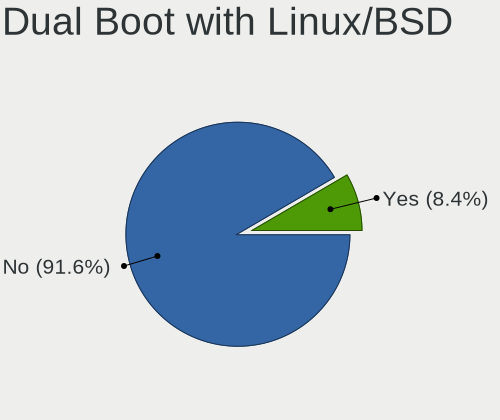
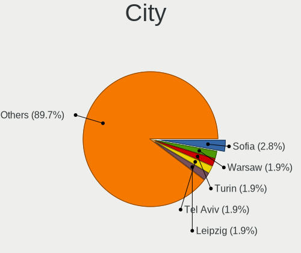
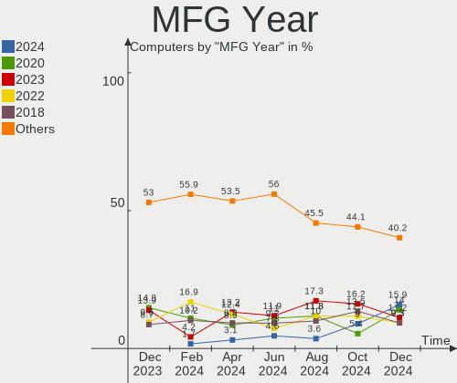
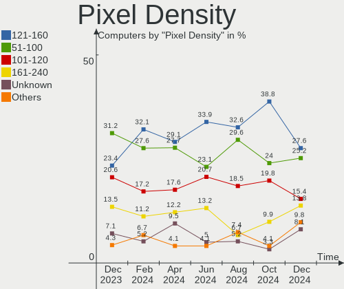
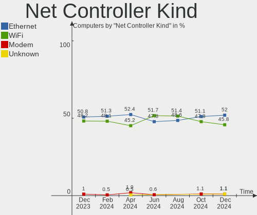
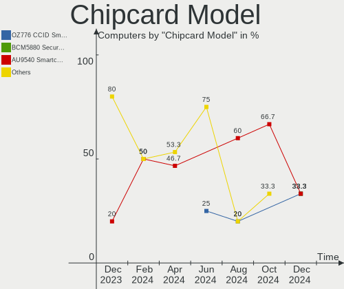

Manjaro Hardware Trends
-----------------------

A project to identify most popular hardware characteristics and track their change
over time based on data collected by Manjaro users at https://Linux-Hardware.org.

Anyone can contribute to the study by uploading probes of their computers by
the [hw-probe](https://github.com/linuxhw/hw-probe) tool:

    sudo -E hw-probe -all -upload

This is a report for all computer types. See also reports for [desktops](/Dist/Manjaro/Desktop/README.md) and [notebooks](/Dist/Manjaro/Notebook/README.md).

Full-feature report is available here: https://linux-hardware.org/?view=trends

Period: Oct, 2020.

Contents
--------

- [ OS                       ](#os)
- [ OS Family                ](#os-family)
- [ Kernel                   ](#kernel)
- [ Kernel Family            ](#kernel-family)
- [ Kernel Major Ver.        ](#kernel-major-ver)
- [ Arch                     ](#arch)
- [ DE                       ](#de)
- [ Display Server           ](#display-server)
- [ Display Manager          ](#display-manager)
- [ OS Lang                  ](#os-lang)
- [ Boot Mode                ](#boot-mode)
- [ Filesystem               ](#filesystem)
- [ Part. scheme             ](#part-scheme)
- [ Dual Boot with Linux/BSD ](#dual-boot-with-linux/bsd)
- [ Dual Boot (Win)          ](#dual-boot-win)
- [ Country                  ](#country)
- [ City                     ](#city)
- [ Vendor                   ](#vendor)
- [ Model                    ](#model)
- [ Model Family             ](#model-family)
- [ MFG Year                 ](#mfg-year)
- [ Form Factor              ](#form-factor)
- [ Secure Boot              ](#secure-boot)
- [ Coreboot                 ](#coreboot)
- [ RAM Size                 ](#ram-size)
- [ RAM Used                 ](#ram-used)
- [ Has CD-ROM               ](#has-cd-rom)
- [ Total Drives             ](#total-drives)
- [ Has Ethernet             ](#has-ethernet)
- [ Drive Vendor             ](#drive-vendor)
- [ HDD Vendor               ](#hdd-vendor)
- [ SSD Vendor               ](#ssd-vendor)
- [ Drive Model              ](#drive-model)
- [ Drive Kind               ](#drive-kind)
- [ Drive Connector          ](#drive-connector)
- [ Drive Size               ](#drive-size)
- [ Space Total              ](#space-total)
- [ Space Used               ](#space-used)
- [ Malfunc. Drives          ](#malfunc-drives)
- [ Malfunc. Drive Vendor    ](#malfunc-drive-vendor)
- [ Malfunc. HDD Vendor      ](#malfunc-hdd-vendor)
- [ Malfunc. Drive Kind      ](#malfunc-drive-kind)
- [ Failed Drives            ](#failed-drives)
- [ Failed Drive Vendor      ](#failed-drive-vendor)
- [ Drive Status             ](#drive-status)
- [ Storage Vendor           ](#storage-vendor)
- [ Storage Model            ](#storage-model)
- [ Storage Kind             ](#storage-kind)
- [ CPU Vendor               ](#cpu-vendor)
- [ CPU Model                ](#cpu-model)
- [ CPU Model Family         ](#cpu-model-family)
- [ CPU Cores                ](#cpu-cores)
- [ CPU Sockets              ](#cpu-sockets)
- [ CPU Threads              ](#cpu-threads)
- [ CPU Op-Modes             ](#cpu-op-modes)
- [ CPU Microcode            ](#cpu-microcode)
- [ CPU Microarch            ](#cpu-microarch)
- [ GPU Vendor               ](#gpu-vendor)
- [ GPU Model                ](#gpu-model)
- [ GPU Combo                ](#gpu-combo)
- [ GPU Driver               ](#gpu-driver)
- [ GPU Memory               ](#gpu-memory)
- [ Monitor Vendor           ](#monitor-vendor)
- [ Monitor Model            ](#monitor-model)
- [ Monitor Resolution       ](#monitor-resolution)
- [ Monitor Diagonal         ](#monitor-diagonal)
- [ Monitor Width            ](#monitor-width)
- [ Aspect Ratio             ](#aspect-ratio)
- [ Monitor Area             ](#monitor-area)
- [ Pixel Density            ](#pixel-density)
- [ Multiple Monitors        ](#multiple-monitors)
- [ Net Controller Vendor    ](#net-controller-vendor)
- [ Net Controller Model     ](#net-controller-model)
- [ Wireless Vendor          ](#wireless-vendor)
- [ Wireless Model           ](#wireless-model)
- [ Ethernet Vendor          ](#ethernet-vendor)
- [ Ethernet Model           ](#ethernet-model)
- [ Net Controller Kind      ](#net-controller-kind)
- [ Used Controller          ](#used-controller)
- [ NICs                     ](#nics)
- [ Memory Vendor            ](#memory-vendor)
- [ Memory Model             ](#memory-model)
- [ Memory Kind              ](#memory-kind)
- [ Memory Form Factor       ](#memory-form-factor)
- [ Memory Size              ](#memory-size)
- [ Memory Speed             ](#memory-speed)
- [ Sound Vendor             ](#sound-vendor)
- [ Sound Model              ](#sound-model)
- [ Camera Vendor            ](#camera-vendor)
- [ Camera Model             ](#camera-model)
- [ Fingerprint Vendor       ](#fingerprint-vendor)
- [ Fingerprint Model        ](#fingerprint-model)
- [ Chipcard Vendor          ](#chipcard-vendor)
- [ Chipcard Model           ](#chipcard-model)
- [ Printer Vendor           ](#printer-vendor)
- [ Printer Model            ](#printer-model)
- [ Scanner Vendor           ](#scanner-vendor)
- [ Scanner Model            ](#scanner-model)
- [ Bluetooth Vendor         ](#bluetooth-vendor)
- [ Bluetooth Model          ](#bluetooth-model)
- [ Unsupported Devices      ](#unsupported-devices)
- [ Unsupported Device Types ](#unsupported-device-types)

OS
--

Installed operating systems

| Name           | Computers | Percent |
|----------------|-----------|---------|
| Manjaro        | 126       | 45.49%  |
| Manjaro 20.1.1 | 69        | 24.91%  |
| Manjaro 20.1.2 | 57        | 20.58%  |
| Manjaro 20.1   | 15        | 5.42%   |
| Manjaro 20.2   | 7         | 2.53%   |
| Manjaro 20.0.3 | 2         | 0.72%   |
| Manjaro 18.1.5 | 1         | 0.36%   |

OS Family
---------

OS without a version

| Name    | Computers | Percent |
|---------|-----------|---------|
| Manjaro | 277       | 100%    |

Kernel
------

Version of the Linux kernel

| Version               | Computers | Percent |
|-----------------------|-----------|---------|
| 5.8.11-1-MANJARO      | 115       | 41.52%  |
| 5.8.16-2-MANJARO      | 43        | 15.52%  |
| 5.9.1-1-MANJARO       | 38        | 13.72%  |
| 5.8.6-1-MANJARO       | 13        | 4.69%   |
| 5.4.67-1-MANJARO      | 9         | 3.25%   |
| 5.4.72-1-MANJARO      | 8         | 2.89%   |
| 5.9.0-1-MANJARO       | 6         | 2.17%   |
| 5.7.19-2-MANJARO      | 5         | 1.81%   |
| 5.4.64-1-MANJARO      | 5         | 1.81%   |
| 5.6.19-3-rt12-MANJARO | 4         | 1.44%   |
| 5.9.1-3-MANJARO       | 2         | 0.72%   |
| 5.9.0-1-rt16-MANJARO  | 2         | 0.72%   |
| 5.8.14-1-MANJARO      | 2         | 0.72%   |
| 5.8.13-3-MANJARO      | 2         | 0.72%   |
| 5.6.15-1-MANJARO      | 2         | 0.72%   |
| 4.19.144-1-MANJARO    | 2         | 0.72%   |
| 5.9.2-1-MANJARO       | 1         | 0.36%   |
| 5.9.1-2-MANJARO       | 1         | 0.36%   |
| 5.9.1-1-ck-ivybridge  | 1         | 0.36%   |
| 5.9.0-3-MANJARO       | 1         | 0.36%   |
| 5.9.0-2-MANJARO       | 1         | 0.36%   |
| 5.8.7-arch1-1         | 1         | 0.36%   |
| 5.8.5-arch1-1         | 1         | 0.36%   |
| 5.8.17-1-MANJARO      | 1         | 0.36%   |
| 5.8.16-1.1-MANJARO    | 1         | 0.36%   |
| 5.8.15-1-MANJARO      | 1         | 0.36%   |
| 5.8.13-5-MANJARO      | 1         | 0.36%   |
| 5.8.12-pf6-1          | 1         | 0.36%   |
| 5.8.12-3-MANJARO      | 1         | 0.36%   |
| 5.6.19-2-MANJARO      | 1         | 0.36%   |
| 5.4.13-3-MANJARO      | 1         | 0.36%   |
| 5.10.0-1-MANJARO      | 1         | 0.36%   |
| 4.7.2-MANJARO         | 1         | 0.36%   |
| 4.19.152-1-MANJARO    | 1         | 0.36%   |
| 4.14.199-1-MANJARO    | 1         | 0.36%   |

Kernel Family
-------------

Linux kernel without a distro release

| Version  | Computers | Percent |
|----------|-----------|---------|
| 5.8.11   | 115       | 41.52%  |
| 5.8.16   | 44        | 15.88%  |
| 5.9.1    | 42        | 15.16%  |
| 5.8.6    | 13        | 4.69%   |
| 5.9.0    | 10        | 3.61%   |
| 5.4.67   | 9         | 3.25%   |
| 5.4.72   | 8         | 2.89%   |
| 5.7.19   | 5         | 1.81%   |
| 5.6.19   | 5         | 1.81%   |
| 5.4.64   | 5         | 1.81%   |
| 5.8.13   | 3         | 1.08%   |
| 5.8.14   | 2         | 0.72%   |
| 5.8.12   | 2         | 0.72%   |
| 5.6.15   | 2         | 0.72%   |
| 4.19.144 | 2         | 0.72%   |
| 5.9.2    | 1         | 0.36%   |
| 5.8.7    | 1         | 0.36%   |
| 5.8.5    | 1         | 0.36%   |
| 5.8.17   | 1         | 0.36%   |
| 5.8.15   | 1         | 0.36%   |
| 5.4.13   | 1         | 0.36%   |
| 5.10.0   | 1         | 0.36%   |
| 4.7.2    | 1         | 0.36%   |
| 4.19.152 | 1         | 0.36%   |
| 4.14.199 | 1         | 0.36%   |

Kernel Major Ver.
-----------------

Linux kernel major version

| Version | Computers | Percent |
|---------|-----------|---------|
| 5.8     | 183       | 66.06%  |
| 5.9     | 53        | 19.13%  |
| 5.4     | 23        | 8.3%    |
| 5.6     | 7         | 2.53%   |
| 5.7     | 5         | 1.81%   |
| 4.19    | 3         | 1.08%   |
| 5.10    | 1         | 0.36%   |
| 4.7     | 1         | 0.36%   |
| 4.14    | 1         | 0.36%   |

Arch
----

OS architecture (x86_64, i586, etc.)

| Name   | Computers | Percent |
|--------|-----------|---------|
| x86_64 | 277       | 100%    |

DE
--

Desktop Environment

| Name       | Computers | Percent |
|------------|-----------|---------|
| XFCE       | 68        | 24.55%  |
| KDE5       | 66        | 23.83%  |
| GNOME      | 53        | 19.13%  |
| KDE        | 52        | 18.77%  |
| X-Cinnamon | 12        | 4.33%   |
| i3         | 6         | 2.17%   |
| Cinnamon   | 6         | 2.17%   |
| Unknown    | 5         | 1.81%   |
| MATE       | 4         | 1.44%   |
| Deepin     | 4         | 1.44%   |
| LXQt       | 1         | 0.36%   |

Display Server
--------------

X11 or Wayland

| Name    | Computers | Percent |
|---------|-----------|---------|
| X11     | 264       | 95.31%  |
| Wayland | 9         | 3.25%   |
| Tty     | 3         | 1.08%   |
| Unknown | 1         | 0.36%   |

Display Manager
---------------

SDDM, LightDM, etc.

| Name    | Computers | Percent |
|---------|-----------|---------|
| Unknown | 123       | 44.4%   |
| SDDM    | 69        | 24.91%  |
| LightDM | 52        | 18.77%  |
| GDM     | 29        | 10.47%  |
| TDM     | 2         | 0.72%   |
| LXDM    | 1         | 0.36%   |
| GREETD  | 1         | 0.36%   |

OS Lang
-------

Language

| Lang       | Computers | Percent |
|------------|-----------|---------|
| en_US      | 105       | 37.91%  |
| en_US.utf8 | 25        | 9.03%   |
| de_DE      | 18        | 6.5%    |
| en_GB      | 14        | 5.05%   |
| ru_RU      | 12        | 4.33%   |
| es_ES      | 8         | 2.89%   |
| de_DE.utf8 | 8         | 2.89%   |
| pt_BR      | 7         | 2.53%   |
| fr_FR      | 7         | 2.53%   |
| pl_PL      | 6         | 2.17%   |
| en_GB.utf8 | 5         | 1.81%   |
| ru_UA      | 3         | 1.08%   |
| ru_RU.utf8 | 3         | 1.08%   |
| it_IT      | 3         | 1.08%   |
| en_AU      | 3         | 1.08%   |
| cs_CZ.utf8 | 3         | 1.08%   |
| zh_CN      | 2         | 0.72%   |
| pt_PT.utf8 | 2         | 0.72%   |
| fr_FR.utf8 | 2         | 0.72%   |
| fr_CA      | 2         | 0.72%   |
| fi_FI      | 2         | 0.72%   |
| es_MX      | 2         | 0.72%   |
| en_IE      | 2         | 0.72%   |
| en_CA      | 2         | 0.72%   |
| de_AT      | 2         | 0.72%   |
| vi_VN      | 1         | 0.36%   |
| uk_UA      | 1         | 0.36%   |
| tr_TR      | 1         | 0.36%   |
| sk_SK      | 1         | 0.36%   |
| pt_BR.utf8 | 1         | 0.36%   |
| pl_PL.utf8 | 1         | 0.36%   |
| nl_NL      | 1         | 0.36%   |
| nb_NO      | 1         | 0.36%   |
| it_IT.utf8 | 1         | 0.36%   |
| hr_HR      | 1         | 0.36%   |
| fr_CH.utf8 | 1         | 0.36%   |
| es_PE.utf8 | 1         | 0.36%   |
| es_CL      | 1         | 0.36%   |
| es_AR.utf8 | 1         | 0.36%   |
| es_AR      | 1         | 0.36%   |
| en_ZA.utf8 | 1         | 0.36%   |
| en_PH      | 1         | 0.36%   |
| en_NZ      | 1         | 0.36%   |
| en_IN.utf8 | 1         | 0.36%   |
| en_IN      | 1         | 0.36%   |
| en_IN      | 1         | 0.36%   |
| en_IE.utf8 | 1         | 0.36%   |
| en_DK      | 1         | 0.36%   |
| en_DE      | 1         | 0.36%   |
| en_CA.utf8 | 1         | 0.36%   |
| en_AU.utf8 | 1         | 0.36%   |
| de_CH.utf8 | 1         | 0.36%   |
| de_AT.utf8 | 1         | 0.36%   |
| da_DK      | 1         | 0.36%   |

Boot Mode
---------

EFI or BIOS

| Mode | Computers | Percent |
|------|-----------|---------|
| BIOS | 158       | 57.04%  |
| EFI  | 119       | 42.96%  |

Filesystem
----------

Type of filesystem

| Type    | Computers | Percent |
|---------|-----------|---------|
| Ext4    | 252       | 90.97%  |
| Btrfs   | 11        | 3.97%   |
| Xfs     | 7         | 2.53%   |
| Overlay | 4         | 1.44%   |
| Zfs     | 1         | 0.36%   |
| Tmpfs   | 1         | 0.36%   |
| F2fs    | 1         | 0.36%   |

Part. scheme
------------

Scheme of partitioning

| Type    | Computers | Percent |
|---------|-----------|---------|
| GPT     | 126       | 45.49%  |
| Unknown | 124       | 44.77%  |
| MBR     | 27        | 9.75%   |

Dual Boot with Linux/BSD
------------------------

Hosting more than one Linux/BSD

| Dual boot | Computers | Percent |
|-----------|-----------|---------|
| No        | 245       | 88.45%  |
| Yes       | 32        | 11.55%  |

Dual Boot (Win)
---------------

Hosting Linux and Windows

| Dual boot | Computers | Percent |
|-----------|-----------|---------|
| No        | 188       | 67.87%  |
| Yes       | 89        | 32.13%  |

Country
-------

Geographic location (country)

| Country                     | Computers | Percent |
|-----------------------------|-----------|---------|
| USA                         | 43        | 15.52%  |
| Germany                     | 34        | 12.27%  |
| Russia                      | 16        | 5.78%   |
| UK                          | 13        | 4.69%   |
| Brazil                      | 12        | 4.33%   |
| Poland                      | 11        | 3.97%   |
| France                      | 11        | 3.97%   |
| Canada                      | 10        | 3.61%   |
| Ukraine                     | 9         | 3.25%   |
| Spain                       | 8         | 2.89%   |
| Portugal                    | 6         | 2.17%   |
| Italy                       | 6         | 2.17%   |
| Switzerland                 | 4         | 1.44%   |
| India                       | 4         | 1.44%   |
| Finland                     | 4         | 1.44%   |
| Bulgaria                    | 4         | 1.44%   |
| Bangladesh                  | 4         | 1.44%   |
| Austria                     | 4         | 1.44%   |
| Australia                   | 4         | 1.44%   |
| Serbia                      | 3         | 1.08%   |
| Norway                      | 3         | 1.08%   |
| Japan                       | 3         | 1.08%   |
| Greece                      | 3         | 1.08%   |
| Czech Republic              | 3         | 1.08%   |
| Croatia                     | 3         | 1.08%   |
| Argentina                   | 3         | 1.08%   |
| Turkey                      | 2         | 0.72%   |
| South Africa                | 2         | 0.72%   |
| Netherlands                 | 2         | 0.72%   |
| Nepal                       | 2         | 0.72%   |
| Mexico                      | 2         | 0.72%   |
| Kazakhstan                  | 2         | 0.72%   |
| Jordan                      | 2         | 0.72%   |
| Iceland                     | 2         | 0.72%   |
| Egypt                       | 2         | 0.72%   |
| Denmark                     | 2         | 0.72%   |
| Belgium                     | 2         | 0.72%   |
| Vietnam                     | 1         | 0.36%   |
| Uzbekistan                  | 1         | 0.36%   |
| Uruguay                     | 1         | 0.36%   |
| Taiwan                      | 1         | 0.36%   |
| Sweden                      | 1         | 0.36%   |
| Slovenia                    | 1         | 0.36%   |
| Slovakia                    | 1         | 0.36%   |
| Saudi Arabia                | 1         | 0.36%   |
| Romania                     | 1         | 0.36%   |
| Puerto Rico                 | 1         | 0.36%   |
| Philippines                 | 1         | 0.36%   |
| Peru                        | 1         | 0.36%   |
| Panama                      | 1         | 0.36%   |
| New Zealand                 | 1         | 0.36%   |
| Montenegro                  | 1         | 0.36%   |
| Mauritius                   | 1         | 0.36%   |
| Malaysia                    | 1         | 0.36%   |
| Lithuania                   | 1         | 0.36%   |
| Latvia                      | 1         | 0.36%   |
| Kosovo                      | 1         | 0.36%   |
| Israel                      | 1         | 0.36%   |
| Ireland                     | 1         | 0.36%   |
| Hashemite Kingdom of Jordan | 1         | 0.36%   |

City
----

Geographic location (city)

| City             | Computers | Percent |
|------------------|-----------|---------|
| Warendorf        | 3         | 1.08%   |
| Vienna           | 3         | 1.08%   |
| Paris            | 3         | 1.08%   |
| Laval            | 3         | 1.08%   |
| Kyiv             | 3         | 1.08%   |
| Dhaka            | 3         | 1.08%   |
| Amman            | 3         | 1.08%   |
| Zagreb           | 2         | 0.72%   |
| Warsaw           | 2         | 0.72%   |
| St Petersburg    | 2         | 0.72%   |
| Sofia            | 2         | 0.72%   |
| Seattle          | 2         | 0.72%   |
| Queluz           | 2         | 0.72%   |
| Poznan           | 2         | 0.72%   |
| Portland         | 2         | 0.72%   |
| Perm             | 2         | 0.72%   |
| Oxford           | 2         | 0.72%   |
| Nagano           | 2         | 0.72%   |
| Lenting          | 2         | 0.72%   |
| Leiria           | 2         | 0.72%   |
| Krakow           | 2         | 0.72%   |
| Kopavogur        | 2         | 0.72%   |
| Kathmandu        | 2         | 0.72%   |
| Hyderabad        | 2         | 0.72%   |
| Hanover          | 2         | 0.72%   |
| Glassport        | 2         | 0.72%   |
| Ekaterinburg     | 2         | 0.72%   |
| Cairo            | 2         | 0.72%   |
| Brussels         | 2         | 0.72%   |
| Łódź          | 1         | 0.36%   |
| Zurich           | 1         | 0.36%   |
| Zaporizhia       | 1         | 0.36%   |
| Yalta            | 1         | 0.36%   |
| Wuppertal        | 1         | 0.36%   |
| Westminster      | 1         | 0.36%   |
| Weingarten       | 1         | 0.36%   |
| Weiden           | 1         | 0.36%   |
| Watertown        | 1         | 0.36%   |
| Walton on Thames | 1         | 0.36%   |
| Wadsworth        | 1         | 0.36%   |
| Vilnius          | 1         | 0.36%   |
| Ville-Houdlemont | 1         | 0.36%   |
| Vigo             | 1         | 0.36%   |
| Viborg           | 1         | 0.36%   |
| Veracruz         | 1         | 0.36%   |
| Utica            | 1         | 0.36%   |
| Tucson           | 1         | 0.36%   |
| Trikala          | 1         | 0.36%   |
| Toruń           | 1         | 0.36%   |
| Tilburg          | 1         | 0.36%   |
| Thionville       | 1         | 0.36%   |
| The Hague        | 1         | 0.36%   |
| The Bronx        | 1         | 0.36%   |
| Terrassa         | 1         | 0.36%   |
| Tel Aviv         | 1         | 0.36%   |
| Taoyuan District | 1         | 0.36%   |
| Tampere          | 1         | 0.36%   |
| São Paulo       | 1         | 0.36%   |
| São Leopoldo    | 1         | 0.36%   |
| Sydney           | 1         | 0.36%   |

Vendor
------

Motherboard manufacturer

| Name                   | Computers | Percent |
|------------------------|-----------|---------|
| Lenovo                 | 59        | 21.3%   |
| ASUSTek Computer       | 51        | 18.41%  |
| Hewlett-Packard        | 40        | 14.44%  |
| Dell                   | 28        | 10.11%  |
| Gigabyte Technology    | 26        | 9.39%   |
| MSI                    | 16        | 5.78%   |
| ASRock                 | 14        | 5.05%   |
| Acer                   | 10        | 3.61%   |
| Intel                  | 7         | 2.53%   |
| Apple                  | 4         | 1.44%   |
| Toshiba                | 3         | 1.08%   |
| Monster                | 2         | 0.72%   |
| Fujitsu                | 2         | 0.72%   |
| TUXEDO                 | 1         | 0.36%   |
| Timi                   | 1         | 0.36%   |
| System76               | 1         | 0.36%   |
| Supermicro             | 1         | 0.36%   |
| Sony                   | 1         | 0.36%   |
| Positivo               | 1         | 0.36%   |
| Packard Bell           | 1         | 0.36%   |
| ONE-NETBOOK TECHNOLOGY | 1         | 0.36%   |
| HUAWEI                 | 1         | 0.36%   |
| Huanan                 | 1         | 0.36%   |
| Foxconn                | 1         | 0.36%   |
| Clevo                  | 1         | 0.36%   |
| AMD                    | 1         | 0.36%   |
| Alienware              | 1         | 0.36%   |
| Unknown                | 1         | 0.36%   |

Model
-----

Motherboard model

| Name                                   | Computers | Percent |
|----------------------------------------|-----------|---------|
| Lenovo Legion 5 15ARH05 82B5           | 4         | 1.44%   |
| ASUS All Series                        | 4         | 1.44%   |
| ASRock B450 Pro4                       | 3         | 1.08%   |
| Unknown                                | 3         | 1.08%   |
| Lenovo IdeaPad Flex 5 14ARE05 81X2     | 2         | 0.72%   |
| Lenovo IdeaPad 5 15ARE05 81YQ          | 2         | 0.72%   |
| Lenovo IdeaPad 330-15IKB 81DE          | 2         | 0.72%   |
| HP Spectre x360 Convertible 13-aw0xxx  | 2         | 0.72%   |
| HP Pavilion dm4                        | 2         | 0.72%   |
| HP Notebook                            | 2         | 0.72%   |
| HP Laptop 15-bs0xx                     | 2         | 0.72%   |
| Gigabyte Z390 I AORUS PRO WIFI         | 2         | 0.72%   |
| Gigabyte X570 GAMING X                 | 2         | 0.72%   |
| Gigabyte X570 AORUS MASTER             | 2         | 0.72%   |
| Gigabyte B450M DS3H                    | 2         | 0.72%   |
| Gigabyte B450 AORUS M                  | 2         | 0.72%   |
| Dell Studio XPS 8100                   | 2         | 0.72%   |
| Dell OptiPlex 7010                     | 2         | 0.72%   |
| Dell Latitude E7240                    | 2         | 0.72%   |
| Dell G3 3590                           | 2         | 0.72%   |
| ASUS TUF Gaming FA706IU_FA706IU        | 2         | 0.72%   |
| Toshiba Satellite S70D-A               | 1         | 0.36%   |
| Toshiba Satellite P50-A-11J            | 1         | 0.36%   |
| Toshiba Satellite C855                 | 1         | 0.36%   |
| Timi TM1701                            | 1         | 0.36%   |
| System76 Lemur Pro                     | 1         | 0.36%   |
| Supermicro C7B75                       | 1         | 0.36%   |
| Sony SVE14A35CXH                       | 1         | 0.36%   |
| Positivo N1103                         | 1         | 0.36%   |
| Packard Bell EasyNote LE69KB           | 1         | 0.36%   |
| ONE-NETBOOK TECHNOLOGY One-Mix3 Pro    | 1         | 0.36%   |
| MSI MS-7C81                            | 1         | 0.36%   |
| MSI MS-7C37                            | 1         | 0.36%   |
| MSI MS-7B85                            | 1         | 0.36%   |
| MSI MS-7B78                            | 1         | 0.36%   |
| MSI MS-7A38                            | 1         | 0.36%   |
| MSI MS-7A33                            | 1         | 0.36%   |
| MSI MS-7998                            | 1         | 0.36%   |
| MSI MS-7978                            | 1         | 0.36%   |
| MSI MS-7916                            | 1         | 0.36%   |
| MSI MS-7721                            | 1         | 0.36%   |
| MSI MS-7592                            | 1         | 0.36%   |
| MSI Modern 14 B4MW                     | 1         | 0.36%   |
| MSI GT70 2PC                           | 1         | 0.36%   |
| MSI GL65 Leopard 9SCXR                 | 1         | 0.36%   |
| MSI GL63 9SDK                          | 1         | 0.36%   |
| MSI GL63 8RC                           | 1         | 0.36%   |
| Monster ABRA A5 V15.8                  | 1         | 0.36%   |
| Monster ABRA A5 V12.1                  | 1         | 0.36%   |
| Lenovo Yoga C930-13IKB 81C4            | 1         | 0.36%   |
| Lenovo Yoga 720-15IKB 80X7             | 1         | 0.36%   |
| Lenovo Y720-15IKB 80VR                 | 1         | 0.36%   |
| Lenovo Y520-15IKBA 80WY                | 1         | 0.36%   |
| Lenovo Y50-70 20378                    | 1         | 0.36%   |
| Lenovo XiaoXinAir 15ARE 2021 82GL      | 1         | 0.36%   |
| Lenovo ThinkPad X230 23202YG           | 1         | 0.36%   |
| Lenovo ThinkPad X220 42872W5           | 1         | 0.36%   |
| Lenovo ThinkPad X201 3680U18           | 1         | 0.36%   |
| Lenovo ThinkPad X140e 20BLS00300       | 1         | 0.36%   |
| Lenovo ThinkPad X1 Yoga 1st 20FRS19W00 | 1         | 0.36%   |

Model Family
------------

Motherboard model prefix

| Name                            | Computers | Percent |
|---------------------------------|-----------|---------|
| Lenovo ThinkPad                 | 21        | 7.58%   |
| Lenovo IdeaPad                  | 17        | 6.14%   |
| HP Pavilion                     | 8         | 2.89%   |
| HP Laptop                       | 7         | 2.53%   |
| ASUS ROG                        | 7         | 2.53%   |
| ASUS PRIME                      | 7         | 2.53%   |
| Acer Aspire                     | 7         | 2.53%   |
| Lenovo Legion                   | 6         | 2.17%   |
| Dell Latitude                   | 6         | 2.17%   |
| HP ENVY                         | 5         | 1.81%   |
| HP EliteBook                    | 5         | 1.81%   |
| Dell OptiPlex                   | 5         | 1.81%   |
| ASUS VivoBook                   | 5         | 1.81%   |
| ASUS TUF                        | 5         | 1.81%   |
| HP ProBook                      | 4         | 1.44%   |
| Gigabyte X570                   | 4         | 1.44%   |
| Gigabyte B450                   | 4         | 1.44%   |
| Dell XPS                        | 4         | 1.44%   |
| Dell Inspiron                   | 4         | 1.44%   |
| ASUS All                        | 4         | 1.44%   |
| ASRock B450                     | 4         | 1.44%   |
| Toshiba Satellite               | 3         | 1.08%   |
| HP Spectre                      | 3         | 1.08%   |
| Gigabyte Z390                   | 3         | 1.08%   |
| Dell G3                         | 3         | 1.08%   |
| Unknown                         | 3         | 1.08%   |
| MSI GL63                        | 2         | 0.72%   |
| Monster ABRA                    | 2         | 0.72%   |
| Lenovo Yoga                     | 2         | 0.72%   |
| HP Notebook                     | 2         | 0.72%   |
| Gigabyte B450M                  | 2         | 0.72%   |
| Dell Vostro                     | 2         | 0.72%   |
| Dell Studio                     | 2         | 0.72%   |
| ASRock AB350                    | 2         | 0.72%   |
| Apple MacBookPro8               | 2         | 0.72%   |
| Timi TM1701                     | 1         | 0.36%   |
| System76 Lemur                  | 1         | 0.36%   |
| Supermicro C7B75                | 1         | 0.36%   |
| Sony SVE14A35CXH                | 1         | 0.36%   |
| Positivo N1103                  | 1         | 0.36%   |
| Packard Bell EasyNote           | 1         | 0.36%   |
| ONE-NETBOOK TECHNOLOGY One-Mix3 | 1         | 0.36%   |
| MSI MS-7C81                     | 1         | 0.36%   |
| MSI MS-7C37                     | 1         | 0.36%   |
| MSI MS-7B85                     | 1         | 0.36%   |
| MSI MS-7B78                     | 1         | 0.36%   |
| MSI MS-7A38                     | 1         | 0.36%   |
| MSI MS-7A33                     | 1         | 0.36%   |
| MSI MS-7998                     | 1         | 0.36%   |
| MSI MS-7978                     | 1         | 0.36%   |
| MSI MS-7916                     | 1         | 0.36%   |
| MSI MS-7721                     | 1         | 0.36%   |
| MSI MS-7592                     | 1         | 0.36%   |
| MSI Modern                      | 1         | 0.36%   |
| MSI GT70                        | 1         | 0.36%   |
| MSI GL65                        | 1         | 0.36%   |
| Lenovo Y720-15IKB               | 1         | 0.36%   |
| Lenovo Y520-15IKBA              | 1         | 0.36%   |
| Lenovo Y50-70                   | 1         | 0.36%   |
| Lenovo XiaoXinAir               | 1         | 0.36%   |

MFG Year
--------

Motherboard manufacture year

| Year | Computers | Percent |
|------|-----------|---------|
| 2020 | 75        | 27.08%  |
| 2019 | 72        | 25.99%  |
| 2018 | 26        | 9.39%   |
| 2015 | 18        | 6.5%    |
| 2014 | 15        | 5.42%   |
| 2013 | 15        | 5.42%   |
| 2012 | 13        | 4.69%   |
| 2017 | 12        | 4.33%   |
| 2010 | 10        | 3.61%   |
| 2011 | 8         | 2.89%   |
| 2016 | 7         | 2.53%   |
| 2007 | 3         | 1.08%   |
| 2009 | 2         | 0.72%   |
| 2006 | 1         | 0.36%   |

Form Factor
-----------

Physical design of the computer

| Name        | Computers | Percent |
|-------------|-----------|---------|
| Notebook    | 151       | 54.51%  |
| Desktop     | 106       | 38.27%  |
| Convertible | 15        | 5.42%   |
| Mini pc     | 2         | 0.72%   |
| Server      | 2         | 0.72%   |
| All in one  | 1         | 0.36%   |

Secure Boot
-----------

Enabled or disabled

| State    | Computers | Percent |
|----------|-----------|---------|
| Disabled | 276       | 99.64%  |
| Enabled  | 1         | 0.36%   |

Coreboot
--------

Have coreboot on board

| Used | Computers | Percent |
|------|-----------|---------|
| No   | 276       | 99.64%  |
| Yes  | 1         | 0.36%   |

RAM Size
--------

Total RAM memory

| Size in GB  | Computers | Percent |
|-------------|-----------|---------|
| 16.01-24.0  | 84        | 30.32%  |
| 4.01-8.0    | 66        | 23.83%  |
| 8.01-16.0   | 54        | 19.49%  |
| 32.01-64.0  | 30        | 10.83%  |
| 3.01-4.0    | 27        | 9.75%   |
| 64.01-256.0 | 10        | 3.61%   |
| 24.01-32.0  | 5         | 1.81%   |
| 1.01-2.0    | 1         | 0.36%   |

RAM Used
--------

Used RAM memory

| Used GB    | Computers | Percent |
|------------|-----------|---------|
| 1.01-2.0   | 67        | 24.19%  |
| 2.01-3.0   | 66        | 23.83%  |
| 4.01-8.0   | 59        | 21.3%   |
| 3.01-4.0   | 55        | 19.86%  |
| 8.01-16.0  | 15        | 5.42%   |
| 0.01-1.0   | 11        | 3.97%   |
| 16.01-24.0 | 3         | 1.08%   |
| 32.01-64.0 | 1         | 0.36%   |

Has CD-ROM
----------

Has CD-ROM on board

| Presented | Computers | Percent |
|-----------|-----------|---------|
| No        | 196       | 70.76%  |
| Yes       | 81        | 29.24%  |

Total Drives
------------

Number of drives on board

| Drives | Computers | Percent |
|--------|-----------|---------|
| 1      | 144       | 51.99%  |
| 2      | 78        | 28.16%  |
| 3      | 28        | 10.11%  |
| 4      | 17        | 6.14%   |
| 5      | 4         | 1.44%   |
| 6      | 2         | 0.72%   |
| 0      | 2         | 0.72%   |
| 8      | 1         | 0.36%   |
| 7      | 1         | 0.36%   |

Has Ethernet
------------

Has Ethernet on board

| Presented | Computers | Percent |
|-----------|-----------|---------|
| Yes       | 236       | 85.2%   |
| No        | 41        | 14.8%   |

Drive Vendor
------------

Hard drive vendors

| Vendor                    | Computers | Drives | Percent |
|---------------------------|-----------|--------|---------|
| Samsung Electronics       | 84        | 97     | 19.27%  |
| WDC                       | 76        | 101    | 17.43%  |
| Seagate                   | 57        | 70     | 13.07%  |
| Kingston                  | 30        | 33     | 6.88%   |
| Toshiba                   | 22        | 24     | 5.05%   |
| SanDisk                   | 21        | 21     | 4.82%   |
| Crucial                   | 19        | 22     | 4.36%   |
| SK Hynix                  | 15        | 16     | 3.44%   |
| Intel                     | 12        | 14     | 2.75%   |
| HGST                      | 12        | 15     | 2.75%   |
| Unknown                   | 10        | 11     | 2.29%   |
| Phison                    | 6         | 6      | 1.38%   |
| Hitachi                   | 6         | 6      | 1.38%   |
| Silicon Motion            | 5         | 5      | 1.15%   |
| Micron Technology         | 5         | 5      | 1.15%   |
| PNY                       | 4         | 4      | 0.92%   |
| PLEXTOR                   | 4         | 4      | 0.92%   |
| A-DATA Technology         | 4         | 4      | 0.92%   |
| Team                      | 3         | 3      | 0.69%   |
| Patriot                   | 3         | 3      | 0.69%   |
| OCZ                       | 3         | 3      | 0.69%   |
| LITEONIT                  | 3         | 3      | 0.69%   |
| Corsair                   | 3         | 4      | 0.69%   |
| Micron/Crucial Technology | 2         | 3      | 0.46%   |
| JMicron                   | 2         | 2      | 0.46%   |
| GOODRAM                   | 2         | 2      | 0.46%   |
| Fujitsu                   | 2         | 2      | 0.46%   |
| China                     | 2         | 2      | 0.46%   |
| Zheino                    | 1         | 1      | 0.23%   |
| WD MediaMax               | 1         | 1      | 0.23%   |
| Union Memory              | 1         | 1      | 0.23%   |
| Transcend                 | 1         | 1      | 0.23%   |
| TEUTONS                   | 1         | 1      | 0.23%   |
| Solid                     | 1         | 1      | 0.23%   |
| Sabrent                   | 1         | 1      | 0.23%   |
| Realtek                   | 1         | 1      | 0.23%   |
| MAXTOR                    | 1         | 1      | 0.23%   |
| Lexar                     | 1         | 1      | 0.23%   |
| KingSpec                  | 1         | 1      | 0.23%   |
| Kingmax                   | 1         | 1      | 0.23%   |
| KingDian                  | 1         | 1      | 0.23%   |
| Gigabyte Technology       | 1         | 1      | 0.23%   |
| FORESEE                   | 1         | 1      | 0.23%   |
| Drevo                     | 1         | 1      | 0.23%   |
| Apricorn                  | 1         | 1      | 0.23%   |
| Apple                     | 1         | 1      | 0.23%   |
| Apacer                    | 1         | 1      | 0.23%   |

HDD Vendor
----------

Hard disk drive vendors

| Vendor              | Computers | Drives | Percent |
|---------------------|-----------|--------|---------|
| WDC                 | 64        | 85     | 38.1%   |
| Seagate             | 56        | 67     | 33.33%  |
| Toshiba             | 17        | 18     | 10.12%  |
| HGST                | 12        | 15     | 7.14%   |
| Samsung Electronics | 8         | 9      | 4.76%   |
| Hitachi             | 6         | 6      | 3.57%   |
| Fujitsu             | 2         | 2      | 1.19%   |
| Sabrent             | 1         | 1      | 0.6%    |
| MAXTOR              | 1         | 1      | 0.6%    |
| Apple               | 1         | 1      | 0.6%    |

SSD Vendor
----------

Solid state drive vendors

| Vendor              | Computers | Drives | Percent |
|---------------------|-----------|--------|---------|
| Samsung Electronics | 40        | 44     | 25.97%  |
| Kingston            | 22        | 25     | 14.29%  |
| Crucial             | 17        | 19     | 11.04%  |
| SanDisk             | 16        | 16     | 10.39%  |
| WDC                 | 10        | 10     | 6.49%   |
| PNY                 | 4         | 4      | 2.6%    |
| PLEXTOR             | 4         | 4      | 2.6%    |
| Team                | 3         | 3      | 1.95%   |
| Patriot             | 3         | 3      | 1.95%   |
| OCZ                 | 3         | 3      | 1.95%   |
| Micron Technology   | 3         | 3      | 1.95%   |
| LITEONIT            | 3         | 3      | 1.95%   |
| Intel               | 3         | 3      | 1.95%   |
| A-DATA Technology   | 3         | 3      | 1.95%   |
| SK Hynix            | 2         | 2      | 1.3%    |
| GOODRAM             | 2         | 2      | 1.3%    |
| Corsair             | 2         | 2      | 1.3%    |
| China               | 2         | 2      | 1.3%    |
| Zheino              | 1         | 1      | 0.65%   |
| Transcend           | 1         | 1      | 0.65%   |
| TEUTONS             | 1         | 1      | 0.65%   |
| Solid               | 1         | 1      | 0.65%   |
| Seagate             | 1         | 3      | 0.65%   |
| Lexar               | 1         | 1      | 0.65%   |
| KingSpec            | 1         | 1      | 0.65%   |
| Kingmax             | 1         | 1      | 0.65%   |
| KingDian            | 1         | 1      | 0.65%   |
| JMicron             | 1         | 1      | 0.65%   |
| Gigabyte Technology | 1         | 1      | 0.65%   |
| Apacer              | 1         | 1      | 0.65%   |

Drive Model
-----------

Hard drive models

| Model                        | Computers | Percent |
|------------------------------|-----------|---------|
| NVMe SSD Drive 512GB         | 16        | 3.31%   |
| NVMe SSD Drive 256GB         | 13        | 2.69%   |
| ST1000LM035-1RK172 1TB       | 9         | 1.86%   |
| NVMe SSD Drive 1024GB        | 8         | 1.66%   |
| NVMe SSD Drive 500GB         | 7         | 1.45%   |
| SSD 850 EVO 500GB            | 6         | 1.24%   |
| SA400S37240G 240GB SSD       | 6         | 1.24%   |
| CT240BX500SSD1 240GB         | 6         | 1.24%   |
| SSD 860 EVO 500GB            | 5         | 1.04%   |
| NVMe SSD Drive 250GB         | 5         | 1.04%   |
| WD10EZEX-08WN4A0 1TB         | 4         | 0.83%   |
| ST1000DM010-2EP102 1TB       | 4         | 0.83%   |
| SSD 860 QVO 1TB              | 4         | 0.83%   |
| NVMe SSD Drive 1TB           | 4         | 0.83%   |
| HTS541010A9E680 1TB          | 4         | 0.83%   |
| CT1000MX500SSD1 1TB          | 4         | 0.83%   |
| WD5000AAKX-001CA0 500GB      | 3         | 0.62%   |
| WD20EARX-00PASB0 2TB         | 3         | 0.62%   |
| ST1000LM024 HN-M101MBB 1TB   | 3         | 0.62%   |
| SSD 970 PRO 512GB            | 3         | 0.62%   |
| SSD 860 EVO 250GB            | 3         | 0.62%   |
| SSD 850 EVO M.2 500GB        | 3         | 0.62%   |
| SSD 850 EVO 250GB            | 3         | 0.62%   |
| SSD 840 EVO 250GB            | 3         | 0.62%   |
| SSD 840 EVO 120GB            | 3         | 0.62%   |
| MQ01ABF050 500GB             | 3         | 0.62%   |
| HTS725050A7E630 500GB        | 3         | 0.62%   |
| HTS721010A9E630 1TB          | 3         | 0.62%   |
| CT500MX500SSD1 500GB         | 3         | 0.62%   |
| WDS500G2B0B-00YS70 500GB SSD | 2         | 0.41%   |
| WDS240G2G0A-00JH30 240GB SSD | 2         | 0.41%   |
| WDS100T2B0A-00SM50 1TB SSD   | 2         | 0.41%   |
| WD5000AAKX-75U6AA0 500GB     | 2         | 0.41%   |
| WD40EFRX-68N32N0 4TB         | 2         | 0.41%   |
| WD20EZRZ-00Z5HB0 2TB         | 2         | 0.41%   |
| WD10SPZX-24Z10T0 1TB         | 2         | 0.41%   |
| WD10JPVX-75JC3T0 1TB         | 2         | 0.41%   |
| WD10EZEX-00RKKA0 1TB         | 2         | 0.41%   |
| WD10EZEX-00BN5A0 1TB         | 2         | 0.41%   |
| WD10EADS-00L5B1 1TB          | 2         | 0.41%   |
| WD1003FZEX-00MK2A0 1TB       | 2         | 0.41%   |
| WD1001FAES-75W7A0 1TB        | 2         | 0.41%   |
| SUV400S37240G 240GB SSD      | 2         | 0.41%   |
| ST500DM002-1BD142 500GB      | 2         | 0.41%   |
| ST3500418AS 500GB            | 2         | 0.41%   |
| ST3000DM001-1ER166 3TB       | 2         | 0.41%   |
| ST2000LM007-1R8174 2TB       | 2         | 0.41%   |
| ST2000DX002-2DV164 2TB       | 2         | 0.41%   |
| ST1000DM003-1ER162 1TB       | 2         | 0.41%   |
| ST1000DM003-1CH162 1TB       | 2         | 0.41%   |
| SSDPEKNW512G8 512GB          | 2         | 0.41%   |
| SSD PLUS 240GB               | 2         | 0.41%   |
| SSD PLUS 1000GB              | 2         | 0.41%   |
| SSD 970 EVO Plus 250GB       | 2         | 0.41%   |
| SSD 860 EVO 1TB              | 2         | 0.41%   |
| SDSSDH3 4T00 4TB             | 2         | 0.41%   |
| SDSSDA240G 240GB             | 2         | 0.41%   |
| Sabrent Rocket Q 2TB         | 2         | 0.41%   |
| SA400S37480G 480GB SSD       | 2         | 0.41%   |
| NVMe SSD Drive 128GB         | 2         | 0.41%   |

Drive Kind
----------

HDD or SSD

| Kind    | Computers | Drives | Percent |
|---------|-----------|--------|---------|
| HDD     | 143       | 205    | 36.67%  |
| SSD     | 130       | 165    | 33.33%  |
| NVMe    | 103       | 119    | 26.41%  |
| MMC     | 8         | 9      | 2.05%   |
| Unknown | 6         | 6      | 1.54%   |

Drive Connector
---------------

SATA, SAS, NVMe, etc.

| Type | Computers | Drives | Percent |
|------|-----------|--------|---------|
| SATA | 209       | 363    | 63.33%  |
| NVMe | 103       | 119    | 31.21%  |
| SAS  | 10        | 13     | 3.03%   |
| MMC  | 8         | 9      | 2.42%   |

Drive Size
----------

Size of hard drive

| Size in TB | Computers | Drives | Percent |
|------------|-----------|--------|---------|
| 0.01-0.5   | 144       | 193    | 49.83%  |
| 0.51-1.0   | 96        | 115    | 33.22%  |
| 1.01-2.0   | 26        | 32     | 9%      |
| 3.01-4.0   | 10        | 13     | 3.46%   |
| 2.01-3.0   | 7         | 8      | 2.42%   |
| 4.01-10.0  | 6         | 9      | 2.08%   |

Space Total
-----------

Amount of disk space available on the file system

| Size in GB     | Computers | Percent |
|----------------|-----------|---------|
| 101-250        | 70        | 25.27%  |
| 251-500        | 63        | 22.74%  |
| 501-1000       | 46        | 16.61%  |
| 1001-2000      | 28        | 10.11%  |
| More than 3000 | 18        | 6.5%    |
| 51-100         | 18        | 6.5%    |
| 2001-3000      | 11        | 3.97%   |
| Unknown        | 9         | 3.25%   |
| 21-50          | 8         | 2.89%   |
| 1-20           | 6         | 2.17%   |

Space Used
----------

Amount of used disk space

| Used GB        | Computers | Percent |
|----------------|-----------|---------|
| 1-20           | 63        | 22.74%  |
| 101-250        | 53        | 19.13%  |
| 51-100         | 39        | 14.08%  |
| 21-50          | 38        | 13.72%  |
| 501-1000       | 28        | 10.11%  |
| 251-500        | 24        | 8.66%   |
| 1001-2000      | 12        | 4.33%   |
| Unknown        | 9         | 3.25%   |
| 2001-3000      | 6         | 2.17%   |
| More than 3000 | 5         | 1.81%   |

Malfunc. Drives
---------------

Drive models with a malfunction

| Model                        | Computers | Drives | Percent |
|------------------------------|-----------|--------|---------|
| ST1000LM024 HN-M101MBB 1TB   | 2         | 2      | 8.7%    |
| WD5000AAKX-001CA0 500GB      | 1         | 1      | 4.35%   |
| WD5000AAKS-60Z1A0 500GB      | 1         | 1      | 4.35%   |
| WD20EARX-00PASB0 2TB         | 1         | 1      | 4.35%   |
| WD20EARS-00MVWB0 2TB         | 1         | 1      | 4.35%   |
| WD10JPVX-75JC3T0 1TB         | 1         | 1      | 4.35%   |
| WD10EZEX-22MFCA0 1TB         | 1         | 1      | 4.35%   |
| WD10EZEX-00RKKA0 1TB         | 1         | 1      | 4.35%   |
| ST500LT012-9WS142 500GB      | 1         | 1      | 4.35%   |
| ST500DM002-1BD142 500GB      | 1         | 1      | 4.35%   |
| ST2000LM007-1R8174 2TB       | 1         | 1      | 4.35%   |
| ST1000LM035-1RK172 1TB       | 1         | 1      | 4.35%   |
| ST1000DX001-1NS162 1TB       | 1         | 1      | 4.35%   |
| ST1000DX001-1CM162 1TB       | 1         | 1      | 4.35%   |
| SSD PLUS 240GB               | 1         | 1      | 4.35%   |
| MZNLH128HBHQ-000H1 128GB SSD | 1         | 1      | 4.35%   |
| HTS725050A7E630 500GB        | 1         | 1      | 4.35%   |
| HTS541010A9E680 1TB          | 1         | 1      | 4.35%   |
| HFS256G3BTND-N210A 256GB SSD | 1         | 1      | 4.35%   |
| HFS128G39TND-N210A 128GB SSD | 1         | 1      | 4.35%   |
| HDWE140 4TB                  | 1         | 1      | 4.35%   |
| 2E256-TU2-510B00 176GB SSD   | 1         | 3      | 4.35%   |

Malfunc. Drive Vendor
---------------------

Vendors of faulty drives

| Vendor              | Computers | Drives | Percent |
|---------------------|-----------|--------|---------|
| Seagate             | 8         | 11     | 38.1%   |
| WDC                 | 6         | 7      | 28.57%  |
| SK Hynix            | 2         | 2      | 9.52%   |
| HGST                | 2         | 2      | 9.52%   |
| Toshiba             | 1         | 1      | 4.76%   |
| SanDisk             | 1         | 1      | 4.76%   |
| Samsung Electronics | 1         | 1      | 4.76%   |

Malfunc. HDD Vendor
-------------------

Vendors of faulty HDD drives

| Vendor  | Computers | Drives | Percent |
|---------|-----------|--------|---------|
| Seagate | 7         | 8      | 43.75%  |
| WDC     | 6         | 7      | 37.5%   |
| HGST    | 2         | 2      | 12.5%   |
| Toshiba | 1         | 1      | 6.25%   |

Malfunc. Drive Kind
-------------------

Kinds of faulty drives

| Kind | Computers | Drives | Percent |
|------|-----------|--------|---------|
| HDD  | 16        | 18     | 76.19%  |
| SSD  | 5         | 7      | 23.81%  |

Failed Drives
-------------

Failed drive models

Zero info for selected period =(

Failed Drive Vendor
-------------------

Failed drive vendors

Zero info for selected period =(

Drive Status
------------

Number of failed and malfunc. drives

| Status   | Computers | Drives | Percent |
|----------|-----------|--------|---------|
| Detected | 166       | 294    | 54.61%  |
| Works    | 117       | 185    | 38.49%  |
| Malfunc  | 21        | 25     | 6.91%   |

Storage Vendor
--------------

Storage controller vendors

| Vendor                       | Computers | Percent |
|------------------------------|-----------|---------|
| Intel                        | 165       | 43.42%  |
| AMD                          | 90        | 23.68%  |
| Samsung Electronics          | 39        | 10.26%  |
| SK Hynix                     | 13        | 3.42%   |
| ASMedia Technology           | 13        | 3.42%   |
| Sandisk                      | 10        | 2.63%   |
| Kingston Technology Company  | 8         | 2.11%   |
| Phison Electronics           | 7         | 1.84%   |
| Toshiba America Info Systems | 5         | 1.32%   |
| Silicon Motion               | 5         | 1.32%   |
| Marvell Technology Group     | 5         | 1.32%   |
| JMicron Technology           | 5         | 1.32%   |
| Micron/Crucial Technology    | 4         | 1.05%   |
| ADATA Technology             | 3         | 0.79%   |
| Micron Technology            | 2         | 0.53%   |
| Union Memory (Shenzhen)      | 1         | 0.26%   |
| Silicon Image                | 1         | 0.26%   |
| Shenzhen Longsys Electronics | 1         | 0.26%   |
| Nvidia                       | 1         | 0.26%   |
| Broadcom / LSI               | 1         | 0.26%   |
| Adaptec                      | 1         | 0.26%   |

Storage Model
-------------

Storage controller models

| Model                                                                      | Computers | Percent |
|----------------------------------------------------------------------------|-----------|---------|
| FCH SATA Controller [AHCI mode]                                            | 75        | 17.2%   |
| NVMe SSD Controller SM981/PM981/PM983                                      | 23        | 5.28%   |
| Non-Volatile memory controller                                             | 21        | 4.82%   |
| 400 Series Chipset SATA Controller                                         | 19        | 4.36%   |
| Sunrise Point-LP SATA Controller [AHCI mode]                               | 18        | 4.13%   |
| 8 Series/C220 Series Chipset Family 6-port SATA Controller 1 [AHCI mode]   | 15        | 3.44%   |
| 82801 Mobile SATA Controller [RAID mode]                                   | 14        | 3.21%   |
| ASM1062 Serial ATA Controller                                              | 13        | 2.98%   |
| 7 Series Chipset Family 6-port SATA Controller [AHCI mode]                 | 13        | 2.98%   |
| SB7x0/SB8x0/SB9x0 SATA Controller [AHCI mode]                              | 9         | 2.06%   |
| HM170/QM170 Chipset SATA Controller [AHCI Mode]                            | 9         | 2.06%   |
| Cannon Lake Mobile PCH SATA AHCI Controller                                | 9         | 2.06%   |
| NVMe SSD Controller SM961/PM961                                            | 8         | 1.83%   |
| SSD 660P Series                                                            | 7         | 1.61%   |
| SB7x0/SB8x0/SB9x0 IDE Controller                                           | 7         | 1.61%   |
| SATA Controller [RAID mode]                                                | 7         | 1.61%   |
| Q170/Q150/B150/H170/H110/Z170/CM236 Chipset SATA Controller [AHCI Mode]    | 7         | 1.61%   |
| BC501 NVMe Solid State Drive 512GB                                         | 7         | 1.61%   |
| 6 Series/C200 Series Chipset Family 6 port Mobile SATA AHCI Controller     | 7         | 1.61%   |
| E12 NVMe Controller                                                        | 6         | 1.38%   |
| 6 Series/C200 Series Chipset Family 6 port Desktop SATA AHCI Controller    | 6         | 1.38%   |
| 7 Series/C210 Series Chipset Family 6-port SATA Controller [AHCI mode]     | 5         | 1.15%   |
| 400 Series Chipset Family SATA AHCI Controller                             | 5         | 1.15%   |
| 300 Series Chipset SATA Controller                                         | 5         | 1.15%   |
| Wildcat Point-LP SATA Controller [AHCI Mode]                               | 4         | 0.92%   |
| SB7x0/SB8x0/SB9x0 SATA Controller [IDE mode]                               | 4         | 0.92%   |
| JMB363 SATA/IDE Controller                                                 | 4         | 0.92%   |
| Electronics Non-Volatile memory controller                                 | 4         | 0.92%   |
| Comet Lake SATA AHCI Controller                                            | 4         | 0.92%   |
| Cannon Point-LP SATA Controller [AHCI Mode]                                | 4         | 0.92%   |
| WD Black 2019/PC SN750 NVMe SSD                                            | 3         | 0.69%   |
| Technology Company Non-Volatile memory controller                          | 3         | 0.69%   |
| SM2262/SM2262EN SSD Controller                                             | 3         | 0.69%   |
| P1 NVMe PCIe SSD                                                           | 3         | 0.69%   |
| NVMe SSD Controller SM951/PM951                                            | 3         | 0.69%   |
| NM10/ICH7 Family SATA Controller [IDE mode]                                | 3         | 0.69%   |
| A2000, M.2, 500GB                                                          | 3         | 0.69%   |
| 9 Series Chipset Family SATA Controller [AHCI Mode]                        | 3         | 0.69%   |
| 82801IBM/IEM (ICH9M/ICH9M-E) 4 port SATA Controller [AHCI mode]            | 3         | 0.69%   |
| 8 Series SATA Controller 1 [AHCI mode]                                     | 3         | 0.69%   |
| 5 Series/3400 Series Chipset 6 port SATA AHCI Controller                   | 3         | 0.69%   |
| XPG SX8200 Pro PCIe Gen3x4 M.2 2280 Solid State Drive                      | 2         | 0.46%   |
| XG4 NVMe SSD Controller                                                    | 2         | 0.46%   |
| X370 Series Chipset SATA Controller                                        | 2         | 0.46%   |
| WD Blue SN550 NVMe SSD                                                     | 2         | 0.46%   |
| WD Black 2018 / PC SN520 NVMe SSD                                          | 2         | 0.46%   |
| Toshiba America Info Non-Volatile memory controller                        | 2         | 0.46%   |
| SATA controller                                                            | 2         | 0.46%   |
| Ice Lake-LP SATA Controller [AHCI mode]                                    | 2         | 0.46%   |
| FCH SATA Controller D                                                      | 2         | 0.46%   |
| E16 PCIe4 NVMe Controller                                                  | 2         | 0.46%   |
| Cannon Lake PCH SATA AHCI Controller                                       | 2         | 0.46%   |
| Atom/Celeron/Pentium Processor x5-E8000/J3xxx/N3xxx Series SATA Controller | 2         | 0.46%   |
| Atom Processor E3800 Series SATA AHCI Controller                           | 2         | 0.46%   |
| 88SE9172 SATA 6Gb/s Controller                                             | 2         | 0.46%   |
| 82801G (ICH7 Family) IDE Controller                                        | 2         | 0.46%   |
| X399 Series Chipset SATA Controller                                        | 1         | 0.23%   |
| SSS6200 PCI-Express Flash SSD                                              | 1         | 0.23%   |
| SSD 600P Series                                                            | 1         | 0.23%   |
| Series 6 - 6G SAS/PCIe 2                                                   | 1         | 0.23%   |

Storage Kind
------------

Kind of storage controller (IDE, SATA, NVMe, SAS, ...)

| Kind | Computers | Percent |
|------|-----------|---------|
| SATA | 222       | 60%     |
| NVMe | 102       | 27.57%  |
| RAID | 24        | 6.49%   |
| IDE  | 20        | 5.41%   |
| SAS  | 2         | 0.54%   |

CPU Vendor
----------

Processor vendors

| Vendor | Computers | Percent |
|--------|-----------|---------|
| Intel  | 177       | 63.9%   |
| AMD    | 100       | 36.1%   |

CPU Model
---------

Processor models

| Model                                         | Computers | Percent |
|-----------------------------------------------|-----------|---------|
| Intel Core i5-8250U CPU @ 1.60GHz             | 7         | 2.53%   |
| AMD Ryzen 5 4500U with Radeon Graphics        | 7         | 2.53%   |
| AMD Ryzen 5 2600 Six-Core Processor           | 7         | 2.53%   |
| Intel Core i7-7700HQ CPU @ 2.80GHz            | 6         | 2.17%   |
| AMD Ryzen 7 3700X 8-Core Processor            | 6         | 2.17%   |
| Intel Core i5-8265U CPU @ 1.60GHz             | 5         | 1.81%   |
| Intel Core i5-10210U CPU @ 1.60GHz            | 5         | 1.81%   |
| AMD Ryzen 7 4800H with Radeon Graphics        | 5         | 1.81%   |
| Intel Core i7-8550U CPU @ 1.80GHz             | 4         | 1.44%   |
| Intel Core i7-4790K CPU @ 4.00GHz             | 4         | 1.44%   |
| Intel Core i7-10510U CPU @ 1.80GHz            | 4         | 1.44%   |
| AMD Ryzen 5 4600H with Radeon Graphics        | 4         | 1.44%   |
| AMD Ryzen 5 1600 Six-Core Processor           | 4         | 1.44%   |
| AMD Ryzen 3 3200U with Radeon Vega Mobile Gfx | 4         | 1.44%   |
| Intel Core i7-9750H CPU @ 2.60GHz             | 3         | 1.08%   |
| Intel Core i7-6700HQ CPU @ 2.60GHz            | 3         | 1.08%   |
| Intel Core i5-9300H CPU @ 2.40GHz             | 3         | 1.08%   |
| Intel Core i5-7200U CPU @ 2.50GHz             | 3         | 1.08%   |
| Intel Core i5-3210M CPU @ 2.50GHz             | 3         | 1.08%   |
| Intel Core i5-1035G1 CPU @ 1.00GHz            | 3         | 1.08%   |
| AMD Ryzen 7 4800U with Radeon Graphics        | 3         | 1.08%   |
| AMD Ryzen 5 3600 6-Core Processor             | 3         | 1.08%   |
| AMD Ryzen 5 3500U with Radeon Vega Mobile Gfx | 3         | 1.08%   |
| AMD Ryzen 5 2500U with Radeon Vega Mobile Gfx | 3         | 1.08%   |
| Intel Core i7-8565U CPU @ 1.80GHz             | 2         | 0.72%   |
| Intel Core i7-7500U CPU @ 2.70GHz             | 2         | 0.72%   |
| Intel Core i7-4720HQ CPU @ 2.60GHz            | 2         | 0.72%   |
| Intel Core i7-3770 CPU @ 3.40GHz              | 2         | 0.72%   |
| Intel Core i7-2720QM CPU @ 2.20GHz            | 2         | 0.72%   |
| Intel Core i7-1065G7 CPU @ 1.30GHz            | 2         | 0.72%   |
| Intel Core i5-8600K CPU @ 3.60GHz             | 2         | 0.72%   |
| Intel Core i5-8300H CPU @ 2.30GHz             | 2         | 0.72%   |
| Intel Core i5-7300HQ CPU @ 2.50GHz            | 2         | 0.72%   |
| Intel Core i5-6200U CPU @ 2.30GHz             | 2         | 0.72%   |
| Intel Core i5-5200U CPU @ 2.20GHz             | 2         | 0.72%   |
| Intel Core i5-3570 CPU @ 3.40GHz              | 2         | 0.72%   |
| Intel Core i5-3320M CPU @ 2.60GHz             | 2         | 0.72%   |
| Intel Core i5-3230M CPU @ 2.60GHz             | 2         | 0.72%   |
| Intel Core i5 CPU 650 @ 3.20GHz               | 2         | 0.72%   |
| Intel Core i3-7100U CPU @ 2.40GHz             | 2         | 0.72%   |
| Intel Core i3-3120M CPU @ 2.50GHz             | 2         | 0.72%   |
| Intel Core i3-10100 CPU @ 3.60GHz             | 2         | 0.72%   |
| Intel Celeron CPU N3060 @ 1.60GHz             | 2         | 0.72%   |
| AMD Ryzen 9 3900X 12-Core Processor           | 2         | 0.72%   |
| AMD Ryzen 7 PRO 4750U with Radeon Graphics    | 2         | 0.72%   |
| AMD Ryzen 7 2700 Eight-Core Processor         | 2         | 0.72%   |
| AMD Ryzen 7 1700X Eight-Core Processor        | 2         | 0.72%   |
| AMD Ryzen 5 3600X 6-Core Processor            | 2         | 0.72%   |
| AMD Ryzen 5 3550H with Radeon Vega Mobile Gfx | 2         | 0.72%   |
| AMD Ryzen 5 1500X Quad-Core Processor         | 2         | 0.72%   |
| AMD FX-6300 Six-Core Processor                | 2         | 0.72%   |
| AMD E1-2500 APU with Radeon HD Graphics       | 2         | 0.72%   |
| Intel Xeon CPU X5650 @ 2.67GHz                | 1         | 0.36%   |
| Intel Xeon CPU E5-2689 0 @ 2.60GHz            | 1         | 0.36%   |
| Intel Xeon CPU E5-1620 0 @ 3.60GHz            | 1         | 0.36%   |
| Intel Xeon CPU E3-1220 v5 @ 3.00GHz           | 1         | 0.36%   |
| Intel Pentium Dual-Core CPU T4500 @ 2.30GHz   | 1         | 0.36%   |
| Intel Pentium Dual-Core CPU E5700 @ 3.00GHz   | 1         | 0.36%   |
| Intel Pentium Dual CPU E2140 @ 1.60GHz        | 1         | 0.36%   |
| Intel Pentium CPU N4200 @ 1.10GHz             | 1         | 0.36%   |

CPU Model Family
----------------

Processor model prefix

| Model                   | Computers | Percent |
|-------------------------|-----------|---------|
| Intel Core i5           | 72        | 25.99%  |
| Intel Core i7           | 58        | 20.94%  |
| AMD Ryzen 5             | 39        | 14.08%  |
| AMD Ryzen 7             | 22        | 7.94%   |
| Intel Core i3           | 19        | 6.86%   |
| Intel Pentium           | 8         | 2.89%   |
| Intel Celeron           | 6         | 2.17%   |
| AMD Ryzen 3             | 6         | 2.17%   |
| AMD Phenom II X4        | 5         | 1.81%   |
| AMD FX                  | 5         | 1.81%   |
| Intel Xeon              | 4         | 1.44%   |
| Intel Core 2 Duo        | 4         | 1.44%   |
| AMD Ryzen 9             | 3         | 1.08%   |
| AMD Ryzen 7 PRO         | 3         | 1.08%   |
| AMD E1                  | 3         | 1.08%   |
| AMD A10                 | 3         | 1.08%   |
| Other                   | 2         | 0.72%   |
| Intel Pentium Dual-Core | 2         | 0.72%   |
| Intel Core i9           | 2         | 0.72%   |
| Intel Pentium Dual      | 1         | 0.36%   |
| Intel Core 2            | 1         | 0.36%   |
| AMD Turion 64 X2 Mobile | 1         | 0.36%   |
| AMD Ryzen Threadripper  | 1         | 0.36%   |
| AMD Phenom II X6        | 1         | 0.36%   |
| AMD E                   | 1         | 0.36%   |
| AMD Athlon II X2        | 1         | 0.36%   |
| AMD Athlon II Dual-Core | 1         | 0.36%   |
| AMD Athlon              | 1         | 0.36%   |
| AMD A8                  | 1         | 0.36%   |
| AMD A4                  | 1         | 0.36%   |

CPU Cores
---------

Number of processor cores

| Number | Computers | Percent |
|--------|-----------|---------|
| 4      | 115       | 41.52%  |
| 2      | 88        | 31.77%  |
| 6      | 37        | 13.36%  |
| 8      | 29        | 10.47%  |
| 12     | 3         | 1.08%   |
| 16     | 2         | 0.72%   |
| 3      | 2         | 0.72%   |
| 1      | 1         | 0.36%   |

CPU Sockets
-----------

Number of sockets

| Number | Computers | Percent |
|--------|-----------|---------|
| 1      | 276       | 99.64%  |
| 2      | 1         | 0.36%   |

CPU Threads
-----------

Threads per core (Hyper-Threading)

| Number | Computers | Percent |
|--------|-----------|---------|
| 2      | 200       | 72.2%   |
| 1      | 77        | 27.8%   |

CPU Op-Modes
------------

CPU Operation Modes (32-bit, 64-bit)

| Op mode        | Computers | Percent |
|----------------|-----------|---------|
| 32-bit, 64-bit | 277       | 100%    |

CPU Microcode
-------------

Microcode number

| Number     | Computers | Percent |
|------------|-----------|---------|
| Unknown    | 139       | 50.18%  |
| 0x306a9    | 11        | 3.97%   |
| 0x806ec    | 10        | 3.61%   |
| 0x08600103 | 7         | 2.53%   |
| 0x506e3    | 6         | 2.17%   |
| 0x306c3    | 6         | 2.17%   |
| 0x08701021 | 6         | 2.17%   |
| 0x08701013 | 6         | 2.17%   |
| 0x08600104 | 6         | 2.17%   |
| 0x806ea    | 5         | 1.81%   |
| 0x206a7    | 5         | 1.81%   |
| 0x906ea    | 4         | 1.44%   |
| 0x806e9    | 4         | 1.44%   |
| 0x08108109 | 4         | 1.44%   |
| 0x08001138 | 4         | 1.44%   |
| 0x906e9    | 3         | 1.08%   |
| 0x806eb    | 3         | 1.08%   |
| 0x706e5    | 3         | 1.08%   |
| 0x306d4    | 3         | 1.08%   |
| 0x08600102 | 3         | 1.08%   |
| 0x08108102 | 3         | 1.08%   |
| 0x0800820d | 3         | 1.08%   |
| 0x406e3    | 2         | 0.72%   |
| 0x406c4    | 2         | 0.72%   |
| 0x40651    | 2         | 0.72%   |
| 0x206d7    | 2         | 0.72%   |
| 0x1067a    | 2         | 0.72%   |
| 0x08600106 | 2         | 0.72%   |
| 0x0810100b | 2         | 0.72%   |
| 0x0700010f | 2         | 0.72%   |
| 0x010000db | 2         | 0.72%   |
| 0xa0653    | 1         | 0.36%   |
| 0xa0652    | 1         | 0.36%   |
| 0x906ec    | 1         | 0.36%   |
| 0x6fd      | 1         | 0.36%   |
| 0x6f6      | 1         | 0.36%   |
| 0x30678    | 1         | 0.36%   |
| 0x08001137 | 1         | 0.36%   |
| 0x08001129 | 1         | 0.36%   |
| 0x07000110 | 1         | 0.36%   |
| 0x06006705 | 1         | 0.36%   |
| 0x06001119 | 1         | 0.36%   |
| 0x06000852 | 1         | 0.36%   |
| 0x06000822 | 1         | 0.36%   |
| 0x05000119 | 1         | 0.36%   |
| 0x010000c8 | 1         | 0.36%   |

CPU Microarch
-------------

Microarchitecture

| Name          | Computers | Percent |
|---------------|-----------|---------|
| KabyLake      | 60        | 21.66%  |
| Zen 2         | 39        | 14.08%  |
| Haswell       | 25        | 9.03%   |
| Zen+          | 23        | 8.3%    |
| IvyBridge     | 21        | 7.58%   |
| SandyBridge   | 18        | 6.5%    |
| Skylake       | 17        | 6.14%   |
| Zen           | 14        | 5.05%   |
| Piledriver    | 9         | 3.25%   |
| K10           | 8         | 2.89%   |
| Westmere      | 5         | 1.81%   |
| Silvermont    | 5         | 1.81%   |
| Penryn        | 5         | 1.81%   |
| IceLake       | 5         | 1.81%   |
| CometLake     | 5         | 1.81%   |
| Broadwell     | 4         | 1.44%   |
| Jaguar        | 3         | 1.08%   |
| Core          | 3         | 1.08%   |
| Nehalem       | 2         | 0.72%   |
| Excavator     | 2         | 0.72%   |
| K8 Hammer     | 1         | 0.36%   |
| Goldmont plus | 1         | 0.36%   |
| Goldmont      | 1         | 0.36%   |
| Bobcat        | 1         | 0.36%   |

GPU Vendor
----------

Vendors of graphics cards

| Vendor            | Computers | Percent |
|-------------------|-----------|---------|
| Intel             | 132       | 39.17%  |
| Nvidia            | 113       | 33.53%  |
| AMD               | 91        | 27%     |
| ASPEED Technology | 1         | 0.3%    |

GPU Model
---------

Graphics card models

| Model                                                                              | Computers | Percent |
|------------------------------------------------------------------------------------|-----------|---------|
| Renoir                                                                             | 22        | 6.49%   |
| 3rd Gen Core processor Graphics Controller                                         | 15        | 4.42%   |
| Picasso                                                                            | 13        | 3.83%   |
| UHD Graphics 620                                                                   | 12        | 3.54%   |
| UHD Graphics                                                                       | 11        | 3.24%   |
| UHD Graphics 630 (Mobile)                                                          | 9         | 2.65%   |
| 2nd Generation Core Processor Family Integrated Graphics Controller                | 8         | 2.36%   |
| UHD Graphics 620 (Whiskey Lake)                                                    | 7         | 2.06%   |
| TU116 [GeForce GTX 1660 SUPER]                                                     | 7         | 2.06%   |
| Skylake GT2 [HD Graphics 520]                                                      | 7         | 2.06%   |
| HD Graphics 630                                                                    | 7         | 2.06%   |
| HD Graphics 620                                                                    | 7         | 2.06%   |
| GP106 [GeForce GTX 1060 6GB]                                                       | 7         | 2.06%   |
| Ellesmere [Radeon RX 470/480/570/570X/580/580X/590]                                | 7         | 2.06%   |
| Xeon E3-1200 v3/4th Gen Core Processor Integrated Graphics Controller              | 6         | 1.77%   |
| TU116M [GeForce GTX 1660 Ti Mobile]                                                | 6         | 1.77%   |
| Navi 10 [Radeon RX 5600 OEM/5600 XT / 5700/5700 XT]                                | 6         | 1.77%   |
| GM204 [GeForce GTX 970]                                                            | 6         | 1.77%   |
| TU117M [GeForce GTX 1650 Ti Mobile]                                                | 5         | 1.47%   |
| GP107M [GeForce GTX 1050 Mobile]                                                   | 5         | 1.47%   |
| GP107 [GeForce GTX 1050 Ti]                                                        | 5         | 1.47%   |
| 4th Gen Core Processor Integrated Graphics Controller                              | 5         | 1.47%   |
| TU117M [GeForce GTX 1650 Mobile / Max-Q]                                           | 4         | 1.18%   |
| HD Graphics 530                                                                    | 4         | 1.18%   |
| Haswell-ULT Integrated Graphics Controller                                         | 4         | 1.18%   |
| GK106 [GeForce GTX 660]                                                            | 4         | 1.18%   |
| Xeon E3-1200 v2/3rd Gen Core processor Graphics Controller                         | 3         | 0.88%   |
| TU117M                                                                             | 3         | 0.88%   |
| Sun XT [Radeon HD 8670A/8670M/8690M / R5 M330 / M430 / Radeon 520 Mobile]          | 3         | 0.88%   |
| Raven Ridge [Radeon Vega Series / Radeon Vega Mobile Series]                       | 3         | 0.88%   |
| Mobile 4 Series Chipset Integrated Graphics Controller                             | 3         | 0.88%   |
| Kabini [Radeon HD 8240 / R3 Series]                                                | 3         | 0.88%   |
| Iris Plus Graphics G1 (Ice Lake)                                                   | 3         | 0.88%   |
| HD Graphics 5500                                                                   | 3         | 0.88%   |
| GP108M [GeForce MX230]                                                             | 3         | 0.88%   |
| GM108M [GeForce MX130]                                                             | 3         | 0.88%   |
| Baffin [Radeon RX 460/560D / Pro 450/455/460/555/555X/560/560X]                    | 3         | 0.88%   |
| Atom/Celeron/Pentium Processor x5-E8000/J3xxx/N3xxx Integrated Graphics Controller | 3         | 0.88%   |
| Whistler [Radeon HD 6630M/6650M/6750M/7670M/7690M]                                 | 2         | 0.59%   |
| Vega 10 XL/XT [Radeon RX Vega 56/64]                                               | 2         | 0.59%   |
| TU102 [GeForce RTX 2080 Ti Rev. A]                                                 | 2         | 0.59%   |
| RV670 [Radeon HD 3690/3850]                                                        | 2         | 0.59%   |
| RS780L [Radeon 3000]                                                               | 2         | 0.59%   |
| Iris Plus Graphics G7                                                              | 2         | 0.59%   |
| GP108M [GeForce MX150]                                                             | 2         | 0.59%   |
| GP107 [GeForce GTX 1050]                                                           | 2         | 0.59%   |
| GP106M [GeForce GTX 1060 Mobile]                                                   | 2         | 0.59%   |
| GM204M [GeForce GTX 970M]                                                          | 2         | 0.59%   |
| GM107M [GeForce GTX 960M]                                                          | 2         | 0.59%   |
| GM107M [GeForce GTX 950M]                                                          | 2         | 0.59%   |
| GM107 [GeForce GTX 750 Ti]                                                         | 2         | 0.59%   |
| GK208B [GeForce GT 710]                                                            | 2         | 0.59%   |
| GF116 [GeForce GTX 550 Ti]                                                         | 2         | 0.59%   |
| Atom Processor Z36xxx/Z37xxx Series Graphics & Display                             | 2         | 0.59%   |
| 4th Generation Core Processor Family Integrated Graphics Controller                | 2         | 0.59%   |
| Wrestler [Radeon HD 6320]                                                          | 1         | 0.29%   |
| Wani [Radeon R5/R6/R7 Graphics]                                                    | 1         | 0.29%   |
| Venus XT [Radeon HD 8870M / R9 M270X/M370X]                                        | 1         | 0.29%   |
| UHD Graphics 630 (Desktop 9 Series)                                                | 1         | 0.29%   |
| UHD Graphics 615                                                                   | 1         | 0.29%   |

GPU Combo
---------

Combinations of graphics cards

| Name           | Computers | Percent |
|----------------|-----------|---------|
| 1 x Intel      | 83        | 29.96%  |
| 1 x AMD        | 69        | 24.91%  |
| 1 x Nvidia     | 63        | 22.74%  |
| Intel + Nvidia | 38        | 13.72%  |
| AMD + Nvidia   | 11        | 3.97%   |
| Intel + AMD    | 9         | 3.25%   |
| 2 x AMD        | 2         | 0.72%   |
| 2 x Nvidia     | 1         | 0.36%   |
| 1 x ASPEED     | 1         | 0.36%   |

GPU Driver
----------

Free vs proprietary

| Driver      | Computers | Percent |
|-------------|-----------|---------|
| Free        | 200       | 72.2%   |
| Proprietary | 77        | 27.8%   |

GPU Memory
----------

Total video memory

| Size in GB | Computers | Percent |
|------------|-----------|---------|
| Unknown    | 167       | 60.29%  |
| 0.01-0.5   | 24        | 8.66%   |
| 1.01-2.0   | 23        | 8.3%    |
| 3.01-4.0   | 21        | 7.58%   |
| 5.01-6.0   | 17        | 6.14%   |
| 0.51-1.0   | 11        | 3.97%   |
| 7.01-8.0   | 10        | 3.61%   |
| 8.01-16.0  | 3         | 1.08%   |
| 2.01-3.0   | 1         | 0.36%   |

Monitor Vendor
--------------

Monitor vendors

| Vendor                  | Computers | Percent |
|-------------------------|-----------|---------|
| AU Optronics            | 38        | 12.03%  |
| LG Display              | 35        | 11.08%  |
| BOE                     | 31        | 9.81%   |
| Goldstar                | 26        | 8.23%   |
| Chimei Innolux          | 26        | 8.23%   |
| Samsung Electronics     | 23        | 7.28%   |
| Dell                    | 20        | 6.33%   |
| Acer                    | 12        | 3.8%    |
| Ancor Communications    | 9         | 2.85%   |
| Hewlett-Packard         | 7         | 2.22%   |
| BenQ                    | 7         | 2.22%   |
| AOC                     | 7         | 2.22%   |
| Philips                 | 6         | 1.9%    |
| Lenovo                  | 5         | 1.58%   |
| PANDA                   | 4         | 1.27%   |
| LG Electronics          | 4         | 1.27%   |
| ASUSTek Computer        | 4         | 1.27%   |
| Apple                   | 4         | 1.27%   |
| Unknown                 | 3         | 0.95%   |
| Sony                    | 3         | 0.95%   |
| Sharp                   | 3         | 0.95%   |
| Sceptre Tech            | 3         | 0.95%   |
| Panasonic               | 3         | 0.95%   |
| ViewSonic               | 2         | 0.63%   |
| HannStar                | 2         | 0.63%   |
| Chi Mei Optoelectronics | 2         | 0.63%   |
| Belinea                 | 2         | 0.63%   |
| Vizio                   | 1         | 0.32%   |
| VIZ                     | 1         | 0.32%   |
| Vestel                  | 1         | 0.32%   |
| Toshiba                 | 1         | 0.32%   |
| RTK                     | 1         | 0.32%   |
| MiTAC                   | 1         | 0.32%   |
| Medion                  | 1         | 0.32%   |
| LGD                     | 1         | 0.32%   |
| LG Philips              | 1         | 0.32%   |
| Lenovo Group Limited    | 1         | 0.32%   |
| KDC                     | 1         | 0.32%   |
| InfoVision              | 1         | 0.32%   |
| Iiyama                  | 1         | 0.32%   |
| HKC                     | 1         | 0.32%   |
| Hitachi                 | 1         | 0.32%   |
| Grundig                 | 1         | 0.32%   |
| Gigabyte Technology     | 1         | 0.32%   |
| Gateway                 | 1         | 0.32%   |
| FUS                     | 1         | 0.32%   |
| Eizo                    | 1         | 0.32%   |
| DMT                     | 1         | 0.32%   |
| AUS                     | 1         | 0.32%   |
| APD                     | 1         | 0.32%   |
| AMW                     | 1         | 0.32%   |
| AGO                     | 1         | 0.32%   |

Monitor Model
-------------

Monitor models

| Model                                              | Computers | Percent |
|----------------------------------------------------|-----------|---------|
| FULL HD GSM5B55 1920x1080 480x270mm 21.7-inch      | 4         | 1.23%   |
| LCD Monitor CMN15D5 1920x1080 340x190mm 15.3-inch  | 3         | 0.92%   |
| LCD Monitor AUO61ED 1920x1080 340x190mm 15.3-inch  | 3         | 0.92%   |
| LCD Monitor AUO403D 1920x1080 309x173mm 13.9-inch  | 3         | 0.92%   |
| GL2450H BNQ78A7 1920x1080 530x300mm 24.0-inch      | 3         | 0.92%   |
| W2241 GSM56B3 1680x1050 474x296mm 22.0-inch        | 2         | 0.61%   |
| VVX13F009G00 MEI96A2 1920x1080 290x170mm 13.2-inch | 2         | 0.61%   |
| ULTRAWIDE GSM76F9 2560x1080 531x298mm 24.0-inch    | 2         | 0.61%   |
| LCD Monitor LGD053F 1920x1080 344x194mm 15.5-inch  | 2         | 0.61%   |
| LCD Monitor CMN1728 1600x900 382x215mm 17.3-inch   | 2         | 0.61%   |
| LCD Monitor CMN15F5 1920x1080 344x193mm 15.5-inch  | 2         | 0.61%   |
| LCD Monitor CMN15E8 1920x1080 344x193mm 15.5-inch  | 2         | 0.61%   |
| LCD Monitor BOE08DF 1920x1080 344x194mm 15.5-inch  | 2         | 0.61%   |
| LCD Monitor BOE08B9 1920x1080 344x194mm 15.5-inch  | 2         | 0.61%   |
| LCD Monitor BOE07CB 1920x1080 344x193mm 15.5-inch  | 2         | 0.61%   |
| LCD Monitor AUOD1ED 1920x1080 340x190mm 15.3-inch  | 2         | 0.61%   |
| LCD Monitor AUO71EC 1366x768 340x190mm 15.3-inch   | 2         | 0.61%   |
| LCD Monitor AUO38ED 1920x1080 340x190mm 15.3-inch  | 2         | 0.61%   |
| LCD Monitor AUO21ED 1920x1080 344x194mm 15.5-inch  | 2         | 0.61%   |
| LCD Monitor AUO203E 1600x900 310x170mm 13.9-inch   | 2         | 0.61%   |
| FULL HD GSM5ABA 1920x1080 480x270mm 21.7-inch      | 2         | 0.61%   |
| C27F390 SAM0D32 1920x1080 600x340mm 27.2-inch      | 2         | 0.61%   |
| ASUS VX239 ACI23E1 1920x1080 509x286mm 23.0-inch   | 2         | 0.61%   |
| Z22i HWP308C 1920x1080 477x268mm 21.5-inch         | 1         | 0.31%   |
| XL2411T BNQ7F10 1920x1080 531x298mm 24.0-inch      | 1         | 0.31%   |
| XG27VQ AUS27A6 1920x1080 595x336mm 26.9-inch       | 1         | 0.31%   |
| X27 P ACR070B 3840x2160 598x336mm 27.0-inch        | 1         | 0.31%   |
| W2443 GSM571C 1920x1080 510x290mm 23.1-inch        | 1         | 0.31%   |
| W2242 GSM5677 1680x1050 474x296mm 22.0-inch        | 1         | 0.31%   |
| VZ2770H BNQ7B3C 1920x1080 598x336mm 27.0-inch      | 1         | 0.31%   |
| VX3211-4K VSCC336 3840x2160 698x393mm 31.5-inch    | 1         | 0.31%   |
| VP2458 VSC5337 1920x1080 527x296mm 23.8-inch       | 1         | 0.31%   |
| VG27A AUS2722 2560x1440 597x336mm 27.0-inch        | 1         | 0.31%   |
| VG240Y ACR06BF 1920x1080 530x300mm 24.0-inch       | 1         | 0.31%   |
| VA24E AUS24D1 1920x1080 527x296mm 23.8-inch        | 1         | 0.31%   |
| V206HQLB ACR051A 1366x768 434x236mm 19.4-inch      | 1         | 0.31%   |
| ULTRAWIDE GSM76E4 3440x1440 800x335mm 34.1-inch    | 1         | 0.31%   |
| U34G2G4R3 AOC3402 3440x1440 797x334mm 34.0-inch    | 1         | 0.31%   |
| U2719DC DEL417E 2560x1440 597x336mm 27.0-inch      | 1         | 0.31%   |
| U2717D DEL40EA 2560x1440 600x340mm 27.2-inch       | 1         | 0.31%   |
| U2715H DELD065 2560x1440 597x336mm 27.0-inch       | 1         | 0.31%   |
| U2419H DEL415D 1920x1080 527x296mm 23.8-inch       | 1         | 0.31%   |
| U2417H DEL40E7 1920x1080 527x296mm 23.8-inch       | 1         | 0.31%   |
| U2410 DELF015 1920x1200 520x320mm 24.0-inch        | 1         | 0.31%   |
| TV TSB0206 1920x1080 886x498mm 40.0-inch           | 1         | 0.31%   |
| TV SNYEE01 1920x1080 1600x900mm 72.3-inch          | 1         | 0.31%   |
| TV SNY4302 1920x1080 1600x900mm 72.3-inch          | 1         | 0.31%   |
| TV MEIC313 1280x720 698x392mm 31.5-inch            | 1         | 0.31%   |
| SyncMaster SAM04EA 1680x1050 478x300mm 22.2-inch   | 1         | 0.31%   |
| SyncMaster SAM036D 1920x1080                       | 1         | 0.31%   |
| SyncMaster SAM022B 1280x1024 338x270mm 17.0-inch   | 1         | 0.31%   |
| SyncMaster SAM021A 1280x1024 376x301mm 19.0-inch   | 1         | 0.31%   |
| ST2310 DELF01C 1920x1080 510x287mm 23.0-inch       | 1         | 0.31%   |
| SMT22A300 SAM087B 1920x1080 477x268mm 21.5-inch    | 1         | 0.31%   |
| SE2419H DELF109 1920x1080 527x296mm 23.8-inch      | 1         | 0.31%   |
| SE2417HG DELD08D 1920x1080 521x293mm 23.5-inch     | 1         | 0.31%   |
| S34J55x SAM0F70 3440x1440 797x333mm 34.0-inch      | 1         | 0.31%   |
| S3220DGF DELD0F4 2560x1440 697x392mm 31.5-inch     | 1         | 0.31%   |
| S24B350 SAM08DA 1920x1080 531x299mm 24.0-inch      | 1         | 0.31%   |
| S2415H DELA0B5 1920x1080 527x296mm 23.8-inch       | 1         | 0.31%   |

Monitor Resolution
------------------

Monitor screen resolution

| Resolution         | Computers | Percent |
|--------------------|-----------|---------|
| 1920x1080 (FHD)    | 159       | 52.82%  |
| 1366x768 (WXGA)    | 43        | 14.29%  |
| 3840x2160 (4K)     | 15        | 4.98%   |
| 1600x900 (HD+)     | 12        | 3.99%   |
| 2560x1440 (QHD)    | 11        | 3.65%   |
| 1680x1050 (WSXGA+) | 9         | 2.99%   |
| 1280x1024 (SXGA)   | 9         | 2.99%   |
| Unknown            | 8         | 2.66%   |
| 1920x1200 (WUXGA)  | 5         | 1.66%   |
| 1440x900 (WXGA+)   | 4         | 1.33%   |
| 1280x800 (WXGA)    | 4         | 1.33%   |
| 3440x1440          | 3         | 1%      |
| 2560x1080          | 3         | 1%      |
| 3600x1080          | 2         | 0.66%   |
| 3200x1800 (QHD+)   | 2         | 0.66%   |
| 7680x1440          | 1         | 0.33%   |
| 7040x1440          | 1         | 0.33%   |
| 5760x2160          | 1         | 0.33%   |
| 5520x1080          | 1         | 0.33%   |
| 3840x1080          | 1         | 0.33%   |
| 3200x1080          | 1         | 0.33%   |
| 2880x1800          | 1         | 0.33%   |
| 2560x1600          | 1         | 0.33%   |
| 2160x1440          | 1         | 0.33%   |
| 1920x540           | 1         | 0.33%   |
| 1360x768           | 1         | 0.33%   |
| 1280x720 (HD)      | 1         | 0.33%   |

Monitor Diagonal
----------------

Diagonal size in inches

| Inches  | Computers | Percent |
|---------|-----------|---------|
| 15      | 90        | 29.03%  |
| Unknown | 25        | 8.06%   |
| 13      | 24        | 7.74%   |
| 14      | 23        | 7.42%   |
| 23      | 22        | 7.1%    |
| 24      | 21        | 6.77%   |
| 21      | 18        | 5.81%   |
| 17      | 18        | 5.81%   |
| 27      | 15        | 4.84%   |
| 18      | 8         | 2.58%   |
| 12      | 8         | 2.58%   |
| 22      | 6         | 1.94%   |
| 19      | 6         | 1.94%   |
| 34      | 5         | 1.61%   |
| 31      | 5         | 1.61%   |
| 72      | 3         | 0.97%   |
| 20      | 2         | 0.65%   |
| 84      | 1         | 0.32%   |
| 74      | 1         | 0.32%   |
| 64      | 1         | 0.32%   |
| 52      | 1         | 0.32%   |
| 48      | 1         | 0.32%   |
| 39      | 1         | 0.32%   |
| 32      | 1         | 0.32%   |
| 26      | 1         | 0.32%   |
| 25      | 1         | 0.32%   |
| 11      | 1         | 0.32%   |
| 8       | 1         | 0.32%   |

Monitor Width
-------------

Physical width

| Width in mm | Computers | Percent |
|-------------|-----------|---------|
| 301-350     | 128       | 41.69%  |
| 501-600     | 54        | 17.59%  |
| 401-500     | 37        | 12.05%  |
| Unknown     | 25        | 8.14%   |
| 201-300     | 22        | 7.17%   |
| 351-400     | 19        | 6.19%   |
| 701-800     | 6         | 1.95%   |
| 601-700     | 6         | 1.95%   |
| 1501-2000   | 5         | 1.63%   |
| 1001-1500   | 3         | 0.98%   |
| 801-900     | 1         | 0.33%   |
| 101-200     | 1         | 0.33%   |

Aspect Ratio
------------

Proportional relationship between the width and the height

| Ratio   | Computers | Percent |
|---------|-----------|---------|
| 16/9    | 218       | 76.49%  |
| Unknown | 24        | 8.42%   |
| 16/10   | 21        | 7.37%   |
| 5/4     | 8         | 2.81%   |
| 3/2     | 5         | 1.75%   |
| 21/9    | 5         | 1.75%   |
| 6/5     | 1         | 0.35%   |
| 4/3     | 1         | 0.35%   |
| 1.96    | 1         | 0.35%   |
| 0.62    | 1         | 0.35%   |

Monitor Area
------------

Area in inch²

| Area in inch² | Computers | Percent |
|----------------|-----------|---------|
| 101-110        | 90        | 29.41%  |
| 201-250        | 53        | 17.32%  |
| 81-90          | 35        | 11.44%  |
| Unknown        | 25        | 8.17%   |
| 301-350        | 15        | 4.9%    |
| 151-200        | 15        | 4.9%    |
| 71-80          | 13        | 4.25%   |
| 351-500        | 11        | 3.59%   |
| 141-150        | 10        | 3.27%   |
| 121-130        | 10        | 3.27%   |
| More than 1000 | 7         | 2.29%   |
| 61-70          | 7         | 2.29%   |
| 251-300        | 7         | 2.29%   |
| 131-140        | 4         | 1.31%   |
| 501-1000       | 2         | 0.65%   |
| 51-60          | 1         | 0.33%   |
| 1-40           | 1         | 0.33%   |

Pixel Density
-------------

Pixels per inch

| Density       | Computers | Percent |
|---------------|-----------|---------|
| 121-160       | 100       | 32.79%  |
| 51-100        | 84        | 27.54%  |
| 101-120       | 66        | 21.64%  |
| Unknown       | 25        | 8.2%    |
| 161-240       | 13        | 4.26%   |
| More than 240 | 9         | 2.95%   |
| 1-50          | 8         | 2.62%   |

Multiple Monitors
-----------------

Total monitors connected

| Total | Computers | Percent |
|-------|-----------|---------|
| 1     | 237       | 85.56%  |
| 2     | 32        | 11.55%  |
| 3     | 7         | 2.53%   |
| 0     | 1         | 0.36%   |

Net Controller Vendor
---------------------

Controller vendors

| Vendor                                | Computers | Percent |
|---------------------------------------|-----------|---------|
| Realtek Semiconductor                 | 158       | 37.89%  |
| Intel                                 | 155       | 37.17%  |
| Qualcomm Atheros                      | 45        | 10.79%  |
| Broadcom Inc. and subsidiaries        | 18        | 4.32%   |
| Ralink Technology                     | 6         | 1.44%   |
| Qualcomm Atheros Communications       | 4         | 0.96%   |
| TP-Link                               | 3         | 0.72%   |
| Samsung Electronics                   | 3         | 0.72%   |
| Xiaomi                                | 2         | 0.48%   |
| Microsoft                             | 2         | 0.48%   |
| Dell                                  | 2         | 0.48%   |
| D-Link                                | 2         | 0.48%   |
| Broadcom Limited                      | 2         | 0.48%   |
| Texas Instruments                     | 1         | 0.24%   |
| Sierra Wireless                       | 1         | 0.24%   |
| SEGGER                                | 1         | 0.24%   |
| Ralink                                | 1         | 0.24%   |
| OnePlus Technology (Shenzhen)         | 1         | 0.24%   |
| Nvidia                                | 1         | 0.24%   |
| Mellanox Technologies                 | 1         | 0.24%   |
| MediaTek                              | 1         | 0.24%   |
| Huawei Technologies                   | 1         | 0.24%   |
| Hewlett-Packard                       | 1         | 0.24%   |
| Edimax Technology                     | 1         | 0.24%   |
| Attansic Technology                   | 1         | 0.24%   |
| ASIX Electronics                      | 1         | 0.24%   |
| Accton Technology                     | 1         | 0.24%   |
| 802.11g Adapter [Linksys WUSB54GC v3] | 1         | 0.24%   |

Net Controller Model
--------------------

Controller models

| Model                                                           | Computers | Percent |
|-----------------------------------------------------------------|-----------|---------|
| RTL8111/8168/8411 PCI Express Gigabit Ethernet Controller       | 121       | 25.16%  |
| Wi-Fi 6 AX200                                                   | 26        | 5.41%   |
| I211 Gigabit Network Connection                                 | 15        | 3.12%   |
| QCA9377 802.11ac Wireless Network Adapter                       | 14        | 2.91%   |
| Wireless 8265 / 8275                                            | 13        | 2.7%    |
| RTL810xE PCI Express Fast Ethernet controller                   | 11        | 2.29%   |
| 82579LM Gigabit Network Connection (Lewisville)                 | 11        | 2.29%   |
| Wireless-AC 9560 [Jefferson Peak]                               | 10        | 2.08%   |
| RTL8822CE 802.11ac PCIe Wireless Network Adapter                | 9         | 1.87%   |
| Dual Band Wireless-AC 3168NGW [Stone Peak]                      | 9         | 1.87%   |
| Wireless 7260                                                   | 8         | 1.66%   |
| Wireless-AC 9260                                                | 7         | 1.46%   |
| Wireless 7265                                                   | 5         | 1.04%   |
| Wireless 3165                                                   | 5         | 1.04%   |
| RTL8822BE 802.11a/b/g/n/ac WiFi adapter                         | 5         | 1.04%   |
| RTL8821CE 802.11ac PCIe Wireless Network Adapter                | 5         | 1.04%   |
| Ethernet Connection I217-V                                      | 5         | 1.04%   |
| Centrino Advanced-N 6205 [Taylor Peak]                          | 5         | 1.04%   |
| RTL8125 2.5GbE Controller                                       | 4         | 0.83%   |
| QCA6174 802.11ac Wireless Network Adapter                       | 4         | 0.83%   |
| MT7601U Wireless Adapter                                        | 4         | 0.83%   |
| Killer Wi-Fi 6 AX1650i 160MHz Wireless Network Adapter (201NGW) | 4         | 0.83%   |
| Ethernet Connection (7) I219-V                                  | 4         | 0.83%   |
| Ethernet Connection (4) I219-V                                  | 4         | 0.83%   |
| Dual Band Wireless-AC 3165 Plus Bluetooth                       | 4         | 0.83%   |
| Comet Lake PCH-LP CNVi WiFi                                     | 4         | 0.83%   |
| AR9271 802.11n                                                  | 4         | 0.83%   |
| 802.11ac NIC                                                    | 4         | 0.83%   |
| RTL8188EE Wireless Network Adapter                              | 3         | 0.62%   |
| RTL8153 Gigabit Ethernet Adapter                                | 3         | 0.62%   |
| QCA9565 / AR9565 Wireless Network Adapter                       | 3         | 0.62%   |
| NetXtreme BCM57765 Gigabit Ethernet PCIe                        | 3         | 0.62%   |
| NetLink BCM57780 Gigabit Ethernet PCIe                          | 3         | 0.62%   |
| Killer E220x Gigabit Ethernet Controller                        | 3         | 0.62%   |
| Centrino Wireless-N 2230                                        | 3         | 0.62%   |
| Centrino Ultimate-N 6300                                        | 3         | 0.62%   |
| Cannon Point-LP CNVi [Wireless-AC]                              | 3         | 0.62%   |
| BCM4352 802.11ac Wireless Network Adapter                       | 3         | 0.62%   |
| BCM4331 802.11a/b/g/n                                           | 3         | 0.62%   |
| AR93xx Wireless Network Adapter                                 | 3         | 0.62%   |
| AR9285 Wireless Network Adapter (PCI-Express)                   | 3         | 0.62%   |
| AR8162 Fast Ethernet                                            | 3         | 0.62%   |
| AR8151 v2.0 Gigabit Ethernet                                    | 3         | 0.62%   |
| Wireless 8260                                                   | 2         | 0.42%   |
| Wireless 3160                                                   | 2         | 0.42%   |
| RTL8723DE Wireless Network Adapter                              | 2         | 0.42%   |
| RTL8192EE PCIe Wireless Network Adapter                         | 2         | 0.42%   |
| RT2870/RT3070 Wireless Adapter                                  | 2         | 0.42%   |
| QCA8171 Gigabit Ethernet                                        | 2         | 0.42%   |
| Mi/Redmi series (RNDIS)                                         | 2         | 0.42%   |
| Killer E2400 Gigabit Ethernet Controller                        | 2         | 0.42%   |
| I210 Gigabit Network Connection                                 | 2         | 0.42%   |
| Hub of E-Port Replicator                                        | 2         | 0.42%   |
| GT-I9070 (network tethering, USB debugging enabled)             | 2         | 0.42%   |
| Ethernet Connection I218-LM                                     | 2         | 0.42%   |
| Ethernet Connection I217-LM                                     | 2         | 0.42%   |
| Ethernet Connection (4) I219-LM                                 | 2         | 0.42%   |
| Ethernet Connection (2) I219-V                                  | 2         | 0.42%   |
| Ethernet Connection (2) I219-LM                                 | 2         | 0.42%   |
| Ethernet Connection (11) I219-V                                 | 2         | 0.42%   |

Wireless Vendor
---------------

Wireless vendors

| Vendor                                | Computers | Percent |
|---------------------------------------|-----------|---------|
| Intel                                 | 120       | 52.86%  |
| Realtek Semiconductor                 | 40        | 17.62%  |
| Qualcomm Atheros                      | 30        | 13.22%  |
| Broadcom Inc. and subsidiaries        | 12        | 5.29%   |
| Ralink Technology                     | 6         | 2.64%   |
| Qualcomm Atheros Communications       | 4         | 1.76%   |
| TP-Link                               | 3         | 1.32%   |
| Microsoft                             | 2         | 0.88%   |
| Dell                                  | 2         | 0.88%   |
| D-Link                                | 2         | 0.88%   |
| Sierra Wireless                       | 1         | 0.44%   |
| Ralink                                | 1         | 0.44%   |
| Hewlett-Packard                       | 1         | 0.44%   |
| Edimax Technology                     | 1         | 0.44%   |
| Broadcom Limited                      | 1         | 0.44%   |
| 802.11g Adapter [Linksys WUSB54GC v3] | 1         | 0.44%   |

Wireless Model
--------------

Wireless models

| Model                                                           | Computers | Percent |
|-----------------------------------------------------------------|-----------|---------|
| Wi-Fi 6 AX200                                                   | 26        | 11.45%  |
| QCA9377 802.11ac Wireless Network Adapter                       | 14        | 6.17%   |
| Wireless 8265 / 8275                                            | 13        | 5.73%   |
| Wireless-AC 9560 [Jefferson Peak]                               | 10        | 4.41%   |
| RTL8822CE 802.11ac PCIe Wireless Network Adapter                | 9         | 3.96%   |
| Dual Band Wireless-AC 3168NGW [Stone Peak]                      | 9         | 3.96%   |
| Wireless 7260                                                   | 8         | 3.52%   |
| Wireless-AC 9260                                                | 7         | 3.08%   |
| Wireless 7265                                                   | 5         | 2.2%    |
| Wireless 3165                                                   | 5         | 2.2%    |
| RTL8822BE 802.11a/b/g/n/ac WiFi adapter                         | 5         | 2.2%    |
| RTL8821CE 802.11ac PCIe Wireless Network Adapter                | 5         | 2.2%    |
| Centrino Advanced-N 6205 [Taylor Peak]                          | 5         | 2.2%    |
| QCA6174 802.11ac Wireless Network Adapter                       | 4         | 1.76%   |
| MT7601U Wireless Adapter                                        | 4         | 1.76%   |
| Killer Wi-Fi 6 AX1650i 160MHz Wireless Network Adapter (201NGW) | 4         | 1.76%   |
| Dual Band Wireless-AC 3165 Plus Bluetooth                       | 4         | 1.76%   |
| Comet Lake PCH-LP CNVi WiFi                                     | 4         | 1.76%   |
| AR9271 802.11n                                                  | 4         | 1.76%   |
| 802.11ac NIC                                                    | 4         | 1.76%   |
| RTL8188EE Wireless Network Adapter                              | 3         | 1.32%   |
| QCA9565 / AR9565 Wireless Network Adapter                       | 3         | 1.32%   |
| Centrino Wireless-N 2230                                        | 3         | 1.32%   |
| Centrino Ultimate-N 6300                                        | 3         | 1.32%   |
| Cannon Point-LP CNVi [Wireless-AC]                              | 3         | 1.32%   |
| BCM4352 802.11ac Wireless Network Adapter                       | 3         | 1.32%   |
| BCM4331 802.11a/b/g/n                                           | 3         | 1.32%   |
| AR93xx Wireless Network Adapter                                 | 3         | 1.32%   |
| AR9285 Wireless Network Adapter (PCI-Express)                   | 3         | 1.32%   |
| Wireless 8260                                                   | 2         | 0.88%   |
| Wireless 3160                                                   | 2         | 0.88%   |
| RTL8723DE Wireless Network Adapter                              | 2         | 0.88%   |
| RTL8192EE PCIe Wireless Network Adapter                         | 2         | 0.88%   |
| RT2870/RT3070 Wireless Adapter                                  | 2         | 0.88%   |
| Hub of E-Port Replicator                                        | 2         | 0.88%   |
| Centrino Wireless-N 1000 [Condor Peak]                          | 2         | 0.88%   |
| BCM43142 802.11b/g/n                                            | 2         | 0.88%   |
| AR9485 Wireless Network Adapter                                 | 2         | 0.88%   |
| 802.11n WLAN Adapter                                            | 2         | 0.88%   |
| 802.11ac WLAN Adapter                                           | 2         | 0.88%   |
| XBOX ACC                                                        | 1         | 0.44%   |
| Xbox 360 Wireless Adapter                                       | 1         | 0.44%   |
| WUSB100 v2 RangePlus Wireless Network Adapter [Ralink RT3070]   | 1         | 0.44%   |
| Ultimate N WiFi Link 5300                                       | 1         | 0.44%   |
| RTL8812AU 802.11a/b/g/n/ac 2T2R DB WLAN Adapter                 | 1         | 0.44%   |
| RTL8812AE 802.11ac PCIe Wireless Network Adapter                | 1         | 0.44%   |
| RTL8723BU 802.11b/g/n WLAN Adapter                              | 1         | 0.44%   |
| RTL8723BE PCIe Wireless Network Adapter                         | 1         | 0.44%   |
| RTL8192CU 802.11n WLAN Adapter                                  | 1         | 0.44%   |
| RTL8191SEvA Wireless LAN Controller                             | 1         | 0.44%   |
| RTL8188EUS 802.11n Wireless Network Adapter                     | 1         | 0.44%   |
| RTL8188CUS 802.11n WLAN Adapter                                 | 1         | 0.44%   |
| RTL8187B Wireless 802.11g 54Mbps Network Adapter                | 1         | 0.44%   |
| RT5390R 802.11bgn PCIe Wireless Network Adapter                 | 1         | 0.44%   |
| PRO/Wireless 4965 AG or AGN [Kedron] Network Connection         | 1         | 0.44%   |
| lt4112 Gobi 4G Module Network Device                            | 1         | 0.44%   |
| EW-7612UAn V2 802.11n Wireless Adapter [Realtek RTL8192CU]      | 1         | 0.44%   |
| EM7455                                                          | 1         | 0.44%   |
| DWA-131 Wireless N Nano Adapter (Rev. E1) [Realtek RTL8192EU]   | 1         | 0.44%   |
| Comet Lake PCH CNVi WiFi                                        | 1         | 0.44%   |

Ethernet Vendor
---------------

Ethernet vendors

| Vendor                         | Computers | Percent |
|--------------------------------|-----------|---------|
| Realtek Semiconductor          | 141       | 56.85%  |
| Intel                          | 69        | 27.82%  |
| Qualcomm Atheros               | 17        | 6.85%   |
| Broadcom Inc. and subsidiaries | 9         | 3.63%   |
| Samsung Electronics            | 3         | 1.21%   |
| Xiaomi                         | 2         | 0.81%   |
| OnePlus Technology (Shenzhen)  | 1         | 0.4%    |
| Nvidia                         | 1         | 0.4%    |
| Mellanox Technologies          | 1         | 0.4%    |
| Broadcom Limited               | 1         | 0.4%    |
| Attansic Technology            | 1         | 0.4%    |
| ASIX Electronics               | 1         | 0.4%    |
| Accton Technology              | 1         | 0.4%    |

Ethernet Model
--------------

Ethernet models

| Model                                                     | Computers | Percent |
|-----------------------------------------------------------|-----------|---------|
| RTL8111/8168/8411 PCI Express Gigabit Ethernet Controller | 121       | 48.4%   |
| I211 Gigabit Network Connection                           | 15        | 6%      |
| RTL810xE PCI Express Fast Ethernet controller             | 11        | 4.4%    |
| 82579LM Gigabit Network Connection (Lewisville)           | 11        | 4.4%    |
| Ethernet Connection I217-V                                | 5         | 2%      |
| RTL8125 2.5GbE Controller                                 | 4         | 1.6%    |
| Ethernet Connection (7) I219-V                            | 4         | 1.6%    |
| Ethernet Connection (4) I219-V                            | 4         | 1.6%    |
| RTL8153 Gigabit Ethernet Adapter                          | 3         | 1.2%    |
| NetXtreme BCM57765 Gigabit Ethernet PCIe                  | 3         | 1.2%    |
| NetLink BCM57780 Gigabit Ethernet PCIe                    | 3         | 1.2%    |
| Killer E220x Gigabit Ethernet Controller                  | 3         | 1.2%    |
| AR8162 Fast Ethernet                                      | 3         | 1.2%    |
| AR8151 v2.0 Gigabit Ethernet                              | 3         | 1.2%    |
| QCA8171 Gigabit Ethernet                                  | 2         | 0.8%    |
| Mi/Redmi series (RNDIS)                                   | 2         | 0.8%    |
| Killer E2400 Gigabit Ethernet Controller                  | 2         | 0.8%    |
| I210 Gigabit Network Connection                           | 2         | 0.8%    |
| GT-I9070 (network tethering, USB debugging enabled)       | 2         | 0.8%    |
| Ethernet Connection I218-LM                               | 2         | 0.8%    |
| Ethernet Connection I217-LM                               | 2         | 0.8%    |
| Ethernet Connection (4) I219-LM                           | 2         | 0.8%    |
| Ethernet Connection (2) I219-V                            | 2         | 0.8%    |
| Ethernet Connection (2) I219-LM                           | 2         | 0.8%    |
| Ethernet Connection (11) I219-V                           | 2         | 0.8%    |
| Ethernet Connection (10) I219-V                           | 2         | 0.8%    |
| AR8152 v2.0 Fast Ethernet                                 | 2         | 0.8%    |
| 82579V Gigabit Network Connection                         | 2         | 0.8%    |
| 82577LM Gigabit Network Connection                        | 2         | 0.8%    |
| SMC2-1211TX                                               | 1         | 0.4%    |
| RTL8169 PCI Gigabit Ethernet Controller                   | 1         | 0.4%    |
| RTL8152 Fast Ethernet Adapter                             | 1         | 0.4%    |
| RTL-8029(AS)                                              | 1         | 0.4%    |
| PRO/100 VE Network Connection                             | 1         | 0.4%    |
| NetXtreme BCM57786 Gigabit Ethernet PCIe                  | 1         | 0.4%    |
| NetXtreme BCM5761 Gigabit Ethernet PCIe                   | 1         | 0.4%    |
| NetLink BCM5906M Fast Ethernet PCI Express                | 1         | 0.4%    |
| NetLink BCM57785 Gigabit Ethernet PCIe                    | 1         | 0.4%    |
| MT27500 Family [ConnectX-3]                               | 1         | 0.4%    |
| MCP77 Ethernet                                            | 1         | 0.4%    |
| Killer E2500 Gigabit Ethernet Controller                  | 1         | 0.4%    |
| GM1917                                                    | 1         | 0.4%    |
| Galaxy series, misc. (tethering mode)                     | 1         | 0.4%    |
| Ethernet Controller I225-V                                | 1         | 0.4%    |
| Ethernet Connection I219-V                                | 1         | 0.4%    |
| Ethernet Connection I219-LM                               | 1         | 0.4%    |
| Ethernet Connection (6) I219-V                            | 1         | 0.4%    |
| Ethernet Connection (2) I218-V                            | 1         | 0.4%    |
| Ethernet Connection (12) I219-V                           | 1         | 0.4%    |
| AX88179 Gigabit Ethernet                                  | 1         | 0.4%    |
| AR8161 Gigabit Ethernet                                   | 1         | 0.4%    |
| AR8121/AR8113/AR8114 Gigabit or Fast Ethernet             | 1         | 0.4%    |
| 82583V Gigabit Network Connection                         | 1         | 0.4%    |
| 82578DC Gigabit Network Connection                        | 1         | 0.4%    |
| 82575EB Gigabit Network Connection                        | 1         | 0.4%    |
| 82567LM Gigabit Network Connection                        | 1         | 0.4%    |

Net Controller Kind
-------------------

Ethernet, WiFi or modem

| Kind     | Computers | Percent |
|----------|-----------|---------|
| Ethernet | 236       | 51.75%  |
| WiFi     | 217       | 47.59%  |
| Modem    | 3         | 0.66%   |

Used Controller
---------------

Currently used network controller

| Kind     | Computers | Percent |
|----------|-----------|---------|
| WiFi     | 180       | 54.55%  |
| Ethernet | 150       | 45.45%  |

NICs
----

Total network controllers on board

| Total | Computers | Percent |
|-------|-----------|---------|
| 2     | 151       | 54.51%  |
| 1     | 118       | 42.6%   |
| 3     | 6         | 2.17%   |
| 0     | 2         | 0.72%   |

Memory Vendor
-------------

Memory module vendors

| Vendor                       | Computers | Percent |
|------------------------------|-----------|---------|
| Samsung Electronics          | 42        | 20.9%   |
| SK Hynix                     | 29        | 14.43%  |
| Kingston                     | 27        | 13.43%  |
| Micron Technology            | 18        | 8.96%   |
| G.Skill                      | 15        | 7.46%   |
| Crucial                      | 13        | 6.47%   |
| Unknown                      | 11        | 5.47%   |
| Corsair                      | 10        | 4.98%   |
| A-DATA Technology            | 9         | 4.48%   |
| Team                         | 4         | 1.99%   |
| Nanya Technology             | 4         | 1.99%   |
| Elpida                       | 4         | 1.99%   |
| Ramaxel Technology           | 3         | 1.49%   |
| Patriot                      | 3         | 1.49%   |
| Transcend                    | 2         | 1%      |
| GOODRAM                      | 2         | 1%      |
| Unknown (0xAD44594E45540000) | 1         | 0.5%    |
| SMART Brazil                 | 1         | 0.5%    |
| PNY                          | 1         | 0.5%    |
| Magnum Tech                  | 1         | 0.5%    |
| GeIL                         | 1         | 0.5%    |

Memory Model
------------

Memory module models

| Model                                                       | Computers | Percent |
|-------------------------------------------------------------|-----------|---------|
| RAM M471A1K43DB1-CWE 8GB SODIMM DDR4 3200MT/s               | 5         | 2.39%   |
| RAM M471A5244CB0-CTD 4096MB SODIMM DDR4 2667MT/s            | 4         | 1.91%   |
| RAM M471A1K43CB1-CRC 8GB SODIMM DDR4 2667MT/s               | 4         | 1.91%   |
| RAM HMA81GS6AFR8N-UH 8GB SODIMM DDR4 2667MT/s               | 4         | 1.91%   |
| RAM Module 2048MB DIMM DDR2 667MT/s                         | 3         | 1.44%   |
| RAM M471A5244CB0-CRC 4GB SODIMM DDR4 2667MT/s               | 3         | 1.44%   |
| RAM HMA81GS6JJR8N-VK 8192MB SODIMM DDR4 2667MT/s            | 3         | 1.44%   |
| RAM RMSA3300ME78HBF-2666 16384MB SODIMM DDR4 2667MT/s       | 2         | 0.96%   |
| RAM Module 4096MB DIMM DDR3 1600MT/s                        | 2         | 0.96%   |
| RAM Module 2048MB DIMM 1333MT/s                             | 2         | 0.96%   |
| RAM M471B5173QH0-YK0 4096MB SODIMM DDR3 1600MT/s            | 2         | 0.96%   |
| RAM M471A1K43CB1-CTD 8GB SODIMM DDR4 2667MT/s               | 2         | 0.96%   |
| RAM M471A1G44AB0-CWE 8GB Row Of Chips DDR4 3200MT/s         | 2         | 0.96%   |
| RAM M471A1G44AB0-CWE 8192MB SODIMM DDR4 3200MT/s            | 2         | 0.96%   |
| RAM LV32D4S2S8HD-8 8GB SODIMM DDR4 3200MT/s                 | 2         | 0.96%   |
| RAM KHYXPX-MIE 8192MB SODIMM DDR4 2667MT/s                  | 2         | 0.96%   |
| RAM KHX2666C16/8G 8192MB DIMM DDR4 2800MT/s                 | 2         | 0.96%   |
| RAM KHX2133C14D4/8G 8192MB DIMM DDR4 2667MT/s               | 2         | 0.96%   |
| RAM HMT41GS6AFR8A-PB 8GB SODIMM DDR3 1600MT/s               | 2         | 0.96%   |
| RAM HMT351S6CFR8C-PB 4GB SODIMM DDR3 1600MT/s               | 2         | 0.96%   |
| RAM F4-3200C16-8GVGB 8192MB DIMM DDR4 3200MT/s              | 2         | 0.96%   |
| RAM CMK16GX4M2B3200C16 8192MB DIMM DDR4 3266MT/s            | 2         | 0.96%   |
| RAM 16ATF4G64HZ-3G2B2 32GB SODIMM DDR4 3200MT/s             | 2         | 0.96%   |
| RAM X7C75G-HYC 4096MB SODIMM DDR3 1333MT/s                  | 1         | 0.48%   |
| RAM TEAMGROUP-UD4-3200 8192MB DIMM DDR4 3200MT/s            | 1         | 0.48%   |
| RAM TEAMGROUP-UD4-3000 8192MB DIMM DDR4 3000MT/s            | 1         | 0.48%   |
| RAM TEAMGROUP-SD4-2666 16384MB SODIMM DDR4 2667MT/s         | 1         | 0.48%   |
| RAM SMS4TDC3C0K0446SCG 4096MB SODIMM DDR4 2667MT/s          | 1         | 0.48%   |
| RAM RMSA3270ME86H9F-2666 4096MB SODIMM DDR4 2667MT/s        | 1         | 0.48%   |
| RAM PSD34G13332S 4GB SODIMM DDR3 1334MT/s                   | 1         | 0.48%   |
| RAM NT4GC64C88B1NS-DI 4096MB SODIMM DDR3 1600MT/s           | 1         | 0.48%   |
| RAM NT4GC64B8HB0NS-CG 4096MB SODIMM DDR3 1334MT/s           | 1         | 0.48%   |
| RAM MT53E512M32D2NP_046 4096MB Row Of Chips LPDDR4 4267MT/s | 1         | 0.48%   |
| RAM MT40A512M16TB-062E:J 4GB Row Of Chips DDR4 3200MT/s     | 1         | 0.48%   |
| RAM MSI16D3LS1KFG/8G 8192MB SODIMM DDR3 1600MT/s            | 1         | 0.48%   |
| RAM Module 8192MB SODIMM DDR4 3200MT/s                      | 1         | 0.48%   |
| RAM Module 8192MB SODIMM DDR4 2400MT/s                      | 1         | 0.48%   |
| RAM Module 8192MB SODIMM DDR3 1600MT/s                      | 1         | 0.48%   |
| RAM Module 8192MB Row Of Chips LPDDR3 1600MT/s              | 1         | 0.48%   |
| RAM Module 8192MB DIMM DDR3 800MT/s                         | 1         | 0.48%   |
| RAM Module 4096MB SODIMM DDR3 1600MT/s                      | 1         | 0.48%   |
| RAM Module 4096MB DIMM SDRAM 1066MT/s                       | 1         | 0.48%   |
| RAM Module 4096MB DIMM 1333MT/s                             | 1         | 0.48%   |
| RAM Module 2048MB SODIMM DRAM                               | 1         | 0.48%   |
| RAM Module 2048MB SODIMM DDR3 1600MT/s                      | 1         | 0.48%   |
| RAM Module 2048MB SODIMM DDR3 1066MT/s                      | 1         | 0.48%   |
| RAM Module 2048MB DIMM DDR3 1333MT/s                        | 1         | 0.48%   |
| RAM Module 2048MB DIMM 800MT/s                              | 1         | 0.48%   |
| RAM Module 16384MB SODIMM DDR4 2667MT/s                     | 1         | 0.48%   |
| RAM Module 1024MB DIMM DDR2 667MT/s                         | 1         | 0.48%   |
| RAM MAGNUMTECH 4096MB SODIMM DDR3 1600MT/s                  | 1         | 0.48%   |
| RAM M471B5773DH0-CH9 2048MB SODIMM DDR3 1600MT/s            | 1         | 0.48%   |
| RAM M471B5773CHS-CK0 2048MB SODIMM DDR3 1600MT/s            | 1         | 0.48%   |
| RAM M471B5674EB0-YK0 2048MB SODIMM 1600MT/s                 | 1         | 0.48%   |
| RAM M471B5673FH0-CH9 2GB SODIMM 1333MT/s                    | 1         | 0.48%   |
| RAM M471B5273DH0-CK0 4GB SODIMM DDR3 1600MT/s               | 1         | 0.48%   |
| RAM M471B5173EB0-YK0 4GB SODIMM DDR3 1600MT/s               | 1         | 0.48%   |
| RAM M471B5173BH0-CK0 4096MB SODIMM DDR3 1600MT/s            | 1         | 0.48%   |
| RAM M471B1G73QH0-YK0 8GB SODIMM DDR3 1600MT/s               | 1         | 0.48%   |
| RAM M471A5244BB0-CRC 4096MB SODIMM DDR4 2400MT/s            | 1         | 0.48%   |

Memory Kind
-----------

Memory module kinds

| Kind    | Computers | Percent |
|---------|-----------|---------|
| DDR4    | 99        | 59.28%  |
| DDR3    | 52        | 31.14%  |
| LPDDR3  | 6         | 3.59%   |
| DDR2    | 3         | 1.8%    |
| Unknown | 3         | 1.8%    |
| LPDDR4  | 2         | 1.2%    |
| SDRAM   | 1         | 0.6%    |
| DRAM    | 1         | 0.6%    |

Memory Form Factor
------------------

Physical design of the memory module

| Name         | Computers | Percent |
|--------------|-----------|---------|
| SODIMM       | 98        | 58.33%  |
| DIMM         | 57        | 33.93%  |
| Row Of Chips | 12        | 7.14%   |
| Chip         | 1         | 0.6%    |

Memory Size
-----------

Memory module size

| Size  | Computers | Percent |
|-------|-----------|---------|
| 8192  | 87        | 47.28%  |
| 4096  | 52        | 28.26%  |
| 16384 | 23        | 12.5%   |
| 2048  | 17        | 9.24%   |
| 32768 | 4         | 2.17%   |
| 1024  | 1         | 0.54%   |

Memory Speed
------------

Memory module speed

| Speed   | Computers | Percent |
|---------|-----------|---------|
| 2667    | 42        | 23.08%  |
| 1600    | 39        | 21.43%  |
| 3200    | 32        | 17.58%  |
| 2400    | 12        | 6.59%   |
| 1333    | 8         | 4.4%    |
| 3000    | 6         | 3.3%    |
| 2133    | 6         | 3.3%    |
| 1334    | 6         | 3.3%    |
| 3600    | 5         | 2.75%   |
| 667     | 4         | 2.2%    |
| 1867    | 3         | 1.65%   |
| 4267    | 2         | 1.1%    |
| 3266    | 2         | 1.1%    |
| 2800    | 2         | 1.1%    |
| 1800    | 2         | 1.1%    |
| 1066    | 2         | 1.1%    |
| 800     | 2         | 1.1%    |
| 3400    | 1         | 0.55%   |
| 3066    | 1         | 0.55%   |
| 2933    | 1         | 0.55%   |
| 2666    | 1         | 0.55%   |
| 1866    | 1         | 0.55%   |
| 1067    | 1         | 0.55%   |
| Unknown | 1         | 0.55%   |

Sound Vendor
------------

Sound card vendors

| Vendor                                          | Computers | Percent |
|-------------------------------------------------|-----------|---------|
| Intel                                           | 173       | 43.14%  |
| AMD                                             | 113       | 28.18%  |
| Nvidia                                          | 71        | 17.71%  |
| C-Media Electronics                             | 8         | 2%      |
| Logitech                                        | 4         | 1%      |
| Texas Instruments                               | 3         | 0.75%   |
| Yamaha                                          | 2         | 0.5%    |
| Realtek Semiconductor                           | 2         | 0.5%    |
| Razer USA                                       | 2         | 0.5%    |
| Kingston Technology                             | 2         | 0.5%    |
| Generalplus Technology                          | 2         | 0.5%    |
| VIA Technologies                                | 1         | 0.25%   |
| USB MICROPHONE                                  | 1         | 0.25%   |
| SteelSeries ApS                                 | 1         | 0.25%   |
| Sony                                            | 1         | 0.25%   |
| Samson Technologies                             | 1         | 0.25%   |
| Plantronics                                     | 1         | 0.25%   |
| Nintendo                                        | 1         | 0.25%   |
| M-Audio                                         | 1         | 0.25%   |
| Licensed by Sony Computer Entertainment America | 1         | 0.25%   |
| GYROCOM C&C                                     | 1         | 0.25%   |
| FiiO                                            | 1         | 0.25%   |
| Creative Technology                             | 1         | 0.25%   |
| Creative Labs                                   | 1         | 0.25%   |
| Corsair                                         | 1         | 0.25%   |
| Cambridge Audio                                 | 1         | 0.25%   |
| Audient                                         | 1         | 0.25%   |
| ASUSTek Computer                                | 1         | 0.25%   |
| Alesis                                          | 1         | 0.25%   |
| Afatech                                         | 1         | 0.25%   |

Sound Model
-----------

Sound card models

| Model                                                                                       | Computers | Percent |
|---------------------------------------------------------------------------------------------|-----------|---------|
| Family 17h (Models 10h-1fh) HD Audio Controller                                             | 40        | 8.33%   |
| Sunrise Point-LP HD Audio                                                                   | 27        | 5.63%   |
| 7 Series/C216 Chipset Family High Definition Audio Controller                               | 21        | 4.38%   |
| Family 17h (Models 00h-0fh) HD Audio Controller                                             | 19        | 3.96%   |
| 8 Series/C220 Series Chipset High Definition Audio Controller                               | 18        | 3.75%   |
| Starship/Matisse HD Audio Controller                                                        | 16        | 3.33%   |
| Renoir Radeon High Definition Audio Controller                                              | 16        | 3.33%   |
| 6 Series/C200 Series Chipset Family High Definition Audio Controller                        | 15        | 3.13%   |
| SBx00 Azalia (Intel HDA)                                                                    | 14        | 2.92%   |
| Raven/Raven2/Fenghuang HDMI/DP Audio Controller                                             | 14        | 2.92%   |
| Cannon Lake PCH cAVS                                                                        | 14        | 2.92%   |
| Xeon E3-1200 v3/4th Gen Core Processor HD Audio Controller                                  | 11        | 2.29%   |
| TU116 High Definition Audio Controller                                                      | 11        | 2.29%   |
| Comet Lake PCH-LP cAVS                                                                      | 10        | 2.08%   |
| GP107GL High Definition Audio Controller                                                    | 8         | 1.67%   |
| GP106 High Definition Audio Controller                                                      | 8         | 1.67%   |
| CM238 HD Audio Controller                                                                   | 8         | 1.67%   |
| 100 Series/C230 Series Chipset Family HD Audio Controller                                   | 8         | 1.67%   |
| GM204 High Definition Audio Controller                                                      | 7         | 1.46%   |
| FCH Azalia Controller                                                                       | 7         | 1.46%   |
| Ellesmere HDMI Audio [Radeon RX 470/480 / 570/580/590]                                      | 7         | 1.46%   |
| Cannon Point-LP High Definition Audio Controller                                            | 7         | 1.46%   |
| Navi 10 HDMI Audio                                                                          | 6         | 1.25%   |
| Smart Sound Technology Audio Controller                                                     | 5         | 1.04%   |
| 5 Series/3400 Series Chipset High Definition Audio                                          | 5         | 1.04%   |
| Wildcat Point-LP High Definition Audio Controller                                           | 4         | 0.83%   |
| Oland/Hainan/Cape Verde/Pitcairn HDMI Audio [Radeon HD 7000 Series]                         | 4         | 0.83%   |
| Kabini HDMI/DP Audio                                                                        | 4         | 0.83%   |
| Haswell-ULT HD Audio Controller                                                             | 4         | 0.83%   |
| GK106 HDMI Audio Controller                                                                 | 4         | 0.83%   |
| GF108 High Definition Audio Controller                                                      | 4         | 0.83%   |
| Broadwell-U Audio Controller                                                                | 4         | 0.83%   |
| 8 Series HD Audio Controller                                                                | 4         | 0.83%   |
| Turks HDMI Audio [Radeon HD 6500/6600 / 6700M Series]                                       | 3         | 0.63%   |
| TU107 GeForce GTX 1650 High Definition Audio Controller                                     | 3         | 0.63%   |
| TU106 High Definition Audio Controller                                                      | 3         | 0.63%   |
| Trinity HDMI Audio Controller                                                               | 3         | 0.63%   |
| NM10/ICH7 Family High Definition Audio Controller                                           | 3         | 0.63%   |
| GP104 High Definition Audio Controller                                                      | 3         | 0.63%   |
| GM107 High Definition Audio Controller [GeForce 940MX]                                      | 3         | 0.63%   |
| GF116 High Definition Audio Controller                                                      | 3         | 0.63%   |
| Audio device                                                                                | 3         | 0.63%   |
| Atom/Celeron/Pentium Processor x5-E8000/J3xxx/N3xxx Series High Definition Audio Controller | 3         | 0.63%   |
| 9 Series Chipset Family HD Audio Controller                                                 | 3         | 0.63%   |
| 82801I (ICH9 Family) HD Audio Controller                                                    | 3         | 0.63%   |
| Vega 10 HDMI Audio [Radeon Vega 56/64]                                                      | 2         | 0.42%   |
| USB Audio Device                                                                            | 2         | 0.42%   |
| TU102 High Definition Audio Controller                                                      | 2         | 0.42%   |
| RV670/680 HDMI Audio [Radeon HD 3690/3800 Series]                                           | 2         | 0.42%   |
| RS780 HDMI Audio [Radeon 3000/3100 / HD 3200/3300]                                          | 2         | 0.42%   |
| PCM2902 Audio Codec                                                                         | 2         | 0.42%   |
| HyperX 7.1 Audio                                                                            | 2         | 0.42%   |
| High Definition Audio Controller                                                            | 2         | 0.42%   |
| GT216 HDMI Audio Controller                                                                 | 2         | 0.42%   |
| GK107 HDMI Audio Controller                                                                 | 2         | 0.42%   |
| GK104 HDMI Audio Controller                                                                 | 2         | 0.42%   |
| Family 15h (Models 60h-6fh) Audio Controller                                                | 2         | 0.42%   |
| Comet Lake PCH cAVS                                                                         | 2         | 0.42%   |
| Cedar HDMI Audio [Radeon HD 5400/6300/7300 Series]                                          | 2         | 0.42%   |
| C600/X79 series chipset High Definition Audio Controller                                    | 2         | 0.42%   |

Camera Vendor
-------------

Camera device vendors

| Vendor                                 | Computers | Percent |
|----------------------------------------|-----------|---------|
| Chicony Electronics                    | 48        | 27.91%  |
| IMC Networks                           | 23        | 13.37%  |
| Microdia                               | 14        | 8.14%   |
| Acer                                   | 12        | 6.98%   |
| Syntek                                 | 10        | 5.81%   |
| Realtek Semiconductor                  | 9         | 5.23%   |
| Logitech                               | 8         | 4.65%   |
| Sunplus Innovation Technology          | 7         | 4.07%   |
| Quanta                                 | 6         | 3.49%   |
| Lite-On Technology                     | 6         | 3.49%   |
| Cheng Uei Precision Industry (Foxlink) | 5         | 2.91%   |
| Suyin                                  | 4         | 2.33%   |
| Apple                                  | 3         | 1.74%   |
| Silicon Motion                         | 2         | 1.16%   |
| Samsung Electronics                    | 2         | 1.16%   |
| Microsoft                              | 2         | 1.16%   |
| Lenovo                                 | 2         | 1.16%   |
| Importek                               | 2         | 1.16%   |
| WCM_USB                                | 1         | 0.58%   |
| Tobii Technology AB                    | 1         | 0.58%   |
| SJ-180517-N                            | 1         | 0.58%   |
| Primax Electronics                     | 1         | 0.58%   |
| Linux Foundation                       | 1         | 0.58%   |
| DJKCVA1G4DRJFS                         | 1         | 0.58%   |
| ARC International                      | 1         | 0.58%   |

Camera Model
------------

Camera device models

| Model                              | Computers | Percent |
|------------------------------------|-----------|---------|
| Integrated Camera                  | 32        | 18.39%  |
| Integrated_Webcam_HD               | 14        | 8.05%   |
| HD WebCam                          | 10        | 5.75%   |
| EasyCamera                         | 10        | 5.75%   |
| USB2.0 HD UVC WebCam               | 9         | 5.17%   |
| HP TrueVision HD Camera            | 7         | 4.02%   |
| Lenovo EasyCamera                  | 6         | 3.45%   |
| Integrated Webcam                  | 6         | 3.45%   |
| HP Truevision HD                   | 6         | 3.45%   |
| HP Wide Vision HD Camera           | 4         | 2.3%    |
| USB2.0 Camera                      | 3         | 1.72%   |
| HP Webcam                          | 3         | 1.72%   |
| HP HD Camera                       | 3         | 1.72%   |
| HD User Facing                     | 3         | 1.72%   |
| FaceTime HD Camera                 | 3         | 1.72%   |
| Webcam C310                        | 2         | 1.15%   |
| USB2.0 VGA UVC WebCam              | 2         | 1.15%   |
| TOSHIBA Web Camera - HD            | 2         | 1.15%   |
| LifeCam HD-3000                    | 2         | 1.15%   |
| Integrated HP HD Webcam            | 2         | 1.15%   |
| Galaxy series, misc. (MTP mode)    | 2         | 1.15%   |
| BisonCam, NB Pro                   | 2         | 1.15%   |
| XiaoMi USB 2.0 Webcam              | 1         | 0.57%   |
| Webcam Vitade AF                   | 1         | 0.57%   |
| Webcam Pro 9000                    | 1         | 0.57%   |
| Webcam C930e                       | 1         | 0.57%   |
| Webcam C300                        | 1         | 0.57%   |
| Webcam C270                        | 1         | 0.57%   |
| Webcam C210                        | 1         | 0.57%   |
| Webcam C170                        | 1         | 0.57%   |
| WEB CAM                            | 1         | 0.57%   |
| VGA WebCam                         | 1         | 0.57%   |
| USB Webcam gadget                  | 1         | 0.57%   |
| USB 2.0 UVC VGA WebCam             | 1         | 0.57%   |
| USB 2.0 Camera                     | 1         | 0.57%   |
| TOSHIBA Web Camera - FHD           | 1         | 0.57%   |
| SunplusIT Integrated Camera        | 1         | 0.57%   |
| Sonix USB 2.0 Camera               | 1         | 0.57%   |
| Lenovo Integrated Camera (0.3MP)   | 1         | 0.57%   |
| Integrated_Webcam_FHD              | 1         | 0.57%   |
| Integrated Webcam_HD               | 1         | 0.57%   |
| Integrated Webcam [R5U877]         | 1         | 0.57%   |
| Integrated Camera (1280x720@30)    | 1         | 0.57%   |
| Integrated 5M Camera               | 1         | 0.57%   |
| HP Wide Vision FHD Camera          | 1         | 0.57%   |
| HP Webcam-101                      | 1         | 0.57%   |
| HP Webcam [2 MP Macro]             | 1         | 0.57%   |
| HP Truevision HD Integrated Webcam | 1         | 0.57%   |
| HP True Vision HD Camera           | 1         | 0.57%   |
| HP IR Camera                       | 1         | 0.57%   |
| HP Integrated Webcam               | 1         | 0.57%   |
| HP HD Webcam [Fixed]               | 1         | 0.57%   |
| HP HD Webcam                       | 1         | 0.57%   |
| HD WebCam (Acer)                   | 1         | 0.57%   |
| HD Web Camera                      | 1         | 0.57%   |
| HD Camera                          | 1         | 0.57%   |
| FJ Camera                          | 1         | 0.57%   |
| EyeChip                            | 1         | 0.57%   |
| Endoscope camera                   | 1         | 0.57%   |
| Camera                             | 1         | 0.57%   |

Fingerprint Vendor
------------------

Fingerprint sensor vendors

| Vendor                     | Computers | Percent |
|----------------------------|-----------|---------|
| Synaptics                  | 12        | 30%     |
| Validity Sensors           | 11        | 27.5%   |
| Shenzhen Goodix Technology | 7         | 17.5%   |
| Elan Microelectronics      | 3         | 7.5%    |
| Upek                       | 2         | 5%      |
| LighTuning Technology      | 2         | 5%      |
| AuthenTec                  | 2         | 5%      |
| Futronic Technology        | 1         | 2.5%    |

Fingerprint Model
-----------------

Fingerprint sensor models

| Model                                                     | Computers | Percent |
|-----------------------------------------------------------|-----------|---------|
| Unknown                                                   | 7         | 17.5%   |
| Goodix FingerPrint Device                                 | 4         | 10%     |
| VFS7500 Touch Fingerprint Sensor                          | 3         | 7.5%    |
| Fingerprint Reader                                        | 3         | 7.5%    |
| ELAN:Fingerprint                                          | 3         | 7.5%    |
| VFS495 Fingerprint Reader                                 | 2         | 5%      |
| Synaptics WBDI                                            | 2         | 5%      |
| Synaptics VFS7552 Touch Fingerprint Sensor with PurePrint | 2         | 5%      |
| Prometheus MIS Touch Fingerprint Reader                   | 2         | 5%      |
| Fingerprint Sensor                                        | 2         | 5%      |
| Biometric Touchchip/Touchstrip Fingerprint Sensor         | 2         | 5%      |
| VFS5011 Fingerprint Reader                                | 1         | 2.5%    |
| VFS491                                                    | 1         | 2.5%    |
| VFS471 Fingerprint Reader                                 | 1         | 2.5%    |
| VFS451 Fingerprint Reader                                 | 1         | 2.5%    |
| FS81 Fingerprint Scanner Module                           | 1         | 2.5%    |
| Fingerprint scanner                                       | 1         | 2.5%    |
| ES603 Swipe Fingerprint Sensor                            | 1         | 2.5%    |
| AES2501 Fingerprint Sensor                                | 1         | 2.5%    |

Chipcard Vendor
---------------

Chipcard module vendors

| Vendor                | Computers | Percent |
|-----------------------|-----------|---------|
| Yubico.com            | 3         | 27.27%  |
| Broadcom              | 3         | 27.27%  |
| Alcor Micro           | 3         | 27.27%  |
| Upek                  | 1         | 9.09%   |
| Gemalto (was Gemplus) | 1         | 9.09%   |

Chipcard Model
--------------

Chipcard module models

| Model                                                               | Computers | Percent |
|---------------------------------------------------------------------|-----------|---------|
| Yubikey NEO(-N) OTP+CCID                                            | 3         | 27.27%  |
| BCM5880 Secure Applications Processor with fingerprint swipe sensor | 2         | 18.18%  |
| AU9540 Smartcard Reader                                             | 2         | 18.18%  |
| Watchdata W 1981                                                    | 1         | 9.09%   |
| TouchChip Fingerprint Coprocessor (WBF advanced mode)               | 1         | 9.09%   |
| GemPC Twin SmartCard Reader                                         | 1         | 9.09%   |
| 5880                                                                | 1         | 9.09%   |

Printer Vendor
--------------

Printer device vendors

| Vendor              | Computers | Percent |
|---------------------|-----------|---------|
| Hewlett-Packard     | 3         | 33.33%  |
| Samsung Electronics | 2         | 22.22%  |
| Xerox               | 1         | 11.11%  |
| Seiko Epson         | 1         | 11.11%  |
| Canon               | 1         | 11.11%  |
| Brother Industries  | 1         | 11.11%  |

Printer Model
-------------

Printer device models

| Model                     | Computers | Percent |
|---------------------------|-----------|---------|
| Printer                   | 1         | 11.11%  |
| PIXMA MG2500 Series       | 1         | 11.11%  |
| Phaser 3020               | 1         | 11.11%  |
| Officejet 2620 series     | 1         | 11.11%  |
| ML-1660 Series            | 1         | 11.11%  |
| M2020 Series              | 1         | 11.11%  |
| HL-L5102DW                | 1         | 11.11%  |
| DeskJet 2130 series       | 1         | 11.11%  |
| Color LaserJet Pro M453-4 | 1         | 11.11%  |

Scanner Vendor
--------------

Scanner device vendors

| Vendor      | Computers | Percent |
|-------------|-----------|---------|
| Canon       | 4         | 80%     |
| Seiko Epson | 1         | 20%     |

Scanner Model
-------------

Scanner device models

| Model                     | Computers | Percent |
|---------------------------|-----------|---------|
| CanoScan LiDE 110         | 2         | 40%     |
| GT-X770 [Perfection V500] | 1         | 20%     |
| CanoScan LIDE 25          | 1         | 20%     |
| CanoScan LiDE 120         | 1         | 20%     |

Bluetooth Vendor
----------------

Controller vendors

| Vendor                          | Computers | Percent |
|---------------------------------|-----------|---------|
| Intel                           | 102       | 56.67%  |
| Qualcomm Atheros Communications | 16        | 8.89%   |
| Realtek Semiconductor           | 11        | 6.11%   |
| Cambridge Silicon Radio         | 10        | 5.56%   |
| IMC Networks                    | 8         | 4.44%   |
| ASUSTek Computer                | 8         | 4.44%   |
| Broadcom                        | 7         | 3.89%   |
| Lite-On Technology              | 4         | 2.22%   |
| Apple                           | 4         | 2.22%   |
| Foxconn / Hon Hai               | 3         | 1.67%   |
| Hewlett-Packard                 | 2         | 1.11%   |
| Fujitsu                         | 2         | 1.11%   |
| Toshiba                         | 1         | 0.56%   |
| Foxconn International           | 1         | 0.56%   |
| Edimax Technology               | 1         | 0.56%   |

Bluetooth Model
---------------

Controller models

| Model                                            | Computers | Percent |
|--------------------------------------------------|-----------|---------|
| Bluetooth wireless interface                     | 36        | 20%     |
| AX200 Bluetooth                                  | 23        | 12.78%  |
| Bluetooth Device                                 | 20        | 11.11%  |
| Bluetooth 9460/9560 Jefferson Peak (JfP)         | 16        | 8.89%   |
| Bluetooth Radio                                  | 15        | 8.33%   |
| Qualcomm Atheros Bluetooth Device                | 11        | 6.11%   |
| Bluetooth Dongle (HCI mode)                      | 10        | 5.56%   |
| Wireless-AC 3168 Bluetooth                       | 9         | 5%      |
| Realtek Bluetooth 4.2 Adapter                    | 5         | 2.78%   |
| Centrino Bluetooth Wireless Transceiver          | 4         | 2.22%   |
| Bluetooth Host Controller                        | 3         | 1.67%   |
| BCM20702A0                                       | 3         | 1.67%   |
| Qualcomm Atheros QCA9377 Bluetooth               | 2         | 1.11%   |
| HP Portable SoftSailing                          | 2         | 1.11%   |
| Broadcom BCM20702A0 Bluetooth                    | 2         | 1.11%   |
| Bluetooth USB Host Controller                    | 2         | 1.11%   |
| Bluetooth Adapter                                | 2         | 1.11%   |
| AR3012 Bluetooth 4.0                             | 2         | 1.11%   |
| AR3011 Bluetooth                                 | 2         | 1.11%   |
| QCA61x4 Bluetooth 4.0                            | 1         | 0.56%   |
| EW-7611ULB 802.11b/g/n and Bluetooth 4.0 Adapter | 1         | 0.56%   |
| Centrino Advanced-N 6230 Bluetooth adapter       | 1         | 0.56%   |
| Broadcom 2070 Bluetooth Combo                    | 1         | 0.56%   |
| Bluetooth 2.0 Interface [Broadcom BCM2045]       | 1         | 0.56%   |
| BCM43142A0 Bluetooth module                      | 1         | 0.56%   |
| BCM43142A0                                       | 1         | 0.56%   |
| BCM20702A0 Bluetooth 4.0                         | 1         | 0.56%   |
| BCM2045B (BDC-2.1)                               | 1         | 0.56%   |
| BCM2045A0                                        | 1         | 0.56%   |
| BCM2045 Bluetooth                                | 1         | 0.56%   |

Unsupported Devices
-------------------

Total unsupported devices on board

| Total | Computers | Percent |
|-------|-----------|---------|
| 0     | 204       | 73.65%  |
| 1     | 61        | 22.02%  |
| 2     | 12        | 4.33%   |

Unsupported Device Types
------------------------

Types of unsupported devices

| Type                  | Computers | Percent |
|-----------------------|-----------|---------|
| Fingerprint reader    | 39        | 45.88%  |
| Net/wireless          | 14        | 16.47%  |
| Graphics card         | 12        | 14.12%  |
| Chipcard              | 7         | 8.24%   |
| Multimedia controller | 5         | 5.88%   |
| Camera                | 3         | 3.53%   |
| Dvb card              | 2         | 2.35%   |
| Storage/ide           | 1         | 1.18%   |
| Sound                 | 1         | 1.18%   |
| Bluetooth             | 1         | 1.18%   |

