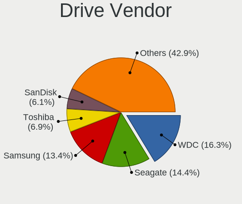
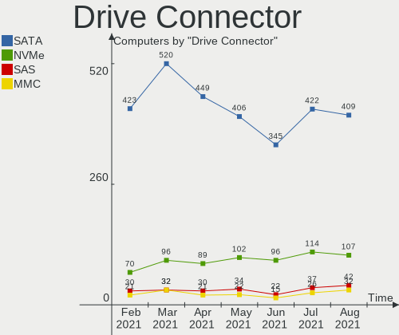
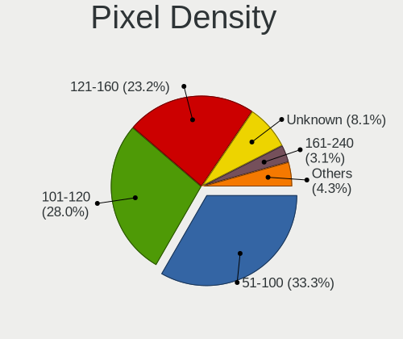
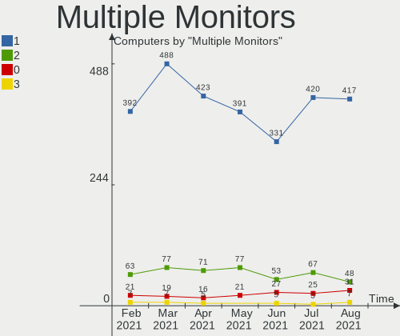

Mint Hardware Trends
--------------------

A project to identify most popular hardware characteristics and track their change
over time based on data collected by Mint users at https://Linux-Hardware.org.

Anyone can contribute to the study by uploading probes of their computers by
the [hw-probe](https://github.com/linuxhw/hw-probe) tool:

    sudo hw-probe -all -upload

This is a report for all computer types. See also reports for [desktops](/Dist/Mint/Desktop/README.md) and [notebooks](/Dist/Mint/Notebook/README.md).

Full-feature report is available here: https://linux-hardware.org/?view=trends

Period: Apr, 2020.

Contents
--------

- [ OS                       ](#os)
- [ OS Family                ](#os-family)
- [ Kernel                   ](#kernel)
- [ Kernel Family            ](#kernel-family)
- [ Kernel Major Ver.        ](#kernel-major-ver)
- [ Arch                     ](#arch)
- [ DE                       ](#de)
- [ Display Server           ](#display-server)
- [ Display Manager          ](#display-manager)
- [ OS Lang                  ](#os-lang)
- [ Boot Mode                ](#boot-mode)
- [ Filesystem               ](#filesystem)
- [ Dual Boot with Linux/BSD ](#dual-boot-with-linux/bsd)
- [ Dual Boot (Win)          ](#dual-boot-win)
- [ Country                  ](#country)
- [ City                     ](#city)
- [ Vendor                   ](#vendor)
- [ Model                    ](#model)
- [ Model Family             ](#model-family)
- [ MFG Year                 ](#mfg-year)
- [ Form Factor              ](#form-factor)
- [ Secure Boot              ](#secure-boot)
- [ Coreboot                 ](#coreboot)
- [ RAM Size                 ](#ram-size)
- [ RAM Used                 ](#ram-used)
- [ Drive Vendor             ](#drive-vendor)
- [ Drive Model              ](#drive-model)
- [ Drive Kind               ](#drive-kind)
- [ Drive Connector          ](#drive-connector)
- [ Drive Size               ](#drive-size)
- [ Space Total              ](#space-total)
- [ Space Used               ](#space-used)
- [ Malfunc. Drives          ](#malfunc-drives)
- [ Malfunc. Drive Vendor    ](#malfunc-drive-vendor)
- [ Malfunc. Drive Kind      ](#malfunc-drive-kind)
- [ Failed Drives            ](#failed-drives)
- [ Failed Drive Vendor      ](#failed-drive-vendor)
- [ Drive Status             ](#drive-status)
- [ Storage Vendor           ](#storage-vendor)
- [ Storage Model            ](#storage-model)
- [ Storage Kind             ](#storage-kind)
- [ CPU Vendor               ](#cpu-vendor)
- [ CPU Model                ](#cpu-model)
- [ CPU Model Family         ](#cpu-model-family)
- [ CPU Cores                ](#cpu-cores)
- [ CPU Sockets              ](#cpu-sockets)
- [ CPU Threads              ](#cpu-threads)
- [ CPU Op-Modes             ](#cpu-op-modes)
- [ CPU Microarch            ](#cpu-microarch)
- [ CPU Microcode            ](#cpu-microcode)
- [ GPU Vendor               ](#gpu-vendor)
- [ GPU Model                ](#gpu-model)
- [ GPU Combo                ](#gpu-combo)
- [ GPU Driver               ](#gpu-driver)
- [ GPU Memory               ](#gpu-memory)
- [ Monitor Vendor           ](#monitor-vendor)
- [ Monitor Model            ](#monitor-model)
- [ Monitor Resolution       ](#monitor-resolution)
- [ Monitor Diagonal         ](#monitor-diagonal)
- [ Monitor Width            ](#monitor-width)
- [ Aspect Ratio             ](#aspect-ratio)
- [ Monitor Area             ](#monitor-area)
- [ Pixel Density            ](#pixel-density)
- [ Multiple Monitors        ](#multiple-monitors)
- [ Net Controller Vendor    ](#net-controller-vendor)
- [ Net Controller Model     ](#net-controller-model)
- [ Net Controller Kind      ](#net-controller-kind)
- [ Used Controller          ](#used-controller)
- [ NICs                     ](#nics)
- [ Unsupported Devices      ](#unsupported-devices)
- [ Unsupported Device Types ](#unsupported-device-types)

OS
--

Installed operating systems

| Name      | Computers | Percent |
|-----------|-----------|---------|
| Mint 19.3 | 271       | 82.37%  |
| Mint 4    | 14        | 4.26%   |
| Mint 19.2 | 14        | 4.26%   |
| Mint 19.1 | 14        | 4.26%   |
| Mint 19   | 8         | 2.43%   |
| Mint 18.3 | 6         | 1.82%   |
| Mint 18.1 | 1         | 0.3%    |
| Mint 17.3 | 1         | 0.3%    |

OS Family
---------

OS without a version

| Name | Computers | Percent |
|------|-----------|---------|
| Mint | 329       | 100%    |

Kernel
------

Version of the Linux kernel

| Version                   | Computers | Percent |
|---------------------------|-----------|---------|
| 5.3.0-46-generic          | 137       | 41.64%  |
| 5.0.0-32-generic          | 46        | 13.98%  |
| 5.3.0-45-generic          | 40        | 12.16%  |
| 4.15.0-96-generic         | 27        | 8.21%   |
| 4.19.0-8-amd64            | 13        | 3.95%   |
| 5.3.0-51-generic          | 12        | 3.65%   |
| 5.3.0-42-generic          | 11        | 3.34%   |
| 4.15.0-91-generic         | 11        | 3.34%   |
| 4.15.0-54-generic         | 5         | 1.52%   |
| 4.15.0-74-generic         | 3         | 0.91%   |
| 5.3.0-28-generic          | 2         | 0.61%   |
| 4.15.0-58-generic         | 2         | 0.61%   |
| 4.15.0-20-generic         | 2         | 0.61%   |
| 5.6.2-050602-generic      | 1         | 0.3%    |
| 5.5.13-050513-generic     | 1         | 0.3%    |
| 5.5.0-18.1-liquorix-amd64 | 1         | 0.3%    |
| 5.5.0-050500-generic      | 1         | 0.3%    |
| 5.4.0-0.bpo.4-amd64       | 1         | 0.3%    |
| 5.3.8-050308-generic      | 1         | 0.3%    |
| 5.3.6-050306-generic      | 1         | 0.3%    |
| 5.3.0-40-generic          | 1         | 0.3%    |
| 4.4.0-176-generic         | 1         | 0.3%    |
| 4.4.0-148-generic         | 1         | 0.3%    |
| 4.19.18-041918-lowlatency | 1         | 0.3%    |
| 4.15.0-99-generic         | 1         | 0.3%    |
| 4.15.0-96-lowlatency      | 1         | 0.3%    |
| 4.15.0-88-generic         | 1         | 0.3%    |
| 4.15.0-65-generic         | 1         | 0.3%    |
| 4.15.0-42-generic         | 1         | 0.3%    |
| 4.10.0-42-generic         | 1         | 0.3%    |
| 4.10.0-38-generic         | 1         | 0.3%    |

Kernel Family
-------------

Linux kernel without a distro release

| Version | Computers | Percent |
|---------|-----------|---------|
| 5.3.0   | 203       | 61.7%   |
| 4.15.0  | 55        | 16.72%  |
| 5.0.0   | 46        | 13.98%  |
| 4.19.0  | 13        | 3.95%   |
| 5.5.0   | 2         | 0.61%   |
| 4.4.0   | 2         | 0.61%   |
| 4.10.0  | 2         | 0.61%   |
| 5.6.2   | 1         | 0.3%    |
| 5.5.13  | 1         | 0.3%    |
| 5.4.0   | 1         | 0.3%    |
| 5.3.8   | 1         | 0.3%    |
| 5.3.6   | 1         | 0.3%    |
| 4.19.18 | 1         | 0.3%    |

Kernel Major Ver.
-----------------

Linux kernel major version

| Version | Computers | Percent |
|---------|-----------|---------|
| 5.3     | 205       | 62.31%  |
| 4.15    | 55        | 16.72%  |
| 5.0     | 46        | 13.98%  |
| 4.19    | 14        | 4.26%   |
| 5.5     | 3         | 0.91%   |
| 4.4     | 2         | 0.61%   |
| 4.10    | 2         | 0.61%   |
| 5.6     | 1         | 0.3%    |
| 5.4     | 1         | 0.3%    |

Arch
----

OS architecture (x86_64, i586, etc.)

| Name   | Computers | Percent |
|--------|-----------|---------|
| x86_64 | 290       | 88.15%  |
| i686   | 39        | 11.85%  |

DE
--

Desktop Environment

| Name       | Computers | Percent |
|------------|-----------|---------|
| X-Cinnamon | 186       | 56.53%  |
| MATE       | 45        | 13.68%  |
| Cinnamon   | 42        | 12.77%  |
| XFCE       | 36        | 10.94%  |
| GNOME      | 10        | 3.04%   |
| Unknown    | 10        | 3.04%   |

Display Server
--------------

X11 or Wayland

| Name | Computers | Percent |
|------|-----------|---------|
| X11  | 329       | 100%    |

Display Manager
---------------

SDDM, LightDM, etc.

| Name    | Computers | Percent |
|---------|-----------|---------|
| Unknown | 267       | 81.16%  |
| LightDM | 61        | 18.54%  |
| MDM     | 1         | 0.3%    |

OS Lang
-------

Language

| Lang       | Computers | Percent |
|------------|-----------|---------|
| en_US      | 100       | 30.4%   |
| ru_RU      | 36        | 10.94%  |
| pt_BR      | 29        | 8.81%   |
| de_DE      | 28        | 8.51%   |
| en_GB      | 17        | 5.17%   |
| pl_PL      | 10        | 3.04%   |
| pt_PT      | 8         | 2.43%   |
| en_AU      | 8         | 2.43%   |
| nl_NL      | 7         | 2.13%   |
| it_IT      | 6         | 1.82%   |
| fr_FR      | 6         | 1.82%   |
| es_ES      | 6         | 1.82%   |
| ru_UA      | 4         | 1.22%   |
| fi_FI      | 4         | 1.22%   |
| C          | 4         | 1.22%   |
| fr_CA      | 3         | 0.91%   |
| es_CL      | 3         | 0.91%   |
| es_AR      | 3         | 0.91%   |
| en_ZA      | 3         | 0.91%   |
| en_IN      | 3         | 0.91%   |
| en_CA      | 3         | 0.91%   |
| el_GR      | 3         | 0.91%   |
| ro_RO      | 2         | 0.61%   |
| hu_HU      | 2         | 0.61%   |
| es_MX      | 2         | 0.61%   |
| es_CO      | 2         | 0.61%   |
| en_IL      | 2         | 0.61%   |
| en_IE      | 2         | 0.61%   |
| ca_ES      | 2         | 0.61%   |
| Unknown    | 2         | 0.61%   |
| uk_UA      | 1         | 0.3%    |
| sv_SE      | 1         | 0.3%    |
| sl_SI      | 1         | 0.3%    |
| ru_RU.utf8 | 1         | 0.3%    |
| nl_BE      | 1         | 0.3%    |
| lv_LV      | 1         | 0.3%    |
| ja_JP      | 1         | 0.3%    |
| fr_BE      | 1         | 0.3%    |
| es_UY      | 1         | 0.3%    |
| es_PE      | 1         | 0.3%    |
| es_PA      | 1         | 0.3%    |
| en_PH      | 1         | 0.3%    |
| en_NZ      | 1         | 0.3%    |
| en_NG      | 1         | 0.3%    |
| de_CH      | 1         | 0.3%    |
| de_AT      | 1         | 0.3%    |
| cs_CZ      | 1         | 0.3%    |
| ca_AD      | 1         | 0.3%    |
| bg_BG      | 1         | 0.3%    |

Boot Mode
---------

EFI or BIOS

| Mode | Computers | Percent |
|------|-----------|---------|
| BIOS | 200       | 60.79%  |
| EFI  | 129       | 39.21%  |

Filesystem
----------

Type of filesystem

| Type    | Computers | Percent |
|---------|-----------|---------|
| Ext4    | 320       | 97.26%  |
| Overlay | 3         | 0.91%   |
| Btrfs   | 3         | 0.91%   |
| Xfs     | 1         | 0.3%    |
| Ext3    | 1         | 0.3%    |
| Ext2    | 1         | 0.3%    |

Dual Boot with Linux/BSD
------------------------

Hosting more than one Linux/BSD

| Dual boot | Computers | Percent |
|-----------|-----------|---------|
| No        | 314       | 95.44%  |
| Yes       | 15        | 4.56%   |

Dual Boot (Win)
---------------

Hosting Linux and Windows

| Dual boot | Computers | Percent |
|-----------|-----------|---------|
| No        | 296       | 89.97%  |
| Yes       | 33        | 10.03%  |

Country
-------

Geographic location (country)

| Country            | Computers | Percent |
|--------------------|-----------|---------|
| USA                | 58        | 17.63%  |
| Russia             | 42        | 12.77%  |
| Brazil             | 33        | 10.03%  |
| Germany            | 28        | 8.51%   |
| UK                 | 12        | 3.65%   |
| Poland             | 11        | 3.34%   |
| Netherlands        | 10        | 3.04%   |
| Spain              | 9         | 2.74%   |
| Canada             | 9         | 2.74%   |
| Ukraine            | 8         | 2.43%   |
| Australia          | 8         | 2.43%   |
| Portugal           | 7         | 2.13%   |
| Italy              | 7         | 2.13%   |
| France             | 7         | 2.13%   |
| India              | 6         | 1.82%   |
| Romania            | 4         | 1.22%   |
| Hungary            | 4         | 1.22%   |
| Greece             | 4         | 1.22%   |
| Finland            | 4         | 1.22%   |
| Bulgaria           | 4         | 1.22%   |
| Belgium            | 4         | 1.22%   |
| Argentina          | 4         | 1.22%   |
| Switzerland        | 3         | 0.91%   |
| South Africa       | 3         | 0.91%   |
| Mexico             | 3         | 0.91%   |
| Malaysia           | 3         | 0.91%   |
| Chile              | 3         | 0.91%   |
| Austria            | 3         | 0.91%   |
| Sweden             | 2         | 0.61%   |
| Israel             | 2         | 0.61%   |
| Ireland            | 2         | 0.61%   |
| Colombia           | 2         | 0.61%   |
| Belarus            | 2         | 0.61%   |
| Uruguay            | 1         | 0.3%    |
| Turkey             | 1         | 0.3%    |
| Slovenia           | 1         | 0.3%    |
| Serbia             | 1         | 0.3%    |
| Philippines        | 1         | 0.3%    |
| Peru               | 1         | 0.3%    |
| Panama             | 1         | 0.3%    |
| Norway             | 1         | 0.3%    |
| New Zealand        | 1         | 0.3%    |
| Latvia             | 1         | 0.3%    |
| Korea, Republic of | 1         | 0.3%    |
| Japan              | 1         | 0.3%    |
| Iraq               | 1         | 0.3%    |
| Indonesia          | 1         | 0.3%    |
| Ghana              | 1         | 0.3%    |
| Egypt              | 1         | 0.3%    |
| Denmark            | 1         | 0.3%    |
| Czech Republic     | 1         | 0.3%    |

City
----

Geographic location (city)

| City                   | Computers | Percent |
|------------------------|-----------|---------|
| Moscow                 | 13        | 3.95%   |
| São Paulo             | 6         | 1.82%   |
| St Petersburg          | 4         | 1.22%   |
| Rio de Janeiro         | 4         | 1.22%   |
| Kyiv                   | 4         | 1.22%   |
| Perth                  | 3         | 0.91%   |
| Lisbon                 | 3         | 0.91%   |
| Curitiba               | 3         | 0.91%   |
| Berlin                 | 3         | 0.91%   |
| Athens                 | 3         | 0.91%   |
| Warsaw                 | 2         | 0.61%   |
| Ufa                    | 2         | 0.61%   |
| Sofia                  | 2         | 0.61%   |
| Sheffield              | 2         | 0.61%   |
| Rotterdam              | 2         | 0.61%   |
| Rome                   | 2         | 0.61%   |
| Quierschied            | 2         | 0.61%   |
| Porto Alegre           | 2         | 0.61%   |
| Petrozavodsk           | 2         | 0.61%   |
| Montreal               | 2         | 0.61%   |
| Kazan’               | 2         | 0.61%   |
| Helsinki               | 2         | 0.61%   |
| Hamburg                | 2         | 0.61%   |
| Fort Worth             | 2         | 0.61%   |
| Denver                 | 2         | 0.61%   |
| Budapest               | 2         | 0.61%   |
| Brisbane               | 2         | 0.61%   |
| Zufikon                | 1         | 0.3%    |
| Zoetermeer             | 1         | 0.3%    |
| Zaragoza               | 1         | 0.3%    |
| Zalaegerszeg           | 1         | 0.3%    |
| York                   | 1         | 0.3%    |
| Wrocław               | 1         | 0.3%    |
| Warrensburg            | 1         | 0.3%    |
| Waldheim               | 1         | 0.3%    |
| Wabern                 | 1         | 0.3%    |
| Västerås             | 1         | 0.3%    |
| Voronezh               | 1         | 0.3%    |
| Voorhout               | 1         | 0.3%    |
| Volochysk              | 1         | 0.3%    |
| Villingen-Schwenningen | 1         | 0.3%    |
| Vienna                 | 1         | 0.3%    |
| Valencia               | 1         | 0.3%    |
| Val-d'Or               | 1         | 0.3%    |
| Upper Marlboro         | 1         | 0.3%    |
| Ubatuba                | 1         | 0.3%    |
| Tyumen                 | 1         | 0.3%    |
| Turin                  | 1         | 0.3%    |
| Trier                  | 1         | 0.3%    |
| Treviolo               | 1         | 0.3%    |
| Toulon                 | 1         | 0.3%    |
| Toronto                | 1         | 0.3%    |
| Toguchin               | 1         | 0.3%    |
| Tijuana                | 1         | 0.3%    |
| Thessaloniki           | 1         | 0.3%    |
| Ternat                 | 1         | 0.3%    |
| Tel Aviv               | 1         | 0.3%    |
| Tarnowskie Gory        | 1         | 0.3%    |
| Tangerang              | 1         | 0.3%    |
| Tampa                  | 1         | 0.3%    |

Vendor
------

Motherboard manufacturer

| Name                | Computers | Percent |
|---------------------|-----------|---------|
| Hewlett-Packard     | 64        | 19.45%  |
| ASUSTek Computer    | 51        | 15.5%   |
| Dell                | 38        | 11.55%  |
| Lenovo              | 31        | 9.42%   |
| Gigabyte Technology | 24        | 7.29%   |
| Acer                | 23        | 6.99%   |
| ASRock              | 14        | 4.26%   |
| MSI                 | 13        | 3.95%   |
| Toshiba             | 11        | 3.34%   |
| Intel               | 7         | 2.13%   |
| Apple               | 5         | 1.52%   |
| Clevo               | 4         | 1.22%   |
| Unknown             | 4         | 1.22%   |
| Samsung Electronics | 3         | 0.91%   |
| eMachines           | 3         | 0.91%   |
| Shuttle             | 2         | 0.61%   |
| Quanta              | 2         | 0.61%   |
| Packard Bell        | 2         | 0.61%   |
| Medion              | 2         | 0.61%   |
| Itautec             | 2         | 0.61%   |
| Fujitsu             | 2         | 0.61%   |
| AMI                 | 2         | 0.61%   |
| WinFast             | 1         | 0.3%    |
| Timi                | 1         | 0.3%    |
| Sony                | 1         | 0.3%    |
| Positivo            | 1         | 0.3%    |
| Pegatron            | 1         | 0.3%    |
| PC Specialist       | 1         | 0.3%    |
| Nvidia              | 1         | 0.3%    |
| Login Informatica   | 1         | 0.3%    |
| Lite-On             | 1         | 0.3%    |
| Irbis               | 1         | 0.3%    |
| IP3                 | 1         | 0.3%    |
| IBM                 | 1         | 0.3%    |
| Fujitsu Siemens     | 1         | 0.3%    |
| Foxconn             | 1         | 0.3%    |
| ECS                 | 1         | 0.3%    |
| Dixonsxp            | 1         | 0.3%    |
| Compal              | 1         | 0.3%    |
| Chuwi               | 1         | 0.3%    |
| BUSH                | 1         | 0.3%    |
| Biostar             | 1         | 0.3%    |

Model
-----

Motherboard model

| Name                                              | Computers | Percent |
|---------------------------------------------------|-----------|---------|
| Unknown                                           | 8         | 2.43%   |
| HP Laptop 15-bw0xx                                | 3         | 0.91%   |
| Toshiba Satellite L650                            | 2         | 0.61%   |
| HP ProBook 4540s                                  | 2         | 0.61%   |
| HP ProBook 450 G6                                 | 2         | 0.61%   |
| HP Pavilion g6                                    | 2         | 0.61%   |
| HP Pavilion dv7                                   | 2         | 0.61%   |
| HP Pavilion dv6                                   | 2         | 0.61%   |
| HP Laptop 15-db0xxx                               | 2         | 0.61%   |
| HP Laptop 15-bs1xx                                | 2         | 0.61%   |
| HP EliteBook 8460p                                | 2         | 0.61%   |
| Gigabyte GA-990FXA-UD3                            | 2         | 0.61%   |
| Dell OptiPlex 755                                 | 2         | 0.61%   |
| Dell Inspiron 1525                                | 2         | 0.61%   |
| Dell Inspiron 15-3567                             | 2         | 0.61%   |
| ASUS SABERTOOTH 990FX R2.0                        | 2         | 0.61%   |
| ASUS P8H61-M PRO                                  | 2         | 0.61%   |
| ASUS All Series                                   | 2         | 0.61%   |
| ASRock J4205-ITX                                  | 2         | 0.61%   |
| WinFast MCP61M2MA                                 | 1         | 0.3%    |
| Toshiba TECRA Z50-A                               | 1         | 0.3%    |
| Toshiba Satellite Pro M70                         | 1         | 0.3%    |
| Toshiba Satellite P300                            | 1         | 0.3%    |
| Toshiba Satellite L75-B                           | 1         | 0.3%    |
| Toshiba Satellite C70D-B                          | 1         | 0.3%    |
| Toshiba Satellite C660D                           | 1         | 0.3%    |
| Toshiba Satellite C660                            | 1         | 0.3%    |
| Toshiba Satellite A200                            | 1         | 0.3%    |
| Toshiba QOSMIO G30                                | 1         | 0.3%    |
| Timi TM1613                                       | 1         | 0.3%    |
| Sony VGN-FE41E                                    | 1         | 0.3%    |
| Shuttle XH81V                                     | 1         | 0.3%    |
| Shuttle DS81D                                     | 1         | 0.3%    |
| Samsung Electronics R540/R580/R780/SA41/E452/E852 | 1         | 0.3%    |
| Samsung Electronics 550P5C/550P7C                 | 1         | 0.3%    |
| Samsung Electronics 300E4C/300E5C/300E7C          | 1         | 0.3%    |
| Quanta TWS                                        | 1         | 0.3%    |
| Quanta 120-1136                                   | 1         | 0.3%    |
| Positivo MOBILE                                   | 1         | 0.3%    |
| Pegatron WW645AAR-ABA 300-1223                    | 1         | 0.3%    |
| PC Specialist P9XXEN_EF_ED                        | 1         | 0.3%    |
| Packard Bell EasyNote TS11HR                      | 1         | 0.3%    |
| Packard Bell EasyNote MH35                        | 1         | 0.3%    |
| Nvidia SN68PT                                     | 1         | 0.3%    |
| MSI MS-7C37                                       | 1         | 0.3%    |
| MSI MS-7C02                                       | 1         | 0.3%    |
| MSI MS-7B92                                       | 1         | 0.3%    |
| MSI MS-7B86                                       | 1         | 0.3%    |
| MSI MS-7817                                       | 1         | 0.3%    |
| MSI MS-7788                                       | 1         | 0.3%    |
| MSI MS-7732                                       | 1         | 0.3%    |
| MSI MS-7721                                       | 1         | 0.3%    |
| MSI MS-7641                                       | 1         | 0.3%    |
| MSI MS-7250                                       | 1         | 0.3%    |
| MSI GF63 Thin 9RCX                                | 1         | 0.3%    |
| MSI GE62 2QC                                      | 1         | 0.3%    |
| MSI ER101AA-ABA M7330N                            | 1         | 0.3%    |
| Medion P7815                                      | 1         | 0.3%    |
| Medion MS-7728                                    | 1         | 0.3%    |
| Login Informatica LOG-H61H2-M2                    | 1         | 0.3%    |

Model Family
------------

Motherboard model prefix

| Name                       | Computers | Percent |
|----------------------------|-----------|---------|
| Acer Aspire                | 16        | 4.86%   |
| HP Laptop                  | 14        | 4.26%   |
| Dell Inspiron              | 14        | 4.26%   |
| Lenovo ThinkPad            | 11        | 3.34%   |
| HP Pavilion                | 11        | 3.34%   |
| Dell Latitude              | 10        | 3.04%   |
| Toshiba Satellite          | 9         | 2.74%   |
| Lenovo IdeaPad             | 9         | 2.74%   |
| Unknown                    | 8         | 2.43%   |
| HP EliteBook               | 7         | 2.13%   |
| HP ProBook                 | 6         | 1.82%   |
| Dell OptiPlex              | 5         | 1.52%   |
| HP Compaq                  | 4         | 1.22%   |
| Dell Precision             | 4         | 1.22%   |
| HP Presario                | 3         | 0.91%   |
| HP 250                     | 3         | 0.91%   |
| Dell Vostro                | 3         | 0.91%   |
| ASUS SABERTOOTH            | 3         | 0.91%   |
| Packard Bell EasyNote      | 2         | 0.61%   |
| Lenovo ThinkCentre         | 2         | 0.61%   |
| Lenovo 3000                | 2         | 0.61%   |
| Itautec Infoway            | 2         | 0.61%   |
| HP ENVY                    | 2         | 0.61%   |
| Gigabyte GA-990FXA-UD3     | 2         | 0.61%   |
| Fujitsu LIFEBOOK           | 2         | 0.61%   |
| ASUS TUF                   | 2         | 0.61%   |
| ASUS P8H61-M               | 2         | 0.61%   |
| ASUS All                   | 2         | 0.61%   |
| ASRock J4205-ITX           | 2         | 0.61%   |
| WinFast MCP61M2MA          | 1         | 0.3%    |
| Toshiba TECRA              | 1         | 0.3%    |
| Toshiba QOSMIO             | 1         | 0.3%    |
| Timi TM1613                | 1         | 0.3%    |
| Sony VGN-FE41E             | 1         | 0.3%    |
| Shuttle XH81V              | 1         | 0.3%    |
| Shuttle DS81D              | 1         | 0.3%    |
| Samsung Electronics R540   | 1         | 0.3%    |
| Samsung Electronics 550P5C | 1         | 0.3%    |
| Samsung Electronics 300E4C | 1         | 0.3%    |
| Quanta TWS                 | 1         | 0.3%    |
| Quanta 120-1136            | 1         | 0.3%    |
| Positivo MOBILE            | 1         | 0.3%    |
| Pegatron WW645AAR-ABA      | 1         | 0.3%    |
| PC Specialist P9XXEN       | 1         | 0.3%    |
| Nvidia SN68PT              | 1         | 0.3%    |
| MSI MS-7C37                | 1         | 0.3%    |
| MSI MS-7C02                | 1         | 0.3%    |
| MSI MS-7B92                | 1         | 0.3%    |
| MSI MS-7B86                | 1         | 0.3%    |
| MSI MS-7817                | 1         | 0.3%    |
| MSI MS-7788                | 1         | 0.3%    |
| MSI MS-7732                | 1         | 0.3%    |
| MSI MS-7721                | 1         | 0.3%    |
| MSI MS-7641                | 1         | 0.3%    |
| MSI MS-7250                | 1         | 0.3%    |
| MSI GF63                   | 1         | 0.3%    |
| MSI GE62                   | 1         | 0.3%    |
| MSI ER101AA-ABA            | 1         | 0.3%    |
| Medion P7815               | 1         | 0.3%    |
| Medion MS-7728             | 1         | 0.3%    |

MFG Year
--------

Motherboard manufacture year

| Year    | Computers | Percent |
|---------|-----------|---------|
| 2019    | 51        | 15.5%   |
| 2018    | 44        | 13.37%  |
| 2012    | 29        | 8.81%   |
| 2011    | 29        | 8.81%   |
| 2013    | 27        | 8.21%   |
| 2010    | 25        | 7.6%    |
| 2014    | 18        | 5.47%   |
| 2009    | 17        | 5.17%   |
| 2007    | 17        | 5.17%   |
| 2016    | 15        | 4.56%   |
| 2015    | 15        | 4.56%   |
| 2008    | 13        | 3.95%   |
| 2017    | 8         | 2.43%   |
| 2006    | 8         | 2.43%   |
| 2020    | 5         | 1.52%   |
| 2005    | 5         | 1.52%   |
| Unknown | 2         | 0.61%   |
| 2004    | 1         | 0.3%    |

Form Factor
-----------

Physical design of the computer

| Name        | Computers | Percent |
|-------------|-----------|---------|
| Notebook    | 200       | 60.79%  |
| Desktop     | 121       | 36.78%  |
| All in one  | 3         | 0.91%   |
| Convertible | 2         | 0.61%   |
| Tablet      | 1         | 0.3%    |
| Mini pc     | 1         | 0.3%    |
| Server      | 1         | 0.3%    |

Secure Boot
-----------

Enabled or disabled

| State    | Computers | Percent |
|----------|-----------|---------|
| Disabled | 308       | 93.62%  |
| Enabled  | 21        | 6.38%   |

Coreboot
--------

Have coreboot on board

| Used | Computers | Percent |
|------|-----------|---------|
| No   | 329       | 100%    |

RAM Size
--------

Total RAM memory

| Size in GB  | Computers | Percent |
|-------------|-----------|---------|
| 4.01-8.0    | 81        | 24.62%  |
| 3.01-4.0    | 79        | 24.01%  |
| 8.01-16.0   | 56        | 17.02%  |
| 16.01-24.0  | 43        | 13.07%  |
| 1.01-2.0    | 33        | 10.03%  |
| 32.01-64.0  | 16        | 4.86%   |
| 2.01-3.0    | 8         | 2.43%   |
| 0.01-1.0    | 8         | 2.43%   |
| 24.01-32.0  | 4         | 1.22%   |
| 64.01-256.0 | 1         | 0.3%    |

RAM Used
--------

Used RAM memory

| Used GB   | Computers | Percent |
|-----------|-----------|---------|
| 1.01-2.0  | 126       | 38.3%   |
| 2.01-3.0  | 71        | 21.58%  |
| 0.01-1.0  | 50        | 15.2%   |
| 3.01-4.0  | 41        | 12.46%  |
| 4.01-8.0  | 34        | 10.33%  |
| 8.01-16.0 | 7         | 2.13%   |

Drive Vendor
------------

Hard drive vendors

| Vendor              | Computers | Drives  | Percent |
|---------------------|-----------|---------|---------|
| Seagate             | 85        | 92      | 19.63%  |
| WDC                 | 75        | 87      | 17.32%  |
| Samsung Electronics | 54        | 60      | 12.47%  |
| Toshiba             | 34        | 35      | 7.85%   |
| Kingston            | 28        | 29      | 6.47%   |
| Hitachi             | 25        | 27      | 5.77%   |
| SanDisk             | 18        | 19      | 4.16%   |
| HGST                | 16        | 18      | 3.7%    |
| Unknown             | 14        | 15      | 3.23%   |
| Crucial             | 13        | 13      | 3%      |
| Micron Technology   | 6         | 6       | 1.39%   |
| Maxtor              | 6         | 7       | 1.39%   |
| SK Hynix            | 4         | 4       | 0.92%   |
| OCZ                 | 4         | 4       | 0.92%   |
| Intel               | 4         | 4       | 0.92%   |
| Fujitsu             | 4         | 4       | 0.92%   |
| Corsair             | 4         | 4       | 0.92%   |
| KingSpec            | 3         | 3       | 0.69%   |
| Apple               | 3         | 3       | 0.69%   |
| Transcend           | 2         | 2       | 0.46%   |
| Team                | 2         | 2       | 0.46%   |
| SPCC                | 2         | 3       | 0.46%   |
| PNY                 | 2         | 2       | 0.46%   |
| Mushkin             | 2         | 2       | 0.46%   |
| JMicron             | 2         | 5       | 0.46%   |
| A-DATA Technology   | 2         | 2       | 0.46%   |
| WDC WD30            | 1         | 1       | 0.23%   |
| TAMMUZ              | 1         | 1       | 0.23%   |
| PLEXTOR             | 1         | 1       | 0.23%   |
| Patriot             | 1         | 1       | 0.23%   |
| MicroData           | 1         | 1       | 0.23%   |
| LITEON              | 1         | 1       | 0.23%   |
| Lexar               | 1         | 1       | 0.23%   |
| KingFast            | 1         | 1       | 0.23%   |
| KingDian            | 1         | 1       | 0.23%   |
| HL-DT-ST            | 1         | Unknown | 0.23%   |
| Hewlett-Packard     | 1         | 1       | 0.23%   |
| GOODRAM             | 1         | 1       | 0.23%   |
| Generic             | 1         | 1       | 0.23%   |
| FORESEE             | 1         | 1       | 0.23%   |
| External            | 1         | 1       | 0.23%   |
| DOGFISH             | 1         | 1       | 0.23%   |
| China               | 1         | 1       | 0.23%   |
| ASMT109x            | 1         | 1       | 0.23%   |
| Asmedia             | 1         | 1       | 0.23%   |

Drive Model
-----------

Hard drive models

| Model                        | Computers | Percent |
|------------------------------|-----------|---------|
| ST1000LM035-1RK172 1TB       | 10        | 2.14%   |
| SA400S37240G 240GB SSD       | 8         | 1.71%   |
| ST500DM002-1BD142 500GB      | 6         | 1.28%   |
| SSD 850 EVO 250GB            | 6         | 1.28%   |
| MQ01ABF050 500GB             | 6         | 1.28%   |
| SA400S37120G 120GB SSD       | 5         | 1.07%   |
| ST9500325AS 500GB            | 4         | 0.85%   |
| ST500LT012-1DG142 500GB      | 4         | 0.85%   |
| ST1000LM024 HN-M101MBB 1TB   | 4         | 0.85%   |
| SA400S37480G 480GB SSD       | 4         | 0.85%   |
| MQ01ABD100 1TB               | 4         | 0.85%   |
| HTS725050A7E630 500GB        | 4         | 0.85%   |
| HTS721010A9E630 1TB          | 4         | 0.85%   |
| SV300S37A120G 120GB SSD      | 3         | 0.64%   |
| ST2000DM006-2DM164 2TB       | 3         | 0.64%   |
| SSD PLUS 240GB               | 3         | 0.64%   |
| SSD 860 EVO 500GB            | 3         | 0.64%   |
| SSD 860 EVO 250GB            | 3         | 0.64%   |
| SSD 850 EVO 500GB            | 3         | 0.64%   |
| MMC Card  32GB               | 3         | 0.64%   |
| HTS545050A7E680 500GB        | 3         | 0.64%   |
| HDWD110 1TB                  | 3         | 0.64%   |
| CT525MX300SSD1 528GB         | 3         | 0.64%   |
| WD20EZRZ-00Z5HB0 2TB         | 2         | 0.43%   |
| WD10JPVX-22JC3T0 1TB         | 2         | 0.43%   |
| STM3160215AS 160GB           | 2         | 0.43%   |
| ST750LM022 HN-M750MBB 752GB  | 2         | 0.43%   |
| ST380815AS 80GB              | 2         | 0.43%   |
| ST31000524AS 1TB             | 2         | 0.43%   |
| ST2000DM001-1CH164 2TB       | 2         | 0.43%   |
| ST1000DM003-9YN162 1TB       | 2         | 0.43%   |
| SSD PLUS 480GB               | 2         | 0.43%   |
| SSD 860 EVO 1TB              | 2         | 0.43%   |
| SSD 850 EVO 120GB            | 2         | 0.43%   |
| SSD 840 PRO Series 128GB     | 2         | 0.43%   |
| SSD 120GB                    | 2         | 0.43%   |
| Solid State Disk 512GB       | 2         | 0.43%   |
| MZNLN256HAJQ-000H1 256GB SSD | 2         | 0.43%   |
| MMC Card  7GB                | 2         | 0.43%   |
| MMC Card  64GB               | 2         | 0.43%   |
| MMC Card  128GB              | 2         | 0.43%   |
| MHV2080AH 80GB               | 2         | 0.43%   |
| HTS725032A7E630 320GB        | 2         | 0.43%   |
| HTS723232A7A364 320GB        | 2         | 0.43%   |
| HD103UJ 1TB                  | 2         | 0.43%   |
| DT01ACA100 1TB               | 2         | 0.43%   |
| DT01ACA050 500GB             | 2         | 0.43%   |
| DF4032  32GB                 | 2         | 0.43%   |
| CT250MX500SSD1 250GB         | 2         | 0.43%   |
| CT240BX500SSD1 240GB         | 2         | 0.43%   |
| WDS500G2B0B-00YS70 500GB SSD | 1         | 0.21%   |
| WDS240G2G0B-00EPW0 240GB SSD | 1         | 0.21%   |
| WDS200T2B0A 2TB SSD          | 1         | 0.21%   |
| WDS120G2G0A-00JH30 120GB SSD | 1         | 0.21%   |
| WDS100T2B0A-00SM50 1TB SSD   | 1         | 0.21%   |
| WDBNCE5000PNC 500GB SSD      | 1         | 0.21%   |
| WDBNCE2500PNC 250GB SSD      | 1         | 0.21%   |
| WD800JD-75MSA3 80GB          | 1         | 0.21%   |
| WD800BEVS-22RST0 80GB        | 1         | 0.21%   |
| WD7500BPVT-22HXZT3 752GB     | 1         | 0.21%   |

Drive Kind
----------

HDD or SSD

| Kind    | Computers | Drives | Percent |
|---------|-----------|--------|---------|
| HDD     | 220       | 278    | 56.7%   |
| SSD     | 135       | 154    | 34.79%  |
| MMC     | 13        | 15     | 3.35%   |
| NVMe    | 11        | 12     | 2.84%   |
| Unknown | 9         | 11     | 2.32%   |

Drive Connector
---------------

SATA, SAS, NVMe, etc.

| Type | Computers | Drives | Percent |
|------|-----------|--------|---------|
| SATA | 302       | 426    | 89.35%  |
| MMC  | 13        | 15     | 3.85%   |
| SAS  | 12        | 17     | 3.55%   |
| NVMe | 11        | 12     | 3.25%   |

Drive Size
----------

Size of hard drive

| Size in TB | Computers | Drives | Percent |
|------------|-----------|--------|---------|
| 0.01-0.5   | 250       | 314    | 64.94%  |
| 0.51-1.0   | 101       | 111    | 26.23%  |
| 1.01-2.0   | 22        | 25     | 5.71%   |
| 2.01-3.0   | 6         | 8      | 1.56%   |
| 3.01-4.0   | 4         | 9      | 1.04%   |
| 10.01-20.0 | 1         | 2      | 0.26%   |
| 4.01-10.0  | 1         | 1      | 0.26%   |

Space Total
-----------

Amount of disk space available on the file system

| Size in GB     | Computers | Percent |
|----------------|-----------|---------|
| 101-250        | 96        | 29.18%  |
| 251-500        | 83        | 25.23%  |
| 501-1000       | 57        | 17.33%  |
| 51-100         | 27        | 8.21%   |
| 1001-2000      | 23        | 6.99%   |
| More than 3000 | 16        | 4.86%   |
| 21-50          | 15        | 4.56%   |
| 2001-3000      | 7         | 2.13%   |
| Unknown        | 3         | 0.91%   |
| 1-20           | 2         | 0.61%   |

Space Used
----------

Amount of used disk space

| Used GB        | Computers | Percent |
|----------------|-----------|---------|
| 1-20           | 82        | 24.92%  |
| 21-50          | 80        | 24.32%  |
| 51-100         | 56        | 17.02%  |
| 101-250        | 45        | 13.68%  |
| 251-500        | 27        | 8.21%   |
| 501-1000       | 18        | 5.47%   |
| 1001-2000      | 10        | 3.04%   |
| More than 3000 | 4         | 1.22%   |
| 2001-3000      | 4         | 1.22%   |
| Unknown        | 3         | 0.91%   |

Malfunc. Drives
---------------

Drive models with a malfunction

| Model                             | Computers | Drives | Percent |
|-----------------------------------|-----------|--------|---------|
| WD7500AAVS-00D7B1 752GB           | 1         | 1      | 4%      |
| WD5000AAKX-001CA0 500GB           | 1         | 1      | 4%      |
| WD5000AAKS-65YGA0 500GB           | 1         | 1      | 4%      |
| WD3200BPVT-22ZEST0 320GB          | 1         | 1      | 4%      |
| WD3200BEKT-60F3T1 320GB           | 1         | 1      | 4%      |
| WD3200AAJS-00YZCA0 320GB          | 1         | 1      | 4%      |
| WD1600BEVT-22A23T0 160GB          | 1         | 1      | 4%      |
| ST500LT012-1DG142 500GB           | 1         | 1      | 4%      |
| ST380817AS 80GB                   | 1         | 1      | 4%      |
| ST31000524AS 1TB                  | 1         | 1      | 4%      |
| ST1000LM035-1RK172 1TB            | 1         | 1      | 4%      |
| SSD2SC120G3LC726B104-370P 120GB   | 1         | 1      | 4%      |
| SSD TS128E 121GB                  | 1         | 1      | 4%      |
| SSD i100 24GB                     | 1         | 1      | 4%      |
| SD9SN8W-256G-1006 256GB SSD       | 1         | 1      | 4%      |
| MZNLN256HAJQ-000H1 256GB SSD      | 1         | 1      | 4%      |
| MTFDDAV256TDL-1AW1ZABHA 256GB SSD | 1         | 1      | 4%      |
| HTS725050A7E630 500GB             | 1         | 1      | 4%      |
| HTS545050A7E680 500GB             | 1         | 1      | 4%      |
| HM500JI 500GB                     | 1         | 1      | 4%      |
| HM321HI 320GB                     | 1         | 1      | 4%      |
| HDP725050GLA360 500GB             | 1         | 1      | 4%      |
| HD322HJ 320GB                     | 1         | 1      | 4%      |
| HD154UI 1TB                       | 1         | 1      | 4%      |
| 6Y160P0 164GB                     | 1         | 1      | 4%      |

Malfunc. Drive Vendor
---------------------

Vendors of faulty drives

| Vendor              | Computers | Drives | Percent |
|---------------------|-----------|--------|---------|
| WDC                 | 5         | 7      | 21.74%  |
| Samsung Electronics | 5         | 5      | 21.74%  |
| Seagate             | 4         | 4      | 17.39%  |
| SanDisk             | 2         | 2      | 8.7%    |
| HGST                | 2         | 2      | 8.7%    |
| PNY                 | 1         | 1      | 4.35%   |
| Micron Technology   | 1         | 1      | 4.35%   |
| Maxtor              | 1         | 1      | 4.35%   |
| Hitachi             | 1         | 1      | 4.35%   |
| Apple               | 1         | 1      | 4.35%   |

Malfunc. Drive Kind
-------------------

Kinds of faulty drives

| Kind | Computers | Drives | Percent |
|------|-----------|--------|---------|
| HDD  | 17        | 19     | 73.91%  |
| SSD  | 6         | 6      | 26.09%  |

Failed Drives
-------------

Failed drive models

Zero info for selected period =(

Failed Drive Vendor
-------------------

Failed drive vendors

Zero info for selected period =(

Drive Status
------------

Number of failed and malfunc. drives

| Status   | Computers | Drives | Percent |
|----------|-----------|--------|---------|
| Detected | 255       | 369    | 76.58%  |
| Works    | 56        | 76     | 16.82%  |
| Malfunc  | 22        | 25     | 6.61%   |

Storage Vendor
--------------

Storage controller vendors

| Vendor                           | Computers | Percent |
|----------------------------------|-----------|---------|
| Intel                            | 224       | 58.33%  |
| AMD                              | 69        | 17.97%  |
| Samsung Electronics              | 16        | 4.17%   |
| Nvidia                           | 16        | 4.17%   |
| Marvell Technology Group         | 14        | 3.65%   |
| ASMedia Technology               | 14        | 3.65%   |
| JMicron Technology               | 6         | 1.56%   |
| Silicon Integrated Systems [SiS] | 5         | 1.3%    |
| Toshiba America Info Systems     | 4         | 1.04%   |
| Phison Electronics               | 4         | 1.04%   |
| SK Hynix                         | 3         | 0.78%   |
| VIA Technologies                 | 2         | 0.52%   |
| Silicon Motion                   | 2         | 0.52%   |
| Sandisk                          | 2         | 0.52%   |
| Realtek Semiconductor            | 1         | 0.26%   |
| Kingston Technology Company      | 1         | 0.26%   |
| Apple                            | 1         | 0.26%   |

Storage Model
-------------

Storage controller models

| Model                                                                             | Computers | Percent |
|-----------------------------------------------------------------------------------|-----------|---------|
| FCH SATA Controller [AHCI mode]                                                   | 31        | 6.62%   |
| 7 Series Chipset Family 6-port SATA Controller [AHCI mode]                        | 27        | 5.77%   |
| SB7x0/SB8x0/SB9x0 SATA Controller [AHCI mode]                                     | 20        | 4.27%   |
| Sunrise Point-LP SATA Controller [AHCI mode]                                      | 15        | 3.21%   |
| SB7x0/SB8x0/SB9x0 IDE Controller                                                  | 14        | 2.99%   |
| 82801 Mobile SATA Controller [RAID mode]                                          | 14        | 2.99%   |
| ASM1062 Serial ATA Controller                                                     | 13        | 2.78%   |
| 6 Series/C200 Series Chipset Family 6 port Mobile SATA AHCI Controller            | 12        | 2.56%   |
| MCP61 SATA Controller                                                             | 10        | 2.14%   |
| 82801HM/HEM (ICH8M/ICH8M-E) IDE Controller                                        | 10        | 2.14%   |
| 8 Series/C220 Series Chipset Family 6-port SATA Controller 1 [AHCI mode]          | 10        | 2.14%   |
| SB7x0/SB8x0/SB9x0 SATA Controller [IDE mode]                                      | 9         | 1.92%   |
| 82801IBM/IEM (ICH9M/ICH9M-E) 4 port SATA Controller [AHCI mode]                   | 9         | 1.92%   |
| 82801HM/HEM (ICH8M/ICH8M-E) SATA Controller [AHCI mode]                           | 9         | 1.92%   |
| NVMe SSD Controller SM981/PM981/PM983                                             | 8         | 1.71%   |
| NM10/ICH7 Family SATA Controller [IDE mode]                                       | 8         | 1.71%   |
| 82801G (ICH7 Family) IDE Controller                                               | 8         | 1.71%   |
| Cannon Point-LP SATA Controller [AHCI Mode]                                       | 7         | 1.5%    |
| Cannon Lake PCH SATA AHCI Controller                                              | 7         | 1.5%    |
| 8 Series SATA Controller 1 [AHCI mode]                                            | 7         | 1.5%    |
| 6 Series/C200 Series Chipset Family Desktop SATA Controller (IDE mode, ports 4-5) | 7         | 1.5%    |
| 6 Series/C200 Series Chipset Family Desktop SATA Controller (IDE mode, ports 0-3) | 7         | 1.5%    |
| 5 Series/3400 Series Chipset 4 port SATA AHCI Controller                          | 7         | 1.5%    |
| Wildcat Point-LP SATA Controller [AHCI Mode]                                      | 6         | 1.28%   |
| MCP61 IDE                                                                         | 6         | 1.28%   |
| 88SE9172 SATA 6Gb/s Controller                                                    | 5         | 1.07%   |
| 6 Series/C200 Series Chipset Family 6 port Desktop SATA AHCI Controller           | 5         | 1.07%   |
| 5513 IDE Controller                                                               | 5         | 1.07%   |
| 5 Series/3400 Series Chipset 6 port SATA AHCI Controller                          | 5         | 1.07%   |
| SB600 Non-Raid-5 SATA                                                             | 4         | 0.85%   |
| SB600 IDE                                                                         | 4         | 0.85%   |
| SATA Controller / IDE mode                                                        | 4         | 0.85%   |
| SATA controller                                                                   | 4         | 0.85%   |
| Q170/Q150/B150/H170/H110/Z170/CM236 Chipset SATA Controller [AHCI Mode]           | 4         | 0.85%   |
| IXP SB4x0 IDE Controller                                                          | 4         | 0.85%   |
| Celeron N3350/Pentium N4200/Atom E3900 Series SATA AHCI Controller                | 4         | 0.85%   |
| Cannon Lake Mobile PCH SATA AHCI Controller                                       | 4         | 0.85%   |
| 82801GBM/GHM (ICH7-M Family) SATA Controller [IDE mode]                           | 4         | 0.85%   |
| 200 Series PCH SATA controller [AHCI mode]                                        | 4         | 0.85%   |
| NVMe SSD Controller SM961/PM961                                                   | 3         | 0.64%   |
| NVMe Controller                                                                   | 3         | 0.64%   |
| NM10/ICH7 Family SATA Controller [AHCI mode]                                      | 3         | 0.64%   |
| Electronics Non-Volatile memory controller                                        | 3         | 0.64%   |
| BC501 NVMe Solid State Drive 512GB                                                | 3         | 0.64%   |
| Atom Processor E3800 Series SATA AHCI Controller                                  | 3         | 0.64%   |
| 9 Series Chipset Family SATA Controller [AHCI Mode]                               | 3         | 0.64%   |
| 82801IR/IO/IH (ICH9R/DO/DH) 6 port SATA Controller [AHCI mode]                    | 3         | 0.64%   |
| 82801IBM/IEM (ICH9M/ICH9M-E) 2 port SATA Controller [IDE mode]                    | 3         | 0.64%   |
| 82801FB/FBM/FR/FW/FRW (ICH6 Family) IDE Controller                                | 3         | 0.64%   |
| 5 Series/3400 Series Chipset 4 port SATA IDE Controller                           | 3         | 0.64%   |
| 5 Series/3400 Series Chipset 2 port SATA IDE Controller                           | 3         | 0.64%   |
| 400 Series Chipset SATA Controller                                                | 3         | 0.64%   |
| WD Black 2018/PC SN520 NVMe SSD                                                   | 2         | 0.43%   |
| SATA Controller [RAID mode]                                                       | 2         | 0.43%   |
| Non-Volatile memory controller                                                    | 2         | 0.43%   |
| MCP73 IDE Controller                                                              | 2         | 0.43%   |
| JMB363 SATA/IDE Controller                                                        | 2         | 0.43%   |
| JMB362 SATA Controller                                                            | 2         | 0.43%   |
| HM170/QM170 Chipset SATA Controller [AHCI Mode]                                   | 2         | 0.43%   |
| GeForce 7100/nForce 630i SATA                                                     | 2         | 0.43%   |

Storage Kind
------------

Kind of storage controller (IDE, SATA, NVMe, SAS, ...)

| Kind | Computers | Percent |
|------|-----------|---------|
| SATA | 242       | 61.58%  |
| IDE  | 101       | 25.7%   |
| NVMe | 34        | 8.65%   |
| RAID | 16        | 4.07%   |

CPU Vendor
----------

Processor vendors

| Vendor       | Computers | Percent |
|--------------|-----------|---------|
| Intel        | 247       | 75.08%  |
| AMD          | 81        | 24.62%  |
| CentaurHauls | 1         | 0.3%    |

CPU Model
---------

Processor models

| Model                                           | Computers | Percent |
|-------------------------------------------------|-----------|---------|
| Intel Core i7-8565U CPU @ 1.80GHz               | 5         | 1.52%   |
| Intel Core i7-2600 CPU @ 3.40GHz                | 5         | 1.52%   |
| Intel Core i5-3210M CPU @ 2.50GHz               | 4         | 1.22%   |
| AMD FX-6100 Six-Core Processor                  | 4         | 1.22%   |
| Intel Core i7-5500U CPU @ 2.40GHz               | 3         | 0.91%   |
| Intel Core i7-3612QM CPU @ 2.10GHz              | 3         | 0.91%   |
| Intel Core i7-10510U CPU @ 1.80GHz              | 3         | 0.91%   |
| Intel Core i5-8400 CPU @ 2.80GHz                | 3         | 0.91%   |
| Intel Core i5-8250U CPU @ 1.60GHz               | 3         | 0.91%   |
| Intel Core i5-3320M CPU @ 2.60GHz               | 3         | 0.91%   |
| Intel Core i5-3230M CPU @ 2.60GHz               | 3         | 0.91%   |
| Intel Core i5-2400 CPU @ 3.10GHz                | 3         | 0.91%   |
| Intel Core i5 CPU M 520 @ 2.40GHz               | 3         | 0.91%   |
| Intel Core i3-6006U CPU @ 2.00GHz               | 3         | 0.91%   |
| Intel Core i3-5005U CPU @ 2.00GHz               | 3         | 0.91%   |
| Intel Core 2 Duo CPU E8400 @ 3.00GHz            | 3         | 0.91%   |
| Intel Celeron CPU N2840 @ 2.16GHz               | 3         | 0.91%   |
| AMD A6-9225 RADEON R4, 5 COMPUTE CORES 2C+3G    | 3         | 0.91%   |
| AMD A10-9620P RADEON R5, 10 COMPUTE CORES 4C+6G | 3         | 0.91%   |
| Intel Pentium Dual-Core CPU T4400 @ 2.20GHz     | 2         | 0.61%   |
| Intel Pentium Dual-Core CPU E5200 @ 2.50GHz     | 2         | 0.61%   |
| Intel Pentium Dual CPU T2310 @ 1.46GHz          | 2         | 0.61%   |
| Intel Pentium CPU N3710 @ 1.60GHz               | 2         | 0.61%   |
| Intel Pentium CPU J4205 @ 1.50GHz               | 2         | 0.61%   |
| Intel Pentium CPU G3260 @ 3.30GHz               | 2         | 0.61%   |
| Intel Pentium 4 CPU 2.80GHz                     | 2         | 0.61%   |
| Intel Core i7-9750H CPU @ 2.60GHz               | 2         | 0.61%   |
| Intel Core i7-8750H CPU @ 2.20GHz               | 2         | 0.61%   |
| Intel Core i7-8550U CPU @ 1.80GHz               | 2         | 0.61%   |
| Intel Core i7-7820HQ CPU @ 2.90GHz              | 2         | 0.61%   |
| Intel Core i7-7700K CPU @ 4.20GHz               | 2         | 0.61%   |
| Intel Core i7-7700HQ CPU @ 2.80GHz              | 2         | 0.61%   |
| Intel Core i7-7500U CPU @ 2.70GHz               | 2         | 0.61%   |
| Intel Core i7-6500U CPU @ 2.50GHz               | 2         | 0.61%   |
| Intel Core i7-4500U CPU @ 1.80GHz               | 2         | 0.61%   |
| Intel Core i7-3632QM CPU @ 2.20GHz              | 2         | 0.61%   |
| Intel Core i7-2620M CPU @ 2.70GHz               | 2         | 0.61%   |
| Intel Core i5-8265U CPU @ 1.60GHz               | 2         | 0.61%   |
| Intel Core i5-7200U CPU @ 2.50GHz               | 2         | 0.61%   |
| Intel Core i5-6300U CPU @ 2.40GHz               | 2         | 0.61%   |
| Intel Core i5-4200U CPU @ 1.60GHz               | 2         | 0.61%   |
| Intel Core i5-4200M CPU @ 2.50GHz               | 2         | 0.61%   |
| Intel Core i5-2540M CPU @ 2.60GHz               | 2         | 0.61%   |
| Intel Core i5-2520M CPU @ 2.50GHz               | 2         | 0.61%   |
| Intel Core i5-2410M CPU @ 2.30GHz               | 2         | 0.61%   |
| Intel Core i5 CPU M 480 @ 2.67GHz               | 2         | 0.61%   |
| Intel Core i3-7020U CPU @ 2.30GHz               | 2         | 0.61%   |
| Intel Core i3-2310M CPU @ 2.10GHz               | 2         | 0.61%   |
| Intel Core i3-2100 CPU @ 3.10GHz                | 2         | 0.61%   |
| Intel Core i3 CPU M 380 @ 2.53GHz               | 2         | 0.61%   |
| Intel Core 2 Duo CPU T9300 @ 2.50GHz            | 2         | 0.61%   |
| Intel Core 2 Duo CPU P8600 @ 2.40GHz            | 2         | 0.61%   |
| Intel Core 2 Duo CPU E4600 @ 2.40GHz            | 2         | 0.61%   |
| Intel Core 2 CPU T5500 @ 1.66GHz                | 2         | 0.61%   |
| Intel Celeron N4100 CPU @ 1.10GHz               | 2         | 0.61%   |
| Intel Atom x5-Z8350 CPU @ 1.44GHz               | 2         | 0.61%   |
| AMD Turion 64 X2 Mobile Technology TL-56        | 2         | 0.61%   |
| AMD FX-8370E Eight-Core Processor               | 2         | 0.61%   |
| AMD FX-8350 Eight-Core Processor                | 2         | 0.61%   |
| AMD FX-8300 Eight-Core Processor                | 2         | 0.61%   |

CPU Model Family
----------------

Processor model prefix

| Model                   | Computers | Percent |
|-------------------------|-----------|---------|
| Intel Core i7           | 65        | 19.76%  |
| Intel Core i5           | 63        | 19.15%  |
| Intel Core i3           | 26        | 7.9%    |
| Intel Core 2 Duo        | 23        | 6.99%   |
| Intel Celeron           | 15        | 4.56%   |
| AMD FX                  | 14        | 4.26%   |
| Intel Pentium           | 9         | 2.74%   |
| Intel Atom              | 9         | 2.74%   |
| AMD Athlon 64 X2        | 9         | 2.74%   |
| Intel Pentium Dual-Core | 8         | 2.43%   |
| AMD A6                  | 8         | 2.43%   |
| AMD A10                 | 5         | 1.52%   |
| Intel Pentium Dual      | 4         | 1.22%   |
| AMD Athlon II X2        | 4         | 1.22%   |
| AMD A8                  | 4         | 1.22%   |
| Other                   | 3         | 0.91%   |
| Intel Xeon              | 3         | 0.91%   |
| Intel Pentium M         | 3         | 0.91%   |
| Intel Genuine           | 3         | 0.91%   |
| Intel Core 2            | 3         | 0.91%   |
| Intel Celeron M         | 3         | 0.91%   |
| AMD Ryzen 5             | 3         | 0.91%   |
| AMD Ryzen 3             | 3         | 0.91%   |
| AMD Phenom II X6        | 3         | 0.91%   |
| AMD Phenom II X4        | 3         | 0.91%   |
| Intel Pentium 4         | 2         | 0.61%   |
| Intel Core 2 Quad       | 2         | 0.61%   |
| AMD Turion 64 X2 Mobile | 2         | 0.61%   |
| AMD Turion 64 Mobile    | 2         | 0.61%   |
| AMD Ryzen 7             | 2         | 0.61%   |
| AMD Phenom II           | 2         | 0.61%   |
| AMD E2                  | 2         | 0.61%   |
| AMD Athlon II           | 2         | 0.61%   |
| AMD Athlon 64           | 2         | 0.61%   |
| AMD A4                  | 2         | 0.61%   |
| Intel Pentium Silver    | 1         | 0.3%    |
| Intel Pentium Gold      | 1         | 0.3%    |
| Intel Pentium D         | 1         | 0.3%    |
| Intel Core m7           | 1         | 0.3%    |
| Intel Core m3           | 1         | 0.3%    |
| Intel Celeron Dual-Core | 1         | 0.3%    |
| CentaurHauls VIA Eden   | 1         | 0.3%    |
| AMD Sempron             | 1         | 0.3%    |
| AMD Ryzen Threadripper  | 1         | 0.3%    |
| AMD Phenom II X2        | 1         | 0.3%    |
| AMD E                   | 1         | 0.3%    |
| AMD C-60                | 1         | 0.3%    |
| AMD Athlon II X4        | 1         | 0.3%    |

CPU Cores
---------

Number of processor cores

| Number | Computers | Percent |
|--------|-----------|---------|
| 2      | 180       | 54.71%  |
| 4      | 96        | 29.18%  |
| 1      | 27        | 8.21%   |
| 6      | 16        | 4.86%   |
| 3      | 7         | 2.13%   |
| 8      | 2         | 0.61%   |
| 16     | 1         | 0.3%    |

CPU Sockets
-----------

Number of sockets

| Number | Computers | Percent |
|--------|-----------|---------|
| 1      | 328       | 99.7%   |
| 2      | 1         | 0.3%    |

CPU Threads
-----------

Threads per core (Hyper-Threading)

| Number | Computers | Percent |
|--------|-----------|---------|
| 2      | 184       | 55.93%  |
| 1      | 145       | 44.07%  |

CPU Op-Modes
------------

CPU Operation Modes (32-bit, 64-bit)

| Op mode        | Computers | Percent |
|----------------|-----------|---------|
| 32-bit, 64-bit | 318       | 96.66%  |
| 32-bit         | 11        | 3.34%   |

CPU Microarch
-------------

Microarchitecture

| Name          | Computers | Percent |
|---------------|-----------|---------|
| Skylake       | 54        | 16.41%  |
| Core          | 47        | 14.29%  |
| SandyBridge   | 29        | 8.81%   |
| IvyBridge     | 29        | 8.81%   |
| Haswell       | 20        | 6.08%   |
| K10           | 17        | 5.17%   |
| Piledriver    | 15        | 4.56%   |
| K8 Hammer     | 15        | 4.56%   |
| Westmere      | 14        | 4.26%   |
| Excavator     | 10        | 3.04%   |
| Silvermont    | 9         | 2.74%   |
| Broadwell     | 9         | 2.74%   |
| P6            | 6         | 1.82%   |
| Bonnell       | 6         | 1.82%   |
| NetBurst      | 5         | 1.52%   |
| KabyLake      | 5         | 1.52%   |
| Bulldozer     | 5         | 1.52%   |
| Goldmont plus | 4         | 1.22%   |
| Goldmont      | 4         | 1.22%   |
| Bobcat        | 4         | 1.22%   |
| Zen+          | 3         | 0.91%   |
| Zen 2         | 3         | 0.91%   |
| Zen           | 3         | 0.91%   |
| Nehalem       | 3         | 0.91%   |
| K10 Llano     | 3         | 0.91%   |
| Puma          | 2         | 0.61%   |
| Penryn        | 2         | 0.61%   |
| Unknown       | 2         | 0.61%   |
| Jaguar        | 1         | 0.3%    |

CPU Microcode
-------------

Microcode number

| Number     | Computers | Percent |
|------------|-----------|---------|
| Unknown    | 30        | 9.12%   |
| 0x206a7    | 28        | 8.51%   |
| 0x306a9    | 26        | 7.9%    |
| 0x1067a    | 19        | 5.78%   |
| 0x20655    | 12        | 3.65%   |
| 0x306c3    | 11        | 3.34%   |
| 0x906ea    | 10        | 3.04%   |
| 0x6fd      | 10        | 3.04%   |
| 0x806ec    | 9         | 2.74%   |
| 0x806e9    | 9         | 2.74%   |
| 0x406e3    | 9         | 2.74%   |
| 0x010000c8 | 9         | 2.74%   |
| 0x40651    | 8         | 2.43%   |
| 0x806ea    | 7         | 2.13%   |
| 0x306d4    | 7         | 2.13%   |
| 0x10676    | 7         | 2.13%   |
| 0x06000852 | 7         | 2.13%   |
| 0x906e9    | 6         | 1.82%   |
| 0x06001119 | 5         | 1.52%   |
| 0x706a1    | 4         | 1.22%   |
| 0x506c9    | 4         | 1.22%   |
| 0x406c4    | 4         | 1.22%   |
| 0x06006705 | 4         | 1.22%   |
| 0x0600063e | 4         | 1.22%   |
| 0x6f2      | 3         | 0.91%   |
| 0x6d8      | 3         | 0.91%   |
| 0x506e3    | 3         | 0.91%   |
| 0x30678    | 3         | 0.91%   |
| 0x106e5    | 3         | 0.91%   |
| 0x106ca    | 3         | 0.91%   |
| 0x10661    | 3         | 0.91%   |
| 0x0600611a | 3         | 0.91%   |
| 0x03000027 | 3         | 0.91%   |
| 0xf41      | 2         | 0.61%   |
| 0x6fb      | 2         | 0.61%   |
| 0x6f6      | 2         | 0.61%   |
| 0x106c2    | 2         | 0.61%   |
| 0x08701013 | 2         | 0.61%   |
| 0x08108102 | 2         | 0.61%   |
| 0x07030105 | 2         | 0.61%   |
| 0x06000822 | 2         | 0.61%   |
| 0x05000119 | 2         | 0.61%   |
| 0x010000dc | 2         | 0.61%   |
| 0x010000db | 2         | 0.61%   |
| 0x010000c7 | 2         | 0.61%   |
| 0xf47      | 1         | 0.3%    |
| 0xf43      | 1         | 0.3%    |
| 0xf29      | 1         | 0.3%    |
| 0x906ed    | 1         | 0.3%    |
| 0x906eb    | 1         | 0.3%    |
| 0x806eb    | 1         | 0.3%    |
| 0x706e5    | 1         | 0.3%    |
| 0x6fa      | 1         | 0.3%    |
| 0x6f7      | 1         | 0.3%    |
| 0x6ec      | 1         | 0.3%    |
| 0x6e8      | 1         | 0.3%    |
| 0x6d6      | 1         | 0.3%    |
| 0x406c3    | 1         | 0.3%    |
| 0x40671    | 1         | 0.3%    |
| 0x306e4    | 1         | 0.3%    |

GPU Vendor
----------

Vendors of graphics cards

| Vendor                           | Computers | Percent |
|----------------------------------|-----------|---------|
| Intel                            | 183       | 48.03%  |
| AMD                              | 97        | 25.46%  |
| Nvidia                           | 95        | 24.93%  |
| Silicon Integrated Systems [SiS] | 4         | 1.05%   |
| VIA Technologies                 | 2         | 0.52%   |

GPU Model
---------

Graphics card models

| Model                                                                              | Computers | Percent |
|------------------------------------------------------------------------------------|-----------|---------|
| 3rd Gen Core processor Graphics Controller                                         | 23        | 5.78%   |
| 2nd Generation Core Processor Family Integrated Graphics Controller                | 21        | 5.28%   |
| Mobile 4 Series Chipset Integrated Graphics Controller                             | 9         | 2.26%   |
| Core Processor Integrated Graphics Controller                                      | 9         | 2.26%   |
| UHD Graphics 620 (Whiskey Lake)                                                    | 8         | 2.01%   |
| Haswell-ULT Integrated Graphics Controller                                         | 8         | 2.01%   |
| Xeon E3-1200 v3/4th Gen Core Processor Integrated Graphics Controller              | 7         | 1.76%   |
| Skylake GT2 [HD Graphics 520]                                                      | 7         | 1.76%   |
| Mobile GM965/GL960 Integrated Graphics Controller (secondary)                      | 7         | 1.76%   |
| Mobile GM965/GL960 Integrated Graphics Controller (primary)                        | 7         | 1.76%   |
| HD Graphics 620                                                                    | 7         | 1.76%   |
| HD Graphics 5500                                                                   | 7         | 1.76%   |
| Atom/Celeron/Pentium Processor x5-E8000/J3xxx/N3xxx Integrated Graphics Controller | 6         | 1.51%   |
| Wani [Radeon R5/R6/R7 Graphics]                                                    | 5         | 1.26%   |
| UHD Graphics 630 (Mobile)                                                          | 5         | 1.26%   |
| UHD Graphics 620                                                                   | 5         | 1.26%   |
| Topaz XT [Radeon R7 M260/M265 / M340/M360 / M440/M445 / 530/535 / 620/625 Mobile]  | 5         | 1.26%   |
| Stoney [Radeon R2/R3/R4/R5 Graphics]                                               | 5         | 1.26%   |
| GF117M [GeForce 610M/710M/810M/820M / GT 620M/625M/630M/720M]                      | 5         | 1.26%   |
| UHD Graphics 605                                                                   | 4         | 1.01%   |
| RS880M [Mobility Radeon HD 4225/4250]                                              | 4         | 1.01%   |
| HD Graphics 630                                                                    | 4         | 1.01%   |
| GP104 [GeForce GTX 1070]                                                           | 4         | 1.01%   |
| Ellesmere [Radeon RX 470/480/570/570X/580/580X/590]                                | 4         | 1.01%   |
| 771/671 PCIE VGA Display Adapter                                                   | 4         | 1.01%   |
| UHD Graphics                                                                       | 3         | 0.75%   |
| RS480M [Mobility Radeon Xpress 200]                                                | 3         | 0.75%   |
| GM108M [GeForce 940MX]                                                             | 3         | 0.75%   |
| GM108M [GeForce 840M]                                                              | 3         | 0.75%   |
| GK208M [GeForce GT 740M]                                                           | 3         | 0.75%   |
| GK106 [GeForce GTX 660]                                                            | 3         | 0.75%   |
| GF119 [GeForce GT 610]                                                             | 3         | 0.75%   |
| GF108 [GeForce GT 730]                                                             | 3         | 0.75%   |
| Cedar [Radeon HD 5000/6000/7350/8350 Series]                                       | 3         | 0.75%   |
| Caicos [Radeon HD 6450/7450/8450 / R5 230 OEM]                                     | 3         | 0.75%   |
| Atom Processor Z36xxx/Z37xxx Series Graphics & Display                             | 3         | 0.75%   |
| Atom Processor D4xx/D5xx/N4xx/N5xx Integrated Graphics Controller                  | 3         | 0.75%   |
| 82G33/G31 Express Integrated Graphics Controller                                   | 3         | 0.75%   |
| 4 Series Chipset Integrated Graphics Controller                                    | 3         | 0.75%   |
| Xeon E3-1200 v2/3rd Gen Core processor Graphics Controller                         | 2         | 0.5%    |
| Wrestler [Radeon HD 7340]                                                          | 2         | 0.5%    |
| UHD Graphics 630 (Desktop)                                                         | 2         | 0.5%    |
| TU117M [GeForce GTX 1650 Mobile / Max-Q]                                           | 2         | 0.5%    |
| Thames [Radeon HD 7550M/7570M/7650M]                                               | 2         | 0.5%    |
| Sun XT [Radeon HD 8670A/8670M/8690M / R5 M330 / M430 / Radeon 520 Mobile]          | 2         | 0.5%    |
| Sumo [Radeon HD 6520G]                                                             | 2         | 0.5%    |
| RV710/M92 [Mobility Radeon HD 4530/4570/545v]                                      | 2         | 0.5%    |
| RV635/M86 [Mobility Radeon HD 3650]                                                | 2         | 0.5%    |
| RV610 [Radeon HD 2400 PRO/XT]                                                      | 2         | 0.5%    |
| RS780L [Radeon 3000]                                                               | 2         | 0.5%    |
| Raven Ridge [Radeon Vega Series / Radeon Vega Mobile Series]                       | 2         | 0.5%    |
| Picasso                                                                            | 2         | 0.5%    |
| Park [Mobility Radeon HD 5430/5450/5470]                                           | 2         | 0.5%    |
| Oland PRO [Radeon R7 240/340]                                                      | 2         | 0.5%    |
| Mobile 915GM/GMS/910GML Express Graphics Controller                                | 2         | 0.5%    |
| Madison [Mobility Radeon HD 5650/5750 / 6530M/6550M]                               | 2         | 0.5%    |
| Lexa PRO [Radeon 540/540X/550/550X / RX 540X/550/550X]                             | 2         | 0.5%    |
| HD Graphics 530                                                                    | 2         | 0.5%    |
| HD Graphics 500                                                                    | 2         | 0.5%    |
| GP107M [GeForce GTX 1050 Ti Mobile]                                                | 2         | 0.5%    |

GPU Combo
---------

Combinations of graphics cards

| Name           | Computers | Percent |
|----------------|-----------|---------|
| 1 x Intel      | 134       | 40.73%  |
| 1 x AMD        | 75        | 22.8%   |
| 1 x Nvidia     | 55        | 16.72%  |
| Intel + Nvidia | 37        | 11.25%  |
| Intel + AMD    | 12        | 3.65%   |
| 2 x AMD        | 9         | 2.74%   |
| 1 x SiS        | 4         | 1.22%   |
| 1 x VIA        | 2         | 0.61%   |
| AMD + Nvidia   | 1         | 0.3%    |

GPU Driver
----------

Free vs proprietary

| Driver      | Computers | Percent |
|-------------|-----------|---------|
| Free        | 246       | 74.77%  |
| Proprietary | 67        | 20.36%  |
| Unknown     | 16        | 4.86%   |

GPU Memory
----------

Total video memory

| Size in GB | Computers | Percent |
|------------|-----------|---------|
| Unknown    | 130       | 39.51%  |
| 0.01-0.5   | 65        | 19.76%  |
| 1.01-2.0   | 50        | 15.2%   |
| 0.51-1.0   | 45        | 13.68%  |
| 3.01-4.0   | 22        | 6.69%   |
| 7.01-8.0   | 13        | 3.95%   |
| 5.01-6.0   | 3         | 0.91%   |
| 2.01-3.0   | 1         | 0.3%    |

Monitor Vendor
--------------

Monitor vendors

| Vendor                  | Computers | Percent |
|-------------------------|-----------|---------|
| Samsung Electronics     | 59        | 17.66%  |
| AU Optronics            | 47        | 14.07%  |
| LG Display              | 36        | 10.78%  |
| BOE                     | 25        | 7.49%   |
| Chimei Innolux          | 17        | 5.09%   |
| Hewlett-Packard         | 15        | 4.49%   |
| Acer                    | 13        | 3.89%   |
| Dell                    | 12        | 3.59%   |
| Goldstar                | 11        | 3.29%   |
| AOC                     | 9         | 2.69%   |
| Ancor Communications    | 8         | 2.4%    |
| Unknown                 | 7         | 2.1%    |
| Chi Mei Optoelectronics | 6         | 1.8%    |
| ViewSonic               | 5         | 1.5%    |
| Lenovo                  | 5         | 1.5%    |
| BenQ                    | 5         | 1.5%    |
| Apple                   | 5         | 1.5%    |
| LG Philips              | 4         | 1.2%    |
| Sony                    | 3         | 0.9%    |
| Sceptre Tech            | 3         | 0.9%    |
| PANDA                   | 3         | 0.9%    |
| Iiyama                  | 3         | 0.9%    |
| Sharp                   | 2         | 0.6%    |
| Seiko/Epson             | 2         | 0.6%    |
| Quanta Display          | 2         | 0.6%    |
| Philips                 | 2         | 0.6%    |
| Panasonic               | 2         | 0.6%    |
| NEC Computers           | 2         | 0.6%    |
| LG Electronics          | 2         | 0.6%    |
| Westinghouse            | 1         | 0.3%    |
| Vizio                   | 1         | 0.3%    |
| TAA                     | 1         | 0.3%    |
| Sunplus                 | 1         | 0.3%    |
| Sanyo                   | 1         | 0.3%    |
| S2-Tek                  | 1         | 0.3%    |
| OEM                     | 1         | 0.3%    |
| MStar                   | 1         | 0.3%    |
| MSI                     | 1         | 0.3%    |
| Mitac                   | 1         | 0.3%    |
| IZI                     | 1         | 0.3%    |
| InnoLux Display         | 1         | 0.3%    |
| InfoVision              | 1         | 0.3%    |
| Idek Iiyama             | 1         | 0.3%    |
| Gateway                 | 1         | 0.3%    |
| CTV                     | 1         | 0.3%    |
| CPT                     | 1         | 0.3%    |
| Compaq Computer         | 1         | 0.3%    |
| BOE Technology Group    | 1         | 0.3%    |

Monitor Model
-------------

Monitor models

| Model                                               | Computers | Percent |
|-----------------------------------------------------|-----------|---------|
| LCD Monitor AUO71EC 1366x768 340x190mm 15.3-inch    | 4         | 1.18%   |
| LCD Monitor SEC5541 1366x768 344x193mm 15.5-inch    | 3         | 0.88%   |
| LCD Monitor SEC5441 1366x768 344x194mm 15.5-inch    | 3         | 0.88%   |
| LCD Monitor LGD046F 1920x1080 344x194mm 15.5-inch   | 3         | 0.88%   |
| LCD Monitor AUO22EC 1366x768 344x193mm 15.5-inch    | 3         | 0.88%   |
| LCD Monitor AUO21ED 1920x1080 344x194mm 15.5-inch   | 3         | 0.88%   |
| SyncMaster SAM036F 1440x900 428x255mm 19.6-inch     | 2         | 0.59%   |
| LCD Monitor SEC3358 1280x800 331x207mm 15.4-inch    | 2         | 0.59%   |
| LCD Monitor SEC324A 1366x768 344x194mm 15.5-inch    | 2         | 0.59%   |
| LCD Monitor SAMSUNG 1920x1080                       | 2         | 0.59%   |
| LCD Monitor LGD0430 1366x768 345x194mm 15.6-inch    | 2         | 0.59%   |
| LCD Monitor LGD02E9 1366x768 309x174mm 14.0-inch    | 2         | 0.59%   |
| LCD Monitor LGD02DC 1366x768 344x194mm 15.5-inch    | 2         | 0.59%   |
| LCD Monitor CMO15A7 1366x768 350x190mm 15.7-inch    | 2         | 0.59%   |
| LCD Monitor CMN15BC 1366x768 350x190mm 15.7-inch    | 2         | 0.59%   |
| LCD Monitor BOE0729 1920x1080 344x193mm 15.5-inch   | 2         | 0.59%   |
| LCD Monitor BOE06A5 1366x768 344x194mm 15.5-inch    | 2         | 0.59%   |
| LCD Monitor BOE06A4 1366x768 344x194mm 15.5-inch    | 2         | 0.59%   |
| LCD Monitor BOE0690 1920x1080 344x193mm 15.5-inch   | 2         | 0.59%   |
| LCD Monitor BOE0687 1920x1080 344x193mm 15.5-inch   | 2         | 0.59%   |
| LCD Monitor AUO45EC 1366x768 340x190mm 15.3-inch    | 2         | 0.59%   |
| LCD Monitor AUO2E3C 1366x768 309x173mm 13.9-inch    | 2         | 0.59%   |
| LCD Monitor AUO26EC 1366x768 344x193mm 15.5-inch    | 2         | 0.59%   |
| LCD Monitor AUO223E 1600x900 309x174mm 14.0-inch    | 2         | 0.59%   |
| LCD Monitor AUO11ED 1920x1080 344x193mm 15.5-inch   | 2         | 0.59%   |
| LCD Monitor 1920x1080                               | 2         | 0.59%   |
| X193HQ ACR0064 1366x768 344x194mm 15.5-inch         | 1         | 0.29%   |
| W2241 GSM56B3 1680x1050 474x296mm 22.0-inch         | 1         | 0.29%   |
| W1943 GSM4BAD 1024x768 410x230mm 18.5-inch          | 1         | 0.29%   |
| W1752 GSM4490 1440x900 370x232mm 17.2-inch          | 1         | 0.29%   |
| VX24A ACI24AA 2560x1440 530x300mm 24.0-inch         | 1         | 0.29%   |
| VX2336 SERIES VSC402A 1920x1080 510x290mm 23.1-inch | 1         | 0.29%   |
| VR-4625 WDT1950 1920x1080 698x392mm 31.5-inch       | 1         | 0.29%   |
| VP930 Series VSCE41B 1280x1024 376x310mm 19.2-inch  | 1         | 0.29%   |
| VO320E VIZ0035 1366x768 700x390mm 31.5-inch         | 1         | 0.29%   |
| VMM26F10I IZI0055 1920x1200 550x309mm 24.8-inch     | 1         | 0.29%   |
| VC279 ACI27C4 1920x1080 598x336mm 27.0-inch         | 1         | 0.29%   |
| VA2246 SERIES VSC6F2E 1920x1080 477x268mm 21.5-inch | 1         | 0.29%   |
| VA2012wSERIES VSC6A1C 1680x1050 433x271mm 20.1-inch | 1         | 0.29%   |
| V243HL ACR00BE 1920x1080 531x298mm 24.0-inch        | 1         | 0.29%   |
| ULTRAWIDE GSM76F9 2560x1080 531x298mm 24.0-inch     | 1         | 0.29%   |
| TV_MONITOR MST0030 1440x900 1150x650mm 52.0-inch    | 1         | 0.29%   |
| TV STK531A 1920x1080 930x530mm 42.1-inch            | 1         | 0.29%   |
| TV SPV1C00 1920x540 531x398mm 26.1-inch             | 1         | 0.29%   |
| TV SNY5B01 1920x1080 1600x900mm 72.3-inch           | 1         | 0.29%   |
| TV MTCEE01 1920x1080 1600x900mm 72.3-inch           | 1         | 0.29%   |
| TV MEIC329 1920x1080 698x392mm 31.5-inch            | 1         | 0.29%   |
| TouchSmart HWP400B 1600x900 443x249mm 20.0-inch     | 1         | 0.29%   |
| T24D390 SAM0B6E 1920x1080 520x290mm 23.4-inch       | 1         | 0.29%   |
| T24B350 SAM093C 1920x1080 531x299mm 24.0-inch       | 1         | 0.29%   |
| SyncMaster SAM05C5 1920x1080                        | 1         | 0.29%   |
| SyncMaster SAM0593 1920x1080 477x268mm 21.5-inch    | 1         | 0.29%   |
| SyncMaster SAM0497 1600x900 443x249mm 20.0-inch     | 1         | 0.29%   |
| SyncMaster SAM03E5 1680x1050 470x300mm 22.0-inch    | 1         | 0.29%   |
| SyncMaster SAM027F 1680x1050 474x296mm 22.0-inch    | 1         | 0.29%   |
| SyncMaster SAM0254 1680x1050 474x296mm 22.0-inch    | 1         | 0.29%   |
| SyncMaster SAM0225 1440x900 410x257mm 19.1-inch     | 1         | 0.29%   |
| SyncMaster SAM01CE 1024x768 304x228mm 15.0-inch     | 1         | 0.29%   |
| SyncMaster SAM010B 1280x1024 338x270mm 17.0-inch    | 1         | 0.29%   |
| SyncMaster SAM001B 1280x1024 338x270mm 17.0-inch    | 1         | 0.29%   |

Monitor Resolution
------------------

Monitor screen resolution

| Resolution         | Computers | Percent |
|--------------------|-----------|---------|
| 1920x1080 (FHD)    | 115       | 35.17%  |
| 1366x768 (WXGA)    | 82        | 25.08%  |
| 1600x900 (HD+)     | 24        | 7.34%   |
| 1440x900 (WXGA+)   | 18        | 5.5%    |
| 1280x800 (WXGA)    | 17        | 5.2%    |
| 1280x1024 (SXGA)   | 12        | 3.67%   |
| 1680x1050 (WSXGA+) | 10        | 3.06%   |
| Unknown            | 7         | 2.14%   |
| 1920x1200 (WUXGA)  | 6         | 1.83%   |
| 3840x2160 (4K)     | 5         | 1.53%   |
| 2560x1440 (QHD)    | 5         | 1.53%   |
| 1024x768 (XGA)     | 5         | 1.53%   |
| 1920x540           | 3         | 0.92%   |
| 1360x768           | 3         | 0.92%   |
| 3840x1080          | 2         | 0.61%   |
| 1024x600           | 2         | 0.61%   |
| 3360x1200          | 1         | 0.31%   |
| 3200x1800 (QHD+)   | 1         | 0.31%   |
| 3200x1080          | 1         | 0.31%   |
| 2880x1800          | 1         | 0.31%   |
| 2704x1050          | 1         | 0.31%   |
| 2560x1600          | 1         | 0.31%   |
| 2560x1080          | 1         | 0.31%   |
| 2304x1024          | 1         | 0.31%   |
| 1920x1280          | 1         | 0.31%   |
| 1600x1200          | 1         | 0.31%   |
| 1280x720 (HD)      | 1         | 0.31%   |

Monitor Diagonal
----------------

Diagonal size in inches

| Inches  | Computers | Percent |
|---------|-----------|---------|
| 15      | 107       | 32.33%  |
| Unknown | 38        | 11.48%  |
| 14      | 30        | 9.06%   |
| 13      | 20        | 6.04%   |
| 21      | 18        | 5.44%   |
| 17      | 18        | 5.44%   |
| 24      | 14        | 4.23%   |
| 19      | 13        | 3.93%   |
| 18      | 11        | 3.32%   |
| 27      | 10        | 3.02%   |
| 23      | 9         | 2.72%   |
| 20      | 8         | 2.42%   |
| 31      | 6         | 1.81%   |
| 22      | 6         | 1.81%   |
| 11      | 4         | 1.21%   |
| 26      | 3         | 0.91%   |
| 12      | 3         | 0.91%   |
| 10      | 3         | 0.91%   |
| 72      | 2         | 0.6%    |
| 40      | 2         | 0.6%    |
| 32      | 2         | 0.6%    |
| 84      | 1         | 0.3%    |
| 46      | 1         | 0.3%    |
| 42      | 1         | 0.3%    |
| 25      | 1         | 0.3%    |

Monitor Width
-------------

Physical width

| Width in mm | Computers | Percent |
|-------------|-----------|---------|
| 301-350     | 149       | 45.15%  |
| 401-500     | 46        | 13.94%  |
| Unknown     | 38        | 11.52%  |
| 501-600     | 37        | 11.21%  |
| 351-400     | 23        | 6.97%   |
| 201-300     | 22        | 6.67%   |
| 601-700     | 6         | 1.82%   |
| 1501-2000   | 3         | 0.91%   |
| 801-900     | 2         | 0.61%   |
| 701-800     | 2         | 0.61%   |
| 1001-1500   | 1         | 0.3%    |
| 901-1000    | 1         | 0.3%    |

Aspect Ratio
------------

Proportional relationship between the width and the height

| Ratio   | Computers | Percent |
|---------|-----------|---------|
| 16/9    | 209       | 68.08%  |
| 16/10   | 44        | 14.33%  |
| Unknown | 34        | 11.07%  |
| 5/4     | 10        | 3.26%   |
| 4/3     | 7         | 2.28%   |
| 6/5     | 1         | 0.33%   |
| 32/9    | 1         | 0.33%   |
| 3/2     | 1         | 0.33%   |

Monitor Area
------------

Area in inch²

| Area in inch² | Computers | Percent |
|----------------|-----------|---------|
| 101-110        | 107       | 32.33%  |
| 151-200        | 42        | 12.69%  |
| 81-90          | 38        | 11.48%  |
| Unknown        | 38        | 11.48%  |
| 201-250        | 27        | 8.16%   |
| 71-80          | 12        | 3.63%   |
| 301-350        | 12        | 3.63%   |
| 121-130        | 11        | 3.32%   |
| 141-150        | 9         | 2.72%   |
| 351-500        | 8         | 2.42%   |
| 251-300        | 7         | 2.11%   |
| 51-60          | 4         | 1.21%   |
| 501-1000       | 4         | 1.21%   |
| More than 1000 | 3         | 0.91%   |
| 41-50          | 3         | 0.91%   |
| 131-140        | 3         | 0.91%   |
| 61-70          | 2         | 0.6%    |
| 91-100         | 1         | 0.3%    |

Pixel Density
-------------

Pixels per inch

| Density       | Computers | Percent |
|---------------|-----------|---------|
| 101-120       | 101       | 31.17%  |
| 51-100        | 98        | 30.25%  |
| 121-160       | 66        | 20.37%  |
| Unknown       | 38        | 11.73%  |
| 161-240       | 10        | 3.09%   |
| 1-50          | 6         | 1.85%   |
| More than 240 | 5         | 1.54%   |

Multiple Monitors
-----------------

Total monitors connected

| Total | Computers | Percent |
|-------|-----------|---------|
| 1     | 273       | 82.98%  |
| 2     | 40        | 12.16%  |
| 0     | 14        | 4.26%   |
| 3     | 2         | 0.61%   |

Net Controller Vendor
---------------------

Controller vendors

| Vendor                           | Computers | Percent |
|----------------------------------|-----------|---------|
| Intel                            | 48        | 46.15%  |
| Realtek Semiconductor            | 19        | 18.27%  |
| Nvidia                           | 11        | 10.58%  |
| ASIX Electronics                 | 4         | 3.85%   |
| Samsung Electronics              | 3         | 2.88%   |
| AMD                              | 3         | 2.88%   |
| D-Link System                    | 2         | 1.92%   |
| VIA Technologies                 | 1         | 0.96%   |
| Silicon Integrated Systems [SiS] | 1         | 0.96%   |
| NetGear                          | 1         | 0.96%   |
| Motorola PCS                     | 1         | 0.96%   |
| Lenovo                           | 1         | 0.96%   |
| Huawei Technologies              | 1         | 0.96%   |
| Hewlett-Packard                  | 1         | 0.96%   |
| Edimax Technology                | 1         | 0.96%   |
| Dell                             | 1         | 0.96%   |
| D-Link                           | 1         | 0.96%   |
| Broadcom Inc. and subsidiaries   | 1         | 0.96%   |
| Belkin Components                | 1         | 0.96%   |
| Arduino SA                       | 1         | 0.96%   |
| Android                          | 1         | 0.96%   |

Net Controller Model
--------------------

Controller models

| Model                                                              | Computers | Percent |
|--------------------------------------------------------------------|-----------|---------|
| 82579LM Gigabit Network Connection (Lewisville)                    | 16        | 13.68%  |
| RTL8723DE Wireless Network Adapter                                 | 11        | 9.4%    |
| MCP61 Ethernet                                                     | 9         | 7.69%   |
| Centrino Advanced-N 6205 [Taylor Peak]                             | 7         | 5.98%   |
| Centrino Ultimate-N 6300                                           | 5         | 4.27%   |
| I211 Gigabit Network Connection                                    | 4         | 3.42%   |
| 82801FB/FBM/FR/FW/FRW (ICH6 Family) AC'97 Modem Controller         | 4         | 3.42%   |
| 82577LM Gigabit Network Connection                                 | 4         | 3.42%   |
| RTL8153 Gigabit Ethernet Adapter                                   | 3         | 2.56%   |
| RTL8152 Fast Ethernet Adapter                                      | 3         | 2.56%   |
| IXP SB400 AC'97 Modem Controller                                   | 3         | 2.56%   |
| GT-I9500 [Galaxy S4] / GT-I9250 [Galaxy Nexus] (network tethering) | 3         | 2.56%   |
| 82566DM-2 Gigabit Network Connection                               | 3         | 2.56%   |
| Wireless 8265 / 8275                                               | 2         | 1.71%   |
| DWA-140 RangeBooster N Adapter(rev.B2) [Ralink RT3072]             | 2         | 1.71%   |
| Centrino Advanced-N 6235                                           | 2         | 1.71%   |
| AX88179 Gigabit Ethernet                                           | 2         | 1.71%   |
| 82579V Gigabit Network Connection                                  | 2         | 1.71%   |
| 82574L Gigabit Network Connection                                  | 2         | 1.71%   |
| 82567LM-3 Gigabit Network Connection                               | 2         | 1.71%   |
| 82567LM Gigabit Network Connection                                 | 2         | 1.71%   |
| 82566MM Gigabit Network Connection                                 | 2         | 1.71%   |
| Wi-Fi 6 AX200                                                      | 1         | 0.85%   |
| WG111v2 54 Mbps Wireless [RealTek RTL8187L]                        | 1         | 0.85%   |
| VT6102/VT6103 [Rhine-II]                                           | 1         | 0.85%   |
| USB-C Dock Ethernet                                                | 1         | 0.85%   |
| SDM636-MTP _SN:5F93851E                                            | 1         | 0.85%   |
| RTL8811AU AC600 USB                                                | 1         | 0.85%   |
| RTL8187 Wireless LAN Adapter                                       | 1         | 0.85%   |
| RTL8111/8168/8411 PCI Express Gigabit Ethernet Controller          | 1         | 0.85%   |
| PRO/100 VE Network Connection                                      | 1         | 0.85%   |
| Moto G (4)                                                         | 1         | 0.85%   |
| Mega 2560 R3 (CDC ACM)                                             | 1         | 0.85%   |
| MCP55 Ethernet                                                     | 1         | 0.85%   |
| hs2350 HSPA+ MobileBroadband                                       | 1         | 0.85%   |
| F5D5050 100Mbps Ethernet                                           | 1         | 0.85%   |
| DWA-123 11n Adapter                                                | 1         | 0.85%   |
| DLI-TL20                                                           | 1         | 0.85%   |
| Dell Wireless 5560 Single-mode HSPA Mini Card with A-GPS           | 1         | 0.85%   |
| CK804 Ethernet Controller                                          | 1         | 0.85%   |
| Centrino Advanced-N 6200                                           | 1         | 0.85%   |
| BCM4401-B0 100Base-TX                                              | 1         | 0.85%   |
| AX88772B Fast Ethernet Controller                                  | 1         | 0.85%   |
| AX88772B                                                           | 1         | 0.85%   |
| AC'97 Modem Controller                                             | 1         | 0.85%   |
| 82566DC-2 Gigabit Network Connection                               | 1         | 0.85%   |

Net Controller Kind
-------------------

Ethernet, WiFi or modem

| Kind     | Computers | Percent |
|----------|-----------|---------|
| Ethernet | 64        | 57.66%  |
| WiFi     | 35        | 31.53%  |
| Modem    | 11        | 9.91%   |
| Unknown  | 1         | 0.9%    |

Used Controller
---------------

Currently used network controller

| Kind     | Computers | Percent |
|----------|-----------|---------|
| Ethernet | 32        | 57.14%  |
| WiFi     | 24        | 42.86%  |

NICs
----

Total network controllers on board

| Total | Computers | Percent |
|-------|-----------|---------|
| 2     | 201       | 61.09%  |
| 1     | 123       | 37.39%  |
| 3     | 3         | 0.91%   |
| 0     | 2         | 0.61%   |

Unsupported Devices
-------------------

Total unsupported devices on board

| Total | Computers | Percent |
|-------|-----------|---------|
| 0     | 220       | 66.87%  |
| 1     | 86        | 26.14%  |
| 2     | 21        | 6.38%   |
| 5     | 1         | 0.3%    |
| 4     | 1         | 0.3%    |

Unsupported Device Types
------------------------

Types of unsupported devices

| Type                     | Computers | Percent |
|--------------------------|-----------|---------|
| Fingerprint reader       | 41        | 31.3%   |
| Graphics card            | 24        | 18.32%  |
| Net/wireless             | 16        | 12.21%  |
| Chipcard                 | 15        | 11.45%  |
| Network                  | 6         | 4.58%   |
| Camera                   | 6         | 4.58%   |
| Bluetooth                | 6         | 4.58%   |
| Modem                    | 4         | 3.05%   |
| Communication controller | 4         | 3.05%   |
| Multimedia controller    | 3         | 2.29%   |
| Sound                    | 2         | 1.53%   |
| Tv card                  | 1         | 0.76%   |
| Storage/ide              | 1         | 0.76%   |
| Storage/ata              | 1         | 0.76%   |
| Storage                  | 1         | 0.76%   |

