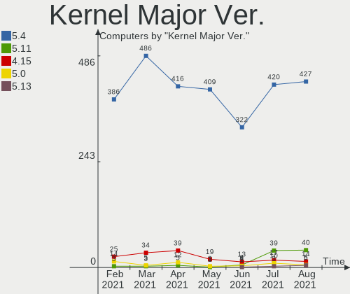
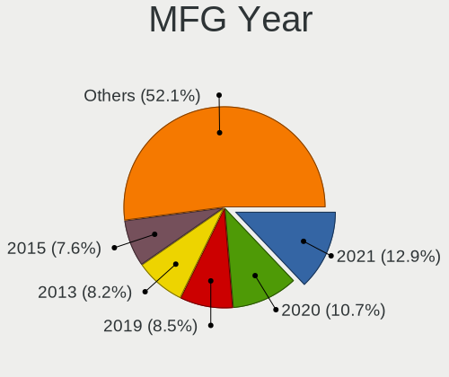
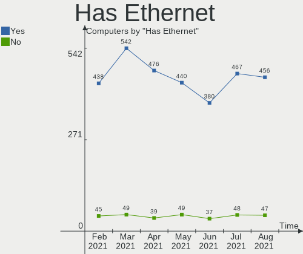
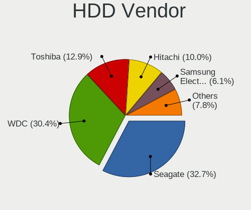
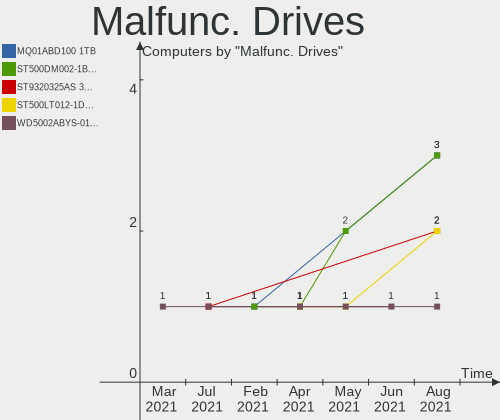
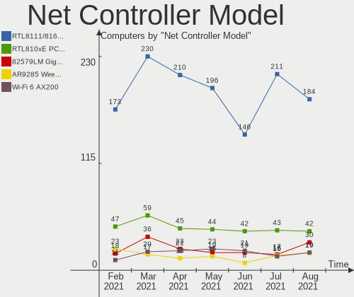
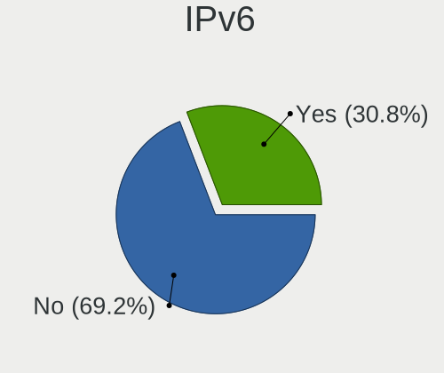
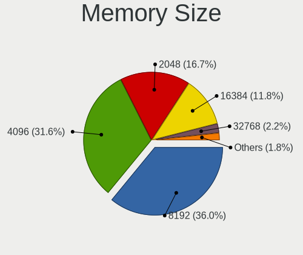
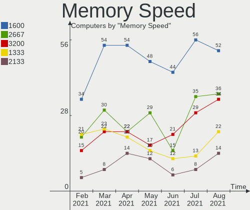
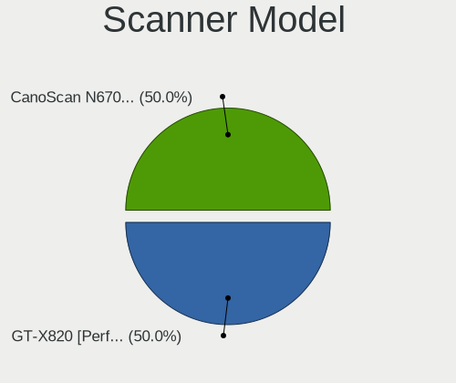

Mint Hardware Trends
--------------------

A project to identify most popular hardware characteristics and track their change
over time based on data collected by Mint users at https://Linux-Hardware.org.

Anyone can contribute to the study by uploading probes of their computers by
the [hw-probe](https://github.com/linuxhw/hw-probe) tool:

    sudo -E hw-probe -all -upload

This is a report for all computer types. See also reports for [desktops](/Dist/Mint/Desktop/README.md) and [notebooks](/Dist/Mint/Notebook/README.md).

Full-feature report is available here: https://linux-hardware.org/?view=trends

Period: Apr, 2021.

Contents
--------

- [ OS                       ](#os)
- [ OS Family                ](#os-family)
- [ Kernel                   ](#kernel)
- [ Kernel Family            ](#kernel-family)
- [ Kernel Major Ver.        ](#kernel-major-ver)
- [ Arch                     ](#arch)
- [ DE                       ](#de)
- [ Display Server           ](#display-server)
- [ Display Manager          ](#display-manager)
- [ OS Lang                  ](#os-lang)
- [ Boot Mode                ](#boot-mode)
- [ Filesystem               ](#filesystem)
- [ Part. scheme             ](#part-scheme)
- [ Dual Boot with Linux/BSD ](#dual-boot-with-linux/bsd)
- [ Dual Boot (Win)          ](#dual-boot-win)
- [ Country                  ](#country)
- [ City                     ](#city)
- [ Vendor                   ](#vendor)
- [ Model                    ](#model)
- [ Model Family             ](#model-family)
- [ MFG Year                 ](#mfg-year)
- [ Form Factor              ](#form-factor)
- [ Secure Boot              ](#secure-boot)
- [ Coreboot                 ](#coreboot)
- [ RAM Size                 ](#ram-size)
- [ RAM Used                 ](#ram-used)
- [ Has CD-ROM               ](#has-cd-rom)
- [ Total Drives             ](#total-drives)
- [ Has Ethernet             ](#has-ethernet)
- [ Has WiFi                 ](#has-wifi)
- [ Has Bluetooth            ](#has-bluetooth)
- [ Drive Vendor             ](#drive-vendor)
- [ Drive Model              ](#drive-model)
- [ HDD Vendor               ](#hdd-vendor)
- [ SSD Vendor               ](#ssd-vendor)
- [ Drive Kind               ](#drive-kind)
- [ Drive Connector          ](#drive-connector)
- [ Drive Size               ](#drive-size)
- [ Space Total              ](#space-total)
- [ Space Used               ](#space-used)
- [ Malfunc. Drives          ](#malfunc-drives)
- [ Malfunc. Drive Vendor    ](#malfunc-drive-vendor)
- [ Malfunc. HDD Vendor      ](#malfunc-hdd-vendor)
- [ Malfunc. Drive Kind      ](#malfunc-drive-kind)
- [ Failed Drives            ](#failed-drives)
- [ Failed Drive Vendor      ](#failed-drive-vendor)
- [ Drive Status             ](#drive-status)
- [ Storage Vendor           ](#storage-vendor)
- [ Storage Model            ](#storage-model)
- [ Storage Kind             ](#storage-kind)
- [ CPU Vendor               ](#cpu-vendor)
- [ CPU Model                ](#cpu-model)
- [ CPU Model Family         ](#cpu-model-family)
- [ CPU Cores                ](#cpu-cores)
- [ CPU Sockets              ](#cpu-sockets)
- [ CPU Threads              ](#cpu-threads)
- [ CPU Op-Modes             ](#cpu-op-modes)
- [ CPU Microcode            ](#cpu-microcode)
- [ CPU Microarch            ](#cpu-microarch)
- [ GPU Vendor               ](#gpu-vendor)
- [ GPU Model                ](#gpu-model)
- [ GPU Combo                ](#gpu-combo)
- [ GPU Driver               ](#gpu-driver)
- [ GPU Memory               ](#gpu-memory)
- [ Monitor Vendor           ](#monitor-vendor)
- [ Monitor Model            ](#monitor-model)
- [ Monitor Resolution       ](#monitor-resolution)
- [ Monitor Diagonal         ](#monitor-diagonal)
- [ Monitor Width            ](#monitor-width)
- [ Aspect Ratio             ](#aspect-ratio)
- [ Monitor Area             ](#monitor-area)
- [ Pixel Density            ](#pixel-density)
- [ Multiple Monitors        ](#multiple-monitors)
- [ Net Controller Vendor    ](#net-controller-vendor)
- [ Net Controller Model     ](#net-controller-model)
- [ Wireless Vendor          ](#wireless-vendor)
- [ Wireless Model           ](#wireless-model)
- [ Ethernet Vendor          ](#ethernet-vendor)
- [ Ethernet Model           ](#ethernet-model)
- [ Net Controller Kind      ](#net-controller-kind)
- [ Used Controller          ](#used-controller)
- [ NICs                     ](#nics)
- [ IPv6                     ](#ipv6)
- [ Memory Vendor            ](#memory-vendor)
- [ Memory Model             ](#memory-model)
- [ Memory Kind              ](#memory-kind)
- [ Memory Form Factor       ](#memory-form-factor)
- [ Memory Size              ](#memory-size)
- [ Memory Speed             ](#memory-speed)
- [ Sound Vendor             ](#sound-vendor)
- [ Sound Model              ](#sound-model)
- [ Camera Vendor            ](#camera-vendor)
- [ Camera Model             ](#camera-model)
- [ Fingerprint Vendor       ](#fingerprint-vendor)
- [ Fingerprint Model        ](#fingerprint-model)
- [ Chipcard Vendor          ](#chipcard-vendor)
- [ Chipcard Model           ](#chipcard-model)
- [ Printer Vendor           ](#printer-vendor)
- [ Printer Model            ](#printer-model)
- [ Scanner Vendor           ](#scanner-vendor)
- [ Scanner Model            ](#scanner-model)
- [ Bluetooth Vendor         ](#bluetooth-vendor)
- [ Bluetooth Model          ](#bluetooth-model)
- [ Unsupported Devices      ](#unsupported-devices)
- [ Unsupported Device Types ](#unsupported-device-types)

OS
--

Installed operating systems

| Name      | Computers | Percent |
|-----------|-----------|---------|
| Mint 20.1 | 364       | 70.68%  |
| Mint 19.3 | 63        | 12.23%  |
| Mint 20   | 54        | 10.49%  |
| Mint 19.1 | 14        | 2.72%   |
| Mint 19   | 7         | 1.36%   |
| Mint 18.3 | 7         | 1.36%   |
| Mint 19.2 | 4         | 0.78%   |
| Mint 18.2 | 1         | 0.19%   |
| Mint 18.1 | 1         | 0.19%   |

OS Family
---------

OS without a version

| Name | Computers | Percent |
|------|-----------|---------|
| Mint | 515       | 100%    |

Kernel
------

Version of the Linux kernel

| Version                    | Computers | Percent |
|----------------------------|-----------|---------|
| 5.4.0-70-generic           | 168       | 32.62%  |
| 5.4.0-72-generic           | 136       | 26.41%  |
| 5.4.0-58-generic           | 38        | 7.38%   |
| 5.4.0-71-generic           | 37        | 7.18%   |
| 5.8.0-48-generic           | 18        | 3.5%    |
| 5.0.0-32-generic           | 12        | 2.33%   |
| 4.15.0-140-generic         | 11        | 2.14%   |
| 5.4.0-26-generic           | 10        | 1.94%   |
| 4.15.0-142-generic         | 10        | 1.94%   |
| 5.8.0-50-generic           | 7         | 1.36%   |
| 5.4.0-66-generic           | 7         | 1.36%   |
| 5.4.0-54-generic           | 4         | 0.78%   |
| 4.15.0-20-generic          | 4         | 0.78%   |
| 5.8.0-43-generic           | 3         | 0.58%   |
| 5.4.0-67-generic           | 3         | 0.58%   |
| 5.4.0-42-generic           | 3         | 0.58%   |
| 4.15.0-141-generic         | 3         | 0.58%   |
| 5.8.0-49-generic           | 2         | 0.39%   |
| 5.4.0-65-generic           | 2         | 0.39%   |
| 5.4.0-62-generic           | 2         | 0.39%   |
| 5.4.0-56-generic           | 2         | 0.39%   |
| 4.15.0-54-generic          | 2         | 0.39%   |
| 4.10.0-38-generic          | 2         | 0.39%   |
| 5.8.18-050818-generic      | 1         | 0.19%   |
| 5.8.16-050816-generic      | 1         | 0.19%   |
| 5.8.1-050801-generic       | 1         | 0.19%   |
| 5.8.0-48-lowlatency        | 1         | 0.19%   |
| 5.8.0-45-generic           | 1         | 0.19%   |
| 5.8.0-36-generic           | 1         | 0.19%   |
| 5.6.0-1052-oem             | 1         | 0.19%   |
| 5.4.0-64-generic           | 1         | 0.19%   |
| 5.4.0-60-generic           | 1         | 0.19%   |
| 5.4.0-39-generic           | 1         | 0.19%   |
| 5.4.0-1035-oracle          | 1         | 0.19%   |
| 5.3.0-40-generic           | 1         | 0.19%   |
| 5.11.12-051112-generic     | 1         | 0.19%   |
| 5.11.11-051111-generic     | 1         | 0.19%   |
| 5.11.0-12.1-liquorix-amd64 | 1         | 0.19%   |
| 5.11.0-11.1-liquorix-amd64 | 1         | 0.19%   |
| 5.11.0-051100-generic      | 1         | 0.19%   |
| 5.10.0-1022-oem            | 1         | 0.19%   |
| 4.4.0-166-generic          | 1         | 0.19%   |
| 4.15.0-91-generic          | 1         | 0.19%   |
| 4.15.0-139-generic         | 1         | 0.19%   |
| 4.15.0-137-generic         | 1         | 0.19%   |
| 4.15.0-136-generic         | 1         | 0.19%   |
| 4.15.0-135-generic         | 1         | 0.19%   |
| 4.15.0-132-generic         | 1         | 0.19%   |
| 4.15.0-128-generic         | 1         | 0.19%   |
| 4.15.0-112-generic         | 1         | 0.19%   |
| 4.15.0-109-generic         | 1         | 0.19%   |
| Unknown                    | 1         | 0.19%   |

Kernel Family
-------------

Linux kernel without a distro release

| Version | Computers | Percent |
|---------|-----------|---------|
| 5.4.0   | 416       | 80.78%  |
| 4.15.0  | 39        | 7.57%   |
| 5.8.0   | 33        | 6.41%   |
| 5.0.0   | 12        | 2.33%   |
| 5.11.0  | 3         | 0.58%   |
| 4.10.0  | 2         | 0.39%   |
| 5.8.18  | 1         | 0.19%   |
| 5.8.16  | 1         | 0.19%   |
| 5.8.1   | 1         | 0.19%   |
| 5.6.0   | 1         | 0.19%   |
| 5.3.0   | 1         | 0.19%   |
| 5.11.12 | 1         | 0.19%   |
| 5.11.11 | 1         | 0.19%   |
| 5.10.0  | 1         | 0.19%   |
| 4.4.0   | 1         | 0.19%   |
| Unknown | 1         | 0.19%   |

Kernel Major Ver.
-----------------

Linux kernel major version

| Version | Computers | Percent |
|---------|-----------|---------|
| 5.4     | 416       | 80.78%  |
| 4.15    | 39        | 7.57%   |
| 5.8     | 36        | 6.99%   |
| 5.0     | 12        | 2.33%   |
| 5.11    | 5         | 0.97%   |
| 4.10    | 2         | 0.39%   |
| 5.6     | 1         | 0.19%   |
| 5.3     | 1         | 0.19%   |
| 5.10    | 1         | 0.19%   |
| 4.4     | 1         | 0.19%   |
| Unknown | 1         | 0.19%   |

Arch
----

OS architecture (x86_64, i586, etc.)

| Name   | Computers | Percent |
|--------|-----------|---------|
| x86_64 | 488       | 94.76%  |
| i686   | 27        | 5.24%   |

DE
--

Desktop Environment

| Name       | Computers | Percent |
|------------|-----------|---------|
| X-Cinnamon | 339       | 65.83%  |
| XFCE       | 66        | 12.82%  |
| MATE       | 63        | 12.23%  |
| Cinnamon   | 20        | 3.88%   |
| Unknown    | 13        | 2.52%   |
| GNOME      | 11        | 2.14%   |
| KDE        | 2         | 0.39%   |
| i3         | 1         | 0.19%   |

Display Server
--------------

X11 or Wayland

| Name    | Computers | Percent |
|---------|-----------|---------|
| X11     | 512       | 99.42%  |
| Unknown | 2         | 0.39%   |
| Wayland | 1         | 0.19%   |

Display Manager
---------------

SDDM, LightDM, etc.

| Name    | Computers | Percent |
|---------|-----------|---------|
| Unknown | 354       | 68.74%  |
| TDM     | 158       | 30.68%  |
| MDM     | 2         | 0.39%   |
| GDM     | 1         | 0.19%   |

OS Lang
-------

Language

| Lang             | Computers | Percent |
|------------------|-----------|---------|
| en_US            | 139       | 26.99%  |
| de_DE            | 82        | 15.92%  |
| pt_BR            | 43        | 8.35%   |
| fr_FR            | 24        | 4.66%   |
| en_GB            | 23        | 4.47%   |
| C                | 22        | 4.27%   |
| en_CA            | 18        | 3.5%    |
| ru_RU            | 16        | 3.11%   |
| pl_PL            | 16        | 3.11%   |
| es_ES            | 15        | 2.91%   |
| it_IT            | 12        | 2.33%   |
| sv_SE            | 6         | 1.17%   |
| es_AR            | 6         | 1.17%   |
| en_ZA            | 6         | 1.17%   |
| en_IN            | 6         | 1.17%   |
| cs_CZ            | 6         | 1.17%   |
| Unknown          | 6         | 1.17%   |
| es_MX            | 5         | 0.97%   |
| en_AU            | 5         | 0.97%   |
| de_AT            | 5         | 0.97%   |
| nl_NL            | 4         | 0.78%   |
| sk_SK            | 3         | 0.58%   |
| ru_UA            | 3         | 0.58%   |
| pt_PT            | 3         | 0.58%   |
| fi_FI            | 3         | 0.58%   |
| es_CL            | 3         | 0.58%   |
| bg_BG            | 3         | 0.58%   |
| tr_TR            | 2         | 0.39%   |
| ko_KR            | 2         | 0.39%   |
| hu_HU            | 2         | 0.39%   |
| fr_CH            | 2         | 0.39%   |
| es_PE            | 2         | 0.39%   |
| es_CU            | 2         | 0.39%   |
| ca_ES            | 2         | 0.39%   |
| uk_UA            | 1         | 0.19%   |
| ro_RO            | 1         | 0.19%   |
| nl_BE            | 1         | 0.19%   |
| ka_GE            | 1         | 0.19%   |
| ja_JP            | 1         | 0.19%   |
| hr_HR            | 1         | 0.19%   |
| he_IL            | 1         | 0.19%   |
| fr_CA            | 1         | 0.19%   |
| fr_BE            | 1         | 0.19%   |
| et_EE            | 1         | 0.19%   |
| es_PR            | 1         | 0.19%   |
| es_CO            | 1         | 0.19%   |
| en_PH            | 1         | 0.19%   |
| en_NZ            | 1         | 0.19%   |
| de_CH            | 1         | 0.19%   |
| de_BE            | 1         | 0.19%   |
| da_DK            | 1         | 0.19%   |
| cinnamon.desktop | 1         | 0.19%   |

Boot Mode
---------

EFI or BIOS

| Mode | Computers | Percent |
|------|-----------|---------|
| BIOS | 287       | 55.73%  |
| EFI  | 228       | 44.27%  |

Filesystem
----------

Type of filesystem

| Type    | Computers | Percent |
|---------|-----------|---------|
| Ext4    | 469       | 91.07%  |
| Overlay | 23        | 4.47%   |
| Btrfs   | 18        | 3.5%    |
| Ext3    | 3         | 0.58%   |
| Xfs     | 1         | 0.19%   |
| Aufs    | 1         | 0.19%   |

Part. scheme
------------

Scheme of partitioning

| Type    | Computers | Percent |
|---------|-----------|---------|
| Unknown | 347       | 67.38%  |
| GPT     | 108       | 20.97%  |
| MBR     | 60        | 11.65%  |

Dual Boot with Linux/BSD
------------------------

Hosting more than one Linux/BSD

| Dual boot | Computers | Percent |
|-----------|-----------|---------|
| No        | 480       | 93.2%   |
| Yes       | 35        | 6.8%    |

Dual Boot (Win)
---------------

Hosting Linux and Windows

| Dual boot | Computers | Percent |
|-----------|-----------|---------|
| No        | 450       | 87.38%  |
| Yes       | 65        | 12.62%  |

Country
-------

Geographic location (country)

| Country             | Computers | Percent |
|---------------------|-----------|---------|
| Germany             | 91        | 17.67%  |
| USA                 | 74        | 14.37%  |
| Brazil              | 62        | 12.04%  |
| UK                  | 22        | 4.27%   |
| Russia              | 22        | 4.27%   |
| France              | 22        | 4.27%   |
| Spain               | 19        | 3.69%   |
| Poland              | 19        | 3.69%   |
| Canada              | 18        | 3.5%    |
| Italy               | 13        | 2.52%   |
| Czechia             | 9         | 1.75%   |
| Sweden              | 8         | 1.55%   |
| Netherlands         | 7         | 1.36%   |
| India               | 7         | 1.36%   |
| Austria             | 7         | 1.36%   |
| Australia           | 7         | 1.36%   |
| Switzerland         | 6         | 1.17%   |
| South Africa        | 6         | 1.17%   |
| Mexico              | 6         | 1.17%   |
| Argentina           | 6         | 1.17%   |
| Ukraine             | 5         | 0.97%   |
| Denmark             | 5         | 0.97%   |
| Belgium             | 5         | 0.97%   |
| Belarus             | 5         | 0.97%   |
| Turkey              | 4         | 0.78%   |
| Indonesia           | 4         | 0.78%   |
| Chile               | 4         | 0.78%   |
| Bulgaria            | 4         | 0.78%   |
| South Korea         | 3         | 0.58%   |
| Slovakia            | 3         | 0.58%   |
| Portugal            | 3         | 0.58%   |
| Finland             | 3         | 0.58%   |
| Colombia            | 3         | 0.58%   |
| Peru                | 2         | 0.39%   |
| Estonia             | 2         | 0.39%   |
| Uruguay             | 1         | 0.19%   |
| Tunisia             | 1         | 0.19%   |
| Trinidad and Tobago | 1         | 0.19%   |
| Serbia              | 1         | 0.19%   |
| Saudi Arabia        | 1         | 0.19%   |
| Romania             | 1         | 0.19%   |
| Qatar               | 1         | 0.19%   |
| Puerto Rico         | 1         | 0.19%   |
| Philippines         | 1         | 0.19%   |
| Panama              | 1         | 0.19%   |
| Norway              | 1         | 0.19%   |
| New Zealand         | 1         | 0.19%   |
| Moldova             | 1         | 0.19%   |
| Malaysia            | 1         | 0.19%   |
| Lithuania           | 1         | 0.19%   |
| Lebanon             | 1         | 0.19%   |
| Japan               | 1         | 0.19%   |
| Israel              | 1         | 0.19%   |
| Iran                | 1         | 0.19%   |
| Hungary             | 1         | 0.19%   |
| Georgia             | 1         | 0.19%   |
| Equatorial Guinea   | 1         | 0.19%   |
| Egypt               | 1         | 0.19%   |
| Cyprus              | 1         | 0.19%   |
| Cuba                | 1         | 0.19%   |

City
----

Geographic location (city)

| City                | Computers | Percent |
|---------------------|-----------|---------|
| Warsaw              | 7         | 1.36%   |
| Moscow              | 7         | 1.36%   |
| São Paulo          | 6         | 1.17%   |
| Rio de Janeiro      | 6         | 1.17%   |
| London              | 6         | 1.17%   |
| Berlin              | 6         | 1.17%   |
| Uba                 | 5         | 0.97%   |
| Toronto             | 5         | 0.97%   |
| Rockville           | 5         | 0.97%   |
| Minsk               | 5         | 0.97%   |
| Vienna              | 4         | 0.78%   |
| Milan               | 4         | 0.78%   |
| Wiesbaden           | 3         | 0.58%   |
| St Petersburg       | 3         | 0.58%   |
| Prague              | 3         | 0.58%   |
| Neuss               | 3         | 0.58%   |
| Munich              | 3         | 0.58%   |
| Hamburg             | 3         | 0.58%   |
| Essen               | 3         | 0.58%   |
| Elblag              | 3         | 0.58%   |
| Brasília           | 3         | 0.58%   |
| Belo Horizonte      | 3         | 0.58%   |
| Wroclaw             | 2         | 0.39%   |
| Seelze              | 2         | 0.39%   |
| San Juan            | 2         | 0.39%   |
| Rostock             | 2         | 0.39%   |
| Regensburg          | 2         | 0.39%   |
| Rakovnik            | 2         | 0.39%   |
| Québec             | 2         | 0.39%   |
| Poznan              | 2         | 0.39%   |
| Perm                | 2         | 0.39%   |
| Omaha               | 2         | 0.39%   |
| Nizhniy Novgorod    | 2         | 0.39%   |
| New Delhi           | 2         | 0.39%   |
| Montreal            | 2         | 0.39%   |
| Madrid              | 2         | 0.39%   |
| Leipzig             | 2         | 0.39%   |
| Las Vegas           | 2         | 0.39%   |
| Krakow              | 2         | 0.39%   |
| Kazan’            | 2         | 0.39%   |
| Glasgow             | 2         | 0.39%   |
| Ganterschwil        | 2         | 0.39%   |
| Frankfurt am Main   | 2         | 0.39%   |
| Forchheim           | 2         | 0.39%   |
| Edmonton            | 2         | 0.39%   |
| Duque de Caxias     | 2         | 0.39%   |
| Curitiba            | 2         | 0.39%   |
| Cottbus             | 2         | 0.39%   |
| Copenhagen          | 2         | 0.39%   |
| Cologne             | 2         | 0.39%   |
| Centurion           | 2         | 0.39%   |
| Brunswick           | 2         | 0.39%   |
| Bogotá             | 2         | 0.39%   |
| Bochum              | 2         | 0.39%   |
| Barcelona           | 2         | 0.39%   |
| Amersfoort          | 2         | 0.39%   |
| České Budějovice | 1         | 0.19%   |
| Ålesund            | 1         | 0.19%   |
| Ängelholm          | 1         | 0.19%   |
| Zurich              | 1         | 0.19%   |

Vendor
------

Motherboard manufacturer

| Name                      | Computers | Percent |
|---------------------------|-----------|---------|
| Hewlett-Packard           | 79        | 15.34%  |
| ASUSTek Computer          | 75        | 14.56%  |
| Lenovo                    | 66        | 12.82%  |
| Dell                      | 51        | 9.9%    |
| Acer                      | 42        | 8.16%   |
| Gigabyte Technology       | 30        | 5.83%   |
| MSI                       | 29        | 5.63%   |
| ASRock                    | 29        | 5.63%   |
| Apple                     | 15        | 2.91%   |
| Toshiba                   | 14        | 2.72%   |
| Samsung Electronics       | 11        | 2.14%   |
| Intel                     | 10        | 1.94%   |
| Sony                      | 5         | 0.97%   |
| ECS                       | 5         | 0.97%   |
| Notebook                  | 4         | 0.78%   |
| Foxconn                   | 4         | 0.78%   |
| Biostar                   | 4         | 0.78%   |
| Unknown                   | 4         | 0.78%   |
| Semp Toshiba              | 3         | 0.58%   |
| Medion                    | 3         | 0.58%   |
| Fujitsu Siemens           | 3         | 0.58%   |
| TUXEDO                    | 2         | 0.39%   |
| Positivo                  | 2         | 0.39%   |
| Pegatron                  | 2         | 0.39%   |
| OEM                       | 2         | 0.39%   |
| HUAWEI                    | 2         | 0.39%   |
| Fujitsu                   | 2         | 0.39%   |
| AMI                       | 2         | 0.39%   |
| ZOTAC                     | 1         | 0.19%   |
| Wortmann AG               | 1         | 0.19%   |
| TECHNOPC                  | 1         | 0.19%   |
| Schenker                  | 1         | 0.19%   |
| Personal Computer Factory | 1         | 0.19%   |
| PCWare                    | 1         | 0.19%   |
| PCChips                   | 1         | 0.19%   |
| Packard Bell              | 1         | 0.19%   |
| NEC Computers             | 1         | 0.19%   |
| Jumper                    | 1         | 0.19%   |
| IBM                       | 1         | 0.19%   |
| Huanan                    | 1         | 0.19%   |
| Google                    | 1         | 0.19%   |
| Compal                    | 1         | 0.19%   |
| Alienware                 | 1         | 0.19%   |

Model
-----

Motherboard model

| Name                                   | Computers | Percent |
|----------------------------------------|-----------|---------|
| Unknown                                | 6         | 1.17%   |
| HP Notebook                            | 4         | 0.78%   |
| Toshiba Satellite L40                  | 3         | 0.58%   |
| HP Pavilion dv6                        | 3         | 0.58%   |
| Dell Inspiron 5570                     | 3         | 0.58%   |
| ASUS All Series                        | 3         | 0.58%   |
| Toshiba Satellite C660                 | 2         | 0.39%   |
| Samsung NC10                           | 2         | 0.39%   |
| Samsung 355V4C/356V4C/3445VC/3545VC    | 2         | 0.39%   |
| MSI MS-7641                            | 2         | 0.39%   |
| Lenovo Yoga Slim 7 14ARE05 82A2        | 2         | 0.39%   |
| HP Laptop 15-bs0xx                     | 2         | 0.39%   |
| HP Laptop 14s-dq1xxx                   | 2         | 0.39%   |
| Gigabyte B450M DS3H                    | 2         | 0.39%   |
| Dell OptiPlex 9020                     | 2         | 0.39%   |
| Dell OptiPlex 3020                     | 2         | 0.39%   |
| Dell Latitude E7440                    | 2         | 0.39%   |
| Dell Latitude E6400                    | 2         | 0.39%   |
| Dell Latitude E5570                    | 2         | 0.39%   |
| ASUS PRIME B450M-A                     | 2         | 0.39%   |
| ASUS P50IJ                             | 2         | 0.39%   |
| ASUS M5A78L-M/USB3                     | 2         | 0.39%   |
| ASUS K73SD                             | 2         | 0.39%   |
| ASRock P67 Pro3                        | 2         | 0.39%   |
| ASRock B550M Pro4                      | 2         | 0.39%   |
| ASRock B365M Pro4                      | 2         | 0.39%   |
| Apple MacBookPro8,1                    | 2         | 0.39%   |
| Acer Aspire A315-42                    | 2         | 0.39%   |
| Acer Aspire A315-41                    | 2         | 0.39%   |
| ZOTAC ZBOX-CI327NANO-GS-01             | 1         | 0.19%   |
| Wortmann AG TERRA_MOBILE_1512/1712     | 1         | 0.19%   |
| TUXEDO P7xxTM1                         | 1         | 0.19%   |
| TUXEDO Aura 15 Gen1                    | 1         | 0.19%   |
| Toshiba Satellite R630                 | 1         | 0.19%   |
| Toshiba Satellite P300                 | 1         | 0.19%   |
| Toshiba Satellite L655                 | 1         | 0.19%   |
| Toshiba Satellite L305                 | 1         | 0.19%   |
| Toshiba Satellite L300D                | 1         | 0.19%   |
| Toshiba Satellite C55-B                | 1         | 0.19%   |
| Toshiba Satellite C55-A                | 1         | 0.19%   |
| Toshiba PORTEGE R500                   | 1         | 0.19%   |
| TECHNOPC NANO 5                        | 1         | 0.19%   |
| Sony VPCF22L1E                         | 1         | 0.19%   |
| Sony VGN-TZ21WN_B                      | 1         | 0.19%   |
| Sony VGN-NR11Z_T                       | 1         | 0.19%   |
| Sony VGN-C1S_P                         | 1         | 0.19%   |
| Sony SVF1521A7EB                       | 1         | 0.19%   |
| Semp Toshiba STI NI 1401               | 1         | 0.19%   |
| Semp Toshiba IS 1442                   | 1         | 0.19%   |
| Semp Toshiba IS 1412                   | 1         | 0.19%   |
| Schenker SCHENKER VISION 15 (SVS15E21) | 1         | 0.19%   |
| Samsung Q310                           | 1         | 0.19%   |
| Samsung NC10/N110                      | 1         | 0.19%   |
| Samsung 550XCJ/550XCR                  | 1         | 0.19%   |
| Samsung 350V5C/351V5C/3540VC/3440VC    | 1         | 0.19%   |
| Samsung 300E5M/300E5L                  | 1         | 0.19%   |
| Samsung 300E4C/300E5C/300E7C           | 1         | 0.19%   |
| Samsung 270E5J/2570EJ                  | 1         | 0.19%   |
| Positivo POS-PIG43BC                   | 1         | 0.19%   |
| Positivo POS-EAA75DE                   | 1         | 0.19%   |

Model Family
------------

Motherboard model prefix

| Name                       | Computers | Percent |
|----------------------------|-----------|---------|
| Acer Aspire                | 32        | 6.21%   |
| Lenovo ThinkPad            | 27        | 5.24%   |
| Dell Latitude              | 18        | 3.5%    |
| HP Pavilion                | 14        | 2.72%   |
| Dell Inspiron              | 13        | 2.52%   |
| ASUS PRIME                 | 13        | 2.52%   |
| Toshiba Satellite          | 12        | 2.33%   |
| HP EliteBook               | 11        | 2.14%   |
| Lenovo IdeaPad             | 10        | 1.94%   |
| HP Laptop                  | 10        | 1.94%   |
| HP Compaq                  | 9         | 1.75%   |
| Dell OptiPlex              | 9         | 1.75%   |
| HP ProBook                 | 6         | 1.17%   |
| Unknown                    | 6         | 1.17%   |
| Lenovo ThinkCentre         | 5         | 0.97%   |
| Lenovo Yoga                | 4         | 0.78%   |
| HP Notebook                | 4         | 0.78%   |
| Dell XPS                   | 4         | 0.78%   |
| ASUS M5A78L-M              | 4         | 0.78%   |
| Samsung NC10               | 3         | 0.58%   |
| HP ProDesk                 | 3         | 0.58%   |
| ASUS All                   | 3         | 0.58%   |
| ASRock B365M               | 3         | 0.58%   |
| Apple MacBookPro11         | 3         | 0.58%   |
| Semp Toshiba IS            | 2         | 0.39%   |
| Samsung 355V4C             | 2         | 0.39%   |
| MSI MS-7641                | 2         | 0.39%   |
| HP Mini                    | 2         | 0.39%   |
| HP ENVY                    | 2         | 0.39%   |
| HP 255                     | 2         | 0.39%   |
| Gigabyte B550              | 2         | 0.39%   |
| Gigabyte B450M             | 2         | 0.39%   |
| Fujitsu LIFEBOOK           | 2         | 0.39%   |
| Dell Vostro                | 2         | 0.39%   |
| Dell Studio                | 2         | 0.39%   |
| Dell Precision             | 2         | 0.39%   |
| ASUS ZenBook               | 2         | 0.39%   |
| ASUS P8H67-M               | 2         | 0.39%   |
| ASUS P8H61-M               | 2         | 0.39%   |
| ASUS P5KPL-AM              | 2         | 0.39%   |
| ASUS P50IJ                 | 2         | 0.39%   |
| ASUS K73SD                 | 2         | 0.39%   |
| ASRock P67                 | 2         | 0.39%   |
| ASRock B550M               | 2         | 0.39%   |
| Apple MacBookPro8          | 2         | 0.39%   |
| Apple MacBookAir7          | 2         | 0.39%   |
| Acer TravelMate            | 2         | 0.39%   |
| Acer Swift                 | 2         | 0.39%   |
| ZOTAC ZBOX-CI327NANO-GS-01 | 1         | 0.19%   |
| Wortmann AG TERRA          | 1         | 0.19%   |
| TUXEDO P7xxTM1             | 1         | 0.19%   |
| TUXEDO Aura                | 1         | 0.19%   |
| Toshiba PORTEGE            | 1         | 0.19%   |
| TECHNOPC NANO              | 1         | 0.19%   |
| Sony VPCF22L1E             | 1         | 0.19%   |
| Sony VGN-TZ21WN            | 1         | 0.19%   |
| Sony VGN-NR11Z             | 1         | 0.19%   |
| Sony VGN-C1S               | 1         | 0.19%   |
| Sony SVF1521A7EB           | 1         | 0.19%   |
| Semp Toshiba STI           | 1         | 0.19%   |

MFG Year
--------

Motherboard manufacture year

| Year | Computers | Percent |
|------|-----------|---------|
| 2020 | 84        | 16.31%  |
| 2019 | 60        | 11.65%  |
| 2013 | 48        | 9.32%   |
| 2018 | 34        | 6.6%    |
| 2015 | 30        | 5.83%   |
| 2012 | 30        | 5.83%   |
| 2011 | 30        | 5.83%   |
| 2008 | 30        | 5.83%   |
| 2014 | 28        | 5.44%   |
| 2010 | 28        | 5.44%   |
| 2016 | 26        | 5.05%   |
| 2009 | 25        | 4.85%   |
| 2021 | 21        | 4.08%   |
| 2017 | 19        | 3.69%   |
| 2007 | 12        | 2.33%   |
| 2006 | 8         | 1.55%   |
| 2003 | 2         | 0.39%   |

Form Factor
-----------

Physical design of the computer

| Name        | Computers | Percent |
|-------------|-----------|---------|
| Notebook    | 290       | 56.31%  |
| Desktop     | 206       | 40%     |
| Convertible | 8         | 1.55%   |
| Mini pc     | 8         | 1.55%   |
| All in one  | 3         | 0.58%   |

Secure Boot
-----------

Enabled or disabled

| State    | Computers | Percent |
|----------|-----------|---------|
| Disabled | 484       | 93.98%  |
| Enabled  | 31        | 6.02%   |

Coreboot
--------

Have coreboot on board

| Used | Computers | Percent |
|------|-----------|---------|
| No   | 514       | 99.81%  |
| Yes  | 1         | 0.19%   |

RAM Size
--------

Total RAM memory

| Size in GB  | Computers | Percent |
|-------------|-----------|---------|
| 3.01-4.0    | 123       | 23.88%  |
| 4.01-8.0    | 121       | 23.5%   |
| 8.01-16.0   | 90        | 17.48%  |
| 16.01-24.0  | 84        | 16.31%  |
| 1.01-2.0    | 34        | 6.6%    |
| 32.01-64.0  | 32        | 6.21%   |
| 2.01-3.0    | 8         | 1.55%   |
| 64.01-256.0 | 8         | 1.55%   |
| 0.51-1.0    | 8         | 1.55%   |
| 24.01-32.0  | 7         | 1.36%   |

RAM Used
--------

Used RAM memory

| Used GB    | Computers | Percent |
|------------|-----------|---------|
| 1.01-2.0   | 216       | 41.94%  |
| 2.01-3.0   | 131       | 25.44%  |
| 4.01-8.0   | 57        | 11.07%  |
| 0.51-1.0   | 53        | 10.29%  |
| 3.01-4.0   | 40        | 7.77%   |
| 8.01-16.0  | 10        | 1.94%   |
| 0.01-0.5   | 5         | 0.97%   |
| 16.01-24.0 | 2         | 0.39%   |
| 32.01-64.0 | 1         | 0.19%   |

Has CD-ROM
----------

Has CD-ROM on board

| Presented | Computers | Percent |
|-----------|-----------|---------|
| Yes       | 277       | 53.79%  |
| No        | 238       | 46.21%  |

Total Drives
------------

Number of drives on board

| Drives | Computers | Percent |
|--------|-----------|---------|
| 1      | 298       | 57.86%  |
| 2      | 137       | 26.6%   |
| 3      | 36        | 6.99%   |
| 4      | 28        | 5.44%   |
| 0      | 6         | 1.17%   |
| 5      | 5         | 0.97%   |
| 6      | 4         | 0.78%   |
| 7      | 1         | 0.19%   |

Has Ethernet
------------

Has Ethernet on board

| Presented | Computers | Percent |
|-----------|-----------|---------|
| Yes       | 476       | 92.43%  |
| No        | 39        | 7.57%   |

Has WiFi
--------

Has WiFi module

| Presented | Computers | Percent |
|-----------|-----------|---------|
| Yes       | 387       | 75.15%  |
| No        | 128       | 24.85%  |

Has Bluetooth
-------------

Has Bluetooth module

| Presented | Computers | Percent |
|-----------|-----------|---------|
| Yes       | 282       | 54.76%  |
| No        | 233       | 45.24%  |

Drive Vendor
------------

Hard drive vendors

| Vendor                    | Computers | Drives | Percent |
|---------------------------|-----------|--------|---------|
| WDC                       | 134       | 166    | 17.87%  |
| Seagate                   | 134       | 160    | 17.87%  |
| Samsung Electronics       | 100       | 110    | 13.33%  |
| Toshiba                   | 48        | 52     | 6.4%    |
| Kingston                  | 40        | 42     | 5.33%   |
| Crucial                   | 33        | 36     | 4.4%    |
| Hitachi                   | 32        | 34     | 4.27%   |
| SanDisk                   | 30        | 31     | 4%      |
| Unknown                   | 28        | 30     | 3.73%   |
| A-DATA Technology         | 15        | 16     | 2%      |
| SK Hynix                  | 14        | 14     | 1.87%   |
| Intel                     | 14        | 14     | 1.87%   |
| HGST                      | 10        | 10     | 1.33%   |
| Apple                     | 9         | 9      | 1.2%    |
| Fujitsu                   | 7         | 8      | 0.93%   |
| OCZ                       | 6         | 6      | 0.8%    |
| Micron Technology         | 6         | 6      | 0.8%    |
| Patriot                   | 5         | 5      | 0.67%   |
| China                     | 5         | 5      | 0.67%   |
| Transcend                 | 4         | 4      | 0.53%   |
| MAXTOR                    | 4         | 4      | 0.53%   |
| Intenso                   | 4         | 4      | 0.53%   |
| Team                      | 3         | 3      | 0.4%    |
| SPCC                      | 3         | 3      | 0.4%    |
| Micron/Crucial Technology | 3         | 3      | 0.4%    |
| KingSpec                  | 3         | 3      | 0.4%    |
| KingDian                  | 3         | 3      | 0.4%    |
| JMicron                   | 3         | 3      | 0.4%    |
| Union Memory (Shenzhen)   | 2         | 2      | 0.27%   |
| TO Exter                  | 2         | 2      | 0.27%   |
| Silicon Motion            | 2         | 2      | 0.27%   |
| PNY                       | 2         | 2      | 0.27%   |
| Phison                    | 2         | 2      | 0.27%   |
| LITEONIT                  | 2         | 2      | 0.27%   |
| LITEON                    | 2         | 2      | 0.27%   |
| Leven                     | 2         | 2      | 0.27%   |
| Gigabyte Technology       | 2         | 3      | 0.27%   |
| ASMT                      | 2         | 2      | 0.27%   |
| XPG                       | 1         | 1      | 0.13%   |
| WD MediaMax               | 1         | 2      | 0.13%   |
| Vaseky                    | 1         | 1      | 0.13%   |
| USB3.0                    | 1         | 1      | 0.13%   |
| Unknown (CF)              | 1         | 1      | 0.13%   |
| Union Memory              | 1         | 1      | 0.13%   |
| TCSUNBOW                  | 1         | 1      | 0.13%   |
| SYNOLOGY                  | 1         | 1      | 0.13%   |
| SPCC Sol                  | 1         | 1      | 0.13%   |
| Smartbuy                  | 1         | 2      | 0.13%   |
| SABRENT                   | 1         | 1      | 0.13%   |
| Realtek                   | 1         | 1      | 0.13%   |
| Radeon                    | 1         | 1      | 0.13%   |
| Phison Electronics        | 1         | 1      | 0.13%   |
| OWC                       | 1         | 1      | 0.13%   |
| MyDigitalSSD              | 1         | 1      | 0.13%   |
| Mass                      | 1         | 1      | 0.13%   |
| LuminouTek                | 1         | 1      | 0.13%   |
| LDLC                      | 1         | 1      | 0.13%   |
| KIOXIA-EXCERIA            | 1         | 1      | 0.13%   |
| KingFast                  | 1         | 2      | 0.13%   |
| KESU                      | 1         | 1      | 0.13%   |

Drive Model
-----------

Hard drive models

| Model                               | Computers | Percent |
|-------------------------------------|-----------|---------|
| Kingston SA400S37240G 240GB SSD     | 11        | 1.35%   |
| Seagate ST500DM002-1BD142 500GB     | 10        | 1.23%   |
| Unknown MMC Card  32GB              | 8         | 0.98%   |
| Toshiba MQ01ABD100 1TB              | 8         | 0.98%   |
| Kingston SA400S37120G 120GB SSD     | 8         | 0.98%   |
| Samsung NVMe SSD Drive 500GB        | 7         | 0.86%   |
| Toshiba DT01ACA100 1TB              | 6         | 0.74%   |
| Seagate ST9500325AS 500GB           | 6         | 0.74%   |
| Seagate ST1000DM010-2EP102 1TB      | 6         | 0.74%   |
| WDC WDS240G2G0A-00JH30 240GB SSD    | 5         | 0.62%   |
| WDC WD10EZEX-08WN4A0 1TB            | 5         | 0.62%   |
| Toshiba MQ01ABF050 500GB            | 5         | 0.62%   |
| Seagate ST500LM012 HN-M500MBB 500GB | 5         | 0.62%   |
| SanDisk SSD PLUS 240GB              | 5         | 0.62%   |
| Samsung SSD 860 EVO 500GB           | 5         | 0.62%   |
| Samsung SSD 860 EVO 250GB           | 5         | 0.62%   |
| Samsung SSD 850 EVO 500GB           | 5         | 0.62%   |
| Samsung SSD 850 EVO 250GB           | 5         | 0.62%   |
| Crucial CT500MX500SSD1 500GB        | 5         | 0.62%   |
| Crucial CT1000MX500SSD1 1TB         | 5         | 0.62%   |
| Unknown SD/MMC/MS PRO 32GB          | 4         | 0.49%   |
| Toshiba MQ04ABF100 1TB              | 4         | 0.49%   |
| Seagate ST500LT012-1DG142 500GB     | 4         | 0.49%   |
| Samsung SSD 860 QVO 1TB             | 4         | 0.49%   |
| Samsung SSD 860 EVO 1TB             | 4         | 0.49%   |
| Kingston SV300S37A240G 240GB SSD    | 4         | 0.49%   |
| Crucial CT240BX500SSD1 240GB        | 4         | 0.49%   |
| WDC WD3200BEVT-22ZCT0 320GB         | 3         | 0.37%   |
| WDC WD2500BEVS-22UST0 250GB         | 3         | 0.37%   |
| WDC WD10EZRX-00A8LB0 1TB            | 3         | 0.37%   |
| SK Hynix NVMe SSD Drive 256GB       | 3         | 0.37%   |
| Seagate ST500LT012-9WS142 500GB     | 3         | 0.37%   |
| Seagate ST4000VN008-2DR166 4TB      | 3         | 0.37%   |
| Seagate ST4000DM000-1F2168 4TB      | 3         | 0.37%   |
| Seagate ST2000LM015-2E8174 2TB      | 3         | 0.37%   |
| Seagate ST2000DM006-2DM164 2TB      | 3         | 0.37%   |
| Seagate ST1000LM035-1RK172 1TB      | 3         | 0.37%   |
| Seagate Expansion 4TB               | 3         | 0.37%   |
| Samsung SSD 840 EVO 500GB           | 3         | 0.37%   |
| Samsung NVMe SSD Drive 512GB        | 3         | 0.37%   |
| Samsung HD322HJ 320GB               | 3         | 0.37%   |
| Patriot Burst 240GB SSD             | 3         | 0.37%   |
| Micron/Crucial NVMe SSD Drive 1TB   | 3         | 0.37%   |
| Kingston SV300S37A120G 120GB SSD    | 3         | 0.37%   |
| Hitachi HTS545050B9A300 500GB       | 3         | 0.37%   |
| Crucial CT1000BX500SSD1 1TB         | 3         | 0.37%   |
| A-DATA SU650 120GB SSD              | 3         | 0.37%   |
| WDC WDS500G2B0A-00SM50 500GB SSD    | 2         | 0.25%   |
| WDC WDBNCE5000PNC 500GB SSD         | 2         | 0.25%   |
| WDC WD5002ABYS-01B1B0 500GB         | 2         | 0.25%   |
| WDC WD40EZRZ-00GXCB0 4TB            | 2         | 0.25%   |
| WDC WD4000FYYZ-01UL1B1 4TB          | 2         | 0.25%   |
| WDC WD3200BPVT-22JJ5T0 320GB        | 2         | 0.25%   |
| WDC WD3200AAJS-56M0A0 320GB         | 2         | 0.25%   |
| WDC WD2500BEVT-80A23T0 250GB        | 2         | 0.25%   |
| WDC WD20EARX-00PASB0 2TB            | 2         | 0.25%   |
| WDC WD10SPZX-60Z10T0 1TB            | 2         | 0.25%   |
| WDC WD10SPZX-21Z10T0 1TB            | 2         | 0.25%   |
| WDC WD10JPCX-24UE4T0 1TB            | 2         | 0.25%   |
| WDC WD10EZEX-22MFCA0 1TB            | 2         | 0.25%   |

HDD Vendor
----------

Hard disk drive vendors

| Vendor              | Computers | Drives | Percent |
|---------------------|-----------|--------|---------|
| Seagate             | 127       | 147    | 35.28%  |
| WDC                 | 114       | 140    | 31.67%  |
| Toshiba             | 42        | 43     | 11.67%  |
| Hitachi             | 32        | 34     | 8.89%   |
| Samsung Electronics | 13        | 14     | 3.61%   |
| HGST                | 10        | 10     | 2.78%   |
| Fujitsu             | 7         | 8      | 1.94%   |
| MAXTOR              | 4         | 4      | 1.11%   |
| TO Exter            | 2         | 2      | 0.56%   |
| WD MediaMax         | 1         | 2      | 0.28%   |
| USB3.0              | 1         | 1      | 0.28%   |
| Unknown             | 1         | 1      | 0.28%   |
| SYNOLOGY            | 1         | 1      | 0.28%   |
| KESU                | 1         | 1      | 0.28%   |
| Intenso             | 1         | 1      | 0.28%   |
| ASMT109x            | 1         | 1      | 0.28%   |
| ASMT                | 1         | 1      | 0.28%   |
| Apple               | 1         | 1      | 0.28%   |

SSD Vendor
----------

Solid state drive vendors

| Vendor              | Computers | Drives | Percent |
|---------------------|-----------|--------|---------|
| Samsung Electronics | 56        | 63     | 20.82%  |
| Kingston            | 32        | 34     | 11.9%   |
| Crucial             | 32        | 35     | 11.9%   |
| SanDisk             | 24        | 25     | 8.92%   |
| WDC                 | 20        | 21     | 7.43%   |
| A-DATA Technology   | 14        | 14     | 5.2%    |
| Intel               | 8         | 8      | 2.97%   |
| OCZ                 | 6         | 6      | 2.23%   |
| Apple               | 6         | 6      | 2.23%   |
| Patriot             | 5         | 5      | 1.86%   |
| China               | 5         | 5      | 1.86%   |
| Transcend           | 4         | 4      | 1.49%   |
| Seagate             | 4         | 4      | 1.49%   |
| Micron Technology   | 4         | 4      | 1.49%   |
| Team                | 3         | 3      | 1.12%   |
| SPCC                | 3         | 3      | 1.12%   |
| KingSpec            | 3         | 3      | 1.12%   |
| KingDian            | 3         | 3      | 1.12%   |
| Intenso             | 3         | 3      | 1.12%   |
| Unknown             | 2         | 2      | 0.74%   |
| Toshiba             | 2         | 2      | 0.74%   |
| SK Hynix            | 2         | 2      | 0.74%   |
| PNY                 | 2         | 2      | 0.74%   |
| LITEONIT            | 2         | 2      | 0.74%   |
| LITEON              | 2         | 2      | 0.74%   |
| Vaseky              | 1         | 1      | 0.37%   |
| Unknown (CF)        | 1         | 1      | 0.37%   |
| TCSUNBOW            | 1         | 1      | 0.37%   |
| SPCC Sol            | 1         | 1      | 0.37%   |
| Smartbuy            | 1         | 2      | 0.37%   |
| SABRENT             | 1         | 1      | 0.37%   |
| Radeon              | 1         | 1      | 0.37%   |
| OWC                 | 1         | 1      | 0.37%   |
| MyDigitalSSD        | 1         | 1      | 0.37%   |
| LuminouTek          | 1         | 1      | 0.37%   |
| Leven               | 1         | 1      | 0.37%   |
| LDLC                | 1         | 1      | 0.37%   |
| KIOXIA-EXCERIA      | 1         | 1      | 0.37%   |
| KingFast            | 1         | 1      | 0.37%   |
| JMicron             | 1         | 1      | 0.37%   |
| Hewlett-Packard     | 1         | 1      | 0.37%   |
| GOODRAM             | 1         | 1      | 0.37%   |
| Gigabyte Technology | 1         | 1      | 0.37%   |
| FORESEE             | 1         | 1      | 0.37%   |
| BLueRay             | 1         | 1      | 0.37%   |
| ASMT                | 1         | 1      | 0.37%   |
| AMD                 | 1         | 1      | 0.37%   |

Drive Kind
----------

HDD or SSD

| Kind    | Computers | Drives | Percent |
|---------|-----------|--------|---------|
| HDD     | 306       | 412    | 45.47%  |
| SSD     | 243       | 284    | 36.11%  |
| NVMe    | 89        | 102    | 13.22%  |
| MMC     | 21        | 24     | 3.12%   |
| Unknown | 14        | 16     | 2.08%   |

Drive Connector
---------------

SATA, SAS, NVMe, etc.

| Type | Computers | Drives | Percent |
|------|-----------|--------|---------|
| SATA | 449       | 678    | 76.23%  |
| NVMe | 89        | 101    | 15.11%  |
| SAS  | 30        | 35     | 5.09%   |
| MMC  | 21        | 24     | 3.57%   |

Drive Size
----------

Size of hard drive

| Size in TB | Computers | Drives | Percent |
|------------|-----------|--------|---------|
| 0.01-0.5   | 347       | 441    | 61.74%  |
| 0.51-1.0   | 143       | 165    | 25.44%  |
| 1.01-2.0   | 42        | 53     | 7.47%   |
| 3.01-4.0   | 15        | 20     | 2.67%   |
| 2.01-3.0   | 8         | 10     | 1.42%   |
| 4.01-10.0  | 6         | 6      | 1.07%   |
| 0          | 1         | 1      | 0.18%   |

Space Total
-----------

Amount of disk space available on the file system

| Size in GB     | Computers | Percent |
|----------------|-----------|---------|
| 101-250        | 152       | 29.51%  |
| 251-500        | 112       | 21.75%  |
| 501-1000       | 82        | 15.92%  |
| 1001-2000      | 39        | 7.57%   |
| 51-100         | 38        | 7.38%   |
| More than 3000 | 27        | 5.24%   |
| 1-20           | 21        | 4.08%   |
| 2001-3000      | 20        | 3.88%   |
| 21-50          | 19        | 3.69%   |
| Unknown        | 5         | 0.97%   |

Space Used
----------

Amount of used disk space

| Used GB        | Computers | Percent |
|----------------|-----------|---------|
| 1-20           | 134       | 26.02%  |
| 21-50          | 106       | 20.58%  |
| 101-250        | 79        | 15.34%  |
| 51-100         | 72        | 13.98%  |
| 251-500        | 49        | 9.51%   |
| 501-1000       | 31        | 6.02%   |
| 1001-2000      | 23        | 4.47%   |
| 2001-3000      | 9         | 1.75%   |
| More than 3000 | 7         | 1.36%   |
| Unknown        | 5         | 0.97%   |

Malfunc. Drives
---------------

Drive models with a malfunction

| Model                                          | Computers | Drives | Percent |
|------------------------------------------------|-----------|--------|---------|
| WDC WD2500BEVT-80A23T0 250GB                   | 2         | 2      | 5.26%   |
| WDC WD5002ABYS-01B1B0 500GB                    | 1         | 1      | 2.63%   |
| WDC WD5000AAKX-00U6AA0 500GB                   | 1         | 1      | 2.63%   |
| WDC WD400BD-75JMA0 40GB                        | 1         | 1      | 2.63%   |
| WDC WD3200BPVT-22ZEST0 320GB                   | 1         | 1      | 2.63%   |
| WDC WD3200BEKT-60V5T1 320GB                    | 1         | 1      | 2.63%   |
| WDC WD3200AAJS-56M0A0 320GB                    | 1         | 1      | 2.63%   |
| WDC WD2500BEKT-60A25T1 250GB                   | 1         | 1      | 2.63%   |
| Toshiba MQ01ABF050 500GB                       | 1         | 1      | 2.63%   |
| Toshiba MK1652GSX 160GB                        | 1         | 1      | 2.63%   |
| Toshiba MK1251GSY 120GB                        | 1         | 1      | 2.63%   |
| Toshiba MK1237GSX 120GB                        | 1         | 1      | 2.63%   |
| Seagate ST9500325AS 500GB                      | 1         | 1      | 2.63%   |
| Seagate ST500NM0011 500GB                      | 1         | 1      | 2.63%   |
| Seagate ST500LT012-9WS142 500GB                | 1         | 1      | 2.63%   |
| Seagate ST500LT012-1DG142 500GB                | 1         | 1      | 2.63%   |
| Seagate ST500DM002-1BD142 500GB                | 1         | 1      | 2.63%   |
| Seagate ST4000VN008-2DR166 4TB                 | 1         | 1      | 2.63%   |
| Seagate ST3500418AS 500GB                      | 1         | 1      | 2.63%   |
| Seagate ST3320418AS 320GB                      | 1         | 1      | 2.63%   |
| Seagate ST2000DM001-1CH164 2TB                 | 1         | 1      | 2.63%   |
| Seagate ST1500DL003-9VT16L 1TB                 | 1         | 1      | 2.63%   |
| Seagate ST1000LM035-1RK172 1TB                 | 1         | 1      | 2.63%   |
| Seagate ST1000DX001-1CM162 1TB                 | 1         | 1      | 2.63%   |
| Samsung Electronics HD502HI 500GB              | 1         | 1      | 2.63%   |
| MAXTOR STM3160215AS 160GB                      | 1         | 1      | 2.63%   |
| Intel SSDSC2CW060A3 64GB                       | 1         | 1      | 2.63%   |
| Intel SSDSA1M080G2HP 80GB                      | 1         | 1      | 2.63%   |
| Hitachi HUA722010CLA330 43W7633 42C0402IBM 1TB | 1         | 1      | 2.63%   |
| Hitachi HTS545032B9A302 320GB                  | 1         | 1      | 2.63%   |
| Hitachi HDS721032CLA362 320GB                  | 1         | 1      | 2.63%   |
| HGST HTS545050A7E680 500GB                     | 1         | 1      | 2.63%   |
| Fujitsu MHY2160BH 160GB                        | 1         | 1      | 2.63%   |
| Crucial CT120BX300SSD1 120GB                   | 1         | 1      | 2.63%   |
| Crucial CT1050MX300SSD1 1TB                    | 1         | 1      | 2.63%   |
| A-DATA Technology SX910 512GB SSD              | 1         | 1      | 2.63%   |
| A-DATA Technology SU800 256GB SSD              | 1         | 1      | 2.63%   |

Malfunc. Drive Vendor
---------------------

Vendors of faulty drives

| Vendor              | Computers | Drives | Percent |
|---------------------|-----------|--------|---------|
| Seagate             | 11        | 12     | 29.73%  |
| WDC                 | 9         | 9      | 24.32%  |
| Toshiba             | 4         | 4      | 10.81%  |
| Hitachi             | 3         | 3      | 8.11%   |
| Intel               | 2         | 2      | 5.41%   |
| Crucial             | 2         | 2      | 5.41%   |
| A-DATA Technology   | 2         | 2      | 5.41%   |
| Samsung Electronics | 1         | 1      | 2.7%    |
| MAXTOR              | 1         | 1      | 2.7%    |
| HGST                | 1         | 1      | 2.7%    |
| Fujitsu             | 1         | 1      | 2.7%    |

Malfunc. HDD Vendor
-------------------

Vendors of faulty HDD drives

| Vendor              | Computers | Drives | Percent |
|---------------------|-----------|--------|---------|
| Seagate             | 11        | 12     | 35.48%  |
| WDC                 | 9         | 9      | 29.03%  |
| Toshiba             | 4         | 4      | 12.9%   |
| Hitachi             | 3         | 3      | 9.68%   |
| Samsung Electronics | 1         | 1      | 3.23%   |
| MAXTOR              | 1         | 1      | 3.23%   |
| HGST                | 1         | 1      | 3.23%   |
| Fujitsu             | 1         | 1      | 3.23%   |

Malfunc. Drive Kind
-------------------

Kinds of faulty drives

| Kind | Computers | Drives | Percent |
|------|-----------|--------|---------|
| HDD  | 27        | 32     | 81.82%  |
| SSD  | 6         | 6      | 18.18%  |

Failed Drives
-------------

Failed drive models

Zero info for selected period =(

Failed Drive Vendor
-------------------

Failed drive vendors

Zero info for selected period =(

Drive Status
------------

Number of failed and malfunc. drives

| Status   | Computers | Drives | Percent |
|----------|-----------|--------|---------|
| Detected | 359       | 579    | 66.73%  |
| Works    | 147       | 221    | 27.32%  |
| Malfunc  | 32        | 38     | 5.95%   |

Storage Vendor
--------------

Storage controller vendors

| Vendor                           | Computers | Percent |
|----------------------------------|-----------|---------|
| Intel                            | 352       | 57.8%   |
| AMD                              | 111       | 18.23%  |
| Samsung Electronics              | 36        | 5.91%   |
| Nvidia                           | 17        | 2.79%   |
| SK Hynix                         | 11        | 1.81%   |
| Sandisk                          | 11        | 1.81%   |
| Marvell Technology Group         | 11        | 1.81%   |
| Kingston Technology Company      | 8         | 1.31%   |
| ASMedia Technology               | 8         | 1.31%   |
| JMicron Technology               | 7         | 1.15%   |
| VIA Technologies                 | 5         | 0.82%   |
| Phison Electronics               | 5         | 0.82%   |
| Toshiba America Info Systems     | 4         | 0.66%   |
| ADATA Technology                 | 4         | 0.66%   |
| Micron/Crucial Technology        | 3         | 0.49%   |
| Union Memory (Shenzhen)          | 2         | 0.33%   |
| Silicon Motion                   | 2         | 0.33%   |
| Silicon Integrated Systems [SiS] | 2         | 0.33%   |
| Seagate Technology               | 2         | 0.33%   |
| Micron Technology                | 2         | 0.33%   |
| Apple                            | 2         | 0.33%   |
| Silicon Image                    | 1         | 0.16%   |
| Integrated Technology Express    | 1         | 0.16%   |
| Broadcom / LSI                   | 1         | 0.16%   |
| Adaptec                          | 1         | 0.16%   |

Storage Model
-------------

Storage controller models

| Model                                                                                   | Computers | Percent |
|-----------------------------------------------------------------------------------------|-----------|---------|
| AMD FCH SATA Controller [AHCI mode]                                                     | 72        | 9.81%   |
| Intel 6 Series/C200 Series Chipset Family 6 port Mobile SATA AHCI Controller            | 29        | 3.95%   |
| Samsung NVMe SSD Controller SM981/PM981/PM983                                           | 24        | 3.27%   |
| Intel 82801 Mobile SATA Controller [RAID mode]                                          | 24        | 3.27%   |
| Intel 8 Series/C220 Series Chipset Family 6-port SATA Controller 1 [AHCI mode]          | 23        | 3.13%   |
| Intel 8 Series SATA Controller 1 [AHCI mode]                                            | 20        | 2.72%   |
| Intel 82801G (ICH7 Family) IDE Controller                                               | 19        | 2.59%   |
| Intel 82801IBM/IEM (ICH9M/ICH9M-E) 4 port SATA Controller [AHCI mode]                   | 18        | 2.45%   |
| Intel 7 Series Chipset Family 6-port SATA Controller [AHCI mode]                        | 18        | 2.45%   |
| Intel Sunrise Point-LP SATA Controller [AHCI mode]                                      | 17        | 2.32%   |
| AMD SB7x0/SB8x0/SB9x0 IDE Controller                                                    | 15        | 2.04%   |
| AMD 400 Series Chipset SATA Controller                                                  | 14        | 1.91%   |
| AMD SB7x0/SB8x0/SB9x0 SATA Controller [AHCI mode]                                       | 13        | 1.77%   |
| Intel NM10/ICH7 Family SATA Controller [IDE mode]                                       | 12        | 1.63%   |
| Intel 6 Series/C200 Series Chipset Family 6 port Desktop SATA AHCI Controller           | 12        | 1.63%   |
| Nvidia MCP61 SATA Controller                                                            | 10        | 1.36%   |
| AMD SB7x0/SB8x0/SB9x0 SATA Controller [IDE mode]                                        | 10        | 1.36%   |
| Intel SATA Controller [RAID mode]                                                       | 9         | 1.23%   |
| Intel Q170/Q150/B150/H170/H110/Z170/CM236 Chipset SATA Controller [AHCI Mode]           | 9         | 1.23%   |
| Intel 82801HM/HEM (ICH8M/ICH8M-E) IDE Controller                                        | 9         | 1.23%   |
| Intel 82801GBM/GHM (ICH7-M Family) SATA Controller [IDE mode]                           | 9         | 1.23%   |
| Intel 200 Series PCH SATA controller [AHCI mode]                                        | 9         | 1.23%   |
| AMD Starship/Matisse Chipset SATA Controller [AHCI mode]                                | 9         | 1.23%   |
| Nvidia MCP61 IDE                                                                        | 8         | 1.09%   |
| Intel 7 Series/C210 Series Chipset Family 6-port SATA Controller [AHCI mode]            | 8         | 1.09%   |
| Intel 6 Series/C200 Series Chipset Family Desktop SATA Controller (IDE mode, ports 4-5) | 8         | 1.09%   |
| Intel 6 Series/C200 Series Chipset Family Desktop SATA Controller (IDE mode, ports 0-3) | 8         | 1.09%   |
| Intel 5 Series/3400 Series Chipset 6 port SATA AHCI Controller                          | 8         | 1.09%   |
| Samsung NVMe Controller                                                                 | 7         | 0.95%   |
| Intel Atom/Celeron/Pentium Processor x5-E8000/J3xxx/N3xxx Series SATA Controller        | 7         | 0.95%   |
| Intel 82801HM/HEM (ICH8M/ICH8M-E) SATA Controller [AHCI mode]                           | 7         | 0.95%   |
| ASMedia ASM1062 Serial ATA Controller                                                   | 7         | 0.95%   |
| Intel HM170/QM170 Chipset SATA Controller [AHCI Mode]                                   | 6         | 0.82%   |
| Intel Comet Lake SATA AHCI Controller                                                   | 6         | 0.82%   |
| Intel 5 Series/3400 Series Chipset 4 port SATA AHCI Controller                          | 6         | 0.82%   |
| SK Hynix BC511                                                                          | 5         | 0.68%   |
| Intel Wildcat Point-LP SATA Controller [AHCI Mode]                                      | 5         | 0.68%   |
| Intel Ice Lake-LP SATA Controller [AHCI mode]                                           | 5         | 0.68%   |
| Intel Cannon Lake PCH SATA AHCI Controller                                              | 5         | 0.68%   |
| Intel Atom Processor E3800 Series SATA AHCI Controller                                  | 5         | 0.68%   |
| Intel 4 Series Chipset PT IDER Controller                                               | 5         | 0.68%   |
| AMD FCH SATA Controller [IDE mode]                                                      | 5         | 0.68%   |
| VIA VT82C586A/B/VT82C686/A/B/VT823x/A/C PIPC Bus Master IDE                             | 4         | 0.54%   |
| SK Hynix BC501 NVMe Solid State Drive 512GB                                             | 4         | 0.54%   |
| Sandisk WD Black SN750 / PC SN730 NVMe SSD                                              | 4         | 0.54%   |
| Samsung Electronics SATA controller                                                     | 4         | 0.54%   |
| Kingston Company A2000 NVMe SSD                                                         | 4         | 0.54%   |
| JMicron JMB368 IDE controller                                                           | 4         | 0.54%   |
| Intel SSD 660P Series                                                                   | 4         | 0.54%   |
| Intel NM10/ICH7 Family SATA Controller [AHCI mode]                                      | 4         | 0.54%   |
| Intel Celeron/Pentium Silver Processor SATA Controller                                  | 4         | 0.54%   |
| Intel Celeron N3350/Pentium N4200/Atom E3900 Series SATA AHCI Controller                | 4         | 0.54%   |
| Intel Cannon Lake Mobile PCH SATA AHCI Controller                                       | 4         | 0.54%   |
| AMD FCH SATA Controller D                                                               | 4         | 0.54%   |
| AMD FCH IDE Controller                                                                  | 4         | 0.54%   |
| JMicron JMB363 SATA/IDE Controller                                                      | 3         | 0.41%   |
| Intel Cannon Point-LP SATA Controller [AHCI Mode]                                       | 3         | 0.41%   |
| Intel 9 Series Chipset Family SATA Controller [AHCI Mode]                               | 3         | 0.41%   |
| Intel 82801JI (ICH10 Family) 4 port SATA IDE Controller #1                              | 3         | 0.41%   |
| Intel 82801JI (ICH10 Family) 2 port SATA IDE Controller #2                              | 3         | 0.41%   |

Storage Kind
------------

Kind of storage controller (IDE, SATA, NVMe, SAS, ...)

| Kind | Computers | Percent |
|------|-----------|---------|
| SATA | 375       | 60.1%   |
| IDE  | 121       | 19.39%  |
| NVMe | 88        | 14.1%   |
| RAID | 38        | 6.09%   |
| SCSI | 2         | 0.32%   |

CPU Vendor
----------

Processor vendors

| Vendor | Computers | Percent |
|--------|-----------|---------|
| Intel  | 376       | 73.01%  |
| AMD    | 139       | 26.99%  |

CPU Model
---------

Processor models

| Model                                         | Computers | Percent |
|-----------------------------------------------|-----------|---------|
| Intel Core i5-2520M CPU @ 2.50GHz             | 6         | 1.17%   |
| AMD Ryzen 7 4700U with Radeon Graphics        | 6         | 1.17%   |
| AMD Ryzen 5 3500U with Radeon Vega Mobile Gfx | 6         | 1.17%   |
| Intel Core i7-8550U CPU @ 1.80GHz             | 5         | 0.97%   |
| Intel Core i7-6700HQ CPU @ 2.60GHz            | 5         | 0.97%   |
| Intel Core i7-2670QM CPU @ 2.20GHz            | 5         | 0.97%   |
| Intel Core i5-1035G1 CPU @ 1.00GHz            | 5         | 0.97%   |
| Intel Core 2 Duo CPU E8400 @ 3.00GHz          | 5         | 0.97%   |
| Intel Atom CPU N270 @ 1.60GHz                 | 5         | 0.97%   |
| Intel Core i5-8250U CPU @ 1.60GHz             | 4         | 0.78%   |
| Intel Core i5-7200U CPU @ 2.50GHz             | 4         | 0.78%   |
| Intel Core i5-4200U CPU @ 1.60GHz             | 4         | 0.78%   |
| Intel Core i5-3210M CPU @ 2.50GHz             | 4         | 0.78%   |
| Intel Core i5-2430M CPU @ 2.40GHz             | 4         | 0.78%   |
| AMD Ryzen 9 3900X 12-Core Processor           | 4         | 0.78%   |
| AMD Ryzen 5 4500U with Radeon Graphics        | 4         | 0.78%   |
| AMD Ryzen 5 3600 6-Core Processor             | 4         | 0.78%   |
| AMD Ryzen 5 3400G with Radeon Vega Graphics   | 4         | 0.78%   |
| Intel Pentium Dual CPU T3400 @ 2.16GHz        | 3         | 0.58%   |
| Intel Core i7-8700 CPU @ 3.20GHz              | 3         | 0.58%   |
| Intel Core i7-7700HQ CPU @ 2.80GHz            | 3         | 0.58%   |
| Intel Core i7-4600U CPU @ 2.10GHz             | 3         | 0.58%   |
| Intel Core i7-4500U CPU @ 1.80GHz             | 3         | 0.58%   |
| Intel Core i5-6300U CPU @ 2.40GHz             | 3         | 0.58%   |
| Intel Core i5-2500 CPU @ 3.30GHz              | 3         | 0.58%   |
| Intel Core i3-4170 CPU @ 3.70GHz              | 3         | 0.58%   |
| Intel Core i3-2350M CPU @ 2.30GHz             | 3         | 0.58%   |
| Intel Core i3-2120 CPU @ 3.30GHz              | 3         | 0.58%   |
| Intel Core i3-1005G1 CPU @ 1.20GHz            | 3         | 0.58%   |
| Intel Core 2 Duo CPU P8600 @ 2.40GHz          | 3         | 0.58%   |
| Intel Core 2 Duo CPU P8400 @ 2.26GHz          | 3         | 0.58%   |
| Intel Core 2 CPU T5500 @ 1.66GHz              | 3         | 0.58%   |
| Intel Celeron CPU N3060 @ 1.60GHz             | 3         | 0.58%   |
| Intel Celeron CPU N2840 @ 2.16GHz             | 3         | 0.58%   |
| AMD Ryzen 7 3700U with Radeon Vega Mobile Gfx | 3         | 0.58%   |
| AMD Ryzen 5 2500U with Radeon Vega Mobile Gfx | 3         | 0.58%   |
| AMD FX-6300 Six-Core Processor                | 3         | 0.58%   |
| AMD FX-4300 Quad-Core Processor               | 3         | 0.58%   |
| AMD Athlon 64 X2 Dual Core Processor 4200+    | 3         | 0.58%   |
| AMD A6-4400M APU with Radeon HD Graphics      | 3         | 0.58%   |
| Intel Xeon CPU X5482 @ 3.20GHz                | 2         | 0.39%   |
| Intel Xeon CPU E5-2690 0 @ 2.90GHz            | 2         | 0.39%   |
| Intel Pentium Dual-Core CPU E5800 @ 3.20GHz   | 2         | 0.39%   |
| Intel Pentium Dual CPU T2310 @ 1.46GHz        | 2         | 0.39%   |
| Intel Pentium Dual CPU E2160 @ 1.80GHz        | 2         | 0.39%   |
| Intel Pentium CPU N4200 @ 1.10GHz             | 2         | 0.39%   |
| Intel Pentium CPU N3710 @ 1.60GHz             | 2         | 0.39%   |
| Intel Pentium CPU G3220 @ 3.00GHz             | 2         | 0.39%   |
| Intel Pentium CPU 2020M @ 2.40GHz             | 2         | 0.39%   |
| Intel Core i7-5500U CPU @ 2.40GHz             | 2         | 0.39%   |
| Intel Core i7-4790 CPU @ 3.60GHz              | 2         | 0.39%   |
| Intel Core i7-4700MQ CPU @ 2.40GHz            | 2         | 0.39%   |
| Intel Core i7-3630QM CPU @ 2.40GHz            | 2         | 0.39%   |
| Intel Core i7-2630QM CPU @ 2.00GHz            | 2         | 0.39%   |
| Intel Core i7-2600 CPU @ 3.40GHz              | 2         | 0.39%   |
| Intel Core i7-10510U CPU @ 1.80GHz            | 2         | 0.39%   |
| Intel Core i5-8265U CPU @ 1.60GHz             | 2         | 0.39%   |
| Intel Core i5-6400 CPU @ 2.70GHz              | 2         | 0.39%   |
| Intel Core i5-5250U CPU @ 1.60GHz             | 2         | 0.39%   |
| Intel Core i5-5200U CPU @ 2.20GHz             | 2         | 0.39%   |

CPU Model Family
----------------

Processor model prefix

| Model                   | Computers | Percent |
|-------------------------|-----------|---------|
| Intel Core i5           | 109       | 21.17%  |
| Intel Core i7           | 75        | 14.56%  |
| Intel Core i3           | 39        | 7.57%   |
| Intel Core 2 Duo        | 34        | 6.6%    |
| AMD Ryzen 5             | 29        | 5.63%   |
| Intel Celeron           | 28        | 5.44%   |
| Intel Pentium           | 19        | 3.69%   |
| AMD FX                  | 15        | 2.91%   |
| AMD Ryzen 7             | 14        | 2.72%   |
| Intel Atom              | 12        | 2.33%   |
| Intel Pentium Dual      | 9         | 1.75%   |
| Intel Core 2            | 9         | 1.75%   |
| AMD Ryzen 3             | 9         | 1.75%   |
| Intel Xeon              | 8         | 1.55%   |
| Intel Pentium Dual-Core | 8         | 1.55%   |
| Other                   | 7         | 1.36%   |
| Intel Core 2 Quad       | 7         | 1.36%   |
| AMD Athlon 64 X2        | 7         | 1.36%   |
| AMD A6                  | 7         | 1.36%   |
| AMD A4                  | 7         | 1.36%   |
| AMD Ryzen 9             | 5         | 0.97%   |
| AMD E1                  | 5         | 0.97%   |
| AMD Phenom II X4        | 4         | 0.78%   |
| AMD Athlon              | 4         | 0.78%   |
| Intel Pentium Gold      | 3         | 0.58%   |
| Intel Genuine           | 3         | 0.58%   |
| Intel Core i9           | 3         | 0.58%   |
| AMD Ryzen 5 PRO         | 3         | 0.58%   |
| AMD Phenom II X6        | 3         | 0.58%   |
| AMD Athlon II X4        | 3         | 0.58%   |
| AMD A8                  | 3         | 0.58%   |
| Intel Pentium 4         | 2         | 0.39%   |
| Intel Celeron M         | 2         | 0.39%   |
| AMD Ryzen 7 PRO         | 2         | 0.39%   |
| AMD Athlon II Dual-Core | 2         | 0.39%   |
| AMD A10                 | 2         | 0.39%   |
| Intel Pentium Silver    | 1         | 0.19%   |
| Intel Pentium M         | 1         | 0.19%   |
| AMD V120                | 1         | 0.19%   |
| AMD Turion 64 X2 Mobile | 1         | 0.19%   |
| AMD Turion 64 Mobile    | 1         | 0.19%   |
| AMD Ryzen 3 PRO         | 1         | 0.19%   |
| AMD Quad-Core Opteron   | 1         | 0.19%   |
| AMD Phenom              | 1         | 0.19%   |
| AMD Embedded            | 1         | 0.19%   |
| AMD E2                  | 1         | 0.19%   |
| AMD E                   | 1         | 0.19%   |
| AMD Athlon X4           | 1         | 0.19%   |
| AMD Athlon X2           | 1         | 0.19%   |
| AMD Athlon 64           | 1         | 0.19%   |

CPU Cores
---------

Number of processor cores

| Number | Computers | Percent |
|--------|-----------|---------|
| 2      | 251       | 48.74%  |
| 4      | 168       | 32.62%  |
| 6      | 36        | 6.99%   |
| 1      | 27        | 5.24%   |
| 8      | 23        | 4.47%   |
| 12     | 5         | 0.97%   |
| 3      | 4         | 0.78%   |
| 16     | 1         | 0.19%   |

CPU Sockets
-----------

Number of sockets

| Number | Computers | Percent |
|--------|-----------|---------|
| 1      | 512       | 99.42%  |
| 2      | 3         | 0.58%   |

CPU Threads
-----------

Threads per core (Hyper-Threading)

| Number | Computers | Percent |
|--------|-----------|---------|
| 2      | 286       | 55.53%  |
| 1      | 229       | 44.47%  |

CPU Op-Modes
------------

CPU Operation Modes (32-bit, 64-bit)

| Op mode        | Computers | Percent |
|----------------|-----------|---------|
| 32-bit, 64-bit | 501       | 97.28%  |
| 32-bit         | 13        | 2.52%   |
| Unknown        | 1         | 0.19%   |

CPU Microcode
-------------

Microcode number

| Number     | Computers | Percent |
|------------|-----------|---------|
| 0x206a7    | 49        | 9.51%   |
| Unknown    | 47        | 9.13%   |
| 0x306a9    | 30        | 5.83%   |
| 0x1067a    | 29        | 5.63%   |
| 0x306c3    | 26        | 5.05%   |
| 0x40651    | 20        | 3.88%   |
| 0x6fd      | 16        | 3.11%   |
| 0x08108109 | 13        | 2.52%   |
| 0x806ea    | 12        | 2.33%   |
| 0x506e3    | 12        | 2.33%   |
| 0x20655    | 11        | 2.14%   |
| 0x10676    | 11        | 2.14%   |
| 0x08701021 | 11        | 2.14%   |
| 0x906ea    | 10        | 1.94%   |
| 0x08600106 | 9         | 1.75%   |
| 0x06001119 | 9         | 1.75%   |
| 0x706e5    | 8         | 1.55%   |
| 0x6f6      | 8         | 1.55%   |
| 0x06000852 | 8         | 1.55%   |
| 0x406c4    | 7         | 1.36%   |
| 0x306d4    | 7         | 1.36%   |
| 0x906e9    | 6         | 1.17%   |
| 0x406e3    | 6         | 1.17%   |
| 0x806ec    | 5         | 0.97%   |
| 0x806c1    | 5         | 0.97%   |
| 0x406c3    | 5         | 0.97%   |
| 0x106c2    | 5         | 0.97%   |
| 0x08108102 | 5         | 0.97%   |
| 0x0810100b | 5         | 0.97%   |
| 0x0700010f | 5         | 0.97%   |
| 0x906ed    | 4         | 0.78%   |
| 0x806e9    | 4         | 0.78%   |
| 0x506c9    | 4         | 0.78%   |
| 0x40661    | 4         | 0.78%   |
| 0x30678    | 4         | 0.78%   |
| 0x20652    | 4         | 0.78%   |
| 0x010000db | 4         | 0.78%   |
| 0x010000c8 | 4         | 0.78%   |
| 0x106e5    | 3         | 0.58%   |
| 0x106ca    | 3         | 0.58%   |
| 0x08600104 | 3         | 0.58%   |
| 0x08600103 | 3         | 0.58%   |
| 0x08001138 | 3         | 0.58%   |
| 0x0600611a | 3         | 0.58%   |
| 0x03000027 | 3         | 0.58%   |
| 0xa0660    | 2         | 0.39%   |
| 0xa0655    | 2         | 0.39%   |
| 0xa0652    | 2         | 0.39%   |
| 0x806eb    | 2         | 0.39%   |
| 0x706a1    | 2         | 0.39%   |
| 0x6fa      | 2         | 0.39%   |
| 0x6f2      | 2         | 0.39%   |
| 0x6e8      | 2         | 0.39%   |
| 0x30673    | 2         | 0.39%   |
| 0x206d7    | 2         | 0.39%   |
| 0x08701013 | 2         | 0.39%   |
| 0x0800820d | 2         | 0.39%   |
| 0x06006705 | 2         | 0.39%   |
| 0x06003106 | 2         | 0.39%   |
| 0x0600063e | 2         | 0.39%   |

CPU Microarch
-------------

Microarchitecture

| Name            | Computers | Percent |
|-----------------|-----------|---------|
| Haswell         | 56        | 10.87%  |
| SandyBridge     | 55        | 10.68%  |
| KabyLake        | 50        | 9.71%   |
| Penryn          | 44        | 8.54%   |
| IvyBridge       | 32        | 6.21%   |
| Core            | 31        | 6.02%   |
| Zen 2           | 30        | 5.83%   |
| Zen+            | 22        | 4.27%   |
| Skylake         | 19        | 3.69%   |
| Piledriver      | 19        | 3.69%   |
| Silvermont      | 18        | 3.5%    |
| Westmere        | 16        | 3.11%   |
| K10             | 16        | 3.11%   |
| Zen             | 11        | 2.14%   |
| K8 Hammer       | 10        | 1.94%   |
| IceLake         | 8         | 1.55%   |
| Excavator       | 8         | 1.55%   |
| Bonnell         | 8         | 1.55%   |
| Jaguar          | 7         | 1.36%   |
| Broadwell       | 7         | 1.36%   |
| CometLake       | 6         | 1.17%   |
| TigerLake       | 5         | 0.97%   |
| P6              | 4         | 0.78%   |
| NetBurst        | 4         | 0.78%   |
| Nehalem         | 4         | 0.78%   |
| Goldmont plus   | 4         | 0.78%   |
| Goldmont        | 4         | 0.78%   |
| Steamroller     | 3         | 0.58%   |
| K10 Llano       | 3         | 0.58%   |
| Bulldozer       | 3         | 0.58%   |
| Zen 3           | 2         | 0.39%   |
| Puma            | 2         | 0.39%   |
| Bobcat          | 2         | 0.39%   |
| K8 & K10 hybrid | 1         | 0.19%   |
| Unknown         | 1         | 0.19%   |

GPU Vendor
----------

Vendors of graphics cards

| Vendor                           | Computers | Percent |
|----------------------------------|-----------|---------|
| Intel                            | 290       | 49.4%   |
| Nvidia                           | 156       | 26.58%  |
| AMD                              | 139       | 23.68%  |
| VIA Technologies                 | 1         | 0.17%   |
| Silicon Integrated Systems [SiS] | 1         | 0.17%   |

GPU Model
---------

Graphics card models

| Model                                                                                    | Computers | Percent |
|------------------------------------------------------------------------------------------|-----------|---------|
| Intel 2nd Generation Core Processor Family Integrated Graphics Controller                | 40        | 6.44%   |
| Intel Haswell-ULT Integrated Graphics Controller                                         | 21        | 3.38%   |
| Intel 3rd Gen Core processor Graphics Controller                                         | 19        | 3.06%   |
| Intel Mobile 4 Series Chipset Integrated Graphics Controller                             | 18        | 2.9%    |
| AMD Picasso                                                                              | 17        | 2.74%   |
| AMD Renoir                                                                               | 16        | 2.58%   |
| Intel Mobile 945GM/GMS/GME, 943/940GML Express Integrated Graphics Controller            | 14        | 2.25%   |
| Intel Core Processor Integrated Graphics Controller                                      | 14        | 2.25%   |
| Intel Xeon E3-1200 v3/4th Gen Core Processor Integrated Graphics Controller              | 12        | 1.93%   |
| Intel Atom/Celeron/Pentium Processor x5-E8000/J3xxx/N3xxx Integrated Graphics Controller | 12        | 1.93%   |
| Intel UHD Graphics 620                                                                   | 10        | 1.61%   |
| Intel Mobile 945GM/GMS, 943/940GML Express Integrated Graphics Controller                | 9         | 1.45%   |
| Intel Xeon E3-1200 v2/3rd Gen Core processor Graphics Controller                         | 8         | 1.29%   |
| Intel Iris Plus Graphics G1 (Ice Lake)                                                   | 8         | 1.29%   |
| Intel HD Graphics 530                                                                    | 8         | 1.29%   |
| Intel Skylake GT2 [HD Graphics 520]                                                      | 7         | 1.13%   |
| Intel HD Graphics 620                                                                    | 7         | 1.13%   |
| Nvidia GM206 [GeForce GTX 960]                                                           | 6         | 0.97%   |
| Nvidia GK208B [GeForce GT 710]                                                           | 6         | 0.97%   |
| Intel Mobile GM965/GL960 Integrated Graphics Controller (secondary)                      | 6         | 0.97%   |
| Intel Mobile GM965/GL960 Integrated Graphics Controller (primary)                        | 6         | 0.97%   |
| Intel Atom Processor Z36xxx/Z37xxx Series Graphics & Display                             | 6         | 0.97%   |
| Intel 4th Gen Core Processor Integrated Graphics Controller                              | 6         | 0.97%   |
| AMD Ellesmere [Radeon RX 470/480/570/570X/580/580X/590]                                  | 6         | 0.97%   |
| Nvidia GP107 [GeForce GTX 1050 Ti]                                                       | 5         | 0.81%   |
| Intel Mobile 945GSE Express Integrated Graphics Controller                               | 5         | 0.81%   |
| Intel HD Graphics 5500                                                                   | 5         | 0.81%   |
| AMD Raven Ridge [Radeon Vega Series / Radeon Vega Mobile Series]                         | 5         | 0.81%   |
| Nvidia GM107M [GeForce GTX 960M]                                                         | 4         | 0.64%   |
| Nvidia GF119 [GeForce GT 610]                                                            | 4         | 0.64%   |
| Intel WhiskeyLake-U GT2 [UHD Graphics 620]                                               | 4         | 0.64%   |
| Intel TigerLake-LP GT2 [Iris Xe Graphics]                                                | 4         | 0.64%   |
| Intel HD Graphics 630                                                                    | 4         | 0.64%   |
| Intel GeminiLake [UHD Graphics 600]                                                      | 4         | 0.64%   |
| Intel CometLake-U GT2 [UHD Graphics]                                                     | 4         | 0.64%   |
| Intel CoffeeLake-H GT2 [UHD Graphics 630]                                                | 4         | 0.64%   |
| Intel 4th Generation Core Processor Family Integrated Graphics Controller                | 4         | 0.64%   |
| Intel 4 Series Chipset Integrated Graphics Controller                                    | 4         | 0.64%   |
| AMD Stoney [Radeon R2/R3/R4/R5 Graphics]                                                 | 4         | 0.64%   |
| Nvidia GT218 [GeForce 210]                                                               | 3         | 0.48%   |
| Nvidia GT200 [GeForce GTX 260]                                                           | 3         | 0.48%   |
| Nvidia GP108M [GeForce MX150]                                                            | 3         | 0.48%   |
| Nvidia GP107M [GeForce GTX 1050 Mobile]                                                  | 3         | 0.48%   |
| Nvidia GK104 [GeForce GTX 760]                                                           | 3         | 0.48%   |
| Nvidia GF119M [GeForce 610M]                                                             | 3         | 0.48%   |
| Nvidia GF117M [GeForce 610M/710M/810M/820M / GT 620M/625M/630M/720M]                     | 3         | 0.48%   |
| Nvidia G98 [GeForce 8400 GS Rev. 2]                                                      | 3         | 0.48%   |
| Intel CometLake-S GT2 [UHD Graphics 630]                                                 | 3         | 0.48%   |
| Intel CoffeeLake-S GT2 [UHD Graphics 630]                                                | 3         | 0.48%   |
| Intel Atom Processor D4xx/D5xx/N4xx/N5xx Integrated Graphics Controller                  | 3         | 0.48%   |
| Intel 82G33/G31 Express Integrated Graphics Controller                                   | 3         | 0.48%   |
| Intel 82945G/GZ Integrated Graphics Controller                                           | 3         | 0.48%   |
| AMD Wani [Radeon R5/R6/R7 Graphics]                                                      | 3         | 0.48%   |
| AMD Trinity 2 [Radeon HD 7520G]                                                          | 3         | 0.48%   |
| AMD Topaz XT [Radeon R7 M260/M265 / M340/M360 / M440/M445 / 530/535 / 620/625 Mobile]    | 3         | 0.48%   |
| AMD RV620/M82 [Mobility Radeon HD 3450/3470]                                             | 3         | 0.48%   |
| AMD RS880M [Mobility Radeon HD 4225/4250]                                                | 3         | 0.48%   |
| AMD Oland PRO [Radeon R7 240/340]                                                        | 3         | 0.48%   |
| AMD Lexa PRO [Radeon 540/540X/550/550X / RX 540X/550/550X]                               | 3         | 0.48%   |
| AMD Jet PRO [Radeon R5 M230 / R7 M260DX / Radeon 520 Mobile]                             | 3         | 0.48%   |

GPU Combo
---------

Combinations of graphics cards

| Name               | Computers | Percent |
|--------------------|-----------|---------|
| 1 x Intel          | 224       | 43.5%   |
| 1 x AMD            | 112       | 21.75%  |
| 1 x Nvidia         | 102       | 19.81%  |
| Intel + Nvidia     | 45        | 8.74%   |
| Intel + AMD        | 13        | 2.52%   |
| 2 x AMD            | 10        | 1.94%   |
| AMD + Nvidia       | 4         | 0.78%   |
| 2 x Nvidia         | 2         | 0.39%   |
| 1 x VIA            | 1         | 0.19%   |
| 1 x SiS            | 1         | 0.19%   |
| Intel + 2 x Nvidia | 1         | 0.19%   |

GPU Driver
----------

Free vs proprietary

| Driver      | Computers | Percent |
|-------------|-----------|---------|
| Free        | 397       | 77.09%  |
| Proprietary | 97        | 18.83%  |
| Unknown     | 21        | 4.08%   |

GPU Memory
----------

Total video memory

| Size in GB | Computers | Percent |
|------------|-----------|---------|
| Unknown    | 246       | 47.77%  |
| 0.01-0.5   | 78        | 15.15%  |
| 1.01-2.0   | 76        | 14.76%  |
| 0.51-1.0   | 51        | 9.9%    |
| 3.01-4.0   | 33        | 6.41%   |
| 7.01-8.0   | 14        | 2.72%   |
| 5.01-6.0   | 10        | 1.94%   |
| 2.01-3.0   | 5         | 0.97%   |
| 4.01-5.0   | 1         | 0.19%   |
| 8.01-16.0  | 1         | 0.19%   |

Monitor Vendor
--------------

Monitor vendors

| Vendor                  | Computers | Percent |
|-------------------------|-----------|---------|
| AU Optronics            | 73        | 13.25%  |
| Samsung Electronics     | 60        | 10.89%  |
| LG Display              | 48        | 8.71%   |
| Chimei Innolux          | 39        | 7.08%   |
| BOE                     | 31        | 5.63%   |
| Goldstar                | 28        | 5.08%   |
| Dell                    | 22        | 3.99%   |
| Philips                 | 21        | 3.81%   |
| Acer                    | 19        | 3.45%   |
| Hewlett-Packard         | 18        | 3.27%   |
| Chi Mei Optoelectronics | 17        | 3.09%   |
| BenQ                    | 15        | 2.72%   |
| Apple                   | 13        | 2.36%   |
| AOC                     | 13        | 2.36%   |
| LG Philips              | 11        | 2%      |
| LG Electronics          | 10        | 1.81%   |
| Lenovo                  | 10        | 1.81%   |
| Unknown                 | 9         | 1.63%   |
| Ancor Communications    | 8         | 1.45%   |
| Sony                    | 6         | 1.09%   |
| InfoVision              | 6         | 1.09%   |
| ViewSonic               | 5         | 0.91%   |
| Fujitsu Siemens         | 5         | 0.91%   |
| ASUSTek Computer        | 5         | 0.91%   |
| Toshiba                 | 4         | 0.73%   |
| Vizio                   | 3         | 0.54%   |
| PANDA                   | 3         | 0.54%   |
| Iiyama                  | 3         | 0.54%   |
| HannStar                | 3         | 0.54%   |
| Eizo                    | 3         | 0.54%   |
| CPT                     | 3         | 0.54%   |
| Vestel Elektronik       | 2         | 0.36%   |
| Sharp                   | 2         | 0.36%   |
| Sceptre Tech            | 2         | 0.36%   |
| Hyundai ImageQuest      | 2         | 0.36%   |
| XKX                     | 1         | 0.18%   |
| VIZ                     | 1         | 0.18%   |
| STN                     | 1         | 0.18%   |
| S2-Tek                  | 1         | 0.18%   |
| QUN                     | 1         | 0.18%   |
| Quanta Display          | 1         | 0.18%   |
| Positivo                | 1         | 0.18%   |
| Panasonic               | 1         | 0.18%   |
| ONN                     | 1         | 0.18%   |
| OEM                     | 1         | 0.18%   |
| NXG                     | 1         | 0.18%   |
| NEC Computers           | 1         | 0.18%   |
| MTD                     | 1         | 0.18%   |
| MiTAC                   | 1         | 0.18%   |
| LGD                     | 1         | 0.18%   |
| Lenovo Group Limited    | 1         | 0.18%   |
| JRY                     | 1         | 0.18%   |
| Idek Iiyama             | 1         | 0.18%   |
| HRT                     | 1         | 0.18%   |
| Hitachi                 | 1         | 0.18%   |
| HIC                     | 1         | 0.18%   |
| Grundig                 | 1         | 0.18%   |
| GKK                     | 1         | 0.18%   |
| eMachines               | 1         | 0.18%   |
| DENON                   | 1         | 0.18%   |

Monitor Model
-------------

Monitor models

| Model                                                                    | Computers | Percent |
|--------------------------------------------------------------------------|-----------|---------|
| LG Display LCD Monitor LGD02DC 1366x768 344x194mm 15.5-inch              | 4         | 0.71%   |
| Chi Mei Optoelectronics LCD Monitor CMO15A7 1366x768 350x190mm 15.7-inch | 4         | 0.71%   |
| AU Optronics LCD Monitor AUO61ED 1920x1080 340x190mm 15.3-inch           | 4         | 0.71%   |
| AU Optronics LCD Monitor AUO38ED 1920x1080 340x190mm 15.3-inch           | 4         | 0.71%   |
| AU Optronics LCD Monitor AUO22EC 1366x768 344x193mm 15.5-inch            | 4         | 0.71%   |
| Unknown LCD Monitor SAMSUNG                                              | 3         | 0.53%   |
| Samsung Electronics LCD Monitor SEC5441 1366x768 344x194mm 15.5-inch     | 3         | 0.53%   |
| LG Display LCD Monitor LGD033A 1366x768 340x190mm 15.3-inch              | 3         | 0.53%   |
| Dell P2412H DELA07D 1920x1080 531x299mm 24.0-inch                        | 3         | 0.53%   |
| Chimei Innolux LCD Monitor CMN15DB 1366x768 344x193mm 15.5-inch          | 3         | 0.53%   |
| AU Optronics LCD Monitor AUO71EC 1366x768 340x190mm 15.3-inch            | 3         | 0.53%   |
| Vizio D32h-F0 VIZ1028 1366x768 698x392mm 31.5-inch                       | 2         | 0.35%   |
| Vestel Elektronik 50UHD_LCD_TV VES3700 3840x2160 1872x1053mm 84.6-inch   | 2         | 0.35%   |
| Samsung Electronics LCD Monitor SEC3741 1280x800 331x207mm 15.4-inch     | 2         | 0.35%   |
| Samsung Electronics C27F390 SAM0D32 1920x1080 600x340mm 27.2-inch        | 2         | 0.35%   |
| Philips PHL 328B6Q PHL0920 2560x1440 698x393mm 31.5-inch                 | 2         | 0.35%   |
| Philips PHL 273V7 PHLC156 1920x1080 598x336mm 27.0-inch                  | 2         | 0.35%   |
| LG Display LP156WH1-TLA3 LGD01C2 1366x768 344x194mm 15.5-inch            | 2         | 0.35%   |
| LG Display LCD Monitor LGD03EA 1920x1080 309x174mm 14.0-inch             | 2         | 0.35%   |
| LG Display LCD Monitor LGD033B 1366x768 344x194mm 15.5-inch              | 2         | 0.35%   |
| LG Display LCD Monitor LGD02D8 1366x768 277x156mm 12.5-inch              | 2         | 0.35%   |
| Lenovo LCD Monitor LEN4035 1280x800 304x190mm 14.1-inch                  | 2         | 0.35%   |
| Lenovo LCD Monitor LEN4011 1280x800 261x163mm 12.1-inch                  | 2         | 0.35%   |
| InfoVision LCD Monitor IVO0489 1366x768 260x140mm 11.6-inch              | 2         | 0.35%   |
| Goldstar HDR WFHD GSM7714 2560x1080 798x334mm 34.1-inch                  | 2         | 0.35%   |
| Dell 1907FP DEL4015 1280x1024 376x301mm 19.0-inch                        | 2         | 0.35%   |
| Dell 1704FPT DEL4005 1280x1024 338x270mm 17.0-inch                       | 2         | 0.35%   |
| CPT LCD Monitor CPT04C4 1024x600 222x130mm 10.1-inch                     | 2         | 0.35%   |
| Chimei Innolux LCD Monitor CMN1735 1920x1080 382x215mm 17.3-inch         | 2         | 0.35%   |
| Chimei Innolux LCD Monitor CMN1734 1600x900 382x214mm 17.2-inch          | 2         | 0.35%   |
| Chimei Innolux LCD Monitor CMN1728 1600x900 382x215mm 17.3-inch          | 2         | 0.35%   |
| Chimei Innolux LCD Monitor CMN15E6 1366x768 344x193mm 15.5-inch          | 2         | 0.35%   |
| Chimei Innolux LCD Monitor CMN15DC 1366x768 344x193mm 15.5-inch          | 2         | 0.35%   |
| Chimei Innolux LCD Monitor CMN15C6 1366x768 340x190mm 15.3-inch          | 2         | 0.35%   |
| Chimei Innolux LCD Monitor CMN15C5 1366x768 344x193mm 15.5-inch          | 2         | 0.35%   |
| Chimei Innolux LCD Monitor CMN1493 1366x768 310x170mm 13.9-inch          | 2         | 0.35%   |
| Chimei Innolux LCD Monitor CMN1404 1920x1080 309x173mm 13.9-inch         | 2         | 0.35%   |
| Chi Mei Optoelectronics LCD Monitor CMO1721 1600x900 382x215mm 17.3-inch | 2         | 0.35%   |
| Chi Mei Optoelectronics LCD Monitor CMO1526 1280x800 331x207mm 15.4-inch | 2         | 0.35%   |
| Chi Mei Optoelectronics LCD Monitor CMO1025 1024x600 222x125mm 10.0-inch | 2         | 0.35%   |
| BOE LCD Monitor BOE06A4 1366x768 344x194mm 15.5-inch                     | 2         | 0.35%   |
| BenQ T51W BNQ771D 1280x800 331x207mm 15.4-inch                           | 2         | 0.35%   |
| AU Optronics LCD Monitor AUO8074 1280x800 331x207mm 15.4-inch            | 2         | 0.35%   |
| AU Optronics LCD Monitor AUO683D 1920x1080 309x174mm 14.0-inch           | 2         | 0.35%   |
| AU Optronics LCD Monitor AUO48EC 1366x768 344x193mm 15.5-inch            | 2         | 0.35%   |
| AU Optronics LCD Monitor AUO45EC 1366x768 340x190mm 15.3-inch            | 2         | 0.35%   |
| AU Optronics LCD Monitor AUO312C 1366x768 293x164mm 13.2-inch            | 2         | 0.35%   |
| AU Optronics LCD Monitor AUO26EC 1366x768 344x193mm 15.5-inch            | 2         | 0.35%   |
| AU Optronics LCD Monitor AUO23EC 1366x768 344x193mm 15.5-inch            | 2         | 0.35%   |
| AU Optronics LCD Monitor AUO21EC 1366x768 340x190mm 15.3-inch            | 2         | 0.35%   |
| AU Optronics LCD Monitor AUO219D 1920x1080 381x214mm 17.2-inch           | 2         | 0.35%   |
| AU Optronics LCD Monitor AUO149E 1600x900 382x214mm 17.2-inch            | 2         | 0.35%   |
| AU Optronics LCD Monitor AUO106C 1366x768 277x156mm 12.5-inch            | 2         | 0.35%   |
| Apple LCD Monitor APP9CCB 1280x800 286x179mm 13.3-inch                   | 2         | 0.35%   |
| AOC 24V2W1G5 AOC2402 1920x1080 527x296mm 23.8-inch                       | 2         | 0.35%   |
| AOC 2243W AOC2243 1920x1080 477x268mm 21.5-inch                          | 2         | 0.35%   |
| Acer AIO LCD ACR0101 1920x1080 520x290mm 23.4-inch                       | 2         | 0.35%   |
| XKX LED-2202 XKX2202 1920x1080 368x207mm 16.6-inch                       | 1         | 0.18%   |
| Vizio M470VT VIZ4710 1920x1080 1039x584mm 46.9-inch                      | 1         | 0.18%   |
| VIZ LCD Monitor E32-C1 1920x1080                                         | 1         | 0.18%   |

Monitor Resolution
------------------

Monitor screen resolution

| Resolution         | Computers | Percent |
|--------------------|-----------|---------|
| 1920x1080 (FHD)    | 173       | 32.46%  |
| 1366x768 (WXGA)    | 133       | 24.95%  |
| 1280x800 (WXGA)    | 30        | 5.63%   |
| 1600x900 (HD+)     | 29        | 5.44%   |
| 1280x1024 (SXGA)   | 26        | 4.88%   |
| 3840x2160 (4K)     | 25        | 4.69%   |
| 1440x900 (WXGA+)   | 20        | 3.75%   |
| 1680x1050 (WSXGA+) | 15        | 2.81%   |
| Unknown            | 14        | 2.63%   |
| 2560x1440 (QHD)    | 12        | 2.25%   |
| 1920x1200 (WUXGA)  | 10        | 1.88%   |
| 2560x1080          | 6         | 1.13%   |
| 1360x768           | 6         | 1.13%   |
| 1024x600           | 6         | 1.13%   |
| 3840x1080          | 4         | 0.75%   |
| 4480x1440          | 3         | 0.56%   |
| 3440x1440          | 2         | 0.38%   |
| 2880x1800          | 2         | 0.38%   |
| 1920x540           | 2         | 0.38%   |
| 7680x1440          | 1         | 0.19%   |
| 5760x1080          | 1         | 0.19%   |
| 5120x1080          | 1         | 0.19%   |
| 4000x1440          | 1         | 0.19%   |
| 3200x1080          | 1         | 0.19%   |
| 3072x1920          | 1         | 0.19%   |
| 2720x768           | 1         | 0.19%   |
| 2560x1600          | 1         | 0.19%   |
| 2384x768           | 1         | 0.19%   |
| 1844x1037          | 1         | 0.19%   |
| 1600x1200          | 1         | 0.19%   |
| 1152x864           | 1         | 0.19%   |
| 1080x2160          | 1         | 0.19%   |
| 1024x768 (XGA)     | 1         | 0.19%   |
| 1024x576           | 1         | 0.19%   |

Monitor Diagonal
----------------

Diagonal size in inches

| Inches  | Computers | Percent |
|---------|-----------|---------|
| 15      | 155       | 28.39%  |
| Unknown | 54        | 9.89%   |
| 17      | 39        | 7.14%   |
| 14      | 38        | 6.96%   |
| 21      | 33        | 6.04%   |
| 13      | 30        | 5.49%   |
| 24      | 29        | 5.31%   |
| 23      | 27        | 4.95%   |
| 19      | 24        | 4.4%    |
| 27      | 23        | 4.21%   |
| 18      | 15        | 2.75%   |
| 12      | 11        | 2.01%   |
| 31      | 9         | 1.65%   |
| 34      | 8         | 1.47%   |
| 22      | 8         | 1.47%   |
| 20      | 7         | 1.28%   |
| 11      | 7         | 1.28%   |
| 10      | 6         | 1.1%    |
| 72      | 4         | 0.73%   |
| 26      | 4         | 0.73%   |
| 84      | 3         | 0.55%   |
| 16      | 3         | 0.55%   |
| 54      | 1         | 0.18%   |
| 46      | 1         | 0.18%   |
| 42      | 1         | 0.18%   |
| 40      | 1         | 0.18%   |
| 36      | 1         | 0.18%   |
| 32      | 1         | 0.18%   |
| 25      | 1         | 0.18%   |
| 8       | 1         | 0.18%   |
| 5       | 1         | 0.18%   |

Monitor Width
-------------

Physical width

| Width in mm | Computers | Percent |
|-------------|-----------|---------|
| 301-350     | 210       | 38.89%  |
| 501-600     | 78        | 14.44%  |
| 401-500     | 71        | 13.15%  |
| Unknown     | 54        | 10%     |
| 351-400     | 52        | 9.63%   |
| 201-300     | 39        | 7.22%   |
| 601-700     | 13        | 2.41%   |
| 701-800     | 10        | 1.85%   |
| 1501-2000   | 7         | 1.3%    |
| 1001-1500   | 2         | 0.37%   |
| 801-900     | 1         | 0.19%   |
| 101-200     | 1         | 0.19%   |
| 901-1000    | 1         | 0.19%   |
| 1-100       | 1         | 0.19%   |

Aspect Ratio
------------

Proportional relationship between the width and the height

| Ratio   | Computers | Percent |
|---------|-----------|---------|
| 16/9    | 345       | 68.59%  |
| 16/10   | 70        | 13.92%  |
| Unknown | 50        | 9.94%   |
| 5/4     | 21        | 4.17%   |
| 21/9    | 8         | 1.59%   |
| 4/3     | 5         | 0.99%   |
| 3/2     | 2         | 0.4%    |
| 32/9    | 1         | 0.2%    |
| 0.46    | 1         | 0.2%    |

Monitor Area
------------

Area in inch²

| Area in inch² | Computers | Percent |
|----------------|-----------|---------|
| 101-110        | 153       | 28.18%  |
| 201-250        | 75        | 13.81%  |
| 81-90          | 56        | 10.31%  |
| Unknown        | 54        | 9.94%   |
| 151-200        | 48        | 8.84%   |
| 301-350        | 26        | 4.79%   |
| 121-130        | 25        | 4.6%    |
| 351-500        | 18        | 3.31%   |
| 141-150        | 17        | 3.13%   |
| 71-80          | 13        | 2.39%   |
| 61-70          | 10        | 1.84%   |
| More than 1000 | 8         | 1.47%   |
| 251-300        | 8         | 1.47%   |
| 51-60          | 7         | 1.29%   |
| 131-140        | 7         | 1.29%   |
| 41-50          | 6         | 1.1%    |
| 111-120        | 5         | 0.92%   |
| 501-1000       | 4         | 0.74%   |
| 1-40           | 2         | 0.37%   |
| 91-100         | 1         | 0.18%   |

Pixel Density
-------------

Pixels per inch

| Density       | Computers | Percent |
|---------------|-----------|---------|
| 51-100        | 180       | 33.83%  |
| 101-120       | 162       | 30.45%  |
| 121-160       | 112       | 21.05%  |
| Unknown       | 54        | 10.15%  |
| 161-240       | 11        | 2.07%   |
| 1-50          | 7         | 1.32%   |
| More than 240 | 6         | 1.13%   |

Multiple Monitors
-----------------

Total monitors connected

| Total | Computers | Percent |
|-------|-----------|---------|
| 1     | 423       | 82.14%  |
| 2     | 71        | 13.79%  |
| 0     | 16        | 3.11%   |
| 3     | 5         | 0.97%   |

Net Controller Vendor
---------------------

Controller vendors

| Vendor                            | Computers | Percent |
|-----------------------------------|-----------|---------|
| Realtek Semiconductor             | 300       | 37.78%  |
| Intel                             | 194       | 24.43%  |
| Qualcomm Atheros                  | 114       | 14.36%  |
| Broadcom                          | 65        | 8.19%   |
| Ralink Technology                 | 17        | 2.14%   |
| Broadcom Limited                  | 17        | 2.14%   |
| Marvell Technology Group          | 15        | 1.89%   |
| Nvidia                            | 13        | 1.64%   |
| Ralink                            | 11        | 1.39%   |
| ASIX Electronics                  | 6         | 0.76%   |
| Huawei Technologies               | 5         | 0.63%   |
| TP-Link                           | 4         | 0.5%    |
| Samsung Electronics               | 4         | 0.5%    |
| Xiaomi                            | 3         | 0.38%   |
| VIA Technologies                  | 3         | 0.38%   |
| Dell                              | 3         | 0.38%   |
| Silicon Integrated Systems [SiS]  | 2         | 0.25%   |
| JMicron Technology                | 2         | 0.25%   |
| Ericsson Business Mobile Networks | 2         | 0.25%   |
| ASUSTek Computer                  | 2         | 0.25%   |
| Uniden                            | 1         | 0.13%   |
| Texas Instruments                 | 1         | 0.13%   |
| T & A Mobile Phones               | 1         | 0.13%   |
| NetGear                           | 1         | 0.13%   |
| Microsoft                         | 1         | 0.13%   |
| IMC Networks                      | 1         | 0.13%   |
| Google                            | 1         | 0.13%   |
| Edimax Technology                 | 1         | 0.13%   |
| D-Link System                     | 1         | 0.13%   |
| BUFFALO                           | 1         | 0.13%   |
| Belkin Components                 | 1         | 0.13%   |
| AMD                               | 1         | 0.13%   |

Net Controller Model
--------------------

Controller models

| Model                                                                   | Computers | Percent |
|-------------------------------------------------------------------------|-----------|---------|
| Realtek RTL8111/8168/8411 PCI Express Gigabit Ethernet Controller       | 210       | 22.9%   |
| Realtek RTL810xE PCI Express Fast Ethernet controller                   | 45        | 4.91%   |
| Intel 82579LM Gigabit Network Connection (Lewisville)                   | 23        | 2.51%   |
| Intel Wi-Fi 6 AX200                                                     | 21        | 2.29%   |
| Qualcomm Atheros QCA9377 802.11ac Wireless Network Adapter              | 20        | 2.18%   |
| Qualcomm Atheros AR9485 Wireless Network Adapter                        | 16        | 1.74%   |
| Qualcomm Atheros AR9285 Wireless Network Adapter (PCI-Express)          | 13        | 1.42%   |
| Realtek RTL-8100/8101L/8139 PCI Fast Ethernet Adapter                   | 11        | 1.2%    |
| Qualcomm Atheros QCA9565 / AR9565 Wireless Network Adapter              | 11        | 1.2%    |
| Intel Wireless 7260                                                     | 11        | 1.2%    |
| Broadcom BCM43142 802.11b/g/n                                           | 11        | 1.2%    |
| Broadcom BCM4313 802.11bgn Wireless Network Adapter                     | 11        | 1.2%    |
| Qualcomm Atheros AR242x / AR542x Wireless Network Adapter (PCI-Express) | 10        | 1.09%   |
| Realtek RTL8821CE 802.11ac PCIe Wireless Network Adapter                | 9         | 0.98%   |
| Realtek RTL8153 Gigabit Ethernet Adapter                                | 9         | 0.98%   |
| Nvidia MCP61 Ethernet                                                   | 9         | 0.98%   |
| Intel Wireless 3165                                                     | 9         | 0.98%   |
| Ralink MT7601U Wireless Adapter                                         | 8         | 0.87%   |
| Intel I211 Gigabit Network Connection                                   | 8         | 0.87%   |
| Intel Centrino Advanced-N 6205 [Taylor Peak]                            | 8         | 0.87%   |
| Realtek RTL8188CE 802.11b/g/n WiFi Adapter                              | 7         | 0.76%   |
| Intel Wireless 8260                                                     | 7         | 0.76%   |
| Intel Wireless 3160                                                     | 7         | 0.76%   |
| Intel Ethernet Connection (2) I219-V                                    | 7         | 0.76%   |
| Intel Dual Band Wireless-AC 3168NGW [Stone Peak]                        | 7         | 0.76%   |
| Realtek RTL88x2bu [AC1200 Techkey]                                      | 6         | 0.65%   |
| Realtek RTL8822CE 802.11ac PCIe Wireless Network Adapter                | 6         | 0.65%   |
| Realtek RTL8125 2.5GbE Controller                                       | 6         | 0.65%   |
| Qualcomm Atheros QCA6174 802.11ac Wireless Network Adapter              | 6         | 0.65%   |
| Qualcomm Atheros AR9462 Wireless Network Adapter                        | 6         | 0.65%   |
| Intel Wireless 8265 / 8275                                              | 6         | 0.65%   |
| Intel PRO/Wireless 3945ABG [Golan] Network Connection                   | 6         | 0.65%   |
| Intel 82577LM Gigabit Network Connection                                | 6         | 0.65%   |
| Realtek RTL8723BE PCIe Wireless Network Adapter                         | 5         | 0.55%   |
| Qualcomm Atheros AR8121/AR8113/AR8114 Gigabit or Fast Ethernet          | 5         | 0.55%   |
| Intel Wireless-AC 9560 [Jefferson Peak]                                 | 5         | 0.55%   |
| Intel Wi-Fi 6 AX201                                                     | 5         | 0.55%   |
| Intel PRO/Wireless 4965 AG or AGN [Kedron] Network Connection           | 5         | 0.55%   |
| Intel Comet Lake PCH-LP CNVi WiFi                                       | 5         | 0.55%   |
| Intel 82579V Gigabit Network Connection                                 | 5         | 0.55%   |
| Intel 82567LM-3 Gigabit Network Connection                              | 5         | 0.55%   |
| Realtek 802.11ac NIC                                                    | 4         | 0.44%   |
| Qualcomm Atheros AR93xx Wireless Network Adapter                        | 4         | 0.44%   |
| Qualcomm Atheros AR8151 v2.0 Gigabit Ethernet                           | 4         | 0.44%   |
| Marvell Group 88E8040 PCI-E Fast Ethernet Controller                    | 4         | 0.44%   |
| Intel WiFi Link 5100                                                    | 4         | 0.44%   |
| Intel Ethernet Connection I219-LM                                       | 4         | 0.44%   |
| Intel Ethernet Connection I218-LM                                       | 4         | 0.44%   |
| Intel Ethernet Connection I217-LM                                       | 4         | 0.44%   |
| Intel Centrino Wireless-N 1000 [Condor Peak]                            | 4         | 0.44%   |
| Intel Centrino Ultimate-N 6300                                          | 4         | 0.44%   |
| Intel Centrino Advanced-N 6200                                          | 4         | 0.44%   |
| Intel 82578DM Gigabit Network Connection                                | 4         | 0.44%   |
| Intel 82567LM Gigabit Network Connection                                | 4         | 0.44%   |
| Broadcom Limited BCM4360 802.11ac Wireless Network Adapter              | 4         | 0.44%   |
| VIA VT6102/VT6103 [Rhine-II]                                            | 3         | 0.33%   |
| Samsung Galaxy series, misc. (tethering mode)                           | 3         | 0.33%   |
| Realtek RTL8822BE 802.11a/b/g/n/ac WiFi adapter                         | 3         | 0.33%   |
| Realtek RTL8188EE Wireless Network Adapter                              | 3         | 0.33%   |
| Realtek RTL8187B Wireless Adapter                                       | 3         | 0.33%   |

Wireless Vendor
---------------

Wireless vendors

| Vendor                | Computers | Percent |
|-----------------------|-----------|---------|
| Intel                 | 142       | 35.24%  |
| Qualcomm Atheros      | 94        | 23.33%  |
| Realtek Semiconductor | 65        | 16.13%  |
| Broadcom              | 48        | 11.91%  |
| Ralink Technology     | 17        | 4.22%   |
| Ralink                | 11        | 2.73%   |
| Broadcom Limited      | 11        | 2.73%   |
| TP-Link               | 4         | 0.99%   |
| Dell                  | 2         | 0.5%    |
| ASUSTek Computer      | 2         | 0.5%    |
| Texas Instruments     | 1         | 0.25%   |
| NetGear               | 1         | 0.25%   |
| Microsoft             | 1         | 0.25%   |
| IMC Networks          | 1         | 0.25%   |
| Edimax Technology     | 1         | 0.25%   |
| BUFFALO               | 1         | 0.25%   |
| Belkin Components     | 1         | 0.25%   |

Wireless Model
--------------

Wireless models

| Model                                                                   | Computers | Percent |
|-------------------------------------------------------------------------|-----------|---------|
| Intel Wi-Fi 6 AX200                                                     | 21        | 5.17%   |
| Qualcomm Atheros QCA9377 802.11ac Wireless Network Adapter              | 20        | 4.93%   |
| Qualcomm Atheros AR9485 Wireless Network Adapter                        | 16        | 3.94%   |
| Qualcomm Atheros AR9285 Wireless Network Adapter (PCI-Express)          | 13        | 3.2%    |
| Qualcomm Atheros QCA9565 / AR9565 Wireless Network Adapter              | 11        | 2.71%   |
| Intel Wireless 7260                                                     | 11        | 2.71%   |
| Broadcom BCM43142 802.11b/g/n                                           | 11        | 2.71%   |
| Broadcom BCM4313 802.11bgn Wireless Network Adapter                     | 11        | 2.71%   |
| Qualcomm Atheros AR242x / AR542x Wireless Network Adapter (PCI-Express) | 10        | 2.46%   |
| Realtek RTL8821CE 802.11ac PCIe Wireless Network Adapter                | 9         | 2.22%   |
| Intel Wireless 3165                                                     | 9         | 2.22%   |
| Ralink MT7601U Wireless Adapter                                         | 8         | 1.97%   |
| Intel Centrino Advanced-N 6205 [Taylor Peak]                            | 8         | 1.97%   |
| Realtek RTL8188CE 802.11b/g/n WiFi Adapter                              | 7         | 1.72%   |
| Intel Wireless 8260                                                     | 7         | 1.72%   |
| Intel Wireless 3160                                                     | 7         | 1.72%   |
| Intel Dual Band Wireless-AC 3168NGW [Stone Peak]                        | 7         | 1.72%   |
| Realtek RTL88x2bu [AC1200 Techkey]                                      | 6         | 1.48%   |
| Realtek RTL8822CE 802.11ac PCIe Wireless Network Adapter                | 6         | 1.48%   |
| Qualcomm Atheros QCA6174 802.11ac Wireless Network Adapter              | 6         | 1.48%   |
| Qualcomm Atheros AR9462 Wireless Network Adapter                        | 6         | 1.48%   |
| Intel Wireless 8265 / 8275                                              | 6         | 1.48%   |
| Intel PRO/Wireless 3945ABG [Golan] Network Connection                   | 6         | 1.48%   |
| Realtek RTL8723BE PCIe Wireless Network Adapter                         | 5         | 1.23%   |
| Intel Wireless-AC 9560 [Jefferson Peak]                                 | 5         | 1.23%   |
| Intel Wi-Fi 6 AX201                                                     | 5         | 1.23%   |
| Intel PRO/Wireless 4965 AG or AGN [Kedron] Network Connection           | 5         | 1.23%   |
| Intel Comet Lake PCH-LP CNVi WiFi                                       | 5         | 1.23%   |
| Realtek 802.11ac NIC                                                    | 4         | 0.99%   |
| Qualcomm Atheros AR93xx Wireless Network Adapter                        | 4         | 0.99%   |
| Intel WiFi Link 5100                                                    | 4         | 0.99%   |
| Intel Centrino Wireless-N 1000 [Condor Peak]                            | 4         | 0.99%   |
| Intel Centrino Ultimate-N 6300                                          | 4         | 0.99%   |
| Intel Centrino Advanced-N 6200                                          | 4         | 0.99%   |
| Broadcom Limited BCM4360 802.11ac Wireless Network Adapter              | 4         | 0.99%   |
| Realtek RTL8822BE 802.11a/b/g/n/ac WiFi adapter                         | 3         | 0.74%   |
| Realtek RTL8188EE Wireless Network Adapter                              | 3         | 0.74%   |
| Realtek RTL8187B Wireless Adapter                                       | 3         | 0.74%   |
| Ralink RT5370 Wireless Adapter                                          | 3         | 0.74%   |
| Ralink RT2870/RT3070 Wireless Adapter                                   | 3         | 0.74%   |
| Ralink RT2561/RT61 802.11g PCI                                          | 3         | 0.74%   |
| Intel PRO/Wireless 5100 AGN [Shiloh] Network Connection                 | 3         | 0.74%   |
| Intel Centrino Wireless-N 2230                                          | 3         | 0.74%   |
| Broadcom BCM43602 802.11ac Wireless LAN SoC                             | 3         | 0.74%   |
| Broadcom BCM43224 802.11a/b/g/n                                         | 3         | 0.74%   |
| Broadcom BCM4321 802.11a/b/g/n                                          | 3         | 0.74%   |
| Broadcom BCM4312 802.11b/g LP-PHY                                       | 3         | 0.74%   |
| Realtek RTL8821AE 802.11ac PCIe Wireless Network Adapter                | 2         | 0.49%   |
| Realtek RTL8723DE Wireless Network Adapter                              | 2         | 0.49%   |
| Realtek RTL8188FTV 802.11b/g/n 1T1R 2.4G WLAN Adapter                   | 2         | 0.49%   |
| Realtek RTL8188EUS 802.11n Wireless Network Adapter                     | 2         | 0.49%   |
| Realtek RTL8188CUS 802.11n WLAN Adapter                                 | 2         | 0.49%   |
| Realtek RTL-8185 IEEE 802.11a/b/g Wireless LAN Controller               | 2         | 0.49%   |
| Ralink MT7610U ("Archer T2U" 2.4G+5G WLAN Adapter                       | 2         | 0.49%   |
| Ralink RT3290 Wireless 802.11n 1T/1R PCIe                               | 2         | 0.49%   |
| Ralink RT3090 Wireless 802.11n 1T/1R PCIe                               | 2         | 0.49%   |
| Qualcomm Atheros AR928X Wireless Network Adapter (PCI-Express)          | 2         | 0.49%   |
| Intel Wireless 7265                                                     | 2         | 0.49%   |
| Intel Killer Wi-Fi 6 AX1650i 160MHz Wireless Network Adapter (201NGW)   | 2         | 0.49%   |
| Intel Comet Lake PCH CNVi WiFi                                          | 2         | 0.49%   |

Ethernet Vendor
---------------

Ethernet vendors

| Vendor                           | Computers | Percent |
|----------------------------------|-----------|---------|
| Realtek Semiconductor            | 282       | 57.09%  |
| Intel                            | 100       | 20.24%  |
| Qualcomm Atheros                 | 30        | 6.07%   |
| Broadcom                         | 23        | 4.66%   |
| Marvell Technology Group         | 15        | 3.04%   |
| Nvidia                           | 13        | 2.63%   |
| Broadcom Limited                 | 6         | 1.21%   |
| ASIX Electronics                 | 6         | 1.21%   |
| Xiaomi                           | 3         | 0.61%   |
| VIA Technologies                 | 3         | 0.61%   |
| Samsung Electronics              | 3         | 0.61%   |
| Huawei Technologies              | 3         | 0.61%   |
| Silicon Integrated Systems [SiS] | 2         | 0.4%    |
| JMicron Technology               | 2         | 0.4%    |
| T & A Mobile Phones              | 1         | 0.2%    |
| Google                           | 1         | 0.2%    |
| D-Link System                    | 1         | 0.2%    |

Ethernet Model
--------------

Ethernet models

| Model                                                             | Computers | Percent |
|-------------------------------------------------------------------|-----------|---------|
| Realtek RTL8111/8168/8411 PCI Express Gigabit Ethernet Controller | 210       | 42%     |
| Realtek RTL810xE PCI Express Fast Ethernet controller             | 45        | 9%      |
| Intel 82579LM Gigabit Network Connection (Lewisville)             | 23        | 4.6%    |
| Realtek RTL-8100/8101L/8139 PCI Fast Ethernet Adapter             | 11        | 2.2%    |
| Realtek RTL8153 Gigabit Ethernet Adapter                          | 9         | 1.8%    |
| Nvidia MCP61 Ethernet                                             | 9         | 1.8%    |
| Intel I211 Gigabit Network Connection                             | 8         | 1.6%    |
| Intel Ethernet Connection (2) I219-V                              | 7         | 1.4%    |
| Realtek RTL8125 2.5GbE Controller                                 | 6         | 1.2%    |
| Intel 82577LM Gigabit Network Connection                          | 6         | 1.2%    |
| Qualcomm Atheros AR8121/AR8113/AR8114 Gigabit or Fast Ethernet    | 5         | 1%      |
| Intel 82579V Gigabit Network Connection                           | 5         | 1%      |
| Intel 82567LM-3 Gigabit Network Connection                        | 5         | 1%      |
| Qualcomm Atheros AR8151 v2.0 Gigabit Ethernet                     | 4         | 0.8%    |
| Marvell Group 88E8040 PCI-E Fast Ethernet Controller              | 4         | 0.8%    |
| Intel Ethernet Connection I219-LM                                 | 4         | 0.8%    |
| Intel Ethernet Connection I218-LM                                 | 4         | 0.8%    |
| Intel Ethernet Connection I217-LM                                 | 4         | 0.8%    |
| Intel 82578DM Gigabit Network Connection                          | 4         | 0.8%    |
| Intel 82567LM Gigabit Network Connection                          | 4         | 0.8%    |
| VIA VT6102/VT6103 [Rhine-II]                                      | 3         | 0.6%    |
| Samsung Galaxy series, misc. (tethering mode)                     | 3         | 0.6%    |
| Realtek RTL8169 PCI Gigabit Ethernet Controller                   | 3         | 0.6%    |
| Qualcomm Atheros Killer E2500 Gigabit Ethernet Controller         | 3         | 0.6%    |
| Qualcomm Atheros AR8161 Gigabit Ethernet                          | 3         | 0.6%    |
| Qualcomm Atheros AR8131 Gigabit Ethernet                          | 3         | 0.6%    |
| Intel Ethernet Connection I217-V                                  | 3         | 0.6%    |
| Intel 82566DM-2 Gigabit Network Connection                        | 3         | 0.6%    |
| Broadcom NetXtreme BCM57765 Gigabit Ethernet PCIe                 | 3         | 0.6%    |
| Broadcom BCM4401-B0 100Base-TX                                    | 3         | 0.6%    |
| Xiaomi Mi/Redmi series (RNDIS)                                    | 2         | 0.4%    |
| Silicon Integrated Systems [SiS] 191 Gigabit Ethernet Adapter     | 2         | 0.4%    |
| Qualcomm Atheros QCA8171 Gigabit Ethernet                         | 2         | 0.4%    |
| Qualcomm Atheros Killer E220x Gigabit Ethernet Controller         | 2         | 0.4%    |
| Qualcomm Atheros AR8162 Fast Ethernet                             | 2         | 0.4%    |
| Nvidia MCP67 Ethernet                                             | 2         | 0.4%    |
| Marvell Group 88E8058 PCI-E Gigabit Ethernet Controller           | 2         | 0.4%    |
| Marvell Group 88E8055 PCI-E Gigabit Ethernet Controller           | 2         | 0.4%    |
| JMicron JMC250 PCI Express Gigabit Ethernet Controller            | 2         | 0.4%    |
| Intel Ethernet Connection (7) I219-V                              | 2         | 0.4%    |
| Intel Ethernet Connection (2) I218-V                              | 2         | 0.4%    |
| Intel Ethernet Connection (10) I219-V                             | 2         | 0.4%    |
| Intel 82573L Gigabit Ethernet Controller                          | 2         | 0.4%    |
| Huawei MAR-LX1M                                                   | 2         | 0.4%    |
| Broadcom NetXtreme BCM5764M Gigabit Ethernet PCIe                 | 2         | 0.4%    |
| Broadcom NetXtreme BCM5752 Gigabit Ethernet PCI Express           | 2         | 0.4%    |
| Broadcom NetLink BCM5906M Fast Ethernet PCI Express               | 2         | 0.4%    |
| Broadcom NetLink BCM5784M Gigabit Ethernet PCIe                   | 2         | 0.4%    |
| Broadcom Limited NetLink BCM57780 Gigabit Ethernet PCIe           | 2         | 0.4%    |
| ASIX AX88772B                                                     | 2         | 0.4%    |
| Xiaomi Mi/Redmi series (RNDIS + ADB)                              | 1         | 0.2%    |
| T & A Mobile Phones Alcatel 1S                                    | 1         | 0.2%    |
| Realtek RTL-8110SC/8169SC Gigabit Ethernet                        | 1         | 0.2%    |
| Qualcomm Atheros QCA8172 Fast Ethernet                            | 1         | 0.2%    |
| Qualcomm Atheros Killer E2400 Gigabit Ethernet Controller         | 1         | 0.2%    |
| Qualcomm Atheros Attansic L1 Gigabit Ethernet                     | 1         | 0.2%    |
| Qualcomm Atheros AR8152 v1.1 Fast Ethernet                        | 1         | 0.2%    |
| Qualcomm Atheros AR8151 v1.0 Gigabit Ethernet                     | 1         | 0.2%    |
| Qualcomm Atheros AR8132 Fast Ethernet                             | 1         | 0.2%    |
| Nvidia MCP73 Ethernet                                             | 1         | 0.2%    |

Net Controller Kind
-------------------

Ethernet, WiFi or modem

| Kind     | Computers | Percent |
|----------|-----------|---------|
| Ethernet | 476       | 54.46%  |
| WiFi     | 387       | 44.28%  |
| Modem    | 10        | 1.14%   |
| Unknown  | 1         | 0.11%   |

Used Controller
---------------

Currently used network controller

| Kind     | Computers | Percent |
|----------|-----------|---------|
| Ethernet | 378       | 52.94%  |
| WiFi     | 334       | 46.78%  |
| Modem    | 1         | 0.14%   |
| Unknown  | 1         | 0.14%   |

NICs
----

Total network controllers on board

| Total | Computers | Percent |
|-------|-----------|---------|
| 2     | 302       | 58.64%  |
| 1     | 202       | 39.22%  |
| 3     | 7         | 1.36%   |
| 0     | 3         | 0.58%   |
| 4     | 1         | 0.19%   |

IPv6
----

IPv6 vs IPv4

| Used | Computers | Percent |
|------|-----------|---------|
| No   | 376       | 73.01%  |
| Yes  | 139       | 26.99%  |

Memory Vendor
-------------

Memory module vendors

| Vendor              | Computers | Percent |
|---------------------|-----------|---------|
| Samsung Electronics | 50        | 24.15%  |
| SK Hynix            | 29        | 14.01%  |
| Unknown             | 26        | 12.56%  |
| Micron Technology   | 25        | 12.08%  |
| Kingston            | 25        | 12.08%  |
| Crucial             | 11        | 5.31%   |
| Corsair             | 11        | 5.31%   |
| G.Skill             | 7         | 3.38%   |
| Team                | 5         | 2.42%   |
| Elpida              | 5         | 2.42%   |
| Ramaxel Technology  | 3         | 1.45%   |
| A-DATA Technology   | 2         | 0.97%   |
| Unknown (08AE)      | 1         | 0.48%   |
| SMART Brazil        | 1         | 0.48%   |
| PUSKILL             | 1         | 0.48%   |
| Patriot             | 1         | 0.48%   |
| Multilaser          | 1         | 0.48%   |
| CSX                 | 1         | 0.48%   |
| ASint Technology    | 1         | 0.48%   |
| AMD                 | 1         | 0.48%   |

Memory Model
------------

Memory module models

| Model                                                           | Computers | Percent |
|-----------------------------------------------------------------|-----------|---------|
| Samsung RAM M471B5273DH0-CH9 4GB SODIMM DDR3 1334MT/s           | 5         | 2.16%   |
| Samsung RAM M471B5773DH0-CH9 2048MB SODIMM DDR3 1600MT/s        | 4         | 1.73%   |
| Samsung RAM M471B5273CH0-CH9 4GB SODIMM DDR3 1334MT/s           | 3         | 1.3%    |
| Samsung RAM M471B1G73DB0-YK0 8192MB SODIMM DDR3 1600MT/s        | 3         | 1.3%    |
| Unknown RAM Module 8192MB DIMM DDR3 1333MT/s                    | 2         | 0.87%   |
| Unknown RAM Module 4096MB SODIMM DDR4 2400MT/s                  | 2         | 0.87%   |
| Unknown RAM Module 2048MB SODIMM DRAM                           | 2         | 0.87%   |
| Team RAM TEAMGROUP-UD4-3000 8192MB DIMM DDR4 3000MT/s           | 2         | 0.87%   |
| SK Hynix RAM Module 8192MB SODIMM DDR4 3200MT/s                 | 2         | 0.87%   |
| SK Hynix RAM HMT451S6BFR8A-PB 4096MB SODIMM DDR3 1600MT/s       | 2         | 0.87%   |
| SK Hynix RAM HMT41GS6BFR8A-PB 8GB SODIMM DDR3 1600MT/s          | 2         | 0.87%   |
| SK Hynix RAM HMT351S6CFR8C-H9 4096MB SODIMM DDR3 1333MT/s       | 2         | 0.87%   |
| Samsung RAM Module 8192MB SODIMM DDR4 3200MT/s                  | 2         | 0.87%   |
| Samsung RAM Module 2048MB SODIMM DDR3 1600MT/s                  | 2         | 0.87%   |
| Samsung RAM M471B5773EB0-CK0 2048MB SODIMM DDR3 1600MT/s        | 2         | 0.87%   |
| Samsung RAM M471B5273CH0-CK0 4096MB SODIMM DDR3 1600MT/s        | 2         | 0.87%   |
| Samsung RAM M471B5173QH0-YK0 4096MB SODIMM DDR3 1600MT/s        | 2         | 0.87%   |
| Samsung RAM M471B5173DB0-YK0 4GB SODIMM DDR3 1600MT/s           | 2         | 0.87%   |
| Samsung RAM M471A5244CB0-CTD 4GB SODIMM DDR4 2667MT/s           | 2         | 0.87%   |
| Samsung RAM M471A5244CB0-CRC 4096MB SODIMM DDR4 2667MT/s        | 2         | 0.87%   |
| Micron RAM Module 4096MB SODIMM DDR3 1600MT/s                   | 2         | 0.87%   |
| Micron RAM 16ATF1G64HZ-2G1A2 8192MB SODIMM DDR4 2133MT/s        | 2         | 0.87%   |
| Kingston RAM KHX2666C15S4/8G 8192MB SODIMM DDR4 2667MT/s        | 2         | 0.87%   |
| G.Skill RAM F4-3200C16-8GVKB 8GB DIMM DDR4 3200MT/s             | 2         | 0.87%   |
| Unknown SODIMM 2048MB SODIMM DDR2 667MT/s                       | 1         | 0.43%   |
| Unknown SODIMM 2048MB SODIMM DDR2 533MT/s                       | 1         | 0.43%   |
| Unknown RAM Module 8192MB SODIMM DDR3 1333MT/s                  | 1         | 0.43%   |
| Unknown RAM Module 8192MB Row Of Chips LPDDR4 4266MT/s          | 1         | 0.43%   |
| Unknown RAM Module 8192MB DIMM DDR3 1600MT/s                    | 1         | 0.43%   |
| Unknown RAM Module 8192MB DIMM 667MT/s                          | 1         | 0.43%   |
| Unknown RAM Module 4096MB SODIMM DDR4 1600MT/s                  | 1         | 0.43%   |
| Unknown RAM Module 4096MB SODIMM DDR3 1600MT/s                  | 1         | 0.43%   |
| Unknown RAM Module 4096MB SODIMM DDR3                           | 1         | 0.43%   |
| Unknown RAM Module 4096MB DIMM SDRAM 1066MT/s                   | 1         | 0.43%   |
| Unknown RAM Module 4096MB DIMM DDR3 1333MT/s                    | 1         | 0.43%   |
| Unknown RAM Module 4096MB DIMM DDR3 1067MT/s                    | 1         | 0.43%   |
| Unknown RAM Module 4096MB DIMM DDR 1333MT/s                     | 1         | 0.43%   |
| Unknown RAM Module 4096MB DIMM 667MT/s                          | 1         | 0.43%   |
| Unknown RAM Module 4096MB DIMM 1333MT/s                         | 1         | 0.43%   |
| Unknown RAM Module 2048MB DIMM 667MT/s                          | 1         | 0.43%   |
| Unknown RAM Module 2048MB DIMM 1600MT/s                         | 1         | 0.43%   |
| Unknown RAM Module 2048MB DIMM 1066MT/s                         | 1         | 0.43%   |
| Unknown RAM Module 1024MB SODIMM DDR2 667MT/s                   | 1         | 0.43%   |
| Unknown RAM Module 1024MB SODIMM DDR2                           | 1         | 0.43%   |
| Unknown RAM Module 1024MB DIMM SDRAM 1066MT/s                   | 1         | 0.43%   |
| Unknown RAM Module 1024MB DIMM SDRAM                            | 1         | 0.43%   |
| Unknown RAM Module 1024MB DIMM 667MT/s                          | 1         | 0.43%   |
| Unknown RAM 3600 C17 Series 8GB DIMM DDR4 3200MT/s              | 1         | 0.43%   |
| Unknown (08AE) RAM Module 8192MB SODIMM DDR3 1067MT/s           | 1         | 0.43%   |
| Team RAM TEAMGROUP-UD4-2666 16384MB DIMM DDR4 2667MT/s          | 1         | 0.43%   |
| Team RAM TEAMGROUP-UD4-2400 4096MB DIMM DDR4 2400MT/s           | 1         | 0.43%   |
| Team RAM TEAMGROUP-SD4-2666 8192MB SODIMM DDR4 2667MT/s         | 1         | 0.43%   |
| SMART Brazil RAM SMS4TDC3C0K0446SCG 4096MB SODIMM DDR4 2667MT/s | 1         | 0.43%   |
| SK Hynix RAM Module 8192MB SODIMM DDR3 1600MT/s                 | 1         | 0.43%   |
| SK Hynix RAM Module 8192MB DIMM DDR4 2133MT/s                   | 1         | 0.43%   |
| SK Hynix RAM Module 512MB SODIMM DDR2 533MT/s                   | 1         | 0.43%   |
| SK Hynix RAM Module 2048MB DIMM DDR3 1066MT/s                   | 1         | 0.43%   |
| SK Hynix RAM Module 2048MB DIMM DDR2 266MT/s                    | 1         | 0.43%   |
| SK Hynix RAM Module 1024MB SODIMM DDR2 667MT/s                  | 1         | 0.43%   |
| SK Hynix RAM HYMP125S64CP8-S6 2GB SODIMM DDR2 975MT/s           | 1         | 0.43%   |

Memory Kind
-----------

Memory module kinds

| Kind    | Computers | Percent |
|---------|-----------|---------|
| DDR3    | 78        | 41.94%  |
| DDR4    | 72        | 38.71%  |
| DDR2    | 10        | 5.38%   |
| SDRAM   | 7         | 3.76%   |
| Unknown | 7         | 3.76%   |
| LPDDR4  | 6         | 3.23%   |
| LPDDR3  | 3         | 1.61%   |
| DRAM    | 2         | 1.08%   |
| DDR     | 1         | 0.54%   |

Memory Form Factor
------------------

Physical design of the memory module

| Name         | Computers | Percent |
|--------------|-----------|---------|
| SODIMM       | 116       | 63.74%  |
| DIMM         | 58        | 31.87%  |
| Row Of Chips | 8         | 4.4%    |

Memory Size
-----------

Memory module size

| Size  | Computers | Percent |
|-------|-----------|---------|
| 4096  | 70        | 35%     |
| 8192  | 64        | 32%     |
| 2048  | 36        | 18%     |
| 16384 | 17        | 8.5%    |
| 1024  | 7         | 3.5%    |
| 32768 | 4         | 2%      |
| 512   | 1         | 0.5%    |
| 16    | 1         | 0.5%    |

Memory Speed
------------

Memory module speed

| Speed   | Computers | Percent |
|---------|-----------|---------|
| 1600    | 55        | 26.7%   |
| 3200    | 22        | 10.68%  |
| 2667    | 21        | 10.19%  |
| 1333    | 20        | 9.71%   |
| 2400    | 14        | 6.8%    |
| 2133    | 14        | 6.8%    |
| 1334    | 10        | 4.85%   |
| 667     | 7         | 3.4%    |
| 1067    | 5         | 2.43%   |
| Unknown | 5         | 2.43%   |
| 1066    | 4         | 1.94%   |
| 4266    | 3         | 1.46%   |
| 3600    | 3         | 1.46%   |
| 3000    | 3         | 1.46%   |
| 4267    | 2         | 0.97%   |
| 4199    | 2         | 0.97%   |
| 800     | 2         | 0.97%   |
| 533     | 2         | 0.97%   |
| 3466    | 1         | 0.49%   |
| 3266    | 1         | 0.49%   |
| 3066    | 1         | 0.49%   |
| 2933    | 1         | 0.49%   |
| 2800    | 1         | 0.49%   |
| 2666    | 1         | 0.49%   |
| 2048    | 1         | 0.49%   |
| 1867    | 1         | 0.49%   |
| 1800    | 1         | 0.49%   |
| 1639    | 1         | 0.49%   |
| 975     | 1         | 0.49%   |
| 266     | 1         | 0.49%   |

Sound Vendor
------------

Sound card vendors

| Vendor                           | Computers | Percent |
|----------------------------------|-----------|---------|
| Intel                            | 357       | 52.5%   |
| AMD                              | 146       | 21.47%  |
| Nvidia                           | 115       | 16.91%  |
| C-Media Electronics              | 10        | 1.47%   |
| VIA Technologies                 | 5         | 0.74%   |
| Texas Instruments                | 5         | 0.74%   |
| Creative Labs                    | 5         | 0.74%   |
| Logitech                         | 3         | 0.44%   |
| Kingston Technology              | 3         | 0.44%   |
| Generalplus Technology           | 3         | 0.44%   |
| Creative Technology              | 3         | 0.44%   |
| Silicon Integrated Systems [SiS] | 2         | 0.29%   |
| GN Netcom                        | 2         | 0.29%   |
| Asahi Kasei Microsystems         | 2         | 0.29%   |
| Yamaha                           | 1         | 0.15%   |
| XMOS                             | 1         | 0.15%   |
| SteelSeries ApS                  | 1         | 0.15%   |
| Samson Technologies              | 1         | 0.15%   |
| Reloop                           | 1         | 0.15%   |
| Microsoft                        | 1         | 0.15%   |
| Microdia                         | 1         | 0.15%   |
| Microchip Technology             | 1         | 0.15%   |
| Mad Catz                         | 1         | 0.15%   |
| Hewlett-Packard                  | 1         | 0.15%   |
| Focusrite-Novation               | 1         | 0.15%   |
| Evolution Electronics            | 1         | 0.15%   |
| eMPIA Technology                 | 1         | 0.15%   |
| Conrad Electronic SE             | 1         | 0.15%   |
| Cambridge Silicon Radio          | 1         | 0.15%   |
| BEHRINGER International          | 1         | 0.15%   |
| ASUSTek Computer                 | 1         | 0.15%   |
| Apple                            | 1         | 0.15%   |
| AKAI Professional M.I.           | 1         | 0.15%   |

Sound Model
-----------

Sound card models

| Model                                                                                             | Computers | Percent |
|---------------------------------------------------------------------------------------------------|-----------|---------|
| Intel 6 Series/C200 Series Chipset Family High Definition Audio Controller                        | 50        | 6.07%   |
| AMD Family 17h (Models 10h-1fh) HD Audio Controller                                               | 41        | 4.98%   |
| Intel NM10/ICH7 Family High Definition Audio Controller                                           | 31        | 3.76%   |
| Intel 7 Series/C216 Chipset Family High Definition Audio Controller                               | 31        | 3.76%   |
| Intel 8 Series/C220 Series Chipset High Definition Audio Controller                               | 30        | 3.64%   |
| Intel 82801I (ICH9 Family) HD Audio Controller                                                    | 28        | 3.4%    |
| AMD FCH Azalia Controller                                                                         | 25        | 3.03%   |
| Intel Sunrise Point-LP HD Audio                                                                   | 24        | 2.91%   |
| AMD SBx00 Azalia (Intel HDA)                                                                      | 24        | 2.91%   |
| AMD Raven/Raven2/Fenghuang HDMI/DP Audio Controller                                               | 22        | 2.67%   |
| Intel Haswell-ULT HD Audio Controller                                                             | 21        | 2.55%   |
| Intel 8 Series HD Audio Controller                                                                | 21        | 2.55%   |
| Intel Xeon E3-1200 v3/4th Gen Core Processor HD Audio Controller                                  | 19        | 2.31%   |
| Intel 5 Series/3400 Series Chipset High Definition Audio                                          | 19        | 2.31%   |
| AMD Renoir Radeon High Definition Audio Controller                                                | 16        | 1.94%   |
| AMD Starship/Matisse HD Audio Controller                                                          | 15        | 1.82%   |
| AMD Kabini HDMI/DP Audio                                                                          | 12        | 1.46%   |
| Nvidia GF108 High Definition Audio Controller                                                     | 11        | 1.33%   |
| Intel 100 Series/C230 Series Chipset Family HD Audio Controller                                   | 11        | 1.33%   |
| Nvidia MCP61 High Definition Audio                                                                | 10        | 1.21%   |
| Nvidia GK208 HDMI/DP Audio Controller                                                             | 9         | 1.09%   |
| Intel Cannon Lake PCH cAVS                                                                        | 9         | 1.09%   |
| Intel 82801H (ICH8 Family) HD Audio Controller                                                    | 9         | 1.09%   |
| Intel 200 Series PCH HD Audio                                                                     | 9         | 1.09%   |
| Nvidia GP107GL High Definition Audio Controller                                                   | 8         | 0.97%   |
| Nvidia GK104 HDMI Audio Controller                                                                | 8         | 0.97%   |
| Nvidia GF119 HDMI Audio Controller                                                                | 8         | 0.97%   |
| Intel Ice Lake-LP Smart Sound Technology Audio Controller                                         | 8         | 0.97%   |
| Intel Atom/Celeron/Pentium Processor x5-E8000/J3xxx/N3xxx Series High Definition Audio Controller | 8         | 0.97%   |
| AMD Family 15h (Models 60h-6fh) Audio Controller                                                  | 8         | 0.97%   |
| Nvidia TU116 High Definition Audio Controller                                                     | 7         | 0.85%   |
| Intel Wildcat Point-LP High Definition Audio Controller                                           | 7         | 0.85%   |
| Intel Broadwell-U Audio Controller                                                                | 7         | 0.85%   |
| AMD Oland/Hainan/Cape Verde/Pitcairn HDMI Audio [Radeon HD 7000 Series]                           | 7         | 0.85%   |
| AMD Family 17h (Models 00h-0fh) HD Audio Controller                                               | 7         | 0.85%   |
| Nvidia GM206 High Definition Audio Controller                                                     | 6         | 0.73%   |
| Nvidia GM107 High Definition Audio Controller [GeForce 940MX]                                     | 6         | 0.73%   |
| Intel Comet Lake PCH-LP cAVS                                                                      | 6         | 0.73%   |
| Intel Atom Processor Z36xxx/Z37xxx Series High Definition Audio Controller                        | 6         | 0.73%   |
| AMD Trinity HDMI Audio Controller                                                                 | 6         | 0.73%   |
| Nvidia TU104 HD Audio Controller                                                                  | 5         | 0.61%   |
| Nvidia High Definition Audio Controller                                                           | 5         | 0.61%   |
| Nvidia GP104 High Definition Audio Controller                                                     | 5         | 0.61%   |
| Intel Tiger Lake-LP Smart Sound Technology Audio Controller                                       | 5         | 0.61%   |
| Intel CM238 HD Audio Controller                                                                   | 5         | 0.61%   |
| Intel Cannon Point-LP High Definition Audio Controller                                            | 5         | 0.61%   |
| Intel 82801JI (ICH10 Family) HD Audio Controller                                                  | 5         | 0.61%   |
| Intel 82801JD/DO (ICH10 Family) HD Audio Controller                                               | 5         | 0.61%   |
| AMD Turks HDMI Audio [Radeon HD 6500/6600 / 6700M Series]                                         | 5         | 0.61%   |
| AMD Ellesmere HDMI Audio [Radeon RX 470/480 / 570/580/590]                                        | 5         | 0.61%   |
| Nvidia GP106 High Definition Audio Controller                                                     | 4         | 0.49%   |
| Nvidia GK107 HDMI Audio Controller                                                                | 4         | 0.49%   |
| Intel Comet Lake PCH cAVS                                                                         | 4         | 0.49%   |
| Intel Celeron/Pentium Silver Processor High Definition Audio                                      | 4         | 0.49%   |
| Intel Celeron N3350/Pentium N4200/Atom E3900 Series Audio Cluster                                 | 4         | 0.49%   |
| AMD High Definition Audio Controller                                                              | 4         | 0.49%   |
| AMD Cedar HDMI Audio [Radeon HD 5400/6300/7300 Series]                                            | 4         | 0.49%   |
| AMD Baffin HDMI/DP Audio [Radeon RX 550 640SP / RX 560/560X]                                      | 4         | 0.49%   |
| Nvidia TU107 GeForce GTX 1650 High Definition Audio Controller                                    | 3         | 0.36%   |
| Nvidia GM204 High Definition Audio Controller                                                     | 3         | 0.36%   |

Camera Vendor
-------------

Camera device vendors

| Vendor                                 | Computers | Percent |
|----------------------------------------|-----------|---------|
| Chicony Electronics                    | 67        | 23.02%  |
| Quanta                                 | 29        | 9.97%   |
| Acer                                   | 21        | 7.22%   |
| Microdia                               | 20        | 6.87%   |
| IMC Networks                           | 19        | 6.53%   |
| Sunplus Innovation Technology          | 18        | 6.19%   |
| Realtek Semiconductor                  | 17        | 5.84%   |
| Suyin                                  | 15        | 5.15%   |
| Syntek                                 | 9         | 3.09%   |
| Logitech                               | 9         | 3.09%   |
| Z-Star Microelectronics                | 7         | 2.41%   |
| Apple                                  | 7         | 2.41%   |
| Lite-On Technology                     | 6         | 2.06%   |
| Cheng Uei Precision Industry (Foxlink) | 6         | 2.06%   |
| Samsung Electronics                    | 5         | 1.72%   |
| Silicon Motion                         | 4         | 1.37%   |
| Ricoh                                  | 4         | 1.37%   |
| Lenovo                                 | 4         | 1.37%   |
| Microsoft                              | 3         | 1.03%   |
| Luxvisions Innotech Limited            | 2         | 0.69%   |
| GEMBIRD                                | 2         | 0.69%   |
| Alcor Micro                            | 2         | 0.69%   |
| Sonix Technology                       | 1         | 0.34%   |
| Primax Electronics                     | 1         | 0.34%   |
| Novatek Microelectronics               | 1         | 0.34%   |
| MediaTek                               | 1         | 0.34%   |
| KYE Systems (Mouse Systems)            | 1         | 0.34%   |
| Jieli Technology                       | 1         | 0.34%   |
| Importek                               | 1         | 0.34%   |
| Genesys Logic                          | 1         | 0.34%   |
| Generalplus Technology                 | 1         | 0.34%   |
| Cubeternet                             | 1         | 0.34%   |
| Creative Technology                    | 1         | 0.34%   |
| Aveo Technology                        | 1         | 0.34%   |
| Asuscom Network                        | 1         | 0.34%   |
| Arkmicro Technologies                  | 1         | 0.34%   |
| ALi                                    | 1         | 0.34%   |

Camera Model
------------

Camera device models

| Model                                                   | Computers | Percent |
|---------------------------------------------------------|-----------|---------|
| Chicony Integrated Camera                               | 10        | 3.44%   |
| Quanta VGA WebCam                                       | 9         | 3.09%   |
| IMC Networks USB2.0 HD UVC WebCam                       | 6         | 2.06%   |
| Sunplus Integrated_Webcam_HD                            | 5         | 1.72%   |
| Samsung Galaxy A5 (MTP)                                 | 5         | 1.72%   |
| Microdia Integrated Webcam                              | 5         | 1.72%   |
| Chicony USB2.0 HD UVC WebCam                            | 5         | 1.72%   |
| Chicony USB 2.0 Camera                                  | 5         | 1.72%   |
| Syntek Lenovo EasyCamera                                | 4         | 1.37%   |
| Quanta HP TrueVision HD Camera                          | 4         | 1.37%   |
| Quanta HP HD Camera                                     | 4         | 1.37%   |
| Quanta HD User Facing                                   | 4         | 1.37%   |
| Chicony HP Truevision HD                                | 4         | 1.37%   |
| Acer Lenovo EasyCamera                                  | 4         | 1.37%   |
| Acer Integrated Camera                                  | 4         | 1.37%   |
| Z-Star Namuga 1.3M Webcam                               | 3         | 1.03%   |
| Suyin Acer/HP Integrated Webcam [CN0314]                | 3         | 1.03%   |
| Sunplus HD WebCam                                       | 3         | 1.03%   |
| Realtek Lenovo EasyCamera                               | 3         | 1.03%   |
| Realtek Integrated_Webcam_HD                            | 3         | 1.03%   |
| Realtek Integrated Webcam                               | 3         | 1.03%   |
| Microdia Sonix USB 2.0 Camera                           | 3         | 1.03%   |
| Microdia Camera                                         | 3         | 1.03%   |
| Logitech Webcam C270                                    | 3         | 1.03%   |
| IMC Networks UVC VGA Webcam                             | 3         | 1.03%   |
| Chicony Lenovo EasyCamera                               | 3         | 1.03%   |
| Chicony HP Truevision HD camera                         | 3         | 1.03%   |
| Chicony HD WebCam                                       | 3         | 1.03%   |
| Chicony EasyCamera                                      | 3         | 1.03%   |
| Chicony CNF9055 Toshiba Webcam                          | 3         | 1.03%   |
| Acer EasyCamera                                         | 3         | 1.03%   |
| Z-Star Venus USB2.0 Camera                              | 2         | 0.69%   |
| Suyin HP Truevision HD                                  | 2         | 0.69%   |
| Suyin HD WebCam                                         | 2         | 0.69%   |
| Suyin Acer/Lenovo Webcam [CN0316]                       | 2         | 0.69%   |
| Suyin Acer CrystalEye Webcam                            | 2         | 0.69%   |
| Sunplus papalook AF 925                                 | 2         | 0.69%   |
| Sunplus Laptop Integrated Webcam FHD                    | 2         | 0.69%   |
| Silicon Motion Web Camera                               | 2         | 0.69%   |
| Ricoh Integrated Webcam                                 | 2         | 0.69%   |
| Realtek USB Camera                                      | 2         | 0.69%   |
| Quanta HP Wide Vision HD Camera                         | 2         | 0.69%   |
| Microdia Webcam Vitade AF                               | 2         | 0.69%   |
| Luxvisions Innotech Limited HP TrueVision HD Camera     | 2         | 0.69%   |
| Logitech HD Pro Webcam C920                             | 2         | 0.69%   |
| Logitech BRIO                                           | 2         | 0.69%   |
| Lite-On Integrated Camera                               | 2         | 0.69%   |
| Lenovo Integrated Webcam [R5U877]                       | 2         | 0.69%   |
| Lenovo Integrated Webcam                                | 2         | 0.69%   |
| IMC Networks USB2.0 UVC VGA WebCam                      | 2         | 0.69%   |
| IMC Networks USB2.0 UVC HD Webcam                       | 2         | 0.69%   |
| GEMBIRD Generic UVC 1.00 camera [AppoTech AX2311]       | 2         | 0.69%   |
| Chicony VGA WebCam                                      | 2         | 0.69%   |
| Chicony USB2.0 VGA UVC WebCam                           | 2         | 0.69%   |
| Chicony Integrated HP HD Webcam                         | 2         | 0.69%   |
| Chicony HP HD Webcam                                    | 2         | 0.69%   |
| Chicony HP HD Camera                                    | 2         | 0.69%   |
| Chicony FJ Camera                                       | 2         | 0.69%   |
| Cheng Uei Precision Industry (Foxlink) HP TrueVision HD | 2         | 0.69%   |
| Apple FaceTime HD Camera                                | 2         | 0.69%   |

Fingerprint Vendor
------------------

Fingerprint sensor vendors

| Vendor                     | Computers | Percent |
|----------------------------|-----------|---------|
| Validity Sensors           | 19        | 39.58%  |
| Synaptics                  | 10        | 20.83%  |
| Upek                       | 8         | 16.67%  |
| Shenzhen Goodix Technology | 4         | 8.33%   |
| AuthenTec                  | 4         | 8.33%   |
| Elan Microelectronics      | 3         | 6.25%   |

Fingerprint Model
-----------------

Fingerprint sensor models

| Model                                                                      | Computers | Percent |
|----------------------------------------------------------------------------|-----------|---------|
| Upek Biometric Touchchip/Touchstrip Fingerprint Sensor                     | 8         | 16.67%  |
| Validity Sensors Fingerprint scanner                                       | 4         | 8.33%   |
| Validity Sensors VFS495 Fingerprint Reader                                 | 3         | 6.25%   |
| Validity Sensors VFS 5011 fingerprint sensor                               | 3         | 6.25%   |
| Synaptics Prometheus MIS Touch Fingerprint Reader                          | 3         | 6.25%   |
| Shenzhen Goodix  FingerPrint Device                                        | 3         | 6.25%   |
| Elan ELAN:Fingerprint                                                      | 3         | 6.25%   |
| Validity Sensors VFS471 Fingerprint Reader                                 | 2         | 4.17%   |
| Validity Sensors Synaptics VFS7552 Touch Fingerprint Sensor with PurePrint | 2         | 4.17%   |
| Synaptics  VFS7552 Touch Fingerprint Sensor with PurePrint                 | 2         | 4.17%   |
| Synaptics  FS7604 Touch Fingerprint Sensor with PurePrint                  | 2         | 4.17%   |
| AuthenTec AES1600                                                          | 2         | 4.17%   |
| Validity Sensors VFS7500 Touch Fingerprint Sensor                          | 1         | 2.08%   |
| Validity Sensors VFS451 Fingerprint Reader                                 | 1         | 2.08%   |
| Validity Sensors VFS101 Fingerprint Reader                                 | 1         | 2.08%   |
| Validity Sensors Synaptics WBDI                                            | 1         | 2.08%   |
| Validity Sensors Swipe Fingerprint Sensor                                  | 1         | 2.08%   |
| Synaptics WBDI Device                                                      | 1         | 2.08%   |
| Synaptics  WBDI                                                            | 1         | 2.08%   |
| Shenzhen Goodix Fingerprint Reader                                         | 1         | 2.08%   |
| AuthenTec AES2810                                                          | 1         | 2.08%   |
| AuthenTec AES2550 Fingerprint Sensor                                       | 1         | 2.08%   |
| Unknown                                                                    | 1         | 2.08%   |

Chipcard Vendor
---------------

Chipcard module vendors

| Vendor                | Computers | Percent |
|-----------------------|-----------|---------|
| Broadcom              | 9         | 34.62%  |
| Alcor Micro           | 6         | 23.08%  |
| O2 Micro              | 4         | 15.38%  |
| Gemalto (was Gemplus) | 2         | 7.69%   |
| Upek                  | 1         | 3.85%   |
| Lenovo                | 1         | 3.85%   |
| Giesecke & Devrient   | 1         | 3.85%   |
| Chicony Electronics   | 1         | 3.85%   |
| C3PO                  | 1         | 3.85%   |

Chipcard Model
--------------

Chipcard module models

| Model                                                                        | Computers | Percent |
|------------------------------------------------------------------------------|-----------|---------|
| Broadcom BCM5880 Secure Applications Processor                               | 5         | 19.23%  |
| Alcor Micro AU9540 Smartcard Reader                                          | 5         | 19.23%  |
| Broadcom 5880                                                                | 3         | 11.54%  |
| O2 Micro Oz776 SmartCard Reader                                              | 2         | 7.69%   |
| O2 Micro OZ776 CCID Smartcard Reader                                         | 2         | 7.69%   |
| Gemalto (was Gemplus) Compact Smart Card Reader Writer                       | 2         | 7.69%   |
| Upek TouchChip Fingerprint Coprocessor (WBF advanced mode)                   | 1         | 3.85%   |
| Lenovo Integrated Smart Card Reader                                          | 1         | 3.85%   |
| Giesecke & Devrient StarSign CUT                                             | 1         | 3.85%   |
| Chicony Electronics HP Skylab USB Smartcard Keyboard                         | 1         | 3.85%   |
| C3PO USB SMART CARD READER                                                   | 1         | 3.85%   |
| Broadcom BCM5880 Secure Applications Processor with fingerprint swipe sensor | 1         | 3.85%   |
| Alcor Micro Watchdata W 1981                                                 | 1         | 3.85%   |

Printer Vendor
--------------

Printer device vendors

| Vendor              | Computers | Percent |
|---------------------|-----------|---------|
| Hewlett-Packard     | 6         | 37.5%   |
| Canon               | 4         | 25%     |
| Seiko Epson         | 3         | 18.75%  |
| Samsung Electronics | 1         | 6.25%   |
| QinHeng Electronics | 1         | 6.25%   |
| Brother Industries  | 1         | 6.25%   |

Printer Model
-------------

Printer device models

| Model                      | Computers | Percent |
|----------------------------|-----------|---------|
| Seiko Epson L3150 Series   | 2         | 12.5%   |
| HP DeskJet 2130 series     | 2         | 12.5%   |
| Seiko Epson L555 Series    | 1         | 6.25%   |
| Samsung ML-1660 Series     | 1         | 6.25%   |
| QinHeng CH340S             | 1         | 6.25%   |
| HP OfficeJet 5200 series   | 1         | 6.25%   |
| HP OfficeJet 3830 series   | 1         | 6.25%   |
| HP LaserJet M402dn         | 1         | 6.25%   |
| HP Color LaserJet CP2025dn | 1         | 6.25%   |
| Canon PIXMA MG3500 Series  | 1         | 6.25%   |
| Canon PIXMA MG2500 Series  | 1         | 6.25%   |
| Canon LBP2900              | 1         | 6.25%   |
| Canon G3000 series         | 1         | 6.25%   |
| Brother MFC-J497DW         | 1         | 6.25%   |

Scanner Vendor
--------------

Scanner device vendors

| Vendor      | Computers | Percent |
|-------------|-----------|---------|
| Canon       | 5         | 83.33%  |
| Seiko Epson | 1         | 16.67%  |

Scanner Model
-------------

Scanner device models

| Model                                               | Computers | Percent |
|-----------------------------------------------------|-----------|---------|
| Seiko Epson GT-F520/GT-F570 [Perfection 3590 PHOTO] | 1         | 16.67%  |
| Canon CanoScan N670U/N676U/LiDE 20                  | 1         | 16.67%  |
| Canon CanoScan LIDE 25                              | 1         | 16.67%  |
| Canon CanoScan LiDE 220                             | 1         | 16.67%  |
| Canon CanoScan LiDE 110                             | 1         | 16.67%  |
| Canon CanoScan 8000F                                | 1         | 16.67%  |

Bluetooth Vendor
----------------

Controller vendors

| Vendor                          | Computers | Percent |
|---------------------------------|-----------|---------|
| Intel                           | 97        | 34.15%  |
| Broadcom                        | 33        | 11.62%  |
| Realtek Semiconductor           | 23        | 8.1%    |
| Qualcomm Atheros Communications | 22        | 7.75%   |
| Cambridge Silicon Radio         | 22        | 7.75%   |
| Lite-On Technology              | 21        | 7.39%   |
| Apple                           | 14        | 4.93%   |
| IMC Networks                    | 9         | 3.17%   |
| ASUSTek Computer                | 9         | 3.17%   |
| Dell                            | 8         | 2.82%   |
| Foxconn / Hon Hai               | 5         | 1.76%   |
| Toshiba                         | 4         | 1.41%   |
| Hewlett-Packard                 | 4         | 1.41%   |
| Unknown                         | 2         | 0.7%    |
| Ralink                          | 2         | 0.7%    |
| Foxconn International           | 2         | 0.7%    |
| Taiyo Yuden                     | 1         | 0.35%   |
| Realtek                         | 1         | 0.35%   |
| Microsoft                       | 1         | 0.35%   |
| Dynex                           | 1         | 0.35%   |
| Chicony Electronics             | 1         | 0.35%   |
| Belkin Components               | 1         | 0.35%   |
| Alps Electric                   | 1         | 0.35%   |

Bluetooth Model
---------------

Controller models

| Model                                                    | Computers | Percent |
|----------------------------------------------------------|-----------|---------|
| Intel Bluetooth Device                                   | 65        | 22.89%  |
| Cambridge Silicon Radio Bluetooth Dongle (HCI mode)      | 22        | 7.75%   |
| Realtek Bluetooth Radio                                  | 12        | 4.23%   |
| Qualcomm Atheros  Bluetooth Device                       | 11        | 3.87%   |
| Lite-On Qualcomm Atheros QCA9377 Bluetooth               | 11        | 3.87%   |
| Intel Bluetooth wireless interface                       | 11        | 3.87%   |
| Intel Bluetooth 9460/9560 Jefferson Peak (JfP)           | 11        | 3.87%   |
| Realtek  Bluetooth 4.2 Adapter                           | 9         | 3.17%   |
| Intel Wireless-AC 3168 Bluetooth                         | 7         | 2.46%   |
| Qualcomm Atheros AR3012 Bluetooth 4.0                    | 6         | 2.11%   |
| Broadcom BCM20702A0 Bluetooth 4.0                        | 6         | 2.11%   |
| Broadcom BCM2045B (BDC-2.1)                              | 6         | 2.11%   |
| Apple Bluetooth Host Controller                          | 6         | 2.11%   |
| Broadcom BCM2045 Bluetooth                               | 5         | 1.76%   |
| Lite-On Bluetooth Device                                 | 4         | 1.41%   |
| Broadcom BCM43142A0 Bluetooth 4.0                        | 4         | 1.41%   |
| IMC Networks Bluetooth Radio                             | 3         | 1.06%   |
| IMC Networks Atheros AR3012 Bluetooth 4.0 Adapter        | 3         | 1.06%   |
| HP Bluetooth 2.0 Interface [Broadcom BCM2045]            | 3         | 1.06%   |
| Broadcom BCM2070 Bluetooth 2.1 + EDR                     | 3         | 1.06%   |
| ASUS BT-270 Bluetooth Adapter                            | 3         | 1.06%   |
| Apple Bluetooth USB Host Controller                      | 3         | 1.06%   |
| Apple Bluetooth HCI                                      | 3         | 1.06%   |
| Unknown Bluetooth Device                                 | 2         | 0.7%    |
| Toshiba Askey Bluetooth Module                           | 2         | 0.7%    |
| Ralink RT3290 Bluetooth                                  | 2         | 0.7%    |
| Qualcomm Atheros QCA61x4 Bluetooth 4.0                   | 2         | 0.7%    |
| Qualcomm Atheros AR3011 Bluetooth                        | 2         | 0.7%    |
| Lite-On Broadcom BCM43142A0 Bluetooth Device             | 2         | 0.7%    |
| Lite-On Atheros AR3012 Bluetooth                         | 2         | 0.7%    |
| Intel Centrino Advanced-N 6230 Bluetooth adapter         | 2         | 0.7%    |
| IMC Networks Bluetooth Device                            | 2         | 0.7%    |
| Foxconn International BCM43142A0 Bluetooth module        | 2         | 0.7%    |
| Foxconn / Hon Hai Bluetooth Device                       | 2         | 0.7%    |
| Foxconn / Hon Hai BCM20702A0                             | 2         | 0.7%    |
| Dell Wireless 370 Bluetooth Mini-card                    | 2         | 0.7%    |
| Dell DW375 Bluetooth Module                              | 2         | 0.7%    |
| Dell BCM20702A0 Bluetooth Module                         | 2         | 0.7%    |
| Broadcom BCM43142A0 Bluetooth Device                     | 2         | 0.7%    |
| Broadcom BCM2046 Bluetooth Device                        | 2         | 0.7%    |
| ASUS Broadcom BCM20702A0 Bluetooth                       | 2         | 0.7%    |
| ASUS As}ueUSB-BT500                                      | 2         | 0.7%    |
| Apple Built-in Bluetooth 2.0+EDR HCI                     | 2         | 0.7%    |
| Toshiba Integrated Bluetooth HCI                         | 1         | 0.35%   |
| Toshiba Bluetooth Device                                 | 1         | 0.35%   |
| Taiyo Yuden Bluetooth Device                             | 1         | 0.35%   |
| Realtek RTL8821A Bluetooth                               | 1         | 0.35%   |
| Realtek RTL8723B Bluetooth                               | 1         | 0.35%   |
| Realtek Bluetooth Radio                                  | 1         | 0.35%   |
| Qualcomm Atheros Bluetooth USB Host Controller           | 1         | 0.35%   |
| Microsoft Wireless Transceiver for Bluetooth 2.0         | 1         | 0.35%   |
| Lite-On Qualcomm Atheros Bluetooth                       | 1         | 0.35%   |
| Lite-On Atheros Bluetooth                                | 1         | 0.35%   |
| Intel Wireless-AC 9260 Bluetooth Adapter                 | 1         | 0.35%   |
| IMC Networks BCM20702A0                                  | 1         | 0.35%   |
| HP Broadcom 2070 Bluetooth Combo                         | 1         | 0.35%   |
| Foxconn / Hon Hai Broadcom Bluetooth 2.1 Device          | 1         | 0.35%   |
| Dynex Bluetooth 4.0 Adapter [Broadcom, 1.12, BCM20702A0] | 1         | 0.35%   |
| Dell Wireless 360 Bluetooth                              | 1         | 0.35%   |
| Dell Wireless 350 Bluetooth                              | 1         | 0.35%   |

Unsupported Devices
-------------------

Total unsupported devices on board

| Total | Computers | Percent |
|-------|-----------|---------|
| 0     | 373       | 72.43%  |
| 1     | 115       | 22.33%  |
| 2     | 25        | 4.85%   |
| 3     | 2         | 0.39%   |

Unsupported Device Types
------------------------

Types of unsupported devices

| Type                     | Computers | Percent |
|--------------------------|-----------|---------|
| Fingerprint reader       | 47        | 27.65%  |
| Graphics card            | 36        | 21.18%  |
| Net/wireless             | 23        | 13.53%  |
| Chipcard                 | 21        | 12.35%  |
| Multimedia controller    | 15        | 8.82%   |
| Storage                  | 5         | 2.94%   |
| Bluetooth                | 4         | 2.35%   |
| Modem                    | 3         | 1.76%   |
| Camera                   | 3         | 1.76%   |
| Unassigned class         | 2         | 1.18%   |
| Sound                    | 2         | 1.18%   |
| Network                  | 2         | 1.18%   |
| Flash memory             | 2         | 1.18%   |
| Card reader              | 2         | 1.18%   |
| Storage/raid             | 1         | 0.59%   |
| Storage/ide              | 1         | 0.59%   |
| Communication controller | 1         | 0.59%   |

