Mint Hardware Trends
--------------------

A project to identify most popular hardware characteristics and track their change
over time based on data collected by Mint users at https://Linux-Hardware.org.

Anyone can contribute to the study by uploading probes of their computers by
the [hw-probe](https://github.com/linuxhw/hw-probe) tool:

    sudo -E hw-probe -all -upload

This is a report for all computer types. See also reports for [desktops](/Dist/Mint/Desktop/README.md) and [notebooks](/Dist/Mint/Notebook/README.md).

Full-feature report is available here: https://linux-hardware.org/?view=trends

Period: Sep, 2020.

Contents
--------

- [ OS                       ](#os)
- [ OS Family                ](#os-family)
- [ Kernel                   ](#kernel)
- [ Kernel Family            ](#kernel-family)
- [ Kernel Major Ver.        ](#kernel-major-ver)
- [ Arch                     ](#arch)
- [ DE                       ](#de)
- [ Display Server           ](#display-server)
- [ Display Manager          ](#display-manager)
- [ OS Lang                  ](#os-lang)
- [ Boot Mode                ](#boot-mode)
- [ Filesystem               ](#filesystem)
- [ Part. scheme             ](#part-scheme)
- [ Dual Boot with Linux/BSD ](#dual-boot-with-linux/bsd)
- [ Dual Boot (Win)          ](#dual-boot-win)
- [ Country                  ](#country)
- [ City                     ](#city)
- [ Vendor                   ](#vendor)
- [ Model                    ](#model)
- [ Model Family             ](#model-family)
- [ MFG Year                 ](#mfg-year)
- [ Form Factor              ](#form-factor)
- [ Secure Boot              ](#secure-boot)
- [ Coreboot                 ](#coreboot)
- [ RAM Size                 ](#ram-size)
- [ RAM Used                 ](#ram-used)
- [ Has CD-ROM               ](#has-cd-rom)
- [ Total Drives             ](#total-drives)
- [ Has Ethernet             ](#has-ethernet)
- [ Drive Vendor             ](#drive-vendor)
- [ HDD Vendor               ](#hdd-vendor)
- [ SSD Vendor               ](#ssd-vendor)
- [ Drive Model              ](#drive-model)
- [ Drive Kind               ](#drive-kind)
- [ Drive Connector          ](#drive-connector)
- [ Drive Size               ](#drive-size)
- [ Space Total              ](#space-total)
- [ Space Used               ](#space-used)
- [ Malfunc. Drives          ](#malfunc-drives)
- [ Malfunc. Drive Vendor    ](#malfunc-drive-vendor)
- [ Malfunc. HDD Vendor      ](#malfunc-hdd-vendor)
- [ Malfunc. Drive Kind      ](#malfunc-drive-kind)
- [ Failed Drives            ](#failed-drives)
- [ Failed Drive Vendor      ](#failed-drive-vendor)
- [ Drive Status             ](#drive-status)
- [ Storage Vendor           ](#storage-vendor)
- [ Storage Model            ](#storage-model)
- [ Storage Kind             ](#storage-kind)
- [ CPU Vendor               ](#cpu-vendor)
- [ CPU Model                ](#cpu-model)
- [ CPU Model Family         ](#cpu-model-family)
- [ CPU Cores                ](#cpu-cores)
- [ CPU Sockets              ](#cpu-sockets)
- [ CPU Threads              ](#cpu-threads)
- [ CPU Op-Modes             ](#cpu-op-modes)
- [ CPU Microcode            ](#cpu-microcode)
- [ CPU Microarch            ](#cpu-microarch)
- [ GPU Vendor               ](#gpu-vendor)
- [ GPU Model                ](#gpu-model)
- [ GPU Combo                ](#gpu-combo)
- [ GPU Driver               ](#gpu-driver)
- [ GPU Memory               ](#gpu-memory)
- [ Monitor Vendor           ](#monitor-vendor)
- [ Monitor Model            ](#monitor-model)
- [ Monitor Resolution       ](#monitor-resolution)
- [ Monitor Diagonal         ](#monitor-diagonal)
- [ Monitor Width            ](#monitor-width)
- [ Aspect Ratio             ](#aspect-ratio)
- [ Monitor Area             ](#monitor-area)
- [ Pixel Density            ](#pixel-density)
- [ Multiple Monitors        ](#multiple-monitors)
- [ Net Controller Vendor    ](#net-controller-vendor)
- [ Net Controller Model     ](#net-controller-model)
- [ Wireless Vendor          ](#wireless-vendor)
- [ Wireless Model           ](#wireless-model)
- [ Ethernet Vendor          ](#ethernet-vendor)
- [ Ethernet Model           ](#ethernet-model)
- [ Net Controller Kind      ](#net-controller-kind)
- [ Used Controller          ](#used-controller)
- [ NICs                     ](#nics)
- [ Memory Vendor            ](#memory-vendor)
- [ Memory Model             ](#memory-model)
- [ Memory Kind              ](#memory-kind)
- [ Memory Form Factor       ](#memory-form-factor)
- [ Memory Size              ](#memory-size)
- [ Memory Speed             ](#memory-speed)
- [ Sound Vendor             ](#sound-vendor)
- [ Sound Model              ](#sound-model)
- [ Camera Vendor            ](#camera-vendor)
- [ Camera Model             ](#camera-model)
- [ Fingerprint Vendor       ](#fingerprint-vendor)
- [ Fingerprint Model        ](#fingerprint-model)
- [ Chipcard Vendor          ](#chipcard-vendor)
- [ Chipcard Model           ](#chipcard-model)
- [ Printer Vendor           ](#printer-vendor)
- [ Printer Model            ](#printer-model)
- [ Scanner Vendor           ](#scanner-vendor)
- [ Scanner Model            ](#scanner-model)
- [ Bluetooth Vendor         ](#bluetooth-vendor)
- [ Bluetooth Model          ](#bluetooth-model)
- [ Unsupported Devices      ](#unsupported-devices)
- [ Unsupported Device Types ](#unsupported-device-types)

OS
--

Installed operating systems

| Name      | Computers | Percent |
|-----------|-----------|---------|
| Mint 20   | 222       | 73.03%  |
| Mint 19.3 | 59        | 19.41%  |
| Mint 19.1 | 8         | 2.63%   |
| Mint 18.3 | 6         | 1.97%   |
| Mint 19.2 | 4         | 1.32%   |
| Mint 19   | 3         | 0.99%   |
| Mint 18.2 | 1         | 0.33%   |
| Mint 18   | 1         | 0.33%   |

OS Family
---------

OS without a version

| Name | Computers | Percent |
|------|-----------|---------|
| Mint | 304       | 100%    |

Kernel
------

Version of the Linux kernel

| Version                    | Computers | Percent |
|----------------------------|-----------|---------|
| 5.4.0-47-generic           | 86        | 28.29%  |
| 5.4.0-45-generic           | 74        | 24.34%  |
| 5.4.0-48-generic           | 60        | 19.74%  |
| 5.4.0-42-generic           | 17        | 5.59%   |
| 5.4.0-26-generic           | 11        | 3.62%   |
| 4.15.0-117-generic         | 6         | 1.97%   |
| 5.0.0-32-generic           | 5         | 1.64%   |
| 4.15.0-20-generic          | 3         | 0.99%   |
| 4.15.0-115-generic         | 3         | 0.99%   |
| 5.8.9-050809-generic       | 2         | 0.66%   |
| 5.7.1-050701-generic       | 2         | 0.66%   |
| 4.15.0-50-generic          | 2         | 0.66%   |
| 4.15.0-118-generic         | 2         | 0.66%   |
| 4.15.0-112-generic         | 2         | 0.66%   |
| 4.10.0-38-generic          | 2         | 0.66%   |
| 5.9.0-050900rc4-generic    | 1         | 0.33%   |
| 5.9.0-050900rc3-lowlatency | 1         | 0.33%   |
| 5.8.3-050803-generic       | 1         | 0.33%   |
| 5.8.10-xanmod1             | 1         | 0.33%   |
| 5.8.0-9.3-liquorix-amd64   | 1         | 0.33%   |
| 5.8.0-8.1-liquorix-amd64   | 1         | 0.33%   |
| 5.8.0-6.1-liquorix-amd64   | 1         | 0.33%   |
| 5.8.0-050800-generic       | 1         | 0.33%   |
| 5.7.19-050719-generic      | 1         | 0.33%   |
| 5.7.0-8.1-liquorix-amd64   | 1         | 0.33%   |
| 5.4.0-472009090909-generic | 1         | 0.33%   |
| 5.4.0-47-lowlatency        | 1         | 0.33%   |
| 5.4.0-42-lowlatency        | 1         | 0.33%   |
| 5.4.0-40-generic           | 1         | 0.33%   |
| 5.4.0-37-generic           | 1         | 0.33%   |
| 5.3.0-46-generic           | 1         | 0.33%   |
| 5.3.0-40-generic           | 1         | 0.33%   |
| 5.3.0-26-generic           | 1         | 0.33%   |
| 5.3.0-23-generic           | 1         | 0.33%   |
| 4.8.0-53-generic           | 1         | 0.33%   |
| 4.4.0-189-generic          | 1         | 0.33%   |
| 4.19.106-rt44-lcnc         | 1         | 0.33%   |
| 4.15.18-041518-generic     | 1         | 0.33%   |
| 4.15.17-041517-generic     | 1         | 0.33%   |
| 4.15.0-54-generic          | 1         | 0.33%   |
| 4.15.0-46-generic          | 1         | 0.33%   |
| 4.15.0-111-generic         | 1         | 0.33%   |

Kernel Family
-------------

Linux kernel without a distro release

| Version  | Computers | Percent |
|----------|-----------|---------|
| 5.4.0    | 253       | 83.22%  |
| 4.15.0   | 21        | 6.91%   |
| 5.0.0    | 5         | 1.64%   |
| 5.8.0    | 4         | 1.32%   |
| 5.3.0    | 4         | 1.32%   |
| 5.9.0    | 2         | 0.66%   |
| 5.8.9    | 2         | 0.66%   |
| 5.7.1    | 2         | 0.66%   |
| 4.10.0   | 2         | 0.66%   |
| 5.8.3    | 1         | 0.33%   |
| 5.8.10   | 1         | 0.33%   |
| 5.7.19   | 1         | 0.33%   |
| 5.7.0    | 1         | 0.33%   |
| 4.8.0    | 1         | 0.33%   |
| 4.4.0    | 1         | 0.33%   |
| 4.19.106 | 1         | 0.33%   |
| 4.15.18  | 1         | 0.33%   |
| 4.15.17  | 1         | 0.33%   |

Kernel Major Ver.
-----------------

Linux kernel major version

| Version | Computers | Percent |
|---------|-----------|---------|
| 5.4     | 253       | 83.22%  |
| 4.15    | 23        | 7.57%   |
| 5.8     | 8         | 2.63%   |
| 5.0     | 5         | 1.64%   |
| 5.7     | 4         | 1.32%   |
| 5.3     | 4         | 1.32%   |
| 5.9     | 2         | 0.66%   |
| 4.10    | 2         | 0.66%   |
| 4.8     | 1         | 0.33%   |
| 4.4     | 1         | 0.33%   |
| 4.19    | 1         | 0.33%   |

Arch
----

OS architecture (x86_64, i586, etc.)

| Name   | Computers | Percent |
|--------|-----------|---------|
| x86_64 | 296       | 97.37%  |
| i686   | 8         | 2.63%   |

DE
--

Desktop Environment

| Name       | Computers | Percent |
|------------|-----------|---------|
| X-Cinnamon | 141       | 46.38%  |
| Cinnamon   | 84        | 27.63%  |
| MATE       | 31        | 10.2%   |
| XFCE       | 30        | 9.87%   |
| GNOME      | 10        | 3.29%   |
| Unknown    | 5         | 1.64%   |
| KDE        | 3         | 0.99%   |

Display Server
--------------

X11 or Wayland

| Name    | Computers | Percent |
|---------|-----------|---------|
| X11     | 303       | 99.67%  |
| Wayland | 1         | 0.33%   |

Display Manager
---------------

SDDM, LightDM, etc.

| Name    | Computers | Percent |
|---------|-----------|---------|
| Unknown | 200       | 65.79%  |
| TDM     | 102       | 33.55%  |
| SDDM    | 1         | 0.33%   |
| GDM     | 1         | 0.33%   |

OS Lang
-------

Language

| Lang    | Computers | Percent |
|---------|-----------|---------|
| en_US   | 92        | 30.26%  |
| de_DE   | 39        | 12.83%  |
| pt_BR   | 35        | 11.51%  |
| en_GB   | 18        | 5.92%   |
| ru_RU   | 15        | 4.93%   |
| es_ES   | 12        | 3.95%   |
| en_CA   | 9         | 2.96%   |
| pl_PL   | 8         | 2.63%   |
| it_IT   | 6         | 1.97%   |
| es_AR   | 6         | 1.97%   |
| nl_NL   | 5         | 1.64%   |
| fr_FR   | 5         | 1.64%   |
| en_AU   | 5         | 1.64%   |
| en_ZA   | 4         | 1.32%   |
| en_IN   | 4         | 1.32%   |
| hu_HU   | 3         | 0.99%   |
| es_MX   | 3         | 0.99%   |
| en_NZ   | 3         | 0.99%   |
| C       | 3         | 0.99%   |
| bg_BG   | 3         | 0.99%   |
| tr_TR   | 2         | 0.66%   |
| ru_UA   | 2         | 0.66%   |
| pt_PT   | 2         | 0.66%   |
| fr_CA   | 2         | 0.66%   |
| es_EC   | 2         | 0.66%   |
| en_IE   | 2         | 0.66%   |
| de_AT   | 2         | 0.66%   |
| zh_TW   | 1         | 0.33%   |
| zh_CN   | 1         | 0.33%   |
| uk_UA   | 1         | 0.33%   |
| sv_SE   | 1         | 0.33%   |
| pt_BR   | 1         | 0.33%   |
| fr_BE   | 1         | 0.33%   |
| fi_FI   | 1         | 0.33%   |
| en_PH   | 1         | 0.33%   |
| de_CH   | 1         | 0.33%   |
| cs_CZ   | 1         | 0.33%   |
| ca_ES   | 1         | 0.33%   |
| Unknown | 1         | 0.33%   |

Boot Mode
---------

EFI or BIOS

| Mode | Computers | Percent |
|------|-----------|---------|
| BIOS | 170       | 55.92%  |
| EFI  | 134       | 44.08%  |

Filesystem
----------

Type of filesystem

| Type    | Computers | Percent |
|---------|-----------|---------|
| Ext4    | 296       | 97.37%  |
| Btrfs   | 6         | 1.97%   |
| Xfs     | 1         | 0.33%   |
| Overlay | 1         | 0.33%   |

Part. scheme
------------

Scheme of partitioning

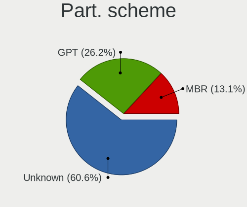

| Type    | Computers | Percent |
|---------|-----------|---------|
| Unknown | 195       | 64.14%  |
| GPT     | 76        | 25%     |
| MBR     | 33        | 10.86%  |

Dual Boot with Linux/BSD
------------------------

Hosting more than one Linux/BSD

| Dual boot | Computers | Percent |
|-----------|-----------|---------|
| No        | 286       | 94.08%  |
| Yes       | 18        | 5.92%   |

Dual Boot (Win)
---------------

Hosting Linux and Windows

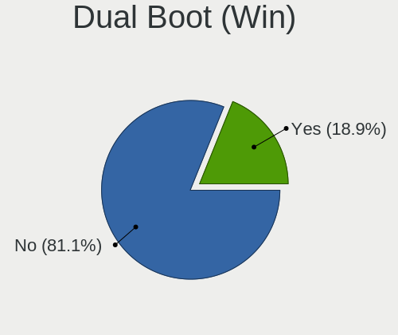

| Dual boot | Computers | Percent |
|-----------|-----------|---------|
| No        | 245       | 80.59%  |
| Yes       | 59        | 19.41%  |

Country
-------

Geographic location (country)

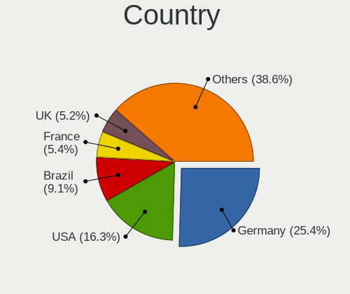

| Country              | Computers | Percent |
|----------------------|-----------|---------|
| USA                  | 53        | 17.43%  |
| Germany              | 42        | 13.82%  |
| Brazil               | 41        | 13.49%  |
| UK                   | 17        | 5.59%   |
| Russia               | 16        | 5.26%   |
| Canada               | 14        | 4.61%   |
| Spain                | 13        | 4.28%   |
| Italy                | 10        | 3.29%   |
| Poland               | 9         | 2.96%   |
| Argentina            | 8         | 2.63%   |
| Netherlands          | 5         | 1.64%   |
| France               | 5         | 1.64%   |
| Australia            | 5         | 1.64%   |
| Ukraine              | 4         | 1.32%   |
| New Zealand          | 4         | 1.32%   |
| India                | 4         | 1.32%   |
| Hungary              | 4         | 1.32%   |
| Finland              | 4         | 1.32%   |
| Bulgaria             | 4         | 1.32%   |
| South Africa         | 3         | 0.99%   |
| Mexico               | 3         | 0.99%   |
| Austria              | 3         | 0.99%   |
| Turkey               | 2         | 0.66%   |
| Sweden               | 2         | 0.66%   |
| Portugal             | 2         | 0.66%   |
| Ireland              | 2         | 0.66%   |
| Egypt                | 2         | 0.66%   |
| Ecuador              | 2         | 0.66%   |
| Thailand             | 1         | 0.33%   |
| Taiwan               | 1         | 0.33%   |
| Switzerland          | 1         | 0.33%   |
| Sri Lanka            | 1         | 0.33%   |
| Slovenia             | 1         | 0.33%   |
| Philippines          | 1         | 0.33%   |
| Moldova, Republic of | 1         | 0.33%   |
| Korea, Republic of   | 1         | 0.33%   |
| Japan                | 1         | 0.33%   |
| Indonesia            | 1         | 0.33%   |
| Georgia              | 1         | 0.33%   |
| Estonia              | 1         | 0.33%   |
| Denmark              | 1         | 0.33%   |
| Czech Republic       | 1         | 0.33%   |
| Croatia              | 1         | 0.33%   |
| Costa Rica           | 1         | 0.33%   |
| Colombia             | 1         | 0.33%   |
| China                | 1         | 0.33%   |
| Chile                | 1         | 0.33%   |
| Belgium              | 1         | 0.33%   |
| Unknown              | 1         | 0.33%   |

City
----

Geographic location (city)

| City                 | Computers | Percent |
|----------------------|-----------|---------|
| São Paulo           | 6         | 1.97%   |
| Curitiba             | 4         | 1.32%   |
| Moscow               | 3         | 0.99%   |
| Inver Grove Heights  | 3         | 0.99%   |
| Hamburg              | 3         | 0.99%   |
| Budapest             | 3         | 0.99%   |
| Auckland             | 3         | 0.99%   |
| Amsterdam            | 3         | 0.99%   |
| Wrocław             | 2         | 0.66%   |
| Warsaw               | 2         | 0.66%   |
| St Petersburg        | 2         | 0.66%   |
| Saint Paul           | 2         | 0.66%   |
| Rosario              | 2         | 0.66%   |
| Rome                 | 2         | 0.66%   |
| Pune                 | 2         | 0.66%   |
| Paris                | 2         | 0.66%   |
| Montreal             | 2         | 0.66%   |
| Mafra                | 2         | 0.66%   |
| Madrid               | 2         | 0.66%   |
| Lübeck              | 2         | 0.66%   |
| Kyiv                 | 2         | 0.66%   |
| Helsinki             | 2         | 0.66%   |
| Goiânia             | 2         | 0.66%   |
| Dallas               | 2         | 0.66%   |
| Córdoba             | 2         | 0.66%   |
| Cologne              | 2         | 0.66%   |
| Chilpancingo         | 2         | 0.66%   |
| Chelyabinsk          | 2         | 0.66%   |
| Campinas             | 2         | 0.66%   |
| Cairo                | 2         | 0.66%   |
| Birmingham           | 2         | 0.66%   |
| Berlin               | 2         | 0.66%   |
| Bensheim             | 2         | 0.66%   |
| Belo Horizonte       | 2         | 0.66%   |
| Yuzhno-Sakhalinsk    | 1         | 0.33%   |
| Willich              | 1         | 0.33%   |
| Wiesbaden            | 1         | 0.33%   |
| West Malling         | 1         | 0.33%   |
| Weilburg             | 1         | 0.33%   |
| Weiden               | 1         | 0.33%   |
| Wasilla              | 1         | 0.33%   |
| Volta Redonda        | 1         | 0.33%   |
| Volgograd            | 1         | 0.33%   |
| Vitória             | 1         | 0.33%   |
| Villa San Giovanni   | 1         | 0.33%   |
| Vijayawada           | 1         | 0.33%   |
| Vienna               | 1         | 0.33%   |
| Viamão              | 1         | 0.33%   |
| Verbania             | 1         | 0.33%   |
| Vancouver            | 1         | 0.33%   |
| Valleyview           | 1         | 0.33%   |
| Valley               | 1         | 0.33%   |
| Vaasa                | 1         | 0.33%   |
| Utrera               | 1         | 0.33%   |
| Unkel                | 1         | 0.33%   |
| Ulyanovsk            | 1         | 0.33%   |
| Tsuru-shi            | 1         | 0.33%   |
| Trostberg an der Alz | 1         | 0.33%   |
| Toronto              | 1         | 0.33%   |
| Tomares              | 1         | 0.33%   |

Vendor
------

Motherboard manufacturer

| Name                | Computers | Percent |
|---------------------|-----------|---------|
| ASUSTek Computer    | 57        | 18.75%  |
| Hewlett-Packard     | 42        | 13.82%  |
| Lenovo              | 39        | 12.83%  |
| Dell                | 31        | 10.2%   |
| Gigabyte Technology | 25        | 8.22%   |
| MSI                 | 21        | 6.91%   |
| Acer                | 17        | 5.59%   |
| ASRock              | 16        | 5.26%   |
| Toshiba             | 5         | 1.64%   |
| Foxconn             | 5         | 1.64%   |
| Notebook            | 4         | 1.32%   |
| Samsung Electronics | 3         | 0.99%   |
| Positivo            | 3         | 0.99%   |
| Packard Bell        | 3         | 0.99%   |
| Intel               | 3         | 0.99%   |
| Apple               | 3         | 0.99%   |
| Medion              | 2         | 0.66%   |
| Gateway             | 2         | 0.66%   |
| Fujitsu             | 2         | 0.66%   |
| ECS                 | 2         | 0.66%   |
| Biostar             | 2         | 0.66%   |
| Unknown             | 2         | 0.66%   |
| ZOTAC               | 1         | 0.33%   |
| System76            | 1         | 0.33%   |
| Sony                | 1         | 0.33%   |
| Shuttle             | 1         | 0.33%   |
| Pegatron            | 1         | 0.33%   |
| PC Specialist       | 1         | 0.33%   |
| Microsoft           | 1         | 0.33%   |
| Megaware            | 1         | 0.33%   |
| Insyde              | 1         | 0.33%   |
| HUAWEI              | 1         | 0.33%   |
| Google              | 1         | 0.33%   |
| Fujitsu Siemens     | 1         | 0.33%   |
| Eluktronics         | 1         | 0.33%   |
| ECS-USA             | 1         | 0.33%   |
| Clevo               | 1         | 0.33%   |

Model
-----

Motherboard model

| Name                                                              | Computers | Percent |
|-------------------------------------------------------------------|-----------|---------|
| ASUS All Series                                                   | 7         | 2.3%    |
| ASUS P50IJ                                                        | 5         | 1.64%   |
| Toshiba Satellite A665                                            | 2         | 0.66%   |
| MSI MS-7C02                                                       | 2         | 0.66%   |
| MSI MS-7693                                                       | 2         | 0.66%   |
| HP ProBook 4530s                                                  | 2         | 0.66%   |
| HP Pavilion dv6                                                   | 2         | 0.66%   |
| HP Pavilion 15                                                    | 2         | 0.66%   |
| HP Pavilion 14                                                    | 2         | 0.66%   |
| HP Laptop 15-bw0xx                                                | 2         | 0.66%   |
| HP 250 G3                                                         | 2         | 0.66%   |
| Gigabyte B550 AORUS ELITE                                         | 2         | 0.66%   |
| Gigabyte B450 AORUS ELITE                                         | 2         | 0.66%   |
| Dell XPS 8920                                                     | 2         | 0.66%   |
| Dell XPS 15 9550                                                  | 2         | 0.66%   |
| Dell XPS 13 9380                                                  | 2         | 0.66%   |
| ASUS X555LA                                                       | 2         | 0.66%   |
| ASUS X541UAK                                                      | 2         | 0.66%   |
| ASUS P8H77-V                                                      | 2         | 0.66%   |
| ASUS M5A78L-M/USB3                                                | 2         | 0.66%   |
| Unknown                                                           | 2         | 0.66%   |
| ZOTAC ZBOX-ID18                                                   | 1         | 0.33%   |
| Toshiba Satellite P55t-A                                          | 1         | 0.33%   |
| Toshiba Satellite C45-A                                           | 1         | 0.33%   |
| Toshiba Satellite A300                                            | 1         | 0.33%   |
| System76 Lemur                                                    | 1         | 0.33%   |
| Sony SVF1521A7EB                                                  | 1         | 0.33%   |
| Shuttle XH81V                                                     | 1         | 0.33%   |
| Samsung Electronics 550P5C/550P7C                                 | 1         | 0.33%   |
| Samsung Electronics 500R4K/500R5H/5400RK/501R5H/5500RH/500R5S     | 1         | 0.33%   |
| Samsung Electronics 300E5EV/300E4EV/270E5EV/270E4EV/2470EV/2470EE | 1         | 0.33%   |
| Positivo POS-PIH55BO                                              | 1         | 0.33%   |
| Positivo POS-PARS760GCD                                           | 1         | 0.33%   |
| Positivo I541TB                                                   | 1         | 0.33%   |
| Pegatron 20-b110ef                                                | 1         | 0.33%   |
| PC Specialist PCX0DX                                              | 1         | 0.33%   |
| Packard Bell EasyNote_MX37-U-004                                  | 1         | 0.33%   |
| Packard Bell EasyNote ENTG71BM                                    | 1         | 0.33%   |
| Packard Bell DOTS E2                                              | 1         | 0.33%   |
| Notebook W65_W67RZ                                                | 1         | 0.33%   |
| Notebook W65_W67RB                                                | 1         | 0.33%   |
| Notebook W230SS                                                   | 1         | 0.33%   |
| Notebook PA70ES                                                   | 1         | 0.33%   |
| MSI MS-7C79                                                       | 1         | 0.33%   |
| MSI MS-7C56                                                       | 1         | 0.33%   |
| MSI MS-7C52                                                       | 1         | 0.33%   |
| MSI MS-7B89                                                       | 1         | 0.33%   |
| MSI MS-7B07                                                       | 1         | 0.33%   |
| MSI MS-7817                                                       | 1         | 0.33%   |
| MSI MS-7680                                                       | 1         | 0.33%   |
| MSI MS-7641                                                       | 1         | 0.33%   |
| MSI MS-7502                                                       | 1         | 0.33%   |
| MSI MS-1453                                                       | 1         | 0.33%   |
| MSI M2H110V1                                                      | 1         | 0.33%   |
| MSI GX60 3CC                                                      | 1         | 0.33%   |
| MSI GT80S 6QD                                                     | 1         | 0.33%   |
| MSI GS60 2PE                                                      | 1         | 0.33%   |
| MSI GP62 6QE                                                      | 1         | 0.33%   |
| MSI GE60 2OC\2OD\2OE                                              | 1         | 0.33%   |
| MSI Compaq dx2200 MT                                              | 1         | 0.33%   |

Model Family
------------

Motherboard model prefix

| Name                        | Computers | Percent |
|-----------------------------|-----------|---------|
| Lenovo ThinkPad             | 15        | 4.93%   |
| Acer Aspire                 | 13        | 4.28%   |
| HP Pavilion                 | 9         | 2.96%   |
| HP Laptop                   | 9         | 2.96%   |
| Dell XPS                    | 8         | 2.63%   |
| Dell Inspiron               | 8         | 2.63%   |
| Lenovo IdeaPad              | 7         | 2.3%    |
| ASUS All                    | 7         | 2.3%    |
| HP EliteBook                | 6         | 1.97%   |
| Dell Latitude               | 6         | 1.97%   |
| Toshiba Satellite           | 5         | 1.64%   |
| Dell OptiPlex               | 5         | 1.64%   |
| ASUS P50IJ                  | 5         | 1.64%   |
| HP ProBook                  | 4         | 1.32%   |
| Gigabyte B450               | 4         | 1.32%   |
| ASUS PRIME                  | 4         | 1.32%   |
| Lenovo Legion               | 3         | 0.99%   |
| HP 250                      | 3         | 0.99%   |
| Packard Bell EasyNote       | 2         | 0.66%   |
| Notebook W65                | 2         | 0.66%   |
| MSI MS-7C02                 | 2         | 0.66%   |
| MSI MS-7693                 | 2         | 0.66%   |
| Lenovo IdeaCentre           | 2         | 0.66%   |
| Lenovo 3000                 | 2         | 0.66%   |
| HP ENVY                     | 2         | 0.66%   |
| HP EliteDesk                | 2         | 0.66%   |
| Gigabyte X570               | 2         | 0.66%   |
| Gigabyte B550               | 2         | 0.66%   |
| Dell Precision              | 2         | 0.66%   |
| ASUS X555LA                 | 2         | 0.66%   |
| ASUS X541UAK                | 2         | 0.66%   |
| ASUS TUF                    | 2         | 0.66%   |
| ASUS P8H77-V                | 2         | 0.66%   |
| ASUS M5A97                  | 2         | 0.66%   |
| ASUS M5A78L-M               | 2         | 0.66%   |
| ASRock P67                  | 2         | 0.66%   |
| Unknown                     | 2         | 0.66%   |
| ZOTAC ZBOX-ID18             | 1         | 0.33%   |
| System76 Lemur              | 1         | 0.33%   |
| Sony SVF1521A7EB            | 1         | 0.33%   |
| Shuttle XH81V               | 1         | 0.33%   |
| Samsung Electronics 550P5C  | 1         | 0.33%   |
| Samsung Electronics 500R4K  | 1         | 0.33%   |
| Samsung Electronics 300E5EV | 1         | 0.33%   |
| Positivo POS-PIH55BO        | 1         | 0.33%   |
| Positivo POS-PARS760GCD     | 1         | 0.33%   |
| Positivo I541TB             | 1         | 0.33%   |
| Pegatron 20-b110ef          | 1         | 0.33%   |
| PC Specialist PCX0DX        | 1         | 0.33%   |
| Packard Bell DOTS           | 1         | 0.33%   |
| Notebook W230SS             | 1         | 0.33%   |
| Notebook PA70ES             | 1         | 0.33%   |
| MSI MS-7C79                 | 1         | 0.33%   |
| MSI MS-7C56                 | 1         | 0.33%   |
| MSI MS-7C52                 | 1         | 0.33%   |
| MSI MS-7B89                 | 1         | 0.33%   |
| MSI MS-7B07                 | 1         | 0.33%   |
| MSI MS-7817                 | 1         | 0.33%   |
| MSI MS-7680                 | 1         | 0.33%   |
| MSI MS-7641                 | 1         | 0.33%   |

MFG Year
--------

Motherboard manufacture year

| Year | Computers | Percent |
|------|-----------|---------|
| 2019 | 48        | 15.79%  |
| 2020 | 37        | 12.17%  |
| 2014 | 29        | 9.54%   |
| 2018 | 24        | 7.89%   |
| 2015 | 24        | 7.89%   |
| 2013 | 24        | 7.89%   |
| 2012 | 23        | 7.57%   |
| 2016 | 17        | 5.59%   |
| 2011 | 17        | 5.59%   |
| 2010 | 15        | 4.93%   |
| 2009 | 12        | 3.95%   |
| 2017 | 11        | 3.62%   |
| 2007 | 10        | 3.29%   |
| 2008 | 8         | 2.63%   |
| 2006 | 4         | 1.32%   |
| 2004 | 1         | 0.33%   |

Form Factor
-----------

Physical design of the computer

| Name        | Computers | Percent |
|-------------|-----------|---------|
| Notebook    | 165       | 54.28%  |
| Desktop     | 132       | 43.42%  |
| All in one  | 3         | 0.99%   |
| Mini pc     | 2         | 0.66%   |
| Tablet      | 1         | 0.33%   |
| Convertible | 1         | 0.33%   |

Secure Boot
-----------

Enabled or disabled

| State    | Computers | Percent |
|----------|-----------|---------|
| Disabled | 288       | 94.74%  |
| Enabled  | 16        | 5.26%   |

Coreboot
--------

Have coreboot on board

| Used | Computers | Percent |
|------|-----------|---------|
| No   | 303       | 99.67%  |
| Yes  | 1         | 0.33%   |

RAM Size
--------

Total RAM memory

| Size in GB  | Computers | Percent |
|-------------|-----------|---------|
| 4.01-8.0    | 73        | 24.01%  |
| 3.01-4.0    | 73        | 24.01%  |
| 16.01-24.0  | 57        | 18.75%  |
| 8.01-16.0   | 49        | 16.12%  |
| 32.01-64.0  | 26        | 8.55%   |
| 1.01-2.0    | 8         | 2.63%   |
| 0.01-1.0    | 6         | 1.97%   |
| 64.01-256.0 | 5         | 1.64%   |
| 24.01-32.0  | 4         | 1.32%   |
| 2.01-3.0    | 3         | 0.99%   |

RAM Used
--------

Used RAM memory

| Used GB    | Computers | Percent |
|------------|-----------|---------|
| 1.01-2.0   | 112       | 36.84%  |
| 2.01-3.0   | 82        | 26.97%  |
| 4.01-8.0   | 41        | 13.49%  |
| 3.01-4.0   | 35        | 11.51%  |
| 0.01-1.0   | 25        | 8.22%   |
| 8.01-16.0  | 8         | 2.63%   |
| 16.01-24.0 | 1         | 0.33%   |

Has CD-ROM
----------

Has CD-ROM on board

| Presented | Computers | Percent |
|-----------|-----------|---------|
| Yes       | 158       | 51.97%  |
| No        | 146       | 48.03%  |

Total Drives
------------

Number of drives on board

| Drives | Computers | Percent |
|--------|-----------|---------|
| 1      | 173       | 56.91%  |
| 2      | 80        | 26.32%  |
| 3      | 35        | 11.51%  |
| 4      | 9         | 2.96%   |
| 5      | 4         | 1.32%   |
| 6      | 2         | 0.66%   |
| 7      | 1         | 0.33%   |

Has Ethernet
------------

Has Ethernet on board

| Presented | Computers | Percent |
|-----------|-----------|---------|
| Yes       | 288       | 94.74%  |
| No        | 16        | 5.26%   |

Drive Vendor
------------

Hard drive vendors

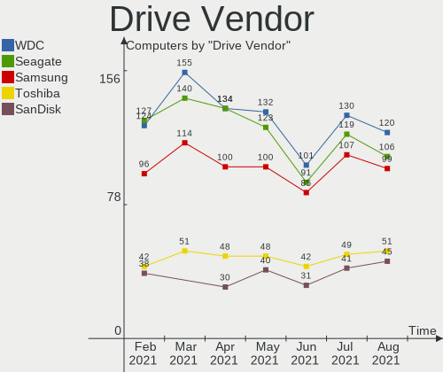

| Vendor              | Computers | Drives  | Percent |
|---------------------|-----------|---------|---------|
| WDC                 | 83        | 108     | 18.32%  |
| Seagate             | 79        | 90      | 17.44%  |
| Samsung Electronics | 71        | 86      | 15.67%  |
| Kingston            | 37        | 38      | 8.17%   |
| Toshiba             | 34        | 37      | 7.51%   |
| SanDisk             | 21        | 21      | 4.64%   |
| Hitachi             | 21        | 21      | 4.64%   |
| Unknown             | 12        | 12      | 2.65%   |
| Crucial             | 12        | 14      | 2.65%   |
| Intel               | 10        | 11      | 2.21%   |
| A-DATA Technology   | 10        | 10      | 2.21%   |
| HGST                | 8         | 8       | 1.77%   |
| SK Hynix            | 5         | 5       | 1.1%    |
| HL-DT-ST            | 5         | Unknown | 1.1%    |
| Transcend           | 3         | 3       | 0.66%   |
| SPCC                | 3         | 3       | 0.66%   |
| Silicon Motion      | 3         | 4       | 0.66%   |
| Micron Technology   | 3         | 4       | 0.66%   |
| LITEON              | 3         | 3       | 0.66%   |
| Intenso             | 3         | 3       | 0.66%   |
| China               | 3         | 3       | 0.66%   |
| Phison              | 2         | 4       | 0.44%   |
| KIOXIA              | 2         | 2       | 0.44%   |
| JMicron             | 2         | 2       | 0.44%   |
| Corsair             | 2         | 2       | 0.44%   |
| Teclast             | 1         | 1       | 0.22%   |
| Team                | 1         | 1       | 0.22%   |
| SABRENT             | 1         | 1       | 0.22%   |
| PNY                 | 1         | 1       | 0.22%   |
| Patriot             | 1         | 1       | 0.22%   |
| OCZ                 | 1         | 1       | 0.22%   |
| MAXTOR              | 1         | 1       | 0.22%   |
| LITEONIT            | 1         | 1       | 0.22%   |
| Lexar               | 1         | 1       | 0.22%   |
| Lenovo              | 1         | 1       | 0.22%   |
| KingSpec            | 1         | 1       | 0.22%   |
| KINGBANK            | 1         | 1       | 0.22%   |
| IB                  | 1         | 2       | 0.22%   |
| Gigabyte Technology | 1         | 1       | 0.22%   |
| Fujitsu             | 1         | 1       | 0.22%   |
| Dell                | 1         | 1       | 0.22%   |

HDD Vendor
----------

Hard disk drive vendors

| Vendor              | Computers | Drives | Percent |
|---------------------|-----------|--------|---------|
| Seagate             | 79        | 89     | 34.2%   |
| WDC                 | 74        | 94     | 32.03%  |
| Toshiba             | 29        | 32     | 12.55%  |
| Hitachi             | 21        | 21     | 9.09%   |
| Samsung Electronics | 16        | 19     | 6.93%   |
| HGST                | 8         | 8      | 3.46%   |
| MAXTOR              | 1         | 1      | 0.43%   |
| JMicron             | 1         | 1      | 0.43%   |
| Fujitsu             | 1         | 1      | 0.43%   |
| Dell                | 1         | 1      | 0.43%   |

SSD Vendor
----------

Solid state drive vendors

| Vendor              | Computers | Drives | Percent |
|---------------------|-----------|--------|---------|
| Samsung Electronics | 39        | 45     | 24.22%  |
| Kingston            | 36        | 36     | 22.36%  |
| SanDisk             | 17        | 17     | 10.56%  |
| WDC                 | 12        | 12     | 7.45%   |
| Crucial             | 12        | 14     | 7.45%   |
| A-DATA Technology   | 9         | 9      | 5.59%   |
| Transcend           | 3         | 3      | 1.86%   |
| SPCC                | 3         | 3      | 1.86%   |
| SK Hynix            | 3         | 3      | 1.86%   |
| Micron Technology   | 3         | 4      | 1.86%   |
| Intenso             | 3         | 3      | 1.86%   |
| Intel               | 3         | 3      | 1.86%   |
| China               | 3         | 3      | 1.86%   |
| Unknown             | 2         | 2      | 1.24%   |
| LITEON              | 2         | 2      | 1.24%   |
| Toshiba             | 1         | 1      | 0.62%   |
| Teclast             | 1         | 1      | 0.62%   |
| Team                | 1         | 1      | 0.62%   |
| SABRENT             | 1         | 1      | 0.62%   |
| PNY                 | 1         | 1      | 0.62%   |
| OCZ                 | 1         | 1      | 0.62%   |
| LITEONIT            | 1         | 1      | 0.62%   |
| Lexar               | 1         | 1      | 0.62%   |
| KingSpec            | 1         | 1      | 0.62%   |
| KINGBANK            | 1         | 1      | 0.62%   |
| Gigabyte Technology | 1         | 1      | 0.62%   |

Drive Model
-----------

Hard drive models

| Model                        | Computers | Percent |
|------------------------------|-----------|---------|
| SA400S37240G 240GB SSD       | 11        | 2.19%   |
| ST1000LM035-1RK172 1TB       | 7         | 1.39%   |
| ST1000DM010-2EP102 1TB       | 7         | 1.39%   |
| SSD 850 EVO 250GB            | 7         | 1.39%   |
| SA400S37480G 480GB SSD       | 7         | 1.39%   |
| NVMe SSD Drive 512GB         | 7         | 1.39%   |
| NVMe SSD Drive 256GB         | 7         | 1.39%   |
| DT01ACA100 1TB               | 7         | 1.39%   |
| WD10EZEX-08WN4A0 1TB         | 6         | 1.2%    |
| SA400S37120G 120GB SSD       | 6         | 1.2%    |
| MQ01ABF050 500GB             | 5         | 1%      |
| ST500LT012-1DG142 500GB      | 4         | 0.8%    |
| ST500DM002-1BD142 500GB      | 4         | 0.8%    |
| ST1000DM003-1CH162 1TB       | 4         | 0.8%    |
| SSD 850 EVO 500GB            | 4         | 0.8%    |
| SSD 840 EVO 500GB            | 4         | 0.8%    |
| NVMe SSD Drive 1TB           | 4         | 0.8%    |
| MMC Card  32GB               | 4         | 0.8%    |
| WDS100T2B0A-00SM50 1TB SSD   | 3         | 0.6%    |
| WD10JPVX-22JC3T0 1TB         | 3         | 0.6%    |
| SU800 512GB SSD              | 3         | 0.6%    |
| ST500LM012 HN-M500MBB 500GB  | 3         | 0.6%    |
| ST3500418AS 500GB            | 3         | 0.6%    |
| ST31000524AS 1TB             | 3         | 0.6%    |
| ST1000LM024 HN-M101MBB 1TB   | 3         | 0.6%    |
| ST1000DM003-1ER162 1TB       | 3         | 0.6%    |
| SSD 860 EVO 500GB            | 3         | 0.6%    |
| SDSSDA120G 120GB             | 3         | 0.6%    |
| NVMe SSD Drive 500GB         | 3         | 0.6%    |
| NVMe SSD Drive 250GB         | 3         | 0.6%    |
| HTS547575A9E384 752GB        | 3         | 0.6%    |
| HD502HJ 500GB                | 3         | 0.6%    |
| DVDRAM GUE1N 3GB             | 3         | 0.6%    |
| CT240BX500SSD1 240GB         | 3         | 0.6%    |
| WDS500G2B0A-00SM50 500GB SSD | 2         | 0.4%    |
| WDS240G2G0A-00JH30 240GB SSD | 2         | 0.4%    |
| WD20EARS-00MVWB0 2TB         | 2         | 0.4%    |
| WD10SPZX-24Z10 1TB           | 2         | 0.4%    |
| WD10EZRX-00L4HB0 1TB         | 2         | 0.4%    |
| WD10EZEX-00BN5A0 1TB         | 2         | 0.4%    |
| WD10EARS-00Y5B1 1TB          | 2         | 0.4%    |
| WD1003FZEX-00K3CA0 1TB       | 2         | 0.4%    |
| SV300S37A120G 120GB SSD      | 2         | 0.4%    |
| SUV400S37240G 240GB SSD      | 2         | 0.4%    |
| SUV400S37120G 120GB SSD      | 2         | 0.4%    |
| SU650 120GB SSD              | 2         | 0.4%    |
| ST4000DM004-2CV104 4TB       | 2         | 0.4%    |
| ST4000DM000-1F2168 4TB       | 2         | 0.4%    |
| ST2000LM007-1R8174 2TB       | 2         | 0.4%    |
| ST2000DM006-2DM164 2TB       | 2         | 0.4%    |
| ST1000DM003-1SB102 1TB       | 2         | 0.4%    |
| SSD Sata III 120GB           | 2         | 0.4%    |
| SSD PLUS 240GB               | 2         | 0.4%    |
| SSD PLUS 120GB               | 2         | 0.4%    |
| SSD PLUS 1000GB              | 2         | 0.4%    |
| SSD 860 QVO 1TB              | 2         | 0.4%    |
| SSD 860 EVO 1TB              | 2         | 0.4%    |
| SSD 850 EVO 1TB              | 2         | 0.4%    |
| SSD 750 EVO 250GB            | 2         | 0.4%    |
| Solid State Disk 256GB       | 2         | 0.4%    |

Drive Kind
----------

HDD or SSD

| Kind    | Computers | Drives | Percent |
|---------|-----------|--------|---------|
| HDD     | 193       | 267    | 48.13%  |
| SSD     | 139       | 170    | 34.66%  |
| NVMe    | 55        | 64     | 13.72%  |
| Unknown | 9         | 4      | 2.24%   |
| MMC     | 5         | 6      | 1.25%   |

Drive Connector
---------------

SATA, SAS, NVMe, etc.

| Type | Computers | Drives | Percent |
|------|-----------|--------|---------|
| SATA | 271       | 425    | 77.21%  |
| NVMe | 55        | 64     | 15.67%  |
| SAS  | 20        | 16     | 5.7%    |
| MMC  | 5         | 6      | 1.42%   |

Drive Size
----------

Size of hard drive

| Size in TB | Computers | Drives | Percent |
|------------|-----------|--------|---------|
| 0.01-0.5   | 222       | 282    | 54.28%  |
| 0.51-1.0   | 139       | 172    | 33.99%  |
| 1.01-2.0   | 30        | 33     | 7.33%   |
| 2.01-3.0   | 8         | 11     | 1.96%   |
| 3.01-4.0   | 6         | 6      | 1.47%   |
| 4.01-10.0  | 4         | 7      | 0.98%   |

Space Total
-----------

Amount of disk space available on the file system

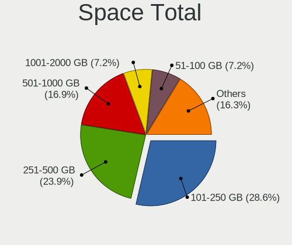

| Size in GB     | Computers | Percent |
|----------------|-----------|---------|
| 101-250        | 86        | 28.29%  |
| 251-500        | 71        | 23.36%  |
| 501-1000       | 43        | 14.14%  |
| 1001-2000      | 36        | 11.84%  |
| 51-100         | 21        | 6.91%   |
| More than 3000 | 18        | 5.92%   |
| 2001-3000      | 17        | 5.59%   |
| 21-50          | 7         | 2.3%    |
| 1-20           | 3         | 0.99%   |
| Unknown        | 2         | 0.66%   |

Space Used
----------

Amount of used disk space

| Used GB        | Computers | Percent |
|----------------|-----------|---------|
| 21-50          | 73        | 24.01%  |
| 101-250        | 58        | 19.08%  |
| 51-100         | 46        | 15.13%  |
| 1-20           | 42        | 13.82%  |
| 251-500        | 28        | 9.21%   |
| 501-1000       | 26        | 8.55%   |
| 1001-2000      | 15        | 4.93%   |
| More than 3000 | 7         | 2.3%    |
| 2001-3000      | 7         | 2.3%    |
| Unknown        | 2         | 0.66%   |

Malfunc. Drives
---------------

Drive models with a malfunction

| Model                        | Computers | Drives | Percent |
|------------------------------|-----------|--------|---------|
| WD6400BPVT-22HXZT3 640GB     | 1         | 1      | 4.35%   |
| WD5002ABYS-01B1B0 500GB      | 1         | 1      | 4.35%   |
| WD3200BEVT-60A23T0 320GB     | 1         | 1      | 4.35%   |
| WD20EARS-00MVWB0 2TB         | 1         | 1      | 4.35%   |
| WD10EARS-00Y5B1 1TB          | 1         | 1      | 4.35%   |
| WD10EALS-00Z8A0 1TB          | 1         | 1      | 4.35%   |
| WD10EADS-65M2BX 1TB          | 1         | 1      | 4.35%   |
| SV300S37A120G 120GB SSD      | 1         | 1      | 4.35%   |
| ST9750420AS 752GB            | 1         | 1      | 4.35%   |
| ST500LT012-9WS142 500GB      | 1         | 1      | 4.35%   |
| ST3500320NS 500GB            | 1         | 1      | 4.35%   |
| ST3200822AS 200GB            | 1         | 1      | 4.35%   |
| ST2000DX001-SSHD-8GB         | 1         | 1      | 4.35%   |
| ST1000LM024 HN-M101MBB 1TB   | 1         | 1      | 4.35%   |
| MQ01ABF050 500GB             | 1         | 1      | 4.35%   |
| MQ01ABD1 1TB                 | 1         | 1      | 4.35%   |
| HTS723232A7A364 320GB        | 1         | 1      | 4.35%   |
| HTS545050B9A300 500GB        | 1         | 1      | 4.35%   |
| HTS545050A7E680 500GB        | 1         | 1      | 4.35%   |
| HFS128G38MNB-2200A 128GB SSD | 1         | 1      | 4.35%   |
| HD256GJ 250GB                | 1         | 1      | 4.35%   |
| HD103SI 1TB                  | 1         | 1      | 4.35%   |
| DT01ACA300 3TB               | 1         | 1      | 4.35%   |

Malfunc. Drive Vendor
---------------------

Vendors of faulty drives

| Vendor              | Computers | Drives | Percent |
|---------------------|-----------|--------|---------|
| WDC                 | 7         | 7      | 31.82%  |
| Seagate             | 5         | 6      | 22.73%  |
| Toshiba             | 3         | 3      | 13.64%  |
| Samsung Electronics | 2         | 2      | 9.09%   |
| Hitachi             | 2         | 2      | 9.09%   |
| SK Hynix            | 1         | 1      | 4.55%   |
| Kingston            | 1         | 1      | 4.55%   |
| HGST                | 1         | 1      | 4.55%   |

Malfunc. HDD Vendor
-------------------

Vendors of faulty HDD drives

| Vendor              | Computers | Drives | Percent |
|---------------------|-----------|--------|---------|
| WDC                 | 7         | 7      | 35%     |
| Seagate             | 5         | 6      | 25%     |
| Toshiba             | 3         | 3      | 15%     |
| Samsung Electronics | 2         | 2      | 10%     |
| Hitachi             | 2         | 2      | 10%     |
| HGST                | 1         | 1      | 5%      |

Malfunc. Drive Kind
-------------------

Kinds of faulty drives

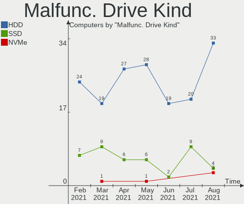

| Kind | Computers | Drives | Percent |
|------|-----------|--------|---------|
| HDD  | 19        | 21     | 90.48%  |
| SSD  | 2         | 2      | 9.52%   |

Failed Drives
-------------

Failed drive models

Zero info for selected period =(

Failed Drive Vendor
-------------------

Failed drive vendors

Zero info for selected period =(

Drive Status
------------

Number of failed and malfunc. drives

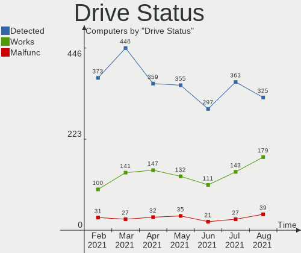

| Status   | Computers | Drives | Percent |
|----------|-----------|--------|---------|
| Detected | 204       | 328    | 62.77%  |
| Works    | 100       | 160    | 30.77%  |
| Malfunc  | 21        | 23     | 6.46%   |

Storage Vendor
--------------

Storage controller vendors

| Vendor                           | Computers | Percent |
|----------------------------------|-----------|---------|
| Intel                            | 208       | 57.94%  |
| AMD                              | 78        | 21.73%  |
| Samsung Electronics              | 20        | 5.57%   |
| ASMedia Technology               | 7         | 1.95%   |
| Sandisk                          | 6         | 1.67%   |
| Phison Electronics               | 5         | 1.39%   |
| Nvidia                           | 5         | 1.39%   |
| KIOXIA                           | 5         | 1.39%   |
| Marvell Technology Group         | 4         | 1.11%   |
| Toshiba America Info Systems     | 3         | 0.84%   |
| Silicon Motion                   | 3         | 0.84%   |
| JMicron Technology               | 3         | 0.84%   |
| SK Hynix                         | 2         | 0.56%   |
| Kingston Technology Company      | 2         | 0.56%   |
| VIA Technologies                 | 1         | 0.28%   |
| Union Memory (Shenzhen)          | 1         | 0.28%   |
| Silicon Integrated Systems [SiS] | 1         | 0.28%   |
| Silicon Image                    | 1         | 0.28%   |
| Realtek Semiconductor            | 1         | 0.28%   |
| Lite-On Technology               | 1         | 0.28%   |
| Lenovo                           | 1         | 0.28%   |
| ADATA Technology                 | 1         | 0.28%   |

Storage Model
-------------

Storage controller models

| Model                                                                             | Computers | Percent |
|-----------------------------------------------------------------------------------|-----------|---------|
| FCH SATA Controller [AHCI mode]                                                   | 52        | 11.85%  |
| 8 Series/C220 Series Chipset Family 6-port SATA Controller 1 [AHCI mode]          | 18        | 4.1%    |
| 7 Series Chipset Family 6-port SATA Controller [AHCI mode]                        | 17        | 3.87%   |
| NVMe SSD Controller SM981/PM981/PM983                                             | 15        | 3.42%   |
| Sunrise Point-LP SATA Controller [AHCI mode]                                      | 14        | 3.19%   |
| SB7x0/SB8x0/SB9x0 SATA Controller [AHCI mode]                                     | 13        | 2.96%   |
| 8 Series SATA Controller 1 [AHCI mode]                                            | 13        | 2.96%   |
| Non-Volatile memory controller                                                    | 11        | 2.51%   |
| 6 Series/C200 Series Chipset Family 6 port Mobile SATA AHCI Controller            | 11        | 2.51%   |
| SB7x0/SB8x0/SB9x0 IDE Controller                                                  | 10        | 2.28%   |
| NM10/ICH7 Family SATA Controller [IDE mode]                                       | 10        | 2.28%   |
| 400 Series Chipset SATA Controller                                                | 10        | 2.28%   |
| Q170/Q150/B150/H170/H110/Z170/CM236 Chipset SATA Controller [AHCI Mode]           | 9         | 2.05%   |
| 82801IBM/IEM (ICH9M/ICH9M-E) 4 port SATA Controller [AHCI mode]                   | 9         | 2.05%   |
| 82801G (ICH7 Family) IDE Controller                                               | 9         | 2.05%   |
| 300 Series Chipset SATA Controller                                                | 8         | 1.82%   |
| Wildcat Point-LP SATA Controller [AHCI Mode]                                      | 7         | 1.59%   |
| ASM1062 Serial ATA Controller                                                     | 7         | 1.59%   |
| 82801 Mobile SATA Controller [RAID mode]                                          | 7         | 1.59%   |
| 6 Series/C200 Series Chipset Family 6 port Desktop SATA AHCI Controller           | 7         | 1.59%   |
| 5 Series/3400 Series Chipset 4 port SATA AHCI Controller                          | 7         | 1.59%   |
| 200 Series PCH SATA controller [AHCI mode]                                        | 7         | 1.59%   |
| SB7x0/SB8x0/SB9x0 SATA Controller [IDE mode]                                      | 6         | 1.37%   |
| SATA controller                                                                   | 6         | 1.37%   |
| HM170/QM170 Chipset SATA Controller [AHCI Mode]                                   | 6         | 1.37%   |
| 7 Series/C210 Series Chipset Family 6-port SATA Controller [AHCI mode]            | 6         | 1.37%   |
| NVMe SSD Controller SM961/PM961                                                   | 5         | 1.14%   |
| Atom Processor E3800 Series SATA AHCI Controller                                  | 5         | 1.14%   |
| 82801HM/HEM (ICH8M/ICH8M-E) IDE Controller                                        | 5         | 1.14%   |
| 5 Series/3400 Series Chipset 6 port SATA AHCI Controller                          | 5         | 1.14%   |
| E12 NVMe Controller                                                               | 4         | 0.91%   |
| Cannon Lake Mobile PCH SATA AHCI Controller                                       | 4         | 0.91%   |
| WD Black 2018/PC SN520 NVMe SSD                                                   | 3         | 0.68%   |
| SSD 660P Series                                                                   | 3         | 0.68%   |
| SM2262/SM2262EN SSD Controller                                                    | 3         | 0.68%   |
| SATA Controller [RAID mode]                                                       | 3         | 0.68%   |
| MCP61 SATA Controller                                                             | 3         | 0.68%   |
| FCH IDE Controller                                                                | 3         | 0.68%   |
| Cannon Point-LP SATA Controller [AHCI Mode]                                       | 3         | 0.68%   |
| 9 Series Chipset Family SATA Controller [AHCI Mode]                               | 3         | 0.68%   |
| 82801HM/HEM (ICH8M/ICH8M-E) SATA Controller [AHCI mode]                           | 3         | 0.68%   |
| 5 Series/3400 Series Chipset 4 port SATA IDE Controller                           | 3         | 0.68%   |
| 5 Series/3400 Series Chipset 2 port SATA IDE Controller                           | 3         | 0.68%   |
| 400 Series Chipset Family SATA AHCI Controller                                    | 3         | 0.68%   |
| Toshiba America Info Non-Volatile memory controller                               | 2         | 0.46%   |
| SSD 600P Series                                                                   | 2         | 0.46%   |
| NVMe SSD Optane Series Controller                                                 | 2         | 0.46%   |
| MCP61 IDE                                                                         | 2         | 0.46%   |
| IXP SB4x0 Serial ATA Controller                                                   | 2         | 0.46%   |
| IXP SB4x0 IDE Controller                                                          | 2         | 0.46%   |
| FCH SATA Controller D                                                             | 2         | 0.46%   |
| C610/X99 series chipset sSATA Controller [AHCI mode]                              | 2         | 0.46%   |
| C610/X99 series chipset 6-Port SATA Controller [AHCI mode]                        | 2         | 0.46%   |
| 82801JI (ICH10 Family) SATA AHCI Controller                                       | 2         | 0.46%   |
| 82801IR/IO/IH (ICH9R/DO/DH) 4 port SATA Controller [IDE mode]                     | 2         | 0.46%   |
| 82801I (ICH9 Family) 2 port SATA Controller [IDE mode]                            | 2         | 0.46%   |
| 82801HM/HEM (ICH8M/ICH8M-E) SATA Controller [IDE mode]                            | 2         | 0.46%   |
| 7 Series/C210 Series Chipset Family 4-port SATA Controller [IDE mode]             | 2         | 0.46%   |
| 7 Series/C210 Series Chipset Family 2-port SATA Controller [IDE mode]             | 2         | 0.46%   |
| 6 Series/C200 Series Chipset Family Desktop SATA Controller (IDE mode, ports 4-5) | 2         | 0.46%   |

Storage Kind
------------

Kind of storage controller (IDE, SATA, NVMe, SAS, ...)

| Kind | Computers | Percent |
|------|-----------|---------|
| SATA | 245       | 66.76%  |
| IDE  | 56        | 15.26%  |
| NVMe | 55        | 14.99%  |
| RAID | 11        | 3%      |

CPU Vendor
----------

Processor vendors

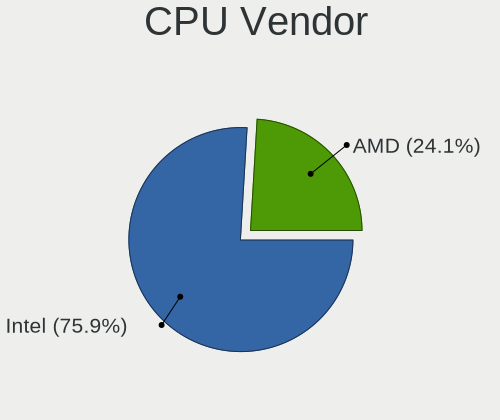

| Vendor | Computers | Percent |
|--------|-----------|---------|
| Intel  | 221       | 72.7%   |
| AMD    | 83        | 27.3%   |

CPU Model
---------

Processor models

| Model                                         | Computers | Percent |
|-----------------------------------------------|-----------|---------|
| AMD Ryzen 5 3600X 6-Core Processor            | 6         | 1.97%   |
| AMD FX-8350 Eight-Core Processor              | 6         | 1.97%   |
| Intel Core i7-8565U CPU @ 1.80GHz             | 5         | 1.64%   |
| Intel Core i7-6700HQ CPU @ 2.60GHz            | 5         | 1.64%   |
| AMD Ryzen 5 3600 6-Core Processor             | 5         | 1.64%   |
| Intel Core i5-8265U CPU @ 1.60GHz             | 4         | 1.32%   |
| Intel Core i5-2430M CPU @ 2.40GHz             | 4         | 1.32%   |
| Intel Core i5 CPU M 520 @ 2.40GHz             | 4         | 1.32%   |
| Intel Core 2 Duo CPU T6670 @ 2.20GHz          | 4         | 1.32%   |
| AMD Ryzen 5 2500U with Radeon Vega Mobile Gfx | 4         | 1.32%   |
| Intel Core i7-8750H CPU @ 2.20GHz             | 3         | 0.99%   |
| Intel Core i7-7700 CPU @ 3.60GHz              | 3         | 0.99%   |
| Intel Core i7-5500U CPU @ 2.40GHz             | 3         | 0.99%   |
| Intel Core i7-1065G7 CPU @ 1.30GHz            | 3         | 0.99%   |
| Intel Core i5-4200U CPU @ 1.60GHz             | 3         | 0.99%   |
| Intel Core i5-3210M CPU @ 2.50GHz             | 3         | 0.99%   |
| Intel Core i3-6100U CPU @ 2.30GHz             | 3         | 0.99%   |
| AMD Ryzen 5 2600 Six-Core Processor           | 3         | 0.99%   |
| Intel Core i7-8550U CPU @ 1.80GHz             | 2         | 0.66%   |
| Intel Core i7-6700K CPU @ 4.00GHz             | 2         | 0.66%   |
| Intel Core i7-4770 CPU @ 3.40GHz              | 2         | 0.66%   |
| Intel Core i7-4700MQ CPU @ 2.40GHz            | 2         | 0.66%   |
| Intel Core i7-4500U CPU @ 1.80GHz             | 2         | 0.66%   |
| Intel Core i7-3770 CPU @ 3.40GHz              | 2         | 0.66%   |
| Intel Core i7-10875H CPU @ 2.30GHz            | 2         | 0.66%   |
| Intel Core i7 CPU Q 720 @ 1.60GHz             | 2         | 0.66%   |
| Intel Core i5-8250U CPU @ 1.60GHz             | 2         | 0.66%   |
| Intel Core i5-7500 CPU @ 3.40GHz              | 2         | 0.66%   |
| Intel Core i5-7200U CPU @ 2.50GHz             | 2         | 0.66%   |
| Intel Core i5-6300U CPU @ 2.40GHz             | 2         | 0.66%   |
| Intel Core i5-6300HQ CPU @ 2.30GHz            | 2         | 0.66%   |
| Intel Core i5-4440 CPU @ 3.10GHz              | 2         | 0.66%   |
| Intel Core i5-4210U CPU @ 1.70GHz             | 2         | 0.66%   |
| Intel Core i5-3470 CPU @ 3.20GHz              | 2         | 0.66%   |
| Intel Core i5-3317U CPU @ 1.70GHz             | 2         | 0.66%   |
| Intel Core i5-3230M CPU @ 2.60GHz             | 2         | 0.66%   |
| Intel Core i5 CPU M 430 @ 2.27GHz             | 2         | 0.66%   |
| Intel Core i3-7100U CPU @ 2.40GHz             | 2         | 0.66%   |
| Intel Core i3-5005U CPU @ 2.00GHz             | 2         | 0.66%   |
| Intel Core i3-4150 CPU @ 3.50GHz              | 2         | 0.66%   |
| Intel Core i3-4005U CPU @ 1.70GHz             | 2         | 0.66%   |
| Intel Core i3-3220 CPU @ 3.30GHz              | 2         | 0.66%   |
| Intel Core i3-3110M CPU @ 2.40GHz             | 2         | 0.66%   |
| Intel Core i3-2120 CPU @ 3.30GHz              | 2         | 0.66%   |
| Intel Core i3-1005G1 CPU @ 1.20GHz            | 2         | 0.66%   |
| Intel Core i3 CPU M 350 @ 2.27GHz             | 2         | 0.66%   |
| Intel Core 2 Quad CPU Q9400 @ 2.66GHz         | 2         | 0.66%   |
| Intel Celeron M CPU 430 @ 1.73GHz             | 2         | 0.66%   |
| Intel Celeron CPU G540 @ 2.50GHz              | 2         | 0.66%   |
| AMD Ryzen 5 1600 Six-Core Processor           | 2         | 0.66%   |
| AMD Ryzen 3 3200G with Radeon Vega Graphics   | 2         | 0.66%   |
| AMD FX-8300 Eight-Core Processor              | 2         | 0.66%   |
| AMD FX-8120 Eight-Core Processor              | 2         | 0.66%   |
| AMD E1-2100 APU with Radeon HD Graphics       | 2         | 0.66%   |
| AMD E1-1200 APU with Radeon HD Graphics       | 2         | 0.66%   |
| AMD Athlon II X2 250 Processor                | 2         | 0.66%   |
| Intel Xeon CPU E5440 @ 2.83GHz                | 1         | 0.33%   |
| Intel Xeon CPU E5335 @ 2.00GHz                | 1         | 0.33%   |
| Intel Xeon CPU E3-1245 v5 @ 3.50GHz           | 1         | 0.33%   |
| Intel Xeon CPU E3-1240 V2 @ 3.40GHz           | 1         | 0.33%   |

CPU Model Family
----------------

Processor model prefix

| Model                   | Computers | Percent |
|-------------------------|-----------|---------|
| Intel Core i5           | 64        | 21.05%  |
| Intel Core i7           | 61        | 20.07%  |
| Intel Core i3           | 33        | 10.86%  |
| AMD Ryzen 5             | 24        | 7.89%   |
| Intel Core 2 Duo        | 16        | 5.26%   |
| Intel Celeron           | 15        | 4.93%   |
| AMD FX                  | 11        | 3.62%   |
| Intel Pentium Dual-Core | 6         | 1.97%   |
| Intel Core 2 Quad       | 5         | 1.64%   |
| AMD Ryzen 7             | 5         | 1.64%   |
| AMD A8                  | 5         | 1.64%   |
| AMD A10                 | 5         | 1.64%   |
| Intel Xeon              | 4         | 1.32%   |
| Intel Pentium           | 4         | 1.32%   |
| AMD Ryzen 3             | 4         | 1.32%   |
| AMD E1                  | 4         | 1.32%   |
| AMD A6                  | 4         | 1.32%   |
| Other                   | 3         | 0.99%   |
| Intel Pentium 4         | 3         | 0.99%   |
| AMD Athlon II X2        | 3         | 0.99%   |
| Intel Pentium D         | 2         | 0.66%   |
| Intel Celeron M         | 2         | 0.66%   |
| Intel Atom              | 2         | 0.66%   |
| AMD Ryzen 9             | 2         | 0.66%   |
| AMD Phenom II X4        | 2         | 0.66%   |
| AMD Phenom II X2        | 2         | 0.66%   |
| AMD Athlon 64 X2        | 2         | 0.66%   |
| Intel Pentium Gold      | 1         | 0.33%   |
| Intel Pentium Dual      | 1         | 0.33%   |
| Intel Genuine           | 1         | 0.33%   |
| Intel Core M            | 1         | 0.33%   |
| AMD Turion II Dual-Core | 1         | 0.33%   |
| AMD Turion 64 Mobile    | 1         | 0.33%   |
| AMD Sempron             | 1         | 0.33%   |
| AMD Ryzen Threadripper  | 1         | 0.33%   |
| AMD E2                  | 1         | 0.33%   |
| AMD Athlon II           | 1         | 0.33%   |
| AMD A4                  | 1         | 0.33%   |

CPU Cores
---------

Number of processor cores

| Number | Computers | Percent |
|--------|-----------|---------|
| 2      | 149       | 49.01%  |
| 4      | 105       | 34.54%  |
| 6      | 25        | 8.22%   |
| 1      | 13        | 4.28%   |
| 8      | 8         | 2.63%   |
| 12     | 4         | 1.32%   |

CPU Sockets
-----------

Number of sockets

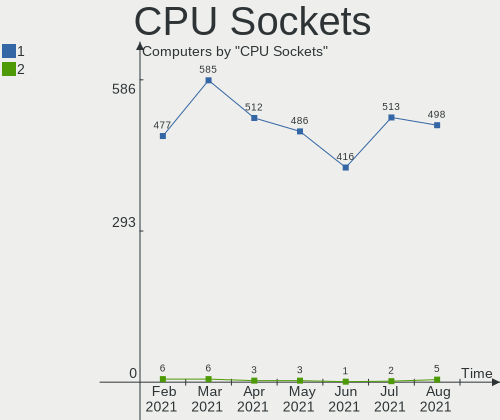

| Number | Computers | Percent |
|--------|-----------|---------|
| 1      | 303       | 99.67%  |
| 2      | 1         | 0.33%   |

CPU Threads
-----------

Threads per core (Hyper-Threading)

| Number | Computers | Percent |
|--------|-----------|---------|
| 2      | 198       | 65.13%  |
| 1      | 106       | 34.87%  |

CPU Op-Modes
------------

CPU Operation Modes (32-bit, 64-bit)

| Op mode        | Computers | Percent |
|----------------|-----------|---------|
| 32-bit, 64-bit | 301       | 99.01%  |
| 32-bit         | 3         | 0.99%   |

CPU Microcode
-------------

Microcode number

| Number     | Computers | Percent |
|------------|-----------|---------|
| Unknown    | 38        | 12.5%   |
| 0x306a9    | 24        | 7.89%   |
| 0x206a7    | 21        | 6.91%   |
| 0x306c3    | 19        | 6.25%   |
| 0x1067a    | 15        | 4.93%   |
| 0x40651    | 12        | 3.95%   |
| 0x906e9    | 9         | 2.96%   |
| 0x08701021 | 9         | 2.96%   |
| 0x20652    | 8         | 2.63%   |
| 0x06000852 | 8         | 2.63%   |
| 0x906ea    | 7         | 2.3%    |
| 0x806ec    | 7         | 2.3%    |
| 0x506e3    | 7         | 2.3%    |
| 0x306d4    | 7         | 2.3%    |
| 0x406e3    | 6         | 1.97%   |
| 0x30678    | 6         | 1.97%   |
| 0x0800820d | 5         | 1.64%   |
| 0x010000c8 | 5         | 1.64%   |
| 0x806ea    | 4         | 1.32%   |
| 0x806e9    | 4         | 1.32%   |
| 0x6fd      | 4         | 1.32%   |
| 0x20655    | 4         | 1.32%   |
| 0x10676    | 4         | 1.32%   |
| 0x08701013 | 4         | 1.32%   |
| 0x06006705 | 4         | 1.32%   |
| 0x706e5    | 3         | 0.99%   |
| 0x6fb      | 3         | 0.99%   |
| 0x106e5    | 3         | 0.99%   |
| 0x08108109 | 3         | 0.99%   |
| 0x0810100b | 3         | 0.99%   |
| 0x0700010f | 3         | 0.99%   |
| 0x06003106 | 3         | 0.99%   |
| 0x0600063e | 3         | 0.99%   |
| 0xf49      | 2         | 0.66%   |
| 0xa0652    | 2         | 0.66%   |
| 0x6e8      | 2         | 0.66%   |
| 0x10661    | 2         | 0.66%   |
| 0x08108102 | 2         | 0.66%   |
| 0x08001138 | 2         | 0.66%   |
| 0x0600611a | 2         | 0.66%   |
| 0x06001119 | 2         | 0.66%   |
| 0xf65      | 1         | 0.33%   |
| 0xf47      | 1         | 0.33%   |
| 0xf29      | 1         | 0.33%   |
| 0xa0655    | 1         | 0.33%   |
| 0x906eb    | 1         | 0.33%   |
| 0x806eb    | 1         | 0.33%   |
| 0x706a1    | 1         | 0.33%   |
| 0x506c9    | 1         | 0.33%   |
| 0x406c3    | 1         | 0.33%   |
| 0x306f1    | 1         | 0.33%   |
| 0x106ca    | 1         | 0.33%   |
| 0x08600106 | 1         | 0.33%   |
| 0x08600104 | 1         | 0.33%   |
| 0x08101007 | 1         | 0.33%   |
| 0x08001136 | 1         | 0.33%   |
| 0x08001126 | 1         | 0.33%   |
| 0x07030105 | 1         | 0.33%   |
| 0x07030104 | 1         | 0.33%   |
| 0x06006704 | 1         | 0.33%   |

CPU Microarch
-------------

Microarchitecture

| Name          | Computers | Percent |
|---------------|-----------|---------|
| Skylake       | 53        | 17.43%  |
| Haswell       | 36        | 11.84%  |
| Core          | 30        | 9.87%   |
| IvyBridge     | 26        | 8.55%   |
| SandyBridge   | 21        | 6.91%   |
| Zen 2         | 16        | 5.26%   |
| Westmere      | 12        | 3.95%   |
| Piledriver    | 11        | 3.62%   |
| K10           | 11        | 3.62%   |
| Zen+          | 10        | 3.29%   |
| Zen           | 10        | 3.29%   |
| Silvermont    | 8         | 2.63%   |
| Excavator     | 8         | 2.63%   |
| KabyLake      | 7         | 2.3%    |
| Broadwell     | 7         | 2.3%    |
| NetBurst      | 6         | 1.97%   |
| IceLake       | 5         | 1.64%   |
| Steamroller   | 4         | 1.32%   |
| Nehalem       | 3         | 0.99%   |
| K8 Hammer     | 3         | 0.99%   |
| Jaguar        | 3         | 0.99%   |
| Bulldozer     | 3         | 0.99%   |
| Puma          | 2         | 0.66%   |
| Penryn        | 2         | 0.66%   |
| P6            | 2         | 0.66%   |
| Bobcat        | 2         | 0.66%   |
| Goldmont plus | 1         | 0.33%   |
| Goldmont      | 1         | 0.33%   |
| Bonnell       | 1         | 0.33%   |

GPU Vendor
----------

Vendors of graphics cards

| Vendor                           | Computers | Percent |
|----------------------------------|-----------|---------|
| Intel                            | 163       | 47.66%  |
| Nvidia                           | 92        | 26.9%   |
| AMD                              | 84        | 24.56%  |
| VIA Technologies                 | 1         | 0.29%   |
| Silicon Integrated Systems [SiS] | 1         | 0.29%   |
| ATI Technologies                 | 1         | 0.29%   |

GPU Model
---------

Graphics card models

| Model                                                                              | Computers | Percent |
|------------------------------------------------------------------------------------|-----------|---------|
| 2nd Generation Core Processor Family Integrated Graphics Controller                | 17        | 4.83%   |
| 3rd Gen Core processor Graphics Controller                                         | 14        | 3.98%   |
| Haswell-ULT Integrated Graphics Controller                                         | 13        | 3.69%   |
| Ellesmere [Radeon RX 470/480/570/570X/580/580X/590]                                | 11        | 3.13%   |
| Mobile 4 Series Chipset Integrated Graphics Controller                             | 10        | 2.84%   |
| UHD Graphics 620 (Whiskey Lake)                                                    | 9         | 2.56%   |
| Core Processor Integrated Graphics Controller                                      | 9         | 2.56%   |
| Skylake GT2 [HD Graphics 520]                                                      | 8         | 2.27%   |
| Xeon E3-1200 v3/4th Gen Core Processor Integrated Graphics Controller              | 7         | 1.99%   |
| HD Graphics 530                                                                    | 7         | 1.99%   |
| HD Graphics 630                                                                    | 6         | 1.7%    |
| HD Graphics 5500                                                                   | 6         | 1.7%    |
| Atom Processor Z36xxx/Z37xxx Series Graphics & Display                             | 6         | 1.7%    |
| 4th Gen Core Processor Integrated Graphics Controller                              | 6         | 1.7%    |
| Stoney [Radeon R2/R3/R4/R5 Graphics]                                               | 5         | 1.42%   |
| Raven Ridge [Radeon Vega Series / Radeon Vega Mobile Series]                       | 5         | 1.42%   |
| GP107 [GeForce GTX 1050 Ti]                                                        | 5         | 1.42%   |
| Xeon E3-1200 v2/3rd Gen Core processor Graphics Controller                         | 4         | 1.14%   |
| UHD Graphics 620                                                                   | 4         | 1.14%   |
| HD Graphics 620                                                                    | 4         | 1.14%   |
| GK208B [GeForce GT 710]                                                            | 4         | 1.14%   |
| UHD Graphics 630 (Mobile)                                                          | 3         | 0.85%   |
| UHD Graphics                                                                       | 3         | 0.85%   |
| TU116 [GeForce GTX 1650 SUPER]                                                     | 3         | 0.85%   |
| RS780L [Radeon 3000]                                                               | 3         | 0.85%   |
| Picasso                                                                            | 3         | 0.85%   |
| Navi 10 [Radeon RX 5600 OEM/5600 XT / 5700/5700 XT]                                | 3         | 0.85%   |
| Kaveri [Radeon R7 Graphics]                                                        | 3         | 0.85%   |
| Iris Plus Graphics G7                                                              | 3         | 0.85%   |
| GP108 [GeForce GT 1030]                                                            | 3         | 0.85%   |
| GP106 [GeForce GTX 1060 6GB]                                                       | 3         | 0.85%   |
| GM107M [GeForce GTX 960M]                                                          | 3         | 0.85%   |
| GF116 [GeForce GTX 550 Ti]                                                         | 3         | 0.85%   |
| Baffin [Radeon RX 460/560D / Pro 450/455/460/555/555X/560/560X]                    | 3         | 0.85%   |
| Wrestler [Radeon HD 7310]                                                          | 2         | 0.57%   |
| Wani [Radeon R5/R6/R7 Graphics]                                                    | 2         | 0.57%   |
| Turks PRO [Radeon HD 6570/7570/8550]                                               | 2         | 0.57%   |
| TU116M [GeForce GTX 1660 Ti Mobile]                                                | 2         | 0.57%   |
| TU104 [GeForce RTX 2060]                                                           | 2         | 0.57%   |
| Sun XT [Radeon HD 8670A/8670M/8690M / R5 M330 / M430 / Radeon 520 Mobile]          | 2         | 0.57%   |
| Renoir                                                                             | 2         | 0.57%   |
| Mullins [Radeon R4/R5 Graphics]                                                    | 2         | 0.57%   |
| Mobile GM965/GL960 Integrated Graphics Controller (secondary)                      | 2         | 0.57%   |
| Mobile GM965/GL960 Integrated Graphics Controller (primary)                        | 2         | 0.57%   |
| Mobile 945GM/GMS/GME, 943/940GML Express Integrated Graphics Controller            | 2         | 0.57%   |
| Mobile 945GM/GMS, 943/940GML Express Integrated Graphics Controller                | 2         | 0.57%   |
| Kabini [Radeon HD 8210]                                                            | 2         | 0.57%   |
| Iris Plus Graphics G1 (Ice Lake)                                                   | 2         | 0.57%   |
| GM108M [GeForce 940M]                                                              | 2         | 0.57%   |
| GM108M [GeForce 840M]                                                              | 2         | 0.57%   |
| GK208B [GeForce GT 730]                                                            | 2         | 0.57%   |
| GK104 [GeForce GTX 770]                                                            | 2         | 0.57%   |
| Cedar [Radeon HD 5000/6000/7350/8350 Series]                                       | 2         | 0.57%   |
| Baffin [Radeon RX 550 640SP / RX 560/560X]                                         | 2         | 0.57%   |
| Atom/Celeron/Pentium Processor x5-E8000/J3xxx/N3xxx Integrated Graphics Controller | 2         | 0.57%   |
| 82945G/GZ Integrated Graphics Controller                                           | 2         | 0.57%   |
| 4th Generation Core Processor Family Integrated Graphics Controller                | 2         | 0.57%   |
| Vega 10 XL/XT [Radeon RX Vega 56/64]                                               | 1         | 0.28%   |
| UHD Graphics 605                                                                   | 1         | 0.28%   |
| TU117 [GeForce GTX 1650]                                                           | 1         | 0.28%   |

GPU Combo
---------

Combinations of graphics cards

| Name           | Computers | Percent |
|----------------|-----------|---------|
| 1 x Intel      | 128       | 42.11%  |
| 1 x AMD        | 72        | 23.68%  |
| 1 x Nvidia     | 65        | 21.38%  |
| Intel + Nvidia | 26        | 8.55%   |
| 2 x AMD        | 5         | 1.64%   |
| Intel + AMD    | 5         | 1.64%   |
| 1 x VIA        | 1         | 0.33%   |
| 1 x SiS        | 1         | 0.33%   |
| AMD + Nvidia   | 1         | 0.33%   |

GPU Driver
----------

Free vs proprietary

| Driver      | Computers | Percent |
|-------------|-----------|---------|
| Free        | 223       | 73.36%  |
| Proprietary | 75        | 24.67%  |
| Unknown     | 6         | 1.97%   |

GPU Memory
----------

Total video memory

| Size in GB | Computers | Percent |
|------------|-----------|---------|
| Unknown    | 142       | 46.71%  |
| 1.01-2.0   | 45        | 14.8%   |
| 0.01-0.5   | 32        | 10.53%  |
| 0.51-1.0   | 31        | 10.2%   |
| 3.01-4.0   | 22        | 7.24%   |
| 7.01-8.0   | 18        | 5.92%   |
| 5.01-6.0   | 10        | 3.29%   |
| 2.01-3.0   | 3         | 0.99%   |
| 8.01-16.0  | 1         | 0.33%   |

Monitor Vendor
--------------

Monitor vendors

| Vendor                  | Computers | Percent |
|-------------------------|-----------|---------|
| Samsung Electronics     | 51        | 15.22%  |
| AU Optronics            | 50        | 14.93%  |
| LG Display              | 25        | 7.46%   |
| BOE                     | 22        | 6.57%   |
| Dell                    | 18        | 5.37%   |
| Philips                 | 13        | 3.88%   |
| Goldstar                | 13        | 3.88%   |
| AOC                     | 13        | 3.88%   |
| Hewlett-Packard         | 12        | 3.58%   |
| Chimei Innolux          | 12        | 3.58%   |
| Acer                    | 11        | 3.28%   |
| Ancor Communications    | 10        | 2.99%   |
| Sharp                   | 7         | 2.09%   |
| LG Philips              | 7         | 2.09%   |
| Lenovo                  | 7         | 2.09%   |
| LG Electronics          | 5         | 1.49%   |
| BenQ                    | 5         | 1.49%   |
| Iiyama                  | 4         | 1.19%   |
| Chi Mei Optoelectronics | 4         | 1.19%   |
| Unknown                 | 3         | 0.9%    |
| Toshiba                 | 3         | 0.9%    |
| Fujitsu Siemens         | 3         | 0.9%    |
| Apple                   | 3         | 0.9%    |
| ViewSonic               | 2         | 0.6%    |
| Sony                    | 2         | 0.6%    |
| PANDA                   | 2         | 0.6%    |
| Panasonic               | 2         | 0.6%    |
| Hitachi                 | 2         | 0.6%    |
| CHR                     | 2         | 0.6%    |
| ASUSTek Computer        | 2         | 0.6%    |
| YTH                     | 1         | 0.3%    |
| Vestel Elektronik       | 1         | 0.3%    |
| Tech Concepts           | 1         | 0.3%    |
| Seiko/Epson             | 1         | 0.3%    |
| Sceptre Tech            | 1         | 0.3%    |
| RS                      | 1         | 0.3%    |
| Planar                  | 1         | 0.3%    |
| Olevia                  | 1         | 0.3%    |
| NEC Computers           | 1         | 0.3%    |
| NCS                     | 1         | 0.3%    |
| Microstep               | 1         | 0.3%    |
| LGD                     | 1         | 0.3%    |
| Insignia                | 1         | 0.3%    |
| InfoVision              | 1         | 0.3%    |
| HannStar Display        | 1         | 0.3%    |
| HannStar                | 1         | 0.3%    |
| FUS                     | 1         | 0.3%    |
| Envision                | 1         | 0.3%    |
| CMN                     | 1         | 0.3%    |
| CHE                     | 1         | 0.3%    |

Monitor Model
-------------

Monitor models

| Model                                               | Computers | Percent |
|-----------------------------------------------------|-----------|---------|
| LCD Monitor AUO23EC 1366x768 344x193mm 15.5-inch    | 5         | 1.43%   |
| LCD Monitor BOE06A5 1366x768 344x194mm 15.5-inch    | 4         | 1.14%   |
| LCD Monitor SEC5441 1366x768 344x194mm 15.5-inch    | 3         | 0.86%   |
| LCD Monitor AUO70EC 1366x768 340x190mm 15.3-inch    | 3         | 0.86%   |
| U2412M DELA07A 1920x1200 518x324mm 24.1-inch        | 2         | 0.57%   |
| SE2719H DELF10D 1920x1080 598x336mm 27.0-inch       | 2         | 0.57%   |
| PLT2336 IVM5628 1920x1080 509x286mm 23.0-inch       | 2         | 0.57%   |
| LCD Monitor SHP1453 1920x1080 346x194mm 15.6-inch   | 2         | 0.57%   |
| LCD Monitor SEC3641 1366x768 353x198mm 15.9-inch    | 2         | 0.57%   |
| LCD Monitor SAM0900 1920x1080 700x390mm 31.5-inch   | 2         | 0.57%   |
| LCD Monitor LGD039F 1366x768 345x194mm 15.6-inch    | 2         | 0.57%   |
| LCD Monitor LGD0259 1920x1080 350x190mm 15.7-inch   | 2         | 0.57%   |
| LCD Monitor CMO15A3 1366x768 344x193mm 15.5-inch    | 2         | 0.57%   |
| LCD Monitor CMN15DB 1366x768 344x193mm 15.5-inch    | 2         | 0.57%   |
| LCD Monitor BOE0812 1920x1080 344x194mm 15.5-inch   | 2         | 0.57%   |
| LCD Monitor BOE05B1 1366x768 309x173mm 13.9-inch    | 2         | 0.57%   |
| LCD Monitor AUO5B2D 1920x1080 293x162mm 13.2-inch   | 2         | 0.57%   |
| LCD Monitor AUO45EC 1366x768 340x190mm 15.3-inch    | 2         | 0.57%   |
| LCD Monitor AUO42EC 1366x768 340x190mm 15.3-inch    | 2         | 0.57%   |
| LCD Monitor AUO38ED 1920x1080 340x190mm 15.3-inch   | 2         | 0.57%   |
| LCD Monitor AUO303C 1366x768 309x173mm 13.9-inch    | 2         | 0.57%   |
| LCD Monitor AUO233C 1366x768 309x173mm 13.9-inch    | 2         | 0.57%   |
| LCD Monitor AUO139E 1600x900 382x214mm 17.2-inch    | 2         | 0.57%   |
| LCD Monitor 1920x1080                               | 2         | 0.57%   |
| L1752T GSM4433 1280x1024 338x270mm 17.0-inch        | 2         | 0.57%   |
| C32F391 SAM0D34 1920x1080 698x393mm 31.5-inch       | 2         | 0.57%   |
| ASUS VS247 ACI249A 1920x1080 521x293mm 23.5-inch    | 2         | 0.57%   |
| 27E1 AOC2701 1920x1080 598x336mm 27.0-inch          | 2         | 0.57%   |
| Z27 HPN3538 3840x2160 597x336mm 27.0-inch           | 1         | 0.29%   |
| Z23n HWP3284 1920x1080 509x286mm 23.0-inch          | 1         | 0.29%   |
| YTH156PC YTH1560 1920x1080 600x330mm 27.0-inch      | 1         | 0.29%   |
| W2261 GSM56CE 1920x1080 477x268mm 21.5-inch         | 1         | 0.29%   |
| w2207 HWP26A8 1680x1050 473x296mm 22.0-inch         | 1         | 0.29%   |
| W1943 GSM4BAE 1360x768 406x229mm 18.4-inch          | 1         | 0.29%   |
| W1942 GSM4B6F 1440x900 408x255mm 18.9-inch          | 1         | 0.29%   |
| VZ249 AUS24CC 1920x1080 527x296mm 23.8-inch         | 1         | 0.29%   |
| VVX13F009G00 MEI96A2 1920x1080 290x170mm 13.2-inch  | 1         | 0.29%   |
| VH240a HPN3499 1920x1080 527x296mm 23.8-inch        | 1         | 0.29%   |
| VG248 ACI24A4 1920x1080 530x300mm 24.0-inch         | 1         | 0.29%   |
| VG2439 SERIES VSCD22B 1920x1080 521x293mm 23.5-inch | 1         | 0.29%   |
| VE248 ACI2494 1920x1080 531x299mm 24.0-inch         | 1         | 0.29%   |
| V246HL ACR032E 1920x1080 531x299mm 24.0-inch        | 1         | 0.29%   |
| V223HQ ACR0070 1920x1080 477x268mm 21.5-inch        | 1         | 0.29%   |
| V206HQL ACR0334 1280x1024 430x240mm 19.4-inch       | 1         | 0.29%   |
| U4919DW DELA10D 3840x1080 1198x337mm 49.0-inch      | 1         | 0.29%   |
| U32J59x SAM0F35 3840x2160 697x392mm 31.5-inch       | 1         | 0.29%   |
| U2718Q DELA0EC 3840x2160 609x349mm 27.6-inch        | 1         | 0.29%   |
| U2715H DELD066 1920x1080 600x340mm 27.2-inch        | 1         | 0.29%   |
| U2417H DEL40E8 1920x1080 527x296mm 23.8-inch        | 1         | 0.29%   |
| U2414H DELA0B2 1920x1080 530x300mm 24.0-inch        | 1         | 0.29%   |
| U2412M DELA07B 1920x1200 518x324mm 24.1-inch        | 1         | 0.29%   |
| TV TSB0206 1920x1080 886x498mm 40.0-inch            | 1         | 0.29%   |
| TV SNY2C02 1920x1080 708x398mm 32.0-inch            | 1         | 0.29%   |
| TV MEIC329 1920x1080 698x392mm 31.5-inch            | 1         | 0.29%   |
| T27B300 SAM0931 1920x1080 598x336mm 27.0-inch       | 1         | 0.29%   |
| T24D391 SAM0B73 1920x1080 521x293mm 23.5-inch       | 1         | 0.29%   |
| T24C350 SAM0ABF 1920x1080 530x300mm 24.0-inch       | 1         | 0.29%   |
| SyncMaster SAM0440 1920x1200 518x324mm 24.1-inch    | 1         | 0.29%   |
| SyncMaster SAM03E5 1680x1050 470x300mm 22.0-inch    | 1         | 0.29%   |
| SyncMaster SAM0377 1440x900 410x257mm 19.1-inch     | 1         | 0.29%   |

Monitor Resolution
------------------

Monitor screen resolution

| Resolution         | Computers | Percent |
|--------------------|-----------|---------|
| 1920x1080 (FHD)    | 125       | 38.34%  |
| 1366x768 (WXGA)    | 91        | 27.91%  |
| 1280x800 (WXGA)    | 13        | 3.99%   |
| 1280x1024 (SXGA)   | 13        | 3.99%   |
| 1600x900 (HD+)     | 11        | 3.37%   |
| Unknown            | 10        | 3.07%   |
| 3840x2160 (4K)     | 9         | 2.76%   |
| 1680x1050 (WSXGA+) | 9         | 2.76%   |
| 2560x1440 (QHD)    | 8         | 2.45%   |
| 1920x1200 (WUXGA)  | 7         | 2.15%   |
| 1440x900 (WXGA+)   | 6         | 1.84%   |
| 3840x1080          | 5         | 1.53%   |
| 1360x768           | 5         | 1.53%   |
| 3200x1800 (QHD+)   | 2         | 0.61%   |
| 2560x1600          | 2         | 0.61%   |
| 7040x1440          | 1         | 0.31%   |
| 4480x1440          | 1         | 0.31%   |
| 3600x1080          | 1         | 0.31%   |
| 3360x1050          | 1         | 0.31%   |
| 3286x1080          | 1         | 0.31%   |
| 3200x1200          | 1         | 0.31%   |
| 2736x1824          | 1         | 0.31%   |
| 1920x540           | 1         | 0.31%   |
| 1024x768 (XGA)     | 1         | 0.31%   |
| 1024x600           | 1         | 0.31%   |

Monitor Diagonal
----------------

Diagonal size in inches

| Inches  | Computers | Percent |
|---------|-----------|---------|
| 15      | 93        | 28.01%  |
| Unknown | 30        | 9.04%   |
| 13      | 29        | 8.73%   |
| 23      | 24        | 7.23%   |
| 27      | 23        | 6.93%   |
| 21      | 20        | 6.02%   |
| 17      | 18        | 5.42%   |
| 14      | 17        | 5.12%   |
| 24      | 16        | 4.82%   |
| 18      | 9         | 2.71%   |
| 31      | 7         | 2.11%   |
| 19      | 6         | 1.81%   |
| 12      | 6         | 1.81%   |
| 22      | 5         | 1.51%   |
| 40      | 4         | 1.2%    |
| 26      | 4         | 1.2%    |
| 20      | 4         | 1.2%    |
| 37      | 3         | 0.9%    |
| 32      | 3         | 0.9%    |
| 11      | 3         | 0.9%    |
| 25      | 2         | 0.6%    |
| 49      | 1         | 0.3%    |
| 39      | 1         | 0.3%    |
| 30      | 1         | 0.3%    |
| 29      | 1         | 0.3%    |
| 28      | 1         | 0.3%    |
| 10      | 1         | 0.3%    |

Monitor Width
-------------

Physical width

| Width in mm | Computers | Percent |
|-------------|-----------|---------|
| 301-350     | 134       | 40.98%  |
| 501-600     | 63        | 19.27%  |
| 401-500     | 40        | 12.23%  |
| Unknown     | 30        | 9.17%   |
| 201-300     | 20        | 6.12%   |
| 351-400     | 17        | 5.2%    |
| 601-700     | 11        | 3.36%   |
| 801-900     | 8         | 2.45%   |
| 701-800     | 3         | 0.92%   |
| 1001-1500   | 1         | 0.31%   |

Aspect Ratio
------------

Proportional relationship between the width and the height

| Ratio   | Computers | Percent |
|---------|-----------|---------|
| 16/9    | 222       | 74.25%  |
| 16/10   | 33        | 11.04%  |
| Unknown | 30        | 10.03%  |
| 5/4     | 9         | 3.01%   |
| 4/3     | 2         | 0.67%   |
| 32/9    | 2         | 0.67%   |
| 3/2     | 1         | 0.33%   |

Monitor Area
------------

Area in inch²

| Area in inch² | Computers | Percent |
|----------------|-----------|---------|
| 101-110        | 90        | 27.27%  |
| 201-250        | 45        | 13.64%  |
| 81-90          | 36        | 10.91%  |
| Unknown        | 30        | 9.09%   |
| 151-200        | 28        | 8.48%   |
| 301-350        | 23        | 6.97%   |
| 351-500        | 13        | 3.94%   |
| 121-130        | 13        | 3.94%   |
| 71-80          | 12        | 3.64%   |
| 141-150        | 11        | 3.33%   |
| 251-300        | 9         | 2.73%   |
| 501-1000       | 9         | 2.73%   |
| 61-70          | 4         | 1.21%   |
| 51-60          | 3         | 0.91%   |
| 91-100         | 2         | 0.61%   |
| 41-50          | 1         | 0.3%    |
| 111-120        | 1         | 0.3%    |

Pixel Density
-------------

Pixels per inch

| Density       | Computers | Percent |
|---------------|-----------|---------|
| 101-120       | 113       | 35.31%  |
| 51-100        | 105       | 32.81%  |
| 121-160       | 54        | 16.88%  |
| Unknown       | 30        | 9.38%   |
| 161-240       | 10        | 3.13%   |
| More than 240 | 5         | 1.56%   |
| 1-50          | 3         | 0.94%   |

Multiple Monitors
-----------------

Total monitors connected

| Total | Computers | Percent |
|-------|-----------|---------|
| 1     | 239       | 78.62%  |
| 2     | 53        | 17.43%  |
| 0     | 9         | 2.96%   |
| 3     | 3         | 0.99%   |

Net Controller Vendor
---------------------

Controller vendors

| Vendor                            | Computers | Percent |
|-----------------------------------|-----------|---------|
| Realtek Semiconductor             | 180       | 38.22%  |
| Intel                             | 109       | 23.14%  |
| Qualcomm Atheros                  | 90        | 19.11%  |
| Broadcom Inc. and subsidiaries    | 23        | 4.88%   |
| Ralink                            | 11        | 2.34%   |
| TP-Link                           | 8         | 1.7%    |
| Ralink Technology                 | 8         | 1.7%    |
| Broadcom Limited                  | 6         | 1.27%   |
| Nvidia                            | 4         | 0.85%   |
| Samsung Electronics               | 3         | 0.64%   |
| Marvell Technology Group          | 3         | 0.64%   |
| ASUSTek Computer                  | 3         | 0.64%   |
| Qualcomm Atheros Communications   | 2         | 0.42%   |
| MediaTek                          | 2         | 0.42%   |
| DisplayLink                       | 2         | 0.42%   |
| D-Link System                     | 2         | 0.42%   |
| D-Link                            | 2         | 0.42%   |
| ZTE WCDMA Technologies MSM        | 1         | 0.21%   |
| Xiaomi                            | 1         | 0.21%   |
| VIA Technologies                  | 1         | 0.21%   |
| Silicon Integrated Systems [SiS]  | 1         | 0.21%   |
| Netchip Technology                | 1         | 0.21%   |
| Microsoft                         | 1         | 0.21%   |
| Mellanox Technologies             | 1         | 0.21%   |
| IMC Networks                      | 1         | 0.21%   |
| Hewlett-Packard                   | 1         | 0.21%   |
| FIBOCOM                           | 1         | 0.21%   |
| Ericsson Business Mobile Networks | 1         | 0.21%   |
| AVM                               | 1         | 0.21%   |
| ASIX Electronics                  | 1         | 0.21%   |

Net Controller Model
--------------------

Controller models

| Model                                                               | Computers | Percent |
|---------------------------------------------------------------------|-----------|---------|
| RTL8111/8168/8411 PCI Express Gigabit Ethernet Controller           | 127       | 22.72%  |
| RTL810xE PCI Express Fast Ethernet controller                       | 34        | 6.08%   |
| AR9485 Wireless Network Adapter                                     | 15        | 2.68%   |
| AR9285 Wireless Network Adapter (PCI-Express)                       | 14        | 2.5%    |
| QCA9565 / AR9565 Wireless Network Adapter                           | 11        | 1.97%   |
| Wireless 7260                                                       | 10        | 1.79%   |
| QCA9377 802.11ac Wireless Network Adapter                           | 10        | 1.79%   |
| RTL8821CE 802.11ac PCIe Wireless Network Adapter                    | 8         | 1.43%   |
| I211 Gigabit Network Connection                                     | 8         | 1.43%   |
| QCA6174 802.11ac Wireless Network Adapter                           | 7         | 1.25%   |
| Dual Band Wireless-AC 3168NGW [Stone Peak]                          | 7         | 1.25%   |
| AR8121/AR8113/AR8114 Gigabit or Fast Ethernet                       | 7         | 1.25%   |
| Wireless 8260                                                       | 6         | 1.07%   |
| Wireless 3165                                                       | 6         | 1.07%   |
| Wi-Fi 6 AX200                                                       | 6         | 1.07%   |
| RTL-8100/8101L/8139 PCI Fast Ethernet Adapter                       | 6         | 1.07%   |
| Killer E220x Gigabit Ethernet Controller                            | 6         | 1.07%   |
| Wireless-AC 9560 [Jefferson Peak]                                   | 5         | 0.89%   |
| Wireless 8265 / 8275                                                | 5         | 0.89%   |
| RT3290 Wireless 802.11n 1T/1R PCIe                                  | 5         | 0.89%   |
| Ethernet Connection (2) I218-V                                      | 5         | 0.89%   |
| Centrino Advanced-N 6200                                            | 5         | 0.89%   |
| AR8151 v2.0 Gigabit Ethernet                                        | 5         | 0.89%   |
| 82579LM Gigabit Network Connection (Lewisville)                     | 5         | 0.89%   |
| 82577LM Gigabit Network Connection                                  | 5         | 0.89%   |
| RTL8723BE PCIe Wireless Network Adapter                             | 4         | 0.72%   |
| RTL8153 Gigabit Ethernet Adapter                                    | 4         | 0.72%   |
| RTL8125 2.5GbE Controller                                           | 4         | 0.72%   |
| Killer E2400 Gigabit Ethernet Controller                            | 4         | 0.72%   |
| Ethernet Connection I217-V                                          | 4         | 0.72%   |
| Ethernet Connection (2) I219-V                                      | 4         | 0.72%   |
| Centrino Advanced-N 6205 [Taylor Peak]                              | 4         | 0.72%   |
| BCM43142 802.11b/g/n                                                | 4         | 0.72%   |
| 802.11ac NIC                                                        | 4         | 0.72%   |
| Wireless-AC 9260                                                    | 3         | 0.54%   |
| Wireless 7265                                                       | 3         | 0.54%   |
| TL WN823N RTL8192EU                                                 | 3         | 0.54%   |
| RTL8723DE Wireless Network Adapter                                  | 3         | 0.54%   |
| RTL8188EE Wireless Network Adapter                                  | 3         | 0.54%   |
| QCA8171 Gigabit Ethernet                                            | 3         | 0.54%   |
| PRO/Wireless 3945ABG [Golan] Network Connection                     | 3         | 0.54%   |
| MT7601U Wireless Adapter                                            | 3         | 0.54%   |
| MCP61 Ethernet                                                      | 3         | 0.54%   |
| Killer Wi-Fi 6 AX1650i 160MHz Wireless Network Adapter (201NGW)     | 3         | 0.54%   |
| Galaxy series, misc. (tethering mode)                               | 3         | 0.54%   |
| Ethernet Connection (6) I219-V                                      | 3         | 0.54%   |
| AR93xx Wireless Network Adapter                                     | 3         | 0.54%   |
| AR928X Wireless Network Adapter (PCI-Express)                       | 3         | 0.54%   |
| AR9287 Wireless Network Adapter (PCI-Express)                       | 3         | 0.54%   |
| AR8161 Gigabit Ethernet                                             | 3         | 0.54%   |
| Wireless 3160                                                       | 2         | 0.36%   |
| TP-Link TL-WN821N v3 / TL-WN822N v2 802.11n [Atheros AR7010+AR9287] | 2         | 0.36%   |
| RTL8822BE 802.11a/b/g/n/ac WiFi adapter                             | 2         | 0.36%   |
| RTL8192CU 802.11n WLAN Adapter                                      | 2         | 0.36%   |
| RT5390R 802.11bgn PCIe Wireless Network Adapter                     | 2         | 0.36%   |
| QCA8172 Fast Ethernet                                               | 2         | 0.36%   |
| NetXtreme BCM5762 Gigabit Ethernet PCIe                             | 2         | 0.36%   |
| NetXtreme BCM5751 Gigabit Ethernet PCI Express                      | 2         | 0.36%   |
| NetLink BCM5906M Fast Ethernet PCI Express                          | 2         | 0.36%   |
| NetLink BCM57785 Gigabit Ethernet PCIe                              | 2         | 0.36%   |

Wireless Vendor
---------------

Wireless vendors

| Vendor                          | Computers | Percent |
|---------------------------------|-----------|---------|
| Intel                           | 82        | 33.61%  |
| Qualcomm Atheros                | 68        | 27.87%  |
| Realtek Semiconductor           | 37        | 15.16%  |
| Broadcom Inc. and subsidiaries  | 16        | 6.56%   |
| Ralink                          | 11        | 4.51%   |
| TP-Link                         | 8         | 3.28%   |
| Ralink Technology               | 8         | 3.28%   |
| ASUSTek Computer                | 3         | 1.23%   |
| Qualcomm Atheros Communications | 2         | 0.82%   |
| D-Link                          | 2         | 0.82%   |
| Microsoft                       | 1         | 0.41%   |
| MediaTek                        | 1         | 0.41%   |
| IMC Networks                    | 1         | 0.41%   |
| FIBOCOM                         | 1         | 0.41%   |
| D-Link System                   | 1         | 0.41%   |
| Broadcom Limited                | 1         | 0.41%   |
| AVM                             | 1         | 0.41%   |

Wireless Model
--------------

Wireless models

| Model                                                                | Computers | Percent |
|----------------------------------------------------------------------|-----------|---------|
| AR9485 Wireless Network Adapter                                      | 15        | 6.15%   |
| AR9285 Wireless Network Adapter (PCI-Express)                        | 14        | 5.74%   |
| QCA9565 / AR9565 Wireless Network Adapter                            | 11        | 4.51%   |
| Wireless 7260                                                        | 10        | 4.1%    |
| QCA9377 802.11ac Wireless Network Adapter                            | 10        | 4.1%    |
| RTL8821CE 802.11ac PCIe Wireless Network Adapter                     | 8         | 3.28%   |
| QCA6174 802.11ac Wireless Network Adapter                            | 7         | 2.87%   |
| Dual Band Wireless-AC 3168NGW [Stone Peak]                           | 7         | 2.87%   |
| Wireless 8260                                                        | 6         | 2.46%   |
| Wireless 3165                                                        | 6         | 2.46%   |
| Wi-Fi 6 AX200                                                        | 6         | 2.46%   |
| Wireless-AC 9560 [Jefferson Peak]                                    | 5         | 2.05%   |
| Wireless 8265 / 8275                                                 | 5         | 2.05%   |
| RT3290 Wireless 802.11n 1T/1R PCIe                                   | 5         | 2.05%   |
| Centrino Advanced-N 6200                                             | 5         | 2.05%   |
| RTL8723BE PCIe Wireless Network Adapter                              | 4         | 1.64%   |
| Centrino Advanced-N 6205 [Taylor Peak]                               | 4         | 1.64%   |
| BCM43142 802.11b/g/n                                                 | 4         | 1.64%   |
| 802.11ac NIC                                                         | 4         | 1.64%   |
| Wireless-AC 9260                                                     | 3         | 1.23%   |
| Wireless 7265                                                        | 3         | 1.23%   |
| TL WN823N RTL8192EU                                                  | 3         | 1.23%   |
| RTL8723DE Wireless Network Adapter                                   | 3         | 1.23%   |
| RTL8188EE Wireless Network Adapter                                   | 3         | 1.23%   |
| PRO/Wireless 3945ABG [Golan] Network Connection                      | 3         | 1.23%   |
| MT7601U Wireless Adapter                                             | 3         | 1.23%   |
| Killer Wi-Fi 6 AX1650i 160MHz Wireless Network Adapter (201NGW)      | 3         | 1.23%   |
| AR93xx Wireless Network Adapter                                      | 3         | 1.23%   |
| AR928X Wireless Network Adapter (PCI-Express)                        | 3         | 1.23%   |
| AR9287 Wireless Network Adapter (PCI-Express)                        | 3         | 1.23%   |
| Wireless 3160                                                        | 2         | 0.82%   |
| TP-Link TL-WN821N v3 / TL-WN822N v2 802.11n [Atheros AR7010+AR9287]  | 2         | 0.82%   |
| RTL8822BE 802.11a/b/g/n/ac WiFi adapter                              | 2         | 0.82%   |
| RTL8192CU 802.11n WLAN Adapter                                       | 2         | 0.82%   |
| RT5390R 802.11bgn PCIe Wireless Network Adapter                      | 2         | 0.82%   |
| Comet Lake PCH CNVi WiFi                                             | 2         | 0.82%   |
| Centrino Wireless-N 2230                                             | 2         | 0.82%   |
| Centrino Ultimate-N 6300                                             | 2         | 0.82%   |
| BCM43602 802.11ac Wireless LAN SoC                                   | 2         | 0.82%   |
| BCM4311 802.11b/g WLAN                                               | 2         | 0.82%   |
| 802.11ac WLAN Adapter                                                | 2         | 0.82%   |
| Xbox 360 Wireless Adapter                                            | 1         | 0.41%   |
| Wireless                                                             | 1         | 0.41%   |
| WiFi Link 5100                                                       | 1         | 0.41%   |
| USB3.0 802.11ac 1200M Adapter                                        | 1         | 0.41%   |
| USB-N13 802.11n Network Adapter (rev. B1) [Realtek RTL8192CU]        | 1         | 0.41%   |
| USB-AC68 802.11a/b/g/n/ac (4x4) Wireless Adapter [Realtek RTL8814AU] | 1         | 0.41%   |
| Ultimate N WiFi Link 5300                                            | 1         | 0.41%   |
| TL-WN821N Version 5 RTL8192EU                                        | 1         | 0.41%   |
| TL-WN722N v2                                                         | 1         | 0.41%   |
| RTL8822CE 802.11ac PCIe Wireless Network Adapter                     | 1         | 0.41%   |
| RTL8821AE 802.11ac PCIe Wireless Network Adapter                     | 1         | 0.41%   |
| RTL8812AE 802.11ac PCIe Wireless Network Adapter                     | 1         | 0.41%   |
| RTL8723AE PCIe Wireless Network Adapter                              | 1         | 0.41%   |
| RTL8192EU 802.11b/g/n WLAN Adapter                                   | 1         | 0.41%   |
| RTL8191SU 802.11n WLAN Adapter                                       | 1         | 0.41%   |
| RTL8188EUS 802.11n Wireless Network Adapter                          | 1         | 0.41%   |
| RTL8188CE 802.11b/g/n WiFi Adapter                                   | 1         | 0.41%   |
| RTL8187 Wireless Adapter                                             | 1         | 0.41%   |
| RTL-8185 IEEE 802.11a/b/g Wireless LAN Controller                    | 1         | 0.41%   |

Ethernet Vendor
---------------

Ethernet vendors

| Vendor                           | Computers | Percent |
|----------------------------------|-----------|---------|
| Realtek Semiconductor            | 174       | 56.86%  |
| Intel                            | 57        | 18.63%  |
| Qualcomm Atheros                 | 39        | 12.75%  |
| Broadcom Inc. and subsidiaries   | 10        | 3.27%   |
| Broadcom Limited                 | 5         | 1.63%   |
| Nvidia                           | 4         | 1.31%   |
| Samsung Electronics              | 3         | 0.98%   |
| Marvell Technology Group         | 3         | 0.98%   |
| DisplayLink                      | 2         | 0.65%   |
| ZTE WCDMA Technologies MSM       | 1         | 0.33%   |
| Xiaomi                           | 1         | 0.33%   |
| VIA Technologies                 | 1         | 0.33%   |
| Silicon Integrated Systems [SiS] | 1         | 0.33%   |
| Netchip Technology               | 1         | 0.33%   |
| Mellanox Technologies            | 1         | 0.33%   |
| MediaTek                         | 1         | 0.33%   |
| D-Link System                    | 1         | 0.33%   |
| ASIX Electronics                 | 1         | 0.33%   |

Ethernet Model
--------------

Ethernet models

| Model                                                     | Computers | Percent |
|-----------------------------------------------------------|-----------|---------|
| RTL8111/8168/8411 PCI Express Gigabit Ethernet Controller | 127       | 40.58%  |
| RTL810xE PCI Express Fast Ethernet controller             | 34        | 10.86%  |
| I211 Gigabit Network Connection                           | 8         | 2.56%   |
| AR8121/AR8113/AR8114 Gigabit or Fast Ethernet             | 7         | 2.24%   |
| RTL-8100/8101L/8139 PCI Fast Ethernet Adapter             | 6         | 1.92%   |
| Killer E220x Gigabit Ethernet Controller                  | 6         | 1.92%   |
| Ethernet Connection (2) I218-V                            | 5         | 1.6%    |
| AR8151 v2.0 Gigabit Ethernet                              | 5         | 1.6%    |
| 82579LM Gigabit Network Connection (Lewisville)           | 5         | 1.6%    |
| 82577LM Gigabit Network Connection                        | 5         | 1.6%    |
| RTL8153 Gigabit Ethernet Adapter                          | 4         | 1.28%   |
| RTL8125 2.5GbE Controller                                 | 4         | 1.28%   |
| Killer E2400 Gigabit Ethernet Controller                  | 4         | 1.28%   |
| Ethernet Connection I217-V                                | 4         | 1.28%   |
| Ethernet Connection (2) I219-V                            | 4         | 1.28%   |
| QCA8171 Gigabit Ethernet                                  | 3         | 0.96%   |
| MCP61 Ethernet                                            | 3         | 0.96%   |
| Galaxy series, misc. (tethering mode)                     | 3         | 0.96%   |
| Ethernet Connection (6) I219-V                            | 3         | 0.96%   |
| AR8161 Gigabit Ethernet                                   | 3         | 0.96%   |
| QCA8172 Fast Ethernet                                     | 2         | 0.64%   |
| NetXtreme BCM5762 Gigabit Ethernet PCIe                   | 2         | 0.64%   |
| NetXtreme BCM5751 Gigabit Ethernet PCI Express            | 2         | 0.64%   |
| NetLink BCM5906M Fast Ethernet PCI Express                | 2         | 0.64%   |
| NetLink BCM57785 Gigabit Ethernet PCIe                    | 2         | 0.64%   |
| I210 Gigabit Network Connection                           | 2         | 0.64%   |
| Ethernet Connection I219-LM                               | 2         | 0.64%   |
| Ethernet Connection I218-LM                               | 2         | 0.64%   |
| Ethernet Connection (5) I219-LM                           | 2         | 0.64%   |
| Ethernet Connection (2) I219-LM                           | 2         | 0.64%   |
| AR8151 v1.0 Gigabit Ethernet                              | 2         | 0.64%   |
| AR8131 Gigabit Ethernet                                   | 2         | 0.64%   |
| 82579V Gigabit Network Connection                         | 2         | 0.64%   |
| 82567LM Gigabit Network Connection                        | 2         | 0.64%   |
| VT6102/VT6103 [Rhine-II]                                  | 1         | 0.32%   |
| Targus USB3.0 DV2K Dock w Power                           | 1         | 0.32%   |
| RTL8169 PCI Gigabit Ethernet Controller                   | 1         | 0.32%   |
| RTL8152 Fast Ethernet Adapter                             | 1         | 0.32%   |
| RTL8139 Ethernet                                          | 1         | 0.32%   |
| PRO/100 VE Network Connection                             | 1         | 0.32%   |
| Osprey Emulation Wireless Network Adapter                 | 1         | 0.32%   |
| Nokia 3.1                                                 | 1         | 0.32%   |
| NetXtreme BCM57766 Gigabit Ethernet PCIe                  | 1         | 0.32%   |
| NetXtreme BCM57765 Gigabit Ethernet PCIe                  | 1         | 0.32%   |
| NetXtreme BCM5764M Gigabit Ethernet PCIe                  | 1         | 0.32%   |
| NetXtreme BCM5755M Gigabit Ethernet PCI Express           | 1         | 0.32%   |
| NetXtreme BCM5754 Gigabit Ethernet PCI Express            | 1         | 0.32%   |
| NetLink BCM57780 Gigabit Ethernet PCIe                    | 1         | 0.32%   |
| MT27500 Family [ConnectX-3]                               | 1         | 0.32%   |
| Mi/Redmi series (RNDIS)                                   | 1         | 0.32%   |
| MCP77 Ethernet                                            | 1         | 0.32%   |
| Linux-USB Ethernet/RNDIS Gadget                           | 1         | 0.32%   |
| Ethernet Connection I219-V                                | 1         | 0.32%   |
| Ethernet Connection I217-LM                               | 1         | 0.32%   |
| Ethernet Connection (7) I219-V                            | 1         | 0.32%   |
| Ethernet Connection (4) I219-V                            | 1         | 0.32%   |
| Ethernet Connection (3) I218-LM                           | 1         | 0.32%   |
| Dell Universal Dock D6000                                 | 1         | 0.32%   |
| CD-Rom                                                    | 1         | 0.32%   |
| BCM4401-B0 100Base-TX                                     | 1         | 0.32%   |

Net Controller Kind
-------------------

Ethernet, WiFi or modem

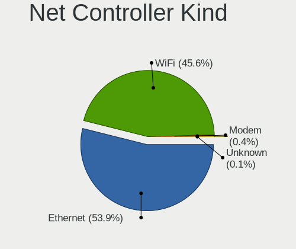

| Kind     | Computers | Percent |
|----------|-----------|---------|
| Ethernet | 288       | 55.38%  |
| WiFi     | 230       | 44.23%  |
| Modem    | 1         | 0.19%   |
| Unknown  | 1         | 0.19%   |

Used Controller
---------------

Currently used network controller

| Kind     | Computers | Percent |
|----------|-----------|---------|
| Ethernet | 223       | 52.22%  |
| WiFi     | 203       | 47.54%  |
| Modem    | 1         | 0.23%   |

NICs
----

Total network controllers on board

| Total | Computers | Percent |
|-------|-----------|---------|
| 2     | 192       | 63.16%  |
| 1     | 104       | 34.21%  |
| 3     | 5         | 1.64%   |
| 0     | 3         | 0.99%   |

Memory Vendor
-------------

Memory module vendors

| Vendor              | Computers | Percent |
|---------------------|-----------|---------|
| Samsung Electronics | 29        | 20.42%  |
| Kingston            | 19        | 13.38%  |
| Unknown             | 18        | 12.68%  |
| SK Hynix            | 17        | 11.97%  |
| Corsair             | 13        | 9.15%   |
| Crucial             | 10        | 7.04%   |
| G.Skill             | 6         | 4.23%   |
| Ramaxel Technology  | 5         | 3.52%   |
| SMART               | 4         | 2.82%   |
| Micron Technology   | 4         | 2.82%   |
| Elpida              | 3         | 2.11%   |
| A-DATA Technology   | 3         | 2.11%   |
| Nanya Technology    | 2         | 1.41%   |
| AMD                 | 2         | 1.41%   |
| Unknown (090E)      | 1         | 0.7%    |
| Unifosa             | 1         | 0.7%    |
| Team                | 1         | 0.7%    |
| SMART Brazil        | 1         | 0.7%    |
| High Bridge         | 1         | 0.7%    |
| ASint Technology    | 1         | 0.7%    |
| Apacer              | 1         | 0.7%    |

Memory Model
------------

Memory module models

| Model                                                | Computers | Percent |
|------------------------------------------------------|-----------|---------|
| RAM M471B5173DB0-YK0 4096MB SODIMM DDR3 1600MT/s     | 3         | 1.95%   |
| RAM M471A1K43DB1-CTD 8192MB SODIMM DDR4 2667MT/s     | 3         | 1.95%   |
| RAM SMS4TDC3C0K0446SCG 4096MB SODIMM DDR4 2667MT/s   | 2         | 1.3%    |
| RAM SH564128FJ8NWRNSQG 4096MB SODIMM DDR3 1600MT/s   | 2         | 1.3%    |
| RAM Module 8192MB SODIMM DDR4 2667MT/s               | 2         | 1.3%    |
| RAM Module 8192MB DIMM DDR3 1600MT/s                 | 2         | 1.3%    |
| RAM Module 4096MB DIMM 1333MT/s                      | 2         | 1.3%    |
| RAM Module 2048MB DIMM DDR3 1333MT/s                 | 2         | 1.3%    |
| RAM M471B5273DH0-CK0 4096MB SODIMM DDR3 1600MT/s     | 2         | 1.3%    |
| RAM M471A5244CB0-CTD 4096MB SODIMM DDR4 2667MT/s     | 2         | 1.3%    |
| RAM M471A2K43CB1-CTD 16GB SODIMM DDR4 2667MT/s       | 2         | 1.3%    |
| RAM M471A1K43BB0-CPB 8192MB SODIMM DDR4 2133MT/s     | 2         | 1.3%    |
| RAM KHX2400C15/8G 8192MB DIMM DDR4 2933MT/s          | 2         | 1.3%    |
| RAM HMT451U6BFR8A-PB 4096MB DIMM DDR3 1600MT/s       | 2         | 1.3%    |
| RAM HMT351S6CFR8C-PB 4GB SODIMM DDR3 1600MT/s        | 2         | 1.3%    |
| RAM CT102464BF160B.C16 8192MB SODIMM DDR3 1600MT/s   | 2         | 1.3%    |
| RAM 99U5428-063.A00LF 8192MB SODIMM DDR3 1600MT/s    | 2         | 1.3%    |
| RAM V03D4SF8GB5285282400 8192MB SODIMM DDR4 2133MT/s | 1         | 0.65%   |
| RAM TEAMGROUP-UD4-3200 16384MB DIMM DDR4 3200MT/s    | 1         | 0.65%   |
| RAM SH5641G8FJ8NWRNSQG 8192MB SODIMM DDR3 1600MT/s   | 1         | 0.65%   |
| RAM SH564128FJ8NZRNSDG 4096MB SODIMM DDR3 1600MT/s   | 1         | 0.65%   |
| RAM RMT3020EC58E9F1333 4096MB SODIMM DDR3 4199MT/s   | 1         | 0.65%   |
| RAM RMSA3260NA78HAF-2400 8192MB SODIMM DDR4 2400MT/s | 1         | 0.65%   |
| RAM RMSA3260MH78HAF-2666 8192MB SODIMM DDR4 2400MT/s | 1         | 0.65%   |
| RAM RMSA3260ME78HAF-2666 8GB SODIMM DDR4 2667MT/s    | 1         | 0.65%   |
| RAM RMSA3230KB78HAF2133 8192MB SODIMM DDR4 2133MT/s  | 1         | 0.65%   |
| RAM R538G1601S2SL-U 8192MB SODIMM DDR3 1600MT/s      | 1         | 0.65%   |
| RAM NT2GC64B8HC0NS-CG 2GB DIMM DDR3 1334MT/s         | 1         | 0.65%   |
| RAM MT52L256M32D1PF107 2048MB SODIMM LPDDR3 1776MT/s | 1         | 0.65%   |
| RAM MT41K512M8RH-125:E 4096MB SODIMM DDR3 1600MT/s   | 1         | 0.65%   |
| RAM Module 8192MB SODIMM DDR4 3200MT/s               | 1         | 0.65%   |
| RAM Module 8192MB Row Of Chips LPDDR4 4267MT/s       | 1         | 0.65%   |
| RAM Module 8192MB DIMM DDR3 1333MT/s                 | 1         | 0.65%   |
| RAM Module 8192MB DIMM 1600MT/s                      | 1         | 0.65%   |
| RAM Module 4096MB SODIMM DDR3 1600MT/s               | 1         | 0.65%   |
| RAM Module 4096MB SODIMM DDR3                        | 1         | 0.65%   |
| RAM Module 4096MB DIMM DDR3 667MT/s                  | 1         | 0.65%   |
| RAM Module 4096MB DIMM DDR3 1333MT/s                 | 1         | 0.65%   |
| RAM Module 4096MB DIMM 667MT/s                       | 1         | 0.65%   |
| RAM Module 256MB DIMM SDRAM                          | 1         | 0.65%   |
| RAM Module 2048MB DIMM SDRAM                         | 1         | 0.65%   |
| RAM Module 2048MB DIMM DDR2 800MT/s                  | 1         | 0.65%   |
| RAM Module 2048MB DIMM DDR2 667MT/s                  | 1         | 0.65%   |
| RAM Module 2048MB DIMM 667MT/s                       | 1         | 0.65%   |
| RAM Module 2048MB DIMM 1333MHz                       | 1         | 0.65%   |
| RAM Module 16384MB SODIMM DDR4 2667MT/s              | 1         | 0.65%   |
| RAM Module 16384MB SODIMM DDR4 2400MT/s              | 1         | 0.65%   |
| RAM Module 1024MB DIMM DDR2 800MT/s                  | 1         | 0.65%   |
| RAM MENTAL16G3200 16384MB SODIMM DDR4 3200MT/s       | 1         | 0.65%   |
| RAM M471B5273DH0-CH9 4096MB SODIMM DDR3 1334MT/s     | 1         | 0.65%   |
| RAM M471B5273CH0-CK0 4096MB SODIMM DDR3 1600MT/s     | 1         | 0.65%   |
| RAM M471B5173EB0-YK0 4096MB SODIMM DDR3 1600MT/s     | 1         | 0.65%   |
| RAM M471B1G73QH0-YK0 8192MB SODIMM DDR3 1600MT/s     | 1         | 0.65%   |
| RAM M471B1G73DB0-YK0 8192MB SODIMM DDR3 1600MT/s     | 1         | 0.65%   |
| RAM M471A5244BB0-CRC 4096MB SODIMM DDR4 2400MT/s     | 1         | 0.65%   |
| RAM M471A2K43CB1-CRC 16GB SODIMM DDR4 2667MT/s       | 1         | 0.65%   |
| RAM M471A1G44AB0-CWE 8192MB SODIMM DDR4 3200MT/s     | 1         | 0.65%   |
| RAM M378B5773CH0-CH9 2GB DIMM DDR3 1867MT/s          | 1         | 0.65%   |
| RAM M378B5173DB0-CK0 4096MB DIMM DDR3 1600MT/s       | 1         | 0.65%   |
| RAM M2S4G64CB8HB5N-CG 4096MB SODIMM DDR3 1334MT/s    | 1         | 0.65%   |

Memory Kind
-----------

Memory module kinds

| Kind    | Computers | Percent |
|---------|-----------|---------|
| DDR4    | 55        | 42.97%  |
| DDR3    | 55        | 42.97%  |
| Unknown | 7         | 5.47%   |
| LPDDR3  | 4         | 3.13%   |
| DDR2    | 3         | 2.34%   |
| SDRAM   | 2         | 1.56%   |
| LPDDR4  | 2         | 1.56%   |

Memory Form Factor
------------------

Physical design of the memory module

| Name         | Computers | Percent |
|--------------|-----------|---------|
| SODIMM       | 66        | 51.16%  |
| DIMM         | 56        | 43.41%  |
| Row Of Chips | 5         | 3.88%   |
| Chip         | 2         | 1.55%   |

Memory Size
-----------

Memory module size

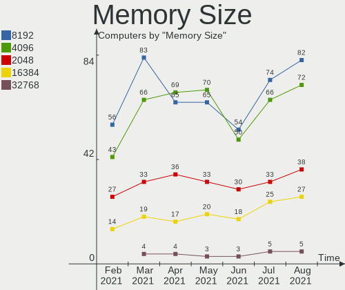

| Size  | Computers | Percent |
|-------|-----------|---------|
| 8192  | 61        | 42.36%  |
| 4096  | 44        | 30.56%  |
| 2048  | 15        | 10.42%  |
| 16384 | 11        | 7.64%   |
| 16000 | 5         | 3.47%   |
| 8000  | 2         | 1.39%   |
| 4000  | 2         | 1.39%   |
| 2000  | 2         | 1.39%   |
| 1024  | 1         | 0.69%   |
| 256   | 1         | 0.69%   |

Memory Speed
------------

Memory module speed

| Speed   | Computers | Percent |
|---------|-----------|---------|
| 1600    | 29        | 21.64%  |
| 1333    | 24        | 17.91%  |
| 2133    | 21        | 15.67%  |
| 2400    | 14        | 10.45%  |
| 2667    | 13        | 9.7%    |
| 3200    | 8         | 5.97%   |
| 800     | 5         | 3.73%   |
| 1067    | 3         | 2.24%   |
| 667     | 3         | 2.24%   |
| Unknown | 3         | 2.24%   |
| 3733    | 2         | 1.49%   |
| 1867    | 2         | 1.49%   |
| 1066    | 2         | 1.49%   |
| 4267    | 1         | 0.75%   |
| 2999    | 1         | 0.75%   |
| 2666    | 1         | 0.75%   |
| 1776    | 1         | 0.75%   |
| 1334    | 1         | 0.75%   |

Sound Vendor
------------

Sound card vendors

| Vendor                                          | Computers | Percent |
|-------------------------------------------------|-----------|---------|
| Intel                                           | 214       | 50%     |
| AMD                                             | 94        | 21.96%  |
| Nvidia                                          | 69        | 16.12%  |
| C-Media Electronics                             | 11        | 2.57%   |
| Creative Labs                                   | 6         | 1.4%    |
| Logitech                                        | 5         | 1.17%   |
| SteelSeries ApS                                 | 4         | 0.93%   |
| VIA Technologies                                | 3         | 0.7%    |
| JMTek                                           | 3         | 0.7%    |
| Plantronics                                     | 2         | 0.47%   |
| Generalplus Technology                          | 2         | 0.47%   |
| Turtle Beach                                    | 1         | 0.23%   |
| Silicon Integrated Systems [SiS]                | 1         | 0.23%   |
| Realtek Semiconductor                           | 1         | 0.23%   |
| Razer USA                                       | 1         | 0.23%   |
| Pixart Imaging                                  | 1         | 0.23%   |
| Micro Star International                        | 1         | 0.23%   |
| Licensed by Sony Computer Entertainment America | 1         | 0.23%   |
| Lenovo                                          | 1         | 0.23%   |
| Kingston Technology                             | 1         | 0.23%   |
| Evolution Electronics                           | 1         | 0.23%   |
| Elite Silicon                                   | 1         | 0.23%   |
| AudioQuest                                      | 1         | 0.23%   |
| ATI Technologies                                | 1         | 0.23%   |
| ASUSTek Computer                                | 1         | 0.23%   |
| Antlion Audio                                   | 1         | 0.23%   |

Sound Model
-----------

Sound card models

| Model                                                                | Computers | Percent |
|----------------------------------------------------------------------|-----------|---------|
| 7 Series/C216 Chipset Family High Definition Audio Controller        | 27        | 5.22%   |
| SBx00 Azalia (Intel HDA)                                             | 19        | 3.68%   |
| 6 Series/C200 Series Chipset Family High Definition Audio Controller | 19        | 3.68%   |
| 8 Series/C220 Series Chipset High Definition Audio Controller        | 18        | 3.48%   |
| Sunrise Point-LP HD Audio                                            | 16        | 3.09%   |
| Xeon E3-1200 v3/4th Gen Core Processor HD Audio Controller           | 15        | 2.9%    |
| 5 Series/3400 Series Chipset High Definition Audio                   | 15        | 2.9%    |
| 100 Series/C230 Series Chipset Family HD Audio Controller            | 15        | 2.9%    |
| Starship/Matisse HD Audio Controller                                 | 14        | 2.71%   |
| FCH Azalia Controller                                                | 14        | 2.71%   |
| Haswell-ULT HD Audio Controller                                      | 13        | 2.51%   |
| 82801I (ICH9 Family) HD Audio Controller                             | 13        | 2.51%   |
| 8 Series HD Audio Controller                                         | 13        | 2.51%   |
| NM10/ICH7 Family High Definition Audio Controller                    | 12        | 2.32%   |
| Family 17h (Models 10h-1fh) HD Audio Controller                      | 12        | 2.32%   |
| Ellesmere HDMI Audio [Radeon RX 470/480 / 570/580/590]               | 10        | 1.93%   |
| Family 17h (Models 00h-0fh) HD Audio Controller                      | 9         | 1.74%   |
| Cannon Point-LP High Definition Audio Controller                     | 9         | 1.74%   |
| Raven/Raven2/Fenghuang HDMI/DP Audio Controller                      | 8         | 1.55%   |
| GK208 HDMI/DP Audio Controller                                       | 8         | 1.55%   |
| Family 15h (Models 60h-6fh) Audio Controller                         | 8         | 1.55%   |
| 200 Series PCH HD Audio                                              | 8         | 1.55%   |
| Wildcat Point-LP High Definition Audio Controller                    | 7         | 1.35%   |
| TU116 High Definition Audio Controller                               | 7         | 1.35%   |
| High Definition Audio Controller                                     | 7         | 1.35%   |
| Broadwell-U Audio Controller                                         | 7         | 1.35%   |
| Kabini HDMI/DP Audio                                                 | 6         | 1.16%   |
| GP107GL High Definition Audio Controller                             | 6         | 1.16%   |
| Cannon Lake PCH cAVS                                                 | 6         | 1.16%   |
| 82801H (ICH8 Family) HD Audio Controller                             | 6         | 1.16%   |
| Smart Sound Technology Audio Controller                              | 5         | 0.97%   |
| GF116 High Definition Audio Controller                               | 5         | 0.97%   |
| GF108 High Definition Audio Controller                               | 5         | 0.97%   |
| CMI8788 [Oxygen HD Audio]                                            | 5         | 0.97%   |
| Atom Processor Z36xxx/Z37xxx Series High Definition Audio Controller | 5         | 0.97%   |
| Navi 10 HDMI Audio                                                   | 4         | 0.77%   |
| GP106 High Definition Audio Controller                               | 4         | 0.77%   |
| Baffin HDMI/DP Audio [Radeon RX 550 640SP / RX 560/560X]             | 4         | 0.77%   |
| USB Audio Device                                                     | 3         | 0.58%   |
| TU104 HD Audio Controller                                            | 3         | 0.58%   |
| Trinity HDMI Audio Controller                                        | 3         | 0.58%   |
| Oland/Hainan/Cape Verde/Pitcairn HDMI Audio [Radeon HD 7000 Series]  | 3         | 0.58%   |
| Kaveri HDMI/DP Audio Controller                                      | 3         | 0.58%   |
| GP108 High Definition Audio Controller                               | 3         | 0.58%   |
| GP104 High Definition Audio Controller                               | 3         | 0.58%   |
| GM206 High Definition Audio Controller                               | 3         | 0.58%   |
| GK107 HDMI Audio Controller                                          | 3         | 0.58%   |
| GF119 HDMI Audio Controller                                          | 3         | 0.58%   |
| Comet Lake PCH cAVS                                                  | 3         | 0.58%   |
| Cedar HDMI Audio [Radeon HD 5400/6300/7300 Series]                   | 3         | 0.58%   |
| CA0106/CA0111 [SB Live!/Audigy/X-Fi Series]                          | 3         | 0.58%   |
| USB PnP Audio Device(EEPROM)                                         | 2         | 0.39%   |
| USB PnP Audio Device                                                 | 2         | 0.39%   |
| USB Audio                                                            | 2         | 0.39%   |
| Turks HDMI Audio [Radeon HD 6500/6600 / 6700M Series]                | 2         | 0.39%   |
| RS880 HDMI Audio [Radeon HD 4200 Series]                             | 2         | 0.39%   |
| Renoir Radeon High Definition Audio Controller                       | 2         | 0.39%   |
| MCP61 High Definition Audio                                          | 2         | 0.39%   |
| Juniper HDMI Audio [Radeon HD 5700 Series]                           | 2         | 0.39%   |
| IXP SB4x0 High Definition Audio Controller                           | 2         | 0.39%   |

Camera Vendor
-------------

Camera device vendors

| Vendor                                 | Computers | Percent |
|----------------------------------------|-----------|---------|
| Chicony Electronics                    | 43        | 26.54%  |
| Realtek Semiconductor                  | 15        | 9.26%   |
| IMC Networks                           | 14        | 8.64%   |
| Sunplus Innovation Technology          | 13        | 8.02%   |
| Quanta                                 | 9         | 5.56%   |
| Cheng Uei Precision Industry (Foxlink) | 9         | 5.56%   |
| Acer                                   | 9         | 5.56%   |
| Microdia                               | 7         | 4.32%   |
| Logitech                               | 5         | 3.09%   |
| Apple                                  | 5         | 3.09%   |
| Silicon Motion                         | 4         | 2.47%   |
| Lite-On Technology                     | 3         | 1.85%   |
| Syntek                                 | 2         | 1.23%   |
| Suyin                                  | 2         | 1.23%   |
| Sunplus Technology                     | 2         | 1.23%   |
| Samsung Electronics                    | 2         | 1.23%   |
| Microsoft                              | 2         | 1.23%   |
| ALi                                    | 2         | 1.23%   |
| Alcor Micro                            | 2         | 1.23%   |
| Ricoh                                  | 1         | 0.62%   |
| Primax Electronics                     | 1         | 0.62%   |
| Philips (or NXP)                       | 1         | 0.62%   |
| Lenovo                                 | 1         | 0.62%   |
| Importek                               | 1         | 0.62%   |
| Generalplus Technology                 | 1         | 0.62%   |
| GEMBIRD                                | 1         | 0.62%   |
| DJKCVA1BIDYUKT                         | 1         | 0.62%   |
| DJJHFA19IDY5OF                         | 1         | 0.62%   |
| Cubeternet                             | 1         | 0.62%   |
| Aveo Technology                        | 1         | 0.62%   |
| 8SSC20X55506L1GZ01200G7                | 1         | 0.62%   |

Camera Model
------------

Camera device models

| Model                            | Computers | Percent |
|----------------------------------|-----------|---------|
| Integrated_Webcam_HD             | 14        | 8.64%   |
| Integrated Camera                | 14        | 8.64%   |
| HP Webcam                        | 10        | 6.17%   |
| USB Camera                       | 8         | 4.94%   |
| Lenovo EasyCamera                | 7         | 4.32%   |
| HP Truevision HD                 | 7         | 4.32%   |
| HD WebCam                        | 6         | 3.7%    |
| VGA Webcam                       | 5         | 3.09%   |
| Webcam                           | 4         | 2.47%   |
| USB2.0 UVC VGA WebCam            | 4         | 2.47%   |
| HP Truevision HD camera          | 4         | 2.47%   |
| HP HD Camera                     | 4         | 2.47%   |
| EasyCamera                       | 4         | 2.47%   |
| USB 2.0 Camera                   | 3         | 1.85%   |
| USB2.0 VGA UVC WebCam            | 2         | 1.23%   |
| USB2.0 HD UVC WebCam             | 2         | 1.23%   |
| TOSHIBA Web Camera - HD          | 2         | 1.23%   |
| iPhone5/5C/5S/6                  | 2         | 1.23%   |
| Gateway Webcam                   | 2         | 1.23%   |
| Galaxy series, misc. (MTP mode)  | 2         | 1.23%   |
| BisonCam, NB Pro                 | 2         | 1.23%   |
| ASUS USB2.0 Webcam               | 2         | 1.23%   |
| Webcam SPC530NC                  | 1         | 0.62%   |
| WebCam SC-13HDL11939N            | 1         | 0.62%   |
| WebCam SC-10HDD12636N            | 1         | 0.62%   |
| Webcam HD                        | 1         | 0.62%   |
| Webcam C600                      | 1         | 0.62%   |
| USB2.0 UVC PC Camera             | 1         | 0.62%   |
| USB2.0 UVC HD Webcam             | 1         | 0.62%   |
| USB2.0 PC CAMERA                 | 1         | 0.62%   |
| USB2.0 Camera                    | 1         | 0.62%   |
| USB2.0 2.0M UVC WebCam           | 1         | 0.62%   |
| USB Web-CAM                      | 1         | 0.62%   |
| USB Video Device                 | 1         | 0.62%   |
| USB 2.0 Webcam Device            | 1         | 0.62%   |
| Sonix Integrated Webcam          | 1         | 0.62%   |
| Silicon Motion SM371 Camera      | 1         | 0.62%   |
| QuickCam Notebook Pro            | 1         | 0.62%   |
| LifeCam VX-2000                  | 1         | 0.62%   |
| LifeCam Cinema                   | 1         | 0.62%   |
| Lenovo Integrated Camera (0.3MP) | 1         | 0.62%   |
| Laptop_Integrated_Webcam_FHD     | 1         | 0.62%   |
| Laptop_Integrated_Webcam_2M      | 1         | 0.62%   |
| Integrated Webcam [R5U877]       | 1         | 0.62%   |
| Integrated Webcam                | 1         | 0.62%   |
| Integrated HP HD Webcam          | 1         | 0.62%   |
| Integrated Camera [ThinkPad]     | 1         | 0.62%   |
| Integrated Camera (1280x720@30)  | 1         | 0.62%   |
| HP Webcam [2 MP Macro]           | 1         | 0.62%   |
| HP High Definition 1MP Webcam    | 1         | 0.62%   |
| HP HD Webcam [Fixed]             | 1         | 0.62%   |
| HP HD Webcam                     | 1         | 0.62%   |
| HP Deluxe Webcam KQ246AA         | 1         | 0.62%   |
| HD Webcam C525                   | 1         | 0.62%   |
| HD Pro Webcam C920               | 1         | 0.62%   |
| GENERAL WEBCAM                   | 1         | 0.62%   |
| Gateway USB 2.0 Webcam           | 1         | 0.62%   |
| FJ Camera                        | 1         | 0.62%   |
| FaceTime HD Camera (Built-in)    | 1         | 0.62%   |
| FaceTime HD Camera               | 1         | 0.62%   |

Fingerprint Vendor
------------------

Fingerprint sensor vendors

| Vendor                | Computers | Percent |
|-----------------------|-----------|---------|
| Validity Sensors      | 11        | 47.83%  |
| Synaptics             | 6         | 26.09%  |
| Upek                  | 3         | 13.04%  |
| AuthenTec             | 2         | 8.7%    |
| LighTuning Technology | 1         | 4.35%   |

Fingerprint Model
-----------------

Fingerprint sensor models

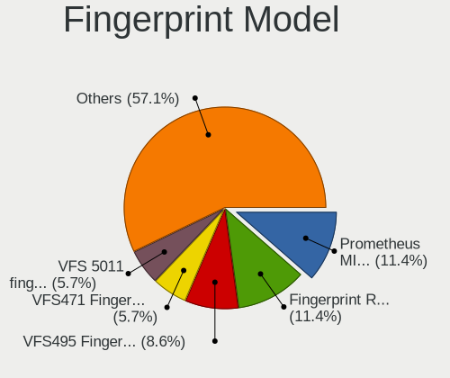

| Model                                                     | Computers | Percent |
|-----------------------------------------------------------|-----------|---------|
| Unknown                                                   | 3         | 13.04%  |
| VFS471 Fingerprint Reader                                 | 2         | 8.7%    |
| VFS 5011 fingerprint sensor                               | 2         | 8.7%    |
| Synaptics VFS7552 Touch Fingerprint Sensor with PurePrint | 2         | 8.7%    |
| Biometric Touchchip/Touchstrip Fingerprint Sensor         | 2         | 8.7%    |
| VFS5011 Fingerprint Reader                                | 1         | 4.35%   |
| VFS495 Fingerprint Reader                                 | 1         | 4.35%   |
| VFS451 Fingerprint Reader                                 | 1         | 4.35%   |
| VFS301 Fingerprint Reader                                 | 1         | 4.35%   |
| VFS300 Fingerprint Reader                                 | 1         | 4.35%   |
| TCS5B Fingerprint sensor                                  | 1         | 4.35%   |
| Swipe Fingerprint Sensor                                  | 1         | 4.35%   |
| Metallica MOH Touch Fingerprint Reader                    | 1         | 4.35%   |
| Metallica MIS Touch Fingerprint Reader                    | 1         | 4.35%   |
| EgisTec_ES603                                             | 1         | 4.35%   |
| AES2550 Fingerprint Sensor                                | 1         | 4.35%   |
| AES2501 Fingerprint Sensor                                | 1         | 4.35%   |

Chipcard Vendor
---------------

Chipcard module vendors

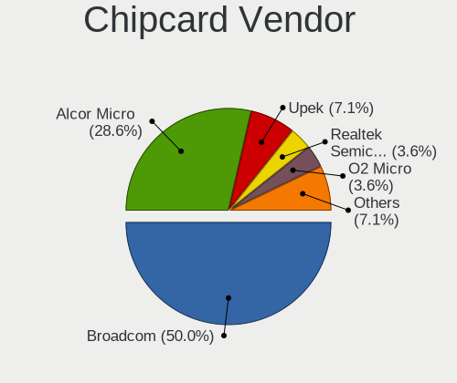

| Vendor                | Computers | Percent |
|-----------------------|-----------|---------|
| Broadcom              | 6         | 42.86%  |
| Upek                  | 2         | 14.29%  |
| Realtek Semiconductor | 1         | 7.14%   |
| OmniKey               | 1         | 7.14%   |
| O2 Micro              | 1         | 7.14%   |
| Lenovo                | 1         | 7.14%   |
| Gemalto (was Gemplus) | 1         | 7.14%   |
| Alcor Micro           | 1         | 7.14%   |

Chipcard Model
--------------

Chipcard module models

| Model                                                               | Computers | Percent |
|---------------------------------------------------------------------|-----------|---------|
| BCM5880 Secure Applications Processor                               | 4         | 28.57%  |
| TouchChip Fingerprint Coprocessor (WBF advanced mode)               | 2         | 14.29%  |
| Smart Card Reader Interface                                         | 1         | 7.14%   |
| OZ776 CCID Smartcard Reader                                         | 1         | 7.14%   |
| Integrated Smart Card Reader                                        | 1         | 7.14%   |
| Compact Smart Card Reader Writer                                    | 1         | 7.14%   |
| CardMan 1021                                                        | 1         | 7.14%   |
| BCM5880 Secure Applications Processor with fingerprint swipe sensor | 1         | 7.14%   |
| AU9540 Smartcard Reader                                             | 1         | 7.14%   |
| 5880                                                                | 1         | 7.14%   |

Printer Vendor
--------------

Printer device vendors

| Vendor              | Computers | Percent |
|---------------------|-----------|---------|
| Hewlett-Packard     | 3         | 37.5%   |
| Brother Industries  | 2         | 25%     |
| Seiko Epson         | 1         | 12.5%   |
| Samsung Electronics | 1         | 12.5%   |
| Canon               | 1         | 12.5%   |

Printer Model
-------------

Printer device models

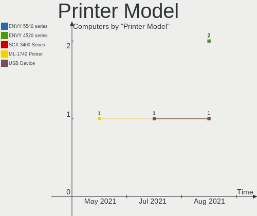

| Model                         | Computers | Percent |
|-------------------------------|-----------|---------|
| PIXMA MX360                   | 1         | 12.5%   |
| MFC-L2750DW series            | 1         | 12.5%   |
| M301x Series                  | 1         | 12.5%   |
| LaserJet Professional P 1102w | 1         | 12.5%   |
| LaserJet 1018                 | 1         | 12.5%   |
| L380 Series                   | 1         | 12.5%   |
| Ink Tank Wireless 410 series  | 1         | 12.5%   |
| DCP-7055 scanner/printer      | 1         | 12.5%   |

Scanner Vendor
--------------

Scanner device vendors

| Vendor | Computers | Percent |
|--------|-----------|---------|
| Canon  | 2         | 100%    |

Scanner Model
-------------

Scanner device models

| Model                | Computers | Percent |
|----------------------|-----------|---------|
| CanoScan N650U/N656U | 1         | 50%     |
| CanoScan 4200F       | 1         | 50%     |

Bluetooth Vendor
----------------

Controller vendors

| Vendor                          | Computers | Percent |
|---------------------------------|-----------|---------|
| Intel                           | 59        | 36.65%  |
| Qualcomm Atheros Communications | 21        | 13.04%  |
| Realtek Semiconductor           | 17        | 10.56%  |
| Cambridge Silicon Radio         | 14        | 8.7%    |
| Broadcom                        | 10        | 6.21%   |
| Lite-On Technology              | 7         | 4.35%   |
| Ralink                          | 5         | 3.11%   |
| Foxconn / Hon Hai               | 5         | 3.11%   |
| Dell                            | 5         | 3.11%   |
| ASUSTek Computer                | 5         | 3.11%   |
| IMC Networks                    | 4         | 2.48%   |
| Apple                           | 3         | 1.86%   |
| Unknown                         | 1         | 0.62%   |
| Toshiba                         | 1         | 0.62%   |
| Hewlett-Packard                 | 1         | 0.62%   |
| Foxconn International           | 1         | 0.62%   |
| Belkin Components               | 1         | 0.62%   |
| Askey Computer                  | 1         | 0.62%   |

Bluetooth Model
---------------

Controller models

| Model                                   | Computers | Percent |
|-----------------------------------------|-----------|---------|
| Bluetooth Device                        | 62        | 38.51%  |
| Qualcomm Atheros Bluetooth Device       | 16        | 9.94%   |
| Bluetooth Radio                         | 15        | 9.32%   |
| Bluetooth Dongle (HCI mode)             | 14        | 8.7%    |
| Wireless-AC 3168 Bluetooth              | 7         | 4.35%   |
| RT3290 Bluetooth                        | 5         | 3.11%   |
| BCM20702A0                              | 4         | 2.48%   |
| AR3011 Bluetooth                        | 3         | 1.86%   |
| 802.11n WLAN Adapter                    | 3         | 1.86%   |
| DW375 Bluetooth Module                  | 2         | 1.24%   |
| Bluetooth USB Host Controller           | 2         | 1.24%   |
| BCM20702 Bluetooth 4.0 [ThinkPad]       | 2         | 1.24%   |
| BCM2045B (BDC-2.1)                      | 2         | 1.24%   |
| Atheros Bluetooth                       | 2         | 1.24%   |
| Atheros AR3012 Bluetooth 4.0 Adapter    | 2         | 1.24%   |
| Wireless 370 Bluetooth Mini-card        | 1         | 0.62%   |
| Wireless 365 Bluetooth                  | 1         | 0.62%   |
| Qualcomm Bluetooth 4.1                  | 1         | 0.62%   |
| Qualcomm Atheros Bluetooth              | 1         | 0.62%   |
| BT-270 Bluetooth Adapter                | 1         | 0.62%   |
| BT-183 Bluetooth 2.0+EDR adapter        | 1         | 0.62%   |
| Broadcom BCM43142A0 Bluetooth Device    | 1         | 0.62%   |
| Broadcom 2070 Bluetooth Combo           | 1         | 0.62%   |
| Bluetooth HCI                           | 1         | 0.62%   |
| Bluetooth Device with trace filter      | 1         | 0.62%   |
| Bluetooth                               | 1         | 0.62%   |
| BCM92046DG-CL1ROM Bluetooth 2.1 Adapter | 1         | 0.62%   |
| BCM43142A0 broadcom bluetooth           | 1         | 0.62%   |
| BCM43142A0 Bluetooth module             | 1         | 0.62%   |
| BCM20703A1 Bluetooth 4.1 + LE           | 1         | 0.62%   |
| BCM20702A0 Bluetooth 4.0                | 1         | 0.62%   |
| BCM2045A0                               | 1         | 0.62%   |
| BCM2045 Bluetooth                       | 1         | 0.62%   |
| AR3012 Bluetooth 4.0                    | 1         | 0.62%   |
| AR3012 Bluetooth                        | 1         | 0.62%   |

Unsupported Devices
-------------------

Total unsupported devices on board

| Total | Computers | Percent |
|-------|-----------|---------|
| 0     | 232       | 76.32%  |
| 1     | 59        | 19.41%  |
| 2     | 13        | 4.28%   |

Unsupported Device Types
------------------------

Types of unsupported devices

| Type                     | Computers | Percent |
|--------------------------|-----------|---------|
| Fingerprint reader       | 23        | 28.4%   |
| Net/wireless             | 14        | 17.28%  |
| Graphics card            | 11        | 13.58%  |
| Chipcard                 | 11        | 13.58%  |
| Bluetooth                | 5         | 6.17%   |
| Storage                  | 3         | 3.7%    |
| Network                  | 3         | 3.7%    |
| Multimedia controller    | 3         | 3.7%    |
| Unassigned class         | 2         | 2.47%   |
| Flash memory             | 2         | 2.47%   |
| Communication controller | 2         | 2.47%   |
| Sound                    | 1         | 1.23%   |
| Net/ethernet             | 1         | 1.23%   |

