Mint Hardware Trends
--------------------

A project to identify most popular hardware characteristics and track their change
over time based on data collected by Mint users at https://Linux-Hardware.org.

Anyone can contribute to the study by uploading probes of their computers by
the [hw-probe](https://github.com/linuxhw/hw-probe) tool:

    sudo -E hw-probe -all -upload

This is a report for all computer types. See also reports for [desktops](/Dist/Mint/Desktop/README.md) and [notebooks](/Dist/Mint/Notebook/README.md).

Full-feature report is available here: https://linux-hardware.org/?view=trends

Period: Jun, 2021.

Contents
--------

- [ OS                       ](#os)
- [ OS Family                ](#os-family)
- [ Kernel                   ](#kernel)
- [ Kernel Family            ](#kernel-family)
- [ Kernel Major Ver.        ](#kernel-major-ver)
- [ Arch                     ](#arch)
- [ DE                       ](#de)
- [ Display Server           ](#display-server)
- [ Display Manager          ](#display-manager)
- [ OS Lang                  ](#os-lang)
- [ Boot Mode                ](#boot-mode)
- [ Filesystem               ](#filesystem)
- [ Part. scheme             ](#part-scheme)
- [ Dual Boot with Linux/BSD ](#dual-boot-with-linux/bsd)
- [ Dual Boot (Win)          ](#dual-boot-win)
- [ Country                  ](#country)
- [ City                     ](#city)
- [ Vendor                   ](#vendor)
- [ Model                    ](#model)
- [ Model Family             ](#model-family)
- [ MFG Year                 ](#mfg-year)
- [ Form Factor              ](#form-factor)
- [ Secure Boot              ](#secure-boot)
- [ Coreboot                 ](#coreboot)
- [ RAM Size                 ](#ram-size)
- [ RAM Used                 ](#ram-used)
- [ Has CD-ROM               ](#has-cd-rom)
- [ Total Drives             ](#total-drives)
- [ Has Ethernet             ](#has-ethernet)
- [ Has WiFi                 ](#has-wifi)
- [ Has Bluetooth            ](#has-bluetooth)
- [ Drive Vendor             ](#drive-vendor)
- [ Drive Model              ](#drive-model)
- [ HDD Vendor               ](#hdd-vendor)
- [ SSD Vendor               ](#ssd-vendor)
- [ Drive Kind               ](#drive-kind)
- [ Drive Connector          ](#drive-connector)
- [ Drive Size               ](#drive-size)
- [ Space Total              ](#space-total)
- [ Space Used               ](#space-used)
- [ Malfunc. Drives          ](#malfunc-drives)
- [ Malfunc. Drive Vendor    ](#malfunc-drive-vendor)
- [ Malfunc. HDD Vendor      ](#malfunc-hdd-vendor)
- [ Malfunc. Drive Kind      ](#malfunc-drive-kind)
- [ Failed Drives            ](#failed-drives)
- [ Failed Drive Vendor      ](#failed-drive-vendor)
- [ Drive Status             ](#drive-status)
- [ Storage Vendor           ](#storage-vendor)
- [ Storage Model            ](#storage-model)
- [ Storage Kind             ](#storage-kind)
- [ CPU Vendor               ](#cpu-vendor)
- [ CPU Model                ](#cpu-model)
- [ CPU Model Family         ](#cpu-model-family)
- [ CPU Cores                ](#cpu-cores)
- [ CPU Sockets              ](#cpu-sockets)
- [ CPU Threads              ](#cpu-threads)
- [ CPU Op-Modes             ](#cpu-op-modes)
- [ CPU Microcode            ](#cpu-microcode)
- [ CPU Microarch            ](#cpu-microarch)
- [ GPU Vendor               ](#gpu-vendor)
- [ GPU Model                ](#gpu-model)
- [ GPU Combo                ](#gpu-combo)
- [ GPU Driver               ](#gpu-driver)
- [ GPU Memory               ](#gpu-memory)
- [ Monitor Vendor           ](#monitor-vendor)
- [ Monitor Model            ](#monitor-model)
- [ Monitor Resolution       ](#monitor-resolution)
- [ Monitor Diagonal         ](#monitor-diagonal)
- [ Monitor Width            ](#monitor-width)
- [ Aspect Ratio             ](#aspect-ratio)
- [ Monitor Area             ](#monitor-area)
- [ Pixel Density            ](#pixel-density)
- [ Multiple Monitors        ](#multiple-monitors)
- [ Net Controller Vendor    ](#net-controller-vendor)
- [ Net Controller Model     ](#net-controller-model)
- [ Wireless Vendor          ](#wireless-vendor)
- [ Wireless Model           ](#wireless-model)
- [ Ethernet Vendor          ](#ethernet-vendor)
- [ Ethernet Model           ](#ethernet-model)
- [ Net Controller Kind      ](#net-controller-kind)
- [ Used Controller          ](#used-controller)
- [ NICs                     ](#nics)
- [ IPv6                     ](#ipv6)
- [ Memory Vendor            ](#memory-vendor)
- [ Memory Model             ](#memory-model)
- [ Memory Kind              ](#memory-kind)
- [ Memory Form Factor       ](#memory-form-factor)
- [ Memory Size              ](#memory-size)
- [ Memory Speed             ](#memory-speed)
- [ Sound Vendor             ](#sound-vendor)
- [ Sound Model              ](#sound-model)
- [ Camera Vendor            ](#camera-vendor)
- [ Camera Model             ](#camera-model)
- [ Fingerprint Vendor       ](#fingerprint-vendor)
- [ Fingerprint Model        ](#fingerprint-model)
- [ Chipcard Vendor          ](#chipcard-vendor)
- [ Chipcard Model           ](#chipcard-model)
- [ Printer Vendor           ](#printer-vendor)
- [ Printer Model            ](#printer-model)
- [ Scanner Vendor           ](#scanner-vendor)
- [ Scanner Model            ](#scanner-model)
- [ Bluetooth Vendor         ](#bluetooth-vendor)
- [ Bluetooth Model          ](#bluetooth-model)
- [ Unsupported Devices      ](#unsupported-devices)
- [ Unsupported Device Types ](#unsupported-device-types)

OS
--

Installed operating systems

| Name      | Computers | Percent |
|-----------|-----------|---------|
| Mint 20.1 | 318       | 76.26%  |
| Mint 19.3 | 47        | 11.27%  |
| Mint 20   | 31        | 7.43%   |
| Mint 19.2 | 8         | 1.92%   |
| Mint 20.2 | 7         | 1.68%   |
| Mint 19.1 | 2         | 0.48%   |
| Mint 19   | 2         | 0.48%   |
| Mint 18.3 | 1         | 0.24%   |
| Mint 18.2 | 1         | 0.24%   |

OS Family
---------

OS without a version

| Name | Computers | Percent |
|------|-----------|---------|
| Mint | 417       | 100%    |

Kernel
------

Version of the Linux kernel

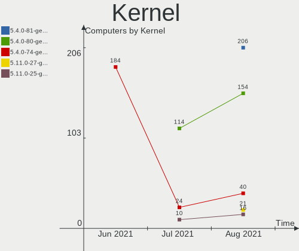

| Version                    | Computers | Percent |
|----------------------------|-----------|---------|
| 5.4.0-74-generic           | 184       | 44.12%  |
| 5.4.0-77-generic           | 45        | 10.79%  |
| 5.4.0-73-generic           | 40        | 9.59%   |
| 5.4.0-58-generic           | 29        | 6.95%   |
| 5.8.0-55-generic           | 28        | 6.71%   |
| 5.8.0-53-generic           | 14        | 3.36%   |
| 5.4.0-26-generic           | 7         | 1.68%   |
| 5.4.0-72-generic           | 6         | 1.44%   |
| 5.8.0-59-generic           | 5         | 1.2%    |
| 5.8.0-33-generic           | 4         | 0.96%   |
| 5.0.0-32-generic           | 4         | 0.96%   |
| 4.15.0-54-generic          | 4         | 0.96%   |
| 4.15.0-20-generic          | 3         | 0.72%   |
| 5.11.0-22-generic          | 2         | 0.48%   |
| 4.15.0-144-generic         | 2         | 0.48%   |
| 5.9.3-050903-generic       | 1         | 0.24%   |
| 5.9.16-050916-generic      | 1         | 0.24%   |
| 5.9.1-050901-lowlatency    | 1         | 0.24%   |
| 5.8.0-55-lowlatency        | 1         | 0.24%   |
| 5.8.0-50-generic           | 1         | 0.24%   |
| 5.8.0-43-generic           | 1         | 0.24%   |
| 5.4.0-73-lowlatency        | 1         | 0.24%   |
| 5.4.0-712104061620-generic | 1         | 0.24%   |
| 5.4.0-71-generic           | 1         | 0.24%   |
| 5.4.0-70-generic           | 1         | 0.24%   |
| 5.4.0-66-generic           | 1         | 0.24%   |
| 5.4.0-65-generic           | 1         | 0.24%   |
| 5.4.0-64-generic           | 1         | 0.24%   |
| 5.4.0-62-generic           | 1         | 0.24%   |
| 5.4.0-54-generic           | 1         | 0.24%   |
| 5.4.0-52-generic           | 1         | 0.24%   |
| 5.4.0-48-generic           | 1         | 0.24%   |
| 5.3.0-40-generic           | 1         | 0.24%   |
| 5.3.0-28-generic           | 1         | 0.24%   |
| 5.13.0-051300-generic      | 1         | 0.24%   |
| 5.12.9-steamvr-generic     | 1         | 0.24%   |
| 5.12.9-051209-generic      | 1         | 0.24%   |
| 5.12.8-051208-generic      | 1         | 0.24%   |
| 5.12.4-051204-generic      | 1         | 0.24%   |
| 5.12.2-051202-generic      | 1         | 0.24%   |
| 5.12.11                    | 1         | 0.24%   |
| 5.12.0-051200rc8-generic   | 1         | 0.24%   |
| 5.11.6-051106-generic      | 1         | 0.24%   |
| 5.11.16-051116-generic     | 1         | 0.24%   |
| 5.11.0-7614-generic        | 1         | 0.24%   |
| 5.11.0-051100-generic      | 1         | 0.24%   |
| 5.10.45-xanmod1            | 1         | 0.24%   |
| 5.10.27-051027-generic     | 1         | 0.24%   |
| 5.10.0-051000-generic      | 1         | 0.24%   |
| 4.15.0-58-generic          | 1         | 0.24%   |
| 4.15.0-143-generic         | 1         | 0.24%   |
| 4.15.0-142-generic         | 1         | 0.24%   |
| 4.15.0-136-generic         | 1         | 0.24%   |
| 4.10.0-38-generic          | 1         | 0.24%   |
| Unknown                    | 1         | 0.24%   |

Kernel Family
-------------

Linux kernel without a distro release

| Version | Computers | Percent |
|---------|-----------|---------|
| 5.4.0   | 322       | 77.22%  |
| 5.8.0   | 54        | 12.95%  |
| 4.15.0  | 13        | 3.12%   |
| 5.11.0  | 4         | 0.96%   |
| 5.0.0   | 4         | 0.96%   |
| 5.3.0   | 2         | 0.48%   |
| 5.12.9  | 2         | 0.48%   |
| 5.9.3   | 1         | 0.24%   |
| 5.9.16  | 1         | 0.24%   |
| 5.9.1   | 1         | 0.24%   |
| 5.13.0  | 1         | 0.24%   |
| 5.12.8  | 1         | 0.24%   |
| 5.12.4  | 1         | 0.24%   |
| 5.12.2  | 1         | 0.24%   |
| 5.12.11 | 1         | 0.24%   |
| 5.12.0  | 1         | 0.24%   |
| 5.11.6  | 1         | 0.24%   |
| 5.11.16 | 1         | 0.24%   |
| 5.10.45 | 1         | 0.24%   |
| 5.10.27 | 1         | 0.24%   |
| 5.10.0  | 1         | 0.24%   |
| 4.10.0  | 1         | 0.24%   |
| Unknown | 1         | 0.24%   |

Kernel Major Ver.
-----------------

Linux kernel major version

| Version | Computers | Percent |
|---------|-----------|---------|
| 5.4     | 322       | 77.22%  |
| 5.8     | 54        | 12.95%  |
| 4.15    | 13        | 3.12%   |
| 5.12    | 7         | 1.68%   |
| 5.11    | 6         | 1.44%   |
| 5.0     | 4         | 0.96%   |
| 5.9     | 3         | 0.72%   |
| 5.10    | 3         | 0.72%   |
| 5.3     | 2         | 0.48%   |
| 5.13    | 1         | 0.24%   |
| 4.10    | 1         | 0.24%   |
| Unknown | 1         | 0.24%   |

Arch
----

OS architecture (x86_64, i586, etc.)

| Name   | Computers | Percent |
|--------|-----------|---------|
| x86_64 | 393       | 94.24%  |
| i686   | 24        | 5.76%   |

DE
--

Desktop Environment

| Name          | Computers | Percent |
|---------------|-----------|---------|
| X-Cinnamon    | 274       | 65.71%  |
| MATE          | 55        | 13.19%  |
| XFCE          | 41        | 9.83%   |
| Cinnamon      | 25        | 6%      |
| Unknown       | 10        | 2.4%    |
| GNOME         | 7         | 1.68%   |
| KDE           | 3         | 0.72%   |
| Pantheon      | 1         | 0.24%   |
| GNOME Classic | 1         | 0.24%   |

Display Server
--------------

X11 or Wayland

| Name | Computers | Percent |
|------|-----------|---------|
| X11  | 417       | 100%    |

Display Manager
---------------

SDDM, LightDM, etc.

| Name    | Computers | Percent |
|---------|-----------|---------|
| Unknown | 291       | 69.78%  |
| TDM     | 123       | 29.5%   |
| GDM     | 2         | 0.48%   |
| SDDM    | 1         | 0.24%   |

OS Lang
-------

Language

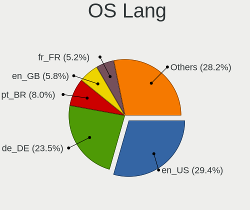

| Lang    | Computers | Percent |
|---------|-----------|---------|
| en_US   | 125       | 29.98%  |
| de_DE   | 64        | 15.35%  |
| pt_BR   | 28        | 6.71%   |
| en_GB   | 21        | 5.04%   |
| C       | 21        | 5.04%   |
| fr_FR   | 19        | 4.56%   |
| en_CA   | 14        | 3.36%   |
| ru_RU   | 10        | 2.4%    |
| en_AU   | 10        | 2.4%    |
| pl_PL   | 9         | 2.16%   |
| it_IT   | 9         | 2.16%   |
| en_IN   | 9         | 2.16%   |
| nl_NL   | 6         | 1.44%   |
| es_ES   | 6         | 1.44%   |
| fr_BE   | 5         | 1.2%    |
| es_MX   | 5         | 1.2%    |
| zh_CN   | 3         | 0.72%   |
| hu_HU   | 3         | 0.72%   |
| es_AR   | 3         | 0.72%   |
| en_NZ   | 3         | 0.72%   |
| da_DK   | 3         | 0.72%   |
| tr_TR   | 2         | 0.48%   |
| sk_SK   | 2         | 0.48%   |
| ru_UA   | 2         | 0.48%   |
| es_UY   | 2         | 0.48%   |
| es_CL   | 2         | 0.48%   |
| en_IL   | 2         | 0.48%   |
| en_IE   | 2         | 0.48%   |
| en_DK   | 2         | 0.48%   |
| el_GR   | 2         | 0.48%   |
| de_CH   | 2         | 0.48%   |
| de_AT   | 2         | 0.48%   |
| cs_CZ   | 2         | 0.48%   |
| sv_SE   | 1         | 0.24%   |
| ro_RO   | 1         | 0.24%   |
| pt_PT   | 1         | 0.24%   |
| fr_CH   | 1         | 0.24%   |
| fr_CA   | 1         | 0.24%   |
| fi_FI   | 1         | 0.24%   |
| es_VE   | 1         | 0.24%   |
| es_US   | 1         | 0.24%   |
| es_SV   | 1         | 0.24%   |
| es_PE   | 1         | 0.24%   |
| es_PA   | 1         | 0.24%   |
| es_EC   | 1         | 0.24%   |
| es_DO   | 1         | 0.24%   |
| es_CO   | 1         | 0.24%   |
| en_ZW   | 1         | 0.24%   |
| en_ZA   | 1         | 0.24%   |
| Unknown | 1         | 0.24%   |

Boot Mode
---------

EFI or BIOS

| Mode | Computers | Percent |
|------|-----------|---------|
| BIOS | 225       | 53.96%  |
| EFI  | 192       | 46.04%  |

Filesystem
----------

Type of filesystem

| Type    | Computers | Percent |
|---------|-----------|---------|
| Ext4    | 391       | 93.76%  |
| Overlay | 19        | 4.56%   |
| Btrfs   | 3         | 0.72%   |
| Xfs     | 2         | 0.48%   |
| Zfs     | 1         | 0.24%   |
| Ext2    | 1         | 0.24%   |

Part. scheme
------------

Scheme of partitioning

| Type    | Computers | Percent |
|---------|-----------|---------|
| Unknown | 286       | 68.59%  |
| GPT     | 86        | 20.62%  |
| MBR     | 45        | 10.79%  |

Dual Boot with Linux/BSD
------------------------

Hosting more than one Linux/BSD

| Dual boot | Computers | Percent |
|-----------|-----------|---------|
| No        | 385       | 92.33%  |
| Yes       | 32        | 7.67%   |

Dual Boot (Win)
---------------

Hosting Linux and Windows

| Dual boot | Computers | Percent |
|-----------|-----------|---------|
| No        | 357       | 85.61%  |
| Yes       | 60        | 14.39%  |

Country
-------

Geographic location (country)

| Country                          | Computers | Percent |
|----------------------------------|-----------|---------|
| USA                              | 87        | 20.86%  |
| Germany                          | 68        | 16.31%  |
| Brazil                           | 33        | 7.91%   |
| UK                               | 20        | 4.8%    |
| France                           | 19        | 4.56%   |
| Canada                           | 14        | 3.36%   |
| Italy                            | 12        | 2.88%   |
| Netherlands                      | 11        | 2.64%   |
| Russia                           | 10        | 2.4%    |
| Poland                           | 10        | 2.4%    |
| Australia                        | 10        | 2.4%    |
| Spain                            | 9         | 2.16%   |
| India                            | 9         | 2.16%   |
| Mexico                           | 6         | 1.44%   |
| Belgium                          | 6         | 1.44%   |
| Ukraine                          | 5         | 1.2%    |
| Switzerland                      | 5         | 1.2%    |
| Hungary                          | 4         | 0.96%   |
| Denmark                          | 4         | 0.96%   |
| Chile                            | 4         | 0.96%   |
| Austria                          | 4         | 0.96%   |
| Turkey                           | 3         | 0.72%   |
| Serbia                           | 3         | 0.72%   |
| Romania                          | 3         | 0.72%   |
| New Zealand                      | 3         | 0.72%   |
| Moldova                          | 3         | 0.72%   |
| Finland                          | 3         | 0.72%   |
| Czechia                          | 3         | 0.72%   |
| Bulgaria                         | 3         | 0.72%   |
| Belarus                          | 3         | 0.72%   |
| Argentina                        | 3         | 0.72%   |
| Venezuela                        | 2         | 0.48%   |
| Uruguay                          | 2         | 0.48%   |
| Slovakia                         | 2         | 0.48%   |
| Portugal                         | 2         | 0.48%   |
| Panama                           | 2         | 0.48%   |
| Norway                           | 2         | 0.48%   |
| Israel                           | 2         | 0.48%   |
| Iran                             | 2         | 0.48%   |
| Greece                           | 2         | 0.48%   |
| Estonia                          | 2         | 0.48%   |
| China                            | 2         | 0.48%   |
| Zimbabwe                         | 1         | 0.24%   |
| Sweden                           | 1         | 0.24%   |
| South Africa                     | 1         | 0.24%   |
| Saint Vincent and the Grenadines | 1         | 0.24%   |
| Peru                             | 1         | 0.24%   |
| Lithuania                        | 1         | 0.24%   |
| Lebanon                          | 1         | 0.24%   |
| Ireland                          | 1         | 0.24%   |
| Indonesia                        | 1         | 0.24%   |
| El Salvador                      | 1         | 0.24%   |
| Egypt                            | 1         | 0.24%   |
| Ecuador                          | 1         | 0.24%   |
| Dominican Republic               | 1         | 0.24%   |
| Colombia                         | 1         | 0.24%   |
| Albania                          | 1         | 0.24%   |

City
----

Geographic location (city)

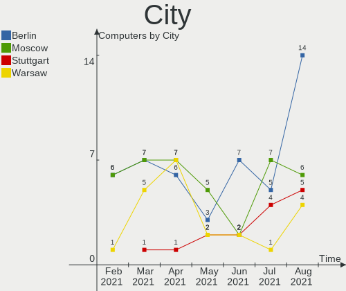

| City              | Computers | Percent |
|-------------------|-----------|---------|
| Rockville         | 8         | 1.92%   |
| Berlin            | 7         | 1.68%   |
| Leipzig           | 5         | 1.2%    |
| Vancouver         | 4         | 0.96%   |
| Denver            | 4         | 0.96%   |
| Santiago          | 3         | 0.72%   |
| Paris             | 3         | 0.72%   |
| Minsk             | 3         | 0.72%   |
| Kyiv              | 3         | 0.72%   |
| Frankfurt am Main | 3         | 0.72%   |
| Chisinau          | 3         | 0.72%   |
| Belgrade          | 3         | 0.72%   |
| Augsburg          | 3         | 0.72%   |
| Amsterdam         | 3         | 0.72%   |
| Zurich            | 2         | 0.48%   |
| Włocławek       | 2         | 0.48%   |
| Warsaw            | 2         | 0.48%   |
| Vienna            | 2         | 0.48%   |
| Tel Aviv          | 2         | 0.48%   |
| São Paulo        | 2         | 0.48%   |
| Stuttgart         | 2         | 0.48%   |
| St Louis          | 2         | 0.48%   |
| Sorocaba          | 2         | 0.48%   |
| Rotterdam         | 2         | 0.48%   |
| Perth             | 2         | 0.48%   |
| Palm Coast        | 2         | 0.48%   |
| Naples            | 2         | 0.48%   |
| Munich            | 2         | 0.48%   |
| Mumbai            | 2         | 0.48%   |
| Moscow            | 2         | 0.48%   |
| Montreal          | 2         | 0.48%   |
| Montevideo        | 2         | 0.48%   |
| Minneapolis       | 2         | 0.48%   |
| Milan             | 2         | 0.48%   |
| Mexico City       | 2         | 0.48%   |
| Marseille         | 2         | 0.48%   |
| London            | 2         | 0.48%   |
| Izmir             | 2         | 0.48%   |
| Hochheim am Main  | 2         | 0.48%   |
| Hamburg           | 2         | 0.48%   |
| Guwahati          | 2         | 0.48%   |
| Guarulhos         | 2         | 0.48%   |
| Fulda             | 2         | 0.48%   |
| Florianópolis    | 2         | 0.48%   |
| Feeding Hills     | 2         | 0.48%   |
| Edmonton          | 2         | 0.48%   |
| Dresden           | 2         | 0.48%   |
| Curitiba          | 2         | 0.48%   |
| Chicago           | 2         | 0.48%   |
| Charleroi         | 2         | 0.48%   |
| Brisbane          | 2         | 0.48%   |
| Bonn              | 2         | 0.48%   |
| Blaton            | 2         | 0.48%   |
| Auckland          | 2         | 0.48%   |
| Athens            | 2         | 0.48%   |
| Aarhus C          | 2         | 0.48%   |
| Ziar nad Hronom   | 1         | 0.24%   |
| Zephyrhills       | 1         | 0.24%   |
| Zelesice          | 1         | 0.24%   |
| Würzburg         | 1         | 0.24%   |

Vendor
------

Motherboard manufacturer

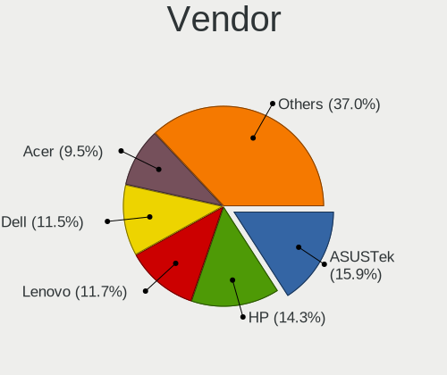

| Name                | Computers | Percent |
|---------------------|-----------|---------|
| ASUSTek Computer    | 70        | 16.79%  |
| Lenovo              | 51        | 12.23%  |
| Hewlett-Packard     | 50        | 11.99%  |
| Dell                | 50        | 11.99%  |
| Acer                | 40        | 9.59%   |
| Gigabyte Technology | 33        | 7.91%   |
| MSI                 | 18        | 4.32%   |
| ASRock              | 11        | 2.64%   |
| Samsung Electronics | 10        | 2.4%    |
| Toshiba             | 9         | 2.16%   |
| Medion              | 7         | 1.68%   |
| Apple               | 7         | 1.68%   |
| Pegatron            | 6         | 1.44%   |
| Intel               | 6         | 1.44%   |
| Unknown             | 6         | 1.44%   |
| Fujitsu Siemens     | 4         | 0.96%   |
| ECS                 | 4         | 0.96%   |
| Sony                | 3         | 0.72%   |
| Fujitsu             | 3         | 0.72%   |
| Positivo            | 2         | 0.48%   |
| eMachines           | 2         | 0.48%   |
| Biostar             | 2         | 0.48%   |
| Teclast             | 1         | 0.24%   |
| Schenker            | 1         | 0.24%   |
| QUANMAX             | 1         | 0.24%   |
| PCWare              | 1         | 0.24%   |
| OEM                 | 1         | 0.24%   |
| MAXDATA             | 1         | 0.24%   |
| LG Electronics      | 1         | 0.24%   |
| Lanix Internacional | 1         | 0.24%   |
| Itautec             | 1         | 0.24%   |
| iNet                | 1         | 0.24%   |
| IBM                 | 1         | 0.24%   |
| HPE                 | 1         | 0.24%   |
| HONOR               | 1         | 0.24%   |
| Google              | 1         | 0.24%   |
| Gateway             | 1         | 0.24%   |
| Foxconn             | 1         | 0.24%   |
| DukaPC              | 1         | 0.24%   |
| Chuwi               | 1         | 0.24%   |
| Casper              | 1         | 0.24%   |
| BESSTAR Tech        | 1         | 0.24%   |
| AZW                 | 1         | 0.24%   |
| AMD                 | 1         | 0.24%   |
| Alienware           | 1         | 0.24%   |

Model
-----

Motherboard model

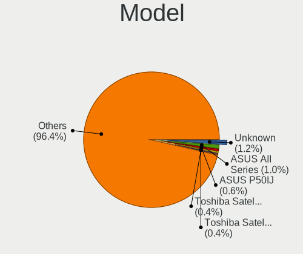

| Name                                                  | Computers | Percent |
|-------------------------------------------------------|-----------|---------|
| Unknown                                               | 7         | 1.68%   |
| ASUS TUF GAMING X570-PLUS                             | 5         | 1.2%    |
| Gigabyte A320M-S2H                                    | 3         | 0.72%   |
| ASUS VivoBook_ASUSLaptop X521IA_D533IA                | 3         | 0.72%   |
| ASUS All Series                                       | 3         | 0.72%   |
| MSI MS-7C91                                           | 2         | 0.48%   |
| Lenovo Yoga 300-11IBR 80M1                            | 2         | 0.48%   |
| HP Pavilion Notebook                                  | 2         | 0.48%   |
| HP Pavilion g7                                        | 2         | 0.48%   |
| Gigabyte GA-970A-UD3                                  | 2         | 0.48%   |
| Dell OptiPlex 790                                     | 2         | 0.48%   |
| Dell OptiPlex 390                                     | 2         | 0.48%   |
| Dell Latitude D830                                    | 2         | 0.48%   |
| Dell G5 5505                                          | 2         | 0.48%   |
| ASUS TUF GAMING B550M-PLUS                            | 2         | 0.48%   |
| ASUS P50IJ                                            | 2         | 0.48%   |
| ASUS M5A78L-M PLUS/USB3                               | 2         | 0.48%   |
| Acer Aspire A517-52                                   | 2         | 0.48%   |
| Acer Aspire 5733Z                                     | 2         | 0.48%   |
| Toshiba TECRA R950                                    | 1         | 0.24%   |
| Toshiba Satellite R630                                | 1         | 0.24%   |
| Toshiba Satellite L745                                | 1         | 0.24%   |
| Toshiba Satellite L50-B                               | 1         | 0.24%   |
| Toshiba Satellite L40                                 | 1         | 0.24%   |
| Toshiba Satellite C855-2J5                            | 1         | 0.24%   |
| Toshiba Satellite C850-1KN                            | 1         | 0.24%   |
| Toshiba Satellite C55t-C                              | 1         | 0.24%   |
| Toshiba Satellite A215                                | 1         | 0.24%   |
| Teclast F7S                                           | 1         | 0.24%   |
| Sony VGN-TZ21WN_B                                     | 1         | 0.24%   |
| Sony SVF1521A7EB                                      | 1         | 0.24%   |
| Sony SVE14A15FGS                                      | 1         | 0.24%   |
| Schenker SCHENKER VISION 15 (SVS15E21)                | 1         | 0.24%   |
| Samsung RV415                                         | 1         | 0.24%   |
| Samsung R530/R730/P530                                | 1         | 0.24%   |
| Samsung R520/R522/R620                                | 1         | 0.24%   |
| Samsung Q330                                          | 1         | 0.24%   |
| Samsung NC210/NC110                                   | 1         | 0.24%   |
| Samsung NC10                                          | 1         | 0.24%   |
| Samsung 950XDB/951XDB/950XDY                          | 1         | 0.24%   |
| Samsung 940X3N                                        | 1         | 0.24%   |
| Samsung 350V5C/351V5C/3540VC/3440VC                   | 1         | 0.24%   |
| Samsung 300E5EV/300E4EV/270E5EV/270E4EV/2470EV/2470EE | 1         | 0.24%   |
| QUANMAX Netbook Neo                                   | 1         | 0.24%   |
| Positivo POS-MIG31AG                                  | 1         | 0.24%   |
| Positivo Mobile                                       | 1         | 0.24%   |
| Pegatron Pro 3120 Small Form Factor PC                | 1         | 0.24%   |
| Pegatron p2-1033w                                     | 1         | 0.24%   |
| Pegatron NY429AA-ABA p6110y                           | 1         | 0.24%   |
| Pegatron A15                                          | 1         | 0.24%   |
| Pegatron 505B Microtower PC                           | 1         | 0.24%   |
| Pegatron 320-1120m                                    | 1         | 0.24%   |
| PCWare IPMH61G1                                       | 1         | 0.24%   |
| MSI p6534f                                            | 1         | 0.24%   |
| MSI MS-N033                                           | 1         | 0.24%   |
| MSI MS-7C94                                           | 1         | 0.24%   |
| MSI MS-7C37                                           | 1         | 0.24%   |
| MSI MS-7B87                                           | 1         | 0.24%   |
| MSI MS-7B79                                           | 1         | 0.24%   |
| MSI MS-7B48                                           | 1         | 0.24%   |

Model Family
------------

Motherboard model prefix

| Name                    | Computers | Percent |
|-------------------------|-----------|---------|
| Acer Aspire             | 30        | 7.19%   |
| Lenovo ThinkPad         | 26        | 6.24%   |
| Dell Latitude           | 16        | 3.84%   |
| HP Pavilion             | 11        | 2.64%   |
| Dell Inspiron           | 11        | 2.64%   |
| ASUS TUF                | 10        | 2.4%    |
| Toshiba Satellite       | 8         | 1.92%   |
| Lenovo IdeaPad          | 8         | 1.92%   |
| Dell OptiPlex           | 8         | 1.92%   |
| ASUS PRIME              | 8         | 1.92%   |
| HP Compaq               | 7         | 1.68%   |
| Unknown                 | 7         | 1.68%   |
| HP ProBook              | 5         | 1.2%    |
| ASUS VivoBook           | 5         | 1.2%    |
| HP EliteBook            | 4         | 0.96%   |
| Dell Vostro             | 4         | 0.96%   |
| Dell Precision          | 4         | 0.96%   |
| ASUS ROG                | 4         | 0.96%   |
| Lenovo ThinkCentre      | 3         | 0.72%   |
| Lenovo ThinkBook        | 3         | 0.72%   |
| HP Laptop               | 3         | 0.72%   |
| HP ENVY                 | 3         | 0.72%   |
| Gigabyte A320M-S2H      | 3         | 0.72%   |
| Dell XPS                | 3         | 0.72%   |
| ASUS P5G41T-M           | 3         | 0.72%   |
| ASUS All                | 3         | 0.72%   |
| MSI MS-7C91             | 2         | 0.48%   |
| Lenovo Yoga             | 2         | 0.48%   |
| HP ZBook                | 2         | 0.48%   |
| HP OMEN                 | 2         | 0.48%   |
| HP 250                  | 2         | 0.48%   |
| Gigabyte X570           | 2         | 0.48%   |
| Gigabyte GA-970A-UD3    | 2         | 0.48%   |
| Fujitsu Siemens ESPRIMO | 2         | 0.48%   |
| Dell G5                 | 2         | 0.48%   |
| ASUS ZenBook            | 2         | 0.48%   |
| ASUS P50IJ              | 2         | 0.48%   |
| ASUS M5A78L-M           | 2         | 0.48%   |
| ASUS M2N-MX             | 2         | 0.48%   |
| Apple MacBookPro8       | 2         | 0.48%   |
| Acer Predator           | 2         | 0.48%   |
| Toshiba TECRA           | 1         | 0.24%   |
| Teclast F7S             | 1         | 0.24%   |
| Sony VGN-TZ21WN         | 1         | 0.24%   |
| Sony SVF1521A7EB        | 1         | 0.24%   |
| Sony SVE14A15FGS        | 1         | 0.24%   |
| Schenker SCHENKER       | 1         | 0.24%   |
| Samsung RV415           | 1         | 0.24%   |
| Samsung R530            | 1         | 0.24%   |
| Samsung R520            | 1         | 0.24%   |
| Samsung Q330            | 1         | 0.24%   |
| Samsung NC210           | 1         | 0.24%   |
| Samsung NC10            | 1         | 0.24%   |
| Samsung 950XDB          | 1         | 0.24%   |
| Samsung 940X3N          | 1         | 0.24%   |
| Samsung 350V5C          | 1         | 0.24%   |
| Samsung 300E5EV         | 1         | 0.24%   |
| QUANMAX Netbook         | 1         | 0.24%   |
| Positivo POS-MIG31AG    | 1         | 0.24%   |
| Positivo Mobile         | 1         | 0.24%   |

MFG Year
--------

Motherboard manufacture year

| Year | Computers | Percent |
|------|-----------|---------|
| 2020 | 54        | 12.95%  |
| 2021 | 47        | 11.27%  |
| 2019 | 43        | 10.31%  |
| 2018 | 31        | 7.43%   |
| 2016 | 29        | 6.95%   |
| 2009 | 28        | 6.71%   |
| 2012 | 27        | 6.47%   |
| 2011 | 27        | 6.47%   |
| 2008 | 25        | 6%      |
| 2013 | 24        | 5.76%   |
| 2014 | 20        | 4.8%    |
| 2010 | 18        | 4.32%   |
| 2015 | 15        | 3.6%    |
| 2007 | 13        | 3.12%   |
| 2017 | 11        | 2.64%   |
| 2006 | 3         | 0.72%   |
| 2005 | 1         | 0.24%   |
| 2004 | 1         | 0.24%   |

Form Factor
-----------

Physical design of the computer

| Name        | Computers | Percent |
|-------------|-----------|---------|
| Notebook    | 238       | 57.07%  |
| Desktop     | 164       | 39.33%  |
| Convertible | 8         | 1.92%   |
| Mini pc     | 3         | 0.72%   |
| All in one  | 2         | 0.48%   |
| Tablet      | 1         | 0.24%   |
| Server      | 1         | 0.24%   |

Secure Boot
-----------

Enabled or disabled

| State    | Computers | Percent |
|----------|-----------|---------|
| Disabled | 380       | 91.13%  |
| Enabled  | 37        | 8.87%   |

Coreboot
--------

Have coreboot on board

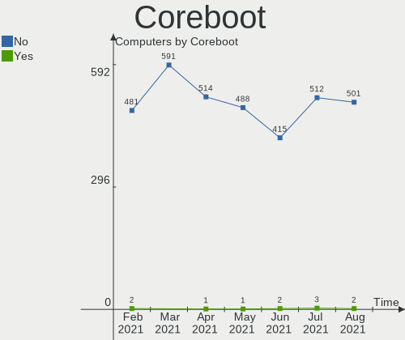

| Used | Computers | Percent |
|------|-----------|---------|
| No   | 415       | 99.52%  |
| Yes  | 2         | 0.48%   |

RAM Size
--------

Total RAM memory

| Size in GB  | Computers | Percent |
|-------------|-----------|---------|
| 4.01-8.0    | 110       | 26.38%  |
| 3.01-4.0    | 100       | 23.98%  |
| 16.01-24.0  | 66        | 15.83%  |
| 8.01-16.0   | 59        | 14.15%  |
| 32.01-64.0  | 31        | 7.43%   |
| 1.01-2.0    | 22        | 5.28%   |
| 2.01-3.0    | 11        | 2.64%   |
| 24.01-32.0  | 8         | 1.92%   |
| 0.51-1.0    | 6         | 1.44%   |
| 64.01-256.0 | 4         | 0.96%   |

RAM Used
--------

Used RAM memory

| Used GB    | Computers | Percent |
|------------|-----------|---------|
| 1.01-2.0   | 164       | 39.33%  |
| 2.01-3.0   | 107       | 25.66%  |
| 4.01-8.0   | 47        | 11.27%  |
| 3.01-4.0   | 46        | 11.03%  |
| 0.51-1.0   | 45        | 10.79%  |
| 8.01-16.0  | 3         | 0.72%   |
| 0.01-0.5   | 3         | 0.72%   |
| 16.01-24.0 | 2         | 0.48%   |

Has CD-ROM
----------

Has CD-ROM on board

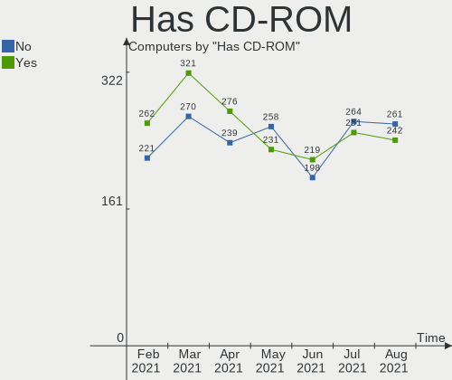

| Presented | Computers | Percent |
|-----------|-----------|---------|
| Yes       | 219       | 52.52%  |
| No        | 198       | 47.48%  |

Total Drives
------------

Number of drives on board

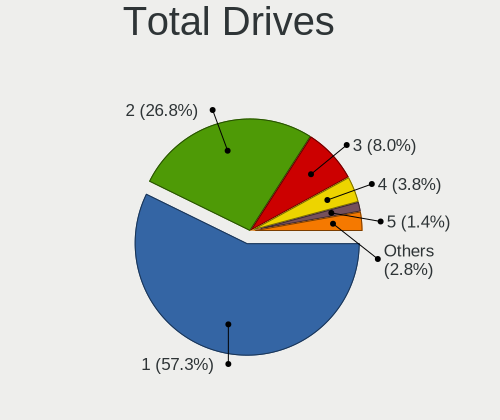

| Drives | Computers | Percent |
|--------|-----------|---------|
| 1      | 234       | 56.12%  |
| 2      | 113       | 27.1%   |
| 3      | 36        | 8.63%   |
| 4      | 13        | 3.12%   |
| 0      | 9         | 2.16%   |
| 5      | 6         | 1.44%   |
| 6      | 3         | 0.72%   |
| 7      | 2         | 0.48%   |
| 8      | 1         | 0.24%   |

Has Ethernet
------------

Has Ethernet on board

| Presented | Computers | Percent |
|-----------|-----------|---------|
| Yes       | 380       | 91.13%  |
| No        | 37        | 8.87%   |

Has WiFi
--------

Has WiFi module

| Presented | Computers | Percent |
|-----------|-----------|---------|
| Yes       | 318       | 76.26%  |
| No        | 99        | 23.74%  |

Has Bluetooth
-------------

Has Bluetooth module

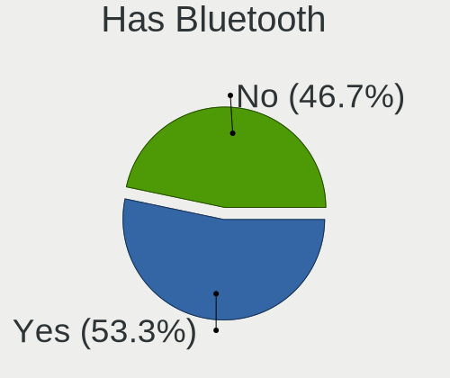

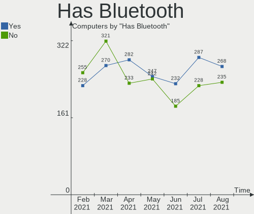

| Presented | Computers | Percent |
|-----------|-----------|---------|
| Yes       | 232       | 55.64%  |
| No        | 185       | 44.36%  |

Drive Vendor
------------

Hard drive vendors

| Vendor                    | Computers | Drives | Percent |
|---------------------------|-----------|--------|---------|
| WDC                       | 101       | 117    | 16.48%  |
| Seagate                   | 91        | 106    | 14.85%  |
| Samsung Electronics       | 85        | 102    | 13.87%  |
| Toshiba                   | 42        | 42     | 6.85%   |
| Kingston                  | 40        | 41     | 6.53%   |
| SanDisk                   | 31        | 31     | 5.06%   |
| Hitachi                   | 31        | 33     | 5.06%   |
| Crucial                   | 29        | 33     | 4.73%   |
| Unknown                   | 20        | 23     | 3.26%   |
| Intel                     | 13        | 14     | 2.12%   |
| HGST                      | 11        | 11     | 1.79%   |
| SK Hynix                  | 10        | 10     | 1.63%   |
| China                     | 10        | 10     | 1.63%   |
| A-DATA Technology         | 9         | 9      | 1.47%   |
| Micron Technology         | 7         | 7      | 1.14%   |
| PNY                       | 6         | 7      | 0.98%   |
| Phison                    | 6         | 8      | 0.98%   |
| SPCC                      | 5         | 5      | 0.82%   |
| Maxtor                    | 5         | 5      | 0.82%   |
| Silicon Motion            | 4         | 4      | 0.65%   |
| OCZ                       | 4         | 4      | 0.65%   |
| Fujitsu                   | 4         | 4      | 0.65%   |
| Transcend                 | 3         | 3      | 0.49%   |
| Micron/Crucial Technology | 3         | 3      | 0.49%   |
| KIOXIA                    | 3         | 3      | 0.49%   |
| XPG                       | 2         | 2      | 0.33%   |
| TCSUNBOW                  | 2         | 2      | 0.33%   |
| LITEON                    | 2         | 2      | 0.33%   |
| JMicron                   | 2         | 3      | 0.33%   |
| Intenso                   | 2         | 2      | 0.33%   |
| GOODRAM                   | 2         | 3      | 0.33%   |
| EMTEC                     | 2         | 2      | 0.33%   |
| Dogfish                   | 2         | 2      | 0.33%   |
| WD MediaMax               | 1         | 2      | 0.16%   |
| Teclast                   | 1         | 1      | 0.16%   |
| SMART                     | 1         | 1      | 0.16%   |
| SABRENT                   | 1         | 1      | 0.16%   |
| Realtek Semiconductor     | 1         | 1      | 0.16%   |
| PHD 3.0                   | 1         | 1      | 0.16%   |
| OWC                       | 1         | 1      | 0.16%   |
| ORTIAL                    | 1         | 1      | 0.16%   |
| LITEONIT                  | 1         | 1      | 0.16%   |
| Lenovo                    | 1         | 1      | 0.16%   |
| KingSpec                  | 1         | 1      | 0.16%   |
| Kingmax                   | 1         | 1      | 0.16%   |
| Kingchuxing               | 1         | 1      | 0.16%   |
| KINGBANK                  | 1         | 1      | 0.16%   |
| JAMESDONKEY               | 1         | 1      | 0.16%   |
| HS-SSD-C100               | 1         | 1      | 0.16%   |
| HGST HTS                  | 1         | 1      | 0.16%   |
| Hewlett-Packard           | 1         | 1      | 0.16%   |
| Gigabyte Technology       | 1         | 1      | 0.16%   |
| CORSAIR                   | 1         | 1      | 0.16%   |
| ASMT                      | 1         | 1      | 0.16%   |
| ASMedia                   | 1         | 1      | 0.16%   |
| Apple                     | 1         | 1      | 0.16%   |
| Apacer                    | 1         | 1      | 0.16%   |

Drive Model
-----------

Hard drive models

| Model                               | Computers | Percent |
|-------------------------------------|-----------|---------|
| Kingston SA400S37240G 240GB SSD     | 13        | 1.96%   |
| Crucial CT240BX500SSD1 240GB        | 8         | 1.21%   |
| Toshiba MQ01ABD100 1TB              | 6         | 0.9%    |
| Unknown SD/MMC/MS PRO 128GB         | 5         | 0.75%   |
| SanDisk SSD PLUS 240GB              | 5         | 0.75%   |
| Samsung SSD 860 EVO 250GB           | 5         | 0.75%   |
| Samsung SSD 860 EVO 1TB             | 5         | 0.75%   |
| Samsung SSD 850 EVO 250GB           | 5         | 0.75%   |
| Samsung NVMe SSD Drive 512GB        | 5         | 0.75%   |
| Kingston SA400S37480G 480GB SSD     | 5         | 0.75%   |
| Crucial CT500MX500SSD1 500GB        | 5         | 0.75%   |
| WDC WDS100T2B0A-00SM50 1TB SSD      | 4         | 0.6%    |
| Unknown MMC Card  64GB              | 4         | 0.6%    |
| Seagate ST500LT012-1DG142 500GB     | 4         | 0.6%    |
| Seagate Expansion Desk 2TB          | 4         | 0.6%    |
| SanDisk SDSSDA240G 240GB            | 4         | 0.6%    |
| Samsung SSD 850 EVO 500GB           | 4         | 0.6%    |
| Samsung NVMe SSD Drive 500GB        | 4         | 0.6%    |
| Intel NVMe SSD Drive 256GB          | 4         | 0.6%    |
| WDC WDS240G2G0A-00JH30 240GB SSD    | 3         | 0.45%   |
| WDC WD3200BEVT-22ZCT0 320GB         | 3         | 0.45%   |
| WDC WD10EARS-00Y5B1 1TB             | 3         | 0.45%   |
| Unknown MMC Card  16GB              | 3         | 0.45%   |
| Toshiba MQ04ABF100 1TB              | 3         | 0.45%   |
| Toshiba MQ01ABF050 500GB            | 3         | 0.45%   |
| Toshiba HDWD110 1TB                 | 3         | 0.45%   |
| Seagate ST500DM002-1BD142 500GB     | 3         | 0.45%   |
| Seagate ST4000DM004-2CV104 4TB      | 3         | 0.45%   |
| Seagate ST2000DM001-1CH164 2TB      | 3         | 0.45%   |
| Seagate ST2000DL003-9VT166 2TB      | 3         | 0.45%   |
| Seagate ST1000LM035-1RK172 1TB      | 3         | 0.45%   |
| Seagate ST1000LM024 HN-M101MBB 1TB  | 3         | 0.45%   |
| SanDisk SDSSDA120G 120GB            | 3         | 0.45%   |
| Sandisk NVMe SSD Drive 512GB        | 3         | 0.45%   |
| Samsung SSD 840 EVO 120GB           | 3         | 0.45%   |
| Phison NVMe SSD Drive 2TB           | 3         | 0.45%   |
| Micron NVMe SSD Drive 512GB         | 3         | 0.45%   |
| China SATA SSD 120GB                | 3         | 0.45%   |
| WDC WDS500G2B0A-00SM50 500GB SSD    | 2         | 0.3%    |
| WDC WDBNCE5000PNC 500GB SSD         | 2         | 0.3%    |
| WDC WD6400AAKS-65A7B2 640GB         | 2         | 0.3%    |
| WDC WD3200BEVT-60ZCT1 320GB         | 2         | 0.3%    |
| WDC WD20EARX-00PASB0 2TB            | 2         | 0.3%    |
| WDC WD10SPZX-22Z10T1 1TB            | 2         | 0.3%    |
| WDC WD10EZEX-08WN4A0 1TB            | 2         | 0.3%    |
| WDC WD10EZEX-08M2NA0 1TB            | 2         | 0.3%    |
| WDC WD10EADS-00L5B1 1TB             | 2         | 0.3%    |
| Unknown MMC Card  32GB              | 2         | 0.3%    |
| Unknown MMC Card  256GB             | 2         | 0.3%    |
| Unknown MMC Card  128GB             | 2         | 0.3%    |
| Toshiba NVMe SSD Drive 512GB        | 2         | 0.3%    |
| Toshiba MK1652GSX 160GB             | 2         | 0.3%    |
| Toshiba DT01ACA050 500GB            | 2         | 0.3%    |
| SPCC M.2 PCIe SSD 512GB             | 2         | 0.3%    |
| SK Hynix NVMe SSD Drive 512GB       | 2         | 0.3%    |
| Silicon Motion NVMe SSD Drive 256GB | 2         | 0.3%    |
| Seagate ST9500325AS 500GB           | 2         | 0.3%    |
| Seagate ST9250410AS 250GB           | 2         | 0.3%    |
| Seagate ST500LM012 HN-M500MBB 500GB | 2         | 0.3%    |
| Seagate ST380811AS 80GB             | 2         | 0.3%    |

HDD Vendor
----------

Hard disk drive vendors

| Vendor              | Computers | Drives | Percent |
|---------------------|-----------|--------|---------|
| Seagate             | 87        | 102    | 31.75%  |
| WDC                 | 83        | 95     | 30.29%  |
| Toshiba             | 38        | 38     | 13.87%  |
| Hitachi             | 31        | 33     | 11.31%  |
| Samsung Electronics | 11        | 13     | 4.01%   |
| HGST                | 11        | 11     | 4.01%   |
| MAXTOR              | 5         | 5      | 1.82%   |
| Fujitsu             | 4         | 4      | 1.46%   |
| WD MediaMax         | 1         | 2      | 0.36%   |
| PHD 3.0             | 1         | 1      | 0.36%   |
| Intenso             | 1         | 1      | 0.36%   |
| HGST HTS            | 1         | 1      | 0.36%   |

SSD Vendor
----------

Solid state drive vendors

| Vendor              | Computers | Drives | Percent |
|---------------------|-----------|--------|---------|
| Samsung Electronics | 50        | 59     | 23.7%   |
| Kingston            | 30        | 31     | 14.22%  |
| Crucial             | 28        | 31     | 13.27%  |
| SanDisk             | 22        | 22     | 10.43%  |
| WDC                 | 16        | 17     | 7.58%   |
| China               | 10        | 10     | 4.74%   |
| A-DATA Technology   | 7         | 7      | 3.32%   |
| PNY                 | 5         | 5      | 2.37%   |
| Intel               | 5         | 5      | 2.37%   |
| OCZ                 | 4         | 4      | 1.9%    |
| Transcend           | 3         | 3      | 1.42%   |
| SPCC                | 3         | 3      | 1.42%   |
| Toshiba             | 2         | 2      | 0.95%   |
| SK Hynix            | 2         | 2      | 0.95%   |
| LITEON              | 2         | 2      | 0.95%   |
| GOODRAM             | 2         | 3      | 0.95%   |
| Dogfish             | 2         | 2      | 0.95%   |
| Teclast             | 1         | 1      | 0.47%   |
| TCSUNBOW            | 1         | 1      | 0.47%   |
| SMART               | 1         | 1      | 0.47%   |
| Seagate             | 1         | 1      | 0.47%   |
| SABRENT             | 1         | 1      | 0.47%   |
| OWC                 | 1         | 1      | 0.47%   |
| ORTIAL              | 1         | 1      | 0.47%   |
| Micron Technology   | 1         | 1      | 0.47%   |
| LITEONIT            | 1         | 1      | 0.47%   |
| KingSpec            | 1         | 1      | 0.47%   |
| Kingmax             | 1         | 1      | 0.47%   |
| KINGBANK            | 1         | 1      | 0.47%   |
| Intenso             | 1         | 1      | 0.47%   |
| Gigabyte Technology | 1         | 1      | 0.47%   |
| EMTEC               | 1         | 1      | 0.47%   |
| CORSAIR             | 1         | 1      | 0.47%   |
| ASMT                | 1         | 1      | 0.47%   |
| ASMedia             | 1         | 1      | 0.47%   |

Drive Kind
----------

HDD or SSD

| Kind    | Computers | Drives | Percent |
|---------|-----------|--------|---------|
| HDD     | 229       | 306    | 42.96%  |
| SSD     | 180       | 226    | 33.77%  |
| NVMe    | 97        | 117    | 18.2%   |
| MMC     | 15        | 17     | 2.81%   |
| Unknown | 12        | 12     | 2.25%   |

Drive Connector
---------------

SATA, SAS, NVMe, etc.

| Type | Computers | Drives | Percent |
|------|-----------|--------|---------|
| SATA | 345       | 522    | 72.18%  |
| NVMe | 96        | 114    | 20.08%  |
| SAS  | 22        | 25     | 4.6%    |
| MMC  | 15        | 17     | 3.14%   |

Drive Size
----------

Size of hard drive

| Size in TB | Computers | Drives | Percent |
|------------|-----------|--------|---------|
| 0.01-0.5   | 258       | 329    | 59.45%  |
| 0.51-1.0   | 118       | 134    | 27.19%  |
| 1.01-2.0   | 35        | 42     | 8.06%   |
| 3.01-4.0   | 11        | 14     | 2.53%   |
| 2.01-3.0   | 6         | 7      | 1.38%   |
| 4.01-10.0  | 4         | 4      | 0.92%   |
| 10.01-20.0 | 2         | 2      | 0.46%   |

Space Total
-----------

Amount of disk space available on the file system

| Size in GB     | Computers | Percent |
|----------------|-----------|---------|
| 101-250        | 120       | 28.78%  |
| 251-500        | 108       | 25.9%   |
| 501-1000       | 75        | 17.99%  |
| 1001-2000      | 26        | 6.24%   |
| 51-100         | 24        | 5.76%   |
| 2001-3000      | 18        | 4.32%   |
| 1-20           | 16        | 3.84%   |
| More than 3000 | 15        | 3.6%    |
| 21-50          | 14        | 3.36%   |
| Unknown        | 1         | 0.24%   |

Space Used
----------

Amount of used disk space

| Used GB        | Computers | Percent |
|----------------|-----------|---------|
| 1-20           | 112       | 26.86%  |
| 101-250        | 86        | 20.62%  |
| 21-50          | 77        | 18.47%  |
| 51-100         | 50        | 11.99%  |
| 251-500        | 46        | 11.03%  |
| 1001-2000      | 22        | 5.28%   |
| 501-1000       | 14        | 3.36%   |
| 2001-3000      | 6         | 1.44%   |
| More than 3000 | 3         | 0.72%   |
| Unknown        | 1         | 0.24%   |

Malfunc. Drives
---------------

Drive models with a malfunction

| Model                             | Computers | Drives | Percent |
|-----------------------------------|-----------|--------|---------|
| WDC WD6400BPVT-60HXZT1 640GB      | 1         | 1      | 4%      |
| WDC WD5002ABYS-01B1B0 500GB       | 1         | 1      | 4%      |
| WDC WD5000AAKX-07U6AA0 500GB      | 1         | 1      | 4%      |
| WDC WD3200AAJS-00L7A0 320GB       | 1         | 1      | 4%      |
| WDC WD10SPZX-21Z10T0 1TB          | 1         | 1      | 4%      |
| WDC WD10JPVX-22JC3T0 1TB          | 1         | 1      | 4%      |
| WDC WD10EARS-00Y5B1 1TB           | 1         | 1      | 4%      |
| Toshiba MQ01ABF050 500GB          | 1         | 1      | 4%      |
| Toshiba MK5075GSX 500GB           | 1         | 1      | 4%      |
| Toshiba MK3276GSX 320GB           | 1         | 1      | 4%      |
| Toshiba MK1237GSX 120GB           | 1         | 1      | 4%      |
| SPCC Solid State Disk 512GB       | 1         | 1      | 4%      |
| Seagate ST9500325AS 500GB         | 1         | 1      | 4%      |
| Seagate ST3500630AS 500GB         | 1         | 1      | 4%      |
| Seagate ST2000LX001-1RG174 2TB    | 1         | 1      | 4%      |
| Seagate ST2000LM007-1R8174 2TB    | 1         | 1      | 4%      |
| Seagate ST2000DM001-1CH164 2TB    | 1         | 1      | 4%      |
| Seagate ST1000LM035-1RK172 1TB    | 1         | 1      | 4%      |
| Seagate ST1000DM003-9YN162 1TB    | 1         | 1      | 4%      |
| Samsung Electronics HD250HJ 250GB | 1         | 1      | 4%      |
| Samsung Electronics HD204UI 2TB   | 1         | 1      | 4%      |
| Kingmax SSD 120GB                 | 1         | 1      | 4%      |
| Hitachi HTS725025A9A364 250GB     | 1         | 1      | 4%      |
| Hitachi HTS547564A9E384 640GB     | 1         | 1      | 4%      |
| HGST HTS541010A9E680 1TB          | 1         | 1      | 4%      |

Malfunc. Drive Vendor
---------------------

Vendors of faulty drives

| Vendor              | Computers | Drives | Percent |
|---------------------|-----------|--------|---------|
| WDC                 | 7         | 7      | 29.17%  |
| Seagate             | 6         | 7      | 25%     |
| Toshiba             | 4         | 4      | 16.67%  |
| Samsung Electronics | 2         | 2      | 8.33%   |
| Hitachi             | 2         | 2      | 8.33%   |
| SPCC                | 1         | 1      | 4.17%   |
| Kingmax             | 1         | 1      | 4.17%   |
| HGST                | 1         | 1      | 4.17%   |

Malfunc. HDD Vendor
-------------------

Vendors of faulty HDD drives

| Vendor              | Computers | Drives | Percent |
|---------------------|-----------|--------|---------|
| WDC                 | 7         | 7      | 31.82%  |
| Seagate             | 6         | 7      | 27.27%  |
| Toshiba             | 4         | 4      | 18.18%  |
| Samsung Electronics | 2         | 2      | 9.09%   |
| Hitachi             | 2         | 2      | 9.09%   |
| HGST                | 1         | 1      | 4.55%   |

Malfunc. Drive Kind
-------------------

Kinds of faulty drives

| Kind | Computers | Drives | Percent |
|------|-----------|--------|---------|
| HDD  | 20        | 23     | 90.91%  |
| SSD  | 2         | 2      | 9.09%   |

Failed Drives
-------------

Failed drive models

Zero info for selected period =(

Failed Drive Vendor
-------------------

Failed drive vendors

Zero info for selected period =(

Drive Status
------------

Number of failed and malfunc. drives

| Status   | Computers | Drives | Percent |
|----------|-----------|--------|---------|
| Detected | 297       | 481    | 69.23%  |
| Works    | 110       | 172    | 25.64%  |
| Malfunc  | 22        | 25     | 5.13%   |

Storage Vendor
--------------

Storage controller vendors

| Vendor                           | Computers | Percent |
|----------------------------------|-----------|---------|
| Intel                            | 280       | 55.89%  |
| AMD                              | 91        | 18.16%  |
| Samsung Electronics              | 27        | 5.39%   |
| Nvidia                           | 15        | 2.99%   |
| Sandisk                          | 14        | 2.79%   |
| Kingston Technology Company      | 10        | 2%      |
| SK Hynix                         | 8         | 1.6%    |
| Phison Electronics               | 8         | 1.6%    |
| Micron Technology                | 6         | 1.2%    |
| Silicon Motion                   | 5         | 1%      |
| Micron/Crucial Technology        | 5         | 1%      |
| ASMedia Technology               | 5         | 1%      |
| ADATA Technology                 | 4         | 0.8%    |
| Silicon Integrated Systems [SiS] | 3         | 0.6%    |
| KIOXIA                           | 3         | 0.6%    |
| VIA Technologies                 | 2         | 0.4%    |
| Toshiba America Info Systems     | 2         | 0.4%    |
| Silicon Image                    | 2         | 0.4%    |
| Seagate Technology               | 2         | 0.4%    |
| Marvell Technology Group         | 2         | 0.4%    |
| JMicron Technology               | 2         | 0.4%    |
| Realtek Semiconductor            | 1         | 0.2%    |
| LSI Logic / Symbios Logic        | 1         | 0.2%    |
| Lenovo                           | 1         | 0.2%    |
| Hewlett-Packard                  | 1         | 0.2%    |
| Apple                            | 1         | 0.2%    |

Storage Model
-------------

Storage controller models

| Model                                                                                   | Computers | Percent |
|-----------------------------------------------------------------------------------------|-----------|---------|
| AMD FCH SATA Controller [AHCI mode]                                                     | 62        | 10.05%  |
| Intel 7 Series Chipset Family 6-port SATA Controller [AHCI mode]                        | 23        | 3.73%   |
| Intel 82801IBM/IEM (ICH9M/ICH9M-E) 4 port SATA Controller [AHCI mode]                   | 18        | 2.92%   |
| Intel 6 Series/C200 Series Chipset Family 6 port Mobile SATA AHCI Controller            | 16        | 2.59%   |
| Samsung NVMe SSD Controller SM981/PM981/PM983                                           | 15        | 2.43%   |
| Intel 82801G (ICH7 Family) IDE Controller                                               | 15        | 2.43%   |
| Intel 8 Series/C220 Series Chipset Family 6-port SATA Controller 1 [AHCI mode]          | 15        | 2.43%   |
| Intel Sunrise Point-LP SATA Controller [AHCI mode]                                      | 14        | 2.27%   |
| Intel NM10/ICH7 Family SATA Controller [IDE mode]                                       | 14        | 2.27%   |
| Intel 82801 Mobile SATA Controller [RAID mode]                                          | 12        | 1.94%   |
| Intel 8 Series SATA Controller 1 [AHCI mode]                                            | 12        | 1.94%   |
| Intel 82801HM/HEM (ICH8M/ICH8M-E) IDE Controller                                        | 10        | 1.62%   |
| Samsung NVMe Controller                                                                 | 9         | 1.46%   |
| Intel Volume Management Device NVMe RAID Controller                                     | 9         | 1.46%   |
| Intel 82801HM/HEM (ICH8M/ICH8M-E) SATA Controller [AHCI mode]                           | 9         | 1.46%   |
| Intel 5 Series/3400 Series Chipset 4 port SATA AHCI Controller                          | 9         | 1.46%   |
| AMD Starship/Matisse Chipset SATA Controller [AHCI mode]                                | 9         | 1.46%   |
| Nvidia MCP61 SATA Controller                                                            | 8         | 1.3%    |
| Intel Wildcat Point-LP SATA Controller [AHCI Mode]                                      | 8         | 1.3%    |
| Intel 200 Series PCH SATA controller [AHCI mode]                                        | 8         | 1.3%    |
| Intel 7 Series/C210 Series Chipset Family 6-port SATA Controller [AHCI mode]            | 7         | 1.13%   |
| Intel 6 Series/C200 Series Chipset Family 6 port Desktop SATA AHCI Controller           | 7         | 1.13%   |
| AMD SB7x0/SB8x0/SB9x0 SATA Controller [AHCI mode]                                       | 7         | 1.13%   |
| AMD SB7x0/SB8x0/SB9x0 IDE Controller                                                    | 7         | 1.13%   |
| AMD 400 Series Chipset SATA Controller                                                  | 7         | 1.13%   |
| Nvidia MCP61 IDE                                                                        | 6         | 0.97%   |
| Micron Non-Volatile memory controller                                                   | 6         | 0.97%   |
| Intel Tiger Lake-LP SATA Controller [AHCI mode]                                         | 6         | 0.97%   |
| AMD SB7x0/SB8x0/SB9x0 SATA Controller [IDE mode]                                        | 6         | 0.97%   |
| Sandisk WD Black SN750 / PC SN730 NVMe SSD                                              | 5         | 0.81%   |
| Kingston Company A2000 NVMe SSD                                                         | 5         | 0.81%   |
| Intel SATA Controller [RAID mode]                                                       | 5         | 0.81%   |
| Intel Q170/Q150/B150/H170/H110/Z170/CM236 Chipset SATA Controller [AHCI Mode]           | 5         | 0.81%   |
| Intel Atom/Celeron/Pentium Processor x5-E8000/J3xxx/N3xxx Series SATA Controller        | 5         | 0.81%   |
| Intel Atom Processor E3800 Series SATA AHCI Controller                                  | 5         | 0.81%   |
| Intel 6 Series/C200 Series Chipset Family Desktop SATA Controller (IDE mode, ports 4-5) | 5         | 0.81%   |
| Intel 6 Series/C200 Series Chipset Family Desktop SATA Controller (IDE mode, ports 0-3) | 5         | 0.81%   |
| Intel 5 Series/3400 Series Chipset 6 port SATA AHCI Controller                          | 5         | 0.81%   |
| Intel 5 Series/3400 Series Chipset 4 port SATA IDE Controller                           | 5         | 0.81%   |
| ASMedia ASM1062 Serial ATA Controller                                                   | 5         | 0.81%   |
| AMD SB600 Non-Raid-5 SATA                                                               | 5         | 0.81%   |
| AMD SB600 IDE                                                                           | 5         | 0.81%   |
| AMD FCH SATA Controller D                                                               | 5         | 0.81%   |
| AMD 300 Series Chipset SATA Controller                                                  | 5         | 0.81%   |
| SK Hynix NVMe SSD Controller                                                            | 4         | 0.65%   |
| Silicon Motion SM2263EN/SM2263XT SSD Controller                                         | 4         | 0.65%   |
| Samsung NVMe SSD Controller PM9A1/PM9A3/980PRO                                          | 4         | 0.65%   |
| Phison E12 NVMe Controller                                                              | 4         | 0.65%   |
| Intel Celeron N3350/Pentium N4200/Atom E3900 Series SATA AHCI Controller                | 4         | 0.65%   |
| Intel 82801GBM/GHM (ICH7-M Family) SATA Controller [IDE mode]                           | 4         | 0.65%   |
| Intel 5 Series/3400 Series Chipset 2 port SATA IDE Controller                           | 4         | 0.65%   |
| ADATA XPG SX8200 Pro PCIe Gen3x4 M.2 2280 Solid State Drive                             | 4         | 0.65%   |
| Silicon Integrated Systems [SiS] SATA Controller / IDE mode                             | 3         | 0.49%   |
| Silicon Integrated Systems [SiS] 5513 IDE Controller                                    | 3         | 0.49%   |
| Sandisk WD Blue SN550 NVMe SSD                                                          | 3         | 0.49%   |
| Sandisk Non-Volatile memory controller                                                  | 3         | 0.49%   |
| KIOXIA Non-Volatile memory controller                                                   | 3         | 0.49%   |
| Kingston Company Company Non-Volatile memory controller                                 | 3         | 0.49%   |
| Intel SSD Pro 7600p/760p/E 6100p Series                                                 | 3         | 0.49%   |
| Intel HM170/QM170 Chipset SATA Controller [AHCI Mode]                                   | 3         | 0.49%   |

Storage Kind
------------

Kind of storage controller (IDE, SATA, NVMe, SAS, ...)

| Kind | Computers | Percent |
|------|-----------|---------|
| SATA | 303       | 57.17%  |
| IDE  | 98        | 18.49%  |
| NVMe | 96        | 18.11%  |
| RAID | 32        | 6.04%   |
| SAS  | 1         | 0.19%   |

CPU Vendor
----------

Processor vendors

| Vendor | Computers | Percent |
|--------|-----------|---------|
| Intel  | 306       | 73.38%  |
| AMD    | 111       | 26.62%  |

CPU Model
---------

Processor models

| Model                                       | Computers | Percent |
|---------------------------------------------|-----------|---------|
| Intel 11th Gen Core i7-1165G7 @ 2.80GHz     | 7         | 1.68%   |
| Intel 11th Gen Core i5-1135G7 @ 2.40GHz     | 7         | 1.68%   |
| Intel Core i5-8250U CPU @ 1.60GHz           | 6         | 1.44%   |
| AMD Ryzen 5 4500U with Radeon Graphics      | 6         | 1.44%   |
| Intel Core i5-8265U CPU @ 1.60GHz           | 5         | 1.2%    |
| Intel Core i5-2450M CPU @ 2.50GHz           | 5         | 1.2%    |
| AMD Ryzen 7 3700X 8-Core Processor          | 5         | 1.2%    |
| Intel Core i5-4210U CPU @ 1.70GHz           | 4         | 0.96%   |
| Intel Core i5-3230M CPU @ 2.60GHz           | 4         | 0.96%   |
| Intel Core i5-3210M CPU @ 2.50GHz           | 4         | 0.96%   |
| Intel Core i5-2400 CPU @ 3.10GHz            | 4         | 0.96%   |
| AMD FX-6300 Six-Core Processor              | 4         | 0.96%   |
| Intel Pentium Dual-Core CPU T4200 @ 2.00GHz | 3         | 0.72%   |
| Intel Pentium CPU P6200 @ 2.13GHz           | 3         | 0.72%   |
| Intel Core i7-9750H CPU @ 2.60GHz           | 3         | 0.72%   |
| Intel Core i7-10510U CPU @ 1.80GHz          | 3         | 0.72%   |
| Intel Core i5-6300U CPU @ 2.40GHz           | 3         | 0.72%   |
| Intel Core i5-6200U CPU @ 2.30GHz           | 3         | 0.72%   |
| Intel Core i5-5300U CPU @ 2.30GHz           | 3         | 0.72%   |
| Intel Core i5-4570 CPU @ 3.20GHz            | 3         | 0.72%   |
| Intel Core i5-3320M CPU @ 2.60GHz           | 3         | 0.72%   |
| Intel Core 2 Duo CPU P8700 @ 2.53GHz        | 3         | 0.72%   |
| Intel Core 2 Duo CPU E8400 @ 3.00GHz        | 3         | 0.72%   |
| Intel Celeron CPU N2840 @ 2.16GHz           | 3         | 0.72%   |
| Intel Atom CPU N270 @ 1.60GHz               | 3         | 0.72%   |
| AMD Turion 64 X2 Mobile Technology TL-60    | 3         | 0.72%   |
| AMD Ryzen 7 2700X Eight-Core Processor      | 3         | 0.72%   |
| AMD Ryzen 5 3600 6-Core Processor           | 3         | 0.72%   |
| AMD E-300 APU with Radeon HD Graphics       | 3         | 0.72%   |
| Intel Xeon CPU E5-2689 0 @ 2.60GHz          | 2         | 0.48%   |
| Intel Pentium CPU B960 @ 2.20GHz            | 2         | 0.48%   |
| Intel Pentium CPU 2117U @ 1.80GHz           | 2         | 0.48%   |
| Intel Core i7-7700HQ CPU @ 2.80GHz          | 2         | 0.48%   |
| Intel Core i7-7700 CPU @ 3.60GHz            | 2         | 0.48%   |
| Intel Core i7-7500U CPU @ 2.70GHz           | 2         | 0.48%   |
| Intel Core i7-6700K CPU @ 4.00GHz           | 2         | 0.48%   |
| Intel Core i7-4700MQ CPU @ 2.40GHz          | 2         | 0.48%   |
| Intel Core i7-2670QM CPU @ 2.20GHz          | 2         | 0.48%   |
| Intel Core i7-2640M CPU @ 2.80GHz           | 2         | 0.48%   |
| Intel Core i7 CPU 860 @ 2.80GHz             | 2         | 0.48%   |
| Intel Core i5-9400F CPU @ 2.90GHz           | 2         | 0.48%   |
| Intel Core i5-4670K CPU @ 3.40GHz           | 2         | 0.48%   |
| Intel Core i5-4590 CPU @ 3.30GHz            | 2         | 0.48%   |
| Intel Core i5-4200U CPU @ 1.60GHz           | 2         | 0.48%   |
| Intel Core i5-2520M CPU @ 2.50GHz           | 2         | 0.48%   |
| Intel Core i5 CPU M 520 @ 2.40GHz           | 2         | 0.48%   |
| Intel Core i5 CPU M 460 @ 2.53GHz           | 2         | 0.48%   |
| Intel Core i3-3220 CPU @ 3.30GHz            | 2         | 0.48%   |
| Intel Core i3-3110M CPU @ 2.40GHz           | 2         | 0.48%   |
| Intel Core i3-2350M CPU @ 2.30GHz           | 2         | 0.48%   |
| Intel Core i3 CPU M 350 @ 2.27GHz           | 2         | 0.48%   |
| Intel Core i3 CPU M 330 @ 2.13GHz           | 2         | 0.48%   |
| Intel Core i3 CPU 540 @ 3.07GHz             | 2         | 0.48%   |
| Intel Core 2 Quad CPU Q6600 @ 2.40GHz       | 2         | 0.48%   |
| Intel Core 2 Duo CPU T8100 @ 2.10GHz        | 2         | 0.48%   |
| Intel Core 2 Duo CPU T7700 @ 2.40GHz        | 2         | 0.48%   |
| Intel Core 2 Duo CPU T6670 @ 2.20GHz        | 2         | 0.48%   |
| Intel Core 2 Duo CPU T5250 @ 1.50GHz        | 2         | 0.48%   |
| Intel Core 2 Duo CPU E7500 @ 2.93GHz        | 2         | 0.48%   |
| Intel Core 2 CPU 6400 @ 2.13GHz             | 2         | 0.48%   |

CPU Model Family
----------------

Processor model prefix

| Model                   | Computers | Percent |
|-------------------------|-----------|---------|
| Intel Core i5           | 91        | 21.82%  |
| Intel Core i7           | 53        | 12.71%  |
| Intel Core 2 Duo        | 31        | 7.43%   |
| AMD Ryzen 5             | 26        | 6.24%   |
| Intel Core i3           | 25        | 6%      |
| Other                   | 20        | 4.8%    |
| Intel Celeron           | 19        | 4.56%   |
| Intel Pentium           | 18        | 4.32%   |
| AMD Ryzen 7             | 18        | 4.32%   |
| Intel Pentium Dual-Core | 11        | 2.64%   |
| Intel Atom              | 9         | 2.16%   |
| Intel Xeon              | 8         | 1.92%   |
| AMD Ryzen 3             | 6         | 1.44%   |
| AMD FX                  | 6         | 1.44%   |
| AMD A8                  | 6         | 1.44%   |
| Intel Core 2            | 5         | 1.2%    |
| AMD Phenom              | 5         | 1.2%    |
| AMD Athlon II X2        | 5         | 1.2%    |
| AMD A6                  | 5         | 1.2%    |
| Intel Genuine           | 4         | 0.96%   |
| Intel Core 2 Quad       | 4         | 0.96%   |
| AMD Turion 64 X2 Mobile | 4         | 0.96%   |
| AMD Ryzen 9             | 4         | 0.96%   |
| AMD E                   | 4         | 0.96%   |
| Intel Pentium Dual      | 3         | 0.72%   |
| AMD Athlon 64 X2        | 3         | 0.72%   |
| Intel Pentium 4         | 2         | 0.48%   |
| Intel Core i9           | 2         | 0.48%   |
| Intel Celeron M         | 2         | 0.48%   |
| AMD E2                  | 2         | 0.48%   |
| AMD A12                 | 2         | 0.48%   |
| AMD A10                 | 2         | 0.48%   |
| Intel Pentium M         | 1         | 0.24%   |
| Intel Core M            | 1         | 0.24%   |
| Intel Core 2 Extreme    | 1         | 0.24%   |
| AMD Ryzen 7 PRO         | 1         | 0.24%   |
| AMD Ryzen 5 PRO         | 1         | 0.24%   |
| AMD Ryzen 3 PRO         | 1         | 0.24%   |
| AMD Phenom II X4        | 1         | 0.24%   |
| AMD E1                  | 1         | 0.24%   |
| AMD Athlon X4           | 1         | 0.24%   |
| AMD Athlon II X4        | 1         | 0.24%   |
| AMD Athlon              | 1         | 0.24%   |
| AMD A4                  | 1         | 0.24%   |

CPU Cores
---------

Number of processor cores

| Number | Computers | Percent |
|--------|-----------|---------|
| 2      | 197       | 47.24%  |
| 4      | 128       | 30.7%   |
| 6      | 36        | 8.63%   |
| 8      | 25        | 6%      |
| 1      | 18        | 4.32%   |
| 3      | 8         | 1.92%   |
| 16     | 3         | 0.72%   |
| 12     | 1         | 0.24%   |
| 10     | 1         | 0.24%   |

CPU Sockets
-----------

Number of sockets

| Number | Computers | Percent |
|--------|-----------|---------|
| 1      | 416       | 99.76%  |
| 2      | 1         | 0.24%   |

CPU Threads
-----------

Threads per core (Hyper-Threading)

| Number | Computers | Percent |
|--------|-----------|---------|
| 2      | 240       | 57.55%  |
| 1      | 177       | 42.45%  |

CPU Op-Modes
------------

CPU Operation Modes (32-bit, 64-bit)

| Op mode        | Computers | Percent |
|----------------|-----------|---------|
| 32-bit, 64-bit | 407       | 97.6%   |
| 32-bit         | 10        | 2.4%    |

CPU Microcode
-------------

Microcode number

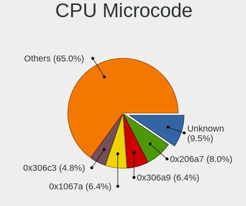

| Number     | Computers | Percent |
|------------|-----------|---------|
| Unknown    | 35        | 8.39%   |
| 0x306a9    | 31        | 7.43%   |
| 0x206a7    | 31        | 7.43%   |
| 0x1067a    | 31        | 7.43%   |
| 0x306c3    | 17        | 4.08%   |
| 0x806c1    | 14        | 3.36%   |
| 0x20655    | 13        | 3.12%   |
| 0x40651    | 12        | 2.88%   |
| 0x08701021 | 11        | 2.64%   |
| 0x306d4    | 9         | 2.16%   |
| 0x906ea    | 8         | 1.92%   |
| 0x6fd      | 8         | 1.92%   |
| 0x10676    | 8         | 1.92%   |
| 0x906e9    | 7         | 1.68%   |
| 0x406e3    | 7         | 1.68%   |
| 0x010000c8 | 7         | 1.68%   |
| 0x806ec    | 6         | 1.44%   |
| 0x806ea    | 6         | 1.44%   |
| 0x20652    | 6         | 1.44%   |
| 0x08600106 | 6         | 1.44%   |
| 0x08108109 | 6         | 1.44%   |
| 0x0800820d | 6         | 1.44%   |
| 0x6fb      | 5         | 1.2%    |
| 0x0600611a | 5         | 1.2%    |
| 0x6f6      | 4         | 0.96%   |
| 0x506e3    | 4         | 0.96%   |
| 0x506c9    | 4         | 0.96%   |
| 0x406c4    | 4         | 0.96%   |
| 0x406c3    | 4         | 0.96%   |
| 0x30678    | 4         | 0.96%   |
| 0x106c2    | 4         | 0.96%   |
| 0x07030105 | 4         | 0.96%   |
| 0x01000083 | 4         | 0.96%   |
| 0xa0655    | 3         | 0.72%   |
| 0x806eb    | 3         | 0.72%   |
| 0x206d7    | 3         | 0.72%   |
| 0x08608103 | 3         | 0.72%   |
| 0x08600104 | 3         | 0.72%   |
| 0x06001119 | 3         | 0.72%   |
| 0x06000852 | 3         | 0.72%   |
| 0x05000119 | 3         | 0.72%   |
| 0xa0671    | 2         | 0.48%   |
| 0xa0653    | 2         | 0.48%   |
| 0xa0652    | 2         | 0.48%   |
| 0x906ed    | 2         | 0.48%   |
| 0x806e9    | 2         | 0.48%   |
| 0x6e8      | 2         | 0.48%   |
| 0x6d8      | 2         | 0.48%   |
| 0x30673    | 2         | 0.48%   |
| 0x106e5    | 2         | 0.48%   |
| 0x106ca    | 2         | 0.48%   |
| 0x0a201009 | 2         | 0.48%   |
| 0x0810100b | 2         | 0.48%   |
| 0x03000027 | 2         | 0.48%   |
| 0x01000095 | 2         | 0.48%   |
| 0xf65      | 1         | 0.24%   |
| 0xf29      | 1         | 0.24%   |
| 0x906ec    | 1         | 0.24%   |
| 0x906eb    | 1         | 0.24%   |
| 0x706e5    | 1         | 0.24%   |

CPU Microarch
-------------

Microarchitecture

| Name          | Computers | Percent |
|---------------|-----------|---------|
| Penryn        | 42        | 10.07%  |
| KabyLake      | 40        | 9.59%   |
| SandyBridge   | 36        | 8.63%   |
| IvyBridge     | 32        | 7.67%   |
| Haswell       | 32        | 7.67%   |
| Zen 2         | 24        | 5.76%   |
| Westmere      | 20        | 4.8%    |
| Core          | 20        | 4.8%    |
| Zen+          | 17        | 4.08%   |
| TigerLake     | 14        | 3.36%   |
| Silvermont    | 14        | 3.36%   |
| K10           | 14        | 3.36%   |
| Skylake       | 13        | 3.12%   |
| Broadwell     | 11        | 2.64%   |
| Excavator     | 10        | 2.4%    |
| CometLake     | 8         | 1.92%   |
| Piledriver    | 7         | 1.68%   |
| K8 Hammer     | 7         | 1.68%   |
| Zen 3         | 6         | 1.44%   |
| Zen           | 6         | 1.44%   |
| Bonnell       | 6         | 1.44%   |
| Unknown       | 6         | 1.44%   |
| Puma          | 5         | 1.2%    |
| P6            | 5         | 1.2%    |
| Goldmont      | 4         | 0.96%   |
| Bobcat        | 4         | 0.96%   |
| K10 Llano     | 3         | 0.72%   |
| NetBurst      | 2         | 0.48%   |
| Nehalem       | 2         | 0.48%   |
| Goldmont plus | 2         | 0.48%   |
| Bulldozer     | 2         | 0.48%   |
| Steamroller   | 1         | 0.24%   |
| Jaguar        | 1         | 0.24%   |
| IceLake       | 1         | 0.24%   |

GPU Vendor
----------

Vendors of graphics cards

| Vendor                           | Computers | Percent |
|----------------------------------|-----------|---------|
| Intel                            | 238       | 50.75%  |
| AMD                              | 115       | 24.52%  |
| Nvidia                           | 112       | 23.88%  |
| Silicon Integrated Systems [SiS] | 2         | 0.43%   |
| VIA Technologies                 | 1         | 0.21%   |
| ATI Technologies                 | 1         | 0.21%   |

GPU Model
---------

Graphics card models

| Model                                                                                    | Computers | Percent |
|------------------------------------------------------------------------------------------|-----------|---------|
| Intel 2nd Generation Core Processor Family Integrated Graphics Controller                | 28        | 5.62%   |
| Intel 3rd Gen Core processor Graphics Controller                                         | 21        | 4.22%   |
| Intel Core Processor Integrated Graphics Controller                                      | 16        | 3.21%   |
| Intel TigerLake-LP GT2 [Iris Xe Graphics]                                                | 14        | 2.81%   |
| Intel Mobile 4 Series Chipset Integrated Graphics Controller                             | 14        | 2.81%   |
| AMD Renoir                                                                               | 12        | 2.41%   |
| Intel Haswell-ULT Integrated Graphics Controller                                         | 11        | 2.21%   |
| AMD Ellesmere [Radeon RX 470/480/570/570X/580/580X/590]                                  | 11        | 2.21%   |
| Nvidia GK208B [GeForce GT 710]                                                           | 10        | 2.01%   |
| Intel Xeon E3-1200 v3/4th Gen Core Processor Integrated Graphics Controller              | 8         | 1.61%   |
| Intel UHD Graphics 620                                                                   | 8         | 1.61%   |
| Intel Mobile 945GM/GMS/GME, 943/940GML Express Integrated Graphics Controller            | 8         | 1.61%   |
| Intel Atom/Celeron/Pentium Processor x5-E8000/J3xxx/N3xxx Integrated Graphics Controller | 8         | 1.61%   |
| Intel 4th Gen Core Processor Integrated Graphics Controller                              | 8         | 1.61%   |
| AMD Picasso                                                                              | 8         | 1.61%   |
| Intel Xeon E3-1200 v2/3rd Gen Core processor Graphics Controller                         | 7         | 1.41%   |
| Intel Skylake GT2 [HD Graphics 520]                                                      | 7         | 1.41%   |
| Intel HD Graphics 5500                                                                   | 7         | 1.41%   |
| Nvidia GP107 [GeForce GTX 1050 Ti]                                                       | 6         | 1.2%    |
| Intel WhiskeyLake-U GT2 [UHD Graphics 620]                                               | 6         | 1.2%    |
| Intel Mobile GM965/GL960 Integrated Graphics Controller (secondary)                      | 6         | 1.2%    |
| Intel Mobile GM965/GL960 Integrated Graphics Controller (primary)                        | 6         | 1.2%    |
| Intel Atom Processor Z36xxx/Z37xxx Series Graphics & Display                             | 6         | 1.2%    |
| Nvidia GP108 [GeForce GT 1030]                                                           | 5         | 1%      |
| Intel CoffeeLake-H GT2 [UHD Graphics 630]                                                | 5         | 1%      |
| Intel 4 Series Chipset Integrated Graphics Controller                                    | 5         | 1%      |
| AMD Wani [Radeon R5/R6/R7 Graphics]                                                      | 5         | 1%      |
| AMD Topaz XT [Radeon R7 M260/M265 / M340/M360 / M440/M445 / 530/535 / 620/625 Mobile]    | 5         | 1%      |
| Nvidia TU117M [GeForce GTX 1650 Mobile / Max-Q]                                          | 4         | 0.8%    |
| Intel Mobile 945GSE Express Integrated Graphics Controller                               | 4         | 0.8%    |
| Intel Mobile 945GM/GMS, 943/940GML Express Integrated Graphics Controller                | 4         | 0.8%    |
| Intel CometLake-U GT2 [UHD Graphics]                                                     | 4         | 0.8%    |
| Intel CometLake-S GT2 [UHD Graphics 630]                                                 | 4         | 0.8%    |
| Intel 82G33/G31 Express Integrated Graphics Controller                                   | 4         | 0.8%    |
| AMD Wrestler [Radeon HD 6310]                                                            | 4         | 0.8%    |
| AMD Thames [Radeon HD 7500M/7600M Series]                                                | 4         | 0.8%    |
| AMD Sun XT [Radeon HD 8670A/8670M/8690M / R5 M330 / M430 / Radeon 520 Mobile]            | 4         | 0.8%    |
| AMD Lucienne                                                                             | 4         | 0.8%    |
| Nvidia TU117 [GeForce GTX 1650]                                                          | 3         | 0.6%    |
| Nvidia GP106 [GeForce GTX 1060 6GB]                                                      | 3         | 0.6%    |
| Nvidia GM108M [GeForce 940MX]                                                            | 3         | 0.6%    |
| Nvidia GM107M [GeForce GTX 950M]                                                         | 3         | 0.6%    |
| Nvidia G84 [GeForce 8600 GT]                                                             | 3         | 0.6%    |
| Intel HD Graphics 630                                                                    | 3         | 0.6%    |
| Intel HD Graphics 530                                                                    | 3         | 0.6%    |
| Intel HD Graphics 500                                                                    | 3         | 0.6%    |
| Intel CometLake-H GT2 [UHD Graphics]                                                     | 3         | 0.6%    |
| AMD Stoney [Radeon R2/R3/R4/R5 Graphics]                                                 | 3         | 0.6%    |
| AMD Seymour [Radeon HD 6400M/7400M Series]                                               | 3         | 0.6%    |
| AMD RS690M [Radeon Xpress 1200/1250/1270]                                                | 3         | 0.6%    |
| AMD Raven Ridge [Radeon Vega Series / Radeon Vega Mobile Series]                         | 3         | 0.6%    |
| AMD Mullins [Radeon R4/R5 Graphics]                                                      | 3         | 0.6%    |
| AMD Caicos [Radeon HD 6450/7450/8450 / R5 230 OEM]                                       | 3         | 0.6%    |
| Silicon Integrated Systems [SiS] 771/671 PCIE VGA Display Adapter                        | 2         | 0.4%    |
| Nvidia TU106M [GeForce RTX 2060 Mobile]                                                  | 2         | 0.4%    |
| Nvidia GT218 [GeForce 8400 GS Rev. 3]                                                    | 2         | 0.4%    |
| Nvidia GT218 [GeForce 210]                                                               | 2         | 0.4%    |
| Nvidia GP108M [GeForce MX150]                                                            | 2         | 0.4%    |
| Nvidia GP104 [GeForce GTX 1070]                                                          | 2         | 0.4%    |
| Nvidia GK107M [GeForce GT 750M]                                                          | 2         | 0.4%    |

GPU Combo
---------

Combinations of graphics cards

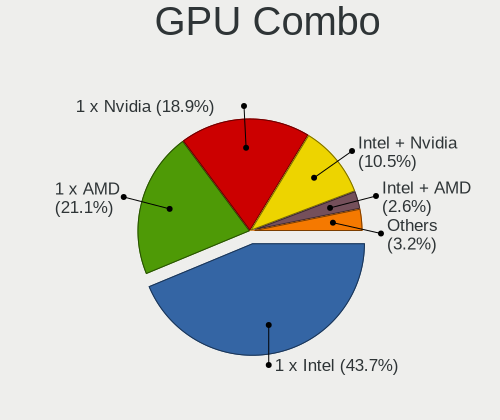

| Name           | Computers | Percent |
|----------------|-----------|---------|
| 1 x Intel      | 189       | 45.32%  |
| 1 x AMD        | 88        | 21.1%   |
| 1 x Nvidia     | 77        | 18.47%  |
| Intel + Nvidia | 31        | 7.43%   |
| Intel + AMD    | 13        | 3.12%   |
| 2 x AMD        | 12        | 2.88%   |
| AMD + Nvidia   | 3         | 0.72%   |
| 1 x SiS        | 2         | 0.48%   |
| 2 x Nvidia     | 1         | 0.24%   |
| 1 x VIA        | 1         | 0.24%   |

GPU Driver
----------

Free vs proprietary

| Driver      | Computers | Percent |
|-------------|-----------|---------|
| Free        | 314       | 75.3%   |
| Proprietary | 77        | 18.47%  |
| Unknown     | 26        | 6.24%   |

GPU Memory
----------

Total video memory

| Size in GB | Computers | Percent |
|------------|-----------|---------|
| Unknown    | 216       | 51.8%   |
| 0.01-0.5   | 63        | 15.11%  |
| 1.01-2.0   | 48        | 11.51%  |
| 0.51-1.0   | 39        | 9.35%   |
| 3.01-4.0   | 26        | 6.24%   |
| 7.01-8.0   | 12        | 2.88%   |
| 5.01-6.0   | 10        | 2.4%    |
| 2.01-3.0   | 2         | 0.48%   |
| 8.01-16.0  | 1         | 0.24%   |

Monitor Vendor
--------------

Monitor vendors

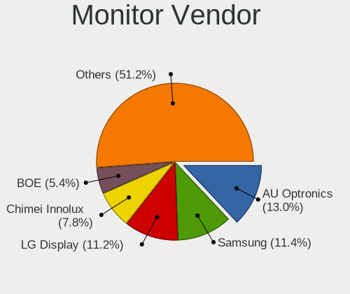

| Vendor                  | Computers | Percent |
|-------------------------|-----------|---------|
| Samsung Electronics     | 51        | 12.23%  |
| AU Optronics            | 45        | 10.79%  |
| LG Display              | 44        | 10.55%  |
| BOE                     | 27        | 6.47%   |
| Goldstar                | 26        | 6.24%   |
| Chimei Innolux          | 22        | 5.28%   |
| Acer                    | 22        | 5.28%   |
| Dell                    | 20        | 4.8%    |
| Hewlett-Packard         | 17        | 4.08%   |
| Chi Mei Optoelectronics | 10        | 2.4%    |
| BenQ                    | 10        | 2.4%    |
| Ancor Communications    | 10        | 2.4%    |
| Philips                 | 9         | 2.16%   |
| AOC                     | 8         | 1.92%   |
| Lenovo                  | 7         | 1.68%   |
| ViewSonic               | 5         | 1.2%    |
| CPT                     | 5         | 1.2%    |
| Apple                   | 5         | 1.2%    |
| Sharp                   | 4         | 0.96%   |
| Quanta Display          | 4         | 0.96%   |
| PANDA                   | 4         | 0.96%   |
| LG Philips              | 4         | 0.96%   |
| Iiyama                  | 4         | 0.96%   |
| ASUSTek Computer        | 4         | 0.96%   |
| Vizio                   | 3         | 0.72%   |
| Seiko/Epson             | 3         | 0.72%   |
| NEC Computers           | 3         | 0.72%   |
| LG Electronics          | 3         | 0.72%   |
| Lenovo Group Limited    | 3         | 0.72%   |
| Vestel Elektronik       | 2         | 0.48%   |
| Unknown                 | 2         | 0.48%   |
| Toshiba                 | 2         | 0.48%   |
| Sceptre Tech            | 2         | 0.48%   |
| Hyundai ImageQuest      | 2         | 0.48%   |
| HannStar                | 2         | 0.48%   |
| ___                     | 1         | 0.24%   |
| VIZ                     | 1         | 0.24%   |
| VIE                     | 1         | 0.24%   |
| Sony                    | 1         | 0.24%   |
| SLD                     | 1         | 0.24%   |
| SKY                     | 1         | 0.24%   |
| Panasonic               | 1         | 0.24%   |
| Packard Bell            | 1         | 0.24%   |
| ONN                     | 1         | 0.24%   |
| NCS                     | 1         | 0.24%   |
| LGD                     | 1         | 0.24%   |
| KTC                     | 1         | 0.24%   |
| InnoLux Display         | 1         | 0.24%   |
| InfoVision              | 1         | 0.24%   |
| IBM                     | 1         | 0.24%   |
| Grundig                 | 1         | 0.24%   |
| GDH                     | 1         | 0.24%   |
| eMachines               | 1         | 0.24%   |
| Denver                  | 1         | 0.24%   |
| DENON                   | 1         | 0.24%   |
| Daewoo                  | 1         | 0.24%   |
| CHR                     | 1         | 0.24%   |
| ADI                     | 1         | 0.24%   |

Monitor Model
-------------

Monitor models

| Model                                                                    | Computers | Percent |
|--------------------------------------------------------------------------|-----------|---------|
| BOE LCD Monitor BOE0672 1366x768 344x194mm 15.5-inch                     | 4         | 0.93%   |
| Samsung Electronics LCD Monitor SEC5441 1366x768 344x194mm 15.5-inch     | 3         | 0.7%    |
| LG Display LCD Monitor LGD0563 1920x1080 344x194mm 15.5-inch             | 3         | 0.7%    |
| AU Optronics LCD Monitor AUO139E 1600x900 382x214mm 17.2-inch            | 3         | 0.7%    |
| Vestel Elektronik 50UHD_LCD_TV VES3700 3840x2160 1872x1053mm 84.6-inch   | 2         | 0.47%   |
| Samsung Electronics SMBX2450 SAM0722 1920x1080 531x299mm 24.0-inch       | 2         | 0.47%   |
| Samsung Electronics LCD Monitor SEC3358 1280x800 331x207mm 15.4-inch     | 2         | 0.47%   |
| Samsung Electronics LCD Monitor SEC325A 1366x768 344x194mm 15.5-inch     | 2         | 0.47%   |
| Samsung Electronics LCD Monitor SEC3245 1366x768 344x194mm 15.5-inch     | 2         | 0.47%   |
| Lenovo LCD Monitor LEN40B2 1920x1080 344x193mm 15.5-inch                 | 2         | 0.47%   |
| Lenovo LCD Monitor LEN40B1 1600x900 344x194mm 15.5-inch                  | 2         | 0.47%   |
| HannStar HSD121PHW1 HSD04B6 1366x768 270x150mm 12.2-inch                 | 2         | 0.47%   |
| Goldstar W1943 GSM4BAD 1024x768 410x230mm 18.5-inch                      | 2         | 0.47%   |
| CPT LCD Monitor CPT04C4 1024x600 222x130mm 10.1-inch                     | 2         | 0.47%   |
| Chimei Innolux LCD Monitor CMN15DB 1366x768 344x193mm 15.5-inch          | 2         | 0.47%   |
| Chimei Innolux LCD Monitor CMN15B7 1366x768 340x190mm 15.3-inch          | 2         | 0.47%   |
| Chi Mei Optoelectronics LCD Monitor CMO1592 1366x768 344x193mm 15.5-inch | 2         | 0.47%   |
| AU Optronics LCD Monitor AUO23EC 1366x768 344x193mm 15.5-inch            | 2         | 0.47%   |
| AU Optronics LCD Monitor AUO219E 1600x900 382x214mm 17.2-inch            | 2         | 0.47%   |
| AU Optronics LCD Monitor AUO20EC 1366x768 344x193mm 15.5-inch            | 2         | 0.47%   |
| AU Optronics LCD Monitor AUO162C 1366x768 293x164mm 13.2-inch            | 2         | 0.47%   |
| AOC Q3279WG5B AOC3279 2560x1440 730x430mm 33.4-inch                      | 2         | 0.47%   |
| ___ LCDTV16 ___0101 1600x1200 1600x900mm 72.3-inch                       | 1         | 0.23%   |
| Vizio E3D420VX-TW VIZ0078 1920x1080 930x523mm 42.0-inch                  | 1         | 0.23%   |
| Vizio E320VA VIZ0071 1360x768 697x392mm 31.5-inch                        | 1         | 0.23%   |
| Vizio E241i-A1 VIZ1005 1920x1080 521x293mm 23.5-inch                     | 1         | 0.23%   |
| VIZ LCD Monitor E370VL 1920x1080                                         | 1         | 0.23%   |
| ViewSonic VX3276-QHD VSCE635 2560x1440 698x393mm 31.5-inch               | 1         | 0.23%   |
| ViewSonic VA2448 SERIES VSC3828 1920x1080 521x293mm 23.5-inch            | 1         | 0.23%   |
| ViewSonic VA2248 SERIES VSC0E28 1920x1080 477x268mm 21.5-inch            | 1         | 0.23%   |
| ViewSonic VA2231 Series VSCBB25 1920x1080 477x268mm 21.5-inch            | 1         | 0.23%   |
| ViewSonic VA2033 SERIES VSC2027 1600x900 443x249mm 20.0-inch             | 1         | 0.23%   |
| ViewSonic LCD Monitor VA2855 SERIES 1920x1080                            | 1         | 0.23%   |
| VIE LED MONITOR VIE2302 1920x1080 473x296mm 22.0-inch                    | 1         | 0.23%   |
| Unknown LCD TV 0101 1920x1080 1600x900mm 72.3-inch                       | 1         | 0.23%   |
| Unknown LCD Monitor ABO Acer AF705 1024x768                              | 1         | 0.23%   |
| Toshiba TV TSB010F 1920x1080 882x498mm 39.9-inch                         | 1         | 0.23%   |
| Toshiba ScreenXpert TSB8888 1080x2160                                    | 1         | 0.23%   |
| Sony TV SNY5D01 1360x768 1600x900mm 72.3-inch                            | 1         | 0.23%   |
| SLD LCD Monitor SLD003C 1366x768 309x173mm 13.9-inch                     | 1         | 0.23%   |
| SKY TV-monitor SKY0001 1920x1080 697x392mm 31.5-inch                     | 1         | 0.23%   |
| Sharp LCD Monitor SHP14D1 1920x1200 336x210mm 15.6-inch                  | 1         | 0.23%   |
| Sharp LCD Monitor SHP149A 1920x1080 344x194mm 15.5-inch                  | 1         | 0.23%   |
| Sharp LCD Monitor SHP144A 3200x1800 294x165mm 13.3-inch                  | 1         | 0.23%   |
| Sharp LCD Monitor SHP142E 1920x1080 239x134mm 10.8-inch                  | 1         | 0.23%   |
| Seiko/Epson LCD Monitor 1600x900                                         | 1         | 0.23%   |
| Seiko/Epson LCD Monitor 1366x768                                         | 1         | 0.23%   |
| Seiko/Epson LCD Monitor 1280x800                                         | 1         | 0.23%   |
| Sceptre Tech Sceptre Z27 SPT0AB4 3840x2160 600x340mm 27.2-inch           | 1         | 0.23%   |
| Sceptre Tech E22 SPT08D5 1920x1080 521x293mm 23.5-inch                   | 1         | 0.23%   |
| Samsung Electronics SyncMaster SAM060C 1920x1080 510x290mm 23.1-inch     | 1         | 0.23%   |
| Samsung Electronics SyncMaster SAM0601 1600x900                          | 1         | 0.23%   |
| Samsung Electronics SyncMaster SAM049B 1920x1080 477x268mm 21.5-inch     | 1         | 0.23%   |
| Samsung Electronics SyncMaster SAM0473 2048x1152 510x287mm 23.0-inch     | 1         | 0.23%   |
| Samsung Electronics SyncMaster SAM0117 1280x1024 312x234mm 15.4-inch     | 1         | 0.23%   |
| Samsung Electronics SyncMaster SAM001B 1280x1024 338x270mm 17.0-inch     | 1         | 0.23%   |
| Samsung Electronics S24F350 SAM0D21 1680x1050 520x290mm 23.4-inch        | 1         | 0.23%   |
| Samsung Electronics S24F350 SAM0D20 1920x1080 521x293mm 23.5-inch        | 1         | 0.23%   |
| Samsung Electronics S24D391 SAM0B87 1920x1080 521x293mm 23.5-inch        | 1         | 0.23%   |
| Samsung Electronics LCD Monitor T24D390 1920x1080                        | 1         | 0.23%   |

Monitor Resolution
------------------

Monitor screen resolution

| Resolution         | Computers | Percent |
|--------------------|-----------|---------|
| 1920x1080 (FHD)    | 151       | 37.47%  |
| 1366x768 (WXGA)    | 95        | 23.57%  |
| 1600x900 (HD+)     | 36        | 8.93%   |
| 1280x800 (WXGA)    | 24        | 5.96%   |
| 1280x1024 (SXGA)   | 15        | 3.72%   |
| 1440x900 (WXGA+)   | 13        | 3.23%   |
| 2560x1440 (QHD)    | 12        | 2.98%   |
| 3840x2160 (4K)     | 11        | 2.73%   |
| 1920x1200 (WUXGA)  | 7         | 1.74%   |
| 1680x1050 (WSXGA+) | 6         | 1.49%   |
| Unknown            | 6         | 1.49%   |
| 3840x1080          | 4         | 0.99%   |
| 3440x1440          | 4         | 0.99%   |
| 2560x1080          | 4         | 0.99%   |
| 1360x768           | 4         | 0.99%   |
| 1024x600           | 4         | 0.99%   |
| 3840x1200          | 1         | 0.25%   |
| 3520x1080          | 1         | 0.25%   |
| 3200x1800 (QHD+)   | 1         | 0.25%   |
| 2048x1152          | 1         | 0.25%   |
| 1600x1200          | 1         | 0.25%   |
| 1080x2160          | 1         | 0.25%   |
| 1024x768 (XGA)     | 1         | 0.25%   |

Monitor Diagonal
----------------

Diagonal size in inches

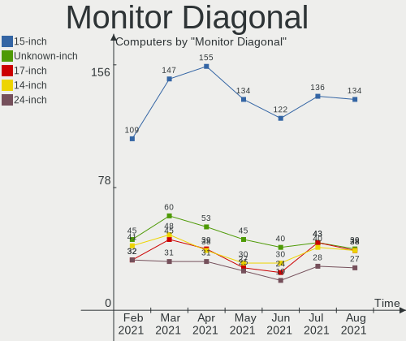

| Inches  | Computers | Percent |
|---------|-----------|---------|
| 15      | 122       | 29.47%  |
| Unknown | 40        | 9.66%   |
| 14      | 30        | 7.25%   |
| 21      | 24        | 5.8%    |
| 17      | 24        | 5.8%    |
| 13      | 23        | 5.56%   |
| 23      | 21        | 5.07%   |
| 24      | 19        | 4.59%   |
| 27      | 17        | 4.11%   |
| 19      | 12        | 2.9%    |
| 20      | 11        | 2.66%   |
| 18      | 9         | 2.17%   |
| 12      | 9         | 2.17%   |
| 34      | 6         | 1.45%   |
| 31      | 6         | 1.45%   |
| 40      | 5         | 1.21%   |
| 22      | 5         | 1.21%   |
| 10      | 5         | 1.21%   |
| 84      | 4         | 0.97%   |
| 72      | 3         | 0.72%   |
| 25      | 3         | 0.72%   |
| 11      | 3         | 0.72%   |
| 54      | 2         | 0.48%   |
| 42      | 2         | 0.48%   |
| 33      | 2         | 0.48%   |
| 16      | 2         | 0.48%   |
| 37      | 1         | 0.24%   |
| 32      | 1         | 0.24%   |
| 29      | 1         | 0.24%   |
| 8       | 1         | 0.24%   |
| 5       | 1         | 0.24%   |

Monitor Width
-------------

Physical width

| Width in mm | Computers | Percent |
|-------------|-----------|---------|
| 301-350     | 164       | 40.2%   |
| 501-600     | 55        | 13.48%  |
| 401-500     | 53        | 12.99%  |
| Unknown     | 40        | 9.8%    |
| 351-400     | 33        | 8.09%   |
| 201-300     | 27        | 6.62%   |
| 701-800     | 9         | 2.21%   |
| 601-700     | 8         | 1.96%   |
| 1501-2000   | 7         | 1.72%   |
| 801-900     | 6         | 1.47%   |
| 1001-1500   | 2         | 0.49%   |
| 901-1000    | 2         | 0.49%   |
| 101-200     | 1         | 0.25%   |
| 1-100       | 1         | 0.25%   |

Aspect Ratio
------------

Proportional relationship between the width and the height

| Ratio   | Computers | Percent |
|---------|-----------|---------|
| 16/9    | 274       | 72.68%  |
| 16/10   | 45        | 11.94%  |
| Unknown | 37        | 9.81%   |
| 5/4     | 10        | 2.65%   |
| 21/9    | 6         | 1.59%   |
| 6/5     | 2         | 0.53%   |
| 4/3     | 2         | 0.53%   |
| 0.46    | 1         | 0.27%   |

Monitor Area
------------

Area in inch²

| Area in inch² | Computers | Percent |
|----------------|-----------|---------|
| 101-110        | 121       | 29.51%  |
| 201-250        | 55        | 13.41%  |
| 81-90          | 43        | 10.49%  |
| Unknown        | 40        | 9.76%   |
| 151-200        | 31        | 7.56%   |
| 121-130        | 18        | 4.39%   |
| 301-350        | 17        | 4.15%   |
| 351-500        | 16        | 3.9%    |
| 71-80          | 11        | 2.68%   |
| 141-150        | 10        | 2.44%   |
| More than 1000 | 9         | 2.2%    |
| 61-70          | 8         | 1.95%   |
| 501-1000       | 8         | 1.95%   |
| 251-300        | 7         | 1.71%   |
| 41-50          | 5         | 1.22%   |
| 131-140        | 5         | 1.22%   |
| 51-60          | 3         | 0.73%   |
| 1-40           | 2         | 0.49%   |
| 111-120        | 1         | 0.24%   |

Pixel Density
-------------

Pixels per inch

| Density       | Computers | Percent |
|---------------|-----------|---------|
| 51-100        | 135       | 33.5%   |
| 101-120       | 130       | 32.26%  |
| 121-160       | 79        | 19.6%   |
| Unknown       | 40        | 9.93%   |
| 161-240       | 9         | 2.23%   |
| 1-50          | 7         | 1.74%   |
| More than 240 | 3         | 0.74%   |

Multiple Monitors
-----------------

Total monitors connected

| Total | Computers | Percent |
|-------|-----------|---------|
| 1     | 331       | 79.38%  |
| 2     | 53        | 12.71%  |
| 0     | 27        | 6.47%   |
| 3     | 5         | 1.2%    |
| 4     | 1         | 0.24%   |

Net Controller Vendor
---------------------

Controller vendors

| Vendor                                 | Computers | Percent |
|----------------------------------------|-----------|---------|
| Realtek Semiconductor                  | 231       | 35.16%  |
| Intel                                  | 176       | 26.79%  |
| Qualcomm Atheros                       | 87        | 13.24%  |
| Broadcom                               | 36        | 5.48%   |
| Nvidia                                 | 14        | 2.13%   |
| Broadcom Limited                       | 13        | 1.98%   |
| Ralink                                 | 12        | 1.83%   |
| Ralink Technology                      | 11        | 1.67%   |
| Marvell Technology Group               | 10        | 1.52%   |
| TP-Link                                | 7         | 1.07%   |
| Samsung Electronics                    | 5         | 0.76%   |
| Xiaomi                                 | 4         | 0.61%   |
| D-Link                                 | 4         | 0.61%   |
| Qualcomm Atheros Communications        | 3         | 0.46%   |
| NetGear                                | 3         | 0.46%   |
| Microsoft                              | 3         | 0.46%   |
| D-Link System                          | 3         | 0.46%   |
| ASUSTek Computer                       | 3         | 0.46%   |
| Silicon Integrated Systems [SiS]       | 2         | 0.3%    |
| MEDIATEK                               | 2         | 0.3%    |
| JMicron Technology                     | 2         | 0.3%    |
| Huawei Technologies                    | 2         | 0.3%    |
| Dell                                   | 2         | 0.3%    |
| Attansic Technology                    | 2         | 0.3%    |
| ASIX Electronics                       | 2         | 0.3%    |
| ZyDAS                                  | 1         | 0.15%   |
| VIA Technologies                       | 1         | 0.15%   |
| Sony Ericsson Mobile Communications AB | 1         | 0.15%   |
| Sierra Wireless                        | 1         | 0.15%   |
| Raspberry Pi                           | 1         | 0.15%   |
| OPPO Electronics                       | 1         | 0.15%   |
| National Semiconductor                 | 1         | 0.15%   |
| Mellanox Technologies                  | 1         | 0.15%   |
| Manta                                  | 1         | 0.15%   |
| Linksys                                | 1         | 0.15%   |
| LG Electronics                         | 1         | 0.15%   |
| IMC Networks                           | 1         | 0.15%   |
| Ericsson Business Mobile Networks      | 1         | 0.15%   |
| Emulex                                 | 1         | 0.15%   |
| Edimax Technology                      | 1         | 0.15%   |
| DisplayLink                            | 1         | 0.15%   |
| BUFFALO                                | 1         | 0.15%   |
| Belkin Components                      | 1         | 0.15%   |

Net Controller Model
--------------------

Controller models

| Model                                                                   | Computers | Percent |
|-------------------------------------------------------------------------|-----------|---------|
| Realtek RTL8111/8168/8411 PCI Express Gigabit Ethernet Controller       | 146       | 19.19%  |
| Realtek RTL810xE PCI Express Fast Ethernet controller                   | 42        | 5.52%   |
| Intel Wi-Fi 6 AX200                                                     | 21        | 2.76%   |
| Intel 82579LM Gigabit Network Connection (Lewisville)                   | 19        | 2.5%    |
| Qualcomm Atheros AR9485 Wireless Network Adapter                        | 13        | 1.71%   |
| Qualcomm Atheros QCA9565 / AR9565 Wireless Network Adapter              | 10        | 1.31%   |
| Intel Wireless 7260                                                     | 10        | 1.31%   |
| Realtek RTL8821CE 802.11ac PCIe Wireless Network Adapter                | 9         | 1.18%   |
| Intel Wireless 7265                                                     | 9         | 1.18%   |
| Intel Wi-Fi 6 AX201                                                     | 9         | 1.18%   |
| Intel Centrino Advanced-N 6205 [Taylor Peak]                            | 9         | 1.18%   |
| Qualcomm Atheros QCA9377 802.11ac Wireless Network Adapter              | 8         | 1.05%   |
| Qualcomm Atheros AR9285 Wireless Network Adapter (PCI-Express)          | 8         | 1.05%   |
| Qualcomm Atheros AR242x / AR542x Wireless Network Adapter (PCI-Express) | 8         | 1.05%   |
| Nvidia MCP61 Ethernet                                                   | 8         | 1.05%   |
| Intel Wireless 8260                                                     | 8         | 1.05%   |
| Intel Wireless-AC 9260                                                  | 7         | 0.92%   |
| Broadcom BCM4313 802.11bgn Wireless Network Adapter                     | 7         | 0.92%   |
| Realtek RTL8125 2.5GbE Controller                                       | 6         | 0.79%   |
| Qualcomm Atheros AR9462 Wireless Network Adapter                        | 6         | 0.79%   |
| Qualcomm Atheros AR928X Wireless Network Adapter (PCI-Express)          | 6         | 0.79%   |
| Intel PRO/Wireless 3945ABG [Golan] Network Connection                   | 6         | 0.79%   |
| Intel I211 Gigabit Network Connection                                   | 6         | 0.79%   |
| Realtek RTL8188CE 802.11b/g/n WiFi Adapter                              | 5         | 0.66%   |
| Realtek RTL8153 Gigabit Ethernet Adapter                                | 5         | 0.66%   |
| Realtek RTL-8100/8101L/8139 PCI Fast Ethernet Adapter                   | 5         | 0.66%   |
| Ralink MT7601U Wireless Adapter                                         | 5         | 0.66%   |
| Qualcomm Atheros QCA6174 802.11ac Wireless Network Adapter              | 5         | 0.66%   |
| Qualcomm Atheros Killer E220x Gigabit Ethernet Controller               | 5         | 0.66%   |
| Qualcomm Atheros AR8151 v2.0 Gigabit Ethernet                           | 5         | 0.66%   |
| Intel Wireless 3160                                                     | 5         | 0.66%   |
| Intel Ethernet Connection I217-LM                                       | 5         | 0.66%   |
| Intel Ethernet Connection (2) I219-V                                    | 5         | 0.66%   |
| Intel 82577LM Gigabit Network Connection                                | 5         | 0.66%   |
| Xiaomi Mi/Redmi series (RNDIS)                                          | 4         | 0.53%   |
| Realtek RTL8822CE 802.11ac PCIe Wireless Network Adapter                | 4         | 0.53%   |
| Realtek RTL8723BE PCIe Wireless Network Adapter                         | 4         | 0.53%   |
| Realtek RTL8188EUS 802.11n Wireless Network Adapter                     | 4         | 0.53%   |
| Realtek RTL8188CUS 802.11n WLAN Adapter                                 | 4         | 0.53%   |
| Qualcomm Atheros AR8131 Gigabit Ethernet                                | 4         | 0.53%   |
| Marvell Group 88E8040 PCI-E Fast Ethernet Controller                    | 4         | 0.53%   |
| Intel Wireless 8265 / 8275                                              | 4         | 0.53%   |
| Intel Ethernet Connection I217-V                                        | 4         | 0.53%   |
| Intel Ethernet Connection (3) I218-LM                                   | 4         | 0.53%   |
| Intel Dual Band Wireless-AC 3168NGW [Stone Peak]                        | 4         | 0.53%   |
| Intel Cannon Point-LP CNVi [Wireless-AC]                                | 4         | 0.53%   |
| Intel Cannon Lake PCH CNVi WiFi                                         | 4         | 0.53%   |
| Broadcom Limited BCM4311 802.11a/b/g                                    | 4         | 0.53%   |
| Realtek RTL88x2bu [AC1200 Techkey]                                      | 3         | 0.39%   |
| Realtek 802.11ac NIC                                                    | 3         | 0.39%   |
| Ralink RT2790 Wireless 802.11n 1T/2R PCIe                               | 3         | 0.39%   |
| Qualcomm Atheros AR9271 802.11n                                         | 3         | 0.39%   |
| Qualcomm Atheros AR93xx Wireless Network Adapter                        | 3         | 0.39%   |
| Qualcomm Atheros AR8152 v2.0 Fast Ethernet                              | 3         | 0.39%   |
| Microsoft Xbox 360 Wireless Adapter                                     | 3         | 0.39%   |
| Intel Dual Band Wireless-AC 3165 Plus Bluetooth                         | 3         | 0.39%   |
| Intel Comet Lake PCH-LP CNVi WiFi                                       | 3         | 0.39%   |
| Intel Comet Lake PCH CNVi WiFi                                          | 3         | 0.39%   |
| Intel 82579V Gigabit Network Connection                                 | 3         | 0.39%   |
| Intel 82567LM-3 Gigabit Network Connection                              | 3         | 0.39%   |

Wireless Vendor
---------------

Wireless vendors

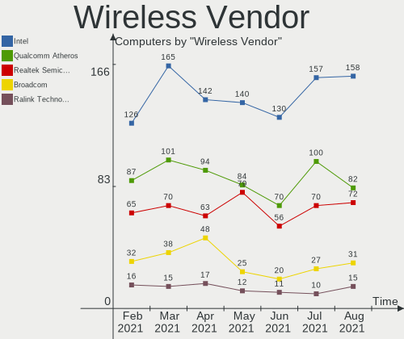

| Vendor                          | Computers | Percent |
|---------------------------------|-----------|---------|
| Intel                           | 130       | 38.01%  |
| Qualcomm Atheros                | 70        | 20.47%  |
| Realtek Semiconductor           | 56        | 16.37%  |
| Broadcom                        | 20        | 5.85%   |
| Ralink                          | 12        | 3.51%   |
| Ralink Technology               | 11        | 3.22%   |
| Broadcom Limited                | 8         | 2.34%   |
| TP-Link                         | 7         | 2.05%   |
| D-Link                          | 4         | 1.17%   |
| Qualcomm Atheros Communications | 3         | 0.88%   |
| NetGear                         | 3         | 0.88%   |
| Microsoft                       | 3         | 0.88%   |
| ASUSTek Computer                | 3         | 0.88%   |
| Dell                            | 2         | 0.58%   |
| D-Link System                   | 2         | 0.58%   |
| ZyDAS                           | 1         | 0.29%   |
| Sierra Wireless                 | 1         | 0.29%   |
| MEDIATEK                        | 1         | 0.29%   |
| Linksys                         | 1         | 0.29%   |
| IMC Networks                    | 1         | 0.29%   |
| Edimax Technology               | 1         | 0.29%   |
| BUFFALO                         | 1         | 0.29%   |
| Belkin Components               | 1         | 0.29%   |

Wireless Model
--------------

Wireless models

| Model                                                                   | Computers | Percent |
|-------------------------------------------------------------------------|-----------|---------|
| Intel Wi-Fi 6 AX200                                                     | 21        | 6.12%   |
| Qualcomm Atheros AR9485 Wireless Network Adapter                        | 13        | 3.79%   |
| Qualcomm Atheros QCA9565 / AR9565 Wireless Network Adapter              | 10        | 2.92%   |
| Intel Wireless 7260                                                     | 10        | 2.92%   |
| Realtek RTL8821CE 802.11ac PCIe Wireless Network Adapter                | 9         | 2.62%   |
| Intel Wireless 7265                                                     | 9         | 2.62%   |
| Intel Wi-Fi 6 AX201                                                     | 9         | 2.62%   |
| Intel Centrino Advanced-N 6205 [Taylor Peak]                            | 9         | 2.62%   |
| Qualcomm Atheros QCA9377 802.11ac Wireless Network Adapter              | 8         | 2.33%   |
| Qualcomm Atheros AR9285 Wireless Network Adapter (PCI-Express)          | 8         | 2.33%   |
| Qualcomm Atheros AR242x / AR542x Wireless Network Adapter (PCI-Express) | 8         | 2.33%   |
| Intel Wireless 8260                                                     | 8         | 2.33%   |
| Intel Wireless-AC 9260                                                  | 7         | 2.04%   |
| Broadcom BCM4313 802.11bgn Wireless Network Adapter                     | 7         | 2.04%   |
| Qualcomm Atheros AR9462 Wireless Network Adapter                        | 6         | 1.75%   |
| Qualcomm Atheros AR928X Wireless Network Adapter (PCI-Express)          | 6         | 1.75%   |
| Intel PRO/Wireless 3945ABG [Golan] Network Connection                   | 6         | 1.75%   |
| Realtek RTL8188CE 802.11b/g/n WiFi Adapter                              | 5         | 1.46%   |
| Ralink MT7601U Wireless Adapter                                         | 5         | 1.46%   |
| Qualcomm Atheros QCA6174 802.11ac Wireless Network Adapter              | 5         | 1.46%   |
| Intel Wireless 3160                                                     | 5         | 1.46%   |
| Realtek RTL8822CE 802.11ac PCIe Wireless Network Adapter                | 4         | 1.17%   |
| Realtek RTL8723BE PCIe Wireless Network Adapter                         | 4         | 1.17%   |
| Realtek RTL8188EUS 802.11n Wireless Network Adapter                     | 4         | 1.17%   |
| Realtek RTL8188CUS 802.11n WLAN Adapter                                 | 4         | 1.17%   |
| Intel Wireless 8265 / 8275                                              | 4         | 1.17%   |
| Intel Dual Band Wireless-AC 3168NGW [Stone Peak]                        | 4         | 1.17%   |
| Intel Cannon Point-LP CNVi [Wireless-AC]                                | 4         | 1.17%   |
| Intel Cannon Lake PCH CNVi WiFi                                         | 4         | 1.17%   |
| Broadcom Limited BCM4311 802.11a/b/g                                    | 4         | 1.17%   |
| Realtek RTL88x2bu [AC1200 Techkey]                                      | 3         | 0.87%   |
| Realtek 802.11ac NIC                                                    | 3         | 0.87%   |
| Ralink RT2790 Wireless 802.11n 1T/2R PCIe                               | 3         | 0.87%   |
| Qualcomm Atheros AR9271 802.11n                                         | 3         | 0.87%   |
| Qualcomm Atheros AR93xx Wireless Network Adapter                        | 3         | 0.87%   |
| Microsoft Xbox 360 Wireless Adapter                                     | 3         | 0.87%   |
| Intel Dual Band Wireless-AC 3165 Plus Bluetooth                         | 3         | 0.87%   |
| Intel Comet Lake PCH-LP CNVi WiFi                                       | 3         | 0.87%   |
| Intel Comet Lake PCH CNVi WiFi                                          | 3         | 0.87%   |
| Broadcom BCM4331 802.11a/b/g/n                                          | 3         | 0.87%   |
| Broadcom BCM43142 802.11b/g/n                                           | 3         | 0.87%   |
| TP-Link Archer T2U PLUS [RTL8821AU]                                     | 2         | 0.58%   |
| TP-Link 802.11ac WLAN Adapter                                           | 2         | 0.58%   |
| Realtek RTL8821AE 802.11ac PCIe Wireless Network Adapter                | 2         | 0.58%   |
| Realtek RTL8723AE PCIe Wireless Network Adapter                         | 2         | 0.58%   |
| Realtek RTL8192CU 802.11n WLAN Adapter                                  | 2         | 0.58%   |
| Realtek RTL8188EE Wireless Network Adapter                              | 2         | 0.58%   |
| Ralink RT5390 Wireless 802.11n 1T/1R PCIe                               | 2         | 0.58%   |
| Ralink RT3090 Wireless 802.11n 1T/1R PCIe                               | 2         | 0.58%   |
| Ralink RT2561/RT61 802.11g PCI                                          | 2         | 0.58%   |
| Qualcomm Atheros AR9287 Wireless Network Adapter (PCI-Express)          | 2         | 0.58%   |
| NetGear WNA3100(v1) Wireless-N 300 [Broadcom BCM43231]                  | 2         | 0.58%   |
| Intel Wireless 3165                                                     | 2         | 0.58%   |
| Intel WiFi Link 5100                                                    | 2         | 0.58%   |
| Intel Centrino Wireless-N 2230                                          | 2         | 0.58%   |
| Intel Centrino Wireless-N 1000 [Condor Peak]                            | 2         | 0.58%   |
| Intel Centrino Ultimate-N 6300                                          | 2         | 0.58%   |
| Intel Centrino Advanced-N 6200                                          | 2         | 0.58%   |
| ZyDAS ZD1211B 802.11g                                                   | 1         | 0.29%   |
| TP-Link TL-WN722N v2                                                    | 1         | 0.29%   |

Ethernet Vendor
---------------

Ethernet vendors

| Vendor                           | Computers | Percent |
|----------------------------------|-----------|---------|
| Realtek Semiconductor            | 206       | 51.76%  |
| Intel                            | 91        | 22.86%  |
| Qualcomm Atheros                 | 25        | 6.28%   |
| Broadcom                         | 22        | 5.53%   |
| Nvidia                           | 14        | 3.52%   |
| Marvell Technology Group         | 10        | 2.51%   |
| Broadcom Limited                 | 8         | 2.01%   |
| Xiaomi                           | 4         | 1.01%   |
| Samsung Electronics              | 3         | 0.75%   |
| Silicon Integrated Systems [SiS] | 2         | 0.5%    |
| JMicron Technology               | 2         | 0.5%    |
| Attansic Technology              | 2         | 0.5%    |
| ASIX Electronics                 | 2         | 0.5%    |
| VIA Technologies                 | 1         | 0.25%   |
| OPPO Electronics                 | 1         | 0.25%   |
| National Semiconductor           | 1         | 0.25%   |
| MediaTek                         | 1         | 0.25%   |
| Emulex                           | 1         | 0.25%   |
| DisplayLink                      | 1         | 0.25%   |
| D-Link System                    | 1         | 0.25%   |

Ethernet Model
--------------

Ethernet models

| Model                                                             | Computers | Percent |
|-------------------------------------------------------------------|-----------|---------|
| Realtek RTL8111/8168/8411 PCI Express Gigabit Ethernet Controller | 146       | 36.14%  |
| Realtek RTL810xE PCI Express Fast Ethernet controller             | 42        | 10.4%   |
| Intel 82579LM Gigabit Network Connection (Lewisville)             | 19        | 4.7%    |
| Nvidia MCP61 Ethernet                                             | 8         | 1.98%   |
| Realtek RTL8125 2.5GbE Controller                                 | 6         | 1.49%   |
| Intel I211 Gigabit Network Connection                             | 6         | 1.49%   |
| Realtek RTL8153 Gigabit Ethernet Adapter                          | 5         | 1.24%   |
| Realtek RTL-8100/8101L/8139 PCI Fast Ethernet Adapter             | 5         | 1.24%   |
| Qualcomm Atheros Killer E220x Gigabit Ethernet Controller         | 5         | 1.24%   |
| Qualcomm Atheros AR8151 v2.0 Gigabit Ethernet                     | 5         | 1.24%   |
| Intel Ethernet Connection I217-LM                                 | 5         | 1.24%   |
| Intel Ethernet Connection (2) I219-V                              | 5         | 1.24%   |
| Intel 82577LM Gigabit Network Connection                          | 5         | 1.24%   |
| Xiaomi Mi/Redmi series (RNDIS)                                    | 4         | 0.99%   |
| Qualcomm Atheros AR8131 Gigabit Ethernet                          | 4         | 0.99%   |
| Marvell Group 88E8040 PCI-E Fast Ethernet Controller              | 4         | 0.99%   |
| Intel Ethernet Connection I217-V                                  | 4         | 0.99%   |
| Intel Ethernet Connection (3) I218-LM                             | 4         | 0.99%   |
| Qualcomm Atheros AR8152 v2.0 Fast Ethernet                        | 3         | 0.74%   |
| Intel 82579V Gigabit Network Connection                           | 3         | 0.74%   |
| Intel 82567LM-3 Gigabit Network Connection                        | 3         | 0.74%   |
| Intel 82567LM Gigabit Network Connection                          | 3         | 0.74%   |
| Broadcom NetXtreme BCM57765 Gigabit Ethernet PCIe                 | 3         | 0.74%   |
| Broadcom NetXtreme BCM5764M Gigabit Ethernet PCIe                 | 3         | 0.74%   |
| Broadcom NetLink BCM57785 Gigabit Ethernet PCIe                   | 3         | 0.74%   |
| Broadcom NetLink BCM57780 Gigabit Ethernet PCIe                   | 3         | 0.74%   |
| Broadcom Limited NetXtreme BCM5755M Gigabit Ethernet PCI Express  | 3         | 0.74%   |
| Silicon Integrated Systems [SiS] 191 Gigabit Ethernet Adapter     | 2         | 0.5%    |
| Samsung Galaxy series, misc. (tethering mode)                     | 2         | 0.5%    |
| Realtek RTL8152 Fast Ethernet Adapter                             | 2         | 0.5%    |
| Qualcomm Atheros Attansic L2 Fast Ethernet                        | 2         | 0.5%    |
| Qualcomm Atheros AR8161 Gigabit Ethernet                          | 2         | 0.5%    |
| Qualcomm Atheros AR8121/AR8113/AR8114 Gigabit or Fast Ethernet    | 2         | 0.5%    |
| Nvidia MCP79 Ethernet                                             | 2         | 0.5%    |
| Marvell Group 88E8056 PCI-E Gigabit Ethernet Controller           | 2         | 0.5%    |
| JMicron JMC250 PCI Express Gigabit Ethernet Controller            | 2         | 0.5%    |
| Intel Ethernet Controller I225-V                                  | 2         | 0.5%    |
| Intel Ethernet Connection I219-V                                  | 2         | 0.5%    |
| Intel Ethernet Connection I219-LM                                 | 2         | 0.5%    |
| Intel Ethernet Connection (7) I219-V                              | 2         | 0.5%    |
| Intel Ethernet Connection (6) I219-V                              | 2         | 0.5%    |
| Intel Ethernet Connection (4) I219-LM                             | 2         | 0.5%    |
| Intel Ethernet Connection (13) I219-V                             | 2         | 0.5%    |
| Intel Ethernet Connection (12) I219-V                             | 2         | 0.5%    |
| Intel Ethernet Connection (10) I219-V                             | 2         | 0.5%    |
| Intel 82576 Gigabit Network Connection                            | 2         | 0.5%    |
| Intel 82567LF Gigabit Network Connection                          | 2         | 0.5%    |
| Broadcom NetXtreme BCM5761 Gigabit Ethernet PCIe                  | 2         | 0.5%    |
| Broadcom NetXtreme BCM5751M Gigabit Ethernet PCI Express          | 2         | 0.5%    |
| Broadcom NetLink BCM5906M Fast Ethernet PCI Express               | 2         | 0.5%    |
| Broadcom Limited NetXtreme BCM5761e Gigabit Ethernet PCIe         | 2         | 0.5%    |
| Attansic AR8152 v2.0 Fast Ethernet                                | 2         | 0.5%    |
| ASIX AX88179 Gigabit Ethernet                                     | 2         | 0.5%    |
| VIA VT6102/VT6103 [Rhine-II]                                      | 1         | 0.25%   |
| Samsung GT-I9070 (network tethering, USB debugging enabled)       | 1         | 0.25%   |
| Realtek Killer E3000 2.5GbE Controller                            | 1         | 0.25%   |
| Qualcomm Atheros Killer E2500 Gigabit Ethernet Controller         | 1         | 0.25%   |
| Qualcomm Atheros Killer E2400 Gigabit Ethernet Controller         | 1         | 0.25%   |
| OPPO OPPO A83                                                     | 1         | 0.25%   |
| Nvidia MCP77 Ethernet                                             | 1         | 0.25%   |

Net Controller Kind
-------------------

Ethernet, WiFi or modem

| Kind     | Computers | Percent |
|----------|-----------|---------|
| Ethernet | 380       | 53.45%  |
| WiFi     | 317       | 44.59%  |
| Modem    | 9         | 1.27%   |
| Unknown  | 5         | 0.7%    |

Used Controller
---------------

Currently used network controller

| Kind     | Computers | Percent |
|----------|-----------|---------|
| Ethernet | 291       | 50.52%  |
| WiFi     | 284       | 49.31%  |
| Unknown  | 1         | 0.17%   |

NICs
----

Total network controllers on board

| Total | Computers | Percent |
|-------|-----------|---------|
| 2     | 237       | 56.83%  |
| 1     | 162       | 38.85%  |
| 3     | 10        | 2.4%    |
| 0     | 7         | 1.68%   |
| 4     | 1         | 0.24%   |

IPv6
----

IPv6 vs IPv4

| Used | Computers | Percent |
|------|-----------|---------|
| No   | 304       | 72.9%   |
| Yes  | 113       | 27.1%   |

Memory Vendor
-------------

Memory module vendors

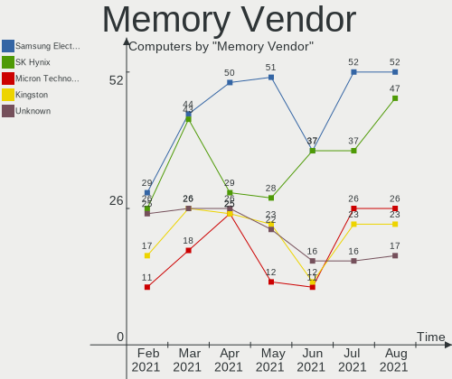

| Vendor              | Computers | Percent |
|---------------------|-----------|---------|
| SK Hynix            | 37        | 21.02%  |
| Samsung Electronics | 37        | 21.02%  |
| Unknown             | 16        | 9.09%   |
| Corsair             | 14        | 7.95%   |
| Kingston            | 12        | 6.82%   |
| Crucial             | 12        | 6.82%   |
| Micron Technology   | 11        | 6.25%   |
| Smart               | 5         | 2.84%   |
| G.Skill             | 5         | 2.84%   |
| Unknown (ABCD)      | 3         | 1.7%    |
| Team                | 2         | 1.14%   |
| Ramaxel Technology  | 2         | 1.14%   |
| Nanya Technology    | 2         | 1.14%   |
| Apacer              | 2         | 1.14%   |
| A-DATA Technology   | 2         | 1.14%   |
| Unknown (0x8551)    | 1         | 0.57%   |
| Undefined-000B      | 1         | 0.57%   |
| Transcend           | 1         | 0.57%   |
| TIMETEC             | 1         | 0.57%   |
| Sesame              | 1         | 0.57%   |
| Qimonda             | 1         | 0.57%   |
| Patriot             | 1         | 0.57%   |
| GOODRAM             | 1         | 0.57%   |
| Foxline             | 1         | 0.57%   |
| Elpida              | 1         | 0.57%   |
| AXIOM               | 1         | 0.57%   |
| ASint Technology    | 1         | 0.57%   |
| AMD                 | 1         | 0.57%   |
| 48spaces            | 1         | 0.57%   |

Memory Model
------------

Memory module models

| Model                                                               | Computers | Percent |
|---------------------------------------------------------------------|-----------|---------|
| Samsung RAM M471B5273DH0-CH9 4096MB SODIMM DDR3 1334MT/s            | 5         | 2.66%   |
| SK Hynix RAM HMA81GS6DJR8N-XN 8GB SODIMM DDR4 3200MT/s              | 4         | 2.13%   |
| Crucial RAM BLS8G3D1609DS1S00. 8192MB DIMM DDR3 1600MT/s            | 3         | 1.6%    |
| Unknown (ABCD) RAM 123456789012345678 1536MB SODIMM LPDDR4 2400MT/s | 2         | 1.06%   |
| Smart RAM SH564128FH8NZQNSCG 4096MB SODIMM DDR3 1600MT/s            | 2         | 1.06%   |
| SK Hynix RAM HMT451S6BFR8A-PB 4GB SODIMM DDR3 1600MT/s              | 2         | 1.06%   |
| SK Hynix RAM HMT451S6AFR8A-PB 4096MB SODIMM DDR3 1600MT/s           | 2         | 1.06%   |
| SK Hynix RAM HMT41GS6BFR8A-PB 8192MB SODIMM DDR3 1600MT/s           | 2         | 1.06%   |
| SK Hynix RAM HMT325S6BFR8C-H9 2048MB SODIMM DDR3 1333MT/s           | 2         | 1.06%   |
| SK Hynix RAM HMT125S6TFR8C-H9 2GB SODIMM DDR3 1333MT/s              | 2         | 1.06%   |
| Samsung RAM M471B1G73QH0-YK0 8GB SODIMM DDR3 1600MT/s               | 2         | 1.06%   |
| Samsung RAM M471B1G73EB0-YK0 8192MB SODIMM DDR3 1600MT/s            | 2         | 1.06%   |
| Samsung RAM M471A5244CB0-CWE 4GB SODIMM DDR4 3200MT/s               | 2         | 1.06%   |
| Samsung RAM M471A1K43DB1-CWE 8GB SODIMM DDR4 3200MT/s               | 2         | 1.06%   |
| Samsung RAM M471A1K43CB1-CRC 8192MB SODIMM DDR4 2667MT/s            | 2         | 1.06%   |
| Micron RAM Module 2048MB SODIMM DDR3 1600MT/s                       | 2         | 1.06%   |
| Micron RAM 4ATF1G64HZ-3G2E2 8192MB SODIMM DDR4 3200MT/s             | 2         | 1.06%   |
| Corsair RAM CMK16GX4M2B3200C16 8GB DIMM DDR4 3600MT/s               | 2         | 1.06%   |
| Unknown RAM WPBS26D408SWC-8G 8192MB SODIMM DDR4 2667MT/s            | 1         | 0.53%   |
| Unknown RAM Module 8GB SODIMM DDR3 1600MT/s                         | 1         | 0.53%   |
| Unknown RAM Module 512MB DIMM DDR2                                  | 1         | 0.53%   |
| Unknown RAM Module 4GB SODIMM DDR3 1600MT/s                         | 1         | 0.53%   |
| Unknown RAM Module 4096MB SODIMM DDR3 1333MT/s                      | 1         | 0.53%   |
| Unknown RAM Module 4096MB SODIMM DDR3 1066MT/s                      | 1         | 0.53%   |
| Unknown RAM Module 4096MB SODIMM DDR3                               | 1         | 0.53%   |
| Unknown RAM Module 4096MB DIMM SDRAM                                | 1         | 0.53%   |
| Unknown RAM Module 4096MB DIMM DDR3 1600MT/s                        | 1         | 0.53%   |
| Unknown RAM Module 4096MB DIMM DDR2 800MT/s                         | 1         | 0.53%   |
| Unknown RAM Module 4096MB DIMM 800MT/s                              | 1         | 0.53%   |
| Unknown RAM Module 2048MB SODIMM LPDDR4 1600MT/s                    | 1         | 0.53%   |
| Unknown RAM Module 2048MB SODIMM DDR2 667MT/s                       | 1         | 0.53%   |
| Unknown RAM Module 2048MB DIMM SDRAM                                | 1         | 0.53%   |
| Unknown RAM Module 2048MB DIMM DDR3 1600MT/s                        | 1         | 0.53%   |
| Unknown RAM Module 2048MB DIMM 800MT/s                              | 1         | 0.53%   |
| Unknown RAM Module 1024MB SODIMM DDR2                               | 1         | 0.53%   |
| Unknown (ABCD) RAM 123456789012345678 4GB DIMM DDR4 2400MT/s        | 1         | 0.53%   |
| Unknown (0x8551) RAM Module 2GB FB-DIMM DDR2 667MT/s                | 1         | 0.53%   |
| Undefined-000B RAM NT8GC72B4NB1NK-CG 8192MB DIMM DDR3 1333MT/s      | 1         | 0.53%   |
| Undefined-000B RAM NT8GC72B4NB1NJ-CG 8192MB DIMM DDR3 1333MT/s      | 1         | 0.53%   |
| Transcend RAM JM1333KSN-4G 4096MB SODIMM DDR3 1334MT/s              | 1         | 0.53%   |
| TIMETEC RAM UD3-1600 8192MB DIMM DDR3 1600MT/s                      | 1         | 0.53%   |
| Team RAM TEAMGROUP-UD4-3600 8192MB DIMM DDR4 3600MT/s               | 1         | 0.53%   |
| Team RAM TEAMGROUP-UD4-3200 8192MB DIMM DDR4 3200MT/s               | 1         | 0.53%   |
| Smart RAM SH564128FJ8NWRNSQG 4GB SODIMM DDR3 1600MT/s               | 1         | 0.53%   |
| Smart RAM SH564128FH8NZPHSCR 4GB SODIMM DDR2                        | 1         | 0.53%   |
| Smart RAM SH564128FH8N0QHSCG 4096MB DIMM DDR3 1333MT/s              | 1         | 0.53%   |
| SK Hynix RAM Module 2048MB SODIMM DDR3 1600MT/s                     | 1         | 0.53%   |
| SK Hynix RAM Module 1GB DIMM DDR3 1333MT/s                          | 1         | 0.53%   |
| SK Hynix RAM HYMP512U64CP8-Y5 1GB DIMM DDR2 667MT/s                 | 1         | 0.53%   |
| SK Hynix RAM HYMP125S64CP8-S6 2GB SODIMM DDR2 800MT/s               | 1         | 0.53%   |
| SK Hynix RAM HMT451S6MFR8A-PB 4096MB SODIMM DDR3 1600MT/s           | 1         | 0.53%   |
| SK Hynix RAM HMT451S6MFR6A-PB 4096MB SODIMM DDR3 1600MT/s           | 1         | 0.53%   |
| SK Hynix RAM HMT451S6BFR8A-PB 4096MB SODIMM DDR3 1600MT/s           | 1         | 0.53%   |
| SK Hynix RAM HMT425S6CFR6A-PB 2048MB SODIMM DDR3 1600MT/s           | 1         | 0.53%   |
| SK Hynix RAM HMT425S6AFR6A-PB 2GB SODIMM DDR3 1600MT/s              | 1         | 0.53%   |
| SK Hynix RAM HMT41GS6BFR8A-PB 8GB SODIMM DDR3 1600MT/s              | 1         | 0.53%   |
| SK Hynix RAM HMT351U6CFR8C-H9 4096MB DIMM DDR3 1600MT/s             | 1         | 0.53%   |
| SK Hynix RAM HMT351S6CFR8C-PB 4GB SODIMM DDR3 1600MT/s              | 1         | 0.53%   |
| SK Hynix RAM HMT351S6CFR8C-H9 4096MB SODIMM DDR3 1333MT/s           | 1         | 0.53%   |
| SK Hynix RAM HMT351S6BFR8C-H9 4096MB SODIMM DDR3 1334MT/s           | 1         | 0.53%   |

Memory Kind
-----------

Memory module kinds

| Kind    | Computers | Percent |
|---------|-----------|---------|
| DDR3    | 69        | 46%     |
| DDR4    | 54        | 36%     |
| DDR2    | 9         | 6%      |
| SDRAM   | 7         | 4.67%   |
| LPDDR4  | 6         | 4%      |
| LPDDR3  | 3         | 2%      |
| Unknown | 2         | 1.33%   |

Memory Form Factor
------------------

Physical design of the memory module

| Name         | Computers | Percent |
|--------------|-----------|---------|
| SODIMM       | 88        | 59.86%  |
| DIMM         | 52        | 35.37%  |
| Row Of Chips | 6         | 4.08%   |
| FB-DIMM      | 1         | 0.68%   |

Memory Size
-----------

Memory module size

| Size  | Computers | Percent |
|-------|-----------|---------|
| 8192  | 54        | 32.53%  |
| 4096  | 50        | 30.12%  |
| 2048  | 30        | 18.07%  |
| 16384 | 18        | 10.84%  |
| 1024  | 9         | 5.42%   |
| 32768 | 3         | 1.81%   |
| 512   | 2         | 1.2%    |

Memory Speed
------------

Memory module speed

| Speed   | Computers | Percent |
|---------|-----------|---------|
| 1600    | 45        | 27.44%  |
| 3200    | 21        | 12.8%   |
| 2667    | 13        | 7.93%   |
| 1333    | 12        | 7.32%   |
| 2400    | 8         | 4.88%   |
| 1334    | 8         | 4.88%   |
| 3600    | 7         | 4.27%   |
| 2133    | 6         | 3.66%   |
| 800     | 6         | 3.66%   |
| 1067    | 5         | 3.05%   |
| 667     | 5         | 3.05%   |
| Unknown | 5         | 3.05%   |
| 4199    | 3         | 1.83%   |
| 3000    | 3         | 1.83%   |
| 1066    | 3         | 1.83%   |
| 4267    | 2         | 1.22%   |
| 3466    | 2         | 1.22%   |
| 3733    | 1         | 0.61%   |
| 3533    | 1         | 0.61%   |
| 3333    | 1         | 0.61%   |
| 3151    | 1         | 0.61%   |
| 2933    | 1         | 0.61%   |
| 2800    | 1         | 0.61%   |
| 2666    | 1         | 0.61%   |
| 1867    | 1         | 0.61%   |
| 1866    | 1         | 0.61%   |
| 533     | 1         | 0.61%   |

Sound Vendor
------------

Sound card vendors

| Vendor                           | Computers | Percent |
|----------------------------------|-----------|---------|
| Intel                            | 292       | 52.99%  |
| AMD                              | 126       | 22.87%  |
| Nvidia                           | 87        | 15.79%  |
| C-Media Electronics              | 8         | 1.45%   |
| Creative Labs                    | 4         | 0.73%   |
| Texas Instruments                | 3         | 0.54%   |
| Silicon Integrated Systems [SiS] | 3         | 0.54%   |
| VIA Technologies                 | 2         | 0.36%   |
| Plantronics                      | 2         | 0.36%   |
| Microsoft                        | 2         | 0.36%   |
| M-Audio                          | 2         | 0.36%   |
| Logitech                         | 2         | 0.36%   |
| Generalplus Technology           | 2         | 0.36%   |
| Focusrite-Novation               | 2         | 0.36%   |
| Sennheiser Communications        | 1         | 0.18%   |
| Realtek Semiconductor            | 1         | 0.18%   |
| Medeli Electronics               | 1         | 0.18%   |
| LG Electronics                   | 1         | 0.18%   |
| Kingston Technology              | 1         | 0.18%   |
| JMTek                            | 1         | 0.18%   |
| Griffin Technology               | 1         | 0.18%   |
| GN Netcom                        | 1         | 0.18%   |
| Ensoniq                          | 1         | 0.18%   |
| Dell                             | 1         | 0.18%   |
| Creative Technology              | 1         | 0.18%   |
| Corsair                          | 1         | 0.18%   |
| ATI Technologies                 | 1         | 0.18%   |
| Arturia                          | 1         | 0.18%   |

Sound Model
-----------

Sound card models

| Model                                                                                             | Computers | Percent |
|---------------------------------------------------------------------------------------------------|-----------|---------|
| Intel 7 Series/C216 Chipset Family High Definition Audio Controller                               | 36        | 5.47%   |
| AMD Family 17h (Models 10h-1fh) HD Audio Controller                                               | 30        | 4.56%   |
| Intel 6 Series/C200 Series Chipset Family High Definition Audio Controller                        | 27        | 4.1%    |
| Intel NM10/ICH7 Family High Definition Audio Controller                                           | 23        | 3.5%    |
| Intel 82801I (ICH9 Family) HD Audio Controller                                                    | 21        | 3.19%   |
| Intel 5 Series/3400 Series Chipset High Definition Audio                                          | 21        | 3.19%   |
| Intel Sunrise Point-LP HD Audio                                                                   | 19        | 2.89%   |
| Intel 8 Series/C220 Series Chipset High Definition Audio Controller                               | 18        | 2.74%   |
| AMD SBx00 Azalia (Intel HDA)                                                                      | 18        | 2.74%   |
| AMD Starship/Matisse HD Audio Controller                                                          | 17        | 2.58%   |
| AMD Renoir Radeon High Definition Audio Controller                                                | 17        | 2.58%   |
| AMD FCH Azalia Controller                                                                         | 15        | 2.28%   |
| Intel Xeon E3-1200 v3/4th Gen Core Processor HD Audio Controller                                  | 14        | 2.13%   |
| Intel Tiger Lake-LP Smart Sound Technology Audio Controller                                       | 14        | 2.13%   |
| Intel 82801H (ICH8 Family) HD Audio Controller                                                    | 13        | 1.98%   |
| Intel 8 Series HD Audio Controller                                                                | 12        | 1.82%   |
| Nvidia GK208 HDMI/DP Audio Controller                                                             | 11        | 1.67%   |
| Intel Haswell-ULT HD Audio Controller                                                             | 11        | 1.67%   |
| AMD Ellesmere HDMI Audio [Radeon RX 470/480 / 570/580/590]                                        | 11        | 1.67%   |
| Intel Broadwell-U Audio Controller                                                                | 10        | 1.52%   |
| AMD Kabini HDMI/DP Audio                                                                          | 10        | 1.52%   |
| Intel Wildcat Point-LP High Definition Audio Controller                                           | 9         | 1.37%   |
| Intel 200 Series PCH HD Audio                                                                     | 9         | 1.37%   |
| AMD Raven/Raven2/Fenghuang HDMI/DP Audio Controller                                               | 9         | 1.37%   |
| AMD Family 17h (Models 00h-0fh) HD Audio Controller                                               | 9         | 1.37%   |
| AMD Family 15h (Models 60h-6fh) Audio Controller                                                  | 9         | 1.37%   |
| Nvidia MCP61 High Definition Audio                                                                | 8         | 1.22%   |
| Nvidia GP107GL High Definition Audio Controller                                                   | 7         | 1.06%   |
| Intel Cannon Lake PCH cAVS                                                                        | 7         | 1.06%   |
| Nvidia TU107 GeForce GTX 1650 High Definition Audio Controller                                    | 6         | 0.91%   |
| Nvidia High Definition Audio Controller                                                           | 6         | 0.91%   |
| Nvidia GP106 High Definition Audio Controller                                                     | 6         | 0.91%   |
| Intel Cannon Point-LP High Definition Audio Controller                                            | 6         | 0.91%   |
| Intel Atom Processor Z36xxx/Z37xxx Series High Definition Audio Controller                        | 6         | 0.91%   |
| Nvidia TU106 High Definition Audio Controller                                                     | 5         | 0.76%   |
| Nvidia GP108 High Definition Audio Controller                                                     | 5         | 0.76%   |
| Intel Comet Lake PCH cAVS                                                                         | 5         | 0.76%   |
| Intel Atom/Celeron/Pentium Processor x5-E8000/J3xxx/N3xxx Series High Definition Audio Controller | 5         | 0.76%   |
| Intel 100 Series/C230 Series Chipset Family HD Audio Controller                                   | 5         | 0.76%   |
| AMD Caicos HDMI Audio [Radeon HD 6450 / 7450/8450/8490 OEM / R5 230/235/235X OEM]                 | 5         | 0.76%   |
| Nvidia GM107 High Definition Audio Controller [GeForce 940MX]                                     | 4         | 0.61%   |
| Intel Comet Lake PCH-LP cAVS                                                                      | 4         | 0.61%   |
| Intel Celeron N3350/Pentium N4200/Atom E3900 Series Audio Cluster                                 | 4         | 0.61%   |
| AMD Oland/Hainan/Cape Verde/Pitcairn HDMI Audio [Radeon HD 7000 Series]                           | 4         | 0.61%   |
| AMD Juniper HDMI Audio [Radeon HD 5700 Series]                                                    | 4         | 0.61%   |
| AMD Baffin HDMI/DP Audio [Radeon RX 550 640SP / RX 560/560X]                                      | 4         | 0.61%   |
| Silicon Integrated Systems [SiS] Azalia Audio Controller                                          | 3         | 0.46%   |
| Nvidia MCP79 High Definition Audio                                                                | 3         | 0.46%   |
| Nvidia GP104 High Definition Audio Controller                                                     | 3         | 0.46%   |
| Nvidia GK107 HDMI Audio Controller                                                                | 3         | 0.46%   |
| Nvidia GF116 High Definition Audio Controller                                                     | 3         | 0.46%   |
| Intel Comet Lake PCH-V Smart Sound Technology Audio Controller                                    | 3         | 0.46%   |
| Intel C600/X79 series chipset High Definition Audio Controller                                    | 3         | 0.46%   |
| Intel 82801JD/DO (ICH10 Family) HD Audio Controller                                               | 3         | 0.46%   |
| AMD Wrestler HDMI Audio                                                                           | 3         | 0.46%   |
| AMD Navi 10 HDMI Audio                                                                            | 3         | 0.46%   |
| AMD High Definition Audio Controller                                                              | 3         | 0.46%   |
| AMD Cedar HDMI Audio [Radeon HD 5400/6300/7300 Series]                                            | 3         | 0.46%   |
| Nvidia TU116 High Definition Audio Controller                                                     | 2         | 0.3%    |
| Nvidia TU104 HD Audio Controller                                                                  | 2         | 0.3%    |

Camera Vendor
-------------

Camera device vendors

| Vendor                                 | Computers | Percent |
|----------------------------------------|-----------|---------|
| Chicony Electronics                    | 57        | 24.36%  |
| IMC Networks                           | 22        | 9.4%    |
| Acer                                   | 18        | 7.69%   |
| Realtek Semiconductor                  | 16        | 6.84%   |
| Microdia                               | 15        | 6.41%   |
| Logitech                               | 15        | 6.41%   |
| Sunplus Innovation Technology          | 14        | 5.98%   |
| Suyin                                  | 10        | 4.27%   |
| Cheng Uei Precision Industry (Foxlink) | 10        | 4.27%   |
| Quanta                                 | 9         | 3.85%   |
| Apple                                  | 6         | 2.56%   |
| Syntek                                 | 4         | 1.71%   |
| Silicon Motion                         | 4         | 1.71%   |
| Microsoft                              | 4         | 1.71%   |
| Lite-On Technology                     | 4         | 1.71%   |
| Z-Star Microelectronics                | 3         | 1.28%   |
| Creative Technology                    | 3         | 1.28%   |
| Unknown                                | 2         | 0.85%   |
| Samsung Electronics                    | 2         | 0.85%   |
| Lenovo                                 | 2         | 0.85%   |
| GEMBIRD                                | 2         | 0.85%   |
| DigiTech                               | 2         | 0.85%   |
| ARC International                      | 2         | 0.85%   |
| Alcor Micro                            | 2         | 0.85%   |
| Y Media                                | 1         | 0.43%   |
| Teslong Camera                         | 1         | 0.43%   |
| Sonix Technology                       | 1         | 0.43%   |
| Ricoh                                  | 1         | 0.43%   |
| OmniVision Technologies                | 1         | 0.43%   |
| Aveo Technology                        | 1         | 0.43%   |

Camera Model
------------

Camera device models

| Model                                                                      | Computers | Percent |
|----------------------------------------------------------------------------|-----------|---------|
| IMC Networks USB2.0 HD UVC WebCam                                          | 8         | 3.39%   |
| Chicony Integrated Camera                                                  | 8         | 3.39%   |
| Logitech Webcam C270                                                       | 7         | 2.97%   |
| Microdia Integrated_Webcam_HD                                              | 5         | 2.12%   |
| Chicony HD WebCam                                                          | 5         | 2.12%   |
| Acer Lenovo EasyCamera                                                     | 5         | 2.12%   |
| Acer Integrated Camera                                                     | 5         | 2.12%   |
| Realtek Integrated_Webcam_HD                                               | 4         | 1.69%   |
| Chicony TOSHIBA Web Camera - HD                                            | 4         | 1.69%   |
| Chicony HD User Facing                                                     | 4         | 1.69%   |
| Quanta VGA Webcam                                                          | 3         | 1.27%   |
| Lite-On Integrated Camera                                                  | 3         | 1.27%   |
| Chicony Lenovo Integrated Camera (0.3MP)                                   | 3         | 1.27%   |
| Chicony HP Wide Vision HD Camera                                           | 3         | 1.27%   |
| Chicony HP TrueVision HD                                                   | 3         | 1.27%   |
| Cheng Uei Precision Industry (Foxlink) HP Truevision HD                    | 3         | 1.27%   |
| Acer MSI Integrated Webcam                                                 | 3         | 1.27%   |
| Z-Star Namuga 1.3M Webcam                                                  | 2         | 0.85%   |
| Syntek EasyCamera                                                          | 2         | 0.85%   |
| Suyin Acer/Lenovo Webcam [CN0316]                                          | 2         | 0.85%   |
| Suyin Acer/HP Integrated Webcam [CN0314]                                   | 2         | 0.85%   |
| Sunplus Integrated Webcam                                                  | 2         | 0.85%   |
| Sunplus Full HD webcam                                                     | 2         | 0.85%   |
| Samsung Galaxy A5 (MTP)                                                    | 2         | 0.85%   |
| Realtek 2SF001                                                             | 2         | 0.85%   |
| Quanta HD User Facing                                                      | 2         | 0.85%   |
| Microsoft LifeCam HD-3000                                                  | 2         | 0.85%   |
| Microdia USB 2.0 Camera                                                    | 2         | 0.85%   |
| Logitech QuickCam Pro 9000                                                 | 2         | 0.85%   |
| Logitech HD Pro Webcam C920                                                | 2         | 0.85%   |
| IMC Networks UVC VGA Webcam                                                | 2         | 0.85%   |
| IMC Networks USB2.0 VGA UVC WebCam                                         | 2         | 0.85%   |
| IMC Networks USB2.0 UVC VGA WebCam                                         | 2         | 0.85%   |
| IMC Networks Integrated Camera                                             | 2         | 0.85%   |
| GEMBIRD USB2.0 PC CAMERA                                                   | 2         | 0.85%   |
| DigiTech USB 2.0 PC Camera                                                 | 2         | 0.85%   |
| Chicony USB2.0 HD UVC WebCam                                               | 2         | 0.85%   |
| Chicony HP HD Camera                                                       | 2         | 0.85%   |
| Cheng Uei Precision Industry (Foxlink) Webcam (UVC)                        | 2         | 0.85%   |
| Cheng Uei Precision Industry (Foxlink) HP Wide Vision HD Integrated Webcam | 2         | 0.85%   |
| ARC International Camera                                                   | 2         | 0.85%   |
| Apple iPhone 5/5C/5S/6/SE                                                  | 2         | 0.85%   |
| Apple FaceTime HD Camera                                                   | 2         | 0.85%   |
| Apple Built-in iSight                                                      | 2         | 0.85%   |
| Z-Star Sirius USB2.0 Camera                                                | 1         | 0.42%   |
| Y Media USB Camera                                                         | 1         | 0.42%   |
| Unknown HD camera                                                          | 1         | 0.42%   |
| Unknown 720p HD Camera                                                     | 1         | 0.42%   |
| Teslong Camera Teslong Camera                                              | 1         | 0.42%   |
| Syntek Integrated Camera                                                   | 1         | 0.42%   |
| Syntek HP Webcam                                                           | 1         | 0.42%   |
| Suyin WebCam                                                               | 1         | 0.42%   |
| Suyin Laptop_Integrated_Webcam_HD                                          | 1         | 0.42%   |
| Suyin Integrated_Webcam_HD                                                 | 1         | 0.42%   |
| Suyin HP Webcam-50                                                         | 1         | 0.42%   |
| Suyin HP Truevision HD                                                     | 1         | 0.42%   |
| Suyin Acer CrystalEye Webcam                                               | 1         | 0.42%   |
| Sunplus USB 2.0 Camera                                                     | 1         | 0.42%   |
| Sunplus Laptop_Integrated_Webcam_FHD                                       | 1         | 0.42%   |
| Sunplus Laptop_Integrated_Webcam_1.3M                                      | 1         | 0.42%   |

Fingerprint Vendor
------------------

Fingerprint sensor vendors

| Vendor                     | Computers | Percent |
|----------------------------|-----------|---------|
| Validity Sensors           | 12        | 32.43%  |
| Upek                       | 6         | 16.22%  |
| Synaptics                  | 5         | 13.51%  |
| Shenzhen Goodix Technology | 5         | 13.51%  |
| AuthenTec                  | 5         | 13.51%  |
| STMicroelectronics         | 2         | 5.41%   |
| Suprema                    | 1         | 2.7%    |
| Elan Microelectronics      | 1         | 2.7%    |

Fingerprint Model
-----------------

Fingerprint sensor models

| Model                                                      | Computers | Percent |
|------------------------------------------------------------|-----------|---------|
| Upek Biometric Touchchip/Touchstrip Fingerprint Sensor     | 6         | 16.22%  |
| Validity Sensors VFS 5011 fingerprint sensor               | 3         | 8.11%   |
| Shenzhen Goodix  FingerPrint Device                        | 3         | 8.11%   |
| AuthenTec AES2550 Fingerprint Sensor                       | 3         | 8.11%   |
| Validity Sensors VFS5011 Fingerprint Reader                | 2         | 5.41%   |
| Validity Sensors VFS495 Fingerprint Reader                 | 2         | 5.41%   |
| Validity Sensors VFS471 Fingerprint Reader                 | 2         | 5.41%   |
| Synaptics Prometheus MIS Touch Fingerprint Reader          | 2         | 5.41%   |
| STMicroelectronics Fingerprint Reader                      | 2         | 5.41%   |
| Validity Sensors VFS451 Fingerprint Reader                 | 1         | 2.7%    |
| Validity Sensors Synaptics WBDI                            | 1         | 2.7%    |
| Validity Sensors Fingerprint scanner                       | 1         | 2.7%    |
| Synaptics  VFS7552 Touch Fingerprint Sensor with PurePrint | 1         | 2.7%    |
| Synaptics  FS7604 Touch Fingerprint Sensor with PurePrint  | 1         | 2.7%    |
| Suprema SUP-SFR400(A) BioMini Fingerprint Reader           | 1         | 2.7%    |
| Shenzhen Goodix Fingerprint Reader                         | 1         | 2.7%    |
| Shenzhen Goodix FingerPrint                                | 1         | 2.7%    |
| Elan ELAN:Fingerprint                                      | 1         | 2.7%    |
| AuthenTec AES2501 Fingerprint Sensor                       | 1         | 2.7%    |
| AuthenTec AES1600                                          | 1         | 2.7%    |
| Unknown                                                    | 1         | 2.7%    |

Chipcard Vendor
---------------

Chipcard module vendors

| Vendor      | Computers | Percent |
|-------------|-----------|---------|
| Broadcom    | 9         | 45%     |
| O2 Micro    | 5         | 25%     |
| Lenovo      | 3         | 15%     |
| Alcor Micro | 3         | 15%     |

Chipcard Model
--------------

Chipcard module models

| Model                                                                        | Computers | Percent |
|------------------------------------------------------------------------------|-----------|---------|
| O2 Micro OZ776 CCID Smartcard Reader                                         | 4         | 20%     |
| Broadcom BCM5880 Secure Applications Processor                               | 4         | 20%     |
| Lenovo Integrated Smart Card Reader                                          | 3         | 15%     |
| Alcor Micro AU9540 Smartcard Reader                                          | 3         | 15%     |
| Broadcom BCM5880 Secure Applications Processor with fingerprint swipe sensor | 2         | 10%     |
| Broadcom 58200                                                               | 2         | 10%     |
| O2 Micro Oz776 SmartCard Reader                                              | 1         | 5%      |
| Broadcom BCM5880 Secure Applications Processor with fingerprint touch sensor | 1         | 5%      |

Printer Vendor
--------------

Printer device vendors

| Vendor              | Computers | Percent |
|---------------------|-----------|---------|
| Hewlett-Packard     | 5         | 41.67%  |
| Seiko Epson         | 2         | 16.67%  |
| Samsung Electronics | 2         | 16.67%  |
| Canon               | 2         | 16.67%  |
| Brother Industries  | 1         | 8.33%   |

Printer Model
-------------

Printer device models

| Model                           | Computers | Percent |
|---------------------------------|-----------|---------|
| Seiko Epson L3150 Series        | 1         | 8.33%   |
| Seiko Epson ET-2720 Series      | 1         | 8.33%   |
| Samsung ML-1865W Series         | 1         | 8.33%   |
| Samsung M301x Series            | 1         | 8.33%   |
| HP OfficeJet Pro 8030 series    | 1         | 8.33%   |
| HP LaserJet Professional P1102w | 1         | 8.33%   |
| HP LaserJet P1005               | 1         | 8.33%   |
| HP Deskjet F2280 series         | 1         | 8.33%   |
| HP Deskjet 3050 J610 series     | 1         | 8.33%   |
| Canon TS3100 series             | 1         | 8.33%   |
| Canon LiDE 400                  | 1         | 8.33%   |
| Brother HL-1200 series          | 1         | 8.33%   |

Scanner Vendor
--------------

Scanner device vendors

| Vendor             | Computers | Percent |
|--------------------|-----------|---------|
| Canon              | 4         | 57.14%  |
| UMAX               | 1         | 14.29%  |
| Ultima Electronics | 1         | 14.29%  |
| Seiko Epson        | 1         | 14.29%  |

Scanner Model
-------------

Scanner device models

| Model                                                                                 | Computers | Percent |
|---------------------------------------------------------------------------------------|-----------|---------|
| Canon CanoScan LiDE 210                                                               | 2         | 28.57%  |
| UMAX Astra 4400/4450                                                                  | 1         | 14.29%  |
| Ultima Artec Ultima 2000 (GT6801 based)/Lifetec LT9385/ScanMagic 1200 UB Plus Scanner | 1         | 14.29%  |
| Seiko Epson GT-8300UF [Perfection 1660 PHOTO]                                         | 1         | 14.29%  |
| Canon CanoScan N670U/N676U/LiDE 20                                                    | 1         | 14.29%  |
| Canon CanoScan LiDE 110                                                               | 1         | 14.29%  |

Bluetooth Vendor
----------------

Controller vendors

| Vendor                          | Computers | Percent |
|---------------------------------|-----------|---------|
| Intel                           | 98        | 42.06%  |
| Cambridge Silicon Radio         | 23        | 9.87%   |
| Broadcom                        | 23        | 9.87%   |
| Qualcomm Atheros Communications | 22        | 9.44%   |
| Realtek Semiconductor           | 21        | 9.01%   |
| IMC Networks                    | 13        | 5.58%   |
| Lite-On Technology              | 9         | 3.86%   |
| Dell                            | 8         | 3.43%   |
| Apple                           | 6         | 2.58%   |
| Foxconn / Hon Hai               | 3         | 1.29%   |
| Toshiba                         | 1         | 0.43%   |
| Taiyo Yuden                     | 1         | 0.43%   |
| Realtek                         | 1         | 0.43%   |
| Ralink Technology               | 1         | 0.43%   |
| Ralink                          | 1         | 0.43%   |
| ASUSTek Computer                | 1         | 0.43%   |
| Alps Electric                   | 1         | 0.43%   |

Bluetooth Model
---------------

Controller models

| Model                                                 | Computers | Percent |
|-------------------------------------------------------|-----------|---------|
| Intel Bluetooth wireless interface                    | 41        | 17.6%   |
| Cambridge Silicon Radio Bluetooth Dongle (HCI mode)   | 23        | 9.87%   |
| Intel AX200 Bluetooth                                 | 20        | 8.58%   |
| Realtek Bluetooth Radio                               | 18        | 7.73%   |
| Intel Bluetooth Device                                | 15        | 6.44%   |
| Intel Bluetooth 9460/9560 Jefferson Peak (JfP)        | 10        | 4.29%   |
| Qualcomm Atheros AR3012 Bluetooth 4.0                 | 9         | 3.86%   |
| Intel Wireless-AC 9260 Bluetooth Adapter              | 7         | 3%      |
| IMC Networks Bluetooth Radio                          | 7         | 3%      |
| Qualcomm Atheros  Bluetooth Device                    | 5         | 2.15%   |
| Lite-On Qualcomm Atheros QCA9377 Bluetooth            | 4         | 1.72%   |
| Broadcom BCM20702A0 Bluetooth 4.0                     | 4         | 1.72%   |
| Broadcom BCM2045B (BDC-2.1)                           | 4         | 1.72%   |
| Lite-On Bluetooth Device                              | 3         | 1.29%   |
| Intel Centrino Bluetooth Wireless Transceiver         | 3         | 1.29%   |
| IMC Networks Bluetooth Device                         | 3         | 1.29%   |
| Dell Wireless 360 Bluetooth                           | 3         | 1.29%   |
| Apple Bluetooth USB Host Controller                   | 3         | 1.29%   |
| Apple Bluetooth Host Controller                       | 3         | 1.29%   |
| Realtek  Bluetooth 4.2 Adapter                        | 2         | 0.86%   |
| Qualcomm Atheros Bluetooth USB Host Controller        | 2         | 0.86%   |
| Qualcomm Atheros AR9462 Bluetooth                     | 2         | 0.86%   |
| Qualcomm Atheros AR3011 Bluetooth                     | 2         | 0.86%   |
| Lite-On Atheros AR3012 Bluetooth                      | 2         | 0.86%   |
| Intel Wireless-AC 3168 Bluetooth                      | 2         | 0.86%   |
| Foxconn / Hon Hai Bluetooth Device                    | 2         | 0.86%   |
| Broadcom Bluetooth 3.0 Dongle                         | 2         | 0.86%   |
| Broadcom BCM20702 Bluetooth 4.0 [ThinkPad]            | 2         | 0.86%   |
| Broadcom BCM2045B (BDC-2) [Bluetooth Controller]      | 2         | 0.86%   |
| Broadcom BCM2045 Bluetooth                            | 2         | 0.86%   |
| Toshiba Askey Bluetooth Module                        | 1         | 0.43%   |
| Taiyo Yuden Bluetooth Device                          | 1         | 0.43%   |
| Realtek RTL8723B Bluetooth                            | 1         | 0.43%   |
| Realtek Bluetooth Radio                               | 1         | 0.43%   |
| Ralink Motorola BC4 Bluetooth 3.0+HS Adapter          | 1         | 0.43%   |
| Ralink RT3290 Bluetooth                               | 1         | 0.43%   |
| Qualcomm Atheros QCA61x4 Bluetooth 4.0                | 1         | 0.43%   |
| Qualcomm Atheros Bluetooth (AR3011)                   | 1         | 0.43%   |
| IMC Networks Wireless_Device                          | 1         | 0.43%   |
| IMC Networks Bluetooth module                         | 1         | 0.43%   |
| IMC Networks Bluetooth                                | 1         | 0.43%   |
| Foxconn / Hon Hai Bluetooth USB Host Controller       | 1         | 0.43%   |
| Dell Wireless 370 Bluetooth Mini-card                 | 1         | 0.43%   |
| Dell Wireless 365 Bluetooth                           | 1         | 0.43%   |
| Dell Wireless 355 Bluetooth                           | 1         | 0.43%   |
| Dell DW375 Bluetooth Module                           | 1         | 0.43%   |
| Dell BCM20702A0 Bluetooth Module                      | 1         | 0.43%   |
| Broadcom IBM Integrated Bluetooth IV                  | 1         | 0.43%   |
| Broadcom HP Portable SoftSailing                      | 1         | 0.43%   |
| Broadcom BCM43142A0 Bluetooth 4.0                     | 1         | 0.43%   |
| Broadcom BCM20702A0                                   | 1         | 0.43%   |
| Broadcom BCM2070 Bluetooth Device                     | 1         | 0.43%   |
| Broadcom BCM2070 Bluetooth 2.1 + EDR                  | 1         | 0.43%   |
| Broadcom BCM2046 Bluetooth Device                     | 1         | 0.43%   |
| ASUS Broadcom BCM20702 Single-Chip Bluetooth 4.0 + LE | 1         | 0.43%   |
| Alps Electric Bluetooth Controller (ALPS/UGPZ6)       | 1         | 0.43%   |

Unsupported Devices
-------------------

Total unsupported devices on board

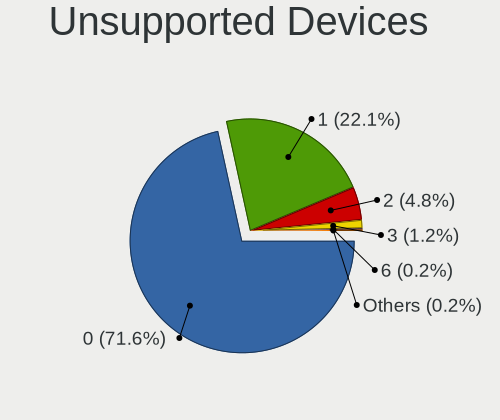

| Total | Computers | Percent |
|-------|-----------|---------|
| 0     | 298       | 71.46%  |
| 1     | 88        | 21.1%   |
| 2     | 26        | 6.24%   |
| 3     | 4         | 0.96%   |
| 4     | 1         | 0.24%   |

Unsupported Device Types
------------------------

Types of unsupported devices

| Type                     | Computers | Percent |
|--------------------------|-----------|---------|
| Graphics card            | 38        | 25.17%  |
| Fingerprint reader       | 36        | 23.84%  |
| Net/wireless             | 19        | 12.58%  |
| Chipcard                 | 19        | 12.58%  |
| Multimedia controller    | 10        | 6.62%   |
| Storage                  | 5         | 3.31%   |
| Storage/ide              | 3         | 1.99%   |
| Modem                    | 3         | 1.99%   |
| Communication controller | 3         | 1.99%   |
| Camera                   | 3         | 1.99%   |
| Unassigned class         | 2         | 1.32%   |
| Sound                    | 2         | 1.32%   |
| Card reader              | 2         | 1.32%   |
| Bluetooth                | 2         | 1.32%   |
| Storage/raid             | 1         | 0.66%   |
| Network                  | 1         | 0.66%   |
| Net/ethernet             | 1         | 0.66%   |
| Flash memory             | 1         | 0.66%   |

