Mint Hardware Trends
--------------------

A project to identify most popular hardware characteristics and track their change
over time based on data collected by Mint users at https://Linux-Hardware.org.

Anyone can contribute to the study by uploading probes of their computers by
the [hw-probe](https://github.com/linuxhw/hw-probe) tool:

    sudo -E hw-probe -all -upload

This is a report for all computer types. See also reports for [desktops](/Dist/Mint/Desktop/README.md) and [notebooks](/Dist/Mint/Notebook/README.md).

Full-feature report is available here: https://linux-hardware.org/?view=trends

Period: Dec, 2020.

Contents
--------

- [ OS                       ](#os)
- [ OS Family                ](#os-family)
- [ Kernel                   ](#kernel)
- [ Kernel Family            ](#kernel-family)
- [ Kernel Major Ver.        ](#kernel-major-ver)
- [ Arch                     ](#arch)
- [ DE                       ](#de)
- [ Display Server           ](#display-server)
- [ Display Manager          ](#display-manager)
- [ OS Lang                  ](#os-lang)
- [ Boot Mode                ](#boot-mode)
- [ Filesystem               ](#filesystem)
- [ Part. scheme             ](#part-scheme)
- [ Dual Boot with Linux/BSD ](#dual-boot-with-linux/bsd)
- [ Dual Boot (Win)          ](#dual-boot-win)
- [ Country                  ](#country)
- [ City                     ](#city)
- [ Vendor                   ](#vendor)
- [ Model                    ](#model)
- [ Model Family             ](#model-family)
- [ MFG Year                 ](#mfg-year)
- [ Form Factor              ](#form-factor)
- [ Secure Boot              ](#secure-boot)
- [ Coreboot                 ](#coreboot)
- [ RAM Size                 ](#ram-size)
- [ RAM Used                 ](#ram-used)
- [ Has CD-ROM               ](#has-cd-rom)
- [ Total Drives             ](#total-drives)
- [ Has Ethernet             ](#has-ethernet)
- [ Drive Vendor             ](#drive-vendor)
- [ Drive Model              ](#drive-model)
- [ HDD Vendor               ](#hdd-vendor)
- [ SSD Vendor               ](#ssd-vendor)
- [ Drive Kind               ](#drive-kind)
- [ Drive Connector          ](#drive-connector)
- [ Drive Size               ](#drive-size)
- [ Space Total              ](#space-total)
- [ Space Used               ](#space-used)
- [ Malfunc. Drives          ](#malfunc-drives)
- [ Malfunc. Drive Vendor    ](#malfunc-drive-vendor)
- [ Malfunc. HDD Vendor      ](#malfunc-hdd-vendor)
- [ Malfunc. Drive Kind      ](#malfunc-drive-kind)
- [ Failed Drives            ](#failed-drives)
- [ Failed Drive Vendor      ](#failed-drive-vendor)
- [ Drive Status             ](#drive-status)
- [ Storage Vendor           ](#storage-vendor)
- [ Storage Model            ](#storage-model)
- [ Storage Kind             ](#storage-kind)
- [ CPU Vendor               ](#cpu-vendor)
- [ CPU Model                ](#cpu-model)
- [ CPU Model Family         ](#cpu-model-family)
- [ CPU Cores                ](#cpu-cores)
- [ CPU Sockets              ](#cpu-sockets)
- [ CPU Threads              ](#cpu-threads)
- [ CPU Op-Modes             ](#cpu-op-modes)
- [ CPU Microcode            ](#cpu-microcode)
- [ CPU Microarch            ](#cpu-microarch)
- [ GPU Vendor               ](#gpu-vendor)
- [ GPU Model                ](#gpu-model)
- [ GPU Combo                ](#gpu-combo)
- [ GPU Driver               ](#gpu-driver)
- [ GPU Memory               ](#gpu-memory)
- [ Monitor Vendor           ](#monitor-vendor)
- [ Monitor Model            ](#monitor-model)
- [ Monitor Resolution       ](#monitor-resolution)
- [ Monitor Diagonal         ](#monitor-diagonal)
- [ Monitor Width            ](#monitor-width)
- [ Aspect Ratio             ](#aspect-ratio)
- [ Monitor Area             ](#monitor-area)
- [ Pixel Density            ](#pixel-density)
- [ Multiple Monitors        ](#multiple-monitors)
- [ Net Controller Vendor    ](#net-controller-vendor)
- [ Net Controller Model     ](#net-controller-model)
- [ Wireless Vendor          ](#wireless-vendor)
- [ Wireless Model           ](#wireless-model)
- [ Ethernet Vendor          ](#ethernet-vendor)
- [ Ethernet Model           ](#ethernet-model)
- [ Net Controller Kind      ](#net-controller-kind)
- [ Used Controller          ](#used-controller)
- [ NICs                     ](#nics)
- [ Memory Vendor            ](#memory-vendor)
- [ Memory Model             ](#memory-model)
- [ Memory Kind              ](#memory-kind)
- [ Memory Form Factor       ](#memory-form-factor)
- [ Memory Size              ](#memory-size)
- [ Memory Speed             ](#memory-speed)
- [ Sound Vendor             ](#sound-vendor)
- [ Sound Model              ](#sound-model)
- [ Camera Vendor            ](#camera-vendor)
- [ Camera Model             ](#camera-model)
- [ Fingerprint Vendor       ](#fingerprint-vendor)
- [ Fingerprint Model        ](#fingerprint-model)
- [ Chipcard Vendor          ](#chipcard-vendor)
- [ Chipcard Model           ](#chipcard-model)
- [ Printer Vendor           ](#printer-vendor)
- [ Printer Model            ](#printer-model)
- [ Scanner Vendor           ](#scanner-vendor)
- [ Scanner Model            ](#scanner-model)
- [ Bluetooth Vendor         ](#bluetooth-vendor)
- [ Bluetooth Model          ](#bluetooth-model)
- [ Unsupported Devices      ](#unsupported-devices)
- [ Unsupported Device Types ](#unsupported-device-types)

OS
--

Installed operating systems

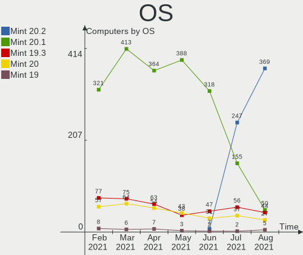

| Name      | Computers | Percent |
|-----------|-----------|---------|
| Mint 20   | 350       | 73.68%  |
| Mint 19.3 | 76        | 16%     |
| Mint 20.1 | 13        | 2.74%   |
| Mint 19.2 | 12        | 2.53%   |
| Mint 19.1 | 10        | 2.11%   |
| Mint 18.3 | 8         | 1.68%   |
| Mint 19   | 6         | 1.26%   |

OS Family
---------

OS without a version

| Name | Computers | Percent |
|------|-----------|---------|
| Mint | 475       | 100%    |

Kernel
------

Version of the Linux kernel

| Version                   | Computers | Percent |
|---------------------------|-----------|---------|
| 5.4.0-58-generic          | 222       | 46.74%  |
| 5.4.0-56-generic          | 89        | 18.74%  |
| 5.4.0-26-generic          | 40        | 8.42%   |
| 5.8.0-33-generic          | 18        | 3.79%   |
| 5.4.0-54-generic          | 17        | 3.58%   |
| 4.15.0-128-generic        | 14        | 2.95%   |
| 5.0.0-32-generic          | 11        | 2.32%   |
| 4.15.0-54-generic         | 6         | 1.26%   |
| 4.15.0-126-generic        | 6         | 1.26%   |
| 4.15.0-20-generic         | 5         | 1.05%   |
| 5.8.0-31-generic          | 4         | 0.84%   |
| 4.15.0-124-generic        | 4         | 0.84%   |
| 5.8.0-29-generic          | 3         | 0.63%   |
| 5.4.0-51-generic          | 3         | 0.63%   |
| 5.4.0-48-generic          | 3         | 0.63%   |
| 5.9.8-050908-generic      | 2         | 0.42%   |
| 5.8.18-050818-generic     | 2         | 0.42%   |
| 5.4.0-53-generic          | 2         | 0.42%   |
| 5.4.0-45-generic          | 2         | 0.42%   |
| 4.10.0-38-generic         | 2         | 0.42%   |
| 5.9.12-050912-generic     | 1         | 0.21%   |
| 5.9.10-050910-generic     | 1         | 0.21%   |
| 5.9.0-12.1-liquorix-amd64 | 1         | 0.21%   |
| 5.8.13-050813-generic     | 1         | 0.21%   |
| 5.8.0-25-generic          | 1         | 0.21%   |
| 5.8.0-050800-generic      | 1         | 0.21%   |
| 5.7.1-050701-generic      | 1         | 0.21%   |
| 5.4.0-47-generic          | 1         | 0.21%   |
| 5.4.0-42-generic          | 1         | 0.21%   |
| 5.4.0-40-generic          | 1         | 0.21%   |
| 5.4.0-39-generic          | 1         | 0.21%   |
| 5.3.0-7648-generic        | 1         | 0.21%   |
| 5.3.0-61-generic          | 1         | 0.21%   |
| 5.10.2-051002-generic     | 1         | 0.21%   |
| 5.10.1-rt17-xanmod1       | 1         | 0.21%   |
| 5.10.1-051001-generic     | 1         | 0.21%   |
| 5.10.0-rc5local+          | 1         | 0.21%   |
| 4.4.0-150-generic         | 1         | 0.21%   |
| 4.15.0-64-generic         | 1         | 0.21%   |
| 4.15.0-46-generic         | 1         | 0.21%   |

Kernel Family
-------------

Linux kernel without a distro release

| Version | Computers | Percent |
|---------|-----------|---------|
| 5.4.0   | 382       | 80.42%  |
| 4.15.0  | 37        | 7.79%   |
| 5.8.0   | 27        | 5.68%   |
| 5.0.0   | 11        | 2.32%   |
| 5.9.8   | 2         | 0.42%   |
| 5.8.18  | 2         | 0.42%   |
| 5.3.0   | 2         | 0.42%   |
| 5.10.1  | 2         | 0.42%   |
| 4.10.0  | 2         | 0.42%   |
| 5.9.12  | 1         | 0.21%   |
| 5.9.10  | 1         | 0.21%   |
| 5.9.0   | 1         | 0.21%   |
| 5.8.13  | 1         | 0.21%   |
| 5.7.1   | 1         | 0.21%   |
| 5.10.2  | 1         | 0.21%   |
| 5.10.0  | 1         | 0.21%   |
| 4.4.0   | 1         | 0.21%   |

Kernel Major Ver.
-----------------

Linux kernel major version

| Version | Computers | Percent |
|---------|-----------|---------|
| 5.4     | 382       | 80.42%  |
| 4.15    | 37        | 7.79%   |
| 5.8     | 30        | 6.32%   |
| 5.0     | 11        | 2.32%   |
| 5.9     | 5         | 1.05%   |
| 5.10    | 4         | 0.84%   |
| 5.3     | 2         | 0.42%   |
| 4.10    | 2         | 0.42%   |
| 5.7     | 1         | 0.21%   |
| 4.4     | 1         | 0.21%   |

Arch
----

OS architecture (x86_64, i586, etc.)

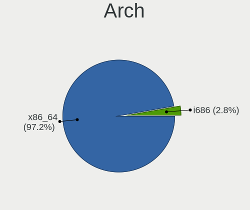

| Name   | Computers | Percent |
|--------|-----------|---------|
| x86_64 | 451       | 94.95%  |
| i686   | 24        | 5.05%   |

DE
--

Desktop Environment

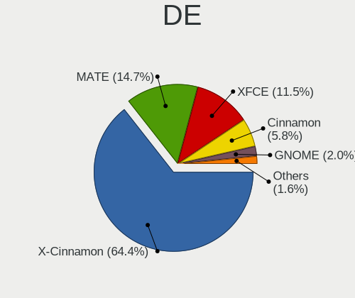

| Name       | Computers | Percent |
|------------|-----------|---------|
| X-Cinnamon | 337       | 70.95%  |
| MATE       | 60        | 12.63%  |
| XFCE       | 50        | 10.53%  |
| Cinnamon   | 20        | 4.21%   |
| Unknown    | 3         | 0.63%   |
| KDE        | 2         | 0.42%   |
| GNOME      | 2         | 0.42%   |
| KDE5       | 1         | 0.21%   |

Display Server
--------------

X11 or Wayland

| Name    | Computers | Percent |
|---------|-----------|---------|
| X11     | 473       | 99.58%  |
| Wayland | 1         | 0.21%   |
| Tty     | 1         | 0.21%   |

Display Manager
---------------

SDDM, LightDM, etc.

| Name    | Computers | Percent |
|---------|-----------|---------|
| Unknown | 361       | 76%     |
| TDM     | 111       | 23.37%  |
| GDM     | 2         | 0.42%   |
| SDDM    | 1         | 0.21%   |

OS Lang
-------

Language

| Lang    | Computers | Percent |
|---------|-----------|---------|
| en_US   | 136       | 28.63%  |
| de_DE   | 73        | 15.37%  |
| pt_BR   | 41        | 8.63%   |
| en_GB   | 22        | 4.63%   |
| C       | 20        | 4.21%   |
| ru_RU   | 16        | 3.37%   |
| pl_PL   | 15        | 3.16%   |
| fr_FR   | 15        | 3.16%   |
| es_ES   | 14        | 2.95%   |
| en_CA   | 13        | 2.74%   |
| nl_NL   | 11        | 2.32%   |
| it_IT   | 9         | 1.89%   |
| en_AU   | 9         | 1.89%   |
| tr_TR   | 5         | 1.05%   |
| fr_CA   | 4         | 0.84%   |
| fi_FI   | 4         | 0.84%   |
| es_MX   | 4         | 0.84%   |
| en_ZA   | 4         | 0.84%   |
| el_GR   | 4         | 0.84%   |
| cs_CZ   | 4         | 0.84%   |
| uk_UA   | 3         | 0.63%   |
| pt_PT   | 3         | 0.63%   |
| en_IN   | 3         | 0.63%   |
| de_CH   | 3         | 0.63%   |
| de_AT   | 3         | 0.63%   |
| sv_SE   | 2         | 0.42%   |
| sk_SK   | 2         | 0.42%   |
| ru_UA   | 2         | 0.42%   |
| nl_BE   | 2         | 0.42%   |
| lv_LV   | 2         | 0.42%   |
| ko_KR   | 2         | 0.42%   |
| hu_HU   | 2         | 0.42%   |
| es_UY   | 2         | 0.42%   |
| es_CL   | 2         | 0.42%   |
| es_AR   | 2         | 0.42%   |
| de_BE   | 2         | 0.42%   |
| bg_BG   | 2         | 0.42%   |
| zh_CN   | 1         | 0.21%   |
| ja_JP   | 1         | 0.21%   |
| id_ID   | 1         | 0.21%   |
| es_PE   | 1         | 0.21%   |
| es_EC   | 1         | 0.21%   |
| es_CR   | 1         | 0.21%   |
| es_CO   | 1         | 0.21%   |
| en_PH   | 1         | 0.21%   |
| en_NZ   | 1         | 0.21%   |
| en_IL   | 1         | 0.21%   |
| en_IE   | 1         | 0.21%   |
| da_DK   | 1         | 0.21%   |
| Unknown | 1         | 0.21%   |

Boot Mode
---------

EFI or BIOS

| Mode | Computers | Percent |
|------|-----------|---------|
| BIOS | 272       | 57.26%  |
| EFI  | 203       | 42.74%  |

Filesystem
----------

Type of filesystem

| Type    | Computers | Percent |
|---------|-----------|---------|
| Ext4    | 447       | 94.11%  |
| Overlay | 18        | 3.79%   |
| Btrfs   | 7         | 1.47%   |
| Xfs     | 1         | 0.21%   |
| Ext2    | 1         | 0.21%   |
| Unknown | 1         | 0.21%   |

Part. scheme
------------

Scheme of partitioning

| Type    | Computers | Percent |
|---------|-----------|---------|
| Unknown | 360       | 75.79%  |
| GPT     | 69        | 14.53%  |
| MBR     | 46        | 9.68%   |

Dual Boot with Linux/BSD
------------------------

Hosting more than one Linux/BSD

| Dual boot | Computers | Percent |
|-----------|-----------|---------|
| No        | 458       | 96.42%  |
| Yes       | 17        | 3.58%   |

Dual Boot (Win)
---------------

Hosting Linux and Windows

| Dual boot | Computers | Percent |
|-----------|-----------|---------|
| No        | 419       | 88.21%  |
| Yes       | 56        | 11.79%  |

Country
-------

Geographic location (country)

| Country              | Computers | Percent |
|----------------------|-----------|---------|
| USA                  | 91        | 19.16%  |
| Germany              | 79        | 16.63%  |
| Brazil               | 47        | 9.89%   |
| Canada               | 20        | 4.21%   |
| UK                   | 19        | 4%      |
| Spain                | 15        | 3.16%   |
| Netherlands          | 15        | 3.16%   |
| France               | 15        | 3.16%   |
| Russia               | 13        | 2.74%   |
| Poland               | 13        | 2.74%   |
| Italy                | 11        | 2.32%   |
| Greece               | 11        | 2.32%   |
| Australia            | 9         | 1.89%   |
| Ukraine              | 6         | 1.26%   |
| Turkey               | 6         | 1.26%   |
| Switzerland          | 6         | 1.26%   |
| Austria              | 6         | 1.26%   |
| Mexico               | 5         | 1.05%   |
| Finland              | 5         | 1.05%   |
| Czech Republic       | 5         | 1.05%   |
| Sweden               | 4         | 0.84%   |
| South Africa         | 4         | 0.84%   |
| Portugal             | 4         | 0.84%   |
| Japan                | 4         | 0.84%   |
| India                | 4         | 0.84%   |
| Hungary              | 4         | 0.84%   |
| Korea, Republic of   | 3         | 0.63%   |
| Vietnam              | 2         | 0.42%   |
| Uruguay              | 2         | 0.42%   |
| Slovakia             | 2         | 0.42%   |
| Singapore            | 2         | 0.42%   |
| Peru                 | 2         | 0.42%   |
| Moldova, Republic of | 2         | 0.42%   |
| Malaysia             | 2         | 0.42%   |
| Latvia               | 2         | 0.42%   |
| Israel               | 2         | 0.42%   |
| Iraq                 | 2         | 0.42%   |
| Indonesia            | 2         | 0.42%   |
| Hong Kong            | 2         | 0.42%   |
| Denmark              | 2         | 0.42%   |
| Colombia             | 2         | 0.42%   |
| China                | 2         | 0.42%   |
| Chile                | 2         | 0.42%   |
| Bulgaria             | 2         | 0.42%   |
| Belgium              | 2         | 0.42%   |
| Argentina            | 2         | 0.42%   |
| Taiwan               | 1         | 0.21%   |
| Reunion              | 1         | 0.21%   |
| Philippines          | 1         | 0.21%   |
| Pakistan             | 1         | 0.21%   |
| Norway               | 1         | 0.21%   |
| New Zealand          | 1         | 0.21%   |
| Lithuania            | 1         | 0.21%   |
| Iceland              | 1         | 0.21%   |
| Ecuador              | 1         | 0.21%   |
| Czechia              | 1         | 0.21%   |
| Costa Rica           | 1         | 0.21%   |
| Belarus              | 1         | 0.21%   |
| Unknown              | 1         | 0.21%   |

City
----

Geographic location (city)

| City             | Computers | Percent |
|------------------|-----------|---------|
| Rockville        | 8         | 1.68%   |
| Athens           | 6         | 1.26%   |
| São Paulo       | 5         | 1.05%   |
| Montreal         | 5         | 1.05%   |
| Madrid           | 5         | 1.05%   |
| Berlin           | 5         | 1.05%   |
| Verona           | 4         | 0.84%   |
| Rio de Janeiro   | 4         | 0.84%   |
| Munich           | 4         | 0.84%   |
| Cologne          | 4         | 0.84%   |
| Budapest         | 4         | 0.84%   |
| Vienna           | 3         | 0.63%   |
| Sao Jose         | 3         | 0.63%   |
| Prague           | 3         | 0.63%   |
| Porto Alegre     | 3         | 0.63%   |
| Paris            | 3         | 0.63%   |
| Moscow           | 3         | 0.63%   |
| Łódź          | 2         | 0.42%   |
| Warsaw           | 2         | 0.42%   |
| Toronto          | 2         | 0.42%   |
| Thessaloniki     | 2         | 0.42%   |
| Sydney           | 2         | 0.42%   |
| Stelle           | 2         | 0.42%   |
| Springfield      | 2         | 0.42%   |
| Sofia            | 2         | 0.42%   |
| Seattle          | 2         | 0.42%   |
| San Diego        | 2         | 0.42%   |
| Saint Paul       | 2         | 0.42%   |
| Ringwood         | 2         | 0.42%   |
| Riga             | 2         | 0.42%   |
| Richmond         | 2         | 0.42%   |
| Oulu             | 2         | 0.42%   |
| Orlando          | 2         | 0.42%   |
| Nuremberg        | 2         | 0.42%   |
| Montevideo       | 2         | 0.42%   |
| Mexico City      | 2         | 0.42%   |
| Mesa             | 2         | 0.42%   |
| Marseille        | 2         | 0.42%   |
| Los Angeles      | 2         | 0.42%   |
| London           | 2         | 0.42%   |
| Linz             | 2         | 0.42%   |
| Lima             | 2         | 0.42%   |
| Leipzig          | 2         | 0.42%   |
| Kyiv             | 2         | 0.42%   |
| Kirchseeon       | 2         | 0.42%   |
| Jaipur           | 2         | 0.42%   |
| Izmir            | 2         | 0.42%   |
| Hooglanderveen   | 2         | 0.42%   |
| Ho Chi Minh City | 2         | 0.42%   |
| Goiânia         | 2         | 0.42%   |
| Glasgow          | 2         | 0.42%   |
| Dresden          | 2         | 0.42%   |
| Dartmouth        | 2         | 0.42%   |
| Dallas           | 2         | 0.42%   |
| Częstochowa     | 2         | 0.42%   |
| Central          | 2         | 0.42%   |
| Cardiff          | 2         | 0.42%   |
| Cape Town        | 2         | 0.42%   |
| Brunswick        | 2         | 0.42%   |
| Brno             | 2         | 0.42%   |

Vendor
------

Motherboard manufacturer

| Name                             | Computers | Percent |
|----------------------------------|-----------|---------|
| ASUSTek Computer                 | 78        | 16.42%  |
| Hewlett-Packard                  | 68        | 14.32%  |
| Dell                             | 62        | 13.05%  |
| Lenovo                           | 51        | 10.74%  |
| Gigabyte Technology              | 30        | 6.32%   |
| Acer                             | 27        | 5.68%   |
| ASRock                           | 23        | 4.84%   |
| MSI                              | 19        | 4%      |
| Toshiba                          | 17        | 3.58%   |
| Pegatron                         | 11        | 2.32%   |
| Samsung Electronics              | 10        | 2.11%   |
| Intel                            | 10        | 2.11%   |
| Apple                            | 10        | 2.11%   |
| Sony                             | 8         | 1.68%   |
| Medion                           | 6         | 1.26%   |
| Fujitsu                          | 6         | 1.26%   |
| Positivo                         | 4         | 0.84%   |
| Biostar                          | 4         | 0.84%   |
| TYAN Computer                    | 2         | 0.42%   |
| Teclast                          | 2         | 0.42%   |
| Notebook                         | 2         | 0.42%   |
| HUAWEI                           | 2         | 0.42%   |
| Foxconn                          | 2         | 0.42%   |
| ECS                              | 2         | 0.42%   |
| Alienware                        | 2         | 0.42%   |
| ABIT                             | 2         | 0.42%   |
| TUXEDO                           | 1         | 0.21%   |
| Shuttle                          | 1         | 0.21%   |
| Positivo Bahia - VAIO            | 1         | 0.21%   |
| Packard Bell                     | 1         | 0.21%   |
| Huanan                           | 1         | 0.21%   |
| HARDKERNEL                       | 1         | 0.21%   |
| Google                           | 1         | 0.21%   |
| Fusion5                          | 1         | 0.21%   |
| FUJITSU CLIENT COMPUTING LIMITED | 1         | 0.21%   |
| eMachines                        | 1         | 0.21%   |
| DIODE                            | 1         | 0.21%   |
| Digibras                         | 1         | 0.21%   |
| Chuwi                            | 1         | 0.21%   |
| AXDIA International              | 1         | 0.21%   |
| AMD                              | 1         | 0.21%   |

Model
-----

Motherboard model

| Name                                        | Computers | Percent |
|---------------------------------------------|-----------|---------|
| Dell Latitude E6430                         | 4         | 0.84%   |
| ASUS All Series                             | 4         | 0.84%   |
| HP ProBook 4540s                            | 3         | 0.63%   |
| HP Pavilion g6                              | 3         | 0.63%   |
| HP Notebook                                 | 3         | 0.63%   |
| Dell Inspiron 15 7000 Gaming                | 3         | 0.63%   |
| Toshiba Satellite A100                      | 2         | 0.42%   |
| Teclast F6 Plus                             | 2         | 0.42%   |
| Positivo H14BT58                            | 2         | 0.42%   |
| MSI GT70 2OC/2OD                            | 2         | 0.42%   |
| Intel X99                                   | 2         | 0.42%   |
| HP Z440 Workstation                         | 2         | 0.42%   |
| HP Pavilion g4                              | 2         | 0.42%   |
| HP Pavilion 15                              | 2         | 0.42%   |
| HP G62                                      | 2         | 0.42%   |
| Gigabyte B450 AORUS ELITE                   | 2         | 0.42%   |
| Gigabyte B365M DS3H                         | 2         | 0.42%   |
| Dell OptiPlex 780                           | 2         | 0.42%   |
| Dell OptiPlex 7010                          | 2         | 0.42%   |
| Dell Inspiron 7520                          | 2         | 0.42%   |
| Dell Inspiron 5570                          | 2         | 0.42%   |
| ASUS PRIME A320M-K                          | 2         | 0.42%   |
| ASUS P7H55-M BR                             | 2         | 0.42%   |
| ASUS P5KPL-AM SE                            | 2         | 0.42%   |
| ASUS H110M-A                                | 2         | 0.42%   |
| ASRock H310CM-ITX/ac                        | 2         | 0.42%   |
| Acer Aspire 5820TG                          | 2         | 0.42%   |
| TYAN S2925                                  | 1         | 0.21%   |
| TYAN S2895                                  | 1         | 0.21%   |
| TUXEDO Book BA1510                          | 1         | 0.21%   |
| Toshiba TECRA M10                           | 1         | 0.21%   |
| Toshiba Satellite R830                      | 1         | 0.21%   |
| Toshiba Satellite PRO L770-14H              | 1         | 0.21%   |
| Toshiba Satellite Pro L500D                 | 1         | 0.21%   |
| Toshiba Satellite P50-B-11L                 | 1         | 0.21%   |
| Toshiba Satellite L855                      | 1         | 0.21%   |
| Toshiba Satellite L50-A                     | 1         | 0.21%   |
| Toshiba Satellite E55-A                     | 1         | 0.21%   |
| Toshiba Satellite C855-1JF                  | 1         | 0.21%   |
| Toshiba Satellite C75D-B                    | 1         | 0.21%   |
| Toshiba Satellite C660                      | 1         | 0.21%   |
| Toshiba Satellite C645                      | 1         | 0.21%   |
| Toshiba Satellite C55Dt-A                   | 1         | 0.21%   |
| Toshiba Satellite 1905                      | 1         | 0.21%   |
| Toshiba NB305                               | 1         | 0.21%   |
| Sony VPCW12J1E                              | 1         | 0.21%   |
| Sony VPCEA45FG                              | 1         | 0.21%   |
| Sony VGN-FS415B                             | 1         | 0.21%   |
| Sony VGN-A617M                              | 1         | 0.21%   |
| Sony SVF1521NSTB                            | 1         | 0.21%   |
| Sony SVF1521A6EW                            | 1         | 0.21%   |
| Sony SVE1511F4E                             | 1         | 0.21%   |
| Sony SVE1511AENB                            | 1         | 0.21%   |
| Shuttle X70                                 | 1         | 0.21%   |
| Samsung RV411/RV511/E3511/S3511/RV711/E3411 | 1         | 0.21%   |
| Samsung RC530/RC730                         | 1         | 0.21%   |
| Samsung RC410/RC510/RC710                   | 1         | 0.21%   |
| Samsung R430/R480/R440                      | 1         | 0.21%   |
| Samsung NC10                                | 1         | 0.21%   |
| Samsung 550P5C/550P7C                       | 1         | 0.21%   |

Model Family
------------

Motherboard model prefix

| Name                  | Computers | Percent |
|-----------------------|-----------|---------|
| Lenovo ThinkPad       | 22        | 4.63%   |
| Dell Inspiron         | 20        | 4.21%   |
| Acer Aspire           | 20        | 4.21%   |
| HP Pavilion           | 19        | 4%      |
| Dell Latitude         | 17        | 3.58%   |
| Toshiba Satellite     | 15        | 3.16%   |
| Dell OptiPlex         | 12        | 2.53%   |
| Lenovo IdeaPad        | 11        | 2.32%   |
| Lenovo ThinkCentre    | 7         | 1.47%   |
| HP ProBook            | 7         | 1.47%   |
| HP Laptop             | 7         | 1.47%   |
| ASUS PRIME            | 7         | 1.47%   |
| HP Compaq             | 6         | 1.26%   |
| Dell Vostro           | 6         | 1.26%   |
| HP EliteBook          | 4         | 0.84%   |
| Dell XPS              | 4         | 0.84%   |
| ASUS All              | 4         | 0.84%   |
| Lenovo Yoga           | 3         | 0.63%   |
| HP Notebook           | 3         | 0.63%   |
| HP ENVY               | 3         | 0.63%   |
| Gigabyte B450         | 3         | 0.63%   |
| Fujitsu ESPRIMO       | 3         | 0.63%   |
| ASUS ROG              | 3         | 0.63%   |
| ASUS P7H55-M          | 3         | 0.63%   |
| ASUS H110M-A          | 3         | 0.63%   |
| Apple MacBookPro11    | 3         | 0.63%   |
| Teclast F6            | 2         | 0.42%   |
| Positivo H14BT58      | 2         | 0.42%   |
| MSI GT70              | 2         | 0.42%   |
| MSI GE60              | 2         | 0.42%   |
| Intel X99             | 2         | 0.42%   |
| HP Z440               | 2         | 0.42%   |
| HP Presario           | 2         | 0.42%   |
| HP G62                | 2         | 0.42%   |
| HP EliteDesk          | 2         | 0.42%   |
| HP 250                | 2         | 0.42%   |
| Gigabyte Z170X-Gaming | 2         | 0.42%   |
| Gigabyte B365M        | 2         | 0.42%   |
| Fujitsu LIFEBOOK      | 2         | 0.42%   |
| Dell Precision        | 2         | 0.42%   |
| ASUS TUF              | 2         | 0.42%   |
| ASUS P8H61-M          | 2         | 0.42%   |
| ASUS P5KPL-AM         | 2         | 0.42%   |
| ASUS M5A78L-M         | 2         | 0.42%   |
| ASRock H310CM-ITX     | 2         | 0.42%   |
| TYAN S2925            | 1         | 0.21%   |
| TYAN S2895            | 1         | 0.21%   |
| TUXEDO Book           | 1         | 0.21%   |
| Toshiba TECRA         | 1         | 0.21%   |
| Toshiba NB305         | 1         | 0.21%   |
| Sony VPCW12J1E        | 1         | 0.21%   |
| Sony VPCEA45FG        | 1         | 0.21%   |
| Sony VGN-FS415B       | 1         | 0.21%   |
| Sony VGN-A617M        | 1         | 0.21%   |
| Sony SVF1521NSTB      | 1         | 0.21%   |
| Sony SVF1521A6EW      | 1         | 0.21%   |
| Sony SVE1511F4E       | 1         | 0.21%   |
| Sony SVE1511AENB      | 1         | 0.21%   |
| Shuttle X70           | 1         | 0.21%   |
| Samsung RV411         | 1         | 0.21%   |

MFG Year
--------

Motherboard manufacture year

| Year | Computers | Percent |
|------|-----------|---------|
| 2020 | 78        | 16.42%  |
| 2019 | 49        | 10.32%  |
| 2018 | 38        | 8%      |
| 2013 | 38        | 8%      |
| 2012 | 37        | 7.79%   |
| 2011 | 36        | 7.58%   |
| 2010 | 35        | 7.37%   |
| 2014 | 32        | 6.74%   |
| 2017 | 26        | 5.47%   |
| 2016 | 26        | 5.47%   |
| 2015 | 21        | 4.42%   |
| 2009 | 20        | 4.21%   |
| 2008 | 15        | 3.16%   |
| 2006 | 9         | 1.89%   |
| 2007 | 7         | 1.47%   |
| 2005 | 4         | 0.84%   |
| 2004 | 2         | 0.42%   |
| 2003 | 2         | 0.42%   |

Form Factor
-----------

Physical design of the computer

| Name        | Computers | Percent |
|-------------|-----------|---------|
| Notebook    | 266       | 56%     |
| Desktop     | 190       | 40%     |
| Convertible | 8         | 1.68%   |
| Mini pc     | 5         | 1.05%   |
| All in one  | 4         | 0.84%   |
| Server      | 2         | 0.42%   |

Secure Boot
-----------

Enabled or disabled

| State    | Computers | Percent |
|----------|-----------|---------|
| Disabled | 433       | 91.16%  |
| Enabled  | 42        | 8.84%   |

Coreboot
--------

Have coreboot on board

| Used | Computers | Percent |
|------|-----------|---------|
| No   | 474       | 99.79%  |
| Yes  | 1         | 0.21%   |

RAM Size
--------

Total RAM memory

| Size in GB  | Computers | Percent |
|-------------|-----------|---------|
| 4.01-8.0    | 129       | 27.16%  |
| 3.01-4.0    | 110       | 23.16%  |
| 8.01-16.0   | 87        | 18.32%  |
| 16.01-24.0  | 73        | 15.37%  |
| 1.01-2.0    | 28        | 5.89%   |
| 32.01-64.0  | 21        | 4.42%   |
| 2.01-3.0    | 12        | 2.53%   |
| 64.01-256.0 | 7         | 1.47%   |
| 24.01-32.0  | 6         | 1.26%   |
| 0.51-1.0    | 2         | 0.42%   |

RAM Used
--------

Used RAM memory

| Used GB    | Computers | Percent |
|------------|-----------|---------|
| 1.01-2.0   | 218       | 45.89%  |
| 2.01-3.0   | 98        | 20.63%  |
| 3.01-4.0   | 58        | 12.21%  |
| 4.01-8.0   | 51        | 10.74%  |
| 0.51-1.0   | 42        | 8.84%   |
| 8.01-16.0  | 4         | 0.84%   |
| 16.01-24.0 | 2         | 0.42%   |
| 0.01-0.5   | 2         | 0.42%   |

Has CD-ROM
----------

Has CD-ROM on board

| Presented | Computers | Percent |
|-----------|-----------|---------|
| Yes       | 256       | 53.89%  |
| No        | 219       | 46.11%  |

Total Drives
------------

Number of drives on board

| Drives | Computers | Percent |
|--------|-----------|---------|
| 1      | 285       | 60%     |
| 2      | 119       | 25.05%  |
| 3      | 47        | 9.89%   |
| 4      | 9         | 1.89%   |
| 5      | 7         | 1.47%   |
| 0      | 4         | 0.84%   |
| 7      | 2         | 0.42%   |
| 10     | 1         | 0.21%   |
| 6      | 1         | 0.21%   |

Has Ethernet
------------

Has Ethernet on board

| Presented | Computers | Percent |
|-----------|-----------|---------|
| Yes       | 423       | 89.05%  |
| No        | 52        | 10.95%  |

Drive Vendor
------------

Hard drive vendors

| Vendor                    | Computers | Drives | Percent |
|---------------------------|-----------|--------|---------|
| Seagate                   | 123       | 151    | 18.04%  |
| WDC                       | 112       | 130    | 16.42%  |
| Samsung Electronics       | 96        | 114    | 14.08%  |
| Kingston                  | 44        | 47     | 6.45%   |
| Toshiba                   | 38        | 38     | 5.57%   |
| SanDisk                   | 34        | 34     | 4.99%   |
| Hitachi                   | 31        | 32     | 4.55%   |
| Crucial                   | 25        | 26     | 3.67%   |
| Unknown                   | 21        | 21     | 3.08%   |
| A-DATA Technology         | 12        | 13     | 1.76%   |
| HGST                      | 11        | 11     | 1.61%   |
| China                     | 10        | 10     | 1.47%   |
| Intel                     | 9         | 9      | 1.32%   |
| SK Hynix                  | 8         | 8      | 1.17%   |
| Apple                     | 7         | 7      | 1.03%   |
| SPCC                      | 6         | 8      | 0.88%   |
| Fujitsu                   | 6         | 6      | 0.88%   |
| Patriot                   | 5         | 5      | 0.73%   |
| Micron Technology         | 5         | 5      | 0.73%   |
| LITEONIT                  | 5         | 5      | 0.73%   |
| LITEON                    | 5         | 5      | 0.73%   |
| Intenso                   | 5         | 5      | 0.73%   |
| Phison                    | 4         | 4      | 0.59%   |
| KIOXIA                    | 4         | 4      | 0.59%   |
| JMicron                   | 4         | 5      | 0.59%   |
| XPG                       | 3         | 3      | 0.44%   |
| Transcend                 | 3         | 3      | 0.44%   |
| PNY                       | 3         | 3      | 0.44%   |
| OCZ                       | 3         | 4      | 0.44%   |
| Micron/Crucial Technology | 3         | 3      | 0.44%   |
| Maxtor                    | 3         | 3      | 0.44%   |
| KingSpec                  | 3         | 3      | 0.44%   |
| WD MediaMax               | 2         | 2      | 0.29%   |
| Union Memory              | 2         | 2      | 0.29%   |
| TO Exter                  | 2         | 2      | 0.29%   |
| Teclast                   | 2         | 2      | 0.29%   |
| PLEXTOR                   | 2         | 2      | 0.29%   |
| KingDian                  | 2         | 2      | 0.29%   |
| GOODRAM                   | 2         | 2      | 0.29%   |
| Gigabyte Technology       | 2         | 2      | 0.29%   |
| ViperTeq                  | 1         | 1      | 0.15%   |
| Super Talent              | 1         | 1      | 0.15%   |
| SSSTC                     | 1         | 1      | 0.15%   |
| Silicon Motion            | 1         | 1      | 0.15%   |
| Sabrent                   | 1         | 1      | 0.15%   |
| S528                      | 1         | 1      | 0.15%   |
| PNY CS90                  | 1         | 1      | 0.15%   |
| Netac                     | 1         | 1      | 0.15%   |
| Lenovo                    | 1         | 1      | 0.15%   |
| KIOXIA-EXCERIA            | 1         | 1      | 0.15%   |
| KingFast                  | 1         | 1      | 0.15%   |
| HS-SSD-E100               | 1         | 1      | 0.15%   |
| Corsair                   | 1         | 1      | 0.15%   |
| BP4e                      | 1         | 1      | 0.15%   |
| Apacer                    | 1         | 1      | 0.15%   |

Drive Model
-----------

Hard drive models

| Model                              | Computers | Percent |
|------------------------------------|-----------|---------|
| Seagate ST500DM002-1BD142 500GB    | 9         | 1.2%    |
| Seagate ST1000LM035-1RK172 1TB     | 8         | 1.07%   |
| Kingston SA400S37240G 240GB SSD    | 8         | 1.07%   |
| Kingston SA400S37120G 120GB SSD    | 8         | 1.07%   |
| Seagate ST9500325AS 500GB          | 6         | 0.8%    |
| Samsung SSD 860 EVO 500GB          | 6         | 0.8%    |
| Unknown MMC Card  32GB             | 5         | 0.67%   |
| Seagate ST4000DM004-2CV104 4TB     | 5         | 0.67%   |
| Seagate ST31000524AS 1TB           | 5         | 0.67%   |
| Samsung NVMe SSD Drive 500GB       | 5         | 0.67%   |
| Kingston SV300S37A240G 240GB SSD   | 5         | 0.67%   |
| Crucial CT500MX500SSD1 500GB       | 5         | 0.67%   |
| Toshiba MQ01ABF050 500GB           | 4         | 0.53%   |
| Seagate ST500LT012-9WS142 500GB    | 4         | 0.53%   |
| Seagate ST2000DM001-1CH164 2TB     | 4         | 0.53%   |
| Seagate ST1000LM024 HN-M101MBB 1TB | 4         | 0.53%   |
| Seagate ST1000DM010-2EP102 1TB     | 4         | 0.53%   |
| Seagate ST1000DM003-1CH162 1TB     | 4         | 0.53%   |
| Samsung SSD 860 EVO 250GB          | 4         | 0.53%   |
| Samsung SSD 860 EVO 1TB            | 4         | 0.53%   |
| Samsung SSD 850 EVO 120GB          | 4         | 0.53%   |
| Patriot Burst 120GB SSD            | 4         | 0.53%   |
| Kingston SV300S37A120G 120GB SSD   | 4         | 0.53%   |
| Kingston SA400S37480G 480GB SSD    | 4         | 0.53%   |
| WDC WD1002FAEX-00Z3A0 1TB          | 3         | 0.4%    |
| Unknown MMC Card  16GB             | 3         | 0.4%    |
| Toshiba MQ04ABF100 1TB             | 3         | 0.4%    |
| Toshiba DT01ACA100 1TB             | 3         | 0.4%    |
| Seagate ST500LT012-1DG142 500GB    | 3         | 0.4%    |
| Seagate ST3160815AS 160GB          | 3         | 0.4%    |
| Seagate ST31000528AS 1TB           | 3         | 0.4%    |
| Seagate ST2000DM006-2DM164 2TB     | 3         | 0.4%    |
| Seagate M3 Portable 4TB            | 3         | 0.4%    |
| Seagate Expansion+ 4TB             | 3         | 0.4%    |
| SanDisk SSD PLUS 240GB             | 3         | 0.4%    |
| Samsung HD322HJ 320GB              | 3         | 0.4%    |
| Kingston SUV400S37240G 240GB SSD   | 3         | 0.4%    |
| Intenso SSD Sata III 240GB         | 3         | 0.4%    |
| HGST HTS721010A9E630 1TB           | 3         | 0.4%    |
| HGST HTS545050A7E680 500GB         | 3         | 0.4%    |
| Crucial CT240BX500SSD1 240GB       | 3         | 0.4%    |
| Crucial CT120BX500SSD1 120GB       | 3         | 0.4%    |
| WDC WDS500G2B0B-00YS70 500GB SSD   | 2         | 0.27%   |
| WDC WD5000LPVX-22V0TT0 500GB       | 2         | 0.27%   |
| WDC WD5000AAKX-08U6AA0 500GB       | 2         | 0.27%   |
| WDC WD5000AADS-00S9B0 500GB        | 2         | 0.27%   |
| WDC WD40EFRX-68N32N0 4TB           | 2         | 0.27%   |
| WDC WD30EZRX-00MMMB0 3TB           | 2         | 0.27%   |
| WDC WD20SPZX-22UA7T0 2TB           | 2         | 0.27%   |
| WDC WD20EZRZ-00Z5HB0 2TB           | 2         | 0.27%   |
| WDC WD20EZRX-00D8PB0 2TB           | 2         | 0.27%   |
| WDC WD20EFRX-68EUZN0 2TB           | 2         | 0.27%   |
| WDC WD2003FZEX-00SRLA0 2TB         | 2         | 0.27%   |
| WDC WD10SPZX-60Z10T0 1TB           | 2         | 0.27%   |
| WDC WD10SPZX-24Z10 1TB             | 2         | 0.27%   |
| WDC WD10JPVX-22JC3T0 1TB           | 2         | 0.27%   |
| WDC WD10EZRX-00A8LB0 1TB           | 2         | 0.27%   |
| WDC WD10EZEX-08WN4A0 1TB           | 2         | 0.27%   |
| Unknown SD/MMC/MS PRO 128GB        | 2         | 0.27%   |
| Toshiba TR200 480GB SSD            | 2         | 0.27%   |

HDD Vendor
----------

Hard disk drive vendors

| Vendor              | Computers | Drives | Percent |
|---------------------|-----------|--------|---------|
| Seagate             | 120       | 146    | 35.71%  |
| WDC                 | 103       | 119    | 30.65%  |
| Hitachi             | 31        | 32     | 9.23%   |
| Samsung Electronics | 29        | 33     | 8.63%   |
| Toshiba             | 28        | 28     | 8.33%   |
| HGST                | 11        | 11     | 3.27%   |
| Fujitsu             | 5         | 5      | 1.49%   |
| MAXTOR              | 3         | 3      | 0.89%   |
| TO Exter            | 2         | 2      | 0.6%    |
| WD MediaMax         | 1         | 1      | 0.3%    |
| Unknown             | 1         | 1      | 0.3%    |
| Sabrent             | 1         | 1      | 0.3%    |
| Apple               | 1         | 1      | 0.3%    |

SSD Vendor
----------

Solid state drive vendors

| Vendor              | Computers | Drives | Percent |
|---------------------|-----------|--------|---------|
| Samsung Electronics | 49        | 56     | 19.6%   |
| Kingston            | 41        | 44     | 16.4%   |
| SanDisk             | 32        | 32     | 12.8%   |
| Crucial             | 24        | 25     | 9.6%    |
| A-DATA Technology   | 10        | 11     | 4%      |
| China               | 9         | 9      | 3.6%    |
| Toshiba             | 7         | 7      | 2.8%    |
| SPCC                | 6         | 8      | 2.4%    |
| Intel               | 6         | 6      | 2.4%    |
| WDC                 | 5         | 5      | 2%      |
| Patriot             | 5         | 5      | 2%      |
| LITEONIT            | 5         | 5      | 2%      |
| LITEON              | 5         | 5      | 2%      |
| Apple               | 5         | 5      | 2%      |
| SK Hynix            | 4         | 4      | 1.6%    |
| Intenso             | 4         | 4      | 1.6%    |
| Transcend           | 3         | 3      | 1.2%    |
| Micron Technology   | 3         | 3      | 1.2%    |
| Teclast             | 2         | 2      | 0.8%    |
| PNY                 | 2         | 2      | 0.8%    |
| PLEXTOR             | 2         | 2      | 0.8%    |
| OCZ                 | 2         | 2      | 0.8%    |
| KingSpec            | 2         | 2      | 0.8%    |
| KingDian            | 2         | 2      | 0.8%    |
| GOODRAM             | 2         | 2      | 0.8%    |
| Gigabyte Technology | 2         | 2      | 0.8%    |
| ViperTeq            | 1         | 1      | 0.4%    |
| Unknown             | 1         | 1      | 0.4%    |
| S528                | 1         | 1      | 0.4%    |
| PNY CS90            | 1         | 1      | 0.4%    |
| Netac               | 1         | 1      | 0.4%    |
| KIOXIA-EXCERIA      | 1         | 1      | 0.4%    |
| JMicron             | 1         | 1      | 0.4%    |
| Fujitsu             | 1         | 1      | 0.4%    |
| Corsair             | 1         | 1      | 0.4%    |
| BP4e                | 1         | 1      | 0.4%    |
| Apacer              | 1         | 1      | 0.4%    |

Drive Kind
----------

HDD or SSD

| Kind    | Computers | Drives | Percent |
|---------|-----------|--------|---------|
| HDD     | 291       | 383    | 47.16%  |
| SSD     | 223       | 264    | 36.14%  |
| NVMe    | 69        | 74     | 11.18%  |
| Unknown | 21        | 22     | 3.4%    |
| MMC     | 13        | 13     | 2.11%   |

Drive Connector
---------------

SATA, SAS, NVMe, etc.

| Type | Computers | Drives | Percent |
|------|-----------|--------|---------|
| SATA | 432       | 635    | 79.7%   |
| NVMe | 69        | 74     | 12.73%  |
| SAS  | 28        | 34     | 5.17%   |
| MMC  | 13        | 13     | 2.4%    |

Drive Size
----------

Size of hard drive

| Size in TB | Computers | Drives | Percent |
|------------|-----------|--------|---------|
| 0.01-0.5   | 326       | 411    | 61.98%  |
| 0.51-1.0   | 133       | 155    | 25.29%  |
| 1.01-2.0   | 39        | 50     | 7.41%   |
| 3.01-4.0   | 16        | 18     | 3.04%   |
| 2.01-3.0   | 8         | 9      | 1.52%   |
| 4.01-10.0  | 4         | 4      | 0.76%   |

Space Total
-----------

Amount of disk space available on the file system

| Size in GB     | Computers | Percent |
|----------------|-----------|---------|
| 101-250        | 145       | 30.53%  |
| 251-500        | 119       | 25.05%  |
| 501-1000       | 66        | 13.89%  |
| 1001-2000      | 40        | 8.42%   |
| 51-100         | 29        | 6.11%   |
| More than 3000 | 25        | 5.26%   |
| 21-50          | 18        | 3.79%   |
| 1-20           | 16        | 3.37%   |
| 2001-3000      | 15        | 3.16%   |
| Unknown        | 2         | 0.42%   |

Space Used
----------

Amount of used disk space

| Used GB        | Computers | Percent |
|----------------|-----------|---------|
| 1-20           | 148       | 31.16%  |
| 21-50          | 94        | 19.79%  |
| 101-250        | 72        | 15.16%  |
| 51-100         | 63        | 13.26%  |
| 501-1000       | 36        | 7.58%   |
| 251-500        | 27        | 5.68%   |
| 1001-2000      | 21        | 4.42%   |
| More than 3000 | 9         | 1.89%   |
| 2001-3000      | 3         | 0.63%   |
| Unknown        | 2         | 0.42%   |

Malfunc. Drives
---------------

Drive models with a malfunction

| Model                                | Computers | Drives | Percent |
|--------------------------------------|-----------|--------|---------|
| Seagate ST500LT012-9WS142 500GB      | 3         | 3      | 8.82%   |
| HGST HTS721010A9E630 1TB             | 3         | 3      | 8.82%   |
| Seagate ST1000LM035-1RK172 1TB       | 2         | 2      | 5.88%   |
| WDC WD800JB-00JJA0 80GB              | 1         | 1      | 2.94%   |
| WDC WD5000LPVX-22V0TT0 500GB         | 1         | 1      | 2.94%   |
| WDC WD5000AVVS-63H0B1 500GB          | 1         | 1      | 2.94%   |
| WDC WD3200AAJS-00L7A0 320GB          | 1         | 1      | 2.94%   |
| WDC WD10JPVX-22JC3T0 1TB             | 1         | 1      | 2.94%   |
| WDC WD10EZEX-60WN4A0 1TB             | 1         | 1      | 2.94%   |
| WDC WD10EADS-00L5B1 1TB              | 1         | 1      | 2.94%   |
| Unknown S050 Hard drive 500GB        | 1         | 1      | 2.94%   |
| Toshiba THNSNK128GCS8 SATA 128GB SSD | 1         | 1      | 2.94%   |
| Toshiba MK1629GSG 160GB              | 1         | 1      | 2.94%   |
| Seagate ST9250315ASG 250GB           | 1         | 1      | 2.94%   |
| Seagate ST380815AS 80GB              | 1         | 1      | 2.94%   |
| Seagate ST2000DM001-9YN164 2TB       | 1         | 1      | 2.94%   |
| Seagate ST1000DM003-1CH162 1TB       | 1         | 1      | 2.94%   |
| Samsung Electronics HM160HI 160GB    | 1         | 1      | 2.94%   |
| Samsung Electronics HM121HI 120GB    | 1         | 1      | 2.94%   |
| Samsung Electronics HD642JJ 640GB    | 1         | 1      | 2.94%   |
| Samsung Electronics HD103UJ 1TB      | 1         | 1      | 2.94%   |
| Kingston SV300S37A120G 120GB SSD     | 1         | 1      | 2.94%   |
| Kingston SA400S37240G 240GB SSD      | 1         | 1      | 2.94%   |
| Intel SSDSC2BF240A5L 240GB           | 1         | 1      | 2.94%   |
| Intel SSDMCEAC120B3 120GB            | 1         | 1      | 2.94%   |
| Hitachi HTS545032A7E380 320GB        | 1         | 1      | 2.94%   |
| Hitachi HTS543232A7A384 320GB        | 1         | 1      | 2.94%   |
| Hitachi HDP725050GLA360 500GB        | 1         | 1      | 2.94%   |
| Crucial CT512M550SSD4 512GB          | 1         | 1      | 2.94%   |

Malfunc. Drive Vendor
---------------------

Vendors of faulty drives

| Vendor              | Computers | Drives | Percent |
|---------------------|-----------|--------|---------|
| Seagate             | 9         | 9      | 28.13%  |
| WDC                 | 6         | 7      | 18.75%  |
| Samsung Electronics | 3         | 4      | 9.38%   |
| Hitachi             | 3         | 3      | 9.38%   |
| HGST                | 3         | 3      | 9.38%   |
| Toshiba             | 2         | 2      | 6.25%   |
| Kingston            | 2         | 2      | 6.25%   |
| Intel               | 2         | 2      | 6.25%   |
| Unknown             | 1         | 1      | 3.13%   |
| Crucial             | 1         | 1      | 3.13%   |

Malfunc. HDD Vendor
-------------------

Vendors of faulty HDD drives

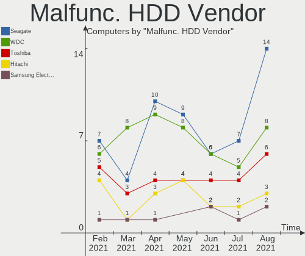

| Vendor              | Computers | Drives | Percent |
|---------------------|-----------|--------|---------|
| Seagate             | 9         | 9      | 34.62%  |
| WDC                 | 6         | 7      | 23.08%  |
| Samsung Electronics | 3         | 4      | 11.54%  |
| Hitachi             | 3         | 3      | 11.54%  |
| HGST                | 3         | 3      | 11.54%  |
| Unknown             | 1         | 1      | 3.85%   |
| Toshiba             | 1         | 1      | 3.85%   |

Malfunc. Drive Kind
-------------------

Kinds of faulty drives

| Kind | Computers | Drives | Percent |
|------|-----------|--------|---------|
| HDD  | 23        | 28     | 82.14%  |
| SSD  | 5         | 6      | 17.86%  |

Failed Drives
-------------

Failed drive models

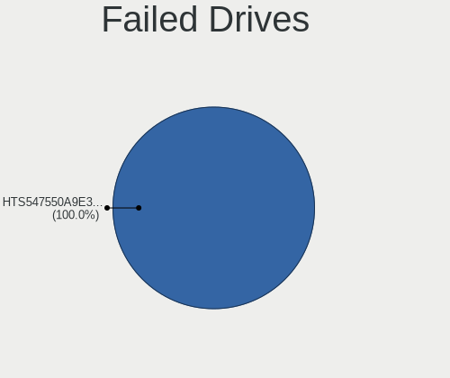

| Model                             | Computers | Drives | Percent |
|-----------------------------------|-----------|--------|---------|
| Samsung Electronics HD252HJ 250GB | 1         | 1      | 100%    |

Failed Drive Vendor
-------------------

Failed drive vendors

| Vendor              | Computers | Drives | Percent |
|---------------------|-----------|--------|---------|
| Samsung Electronics | 1         | 1      | 100%    |

Drive Status
------------

Number of failed and malfunc. drives

| Status   | Computers | Drives | Percent |
|----------|-----------|--------|---------|
| Detected | 365       | 568    | 73.15%  |
| Works    | 106       | 153    | 21.24%  |
| Malfunc  | 27        | 34     | 5.41%   |
| Failed   | 1         | 1      | 0.2%    |

Storage Vendor
--------------

Storage controller vendors

| Vendor                           | Computers | Percent |
|----------------------------------|-----------|---------|
| Intel                            | 342       | 63.22%  |
| AMD                              | 92        | 17.01%  |
| Samsung Electronics              | 26        | 4.81%   |
| Nvidia                           | 15        | 2.77%   |
| Sandisk                          | 8         | 1.48%   |
| Marvell Technology Group         | 7         | 1.29%   |
| Phison Electronics               | 5         | 0.92%   |
| ADATA Technology                 | 5         | 0.92%   |
| SK Hynix                         | 4         | 0.74%   |
| KIOXIA                           | 4         | 0.74%   |
| JMicron Technology               | 4         | 0.74%   |
| ASMedia Technology               | 4         | 0.74%   |
| Toshiba America Info Systems     | 3         | 0.55%   |
| Micron/Crucial Technology        | 3         | 0.55%   |
| Kingston Technology Company      | 3         | 0.55%   |
| VIA Technologies                 | 2         | 0.37%   |
| Union Memory (Shenzhen)          | 2         | 0.37%   |
| Silicon Integrated Systems [SiS] | 2         | 0.37%   |
| Adaptec                          | 2         | 0.37%   |
| Solid State Storage Technology   | 1         | 0.18%   |
| Silicon Motion                   | 1         | 0.18%   |
| OCZ Technology Group             | 1         | 0.18%   |
| Micron Technology                | 1         | 0.18%   |
| Lenovo                           | 1         | 0.18%   |
| Hewlett-Packard                  | 1         | 0.18%   |
| Apple                            | 1         | 0.18%   |
| 3ware                            | 1         | 0.18%   |

Storage Model
-------------

Storage controller models

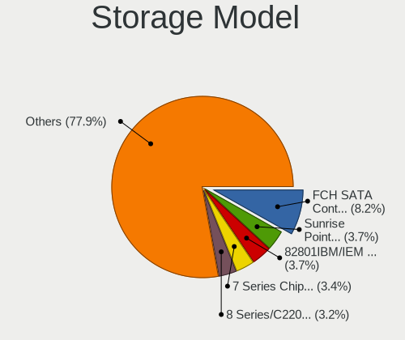

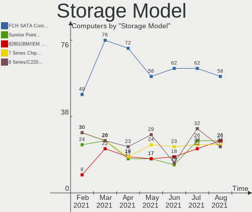

| Model                                                                                   | Computers | Percent |
|-----------------------------------------------------------------------------------------|-----------|---------|
| AMD FCH SATA Controller [AHCI mode]                                                     | 58        | 9.15%   |
| Intel 7 Series Chipset Family 6-port SATA Controller [AHCI mode]                        | 32        | 5.05%   |
| Intel Sunrise Point-LP SATA Controller [AHCI mode]                                      | 25        | 3.94%   |
| Intel 8 Series/C220 Series Chipset Family 6-port SATA Controller 1 [AHCI mode]          | 25        | 3.94%   |
| Intel 82801 Mobile SATA Controller [RAID mode]                                          | 21        | 3.31%   |
| Intel 6 Series/C200 Series Chipset Family 6 port Mobile SATA AHCI Controller            | 19        | 3%      |
| AMD SB7x0/SB8x0/SB9x0 SATA Controller [AHCI mode]                                       | 19        | 3%      |
| Samsung NVMe SSD Controller SM981/PM981/PM983                                           | 15        | 2.37%   |
| Intel 82801G (ICH7 Family) IDE Controller                                               | 14        | 2.21%   |
| Intel 6 Series/C200 Series Chipset Family 6 port Desktop SATA AHCI Controller           | 14        | 2.21%   |
| AMD SB7x0/SB8x0/SB9x0 IDE Controller                                                    | 14        | 2.21%   |
| Intel Q170/Q150/B150/H170/H110/Z170/CM236 Chipset SATA Controller [AHCI Mode]           | 13        | 2.05%   |
| Intel NM10/ICH7 Family SATA Controller [IDE mode]                                       | 13        | 2.05%   |
| Intel 8 Series SATA Controller 1 [AHCI mode]                                            | 13        | 2.05%   |
| Intel 5 Series/3400 Series Chipset 4 port SATA AHCI Controller                          | 13        | 2.05%   |
| Intel 82801IBM/IEM (ICH9M/ICH9M-E) 4 port SATA Controller [AHCI mode]                   | 12        | 1.89%   |
| Intel 200 Series PCH SATA controller [AHCI mode]                                        | 12        | 1.89%   |
| Intel 82801GBM/GHM (ICH7-M Family) SATA Controller [IDE mode]                           | 10        | 1.58%   |
| Intel 7 Series/C210 Series Chipset Family 6-port SATA Controller [AHCI mode]            | 9         | 1.42%   |
| Intel Wildcat Point-LP SATA Controller [AHCI Mode]                                      | 8         | 1.26%   |
| Intel 5 Series/3400 Series Chipset 6 port SATA AHCI Controller                          | 8         | 1.26%   |
| AMD 400 Series Chipset SATA Controller                                                  | 8         | 1.26%   |
| Nvidia MCP61 SATA Controller                                                            | 7         | 1.1%    |
| Intel SATA Controller [RAID mode]                                                       | 7         | 1.1%    |
| AMD SB7x0/SB8x0/SB9x0 SATA Controller [IDE mode]                                        | 7         | 1.1%    |
| Intel HM170/QM170 Chipset SATA Controller [AHCI Mode]                                   | 6         | 0.95%   |
| Intel Atom/Celeron/Pentium Processor x5-E8000/J3xxx/N3xxx Series SATA Controller        | 6         | 0.95%   |
| Intel Atom Processor E3800 Series SATA AHCI Controller                                  | 6         | 0.95%   |
| ADATA XPG SX8200 Pro PCIe Gen3x4 M.2 2280 Solid State Drive                             | 5         | 0.79%   |
| Sandisk Non-Volatile memory controller                                                  | 4         | 0.63%   |
| Samsung NVMe SSD Controller SM961/PM961/SM963                                           | 4         | 0.63%   |
| Samsung Electronics Non-Volatile memory controller                                      | 4         | 0.63%   |
| Nvidia MCP61 IDE                                                                        | 4         | 0.63%   |
| KIOXIA Non-Volatile memory controller                                                   | 4         | 0.63%   |
| Intel Comet Lake SATA AHCI Controller                                                   | 4         | 0.63%   |
| Intel Celeron/Pentium Silver Processor SATA Controller                                  | 4         | 0.63%   |
| Intel Cannon Lake Mobile PCH SATA AHCI Controller                                       | 4         | 0.63%   |
| Intel C610/X99 series chipset 6-Port SATA Controller [AHCI mode]                        | 4         | 0.63%   |
| Intel 82801HM/HEM (ICH8M/ICH8M-E) IDE Controller                                        | 4         | 0.63%   |
| Intel 82801EB/ER (ICH5/ICH5R) IDE Controller                                            | 4         | 0.63%   |
| Intel 5 Series/3400 Series Chipset 4 port SATA IDE Controller                           | 4         | 0.63%   |
| Intel 5 Series/3400 Series Chipset 2 port SATA IDE Controller                           | 4         | 0.63%   |
| ASMedia ASM1062 Serial ATA Controller                                                   | 4         | 0.63%   |
| AMD FCH SATA Controller D                                                               | 4         | 0.63%   |
| AMD FCH IDE Controller                                                                  | 4         | 0.63%   |
| AMD 300 Series Chipset SATA Controller                                                  | 4         | 0.63%   |
| SK Hynix Non-Volatile memory controller                                                 | 3         | 0.47%   |
| Phison E12 NVMe Controller                                                              | 3         | 0.47%   |
| Intel NM10/ICH7 Family SATA Controller [AHCI mode]                                      | 3         | 0.47%   |
| Intel Cannon Point-LP SATA Controller [AHCI Mode]                                       | 3         | 0.47%   |
| Intel Cannon Lake PCH SATA AHCI Controller                                              | 3         | 0.47%   |
| Intel C610/X99 series chipset sSATA Controller [AHCI mode]                              | 3         | 0.47%   |
| Intel 82801HR/HO/HH (ICH8R/DO/DH) 2 port SATA Controller [IDE mode]                     | 3         | 0.47%   |
| Intel 82801HM/HEM (ICH8M/ICH8M-E) SATA Controller [AHCI mode]                           | 3         | 0.47%   |
| Intel 82801H (ICH8 Family) 4 port SATA Controller [IDE mode]                            | 3         | 0.47%   |
| Intel 82801FB/FBM/FR/FW/FRW (ICH6 Family) IDE Controller                                | 3         | 0.47%   |
| Intel 82801EB (ICH5) SATA Controller                                                    | 3         | 0.47%   |
| Intel 6 Series/C200 Series Chipset Family Desktop SATA Controller (IDE mode, ports 4-5) | 3         | 0.47%   |
| Intel 6 Series/C200 Series Chipset Family Desktop SATA Controller (IDE mode, ports 0-3) | 3         | 0.47%   |
| Intel 400 Series Chipset Family SATA AHCI Controller                                    | 3         | 0.47%   |

Storage Kind
------------

Kind of storage controller (IDE, SATA, NVMe, SAS, ...)

| Kind | Computers | Percent |
|------|-----------|---------|
| SATA | 361       | 64.35%  |
| IDE  | 95        | 16.93%  |
| NVMe | 68        | 12.12%  |
| RAID | 35        | 6.24%   |
| SCSI | 2         | 0.36%   |

CPU Vendor
----------

Processor vendors

| Vendor | Computers | Percent |
|--------|-----------|---------|
| Intel  | 364       | 76.63%  |
| AMD    | 111       | 23.37%  |

CPU Model
---------

Processor models

| Model                                         | Computers | Percent |
|-----------------------------------------------|-----------|---------|
| Intel Core i5-8250U CPU @ 1.60GHz             | 6         | 1.26%   |
| Intel Core i5-7200U CPU @ 2.50GHz             | 6         | 1.26%   |
| Intel Core i5-2520M CPU @ 2.50GHz             | 6         | 1.26%   |
| Intel Core i7-4700MQ CPU @ 2.40GHz            | 5         | 1.05%   |
| Intel Core i5-3210M CPU @ 2.50GHz             | 5         | 1.05%   |
| AMD FX-8350 Eight-Core Processor              | 5         | 1.05%   |
| Intel Core i7-7700HQ CPU @ 2.80GHz            | 4         | 0.84%   |
| Intel Core i7-7500U CPU @ 2.70GHz             | 4         | 0.84%   |
| Intel Core i7-5500U CPU @ 2.40GHz             | 4         | 0.84%   |
| Intel Core i5-6500 CPU @ 3.20GHz              | 4         | 0.84%   |
| Intel Core i5-4200U CPU @ 1.60GHz             | 4         | 0.84%   |
| Intel Core i5-3230M CPU @ 2.60GHz             | 4         | 0.84%   |
| Intel Core i5-2400 CPU @ 3.10GHz              | 4         | 0.84%   |
| Intel Core i5-10210U CPU @ 1.60GHz            | 4         | 0.84%   |
| Intel Core i3-3220 CPU @ 3.30GHz              | 4         | 0.84%   |
| Intel Core 2 Duo CPU T6600 @ 2.20GHz          | 4         | 0.84%   |
| AMD Ryzen 5 4500U with Radeon Graphics        | 4         | 0.84%   |
| AMD Ryzen 5 3500U with Radeon Vega Mobile Gfx | 4         | 0.84%   |
| AMD E-300 APU with Radeon HD Graphics         | 4         | 0.84%   |
| Intel Pentium Dual-Core CPU E5400 @ 2.70GHz   | 3         | 0.63%   |
| Intel Core i7-9750H CPU @ 2.60GHz             | 3         | 0.63%   |
| Intel Core i7-8750H CPU @ 2.20GHz             | 3         | 0.63%   |
| Intel Core i7-8565U CPU @ 1.80GHz             | 3         | 0.63%   |
| Intel Core i7-4500U CPU @ 1.80GHz             | 3         | 0.63%   |
| Intel Core i7-3630QM CPU @ 2.40GHz            | 3         | 0.63%   |
| Intel Core i5-9400 CPU @ 2.90GHz              | 3         | 0.63%   |
| Intel Core i5-7500 CPU @ 3.40GHz              | 3         | 0.63%   |
| Intel Core i5-7300HQ CPU @ 2.50GHz            | 3         | 0.63%   |
| Intel Core i5-6200U CPU @ 2.30GHz             | 3         | 0.63%   |
| Intel Core i5-4590 CPU @ 3.30GHz              | 3         | 0.63%   |
| Intel Core i5-4570 CPU @ 3.20GHz              | 3         | 0.63%   |
| Intel Core i5-4460 CPU @ 3.20GHz              | 3         | 0.63%   |
| Intel Core i5-4210U CPU @ 1.70GHz             | 3         | 0.63%   |
| Intel Core i5-2430M CPU @ 2.40GHz             | 3         | 0.63%   |
| Intel Core i5 CPU M 480 @ 2.67GHz             | 3         | 0.63%   |
| Intel Core i5 CPU 650 @ 3.20GHz               | 3         | 0.63%   |
| Intel Core i3-2350M CPU @ 2.30GHz             | 3         | 0.63%   |
| Intel Core i3 CPU M 380 @ 2.53GHz             | 3         | 0.63%   |
| Intel Core 2 Quad CPU Q6600 @ 2.40GHz         | 3         | 0.63%   |
| Intel Core 2 Duo CPU E8400 @ 3.00GHz          | 3         | 0.63%   |
| Intel Celeron CPU N3060 @ 1.60GHz             | 3         | 0.63%   |
| AMD FX-6300 Six-Core Processor                | 3         | 0.63%   |
| Intel Xeon CPU E5-2620 v3 @ 2.40GHz           | 2         | 0.42%   |
| Intel Pentium M processor 1.73GHz             | 2         | 0.42%   |
| Intel Pentium CPU P6200 @ 2.13GHz             | 2         | 0.42%   |
| Intel Pentium CPU N3700 @ 1.60GHz             | 2         | 0.42%   |
| Intel Pentium CPU B960 @ 2.20GHz              | 2         | 0.42%   |
| Intel Pentium CPU 2117U @ 1.80GHz             | 2         | 0.42%   |
| Intel Pentium 4 CPU 3.20GHz                   | 2         | 0.42%   |
| Intel Pentium 4 CPU 2.80GHz                   | 2         | 0.42%   |
| Intel Genuine CPU T2250 @ 1.73GHz             | 2         | 0.42%   |
| Intel Core i7-8550U CPU @ 1.80GHz             | 2         | 0.42%   |
| Intel Core i7-6700K CPU @ 4.00GHz             | 2         | 0.42%   |
| Intel Core i7-6700HQ CPU @ 2.60GHz            | 2         | 0.42%   |
| Intel Core i7-2670QM CPU @ 2.20GHz            | 2         | 0.42%   |
| Intel Core i5-8265U CPU @ 1.60GHz             | 2         | 0.42%   |
| Intel Core i5-5300U CPU @ 2.30GHz             | 2         | 0.42%   |
| Intel Core i5-3337U CPU @ 1.80GHz             | 2         | 0.42%   |
| Intel Core i5-3320M CPU @ 2.60GHz             | 2         | 0.42%   |
| Intel Core i5-3317U CPU @ 1.70GHz             | 2         | 0.42%   |

CPU Model Family
----------------

Processor model prefix

| Model                   | Computers | Percent |
|-------------------------|-----------|---------|
| Intel Core i5           | 121       | 25.47%  |
| Intel Core i7           | 73        | 15.37%  |
| Intel Core i3           | 50        | 10.53%  |
| Intel Core 2 Duo        | 27        | 5.68%   |
| Intel Celeron           | 17        | 3.58%   |
| Intel Pentium           | 16        | 3.37%   |
| AMD Ryzen 5             | 16        | 3.37%   |
| AMD Ryzen 7             | 11        | 2.32%   |
| AMD FX                  | 11        | 2.32%   |
| Intel Xeon              | 10        | 2.11%   |
| Intel Pentium Dual-Core | 8         | 1.68%   |
| Intel Atom              | 8         | 1.68%   |
| Intel Pentium 4         | 7         | 1.47%   |
| AMD A8                  | 7         | 1.47%   |
| Other                   | 5         | 1.05%   |
| Intel Core 2 Quad       | 5         | 1.05%   |
| Intel Core 2            | 5         | 1.05%   |
| AMD Ryzen 9             | 5         | 1.05%   |
| AMD Phenom II X4        | 5         | 1.05%   |
| AMD A4                  | 5         | 1.05%   |
| AMD A10                 | 5         | 1.05%   |
| Intel Genuine           | 4         | 0.84%   |
| AMD E                   | 4         | 0.84%   |
| AMD A6                  | 4         | 0.84%   |
| Intel Pentium M         | 3         | 0.63%   |
| AMD Ryzen 3             | 3         | 0.63%   |
| AMD Athlon II X4        | 3         | 0.63%   |
| AMD Athlon II X2        | 3         | 0.63%   |
| Intel Pentium Gold      | 2         | 0.42%   |
| Intel Pentium Dual      | 2         | 0.42%   |
| AMD Turion 64 X2 Mobile | 2         | 0.42%   |
| AMD Turion 64 Mobile    | 2         | 0.42%   |
| AMD Ryzen 7 PRO         | 2         | 0.42%   |
| AMD Phenom II X2        | 2         | 0.42%   |
| AMD E1                  | 2         | 0.42%   |
| AMD Athlon II X3        | 2         | 0.42%   |
| AMD Athlon 64 X2        | 2         | 0.42%   |
| AMD Athlon              | 2         | 0.42%   |
| Intel Pentium Silver    | 1         | 0.21%   |
| Intel Pentium D         | 1         | 0.21%   |
| Intel Core m3           | 1         | 0.21%   |
| Intel Core M            | 1         | 0.21%   |
| Intel Core Duo          | 1         | 0.21%   |
| AMD Ryzen 3 PRO         | 1         | 0.21%   |
| AMD PRO A10             | 1         | 0.21%   |
| AMD Phenom II X6        | 1         | 0.21%   |
| AMD Opteron             | 1         | 0.21%   |
| AMD E2                  | 1         | 0.21%   |
| AMD Dual Core Opteron   | 1         | 0.21%   |
| AMD C-60                | 1         | 0.21%   |
| AMD Athlon Neo X2       | 1         | 0.21%   |
| AMD Athlon II Dual-Core | 1         | 0.21%   |

CPU Cores
---------

Number of processor cores

| Number | Computers | Percent |
|--------|-----------|---------|
| 2      | 243       | 51.16%  |
| 4      | 151       | 31.79%  |
| 6      | 29        | 6.11%   |
| 1      | 23        | 4.84%   |
| 8      | 13        | 2.74%   |
| 3      | 5         | 1.05%   |
| 12     | 4         | 0.84%   |
| 16     | 3         | 0.63%   |
| 24     | 2         | 0.42%   |
| 14     | 1         | 0.21%   |
| 5      | 1         | 0.21%   |

CPU Sockets
-----------

Number of sockets

| Number | Computers | Percent |
|--------|-----------|---------|
| 1      | 471       | 99.16%  |
| 2      | 4         | 0.84%   |

CPU Threads
-----------

Threads per core (Hyper-Threading)

| Number | Computers | Percent |
|--------|-----------|---------|
| 2      | 284       | 59.79%  |
| 1      | 191       | 40.21%  |

CPU Op-Modes
------------

CPU Operation Modes (32-bit, 64-bit)

| Op mode        | Computers | Percent |
|----------------|-----------|---------|
| 32-bit, 64-bit | 457       | 96.21%  |
| 32-bit         | 17        | 3.58%   |
| Unknown        | 1         | 0.21%   |

CPU Microcode
-------------

Microcode number

| Number     | Computers | Percent |
|------------|-----------|---------|
| 0x206a7    | 41        | 8.63%   |
| Unknown    | 41        | 8.63%   |
| 0x306a9    | 39        | 8.21%   |
| 0x306c3    | 25        | 5.26%   |
| 0x1067a    | 22        | 4.63%   |
| 0x906ea    | 15        | 3.16%   |
| 0x906e9    | 14        | 2.95%   |
| 0x806e9    | 14        | 2.95%   |
| 0x20655    | 14        | 2.95%   |
| 0x506e3    | 13        | 2.74%   |
| 0x40651    | 13        | 2.74%   |
| 0x806ea    | 11        | 2.32%   |
| 0x306d4    | 11        | 2.32%   |
| 0x06001119 | 10        | 2.11%   |
| 0x10676    | 8         | 1.68%   |
| 0x06000852 | 8         | 1.68%   |
| 0x806ec    | 7         | 1.47%   |
| 0x6fb      | 7         | 1.47%   |
| 0x20652    | 7         | 1.47%   |
| 0x010000c8 | 7         | 1.47%   |
| 0x406e3    | 5         | 1.05%   |
| 0x406c4    | 5         | 1.05%   |
| 0x30678    | 5         | 1.05%   |
| 0x08701021 | 5         | 1.05%   |
| 0x08108102 | 5         | 1.05%   |
| 0x05000119 | 5         | 1.05%   |
| 0x010000db | 5         | 1.05%   |
| 0xf29      | 4         | 0.84%   |
| 0x806eb    | 4         | 0.84%   |
| 0x706a1    | 4         | 0.84%   |
| 0x6e8      | 4         | 0.84%   |
| 0x306f2    | 4         | 0.84%   |
| 0x0800820d | 4         | 0.84%   |
| 0xa0652    | 3         | 0.63%   |
| 0x706e5    | 3         | 0.63%   |
| 0x6fd      | 3         | 0.63%   |
| 0x6f6      | 3         | 0.63%   |
| 0x6d8      | 3         | 0.63%   |
| 0x106e5    | 3         | 0.63%   |
| 0x106ca    | 3         | 0.63%   |
| 0x106c2    | 3         | 0.63%   |
| 0x08600106 | 3         | 0.63%   |
| 0x08600104 | 3         | 0.63%   |
| 0x08600103 | 3         | 0.63%   |
| 0x08108109 | 3         | 0.63%   |
| 0xf65      | 2         | 0.42%   |
| 0x6f2      | 2         | 0.42%   |
| 0x506c9    | 2         | 0.42%   |
| 0x406c3    | 2         | 0.42%   |
| 0x40661    | 2         | 0.42%   |
| 0x08701013 | 2         | 0.42%   |
| 0x0810100b | 2         | 0.42%   |
| 0x07030106 | 2         | 0.42%   |
| 0x07030105 | 2         | 0.42%   |
| 0x0700010f | 2         | 0.42%   |
| 0x06006705 | 2         | 0.42%   |
| 0x0600063e | 2         | 0.42%   |
| 0x03000027 | 2         | 0.42%   |
| 0xf27      | 1         | 0.21%   |
| 0xf24      | 1         | 0.21%   |

CPU Microarch
-------------

Microarchitecture

| Name          | Computers | Percent |
|---------------|-----------|---------|
| KabyLake      | 69        | 14.53%  |
| Haswell       | 50        | 10.53%  |
| SandyBridge   | 45        | 9.47%   |
| IvyBridge     | 42        | 8.84%   |
| Penryn        | 32        | 6.74%   |
| Westmere      | 23        | 4.84%   |
| Skylake       | 19        | 4%      |
| Piledriver    | 19        | 4%      |
| K10           | 19        | 4%      |
| Zen 2         | 18        | 3.79%   |
| Core          | 16        | 3.37%   |
| Silvermont    | 14        | 2.95%   |
| Broadwell     | 13        | 2.74%   |
| Zen+          | 12        | 2.53%   |
| Zen           | 9         | 1.89%   |
| K8 Hammer     | 9         | 1.89%   |
| P6            | 8         | 1.68%   |
| NetBurst      | 8         | 1.68%   |
| Bonnell       | 6         | 1.26%   |
| Puma          | 5         | 1.05%   |
| Excavator     | 5         | 1.05%   |
| CometLake     | 5         | 1.05%   |
| Bobcat        | 5         | 1.05%   |
| Nehalem       | 4         | 0.84%   |
| Goldmont plus | 4         | 0.84%   |
| Jaguar        | 3         | 0.63%   |
| IceLake       | 3         | 0.63%   |
| Steamroller   | 2         | 0.42%   |
| K10 Llano     | 2         | 0.42%   |
| Goldmont      | 2         | 0.42%   |
| Bulldozer     | 2         | 0.42%   |
| TigerLake     | 1         | 0.21%   |
| Unknown       | 1         | 0.21%   |

GPU Vendor
----------

Vendors of graphics cards

| Vendor                           | Computers | Percent |
|----------------------------------|-----------|---------|
| Intel                            | 274       | 50.37%  |
| Nvidia                           | 149       | 27.39%  |
| AMD                              | 118       | 21.69%  |
| Silicon Integrated Systems [SiS] | 1         | 0.18%   |
| Matrox Electronics Systems       | 1         | 0.18%   |
| ATI Technologies                 | 1         | 0.18%   |

GPU Model
---------

Graphics card models

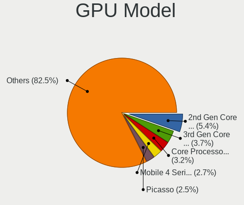

| Model                                                                                    | Computers | Percent |
|------------------------------------------------------------------------------------------|-----------|---------|
| Intel 2nd Generation Core Processor Family Integrated Graphics Controller                | 35        | 6.23%   |
| Intel 3rd Gen Core processor Graphics Controller                                         | 31        | 5.52%   |
| Intel Haswell-ULT Integrated Graphics Controller                                         | 14        | 2.49%   |
| Intel HD Graphics 620                                                                    | 13        | 2.31%   |
| Intel Core Processor Integrated Graphics Controller                                      | 13        | 2.31%   |
| Intel 4th Gen Core Processor Integrated Graphics Controller                              | 12        | 2.14%   |
| Intel UHD Graphics 620                                                                   | 10        | 1.78%   |
| AMD Renoir                                                                               | 10        | 1.78%   |
| Intel UHD Graphics                                                                       | 9         | 1.6%    |
| Intel Mobile 945GM/GMS/GME, 943/940GML Express Integrated Graphics Controller            | 9         | 1.6%    |
| Intel Mobile 4 Series Chipset Integrated Graphics Controller                             | 9         | 1.6%    |
| Intel HD Graphics 5500                                                                   | 9         | 1.6%    |
| Intel HD Graphics 530                                                                    | 9         | 1.6%    |
| AMD Picasso                                                                              | 9         | 1.6%    |
| Intel Atom/Celeron/Pentium Processor x5-E8000/J3xxx/N3xxx Integrated Graphics Controller | 8         | 1.42%   |
| Intel HD Graphics 630                                                                    | 7         | 1.25%   |
| Intel 4 Series Chipset Integrated Graphics Controller                                    | 7         | 1.25%   |
| AMD Ellesmere [Radeon RX 470/480/570/570X/580/580X/590]                                  | 7         | 1.25%   |
| Nvidia GT218 [GeForce 210]                                                               | 6         | 1.07%   |
| Nvidia GP106 [GeForce GTX 1060 6GB]                                                      | 6         | 1.07%   |
| Nvidia GK208B [GeForce GT 710]                                                           | 6         | 1.07%   |
| Intel Xeon E3-1200 v2/3rd Gen Core processor Graphics Controller                         | 6         | 1.07%   |
| Intel UHD Graphics 630 (Mobile)                                                          | 6         | 1.07%   |
| Intel Atom Processor Z36xxx/Z37xxx Series Graphics & Display                             | 6         | 1.07%   |
| Intel Xeon E3-1200 v3/4th Gen Core Processor Integrated Graphics Controller              | 5         | 0.89%   |
| Intel UHD Graphics 630 (Desktop)                                                         | 5         | 0.89%   |
| Intel UHD Graphics 620 (Whiskey Lake)                                                    | 5         | 0.89%   |
| Intel Skylake GT2 [HD Graphics 520]                                                      | 5         | 0.89%   |
| Intel Mobile 945GM/GMS, 943/940GML Express Integrated Graphics Controller                | 5         | 0.89%   |
| Intel 82G33/G31 Express Integrated Graphics Controller                                   | 5         | 0.89%   |
| Nvidia GP107 [GeForce GTX 1050 Ti]                                                       | 4         | 0.71%   |
| Nvidia GK208B [GeForce GT 730]                                                           | 4         | 0.71%   |
| Intel UHD Graphics 605                                                                   | 4         | 0.71%   |
| Intel Mobile 945GSE Express Integrated Graphics Controller                               | 4         | 0.71%   |
| AMD Wrestler [Radeon HD 6310]                                                            | 4         | 0.71%   |
| AMD Park [Mobility Radeon HD 5430/5450/5470]                                             | 4         | 0.71%   |
| Nvidia GT218 [GeForce 8400 GS Rev. 3]                                                    | 3         | 0.53%   |
| Nvidia GP108M [GeForce MX150]                                                            | 3         | 0.53%   |
| Nvidia GP107M [GeForce GTX 1050 Ti Mobile]                                               | 3         | 0.53%   |
| Nvidia GP107M [GeForce GTX 1050 Mobile]                                                  | 3         | 0.53%   |
| Nvidia GM107M [GeForce GTX 960M]                                                         | 3         | 0.53%   |
| Nvidia GK208M [GeForce GT 740M]                                                          | 3         | 0.53%   |
| Nvidia GF119 [GeForce GT 610]                                                            | 3         | 0.53%   |
| Intel Mobile GM965/GL960 Integrated Graphics Controller (secondary)                      | 3         | 0.53%   |
| Intel Mobile GM965/GL960 Integrated Graphics Controller (primary)                        | 3         | 0.53%   |
| Intel Iris Plus Graphics G1 (Ice Lake)                                                   | 3         | 0.53%   |
| Intel Atom Processor D4xx/D5xx/N4xx/N5xx Integrated Graphics Controller                  | 3         | 0.53%   |
| AMD Turks XT [Radeon HD 6670/7670]                                                       | 3         | 0.53%   |
| AMD Stoney [Radeon R2/R3/R4/R5 Graphics]                                                 | 3         | 0.53%   |
| AMD Navi 10 [Radeon RX 5600 OEM/5600 XT / 5700/5700 XT]                                  | 3         | 0.53%   |
| AMD Mullins [Radeon R4/R5 Graphics]                                                      | 3         | 0.53%   |
| AMD Caicos [Radeon HD 6450/7450/8450 / R5 230 OEM]                                       | 3         | 0.53%   |
| AMD Baffin [Radeon RX 550 640SP / RX 560/560X]                                           | 3         | 0.53%   |
| Nvidia TU117 [GeForce GTX 1650]                                                          | 2         | 0.36%   |
| Nvidia GP108 [GeForce GT 1030]                                                           | 2         | 0.36%   |
| Nvidia GP107 [GeForce GTX 1050]                                                          | 2         | 0.36%   |
| Nvidia GP104BM [GeForce GTX 1070 Mobile]                                                 | 2         | 0.36%   |
| Nvidia GP104 [GeForce GTX 1070]                                                          | 2         | 0.36%   |
| Nvidia GM206 [GeForce GTX 960]                                                           | 2         | 0.36%   |
| Nvidia GM108M [GeForce 840M]                                                             | 2         | 0.36%   |

GPU Combo
---------

Combinations of graphics cards

| Name           | Computers | Percent |
|----------------|-----------|---------|
| 1 x Intel      | 207       | 43.58%  |
| 1 x AMD        | 100       | 21.05%  |
| 1 x Nvidia     | 94        | 19.79%  |
| Intel + Nvidia | 51        | 10.74%  |
| Intel + AMD    | 13        | 2.74%   |
| 2 x AMD        | 5         | 1.05%   |
| 2 x Nvidia     | 2         | 0.42%   |
| 1 x SiS        | 1         | 0.21%   |
| 1 x Matrox     | 1         | 0.21%   |
| AMD + Nvidia   | 1         | 0.21%   |

GPU Driver
----------

Free vs proprietary

| Driver      | Computers | Percent |
|-------------|-----------|---------|
| Free        | 366       | 77.05%  |
| Proprietary | 92        | 19.37%  |
| Unknown     | 17        | 3.58%   |

GPU Memory
----------

Total video memory

| Size in GB | Computers | Percent |
|------------|-----------|---------|
| Unknown    | 232       | 48.84%  |
| 0.01-0.5   | 75        | 15.79%  |
| 1.01-2.0   | 67        | 14.11%  |
| 0.51-1.0   | 50        | 10.53%  |
| 3.01-4.0   | 25        | 5.26%   |
| 5.01-6.0   | 13        | 2.74%   |
| 7.01-8.0   | 12        | 2.53%   |
| 2.01-3.0   | 1         | 0.21%   |

Monitor Vendor
--------------

Monitor vendors

| Vendor                  | Computers | Percent |
|-------------------------|-----------|---------|
| AU Optronics            | 71        | 14.43%  |
| Samsung Electronics     | 68        | 13.82%  |
| LG Display              | 51        | 10.37%  |
| BOE                     | 30        | 6.1%    |
| Goldstar                | 26        | 5.28%   |
| Chimei Innolux          | 25        | 5.08%   |
| Dell                    | 23        | 4.67%   |
| Hewlett-Packard         | 21        | 4.27%   |
| AOC                     | 13        | 2.64%   |
| Acer                    | 13        | 2.64%   |
| Chi Mei Optoelectronics | 12        | 2.44%   |
| Philips                 | 10        | 2.03%   |
| Apple                   | 10        | 2.03%   |
| Ancor Communications    | 10        | 2.03%   |
| BenQ                    | 9         | 1.83%   |
| LG Electronics          | 8         | 1.63%   |
| Lenovo                  | 8         | 1.63%   |
| Iiyama                  | 7         | 1.42%   |
| ViewSonic               | 4         | 0.81%   |
| Sharp                   | 4         | 0.81%   |
| NEC Computers           | 4         | 0.81%   |
| LG Philips              | 4         | 0.81%   |
| Sceptre Tech            | 3         | 0.61%   |
| PANDA                   | 3         | 0.61%   |
| CPT                     | 3         | 0.61%   |
| Vizio                   | 2         | 0.41%   |
| Unknown                 | 2         | 0.41%   |
| Sony                    | 2         | 0.41%   |
| RTK                     | 2         | 0.41%   |
| Panasonic               | 2         | 0.41%   |
| HannStar Display        | 2         | 0.41%   |
| HannStar                | 2         | 0.41%   |
| FUS                     | 2         | 0.41%   |
| Eizo                    | 2         | 0.41%   |
| Westinghouse            | 1         | 0.2%    |
| VIZ                     | 1         | 0.2%    |
| Vestel Elektronik       | 1         | 0.2%    |
| Vestel                  | 1         | 0.2%    |
| Toshiba                 | 1         | 0.2%    |
| TIANMA XM               | 1         | 0.2%    |
| Seiko/Epson             | 1         | 0.2%    |
| Seiki                   | 1         | 0.2%    |
| Sceptre                 | 1         | 0.2%    |
| S2-Tek                  | 1         | 0.2%    |
| RCA                     | 1         | 0.2%    |
| Quanta Display          | 1         | 0.2%    |
| NXP                     | 1         | 0.2%    |
| MStar                   | 1         | 0.2%    |
| MSI                     | 1         | 0.2%    |
| Medion                  | 1         | 0.2%    |
| LGD                     | 1         | 0.2%    |
| Lenovo Group Limited    | 1         | 0.2%    |
| JRY                     | 1         | 0.2%    |
| Insignia                | 1         | 0.2%    |
| INS                     | 1         | 0.2%    |
| InfoVision              | 1         | 0.2%    |
| Idek Iiyama             | 1         | 0.2%    |
| Gateway                 | 1         | 0.2%    |
| Fujitsu Siemens         | 1         | 0.2%    |
| DSL                     | 1         | 0.2%    |

Monitor Model
-------------

Monitor models

| Model                                                                     | Computers | Percent |
|---------------------------------------------------------------------------|-----------|---------|
| Samsung Electronics LCD Monitor SEC5441 1366x768 344x194mm 15.5-inch      | 6         | 1.17%   |
| AU Optronics LCD Monitor AUO21ED 1920x1080 344x194mm 15.5-inch            | 4         | 0.78%   |
| LG Display LCD Monitor LGD05E5 1920x1080 344x194mm 15.5-inch              | 3         | 0.59%   |
| LG Display LCD Monitor LGD039F 1366x768 345x194mm 15.6-inch               | 3         | 0.59%   |
| LG Display LCD Monitor LGD02DC 1366x768 344x194mm 15.5-inch               | 3         | 0.59%   |
| BOE LCD Monitor BOE0660 1600x900 382x215mm 17.3-inch                      | 3         | 0.59%   |
| AU Optronics LCD Monitor AUO61ED 1920x1080 340x190mm 15.3-inch            | 3         | 0.59%   |
| AU Optronics LCD Monitor AUO45EC 1366x768 340x190mm 15.3-inch             | 3         | 0.59%   |
| AU Optronics LCD Monitor AUO38ED 1920x1080 340x190mm 15.3-inch            | 3         | 0.59%   |
| Sceptre Tech E248W-1920 SPT099D 1920x1080 443x249mm 20.0-inch             | 2         | 0.39%   |
| Samsung Electronics S22D300 SAM0B3F 1920x1080 477x268mm 21.5-inch         | 2         | 0.39%   |
| Samsung Electronics S19B150 SAM08A2 1366x768 410x230mm 18.5-inch          | 2         | 0.39%   |
| Samsung Electronics LCD Monitor SEC544B 1600x900 382x214mm 17.2-inch      | 2         | 0.39%   |
| Samsung Electronics LCD Monitor SEC315A 1366x768 344x194mm 15.5-inch      | 2         | 0.39%   |
| Samsung Electronics LCD Monitor SEC3030 1024x600 223x125mm 10.1-inch      | 2         | 0.39%   |
| Samsung Electronics LCD Monitor SDC324C 1920x1080 344x194mm 15.5-inch     | 2         | 0.39%   |
| PANDA LM133LF5L01 NCP0020 1920x1080 294x165mm 13.3-inch                   | 2         | 0.39%   |
| LG Display LCD Monitor LGD0533 1920x1080 344x194mm 15.5-inch              | 2         | 0.39%   |
| LG Display LCD Monitor LGD02F2 1366x768 344x194mm 15.5-inch               | 2         | 0.39%   |
| LG Display LCD Monitor LGD02EC 1366x768 293x165mm 13.2-inch               | 2         | 0.39%   |
| LG Display LCD Monitor LGD02AC 1366x768 344x194mm 15.5-inch               | 2         | 0.39%   |
| LG Display LCD Monitor LGD0259 1920x1080 350x190mm 15.7-inch              | 2         | 0.39%   |
| Hewlett-Packard w2007 HWP26A6 1680x1050 433x271mm 20.1-inch               | 2         | 0.39%   |
| Hewlett-Packard f1703 HWP2594 1280x1024 338x270mm 17.0-inch               | 2         | 0.39%   |
| Goldstar W1943 GSM4BAD 1024x768 410x230mm 18.5-inch                       | 2         | 0.39%   |
| Goldstar HD GSM5ACB 1366x768 410x230mm 18.5-inch                          | 2         | 0.39%   |
| Dell LCD Monitor P190S 1280x1024                                          | 2         | 0.39%   |
| Chimei Innolux LCD Monitor CMN15CA 1366x768 340x190mm 15.3-inch           | 2         | 0.39%   |
| Chimei Innolux LCD Monitor CMN15C4 1920x1080 344x193mm 15.5-inch          | 2         | 0.39%   |
| Chimei Innolux LCD Monitor CMN14D4 1920x1080 309x173mm 13.9-inch          | 2         | 0.39%   |
| Chimei Innolux LCD Monitor CMN1493 1366x768 310x170mm 13.9-inch           | 2         | 0.39%   |
| Chi Mei Optoelectronics LCD Monitor CMO1720 1920x1080 382x215mm 17.3-inch | 2         | 0.39%   |
| Chi Mei Optoelectronics LCD Monitor CMO15AB 1366x768 340x190mm 15.3-inch  | 2         | 0.39%   |
| Chi Mei Optoelectronics LCD Monitor CMO1592 1366x768 344x193mm 15.5-inch  | 2         | 0.39%   |
| AU Optronics LCD Monitor AUO82ED 1920x1080 344x194mm 15.5-inch            | 2         | 0.39%   |
| AU Optronics LCD Monitor AUO403D 1920x1080 309x173mm 13.9-inch            | 2         | 0.39%   |
| AU Optronics LCD Monitor AUO313C 1366x768 310x170mm 13.9-inch             | 2         | 0.39%   |
| AU Optronics LCD Monitor AUO23EC 1366x768 344x193mm 15.5-inch             | 2         | 0.39%   |
| AU Optronics LCD Monitor AUO159E 1600x900 380x210mm 17.1-inch             | 2         | 0.39%   |
| AU Optronics LCD Monitor AUO129E 1600x900 382x214mm 17.2-inch             | 2         | 0.39%   |
| AU Optronics LCD Monitor AUO10ED 1920x1080 344x193mm 15.5-inch            | 2         | 0.39%   |
| AU Optronics LCD Monitor AUO106C 1366x768 277x156mm 12.5-inch             | 2         | 0.39%   |
| Ancor Communications ASUS VS228 ACI22FD 1920x1080 476x268mm 21.5-inch     | 2         | 0.39%   |
| Acer KA220HQ ACR0497 1920x1080 477x268mm 21.5-inch                        | 2         | 0.39%   |
| Westinghouse DWM40F1Y1 WDT1E29 1920x1080 880x490mm 39.7-inch              | 1         | 0.2%    |
| Vizio V405-H9 VIZ1039 3840x2160 870x480mm 39.1-inch                       | 1         | 0.2%    |
| Vizio E190VA VIZ0067 1360x768 410x230mm 18.5-inch                         | 1         | 0.2%    |
| VIZ LCD Monitor SV470M-C 1920x1080                                        | 1         | 0.2%    |
| ViewSonic VG2030wm VSCA51E 1680x1050 433x270mm 20.1-inch                  | 1         | 0.2%    |
| ViewSonic VA2261 VSC0F30 1920x1080 477x268mm 21.5-inch                    | 1         | 0.2%    |
| ViewSonic VA2248 SERIES VSC0E28 1920x1080 477x268mm 21.5-inch             | 1         | 0.2%    |
| ViewSonic VA2231 Series VSCBB25 1920x1080 477x268mm 21.5-inch             | 1         | 0.2%    |
| ViewSonic LCD Monitor VG2448 1920x1080                                    | 1         | 0.2%    |
| Vestel LCD Monitor 43UHD_LCD_TV 3840x2160                                 | 1         | 0.2%    |
| Vestel Elektronik 50UHD_LCD_TV VES3700 3840x2160 1872x1053mm 84.6-inch    | 1         | 0.2%    |
| Unknown LCD Monitor SAMSUNG                                               | 1         | 0.2%    |
| Unknown LCD Monitor OOO LED MONITOR 2560x1440                             | 1         | 0.2%    |
| Toshiba LCD Monitor LCD081A 1366x768 291x164mm 13.2-inch                  | 1         | 0.2%    |
| TIANMA XM LCD Monitor TLX1388 3000x2000 293x196mm 13.9-inch               | 1         | 0.2%    |
| Sony Nvidia Defaul SNY05FA 1366x768 290x170mm 13.2-inch                   | 1         | 0.2%    |

Monitor Resolution
------------------

Monitor screen resolution

| Resolution         | Computers | Percent |
|--------------------|-----------|---------|
| 1920x1080 (FHD)    | 184       | 37.94%  |
| 1366x768 (WXGA)    | 115       | 23.71%  |
| 1600x900 (HD+)     | 29        | 5.98%   |
| 1280x1024 (SXGA)   | 26        | 5.36%   |
| 3840x2160 (4K)     | 20        | 4.12%   |
| 1680x1050 (WSXGA+) | 17        | 3.51%   |
| 1280x800 (WXGA)    | 14        | 2.89%   |
| Unknown            | 13        | 2.68%   |
| 1440x900 (WXGA+)   | 11        | 2.27%   |
| 2560x1440 (QHD)    | 9         | 1.86%   |
| 1920x1200 (WUXGA)  | 9         | 1.86%   |
| 1360x768           | 7         | 1.44%   |
| 3840x1080          | 4         | 0.82%   |
| 1024x600           | 4         | 0.82%   |
| 3440x1440          | 2         | 0.41%   |
| 3200x1080          | 2         | 0.41%   |
| 2880x1800          | 2         | 0.41%   |
| 2560x1600          | 2         | 0.41%   |
| 1920x540           | 2         | 0.41%   |
| 7280x1440          | 1         | 0.21%   |
| 6880x1440          | 1         | 0.21%   |
| 3840x2400          | 1         | 0.21%   |
| 3840x1920          | 1         | 0.21%   |
| 3600x1080          | 1         | 0.21%   |
| 3360x1050          | 1         | 0.21%   |
| 3000x2000          | 1         | 0.21%   |
| 2880x900           | 1         | 0.21%   |
| 2560x1700          | 1         | 0.21%   |
| 1600x1200          | 1         | 0.21%   |
| 1358x763           | 1         | 0.21%   |
| 1280x720 (HD)      | 1         | 0.21%   |
| 1024x768 (XGA)     | 1         | 0.21%   |

Monitor Diagonal
----------------

Diagonal size in inches

| Inches  | Computers | Percent |
|---------|-----------|---------|
| 15      | 131       | 26.68%  |
| 13      | 51        | 10.39%  |
| Unknown | 51        | 10.39%  |
| 17      | 41        | 8.35%   |
| 23      | 31        | 6.31%   |
| 21      | 30        | 6.11%   |
| 24      | 22        | 4.48%   |
| 27      | 21        | 4.28%   |
| 14      | 18        | 3.67%   |
| 19      | 13        | 2.65%   |
| 18      | 12        | 2.44%   |
| 20      | 10        | 2.04%   |
| 12      | 10        | 2.04%   |
| 22      | 9         | 1.83%   |
| 31      | 8         | 1.63%   |
| 10      | 4         | 0.81%   |
| 84      | 3         | 0.61%   |
| 39      | 3         | 0.61%   |
| 32      | 3         | 0.61%   |
| 11      | 3         | 0.61%   |
| 40      | 2         | 0.41%   |
| 36      | 2         | 0.41%   |
| 34      | 2         | 0.41%   |
| 33      | 2         | 0.41%   |
| 72      | 1         | 0.2%    |
| 52      | 1         | 0.2%    |
| 47      | 1         | 0.2%    |
| 42      | 1         | 0.2%    |
| 41      | 1         | 0.2%    |
| 38      | 1         | 0.2%    |
| 28      | 1         | 0.2%    |
| 25      | 1         | 0.2%    |
| 3       | 1         | 0.2%    |

Monitor Width
-------------

Physical width

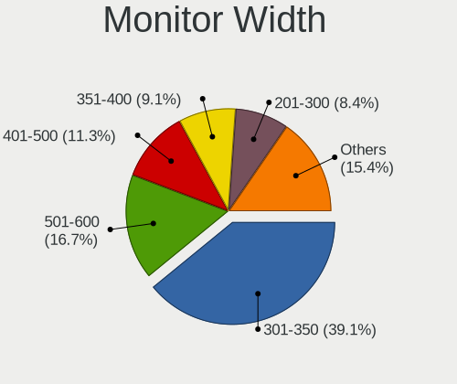

| Width in mm | Computers | Percent |
|-------------|-----------|---------|
| 301-350     | 176       | 36.07%  |
| 501-600     | 70        | 14.34%  |
| 401-500     | 66        | 13.52%  |
| Unknown     | 51        | 10.45%  |
| 351-400     | 48        | 9.84%   |
| 201-300     | 42        | 8.61%   |
| 601-700     | 11        | 2.25%   |
| 701-800     | 9         | 1.84%   |
| 801-900     | 6         | 1.23%   |
| 1501-2000   | 4         | 0.82%   |
| 1001-1500   | 2         | 0.41%   |
| 901-1000    | 2         | 0.41%   |
| 1-100       | 1         | 0.2%    |

Aspect Ratio
------------

Proportional relationship between the width and the height

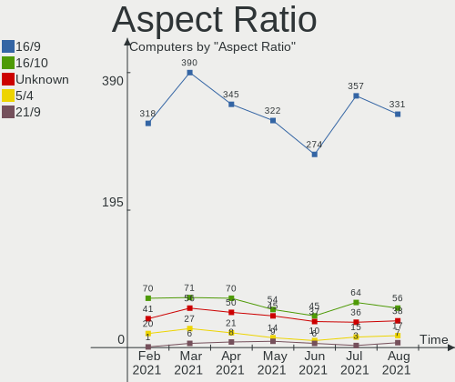

| Ratio   | Computers | Percent |
|---------|-----------|---------|
| 16/9    | 320       | 70.95%  |
| 16/10   | 53        | 11.75%  |
| Unknown | 48        | 10.64%  |
| 5/4     | 19        | 4.21%   |
| 4/3     | 5         | 1.11%   |
| 3/2     | 4         | 0.89%   |
| 21/9    | 2         | 0.44%   |

Monitor Area
------------

Area in inch²

| Area in inch² | Computers | Percent |
|----------------|-----------|---------|
| 101-110        | 130       | 26.64%  |
| 201-250        | 76        | 15.57%  |
| Unknown        | 51        | 10.45%  |
| 81-90          | 49        | 10.04%  |
| 151-200        | 31        | 6.35%   |
| 71-80          | 22        | 4.51%   |
| 141-150        | 22        | 4.51%   |
| 121-130        | 22        | 4.51%   |
| 301-350        | 21        | 4.3%    |
| 351-500        | 15        | 3.07%   |
| 501-1000       | 11        | 2.25%   |
| 251-300        | 9         | 1.84%   |
| 61-70          | 8         | 1.64%   |
| 131-140        | 7         | 1.43%   |
| More than 1000 | 5         | 1.02%   |
| 41-50          | 4         | 0.82%   |
| 51-60          | 3         | 0.61%   |
| 1-40           | 1         | 0.2%    |
| 91-100         | 1         | 0.2%    |

Pixel Density
-------------

Pixels per inch

| Density       | Computers | Percent |
|---------------|-----------|---------|
| 51-100        | 155       | 33.05%  |
| 101-120       | 139       | 29.64%  |
| 121-160       | 88        | 18.76%  |
| Unknown       | 51        | 10.87%  |
| 161-240       | 22        | 4.69%   |
| 1-50          | 8         | 1.71%   |
| More than 240 | 6         | 1.28%   |

Multiple Monitors
-----------------

Total monitors connected

| Total | Computers | Percent |
|-------|-----------|---------|
| 1     | 385       | 81.05%  |
| 2     | 64        | 13.47%  |
| 0     | 17        | 3.58%   |
| 3     | 8         | 1.68%   |
| 4     | 1         | 0.21%   |

Net Controller Vendor
---------------------

Controller vendors

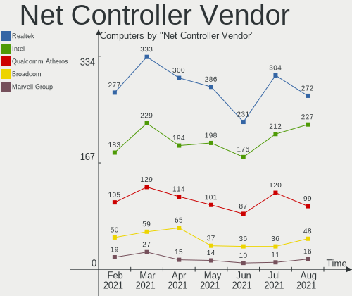

| Vendor                                | Computers | Percent |
|---------------------------------------|-----------|---------|
| Realtek Semiconductor                 | 274       | 37.95%  |
| Intel                                 | 186       | 25.76%  |
| Qualcomm Atheros                      | 96        | 13.3%   |
| Broadcom Inc. and subsidiaries        | 46        | 6.37%   |
| Ralink Technology                     | 15        | 2.08%   |
| Ralink                                | 13        | 1.8%    |
| Nvidia                                | 12        | 1.66%   |
| Broadcom Limited                      | 11        | 1.52%   |
| TP-Link                               | 9         | 1.25%   |
| Marvell Technology Group              | 6         | 0.83%   |
| Qualcomm Atheros Communications       | 5         | 0.69%   |
| Broadcom                              | 5         | 0.69%   |
| Samsung Electronics                   | 3         | 0.42%   |
| NetGear                               | 3         | 0.42%   |
| Ericsson Business Mobile Networks     | 3         | 0.42%   |
| D-Link                                | 3         | 0.42%   |
| ASUSTek Computer                      | 3         | 0.42%   |
| Xiaomi                                | 2         | 0.28%   |
| Silicon Integrated Systems [SiS]      | 2         | 0.28%   |
| MEDIATEK                              | 2         | 0.28%   |
| Edimax Technology                     | 2         | 0.28%   |
| ASIX Electronics                      | 2         | 0.28%   |
| VIA Technologies                      | 1         | 0.14%   |
| Tenda                                 | 1         | 0.14%   |
| Sundance Technology Inc / IC Plus     | 1         | 0.14%   |
| Sierra Wireless                       | 1         | 0.14%   |
| PLANEX                                | 1         | 0.14%   |
| Motorola PCS                          | 1         | 0.14%   |
| Motorola                              | 1         | 0.14%   |
| Lenovo                                | 1         | 0.14%   |
| JMicron Technology                    | 1         | 0.14%   |
| IMC Networks                          | 1         | 0.14%   |
| Huawei Technologies                   | 1         | 0.14%   |
| Fuji Photo Film                       | 1         | 0.14%   |
| Dell                                  | 1         | 0.14%   |
| D-Link System                         | 1         | 0.14%   |
| Belkin Components                     | 1         | 0.14%   |
| Aquantia                              | 1         | 0.14%   |
| Apple                                 | 1         | 0.14%   |
| AMD                                   | 1         | 0.14%   |
| 802.11g Adapter [Linksys WUSB54GC v3] | 1         | 0.14%   |

Net Controller Model
--------------------

Controller models

| Model                                                                     | Computers | Percent |
|---------------------------------------------------------------------------|-----------|---------|
| Realtek RTL8111/8168/8411 PCI Express Gigabit Ethernet Controller         | 193       | 22.92%  |
| Realtek RTL810xE PCI Express Fast Ethernet controller                     | 48        | 5.7%    |
| Intel 82579LM Gigabit Network Connection (Lewisville)                     | 21        | 2.49%   |
| Qualcomm Atheros AR9485 Wireless Network Adapter                          | 19        | 2.26%   |
| Intel Wi-Fi 6 AX200                                                       | 16        | 1.9%    |
| Qualcomm Atheros AR9285 Wireless Network Adapter (PCI-Express)            | 13        | 1.54%   |
| Intel Wireless 8265 / 8275                                                | 12        | 1.43%   |
| Intel Wireless 7265                                                       | 12        | 1.43%   |
| Intel Wireless 7260                                                       | 12        | 1.43%   |
| Qualcomm Atheros QCA9565 / AR9565 Wireless Network Adapter                | 11        | 1.31%   |
| Intel Ethernet Connection (2) I219-V                                      | 10        | 1.19%   |
| Intel Centrino Advanced-N 6205 [Taylor Peak]                              | 10        | 1.19%   |
| Realtek RTL8723BE PCIe Wireless Network Adapter                           | 9         | 1.07%   |
| Qualcomm Atheros QCA6174 802.11ac Wireless Network Adapter                | 9         | 1.07%   |
| Intel Wireless 3165                                                       | 8         | 0.95%   |
| Broadcom Inc. and subsidiaries BCM43142 802.11b/g/n                       | 8         | 0.95%   |
| Broadcom Inc. and subsidiaries BCM4313 802.11bgn Wireless Network Adapter | 8         | 0.95%   |
| Realtek RTL8821CE 802.11ac PCIe Wireless Network Adapter                  | 7         | 0.83%   |
| Realtek 802.11ac NIC                                                      | 7         | 0.83%   |
| Ralink RT5370 Wireless Adapter                                            | 7         | 0.83%   |
| Qualcomm Atheros QCA9377 802.11ac Wireless Network Adapter                | 7         | 0.83%   |
| Intel PRO/Wireless 3945ABG [Golan] Network Connection                     | 7         | 0.83%   |
| Realtek RTL8188EUS 802.11n Wireless Network Adapter                       | 6         | 0.71%   |
| Ralink MT7601U Wireless Adapter                                           | 6         | 0.71%   |
| Qualcomm Atheros Killer E220x Gigabit Ethernet Controller                 | 6         | 0.71%   |
| Qualcomm Atheros AR8151 v2.0 Gigabit Ethernet                             | 6         | 0.71%   |
| Nvidia MCP61 Ethernet                                                     | 6         | 0.71%   |
| Intel Ethernet Connection I217-LM                                         | 6         | 0.71%   |
| Intel Comet Lake PCH-LP CNVi WiFi                                         | 6         | 0.71%   |
| Realtek RTL88x2bu [AC1200 Techkey]                                        | 5         | 0.59%   |
| Realtek RTL8188EE Wireless Network Adapter                                | 5         | 0.59%   |
| Realtek RTL-8100/8101L/8139 PCI Fast Ethernet Adapter                     | 5         | 0.59%   |
| Ralink RT3290 Wireless 802.11n 1T/1R PCIe                                 | 5         | 0.59%   |
| Qualcomm Atheros AR9462 Wireless Network Adapter                          | 5         | 0.59%   |
| Intel Dual Band Wireless-AC 3168NGW [Stone Peak]                          | 5         | 0.59%   |
| Realtek RTL8822BE 802.11a/b/g/n/ac WiFi adapter                           | 4         | 0.48%   |
| Realtek RTL8153 Gigabit Ethernet Adapter                                  | 4         | 0.48%   |
| Qualcomm Atheros AR9271 802.11n                                           | 4         | 0.48%   |
| Qualcomm Atheros AR8161 Gigabit Ethernet                                  | 4         | 0.48%   |
| Qualcomm Atheros AR8152 v2.0 Fast Ethernet                                | 4         | 0.48%   |
| Intel Wireless 8260                                                       | 4         | 0.48%   |
| Intel I211 Gigabit Network Connection                                     | 4         | 0.48%   |
| Intel Ethernet Connection (4) I219-V                                      | 4         | 0.48%   |
| Intel Dual Band Wireless-AC 3165 Plus Bluetooth                           | 4         | 0.48%   |
| Intel Comet Lake PCH CNVi WiFi                                            | 4         | 0.48%   |
| Intel Cannon Point-LP CNVi [Wireless-AC]                                  | 4         | 0.48%   |
| Intel 82579V Gigabit Network Connection                                   | 4         | 0.48%   |
| Realtek RTL8188CUS 802.11n WLAN Adapter                                   | 3         | 0.36%   |
| Realtek RTL8188CE 802.11b/g/n WiFi Adapter                                | 3         | 0.36%   |
| Realtek RTL8125 2.5GbE Controller                                         | 3         | 0.36%   |
| Ralink RT5390 Wireless 802.11n 1T/1R PCIe                                 | 3         | 0.36%   |
| Qualcomm Atheros Killer E2400 Gigabit Ethernet Controller                 | 3         | 0.36%   |
| Qualcomm Atheros Attansic L1 Gigabit Ethernet                             | 3         | 0.36%   |
| Qualcomm Atheros AR8121/AR8113/AR8114 Gigabit or Fast Ethernet            | 3         | 0.36%   |
| Intel WiFi Link 5100                                                      | 3         | 0.36%   |
| Intel Ethernet Connection (3) I218-LM                                     | 3         | 0.36%   |
| Intel Centrino Wireless-N 1030 [Rainbow Peak]                             | 3         | 0.36%   |
| Intel Centrino Advanced-N 6235                                            | 3         | 0.36%   |
| Intel 82567LM-3 Gigabit Network Connection                                | 3         | 0.36%   |
| Intel 82567LM Gigabit Network Connection                                  | 3         | 0.36%   |

Wireless Vendor
---------------

Wireless vendors

| Vendor                                | Computers | Percent |
|---------------------------------------|-----------|---------|
| Intel                                 | 139       | 36.29%  |
| Qualcomm Atheros                      | 70        | 18.28%  |
| Realtek Semiconductor                 | 68        | 17.75%  |
| Broadcom Inc. and subsidiaries        | 34        | 8.88%   |
| Ralink Technology                     | 15        | 3.92%   |
| Ralink                                | 13        | 3.39%   |
| TP-Link                               | 9         | 2.35%   |
| Broadcom Limited                      | 6         | 1.57%   |
| Qualcomm Atheros Communications       | 5         | 1.31%   |
| Broadcom                              | 4         | 1.04%   |
| NetGear                               | 3         | 0.78%   |
| D-Link                                | 3         | 0.78%   |
| ASUSTek Computer                      | 3         | 0.78%   |
| Edimax Technology                     | 2         | 0.52%   |
| Tenda                                 | 1         | 0.26%   |
| Sierra Wireless                       | 1         | 0.26%   |
| PLANEX                                | 1         | 0.26%   |
| MEDIATEK                              | 1         | 0.26%   |
| IMC Networks                          | 1         | 0.26%   |
| Dell                                  | 1         | 0.26%   |
| D-Link System                         | 1         | 0.26%   |
| Belkin Components                     | 1         | 0.26%   |
| 802.11g Adapter [Linksys WUSB54GC v3] | 1         | 0.26%   |

Wireless Model
--------------

Wireless models

| Model                                                                     | Computers | Percent |
|---------------------------------------------------------------------------|-----------|---------|
| Qualcomm Atheros AR9485 Wireless Network Adapter                          | 19        | 4.92%   |
| Intel Wi-Fi 6 AX200                                                       | 16        | 4.15%   |
| Qualcomm Atheros AR9285 Wireless Network Adapter (PCI-Express)            | 13        | 3.37%   |
| Intel Wireless 8265 / 8275                                                | 12        | 3.11%   |
| Intel Wireless 7265                                                       | 12        | 3.11%   |
| Intel Wireless 7260                                                       | 12        | 3.11%   |
| Qualcomm Atheros QCA9565 / AR9565 Wireless Network Adapter                | 11        | 2.85%   |
| Intel Centrino Advanced-N 6205 [Taylor Peak]                              | 10        | 2.59%   |
| Realtek RTL8723BE PCIe Wireless Network Adapter                           | 9         | 2.33%   |
| Qualcomm Atheros QCA6174 802.11ac Wireless Network Adapter                | 9         | 2.33%   |
| Intel Wireless 3165                                                       | 8         | 2.07%   |
| Broadcom Inc. and subsidiaries BCM43142 802.11b/g/n                       | 8         | 2.07%   |
| Broadcom Inc. and subsidiaries BCM4313 802.11bgn Wireless Network Adapter | 8         | 2.07%   |
| Realtek RTL8821CE 802.11ac PCIe Wireless Network Adapter                  | 7         | 1.81%   |
| Realtek 802.11ac NIC                                                      | 7         | 1.81%   |
| Ralink RT5370 Wireless Adapter                                            | 7         | 1.81%   |
| Qualcomm Atheros QCA9377 802.11ac Wireless Network Adapter                | 7         | 1.81%   |
| Intel PRO/Wireless 3945ABG [Golan] Network Connection                     | 7         | 1.81%   |
| Realtek RTL8188EUS 802.11n Wireless Network Adapter                       | 6         | 1.55%   |
| Ralink MT7601U Wireless Adapter                                           | 6         | 1.55%   |
| Intel Comet Lake PCH-LP CNVi WiFi                                         | 6         | 1.55%   |
| Realtek RTL88x2bu [AC1200 Techkey]                                        | 5         | 1.3%    |
| Realtek RTL8188EE Wireless Network Adapter                                | 5         | 1.3%    |
| Ralink RT3290 Wireless 802.11n 1T/1R PCIe                                 | 5         | 1.3%    |
| Qualcomm Atheros AR9462 Wireless Network Adapter                          | 5         | 1.3%    |
| Intel Dual Band Wireless-AC 3168NGW [Stone Peak]                          | 5         | 1.3%    |
| Realtek RTL8822BE 802.11a/b/g/n/ac WiFi adapter                           | 4         | 1.04%   |
| Qualcomm Atheros AR9271 802.11n                                           | 4         | 1.04%   |
| Intel Wireless 8260                                                       | 4         | 1.04%   |
| Intel Dual Band Wireless-AC 3165 Plus Bluetooth                           | 4         | 1.04%   |
| Intel Comet Lake PCH CNVi WiFi                                            | 4         | 1.04%   |
| Intel Cannon Point-LP CNVi [Wireless-AC]                                  | 4         | 1.04%   |
| Realtek RTL8188CUS 802.11n WLAN Adapter                                   | 3         | 0.78%   |
| Realtek RTL8188CE 802.11b/g/n WiFi Adapter                                | 3         | 0.78%   |
| Ralink RT5390 Wireless 802.11n 1T/1R PCIe                                 | 3         | 0.78%   |
| Intel WiFi Link 5100                                                      | 3         | 0.78%   |
| Intel Centrino Wireless-N 1030 [Rainbow Peak]                             | 3         | 0.78%   |
| Intel Centrino Advanced-N 6235                                            | 3         | 0.78%   |
| Broadcom Limited BCM4312 802.11b/g LP-PHY                                 | 3         | 0.78%   |
| Broadcom Inc. and subsidiaries BCM43602 802.11ac Wireless LAN SoC         | 3         | 0.78%   |
| TP-Link TL-WN821N Version 5 RTL8192EU                                     | 2         | 0.52%   |
| TP-Link AC600 wireless Realtek RTL8811AU [Archer T2U Nano]                | 2         | 0.52%   |
| TP-Link 802.11ac WLAN Adapter                                             | 2         | 0.52%   |
| Realtek RTL8822CE 802.11ac PCIe Wireless Network Adapter                  | 2         | 0.52%   |
| Realtek RTL8821AE 802.11ac PCIe Wireless Network Adapter                  | 2         | 0.52%   |
| Realtek RTL8723DE Wireless Network Adapter                                | 2         | 0.52%   |
| Realtek RTL8723AE PCIe Wireless Network Adapter                           | 2         | 0.52%   |
| Realtek RTL8192CU 802.11n WLAN Adapter                                    | 2         | 0.52%   |
| Realtek RTL8192CE PCIe Wireless Network Adapter                           | 2         | 0.52%   |
| Realtek RTL8188SU 802.11n WLAN Adapter                                    | 2         | 0.52%   |
| Ralink RT2870/RT3070 Wireless Adapter                                     | 2         | 0.52%   |
| Ralink RT3090 Wireless 802.11n 1T/1R PCIe                                 | 2         | 0.52%   |
| Qualcomm Atheros AR928X Wireless Network Adapter (PCI-Express)            | 2         | 0.52%   |
| NetGear WNA1100 Wireless-N 150 [Atheros AR9271]                           | 2         | 0.52%   |
| Intel Wireless-AC 9560 [Jefferson Peak]                                   | 2         | 0.52%   |
| Intel Ultimate N WiFi Link 5300                                           | 2         | 0.52%   |
| Intel PRO/Wireless 5100 AGN [Shiloh] Network Connection                   | 2         | 0.52%   |
| Intel PRO/Wireless 4965 AG or AGN [Kedron] Network Connection             | 2         | 0.52%   |
| Intel PRO/Wireless 2200BG [Calexico2] Network Connection                  | 2         | 0.52%   |
| Intel Killer Wi-Fi 6 AX1650i 160MHz Wireless Network Adapter (201NGW)     | 2         | 0.52%   |

Ethernet Vendor
---------------

Ethernet vendors

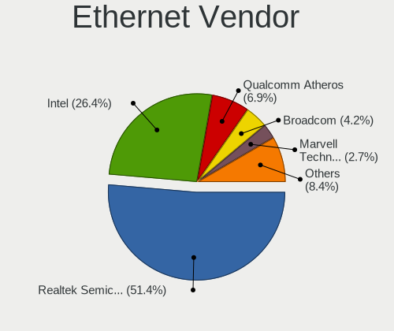

| Vendor                            | Computers | Percent |
|-----------------------------------|-----------|---------|
| Realtek Semiconductor             | 253       | 56.98%  |
| Intel                             | 95        | 21.4%   |
| Qualcomm Atheros                  | 38        | 8.56%   |
| Broadcom Inc. and subsidiaries    | 17        | 3.83%   |
| Nvidia                            | 12        | 2.7%    |
| Marvell Technology Group          | 6         | 1.35%   |
| Broadcom Limited                  | 5         | 1.13%   |
| Samsung Electronics               | 3         | 0.68%   |
| Xiaomi                            | 2         | 0.45%   |
| Silicon Integrated Systems [SiS]  | 2         | 0.45%   |
| ASIX Electronics                  | 2         | 0.45%   |
| VIA Technologies                  | 1         | 0.23%   |
| Sundance Technology Inc / IC Plus | 1         | 0.23%   |
| MediaTek                          | 1         | 0.23%   |
| Lenovo                            | 1         | 0.23%   |
| JMicron Technology                | 1         | 0.23%   |
| Huawei Technologies               | 1         | 0.23%   |
| Broadcom                          | 1         | 0.23%   |
| Aquantia                          | 1         | 0.23%   |
| Apple                             | 1         | 0.23%   |

Ethernet Model
--------------

Ethernet models

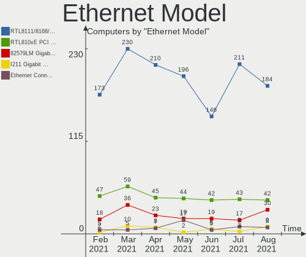

| Model                                                                          | Computers | Percent |
|--------------------------------------------------------------------------------|-----------|---------|
| Realtek RTL8111/8168/8411 PCI Express Gigabit Ethernet Controller              | 193       | 43.27%  |
| Realtek RTL810xE PCI Express Fast Ethernet controller                          | 48        | 10.76%  |
| Intel 82579LM Gigabit Network Connection (Lewisville)                          | 21        | 4.71%   |
| Intel Ethernet Connection (2) I219-V                                           | 10        | 2.24%   |
| Qualcomm Atheros Killer E220x Gigabit Ethernet Controller                      | 6         | 1.35%   |
| Qualcomm Atheros AR8151 v2.0 Gigabit Ethernet                                  | 6         | 1.35%   |
| Nvidia MCP61 Ethernet                                                          | 6         | 1.35%   |
| Intel Ethernet Connection I217-LM                                              | 6         | 1.35%   |
| Realtek RTL-8100/8101L/8139 PCI Fast Ethernet Adapter                          | 5         | 1.12%   |
| Realtek RTL8153 Gigabit Ethernet Adapter                                       | 4         | 0.9%    |
| Qualcomm Atheros AR8161 Gigabit Ethernet                                       | 4         | 0.9%    |
| Qualcomm Atheros AR8152 v2.0 Fast Ethernet                                     | 4         | 0.9%    |
| Intel I211 Gigabit Network Connection                                          | 4         | 0.9%    |
| Intel Ethernet Connection (4) I219-V                                           | 4         | 0.9%    |
| Intel 82579V Gigabit Network Connection                                        | 4         | 0.9%    |
| Realtek RTL8125 2.5GbE Controller                                              | 3         | 0.67%   |
| Qualcomm Atheros Killer E2400 Gigabit Ethernet Controller                      | 3         | 0.67%   |
| Qualcomm Atheros Attansic L1 Gigabit Ethernet                                  | 3         | 0.67%   |
| Qualcomm Atheros AR8121/AR8113/AR8114 Gigabit or Fast Ethernet                 | 3         | 0.67%   |
| Intel Ethernet Connection (3) I218-LM                                          | 3         | 0.67%   |
| Intel 82567LM-3 Gigabit Network Connection                                     | 3         | 0.67%   |
| Intel 82567LM Gigabit Network Connection                                       | 3         | 0.67%   |
| Xiaomi Mi/Redmi series (RNDIS)                                                 | 2         | 0.45%   |
| Silicon Integrated Systems [SiS] 191 Gigabit Ethernet Adapter                  | 2         | 0.45%   |
| Samsung Galaxy series, misc. (tethering mode)                                  | 2         | 0.45%   |
| Qualcomm Atheros AR8151 v1.0 Gigabit Ethernet                                  | 2         | 0.45%   |
| Qualcomm Atheros AR8132 Fast Ethernet                                          | 2         | 0.45%   |
| Nvidia MCP77 Ethernet                                                          | 2         | 0.45%   |
| Marvell Group 88E8040 PCI-E Fast Ethernet Controller                           | 2         | 0.45%   |
| Intel PRO/100 VE Network Connection                                            | 2         | 0.45%   |
| Intel Ethernet Connection I218-LM                                              | 2         | 0.45%   |
| Intel Ethernet Connection I217-V                                               | 2         | 0.45%   |
| Intel Ethernet Connection (2) I218-LM                                          | 2         | 0.45%   |
| Intel Ethernet Connection (10) I219-V                                          | 2         | 0.45%   |
| Intel 82577LM Gigabit Network Connection                                       | 2         | 0.45%   |
| Intel 82573L Gigabit Ethernet Controller                                       | 2         | 0.45%   |
| Intel 82562ET/EZ/GT/GZ - PRO/100 VE (LOM) Ethernet Controller Mobile           | 2         | 0.45%   |
| Broadcom Limited NetXtreme BCM5755 Gigabit Ethernet PCI Express                | 2         | 0.45%   |
| Broadcom Inc. and subsidiaries NetXtreme BCM57786 Gigabit Ethernet PCIe        | 2         | 0.45%   |
| Broadcom Inc. and subsidiaries NetXtreme BCM57766 Gigabit Ethernet PCIe        | 2         | 0.45%   |
| Broadcom Inc. and subsidiaries NetXtreme BCM5754 Gigabit Ethernet PCI Express  | 2         | 0.45%   |
| Broadcom Inc. and subsidiaries NetXtreme BCM5752 Gigabit Ethernet PCI Express  | 2         | 0.45%   |
| ASIX AX88179 Gigabit Ethernet                                                  | 2         | 0.45%   |
| VIA VT6102/VT6103 [Rhine-II]                                                   | 1         | 0.22%   |
| Sundance Inc / IC Plus IC Plus IP100A Integrated 10/100 Ethernet MAC + PHY     | 1         | 0.22%   |
| Samsung GT-I9070 (network tethering, USB debugging enabled)                    | 1         | 0.22%   |
| Realtek RTL8169 PCI Gigabit Ethernet Controller                                | 1         | 0.22%   |
| Realtek RTL8152 Fast Ethernet Adapter                                          | 1         | 0.22%   |
| Qualcomm Atheros QCA8171 Gigabit Ethernet                                      | 1         | 0.22%   |
| Qualcomm Atheros Killer E2500 Gigabit Ethernet Controller                      | 1         | 0.22%   |
| Qualcomm Atheros AR8162 Fast Ethernet                                          | 1         | 0.22%   |
| Qualcomm Atheros AR8152 v1.1 Fast Ethernet                                     | 1         | 0.22%   |
| Qualcomm Atheros AR8131 Gigabit Ethernet                                       | 1         | 0.22%   |
| Nvidia MCP79 Ethernet                                                          | 1         | 0.22%   |
| Nvidia MCP73 Ethernet                                                          | 1         | 0.22%   |
| Nvidia MCP55 Ethernet                                                          | 1         | 0.22%   |
| Nvidia CK804 Ethernet Controller                                               | 1         | 0.22%   |
| MediaTek U304AA                                                                | 1         | 0.22%   |
| Marvell Group Yukon Optima 88E8059 [PCIe Gigabit Ethernet Controller with AVB] | 1         | 0.22%   |
| Marvell Group 88E8071 PCI-E Gigabit Ethernet Controller                        | 1         | 0.22%   |

Net Controller Kind
-------------------

Ethernet, WiFi or modem

| Kind     | Computers | Percent |
|----------|-----------|---------|
| Ethernet | 423       | 53.68%  |
| WiFi     | 355       | 45.05%  |
| Modem    | 9         | 1.14%   |
| Unknown  | 1         | 0.13%   |

Used Controller
---------------

Currently used network controller

| Kind     | Computers | Percent |
|----------|-----------|---------|
| Ethernet | 347       | 51.95%  |
| WiFi     | 321       | 48.05%  |

NICs
----

Total network controllers on board

| Total | Computers | Percent |
|-------|-----------|---------|
| 2     | 263       | 55.37%  |
| 1     | 201       | 42.32%  |
| 0     | 6         | 1.26%   |
| 3     | 4         | 0.84%   |
| 4     | 1         | 0.21%   |

Memory Vendor
-------------

Memory module vendors

| Vendor              | Computers | Percent |
|---------------------|-----------|---------|
| SK Hynix            | 30        | 19.61%  |
| Samsung Electronics | 30        | 19.61%  |
| Unknown             | 20        | 13.07%  |
| Kingston            | 19        | 12.42%  |
| Micron Technology   | 13        | 8.5%    |
| Ramaxel Technology  | 6         | 3.92%   |
| Corsair             | 6         | 3.92%   |
| G.Skill             | 5         | 3.27%   |
| Elpida              | 4         | 2.61%   |
| Crucial             | 4         | 2.61%   |
| Unknown (ABCD)      | 3         | 1.96%   |
| Patriot             | 2         | 1.31%   |
| Nanya Technology    | 2         | 1.31%   |
| Toshiba             | 1         | 0.65%   |
| Silicon Power       | 1         | 0.65%   |
| Qimonda             | 1         | 0.65%   |
| PUSKILL             | 1         | 0.65%   |
| Kingmax             | 1         | 0.65%   |
| GOODRAM             | 1         | 0.65%   |
| atermiter           | 1         | 0.65%   |
| A-DATA Technology   | 1         | 0.65%   |
| 83250000830B        | 1         | 0.65%   |

Memory Model
------------

Memory module models

| Model                                                               | Computers | Percent |
|---------------------------------------------------------------------|-----------|---------|
| SK Hynix RAM HMA81GS6AFR8N-UH 8GB SODIMM DDR4 2667MT/s              | 4         | 2.35%   |
| Samsung RAM M471B5273CH0-CH9 4096MB SODIMM DDR3 1334MT/s            | 3         | 1.76%   |
| Samsung RAM M471B5173QH0-YK0 4096MB SODIMM DDR3 1600MT/s            | 3         | 1.76%   |
| Samsung RAM M471A1K43CB1-CRC 8192MB SODIMM DDR4 2667MT/s            | 3         | 1.76%   |
| Unknown (ABCD) RAM 123456789012345678 2048MB SODIMM LPDDR4 2400MT/s | 2         | 1.18%   |
| SK Hynix RAM HMT451S6AFR8A-PB 4GB SODIMM DDR3 1600MT/s              | 2         | 1.18%   |
| SK Hynix RAM HMT351S6CFR8C-PB 4096MB SODIMM DDR3 1600MT/s           | 2         | 1.18%   |
| SK Hynix RAM HMA851S6CJR6N-UH 4GB SODIMM DDR4 2400MT/s              | 2         | 1.18%   |
| Samsung RAM M471B5173DB0-YK0 4GB SODIMM DDR3 1600MT/s               | 2         | 1.18%   |
| Ramaxel RAM RMSA3260ME78HAF-2666 8192MB SODIMM DDR4 2667MT/s        | 2         | 1.18%   |
| Micron RAM 4ATF51264HZ-3G2J1 4096MB SODIMM DDR4 3200MT/s            | 2         | 1.18%   |
| Unknown SODIMM 2048MB SODIMM DDR2 533MT/s                           | 1         | 0.59%   |
| Unknown RAM Module 8GB SODIMM DDR3 1333MT/s                         | 1         | 0.59%   |
| Unknown RAM Module 8192MB SODIMM DDR3 1333MT/s                      | 1         | 0.59%   |
| Unknown RAM Module 8192MB DIMM DDR3 1600MT/s                        | 1         | 0.59%   |
| Unknown RAM Module 512MB DIMM DDR2 533MT/s                          | 1         | 0.59%   |
| Unknown RAM Module 4GB SODIMM DDR3                                  | 1         | 0.59%   |
| Unknown RAM Module 4096MB SODIMM DDR3 1600MT/s                      | 1         | 0.59%   |
| Unknown RAM Module 4096MB SODIMM DDR3 1333MT/s                      | 1         | 0.59%   |
| Unknown RAM Module 4096MB DIMM SDRAM 1066MT/s                       | 1         | 0.59%   |
| Unknown RAM Module 4096MB DIMM 1600MT/s                             | 1         | 0.59%   |
| Unknown RAM Module 4096MB DIMM 1066MT/s                             | 1         | 0.59%   |
| Unknown RAM Module 2048MB SODIMM DRAM                               | 1         | 0.59%   |
| Unknown RAM Module 2048MB DIMM SDRAM 1333MT/s                       | 1         | 0.59%   |
| Unknown RAM Module 2048MB DIMM DDR3 1333MT/s                        | 1         | 0.59%   |
| Unknown RAM Module 2048MB DIMM DDR2 800MT/s                         | 1         | 0.59%   |
| Unknown RAM Module 2048MB DIMM DDR 1333MT/s                         | 1         | 0.59%   |
| Unknown RAM Module 2048MB DIMM 1333MT/s                             | 1         | 0.59%   |
| Unknown RAM Module 2048MB DDR3 1600MT/s                             | 1         | 0.59%   |
| Unknown RAM Module 1GB DIMM DDR2 533MT/s                            | 1         | 0.59%   |
| Unknown RAM Module 1024MB SODIMM 667MT/s                            | 1         | 0.59%   |
| Unknown RAM 992000 (997000) 4096MB DIMM DDR3 1333MT/s               | 1         | 0.59%   |
| Unknown (ABCD) RAM 123456789012345678 8GB DIMM DDR4 2400MT/s        | 1         | 0.59%   |
| Toshiba RAM 64T128020EDL2.5C2 2048MB SODIMM DDR2 1066MT/s           | 1         | 0.59%   |
| SK Hynix RAM Module 16384MB SODIMM DDR4 3200MT/s                    | 1         | 0.59%   |
| SK Hynix RAM HMT451S6CFR6A-PB 4096MB SODIMM DDR3 1600MT/s           | 1         | 0.59%   |
| SK Hynix RAM HMT451S6BFR8A-PB 4096MB SODIMM DDR3 1600MT/s           | 1         | 0.59%   |
| SK Hynix RAM HMT351U6EFR8C-PB 4096MB DIMM DDR3 1600MT/s             | 1         | 0.59%   |
| SK Hynix RAM HMT351U6BFR8C-H9 4096MB DIMM DDR3 1333MT/s             | 1         | 0.59%   |
| SK Hynix RAM HMT351S6EFR8C-PB 4096MB SODIMM DDR3 1600MT/s           | 1         | 0.59%   |
| SK Hynix RAM HMT351S6EFR8A 4GB SODIMM DDR3 1600MT/s                 | 1         | 0.59%   |
| SK Hynix RAM HMT351S6CFR8C-H9 4GB SODIMM DDR3 1333MT/s              | 1         | 0.59%   |
| SK Hynix RAM HMT325S6CFR8C-PB 2048MB SODIMM DDR3 1600MT/s           | 1         | 0.59%   |
| SK Hynix RAM HMT125S6TFR8C-H9 2048MB SODIMM DDR3 1333MT/s           | 1         | 0.59%   |
| SK Hynix RAM HMT125S6BFR8C-G7 2048MB SODIMM DDR3 1067MT/s           | 1         | 0.59%   |
| SK Hynix RAM HMAB2GS6AMR6N-XN 16384MB SODIMM DDR4 3200MT/s          | 1         | 0.59%   |
| SK Hynix RAM HMAA1GS6CMR6N-XN 8GB SODIMM DDR4 3200MT/s              | 1         | 0.59%   |
| SK Hynix RAM HMAA1GS6CMR6N-VK 8192MB SODIMM DDR4 2667MT/s           | 1         | 0.59%   |
| SK Hynix RAM HMA851S6JJR6N-VK 4GB SODIMM DDR4 2667MT/s              | 1         | 0.59%   |
| SK Hynix RAM HMA851S6CJR6N-VK 4GB SODIMM DDR4 2667MT/s              | 1         | 0.59%   |
| SK Hynix RAM HMA851S6AFR6N-UH 4GB SODIMM DDR4 2400MT/s              | 1         | 0.59%   |
| SK Hynix RAM HMA82GS6MFR8N-TF 16384MB SODIMM DDR4 2133MT/s          | 1         | 0.59%   |
| SK Hynix RAM HMA82GS6DJR8N-XN 16384MB SODIMM DDR4 3200MT/s          | 1         | 0.59%   |
| SK Hynix RAM HMA82GS6DJR8N-VK 16GB SODIMM DDR4 2667MT/s             | 1         | 0.59%   |
| SK Hynix RAM HMA82GS6CJR8N-VK 16384MB SODIMM DDR4 2667MT/s          | 1         | 0.59%   |
| SK Hynix RAM HMA81GS6CJR8N-VK 8GB SODIMM DDR4 2667MT/s              | 1         | 0.59%   |
| SK Hynix RAM HMA81GS6CJR8N-VK 8192MB SODIMM DDR4 2667MT/s           | 1         | 0.59%   |
| SK Hynix RAM HMA42GR7MFR4N-TF 16384MB DIMM DDR4 2133MT/s            | 1         | 0.59%   |
| SK Hynix RAM H9CCNNNBLTALAR-NTD 4096MB Row Of Chips LPDDR3 1600MT/s | 1         | 0.59%   |
| Silicon Power RAM SP008GBLFU266B02 8GB DIMM DDR4 2400MT/s           | 1         | 0.59%   |

Memory Kind
-----------

Memory module kinds

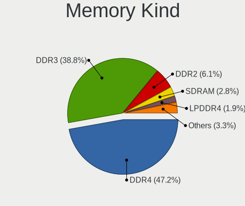

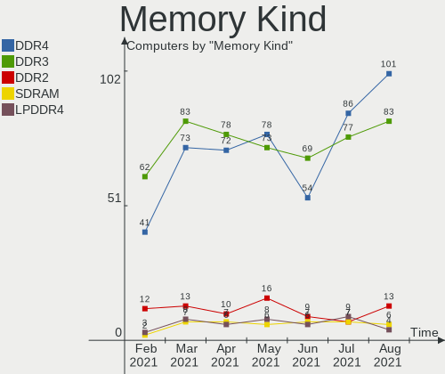

| Kind    | Computers | Percent |
|---------|-----------|---------|
| DDR4    | 54        | 41.22%  |
| DDR3    | 53        | 40.46%  |
| DDR2    | 7         | 5.34%   |
| Unknown | 5         | 3.82%   |
| LPDDR3  | 4         | 3.05%   |
| SDRAM   | 3         | 2.29%   |
| LPDDR4  | 3         | 2.29%   |
| DRAM    | 1         | 0.76%   |
| DDR     | 1         | 0.76%   |

Memory Form Factor
------------------

Physical design of the memory module

| Name         | Computers | Percent |
|--------------|-----------|---------|
| SODIMM       | 83        | 63.36%  |
| DIMM         | 40        | 30.53%  |
| Row Of Chips | 7         | 5.34%   |
| Unknown      | 1         | 0.76%   |

Memory Size
-----------

Memory module size

| Size  | Computers | Percent |
|-------|-----------|---------|
| 4096  | 55        | 37.16%  |
| 8192  | 46        | 31.08%  |
| 2048  | 25        | 16.89%  |
| 16384 | 14        | 9.46%   |
| 1024  | 4         | 2.7%    |
| 32768 | 3         | 2.03%   |
| 512   | 1         | 0.68%   |

Memory Speed
------------

Memory module speed

| Speed   | Computers | Percent |
|---------|-----------|---------|
| 1600    | 36        | 24.83%  |
| 2667    | 23        | 15.86%  |
| 1333    | 18        | 12.41%  |
| 2400    | 15        | 10.34%  |
| 3200    | 13        | 8.97%   |
| 2133    | 8         | 5.52%   |
| 1334    | 7         | 4.83%   |
| 1066    | 4         | 2.76%   |
| 667     | 3         | 2.07%   |
| 1067    | 2         | 1.38%   |
| 800     | 2         | 1.38%   |
| 533     | 2         | 1.38%   |
| Unknown | 2         | 1.38%   |
| 4199    | 1         | 0.69%   |
| 3733    | 1         | 0.69%   |
| 3600    | 1         | 0.69%   |
| 3500    | 1         | 0.69%   |
| 3466    | 1         | 0.69%   |
| 3266    | 1         | 0.69%   |
| 2666    | 1         | 0.69%   |
| 1866    | 1         | 0.69%   |
| 1332    | 1         | 0.69%   |
| 1162    | 1         | 0.69%   |

Sound Vendor
------------

Sound card vendors

| Vendor                           | Computers | Percent |
|----------------------------------|-----------|---------|
| Intel                            | 354       | 55.49%  |
| AMD                              | 125       | 19.59%  |
| Nvidia                           | 108       | 16.93%  |
| Creative Labs                    | 9         | 1.41%   |
| C-Media Electronics              | 9         | 1.41%   |
| JMTek                            | 4         | 0.63%   |
| Generalplus Technology           | 4         | 0.63%   |
| Silicon Integrated Systems [SiS] | 2         | 0.31%   |
| Logitech                         | 2         | 0.31%   |
| GN Netcom                        | 2         | 0.31%   |
| XMOS                             | 1         | 0.16%   |
| VIA Technologies                 | 1         | 0.16%   |
| Silicon Motion                   | 1         | 0.16%   |
| Samson Technologies              | 1         | 0.16%   |
| Roland                           | 1         | 0.16%   |
| ROCCAT                           | 1         | 0.16%   |
| Realtek Semiconductor            | 1         | 0.16%   |
| Razer USA                        | 1         | 0.16%   |
| QinHeng Electronics              | 1         | 0.16%   |
| ONN                              | 1         | 0.16%   |
| Microsoft                        | 1         | 0.16%   |
| Lenovo                           | 1         | 0.16%   |
| KORG                             | 1         | 0.16%   |
| ESI Audiotechnik                 | 1         | 0.16%   |
| Ensoniq                          | 1         | 0.16%   |
| Dell                             | 1         | 0.16%   |
| BEHRINGER International          | 1         | 0.16%   |
| ATI Technologies                 | 1         | 0.16%   |
| Apple                            | 1         | 0.16%   |

Sound Model
-----------

Sound card models

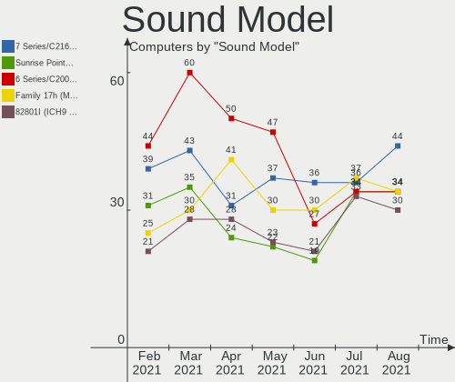

| Model                                                                                             | Computers | Percent |
|---------------------------------------------------------------------------------------------------|-----------|---------|
| Intel 7 Series/C216 Chipset Family High Definition Audio Controller                               | 48        | 6.37%   |
| Intel 6 Series/C200 Series Chipset Family High Definition Audio Controller                        | 38        | 5.05%   |
| Intel Sunrise Point-LP HD Audio                                                                   | 32        | 4.25%   |
| Intel 8 Series/C220 Series Chipset High Definition Audio Controller                               | 30        | 3.98%   |
| Intel NM10/ICH7 Family High Definition Audio Controller                                           | 28        | 3.72%   |
| AMD SBx00 Azalia (Intel HDA)                                                                      | 28        | 3.72%   |
| Intel 5 Series/3400 Series Chipset High Definition Audio                                          | 25        | 3.32%   |
| AMD FCH Azalia Controller                                                                         | 22        | 2.92%   |
| AMD Family 17h (Models 10h-1fh) HD Audio Controller                                               | 22        | 2.92%   |
| Intel Xeon E3-1200 v3/4th Gen Core Processor HD Audio Controller                                  | 16        | 2.12%   |
| Intel 82801I (ICH9 Family) HD Audio Controller                                                    | 16        | 2.12%   |
| Intel 100 Series/C230 Series Chipset Family HD Audio Controller                                   | 15        | 1.99%   |
| Nvidia High Definition Audio Controller                                                           | 14        | 1.86%   |
| Intel Haswell-ULT HD Audio Controller                                                             | 14        | 1.86%   |
| Intel 8 Series HD Audio Controller                                                                | 14        | 1.86%   |
| Nvidia GK208 HDMI/DP Audio Controller                                                             | 13        | 1.73%   |
| Intel Broadwell-U Audio Controller                                                                | 12        | 1.59%   |
| Intel 200 Series PCH HD Audio                                                                     | 12        | 1.59%   |
| Intel Wildcat Point-LP High Definition Audio Controller                                           | 11        | 1.46%   |
| AMD Raven/Raven2/Fenghuang HDMI/DP Audio Controller                                               | 11        | 1.46%   |
| Intel Cannon Lake PCH cAVS                                                                        | 10        | 1.33%   |
| AMD Renoir Radeon High Definition Audio Controller                                                | 10        | 1.33%   |
| Nvidia GP107GL High Definition Audio Controller                                                   | 9         | 1.2%    |
| Nvidia GF108 High Definition Audio Controller                                                     | 9         | 1.2%    |
| AMD Starship/Matisse HD Audio Controller                                                          | 9         | 1.2%    |
| AMD Kabini HDMI/DP Audio                                                                          | 9         | 1.2%    |
| AMD Family 17h (Models 00h-0fh) HD Audio Controller                                               | 8         | 1.06%   |
| Nvidia MCP61 High Definition Audio                                                                | 7         | 0.93%   |
| Intel CM238 HD Audio Controller                                                                   | 7         | 0.93%   |
| Intel 82801H (ICH8 Family) HD Audio Controller                                                    | 7         | 0.93%   |
| AMD Trinity HDMI Audio Controller                                                                 | 7         | 0.93%   |
| AMD Ellesmere HDMI Audio [Radeon RX 470/480 / 570/580/590]                                        | 7         | 0.93%   |
| AMD Cedar HDMI Audio [Radeon HD 5400/6300/7300 Series]                                            | 7         | 0.93%   |
| Nvidia GP106 High Definition Audio Controller                                                     | 6         | 0.8%    |
| Nvidia GF119 HDMI Audio Controller                                                                | 6         | 0.8%    |
| Intel Comet Lake PCH-LP cAVS                                                                      | 6         | 0.8%    |
| Intel Cannon Point-LP High Definition Audio Controller                                            | 6         | 0.8%    |
| Intel Atom/Celeron/Pentium Processor x5-E8000/J3xxx/N3xxx Series High Definition Audio Controller | 6         | 0.8%    |
| Intel Atom Processor Z36xxx/Z37xxx Series High Definition Audio Controller                        | 6         | 0.8%    |
| AMD RV710/730 HDMI Audio [Radeon HD 4000 series]                                                  | 6         | 0.8%    |
| AMD Oland/Hainan/Cape Verde/Pitcairn HDMI Audio [Radeon HD 7000 Series]                           | 6         | 0.8%    |
| Intel Comet Lake PCH cAVS                                                                         | 5         | 0.66%   |
| Intel C610/X99 series chipset HD Audio Controller                                                 | 5         | 0.66%   |
| AMD Turks HDMI Audio [Radeon HD 6500/6600 / 6700M Series]                                         | 5         | 0.66%   |
| AMD Family 15h (Models 60h-6fh) Audio Controller                                                  | 5         | 0.66%   |
| Nvidia GP104 High Definition Audio Controller                                                     | 4         | 0.53%   |
| Nvidia GM107 High Definition Audio Controller [GeForce 940MX]                                     | 4         | 0.53%   |
| Nvidia GK107 HDMI Audio Controller                                                                | 4         | 0.53%   |
| Nvidia GK106 HDMI Audio Controller                                                                | 4         | 0.53%   |
| Intel Celeron/Pentium Silver Processor High Definition Audio                                      | 4         | 0.53%   |
| Intel 82801JD/DO (ICH10 Family) HD Audio Controller                                               | 4         | 0.53%   |
| Intel 82801EB/ER (ICH5/ICH5R) AC'97 Audio Controller                                              | 4         | 0.53%   |
| Generalplus Technology USB Audio Device                                                           | 4         | 0.53%   |
| Creative Labs Sound Core3D [Sound Blaster Recon3D / Z-Series]                                     | 4         | 0.53%   |
| AMD Navi 10 HDMI Audio                                                                            | 4         | 0.53%   |
| AMD Caicos HDMI Audio [Radeon HD 6450 / 7450/8450/8490 OEM / R5 230/235/235X OEM]                 | 4         | 0.53%   |
| AMD Baffin HDMI/DP Audio [Radeon RX 550 640SP / RX 560/560X]                                      | 4         | 0.53%   |
| Nvidia TU116 High Definition Audio Controller                                                     | 3         | 0.4%    |
| Nvidia TU107 GeForce GTX 1650 High Definition Audio Controller                                    | 3         | 0.4%    |
| Nvidia TU106 High Definition Audio Controller                                                     | 3         | 0.4%    |

Camera Vendor
-------------

Camera device vendors

| Vendor                                 | Computers | Percent |
|----------------------------------------|-----------|---------|
| Chicony Electronics                    | 51        | 19.03%  |
| Realtek Semiconductor                  | 27        | 10.07%  |
| Microdia                               | 25        | 9.33%   |
| Acer                                   | 21        | 7.84%   |
| IMC Networks                           | 19        | 7.09%   |
| Sunplus Innovation Technology          | 16        | 5.97%   |
| Logitech                               | 15        | 5.6%    |
| Cheng Uei Precision Industry (Foxlink) | 11        | 4.1%    |
| Suyin                                  | 10        | 3.73%   |
| Quanta                                 | 10        | 3.73%   |
| Silicon Motion                         | 9         | 3.36%   |
| Lite-On Technology                     | 6         | 2.24%   |
| Apple                                  | 5         | 1.87%   |
| Microsoft                              | 4         | 1.49%   |
| Importek                               | 4         | 1.49%   |
| Z-Star Microelectronics                | 3         | 1.12%   |
| Luxvisions Innotech Limited            | 3         | 1.12%   |
| Syntek                                 | 2         | 0.75%   |
| Samsung Electronics                    | 2         | 0.75%   |
| Novatek Microelectronics               | 2         | 0.75%   |
| Mustek Systems                         | 2         | 0.75%   |
| Generalplus Technology                 | 2         | 0.75%   |
| DigiTech                               | 2         | 0.75%   |
| Creative Technology                    | 2         | 0.75%   |
| Alcor Micro                            | 2         | 0.75%   |
| YGTek                                  | 1         | 0.37%   |
| Xiongmai                               | 1         | 0.37%   |
| USB3.0 HD Audio Capture                | 1         | 0.37%   |
| Sonix Technology                       | 1         | 0.37%   |
| Ricoh                                  | 1         | 0.37%   |
| Primax Electronics                     | 1         | 0.37%   |
| Philips (or NXP)                       | 1         | 0.37%   |
| Omnivision                             | 1         | 0.37%   |
| Lenovo                                 | 1         | 0.37%   |
| KYE Systems (Mouse Systems)            | 1         | 0.37%   |
| Huawei Technologies                    | 1         | 0.37%   |
| ARC International                      | 1         | 0.37%   |
| ALi                                    | 1         | 0.37%   |

Camera Model
------------

Camera device models

| Model                                                          | Computers | Percent |
|----------------------------------------------------------------|-----------|---------|
| Chicony HD WebCam                                              | 9         | 3.35%   |
| Acer Integrated Camera                                         | 7         | 2.6%    |
| Microdia Integrated_Webcam_HD                                  | 6         | 2.23%   |
| IMC Networks USB2.0 HD UVC WebCam                              | 6         | 2.23%   |
| Logitech Webcam C270                                           | 5         | 1.86%   |
| Realtek Integrated_Webcam_HD                                   | 4         | 1.49%   |
| Logitech Webcam C170                                           | 4         | 1.49%   |
| IMC Networks Integrated Camera                                 | 4         | 1.49%   |
| Sunplus Integrated_Webcam_HD                                   | 3         | 1.12%   |
| Sunplus Asus Webcam                                            | 3         | 1.12%   |
| Realtek USB2.0 VGA UVC WebCam                                  | 3         | 1.12%   |
| Realtek USB2.0 HD UVC WebCam                                   | 3         | 1.12%   |
| Realtek Integrated Webcam                                      | 3         | 1.12%   |
| Realtek HP Truevision HD                                       | 3         | 1.12%   |
| Microdia Laptop_Integrated_Webcam_HD                           | 3         | 1.12%   |
| Microdia HP Webcam                                             | 3         | 1.12%   |
| Logitech HD Pro Webcam C920                                    | 3         | 1.12%   |
| Importek TOSHIBA Web Camera - HD                               | 3         | 1.12%   |
| Chicony USB 2.0 Camera                                         | 3         | 1.12%   |
| Chicony Lenovo EasyCamera                                      | 3         | 1.12%   |
| Chicony integrated camera                                      | 3         | 1.12%   |
| Chicony FJ Camera                                              | 3         | 1.12%   |
| Cheng Uei Precision Industry (Foxlink) HP Webcam               | 3         | 1.12%   |
| Acer SunplusIT Integrated Camera                               | 3         | 1.12%   |
| Acer BisonCam, NB Pro                                          | 3         | 1.12%   |
| Suyin Integrated_Webcam_HD                                     | 2         | 0.74%   |
| Suyin HP Truevision HD                                         | 2         | 0.74%   |
| Suyin 1.3M WebCam (notebook emachines E730, Acer sub-brand)    | 2         | 0.74%   |
| Silicon Motion WebCam SC-13HDL11939N                           | 2         | 0.74%   |
| Samsung Galaxy A5 (MTP)                                        | 2         | 0.74%   |
| Realtek USB Camera                                             | 2         | 0.74%   |
| Realtek Lenovo EasyCamera                                      | 2         | 0.74%   |
| Realtek Integrated Webcam HD                                   | 2         | 0.74%   |
| Realtek EasyCamera                                             | 2         | 0.74%   |
| Quanta HP Wide Vision HD Camera                                | 2         | 0.74%   |
| Quanta HP Webcam                                               | 2         | 0.74%   |
| Quanta HP TrueVision HD Camera                                 | 2         | 0.74%   |
| Mustek Systems USB 2.0 PC Camera                               | 2         | 0.74%   |
| Microdia USB 2.0 Camera                                        | 2         | 0.74%   |
| Microdia Sonix USB 2.0 Camera                                  | 2         | 0.74%   |
| Microdia Integrated Webcam                                     | 2         | 0.74%   |
| Luxvisions Innotech Limited Integrated Camera                  | 2         | 0.74%   |
| Logitech HD Webcam C525                                        | 2         | 0.74%   |
| Lite-On Integrated Camera                                      | 2         | 0.74%   |
| Lite-On HP HD Camera                                           | 2         | 0.74%   |
| IMC Networks USB2.0 VGA UVC WebCam                             | 2         | 0.74%   |
| IMC Networks USB2.0 UVC HD Webcam                              | 2         | 0.74%   |
| IMC Networks EasyCamera                                        | 2         | 0.74%   |
| DigiTech WebCam SCB-1110M                                      | 2         | 0.74%   |
| Chicony VGA WebCam                                             | 2         | 0.74%   |
| Chicony USB2.0 VGA UVC WebCam                                  | 2         | 0.74%   |
| Chicony TOSHIBA Web Camera - HD                                | 2         | 0.74%   |
| Chicony Integrated Camera (1280x720@30)                        | 2         | 0.74%   |
| Chicony HP Truevision HD                                       | 2         | 0.74%   |
| Chicony HP HD Webcam [Fixed]                                   | 2         | 0.74%   |
| Chicony CNF9055 Toshiba Webcam                                 | 2         | 0.74%   |
| Cheng Uei Precision Industry (Foxlink) HP Webcam-101           | 2         | 0.74%   |
| Cheng Uei Precision Industry (Foxlink) HP TrueVision HD Camera | 2         | 0.74%   |
| Cheng Uei Precision Industry (Foxlink) HP TrueVision HD        | 2         | 0.74%   |
| Apple Built-in iSight                                          | 2         | 0.74%   |

Fingerprint Vendor
------------------

Fingerprint sensor vendors

| Vendor                     | Computers | Percent |
|----------------------------|-----------|---------|
| Validity Sensors           | 13        | 37.14%  |
| Synaptics                  | 8         | 22.86%  |
| AuthenTec                  | 8         | 22.86%  |
| Upek                       | 3         | 8.57%   |
| Shenzhen Goodix Technology | 1         | 2.86%   |
| LighTuning Technology      | 1         | 2.86%   |
| Elan Microelectronics      | 1         | 2.86%   |

Fingerprint Model
-----------------

Fingerprint sensor models

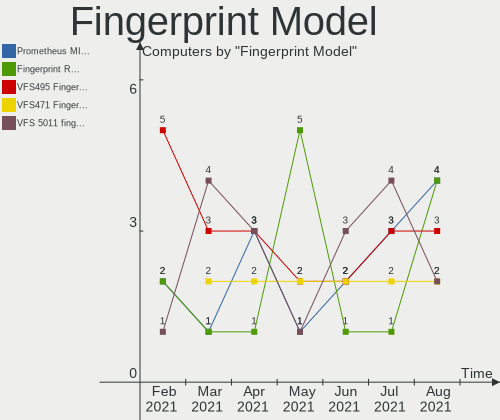

| Model                                                  | Computers | Percent |
|--------------------------------------------------------|-----------|---------|
| Validity Sensors VFS495 Fingerprint Reader             | 3         | 8.57%   |
| Upek Biometric Touchchip/Touchstrip Fingerprint Sensor | 3         | 8.57%   |
| Synaptics Metallica MIS Touch Fingerprint Reader       | 3         | 8.57%   |
| AuthenTec AES2810                                      | 3         | 8.57%   |
| Validity Sensors VFS5011 Fingerprint Reader            | 2         | 5.71%   |
| Validity Sensors VFS491                                | 2         | 5.71%   |
| Validity Sensors VFS451 Fingerprint Reader             | 2         | 5.71%   |
| Validity Sensors Synaptics WBDI                        | 2         | 5.71%   |
| Synaptics Prometheus MIS Touch Fingerprint Reader      | 2         | 5.71%   |
| AuthenTec Fingerprint Sensor                           | 2         | 5.71%   |
| AuthenTec AES1600                                      | 2         | 5.71%   |
| Validity Sensors VFS300 Fingerprint Reader             | 1         | 2.86%   |
| Validity Sensors VFS 5011 fingerprint sensor           | 1         | 2.86%   |
| Synaptics  WBDI                                        | 1         | 2.86%   |
| Synaptics Metallica MOH Touch Fingerprint Reader       | 1         | 2.86%   |
| Shenzhen Goodix Fingerprint Reader                     | 1         | 2.86%   |
| LighTuning EgisTec Touch Fingerprint Sensor            | 1         | 2.86%   |
| Elan ELAN:Fingerprint                                  | 1         | 2.86%   |
| AuthenTec AES2501 Fingerprint Sensor                   | 1         | 2.86%   |
| Unknown                                                | 1         | 2.86%   |

Chipcard Vendor
---------------

Chipcard module vendors

| Vendor      | Computers | Percent |
|-------------|-----------|---------|
| Broadcom    | 7         | 43.75%  |
| Alcor Micro | 4         | 25%     |
| O2 Micro    | 3         | 18.75%  |
| Upek        | 1         | 6.25%   |
| Lenovo      | 1         | 6.25%   |

Chipcard Model
--------------

Chipcard module models

| Model                                                                        | Computers | Percent |
|------------------------------------------------------------------------------|-----------|---------|
| Broadcom BCM5880 Secure Applications Processor with fingerprint swipe sensor | 4         | 25%     |
| Alcor Micro AU9540 Smartcard Reader                                          | 4         | 25%     |
| Broadcom BCM5880 Secure Applications Processor                               | 3         | 18.75%  |
| O2 Micro Oz776 SmartCard Reader                                              | 2         | 12.5%   |
| Upek TouchChip Fingerprint Coprocessor (WBF advanced mode)                   | 1         | 6.25%   |
| O2 Micro OZ776 CCID Smartcard Reader                                         | 1         | 6.25%   |
| Lenovo Integrated Smart Card Reader                                          | 1         | 6.25%   |

Printer Vendor
--------------

Printer device vendors

| Vendor              | Computers | Percent |
|---------------------|-----------|---------|
| Brother Industries  | 6         | 26.09%  |
| Hewlett-Packard     | 5         | 21.74%  |
| Canon               | 5         | 21.74%  |
| Seiko Epson         | 4         | 17.39%  |
| Samsung Electronics | 1         | 4.35%   |
| Pantum              | 1         | 4.35%   |
| Kyocera             | 1         | 4.35%   |

Printer Model
-------------

Printer device models

| Model                                         | Computers | Percent |
|-----------------------------------------------|-----------|---------|
| Seiko Epson ME 340 Series/Stylus NX130 Series | 1         | 4.35%   |
| Seiko Epson L555 Series                       | 1         | 4.35%   |
| Seiko Epson L365 Series                       | 1         | 4.35%   |
| Seiko Epson ET-2700 Series                    | 1         | 4.35%   |
| Samsung M267x 287x Series                     | 1         | 4.35%   |
| Pantum P2200 series                           | 1         | 4.35%   |
| Kyocera Mita FS-820                           | 1         | 4.35%   |
| HP OfficeJet 5200 series                      | 1         | 4.35%   |
| HP Officejet 4620 series                      | 1         | 4.35%   |
| HP OfficeJet 3830 series                      | 1         | 4.35%   |
| HP LaserJet 1018                              | 1         | 4.35%   |
| HP DeskJet 3630 series                        | 1         | 4.35%   |
| Canon PIXMA MX720 Series                      | 1         | 4.35%   |
| Canon PIXMA MG3000 series                     | 1         | 4.35%   |
| Canon MF4010 series                           | 1         | 4.35%   |
| Canon I-SENSYS MF4550d                        | 1         | 4.35%   |
| Canon G4000 series                            | 1         | 4.35%   |
| Brother HL-L2360D series                      | 1         | 4.35%   |
| Brother HL-L2320D series                      | 1         | 4.35%   |
| Brother DCP-T500W                             | 1         | 4.35%   |
| Brother DCP-9020CDW                           | 1         | 4.35%   |
| Brother DCP-7055 scanner/printer              | 1         | 4.35%   |
| Brother DCP-1610W                             | 1         | 4.35%   |

Scanner Vendor
--------------

Scanner device vendors

| Vendor          | Computers | Percent |
|-----------------|-----------|---------|
| Canon           | 2         | 40%     |
| Seiko Epson     | 1         | 20%     |
| Mustek Systems  | 1         | 20%     |
| Hewlett-Packard | 1         | 20%     |

Scanner Model
-------------

Scanner device models

| Model                                             | Computers | Percent |
|---------------------------------------------------|-----------|---------|
| Seiko Epson GT-F650 [GT-S600/Perfection V10/V100] | 1         | 20%     |
| Mustek Systems SNAPSCAN e22                       | 1         | 20%     |
| HP ScanJet 2400c                                  | 1         | 20%     |
| Canon CanoScan LiDE 700F                          | 1         | 20%     |
| Canon CanoScan LiDE 110                           | 1         | 20%     |

Bluetooth Vendor
----------------

Controller vendors

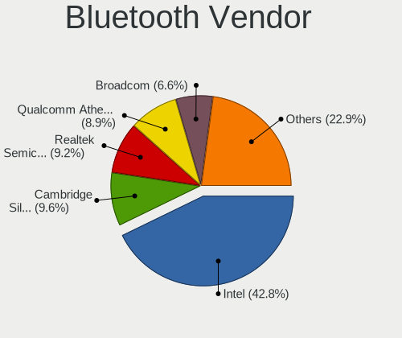

| Vendor                          | Computers | Percent |
|---------------------------------|-----------|---------|
| Intel                           | 102       | 40.32%  |
| Qualcomm Atheros Communications | 26        | 10.28%  |
| Cambridge Silicon Radio         | 25        | 9.88%   |
| Realtek Semiconductor           | 23        | 9.09%   |
| Broadcom                        | 18        | 7.11%   |
| Foxconn / Hon Hai               | 10        | 3.95%   |
| Apple                           | 9         | 3.56%   |
| Lite-On Technology              | 7         | 2.77%   |
| IMC Networks                    | 7         | 2.77%   |
| Dell                            | 7         | 2.77%   |
| Hewlett-Packard                 | 6         | 2.37%   |
| Ralink                          | 5         | 1.98%   |
| Toshiba                         | 3         | 1.19%   |
| Micro Star International        | 1         | 0.4%    |
| Foxconn International           | 1         | 0.4%    |
| Belkin Components               | 1         | 0.4%    |
| ASUSTek Computer                | 1         | 0.4%    |
| Alps Electric                   | 1         | 0.4%    |

Bluetooth Model
---------------

Controller models

| Model                                                                               | Computers | Percent |
|-------------------------------------------------------------------------------------|-----------|---------|
| Intel Bluetooth Device                                                              | 40        | 15.81%  |
| Intel Bluetooth wireless interface                                                  | 36        | 14.23%  |
| Cambridge Silicon Radio Bluetooth Dongle (HCI mode)                                 | 25        | 9.88%   |
| Realtek Bluetooth Radio                                                             | 13        | 5.14%   |
| Intel Bluetooth 9460/9560 Jefferson Peak (JfP)                                      | 11        | 4.35%   |
| Qualcomm Atheros  Bluetooth Device                                                  | 8         | 3.16%   |
| Realtek  Bluetooth 4.2 Adapter                                                      | 6         | 2.37%   |
| Qualcomm Atheros QCA61x4 Bluetooth 4.0                                              | 6         | 2.37%   |
| Intel Centrino Bluetooth Wireless Transceiver                                       | 6         | 2.37%   |
| Ralink RT3290 Bluetooth                                                             | 5         | 1.98%   |
| Qualcomm Atheros AR3011 Bluetooth                                                   | 5         | 1.98%   |
| Intel Wireless-AC 3168 Bluetooth                                                    | 5         | 1.98%   |
| HP Bluetooth 2.0 Interface [Broadcom BCM2045]                                       | 4         | 1.58%   |
| Apple Bluetooth Host Controller                                                     | 4         | 1.58%   |
| Qualcomm Atheros AR3012 Bluetooth 4.0                                               | 3         | 1.19%   |
| Intel Centrino Advanced-N 6230 Bluetooth adapter                                    | 3         | 1.19%   |
| IMC Networks Bluetooth Device                                                       | 3         | 1.19%   |
| Foxconn / Hon Hai Bluetooth Device                                                  | 3         | 1.19%   |
| Dell DW375 Bluetooth Module                                                         | 3         | 1.19%   |
| Broadcom BCM2045B (BDC-2.1)                                                         | 3         | 1.19%   |
| Apple Bluetooth USB Host Controller                                                 | 3         | 1.19%   |
| Realtek RTL8723B Bluetooth                                                          | 2         | 0.79%   |
| Qualcomm Atheros AR9462 Bluetooth                                                   | 2         | 0.79%   |
| Lite-On Qualcomm Atheros QCA9377 Bluetooth                                          | 2         | 0.79%   |
| Lite-On Atheros AR3012 Bluetooth                                                    | 2         | 0.79%   |
| IMC Networks BCM20702A0                                                             | 2         | 0.79%   |
| Foxconn / Hon Hai BCM20702A0                                                        | 2         | 0.79%   |
| Dell BCM20702A0 Bluetooth Module                                                    | 2         | 0.79%   |
| Broadcom BCM43142A0 Bluetooth 4.0                                                   | 2         | 0.79%   |
| Broadcom BCM20702A0 Bluetooth 4.0                                                   | 2         | 0.79%   |
| Broadcom BCM2070 Bluetooth Device                                                   | 2         | 0.79%   |
| Broadcom BCM2045B (BDC-2.1) [Bluetooth Controller]                                  | 2         | 0.79%   |
| Toshiba Integrated Bluetooth HCI                                                    | 1         | 0.4%    |
| Toshiba Bluetooth USB Host Controller                                               | 1         | 0.4%    |
| Toshiba Bluetooth Device                                                            | 1         | 0.4%    |
| Realtek RTL8822BE Bluetooth 4.2 Adapter                                             | 1         | 0.4%    |
| Realtek RT Bluetooth Radio                                                          | 1         | 0.4%    |
| Qualcomm Atheros Bluetooth USB Host Controller                                      | 1         | 0.4%    |
| Qualcomm Atheros Bluetooth                                                          | 1         | 0.4%    |
| Micro Star International MS-6970 BToes Bluetooth adapter                            | 1         | 0.4%    |
| Lite-On Bluetooth Radio                                                             | 1         | 0.4%    |
| Lite-On Bluetooth Device                                                            | 1         | 0.4%    |
| Lite-On BCM43142A0                                                                  | 1         | 0.4%    |
| Intel Wireless-AC 9260 Bluetooth Adapter                                            | 1         | 0.4%    |
| IMC Networks Bluetooth Radio                                                        | 1         | 0.4%    |
| IMC Networks Bluetooth                                                              | 1         | 0.4%    |
| HP Integrated Module with Bluetooth 2.1 Wireless technology                         | 1         | 0.4%    |
| HP Broadcom 2070 Bluetooth Combo                                                    | 1         | 0.4%    |
| Foxconn International BCM43142A0 Bluetooth module                                   | 1         | 0.4%    |
| Foxconn / Hon Hai Foxconn T77H114 BCM2070 [Single-Chip Bluetooth 2.1 + EDR Adapter] | 1         | 0.4%    |
| Foxconn / Hon Hai BT                                                                | 1         | 0.4%    |
| Foxconn / Hon Hai Bluetooth USB Host Controller                                     | 1         | 0.4%    |
| Foxconn / Hon Hai BCM43142A0 broadcom bluetooth                                     | 1         | 0.4%    |
| Foxconn / Hon Hai Acer Bluetooth module                                             | 1         | 0.4%    |
| Dell Wireless 355 Bluetooth                                                         | 1         | 0.4%    |
| Dell Wireless 350 Bluetooth                                                         | 1         | 0.4%    |
| Broadcom HP Bluethunder                                                             | 1         | 0.4%    |
| Broadcom BCM92046DG-CL1ROM Bluetooth 2.1 Adapter                                    | 1         | 0.4%    |
| Broadcom BCM43142A0 Bluetooth Device                                                | 1         | 0.4%    |
| Broadcom BCM20702 Bluetooth 4.0 [ThinkPad]                                          | 1         | 0.4%    |

Unsupported Devices
-------------------

Total unsupported devices on board

| Total | Computers | Percent |
|-------|-----------|---------|
| 0     | 351       | 73.89%  |
| 1     | 102       | 21.47%  |
| 2     | 19        | 4%      |
| 3     | 2         | 0.42%   |
| 5     | 1         | 0.21%   |

Unsupported Device Types
------------------------

Types of unsupported devices

| Type                     | Computers | Percent |
|--------------------------|-----------|---------|
| Fingerprint reader       | 35        | 23.18%  |
| Graphics card            | 32        | 21.19%  |
| Net/wireless             | 24        | 15.89%  |
| Chipcard                 | 16        | 10.6%   |
| Multimedia controller    | 8         | 5.3%    |
| Communication controller | 7         | 4.64%   |
| Bluetooth                | 7         | 4.64%   |
| Unassigned class         | 6         | 3.97%   |
| Modem                    | 4         | 2.65%   |
| Storage                  | 3         | 1.99%   |
| Sound                    | 3         | 1.99%   |
| Network                  | 2         | 1.32%   |
| Camera                   | 2         | 1.32%   |
| Flash memory             | 1         | 0.66%   |
| Card reader              | 1         | 0.66%   |

