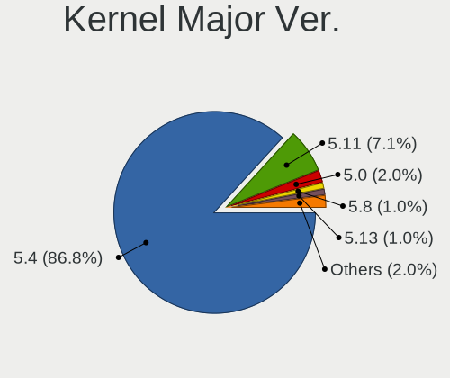
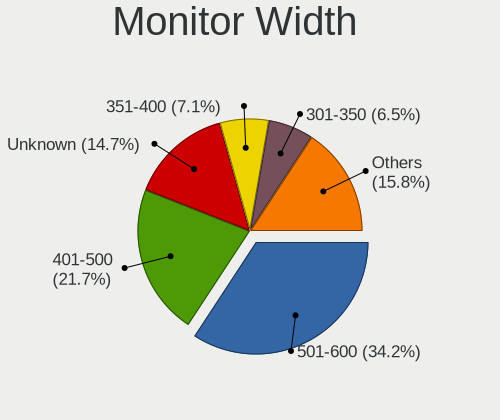

Mint Hardware Trends (Desktop)
------------------------------

A project to identify most popular hardware characteristics and track their change
over time based on data collected by Mint users at https://Linux-Hardware.org.

Anyone can contribute to the study by uploading probes of their computers by
the [hw-probe](https://github.com/linuxhw/hw-probe) tool:

    sudo -E hw-probe -all -upload

Full-feature report is available here: https://linux-hardware.org/?view=trends&formfactor=desktop

Period: May, 2020.

Contents
--------

- [ OS                       ](#os)
- [ OS Family                ](#os-family)
- [ Kernel                   ](#kernel)
- [ Kernel Family            ](#kernel-family)
- [ Kernel Major Ver.        ](#kernel-major-ver)
- [ Arch                     ](#arch)
- [ DE                       ](#de)
- [ Display Server           ](#display-server)
- [ Display Manager          ](#display-manager)
- [ OS Lang                  ](#os-lang)
- [ Boot Mode                ](#boot-mode)
- [ Filesystem               ](#filesystem)
- [ Part. scheme             ](#part-scheme)
- [ Dual Boot with Linux/BSD ](#dual-boot-with-linux/bsd)
- [ Dual Boot (Win)          ](#dual-boot-win)
- [ Country                  ](#country)
- [ City                     ](#city)
- [ Vendor                   ](#vendor)
- [ Model                    ](#model)
- [ Model Family             ](#model-family)
- [ MFG Year                 ](#mfg-year)
- [ Form Factor              ](#form-factor)
- [ Secure Boot              ](#secure-boot)
- [ Coreboot                 ](#coreboot)
- [ RAM Size                 ](#ram-size)
- [ RAM Used                 ](#ram-used)
- [ Drive Vendor             ](#drive-vendor)
- [ Drive Model              ](#drive-model)
- [ Drive Kind               ](#drive-kind)
- [ Drive Connector          ](#drive-connector)
- [ Drive Size               ](#drive-size)
- [ Space Total              ](#space-total)
- [ Space Used               ](#space-used)
- [ Malfunc. Drives          ](#malfunc-drives)
- [ Malfunc. Drive Vendor    ](#malfunc-drive-vendor)
- [ Malfunc. Drive Kind      ](#malfunc-drive-kind)
- [ Failed Drives            ](#failed-drives)
- [ Failed Drive Vendor      ](#failed-drive-vendor)
- [ Drive Status             ](#drive-status)
- [ Storage Vendor           ](#storage-vendor)
- [ Storage Model            ](#storage-model)
- [ Storage Kind             ](#storage-kind)
- [ CPU Vendor               ](#cpu-vendor)
- [ CPU Model                ](#cpu-model)
- [ CPU Model Family         ](#cpu-model-family)
- [ CPU Cores                ](#cpu-cores)
- [ CPU Sockets              ](#cpu-sockets)
- [ CPU Threads              ](#cpu-threads)
- [ CPU Op-Modes             ](#cpu-op-modes)
- [ CPU Microcode            ](#cpu-microcode)
- [ CPU Microarch            ](#cpu-microarch)
- [ GPU Vendor               ](#gpu-vendor)
- [ GPU Model                ](#gpu-model)
- [ GPU Combo                ](#gpu-combo)
- [ GPU Driver               ](#gpu-driver)
- [ GPU Memory               ](#gpu-memory)
- [ Monitor Vendor           ](#monitor-vendor)
- [ Monitor Model            ](#monitor-model)
- [ Monitor Resolution       ](#monitor-resolution)
- [ Monitor Diagonal         ](#monitor-diagonal)
- [ Monitor Width            ](#monitor-width)
- [ Aspect Ratio             ](#aspect-ratio)
- [ Monitor Area             ](#monitor-area)
- [ Pixel Density            ](#pixel-density)
- [ Multiple Monitors        ](#multiple-monitors)
- [ Net Controller Vendor    ](#net-controller-vendor)
- [ Net Controller Model     ](#net-controller-model)
- [ Net Controller Kind      ](#net-controller-kind)
- [ Used Controller          ](#used-controller)
- [ NICs                     ](#nics)
- [ Unsupported Devices      ](#unsupported-devices)
- [ Unsupported Device Types ](#unsupported-device-types)

OS
--

Installed operating systems

| Name      | Computers | Percent |
|-----------|-----------|---------|
| Mint 19.3 | 85        | 75.89%  |
| Mint 19.2 | 10        | 8.93%   |
| Mint 19.1 | 8         | 7.14%   |
| Mint 4    | 5         | 4.46%   |
| Mint 18.3 | 3         | 2.68%   |
| Mint 19   | 1         | 0.89%   |

OS Family
---------

OS without a version

| Name | Computers | Percent |
|------|-----------|---------|
| Mint | 112       | 100%    |

Kernel
------

Version of the Linux kernel

| Version               | Computers | Percent |
|-----------------------|-----------|---------|
| 5.3.0-51-generic      | 45        | 40.18%  |
| 5.3.0-53-generic      | 25        | 22.32%  |
| 4.15.0-99-generic     | 8         | 7.14%   |
| 5.0.0-32-generic      | 6         | 5.36%   |
| 4.15.0-101-generic    | 6         | 5.36%   |
| 4.19.0-9-amd64        | 3         | 2.68%   |
| 5.3.0-46-generic      | 2         | 1.79%   |
| 4.19.0-8-amd64        | 2         | 1.79%   |
| 4.15.0-96-generic     | 2         | 1.79%   |
| 4.15.0-58-generic     | 2         | 1.79%   |
| 4.15.0-54-generic     | 2         | 1.79%   |
| 4.10.0-38-generic     | 2         | 1.79%   |
| 5.3.6-050306-generic  | 1         | 0.89%   |
| 5.3.18-050318-generic | 1         | 0.89%   |
| 5.3.0-26-generic      | 1         | 0.89%   |
| 4.15.0-99-lowlatency  | 1         | 0.89%   |
| 4.15.0-74-generic     | 1         | 0.89%   |
| 4.15.0-65-generic     | 1         | 0.89%   |
| 4.15.0-20-generic     | 1         | 0.89%   |

Kernel Family
-------------

Linux kernel without a distro release

| Version | Computers | Percent |
|---------|-----------|---------|
| 5.3.0   | 73        | 65.18%  |
| 4.15.0  | 24        | 21.43%  |
| 5.0.0   | 6         | 5.36%   |
| 4.19.0  | 5         | 4.46%   |
| 4.10.0  | 2         | 1.79%   |
| 5.3.6   | 1         | 0.89%   |
| 5.3.18  | 1         | 0.89%   |

Kernel Major Ver.
-----------------

Linux kernel major version

| Version | Computers | Percent |
|---------|-----------|---------|
| 5.3     | 75        | 66.96%  |
| 4.15    | 24        | 21.43%  |
| 5.0     | 6         | 5.36%   |
| 4.19    | 5         | 4.46%   |
| 4.10    | 2         | 1.79%   |

Arch
----

OS architecture (x86_64, i586, etc.)

| Name   | Computers | Percent |
|--------|-----------|---------|
| x86_64 | 105       | 93.75%  |
| i686   | 7         | 6.25%   |

DE
--

Desktop Environment

| Name          | Computers | Percent |
|---------------|-----------|---------|
| X-Cinnamon    | 71        | 63.39%  |
| MATE          | 19        | 16.96%  |
| XFCE          | 9         | 8.04%   |
| Unknown       | 6         | 5.36%   |
| Cinnamon      | 5         | 4.46%   |
| LXDE          | 1         | 0.89%   |
| enlightenment | 1         | 0.89%   |

Display Server
--------------

X11 or Wayland

| Name | Computers | Percent |
|------|-----------|---------|
| X11  | 112       | 100%    |

Display Manager
---------------

SDDM, LightDM, etc.

| Name    | Computers | Percent |
|---------|-----------|---------|
| Unknown | 105       | 93.75%  |
| LightDM | 7         | 6.25%   |

OS Lang
-------

Language

| Lang    | Computers | Percent |
|---------|-----------|---------|
| en_US   | 29        | 25.89%  |
| pt_BR   | 16        | 14.29%  |
| de_DE   | 9         | 8.04%   |
| es_ES   | 6         | 5.36%   |
| en_GB   | 6         | 5.36%   |
| fr_FR   | 5         | 4.46%   |
| ru_RU   | 4         | 3.57%   |
| es_AR   | 4         | 3.57%   |
| nl_BE   | 3         | 2.68%   |
| it_IT   | 3         | 2.68%   |
| en_AU   | 3         | 2.68%   |
| el_GR   | 3         | 2.68%   |
| pl_PL   | 2         | 1.79%   |
| nl_NL   | 2         | 1.79%   |
| es_MX   | 2         | 1.79%   |
| en_ZA   | 2         | 1.79%   |
| en_CA   | 2         | 1.79%   |
| pt_PT   | 1         | 0.89%   |
| fr_BE   | 1         | 0.89%   |
| es_VE   | 1         | 0.89%   |
| es_UY   | 1         | 0.89%   |
| es_CL   | 1         | 0.89%   |
| en_IL   | 1         | 0.89%   |
| en_IE   | 1         | 0.89%   |
| de_CH   | 1         | 0.89%   |
| C       | 1         | 0.89%   |
| bg_BG   | 1         | 0.89%   |
| Unknown | 1         | 0.89%   |

Boot Mode
---------

EFI or BIOS

| Mode | Computers | Percent |
|------|-----------|---------|
| BIOS | 92        | 82.14%  |
| EFI  | 20        | 17.86%  |

Filesystem
----------

Type of filesystem

| Type    | Computers | Percent |
|---------|-----------|---------|
| Ext4    | 107       | 95.54%  |
| Btrfs   | 4         | 3.57%   |
| Unknown | 1         | 0.89%   |

Part. scheme
------------

Scheme of partitioning

| Type    | Computers | Percent |
|---------|-----------|---------|
| Unknown | 105       | 93.75%  |
| GPT     | 4         | 3.57%   |
| MBR     | 3         | 2.68%   |

Dual Boot with Linux/BSD
------------------------

Hosting more than one Linux/BSD

| Dual boot | Computers | Percent |
|-----------|-----------|---------|
| No        | 103       | 91.96%  |
| Yes       | 9         | 8.04%   |

Dual Boot (Win)
---------------

Hosting Linux and Windows

| Dual boot | Computers | Percent |
|-----------|-----------|---------|
| No        | 97        | 86.61%  |
| Yes       | 15        | 13.39%  |

Country
-------

Geographic location (country)

| Country      | Computers | Percent |
|--------------|-----------|---------|
| Brazil       | 18        | 16.07%  |
| USA          | 16        | 14.29%  |
| Germany      | 10        | 8.93%   |
| Spain        | 7         | 6.25%   |
| France       | 7         | 6.25%   |
| UK           | 5         | 4.46%   |
| Russia       | 4         | 3.57%   |
| Netherlands  | 4         | 3.57%   |
| Italy        | 4         | 3.57%   |
| Belgium      | 4         | 3.57%   |
| Argentina    | 4         | 3.57%   |
| South Africa | 3         | 2.68%   |
| Greece       | 3         | 2.68%   |
| Australia    | 3         | 2.68%   |
| Poland       | 2         | 1.79%   |
| Mexico       | 2         | 1.79%   |
| Indonesia    | 2         | 1.79%   |
| Canada       | 2         | 1.79%   |
| Venezuela    | 1         | 0.89%   |
| Uruguay      | 1         | 0.89%   |
| Switzerland  | 1         | 0.89%   |
| Romania      | 1         | 0.89%   |
| Puerto Rico  | 1         | 0.89%   |
| Portugal     | 1         | 0.89%   |
| Israel       | 1         | 0.89%   |
| Ireland      | 1         | 0.89%   |
| India        | 1         | 0.89%   |
| Egypt        | 1         | 0.89%   |
| Chile        | 1         | 0.89%   |
| Bulgaria     | 1         | 0.89%   |

City
----

Geographic location (city)

| City                       | Computers | Percent |
|----------------------------|-----------|---------|
| Athens                     | 3         | 2.68%   |
| Madrid                     | 2         | 1.79%   |
| Johannesburg               | 2         | 1.79%   |
| Frankfurt am Main          | 2         | 1.79%   |
| Bandung                    | 2         | 1.79%   |
| Alexandria                 | 2         | 1.79%   |
| Wrocław                   | 1         | 0.89%   |
| Worcester                  | 1         | 0.89%   |
| Wichita Falls              | 1         | 0.89%   |
| Westerlo                   | 1         | 0.89%   |
| Viedma                     | 1         | 0.89%   |
| Vernon                     | 1         | 0.89%   |
| Valley                     | 1         | 0.89%   |
| Valladolid                 | 1         | 0.89%   |
| Utebo                      | 1         | 0.89%   |
| Ulm                        | 1         | 0.89%   |
| Uberlândia                | 1         | 0.89%   |
| Treviso                    | 1         | 0.89%   |
| Tournefeuille              | 1         | 0.89%   |
| Toulouse                   | 1         | 0.89%   |
| Terneuzen                  | 1         | 0.89%   |
| Taubate                    | 1         | 0.89%   |
| São Paulo                 | 1         | 0.89%   |
| Surgut                     | 1         | 0.89%   |
| Sofia                      | 1         | 0.89%   |
| Seattle                    | 1         | 0.89%   |
| Santiago                   | 1         | 0.89%   |
| Santa Maria Chimalhuacan   | 1         | 0.89%   |
| San Juan                   | 1         | 0.89%   |
| San Bartolomé de Tirajana | 1         | 0.89%   |
| San Antonio                | 1         | 0.89%   |
| Saint-Brice-Courcelles     | 1         | 0.89%   |
| Sacramento                 | 1         | 0.89%   |
| Rotterdam                  | 1         | 0.89%   |
| Rostov-on-Don              | 1         | 0.89%   |
| Rosario                    | 1         | 0.89%   |
| Rome                       | 1         | 0.89%   |
| Rennes                     | 1         | 0.89%   |
| Prato                      | 1         | 0.89%   |
| Poznan                     | 1         | 0.89%   |
| Porto Alegre               | 1         | 0.89%   |
| Pedro Leopoldo             | 1         | 0.89%   |
| Orlando                    | 1         | 0.89%   |
| Novokuznetsk               | 1         | 0.89%   |
| Nottingham                 | 1         | 0.89%   |
| Neuenburg am Rhein         | 1         | 0.89%   |
| Moran                      | 1         | 0.89%   |
| Montevideo                 | 1         | 0.89%   |
| Miami                      | 1         | 0.89%   |
| Mesa                       | 1         | 0.89%   |
| Matthews                   | 1         | 0.89%   |
| Martinsville               | 1         | 0.89%   |
| Lucerne                    | 1         | 0.89%   |
| Londrina                   | 1         | 0.89%   |
| Logan                      | 1         | 0.89%   |
| Lipetsk                    | 1         | 0.89%   |
| Lier                       | 1         | 0.89%   |
| Lich                       | 1         | 0.89%   |
| Langley                    | 1         | 0.89%   |
| Landsmeer                  | 1         | 0.89%   |

Vendor
------

Motherboard manufacturer

| Name                | Computers | Percent |
|---------------------|-----------|---------|
| Gigabyte Technology | 24        | 21.43%  |
| ASUSTek Computer    | 23        | 20.54%  |
| Dell                | 10        | 8.93%   |
| ASRock              | 10        | 8.93%   |
| MSI                 | 7         | 6.25%   |
| Lenovo              | 6         | 5.36%   |
| Intel               | 5         | 4.46%   |
| Hewlett-Packard     | 5         | 4.46%   |
| Unknown             | 3         | 2.68%   |
| Shuttle             | 2         | 1.79%   |
| Biostar             | 2         | 1.79%   |
| WinFast             | 1         | 0.89%   |
| Semp Toshiba        | 1         | 0.89%   |
| Pegatron            | 1         | 0.89%   |
| PCWare              | 1         | 0.89%   |
| Megaware            | 1         | 0.89%   |
| Medion              | 1         | 0.89%   |
| INTELBRAS           | 1         | 0.89%   |
| HARDKERNEL          | 1         | 0.89%   |
| Gateway             | 1         | 0.89%   |
| Fujitsu Siemens     | 1         | 0.89%   |
| Complet             | 1         | 0.89%   |
| Apple               | 1         | 0.89%   |
| AMI                 | 1         | 0.89%   |
| AMD                 | 1         | 0.89%   |
| Acer                | 1         | 0.89%   |

Model
-----

Motherboard model

| Name                                | Computers | Percent |
|-------------------------------------|-----------|---------|
| ASUS All Series                     | 4         | 3.57%   |
| Unknown                             | 3         | 2.68%   |
| Gigabyte GA-990FXA-UD3              | 2         | 1.79%   |
| Dell OptiPlex 755                   | 2         | 1.79%   |
| ASUS M4N68T-M-LE-V2                 | 2         | 1.79%   |
| WinFast MCP61M2MA                   | 1         | 0.89%   |
| Shuttle DX30D                       | 1         | 0.89%   |
| Shuttle DS81D                       | 1         | 0.89%   |
| Semp Toshiba STI 007467             | 1         | 0.89%   |
| Pegatron IPMH110Pro                 | 1         | 0.89%   |
| PCWare PW-945GCX                    | 1         | 0.89%   |
| MSI MS-7B79                         | 1         | 0.89%   |
| MSI MS-7B49                         | 1         | 0.89%   |
| MSI MS-7996                         | 1         | 0.89%   |
| MSI MS-7846                         | 1         | 0.89%   |
| MSI MS-7823                         | 1         | 0.89%   |
| MSI MS-7640                         | 1         | 0.89%   |
| MSI CU-7592                         | 1         | 0.89%   |
| Megaware MW-H61HD-MA                | 1         | 0.89%   |
| Medion MS-7848                      | 1         | 0.89%   |
| Lenovo ThinkCentre M93p 10A7000BUS  | 1         | 0.89%   |
| Lenovo ThinkCentre M91p 4480B1U     | 1         | 0.89%   |
| Lenovo ThinkCentre M58 7360CN3      | 1         | 0.89%   |
| Lenovo ThinkCentre A55 8705AV4      | 1         | 0.89%   |
| Lenovo 70AQ000JIT ThinkServer TS440 | 1         | 0.89%   |
| Lenovo 70A4000HUX ThinkServer TS140 | 1         | 0.89%   |
| INTELBRAS IE-G31TM7                 | 1         | 0.89%   |
| Intel DG33FB AAD81072-306           | 1         | 0.89%   |
| Intel DG33BU AAD79951-407           | 1         | 0.89%   |
| Intel DB75EN AAG39650-302           | 1         | 0.89%   |
| Intel D54250WYK H13922-304          | 1         | 0.89%   |
| Intel Board                         | 1         | 0.89%   |
| HP Slimline Desktop PC 270-p0xx     | 1         | 0.89%   |
| HP EliteDesk 800 G1 TWR             | 1         | 0.89%   |
| HP Compaq dc7700 Small Form Factor  | 1         | 0.89%   |
| HP Compaq dc5750 Microtower         | 1         | 0.89%   |
| HP Compaq 8200 Elite SFF PC         | 1         | 0.89%   |
| HARDKERNEL ODROID-H2                | 1         | 0.89%   |
| Gigabyte Z390 DESIGNARE             | 1         | 0.89%   |
| Gigabyte Z390 AORUS ELITE           | 1         | 0.89%   |
| Gigabyte Z170X-Gaming 3             | 1         | 0.89%   |
| Gigabyte X570 AORUS ULTRA           | 1         | 0.89%   |
| Gigabyte M68M-S2P                   | 1         | 0.89%   |
| Gigabyte H61M-S2PV                  | 1         | 0.89%   |
| Gigabyte H61M-D2H-USB3              | 1         | 0.89%   |
| Gigabyte H170-D3HP                  | 1         | 0.89%   |
| Gigabyte H110M-A-CF                 | 1         | 0.89%   |
| Gigabyte GA-MA78LM-S2               | 1         | 0.89%   |
| Gigabyte GA-MA770-UD3               | 1         | 0.89%   |
| Gigabyte GA-A75-D3H                 | 1         | 0.89%   |
| Gigabyte GA-990X-Gaming SLI-CF      | 1         | 0.89%   |
| Gigabyte GA-970A-DS3                | 1         | 0.89%   |
| Gigabyte G41MT-S2P                  | 1         | 0.89%   |
| Gigabyte G31M-ES2C                  | 1         | 0.89%   |
| Gigabyte F2A88XM-D3H                | 1         | 0.89%   |
| Gigabyte F2A78M-HD2                 | 1         | 0.89%   |
| Gigabyte F2A58M-H                   | 1         | 0.89%   |
| Gigabyte EP45-DS3LR                 | 1         | 0.89%   |
| Gigabyte B85M-HD3                   | 1         | 0.89%   |
| Gigabyte B450M DS3H                 | 1         | 0.89%   |

Model Family
------------

Motherboard model prefix

| Name                    | Computers | Percent |
|-------------------------|-----------|---------|
| Dell OptiPlex           | 8         | 7.14%   |
| Lenovo ThinkCentre      | 4         | 3.57%   |
| ASUS All                | 4         | 3.57%   |
| HP Compaq               | 3         | 2.68%   |
| Unknown                 | 3         | 2.68%   |
| Gigabyte Z390           | 2         | 1.79%   |
| Gigabyte GA-990FXA-UD3  | 2         | 1.79%   |
| ASUS SABERTOOTH         | 2         | 1.79%   |
| ASUS PRIME              | 2         | 1.79%   |
| ASUS M4N68T-M-LE-V2     | 2         | 1.79%   |
| WinFast MCP61M2MA       | 1         | 0.89%   |
| Shuttle DX30D           | 1         | 0.89%   |
| Shuttle DS81D           | 1         | 0.89%   |
| Semp Toshiba STI        | 1         | 0.89%   |
| Pegatron IPMH110Pro     | 1         | 0.89%   |
| PCWare PW-945GCX        | 1         | 0.89%   |
| MSI MS-7B79             | 1         | 0.89%   |
| MSI MS-7B49             | 1         | 0.89%   |
| MSI MS-7996             | 1         | 0.89%   |
| MSI MS-7846             | 1         | 0.89%   |
| MSI MS-7823             | 1         | 0.89%   |
| MSI MS-7640             | 1         | 0.89%   |
| MSI CU-7592             | 1         | 0.89%   |
| Megaware MW-H61HD-MA    | 1         | 0.89%   |
| Medion MS-7848          | 1         | 0.89%   |
| Lenovo 70AQ000JIT       | 1         | 0.89%   |
| Lenovo 70A4000HUX       | 1         | 0.89%   |
| INTELBRAS IE-G31TM7     | 1         | 0.89%   |
| Intel DG33FB            | 1         | 0.89%   |
| Intel DG33BU            | 1         | 0.89%   |
| Intel DB75EN            | 1         | 0.89%   |
| Intel D54250WYK         | 1         | 0.89%   |
| Intel Board             | 1         | 0.89%   |
| HP Slimline             | 1         | 0.89%   |
| HP EliteDesk            | 1         | 0.89%   |
| HARDKERNEL ODROID-H2    | 1         | 0.89%   |
| Gigabyte Z170X-Gaming   | 1         | 0.89%   |
| Gigabyte X570           | 1         | 0.89%   |
| Gigabyte M68M-S2P       | 1         | 0.89%   |
| Gigabyte H61M-S2PV      | 1         | 0.89%   |
| Gigabyte H61M-D2H-USB3  | 1         | 0.89%   |
| Gigabyte H170-D3HP      | 1         | 0.89%   |
| Gigabyte H110M-A-CF     | 1         | 0.89%   |
| Gigabyte GA-MA78LM-S2   | 1         | 0.89%   |
| Gigabyte GA-MA770-UD3   | 1         | 0.89%   |
| Gigabyte GA-A75-D3H     | 1         | 0.89%   |
| Gigabyte GA-990X-Gaming | 1         | 0.89%   |
| Gigabyte GA-970A-DS3    | 1         | 0.89%   |
| Gigabyte G41MT-S2P      | 1         | 0.89%   |
| Gigabyte G31M-ES2C      | 1         | 0.89%   |
| Gigabyte F2A88XM-D3H    | 1         | 0.89%   |
| Gigabyte F2A78M-HD2     | 1         | 0.89%   |
| Gigabyte F2A58M-H       | 1         | 0.89%   |
| Gigabyte EP45-DS3LR     | 1         | 0.89%   |
| Gigabyte B85M-HD3       | 1         | 0.89%   |
| Gigabyte B450M          | 1         | 0.89%   |
| Gateway DS10G           | 1         | 0.89%   |
| Fujitsu Siemens ESPRIMO | 1         | 0.89%   |
| Dell Studio             | 1         | 0.89%   |
| Dell Precision          | 1         | 0.89%   |

MFG Year
--------

Motherboard manufacture year

| Year | Computers | Percent |
|------|-----------|---------|
| 2011 | 14        | 12.5%   |
| 2013 | 11        | 9.82%   |
| 2012 | 11        | 9.82%   |
| 2014 | 10        | 8.93%   |
| 2008 | 9         | 8.04%   |
| 2019 | 8         | 7.14%   |
| 2018 | 8         | 7.14%   |
| 2010 | 8         | 7.14%   |
| 2016 | 7         | 6.25%   |
| 2009 | 7         | 6.25%   |
| 2007 | 7         | 6.25%   |
| 2017 | 6         | 5.36%   |
| 2020 | 2         | 1.79%   |
| 2015 | 2         | 1.79%   |
| 2006 | 1         | 0.89%   |
| 2004 | 1         | 0.89%   |

Form Factor
-----------

Physical design of the computer

| Name    | Computers | Percent |
|---------|-----------|---------|
| Desktop | 112       | 100%    |

Secure Boot
-----------

Enabled or disabled

| State    | Computers | Percent |
|----------|-----------|---------|
| Disabled | 112       | 100%    |

Coreboot
--------

Have coreboot on board

| Used | Computers | Percent |
|------|-----------|---------|
| No   | 112       | 100%    |

RAM Size
--------

Total RAM memory

| Size in GB  | Computers | Percent |
|-------------|-----------|---------|
| 3.01-4.0    | 31        | 27.68%  |
| 8.01-16.0   | 26        | 23.21%  |
| 4.01-8.0    | 16        | 14.29%  |
| 16.01-24.0  | 12        | 10.71%  |
| 32.01-64.0  | 10        | 8.93%   |
| 1.01-2.0    | 10        | 8.93%   |
| 24.01-32.0  | 2         | 1.79%   |
| 2.01-3.0    | 2         | 1.79%   |
| 64.01-256.0 | 2         | 1.79%   |
| 0.01-1.0    | 1         | 0.89%   |

RAM Used
--------

Used RAM memory

| Used GB    | Computers | Percent |
|------------|-----------|---------|
| 1.01-2.0   | 40        | 35.71%  |
| 2.01-3.0   | 29        | 25.89%  |
| 0.01-1.0   | 18        | 16.07%  |
| 3.01-4.0   | 15        | 13.39%  |
| 4.01-8.0   | 8         | 7.14%   |
| 16.01-24.0 | 1         | 0.89%   |
| 8.01-16.0  | 1         | 0.89%   |

Drive Vendor
------------

Hard drive vendors

| Vendor              | Computers | Drives | Percent |
|---------------------|-----------|--------|---------|
| Seagate             | 49        | 55     | 27.07%  |
| WDC                 | 44        | 56     | 24.31%  |
| Samsung Electronics | 24        | 29     | 13.26%  |
| Kingston            | 12        | 12     | 6.63%   |
| Toshiba             | 10        | 10     | 5.52%   |
| Hitachi             | 7         | 9      | 3.87%   |
| SanDisk             | 4         | 5      | 2.21%   |
| Maxtor              | 4         | 4      | 2.21%   |
| Crucial             | 4         | 5      | 2.21%   |
| Transcend           | 3         | 3      | 1.66%   |
| A-DATA Technology   | 3         | 3      | 1.66%   |
| Unknown             | 2         | 2      | 1.1%    |
| HGST                | 2         | 2      | 1.1%    |
| SPCC                | 1         | 1      | 0.55%   |
| PNY                 | 1         | 1      | 0.55%   |
| Patriot             | 1         | 1      | 0.55%   |
| OCZ                 | 1         | 1      | 0.55%   |
| Micron Technology   | 1         | 1      | 0.55%   |
| KingSpec            | 1         | 1      | 0.55%   |
| Karisin             | 1         | 1      | 0.55%   |
| Intel               | 1         | 1      | 0.55%   |
| Hewlett-Packard     | 1         | 1      | 0.55%   |
| GOODRAM             | 1         | 1      | 0.55%   |
| Gigabyte Technology | 1         | 1      | 0.55%   |
| Generic             | 1         | 1      | 0.55%   |
| ASMT109x            | 1         | 1      | 0.55%   |

Drive Model
-----------

Hard drive models

| Model                        | Computers | Percent |
|------------------------------|-----------|---------|
| SV300S37A240G 240GB SSD      | 4         | 1.92%   |
| ST1000DM010-2EP102 1TB       | 4         | 1.92%   |
| ST1000DM003-1ER162 1TB       | 4         | 1.92%   |
| SA400S37240G 240GB SSD       | 4         | 1.92%   |
| WD10EZEX-08WN4A0 1TB         | 3         | 1.44%   |
| ST500DM002-1BD142 500GB      | 3         | 1.44%   |
| ST3250310AS 250GB            | 3         | 1.44%   |
| ST2000DM001-1ER164 2TB       | 3         | 1.44%   |
| ST1000DM003-1CH162 1TB       | 3         | 1.44%   |
| WD5000AAKX-08U6AA0 500GB     | 2         | 0.96%   |
| WD5000AADS-00S9B0 500GB      | 2         | 0.96%   |
| WD10EZEX-60WN4A0 1TB         | 2         | 0.96%   |
| WD10EZEX-00WN4A0 1TB         | 2         | 0.96%   |
| SV300S37A60G 64GB SSD        | 2         | 0.96%   |
| ST3500312CS 500GB            | 2         | 0.96%   |
| ST31000528AS 1TB             | 2         | 0.96%   |
| ST2000DM001-1CH164 2TB       | 2         | 0.96%   |
| SSD PLUS 240GB               | 2         | 0.96%   |
| SSD 860 EVO 500GB            | 2         | 0.96%   |
| SSD 860 EVO 250GB            | 2         | 0.96%   |
| SSD 850 EVO 250GB            | 2         | 0.96%   |
| SA400S37120G 120GB SSD       | 2         | 0.96%   |
| MQ01ABD100 1TB               | 2         | 0.96%   |
| MK1059GSM 1TB                | 2         | 0.96%   |
| HD502HJ 500GB                | 2         | 0.96%   |
| HD322HJ 320GB                | 2         | 0.96%   |
| CT240BX500SSD1 240GB         | 2         | 0.96%   |
| WDS500G2B0B 500GB SSD        | 1         | 0.48%   |
| WDS500G2B0A-00SM50 500GB SSD | 1         | 0.48%   |
| WDS480G2G0B-00EPW0 480GB SSD | 1         | 0.48%   |
| WDS120G2G0B-00EPW0 120GB SSD | 1         | 0.48%   |
| WDS120G1G0A-00SS50 120GB SSD | 1         | 0.48%   |
| WDS100T2B0A-00SM50 1TB SSD   | 1         | 0.48%   |
| WD800JD-60LSA5 80GB          | 1         | 0.48%   |
| WD7501AALS-00J7B0 752GB      | 1         | 0.48%   |
| WD7500AAVS-00D7B1 752GB      | 1         | 0.48%   |
| WD6400AAKS-08A7B2 640GB      | 1         | 0.48%   |
| WD5000AZLX-60K2TA0 500GB     | 1         | 0.48%   |
| WD5000AZLX-00ZR6A0 500GB     | 1         | 0.48%   |
| WD5000AVDS-63U7B1 500GB      | 1         | 0.48%   |
| WD5000AAKX-22ERMA0 500GB     | 1         | 0.48%   |
| WD5000AAKX-001CA0 500GB      | 1         | 0.48%   |
| WD5000AAKS-22A7B0 500GB      | 1         | 0.48%   |
| WD5000AADS-00M2B0 500GB      | 1         | 0.48%   |
| WD40EZRZ-00GXCB0 4TB         | 1         | 0.48%   |
| WD40EURX-633GY0 4TB          | 1         | 0.48%   |
| WD3200AAKS-00L9A0 320GB      | 1         | 0.48%   |
| WD3200AAJS-65M0A0 320GB      | 1         | 0.48%   |
| WD3200AAJS-56M0A0 320GB      | 1         | 0.48%   |
| WD3200AAJS-00B4A0 320GB      | 1         | 0.48%   |
| WD30EZRX-00SPEB0 3TB         | 1         | 0.48%   |
| WD30EZRX-00D8PB0 3TB         | 1         | 0.48%   |
| WD30EFRX-68AX9N0 3TB         | 1         | 0.48%   |
| WD3000GLFS-01F8U0 304GB      | 1         | 0.48%   |
| WD2502ABYS-18B7A0 250GB      | 1         | 0.48%   |
| WD2500JS-55NCB1 250GB        | 1         | 0.48%   |
| WD2500AVJS-63B6A0 250GB      | 1         | 0.48%   |
| WD2500AAKX-0 250GB           | 1         | 0.48%   |
| WD20EZRZ-00Z5HB0 2TB         | 1         | 0.48%   |
| WD2000FYYZ-05UL1B0 2TB       | 1         | 0.48%   |

Drive Kind
----------

HDD or SSD

| Kind    | Computers | Drives | Percent |
|---------|-----------|--------|---------|
| HDD     | 93        | 142    | 65.03%  |
| SSD     | 47        | 62     | 32.87%  |
| MMC     | 1         | 1      | 0.7%    |
| NVMe    | 1         | 2      | 0.7%    |
| Unknown | 1         | 1      | 0.7%    |

Drive Connector
---------------

SATA, SAS, NVMe, etc.

| Type | Computers | Drives | Percent |
|------|-----------|--------|---------|
| SATA | 108       | 200    | 94.74%  |
| SAS  | 4         | 5      | 3.51%   |
| NVMe | 1         | 2      | 0.88%   |
| MMC  | 1         | 1      | 0.88%   |

Drive Size
----------

Size of hard drive

| Size in TB | Computers | Drives | Percent |
|------------|-----------|--------|---------|
| 0.01-0.5   | 91        | 134    | 59.48%  |
| 0.51-1.0   | 40        | 51     | 26.14%  |
| 1.01-2.0   | 10        | 11     | 6.54%   |
| 2.01-3.0   | 6         | 6      | 3.92%   |
| 3.01-4.0   | 5         | 5      | 3.27%   |
| 4.01-10.0  | 1         | 1      | 0.65%   |

Space Total
-----------

Amount of disk space available on the file system

| Size in GB     | Computers | Percent |
|----------------|-----------|---------|
| 101-250        | 29        | 25.89%  |
| 251-500        | 28        | 25%     |
| 501-1000       | 21        | 18.75%  |
| 1001-2000      | 11        | 9.82%   |
| More than 3000 | 9         | 8.04%   |
| 2001-3000      | 7         | 6.25%   |
| 51-100         | 5         | 4.46%   |
| 21-50          | 1         | 0.89%   |
| Unknown        | 1         | 0.89%   |

Space Used
----------

Amount of used disk space

| Used GB        | Computers | Percent |
|----------------|-----------|---------|
| 51-100         | 27        | 24.11%  |
| 21-50          | 19        | 16.96%  |
| 1-20           | 18        | 16.07%  |
| 101-250        | 17        | 15.18%  |
| 251-500        | 9         | 8.04%   |
| 1001-2000      | 8         | 7.14%   |
| More than 3000 | 5         | 4.46%   |
| 501-1000       | 5         | 4.46%   |
| 2001-3000      | 3         | 2.68%   |
| Unknown        | 1         | 0.89%   |

Malfunc. Drives
---------------

Drive models with a malfunction

| Model                   | Computers | Drives | Percent |
|-------------------------|-----------|--------|---------|
| WD10EACS-00ZJB0 1TB     | 1         | 1      | 25%     |
| ST9250315AS 250GB       | 1         | 1      | 25%     |
| ST250DM000-1BD141 250GB | 1         | 1      | 25%     |
| HDS721050DLE630 500GB   | 1         | 1      | 25%     |

Malfunc. Drive Vendor
---------------------

Vendors of faulty drives

| Vendor  | Computers | Drives | Percent |
|---------|-----------|--------|---------|
| Seagate | 2         | 2      | 50%     |
| WDC     | 1         | 1      | 25%     |
| Hitachi | 1         | 1      | 25%     |

Malfunc. Drive Kind
-------------------

Kinds of faulty drives

| Kind | Computers | Drives | Percent |
|------|-----------|--------|---------|
| HDD  | 4         | 4      | 100%    |

Failed Drives
-------------

Failed drive models

Zero info for selected period =(

Failed Drive Vendor
-------------------

Failed drive vendors

Zero info for selected period =(

Drive Status
------------

Number of failed and malfunc. drives

| Status   | Computers | Drives | Percent |
|----------|-----------|--------|---------|
| Detected | 98        | 180    | 85.96%  |
| Works    | 12        | 24     | 10.53%  |
| Malfunc  | 4         | 4      | 3.51%   |

Storage Vendor
--------------

Storage controller vendors

| Vendor                   | Computers | Percent |
|--------------------------|-----------|---------|
| Intel                    | 76        | 54.68%  |
| AMD                      | 25        | 17.99%  |
| Nvidia                   | 9         | 6.47%   |
| Marvell Technology Group | 9         | 6.47%   |
| Samsung Electronics      | 4         | 2.88%   |
| ASMedia Technology       | 4         | 2.88%   |
| JMicron Technology       | 3         | 2.16%   |
| VIA Technologies         | 2         | 1.44%   |
| Phison Electronics       | 2         | 1.44%   |
| Silicon Motion           | 1         | 0.72%   |
| Silicon Image            | 1         | 0.72%   |
| Sandisk                  | 1         | 0.72%   |
| Realtek Semiconductor    | 1         | 0.72%   |
| Broadcom / LSI           | 1         | 0.72%   |

Storage Model
-------------

Storage controller models

| Model                                                                             | Computers | Percent |
|-----------------------------------------------------------------------------------|-----------|---------|
| NM10/ICH7 Family SATA Controller [IDE mode]                                       | 14        | 7.25%   |
| 8 Series/C220 Series Chipset Family 6-port SATA Controller 1 [AHCI mode]          | 11        | 5.7%    |
| FCH SATA Controller [AHCI mode]                                                   | 10        | 5.18%   |
| 82801G (ICH7 Family) IDE Controller                                               | 10        | 5.18%   |
| SB7x0/SB8x0/SB9x0 IDE Controller                                                  | 9         | 4.66%   |
| MCP61 SATA Controller                                                             | 9         | 4.66%   |
| MCP61 IDE                                                                         | 8         | 4.15%   |
| SB7x0/SB8x0/SB9x0 SATA Controller [AHCI mode]                                     | 7         | 3.63%   |
| SB7x0/SB8x0/SB9x0 SATA Controller [IDE mode]                                      | 6         | 3.11%   |
| Q170/Q150/B150/H170/H110/Z170/CM236 Chipset SATA Controller [AHCI Mode]           | 6         | 3.11%   |
| 6 Series/C200 Series Chipset Family 6 port Desktop SATA AHCI Controller           | 6         | 3.11%   |
| 6 Series/C200 Series Chipset Family Desktop SATA Controller (IDE mode, ports 4-5) | 4         | 2.07%   |
| 6 Series/C200 Series Chipset Family Desktop SATA Controller (IDE mode, ports 0-3) | 4         | 2.07%   |
| SATA Controller [RAID mode]                                                       | 3         | 1.55%   |
| NVMe SSD Controller SM981/PM981/PM983                                             | 3         | 1.55%   |
| ASM1062 Serial ATA Controller                                                     | 3         | 1.55%   |
| 82801JI (ICH10 Family) SATA AHCI Controller                                       | 3         | 1.55%   |
| 82801IR/IO/IH (ICH9R/DO/DH) 6 port SATA Controller [AHCI mode]                    | 3         | 1.55%   |
| 400 Series Chipset SATA Controller                                                | 3         | 1.55%   |
| E7 NVMe Controller                                                                | 2         | 1.04%   |
| Celeron N3350/Pentium N4200/Atom E3900 Series SATA AHCI Controller                | 2         | 1.04%   |
| Cannon Lake PCH SATA AHCI Controller                                              | 2         | 1.04%   |
| 88SE6111/6121 SATA II / PATA Controller                                           | 2         | 1.04%   |
| 88SE6101/6102 single-port PATA133 interface                                       | 2         | 1.04%   |
| 82Q35 Express PT IDER Controller                                                  | 2         | 1.04%   |
| 82801JD/DO (ICH10 Family) SATA AHCI Controller                                    | 2         | 1.04%   |
| 82801I (ICH9 Family) 2 port SATA Controller [IDE mode]                            | 2         | 1.04%   |
| 82801H (ICH8 Family) 4 port SATA Controller [IDE mode]                            | 2         | 1.04%   |
| 82801FB/FBM/FR/FW/FRW (ICH6 Family) IDE Controller                                | 2         | 1.04%   |
| 7 Series/C210 Series Chipset Family 6-port SATA Controller [AHCI mode]            | 2         | 1.04%   |
| 5 Series/3400 Series Chipset 6 port SATA AHCI Controller                          | 2         | 1.04%   |
| 4 Series Chipset PT IDER Controller                                               | 2         | 1.04%   |
| 200 Series PCH SATA controller [AHCI mode]                                        | 2         | 1.04%   |
| X399 Series Chipset SATA Controller                                               | 1         | 0.52%   |
| WD Black 2018/PC SN720 NVMe SSD                                                   | 1         | 0.52%   |
| VT82C586A/B/VT82C686/A/B/VT823x/A/C PIPC Bus Master IDE                           | 1         | 0.52%   |
| VT8237A SATA 2-Port Controller                                                    | 1         | 0.52%   |
| VT6415 PATA IDE Host Controller                                                   | 1         | 0.52%   |
| SB600 Non-Raid-5 SATA                                                             | 1         | 0.52%   |
| SB600 IDE                                                                         | 1         | 0.52%   |
| SATA controller                                                                   | 1         | 0.52%   |
| Realtek Non-Volatile memory controller                                            | 1         | 0.52%   |
| PCI0680 Ultra ATA-133 Host Controller                                             | 1         | 0.52%   |
| NVMe SSD Controller SM951/PM951                                                   | 1         | 0.52%   |
| Non-Volatile memory controller                                                    | 1         | 0.52%   |
| MegaRAID SAS 2008 [Falcon]                                                        | 1         | 0.52%   |
| JMB368 IDE controller                                                             | 1         | 0.52%   |
| JMB363 SATA/IDE Controller                                                        | 1         | 0.52%   |
| JMB361 AHCI/IDE                                                                   | 1         | 0.52%   |
| FCH SATA Controller [IDE mode]                                                    | 1         | 0.52%   |
| FCH IDE Controller                                                                | 1         | 0.52%   |
| C610/X99 series chipset sSATA Controller [AHCI mode]                              | 1         | 0.52%   |
| C610/X99 series chipset 6-Port SATA Controller [AHCI mode]                        | 1         | 0.52%   |
| C602 chipset 4-Port SATA Storage Control Unit                                     | 1         | 0.52%   |
| C600/X79 series chipset 6-Port SATA AHCI Controller                               | 1         | 0.52%   |
| ASM1061 SATA IDE Controller                                                       | 1         | 0.52%   |
| 9 Series Chipset Family SATA Controller [AHCI Mode]                               | 1         | 0.52%   |
| 88SE9230 PCIe SATA 6Gb/s Controller                                               | 1         | 0.52%   |
| 88SE9172 SATA III 6Gb/s RAID Controller                                           | 1         | 0.52%   |
| 88SE9172 SATA 6Gb/s Controller                                                    | 1         | 0.52%   |

Storage Kind
------------

Kind of storage controller (IDE, SATA, NVMe, SAS, ...)

| Kind | Computers | Percent |
|------|-----------|---------|
| SATA | 74        | 51.03%  |
| IDE  | 56        | 38.62%  |
| NVMe | 9         | 6.21%   |
| RAID | 5         | 3.45%   |
| SAS  | 1         | 0.69%   |

CPU Vendor
----------

Processor vendors

| Vendor | Computers | Percent |
|--------|-----------|---------|
| Intel  | 77        | 68.75%  |
| AMD    | 35        | 31.25%  |

CPU Model
---------

Processor models

| Model                                       | Computers | Percent |
|---------------------------------------------|-----------|---------|
| Intel Core 2 Duo CPU E8400 @ 3.00GHz        | 4         | 3.57%   |
| Intel Pentium Dual-Core CPU E5700 @ 3.00GHz | 3         | 2.68%   |
| Intel Core i5-4570 CPU @ 3.20GHz            | 3         | 2.68%   |
| Intel Core i3-4130 CPU @ 3.40GHz            | 3         | 2.68%   |
| Intel Core 2 Duo CPU E7500 @ 2.93GHz        | 3         | 2.68%   |
| AMD Phenom II X4 955 Processor              | 3         | 2.68%   |
| Intel Pentium 4 CPU 3.00GHz                 | 2         | 1.79%   |
| Intel Core i7-4770 CPU @ 3.40GHz            | 2         | 1.79%   |
| Intel Core i7-3770 CPU @ 3.40GHz            | 2         | 1.79%   |
| Intel Core i7-2600 CPU @ 3.40GHz            | 2         | 1.79%   |
| Intel Core i5-6600K CPU @ 3.50GHz           | 2         | 1.79%   |
| Intel Core i5-2400 CPU @ 3.10GHz            | 2         | 1.79%   |
| Intel Core i5 CPU 650 @ 3.20GHz             | 2         | 1.79%   |
| Intel Core i3-7100 CPU @ 3.90GHz            | 2         | 1.79%   |
| Intel Core 2 Duo CPU E8200 @ 2.66GHz        | 2         | 1.79%   |
| AMD Phenom II X2 550 Processor              | 2         | 1.79%   |
| AMD FX-8150 Eight-Core Processor            | 2         | 1.79%   |
| Intel Xeon CPU E5-2670 0 @ 2.60GHz          | 1         | 0.89%   |
| Intel Xeon CPU E3-1245 v3 @ 3.40GHz         | 1         | 0.89%   |
| Intel Xeon CPU 5150 @ 2.66GHz               | 1         | 0.89%   |
| Intel Pentium Dual-Core CPU E6500 @ 2.93GHz | 1         | 0.89%   |
| Intel Pentium Dual-Core CPU E5800 @ 3.20GHz | 1         | 0.89%   |
| Intel Pentium Dual-Core CPU E5500 @ 2.80GHz | 1         | 0.89%   |
| Intel Pentium Dual CPU E2220 @ 2.40GHz      | 1         | 0.89%   |
| Intel Pentium Dual CPU E2180 @ 2.00GHz      | 1         | 0.89%   |
| Intel Pentium D CPU 3.40GHz                 | 1         | 0.89%   |
| Intel Pentium CPU G850 @ 2.90GHz            | 1         | 0.89%   |
| Intel Pentium CPU G645 @ 2.90GHz            | 1         | 0.89%   |
| Intel Pentium CPU G4400 @ 3.30GHz           | 1         | 0.89%   |
| Intel Pentium CPU G2030 @ 3.00GHz           | 1         | 0.89%   |
| Intel Core i9-9900K CPU @ 3.60GHz           | 1         | 0.89%   |
| Intel Core i7-8700K CPU @ 3.70GHz           | 1         | 0.89%   |
| Intel Core i7-5820K CPU @ 3.30GHz           | 1         | 0.89%   |
| Intel Core i7-4790K CPU @ 4.00GHz           | 1         | 0.89%   |
| Intel Core i7 CPU 870 @ 2.93GHz             | 1         | 0.89%   |
| Intel Core i5-9600KF CPU @ 3.70GHz          | 1         | 0.89%   |
| Intel Core i5-8400 CPU @ 2.80GHz            | 1         | 0.89%   |
| Intel Core i5-7500 CPU @ 3.40GHz            | 1         | 0.89%   |
| Intel Core i5-6500 CPU @ 3.20GHz            | 1         | 0.89%   |
| Intel Core i5-4690 CPU @ 3.50GHz            | 1         | 0.89%   |
| Intel Core i5-4440 CPU @ 3.10GHz            | 1         | 0.89%   |
| Intel Core i5-4430 CPU @ 3.00GHz            | 1         | 0.89%   |
| Intel Core i5-4250U CPU @ 1.30GHz           | 1         | 0.89%   |
| Intel Core i5-3470 CPU @ 3.20GHz            | 1         | 0.89%   |
| Intel Core i3-3220 CPU @ 3.30GHz            | 1         | 0.89%   |
| Intel Core i3-2100 CPU @ 3.10GHz            | 1         | 0.89%   |
| Intel Core i3 CPU 550 @ 3.20GHz             | 1         | 0.89%   |
| Intel Core i3 CPU 540 @ 3.07GHz             | 1         | 0.89%   |
| Intel Core 2 Quad CPU Q9505 @ 2.83GHz       | 1         | 0.89%   |
| Intel Core 2 Quad CPU Q6600 @ 2.40GHz       | 1         | 0.89%   |
| Intel Core 2 Duo CPU E7200 @ 2.53GHz        | 1         | 0.89%   |
| Intel Core 2 Duo CPU E4700 @ 2.60GHz        | 1         | 0.89%   |
| Intel Core 2 Duo CPU E4600 @ 2.40GHz        | 1         | 0.89%   |
| Intel Core 2 CPU 6320 @ 1.86GHz             | 1         | 0.89%   |
| Intel Core 2 CPU 6300 @ 1.86GHz             | 1         | 0.89%   |
| Intel Celeron J4105 CPU @ 1.50GHz           | 1         | 0.89%   |
| Intel Celeron CPU J3455 @ 1.50GHz           | 1         | 0.89%   |
| Intel Celeron CPU J3355 @ 2.00GHz           | 1         | 0.89%   |
| Intel Celeron CPU E3400 @ 2.60GHz           | 1         | 0.89%   |
| Intel Atom x5-Z8350 CPU @ 1.44GHz           | 1         | 0.89%   |

CPU Model Family
----------------

Processor model prefix

| Model                   | Computers | Percent |
|-------------------------|-----------|---------|
| Intel Core i5           | 18        | 16.07%  |
| Intel Core 2 Duo        | 12        | 10.71%  |
| Intel Core i7           | 10        | 8.93%   |
| Intel Core i3           | 9         | 8.04%   |
| Intel Pentium Dual-Core | 6         | 5.36%   |
| AMD FX                  | 5         | 4.46%   |
| Intel Pentium           | 4         | 3.57%   |
| Intel Celeron           | 4         | 3.57%   |
| AMD Phenom II X4        | 4         | 3.57%   |
| AMD Athlon II X2        | 4         | 3.57%   |
| AMD Athlon 64 X2        | 4         | 3.57%   |
| Intel Xeon              | 3         | 2.68%   |
| Intel Pentium Dual      | 2         | 1.79%   |
| Intel Pentium 4         | 2         | 1.79%   |
| Intel Core 2 Quad       | 2         | 1.79%   |
| Intel Core 2            | 2         | 1.79%   |
| AMD Ryzen 5             | 2         | 1.79%   |
| AMD Phenom II X2        | 2         | 1.79%   |
| AMD Athlon II X4        | 2         | 1.79%   |
| Intel Pentium D         | 1         | 0.89%   |
| Intel Core i9           | 1         | 0.89%   |
| Intel Atom              | 1         | 0.89%   |
| AMD Sempron             | 1         | 0.89%   |
| AMD Ryzen Threadripper  | 1         | 0.89%   |
| AMD Ryzen 9             | 1         | 0.89%   |
| AMD Ryzen 7             | 1         | 0.89%   |
| AMD Ryzen 3             | 1         | 0.89%   |
| AMD Phenom II X3        | 1         | 0.89%   |
| AMD E                   | 1         | 0.89%   |
| AMD Athlon 64           | 1         | 0.89%   |
| AMD A8                  | 1         | 0.89%   |
| AMD A6                  | 1         | 0.89%   |
| AMD A4                  | 1         | 0.89%   |
| AMD A10                 | 1         | 0.89%   |

CPU Cores
---------

Number of processor cores

| Number | Computers | Percent |
|--------|-----------|---------|
| 2      | 53        | 47.32%  |
| 4      | 40        | 35.71%  |
| 6      | 6         | 5.36%   |
| 1      | 6         | 5.36%   |
| 16     | 3         | 2.68%   |
| 8      | 2         | 1.79%   |
| 3      | 2         | 1.79%   |

CPU Sockets
-----------

Number of sockets

| Number | Computers | Percent |
|--------|-----------|---------|
| 1      | 110       | 98.21%  |
| 2      | 2         | 1.79%   |

CPU Threads
-----------

Threads per core (Hyper-Threading)

| Number | Computers | Percent |
|--------|-----------|---------|
| 1      | 74        | 66.07%  |
| 2      | 38        | 33.93%  |

CPU Op-Modes
------------

CPU Operation Modes (32-bit, 64-bit)

| Op mode        | Computers | Percent |
|----------------|-----------|---------|
| 32-bit, 64-bit | 110       | 98.21%  |
| 32-bit         | 2         | 1.79%   |

CPU Microcode
-------------

Microcode number

| Number     | Computers | Percent |
|------------|-----------|---------|
| Unknown    | 15        | 13.39%  |
| 0x1067a    | 14        | 12.5%   |
| 0x306c3    | 12        | 10.71%  |
| 0x010000c8 | 7         | 6.25%   |
| 0x206a7    | 6         | 5.36%   |
| 0x506e3    | 4         | 3.57%   |
| 0x306a9    | 4         | 3.57%   |
| 0x10676    | 4         | 3.57%   |
| 0x010000db | 4         | 3.57%   |
| 0x906e9    | 3         | 2.68%   |
| 0x6fd      | 3         | 2.68%   |
| 0x20655    | 3         | 2.68%   |
| 0x08701013 | 3         | 2.68%   |
| 0x0600063e | 3         | 2.68%   |
| 0xf41      | 2         | 1.79%   |
| 0x906ea    | 2         | 1.79%   |
| 0x506c9    | 2         | 1.79%   |
| 0x06003104 | 2         | 1.79%   |
| 0x06000852 | 2         | 1.79%   |
| 0xf65      | 1         | 0.89%   |
| 0x906ed    | 1         | 0.89%   |
| 0x706a1    | 1         | 0.89%   |
| 0x6fb      | 1         | 0.89%   |
| 0x6f2      | 1         | 0.89%   |
| 0x406c4    | 1         | 0.89%   |
| 0x40651    | 1         | 0.89%   |
| 0x306f2    | 1         | 0.89%   |
| 0x206d7    | 1         | 0.89%   |
| 0x20652    | 1         | 0.89%   |
| 0x08108109 | 1         | 0.89%   |
| 0x0800820d | 1         | 0.89%   |
| 0x08001137 | 1         | 0.89%   |
| 0x0700010f | 1         | 0.89%   |
| 0x06001119 | 1         | 0.89%   |
| 0x05000029 | 1         | 0.89%   |
| 0x03000027 | 1         | 0.89%   |

CPU Microarch
-------------

Microarchitecture

| Name          | Computers | Percent |
|---------------|-----------|---------|
| Core          | 26        | 23.21%  |
| Haswell       | 15        | 13.39%  |
| K10           | 13        | 11.61%  |
| Skylake       | 10        | 8.93%   |
| SandyBridge   | 8         | 7.14%   |
| K8 Hammer     | 5         | 4.46%   |
| IvyBridge     | 5         | 4.46%   |
| Westmere      | 4         | 3.57%   |
| Zen 2         | 3         | 2.68%   |
| Piledriver    | 3         | 2.68%   |
| NetBurst      | 3         | 2.68%   |
| Bulldozer     | 3         | 2.68%   |
| Zen+          | 2         | 1.79%   |
| Steamroller   | 2         | 1.79%   |
| Goldmont      | 2         | 1.79%   |
| Zen           | 1         | 0.89%   |
| Silvermont    | 1         | 0.89%   |
| Nehalem       | 1         | 0.89%   |
| KabyLake      | 1         | 0.89%   |
| K10 Llano     | 1         | 0.89%   |
| Jaguar        | 1         | 0.89%   |
| Goldmont plus | 1         | 0.89%   |
| Bobcat        | 1         | 0.89%   |

GPU Vendor
----------

Vendors of graphics cards

| Vendor                     | Computers | Percent |
|----------------------------|-----------|---------|
| Nvidia                     | 40        | 35.09%  |
| Intel                      | 38        | 33.33%  |
| AMD                        | 35        | 30.7%   |
| Matrox Electronics Systems | 1         | 0.88%   |

GPU Model
---------

Graphics card models

| Model                                                                 | Computers | Percent |
|-----------------------------------------------------------------------|-----------|---------|
| Xeon E3-1200 v3/4th Gen Core Processor Integrated Graphics Controller | 5         | 4.31%   |
| 4 Series Chipset Integrated Graphics Controller                       | 5         | 4.31%   |
| 2nd Generation Core Processor Family Integrated Graphics Controller   | 5         | 4.31%   |
| Xeon E3-1200 v2/3rd Gen Core processor Graphics Controller            | 4         | 3.45%   |
| Ellesmere [Radeon RX 470/480/570/570X/580/580X/590]                   | 4         | 3.45%   |
| Caicos [Radeon HD 6450/7450/8450 / R5 230 OEM]                        | 4         | 3.45%   |
| RS780L [Radeon 3000]                                                  | 3         | 2.59%   |
| Juniper XT [Radeon HD 5770]                                           | 3         | 2.59%   |
| GP107 [GeForce GTX 1050 Ti]                                           | 3         | 2.59%   |
| GP106 [GeForce GTX 1060 6GB]                                          | 3         | 2.59%   |
| Cedar [Radeon HD 5000/6000/7350/8350 Series]                          | 3         | 2.59%   |
| Bonaire XTX [Radeon R7 260X/360]                                      | 3         | 2.59%   |
| 82G33/G31 Express Integrated Graphics Controller                      | 3         | 2.59%   |
| Redwood XT [Radeon HD 5670/5690/5730]                                 | 2         | 1.72%   |
| GT218 [GeForce 210]                                                   | 2         | 1.72%   |
| GP108 [GeForce GT 1030]                                               | 2         | 1.72%   |
| GK208B [GeForce GT 710]                                               | 2         | 1.72%   |
| GF119 [GeForce GT 610]                                                | 2         | 1.72%   |
| GF116 [GeForce GTX 550 Ti]                                            | 2         | 1.72%   |
| GF108 [GeForce GT 430]                                                | 2         | 1.72%   |
| G98 [GeForce 8400 GS Rev. 2]                                          | 2         | 1.72%   |
| Core Processor Integrated Graphics Controller                         | 2         | 1.72%   |
| C61 [GeForce 7025 / nForce 630a]                                      | 2         | 1.72%   |
| 82Q963/Q965 Integrated Graphics Controller                            | 2         | 1.72%   |
| 82Q35 Express Integrated Graphics Controller                          | 2         | 1.72%   |
| Xeon E3-1200 v3 Processor Integrated Graphics Controller              | 1         | 0.86%   |
| Wrestler [Radeon HD 6310]                                             | 1         | 0.86%   |
| Vega 10 XL/XT [Radeon RX Vega 56/64]                                  | 1         | 0.86%   |
| UHD Graphics 630 (Desktop)                                            | 1         | 0.86%   |
| UHD Graphics 630 (Desktop 9 Series)                                   | 1         | 0.86%   |
| UHD Graphics 605                                                      | 1         | 0.86%   |
| TU117 [GeForce GTX 1650]                                              | 1         | 0.86%   |
| TU116 [GeForce GTX 1660 Ti]                                           | 1         | 0.86%   |
| TU104 [GeForce RTX 2080 SUPER]                                        | 1         | 0.86%   |
| Trinity 2 [Radeon HD 7480D]                                           | 1         | 0.86%   |
| Tahiti PRO [Radeon HD 7950/8950 OEM / R9 280]                         | 1         | 0.86%   |
| RV730 PRO [Radeon HD 4650]                                            | 1         | 0.86%   |
| RS482/RS485 [Radeon Xpress 1100/1150]                                 | 1         | 0.86%   |
| RS480 [Radeon Xpress 1150] (Secondary)                                | 1         | 0.86%   |
| Oland XT [Radeon HD 8670 / R7 250/350]                                | 1         | 0.86%   |
| Navi 10 [Radeon RX 5600 OEM/5600 XT / 5700/5700 XT]                   | 1         | 0.86%   |
| M91XX                                                                 | 1         | 0.86%   |
| Kaveri [Radeon R7 Graphics]                                           | 1         | 0.86%   |
| Kaveri [Radeon R5 Graphics]                                           | 1         | 0.86%   |
| HD Graphics 500                                                       | 1         | 0.86%   |
| Haswell-ULT Integrated Graphics Controller                            | 1         | 0.86%   |
| GP104 [GeForce GTX 1070]                                              | 1         | 0.86%   |
| GP104 [GeForce GTX 1070 Ti]                                           | 1         | 0.86%   |
| GM204 [GeForce GTX 980]                                               | 1         | 0.86%   |
| GM107 [GeForce GTX 750 Ti]                                            | 1         | 0.86%   |
| GK208B [GeForce GT 720]                                               | 1         | 0.86%   |
| GK107GL [Quadro K600]                                                 | 1         | 0.86%   |
| GK107GL [Quadro K420]                                                 | 1         | 0.86%   |
| GK107 [GeForce GT 740]                                                | 1         | 0.86%   |
| GK107 [GeForce GT 640]                                                | 1         | 0.86%   |
| GK107 [GeForce GT 630 OEM]                                            | 1         | 0.86%   |
| GF108 [GeForce GT 630]                                                | 1         | 0.86%   |
| GF108 [GeForce GT 620]                                                | 1         | 0.86%   |
| G96C [GeForce 9500 GT]                                                | 1         | 0.86%   |
| G94 [GeForce 9600 GT]                                                 | 1         | 0.86%   |

GPU Combo
---------

Combinations of graphics cards

| Name           | Computers | Percent |
|----------------|-----------|---------|
| 1 x Nvidia     | 39        | 34.82%  |
| 1 x Intel      | 35        | 31.25%  |
| 1 x AMD        | 34        | 30.36%  |
| 2 x AMD        | 1         | 0.89%   |
| 1 x Matrox     | 1         | 0.89%   |
| Intel + Nvidia | 1         | 0.89%   |
| AMD + Nvidia   | 1         | 0.89%   |

GPU Driver
----------

Free vs proprietary

| Driver      | Computers | Percent |
|-------------|-----------|---------|
| Free        | 77        | 68.75%  |
| Proprietary | 33        | 29.46%  |
| Unknown     | 2         | 1.79%   |

GPU Memory
----------

Total video memory

| Size in GB | Computers | Percent |
|------------|-----------|---------|
| Unknown    | 35        | 31.25%  |
| 1.01-2.0   | 22        | 19.64%  |
| 0.51-1.0   | 18        | 16.07%  |
| 0.01-0.5   | 17        | 15.18%  |
| 3.01-4.0   | 8         | 7.14%   |
| 7.01-8.0   | 7         | 6.25%   |
| 5.01-6.0   | 4         | 3.57%   |
| 2.01-3.0   | 1         | 0.89%   |

Monitor Vendor
--------------

Monitor vendors

| Vendor               | Computers | Percent |
|----------------------|-----------|---------|
| Samsung Electronics  | 22        | 19.82%  |
| Goldstar             | 9         | 8.11%   |
| Dell                 | 9         | 8.11%   |
| Acer                 | 9         | 8.11%   |
| AOC                  | 8         | 7.21%   |
| Unknown              | 7         | 6.31%   |
| Hewlett-Packard      | 7         | 6.31%   |
| BenQ                 | 6         | 5.41%   |
| LG Electronics       | 5         | 4.5%    |
| Philips              | 4         | 3.6%    |
| ViewSonic            | 3         | 2.7%    |
| Ancor Communications | 3         | 2.7%    |
| Sony                 | 2         | 1.8%    |
| Iiyama               | 2         | 1.8%    |
| Vizio                | 1         | 0.9%    |
| VIZ                  | 1         | 0.9%    |
| STN                  | 1         | 0.9%    |
| Packard Bell         | 1         | 0.9%    |
| ONKYO                | 1         | 0.9%    |
| NEC Computers        | 1         | 0.9%    |
| Microstep            | 1         | 0.9%    |
| Lenovo               | 1         | 0.9%    |
| Lacie                | 1         | 0.9%    |
| Idek Iiyama          | 1         | 0.9%    |
| GBT                  | 1         | 0.9%    |
| Gateway              | 1         | 0.9%    |
| Fujitsu Siemens      | 1         | 0.9%    |
| Eizo                 | 1         | 0.9%    |
| DENON                | 1         | 0.9%    |

Monitor Model
-------------

Monitor models

| Model                                               | Computers | Percent |
|-----------------------------------------------------|-----------|---------|
| SyncMaster SAM02E3 1440x900 367x229mm 17.0-inch     | 2         | 1.74%   |
| e2752Vq AOC2752 1920x1080 598x336mm 27.0-inch       | 2         | 1.74%   |
| Z23n HWP3283 1920x1080 509x286mm 23.0-inch          | 1         | 0.87%   |
| W2361 GSM56FA 1920x1080 510x290mm 23.1-inch         | 1         | 0.87%   |
| W1946 GSM4BCD 1360x768 406x229mm 18.4-inch          | 1         | 0.87%   |
| W1942 GSM4B70 1440x900 408x255mm 18.9-inch          | 1         | 0.87%   |
| W1942 GSM4B6F 1440x900 408x255mm 18.9-inch          | 1         | 0.87%   |
| w19 HWP2679 1440x900 400x250mm 18.6-inch            | 1         | 0.87%   |
| VX2336 SERIES VSC402A 1920x1080 510x290mm 23.1-inch | 1         | 0.87%   |
| VA2246 SERIES VSC6F2E 1920x1080 477x268mm 21.5-inch | 1         | 0.87%   |
| V246HL ACR0336 1920x1080 531x299mm 24.0-inch        | 1         | 0.87%   |
| V223W ACR0027 1680x1050 473x296mm 22.0-inch         | 1         | 0.87%   |
| V196WL ACR032B 1440x900 408x255mm 18.9-inch         | 1         | 0.87%   |
| U2412M DELA07B 1920x1200 518x324mm 24.1-inch        | 1         | 0.87%   |
| U2412M DELA07A 1920x1200 518x324mm 24.1-inch        | 1         | 0.87%   |
| U2410 DELF017 1920x1200 518x324mm 24.1-inch         | 1         | 0.87%   |
| TV *00 SNY4B04 3840x2160 1600x900mm 72.3-inch       | 1         | 0.87%   |
| T24B350 SAM093C 1920x1080 531x299mm 24.0-inch       | 1         | 0.87%   |
| T22E390 SAM0C1D 1920x1080 477x268mm 21.5-inch       | 1         | 0.87%   |
| SyncMaster SAM04DE 1920x1080 477x268mm 21.5-inch    | 1         | 0.87%   |
| SyncMaster SAM0488 1680x1050                        | 1         | 0.87%   |
| SyncMaster SAM0472 1440x900 367x229mm 17.0-inch     | 1         | 0.87%   |
| SyncMaster SAM0421 1920x1200 518x324mm 24.1-inch    | 1         | 0.87%   |
| SyncMaster SAM0365 1280x1024 338x270mm 17.0-inch    | 1         | 0.87%   |
| SyncMaster SAM0217 1280x1024 376x301mm 19.0-inch    | 1         | 0.87%   |
| SMS19A200 SAM0830 1440x900 408x255mm 18.9-inch      | 1         | 0.87%   |
| SMBX2450 SAM0722 1920x1080 531x299mm 24.0-inch      | 1         | 0.87%   |
| SMB2230 SAM063E 1920x1080 477x268mm 21.5-inch       | 1         | 0.87%   |
| SMB2030N SAM0634 1440x900 440x250mm 19.9-inch       | 1         | 0.87%   |
| SE2216H DELF070 1920x1080 476x268mm 21.5-inch       | 1         | 0.87%   |
| SA300/350/360 SAM07D6 1920x1080 531x299mm 24.0-inch | 1         | 0.87%   |
| S3219D DELD0F0 2560x1440 708x399mm 32.0-inch        | 1         | 0.87%   |
| S22C300 SAM0A20 1920x1080 477x268mm 21.5-inch       | 1         | 0.87%   |
| S22B300 SAM08A9 1440x900 440x250mm 19.9-inch        | 1         | 0.87%   |
| S200HL ACR0294 1600x900 442x249mm 20.0-inch         | 1         | 0.87%   |
| PL2792Q IVM6630 2560x1440 597x336mm 27.0-inch       | 1         | 0.87%   |
| PL2278H IVM5624 1920x1080 477x268mm 21.5-inch       | 1         | 0.87%   |
| PKB VIS222WS PKB5068 1680x1050 460x290mm 21.4-inch  | 1         | 0.87%   |
| PHL 243V5 PHLC0D1 1920x1080 521x293mm 23.5-inch     | 1         | 0.87%   |
| P170S DEL4058 1280x1024 338x270mm 17.0-inch         | 1         | 0.87%   |
| MP59G GSM5B34 1920x1080 480x270mm 21.7-inch         | 1         | 0.87%   |
| Monitor SAM1058 1280x1024 306x230mm 15.1-inch       | 1         | 0.87%   |
| M550NV VIZ0063 1920x1080 1210x680mm 54.6-inch       | 1         | 0.87%   |
| LP2065 HWP0A72 1600x1200 408x306mm 20.1-inch        | 1         | 0.87%   |
| LEN L171 LEN240B 1280x1024 337x270mm 17.0-inch      | 1         | 0.87%   |
| LCD72VM NEC6659 1280x1024 338x270mm 17.0-inch       | 1         | 0.87%   |
| LCD Monitor Z24s                                    | 1         | 0.87%   |
| LCD Monitor XXX FullHD TV 1920x1080                 | 1         | 0.87%   |
| LCD Monitor XXX AAA                                 | 1         | 0.87%   |
| LCD Monitor X223W 3600x1080                         | 1         | 0.87%   |
| LCD Monitor W2252                                   | 1         | 0.87%   |
| LCD Monitor W2042 1680x1050                         | 1         | 0.87%   |
| LCD Monitor VA2465 SERIES 1920x1080                 | 1         | 0.87%   |
| LCD Monitor U2412M 3280x1200                        | 1         | 0.87%   |
| LCD Monitor TX-NR636 3840x2160                      | 1         | 0.87%   |
| LCD Monitor TV 1920x1080                            | 1         | 0.87%   |
| LCD Monitor SyncMaster 3360x1050                    | 1         | 0.87%   |
| LCD Monitor SyncMaster 1440x900                     | 1         | 0.87%   |
| LCD Monitor SyncMaster                              | 1         | 0.87%   |
| LCD Monitor SAMSUNG 3840x2160                       | 1         | 0.87%   |

Monitor Resolution
------------------

Monitor screen resolution

| Resolution         | Computers | Percent |
|--------------------|-----------|---------|
| 1920x1080 (FHD)    | 39        | 35.45%  |
| 1280x1024 (SXGA)   | 13        | 11.82%  |
| 1680x1050 (WSXGA+) | 10        | 9.09%   |
| 1440x900 (WXGA+)   | 10        | 9.09%   |
| 1920x1200 (WUXGA)  | 7         | 6.36%   |
| 1600x900 (HD+)     | 6         | 5.45%   |
| Unknown            | 6         | 5.45%   |
| 3840x2160 (4K)     | 5         | 4.55%   |
| 2560x1440 (QHD)    | 3         | 2.73%   |
| 1366x768 (WXGA)    | 2         | 1.82%   |
| 7680x2160          | 1         | 0.91%   |
| 4240x1440          | 1         | 0.91%   |
| 3600x1080          | 1         | 0.91%   |
| 3360x1050          | 1         | 0.91%   |
| 3280x1200          | 1         | 0.91%   |
| 1920x2100          | 1         | 0.91%   |
| 1600x1200          | 1         | 0.91%   |
| 1360x768           | 1         | 0.91%   |
| 1024x768 (XGA)     | 1         | 0.91%   |

Monitor Diagonal
----------------

Diagonal size in inches

| Inches  | Computers | Percent |
|---------|-----------|---------|
| Unknown | 29        | 27.36%  |
| 21      | 16        | 15.09%  |
| 24      | 14        | 13.21%  |
| 18      | 8         | 7.55%   |
| 17      | 8         | 7.55%   |
| 23      | 7         | 6.6%    |
| 20      | 6         | 5.66%   |
| 27      | 5         | 4.72%   |
| 19      | 5         | 4.72%   |
| 22      | 3         | 2.83%   |
| 72      | 1         | 0.94%   |
| 54      | 1         | 0.94%   |
| 32      | 1         | 0.94%   |
| 31      | 1         | 0.94%   |
| 15      | 1         | 0.94%   |

Monitor Width
-------------

Physical width

| Width in mm | Computers | Percent |
|-------------|-----------|---------|
| 401-500     | 32        | 31.37%  |
| Unknown     | 29        | 28.43%  |
| 501-600     | 23        | 22.55%  |
| 301-350     | 7         | 6.86%   |
| 351-400     | 6         | 5.88%   |
| 601-700     | 2         | 1.96%   |
| 701-800     | 1         | 0.98%   |
| 1501-2000   | 1         | 0.98%   |
| 1001-1500   | 1         | 0.98%   |

Aspect Ratio
------------

Proportional relationship between the width and the height

| Ratio   | Computers | Percent |
|---------|-----------|---------|
| 16/9    | 43        | 41.75%  |
| Unknown | 28        | 27.18%  |
| 16/10   | 21        | 20.39%  |
| 5/4     | 9         | 8.74%   |
| 4/3     | 2         | 1.94%   |

Monitor Area
------------

Area in inch²

| Area in inch² | Computers | Percent |
|----------------|-----------|---------|
| 151-200        | 29        | 28.16%  |
| Unknown        | 29        | 28.16%  |
| 201-250        | 18        | 17.48%  |
| 141-150        | 8         | 7.77%   |
| 251-300        | 7         | 6.8%    |
| 301-350        | 5         | 4.85%   |
| More than 1000 | 2         | 1.94%   |
| 351-500        | 2         | 1.94%   |
| 121-130        | 2         | 1.94%   |
| 101-110        | 1         | 0.97%   |

Pixel Density
-------------

Pixels per inch

| Density | Computers | Percent |
|---------|-----------|---------|
| 51-100  | 54        | 53.47%  |
| Unknown | 29        | 28.71%  |
| 101-120 | 18        | 17.82%  |

Multiple Monitors
-----------------

Total monitors connected

| Total | Computers | Percent |
|-------|-----------|---------|
| 1     | 94        | 83.93%  |
| 2     | 13        | 11.61%  |
| 0     | 3         | 2.68%   |
| 4     | 1         | 0.89%   |
| 3     | 1         | 0.89%   |

Net Controller Vendor
---------------------

Controller vendors

| Vendor                     | Computers | Percent |
|----------------------------|-----------|---------|
| Intel                      | 18        | 50%     |
| Nvidia                     | 9         | 25%     |
| ZTE WCDMA Technologies MSM | 1         | 2.78%   |
| STMicroelectronics         | 1         | 2.78%   |
| PCTel                      | 1         | 2.78%   |
| Motorola PCS               | 1         | 2.78%   |
| MediaTek                   | 1         | 2.78%   |
| Huawei Technologies        | 1         | 2.78%   |
| HTC (High Tech Computer)   | 1         | 2.78%   |
| D-Link                     | 1         | 2.78%   |
| ASIX Electronics           | 1         | 2.78%   |

Net Controller Model
--------------------

Controller models

| Model                                           | Computers | Percent |
|-------------------------------------------------|-----------|---------|
| MCP61 Ethernet                                  | 9         | 24.32%  |
| I211 Gigabit Network Connection                 | 5         | 13.51%  |
| Wi-Fi 6 AX200                                   | 2         | 5.41%   |
| 82579LM Gigabit Network Connection (Lewisville) | 2         | 5.41%   |
| 82567LM-3 Gigabit Network Connection            | 2         | 5.41%   |
| 82566DC-2 Gigabit Network Connection            | 2         | 5.41%   |
| Wireless 8265 / 8275                            | 1         | 2.7%    |
| STM32F407                                       | 1         | 2.7%    |
| STARTRAIL7                                      | 1         | 2.7%    |
| MT65xx Android Phone                            | 1         | 2.7%    |
| moto g(6) play                                  | 1         | 2.7%    |
| HSP MicroModem 56                               | 1         | 2.7%    |
| FIG-LX1                                         | 1         | 2.7%    |
| AX88178                                         | 1         | 2.7%    |
| Android                                         | 1         | 2.7%    |
| 82579V Gigabit Network Connection               | 1         | 2.7%    |
| 82578DM Gigabit Network Connection              | 1         | 2.7%    |
| 82574L Gigabit Network Connection               | 1         | 2.7%    |
| 82566DM-2 Gigabit Network Connection            | 1         | 2.7%    |
| 82566DM Gigabit Network Connection              | 1         | 2.7%    |
| 11ac Adapter                                    | 1         | 2.7%    |

Net Controller Kind
-------------------

Ethernet, WiFi or modem

| Kind     | Computers | Percent |
|----------|-----------|---------|
| Ethernet | 28        | 82.35%  |
| WiFi     | 4         | 11.76%  |
| Modem    | 2         | 5.88%   |

Used Controller
---------------

Currently used network controller

| Kind     | Computers | Percent |
|----------|-----------|---------|
| Ethernet | 20        | 95.24%  |
| WiFi     | 1         | 4.76%   |

NICs
----

Total network controllers on board

| Total | Computers | Percent |
|-------|-----------|---------|
| 1     | 79        | 70.54%  |
| 2     | 29        | 25.89%  |
| 3     | 3         | 2.68%   |
| 4     | 1         | 0.89%   |

Unsupported Devices
-------------------

Total unsupported devices on board

| Total | Computers | Percent |
|-------|-----------|---------|
| 0     | 94        | 83.93%  |
| 1     | 16        | 14.29%  |
| 5     | 1         | 0.89%   |
| 4     | 1         | 0.89%   |

Unsupported Device Types
------------------------

Types of unsupported devices

| Type                     | Computers | Percent |
|--------------------------|-----------|---------|
| Communication controller | 6         | 27.27%  |
| Net/wireless             | 5         | 22.73%  |
| Unassigned class         | 2         | 9.09%   |
| Sound                    | 2         | 9.09%   |
| Graphics card            | 2         | 9.09%   |
| Unclassified device      | 1         | 4.55%   |
| Storage/ide              | 1         | 4.55%   |
| Network                  | 1         | 4.55%   |
| Multimedia controller    | 1         | 4.55%   |
| Chipcard                 | 1         | 4.55%   |

