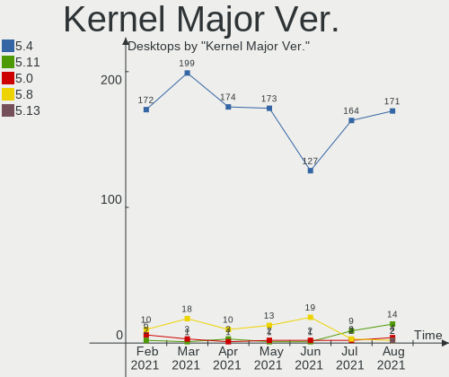
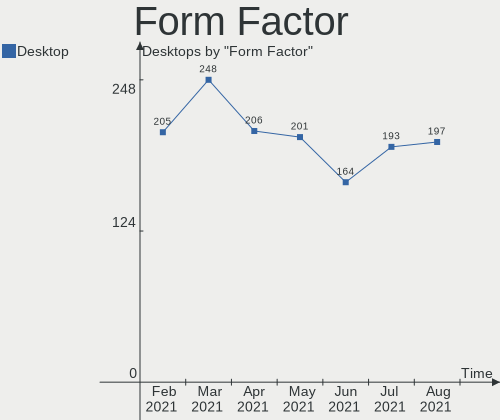
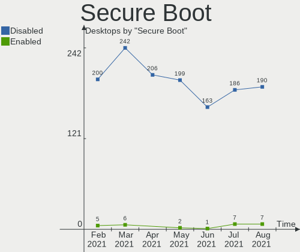
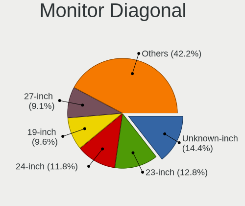
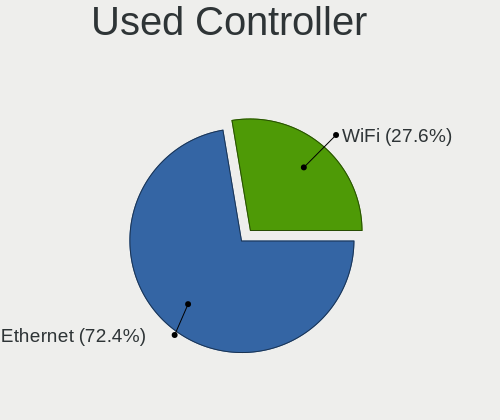

Mint Hardware Trends (Desktop)
------------------------------

A project to identify most popular hardware characteristics and track their change
over time based on data collected by Mint users at https://Linux-Hardware.org.

Anyone can contribute to the study by uploading probes of their computers by
the [hw-probe](https://github.com/linuxhw/hw-probe) tool:

    sudo hw-probe -all -upload

Full-feature report is available here: https://linux-hardware.org/?view=trends&formfactor=desktop

Period: Jan, 2020.

Contents
--------

- [ OS                       ](#os)
- [ OS Family                ](#os-family)
- [ Kernel                   ](#kernel)
- [ Kernel Family            ](#kernel-family)
- [ Kernel Major Ver.        ](#kernel-major-ver)
- [ Arch                     ](#arch)
- [ DE                       ](#de)
- [ Display Server           ](#display-server)
- [ OS Lang                  ](#os-lang)
- [ Boot Mode                ](#boot-mode)
- [ Filesystem               ](#filesystem)
- [ Dual Boot with Linux     ](#dual-boot-with-linux)
- [ Dual Boot (Win)          ](#dual-boot-win)
- [ Country                  ](#country)
- [ City                     ](#city)
- [ Vendor                   ](#vendor)
- [ Model                    ](#model)
- [ Model Family             ](#model-family)
- [ MFG Year                 ](#mfg-year)
- [ Form Factor              ](#form-factor)
- [ Secure Boot              ](#secure-boot)
- [ Coreboot                 ](#coreboot)
- [ RAM Size                 ](#ram-size)
- [ RAM Used                 ](#ram-used)
- [ Drive Vendor             ](#drive-vendor)
- [ Drive Model              ](#drive-model)
- [ Drive Kind               ](#drive-kind)
- [ Drive Connector          ](#drive-connector)
- [ Drive Size               ](#drive-size)
- [ Space Total              ](#space-total)
- [ Space Used               ](#space-used)
- [ Malfunc. Drives          ](#malfunc-drives)
- [ Malfunc. Drive Vendor    ](#malfunc-drive-vendor)
- [ Malfunc. Drive Kind      ](#malfunc-drive-kind)
- [ Failed Drives            ](#failed-drives)
- [ Failed Drive Vendor      ](#failed-drive-vendor)
- [ Drive Status             ](#drive-status)
- [ CPU Vendor               ](#cpu-vendor)
- [ CPU Model                ](#cpu-model)
- [ CPU Model Family         ](#cpu-model-family)
- [ CPU Cores                ](#cpu-cores)
- [ CPU Sockets              ](#cpu-sockets)
- [ CPU Threads              ](#cpu-threads)
- [ CPU Op-Modes             ](#cpu-op-modes)
- [ CPU Microarch            ](#cpu-microarch)
- [ CPU Microcode            ](#cpu-microcode)
- [ GPU Vendor               ](#gpu-vendor)
- [ GPU Model                ](#gpu-model)
- [ GPU Combo                ](#gpu-combo)
- [ GPU Driver               ](#gpu-driver)
- [ GPU Memory               ](#gpu-memory)
- [ Monitor Vendor           ](#monitor-vendor)
- [ Monitor Model            ](#monitor-model)
- [ Monitor Resolution       ](#monitor-resolution)
- [ Monitor Diagonal         ](#monitor-diagonal)
- [ Monitor Width            ](#monitor-width)
- [ Aspect Ratio             ](#aspect-ratio)
- [ Monitor Area             ](#monitor-area)
- [ Pixel Density            ](#pixel-density)
- [ Multiple Monitors        ](#multiple-monitors)
- [ Net Controller Vendor    ](#net-controller-vendor)
- [ Net Controller Model     ](#net-controller-model)
- [ Net Controller Kind      ](#net-controller-kind)
- [ Used Controller          ](#used-controller)
- [ NICs                     ](#nics)
- [ Unsupported Devices      ](#unsupported-devices)
- [ Unsupported Device Types ](#unsupported-device-types)

OS
--

Installed operating systems

| Name      | Computers | Percent |
|-----------|-----------|---------|
| Mint 19.3 | 76        | 70.37%  |
| Mint 19.1 | 12        | 11.11%  |
| Mint 19.2 | 10        | 9.26%   |
| Mint 19   | 5         | 4.63%   |
| Mint 18.3 | 5         | 4.63%   |

OS Family
---------

OS without a version

| Name | Computers | Percent |
|------|-----------|---------|
| Mint | 108       | 100%    |

Kernel
------

Version of the Linux kernel

| Version                   | Computers | Percent |
|---------------------------|-----------|---------|
| 5.0.0-37-generic          | 29        | 26.85%  |
| 5.3.0-26-generic          | 27        | 25%     |
| 4.15.0-74-generic         | 22        | 20.37%  |
| 5.3.0-24-generic          | 5         | 4.63%   |
| 5.0.0-32-generic          | 5         | 4.63%   |
| 5.3.0-28-generic          | 4         | 3.7%    |
| 4.15.0-72-generic         | 4         | 3.7%    |
| 4.15.0-54-generic         | 4         | 3.7%    |
| 5.4.0-13.3-liquorix-amd64 | 1         | 0.93%   |
| 5.3.6-050306-generic      | 1         | 0.93%   |
| 4.4.0-173-generic         | 1         | 0.93%   |
| 4.15.0-76-generic         | 1         | 0.93%   |
| 4.15.0-65-generic         | 1         | 0.93%   |
| 4.15.0-47-generic         | 1         | 0.93%   |
| 4.15.0-20-generic         | 1         | 0.93%   |
| 4.10.0-38-generic         | 1         | 0.93%   |

Kernel Family
-------------

Linux kernel without a distro release

| Version | Computers | Percent |
|---------|-----------|---------|
| 5.3.0   | 36        | 33.33%  |
| 5.0.0   | 34        | 31.48%  |
| 4.15.0  | 34        | 31.48%  |
| 5.4.0   | 1         | 0.93%   |
| 5.3.6   | 1         | 0.93%   |
| 4.4.0   | 1         | 0.93%   |
| 4.10.0  | 1         | 0.93%   |

Kernel Major Ver.
-----------------

Linux kernel major version

| Version | Computers | Percent |
|---------|-----------|---------|
| 5.3     | 37        | 34.26%  |
| 5.0     | 34        | 31.48%  |
| 4.15    | 34        | 31.48%  |
| 5.4     | 1         | 0.93%   |
| 4.4     | 1         | 0.93%   |
| 4.10    | 1         | 0.93%   |

Arch
----

OS architecture (x86_64, i586, etc.)

| Name   | Computers | Percent |
|--------|-----------|---------|
| x86_64 | 101       | 93.52%  |
| i686   | 7         | 6.48%   |

DE
--

Desktop Environment

| Name       | Computers | Percent |
|------------|-----------|---------|
| X-Cinnamon | 62        | 57.41%  |
| MATE       | 19        | 17.59%  |
| XFCE       | 11        | 10.19%  |
| Cinnamon   | 11        | 10.19%  |
| Unknown    | 5         | 4.63%   |

Display Server
--------------

X11 or Wayland

| Name    | Computers | Percent |
|---------|-----------|---------|
| X11     | 87        | 80.56%  |
| Unknown | 21        | 19.44%  |

OS Lang
-------

Language

| Lang    | Computers | Percent |
|---------|-----------|---------|
| en_US   | 20        | 18.52%  |
| de_DE   | 19        | 17.59%  |
| pt_BR   | 9         | 8.33%   |
| en_CA   | 7         | 6.48%   |
| Unknown | 7         | 6.48%   |
| ru_RU   | 6         | 5.56%   |
| pl_PL   | 4         | 3.7%    |
| en_AU   | 4         | 3.7%    |
| pt_PT   | 3         | 2.78%   |
| it_IT   | 3         | 2.78%   |
| es_ES   | 3         | 2.78%   |
| cs_CZ   | 3         | 2.78%   |
| sv_SE   | 2         | 1.85%   |
| fr_CA   | 2         | 1.85%   |
| en_GB   | 2         | 1.85%   |
| ca_ES   | 2         | 1.85%   |
| C       | 2         | 1.85%   |
| zh_CN   | 1         | 0.93%   |
| sv_FI   | 1         | 0.93%   |
| nl_NL   | 1         | 0.93%   |
| fr_FR   | 1         | 0.93%   |
| fr_BE   | 1         | 0.93%   |
| es_PE   | 1         | 0.93%   |
| es_CL   | 1         | 0.93%   |
| es_AR   | 1         | 0.93%   |
| de_CH   | 1         | 0.93%   |
| de_AT   | 1         | 0.93%   |

Boot Mode
---------

EFI or BIOS

| Mode | Computers | Percent |
|------|-----------|---------|
| BIOS | 79        | 73.15%  |
| EFI  | 29        | 26.85%  |

Filesystem
----------

Type of filesystem

| Type    | Computers | Percent |
|---------|-----------|---------|
| Ext4    | 106       | 98.15%  |
| Overlay | 1         | 0.93%   |
| Btrfs   | 1         | 0.93%   |

Dual Boot with Linux
--------------------

Hosting more than one Linux

| Dual boot | Computers | Percent |
|-----------|-----------|---------|
| No        | 104       | 96.3%   |
| Yes       | 4         | 3.7%    |

Dual Boot (Win)
---------------

Hosting Linux and Windows

| Dual boot | Computers | Percent |
|-----------|-----------|---------|
| No        | 95        | 87.96%  |
| Yes       | 13        | 12.04%  |

Country
-------

Geographic location (country)

| Country        | Computers | Percent |
|----------------|-----------|---------|
| Germany        | 20        | 18.52%  |
| USA            | 15        | 13.89%  |
| Canada         | 10        | 9.26%   |
| Brazil         | 10        | 9.26%   |
| Spain          | 5         | 4.63%   |
| Russia         | 5         | 4.63%   |
| Poland         | 4         | 3.7%    |
| France         | 4         | 3.7%    |
| Australia      | 4         | 3.7%    |
| Italy          | 3         | 2.78%   |
| Czech Republic | 3         | 2.78%   |
| Ukraine        | 2         | 1.85%   |
| Thailand       | 2         | 1.85%   |
| Switzerland    | 2         | 1.85%   |
| Netherlands    | 2         | 1.85%   |
| UK             | 1         | 0.93%   |
| Sweden         | 1         | 0.93%   |
| Portugal       | 1         | 0.93%   |
| Peru           | 1         | 0.93%   |
| New Zealand    | 1         | 0.93%   |
| Latvia         | 1         | 0.93%   |
| Ireland        | 1         | 0.93%   |
| Hungary        | 1         | 0.93%   |
| Greece         | 1         | 0.93%   |
| Finland        | 1         | 0.93%   |
| Denmark        | 1         | 0.93%   |
| China          | 1         | 0.93%   |
| Chile          | 1         | 0.93%   |
| Belgium        | 1         | 0.93%   |
| Belarus        | 1         | 0.93%   |
| Austria        | 1         | 0.93%   |
| Argentina      | 1         | 0.93%   |

City
----

Geographic location (city)

| City                           | Computers | Percent |
|--------------------------------|-----------|---------|
| Zelenec                        | 2         | 1.85%   |
| Ottawa                         | 2         | 1.85%   |
| Milton                         | 2         | 1.85%   |
| Dortmund                       | 2         | 1.85%   |
| Digne-les-Bains                | 2         | 1.85%   |
| Barcelona                      | 2         | 1.85%   |
| Bangkok                        | 2         | 1.85%   |
| Zurich                         | 1         | 0.93%   |
| Warsaw                         | 1         | 0.93%   |
| Vladivostok                    | 1         | 0.93%   |
| Vladimir                       | 1         | 0.93%   |
| Valladolid                     | 1         | 0.93%   |
| Tuttlingen                     | 1         | 0.93%   |
| Turin                          | 1         | 0.93%   |
| Trappes                        | 1         | 0.93%   |
| Toronto                        | 1         | 0.93%   |
| Thessaloniki                   | 1         | 0.93%   |
| São Paulo                     | 1         | 0.93%   |
| South Bend                     | 1         | 0.93%   |
| Solingen                       | 1         | 0.93%   |
| Siemkowice                     | 1         | 0.93%   |
| Secaucus                       | 1         | 0.93%   |
| Schmalkalden                   | 1         | 0.93%   |
| Saraland                       | 1         | 0.93%   |
| Sao Sebastiao de Lagoa de Roca | 1         | 0.93%   |
| Santo André                   | 1         | 0.93%   |
| Santiago                       | 1         | 0.93%   |
| San Francisco                  | 1         | 0.93%   |
| Salford                        | 1         | 0.93%   |
| Saint-Pierre-en-Faucigny       | 1         | 0.93%   |
| Saguenay                       | 1         | 0.93%   |
| Rosario                        | 1         | 0.93%   |
| Riga                           | 1         | 0.93%   |
| Red Lion                       | 1         | 0.93%   |
| Québec                        | 1         | 0.93%   |
| Pickering                      | 1         | 0.93%   |
| Perm                           | 1         | 0.93%   |
| Pardubice                      | 1         | 0.93%   |
| Owasso                         | 1         | 0.93%   |
| Orlando                        | 1         | 0.93%   |
| Odense                         | 1         | 0.93%   |
| Niesky                         | 1         | 0.93%   |
| Naples                         | 1         | 0.93%   |
| Moutier                        | 1         | 0.93%   |
| Minsk                          | 1         | 0.93%   |
| Milanówek                     | 1         | 0.93%   |
| Mijdrecht                      | 1         | 0.93%   |
| Miami                          | 1         | 0.93%   |
| Manaus                         | 1         | 0.93%   |
| Madrid                         | 1         | 0.93%   |
| Lübeck                        | 1         | 0.93%   |
| Long Beach                     | 1         | 0.93%   |
| Londrina                       | 1         | 0.93%   |
| Liège                         | 1         | 0.93%   |
| Lima                           | 1         | 0.93%   |
| Langley                        | 1         | 0.93%   |
| Lajeado                        | 1         | 0.93%   |
| Kungsoer                       | 1         | 0.93%   |
| Kirov                          | 1         | 0.93%   |
| Kharkiv                        | 1         | 0.93%   |

Vendor
------

Motherboard manufacturer

| Name                | Computers | Percent |
|---------------------|-----------|---------|
| ASUSTek Computer    | 33        | 30.56%  |
| Gigabyte Technology | 15        | 13.89%  |
| MSI                 | 12        | 11.11%  |
| ASRock              | 8         | 7.41%   |
| Dell                | 6         | 5.56%   |
| Hewlett-Packard     | 5         | 4.63%   |
| Acer                | 5         | 4.63%   |
| ECS                 | 4         | 3.7%    |
| Medion              | 3         | 2.78%   |
| Intel               | 3         | 2.78%   |
| Fujitsu Siemens     | 3         | 2.78%   |
| Lenovo              | 2         | 1.85%   |
| Biostar             | 2         | 1.85%   |
| XFX                 | 1         | 0.93%   |
| WinFast             | 1         | 0.93%   |
| Shuttle             | 1         | 0.93%   |
| HARDKERNEL          | 1         | 0.93%   |
| Fujitsu             | 1         | 0.93%   |
| eMachines           | 1         | 0.93%   |
| Colorful Technology | 1         | 0.93%   |

Model
-----

Motherboard model

| Name                    | Computers | Percent |
|-------------------------|-----------|---------|
| All Series              | 6         | 5.56%   |
| MS-7C02                 | 2         | 1.85%   |
| M5A78L-M/USB3           | 2         | 1.85%   |
| ESPRIMO P5720           | 2         | 1.85%   |
| DQ35JO AAD82085-807     | 2         | 1.85%   |
| Z97M Pro4               | 1         | 0.93%   |
| XPS 8700                | 1         | 0.93%   |
| X58A-UD3R               | 1         | 0.93%   |
| X399 Taichi             | 1         | 0.93%   |
| X299 UD4 Pro            | 1         | 0.93%   |
| X170-WS ECC             | 1         | 0.93%   |
| WC910AA-ABZ HPE-120it   | 1         | 0.93%   |
| Vostro 270s             | 1         | 0.93%   |
| VM40B                   | 1         | 0.93%   |
| TUF GAMING X570-PLUS    | 1         | 0.93%   |
| ThinkCentre M58 7360CN3 | 1         | 0.93%   |
| TA970                   | 1         | 0.93%   |
| SH61R                   | 1         | 0.93%   |
| SCENIC P / SCENICO P    | 1         | 0.93%   |
| SABERTOOTH 990FX R2.0   | 1         | 0.93%   |
| ROG STRIX B450-F GAMING | 1         | 0.93%   |
| PRIME Z270M-PLUS        | 1         | 0.93%   |
| PRIME X470-PRO          | 1         | 0.93%   |
| PRIME A320M-K/BR        | 1         | 0.93%   |
| P9X79 DELUXE            | 1         | 0.93%   |
| P8Z77-V LK              | 1         | 0.93%   |
| P8Z68-V PRO             | 1         | 0.93%   |
| P8H77-V                 | 1         | 0.93%   |
| P8B75-M                 | 1         | 0.93%   |
| P5Q                     | 1         | 0.93%   |
| P5LD2-VM                | 1         | 0.93%   |
| P5G41T-M LX             | 1         | 0.93%   |
| P4P800-MX               | 1         | 0.93%   |
| P43DE                   | 1         | 0.93%   |
| OptiPlex GX620          | 1         | 0.93%   |
| OptiPlex GX270          | 1         | 0.93%   |
| OptiPlex 755            | 1         | 0.93%   |
| ODROID-H2               | 1         | 0.93%   |
| Nforce 680i LT          | 1         | 0.93%   |
| NF61V-M2                | 1         | 0.93%   |
| N3700-ITX               | 1         | 0.93%   |
| MS-7998                 | 1         | 0.93%   |
| MS-7823                 | 1         | 0.93%   |
| MS-7816                 | 1         | 0.93%   |
| MS-7693                 | 1         | 0.93%   |
| MS-7640                 | 1         | 0.93%   |
| MS-7589                 | 1         | 0.93%   |
| MS-7522                 | 1         | 0.93%   |
| MS-7366                 | 1         | 0.93%   |
| MS-7276                 | 1         | 0.93%   |
| MS-7255                 | 1         | 0.93%   |
| MD34185/2592            | 1         | 0.93%   |
| Maximus VIII RANGER     | 1         | 0.93%   |
| M5A97 LE R2.0           | 1         | 0.93%   |
| M5A78L-M PLUS/USB3      | 1         | 0.93%   |
| M4A78T-E                | 1         | 0.93%   |
| M3N-HD/HDMI             | 1         | 0.93%   |
| M2V                     | 1         | 0.93%   |
| M2A-VM HDMI             | 1         | 0.93%   |
| M11BB                   | 1         | 0.93%   |

Model Family
------------

Motherboard model prefix

| Name                         | Computers | Percent |
|------------------------------|-----------|---------|
| ASUS All                     | 6         | 5.56%   |
| Acer Aspire                  | 5         | 4.63%   |
| HP Compaq                    | 3         | 2.78%   |
| Dell OptiPlex                | 3         | 2.78%   |
| ASUS PRIME                   | 3         | 2.78%   |
| ASUS M5A78L-M                | 3         | 2.78%   |
| MSI MS-7C02                  | 2         | 1.85%   |
| Intel DQ35JO                 | 2         | 1.85%   |
| HP EliteDesk                 | 2         | 1.85%   |
| Fujitsu Siemens ESPRIMO      | 2         | 1.85%   |
| XFX Nforce                   | 1         | 0.93%   |
| WinFast 6100M2MA             | 1         | 0.93%   |
| Shuttle SH61R                | 1         | 0.93%   |
| MSI WC910AA-ABZ              | 1         | 0.93%   |
| MSI MS-7998                  | 1         | 0.93%   |
| MSI MS-7823                  | 1         | 0.93%   |
| MSI MS-7816                  | 1         | 0.93%   |
| MSI MS-7693                  | 1         | 0.93%   |
| MSI MS-7640                  | 1         | 0.93%   |
| MSI MS-7589                  | 1         | 0.93%   |
| MSI MS-7522                  | 1         | 0.93%   |
| MSI MS-7276                  | 1         | 0.93%   |
| MSI MS-7255                  | 1         | 0.93%   |
| Medion MS-7366               | 1         | 0.93%   |
| Medion MD34185               | 1         | 0.93%   |
| Medion AKOYA                 | 1         | 0.93%   |
| Lenovo ThinkCentre           | 1         | 0.93%   |
| Lenovo H420                  | 1         | 0.93%   |
| Intel DB75EN                 | 1         | 0.93%   |
| HARDKERNEL ODROID-H2         | 1         | 0.93%   |
| Gigabyte X58A-UD3R           | 1         | 0.93%   |
| Gigabyte X299                | 1         | 0.93%   |
| Gigabyte X170-WS             | 1         | 0.93%   |
| Gigabyte H81M-DS2            | 1         | 0.93%   |
| Gigabyte H67MA-USB3-B3       | 1         | 0.93%   |
| Gigabyte H61M-S1             | 1         | 0.93%   |
| Gigabyte H55M-UD2H           | 1         | 0.93%   |
| Gigabyte GA-890GPA-UD3H      | 1         | 0.93%   |
| Gigabyte GA-790FXTA-UD5      | 1         | 0.93%   |
| Gigabyte GA-78LMT-USB3       | 1         | 0.93%   |
| Gigabyte GA-73PVM-S2H        | 1         | 0.93%   |
| Gigabyte F2A85X-D3H          | 1         | 0.93%   |
| Gigabyte B365M               | 1         | 0.93%   |
| Gigabyte B250-HD3            | 1         | 0.93%   |
| Gigabyte AB350M-DS3H         | 1         | 0.93%   |
| Fujitsu Siemens SCENIC       | 1         | 0.93%   |
| Fujitsu ESPRIMO              | 1         | 0.93%   |
| eMachines EL1358G            | 1         | 0.93%   |
| ECS H61H2-MV                 | 1         | 0.93%   |
| ECS A960M-MV                 | 1         | 0.93%   |
| ECS A790GXM-A                | 1         | 0.93%   |
| ECS A780GM-A                 | 1         | 0.93%   |
| Dell XPS                     | 1         | 0.93%   |
| Dell Vostro                  | 1         | 0.93%   |
| Dell Inspiron                | 1         | 0.93%   |
| Colorful Technology C.Q1900M | 1         | 0.93%   |
| Biostar TA970                | 1         | 0.93%   |
| Biostar NF61V-M2             | 1         | 0.93%   |
| ASUS VM40B                   | 1         | 0.93%   |
| ASUS TUF                     | 1         | 0.93%   |

MFG Year
--------

Motherboard manufacture year

| Year | Computers | Percent |
|------|-----------|---------|
| 2014 | 14        | 12.96%  |
| 2008 | 11        | 10.19%  |
| 2019 | 10        | 9.26%   |
| 2013 | 10        | 9.26%   |
| 2010 | 10        | 9.26%   |
| 2018 | 9         | 8.33%   |
| 2015 | 8         | 7.41%   |
| 2012 | 7         | 6.48%   |
| 2011 | 6         | 5.56%   |
| 2009 | 5         | 4.63%   |
| 2017 | 4         | 3.7%    |
| 2016 | 4         | 3.7%    |
| 2006 | 4         | 3.7%    |
| 2007 | 3         | 2.78%   |
| 2005 | 2         | 1.85%   |
| 2004 | 1         | 0.93%   |

Form Factor
-----------

Physical design of the computer

| Name    | Computers | Percent |
|---------|-----------|---------|
| Desktop | 108       | 100%    |

Secure Boot
-----------

Enabled or disabled

| State    | Computers | Percent |
|----------|-----------|---------|
| Disabled | 79        | 73.15%  |
| Unknown  | 24        | 22.22%  |
| Enabled  | 5         | 4.63%   |

Coreboot
--------

Have coreboot on board

| Used | Computers | Percent |
|------|-----------|---------|
| No   | 108       | 100%    |

RAM Size
--------

Total RAM memory

| Size in GB  | Computers | Percent |
|-------------|-----------|---------|
| 16.01-24.0  | 27        | 25%     |
| 8.01-16.0   | 25        | 23.15%  |
| 4.01-8.0    | 20        | 18.52%  |
| 3.01-4.0    | 17        | 15.74%  |
| 32.01-64.0  | 9         | 8.33%   |
| 1.01-2.0    | 6         | 5.56%   |
| 24.01-32.0  | 1         | 0.93%   |
| 2.01-3.0    | 1         | 0.93%   |
| 64.01-256.0 | 1         | 0.93%   |
| 0.01-1.0    | 1         | 0.93%   |

RAM Used
--------

Used RAM memory

| Used GB    | Computers | Percent |
|------------|-----------|---------|
| 1.01-2.0   | 44        | 40.74%  |
| 2.01-3.0   | 31        | 28.7%   |
| 3.01-4.0   | 14        | 12.96%  |
| 0.01-1.0   | 9         | 8.33%   |
| 4.01-8.0   | 5         | 4.63%   |
| 8.01-16.0  | 4         | 3.7%    |
| 24.01-32.0 | 1         | 0.93%   |

Drive Vendor
------------

Hard drive vendors

| Vendor              | Computers | Drives | Percent |
|---------------------|-----------|--------|---------|
| WDC                 | 52        | 59     | 28.11%  |
| Samsung Electronics | 31        | 36     | 16.76%  |
| Seagate             | 26        | 32     | 14.05%  |
| Toshiba             | 13        | 13     | 7.03%   |
| Hitachi             | 9         | 10     | 4.86%   |
| Kingston            | 8         | 8      | 4.32%   |
| Crucial             | 6         | 6      | 3.24%   |
| SanDisk             | 4         | 4      | 2.16%   |
| Maxtor              | 3         | 3      | 1.62%   |
| A-DATA Technology   | 3         | 3      | 1.62%   |
| Phison              | 2         | 2      | 1.08%   |
| HGST                | 2         | 2      | 1.08%   |
| Hewlett-Packard     | 2         | 2      | 1.08%   |
| Generic             | 2         | 2      | 1.08%   |
| Corsair             | 2         | 2      | 1.08%   |
| China               | 2         | 2      | 1.08%   |
| WD MediaMax         | 1         | 1      | 0.54%   |
| Team                | 1         | 1      | 0.54%   |
| SPCC                | 1         | 1      | 0.54%   |
| SDLFNDAR            | 1         | 1      | 0.54%   |
| PNY                 | 1         | 1      | 0.54%   |
| OCZ-VERTEX3         | 1         | 1      | 0.54%   |
| Micron Technology   | 1         | 1      | 0.54%   |
| MARVELL             | 1         | 1      | 0.54%   |
| LaCie               | 1         | 1      | 0.54%   |
| Kingchuxing         | 1         | 1      | 0.54%   |
| JMicron             | 1         | 1      | 0.54%   |
| Intenso             | 1         | 1      | 0.54%   |
| Intel               | 1         | 1      | 0.54%   |
| HP SSD S            | 1         | 1      | 0.54%   |
| Fujitsu             | 1         | 1      | 0.54%   |
| EMTEC               | 1         | 1      | 0.54%   |
| ASMT                | 1         | 1      | 0.54%   |
| Apple               | 1         | 1      | 0.54%   |

Drive Model
-----------

Hard drive models

| Model                        | Computers | Percent |
|------------------------------|-----------|---------|
| SSD 850 EVO 250GB            | 5         | 2.45%   |
| DT01ACA100 1TB               | 4         | 1.96%   |
| WD10EZEX-21WN4A0 1TB         | 3         | 1.47%   |
| WD10EZEX-08WN4A0 1TB         | 3         | 1.47%   |
| SV300S37A120G 120GB SSD      | 3         | 1.47%   |
| ST3500418AS 500GB            | 3         | 1.47%   |
| SSD 860 EVO 250GB            | 3         | 1.47%   |
| SSD 850 EVO 500GB            | 3         | 1.47%   |
| DT01ACA200 2TB               | 3         | 1.47%   |
| WD30EFRX-68EUZN0 3TB         | 2         | 0.98%   |
| WD20EFRX-68EUZN0 2TB         | 2         | 0.98%   |
| WD1600AAJS-00V4A0 160GB      | 2         | 0.98%   |
| WD10JPVX-22JC3T0 1TB         | 2         | 0.98%   |
| WD10EZEX-21M2NA0 1TB         | 2         | 0.98%   |
| WD10EZEX-00WN4A0 1TB         | 2         | 0.98%   |
| WD10EZEX-00BN5A0 1TB         | 2         | 0.98%   |
| ST500DM002-1BD142 500GB      | 2         | 0.98%   |
| ST3160815AS 160GB            | 2         | 0.98%   |
| ST3000DM001-1CH166 3TB       | 2         | 0.98%   |
| SSD 840 EVO 250GB            | 2         | 0.98%   |
| SP1603C 160GB                | 2         | 0.98%   |
| SD/MMC/MS PRO 31GB           | 2         | 0.98%   |
| HDWD110 1TB                  | 2         | 0.98%   |
| HD502HJ 500GB                | 2         | 0.98%   |
| HD502HI 500GB                | 2         | 0.98%   |
| X150 120GB                   | 1         | 0.49%   |
| WL750GSA3254G 750GB          | 1         | 0.49%   |
| WDS250G2B0A-00SM50 250GB SSD | 1         | 0.49%   |
| WDBNCE5000PNC 500GB SSD      | 1         | 0.49%   |
| WD800JD-55JRC0 80GB          | 1         | 0.49%   |
| WD6400AACS-00M3B0 640GB      | 1         | 0.49%   |
| WD6400AACS-00G8B1 640GB      | 1         | 0.49%   |
| WD5002AALX-00J37A0 500GB     | 1         | 0.49%   |
| WD5000BUCT-63PUZY0 500GB     | 1         | 0.49%   |
| WD5000AZRX-00A8LB0 500GB     | 1         | 0.49%   |
| WD5000AAKX-083CA1 500GB      | 1         | 0.49%   |
| WD5000AAKX-001CA0 500GB      | 1         | 0.49%   |
| WD5000AAKS-75A7B2 500GB      | 1         | 0.49%   |
| WD40EZRZ-00WN9B0 4TB         | 1         | 0.49%   |
| WD3200JS-00PDB0 320GB        | 1         | 0.49%   |
| WD3200BEKT-60V5T1 320GB      | 1         | 0.49%   |
| WD3200AVJS-63B6A0 320GB      | 1         | 0.49%   |
| WD3200AAJS-00YZCA0 320GB     | 1         | 0.49%   |
| WD2500BEKT-00PVMT0 250GB     | 1         | 0.49%   |
| WD2500AAJS-65B4A0 250GB      | 1         | 0.49%   |
| WD20EZRZ-00Z5HB0 2TB         | 1         | 0.49%   |
| WD2002FAEX-00MJRA0 2TB       | 1         | 0.49%   |
| WD1600JB-00GVA0 160GB        | 1         | 0.49%   |
| WD1600HLFS-75G6U1 160GB      | 1         | 0.49%   |
| WD1600BEVT-22ZCT0 160GB      | 1         | 0.49%   |
| WD1600AAJS-65WAA0 160GB      | 1         | 0.49%   |
| WD1600AAJS-22WAA0 160GB      | 1         | 0.49%   |
| WD1600AAJS-08L7A0 160GB      | 1         | 0.49%   |
| WD1200BEVS-60UST0 120GB      | 1         | 0.49%   |
| WD10EZRX-00L4HB0 1TB         | 1         | 0.49%   |
| WD10EZRX-00D8PB0 1TB         | 1         | 0.49%   |
| WD10EZRX-00A3KB0 1TB         | 1         | 0.49%   |
| WD10EZEX-75ZF5A0 1TB         | 1         | 0.49%   |
| WD10EZEX-75WN4A0 1TB         | 1         | 0.49%   |
| WD10EZEX-60WN4A0 1TB         | 1         | 0.49%   |

Drive Kind
----------

HDD or SSD

| Kind    | Computers | Drives | Percent |
|---------|-----------|--------|---------|
| HDD     | 86        | 135    | 58.9%   |
| SSD     | 46        | 55     | 31.51%  |
| Unknown | 10        | 10     | 6.85%   |
| NVMe    | 4         | 4      | 2.74%   |

Drive Connector
---------------

SATA, SAS, NVMe, etc.

| Type | Computers | Drives | Percent |
|------|-----------|--------|---------|
| SATA | 105       | 191    | 88.98%  |
| SAS  | 9         | 9      | 7.63%   |
| NVMe | 4         | 4      | 3.39%   |

Drive Size
----------

Size of hard drive

| Size in TB | Computers | Drives | Percent |
|------------|-----------|--------|---------|
| 0.01-0.5   | 87        | 127    | 56.13%  |
| 0.51-1.0   | 44        | 51     | 28.39%  |
| 1.01-2.0   | 14        | 16     | 9.03%   |
| 2.01-3.0   | 7         | 7      | 4.52%   |
| 3.01-4.0   | 3         | 3      | 1.94%   |

Space Total
-----------

Amount of disk space available on the file system

| Size in GB     | Computers | Percent |
|----------------|-----------|---------|
| 101-250        | 35        | 32.41%  |
| 501-1000       | 21        | 19.44%  |
| 1001-2000      | 14        | 12.96%  |
| More than 3000 | 13        | 12.04%  |
| 251-500        | 13        | 12.04%  |
| 2001-3000      | 5         | 4.63%   |
| 51-100         | 5         | 4.63%   |
| 21-50          | 2         | 1.85%   |

Space Used
----------

Amount of used disk space

| Used GB        | Computers | Percent |
|----------------|-----------|---------|
| 21-50          | 23        | 21.3%   |
| 1-20           | 19        | 17.59%  |
| 101-250        | 16        | 14.81%  |
| 251-500        | 14        | 12.96%  |
| 501-1000       | 10        | 9.26%   |
| 51-100         | 9         | 8.33%   |
| More than 3000 | 7         | 6.48%   |
| 2001-3000      | 5         | 4.63%   |
| 1001-2000      | 5         | 4.63%   |

Malfunc. Drives
---------------

Drive models with a malfunction

| Model         | Computers | Drives | Percent |
|---------------|-----------|--------|---------|
| HD502HI 500GB | 1         | 1      | 50%     |
| HD155UI 1TB   | 1         | 1      | 50%     |

Malfunc. Drive Vendor
---------------------

Vendors of faulty drives

| Vendor              | Computers | Drives | Percent |
|---------------------|-----------|--------|---------|
| Samsung Electronics | 1         | 2      | 100%    |

Malfunc. Drive Kind
-------------------

Kinds of faulty drives

| Kind | Computers | Drives | Percent |
|------|-----------|--------|---------|
| HDD  | 1         | 2      | 100%    |

Failed Drives
-------------

Failed drive models

Zero info for selected period =(

Failed Drive Vendor
-------------------

Failed drive vendors

Zero info for selected period =(

Drive Status
------------

Number of failed and malfunc. drives

| Status   | Computers | Drives | Percent |
|----------|-----------|--------|---------|
| Detected | 94        | 172    | 86.24%  |
| Works    | 14        | 30     | 12.84%  |
| Malfunc  | 1         | 2      | 0.92%   |

CPU Vendor
----------

Processor vendors

| Vendor | Computers | Percent |
|--------|-----------|---------|
| Intel  | 72        | 66.67%  |
| AMD    | 36        | 33.33%  |

CPU Model
---------

Processor models

| Model                                       | Computers | Percent |
|---------------------------------------------|-----------|---------|
| Intel Core i7-4790 CPU @ 3.60GHz            | 3         | 2.78%   |
| Intel Core i3-2120 CPU @ 3.30GHz            | 3         | 2.78%   |
| AMD FX-6300 Six-Core Processor              | 3         | 2.78%   |
| AMD FX-4300 Quad-Core Processor             | 3         | 2.78%   |
| Intel Pentium CPU G2030 @ 3.00GHz           | 2         | 1.85%   |
| Intel Pentium 4 CPU 2.80GHz                 | 2         | 1.85%   |
| Intel Core i7-6700K CPU @ 4.00GHz           | 2         | 1.85%   |
| Intel Core i7-4770K CPU @ 3.50GHz           | 2         | 1.85%   |
| Intel Core i5-4460 CPU @ 3.20GHz            | 2         | 1.85%   |
| Intel Core i5-3470 CPU @ 3.20GHz            | 2         | 1.85%   |
| Intel Core 2 Quad CPU Q9550 @ 2.83GHz       | 2         | 1.85%   |
| Intel Core 2 Duo CPU E8400 @ 3.00GHz        | 2         | 1.85%   |
| Intel Celeron CPU J1900 @ 1.99GHz           | 2         | 1.85%   |
| AMD Ryzen 7 2700X Eight-Core Processor      | 2         | 1.85%   |
| AMD Ryzen 5 2600 Six-Core Processor         | 2         | 1.85%   |
| AMD FX-8350 Eight-Core Processor            | 2         | 1.85%   |
| AMD Athlon 64 X2 Dual Core Processor 4200+  | 2         | 1.85%   |
| Intel Xeon CPU X5650 @ 2.67GHz              | 1         | 0.93%   |
| Intel Xeon CPU X3450 @ 2.67GHz              | 1         | 0.93%   |
| Intel Xeon CPU E3-1275 v6 @ 3.80GHz         | 1         | 0.93%   |
| Intel Xeon CPU E3-1245 V2 @ 3.40GHz         | 1         | 0.93%   |
| Intel Pentium Dual-Core CPU E6600 @ 3.06GHz | 1         | 0.93%   |
| Intel Pentium Dual-Core CPU E6500 @ 2.93GHz | 1         | 0.93%   |
| Intel Pentium Dual-Core CPU E5400 @ 2.70GHz | 1         | 0.93%   |
| Intel Pentium Dual CPU E2220 @ 2.40GHz      | 1         | 0.93%   |
| Intel Pentium Dual CPU E2200 @ 2.20GHz      | 1         | 0.93%   |
| Intel Pentium D CPU 3.00GHz                 | 1         | 0.93%   |
| Intel Pentium D CPU 2.80GHz                 | 1         | 0.93%   |
| Intel Pentium CPU N3700 @ 1.60GHz           | 1         | 0.93%   |
| Intel Pentium CPU J3710 @ 1.60GHz           | 1         | 0.93%   |
| Intel Pentium CPU G4560 @ 3.50GHz           | 1         | 0.93%   |
| Intel Core i7-7800X CPU @ 3.50GHz           | 1         | 0.93%   |
| Intel Core i7-7700 CPU @ 3.60GHz            | 1         | 0.93%   |
| Intel Core i7-4790K CPU @ 4.00GHz           | 1         | 0.93%   |
| Intel Core i7-4770 CPU @ 3.40GHz            | 1         | 0.93%   |
| Intel Core i7-3820 CPU @ 3.60GHz            | 1         | 0.93%   |
| Intel Core i7-3770 CPU @ 3.40GHz            | 1         | 0.93%   |
| Intel Core i7-2600K CPU @ 3.40GHz           | 1         | 0.93%   |
| Intel Core i7 CPU 930 @ 2.80GHz             | 1         | 0.93%   |
| Intel Core i7 CPU 860 @ 2.80GHz             | 1         | 0.93%   |
| Intel Core i5-9400 CPU @ 2.90GHz            | 1         | 0.93%   |
| Intel Core i5-7400 CPU @ 3.00GHz            | 1         | 0.93%   |
| Intel Core i5-6400 CPU @ 2.70GHz            | 1         | 0.93%   |
| Intel Core i5-4690 CPU @ 3.50GHz            | 1         | 0.93%   |
| Intel Core i5-4670 CPU @ 3.40GHz            | 1         | 0.93%   |
| Intel Core i5-4570S CPU @ 2.90GHz           | 1         | 0.93%   |
| Intel Core i5-3570K CPU @ 3.40GHz           | 1         | 0.93%   |
| Intel Core i5-3450S CPU @ 2.80GHz           | 1         | 0.93%   |
| Intel Core i5 CPU 650 @ 3.20GHz             | 1         | 0.93%   |
| Intel Core i3-9100 CPU @ 3.60GHz            | 1         | 0.93%   |
| Intel Core i3-7100 CPU @ 3.90GHz            | 1         | 0.93%   |
| Intel Core i3-3220 CPU @ 3.30GHz            | 1         | 0.93%   |
| Intel Core i3-2125 CPU @ 3.30GHz            | 1         | 0.93%   |
| Intel Core i3 CPU 530 @ 2.93GHz             | 1         | 0.93%   |
| Intel Core 2 Quad CPU Q8200 @ 2.33GHz       | 1         | 0.93%   |
| Intel Core 2 Quad CPU Q6700 @ 2.66GHz       | 1         | 0.93%   |
| Intel Core 2 Quad CPU Q6600 @ 2.40GHz       | 1         | 0.93%   |
| Intel Core 2 Duo CPU E7500 @ 2.93GHz        | 1         | 0.93%   |
| Intel Core 2 Duo CPU E7400 @ 2.80GHz        | 1         | 0.93%   |
| Intel Core 2 CPU 6400 @ 2.13GHz             | 1         | 0.93%   |

CPU Model Family
----------------

Processor model prefix

| Model                   | Computers | Percent |
|-------------------------|-----------|---------|
| Intel Core i7           | 16        | 14.81%  |
| Intel Core i5           | 13        | 12.04%  |
| AMD FX                  | 10        | 9.26%   |
| Intel Core i3           | 8         | 7.41%   |
| Intel Celeron           | 6         | 5.56%   |
| Intel Pentium           | 5         | 4.63%   |
| Intel Core 2 Quad       | 5         | 4.63%   |
| AMD Athlon 64 X2        | 5         | 4.63%   |
| Intel Xeon              | 4         | 3.7%    |
| Intel Core 2 Duo        | 4         | 3.7%    |
| Intel Pentium Dual-Core | 3         | 2.78%   |
| AMD Ryzen 7             | 3         | 2.78%   |
| AMD Ryzen 5             | 3         | 2.78%   |
| AMD Phenom II X4        | 3         | 2.78%   |
| AMD A10                 | 3         | 2.78%   |
| Intel Pentium Dual      | 2         | 1.85%   |
| Intel Pentium D         | 2         | 1.85%   |
| Intel Pentium 4         | 2         | 1.85%   |
| Intel Core 2            | 2         | 1.85%   |
| Other                   | 1         | 0.93%   |
| AMD Sempron             | 1         | 0.93%   |
| AMD Ryzen Threadripper  | 1         | 0.93%   |
| AMD Phenom II X6        | 1         | 0.93%   |
| AMD Phenom II X3        | 1         | 0.93%   |
| AMD Phenom II X2        | 1         | 0.93%   |
| AMD Athlon Dual Core    | 1         | 0.93%   |
| AMD Athlon              | 1         | 0.93%   |
| AMD A8                  | 1         | 0.93%   |

CPU Cores
---------

Number of processor cores

| Number | Computers | Percent |
|--------|-----------|---------|
| 4      | 48        | 44.44%  |
| 2      | 40        | 37.04%  |
| 6      | 7         | 6.48%   |
| 1      | 5         | 4.63%   |
| 3      | 4         | 3.7%    |
| 8      | 3         | 2.78%   |
| 16     | 1         | 0.93%   |

CPU Sockets
-----------

Number of sockets

| Number | Computers | Percent |
|--------|-----------|---------|
| 1      | 108       | 100%    |

CPU Threads
-----------

Threads per core (Hyper-Threading)

| Number | Computers | Percent |
|--------|-----------|---------|
| 1      | 58        | 53.7%   |
| 2      | 50        | 46.3%   |

CPU Op-Modes
------------

CPU Operation Modes (32-bit, 64-bit)

| Op mode        | Computers | Percent |
|----------------|-----------|---------|
| 32-bit, 64-bit | 106       | 98.15%  |
| 32-bit         | 2         | 1.85%   |

CPU Microarch
-------------

Microarchitecture

| Name          | Computers | Percent |
|---------------|-----------|---------|
| Core          | 16        | 14.81%  |
| Haswell       | 13        | 12.04%  |
| Piledriver    | 12        | 11.11%  |
| Skylake       | 11        | 10.19%  |
| IvyBridge     | 10        | 9.26%   |
| K8 Hammer     | 7         | 6.48%   |
| K10           | 7         | 6.48%   |
| SandyBridge   | 6         | 5.56%   |
| NetBurst      | 5         | 4.63%   |
| Zen+          | 4         | 3.7%    |
| Silvermont    | 4         | 3.7%    |
| Westmere      | 3         | 2.78%   |
| Nehalem       | 3         | 2.78%   |
| Zen 2         | 2         | 1.85%   |
| Zen           | 1         | 0.93%   |
| Steamroller   | 1         | 0.93%   |
| Jaguar        | 1         | 0.93%   |
| Goldmont plus | 1         | 0.93%   |
| Excavator     | 1         | 0.93%   |

CPU Microcode
-------------

Microcode number

| Number     | Computers | Percent |
|------------|-----------|---------|
| 0x306c3    | 12        | 11.11%  |
| Unknown    | 12        | 11.11%  |
| 0x06000852 | 10        | 9.26%   |
| 0x306a9    | 9         | 8.33%   |
| 0x1067a    | 9         | 8.33%   |
| 0x906e9    | 5         | 4.63%   |
| 0x206a7    | 4         | 3.7%    |
| 0x506e3    | 3         | 2.78%   |
| 0x0800820d | 3         | 2.78%   |
| 0x010000db | 3         | 2.78%   |
| 0xf29      | 2         | 1.85%   |
| 0x6fd      | 2         | 1.85%   |
| 0x6fb      | 2         | 1.85%   |
| 0x106e5    | 2         | 1.85%   |
| 0x08701013 | 2         | 1.85%   |
| 0x06001119 | 2         | 1.85%   |
| 0x010000c8 | 2         | 1.85%   |
| 0xf65      | 1         | 0.93%   |
| 0xf47      | 1         | 0.93%   |
| 0xf41      | 1         | 0.93%   |
| 0x906eb    | 1         | 0.93%   |
| 0x906ea    | 1         | 0.93%   |
| 0x706a1    | 1         | 0.93%   |
| 0x6f6      | 1         | 0.93%   |
| 0x50654    | 1         | 0.93%   |
| 0x406c4    | 1         | 0.93%   |
| 0x406c3    | 1         | 0.93%   |
| 0x30678    | 1         | 0.93%   |
| 0x30673    | 1         | 0.93%   |
| 0x206d7    | 1         | 0.93%   |
| 0x206c2    | 1         | 0.93%   |
| 0x20655    | 1         | 0.93%   |
| 0x20652    | 1         | 0.93%   |
| 0x106a5    | 1         | 0.93%   |
| 0x10677    | 1         | 0.93%   |
| 0x0800820b | 1         | 0.93%   |
| 0x08001137 | 1         | 0.93%   |
| 0x0700010f | 1         | 0.93%   |
| 0x0600611a | 1         | 0.93%   |
| 0x06003106 | 1         | 0.93%   |
| 0x010000dc | 1         | 0.93%   |

GPU Vendor
----------

Vendors of graphics cards

| Vendor | Computers | Percent |
|--------|-----------|---------|
| Nvidia | 53        | 48.62%  |
| AMD    | 34        | 31.19%  |
| Intel  | 22        | 20.18%  |

GPU Model
---------

Graphics card models

| Model                                                                              | Computers | Percent |
|------------------------------------------------------------------------------------|-----------|---------|
| GP107 [GeForce GTX 1050 Ti]                                                        | 8         | 7.02%   |
| Xeon E3-1200 v2/3rd Gen Core processor Graphics Controller                         | 5         | 4.39%   |
| Ellesmere [Radeon RX 470/480/570/570X/580/580X/590]                                | 5         | 4.39%   |
| GM204 [GeForce GTX 970]                                                            | 4         | 3.51%   |
| Xeon E3-1200 v3/4th Gen Core Processor Integrated Graphics Controller              | 3         | 2.63%   |
| Oland PRO [Radeon R7 240/340]                                                      | 3         | 2.63%   |
| GK208B [GeForce GT 710]                                                            | 3         | 2.63%   |
| GF119 [GeForce GT 610]                                                             | 3         | 2.63%   |
| GF108 [GeForce GT 730]                                                             | 3         | 2.63%   |
| 2nd Generation Core Processor Family Integrated Graphics Controller                | 3         | 2.63%   |
| Tobago PRO [Radeon R7 360 / R9 360 OEM]                                            | 2         | 1.75%   |
| RV710 [Radeon HD 4350/4550]                                                        | 2         | 1.75%   |
| RS690 [Radeon X1200]                                                               | 2         | 1.75%   |
| GP108 [GeForce GT 1030]                                                            | 2         | 1.75%   |
| GM200 [GeForce GTX 980 Ti]                                                         | 2         | 1.75%   |
| GM107 [GeForce GTX 750 Ti]                                                         | 2         | 1.75%   |
| G98 [GeForce 8400 GS Rev. 2]                                                       | 2         | 1.75%   |
| G70 [GeForce 7800 GT]                                                              | 2         | 1.75%   |
| Cedar [Radeon HD 5000/6000/7350/8350 Series]                                       | 2         | 1.75%   |
| Caicos [Radeon HD 6450/7450/8450 / R5 230 OEM]                                     | 2         | 1.75%   |
| Atom/Celeron/Pentium Processor x5-E8000/J3xxx/N3xxx Integrated Graphics Controller | 2         | 1.75%   |
| Atom Processor Z36xxx/Z37xxx Series Graphics & Display                             | 2         | 1.75%   |
| Vega 10 XL/XT [Radeon RX Vega 56/64]                                               | 1         | 0.88%   |
| UHD Graphics 605                                                                   | 1         | 0.88%   |
| TU116 [GeForce GTX 1660]                                                           | 1         | 0.88%   |
| TU104 [GeForce RTX 2080 SUPER]                                                     | 1         | 0.88%   |
| Tahiti XT [Radeon HD 7970/8970 OEM / R9 280X]                                      | 1         | 0.88%   |
| Tahiti PRO [Radeon HD 7950/8950 OEM / R9 280]                                      | 1         | 0.88%   |
| RV570 [Radeon X1950 GT] (Secondary)                                                | 1         | 0.88%   |
| RV570 [Radeon X1950 GT]                                                            | 1         | 0.88%   |
| RS780D [Radeon HD 3300]                                                            | 1         | 0.88%   |
| RS780 [Radeon HD 3200]                                                             | 1         | 0.88%   |
| RS482/RS485 [Radeon Xpress 1100/1150]                                              | 1         | 0.88%   |
| RS480 [Radeon Xpress 1150] (Secondary)                                             | 1         | 0.88%   |
| Richland [Radeon HD 8670D]                                                         | 1         | 0.88%   |
| Redwood PRO GL [FirePro V3800]                                                     | 1         | 0.88%   |
| Pitcairn XT [Radeon HD 7870 GHz Edition]                                           | 1         | 0.88%   |
| Oland XT [Radeon HD 8670 / R7 250/350]                                             | 1         | 0.88%   |
| NV44A [GeForce 6200]                                                               | 1         | 0.88%   |
| NV44 [GeForce 6200 SE TurboCache]                                                  | 1         | 0.88%   |
| Navi 10 [Radeon RX 5600 OEM/5600 XT / 5700/5700 XT]                                | 1         | 0.88%   |
| Kaveri [Radeon R7 Graphics]                                                        | 1         | 0.88%   |
| Kabini [Radeon HD 8400 / R3 Series]                                                | 1         | 0.88%   |
| GT215 [GeForce GT 240]                                                             | 1         | 0.88%   |
| GP106 [GeForce GTX 1060 6GB]                                                       | 1         | 0.88%   |
| GP104 [GeForce GTX 1080]                                                           | 1         | 0.88%   |
| GP104 [GeForce GTX 1070]                                                           | 1         | 0.88%   |
| GP102 [GeForce GTX 1080 Ti]                                                        | 1         | 0.88%   |
| GM206 [GeForce GTX 950]                                                            | 1         | 0.88%   |
| GM204 [GeForce GTX 980]                                                            | 1         | 0.88%   |
| GK208B [GeForce GT 730]                                                            | 1         | 0.88%   |
| GK208B [GeForce GT 720]                                                            | 1         | 0.88%   |
| GK107 [GeForce GTX 650]                                                            | 1         | 0.88%   |
| GF108 [GeForce GT 620]                                                             | 1         | 0.88%   |
| GF108 [GeForce GT 430]                                                             | 1         | 0.88%   |
| G96CGL [Quadro FX 580]                                                             | 1         | 0.88%   |
| G96C [GeForce 9500 GT]                                                             | 1         | 0.88%   |
| G86 [GeForce 8400 GS]                                                              | 1         | 0.88%   |
| G84 [GeForce 8600 GT]                                                              | 1         | 0.88%   |
| G72 [GeForce 7300 LE]                                                              | 1         | 0.88%   |

GPU Combo
---------

Combinations of graphics cards

| Name       | Computers | Percent |
|------------|-----------|---------|
| 1 x Nvidia | 50        | 46.3%   |
| 1 x AMD    | 32        | 29.63%  |
| 1 x Intel  | 21        | 19.44%  |
| 2 x Nvidia | 3         | 2.78%   |
| 2 x AMD    | 2         | 1.85%   |

GPU Driver
----------

Free vs proprietary

| Driver      | Computers | Percent |
|-------------|-----------|---------|
| Free        | 66        | 61.11%  |
| Proprietary | 37        | 34.26%  |
| Unknown     | 5         | 4.63%   |

GPU Memory
----------

Total video memory

| Size in GB | Computers | Percent |
|------------|-----------|---------|
| 0.01-0.5   | 24        | 22.22%  |
| 1.01-2.0   | 22        | 20.37%  |
| 3.01-4.0   | 19        | 17.59%  |
| Unknown    | 19        | 17.59%  |
| 0.51-1.0   | 12        | 11.11%  |
| 7.01-8.0   | 6         | 5.56%   |
| 5.01-6.0   | 4         | 3.7%    |
| 2.01-3.0   | 2         | 1.85%   |

Monitor Vendor
--------------

Monitor vendors

| Vendor                  | Computers | Percent |
|-------------------------|-----------|---------|
| Samsung Electronics     | 16        | 16.16%  |
| Goldstar                | 11        | 11.11%  |
| Dell                    | 11        | 11.11%  |
| Acer                    | 8         | 8.08%   |
| Hewlett-Packard         | 7         | 7.07%   |
| LG Electronics          | 6         | 6.06%   |
| Philips                 | 3         | 3.03%   |
| Fujitsu Siemens         | 3         | 3.03%   |
| BenQ                    | 3         | 3.03%   |
| Ancor Communications    | 3         | 3.03%   |
| ViewSonic               | 2         | 2.02%   |
| Unknown                 | 2         | 2.02%   |
| Sceptre Tech            | 2         | 2.02%   |
| Eizo                    | 2         | 2.02%   |
| AOC                     | 2         | 2.02%   |
| Westinghouse            | 1         | 1.01%   |
| Vizio                   | 1         | 1.01%   |
| Vestel                  | 1         | 1.01%   |
| Toshiba                 | 1         | 1.01%   |
| STN                     | 1         | 1.01%   |
| Sony                    | 1         | 1.01%   |
| Sharp                   | 1         | 1.01%   |
| Sceptre                 | 1         | 1.01%   |
| Plain Tree Systems      | 1         | 1.01%   |
| Panasonic               | 1         | 1.01%   |
| ONKYO                   | 1         | 1.01%   |
| NEC Computers           | 1         | 1.01%   |
| Lacie                   | 1         | 1.01%   |
| HannStar Display        | 1         | 1.01%   |
| HannStar                | 1         | 1.01%   |
| FUS                     | 1         | 1.01%   |
| Chi Mei Optoelectronics | 1         | 1.01%   |
| AGO                     | 1         | 1.01%   |

Monitor Model
-------------

Monitor models

| Model                                               | Computers | Percent |
|-----------------------------------------------------|-----------|---------|
| X223HQ ACR0098 1920x1080 470x270mm 21.3-inch        | 2         | 1.94%   |
| LCD Monitor SyncMaster 1920x1080                    | 2         | 1.94%   |
| GL2450H BNQ78A7 1920x1080 530x300mm 24.0-inch       | 2         | 1.94%   |
| XB270HU ACR0408 2560x1440 600x340mm 27.2-inch       | 1         | 0.97%   |
| w2408 HWP26CF 1920x1200 518x324mm 24.1-inch         | 1         | 0.97%   |
| W2253 GSM56DC 1920x1080 477x268mm 21.5-inch         | 1         | 0.97%   |
| VX2757 VSCF931 1920x1080 598x336mm 27.0-inch        | 1         | 0.97%   |
| VS248 ACI2498 1920x1080 531x299mm 24.0-inch         | 1         | 0.97%   |
| VA2216w SERIE VSC2920 1680x1050 465x291mm 21.6-inch | 1         | 0.97%   |
| V226HQL ACR0335 1920x1080 477x268mm 21.5-inch       | 1         | 0.97%   |
| U2715H DELD066 1920x1080 600x340mm 27.2-inch        | 1         | 0.97%   |
| U2312HM DEL4073 1920x1080 510x287mm 23.0-inch       | 1         | 0.97%   |
| TV TSB0100 1360x768 580x320mm 26.1-inch             | 1         | 0.97%   |
| TV SNY7A02 1360x768 576x324mm 26.0-inch             | 1         | 0.97%   |
| T24D391 SAM0B73 1920x1080 521x293mm 23.5-inch       | 1         | 0.97%   |
| SyncMaster SAM03E5 1680x1050 470x300mm 22.0-inch    | 1         | 0.97%   |
| SyncMaster SAM027F 1680x1050 474x296mm 22.0-inch    | 1         | 0.97%   |
| SyncMaster SAM00A3 1280x1024 338x270mm 17.0-inch    | 1         | 0.97%   |
| S24E500 SAM0D0F 1920x1080 521x293mm 23.5-inch       | 1         | 0.97%   |
| S24B150 SAM0983 1680x1050 520x290mm 23.4-inch       | 1         | 0.97%   |
| S2309W DELA041 1920x1080 509x286mm 23.0-inch        | 1         | 0.97%   |
| PHL 243V7 PHLC155 1920x1080 530x300mm 24.0-inch     | 1         | 0.97%   |
| P193WA ACR000C 1440x900 410x256mm 19.0-inch         | 1         | 0.97%   |
| N43 SPT110C 3840x2160 575x323mm 26.0-inch           | 1         | 0.97%   |
| Monitor PTS0899 1680x1050 474x296mm 22.0-inch       | 1         | 0.97%   |
| M550NV VIZ0063 1920x1080 1210x680mm 54.6-inch       | 1         | 0.97%   |
| LE1711 HWP2856 1280x960 340x270mm 17.1-inch         | 1         | 0.97%   |
| LCM-27w4 WDE2704 1280x1024 597x336mm 27.0-inch      | 1         | 0.97%   |
| LCD Monitor X22HG 3120x1050                         | 1         | 0.97%   |
| LCD Monitor U2515H 5120x1440                        | 1         | 0.97%   |
| LCD Monitor U2515H                                  | 1         | 0.97%   |
| LCD Monitor U2414H 3840x1080                        | 1         | 0.97%   |
| LCD Monitor U2414H                                  | 1         | 0.97%   |
| LCD Monitor U2412M 1920x1200                        | 1         | 0.97%   |
| LCD Monitor U2410 1920x1200                         | 1         | 0.97%   |
| LCD Monitor TV 1920x1080                            | 1         | 0.97%   |
| LCD Monitor SyncMaster 1680x1050                    | 1         | 0.97%   |
| LCD Monitor SyncMaster 1280x1024                    | 1         | 0.97%   |
| LCD Monitor Sharp LC-32LB150U 1920x1080             | 1         | 0.97%   |
| LCD Monitor SAM0C44 3840x2160 890x500mm 40.2-inch   | 1         | 0.97%   |
| LCD Monitor S27F350 1920x1080                       | 1         | 0.97%   |
| LCD Monitor S27A950D 1920x1080                      | 1         | 0.97%   |
| LCD Monitor S23A700 1920x1080                       | 1         | 0.97%   |
| LCD Monitor S19C150 1366x768                        | 1         | 0.97%   |
| LCD Monitor S/T 77/76DFX 1024x768                   | 1         | 0.97%   |
| LCD Monitor LG IPS FULLHD 1920x1080                 | 1         | 0.97%   |
| LCD Monitor L1740PQ 1280x1024                       | 1         | 0.97%   |
| LCD Monitor HF199H                                  | 1         | 0.97%   |
| LCD Monitor GSM580D 1920x1080 510x290mm 23.1-inch   | 1         | 0.97%   |
| LCD Monitor FTV                                     | 1         | 0.97%   |
| LCD Monitor E228WFP 2704x1050                       | 1         | 0.97%   |
| LCD Monitor E2041 1600x900                          | 1         | 0.97%   |
| LCD Monitor E1942 1366x768                          | 1         | 0.97%   |
| LCD Monitor E19-8 1280x1024                         | 1         | 0.97%   |
| LCD Monitor BenQT221W                               | 1         | 0.97%   |
| LCD Monitor AV Receiver 1920x1080                   | 1         | 0.97%   |
| LCD Monitor AGO0001 1920x1080 256x192mm 12.6-inch   | 1         | 0.97%   |
| LCD Monitor 32inch LG FHD 1920x1080                 | 1         | 0.97%   |
| LCD Monitor 24W_LCD_TV 1920x1080                    | 1         | 0.97%   |
| LCD Monitor 22MP55 1920x1080                        | 1         | 0.97%   |

Monitor Resolution
------------------

Monitor screen resolution

| Resolution         | Computers | Percent |
|--------------------|-----------|---------|
| 1920x1080 (FHD)    | 45        | 45.45%  |
| 1280x1024 (SXGA)   | 11        | 11.11%  |
| 1680x1050 (WSXGA+) | 8         | 8.08%   |
| 1440x900 (WXGA+)   | 6         | 6.06%   |
| 1366x768 (WXGA)    | 5         | 5.05%   |
| 1920x1200 (WUXGA)  | 4         | 4.04%   |
| Unknown            | 4         | 4.04%   |
| 1600x900 (HD+)     | 3         | 3.03%   |
| 3840x2160 (4K)     | 2         | 2.02%   |
| 2560x1440 (QHD)    | 2         | 2.02%   |
| 1360x768           | 2         | 2.02%   |
| 1024x768 (XGA)     | 2         | 2.02%   |
| 5120x1440          | 1         | 1.01%   |
| 3840x1080          | 1         | 1.01%   |
| 3120x1050          | 1         | 1.01%   |
| 2704x1050          | 1         | 1.01%   |
| 1280x960           | 1         | 1.01%   |

Monitor Diagonal
----------------

Diagonal size in inches

| Inches  | Computers | Percent |
|---------|-----------|---------|
| Unknown | 30        | 30.93%  |
| 23      | 11        | 11.34%  |
| 24      | 10        | 10.31%  |
| 21      | 9         | 9.28%   |
| 19      | 6         | 6.19%   |
| 18      | 6         | 6.19%   |
| 20      | 5         | 5.15%   |
| 17      | 5         | 5.15%   |
| 27      | 4         | 4.12%   |
| 26      | 3         | 3.09%   |
| 22      | 3         | 3.09%   |
| 60      | 1         | 1.03%   |
| 54      | 1         | 1.03%   |
| 40      | 1         | 1.03%   |
| 15      | 1         | 1.03%   |
| 12      | 1         | 1.03%   |

Monitor Width
-------------

Physical width

| Width in mm | Computers | Percent |
|-------------|-----------|---------|
| Unknown     | 30        | 30.93%  |
| 501-600     | 28        | 28.87%  |
| 401-500     | 26        | 26.8%   |
| 301-350     | 6         | 6.19%   |
| 351-400     | 3         | 3.09%   |
| 1001-1500   | 2         | 2.06%   |
| 801-900     | 1         | 1.03%   |
| 201-300     | 1         | 1.03%   |

Aspect Ratio
------------

Proportional relationship between the width and the height

| Ratio   | Computers | Percent |
|---------|-----------|---------|
| 16/9    | 43        | 44.33%  |
| Unknown | 30        | 30.93%  |
| 16/10   | 14        | 14.43%  |
| 5/4     | 8         | 8.25%   |
| 4/3     | 2         | 2.06%   |

Monitor Area
------------

Area in inch²

| Area in inch² | Computers | Percent |
|----------------|-----------|---------|
| Unknown        | 30        | 30.93%  |
| 201-250        | 23        | 23.71%  |
| 151-200        | 20        | 20.62%  |
| 141-150        | 8         | 8.25%   |
| 251-300        | 7         | 7.22%   |
| 301-350        | 4         | 4.12%   |
| More than 1000 | 2         | 2.06%   |
| 71-80          | 1         | 1.03%   |
| 101-110        | 1         | 1.03%   |
| 501-1000       | 1         | 1.03%   |

Pixel Density
-------------

Pixels per inch

| Density | Computers | Percent |
|---------|-----------|---------|
| 51-100  | 49        | 51.58%  |
| Unknown | 30        | 31.58%  |
| 101-120 | 12        | 12.63%  |
| 1-50    | 2         | 2.11%   |
| 161-240 | 2         | 2.11%   |

Multiple Monitors
-----------------

Total monitors connected

| Total | Computers | Percent |
|-------|-----------|---------|
| 1     | 93        | 86.11%  |
| 2     | 10        | 9.26%   |
| 0     | 4         | 3.7%    |
| 3     | 1         | 0.93%   |

Net Controller Vendor
---------------------

Controller vendors

| Vendor                                            | Computers | Percent |
|---------------------------------------------------|-----------|---------|
| Intel                                             | 15        | 53.57%  |
| Nvidia                                            | 5         | 17.86%  |
| Realtek Semiconductor                             | 2         | 7.14%   |
| VIA Technologies                                  | 1         | 3.57%   |
| NetGear                                           | 1         | 3.57%   |
| Motorola PCS                                      | 1         | 3.57%   |
| Kontron (Industrial Computer Source / ICS Advent) | 1         | 3.57%   |
| Huawei Technologies                               | 1         | 3.57%   |
| ASIX Electronics                                  | 1         | 3.57%   |

Net Controller Model
--------------------

Controller models

| Model                                | Computers | Percent |
|--------------------------------------|-----------|---------|
| 82579V Gigabit Network Connection    | 5         | 17.86%  |
| I211 Gigabit Network Connection      | 3         | 10.71%  |
| 82566DM-2 Gigabit Network Connection | 3         | 10.71%  |
| MCP61 Ethernet                       | 2         | 7.14%   |
| VT6102/VT6103 [Rhine-II]             | 1         | 3.57%   |
| RTL8723BU 802.11n WLAN Adapter       | 1         | 3.57%   |
| RTL8187 Wireless LAN Adapter         | 1         | 3.57%   |
| Moto G (4)                           | 1         | 3.57%   |
| MCP55 Ethernet                       | 1         | 3.57%   |
| MCP51 Ethernet Controller            | 1         | 3.57%   |
| I210 Gigabit Network Connection      | 1         | 3.57%   |
| E398 LTE/UMTS/GSM Modem/Networkcard  | 1         | 3.57%   |
| DM9601 Fast Ethernet Adapter         | 1         | 3.57%   |
| CK804 Ethernet Controller            | 1         | 3.57%   |
| AX88179 Gigabit Ethernet             | 1         | 3.57%   |
| A6210                                | 1         | 3.57%   |
| 82578DM Gigabit Network Connection   | 1         | 3.57%   |
| 82567LM-3 Gigabit Network Connection | 1         | 3.57%   |
| 82566DM Gigabit Network Connection   | 1         | 3.57%   |

Net Controller Kind
-------------------

Ethernet, WiFi or modem

| Kind     | Computers | Percent |
|----------|-----------|---------|
| Ethernet | 23        | 85.19%  |
| WiFi     | 4         | 14.81%  |

Used Controller
---------------

Currently used network controller

| Kind     | Computers | Percent |
|----------|-----------|---------|
| Ethernet | 17        | 89.47%  |
| WiFi     | 2         | 10.53%  |

NICs
----

Total network controllers on board

| Total | Computers | Percent |
|-------|-----------|---------|
| 1     | 76        | 70.37%  |
| 2     | 27        | 25%     |
| 3     | 4         | 3.7%    |
| 0     | 1         | 0.93%   |

Unsupported Devices
-------------------

Total unsupported devices on board

| Total | Computers | Percent |
|-------|-----------|---------|
| 0     | 95        | 87.96%  |
| 1     | 13        | 12.04%  |

Unsupported Device Types
------------------------

Types of unsupported devices

| Type                  | Computers | Percent |
|-----------------------|-----------|---------|
| Graphics card         | 6         | 46.15%  |
| Net/wireless          | 3         | 23.08%  |
| Multimedia controller | 2         | 15.38%  |
| Network               | 1         | 7.69%   |
| Dvb card              | 1         | 7.69%   |

