Mint Hardware Trends (Desktop)
------------------------------

A project to identify most popular hardware characteristics and track their change
over time based on data collected by Mint users at https://Linux-Hardware.org.

Anyone can contribute to the study by uploading probes of their computers by
the [hw-probe](https://github.com/linuxhw/hw-probe) tool:

    sudo -E hw-probe -all -upload

Full-feature report is available here: https://linux-hardware.org/?view=trends&formfactor=desktop

Period: Nov, 2020.

Contents
--------

- [ OS                       ](#os)
- [ OS Family                ](#os-family)
- [ Kernel                   ](#kernel)
- [ Kernel Family            ](#kernel-family)
- [ Kernel Major Ver.        ](#kernel-major-ver)
- [ Arch                     ](#arch)
- [ DE                       ](#de)
- [ Display Server           ](#display-server)
- [ Display Manager          ](#display-manager)
- [ OS Lang                  ](#os-lang)
- [ Boot Mode                ](#boot-mode)
- [ Filesystem               ](#filesystem)
- [ Part. scheme             ](#part-scheme)
- [ Dual Boot with Linux/BSD ](#dual-boot-with-linux/bsd)
- [ Dual Boot (Win)          ](#dual-boot-win)
- [ Country                  ](#country)
- [ City                     ](#city)
- [ Vendor                   ](#vendor)
- [ Model                    ](#model)
- [ Model Family             ](#model-family)
- [ MFG Year                 ](#mfg-year)
- [ Form Factor              ](#form-factor)
- [ Secure Boot              ](#secure-boot)
- [ Coreboot                 ](#coreboot)
- [ RAM Size                 ](#ram-size)
- [ RAM Used                 ](#ram-used)
- [ Has CD-ROM               ](#has-cd-rom)
- [ Total Drives             ](#total-drives)
- [ Has Ethernet             ](#has-ethernet)
- [ Drive Vendor             ](#drive-vendor)
- [ Drive Model              ](#drive-model)
- [ HDD Vendor               ](#hdd-vendor)
- [ SSD Vendor               ](#ssd-vendor)
- [ Drive Kind               ](#drive-kind)
- [ Drive Connector          ](#drive-connector)
- [ Drive Size               ](#drive-size)
- [ Space Total              ](#space-total)
- [ Space Used               ](#space-used)
- [ Malfunc. Drives          ](#malfunc-drives)
- [ Malfunc. Drive Vendor    ](#malfunc-drive-vendor)
- [ Malfunc. HDD Vendor      ](#malfunc-hdd-vendor)
- [ Malfunc. Drive Kind      ](#malfunc-drive-kind)
- [ Failed Drives            ](#failed-drives)
- [ Failed Drive Vendor      ](#failed-drive-vendor)
- [ Drive Status             ](#drive-status)
- [ Storage Vendor           ](#storage-vendor)
- [ Storage Model            ](#storage-model)
- [ Storage Kind             ](#storage-kind)
- [ CPU Vendor               ](#cpu-vendor)
- [ CPU Model                ](#cpu-model)
- [ CPU Model Family         ](#cpu-model-family)
- [ CPU Cores                ](#cpu-cores)
- [ CPU Sockets              ](#cpu-sockets)
- [ CPU Threads              ](#cpu-threads)
- [ CPU Op-Modes             ](#cpu-op-modes)
- [ CPU Microcode            ](#cpu-microcode)
- [ CPU Microarch            ](#cpu-microarch)
- [ GPU Vendor               ](#gpu-vendor)
- [ GPU Model                ](#gpu-model)
- [ GPU Combo                ](#gpu-combo)
- [ GPU Driver               ](#gpu-driver)
- [ GPU Memory               ](#gpu-memory)
- [ Monitor Vendor           ](#monitor-vendor)
- [ Monitor Model            ](#monitor-model)
- [ Monitor Resolution       ](#monitor-resolution)
- [ Monitor Diagonal         ](#monitor-diagonal)
- [ Monitor Width            ](#monitor-width)
- [ Aspect Ratio             ](#aspect-ratio)
- [ Monitor Area             ](#monitor-area)
- [ Pixel Density            ](#pixel-density)
- [ Multiple Monitors        ](#multiple-monitors)
- [ Net Controller Vendor    ](#net-controller-vendor)
- [ Net Controller Model     ](#net-controller-model)
- [ Wireless Vendor          ](#wireless-vendor)
- [ Wireless Model           ](#wireless-model)
- [ Ethernet Vendor          ](#ethernet-vendor)
- [ Ethernet Model           ](#ethernet-model)
- [ Net Controller Kind      ](#net-controller-kind)
- [ Used Controller          ](#used-controller)
- [ NICs                     ](#nics)
- [ Memory Vendor            ](#memory-vendor)
- [ Memory Model             ](#memory-model)
- [ Memory Kind              ](#memory-kind)
- [ Memory Form Factor       ](#memory-form-factor)
- [ Memory Size              ](#memory-size)
- [ Memory Speed             ](#memory-speed)
- [ Sound Vendor             ](#sound-vendor)
- [ Sound Model              ](#sound-model)
- [ Camera Vendor            ](#camera-vendor)
- [ Camera Model             ](#camera-model)
- [ Fingerprint Vendor       ](#fingerprint-vendor)
- [ Fingerprint Model        ](#fingerprint-model)
- [ Chipcard Vendor          ](#chipcard-vendor)
- [ Chipcard Model           ](#chipcard-model)
- [ Printer Vendor           ](#printer-vendor)
- [ Printer Model            ](#printer-model)
- [ Scanner Vendor           ](#scanner-vendor)
- [ Scanner Model            ](#scanner-model)
- [ Bluetooth Vendor         ](#bluetooth-vendor)
- [ Bluetooth Model          ](#bluetooth-model)
- [ Unsupported Devices      ](#unsupported-devices)
- [ Unsupported Device Types ](#unsupported-device-types)

OS
--

Installed operating systems

| Name      | Desktops | Percent |
|-----------|----------|---------|
| Mint 20   | 72       | 64.29%  |
| Mint 19.3 | 34       | 30.36%  |
| Mint 19.1 | 3        | 2.68%   |
| Mint 19.2 | 1        | 0.89%   |
| Mint 19   | 1        | 0.89%   |
| Mint 18.3 | 1        | 0.89%   |

OS Family
---------

OS without a version

| Name | Desktops | Percent |
|------|----------|---------|
| Mint | 112      | 100%    |

Kernel
------

Version of the Linux kernel

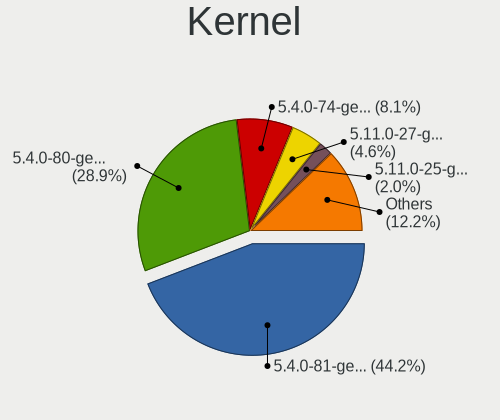

| Version              | Desktops | Percent |
|----------------------|----------|---------|
| 5.4.0-52-generic     | 35       | 31.25%  |
| 5.4.0-54-generic     | 29       | 25.89%  |
| 5.4.0-53-generic     | 23       | 20.54%  |
| 5.4.0-48-generic     | 4        | 3.57%   |
| 4.15.0-124-generic   | 4        | 3.57%   |
| 5.4.0-26-generic     | 3        | 2.68%   |
| 5.0.0-32-generic     | 3        | 2.68%   |
| 5.9.1-050901-generic | 1        | 0.89%   |
| 5.8.0-29-generic     | 1        | 0.89%   |
| 5.8.0-25-generic     | 1        | 0.89%   |
| 5.4.0-54-lowlatency  | 1        | 0.89%   |
| 5.4.0-51-generic     | 1        | 0.89%   |
| 5.3.0-59-generic     | 1        | 0.89%   |
| 5.3.0-46-generic     | 1        | 0.89%   |
| 5.3.0-28-generic     | 1        | 0.89%   |
| 4.15.0-20-generic    | 1        | 0.89%   |
| 4.15.0-123-generic   | 1        | 0.89%   |
| 4.15.0-115-generic   | 1        | 0.89%   |

Kernel Family
-------------

Linux kernel without a distro release

| Version | Desktops | Percent |
|---------|----------|---------|
| 5.4.0   | 96       | 85.71%  |
| 4.15.0  | 7        | 6.25%   |
| 5.3.0   | 3        | 2.68%   |
| 5.0.0   | 3        | 2.68%   |
| 5.8.0   | 2        | 1.79%   |
| 5.9.1   | 1        | 0.89%   |

Kernel Major Ver.
-----------------

Linux kernel major version

| Version | Desktops | Percent |
|---------|----------|---------|
| 5.4     | 96       | 85.71%  |
| 4.15    | 7        | 6.25%   |
| 5.3     | 3        | 2.68%   |
| 5.0     | 3        | 2.68%   |
| 5.8     | 2        | 1.79%   |
| 5.9     | 1        | 0.89%   |

Arch
----

OS architecture (x86_64, i586, etc.)

| Name   | Desktops | Percent |
|--------|----------|---------|
| x86_64 | 110      | 98.21%  |
| i686   | 2        | 1.79%   |

DE
--

Desktop Environment

| Name       | Desktops | Percent |
|------------|----------|---------|
| X-Cinnamon | 63       | 56.25%  |
| Cinnamon   | 18       | 16.07%  |
| MATE       | 13       | 11.61%  |
| XFCE       | 12       | 10.71%  |
| Unknown    | 4        | 3.57%   |
| KDE        | 1        | 0.89%   |
| GNOME      | 1        | 0.89%   |

Display Server
--------------

X11 or Wayland

| Name | Desktops | Percent |
|------|----------|---------|
| X11  | 111      | 99.11%  |
| Tty  | 1        | 0.89%   |

Display Manager
---------------

SDDM, LightDM, etc.

| Name    | Desktops | Percent |
|---------|----------|---------|
| Unknown | 74       | 66.07%  |
| TDM     | 38       | 33.93%  |

OS Lang
-------

Language

| Lang  | Desktops | Percent |
|-------|----------|---------|
| en_US | 39       | 34.82%  |
| de_DE | 14       | 12.5%   |
| pt_BR | 10       | 8.93%   |
| ru_RU | 7        | 6.25%   |
| en_GB | 5        | 4.46%   |
| pl_PL | 4        | 3.57%   |
| nl_NL | 4        | 3.57%   |
| fr_FR | 4        | 3.57%   |
| es_ES | 4        | 3.57%   |
| es_AR | 3        | 2.68%   |
| it_IT | 2        | 1.79%   |
| hu_HU | 2        | 1.79%   |
| en_AU | 2        | 1.79%   |
| sr_RS | 1        | 0.89%   |
| sk_SK | 1        | 0.89%   |
| pt_PT | 1        | 0.89%   |
| ja_JP | 1        | 0.89%   |
| ia_FR | 1        | 0.89%   |
| fr_CA | 1        | 0.89%   |
| en_NZ | 1        | 0.89%   |
| en_IN | 1        | 0.89%   |
| en_IE | 1        | 0.89%   |
| de_AT | 1        | 0.89%   |
| cs_CZ | 1        | 0.89%   |
| C     | 1        | 0.89%   |

Boot Mode
---------

EFI or BIOS

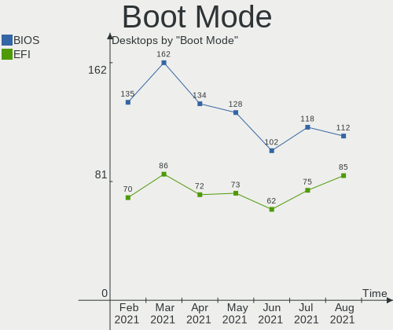

| Mode | Desktops | Percent |
|------|----------|---------|
| BIOS | 75       | 66.96%  |
| EFI  | 37       | 33.04%  |

Filesystem
----------

Type of filesystem

| Type    | Desktops | Percent |
|---------|----------|---------|
| Ext4    | 107      | 95.54%  |
| Btrfs   | 3        | 2.68%   |
| Overlay | 1        | 0.89%   |
| Ext2    | 1        | 0.89%   |

Part. scheme
------------

Scheme of partitioning

| Type    | Desktops | Percent |
|---------|----------|---------|
| Unknown | 72       | 64.29%  |
| GPT     | 24       | 21.43%  |
| MBR     | 16       | 14.29%  |

Dual Boot with Linux/BSD
------------------------

Hosting more than one Linux/BSD

| Dual boot | Desktops | Percent |
|-----------|----------|---------|
| No        | 99       | 88.39%  |
| Yes       | 13       | 11.61%  |

Dual Boot (Win)
---------------

Hosting Linux and Windows

| Dual boot | Desktops | Percent |
|-----------|----------|---------|
| No        | 84       | 75%     |
| Yes       | 28       | 25%     |

Country
-------

Geographic location (country)

| Country        | Desktops | Percent |
|----------------|----------|---------|
| USA            | 22       | 19.64%  |
| Germany        | 12       | 10.71%  |
| Brazil         | 12       | 10.71%  |
| Russia         | 8        | 7.14%   |
| UK             | 6        | 5.36%   |
| Netherlands    | 5        | 4.46%   |
| Spain          | 4        | 3.57%   |
| Poland         | 4        | 3.57%   |
| Italy          | 4        | 3.57%   |
| France         | 4        | 3.57%   |
| Argentina      | 4        | 3.57%   |
| Serbia         | 3        | 2.68%   |
| Hungary        | 3        | 2.68%   |
| Canada         | 3        | 2.68%   |
| Austria        | 3        | 2.68%   |
| Australia      | 2        | 1.79%   |
| Singapore      | 1        | 0.89%   |
| Puerto Rico    | 1        | 0.89%   |
| Portugal       | 1        | 0.89%   |
| New Zealand    | 1        | 0.89%   |
| Japan          | 1        | 0.89%   |
| Ireland        | 1        | 0.89%   |
| India          | 1        | 0.89%   |
| Iceland        | 1        | 0.89%   |
| Hong Kong      | 1        | 0.89%   |
| Greece         | 1        | 0.89%   |
| Finland        | 1        | 0.89%   |
| Czech Republic | 1        | 0.89%   |
| Cyprus         | 1        | 0.89%   |

City
----

Geographic location (city)

| City                 | Desktops | Percent |
|----------------------|----------|---------|
| Wrocław             | 2        | 1.79%   |
| Vienna               | 2        | 1.79%   |
| Rio de Janeiro       | 2        | 1.79%   |
| Moscow               | 2        | 1.79%   |
| Berlin               | 2        | 1.79%   |
| Wiesbaden            | 1        | 0.89%   |
| Washington           | 1        | 0.89%   |
| Walthamstow          | 1        | 0.89%   |
| Vladikavkaz          | 1        | 0.89%   |
| Virginia Beach       | 1        | 0.89%   |
| Villa María         | 1        | 0.89%   |
| Villa Adelina        | 1        | 0.89%   |
| Vantaa               | 1        | 0.89%   |
| Vancouver            | 1        | 0.89%   |
| Tres Pontas          | 1        | 0.89%   |
| Tomsk                | 1        | 0.89%   |
| Tomares              | 1        | 0.89%   |
| Titusville           | 1        | 0.89%   |
| Thessaloniki         | 1        | 0.89%   |
| Tarnowskie Gory      | 1        | 0.89%   |
| Tapioszolos          | 1        | 0.89%   |
| São Paulo           | 1        | 0.89%   |
| Sumaré              | 1        | 0.89%   |
| Streatham            | 1        | 0.89%   |
| Stelle               | 1        | 0.89%   |
| St Petersburg        | 1        | 0.89%   |
| Shankill             | 1        | 0.89%   |
| Schkeuditz           | 1        | 0.89%   |
| San Juan             | 1        | 0.89%   |
| San Jose             | 1        | 0.89%   |
| San Antonio          | 1        | 0.89%   |
| Saint-Aubin-de-Medoc | 1        | 0.89%   |
| Rosario              | 1        | 0.89%   |
| Rigby                | 1        | 0.89%   |
| Reykjavik            | 1        | 0.89%   |
| Porto Alegre         | 1        | 0.89%   |
| Pilsen               | 1        | 0.89%   |
| Patna                | 1        | 0.89%   |
| Paris                | 1        | 0.89%   |
| Paradise Valley      | 1        | 0.89%   |
| Palanka              | 1        | 0.89%   |
| Orlando              | 1        | 0.89%   |
| Novara               | 1        | 0.89%   |
| Neustadt (Dosse)     | 1        | 0.89%   |
| Neu-Ulm              | 1        | 0.89%   |
| Málaga              | 1        | 0.89%   |
| Murmansk             | 1        | 0.89%   |
| Montreal             | 1        | 0.89%   |
| Minneapolis          | 1        | 0.89%   |
| Milan                | 1        | 0.89%   |
| Merced               | 1        | 0.89%   |
| Media                | 1        | 0.89%   |
| Marseille            | 1        | 0.89%   |
| Mafra                | 1        | 0.89%   |
| Lyman                | 1        | 0.89%   |
| London               | 1        | 0.89%   |
| Linz                 | 1        | 0.89%   |
| Limassol             | 1        | 0.89%   |
| Laguna Vista         | 1        | 0.89%   |
| La Puente            | 1        | 0.89%   |

Vendor
------

Motherboard manufacturer

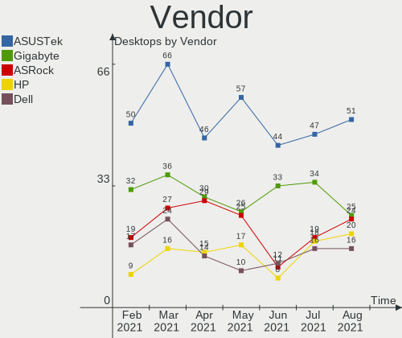

| Name                | Desktops | Percent |
|---------------------|----------|---------|
| Gigabyte Technology | 23       | 20.54%  |
| ASUSTek Computer    | 22       | 19.64%  |
| ASRock              | 14       | 12.5%   |
| MSI                 | 11       | 9.82%   |
| Hewlett-Packard     | 11       | 9.82%   |
| Dell                | 10       | 8.93%   |
| Intel               | 4        | 3.57%   |
| Lenovo              | 3        | 2.68%   |
| Fujitsu Siemens     | 2        | 1.79%   |
| Biostar             | 2        | 1.79%   |
| Acer                | 2        | 1.79%   |
| Semp Toshiba        | 1        | 0.89%   |
| OEM                 | 1        | 0.89%   |
| Kobian              | 1        | 0.89%   |
| HARDKERNEL          | 1        | 0.89%   |
| Fujitsu             | 1        | 0.89%   |
| Apple               | 1        | 0.89%   |
| ABIT                | 1        | 0.89%   |
| Unknown             | 1        | 0.89%   |

Model
-----

Motherboard model

| Name                                    | Desktops | Percent |
|-----------------------------------------|----------|---------|
| Dell OptiPlex 3020                      | 3        | 2.68%   |
| Fujitsu Siemens ESPRIMO P7935           | 2        | 1.79%   |
| Dell OptiPlex 780                       | 2        | 1.79%   |
| Unknown                                 | 2        | 1.79%   |
| Semp Toshiba STI                        | 1        | 0.89%   |
| MSI MS-7C94                             | 1        | 0.89%   |
| MSI MS-7B89                             | 1        | 0.89%   |
| MSI MS-7B86                             | 1        | 0.89%   |
| MSI MS-7996                             | 1        | 0.89%   |
| MSI MS-7994                             | 1        | 0.89%   |
| MSI MS-7816                             | 1        | 0.89%   |
| MSI MS-7721                             | 1        | 0.89%   |
| MSI MS-7693                             | 1        | 0.89%   |
| MSI MS-7520                             | 1        | 0.89%   |
| MSI Cubi N 8GL (MS-B171)                | 1        | 0.89%   |
| MSI 500-054                             | 1        | 0.89%   |
| Lenovo ThinkCentre A57 970274G          | 1        | 0.89%   |
| Lenovo IdeaCentre 510A-15ARR 90J0002YGM | 1        | 0.89%   |
| Lenovo H30-50 90B8004JFR                | 1        | 0.89%   |
| Kobian PSM4                             | 1        | 0.89%   |
| Intel H61                               | 1        | 0.89%   |
| Intel H55                               | 1        | 0.89%   |
| Intel DH67CF AAG10215-204               | 1        | 0.89%   |
| Intel DH67BL AAG10189-213               | 1        | 0.89%   |
| HP Z440 Workstation                     | 1        | 0.89%   |
| HP Z400 Workstation                     | 1        | 0.89%   |
| HP Z230 SFF Workstation                 | 1        | 0.89%   |
| HP xw4600 Workstation                   | 1        | 0.89%   |
| HP ProDesk 600 G2 SFF                   | 1        | 0.89%   |
| HP Pavilion Desktop PC 570-p0xx         | 1        | 0.89%   |
| HP EliteDesk 800 G1 SFF                 | 1        | 0.89%   |
| HP Desktop M01-F0xxx                    | 1        | 0.89%   |
| HP Compaq 8200 Elite SFF PC             | 1        | 0.89%   |
| HP Compaq 6200 Pro SFF PC               | 1        | 0.89%   |
| HP Compaq 6200 Pro MT PC                | 1        | 0.89%   |
| HARDKERNEL ODROID-H2                    | 1        | 0.89%   |
| Gigabyte Z77X-UP5 TH-CF                 | 1        | 0.89%   |
| Gigabyte Z390 UD                        | 1        | 0.89%   |
| Gigabyte Z390 GAMING X                  | 1        | 0.89%   |
| Gigabyte Z370N WIFI                     | 1        | 0.89%   |
| Gigabyte X79-UD3                        | 1        | 0.89%   |
| Gigabyte P31-ES3G                       | 1        | 0.89%   |
| Gigabyte H97M-D3H                       | 1        | 0.89%   |
| Gigabyte H87N-WIFI                      | 1        | 0.89%   |
| Gigabyte H81M-DS2                       | 1        | 0.89%   |
| Gigabyte H61M-S2PV                      | 1        | 0.89%   |
| Gigabyte GB-BACE-3150                   | 1        | 0.89%   |
| Gigabyte GA-MA74GM-S2                   | 1        | 0.89%   |
| Gigabyte GA-970A-UD3                    | 1        | 0.89%   |
| Gigabyte GA-78LMT-USB3                  | 1        | 0.89%   |
| Gigabyte GA-78LMT-S2P                   | 1        | 0.89%   |
| Gigabyte G31M-ES2L                      | 1        | 0.89%   |
| Gigabyte F2A68HM-H                      | 1        | 0.89%   |
| Gigabyte B550 AORUS ELITE               | 1        | 0.89%   |
| Gigabyte B450 AORUS PRO WIFI            | 1        | 0.89%   |
| Gigabyte B250M-D3H                      | 1        | 0.89%   |
| Gigabyte 990FXA-UD3                     | 1        | 0.89%   |
| Gigabyte 945GCM-S2C                     | 1        | 0.89%   |
| Gigabyte 8I945GMF                       | 1        | 0.89%   |
| Fujitsu CELSIUS M720                    | 1        | 0.89%   |

Model Family
------------

Motherboard model prefix

| Name                    | Desktops | Percent |
|-------------------------|----------|---------|
| Dell OptiPlex           | 8        | 7.14%   |
| ASUS PRIME              | 4        | 3.57%   |
| HP Compaq               | 3        | 2.68%   |
| Gigabyte Z390           | 2        | 1.79%   |
| Fujitsu Siemens ESPRIMO | 2        | 1.79%   |
| ASRock P67              | 2        | 1.79%   |
| Acer Aspire             | 2        | 1.79%   |
| Unknown                 | 2        | 1.79%   |
| Semp Toshiba STI        | 1        | 0.89%   |
| MSI MS-7C94             | 1        | 0.89%   |
| MSI MS-7B89             | 1        | 0.89%   |
| MSI MS-7B86             | 1        | 0.89%   |
| MSI MS-7996             | 1        | 0.89%   |
| MSI MS-7994             | 1        | 0.89%   |
| MSI MS-7816             | 1        | 0.89%   |
| MSI MS-7721             | 1        | 0.89%   |
| MSI MS-7693             | 1        | 0.89%   |
| MSI MS-7520             | 1        | 0.89%   |
| MSI Cubi                | 1        | 0.89%   |
| MSI 500-054             | 1        | 0.89%   |
| Lenovo ThinkCentre      | 1        | 0.89%   |
| Lenovo IdeaCentre       | 1        | 0.89%   |
| Lenovo H30-50           | 1        | 0.89%   |
| Kobian PSM4             | 1        | 0.89%   |
| Intel H61               | 1        | 0.89%   |
| Intel H55               | 1        | 0.89%   |
| Intel DH67CF            | 1        | 0.89%   |
| Intel DH67BL            | 1        | 0.89%   |
| HP Z440                 | 1        | 0.89%   |
| HP Z400                 | 1        | 0.89%   |
| HP Z230                 | 1        | 0.89%   |
| HP xw4600               | 1        | 0.89%   |
| HP ProDesk              | 1        | 0.89%   |
| HP Pavilion             | 1        | 0.89%   |
| HP EliteDesk            | 1        | 0.89%   |
| HP Desktop              | 1        | 0.89%   |
| HARDKERNEL ODROID-H2    | 1        | 0.89%   |
| Gigabyte Z77X-UP5       | 1        | 0.89%   |
| Gigabyte Z370N          | 1        | 0.89%   |
| Gigabyte X79-UD3        | 1        | 0.89%   |
| Gigabyte P31-ES3G       | 1        | 0.89%   |
| Gigabyte H97M-D3H       | 1        | 0.89%   |
| Gigabyte H87N-WIFI      | 1        | 0.89%   |
| Gigabyte H81M-DS2       | 1        | 0.89%   |
| Gigabyte H61M-S2PV      | 1        | 0.89%   |
| Gigabyte GB-BACE-3150   | 1        | 0.89%   |
| Gigabyte GA-MA74GM-S2   | 1        | 0.89%   |
| Gigabyte GA-970A-UD3    | 1        | 0.89%   |
| Gigabyte GA-78LMT-USB3  | 1        | 0.89%   |
| Gigabyte GA-78LMT-S2P   | 1        | 0.89%   |
| Gigabyte G31M-ES2L      | 1        | 0.89%   |
| Gigabyte F2A68HM-H      | 1        | 0.89%   |
| Gigabyte B550           | 1        | 0.89%   |
| Gigabyte B450           | 1        | 0.89%   |
| Gigabyte B250M-D3H      | 1        | 0.89%   |
| Gigabyte 990FXA-UD3     | 1        | 0.89%   |
| Gigabyte 945GCM-S2C     | 1        | 0.89%   |
| Gigabyte 8I945GMF       | 1        | 0.89%   |
| Fujitsu CELSIUS         | 1        | 0.89%   |
| Dell Studio             | 1        | 0.89%   |

MFG Year
--------

Motherboard manufacture year

| Year | Desktops | Percent |
|------|----------|---------|
| 2019 | 18       | 16.07%  |
| 2018 | 11       | 9.82%   |
| 2012 | 11       | 9.82%   |
| 2020 | 9        | 8.04%   |
| 2013 | 9        | 8.04%   |
| 2015 | 8        | 7.14%   |
| 2014 | 8        | 7.14%   |
| 2016 | 7        | 6.25%   |
| 2011 | 6        | 5.36%   |
| 2010 | 6        | 5.36%   |
| 2009 | 5        | 4.46%   |
| 2007 | 5        | 4.46%   |
| 2008 | 4        | 3.57%   |
| 2006 | 3        | 2.68%   |
| 2017 | 1        | 0.89%   |
| 2003 | 1        | 0.89%   |

Form Factor
-----------

Physical design of the computer

| Name    | Desktops | Percent |
|---------|----------|---------|
| Desktop | 112      | 100%    |

Secure Boot
-----------

Enabled or disabled

| State    | Desktops | Percent |
|----------|----------|---------|
| Disabled | 109      | 97.32%  |
| Enabled  | 3        | 2.68%   |

Coreboot
--------

Have coreboot on board

| Used | Desktops | Percent |
|------|----------|---------|
| No   | 112      | 100%    |

RAM Size
--------

Total RAM memory

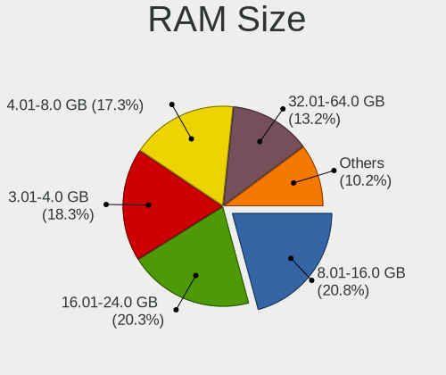

| Size in GB  | Desktops | Percent |
|-------------|----------|---------|
| 16.01-24.0  | 29       | 25.89%  |
| 8.01-16.0   | 24       | 21.43%  |
| 3.01-4.0    | 18       | 16.07%  |
| 4.01-8.0    | 17       | 15.18%  |
| 32.01-64.0  | 12       | 10.71%  |
| 1.01-2.0    | 4        | 3.57%   |
| 64.01-256.0 | 3        | 2.68%   |
| 24.01-32.0  | 2        | 1.79%   |
| 2.01-3.0    | 2        | 1.79%   |
| 0.01-1.0    | 1        | 0.89%   |

RAM Used
--------

Used RAM memory

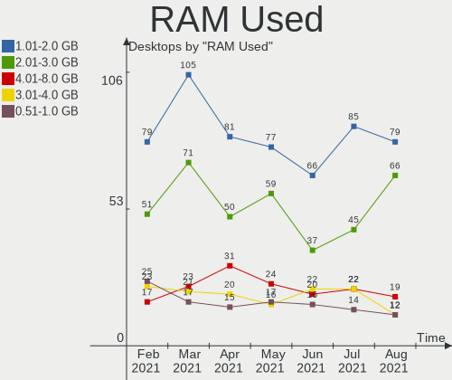

| Used GB   | Desktops | Percent |
|-----------|----------|---------|
| 1.01-2.0  | 38       | 33.93%  |
| 2.01-3.0  | 25       | 22.32%  |
| 4.01-8.0  | 18       | 16.07%  |
| 0.01-1.0  | 12       | 10.71%  |
| 3.01-4.0  | 11       | 9.82%   |
| 8.01-16.0 | 8        | 7.14%   |

Has CD-ROM
----------

Has CD-ROM on board

| Presented | Desktops | Percent |
|-----------|----------|---------|
| Yes       | 65       | 58.04%  |
| No        | 47       | 41.96%  |

Total Drives
------------

Number of drives on board

| Drives | Desktops | Percent |
|--------|----------|---------|
| 1      | 45       | 40.18%  |
| 2      | 32       | 28.57%  |
| 3      | 21       | 18.75%  |
| 4      | 6        | 5.36%   |
| 5      | 4        | 3.57%   |
| 7      | 2        | 1.79%   |
| 8      | 1        | 0.89%   |
| 6      | 1        | 0.89%   |

Has Ethernet
------------

Has Ethernet on board

| Presented | Desktops | Percent |
|-----------|----------|---------|
| Yes       | 111      | 99.11%  |
| No        | 1        | 0.89%   |

Drive Vendor
------------

Hard drive vendors

| Vendor                    | Desktops | Drives | Percent |
|---------------------------|----------|--------|---------|
| Seagate                   | 40       | 48     | 19.7%   |
| WDC                       | 39       | 62     | 19.21%  |
| Samsung Electronics       | 30       | 37     | 14.78%  |
| Kingston                  | 14       | 14     | 6.9%    |
| Toshiba                   | 11       | 12     | 5.42%   |
| Hitachi                   | 10       | 10     | 4.93%   |
| Crucial                   | 9        | 10     | 4.43%   |
| SanDisk                   | 7        | 8      | 3.45%   |
| A-DATA Technology         | 7        | 8      | 3.45%   |
| Phison                    | 5        | 6      | 2.46%   |
| Unknown                   | 3        | 3      | 1.48%   |
| SK Hynix                  | 2        | 2      | 0.99%   |
| OCZ                       | 2        | 2      | 0.99%   |
| AMD                       | 2        | 2      | 0.99%   |
| XPG                       | 1        | 1      | 0.49%   |
| USB3.0                    | 1        | 1      | 0.49%   |
| Transcend                 | 1        | 1      | 0.49%   |
| SPCC                      | 1        | 1      | 0.49%   |
| SABRENT                   | 1        | 1      | 0.49%   |
| Realtek                   | 1        | 1      | 0.49%   |
| PLEXTOR                   | 1        | 1      | 0.49%   |
| Patriot                   | 1        | 1      | 0.49%   |
| ORICO                     | 1        | 1      | 0.49%   |
| Micron/Crucial Technology | 1        | 1      | 0.49%   |
| Micron Technology         | 1        | 1      | 0.49%   |
| MAXTOR                    | 1        | 1      | 0.49%   |
| LITEON                    | 1        | 1      | 0.49%   |
| Lexar                     | 1        | 1      | 0.49%   |
| KingSpec                  | 1        | 1      | 0.49%   |
| Intenso                   | 1        | 1      | 0.49%   |
| Intel                     | 1        | 1      | 0.49%   |
| Fujitsu                   | 1        | 1      | 0.49%   |
| CT120BX5                  | 1        | 1      | 0.49%   |
| China                     | 1        | 2      | 0.49%   |
| Biostar                   | 1        | 1      | 0.49%   |
| ASMT                      | 1        | 2      | 0.49%   |

Drive Model
-----------

Hard drive models

| Model                            | Desktops | Percent |
|----------------------------------|----------|---------|
| Seagate ST500DM002-1BD142 500GB  | 5        | 2.1%    |
| Kingston SA400S37240G 240GB SSD  | 5        | 2.1%    |
| Samsung SSD 860 EVO 1TB          | 4        | 1.68%   |
| WDC WDS240G2G0A-00JH30 240GB SSD | 3        | 1.26%   |
| Toshiba DT01ACA100 1TB           | 3        | 1.26%   |
| Seagate ST3500418AS 500GB        | 3        | 1.26%   |
| Seagate ST2000DM006-2DM164 2TB   | 3        | 1.26%   |
| Seagate ST2000DM001-1ER164 2TB   | 3        | 1.26%   |
| Seagate Expansion Desk 4TB       | 3        | 1.26%   |
| WDC WDS250G2B0B-00YS70 250GB SSD | 2        | 0.84%   |
| WDC WD5000AAKS-00UU3A0 500GB     | 2        | 0.84%   |
| WDC WD40EZRZ-00GXCB0 4TB         | 2        | 0.84%   |
| WDC WD3200AAKS-75SBA0 320GB      | 2        | 0.84%   |
| WDC WD20EARX-00PASB0 2TB         | 2        | 0.84%   |
| WDC WD10EZEX-08WN4A0 1TB         | 2        | 0.84%   |
| WDC WD10EAVS-00D7B1 1TB          | 2        | 0.84%   |
| WDC WD1003FZEX-00MK2A0 1TB       | 2        | 0.84%   |
| Toshiba HDWD130 3TB              | 2        | 0.84%   |
| Toshiba DT01ACA050 500GB         | 2        | 0.84%   |
| Seagate ST4000DM004-2CV104 4TB   | 2        | 0.84%   |
| Seagate ST1000DM003-1SB102 1TB   | 2        | 0.84%   |
| Seagate ST1000DM003-1CH162 1TB   | 2        | 0.84%   |
| SanDisk SDSSDA240G 240GB         | 2        | 0.84%   |
| Samsung SSD 970 EVO Plus 1TB     | 2        | 0.84%   |
| Samsung SSD 850 EVO 250GB        | 2        | 0.84%   |
| Samsung SSD 840 EVO 250GB        | 2        | 0.84%   |
| Samsung SSD 840 EVO 120GB        | 2        | 0.84%   |
| Samsung NVMe SSD Drive 500GB     | 2        | 0.84%   |
| Phison NVMe SSD Drive 256GB      | 2        | 0.84%   |
| Kingston SUV400S37120G 120GB SSD | 2        | 0.84%   |
| Kingston SA400S37480G 480GB SSD  | 2        | 0.84%   |
| Crucial CT240BX500SSD1 240GB     | 2        | 0.84%   |
| Crucial CT120M500SSD1 120GB      | 2        | 0.84%   |
| XPG GAMMIX S11 Pro 512GB         | 1        | 0.42%   |
| WDC WDS500G2B0A-00SM50 500GB SSD | 1        | 0.42%   |
| WDC WDS480G2G0B-00EPW0 480GB SSD | 1        | 0.42%   |
| WDC WDS100T2B0A-00SM50 1TB SSD   | 1        | 0.42%   |
| WDC WD7501AALS-00E3A0 752GB      | 1        | 0.42%   |
| WDC WD5002ABYS-01B1B0 500GB      | 1        | 0.42%   |
| WDC WD5000LPLX-22ZNTT0 500GB     | 1        | 0.42%   |
| WDC WD5000AAKX-75U6AA0 500GB     | 1        | 0.42%   |
| WDC WD5000AAKX-00ERMA0 500GB     | 1        | 0.42%   |
| WDC WD5000AAKS-60Z1A0 500GB      | 1        | 0.42%   |
| WDC WD5000AAKS-00YGA0 500GB      | 1        | 0.42%   |
| WDC WD5000AAKB-00H8A0 500GB      | 1        | 0.42%   |
| WDC WD40EZRZ-22GXCB0 4TB         | 1        | 0.42%   |
| WDC WD40EFRX-68WT0N0 4TB         | 1        | 0.42%   |
| WDC WD3200AAJS-60Z0A0 320GB      | 1        | 0.42%   |
| WDC WD3200AAJS-00L7A0 320GB      | 1        | 0.42%   |
| WDC WD3200AAJB-00J3A0 320GB      | 1        | 0.42%   |
| WDC WD32 00BEVT-60A23T0 320GB    | 1        | 0.42%   |
| WDC WD30EZRZ-00Z5HB0 3TB         | 1        | 0.42%   |
| WDC WD3003FZEX-00Z4SA0 3TB       | 1        | 0.42%   |
| WDC WD2500BEVT-60A23T0 250GB     | 1        | 0.42%   |
| WDC WD2500AAKS-00VSA0 250GB      | 1        | 0.42%   |
| WDC WD20EZRX-00D8PB0 2TB         | 1        | 0.42%   |
| WDC WD20EARS-60MVWB0 2TB         | 1        | 0.42%   |
| WDC WD2004FBYZ-01YCBB0 2TB       | 1        | 0.42%   |
| WDC WD2000FYYZ-01UL1B1 2TB       | 1        | 0.42%   |
| WDC WD1600AAJB-56R1A0 160GB      | 1        | 0.42%   |

HDD Vendor
----------

Hard disk drive vendors

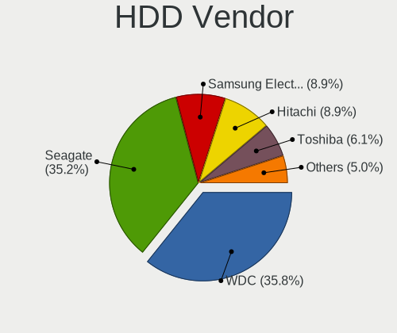

| Vendor              | Desktops | Drives | Percent |
|---------------------|----------|--------|---------|
| Seagate             | 39       | 47     | 37.86%  |
| WDC                 | 34       | 54     | 33.01%  |
| Toshiba             | 10       | 11     | 9.71%   |
| Hitachi             | 10       | 10     | 9.71%   |
| Samsung Electronics | 6        | 6      | 5.83%   |
| USB3.0              | 1        | 1      | 0.97%   |
| Unknown             | 1        | 1      | 0.97%   |
| MAXTOR              | 1        | 1      | 0.97%   |
| Fujitsu             | 1        | 1      | 0.97%   |

SSD Vendor
----------

Solid state drive vendors

| Vendor              | Desktops | Drives | Percent |
|---------------------|----------|--------|---------|
| Samsung Electronics | 18       | 22     | 23.08%  |
| Kingston            | 14       | 14     | 17.95%  |
| Crucial             | 9        | 10     | 11.54%  |
| WDC                 | 8        | 8      | 10.26%  |
| SanDisk             | 6        | 6      | 7.69%   |
| A-DATA Technology   | 5        | 5      | 6.41%   |
| OCZ                 | 2        | 2      | 2.56%   |
| AMD                 | 2        | 2      | 2.56%   |
| Transcend           | 1        | 1      | 1.28%   |
| SPCC                | 1        | 1      | 1.28%   |
| SK Hynix            | 1        | 1      | 1.28%   |
| SABRENT             | 1        | 1      | 1.28%   |
| Patriot             | 1        | 1      | 1.28%   |
| ORICO               | 1        | 1      | 1.28%   |
| Micron Technology   | 1        | 1      | 1.28%   |
| LITEON              | 1        | 1      | 1.28%   |
| KingSpec            | 1        | 1      | 1.28%   |
| Intenso             | 1        | 1      | 1.28%   |
| Intel               | 1        | 1      | 1.28%   |
| CT120BX5            | 1        | 1      | 1.28%   |
| China               | 1        | 2      | 1.28%   |
| Biostar             | 1        | 1      | 1.28%   |

Drive Kind
----------

HDD or SSD

| Kind    | Desktops | Drives | Percent |
|---------|----------|--------|---------|
| HDD     | 87       | 132    | 50.29%  |
| SSD     | 62       | 84     | 35.84%  |
| NVMe    | 19       | 26     | 10.98%  |
| Unknown | 4        | 5      | 2.31%   |
| MMC     | 1        | 1      | 0.58%   |

Drive Connector
---------------

SATA, SAS, NVMe, etc.

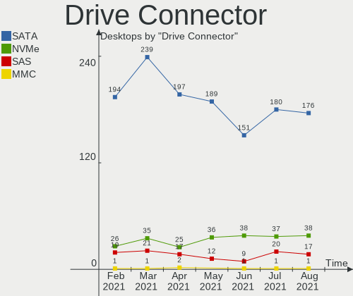

| Type | Desktops | Drives | Percent |
|------|----------|--------|---------|
| SATA | 106      | 207    | 76.81%  |
| NVMe | 19       | 26     | 13.77%  |
| SAS  | 12       | 14     | 8.7%    |
| MMC  | 1        | 1      | 0.72%   |

Drive Size
----------

Size of hard drive

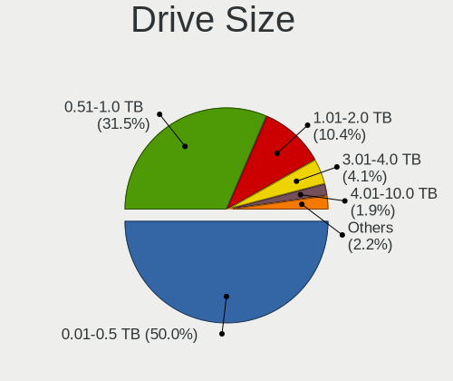

| Size in TB | Desktops | Drives | Percent |
|------------|----------|--------|---------|
| 0.01-0.5   | 80       | 122    | 52.63%  |
| 0.51-1.0   | 43       | 58     | 28.29%  |
| 1.01-2.0   | 14       | 18     | 9.21%   |
| 3.01-4.0   | 9        | 11     | 5.92%   |
| 2.01-3.0   | 6        | 7      | 3.95%   |

Space Total
-----------

Amount of disk space available on the file system

| Size in GB     | Desktops | Percent |
|----------------|----------|---------|
| 251-500        | 27       | 24.11%  |
| 101-250        | 27       | 24.11%  |
| 1001-2000      | 17       | 15.18%  |
| 501-1000       | 15       | 13.39%  |
| More than 3000 | 11       | 9.82%   |
| 2001-3000      | 10       | 8.93%   |
| 21-50          | 2        | 1.79%   |
| 51-100         | 2        | 1.79%   |
| 1-20           | 1        | 0.89%   |

Space Used
----------

Amount of used disk space

| Used GB        | Desktops | Percent |
|----------------|----------|---------|
| 101-250        | 18       | 16.07%  |
| 501-1000       | 18       | 16.07%  |
| 1-20           | 17       | 15.18%  |
| 21-50          | 15       | 13.39%  |
| 51-100         | 15       | 13.39%  |
| 251-500        | 13       | 11.61%  |
| 1001-2000      | 10       | 8.93%   |
| More than 3000 | 5        | 4.46%   |
| 2001-3000      | 1        | 0.89%   |

Malfunc. Drives
---------------

Drive models with a malfunction

| Model                           | Desktops | Drives | Percent |
|---------------------------------|----------|--------|---------|
| Crucial CT120M500SSD1 120GB     | 2        | 2      | 18.18%  |
| WDC WD5002ABYS-01B1B0 500GB     | 1        | 1      | 9.09%   |
| WDC WD10EZEX-21WN4A0 1TB        | 1        | 1      | 9.09%   |
| Seagate ST500DM002-1BD142 500GB | 1        | 1      | 9.09%   |
| Seagate ST3500418AS 500GB       | 1        | 1      | 9.09%   |
| Seagate ST3000DM001-1CH166 3TB  | 1        | 1      | 9.09%   |
| Seagate ST1000DM003-1CH162 1TB  | 1        | 1      | 9.09%   |
| Hitachi HTS545032B9A300 320GB   | 1        | 1      | 9.09%   |
| Fujitsu MHZ2250BH G2 250GB      | 1        | 1      | 9.09%   |
| China SSD 240GB                 | 1        | 1      | 9.09%   |

Malfunc. Drive Vendor
---------------------

Vendors of faulty drives

| Vendor  | Desktops | Drives | Percent |
|---------|----------|--------|---------|
| Seagate | 3        | 4      | 30%     |
| WDC     | 2        | 2      | 20%     |
| Crucial | 2        | 2      | 20%     |
| Hitachi | 1        | 1      | 10%     |
| Fujitsu | 1        | 1      | 10%     |
| China   | 1        | 1      | 10%     |

Malfunc. HDD Vendor
-------------------

Vendors of faulty HDD drives

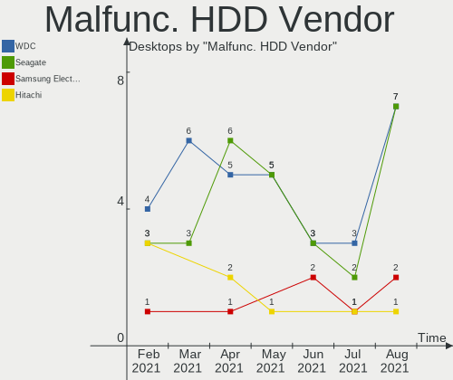

| Vendor  | Desktops | Drives | Percent |
|---------|----------|--------|---------|
| Seagate | 3        | 4      | 42.86%  |
| WDC     | 2        | 2      | 28.57%  |
| Hitachi | 1        | 1      | 14.29%  |
| Fujitsu | 1        | 1      | 14.29%  |

Malfunc. Drive Kind
-------------------

Kinds of faulty drives

| Kind | Desktops | Drives | Percent |
|------|----------|--------|---------|
| HDD  | 6        | 8      | 66.67%  |
| SSD  | 3        | 3      | 33.33%  |

Failed Drives
-------------

Failed drive models

Zero info for selected period =(

Failed Drive Vendor
-------------------

Failed drive vendors

Zero info for selected period =(

Drive Status
------------

Number of failed and malfunc. drives

| Status   | Desktops | Drives | Percent |
|----------|----------|--------|---------|
| Detected | 76       | 164    | 61.79%  |
| Works    | 39       | 73     | 31.71%  |
| Malfunc  | 8        | 11     | 6.5%    |

Storage Vendor
--------------

Storage controller vendors

| Vendor                           | Desktops | Percent |
|----------------------------------|----------|---------|
| Intel                            | 76       | 50.67%  |
| AMD                              | 29       | 19.33%  |
| Samsung Electronics              | 8        | 5.33%   |
| ASMedia Technology               | 7        | 4.67%   |
| Marvell Technology Group         | 6        | 4%      |
| Phison Electronics               | 5        | 3.33%   |
| Nvidia                           | 5        | 3.33%   |
| ADATA Technology                 | 3        | 2%      |
| Sandisk                          | 2        | 1.33%   |
| JMicron Technology               | 2        | 1.33%   |
| VIA Technologies                 | 1        | 0.67%   |
| Toshiba America Info Systems     | 1        | 0.67%   |
| SK Hynix                         | 1        | 0.67%   |
| Silicon Integrated Systems [SiS] | 1        | 0.67%   |
| Shenzhen Longsys Electronics     | 1        | 0.67%   |
| Micron/Crucial Technology        | 1        | 0.67%   |
| Lite-On Technology               | 1        | 0.67%   |

Storage Model
-------------

Storage controller models

| Model                                                                                   | Desktops | Percent |
|-----------------------------------------------------------------------------------------|----------|---------|
| AMD FCH SATA Controller [AHCI mode]                                                     | 14       | 7.45%   |
| Intel 8 Series/C220 Series Chipset Family 6-port SATA Controller 1 [AHCI mode]          | 10       | 5.32%   |
| Intel NM10/ICH7 Family SATA Controller [IDE mode]                                       | 9        | 4.79%   |
| Intel 6 Series/C200 Series Chipset Family 6 port Desktop SATA AHCI Controller           | 8        | 4.26%   |
| Intel SATA Controller [RAID mode]                                                       | 7        | 3.72%   |
| Intel 200 Series PCH SATA controller [AHCI mode]                                        | 7        | 3.72%   |
| ASMedia Technology ASM1062 Serial ATA Controller                                        | 7        | 3.72%   |
| AMD SB7x0/SB8x0/SB9x0 SATA Controller [AHCI mode]                                       | 7        | 3.72%   |
| Samsung Electronics NVMe SSD Controller SM981/PM981/PM983                               | 6        | 3.19%   |
| Intel Q170/Q150/B150/H170/H110/Z170/CM236 Chipset SATA Controller [AHCI Mode]           | 6        | 3.19%   |
| Intel 82801G (ICH7 Family) IDE Controller                                               | 6        | 3.19%   |
| Phison Electronics E12 NVMe Controller                                                  | 5        | 2.66%   |
| AMD SB7x0/SB8x0/SB9x0 IDE Controller                                                    | 5        | 2.66%   |
| Nvidia MCP61 SATA Controller                                                            | 4        | 2.13%   |
| Nvidia MCP61 IDE                                                                        | 4        | 2.13%   |
| AMD 400 Series Chipset SATA Controller                                                  | 4        | 2.13%   |
| Marvell Technology Group 88SE9172 SATA 6Gb/s Controller                                 | 3        | 1.6%    |
| Intel Cannon Lake PCH SATA AHCI Controller                                              | 3        | 1.6%    |
| Intel 82801JD/DO (ICH10 Family) SATA AHCI Controller                                    | 3        | 1.6%    |
| Intel 7 Series/C210 Series Chipset Family 6-port SATA Controller [AHCI mode]            | 3        | 1.6%    |
| Intel 4 Series Chipset PT IDER Controller                                               | 3        | 1.6%    |
| AMD SB7x0/SB8x0/SB9x0 SATA Controller [IDE mode]                                        | 3        | 1.6%    |
| ADATA Technology XPG SX8200 Pro PCIe Gen3x4 M.2 2280 Solid State Drive                  | 3        | 1.6%    |
| Samsung Electronics NVMe SSD Controller SM961/PM961                                     | 2        | 1.06%   |
| JMicron Technology JMB363 SATA/IDE Controller                                           | 2        | 1.06%   |
| Intel SATA controller                                                                   | 2        | 1.06%   |
| Intel C600/X79 series chipset 6-Port SATA AHCI Controller                               | 2        | 1.06%   |
| Intel 82801JI (ICH10 Family) 4 port SATA IDE Controller #1                              | 2        | 1.06%   |
| Intel 82801JI (ICH10 Family) 2 port SATA IDE Controller #2                              | 2        | 1.06%   |
| Intel 82801IR/IO/IH (ICH9R/DO/DH) 6 port SATA Controller [AHCI mode]                    | 2        | 1.06%   |
| Intel 6 Series/C200 Series Chipset Family Desktop SATA Controller (IDE mode, ports 4-5) | 2        | 1.06%   |
| Intel 6 Series/C200 Series Chipset Family Desktop SATA Controller (IDE mode, ports 0-3) | 2        | 1.06%   |
| AMD SATA controller                                                                     | 2        | 1.06%   |
| AMD FCH SATA Controller D                                                               | 2        | 1.06%   |
| VIA Technologies VT82C586A/B/VT82C686/A/B/VT823x/A/C PIPC Bus Master IDE                | 1        | 0.53%   |
| VIA Technologies Serial ATA Controller                                                  | 1        | 0.53%   |
| Toshiba America Info Systems BG3 NVMe SSD Controller                                    | 1        | 0.53%   |
| SK Hynix BC501 NVMe Solid State Drive 512GB                                             | 1        | 0.53%   |
| Silicon Integrated Systems [SiS] 5513 IDE Controller                                    | 1        | 0.53%   |
| Shenzhen Longsys Electronics Non-Volatile memory controller                             | 1        | 0.53%   |
| Sandisk WD Black 2018 / PC SN720 NVMe SSD                                               | 1        | 0.53%   |
| Sandisk WD Black 2018 / PC SN520 NVMe SSD                                               | 1        | 0.53%   |
| Nvidia MCP67 IDE Controller                                                             | 1        | 0.53%   |
| Nvidia MCP67 AHCI Controller                                                            | 1        | 0.53%   |
| Micron/Crucial Technology Non-Volatile memory controller                                | 1        | 0.53%   |
| Marvell Technology Group 92xx SATA 6G Controller                                        | 1        | 0.53%   |
| Marvell Technology Group 88SE912x SATA 6Gb/s Controller [IDE mode]                      | 1        | 0.53%   |
| Marvell Technology Group 88SE6111/6121 SATA II / PATA Controller                        | 1        | 0.53%   |
| Lite-On Technology Non-Volatile memory controller                                       | 1        | 0.53%   |
| Intel Cannon Point-LP SATA Controller [AHCI Mode]                                       | 1        | 0.53%   |
| Intel C610/X99 series chipset sSATA Controller [AHCI mode]                              | 1        | 0.53%   |
| Intel C610/X99 series chipset 6-Port SATA Controller [AHCI mode]                        | 1        | 0.53%   |
| Intel C602 chipset 4-Port SATA Storage Control Unit                                     | 1        | 0.53%   |
| Intel Atom/Celeron/Pentium Processor x5-E8000/J3xxx/N3xxx Series SATA Controller        | 1        | 0.53%   |
| Intel 9 Series Chipset Family SATA Controller [AHCI Mode]                               | 1        | 0.53%   |
| Intel 82Q35 Express PT IDER Controller                                                  | 1        | 0.53%   |
| Intel 82801JI (ICH10 Family) SATA AHCI Controller                                       | 1        | 0.53%   |
| Intel 82801EB/ER (ICH5/ICH5R) IDE Controller                                            | 1        | 0.53%   |
| Intel 631xESB/632xESB/3100 Chipset SATA IDE Controller                                  | 1        | 0.53%   |
| Intel 631xESB/632xESB IDE Controller                                                    | 1        | 0.53%   |

Storage Kind
------------

Kind of storage controller (IDE, SATA, NVMe, SAS, ...)

| Kind | Desktops | Percent |
|------|----------|---------|
| SATA | 83       | 57.24%  |
| IDE  | 34       | 23.45%  |
| NVMe | 19       | 13.1%   |
| RAID | 8        | 5.52%   |
| SAS  | 1        | 0.69%   |

CPU Vendor
----------

Processor vendors

| Vendor | Desktops | Percent |
|--------|----------|---------|
| Intel  | 78       | 69.64%  |
| AMD    | 34       | 30.36%  |

CPU Model
---------

Processor models

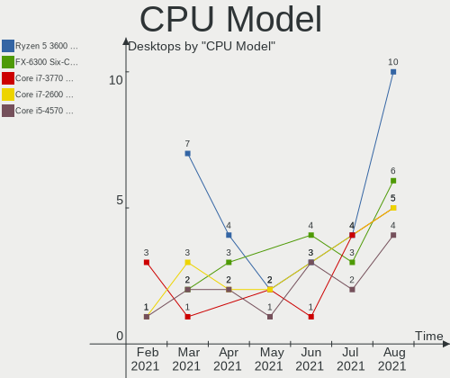

| Model                                       | Desktops | Percent |
|---------------------------------------------|----------|---------|
| Intel Core i5-4570 CPU @ 3.20GHz            | 3        | 2.68%   |
| Intel Core i7-8700K CPU @ 3.70GHz           | 2        | 1.79%   |
| Intel Core i5-8400 CPU @ 2.80GHz            | 2        | 1.79%   |
| Intel Core i5-7500 CPU @ 3.40GHz            | 2        | 1.79%   |
| Intel Core i5-7400 CPU @ 3.00GHz            | 2        | 1.79%   |
| Intel Core i5-6500 CPU @ 3.20GHz            | 2        | 1.79%   |
| Intel Core i5-4590 CPU @ 3.30GHz            | 2        | 1.79%   |
| Intel Core i5-3470 CPU @ 3.20GHz            | 2        | 1.79%   |
| Intel Core i5-2400 CPU @ 3.10GHz            | 2        | 1.79%   |
| Intel Core i3-8100 CPU @ 3.60GHz            | 2        | 1.79%   |
| Intel Core i3-2120 CPU @ 3.30GHz            | 2        | 1.79%   |
| Intel Core 2 Duo CPU E8400 @ 3.00GHz        | 2        | 1.79%   |
| AMD Ryzen 5 1600 Six-Core Processor         | 2        | 1.79%   |
| AMD Ryzen 3 3200G with Radeon Vega Graphics | 2        | 1.79%   |
| AMD Ryzen 3 2200G with Radeon Vega Graphics | 2        | 1.79%   |
| AMD FX-6300 Six-Core Processor              | 2        | 1.79%   |
| AMD A4-6300 APU with Radeon HD Graphics     | 2        | 1.79%   |
| Intel Xeon CPU X5365 @ 3.00GHz              | 1        | 0.89%   |
| Intel Xeon CPU W3550 @ 3.07GHz              | 1        | 0.89%   |
| Intel Xeon CPU E5-2620 v3 @ 2.40GHz         | 1        | 0.89%   |
| Intel Xeon CPU E5-2620 0 @ 2.00GHz          | 1        | 0.89%   |
| Intel Xeon CPU E3-1240 V2 @ 3.40GHz         | 1        | 0.89%   |
| Intel Pentium Silver N5000 CPU @ 1.10GHz    | 1        | 0.89%   |
| Intel Pentium Dual-Core CPU E5800 @ 3.20GHz | 1        | 0.89%   |
| Intel Pentium Dual-Core CPU E5400 @ 2.70GHz | 1        | 0.89%   |
| Intel Pentium Dual CPU E2180 @ 2.00GHz      | 1        | 0.89%   |
| Intel Pentium D CPU 3.00GHz                 | 1        | 0.89%   |
| Intel Pentium D CPU 2.80GHz                 | 1        | 0.89%   |
| Intel Pentium CPU G3260 @ 3.30GHz           | 1        | 0.89%   |
| Intel Pentium CPU G3220 @ 3.00GHz           | 1        | 0.89%   |
| Intel Pentium CPU G2120 @ 3.10GHz           | 1        | 0.89%   |
| Intel Pentium CPU E5300 @ 2.60GHz           | 1        | 0.89%   |
| Intel Pentium 4 CPU 2.80GHz                 | 1        | 0.89%   |
| Intel Pentium 4 CPU 2.40GHz                 | 1        | 0.89%   |
| Intel Core i7-9700K CPU @ 3.60GHz           | 1        | 0.89%   |
| Intel Core i7-6700K CPU @ 4.00GHz           | 1        | 0.89%   |
| Intel Core i7-4960X CPU @ 3.60GHz           | 1        | 0.89%   |
| Intel Core i7-4790K CPU @ 4.00GHz           | 1        | 0.89%   |
| Intel Core i7-3770K CPU @ 3.50GHz           | 1        | 0.89%   |
| Intel Core i7-3770 CPU @ 3.40GHz            | 1        | 0.89%   |
| Intel Core i7-2600K CPU @ 3.40GHz           | 1        | 0.89%   |
| Intel Core i7 CPU 920 @ 2.67GHz             | 1        | 0.89%   |
| Intel Core i7 CPU 870 @ 2.93GHz             | 1        | 0.89%   |
| Intel Core i5-9400 CPU @ 2.90GHz            | 1        | 0.89%   |
| Intel Core i5-8265U CPU @ 1.60GHz           | 1        | 0.89%   |
| Intel Core i5-7600 CPU @ 3.50GHz            | 1        | 0.89%   |
| Intel Core i5-6600 CPU @ 3.30GHz            | 1        | 0.89%   |
| Intel Core i5-4690K CPU @ 3.50GHz           | 1        | 0.89%   |
| Intel Core i5-4670 CPU @ 3.40GHz            | 1        | 0.89%   |
| Intel Core i5-4590S CPU @ 3.00GHz           | 1        | 0.89%   |
| Intel Core i5-3570K CPU @ 3.40GHz           | 1        | 0.89%   |
| Intel Core i5-2500K CPU @ 3.30GHz           | 1        | 0.89%   |
| Intel Core i5-10500 CPU @ 3.10GHz           | 1        | 0.89%   |
| Intel Core i5 CPU 650 @ 3.20GHz             | 1        | 0.89%   |
| Intel Core i3-6100 CPU @ 3.70GHz            | 1        | 0.89%   |
| Intel Core i3-4170 CPU @ 3.70GHz            | 1        | 0.89%   |
| Intel Core i3-4130 CPU @ 3.40GHz            | 1        | 0.89%   |
| Intel Core i3-3220 CPU @ 3.30GHz            | 1        | 0.89%   |
| Intel Core 2 Quad CPU Q9550 @ 2.83GHz       | 1        | 0.89%   |
| Intel Core 2 Quad CPU Q9400 @ 2.66GHz       | 1        | 0.89%   |

CPU Model Family
----------------

Processor model prefix

| Model                   | Desktops | Percent |
|-------------------------|----------|---------|
| Intel Core i5           | 28       | 25%     |
| Intel Core i7           | 11       | 9.82%   |
| AMD FX                  | 9        | 8.04%   |
| Intel Core i3           | 8        | 7.14%   |
| Intel Core 2 Duo        | 6        | 5.36%   |
| Intel Xeon              | 5        | 4.46%   |
| Intel Core 2 Quad       | 5        | 4.46%   |
| AMD Ryzen 5             | 5        | 4.46%   |
| Intel Pentium           | 4        | 3.57%   |
| AMD Ryzen 3             | 4        | 3.57%   |
| AMD Athlon 64 X2        | 3        | 2.68%   |
| AMD A4                  | 3        | 2.68%   |
| Intel Pentium Dual-Core | 2        | 1.79%   |
| Intel Pentium D         | 2        | 1.79%   |
| Intel Pentium 4         | 2        | 1.79%   |
| Intel Celeron           | 2        | 1.79%   |
| AMD Ryzen 9             | 2        | 1.79%   |
| AMD Athlon II X2        | 2        | 1.79%   |
| AMD A8                  | 2        | 1.79%   |
| Intel Pentium Silver    | 1        | 0.89%   |
| Intel Pentium Dual      | 1        | 0.89%   |
| Intel Core 2            | 1        | 0.89%   |
| AMD Ryzen 7             | 1        | 0.89%   |
| AMD Phenom II X4        | 1        | 0.89%   |
| AMD Athlon              | 1        | 0.89%   |
| AMD A10                 | 1        | 0.89%   |

CPU Cores
---------

Number of processor cores

| Number | Desktops | Percent |
|--------|----------|---------|
| 4      | 53       | 47.32%  |
| 2      | 32       | 28.57%  |
| 6      | 14       | 12.5%   |
| 1      | 5        | 4.46%   |
| 8      | 3        | 2.68%   |
| 3      | 3        | 2.68%   |
| 12     | 2        | 1.79%   |

CPU Sockets
-----------

Number of sockets

| Number | Desktops | Percent |
|--------|----------|---------|
| 1      | 111      | 99.11%  |
| 2      | 1        | 0.89%   |

CPU Threads
-----------

Threads per core (Hyper-Threading)

| Number | Desktops | Percent |
|--------|----------|---------|
| 1      | 66       | 58.93%  |
| 2      | 46       | 41.07%  |

CPU Op-Modes
------------

CPU Operation Modes (32-bit, 64-bit)

| Op mode        | Desktops | Percent |
|----------------|----------|---------|
| 32-bit, 64-bit | 110      | 98.21%  |
| 32-bit         | 2        | 1.79%   |

CPU Microcode
-------------

Microcode number

| Number     | Desktops | Percent |
|------------|----------|---------|
| Unknown    | 16       | 14.29%  |
| 0x306c3    | 12       | 10.71%  |
| 0x1067a    | 10       | 8.93%   |
| 0x306a9    | 7        | 6.25%   |
| 0x06000852 | 7        | 6.25%   |
| 0x906ea    | 5        | 4.46%   |
| 0x906e9    | 5        | 4.46%   |
| 0x506e3    | 5        | 4.46%   |
| 0x206a7    | 4        | 3.57%   |
| 0x0800820d | 3        | 2.68%   |
| 0x906eb    | 2        | 1.79%   |
| 0x706a1    | 2        | 1.79%   |
| 0x6fb      | 2        | 1.79%   |
| 0x106a5    | 2        | 1.79%   |
| 0x08701021 | 2        | 1.79%   |
| 0x08108109 | 2        | 1.79%   |
| 0x08001138 | 2        | 1.79%   |
| 0x06001119 | 2        | 1.79%   |
| 0xf65      | 1        | 0.89%   |
| 0xf47      | 1        | 0.89%   |
| 0xf33      | 1        | 0.89%   |
| 0xf29      | 1        | 0.89%   |
| 0xa0653    | 1        | 0.89%   |
| 0x906ec    | 1        | 0.89%   |
| 0x6fd      | 1        | 0.89%   |
| 0x6f6      | 1        | 0.89%   |
| 0x406c3    | 1        | 0.89%   |
| 0x306f2    | 1        | 0.89%   |
| 0x306e4    | 1        | 0.89%   |
| 0x206d7    | 1        | 0.89%   |
| 0x20655    | 1        | 0.89%   |
| 0x10677    | 1        | 0.89%   |
| 0x10676    | 1        | 0.89%   |
| 0x0a201009 | 1        | 0.89%   |
| 0x08101016 | 1        | 0.89%   |
| 0x0810100b | 1        | 0.89%   |
| 0x06003106 | 1        | 0.89%   |
| 0x0600063e | 1        | 0.89%   |
| 0x010000db | 1        | 0.89%   |
| 0x010000c7 | 1        | 0.89%   |

CPU Microarch
-------------

Microarchitecture

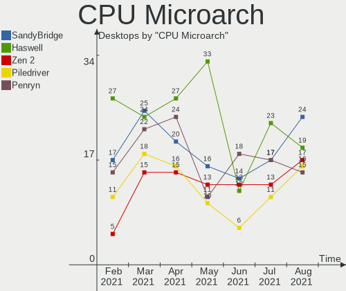

| Name          | Desktops | Percent |
|---------------|----------|---------|
| KabyLake      | 14       | 12.5%   |
| Haswell       | 14       | 12.5%   |
| Penryn        | 13       | 11.61%  |
| Piledriver    | 12       | 10.71%  |
| IvyBridge     | 9        | 8.04%   |
| SandyBridge   | 7        | 6.25%   |
| Zen+          | 5        | 4.46%   |
| Skylake       | 5        | 4.46%   |
| Zen           | 4        | 3.57%   |
| NetBurst      | 4        | 3.57%   |
| K8 Hammer     | 4        | 3.57%   |
| Core          | 4        | 3.57%   |
| Nehalem       | 3        | 2.68%   |
| K10           | 3        | 2.68%   |
| Zen 2         | 2        | 1.79%   |
| Goldmont plus | 2        | 1.79%   |
| Westmere      | 1        | 0.89%   |
| Steamroller   | 1        | 0.89%   |
| Silvermont    | 1        | 0.89%   |
| Jaguar        | 1        | 0.89%   |
| CometLake     | 1        | 0.89%   |
| Bulldozer     | 1        | 0.89%   |
| Unknown       | 1        | 0.89%   |

GPU Vendor
----------

Vendors of graphics cards

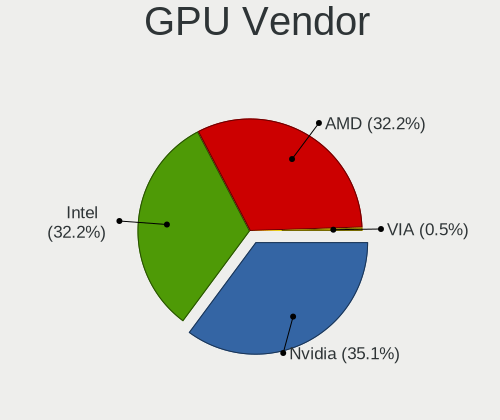

| Vendor                           | Desktops | Percent |
|----------------------------------|----------|---------|
| AMD                              | 46       | 38.33%  |
| Nvidia                           | 40       | 33.33%  |
| Intel                            | 33       | 27.5%   |
| Silicon Integrated Systems [SiS] | 1        | 0.83%   |

GPU Model
---------

Graphics card models

| Model                                                                                      | Desktops | Percent |
|--------------------------------------------------------------------------------------------|----------|---------|
| Intel Xeon E3-1200 v3/4th Gen Core Processor Integrated Graphics Controller                | 7        | 5.83%   |
| Nvidia GK208B [GeForce GT 710]                                                             | 4        | 3.33%   |
| Intel HD Graphics 530                                                                      | 4        | 3.33%   |
| AMD Ellesmere [Radeon RX 470/480/570/570X/580/580X/590]                                    | 4        | 3.33%   |
| Nvidia GK208B [GeForce GT 730]                                                             | 3        | 2.5%    |
| Intel UHD Graphics 630 (Desktop)                                                           | 3        | 2.5%    |
| Intel HD Graphics 630                                                                      | 3        | 2.5%    |
| Intel 2nd Generation Core Processor Family Integrated Graphics Controller                  | 3        | 2.5%    |
| AMD Oland XT [Radeon HD 8670 / R7 250/350]                                                 | 3        | 2.5%    |
| AMD Cedar [Radeon HD 5000/6000/7350/8350 Series]                                           | 3        | 2.5%    |
| Nvidia TU117 [GeForce GTX 1650]                                                            | 2        | 1.67%   |
| Nvidia GP107 [GeForce GTX 1050 Ti]                                                         | 2        | 1.67%   |
| Nvidia GP106 [GeForce GTX 1060 6GB]                                                        | 2        | 1.67%   |
| Nvidia GP104 [GeForce GTX 1080]                                                            | 2        | 1.67%   |
| Nvidia GK106 [GeForce GTX 660]                                                             | 2        | 1.67%   |
| Intel Xeon E3-1200 v2/3rd Gen Core processor Graphics Controller                           | 2        | 1.67%   |
| Intel UHD Graphics 605                                                                     | 2        | 1.67%   |
| Intel 82G33/G31 Express Integrated Graphics Controller                                     | 2        | 1.67%   |
| Intel 4 Series Chipset Integrated Graphics Controller                                      | 2        | 1.67%   |
| AMD Turks PRO [Radeon HD 6570/7570/8550]                                                   | 2        | 1.67%   |
| AMD Richland [Radeon HD 8370D]                                                             | 2        | 1.67%   |
| AMD Raven Ridge [Radeon Vega Series / Radeon Vega Mobile Series]                           | 2        | 1.67%   |
| AMD Hawaii PRO [Radeon R9 290/390]                                                         | 2        | 1.67%   |
| Silicon Integrated Systems [SiS] 661/741/760 PCI/AGP or 662/761Gx PCIE VGA Display Adapter | 1        | 0.83%   |
| Nvidia TU106 [GeForce RTX 2060 SUPER]                                                      | 1        | 0.83%   |
| Nvidia TU104 [GeForce RTX 2070 SUPER]                                                      | 1        | 0.83%   |
| Nvidia GT218 [GeForce 8400 GS Rev. 3]                                                      | 1        | 0.83%   |
| Nvidia GT200 [GeForce GTX 260]                                                             | 1        | 0.83%   |
| Nvidia GP107 [GeForce GTX 1050]                                                            | 1        | 0.83%   |
| Nvidia GP104GL [Quadro P4000]                                                              | 1        | 0.83%   |
| Nvidia GM107GL [Quadro K620]                                                               | 1        | 0.83%   |
| Nvidia GK208 [GeForce GT 640 Rev. 2]                                                       | 1        | 0.83%   |
| Nvidia GK110B [GeForce GTX 780 Ti]                                                         | 1        | 0.83%   |
| Nvidia GK107 [GeForce GT 740]                                                              | 1        | 0.83%   |
| Nvidia GK106 [GeForce GTX 650 Ti]                                                          | 1        | 0.83%   |
| Nvidia GK106 [GeForce GTX 650 Ti Boost]                                                    | 1        | 0.83%   |
| Nvidia GF114 [GeForce GTX 560]                                                             | 1        | 0.83%   |
| Nvidia GF108GL [Quadro 600]                                                                | 1        | 0.83%   |
| Nvidia GF108 [GeForce GT 730]                                                              | 1        | 0.83%   |
| Nvidia GF108 [GeForce GT 430]                                                              | 1        | 0.83%   |
| Nvidia GF106GL [Quadro 2000]                                                               | 1        | 0.83%   |
| Nvidia GF106 [GeForce GTS 450]                                                             | 1        | 0.83%   |
| Nvidia G98 [GeForce 8400 GS Rev. 2]                                                        | 1        | 0.83%   |
| Nvidia G96C [GeForce 9400 GT]                                                              | 1        | 0.83%   |
| Nvidia C68 [GeForce 7050 PV / nForce 630a]                                                 | 1        | 0.83%   |
| Nvidia C61 [GeForce 6150SE nForce 430]                                                     | 1        | 0.83%   |
| Nvidia C61 [GeForce 6100 nForce 405]                                                       | 1        | 0.83%   |
| Intel UHD Graphics 630                                                                     | 1        | 0.83%   |
| Intel UHD Graphics 620 (Whiskey Lake)                                                      | 1        | 0.83%   |
| Intel Atom/Celeron/Pentium Processor x5-E8000/J3xxx/N3xxx Integrated Graphics Controller   | 1        | 0.83%   |
| Intel 8th Gen Core Processor Gaussian Mixture Model                                        | 1        | 0.83%   |
| Intel 82945G/GZ Integrated Graphics Controller                                             | 1        | 0.83%   |
| AMD Trinity [Radeon HD 7560D]                                                              | 1        | 0.83%   |
| AMD Tonga PRO [Radeon R9 285/380]                                                          | 1        | 0.83%   |
| AMD Tobago PRO [Radeon R7 360 / R9 360 OEM]                                                | 1        | 0.83%   |
| AMD Tahiti XT [Radeon HD 7970/8970 OEM / R9 280X]                                          | 1        | 0.83%   |
| AMD RV790 [Radeon HD 4890]                                                                 | 1        | 0.83%   |
| AMD RV770 [Radeon HD 4850]                                                                 | 1        | 0.83%   |
| AMD RV710 [Radeon HD 4550]                                                                 | 1        | 0.83%   |
| AMD RV670 [Radeon HD 3870]                                                                 | 1        | 0.83%   |

GPU Combo
---------

Combinations of graphics cards

| Name           | Desktops | Percent |
|----------------|----------|---------|
| 1 x AMD        | 43       | 38.39%  |
| 1 x Nvidia     | 38       | 33.93%  |
| 1 x Intel      | 25       | 22.32%  |
| Intel + AMD    | 3        | 2.68%   |
| Intel + Nvidia | 2        | 1.79%   |
| 1 x SiS        | 1        | 0.89%   |

GPU Driver
----------

Free vs proprietary

| Driver      | Desktops | Percent |
|-------------|----------|---------|
| Free        | 75       | 66.96%  |
| Proprietary | 32       | 28.57%  |
| Unknown     | 5        | 4.46%   |

GPU Memory
----------

Total video memory

| Size in GB | Desktops | Percent |
|------------|----------|---------|
| Unknown    | 33       | 29.46%  |
| 0.51-1.0   | 23       | 20.54%  |
| 1.01-2.0   | 18       | 16.07%  |
| 0.01-0.5   | 16       | 14.29%  |
| 7.01-8.0   | 10       | 8.93%   |
| 3.01-4.0   | 8        | 7.14%   |
| 5.01-6.0   | 2        | 1.79%   |
| 2.01-3.0   | 2        | 1.79%   |

Monitor Vendor
--------------

Monitor vendors

| Vendor               | Desktops | Percent |
|----------------------|----------|---------|
| Goldstar             | 17       | 15.32%  |
| Samsung Electronics  | 16       | 14.41%  |
| Dell                 | 13       | 11.71%  |
| Ancor Communications | 11       | 9.91%   |
| LG Electronics       | 6        | 5.41%   |
| BenQ                 | 6        | 5.41%   |
| Acer                 | 6        | 5.41%   |
| Hewlett-Packard      | 5        | 4.5%    |
| ViewSonic            | 2        | 1.8%    |
| Unknown              | 2        | 1.8%    |
| Sharp                | 2        | 1.8%    |
| Iiyama               | 2        | 1.8%    |
| Yuraku               | 1        | 0.9%    |
| Vestel               | 1        | 0.9%    |
| TXD                  | 1        | 0.9%    |
| Sony                 | 1        | 0.9%    |
| Philips              | 1        | 0.9%    |
| NUL                  | 1        | 0.9%    |
| Microstep            | 1        | 0.9%    |
| Lite-On              | 1        | 0.9%    |
| Lenovo               | 1        | 0.9%    |
| INS                  | 1        | 0.9%    |
| Hyundai ImageQuest   | 1        | 0.9%    |
| Hitachi              | 1        | 0.9%    |
| HannStar             | 1        | 0.9%    |
| GDH                  | 1        | 0.9%    |
| Gateway              | 1        | 0.9%    |
| FUS                  | 1        | 0.9%    |
| Eizo                 | 1        | 0.9%    |
| CVT                  | 1        | 0.9%    |
| CHR                  | 1        | 0.9%    |
| BBY                  | 1        | 0.9%    |
| AU Optronics         | 1        | 0.9%    |
| ASUSTek Computer     | 1        | 0.9%    |
| AOC                  | 1        | 0.9%    |

Monitor Model
-------------

Monitor models

| Model                                                                 | Desktops | Percent |
|-----------------------------------------------------------------------|----------|---------|
| Dell U2718Q DELA0EC 3840x2160 609x349mm 27.6-inch                     | 2        | 1.64%   |
| Yuraku ML2321 FAC2321 1920x1080 510x287mm 23.0-inch                   | 1        | 0.82%   |
| ViewSonic VA2216w SERIE VSC2920 1680x1050 465x291mm 21.6-inch         | 1        | 0.82%   |
| ViewSonic LCD Monitor VA2026w 1680x1050                               | 1        | 0.82%   |
| Vestel LCD Monitor 43UHD_LCD_TV 3840x2160                             | 1        | 0.82%   |
| Unknown LCD Monitor SAMSUNG 1920x1080                                 | 1        | 0.82%   |
| Unknown LCD Monitor hp L2335 1920x1200                                | 1        | 0.82%   |
| TXD HDMI TXD7825 1440x900 410x260mm 19.1-inch                         | 1        | 0.82%   |
| Sony TV SNY4302 1920x1080 1600x900mm 72.3-inch                        | 1        | 0.82%   |
| Sharp LC-50LE442U SHP348A 1920x1080 1100x620mm 49.7-inch              | 1        | 0.82%   |
| Sharp HDMI SHP106A 1920x1080 520x290mm 23.4-inch                      | 1        | 0.82%   |
| Samsung Electronics SyncMaster SAM052A 1920x1080 510x287mm 23.0-inch  | 1        | 0.82%   |
| Samsung Electronics SyncMaster SAM03F0 1680x1050 433x271mm 20.1-inch  | 1        | 0.82%   |
| Samsung Electronics SyncMaster SAM02B5 1920x1200 518x324mm 24.1-inch  | 1        | 0.82%   |
| Samsung Electronics SyncMaster SAM0225 1440x900 410x257mm 19.1-inch   | 1        | 0.82%   |
| Samsung Electronics SyncMaster SAM00A6 1280x1024 380x310mm 19.3-inch  | 1        | 0.82%   |
| Samsung Electronics SMT24A550 SAM07B3 1920x1080 531x299mm 24.0-inch   | 1        | 0.82%   |
| Samsung Electronics SMB1630N SAM0630 1366x768 344x194mm 15.5-inch     | 1        | 0.82%   |
| Samsung Electronics S27E391 SAM0C16 1920x1080 600x340mm 27.2-inch     | 1        | 0.82%   |
| Samsung Electronics S24D390 SAM0B64 1920x1080 521x293mm 23.5-inch     | 1        | 0.82%   |
| Samsung Electronics S24D330 SAM0D92 1920x1080 531x299mm 24.0-inch     | 1        | 0.82%   |
| Samsung Electronics S23C350 SAM0A36 1920x1080 510x287mm 23.0-inch     | 1        | 0.82%   |
| Samsung Electronics S19B220 SAM096F 1366x768 410x230mm 18.5-inch      | 1        | 0.82%   |
| Samsung Electronics LCD Monitor T27B550 4480x1440                     | 1        | 0.82%   |
| Samsung Electronics LCD Monitor SAM0E4A 1366x768 522x293mm 23.6-inch  | 1        | 0.82%   |
| Samsung Electronics LCD Monitor SAM07C0 1920x1080 700x390mm 31.5-inch | 1        | 0.82%   |
| Samsung Electronics LCD Monitor S22E310 1920x1080                     | 1        | 0.82%   |
| Samsung Electronics C24F390 SAM0D2C 1920x1080 520x290mm 23.4-inch     | 1        | 0.82%   |
| Philips 273ELH PHLC07D 1920x1080 598x336mm 27.0-inch                  | 1        | 0.82%   |
| NUL Checksum: 0xd6 (valid) NUL0001 1280x1024 338x270mm 17.0-inch      | 1        | 0.82%   |
| Microstep LCD Monitor Optix MAG27CQ                                   | 1        | 0.82%   |
| Lite-On GC150AT/ATA LTN020E 1024x768 304x228mm 15.0-inch              | 1        | 0.82%   |
| LG Electronics LCD Monitor W2443                                      | 1        | 0.82%   |
| LG Electronics LCD Monitor W2240 1920x1080                            | 1        | 0.82%   |
| LG Electronics LCD Monitor W2043 1024x768                             | 1        | 0.82%   |
| LG Electronics LCD Monitor W1942 2880x900                             | 1        | 0.82%   |
| LG Electronics LCD Monitor W1942                                      | 1        | 0.82%   |
| LG Electronics LCD Monitor L1740PQ 1280x1024                          | 1        | 0.82%   |
| LG Electronics LCD Monitor L1715S 1280x1024                           | 1        | 0.82%   |
| LG Electronics LCD Monitor E2442 3520x1080                            | 1        | 0.82%   |
| Lenovo LEN Y27q-20 LEN65EE 2560x1440 597x336mm 27.0-inch              | 1        | 0.82%   |
| INS NS50DF710NA21 INS5003 3840x2160 800x450mm 36.1-inch               | 1        | 0.82%   |
| Iiyama PLT2250MTS IVM5613 1680x1050 480x270mm 21.7-inch               | 1        | 0.82%   |
| Iiyama PL2788Q IVM6635 2560x1440 597x336mm 27.0-inch                  | 1        | 0.82%   |
| Hyundai ImageQuest L50S IQT0503 1024x768 300x220mm 14.6-inch          | 1        | 0.82%   |
| Hitachi FPD TV HTC00C2 1360x768                                       | 1        | 0.82%   |
| Hewlett-Packard P244 HPN3620 1920x1080 527x297mm 23.8-inch            | 1        | 0.82%   |
| Hewlett-Packard P232 HWP322F 1920x1080 509x286mm 23.0-inch            | 1        | 0.82%   |
| Hewlett-Packard E231 HWP3064 1920x1080 510x287mm 23.0-inch            | 1        | 0.82%   |
| Hewlett-Packard E231 HWP3063 1920x1080 510x287mm 23.0-inch            | 1        | 0.82%   |
| Hewlett-Packard Compaq W220q HWP2809 1680x1050 473x296mm 22.0-inch    | 1        | 0.82%   |
| HannStar HL229DPB HSD6325 1920x1080 477x268mm 21.5-inch               | 1        | 0.82%   |
| Goldstar W2261 GSM56CF 1920x1080 477x268mm 21.5-inch                  | 1        | 0.82%   |
| Goldstar W2241 GSM56B3 1680x1050 474x296mm 22.0-inch                  | 1        | 0.82%   |
| Goldstar W1943 GSM4BAD 1024x768 410x230mm 18.5-inch                   | 1        | 0.82%   |
| Goldstar W1942 GSM4B70 1440x900 408x255mm 18.9-inch                   | 1        | 0.82%   |
| Goldstar M2252D GSM58DC 1920x1080 476x267mm 21.5-inch                 | 1        | 0.82%   |
| Goldstar L226W GSM566B 1680x1050 474x296mm 22.0-inch                  | 1        | 0.82%   |
| Goldstar L1918S GSM4B31 1280x1024 376x301mm 19.0-inch                 | 1        | 0.82%   |
| Goldstar L1910S GSM4A78 1280x1024 376x301mm 19.0-inch                 | 1        | 0.82%   |

Monitor Resolution
------------------

Monitor screen resolution

| Resolution         | Desktops | Percent |
|--------------------|----------|---------|
| 1920x1080 (FHD)    | 50       | 44.64%  |
| 2560x1440 (QHD)    | 10       | 8.93%   |
| 1280x1024 (SXGA)   | 10       | 8.93%   |
| 1680x1050 (WSXGA+) | 8        | 7.14%   |
| 3840x2160 (4K)     | 5        | 4.46%   |
| 1440x900 (WXGA+)   | 5        | 4.46%   |
| 1920x1200 (WUXGA)  | 4        | 3.57%   |
| 1366x768 (WXGA)    | 4        | 3.57%   |
| 1024x768 (XGA)     | 4        | 3.57%   |
| 1360x768           | 3        | 2.68%   |
| Unknown            | 3        | 2.68%   |
| 4480x1440          | 1        | 0.89%   |
| 3520x1080          | 1        | 0.89%   |
| 2880x900           | 1        | 0.89%   |
| 2560x1600          | 1        | 0.89%   |
| 1600x900 (HD+)     | 1        | 0.89%   |
| 1600x1200          | 1        | 0.89%   |

Monitor Diagonal
----------------

Diagonal size in inches

| Inches  | Desktops | Percent |
|---------|----------|---------|
| Unknown | 20       | 17.54%  |
| 23      | 17       | 14.91%  |
| 27      | 15       | 13.16%  |
| 21      | 15       | 13.16%  |
| 24      | 14       | 12.28%  |
| 19      | 11       | 9.65%   |
| 22      | 4        | 3.51%   |
| 15      | 3        | 2.63%   |
| 18      | 2        | 1.75%   |
| 17      | 2        | 1.75%   |
| 72      | 1        | 0.88%   |
| 49      | 1        | 0.88%   |
| 40      | 1        | 0.88%   |
| 39      | 1        | 0.88%   |
| 36      | 1        | 0.88%   |
| 32      | 1        | 0.88%   |
| 31      | 1        | 0.88%   |
| 29      | 1        | 0.88%   |
| 25      | 1        | 0.88%   |
| 20      | 1        | 0.88%   |
| 14      | 1        | 0.88%   |

Monitor Width
-------------

Physical width

| Width in mm | Desktops | Percent |
|-------------|----------|---------|
| 501-600     | 39       | 35.14%  |
| 401-500     | 29       | 26.13%  |
| Unknown     | 20       | 18.02%  |
| 351-400     | 6        | 5.41%   |
| 601-700     | 5        | 4.5%    |
| 301-350     | 5        | 4.5%    |
| 801-900     | 2        | 1.8%    |
| 701-800     | 2        | 1.8%    |
| 201-300     | 1        | 0.9%    |
| 1501-2000   | 1        | 0.9%    |
| 1001-1500   | 1        | 0.9%    |

Aspect Ratio
------------

Proportional relationship between the width and the height

| Ratio   | Desktops | Percent |
|---------|----------|---------|
| 16/9    | 63       | 60%     |
| Unknown | 19       | 18.1%   |
| 16/10   | 10       | 9.52%   |
| 5/4     | 6        | 5.71%   |
| 4/3     | 4        | 3.81%   |
| 3/2     | 2        | 1.9%    |
| 6/5     | 1        | 0.95%   |

Monitor Area
------------

Area in inch²

| Area in inch² | Desktops | Percent |
|----------------|----------|---------|
| 201-250        | 42       | 37.84%  |
| Unknown        | 20       | 18.02%  |
| 301-350        | 15       | 13.51%  |
| 151-200        | 15       | 13.51%  |
| 141-150        | 4        | 3.6%    |
| 101-110        | 4        | 3.6%    |
| 351-500        | 3        | 2.7%    |
| 251-300        | 3        | 2.7%    |
| 501-1000       | 3        | 2.7%    |
| More than 1000 | 2        | 1.8%    |

Pixel Density
-------------

Pixels per inch

| Density | Desktops | Percent |
|---------|----------|---------|
| 51-100  | 55       | 51.4%   |
| 101-120 | 25       | 23.36%  |
| Unknown | 20       | 18.69%  |
| 121-160 | 5        | 4.67%   |
| 1-50    | 2        | 1.87%   |

Multiple Monitors
-----------------

Total monitors connected

| Total | Desktops | Percent |
|-------|----------|---------|
| 1     | 89       | 79.46%  |
| 2     | 16       | 14.29%  |
| 0     | 4        | 3.57%   |
| 3     | 3        | 2.68%   |

Net Controller Vendor
---------------------

Controller vendors

| Vendor                           | Desktops | Percent |
|----------------------------------|----------|---------|
| Realtek Semiconductor            | 64       | 40.76%  |
| Intel                            | 43       | 27.39%  |
| Qualcomm Atheros                 | 13       | 8.28%   |
| Ralink Technology                | 7        | 4.46%   |
| TP-Link                          | 4        | 2.55%   |
| Nvidia                           | 4        | 2.55%   |
| Ralink                           | 3        | 1.91%   |
| Broadcom Inc. and subsidiaries   | 3        | 1.91%   |
| ASUSTek Computer                 | 3        | 1.91%   |
| Marvell Technology Group         | 2        | 1.27%   |
| Broadcom Limited                 | 2        | 1.27%   |
| VIA Technologies                 | 1        | 0.64%   |
| Sitecom Europe                   | 1        | 0.64%   |
| Silicon Integrated Systems [SiS] | 1        | 0.64%   |
| Qualcomm Atheros Communications  | 1        | 0.64%   |
| NetGear                          | 1        | 0.64%   |
| Microsoft                        | 1        | 0.64%   |
| MediaTek                         | 1        | 0.64%   |
| Edimax Technology                | 1        | 0.64%   |
| D-Link System                    | 1        | 0.64%   |

Net Controller Model
--------------------

Controller models

| Model                                                             | Desktops | Percent |
|-------------------------------------------------------------------|----------|---------|
| Realtek RTL8111/8168/8411 PCI Express Gigabit Ethernet Controller | 49       | 26.92%  |
| Intel I211 Gigabit Network Connection                             | 6        | 3.3%    |
| Intel Ethernet Connection (2) I219-V                              | 6        | 3.3%    |
| Intel 82579V Gigabit Network Connection                           | 5        | 2.75%   |
| Intel 82579LM Gigabit Network Connection (Lewisville)             | 5        | 2.75%   |
| Realtek RTL810xE PCI Express Fast Ethernet controller             | 4        | 2.2%    |
| Intel 82567LM-3 Gigabit Network Connection                        | 4        | 2.2%    |
| Realtek RTL88x2bu [AC1200 Techkey]                                | 3        | 1.65%   |
| Realtek RTL8169 PCI Gigabit Ethernet Controller                   | 3        | 1.65%   |
| Realtek RTL8125 2.5GbE Controller                                 | 3        | 1.65%   |
| Qualcomm Atheros AR8161 Gigabit Ethernet                          | 3        | 1.65%   |
| Nvidia MCP61 Ethernet                                             | 3        | 1.65%   |
| Intel Ethernet Connection I217-LM                                 | 3        | 1.65%   |
| Intel Dual Band Wireless-AC 3168NGW [Stone Peak]                  | 3        | 1.65%   |
| Realtek RTL8821CE 802.11ac PCIe Wireless Network Adapter          | 2        | 1.1%    |
| Realtek RTL-8110SC/8169SC Gigabit Ethernet                        | 2        | 1.1%    |
| Realtek RTL-8100/8101L/8139 PCI Fast Ethernet Adapter             | 2        | 1.1%    |
| Ralink RT5370 Wireless Adapter                                    | 2        | 1.1%    |
| Ralink RT2870/RT3070 Wireless Adapter                             | 2        | 1.1%    |
| Ralink MT7601U Wireless Adapter                                   | 2        | 1.1%    |
| Qualcomm Atheros AR8152 v2.0 Fast Ethernet                        | 2        | 1.1%    |
| Intel Wireless 8265 / 8275                                        | 2        | 1.1%    |
| Intel Wireless 3160                                               | 2        | 1.1%    |
| Intel Ethernet Connection I217-V                                  | 2        | 1.1%    |
| Intel Ethernet Connection (7) I219-V                              | 2        | 1.1%    |
| Intel Ethernet Connection (2) I219-LM                             | 2        | 1.1%    |
| VIA VT82C570MV                                                    | 1        | 0.55%   |
| TP-Link TL-WN823N v2/v3 [Realtek RTL8192EU]                       | 1        | 0.55%   |
| TP-Link 802.11n WLAN Adapter                                      | 1        | 0.55%   |
| TP-Link 802.11ac WLAN Adapter                                     | 1        | 0.55%   |
| TP-Link 802.11ac NIC                                              | 1        | 0.55%   |
| Sitecom Europe 802.11n WLAN Adapter                               | 1        | 0.55%   |
| Silicon Integrated Systems [SiS] SiS900 PCI Fast Ethernet         | 1        | 0.55%   |
| Realtek RTL8812AE 802.11ac PCIe Wireless Network Adapter          | 1        | 0.55%   |
| Realtek RTL8192CE PCIe Wireless Network Adapter                   | 1        | 0.55%   |
| Realtek RTL8188SU 802.11n WLAN Adapter                            | 1        | 0.55%   |
| Realtek RTL8188FTV 802.11b/g/n 1T1R 2.4G WLAN Adapter             | 1        | 0.55%   |
| Realtek RTL8188EUS 802.11n Wireless Network Adapter               | 1        | 0.55%   |
| Realtek RTL8188CUS 802.11n WLAN Adapter                           | 1        | 0.55%   |
| Realtek RTL8153 Gigabit Ethernet Adapter                          | 1        | 0.55%   |
| Realtek 802.11ac NIC                                              | 1        | 0.55%   |
| Ralink RT3072 Wireless Adapter                                    | 1        | 0.55%   |
| Ralink RT5392 PCIe Wireless Network Adapter                       | 1        | 0.55%   |
| Ralink RT5390R 802.11bgn PCIe Wireless Network Adapter            | 1        | 0.55%   |
| Ralink RT3090 Wireless 802.11n 1T/1R PCIe                         | 1        | 0.55%   |
| Qualcomm Atheros QCA9565 / AR9565 Wireless Network Adapter        | 1        | 0.55%   |
| Qualcomm Atheros Killer E220x Gigabit Ethernet Controller         | 1        | 0.55%   |
| Qualcomm Atheros AR9271 802.11n                                   | 1        | 0.55%   |
| Qualcomm Atheros AR9485 Wireless Network Adapter                  | 1        | 0.55%   |
| Qualcomm Atheros AR9462 Wireless Network Adapter                  | 1        | 0.55%   |
| Qualcomm Atheros AR93xx Wireless Network Adapter                  | 1        | 0.55%   |
| Qualcomm Atheros AR8131 Gigabit Ethernet                          | 1        | 0.55%   |
| Qualcomm Atheros AR8121/AR8113/AR8114 Gigabit or Fast Ethernet    | 1        | 0.55%   |
| Qualcomm Atheros AR5212/5213/2414 Wireless Network Adapter        | 1        | 0.55%   |
| Nvidia MCP67 Ethernet                                             | 1        | 0.55%   |
| NetGear WNA3100(v1) Wireless-N 300 [Broadcom BCM43231]            | 1        | 0.55%   |
| Microsoft Xbox 360 Wireless Adapter                               | 1        | 0.55%   |
| MediaTek Infinix X572                                             | 1        | 0.55%   |
| Marvell Group 88E8056 PCI-E Gigabit Ethernet Controller           | 1        | 0.55%   |
| Marvell Group 88E8053 PCI-E Gigabit Ethernet Controller           | 1        | 0.55%   |

Wireless Vendor
---------------

Wireless vendors

| Vendor                          | Desktops | Percent |
|---------------------------------|----------|---------|
| Intel                           | 13       | 23.64%  |
| Realtek Semiconductor           | 11       | 20%     |
| Ralink Technology               | 7        | 12.73%  |
| Qualcomm Atheros                | 5        | 9.09%   |
| TP-Link                         | 4        | 7.27%   |
| Ralink                          | 3        | 5.45%   |
| ASUSTek Computer                | 3        | 5.45%   |
| Broadcom Inc. and subsidiaries  | 2        | 3.64%   |
| Sitecom Europe                  | 1        | 1.82%   |
| Qualcomm Atheros Communications | 1        | 1.82%   |
| NetGear                         | 1        | 1.82%   |
| Microsoft                       | 1        | 1.82%   |
| Edimax Technology               | 1        | 1.82%   |
| D-Link System                   | 1        | 1.82%   |
| Broadcom Limited                | 1        | 1.82%   |

Wireless Model
--------------

Wireless models

| Model                                                                    | Desktops | Percent |
|--------------------------------------------------------------------------|----------|---------|
| Realtek RTL88x2bu [AC1200 Techkey]                                       | 3        | 5.36%   |
| Intel Dual Band Wireless-AC 3168NGW [Stone Peak]                         | 3        | 5.36%   |
| Realtek RTL8821CE 802.11ac PCIe Wireless Network Adapter                 | 2        | 3.57%   |
| Ralink RT5370 Wireless Adapter                                           | 2        | 3.57%   |
| Ralink RT2870/RT3070 Wireless Adapter                                    | 2        | 3.57%   |
| Ralink MT7601U Wireless Adapter                                          | 2        | 3.57%   |
| Intel Wireless 8265 / 8275                                               | 2        | 3.57%   |
| Intel Wireless 3160                                                      | 2        | 3.57%   |
| TP-Link TL-WN823N v2/v3 [Realtek RTL8192EU]                              | 1        | 1.79%   |
| TP-Link 802.11n WLAN Adapter                                             | 1        | 1.79%   |
| TP-Link 802.11ac WLAN Adapter                                            | 1        | 1.79%   |
| TP-Link 802.11ac NIC                                                     | 1        | 1.79%   |
| Sitecom Europe 802.11n WLAN Adapter                                      | 1        | 1.79%   |
| Realtek RTL8812AE 802.11ac PCIe Wireless Network Adapter                 | 1        | 1.79%   |
| Realtek RTL8192CE PCIe Wireless Network Adapter                          | 1        | 1.79%   |
| Realtek RTL8188SU 802.11n WLAN Adapter                                   | 1        | 1.79%   |
| Realtek RTL8188FTV 802.11b/g/n 1T1R 2.4G WLAN Adapter                    | 1        | 1.79%   |
| Realtek RTL8188EUS 802.11n Wireless Network Adapter                      | 1        | 1.79%   |
| Realtek RTL8188CUS 802.11n WLAN Adapter                                  | 1        | 1.79%   |
| Realtek 802.11ac NIC                                                     | 1        | 1.79%   |
| Ralink RT3072 Wireless Adapter                                           | 1        | 1.79%   |
| Ralink RT5392 PCIe Wireless Network Adapter                              | 1        | 1.79%   |
| Ralink RT5390R 802.11bgn PCIe Wireless Network Adapter                   | 1        | 1.79%   |
| Ralink RT3090 Wireless 802.11n 1T/1R PCIe                                | 1        | 1.79%   |
| Qualcomm Atheros QCA9565 / AR9565 Wireless Network Adapter               | 1        | 1.79%   |
| Qualcomm Atheros AR9271 802.11n                                          | 1        | 1.79%   |
| Qualcomm Atheros AR9485 Wireless Network Adapter                         | 1        | 1.79%   |
| Qualcomm Atheros AR9462 Wireless Network Adapter                         | 1        | 1.79%   |
| Qualcomm Atheros AR93xx Wireless Network Adapter                         | 1        | 1.79%   |
| Qualcomm Atheros AR5212/5213/2414 Wireless Network Adapter               | 1        | 1.79%   |
| NetGear WNA3100(v1) Wireless-N 300 [Broadcom BCM43231]                   | 1        | 1.79%   |
| Microsoft Xbox 360 Wireless Adapter                                      | 1        | 1.79%   |
| Intel Wireless-AC 9260                                                   | 1        | 1.79%   |
| Intel Wireless 8260                                                      | 1        | 1.79%   |
| Intel Wireless 7265                                                      | 1        | 1.79%   |
| Intel Wi-Fi 6 AX200                                                      | 1        | 1.79%   |
| Intel Ultimate N WiFi Link 5300                                          | 1        | 1.79%   |
| Intel Centrino Wireless-N 2230                                           | 1        | 1.79%   |
| Edimax EW-7822ULC 802.11ac Wireless Adapter [Realtek RTL8812AU]          | 1        | 1.79%   |
| D-Link System DWA-125 Wireless N 150 Adapter(rev.A2) [Ralink RT3070]     | 1        | 1.79%   |
| Broadcom Limited BCM4321 802.11a/b/g/n                                   | 1        | 1.79%   |
| Broadcom Inc. and subsidiaries BCM4360 802.11ac Wireless Network Adapter | 1        | 1.79%   |
| Broadcom Inc. and subsidiaries BCM43228 802.11a/b/g/n                    | 1        | 1.79%   |
| ASUS USB-N53 802.11abgn Network Adapter [Ralink RT3572]                  | 1        | 1.79%   |
| ASUS USB-N13 802.11n Network Adapter (rev. B1) [Realtek RTL8192CU]       | 1        | 1.79%   |
| ASUS N10 Nano 802.11n Network Adapter [Realtek RTL8192CU]                | 1        | 1.79%   |

Ethernet Vendor
---------------

Ethernet vendors

| Vendor                           | Desktops | Percent |
|----------------------------------|----------|---------|
| Realtek Semiconductor            | 62       | 52.99%  |
| Intel                            | 37       | 31.62%  |
| Qualcomm Atheros                 | 8        | 6.84%   |
| Nvidia                           | 4        | 3.42%   |
| Marvell Technology Group         | 2        | 1.71%   |
| Silicon Integrated Systems [SiS] | 1        | 0.85%   |
| MediaTek                         | 1        | 0.85%   |
| Broadcom Limited                 | 1        | 0.85%   |
| Broadcom Inc. and subsidiaries   | 1        | 0.85%   |

Ethernet Model
--------------

Ethernet models

| Model                                                                 | Desktops | Percent |
|-----------------------------------------------------------------------|----------|---------|
| Realtek RTL8111/8168/8411 PCI Express Gigabit Ethernet Controller     | 49       | 39.52%  |
| Intel I211 Gigabit Network Connection                                 | 6        | 4.84%   |
| Intel Ethernet Connection (2) I219-V                                  | 6        | 4.84%   |
| Intel 82579V Gigabit Network Connection                               | 5        | 4.03%   |
| Intel 82579LM Gigabit Network Connection (Lewisville)                 | 5        | 4.03%   |
| Realtek RTL810xE PCI Express Fast Ethernet controller                 | 4        | 3.23%   |
| Intel 82567LM-3 Gigabit Network Connection                            | 4        | 3.23%   |
| Realtek RTL8169 PCI Gigabit Ethernet Controller                       | 3        | 2.42%   |
| Realtek RTL8125 2.5GbE Controller                                     | 3        | 2.42%   |
| Qualcomm Atheros AR8161 Gigabit Ethernet                              | 3        | 2.42%   |
| Nvidia MCP61 Ethernet                                                 | 3        | 2.42%   |
| Intel Ethernet Connection I217-LM                                     | 3        | 2.42%   |
| Realtek RTL-8110SC/8169SC Gigabit Ethernet                            | 2        | 1.61%   |
| Realtek RTL-8100/8101L/8139 PCI Fast Ethernet Adapter                 | 2        | 1.61%   |
| Qualcomm Atheros AR8152 v2.0 Fast Ethernet                            | 2        | 1.61%   |
| Intel Ethernet Connection I217-V                                      | 2        | 1.61%   |
| Intel Ethernet Connection (7) I219-V                                  | 2        | 1.61%   |
| Intel Ethernet Connection (2) I219-LM                                 | 2        | 1.61%   |
| Silicon Integrated Systems [SiS] SiS900 PCI Fast Ethernet             | 1        | 0.81%   |
| Realtek RTL8153 Gigabit Ethernet Adapter                              | 1        | 0.81%   |
| Qualcomm Atheros Killer E220x Gigabit Ethernet Controller             | 1        | 0.81%   |
| Qualcomm Atheros AR8131 Gigabit Ethernet                              | 1        | 0.81%   |
| Qualcomm Atheros AR8121/AR8113/AR8114 Gigabit or Fast Ethernet        | 1        | 0.81%   |
| Nvidia MCP67 Ethernet                                                 | 1        | 0.81%   |
| MediaTek Infinix X572                                                 | 1        | 0.81%   |
| Marvell Group 88E8056 PCI-E Gigabit Ethernet Controller               | 1        | 0.81%   |
| Marvell Group 88E8053 PCI-E Gigabit Ethernet Controller               | 1        | 0.81%   |
| Intel Ethernet Connection (6) I219-V                                  | 1        | 0.81%   |
| Intel Ethernet Connection (2) I218-LM                                 | 1        | 0.81%   |
| Intel Ethernet Connection (12) I219-V                                 | 1        | 0.81%   |
| Intel 82576 Gigabit Network Connection                                | 1        | 0.81%   |
| Intel 82566DM-2 Gigabit Network Connection                            | 1        | 0.81%   |
| Intel 82562EZ 10/100 Ethernet Controller                              | 1        | 0.81%   |
| Intel 80003ES2LAN Gigabit Ethernet Controller (Copper)                | 1        | 0.81%   |
| Broadcom Limited NetXtreme BCM5755 Gigabit Ethernet PCI Express       | 1        | 0.81%   |
| Broadcom Inc. and subsidiaries NetLink BCM57780 Gigabit Ethernet PCIe | 1        | 0.81%   |

Net Controller Kind
-------------------

Ethernet, WiFi or modem

| Kind     | Desktops | Percent |
|----------|----------|---------|
| Ethernet | 111      | 69.38%  |
| WiFi     | 47       | 29.38%  |
| Modem    | 1        | 0.63%   |
| Unknown  | 1        | 0.63%   |

Used Controller
---------------

Currently used network controller

| Kind     | Desktops | Percent |
|----------|----------|---------|
| Ethernet | 98       | 78.4%   |
| WiFi     | 27       | 21.6%   |

NICs
----

Total network controllers on board

| Total | Desktops | Percent |
|-------|----------|---------|
| 1     | 75       | 66.96%  |
| 2     | 29       | 25.89%  |
| 3     | 6        | 5.36%   |
| 5     | 1        | 0.89%   |
| 0     | 1        | 0.89%   |

Memory Vendor
-------------

Memory module vendors

| Vendor              | Desktops | Percent |
|---------------------|----------|---------|
| Kingston            | 11       | 18.64%  |
| Unknown             | 10       | 16.95%  |
| Corsair             | 9        | 15.25%  |
| Samsung Electronics | 6        | 10.17%  |
| Crucial             | 5        | 8.47%   |
| G.Skill             | 3        | 5.08%   |
| Team                | 2        | 3.39%   |
| SK Hynix            | 2        | 3.39%   |
| Micron Technology   | 2        | 3.39%   |
| Unknown (ABCD)      | 1        | 1.69%   |
| Unifosa             | 1        | 1.69%   |
| Transcend           | 1        | 1.69%   |
| Silicon Power       | 1        | 1.69%   |
| Innodisk            | 1        | 1.69%   |
| Elpida              | 1        | 1.69%   |
| AMD                 | 1        | 1.69%   |
| A-DATA Technology   | 1        | 1.69%   |
| 83250000830B        | 1        | 1.69%   |

Memory Model
------------

Memory module models

| Model                                                                      | Desktops | Percent |
|----------------------------------------------------------------------------|----------|---------|
| Unknown RAM Module 4096MB DIMM DDR3 1333MT/s                               | 2        | 3.08%   |
| Unknown RAM Module 8192MB DIMM DDR3 1600MT/s                               | 1        | 1.54%   |
| Unknown RAM Module 8192MB DIMM 1333MT/s                                    | 1        | 1.54%   |
| Unknown RAM Module 4GB DIMM 1600MT/s                                       | 1        | 1.54%   |
| Unknown RAM Module 4096MB DIMM SDRAM                                       | 1        | 1.54%   |
| Unknown RAM Module 4096MB DIMM 1333MT/s                                    | 1        | 1.54%   |
| Unknown RAM Module 2GB DIMM DDR2 800MT/s                                   | 1        | 1.54%   |
| Unknown RAM Module 2GB DIMM DDR2                                           | 1        | 1.54%   |
| Unknown RAM Module 2GB DIMM                                                | 1        | 1.54%   |
| Unknown RAM Module 1024MB DIMM SDRAM                                       | 1        | 1.54%   |
| Unknown (ABCD) RAM 123456789012345678 2GB DIMM LPDDR4 2400MT/s             | 1        | 1.54%   |
| Unifosa RAM Module 2048MB DIMM DDR3 1333MT/s                               | 1        | 1.54%   |
| Transcend RAM JM800QLU-2G 2048MB DIMM DDR2 2048MT/s                        | 1        | 1.54%   |
| Team RAM Vulcan-2400 8192MB DIMM DDR3 1600MT/s                             | 1        | 1.54%   |
| Team RAM TEAMGROUP-UD4-2400 16384MB DIMM DDR4 2400MT/s                     | 1        | 1.54%   |
| SK Hynix RAM Module 2048MB DIMM DDR3 1067MT/s                              | 1        | 1.54%   |
| SK Hynix RAM HMT451U6AFR8C-PB 4GB DIMM DDR3 1600MT/s                       | 1        | 1.54%   |
| Silicon Power RAM SP008GBLFU240B02 8192MB DIMM DDR4 2400MT/s               | 1        | 1.54%   |
| Samsung RAM Module 8GB DIMM DDR4 2133MT/s                                  | 1        | 1.54%   |
| Samsung RAM Module 8192MB DIMM DDR4 2667MT/s                               | 1        | 1.54%   |
| Samsung RAM M378B5173DB0-CK0 4096MB DIMM DDR3 1600MT/s                     | 1        | 1.54%   |
| Samsung RAM M378B1G73QH0-CK0 8GB DIMM DDR3 1600MT/s                        | 1        | 1.54%   |
| Samsung RAM M3 91T5663QZ3-CF7 2048MB DIMM DDR2 800MT/s                     | 1        | 1.54%   |
| Samsung RAM 4D332037385435363633515A332D43463720 2048MB DIMM DDR2 800MT/s  | 1        | 1.54%   |
| Micron RAM Module 2048MB DIMM DDR3 1067MT/s                                | 1        | 1.54%   |
| Micron RAM 16HTF25664AY-800E1 2048MB DIMM DDR2 800MT/s                     | 1        | 1.54%   |
| Kingston RAM Module 2048MB DIMM DDR2 667MT/s                               | 1        | 1.54%   |
| Kingston RAM KY7N41-MIE 8192MB DIMM DDR4 2666MT/s                          | 1        | 1.54%   |
| Kingston RAM KHX3200C16D4/16GX 16384MB DIMM DDR4 3400MT/s                  | 1        | 1.54%   |
| Kingston RAM KHX2400C15D4/4G 4096MB DIMM DDR4 2400MT/s                     | 1        | 1.54%   |
| Kingston RAM KHX2400C15/8G 8GB DIMM DDR4 2933MT/s                          | 1        | 1.54%   |
| Kingston RAM KHX2400C14S4/16G 16384MB SODIMM DDR4 2667MT/s                 | 1        | 1.54%   |
| Kingston RAM 99U5584-017.A 4096MB DIMM DDR3 1600MT/s                       | 1        | 1.54%   |
| Kingston RAM 99U5584-005.A 4096MB DIMM DDR3 1600MT/s                       | 1        | 1.54%   |
| Kingston RAM 99U5471-020.A00LF 4GB DIMM DDR3 1600MT/s                      | 1        | 1.54%   |
| Kingston RAM 9905584-027.A00LF 4GB DIMM DDR3 1600MT/s                      | 1        | 1.54%   |
| Kingston RAM 9905584-014.A 4096MB DIMM DDR3 1600MT/s                       | 1        | 1.54%   |
| Kingston RAM 9905403-083.A00LF 2048MB DIMM DDR3 1866MT/s                   | 1        | 1.54%   |
| Kingston RAM 2G-UDIMM 2048MB DIMM DDR2 667MT/s                             | 1        | 1.54%   |
| Kingston RAM 202020202020202020202020202020202020 2048MB DIMM DDR2 800MT/s | 1        | 1.54%   |
| Innodisk RAM M4S0-4GSSNCIK 4096MB SODIMM DDR4 2667MT/s                     | 1        | 1.54%   |
| G.Skill RAM F4-3200C16-8GTZB 8GB DIMM DDR4 3200MT/s                        | 1        | 1.54%   |
| G.Skill RAM F4-3200C16-16GVK 16384MB DIMM DDR4 3600MT/s                    | 1        | 1.54%   |
| G.Skill RAM F3-10666CL9-4GBNT 4096MB DIMM DDR3 1333MT/s                    | 1        | 1.54%   |
| Elpida RAM Module 2048MB DIMM DDR3 1067MT/s                                | 1        | 1.54%   |
| Crucial RAM CT4G4DFS824A.C8FDD2 4096MB DIMM DDR4 3000MT/s                  | 1        | 1.54%   |
| Crucial RAM CT25664BA160B.C16F 2048MB DIMM DDR3 1600MT/s                   | 1        | 1.54%   |
| Crucial RAM BLT8G3D1608DT1TX0. 8GB DIMM DDR3 1600MT/s                      | 1        | 1.54%   |
| Crucial RAM BLS8G3D1609DS1S00. 8192MB DIMM DDR3 1600MT/s                   | 1        | 1.54%   |
| Crucial RAM BLS16G4S240FSD.16FBD 16GB SODIMM DDR4 2400MT/s                 | 1        | 1.54%   |
| Corsair RAM CMZ4GX3M1A160 4096MB DIMM DDR3 1333MT/s                        | 1        | 1.54%   |
| Corsair RAM CMZ32GX3M4X1866C10 8192MB DIMM DDR3 1333MT/s                   | 1        | 1.54%   |
| Corsair RAM CMZ16GX3M4A1600C9 4GB DIMM DDR3 1600MT/s                       | 1        | 1.54%   |
| Corsair RAM CMY16GX3M2A2400C11 8192MB DIMM DDR3 2400MT/s                   | 1        | 1.54%   |
| Corsair RAM CMY16GX3M2A1866C9 8192MB DIMM DDR3 2400MT/s                    | 1        | 1.54%   |
| Corsair RAM CMW32GX4M4C3200C16 8192MB DIMM DDR4 3200MT/s                   | 1        | 1.54%   |
| Corsair RAM CMK8GX4M2A2400C14 4096MB DIMM DDR4 2400MT/s                    | 1        | 1.54%   |
| Corsair RAM CMK8GX4M1A2666C16 8192MB DIMM DDR4 3000MT/s                    | 1        | 1.54%   |
| Corsair RAM CMK8GX4M1A2400C16 8GB DIMM DDR4 2800MT/s                       | 1        | 1.54%   |
| Corsair RAM CMK32GX4M2B3200C16 16GB DIMM DDR4 3400MT/s                     | 1        | 1.54%   |

Memory Kind
-----------

Memory module kinds

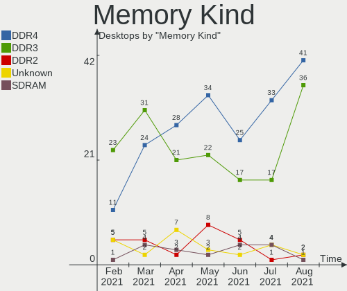

| Kind    | Desktops | Percent |
|---------|----------|---------|
| DDR4    | 18       | 37.5%   |
| DDR3    | 18       | 37.5%   |
| DDR2    | 5        | 10.42%  |
| SDRAM   | 3        | 6.25%   |
| Unknown | 3        | 6.25%   |
| LPDDR4  | 1        | 2.08%   |

Memory Form Factor
------------------

Physical design of the memory module

| Name   | Desktops | Percent |
|--------|----------|---------|
| DIMM   | 45       | 95.74%  |
| SODIMM | 2        | 4.26%   |

Memory Size
-----------

Memory module size

| Size  | Desktops | Percent |
|-------|----------|---------|
| 8192  | 18       | 34.62%  |
| 4096  | 17       | 32.69%  |
| 2048  | 9        | 17.31%  |
| 16384 | 7        | 13.46%  |
| 1024  | 1        | 1.92%   |

Memory Speed
------------

Memory module speed

| Speed   | Desktops | Percent |
|---------|----------|---------|
| 1600    | 13       | 24.53%  |
| 2400    | 8        | 15.09%  |
| 1333    | 6        | 11.32%  |
| 800     | 4        | 7.55%   |
| Unknown | 4        | 7.55%   |
| 3400    | 2        | 3.77%   |
| 3200    | 2        | 3.77%   |
| 3000    | 2        | 3.77%   |
| 2667    | 2        | 3.77%   |
| 3600    | 1        | 1.89%   |
| 3266    | 1        | 1.89%   |
| 2933    | 1        | 1.89%   |
| 2800    | 1        | 1.89%   |
| 2666    | 1        | 1.89%   |
| 2133    | 1        | 1.89%   |
| 2048    | 1        | 1.89%   |
| 1866    | 1        | 1.89%   |
| 1067    | 1        | 1.89%   |
| 667     | 1        | 1.89%   |

Sound Vendor
------------

Sound card vendors

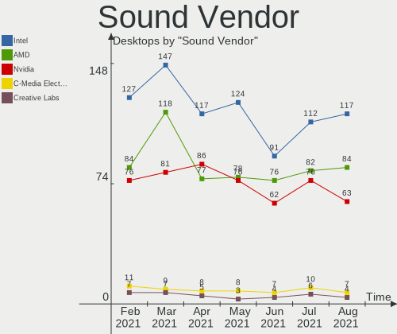

| Vendor                               | Desktops | Percent |
|--------------------------------------|----------|---------|
| Intel                                | 74       | 39.78%  |
| AMD                                  | 51       | 27.42%  |
| Nvidia                               | 36       | 19.35%  |
| C-Media Electronics                  | 5        | 2.69%   |
| Creative Labs                        | 4        | 2.15%   |
| Texas Instruments                    | 2        | 1.08%   |
| Tenx Technology                      | 2        | 1.08%   |
| Yamaha                               | 1        | 0.54%   |
| Thesycon Systemsoftware & Consulting | 1        | 0.54%   |
| Sony                                 | 1        | 0.54%   |
| Silicon Integrated Systems [SiS]     | 1        | 0.54%   |
| RODE Microphones                     | 1        | 0.54%   |
| Griffin Technology                   | 1        | 0.54%   |
| Generalplus Technology               | 1        | 0.54%   |
| FiiO                                 | 1        | 0.54%   |
| Creative Technology                  | 1        | 0.54%   |
| Corsair                              | 1        | 0.54%   |
| BlackWeb                             | 1        | 0.54%   |
| ASUSTek Computer                     | 1        | 0.54%   |

Sound Model
-----------

Sound card models

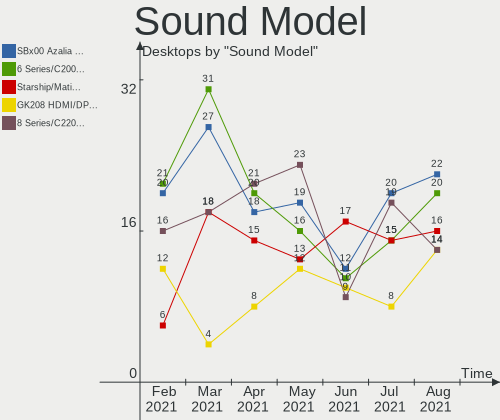

| Model                                                                                             | Desktops | Percent |
|---------------------------------------------------------------------------------------------------|----------|---------|
| Intel 8 Series/C220 Series Chipset High Definition Audio Controller                               | 12       | 5.58%   |
| AMD SBx00 Azalia (Intel HDA)                                                                      | 11       | 5.12%   |
| Intel 6 Series/C200 Series Chipset Family High Definition Audio Controller                        | 10       | 4.65%   |
| Intel NM10/ICH7 Family High Definition Audio Controller                                           | 9        | 4.19%   |
| Nvidia GK208 HDMI/DP Audio Controller                                                             | 8        | 3.72%   |
| Intel Xeon E3-1200 v3/4th Gen Core Processor HD Audio Controller                                  | 7        | 3.26%   |
| Intel 200 Series PCH HD Audio                                                                     | 7        | 3.26%   |
| AMD Oland/Hainan/Cape Verde/Pitcairn HDMI Audio [Radeon HD 7000 Series]                           | 7        | 3.26%   |
| Intel 100 Series/C230 Series Chipset Family HD Audio Controller                                   | 6        | 2.79%   |
| AMD FCH Azalia Controller                                                                         | 6        | 2.79%   |
| Intel Cannon Lake PCH cAVS                                                                        | 5        | 2.33%   |
| Nvidia MCP61 High Definition Audio                                                                | 4        | 1.86%   |
| Nvidia GK106 HDMI Audio Controller                                                                | 4        | 1.86%   |
| Intel 82801JD/DO (ICH10 Family) HD Audio Controller                                               | 4        | 1.86%   |
| AMD Family 17h (Models 10h-1fh) HD Audio Controller                                               | 4        | 1.86%   |
| AMD Family 17h (Models 00h-0fh) HD Audio Controller                                               | 4        | 1.86%   |
| AMD Ellesmere HDMI Audio [Radeon RX 470/480 / 570/580/590]                                        | 4        | 1.86%   |
| AMD Cedar HDMI Audio [Radeon HD 5400/6300/7300 Series]                                            | 4        | 1.86%   |
| Nvidia GP107GL High Definition Audio Controller                                                   | 3        | 1.4%    |
| Nvidia GP104 High Definition Audio Controller                                                     | 3        | 1.4%    |
| Nvidia GF108 High Definition Audio Controller                                                     | 3        | 1.4%    |
| Intel 82801JI (ICH10 Family) HD Audio Controller                                                  | 3        | 1.4%    |
| Intel 7 Series/C216 Chipset Family High Definition Audio Controller                               | 3        | 1.4%    |
| C-Media Electronics CMI8788 [Oxygen HD Audio]                                                     | 3        | 1.4%    |
| AMD Starship/Matisse HD Audio Controller                                                          | 3        | 1.4%    |
| AMD Raven/Raven2/Fenghuang HDMI/DP Audio Controller                                               | 3        | 1.4%    |
| Tenx Technology USB AUDIO                                                                         | 2        | 0.93%   |
| Nvidia TU107 GeForce GTX 1650 High Definition Audio Controller                                    | 2        | 0.93%   |
| Nvidia GP106 High Definition Audio Controller                                                     | 2        | 0.93%   |
| Nvidia GF106 High Definition Audio Controller                                                     | 2        | 0.93%   |
| Intel USB PnP Sound Device                                                                        | 2        | 0.93%   |
| Intel Celeron/Pentium Silver Processor High Definition Audio                                      | 2        | 0.93%   |
| Intel C600/X79 series chipset High Definition Audio Controller                                    | 2        | 0.93%   |
| Intel 82801I (ICH9 Family) HD Audio Controller                                                    | 2        | 0.93%   |
| Intel 5 Series/3400 Series Chipset High Definition Audio                                          | 2        | 0.93%   |
| C-Media Electronics CMI8738/CMI8768 PCI Audio                                                     | 2        | 0.93%   |
| AMD Turks HDMI Audio [Radeon HD 6500/6600 / 6700M Series]                                         | 2        | 0.93%   |
| AMD Trinity HDMI Audio Controller                                                                 | 2        | 0.93%   |
| AMD Tobago HDMI Audio [Radeon R7 360 / R9 360 OEM]                                                | 2        | 0.93%   |
| AMD RV770 HDMI Audio [Radeon HD 4850/4870]                                                        | 2        | 0.93%   |
| AMD Navi 10 HDMI Audio                                                                            | 2        | 0.93%   |
| AMD Hawaii HDMI Audio [Radeon R9 290/290X / 390/390X]                                             | 2        | 0.93%   |
| Yamaha Steinberg UR242                                                                            | 1        | 0.47%   |
| Thesycon Systemsoftware & Consulting D90 MQA                                                      | 1        | 0.47%   |
| Texas Instruments PCM2904 Audio Codec                                                             | 1        | 0.47%   |
| Texas Instruments PCM2902 Audio Codec                                                             | 1        | 0.47%   |
| Sony DualShock 4 [CUH-ZCT2x]                                                                      | 1        | 0.47%   |
| Silicon Integrated Systems [SiS] SiS7012 AC'97 Sound Controller                                   | 1        | 0.47%   |
| RODE Microphones RODE NT-USB                                                                      | 1        | 0.47%   |
| Nvidia TU106 High Definition Audio Controller                                                     | 1        | 0.47%   |
| Nvidia TU104 HD Audio Controller                                                                  | 1        | 0.47%   |
| Nvidia MCP67 High Definition Audio                                                                | 1        | 0.47%   |
| Nvidia High Definition Audio Controller                                                           | 1        | 0.47%   |
| Nvidia GM107 High Definition Audio Controller [GeForce 940MX]                                     | 1        | 0.47%   |
| Nvidia GK110 High Definition Audio Controller                                                     | 1        | 0.47%   |
| Nvidia GF114 HDMI Audio Controller                                                                | 1        | 0.47%   |
| Intel Cannon Point-LP High Definition Audio Controller                                            | 1        | 0.47%   |
| Intel C610/X99 series chipset HD Audio Controller                                                 | 1        | 0.47%   |
| Intel Audio device                                                                                | 1        | 0.47%   |
| Intel Atom/Celeron/Pentium Processor x5-E8000/J3xxx/N3xxx Series High Definition Audio Controller | 1        | 0.47%   |

Camera Vendor
-------------

Camera device vendors

| Vendor                  | Desktops | Percent |
|-------------------------|----------|---------|
| Logitech                | 12       | 40%     |
| Microsoft               | 3        | 10%     |
| Z-Star Microelectronics | 2        | 6.67%   |
| Samsung Electronics     | 2        | 6.67%   |
| Unknown                 | 1        | 3.33%   |
| Microdia                | 1        | 3.33%   |
| LG Electronics          | 1        | 3.33%   |
| Jieli Technology        | 1        | 3.33%   |
| IMC Networks            | 1        | 3.33%   |
| Generalplus Technology  | 1        | 3.33%   |
| GEMBIRD                 | 1        | 3.33%   |
| Cubeternet              | 1        | 3.33%   |
| Aveo Technology         | 1        | 3.33%   |
| ARC International       | 1        | 3.33%   |
| Apple                   | 1        | 3.33%   |

Camera Model
------------

Camera device models

| Model                                     | Desktops | Percent |
|-------------------------------------------|----------|---------|
| Logitech HD Pro Webcam C920               | 3        | 10%     |
| Z-Star Venus USB2.0 Camera                | 2        | 6.67%   |
| Samsung Galaxy A5 (MTP)                   | 2        | 6.67%   |
| Logitech Webcam C270                      | 2        | 6.67%   |
| Logitech C922 Pro Stream Webcam           | 2        | 6.67%   |
| Unknown HD camera                         | 1        | 3.33%   |
| Microsoft LifeCam VX-7000 (UVC-compliant) | 1        | 3.33%   |
| Microsoft LifeCam HD-3000                 | 1        | 3.33%   |
| Microsoft LifeCam Cinema                  | 1        | 3.33%   |
| Microdia Webcam Vitade AF                 | 1        | 3.33%   |
| Logitech Webcam C600                      | 1        | 3.33%   |
| Logitech Webcam C310                      | 1        | 3.33%   |
| Logitech QuickCam Pro 4000                | 1        | 3.33%   |
| Logitech HD Webcam C525                   | 1        | 3.33%   |
| Logitech HD Webcam B910                   | 1        | 3.33%   |
| LG Optimus (Various Models) MTP Mode      | 1        | 3.33%   |
| Jieli USB PHY 2.0                         | 1        | 3.33%   |
| IMC Networks Integrated Camera            | 1        | 3.33%   |
| Generalplus GENERAL WEBCAM                | 1        | 3.33%   |
| GEMBIRD USB2.0 PC CAMERA                  | 1        | 3.33%   |
| Cubeternet USB2.0 Camera                  | 1        | 3.33%   |
| Aveo USB2.0 UVC PC Camera                 | 1        | 3.33%   |
| ARC International Camera                  | 1        | 3.33%   |
| Apple iPhone 5/5C/5S/6/SE                 | 1        | 3.33%   |

Fingerprint Vendor
------------------

Fingerprint sensor vendors

Zero info for selected period =(

Fingerprint Model
-----------------

Fingerprint sensor models

Zero info for selected period =(

Chipcard Vendor
---------------

Chipcard module vendors

Zero info for selected period =(

Chipcard Model
--------------

Chipcard module models

Zero info for selected period =(

Printer Vendor
--------------

Printer device vendors

| Vendor              | Desktops | Percent |
|---------------------|----------|---------|
| Hewlett-Packard     | 3        | 37.5%   |
| Brother Industries  | 2        | 25%     |
| Seiko Epson         | 1        | 12.5%   |
| Samsung Electronics | 1        | 12.5%   |
| Pantum              | 1        | 12.5%   |

Printer Model
-------------

Printer device models

| Model                         | Desktops | Percent |
|-------------------------------|----------|---------|
| Seiko Epson L555 Series       | 1        | 12.5%   |
| Samsung M301x Series          | 1        | 12.5%   |
| Pantum M6500 series           | 1        | 12.5%   |
| HP LaserJet 1320              | 1        | 12.5%   |
| HP LaserJet 1018              | 1        | 12.5%   |
| HP ENVY 5000 series           | 1        | 12.5%   |
| Brother HL-L2320D series      | 1        | 12.5%   |
| Brother HL-1430 Laser Printer | 1        | 12.5%   |

Scanner Vendor
--------------

Scanner device vendors

Zero info for selected period =(

Scanner Model
-------------

Scanner device models

Zero info for selected period =(

Bluetooth Vendor
----------------

Controller vendors

| Vendor                          | Desktops | Percent |
|---------------------------------|----------|---------|
| Intel                           | 12       | 42.86%  |
| Cambridge Silicon Radio         | 6        | 21.43%  |
| Realtek Semiconductor           | 3        | 10.71%  |
| ASUSTek Computer                | 2        | 7.14%   |
| Roper                           | 1        | 3.57%   |
| Qualcomm Atheros Communications | 1        | 3.57%   |
| Integrated System Solution      | 1        | 3.57%   |
| Broadcom                        | 1        | 3.57%   |
| Apple                           | 1        | 3.57%   |

Bluetooth Model
---------------

Controller models

| Model                                                 | Desktops | Percent |
|-------------------------------------------------------|----------|---------|
| Cambridge Silicon Radio Bluetooth Dongle (HCI mode)   | 6        | 21.43%  |
| Intel Bluetooth wireless interface                    | 5        | 17.86%  |
| Intel Wireless-AC 3168 Bluetooth                      | 4        | 14.29%  |
| Realtek Bluetooth Radio                               | 2        | 7.14%   |
| Roper Class 1 Bluetooth Dongle                        | 1        | 3.57%   |
| Realtek  Bluetooth 4.2 Adapter                        | 1        | 3.57%   |
| Qualcomm Atheros  Bluetooth Device                    | 1        | 3.57%   |
| Intel Wireless-AC 9260 Bluetooth Adapter              | 1        | 3.57%   |
| Intel Centrino Bluetooth Wireless Transceiver         | 1        | 3.57%   |
| Intel AX200 Bluetooth                                 | 1        | 3.57%   |
| Integrated System Solution KY-BT100 Bluetooth Adapter | 1        | 3.57%   |
| Broadcom BCM92046DG-CL1ROM Bluetooth 2.1 Adapter      | 1        | 3.57%   |
| ASUS Broadcom BCM20702 Single-Chip Bluetooth 4.0 + LE | 1        | 3.57%   |
| ASUS BCM20702A0                                       | 1        | 3.57%   |
| Apple Bluetooth HCI                                   | 1        | 3.57%   |

Unsupported Devices
-------------------

Total unsupported devices on board

| Total | Desktops | Percent |
|-------|----------|---------|
| 0     | 92       | 82.14%  |
| 1     | 17       | 15.18%  |
| 2     | 2        | 1.79%   |
| 3     | 1        | 0.89%   |

Unsupported Device Types
------------------------

Types of unsupported devices

| Type                  | Desktops | Percent |
|-----------------------|----------|---------|
| Net/wireless          | 8        | 38.1%   |
| Graphics card         | 7        | 33.33%  |
| Network               | 2        | 9.52%   |
| Unassigned class      | 1        | 4.76%   |
| Storage/raid          | 1        | 4.76%   |
| Multimedia controller | 1        | 4.76%   |
| Modem                 | 1        | 4.76%   |

