Mint Hardware Trends (Desktop)
------------------------------

A project to identify most popular hardware characteristics and track their change
over time based on data collected by Mint users at https://Linux-Hardware.org.

Anyone can contribute to the study by uploading probes of their computers by
the [hw-probe](https://github.com/linuxhw/hw-probe) tool:

    sudo -E hw-probe -all -upload

Full-feature report is available here: https://linux-hardware.org/?view=trends&formfactor=desktop

Period: Jun, 2021.

Contents
--------

- [ OS                       ](#os)
- [ OS Family                ](#os-family)
- [ Kernel                   ](#kernel)
- [ Kernel Family            ](#kernel-family)
- [ Kernel Major Ver.        ](#kernel-major-ver)
- [ Arch                     ](#arch)
- [ DE                       ](#de)
- [ Display Server           ](#display-server)
- [ Display Manager          ](#display-manager)
- [ OS Lang                  ](#os-lang)
- [ Boot Mode                ](#boot-mode)
- [ Filesystem               ](#filesystem)
- [ Part. scheme             ](#part-scheme)
- [ Dual Boot with Linux/BSD ](#dual-boot-with-linux/bsd)
- [ Dual Boot (Win)          ](#dual-boot-win)
- [ Country                  ](#country)
- [ City                     ](#city)
- [ Vendor                   ](#vendor)
- [ Model                    ](#model)
- [ Model Family             ](#model-family)
- [ MFG Year                 ](#mfg-year)
- [ Form Factor              ](#form-factor)
- [ Secure Boot              ](#secure-boot)
- [ Coreboot                 ](#coreboot)
- [ RAM Size                 ](#ram-size)
- [ RAM Used                 ](#ram-used)
- [ Has CD-ROM               ](#has-cd-rom)
- [ Total Drives             ](#total-drives)
- [ Has Ethernet             ](#has-ethernet)
- [ Has WiFi                 ](#has-wifi)
- [ Has Bluetooth            ](#has-bluetooth)
- [ Drive Vendor             ](#drive-vendor)
- [ Drive Model              ](#drive-model)
- [ HDD Vendor               ](#hdd-vendor)
- [ SSD Vendor               ](#ssd-vendor)
- [ Drive Kind               ](#drive-kind)
- [ Drive Connector          ](#drive-connector)
- [ Drive Size               ](#drive-size)
- [ Space Total              ](#space-total)
- [ Space Used               ](#space-used)
- [ Malfunc. Drives          ](#malfunc-drives)
- [ Malfunc. Drive Vendor    ](#malfunc-drive-vendor)
- [ Malfunc. HDD Vendor      ](#malfunc-hdd-vendor)
- [ Malfunc. Drive Kind      ](#malfunc-drive-kind)
- [ Failed Drives            ](#failed-drives)
- [ Failed Drive Vendor      ](#failed-drive-vendor)
- [ Drive Status             ](#drive-status)
- [ Storage Vendor           ](#storage-vendor)
- [ Storage Model            ](#storage-model)
- [ Storage Kind             ](#storage-kind)
- [ CPU Vendor               ](#cpu-vendor)
- [ CPU Model                ](#cpu-model)
- [ CPU Model Family         ](#cpu-model-family)
- [ CPU Cores                ](#cpu-cores)
- [ CPU Sockets              ](#cpu-sockets)
- [ CPU Threads              ](#cpu-threads)
- [ CPU Op-Modes             ](#cpu-op-modes)
- [ CPU Microcode            ](#cpu-microcode)
- [ CPU Microarch            ](#cpu-microarch)
- [ GPU Vendor               ](#gpu-vendor)
- [ GPU Model                ](#gpu-model)
- [ GPU Combo                ](#gpu-combo)
- [ GPU Driver               ](#gpu-driver)
- [ GPU Memory               ](#gpu-memory)
- [ Monitor Vendor           ](#monitor-vendor)
- [ Monitor Model            ](#monitor-model)
- [ Monitor Resolution       ](#monitor-resolution)
- [ Monitor Diagonal         ](#monitor-diagonal)
- [ Monitor Width            ](#monitor-width)
- [ Aspect Ratio             ](#aspect-ratio)
- [ Monitor Area             ](#monitor-area)
- [ Pixel Density            ](#pixel-density)
- [ Multiple Monitors        ](#multiple-monitors)
- [ Net Controller Vendor    ](#net-controller-vendor)
- [ Net Controller Model     ](#net-controller-model)
- [ Wireless Vendor          ](#wireless-vendor)
- [ Wireless Model           ](#wireless-model)
- [ Ethernet Vendor          ](#ethernet-vendor)
- [ Ethernet Model           ](#ethernet-model)
- [ Net Controller Kind      ](#net-controller-kind)
- [ Used Controller          ](#used-controller)
- [ NICs                     ](#nics)
- [ IPv6                     ](#ipv6)
- [ Memory Vendor            ](#memory-vendor)
- [ Memory Model             ](#memory-model)
- [ Memory Kind              ](#memory-kind)
- [ Memory Form Factor       ](#memory-form-factor)
- [ Memory Size              ](#memory-size)
- [ Memory Speed             ](#memory-speed)
- [ Sound Vendor             ](#sound-vendor)
- [ Sound Model              ](#sound-model)
- [ Camera Vendor            ](#camera-vendor)
- [ Camera Model             ](#camera-model)
- [ Fingerprint Vendor       ](#fingerprint-vendor)
- [ Fingerprint Model        ](#fingerprint-model)
- [ Chipcard Vendor          ](#chipcard-vendor)
- [ Chipcard Model           ](#chipcard-model)
- [ Printer Vendor           ](#printer-vendor)
- [ Printer Model            ](#printer-model)
- [ Scanner Vendor           ](#scanner-vendor)
- [ Scanner Model            ](#scanner-model)
- [ Bluetooth Vendor         ](#bluetooth-vendor)
- [ Bluetooth Model          ](#bluetooth-model)
- [ Unsupported Devices      ](#unsupported-devices)
- [ Unsupported Device Types ](#unsupported-device-types)

OS
--

Installed operating systems

| Name      | Desktops | Percent |
|-----------|----------|---------|
| Mint 20.1 | 117      | 71.34%  |
| Mint 19.3 | 22       | 13.41%  |
| Mint 20   | 15       | 9.15%   |
| Mint 19.2 | 5        | 3.05%   |
| Mint 20.2 | 2        | 1.22%   |
| Mint 19   | 1        | 0.61%   |
| Mint 18.3 | 1        | 0.61%   |
| Mint 18.2 | 1        | 0.61%   |

OS Family
---------

OS without a version

| Name | Desktops | Percent |
|------|----------|---------|
| Mint | 164      | 100%    |

Kernel
------

Version of the Linux kernel

| Version                    | Desktops | Percent |
|----------------------------|----------|---------|
| 5.4.0-74-generic           | 70       | 42.68%  |
| 5.4.0-77-generic           | 24       | 14.63%  |
| 5.4.0-73-generic           | 12       | 7.32%   |
| 5.8.0-55-generic           | 11       | 6.71%   |
| 5.4.0-58-generic           | 8        | 4.88%   |
| 5.8.0-53-generic           | 6        | 3.66%   |
| 5.4.0-26-generic           | 5        | 3.05%   |
| 4.15.0-54-generic          | 3        | 1.83%   |
| 5.0.0-32-generic           | 2        | 1.22%   |
| 5.9.16-050916-generic      | 1        | 0.61%   |
| 5.8.0-59-generic           | 1        | 0.61%   |
| 5.8.0-33-generic           | 1        | 0.61%   |
| 5.4.0-73-lowlatency        | 1        | 0.61%   |
| 5.4.0-72-generic           | 1        | 0.61%   |
| 5.4.0-712104061620-generic | 1        | 0.61%   |
| 5.4.0-66-generic           | 1        | 0.61%   |
| 5.4.0-62-generic           | 1        | 0.61%   |
| 5.4.0-54-generic           | 1        | 0.61%   |
| 5.4.0-52-generic           | 1        | 0.61%   |
| 5.4.0-48-generic           | 1        | 0.61%   |
| 5.3.0-40-generic           | 1        | 0.61%   |
| 5.12.9-steamvr-generic     | 1        | 0.61%   |
| 5.12.4-051204-generic      | 1        | 0.61%   |
| 5.12.2-051202-generic      | 1        | 0.61%   |
| 5.12.0-051200rc8-generic   | 1        | 0.61%   |
| 5.11.0-051100-generic      | 1        | 0.61%   |
| 5.10.27-051027-generic     | 1        | 0.61%   |
| 4.15.0-20-generic          | 1        | 0.61%   |
| 4.15.0-144-generic         | 1        | 0.61%   |
| 4.15.0-142-generic         | 1        | 0.61%   |
| 4.10.0-38-generic          | 1        | 0.61%   |
| Unknown                    | 1        | 0.61%   |

Kernel Family
-------------

Linux kernel without a distro release

| Version | Desktops | Percent |
|---------|----------|---------|
| 5.4.0   | 127      | 77.44%  |
| 5.8.0   | 19       | 11.59%  |
| 4.15.0  | 6        | 3.66%   |
| 5.0.0   | 2        | 1.22%   |
| 5.9.16  | 1        | 0.61%   |
| 5.3.0   | 1        | 0.61%   |
| 5.12.9  | 1        | 0.61%   |
| 5.12.4  | 1        | 0.61%   |
| 5.12.2  | 1        | 0.61%   |
| 5.12.0  | 1        | 0.61%   |
| 5.11.0  | 1        | 0.61%   |
| 5.10.27 | 1        | 0.61%   |
| 4.10.0  | 1        | 0.61%   |
| Unknown | 1        | 0.61%   |

Kernel Major Ver.
-----------------

Linux kernel major version

| Version | Desktops | Percent |
|---------|----------|---------|
| 5.4     | 127      | 77.44%  |
| 5.8     | 19       | 11.59%  |
| 4.15    | 6        | 3.66%   |
| 5.12    | 4        | 2.44%   |
| 5.0     | 2        | 1.22%   |
| 5.9     | 1        | 0.61%   |
| 5.3     | 1        | 0.61%   |
| 5.11    | 1        | 0.61%   |
| 5.10    | 1        | 0.61%   |
| 4.10    | 1        | 0.61%   |
| Unknown | 1        | 0.61%   |

Arch
----

OS architecture (x86_64, i586, etc.)

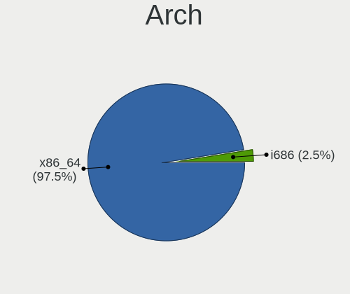

| Name   | Desktops | Percent |
|--------|----------|---------|
| x86_64 | 155      | 94.51%  |
| i686   | 9        | 5.49%   |

DE
--

Desktop Environment

| Name       | Desktops | Percent |
|------------|----------|---------|
| X-Cinnamon | 110      | 67.07%  |
| MATE       | 22       | 13.41%  |
| XFCE       | 13       | 7.93%   |
| Cinnamon   | 10       | 6.1%    |
| Unknown    | 4        | 2.44%   |
| KDE        | 3        | 1.83%   |
| Pantheon   | 1        | 0.61%   |
| GNOME      | 1        | 0.61%   |

Display Server
--------------

X11 or Wayland

| Name | Desktops | Percent |
|------|----------|---------|
| X11  | 164      | 100%    |

Display Manager
---------------

SDDM, LightDM, etc.

| Name    | Desktops | Percent |
|---------|----------|---------|
| Unknown | 120      | 73.17%  |
| TDM     | 43       | 26.22%  |
| SDDM    | 1        | 0.61%   |

OS Lang
-------

Language

| Lang    | Desktops | Percent |
|---------|----------|---------|
| en_US   | 48       | 29.27%  |
| de_DE   | 19       | 11.59%  |
| pt_BR   | 12       | 7.32%   |
| fr_FR   | 11       | 6.71%   |
| en_GB   | 8        | 4.88%   |
| ru_RU   | 6        | 3.66%   |
| en_CA   | 6        | 3.66%   |
| it_IT   | 5        | 3.05%   |
| pl_PL   | 4        | 2.44%   |
| es_ES   | 4        | 2.44%   |
| en_IN   | 4        | 2.44%   |
| zh_CN   | 3        | 1.83%   |
| nl_NL   | 3        | 1.83%   |
| C       | 3        | 1.83%   |
| sk_SK   | 2        | 1.22%   |
| ru_UA   | 2        | 1.22%   |
| fr_BE   | 2        | 1.22%   |
| es_CL   | 2        | 1.22%   |
| en_NZ   | 2        | 1.22%   |
| cs_CZ   | 2        | 1.22%   |
| sv_SE   | 1        | 0.61%   |
| pt_PT   | 1        | 0.61%   |
| hu_HU   | 1        | 0.61%   |
| fr_CH   | 1        | 0.61%   |
| es_VE   | 1        | 0.61%   |
| es_PE   | 1        | 0.61%   |
| es_PA   | 1        | 0.61%   |
| es_MX   | 1        | 0.61%   |
| es_AR   | 1        | 0.61%   |
| en_ZW   | 1        | 0.61%   |
| en_IL   | 1        | 0.61%   |
| en_IE   | 1        | 0.61%   |
| en_DK   | 1        | 0.61%   |
| el_GR   | 1        | 0.61%   |
| da_DK   | 1        | 0.61%   |
| Unknown | 1        | 0.61%   |

Boot Mode
---------

EFI or BIOS

| Mode | Desktops | Percent |
|------|----------|---------|
| BIOS | 102      | 62.2%   |
| EFI  | 62       | 37.8%   |

Filesystem
----------

Type of filesystem

| Type    | Desktops | Percent |
|---------|----------|---------|
| Ext4    | 159      | 96.95%  |
| Overlay | 4        | 2.44%   |
| Xfs     | 1        | 0.61%   |

Part. scheme
------------

Scheme of partitioning

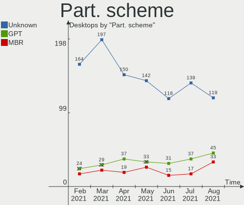

| Type    | Desktops | Percent |
|---------|----------|---------|
| Unknown | 118      | 71.95%  |
| GPT     | 31       | 18.9%   |
| MBR     | 15       | 9.15%   |

Dual Boot with Linux/BSD
------------------------

Hosting more than one Linux/BSD

| Dual boot | Desktops | Percent |
|-----------|----------|---------|
| No        | 145      | 88.41%  |
| Yes       | 19       | 11.59%  |

Dual Boot (Win)
---------------

Hosting Linux and Windows

| Dual boot | Desktops | Percent |
|-----------|----------|---------|
| No        | 132      | 80.49%  |
| Yes       | 32       | 19.51%  |

Country
-------

Geographic location (country)

| Country                          | Desktops | Percent |
|----------------------------------|----------|---------|
| USA                              | 29       | 17.68%  |
| Germany                          | 17       | 10.37%  |
| Brazil                           | 14       | 8.54%   |
| France                           | 12       | 7.32%   |
| UK                               | 7        | 4.27%   |
| Canada                           | 7        | 4.27%   |
| Russia                           | 6        | 3.66%   |
| Ukraine                          | 5        | 3.05%   |
| Spain                            | 5        | 3.05%   |
| Poland                           | 5        | 3.05%   |
| Netherlands                      | 5        | 3.05%   |
| Italy                            | 5        | 3.05%   |
| India                            | 4        | 2.44%   |
| Venezuela                        | 2        | 1.22%   |
| Switzerland                      | 2        | 1.22%   |
| Slovakia                         | 2        | 1.22%   |
| Serbia                           | 2        | 1.22%   |
| Portugal                         | 2        | 1.22%   |
| Panama                           | 2        | 1.22%   |
| New Zealand                      | 2        | 1.22%   |
| Hungary                          | 2        | 1.22%   |
| Denmark                          | 2        | 1.22%   |
| Czechia                          | 2        | 1.22%   |
| China                            | 2        | 1.22%   |
| Chile                            | 2        | 1.22%   |
| Belgium                          | 2        | 1.22%   |
| Belarus                          | 2        | 1.22%   |
| Zimbabwe                         | 1        | 0.61%   |
| Sweden                           | 1        | 0.61%   |
| Saint Vincent and the Grenadines | 1        | 0.61%   |
| Peru                             | 1        | 0.61%   |
| Norway                           | 1        | 0.61%   |
| Mexico                           | 1        | 0.61%   |
| Lithuania                        | 1        | 0.61%   |
| Israel                           | 1        | 0.61%   |
| Iran                             | 1        | 0.61%   |
| Greece                           | 1        | 0.61%   |
| Estonia                          | 1        | 0.61%   |
| Bulgaria                         | 1        | 0.61%   |
| Austria                          | 1        | 0.61%   |
| Australia                        | 1        | 0.61%   |
| Argentina                        | 1        | 0.61%   |

City
----

Geographic location (city)

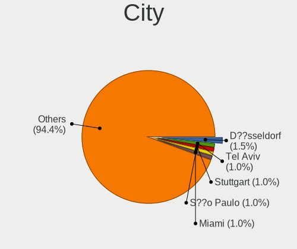

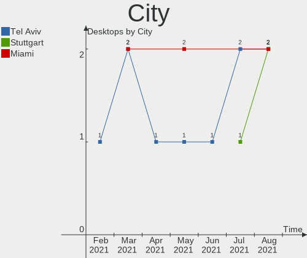

| City                      | Desktops | Percent |
|---------------------------|----------|---------|
| Berlin                    | 4        | 2.44%   |
| Vancouver                 | 3        | 1.83%   |
| Kyiv                      | 3        | 1.83%   |
| São Paulo                | 2        | 1.22%   |
| Santiago                  | 2        | 1.22%   |
| Paris                     | 2        | 1.22%   |
| Minsk                     | 2        | 1.22%   |
| Milan                     | 2        | 1.22%   |
| Guarulhos                 | 2        | 1.22%   |
| Fulda                     | 2        | 1.22%   |
| Edmonton                  | 2        | 1.22%   |
| Denver                    | 2        | 1.22%   |
| Chicago                   | 2        | 1.22%   |
| Belgrade                  | 2        | 1.22%   |
| Zurich                    | 1        | 0.61%   |
| Ziar nad Hronom           | 1        | 0.61%   |
| Zelesice                  | 1        | 0.61%   |
| Włocławek               | 1        | 0.61%   |
| Wylie                     | 1        | 0.61%   |
| Wrexham                   | 1        | 0.61%   |
| Wieruszow                 | 1        | 0.61%   |
| West Columbia             | 1        | 0.61%   |
| Wellington                | 1        | 0.61%   |
| Waterloo                  | 1        | 0.61%   |
| Warsaw                    | 1        | 0.61%   |
| Valreas                   | 1        | 0.61%   |
| Valencia                  | 1        | 0.61%   |
| Vaassen                   | 1        | 0.61%   |
| Ulyanovsk                 | 1        | 0.61%   |
| Turin                     | 1        | 0.61%   |
| Toulouse                  | 1        | 0.61%   |
| Topeka                    | 1        | 0.61%   |
| Tel Aviv                  | 1        | 0.61%   |
| Tavernes de la Valldigna  | 1        | 0.61%   |
| Tartu                     | 1        | 0.61%   |
| Talca                     | 1        | 0.61%   |
| Surry Hills               | 1        | 0.61%   |
| Stockport                 | 1        | 0.61%   |
| Steubenville              | 1        | 0.61%   |
| Stavanger                 | 1        | 0.61%   |
| Stara Zagora              | 1        | 0.61%   |
| St Petersburg             | 1        | 0.61%   |
| St Louis                  | 1        | 0.61%   |
| Simferopol                | 1        | 0.61%   |
| Shiraz                    | 1        | 0.61%   |
| Shenzhen                  | 1        | 0.61%   |
| Seattle                   | 1        | 0.61%   |
| San Antonio               | 1        | 0.61%   |
| Saint-Laurent-Blangy      | 1        | 0.61%   |
| Saint-Hilaire-sur-Benaize | 1        | 0.61%   |
| Saint-Genis-Pouilly       | 1        | 0.61%   |
| Rotterdam                 | 1        | 0.61%   |
| Rivne                     | 1        | 0.61%   |
| Rio de Janeiro            | 1        | 0.61%   |
| Queijas                   | 1        | 0.61%   |
| Portland                  | 1        | 0.61%   |
| Porlamar                  | 1        | 0.61%   |
| Pflugerville              | 1        | 0.61%   |
| Perm                      | 1        | 0.61%   |
| Panorama City             | 1        | 0.61%   |

Vendor
------

Motherboard manufacturer

| Name                | Desktops | Percent |
|---------------------|----------|---------|
| ASUSTek Computer    | 44       | 26.83%  |
| Gigabyte Technology | 33       | 20.12%  |
| MSI                 | 14       | 8.54%   |
| Dell                | 12       | 7.32%   |
| ASRock              | 11       | 6.71%   |
| Hewlett-Packard     | 8        | 4.88%   |
| Acer                | 6        | 3.66%   |
| Pegatron            | 5        | 3.05%   |
| Lenovo              | 5        | 3.05%   |
| Intel               | 4        | 2.44%   |
| ECS                 | 4        | 2.44%   |
| Unknown             | 4        | 2.44%   |
| eMachines           | 2        | 1.22%   |
| Biostar             | 2        | 1.22%   |
| Positivo            | 1        | 0.61%   |
| PCWare              | 1        | 0.61%   |
| OEM                 | 1        | 0.61%   |
| Medion              | 1        | 0.61%   |
| Fujitsu Siemens     | 1        | 0.61%   |
| Fujitsu             | 1        | 0.61%   |
| Foxconn             | 1        | 0.61%   |
| Chuwi               | 1        | 0.61%   |
| Apple               | 1        | 0.61%   |
| AMD                 | 1        | 0.61%   |

Model
-----

Motherboard model

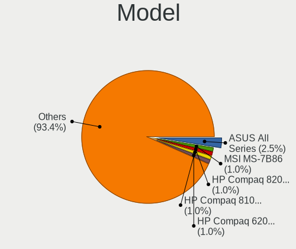

| Name                                      | Desktops | Percent |
|-------------------------------------------|----------|---------|
| ASUS TUF GAMING X570-PLUS                 | 5        | 3.05%   |
| Unknown                                   | 5        | 3.05%   |
| Gigabyte A320M-S2H                        | 3        | 1.83%   |
| ASUS All Series                           | 3        | 1.83%   |
| MSI MS-7C91                               | 2        | 1.22%   |
| Gigabyte GA-970A-UD3                      | 2        | 1.22%   |
| Dell OptiPlex 790                         | 2        | 1.22%   |
| Dell OptiPlex 390                         | 2        | 1.22%   |
| ASUS TUF GAMING B550M-PLUS                | 2        | 1.22%   |
| ASUS M5A78L-M PLUS/USB3                   | 2        | 1.22%   |
| Positivo POS-MIG31AG                      | 1        | 0.61%   |
| Pegatron Pro 3120 Small Form Factor PC    | 1        | 0.61%   |
| Pegatron p2-1033w                         | 1        | 0.61%   |
| Pegatron NY429AA-ABA p6110y               | 1        | 0.61%   |
| Pegatron 505B Microtower PC               | 1        | 0.61%   |
| Pegatron 320-1120m                        | 1        | 0.61%   |
| PCWare IPMH61G1                           | 1        | 0.61%   |
| MSI p6534f                                | 1        | 0.61%   |
| MSI MS-7C94                               | 1        | 0.61%   |
| MSI MS-7C37                               | 1        | 0.61%   |
| MSI MS-7B87                               | 1        | 0.61%   |
| MSI MS-7B79                               | 1        | 0.61%   |
| MSI MS-7B48                               | 1        | 0.61%   |
| MSI MS-7A34                               | 1        | 0.61%   |
| MSI MS-7977                               | 1        | 0.61%   |
| MSI MS-7817                               | 1        | 0.61%   |
| MSI MS-7758                               | 1        | 0.61%   |
| MSI MS-7693                               | 1        | 0.61%   |
| MSI MS-7276                               | 1        | 0.61%   |
| Medion MS-7800                            | 1        | 0.61%   |
| Lenovo ThinkCentre M92p 32361D5           | 1        | 0.61%   |
| Lenovo ThinkCentre M58p 6137FN2           | 1        | 0.61%   |
| Lenovo ThinkCentre M57e 6176A13           | 1        | 0.61%   |
| Lenovo IdeaCentre T540-15ICK G 90LW0037MW | 1        | 0.61%   |
| Lenovo H30-05 90BJ002RUK                  | 1        | 0.61%   |
| Intel SHARKBAY                            | 1        | 0.61%   |
| Intel H61                                 | 1        | 0.61%   |
| Intel DH55PJ AAE93812-302                 | 1        | 0.61%   |
| Intel B75                                 | 1        | 0.61%   |
| HP ProLiant ML350 G5                      | 1        | 0.61%   |
| HP ProDesk 600 G1 SFF                     | 1        | 0.61%   |
| HP EliteDesk 705 G3 MT                    | 1        | 0.61%   |
| HP Compaq Pro 6300 SFF                    | 1        | 0.61%   |
| HP Compaq Elite 8300 CMT                  | 1        | 0.61%   |
| HP Compaq dc5750 Small Form Factor        | 1        | 0.61%   |
| HP Compaq 8200 Elite SFF PC               | 1        | 0.61%   |
| HP Compaq 6000 Pro MT PC                  | 1        | 0.61%   |
| Gigabyte Z87X-UD4H                        | 1        | 0.61%   |
| Gigabyte Z87X-D3H                         | 1        | 0.61%   |
| Gigabyte Z77M-D3H                         | 1        | 0.61%   |
| Gigabyte Z490 UD                          | 1        | 0.61%   |
| Gigabyte Z270-Gaming 3                    | 1        | 0.61%   |
| Gigabyte Z170M-D3H                        | 1        | 0.61%   |
| Gigabyte X570 AORUS MASTER                | 1        | 0.61%   |
| Gigabyte X570 AORUS ELITE                 | 1        | 0.61%   |
| Gigabyte PC-1849C                         | 1        | 0.61%   |
| Gigabyte P41-ES3G                         | 1        | 0.61%   |
| Gigabyte M56S-S3                          | 1        | 0.61%   |
| Gigabyte H97M-DS3P                        | 1        | 0.61%   |
| Gigabyte H61M-DS2                         | 1        | 0.61%   |

Model Family
------------

Motherboard model prefix

| Name                  | Desktops | Percent |
|-----------------------|----------|---------|
| Dell OptiPlex         | 8        | 4.88%   |
| ASUS TUF              | 8        | 4.88%   |
| ASUS PRIME            | 8        | 4.88%   |
| HP Compaq             | 5        | 3.05%   |
| Acer Aspire           | 5        | 3.05%   |
| Unknown               | 5        | 3.05%   |
| ASUS ROG              | 4        | 2.44%   |
| Lenovo ThinkCentre    | 3        | 1.83%   |
| Gigabyte A320M-S2H    | 3        | 1.83%   |
| ASUS P5G41T-M         | 3        | 1.83%   |
| ASUS All              | 3        | 1.83%   |
| MSI MS-7C91           | 2        | 1.22%   |
| Gigabyte X570         | 2        | 1.22%   |
| Gigabyte GA-970A-UD3  | 2        | 1.22%   |
| Dell Precision        | 2        | 1.22%   |
| ASUS M5A78L-M         | 2        | 1.22%   |
| ASUS M2N-MX           | 2        | 1.22%   |
| Positivo POS-MIG31AG  | 1        | 0.61%   |
| Pegatron Pro          | 1        | 0.61%   |
| Pegatron p2-1033w     | 1        | 0.61%   |
| Pegatron NY429AA-ABA  | 1        | 0.61%   |
| Pegatron 505B         | 1        | 0.61%   |
| Pegatron 320-1120m    | 1        | 0.61%   |
| PCWare IPMH61G1       | 1        | 0.61%   |
| MSI p6534f            | 1        | 0.61%   |
| MSI MS-7C94           | 1        | 0.61%   |
| MSI MS-7C37           | 1        | 0.61%   |
| MSI MS-7B87           | 1        | 0.61%   |
| MSI MS-7B79           | 1        | 0.61%   |
| MSI MS-7B48           | 1        | 0.61%   |
| MSI MS-7A34           | 1        | 0.61%   |
| MSI MS-7977           | 1        | 0.61%   |
| MSI MS-7817           | 1        | 0.61%   |
| MSI MS-7758           | 1        | 0.61%   |
| MSI MS-7693           | 1        | 0.61%   |
| MSI MS-7276           | 1        | 0.61%   |
| Medion MS-7800        | 1        | 0.61%   |
| Lenovo IdeaCentre     | 1        | 0.61%   |
| Lenovo H30-05         | 1        | 0.61%   |
| Intel SHARKBAY        | 1        | 0.61%   |
| Intel H61             | 1        | 0.61%   |
| Intel DH55PJ          | 1        | 0.61%   |
| Intel B75             | 1        | 0.61%   |
| HP ProLiant           | 1        | 0.61%   |
| HP ProDesk            | 1        | 0.61%   |
| HP EliteDesk          | 1        | 0.61%   |
| Gigabyte Z87X-UD4H    | 1        | 0.61%   |
| Gigabyte Z87X-D3H     | 1        | 0.61%   |
| Gigabyte Z77M-D3H     | 1        | 0.61%   |
| Gigabyte Z490         | 1        | 0.61%   |
| Gigabyte Z270-Gaming  | 1        | 0.61%   |
| Gigabyte Z170M-D3H    | 1        | 0.61%   |
| Gigabyte PC-1849C     | 1        | 0.61%   |
| Gigabyte P41-ES3G     | 1        | 0.61%   |
| Gigabyte M56S-S3      | 1        | 0.61%   |
| Gigabyte H97M-DS3P    | 1        | 0.61%   |
| Gigabyte H61M-DS2     | 1        | 0.61%   |
| Gigabyte H310M        | 1        | 0.61%   |
| Gigabyte GA-MA770-UD3 | 1        | 0.61%   |
| Gigabyte GA-MA770-DS3 | 1        | 0.61%   |

MFG Year
--------

Motherboard manufacture year

| Year | Desktops | Percent |
|------|----------|---------|
| 2020 | 25       | 15.24%  |
| 2019 | 17       | 10.37%  |
| 2021 | 15       | 9.15%   |
| 2008 | 13       | 7.93%   |
| 2018 | 12       | 7.32%   |
| 2010 | 12       | 7.32%   |
| 2012 | 11       | 6.71%   |
| 2011 | 10       | 6.1%    |
| 2014 | 9        | 5.49%   |
| 2009 | 9        | 5.49%   |
| 2015 | 7        | 4.27%   |
| 2017 | 6        | 3.66%   |
| 2016 | 6        | 3.66%   |
| 2013 | 6        | 3.66%   |
| 2007 | 5        | 3.05%   |
| 2004 | 1        | 0.61%   |

Form Factor
-----------

Physical design of the computer

| Name    | Desktops | Percent |
|---------|----------|---------|
| Desktop | 164      | 100%    |

Secure Boot
-----------

Enabled or disabled

| State    | Desktops | Percent |
|----------|----------|---------|
| Disabled | 163      | 99.39%  |
| Enabled  | 1        | 0.61%   |

Coreboot
--------

Have coreboot on board

| Used | Desktops | Percent |
|------|----------|---------|
| No   | 164      | 100%    |

RAM Size
--------

Total RAM memory

| Size in GB  | Desktops | Percent |
|-------------|----------|---------|
| 16.01-24.0  | 34       | 20.73%  |
| 3.01-4.0    | 33       | 20.12%  |
| 4.01-8.0    | 31       | 18.9%   |
| 8.01-16.0   | 26       | 15.85%  |
| 32.01-64.0  | 24       | 14.63%  |
| 1.01-2.0    | 7        | 4.27%   |
| 24.01-32.0  | 3        | 1.83%   |
| 64.01-256.0 | 3        | 1.83%   |
| 2.01-3.0    | 2        | 1.22%   |
| 0.51-1.0    | 1        | 0.61%   |

RAM Used
--------

Used RAM memory

| Used GB   | Desktops | Percent |
|-----------|----------|---------|
| 1.01-2.0  | 66       | 40.24%  |
| 2.01-3.0  | 37       | 22.56%  |
| 3.01-4.0  | 22       | 13.41%  |
| 4.01-8.0  | 20       | 12.2%   |
| 0.51-1.0  | 16       | 9.76%   |
| 8.01-16.0 | 3        | 1.83%   |

Has CD-ROM
----------

Has CD-ROM on board

| Presented | Desktops | Percent |
|-----------|----------|---------|
| Yes       | 91       | 55.49%  |
| No        | 73       | 44.51%  |

Total Drives
------------

Number of drives on board

| Drives | Desktops | Percent |
|--------|----------|---------|
| 1      | 61       | 37.2%   |
| 2      | 50       | 30.49%  |
| 3      | 31       | 18.9%   |
| 4      | 10       | 6.1%    |
| 5      | 6        | 3.66%   |
| 7      | 2        | 1.22%   |
| 6      | 2        | 1.22%   |
| 8      | 1        | 0.61%   |
| 0      | 1        | 0.61%   |

Has Ethernet
------------

Has Ethernet on board

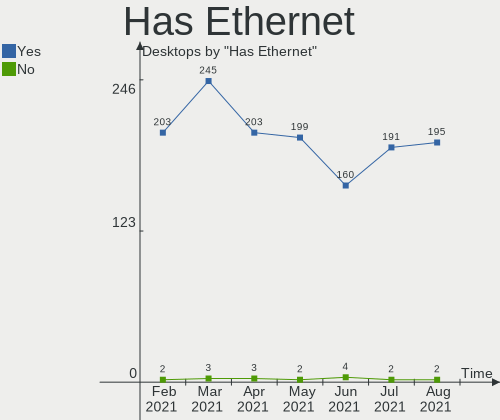

| Presented | Desktops | Percent |
|-----------|----------|---------|
| Yes       | 160      | 97.56%  |
| No        | 4        | 2.44%   |

Has WiFi
--------

Has WiFi module

| Presented | Desktops | Percent |
|-----------|----------|---------|
| No        | 92       | 56.1%   |
| Yes       | 72       | 43.9%   |

Has Bluetooth
-------------

Has Bluetooth module

| Presented | Desktops | Percent |
|-----------|----------|---------|
| No        | 118      | 71.95%  |
| Yes       | 46       | 28.05%  |

Drive Vendor
------------

Hard drive vendors

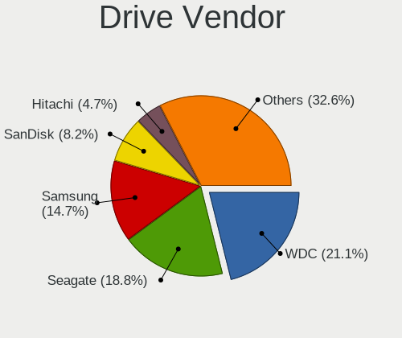

| Vendor                    | Desktops | Drives | Percent |
|---------------------------|----------|--------|---------|
| WDC                       | 61       | 73     | 19.61%  |
| Seagate                   | 56       | 66     | 18.01%  |
| Samsung Electronics       | 42       | 56     | 13.5%   |
| Kingston                  | 24       | 25     | 7.72%   |
| Hitachi                   | 17       | 19     | 5.47%   |
| Crucial                   | 16       | 20     | 5.14%   |
| SanDisk                   | 15       | 15     | 4.82%   |
| Toshiba                   | 11       | 11     | 3.54%   |
| Intel                     | 6        | 7      | 1.93%   |
| PNY                       | 5        | 6      | 1.61%   |
| Maxtor                    | 5        | 5      | 1.61%   |
| China                     | 5        | 5      | 1.61%   |
| Phison                    | 4        | 6      | 1.29%   |
| A-DATA Technology         | 4        | 4      | 1.29%   |
| Unknown                   | 3        | 3      | 0.96%   |
| SPCC                      | 3        | 3      | 0.96%   |
| Silicon Motion            | 3        | 3      | 0.96%   |
| OCZ                       | 3        | 3      | 0.96%   |
| HGST                      | 3        | 3      | 0.96%   |
| XPG                       | 2        | 2      | 0.64%   |
| Transcend                 | 2        | 2      | 0.64%   |
| EMTEC                     | 2        | 2      | 0.64%   |
| WD MediaMax               | 1        | 2      | 0.32%   |
| TCSUNBOW                  | 1        | 1      | 0.32%   |
| SK Hynix                  | 1        | 1      | 0.32%   |
| Realtek Semiconductor     | 1        | 1      | 0.32%   |
| PHD 3.0                   | 1        | 1      | 0.32%   |
| ORTIAL                    | 1        | 1      | 0.32%   |
| Micron/Crucial Technology | 1        | 1      | 0.32%   |
| Kingmax                   | 1        | 1      | 0.32%   |
| Kingchuxing               | 1        | 1      | 0.32%   |
| KINGBANK                  | 1        | 1      | 0.32%   |
| Hewlett-Packard           | 1        | 1      | 0.32%   |
| GOODRAM                   | 1        | 2      | 0.32%   |
| Gigabyte Technology       | 1        | 1      | 0.32%   |
| Fujitsu                   | 1        | 1      | 0.32%   |
| Dogfish                   | 1        | 1      | 0.32%   |
| CORSAIR                   | 1        | 1      | 0.32%   |
| ASMT                      | 1        | 1      | 0.32%   |
| ASMedia                   | 1        | 1      | 0.32%   |
| Apacer                    | 1        | 1      | 0.32%   |

Drive Model
-----------

Hard drive models

| Model                            | Desktops | Percent |
|----------------------------------|----------|---------|
| Kingston SA400S37240G 240GB SSD  | 9        | 2.59%   |
| Crucial CT240BX500SSD1 240GB     | 5        | 1.44%   |
| SanDisk SDSSDA240G 240GB         | 4        | 1.15%   |
| Samsung SSD 860 EVO 250GB        | 4        | 1.15%   |
| Samsung NVMe SSD Drive 500GB     | 4        | 1.15%   |
| WDC WD10EARS-00Y5B1 1TB          | 3        | 0.86%   |
| Toshiba HDWD110 1TB              | 3        | 0.86%   |
| Seagate ST500DM002-1BD142 500GB  | 3        | 0.86%   |
| Seagate ST4000DM004-2CV104 4TB   | 3        | 0.86%   |
| Seagate ST2000DM001-1CH164 2TB   | 3        | 0.86%   |
| Seagate ST2000DL003-9VT166 2TB   | 3        | 0.86%   |
| Samsung SSD 860 EVO 1TB          | 3        | 0.86%   |
| Phison NVMe SSD Drive 2TB        | 3        | 0.86%   |
| Crucial CT500MX500SSD1 500GB     | 3        | 0.86%   |
| WDC WDS240G2G0A-00JH30 240GB SSD | 2        | 0.57%   |
| WDC WDS100T2B0A-00SM50 1TB SSD   | 2        | 0.57%   |
| WDC WD6400AAKS-65A7B2 640GB      | 2        | 0.57%   |
| WDC WD20EARX-00PASB0 2TB         | 2        | 0.57%   |
| WDC WD10EZEX-08WN4A0 1TB         | 2        | 0.57%   |
| WDC WD10EZEX-08M2NA0 1TB         | 2        | 0.57%   |
| WDC WD10EADS-00L5B1 1TB          | 2        | 0.57%   |
| Unknown SD/MMC/MS PRO 128GB      | 2        | 0.57%   |
| Toshiba DT01ACA050 500GB         | 2        | 0.57%   |
| Seagate ST380811AS 80GB          | 2        | 0.57%   |
| Seagate ST3500413AS 500GB        | 2        | 0.57%   |
| Seagate ST3160815AS 160GB        | 2        | 0.57%   |
| Seagate ST3160812AS 160GB        | 2        | 0.57%   |
| Seagate ST2000DM008-2FR102 2TB   | 2        | 0.57%   |
| Seagate ST2000DM006-2DM164 2TB   | 2        | 0.57%   |
| Seagate Expansion Desk 2TB       | 2        | 0.57%   |
| SanDisk SDSSDA120G 120GB         | 2        | 0.57%   |
| Samsung SSD 850 EVO 500GB        | 2        | 0.57%   |
| Samsung SSD 850 EVO 250GB        | 2        | 0.57%   |
| Samsung SSD 840 PRO Series 128GB | 2        | 0.57%   |
| Samsung NVMe SSD Drive 2TB       | 2        | 0.57%   |
| PNY CS900 120GB SSD              | 2        | 0.57%   |
| Kingston SV300S37A120G 120GB SSD | 2        | 0.57%   |
| Kingston SA400S37480G 480GB SSD  | 2        | 0.57%   |
| Kingston SA2000M81000G 1TB       | 2        | 0.57%   |
| Kingston NVMe SSD Drive 500GB    | 2        | 0.57%   |
| Intel NVMe SSD Drive 256GB       | 2        | 0.57%   |
| Hitachi HTS727550A9E364 500GB    | 2        | 0.57%   |
| Hitachi HDS721616PLA380 160GB    | 2        | 0.57%   |
| Hitachi HDS721010CLA332 1TB      | 2        | 0.57%   |
| Crucial CT250MX500SSD1 250GB     | 2        | 0.57%   |
| China SATA SSD 240GB             | 2        | 0.57%   |
| XPG NVMe SSD Drive 2TB           | 1        | 0.29%   |
| XPG GAMMIX S11 Pro 512GB         | 1        | 0.29%   |
| WDC WDS500G2B0A-00SM50 500GB SSD | 1        | 0.29%   |
| WDC WDS480G2G0A-00JH30 480GB SSD | 1        | 0.29%   |
| WDC WDS250G1B0A-00H9H0 250GB SSD | 1        | 0.29%   |
| WDC WDS240G2G0B-00EPW0 240GB SSD | 1        | 0.29%   |
| WDC WDS120G2G0B-00EPW0 120GB SSD | 1        | 0.29%   |
| WDC WD800JD-23LSA0 80GB          | 1        | 0.29%   |
| WDC WD800JB-00JJC0 80GB          | 1        | 0.29%   |
| WDC WD800BD-22MRA1 80GB          | 1        | 0.29%   |
| WDC WD7500AACS-00D6B1 752GB      | 1        | 0.29%   |
| WDC WD5002ABYS-01B1B0 500GB      | 1        | 0.29%   |
| WDC WD5000LPVT-22G33T0 500GB     | 1        | 0.29%   |
| WDC WD5000AZRX-00L4HB0 500GB     | 1        | 0.29%   |

HDD Vendor
----------

Hard disk drive vendors

| Vendor              | Desktops | Drives | Percent |
|---------------------|----------|--------|---------|
| WDC                 | 54       | 64     | 34.39%  |
| Seagate             | 53       | 63     | 33.76%  |
| Hitachi             | 17       | 19     | 10.83%  |
| Toshiba             | 11       | 11     | 7.01%   |
| Samsung Electronics | 11       | 13     | 7.01%   |
| Maxtor              | 5        | 5      | 3.18%   |
| HGST                | 3        | 3      | 1.91%   |
| WD MediaMax         | 1        | 2      | 0.64%   |
| PHD 3.0             | 1        | 1      | 0.64%   |
| Fujitsu             | 1        | 1      | 0.64%   |

SSD Vendor
----------

Solid state drive vendors

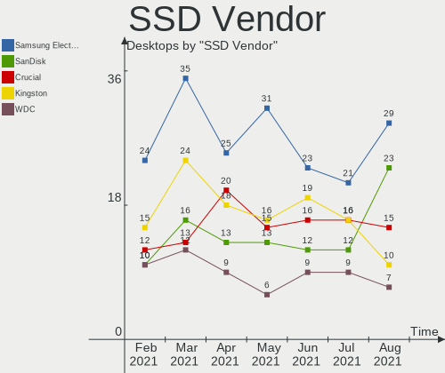

| Vendor              | Desktops | Drives | Percent |
|---------------------|----------|--------|---------|
| Samsung Electronics | 23       | 30     | 20.91%  |
| Kingston            | 19       | 20     | 17.27%  |
| Crucial             | 16       | 19     | 14.55%  |
| SanDisk             | 12       | 12     | 10.91%  |
| WDC                 | 9        | 9      | 8.18%   |
| China               | 5        | 5      | 4.55%   |
| PNY                 | 4        | 4      | 3.64%   |
| OCZ                 | 3        | 3      | 2.73%   |
| A-DATA Technology   | 3        | 3      | 2.73%   |
| Transcend           | 2        | 2      | 1.82%   |
| SPCC                | 2        | 2      | 1.82%   |
| TCSUNBOW            | 1        | 1      | 0.91%   |
| ORTIAL              | 1        | 1      | 0.91%   |
| Kingmax             | 1        | 1      | 0.91%   |
| KINGBANK            | 1        | 1      | 0.91%   |
| Intel               | 1        | 1      | 0.91%   |
| GOODRAM             | 1        | 2      | 0.91%   |
| Gigabyte Technology | 1        | 1      | 0.91%   |
| EMTEC               | 1        | 1      | 0.91%   |
| Dogfish             | 1        | 1      | 0.91%   |
| CORSAIR             | 1        | 1      | 0.91%   |
| ASMT                | 1        | 1      | 0.91%   |
| ASMedia             | 1        | 1      | 0.91%   |

Drive Kind
----------

HDD or SSD

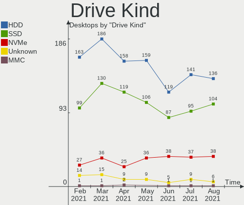

| Kind    | Desktops | Drives | Percent |
|---------|----------|--------|---------|
| HDD     | 119      | 182    | 47.6%   |
| SSD     | 87       | 122    | 34.8%   |
| NVMe    | 38       | 50     | 15.2%   |
| Unknown | 5        | 5      | 2%      |
| MMC     | 1        | 1      | 0.4%    |

Drive Connector
---------------

SATA, SAS, NVMe, etc.

| Type | Desktops | Drives | Percent |
|------|----------|--------|---------|
| SATA | 151      | 299    | 75.88%  |
| NVMe | 38       | 50     | 19.1%   |
| SAS  | 9        | 10     | 4.52%   |
| MMC  | 1        | 1      | 0.5%    |

Drive Size
----------

Size of hard drive

| Size in TB | Desktops | Drives | Percent |
|------------|----------|--------|---------|
| 0.01-0.5   | 120      | 180    | 53.57%  |
| 0.51-1.0   | 58       | 70     | 25.89%  |
| 1.01-2.0   | 25       | 29     | 11.16%  |
| 3.01-4.0   | 10       | 13     | 4.46%   |
| 2.01-3.0   | 6        | 7      | 2.68%   |
| 4.01-10.0  | 3        | 3      | 1.34%   |
| 10.01-20.0 | 2        | 2      | 0.89%   |

Space Total
-----------

Amount of disk space available on the file system

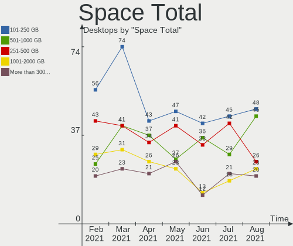

| Size in GB     | Desktops | Percent |
|----------------|----------|---------|
| 101-250        | 42       | 25.61%  |
| 501-1000       | 36       | 21.95%  |
| 251-500        | 33       | 20.12%  |
| 2001-3000      | 15       | 9.15%   |
| 1001-2000      | 13       | 7.93%   |
| More than 3000 | 12       | 7.32%   |
| 51-100         | 7        | 4.27%   |
| 21-50          | 4        | 2.44%   |
| 1-20           | 1        | 0.61%   |
| Unknown        | 1        | 0.61%   |

Space Used
----------

Amount of used disk space

| Used GB        | Desktops | Percent |
|----------------|----------|---------|
| 1-20           | 39       | 23.78%  |
| 101-250        | 35       | 21.34%  |
| 21-50          | 28       | 17.07%  |
| 251-500        | 18       | 10.98%  |
| 1001-2000      | 16       | 9.76%   |
| 51-100         | 12       | 7.32%   |
| 501-1000       | 8        | 4.88%   |
| 2001-3000      | 6        | 3.66%   |
| More than 3000 | 1        | 0.61%   |
| Unknown        | 1        | 0.61%   |

Malfunc. Drives
---------------

Drive models with a malfunction

| Model                             | Desktops | Drives | Percent |
|-----------------------------------|----------|--------|---------|
| WDC WD5002ABYS-01B1B0 500GB       | 1        | 1      | 9.09%   |
| WDC WD5000AAKX-07U6AA0 500GB      | 1        | 1      | 9.09%   |
| WDC WD3200AAJS-00L7A0 320GB       | 1        | 1      | 9.09%   |
| WDC WD10EARS-00Y5B1 1TB           | 1        | 1      | 9.09%   |
| SPCC Solid State Disk 512GB       | 1        | 1      | 9.09%   |
| Seagate ST3500630AS 500GB         | 1        | 1      | 9.09%   |
| Seagate ST2000DM001-1CH164 2TB    | 1        | 1      | 9.09%   |
| Seagate ST1000DM003-9YN162 1TB    | 1        | 1      | 9.09%   |
| Samsung Electronics HD250HJ 250GB | 1        | 1      | 9.09%   |
| Samsung Electronics HD204UI 2TB   | 1        | 1      | 9.09%   |
| Kingmax SSD 120GB                 | 1        | 1      | 9.09%   |

Malfunc. Drive Vendor
---------------------

Vendors of faulty drives

| Vendor              | Desktops | Drives | Percent |
|---------------------|----------|--------|---------|
| WDC                 | 4        | 4      | 36.36%  |
| Seagate             | 3        | 3      | 27.27%  |
| Samsung Electronics | 2        | 2      | 18.18%  |
| SPCC                | 1        | 1      | 9.09%   |
| Kingmax             | 1        | 1      | 9.09%   |

Malfunc. HDD Vendor
-------------------

Vendors of faulty HDD drives

| Vendor              | Desktops | Drives | Percent |
|---------------------|----------|--------|---------|
| WDC                 | 4        | 4      | 44.44%  |
| Seagate             | 3        | 3      | 33.33%  |
| Samsung Electronics | 2        | 2      | 22.22%  |

Malfunc. Drive Kind
-------------------

Kinds of faulty drives

| Kind | Desktops | Drives | Percent |
|------|----------|--------|---------|
| HDD  | 8        | 9      | 80%     |
| SSD  | 2        | 2      | 20%     |

Failed Drives
-------------

Failed drive models

Zero info for selected period =(

Failed Drive Vendor
-------------------

Failed drive vendors

Zero info for selected period =(

Drive Status
------------

Number of failed and malfunc. drives

| Status   | Desktops | Drives | Percent |
|----------|----------|--------|---------|
| Detected | 122      | 254    | 69.32%  |
| Works    | 44       | 95     | 25%     |
| Malfunc  | 10       | 11     | 5.68%   |

Storage Vendor
--------------

Storage controller vendors

| Vendor                           | Desktops | Percent |
|----------------------------------|----------|---------|
| Intel                            | 95       | 44.39%  |
| AMD                              | 55       | 25.7%   |
| Nvidia                           | 13       | 6.07%   |
| Samsung Electronics              | 11       | 5.14%   |
| Phison Electronics               | 5        | 2.34%   |
| Kingston Technology Company      | 5        | 2.34%   |
| Silicon Motion                   | 4        | 1.87%   |
| ASMedia Technology               | 4        | 1.87%   |
| Sandisk                          | 3        | 1.4%    |
| ADATA Technology                 | 3        | 1.4%    |
| VIA Technologies                 | 2        | 0.93%   |
| Seagate Technology               | 2        | 0.93%   |
| Micron/Crucial Technology        | 2        | 0.93%   |
| Marvell Technology Group         | 2        | 0.93%   |
| JMicron Technology               | 2        | 0.93%   |
| SK Hynix                         | 1        | 0.47%   |
| Silicon Integrated Systems [SiS] | 1        | 0.47%   |
| Silicon Image                    | 1        | 0.47%   |
| Realtek Semiconductor            | 1        | 0.47%   |
| LSI Logic / Symbios Logic        | 1        | 0.47%   |
| Hewlett-Packard                  | 1        | 0.47%   |

Storage Model
-------------

Storage controller models

| Model                                                                                   | Desktops | Percent |
|-----------------------------------------------------------------------------------------|----------|---------|
| AMD FCH SATA Controller [AHCI mode]                                                     | 33       | 11.26%  |
| Intel NM10/ICH7 Family SATA Controller [IDE mode]                                       | 14       | 4.78%   |
| Intel 82801G (ICH7 Family) IDE Controller                                               | 11       | 3.75%   |
| AMD Starship/Matisse Chipset SATA Controller [AHCI mode]                                | 9        | 3.07%   |
| Samsung NVMe SSD Controller SM981/PM981/PM983                                           | 8        | 2.73%   |
| Nvidia MCP61 SATA Controller                                                            | 8        | 2.73%   |
| Intel 8 Series/C220 Series Chipset Family 6-port SATA Controller 1 [AHCI mode]          | 8        | 2.73%   |
| Intel 200 Series PCH SATA controller [AHCI mode]                                        | 8        | 2.73%   |
| Intel 7 Series/C210 Series Chipset Family 6-port SATA Controller [AHCI mode]            | 7        | 2.39%   |
| Intel 6 Series/C200 Series Chipset Family 6 port Desktop SATA AHCI Controller           | 7        | 2.39%   |
| AMD 400 Series Chipset SATA Controller                                                  | 7        | 2.39%   |
| Nvidia MCP61 IDE                                                                        | 6        | 2.05%   |
| AMD SB7x0/SB8x0/SB9x0 SATA Controller [IDE mode]                                        | 6        | 2.05%   |
| AMD SB7x0/SB8x0/SB9x0 IDE Controller                                                    | 6        | 2.05%   |
| Kingston Company A2000 NVMe SSD                                                         | 5        | 1.71%   |
| Intel SATA Controller [RAID mode]                                                       | 5        | 1.71%   |
| Intel 6 Series/C200 Series Chipset Family Desktop SATA Controller (IDE mode, ports 4-5) | 5        | 1.71%   |
| Intel 6 Series/C200 Series Chipset Family Desktop SATA Controller (IDE mode, ports 0-3) | 5        | 1.71%   |
| AMD FCH SATA Controller D                                                               | 5        | 1.71%   |
| AMD 300 Series Chipset SATA Controller                                                  | 5        | 1.71%   |
| Intel Q170/Q150/B150/H170/H110/Z170/CM236 Chipset SATA Controller [AHCI Mode]           | 4        | 1.37%   |
| ASMedia ASM1062 Serial ATA Controller                                                   | 4        | 1.37%   |
| AMD SB7x0/SB8x0/SB9x0 SATA Controller [AHCI mode]                                       | 4        | 1.37%   |
| Silicon Motion SM2263EN/SM2263XT SSD Controller                                         | 3        | 1.02%   |
| Samsung NVMe SSD Controller PM9A1/PM9A3/980PRO                                          | 3        | 1.02%   |
| Intel SSD Pro 7600p/760p/E 6100p Series                                                 | 3        | 1.02%   |
| Intel C600/X79 series chipset 6-Port SATA AHCI Controller                               | 3        | 1.02%   |
| Intel 5 Series/3400 Series Chipset 4 port SATA IDE Controller                           | 3        | 1.02%   |
| Intel 4 Series Chipset PT IDER Controller                                               | 3        | 1.02%   |
| AMD FCH IDE Controller                                                                  | 3        | 1.02%   |
| ADATA XPG SX8200 Pro PCIe Gen3x4 M.2 2280 Solid State Drive                             | 3        | 1.02%   |
| Sandisk WD Blue SN550 NVMe SSD                                                          | 2        | 0.68%   |
| Phison E16 PCIe4 NVMe Controller                                                        | 2        | 0.68%   |
| Intel Comet Lake SATA AHCI Controller                                                   | 2        | 0.68%   |
| Intel Cannon Lake PCH SATA AHCI Controller                                              | 2        | 0.68%   |
| Intel 9 Series Chipset Family SATA Controller [AHCI Mode]                               | 2        | 0.68%   |
| Intel 82801JI (ICH10 Family) 4 port SATA IDE Controller #1                              | 2        | 0.68%   |
| Intel 82801JD/DO (ICH10 Family) 4-port SATA IDE Controller                              | 2        | 0.68%   |
| Intel 82801JD/DO (ICH10 Family) 2-port SATA IDE Controller                              | 2        | 0.68%   |
| Intel 82801HR/HO/HH (ICH8R/DO/DH) 2 port SATA Controller [IDE mode]                     | 2        | 0.68%   |
| Intel 82801H (ICH8 Family) 4 port SATA Controller [IDE mode]                            | 2        | 0.68%   |
| Intel 631xESB/632xESB IDE Controller                                                    | 2        | 0.68%   |
| Intel 500 Series Chipset Family SATA AHCI Controller                                    | 2        | 0.68%   |
| Intel 5 Series/3400 Series Chipset 2 port SATA IDE Controller                           | 2        | 0.68%   |
| Intel 400 Series Chipset Family SATA AHCI Controller                                    | 2        | 0.68%   |
| AMD SB600 Non-Raid-5 SATA                                                               | 2        | 0.68%   |
| AMD SB600 IDE                                                                           | 2        | 0.68%   |
| VIA VT82C586A/B/VT82C686/A/B/VT823x/A/C PIPC Bus Master IDE                             | 1        | 0.34%   |
| VIA VT8237/8251 Serial ATA Controller                                                   | 1        | 0.34%   |
| VIA VT6415 PATA IDE Host Controller                                                     | 1        | 0.34%   |
| SK Hynix Non-Volatile memory controller                                                 | 1        | 0.34%   |
| Silicon Motion SM2262/SM2262EN SSD Controller                                           | 1        | 0.34%   |
| Silicon Integrated Systems [SiS] SATA Controller / IDE mode                             | 1        | 0.34%   |
| Silicon Integrated Systems [SiS] 5513 IDE Controller                                    | 1        | 0.34%   |
| Silicon Image SiI 3114 [SATALink/SATARaid] Serial ATA Controller                        | 1        | 0.34%   |
| Seagate FireCuda 520 SSD                                                                | 1        | 0.34%   |
| Seagate FireCuda 510 SSD                                                                | 1        | 0.34%   |
| Sandisk WD Black SN750 / PC SN730 NVMe SSD                                              | 1        | 0.34%   |
| Samsung NVMe SSD Controller SM961/PM961/SM963                                           | 1        | 0.34%   |
| Samsung NVMe Controller                                                                 | 1        | 0.34%   |

Storage Kind
------------

Kind of storage controller (IDE, SATA, NVMe, SAS, ...)

| Kind | Desktops | Percent |
|------|----------|---------|
| SATA | 112      | 50.45%  |
| IDE  | 61       | 27.48%  |
| NVMe | 38       | 17.12%  |
| RAID | 10       | 4.5%    |
| SAS  | 1        | 0.45%   |

CPU Vendor
----------

Processor vendors

| Vendor | Desktops | Percent |
|--------|----------|---------|
| Intel  | 97       | 59.15%  |
| AMD    | 67       | 40.85%  |

CPU Model
---------

Processor models

| Model                                       | Desktops | Percent |
|---------------------------------------------|----------|---------|
| AMD Ryzen 7 3700X 8-Core Processor          | 5        | 3.05%   |
| Intel Core i5-2400 CPU @ 3.10GHz            | 4        | 2.44%   |
| AMD FX-6300 Six-Core Processor              | 4        | 2.44%   |
| Intel Core i5-4570 CPU @ 3.20GHz            | 3        | 1.83%   |
| Intel Core 2 Duo CPU E8400 @ 3.00GHz        | 3        | 1.83%   |
| AMD Ryzen 7 2700X Eight-Core Processor      | 3        | 1.83%   |
| AMD Ryzen 5 3600 6-Core Processor           | 3        | 1.83%   |
| Intel Xeon CPU E5-2689 0 @ 2.60GHz          | 2        | 1.22%   |
| Intel Core i7-7700 CPU @ 3.60GHz            | 2        | 1.22%   |
| Intel Core i7-6700K CPU @ 4.00GHz           | 2        | 1.22%   |
| Intel Core i7 CPU 860 @ 2.80GHz             | 2        | 1.22%   |
| Intel Core i5-9400F CPU @ 2.90GHz           | 2        | 1.22%   |
| Intel Core i5-4670K CPU @ 3.40GHz           | 2        | 1.22%   |
| Intel Core i5-4590 CPU @ 3.30GHz            | 2        | 1.22%   |
| Intel Core i3-3220 CPU @ 3.30GHz            | 2        | 1.22%   |
| Intel Core i3 CPU 540 @ 3.07GHz             | 2        | 1.22%   |
| Intel Core 2 Quad CPU Q6600 @ 2.40GHz       | 2        | 1.22%   |
| Intel Core 2 Duo CPU E7500 @ 2.93GHz        | 2        | 1.22%   |
| Intel Core 2 CPU 6400 @ 2.13GHz             | 2        | 1.22%   |
| Intel Core 2 CPU 6300 @ 1.86GHz             | 2        | 1.22%   |
| Intel Celeron CPU G1610 @ 2.60GHz           | 2        | 1.22%   |
| AMD Ryzen 9 5950X 16-Core Processor         | 2        | 1.22%   |
| AMD Ryzen 5 5600X 6-Core Processor          | 2        | 1.22%   |
| AMD Ryzen 5 2600 Six-Core Processor         | 2        | 1.22%   |
| AMD Ryzen 5 1600 Six-Core Processor         | 2        | 1.22%   |
| AMD Ryzen 3 3200G with Radeon Vega Graphics | 2        | 1.22%   |
| AMD Ryzen 3 2200G with Radeon Vega Graphics | 2        | 1.22%   |
| AMD Athlon II X2 250 Processor              | 2        | 1.22%   |
| AMD Athlon II X2 220 Processor              | 2        | 1.22%   |
| AMD Athlon 64 X2 Dual Core Processor 4400+  | 2        | 1.22%   |
| Intel Xeon CPU X5675 @ 3.07GHz              | 1        | 0.61%   |
| Intel Xeon CPU X5355 @ 2.66GHz              | 1        | 0.61%   |
| Intel Xeon CPU E5405 @ 2.00GHz              | 1        | 0.61%   |
| Intel Xeon CPU E5-2690 0 @ 2.90GHz          | 1        | 0.61%   |
| Intel Xeon CPU E5-1620 0 @ 3.60GHz          | 1        | 0.61%   |
| Intel Pentium Dual-Core CPU E6700 @ 3.20GHz | 1        | 0.61%   |
| Intel Pentium Dual-Core CPU E6600 @ 3.06GHz | 1        | 0.61%   |
| Intel Pentium Dual-Core CPU E5800 @ 3.20GHz | 1        | 0.61%   |
| Intel Pentium Dual-Core CPU E5700 @ 3.00GHz | 1        | 0.61%   |
| Intel Pentium Dual-Core CPU E5500 @ 2.80GHz | 1        | 0.61%   |
| Intel Pentium Dual-Core CPU E5300 @ 2.60GHz | 1        | 0.61%   |
| Intel Pentium Dual-Core CPU E5200 @ 2.50GHz | 1        | 0.61%   |
| Intel Pentium Dual CPU E2200 @ 2.20GHz      | 1        | 0.61%   |
| Intel Pentium CPU G630 @ 2.70GHz            | 1        | 0.61%   |
| Intel Pentium CPU G4500 @ 3.50GHz           | 1        | 0.61%   |
| Intel Pentium CPU G2030 @ 3.00GHz           | 1        | 0.61%   |
| Intel Pentium 4 CPU 3.20GHz                 | 1        | 0.61%   |
| Intel Pentium 4 CPU 2.80GHz                 | 1        | 0.61%   |
| Intel Core i9-9900K CPU @ 3.60GHz           | 1        | 0.61%   |
| Intel Core i9-10900K CPU @ 3.70GHz          | 1        | 0.61%   |
| Intel Core i7-9700K CPU @ 3.60GHz           | 1        | 0.61%   |
| Intel Core i7-7700K CPU @ 4.20GHz           | 1        | 0.61%   |
| Intel Core i7-6900K CPU @ 3.20GHz           | 1        | 0.61%   |
| Intel Core i7-4790K CPU @ 4.00GHz           | 1        | 0.61%   |
| Intel Core i7-4790 CPU @ 3.60GHz            | 1        | 0.61%   |
| Intel Core i7-3770 CPU @ 3.40GHz            | 1        | 0.61%   |
| Intel Core i7-10700K CPU @ 3.80GHz          | 1        | 0.61%   |
| Intel Core i5-9600K CPU @ 3.70GHz           | 1        | 0.61%   |
| Intel Core i5-8600K CPU @ 3.60GHz           | 1        | 0.61%   |
| Intel Core i5-8265U CPU @ 1.60GHz           | 1        | 0.61%   |

CPU Model Family
----------------

Processor model prefix

| Model                   | Desktops | Percent |
|-------------------------|----------|---------|
| Intel Core i5           | 26       | 15.85%  |
| Intel Core i7           | 13       | 7.93%   |
| AMD Ryzen 5             | 12       | 7.32%   |
| Intel Core i3           | 11       | 6.71%   |
| AMD Ryzen 7             | 11       | 6.71%   |
| Intel Core 2 Duo        | 8        | 4.88%   |
| Intel Xeon              | 7        | 4.27%   |
| Intel Pentium Dual-Core | 7        | 4.27%   |
| Intel Celeron           | 7        | 4.27%   |
| AMD FX                  | 6        | 3.66%   |
| AMD Ryzen 3             | 5        | 3.05%   |
| AMD Phenom              | 5        | 3.05%   |
| AMD Athlon II X2        | 5        | 3.05%   |
| Intel Core 2 Quad       | 4        | 2.44%   |
| Intel Core 2            | 4        | 2.44%   |
| AMD Ryzen 9             | 4        | 2.44%   |
| AMD A8                  | 4        | 2.44%   |
| Other                   | 3        | 1.83%   |
| Intel Pentium           | 3        | 1.83%   |
| AMD Athlon 64 X2        | 3        | 1.83%   |
| Intel Pentium 4         | 2        | 1.22%   |
| Intel Core i9           | 2        | 1.22%   |
| AMD A6                  | 2        | 1.22%   |
| Intel Pentium Dual      | 1        | 0.61%   |
| AMD Ryzen 5 PRO         | 1        | 0.61%   |
| AMD Ryzen 3 PRO         | 1        | 0.61%   |
| AMD Phenom II X4        | 1        | 0.61%   |
| AMD E2                  | 1        | 0.61%   |
| AMD E                   | 1        | 0.61%   |
| AMD Athlon X4           | 1        | 0.61%   |
| AMD Athlon II X4        | 1        | 0.61%   |
| AMD Athlon              | 1        | 0.61%   |
| AMD A4                  | 1        | 0.61%   |

CPU Cores
---------

Number of processor cores

| Number | Desktops | Percent |
|--------|----------|---------|
| 4      | 54       | 32.93%  |
| 2      | 53       | 32.32%  |
| 6      | 20       | 12.2%   |
| 8      | 19       | 11.59%  |
| 3      | 8        | 4.88%   |
| 1      | 5        | 3.05%   |
| 16     | 3        | 1.83%   |
| 12     | 1        | 0.61%   |
| 10     | 1        | 0.61%   |

CPU Sockets
-----------

Number of sockets

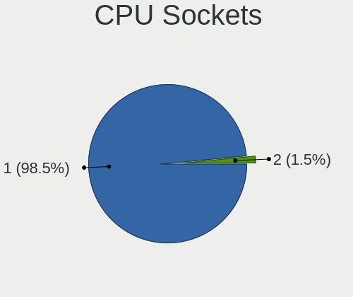

| Number | Desktops | Percent |
|--------|----------|---------|
| 1      | 163      | 99.39%  |
| 2      | 1        | 0.61%   |

CPU Threads
-----------

Threads per core (Hyper-Threading)

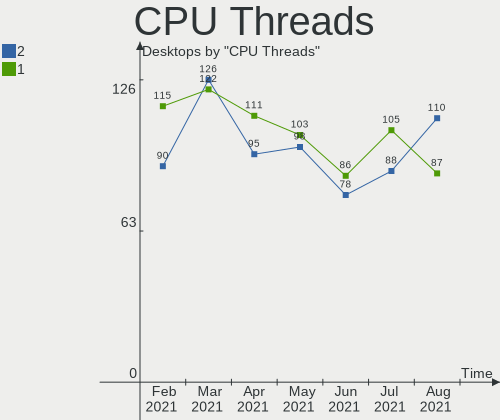

| Number | Desktops | Percent |
|--------|----------|---------|
| 1      | 86       | 52.44%  |
| 2      | 78       | 47.56%  |

CPU Op-Modes
------------

CPU Operation Modes (32-bit, 64-bit)

| Op mode        | Desktops | Percent |
|----------------|----------|---------|
| 32-bit, 64-bit | 163      | 99.39%  |
| 32-bit         | 1        | 0.61%   |

CPU Microcode
-------------

Microcode number

| Number     | Desktops | Percent |
|------------|----------|---------|
| 0x1067a    | 14       | 8.54%   |
| Unknown    | 12       | 7.32%   |
| 0x08701021 | 11       | 6.71%   |
| 0x306c3    | 10       | 6.1%    |
| 0x206a7    | 10       | 6.1%    |
| 0x306a9    | 8        | 4.88%   |
| 0x0800820d | 6        | 3.66%   |
| 0x010000c8 | 6        | 3.66%   |
| 0x906e9    | 5        | 3.05%   |
| 0x6f6      | 4        | 2.44%   |
| 0x01000083 | 4        | 2.44%   |
| 0xa0655    | 3        | 1.83%   |
| 0x906ea    | 3        | 1.83%   |
| 0x6fb      | 3        | 1.83%   |
| 0x506e3    | 3        | 1.83%   |
| 0x206d7    | 3        | 1.83%   |
| 0x08108109 | 3        | 1.83%   |
| 0x0600611a | 3        | 1.83%   |
| 0x06000852 | 3        | 1.83%   |
| 0xa0671    | 2        | 1.22%   |
| 0xa0653    | 2        | 1.22%   |
| 0x906ed    | 2        | 1.22%   |
| 0x6fd      | 2        | 1.22%   |
| 0x20652    | 2        | 1.22%   |
| 0x106e5    | 2        | 1.22%   |
| 0x10676    | 2        | 1.22%   |
| 0x0a201009 | 2        | 1.22%   |
| 0x0810100b | 2        | 1.22%   |
| 0x07030105 | 2        | 1.22%   |
| 0x06001119 | 2        | 1.22%   |
| 0x03000027 | 2        | 1.22%   |
| 0x01000095 | 2        | 1.22%   |
| 0xf65      | 1        | 0.61%   |
| 0xf29      | 1        | 0.61%   |
| 0x906ec    | 1        | 0.61%   |
| 0x906eb    | 1        | 0.61%   |
| 0x806ec    | 1        | 0.61%   |
| 0x706a1    | 1        | 0.61%   |
| 0x6f7      | 1        | 0.61%   |
| 0x406f1    | 1        | 0.61%   |
| 0x40651    | 1        | 0.61%   |
| 0x30673    | 1        | 0.61%   |
| 0x206c2    | 1        | 0.61%   |
| 0x20655    | 1        | 0.61%   |
| 0x10677    | 1        | 0.61%   |
| 0x0a201016 | 1        | 0.61%   |
| 0x08701013 | 1        | 0.61%   |
| 0x08600106 | 1        | 0.61%   |
| 0x08101016 | 1        | 0.61%   |
| 0x0800820b | 1        | 0.61%   |
| 0x08001138 | 1        | 0.61%   |
| 0x0800111c | 1        | 0.61%   |
| 0x06003106 | 1        | 0.61%   |
| 0x0600063e | 1        | 0.61%   |
| 0x05000119 | 1        | 0.61%   |
| 0x010000c7 | 1        | 0.61%   |

CPU Microarch
-------------

Microarchitecture

| Name          | Desktops | Percent |
|---------------|----------|---------|
| Penryn        | 18       | 10.98%  |
| SandyBridge   | 14       | 8.54%   |
| Zen 2         | 13       | 7.93%   |
| KabyLake      | 13       | 7.93%   |
| K10           | 13       | 7.93%   |
| Haswell       | 12       | 7.32%   |
| Zen+          | 11       | 6.71%   |
| Core          | 10       | 6.1%    |
| IvyBridge     | 9        | 5.49%   |
| Piledriver    | 6        | 3.66%   |
| Zen 3         | 5        | 3.05%   |
| Zen           | 5        | 3.05%   |
| CometLake     | 5        | 3.05%   |
| Westmere      | 4        | 2.44%   |
| Skylake       | 3        | 1.83%   |
| K8 Hammer     | 3        | 1.83%   |
| Excavator     | 3        | 1.83%   |
| Puma          | 2        | 1.22%   |
| NetBurst      | 2        | 1.22%   |
| Nehalem       | 2        | 1.22%   |
| K10 Llano     | 2        | 1.22%   |
| Bulldozer     | 2        | 1.22%   |
| Unknown       | 2        | 1.22%   |
| Steamroller   | 1        | 0.61%   |
| Silvermont    | 1        | 0.61%   |
| Goldmont plus | 1        | 0.61%   |
| Broadwell     | 1        | 0.61%   |
| Bobcat        | 1        | 0.61%   |

GPU Vendor
----------

Vendors of graphics cards

| Vendor                           | Desktops | Percent |
|----------------------------------|----------|---------|
| Nvidia                           | 65       | 38.01%  |
| Intel                            | 52       | 30.41%  |
| AMD                              | 51       | 29.82%  |
| VIA Technologies                 | 1        | 0.58%   |
| Silicon Integrated Systems [SiS] | 1        | 0.58%   |
| ATI Technologies                 | 1        | 0.58%   |

GPU Model
---------

Graphics card models

| Model                                                                       | Desktops | Percent |
|-----------------------------------------------------------------------------|----------|---------|
| AMD Ellesmere [Radeon RX 470/480/570/570X/580/580X/590]                     | 11       | 6.21%   |
| Nvidia GK208B [GeForce GT 710]                                              | 9        | 5.08%   |
| Intel Xeon E3-1200 v3/4th Gen Core Processor Integrated Graphics Controller | 8        | 4.52%   |
| Intel Xeon E3-1200 v2/3rd Gen Core processor Graphics Controller            | 7        | 3.95%   |
| Intel 2nd Generation Core Processor Family Integrated Graphics Controller   | 7        | 3.95%   |
| Nvidia GP107 [GeForce GTX 1050 Ti]                                          | 6        | 3.39%   |
| Nvidia GP108 [GeForce GT 1030]                                              | 5        | 2.82%   |
| Intel 4 Series Chipset Integrated Graphics Controller                       | 5        | 2.82%   |
| Intel CometLake-S GT2 [UHD Graphics 630]                                    | 4        | 2.26%   |
| Intel 82G33/G31 Express Integrated Graphics Controller                      | 4        | 2.26%   |
| Nvidia TU117 [GeForce GTX 1650]                                             | 3        | 1.69%   |
| Nvidia GP106 [GeForce GTX 1060 6GB]                                         | 3        | 1.69%   |
| Nvidia G84 [GeForce 8600 GT]                                                | 3        | 1.69%   |
| AMD Caicos [Radeon HD 6450/7450/8450 / R5 230 OEM]                          | 3        | 1.69%   |
| Nvidia GT218 [GeForce 8400 GS Rev. 3]                                       | 2        | 1.13%   |
| Nvidia GT218 [GeForce 210]                                                  | 2        | 1.13%   |
| Nvidia GP104 [GeForce GTX 1070]                                             | 2        | 1.13%   |
| Nvidia GK104 [GeForce GTX 680]                                              | 2        | 1.13%   |
| Nvidia C61 [GeForce 6150SE nForce 430]                                      | 2        | 1.13%   |
| Intel HD Graphics 630                                                       | 2        | 1.13%   |
| Intel HD Graphics 530                                                       | 2        | 1.13%   |
| Intel Core Processor Integrated Graphics Controller                         | 2        | 1.13%   |
| Intel 82945G/GZ Integrated Graphics Controller                              | 2        | 1.13%   |
| AMD Raven Ridge [Radeon Vega Series / Radeon Vega Mobile Series]            | 2        | 1.13%   |
| AMD Picasso                                                                 | 2        | 1.13%   |
| AMD Lexa PRO [Radeon 540/540X/550/550X / RX 540X/550/550X]                  | 2        | 1.13%   |
| AMD Juniper XT [Radeon HD 6770]                                             | 2        | 1.13%   |
| AMD Hawaii PRO [Radeon R9 290/390]                                          | 2        | 1.13%   |
| AMD Baffin [Radeon RX 460/560D / Pro 450/455/460/555/555X/560/560X]         | 2        | 1.13%   |
| VIA Technologies CN896/VN896/P4M900 [Chrome 9 HC]                           | 1        | 0.56%   |
| Silicon Integrated Systems [SiS] 771/671 PCIE VGA Display Adapter           | 1        | 0.56%   |
| Nvidia TU116 [GeForce GTX 1660 SUPER]                                       | 1        | 0.56%   |
| Nvidia TU106 [GeForce RTX 2060 SUPER]                                       | 1        | 0.56%   |
| Nvidia TU106 [GeForce RTX 2060 Rev. A]                                      | 1        | 0.56%   |
| Nvidia TU106 [GeForce GTX 1650]                                             | 1        | 0.56%   |
| Nvidia TU104 [GeForce RTX 2080]                                             | 1        | 0.56%   |
| Nvidia TU104 [GeForce RTX 2060]                                             | 1        | 0.56%   |
| Nvidia NV44A [GeForce 6200]                                                 | 1        | 0.56%   |
| Nvidia NV44 [GeForce 6500]                                                  | 1        | 0.56%   |
| Nvidia GT216 [GeForce GT 220]                                               | 1        | 0.56%   |
| Nvidia GT200 [GeForce GTX 260]                                              | 1        | 0.56%   |
| Nvidia GP107 [GeForce GTX 1050]                                             | 1        | 0.56%   |
| Nvidia GP106 [GeForce GTX 1060 3GB]                                         | 1        | 0.56%   |
| Nvidia GP104 [GeForce GTX 1060 6GB]                                         | 1        | 0.56%   |
| Nvidia GM206 [GeForce GTX 960]                                              | 1        | 0.56%   |
| Nvidia GM200 [GeForce GTX TITAN X]                                          | 1        | 0.56%   |
| Nvidia GM107GL [Quadro K2200]                                               | 1        | 0.56%   |
| Nvidia GM107 [GeForce GTX 750]                                              | 1        | 0.56%   |
| Nvidia GK208B [GeForce GT 730]                                              | 1        | 0.56%   |
| Nvidia GK107GL [Quadro K600]                                                | 1        | 0.56%   |
| Nvidia GK107 [GeForce GT 640 OEM]                                           | 1        | 0.56%   |
| Nvidia GF119 [NVS 310]                                                      | 1        | 0.56%   |
| Nvidia GF116 [GeForce GTX 550 Ti]                                           | 1        | 0.56%   |
| Nvidia GF116 [GeForce GTS 450 Rev. 2]                                       | 1        | 0.56%   |
| Nvidia GF100GL [Quadro 4000]                                                | 1        | 0.56%   |
| Nvidia GA102 [GeForce RTX 3080 Ti]                                          | 1        | 0.56%   |
| Nvidia G98 [GeForce G 100]                                                  | 1        | 0.56%   |
| Nvidia G98 [GeForce 8400 GS Rev. 2]                                         | 1        | 0.56%   |
| Nvidia C61 [GeForce 7025 / nForce 630a]                                     | 1        | 0.56%   |
| Intel WhiskeyLake-U GT2 [UHD Graphics 620]                                  | 1        | 0.56%   |

GPU Combo
---------

Combinations of graphics cards

| Name           | Desktops | Percent |
|----------------|----------|---------|
| 1 x Nvidia     | 62       | 37.8%   |
| 1 x AMD        | 49       | 29.88%  |
| 1 x Intel      | 45       | 27.44%  |
| 2 x AMD        | 3        | 1.83%   |
| Intel + Nvidia | 2        | 1.22%   |
| 2 x Nvidia     | 1        | 0.61%   |
| 1 x VIA        | 1        | 0.61%   |
| 1 x SiS        | 1        | 0.61%   |

GPU Driver
----------

Free vs proprietary

| Driver      | Desktops | Percent |
|-------------|----------|---------|
| Free        | 108      | 65.85%  |
| Proprietary | 47       | 28.66%  |
| Unknown     | 9        | 5.49%   |

GPU Memory
----------

Total video memory

| Size in GB | Desktops | Percent |
|------------|----------|---------|
| Unknown    | 53       | 32.32%  |
| 0.51-1.0   | 28       | 17.07%  |
| 1.01-2.0   | 24       | 14.63%  |
| 0.01-0.5   | 21       | 12.8%   |
| 3.01-4.0   | 17       | 10.37%  |
| 7.01-8.0   | 12       | 7.32%   |
| 5.01-6.0   | 7        | 4.27%   |
| 2.01-3.0   | 1        | 0.61%   |
| 8.01-16.0  | 1        | 0.61%   |

Monitor Vendor
--------------

Monitor vendors

| Vendor               | Desktops | Percent |
|----------------------|----------|---------|
| Goldstar             | 25       | 14.88%  |
| Samsung Electronics  | 20       | 11.9%   |
| Acer                 | 16       | 9.52%   |
| Dell                 | 15       | 8.93%   |
| Hewlett-Packard      | 14       | 8.33%   |
| Philips              | 9        | 5.36%   |
| BenQ                 | 9        | 5.36%   |
| Ancor Communications | 9        | 5.36%   |
| AOC                  | 6        | 3.57%   |
| ViewSonic            | 5        | 2.98%   |
| Iiyama               | 4        | 2.38%   |
| ASUSTek Computer     | 4        | 2.38%   |
| NEC Computers        | 3        | 1.79%   |
| LG Electronics       | 3        | 1.79%   |
| Vizio                | 2        | 1.19%   |
| Unknown              | 2        | 1.19%   |
| Sceptre Tech         | 2        | 1.19%   |
| Lenovo Group Limited | 2        | 1.19%   |
| Hyundai ImageQuest   | 2        | 1.19%   |
| ___                  | 1        | 0.6%    |
| VIZ                  | 1        | 0.6%    |
| VIE                  | 1        | 0.6%    |
| Vestel Elektronik    | 1        | 0.6%    |
| Panasonic            | 1        | 0.6%    |
| ONN                  | 1        | 0.6%    |
| NCS                  | 1        | 0.6%    |
| Grundig              | 1        | 0.6%    |
| GDH                  | 1        | 0.6%    |
| eMachines            | 1        | 0.6%    |
| Denver               | 1        | 0.6%    |
| DENON                | 1        | 0.6%    |
| Daewoo               | 1        | 0.6%    |
| CHR                  | 1        | 0.6%    |
| AU Optronics         | 1        | 0.6%    |
| ADI                  | 1        | 0.6%    |

Monitor Model
-------------

Monitor models

| Model                                                                  | Desktops | Percent |
|------------------------------------------------------------------------|----------|---------|
| Samsung Electronics SMBX2450 SAM0722 1920x1080 531x299mm 24.0-inch     | 2        | 1.14%   |
| Goldstar W1943 GSM4BAD 1024x768 410x230mm 18.5-inch                    | 2        | 1.14%   |
| ___ LCDTV16 ___0101 1600x1200 1600x900mm 72.3-inch                     | 1        | 0.57%   |
| Vizio E3D420VX-TW VIZ0078 1920x1080 930x523mm 42.0-inch                | 1        | 0.57%   |
| Vizio E320VA VIZ0071 1360x768 697x392mm 31.5-inch                      | 1        | 0.57%   |
| VIZ LCD Monitor E370VL 1920x1080                                       | 1        | 0.57%   |
| ViewSonic VX3276-QHD VSCE635 2560x1440 698x393mm 31.5-inch             | 1        | 0.57%   |
| ViewSonic VA2448 SERIES VSC3828 1920x1080 521x293mm 23.5-inch          | 1        | 0.57%   |
| ViewSonic VA2248 SERIES VSC0E28 1920x1080 477x268mm 21.5-inch          | 1        | 0.57%   |
| ViewSonic VA2231 Series VSCBB25 1920x1080 477x268mm 21.5-inch          | 1        | 0.57%   |
| ViewSonic VA2033 SERIES VSC2027 1600x900 443x249mm 20.0-inch           | 1        | 0.57%   |
| ViewSonic LCD Monitor VA2855 SERIES 1920x1080                          | 1        | 0.57%   |
| VIE LED MONITOR VIE2302 1920x1080 473x296mm 22.0-inch                  | 1        | 0.57%   |
| Vestel Elektronik 50UHD_LCD_TV VES3700 3840x2160 1872x1053mm 84.6-inch | 1        | 0.57%   |
| Unknown LCD TV 0101 1920x1080 1600x900mm 72.3-inch                     | 1        | 0.57%   |
| Unknown LCD Monitor ABO Acer AF705 1024x768                            | 1        | 0.57%   |
| Sceptre Tech Sceptre Z27 SPT0AB4 3840x2160 600x340mm 27.2-inch         | 1        | 0.57%   |
| Sceptre Tech E22 SPT08D5 1920x1080 521x293mm 23.5-inch                 | 1        | 0.57%   |
| Samsung Electronics SyncMaster SAM060C 1920x1080 510x290mm 23.1-inch   | 1        | 0.57%   |
| Samsung Electronics SyncMaster SAM0601 1600x900                        | 1        | 0.57%   |
| Samsung Electronics SyncMaster SAM049B 1920x1080 477x268mm 21.5-inch   | 1        | 0.57%   |
| Samsung Electronics SyncMaster SAM0473 2048x1152 510x287mm 23.0-inch   | 1        | 0.57%   |
| Samsung Electronics SyncMaster SAM0117 1280x1024 312x234mm 15.4-inch   | 1        | 0.57%   |
| Samsung Electronics SyncMaster SAM001B 1280x1024 338x270mm 17.0-inch   | 1        | 0.57%   |
| Samsung Electronics S24F350 SAM0D21 1680x1050 520x290mm 23.4-inch      | 1        | 0.57%   |
| Samsung Electronics S24F350 SAM0D20 1920x1080 521x293mm 23.5-inch      | 1        | 0.57%   |
| Samsung Electronics S24D391 SAM0B87 1920x1080 521x293mm 23.5-inch      | 1        | 0.57%   |
| Samsung Electronics LCD Monitor T24D390 1920x1080                      | 1        | 0.57%   |
| Samsung Electronics LCD Monitor SE790C 2560x1080                       | 1        | 0.57%   |
| Samsung Electronics LCD Monitor SAM0B32 1920x1080 890x500mm 40.2-inch  | 1        | 0.57%   |
| Samsung Electronics LCD Monitor SAM0AC6 1920x1080 700x390mm 31.5-inch  | 1        | 0.57%   |
| Samsung Electronics LCD Monitor SAM090B 1920x1080 1020x570mm 46.0-inch | 1        | 0.57%   |
| Samsung Electronics LCD Monitor S19B150 1366x768                       | 1        | 0.57%   |
| Samsung Electronics EPSON PJ SECA00B 1280x1024                         | 1        | 0.57%   |
| Samsung Electronics C27R504 SAM0F9D 1920x1080 598x336mm 27.0-inch      | 1        | 0.57%   |
| Samsung Electronics C27JG5x SAM0F56 2560x1440 597x336mm 27.0-inch      | 1        | 0.57%   |
| Samsung Electronics C24F390 SAM0D2C 1920x1080 520x290mm 23.4-inch      | 1        | 0.57%   |
| Philips PHL 323E7 PHLC121 1920x1080 700x390mm 31.5-inch                | 1        | 0.57%   |
| Philips PHL 278E1 PHLC217 3840x2160 597x336mm 27.0-inch                | 1        | 0.57%   |
| Philips PHL 243V5 PHLC0D1 1920x1080 521x293mm 23.5-inch                | 1        | 0.57%   |
| Philips PHL 237E7 PHLC101 1920x1080 509x286mm 23.0-inch                | 1        | 0.57%   |
| Philips PHL 193V5 PHLC0CD 1366x768 410x230mm 18.5-inch                 | 1        | 0.57%   |
| Philips 237E4 PHLC0AD 1920x1080 509x286mm 23.0-inch                    | 1        | 0.57%   |
| Philips 236VL PHLC082 1920x1080 509x286mm 23.0-inch                    | 1        | 0.57%   |
| Philips 206VL PHLC08C 1600x900 443x249mm 20.0-inch                     | 1        | 0.57%   |
| Philips 160VW PHL0875 1366x768 344x194mm 15.5-inch                     | 1        | 0.57%   |
| Panasonic TV MEIA296 1920x1080 1280x720mm 57.8-inch                    | 1        | 0.57%   |
| ONN ONA18HO015 ONN0101 1920x1080 698x393mm 31.5-inch                   | 1        | 0.57%   |
| NEC Computers LCD93V NEC66C4 1280x1024 376x301mm 19.0-inch             | 1        | 0.57%   |
| NEC Computers LCD73V NEC66C2 1280x1024 338x270mm 17.0-inch             | 1        | 0.57%   |
| NEC Computers LCD Monitor LCD2070NX 1600x1200                          | 1        | 0.57%   |
| NCS LCD Monitor NCS2275 1920x1080 256x192mm 12.6-inch                  | 1        | 0.57%   |
| LG Electronics LCD Monitor E2250 1920x1080                             | 1        | 0.57%   |
| LG Electronics LCD Monitor E2041 1600x900                              | 1        | 0.57%   |
| LG Electronics LCD Monitor 22MP55 1920x1080                            | 1        | 0.57%   |
| Lenovo Group Limited LCD Monitor LEN S27q-10                           | 1        | 0.57%   |
| Lenovo Group Limited LCD Monitor LEN L2061wD                           | 1        | 0.57%   |
| Iiyama PLX2783H IVM6648 1920x1080 598x336mm 27.0-inch                  | 1        | 0.57%   |
| Iiyama PL2888H IVM7106 1920x1080 621x341mm 27.9-inch                   | 1        | 0.57%   |
| Iiyama PL2792Q IVM6630 2560x1440 597x336mm 27.0-inch                   | 1        | 0.57%   |

Monitor Resolution
------------------

Monitor screen resolution

| Resolution         | Desktops | Percent |
|--------------------|----------|---------|
| 1920x1080 (FHD)    | 72       | 45.28%  |
| 1280x1024 (SXGA)   | 14       | 8.81%   |
| 2560x1440 (QHD)    | 10       | 6.29%   |
| 1600x900 (HD+)     | 10       | 6.29%   |
| 1440x900 (WXGA+)   | 8        | 5.03%   |
| 3840x2160 (4K)     | 7        | 4.4%    |
| 1366x768 (WXGA)    | 7        | 4.4%    |
| Unknown            | 5        | 3.14%   |
| 3440x1440          | 4        | 2.52%   |
| 1920x1200 (WUXGA)  | 4        | 2.52%   |
| 1680x1050 (WSXGA+) | 4        | 2.52%   |
| 3840x1080          | 3        | 1.89%   |
| 2560x1080          | 3        | 1.89%   |
| 1360x768           | 3        | 1.89%   |
| 3840x1200          | 1        | 0.63%   |
| 3520x1080          | 1        | 0.63%   |
| 2048x1152          | 1        | 0.63%   |
| 1600x1200          | 1        | 0.63%   |
| 1024x768 (XGA)     | 1        | 0.63%   |

Monitor Diagonal
----------------

Diagonal size in inches

| Inches  | Desktops | Percent |
|---------|----------|---------|
| Unknown | 29       | 17.79%  |
| 23      | 19       | 11.66%  |
| 21      | 17       | 10.43%  |
| 24      | 16       | 9.82%   |
| 27      | 15       | 9.2%    |
| 19      | 10       | 6.13%   |
| 20      | 9        | 5.52%   |
| 18      | 9        | 5.52%   |
| 34      | 5        | 3.07%   |
| 31      | 4        | 2.45%   |
| 22      | 4        | 2.45%   |
| 17      | 4        | 2.45%   |
| 40      | 3        | 1.84%   |
| 25      | 3        | 1.84%   |
| 84      | 2        | 1.23%   |
| 72      | 2        | 1.23%   |
| 16      | 2        | 1.23%   |
| 15      | 2        | 1.23%   |
| 54      | 1        | 0.61%   |
| 42      | 1        | 0.61%   |
| 37      | 1        | 0.61%   |
| 33      | 1        | 0.61%   |
| 32      | 1        | 0.61%   |
| 29      | 1        | 0.61%   |
| 13      | 1        | 0.61%   |
| 12      | 1        | 0.61%   |

Monitor Width
-------------

Physical width

| Width in mm | Desktops | Percent |
|-------------|----------|---------|
| 501-600     | 48       | 30.38%  |
| 401-500     | 42       | 26.58%  |
| Unknown     | 29       | 18.35%  |
| 701-800     | 7        | 4.43%   |
| 351-400     | 7        | 4.43%   |
| 301-350     | 7        | 4.43%   |
| 601-700     | 6        | 3.8%    |
| 801-900     | 4        | 2.53%   |
| 1501-2000   | 4        | 2.53%   |
| 201-300     | 2        | 1.27%   |
| 1001-1500   | 1        | 0.63%   |
| 901-1000    | 1        | 0.63%   |

Aspect Ratio
------------

Proportional relationship between the width and the height

| Ratio   | Desktops | Percent |
|---------|----------|---------|
| 16/9    | 88       | 59.46%  |
| Unknown | 27       | 18.24%  |
| 16/10   | 15       | 10.14%  |
| 5/4     | 9        | 6.08%   |
| 21/9    | 5        | 3.38%   |
| 6/5     | 2        | 1.35%   |
| 4/3     | 2        | 1.35%   |

Monitor Area
------------

Area in inch²

| Area in inch² | Desktops | Percent |
|----------------|----------|---------|
| 201-250        | 47       | 29.38%  |
| Unknown        | 29       | 18.13%  |
| 151-200        | 24       | 15%     |
| 301-350        | 15       | 9.38%   |
| 351-500        | 12       | 7.5%    |
| 141-150        | 10       | 6.25%   |
| 251-300        | 6        | 3.75%   |
| More than 1000 | 5        | 3.13%   |
| 501-1000       | 5        | 3.13%   |
| 131-140        | 3        | 1.88%   |
| 71-80          | 2        | 1.25%   |
| 111-120        | 1        | 0.63%   |
| 101-110        | 1        | 0.63%   |

Pixel Density
-------------

Pixels per inch

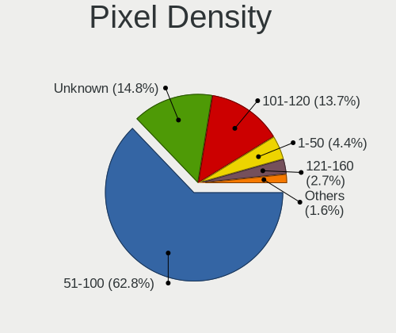

| Density | Desktops | Percent |
|---------|----------|---------|
| 51-100  | 90       | 58.06%  |
| Unknown | 29       | 18.71%  |
| 101-120 | 28       | 18.06%  |
| 1-50    | 4        | 2.58%   |
| 161-240 | 3        | 1.94%   |
| 121-160 | 1        | 0.65%   |

Multiple Monitors
-----------------

Total monitors connected

| Total | Desktops | Percent |
|-------|----------|---------|
| 1     | 125      | 76.22%  |
| 2     | 25       | 15.24%  |
| 0     | 10       | 6.1%    |
| 3     | 3        | 1.83%   |
| 4     | 1        | 0.61%   |

Net Controller Vendor
---------------------

Controller vendors

| Vendor                                 | Desktops | Percent |
|----------------------------------------|----------|---------|
| Realtek Semiconductor                  | 97       | 41.1%   |
| Intel                                  | 56       | 23.73%  |
| Qualcomm Atheros                       | 16       | 6.78%   |
| Nvidia                                 | 13       | 5.51%   |
| Ralink Technology                      | 6        | 2.54%   |
| Broadcom                               | 5        | 2.12%   |
| TP-Link                                | 4        | 1.69%   |
| Ralink                                 | 4        | 1.69%   |
| Qualcomm Atheros Communications        | 3        | 1.27%   |
| Microsoft                              | 3        | 1.27%   |
| Broadcom Limited                       | 3        | 1.27%   |
| Samsung Electronics                    | 2        | 0.85%   |
| NetGear                                | 2        | 0.85%   |
| Marvell Technology Group               | 2        | 0.85%   |
| D-Link                                 | 2        | 0.85%   |
| ASUSTek Computer                       | 2        | 0.85%   |
| ZyDAS                                  | 1        | 0.42%   |
| Xiaomi                                 | 1        | 0.42%   |
| VIA Technologies                       | 1        | 0.42%   |
| Sony Ericsson Mobile Communications AB | 1        | 0.42%   |
| Silicon Integrated Systems [SiS]       | 1        | 0.42%   |
| National Semiconductor                 | 1        | 0.42%   |
| Mellanox Technologies                  | 1        | 0.42%   |
| MediaTek                               | 1        | 0.42%   |
| Linksys                                | 1        | 0.42%   |
| IMC Networks                           | 1        | 0.42%   |
| Huawei Technologies                    | 1        | 0.42%   |
| Emulex                                 | 1        | 0.42%   |
| D-Link System                          | 1        | 0.42%   |
| BUFFALO                                | 1        | 0.42%   |
| Belkin Components                      | 1        | 0.42%   |
| ASIX Electronics                       | 1        | 0.42%   |

Net Controller Model
--------------------

Controller models

| Model                                                             | Desktops | Percent |
|-------------------------------------------------------------------|----------|---------|
| Realtek RTL8111/8168/8411 PCI Express Gigabit Ethernet Controller | 74       | 28.35%  |
| Intel Wi-Fi 6 AX200                                               | 9        | 3.45%   |
| Nvidia MCP61 Ethernet                                             | 8        | 3.07%   |
| Realtek RTL810xE PCI Express Fast Ethernet controller             | 7        | 2.68%   |
| Intel 82579LM Gigabit Network Connection (Lewisville)             | 7        | 2.68%   |
| Realtek RTL8125 2.5GbE Controller                                 | 6        | 2.3%    |
| Intel I211 Gigabit Network Connection                             | 6        | 2.3%    |
| Intel Wireless-AC 9260                                            | 5        | 1.92%   |
| Intel Ethernet Connection (2) I219-V                              | 5        | 1.92%   |
| Realtek RTL8188CUS 802.11n WLAN Adapter                           | 4        | 1.53%   |
| Intel Ethernet Connection I217-LM                                 | 4        | 1.53%   |
| Realtek RTL88x2bu [AC1200 Techkey]                                | 3        | 1.15%   |
| Qualcomm Atheros AR9271 802.11n                                   | 3        | 1.15%   |
| Qualcomm Atheros AR93xx Wireless Network Adapter                  | 3        | 1.15%   |
| Microsoft Xbox 360 Wireless Adapter                               | 3        | 1.15%   |
| Intel Ethernet Connection I217-V                                  | 3        | 1.15%   |
| Intel 82567LM-3 Gigabit Network Connection                        | 3        | 1.15%   |
| TP-Link Archer T2U PLUS [RTL8821AU]                               | 2        | 0.77%   |
| Realtek RTL8192CU 802.11n WLAN Adapter                            | 2        | 0.77%   |
| Realtek RTL8188CE 802.11b/g/n WiFi Adapter                        | 2        | 0.77%   |
| Realtek RTL-8100/8101L/8139 PCI Fast Ethernet Adapter             | 2        | 0.77%   |
| Realtek 802.11ac NIC                                              | 2        | 0.77%   |
| Ralink MT7601U Wireless Adapter                                   | 2        | 0.77%   |
| Ralink RT2561/RT61 802.11g PCI                                    | 2        | 0.77%   |
| Qualcomm Atheros Attansic L2 Fast Ethernet                        | 2        | 0.77%   |
| Qualcomm Atheros AR8152 v2.0 Fast Ethernet                        | 2        | 0.77%   |
| Qualcomm Atheros AR8131 Gigabit Ethernet                          | 2        | 0.77%   |
| NetGear WNA3100(v1) Wireless-N 300 [Broadcom BCM43231]            | 2        | 0.77%   |
| Marvell Group 88E8056 PCI-E Gigabit Ethernet Controller           | 2        | 0.77%   |
| Intel Ethernet Controller I225-V                                  | 2        | 0.77%   |
| Intel Ethernet Connection (7) I219-V                              | 2        | 0.77%   |
| Intel Ethernet Connection (12) I219-V                             | 2        | 0.77%   |
| Intel Dual Band Wireless-AC 3168NGW [Stone Peak]                  | 2        | 0.77%   |
| Intel 82576 Gigabit Network Connection                            | 2        | 0.77%   |
| ZyDAS ZD1211B 802.11g                                             | 1        | 0.38%   |
| Xiaomi Mi/Redmi series (RNDIS)                                    | 1        | 0.38%   |
| VIA VT6102/VT6103 [Rhine-II]                                      | 1        | 0.38%   |
| TP-Link TL-WN722N v2                                              | 1        | 0.38%   |
| TP-Link 802.11ac WLAN Adapter                                     | 1        | 0.38%   |
| Sony Ericsson Mobile AB E5823                                     | 1        | 0.38%   |
| Silicon Integrated Systems [SiS] 191 Gigabit Ethernet Adapter     | 1        | 0.38%   |
| Samsung GT-I9070 (network tethering, USB debugging enabled)       | 1        | 0.38%   |
| Samsung Galaxy series, misc. (tethering mode)                     | 1        | 0.38%   |
| Realtek RTL8812AE 802.11ac PCIe Wireless Network Adapter          | 1        | 0.38%   |
| Realtek RTL8192CE PCIe Wireless Network Adapter                   | 1        | 0.38%   |
| Realtek RTL8191SU 802.11n WLAN Adapter                            | 1        | 0.38%   |
| Realtek RTL8188SU 802.11n WLAN Adapter                            | 1        | 0.38%   |
| Realtek RTL8188FTV 802.11b/g/n 1T1R 2.4G WLAN Adapter             | 1        | 0.38%   |
| Realtek RTL8188EUS 802.11n Wireless Network Adapter               | 1        | 0.38%   |
| Realtek RTL8153 Gigabit Ethernet Adapter                          | 1        | 0.38%   |
| Ralink RT5572 Wireless Adapter                                    | 1        | 0.38%   |
| Ralink RT5372 Wireless Adapter                                    | 1        | 0.38%   |
| Ralink RT5370 Wireless Adapter                                    | 1        | 0.38%   |
| Ralink RT2070 Wireless Adapter                                    | 1        | 0.38%   |
| Ralink RT5390 Wireless 802.11n 1T/1R PCIe                         | 1        | 0.38%   |
| Ralink RT3062 Wireless 802.11n 2T/2R                              | 1        | 0.38%   |
| Qualcomm Atheros QCA9565 / AR9565 Wireless Network Adapter        | 1        | 0.38%   |
| Qualcomm Atheros Killer E2500 Gigabit Ethernet Controller         | 1        | 0.38%   |
| Qualcomm Atheros Killer E2400 Gigabit Ethernet Controller         | 1        | 0.38%   |
| Qualcomm Atheros Killer E220x Gigabit Ethernet Controller         | 1        | 0.38%   |

Wireless Vendor
---------------

Wireless vendors

| Vendor                          | Desktops | Percent |
|---------------------------------|----------|---------|
| Intel                           | 21       | 26.92%  |
| Realtek Semiconductor           | 19       | 24.36%  |
| Ralink Technology               | 6        | 7.69%   |
| Qualcomm Atheros                | 5        | 6.41%   |
| TP-Link                         | 4        | 5.13%   |
| Ralink                          | 4        | 5.13%   |
| Qualcomm Atheros Communications | 3        | 3.85%   |
| Microsoft                       | 3        | 3.85%   |
| NetGear                         | 2        | 2.56%   |
| D-Link                          | 2        | 2.56%   |
| ASUSTek Computer                | 2        | 2.56%   |
| ZyDAS                           | 1        | 1.28%   |
| Linksys                         | 1        | 1.28%   |
| IMC Networks                    | 1        | 1.28%   |
| BUFFALO                         | 1        | 1.28%   |
| Broadcom Limited                | 1        | 1.28%   |
| Broadcom                        | 1        | 1.28%   |
| Belkin Components               | 1        | 1.28%   |

Wireless Model
--------------

Wireless models

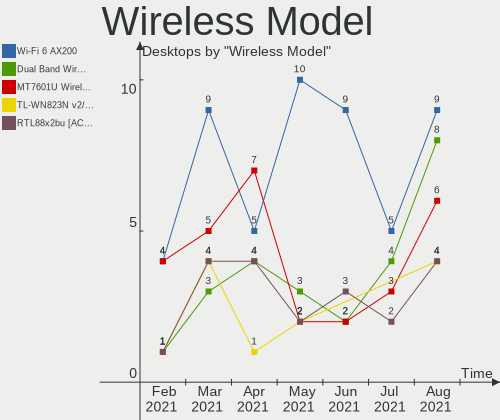

| Model                                                                                   | Desktops | Percent |
|-----------------------------------------------------------------------------------------|----------|---------|
| Intel Wi-Fi 6 AX200                                                                     | 9        | 11.54%  |
| Intel Wireless-AC 9260                                                                  | 5        | 6.41%   |
| Realtek RTL8188CUS 802.11n WLAN Adapter                                                 | 4        | 5.13%   |
| Realtek RTL88x2bu [AC1200 Techkey]                                                      | 3        | 3.85%   |
| Qualcomm Atheros AR9271 802.11n                                                         | 3        | 3.85%   |
| Qualcomm Atheros AR93xx Wireless Network Adapter                                        | 3        | 3.85%   |
| Microsoft Xbox 360 Wireless Adapter                                                     | 3        | 3.85%   |
| TP-Link Archer T2U PLUS [RTL8821AU]                                                     | 2        | 2.56%   |
| Realtek RTL8192CU 802.11n WLAN Adapter                                                  | 2        | 2.56%   |
| Realtek RTL8188CE 802.11b/g/n WiFi Adapter                                              | 2        | 2.56%   |
| Realtek 802.11ac NIC                                                                    | 2        | 2.56%   |
| Ralink MT7601U Wireless Adapter                                                         | 2        | 2.56%   |
| Ralink RT2561/RT61 802.11g PCI                                                          | 2        | 2.56%   |
| NetGear WNA3100(v1) Wireless-N 300 [Broadcom BCM43231]                                  | 2        | 2.56%   |
| Intel Dual Band Wireless-AC 3168NGW [Stone Peak]                                        | 2        | 2.56%   |
| ZyDAS ZD1211B 802.11g                                                                   | 1        | 1.28%   |
| TP-Link TL-WN722N v2                                                                    | 1        | 1.28%   |
| TP-Link 802.11ac WLAN Adapter                                                           | 1        | 1.28%   |
| Realtek RTL8812AE 802.11ac PCIe Wireless Network Adapter                                | 1        | 1.28%   |
| Realtek RTL8192CE PCIe Wireless Network Adapter                                         | 1        | 1.28%   |
| Realtek RTL8191SU 802.11n WLAN Adapter                                                  | 1        | 1.28%   |
| Realtek RTL8188SU 802.11n WLAN Adapter                                                  | 1        | 1.28%   |
| Realtek RTL8188FTV 802.11b/g/n 1T1R 2.4G WLAN Adapter                                   | 1        | 1.28%   |
| Realtek RTL8188EUS 802.11n Wireless Network Adapter                                     | 1        | 1.28%   |
| Ralink RT5572 Wireless Adapter                                                          | 1        | 1.28%   |
| Ralink RT5372 Wireless Adapter                                                          | 1        | 1.28%   |
| Ralink RT5370 Wireless Adapter                                                          | 1        | 1.28%   |
| Ralink RT2070 Wireless Adapter                                                          | 1        | 1.28%   |
| Ralink RT5390 Wireless 802.11n 1T/1R PCIe                                               | 1        | 1.28%   |
| Ralink RT3062 Wireless 802.11n 2T/2R                                                    | 1        | 1.28%   |
| Qualcomm Atheros QCA9565 / AR9565 Wireless Network Adapter                              | 1        | 1.28%   |
| Qualcomm Atheros AR5212/5213/2414 Wireless Network Adapter                              | 1        | 1.28%   |
| Linksys WUSB6100M 802.11a/b/g/n/ac Wireless Adapter                                     | 1        | 1.28%   |
| Intel Wireless 8260                                                                     | 1        | 1.28%   |
| Intel Wireless 3165                                                                     | 1        | 1.28%   |
| Intel Gemini Lake PCH CNVi WiFi                                                         | 1        | 1.28%   |
| Intel Dual Band Wireless-AC 3165 Plus Bluetooth                                         | 1        | 1.28%   |
| Intel Cannon Lake PCH CNVi WiFi                                                         | 1        | 1.28%   |
| IMC Networks Mediao 802.11n WLAN [Realtek RTL8191SU]                                    | 1        | 1.28%   |
| D-Link DWA-125 Wireless N 150 Adapter(rev.A3) [Ralink RT5370]                           | 1        | 1.28%   |
| D-Link DWA-121 802.11n Wireless N 150 Pico Adapter [Realtek RTL8188CUS]                 | 1        | 1.28%   |
| BUFFALO WLI-U2-KG125S 802.11g Adapter [Broadcom 4320 USB]                               | 1        | 1.28%   |
| Broadcom Limited BCM43224 802.11a/b/g/n                                                 | 1        | 1.28%   |
| Broadcom BCM4360 802.11ac Wireless Network Adapter                                      | 1        | 1.28%   |
| Belkin Components F7D2102 802.11n N300 Micro Wireless Adapter v3000 [Realtek RTL8192CU] | 1        | 1.28%   |
| ASUS USB-N14 802.11b/g/n (2x2) Wireless Adapter [Ralink RT5372]                         | 1        | 1.28%   |
| ASUS USB-N13 802.11n Network Adapter (rev. B1) [Realtek RTL8192CU]                      | 1        | 1.28%   |

Ethernet Vendor
---------------

Ethernet vendors

| Vendor                           | Desktops | Percent |
|----------------------------------|----------|---------|
| Realtek Semiconductor            | 90       | 51.72%  |
| Intel                            | 42       | 24.14%  |
| Nvidia                           | 13       | 7.47%   |
| Qualcomm Atheros                 | 11       | 6.32%   |
| Broadcom                         | 4        | 2.3%    |
| Samsung Electronics              | 2        | 1.15%   |
| Marvell Technology Group         | 2        | 1.15%   |
| Broadcom Limited                 | 2        | 1.15%   |
| Xiaomi                           | 1        | 0.57%   |
| VIA Technologies                 | 1        | 0.57%   |
| Silicon Integrated Systems [SiS] | 1        | 0.57%   |
| National Semiconductor           | 1        | 0.57%   |
| MediaTek                         | 1        | 0.57%   |
| Emulex                           | 1        | 0.57%   |
| D-Link System                    | 1        | 0.57%   |
| ASIX Electronics                 | 1        | 0.57%   |

Ethernet Model
--------------

Ethernet models

| Model                                                             | Desktops | Percent |
|-------------------------------------------------------------------|----------|---------|
| Realtek RTL8111/8168/8411 PCI Express Gigabit Ethernet Controller | 74       | 41.34%  |
| Nvidia MCP61 Ethernet                                             | 8        | 4.47%   |
| Realtek RTL810xE PCI Express Fast Ethernet controller             | 7        | 3.91%   |
| Intel 82579LM Gigabit Network Connection (Lewisville)             | 7        | 3.91%   |
| Realtek RTL8125 2.5GbE Controller                                 | 6        | 3.35%   |
| Intel I211 Gigabit Network Connection                             | 6        | 3.35%   |
| Intel Ethernet Connection (2) I219-V                              | 5        | 2.79%   |
| Intel Ethernet Connection I217-LM                                 | 4        | 2.23%   |
| Intel Ethernet Connection I217-V                                  | 3        | 1.68%   |
| Intel 82567LM-3 Gigabit Network Connection                        | 3        | 1.68%   |
| Realtek RTL-8100/8101L/8139 PCI Fast Ethernet Adapter             | 2        | 1.12%   |
| Qualcomm Atheros Attansic L2 Fast Ethernet                        | 2        | 1.12%   |
| Qualcomm Atheros AR8152 v2.0 Fast Ethernet                        | 2        | 1.12%   |
| Qualcomm Atheros AR8131 Gigabit Ethernet                          | 2        | 1.12%   |
| Marvell Group 88E8056 PCI-E Gigabit Ethernet Controller           | 2        | 1.12%   |
| Intel Ethernet Controller I225-V                                  | 2        | 1.12%   |
| Intel Ethernet Connection (7) I219-V                              | 2        | 1.12%   |
| Intel Ethernet Connection (12) I219-V                             | 2        | 1.12%   |
| Intel 82576 Gigabit Network Connection                            | 2        | 1.12%   |
| Xiaomi Mi/Redmi series (RNDIS)                                    | 1        | 0.56%   |
| VIA VT6102/VT6103 [Rhine-II]                                      | 1        | 0.56%   |
| Silicon Integrated Systems [SiS] 191 Gigabit Ethernet Adapter     | 1        | 0.56%   |
| Samsung GT-I9070 (network tethering, USB debugging enabled)       | 1        | 0.56%   |
| Samsung Galaxy series, misc. (tethering mode)                     | 1        | 0.56%   |
| Realtek RTL8153 Gigabit Ethernet Adapter                          | 1        | 0.56%   |
| Qualcomm Atheros Killer E2500 Gigabit Ethernet Controller         | 1        | 0.56%   |
| Qualcomm Atheros Killer E2400 Gigabit Ethernet Controller         | 1        | 0.56%   |
| Qualcomm Atheros Killer E220x Gigabit Ethernet Controller         | 1        | 0.56%   |
| Qualcomm Atheros AR8161 Gigabit Ethernet                          | 1        | 0.56%   |
| Qualcomm Atheros AR8151 v2.0 Gigabit Ethernet                     | 1        | 0.56%   |
| Nvidia MCP79 Ethernet                                             | 1        | 0.56%   |
| Nvidia MCP77 Ethernet                                             | 1        | 0.56%   |
| Nvidia MCP73 Ethernet                                             | 1        | 0.56%   |
| Nvidia MCP65 Ethernet                                             | 1        | 0.56%   |
| Nvidia CK804 Ethernet Controller                                  | 1        | 0.56%   |
| National DP83815 (MacPhyter) Ethernet Controller                  | 1        | 0.56%   |
| MediaTek WP6                                                      | 1        | 0.56%   |
| Marvell Group 88E8001 Gigabit Ethernet Controller                 | 1        | 0.56%   |
| Intel Ethernet Controller 10-Gigabit X540-AT2                     | 1        | 0.56%   |
| Intel Ethernet Connection (6) I219-V                              | 1        | 0.56%   |
| Intel Ethernet Connection (2) I218-V                              | 1        | 0.56%   |
| Intel Ethernet Connection (14) I219-V                             | 1        | 0.56%   |
| Intel 82579V Gigabit Network Connection                           | 1        | 0.56%   |
| Intel 82578DC Gigabit Network Connection                          | 1        | 0.56%   |
| Intel 82566DM Gigabit Network Connection                          | 1        | 0.56%   |
| Intel 82547EI Gigabit Ethernet Controller                         | 1        | 0.56%   |
| Intel 82540EM Gigabit Ethernet Controller                         | 1        | 0.56%   |
| Intel 80003ES2LAN Gigabit Ethernet Controller (Copper)            | 1        | 0.56%   |
| Emulex OneConnect OCe10100/OCe10102 Series 10 GbE                 | 1        | 0.56%   |
| D-Link System Gigabit Ethernet Adapter                            | 1        | 0.56%   |
| Broadcom NetXtreme BCM5762 Gigabit Ethernet PCIe                  | 1        | 0.56%   |
| Broadcom NetXtreme BCM5761 Gigabit Ethernet PCIe                  | 1        | 0.56%   |
| Broadcom NetXtreme BCM5754 Gigabit Ethernet PCI Express           | 1        | 0.56%   |
| Broadcom NetLink BCM57788 Gigabit Ethernet PCIe                   | 1        | 0.56%   |
| Broadcom Limited NetXtreme II BCM5708 Gigabit Ethernet            | 1        | 0.56%   |
| Broadcom Limited NetXtreme BCM5755 Gigabit Ethernet PCI Express   | 1        | 0.56%   |
| ASIX AX88179 Gigabit Ethernet                                     | 1        | 0.56%   |

Net Controller Kind
-------------------

Ethernet, WiFi or modem

| Kind     | Desktops | Percent |
|----------|----------|---------|
| Ethernet | 160      | 67.8%   |
| WiFi     | 72       | 30.51%  |
| Modem    | 2        | 0.85%   |
| Unknown  | 2        | 0.85%   |

Used Controller
---------------

Currently used network controller

| Kind     | Desktops | Percent |
|----------|----------|---------|
| Ethernet | 145      | 71.43%  |
| WiFi     | 57       | 28.08%  |
| Unknown  | 1        | 0.49%   |

NICs
----

Total network controllers on board

| Total | Desktops | Percent |
|-------|----------|---------|
| 1     | 117      | 71.34%  |
| 2     | 36       | 21.95%  |
| 3     | 8        | 4.88%   |
| 0     | 2        | 1.22%   |
| 4     | 1        | 0.61%   |

IPv6
----

IPv6 vs IPv4

| Used | Desktops | Percent |
|------|----------|---------|
| No   | 121      | 73.78%  |
| Yes  | 43       | 26.22%  |

Memory Vendor
-------------

Memory module vendors

| Vendor              | Desktops | Percent |
|---------------------|----------|---------|
| Corsair             | 11       | 17.19%  |
| Kingston            | 9        | 14.06%  |
| Unknown             | 8        | 12.5%   |
| Crucial             | 7        | 10.94%  |
| Samsung Electronics | 5        | 7.81%   |
| G.Skill             | 5        | 7.81%   |
| SK Hynix            | 3        | 4.69%   |
| Team                | 2        | 3.13%   |
| A-DATA Technology   | 2        | 3.13%   |
| Unknown (ABCD)      | 1        | 1.56%   |
| Unknown (0x8551)    | 1        | 1.56%   |
| Undefined-000B      | 1        | 1.56%   |
| TIMETEC             | 1        | 1.56%   |
| Smart               | 1        | 1.56%   |
| Qimonda             | 1        | 1.56%   |
| Patriot             | 1        | 1.56%   |
| Nanya Technology    | 1        | 1.56%   |
| Micron Technology   | 1        | 1.56%   |
| GOODRAM             | 1        | 1.56%   |
| Apacer              | 1        | 1.56%   |
| AMD                 | 1        | 1.56%   |

Memory Model
------------

Memory module models

| Model                                                          | Desktops | Percent |
|----------------------------------------------------------------|----------|---------|
| Crucial RAM BLS8G3D1609DS1S00. 8192MB DIMM DDR3 1600MT/s       | 3        | 4.41%   |
| Corsair RAM CMK16GX4M2B3200C16 8GB DIMM DDR4 3600MT/s          | 2        | 2.94%   |
| Unknown RAM Module 512MB DIMM DDR2                             | 1        | 1.47%   |
| Unknown RAM Module 4096MB SODIMM DDR3 1333MT/s                 | 1        | 1.47%   |
| Unknown RAM Module 4096MB DIMM SDRAM                           | 1        | 1.47%   |
| Unknown RAM Module 4096MB DIMM DDR3 1600MT/s                   | 1        | 1.47%   |
| Unknown RAM Module 4096MB DIMM DDR2 800MT/s                    | 1        | 1.47%   |
| Unknown RAM Module 4096MB DIMM 800MT/s                         | 1        | 1.47%   |
| Unknown RAM Module 2048MB DIMM SDRAM                           | 1        | 1.47%   |
| Unknown RAM Module 2048MB DIMM DDR3 1600MT/s                   | 1        | 1.47%   |
| Unknown RAM Module 2048MB DIMM 800MT/s                         | 1        | 1.47%   |
| Unknown (ABCD) RAM 123456789012345678 4GB DIMM DDR4 2400MT/s   | 1        | 1.47%   |
| Unknown (0x8551) RAM Module 2GB FB-DIMM DDR2 667MT/s           | 1        | 1.47%   |
| Undefined-000B RAM NT8GC72B4NB1NK-CG 8192MB DIMM DDR3 1333MT/s | 1        | 1.47%   |
| Undefined-000B RAM NT8GC72B4NB1NJ-CG 8192MB DIMM DDR3 1333MT/s | 1        | 1.47%   |
| TIMETEC RAM UD3-1600 8192MB DIMM DDR3 1600MT/s                 | 1        | 1.47%   |
| Team RAM TEAMGROUP-UD4-3600 8192MB DIMM DDR4 3600MT/s          | 1        | 1.47%   |
| Team RAM TEAMGROUP-UD4-3200 8192MB DIMM DDR4 3200MT/s          | 1        | 1.47%   |
| Smart RAM SH564128FH8N0QHSCG 4096MB DIMM DDR3 1333MT/s         | 1        | 1.47%   |
| SK Hynix RAM Module 1GB DIMM DDR3 1333MT/s                     | 1        | 1.47%   |
| SK Hynix RAM HYMP512U64CP8-Y5 1GB DIMM DDR2 667MT/s            | 1        | 1.47%   |
| SK Hynix RAM HMT351U6CFR8C-H9 4096MB DIMM DDR3 1600MT/s        | 1        | 1.47%   |
| Samsung RAM Module 2GB FB-DIMM DDR2 667MT/s                    | 1        | 1.47%   |
| Samsung RAM Module 2048MB DIMM DDR3 1066MT/s                   | 1        | 1.47%   |
| Samsung RAM M378B5173QH0-CK0 4096MB DIMM DDR3 1866MT/s         | 1        | 1.47%   |
| Samsung RAM M3 78T6553EZS-CE6 512MB DIMM DDR2 667MT/s          | 1        | 1.47%   |
| Samsung RAM M3 78T2863QZS-CF7 1024MB DIMM DDR2 800MT/s         | 1        | 1.47%   |
| Qimonda RAM 64T128020HU3SB 1024MB DIMM DDR2 667MT/s            | 1        | 1.47%   |
| Patriot RAM 3200 C16 Series 8192MB DIMM DDR4 3200MT/s          | 1        | 1.47%   |
| Nanya RAM NT2GC64B88G0NF-CG 2048MB DIMM DDR3 1333MT/s          | 1        | 1.47%   |
| Micron RAM 16JTF1G64AZ-1G6E1 8192MB DIMM DDR3 1600MT/s         | 1        | 1.47%   |
| Kingston RAM Module 4096MB DIMM DDR3 1333MT/s                  | 1        | 1.47%   |
| Kingston RAM KHX3600C17D4/8GX 8192MB DIMM DDR4 3600MT/s        | 1        | 1.47%   |
| Kingston RAM KHX3200C18D4/8G 8192MB DIMM DDR4 3333MT/s         | 1        | 1.47%   |
| Kingston RAM KHX3200C16D4/8GX 8192MB DIMM DDR4 3533MT/s        | 1        | 1.47%   |
| Kingston RAM KHX2400C15D4/4G 4096MB DIMM DDR4 3151MT/s         | 1        | 1.47%   |
| Kingston RAM KHX1866C10D3/4G 4GB DIMM DDR3 1866MT/s            | 1        | 1.47%   |
| Kingston RAM HP5189-2180-ELC 2048MB DIMM DDR2 800MT/s          | 1        | 1.47%   |
| Kingston RAM 99U5471-054.A00LF 8GB DIMM DDR3 1600MT/s          | 1        | 1.47%   |
| Kingston RAM 9905734-019.A00G 16384MB DIMM DDR4 2400MT/s       | 1        | 1.47%   |
| Kingston RAM 9905713-017.A00G 4096MB DIMM DDR4 2400MT/s        | 1        | 1.47%   |
| GOODRAM RAM GR1333S364L9/4G 4096MB DIMM DDR3 1333MT/s          | 1        | 1.47%   |
| G.Skill RAM F4-3600C18-16GVK 16384MB DIMM DDR4 3733MT/s        | 1        | 1.47%   |
| G.Skill RAM F4-3200C16-16GVK 16384MB DIMM DDR4 3600MT/s        | 1        | 1.47%   |
| G.Skill RAM F4-3000C14-16GVR 16384MB DIMM DDR4 3000MT/s        | 1        | 1.47%   |
| G.Skill RAM F4-2666C15-8GVR 8GB DIMM DDR4 2800MT/s             | 1        | 1.47%   |
| G.Skill RAM F4-2133C15-16GIS 16384MB DIMM DDR4 2133MT/s        | 1        | 1.47%   |
| Crucial RAM CT8G4DFD8213.C16FBD2 8192MB DIMM DDR4 2133MT/s     | 1        | 1.47%   |
| Crucial RAM CT51264BA160B.C16F 4096MB DIMM DDR3 1600MT/s       | 1        | 1.47%   |
| Crucial RAM BLS8G4D30AESEK.M8FE 8192MB DIMM DDR4 3600MT/s      | 1        | 1.47%   |
| Crucial RAM BL8G32C16U4B.M8FE 8GB DIMM DDR4 3600MT/s           | 1        | 1.47%   |
| Corsair RAM CMZ8GX3M2A2133C11 4GB DIMM DDR3 2133MT/s           | 1        | 1.47%   |
| Corsair RAM CMW32GX4M2C3466C16 16384MB DIMM DDR4 3466MT/s      | 1        | 1.47%   |
| Corsair RAM CMV8GX3M1A1600C11 8192MB DIMM DDR3 1600MT/s        | 1        | 1.47%   |
| Corsair RAM CMT4GX3M2A2000C8 2048MB DIMM DDR3 1067MT/s         | 1        | 1.47%   |
| Corsair RAM CMT32GX4M2Z3600C18 16384MB DIMM DDR4 2666MT/s      | 1        | 1.47%   |
| Corsair RAM CMK16GX4M2B3000C15 8GB DIMM DDR4 3466MT/s          | 1        | 1.47%   |
| Corsair RAM CMK16GX4M2A2400C16 8GB DIMM DDR4 2933MT/s          | 1        | 1.47%   |
| Corsair RAM CMK16GX4M2A2133C13 8192MB DIMM DDR4 2400MT/s       | 1        | 1.47%   |
| Corsair RAM CMK16GX4M1D3000C16 16GB DIMM DDR4 3000MT/s         | 1        | 1.47%   |

Memory Kind
-----------

Memory module kinds

| Kind    | Desktops | Percent |
|---------|----------|---------|
| DDR4    | 25       | 46.3%   |
| DDR3    | 17       | 31.48%  |
| DDR2    | 5        | 9.26%   |
| SDRAM   | 4        | 7.41%   |
| Unknown | 2        | 3.7%    |
| LPDDR4  | 1        | 1.85%   |

Memory Form Factor
------------------

Physical design of the memory module

| Name    | Desktops | Percent |
|---------|----------|---------|
| DIMM    | 51       | 96.23%  |
| SODIMM  | 1        | 1.89%   |
| FB-DIMM | 1        | 1.89%   |

Memory Size
-----------

Memory module size

| Size  | Desktops | Percent |
|-------|----------|---------|
| 8192  | 22       | 36.67%  |
| 16384 | 11       | 18.33%  |
| 4096  | 11       | 18.33%  |
| 2048  | 8        | 13.33%  |
| 1024  | 4        | 6.67%   |
| 32768 | 2        | 3.33%   |
| 512   | 2        | 3.33%   |

Memory Speed
------------

Memory module speed

| Speed   | Desktops | Percent |
|---------|----------|---------|
| 1600    | 9        | 15.79%  |
| 3600    | 7        | 12.28%  |
| 1333    | 6        | 10.53%  |
| 3200    | 4        | 7.02%   |
| 800     | 4        | 7.02%   |
| 3000    | 3        | 5.26%   |
| 2400    | 3        | 5.26%   |
| 2133    | 3        | 5.26%   |
| 667     | 3        | 5.26%   |
| Unknown | 3        | 5.26%   |
| 3466    | 2        | 3.51%   |
| 3733    | 1        | 1.75%   |
| 3533    | 1        | 1.75%   |
| 3333    | 1        | 1.75%   |
| 3151    | 1        | 1.75%   |
| 2933    | 1        | 1.75%   |
| 2800    | 1        | 1.75%   |
| 2666    | 1        | 1.75%   |
| 1866    | 1        | 1.75%   |
| 1067    | 1        | 1.75%   |
| 1066    | 1        | 1.75%   |

Sound Vendor
------------

Sound card vendors

| Vendor                           | Desktops | Percent |
|----------------------------------|----------|---------|
| Intel                            | 91       | 34.08%  |
| AMD                              | 76       | 28.46%  |
| Nvidia                           | 62       | 23.22%  |
| C-Media Electronics              | 7        | 2.62%   |
| Creative Labs                    | 4        | 1.5%    |
| VIA Technologies                 | 2        | 0.75%   |
| Texas Instruments                | 2        | 0.75%   |
| Plantronics                      | 2        | 0.75%   |
| M-Audio                          | 2        | 0.75%   |
| Generalplus Technology           | 2        | 0.75%   |
| Focusrite-Novation               | 2        | 0.75%   |
| Silicon Integrated Systems [SiS] | 1        | 0.37%   |
| Realtek Semiconductor            | 1        | 0.37%   |
| Microsoft                        | 1        | 0.37%   |
| Medeli Electronics               | 1        | 0.37%   |
| Logitech                         | 1        | 0.37%   |
| LG Electronics                   | 1        | 0.37%   |
| Kingston Technology              | 1        | 0.37%   |
| JMTek                            | 1        | 0.37%   |
| GN Netcom                        | 1        | 0.37%   |
| Ensoniq                          | 1        | 0.37%   |
| Dell                             | 1        | 0.37%   |
| Creative Technology              | 1        | 0.37%   |
| Corsair                          | 1        | 0.37%   |
| ATI Technologies                 | 1        | 0.37%   |
| Arturia                          | 1        | 0.37%   |

Sound Model
-----------

Sound card models

| Model                                                                             | Desktops | Percent |
|-----------------------------------------------------------------------------------|----------|---------|
| AMD Starship/Matisse HD Audio Controller                                          | 17       | 5.52%   |
| Intel NM10/ICH7 Family High Definition Audio Controller                           | 13       | 4.22%   |
| AMD SBx00 Azalia (Intel HDA)                                                      | 12       | 3.9%    |
| Intel 6 Series/C200 Series Chipset Family High Definition Audio Controller        | 11       | 3.57%   |
| AMD Ellesmere HDMI Audio [Radeon RX 470/480 / 570/580/590]                        | 11       | 3.57%   |
| Nvidia GK208 HDMI/DP Audio Controller                                             | 10       | 3.25%   |
| Intel 8 Series/C220 Series Chipset High Definition Audio Controller               | 9        | 2.92%   |
| Intel 200 Series PCH HD Audio                                                     | 9        | 2.92%   |
| AMD Family 17h (Models 00h-0fh) HD Audio Controller                               | 9        | 2.92%   |
| Nvidia MCP61 High Definition Audio                                                | 8        | 2.6%    |
| Intel Xeon E3-1200 v3/4th Gen Core Processor HD Audio Controller                  | 8        | 2.6%    |
| Intel 7 Series/C216 Chipset Family High Definition Audio Controller               | 8        | 2.6%    |
| AMD FCH Azalia Controller                                                         | 8        | 2.6%    |
| AMD Family 17h (Models 10h-1fh) HD Audio Controller                               | 7        | 2.27%   |
| Nvidia GP107GL High Definition Audio Controller                                   | 6        | 1.95%   |
| Nvidia GP108 High Definition Audio Controller                                     | 5        | 1.62%   |
| Intel 5 Series/3400 Series Chipset High Definition Audio                          | 5        | 1.62%   |
| Nvidia High Definition Audio Controller                                           | 4        | 1.3%    |
| Nvidia GP106 High Definition Audio Controller                                     | 4        | 1.3%    |
| Intel 100 Series/C230 Series Chipset Family HD Audio Controller                   | 4        | 1.3%    |
| AMD Raven/Raven2/Fenghuang HDMI/DP Audio Controller                               | 4        | 1.3%    |
| AMD Juniper HDMI Audio [Radeon HD 5700 Series]                                    | 4        | 1.3%    |
| AMD Caicos HDMI Audio [Radeon HD 6450 / 7450/8450/8490 OEM / R5 230/235/235X OEM] | 4        | 1.3%    |
| AMD Baffin HDMI/DP Audio [Radeon RX 550 640SP / RX 560/560X]                      | 4        | 1.3%    |
| Nvidia TU107 GeForce GTX 1650 High Definition Audio Controller                    | 3        | 0.97%   |
| Nvidia TU106 High Definition Audio Controller                                     | 3        | 0.97%   |
| Nvidia GP104 High Definition Audio Controller                                     | 3        | 0.97%   |
| Intel Comet Lake PCH-V Smart Sound Technology Audio Controller                    | 3        | 0.97%   |
| Intel C600/X79 series chipset High Definition Audio Controller                    | 3        | 0.97%   |
| Intel 82801JD/DO (ICH10 Family) HD Audio Controller                               | 3        | 0.97%   |
| Intel 82801H (ICH8 Family) HD Audio Controller                                    | 3        | 0.97%   |
| AMD Oland/Hainan/Cape Verde/Pitcairn HDMI Audio [Radeon HD 7000 Series]           | 3        | 0.97%   |
| Nvidia TU104 HD Audio Controller                                                  | 2        | 0.65%   |
| Nvidia GM107 High Definition Audio Controller [GeForce 940MX]                     | 2        | 0.65%   |
| Nvidia GK107 HDMI Audio Controller                                                | 2        | 0.65%   |
| Nvidia GK104 HDMI Audio Controller                                                | 2        | 0.65%   |
| Nvidia GF116 High Definition Audio Controller                                     | 2        | 0.65%   |
| Intel Tiger Lake-H HD Audio Controller                                            | 2        | 0.65%   |
| Intel Comet Lake PCH cAVS                                                         | 2        | 0.65%   |
| Intel Cannon Lake PCH cAVS                                                        | 2        | 0.65%   |
| Intel 9 Series Chipset Family HD Audio Controller                                 | 2        | 0.65%   |
| Intel 82801I (ICH9 Family) HD Audio Controller                                    | 2        | 0.65%   |
| Generalplus Technology USB Audio Device                                           | 2        | 0.65%   |
| Creative Labs CA0106/CA0111 [SB Live!/Audigy/X-Fi Series]                         | 2        | 0.65%   |
| C-Media Electronics USB Audio Device                                              | 2        | 0.65%   |
| AMD Navi 21 HDMI Audio [Radeon RX 6800/6800 XT / 6900 XT]                         | 2        | 0.65%   |
| AMD Kabini HDMI/DP Audio                                                          | 2        | 0.65%   |
| AMD Hawaii HDMI Audio [Radeon R9 290/290X / 390/390X]                             | 2        | 0.65%   |
| AMD Family 15h (Models 60h-6fh) Audio Controller                                  | 2        | 0.65%   |
| AMD Cedar HDMI Audio [Radeon HD 5400/6300/7300 Series]                            | 2        | 0.65%   |
| VIA Technologies VX900/VT8xxx High Definition Audio Controller                    | 1        | 0.32%   |
| VIA Technologies VT1720/24 [Envy24PT/HT] PCI Multi-Channel Audio Controller       | 1        | 0.32%   |
| Texas Instruments PCM2902 Audio Codec                                             | 1        | 0.32%   |
| Texas Instruments PCM2901 Audio Codec                                             | 1        | 0.32%   |
| Silicon Integrated Systems [SiS] Azalia Audio Controller                          | 1        | 0.32%   |
| Realtek Semiconductor USB2.0 Microphone                                           | 1        | 0.32%   |
| Plantronics RIG 800HX                                                             | 1        | 0.32%   |
| Plantronics Audio 655 DSP                                                         | 1        | 0.32%   |
| Nvidia TU116 High Definition Audio Controller                                     | 1        | 0.32%   |
| Nvidia MCP79 High Definition Audio                                                | 1        | 0.32%   |

Camera Vendor
-------------

Camera device vendors

| Vendor                        | Desktops | Percent |
|-------------------------------|----------|---------|
| Logitech                      | 12       | 33.33%  |
| Microsoft                     | 4        | 11.11%  |
| Microdia                      | 4        | 11.11%  |
| Creative Technology           | 3        | 8.33%   |
| Sunplus Innovation Technology | 2        | 5.56%   |
| GEMBIRD                       | 2        | 5.56%   |
| ARC International             | 2        | 5.56%   |
| Unknown                       | 1        | 2.78%   |
| Teslong Camera                | 1        | 2.78%   |
| Samsung Electronics           | 1        | 2.78%   |
| Lenovo                        | 1        | 2.78%   |
| Chicony Electronics           | 1        | 2.78%   |
| Aveo Technology               | 1        | 2.78%   |
| Apple                         | 1        | 2.78%   |

Camera Model
------------

Camera device models

| Model                                 | Desktops | Percent |
|---------------------------------------|----------|---------|
| Logitech Webcam C270                  | 5        | 13.89%  |
| Sunplus Full HD webcam                | 2        | 5.56%   |
| Microsoft LifeCam HD-3000             | 2        | 5.56%   |
| Microdia USB 2.0 Camera               | 2        | 5.56%   |
| Logitech HD Pro Webcam C920           | 2        | 5.56%   |
| GEMBIRD USB2.0 PC CAMERA              | 2        | 5.56%   |
| ARC International Camera              | 2        | 5.56%   |
| Unknown HD camera                     | 1        | 2.78%   |
| Teslong Camera Teslong Camera         | 1        | 2.78%   |
| Samsung Galaxy A5 (MTP)               | 1        | 2.78%   |
| Microsoft LifeCam HD-5000             | 1        | 2.78%   |
| Microsoft LifeCam Cinema              | 1        | 2.78%   |
| Microdia Webcam Vitade AF             | 1        | 2.78%   |
| Microdia Camera                       | 1        | 2.78%   |
| Logitech Webcam C600                  | 1        | 2.78%   |
| Logitech Webcam C310                  | 1        | 2.78%   |
| Logitech QuickCam Pro 9000            | 1        | 2.78%   |
| Logitech QuickCam Pro 5000            | 1        | 2.78%   |
| Logitech HD Webcam C910               | 1        | 2.78%   |
| Lenovo 500 RGB Camera                 | 1        | 2.78%   |
| Creative Webcam PD1001                | 1        | 2.78%   |
| Creative Live! Cam Sync 1080p         | 1        | 2.78%   |
| Creative Live! Cam Chat HD [VF0700]   | 1        | 2.78%   |
| Chicony HP High Definition 1MP Webcam | 1        | 2.78%   |
| Aveo USB2.0 UVC PC Camera             | 1        | 2.78%   |
| Apple iPhone 5/5C/5S/6/SE             | 1        | 2.78%   |

Fingerprint Vendor
------------------

Fingerprint sensor vendors

Zero info for selected period =(

Fingerprint Model
-----------------

Fingerprint sensor models

Zero info for selected period =(

Chipcard Vendor
---------------

Chipcard module vendors

| Vendor      | Desktops | Percent |
|-------------|----------|---------|
| Alcor Micro | 1        | 100%    |

Chipcard Model
--------------

Chipcard module models

| Model                               | Desktops | Percent |
|-------------------------------------|----------|---------|
| Alcor Micro AU9540 Smartcard Reader | 1        | 100%    |

Printer Vendor
--------------

Printer device vendors

| Vendor              | Desktops | Percent |
|---------------------|----------|---------|
| Hewlett-Packard     | 3        | 30%     |
| Seiko Epson         | 2        | 20%     |
| Samsung Electronics | 2        | 20%     |
| Canon               | 2        | 20%     |
| Brother Industries  | 1        | 10%     |

Printer Model
-------------

Printer device models

| Model                           | Desktops | Percent |
|---------------------------------|----------|---------|
| Seiko Epson L3150 Series        | 1        | 10%     |
| Seiko Epson ET-2720 Series      | 1        | 10%     |
| Samsung ML-1865W Series         | 1        | 10%     |
| Samsung M301x Series            | 1        | 10%     |
| HP LaserJet Professional P1102w | 1        | 10%     |
| HP LaserJet P1005               | 1        | 10%     |
| HP Deskjet 3050 J610 series     | 1        | 10%     |
| Canon TS3100 series             | 1        | 10%     |
| Canon LiDE 400                  | 1        | 10%     |
| Brother HL-1200 series          | 1        | 10%     |

Scanner Vendor
--------------

Scanner device vendors

| Vendor             | Desktops | Percent |
|--------------------|----------|---------|
| Canon              | 4        | 57.14%  |
| UMAX               | 1        | 14.29%  |
| Ultima Electronics | 1        | 14.29%  |
| Seiko Epson        | 1        | 14.29%  |

Scanner Model
-------------

Scanner device models

| Model                                                                                 | Desktops | Percent |
|---------------------------------------------------------------------------------------|----------|---------|
| Canon CanoScan LiDE 210                                                               | 2        | 28.57%  |
| UMAX Astra 4400/4450                                                                  | 1        | 14.29%  |
| Ultima Artec Ultima 2000 (GT6801 based)/Lifetec LT9385/ScanMagic 1200 UB Plus Scanner | 1        | 14.29%  |
| Seiko Epson GT-8300UF [Perfection 1660 PHOTO]                                         | 1        | 14.29%  |
| Canon CanoScan N670U/N676U/LiDE 20                                                    | 1        | 14.29%  |
| Canon CanoScan LiDE 110                                                               | 1        | 14.29%  |

Bluetooth Vendor
----------------

Controller vendors

| Vendor                          | Desktops | Percent |
|---------------------------------|----------|---------|
| Intel                           | 19       | 40.43%  |
| Cambridge Silicon Radio         | 14       | 29.79%  |
| Broadcom                        | 7        | 14.89%  |
| Realtek Semiconductor           | 5        | 10.64%  |
| Qualcomm Atheros Communications | 1        | 2.13%   |
| ASUSTek Computer                | 1        | 2.13%   |

Bluetooth Model
---------------

Controller models

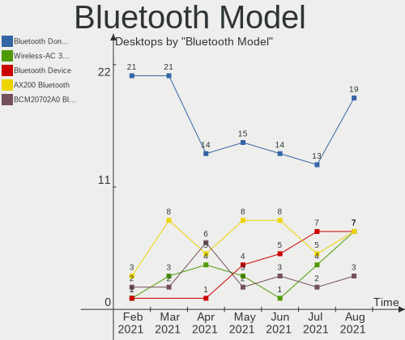

| Model                                                 | Desktops | Percent |
|-------------------------------------------------------|----------|---------|
| Cambridge Silicon Radio Bluetooth Dongle (HCI mode)   | 14       | 29.79%  |
| Intel AX200 Bluetooth                                 | 8        | 17.02%  |
| Realtek Bluetooth Radio                               | 5        | 10.64%  |
| Intel Wireless-AC 9260 Bluetooth Adapter              | 5        | 10.64%  |
| Intel Bluetooth wireless interface                    | 3        | 6.38%   |
| Broadcom BCM20702A0 Bluetooth 4.0                     | 3        | 6.38%   |
| Intel Bluetooth 9460/9560 Jefferson Peak (JfP)        | 2        | 4.26%   |
| Broadcom Bluetooth 3.0 Dongle                         | 2        | 4.26%   |
| Broadcom BCM2045 Bluetooth                            | 2        | 4.26%   |
| Qualcomm Atheros AR3012 Bluetooth 4.0                 | 1        | 2.13%   |
| Intel Wireless-AC 3168 Bluetooth                      | 1        | 2.13%   |
| ASUS Broadcom BCM20702 Single-Chip Bluetooth 4.0 + LE | 1        | 2.13%   |

Unsupported Devices
-------------------

Total unsupported devices on board

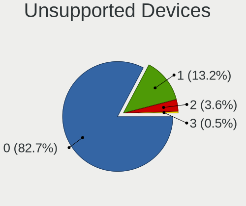

| Total | Desktops | Percent |
|-------|----------|---------|
| 0     | 134      | 81.71%  |
| 1     | 27       | 16.46%  |
| 2     | 3        | 1.83%   |

Unsupported Device Types
------------------------

Types of unsupported devices

| Type                     | Desktops | Percent |
|--------------------------|----------|---------|
| Graphics card            | 12       | 36.36%  |
| Net/wireless             | 7        | 21.21%  |
| Sound                    | 2        | 6.06%   |
| Multimedia controller    | 2        | 6.06%   |
| Communication controller | 2        | 6.06%   |
| Unassigned class         | 1        | 3.03%   |
| Storage/raid             | 1        | 3.03%   |
| Storage/ide              | 1        | 3.03%   |
| Network                  | 1        | 3.03%   |
| Modem                    | 1        | 3.03%   |
| Chipcard                 | 1        | 3.03%   |
| Card reader              | 1        | 3.03%   |
| Camera                   | 1        | 3.03%   |

