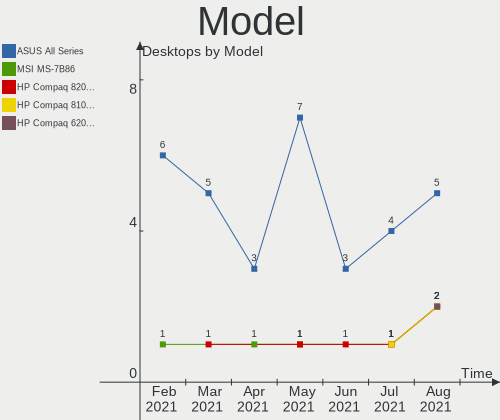
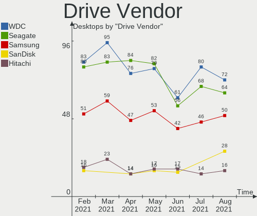
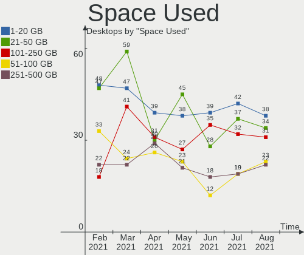
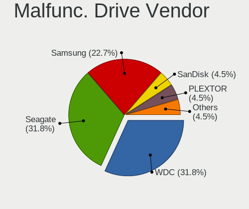
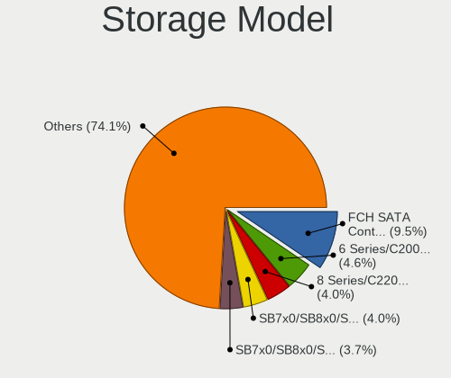
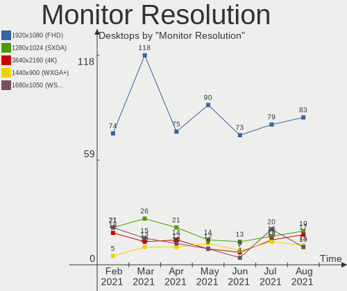
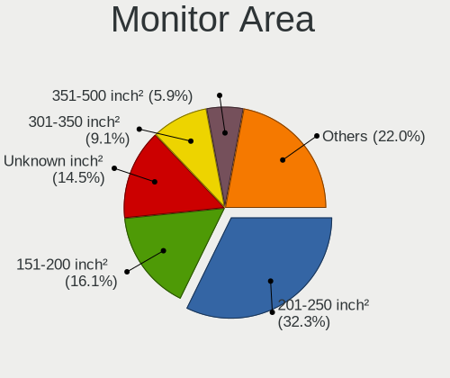
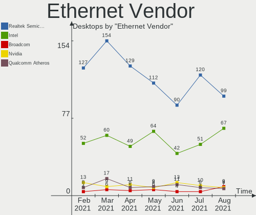
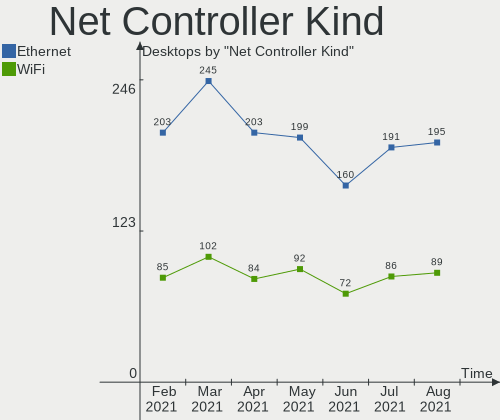
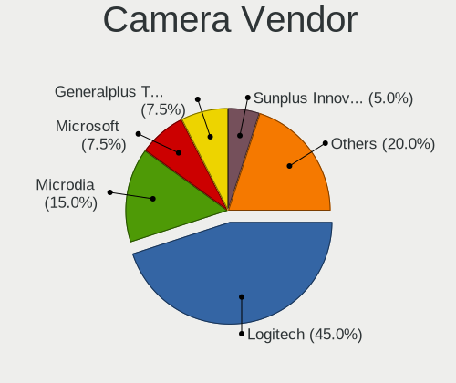

Mint Hardware Trends (Desktop)
------------------------------

A project to identify most popular hardware characteristics and track their change
over time based on data collected by Mint users at https://Linux-Hardware.org.

Anyone can contribute to the study by uploading probes of their computers by
the [hw-probe](https://github.com/linuxhw/hw-probe) tool:

    sudo -E hw-probe -all -upload

Full-feature report is available here: https://linux-hardware.org/?view=trends&formfactor=desktop

Period: Sep, 2020.

Contents
--------

- [ OS                       ](#os)
- [ OS Family                ](#os-family)
- [ Kernel                   ](#kernel)
- [ Kernel Family            ](#kernel-family)
- [ Kernel Major Ver.        ](#kernel-major-ver)
- [ Arch                     ](#arch)
- [ DE                       ](#de)
- [ Display Server           ](#display-server)
- [ Display Manager          ](#display-manager)
- [ OS Lang                  ](#os-lang)
- [ Boot Mode                ](#boot-mode)
- [ Filesystem               ](#filesystem)
- [ Part. scheme             ](#part-scheme)
- [ Dual Boot with Linux/BSD ](#dual-boot-with-linux/bsd)
- [ Dual Boot (Win)          ](#dual-boot-win)
- [ Country                  ](#country)
- [ City                     ](#city)
- [ Vendor                   ](#vendor)
- [ Model                    ](#model)
- [ Model Family             ](#model-family)
- [ MFG Year                 ](#mfg-year)
- [ Form Factor              ](#form-factor)
- [ Secure Boot              ](#secure-boot)
- [ Coreboot                 ](#coreboot)
- [ RAM Size                 ](#ram-size)
- [ RAM Used                 ](#ram-used)
- [ Has CD-ROM               ](#has-cd-rom)
- [ Total Drives             ](#total-drives)
- [ Has Ethernet             ](#has-ethernet)
- [ Drive Vendor             ](#drive-vendor)
- [ HDD Vendor               ](#hdd-vendor)
- [ SSD Vendor               ](#ssd-vendor)
- [ Drive Model              ](#drive-model)
- [ Drive Kind               ](#drive-kind)
- [ Drive Connector          ](#drive-connector)
- [ Drive Size               ](#drive-size)
- [ Space Total              ](#space-total)
- [ Space Used               ](#space-used)
- [ Malfunc. Drives          ](#malfunc-drives)
- [ Malfunc. Drive Vendor    ](#malfunc-drive-vendor)
- [ Malfunc. HDD Vendor      ](#malfunc-hdd-vendor)
- [ Malfunc. Drive Kind      ](#malfunc-drive-kind)
- [ Failed Drives            ](#failed-drives)
- [ Failed Drive Vendor      ](#failed-drive-vendor)
- [ Drive Status             ](#drive-status)
- [ Storage Vendor           ](#storage-vendor)
- [ Storage Model            ](#storage-model)
- [ Storage Kind             ](#storage-kind)
- [ CPU Vendor               ](#cpu-vendor)
- [ CPU Model                ](#cpu-model)
- [ CPU Model Family         ](#cpu-model-family)
- [ CPU Cores                ](#cpu-cores)
- [ CPU Sockets              ](#cpu-sockets)
- [ CPU Threads              ](#cpu-threads)
- [ CPU Op-Modes             ](#cpu-op-modes)
- [ CPU Microcode            ](#cpu-microcode)
- [ CPU Microarch            ](#cpu-microarch)
- [ GPU Vendor               ](#gpu-vendor)
- [ GPU Model                ](#gpu-model)
- [ GPU Combo                ](#gpu-combo)
- [ GPU Driver               ](#gpu-driver)
- [ GPU Memory               ](#gpu-memory)
- [ Monitor Vendor           ](#monitor-vendor)
- [ Monitor Model            ](#monitor-model)
- [ Monitor Resolution       ](#monitor-resolution)
- [ Monitor Diagonal         ](#monitor-diagonal)
- [ Monitor Width            ](#monitor-width)
- [ Aspect Ratio             ](#aspect-ratio)
- [ Monitor Area             ](#monitor-area)
- [ Pixel Density            ](#pixel-density)
- [ Multiple Monitors        ](#multiple-monitors)
- [ Net Controller Vendor    ](#net-controller-vendor)
- [ Net Controller Model     ](#net-controller-model)
- [ Wireless Vendor          ](#wireless-vendor)
- [ Wireless Model           ](#wireless-model)
- [ Ethernet Vendor          ](#ethernet-vendor)
- [ Ethernet Model           ](#ethernet-model)
- [ Net Controller Kind      ](#net-controller-kind)
- [ Used Controller          ](#used-controller)
- [ NICs                     ](#nics)
- [ Memory Vendor            ](#memory-vendor)
- [ Memory Model             ](#memory-model)
- [ Memory Kind              ](#memory-kind)
- [ Memory Form Factor       ](#memory-form-factor)
- [ Memory Size              ](#memory-size)
- [ Memory Speed             ](#memory-speed)
- [ Sound Vendor             ](#sound-vendor)
- [ Sound Model              ](#sound-model)
- [ Camera Vendor            ](#camera-vendor)
- [ Camera Model             ](#camera-model)
- [ Fingerprint Vendor       ](#fingerprint-vendor)
- [ Fingerprint Model        ](#fingerprint-model)
- [ Chipcard Vendor          ](#chipcard-vendor)
- [ Chipcard Model           ](#chipcard-model)
- [ Printer Vendor           ](#printer-vendor)
- [ Printer Model            ](#printer-model)
- [ Scanner Vendor           ](#scanner-vendor)
- [ Scanner Model            ](#scanner-model)
- [ Bluetooth Vendor         ](#bluetooth-vendor)
- [ Bluetooth Model          ](#bluetooth-model)
- [ Unsupported Devices      ](#unsupported-devices)
- [ Unsupported Device Types ](#unsupported-device-types)

OS
--

Installed operating systems

| Name      | Desktops | Percent |
|-----------|----------|---------|
| Mint 20   | 97       | 73.48%  |
| Mint 19.3 | 25       | 18.94%  |
| Mint 19.1 | 4        | 3.03%   |
| Mint 18.3 | 2        | 1.52%   |
| Mint 19.2 | 1        | 0.76%   |
| Mint 19   | 1        | 0.76%   |
| Mint 18.2 | 1        | 0.76%   |
| Mint 18   | 1        | 0.76%   |

OS Family
---------

OS without a version

| Name | Desktops | Percent |
|------|----------|---------|
| Mint | 132      | 100%    |

Kernel
------

Version of the Linux kernel

| Version                    | Desktops | Percent |
|----------------------------|----------|---------|
| 5.4.0-47-generic           | 39       | 29.55%  |
| 5.4.0-48-generic           | 29       | 21.97%  |
| 5.4.0-45-generic           | 26       | 19.7%   |
| 5.4.0-42-generic           | 8        | 6.06%   |
| 5.4.0-26-generic           | 6        | 4.55%   |
| 4.15.0-117-generic         | 3        | 2.27%   |
| 5.0.0-32-generic           | 2        | 1.52%   |
| 5.9.0-050900rc3-lowlatency | 1        | 0.76%   |
| 5.8.3-050803-generic       | 1        | 0.76%   |
| 5.8.0-9.3-liquorix-amd64   | 1        | 0.76%   |
| 5.8.0-8.1-liquorix-amd64   | 1        | 0.76%   |
| 5.8.0-6.1-liquorix-amd64   | 1        | 0.76%   |
| 5.7.19-050719-generic      | 1        | 0.76%   |
| 5.4.0-47-lowlatency        | 1        | 0.76%   |
| 5.4.0-42-lowlatency        | 1        | 0.76%   |
| 5.3.0-26-generic           | 1        | 0.76%   |
| 5.3.0-23-generic           | 1        | 0.76%   |
| 4.8.0-53-generic           | 1        | 0.76%   |
| 4.4.0-189-generic          | 1        | 0.76%   |
| 4.15.17-041517-generic     | 1        | 0.76%   |
| 4.15.0-46-generic          | 1        | 0.76%   |
| 4.15.0-20-generic          | 1        | 0.76%   |
| 4.15.0-118-generic         | 1        | 0.76%   |
| 4.15.0-115-generic         | 1        | 0.76%   |
| 4.15.0-112-generic         | 1        | 0.76%   |
| 4.15.0-111-generic         | 1        | 0.76%   |

Kernel Family
-------------

Linux kernel without a distro release

| Version | Desktops | Percent |
|---------|----------|---------|
| 5.4.0   | 110      | 83.33%  |
| 4.15.0  | 9        | 6.82%   |
| 5.8.0   | 3        | 2.27%   |
| 5.3.0   | 2        | 1.52%   |
| 5.0.0   | 2        | 1.52%   |
| 5.9.0   | 1        | 0.76%   |
| 5.8.3   | 1        | 0.76%   |
| 5.7.19  | 1        | 0.76%   |
| 4.8.0   | 1        | 0.76%   |
| 4.4.0   | 1        | 0.76%   |
| 4.15.17 | 1        | 0.76%   |

Kernel Major Ver.
-----------------

Linux kernel major version

| Version | Desktops | Percent |
|---------|----------|---------|
| 5.4     | 110      | 83.33%  |
| 4.15    | 10       | 7.58%   |
| 5.8     | 4        | 3.03%   |
| 5.3     | 2        | 1.52%   |
| 5.0     | 2        | 1.52%   |
| 5.9     | 1        | 0.76%   |
| 5.7     | 1        | 0.76%   |
| 4.8     | 1        | 0.76%   |
| 4.4     | 1        | 0.76%   |

Arch
----

OS architecture (x86_64, i586, etc.)

| Name   | Desktops | Percent |
|--------|----------|---------|
| x86_64 | 127      | 96.21%  |
| i686   | 5        | 3.79%   |

DE
--

Desktop Environment

| Name       | Desktops | Percent |
|------------|----------|---------|
| X-Cinnamon | 63       | 47.73%  |
| Cinnamon   | 34       | 25.76%  |
| MATE       | 14       | 10.61%  |
| XFCE       | 12       | 9.09%   |
| GNOME      | 4        | 3.03%   |
| Unknown    | 3        | 2.27%   |
| KDE        | 2        | 1.52%   |

Display Server
--------------

X11 or Wayland

| Name    | Desktops | Percent |
|---------|----------|---------|
| X11     | 131      | 99.24%  |
| Wayland | 1        | 0.76%   |

Display Manager
---------------

SDDM, LightDM, etc.

| Name    | Desktops | Percent |
|---------|----------|---------|
| Unknown | 89       | 67.42%  |
| TDM     | 42       | 31.82%  |
| SDDM    | 1        | 0.76%   |

OS Lang
-------

Language

| Lang  | Desktops | Percent |
|-------|----------|---------|
| en_US | 40       | 30.3%   |
| pt_BR | 16       | 12.12%  |
| de_DE | 15       | 11.36%  |
| es_ES | 7        | 5.3%    |
| ru_RU | 6        | 4.55%   |
| en_GB | 6        | 4.55%   |
| pl_PL | 4        | 3.03%   |
| en_CA | 4        | 3.03%   |
| nl_NL | 3        | 2.27%   |
| es_AR | 3        | 2.27%   |
| pt_PT | 2        | 1.52%   |
| it_IT | 2        | 1.52%   |
| hu_HU | 2        | 1.52%   |
| en_ZA | 2        | 1.52%   |
| en_IN | 2        | 1.52%   |
| en_IE | 2        | 1.52%   |
| en_AU | 2        | 1.52%   |
| C     | 2        | 1.52%   |
| zh_TW | 1        | 0.76%   |
| uk_UA | 1        | 0.76%   |
| tr_TR | 1        | 0.76%   |
| ru_UA | 1        | 0.76%   |
| fr_FR | 1        | 0.76%   |
| fr_CA | 1        | 0.76%   |
| fi_FI | 1        | 0.76%   |
| es_MX | 1        | 0.76%   |
| en_NZ | 1        | 0.76%   |
| de_CH | 1        | 0.76%   |
| de_AT | 1        | 0.76%   |
| bg_BG | 1        | 0.76%   |

Boot Mode
---------

EFI or BIOS

| Mode | Desktops | Percent |
|------|----------|---------|
| BIOS | 86       | 65.15%  |
| EFI  | 46       | 34.85%  |

Filesystem
----------

Type of filesystem

| Type  | Desktops | Percent |
|-------|----------|---------|
| Ext4  | 129      | 97.73%  |
| Btrfs | 3        | 2.27%   |

Part. scheme
------------

Scheme of partitioning

| Type    | Desktops | Percent |
|---------|----------|---------|
| Unknown | 87       | 65.91%  |
| GPT     | 34       | 25.76%  |
| MBR     | 11       | 8.33%   |

Dual Boot with Linux/BSD
------------------------

Hosting more than one Linux/BSD

| Dual boot | Desktops | Percent |
|-----------|----------|---------|
| No        | 121      | 91.67%  |
| Yes       | 11       | 8.33%   |

Dual Boot (Win)
---------------

Hosting Linux and Windows

| Dual boot | Desktops | Percent |
|-----------|----------|---------|
| No        | 100      | 75.76%  |
| Yes       | 32       | 24.24%  |

Country
-------

Geographic location (country)

| Country              | Desktops | Percent |
|----------------------|----------|---------|
| USA                  | 24       | 18.18%  |
| Brazil               | 18       | 13.64%  |
| Germany              | 16       | 12.12%  |
| UK                   | 7        | 5.3%    |
| Spain                | 7        | 5.3%    |
| Canada               | 7        | 5.3%    |
| Russia               | 5        | 3.79%   |
| Poland               | 4        | 3.03%   |
| Netherlands          | 3        | 2.27%   |
| Italy                | 3        | 2.27%   |
| Hungary              | 3        | 2.27%   |
| Argentina            | 3        | 2.27%   |
| Ukraine              | 2        | 1.52%   |
| South Africa         | 2        | 1.52%   |
| Portugal             | 2        | 1.52%   |
| Ireland              | 2        | 1.52%   |
| India                | 2        | 1.52%   |
| Australia            | 2        | 1.52%   |
| Turkey               | 1        | 0.76%   |
| Thailand             | 1        | 0.76%   |
| Taiwan               | 1        | 0.76%   |
| Sweden               | 1        | 0.76%   |
| Slovenia             | 1        | 0.76%   |
| New Zealand          | 1        | 0.76%   |
| Moldova, Republic of | 1        | 0.76%   |
| Mexico               | 1        | 0.76%   |
| Korea, Republic of   | 1        | 0.76%   |
| Japan                | 1        | 0.76%   |
| Georgia              | 1        | 0.76%   |
| France               | 1        | 0.76%   |
| Finland              | 1        | 0.76%   |
| Egypt                | 1        | 0.76%   |
| Denmark              | 1        | 0.76%   |
| Croatia              | 1        | 0.76%   |
| Costa Rica           | 1        | 0.76%   |
| Colombia             | 1        | 0.76%   |
| Bulgaria             | 1        | 0.76%   |
| Austria              | 1        | 0.76%   |

City
----

Geographic location (city)

| City             | Desktops | Percent |
|------------------|----------|---------|
| São Paulo       | 3        | 2.27%   |
| Budapest         | 3        | 2.27%   |
| Wrocław         | 2        | 1.52%   |
| Saint Paul       | 2        | 1.52%   |
| Montreal         | 2        | 1.52%   |
| Mafra            | 2        | 1.52%   |
| Madrid           | 2        | 1.52%   |
| Cologne          | 2        | 1.52%   |
| Campinas         | 2        | 1.52%   |
| Amsterdam        | 2        | 1.52%   |
| Willich          | 1        | 0.76%   |
| West Malling     | 1        | 0.76%   |
| Wasilla          | 1        | 0.76%   |
| Warsaw           | 1        | 0.76%   |
| Volta Redonda    | 1        | 0.76%   |
| Vancouver        | 1        | 0.76%   |
| Valley           | 1        | 0.76%   |
| Ulyanovsk        | 1        | 0.76%   |
| Tsuru-shi        | 1        | 0.76%   |
| Toronto          | 1        | 0.76%   |
| Tomares          | 1        | 0.76%   |
| Tiete            | 1        | 0.76%   |
| Tarnów          | 1        | 0.76%   |
| St Petersburg    | 1        | 0.76%   |
| Schleswig        | 1        | 0.76%   |
| Santa Fe         | 1        | 0.76%   |
| San Pedro        | 1        | 0.76%   |
| San Jose         | 1        | 0.76%   |
| San Fernando     | 1        | 0.76%   |
| San Diego        | 1        | 0.76%   |
| Rosario          | 1        | 0.76%   |
| Roggendorf       | 1        | 0.76%   |
| Rochester        | 1        | 0.76%   |
| Rinteln          | 1        | 0.76%   |
| Pune             | 1        | 0.76%   |
| Portlaoise       | 1        | 0.76%   |
| Odense           | 1        | 0.76%   |
| Novosibirsk      | 1        | 0.76%   |
| Nordenham        | 1        | 0.76%   |
| New York         | 1        | 0.76%   |
| Narbonne         | 1        | 0.76%   |
| Mönchengladbach | 1        | 0.76%   |
| Maywood Park     | 1        | 0.76%   |
| Mals             | 1        | 0.76%   |
| Maceió          | 1        | 0.76%   |
| Lübeck          | 1        | 0.76%   |
| Louisville       | 1        | 0.76%   |
| London           | 1        | 0.76%   |
| Lissone          | 1        | 0.76%   |
| Lexington        | 1        | 0.76%   |
| Letychiv         | 1        | 0.76%   |
| Leipzig          | 1        | 0.76%   |
| Lansing          | 1        | 0.76%   |
| Lancaster        | 1        | 0.76%   |
| Kutaisi          | 1        | 0.76%   |
| Kurgan           | 1        | 0.76%   |
| Krk              | 1        | 0.76%   |
| Konnevesi        | 1        | 0.76%   |
| Klerksdorp       | 1        | 0.76%   |
| Kirkcaldy        | 1        | 0.76%   |

Vendor
------

Motherboard manufacturer

| Name                | Desktops | Percent |
|---------------------|----------|---------|
| ASUSTek Computer    | 35       | 26.52%  |
| Gigabyte Technology | 25       | 18.94%  |
| ASRock              | 16       | 12.12%  |
| MSI                 | 15       | 11.36%  |
| Dell                | 8        | 6.06%   |
| Lenovo              | 5        | 3.79%   |
| Foxconn             | 5        | 3.79%   |
| Hewlett-Packard     | 4        | 3.03%   |
| Positivo            | 3        | 2.27%   |
| Intel               | 2        | 1.52%   |
| ECS                 | 2        | 1.52%   |
| Biostar             | 2        | 1.52%   |
| Unknown             | 2        | 1.52%   |
| Shuttle             | 1        | 0.76%   |
| Pegatron            | 1        | 0.76%   |
| Megaware            | 1        | 0.76%   |
| Gateway             | 1        | 0.76%   |
| Fujitsu Siemens     | 1        | 0.76%   |
| Fujitsu             | 1        | 0.76%   |
| ECS-USA             | 1        | 0.76%   |
| Acer                | 1        | 0.76%   |

Model
-----

Motherboard model

| Name                                    | Desktops | Percent |
|-----------------------------------------|----------|---------|
| ASUS All Series                         | 7        | 5.3%    |
| MSI MS-7C02                             | 2        | 1.52%   |
| MSI MS-7693                             | 2        | 1.52%   |
| Gigabyte B550 AORUS ELITE               | 2        | 1.52%   |
| Gigabyte B450 AORUS ELITE               | 2        | 1.52%   |
| Dell XPS 8920                           | 2        | 1.52%   |
| ASUS P8H77-V                            | 2        | 1.52%   |
| ASUS M5A78L-M/USB3                      | 2        | 1.52%   |
| Unknown                                 | 2        | 1.52%   |
| Shuttle XH81V                           | 1        | 0.76%   |
| Positivo POS-PIH55BO                    | 1        | 0.76%   |
| Positivo POS-PARS760GCD                 | 1        | 0.76%   |
| Positivo I541TB                         | 1        | 0.76%   |
| Pegatron 20-b110ef                      | 1        | 0.76%   |
| MSI MS-7C79                             | 1        | 0.76%   |
| MSI MS-7C56                             | 1        | 0.76%   |
| MSI MS-7C52                             | 1        | 0.76%   |
| MSI MS-7B89                             | 1        | 0.76%   |
| MSI MS-7B07                             | 1        | 0.76%   |
| MSI MS-7817                             | 1        | 0.76%   |
| MSI MS-7680                             | 1        | 0.76%   |
| MSI MS-7641                             | 1        | 0.76%   |
| MSI MS-7502                             | 1        | 0.76%   |
| MSI M2H110V1                            | 1        | 0.76%   |
| MSI Compaq dx2200 MT                    | 1        | 0.76%   |
| Megaware MW-H61HD-MA                    | 1        | 0.76%   |
| Lenovo ThinkCentre M93p 10AA004YGE      | 1        | 0.76%   |
| Lenovo Legion Y520T-25IKL 90H7000QUK    | 1        | 0.76%   |
| Lenovo K450e 10181                      | 1        | 0.76%   |
| Lenovo IdeaCentre Y900-34ISZ 90DD000QGE | 1        | 0.76%   |
| Lenovo IdeaCentre Q190 10115            | 1        | 0.76%   |
| Intel DQ35JO AAD82085-801               | 1        | 0.76%   |
| Intel B75                               | 1        | 0.76%   |
| HP Pavilion Desktop 590-p0xxx           | 1        | 0.76%   |
| HP EliteDesk 705 G3 MT                  | 1        | 0.76%   |
| HP EliteDesk 705 G1 MT                  | 1        | 0.76%   |
| HP 110-305ng                            | 1        | 0.76%   |
| Gigabyte Z87X-UD5H                      | 1        | 0.76%   |
| Gigabyte Z170X-Gaming 3                 | 1        | 0.76%   |
| Gigabyte X99-UD3-CF                     | 1        | 0.76%   |
| Gigabyte X570 AORUS PRO                 | 1        | 0.76%   |
| Gigabyte X570 AORUS ELITE               | 1        | 0.76%   |
| Gigabyte X170-Extreme ECC               | 1        | 0.76%   |
| Gigabyte P41-ES3G                       | 1        | 0.76%   |
| Gigabyte M68MT-S2P                      | 1        | 0.76%   |
| Gigabyte H87N-WIFI                      | 1        | 0.76%   |
| Gigabyte H77M-D3H                       | 1        | 0.76%   |
| Gigabyte H310M H                        | 1        | 0.76%   |
| Gigabyte GA-970A-UD3                    | 1        | 0.76%   |
| Gigabyte F2A88XM-DS2P                   | 1        | 0.76%   |
| Gigabyte B450M DS3H WIFI                | 1        | 0.76%   |
| Gigabyte B450 AORUS PRO                 | 1        | 0.76%   |
| Gigabyte B450 AORUS M                   | 1        | 0.76%   |
| Gigabyte AB350M-DS3H V2                 | 1        | 0.76%   |
| Gigabyte AB350-Gaming 3                 | 1        | 0.76%   |
| Gigabyte A320M-S2H V2                   | 1        | 0.76%   |
| Gigabyte 970A-UD3P                      | 1        | 0.76%   |
| Gigabyte 970A-DS3P                      | 1        | 0.76%   |
| Gateway DX4870                          | 1        | 0.76%   |
| Fujitsu Siemens PRIMERGY Econel200 S2   | 1        | 0.76%   |

Model Family
------------

Motherboard model prefix

| Name                     | Desktops | Percent |
|--------------------------|----------|---------|
| ASUS All                 | 7        | 5.3%    |
| Dell OptiPlex            | 5        | 3.79%   |
| Gigabyte B450            | 4        | 3.03%   |
| ASUS PRIME               | 4        | 3.03%   |
| MSI MS-7C02              | 2        | 1.52%   |
| MSI MS-7693              | 2        | 1.52%   |
| Lenovo IdeaCentre        | 2        | 1.52%   |
| HP EliteDesk             | 2        | 1.52%   |
| Gigabyte X570            | 2        | 1.52%   |
| Gigabyte B550            | 2        | 1.52%   |
| Dell XPS                 | 2        | 1.52%   |
| ASUS P8H77-V             | 2        | 1.52%   |
| ASUS M5A97               | 2        | 1.52%   |
| ASUS M5A78L-M            | 2        | 1.52%   |
| ASRock P67               | 2        | 1.52%   |
| Unknown                  | 2        | 1.52%   |
| Shuttle XH81V            | 1        | 0.76%   |
| Positivo POS-PIH55BO     | 1        | 0.76%   |
| Positivo POS-PARS760GCD  | 1        | 0.76%   |
| Positivo I541TB          | 1        | 0.76%   |
| Pegatron 20-b110ef       | 1        | 0.76%   |
| MSI MS-7C79              | 1        | 0.76%   |
| MSI MS-7C56              | 1        | 0.76%   |
| MSI MS-7C52              | 1        | 0.76%   |
| MSI MS-7B89              | 1        | 0.76%   |
| MSI MS-7B07              | 1        | 0.76%   |
| MSI MS-7817              | 1        | 0.76%   |
| MSI MS-7680              | 1        | 0.76%   |
| MSI MS-7641              | 1        | 0.76%   |
| MSI MS-7502              | 1        | 0.76%   |
| MSI M2H110V1             | 1        | 0.76%   |
| MSI Compaq               | 1        | 0.76%   |
| Megaware MW-H61HD-MA     | 1        | 0.76%   |
| Lenovo ThinkCentre       | 1        | 0.76%   |
| Lenovo Legion            | 1        | 0.76%   |
| Lenovo K450e             | 1        | 0.76%   |
| Intel DQ35JO             | 1        | 0.76%   |
| Intel B75                | 1        | 0.76%   |
| HP Pavilion              | 1        | 0.76%   |
| HP 110-305ng             | 1        | 0.76%   |
| Gigabyte Z87X-UD5H       | 1        | 0.76%   |
| Gigabyte Z170X-Gaming    | 1        | 0.76%   |
| Gigabyte X99-UD3-CF      | 1        | 0.76%   |
| Gigabyte X170-Extreme    | 1        | 0.76%   |
| Gigabyte P41-ES3G        | 1        | 0.76%   |
| Gigabyte M68MT-S2P       | 1        | 0.76%   |
| Gigabyte H87N-WIFI       | 1        | 0.76%   |
| Gigabyte H77M-D3H        | 1        | 0.76%   |
| Gigabyte H310M           | 1        | 0.76%   |
| Gigabyte GA-970A-UD3     | 1        | 0.76%   |
| Gigabyte F2A88XM-DS2P    | 1        | 0.76%   |
| Gigabyte B450M           | 1        | 0.76%   |
| Gigabyte AB350M-DS3H     | 1        | 0.76%   |
| Gigabyte AB350-Gaming    | 1        | 0.76%   |
| Gigabyte A320M-S2H       | 1        | 0.76%   |
| Gigabyte 970A-UD3P       | 1        | 0.76%   |
| Gigabyte 970A-DS3P       | 1        | 0.76%   |
| Gateway DX4870           | 1        | 0.76%   |
| Fujitsu Siemens PRIMERGY | 1        | 0.76%   |
| Fujitsu ESPRIMO          | 1        | 0.76%   |

MFG Year
--------

Motherboard manufacture year

| Year | Desktops | Percent |
|------|----------|---------|
| 2019 | 21       | 15.91%  |
| 2020 | 15       | 11.36%  |
| 2012 | 14       | 10.61%  |
| 2018 | 13       | 9.85%   |
| 2014 | 10       | 7.58%   |
| 2013 | 10       | 7.58%   |
| 2015 | 9        | 6.82%   |
| 2010 | 7        | 5.3%    |
| 2017 | 6        | 4.55%   |
| 2016 | 6        | 4.55%   |
| 2009 | 6        | 4.55%   |
| 2007 | 6        | 4.55%   |
| 2011 | 4        | 3.03%   |
| 2008 | 2        | 1.52%   |
| 2006 | 2        | 1.52%   |
| 2004 | 1        | 0.76%   |

Form Factor
-----------

Physical design of the computer

| Name    | Desktops | Percent |
|---------|----------|---------|
| Desktop | 132      | 100%    |

Secure Boot
-----------

Enabled or disabled

| State    | Desktops | Percent |
|----------|----------|---------|
| Disabled | 130      | 98.48%  |
| Enabled  | 2        | 1.52%   |

Coreboot
--------

Have coreboot on board

| Used | Desktops | Percent |
|------|----------|---------|
| No   | 132      | 100%    |

RAM Size
--------

Total RAM memory

| Size in GB  | Desktops | Percent |
|-------------|----------|---------|
| 16.01-24.0  | 35       | 26.52%  |
| 3.01-4.0    | 25       | 18.94%  |
| 32.01-64.0  | 20       | 15.15%  |
| 8.01-16.0   | 20       | 15.15%  |
| 4.01-8.0    | 19       | 14.39%  |
| 64.01-256.0 | 4        | 3.03%   |
| 1.01-2.0    | 3        | 2.27%   |
| 24.01-32.0  | 2        | 1.52%   |
| 2.01-3.0    | 2        | 1.52%   |
| 0.01-1.0    | 2        | 1.52%   |

RAM Used
--------

Used RAM memory

| Used GB    | Desktops | Percent |
|------------|----------|---------|
| 1.01-2.0   | 46       | 34.85%  |
| 2.01-3.0   | 35       | 26.52%  |
| 4.01-8.0   | 17       | 12.88%  |
| 3.01-4.0   | 17       | 12.88%  |
| 0.01-1.0   | 11       | 8.33%   |
| 8.01-16.0  | 5        | 3.79%   |
| 16.01-24.0 | 1        | 0.76%   |

Has CD-ROM
----------

Has CD-ROM on board

| Presented | Desktops | Percent |
|-----------|----------|---------|
| Yes       | 66       | 50%     |
| No        | 66       | 50%     |

Total Drives
------------

Number of drives on board

| Drives | Desktops | Percent |
|--------|----------|---------|
| 2      | 47       | 35.61%  |
| 1      | 41       | 31.06%  |
| 3      | 28       | 21.21%  |
| 4      | 9        | 6.82%   |
| 5      | 4        | 3.03%   |
| 6      | 2        | 1.52%   |
| 7      | 1        | 0.76%   |

Has Ethernet
------------

Has Ethernet on board

| Presented | Desktops | Percent |
|-----------|----------|---------|
| Yes       | 132      | 100%    |

Drive Vendor
------------

Hard drive vendors

| Vendor              | Desktops | Drives | Percent |
|---------------------|----------|--------|---------|
| WDC                 | 55       | 79     | 23.21%  |
| Seagate             | 47       | 57     | 19.83%  |
| Samsung Electronics | 35       | 46     | 14.77%  |
| Kingston            | 21       | 22     | 8.86%   |
| Toshiba             | 17       | 19     | 7.17%   |
| Hitachi             | 13       | 13     | 5.49%   |
| SanDisk             | 7        | 7      | 2.95%   |
| Intel               | 7        | 8      | 2.95%   |
| A-DATA Technology   | 5        | 5      | 2.11%   |
| Crucial             | 4        | 6      | 1.69%   |
| Silicon Motion      | 2        | 3      | 0.84%   |
| Phison              | 2        | 4      | 0.84%   |
| JMicron             | 2        | 2      | 0.84%   |
| HGST                | 2        | 2      | 0.84%   |
| Corsair             | 2        | 2      | 0.84%   |
| Unknown             | 1        | 1      | 0.42%   |
| Transcend           | 1        | 1      | 0.42%   |
| SPCC                | 1        | 1      | 0.42%   |
| Patriot             | 1        | 1      | 0.42%   |
| OCZ                 | 1        | 1      | 0.42%   |
| Micron Technology   | 1        | 2      | 0.42%   |
| MAXTOR              | 1        | 1      | 0.42%   |
| LITEONIT            | 1        | 1      | 0.42%   |
| LITEON              | 1        | 1      | 0.42%   |
| Lexar               | 1        | 1      | 0.42%   |
| KingSpec            | 1        | 1      | 0.42%   |
| KINGBANK            | 1        | 1      | 0.42%   |
| Intenso             | 1        | 1      | 0.42%   |
| IB                  | 1        | 2      | 0.42%   |
| Gigabyte Technology | 1        | 1      | 0.42%   |
| China               | 1        | 1      | 0.42%   |

HDD Vendor
----------

Hard disk drive vendors

| Vendor              | Desktops | Drives | Percent |
|---------------------|----------|--------|---------|
| WDC                 | 51       | 71     | 34.69%  |
| Seagate             | 47       | 56     | 31.97%  |
| Toshiba             | 16       | 18     | 10.88%  |
| Samsung Electronics | 16       | 19     | 10.88%  |
| Hitachi             | 13       | 13     | 8.84%   |
| HGST                | 2        | 2      | 1.36%   |
| MAXTOR              | 1        | 1      | 0.68%   |
| JMicron             | 1        | 1      | 0.68%   |

SSD Vendor
----------

Solid state drive vendors

| Vendor              | Desktops | Drives | Percent |
|---------------------|----------|--------|---------|
| Kingston            | 20       | 20     | 27.78%  |
| Samsung Electronics | 15       | 21     | 20.83%  |
| WDC                 | 7        | 7      | 9.72%   |
| SanDisk             | 6        | 6      | 8.33%   |
| A-DATA Technology   | 5        | 5      | 6.94%   |
| Crucial             | 4        | 6      | 5.56%   |
| Intel               | 2        | 2      | 2.78%   |
| Transcend           | 1        | 1      | 1.39%   |
| Toshiba             | 1        | 1      | 1.39%   |
| SPCC                | 1        | 1      | 1.39%   |
| OCZ                 | 1        | 1      | 1.39%   |
| Micron Technology   | 1        | 2      | 1.39%   |
| LITEONIT            | 1        | 1      | 1.39%   |
| LITEON              | 1        | 1      | 1.39%   |
| Lexar               | 1        | 1      | 1.39%   |
| KingSpec            | 1        | 1      | 1.39%   |
| KINGBANK            | 1        | 1      | 1.39%   |
| Intenso             | 1        | 1      | 1.39%   |
| Gigabyte Technology | 1        | 1      | 1.39%   |
| China               | 1        | 1      | 1.39%   |

Drive Model
-----------

Hard drive models

| Model                        | Desktops | Percent |
|------------------------------|----------|---------|
| ST1000DM010-2EP102 1TB       | 7        | 2.51%   |
| DT01ACA100 1TB               | 7        | 2.51%   |
| WD10EZEX-08WN4A0 1TB         | 6        | 2.15%   |
| SSD 850 EVO 250GB            | 5        | 1.79%   |
| SA400S37240G 240GB SSD       | 5        | 1.79%   |
| SA400S37120G 120GB SSD       | 5        | 1.79%   |
| NVMe SSD Drive 512GB         | 5        | 1.79%   |
| ST1000DM003-1CH162 1TB       | 4        | 1.43%   |
| ST500DM002-1BD142 500GB      | 3        | 1.08%   |
| ST3500418AS 500GB            | 3        | 1.08%   |
| ST31000524AS 1TB             | 3        | 1.08%   |
| SSD 860 EVO 500GB            | 3        | 1.08%   |
| NVMe SSD Drive 1TB           | 3        | 1.08%   |
| HD502HJ 500GB                | 3        | 1.08%   |
| WDS100T2B0A-00SM50 1TB SSD   | 2        | 0.72%   |
| WD20EARS-00MVWB0 2TB         | 2        | 0.72%   |
| WD10EZRX-00L4HB0 1TB         | 2        | 0.72%   |
| WD10EZEX-00BN5A0 1TB         | 2        | 0.72%   |
| WD10EARS-00Y5B1 1TB          | 2        | 0.72%   |
| WD1003FZEX-00K3CA0 1TB       | 2        | 0.72%   |
| SV300S37A120G 120GB SSD      | 2        | 0.72%   |
| SUV400S37240G 240GB SSD      | 2        | 0.72%   |
| SU800 512GB SSD              | 2        | 0.72%   |
| ST4000DM004-2CV104 4TB       | 2        | 0.72%   |
| ST4000DM000-1F2168 4TB       | 2        | 0.72%   |
| ST2000DM006-2DM164 2TB       | 2        | 0.72%   |
| ST1000DM003-1SB102 1TB       | 2        | 0.72%   |
| ST1000DM003-1ER162 1TB       | 2        | 0.72%   |
| SSD 860 QVO 1TB              | 2        | 0.72%   |
| SSD 860 EVO 1TB              | 2        | 0.72%   |
| SA400S37480G 480GB SSD       | 2        | 0.72%   |
| NVMe SSD Drive 250GB         | 2        | 0.72%   |
| NVMe SSD Drive 16GB          | 2        | 0.72%   |
| HD502HI 500GB                | 2        | 0.72%   |
| HD501LJ 500GB                | 2        | 0.72%   |
| HD103UJ 1TB                  | 2        | 0.72%   |
| HD103SJ 1TB                  | 2        | 0.72%   |
| HD103SI 1TB                  | 2        | 0.72%   |
| Force MP510 240GB            | 2        | 0.72%   |
| DT01ACA200 2TB               | 2        | 0.72%   |
| DT01ACA050 500GB             | 2        | 0.72%   |
| CT240BX500SSD1 240GB         | 2        | 0.72%   |
| WDS500G2B0B 500GB SSD        | 1        | 0.36%   |
| WDS500G2B0A-00SM50 500GB SSD | 1        | 0.36%   |
| WDS250G2B0A-00SM50 250GB SSD | 1        | 0.36%   |
| WDS240G2G0A-00JH30 240GB SSD | 1        | 0.36%   |
| WDS100T3X0C-00SJG0 1TB       | 1        | 0.36%   |
| WDS100T2B0B-00YS70 1TB SSD   | 1        | 0.36%   |
| WD800JD-55JRC0 80GB          | 1        | 0.36%   |
| WD6400BEVT-22A0RT0 640GB     | 1        | 0.36%   |
| WD5002ABYS-01B1B0 500GB      | 1        | 0.36%   |
| WD5002AALX-00J37A0 500GB     | 1        | 0.36%   |
| WD5000LPLX-00ZNTT0 500GB     | 1        | 0.36%   |
| WD5000LPCX-00VHAT0 500GB     | 1        | 0.36%   |
| WD5000AVDS-63U7B1 500GB      | 1        | 0.36%   |
| WD5000AVDS-63U7B0 500GB      | 1        | 0.36%   |
| WD5000AUDX-63WNHY0 500GB     | 1        | 0.36%   |
| WD5000AAKX-75U6AA0 500GB     | 1        | 0.36%   |
| WD5000AAKX-60U6AA0 500GB     | 1        | 0.36%   |
| WD5000AAKX-22ERMA0 500GB     | 1        | 0.36%   |

Drive Kind
----------

HDD or SSD

| Kind    | Desktops | Drives | Percent |
|---------|----------|--------|---------|
| HDD     | 112      | 181    | 57.44%  |
| SSD     | 58       | 81     | 29.74%  |
| NVMe    | 22       | 27     | 11.28%  |
| Unknown | 3        | 4      | 1.54%   |

Drive Connector
---------------

SATA, SAS, NVMe, etc.

| Type | Desktops | Drives | Percent |
|------|----------|--------|---------|
| SATA | 128      | 260    | 82.58%  |
| NVMe | 22       | 27     | 14.19%  |
| SAS  | 5        | 6      | 3.23%   |

Drive Size
----------

Size of hard drive

| Size in TB | Desktops | Drives | Percent |
|------------|----------|--------|---------|
| 0.01-0.5   | 95       | 145    | 46.57%  |
| 0.51-1.0   | 76       | 107    | 37.25%  |
| 1.01-2.0   | 19       | 21     | 9.31%   |
| 2.01-3.0   | 8        | 11     | 3.92%   |
| 3.01-4.0   | 5        | 5      | 2.45%   |
| 4.01-10.0  | 1        | 4      | 0.49%   |

Space Total
-----------

Amount of disk space available on the file system

| Size in GB     | Desktops | Percent |
|----------------|----------|---------|
| 101-250        | 28       | 21.21%  |
| 1001-2000      | 22       | 16.67%  |
| 251-500        | 21       | 15.91%  |
| 501-1000       | 20       | 15.15%  |
| More than 3000 | 15       | 11.36%  |
| 2001-3000      | 13       | 9.85%   |
| 51-100         | 10       | 7.58%   |
| 1-20           | 2        | 1.52%   |
| 21-50          | 1        | 0.76%   |

Space Used
----------

Amount of used disk space

| Used GB        | Desktops | Percent |
|----------------|----------|---------|
| 21-50          | 27       | 20.45%  |
| 101-250        | 19       | 14.39%  |
| 501-1000       | 19       | 14.39%  |
| 51-100         | 18       | 13.64%  |
| 251-500        | 13       | 9.85%   |
| 1-20           | 13       | 9.85%   |
| 1001-2000      | 11       | 8.33%   |
| More than 3000 | 6        | 4.55%   |
| 2001-3000      | 6        | 4.55%   |

Malfunc. Drives
---------------

Drive models with a malfunction

| Model                   | Desktops | Drives | Percent |
|-------------------------|----------|--------|---------|
| WD5002ABYS-01B1B0 500GB | 1        | 1      | 8.33%   |
| WD20EARS-00MVWB0 2TB    | 1        | 1      | 8.33%   |
| WD10EARS-00Y5B1 1TB     | 1        | 1      | 8.33%   |
| WD10EALS-00Z8A0 1TB     | 1        | 1      | 8.33%   |
| WD10EADS-65M2BX 1TB     | 1        | 1      | 8.33%   |
| SV300S37A120G 120GB SSD | 1        | 1      | 8.33%   |
| ST3500320NS 500GB       | 1        | 1      | 8.33%   |
| ST3200822AS 200GB       | 1        | 1      | 8.33%   |
| ST2000DX001-SSHD-8GB    | 1        | 1      | 8.33%   |
| HD256GJ 250GB           | 1        | 1      | 8.33%   |
| HD103SI 1TB             | 1        | 1      | 8.33%   |
| DT01ACA300 3TB          | 1        | 1      | 8.33%   |

Malfunc. Drive Vendor
---------------------

Vendors of faulty drives

| Vendor              | Desktops | Drives | Percent |
|---------------------|----------|--------|---------|
| WDC                 | 5        | 5      | 45.45%  |
| Seagate             | 2        | 3      | 18.18%  |
| Samsung Electronics | 2        | 2      | 18.18%  |
| Toshiba             | 1        | 1      | 9.09%   |
| Kingston            | 1        | 1      | 9.09%   |

Malfunc. HDD Vendor
-------------------

Vendors of faulty HDD drives

| Vendor              | Desktops | Drives | Percent |
|---------------------|----------|--------|---------|
| WDC                 | 5        | 5      | 50%     |
| Seagate             | 2        | 3      | 20%     |
| Samsung Electronics | 2        | 2      | 20%     |
| Toshiba             | 1        | 1      | 10%     |

Malfunc. Drive Kind
-------------------

Kinds of faulty drives

| Kind | Desktops | Drives | Percent |
|------|----------|--------|---------|
| HDD  | 9        | 11     | 90%     |
| SSD  | 1        | 1      | 10%     |

Failed Drives
-------------

Failed drive models

Zero info for selected period =(

Failed Drive Vendor
-------------------

Failed drive vendors

Zero info for selected period =(

Drive Status
------------

Number of failed and malfunc. drives

| Status   | Desktops | Drives | Percent |
|----------|----------|--------|---------|
| Detected | 90       | 187    | 61.64%  |
| Works    | 46       | 94     | 31.51%  |
| Malfunc  | 10       | 12     | 6.85%   |

Storage Vendor
--------------

Storage controller vendors

| Vendor                      | Desktops | Percent |
|-----------------------------|----------|---------|
| Intel                       | 76       | 45.78%  |
| AMD                         | 53       | 31.93%  |
| ASMedia Technology          | 7        | 4.22%   |
| Samsung Electronics         | 6        | 3.61%   |
| Phison Electronics          | 5        | 3.01%   |
| Nvidia                      | 5        | 3.01%   |
| Marvell Technology Group    | 4        | 2.41%   |
| Silicon Motion              | 2        | 1.2%    |
| Sandisk                     | 2        | 1.2%    |
| Kingston Technology Company | 2        | 1.2%    |
| JMicron Technology          | 2        | 1.2%    |
| Silicon Image               | 1        | 0.6%    |
| ADATA Technology            | 1        | 0.6%    |

Storage Model
-------------

Storage controller models

| Model                                                                             | Desktops | Percent |
|-----------------------------------------------------------------------------------|----------|---------|
| FCH SATA Controller [AHCI mode]                                                   | 30       | 13.1%   |
| 8 Series/C220 Series Chipset Family 6-port SATA Controller 1 [AHCI mode]          | 12       | 5.24%   |
| SB7x0/SB8x0/SB9x0 SATA Controller [AHCI mode]                                     | 11       | 4.8%    |
| SB7x0/SB8x0/SB9x0 IDE Controller                                                  | 10       | 4.37%   |
| NM10/ICH7 Family SATA Controller [IDE mode]                                       | 10       | 4.37%   |
| 400 Series Chipset SATA Controller                                                | 10       | 4.37%   |
| 82801G (ICH7 Family) IDE Controller                                               | 8        | 3.49%   |
| 300 Series Chipset SATA Controller                                                | 8        | 3.49%   |
| Q170/Q150/B150/H170/H110/Z170/CM236 Chipset SATA Controller [AHCI Mode]           | 7        | 3.06%   |
| ASM1062 Serial ATA Controller                                                     | 7        | 3.06%   |
| 6 Series/C200 Series Chipset Family 6 port Desktop SATA AHCI Controller           | 7        | 3.06%   |
| 200 Series PCH SATA controller [AHCI mode]                                        | 7        | 3.06%   |
| SB7x0/SB8x0/SB9x0 SATA Controller [IDE mode]                                      | 6        | 2.62%   |
| 7 Series/C210 Series Chipset Family 6-port SATA Controller [AHCI mode]            | 6        | 2.62%   |
| SATA controller                                                                   | 5        | 2.18%   |
| NVMe SSD Controller SM981/PM981/PM983                                             | 4        | 1.75%   |
| E12 NVMe Controller                                                               | 4        | 1.75%   |
| Non-Volatile memory controller                                                    | 3        | 1.31%   |
| MCP61 SATA Controller                                                             | 3        | 1.31%   |
| 9 Series Chipset Family SATA Controller [AHCI Mode]                               | 3        | 1.31%   |
| SSD 660P Series                                                                   | 2        | 0.87%   |
| SM2262/SM2262EN SSD Controller                                                    | 2        | 0.87%   |
| SATA Controller [RAID mode]                                                       | 2        | 0.87%   |
| NVMe SSD Optane Series Controller                                                 | 2        | 0.87%   |
| NVMe SSD Controller SM961/PM961                                                   | 2        | 0.87%   |
| MCP61 IDE                                                                         | 2        | 0.87%   |
| FCH SATA Controller D                                                             | 2        | 0.87%   |
| FCH IDE Controller                                                                | 2        | 0.87%   |
| C610/X99 series chipset sSATA Controller [AHCI mode]                              | 2        | 0.87%   |
| C610/X99 series chipset 6-Port SATA Controller [AHCI mode]                        | 2        | 0.87%   |
| 82801JI (ICH10 Family) SATA AHCI Controller                                       | 2        | 0.87%   |
| 82801IR/IO/IH (ICH9R/DO/DH) 4 port SATA Controller [IDE mode]                     | 2        | 0.87%   |
| 82801I (ICH9 Family) 2 port SATA Controller [IDE mode]                            | 2        | 0.87%   |
| 7 Series/C210 Series Chipset Family 4-port SATA Controller [IDE mode]             | 2        | 0.87%   |
| 7 Series/C210 Series Chipset Family 2-port SATA Controller [IDE mode]             | 2        | 0.87%   |
| 6 Series/C200 Series Chipset Family Desktop SATA Controller (IDE mode, ports 4-5) | 2        | 0.87%   |
| 6 Series/C200 Series Chipset Family Desktop SATA Controller (IDE mode, ports 0-3) | 2        | 0.87%   |
| XPG SX8200 Pro PCIe Gen3x4 M.2 2280 Solid State Drive                             | 1        | 0.44%   |
| X399 Series Chipset SATA Controller                                               | 1        | 0.44%   |
| SSD 600P Series                                                                   | 1        | 0.44%   |
| PCI0680 Ultra ATA-133 Host Controller                                             | 1        | 0.44%   |
| NVMe Storage Controller                                                           | 1        | 0.44%   |
| MCP78S [GeForce 8200] SATA Controller (non-AHCI mode)                             | 1        | 0.44%   |
| MCP78S [GeForce 8200] IDE                                                         | 1        | 0.44%   |
| MCP51 Serial ATA Controller                                                       | 1        | 0.44%   |
| JMB368 IDE controller                                                             | 1        | 0.44%   |
| JMB361 AHCI/IDE                                                                   | 1        | 0.44%   |
| IXP SB4x0 Serial ATA Controller                                                   | 1        | 0.44%   |
| IXP SB4x0 IDE Controller                                                          | 1        | 0.44%   |
| Cannon Point-LP SATA Controller [AHCI Mode]                                       | 1        | 0.44%   |
| Cannon Lake PCH SATA AHCI Controller                                              | 1        | 0.44%   |
| Atom Processor E3800 Series SATA AHCI Controller                                  | 1        | 0.44%   |
| A2000, M.2, 500GB                                                                 | 1        | 0.44%   |
| 88SE9230 PCIe SATA 6Gb/s Controller                                               | 1        | 0.44%   |
| 88SE912x SATA 6Gb/s Controller [IDE mode]                                         | 1        | 0.44%   |
| 88SE6111/6121 SATA II / PATA Controller                                           | 1        | 0.44%   |
| 88SE6101/6102 single-port PATA133 interface                                       | 1        | 0.44%   |
| 82Q35 Express PT IDER Controller                                                  | 1        | 0.44%   |
| 82801JI (ICH10 Family) 4 port SATA IDE Controller #1                              | 1        | 0.44%   |
| 82801JI (ICH10 Family) 2 port SATA IDE Controller #2                              | 1        | 0.44%   |

Storage Kind
------------

Kind of storage controller (IDE, SATA, NVMe, SAS, ...)

| Kind | Desktops | Percent |
|------|----------|---------|
| SATA | 104      | 61.18%  |
| IDE  | 41       | 24.12%  |
| NVMe | 22       | 12.94%  |
| RAID | 3        | 1.76%   |

CPU Vendor
----------

Processor vendors

| Vendor | Desktops | Percent |
|--------|----------|---------|
| Intel  | 75       | 56.82%  |
| AMD    | 57       | 43.18%  |

CPU Model
---------

Processor models

| Model                                       | Desktops | Percent |
|---------------------------------------------|----------|---------|
| AMD Ryzen 5 3600X 6-Core Processor          | 6        | 4.55%   |
| AMD FX-8350 Eight-Core Processor            | 6        | 4.55%   |
| AMD Ryzen 5 3600 6-Core Processor           | 5        | 3.79%   |
| Intel Core i7-7700 CPU @ 3.60GHz            | 3        | 2.27%   |
| AMD Ryzen 5 2600 Six-Core Processor         | 3        | 2.27%   |
| Intel Core i7-6700K CPU @ 4.00GHz           | 2        | 1.52%   |
| Intel Core i7-4770 CPU @ 3.40GHz            | 2        | 1.52%   |
| Intel Core i7-3770 CPU @ 3.40GHz            | 2        | 1.52%   |
| Intel Core i5-7500 CPU @ 3.40GHz            | 2        | 1.52%   |
| Intel Core i5-4440 CPU @ 3.10GHz            | 2        | 1.52%   |
| Intel Core i5-3470 CPU @ 3.20GHz            | 2        | 1.52%   |
| Intel Core i3-4150 CPU @ 3.50GHz            | 2        | 1.52%   |
| Intel Core i3-3220 CPU @ 3.30GHz            | 2        | 1.52%   |
| Intel Core i3-2120 CPU @ 3.30GHz            | 2        | 1.52%   |
| Intel Core 2 Quad CPU Q9400 @ 2.66GHz       | 2        | 1.52%   |
| Intel Celeron CPU G540 @ 2.50GHz            | 2        | 1.52%   |
| AMD Ryzen 5 1600 Six-Core Processor         | 2        | 1.52%   |
| AMD Ryzen 3 3200G with Radeon Vega Graphics | 2        | 1.52%   |
| AMD FX-8300 Eight-Core Processor            | 2        | 1.52%   |
| AMD FX-8120 Eight-Core Processor            | 2        | 1.52%   |
| AMD Athlon II X2 250 Processor              | 2        | 1.52%   |
| Intel Xeon CPU E5440 @ 2.83GHz              | 1        | 0.76%   |
| Intel Xeon CPU E5335 @ 2.00GHz              | 1        | 0.76%   |
| Intel Xeon CPU E3-1245 v5 @ 3.50GHz         | 1        | 0.76%   |
| Intel Xeon CPU E3-1240 V2 @ 3.40GHz         | 1        | 0.76%   |
| Intel Pentium Gold G5400 CPU @ 3.70GHz      | 1        | 0.76%   |
| Intel Pentium Dual-Core CPU E6600 @ 3.06GHz | 1        | 0.76%   |
| Intel Pentium Dual-Core CPU E5700 @ 3.00GHz | 1        | 0.76%   |
| Intel Pentium Dual-Core CPU E5400 @ 2.70GHz | 1        | 0.76%   |
| Intel Pentium Dual-Core CPU E5300 @ 2.60GHz | 1        | 0.76%   |
| Intel Pentium D CPU 3.40GHz                 | 1        | 0.76%   |
| Intel Pentium D CPU 2.80GHz                 | 1        | 0.76%   |
| Intel Pentium CPU J2900 @ 2.41GHz           | 1        | 0.76%   |
| Intel Pentium 4 CPU 3.60GHz                 | 1        | 0.76%   |
| Intel Pentium 4 CPU 3.06GHz                 | 1        | 0.76%   |
| Intel Pentium 4 CPU 2.80GHz                 | 1        | 0.76%   |
| Intel Genuine CPU @ 2.40GHz                 | 1        | 0.76%   |
| Intel Core i7-7700T CPU @ 2.90GHz           | 1        | 0.76%   |
| Intel Core i7-5820K CPU @ 3.30GHz           | 1        | 0.76%   |
| Intel Core i7-4790K CPU @ 4.00GHz           | 1        | 0.76%   |
| Intel Core i7-4770K CPU @ 3.50GHz           | 1        | 0.76%   |
| Intel Core i7-3770K CPU @ 3.50GHz           | 1        | 0.76%   |
| Intel Core i7-10700K CPU @ 3.80GHz          | 1        | 0.76%   |
| Intel Core i5-9400F CPU @ 2.90GHz           | 1        | 0.76%   |
| Intel Core i5-8400 CPU @ 2.80GHz            | 1        | 0.76%   |
| Intel Core i5-8265U CPU @ 1.60GHz           | 1        | 0.76%   |
| Intel Core i5-6600K CPU @ 3.50GHz           | 1        | 0.76%   |
| Intel Core i5-4690K CPU @ 3.50GHz           | 1        | 0.76%   |
| Intel Core i5-4690 CPU @ 3.50GHz            | 1        | 0.76%   |
| Intel Core i5-4670 CPU @ 3.40GHz            | 1        | 0.76%   |
| Intel Core i5-4590T CPU @ 2.00GHz           | 1        | 0.76%   |
| Intel Core i5-4590 CPU @ 3.30GHz            | 1        | 0.76%   |
| Intel Core i5-4460 CPU @ 3.20GHz            | 1        | 0.76%   |
| Intel Core i5-3570K CPU @ 3.40GHz           | 1        | 0.76%   |
| Intel Core i5-2500K CPU @ 3.30GHz           | 1        | 0.76%   |
| Intel Core i5-2310 CPU @ 2.90GHz            | 1        | 0.76%   |
| Intel Core i5 CPU 650 @ 3.20GHz             | 1        | 0.76%   |
| Intel Core i3-8100 CPU @ 3.60GHz            | 1        | 0.76%   |
| Intel Core i3-7100 CPU @ 3.90GHz            | 1        | 0.76%   |
| Intel Core i3-6100 CPU @ 3.70GHz            | 1        | 0.76%   |

CPU Model Family
----------------

Processor model prefix

| Model                   | Desktops | Percent |
|-------------------------|----------|---------|
| Intel Core i5           | 20       | 15.15%  |
| AMD Ryzen 5             | 18       | 13.64%  |
| Intel Core i7           | 15       | 11.36%  |
| Intel Core i3           | 12       | 9.09%   |
| AMD FX                  | 11       | 8.33%   |
| Intel Core 2 Quad       | 5        | 3.79%   |
| Intel Xeon              | 4        | 3.03%   |
| Intel Pentium Dual-Core | 4        | 3.03%   |
| Intel Celeron           | 4        | 3.03%   |
| Intel Pentium 4         | 3        | 2.27%   |
| Intel Core 2 Duo        | 3        | 2.27%   |
| AMD Ryzen 7             | 3        | 2.27%   |
| AMD Ryzen 3             | 3        | 2.27%   |
| AMD Athlon II X2        | 3        | 2.27%   |
| AMD A10                 | 3        | 2.27%   |
| Other                   | 2        | 1.52%   |
| Intel Pentium D         | 2        | 1.52%   |
| AMD Ryzen 9             | 2        | 1.52%   |
| AMD Phenom II X4        | 2        | 1.52%   |
| AMD Phenom II X2        | 2        | 1.52%   |
| AMD Athlon 64 X2        | 2        | 1.52%   |
| AMD A8                  | 2        | 1.52%   |
| Intel Pentium Gold      | 1        | 0.76%   |
| Intel Pentium           | 1        | 0.76%   |
| Intel Genuine           | 1        | 0.76%   |
| AMD Sempron             | 1        | 0.76%   |
| AMD Ryzen Threadripper  | 1        | 0.76%   |
| AMD E1                  | 1        | 0.76%   |
| AMD A6                  | 1        | 0.76%   |

CPU Cores
---------

Number of processor cores

| Number | Desktops | Percent |
|--------|----------|---------|
| 4      | 57       | 43.18%  |
| 2      | 39       | 29.55%  |
| 6      | 20       | 15.15%  |
| 1      | 7        | 5.3%    |
| 8      | 5        | 3.79%   |
| 12     | 4        | 3.03%   |

CPU Sockets
-----------

Number of sockets

| Number | Desktops | Percent |
|--------|----------|---------|
| 1      | 131      | 99.24%  |
| 2      | 1        | 0.76%   |

CPU Threads
-----------

Threads per core (Hyper-Threading)

| Number | Desktops | Percent |
|--------|----------|---------|
| 2      | 76       | 57.58%  |
| 1      | 56       | 42.42%  |

CPU Op-Modes
------------

CPU Operation Modes (32-bit, 64-bit)

| Op mode        | Desktops | Percent |
|----------------|----------|---------|
| 32-bit, 64-bit | 131      | 99.24%  |
| 32-bit         | 1        | 0.76%   |

CPU Microcode
-------------

Microcode number

| Number     | Desktops | Percent |
|------------|----------|---------|
| Unknown    | 22       | 16.67%  |
| 0x306c3    | 14       | 10.61%  |
| 0x306a9    | 9        | 6.82%   |
| 0x08701021 | 9        | 6.82%   |
| 0x206a7    | 8        | 6.06%   |
| 0x06000852 | 8        | 6.06%   |
| 0x1067a    | 7        | 5.3%    |
| 0x906e9    | 6        | 4.55%   |
| 0x0800820d | 5        | 3.79%   |
| 0x08701013 | 4        | 3.03%   |
| 0x010000c8 | 4        | 3.03%   |
| 0x6fb      | 3        | 2.27%   |
| 0x506e3    | 3        | 2.27%   |
| 0x0600063e | 3        | 2.27%   |
| 0xf49      | 2        | 1.52%   |
| 0x906ea    | 2        | 1.52%   |
| 0x08108109 | 2        | 1.52%   |
| 0x08001138 | 2        | 1.52%   |
| 0x0600611a | 2        | 1.52%   |
| 0x06003106 | 2        | 1.52%   |
| 0xf65      | 1        | 0.76%   |
| 0xf47      | 1        | 0.76%   |
| 0xf29      | 1        | 0.76%   |
| 0xa0655    | 1        | 0.76%   |
| 0x906eb    | 1        | 0.76%   |
| 0x6fd      | 1        | 0.76%   |
| 0x306f1    | 1        | 0.76%   |
| 0x30678    | 1        | 0.76%   |
| 0x20652    | 1        | 0.76%   |
| 0x08001136 | 1        | 0.76%   |
| 0x08001126 | 1        | 0.76%   |
| 0x0700010f | 1        | 0.76%   |
| 0x0500010d | 1        | 0.76%   |
| 0x010000db | 1        | 0.76%   |
| 0x010000c7 | 1        | 0.76%   |

CPU Microarch
-------------

Microarchitecture

| Name        | Desktops | Percent |
|-------------|----------|---------|
| Haswell     | 17       | 12.88%  |
| Zen 2       | 14       | 10.61%  |
| Skylake     | 14       | 10.61%  |
| Core        | 12       | 9.09%   |
| IvyBridge   | 10       | 7.58%   |
| K10         | 9        | 6.82%   |
| SandyBridge | 8        | 6.06%   |
| Piledriver  | 8        | 6.06%   |
| Zen+        | 7        | 5.3%    |
| Zen         | 6        | 4.55%   |
| NetBurst    | 6        | 4.55%   |
| KabyLake    | 4        | 3.03%   |
| Steamroller | 3        | 2.27%   |
| Excavator   | 3        | 2.27%   |
| Bulldozer   | 3        | 2.27%   |
| Penryn      | 2        | 1.52%   |
| K8 Hammer   | 2        | 1.52%   |
| Westmere    | 1        | 0.76%   |
| Silvermont  | 1        | 0.76%   |
| Jaguar      | 1        | 0.76%   |
| Bobcat      | 1        | 0.76%   |

GPU Vendor
----------

Vendors of graphics cards

| Vendor           | Desktops | Percent |
|------------------|----------|---------|
| Nvidia           | 55       | 39.57%  |
| AMD              | 47       | 33.81%  |
| Intel            | 36       | 25.9%   |
| ATI Technologies | 1        | 0.72%   |

GPU Model
---------

Graphics card models

| Model                                                                 | Desktops | Percent |
|-----------------------------------------------------------------------|----------|---------|
| Ellesmere [Radeon RX 470/480/570/570X/580/580X/590]                   | 10       | 7.04%   |
| Xeon E3-1200 v3/4th Gen Core Processor Integrated Graphics Controller | 7        | 4.93%   |
| GP107 [GeForce GTX 1050 Ti]                                           | 5        | 3.52%   |
| 2nd Generation Core Processor Family Integrated Graphics Controller   | 5        | 3.52%   |
| Xeon E3-1200 v2/3rd Gen Core processor Graphics Controller            | 4        | 2.82%   |
| HD Graphics 630                                                       | 4        | 2.82%   |
| GK208B [GeForce GT 710]                                               | 4        | 2.82%   |
| TU116 [GeForce GTX 1650 SUPER]                                        | 3        | 2.11%   |
| RS780L [Radeon 3000]                                                  | 3        | 2.11%   |
| Navi 10 [Radeon RX 5600 OEM/5600 XT / 5700/5700 XT]                   | 3        | 2.11%   |
| Kaveri [Radeon R7 Graphics]                                           | 3        | 2.11%   |
| GP108 [GeForce GT 1030]                                               | 3        | 2.11%   |
| GP106 [GeForce GTX 1060 6GB]                                          | 3        | 2.11%   |
| GF116 [GeForce GTX 550 Ti]                                            | 3        | 2.11%   |
| Wani [Radeon R5/R6/R7 Graphics]                                       | 2        | 1.41%   |
| Turks PRO [Radeon HD 6570/7570/8550]                                  | 2        | 1.41%   |
| TU104 [GeForce RTX 2060]                                              | 2        | 1.41%   |
| GK208B [GeForce GT 730]                                               | 2        | 1.41%   |
| GK104 [GeForce GTX 770]                                               | 2        | 1.41%   |
| Cedar [Radeon HD 5000/6000/7350/8350 Series]                          | 2        | 1.41%   |
| Baffin [Radeon RX 550 640SP / RX 560/560X]                            | 2        | 1.41%   |
| Baffin [Radeon RX 460/560D / Pro 450/455/460/555/555X/560/560X]       | 2        | 1.41%   |
| 82945G/GZ Integrated Graphics Controller                              | 2        | 1.41%   |
| 4th Generation Core Processor Family Integrated Graphics Controller   | 2        | 1.41%   |
| Wrestler [Radeon HD 7310]                                             | 1        | 0.7%    |
| Vega 10 XL/XT [Radeon RX Vega 56/64]                                  | 1        | 0.7%    |
| UHD Graphics 620 (Whiskey Lake)                                       | 1        | 0.7%    |
| UHD Graphics                                                          | 1        | 0.7%    |
| TU117 [GeForce GTX 1650]                                              | 1        | 0.7%    |
| TU116 [GeForce GTX 1660]                                              | 1        | 0.7%    |
| TU116 [GeForce GTX 1660 SUPER]                                        | 1        | 0.7%    |
| TU106 [GeForce RTX 2060 SUPER]                                        | 1        | 0.7%    |
| Tobago PRO [Radeon R7 360 / R9 360 OEM]                               | 1        | 0.7%    |
| Tahiti PRO [Radeon HD 7950/8950 OEM / R9 280]                         | 1        | 0.7%    |
| RV790 [Radeon HD 4890]                                                | 1        | 0.7%    |
| RV620 LE [Radeon HD 3450]                                             | 1        | 0.7%    |
| RV610 [Radeon HD 2400 PRO]                                            | 1        | 0.7%    |
| RV380 [Radeon X550/X600] (Secondary)                                  | 1        | 0.7%    |
| RV380 [Radeon X550/X600]                                              | 1        | 0.7%    |
| RV370 [Radeon X300/X550/X1050 Series] (Secondary)                     | 1        | 0.7%    |
| RV370 [Radeon X300/X550/X1050 Series]                                 | 1        | 0.7%    |
| RS880 [Radeon HD 4290]                                                | 1        | 0.7%    |
| RC410 [Radeon Xpress 200/1100]                                        | 1        | 0.7%    |
| Raven Ridge [Radeon Vega Series / Radeon Vega Mobile Series]          | 1        | 0.7%    |
| Park [Mobility Radeon HD 5430/5450/5470]                              | 1        | 0.7%    |
| Oland [Radeon HD 8570 / R5 430 OEM / R7 240/340 / Radeon 520 OEM]     | 1        | 0.7%    |
| Oland XT [Radeon HD 8670 / R7 250/350]                                | 1        | 0.7%    |
| Navi 14 [Radeon RX 5500/5500M / Pro 5500M]                            | 1        | 0.7%    |
| Kabini [Radeon HD 8400 / R3 Series]                                   | 1        | 0.7%    |
| Juniper XT [Radeon HD 5770]                                           | 1        | 0.7%    |
| HD Graphics P530                                                      | 1        | 0.7%    |
| HD Graphics 530                                                       | 1        | 0.7%    |
| Hawaii PRO [Radeon R9 290/390]                                        | 1        | 0.7%    |
| GT218 [GeForce 210]                                                   | 1        | 0.7%    |
| GP106 [GeForce GTX 1060 3GB]                                          | 1        | 0.7%    |
| GP104 [GeForce GTX 1080]                                              | 1        | 0.7%    |
| GP104 [GeForce GTX 1070]                                              | 1        | 0.7%    |
| GP104 [GeForce GTX 1070 Ti]                                           | 1        | 0.7%    |
| GP102 [GeForce GTX 1080 Ti]                                           | 1        | 0.7%    |
| GM206 [GeForce GTX 960]                                               | 1        | 0.7%    |

GPU Combo
---------

Combinations of graphics cards

| Name           | Desktops | Percent |
|----------------|----------|---------|
| 1 x Nvidia     | 53       | 40.15%  |
| 1 x AMD        | 43       | 32.58%  |
| 1 x Intel      | 32       | 24.24%  |
| 2 x AMD        | 2        | 1.52%   |
| Intel + Nvidia | 1        | 0.76%   |
| AMD + Nvidia   | 1        | 0.76%   |

GPU Driver
----------

Free vs proprietary

| Driver      | Desktops | Percent |
|-------------|----------|---------|
| Free        | 84       | 63.64%  |
| Proprietary | 47       | 35.61%  |
| Unknown     | 1        | 0.76%   |

GPU Memory
----------

Total video memory

| Size in GB | Desktops | Percent |
|------------|----------|---------|
| Unknown    | 39       | 29.55%  |
| 1.01-2.0   | 21       | 15.91%  |
| 0.51-1.0   | 19       | 14.39%  |
| 7.01-8.0   | 16       | 12.12%  |
| 3.01-4.0   | 14       | 10.61%  |
| 0.01-0.5   | 12       | 9.09%   |
| 5.01-6.0   | 7        | 5.3%    |
| 2.01-3.0   | 3        | 2.27%   |
| 8.01-16.0  | 1        | 0.76%   |

Monitor Vendor
--------------

Monitor vendors

| Vendor               | Desktops | Percent |
|----------------------|----------|---------|
| Samsung Electronics  | 25       | 17.73%  |
| Dell                 | 12       | 8.51%   |
| Goldstar             | 11       | 7.8%    |
| Hewlett-Packard      | 10       | 7.09%   |
| AOC                  | 10       | 7.09%   |
| Ancor Communications | 10       | 7.09%   |
| Acer                 | 10       | 7.09%   |
| Philips              | 9        | 6.38%   |
| LG Electronics       | 5        | 3.55%   |
| Iiyama               | 4        | 2.84%   |
| BenQ                 | 4        | 2.84%   |
| Unknown              | 3        | 2.13%   |
| Fujitsu Siemens      | 3        | 2.13%   |
| Lenovo               | 2        | 1.42%   |
| Hitachi              | 2        | 1.42%   |
| CHR                  | 2        | 1.42%   |
| ASUSTek Computer     | 2        | 1.42%   |
| ViewSonic            | 1        | 0.71%   |
| Tech Concepts        | 1        | 0.71%   |
| Sony                 | 1        | 0.71%   |
| Sharp                | 1        | 0.71%   |
| Sceptre Tech         | 1        | 0.71%   |
| RS                   | 1        | 0.71%   |
| Planar               | 1        | 0.71%   |
| Panasonic            | 1        | 0.71%   |
| Olevia               | 1        | 0.71%   |
| NEC Computers        | 1        | 0.71%   |
| NCS                  | 1        | 0.71%   |
| Microstep            | 1        | 0.71%   |
| Insignia             | 1        | 0.71%   |
| HannStar Display     | 1        | 0.71%   |
| HannStar             | 1        | 0.71%   |
| FUS                  | 1        | 0.71%   |
| CHE                  | 1        | 0.71%   |

Monitor Model
-------------

Monitor models

| Model                                               | Desktops | Percent |
|-----------------------------------------------------|----------|---------|
| U2412M DELA07A 1920x1200 518x324mm 24.1-inch        | 2        | 1.29%   |
| SE2719H DELF10D 1920x1080 598x336mm 27.0-inch       | 2        | 1.29%   |
| PLT2336 IVM5628 1920x1080 509x286mm 23.0-inch       | 2        | 1.29%   |
| LCD Monitor SAM0900 1920x1080 700x390mm 31.5-inch   | 2        | 1.29%   |
| L1752T GSM4433 1280x1024 338x270mm 17.0-inch        | 2        | 1.29%   |
| ASUS VS247 ACI249A 1920x1080 521x293mm 23.5-inch    | 2        | 1.29%   |
| Z27 HPN3538 3840x2160 597x336mm 27.0-inch           | 1        | 0.65%   |
| W2261 GSM56CE 1920x1080 477x268mm 21.5-inch         | 1        | 0.65%   |
| w2207 HWP26A8 1680x1050 473x296mm 22.0-inch         | 1        | 0.65%   |
| W1943 GSM4BAE 1360x768 406x229mm 18.4-inch          | 1        | 0.65%   |
| W1942 GSM4B6F 1440x900 408x255mm 18.9-inch          | 1        | 0.65%   |
| VZ249 AUS24CC 1920x1080 527x296mm 23.8-inch         | 1        | 0.65%   |
| VG248 ACI24A4 1920x1080 530x300mm 24.0-inch         | 1        | 0.65%   |
| VG2439 SERIES VSCD22B 1920x1080 521x293mm 23.5-inch | 1        | 0.65%   |
| VE248 ACI2494 1920x1080 531x299mm 24.0-inch         | 1        | 0.65%   |
| V223HQ ACR0070 1920x1080 477x268mm 21.5-inch        | 1        | 0.65%   |
| V206HQL ACR0334 1280x1024 430x240mm 19.4-inch       | 1        | 0.65%   |
| U32J59x SAM0F35 3840x2160 697x392mm 31.5-inch       | 1        | 0.65%   |
| U2715H DELD066 1920x1080 600x340mm 27.2-inch        | 1        | 0.65%   |
| U2412M DELA07B 1920x1200 518x324mm 24.1-inch        | 1        | 0.65%   |
| TV MEIC329 1920x1080 698x392mm 31.5-inch            | 1        | 0.65%   |
| T27B300 SAM0931 1920x1080 598x336mm 27.0-inch       | 1        | 0.65%   |
| T24D391 SAM0B73 1920x1080 521x293mm 23.5-inch       | 1        | 0.65%   |
| T24C350 SAM0ABF 1920x1080 530x300mm 24.0-inch       | 1        | 0.65%   |
| SyncMaster SAM0440 1920x1200 518x324mm 24.1-inch    | 1        | 0.65%   |
| SyncMaster SAM03E5 1680x1050 470x300mm 22.0-inch    | 1        | 0.65%   |
| SyncMaster SAM0377 1440x900 410x257mm 19.1-inch     | 1        | 0.65%   |
| SyncMaster SAM0364 1360x768 344x194mm 15.5-inch     | 1        | 0.65%   |
| SyncMaster SAM02E3 1440x900 367x229mm 17.0-inch     | 1        | 0.65%   |
| SyncMaster SAM0108 1280x1024 312x234mm 15.4-inch    | 1        | 0.65%   |
| SMT24A550 SAM07B3 1920x1080 531x299mm 24.0-inch     | 1        | 0.65%   |
| SA240Y ACR057F 1920x1080 527x296mm 23.8-inch        | 1        | 0.65%   |
| S230HL ACR0280 1920x1080 509x286mm 23.0-inch        | 1        | 0.65%   |
| S22R35x SAM103A 1920x1080 476x268mm 21.5-inch       | 1        | 0.65%   |
| S22F350 SAM0D1B 1920x1080 477x268mm 21.5-inch       | 1        | 0.65%   |
| S22F350 SAM0D1A 1920x1080 480x270mm 21.7-inch       | 1        | 0.65%   |
| S2209W DELA043 1920x1080 480x270mm 21.7-inch        | 1        | 0.65%   |
| S19C301 SAM0B08 1366x768 410x230mm 18.5-inch        | 1        | 0.65%   |
| PXL2270MW PLN2270 1920x1080 480x270mm 21.7-inch     | 1        | 0.65%   |
| PL2792H IVM664F 1920x1080 598x336mm 27.0-inch       | 1        | 0.65%   |
| PL2760H IVM664A 1920x1080 598x336mm 27.0-inch       | 1        | 0.65%   |
| PHL BDM4065 PHL08E1 1920x1080 880x490mm 39.7-inch   | 1        | 0.65%   |
| PHL 242G5 PHLC0C4 1920x1080 531x299mm 24.0-inch     | 1        | 0.65%   |
| PA246 ACIFF24 1920x1200 546x352mm 25.6-inch         | 1        | 0.65%   |
| P2417H DELA0DC 1920x1080 527x296mm 23.8-inch        | 1        | 0.65%   |
| NS-32D310NA17 BBY0050 1360x768 760x450mm 34.8-inch  | 1        | 0.65%   |
| MX27AQ ACI27A5 2560x1440 600x340mm 27.2-inch        | 1        | 0.65%   |
| MG248 AUS24A3 1920x1080 530x300mm 24.0-inch         | 1        | 0.65%   |
| LU28R55 SAM1015 3840x2160 632x360mm 28.6-inch       | 1        | 0.65%   |
| LP2475w HWP26F8 1920x1200 546x352mm 25.6-inch       | 1        | 0.65%   |
| LEN Y27q-20 LEN65EE 2560x1440 597x336mm 27.0-inch   | 1        | 0.65%   |
| LEN L27q-10 LEN65CE 2560x1440 597x336mm 27.0-inch   | 1        | 0.65%   |
| LE2262 BTC2262 1680x1050 473x296mm 22.0-inch        | 1        | 0.65%   |
| LCD195VXM+ NEC66C1 1280x1024 376x301mm 19.0-inch    | 1        | 0.65%   |
| LCD Monitor XF251Q 1920x1080                        | 1        | 0.65%   |
| LCD Monitor X223W 3600x1080                         | 1        | 0.65%   |
| LCD Monitor W2042 1680x1050                         | 1        | 0.65%   |
| LCD Monitor VG2439 SERIES 3840x1080                 | 1        | 0.65%   |
| LCD Monitor U2410 3200x1200                         | 1        | 0.65%   |
| LCD Monitor TV 1920x1080                            | 1        | 0.65%   |

Monitor Resolution
------------------

Monitor screen resolution

| Resolution         | Desktops | Percent |
|--------------------|----------|---------|
| 1920x1080 (FHD)    | 63       | 44.06%  |
| 1280x1024 (SXGA)   | 13       | 9.09%   |
| 1366x768 (WXGA)    | 11       | 7.69%   |
| Unknown            | 9        | 6.29%   |
| 1920x1200 (WUXGA)  | 6        | 4.2%    |
| 1680x1050 (WSXGA+) | 6        | 4.2%    |
| 3840x2160 (4K)     | 5        | 3.5%    |
| 2560x1440 (QHD)    | 5        | 3.5%    |
| 1360x768           | 5        | 3.5%    |
| 3840x1080          | 4        | 2.8%    |
| 1440x900 (WXGA+)   | 4        | 2.8%    |
| 1600x900 (HD+)     | 3        | 2.1%    |
| 2560x1600          | 2        | 1.4%    |
| 4480x1440          | 1        | 0.7%    |
| 3600x1080          | 1        | 0.7%    |
| 3360x1050          | 1        | 0.7%    |
| 3286x1080          | 1        | 0.7%    |
| 3200x1200          | 1        | 0.7%    |
| 1920x540           | 1        | 0.7%    |
| 1024x768 (XGA)     | 1        | 0.7%    |

Monitor Diagonal
----------------

Diagonal size in inches

| Inches  | Desktops | Percent |
|---------|----------|---------|
| Unknown | 26       | 18.71%  |
| 23      | 17       | 12.23%  |
| 27      | 15       | 10.79%  |
| 21      | 15       | 10.79%  |
| 24      | 14       | 10.07%  |
| 18      | 9        | 6.47%   |
| 19      | 6        | 4.32%   |
| 17      | 6        | 4.32%   |
| 31      | 5        | 3.6%    |
| 26      | 4        | 2.88%   |
| 22      | 4        | 2.88%   |
| 20      | 3        | 2.16%   |
| 15      | 3        | 2.16%   |
| 37      | 2        | 1.44%   |
| 32      | 2        | 1.44%   |
| 25      | 2        | 1.44%   |
| 40      | 1        | 0.72%   |
| 39      | 1        | 0.72%   |
| 30      | 1        | 0.72%   |
| 29      | 1        | 0.72%   |
| 28      | 1        | 0.72%   |
| 12      | 1        | 0.72%   |

Monitor Width
-------------

Physical width

| Width in mm | Desktops | Percent |
|-------------|----------|---------|
| 501-600     | 47       | 35.07%  |
| 401-500     | 33       | 24.63%  |
| Unknown     | 26       | 19.4%   |
| 601-700     | 8        | 5.97%   |
| 301-350     | 8        | 5.97%   |
| 351-400     | 5        | 3.73%   |
| 801-900     | 4        | 2.99%   |
| 701-800     | 2        | 1.49%   |
| 201-300     | 1        | 0.75%   |

Aspect Ratio
------------

Proportional relationship between the width and the height

| Ratio   | Desktops | Percent |
|---------|----------|---------|
| 16/9    | 76       | 58.46%  |
| Unknown | 26       | 20%     |
| 16/10   | 16       | 12.31%  |
| 5/4     | 9        | 6.92%   |
| 4/3     | 2        | 1.54%   |
| 32/9    | 1        | 0.77%   |

Monitor Area
------------

Area in inch²

| Area in inch² | Desktops | Percent |
|----------------|----------|---------|
| 201-250        | 33       | 24.09%  |
| Unknown        | 26       | 18.98%  |
| 151-200        | 24       | 17.52%  |
| 301-350        | 15       | 10.95%  |
| 141-150        | 11       | 8.03%   |
| 351-500        | 10       | 7.3%    |
| 251-300        | 9        | 6.57%   |
| 501-1000       | 4        | 2.92%   |
| 101-110        | 2        | 1.46%   |
| 71-80          | 1        | 0.73%   |
| 121-130        | 1        | 0.73%   |
| 111-120        | 1        | 0.73%   |

Pixel Density
-------------

Pixels per inch

| Density | Desktops | Percent |
|---------|----------|---------|
| 51-100  | 73       | 54.89%  |
| 101-120 | 27       | 20.3%   |
| Unknown | 26       | 19.55%  |
| 1-50    | 3        | 2.26%   |
| 161-240 | 2        | 1.5%    |
| 121-160 | 2        | 1.5%    |

Multiple Monitors
-----------------

Total monitors connected

| Total | Desktops | Percent |
|-------|----------|---------|
| 1     | 102      | 77.27%  |
| 2     | 24       | 18.18%  |
| 0     | 5        | 3.79%   |
| 3     | 1        | 0.76%   |

Net Controller Vendor
---------------------

Controller vendors

| Vendor                          | Desktops | Percent |
|---------------------------------|----------|---------|
| Realtek Semiconductor           | 82       | 44.09%  |
| Intel                           | 38       | 20.43%  |
| Qualcomm Atheros                | 22       | 11.83%  |
| Broadcom Inc. and subsidiaries  | 7        | 3.76%   |
| Ralink Technology               | 6        | 3.23%   |
| Ralink                          | 6        | 3.23%   |
| Nvidia                          | 4        | 2.15%   |
| TP-Link                         | 3        | 1.61%   |
| Qualcomm Atheros Communications | 2        | 1.08%   |
| D-Link                          | 2        | 1.08%   |
| ASUSTek Computer                | 2        | 1.08%   |
| ZTE WCDMA Technologies MSM      | 1        | 0.54%   |
| Samsung Electronics             | 1        | 0.54%   |
| Netchip Technology              | 1        | 0.54%   |
| Microsoft                       | 1        | 0.54%   |
| Mellanox Technologies           | 1        | 0.54%   |
| MediaTek                        | 1        | 0.54%   |
| Marvell Technology Group        | 1        | 0.54%   |
| IMC Networks                    | 1        | 0.54%   |
| DisplayLink                     | 1        | 0.54%   |
| D-Link System                   | 1        | 0.54%   |
| Broadcom Limited                | 1        | 0.54%   |
| ASIX Electronics                | 1        | 0.54%   |

Net Controller Model
--------------------

Controller models

| Model                                                               | Desktops | Percent |
|---------------------------------------------------------------------|----------|---------|
| RTL8111/8168/8411 PCI Express Gigabit Ethernet Controller           | 65       | 30.95%  |
| I211 Gigabit Network Connection                                     | 8        | 3.81%   |
| RTL810xE PCI Express Fast Ethernet controller                       | 7        | 3.33%   |
| Ethernet Connection (2) I218-V                                      | 5        | 2.38%   |
| RTL8125 2.5GbE Controller                                           | 4        | 1.9%    |
| RTL-8100/8101L/8139 PCI Fast Ethernet Adapter                       | 4        | 1.9%    |
| Ethernet Connection (2) I219-V                                      | 4        | 1.9%    |
| 802.11ac NIC                                                        | 4        | 1.9%    |
| MCP61 Ethernet                                                      | 3        | 1.43%   |
| Killer E220x Gigabit Ethernet Controller                            | 3        | 1.43%   |
| Dual Band Wireless-AC 3168NGW [Stone Peak]                          | 3        | 1.43%   |
| AR93xx Wireless Network Adapter                                     | 3        | 1.43%   |
| AR8161 Gigabit Ethernet                                             | 3        | 1.43%   |
| Wireless 7260                                                       | 2        | 0.95%   |
| Wireless 3165                                                       | 2        | 0.95%   |
| Wi-Fi 6 AX200                                                       | 2        | 0.95%   |
| TP-Link TL-WN821N v3 / TL-WN822N v2 802.11n [Atheros AR7010+AR9287] | 2        | 0.95%   |
| RTL8821CE 802.11ac PCIe Wireless Network Adapter                    | 2        | 0.95%   |
| RTL8192CU 802.11n WLAN Adapter                                      | 2        | 0.95%   |
| RTL8188EE Wireless Network Adapter                                  | 2        | 0.95%   |
| RT5390R 802.11bgn PCIe Wireless Network Adapter                     | 2        | 0.95%   |
| QCA8171 Gigabit Ethernet                                            | 2        | 0.95%   |
| QCA6174 802.11ac Wireless Network Adapter                           | 2        | 0.95%   |
| NetXtreme BCM5762 Gigabit Ethernet PCIe                             | 2        | 0.95%   |
| NetXtreme BCM5751 Gigabit Ethernet PCI Express                      | 2        | 0.95%   |
| MT7601U Wireless Adapter                                            | 2        | 0.95%   |
| Killer E2400 Gigabit Ethernet Controller                            | 2        | 0.95%   |
| Ethernet Connection I217-V                                          | 2        | 0.95%   |
| AR8151 v2.0 Gigabit Ethernet                                        | 2        | 0.95%   |
| AR8121/AR8113/AR8114 Gigabit or Fast Ethernet                       | 2        | 0.95%   |
| 82579V Gigabit Network Connection                                   | 2        | 0.95%   |
| Xbox 360 Wireless Adapter                                           | 1        | 0.48%   |
| Wireless-AC 9260                                                    | 1        | 0.48%   |
| Wireless 8265 / 8275                                                | 1        | 0.48%   |
| Wireless 8260                                                       | 1        | 0.48%   |
| Wireless                                                            | 1        | 0.48%   |
| USB-N13 802.11n Network Adapter (rev. B1) [Realtek RTL8192CU]       | 1        | 0.48%   |
| TL-WN722N v2                                                        | 1        | 0.48%   |
| RTL8821AE 802.11ac PCIe Wireless Network Adapter                    | 1        | 0.48%   |
| RTL8812AE 802.11ac PCIe Wireless Network Adapter                    | 1        | 0.48%   |
| RTL8192EU 802.11b/g/n WLAN Adapter                                  | 1        | 0.48%   |
| RTL8191SU 802.11n WLAN Adapter                                      | 1        | 0.48%   |
| RTL8188EUS 802.11n Wireless Network Adapter                         | 1        | 0.48%   |
| RTL8188CE 802.11b/g/n WiFi Adapter                                  | 1        | 0.48%   |
| RTL8169 PCI Gigabit Ethernet Controller                             | 1        | 0.48%   |
| RTL8139 Ethernet                                                    | 1        | 0.48%   |
| RTL-8185 IEEE 802.11a/b/g Wireless LAN Controller                   | 1        | 0.48%   |
| RT5372 Wireless Adapter                                             | 1        | 0.48%   |
| RT5370 Wireless Adapter                                             | 1        | 0.48%   |
| RT3090 Wireless 802.11n 1T/1R PCIe                                  | 1        | 0.48%   |
| RT3072 Wireless Adapter                                             | 1        | 0.48%   |
| RT3062 Wireless 802.11n 2T/2R                                       | 1        | 0.48%   |
| RT2870/RT3070 Wireless Adapter                                      | 1        | 0.48%   |
| RT2800 802.11n PCI                                                  | 1        | 0.48%   |
| RT2561/RT61 802.11g PCI                                             | 1        | 0.48%   |
| NetXtreme BCM5754 Gigabit Ethernet PCI Express                      | 1        | 0.48%   |
| MT27500 Family [ConnectX-3]                                         | 1        | 0.48%   |
| MCP77 Ethernet                                                      | 1        | 0.48%   |
| Linux-USB Ethernet/RNDIS Gadget                                     | 1        | 0.48%   |
| I210 Gigabit Network Connection                                     | 1        | 0.48%   |

Wireless Vendor
---------------

Wireless vendors

| Vendor                          | Desktops | Percent |
|---------------------------------|----------|---------|
| Realtek Semiconductor           | 16       | 25.81%  |
| Intel                           | 14       | 22.58%  |
| Ralink Technology               | 6        | 9.68%   |
| Ralink                          | 6        | 9.68%   |
| Qualcomm Atheros                | 6        | 9.68%   |
| TP-Link                         | 3        | 4.84%   |
| Qualcomm Atheros Communications | 2        | 3.23%   |
| D-Link                          | 2        | 3.23%   |
| Broadcom Inc. and subsidiaries  | 2        | 3.23%   |
| ASUSTek Computer                | 2        | 3.23%   |
| Microsoft                       | 1        | 1.61%   |
| MediaTek                        | 1        | 1.61%   |
| IMC Networks                    | 1        | 1.61%   |

Wireless Model
--------------

Wireless models

| Model                                                               | Desktops | Percent |
|---------------------------------------------------------------------|----------|---------|
| 802.11ac NIC                                                        | 4        | 6.45%   |
| Dual Band Wireless-AC 3168NGW [Stone Peak]                          | 3        | 4.84%   |
| AR93xx Wireless Network Adapter                                     | 3        | 4.84%   |
| Wireless 7260                                                       | 2        | 3.23%   |
| Wireless 3165                                                       | 2        | 3.23%   |
| Wi-Fi 6 AX200                                                       | 2        | 3.23%   |
| TP-Link TL-WN821N v3 / TL-WN822N v2 802.11n [Atheros AR7010+AR9287] | 2        | 3.23%   |
| RTL8821CE 802.11ac PCIe Wireless Network Adapter                    | 2        | 3.23%   |
| RTL8192CU 802.11n WLAN Adapter                                      | 2        | 3.23%   |
| RTL8188EE Wireless Network Adapter                                  | 2        | 3.23%   |
| RT5390R 802.11bgn PCIe Wireless Network Adapter                     | 2        | 3.23%   |
| QCA6174 802.11ac Wireless Network Adapter                           | 2        | 3.23%   |
| MT7601U Wireless Adapter                                            | 2        | 3.23%   |
| Xbox 360 Wireless Adapter                                           | 1        | 1.61%   |
| Wireless-AC 9260                                                    | 1        | 1.61%   |
| Wireless 8265 / 8275                                                | 1        | 1.61%   |
| Wireless 8260                                                       | 1        | 1.61%   |
| Wireless                                                            | 1        | 1.61%   |
| USB-N13 802.11n Network Adapter (rev. B1) [Realtek RTL8192CU]       | 1        | 1.61%   |
| TL-WN722N v2                                                        | 1        | 1.61%   |
| RTL8821AE 802.11ac PCIe Wireless Network Adapter                    | 1        | 1.61%   |
| RTL8812AE 802.11ac PCIe Wireless Network Adapter                    | 1        | 1.61%   |
| RTL8192EU 802.11b/g/n WLAN Adapter                                  | 1        | 1.61%   |
| RTL8191SU 802.11n WLAN Adapter                                      | 1        | 1.61%   |
| RTL8188EUS 802.11n Wireless Network Adapter                         | 1        | 1.61%   |
| RTL8188CE 802.11b/g/n WiFi Adapter                                  | 1        | 1.61%   |
| RTL-8185 IEEE 802.11a/b/g Wireless LAN Controller                   | 1        | 1.61%   |
| RT5372 Wireless Adapter                                             | 1        | 1.61%   |
| RT5370 Wireless Adapter                                             | 1        | 1.61%   |
| RT3090 Wireless 802.11n 1T/1R PCIe                                  | 1        | 1.61%   |
| RT3072 Wireless Adapter                                             | 1        | 1.61%   |
| RT3062 Wireless 802.11n 2T/2R                                       | 1        | 1.61%   |
| RT2870/RT3070 Wireless Adapter                                      | 1        | 1.61%   |
| RT2800 802.11n PCI                                                  | 1        | 1.61%   |
| RT2561/RT61 802.11g PCI                                             | 1        | 1.61%   |
| Comet Lake PCH CNVi WiFi                                            | 1        | 1.61%   |
| Centrino Wireless-N 2230                                            | 1        | 1.61%   |
| BCM4352 802.11ac Wireless Network Adapter                           | 1        | 1.61%   |
| BCM43228 802.11a/b/g/n                                              | 1        | 1.61%   |
| AW-NU222 802.11bgn Wireless Module [Ralink RT2770+RT2720]           | 1        | 1.61%   |
| AR9485 Wireless Network Adapter                                     | 1        | 1.61%   |
| 802.11n WLAN Adapter                                                | 1        | 1.61%   |
| 802.11n NIC                                                         | 1        | 1.61%   |
| 802.11ac WLAN Adapter                                               | 1        | 1.61%   |
| 11ac Adapter                                                        | 1        | 1.61%   |

Ethernet Vendor
---------------

Ethernet vendors

| Vendor                         | Desktops | Percent |
|--------------------------------|----------|---------|
| Realtek Semiconductor          | 80       | 55.56%  |
| Intel                          | 30       | 20.83%  |
| Qualcomm Atheros               | 16       | 11.11%  |
| Broadcom Inc. and subsidiaries | 5        | 3.47%   |
| Nvidia                         | 4        | 2.78%   |
| ZTE WCDMA Technologies MSM     | 1        | 0.69%   |
| Samsung Electronics            | 1        | 0.69%   |
| Netchip Technology             | 1        | 0.69%   |
| Mellanox Technologies          | 1        | 0.69%   |
| Marvell Technology Group       | 1        | 0.69%   |
| DisplayLink                    | 1        | 0.69%   |
| D-Link System                  | 1        | 0.69%   |
| Broadcom Limited               | 1        | 0.69%   |
| ASIX Electronics               | 1        | 0.69%   |

Ethernet Model
--------------

Ethernet models

| Model                                                     | Desktops | Percent |
|-----------------------------------------------------------|----------|---------|
| RTL8111/8168/8411 PCI Express Gigabit Ethernet Controller | 65       | 43.92%  |
| I211 Gigabit Network Connection                           | 8        | 5.41%   |
| RTL810xE PCI Express Fast Ethernet controller             | 7        | 4.73%   |
| Ethernet Connection (2) I218-V                            | 5        | 3.38%   |
| RTL8125 2.5GbE Controller                                 | 4        | 2.7%    |
| RTL-8100/8101L/8139 PCI Fast Ethernet Adapter             | 4        | 2.7%    |
| Ethernet Connection (2) I219-V                            | 4        | 2.7%    |
| MCP61 Ethernet                                            | 3        | 2.03%   |
| Killer E220x Gigabit Ethernet Controller                  | 3        | 2.03%   |
| AR8161 Gigabit Ethernet                                   | 3        | 2.03%   |
| QCA8171 Gigabit Ethernet                                  | 2        | 1.35%   |
| NetXtreme BCM5762 Gigabit Ethernet PCIe                   | 2        | 1.35%   |
| NetXtreme BCM5751 Gigabit Ethernet PCI Express            | 2        | 1.35%   |
| Killer E2400 Gigabit Ethernet Controller                  | 2        | 1.35%   |
| Ethernet Connection I217-V                                | 2        | 1.35%   |
| AR8151 v2.0 Gigabit Ethernet                              | 2        | 1.35%   |
| AR8121/AR8113/AR8114 Gigabit or Fast Ethernet             | 2        | 1.35%   |
| 82579V Gigabit Network Connection                         | 2        | 1.35%   |
| RTL8169 PCI Gigabit Ethernet Controller                   | 1        | 0.68%   |
| RTL8139 Ethernet                                          | 1        | 0.68%   |
| NetXtreme BCM5754 Gigabit Ethernet PCI Express            | 1        | 0.68%   |
| MT27500 Family [ConnectX-3]                               | 1        | 0.68%   |
| MCP77 Ethernet                                            | 1        | 0.68%   |
| Linux-USB Ethernet/RNDIS Gadget                           | 1        | 0.68%   |
| I210 Gigabit Network Connection                           | 1        | 0.68%   |
| Galaxy series, misc. (tethering mode)                     | 1        | 0.68%   |
| Ethernet Connection I217-LM                               | 1        | 0.68%   |
| Ethernet Connection (6) I219-V                            | 1        | 0.68%   |
| Ethernet Connection (5) I219-LM                           | 1        | 0.68%   |
| Ethernet Connection (2) I219-LM                           | 1        | 0.68%   |
| Dell Universal Dock D6000                                 | 1        | 0.68%   |
| CD-Rom                                                    | 1        | 0.68%   |
| BCM4401-B0 100Base-TX                                     | 1        | 0.68%   |
| AX88179 Gigabit Ethernet                                  | 1        | 0.68%   |
| AR8152 v2.0 Fast Ethernet                                 | 1        | 0.68%   |
| AR8131 Gigabit Ethernet                                   | 1        | 0.68%   |
| 88E8001 Gigabit Ethernet Controller                       | 1        | 0.68%   |
| 82579LM Gigabit Network Connection (Lewisville)           | 1        | 0.68%   |
| 82577LC Gigabit Network Connection                        | 1        | 0.68%   |
| 82574L Gigabit Network Connection                         | 1        | 0.68%   |
| 82567LM-3 Gigabit Network Connection                      | 1        | 0.68%   |
| 82566DM-2 Gigabit Network Connection                      | 1        | 0.68%   |
| 82562V-2 10/100 Network Connection                        | 1        | 0.68%   |
| 80003ES2LAN Gigabit Ethernet Controller (Copper)          | 1        | 0.68%   |

Net Controller Kind
-------------------

Ethernet, WiFi or modem

| Kind     | Desktops | Percent |
|----------|----------|---------|
| Ethernet | 132      | 68.75%  |
| WiFi     | 60       | 31.25%  |

Used Controller
---------------

Currently used network controller

| Kind     | Desktops | Percent |
|----------|----------|---------|
| Ethernet | 122      | 74.85%  |
| WiFi     | 41       | 25.15%  |

NICs
----

Total network controllers on board

| Total | Desktops | Percent |
|-------|----------|---------|
| 1     | 82       | 62.12%  |
| 2     | 44       | 33.33%  |
| 3     | 4        | 3.03%   |
| 0     | 2        | 1.52%   |

Memory Vendor
-------------

Memory module vendors

| Vendor              | Desktops | Percent |
|---------------------|----------|---------|
| Kingston            | 14       | 25%     |
| Corsair             | 10       | 17.86%  |
| Unknown             | 7        | 12.5%   |
| SK Hynix            | 6        | 10.71%  |
| G.Skill             | 6        | 10.71%  |
| Crucial             | 4        | 7.14%   |
| Samsung Electronics | 3        | 5.36%   |
| Unifosa             | 1        | 1.79%   |
| Team                | 1        | 1.79%   |
| Micron Technology   | 1        | 1.79%   |
| Elpida              | 1        | 1.79%   |
| AMD                 | 1        | 1.79%   |
| A-DATA Technology   | 1        | 1.79%   |

Memory Model
------------

Memory module models

| Model                                              | Desktops | Percent |
|----------------------------------------------------|----------|---------|
| RAM Module 4096MB DIMM 1333MT/s                    | 2        | 3.17%   |
| RAM KHX2400C15/8G 8192MB DIMM DDR4 2933MT/s        | 2        | 3.17%   |
| RAM HMT451U6BFR8A-PB 4096MB DIMM DDR3 1600MT/s     | 2        | 3.17%   |
| RAM TEAMGROUP-UD4-3200 16384MB DIMM DDR4 3200MT/s  | 1        | 1.59%   |
| RAM Module 8192MB DIMM DDR3 1333MT/s               | 1        | 1.59%   |
| RAM Module 8192MB DIMM 1600MT/s                    | 1        | 1.59%   |
| RAM Module 4096MB DIMM DDR3 1333MT/s               | 1        | 1.59%   |
| RAM Module 256MB DIMM SDRAM                        | 1        | 1.59%   |
| RAM Module 2048MB DIMM DDR3 1333MT/s               | 1        | 1.59%   |
| RAM Module 2048MB DIMM DDR2 800MT/s                | 1        | 1.59%   |
| RAM Module 2048MB DIMM 667MT/s                     | 1        | 1.59%   |
| RAM Module 2048MB DIMM 1333MHz                     | 1        | 1.59%   |
| RAM Module 1024MB DIMM DDR2 800MT/s                | 1        | 1.59%   |
| RAM M471B5273DH0-CK0 4096MB SODIMM DDR3 1600MT/s   | 1        | 1.59%   |
| RAM M378B5773CH0-CH9 2GB DIMM DDR3 1867MT/s        | 1        | 1.59%   |
| RAM M378B5173DB0-CK0 4096MB DIMM DDR3 1600MT/s     | 1        | 1.59%   |
| RAM KHX3200C16D4/8GX 8192MB DIMM DDR4 3333MT/s     | 1        | 1.59%   |
| RAM KHX2666C16/8G 8GB DIMM DDR4 2800MT/s           | 1        | 1.59%   |
| RAM KHX2400C15D4/8G 8192MB DIMM DDR4 2400MT/s      | 1        | 1.59%   |
| RAM KHX2400C15D4/4G 4096MB DIMM DDR4 2400MT/s      | 1        | 1.59%   |
| RAM KHX1866C10D3/8G 8192MB DIMM DDR3 1904MT/s      | 1        | 1.59%   |
| RAM KHX1600C9D3/4GX 4096MB DIMM DDR3 2400MT/s      | 1        | 1.59%   |
| RAM KHX1600C10D3/ 4096MB DIMM DDR3 1600MT/s        | 1        | 1.59%   |
| RAM HP655410-150-HYCG 4096MB DIMM DDR3 1600MT/s    | 1        | 1.59%   |
| RAM HMT351U6CFR8C-H90 2048MB DIMM 1333MT/s         | 1        | 1.59%   |
| RAM HMT351S6EFR8C-PB 4096MB SODIMM DDR3 1600MT/s   | 1        | 1.59%   |
| RAM HMA81GU6CJR8N-VK 8192MB DIMM DDR4 2666MT/s     | 1        | 1.59%   |
| RAM HMA41GU6AFR8N-TF 8192MB DIMM DDR4 2465MT/s     | 1        | 1.59%   |
| RAM F4-4000C18-8GVK 8192MB DIMM DDR4 3733MT/s      | 1        | 1.59%   |
| RAM F4-3200C16-8GVKB 8192MB DIMM DDR4 3200MT/s     | 1        | 1.59%   |
| RAM F4-3200C16-8GFX 8192MB DIMM DDR4 3200MT/s      | 1        | 1.59%   |
| RAM F4-3200C16-16GVK 16GB DIMM DDR4 3600MT/s       | 1        | 1.59%   |
| RAM F4-3200C16-16GIS 16384MB DIMM DDR4 3200MT/s    | 1        | 1.59%   |
| RAM F4-2400C15-16GIS 16384MB DIMM DDR4 2400MT/s    | 1        | 1.59%   |
| RAM EBJ20UF8BCF0-DJ-F 2048MB DIMM DDR3 1333MT/s    | 1        | 1.59%   |
| RAM DDR4 2666 2OZ 8192MB DIMM DDR4 2667MT/s        | 1        | 1.59%   |
| RAM CMW32GX4M2C3466C16 16384MB DIMM DDR4 3466MT/s  | 1        | 1.59%   |
| RAM CMW16GX4M2C3200C16 8192MB DIMM DDR4 3200MT/s   | 1        | 1.59%   |
| RAM CMSA8GX3M1A1600C11 8192MB SODIMM DDR3 1600MT/s | 1        | 1.59%   |
| RAM CML8GX3M2A1600C9 4096MB DIMM DDR3 1867MT/s     | 1        | 1.59%   |
| RAM CMK8GX4M1D3000C16 8192MB DIMM DDR4 3200MT/s    | 1        | 1.59%   |
| RAM CMK32GX4M2D3000C16 16384MB DIMM DDR4 3066MT/s  | 1        | 1.59%   |
| RAM CMK32GX4M2A2400C14 16384MB DIMM DDR4 2400MT/s  | 1        | 1.59%   |
| RAM CMK16GX4M2B3200C16 8192MB DIMM DDR4 3266MT/s   | 1        | 1.59%   |
| RAM CMK16GX4M2B3000C15 8192MB DIMM DDR4 3466MT/s   | 1        | 1.59%   |
| RAM CMK16GX4M2A2666C16 8192MB DIMM DDR4 3200MT/s   | 1        | 1.59%   |
| RAM CMK16GX4M2A2400C14 8192MB DIMM DDR4 2800MT/s   | 1        | 1.59%   |
| RAM BLT8G3D1608DT1TX0. 8192MB DIMM DDR3 1600MT/s   | 1        | 1.59%   |
| RAM BLS8G4D240FSB.16FBD2 8192MB DIMM DDR4 2400MT/s | 1        | 1.59%   |
| RAM BLS8G3D1609DS1S00. 8192MB DIMM DDR3 1600MT/s   | 1        | 1.59%   |
| RAM BL8G26C16U4B.8FD 8192MB DIMM DDR4 2667MT/s     | 1        | 1.59%   |
| RAM AE38G1339U20000000 8192MB DIMM 1333MT/s        | 1        | 1.59%   |
| RAM 99U5471-056.A00LF 8192MB DIMM DDR3 1600MT/s    | 1        | 1.59%   |
| RAM 99U5471-054.A00LF 8192MB DIMM DDR3 1600MT/s    | 1        | 1.59%   |
| RAM 9905734-019.A00G 16384MB DIMM DDR4 2400MT/s    | 1        | 1.59%   |
| RAM 9905713-017.A00G 4096MB DIMM DDR4 2400MT/s     | 1        | 1.59%   |
| RAM 9905702-017.A00G 8192MB DIMM DDR4 2933MT/s     | 1        | 1.59%   |
| RAM 9905471-084.A00LF 8192MB DIMM DDR3 1600MT/s    | 1        | 1.59%   |
| RAM 9905403-447.A00LF 4096MB DIMM DDR3 1333MT/s    | 1        | 1.59%   |
| RAM 8JTF51264AZ-1G6E1 4096MB DIMM DDR3 1600MT/s    | 1        | 1.59%   |

Memory Kind
-----------

Memory module kinds

| Kind    | Desktops | Percent |
|---------|----------|---------|
| DDR4    | 27       | 50.94%  |
| DDR3    | 17       | 32.08%  |
| Unknown | 6        | 11.32%  |
| DDR2    | 2        | 3.77%   |
| SDRAM   | 1        | 1.89%   |

Memory Form Factor
------------------

Physical design of the memory module

| Name   | Desktops | Percent |
|--------|----------|---------|
| DIMM   | 49       | 94.23%  |
| SODIMM | 3        | 5.77%   |

Memory Size
-----------

Memory module size

| Size  | Desktops | Percent |
|-------|----------|---------|
| 8192  | 27       | 45%     |
| 4096  | 15       | 25%     |
| 16384 | 7        | 11.67%  |
| 2048  | 6        | 10%     |
| 16000 | 1        | 1.67%   |
| 8000  | 1        | 1.67%   |
| 2000  | 1        | 1.67%   |
| 1024  | 1        | 1.67%   |
| 256   | 1        | 1.67%   |

Memory Speed
------------

Memory module speed

| Speed   | Desktops | Percent |
|---------|----------|---------|
| 2133    | 11       | 19.3%   |
| 1333    | 11       | 19.3%   |
| 1600    | 10       | 17.54%  |
| 2400    | 8        | 14.04%  |
| 3200    | 5        | 8.77%   |
| 800     | 4        | 7.02%   |
| 2667    | 2        | 3.51%   |
| 3733    | 1        | 1.75%   |
| 2999    | 1        | 1.75%   |
| 2666    | 1        | 1.75%   |
| 1066    | 1        | 1.75%   |
| 667     | 1        | 1.75%   |
| Unknown | 1        | 1.75%   |

Sound Vendor
------------

Sound card vendors

| Vendor                                          | Desktops | Percent |
|-------------------------------------------------|----------|---------|
| Intel                                           | 71       | 32.72%  |
| AMD                                             | 63       | 29.03%  |
| Nvidia                                          | 52       | 23.96%  |
| C-Media Electronics                             | 7        | 3.23%   |
| Creative Labs                                   | 6        | 2.76%   |
| Logitech                                        | 5        | 2.3%    |
| JMTek                                           | 2        | 0.92%   |
| VIA Technologies                                | 1        | 0.46%   |
| Turtle Beach                                    | 1        | 0.46%   |
| SteelSeries ApS                                 | 1        | 0.46%   |
| Razer USA                                       | 1        | 0.46%   |
| Licensed by Sony Computer Entertainment America | 1        | 0.46%   |
| Kingston Technology                             | 1        | 0.46%   |
| Generalplus Technology                          | 1        | 0.46%   |
| Evolution Electronics                           | 1        | 0.46%   |
| Elite Silicon                                   | 1        | 0.46%   |
| ATI Technologies                                | 1        | 0.46%   |
| ASUSTek Computer                                | 1        | 0.46%   |

Sound Model
-----------

Sound card models

| Model                                                                | Desktops | Percent |
|----------------------------------------------------------------------|----------|---------|
| SBx00 Azalia (Intel HDA)                                             | 17       | 6.69%   |
| Starship/Matisse HD Audio Controller                                 | 14       | 5.51%   |
| 8 Series/C220 Series Chipset High Definition Audio Controller        | 12       | 4.72%   |
| Xeon E3-1200 v3/4th Gen Core Processor HD Audio Controller           | 9        | 3.54%   |
| NM10/ICH7 Family High Definition Audio Controller                    | 9        | 3.54%   |
| Family 17h (Models 00h-0fh) HD Audio Controller                      | 9        | 3.54%   |
| Ellesmere HDMI Audio [Radeon RX 470/480 / 570/580/590]               | 9        | 3.54%   |
| 7 Series/C216 Chipset Family High Definition Audio Controller        | 9        | 3.54%   |
| GK208 HDMI/DP Audio Controller                                       | 8        | 3.15%   |
| 6 Series/C200 Series Chipset Family High Definition Audio Controller | 8        | 3.15%   |
| 200 Series PCH HD Audio                                              | 8        | 3.15%   |
| 100 Series/C230 Series Chipset Family HD Audio Controller            | 7        | 2.76%   |
| TU116 High Definition Audio Controller                               | 5        | 1.97%   |
| GP107GL High Definition Audio Controller                             | 5        | 1.97%   |
| FCH Azalia Controller                                                | 5        | 1.97%   |
| CMI8788 [Oxygen HD Audio]                                            | 5        | 1.97%   |
| Navi 10 HDMI Audio                                                   | 4        | 1.57%   |
| GP106 High Definition Audio Controller                               | 4        | 1.57%   |
| GF116 High Definition Audio Controller                               | 4        | 1.57%   |
| Baffin HDMI/DP Audio [Radeon RX 550 640SP / RX 560/560X]             | 4        | 1.57%   |
| Oland/Hainan/Cape Verde/Pitcairn HDMI Audio [Radeon HD 7000 Series]  | 3        | 1.18%   |
| GP108 High Definition Audio Controller                               | 3        | 1.18%   |
| GP104 High Definition Audio Controller                               | 3        | 1.18%   |
| Family 17h (Models 10h-1fh) HD Audio Controller                      | 3        | 1.18%   |
| Family 15h (Models 60h-6fh) Audio Controller                         | 3        | 1.18%   |
| Cedar HDMI Audio [Radeon HD 5400/6300/7300 Series]                   | 3        | 1.18%   |
| CA0106/CA0111 [SB Live!/Audigy/X-Fi Series]                          | 3        | 1.18%   |
| USB PnP Audio Device                                                 | 2        | 0.79%   |
| USB Audio Device                                                     | 2        | 0.79%   |
| Turks HDMI Audio [Radeon HD 6500/6600 / 6700M Series]                | 2        | 0.79%   |
| TU104 HD Audio Controller                                            | 2        | 0.79%   |
| MCP61 High Definition Audio                                          | 2        | 0.79%   |
| Kaveri HDMI/DP Audio Controller                                      | 2        | 0.79%   |
| Kabini HDMI/DP Audio                                                 | 2        | 0.79%   |
| GM206 High Definition Audio Controller                               | 2        | 0.79%   |
| GM107 High Definition Audio Controller [GeForce 940MX]               | 2        | 0.79%   |
| GK104 HDMI Audio Controller                                          | 2        | 0.79%   |
| GF119 HDMI Audio Controller                                          | 2        | 0.79%   |
| GF108 High Definition Audio Controller                               | 2        | 0.79%   |
| C610/X99 series chipset HD Audio Controller                          | 2        | 0.79%   |
| 9 Series Chipset Family HD Audio Controller                          | 2        | 0.79%   |
| 82801JI (ICH10 Family) HD Audio Controller                           | 2        | 0.79%   |
| 82801I (ICH9 Family) HD Audio Controller                             | 2        | 0.79%   |
| [G533 Wireless Headset Dongle]                                       | 1        | 0.39%   |
| Z-5 Speakers                                                         | 1        | 0.39%   |
| Vega 10 HDMI Audio [Radeon Vega 56/64]                               | 1        | 0.39%   |
| USB PnP Audio Device(EEPROM)                                         | 1        | 0.39%   |
| USB Headset H540                                                     | 1        | 0.39%   |
| USB Audio                                                            | 1        | 0.39%   |
| TU107 GeForce GTX 1650 High Definition Audio Controller              | 1        | 0.39%   |
| TU106 High Definition Audio Controller                               | 1        | 0.39%   |
| Tobago HDMI Audio [Radeon R7 360 / R9 360 OEM]                       | 1        | 0.39%   |
| Tahiti HDMI Audio [Radeon HD 7870 XT / 7950/7970]                    | 1        | 0.39%   |
| SteelSeries Arctis 7                                                 | 1        | 0.39%   |
| RV770 HDMI Audio [Radeon HD 4850/4870]                               | 1        | 0.39%   |
| RS880 HDMI Audio [Radeon HD 4200 Series]                             | 1        | 0.39%   |
| RS780 HDMI Audio [Radeon 3000/3100 / HD 3200/3300]                   | 1        | 0.39%   |
| Rocksmith Guitar Adapter                                             | 1        | 0.39%   |
| Raven/Raven2/Fenghuang HDMI/DP Audio Controller                      | 1        | 0.39%   |
| P12                                                                  | 1        | 0.39%   |

Camera Vendor
-------------

Camera device vendors

| Vendor                 | Desktops | Percent |
|------------------------|----------|---------|
| Logitech               | 3        | 18.75%  |
| Microsoft              | 2        | 12.5%   |
| Chicony Electronics    | 2        | 12.5%   |
| Sunplus Technology     | 1        | 6.25%   |
| Silicon Motion         | 1        | 6.25%   |
| Samsung Electronics    | 1        | 6.25%   |
| Philips (or NXP)       | 1        | 6.25%   |
| Generalplus Technology | 1        | 6.25%   |
| Cubeternet             | 1        | 6.25%   |
| Aveo Technology        | 1        | 6.25%   |
| Apple                  | 1        | 6.25%   |
| Alcor Micro            | 1        | 6.25%   |

Camera Model
------------

Camera device models

| Model                           | Desktops | Percent |
|---------------------------------|----------|---------|
| Webcam SPC530NC                 | 1        | 5.88%   |
| Webcam C600                     | 1        | 5.88%   |
| USB2.0 UVC PC Camera            | 1        | 5.88%   |
| USB2.0 Camera                   | 1        | 5.88%   |
| USB Web-CAM                     | 1        | 5.88%   |
| USB Video Device                | 1        | 5.88%   |
| Silicon Motion SM371 Camera     | 1        | 5.88%   |
| QuickCam Notebook Pro           | 1        | 5.88%   |
| LifeCam VX-2000                 | 1        | 5.88%   |
| LifeCam Cinema                  | 1        | 5.88%   |
| iPhone5/5C/5S/6                 | 1        | 5.88%   |
| HP High Definition 1MP Webcam   | 1        | 5.88%   |
| HP Deluxe Webcam KQ246AA        | 1        | 5.88%   |
| HD Webcam C525                  | 1        | 5.88%   |
| GENERAL WEBCAM                  | 1        | 5.88%   |
| Galaxy series, misc. (MTP mode) | 1        | 5.88%   |
| 808 Camera #9 (web-cam mode)    | 1        | 5.88%   |

Fingerprint Vendor
------------------

Fingerprint sensor vendors

Zero info for selected period =(

Fingerprint Model
-----------------

Fingerprint sensor models

Zero info for selected period =(

Chipcard Vendor
---------------

Chipcard module vendors

Zero info for selected period =(

Chipcard Model
--------------

Chipcard module models

Zero info for selected period =(

Printer Vendor
--------------

Printer device vendors

| Vendor              | Desktops | Percent |
|---------------------|----------|---------|
| Hewlett-Packard     | 2        | 33.33%  |
| Seiko Epson         | 1        | 16.67%  |
| Samsung Electronics | 1        | 16.67%  |
| Canon               | 1        | 16.67%  |
| Brother Industries  | 1        | 16.67%  |

Printer Model
-------------

Printer device models

| Model                         | Desktops | Percent |
|-------------------------------|----------|---------|
| PIXMA MX360                   | 1        | 16.67%  |
| M301x Series                  | 1        | 16.67%  |
| LaserJet Professional P 1102w | 1        | 16.67%  |
| LaserJet 1018                 | 1        | 16.67%  |
| L380 Series                   | 1        | 16.67%  |
| DCP-7055 scanner/printer      | 1        | 16.67%  |

Scanner Vendor
--------------

Scanner device vendors

Zero info for selected period =(

Scanner Model
-------------

Scanner device models

Zero info for selected period =(

Bluetooth Vendor
----------------

Controller vendors

| Vendor                          | Desktops | Percent |
|---------------------------------|----------|---------|
| Intel                           | 13       | 40.63%  |
| Cambridge Silicon Radio         | 9        | 28.13%  |
| Realtek Semiconductor           | 3        | 9.38%   |
| ASUSTek Computer                | 3        | 9.38%   |
| Broadcom                        | 2        | 6.25%   |
| Qualcomm Atheros Communications | 1        | 3.13%   |
| Belkin Components               | 1        | 3.13%   |

Bluetooth Model
---------------

Controller models

| Model                              | Desktops | Percent |
|------------------------------------|----------|---------|
| Bluetooth Device                   | 10       | 31.25%  |
| Bluetooth Dongle (HCI mode)        | 9        | 28.13%  |
| Wireless-AC 3168 Bluetooth         | 3        | 9.38%   |
| Bluetooth Radio                    | 3        | 9.38%   |
| BCM20702A0                         | 3        | 9.38%   |
| Qualcomm Bluetooth 4.1             | 1        | 3.13%   |
| Qualcomm Atheros Bluetooth Device  | 1        | 3.13%   |
| Bluetooth Device with trace filter | 1        | 3.13%   |
| BCM20702A0 Bluetooth 4.0           | 1        | 3.13%   |

Unsupported Devices
-------------------

Total unsupported devices on board

| Total | Desktops | Percent |
|-------|----------|---------|
| 0     | 119      | 90.15%  |
| 1     | 12       | 9.09%   |
| 2     | 1        | 0.76%   |

Unsupported Device Types
------------------------

Types of unsupported devices

| Type                     | Desktops | Percent |
|--------------------------|----------|---------|
| Net/wireless             | 6        | 42.86%  |
| Network                  | 3        | 21.43%  |
| Unassigned class         | 2        | 14.29%  |
| Sound                    | 1        | 7.14%   |
| Graphics card            | 1        | 7.14%   |
| Communication controller | 1        | 7.14%   |

