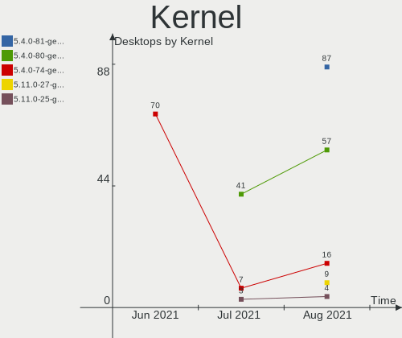
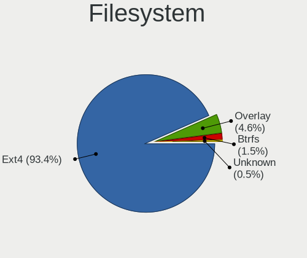
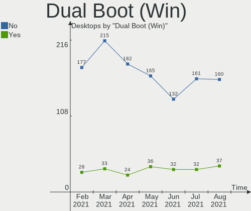
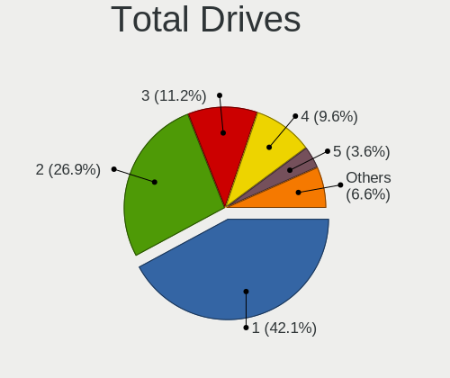
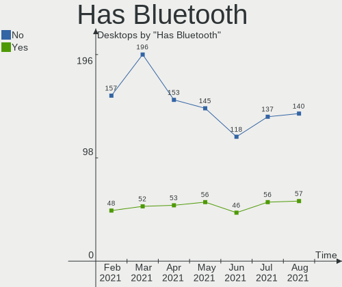
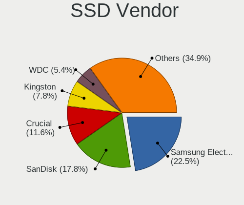
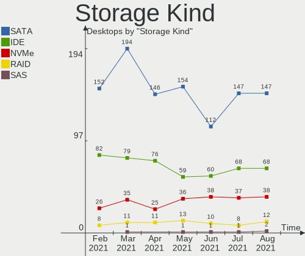
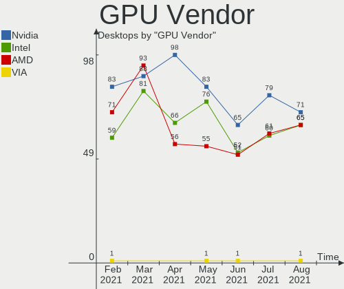
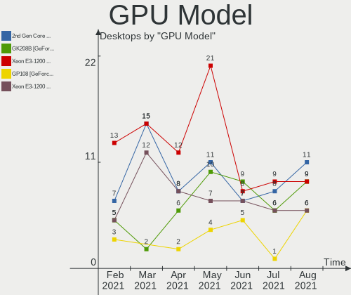
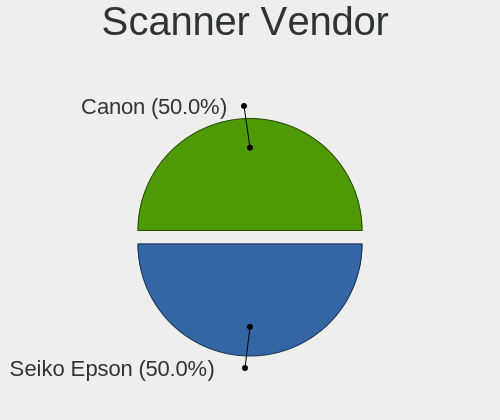

Mint Hardware Trends (Desktops)
-------------------------------

A project to identify most popular hardware characteristics and track their change
over time based on data collected by Mint users at https://Linux-Hardware.org.

Anyone can contribute to this report by the [hw-probe](https://github.com/linuxhw/hw-probe) tool:

    sudo -E hw-probe -all -upload

Full-feature report is available here: https://linux-hardware.org/?view=trends&formfactor=desktop

Period: Jul, 2021.

Contents
--------

* [ System ](#system)
  - [ OS                       ](#os)
  - [ OS Family                ](#os-family)
  - [ Kernel                   ](#kernel)
  - [ Kernel Family            ](#kernel-family)
  - [ Kernel Major Ver.        ](#kernel-major-ver)
  - [ Arch                     ](#arch)
  - [ DE                       ](#de)
  - [ Display Server           ](#display-server)
  - [ Display Manager          ](#display-manager)
  - [ OS Lang                  ](#os-lang)
  - [ Boot Mode                ](#boot-mode)
  - [ Filesystem               ](#filesystem)
  - [ Part. scheme             ](#part-scheme)
  - [ Dual Boot with Linux/BSD ](#dual-boot-with-linuxbsd)
  - [ Dual Boot (Win)          ](#dual-boot-win)

* [ Board ](#board)
  - [ Vendor                   ](#vendor)
  - [ Model                    ](#model)
  - [ Model Family             ](#model-family)
  - [ MFG Year                 ](#mfg-year)
  - [ Form Factor              ](#form-factor)
  - [ Secure Boot              ](#secure-boot)
  - [ Coreboot                 ](#coreboot)
  - [ RAM Size                 ](#ram-size)
  - [ RAM Used                 ](#ram-used)
  - [ Total Drives             ](#total-drives)
  - [ Has CD-ROM               ](#has-cd-rom)
  - [ Has Ethernet             ](#has-ethernet)
  - [ Has WiFi                 ](#has-wifi)
  - [ Has Bluetooth            ](#has-bluetooth)

* [ Location ](#location)
  - [ Country                  ](#country)
  - [ City                     ](#city)

* [ Drives ](#drives)
  - [ Drive Vendor             ](#drive-vendor)
  - [ Drive Model              ](#drive-model)
  - [ HDD Vendor               ](#hdd-vendor)
  - [ SSD Vendor               ](#ssd-vendor)
  - [ Drive Kind               ](#drive-kind)
  - [ Drive Connector          ](#drive-connector)
  - [ Drive Size               ](#drive-size)
  - [ Space Total              ](#space-total)
  - [ Space Used               ](#space-used)
  - [ Malfunc. Drives          ](#malfunc-drives)
  - [ Malfunc. Drive Vendor    ](#malfunc-drive-vendor)
  - [ Malfunc. HDD Vendor      ](#malfunc-hdd-vendor)
  - [ Malfunc. Drive Kind      ](#malfunc-drive-kind)
  - [ Failed Drives            ](#failed-drives)
  - [ Failed Drive Vendor      ](#failed-drive-vendor)
  - [ Drive Status             ](#drive-status)

* [ Storage controller ](#storage-controller)
  - [ Storage Vendor           ](#storage-vendor)
  - [ Storage Model            ](#storage-model)
  - [ Storage Kind             ](#storage-kind)

* [ Processor ](#processor)
  - [ CPU Vendor               ](#cpu-vendor)
  - [ CPU Model                ](#cpu-model)
  - [ CPU Model Family         ](#cpu-model-family)
  - [ CPU Cores                ](#cpu-cores)
  - [ CPU Sockets              ](#cpu-sockets)
  - [ CPU Threads              ](#cpu-threads)
  - [ CPU Op-Modes             ](#cpu-op-modes)
  - [ CPU Microcode            ](#cpu-microcode)
  - [ CPU Microarch            ](#cpu-microarch)

* [ Graphics ](#graphics)
  - [ GPU Vendor               ](#gpu-vendor)
  - [ GPU Model                ](#gpu-model)
  - [ GPU Combo                ](#gpu-combo)
  - [ GPU Driver               ](#gpu-driver)
  - [ GPU Memory               ](#gpu-memory)

* [ Monitor ](#monitor)
  - [ Monitor Vendor           ](#monitor-vendor)
  - [ Monitor Model            ](#monitor-model)
  - [ Monitor Resolution       ](#monitor-resolution)
  - [ Monitor Diagonal         ](#monitor-diagonal)
  - [ Monitor Width            ](#monitor-width)
  - [ Aspect Ratio             ](#aspect-ratio)
  - [ Monitor Area             ](#monitor-area)
  - [ Pixel Density            ](#pixel-density)
  - [ Multiple Monitors        ](#multiple-monitors)

* [ Network ](#network)
  - [ Net Controller Vendor    ](#net-controller-vendor)
  - [ Net Controller Model     ](#net-controller-model)
  - [ Wireless Vendor          ](#wireless-vendor)
  - [ Wireless Model           ](#wireless-model)
  - [ Ethernet Vendor          ](#ethernet-vendor)
  - [ Ethernet Model           ](#ethernet-model)
  - [ Net Controller Kind      ](#net-controller-kind)
  - [ Used Controller          ](#used-controller)
  - [ NICs                     ](#nics)
  - [ IPv6                     ](#ipv6)

* [ Bluetooth ](#bluetooth)
  - [ Bluetooth Vendor         ](#bluetooth-vendor)
  - [ Bluetooth Model          ](#bluetooth-model)

* [ Sound ](#sound)
  - [ Sound Vendor             ](#sound-vendor)
  - [ Sound Model              ](#sound-model)

* [ Memory ](#memory)
  - [ Memory Vendor            ](#memory-vendor)
  - [ Memory Model             ](#memory-model)
  - [ Memory Kind              ](#memory-kind)
  - [ Memory Form Factor       ](#memory-form-factor)
  - [ Memory Size              ](#memory-size)
  - [ Memory Speed             ](#memory-speed)

* [ Printers & scanners ](#printers--scanners)
  - [ Printer Vendor           ](#printer-vendor)
  - [ Printer Model            ](#printer-model)
  - [ Scanner Vendor           ](#scanner-vendor)
  - [ Scanner Model            ](#scanner-model)

* [ Camera ](#camera)
  - [ Camera Vendor            ](#camera-vendor)
  - [ Camera Model             ](#camera-model)

* [ Security ](#security)
  - [ Fingerprint Vendor       ](#fingerprint-vendor)
  - [ Fingerprint Model        ](#fingerprint-model)
  - [ Chipcard Vendor          ](#chipcard-vendor)
  - [ Chipcard Model           ](#chipcard-model)

* [ Unsupported ](#unsupported)
  - [ Unsupported Devices      ](#unsupported-devices)
  - [ Unsupported Device Types ](#unsupported-device-types)

System
------

OS
--

Installed operating systems

| Name      | Desktops | Percent |
|-----------|----------|---------|
| Mint 20.2 | 81       | 41.97%  |
| Mint 20.1 | 60       | 31.09%  |
| Mint 19.3 | 21       | 10.88%  |
| Mint 20   | 19       | 9.84%   |
| Mint 19.1 | 4        | 2.07%   |
| Mint 19.2 | 3        | 1.55%   |
| Mint 18.3 | 3        | 1.55%   |
| Mint 19   | 1        | 0.52%   |
| Mint 18.1 | 1        | 0.52%   |

OS Family
---------

OS without a version

| Name | Desktops | Percent |
|------|----------|---------|
| Mint | 193      | 100%    |

Kernel
------

Version of the Linux kernel

| Version                    | Desktops | Percent |
|----------------------------|----------|---------|
| 5.4.0-77-generic           | 96       | 49.74%  |
| 5.4.0-80-generic           | 41       | 21.24%  |
| 5.4.0-74-generic           | 7        | 3.63%   |
| 5.4.0-58-generic           | 7        | 3.63%   |
| 5.4.0-26-generic           | 6        | 3.11%   |
| 5.11.0-22-generic          | 4        | 2.07%   |
| 5.8.0-59-generic           | 3        | 1.55%   |
| 5.4.0-73-generic           | 3        | 1.55%   |
| 5.11.0-25-generic          | 3        | 1.55%   |
| 4.15.0-147-generic         | 3        | 1.55%   |
| 5.0.0-32-generic           | 2        | 1.04%   |
| 4.4.0-210-generic          | 2        | 1.04%   |
| 4.15.0-54-generic          | 2        | 1.04%   |
| 4.15.0-151-generic         | 2        | 1.04%   |
| 4.10.0-38-generic          | 2        | 1.04%   |
| 5.4.0-67-generic           | 1        | 0.52%   |
| 5.4.0-65-generic           | 1        | 0.52%   |
| 5.4.0-62-generic           | 1        | 0.52%   |
| 5.4.0-54-generic           | 1        | 0.52%   |
| 5.3.0-53-generic           | 1        | 0.52%   |
| 5.12.0-17.2-liquorix-amd64 | 1        | 0.52%   |
| 5.11.6-051106-generic      | 1        | 0.52%   |
| 5.11.0-7620-generic        | 1        | 0.52%   |
| 5.10.5-2006-amd+           | 1        | 0.52%   |
| 4.15.0-20-generic          | 1        | 0.52%   |

Kernel Family
-------------

Linux kernel without a distro release

| Version | Desktops | Percent |
|---------|----------|---------|
| 5.4.0   | 164      | 84.97%  |
| 5.11.0  | 8        | 4.15%   |
| 4.15.0  | 8        | 4.15%   |
| 5.8.0   | 3        | 1.55%   |
| 5.0.0   | 2        | 1.04%   |
| 4.4.0   | 2        | 1.04%   |
| 4.10.0  | 2        | 1.04%   |
| 5.3.0   | 1        | 0.52%   |
| 5.12.0  | 1        | 0.52%   |
| 5.11.6  | 1        | 0.52%   |
| 5.10.5  | 1        | 0.52%   |

Kernel Major Ver.
-----------------

Linux kernel major version

| Version | Desktops | Percent |
|---------|----------|---------|
| 5.4     | 164      | 84.97%  |
| 5.11    | 9        | 4.66%   |
| 4.15    | 8        | 4.15%   |
| 5.8     | 3        | 1.55%   |
| 5.0     | 2        | 1.04%   |
| 4.4     | 2        | 1.04%   |
| 4.10    | 2        | 1.04%   |
| 5.3     | 1        | 0.52%   |
| 5.12    | 1        | 0.52%   |
| 5.10    | 1        | 0.52%   |

Arch
----

OS architecture (x86_64, i586, etc.)

| Name   | Desktops | Percent |
|--------|----------|---------|
| x86_64 | 188      | 97.41%  |
| i686   | 5        | 2.59%   |

DE
--

Desktop Environment

| Name          | Desktops | Percent |
|---------------|----------|---------|
| X-Cinnamon    | 138      | 71.5%   |
| MATE          | 26       | 13.47%  |
| XFCE          | 13       | 6.74%   |
| Cinnamon      | 8        | 4.15%   |
| GNOME         | 3        | 1.55%   |
| Unknown       | 2        | 1.04%   |
| KDE5          | 1        | 0.52%   |
| KDE           | 1        | 0.52%   |
| GNOME Classic | 1        | 0.52%   |

Display Server
--------------

X11 or Wayland

| Name | Desktops | Percent |
|------|----------|---------|
| X11  | 192      | 99.48%  |
| Tty  | 1        | 0.52%   |

Display Manager
---------------

SDDM, LightDM, etc.

| Name    | Desktops | Percent |
|---------|----------|---------|
| Unknown | 140      | 72.54%  |
| TDM     | 51       | 26.42%  |
| SDDM    | 1        | 0.52%   |
| LightDM | 1        | 0.52%   |

OS Lang
-------

Language

| Lang    | Desktops | Percent |
|---------|----------|---------|
| en_US   | 56       | 29.02%  |
| de_DE   | 36       | 18.65%  |
| pt_BR   | 15       | 7.77%   |
| fr_FR   | 10       | 5.18%   |
| en_GB   | 10       | 5.18%   |
| ru_RU   | 5        | 2.59%   |
| es_ES   | 5        | 2.59%   |
| en_CA   | 5        | 2.59%   |
| C       | 5        | 2.59%   |
| es_MX   | 4        | 2.07%   |
| pt_PT   | 3        | 1.55%   |
| es_CL   | 3        | 1.55%   |
| es_AR   | 3        | 1.55%   |
| en_NZ   | 3        | 1.55%   |
| en_AU   | 3        | 1.55%   |
| cs_CZ   | 3        | 1.55%   |
| nl_NL   | 2        | 1.04%   |
| it_IT   | 2        | 1.04%   |
| hu_HU   | 2        | 1.04%   |
| en_ZA   | 2        | 1.04%   |
| de_AT   | 2        | 1.04%   |
| uk_UA   | 1        | 0.52%   |
| sv_SE   | 1        | 0.52%   |
| sk_SK   | 1        | 0.52%   |
| ro_RO   | 1        | 0.52%   |
| pl_PL   | 1        | 0.52%   |
| nb_NO   | 1        | 0.52%   |
| he_IL   | 1        | 0.52%   |
| fr_CA   | 1        | 0.52%   |
| fr_BE   | 1        | 0.52%   |
| en_PH   | 1        | 0.52%   |
| en_IN   | 1        | 0.52%   |
| en_IL   | 1        | 0.52%   |
| el_GR   | 1        | 0.52%   |
| Unknown | 1        | 0.52%   |

Boot Mode
---------

EFI or BIOS

| Mode | Desktops | Percent |
|------|----------|---------|
| BIOS | 118      | 61.14%  |
| EFI  | 75       | 38.86%  |

Filesystem
----------

Type of filesystem

| Type    | Desktops | Percent |
|---------|----------|---------|
| Ext4    | 184      | 95.34%  |
| Overlay | 5        | 2.59%   |
| Btrfs   | 3        | 1.55%   |
| Aufs    | 1        | 0.52%   |

Part. scheme
------------

Scheme of partitioning

| Type    | Desktops | Percent |
|---------|----------|---------|
| Unknown | 139      | 72.02%  |
| GPT     | 37       | 19.17%  |
| MBR     | 17       | 8.81%   |

Dual Boot with Linux/BSD
------------------------

Hosting more than one Linux/BSD

| Dual boot | Desktops | Percent |
|-----------|----------|---------|
| No        | 176      | 91.19%  |
| Yes       | 17       | 8.81%   |

Dual Boot (Win)
---------------

Hosting Linux and Windows

| Dual boot | Desktops | Percent |
|-----------|----------|---------|
| No        | 161      | 83.42%  |
| Yes       | 32       | 16.58%  |

Board
-----

Vendor
------

Motherboard manufacturer

| Name                | Desktops | Percent |
|---------------------|----------|---------|
| ASUSTek Computer    | 47       | 24.35%  |
| Gigabyte Technology | 34       | 17.62%  |
| ASRock              | 19       | 9.84%   |
| MSI                 | 18       | 9.33%   |
| Hewlett-Packard     | 18       | 9.33%   |
| Dell                | 16       | 8.29%   |
| Intel               | 7        | 3.63%   |
| Lenovo              | 4        | 2.07%   |
| Foxconn             | 4        | 2.07%   |
| Fujitsu             | 3        | 1.55%   |
| eMachines           | 3        | 1.55%   |
| Pegatron            | 2        | 1.04%   |
| Medion              | 2        | 1.04%   |
| Biostar             | 2        | 1.04%   |
| AWOW Technology     | 2        | 1.04%   |
| Acer                | 2        | 1.04%   |
| Wibtek              | 1        | 0.52%   |
| Seco                | 1        | 0.52%   |
| Megaware            | 1        | 0.52%   |
| Itautec             | 1        | 0.52%   |
| Huanan              | 1        | 0.52%   |
| Fujitsu Siemens     | 1        | 0.52%   |
| ECS                 | 1        | 0.52%   |
| AMI                 | 1        | 0.52%   |
| ABIT                | 1        | 0.52%   |
| Unknown             | 1        | 0.52%   |

Model
-----

Motherboard model

| Name                                | Desktops | Percent |
|-------------------------------------|----------|---------|
| ASUS TUF GAMING X570-PLUS           | 4        | 2.07%   |
| ASUS All Series                     | 4        | 2.07%   |
| Dell OptiPlex 9020                  | 3        | 1.55%   |
| MSI MS-7C56                         | 2        | 1.04%   |
| MSI MS-7C08                         | 2        | 1.04%   |
| HP Compaq Elite 8300 SFF            | 2        | 1.04%   |
| HP Compaq 6005 Pro MT PC            | 2        | 1.04%   |
| Gigabyte B75M-D3V                   | 2        | 1.04%   |
| Dell OptiPlex 755                   | 2        | 1.04%   |
| AWOW AK41                           | 2        | 1.04%   |
| ASUS PRIME X570-P                   | 2        | 1.04%   |
| Wibtek TH61G-S                      | 1        | 0.52%   |
| Seco C40                            | 1        | 0.52%   |
| Pegatron AY627AA-ABA a4313w         | 1        | 0.52%   |
| Pegatron 505B Microtower PC         | 1        | 0.52%   |
| MSI MS-7D22                         | 1        | 0.52%   |
| MSI MS-7C91                         | 1        | 0.52%   |
| MSI MS-7C84                         | 1        | 0.52%   |
| MSI MS-7C52                         | 1        | 0.52%   |
| MSI MS-7C37                         | 1        | 0.52%   |
| MSI MS-7B86                         | 1        | 0.52%   |
| MSI MS-7B79                         | 1        | 0.52%   |
| MSI MS-7B22                         | 1        | 0.52%   |
| MSI MS-7980                         | 1        | 0.52%   |
| MSI MS-7978                         | 1        | 0.52%   |
| MSI MS-7918                         | 1        | 0.52%   |
| MSI MS-7817                         | 1        | 0.52%   |
| MSI MS-7786                         | 1        | 0.52%   |
| MSI MS-7592                         | 1        | 0.52%   |
| Megaware MW-G31T-M7                 | 1        | 0.52%   |
| Medion MS-7616                      | 1        | 0.52%   |
| Medion H81H3-EM2                    | 1        | 0.52%   |
| Lenovo ThinkStation P510 30B4S0F600 | 1        | 0.52%   |
| Lenovo ThinkCentre M73z 10BBA0XNCS  | 1        | 0.52%   |
| Lenovo ThinkCentre Edge71 1577G1G   | 1        | 0.52%   |
| Lenovo ThinkCentre A70 7099H8P      | 1        | 0.52%   |
| Itautec Infoway ST-4265             | 1        | 0.52%   |
| Intel X79 V2.72B                    | 1        | 0.52%   |
| Intel MAHOBAY                       | 1        | 0.52%   |
| Intel H61                           | 1        | 0.52%   |
| Intel DH61WW AAG23116-206           | 1        | 0.52%   |
| Intel DG41RQ AAE54511-203           | 1        | 0.52%   |
| Intel DG31PR AAD97573-306           | 1        | 0.52%   |
| Intel B75                           | 1        | 0.52%   |
| Huanan X79 249PC V2.2               | 1        | 0.52%   |
| HP Z620 Workstation                 | 1        | 0.52%   |
| HP Z440 Workstation                 | 1        | 0.52%   |
| HP Slim Desktop S01-aF0xxx          | 1        | 0.52%   |
| HP ProLiant ML350 G5                | 1        | 0.52%   |
| HP EliteDesk 800 G2 SFF             | 1        | 0.52%   |
| HP EliteDesk 705 G2 MINI            | 1        | 0.52%   |
| HP Compaq dc5800 Small Form Factor  | 1        | 0.52%   |
| HP Compaq dc5750 Microtower         | 1        | 0.52%   |
| HP Compaq 8200 Elite SFF PC         | 1        | 0.52%   |
| HP Compaq 8100 Elite SFF PC         | 1        | 0.52%   |
| HP Compaq 8000 Elite USDT PC        | 1        | 0.52%   |
| HP Compaq 6005 Pro SFF PC           | 1        | 0.52%   |
| HP Compaq 6000 Pro MT PC            | 1        | 0.52%   |
| HP 280 G1 MT                        | 1        | 0.52%   |
| Gigabyte Z87X-UD3H                  | 1        | 0.52%   |

Model Family
------------

Motherboard model prefix

| Name                 | Desktops | Percent |
|----------------------|----------|---------|
| ASUS PRIME           | 12       | 6.22%   |
| HP Compaq            | 11       | 5.7%    |
| Dell OptiPlex        | 8        | 4.15%   |
| ASUS TUF             | 6        | 3.11%   |
| Dell Inspiron        | 4        | 2.07%   |
| ASUS M5A78L-M        | 4        | 2.07%   |
| ASUS All             | 4        | 2.07%   |
| Lenovo ThinkCentre   | 3        | 1.55%   |
| Fujitsu ESPRIMO      | 3        | 1.55%   |
| MSI MS-7C56          | 2        | 1.04%   |
| MSI MS-7C08          | 2        | 1.04%   |
| HP EliteDesk         | 2        | 1.04%   |
| Gigabyte Z390        | 2        | 1.04%   |
| Gigabyte B75M-D3V    | 2        | 1.04%   |
| Gigabyte A320M-S2H   | 2        | 1.04%   |
| AWOW AK41            | 2        | 1.04%   |
| ASUS ROG             | 2        | 1.04%   |
| ASUS P8H61-M         | 2        | 1.04%   |
| ASUS M5A97           | 2        | 1.04%   |
| ASRock Z170          | 2        | 1.04%   |
| ASRock B450M-HDV     | 2        | 1.04%   |
| Acer Aspire          | 2        | 1.04%   |
| Wibtek TH61G-S       | 1        | 0.52%   |
| Seco C40             | 1        | 0.52%   |
| Pegatron AY627AA-ABA | 1        | 0.52%   |
| Pegatron 505B        | 1        | 0.52%   |
| MSI MS-7D22          | 1        | 0.52%   |
| MSI MS-7C91          | 1        | 0.52%   |
| MSI MS-7C84          | 1        | 0.52%   |
| MSI MS-7C52          | 1        | 0.52%   |
| MSI MS-7C37          | 1        | 0.52%   |
| MSI MS-7B86          | 1        | 0.52%   |
| MSI MS-7B79          | 1        | 0.52%   |
| MSI MS-7B22          | 1        | 0.52%   |
| MSI MS-7980          | 1        | 0.52%   |
| MSI MS-7978          | 1        | 0.52%   |
| MSI MS-7918          | 1        | 0.52%   |
| MSI MS-7817          | 1        | 0.52%   |
| MSI MS-7786          | 1        | 0.52%   |
| MSI MS-7592          | 1        | 0.52%   |
| Megaware MW-G31T-M7  | 1        | 0.52%   |
| Medion MS-7616       | 1        | 0.52%   |
| Medion H81H3-EM2     | 1        | 0.52%   |
| Lenovo ThinkStation  | 1        | 0.52%   |
| Itautec Infoway      | 1        | 0.52%   |
| Intel X79            | 1        | 0.52%   |
| Intel MAHOBAY        | 1        | 0.52%   |
| Intel H61            | 1        | 0.52%   |
| Intel DH61WW         | 1        | 0.52%   |
| Intel DG41RQ         | 1        | 0.52%   |
| Intel DG31PR         | 1        | 0.52%   |
| Intel B75            | 1        | 0.52%   |
| Huanan X79           | 1        | 0.52%   |
| HP Z620              | 1        | 0.52%   |
| HP Z440              | 1        | 0.52%   |
| HP Slim              | 1        | 0.52%   |
| HP ProLiant          | 1        | 0.52%   |
| HP 280               | 1        | 0.52%   |
| Gigabyte Z87X-UD3H   | 1        | 0.52%   |
| Gigabyte Z77X-UD5H   | 1        | 0.52%   |

MFG Year
--------

Motherboard manufacture year

| Year | Desktops | Percent |
|------|----------|---------|
| 2020 | 25       | 12.95%  |
| 2021 | 20       | 10.36%  |
| 2019 | 18       | 9.33%   |
| 2013 | 17       | 8.81%   |
| 2018 | 16       | 8.29%   |
| 2010 | 16       | 8.29%   |
| 2009 | 16       | 8.29%   |
| 2012 | 13       | 6.74%   |
| 2015 | 10       | 5.18%   |
| 2014 | 10       | 5.18%   |
| 2011 | 10       | 5.18%   |
| 2017 | 8        | 4.15%   |
| 2008 | 5        | 2.59%   |
| 2007 | 5        | 2.59%   |
| 2016 | 4        | 2.07%   |

Form Factor
-----------

Physical design of the computer

| Name    | Desktops | Percent |
|---------|----------|---------|
| Desktop | 193      | 100%    |

Secure Boot
-----------

Enabled or disabled

| State    | Desktops | Percent |
|----------|----------|---------|
| Disabled | 186      | 96.37%  |
| Enabled  | 7        | 3.63%   |

Coreboot
--------

Have coreboot on board

| Used | Desktops | Percent |
|------|----------|---------|
| No   | 193      | 100%    |

RAM Size
--------

Total RAM memory

| Size in GB  | Desktops | Percent |
|-------------|----------|---------|
| 16.01-24.0  | 51       | 26.42%  |
| 3.01-4.0    | 40       | 20.73%  |
| 8.01-16.0   | 36       | 18.65%  |
| 4.01-8.0    | 33       | 17.1%   |
| 32.01-64.0  | 22       | 11.4%   |
| 64.01-256.0 | 6        | 3.11%   |
| 1.01-2.0    | 4        | 2.07%   |
| 2.01-3.0    | 1        | 0.52%   |

RAM Used
--------

Used RAM memory

| Used GB    | Desktops | Percent |
|------------|----------|---------|
| 1.01-2.0   | 85       | 44.04%  |
| 2.01-3.0   | 45       | 23.32%  |
| 4.01-8.0   | 22       | 11.4%   |
| 3.01-4.0   | 22       | 11.4%   |
| 0.51-1.0   | 14       | 7.25%   |
| 8.01-16.0  | 4        | 2.07%   |
| 16.01-24.0 | 1        | 0.52%   |

Total Drives
------------

Number of drives on board

| Drives | Desktops | Percent |
|--------|----------|---------|
| 1      | 75       | 38.86%  |
| 2      | 60       | 31.09%  |
| 3      | 31       | 16.06%  |
| 4      | 13       | 6.74%   |
| 5      | 7        | 3.63%   |
| 6      | 3        | 1.55%   |
| 8      | 2        | 1.04%   |
| 7      | 1        | 0.52%   |
| 0      | 1        | 0.52%   |

Has CD-ROM
----------

Has CD-ROM on board

| Presented | Desktops | Percent |
|-----------|----------|---------|
| Yes       | 113      | 58.55%  |
| No        | 80       | 41.45%  |

Has Ethernet
------------

Has Ethernet on board

| Presented | Desktops | Percent |
|-----------|----------|---------|
| Yes       | 191      | 98.96%  |
| No        | 2        | 1.04%   |

Has WiFi
--------

Has WiFi module

| Presented | Desktops | Percent |
|-----------|----------|---------|
| No        | 107      | 55.44%  |
| Yes       | 86       | 44.56%  |

Has Bluetooth
-------------

Has Bluetooth module

| Presented | Desktops | Percent |
|-----------|----------|---------|
| No        | 137      | 70.98%  |
| Yes       | 56       | 29.02%  |

Location
--------

Country
-------

Geographic location (country)

| Country                          | Desktops | Percent |
|----------------------------------|----------|---------|
| Germany                          | 41       | 21.24%  |
| USA                              | 34       | 17.62%  |
| Brazil                           | 18       | 9.33%   |
| France                           | 10       | 5.18%   |
| UK                               | 8        | 4.15%   |
| Russia                           | 7        | 3.63%   |
| Canada                           | 6        | 3.11%   |
| Spain                            | 5        | 2.59%   |
| Portugal                         | 4        | 2.07%   |
| Netherlands                      | 4        | 2.07%   |
| Mexico                           | 4        | 2.07%   |
| Czechia                          | 4        | 2.07%   |
| Australia                        | 4        | 2.07%   |
| New Zealand                      | 3        | 1.55%   |
| Chile                            | 3        | 1.55%   |
| Argentina                        | 3        | 1.55%   |
| South Africa                     | 2        | 1.04%   |
| Slovakia                         | 2        | 1.04%   |
| Romania                          | 2        | 1.04%   |
| Israel                           | 2        | 1.04%   |
| Hungary                          | 2        | 1.04%   |
| Denmark                          | 2        | 1.04%   |
| Belgium                          | 2        | 1.04%   |
| Austria                          | 2        | 1.04%   |
| Venezuela                        | 1        | 0.52%   |
| Ukraine                          | 1        | 0.52%   |
| Trinidad and Tobago              | 1        | 0.52%   |
| Taiwan                           | 1        | 0.52%   |
| Sweden                           | 1        | 0.52%   |
| Saint Vincent and the Grenadines | 1        | 0.52%   |
| Poland                           | 1        | 0.52%   |
| Philippines                      | 1        | 0.52%   |
| Norway                           | 1        | 0.52%   |
| Malaysia                         | 1        | 0.52%   |
| Italy                            | 1        | 0.52%   |
| Indonesia                        | 1        | 0.52%   |
| India                            | 1        | 0.52%   |
| Greece                           | 1        | 0.52%   |
| Finland                          | 1        | 0.52%   |
| Egypt                            | 1        | 0.52%   |
| Bulgaria                         | 1        | 0.52%   |
| Andorra                          | 1        | 0.52%   |
| Algeria                          | 1        | 0.52%   |

City
----

Geographic location (city)

| City                 | Desktops | Percent |
|----------------------|----------|---------|
| Hamburg              | 4        | 2.07%   |
| S??o Paulo           | 3        | 1.55%   |
| Moscow               | 3        | 1.55%   |
| Montreal             | 3        | 1.55%   |
| Vienna               | 2        | 1.04%   |
| Tel Aviv             | 2        | 1.04%   |
| St Helens            | 2        | 1.04%   |
| Rio de Janeiro       | 2        | 1.04%   |
| Prague               | 2        | 1.04%   |
| Perm                 | 2        | 1.04%   |
| London               | 2        | 1.04%   |
| Leipzig              | 2        | 1.04%   |
| Holzkirchen          | 2        | 1.04%   |
| Hemet                | 2        | 1.04%   |
| Berlin               | 2        | 1.04%   |
| Alexandria           | 2        | 1.04%   |
| Wroclaw              | 1        | 0.52%   |
| Wermelskirchen       | 1        | 0.52%   |
| Welver               | 1        | 0.52%   |
| Warsaw               | 1        | 0.52%   |
| Wallrath             | 1        | 0.52%   |
| Waalre               | 1        | 0.52%   |
| Vladivostok          | 1        | 0.52%   |
| Viña del Mar        | 1        | 0.52%   |
| Vila Vicosa          | 1        | 0.52%   |
| Viedma               | 1        | 0.52%   |
| Venegono Superiore   | 1        | 0.52%   |
| Vandoma              | 1        | 0.52%   |
| Vancouver            | 1        | 0.52%   |
| Vaihingen an der Enz | 1        | 0.52%   |
| Vaassen              | 1        | 0.52%   |
| Tyumen               | 1        | 0.52%   |
| Tualatin             | 1        | 0.52%   |
| Tremembe             | 1        | 0.52%   |
| Topo????any          | 1        | 0.52%   |
| Tipasa               | 1        | 0.52%   |
| Tepic                | 1        | 0.52%   |
| Talca                | 1        | 0.52%   |
| Taipei               | 1        | 0.52%   |
| Stuttgart            | 1        | 0.52%   |
| Stara Zagora         | 1        | 0.52%   |
| Sorocaba             | 1        | 0.52%   |
| Skien                | 1        | 0.52%   |
| Silchar              | 1        | 0.52%   |
| Senonches            | 1        | 0.52%   |
| Saulieu              | 1        | 0.52%   |
| Satu Mare            | 1        | 0.52%   |
| Sankt Ingbert        | 1        | 0.52%   |
| San Jose             | 1        | 0.52%   |
| San Jacinto          | 1        | 0.52%   |
| San Diego            | 1        | 0.52%   |
| Sambreville          | 1        | 0.52%   |
| Salt Lake City       | 1        | 0.52%   |
| Saint-Laurent-Blangy | 1        | 0.52%   |
| Saalfeld             | 1        | 0.52%   |
| Rostock              | 1        | 0.52%   |
| Rome                 | 1        | 0.52%   |
| Roding               | 1        | 0.52%   |
| Red Hill             | 1        | 0.52%   |
| Pretoria             | 1        | 0.52%   |

Drives
------

Drive Vendor
------------

Hard drive vendors

| Vendor              | Desktops | Drives | Percent |
|---------------------|----------|--------|---------|
| WDC                 | 80       | 97     | 23.19%  |
| Seagate             | 68       | 93     | 19.71%  |
| Samsung Electronics | 46       | 57     | 13.33%  |
| Kingston            | 20       | 20     | 5.8%    |
| Crucial             | 16       | 18     | 4.64%   |
| Sandisk             | 15       | 18     | 4.35%   |
| Hitachi             | 14       | 14     | 4.06%   |
| Toshiba             | 11       | 12     | 3.19%   |
| Corsair             | 6        | 7      | 1.74%   |
| A-DATA Technology   | 5        | 5      | 1.45%   |
| XPG                 | 4        | 4      | 1.16%   |
| PNY                 | 4        | 4      | 1.16%   |
| Phison              | 4        | 6      | 1.16%   |
| Intenso             | 4        | 4      | 1.16%   |
| HGST                | 4        | 7      | 1.16%   |
| Unknown             | 3        | 3      | 0.87%   |
| Silicon Motion      | 3        | 4      | 0.87%   |
| OCZ                 | 3        | 3      | 0.87%   |
| JMicron             | 3        | 3      | 0.87%   |
| China               | 3        | 4      | 0.87%   |
| Verbatim            | 2        | 2      | 0.58%   |
| Transcend           | 2        | 3      | 0.58%   |
| SPCC                | 2        | 2      | 0.58%   |
| Lexar               | 2        | 2      | 0.58%   |
| Intel               | 2        | 2      | 0.58%   |
| ASMT                | 2        | 2      | 0.58%   |
| TrueNAS             | 1        | 2      | 0.29%   |
| SK Hynix            | 1        | 1      | 0.29%   |
| Mushkin             | 1        | 1      | 0.29%   |
| Micron Technology   | 1        | 1      | 0.29%   |
| Maxtor              | 1        | 1      | 0.29%   |
| LITEON              | 1        | 1      | 0.29%   |
| LaCie               | 1        | 1      | 0.29%   |
| Hewlett-Packard     | 1        | 1      | 0.29%   |
| FORESEE             | 1        | 1      | 0.29%   |
| ExcelStor           | 1        | 1      | 0.29%   |
| CT480BX5            | 1        | 1      | 0.29%   |
| BIWIN               | 1        | 1      | 0.29%   |
| Avant               | 1        | 1      | 0.29%   |
| ASMedia             | 1        | 2      | 0.29%   |
| AS201               | 1        | 1      | 0.29%   |
| APS-SL3N            | 1        | 1      | 0.29%   |
| Apacer              | 1        | 1      | 0.29%   |

Drive Model
-----------

Hard drive models

| Model                            | Desktops | Percent |
|----------------------------------|----------|---------|
| Kingston SA400S37240G 240GB SSD  | 7        | 1.8%    |
| Toshiba DT01ACA100 1TB           | 5        | 1.29%   |
| Seagate ST4000DM004-2CV104 4TB   | 5        | 1.29%   |
| Seagate ST2000DM001-1ER164 2TB   | 5        | 1.29%   |
| Seagate ST1000DM010-2EP102 1TB   | 5        | 1.29%   |
| WDC WD10EZEX-00WN4A0 1TB         | 4        | 1.03%   |
| Seagate ST500DM002-1BD142 500GB  | 4        | 1.03%   |
| Seagate ST2000DM008-2FR102 2TB   | 4        | 1.03%   |
| Seagate ST1000DM003-1ER162 1TB   | 4        | 1.03%   |
| Seagate ST1000DM003-1CH162 1TB   | 4        | 1.03%   |
| Samsung SSD 860 EVO 250GB        | 4        | 1.03%   |
| Samsung SSD 850 EVO 500GB        | 4        | 1.03%   |
| WDC WDS500G2B0A-00SM50 500GB SSD | 3        | 0.77%   |
| WDC WD20EARX-00PASB0 2TB         | 3        | 0.77%   |
| Toshiba DT01ACA200 2TB           | 3        | 0.77%   |
| Seagate ST3500418AS 500GB        | 3        | 0.77%   |
| SanDisk SSD PLUS 240GB           | 3        | 0.77%   |
| Samsung HD161HJ 160GB            | 3        | 0.77%   |
| Kingston SA400S37120G 120GB SSD  | 3        | 0.77%   |
| XPG NVMe SSD Drive 2TB           | 2        | 0.51%   |
| WDC WDS500G2B0A 500GB SSD        | 2        | 0.51%   |
| WDC WDS120G2G0A-00JH30 120GB SSD | 2        | 0.51%   |
| WDC WD800JD-75MSA3 80GB          | 2        | 0.51%   |
| WDC WD5000AAKX-753CA1 500GB      | 2        | 0.51%   |
| WDC WD2500AAJS-00L7A0 250GB      | 2        | 0.51%   |
| WDC WD1600AAJS-75M0A0 160GB      | 2        | 0.51%   |
| WDC WD10EZRZ-00HTKB0 1TB         | 2        | 0.51%   |
| WDC WD10EZRX-00D8PB0 1TB         | 2        | 0.51%   |
| WDC WD10EZEX-08WN4A0 1TB         | 2        | 0.51%   |
| WDC WD10EARX-00N0YB0 1TB         | 2        | 0.51%   |
| Toshiba HDWD130 3TB              | 2        | 0.51%   |
| SPCC Solid State Disk 64GB       | 2        | 0.51%   |
| Seagate ST3750640NS 752GB        | 2        | 0.51%   |
| Seagate ST3320813AS 320GB        | 2        | 0.51%   |
| Seagate ST3320418AS 320GB        | 2        | 0.51%   |
| Seagate ST3250318AS 250GB        | 2        | 0.51%   |
| Seagate ST3160021A 160GB         | 2        | 0.51%   |
| Seagate ST31000524AS 1TB         | 2        | 0.51%   |
| Seagate ST2000DL003-9VT166 2TB   | 2        | 0.51%   |
| Seagate Expansion Desk 3TB       | 2        | 0.51%   |
| Seagate Expansion 4TB            | 2        | 0.51%   |
| Seagate Backup+ Desk 5TB         | 2        | 0.51%   |
| Samsung SSD 970 EVO 500GB        | 2        | 0.51%   |
| Samsung SSD 870 EVO 1TB          | 2        | 0.51%   |
| Samsung SSD 860 EVO 500GB        | 2        | 0.51%   |
| Samsung HD322HJ 320GB            | 2        | 0.51%   |
| Samsung HD080HJ 80GB             | 2        | 0.51%   |
| PNY CS900 240GB SSD              | 2        | 0.51%   |
| Kingston NVMe SSD Drive 500GB    | 2        | 0.51%   |
| JMicron Generic 1TB              | 2        | 0.51%   |
| Crucial CT500MX500SSD1 500GB     | 2        | 0.51%   |
| Crucial CT480BX500SSD1 480GB     | 2        | 0.51%   |
| Crucial CT240BX500SSD1 240GB     | 2        | 0.51%   |
| A-DATA SX8200PNP 512GB           | 2        | 0.51%   |
| XPG NVMe SSD Drive 512GB         | 1        | 0.26%   |
| XPG NVMe SSD Drive 256GB         | 1        | 0.26%   |
| WDC WDS500G3XHC-00SJG0 500GB     | 1        | 0.26%   |
| WDC WDS250G2B0C-00PXH0 250GB     | 1        | 0.26%   |
| WDC WDS250G2B0A-00SM50 250GB SSD | 1        | 0.26%   |
| WDC WDBNCE0010PNC 1TB SSD        | 1        | 0.26%   |

HDD Vendor
----------

Hard disk drive vendors

| Vendor              | Desktops | Drives | Percent |
|---------------------|----------|--------|---------|
| WDC                 | 72       | 85     | 38.71%  |
| Seagate             | 66       | 89     | 35.48%  |
| Samsung Electronics | 17       | 18     | 9.14%   |
| Hitachi             | 14       | 14     | 7.53%   |
| Toshiba             | 11       | 12     | 5.91%   |
| HGST                | 4        | 7      | 2.15%   |
| ExcelStor           | 1        | 1      | 0.54%   |
| ASMT                | 1        | 1      | 0.54%   |

SSD Vendor
----------

Solid state drive vendors

| Vendor              | Desktops | Drives | Percent |
|---------------------|----------|--------|---------|
| Samsung Electronics | 21       | 26     | 18.1%   |
| Kingston            | 16       | 16     | 13.79%  |
| Crucial             | 16       | 18     | 13.79%  |
| Sandisk             | 12       | 15     | 10.34%  |
| WDC                 | 9        | 9      | 7.76%   |
| PNY                 | 4        | 4      | 3.45%   |
| OCZ                 | 3        | 3      | 2.59%   |
| Intenso             | 3        | 3      | 2.59%   |
| China               | 3        | 4      | 2.59%   |
| A-DATA Technology   | 3        | 3      | 2.59%   |
| Verbatim            | 2        | 2      | 1.72%   |
| Transcend           | 2        | 3      | 1.72%   |
| SPCC                | 2        | 2      | 1.72%   |
| Lexar               | 2        | 2      | 1.72%   |
| JMicron             | 2        | 2      | 1.72%   |
| Corsair             | 2        | 2      | 1.72%   |
| TrueNAS             | 1        | 2      | 0.86%   |
| Seagate             | 1        | 1      | 0.86%   |
| Mushkin             | 1        | 1      | 0.86%   |
| Micron Technology   | 1        | 1      | 0.86%   |
| Maxtor              | 1        | 1      | 0.86%   |
| LITEON              | 1        | 1      | 0.86%   |
| CT480BX5            | 1        | 1      | 0.86%   |
| BIWIN               | 1        | 1      | 0.86%   |
| Avant               | 1        | 1      | 0.86%   |
| ASMT                | 1        | 1      | 0.86%   |
| ASMedia             | 1        | 2      | 0.86%   |
| AS201               | 1        | 1      | 0.86%   |
| APS-SL3N            | 1        | 1      | 0.86%   |
| Apacer              | 1        | 1      | 0.86%   |

Drive Kind
----------

HDD or SSD

| Kind    | Desktops | Drives | Percent |
|---------|----------|--------|---------|
| HDD     | 141      | 227    | 49.82%  |
| SSD     | 95       | 130    | 33.57%  |
| NVMe    | 37       | 48     | 13.07%  |
| Unknown | 9        | 9      | 3.18%   |
| MMC     | 1        | 1      | 0.35%   |

Drive Connector
---------------

SATA, SAS, NVMe, etc.

| Type | Desktops | Drives | Percent |
|------|----------|--------|---------|
| SATA | 180      | 341    | 75.63%  |
| NVMe | 37       | 48     | 15.55%  |
| SAS  | 20       | 25     | 8.4%    |
| MMC  | 1        | 1      | 0.42%   |

Drive Size
----------

Size of hard drive

| Size in TB | Desktops | Drives | Percent |
|------------|----------|--------|---------|
| 0.01-0.5   | 132      | 193    | 50.57%  |
| 0.51-1.0   | 71       | 92     | 27.2%   |
| 1.01-2.0   | 29       | 35     | 11.11%  |
| 3.01-4.0   | 14       | 18     | 5.36%   |
| 2.01-3.0   | 10       | 12     | 3.83%   |
| 4.01-10.0  | 3        | 4      | 1.15%   |
| 10.01-20.0 | 1        | 2      | 0.38%   |
| 0          | 1        | 1      | 0.38%   |

Space Total
-----------

Amount of disk space available on the file system

| Size in GB     | Desktops | Percent |
|----------------|----------|---------|
| 101-250        | 45       | 23.32%  |
| 251-500        | 42       | 21.76%  |
| 501-1000       | 29       | 15.03%  |
| More than 3000 | 21       | 10.88%  |
| 1001-2000      | 18       | 9.33%   |
| 2001-3000      | 11       | 5.7%    |
| 21-50          | 10       | 5.18%   |
| 51-100         | 9        | 4.66%   |
| 1-20           | 4        | 2.07%   |
| Unknown        | 4        | 2.07%   |

Space Used
----------

Amount of used disk space

| Used GB        | Desktops | Percent |
|----------------|----------|---------|
| 1-20           | 42       | 21.76%  |
| 21-50          | 37       | 19.17%  |
| 101-250        | 32       | 16.58%  |
| 251-500        | 19       | 9.84%   |
| 51-100         | 19       | 9.84%   |
| 501-1000       | 16       | 8.29%   |
| 1001-2000      | 11       | 5.7%    |
| More than 3000 | 8        | 4.15%   |
| 2001-3000      | 5        | 2.59%   |
| Unknown        | 4        | 2.07%   |

Malfunc. Drives
---------------

Drive models with a malfunction

| Model                             | Desktops | Drives | Percent |
|-----------------------------------|----------|--------|---------|
| WDC WD6400AAKS-22A7B2 640GB       | 1        | 1      | 8.33%   |
| WDC WD5002ABYS-01B1B0 500GB       | 1        | 1      | 8.33%   |
| WDC WD1003FZEX-00MK2A0 1TB        | 1        | 1      | 8.33%   |
| Seagate ST9500420AS 500GB         | 1        | 1      | 8.33%   |
| Seagate ST3500418AS 500GB         | 1        | 1      | 8.33%   |
| Seagate ST1000DM003-1SB102 1TB    | 1        | 1      | 8.33%   |
| Samsung Electronics HD161HJ 160GB | 1        | 1      | 8.33%   |
| OCZ VERTEX3 240GB SSD             | 1        | 1      | 8.33%   |
| Mushkin MKNSSDCR240GB             | 1        | 1      | 8.33%   |
| Hitachi HUS72403 3TB              | 1        | 1      | 8.33%   |
| Corsair Force GT 120GB SSD        | 1        | 1      | 8.33%   |
| China SATA3 480GB SSD             | 1        | 2      | 8.33%   |

Malfunc. Drive Vendor
---------------------

Vendors of faulty drives

| Vendor              | Desktops | Drives | Percent |
|---------------------|----------|--------|---------|
| WDC                 | 3        | 3      | 25%     |
| Seagate             | 3        | 3      | 25%     |
| Samsung Electronics | 1        | 1      | 8.33%   |
| OCZ                 | 1        | 1      | 8.33%   |
| Mushkin             | 1        | 1      | 8.33%   |
| Hitachi             | 1        | 1      | 8.33%   |
| Corsair             | 1        | 1      | 8.33%   |
| China               | 1        | 2      | 8.33%   |

Malfunc. HDD Vendor
-------------------

Vendors of faulty HDD drives

| Vendor              | Desktops | Drives | Percent |
|---------------------|----------|--------|---------|
| WDC                 | 3        | 3      | 37.5%   |
| Seagate             | 3        | 3      | 37.5%   |
| Samsung Electronics | 1        | 1      | 12.5%   |
| Hitachi             | 1        | 1      | 12.5%   |

Malfunc. Drive Kind
-------------------

Kinds of faulty drives

| Kind | Desktops | Drives | Percent |
|------|----------|--------|---------|
| HDD  | 8        | 8      | 66.67%  |
| SSD  | 4        | 5      | 33.33%  |

Failed Drives
-------------

Failed drive models

Zero info for selected period =(

Failed Drive Vendor
-------------------

Failed drive vendors

Zero info for selected period =(

Drive Status
------------

Number of failed and malfunc. drives

| Status   | Desktops | Drives | Percent |
|----------|----------|--------|---------|
| Detected | 144      | 293    | 71.29%  |
| Works    | 48       | 109    | 23.76%  |
| Malfunc  | 10       | 13     | 4.95%   |

Storage controller
------------------

Storage Vendor
--------------

Storage controller vendors

| Vendor                       | Desktops | Percent |
|------------------------------|----------|---------|
| Intel                        | 121      | 47.83%  |
| AMD                          | 62       | 24.51%  |
| Nvidia                       | 11       | 4.35%   |
| Samsung Electronics          | 10       | 3.95%   |
| Marvell Technology Group     | 9        | 3.56%   |
| Phison Electronics           | 8        | 3.16%   |
| ADATA Technology             | 6        | 2.37%   |
| Sandisk                      | 5        | 1.98%   |
| JMicron Technology           | 5        | 1.98%   |
| Silicon Motion               | 4        | 1.58%   |
| Kingston Technology Company  | 4        | 1.58%   |
| ASMedia Technology           | 4        | 1.58%   |
| VIA Technologies             | 1        | 0.4%    |
| SK Hynix                     | 1        | 0.4%    |
| Shenzhen Longsys Electronics | 1        | 0.4%    |
| Hewlett-Packard              | 1        | 0.4%    |

Storage Model
-------------

Storage controller models

| Model                                                                                   | Desktops | Percent |
|-----------------------------------------------------------------------------------------|----------|---------|
| AMD FCH SATA Controller [AHCI mode]                                                     | 34       | 10.3%   |
| Intel 8 Series/C220 Series Chipset Family 6-port SATA Controller 1 [AHCI mode]          | 18       | 5.45%   |
| AMD SB7x0/SB8x0/SB9x0 IDE Controller                                                    | 13       | 3.94%   |
| Intel NM10/ICH7 Family SATA Controller [IDE mode]                                       | 12       | 3.64%   |
| Intel 6 Series/C200 Series Chipset Family 6 port Desktop SATA AHCI Controller           | 12       | 3.64%   |
| Intel Q170/Q150/B150/H170/H110/Z170/CM236 Chipset SATA Controller [AHCI Mode]           | 10       | 3.03%   |
| AMD SB7x0/SB8x0/SB9x0 SATA Controller [IDE mode]                                        | 10       | 3.03%   |
| AMD 400 Series Chipset SATA Controller                                                  | 10       | 3.03%   |
| Intel 200 Series PCH SATA controller [AHCI mode]                                        | 9        | 2.73%   |
| AMD SB7x0/SB8x0/SB9x0 SATA Controller [AHCI mode]                                       | 9        | 2.73%   |
| Intel 7 Series/C210 Series Chipset Family 6-port SATA Controller [AHCI mode]            | 8        | 2.42%   |
| Intel 82801G (ICH7 Family) IDE Controller                                               | 7        | 2.12%   |
| Samsung NVMe SSD Controller SM981/PM981/PM983                                           | 6        | 1.82%   |
| AMD Starship/Matisse Chipset SATA Controller [AHCI mode]                                | 6        | 1.82%   |
| ADATA XPG SX8200 Pro PCIe Gen3x4 M.2 2280 Solid State Drive                             | 6        | 1.82%   |
| Phison E12 NVMe Controller                                                              | 5        | 1.52%   |
| Nvidia MCP61 SATA Controller                                                            | 5        | 1.52%   |
| Intel SATA Controller [RAID mode]                                                       | 5        | 1.52%   |
| Intel 82801I (ICH9 Family) 2 port SATA Controller [IDE mode]                            | 5        | 1.52%   |
| Silicon Motion SM2263EN/SM2263XT SSD Controller                                         | 4        | 1.21%   |
| Nvidia MCP78S [GeForce 8200] IDE                                                        | 4        | 1.21%   |
| Marvell Group 88SE9172 SATA 6Gb/s Controller                                            | 4        | 1.21%   |
| Intel Cannon Lake PCH SATA AHCI Controller                                              | 4        | 1.21%   |
| Intel 6 Series/C200 Series Chipset Family Desktop SATA Controller (IDE mode, ports 4-5) | 4        | 1.21%   |
| Intel 6 Series/C200 Series Chipset Family Desktop SATA Controller (IDE mode, ports 0-3) | 4        | 1.21%   |
| Intel 500 Series Chipset Family SATA AHCI Controller                                    | 4        | 1.21%   |
| Intel 5 Series/3400 Series Chipset 4 port SATA IDE Controller                           | 4        | 1.21%   |
| Intel 5 Series/3400 Series Chipset 2 port SATA IDE Controller                           | 4        | 1.21%   |
| ASMedia ASM1062 Serial ATA Controller                                                   | 4        | 1.21%   |
| Sandisk WD Blue SN550 NVMe SSD                                                          | 3        | 0.91%   |
| Phison E16 PCIe4 NVMe Controller                                                        | 3        | 0.91%   |
| Kingston Company A2000 NVMe SSD                                                         | 3        | 0.91%   |
| JMicron JMB363 SATA/IDE Controller                                                      | 3        | 0.91%   |
| Intel Celeron/Pentium Silver Processor SATA Controller                                  | 3        | 0.91%   |
| Intel 82801IR/IO/IH (ICH9R/DO/DH) 4 port SATA Controller [IDE mode]                     | 3        | 0.91%   |
| Intel 4 Series Chipset PT IDER Controller                                               | 3        | 0.91%   |
| AMD FCH SATA Controller D                                                               | 3        | 0.91%   |
| AMD FCH IDE Controller                                                                  | 3        | 0.91%   |
| AMD 300 Series Chipset SATA Controller                                                  | 3        | 0.91%   |
| Samsung NVMe SSD Controller PM9A1/PM9A3/980PRO                                          | 2        | 0.61%   |
| Nvidia MCP78S [GeForce 8200] SATA Controller (non-AHCI mode)                            | 2        | 0.61%   |
| Nvidia MCP78S [GeForce 8200] AHCI Controller                                            | 2        | 0.61%   |
| Nvidia MCP61 IDE                                                                        | 2        | 0.61%   |
| Marvell Group 88SE912x IDE Controller                                                   | 2        | 0.61%   |
| Intel C600/X79 series chipset SATA RAID Controller                                      | 2        | 0.61%   |
| Intel C600/X79 series chipset 6-Port SATA AHCI Controller                               | 2        | 0.61%   |
| Intel 9 Series Chipset Family SATA Controller [AHCI Mode]                               | 2        | 0.61%   |
| Intel 82Q35 Express PT IDER Controller                                                  | 2        | 0.61%   |
| Intel 82801JD/DO (ICH10 Family) SATA AHCI Controller                                    | 2        | 0.61%   |
| Intel 82801IR/IO/IH (ICH9R/DO/DH) 6 port SATA Controller [AHCI mode]                    | 2        | 0.61%   |
| Intel 82801IB (ICH9) 2 port SATA Controller [IDE mode]                                  | 2        | 0.61%   |
| Intel 5 Series/3400 Series Chipset 6 port SATA AHCI Controller                          | 2        | 0.61%   |
| VIA VT6415 PATA IDE Host Controller                                                     | 1        | 0.3%    |
| SK Hynix BC511                                                                          | 1        | 0.3%    |
| Shenzhen Longsys Non-Volatile memory controller                                         | 1        | 0.3%    |
| Sandisk WD Blue SN500 / PC SN520 NVMe SSD                                               | 1        | 0.3%    |
| Sandisk WD Black 2018/SN750 / PC SN720 NVMe SSD                                         | 1        | 0.3%    |
| Samsung NVMe SSD Controller SM961/PM961/SM963                                           | 1        | 0.3%    |
| Samsung NVMe SSD Controller SM951/PM951                                                 | 1        | 0.3%    |
| Samsung NVMe Controller                                                                 | 1        | 0.3%    |

Storage Kind
------------

Kind of storage controller (IDE, SATA, NVMe, SAS, ...)

| Kind | Desktops | Percent |
|------|----------|---------|
| SATA | 147      | 56.32%  |
| IDE  | 68       | 26.05%  |
| NVMe | 37       | 14.18%  |
| RAID | 8        | 3.07%   |
| SAS  | 1        | 0.38%   |

Processor
---------

CPU Vendor
----------

Processor vendors

| Vendor | Desktops | Percent |
|--------|----------|---------|
| Intel  | 121      | 62.69%  |
| AMD    | 72       | 37.31%  |

CPU Model
---------

Processor models

| Model                                       | Desktops | Percent |
|---------------------------------------------|----------|---------|
| AMD Ryzen 7 3700X 8-Core Processor          | 5        | 2.59%   |
| Intel Core i7-3770 CPU @ 3.40GHz            | 4        | 2.07%   |
| Intel Core i7-2600K CPU @ 3.40GHz           | 4        | 2.07%   |
| Intel Core i5-2400 CPU @ 3.10GHz            | 4        | 2.07%   |
| Intel Core 2 Duo CPU E8400 @ 3.00GHz        | 4        | 2.07%   |
| AMD Ryzen 5 3600 6-Core Processor           | 4        | 2.07%   |
| Intel Core i7-4790 CPU @ 3.60GHz            | 3        | 1.55%   |
| Intel Core i5-6600K CPU @ 3.50GHz           | 3        | 1.55%   |
| Intel Core i5-3470 CPU @ 3.20GHz            | 3        | 1.55%   |
| Intel Core 2 Quad CPU Q6600 @ 2.40GHz       | 3        | 1.55%   |
| AMD Ryzen 7 2700X Eight-Core Processor      | 3        | 1.55%   |
| AMD Ryzen 5 1600 Six-Core Processor         | 3        | 1.55%   |
| AMD FX-8350 Eight-Core Processor            | 3        | 1.55%   |
| AMD FX-6300 Six-Core Processor              | 3        | 1.55%   |
| Intel Xeon CPU E5-2620 0 @ 2.00GHz          | 2        | 1.04%   |
| Intel Pentium Dual CPU E2180 @ 2.00GHz      | 2        | 1.04%   |
| Intel Core i7-6700K CPU @ 4.00GHz           | 2        | 1.04%   |
| Intel Core i5-9400F CPU @ 2.90GHz           | 2        | 1.04%   |
| Intel Core i5-7500 CPU @ 3.40GHz            | 2        | 1.04%   |
| Intel Core i5-6600 CPU @ 3.30GHz            | 2        | 1.04%   |
| Intel Core i5-4570 CPU @ 3.20GHz            | 2        | 1.04%   |
| Intel Core i5-4460 CPU @ 3.20GHz            | 2        | 1.04%   |
| Intel Core i5-4440 CPU @ 3.10GHz            | 2        | 1.04%   |
| Intel Core i3-2120 CPU @ 3.30GHz            | 2        | 1.04%   |
| Intel Core 2 Quad CPU Q9650 @ 3.00GHz       | 2        | 1.04%   |
| Intel Core 2 Duo CPU E7500 @ 2.93GHz        | 2        | 1.04%   |
| Intel Celeron J4125 CPU @ 2.00GHz           | 2        | 1.04%   |
| AMD Ryzen 9 3900X 12-Core Processor         | 2        | 1.04%   |
| AMD Ryzen 5 5600X 6-Core Processor          | 2        | 1.04%   |
| AMD Ryzen 3 3200G with Radeon Vega Graphics | 2        | 1.04%   |
| AMD Ryzen 3 2200G with Radeon Vega Graphics | 2        | 1.04%   |
| AMD FX-8300 Eight-Core Processor            | 2        | 1.04%   |
| AMD A6-3500 APU with Radeon HD Graphics     | 2        | 1.04%   |
| Intel Xeon CPU X3430 @ 2.40GHz              | 1        | 0.52%   |
| Intel Xeon CPU E5405 @ 2.00GHz              | 1        | 0.52%   |
| Intel Xeon CPU E5-1620 v4 @ 3.50GHz         | 1        | 0.52%   |
| Intel Xeon CPU E5-1620 v3 @ 3.50GHz         | 1        | 0.52%   |
| Intel Xeon CPU E3-1231 v3 @ 3.40GHz         | 1        | 0.52%   |
| Intel Xeon CPU E3-1225 v3 @ 3.20GHz         | 1        | 0.52%   |
| Intel Pentium Gold G5420 CPU @ 3.80GHz      | 1        | 0.52%   |
| Intel Pentium Dual-Core CPU E6700 @ 3.20GHz | 1        | 0.52%   |
| Intel Pentium Dual-Core CPU E5300 @ 2.60GHz | 1        | 0.52%   |
| Intel Pentium Dual-Core CPU E5200 @ 2.50GHz | 1        | 0.52%   |
| Intel Pentium Dual CPU E2200 @ 2.20GHz      | 1        | 0.52%   |
| Intel Pentium CPU G860 @ 3.00GHz            | 1        | 0.52%   |
| Intel Pentium CPU G850 @ 2.90GHz            | 1        | 0.52%   |
| Intel Pentium CPU G840 @ 2.80GHz            | 1        | 0.52%   |
| Intel Pentium CPU G3220 @ 3.00GHz           | 1        | 0.52%   |
| Intel Core i9-9900KS CPU @ 4.00GHz          | 1        | 0.52%   |
| Intel Core i9-10900X CPU @ 3.70GHz          | 1        | 0.52%   |
| Intel Core i9-10900 CPU @ 2.80GHz           | 1        | 0.52%   |
| Intel Core i7-8700 CPU @ 3.20GHz            | 1        | 0.52%   |
| Intel Core i7-6700 CPU @ 3.40GHz            | 1        | 0.52%   |
| Intel Core i7-4820K CPU @ 3.70GHz           | 1        | 0.52%   |
| Intel Core i7-4770R CPU @ 3.20GHz           | 1        | 0.52%   |
| Intel Core i7-4770K CPU @ 3.50GHz           | 1        | 0.52%   |
| Intel Core i7-3770S CPU @ 3.10GHz           | 1        | 0.52%   |
| Intel Core i7-3770K CPU @ 3.50GHz           | 1        | 0.52%   |
| Intel Core i7-10700K CPU @ 3.80GHz          | 1        | 0.52%   |
| Intel Core i7 CPU 950 @ 3.07GHz             | 1        | 0.52%   |

CPU Model Family
----------------

Processor model prefix

| Model                   | Desktops | Percent |
|-------------------------|----------|---------|
| Intel Core i5           | 41       | 21.24%  |
| Intel Core i7           | 23       | 11.92%  |
| AMD Ryzen 5             | 13       | 6.74%   |
| Intel Core 2 Quad       | 10       | 5.18%   |
| AMD Ryzen 7             | 10       | 5.18%   |
| Intel Core i3           | 9        | 4.66%   |
| AMD FX                  | 9        | 4.66%   |
| Intel Xeon              | 8        | 4.15%   |
| Intel Core 2 Duo        | 8        | 4.15%   |
| Intel Celeron           | 5        | 2.59%   |
| AMD Ryzen 3             | 5        | 2.59%   |
| AMD Athlon II X2        | 5        | 2.59%   |
| Intel Pentium           | 4        | 2.07%   |
| AMD Athlon              | 4        | 2.07%   |
| Other                   | 3        | 1.55%   |
| Intel Pentium Dual-Core | 3        | 1.55%   |
| Intel Pentium Dual      | 3        | 1.55%   |
| Intel Core i9           | 3        | 1.55%   |
| AMD Ryzen 9             | 3        | 1.55%   |
| AMD Sempron             | 2        | 1.04%   |
| AMD Phenom II X4        | 2        | 1.04%   |
| AMD Athlon 64 X2        | 2        | 1.04%   |
| AMD A6                  | 2        | 1.04%   |
| AMD A4                  | 2        | 1.04%   |
| Intel Pentium Gold      | 1        | 0.52%   |
| Intel Atom              | 1        | 0.52%   |
| AMD Ryzen Embedded      | 1        | 0.52%   |
| AMD Ryzen 5 PRO         | 1        | 0.52%   |
| AMD Phenom II X6        | 1        | 0.52%   |
| AMD Phenom II X2        | 1        | 0.52%   |
| AMD Phenom              | 1        | 0.52%   |
| AMD E                   | 1        | 0.52%   |
| AMD Athlon X2           | 1        | 0.52%   |
| AMD Athlon II X4        | 1        | 0.52%   |
| AMD Athlon II X3        | 1        | 0.52%   |
| AMD Athlon II           | 1        | 0.52%   |
| AMD Athlon Dual Core    | 1        | 0.52%   |
| AMD A8                  | 1        | 0.52%   |

CPU Cores
---------

Number of processor cores

| Number | Desktops | Percent |
|--------|----------|---------|
| 4      | 90       | 46.63%  |
| 2      | 49       | 25.39%  |
| 6      | 26       | 13.47%  |
| 8      | 12       | 6.22%   |
| 3      | 6        | 3.11%   |
| 1      | 5        | 2.59%   |
| 12     | 2        | 1.04%   |
| 10     | 2        | 1.04%   |
| 16     | 1        | 0.52%   |

CPU Sockets
-----------

Number of sockets

| Number | Desktops | Percent |
|--------|----------|---------|
| 1      | 193      | 100%    |

CPU Threads
-----------

Threads per core (Hyper-Threading)

| Number | Desktops | Percent |
|--------|----------|---------|
| 1      | 105      | 54.4%   |
| 2      | 88       | 45.6%   |

CPU Op-Modes
------------

CPU Operation Modes (32-bit, 64-bit)

| Op mode        | Desktops | Percent |
|----------------|----------|---------|
| 32-bit, 64-bit | 193      | 100%    |

CPU Microcode
-------------

Microcode number

| Number     | Desktops | Percent |
|------------|----------|---------|
| Unknown    | 21       | 10.88%  |
| 0x306c3    | 19       | 9.84%   |
| 0x206a7    | 15       | 7.77%   |
| 0x1067a    | 15       | 7.77%   |
| 0x506e3    | 10       | 5.18%   |
| 0x306a9    | 10       | 5.18%   |
| 0x08701021 | 8        | 4.15%   |
| 0x906ea    | 7        | 3.63%   |
| 0x06000852 | 7        | 3.63%   |
| 0x0800820d | 6        | 3.11%   |
| 0x6fd      | 5        | 2.59%   |
| 0x010000c8 | 5        | 2.59%   |
| 0x906e9    | 4        | 2.07%   |
| 0x0a201009 | 4        | 2.07%   |
| 0x08108109 | 4        | 2.07%   |
| 0x6fb      | 3        | 1.55%   |
| 0x106e5    | 3        | 1.55%   |
| 0x010000c7 | 3        | 1.55%   |
| 0xa0671    | 2        | 1.04%   |
| 0xa0655    | 2        | 1.04%   |
| 0x906ed    | 2        | 1.04%   |
| 0x706a8    | 2        | 1.04%   |
| 0x206d7    | 2        | 1.04%   |
| 0x20655    | 2        | 1.04%   |
| 0x08701013 | 2        | 1.04%   |
| 0x08101016 | 2        | 1.04%   |
| 0x0810100b | 2        | 1.04%   |
| 0x0600611a | 2        | 1.04%   |
| 0x06001119 | 2        | 1.04%   |
| 0x03000027 | 2        | 1.04%   |
| 0x010000db | 2        | 1.04%   |
| 0xa0653    | 1        | 0.52%   |
| 0x706a1    | 1        | 0.52%   |
| 0x50657    | 1        | 0.52%   |
| 0x406f1    | 1        | 0.52%   |
| 0x406c4    | 1        | 0.52%   |
| 0x40661    | 1        | 0.52%   |
| 0x306f2    | 1        | 0.52%   |
| 0x306e4    | 1        | 0.52%   |
| 0x106a5    | 1        | 0.52%   |
| 0x10677    | 1        | 0.52%   |
| 0x08600104 | 1        | 0.52%   |
| 0x08001138 | 1        | 0.52%   |
| 0x08001129 | 1        | 0.52%   |
| 0x0800111c | 1        | 0.52%   |
| 0x0700010f | 1        | 0.52%   |
| 0x05000029 | 1        | 0.52%   |
| 0x010000dc | 1        | 0.52%   |
| 0x01000083 | 1        | 0.52%   |

CPU Microarch
-------------

Microarchitecture

| Name          | Desktops | Percent |
|---------------|----------|---------|
| Haswell       | 23       | 11.92%  |
| SandyBridge   | 17       | 8.81%   |
| Penryn        | 17       | 8.81%   |
| K10           | 16       | 8.29%   |
| Zen 2         | 13       | 6.74%   |
| KabyLake      | 13       | 6.74%   |
| IvyBridge     | 13       | 6.74%   |
| Zen+          | 11       | 5.7%    |
| Skylake       | 11       | 5.7%    |
| Piledriver    | 11       | 5.7%    |
| Core          | 9        | 4.66%   |
| Zen           | 7        | 3.63%   |
| Nehalem       | 5        | 2.59%   |
| Zen 3         | 4        | 2.07%   |
| K8 Hammer     | 4        | 2.07%   |
| CometLake     | 4        | 2.07%   |
| Goldmont plus | 3        | 1.55%   |
| Westmere      | 2        | 1.04%   |
| K10 Llano     | 2        | 1.04%   |
| Excavator     | 2        | 1.04%   |
| Silvermont    | 1        | 0.52%   |
| Jaguar        | 1        | 0.52%   |
| Icelake       | 1        | 0.52%   |
| Broadwell     | 1        | 0.52%   |
| Bobcat        | 1        | 0.52%   |
| Unknown       | 1        | 0.52%   |

Graphics
--------

GPU Vendor
----------

Vendors of graphics cards

| Vendor                                       | Desktops | Percent |
|----------------------------------------------|----------|---------|
| Nvidia                                       | 79       | 39.11%  |
| AMD                                          | 61       | 30.2%   |
| Intel                                        | 60       | 29.7%   |
| XGI Technology (eXtreme Graphics Innovation) | 1        | 0.5%    |
| ATI Technologies                             | 1        | 0.5%    |

GPU Model
---------

Graphics card models

| Model                                                                       | Desktops | Percent |
|-----------------------------------------------------------------------------|----------|---------|
| Intel Xeon E3-1200 v3/4th Gen Core Processor Integrated Graphics Controller | 9        | 4.39%   |
| Intel 2nd Generation Core Processor Family Integrated Graphics Controller   | 8        | 3.9%    |
| AMD Ellesmere [Radeon RX 470/480/570/570X/580/580X/590]                     | 8        | 3.9%    |
| Intel HD Graphics 530                                                       | 7        | 3.41%   |
| Nvidia GP107 [GeForce GTX 1050 Ti]                                          | 6        | 2.93%   |
| Nvidia GK208B [GeForce GT 710]                                              | 6        | 2.93%   |
| Intel Xeon E3-1200 v2/3rd Gen Core processor Graphics Controller            | 6        | 2.93%   |
| Nvidia GM107 [GeForce GTX 750 Ti]                                           | 5        | 2.44%   |
| Intel 4 Series Chipset Integrated Graphics Controller                       | 5        | 2.44%   |
| AMD Caicos [Radeon HD 6450/7450/8450 / R5 230 OEM]                          | 5        | 2.44%   |
| Nvidia C61 [GeForce 6150SE nForce 430]                                      | 4        | 1.95%   |
| Intel CometLake-S GT2 [UHD Graphics 630]                                    | 4        | 1.95%   |
| Intel 82G33/G31 Express Integrated Graphics Controller                      | 4        | 1.95%   |
| AMD Picasso                                                                 | 4        | 1.95%   |
| Nvidia GT218 [GeForce 8400 GS Rev. 3]                                       | 3        | 1.46%   |
| Nvidia GP104 [GeForce GTX 1070]                                             | 3        | 1.46%   |
| Nvidia GK107 [GeForce GT 640]                                               | 3        | 1.46%   |
| Intel GeminiLake [UHD Graphics 600]                                         | 3        | 1.46%   |
| AMD RS880 [Radeon HD 4200]                                                  | 3        | 1.46%   |
| AMD RS780L [Radeon 3000]                                                    | 3        | 1.46%   |
| AMD Baffin [Radeon RX 550 640SP / RX 560/560X]                              | 3        | 1.46%   |
| Nvidia TU117 [GeForce GTX 1650]                                             | 2        | 0.98%   |
| Nvidia TU106 [GeForce RTX 2060 SUPER]                                       | 2        | 0.98%   |
| Nvidia GP107 [GeForce GTX 1050]                                             | 2        | 0.98%   |
| Nvidia GM206 [GeForce GTX 960]                                              | 2        | 0.98%   |
| Nvidia GK107 [GeForce GTX 650]                                              | 2        | 0.98%   |
| Nvidia GK104 [GeForce GTX 680]                                              | 2        | 0.98%   |
| Nvidia GF108GL [Quadro 600]                                                 | 2        | 0.98%   |
| Nvidia C77 [GeForce 8200]                                                   | 2        | 0.98%   |
| Intel Core Processor Integrated Graphics Controller                         | 2        | 0.98%   |
| Intel 4th Generation Core Processor Family Integrated Graphics Controller   | 2        | 0.98%   |
| AMD Tahiti PRO [Radeon HD 7950/8950 OEM / R9 280]                           | 2        | 0.98%   |
| AMD Raven Ridge [Radeon Vega Series / Radeon Vega Mobile Series]            | 2        | 0.98%   |
| AMD Navi 10 [Radeon RX 5600 OEM/5600 XT / 5700/5700 XT]                     | 2        | 0.98%   |
| AMD Cedar [Radeon HD 5000/6000/7350/8350 Series]                            | 2        | 0.98%   |
| AMD Baffin [Radeon RX 460/560D / Pro 450/455/460/555/555X/560/560X]         | 2        | 0.98%   |
| XGI Technology (eXtreme Graphics Innovation) Z7/Z9 (XG20 core)              | 1        | 0.49%   |
| Nvidia TU116 [GeForce GTX 1660 Ti]                                          | 1        | 0.49%   |
| Nvidia TU106 [GeForce RTX 2060 Rev. A]                                      | 1        | 0.49%   |
| Nvidia TU104 [GeForce RTX 2080 SUPER]                                       | 1        | 0.49%   |
| Nvidia GT218 [GeForce 405]                                                  | 1        | 0.49%   |
| Nvidia GT218 [GeForce 210]                                                  | 1        | 0.49%   |
| Nvidia GT215 [GeForce GT 240]                                               | 1        | 0.49%   |
| Nvidia GP108 [GeForce GT 1030]                                              | 1        | 0.49%   |
| Nvidia GP106 [GeForce GTX 1060 6GB]                                         | 1        | 0.49%   |
| Nvidia GP104 [GeForce GTX 1080]                                             | 1        | 0.49%   |
| Nvidia GP104 [GeForce GTX 1070 Ti]                                          | 1        | 0.49%   |
| Nvidia GP102 [GeForce GTX 1080 Ti]                                          | 1        | 0.49%   |
| Nvidia GM204 [GeForce GTX 980]                                              | 1        | 0.49%   |
| Nvidia GM204 [GeForce GTX 970]                                              | 1        | 0.49%   |
| Nvidia GM200 [GeForce GTX 980 Ti]                                           | 1        | 0.49%   |
| Nvidia GM107GL [Quadro K2200]                                               | 1        | 0.49%   |
| Nvidia GM107 [GeForce GTX 750]                                              | 1        | 0.49%   |
| Nvidia GM107 [GeForce GTX 745]                                              | 1        | 0.49%   |
| Nvidia GK208B [GeForce GT 730]                                              | 1        | 0.49%   |
| Nvidia GK208 [GeForce GT 630 Rev. 2]                                        | 1        | 0.49%   |
| Nvidia GK110B [GeForce GTX 780 Ti]                                          | 1        | 0.49%   |
| Nvidia GK104 [GeForce GTX 760]                                              | 1        | 0.49%   |
| Nvidia GF119 [NVS 315]                                                      | 1        | 0.49%   |
| Nvidia GF119 [GeForce GT 520]                                               | 1        | 0.49%   |

GPU Combo
---------

Combinations of graphics cards

| Name           | Desktops | Percent |
|----------------|----------|---------|
| 1 x Nvidia     | 76       | 39.38%  |
| 1 x AMD        | 57       | 29.53%  |
| 1 x Intel      | 53       | 27.46%  |
| 2 x AMD        | 2        | 1.04%   |
| Intel + Nvidia | 2        | 1.04%   |
| Intel + AMD    | 2        | 1.04%   |
| Nvidia + XGI   | 1        | 0.52%   |

GPU Driver
----------

Free vs proprietary

| Driver      | Desktops | Percent |
|-------------|----------|---------|
| Free        | 140      | 72.54%  |
| Proprietary | 44       | 22.8%   |
| Unknown     | 9        | 4.66%   |

GPU Memory
----------

Total video memory

| Size in GB | Desktops | Percent |
|------------|----------|---------|
| Unknown    | 63       | 32.64%  |
| 1.01-2.0   | 31       | 16.06%  |
| 0.51-1.0   | 28       | 14.51%  |
| 0.01-0.5   | 28       | 14.51%  |
| 3.01-4.0   | 20       | 10.36%  |
| 7.01-8.0   | 13       | 6.74%   |
| 5.01-6.0   | 5        | 2.59%   |
| 8.01-16.0  | 3        | 1.55%   |
| 2.01-3.0   | 2        | 1.04%   |

Monitor
-------

Monitor Vendor
--------------

Monitor vendors

| Vendor               | Desktops | Percent |
|----------------------|----------|---------|
| Samsung Electronics  | 25       | 12.44%  |
| Dell                 | 22       | 10.95%  |
| Goldstar             | 20       | 9.95%   |
| BenQ                 | 15       | 7.46%   |
| AOC                  | 15       | 7.46%   |
| Acer                 | 13       | 6.47%   |
| Philips              | 12       | 5.97%   |
| Hewlett-Packard      | 12       | 5.97%   |
| Ancor Communications | 11       | 5.47%   |
| LG Electronics       | 7        | 3.48%   |
| ViewSonic            | 5        | 2.49%   |
| Unknown              | 3        | 1.49%   |
| Sony                 | 3        | 1.49%   |
| Vizio                | 2        | 1%      |
| Lenovo               | 2        | 1%      |
| Hitachi              | 2        | 1%      |
| HannStar             | 2        | 1%      |
| Eizo                 | 2        | 1%      |
| ASUSTek Computer     | 2        | 1%      |
| Unknown (XXX)        | 1        | 0.5%    |
| Toshiba              | 1        | 0.5%    |
| SENSY                | 1        | 0.5%    |
| Sceptre Tech         | 1        | 0.5%    |
| RTK                  | 1        | 0.5%    |
| Plain Tree Systems   | 1        | 0.5%    |
| Panasonic            | 1        | 0.5%    |
| Medion               | 1        | 0.5%    |
| Lenovo Group Limited | 1        | 0.5%    |
| KTC                  | 1        | 0.5%    |
| Jean                 | 1        | 0.5%    |
| Iiyama               | 1        | 0.5%    |
| IFS                  | 1        | 0.5%    |
| Idek Iiyama          | 1        | 0.5%    |
| IBM                  | 1        | 0.5%    |
| HPN                  | 1        | 0.5%    |
| Gateway              | 1        | 0.5%    |
| FUS                  | 1        | 0.5%    |
| Fujitsu Siemens      | 1        | 0.5%    |
| eMachines            | 1        | 0.5%    |
| DENON                | 1        | 0.5%    |
| Compal               | 1        | 0.5%    |
| CHR                  | 1        | 0.5%    |
| Belinea              | 1        | 0.5%    |
| AUS                  | 1        | 0.5%    |
| AGO                  | 1        | 0.5%    |

Monitor Model
-------------

Monitor models

| Model                                                                   | Desktops | Percent |
|-------------------------------------------------------------------------|----------|---------|
| Samsung Electronics C24F390 SAM0D2C 1920x1080 520x290mm 23.4-inch       | 2        | 0.95%   |
| Philips 160VW PHL0875 1366x768 344x194mm 15.5-inch                      | 2        | 0.95%   |
| BenQ GW2265 BNQ78D1 1920x1080 477x268mm 21.5-inch                       | 2        | 0.95%   |
| BenQ GL2450H BNQ78A7 1920x1080 530x300mm 24.0-inch                      | 2        | 0.95%   |
| Vizio VM230XVT VIZ0065 1920x1080 509x286mm 23.0-inch                    | 1        | 0.47%   |
| Vizio V405-H9 VIZ1039 3840x2160 870x480mm 39.1-inch                     | 1        | 0.47%   |
| ViewSonic VX3276-QHD VSCE635 2560x1440 698x393mm 31.5-inch              | 1        | 0.47%   |
| ViewSonic VX2457 VSCB931 1920x1080 520x290mm 23.4-inch                  | 1        | 0.47%   |
| ViewSonic VX2260WM VSCFC21 1920x1080 477x268mm 21.5-inch                | 1        | 0.47%   |
| ViewSonic VA2703 Series VSC622A 1920x1080 598x336mm 27.0-inch           | 1        | 0.47%   |
| ViewSonic TD2220 VSC052C 1920x1080 480x270mm 21.7-inch                  | 1        | 0.47%   |
| ViewSonic LCD Monitor VX2457 1920x1080                                  | 1        | 0.47%   |
| Unknown LCD Monitor SAC LED MONITOR 1920x1080                           | 1        | 0.47%   |
| Unknown LCD Monitor ProView/EMC/PTS 776 1280x1024                       | 1        | 0.47%   |
| Unknown LCD Monitor GDH CHHWJT                                          | 1        | 0.47%   |
| Unknown (XXX) Union TV XXX2841 1920x1080 1209x680mm 54.6-inch           | 1        | 0.47%   |
| Toshiba SP9106 LCD9106 1280x1024 338x301mm 17.8-inch                    | 1        | 0.47%   |
| Sony TV SNYFD01 1920x1080 1440x810mm 65.0-inch                          | 1        | 0.47%   |
| Sony TV SNYC901 1920x1080 1600x900mm 72.3-inch                          | 1        | 0.47%   |
| Sony TV *00 SNY8004 3840x2160 1085x610mm 49.0-inch                      | 1        | 0.47%   |
| SENSY X-240WS PCK2413 1920x1200 518x324mm 24.1-inch                     | 1        | 0.47%   |
| Sceptre Tech E248W-1920 SPT099D 1920x1080 443x249mm 20.0-inch           | 1        | 0.47%   |
| Sceptre Tech E205W-1600 SPT080D 1600x900 477x268mm 21.5-inch            | 1        | 0.47%   |
| Samsung Electronics SyncMaster SAM058C 1600x900 443x249mm 20.0-inch     | 1        | 0.47%   |
| Samsung Electronics SyncMaster SAM0424 1920x1200 518x324mm 24.1-inch    | 1        | 0.47%   |
| Samsung Electronics SyncMaster SAM0302 1680x1050 459x296mm 21.5-inch    | 1        | 0.47%   |
| Samsung Electronics SyncMaster SAM02E3 1440x900 367x229mm 17.0-inch     | 1        | 0.47%   |
| Samsung Electronics SyncMaster SAM027F 1680x1050 474x296mm 22.0-inch    | 1        | 0.47%   |
| Samsung Electronics SyncMaster SAM0255 1680x1050 474x296mm 22.0-inch    | 1        | 0.47%   |
| Samsung Electronics SyncMaster SAM0213 1680x1050 408x306mm 20.1-inch    | 1        | 0.47%   |
| Samsung Electronics SMBX2450 SAM0722 1920x1080 531x299mm 24.0-inch      | 1        | 0.47%   |
| Samsung Electronics SMBX2231 SAM076D 1920x1080 477x268mm 21.5-inch      | 1        | 0.47%   |
| Samsung Electronics SMBX2231 SAM076C 1920x1080 477x268mm 21.5-inch      | 1        | 0.47%   |
| Samsung Electronics SMB2430L SAM0645 1920x1080 521x293mm 23.5-inch      | 1        | 0.47%   |
| Samsung Electronics SA300/SA350 SAM084A 1920x1080 510x287mm 23.0-inch   | 1        | 0.47%   |
| Samsung Electronics SA300/SA350 SAM078F 1920x1080 477x268mm 21.5-inch   | 1        | 0.47%   |
| Samsung Electronics S24B350 SAM08DA 1920x1080 531x299mm 24.0-inch       | 1        | 0.47%   |
| Samsung Electronics LCD Monitor U32J59x 3840x2160                       | 1        | 0.47%   |
| Samsung Electronics LCD Monitor SMS23A350H                              | 1        | 0.47%   |
| Samsung Electronics LCD Monitor SAM7106 1920x1080 600x340mm 27.2-inch   | 1        | 0.47%   |
| Samsung Electronics LCD Monitor SAM7017 3840x2160 1872x1053mm 84.6-inch | 1        | 0.47%   |
| Samsung Electronics LCD Monitor SAM0C44 3840x2160 890x500mm 40.2-inch   | 1        | 0.47%   |
| Samsung Electronics LCD Monitor SAM0B7C 1920x1080 886x498mm 40.0-inch   | 1        | 0.47%   |
| Samsung Electronics LCD Monitor SAM094E 1920x1080 1020x570mm 46.0-inch  | 1        | 0.47%   |
| Samsung Electronics LCD Monitor SAM0900 1920x1080 700x390mm 31.5-inch   | 1        | 0.47%   |
| Samsung Electronics LCD Monitor SAM0659 1920x1080                       | 1        | 0.47%   |
| Samsung Electronics LCD Monitor SAM0509 1920x1080                       | 1        | 0.47%   |
| Samsung Electronics LCD Monitor SAM03D4 1920x1080                       | 1        | 0.47%   |
| Samsung Electronics LCD Monitor S24D390 1920x1080                       | 1        | 0.47%   |
| RTK LCD Monitor RTK1D1A 1920x1080 1020x570mm 46.0-inch                  | 1        | 0.47%   |
| Plain Tree Systems Monitor PTS0899 1680x1050 474x296mm 22.0-inch        | 1        | 0.47%   |
| Philips PHL 243V5 PHLC0D1 1920x1080 521x293mm 23.5-inch                 | 1        | 0.47%   |
| Philips PHL 241B7QUB PHL0932 1920x1080 527x296mm 23.8-inch              | 1        | 0.47%   |
| Philips PHL 193V5 PHLC0CD 1366x768 410x230mm 18.5-inch                  | 1        | 0.47%   |
| Philips LCD Monitor PHL 223V5 4480x1440                                 | 1        | 0.47%   |
| Philips LCD Monitor 190B 2560x1024                                      | 1        | 0.47%   |
| Philips LCD Monitor 190B                                                | 1        | 0.47%   |
| Philips 247ELH PHLC085 1920x1080 521x293mm 23.5-inch                    | 1        | 0.47%   |
| Philips 230C PHLC02C 1920x1080 510x287mm 23.0-inch                      | 1        | 0.47%   |
| Philips 220XW PHLC01B 1680x1050 528x297mm 23.9-inch                     | 1        | 0.47%   |

Monitor Resolution
------------------

Monitor screen resolution

| Resolution         | Desktops | Percent |
|--------------------|----------|---------|
| 1920x1080 (FHD)    | 79       | 39.7%   |
| 1680x1050 (WSXGA+) | 20       | 10.05%  |
| 1280x1024 (SXGA)   | 16       | 8.04%   |
| 3840x2160 (4K)     | 14       | 7.04%   |
| 1440x900 (WXGA+)   | 13       | 6.53%   |
| 2560x1440 (QHD)    | 11       | 5.53%   |
| 1366x768 (WXGA)    | 9        | 4.52%   |
| 1600x900 (HD+)     | 7        | 3.52%   |
| Unknown            | 6        | 3.02%   |
| 1920x1200 (WUXGA)  | 5        | 2.51%   |
| 1360x768           | 3        | 1.51%   |
| 2560x1080          | 2        | 1.01%   |
| 1600x1200          | 2        | 1.01%   |
| 1024x768 (XGA)     | 2        | 1.01%   |
| 4721x1050          | 1        | 0.5%    |
| 4480x1440          | 1        | 0.5%    |
| 4480x1080          | 1        | 0.5%    |
| 3360x1050          | 1        | 0.5%    |
| 3120x1050          | 1        | 0.5%    |
| 2944x1080          | 1        | 0.5%    |
| 2560x1600          | 1        | 0.5%    |
| 2560x1024          | 1        | 0.5%    |
| 1280x720 (HD)      | 1        | 0.5%    |
| 1152x864           | 1        | 0.5%    |

Monitor Diagonal
----------------

Diagonal size in inches

| Inches  | Desktops | Percent |
|---------|----------|---------|
| Unknown | 35       | 17.59%  |
| 24      | 23       | 11.56%  |
| 21      | 21       | 10.55%  |
| 27      | 20       | 10.05%  |
| 23      | 20       | 10.05%  |
| 17      | 14       | 7.04%   |
| 22      | 11       | 5.53%   |
| 20      | 9        | 4.52%   |
| 19      | 8        | 4.02%   |
| 18      | 8        | 4.02%   |
| 31      | 5        | 2.51%   |
| 15      | 5        | 2.51%   |
| 46      | 3        | 1.51%   |
| 84      | 2        | 1.01%   |
| 65      | 2        | 1.01%   |
| 40      | 2        | 1.01%   |
| 34      | 2        | 1.01%   |
| 72      | 1        | 0.5%    |
| 54      | 1        | 0.5%    |
| 42      | 1        | 0.5%    |
| 39      | 1        | 0.5%    |
| 36      | 1        | 0.5%    |
| 33      | 1        | 0.5%    |
| 32      | 1        | 0.5%    |
| 29      | 1        | 0.5%    |
| 25      | 1        | 0.5%    |

Monitor Width
-------------

Physical width

| Width in mm | Desktops | Percent |
|-------------|----------|---------|
| 501-600     | 58       | 29.9%   |
| 401-500     | 54       | 27.84%  |
| Unknown     | 35       | 18.04%  |
| 301-350     | 17       | 8.76%   |
| 601-700     | 8        | 4.12%   |
| 701-800     | 5        | 2.58%   |
| 351-400     | 5        | 2.58%   |
| 1001-1500   | 5        | 2.58%   |
| 801-900     | 3        | 1.55%   |
| 1501-2000   | 3        | 1.55%   |
| 901-1000    | 1        | 0.52%   |

Aspect Ratio
------------

Proportional relationship between the width and the height

| Ratio   | Desktops | Percent |
|---------|----------|---------|
| 16/9    | 104      | 54.74%  |
| 16/10   | 33       | 17.37%  |
| Unknown | 31       | 16.32%  |
| 5/4     | 13       | 6.84%   |
| 4/3     | 3        | 1.58%   |
| 3/2     | 3        | 1.58%   |
| 21/9    | 2        | 1.05%   |
| 11/10   | 1        | 0.53%   |

Monitor Area
------------

Area in inch²

| Area in inch² | Desktops | Percent |
|----------------|----------|---------|
| 201-250        | 59       | 30.41%  |
| Unknown        | 35       | 18.04%  |
| 151-200        | 25       | 12.89%  |
| 301-350        | 20       | 10.31%  |
| 141-150        | 15       | 7.73%   |
| 351-500        | 10       | 5.15%   |
| 251-300        | 9        | 4.64%   |
| 501-1000       | 8        | 4.12%   |
| More than 1000 | 6        | 3.09%   |
| 101-110        | 4        | 2.06%   |
| 131-140        | 2        | 1.03%   |
| 111-120        | 1        | 0.52%   |

Pixel Density
-------------

Pixels per inch

| Density | Desktops | Percent |
|---------|----------|---------|
| 51-100  | 110      | 57.89%  |
| Unknown | 35       | 18.42%  |
| 101-120 | 32       | 16.84%  |
| 1-50    | 8        | 4.21%   |
| 121-160 | 4        | 2.11%   |
| 161-240 | 1        | 0.53%   |

Multiple Monitors
-----------------

Total monitors connected

| Total | Desktops | Percent |
|-------|----------|---------|
| 1     | 154      | 79.79%  |
| 2     | 27       | 13.99%  |
| 0     | 10       | 5.18%   |
| 3     | 2        | 1.04%   |

Network
-------

Net Controller Vendor
---------------------

Controller vendors

| Vendor                          | Desktops | Percent |
|---------------------------------|----------|---------|
| Realtek Semiconductor           | 128      | 47.94%  |
| Intel                           | 68       | 25.47%  |
| Qualcomm Atheros                | 18       | 6.74%   |
| Nvidia                          | 10       | 3.75%   |
| Broadcom                        | 8        | 3%      |
| TP-Link                         | 5        | 1.87%   |
| Ralink Technology               | 5        | 1.87%   |
| Microsoft                       | 4        | 1.5%    |
| D-Link                          | 4        | 1.5%    |
| Qualcomm Atheros Communications | 3        | 1.12%   |
| Linksys                         | 3        | 1.12%   |
| Samsung Electronics             | 2        | 0.75%   |
| Marvell Technology Group        | 2        | 0.75%   |
| Broadcom Limited                | 2        | 0.75%   |
| VIA Technologies                | 1        | 0.37%   |
| Ralink                          | 1        | 0.37%   |
| Microchip Technology            | 1        | 0.37%   |
| MediaTek                        | 1        | 0.37%   |
| Apple                           | 1        | 0.37%   |

Net Controller Model
--------------------

Controller models

| Model                                                             | Desktops | Percent |
|-------------------------------------------------------------------|----------|---------|
| Realtek RTL8111/8168/8411 PCI Express Gigabit Ethernet Controller | 105      | 35%     |
| Intel Ethernet Connection (2) I219-V                              | 9        | 3%      |
| Realtek RTL810xE PCI Express Fast Ethernet controller             | 7        | 2.33%   |
| Intel 82579LM Gigabit Network Connection (Lewisville)             | 6        | 2%      |
| Realtek RTL8125 2.5GbE Controller                                 | 5        | 1.67%   |
| Qualcomm Atheros AR9485 Wireless Network Adapter                  | 5        | 1.67%   |
| Nvidia MCP61 Ethernet                                             | 5        | 1.67%   |
| Intel Wireless-AC 9260                                            | 5        | 1.67%   |
| Intel Wi-Fi 6 AX200                                               | 5        | 1.67%   |
| Intel Ethernet Connection I217-V                                  | 5        | 1.67%   |
| Intel Wireless 8260                                               | 4        | 1.33%   |
| Intel Ethernet Connection I217-LM                                 | 4        | 1.33%   |
| Intel Dual Band Wireless-AC 3168NGW [Stone Peak]                  | 4        | 1.33%   |
| Realtek RTL8821CE 802.11ac PCIe Wireless Network Adapter          | 3        | 1%      |
| Realtek RTL8153 Gigabit Ethernet Adapter                          | 3        | 1%      |
| Ralink MT7601U Wireless Adapter                                   | 3        | 1%      |
| Qualcomm Atheros AR9271 802.11n                                   | 3        | 1%      |
| Nvidia MCP77 Ethernet                                             | 3        | 1%      |
| Microsoft Xbox 360 Wireless Adapter                               | 3        | 1%      |
| Intel I211 Gigabit Network Connection                             | 3        | 1%      |
| Intel Ethernet Connection (7) I219-V                              | 3        | 1%      |
| Intel 82579V Gigabit Network Connection                           | 3        | 1%      |
| Intel 82567LM-3 Gigabit Network Connection                        | 3        | 1%      |
| Intel 82566DM-2 Gigabit Network Connection                        | 3        | 1%      |
| Broadcom NetXtreme BCM5761 Gigabit Ethernet PCIe                  | 3        | 1%      |
| TP-Link TL-WN722N v2/v3 [Realtek RTL8188EUS]                      | 2        | 0.67%   |
| Samsung Galaxy series, misc. (tethering mode)                     | 2        | 0.67%   |
| Realtek RTL88x2bu [AC1200 Techkey]                                | 2        | 0.67%   |
| Realtek RTL8821AE 802.11ac PCIe Wireless Network Adapter          | 2        | 0.67%   |
| Realtek RTL8812AE 802.11ac PCIe Wireless Network Adapter          | 2        | 0.67%   |
| Realtek RTL8192EU 802.11b/g/n WLAN Adapter                        | 2        | 0.67%   |
| Realtek RTL8192CE PCIe Wireless Network Adapter                   | 2        | 0.67%   |
| Realtek RTL8188FTV 802.11b/g/n 1T1R 2.4G WLAN Adapter             | 2        | 0.67%   |
| Realtek RTL8188EE Wireless Network Adapter                        | 2        | 0.67%   |
| Realtek RTL-8100/8101L/8139 PCI Fast Ethernet Adapter             | 2        | 0.67%   |
| Realtek 802.11ac NIC                                              | 2        | 0.67%   |
| Qualcomm Atheros Killer E2400 Gigabit Ethernet Controller         | 2        | 0.67%   |
| Qualcomm Atheros AR93xx Wireless Network Adapter                  | 2        | 0.67%   |
| Marvell Group 88E8056 PCI-E Gigabit Ethernet Controller           | 2        | 0.67%   |
| Intel Wireless 3165                                               | 2        | 0.67%   |
| Intel Ethernet Connection (2) I219-LM                             | 2        | 0.67%   |
| Intel Ethernet Connection (2) I218-LM                             | 2        | 0.67%   |
| Intel 82562V-2 10/100 Network Connection                          | 2        | 0.67%   |
| Broadcom BCM4306 802.11b/g Wireless LAN Controller                | 2        | 0.67%   |
| VIA VT6105/VT6106S [Rhine-III]                                    | 1        | 0.33%   |
| TP-Link TL-WN821N Version 5 RTL8192EU                             | 1        | 0.33%   |
| TP-Link Archer T2U PLUS [RTL8821AU]                               | 1        | 0.33%   |
| TP-Link 802.11ac WLAN Adapter                                     | 1        | 0.33%   |
| Realtek RTL8192EE PCIe Wireless Network Adapter                   | 1        | 0.33%   |
| Realtek RTL8192CU 802.11n WLAN Adapter                            | 1        | 0.33%   |
| Realtek RTL8188RU 802.11n WLAN Adapter                            | 1        | 0.33%   |
| Realtek RTL8188EUS 802.11n Wireless Network Adapter               | 1        | 0.33%   |
| Realtek RTL8188CUS 802.11n WLAN Adapter                           | 1        | 0.33%   |
| Realtek RTL8188CE 802.11b/g/n WiFi Adapter                        | 1        | 0.33%   |
| Realtek RTL8187B Wireless 802.11g 54Mbps Network Adapter          | 1        | 0.33%   |
| Realtek RTL8187 Wireless Adapter                                  | 1        | 0.33%   |
| Ralink RT5372 Wireless Adapter                                    | 1        | 0.33%   |
| Ralink RT5370 Wireless Adapter                                    | 1        | 0.33%   |
| Ralink RT2561/RT61 802.11g PCI                                    | 1        | 0.33%   |
| Qualcomm Atheros QCA9565 / AR9565 Wireless Network Adapter        | 1        | 0.33%   |

Wireless Vendor
---------------

Wireless vendors

| Vendor                          | Desktops | Percent |
|---------------------------------|----------|---------|
| Realtek Semiconductor           | 26       | 28.57%  |
| Intel                           | 25       | 27.47%  |
| Qualcomm Atheros                | 11       | 12.09%  |
| TP-Link                         | 5        | 5.49%   |
| Ralink Technology               | 5        | 5.49%   |
| Microsoft                       | 4        | 4.4%    |
| D-Link                          | 4        | 4.4%    |
| Broadcom                        | 4        | 4.4%    |
| Qualcomm Atheros Communications | 3        | 3.3%    |
| Linksys                         | 3        | 3.3%    |
| Ralink                          | 1        | 1.1%    |

Wireless Model
--------------

Wireless models

| Model                                                                   | Desktops | Percent |
|-------------------------------------------------------------------------|----------|---------|
| Qualcomm Atheros AR9485 Wireless Network Adapter                        | 5        | 5.43%   |
| Intel Wireless-AC 9260                                                  | 5        | 5.43%   |
| Intel Wi-Fi 6 AX200                                                     | 5        | 5.43%   |
| Intel Wireless 8260                                                     | 4        | 4.35%   |
| Intel Dual Band Wireless-AC 3168NGW [Stone Peak]                        | 4        | 4.35%   |
| Realtek RTL8821CE 802.11ac PCIe Wireless Network Adapter                | 3        | 3.26%   |
| Ralink MT7601U Wireless Adapter                                         | 3        | 3.26%   |
| Qualcomm Atheros AR9271 802.11n                                         | 3        | 3.26%   |
| Microsoft Xbox 360 Wireless Adapter                                     | 3        | 3.26%   |
| TP-Link TL-WN722N v2/v3 [Realtek RTL8188EUS]                            | 2        | 2.17%   |
| Realtek RTL88x2bu [AC1200 Techkey]                                      | 2        | 2.17%   |
| Realtek RTL8821AE 802.11ac PCIe Wireless Network Adapter                | 2        | 2.17%   |
| Realtek RTL8812AE 802.11ac PCIe Wireless Network Adapter                | 2        | 2.17%   |
| Realtek RTL8192EU 802.11b/g/n WLAN Adapter                              | 2        | 2.17%   |
| Realtek RTL8192CE PCIe Wireless Network Adapter                         | 2        | 2.17%   |
| Realtek RTL8188FTV 802.11b/g/n 1T1R 2.4G WLAN Adapter                   | 2        | 2.17%   |
| Realtek RTL8188EE Wireless Network Adapter                              | 2        | 2.17%   |
| Realtek 802.11ac NIC                                                    | 2        | 2.17%   |
| Qualcomm Atheros AR93xx Wireless Network Adapter                        | 2        | 2.17%   |
| Intel Wireless 3165                                                     | 2        | 2.17%   |
| Broadcom BCM4306 802.11b/g Wireless LAN Controller                      | 2        | 2.17%   |
| TP-Link TL-WN821N Version 5 RTL8192EU                                   | 1        | 1.09%   |
| TP-Link Archer T2U PLUS [RTL8821AU]                                     | 1        | 1.09%   |
| TP-Link 802.11ac WLAN Adapter                                           | 1        | 1.09%   |
| Realtek RTL8192EE PCIe Wireless Network Adapter                         | 1        | 1.09%   |
| Realtek RTL8192CU 802.11n WLAN Adapter                                  | 1        | 1.09%   |
| Realtek RTL8188RU 802.11n WLAN Adapter                                  | 1        | 1.09%   |
| Realtek RTL8188EUS 802.11n Wireless Network Adapter                     | 1        | 1.09%   |
| Realtek RTL8188CUS 802.11n WLAN Adapter                                 | 1        | 1.09%   |
| Realtek RTL8188CE 802.11b/g/n WiFi Adapter                              | 1        | 1.09%   |
| Realtek RTL8187B Wireless 802.11g 54Mbps Network Adapter                | 1        | 1.09%   |
| Realtek RTL8187 Wireless Adapter                                        | 1        | 1.09%   |
| Ralink RT5372 Wireless Adapter                                          | 1        | 1.09%   |
| Ralink RT5370 Wireless Adapter                                          | 1        | 1.09%   |
| Ralink RT2561/RT61 802.11g PCI                                          | 1        | 1.09%   |
| Qualcomm Atheros QCA9565 / AR9565 Wireless Network Adapter              | 1        | 1.09%   |
| Qualcomm Atheros AR9287 Wireless Network Adapter (PCI-Express)          | 1        | 1.09%   |
| Qualcomm Atheros AR9227 Wireless Network Adapter                        | 1        | 1.09%   |
| Qualcomm Atheros AR5416 Wireless Network Adapter [AR5008 802.11(a)bgn]  | 1        | 1.09%   |
| Microsoft XBOX ACC                                                      | 1        | 1.09%   |
| Linksys WUSB54GC v1 802.11g Adapter [Ralink RT73]                       | 1        | 1.09%   |
| Linksys AE3000 802.11abgn (3x3) Wireless Adapter [Ralink RT3573]        | 1        | 1.09%   |
| Linksys AE1000 v1 802.11n [Ralink RT3572]                               | 1        | 1.09%   |
| Intel Wireless 7265                                                     | 1        | 1.09%   |
| Intel Wireless 7260                                                     | 1        | 1.09%   |
| Intel Wi-Fi 6 AX210/AX211/AX411 160MHz                                  | 1        | 1.09%   |
| Intel Tiger Lake PCH CNVi WiFi                                          | 1        | 1.09%   |
| Intel Cannon Lake PCH CNVi WiFi                                         | 1        | 1.09%   |
| D-Link DWA-160 Xtreme N Dual Band USB Adapter(rev.C1)                   | 1        | 1.09%   |
| D-Link DWA-131 Wireless N Nano Adapter (Rev. E1) [Realtek RTL8192EU]    | 1        | 1.09%   |
| D-Link DWA-121 802.11n Wireless N 150 Pico Adapter [Realtek RTL8188CUS] | 1        | 1.09%   |
| D-Link 802.11 n WLAN                                                    | 1        | 1.09%   |
| Broadcom BCM4360 802.11ac Wireless Network Adapter                      | 1        | 1.09%   |
| Broadcom BCM4301 802.11b Wireless LAN Controller                        | 1        | 1.09%   |

Ethernet Vendor
---------------

Ethernet vendors

| Vendor                   | Desktops | Percent |
|--------------------------|----------|---------|
| Realtek Semiconductor    | 120      | 59.41%  |
| Intel                    | 51       | 25.25%  |
| Nvidia                   | 10       | 4.95%   |
| Qualcomm Atheros         | 8        | 3.96%   |
| Broadcom                 | 4        | 1.98%   |
| Samsung Electronics      | 2        | 0.99%   |
| Marvell Technology Group | 2        | 0.99%   |
| Broadcom Limited         | 2        | 0.99%   |
| VIA Technologies         | 1        | 0.5%    |
| MediaTek                 | 1        | 0.5%    |
| Apple                    | 1        | 0.5%    |

Ethernet Model
--------------

Ethernet models

| Model                                                                         | Desktops | Percent |
|-------------------------------------------------------------------------------|----------|---------|
| Realtek RTL8111/8168/8411 PCI Express Gigabit Ethernet Controller             | 105      | 50.72%  |
| Intel Ethernet Connection (2) I219-V                                          | 9        | 4.35%   |
| Realtek RTL810xE PCI Express Fast Ethernet controller                         | 7        | 3.38%   |
| Intel 82579LM Gigabit Network Connection (Lewisville)                         | 6        | 2.9%    |
| Realtek RTL8125 2.5GbE Controller                                             | 5        | 2.42%   |
| Nvidia MCP61 Ethernet                                                         | 5        | 2.42%   |
| Intel Ethernet Connection I217-V                                              | 5        | 2.42%   |
| Intel Ethernet Connection I217-LM                                             | 4        | 1.93%   |
| Realtek RTL8153 Gigabit Ethernet Adapter                                      | 3        | 1.45%   |
| Nvidia MCP77 Ethernet                                                         | 3        | 1.45%   |
| Intel I211 Gigabit Network Connection                                         | 3        | 1.45%   |
| Intel Ethernet Connection (7) I219-V                                          | 3        | 1.45%   |
| Intel 82579V Gigabit Network Connection                                       | 3        | 1.45%   |
| Intel 82567LM-3 Gigabit Network Connection                                    | 3        | 1.45%   |
| Intel 82566DM-2 Gigabit Network Connection                                    | 3        | 1.45%   |
| Broadcom NetXtreme BCM5761 Gigabit Ethernet PCIe                              | 3        | 1.45%   |
| Samsung Galaxy series, misc. (tethering mode)                                 | 2        | 0.97%   |
| Realtek RTL-8100/8101L/8139 PCI Fast Ethernet Adapter                         | 2        | 0.97%   |
| Qualcomm Atheros Killer E2400 Gigabit Ethernet Controller                     | 2        | 0.97%   |
| Marvell Group 88E8056 PCI-E Gigabit Ethernet Controller                       | 2        | 0.97%   |
| Intel Ethernet Connection (2) I219-LM                                         | 2        | 0.97%   |
| Intel Ethernet Connection (2) I218-LM                                         | 2        | 0.97%   |
| Intel 82562V-2 10/100 Network Connection                                      | 2        | 0.97%   |
| VIA VT6105/VT6106S [Rhine-III]                                                | 1        | 0.48%   |
| Qualcomm Atheros QCA8171 Gigabit Ethernet                                     | 1        | 0.48%   |
| Qualcomm Atheros Killer E2500 Gigabit Ethernet Controller                     | 1        | 0.48%   |
| Qualcomm Atheros Killer E220x Gigabit Ethernet Controller                     | 1        | 0.48%   |
| Qualcomm Atheros Attansic L2 Fast Ethernet                                    | 1        | 0.48%   |
| Qualcomm Atheros AR8161 Gigabit Ethernet                                      | 1        | 0.48%   |
| Qualcomm Atheros AR8131 Gigabit Ethernet                                      | 1        | 0.48%   |
| Nvidia MCP73 Ethernet                                                         | 1        | 0.48%   |
| Nvidia MCP55 Ethernet                                                         | 1        | 0.48%   |
| MediaTek 100015685-A                                                          | 1        | 0.48%   |
| Intel Ethernet Controller I225-V                                              | 1        | 0.48%   |
| Intel Ethernet Connection (7) I219-LM                                         | 1        | 0.48%   |
| Intel Ethernet Connection (14) I219-V                                         | 1        | 0.48%   |
| Intel Ethernet Connection (10) I219-V                                         | 1        | 0.48%   |
| Intel 82599 10 Gigabit Network Connection                                     | 1        | 0.48%   |
| Intel 82578DM Gigabit Network Connection                                      | 1        | 0.48%   |
| Intel 82574L Gigabit Network Connection                                       | 1        | 0.48%   |
| Intel 82571EB/82571GB Gigabit Ethernet Controller D0/D1 (copper applications) | 1        | 0.48%   |
| Intel 82566DC-2 Gigabit Network Connection                                    | 1        | 0.48%   |
| Broadcom NetXtreme BCM5762 Gigabit Ethernet PCIe                              | 1        | 0.48%   |
| Broadcom Limited NetXtreme II BCM5708 Gigabit Ethernet                        | 1        | 0.48%   |
| Broadcom Limited NetXtreme BCM5755 Gigabit Ethernet PCI Express               | 1        | 0.48%   |
| Apple iPad 4/Mini1                                                            | 1        | 0.48%   |

Net Controller Kind
-------------------

Ethernet, WiFi or modem

| Kind     | Desktops | Percent |
|----------|----------|---------|
| Ethernet | 191      | 68.71%  |
| WiFi     | 86       | 30.94%  |
| Modem    | 1        | 0.36%   |

Used Controller
---------------

Currently used network controller

| Kind     | Desktops | Percent |
|----------|----------|---------|
| Ethernet | 179      | 72.18%  |
| WiFi     | 69       | 27.82%  |

NICs
----

Total network controllers on board

| Total | Desktops | Percent |
|-------|----------|---------|
| 1     | 128      | 66.32%  |
| 2     | 61       | 31.61%  |
| 3     | 3        | 1.55%   |
| 0     | 1        | 0.52%   |

IPv6
----

IPv6 vs IPv4

| Used | Desktops | Percent |
|------|----------|---------|
| No   | 133      | 68.91%  |
| Yes  | 60       | 31.09%  |

Bluetooth
---------

Bluetooth Vendor
----------------

Controller vendors

| Vendor                          | Desktops | Percent |
|---------------------------------|----------|---------|
| Intel                           | 25       | 43.86%  |
| Cambridge Silicon Radio         | 13       | 22.81%  |
| ASUSTek Computer                | 7        | 12.28%  |
| Realtek Semiconductor           | 5        | 8.77%   |
| Broadcom                        | 3        | 5.26%   |
| IMC Networks                    | 2        | 3.51%   |
| Qualcomm Atheros Communications | 1        | 1.75%   |
| Dell                            | 1        | 1.75%   |

Bluetooth Model
---------------

Controller models

| Model                                               | Desktops | Percent |
|-----------------------------------------------------|----------|---------|
| Cambridge Silicon Radio Bluetooth Dongle (HCI mode) | 13       | 22.81%  |
| Intel Bluetooth wireless interface                  | 8        | 14.04%  |
| Intel Wireless-AC 9260 Bluetooth Adapter            | 5        | 8.77%   |
| Intel AX200 Bluetooth                               | 5        | 8.77%   |
| Realtek Bluetooth Radio                             | 4        | 7.02%   |
| Intel Wireless-AC 3168 Bluetooth                    | 4        | 7.02%   |
| ASUS Broadcom BCM20702A0 Bluetooth                  | 3        | 5.26%   |
| ASUS ASUS USB-BT500                                 | 3        | 5.26%   |
| IMC Networks Bluetooth Radio                        | 2        | 3.51%   |
| Broadcom BCM20702A0 Bluetooth 4.0                   | 2        | 3.51%   |
| Realtek  Bluetooth 4.2 Adapter                      | 1        | 1.75%   |
| Qualcomm Atheros Bluetooth USB Host Controller      | 1        | 1.75%   |
| Intel Bluetooth Device                              | 1        | 1.75%   |
| Intel Bluetooth 9460/9560 Jefferson Peak (JfP)      | 1        | 1.75%   |
| Intel AX201 Bluetooth                               | 1        | 1.75%   |
| Dell BT Mini-Receiver                               | 1        | 1.75%   |
| Broadcom Bluetooth 3.0 Dongle                       | 1        | 1.75%   |
| ASUS Bluetooth Adapter                              | 1        | 1.75%   |

Sound
-----

Sound Vendor
------------

Sound card vendors

| Vendor                 | Desktops | Percent |
|------------------------|----------|---------|
| Intel                  | 112      | 35.56%  |
| AMD                    | 82       | 26.03%  |
| Nvidia                 | 76       | 24.13%  |
| C-Media Electronics    | 10       | 3.17%   |
| Creative Labs          | 6        | 1.9%    |
| JMTek                  | 4        | 1.27%   |
| Generalplus Technology | 4        | 1.27%   |
| Logitech               | 2        | 0.63%   |
| Focusrite-Novation     | 2        | 0.63%   |
| Corsair                | 2        | 0.63%   |
| Texas Instruments      | 1        | 0.32%   |
| TerraTec Electronic    | 1        | 0.32%   |
| Tenx Technology        | 1        | 0.32%   |
| Tdlasunnic             | 1        | 0.32%   |
| SteelSeries ApS        | 1        | 0.32%   |
| Schiit Audio           | 1        | 0.32%   |
| RODE Microphones       | 1        | 0.32%   |
| Realtek Semiconductor  | 1        | 0.32%   |
| Microsoft              | 1        | 0.32%   |
| Kingston Technology    | 1        | 0.32%   |
| GN Netcom              | 1        | 0.32%   |
| Creative Technology    | 1        | 0.32%   |
| C-Thru Music           | 1        | 0.32%   |
| ATI Technologies       | 1        | 0.32%   |
| ASUSTek Computer       | 1        | 0.32%   |

Sound Model
-----------

Sound card models

| Model                                                                             | Desktops | Percent |
|-----------------------------------------------------------------------------------|----------|---------|
| AMD SBx00 Azalia (Intel HDA)                                                      | 20       | 5.62%   |
| Intel 8 Series/C220 Series Chipset High Definition Audio Controller               | 19       | 5.34%   |
| Intel 6 Series/C200 Series Chipset Family High Definition Audio Controller        | 15       | 4.21%   |
| AMD Starship/Matisse HD Audio Controller                                          | 15       | 4.21%   |
| Intel 7 Series/C216 Chipset Family High Definition Audio Controller               | 11       | 3.09%   |
| Intel NM10/ICH7 Family High Definition Audio Controller                           | 10       | 2.81%   |
| AMD Family 17h (Models 10h-1fh) HD Audio Controller                               | 10       | 2.81%   |
| Intel 200 Series PCH HD Audio                                                     | 9        | 2.53%   |
| Intel 100 Series/C230 Series Chipset Family HD Audio Controller                   | 9        | 2.53%   |
| Nvidia GP107GL High Definition Audio Controller                                   | 8        | 2.25%   |
| Nvidia GM107 High Definition Audio Controller [GeForce 940MX]                     | 8        | 2.25%   |
| Nvidia GK208 HDMI/DP Audio Controller                                             | 8        | 2.25%   |
| Intel 82801I (ICH9 Family) HD Audio Controller                                    | 8        | 2.25%   |
| AMD Ellesmere HDMI Audio [Radeon RX 470/480 / 570/580/590]                        | 8        | 2.25%   |
| AMD Family 17h (Models 00h-0fh) HD Audio Controller                               | 7        | 1.97%   |
| AMD Caicos HDMI Audio [Radeon HD 6450 / 7450/8450/8490 OEM / R5 230/235/235X OEM] | 7        | 1.97%   |
| Nvidia High Definition Audio Controller                                           | 6        | 1.69%   |
| Intel Xeon E3-1200 v3/4th Gen Core Processor HD Audio Controller                  | 6        | 1.69%   |
| Intel 5 Series/3400 Series Chipset High Definition Audio                          | 6        | 1.69%   |
| AMD Raven/Raven2/Fenghuang HDMI/DP Audio Controller                               | 6        | 1.69%   |
| AMD Oland/Hainan/Cape Verde/Pitcairn HDMI Audio [Radeon HD 7000 Series]           | 6        | 1.69%   |
| AMD Baffin HDMI/DP Audio [Radeon RX 550 640SP / RX 560/560X]                      | 6        | 1.69%   |
| Nvidia MCP61 High Definition Audio                                                | 5        | 1.4%    |
| Nvidia GP104 High Definition Audio Controller                                     | 5        | 1.4%    |
| Nvidia GK107 HDMI Audio Controller                                                | 5        | 1.4%    |
| Intel Cannon Lake PCH cAVS                                                        | 5        | 1.4%    |
| AMD FCH Azalia Controller                                                         | 5        | 1.4%    |
| Nvidia MCP72XE/MCP72P/MCP78U/MCP78S High Definition Audio                         | 4        | 1.12%   |
| JMTek USB PnP Audio Device                                                        | 4        | 1.12%   |
| Generalplus Technology USB Audio Device                                           | 4        | 1.12%   |
| C-Media Electronics Audio Adapter (Unitek Y-247A)                                 | 4        | 1.12%   |
| Nvidia TU106 High Definition Audio Controller                                     | 3        | 0.84%   |
| Nvidia GK104 HDMI Audio Controller                                                | 3        | 0.84%   |
| Nvidia GF108 High Definition Audio Controller                                     | 3        | 0.84%   |
| Intel Celeron/Pentium Silver Processor High Definition Audio                      | 3        | 0.84%   |
| Intel 82801JD/DO (ICH10 Family) HD Audio Controller                               | 3        | 0.84%   |
| AMD Navi 10 HDMI Audio                                                            | 3        | 0.84%   |
| Nvidia TU107 GeForce GTX 1650 High Definition Audio Controller                    | 2        | 0.56%   |
| Nvidia GM206 High Definition Audio Controller                                     | 2        | 0.56%   |
| Nvidia GM204 High Definition Audio Controller                                     | 2        | 0.56%   |
| Nvidia GF119 HDMI Audio Controller                                                | 2        | 0.56%   |
| Intel Tiger Lake-H HD Audio Controller                                            | 2        | 0.56%   |
| Intel C610/X99 series chipset HD Audio Controller                                 | 2        | 0.56%   |
| Intel C600/X79 series chipset High Definition Audio Controller                    | 2        | 0.56%   |
| Intel Audio device                                                                | 2        | 0.56%   |
| Intel 9 Series Chipset Family HD Audio Controller                                 | 2        | 0.56%   |
| Creative Labs Sound Core3D [Sound Blaster Recon3D / Z-Series]                     | 2        | 0.56%   |
| Creative Labs EMU10k1 [Sound Blaster Live! Series]                                | 2        | 0.56%   |
| C-Media Electronics CMI8788 [Oxygen HD Audio]                                     | 2        | 0.56%   |
| C-Media Electronics CMI8738/CMI8768 PCI Audio                                     | 2        | 0.56%   |
| AMD Turks HDMI Audio [Radeon HD 6500/6600 / 6700M Series]                         | 2        | 0.56%   |
| AMD Tahiti HDMI Audio [Radeon HD 7870 XT / 7950/7970]                             | 2        | 0.56%   |
| AMD Navi 21 HDMI Audio [Radeon RX 6800/6800 XT / 6900 XT]                         | 2        | 0.56%   |
| AMD Kabini HDMI/DP Audio                                                          | 2        | 0.56%   |
| AMD Family 15h (Models 60h-6fh) Audio Controller                                  | 2        | 0.56%   |
| AMD Cedar HDMI Audio [Radeon HD 5400/6300/7300 Series]                            | 2        | 0.56%   |
| Texas Instruments PCM2706C stereo audio DAC                                       | 1        | 0.28%   |
| TerraTec Electronic TerraTec G3                                                   | 1        | 0.28%   |
| Tenx Technology USB AUDIO                                                         | 1        | 0.28%   |
| Tdlasunnic Sharkoon Gaming DAC Pro S                                              | 1        | 0.28%   |

Memory
------

Memory Vendor
-------------

Memory module vendors

| Vendor              | Desktops | Percent |
|---------------------|----------|---------|
| Kingston            | 11       | 16.18%  |
| Corsair             | 11       | 16.18%  |
| Unknown             | 9        | 13.24%  |
| Samsung Electronics | 7        | 10.29%  |
| SK Hynix            | 6        | 8.82%   |
| Crucial             | 6        | 8.82%   |
| Micron Technology   | 4        | 5.88%   |
| A-DATA Technology   | 4        | 5.88%   |
| G.Skill             | 3        | 4.41%   |
| Patriot             | 2        | 2.94%   |
| Unknown (ABCD)      | 1        | 1.47%   |
| Team                | 1        | 1.47%   |
| Ramaxel Technology  | 1        | 1.47%   |
| GeIL                | 1        | 1.47%   |
| Exceleram           | 1        | 1.47%   |

Memory Model
------------

Memory module models

| Model                                                          | Desktops | Percent |
|----------------------------------------------------------------|----------|---------|
| Patriot RAM 3200 C16 Series 8192MB DIMM DDR4 3200MT/s          | 2        | 2.78%   |
| Kingston RAM KHX3200C16D4/8GX 8GB DIMM DDR4 3533MT/s           | 2        | 2.78%   |
| Corsair RAM CMK16GX4M2B3200C16 8GB DIMM DDR4 3600MT/s          | 2        | 2.78%   |
| A-DATA RAM DDR4 3000 2OZ 16384MB DIMM DDR4 3000MT/s            | 2        | 2.78%   |
| Unknown RAM Module 8GB DIMM 667MT/s                            | 1        | 1.39%   |
| Unknown RAM Module 8192MB DIMM DDR4 3600MT/s                   | 1        | 1.39%   |
| Unknown RAM Module 4096MB DIMM SDRAM 1066MT/s                  | 1        | 1.39%   |
| Unknown RAM Module 4096MB DIMM 1333MT/s                        | 1        | 1.39%   |
| Unknown RAM Module 2GB DIMM 667MT/s                            | 1        | 1.39%   |
| Unknown RAM Module 2GB DIMM 533MT/s                            | 1        | 1.39%   |
| Unknown RAM Module 2048MB DIMM DDR2 800MT/s                    | 1        | 1.39%   |
| Unknown RAM Module 2048MB DIMM DDR 667MT/s                     | 1        | 1.39%   |
| Unknown RAM Module 1024MB DIMM 667MT/s                         | 1        | 1.39%   |
| Unknown RAM Kinlstuo 8192MB DIMM DDR3 1600MT/s                 | 1        | 1.39%   |
| Unknown (ABCD) RAM 123456789012345678 2GB DIMM LPDDR4 2133MT/s | 1        | 1.39%   |
| Team RAM TEAMGROUP-UD4-3000 16GB DIMM DDR4 3000MT/s            | 1        | 1.39%   |
| SK Hynix RAM Module 2048MB DIMM DDR3 1600MT/s                  | 1        | 1.39%   |
| SK Hynix RAM HMT451U7BFR8A-PB 4096MB DIMM DDR3 1600MT/s        | 1        | 1.39%   |
| SK Hynix RAM HMT351U6CFR8C-PB 4096MB DIMM DDR3 1600MT/s        | 1        | 1.39%   |
| SK Hynix RAM HMT325U6CFR8C-H9 2GB DIMM DDR3 1600MT/s           | 1        | 1.39%   |
| SK Hynix RAM HMT31GR7BFR4C-H9 8192MB DIMM DDR3 1333MT/s        | 1        | 1.39%   |
| SK Hynix RAM HMT31GR7AFR4C-H9 8192MB DIMM DDR3 1333MT/s        | 1        | 1.39%   |
| SK Hynix RAM HMA42GR7AFR4N-UH 16384MB DIMM DDR4 2400MT/s       | 1        | 1.39%   |
| Samsung RAM M471A1K43DB1-CTD 8GB SODIMM DDR4 2667MT/s          | 1        | 1.39%   |
| Samsung RAM M393B1K70BH1-CH9 8192MB DIMM DDR3 1333MT/s         | 1        | 1.39%   |
| Samsung RAM M378B5773CH0-CK0 2048MB DIMM DDR3 1600MT/s         | 1        | 1.39%   |
| Samsung RAM M378B5273DH0-CK0 4GB DIMM DDR3 2200MT/s            | 1        | 1.39%   |
| Samsung RAM M378B5173QH0-CK0 4096MB DIMM DDR3 1866MT/s         | 1        | 1.39%   |
| Samsung RAM M378B1G73DB0-CK0 8192MB DIMM DDR3 2133MT/s         | 1        | 1.39%   |
| Samsung RAM M3 78T5663EH3-CF7 2048MB DIMM DDR2 2048MT/s        | 1        | 1.39%   |
| Ramaxel RAM RMR1870EF48E8W1333 2048MB DIMM DDR3 1333MT/s       | 1        | 1.39%   |
| Micron RAM 8KTF51264AZ-1G6E1 4GB DIMM DDR3 1600MT/s            | 1        | 1.39%   |
| Micron RAM 8JTF25664AZ-1G6M1 2GB DIMM DDR3 1600MT/s            | 1        | 1.39%   |
| Micron RAM 8ATF1G64AZ-2G6E1 8GB DIMM DDR4 2667MT/s             | 1        | 1.39%   |
| Micron RAM 16ATF4G64HZ-2G6B2 32GB SODIMM DDR4 2667MT/s         | 1        | 1.39%   |
| Kingston RAM KHX3000C15D4/8GX 8GB DIMM DDR4 3400MT/s           | 1        | 1.39%   |
| Kingston RAM KHX2666C13/16GX 16384MB DIMM DDR4 3200MT/s        | 1        | 1.39%   |
| Kingston RAM KHX2400C14S4/8G 8192MB SODIMM DDR4 2400MT/s       | 1        | 1.39%   |
| Kingston RAM KHX1600C9D3/8GX 8192MB DIMM DDR3 1600MT/s         | 1        | 1.39%   |
| Kingston RAM CL4-4-4 DDR2-800 2048MB DIMM SDRAM                | 1        | 1.39%   |
| Kingston RAM 99U5584-005.A00LF 4096MB DIMM DDR3 1600MT/s       | 1        | 1.39%   |
| Kingston RAM 99U5403-002.A00LF 2048MB DIMM DDR3 1333MT/s       | 1        | 1.39%   |
| Kingston RAM 9905584-014.A00LF 4096MB DIMM DDR3 1600MT/s       | 1        | 1.39%   |
| Kingston RAM 9905471-011.A00LF 4096MB DIMM DDR3 1600MT/s       | 1        | 1.39%   |
| Kingston RAM 9905471-001.A00LF 2GB DIMM DDR3 1333MT/s          | 1        | 1.39%   |
| Kingston RAM 9905458-009.A00LF 2GB DIMM DDR3 1333MT/s          | 1        | 1.39%   |
| GeIL RAM CL9-9-9 D3-1333 8GB SODIMM DDR3 1333MT/s              | 1        | 1.39%   |
| G.Skill RAM F4-3200C16-8GTZB 8192MB DIMM DDR4 3200MT/s         | 1        | 1.39%   |
| G.Skill RAM F4-3200C16-8GIS 8192MB DIMM DDR4 3200MT/s          | 1        | 1.39%   |
| G.Skill RAM F4-3200C16-16GVK 16GB DIMM DDR4 3600MT/s           | 1        | 1.39%   |
| Exceleram RAM E30143A 8192MB DIMM DDR3 1600MT/s                | 1        | 1.39%   |
| Crucial RAM CT8G4DFD8213.C16FA11 8192MB DIMM DDR4 2133MT/s     | 1        | 1.39%   |
| Crucial RAM CT25664BA160B.C16F 2GB DIMM DDR3 1600MT/s          | 1        | 1.39%   |
| Crucial RAM CT16G4DFD832A.C16FP 16384MB DIMM DDR4 3200MT/s     | 1        | 1.39%   |
| Crucial RAM BLS8G4D26BFSBK.8FD 8192MB DIMM DDR4 2933MT/s       | 1        | 1.39%   |
| Crucial RAM BLS8G3D1609DS1S00. 8192MB DIMM DDR3 1600MT/s       | 1        | 1.39%   |
| Crucial RAM BL16G36C16U4B.M8FB1 16384MB DIMM DDR4 3600MT/s     | 1        | 1.39%   |
| Corsair RAM CMX8GX3M2A1600C11 4096MB DIMM DDR3 1600MT/s        | 1        | 1.39%   |
| Corsair RAM CMV8GX4M1A2133C15 8GB DIMM DDR4 2133MT/s           | 1        | 1.39%   |
| Corsair RAM CMV8GX3M1A1600C11 8192MB DIMM DDR3 1600MT/s        | 1        | 1.39%   |

Memory Kind
-----------

Memory module kinds

| Kind    | Desktops | Percent |
|---------|----------|---------|
| DDR4    | 33       | 54.1%   |
| DDR3    | 17       | 27.87%  |
| SDRAM   | 4        | 6.56%   |
| Unknown | 4        | 6.56%   |
| LPDDR4  | 1        | 1.64%   |
| DDR2    | 1        | 1.64%   |
| DDR     | 1        | 1.64%   |

Memory Form Factor
------------------

Physical design of the memory module

| Name   | Desktops | Percent |
|--------|----------|---------|
| DIMM   | 55       | 91.67%  |
| SODIMM | 5        | 8.33%   |

Memory Size
-----------

Memory module size

| Size  | Desktops | Percent |
|-------|----------|---------|
| 8192  | 30       | 47.62%  |
| 16384 | 10       | 15.87%  |
| 4096  | 9        | 14.29%  |
| 2048  | 9        | 14.29%  |
| 32768 | 4        | 6.35%   |
| 1024  | 1        | 1.59%   |

Memory Speed
------------

Memory module speed

| Speed   | Desktops | Percent |
|---------|----------|---------|
| 1600    | 13       | 20.31%  |
| 3200    | 8        | 12.5%   |
| 3600    | 6        | 9.38%   |
| 1333    | 5        | 7.81%   |
| 2667    | 4        | 6.25%   |
| 2400    | 4        | 6.25%   |
| 667     | 4        | 6.25%   |
| 3000    | 3        | 4.69%   |
| 2133    | 3        | 4.69%   |
| 3533    | 2        | 3.13%   |
| 3400    | 2        | 3.13%   |
| 2933    | 1        | 1.56%   |
| 2800    | 1        | 1.56%   |
| 2666    | 1        | 1.56%   |
| 2200    | 1        | 1.56%   |
| 2048    | 1        | 1.56%   |
| 1866    | 1        | 1.56%   |
| 1066    | 1        | 1.56%   |
| 800     | 1        | 1.56%   |
| 533     | 1        | 1.56%   |
| Unknown | 1        | 1.56%   |

Printers & scanners
-------------------

Printer Vendor
--------------

Printer device vendors

| Vendor                 | Desktops | Percent |
|------------------------|----------|---------|
| Hewlett-Packard        | 5        | 31.25%  |
| Brother Industries     | 3        | 18.75%  |
| Seiko Epson            | 2        | 12.5%   |
| Canon                  | 2        | 12.5%   |
| Samsung Electronics    | 1        | 6.25%   |
| QinHeng Electronics    | 1        | 6.25%   |
| Dell                   | 1        | 6.25%   |
| Agere Systems (Lucent) | 1        | 6.25%   |

Printer Model
-------------

Printer device models

| Model                                                                 | Desktops | Percent |
|-----------------------------------------------------------------------|----------|---------|
| HP Deskjet 3050 J610 series                                           | 2        | 12.5%   |
| Seiko Epson ME OFFICE 620F Series/Stylus Office BX305F/BX305FW/TX320F | 1        | 6.25%   |
| Seiko Epson L3150 Series                                              | 1        | 6.25%   |
| Samsung SCX-3400 Series                                               | 1        | 6.25%   |
| QinHeng CH340S                                                        | 1        | 6.25%   |
| HP DeskJet 2620 All-in-One Printer                                    | 1        | 6.25%   |
| HP DeskJet 2300 series                                                | 1        | 6.25%   |
| HP Deskjet 2050 J510                                                  | 1        | 6.25%   |
| Dell 1250c Color Printer                                              | 1        | 6.25%   |
| Canon TS5100 series                                                   | 1        | 6.25%   |
| Canon TR4500 series                                                   | 1        | 6.25%   |
| Brother Printer                                                       | 1        | 6.25%   |
| Brother HL-L2360D series                                              | 1        | 6.25%   |
| Brother HL-2270DW Laser Printer                                       | 1        | 6.25%   |
| Agere Systems (Lucent) USS720 Parallel Port                           | 1        | 6.25%   |

Scanner Vendor
--------------

Scanner device vendors

| Vendor      | Desktops | Percent |
|-------------|----------|---------|
| Canon       | 3        | 60%     |
| Seiko Epson | 2        | 40%     |

Scanner Model
-------------

Scanner device models

| Model                                         | Desktops | Percent |
|-----------------------------------------------|----------|---------|
| Canon CanoScan LiDE 210                       | 2        | 40%     |
| Seiko Epson Stylus Photo RX500/510            | 1        | 20%     |
| Seiko Epson GT-8300UF [Perfection 1660 PHOTO] | 1        | 20%     |
| Canon CanoScan LiDE 110                       | 1        | 20%     |

Camera
------

Camera Vendor
-------------

Camera device vendors

| Vendor                        | Desktops | Percent |
|-------------------------------|----------|---------|
| Logitech                      | 12       | 30.77%  |
| Microdia                      | 6        | 15.38%  |
| Microsoft                     | 5        | 12.82%  |
| Z-Star Microelectronics       | 3        | 7.69%   |
| Sunplus Innovation Technology | 2        | 5.13%   |
| Xiaomi                        | 1        | 2.56%   |
| Realtek Semiconductor         | 1        | 2.56%   |
| Philips (or NXP)              | 1        | 2.56%   |
| OmniVision Technologies       | 1        | 2.56%   |
| Nikon                         | 1        | 2.56%   |
| MacroSilicon                  | 1        | 2.56%   |
| KYE Systems (Mouse Systems)   | 1        | 2.56%   |
| HRY                           | 1        | 2.56%   |
| Chicony Electronics           | 1        | 2.56%   |
| ARC International             | 1        | 2.56%   |
| Alcor Micro                   | 1        | 2.56%   |

Camera Model
------------

Camera device models

| Model                                     | Desktops | Percent |
|-------------------------------------------|----------|---------|
| Microsoft LifeCam HD-3000                 | 4        | 10.26%  |
| Microdia Webcam Vitade AF                 | 3        | 7.69%   |
| Logitech Webcam C270                      | 3        | 7.69%   |
| Z-Star Venus USB2.0 Camera                | 2        | 5.13%   |
| Logitech Webcam C310                      | 2        | 5.13%   |
| Logitech HD Pro Webcam C920               | 2        | 5.13%   |
| Z-Star Integrated Camera                  | 1        | 2.56%   |
| Xiaomi Mi/Redmi series (PTP + ADB)        | 1        | 2.56%   |
| Sunplus Full HD webcam                    | 1        | 2.56%   |
| Sunplus FHD Camera Microphone             | 1        | 2.56%   |
| Realtek AF FULL HD 1080P Webcam           | 1        | 2.56%   |
| Philips (or NXP) Webcam SPC530NC          | 1        | 2.56%   |
| OmniVision OV511+ Webcam                  | 1        | 2.56%   |
| Nikon DSC D500                            | 1        | 2.56%   |
| Microsoft LifeCam HD-5000                 | 1        | 2.56%   |
| Microdia USB Live camera                  | 1        | 2.56%   |
| Microdia Sonix USB 2.0 Camera             | 1        | 2.56%   |
| Microdia Integrated Camera                | 1        | 2.56%   |
| MacroSilicon USB Video                    | 1        | 2.56%   |
| Logitech Webcam C925e                     | 1        | 2.56%   |
| Logitech Webcam C210                      | 1        | 2.56%   |
| Logitech Webcam C170                      | 1        | 2.56%   |
| Logitech Logitech Webcam C100             | 1        | 2.56%   |
| Logitech HD Webcam C525                   | 1        | 2.56%   |
| KYE Systems (Mouse Systems) FaceCam 1000X | 1        | 2.56%   |
| HRY USB Camera                            | 1        | 2.56%   |
| Chicony USB2.0 FHD UVC WebCam             | 1        | 2.56%   |
| ARC International Camera                  | 1        | 2.56%   |
| Alcor Micro USB 2.0 PC Camera             | 1        | 2.56%   |

Security
--------

Fingerprint Vendor
------------------

Fingerprint sensor vendors

Zero info for selected period =(

Fingerprint Model
-----------------

Fingerprint sensor models

Zero info for selected period =(

Chipcard Vendor
---------------

Chipcard module vendors

Zero info for selected period =(

Chipcard Model
--------------

Chipcard module models

Zero info for selected period =(

Unsupported
-----------

Unsupported Devices
-------------------

Total unsupported devices on board

| Total | Desktops | Percent |
|-------|----------|---------|
| 0     | 162      | 83.94%  |
| 1     | 26       | 13.47%  |
| 2     | 5        | 2.59%   |

Unsupported Device Types
------------------------

Types of unsupported devices

| Type                     | Desktops | Percent |
|--------------------------|----------|---------|
| Graphics card            | 13       | 38.24%  |
| Net/wireless             | 7        | 20.59%  |
| Communication controller | 7        | 20.59%  |
| Unassigned class         | 2        | 5.88%   |
| Multimedia controller    | 2        | 5.88%   |
| Sound                    | 1        | 2.94%   |
| Network                  | 1        | 2.94%   |
| Bluetooth                | 1        | 2.94%   |

