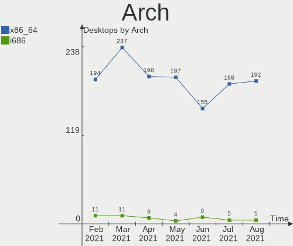
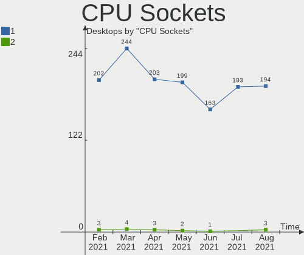
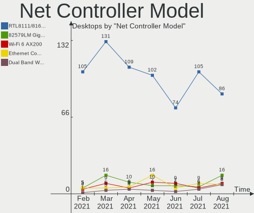
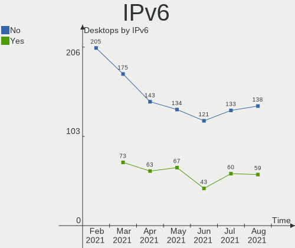
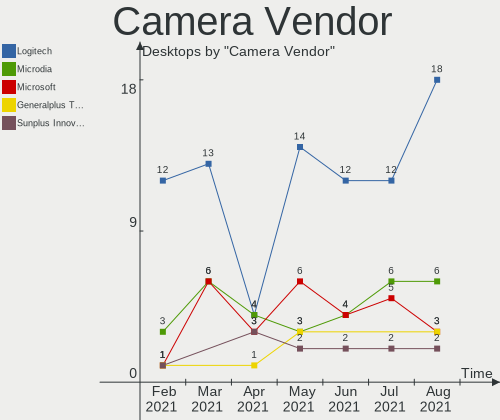
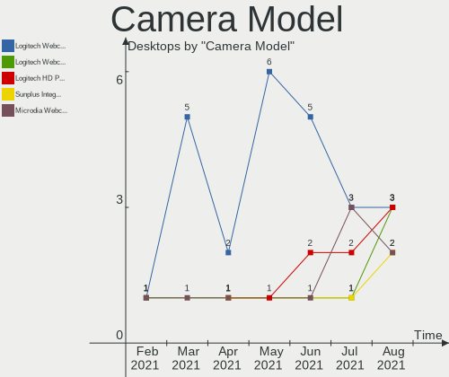
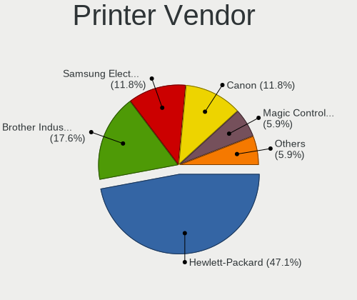
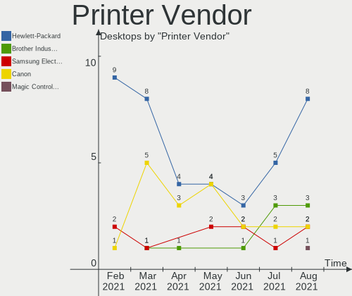
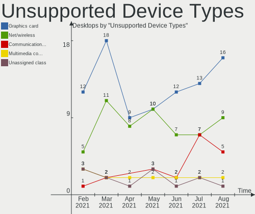

Mint Hardware Trends (Desktop)
------------------------------

A project to identify most popular hardware characteristics and track their change
over time based on data collected by Mint users at https://Linux-Hardware.org.

Anyone can contribute to the study by uploading probes of their computers by
the [hw-probe](https://github.com/linuxhw/hw-probe) tool:

    sudo -E hw-probe -all -upload

Full-feature report is available here: https://linux-hardware.org/?view=trends&formfactor=desktop

Period: Apr, 2021.

Contents
--------

- [ OS                       ](#os)
- [ OS Family                ](#os-family)
- [ Kernel                   ](#kernel)
- [ Kernel Family            ](#kernel-family)
- [ Kernel Major Ver.        ](#kernel-major-ver)
- [ Arch                     ](#arch)
- [ DE                       ](#de)
- [ Display Server           ](#display-server)
- [ Display Manager          ](#display-manager)
- [ OS Lang                  ](#os-lang)
- [ Boot Mode                ](#boot-mode)
- [ Filesystem               ](#filesystem)
- [ Part. scheme             ](#part-scheme)
- [ Dual Boot with Linux/BSD ](#dual-boot-with-linux/bsd)
- [ Dual Boot (Win)          ](#dual-boot-win)
- [ Country                  ](#country)
- [ City                     ](#city)
- [ Vendor                   ](#vendor)
- [ Model                    ](#model)
- [ Model Family             ](#model-family)
- [ MFG Year                 ](#mfg-year)
- [ Form Factor              ](#form-factor)
- [ Secure Boot              ](#secure-boot)
- [ Coreboot                 ](#coreboot)
- [ RAM Size                 ](#ram-size)
- [ RAM Used                 ](#ram-used)
- [ Has CD-ROM               ](#has-cd-rom)
- [ Total Drives             ](#total-drives)
- [ Has Ethernet             ](#has-ethernet)
- [ Has WiFi                 ](#has-wifi)
- [ Has Bluetooth            ](#has-bluetooth)
- [ Drive Vendor             ](#drive-vendor)
- [ Drive Model              ](#drive-model)
- [ HDD Vendor               ](#hdd-vendor)
- [ SSD Vendor               ](#ssd-vendor)
- [ Drive Kind               ](#drive-kind)
- [ Drive Connector          ](#drive-connector)
- [ Drive Size               ](#drive-size)
- [ Space Total              ](#space-total)
- [ Space Used               ](#space-used)
- [ Malfunc. Drives          ](#malfunc-drives)
- [ Malfunc. Drive Vendor    ](#malfunc-drive-vendor)
- [ Malfunc. HDD Vendor      ](#malfunc-hdd-vendor)
- [ Malfunc. Drive Kind      ](#malfunc-drive-kind)
- [ Failed Drives            ](#failed-drives)
- [ Failed Drive Vendor      ](#failed-drive-vendor)
- [ Drive Status             ](#drive-status)
- [ Storage Vendor           ](#storage-vendor)
- [ Storage Model            ](#storage-model)
- [ Storage Kind             ](#storage-kind)
- [ CPU Vendor               ](#cpu-vendor)
- [ CPU Model                ](#cpu-model)
- [ CPU Model Family         ](#cpu-model-family)
- [ CPU Cores                ](#cpu-cores)
- [ CPU Sockets              ](#cpu-sockets)
- [ CPU Threads              ](#cpu-threads)
- [ CPU Op-Modes             ](#cpu-op-modes)
- [ CPU Microcode            ](#cpu-microcode)
- [ CPU Microarch            ](#cpu-microarch)
- [ GPU Vendor               ](#gpu-vendor)
- [ GPU Model                ](#gpu-model)
- [ GPU Combo                ](#gpu-combo)
- [ GPU Driver               ](#gpu-driver)
- [ GPU Memory               ](#gpu-memory)
- [ Monitor Vendor           ](#monitor-vendor)
- [ Monitor Model            ](#monitor-model)
- [ Monitor Resolution       ](#monitor-resolution)
- [ Monitor Diagonal         ](#monitor-diagonal)
- [ Monitor Width            ](#monitor-width)
- [ Aspect Ratio             ](#aspect-ratio)
- [ Monitor Area             ](#monitor-area)
- [ Pixel Density            ](#pixel-density)
- [ Multiple Monitors        ](#multiple-monitors)
- [ Net Controller Vendor    ](#net-controller-vendor)
- [ Net Controller Model     ](#net-controller-model)
- [ Wireless Vendor          ](#wireless-vendor)
- [ Wireless Model           ](#wireless-model)
- [ Ethernet Vendor          ](#ethernet-vendor)
- [ Ethernet Model           ](#ethernet-model)
- [ Net Controller Kind      ](#net-controller-kind)
- [ Used Controller          ](#used-controller)
- [ NICs                     ](#nics)
- [ IPv6                     ](#ipv6)
- [ Memory Vendor            ](#memory-vendor)
- [ Memory Model             ](#memory-model)
- [ Memory Kind              ](#memory-kind)
- [ Memory Form Factor       ](#memory-form-factor)
- [ Memory Size              ](#memory-size)
- [ Memory Speed             ](#memory-speed)
- [ Sound Vendor             ](#sound-vendor)
- [ Sound Model              ](#sound-model)
- [ Camera Vendor            ](#camera-vendor)
- [ Camera Model             ](#camera-model)
- [ Fingerprint Vendor       ](#fingerprint-vendor)
- [ Fingerprint Model        ](#fingerprint-model)
- [ Chipcard Vendor          ](#chipcard-vendor)
- [ Chipcard Model           ](#chipcard-model)
- [ Printer Vendor           ](#printer-vendor)
- [ Printer Model            ](#printer-model)
- [ Scanner Vendor           ](#scanner-vendor)
- [ Scanner Model            ](#scanner-model)
- [ Bluetooth Vendor         ](#bluetooth-vendor)
- [ Bluetooth Model          ](#bluetooth-model)
- [ Unsupported Devices      ](#unsupported-devices)
- [ Unsupported Device Types ](#unsupported-device-types)

OS
--

Installed operating systems

| Name      | Desktops | Percent |
|-----------|----------|---------|
| Mint 20.1 | 145      | 70.39%  |
| Mint 19.3 | 28       | 13.59%  |
| Mint 20   | 21       | 10.19%  |
| Mint 19.1 | 6        | 2.91%   |
| Mint 18.3 | 3        | 1.46%   |
| Mint 19.2 | 2        | 0.97%   |
| Mint 18.2 | 1        | 0.49%   |

OS Family
---------

OS without a version

| Name | Desktops | Percent |
|------|----------|---------|
| Mint | 206      | 100%    |

Kernel
------

Version of the Linux kernel

| Version                    | Desktops | Percent |
|----------------------------|----------|---------|
| 5.4.0-72-generic           | 66       | 32.04%  |
| 5.4.0-70-generic           | 65       | 31.55%  |
| 5.4.0-71-generic           | 15       | 7.28%   |
| 5.4.0-58-generic           | 12       | 5.83%   |
| 5.8.0-48-generic           | 7        | 3.4%    |
| 5.4.0-66-generic           | 5        | 2.43%   |
| 4.15.0-140-generic         | 5        | 2.43%   |
| 4.15.0-142-generic         | 3        | 1.46%   |
| 5.4.0-67-generic           | 2        | 0.97%   |
| 5.4.0-62-generic           | 2        | 0.97%   |
| 5.4.0-26-generic           | 2        | 0.97%   |
| 4.15.0-141-generic         | 2        | 0.97%   |
| 5.8.18-050818-generic      | 1        | 0.49%   |
| 5.8.0-50-generic           | 1        | 0.49%   |
| 5.8.0-49-generic           | 1        | 0.49%   |
| 5.4.0-64-generic           | 1        | 0.49%   |
| 5.4.0-56-generic           | 1        | 0.49%   |
| 5.4.0-54-generic           | 1        | 0.49%   |
| 5.4.0-39-generic           | 1        | 0.49%   |
| 5.4.0-1035-oracle          | 1        | 0.49%   |
| 5.3.0-40-generic           | 1        | 0.49%   |
| 5.11.11-051111-generic     | 1        | 0.49%   |
| 5.11.0-11.1-liquorix-amd64 | 1        | 0.49%   |
| 5.11.0-051100-generic      | 1        | 0.49%   |
| 5.0.0-32-generic           | 1        | 0.49%   |
| 4.15.0-20-generic          | 1        | 0.49%   |
| 4.15.0-139-generic         | 1        | 0.49%   |
| 4.15.0-136-generic         | 1        | 0.49%   |
| 4.15.0-135-generic         | 1        | 0.49%   |
| 4.15.0-132-generic         | 1        | 0.49%   |
| 4.15.0-109-generic         | 1        | 0.49%   |
| 4.10.0-38-generic          | 1        | 0.49%   |

Kernel Family
-------------

Linux kernel without a distro release

| Version | Desktops | Percent |
|---------|----------|---------|
| 5.4.0   | 174      | 84.47%  |
| 4.15.0  | 16       | 7.77%   |
| 5.8.0   | 9        | 4.37%   |
| 5.11.0  | 2        | 0.97%   |
| 5.8.18  | 1        | 0.49%   |
| 5.3.0   | 1        | 0.49%   |
| 5.11.11 | 1        | 0.49%   |
| 5.0.0   | 1        | 0.49%   |
| 4.10.0  | 1        | 0.49%   |

Kernel Major Ver.
-----------------

Linux kernel major version

| Version | Desktops | Percent |
|---------|----------|---------|
| 5.4     | 174      | 84.47%  |
| 4.15    | 16       | 7.77%   |
| 5.8     | 10       | 4.85%   |
| 5.11    | 3        | 1.46%   |
| 5.3     | 1        | 0.49%   |
| 5.0     | 1        | 0.49%   |
| 4.10    | 1        | 0.49%   |

Arch
----

OS architecture (x86_64, i586, etc.)

| Name   | Desktops | Percent |
|--------|----------|---------|
| x86_64 | 198      | 96.12%  |
| i686   | 8        | 3.88%   |

DE
--

Desktop Environment

| Name       | Desktops | Percent |
|------------|----------|---------|
| X-Cinnamon | 140      | 67.96%  |
| MATE       | 30       | 14.56%  |
| XFCE       | 19       | 9.22%   |
| Unknown    | 7        | 3.4%    |
| Cinnamon   | 6        | 2.91%   |
| GNOME      | 2        | 0.97%   |
| KDE        | 1        | 0.49%   |
| i3         | 1        | 0.49%   |

Display Server
--------------

X11 or Wayland

| Name | Desktops | Percent |
|------|----------|---------|
| X11  | 206      | 100%    |

Display Manager
---------------

SDDM, LightDM, etc.

| Name    | Desktops | Percent |
|---------|----------|---------|
| Unknown | 155      | 75.24%  |
| TDM     | 50       | 24.27%  |
| MDM     | 1        | 0.49%   |

OS Lang
-------

Language

| Lang    | Desktops | Percent |
|---------|----------|---------|
| en_US   | 62       | 30.1%   |
| de_DE   | 32       | 15.53%  |
| pt_BR   | 23       | 11.17%  |
| fr_FR   | 10       | 4.85%   |
| en_CA   | 8        | 3.88%   |
| pl_PL   | 6        | 2.91%   |
| ru_RU   | 5        | 2.43%   |
| es_ES   | 5        | 2.43%   |
| en_GB   | 5        | 2.43%   |
| C       | 5        | 2.43%   |
| de_AT   | 4        | 1.94%   |
| Unknown | 4        | 1.94%   |
| nl_NL   | 3        | 1.46%   |
| it_IT   | 3        | 1.46%   |
| es_AR   | 3        | 1.46%   |
| ru_UA   | 2        | 0.97%   |
| pt_PT   | 2        | 0.97%   |
| fi_FI   | 2        | 0.97%   |
| es_PE   | 2        | 0.97%   |
| es_CU   | 2        | 0.97%   |
| en_ZA   | 2        | 0.97%   |
| en_IN   | 2        | 0.97%   |
| en_AU   | 2        | 0.97%   |
| uk_UA   | 1        | 0.49%   |
| sk_SK   | 1        | 0.49%   |
| ka_GE   | 1        | 0.49%   |
| ja_JP   | 1        | 0.49%   |
| he_IL   | 1        | 0.49%   |
| fr_BE   | 1        | 0.49%   |
| es_CO   | 1        | 0.49%   |
| es_CL   | 1        | 0.49%   |
| en_NZ   | 1        | 0.49%   |
| da_DK   | 1        | 0.49%   |
| cs_CZ   | 1        | 0.49%   |
| bg_BG   | 1        | 0.49%   |

Boot Mode
---------

EFI or BIOS

| Mode | Desktops | Percent |
|------|----------|---------|
| BIOS | 134      | 65.05%  |
| EFI  | 72       | 34.95%  |

Filesystem
----------

Type of filesystem

| Type    | Desktops | Percent |
|---------|----------|---------|
| Ext4    | 187      | 90.78%  |
| Btrfs   | 11       | 5.34%   |
| Overlay | 7        | 3.4%    |
| Ext3    | 1        | 0.49%   |

Part. scheme
------------

Scheme of partitioning

| Type    | Desktops | Percent |
|---------|----------|---------|
| Unknown | 150      | 72.82%  |
| GPT     | 37       | 17.96%  |
| MBR     | 19       | 9.22%   |

Dual Boot with Linux/BSD
------------------------

Hosting more than one Linux/BSD

| Dual boot | Desktops | Percent |
|-----------|----------|---------|
| No        | 186      | 90.29%  |
| Yes       | 20       | 9.71%   |

Dual Boot (Win)
---------------

Hosting Linux and Windows

| Dual boot | Desktops | Percent |
|-----------|----------|---------|
| No        | 182      | 88.35%  |
| Yes       | 24       | 11.65%  |

Country
-------

Geographic location (country)

| Country             | Desktops | Percent |
|---------------------|----------|---------|
| USA                 | 37       | 17.96%  |
| Germany             | 34       | 16.5%   |
| Brazil              | 28       | 13.59%  |
| France              | 10       | 4.85%   |
| Russia              | 8        | 3.88%   |
| Canada              | 8        | 3.88%   |
| Poland              | 6        | 2.91%   |
| UK                  | 5        | 2.43%   |
| Spain               | 5        | 2.43%   |
| Austria             | 5        | 2.43%   |
| Ukraine             | 4        | 1.94%   |
| Netherlands         | 4        | 1.94%   |
| Italy               | 3        | 1.46%   |
| India               | 3        | 1.46%   |
| Belarus             | 3        | 1.46%   |
| Australia           | 3        | 1.46%   |
| Argentina           | 3        | 1.46%   |
| Switzerland         | 2        | 0.97%   |
| South Africa        | 2        | 0.97%   |
| Portugal            | 2        | 0.97%   |
| Peru                | 2        | 0.97%   |
| Indonesia           | 2        | 0.97%   |
| Finland             | 2        | 0.97%   |
| Denmark             | 2        | 0.97%   |
| Czechia             | 2        | 0.97%   |
| Chile               | 2        | 0.97%   |
| Belgium             | 2        | 0.97%   |
| Turkey              | 1        | 0.49%   |
| Trinidad and Tobago | 1        | 0.49%   |
| Sweden              | 1        | 0.49%   |
| Slovakia            | 1        | 0.49%   |
| Romania             | 1        | 0.49%   |
| Panama              | 1        | 0.49%   |
| New Zealand         | 1        | 0.49%   |
| Malaysia            | 1        | 0.49%   |
| Lithuania           | 1        | 0.49%   |
| Japan               | 1        | 0.49%   |
| Israel              | 1        | 0.49%   |
| Iran                | 1        | 0.49%   |
| Georgia             | 1        | 0.49%   |
| Equatorial Guinea   | 1        | 0.49%   |
| Cuba                | 1        | 0.49%   |
| Colombia            | 1        | 0.49%   |
| Bulgaria            | 1        | 0.49%   |

City
----

Geographic location (city)

| City                  | Desktops | Percent |
|-----------------------|----------|---------|
| Berlin                | 4        | 1.94%   |
| Warsaw                | 3        | 1.46%   |
| Vienna                | 3        | 1.46%   |
| Uba                   | 3        | 1.46%   |
| Moscow                | 3        | 1.46%   |
| Minsk                 | 3        | 1.46%   |
| Toronto               | 2        | 0.97%   |
| São Paulo            | 2        | 0.97%   |
| Rio de Janeiro        | 2        | 0.97%   |
| Poznan                | 2        | 0.97%   |
| Essen                 | 2        | 0.97%   |
| Edmonton              | 2        | 0.97%   |
| Belo Horizonte        | 2        | 0.97%   |
| Amersfoort            | 2        | 0.97%   |
| Zottegem              | 1        | 0.49%   |
| Wroclaw               | 1        | 0.49%   |
| Witten                | 1        | 0.49%   |
| Winter Park           | 1        | 0.49%   |
| Weissenburg in Bayern | 1        | 0.49%   |
| Virginia              | 1        | 0.49%   |
| Vilnius               | 1        | 0.49%   |
| Vigo                  | 1        | 0.49%   |
| Valladolid            | 1        | 0.49%   |
| Tver                  | 1        | 0.49%   |
| Turku                 | 1        | 0.49%   |
| Tucson                | 1        | 0.49%   |
| Tours                 | 1        | 0.49%   |
| Tournai               | 1        | 0.49%   |
| Torquay               | 1        | 0.49%   |
| Torpes                | 1        | 0.49%   |
| Tel Aviv              | 1        | 0.49%   |
| Tehran                | 1        | 0.49%   |
| Tbilisi               | 1        | 0.49%   |
| Tacna                 | 1        | 0.49%   |
| São Luís            | 1        | 0.49%   |
| Sueca                 | 1        | 0.49%   |
| Stockholm             | 1        | 0.49%   |
| St Petersburg         | 1        | 0.49%   |
| Springfield           | 1        | 0.49%   |
| Selkirk               | 1        | 0.49%   |
| Seevetal              | 1        | 0.49%   |
| Seattle               | 1        | 0.49%   |
| Schwetzingen          | 1        | 0.49%   |
| Sarcelles             | 1        | 0.49%   |
| Sao Sebastiao         | 1        | 0.49%   |
| Sao Jeronimo          | 1        | 0.49%   |
| Sanxenxo              | 1        | 0.49%   |
| San Salvador de Jujuy | 1        | 0.49%   |
| San Juan              | 1        | 0.49%   |
| San Antonio           | 1        | 0.49%   |
| Salt Lake City        | 1        | 0.49%   |
| Saint Paul            | 1        | 0.49%   |
| Saeby                 | 1        | 0.49%   |
| Ryazan                | 1        | 0.49%   |
| Rockville             | 1        | 0.49%   |
| Rixheim               | 1        | 0.49%   |
| Regensburg            | 1        | 0.49%   |
| Recklinghausen        | 1        | 0.49%   |
| Québec               | 1        | 0.49%   |
| Prague                | 1        | 0.49%   |

Vendor
------

Motherboard manufacturer

| Name                | Desktops | Percent |
|---------------------|----------|---------|
| ASUSTek Computer    | 46       | 22.33%  |
| Gigabyte Technology | 30       | 14.56%  |
| ASRock              | 29       | 14.08%  |
| MSI                 | 25       | 12.14%  |
| Hewlett-Packard     | 15       | 7.28%   |
| Dell                | 14       | 6.8%    |
| Intel               | 7        | 3.4%    |
| Lenovo              | 5        | 2.43%   |
| ECS                 | 5        | 2.43%   |
| Foxconn             | 4        | 1.94%   |
| Biostar             | 4        | 1.94%   |
| Unknown             | 4        | 1.94%   |
| Positivo            | 2        | 0.97%   |
| Pegatron            | 2        | 0.97%   |
| Medion              | 2        | 0.97%   |
| AMI                 | 2        | 0.97%   |
| TUXEDO              | 1        | 0.49%   |
| TECHNOPC            | 1        | 0.49%   |
| PCWare              | 1        | 0.49%   |
| PCChips             | 1        | 0.49%   |
| Packard Bell        | 1        | 0.49%   |
| OEM                 | 1        | 0.49%   |
| NEC Computers       | 1        | 0.49%   |
| Huanan              | 1        | 0.49%   |
| Google              | 1        | 0.49%   |
| Apple               | 1        | 0.49%   |

Model
-----

Motherboard model

| Name                            | Desktops | Percent |
|---------------------------------|----------|---------|
| Unknown                         | 5        | 2.43%   |
| ASUS All Series                 | 3        | 1.46%   |
| MSI MS-7641                     | 2        | 0.97%   |
| Gigabyte B450M DS3H             | 2        | 0.97%   |
| Dell OptiPlex 9020              | 2        | 0.97%   |
| Dell OptiPlex 3020              | 2        | 0.97%   |
| ASUS PRIME B450M-A              | 2        | 0.97%   |
| ASUS M5A78L-M/USB3              | 2        | 0.97%   |
| ASRock P67 Pro3                 | 2        | 0.97%   |
| ASRock B550M Pro4               | 2        | 0.97%   |
| ASRock B365M Pro4               | 2        | 0.97%   |
| TUXEDO P7xxTM1                  | 1        | 0.49%   |
| TECHNOPC NANO 5                 | 1        | 0.49%   |
| Positivo POS-PIG43BC            | 1        | 0.49%   |
| Positivo POS-EAA75DE            | 1        | 0.49%   |
| Pegatron KJ385AA-ABA a6433w     | 1        | 0.49%   |
| Pegatron 505B Microtower PC     | 1        | 0.49%   |
| PCWare APMCP61-D3               | 1        | 0.49%   |
| PCChips P17G                    | 1        | 0.49%   |
| Packard Bell oneTwo L5861       | 1        | 0.49%   |
| NEC Computers PALOMAR           | 1        | 0.49%   |
| MSI MS-7C96                     | 1        | 0.49%   |
| MSI MS-7C95                     | 1        | 0.49%   |
| MSI MS-7C94                     | 1        | 0.49%   |
| MSI MS-7C84                     | 1        | 0.49%   |
| MSI MS-7C75                     | 1        | 0.49%   |
| MSI MS-7C37                     | 1        | 0.49%   |
| MSI MS-7C02                     | 1        | 0.49%   |
| MSI MS-7B86                     | 1        | 0.49%   |
| MSI MS-7B84                     | 1        | 0.49%   |
| MSI MS-7B79                     | 1        | 0.49%   |
| MSI MS-7B48                     | 1        | 0.49%   |
| MSI MS-7B33                     | 1        | 0.49%   |
| MSI MS-7A38                     | 1        | 0.49%   |
| MSI MS-7A15                     | 1        | 0.49%   |
| MSI MS-7975                     | 1        | 0.49%   |
| MSI MS-7971                     | 1        | 0.49%   |
| MSI MS-7885                     | 1        | 0.49%   |
| MSI MS-7823                     | 1        | 0.49%   |
| MSI MS-7817                     | 1        | 0.49%   |
| MSI MS-7816                     | 1        | 0.49%   |
| MSI MS-7693                     | 1        | 0.49%   |
| MSI MS-7592                     | 1        | 0.49%   |
| MSI 500-189                     | 1        | 0.49%   |
| Medion MS-7797                  | 1        | 0.49%   |
| Medion MS-7713                  | 1        | 0.49%   |
| Lenovo ThinkCentre M92P 3237CG5 | 1        | 0.49%   |
| Lenovo ThinkCentre M92p 32121Z7 | 1        | 0.49%   |
| Lenovo ThinkCentre M90p 3257A8G | 1        | 0.49%   |
| Lenovo ThinkCentre M72z 3548C8U | 1        | 0.49%   |
| Lenovo ThinkCentre M58p 6209AR6 | 1        | 0.49%   |
| Intel MAHOBAY                   | 1        | 0.49%   |
| Intel HM65DESK                  | 1        | 0.49%   |
| Intel H55 INTEL                 | 1        | 0.49%   |
| Intel DQ57TM AAE70931-403       | 1        | 0.49%   |
| Intel DQ45CB AAE30148-302       | 1        | 0.49%   |
| Intel DH77EB AAG39073-305       | 1        | 0.49%   |
| Intel 945GCT-M                  | 1        | 0.49%   |
| Huanan X79-8D VAA31             | 1        | 0.49%   |
| HP Z400 Workstation             | 1        | 0.49%   |

Model Family
------------

Motherboard model prefix

| Name                  | Desktops | Percent |
|-----------------------|----------|---------|
| ASUS PRIME            | 13       | 6.31%   |
| Dell OptiPlex         | 9        | 4.37%   |
| HP Compaq             | 6        | 2.91%   |
| Lenovo ThinkCentre    | 5        | 2.43%   |
| Unknown               | 5        | 2.43%   |
| ASUS M5A78L-M         | 4        | 1.94%   |
| ASUS All              | 3        | 1.46%   |
| ASRock B365M          | 3        | 1.46%   |
| MSI MS-7641           | 2        | 0.97%   |
| HP ProDesk            | 2        | 0.97%   |
| Gigabyte B550         | 2        | 0.97%   |
| Gigabyte B450M        | 2        | 0.97%   |
| Dell Precision        | 2        | 0.97%   |
| ASUS P8H67-M          | 2        | 0.97%   |
| ASUS P8H61-M          | 2        | 0.97%   |
| ASUS P5KPL-AM         | 2        | 0.97%   |
| ASRock P67            | 2        | 0.97%   |
| ASRock B550M          | 2        | 0.97%   |
| TUXEDO P7xxTM1        | 1        | 0.49%   |
| TECHNOPC NANO         | 1        | 0.49%   |
| Positivo POS-PIG43BC  | 1        | 0.49%   |
| Positivo POS-EAA75DE  | 1        | 0.49%   |
| Pegatron KJ385AA-ABA  | 1        | 0.49%   |
| Pegatron 505B         | 1        | 0.49%   |
| PCWare APMCP61-D3     | 1        | 0.49%   |
| PCChips P17G          | 1        | 0.49%   |
| Packard Bell oneTwo   | 1        | 0.49%   |
| NEC Computers PALOMAR | 1        | 0.49%   |
| MSI MS-7C96           | 1        | 0.49%   |
| MSI MS-7C95           | 1        | 0.49%   |
| MSI MS-7C94           | 1        | 0.49%   |
| MSI MS-7C84           | 1        | 0.49%   |
| MSI MS-7C75           | 1        | 0.49%   |
| MSI MS-7C37           | 1        | 0.49%   |
| MSI MS-7C02           | 1        | 0.49%   |
| MSI MS-7B86           | 1        | 0.49%   |
| MSI MS-7B84           | 1        | 0.49%   |
| MSI MS-7B79           | 1        | 0.49%   |
| MSI MS-7B48           | 1        | 0.49%   |
| MSI MS-7B33           | 1        | 0.49%   |
| MSI MS-7A38           | 1        | 0.49%   |
| MSI MS-7A15           | 1        | 0.49%   |
| MSI MS-7975           | 1        | 0.49%   |
| MSI MS-7971           | 1        | 0.49%   |
| MSI MS-7885           | 1        | 0.49%   |
| MSI MS-7823           | 1        | 0.49%   |
| MSI MS-7817           | 1        | 0.49%   |
| MSI MS-7816           | 1        | 0.49%   |
| MSI MS-7693           | 1        | 0.49%   |
| MSI MS-7592           | 1        | 0.49%   |
| MSI 500-189           | 1        | 0.49%   |
| Medion MS-7797        | 1        | 0.49%   |
| Medion MS-7713        | 1        | 0.49%   |
| Intel MAHOBAY         | 1        | 0.49%   |
| Intel HM65DESK        | 1        | 0.49%   |
| Intel H55             | 1        | 0.49%   |
| Intel DQ57TM          | 1        | 0.49%   |
| Intel DQ45CB          | 1        | 0.49%   |
| Intel DH77EB          | 1        | 0.49%   |
| Intel 945GCT-M        | 1        | 0.49%   |

MFG Year
--------

Motherboard manufacture year

| Year | Desktops | Percent |
|------|----------|---------|
| 2019 | 28       | 13.59%  |
| 2020 | 26       | 12.62%  |
| 2013 | 20       | 9.71%   |
| 2015 | 19       | 9.22%   |
| 2010 | 15       | 7.28%   |
| 2018 | 14       | 6.8%    |
| 2011 | 14       | 6.8%    |
| 2014 | 11       | 5.34%   |
| 2012 | 11       | 5.34%   |
| 2009 | 11       | 5.34%   |
| 2008 | 11       | 5.34%   |
| 2016 | 9        | 4.37%   |
| 2021 | 6        | 2.91%   |
| 2017 | 4        | 1.94%   |
| 2007 | 3        | 1.46%   |
| 2006 | 3        | 1.46%   |
| 2003 | 1        | 0.49%   |

Form Factor
-----------

Physical design of the computer

| Name    | Desktops | Percent |
|---------|----------|---------|
| Desktop | 206      | 100%    |

Secure Boot
-----------

Enabled or disabled

| State    | Desktops | Percent |
|----------|----------|---------|
| Disabled | 206      | 100%    |

Coreboot
--------

Have coreboot on board

| Used | Desktops | Percent |
|------|----------|---------|
| No   | 205      | 99.51%  |
| Yes  | 1        | 0.49%   |

RAM Size
--------

Total RAM memory

| Size in GB  | Desktops | Percent |
|-------------|----------|---------|
| 16.01-24.0  | 49       | 23.79%  |
| 3.01-4.0    | 43       | 20.87%  |
| 8.01-16.0   | 40       | 19.42%  |
| 4.01-8.0    | 30       | 14.56%  |
| 32.01-64.0  | 20       | 9.71%   |
| 1.01-2.0    | 9        | 4.37%   |
| 64.01-256.0 | 6        | 2.91%   |
| 24.01-32.0  | 5        | 2.43%   |
| 0.51-1.0    | 3        | 1.46%   |
| 2.01-3.0    | 1        | 0.49%   |

RAM Used
--------

Used RAM memory

| Used GB    | Desktops | Percent |
|------------|----------|---------|
| 1.01-2.0   | 81       | 39.32%  |
| 2.01-3.0   | 50       | 24.27%  |
| 4.01-8.0   | 31       | 15.05%  |
| 3.01-4.0   | 20       | 9.71%   |
| 0.51-1.0   | 15       | 7.28%   |
| 8.01-16.0  | 5        | 2.43%   |
| 0.01-0.5   | 2        | 0.97%   |
| 32.01-64.0 | 1        | 0.49%   |
| 16.01-24.0 | 1        | 0.49%   |

Has CD-ROM
----------

Has CD-ROM on board

| Presented | Desktops | Percent |
|-----------|----------|---------|
| Yes       | 118      | 57.28%  |
| No        | 88       | 42.72%  |

Total Drives
------------

Number of drives on board

| Drives | Desktops | Percent |
|--------|----------|---------|
| 1      | 71       | 34.47%  |
| 2      | 68       | 33.01%  |
| 4      | 28       | 13.59%  |
| 3      | 27       | 13.11%  |
| 5      | 5        | 2.43%   |
| 6      | 4        | 1.94%   |
| 0      | 2        | 0.97%   |
| 7      | 1        | 0.49%   |

Has Ethernet
------------

Has Ethernet on board

| Presented | Desktops | Percent |
|-----------|----------|---------|
| Yes       | 203      | 98.54%  |
| No        | 3        | 1.46%   |

Has WiFi
--------

Has WiFi module

| Presented | Desktops | Percent |
|-----------|----------|---------|
| No        | 122      | 59.22%  |
| Yes       | 84       | 40.78%  |

Has Bluetooth
-------------

Has Bluetooth module

| Presented | Desktops | Percent |
|-----------|----------|---------|
| No        | 153      | 74.27%  |
| Yes       | 53       | 25.73%  |

Drive Vendor
------------

Hard drive vendors

| Vendor                    | Desktops | Drives | Percent |
|---------------------------|----------|--------|---------|
| Seagate                   | 84       | 110    | 22.52%  |
| WDC                       | 76       | 108    | 20.38%  |
| Samsung Electronics       | 47       | 57     | 12.6%   |
| Kingston                  | 22       | 24     | 5.9%    |
| Crucial                   | 20       | 23     | 5.36%   |
| Toshiba                   | 16       | 17     | 4.29%   |
| SanDisk                   | 14       | 14     | 3.75%   |
| Hitachi                   | 14       | 15     | 3.75%   |
| Unknown                   | 7        | 7      | 1.88%   |
| Intel                     | 5        | 5      | 1.34%   |
| A-DATA Technology         | 5        | 6      | 1.34%   |
| OCZ                       | 4        | 4      | 1.07%   |
| MAXTOR                    | 4        | 4      | 1.07%   |
| SPCC                      | 3        | 3      | 0.8%    |
| Patriot                   | 3        | 3      | 0.8%    |
| Intenso                   | 3        | 3      | 0.8%    |
| China                     | 3        | 3      | 0.8%    |
| Transcend                 | 2        | 2      | 0.54%   |
| TO Exter                  | 2        | 2      | 0.54%   |
| SK Hynix                  | 2        | 2      | 0.54%   |
| Silicon Motion            | 2        | 2      | 0.54%   |
| KingSpec                  | 2        | 2      | 0.54%   |
| KingDian                  | 2        | 2      | 0.54%   |
| JMicron                   | 2        | 2      | 0.54%   |
| HGST                      | 2        | 2      | 0.54%   |
| Gigabyte Technology       | 2        | 3      | 0.54%   |
| Fujitsu                   | 2        | 2      | 0.54%   |
| ASMT                      | 2        | 2      | 0.54%   |
| WD MediaMax               | 1        | 2      | 0.27%   |
| Unknown (CF)              | 1        | 1      | 0.27%   |
| Team                      | 1        | 1      | 0.27%   |
| TCSUNBOW                  | 1        | 1      | 0.27%   |
| SYNOLOGY                  | 1        | 1      | 0.27%   |
| Smartbuy                  | 1        | 2      | 0.27%   |
| Realtek                   | 1        | 1      | 0.27%   |
| PNY                       | 1        | 1      | 0.27%   |
| Phison Electronics        | 1        | 1      | 0.27%   |
| Phison                    | 1        | 1      | 0.27%   |
| OWC                       | 1        | 1      | 0.27%   |
| Micron/Crucial Technology | 1        | 1      | 0.27%   |
| Micron Technology         | 1        | 1      | 0.27%   |
| LuminouTek                | 1        | 1      | 0.27%   |
| KIOXIA-EXCERIA            | 1        | 1      | 0.27%   |
| KingFast                  | 1        | 2      | 0.27%   |
| Hewlett-Packard           | 1        | 1      | 0.27%   |
| Corsair                   | 1        | 1      | 0.27%   |
| BLueRay                   | 1        | 1      | 0.27%   |
| ASMT109x                  | 1        | 1      | 0.27%   |
| AMD                       | 1        | 1      | 0.27%   |

Drive Model
-----------

Hard drive models

| Model                                        | Desktops | Percent |
|----------------------------------------------|----------|---------|
| Seagate ST500DM002-1BD142 500GB              | 9        | 2.09%   |
| Toshiba DT01ACA100 1TB                       | 6        | 1.39%   |
| Seagate ST1000DM010-2EP102 1TB               | 6        | 1.39%   |
| Kingston SA400S37240G 240GB SSD              | 6        | 1.39%   |
| WDC WD10EZEX-08WN4A0 1TB                     | 5        | 1.16%   |
| WDC WDS240G2G0A-00JH30 240GB SSD             | 4        | 0.93%   |
| Kingston SA400S37120G 120GB SSD              | 4        | 0.93%   |
| WDC WD10EZRX-00A8LB0 1TB                     | 3        | 0.7%    |
| Unknown SD/MMC/MS PRO 32GB                   | 3        | 0.7%    |
| Seagate ST4000VN008-2DR166 4TB               | 3        | 0.7%    |
| Seagate ST4000DM000-1F2168 4TB               | 3        | 0.7%    |
| Seagate ST2000DM006-2DM164 2TB               | 3        | 0.7%    |
| Seagate Expansion 4TB                        | 3        | 0.7%    |
| SanDisk SSD PLUS 240GB                       | 3        | 0.7%    |
| Samsung SSD 860 QVO 1TB                      | 3        | 0.7%    |
| Samsung SSD 860 EVO 500GB                    | 3        | 0.7%    |
| Samsung SSD 860 EVO 250GB                    | 3        | 0.7%    |
| Samsung SSD 860 EVO 1TB                      | 3        | 0.7%    |
| Samsung SSD 850 EVO 250GB                    | 3        | 0.7%    |
| Samsung NVMe SSD Drive 500GB                 | 3        | 0.7%    |
| Samsung HD322HJ 320GB                        | 3        | 0.7%    |
| Kingston SV300S37A120G 120GB SSD             | 3        | 0.7%    |
| Crucial CT500MX500SSD1 500GB                 | 3        | 0.7%    |
| Crucial CT240BX500SSD1 240GB                 | 3        | 0.7%    |
| Crucial CT1000MX500SSD1 1TB                  | 3        | 0.7%    |
| Crucial CT1000BX500SSD1 1TB                  | 3        | 0.7%    |
| WDC WD5002ABYS-01B1B0 500GB                  | 2        | 0.46%   |
| WDC WD40EZRZ-00GXCB0 4TB                     | 2        | 0.46%   |
| WDC WD4000FYYZ-01UL1B1 4TB                   | 2        | 0.46%   |
| WDC WD3200AAJS-56M0A0 320GB                  | 2        | 0.46%   |
| WDC WD20EARX-00PASB0 2TB                     | 2        | 0.46%   |
| WDC WD10EZEX-22MFCA0 1TB                     | 2        | 0.46%   |
| WDC WD10EZEX-00BN5A0 1TB                     | 2        | 0.46%   |
| Toshiba MQ01ABD100 1TB                       | 2        | 0.46%   |
| TO Exter nal USB 3.0 160GB                   | 2        | 0.46%   |
| Seagate ST500LM012 HN-M500MBB 500GB          | 2        | 0.46%   |
| Seagate ST4000DM004-2CV104 4TB               | 2        | 0.46%   |
| Seagate ST3500418AS 500GB                    | 2        | 0.46%   |
| Seagate ST3320820AS 320GB                    | 2        | 0.46%   |
| Seagate ST31500341AS 1TB                     | 2        | 0.46%   |
| Seagate ST31000528AS 1TB                     | 2        | 0.46%   |
| Seagate ST2000DX002-2DV164 2TB               | 2        | 0.46%   |
| Seagate ST2000DX001-1NS164 2TB               | 2        | 0.46%   |
| Seagate ST2000DM001-1ER164 2TB               | 2        | 0.46%   |
| Seagate ST2000DL003-9VT166 2TB               | 2        | 0.46%   |
| Seagate ST1000DM003-1ER162 1TB               | 2        | 0.46%   |
| Seagate NVMe SSD Drive 500GB                 | 2        | 0.46%   |
| Seagate BarraCuda 120 SSD ZA500CM10003 500GB | 2        | 0.46%   |
| SanDisk SDSSDA240G 240GB                     | 2        | 0.46%   |
| Samsung SSD 870 QVO 1TB                      | 2        | 0.46%   |
| Samsung SSD 850 EVO 500GB                    | 2        | 0.46%   |
| Samsung SSD 840 EVO 250GB                    | 2        | 0.46%   |
| Samsung HD161HJ 160GB                        | 2        | 0.46%   |
| Patriot Burst 240GB SSD                      | 2        | 0.46%   |
| MAXTOR STM3250310AS 250GB                    | 2        | 0.46%   |
| MAXTOR STM3160215AS 160GB                    | 2        | 0.46%   |
| Kingston SV300S37A240G 240GB SSD             | 2        | 0.46%   |
| Kingston NVMe SSD Drive 1TB                  | 2        | 0.46%   |
| JMicron Tech 250GB                           | 2        | 0.46%   |
| Hitachi HTS727550A9E364 500GB                | 2        | 0.46%   |

HDD Vendor
----------

Hard disk drive vendors

| Vendor              | Desktops | Drives | Percent |
|---------------------|----------|--------|---------|
| Seagate             | 80       | 100    | 38.1%   |
| WDC                 | 72       | 98     | 34.29%  |
| Toshiba             | 15       | 16     | 7.14%   |
| Hitachi             | 14       | 15     | 6.67%   |
| Samsung Electronics | 13       | 14     | 6.19%   |
| MAXTOR              | 4        | 4      | 1.9%    |
| TO Exter            | 2        | 2      | 0.95%   |
| HGST                | 2        | 2      | 0.95%   |
| Fujitsu             | 2        | 2      | 0.95%   |
| WD MediaMax         | 1        | 2      | 0.48%   |
| Unknown             | 1        | 1      | 0.48%   |
| SYNOLOGY            | 1        | 1      | 0.48%   |
| Intenso             | 1        | 1      | 0.48%   |
| ASMT109x            | 1        | 1      | 0.48%   |
| ASMT                | 1        | 1      | 0.48%   |

SSD Vendor
----------

Solid state drive vendors

| Vendor              | Desktops | Drives | Percent |
|---------------------|----------|--------|---------|
| Samsung Electronics | 25       | 32     | 18.38%  |
| Crucial             | 20       | 23     | 14.71%  |
| Kingston            | 18       | 20     | 13.24%  |
| SanDisk             | 13       | 13     | 9.56%   |
| WDC                 | 9        | 10     | 6.62%   |
| A-DATA Technology   | 5        | 5      | 3.68%   |
| OCZ                 | 4        | 4      | 2.94%   |
| Intel               | 4        | 4      | 2.94%   |
| SPCC                | 3        | 3      | 2.21%   |
| Seagate             | 3        | 3      | 2.21%   |
| Patriot             | 3        | 3      | 2.21%   |
| China               | 3        | 3      | 2.21%   |
| Transcend           | 2        | 2      | 1.47%   |
| KingSpec            | 2        | 2      | 1.47%   |
| KingDian            | 2        | 2      | 1.47%   |
| Intenso             | 2        | 2      | 1.47%   |
| Unknown (CF)        | 1        | 1      | 0.74%   |
| Unknown             | 1        | 1      | 0.74%   |
| Toshiba             | 1        | 1      | 0.74%   |
| Team                | 1        | 1      | 0.74%   |
| TCSUNBOW            | 1        | 1      | 0.74%   |
| Smartbuy            | 1        | 2      | 0.74%   |
| SK Hynix            | 1        | 1      | 0.74%   |
| PNY                 | 1        | 1      | 0.74%   |
| OWC                 | 1        | 1      | 0.74%   |
| Micron Technology   | 1        | 1      | 0.74%   |
| LuminouTek          | 1        | 1      | 0.74%   |
| KIOXIA-EXCERIA      | 1        | 1      | 0.74%   |
| KingFast            | 1        | 1      | 0.74%   |
| Hewlett-Packard     | 1        | 1      | 0.74%   |
| Gigabyte Technology | 1        | 1      | 0.74%   |
| BLueRay             | 1        | 1      | 0.74%   |
| ASMT                | 1        | 1      | 0.74%   |
| AMD                 | 1        | 1      | 0.74%   |

Drive Kind
----------

HDD or SSD

| Kind    | Desktops | Drives | Percent |
|---------|----------|--------|---------|
| HDD     | 158      | 260    | 50.64%  |
| SSD     | 118      | 150    | 37.82%  |
| NVMe    | 25       | 30     | 8.01%   |
| Unknown | 9        | 11     | 2.88%   |
| MMC     | 2        | 2      | 0.64%   |

Drive Connector
---------------

SATA, SAS, NVMe, etc.

| Type | Desktops | Drives | Percent |
|------|----------|--------|---------|
| SATA | 197      | 400    | 81.74%  |
| NVMe | 25       | 29     | 10.37%  |
| SAS  | 17       | 22     | 7.05%   |
| MMC  | 2        | 2      | 0.83%   |

Drive Size
----------

Size of hard drive

| Size in TB | Desktops | Drives | Percent |
|------------|----------|--------|---------|
| 0.01-0.5   | 150      | 230    | 51.55%  |
| 0.51-1.0   | 79       | 100    | 27.15%  |
| 1.01-2.0   | 33       | 44     | 11.34%  |
| 3.01-4.0   | 15       | 20     | 5.15%   |
| 2.01-3.0   | 8        | 10     | 2.75%   |
| 4.01-10.0  | 5        | 5      | 1.72%   |
| 0          | 1        | 1      | 0.34%   |

Space Total
-----------

Amount of disk space available on the file system

| Size in GB     | Desktops | Percent |
|----------------|----------|---------|
| 101-250        | 43       | 20.87%  |
| 501-1000       | 37       | 17.96%  |
| 251-500        | 34       | 16.5%   |
| 1001-2000      | 26       | 12.62%  |
| More than 3000 | 21       | 10.19%  |
| 2001-3000      | 16       | 7.77%   |
| 51-100         | 14       | 6.8%    |
| 1-20           | 7        | 3.4%    |
| 21-50          | 5        | 2.43%   |
| Unknown        | 3        | 1.46%   |

Space Used
----------

Amount of used disk space

| Used GB        | Desktops | Percent |
|----------------|----------|---------|
| 1-20           | 39       | 18.93%  |
| 101-250        | 31       | 15.05%  |
| 21-50          | 30       | 14.56%  |
| 251-500        | 29       | 14.08%  |
| 51-100         | 26       | 12.62%  |
| 501-1000       | 18       | 8.74%   |
| 1001-2000      | 17       | 8.25%   |
| 2001-3000      | 7        | 3.4%    |
| More than 3000 | 6        | 2.91%   |
| Unknown        | 3        | 1.46%   |

Malfunc. Drives
---------------

Drive models with a malfunction

| Model                                          | Desktops | Drives | Percent |
|------------------------------------------------|----------|--------|---------|
| WDC WD5002ABYS-01B1B0 500GB                    | 1        | 1      | 5%      |
| WDC WD5000AAKX-00U6AA0 500GB                   | 1        | 1      | 5%      |
| WDC WD400BD-75JMA0 40GB                        | 1        | 1      | 5%      |
| WDC WD3200AAJS-56M0A0 320GB                    | 1        | 1      | 5%      |
| WDC WD2500BEKT-60A25T1 250GB                   | 1        | 1      | 5%      |
| Toshiba MK1251GSY 120GB                        | 1        | 1      | 5%      |
| Seagate ST500NM0011 500GB                      | 1        | 1      | 5%      |
| Seagate ST500DM002-1BD142 500GB                | 1        | 1      | 5%      |
| Seagate ST4000VN008-2DR166 4TB                 | 1        | 1      | 5%      |
| Seagate ST3500418AS 500GB                      | 1        | 1      | 5%      |
| Seagate ST3320418AS 320GB                      | 1        | 1      | 5%      |
| Seagate ST2000DM001-1CH164 2TB                 | 1        | 1      | 5%      |
| Seagate ST1500DL003-9VT16L 1TB                 | 1        | 1      | 5%      |
| Seagate ST1000DX001-1CM162 1TB                 | 1        | 1      | 5%      |
| Samsung Electronics HD502HI 500GB              | 1        | 1      | 5%      |
| MAXTOR STM3160215AS 160GB                      | 1        | 1      | 5%      |
| Hitachi HUA722010CLA330 43W7633 42C0402IBM 1TB | 1        | 1      | 5%      |
| Hitachi HDS721032CLA362 320GB                  | 1        | 1      | 5%      |
| Crucial CT120BX300SSD1 120GB                   | 1        | 1      | 5%      |
| A-DATA Technology SX910 512GB SSD              | 1        | 1      | 5%      |

Malfunc. Drive Vendor
---------------------

Vendors of faulty drives

| Vendor              | Desktops | Drives | Percent |
|---------------------|----------|--------|---------|
| Seagate             | 7        | 8      | 36.84%  |
| WDC                 | 5        | 5      | 26.32%  |
| Hitachi             | 2        | 2      | 10.53%  |
| Toshiba             | 1        | 1      | 5.26%   |
| Samsung Electronics | 1        | 1      | 5.26%   |
| MAXTOR              | 1        | 1      | 5.26%   |
| Crucial             | 1        | 1      | 5.26%   |
| A-DATA Technology   | 1        | 1      | 5.26%   |

Malfunc. HDD Vendor
-------------------

Vendors of faulty HDD drives

| Vendor              | Desktops | Drives | Percent |
|---------------------|----------|--------|---------|
| Seagate             | 7        | 8      | 41.18%  |
| WDC                 | 5        | 5      | 29.41%  |
| Hitachi             | 2        | 2      | 11.76%  |
| Toshiba             | 1        | 1      | 5.88%   |
| Samsung Electronics | 1        | 1      | 5.88%   |
| MAXTOR              | 1        | 1      | 5.88%   |

Malfunc. Drive Kind
-------------------

Kinds of faulty drives

| Kind | Desktops | Drives | Percent |
|------|----------|--------|---------|
| HDD  | 13       | 18     | 86.67%  |
| SSD  | 2        | 2      | 13.33%  |

Failed Drives
-------------

Failed drive models

Zero info for selected period =(

Failed Drive Vendor
-------------------

Failed drive vendors

Zero info for selected period =(

Drive Status
------------

Number of failed and malfunc. drives

| Status   | Desktops | Drives | Percent |
|----------|----------|--------|---------|
| Detected | 154      | 323    | 70.97%  |
| Works    | 49       | 110    | 22.58%  |
| Malfunc  | 14       | 20     | 6.45%   |

Storage Vendor
--------------

Storage controller vendors

| Vendor                        | Desktops | Percent |
|-------------------------------|----------|---------|
| Intel                         | 124      | 47.69%  |
| AMD                           | 63       | 24.23%  |
| Nvidia                        | 14       | 5.38%   |
| Samsung Electronics           | 10       | 3.85%   |
| Marvell Technology Group      | 10       | 3.85%   |
| ASMedia Technology            | 8        | 3.08%   |
| JMicron Technology            | 7        | 2.69%   |
| VIA Technologies              | 4        | 1.54%   |
| Phison Electronics            | 4        | 1.54%   |
| Kingston Technology Company   | 4        | 1.54%   |
| Silicon Motion                | 2        | 0.77%   |
| Seagate Technology            | 2        | 0.77%   |
| SK Hynix                      | 1        | 0.38%   |
| Silicon Image                 | 1        | 0.38%   |
| Sandisk                       | 1        | 0.38%   |
| Micron/Crucial Technology     | 1        | 0.38%   |
| Integrated Technology Express | 1        | 0.38%   |
| Broadcom / LSI                | 1        | 0.38%   |
| ADATA Technology              | 1        | 0.38%   |
| Adaptec                       | 1        | 0.38%   |

Storage Model
-------------

Storage controller models

| Model                                                                                   | Desktops | Percent |
|-----------------------------------------------------------------------------------------|----------|---------|
| AMD FCH SATA Controller [AHCI mode]                                                     | 32       | 9.07%   |
| Intel 8 Series/C220 Series Chipset Family 6-port SATA Controller 1 [AHCI mode]          | 19       | 5.38%   |
| AMD 400 Series Chipset SATA Controller                                                  | 14       | 3.97%   |
| AMD SB7x0/SB8x0/SB9x0 IDE Controller                                                    | 13       | 3.68%   |
| Intel NM10/ICH7 Family SATA Controller [IDE mode]                                       | 12       | 3.4%    |
| Intel 82801G (ICH7 Family) IDE Controller                                               | 11       | 3.12%   |
| Intel 6 Series/C200 Series Chipset Family 6 port Desktop SATA AHCI Controller           | 11       | 3.12%   |
| Nvidia MCP61 SATA Controller                                                            | 10       | 2.83%   |
| Samsung NVMe SSD Controller SM981/PM981/PM983                                           | 9        | 2.55%   |
| Intel 200 Series PCH SATA controller [AHCI mode]                                        | 9        | 2.55%   |
| AMD SB7x0/SB8x0/SB9x0 SATA Controller [IDE mode]                                        | 9        | 2.55%   |
| AMD SB7x0/SB8x0/SB9x0 SATA Controller [AHCI mode]                                       | 9        | 2.55%   |
| Nvidia MCP61 IDE                                                                        | 8        | 2.27%   |
| Intel SATA Controller [RAID mode]                                                       | 8        | 2.27%   |
| Intel 7 Series/C210 Series Chipset Family 6-port SATA Controller [AHCI mode]            | 8        | 2.27%   |
| Intel 6 Series/C200 Series Chipset Family Desktop SATA Controller (IDE mode, ports 4-5) | 8        | 2.27%   |
| Intel 6 Series/C200 Series Chipset Family Desktop SATA Controller (IDE mode, ports 0-3) | 8        | 2.27%   |
| AMD Starship/Matisse Chipset SATA Controller [AHCI mode]                                | 8        | 2.27%   |
| ASMedia ASM1062 Serial ATA Controller                                                   | 7        | 1.98%   |
| Intel Q170/Q150/B150/H170/H110/Z170/CM236 Chipset SATA Controller [AHCI Mode]           | 6        | 1.7%    |
| Intel Cannon Lake PCH SATA AHCI Controller                                              | 5        | 1.42%   |
| Intel 4 Series Chipset PT IDER Controller                                               | 5        | 1.42%   |
| AMD FCH SATA Controller [IDE mode]                                                      | 5        | 1.42%   |
| Kingston Company A2000 NVMe SSD                                                         | 4        | 1.13%   |
| JMicron JMB368 IDE controller                                                           | 4        | 1.13%   |
| AMD FCH SATA Controller D                                                               | 4        | 1.13%   |
| VIA VT82C586A/B/VT82C686/A/B/VT823x/A/C PIPC Bus Master IDE                             | 3        | 0.85%   |
| JMicron JMB363 SATA/IDE Controller                                                      | 3        | 0.85%   |
| Intel 9 Series Chipset Family SATA Controller [AHCI Mode]                               | 3        | 0.85%   |
| Intel 82801JI (ICH10 Family) 4 port SATA IDE Controller #1                              | 3        | 0.85%   |
| Intel 82801JI (ICH10 Family) 2 port SATA IDE Controller #2                              | 3        | 0.85%   |
| Intel 82801IR/IO/IH (ICH9R/DO/DH) 6 port SATA Controller [AHCI mode]                    | 3        | 0.85%   |
| Intel 82801I (ICH9 Family) 2 port SATA Controller [IDE mode]                            | 3        | 0.85%   |
| Intel 5 Series/3400 Series Chipset 6 port SATA AHCI Controller                          | 3        | 0.85%   |
| VIA VIA VT6420 SATA RAID Controller                                                     | 2        | 0.57%   |
| Silicon Motion SM2263EN/SM2263XT SSD Controller                                         | 2        | 0.57%   |
| Seagate FireCuda 510 SSD                                                                | 2        | 0.57%   |
| Phison E16 PCIe4 NVMe Controller                                                        | 2        | 0.57%   |
| Phison E12 NVMe Controller                                                              | 2        | 0.57%   |
| Nvidia CK804 Serial ATA Controller                                                      | 2        | 0.57%   |
| Marvell Group 88SE9215 PCIe 2.0 x1 4-port SATA 6 Gb/s Controller                        | 2        | 0.57%   |
| Marvell Group 88SE6111/6121 SATA II / PATA Controller                                   | 2        | 0.57%   |
| Intel Comet Lake SATA AHCI Controller                                                   | 2        | 0.57%   |
| Intel C600/X79 series chipset 6-Port SATA AHCI Controller                               | 2        | 0.57%   |
| Intel 82Q35 Express PT IDER Controller                                                  | 2        | 0.57%   |
| Intel 82801JD/DO (ICH10 Family) SATA AHCI Controller                                    | 2        | 0.57%   |
| Intel 82801JD/DO (ICH10 Family) 4-port SATA IDE Controller                              | 2        | 0.57%   |
| Intel 82801JD/DO (ICH10 Family) 2-port SATA IDE Controller                              | 2        | 0.57%   |
| Intel 82801IB (ICH9) 2 port SATA Controller [IDE mode]                                  | 2        | 0.57%   |
| Intel 82801EB/ER (ICH5/ICH5R) IDE Controller                                            | 2        | 0.57%   |
| Intel 631xESB/632xESB IDE Controller                                                    | 2        | 0.57%   |
| Intel 5 Series/3400 Series Chipset PT IDER Controller                                   | 2        | 0.57%   |
| Intel 5 Series/3400 Series Chipset 4 port SATA IDE Controller                           | 2        | 0.57%   |
| Intel 5 Series/3400 Series Chipset 2 port SATA IDE Controller                           | 2        | 0.57%   |
| AMD 300 Series Chipset SATA Controller                                                  | 2        | 0.57%   |
| VIA VT8237A SATA 2-Port Controller                                                      | 1        | 0.28%   |
| VIA VT6415 PATA IDE Host Controller                                                     | 1        | 0.28%   |
| SK Hynix BC511                                                                          | 1        | 0.28%   |
| Silicon Image SiI 3132 Serial ATA Raid II Controller                                    | 1        | 0.28%   |
| Sandisk WD Black SN750 / PC SN730 NVMe SSD                                              | 1        | 0.28%   |

Storage Kind
------------

Kind of storage controller (IDE, SATA, NVMe, SAS, ...)

| Kind | Desktops | Percent |
|------|----------|---------|
| SATA | 146      | 56.15%  |
| IDE  | 76       | 29.23%  |
| NVMe | 25       | 9.62%   |
| RAID | 11       | 4.23%   |
| SCSI | 2        | 0.77%   |

CPU Vendor
----------

Processor vendors

| Vendor | Desktops | Percent |
|--------|----------|---------|
| Intel  | 129      | 62.62%  |
| AMD    | 77       | 37.38%  |

CPU Model
---------

Processor models

| Model                                       | Desktops | Percent |
|---------------------------------------------|----------|---------|
| Intel Core 2 Duo CPU E8400 @ 3.00GHz        | 5        | 2.43%   |
| AMD Ryzen 9 3900X 12-Core Processor         | 4        | 1.94%   |
| AMD Ryzen 5 3600 6-Core Processor           | 4        | 1.94%   |
| AMD Ryzen 5 3400G with Radeon Vega Graphics | 4        | 1.94%   |
| Intel Core i7-8700 CPU @ 3.20GHz            | 3        | 1.46%   |
| Intel Core i5-2500 CPU @ 3.30GHz            | 3        | 1.46%   |
| Intel Core i3-4170 CPU @ 3.70GHz            | 3        | 1.46%   |
| Intel Core i3-2120 CPU @ 3.30GHz            | 3        | 1.46%   |
| AMD FX-6300 Six-Core Processor              | 3        | 1.46%   |
| AMD FX-4300 Quad-Core Processor             | 3        | 1.46%   |
| AMD Athlon 64 X2 Dual Core Processor 4200+  | 3        | 1.46%   |
| Intel Xeon CPU X5482 @ 3.20GHz              | 2        | 0.97%   |
| Intel Xeon CPU E5-2690 0 @ 2.90GHz          | 2        | 0.97%   |
| Intel Pentium Dual-Core CPU E5800 @ 3.20GHz | 2        | 0.97%   |
| Intel Pentium Dual CPU E2160 @ 1.80GHz      | 2        | 0.97%   |
| Intel Pentium CPU G3220 @ 3.00GHz           | 2        | 0.97%   |
| Intel Core i7-4790 CPU @ 3.60GHz            | 2        | 0.97%   |
| Intel Core i7-2600 CPU @ 3.40GHz            | 2        | 0.97%   |
| Intel Core i5-6400 CPU @ 2.70GHz            | 2        | 0.97%   |
| Intel Core i5-4590 CPU @ 3.30GHz            | 2        | 0.97%   |
| Intel Core i5-4570 CPU @ 3.20GHz            | 2        | 0.97%   |
| Intel Core i5-3470 CPU @ 3.20GHz            | 2        | 0.97%   |
| Intel Core i5-2500K CPU @ 3.30GHz           | 2        | 0.97%   |
| Intel Core i5 CPU 760 @ 2.80GHz             | 2        | 0.97%   |
| Intel Core i5 CPU 650 @ 3.20GHz             | 2        | 0.97%   |
| Intel Core i3-4130 CPU @ 3.40GHz            | 2        | 0.97%   |
| Intel Core i3-3220 CPU @ 3.30GHz            | 2        | 0.97%   |
| Intel Core 2 Quad CPU Q8400 @ 2.66GHz       | 2        | 0.97%   |
| Intel Core 2 Duo CPU E7500 @ 2.93GHz        | 2        | 0.97%   |
| AMD Ryzen 7 3700X 8-Core Processor          | 2        | 0.97%   |
| AMD Ryzen 5 5600X 6-Core Processor          | 2        | 0.97%   |
| AMD Ryzen 5 1600 Six-Core Processor         | 2        | 0.97%   |
| AMD Ryzen 3 2200G with Radeon Vega Graphics | 2        | 0.97%   |
| AMD Phenom II X6 1100T Processor            | 2        | 0.97%   |
| AMD Phenom II X4 945 Processor              | 2        | 0.97%   |
| AMD FX-8350 Eight-Core Processor            | 2        | 0.97%   |
| AMD FX-8320 Eight-Core Processor            | 2        | 0.97%   |
| AMD FX-8150 Eight-Core Processor            | 2        | 0.97%   |
| AMD Athlon II X4 640 Processor              | 2        | 0.97%   |
| AMD Athlon 64 X2 Dual Core Processor 6000+  | 2        | 0.97%   |
| AMD A6-6400K APU with Radeon HD Graphics    | 2        | 0.97%   |
| Intel Xeon CPU W3670 @ 3.20GHz              | 1        | 0.49%   |
| Intel Xeon CPU E31275 @ 3.40GHz             | 1        | 0.49%   |
| Intel Xeon CPU E31245 @ 3.30GHz             | 1        | 0.49%   |
| Intel Pentium Gold G5420 CPU @ 3.80GHz      | 1        | 0.49%   |
| Intel Pentium Gold G5400 CPU @ 3.70GHz      | 1        | 0.49%   |
| Intel Pentium Dual-Core CPU E6600 @ 3.06GHz | 1        | 0.49%   |
| Intel Pentium Dual-Core CPU E5400 @ 2.70GHz | 1        | 0.49%   |
| Intel Pentium Dual-Core CPU E5300 @ 2.60GHz | 1        | 0.49%   |
| Intel Pentium Dual CPU E2180 @ 2.00GHz      | 1        | 0.49%   |
| Intel Pentium CPU G630 @ 2.70GHz            | 1        | 0.49%   |
| Intel Pentium CPU G4560 @ 3.50GHz           | 1        | 0.49%   |
| Intel Pentium CPU G3250 @ 3.20GHz           | 1        | 0.49%   |
| Intel Pentium CPU G2130 @ 3.20GHz           | 1        | 0.49%   |
| Intel Pentium CPU G2030 @ 3.00GHz           | 1        | 0.49%   |
| Intel Pentium 4 CPU 2.80GHz                 | 1        | 0.49%   |
| Intel Pentium 4 CPU 2.40GHz                 | 1        | 0.49%   |
| Intel Core i9-9900KF CPU @ 3.60GHz          | 1        | 0.49%   |
| Intel Core i9-9900K CPU @ 3.60GHz           | 1        | 0.49%   |
| Intel Core i7-9700F CPU @ 3.00GHz           | 1        | 0.49%   |

CPU Model Family
----------------

Processor model prefix

| Model                   | Desktops | Percent |
|-------------------------|----------|---------|
| Intel Core i5           | 38       | 18.45%  |
| Intel Core i7           | 20       | 9.71%   |
| AMD Ryzen 5             | 14       | 6.8%    |
| Intel Core i3           | 13       | 6.31%   |
| AMD FX                  | 13       | 6.31%   |
| Intel Core 2 Duo        | 11       | 5.34%   |
| Intel Celeron           | 8        | 3.88%   |
| Intel Xeon              | 7        | 3.4%    |
| Intel Pentium           | 7        | 3.4%    |
| Intel Core 2 Quad       | 7        | 3.4%    |
| AMD Ryzen 3             | 6        | 2.91%   |
| Intel Pentium Dual-Core | 5        | 2.43%   |
| AMD Ryzen 9             | 5        | 2.43%   |
| AMD Ryzen 7             | 5        | 2.43%   |
| AMD Athlon 64 X2        | 5        | 2.43%   |
| AMD Phenom II X4        | 4        | 1.94%   |
| AMD Athlon              | 4        | 1.94%   |
| Intel Pentium Dual      | 3        | 1.46%   |
| AMD Phenom II X6        | 3        | 1.46%   |
| AMD Athlon II X4        | 3        | 1.46%   |
| AMD A4                  | 3        | 1.46%   |
| Intel Pentium Gold      | 2        | 0.97%   |
| Intel Pentium 4         | 2        | 0.97%   |
| Intel Core i9           | 2        | 0.97%   |
| Intel Core 2            | 2        | 0.97%   |
| Intel Atom              | 2        | 0.97%   |
| AMD A8                  | 2        | 0.97%   |
| AMD A6                  | 2        | 0.97%   |
| Other                   | 1        | 0.49%   |
| AMD Ryzen 7 PRO         | 1        | 0.49%   |
| AMD Ryzen 5 PRO         | 1        | 0.49%   |
| AMD Quad-Core Opteron   | 1        | 0.49%   |
| AMD Phenom              | 1        | 0.49%   |
| AMD Athlon X4           | 1        | 0.49%   |
| AMD Athlon 64           | 1        | 0.49%   |
| AMD A10                 | 1        | 0.49%   |

CPU Cores
---------

Number of processor cores

| Number | Desktops | Percent |
|--------|----------|---------|
| 4      | 79       | 38.35%  |
| 2      | 70       | 33.98%  |
| 6      | 23       | 11.17%  |
| 8      | 14       | 6.8%    |
| 1      | 10       | 4.85%   |
| 12     | 5        | 2.43%   |
| 3      | 4        | 1.94%   |
| 16     | 1        | 0.49%   |

CPU Sockets
-----------

Number of sockets

| Number | Desktops | Percent |
|--------|----------|---------|
| 1      | 203      | 98.54%  |
| 2      | 3        | 1.46%   |

CPU Threads
-----------

Threads per core (Hyper-Threading)

| Number | Desktops | Percent |
|--------|----------|---------|
| 1      | 111      | 53.88%  |
| 2      | 95       | 46.12%  |

CPU Op-Modes
------------

CPU Operation Modes (32-bit, 64-bit)

| Op mode        | Desktops | Percent |
|----------------|----------|---------|
| 32-bit, 64-bit | 201      | 97.57%  |
| 32-bit         | 4        | 1.94%   |
| Unknown        | 1        | 0.49%   |

CPU Microcode
-------------

Microcode number

| Number     | Desktops | Percent |
|------------|----------|---------|
| Unknown    | 22       | 10.68%  |
| 0x306c3    | 21       | 10.19%  |
| 0x1067a    | 18       | 8.74%   |
| 0x206a7    | 17       | 8.25%   |
| 0x306a9    | 12       | 5.83%   |
| 0x08701021 | 11       | 5.34%   |
| 0x06000852 | 8        | 3.88%   |
| 0x906ea    | 7        | 3.4%    |
| 0x506e3    | 6        | 2.91%   |
| 0x08108109 | 6        | 2.91%   |
| 0x06001119 | 6        | 2.91%   |
| 0x6fd      | 5        | 2.43%   |
| 0x10676    | 4        | 1.94%   |
| 0x010000db | 4        | 1.94%   |
| 0x906ed    | 3        | 1.46%   |
| 0x106e5    | 3        | 1.46%   |
| 0x08001138 | 3        | 1.46%   |
| 0x010000c8 | 3        | 1.46%   |
| 0xa0655    | 2        | 0.97%   |
| 0x6f6      | 2        | 0.97%   |
| 0x08701013 | 2        | 0.97%   |
| 0x08600103 | 2        | 0.97%   |
| 0x0810100b | 2        | 0.97%   |
| 0x0800820d | 2        | 0.97%   |
| 0x0700010f | 2        | 0.97%   |
| 0x0600611a | 2        | 0.97%   |
| 0x0600063e | 2        | 0.97%   |
| 0x010000dc | 2        | 0.97%   |
| 0x01000083 | 2        | 0.97%   |
| 0xf49      | 1        | 0.49%   |
| 0xf41      | 1        | 0.49%   |
| 0xf33      | 1        | 0.49%   |
| 0xf27      | 1        | 0.49%   |
| 0x906ec    | 1        | 0.49%   |
| 0x906eb    | 1        | 0.49%   |
| 0x906e9    | 1        | 0.49%   |
| 0x706a1    | 1        | 0.49%   |
| 0x6fb      | 1        | 0.49%   |
| 0x406c4    | 1        | 0.49%   |
| 0x406c3    | 1        | 0.49%   |
| 0x40661    | 1        | 0.49%   |
| 0x40651    | 1        | 0.49%   |
| 0x306f2    | 1        | 0.49%   |
| 0x206d7    | 1        | 0.49%   |
| 0x206c2    | 1        | 0.49%   |
| 0x20655    | 1        | 0.49%   |
| 0x20652    | 1        | 0.49%   |
| 0x0a201009 | 1        | 0.49%   |
| 0x08101016 | 1        | 0.49%   |
| 0x0800820b | 1        | 0.49%   |
| 0x08001137 | 1        | 0.49%   |
| 0x08001136 | 1        | 0.49%   |
| 0x06003106 | 1        | 0.49%   |
| 0x0600081c | 1        | 0.49%   |

CPU Microarch
-------------

Microarchitecture

| Name          | Desktops | Percent |
|---------------|----------|---------|
| Haswell       | 27       | 13.11%  |
| Penryn        | 24       | 11.65%  |
| SandyBridge   | 20       | 9.71%   |
| Piledriver    | 16       | 7.77%   |
| Zen 2         | 15       | 7.28%   |
| KabyLake      | 15       | 7.28%   |
| K10           | 13       | 6.31%   |
| IvyBridge     | 13       | 6.31%   |
| Zen+          | 9        | 4.37%   |
| Zen           | 8        | 3.88%   |
| Core          | 8        | 3.88%   |
| Skylake       | 6        | 2.91%   |
| K8 Hammer     | 6        | 2.91%   |
| NetBurst      | 4        | 1.94%   |
| Nehalem       | 4        | 1.94%   |
| Westmere      | 3        | 1.46%   |
| Bulldozer     | 3        | 1.46%   |
| Zen 3         | 2        | 0.97%   |
| Silvermont    | 2        | 0.97%   |
| Jaguar        | 2        | 0.97%   |
| Excavator     | 2        | 0.97%   |
| CometLake     | 2        | 0.97%   |
| Steamroller   | 1        | 0.49%   |
| Goldmont plus | 1        | 0.49%   |

GPU Vendor
----------

Vendors of graphics cards

| Vendor | Desktops | Percent |
|--------|----------|---------|
| Nvidia | 98       | 44.55%  |
| Intel  | 66       | 30%     |
| AMD    | 56       | 25.45%  |

GPU Model
---------

Graphics card models

| Model                                                                                    | Desktops | Percent |
|------------------------------------------------------------------------------------------|----------|---------|
| Intel Xeon E3-1200 v3/4th Gen Core Processor Integrated Graphics Controller              | 12       | 5.26%   |
| Intel Xeon E3-1200 v2/3rd Gen Core processor Graphics Controller                         | 8        | 3.51%   |
| Intel 2nd Generation Core Processor Family Integrated Graphics Controller                | 8        | 3.51%   |
| Nvidia GM206 [GeForce GTX 960]                                                           | 6        | 2.63%   |
| Nvidia GK208B [GeForce GT 710]                                                           | 6        | 2.63%   |
| AMD Ellesmere [Radeon RX 470/480/570/570X/580/580X/590]                                  | 6        | 2.63%   |
| Nvidia GP107 [GeForce GTX 1050 Ti]                                                       | 5        | 2.19%   |
| Nvidia GF119 [GeForce GT 610]                                                            | 4        | 1.75%   |
| Intel 4th Generation Core Processor Family Integrated Graphics Controller                | 4        | 1.75%   |
| Intel 4 Series Chipset Integrated Graphics Controller                                    | 4        | 1.75%   |
| AMD Picasso                                                                              | 4        | 1.75%   |
| Nvidia GT218 [GeForce 210]                                                               | 3        | 1.32%   |
| Nvidia GT200 [GeForce GTX 260]                                                           | 3        | 1.32%   |
| Nvidia GK104 [GeForce GTX 760]                                                           | 3        | 1.32%   |
| Nvidia G98 [GeForce 8400 GS Rev. 2]                                                      | 3        | 1.32%   |
| Intel HD Graphics 530                                                                    | 3        | 1.32%   |
| Intel CometLake-S GT2 [UHD Graphics 630]                                                 | 3        | 1.32%   |
| Intel CoffeeLake-S GT2 [UHD Graphics 630]                                                | 3        | 1.32%   |
| Intel 82G33/G31 Express Integrated Graphics Controller                                   | 3        | 1.32%   |
| Intel 82945G/GZ Integrated Graphics Controller                                           | 3        | 1.32%   |
| AMD Oland PRO [Radeon R7 240/340]                                                        | 3        | 1.32%   |
| Nvidia TU116 [GeForce GTX 1660 SUPER]                                                    | 2        | 0.88%   |
| Nvidia TU116 [GeForce GTX 1650 SUPER]                                                    | 2        | 0.88%   |
| Nvidia TU104 [GeForce RTX 2070 SUPER]                                                    | 2        | 0.88%   |
| Nvidia TU104 [GeForce RTX 2060]                                                          | 2        | 0.88%   |
| Nvidia GP108 [GeForce GT 1030]                                                           | 2        | 0.88%   |
| Nvidia GP104 [GeForce GTX 1070]                                                          | 2        | 0.88%   |
| Nvidia GP104 [GeForce GTX 1060 6GB]                                                      | 2        | 0.88%   |
| Nvidia GM206 [GeForce GTX 950]                                                           | 2        | 0.88%   |
| Nvidia GM204 [GeForce GTX 970]                                                           | 2        | 0.88%   |
| Nvidia GM107 [GeForce GTX 750]                                                           | 2        | 0.88%   |
| Nvidia GK208B [GeForce GT 730]                                                           | 2        | 0.88%   |
| Nvidia GF108 [GeForce GT 730]                                                            | 2        | 0.88%   |
| Nvidia G96C [GeForce 9500 GT]                                                            | 2        | 0.88%   |
| Nvidia G84GL [Quadro FX 570]                                                             | 2        | 0.88%   |
| Nvidia C61 [GeForce 7025 / nForce 630a]                                                  | 2        | 0.88%   |
| Nvidia C61 [GeForce 6150SE nForce 430]                                                   | 2        | 0.88%   |
| Intel Core Processor Integrated Graphics Controller                                      | 2        | 0.88%   |
| Intel CoffeeLake-S GT1 [UHD Graphics 610]                                                | 2        | 0.88%   |
| Intel Atom/Celeron/Pentium Processor x5-E8000/J3xxx/N3xxx Integrated Graphics Controller | 2        | 0.88%   |
| AMD Turks PRO [Radeon HD 6570/7570/8550 / R5 230]                                        | 2        | 0.88%   |
| AMD Tahiti XT [Radeon HD 7970/8970 OEM / R9 280X]                                        | 2        | 0.88%   |
| AMD Richland [Radeon HD 8470D]                                                           | 2        | 0.88%   |
| AMD Raven Ridge [Radeon Vega Series / Radeon Vega Mobile Series]                         | 2        | 0.88%   |
| AMD Lexa PRO [Radeon 540/540X/550/550X / RX 540X/550/550X]                               | 2        | 0.88%   |
| AMD Cedar [Radeon HD 5000/6000/7350/8350 Series]                                         | 2        | 0.88%   |
| AMD Caicos [Radeon HD 6450/7450/8450 / R5 230 OEM]                                       | 2        | 0.88%   |
| Nvidia TU117 [GeForce GTX 1650]                                                          | 1        | 0.44%   |
| Nvidia TU116 [GeForce GTX 1660 Ti]                                                       | 1        | 0.44%   |
| Nvidia TU106 [GeForce RTX 2060 SUPER]                                                    | 1        | 0.44%   |
| Nvidia NV34 [GeForce FX 5200]                                                            | 1        | 0.44%   |
| Nvidia GT218 [GeForce G210]                                                              | 1        | 0.44%   |
| Nvidia GT218 [GeForce 8400 GS Rev. 3]                                                    | 1        | 0.44%   |
| Nvidia GP107 [GeForce GTX 1050]                                                          | 1        | 0.44%   |
| Nvidia GP106GL [Quadro P2200]                                                            | 1        | 0.44%   |
| Nvidia GP106BM [GeForce GTX 1060 Mobile 6GB]                                             | 1        | 0.44%   |
| Nvidia GP106 [GeForce GTX 1060 6GB]                                                      | 1        | 0.44%   |
| Nvidia GP106 [GeForce GTX 1060 3GB]                                                      | 1        | 0.44%   |
| Nvidia GP104 [GeForce GTX 1080]                                                          | 1        | 0.44%   |
| Nvidia GP102 [GeForce GTX 1080 Ti]                                                       | 1        | 0.44%   |

GPU Combo
---------

Combinations of graphics cards

| Name               | Desktops | Percent |
|--------------------|----------|---------|
| 1 x Nvidia         | 89       | 43.2%   |
| 1 x Intel          | 56       | 27.18%  |
| 1 x AMD            | 49       | 23.79%  |
| 2 x AMD            | 4        | 1.94%   |
| 2 x Nvidia         | 2        | 0.97%   |
| Intel + Nvidia     | 2        | 0.97%   |
| AMD + Nvidia       | 2        | 0.97%   |
| Intel + 2 x Nvidia | 1        | 0.49%   |
| Intel + AMD        | 1        | 0.49%   |

GPU Driver
----------

Free vs proprietary

| Driver      | Desktops | Percent |
|-------------|----------|---------|
| Free        | 136      | 66.02%  |
| Proprietary | 64       | 31.07%  |
| Unknown     | 6        | 2.91%   |

GPU Memory
----------

Total video memory

| Size in GB | Desktops | Percent |
|------------|----------|---------|
| Unknown    | 63       | 30.58%  |
| 1.01-2.0   | 38       | 18.45%  |
| 0.51-1.0   | 34       | 16.5%   |
| 0.01-0.5   | 26       | 12.62%  |
| 3.01-4.0   | 18       | 8.74%   |
| 7.01-8.0   | 13       | 6.31%   |
| 5.01-6.0   | 8        | 3.88%   |
| 2.01-3.0   | 4        | 1.94%   |
| 4.01-5.0   | 1        | 0.49%   |
| 8.01-16.0  | 1        | 0.49%   |

Monitor Vendor
--------------

Monitor vendors

| Vendor               | Desktops | Percent |
|----------------------|----------|---------|
| Samsung Electronics  | 33       | 15.35%  |
| Goldstar             | 22       | 10.23%  |
| Dell                 | 18       | 8.37%   |
| Acer                 | 17       | 7.91%   |
| Philips              | 14       | 6.51%   |
| Hewlett-Packard      | 12       | 5.58%   |
| BenQ                 | 11       | 5.12%   |
| AOC                  | 11       | 5.12%   |
| LG Electronics       | 10       | 4.65%   |
| Unknown              | 8        | 3.72%   |
| Ancor Communications | 6        | 2.79%   |
| ViewSonic            | 5        | 2.33%   |
| Sony                 | 5        | 2.33%   |
| Fujitsu Siemens      | 5        | 2.33%   |
| Vizio                | 3        | 1.4%    |
| Eizo                 | 3        | 1.4%    |
| HannStar             | 2        | 0.93%   |
| ASUSTek Computer     | 2        | 0.93%   |
| XKX                  | 1        | 0.47%   |
| VIZ                  | 1        | 0.47%   |
| Vestel Elektronik    | 1        | 0.47%   |
| Toshiba              | 1        | 0.47%   |
| STN                  | 1        | 0.47%   |
| Sceptre Tech         | 1        | 0.47%   |
| Positivo             | 1        | 0.47%   |
| Panasonic            | 1        | 0.47%   |
| ONN                  | 1        | 0.47%   |
| NXG                  | 1        | 0.47%   |
| MiTAC                | 1        | 0.47%   |
| Lenovo Group Limited | 1        | 0.47%   |
| Lenovo               | 1        | 0.47%   |
| JRY                  | 1        | 0.47%   |
| Iiyama               | 1        | 0.47%   |
| Idek Iiyama          | 1        | 0.47%   |
| Hyundai ImageQuest   | 1        | 0.47%   |
| HRT                  | 1        | 0.47%   |
| Hitachi              | 1        | 0.47%   |
| HIC                  | 1        | 0.47%   |
| Grundig              | 1        | 0.47%   |
| GKK                  | 1        | 0.47%   |
| eMachines            | 1        | 0.47%   |
| DENON                | 1        | 0.47%   |
| Compaq Computer      | 1        | 0.47%   |
| Compal               | 1        | 0.47%   |
| AU Optronics         | 1        | 0.47%   |
| AGO                  | 1        | 0.47%   |

Monitor Model
-------------

Monitor models

| Model                                                                   | Desktops | Percent |
|-------------------------------------------------------------------------|----------|---------|
| Unknown LCD Monitor SAMSUNG                                             | 3        | 1.34%   |
| Vizio D32h-F0 VIZ1028 1366x768 698x392mm 31.5-inch                      | 2        | 0.89%   |
| Samsung Electronics C27F390 SAM0D32 1920x1080 600x340mm 27.2-inch       | 2        | 0.89%   |
| Dell P2412H DELA07D 1920x1080 531x299mm 24.0-inch                       | 2        | 0.89%   |
| Dell 1907FP DEL4015 1280x1024 376x301mm 19.0-inch                       | 2        | 0.89%   |
| BenQ T51W BNQ771D 1280x800 331x207mm 15.4-inch                          | 2        | 0.89%   |
| AOC 2243W AOC2243 1920x1080 477x268mm 21.5-inch                         | 2        | 0.89%   |
| Acer AIO LCD ACR0101 1920x1080 520x290mm 23.4-inch                      | 2        | 0.89%   |
| XKX LED-2202 XKX2202 1920x1080 368x207mm 16.6-inch                      | 1        | 0.45%   |
| Vizio M470VT VIZ4710 1920x1080 1039x584mm 46.9-inch                     | 1        | 0.45%   |
| VIZ LCD Monitor E32-C1 1920x1080                                        | 1        | 0.45%   |
| ViewSonic VX3211-4K VSCC336 3840x2160 698x393mm 31.5-inch               | 1        | 0.45%   |
| ViewSonic VG2228 SERIES VSCEE29 1920x1080 477x268mm 21.5-inch           | 1        | 0.45%   |
| ViewSonic VA2432-FHD VSCB639 1920x1080 527x296mm 23.8-inch              | 1        | 0.45%   |
| ViewSonic VA2012wSERIES VSC6A1C 1680x1050 433x271mm 20.1-inch           | 1        | 0.45%   |
| ViewSonic VA1931 Series VSC5826 1366x768 410x230mm 18.5-inch            | 1        | 0.45%   |
| Vestel Elektronik 50UHD_LCD_TV VES3700 3840x2160 1872x1053mm 84.6-inch  | 1        | 0.45%   |
| Unknown LCD Monitor XXX Union TV                                        | 1        | 0.45%   |
| Unknown LCD Monitor XXX AAA 1366x768                                    | 1        | 0.45%   |
| Unknown LCD Monitor SAMSUNG 3840x1080                                   | 1        | 0.45%   |
| Unknown LCD Monitor SAMSUNG 2720x768                                    | 1        | 0.45%   |
| Unknown LCD Monitor SAMSUNG 1844x1037                                   | 1        | 0.45%   |
| Unknown LCD Monitor HSG HS245HPB 1920x1080                              | 1        | 0.45%   |
| Unknown LCD Monitor BENQ G2320HDB 1920x1080                             | 1        | 0.45%   |
| Toshiba TV TSB010F 1920x1080 882x498mm 39.9-inch                        | 1        | 0.45%   |
| STN LCD Monitor S/T 77/76DFX 1024x768                                   | 1        | 0.45%   |
| Sony TV SNY9B01 1360x768 1600x900mm 72.3-inch                           | 1        | 0.45%   |
| Sony TV *00 SNY4B04 3840x2160 1600x900mm 72.3-inch                      | 1        | 0.45%   |
| Sony SDM-HX73 SNY2870 1280x1024 338x270mm 17.0-inch                     | 1        | 0.45%   |
| Sony LCD Monitor TV 1360x768                                            | 1        | 0.45%   |
| Sony LCD Monitor TV  *00 3840x2160                                      | 1        | 0.45%   |
| Sceptre Tech X246W-1080p SPT2303 1920x1080 521x293mm 23.5-inch          | 1        | 0.45%   |
| Samsung Electronics T20C310 SAM0AE8 1600x900 432x240mm 19.5-inch        | 1        | 0.45%   |
| Samsung Electronics SyncMaster SAM044B 1680x1050 474x296mm 22.0-inch    | 1        | 0.45%   |
| Samsung Electronics SyncMaster SAM03E0 1440x900 410x257mm 19.1-inch     | 1        | 0.45%   |
| Samsung Electronics SyncMaster SAM0364 1360x768 344x194mm 15.5-inch     | 1        | 0.45%   |
| Samsung Electronics SyncMaster SAM0217 1280x1024 376x301mm 19.0-inch    | 1        | 0.45%   |
| Samsung Electronics SyncMaster SAM01D0 1600x1200 432x324mm 21.3-inch    | 1        | 0.45%   |
| Samsung Electronics SyncMaster SAM01B5 1280x1024 376x301mm 19.0-inch    | 1        | 0.45%   |
| Samsung Electronics SyncMaster SAM001B 1280x1024 338x270mm 17.0-inch    | 1        | 0.45%   |
| Samsung Electronics SMS19A450 SAM0848 1280x1024 376x301mm 19.0-inch     | 1        | 0.45%   |
| Samsung Electronics SMS19A450 SAM0834 1440x900 408x255mm 18.9-inch      | 1        | 0.45%   |
| Samsung Electronics SMB1930N SAM0632 1366x768 410x230mm 18.5-inch       | 1        | 0.45%   |
| Samsung Electronics SMB1630N SAM0630 1366x768 344x194mm 15.5-inch       | 1        | 0.45%   |
| Samsung Electronics S24R35x SAM100E 1920x1080 530x300mm 24.0-inch       | 1        | 0.45%   |
| Samsung Electronics S24D332 SAM0F5E 1920x1080 531x299mm 24.0-inch       | 1        | 0.45%   |
| Samsung Electronics S24D300 SAM0B43 1920x1080 531x299mm 24.0-inch       | 1        | 0.45%   |
| Samsung Electronics S24B300 SAM08CC 1920x1080 521x293mm 23.5-inch       | 1        | 0.45%   |
| Samsung Electronics S24B300 SAM08B4 1920x1080 521x293mm 23.5-inch       | 1        | 0.45%   |
| Samsung Electronics S22E310 SAM0C2D 1920x1080 477x268mm 21.5-inch       | 1        | 0.45%   |
| Samsung Electronics S22B300 SAM08AA 1920x1080 477x268mm 21.5-inch       | 1        | 0.45%   |
| Samsung Electronics S20C300 SAM0A18 1600x900 432x240mm 19.5-inch        | 1        | 0.45%   |
| Samsung Electronics S/T 77E/76E STN0005 1280x1024 312x234mm 15.4-inch   | 1        | 0.45%   |
| Samsung Electronics LCD Monitor SyncMaster 1680x1050                    | 1        | 0.45%   |
| Samsung Electronics LCD Monitor SyncMaster 1280x1024                    | 1        | 0.45%   |
| Samsung Electronics LCD Monitor SMS27A850 2560x1440                     | 1        | 0.45%   |
| Samsung Electronics LCD Monitor SMBX2450 1920x1080                      | 1        | 0.45%   |
| Samsung Electronics LCD Monitor SAM7017 3840x2160 1872x1053mm 84.6-inch | 1        | 0.45%   |
| Samsung Electronics LCD Monitor SAM02B9 1360x768                        | 1        | 0.45%   |
| Samsung Electronics LCD Monitor S24E650                                 | 1        | 0.45%   |

Monitor Resolution
------------------

Monitor screen resolution

| Resolution         | Desktops | Percent |
|--------------------|----------|---------|
| 1920x1080 (FHD)    | 75       | 35.55%  |
| 1280x1024 (SXGA)   | 21       | 9.95%   |
| 3840x2160 (4K)     | 14       | 6.64%   |
| 1366x768 (WXGA)    | 14       | 6.64%   |
| 1680x1050 (WSXGA+) | 12       | 5.69%   |
| Unknown            | 12       | 5.69%   |
| 1440x900 (WXGA+)   | 10       | 4.74%   |
| 1600x900 (HD+)     | 9        | 4.27%   |
| 2560x1440 (QHD)    | 7        | 3.32%   |
| 1920x1200 (WUXGA)  | 7        | 3.32%   |
| 1360x768           | 6        | 2.84%   |
| 2560x1080          | 4        | 1.9%    |
| 4480x1440          | 3        | 1.42%   |
| 3840x1080          | 3        | 1.42%   |
| 3440x1440          | 2        | 0.95%   |
| 1280x800 (WXGA)    | 2        | 0.95%   |
| 7680x1440          | 1        | 0.47%   |
| 5760x1080          | 1        | 0.47%   |
| 5120x1080          | 1        | 0.47%   |
| 4000x1440          | 1        | 0.47%   |
| 2720x768           | 1        | 0.47%   |
| 2384x768           | 1        | 0.47%   |
| 1844x1037          | 1        | 0.47%   |
| 1600x1200          | 1        | 0.47%   |
| 1152x864           | 1        | 0.47%   |
| 1024x768 (XGA)     | 1        | 0.47%   |

Monitor Diagonal
----------------

Diagonal size in inches

| Inches  | Desktops | Percent |
|---------|----------|---------|
| Unknown | 50       | 23.92%  |
| 21      | 23       | 11%     |
| 19      | 19       | 9.09%   |
| 23      | 17       | 8.13%   |
| 24      | 16       | 7.66%   |
| 27      | 15       | 7.18%   |
| 18      | 13       | 6.22%   |
| 15      | 8        | 3.83%   |
| 31      | 7        | 3.35%   |
| 22      | 7        | 3.35%   |
| 34      | 6        | 2.87%   |
| 20      | 6        | 2.87%   |
| 17      | 6        | 2.87%   |
| 26      | 4        | 1.91%   |
| 72      | 3        | 1.44%   |
| 84      | 2        | 0.96%   |
| 46      | 1        | 0.48%   |
| 40      | 1        | 0.48%   |
| 36      | 1        | 0.48%   |
| 32      | 1        | 0.48%   |
| 25      | 1        | 0.48%   |
| 16      | 1        | 0.48%   |
| 12      | 1        | 0.48%   |

Monitor Width
-------------

Physical width

| Width in mm | Desktops | Percent |
|-------------|----------|---------|
| 401-500     | 56       | 27.32%  |
| Unknown     | 50       | 24.39%  |
| 501-600     | 49       | 23.9%   |
| 301-350     | 14       | 6.83%   |
| 351-400     | 11       | 5.37%   |
| 601-700     | 9        | 4.39%   |
| 701-800     | 8        | 3.9%    |
| 1501-2000   | 5        | 2.44%   |
| 801-900     | 1        | 0.49%   |
| 201-300     | 1        | 0.49%   |
| 1001-1500   | 1        | 0.49%   |

Aspect Ratio
------------

Proportional relationship between the width and the height

| Ratio   | Desktops | Percent |
|---------|----------|---------|
| 16/9    | 104      | 52.26%  |
| Unknown | 47       | 23.62%  |
| 16/10   | 21       | 10.55%  |
| 5/4     | 16       | 8.04%   |
| 21/9    | 6        | 3.02%   |
| 4/3     | 5        | 2.51%   |

Monitor Area
------------

Area in inch²

| Area in inch² | Desktops | Percent |
|----------------|----------|---------|
| 201-250        | 50       | 24.39%  |
| Unknown        | 50       | 24.39%  |
| 151-200        | 36       | 17.56%  |
| 301-350        | 18       | 8.78%   |
| 141-150        | 15       | 7.32%   |
| 351-500        | 14       | 6.83%   |
| 101-110        | 6        | 2.93%   |
| More than 1000 | 5        | 2.44%   |
| 251-300        | 4        | 1.95%   |
| 111-120        | 3        | 1.46%   |
| 501-1000       | 3        | 1.46%   |
| 71-80          | 1        | 0.49%   |

Pixel Density
-------------

Pixels per inch

| Density | Desktops | Percent |
|---------|----------|---------|
| 51-100  | 104      | 52.26%  |
| Unknown | 50       | 25.13%  |
| 101-120 | 30       | 15.08%  |
| 121-160 | 6        | 3.02%   |
| 1-50    | 5        | 2.51%   |
| 161-240 | 4        | 2.01%   |

Multiple Monitors
-----------------

Total monitors connected

| Total | Desktops | Percent |
|-------|----------|---------|
| 1     | 170      | 82.52%  |
| 2     | 26       | 12.62%  |
| 0     | 6        | 2.91%   |
| 3     | 4        | 1.94%   |

Net Controller Vendor
---------------------

Controller vendors

| Vendor                   | Desktops | Percent |
|--------------------------|----------|---------|
| Realtek Semiconductor    | 134      | 48.38%  |
| Intel                    | 59       | 21.3%   |
| Qualcomm Atheros         | 20       | 7.22%   |
| Ralink Technology        | 14       | 5.05%   |
| Nvidia                   | 11       | 3.97%   |
| Broadcom                 | 8        | 2.89%   |
| Ralink                   | 7        | 2.53%   |
| TP-Link                  | 4        | 1.44%   |
| VIA Technologies         | 2        | 0.72%   |
| Marvell Technology Group | 2        | 0.72%   |
| Huawei Technologies      | 2        | 0.72%   |
| Xiaomi                   | 1        | 0.36%   |
| Uniden                   | 1        | 0.36%   |
| Texas Instruments        | 1        | 0.36%   |
| Samsung Electronics      | 1        | 0.36%   |
| NetGear                  | 1        | 0.36%   |
| Microsoft                | 1        | 0.36%   |
| IMC Networks             | 1        | 0.36%   |
| Google                   | 1        | 0.36%   |
| Edimax Technology        | 1        | 0.36%   |
| D-Link System            | 1        | 0.36%   |
| BUFFALO                  | 1        | 0.36%   |
| Broadcom Limited         | 1        | 0.36%   |
| Belkin Components        | 1        | 0.36%   |
| ASIX Electronics         | 1        | 0.36%   |

Net Controller Model
--------------------

Controller models

| Model                                                             | Desktops | Percent |
|-------------------------------------------------------------------|----------|---------|
| Realtek RTL8111/8168/8411 PCI Express Gigabit Ethernet Controller | 109      | 35.05%  |
| Intel 82579LM Gigabit Network Connection (Lewisville)             | 10       | 3.22%   |
| Nvidia MCP61 Ethernet                                             | 9        | 2.89%   |
| Intel I211 Gigabit Network Connection                             | 8        | 2.57%   |
| Ralink MT7601U Wireless Adapter                                   | 7        | 2.25%   |
| Realtek RTL8125 2.5GbE Controller                                 | 6        | 1.93%   |
| Realtek RTL810xE PCI Express Fast Ethernet controller             | 6        | 1.93%   |
| Realtek RTL-8100/8101L/8139 PCI Fast Ethernet Adapter             | 6        | 1.93%   |
| Intel Ethernet Connection (2) I219-V                              | 6        | 1.93%   |
| Intel Wi-Fi 6 AX200                                               | 5        | 1.61%   |
| Intel 82567LM-3 Gigabit Network Connection                        | 5        | 1.61%   |
| Realtek RTL88x2bu [AC1200 Techkey]                                | 4        | 1.29%   |
| Intel Dual Band Wireless-AC 3168NGW [Stone Peak]                  | 4        | 1.29%   |
| Intel 82578DM Gigabit Network Connection                          | 4        | 1.29%   |
| Realtek RTL8169 PCI Gigabit Ethernet Controller                   | 3        | 0.96%   |
| Ralink RT2561/RT61 802.11g PCI                                    | 3        | 0.96%   |
| Qualcomm Atheros AR93xx Wireless Network Adapter                  | 3        | 0.96%   |
| Qualcomm Atheros AR8121/AR8113/AR8114 Gigabit or Fast Ethernet    | 3        | 0.96%   |
| Intel Ethernet Connection I217-V                                  | 3        | 0.96%   |
| Intel 82566DM-2 Gigabit Network Connection                        | 3        | 0.96%   |
| VIA VT6102/VT6103 [Rhine-II]                                      | 2        | 0.64%   |
| Realtek RTL8188FTV 802.11b/g/n 1T1R 2.4G WLAN Adapter             | 2        | 0.64%   |
| Realtek RTL8188EUS 802.11n Wireless Network Adapter               | 2        | 0.64%   |
| Realtek RTL8188CUS 802.11n WLAN Adapter                           | 2        | 0.64%   |
| Realtek RTL-8185 IEEE 802.11a/b/g Wireless LAN Controller         | 2        | 0.64%   |
| Ralink RT5370 Wireless Adapter                                    | 2        | 0.64%   |
| Ralink RT2870/RT3070 Wireless Adapter                             | 2        | 0.64%   |
| Ralink MT7610U ("Archer T2U" 2.4G+5G WLAN Adapter                 | 2        | 0.64%   |
| Qualcomm Atheros AR9485 Wireless Network Adapter                  | 2        | 0.64%   |
| Qualcomm Atheros AR9462 Wireless Network Adapter                  | 2        | 0.64%   |
| Qualcomm Atheros AR9285 Wireless Network Adapter (PCI-Express)    | 2        | 0.64%   |
| Intel Wireless 3165                                               | 2        | 0.64%   |
| Intel Ethernet Connection I217-LM                                 | 2        | 0.64%   |
| Intel Ethernet Connection (7) I219-V                              | 2        | 0.64%   |
| Intel Ethernet Connection (2) I218-V                              | 2        | 0.64%   |
| Intel 82579V Gigabit Network Connection                           | 2        | 0.64%   |
| Xiaomi Mi/Redmi series (RNDIS + ADB)                              | 1        | 0.32%   |
| VIA AC'97 Modem Controller                                        | 1        | 0.32%   |
| Uniden BC125AT                                                    | 1        | 0.32%   |
| TP-Link TL-WN823N v2/v3 [Realtek RTL8192EU]                       | 1        | 0.32%   |
| TP-Link TL-WN822N Version 4 RTL8192EU                             | 1        | 0.32%   |
| TP-Link 802.11n NIC                                               | 1        | 0.32%   |
| TP-Link 802.11ac NIC                                              | 1        | 0.32%   |
| Texas Instruments ACX 111 54Mbps Wireless Interface               | 1        | 0.32%   |
| Samsung Galaxy series, misc. (tethering mode)                     | 1        | 0.32%   |
| Realtek RTL8821CE 802.11ac PCIe Wireless Network Adapter          | 1        | 0.32%   |
| Realtek RTL8821AE 802.11ac PCIe Wireless Network Adapter          | 1        | 0.32%   |
| Realtek RTL8812AU 802.11a/b/g/n/ac 2T2R DB WLAN Adapter           | 1        | 0.32%   |
| Realtek RTL8811AU 802.11a/b/g/n/ac WLAN Adapter                   | 1        | 0.32%   |
| Realtek RTL8192CE PCIe Wireless Network Adapter                   | 1        | 0.32%   |
| Realtek RTL8191SU 802.11n WLAN Adapter                            | 1        | 0.32%   |
| Realtek RTL8188SU 802.11n WLAN Adapter                            | 1        | 0.32%   |
| Realtek RTL8188EE Wireless Network Adapter                        | 1        | 0.32%   |
| Realtek RTL8188CE 802.11b/g/n WiFi Adapter                        | 1        | 0.32%   |
| Realtek RTL-8110SC/8169SC Gigabit Ethernet                        | 1        | 0.32%   |
| Realtek 802.11ac NIC                                              | 1        | 0.32%   |
| Ralink RT2501/RT2573 Wireless Adapter                             | 1        | 0.32%   |
| Ralink RT3090 Wireless 802.11n 1T/1R PCIe                         | 1        | 0.32%   |
| Ralink RT3060 Wireless 802.11n 1T/1R                              | 1        | 0.32%   |
| Ralink RT2561/RT61 rev B 802.11g                                  | 1        | 0.32%   |

Wireless Vendor
---------------

Wireless vendors

| Vendor                | Desktops | Percent |
|-----------------------|----------|---------|
| Realtek Semiconductor | 21       | 23.86%  |
| Intel                 | 19       | 21.59%  |
| Ralink Technology     | 14       | 15.91%  |
| Qualcomm Atheros      | 13       | 14.77%  |
| Ralink                | 7        | 7.95%   |
| TP-Link               | 4        | 4.55%   |
| Broadcom              | 3        | 3.41%   |
| Texas Instruments     | 1        | 1.14%   |
| NetGear               | 1        | 1.14%   |
| Microsoft             | 1        | 1.14%   |
| IMC Networks          | 1        | 1.14%   |
| Edimax Technology     | 1        | 1.14%   |
| BUFFALO               | 1        | 1.14%   |
| Belkin Components     | 1        | 1.14%   |

Wireless Model
--------------

Wireless models

| Model                                                                                     | Desktops | Percent |
|-------------------------------------------------------------------------------------------|----------|---------|
| Ralink MT7601U Wireless Adapter                                                           | 7        | 7.78%   |
| Intel Wi-Fi 6 AX200                                                                       | 5        | 5.56%   |
| Realtek RTL88x2bu [AC1200 Techkey]                                                        | 4        | 4.44%   |
| Intel Dual Band Wireless-AC 3168NGW [Stone Peak]                                          | 4        | 4.44%   |
| Ralink RT2561/RT61 802.11g PCI                                                            | 3        | 3.33%   |
| Qualcomm Atheros AR93xx Wireless Network Adapter                                          | 3        | 3.33%   |
| Realtek RTL8188FTV 802.11b/g/n 1T1R 2.4G WLAN Adapter                                     | 2        | 2.22%   |
| Realtek RTL8188EUS 802.11n Wireless Network Adapter                                       | 2        | 2.22%   |
| Realtek RTL8188CUS 802.11n WLAN Adapter                                                   | 2        | 2.22%   |
| Realtek RTL-8185 IEEE 802.11a/b/g Wireless LAN Controller                                 | 2        | 2.22%   |
| Ralink RT5370 Wireless Adapter                                                            | 2        | 2.22%   |
| Ralink RT2870/RT3070 Wireless Adapter                                                     | 2        | 2.22%   |
| Ralink MT7610U ("Archer T2U" 2.4G+5G WLAN Adapter                                         | 2        | 2.22%   |
| Qualcomm Atheros AR9485 Wireless Network Adapter                                          | 2        | 2.22%   |
| Qualcomm Atheros AR9462 Wireless Network Adapter                                          | 2        | 2.22%   |
| Qualcomm Atheros AR9285 Wireless Network Adapter (PCI-Express)                            | 2        | 2.22%   |
| Intel Wireless 3165                                                                       | 2        | 2.22%   |
| TP-Link TL-WN823N v2/v3 [Realtek RTL8192EU]                                               | 1        | 1.11%   |
| TP-Link TL-WN822N Version 4 RTL8192EU                                                     | 1        | 1.11%   |
| TP-Link 802.11n NIC                                                                       | 1        | 1.11%   |
| TP-Link 802.11ac NIC                                                                      | 1        | 1.11%   |
| Texas Instruments ACX 111 54Mbps Wireless Interface                                       | 1        | 1.11%   |
| Realtek RTL8821CE 802.11ac PCIe Wireless Network Adapter                                  | 1        | 1.11%   |
| Realtek RTL8821AE 802.11ac PCIe Wireless Network Adapter                                  | 1        | 1.11%   |
| Realtek RTL8812AU 802.11a/b/g/n/ac 2T2R DB WLAN Adapter                                   | 1        | 1.11%   |
| Realtek RTL8811AU 802.11a/b/g/n/ac WLAN Adapter                                           | 1        | 1.11%   |
| Realtek RTL8192CE PCIe Wireless Network Adapter                                           | 1        | 1.11%   |
| Realtek RTL8191SU 802.11n WLAN Adapter                                                    | 1        | 1.11%   |
| Realtek RTL8188SU 802.11n WLAN Adapter                                                    | 1        | 1.11%   |
| Realtek RTL8188EE Wireless Network Adapter                                                | 1        | 1.11%   |
| Realtek RTL8188CE 802.11b/g/n WiFi Adapter                                                | 1        | 1.11%   |
| Realtek 802.11ac NIC                                                                      | 1        | 1.11%   |
| Ralink RT2501/RT2573 Wireless Adapter                                                     | 1        | 1.11%   |
| Ralink RT3090 Wireless 802.11n 1T/1R PCIe                                                 | 1        | 1.11%   |
| Ralink RT3060 Wireless 802.11n 1T/1R                                                      | 1        | 1.11%   |
| Ralink RT2561/RT61 rev B 802.11g                                                          | 1        | 1.11%   |
| Ralink RT2500 Wireless 802.11bg                                                           | 1        | 1.11%   |
| Qualcomm Atheros QCA9565 / AR9565 Wireless Network Adapter                                | 1        | 1.11%   |
| Qualcomm Atheros AR9287 Wireless Network Adapter (PCI-Express)                            | 1        | 1.11%   |
| Qualcomm Atheros AR5416 Wireless Network Adapter [AR5008 802.11(a)bgn]                    | 1        | 1.11%   |
| Qualcomm Atheros AR5212/5213/2414 Wireless Network Adapter                                | 1        | 1.11%   |
| Qualcomm Atheros AR2417 Wireless Network Adapter [AR5007G 802.11bg]                       | 1        | 1.11%   |
| NetGear A6210                                                                             | 1        | 1.11%   |
| Microsoft Xbox 360 Wireless Adapter                                                       | 1        | 1.11%   |
| Intel Wireless-AC 9560 [Jefferson Peak]                                                   | 1        | 1.11%   |
| Intel Wireless-AC 9260                                                                    | 1        | 1.11%   |
| Intel Wireless 8265 / 8275                                                                | 1        | 1.11%   |
| Intel Wireless 8260                                                                       | 1        | 1.11%   |
| Intel Wireless 7265                                                                       | 1        | 1.11%   |
| Intel Wireless 7260                                                                       | 1        | 1.11%   |
| Intel Wireless 3160                                                                       | 1        | 1.11%   |
| Intel Centrino Wireless-N 2230                                                            | 1        | 1.11%   |
| IMC Networks Mediao 802.11n WLAN [Realtek RTL8191SU]                                      | 1        | 1.11%   |
| Edimax EW-7811Un 802.11n Wireless Adapter [Realtek RTL8188CUS]                            | 1        | 1.11%   |
| BUFFALO WLI-U2-KG125S 802.11g Adapter [Broadcom 4320 USB]                                 | 1        | 1.11%   |
| Broadcom BCM4321 802.11b/g/n                                                              | 1        | 1.11%   |
| Broadcom BCM43142 802.11b/g/n                                                             | 1        | 1.11%   |
| Broadcom BCM4306 802.11b/g Wireless LAN Controller                                        | 1        | 1.11%   |
| Belkin Components F7D2101 802.11n Surf & Share Wireless Adapter v1000 [Realtek RTL8192SU] | 1        | 1.11%   |

Ethernet Vendor
---------------

Ethernet vendors

| Vendor                   | Desktops | Percent |
|--------------------------|----------|---------|
| Realtek Semiconductor    | 129      | 60.56%  |
| Intel                    | 49       | 23%     |
| Nvidia                   | 11       | 5.16%   |
| Qualcomm Atheros         | 8        | 3.76%   |
| Broadcom                 | 5        | 2.35%   |
| VIA Technologies         | 2        | 0.94%   |
| Marvell Technology Group | 2        | 0.94%   |
| Xiaomi                   | 1        | 0.47%   |
| Samsung Electronics      | 1        | 0.47%   |
| Huawei Technologies      | 1        | 0.47%   |
| Google                   | 1        | 0.47%   |
| D-Link System            | 1        | 0.47%   |
| Broadcom Limited         | 1        | 0.47%   |
| ASIX Electronics         | 1        | 0.47%   |

Ethernet Model
--------------

Ethernet models

| Model                                                                          | Desktops | Percent |
|--------------------------------------------------------------------------------|----------|---------|
| Realtek RTL8111/8168/8411 PCI Express Gigabit Ethernet Controller              | 109      | 50%     |
| Intel 82579LM Gigabit Network Connection (Lewisville)                          | 10       | 4.59%   |
| Nvidia MCP61 Ethernet                                                          | 9        | 4.13%   |
| Intel I211 Gigabit Network Connection                                          | 8        | 3.67%   |
| Realtek RTL8125 2.5GbE Controller                                              | 6        | 2.75%   |
| Realtek RTL810xE PCI Express Fast Ethernet controller                          | 6        | 2.75%   |
| Realtek RTL-8100/8101L/8139 PCI Fast Ethernet Adapter                          | 6        | 2.75%   |
| Intel Ethernet Connection (2) I219-V                                           | 6        | 2.75%   |
| Intel 82567LM-3 Gigabit Network Connection                                     | 5        | 2.29%   |
| Intel 82578DM Gigabit Network Connection                                       | 4        | 1.83%   |
| Realtek RTL8169 PCI Gigabit Ethernet Controller                                | 3        | 1.38%   |
| Qualcomm Atheros AR8121/AR8113/AR8114 Gigabit or Fast Ethernet                 | 3        | 1.38%   |
| Intel Ethernet Connection I217-V                                               | 3        | 1.38%   |
| Intel 82566DM-2 Gigabit Network Connection                                     | 3        | 1.38%   |
| VIA VT6102/VT6103 [Rhine-II]                                                   | 2        | 0.92%   |
| Intel Ethernet Connection I217-LM                                              | 2        | 0.92%   |
| Intel Ethernet Connection (7) I219-V                                           | 2        | 0.92%   |
| Intel Ethernet Connection (2) I218-V                                           | 2        | 0.92%   |
| Intel 82579V Gigabit Network Connection                                        | 2        | 0.92%   |
| Xiaomi Mi/Redmi series (RNDIS + ADB)                                           | 1        | 0.46%   |
| Samsung Galaxy series, misc. (tethering mode)                                  | 1        | 0.46%   |
| Realtek RTL-8110SC/8169SC Gigabit Ethernet                                     | 1        | 0.46%   |
| Qualcomm Atheros Killer E2500 Gigabit Ethernet Controller                      | 1        | 0.46%   |
| Qualcomm Atheros Attansic L1 Gigabit Ethernet                                  | 1        | 0.46%   |
| Qualcomm Atheros AR8161 Gigabit Ethernet                                       | 1        | 0.46%   |
| Qualcomm Atheros AR8151 v1.0 Gigabit Ethernet                                  | 1        | 0.46%   |
| Qualcomm Atheros AR8131 Gigabit Ethernet                                       | 1        | 0.46%   |
| Nvidia MCP73 Ethernet                                                          | 1        | 0.46%   |
| Nvidia CK804 Ethernet Controller                                               | 1        | 0.46%   |
| Marvell Group Yukon Optima 88E8059 [PCIe Gigabit Ethernet Controller with AVB] | 1        | 0.46%   |
| Marvell Group 88E8056 PCI-E Gigabit Ethernet Controller                        | 1        | 0.46%   |
| Intel I210 Gigabit Network Connection                                          | 1        | 0.46%   |
| Intel Ethernet Controller I225-V                                               | 1        | 0.46%   |
| Intel 82557/8/9/0/1 Ethernet Pro 100                                           | 1        | 0.46%   |
| Intel 82547EI Gigabit Ethernet Controller                                      | 1        | 0.46%   |
| Intel 80003ES2LAN Gigabit Ethernet Controller (Copper)                         | 1        | 0.46%   |
| Huawei Android Phone                                                           | 1        | 0.46%   |
| Google Nexus/Pixel Device (tether)                                             | 1        | 0.46%   |
| D-Link System Gigabit Ethernet Adapter                                         | 1        | 0.46%   |
| Broadcom NetXtreme BCM5764M Gigabit Ethernet PCIe                              | 1        | 0.46%   |
| Broadcom NetXtreme BCM5762 Gigabit Ethernet PCIe                               | 1        | 0.46%   |
| Broadcom NetXtreme BCM5755 Gigabit Ethernet PCI Express                        | 1        | 0.46%   |
| Broadcom NetXtreme BCM5722 Gigabit Ethernet PCI Express                        | 1        | 0.46%   |
| Broadcom NetLink BCM57781 Gigabit Ethernet PCIe                                | 1        | 0.46%   |
| Broadcom Limited NetXtreme BCM5754 Gigabit Ethernet PCI Express                | 1        | 0.46%   |
| ASIX AX88179 Gigabit Ethernet                                                  | 1        | 0.46%   |

Net Controller Kind
-------------------

Ethernet, WiFi or modem

| Kind     | Desktops | Percent |
|----------|----------|---------|
| Ethernet | 203      | 70%     |
| WiFi     | 84       | 28.97%  |
| Modem    | 2        | 0.69%   |
| Unknown  | 1        | 0.34%   |

Used Controller
---------------

Currently used network controller

| Kind     | Desktops | Percent |
|----------|----------|---------|
| Ethernet | 185      | 73.71%  |
| WiFi     | 65       | 25.9%   |
| Unknown  | 1        | 0.4%    |

NICs
----

Total network controllers on board

| Total | Desktops | Percent |
|-------|----------|---------|
| 1     | 148      | 71.84%  |
| 2     | 52       | 25.24%  |
| 3     | 4        | 1.94%   |
| 4     | 1        | 0.49%   |
| 0     | 1        | 0.49%   |

IPv6
----

IPv6 vs IPv4

| Used | Desktops | Percent |
|------|----------|---------|
| No   | 143      | 69.42%  |
| Yes  | 63       | 30.58%  |

Memory Vendor
-------------

Memory module vendors

| Vendor              | Desktops | Percent |
|---------------------|----------|---------|
| Unknown             | 13       | 20%     |
| Kingston            | 11       | 16.92%  |
| Corsair             | 9        | 13.85%  |
| G.Skill             | 7        | 10.77%  |
| Crucial             | 7        | 10.77%  |
| Team                | 4        | 6.15%   |
| SK Hynix            | 4        | 6.15%   |
| Samsung Electronics | 3        | 4.62%   |
| Micron Technology   | 3        | 4.62%   |
| PUSKILL             | 1        | 1.54%   |
| Patriot             | 1        | 1.54%   |
| AMD                 | 1        | 1.54%   |
| A-DATA Technology   | 1        | 1.54%   |

Memory Model
------------

Memory module models

| Model                                                      | Desktops | Percent |
|------------------------------------------------------------|----------|---------|
| Unknown RAM Module 8192MB DIMM DDR3 1333MT/s               | 2        | 2.53%   |
| Team RAM TEAMGROUP-UD4-3000 8192MB DIMM DDR4 3000MT/s      | 2        | 2.53%   |
| G.Skill RAM F4-3200C16-8GVKB 8GB DIMM DDR4 3200MT/s        | 2        | 2.53%   |
| Unknown RAM Module 8192MB DIMM DDR3 1600MT/s               | 1        | 1.27%   |
| Unknown RAM Module 8192MB DIMM 667MT/s                     | 1        | 1.27%   |
| Unknown RAM Module 4096MB DIMM SDRAM 1066MT/s              | 1        | 1.27%   |
| Unknown RAM Module 4096MB DIMM DDR3 1333MT/s               | 1        | 1.27%   |
| Unknown RAM Module 4096MB DIMM DDR3 1067MT/s               | 1        | 1.27%   |
| Unknown RAM Module 4096MB DIMM DDR 1333MT/s                | 1        | 1.27%   |
| Unknown RAM Module 4096MB DIMM 667MT/s                     | 1        | 1.27%   |
| Unknown RAM Module 4096MB DIMM 1333MT/s                    | 1        | 1.27%   |
| Unknown RAM Module 2048MB DIMM 667MT/s                     | 1        | 1.27%   |
| Unknown RAM Module 2048MB DIMM 1600MT/s                    | 1        | 1.27%   |
| Unknown RAM Module 2048MB DIMM 1066MT/s                    | 1        | 1.27%   |
| Unknown RAM Module 1024MB DIMM SDRAM 1066MT/s              | 1        | 1.27%   |
| Unknown RAM Module 1024MB DIMM SDRAM                       | 1        | 1.27%   |
| Unknown RAM Module 1024MB DIMM 667MT/s                     | 1        | 1.27%   |
| Unknown RAM 3600 C17 Series 8GB DIMM DDR4 3200MT/s         | 1        | 1.27%   |
| Team RAM TEAMGROUP-UD4-2666 16384MB DIMM DDR4 2667MT/s     | 1        | 1.27%   |
| Team RAM TEAMGROUP-UD4-2400 4096MB DIMM DDR4 2400MT/s      | 1        | 1.27%   |
| SK Hynix RAM Module 8192MB DIMM DDR4 2133MT/s              | 1        | 1.27%   |
| SK Hynix RAM Module 2048MB DIMM DDR3 1066MT/s              | 1        | 1.27%   |
| SK Hynix RAM Module 2048MB DIMM DDR2 266MT/s               | 1        | 1.27%   |
| SK Hynix RAM HMT425S6CFR6A-PB 2048MB SODIMM DDR3 1600MT/s  | 1        | 1.27%   |
| SK Hynix RAM 99U5429-006.A00LF0 16MB DIMM DDR2 266MT/s     | 1        | 1.27%   |
| Samsung RAM M378B5273DH0-CH9 4GB DIMM DDR3 2133MT/s        | 1        | 1.27%   |
| Samsung RAM M378B5273CH0-CH9 4GB DIMM DDR3 1867MT/s        | 1        | 1.27%   |
| Samsung RAM M378B1G73BH0-CK0 8192MB DIMM DDR3 1600MT/s     | 1        | 1.27%   |
| Samsung RAM M378A2G43MX3-CTD 16384MB DIMM DDR4 2666MT/s    | 1        | 1.27%   |
| PUSKILL RAM PJ16TFK1GM8 16384MB SODIMM DDR4 2400MT/s       | 1        | 1.27%   |
| Patriot RAM 3200 C16 Series 8GB DIMM DDR4 3200MT/s         | 1        | 1.27%   |
| Micron RAM 9905458-009.A00LF 4096MB DIMM DDR3 1333MT/s     | 1        | 1.27%   |
| Micron RAM 18ASF2G72AZ-2G6E2 16384MB DIMM DDR4 2667MT/s    | 1        | 1.27%   |
| Micron RAM 16JTF51264AZ-1G4M1 4GB DIMM DDR3 1333MT/s       | 1        | 1.27%   |
| Kingston RAM Module 2GB DIMM DDR3 1333MT/s                 | 1        | 1.27%   |
| Kingston RAM Module 2GB DIMM DDR2 667MT/s                  | 1        | 1.27%   |
| Kingston RAM KHX3600C18D4/16GX 16384MB DIMM DDR4 3600MT/s  | 1        | 1.27%   |
| Kingston RAM KHX3466C16D4/8GX 8192MB DIMM DDR4 3466MT/s    | 1        | 1.27%   |
| Kingston RAM KHX1866C10D3/4G 4096MB DIMM DDR3 1866MT/s     | 1        | 1.27%   |
| Kingston RAM KHX1600C9D3/4GX 4096MB DIMM DDR3 2400MT/s     | 1        | 1.27%   |
| Kingston RAM 99U5474-016.A00LF 4GB DIMM DDR3 1333MT/s      | 1        | 1.27%   |
| Kingston RAM 99U5429-007.A00LF 2GB DIMM DDR2 800MT/s       | 1        | 1.27%   |
| Kingston RAM 99U5402-048.A00LF 2048MB DIMM 1333MT/s        | 1        | 1.27%   |
| Kingston RAM 9905734-019.A00G 16384MB DIMM DDR4 2400MT/s   | 1        | 1.27%   |
| Kingston RAM 9905713-017.A00G 4GB DIMM DDR4 2400MT/s       | 1        | 1.27%   |
| Kingston RAM 9905471-006.A00LF 4096MB DIMM DDR3 1333MT/s   | 1        | 1.27%   |
| Kingston RAM 9905471-001.A01LF 2048MB DIMM 1600MT/s        | 1        | 1.27%   |
| Kingston RAM 9905403-559.A00LF 8192MB DIMM DDR3 1600MT/s   | 1        | 1.27%   |
| Kingston RAM 9905403-439.A00LF 4096MB DIMM DDR3 1600MT/s   | 1        | 1.27%   |
| G.Skill RAM F4-3200C16-16GVK 16GB DIMM DDR4 3600MT/s       | 1        | 1.27%   |
| G.Skill RAM F4-3000C16-8GISB 8GB DIMM DDR4 3200MT/s        | 1        | 1.27%   |
| G.Skill RAM F4-2400C17-8GNT 8192MB DIMM DDR4 2400MT/s      | 1        | 1.27%   |
| G.Skill RAM F3-1866C9-8GSR 8GB DIMM DDR3 1600MT/s          | 1        | 1.27%   |
| G.Skill RAM F3-1866C10-8GSR 8192MB DIMM DDR3 1333MT/s      | 1        | 1.27%   |
| G.Skill RAM F3-1600C9-8GRSL 8GB SODIMM DDR3 1600MT/s       | 1        | 1.27%   |
| Crucial RAM CT8G4DFS8266.M8FD 8192MB DIMM DDR4 2667MT/s    | 1        | 1.27%   |
| Crucial RAM CT8G4DFS8266.C8FN 8192MB DIMM DDR4 2400MT/s    | 1        | 1.27%   |
| Crucial RAM CT8G4DFS8266.C8FE 8192MB DIMM DDR4 2667MT/s    | 1        | 1.27%   |
| Crucial RAM CT4G4DFS8213.C8FAD11 4096MB DIMM DDR4 2133MT/s | 1        | 1.27%   |
| Crucial RAM BLS8G4D26BFSEK.8FD 8192MB DIMM DDR4 3000MT/s   | 1        | 1.27%   |

Memory Kind
-----------

Memory module kinds

| Kind    | Desktops | Percent |
|---------|----------|---------|
| DDR4    | 28       | 45.16%  |
| DDR3    | 21       | 33.87%  |
| Unknown | 7        | 11.29%  |
| SDRAM   | 3        | 4.84%   |
| DDR2    | 2        | 3.23%   |
| DDR     | 1        | 1.61%   |

Memory Form Factor
------------------

Physical design of the memory module

| Name   | Desktops | Percent |
|--------|----------|---------|
| DIMM   | 58       | 95.08%  |
| SODIMM | 3        | 4.92%   |

Memory Size
-----------

Memory module size

| Size  | Desktops | Percent |
|-------|----------|---------|
| 8192  | 24       | 34.78%  |
| 4096  | 17       | 24.64%  |
| 16384 | 12       | 17.39%  |
| 2048  | 11       | 15.94%  |
| 1024  | 3        | 4.35%   |
| 32768 | 1        | 1.45%   |
| 16    | 1        | 1.45%   |

Memory Speed
------------

Memory module speed

| Speed   | Desktops | Percent |
|---------|----------|---------|
| 1600    | 13       | 18.84%  |
| 1333    | 11       | 15.94%  |
| 3200    | 6        | 8.7%    |
| 2400    | 6        | 8.7%    |
| 2133    | 5        | 7.25%   |
| 2667    | 4        | 5.8%    |
| 667     | 4        | 5.8%    |
| 3600    | 3        | 4.35%   |
| 3000    | 3        | 4.35%   |
| 1066    | 3        | 4.35%   |
| 3466    | 1        | 1.45%   |
| 3266    | 1        | 1.45%   |
| 3066    | 1        | 1.45%   |
| 2800    | 1        | 1.45%   |
| 2666    | 1        | 1.45%   |
| 1867    | 1        | 1.45%   |
| 1800    | 1        | 1.45%   |
| 1067    | 1        | 1.45%   |
| 800     | 1        | 1.45%   |
| 266     | 1        | 1.45%   |
| Unknown | 1        | 1.45%   |

Sound Vendor
------------

Sound card vendors

| Vendor                   | Desktops | Percent |
|--------------------------|----------|---------|
| Intel                    | 117      | 36.11%  |
| Nvidia                   | 86       | 26.54%  |
| AMD                      | 77       | 23.77%  |
| C-Media Electronics      | 8        | 2.47%   |
| Creative Labs            | 5        | 1.54%   |
| VIA Technologies         | 4        | 1.23%   |
| Texas Instruments        | 4        | 1.23%   |
| Kingston Technology      | 3        | 0.93%   |
| Generalplus Technology   | 3        | 0.93%   |
| Asahi Kasei Microsystems | 2        | 0.62%   |
| Yamaha                   | 1        | 0.31%   |
| XMOS                     | 1        | 0.31%   |
| SteelSeries ApS          | 1        | 0.31%   |
| Samson Technologies      | 1        | 0.31%   |
| Microsoft                | 1        | 0.31%   |
| Microdia                 | 1        | 0.31%   |
| Microchip Technology     | 1        | 0.31%   |
| Mad Catz                 | 1        | 0.31%   |
| Logitech                 | 1        | 0.31%   |
| GN Netcom                | 1        | 0.31%   |
| eMPIA Technology         | 1        | 0.31%   |
| Conrad Electronic SE     | 1        | 0.31%   |
| Cambridge Silicon Radio  | 1        | 0.31%   |
| ASUSTek Computer         | 1        | 0.31%   |
| AKAI Professional M.I.   | 1        | 0.31%   |

Sound Model
-----------

Sound card models

| Model                                                                             | Desktops | Percent |
|-----------------------------------------------------------------------------------|----------|---------|
| Intel 8 Series/C220 Series Chipset High Definition Audio Controller               | 21       | 5.5%    |
| Intel 6 Series/C200 Series Chipset Family High Definition Audio Controller        | 20       | 5.24%   |
| AMD SBx00 Azalia (Intel HDA)                                                      | 18       | 4.71%   |
| AMD Starship/Matisse HD Audio Controller                                          | 15       | 3.93%   |
| Intel Xeon E3-1200 v3/4th Gen Core Processor HD Audio Controller                  | 13       | 3.4%    |
| Intel NM10/ICH7 Family High Definition Audio Controller                           | 12       | 3.14%   |
| AMD Family 17h (Models 10h-1fh) HD Audio Controller                               | 11       | 2.88%   |
| Nvidia MCP61 High Definition Audio                                                | 10       | 2.62%   |
| Intel 200 Series PCH HD Audio                                                     | 9        | 2.36%   |
| AMD FCH Azalia Controller                                                         | 9        | 2.36%   |
| Nvidia GK208 HDMI/DP Audio Controller                                             | 8        | 2.09%   |
| Intel 7 Series/C216 Chipset Family High Definition Audio Controller               | 8        | 2.09%   |
| AMD Family 17h (Models 00h-0fh) HD Audio Controller                               | 7        | 1.83%   |
| Nvidia GP107GL High Definition Audio Controller                                   | 6        | 1.57%   |
| Nvidia GM206 High Definition Audio Controller                                     | 6        | 1.57%   |
| Nvidia GK104 HDMI Audio Controller                                                | 6        | 1.57%   |
| Nvidia GF119 HDMI Audio Controller                                                | 6        | 1.57%   |
| Intel 82801I (ICH9 Family) HD Audio Controller                                    | 6        | 1.57%   |
| Intel 5 Series/3400 Series Chipset High Definition Audio                          | 6        | 1.57%   |
| AMD Raven/Raven2/Fenghuang HDMI/DP Audio Controller                               | 6        | 1.57%   |
| Nvidia TU116 High Definition Audio Controller                                     | 5        | 1.31%   |
| Nvidia High Definition Audio Controller                                           | 5        | 1.31%   |
| Nvidia GP104 High Definition Audio Controller                                     | 5        | 1.31%   |
| Intel Cannon Lake PCH cAVS                                                        | 5        | 1.31%   |
| Intel 82801JI (ICH10 Family) HD Audio Controller                                  | 5        | 1.31%   |
| Intel 82801JD/DO (ICH10 Family) HD Audio Controller                               | 5        | 1.31%   |
| Intel 100 Series/C230 Series Chipset Family HD Audio Controller                   | 5        | 1.31%   |
| AMD Oland/Hainan/Cape Verde/Pitcairn HDMI Audio [Radeon HD 7000 Series]           | 5        | 1.31%   |
| AMD Ellesmere HDMI Audio [Radeon RX 470/480 / 570/580/590]                        | 5        | 1.31%   |
| Nvidia TU104 HD Audio Controller                                                  | 4        | 1.05%   |
| Nvidia GP106 High Definition Audio Controller                                     | 4        | 1.05%   |
| Nvidia GF108 High Definition Audio Controller                                     | 4        | 1.05%   |
| AMD Turks HDMI Audio [Radeon HD 6500/6600 / 6700M Series]                         | 4        | 1.05%   |
| AMD Baffin HDMI/DP Audio [Radeon RX 550 640SP / RX 560/560X]                      | 4        | 1.05%   |
| Nvidia GM107 High Definition Audio Controller [GeForce 940MX]                     | 3        | 0.79%   |
| Nvidia GK107 HDMI Audio Controller                                                | 3        | 0.79%   |
| Intel USB PnP Sound Device                                                        | 3        | 0.79%   |
| Intel 9 Series Chipset Family HD Audio Controller                                 | 3        | 0.79%   |
| Generalplus Technology USB Audio Device                                           | 3        | 0.79%   |
| C-Media Electronics USB Audio Device                                              | 3        | 0.79%   |
| AMD Trinity HDMI Audio Controller                                                 | 3        | 0.79%   |
| AMD Kabini HDMI/DP Audio                                                          | 3        | 0.79%   |
| VIA Technologies VT8233/A/8235/8237 AC97 Audio Controller                         | 2        | 0.52%   |
| Nvidia GP108 High Definition Audio Controller                                     | 2        | 0.52%   |
| Nvidia GM204 High Definition Audio Controller                                     | 2        | 0.52%   |
| Nvidia GF116 High Definition Audio Controller                                     | 2        | 0.52%   |
| Nvidia GF106 High Definition Audio Controller                                     | 2        | 0.52%   |
| Kingston Technology HyperX 7.1 Audio                                              | 2        | 0.52%   |
| Intel Comet Lake PCH cAVS                                                         | 2        | 0.52%   |
| Intel C600/X79 series chipset High Definition Audio Controller                    | 2        | 0.52%   |
| Intel 631xESB/632xESB High Definition Audio Controller                            | 2        | 0.52%   |
| Creative Labs EMU20k1 [Sound Blaster X-Fi Series]                                 | 2        | 0.52%   |
| C-Media Electronics CMI8738/CMI8768 PCI Audio                                     | 2        | 0.52%   |
| Asahi Kasei Microsystems AK5370 I/F A/D Converter                                 | 2        | 0.52%   |
| AMD Tahiti HDMI Audio [Radeon HD 7870 XT / 7950/7970]                             | 2        | 0.52%   |
| AMD Renoir Radeon High Definition Audio Controller                                | 2        | 0.52%   |
| AMD Juniper HDMI Audio [Radeon HD 5700 Series]                                    | 2        | 0.52%   |
| AMD Family 15h (Models 60h-6fh) Audio Controller                                  | 2        | 0.52%   |
| AMD Cedar HDMI Audio [Radeon HD 5400/6300/7300 Series]                            | 2        | 0.52%   |
| AMD Caicos HDMI Audio [Radeon HD 6450 / 7450/8450/8490 OEM / R5 230/235/235X OEM] | 2        | 0.52%   |

Camera Vendor
-------------

Camera device vendors

| Vendor                        | Desktops | Percent |
|-------------------------------|----------|---------|
| Microdia                      | 4        | 12.5%   |
| Logitech                      | 4        | 12.5%   |
| Sunplus Innovation Technology | 3        | 9.38%   |
| Microsoft                     | 3        | 9.38%   |
| Z-Star Microelectronics       | 2        | 6.25%   |
| Samsung Electronics           | 2        | 6.25%   |
| GEMBIRD                       | 2        | 6.25%   |
| Chicony Electronics           | 2        | 6.25%   |
| Sonix Technology              | 1        | 3.13%   |
| Realtek Semiconductor         | 1        | 3.13%   |
| MediaTek                      | 1        | 3.13%   |
| Jieli Technology              | 1        | 3.13%   |
| IMC Networks                  | 1        | 3.13%   |
| Genesys Logic                 | 1        | 3.13%   |
| Generalplus Technology        | 1        | 3.13%   |
| Cubeternet                    | 1        | 3.13%   |
| Creative Technology           | 1        | 3.13%   |
| Asuscom Network               | 1        | 3.13%   |

Camera Model
------------

Camera device models

| Model                                             | Desktops | Percent |
|---------------------------------------------------|----------|---------|
| Sunplus papalook AF 925                           | 2        | 6.25%   |
| Samsung Galaxy A5 (MTP)                           | 2        | 6.25%   |
| Microdia Camera                                   | 2        | 6.25%   |
| Logitech Webcam C270                              | 2        | 6.25%   |
| GEMBIRD Generic UVC 1.00 camera [AppoTech AX2311] | 2        | 6.25%   |
| Z-Star Venus USB2.0 Camera                        | 1        | 3.13%   |
| Z-Star Integrated Camera                          | 1        | 3.13%   |
| Sunplus FHD Camera Microphone                     | 1        | 3.13%   |
| Sonix USB Camera                                  | 1        | 3.13%   |
| Realtek FULL HD 1080P Webcam                      | 1        | 3.13%   |
| Microsoft LifeCam NX-6000                         | 1        | 3.13%   |
| Microsoft LifeCam HD-3000                         | 1        | 3.13%   |
| Microsoft LifeCam Cinema                          | 1        | 3.13%   |
| Microdia Webcam Vitade AF                         | 1        | 3.13%   |
| Microdia Sonix USB 2.0 Camera                     | 1        | 3.13%   |
| MediaTek RAPID_10_LTE                             | 1        | 3.13%   |
| Logitech HD Pro Webcam C920                       | 1        | 3.13%   |
| Logitech BRIO                                     | 1        | 3.13%   |
| Jieli USB PHY 2.0                                 | 1        | 3.13%   |
| IMC Networks XHC Camera                           | 1        | 3.13%   |
| Genesys Logic Camera                              | 1        | 3.13%   |
| Generalplus GENERAL WEBCAM                        | 1        | 3.13%   |
| Cubeternet USB2.0 Camera                          | 1        | 3.13%   |
| Creative Live! Cam Chat HD [VF0700]               | 1        | 3.13%   |
| Chicony USB 2.0 Camera                            | 1        | 3.13%   |
| Chicony CNFA257                                   | 1        | 3.13%   |
| Asuscom Network HD 1080P PC-Camera                | 1        | 3.13%   |

Fingerprint Vendor
------------------

Fingerprint sensor vendors

| Vendor                     | Desktops | Percent |
|----------------------------|----------|---------|
| Synaptics                  | 1        | 50%     |
| Shenzhen Goodix Technology | 1        | 50%     |

Fingerprint Model
-----------------

Fingerprint sensor models

| Model                               | Desktops | Percent |
|-------------------------------------|----------|---------|
| Synaptics WBDI Device               | 1        | 50%     |
| Shenzhen Goodix  Fingerprint Device | 1        | 50%     |

Chipcard Vendor
---------------

Chipcard module vendors

| Vendor              | Desktops | Percent |
|---------------------|----------|---------|
| Chicony Electronics | 1        | 50%     |
| Alcor Micro         | 1        | 50%     |

Chipcard Model
--------------

Chipcard module models

| Model                                                | Desktops | Percent |
|------------------------------------------------------|----------|---------|
| Chicony Electronics HP Skylab USB Smartcard Keyboard | 1        | 50%     |
| Alcor Micro Watchdata W 1981                         | 1        | 50%     |

Printer Vendor
--------------

Printer device vendors

| Vendor              | Desktops | Percent |
|---------------------|----------|---------|
| Hewlett-Packard     | 4        | 40%     |
| Canon               | 3        | 30%     |
| Seiko Epson         | 1        | 10%     |
| QinHeng Electronics | 1        | 10%     |
| Brother Industries  | 1        | 10%     |

Printer Model
-------------

Printer device models

| Model                      | Desktops | Percent |
|----------------------------|----------|---------|
| Seiko Epson L555 Series    | 1        | 10%     |
| QinHeng CH340S             | 1        | 10%     |
| HP OfficeJet 5200 series   | 1        | 10%     |
| HP OfficeJet 3830 series   | 1        | 10%     |
| HP DeskJet 2130 series     | 1        | 10%     |
| HP Color LaserJet CP2025dn | 1        | 10%     |
| Canon PIXMA MG3500 Series  | 1        | 10%     |
| Canon PIXMA MG2500 Series  | 1        | 10%     |
| Canon G3000 series         | 1        | 10%     |
| Brother MFC-J497DW         | 1        | 10%     |

Scanner Vendor
--------------

Scanner device vendors

| Vendor      | Desktops | Percent |
|-------------|----------|---------|
| Canon       | 5        | 83.33%  |
| Seiko Epson | 1        | 16.67%  |

Scanner Model
-------------

Scanner device models

| Model                                               | Desktops | Percent |
|-----------------------------------------------------|----------|---------|
| Seiko Epson GT-F520/GT-F570 [Perfection 3590 PHOTO] | 1        | 16.67%  |
| Canon CanoScan N670U/N676U/LiDE 20                  | 1        | 16.67%  |
| Canon CanoScan LIDE 25                              | 1        | 16.67%  |
| Canon CanoScan LiDE 220                             | 1        | 16.67%  |
| Canon CanoScan LiDE 110                             | 1        | 16.67%  |
| Canon CanoScan 8000F                                | 1        | 16.67%  |

Bluetooth Vendor
----------------

Controller vendors

| Vendor                          | Desktops | Percent |
|---------------------------------|----------|---------|
| Intel                           | 17       | 32.08%  |
| Cambridge Silicon Radio         | 14       | 26.42%  |
| Broadcom                        | 7        | 13.21%  |
| ASUSTek Computer                | 4        | 7.55%   |
| Qualcomm Atheros Communications | 3        | 5.66%   |
| Realtek Semiconductor           | 2        | 3.77%   |
| IMC Networks                    | 2        | 3.77%   |
| Microsoft                       | 1        | 1.89%   |
| Dynex                           | 1        | 1.89%   |
| Belkin Components               | 1        | 1.89%   |
| Apple                           | 1        | 1.89%   |

Bluetooth Model
---------------

Controller models

| Model                                                    | Desktops | Percent |
|----------------------------------------------------------|----------|---------|
| Cambridge Silicon Radio Bluetooth Dongle (HCI mode)      | 14       | 26.42%  |
| Intel Bluetooth Device                                   | 9        | 16.98%  |
| Broadcom BCM20702A0 Bluetooth 4.0                        | 6        | 11.32%  |
| Intel Wireless-AC 3168 Bluetooth                         | 4        | 7.55%   |
| Realtek Bluetooth Radio                                  | 2        | 3.77%   |
| Intel Bluetooth wireless interface                       | 2        | 3.77%   |
| ASUS Broadcom BCM20702A0 Bluetooth                       | 2        | 3.77%   |
| Qualcomm Atheros  Bluetooth Device                       | 1        | 1.89%   |
| Qualcomm Atheros Bluetooth USB Host Controller           | 1        | 1.89%   |
| Qualcomm Atheros AR3011 Bluetooth                        | 1        | 1.89%   |
| Microsoft Wireless Transceiver for Bluetooth 2.0         | 1        | 1.89%   |
| Intel Wireless-AC 9260 Bluetooth Adapter                 | 1        | 1.89%   |
| Intel Bluetooth 9460/9560 Jefferson Peak (JfP)           | 1        | 1.89%   |
| IMC Networks Bluetooth Radio                             | 1        | 1.89%   |
| IMC Networks Bluetooth Device                            | 1        | 1.89%   |
| Dynex Bluetooth 4.0 Adapter [Broadcom, 1.12, BCM20702A0] | 1        | 1.89%   |
| Broadcom BCM43142A0 Bluetooth Device                     | 1        | 1.89%   |
| Belkin Components F8T065BF Mini Bluetooth 4.0 Adapter    | 1        | 1.89%   |
| ASUS BCM20702A0                                          | 1        | 1.89%   |
| ASUS As}ueUSB-BT500                                      | 1        | 1.89%   |
| Apple Bluetooth HCI                                      | 1        | 1.89%   |

Unsupported Devices
-------------------

Total unsupported devices on board

| Total | Desktops | Percent |
|-------|----------|---------|
| 0     | 177      | 85.92%  |
| 1     | 26       | 12.62%  |
| 2     | 3        | 1.46%   |

Unsupported Device Types
------------------------

Types of unsupported devices

| Type                  | Desktops | Percent |
|-----------------------|----------|---------|
| Graphics card         | 10       | 31.25%  |
| Net/wireless          | 8        | 25%     |
| Network               | 2        | 6.25%   |
| Multimedia controller | 2        | 6.25%   |
| Modem                 | 2        | 6.25%   |
| Unassigned class      | 1        | 3.13%   |
| Storage/raid          | 1        | 3.13%   |
| Storage/ide           | 1        | 3.13%   |
| Sound                 | 1        | 3.13%   |
| Fingerprint reader    | 1        | 3.13%   |
| Card reader           | 1        | 3.13%   |
| Camera                | 1        | 3.13%   |
| Bluetooth             | 1        | 3.13%   |

