Mint Hardware Trends (Desktop)
------------------------------

A project to identify most popular hardware characteristics and track their change
over time based on data collected by Mint users at https://Linux-Hardware.org.

Anyone can contribute to the study by uploading probes of their computers by
the [hw-probe](https://github.com/linuxhw/hw-probe) tool:

    sudo -E hw-probe -all -upload

Full-feature report is available here: https://linux-hardware.org/?view=trends&formfactor=desktop

Period: Feb, 2021.

Contents
--------

- [ OS                       ](#os)
- [ OS Family                ](#os-family)
- [ Kernel                   ](#kernel)
- [ Kernel Family            ](#kernel-family)
- [ Kernel Major Ver.        ](#kernel-major-ver)
- [ Arch                     ](#arch)
- [ DE                       ](#de)
- [ Display Server           ](#display-server)
- [ Display Manager          ](#display-manager)
- [ OS Lang                  ](#os-lang)
- [ Boot Mode                ](#boot-mode)
- [ Filesystem               ](#filesystem)
- [ Part. scheme             ](#part-scheme)
- [ Dual Boot with Linux/BSD ](#dual-boot-with-linux/bsd)
- [ Dual Boot (Win)          ](#dual-boot-win)
- [ Country                  ](#country)
- [ City                     ](#city)
- [ Vendor                   ](#vendor)
- [ Model                    ](#model)
- [ Model Family             ](#model-family)
- [ MFG Year                 ](#mfg-year)
- [ Form Factor              ](#form-factor)
- [ Secure Boot              ](#secure-boot)
- [ Coreboot                 ](#coreboot)
- [ RAM Size                 ](#ram-size)
- [ RAM Used                 ](#ram-used)
- [ Has CD-ROM               ](#has-cd-rom)
- [ Total Drives             ](#total-drives)
- [ Has Ethernet             ](#has-ethernet)
- [ Drive Vendor             ](#drive-vendor)
- [ Drive Model              ](#drive-model)
- [ HDD Vendor               ](#hdd-vendor)
- [ SSD Vendor               ](#ssd-vendor)
- [ Drive Kind               ](#drive-kind)
- [ Drive Connector          ](#drive-connector)
- [ Drive Size               ](#drive-size)
- [ Space Total              ](#space-total)
- [ Space Used               ](#space-used)
- [ Malfunc. Drives          ](#malfunc-drives)
- [ Malfunc. Drive Vendor    ](#malfunc-drive-vendor)
- [ Malfunc. HDD Vendor      ](#malfunc-hdd-vendor)
- [ Malfunc. Drive Kind      ](#malfunc-drive-kind)
- [ Failed Drives            ](#failed-drives)
- [ Failed Drive Vendor      ](#failed-drive-vendor)
- [ Drive Status             ](#drive-status)
- [ Storage Vendor           ](#storage-vendor)
- [ Storage Model            ](#storage-model)
- [ Storage Kind             ](#storage-kind)
- [ CPU Vendor               ](#cpu-vendor)
- [ CPU Model                ](#cpu-model)
- [ CPU Model Family         ](#cpu-model-family)
- [ CPU Cores                ](#cpu-cores)
- [ CPU Sockets              ](#cpu-sockets)
- [ CPU Threads              ](#cpu-threads)
- [ CPU Op-Modes             ](#cpu-op-modes)
- [ CPU Microcode            ](#cpu-microcode)
- [ CPU Microarch            ](#cpu-microarch)
- [ GPU Vendor               ](#gpu-vendor)
- [ GPU Model                ](#gpu-model)
- [ GPU Combo                ](#gpu-combo)
- [ GPU Driver               ](#gpu-driver)
- [ GPU Memory               ](#gpu-memory)
- [ Monitor Vendor           ](#monitor-vendor)
- [ Monitor Model            ](#monitor-model)
- [ Monitor Resolution       ](#monitor-resolution)
- [ Monitor Diagonal         ](#monitor-diagonal)
- [ Monitor Width            ](#monitor-width)
- [ Aspect Ratio             ](#aspect-ratio)
- [ Monitor Area             ](#monitor-area)
- [ Pixel Density            ](#pixel-density)
- [ Multiple Monitors        ](#multiple-monitors)
- [ Net Controller Vendor    ](#net-controller-vendor)
- [ Net Controller Model     ](#net-controller-model)
- [ Wireless Vendor          ](#wireless-vendor)
- [ Wireless Model           ](#wireless-model)
- [ Ethernet Vendor          ](#ethernet-vendor)
- [ Ethernet Model           ](#ethernet-model)
- [ Net Controller Kind      ](#net-controller-kind)
- [ Used Controller          ](#used-controller)
- [ NICs                     ](#nics)
- [ Memory Vendor            ](#memory-vendor)
- [ Memory Model             ](#memory-model)
- [ Memory Kind              ](#memory-kind)
- [ Memory Form Factor       ](#memory-form-factor)
- [ Memory Size              ](#memory-size)
- [ Memory Speed             ](#memory-speed)
- [ Sound Vendor             ](#sound-vendor)
- [ Sound Model              ](#sound-model)
- [ Camera Vendor            ](#camera-vendor)
- [ Camera Model             ](#camera-model)
- [ Fingerprint Vendor       ](#fingerprint-vendor)
- [ Fingerprint Model        ](#fingerprint-model)
- [ Chipcard Vendor          ](#chipcard-vendor)
- [ Chipcard Model           ](#chipcard-model)
- [ Printer Vendor           ](#printer-vendor)
- [ Printer Model            ](#printer-model)
- [ Scanner Vendor           ](#scanner-vendor)
- [ Scanner Model            ](#scanner-model)
- [ Bluetooth Vendor         ](#bluetooth-vendor)
- [ Bluetooth Model          ](#bluetooth-model)
- [ Unsupported Devices      ](#unsupported-devices)
- [ Unsupported Device Types ](#unsupported-device-types)

OS
--

Installed operating systems

| Name      | Desktops | Percent |
|-----------|----------|---------|
| Mint 20.1 | 137      | 66.83%  |
| Mint 19.3 | 34       | 16.59%  |
| Mint 20   | 20       | 9.76%   |
| Mint 19.2 | 4        | 1.95%   |
| Mint 19   | 4        | 1.95%   |
| Mint 19.1 | 3        | 1.46%   |
| Mint 18.3 | 2        | 0.98%   |
| Mint 18.2 | 1        | 0.49%   |

OS Family
---------

OS without a version

| Name | Desktops | Percent |
|------|----------|---------|
| Mint | 205      | 100%    |

Kernel
------

Version of the Linux kernel

| Version                    | Desktops | Percent |
|----------------------------|----------|---------|
| 5.4.0-65-generic           | 127      | 61.95%  |
| 5.4.0-66-generic           | 21       | 10.24%  |
| 5.4.0-58-generic           | 12       | 5.85%   |
| 5.8.0-43-generic           | 6        | 2.93%   |
| 5.0.0-32-generic           | 6        | 2.93%   |
| 4.15.0-135-generic         | 6        | 2.93%   |
| 5.4.0-64-generic           | 3        | 1.46%   |
| 5.4.0-62-generic           | 3        | 1.46%   |
| 5.8.0-44-generic           | 2        | 0.98%   |
| 4.15.0-20-generic          | 2        | 0.98%   |
| 5.8.0-41-lowlatency        | 1        | 0.49%   |
| 5.8.0-41-generic           | 1        | 0.49%   |
| 5.4.0-662102030405-generic | 1        | 0.49%   |
| 5.4.0-65-lowlatency        | 1        | 0.49%   |
| 5.4.0-60-generic           | 1        | 0.49%   |
| 5.4.0-56-generic           | 1        | 0.49%   |
| 5.4.0-42-generic           | 1        | 0.49%   |
| 5.4.0-26-generic           | 1        | 0.49%   |
| 5.11.0-051100rc7-generic   | 1        | 0.49%   |
| 5.11.0-051100-generic      | 1        | 0.49%   |
| 5.10.6-051006-generic      | 1        | 0.49%   |
| 4.4.0-159-generic          | 1        | 0.49%   |
| 4.15.0-91-generic          | 1        | 0.49%   |
| 4.15.0-88-generic          | 1        | 0.49%   |
| 4.15.0-133-generic         | 1        | 0.49%   |
| 4.15.0-112-generic         | 1        | 0.49%   |
| 4.10.0-38-generic          | 1        | 0.49%   |

Kernel Family
-------------

Linux kernel without a distro release

| Version | Desktops | Percent |
|---------|----------|---------|
| 5.4.0   | 172      | 83.9%   |
| 4.15.0  | 12       | 5.85%   |
| 5.8.0   | 10       | 4.88%   |
| 5.0.0   | 6        | 2.93%   |
| 5.11.0  | 2        | 0.98%   |
| 5.10.6  | 1        | 0.49%   |
| 4.4.0   | 1        | 0.49%   |
| 4.10.0  | 1        | 0.49%   |

Kernel Major Ver.
-----------------

Linux kernel major version

| Version | Desktops | Percent |
|---------|----------|---------|
| 5.4     | 172      | 83.9%   |
| 4.15    | 12       | 5.85%   |
| 5.8     | 10       | 4.88%   |
| 5.0     | 6        | 2.93%   |
| 5.11    | 2        | 0.98%   |
| 5.10    | 1        | 0.49%   |
| 4.4     | 1        | 0.49%   |
| 4.10    | 1        | 0.49%   |

Arch
----

OS architecture (x86_64, i586, etc.)

| Name   | Desktops | Percent |
|--------|----------|---------|
| x86_64 | 194      | 94.63%  |
| i686   | 11       | 5.37%   |

DE
--

Desktop Environment

| Name            | Desktops | Percent |
|-----------------|----------|---------|
| X-Cinnamon      | 141      | 68.78%  |
| MATE            | 37       | 18.05%  |
| XFCE            | 19       | 9.27%   |
| Cinnamon        | 4        | 1.95%   |
| Unknown         | 2        | 0.98%   |
| KDE             | 1        | 0.49%   |
| GNOME Flashback | 1        | 0.49%   |

Display Server
--------------

X11 or Wayland

| Name | Desktops | Percent |
|------|----------|---------|
| X11  | 204      | 99.51%  |
| Tty  | 1        | 0.49%   |

Display Manager
---------------

SDDM, LightDM, etc.

| Name    | Desktops | Percent |
|---------|----------|---------|
| Unknown | 165      | 80.49%  |
| TDM     | 39       | 19.02%  |
| MDM     | 1        | 0.49%   |

OS Lang
-------

Language

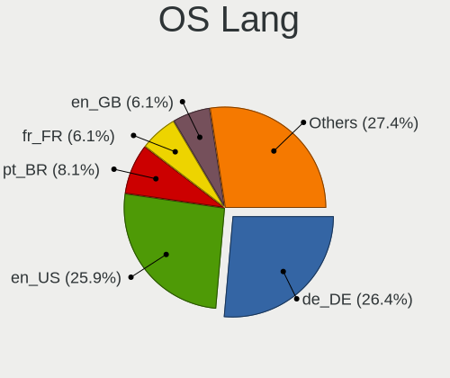

| Lang  | Desktops | Percent |
|-------|----------|---------|
| en_US | 54       | 26.34%  |
| de_DE | 31       | 15.12%  |
| pt_BR | 14       | 6.83%   |
| en_GB | 13       | 6.34%   |
| ru_RU | 8        | 3.9%    |
| fr_FR | 8        | 3.9%    |
| en_CA | 8        | 3.9%    |
| it_IT | 7        | 3.41%   |
| es_ES | 7        | 3.41%   |
| pl_PL | 6        | 2.93%   |
| fi_FI | 5        | 2.44%   |
| cs_CZ | 4        | 1.95%   |
| C     | 4        | 1.95%   |
| en_NZ | 3        | 1.46%   |
| en_AU | 3        | 1.46%   |
| sv_SE | 2        | 0.98%   |
| sk_SK | 2        | 0.98%   |
| ru_UA | 2        | 0.98%   |
| nl_NL | 2        | 0.98%   |
| hu_HU | 2        | 0.98%   |
| es_CL | 2        | 0.98%   |
| en_ZA | 2        | 0.98%   |
| de_AT | 2        | 0.98%   |
| sr_RS | 1        | 0.49%   |
| pt_PT | 1        | 0.49%   |
| nl_BE | 1        | 0.49%   |
| ko_KR | 1        | 0.49%   |
| fr_CA | 1        | 0.49%   |
| fr_BE | 1        | 0.49%   |
| es_MX | 1        | 0.49%   |
| es_CO | 1        | 0.49%   |
| es_AR | 1        | 0.49%   |
| en_PH | 1        | 0.49%   |
| en_IL | 1        | 0.49%   |
| el_GR | 1        | 0.49%   |
| de_BE | 1        | 0.49%   |
| da_DK | 1        | 0.49%   |

Boot Mode
---------

EFI or BIOS

| Mode | Desktops | Percent |
|------|----------|---------|
| BIOS | 135      | 65.85%  |
| EFI  | 70       | 34.15%  |

Filesystem
----------

Type of filesystem

| Type    | Desktops | Percent |
|---------|----------|---------|
| Ext4    | 197      | 96.1%   |
| Btrfs   | 3        | 1.46%   |
| Overlay | 2        | 0.98%   |
| Ext2    | 2        | 0.98%   |
| Ext3    | 1        | 0.49%   |

Part. scheme
------------

Scheme of partitioning

| Type    | Desktops | Percent |
|---------|----------|---------|
| Unknown | 164      | 80%     |
| GPT     | 24       | 11.71%  |
| MBR     | 17       | 8.29%   |

Dual Boot with Linux/BSD
------------------------

Hosting more than one Linux/BSD

| Dual boot | Desktops | Percent |
|-----------|----------|---------|
| No        | 197      | 96.1%   |
| Yes       | 8        | 3.9%    |

Dual Boot (Win)
---------------

Hosting Linux and Windows

| Dual boot | Desktops | Percent |
|-----------|----------|---------|
| No        | 177      | 86.34%  |
| Yes       | 28       | 13.66%  |

Country
-------

Geographic location (country)

| Country            | Desktops | Percent |
|--------------------|----------|---------|
| USA                | 39       | 19.02%  |
| Germany            | 34       | 16.59%  |
| Brazil             | 15       | 7.32%   |
| UK                 | 13       | 6.34%   |
| Canada             | 9        | 4.39%   |
| Spain              | 8        | 3.9%    |
| Italy              | 8        | 3.9%    |
| France             | 7        | 3.41%   |
| Russia             | 6        | 2.93%   |
| Finland            | 6        | 2.93%   |
| Poland             | 5        | 2.44%   |
| Ukraine            | 4        | 1.95%   |
| Belgium            | 4        | 1.95%   |
| South Africa       | 3        | 1.46%   |
| Slovakia           | 3        | 1.46%   |
| New Zealand        | 3        | 1.46%   |
| Netherlands        | 3        | 1.46%   |
| Czech Republic     | 3        | 1.46%   |
| Austria            | 3        | 1.46%   |
| Australia          | 3        | 1.46%   |
| Sweden             | 2        | 0.98%   |
| Korea, Republic of | 2        | 0.98%   |
| Hungary            | 2        | 0.98%   |
| Chile              | 2        | 0.98%   |
| Belarus            | 2        | 0.98%   |
| Switzerland        | 1        | 0.49%   |
| South Korea        | 1        | 0.49%   |
| Slovenia           | 1        | 0.49%   |
| Serbia             | 1        | 0.49%   |
| Puerto Rico        | 1        | 0.49%   |
| Portugal           | 1        | 0.49%   |
| Philippines        | 1        | 0.49%   |
| Mexico             | 1        | 0.49%   |
| Macedonia          | 1        | 0.49%   |
| Latvia             | 1        | 0.49%   |
| Israel             | 1        | 0.49%   |
| Indonesia          | 1        | 0.49%   |
| Greece             | 1        | 0.49%   |
| Denmark            | 1        | 0.49%   |
| Colombia           | 1        | 0.49%   |
| Argentina          | 1        | 0.49%   |

City
----

Geographic location (city)

| City                  | Desktops | Percent |
|-----------------------|----------|---------|
| Helsinki              | 5        | 2.44%   |
| Leipzig               | 3        | 1.46%   |
| Vienna                | 2        | 0.98%   |
| Seattle               | 2        | 0.98%   |
| Schweitenkirchen      | 2        | 0.98%   |
| Saarbrücken          | 2        | 0.98%   |
| Rio de Janeiro        | 2        | 0.98%   |
| Pretoria              | 2        | 0.98%   |
| Paris                 | 2        | 0.98%   |
| Minneapolis           | 2        | 0.98%   |
| Khabarovsk            | 2        | 0.98%   |
| Gadsden               | 2        | 0.98%   |
| Edmonton              | 2        | 0.98%   |
| Dallas                | 2        | 0.98%   |
| Ziar nad Hronom       | 1        | 0.49%   |
| Ystad                 | 1        | 0.49%   |
| Wrocław              | 1        | 0.49%   |
| Winkler               | 1        | 0.49%   |
| Wiesbaden             | 1        | 0.49%   |
| Wielen Zaobrzanski    | 1        | 0.49%   |
| West Des Moines       | 1        | 0.49%   |
| West Bromwich         | 1        | 0.49%   |
| Welkenraedt           | 1        | 0.49%   |
| Weiden                | 1        | 0.49%   |
| Wedel                 | 1        | 0.49%   |
| Vyškov               | 1        | 0.49%   |
| Vancouver             | 1        | 0.49%   |
| Valasske Mezirici     | 1        | 0.49%   |
| Tver                  | 1        | 0.49%   |
| Turin                 | 1        | 0.49%   |
| Tujunga               | 1        | 0.49%   |
| Trois-Rivières       | 1        | 0.49%   |
| Toronto               | 1        | 0.49%   |
| Three Hills           | 1        | 0.49%   |
| Temperley             | 1        | 0.49%   |
| Taubate               | 1        | 0.49%   |
| Taranto               | 1        | 0.49%   |
| São José dos Campos | 1        | 0.49%   |
| Sun Prairie           | 1        | 0.49%   |
| Strumica              | 1        | 0.49%   |
| St Petersburg         | 1        | 0.49%   |
| St Louis              | 1        | 0.49%   |
| Shrewsbury            | 1        | 0.49%   |
| Serra Azul            | 1        | 0.49%   |
| Seelze                | 1        | 0.49%   |
| Scunthorpe            | 1        | 0.49%   |
| Santiago              | 1        | 0.49%   |
| Santa Rosa            | 1        | 0.49%   |
| San Pedro             | 1        | 0.49%   |
| San Francisco         | 1        | 0.49%   |
| Salt Lake City        | 1        | 0.49%   |
| Saeby                 | 1        | 0.49%   |
| Sabac                 | 1        | 0.49%   |
| Rotterdam             | 1        | 0.49%   |
| Rommerskirchen        | 1        | 0.49%   |
| Rio Largo             | 1        | 0.49%   |
| Riga                  | 1        | 0.49%   |
| Ridderkerk            | 1        | 0.49%   |
| Richmond              | 1        | 0.49%   |
| Redfield              | 1        | 0.49%   |

Vendor
------

Motherboard manufacturer

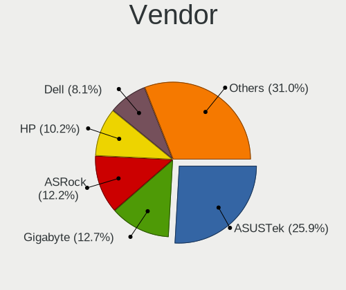

| Name                | Desktops | Percent |
|---------------------|----------|---------|
| ASUSTek Computer    | 50       | 24.39%  |
| Gigabyte Technology | 32       | 15.61%  |
| MSI                 | 24       | 11.71%  |
| ASRock              | 19       | 9.27%   |
| Dell                | 17       | 8.29%   |
| Hewlett-Packard     | 9        | 4.39%   |
| Intel               | 7        | 3.41%   |
| Lenovo              | 6        | 2.93%   |
| Acer                | 5        | 2.44%   |
| Medion              | 4        | 1.95%   |
| Fujitsu             | 4        | 1.95%   |
| ECS                 | 3        | 1.46%   |
| Biostar             | 3        | 1.46%   |
| Unknown             | 3        | 1.46%   |
| ZOTAC               | 2        | 0.98%   |
| Foxconn             | 2        | 0.98%   |
| SZMZ                | 1        | 0.49%   |
| Shuttle             | 1        | 0.49%   |
| Philco              | 1        | 0.49%   |
| Pegatron            | 1        | 0.49%   |
| PCChips             | 1        | 0.49%   |
| NEC Computers       | 1        | 0.49%   |
| Minix               | 1        | 0.49%   |
| Itautec             | 1        | 0.49%   |
| Inventec            | 1        | 0.49%   |
| IBM                 | 1        | 0.49%   |
| Huanan              | 1        | 0.49%   |
| HARDKERNEL          | 1        | 0.49%   |
| Fujitsu Siemens     | 1        | 0.49%   |
| eMachines           | 1        | 0.49%   |
| Apple               | 1        | 0.49%   |

Model
-----

Motherboard model

| Name                                   | Desktops | Percent |
|----------------------------------------|----------|---------|
| ASUS All Series                        | 6        | 2.93%   |
| Unknown                                | 4        | 1.95%   |
| Dell OptiPlex 3020                     | 3        | 1.46%   |
| MSI MS-7C75                            | 2        | 0.98%   |
| Gigabyte Z270X-Ultra Gaming            | 2        | 0.98%   |
| Dell Vostro 200                        | 2        | 0.98%   |
| Dell OptiPlex 390                      | 2        | 0.98%   |
| Biostar J1800NH2                       | 2        | 0.98%   |
| ZOTAC BayTrail-D                       | 1        | 0.49%   |
| SZMZ X99M-H2                           | 1        | 0.49%   |
| Shuttle XH61V                          | 1        | 0.49%   |
| Philco DTA-H61                         | 1        | 0.49%   |
| Pegatron FR440AA-ABU a6652uk           | 1        | 0.49%   |
| PCChips P23G                           | 1        | 0.49%   |
| NEC Computers IMEDIA 5103              | 1        | 0.49%   |
| MSI VR610                              | 1        | 0.49%   |
| MSI TITAN                              | 1        | 0.49%   |
| MSI T6520                              | 1        | 0.49%   |
| MSI P35 Platinum(MS-7345)              | 1        | 0.49%   |
| MSI MS-7C88                            | 1        | 0.49%   |
| MSI MS-7C00                            | 1        | 0.49%   |
| MSI MS-7B86                            | 1        | 0.49%   |
| MSI MS-7B79                            | 1        | 0.49%   |
| MSI MS-7B77                            | 1        | 0.49%   |
| MSI MS-7B50                            | 1        | 0.49%   |
| MSI MS-7B33                            | 1        | 0.49%   |
| MSI MS-7A33                            | 1        | 0.49%   |
| MSI MS-7817                            | 1        | 0.49%   |
| MSI MS-7816                            | 1        | 0.49%   |
| MSI MS-7786                            | 1        | 0.49%   |
| MSI MS-7759                            | 1        | 0.49%   |
| MSI MS-7751                            | 1        | 0.49%   |
| MSI MS-7721                            | 1        | 0.49%   |
| MSI MS-7693                            | 1        | 0.49%   |
| MSI MS-7502                            | 1        | 0.49%   |
| MSI MS-7250                            | 1        | 0.49%   |
| MSI Compaq dx2300 Microtower           | 1        | 0.49%   |
| Minix NEO J50C-4                       | 1        | 0.49%   |
| Medion MS-7800                         | 1        | 0.49%   |
| Medion MS-7797                         | 1        | 0.49%   |
| Medion MS-7366                         | 1        | 0.49%   |
| Medion Akoya P4130 D MD8302/2472       | 1        | 0.49%   |
| Lenovo ThinkCentre M93p 10A8S37W00     | 1        | 0.49%   |
| Lenovo ThinkCentre M910s 10MLS2CG0E    | 1        | 0.49%   |
| Lenovo ThinkCentre M90 5485W45         | 1        | 0.49%   |
| Lenovo ThinkCentre M73 10AY003TMX      | 1        | 0.49%   |
| Lenovo IdeaCentre 5 14IMB05 90NA0000US | 1        | 0.49%   |
| Lenovo H530 10130                      | 1        | 0.49%   |
| Itautec Infoway                        | 1        | 0.49%   |
| Inventec D CLASS                       | 1        | 0.49%   |
| Intel H55                              | 1        | 0.49%   |
| Intel DP67DE AAG10217-205              | 1        | 0.49%   |
| Intel DH67CL AAG10212-210              | 1        | 0.49%   |
| Intel DG41WV                           | 1        | 0.49%   |
| Intel DG41TY AAE47335-302              | 1        | 0.49%   |
| Intel DB75EN AAG39650-400              | 1        | 0.49%   |
| Intel Board                            | 1        | 0.49%   |
| IBM System x3200 M3 -[732754M]         | 1        | 0.49%   |
| Huanan X99 F8D V1.0                    | 1        | 0.49%   |
| HP Pavilion Desktop PC 570-p0xx        | 1        | 0.49%   |

Model Family
------------

Motherboard model prefix

| Name                 | Desktops | Percent |
|----------------------|----------|---------|
| Dell OptiPlex        | 9        | 4.39%   |
| ASUS PRIME           | 7        | 3.41%   |
| ASUS All             | 6        | 2.93%   |
| HP Compaq            | 5        | 2.44%   |
| Lenovo ThinkCentre   | 4        | 1.95%   |
| Acer Aspire          | 4        | 1.95%   |
| Unknown              | 4        | 1.95%   |
| MSI MS-7C75          | 2        | 0.98%   |
| Gigabyte Z270X-Ultra | 2        | 0.98%   |
| Fujitsu ESPRIMO      | 2        | 0.98%   |
| Dell XPS             | 2        | 0.98%   |
| Dell Vostro          | 2        | 0.98%   |
| Dell Precision       | 2        | 0.98%   |
| Dell Inspiron        | 2        | 0.98%   |
| Biostar J1800NH2     | 2        | 0.98%   |
| ASUS P8H61-M         | 2        | 0.98%   |
| ASUS P5Q             | 2        | 0.98%   |
| ZOTAC BayTrail-D     | 1        | 0.49%   |
| SZMZ X99M-H2         | 1        | 0.49%   |
| Shuttle XH61V        | 1        | 0.49%   |
| Philco DTA-H61       | 1        | 0.49%   |
| Pegatron FR440AA-ABU | 1        | 0.49%   |
| PCChips P23G         | 1        | 0.49%   |
| NEC Computers IMEDIA | 1        | 0.49%   |
| MSI VR610            | 1        | 0.49%   |
| MSI TITAN            | 1        | 0.49%   |
| MSI T6520            | 1        | 0.49%   |
| MSI P35              | 1        | 0.49%   |
| MSI MS-7C88          | 1        | 0.49%   |
| MSI MS-7C00          | 1        | 0.49%   |
| MSI MS-7B86          | 1        | 0.49%   |
| MSI MS-7B79          | 1        | 0.49%   |
| MSI MS-7B77          | 1        | 0.49%   |
| MSI MS-7B50          | 1        | 0.49%   |
| MSI MS-7B33          | 1        | 0.49%   |
| MSI MS-7A33          | 1        | 0.49%   |
| MSI MS-7817          | 1        | 0.49%   |
| MSI MS-7816          | 1        | 0.49%   |
| MSI MS-7786          | 1        | 0.49%   |
| MSI MS-7759          | 1        | 0.49%   |
| MSI MS-7751          | 1        | 0.49%   |
| MSI MS-7721          | 1        | 0.49%   |
| MSI MS-7693          | 1        | 0.49%   |
| MSI MS-7502          | 1        | 0.49%   |
| MSI MS-7250          | 1        | 0.49%   |
| MSI Compaq           | 1        | 0.49%   |
| Minix NEO            | 1        | 0.49%   |
| Medion MS-7800       | 1        | 0.49%   |
| Medion MS-7797       | 1        | 0.49%   |
| Medion MS-7366       | 1        | 0.49%   |
| Medion Akoya         | 1        | 0.49%   |
| Lenovo IdeaCentre    | 1        | 0.49%   |
| Lenovo H530          | 1        | 0.49%   |
| Itautec Infoway      | 1        | 0.49%   |
| Inventec D           | 1        | 0.49%   |
| Intel H55            | 1        | 0.49%   |
| Intel DP67DE         | 1        | 0.49%   |
| Intel DH67CL         | 1        | 0.49%   |
| Intel DG41WV         | 1        | 0.49%   |
| Intel DG41TY         | 1        | 0.49%   |

MFG Year
--------

Motherboard manufacture year

| Year | Desktops | Percent |
|------|----------|---------|
| 2020 | 26       | 12.68%  |
| 2012 | 20       | 9.76%   |
| 2013 | 18       | 8.78%   |
| 2018 | 17       | 8.29%   |
| 2014 | 17       | 8.29%   |
| 2010 | 15       | 7.32%   |
| 2009 | 15       | 7.32%   |
| 2019 | 14       | 6.83%   |
| 2008 | 14       | 6.83%   |
| 2015 | 12       | 5.85%   |
| 2011 | 10       | 4.88%   |
| 2016 | 7        | 3.41%   |
| 2007 | 6        | 2.93%   |
| 2017 | 5        | 2.44%   |
| 2021 | 4        | 1.95%   |
| 2006 | 2        | 0.98%   |
| 2005 | 2        | 0.98%   |
| 2003 | 1        | 0.49%   |

Form Factor
-----------

Physical design of the computer

| Name    | Desktops | Percent |
|---------|----------|---------|
| Desktop | 205      | 100%    |

Secure Boot
-----------

Enabled or disabled

| State    | Desktops | Percent |
|----------|----------|---------|
| Disabled | 200      | 97.56%  |
| Enabled  | 5        | 2.44%   |

Coreboot
--------

Have coreboot on board

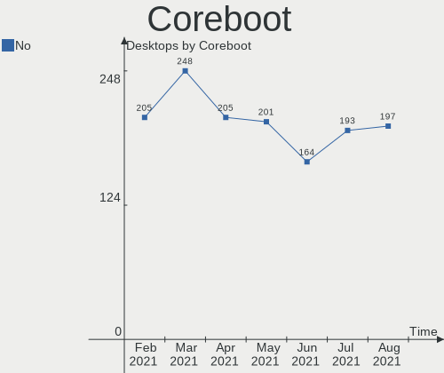

| Used | Desktops | Percent |
|------|----------|---------|
| No   | 205      | 100%    |

RAM Size
--------

Total RAM memory

| Size in GB  | Desktops | Percent |
|-------------|----------|---------|
| 3.01-4.0    | 46       | 22.44%  |
| 16.01-24.0  | 46       | 22.44%  |
| 4.01-8.0    | 34       | 16.59%  |
| 8.01-16.0   | 34       | 16.59%  |
| 32.01-64.0  | 23       | 11.22%  |
| 1.01-2.0    | 13       | 6.34%   |
| 2.01-3.0    | 4        | 1.95%   |
| 64.01-256.0 | 3        | 1.46%   |
| 24.01-32.0  | 1        | 0.49%   |
| 0.51-1.0    | 1        | 0.49%   |

RAM Used
--------

Used RAM memory

| Used GB    | Desktops | Percent |
|------------|----------|---------|
| 1.01-2.0   | 79       | 38.54%  |
| 2.01-3.0   | 51       | 24.88%  |
| 0.51-1.0   | 25       | 12.2%   |
| 3.01-4.0   | 23       | 11.22%  |
| 4.01-8.0   | 17       | 8.29%   |
| 8.01-16.0  | 7        | 3.41%   |
| 24.01-32.0 | 1        | 0.49%   |
| 16.01-24.0 | 1        | 0.49%   |
| 0.01-0.5   | 1        | 0.49%   |

Has CD-ROM
----------

Has CD-ROM on board

| Presented | Desktops | Percent |
|-----------|----------|---------|
| Yes       | 132      | 64.39%  |
| No        | 73       | 35.61%  |

Total Drives
------------

Number of drives on board

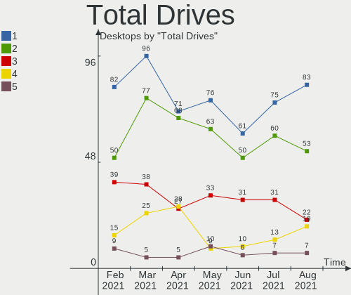

| Drives | Desktops | Percent |
|--------|----------|---------|
| 1      | 83       | 40.49%  |
| 2      | 49       | 23.9%   |
| 3      | 38       | 18.54%  |
| 4      | 16       | 7.8%    |
| 5      | 9        | 4.39%   |
| 6      | 3        | 1.46%   |
| 8      | 2        | 0.98%   |
| 0      | 2        | 0.98%   |
| 10     | 1        | 0.49%   |
| 9      | 1        | 0.49%   |
| 7      | 1        | 0.49%   |

Has Ethernet
------------

Has Ethernet on board

| Presented | Desktops | Percent |
|-----------|----------|---------|
| Yes       | 203      | 99.02%  |
| No        | 2        | 0.98%   |

Drive Vendor
------------

Hard drive vendors

| Vendor                | Desktops | Drives | Percent |
|-----------------------|----------|--------|---------|
| WDC                   | 83       | 123    | 22.74%  |
| Seagate               | 80       | 104    | 21.92%  |
| Samsung Electronics   | 51       | 64     | 13.97%  |
| Hitachi               | 18       | 18     | 4.93%   |
| Kingston              | 17       | 22     | 4.66%   |
| SanDisk               | 16       | 17     | 4.38%   |
| Toshiba               | 15       | 17     | 4.11%   |
| Crucial               | 12       | 14     | 3.29%   |
| Unknown               | 10       | 11     | 2.74%   |
| A-DATA Technology     | 7        | 7      | 1.92%   |
| Maxtor                | 6        | 7      | 1.64%   |
| Transcend             | 4        | 4      | 1.1%    |
| Intenso               | 4        | 4      | 1.1%    |
| China                 | 4        | 4      | 1.1%    |
| SK Hynix              | 3        | 3      | 0.82%   |
| Intel                 | 3        | 4      | 0.82%   |
| Team                  | 2        | 2      | 0.55%   |
| Silicon Motion        | 2        | 2      | 0.55%   |
| Patriot               | 2        | 2      | 0.55%   |
| OCZ                   | 2        | 2      | 0.55%   |
| KingSpec              | 2        | 2      | 0.55%   |
| HGST                  | 2        | 4      | 0.55%   |
| GOODRAM               | 2        | 2      | 0.55%   |
| Corsair               | 2        | 2      | 0.55%   |
| ASMT                  | 2        | 2      | 0.55%   |
| WD MediaMax           | 1        | 1      | 0.27%   |
| USB                   | 1        | 1      | 0.27%   |
| TO Exter              | 1        | 1      | 0.27%   |
| SPCC                  | 1        | 1      | 0.27%   |
| Smartbuy              | 1        | 1      | 0.27%   |
| Realtek Semiconductor | 1        | 1      | 0.27%   |
| PLEXTOR               | 1        | 1      | 0.27%   |
| Phison                | 1        | 1      | 0.27%   |
| LITEON                | 1        | 1      | 0.27%   |
| External              | 1        | 1      | 0.27%   |
| Config                | 1        | 1      | 0.27%   |
| Avant                 | 1        | 1      | 0.27%   |
| Apple                 | 1        | 1      | 0.27%   |
| Apacer                | 1        | 1      | 0.27%   |

Drive Model
-----------

Hard drive models

| Model                               | Desktops | Percent |
|-------------------------------------|----------|---------|
| Seagate ST1000DM010-2EP102 1TB      | 6        | 1.36%   |
| Unknown SD/MMC/MS PRO 64GB          | 5        | 1.13%   |
| Toshiba DT01ACA100 1TB              | 5        | 1.13%   |
| WDC WD10EZEX-00BN5A0 1TB            | 4        | 0.9%    |
| Seagate ST500DM002-1BD142 500GB     | 4        | 0.9%    |
| Seagate ST4000DM004-2CV104 4TB      | 4        | 0.9%    |
| Seagate ST2000DM008-2FR102 2TB      | 4        | 0.9%    |
| Kingston SV300S37A120G 120GB SSD    | 4        | 0.9%    |
| Kingston SA400S37240G 240GB SSD     | 4        | 0.9%    |
| WDC WD5000AVDS-63U7B1 500GB         | 3        | 0.68%   |
| WDC WD30EFRX-68EUZN0 3TB            | 3        | 0.68%   |
| Seagate ST2000DM001-1CH164 2TB      | 3        | 0.68%   |
| Seagate ST1000DM003-1ER162 1TB      | 3        | 0.68%   |
| Seagate ST1000DM003-1CH162 1TB      | 3        | 0.68%   |
| Samsung SSD 860 EVO 1TB             | 3        | 0.68%   |
| Samsung NVMe SSD Drive 500GB        | 3        | 0.68%   |
| Samsung NVMe SSD Drive 1TB          | 3        | 0.68%   |
| Samsung HD501LJ 500GB               | 3        | 0.68%   |
| WDC WDS240G2G0B-00EPW0 240GB SSD    | 2        | 0.45%   |
| WDC WDS240G2G0A-00JH30 240GB SSD    | 2        | 0.45%   |
| WDC WD5000AAKX-753CA1 500GB         | 2        | 0.45%   |
| WDC WD5000AAKX-22ERMA0 500GB        | 2        | 0.45%   |
| WDC WD5000AAKX-001CA0 500GB         | 2        | 0.45%   |
| WDC WD5000AAKS-00UU3A0 500GB        | 2        | 0.45%   |
| WDC WD40EFRX-68N32N0 4TB            | 2        | 0.45%   |
| WDC WD2500BEVT-22ZCT0 250GB         | 2        | 0.45%   |
| WDC WD20EZRZ-00Z5HB0 2TB            | 2        | 0.45%   |
| WDC WD20EARX-00PASB0 2TB            | 2        | 0.45%   |
| WDC WD10EZRX-00D8PB0 1TB            | 2        | 0.45%   |
| WDC WD10EZEX-08WN4A0 1TB            | 2        | 0.45%   |
| WDC WD10EARS-00Y5B1 1TB             | 2        | 0.45%   |
| Toshiba DT01ACA200 2TB              | 2        | 0.45%   |
| Silicon Motion NVMe SSD Drive 256GB | 2        | 0.45%   |
| Seagate ST380815AS 80GB             | 2        | 0.45%   |
| Seagate ST3500418AS 500GB           | 2        | 0.45%   |
| Seagate ST3320418AS 320GB           | 2        | 0.45%   |
| Seagate ST3250310AS 250GB           | 2        | 0.45%   |
| Seagate ST31000528AS 1TB            | 2        | 0.45%   |
| Seagate ST3000DM008-2DM166 3TB      | 2        | 0.45%   |
| Seagate ST2000LM007-1R8174 2TB      | 2        | 0.45%   |
| Seagate ST2000DM006-2DM164 2TB      | 2        | 0.45%   |
| Seagate ST2000DM001-9YN164 2TB      | 2        | 0.45%   |
| Seagate ST1000DM003-9YN162 1TB      | 2        | 0.45%   |
| Seagate M3 Portable 1TB             | 2        | 0.45%   |
| Seagate Expansion Desk 4TB          | 2        | 0.45%   |
| Seagate Expansion 500GB             | 2        | 0.45%   |
| SanDisk SSD PLUS 120GB              | 2        | 0.45%   |
| Sandisk NVMe SSD Drive 512GB        | 2        | 0.45%   |
| Sandisk NVMe SSD Drive 250GB        | 2        | 0.45%   |
| Samsung SSD 970 EVO Plus 500GB      | 2        | 0.45%   |
| Samsung SSD 860 EVO 500GB           | 2        | 0.45%   |
| Samsung SSD 860 EVO 250GB           | 2        | 0.45%   |
| Samsung SSD 850 PRO 512GB           | 2        | 0.45%   |
| Samsung SSD 850 EVO 500GB           | 2        | 0.45%   |
| Samsung SSD 850 EVO 250GB           | 2        | 0.45%   |
| Samsung SSD 840 EVO 120GB           | 2        | 0.45%   |
| Samsung NVMe SSD Drive 512GB        | 2        | 0.45%   |
| Samsung NVMe SSD Drive 256GB        | 2        | 0.45%   |
| Samsung HD502HJ 500GB               | 2        | 0.45%   |
| Samsung HD502HI 500GB               | 2        | 0.45%   |

HDD Vendor
----------

Hard disk drive vendors

| Vendor              | Desktops | Drives | Percent |
|---------------------|----------|--------|---------|
| Seagate             | 77       | 97     | 35.81%  |
| WDC                 | 75       | 112    | 34.88%  |
| Hitachi             | 18       | 18     | 8.37%   |
| Samsung Electronics | 16       | 17     | 7.44%   |
| Toshiba             | 15       | 17     | 6.98%   |
| Maxtor              | 6        | 7      | 2.79%   |
| Unknown             | 2        | 3      | 0.93%   |
| HGST                | 2        | 4      | 0.93%   |
| USB                 | 1        | 1      | 0.47%   |
| TO Exter            | 1        | 1      | 0.47%   |
| ASMT                | 1        | 1      | 0.47%   |
| Apple               | 1        | 1      | 0.47%   |

SSD Vendor
----------

Solid state drive vendors

| Vendor              | Desktops | Drives | Percent |
|---------------------|----------|--------|---------|
| Samsung Electronics | 24       | 30     | 20.17%  |
| Kingston            | 15       | 17     | 12.61%  |
| Crucial             | 12       | 13     | 10.08%  |
| WDC                 | 10       | 10     | 8.4%    |
| SanDisk             | 10       | 11     | 8.4%    |
| A-DATA Technology   | 7        | 7      | 5.88%   |
| Transcend           | 4        | 4      | 3.36%   |
| China               | 4        | 4      | 3.36%   |
| SK Hynix            | 3        | 3      | 2.52%   |
| Seagate             | 3        | 3      | 2.52%   |
| Intenso             | 3        | 3      | 2.52%   |
| Intel               | 3        | 4      | 2.52%   |
| Team                | 2        | 2      | 1.68%   |
| Patriot             | 2        | 2      | 1.68%   |
| OCZ                 | 2        | 2      | 1.68%   |
| KingSpec            | 2        | 2      | 1.68%   |
| GOODRAM             | 2        | 2      | 1.68%   |
| Corsair             | 2        | 2      | 1.68%   |
| Unknown             | 1        | 1      | 0.84%   |
| SPCC                | 1        | 1      | 0.84%   |
| Smartbuy            | 1        | 1      | 0.84%   |
| PLEXTOR             | 1        | 1      | 0.84%   |
| LITEON              | 1        | 1      | 0.84%   |
| External            | 1        | 1      | 0.84%   |
| Avant               | 1        | 1      | 0.84%   |
| ASMT                | 1        | 1      | 0.84%   |
| Apacer              | 1        | 1      | 0.84%   |

Drive Kind
----------

HDD or SSD

| Kind    | Desktops | Drives | Percent |
|---------|----------|--------|---------|
| HDD     | 163      | 279    | 53.8%   |
| SSD     | 99       | 130    | 32.67%  |
| NVMe    | 26       | 33     | 8.58%   |
| Unknown | 14       | 14     | 4.62%   |
| MMC     | 1        | 1      | 0.33%   |

Drive Connector
---------------

SATA, SAS, NVMe, etc.

| Type | Desktops | Drives | Percent |
|------|----------|--------|---------|
| SATA | 194      | 399    | 80.83%  |
| NVMe | 26       | 33     | 10.83%  |
| SAS  | 19       | 24     | 7.92%   |
| MMC  | 1        | 1      | 0.42%   |

Drive Size
----------

Size of hard drive

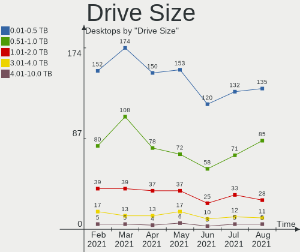

| Size in TB | Desktops | Drives | Percent |
|------------|----------|--------|---------|
| 0.01-0.5   | 152      | 225    | 50.84%  |
| 0.51-1.0   | 82       | 103    | 27.42%  |
| 1.01-2.0   | 37       | 45     | 12.37%  |
| 3.01-4.0   | 15       | 20     | 5.02%   |
| 2.01-3.0   | 8        | 11     | 2.68%   |
| 4.01-10.0  | 4        | 4      | 1.34%   |
| 10.01-20.0 | 1        | 1      | 0.33%   |

Space Total
-----------

Amount of disk space available on the file system

| Size in GB     | Desktops | Percent |
|----------------|----------|---------|
| 101-250        | 56       | 27.32%  |
| 251-500        | 43       | 20.98%  |
| 1001-2000      | 29       | 14.15%  |
| 501-1000       | 25       | 12.2%   |
| More than 3000 | 20       | 9.76%   |
| 2001-3000      | 11       | 5.37%   |
| 51-100         | 11       | 5.37%   |
| 21-50          | 6        | 2.93%   |
| 1-20           | 4        | 1.95%   |

Space Used
----------

Amount of used disk space

| Used GB        | Desktops | Percent |
|----------------|----------|---------|
| 1-20           | 48       | 23.41%  |
| 21-50          | 47       | 22.93%  |
| 51-100         | 33       | 16.1%   |
| 251-500        | 22       | 10.73%  |
| 101-250        | 18       | 8.78%   |
| 501-1000       | 14       | 6.83%   |
| 1001-2000      | 13       | 6.34%   |
| More than 3000 | 8        | 3.9%    |
| 2001-3000      | 2        | 0.98%   |

Malfunc. Drives
---------------

Drive models with a malfunction

| Model                                 | Desktops | Drives | Percent |
|---------------------------------------|----------|--------|---------|
| WDC WD7500AARS-003BB1 752GB           | 1        | 1      | 6.25%   |
| WDC WD5000AAKX-753CA1 500GB           | 1        | 1      | 6.25%   |
| WDC WD5000AAKX-001CA0 500GB           | 1        | 1      | 6.25%   |
| WDC WD20EARX-00MMMB0 2TB              | 1        | 1      | 6.25%   |
| WDC WD10EZEX-00RKKA0 1TB              | 1        | 1      | 6.25%   |
| WDC WD10EZEX-00BN5A0 1TB              | 1        | 2      | 6.25%   |
| SK Hynix HFS256G32MND-2900A 256GB SSD | 1        | 1      | 6.25%   |
| Seagate ST500DM002-1BD142 500GB       | 1        | 1      | 6.25%   |
| Seagate ST3500320AS 500GB             | 1        | 1      | 6.25%   |
| Seagate ST3360320AS 360GB             | 1        | 1      | 6.25%   |
| Samsung Electronics HD502HI 500GB     | 1        | 1      | 6.25%   |
| Kingston SHFS37A120G 120GB SSD        | 1        | 1      | 6.25%   |
| Hitachi HDT721025SLA380 250GB         | 1        | 1      | 6.25%   |
| Hitachi HDP725050GLA360 500GB         | 1        | 1      | 6.25%   |
| Hitachi HCS5C3232SLA380 320GB         | 1        | 1      | 6.25%   |
| Crucial CT525MX300SSD1 528GB          | 1        | 1      | 6.25%   |

Malfunc. Drive Vendor
---------------------

Vendors of faulty drives

| Vendor              | Desktops | Drives | Percent |
|---------------------|----------|--------|---------|
| WDC                 | 4        | 7      | 28.57%  |
| Seagate             | 3        | 3      | 21.43%  |
| Hitachi             | 3        | 3      | 21.43%  |
| SK Hynix            | 1        | 1      | 7.14%   |
| Samsung Electronics | 1        | 1      | 7.14%   |
| Kingston            | 1        | 1      | 7.14%   |
| Crucial             | 1        | 1      | 7.14%   |

Malfunc. HDD Vendor
-------------------

Vendors of faulty HDD drives

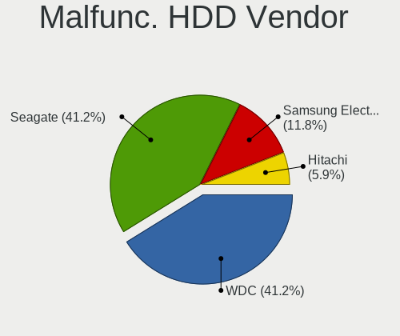

| Vendor              | Desktops | Drives | Percent |
|---------------------|----------|--------|---------|
| WDC                 | 4        | 7      | 36.36%  |
| Seagate             | 3        | 3      | 27.27%  |
| Hitachi             | 3        | 3      | 27.27%  |
| Samsung Electronics | 1        | 1      | 9.09%   |

Malfunc. Drive Kind
-------------------

Kinds of faulty drives

| Kind | Desktops | Drives | Percent |
|------|----------|--------|---------|
| HDD  | 11       | 14     | 78.57%  |
| SSD  | 3        | 3      | 21.43%  |

Failed Drives
-------------

Failed drive models

Zero info for selected period =(

Failed Drive Vendor
-------------------

Failed drive vendors

Zero info for selected period =(

Drive Status
------------

Number of failed and malfunc. drives

| Status   | Desktops | Drives | Percent |
|----------|----------|--------|---------|
| Detected | 165      | 358    | 75.34%  |
| Works    | 40       | 82     | 18.26%  |
| Malfunc  | 14       | 17     | 6.39%   |

Storage Vendor
--------------

Storage controller vendors

| Vendor                           | Desktops | Percent |
|----------------------------------|----------|---------|
| Intel                            | 134      | 49.08%  |
| AMD                              | 55       | 20.15%  |
| Samsung Electronics              | 15       | 5.49%   |
| Marvell Technology Group         | 14       | 5.13%   |
| Nvidia                           | 13       | 4.76%   |
| JMicron Technology               | 11       | 4.03%   |
| ASMedia Technology               | 9        | 3.3%    |
| Sandisk                          | 6        | 2.2%    |
| Kingston Technology Company      | 3        | 1.1%    |
| VIA Technologies                 | 2        | 0.73%   |
| Silicon Motion                   | 2        | 0.73%   |
| Silicon Image                    | 2        | 0.73%   |
| LSI Logic / Symbios Logic        | 2        | 0.73%   |
| Silicon Integrated Systems [SiS] | 1        | 0.37%   |
| Realtek Semiconductor            | 1        | 0.37%   |
| Phison Electronics               | 1        | 0.37%   |
| Micron/Crucial Technology        | 1        | 0.37%   |
| Lite-On IT Corp. / Plextor       | 1        | 0.37%   |

Storage Model
-------------

Storage controller models

| Model                                                                                   | Desktops | Percent |
|-----------------------------------------------------------------------------------------|----------|---------|
| AMD FCH SATA Controller [AHCI mode]                                                     | 26       | 7.3%    |
| Intel 8 Series/C220 Series Chipset Family 6-port SATA Controller 1 [AHCI mode]          | 17       | 4.78%   |
| Intel 6 Series/C200 Series Chipset Family 6 port Desktop SATA AHCI Controller           | 14       | 3.93%   |
| Samsung NVMe SSD Controller SM981/PM981/PM983                                           | 13       | 3.65%   |
| AMD SB7x0/SB8x0/SB9x0 IDE Controller                                                    | 13       | 3.65%   |
| Intel NM10/ICH7 Family SATA Controller [IDE mode]                                       | 11       | 3.09%   |
| AMD SB7x0/SB8x0/SB9x0 SATA Controller [IDE mode]                                        | 9        | 2.53%   |
| AMD SB7x0/SB8x0/SB9x0 SATA Controller [AHCI mode]                                       | 9        | 2.53%   |
| Intel Cannon Lake PCH SATA AHCI Controller                                              | 8        | 2.25%   |
| Intel 7 Series/C210 Series Chipset Family 6-port SATA Controller [AHCI mode]            | 8        | 2.25%   |
| Intel 6 Series/C200 Series Chipset Family Desktop SATA Controller (IDE mode, ports 4-5) | 8        | 2.25%   |
| Intel 6 Series/C200 Series Chipset Family Desktop SATA Controller (IDE mode, ports 0-3) | 8        | 2.25%   |
| Intel 400 Series Chipset Family SATA AHCI Controller                                    | 8        | 2.25%   |
| Intel 82801G (ICH7 Family) IDE Controller                                               | 6        | 1.69%   |
| ASMedia ASM1062 Serial ATA Controller                                                   | 6        | 1.69%   |
| AMD 400 Series Chipset SATA Controller                                                  | 6        | 1.69%   |
| Nvidia MCP61 SATA Controller                                                            | 5        | 1.4%    |
| Marvell Group 88SE9172 SATA 6Gb/s Controller                                            | 5        | 1.4%    |
| JMicron JMB363 SATA/IDE Controller                                                      | 5        | 1.4%    |
| Intel Q170/Q150/B150/H170/H110/Z170/CM236 Chipset SATA Controller [AHCI Mode]           | 5        | 1.4%    |
| Intel 82801I (ICH9 Family) 2 port SATA Controller [IDE mode]                            | 5        | 1.4%    |
| Intel 200 Series PCH SATA controller [AHCI mode]                                        | 5        | 1.4%    |
| Nvidia MCP61 IDE                                                                        | 4        | 1.12%   |
| JMicron JMB368 IDE controller                                                           | 4        | 1.12%   |
| Intel 9 Series Chipset Family SATA Controller [AHCI Mode]                               | 4        | 1.12%   |
| Intel 82801JI (ICH10 Family) SATA AHCI Controller                                       | 4        | 1.12%   |
| Intel 82801JI (ICH10 Family) 4 port SATA IDE Controller #1                              | 4        | 1.12%   |
| Intel 82801JI (ICH10 Family) 2 port SATA IDE Controller #2                              | 4        | 1.12%   |
| Intel 82801IR/IO/IH (ICH9R/DO/DH) 4 port SATA Controller [IDE mode]                     | 4        | 1.12%   |
| Intel 5 Series/3400 Series Chipset 6 port SATA AHCI Controller                          | 4        | 1.12%   |
| Intel 5 Series/3400 Series Chipset 4 port SATA IDE Controller                           | 4        | 1.12%   |
| Intel 5 Series/3400 Series Chipset 2 port SATA IDE Controller                           | 4        | 1.12%   |
| AMD FCH SATA Controller [IDE mode]                                                      | 4        | 1.12%   |
| AMD FCH IDE Controller                                                                  | 4        | 1.12%   |
| AMD 300 Series Chipset SATA Controller                                                  | 4        | 1.12%   |
| Sandisk WD Blue SN550 NVMe SSD                                                          | 3        | 0.84%   |
| Marvell Group 88SE9215 PCIe 2.0 x1 4-port SATA 6 Gb/s Controller                        | 3        | 0.84%   |
| Marvell Group 88SE6111/6121 SATA II / PATA Controller                                   | 3        | 0.84%   |
| Kingston Company A2000 NVMe SSD                                                         | 3        | 0.84%   |
| Intel SATA Controller [RAID mode]                                                       | 3        | 0.84%   |
| Intel Celeron/Pentium Silver Processor SATA Controller                                  | 3        | 0.84%   |
| Intel Atom Processor E3800 Series SATA AHCI Controller                                  | 3        | 0.84%   |
| Intel 82801IR/IO/IH (ICH9R/DO/DH) 6 port SATA Controller [AHCI mode]                    | 3        | 0.84%   |
| AMD SATA controller                                                                     | 3        | 0.84%   |
| AMD FCH SATA Controller D                                                               | 3        | 0.84%   |
| Silicon Motion SM2263EN/SM2263XT SSD Controller                                         | 2        | 0.56%   |
| Sandisk WD Black SN750 / PC SN730 NVMe SSD                                              | 2        | 0.56%   |
| Nvidia MCP78S [GeForce 8200] IDE                                                        | 2        | 0.56%   |
| Nvidia MCP78S [GeForce 8200] AHCI Controller                                            | 2        | 0.56%   |
| Nvidia MCP67 IDE Controller                                                             | 2        | 0.56%   |
| Nvidia MCP67 AHCI Controller                                                            | 2        | 0.56%   |
| Intel C610/X99 series chipset sSATA Controller [AHCI mode]                              | 2        | 0.56%   |
| Intel 82801JD/DO (ICH10 Family) 4-port SATA IDE Controller                              | 2        | 0.56%   |
| Intel 82801JD/DO (ICH10 Family) 2-port SATA IDE Controller                              | 2        | 0.56%   |
| Intel 4 Series Chipset PT IDER Controller                                               | 2        | 0.56%   |
| ASMedia ASM1061 SATA IDE Controller                                                     | 2        | 0.56%   |
| VIA VT82C586A/B/VT82C686/A/B/VT823x/A/C PIPC Bus Master IDE                             | 1        | 0.28%   |
| VIA VT6415 PATA IDE Host Controller                                                     | 1        | 0.28%   |
| VIA VIA VT6420 SATA RAID Controller                                                     | 1        | 0.28%   |
| Silicon Integrated Systems [SiS] SATA                                                   | 1        | 0.28%   |

Storage Kind
------------

Kind of storage controller (IDE, SATA, NVMe, SAS, ...)

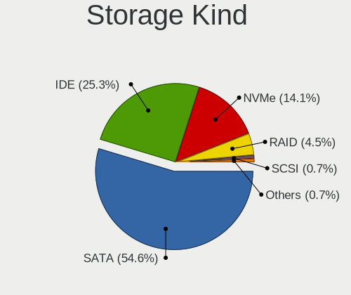

| Kind | Desktops | Percent |
|------|----------|---------|
| SATA | 152      | 56.3%   |
| IDE  | 82       | 30.37%  |
| NVMe | 26       | 9.63%   |
| RAID | 8        | 2.96%   |
| SCSI | 2        | 0.74%   |

CPU Vendor
----------

Processor vendors

| Vendor | Desktops | Percent |
|--------|----------|---------|
| Intel  | 140      | 68.29%  |
| AMD    | 65       | 31.71%  |

CPU Model
---------

Processor models

| Model                                       | Desktops | Percent |
|---------------------------------------------|----------|---------|
| Intel Core i5-4590 CPU @ 3.30GHz            | 5        | 2.44%   |
| Intel Core i7-4790 CPU @ 3.60GHz            | 4        | 1.95%   |
| Intel Core i7-3770 CPU @ 3.40GHz            | 3        | 1.46%   |
| Intel Core i5-4440 CPU @ 3.10GHz            | 3        | 1.46%   |
| Intel Core i3-8100 CPU @ 3.60GHz            | 3        | 1.46%   |
| Intel Core i3-2120 CPU @ 3.30GHz            | 3        | 1.46%   |
| Intel Core i3-2100 CPU @ 3.10GHz            | 3        | 1.46%   |
| AMD Ryzen 3 2200G with Radeon Vega Graphics | 3        | 1.46%   |
| Intel Pentium Dual CPU E2180 @ 2.00GHz      | 2        | 0.98%   |
| Intel Pentium Dual CPU E2160 @ 1.80GHz      | 2        | 0.98%   |
| Intel Pentium CPU G3220 @ 3.00GHz           | 2        | 0.98%   |
| Intel Core i7-9700K CPU @ 3.60GHz           | 2        | 0.98%   |
| Intel Core i7-7700K CPU @ 4.20GHz           | 2        | 0.98%   |
| Intel Core i7-6700 CPU @ 3.40GHz            | 2        | 0.98%   |
| Intel Core i7-10700K CPU @ 3.80GHz          | 2        | 0.98%   |
| Intel Core i7-10700 CPU @ 2.90GHz           | 2        | 0.98%   |
| Intel Core i5-6600K CPU @ 3.50GHz           | 2        | 0.98%   |
| Intel Core i5-3570K CPU @ 3.40GHz           | 2        | 0.98%   |
| Intel Core i5-2500K CPU @ 3.30GHz           | 2        | 0.98%   |
| Intel Core i5-2400 CPU @ 3.10GHz            | 2        | 0.98%   |
| Intel Core i5 CPU 650 @ 3.20GHz             | 2        | 0.98%   |
| Intel Core 2 Quad CPU Q9550 @ 2.83GHz       | 2        | 0.98%   |
| Intel Core 2 Quad CPU Q8400 @ 2.66GHz       | 2        | 0.98%   |
| Intel Core 2 Quad CPU Q6600 @ 2.40GHz       | 2        | 0.98%   |
| Intel Core 2 Duo CPU E8500 @ 3.16GHz        | 2        | 0.98%   |
| Intel Core 2 Duo CPU E7300 @ 2.66GHz        | 2        | 0.98%   |
| Intel Core 2 Duo CPU E4700 @ 2.60GHz        | 2        | 0.98%   |
| Intel Core 2 Duo CPU E4500 @ 2.20GHz        | 2        | 0.98%   |
| Intel Celeron CPU J1800 @ 2.41GHz           | 2        | 0.98%   |
| AMD Ryzen 7 5800X 8-Core Processor          | 2        | 0.98%   |
| AMD Ryzen 7 1700 Eight-Core Processor       | 2        | 0.98%   |
| AMD FX-8350 Eight-Core Processor            | 2        | 0.98%   |
| AMD FX-8150 Eight-Core Processor            | 2        | 0.98%   |
| AMD Athlon X4 860K Quad Core Processor      | 2        | 0.98%   |
| AMD Athlon II X3 450 Processor              | 2        | 0.98%   |
| AMD Athlon II X2 220 Processor              | 2        | 0.98%   |
| AMD A8-6600K APU with Radeon HD Graphics    | 2        | 0.98%   |
| Intel Xeon CPU X5690 @ 3.47GHz              | 1        | 0.49%   |
| Intel Xeon CPU X5365 @ 3.00GHz              | 1        | 0.49%   |
| Intel Xeon CPU X3450 @ 2.67GHz              | 1        | 0.49%   |
| Intel Xeon CPU W3690 @ 3.47GHz              | 1        | 0.49%   |
| Intel Xeon CPU L5420 @ 2.50GHz              | 1        | 0.49%   |
| Intel Xeon CPU E5450 @ 3.00GHz              | 1        | 0.49%   |
| Intel Xeon CPU E5-2678 v3 @ 2.50GHz         | 1        | 0.49%   |
| Intel Xeon CPU E5-2630L v3 @ 1.80GHz        | 1        | 0.49%   |
| Intel Xeon CPU E5-1603 v3 @ 2.80GHz         | 1        | 0.49%   |
| Intel Xeon CPU E3-1240 V2 @ 3.40GHz         | 1        | 0.49%   |
| Intel Pentium Silver J5005 CPU @ 1.50GHz    | 1        | 0.49%   |
| Intel Pentium Dual-Core CPU E6600 @ 3.06GHz | 1        | 0.49%   |
| Intel Pentium Dual-Core CPU E5700 @ 3.00GHz | 1        | 0.49%   |
| Intel Pentium Dual CPU E2200 @ 2.20GHz      | 1        | 0.49%   |
| Intel Pentium D CPU 2.80GHz                 | 1        | 0.49%   |
| Intel Pentium CPU J2900 @ 2.41GHz           | 1        | 0.49%   |
| Intel Pentium CPU G870 @ 3.10GHz            | 1        | 0.49%   |
| Intel Pentium CPU G620 @ 2.60GHz            | 1        | 0.49%   |
| Intel Pentium CPU G4400 @ 3.30GHz           | 1        | 0.49%   |
| Intel Pentium CPU G3240T @ 2.70GHz          | 1        | 0.49%   |
| Intel Pentium CPU G2030 @ 3.00GHz           | 1        | 0.49%   |
| Intel Pentium CPU G2020 @ 2.90GHz           | 1        | 0.49%   |
| Intel Pentium 4 CPU 3.20GHz                 | 1        | 0.49%   |

CPU Model Family
----------------

Processor model prefix

| Model                   | Desktops | Percent |
|-------------------------|----------|---------|
| Intel Core i5           | 28       | 13.66%  |
| Intel Core i7           | 25       | 12.2%   |
| Intel Core i3           | 20       | 9.76%   |
| Intel Core 2 Duo        | 11       | 5.37%   |
| Intel Xeon              | 10       | 4.88%   |
| Intel Pentium           | 9        | 4.39%   |
| Intel Core 2 Quad       | 9        | 4.39%   |
| AMD FX                  | 9        | 4.39%   |
| Intel Celeron           | 7        | 3.41%   |
| AMD Ryzen 3             | 6        | 2.93%   |
| Intel Pentium Dual      | 5        | 2.44%   |
| AMD Ryzen 5             | 5        | 2.44%   |
| AMD A8                  | 5        | 2.44%   |
| Intel Pentium 4         | 4        | 1.95%   |
| AMD Ryzen 7             | 4        | 1.95%   |
| AMD Athlon 64 X2        | 4        | 1.95%   |
| Intel Core i9           | 3        | 1.46%   |
| AMD Phenom II X2        | 3        | 1.46%   |
| AMD Athlon II X3        | 3        | 1.46%   |
| AMD Athlon II X2        | 3        | 1.46%   |
| AMD A4                  | 3        | 1.46%   |
| Intel Pentium Dual-Core | 2        | 0.98%   |
| AMD Ryzen 5 PRO         | 2        | 0.98%   |
| AMD Athlon X4           | 2        | 0.98%   |
| AMD Athlon II X4        | 2        | 0.98%   |
| AMD A10                 | 2        | 0.98%   |
| Intel Pentium Silver    | 1        | 0.49%   |
| Intel Pentium D         | 1        | 0.49%   |
| Intel Genuine           | 1        | 0.49%   |
| Intel Core M            | 1        | 0.49%   |
| Intel Core 2 Extreme    | 1        | 0.49%   |
| Intel Core 2            | 1        | 0.49%   |
| Intel Atom              | 1        | 0.49%   |
| AMD Turion 64 X2 Mobile | 1        | 0.49%   |
| AMD Ryzen 9             | 1        | 0.49%   |
| AMD Ryzen 3 PRO         | 1        | 0.49%   |
| AMD PRO A10             | 1        | 0.49%   |
| AMD Phenom II X6        | 1        | 0.49%   |
| AMD Phenom II X4        | 1        | 0.49%   |
| AMD Phenom              | 1        | 0.49%   |
| AMD G                   | 1        | 0.49%   |
| AMD Athlon X2           | 1        | 0.49%   |
| AMD Athlon Dual Core    | 1        | 0.49%   |
| AMD Athlon 64           | 1        | 0.49%   |
| AMD A6                  | 1        | 0.49%   |

CPU Cores
---------

Number of processor cores

| Number | Desktops | Percent |
|--------|----------|---------|
| 4      | 92       | 44.88%  |
| 2      | 73       | 35.61%  |
| 8      | 15       | 7.32%   |
| 1      | 11       | 5.37%   |
| 6      | 5        | 2.44%   |
| 3      | 4        | 1.95%   |
| 12     | 3        | 1.46%   |
| 24     | 1        | 0.49%   |
| 10     | 1        | 0.49%   |

CPU Sockets
-----------

Number of sockets

| Number | Desktops | Percent |
|--------|----------|---------|
| 1      | 202      | 98.54%  |
| 2      | 3        | 1.46%   |

CPU Threads
-----------

Threads per core (Hyper-Threading)

| Number | Desktops | Percent |
|--------|----------|---------|
| 1      | 115      | 56.1%   |
| 2      | 90       | 43.9%   |

CPU Op-Modes
------------

CPU Operation Modes (32-bit, 64-bit)

| Op mode        | Desktops | Percent |
|----------------|----------|---------|
| 32-bit, 64-bit | 203      | 99.02%  |
| 32-bit         | 2        | 0.98%   |

CPU Microcode
-------------

Microcode number

| Number     | Desktops | Percent |
|------------|----------|---------|
| Unknown    | 23       | 11.22%  |
| 0x306c3    | 20       | 9.76%   |
| 0x206a7    | 17       | 8.29%   |
| 0x306a9    | 12       | 5.85%   |
| 0x1067a    | 10       | 4.88%   |
| 0x6fb      | 8        | 3.9%    |
| 0x010000c8 | 8        | 3.9%    |
| 0xa0655    | 6        | 2.93%   |
| 0x6fd      | 6        | 2.93%   |
| 0x06001119 | 5        | 2.44%   |
| 0x906e9    | 4        | 1.95%   |
| 0x506e3    | 4        | 1.95%   |
| 0x20655    | 4        | 1.95%   |
| 0x06000852 | 4        | 1.95%   |
| 0x906ec    | 3        | 1.46%   |
| 0x306f2    | 3        | 1.46%   |
| 0x30678    | 3        | 1.46%   |
| 0x106e5    | 3        | 1.46%   |
| 0x10677    | 3        | 1.46%   |
| 0x08701021 | 3        | 1.46%   |
| 0x08108109 | 3        | 1.46%   |
| 0x06003106 | 3        | 1.46%   |
| 0x0600063e | 3        | 1.46%   |
| 0x010000db | 3        | 1.46%   |
| 0xa0653    | 2        | 0.98%   |
| 0x906eb    | 2        | 0.98%   |
| 0x206c2    | 2        | 0.98%   |
| 0x10676    | 2        | 0.98%   |
| 0x0a201009 | 2        | 0.98%   |
| 0x08600106 | 2        | 0.98%   |
| 0x03000027 | 2        | 0.98%   |
| 0xf49      | 1        | 0.49%   |
| 0xf44      | 1        | 0.49%   |
| 0xf43      | 1        | 0.49%   |
| 0xf41      | 1        | 0.49%   |
| 0xf29      | 1        | 0.49%   |
| 0x906ed    | 1        | 0.49%   |
| 0x906ea    | 1        | 0.49%   |
| 0x706a8    | 1        | 0.49%   |
| 0x706a1    | 1        | 0.49%   |
| 0x6f7      | 1        | 0.49%   |
| 0x6f2      | 1        | 0.49%   |
| 0x406c3    | 1        | 0.49%   |
| 0x306d4    | 1        | 0.49%   |
| 0x106c2    | 1        | 0.49%   |
| 0x106a5    | 1        | 0.49%   |
| 0x08101016 | 1        | 0.49%   |
| 0x08101013 | 1        | 0.49%   |
| 0x0810100b | 1        | 0.49%   |
| 0x0800820b | 1        | 0.49%   |
| 0x08001138 | 1        | 0.49%   |
| 0x08001137 | 1        | 0.49%   |
| 0x08001129 | 1        | 0.49%   |
| 0x0700010f | 1        | 0.49%   |
| 0x0600611a | 1        | 0.49%   |
| 0x06003104 | 1        | 0.49%   |
| 0x06000626 | 1        | 0.49%   |
| 0x05000119 | 1        | 0.49%   |
| 0x010000dc | 1        | 0.49%   |
| 0x010000c7 | 1        | 0.49%   |

CPU Microarch
-------------

Microarchitecture

| Name          | Desktops | Percent |
|---------------|----------|---------|
| Haswell       | 27       | 13.17%  |
| SandyBridge   | 17       | 8.29%   |
| Core          | 17       | 8.29%   |
| Penryn        | 15       | 7.32%   |
| K10           | 14       | 6.83%   |
| IvyBridge     | 13       | 6.34%   |
| KabyLake      | 12       | 5.85%   |
| Piledriver    | 11       | 5.37%   |
| CometLake     | 8        | 3.9%    |
| Zen           | 7        | 3.41%   |
| K8 Hammer     | 7        | 3.41%   |
| Westmere      | 6        | 2.93%   |
| Skylake       | 6        | 2.93%   |
| NetBurst      | 6        | 2.93%   |
| Zen 2         | 5        | 2.44%   |
| Bulldozer     | 5        | 2.44%   |
| Zen+          | 4        | 1.95%   |
| Steamroller   | 4        | 1.95%   |
| Silvermont    | 4        | 1.95%   |
| Nehalem       | 4        | 1.95%   |
| Goldmont plus | 3        | 1.46%   |
| Unknown       | 3        | 1.46%   |
| K10 Llano     | 2        | 0.98%   |
| Jaguar        | 1        | 0.49%   |
| Excavator     | 1        | 0.49%   |
| Broadwell     | 1        | 0.49%   |
| Bonnell       | 1        | 0.49%   |
| Bobcat        | 1        | 0.49%   |

GPU Vendor
----------

Vendors of graphics cards

| Vendor                           | Desktops | Percent |
|----------------------------------|----------|---------|
| Nvidia                           | 83       | 38.43%  |
| AMD                              | 71       | 32.87%  |
| Intel                            | 59       | 27.31%  |
| VIA Technologies                 | 1        | 0.46%   |
| Silicon Integrated Systems [SiS] | 1        | 0.46%   |
| Matrox Electronics Systems       | 1        | 0.46%   |

GPU Model
---------

Graphics card models

| Model                                                                                      | Desktops | Percent |
|--------------------------------------------------------------------------------------------|----------|---------|
| Intel Xeon E3-1200 v3/4th Gen Core Processor Integrated Graphics Controller                | 13       | 5.88%   |
| AMD Ellesmere [Radeon RX 470/480/570/570X/580/580X/590]                                    | 8        | 3.62%   |
| Intel 2nd Generation Core Processor Family Integrated Graphics Controller                  | 7        | 3.17%   |
| Nvidia GT218 [GeForce 210]                                                                 | 6        | 2.71%   |
| Intel CometLake-S GT2 [UHD Graphics 630]                                                   | 6        | 2.71%   |
| Nvidia GK208B [GeForce GT 710]                                                             | 5        | 2.26%   |
| Intel Xeon E3-1200 v2/3rd Gen Core processor Graphics Controller                           | 5        | 2.26%   |
| Nvidia GK208B [GeForce GT 730]                                                             | 4        | 1.81%   |
| Intel 4 Series Chipset Integrated Graphics Controller                                      | 4        | 1.81%   |
| AMD RS780L [Radeon 3000]                                                                   | 4        | 1.81%   |
| AMD Raven Ridge [Radeon Vega Series / Radeon Vega Mobile Series]                           | 4        | 1.81%   |
| Nvidia GP108 [GeForce GT 1030]                                                             | 3        | 1.36%   |
| Nvidia GP107 [GeForce GTX 1050]                                                            | 3        | 1.36%   |
| Intel Core Processor Integrated Graphics Controller                                        | 3        | 1.36%   |
| Intel 82G33/G31 Express Integrated Graphics Controller                                     | 3        | 1.36%   |
| AMD Picasso                                                                                | 3        | 1.36%   |
| AMD Curacao PRO [Radeon R7 370 / R9 270/370 OEM]                                           | 3        | 1.36%   |
| AMD Cedar [Radeon HD 5000/6000/7350/8350 Series]                                           | 3        | 1.36%   |
| AMD Caicos [Radeon HD 6450/7450/8450 / R5 230 OEM]                                         | 3        | 1.36%   |
| Nvidia TU116 [GeForce GTX 1660]                                                            | 2        | 0.9%    |
| Nvidia TU104 [GeForce RTX 2080 Rev. A]                                                     | 2        | 0.9%    |
| Nvidia GP104 [GeForce GTX 1070]                                                            | 2        | 0.9%    |
| Nvidia GM206 [GeForce GTX 960]                                                             | 2        | 0.9%    |
| Nvidia GM107 [GeForce GTX 750]                                                             | 2        | 0.9%    |
| Nvidia GK208 [GeForce GT 630 Rev. 2]                                                       | 2        | 0.9%    |
| Nvidia GK107 [GeForce GTX 650]                                                             | 2        | 0.9%    |
| Nvidia GK106 [GeForce GTX 660]                                                             | 2        | 0.9%    |
| Nvidia GK106 [GeForce GTX 650 Ti]                                                          | 2        | 0.9%    |
| Nvidia GF119 [GeForce GT 610]                                                              | 2        | 0.9%    |
| Nvidia GF108 [GeForce GT 730]                                                              | 2        | 0.9%    |
| Nvidia GF108 [GeForce GT 630]                                                              | 2        | 0.9%    |
| Intel HD Graphics 530                                                                      | 2        | 0.9%    |
| Intel GeminiLake [UHD Graphics 600]                                                        | 2        | 0.9%    |
| Intel CoffeeLake-S GT2 [UHD Graphics 630]                                                  | 2        | 0.9%    |
| Intel Atom Processor Z36xxx/Z37xxx Series Graphics & Display                               | 2        | 0.9%    |
| Intel 4th Generation Core Processor Family Integrated Graphics Controller                  | 2        | 0.9%    |
| AMD Turks PRO [Radeon HD 6570/7570/8550]                                                   | 2        | 0.9%    |
| AMD Trinity [Radeon HD 7560D]                                                              | 2        | 0.9%    |
| AMD Tahiti XT [Radeon HD 7970/8970 OEM / R9 280X]                                          | 2        | 0.9%    |
| AMD Renoir                                                                                 | 2        | 0.9%    |
| AMD Pitcairn PRO [Radeon HD 7850 / R7 265 / R9 270 1024SP]                                 | 2        | 0.9%    |
| AMD Navi 10 [Radeon RX 5600 OEM/5600 XT / 5700/5700 XT]                                    | 2        | 0.9%    |
| AMD Lexa PRO [Radeon 540/540X/550/550X / RX 540X/550/550X]                                 | 2        | 0.9%    |
| AMD Kaveri [Radeon R7 Graphics]                                                            | 2        | 0.9%    |
| AMD Curacao XT / Trinidad XT [Radeon R7 370 / R9 270X/370X]                                | 2        | 0.9%    |
| VIA Technologies CN700/P4M800 Pro/P4M800 CE/VN800 Graphics [S3 UniChrome Pro]              | 1        | 0.45%   |
| Silicon Integrated Systems [SiS] 661/741/760 PCI/AGP or 662/761Gx PCIE VGA Display Adapter | 1        | 0.45%   |
| Nvidia TU117 [GeForce GTX 1650]                                                            | 1        | 0.45%   |
| Nvidia TU116 [GeForce GTX 1660 Ti]                                                         | 1        | 0.45%   |
| Nvidia TU116 [GeForce GTX 1660 SUPER]                                                      | 1        | 0.45%   |
| Nvidia TU106 [GeForce RTX 2060 Rev. A]                                                     | 1        | 0.45%   |
| Nvidia TU104 [GeForce RTX 2060]                                                            | 1        | 0.45%   |
| Nvidia NV44 [GeForce 6200 TurboCache]                                                      | 1        | 0.45%   |
| Nvidia GT218 [GeForce 8400 GS Rev. 3]                                                      | 1        | 0.45%   |
| Nvidia GT218 [GeForce 405]                                                                 | 1        | 0.45%   |
| Nvidia GT216 [GeForce GT 220]                                                              | 1        | 0.45%   |
| Nvidia GT200b [GeForce GTX 275]                                                            | 1        | 0.45%   |
| Nvidia GP107 [GeForce GTX 1050 Ti]                                                         | 1        | 0.45%   |
| Nvidia GP106 [GeForce GTX 1060 6GB]                                                        | 1        | 0.45%   |
| Nvidia GP106 [GeForce GTX 1060 3GB]                                                        | 1        | 0.45%   |

GPU Combo
---------

Combinations of graphics cards

| Name               | Desktops | Percent |
|--------------------|----------|---------|
| 1 x Nvidia         | 78       | 38.05%  |
| 1 x AMD            | 65       | 31.71%  |
| 1 x Intel          | 50       | 24.39%  |
| 2 x AMD            | 2        | 0.98%   |
| Intel + Nvidia     | 2        | 0.98%   |
| Intel + AMD        | 2        | 0.98%   |
| AMD + Nvidia       | 2        | 0.98%   |
| 1 x VIA            | 1        | 0.49%   |
| 1 x SiS            | 1        | 0.49%   |
| 1 x Matrox         | 1        | 0.49%   |
| Intel + 2 x Nvidia | 1        | 0.49%   |

GPU Driver
----------

Free vs proprietary

| Driver      | Desktops | Percent |
|-------------|----------|---------|
| Free        | 142      | 69.27%  |
| Proprietary | 56       | 27.32%  |
| Unknown     | 7        | 3.41%   |

GPU Memory
----------

Total video memory

| Size in GB | Desktops | Percent |
|------------|----------|---------|
| Unknown    | 64       | 31.22%  |
| 1.01-2.0   | 48       | 23.41%  |
| 0.01-0.5   | 31       | 15.12%  |
| 0.51-1.0   | 30       | 14.63%  |
| 3.01-4.0   | 13       | 6.34%   |
| 7.01-8.0   | 8        | 3.9%    |
| 5.01-6.0   | 7        | 3.41%   |
| 2.01-3.0   | 4        | 1.95%   |

Monitor Vendor
--------------

Monitor vendors

| Vendor                  | Desktops | Percent |
|-------------------------|----------|---------|
| Samsung Electronics     | 34       | 16.43%  |
| Goldstar                | 22       | 10.63%  |
| Dell                    | 18       | 8.7%    |
| Hewlett-Packard         | 17       | 8.21%   |
| AOC                     | 10       | 4.83%   |
| Ancor Communications    | 10       | 4.83%   |
| Acer                    | 10       | 4.83%   |
| Unknown                 | 9        | 4.35%   |
| Philips                 | 8        | 3.86%   |
| BenQ                    | 7        | 3.38%   |
| ViewSonic               | 6        | 2.9%    |
| Sony                    | 6        | 2.9%    |
| Iiyama                  | 6        | 2.9%    |
| Fujitsu Siemens         | 5        | 2.42%   |
| Panasonic               | 3        | 1.45%   |
| Medion                  | 3        | 1.45%   |
| LG Electronics          | 3        | 1.45%   |
| Eizo                    | 3        | 1.45%   |
| Vizio                   | 2        | 0.97%   |
| Plain Tree Systems      | 2        | 0.97%   |
| Insignia                | 2        | 0.97%   |
| HannStar                | 2        | 0.97%   |
| ASUSTek Computer        | 2        | 0.97%   |
| Vestel Elektronik       | 1        | 0.48%   |
| Vestel                  | 1        | 0.48%   |
| TXD                     | 1        | 0.48%   |
| STD                     | 1        | 0.48%   |
| PRISM+                  | 1        | 0.48%   |
| Onkyo                   | 1        | 0.48%   |
| Microstep               | 1        | 0.48%   |
| Lenovo Group Limited    | 1        | 0.48%   |
| INS                     | 1        | 0.48%   |
| Idek Iiyama             | 1        | 0.48%   |
| Hyundai ImageQuest      | 1        | 0.48%   |
| HRT                     | 1        | 0.48%   |
| HannStar Display        | 1        | 0.48%   |
| CL@                     | 1        | 0.48%   |
| Chi Mei Optoelectronics | 1        | 0.48%   |
| Belinea                 | 1        | 0.48%   |
| AUS                     | 1        | 0.48%   |

Monitor Model
-------------

Monitor models

| Model                                                                   | Desktops | Percent |
|-------------------------------------------------------------------------|----------|---------|
| Samsung Electronics LCD Monitor SAM0678 1920x1080                       | 2        | 0.92%   |
| Iiyama PL2390 IVM562D 1920x1080 509x286mm 23.0-inch                     | 2        | 0.92%   |
| Fujitsu Siemens B23T-6 LED FUS07FD 1920x1080 510x290mm 23.1-inch        | 2        | 0.92%   |
| Dell U2412M DELA07A 1920x1200 518x324mm 24.1-inch                       | 2        | 0.92%   |
| Acer H236HL ACR0318 1920x1080 509x286mm 23.0-inch                       | 2        | 0.92%   |
| Vizio VO370M VIZ0050 1920x1080 820x460mm 37.0-inch                      | 1        | 0.46%   |
| Vizio E241i-A1 VIZ1005 1920x1080 521x293mm 23.5-inch                    | 1        | 0.46%   |
| ViewSonic VX2262wm VSC7821 1680x1050 474x296mm 22.0-inch                | 1        | 0.46%   |
| ViewSonic VX2260WM VSCFC21 1920x1080 477x268mm 21.5-inch                | 1        | 0.46%   |
| ViewSonic VX2235wm-EU VSC591E 1680x1050 470x300mm 22.0-inch             | 1        | 0.46%   |
| ViewSonic VE710s-2 VSC3A19 1280x1024 338x270mm 17.0-inch                | 1        | 0.46%   |
| ViewSonic VA912-4SERIES VSC721C 1280x1024 376x301mm 19.0-inch           | 1        | 0.46%   |
| ViewSonic LCD Monitor Q7b                                               | 1        | 0.46%   |
| Vestel LCD Monitor 49FHD_LCD_TV 1920x1080                               | 1        | 0.46%   |
| Vestel Elektronik 50UHD_LCD_TV VES3700 3840x2160 1872x1053mm 84.6-inch  | 1        | 0.46%   |
| Unknown LCD Monitor Sanyo Electric Co.,Ltd. SANYO LCD 3840x2160         | 1        | 0.46%   |
| Unknown LCD Monitor SAMSUNG 3286x1080                                   | 1        | 0.46%   |
| Unknown LCD Monitor SAMSUNG 2720x768                                    | 1        | 0.46%   |
| Unknown LCD Monitor SAMSUNG 2560x1440                                   | 1        | 0.46%   |
| Unknown LCD Monitor SAMSUNG 1280x720                                    | 1        | 0.46%   |
| Unknown LCD Monitor ProView/EMC/PTS AY765 1280x1024                     | 1        | 0.46%   |
| Unknown LCD Monitor ProView/EMC/PTS 776 1280x1024                       | 1        | 0.46%   |
| Unknown LCD Monitor NON EM2770HB 1920x1080                              | 1        | 0.46%   |
| Unknown LCD Monitor Data Export EP-HDMI-RX                              | 1        | 0.46%   |
| TXD HDMI TXD7825 1600x900 410x260mm 19.1-inch                           | 1        | 0.46%   |
| STD LCD TV STD0101 1920x1080 1600x900mm 72.3-inch                       | 1        | 0.46%   |
| Sony TV SNYEA01 1920x1080 1600x900mm 72.3-inch                          | 1        | 0.46%   |
| Sony TV SNYC901 1920x1080 1600x900mm 72.3-inch                          | 1        | 0.46%   |
| Sony TV SNYAB03 1920x1080 1600x900mm 72.3-inch                          | 1        | 0.46%   |
| Sony TV *00 SNYF503 1920x1080 1218x685mm 55.0-inch                      | 1        | 0.46%   |
| Sony TV *00 SNY8404 3840x2160 1218x685mm 55.0-inch                      | 1        | 0.46%   |
| Sony LCD Monitor TV 2720x768                                            | 1        | 0.46%   |
| Sony LCD Monitor SNY1970 1280x960 330x240mm 16.1-inch                   | 1        | 0.46%   |
| Samsung Electronics U32J59x SAM0F35 3840x2160 697x392mm 31.5-inch       | 1        | 0.46%   |
| Samsung Electronics U28E590 SAM0C4E 3840x2160 608x345mm 27.5-inch       | 1        | 0.46%   |
| Samsung Electronics T22C350 SAM0AB9 1920x1080 480x270mm 21.7-inch       | 1        | 0.46%   |
| Samsung Electronics SyncMaster SAM0592 1920x1080 510x290mm 23.1-inch    | 1        | 0.46%   |
| Samsung Electronics SyncMaster SAM0587 1920x1200 518x324mm 24.1-inch    | 1        | 0.46%   |
| Samsung Electronics SyncMaster SAM03C2 1680x1050 459x296mm 21.5-inch    | 1        | 0.46%   |
| Samsung Electronics SyncMaster SAM0259 1280x1024 376x301mm 19.0-inch    | 1        | 0.46%   |
| Samsung Electronics SyncMaster SAM022A 1280x1024 338x270mm 17.0-inch    | 1        | 0.46%   |
| Samsung Electronics SyncMaster SAM021E 1680x1050 433x271mm 20.1-inch    | 1        | 0.46%   |
| Samsung Electronics SyncMaster SAM01B7 1280x1024 338x270mm 17.0-inch    | 1        | 0.46%   |
| Samsung Electronics SyncMaster SAM01AE 1600x1200 408x306mm 20.1-inch    | 1        | 0.46%   |
| Samsung Electronics SMS19A100 SAM0867 1366x768 410x230mm 18.5-inch      | 1        | 0.46%   |
| Samsung Electronics SMB2030N SAM0634 1440x900 440x250mm 19.9-inch       | 1        | 0.46%   |
| Samsung Electronics S32E511 SAM0D11 1920x1080 698x392mm 31.5-inch       | 1        | 0.46%   |
| Samsung Electronics S27E310 SAM0C31 1920x1080 598x336mm 27.0-inch       | 1        | 0.46%   |
| Samsung Electronics S24E650 SAM0C86 1920x1200 518x324mm 24.1-inch       | 1        | 0.46%   |
| Samsung Electronics S24C650 SAM0B13 1920x1200 518x324mm 24.1-inch       | 1        | 0.46%   |
| Samsung Electronics S23B370 SAM089B 1920x1080 510x290mm 23.1-inch       | 1        | 0.46%   |
| Samsung Electronics S22E200 SAM0C6C 1920x1080 477x268mm 21.5-inch       | 1        | 0.46%   |
| Samsung Electronics S22D300 SAM0B3F 1920x1080 477x268mm 21.5-inch       | 1        | 0.46%   |
| Samsung Electronics S22C300 SAM0A20 1920x1080 477x268mm 21.5-inch       | 1        | 0.46%   |
| Samsung Electronics LCD Monitor U28E590 3840x2160                       | 1        | 0.46%   |
| Samsung Electronics LCD Monitor SyncMaster 1680x1050                    | 1        | 0.46%   |
| Samsung Electronics LCD Monitor SMS23A350H                              | 1        | 0.46%   |
| Samsung Electronics LCD Monitor SEC3945 1280x800 331x207mm 15.4-inch    | 1        | 0.46%   |
| Samsung Electronics LCD Monitor SAM0FEE 3840x2160 950x540mm 43.0-inch   | 1        | 0.46%   |
| Samsung Electronics LCD Monitor SAM0F13 3840x2160 1872x1053mm 84.6-inch | 1        | 0.46%   |

Monitor Resolution
------------------

Monitor screen resolution

| Resolution         | Desktops | Percent |
|--------------------|----------|---------|
| 1920x1080 (FHD)    | 74       | 35.41%  |
| 1680x1050 (WSXGA+) | 21       | 10.05%  |
| 1280x1024 (SXGA)   | 21       | 10.05%  |
| 3840x2160 (4K)     | 17       | 8.13%   |
| Unknown            | 12       | 5.74%   |
| 1920x1200 (WUXGA)  | 10       | 4.78%   |
| 2560x1440 (QHD)    | 9        | 4.31%   |
| 1366x768 (WXGA)    | 8        | 3.83%   |
| 1440x900 (WXGA+)   | 5        | 2.39%   |
| 1360x768           | 5        | 2.39%   |
| 1600x900 (HD+)     | 4        | 1.91%   |
| 3200x1080          | 3        | 1.44%   |
| 1024x768 (XGA)     | 3        | 1.44%   |
| 1280x720 (HD)      | 2        | 0.96%   |
| 5120x1440          | 1        | 0.48%   |
| 4480x1080          | 1        | 0.48%   |
| 3840x1080          | 1        | 0.48%   |
| 3520x1080          | 1        | 0.48%   |
| 3286x1080          | 1        | 0.48%   |
| 3200x1200          | 1        | 0.48%   |
| 2960x1050          | 1        | 0.48%   |
| 2720x768           | 1        | 0.48%   |
| 2560x1080          | 1        | 0.48%   |
| 2560x1024          | 1        | 0.48%   |
| 1920x540           | 1        | 0.48%   |
| 1720x720           | 1        | 0.48%   |
| 1600x1200          | 1        | 0.48%   |
| 1280x960           | 1        | 0.48%   |
| 1280x800 (WXGA)    | 1        | 0.48%   |

Monitor Diagonal
----------------

Diagonal size in inches

| Inches  | Desktops | Percent |
|---------|----------|---------|
| Unknown | 41       | 20.5%   |
| 24      | 24       | 12%     |
| 23      | 20       | 10%     |
| 19      | 17       | 8.5%    |
| 27      | 16       | 8%      |
| 22      | 14       | 7%      |
| 21      | 13       | 6.5%    |
| 31      | 9        | 4.5%    |
| 17      | 9        | 4.5%    |
| 18      | 6        | 3%      |
| 84      | 5        | 2.5%    |
| 20      | 5        | 2.5%    |
| 72      | 4        | 2%      |
| 15      | 4        | 2%      |
| 65      | 2        | 1%      |
| 54      | 2        | 1%      |
| 48      | 1        | 0.5%    |
| 41      | 1        | 0.5%    |
| 36      | 1        | 0.5%    |
| 34      | 1        | 0.5%    |
| 33      | 1        | 0.5%    |
| 32      | 1        | 0.5%    |
| 29      | 1        | 0.5%    |
| 25      | 1        | 0.5%    |
| 16      | 1        | 0.5%    |

Monitor Width
-------------

Physical width

| Width in mm | Desktops | Percent |
|-------------|----------|---------|
| 501-600     | 58       | 29.29%  |
| 401-500     | 45       | 22.73%  |
| Unknown     | 41       | 20.71%  |
| 301-350     | 13       | 6.57%   |
| 601-700     | 11       | 5.56%   |
| 351-400     | 11       | 5.56%   |
| 1501-2000   | 9        | 4.55%   |
| 1001-1500   | 5        | 2.53%   |
| 701-800     | 4        | 2.02%   |
| 901-1000    | 1        | 0.51%   |

Aspect Ratio
------------

Proportional relationship between the width and the height

| Ratio   | Desktops | Percent |
|---------|----------|---------|
| 16/9    | 99       | 51.3%   |
| Unknown | 38       | 19.69%  |
| 16/10   | 31       | 16.06%  |
| 5/4     | 17       | 8.81%   |
| 4/3     | 6        | 3.11%   |
| 21/9    | 1        | 0.52%   |
| 1.96    | 1        | 0.52%   |

Monitor Area
------------

Area in inch²

| Area in inch² | Desktops | Percent |
|----------------|----------|---------|
| 201-250        | 55       | 27.92%  |
| Unknown        | 41       | 20.81%  |
| 151-200        | 25       | 12.69%  |
| 301-350        | 16       | 8.12%   |
| 141-150        | 14       | 7.11%   |
| 351-500        | 13       | 6.6%    |
| More than 1000 | 12       | 6.09%   |
| 251-300        | 12       | 6.09%   |
| 101-110        | 4        | 2.03%   |
| 501-1000       | 3        | 1.52%   |
| 131-140        | 1        | 0.51%   |
| 121-130        | 1        | 0.51%   |

Pixel Density
-------------

Pixels per inch

| Density | Desktops | Percent |
|---------|----------|---------|
| 51-100  | 116      | 61.38%  |
| Unknown | 41       | 21.69%  |
| 101-120 | 15       | 7.94%   |
| 1-50    | 9        | 4.76%   |
| 161-240 | 5        | 2.65%   |
| 121-160 | 3        | 1.59%   |

Multiple Monitors
-----------------

Total monitors connected

| Total | Desktops | Percent |
|-------|----------|---------|
| 1     | 161      | 78.54%  |
| 2     | 28       | 13.66%  |
| 0     | 12       | 5.85%   |
| 3     | 4        | 1.95%   |

Net Controller Vendor
---------------------

Controller vendors

| Vendor                          | Desktops | Percent |
|---------------------------------|----------|---------|
| Realtek Semiconductor           | 137      | 47.24%  |
| Intel                           | 66       | 22.76%  |
| Qualcomm Atheros                | 18       | 6.21%   |
| Nvidia                          | 13       | 4.48%   |
| Ralink Technology               | 12       | 4.14%   |
| Broadcom Inc. and subsidiaries  | 7        | 2.41%   |
| Marvell Technology Group        | 6        | 2.07%   |
| Ralink                          | 5        | 1.72%   |
| TP-Link                         | 4        | 1.38%   |
| Belkin Components               | 3        | 1.03%   |
| Samsung Electronics             | 2        | 0.69%   |
| Qualcomm Atheros Communications | 2        | 0.69%   |
| Linksys                         | 2        | 0.69%   |
| IMC Networks                    | 2        | 0.69%   |
| D-Link System                   | 2        | 0.69%   |
| VIA Technologies                | 1        | 0.34%   |
| NetGear                         | 1        | 0.34%   |
| Microsoft                       | 1        | 0.34%   |
| IBM                             | 1        | 0.34%   |
| Huawei Technologies             | 1        | 0.34%   |
| D-Link                          | 1        | 0.34%   |
| Compal Electronics              | 1        | 0.34%   |
| ASUSTek Computer                | 1        | 0.34%   |
| Apple                           | 1        | 0.34%   |

Net Controller Model
--------------------

Controller models

| Model                                                               | Desktops | Percent |
|---------------------------------------------------------------------|----------|---------|
| Realtek RTL8111/8168/8411 PCI Express Gigabit Ethernet Controller   | 105      | 33.33%  |
| Realtek RTL8125 2.5GbE Controller                                   | 7        | 2.22%   |
| Realtek RTL810xE PCI Express Fast Ethernet controller               | 7        | 2.22%   |
| Realtek RTL-8100/8101L/8139 PCI Fast Ethernet Adapter               | 6        | 1.9%    |
| Intel Ethernet Connection (7) I219-V                                | 6        | 1.9%    |
| Realtek RTL8188EUS 802.11n Wireless Network Adapter                 | 5        | 1.59%   |
| Nvidia MCP61 Ethernet                                               | 5        | 1.59%   |
| Marvell Group 88E8056 PCI-E Gigabit Ethernet Controller             | 5        | 1.59%   |
| Intel Ethernet Connection I217-V                                    | 5        | 1.59%   |
| Intel Ethernet Connection (2) I219-V                                | 5        | 1.59%   |
| Intel 82579V Gigabit Network Connection                             | 5        | 1.59%   |
| Intel 82579LM Gigabit Network Connection (Lewisville)               | 5        | 1.59%   |
| Ralink MT7601U Wireless Adapter                                     | 4        | 1.27%   |
| Intel Wi-Fi 6 AX200                                                 | 4        | 1.27%   |
| Intel 82562V-2 10/100 Network Connection                            | 4        | 1.27%   |
| Realtek RTL8192EU 802.11b/g/n WLAN Adapter                          | 3        | 0.95%   |
| Ralink RT5370 Wireless Adapter                                      | 3        | 0.95%   |
| Ralink RT2870/RT3070 Wireless Adapter                               | 3        | 0.95%   |
| Qualcomm Atheros AR8151 v2.0 Gigabit Ethernet                       | 3        | 0.95%   |
| Intel Ethernet Connection (2) I218-V                                | 3        | 0.95%   |
| Samsung Galaxy series, misc. (tethering mode)                       | 2        | 0.63%   |
| Realtek RTL8812AU 802.11a/b/g/n/ac 2T2R DB WLAN Adapter             | 2        | 0.63%   |
| Realtek RTL8192EE PCIe Wireless Network Adapter                     | 2        | 0.63%   |
| Ralink RT2561/RT61 802.11g PCI                                      | 2        | 0.63%   |
| Qualcomm Atheros AR9271 802.11n                                     | 2        | 0.63%   |
| Qualcomm Atheros AR9462 Wireless Network Adapter                    | 2        | 0.63%   |
| Qualcomm Atheros AR9285 Wireless Network Adapter (PCI-Express)      | 2        | 0.63%   |
| Nvidia MCP77 Ethernet                                               | 2        | 0.63%   |
| Nvidia MCP67 Ethernet                                               | 2        | 0.63%   |
| Marvell Group 88E8001 Gigabit Ethernet Controller                   | 2        | 0.63%   |
| Intel Wireless-AC 9560 [Jefferson Peak]                             | 2        | 0.63%   |
| Intel Wireless 7260                                                 | 2        | 0.63%   |
| Intel Wireless 3165                                                 | 2        | 0.63%   |
| Intel Wireless 3160                                                 | 2        | 0.63%   |
| Intel NM10/ICH7 Family LAN Controller                               | 2        | 0.63%   |
| Intel I211 Gigabit Network Connection                               | 2        | 0.63%   |
| Intel Ethernet Connection I217-LM                                   | 2        | 0.63%   |
| Intel Ethernet Connection (2) I219-LM                               | 2        | 0.63%   |
| Intel 82567LM-3 Gigabit Network Connection                          | 2        | 0.63%   |
| VIA VT6105/VT6106S [Rhine-III]                                      | 1        | 0.32%   |
| TP-Link TL-WN823N v2/v3 [Realtek RTL8192EU]                         | 1        | 0.32%   |
| TP-Link Archer T2U PLUS [RTL8821AU]                                 | 1        | 0.32%   |
| TP-Link Archer T1U 802.11a/n/ac Wireless Adapter [MediaTek MT7610U] | 1        | 0.32%   |
| TP-Link 802.11ac WLAN Adapter                                       | 1        | 0.32%   |
| Realtek RTL88x2bu [AC1200 Techkey]                                  | 1        | 0.32%   |
| Realtek RTL8822CE 802.11ac PCIe Wireless Network Adapter            | 1        | 0.32%   |
| Realtek RTL8821CE 802.11ac PCIe Wireless Network Adapter            | 1        | 0.32%   |
| Realtek RTL8812AE 802.11ac PCIe Wireless Network Adapter            | 1        | 0.32%   |
| Realtek RTL8811AU 802.11a/b/g/n/ac WLAN Adapter                     | 1        | 0.32%   |
| Realtek RTL8723BU 802.11b/g/n WLAN Adapter                          | 1        | 0.32%   |
| Realtek RTL8192CU 802.11n WLAN Adapter                              | 1        | 0.32%   |
| Realtek RTL8191SU 802.11n WLAN Adapter                              | 1        | 0.32%   |
| Realtek RTL8188SU 802.11n WLAN Adapter                              | 1        | 0.32%   |
| Realtek RTL8188EE Wireless Network Adapter                          | 1        | 0.32%   |
| Realtek RTL8188CUS 802.11n WLAN Adapter                             | 1        | 0.32%   |
| Realtek RTL8187 Wireless Adapter                                    | 1        | 0.32%   |
| Realtek RTL8169 PCI Gigabit Ethernet Controller                     | 1        | 0.32%   |
| Realtek RTL-8110SC/8169SC Gigabit Ethernet                          | 1        | 0.32%   |
| Realtek Killer E2600 Gigabit Ethernet Controller                    | 1        | 0.32%   |
| Realtek B1660174768                                                 | 1        | 0.32%   |

Wireless Vendor
---------------

Wireless vendors

| Vendor                          | Desktops | Percent |
|---------------------------------|----------|---------|
| Realtek Semiconductor           | 25       | 27.47%  |
| Intel                           | 18       | 19.78%  |
| Ralink Technology               | 12       | 13.19%  |
| Qualcomm Atheros                | 10       | 10.99%  |
| Ralink                          | 5        | 5.49%   |
| TP-Link                         | 4        | 4.4%    |
| Broadcom Inc. and subsidiaries  | 3        | 3.3%    |
| Belkin Components               | 3        | 3.3%    |
| Qualcomm Atheros Communications | 2        | 2.2%    |
| Linksys                         | 2        | 2.2%    |
| IMC Networks                    | 2        | 2.2%    |
| NetGear                         | 1        | 1.1%    |
| Microsoft                       | 1        | 1.1%    |
| D-Link System                   | 1        | 1.1%    |
| D-Link                          | 1        | 1.1%    |
| ASUSTek Computer                | 1        | 1.1%    |

Wireless Model
--------------

Wireless models

| Model                                                                                 | Desktops | Percent |
|---------------------------------------------------------------------------------------|----------|---------|
| Realtek RTL8188EUS 802.11n Wireless Network Adapter                                   | 5        | 5.43%   |
| Ralink MT7601U Wireless Adapter                                                       | 4        | 4.35%   |
| Intel Wi-Fi 6 AX200                                                                   | 4        | 4.35%   |
| Realtek RTL8192EU 802.11b/g/n WLAN Adapter                                            | 3        | 3.26%   |
| Ralink RT5370 Wireless Adapter                                                        | 3        | 3.26%   |
| Ralink RT2870/RT3070 Wireless Adapter                                                 | 3        | 3.26%   |
| Realtek RTL8812AU 802.11a/b/g/n/ac 2T2R DB WLAN Adapter                               | 2        | 2.17%   |
| Realtek RTL8192EE PCIe Wireless Network Adapter                                       | 2        | 2.17%   |
| Ralink RT2561/RT61 802.11g PCI                                                        | 2        | 2.17%   |
| Qualcomm Atheros AR9271 802.11n                                                       | 2        | 2.17%   |
| Qualcomm Atheros AR9462 Wireless Network Adapter                                      | 2        | 2.17%   |
| Qualcomm Atheros AR9285 Wireless Network Adapter (PCI-Express)                        | 2        | 2.17%   |
| Intel Wireless-AC 9560 [Jefferson Peak]                                               | 2        | 2.17%   |
| Intel Wireless 7260                                                                   | 2        | 2.17%   |
| Intel Wireless 3165                                                                   | 2        | 2.17%   |
| Intel Wireless 3160                                                                   | 2        | 2.17%   |
| TP-Link TL-WN823N v2/v3 [Realtek RTL8192EU]                                           | 1        | 1.09%   |
| TP-Link Archer T2U PLUS [RTL8821AU]                                                   | 1        | 1.09%   |
| TP-Link Archer T1U 802.11a/n/ac Wireless Adapter [MediaTek MT7610U]                   | 1        | 1.09%   |
| TP-Link 802.11ac WLAN Adapter                                                         | 1        | 1.09%   |
| Realtek RTL88x2bu [AC1200 Techkey]                                                    | 1        | 1.09%   |
| Realtek RTL8822CE 802.11ac PCIe Wireless Network Adapter                              | 1        | 1.09%   |
| Realtek RTL8821CE 802.11ac PCIe Wireless Network Adapter                              | 1        | 1.09%   |
| Realtek RTL8812AE 802.11ac PCIe Wireless Network Adapter                              | 1        | 1.09%   |
| Realtek RTL8811AU 802.11a/b/g/n/ac WLAN Adapter                                       | 1        | 1.09%   |
| Realtek RTL8723BU 802.11b/g/n WLAN Adapter                                            | 1        | 1.09%   |
| Realtek RTL8192CU 802.11n WLAN Adapter                                                | 1        | 1.09%   |
| Realtek RTL8191SU 802.11n WLAN Adapter                                                | 1        | 1.09%   |
| Realtek RTL8188SU 802.11n WLAN Adapter                                                | 1        | 1.09%   |
| Realtek RTL8188EE Wireless Network Adapter                                            | 1        | 1.09%   |
| Realtek RTL8188CUS 802.11n WLAN Adapter                                               | 1        | 1.09%   |
| Realtek RTL8187 Wireless Adapter                                                      | 1        | 1.09%   |
| Realtek B1660174768                                                                   | 1        | 1.09%   |
| Realtek 802.11ac NIC                                                                  | 1        | 1.09%   |
| Ralink RT5572 Wireless Adapter                                                        | 1        | 1.09%   |
| Ralink RT3572 Wireless Adapter                                                        | 1        | 1.09%   |
| Ralink RT5392 PCIe Wireless Network Adapter                                           | 1        | 1.09%   |
| Ralink RT3090 Wireless 802.11n 1T/1R PCIe                                             | 1        | 1.09%   |
| Ralink RT2790 Wireless 802.11n 1T/2R PCIe                                             | 1        | 1.09%   |
| Qualcomm Atheros AR93xx Wireless Network Adapter                                      | 1        | 1.09%   |
| Qualcomm Atheros AR928X Wireless Network Adapter (PCI-Express)                        | 1        | 1.09%   |
| Qualcomm Atheros AR9287 Wireless Network Adapter (PCI-Express)                        | 1        | 1.09%   |
| Qualcomm Atheros AR9227 Wireless Network Adapter                                      | 1        | 1.09%   |
| Qualcomm Atheros AR5418 Wireless Network Adapter [AR5008E 802.11(a)bgn] (PCI-Express) | 1        | 1.09%   |
| Qualcomm Atheros AR5413/AR5414 Wireless Network Adapter [AR5006X(S) 802.11abg]        | 1        | 1.09%   |
| NetGear WN111(v2) RangeMax Next Wireless [Atheros AR9170+AR9101]                      | 1        | 1.09%   |
| Microsoft Xbox 360 Wireless Adapter                                                   | 1        | 1.09%   |
| Linksys WUSB6100M 802.11a/b/g/n/ac Wireless Adapter                                   | 1        | 1.09%   |
| Linksys AE1000 v1 802.11n [Ralink RT3572]                                             | 1        | 1.09%   |
| Intel Wireless-AC 9260                                                                | 1        | 1.09%   |
| Intel Wireless 8265 / 8275                                                            | 1        | 1.09%   |
| Intel Wireless 8260                                                                   | 1        | 1.09%   |
| Intel Wireless 7265                                                                   | 1        | 1.09%   |
| Intel Ultimate N WiFi Link 5300                                                       | 1        | 1.09%   |
| Intel Dual Band Wireless-AC 3168NGW [Stone Peak]                                      | 1        | 1.09%   |
| IMC Networks Mediao 802.11n WLAN [Realtek RTL8191SU]                                  | 1        | 1.09%   |
| IMC Networks AW-NU222 802.11bgn Wireless Module [Ralink RT2770+RT2720]                | 1        | 1.09%   |
| D-Link System AirPlus G DWL-G122 Wireless Adapter(rev.C1) [Ralink RT2571W]            | 1        | 1.09%   |
| D-Link 802.11 n WLAN                                                                  | 1        | 1.09%   |
| Broadcom Inc. and subsidiaries Network controller                                     | 1        | 1.09%   |

Ethernet Vendor
---------------

Ethernet vendors

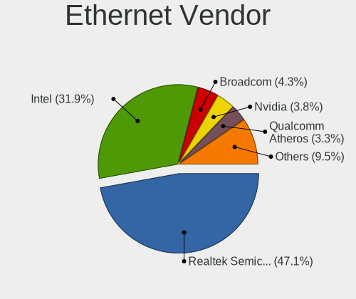

| Vendor                         | Desktops | Percent |
|--------------------------------|----------|---------|
| Realtek Semiconductor          | 127      | 58.26%  |
| Intel                          | 52       | 23.85%  |
| Nvidia                         | 13       | 5.96%   |
| Qualcomm Atheros               | 8        | 3.67%   |
| Marvell Technology Group       | 6        | 2.75%   |
| Broadcom Inc. and subsidiaries | 4        | 1.83%   |
| Samsung Electronics            | 2        | 0.92%   |
| VIA Technologies               | 1        | 0.46%   |
| IBM                            | 1        | 0.46%   |
| Huawei Technologies            | 1        | 0.46%   |
| D-Link System                  | 1        | 0.46%   |
| Compal Electronics             | 1        | 0.46%   |
| Apple                          | 1        | 0.46%   |

Ethernet Model
--------------

Ethernet models

| Model                                                                          | Desktops | Percent |
|--------------------------------------------------------------------------------|----------|---------|
| Realtek RTL8111/8168/8411 PCI Express Gigabit Ethernet Controller              | 105      | 47.3%   |
| Realtek RTL8125 2.5GbE Controller                                              | 7        | 3.15%   |
| Realtek RTL810xE PCI Express Fast Ethernet controller                          | 7        | 3.15%   |
| Realtek RTL-8100/8101L/8139 PCI Fast Ethernet Adapter                          | 6        | 2.7%    |
| Intel Ethernet Connection (7) I219-V                                           | 6        | 2.7%    |
| Nvidia MCP61 Ethernet                                                          | 5        | 2.25%   |
| Marvell Group 88E8056 PCI-E Gigabit Ethernet Controller                        | 5        | 2.25%   |
| Intel Ethernet Connection I217-V                                               | 5        | 2.25%   |
| Intel Ethernet Connection (2) I219-V                                           | 5        | 2.25%   |
| Intel 82579V Gigabit Network Connection                                        | 5        | 2.25%   |
| Intel 82579LM Gigabit Network Connection (Lewisville)                          | 5        | 2.25%   |
| Intel 82562V-2 10/100 Network Connection                                       | 4        | 1.8%    |
| Qualcomm Atheros AR8151 v2.0 Gigabit Ethernet                                  | 3        | 1.35%   |
| Intel Ethernet Connection (2) I218-V                                           | 3        | 1.35%   |
| Samsung Galaxy series, misc. (tethering mode)                                  | 2        | 0.9%    |
| Nvidia MCP77 Ethernet                                                          | 2        | 0.9%    |
| Nvidia MCP67 Ethernet                                                          | 2        | 0.9%    |
| Marvell Group 88E8001 Gigabit Ethernet Controller                              | 2        | 0.9%    |
| Intel NM10/ICH7 Family LAN Controller                                          | 2        | 0.9%    |
| Intel I211 Gigabit Network Connection                                          | 2        | 0.9%    |
| Intel Ethernet Connection I217-LM                                              | 2        | 0.9%    |
| Intel Ethernet Connection (2) I219-LM                                          | 2        | 0.9%    |
| Intel 82567LM-3 Gigabit Network Connection                                     | 2        | 0.9%    |
| VIA VT6105/VT6106S [Rhine-III]                                                 | 1        | 0.45%   |
| Realtek RTL8169 PCI Gigabit Ethernet Controller                                | 1        | 0.45%   |
| Realtek RTL-8110SC/8169SC Gigabit Ethernet                                     | 1        | 0.45%   |
| Realtek Killer E2600 Gigabit Ethernet Controller                               | 1        | 0.45%   |
| Qualcomm Atheros Killer E2500 Gigabit Ethernet Controller                      | 1        | 0.45%   |
| Qualcomm Atheros Killer E220x Gigabit Ethernet Controller                      | 1        | 0.45%   |
| Qualcomm Atheros Attansic L1 Gigabit Ethernet                                  | 1        | 0.45%   |
| Qualcomm Atheros AR8161 Gigabit Ethernet                                       | 1        | 0.45%   |
| Qualcomm Atheros AR8121/AR8113/AR8114 Gigabit or Fast Ethernet                 | 1        | 0.45%   |
| Nvidia MCP79 Ethernet                                                          | 1        | 0.45%   |
| Nvidia MCP73 Ethernet                                                          | 1        | 0.45%   |
| Nvidia MCP55 Ethernet                                                          | 1        | 0.45%   |
| Nvidia MCP51 Ethernet Controller                                               | 1        | 0.45%   |
| Marvell Group Yukon Optima 88E8059 [PCIe Gigabit Ethernet Controller with AVB] | 1        | 0.45%   |
| Intel I210 Gigabit Network Connection                                          | 1        | 0.45%   |
| Intel Ethernet Connection (12) I219-V                                          | 1        | 0.45%   |
| Intel 82578DM Gigabit Network Connection                                       | 1        | 0.45%   |
| Intel 82574L Gigabit Network Connection                                        | 1        | 0.45%   |
| Intel 82571EB/82571GB Gigabit Ethernet Controller (Copper)                     | 1        | 0.45%   |
| Intel 82567V-4 Gigabit Network Connection                                      | 1        | 0.45%   |
| Intel 82567LF-3 Gigabit Network Connection                                     | 1        | 0.45%   |
| Intel 82566DM-2 Gigabit Network Connection                                     | 1        | 0.45%   |
| Intel 82562EZ 10/100 Ethernet Controller                                       | 1        | 0.45%   |
| Intel 80003ES2LAN Gigabit Ethernet Controller (Copper)                         | 1        | 0.45%   |
| IBM RNDIS/CDC ETHER                                                            | 1        | 0.45%   |
| Huawei JNY-LX1                                                                 | 1        | 0.45%   |
| D-Link System Gigabit Ethernet Adapter                                         | 1        | 0.45%   |
| Compal Android                                                                 | 1        | 0.45%   |
| Broadcom Inc. and subsidiaries NetXtreme BCM5762 Gigabit Ethernet PCIe         | 1        | 0.45%   |
| Broadcom Inc. and subsidiaries NetXtreme BCM5761 Gigabit Ethernet PCIe         | 1        | 0.45%   |
| Broadcom Inc. and subsidiaries NetXtreme BCM5754 Gigabit Ethernet PCI Express  | 1        | 0.45%   |
| Broadcom Inc. and subsidiaries NetLink BCM57781 Gigabit Ethernet PCIe          | 1        | 0.45%   |
| Apple iPad 3 (CDMA)                                                            | 1        | 0.45%   |

Net Controller Kind
-------------------

Ethernet, WiFi or modem

| Kind     | Desktops | Percent |
|----------|----------|---------|
| Ethernet | 203      | 70.24%  |
| WiFi     | 85       | 29.41%  |
| Modem    | 1        | 0.35%   |

Used Controller
---------------

Currently used network controller

| Kind     | Desktops | Percent |
|----------|----------|---------|
| Ethernet | 188      | 72.03%  |
| WiFi     | 73       | 27.97%  |

NICs
----

Total network controllers on board

| Total | Desktops | Percent |
|-------|----------|---------|
| 1     | 143      | 69.76%  |
| 2     | 53       | 25.85%  |
| 3     | 4        | 1.95%   |
| 0     | 3        | 1.46%   |
| 5     | 2        | 0.98%   |

Memory Vendor
-------------

Memory module vendors

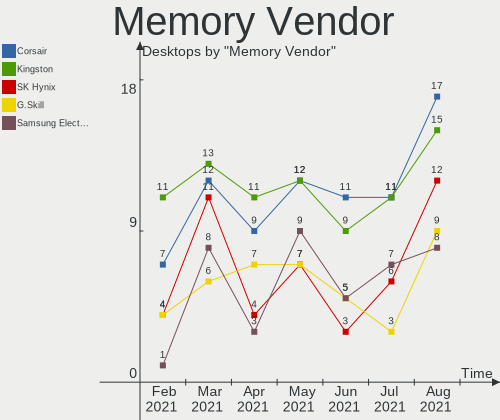

| Vendor              | Desktops | Percent |
|---------------------|----------|---------|
| Unknown             | 17       | 32.08%  |
| Kingston            | 11       | 20.75%  |
| Corsair             | 7        | 13.21%  |
| SK Hynix            | 4        | 7.55%   |
| G.Skill             | 4        | 7.55%   |
| Crucial             | 3        | 5.66%   |
| Team                | 2        | 3.77%   |
| Unknown (ABCD)      | 1        | 1.89%   |
| Silicon Power       | 1        | 1.89%   |
| Samsung Electronics | 1        | 1.89%   |
| Patriot             | 1        | 1.89%   |
| Nanya Technology    | 1        | 1.89%   |

Memory Model
------------

Memory module models

| Model                                                          | Desktops | Percent |
|----------------------------------------------------------------|----------|---------|
| Unknown RAM Module 8192MB DIMM DDR3 1600MT/s                   | 2        | 3.45%   |
| Unknown RAM Module 4096MB DIMM DDR3 1333MT/s                   | 2        | 3.45%   |
| Kingston RAM KHX3200C16D4/8GX 8192MB DIMM DDR4 3533MT/s        | 2        | 3.45%   |
| Kingston RAM KHX1866C10D3/8G 8GB DIMM DDR3 1600MT/s            | 2        | 3.45%   |
| Unknown RAM Module 8GB DIMM 1333MT/s                           | 1        | 1.72%   |
| Unknown RAM Module 8192MB DIMM DDR3 1866MT/s                   | 1        | 1.72%   |
| Unknown RAM Module 8192MB DIMM DDR3 1333MT/s                   | 1        | 1.72%   |
| Unknown RAM Module 8192MB DIMM DDR 1333MT/s                    | 1        | 1.72%   |
| Unknown RAM Module 4GB DIMM SDRAM                              | 1        | 1.72%   |
| Unknown RAM Module 4096MB DIMM DDR 1333MT/s                    | 1        | 1.72%   |
| Unknown RAM Module 4096MB DIMM 400MT/s                         | 1        | 1.72%   |
| Unknown RAM Module 4096MB DIMM 1333MT/s                        | 1        | 1.72%   |
| Unknown RAM Module 2048MB DIMM DDR2 200MT/s                    | 1        | 1.72%   |
| Unknown RAM Module 2048MB DIMM DDR2 1333MT/s                   | 1        | 1.72%   |
| Unknown RAM Module 2048MB DIMM DDR2                            | 1        | 1.72%   |
| Unknown RAM Module 2048MB DIMM DDR 1333MT/s                    | 1        | 1.72%   |
| Unknown RAM Module 2048MB DIMM 667MT/s                         | 1        | 1.72%   |
| Unknown RAM Module 2048MB DIMM 400MT/s                         | 1        | 1.72%   |
| Unknown RAM Module 1GB DIMM                                    | 1        | 1.72%   |
| Unknown RAM Module 1024MB DIMM DDR2 667MT/s                    | 1        | 1.72%   |
| Unknown (ABCD) RAM 123456789012345678 2GB DIMM LPDDR4 2400MT/s | 1        | 1.72%   |
| Team RAM TEAMGROUP-UD4-3200 16384MB DIMM DDR4 3200MT/s         | 1        | 1.72%   |
| Team RAM Elite-1333 2048MB DIMM DDR3 1333MT/s                  | 1        | 1.72%   |
| SK Hynix RAM Module 4096MB FB-DIMM DDR2 667MT/s                | 1        | 1.72%   |
| SK Hynix RAM HMT451S6BFR8A-PB 4096MB DIMM DDR3 1600MT/s        | 1        | 1.72%   |
| SK Hynix RAM HMT41GU6MFR8C-PB 8192MB DIMM DDR3 1600MT/s        | 1        | 1.72%   |
| SK Hynix RAM HMT41GS6BFR8A-PB 8GB SODIMM DDR3 1600MT/s         | 1        | 1.72%   |
| Silicon Power RAM ESRD313334GB 4096MB DIMM DDR3 1333MT/s       | 1        | 1.72%   |
| Samsung RAM M378B5773SB0-CK0 2048MB DIMM DDR3 1600MT/s         | 1        | 1.72%   |
| Patriot RAM 2666 C16 Series 16384MB DIMM DDR4 2667MT/s         | 1        | 1.72%   |
| Nanya RAM NT2GC64B88B0NF-CG 2048MB DIMM DDR3 1333MT/s          | 1        | 1.72%   |
| Kingston RAM KHX3466C16D4/16GX 16384MB DIMM DDR4 3466MT/s      | 1        | 1.72%   |
| Kingston RAM KHX1600C9D3/4GX 4GB DIMM DDR3 2400MT/s            | 1        | 1.72%   |
| Kingston RAM KHX1600C10D3/4G 4GB DIMM DDR3 1866MT/s            | 1        | 1.72%   |
| Kingston RAM 99U5458-001.A00LF 2048MB DIMM 1600MT/s            | 1        | 1.72%   |
| Kingston RAM 99U5403-034.A00LF 4096MB DIMM DDR3 1333MT/s       | 1        | 1.72%   |
| Kingston RAM 9905474-012.A00LF 2048MB DIMM DDR3 1333MT/s       | 1        | 1.72%   |
| Kingston RAM 9905471-017.A00LF 4096MB DIMM DDR3 1333MT/s       | 1        | 1.72%   |
| Kingston RAM 9905403-011.A03LF 2048MB DIMM 1333MT/s            | 1        | 1.72%   |
| G.Skill RAM F4-3200C16-8GIS 8192MB DIMM DDR4 3200MT/s          | 1        | 1.72%   |
| G.Skill RAM F4-3200C16-16GVK 16GB DIMM DDR4 3600MT/s           | 1        | 1.72%   |
| G.Skill RAM F4-3200C16-16GIS 16384MB DIMM DDR4 3200MT/s        | 1        | 1.72%   |
| G.Skill RAM F3-10666CL9-8GBNT 8192MB DIMM DDR3 1333MT/s        | 1        | 1.72%   |
| Crucial RAM CT8G4DFS8266.C8FD1 8GB DIMM DDR4 2667MT/s          | 1        | 1.72%   |
| Crucial RAM CT102464BD160B.C16 8GB DIMM DDR3 1600MT/s          | 1        | 1.72%   |
| Crucial RAM BLS8G3D1609DS1S00. 8192MB DIMM DDR3 1600MT/s       | 1        | 1.72%   |
| Corsair RAM CMZ8GX3M2A1600C9 4GB DIMM DDR3 1600MT/s            | 1        | 1.72%   |
| Corsair RAM CMY32GX3M4A1600C9 8192MB DIMM DDR3 1600MT/s        | 1        | 1.72%   |
| Corsair RAM CMX16GX3M4A1333C9 4096MB DIMM DDR3 1333MT/s        | 1        | 1.72%   |
| Corsair RAM CMV4GX3M1A1333C9 4GB DIMM DDR3 1600MT/s            | 1        | 1.72%   |
| Corsair RAM CMSX4GX3M1A1600C9 4096MB SODIMM DDR3 1600MT/s      | 1        | 1.72%   |
| Corsair RAM CMK16GX4M2D3000C16 8192MB DIMM DDR4 3200MT/s       | 1        | 1.72%   |
| Corsair RAM CMK16GX4M2A2666C16 8GB DIMM DDR4 3200MT/s          | 1        | 1.72%   |
| Corsair RAM CMK16GX4M2A2666C.6 8GB DIMM DDR4 2666MT/s          | 1        | 1.72%   |

Memory Kind
-----------

Memory module kinds

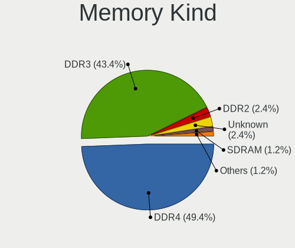

| Kind    | Desktops | Percent |
|---------|----------|---------|
| DDR3    | 23       | 48.94%  |
| DDR4    | 11       | 23.4%   |
| DDR2    | 5        | 10.64%  |
| Unknown | 5        | 10.64%  |
| SDRAM   | 1        | 2.13%   |
| LPDDR4  | 1        | 2.13%   |
| DDR     | 1        | 2.13%   |

Memory Form Factor
------------------

Physical design of the memory module

| Name    | Desktops | Percent |
|---------|----------|---------|
| DIMM    | 44       | 93.62%  |
| SODIMM  | 2        | 4.26%   |
| FB-DIMM | 1        | 2.13%   |

Memory Size
-----------

Memory module size

| Size  | Desktops | Percent |
|-------|----------|---------|
| 8192  | 20       | 37.74%  |
| 4096  | 14       | 26.42%  |
| 2048  | 11       | 20.75%  |
| 16384 | 6        | 11.32%  |
| 1024  | 2        | 3.77%   |

Memory Speed
------------

Memory module speed

| Speed   | Desktops | Percent |
|---------|----------|---------|
| 1333    | 13       | 25.49%  |
| 1600    | 12       | 23.53%  |
| 3200    | 5        | 9.8%    |
| 667     | 3        | 5.88%   |
| Unknown | 3        | 5.88%   |
| 3533    | 2        | 3.92%   |
| 2667    | 2        | 3.92%   |
| 2400    | 2        | 3.92%   |
| 2133    | 2        | 3.92%   |
| 1866    | 2        | 3.92%   |
| 3600    | 1        | 1.96%   |
| 3466    | 1        | 1.96%   |
| 2666    | 1        | 1.96%   |
| 400     | 1        | 1.96%   |
| 200     | 1        | 1.96%   |

Sound Vendor
------------

Sound card vendors

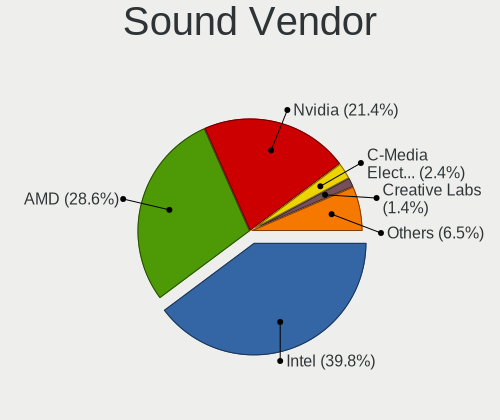

| Vendor                           | Desktops | Percent |
|----------------------------------|----------|---------|
| Intel                            | 127      | 38.72%  |
| AMD                              | 84       | 25.61%  |
| Nvidia                           | 76       | 23.17%  |
| C-Media Electronics              | 11       | 3.35%   |
| Creative Labs                    | 7        | 2.13%   |
| JMTek                            | 2        | 0.61%   |
| Generalplus Technology           | 2        | 0.61%   |
| Creative Technology              | 2        | 0.61%   |
| Yamaha                           | 1        | 0.3%    |
| VIA Technologies                 | 1        | 0.3%    |
| Turtle Beach                     | 1        | 0.3%    |
| Tenx Technology                  | 1        | 0.3%    |
| Tdlasunnic                       | 1        | 0.3%    |
| Silicon Integrated Systems [SiS] | 1        | 0.3%    |
| Samsung Electronics              | 1        | 0.3%    |
| Roland                           | 1        | 0.3%    |
| Razer USA                        | 1        | 0.3%    |
| Plantronics                      | 1        | 0.3%    |
| Microsoft                        | 1        | 0.3%    |
| Medeli Electronics               | 1        | 0.3%    |
| Logitech                         | 1        | 0.3%    |
| Kingston Technology              | 1        | 0.3%    |
| Dell                             | 1        | 0.3%    |
| BEHRINGER International          | 1        | 0.3%    |
| Asahi Kasei Microsystems         | 1        | 0.3%    |

Sound Model
-----------

Sound card models

| Model                                                                             | Desktops | Percent |
|-----------------------------------------------------------------------------------|----------|---------|
| Intel 6 Series/C200 Series Chipset Family High Definition Audio Controller        | 21       | 5.41%   |
| AMD SBx00 Azalia (Intel HDA)                                                      | 20       | 5.15%   |
| Intel 8 Series/C220 Series Chipset High Definition Audio Controller               | 16       | 4.12%   |
| Intel Xeon E3-1200 v3/4th Gen Core Processor HD Audio Controller                  | 14       | 3.61%   |
| AMD FCH Azalia Controller                                                         | 14       | 3.61%   |
| Nvidia GK208 HDMI/DP Audio Controller                                             | 12       | 3.09%   |
| Intel NM10/ICH7 Family High Definition Audio Controller                           | 12       | 3.09%   |
| Intel 82801I (ICH9 Family) HD Audio Controller                                    | 10       | 2.58%   |
| AMD Oland/Hainan/Cape Verde/Pitcairn HDMI Audio [Radeon HD 7000 Series]           | 9        | 2.32%   |
| AMD Family 17h (Models 10h-1fh) HD Audio Controller                               | 9        | 2.32%   |
| AMD Ellesmere HDMI Audio [Radeon RX 470/480 / 570/580/590]                        | 9        | 2.32%   |
| Intel Cannon Lake PCH cAVS                                                        | 8        | 2.06%   |
| Intel 82801JI (ICH10 Family) HD Audio Controller                                  | 8        | 2.06%   |
| Nvidia High Definition Audio Controller                                           | 7        | 1.8%    |
| AMD Raven/Raven2/Fenghuang HDMI/DP Audio Controller                               | 7        | 1.8%    |
| Nvidia GF108 High Definition Audio Controller                                     | 6        | 1.55%   |
| Intel 7 Series/C216 Chipset Family High Definition Audio Controller               | 6        | 1.55%   |
| Intel 5 Series/3400 Series Chipset High Definition Audio                          | 6        | 1.55%   |
| AMD Starship/Matisse HD Audio Controller                                          | 6        | 1.55%   |
| Intel Audio device                                                                | 5        | 1.29%   |
| Intel 9 Series Chipset Family HD Audio Controller                                 | 5        | 1.29%   |
| Intel 100 Series/C230 Series Chipset Family HD Audio Controller                   | 5        | 1.29%   |
| AMD Trinity HDMI Audio Controller                                                 | 5        | 1.29%   |
| Nvidia TU116 High Definition Audio Controller                                     | 4        | 1.03%   |
| Nvidia MCP61 High Definition Audio                                                | 4        | 1.03%   |
| Nvidia GP107GL High Definition Audio Controller                                   | 4        | 1.03%   |
| Nvidia GK106 HDMI Audio Controller                                                | 4        | 1.03%   |
| Nvidia GF119 HDMI Audio Controller                                                | 4        | 1.03%   |
| Intel 82801JD/DO (ICH10 Family) HD Audio Controller                               | 4        | 1.03%   |
| Intel 200 Series PCH HD Audio                                                     | 4        | 1.03%   |
| AMD Turks HDMI Audio [Radeon HD 6500/6600 / 6700M Series]                         | 4        | 1.03%   |
| AMD Family 17h (Models 00h-0fh) HD Audio Controller                               | 4        | 1.03%   |
| Nvidia TU104 HD Audio Controller                                                  | 3        | 0.77%   |
| Nvidia GP108 High Definition Audio Controller                                     | 3        | 0.77%   |
| Nvidia GK107 HDMI Audio Controller                                                | 3        | 0.77%   |
| Intel Comet Lake PCH cAVS                                                         | 3        | 0.77%   |
| Intel Celeron/Pentium Silver Processor High Definition Audio                      | 3        | 0.77%   |
| Intel C610/X99 series chipset HD Audio Controller                                 | 3        | 0.77%   |
| Intel Atom Processor Z36xxx/Z37xxx Series High Definition Audio Controller        | 3        | 0.77%   |
| Creative Labs Sound Core3D [Sound Blaster Recon3D / Z-Series]                     | 3        | 0.77%   |
| C-Media Electronics CMI8788 [Oxygen HD Audio]                                     | 3        | 0.77%   |
| AMD RV710/730 HDMI Audio [Radeon HD 4000 series]                                  | 3        | 0.77%   |
| AMD RS780 HDMI Audio [Radeon 3000/3100 / HD 3200/3300]                            | 3        | 0.77%   |
| AMD Cedar HDMI Audio [Radeon HD 5400/6300/7300 Series]                            | 3        | 0.77%   |
| AMD Caicos HDMI Audio [Radeon HD 6450 / 7450/8450/8490 OEM / R5 230/235/235X OEM] | 3        | 0.77%   |
| AMD Baffin HDMI/DP Audio [Radeon RX 550 640SP / RX 560/560X]                      | 3        | 0.77%   |
| Nvidia MCP72XE/MCP72P/MCP78U/MCP78S High Definition Audio                         | 2        | 0.52%   |
| Nvidia MCP67 High Definition Audio                                                | 2        | 0.52%   |
| Nvidia GP106 High Definition Audio Controller                                     | 2        | 0.52%   |
| Nvidia GP104 High Definition Audio Controller                                     | 2        | 0.52%   |
| Nvidia GM107 High Definition Audio Controller [GeForce 940MX]                     | 2        | 0.52%   |
| Nvidia GK104 HDMI Audio Controller                                                | 2        | 0.52%   |
| Nvidia GF114 HDMI Audio Controller                                                | 2        | 0.52%   |
| JMTek USB PnP Audio Device                                                        | 2        | 0.52%   |
| Generalplus Technology USB Audio Device                                           | 2        | 0.52%   |
| Creative Labs EMU10k1 [Sound Blaster Live! Series]                                | 2        | 0.52%   |
| C-Media Electronics CMI8738/CMI8768 PCI Audio                                     | 2        | 0.52%   |
| C-Media Electronics Blue Snowball                                                 | 2        | 0.52%   |
| C-Media Electronics Audio Adapter (Unitek Y-247A)                                 | 2        | 0.52%   |
| AMD Tonga HDMI Audio [Radeon R9 285/380]                                          | 2        | 0.52%   |

Camera Vendor
-------------

Camera device vendors

| Vendor                        | Desktops | Percent |
|-------------------------------|----------|---------|
| Logitech                      | 12       | 29.27%  |
| Samsung Electronics           | 5        | 12.2%   |
| Microdia                      | 3        | 7.32%   |
| GEMBIRD                       | 2        | 4.88%   |
| ARC International             | 2        | 4.88%   |
| Z-Star Microelectronics       | 1        | 2.44%   |
| Unknown                       | 1        | 2.44%   |
| Trust                         | 1        | 2.44%   |
| Sunplus Innovation Technology | 1        | 2.44%   |
| Philips (or NXP)              | 1        | 2.44%   |
| Microsoft                     | 1        | 2.44%   |
| MacroSilicon                  | 1        | 2.44%   |
| lihappe8                      | 1        | 2.44%   |
| KYE Systems (Mouse Systems)   | 1        | 2.44%   |
| Jieli Technology              | 1        | 2.44%   |
| IMC Networks                  | 1        | 2.44%   |
| Generalplus Technology        | 1        | 2.44%   |
| Cubeternet                    | 1        | 2.44%   |
| Creative Technology           | 1        | 2.44%   |
| Chicony Electronics           | 1        | 2.44%   |
| Aveo Technology               | 1        | 2.44%   |
| Arkmicro Technologies         | 1        | 2.44%   |

Camera Model
------------

Camera device models

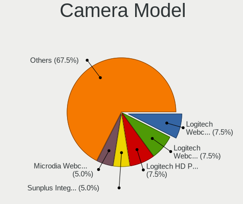

| Model                                             | Desktops | Percent |
|---------------------------------------------------|----------|---------|
| Samsung Galaxy A5 (MTP)                           | 5        | 12.2%   |
| Logitech Webcam C310                              | 2        | 4.88%   |
| ARC International Camera                          | 2        | 4.88%   |
| Z-Star Vimicro USB Camera (Altair)                | 1        | 2.44%   |
| Unknown USB 2760 Camera                           | 1        | 2.44%   |
| Trust 17676 Webcam                                | 1        | 2.44%   |
| Sunplus ABKO APC930 QHD WEBCAM                    | 1        | 2.44%   |
| Philips (or NXP) Webcam SPC530NC                  | 1        | 2.44%   |
| Microsoft Microsoft LifeCam VX-5500             | 1        | 2.44%   |
| Microdia Webcam Vitade AF                         | 1        | 2.44%   |
| Microdia USB Camera                               | 1        | 2.44%   |
| Microdia Sonix USB 2.0 Camera                     | 1        | 2.44%   |
| MacroSilicon MiraBox Capture                      | 1        | 2.44%   |
| Logitech Webcam C270                              | 1        | 2.44%   |
| Logitech Webcam C170                              | 1        | 2.44%   |
| Logitech QuickCam Pro 5000                        | 1        | 2.44%   |
| Logitech QuickCam Pro 4000                        | 1        | 2.44%   |
| Logitech QuickCam Communicate Deluxe/S7500        | 1        | 2.44%   |
| Logitech HD Webcam C910                           | 1        | 2.44%   |
| Logitech HD Webcam C525                           | 1        | 2.44%   |
| Logitech CrystalCam                               | 1        | 2.44%   |
| Logitech C922 Pro Stream Webcam                   | 1        | 2.44%   |
| Logitech C505e HD Webcam                          | 1        | 2.44%   |
| lihappe8 USB 2.0 Camera                           | 1        | 2.44%   |
| KYE Systems (Mouse Systems) PC-LM1E Camera        | 1        | 2.44%   |
| Jieli USB PHY 2.0                                 | 1        | 2.44%   |
| IMC Networks XHC Camera                           | 1        | 2.44%   |
| Generalplus 808 Camera #9 (web-cam mode)          | 1        | 2.44%   |
| GEMBIRD TIGA Device                               | 1        | 2.44%   |
| GEMBIRD Generic UVC 1.00 camera [AppoTech AX2311] | 1        | 2.44%   |
| Cubeternet USB2.0 Camera                          | 1        | 2.44%   |
| Creative VF0610 Live! Cam Socialize HD            | 1        | 2.44%   |
| Chicony CNF7166                                   | 1        | 2.44%   |
| Aveo USB2.0 Camera                                | 1        | 2.44%   |
| Arkmicro USB2.0 PC CAMERA                         | 1        | 2.44%   |

Fingerprint Vendor
------------------

Fingerprint sensor vendors

Zero info for selected period =(

Fingerprint Model
-----------------

Fingerprint sensor models

Zero info for selected period =(

Chipcard Vendor
---------------

Chipcard module vendors

| Vendor                | Desktops | Percent |
|-----------------------|----------|---------|
| Realtek Semiconductor | 1        | 33.33%  |
| OmniKey               | 1        | 33.33%  |
| Alcor Micro           | 1        | 33.33%  |

Chipcard Model
--------------

Chipcard module models

| Model                                             | Desktops | Percent |
|---------------------------------------------------|----------|---------|
| Realtek Semiconductor Smart Card Reader Interface | 1        | 33.33%  |
| OmniKey CardMan 3121                              | 1        | 33.33%  |
| Alcor Micro EMV Certified Smart Card Reader       | 1        | 33.33%  |

Printer Vendor
--------------

Printer device vendors

| Vendor                 | Desktops | Percent |
|------------------------|----------|---------|
| Hewlett-Packard        | 9        | 69.23%  |
| Samsung Electronics    | 2        | 15.38%  |
| Canon                  | 1        | 7.69%   |
| Agere Systems (Lucent) | 1        | 7.69%   |

Printer Model
-------------

Printer device models

| Model                                       | Desktops | Percent |
|---------------------------------------------|----------|---------|
| HP LaserJet 1020                            | 2        | 15.38%  |
| Samsung M2070 Series                        | 1        | 7.69%   |
| Samsung M2020 Series                        | 1        | 7.69%   |
| HP OfficeJet Pro 8210                       | 1        | 7.69%   |
| HP OfficeJet Pro 8020 series                | 1        | 7.69%   |
| HP OfficeJet Pro 6960                       | 1        | 7.69%   |
| HP OfficeJet 4650 series                    | 1        | 7.69%   |
| HP LaserJet P2014                           | 1        | 7.69%   |
| HP LaserJet 1320                            | 1        | 7.69%   |
| HP Laser 107w                               | 1        | 7.69%   |
| Canon G3000 series                          | 1        | 7.69%   |
| Agere Systems (Lucent) USS720 Parallel Port | 1        | 7.69%   |

Scanner Vendor
--------------

Scanner device vendors

| Vendor | Desktops | Percent |
|--------|----------|---------|
| Canon  | 6        | 100%    |

Scanner Model
-------------

Scanner device models

| Model                    | Desktops | Percent |
|--------------------------|----------|---------|
| Canon CanoScan LiDE 120  | 3        | 50%     |
| Canon CanoScan LiDE 700F | 1        | 16.67%  |
| Canon CanoScan LIDE 25   | 1        | 16.67%  |
| Canon CanoScan LiDE 110  | 1        | 16.67%  |

Bluetooth Vendor
----------------

Controller vendors

| Vendor                          | Desktops | Percent |
|---------------------------------|----------|---------|
| Cambridge Silicon Radio         | 21       | 41.18%  |
| Intel                           | 15       | 29.41%  |
| Broadcom                        | 5        | 9.8%    |
| Realtek Semiconductor           | 4        | 7.84%   |
| Lite-On Technology              | 2        | 3.92%   |
| Qualcomm Atheros Communications | 1        | 1.96%   |
| Integrated System Solution      | 1        | 1.96%   |
| Dynex                           | 1        | 1.96%   |
| Apple                           | 1        | 1.96%   |

Bluetooth Model
---------------

Controller models

| Model                                                    | Desktops | Percent |
|----------------------------------------------------------|----------|---------|
| Cambridge Silicon Radio Bluetooth Dongle (HCI mode)      | 21       | 41.18%  |
| Intel Bluetooth wireless interface                       | 8        | 15.69%  |
| Realtek Bluetooth Radio                                  | 3        | 5.88%   |
| Intel AX200 Bluetooth                                    | 3        | 5.88%   |
| Lite-On Bluetooth Device                                 | 2        | 3.92%   |
| Intel Bluetooth 9460/9560 Jefferson Peak (JfP)           | 2        | 3.92%   |
| Broadcom BCM20702A0 Bluetooth 4.0                        | 2        | 3.92%   |
| Realtek  Bluetooth 4.2 Adapter                           | 1        | 1.96%   |
| Qualcomm Atheros AR3011 Bluetooth                        | 1        | 1.96%   |
| Intel Wireless-AC 9260 Bluetooth Adapter                 | 1        | 1.96%   |
| Intel Wireless-AC 3168 Bluetooth                         | 1        | 1.96%   |
| Integrated System Solution KY-BT100 Bluetooth Adapter    | 1        | 1.96%   |
| Dynex Bluetooth 4.0 Adapter [Broadcom, 1.12, BCM20702A0] | 1        | 1.96%   |
| Broadcom Bluetooth 3.0 USB Dongle                        | 1        | 1.96%   |
| Broadcom Bluetooth 2.0+eDR dongle                        | 1        | 1.96%   |
| Broadcom BCM92046DG-CL1ROM Bluetooth 2.1 Adapter         | 1        | 1.96%   |
| Apple Bluetooth HCI                                      | 1        | 1.96%   |

Unsupported Devices
-------------------

Total unsupported devices on board

| Total | Desktops | Percent |
|-------|----------|---------|
| 0     | 174      | 84.88%  |
| 1     | 28       | 13.66%  |
| 2     | 2        | 0.98%   |
| 4     | 1        | 0.49%   |

Unsupported Device Types
------------------------

Types of unsupported devices

| Type                     | Desktops | Percent |
|--------------------------|----------|---------|
| Graphics card            | 12       | 36.36%  |
| Net/wireless             | 5        | 15.15%  |
| Unassigned class         | 3        | 9.09%   |
| Multimedia controller    | 3        | 9.09%   |
| Dvb card                 | 2        | 6.06%   |
| Chipcard                 | 2        | 6.06%   |
| Sound                    | 1        | 3.03%   |
| Net/ethernet             | 1        | 3.03%   |
| Modem                    | 1        | 3.03%   |
| Firewire controller      | 1        | 3.03%   |
| Communication controller | 1        | 3.03%   |
| Card reader              | 1        | 3.03%   |

