Mint Hardware Trends (Desktop)
------------------------------

A project to identify most popular hardware characteristics and track their change
over time based on data collected by Mint users at https://Linux-Hardware.org.

Anyone can contribute to the study by uploading probes of their computers by
the [hw-probe](https://github.com/linuxhw/hw-probe) tool:

    sudo -E hw-probe -all -upload

Full-feature report is available here: https://linux-hardware.org/?view=trends&formfactor=desktop

Period: May, 2021.

Contents
--------

- [ OS                       ](#os)
- [ OS Family                ](#os-family)
- [ Kernel                   ](#kernel)
- [ Kernel Family            ](#kernel-family)
- [ Kernel Major Ver.        ](#kernel-major-ver)
- [ Arch                     ](#arch)
- [ DE                       ](#de)
- [ Display Server           ](#display-server)
- [ Display Manager          ](#display-manager)
- [ OS Lang                  ](#os-lang)
- [ Boot Mode                ](#boot-mode)
- [ Filesystem               ](#filesystem)
- [ Part. scheme             ](#part-scheme)
- [ Dual Boot with Linux/BSD ](#dual-boot-with-linux/bsd)
- [ Dual Boot (Win)          ](#dual-boot-win)
- [ Country                  ](#country)
- [ City                     ](#city)
- [ Vendor                   ](#vendor)
- [ Model                    ](#model)
- [ Model Family             ](#model-family)
- [ MFG Year                 ](#mfg-year)
- [ Form Factor              ](#form-factor)
- [ Secure Boot              ](#secure-boot)
- [ Coreboot                 ](#coreboot)
- [ RAM Size                 ](#ram-size)
- [ RAM Used                 ](#ram-used)
- [ Has CD-ROM               ](#has-cd-rom)
- [ Total Drives             ](#total-drives)
- [ Has Ethernet             ](#has-ethernet)
- [ Has WiFi                 ](#has-wifi)
- [ Has Bluetooth            ](#has-bluetooth)
- [ Drive Vendor             ](#drive-vendor)
- [ Drive Model              ](#drive-model)
- [ HDD Vendor               ](#hdd-vendor)
- [ SSD Vendor               ](#ssd-vendor)
- [ Drive Kind               ](#drive-kind)
- [ Drive Connector          ](#drive-connector)
- [ Drive Size               ](#drive-size)
- [ Space Total              ](#space-total)
- [ Space Used               ](#space-used)
- [ Malfunc. Drives          ](#malfunc-drives)
- [ Malfunc. Drive Vendor    ](#malfunc-drive-vendor)
- [ Malfunc. HDD Vendor      ](#malfunc-hdd-vendor)
- [ Malfunc. Drive Kind      ](#malfunc-drive-kind)
- [ Failed Drives            ](#failed-drives)
- [ Failed Drive Vendor      ](#failed-drive-vendor)
- [ Drive Status             ](#drive-status)
- [ Storage Vendor           ](#storage-vendor)
- [ Storage Model            ](#storage-model)
- [ Storage Kind             ](#storage-kind)
- [ CPU Vendor               ](#cpu-vendor)
- [ CPU Model                ](#cpu-model)
- [ CPU Model Family         ](#cpu-model-family)
- [ CPU Cores                ](#cpu-cores)
- [ CPU Sockets              ](#cpu-sockets)
- [ CPU Threads              ](#cpu-threads)
- [ CPU Op-Modes             ](#cpu-op-modes)
- [ CPU Microcode            ](#cpu-microcode)
- [ CPU Microarch            ](#cpu-microarch)
- [ GPU Vendor               ](#gpu-vendor)
- [ GPU Model                ](#gpu-model)
- [ GPU Combo                ](#gpu-combo)
- [ GPU Driver               ](#gpu-driver)
- [ GPU Memory               ](#gpu-memory)
- [ Monitor Vendor           ](#monitor-vendor)
- [ Monitor Model            ](#monitor-model)
- [ Monitor Resolution       ](#monitor-resolution)
- [ Monitor Diagonal         ](#monitor-diagonal)
- [ Monitor Width            ](#monitor-width)
- [ Aspect Ratio             ](#aspect-ratio)
- [ Monitor Area             ](#monitor-area)
- [ Pixel Density            ](#pixel-density)
- [ Multiple Monitors        ](#multiple-monitors)
- [ Net Controller Vendor    ](#net-controller-vendor)
- [ Net Controller Model     ](#net-controller-model)
- [ Wireless Vendor          ](#wireless-vendor)
- [ Wireless Model           ](#wireless-model)
- [ Ethernet Vendor          ](#ethernet-vendor)
- [ Ethernet Model           ](#ethernet-model)
- [ Net Controller Kind      ](#net-controller-kind)
- [ Used Controller          ](#used-controller)
- [ NICs                     ](#nics)
- [ IPv6                     ](#ipv6)
- [ Memory Vendor            ](#memory-vendor)
- [ Memory Model             ](#memory-model)
- [ Memory Kind              ](#memory-kind)
- [ Memory Form Factor       ](#memory-form-factor)
- [ Memory Size              ](#memory-size)
- [ Memory Speed             ](#memory-speed)
- [ Sound Vendor             ](#sound-vendor)
- [ Sound Model              ](#sound-model)
- [ Camera Vendor            ](#camera-vendor)
- [ Camera Model             ](#camera-model)
- [ Fingerprint Vendor       ](#fingerprint-vendor)
- [ Fingerprint Model        ](#fingerprint-model)
- [ Chipcard Vendor          ](#chipcard-vendor)
- [ Chipcard Model           ](#chipcard-model)
- [ Printer Vendor           ](#printer-vendor)
- [ Printer Model            ](#printer-model)
- [ Scanner Vendor           ](#scanner-vendor)
- [ Scanner Model            ](#scanner-model)
- [ Bluetooth Vendor         ](#bluetooth-vendor)
- [ Bluetooth Model          ](#bluetooth-model)
- [ Unsupported Devices      ](#unsupported-devices)
- [ Unsupported Device Types ](#unsupported-device-types)

OS
--

Installed operating systems

| Name      | Desktops | Percent |
|-----------|----------|---------|
| Mint 20.1 | 161      | 80.1%   |
| Mint 20   | 18       | 8.96%   |
| Mint 19.3 | 16       | 7.96%   |
| Mint 19.1 | 3        | 1.49%   |
| Mint 18.3 | 2        | 1%      |
| Mint 19.2 | 1        | 0.5%    |

OS Family
---------

OS without a version

| Name | Desktops | Percent |
|------|----------|---------|
| Mint | 201      | 100%    |

Kernel
------

Version of the Linux kernel

| Version                    | Desktops | Percent |
|----------------------------|----------|---------|
| 5.4.0-73-generic           | 89       | 44.28%  |
| 5.4.0-72-generic           | 54       | 26.87%  |
| 5.4.0-58-generic           | 12       | 5.97%   |
| 5.8.0-53-generic           | 8        | 3.98%   |
| 5.4.0-70-generic           | 6        | 2.99%   |
| 5.8.0-50-generic           | 4        | 1.99%   |
| 4.15.0-142-generic         | 4        | 1.99%   |
| 5.4.0-26-generic           | 3        | 1.49%   |
| 5.4.0-67-generic           | 2        | 1%      |
| 4.10.0-38-generic          | 2        | 1%      |
| 5.8.0-50-lowlatency        | 1        | 0.5%    |
| 5.4.0-72-lowlatency        | 1        | 0.5%    |
| 5.4.0-71-generic           | 1        | 0.5%    |
| 5.4.0-66-generic           | 1        | 0.5%    |
| 5.4.0-65-generic           | 1        | 0.5%    |
| 5.4.0-62-generic           | 1        | 0.5%    |
| 5.4.0-60-generic           | 1        | 0.5%    |
| 5.4.0-59-generic           | 1        | 0.5%    |
| 5.12.2-051202-generic      | 1        | 0.5%    |
| 5.12.0-051200rc8-generic   | 1        | 0.5%    |
| 5.11.0-18.1-liquorix-amd64 | 1        | 0.5%    |
| 5.10.5-2006-amd+           | 1        | 0.5%    |
| 5.10.0-1014-oem            | 1        | 0.5%    |
| 5.0.21-050021-generic      | 1        | 0.5%    |
| 5.0.0-32-generic           | 1        | 0.5%    |
| 4.15.0-54-generic          | 1        | 0.5%    |
| 4.15.0-20-generic          | 1        | 0.5%    |

Kernel Family
-------------

Linux kernel without a distro release

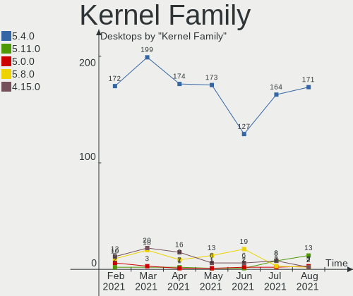

| Version | Desktops | Percent |
|---------|----------|---------|
| 5.4.0   | 173      | 86.07%  |
| 5.8.0   | 13       | 6.47%   |
| 4.15.0  | 6        | 2.99%   |
| 4.10.0  | 2        | 1%      |
| 5.12.2  | 1        | 0.5%    |
| 5.12.0  | 1        | 0.5%    |
| 5.11.0  | 1        | 0.5%    |
| 5.10.5  | 1        | 0.5%    |
| 5.10.0  | 1        | 0.5%    |
| 5.0.21  | 1        | 0.5%    |
| 5.0.0   | 1        | 0.5%    |

Kernel Major Ver.
-----------------

Linux kernel major version

| Version | Desktops | Percent |
|---------|----------|---------|
| 5.4     | 173      | 86.07%  |
| 5.8     | 13       | 6.47%   |
| 4.15    | 6        | 2.99%   |
| 5.12    | 2        | 1%      |
| 5.10    | 2        | 1%      |
| 5.0     | 2        | 1%      |
| 4.10    | 2        | 1%      |
| 5.11    | 1        | 0.5%    |

Arch
----

OS architecture (x86_64, i586, etc.)

| Name   | Desktops | Percent |
|--------|----------|---------|
| x86_64 | 197      | 98.01%  |
| i686   | 4        | 1.99%   |

DE
--

Desktop Environment

| Name       | Desktops | Percent |
|------------|----------|---------|
| X-Cinnamon | 139      | 69.15%  |
| XFCE       | 25       | 12.44%  |
| MATE       | 22       | 10.95%  |
| Cinnamon   | 9        | 4.48%   |
| KDE        | 2        | 1%      |
| Unknown    | 2        | 1%      |
| LXDE       | 1        | 0.5%    |
| KDE5       | 1        | 0.5%    |

Display Server
--------------

X11 or Wayland

| Name | Desktops | Percent |
|------|----------|---------|
| X11  | 200      | 99.5%   |
| Tty  | 1        | 0.5%    |

Display Manager
---------------

SDDM, LightDM, etc.

| Name    | Desktops | Percent |
|---------|----------|---------|
| Unknown | 144      | 71.64%  |
| TDM     | 56       | 27.86%  |
| SDDM    | 1        | 0.5%    |

OS Lang
-------

Language

| Lang    | Desktops | Percent |
|---------|----------|---------|
| en_US   | 64       | 31.84%  |
| de_DE   | 27       | 13.43%  |
| pt_BR   | 16       | 7.96%   |
| fr_FR   | 15       | 7.46%   |
| es_ES   | 8        | 3.98%   |
| en_GB   | 8        | 3.98%   |
| en_CA   | 8        | 3.98%   |
| C       | 8        | 3.98%   |
| ru_RU   | 7        | 3.48%   |
| pl_PL   | 5        | 2.49%   |
| en_AU   | 5        | 2.49%   |
| tr_TR   | 3        | 1.49%   |
| it_IT   | 3        | 1.49%   |
| uk_UA   | 2        | 1%      |
| nl_NL   | 2        | 1%      |
| es_MX   | 2        | 1%      |
| en_NZ   | 2        | 1%      |
| de_CH   | 2        | 1%      |
| sk_SK   | 1        | 0.5%    |
| pt_PT   | 1        | 0.5%    |
| nl_BE   | 1        | 0.5%    |
| hu_HU   | 1        | 0.5%    |
| fi_FI   | 1        | 0.5%    |
| es_US   | 1        | 0.5%    |
| es_AR   | 1        | 0.5%    |
| en_ZA   | 1        | 0.5%    |
| en_PH   | 1        | 0.5%    |
| en_IL   | 1        | 0.5%    |
| en_DK   | 1        | 0.5%    |
| el_GR   | 1        | 0.5%    |
| de_BE   | 1        | 0.5%    |
| Unknown | 1        | 0.5%    |

Boot Mode
---------

EFI or BIOS

| Mode | Desktops | Percent |
|------|----------|---------|
| BIOS | 128      | 63.68%  |
| EFI  | 73       | 36.32%  |

Filesystem
----------

Type of filesystem

| Type    | Desktops | Percent |
|---------|----------|---------|
| Ext4    | 193      | 96.02%  |
| Overlay | 5        | 2.49%   |
| Jfs     | 1        | 0.5%    |
| Ext2    | 1        | 0.5%    |
| Btrfs   | 1        | 0.5%    |

Part. scheme
------------

Scheme of partitioning

| Type    | Desktops | Percent |
|---------|----------|---------|
| Unknown | 142      | 70.65%  |
| GPT     | 33       | 16.42%  |
| MBR     | 26       | 12.94%  |

Dual Boot with Linux/BSD
------------------------

Hosting more than one Linux/BSD

| Dual boot | Desktops | Percent |
|-----------|----------|---------|
| No        | 183      | 91.04%  |
| Yes       | 18       | 8.96%   |

Dual Boot (Win)
---------------

Hosting Linux and Windows

| Dual boot | Desktops | Percent |
|-----------|----------|---------|
| No        | 165      | 82.09%  |
| Yes       | 36       | 17.91%  |

Country
-------

Geographic location (country)

| Country                | Desktops | Percent |
|------------------------|----------|---------|
| USA                    | 44       | 21.89%  |
| Germany                | 29       | 14.43%  |
| Brazil                 | 21       | 10.45%  |
| France                 | 18       | 8.96%   |
| Canada                 | 11       | 5.47%   |
| Russia                 | 10       | 4.98%   |
| UK                     | 7        | 3.48%   |
| Spain                  | 7        | 3.48%   |
| Poland                 | 6        | 2.99%   |
| Turkey                 | 5        | 2.49%   |
| Australia              | 4        | 1.99%   |
| Switzerland            | 3        | 1.49%   |
| Belgium                | 3        | 1.49%   |
| South Africa           | 2        | 1%      |
| New Zealand            | 2        | 1%      |
| Netherlands            | 2        | 1%      |
| Mexico                 | 2        | 1%      |
| Italy                  | 2        | 1%      |
| Indonesia              | 2        | 1%      |
| Finland                | 2        | 1%      |
| Ukraine                | 1        | 0.5%    |
| Slovakia               | 1        | 0.5%    |
| Serbia                 | 1        | 0.5%    |
| Romania                | 1        | 0.5%    |
| Puerto Rico            | 1        | 0.5%    |
| Philippines            | 1        | 0.5%    |
| Norway                 | 1        | 0.5%    |
| Myanmar                | 1        | 0.5%    |
| Israel                 | 1        | 0.5%    |
| Hungary                | 1        | 0.5%    |
| Greece                 | 1        | 0.5%    |
| French Polynesia       | 1        | 0.5%    |
| Ecuador                | 1        | 0.5%    |
| Denmark                | 1        | 0.5%    |
| Cyprus                 | 1        | 0.5%    |
| Burkina Faso           | 1        | 0.5%    |
| Bosnia and Herzegovina | 1        | 0.5%    |
| Bangladesh             | 1        | 0.5%    |
| Argentina              | 1        | 0.5%    |

City
----

Geographic location (city)

| City                     | Desktops | Percent |
|--------------------------|----------|---------|
| Moscow                   | 3        | 1.49%   |
| Frankfurt am Main        | 3        | 1.49%   |
| Wroclaw                  | 2        | 1%      |
| Wellington               | 2        | 1%      |
| Szczecin                 | 2        | 1%      |
| Sydney                   | 2        | 1%      |
| Sochi                    | 2        | 1%      |
| Seattle                  | 2        | 1%      |
| Miami                    | 2        | 1%      |
| Mexico City              | 2        | 1%      |
| London                   | 2        | 1%      |
| Lexington                | 2        | 1%      |
| Leipzig                  | 2        | 1%      |
| Hamburg                  | 2        | 1%      |
| Eragny                   | 2        | 1%      |
| Dresden                  | 2        | 1%      |
| Ankara                   | 2        | 1%      |
| Zurich                   | 1        | 0.5%    |
| Zehdenick                | 1        | 0.5%    |
| Yangon                   | 1        | 0.5%    |
| Xàtiva                  | 1        | 0.5%    |
| Workington               | 1        | 0.5%    |
| Welkenraedt              | 1        | 0.5%    |
| Volta Redonda            | 1        | 0.5%    |
| Viuz-en-Sallaz           | 1        | 0.5%    |
| Virginia                 | 1        | 0.5%    |
| Vega Baja                | 1        | 0.5%    |
| Ulyanovsk                | 1        | 0.5%    |
| Turin                    | 1        | 0.5%    |
| Toulouse                 | 1        | 0.5%    |
| Torrington               | 1        | 0.5%    |
| Torquay                  | 1        | 0.5%    |
| Toronto                  | 1        | 0.5%    |
| Tomsk                    | 1        | 0.5%    |
| Tinley Park              | 1        | 0.5%    |
| Thornton-Cleveleys       | 1        | 0.5%    |
| Tel Aviv                 | 1        | 0.5%    |
| Tangerang                | 1        | 0.5%    |
| Tampere                  | 1        | 0.5%    |
| Tampa                    | 1        | 0.5%    |
| São Borja               | 1        | 0.5%    |
| Sumaré                  | 1        | 0.5%    |
| Sulzbach-Rosenberg       | 1        | 0.5%    |
| Stratford                | 1        | 0.5%    |
| St Petersburg            | 1        | 0.5%    |
| Sochaczew                | 1        | 0.5%    |
| Sibiu                    | 1        | 0.5%    |
| Sherburn in Elmet        | 1        | 0.5%    |
| Shepherdsville           | 1        | 0.5%    |
| Sersheim                 | 1        | 0.5%    |
| Selkirk                  | 1        | 0.5%    |
| Sarcelles                | 1        | 0.5%    |
| Sanxenxo                 | 1        | 0.5%    |
| Santa Coloma de Gramenet | 1        | 0.5%    |
| San Tan Valley           | 1        | 0.5%    |
| San Jose                 | 1        | 0.5%    |
| San Francisco            | 1        | 0.5%    |
| San Antonio              | 1        | 0.5%    |
| Salvador                 | 1        | 0.5%    |
| Salt Lake City           | 1        | 0.5%    |

Vendor
------

Motherboard manufacturer

| Name                                  | Desktops | Percent |
|---------------------------------------|----------|---------|
| ASUSTek Computer                      | 57       | 28.36%  |
| Gigabyte Technology                   | 26       | 12.94%  |
| ASRock                                | 25       | 12.44%  |
| MSI                                   | 22       | 10.95%  |
| Hewlett-Packard                       | 17       | 8.46%   |
| Dell                                  | 10       | 4.98%   |
| Lenovo                                | 9        | 4.48%   |
| Pegatron                              | 7        | 3.48%   |
| PCWare                                | 3        | 1.49%   |
| Intel                                 | 3        | 1.49%   |
| ECS                                   | 3        | 1.49%   |
| Acer                                  | 3        | 1.49%   |
| Semp Toshiba                          | 2        | 1%      |
| Packard Bell                          | 2        | 1%      |
| Wistron                               | 1        | 0.5%    |
| Seco                                  | 1        | 0.5%    |
| Medion                                | 1        | 0.5%    |
| Lanix                                 | 1        | 0.5%    |
| Huanan                                | 1        | 0.5%    |
| Foxconn                               | 1        | 0.5%    |
| eMachines                             | 1        | 0.5%    |
| Digitron                              | 1        | 0.5%    |
| Desenvolvido para positivo Infomatica | 1        | 0.5%    |
| Apple                                 | 1        | 0.5%    |
| Alienware                             | 1        | 0.5%    |
| Unknown                               | 1        | 0.5%    |

Model
-----

Motherboard model

| Name                               | Desktops | Percent |
|------------------------------------|----------|---------|
| ASUS All Series                    | 7        | 3.48%   |
| Semp Toshiba STI                   | 2        | 1%      |
| MSI MS-7C91                        | 2        | 1%      |
| MSI MS-7693                        | 2        | 1%      |
| Gigabyte G41M-ES2L                 | 2        | 1%      |
| ASUS TUF GAMING X570-PLUS          | 2        | 1%      |
| ASUS PRIME B450M-A                 | 2        | 1%      |
| ASUS PRIME B350-PLUS               | 2        | 1%      |
| ASUS PRIME A320M-K                 | 2        | 1%      |
| ASUS M5A99FX PRO R2.0              | 2        | 1%      |
| ASUS K30AD_M31AD_M51AD             | 2        | 1%      |
| ASRock N68C-S UCC                  | 2        | 1%      |
| ASRock B450M Pro4                  | 2        | 1%      |
| Wistron ProLiant ML110 G6          | 1        | 0.5%    |
| Seco C40                           | 1        | 0.5%    |
| Pegatron p7-1047c                  | 1        | 0.5%    |
| Pegatron NY539AA-ABA 600-1055      | 1        | 0.5%    |
| Pegatron NF335AA-ABZ a6664it       | 1        | 0.5%    |
| Pegatron KJ385AA-ABA a6433w        | 1        | 0.5%    |
| Pegatron AY627AA-ABA a4313w        | 1        | 0.5%    |
| Pegatron 505B Microtower PC        | 1        | 0.5%    |
| Pegatron 2A99h                     | 1        | 0.5%    |
| PCWare IPX1800G2                   | 1        | 0.5%    |
| PCWare IPMH81G1                    | 1        | 0.5%    |
| PCWare IPMH61G1                    | 1        | 0.5%    |
| Packard Bell oneTwo L5861          | 1        | 0.5%    |
| Packard Bell imedia S3810          | 1        | 0.5%    |
| MSI MS-7C95                        | 1        | 0.5%    |
| MSI MS-7C56                        | 1        | 0.5%    |
| MSI MS-7C37                        | 1        | 0.5%    |
| MSI MS-7C31                        | 1        | 0.5%    |
| MSI MS-7C08                        | 1        | 0.5%    |
| MSI MS-7C06                        | 1        | 0.5%    |
| MSI MS-7C02                        | 1        | 0.5%    |
| MSI MS-7B87                        | 1        | 0.5%    |
| MSI MS-7B86                        | 1        | 0.5%    |
| MSI MS-7B85                        | 1        | 0.5%    |
| MSI MS-7B77                        | 1        | 0.5%    |
| MSI MS-7B33                        | 1        | 0.5%    |
| MSI MS-7A39                        | 1        | 0.5%    |
| MSI MS-7971                        | 1        | 0.5%    |
| MSI MS-7823                        | 1        | 0.5%    |
| MSI MS-7721                        | 1        | 0.5%    |
| MSI MS-7641                        | 1        | 0.5%    |
| MSI MS-7522                        | 1        | 0.5%    |
| Medion Akoya P4130 D MD8302/2472   | 1        | 0.5%    |
| Lenovo XXXX 2222222                | 1        | 0.5%    |
| Lenovo ThinkCentre M93p 10AAA0GYUK | 1        | 0.5%    |
| Lenovo ThinkCentre M93p 10A8S37W00 | 1        | 0.5%    |
| Lenovo ThinkCentre M91p 0266RZ1    | 1        | 0.5%    |
| Lenovo ThinkCentre M83 10BE0029SP  | 1        | 0.5%    |
| Lenovo ThinkCentre M58p 6137FN2    | 1        | 0.5%    |
| Lenovo ThinkCentre A58e 0841A2U    | 1        | 0.5%    |
| Lenovo S500 10HS0032FR             | 1        | 0.5%    |
| Lenovo 3000 870020z                | 1        | 0.5%    |
| Lanix TITAN HX 4130                | 1        | 0.5%    |
| Intel H61 V124                     | 1        | 0.5%    |
| Intel DQ45CB AAE30148-302          | 1        | 0.5%    |
| Intel D975XBX2 AAD53347-404        | 1        | 0.5%    |
| Huanan X99 F8D V1.0                | 1        | 0.5%    |

Model Family
------------

Motherboard model prefix

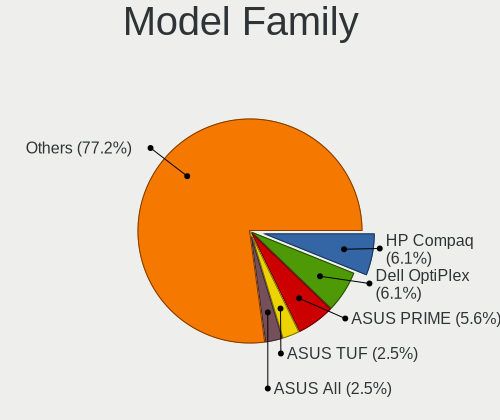

| Name                 | Desktops | Percent |
|----------------------|----------|---------|
| ASUS PRIME           | 12       | 5.97%   |
| ASUS All             | 7        | 3.48%   |
| Lenovo ThinkCentre   | 6        | 2.99%   |
| HP Compaq            | 6        | 2.99%   |
| Dell OptiPlex        | 6        | 2.99%   |
| HP EliteDesk         | 4        | 1.99%   |
| ASUS TUF             | 4        | 1.99%   |
| ASUS ROG             | 4        | 1.99%   |
| Semp Toshiba STI     | 2        | 1%      |
| MSI MS-7C91          | 2        | 1%      |
| MSI MS-7693          | 2        | 1%      |
| Gigabyte G41M-ES2L   | 2        | 1%      |
| Dell Inspiron        | 2        | 1%      |
| ASUS M5A99FX         | 2        | 1%      |
| ASUS K30AD           | 2        | 1%      |
| ASRock Z77           | 2        | 1%      |
| ASRock N68C-S        | 2        | 1%      |
| ASRock B450M         | 2        | 1%      |
| ASRock B365M         | 2        | 1%      |
| ASRock B150M         | 2        | 1%      |
| Acer Veriton         | 2        | 1%      |
| Wistron ProLiant     | 1        | 0.5%    |
| Seco C40             | 1        | 0.5%    |
| Pegatron p7-1047c    | 1        | 0.5%    |
| Pegatron NY539AA-ABA | 1        | 0.5%    |
| Pegatron NF335AA-ABZ | 1        | 0.5%    |
| Pegatron KJ385AA-ABA | 1        | 0.5%    |
| Pegatron AY627AA-ABA | 1        | 0.5%    |
| Pegatron 505B        | 1        | 0.5%    |
| Pegatron 2A99h       | 1        | 0.5%    |
| PCWare IPX1800G2     | 1        | 0.5%    |
| PCWare IPMH81G1      | 1        | 0.5%    |
| PCWare IPMH61G1      | 1        | 0.5%    |
| Packard Bell oneTwo  | 1        | 0.5%    |
| Packard Bell imedia  | 1        | 0.5%    |
| MSI MS-7C95          | 1        | 0.5%    |
| MSI MS-7C56          | 1        | 0.5%    |
| MSI MS-7C37          | 1        | 0.5%    |
| MSI MS-7C31          | 1        | 0.5%    |
| MSI MS-7C08          | 1        | 0.5%    |
| MSI MS-7C06          | 1        | 0.5%    |
| MSI MS-7C02          | 1        | 0.5%    |
| MSI MS-7B87          | 1        | 0.5%    |
| MSI MS-7B86          | 1        | 0.5%    |
| MSI MS-7B85          | 1        | 0.5%    |
| MSI MS-7B77          | 1        | 0.5%    |
| MSI MS-7B33          | 1        | 0.5%    |
| MSI MS-7A39          | 1        | 0.5%    |
| MSI MS-7971          | 1        | 0.5%    |
| MSI MS-7823          | 1        | 0.5%    |
| MSI MS-7721          | 1        | 0.5%    |
| MSI MS-7641          | 1        | 0.5%    |
| MSI MS-7522          | 1        | 0.5%    |
| Medion Akoya         | 1        | 0.5%    |
| Lenovo XXXX          | 1        | 0.5%    |
| Lenovo S500          | 1        | 0.5%    |
| Lenovo 3000          | 1        | 0.5%    |
| Lanix TITAN          | 1        | 0.5%    |
| Intel H61            | 1        | 0.5%    |
| Intel DQ45CB         | 1        | 0.5%    |

MFG Year
--------

Motherboard manufacture year

| Year | Desktops | Percent |
|------|----------|---------|
| 2020 | 25       | 12.44%  |
| 2019 | 20       | 9.95%   |
| 2015 | 19       | 9.45%   |
| 2014 | 18       | 8.96%   |
| 2018 | 17       | 8.46%   |
| 2010 | 13       | 6.47%   |
| 2016 | 12       | 5.97%   |
| 2013 | 12       | 5.97%   |
| 2012 | 12       | 5.97%   |
| 2011 | 11       | 5.47%   |
| 2021 | 10       | 4.98%   |
| 2009 | 10       | 4.98%   |
| 2007 | 7        | 3.48%   |
| 2017 | 6        | 2.99%   |
| 2008 | 6        | 2.99%   |
| 2005 | 2        | 1%      |
| 2006 | 1        | 0.5%    |

Form Factor
-----------

Physical design of the computer

| Name    | Desktops | Percent |
|---------|----------|---------|
| Desktop | 201      | 100%    |

Secure Boot
-----------

Enabled or disabled

| State    | Desktops | Percent |
|----------|----------|---------|
| Disabled | 199      | 99%     |
| Enabled  | 2        | 1%      |

Coreboot
--------

Have coreboot on board

| Used | Desktops | Percent |
|------|----------|---------|
| No   | 201      | 100%    |

RAM Size
--------

Total RAM memory

| Size in GB  | Desktops | Percent |
|-------------|----------|---------|
| 16.01-24.0  | 48       | 23.88%  |
| 8.01-16.0   | 39       | 19.4%   |
| 3.01-4.0    | 34       | 16.92%  |
| 4.01-8.0    | 29       | 14.43%  |
| 32.01-64.0  | 26       | 12.94%  |
| 1.01-2.0    | 8        | 3.98%   |
| 24.01-32.0  | 7        | 3.48%   |
| 2.01-3.0    | 5        | 2.49%   |
| 64.01-256.0 | 5        | 2.49%   |

RAM Used
--------

Used RAM memory

| Used GB    | Desktops | Percent |
|------------|----------|---------|
| 1.01-2.0   | 77       | 38.31%  |
| 2.01-3.0   | 59       | 29.35%  |
| 4.01-8.0   | 24       | 11.94%  |
| 0.51-1.0   | 17       | 8.46%   |
| 3.01-4.0   | 16       | 7.96%   |
| 8.01-16.0  | 5        | 2.49%   |
| 24.01-32.0 | 3        | 1.49%   |

Has CD-ROM
----------

Has CD-ROM on board

| Presented | Desktops | Percent |
|-----------|----------|---------|
| Yes       | 109      | 54.23%  |
| No        | 92       | 45.77%  |

Total Drives
------------

Number of drives on board

| Drives | Desktops | Percent |
|--------|----------|---------|
| 1      | 76       | 37.81%  |
| 2      | 63       | 31.34%  |
| 3      | 33       | 16.42%  |
| 5      | 10       | 4.98%   |
| 4      | 9        | 4.48%   |
| 6      | 5        | 2.49%   |
| 7      | 3        | 1.49%   |
| 8      | 2        | 1%      |

Has Ethernet
------------

Has Ethernet on board

| Presented | Desktops | Percent |
|-----------|----------|---------|
| Yes       | 199      | 99%     |
| No        | 2        | 1%      |

Has WiFi
--------

Has WiFi module

| Presented | Desktops | Percent |
|-----------|----------|---------|
| No        | 109      | 54.23%  |
| Yes       | 92       | 45.77%  |

Has Bluetooth
-------------

Has Bluetooth module

| Presented | Desktops | Percent |
|-----------|----------|---------|
| No        | 145      | 72.14%  |
| Yes       | 56       | 27.86%  |

Drive Vendor
------------

Hard drive vendors

| Vendor                    | Desktops | Drives | Percent |
|---------------------------|----------|--------|---------|
| Seagate                   | 82       | 104    | 21.98%  |
| WDC                       | 79       | 114    | 21.18%  |
| Samsung Electronics       | 53       | 66     | 14.21%  |
| Kingston                  | 19       | 20     | 5.09%   |
| Toshiba                   | 17       | 18     | 4.56%   |
| Hitachi                   | 17       | 19     | 4.56%   |
| Sandisk                   | 16       | 17     | 4.29%   |
| Crucial                   | 16       | 17     | 4.29%   |
| A-DATA Technology         | 7        | 7      | 1.88%   |
| HGST                      | 6        | 6      | 1.61%   |
| Phison                    | 4        | 4      | 1.07%   |
| Intel                     | 4        | 4      | 1.07%   |
| WD MediaMax               | 3        | 4      | 0.8%    |
| PNY                       | 3        | 3      | 0.8%    |
| Micron/Crucial Technology | 3        | 3      | 0.8%    |
| Maxtor                    | 3        | 3      | 0.8%    |
| Lexar                     | 3        | 3      | 0.8%    |
| Verbatim                  | 2        | 2      | 0.54%   |
| Vaseky                    | 2        | 2      | 0.54%   |
| Unknown                   | 2        | 4      | 0.54%   |
| SK Hynix                  | 2        | 2      | 0.54%   |
| Silicon Motion            | 2        | 2      | 0.54%   |
| Leven                     | 2        | 2      | 0.54%   |
| Intenso                   | 2        | 2      | 0.54%   |
| EMTEC                     | 2        | 2      | 0.54%   |
| China                     | 2        | 2      | 0.54%   |
| XPG                       | 1        | 1      | 0.27%   |
| TCSUNBOW                  | 1        | 1      | 0.27%   |
| SPCC                      | 1        | 1      | 0.27%   |
| Realtek Semiconductor     | 1        | 1      | 0.27%   |
| PLEXTOR                   | 1        | 1      | 0.27%   |
| Phison Electronics        | 1        | 1      | 0.27%   |
| Patriot                   | 1        | 1      | 0.27%   |
| OCZ                       | 1        | 1      | 0.27%   |
| Netac                     | 1        | 1      | 0.27%   |
| Lite-On                   | 1        | 1      | 0.27%   |
| LDLC                      | 1        | 1      | 0.27%   |
| LaCie                     | 1        | 1      | 0.27%   |
| KINGBANK                  | 1        | 1      | 0.27%   |
| HS-SSD-C100               | 1        | 1      | 0.27%   |
| HPE                       | 1        | 2      | 0.27%   |
| GOODRAM                   | 1        | 1      | 0.27%   |
| Gigastone                 | 1        | 1      | 0.27%   |
| Fujitsu                   | 1        | 1      | 0.27%   |
| Corsair                   | 1        | 1      | 0.27%   |
| ASMT                      | 1        | 1      | 0.27%   |

Drive Model
-----------

Hard drive models

| Model                               | Desktops | Percent |
|-------------------------------------|----------|---------|
| Seagate ST500DM002-1BD142 500GB     | 8        | 1.85%   |
| Samsung SSD 850 EVO 250GB           | 7        | 1.62%   |
| Kingston SA400S37120G 120GB SSD     | 6        | 1.39%   |
| WDC WD20EZRX-00D8PB0 2TB            | 4        | 0.92%   |
| Seagate ST2000DM008-2FR102 2TB      | 4        | 0.92%   |
| Seagate ST2000DM006-2DM164 2TB      | 4        | 0.92%   |
| Seagate ST2000DM001-1CH164 2TB      | 4        | 0.92%   |
| Samsung SSD 860 EVO 500GB           | 4        | 0.92%   |
| Samsung SSD 840 EVO 250GB           | 4        | 0.92%   |
| WDC WD40EZRZ-00GXCB0 4TB            | 3        | 0.69%   |
| WDC WD4000FYYZ-01UL1B1 4TB          | 3        | 0.69%   |
| WDC WD10EZEX-08WN4A0 1TB            | 3        | 0.69%   |
| WDC WD10EZEX-00BN5A0 1TB            | 3        | 0.69%   |
| Toshiba DT01ACA300 3TB              | 3        | 0.69%   |
| Toshiba DT01ACA100 1TB              | 3        | 0.69%   |
| Toshiba DT01ACA050 500GB            | 3        | 0.69%   |
| Seagate ST3000DM001-1ER166 3TB      | 3        | 0.69%   |
| Seagate ST2000DM001-1ER164 2TB      | 3        | 0.69%   |
| SanDisk SSD PLUS 240GB              | 3        | 0.69%   |
| Hitachi HUS724030ALE641 3TB         | 3        | 0.69%   |
| Crucial CT500MX500SSD1 500GB        | 3        | 0.69%   |
| WDC WDS500G2B0A-00SM50 500GB SSD    | 2        | 0.46%   |
| WDC WDS240G2G0A-00JH30 240GB SSD    | 2        | 0.46%   |
| WDC WD800JD-00MSA1 80GB             | 2        | 0.46%   |
| WDC WD5000AAKX-60U6AA0 500GB        | 2        | 0.46%   |
| WDC WD40EZRX-22SPEB0 4TB            | 2        | 0.46%   |
| WDC WD30EZRX-00D8PB0 3TB            | 2        | 0.46%   |
| WDC WD20EARX-32PASB0 2TB            | 2        | 0.46%   |
| WDC WD20EARX-00PASB0 2TB            | 2        | 0.46%   |
| WDC WD2000F9YZ-09N20L0 2TB          | 2        | 0.46%   |
| WDC WD10EZEX-60ZF5A0 1TB            | 2        | 0.46%   |
| WDC WD10EZEX-00WN4A0 1TB            | 2        | 0.46%   |
| WDC WD1003FZEX-00K3CA0 1TB          | 2        | 0.46%   |
| Seagate ST4000VN008-2DR166 4TB      | 2        | 0.46%   |
| Seagate ST4000DM004-2CV104 4TB      | 2        | 0.46%   |
| Seagate ST4000DM000-1F2168 4TB      | 2        | 0.46%   |
| Seagate ST3750640NS 752GB           | 2        | 0.46%   |
| Seagate ST3160815AS 160GB           | 2        | 0.46%   |
| Seagate ST31000528AS 1TB            | 2        | 0.46%   |
| Seagate ST250DM000-1BD141 250GB     | 2        | 0.46%   |
| Seagate ST2000LX001-1RG174 2TB      | 2        | 0.46%   |
| Seagate ST2000DL003-9VT166 2TB      | 2        | 0.46%   |
| Seagate ST1000DM003-1ER162 1TB      | 2        | 0.46%   |
| Seagate Expansion 2TB               | 2        | 0.46%   |
| Seagate Backup+ Desk 3TB            | 2        | 0.46%   |
| SanDisk SSD PLUS 480GB              | 2        | 0.46%   |
| Samsung SSD 980 PRO 250GB           | 2        | 0.46%   |
| Samsung SSD 870 EVO 1TB             | 2        | 0.46%   |
| Samsung SSD 860 EVO 250GB           | 2        | 0.46%   |
| Samsung SSD 860 EVO 1TB             | 2        | 0.46%   |
| Samsung SSD 840 Series 250GB        | 2        | 0.46%   |
| Samsung SSD 840 EVO 120GB           | 2        | 0.46%   |
| Samsung NVMe SSD Drive 250GB        | 2        | 0.46%   |
| Samsung NVMe SSD Drive 1TB          | 2        | 0.46%   |
| Samsung HD204UI 2TB                 | 2        | 0.46%   |
| Samsung HD103SI 1TB                 | 2        | 0.46%   |
| Micron/Crucial NVMe SSD Drive 500GB | 2        | 0.46%   |
| Kingston SV300S37A120G 120GB SSD    | 2        | 0.46%   |
| Kingston SA400S37960G 960GB SSD     | 2        | 0.46%   |
| Kingston SA400S37240G 240GB SSD     | 2        | 0.46%   |

HDD Vendor
----------

Hard disk drive vendors

| Vendor              | Desktops | Drives | Percent |
|---------------------|----------|--------|---------|
| Seagate             | 80       | 98     | 37.74%  |
| WDC                 | 75       | 108    | 35.38%  |
| Hitachi             | 17       | 19     | 8.02%   |
| Toshiba             | 15       | 16     | 7.08%   |
| Samsung Electronics | 12       | 12     | 5.66%   |
| HGST                | 6        | 6      | 2.83%   |
| Maxtor              | 3        | 3      | 1.42%   |
| WD MediaMax         | 2        | 3      | 0.94%   |
| HPE                 | 1        | 2      | 0.47%   |
| Fujitsu             | 1        | 1      | 0.47%   |

SSD Vendor
----------

Solid state drive vendors

| Vendor              | Desktops | Drives | Percent |
|---------------------|----------|--------|---------|
| Samsung Electronics | 31       | 39     | 25.2%   |
| Kingston            | 16       | 17     | 13.01%  |
| Crucial             | 15       | 16     | 12.2%   |
| SanDisk             | 13       | 14     | 10.57%  |
| WDC                 | 6        | 6      | 4.88%   |
| A-DATA Technology   | 6        | 6      | 4.88%   |
| PNY                 | 3        | 3      | 2.44%   |
| Lexar               | 3        | 3      | 2.44%   |
| Intel               | 3        | 3      | 2.44%   |
| Verbatim            | 2        | 2      | 1.63%   |
| Toshiba             | 2        | 2      | 1.63%   |
| SK Hynix            | 2        | 2      | 1.63%   |
| Seagate             | 2        | 2      | 1.63%   |
| Leven               | 2        | 2      | 1.63%   |
| Intenso             | 2        | 2      | 1.63%   |
| China               | 2        | 2      | 1.63%   |
| Vaseky              | 1        | 1      | 0.81%   |
| TCSUNBOW            | 1        | 1      | 0.81%   |
| SPCC                | 1        | 1      | 0.81%   |
| PLEXTOR             | 1        | 1      | 0.81%   |
| Patriot             | 1        | 1      | 0.81%   |
| OCZ                 | 1        | 1      | 0.81%   |
| Netac               | 1        | 1      | 0.81%   |
| LDLC                | 1        | 1      | 0.81%   |
| KINGBANK            | 1        | 1      | 0.81%   |
| GOODRAM             | 1        | 1      | 0.81%   |
| Gigastone           | 1        | 1      | 0.81%   |
| Corsair             | 1        | 1      | 0.81%   |
| ASMT                | 1        | 1      | 0.81%   |

Drive Kind
----------

HDD or SSD

| Kind    | Desktops | Drives | Percent |
|---------|----------|--------|---------|
| HDD     | 159      | 268    | 51.29%  |
| SSD     | 106      | 134    | 34.19%  |
| NVMe    | 36       | 39     | 11.61%  |
| Unknown | 9        | 12     | 2.9%    |

Drive Connector
---------------

SATA, SAS, NVMe, etc.

| Type | Desktops | Drives | Percent |
|------|----------|--------|---------|
| SATA | 189      | 398    | 79.75%  |
| NVMe | 36       | 39     | 15.19%  |
| SAS  | 12       | 16     | 5.06%   |

Drive Size
----------

Size of hard drive

| Size in TB | Desktops | Drives | Percent |
|------------|----------|--------|---------|
| 0.01-0.5   | 153      | 223    | 51.86%  |
| 0.51-1.0   | 73       | 86     | 24.75%  |
| 1.01-2.0   | 36       | 46     | 12.2%   |
| 3.01-4.0   | 16       | 25     | 5.42%   |
| 2.01-3.0   | 10       | 15     | 3.39%   |
| 4.01-10.0  | 7        | 7      | 2.37%   |

Space Total
-----------

Amount of disk space available on the file system

| Size in GB     | Desktops | Percent |
|----------------|----------|---------|
| 101-250        | 47       | 23.38%  |
| 251-500        | 41       | 20.4%   |
| 501-1000       | 27       | 13.43%  |
| More than 3000 | 26       | 12.94%  |
| 1001-2000      | 23       | 11.44%  |
| 2001-3000      | 16       | 7.96%   |
| 51-100         | 10       | 4.98%   |
| 21-50          | 8        | 3.98%   |
| 1-20           | 2        | 1%      |
| Unknown        | 1        | 0.5%    |

Space Used
----------

Amount of used disk space

| Used GB        | Desktops | Percent |
|----------------|----------|---------|
| 21-50          | 45       | 22.39%  |
| 1-20           | 38       | 18.91%  |
| 101-250        | 27       | 13.43%  |
| 51-100         | 23       | 11.44%  |
| 251-500        | 21       | 10.45%  |
| More than 3000 | 16       | 7.96%   |
| 1001-2000      | 15       | 7.46%   |
| 501-1000       | 11       | 5.47%   |
| 2001-3000      | 4        | 1.99%   |
| Unknown        | 1        | 0.5%    |

Malfunc. Drives
---------------

Drive models with a malfunction

| Model                                 | Desktops | Drives | Percent |
|---------------------------------------|----------|--------|---------|
| Seagate ST500DM002-1BD142 500GB       | 2        | 2      | 11.76%  |
| WDC WD5002ABYS-01B1B0 500GB           | 1        | 1      | 5.88%   |
| WDC WD400BB-00CAA1 40GB               | 1        | 1      | 5.88%   |
| WDC WD20EARX-00PASB0 2TB              | 1        | 1      | 5.88%   |
| WDC WD2000F9YZ-09N20L0 2TB            | 1        | 1      | 5.88%   |
| WDC WD10EZEX-00BN5A0 1TB              | 1        | 1      | 5.88%   |
| Toshiba MK6475GSX 640GB               | 1        | 1      | 5.88%   |
| Seagate ST500LM012 HN-M500MBB 500GB   | 1        | 1      | 5.88%   |
| Seagate ST2000DM008-2FR102 2TB        | 1        | 1      | 5.88%   |
| Seagate ST1000LM024 HN-M101MBB 1TB    | 1        | 1      | 5.88%   |
| SanDisk SSD PLUS 480 GB               | 1        | 1      | 5.88%   |
| Samsung Electronics SSD 980 PRO 250GB | 1        | 1      | 5.88%   |
| Maxtor 6Y080L0 81GB                   | 1        | 1      | 5.88%   |
| Leven JAJS300M480C 480GB SSD          | 1        | 1      | 5.88%   |
| LDLC SSD 120GB                        | 1        | 1      | 5.88%   |
| Hitachi HDS722020ALA330 2TB           | 1        | 1      | 5.88%   |

Malfunc. Drive Vendor
---------------------

Vendors of faulty drives

| Vendor              | Desktops | Drives | Percent |
|---------------------|----------|--------|---------|
| WDC                 | 5        | 5      | 29.41%  |
| Seagate             | 5        | 5      | 29.41%  |
| Toshiba             | 1        | 1      | 5.88%   |
| SanDisk             | 1        | 1      | 5.88%   |
| Samsung Electronics | 1        | 1      | 5.88%   |
| Maxtor              | 1        | 1      | 5.88%   |
| Leven               | 1        | 1      | 5.88%   |
| LDLC                | 1        | 1      | 5.88%   |
| Hitachi             | 1        | 1      | 5.88%   |

Malfunc. HDD Vendor
-------------------

Vendors of faulty HDD drives

| Vendor  | Desktops | Drives | Percent |
|---------|----------|--------|---------|
| WDC     | 5        | 5      | 38.46%  |
| Seagate | 5        | 5      | 38.46%  |
| Toshiba | 1        | 1      | 7.69%   |
| Maxtor  | 1        | 1      | 7.69%   |
| Hitachi | 1        | 1      | 7.69%   |

Malfunc. Drive Kind
-------------------

Kinds of faulty drives

| Kind | Desktops | Drives | Percent |
|------|----------|--------|---------|
| HDD  | 13       | 13     | 76.47%  |
| SSD  | 3        | 3      | 17.65%  |
| NVMe | 1        | 1      | 5.88%   |

Failed Drives
-------------

Failed drive models

Zero info for selected period =(

Failed Drive Vendor
-------------------

Failed drive vendors

Zero info for selected period =(

Drive Status
------------

Number of failed and malfunc. drives

| Status   | Desktops | Drives | Percent |
|----------|----------|--------|---------|
| Detected | 147      | 322    | 65.92%  |
| Works    | 59       | 114    | 26.46%  |
| Malfunc  | 17       | 17     | 7.62%   |

Storage Vendor
--------------

Storage controller vendors

| Vendor                      | Desktops | Percent |
|-----------------------------|----------|---------|
| Intel                       | 127      | 47.57%  |
| AMD                         | 60       | 22.47%  |
| Samsung Electronics         | 13       | 4.87%   |
| ASMedia Technology          | 13       | 4.87%   |
| Nvidia                      | 10       | 3.75%   |
| Marvell Technology Group    | 9        | 3.37%   |
| Phison Electronics          | 6        | 2.25%   |
| Micron/Crucial Technology   | 4        | 1.5%    |
| JMicron Technology          | 4        | 1.5%    |
| VIA Technologies            | 3        | 1.12%   |
| Sandisk                     | 3        | 1.12%   |
| Kingston Technology Company | 3        | 1.12%   |
| Silicon Motion              | 2        | 0.75%   |
| Silicon Image               | 2        | 0.75%   |
| ADATA Technology            | 2        | 0.75%   |
| ULi Electronics             | 1        | 0.37%   |
| Seagate Technology          | 1        | 0.37%   |
| Realtek Semiconductor       | 1        | 0.37%   |
| Lite-On Technology          | 1        | 0.37%   |
| HighPoint Technologies      | 1        | 0.37%   |
| Broadcom / LSI              | 1        | 0.37%   |

Storage Model
-------------

Storage controller models

| Model                                                                                   | Desktops | Percent |
|-----------------------------------------------------------------------------------------|----------|---------|
| AMD FCH SATA Controller [AHCI mode]                                                     | 34       | 9.77%   |
| Intel 8 Series/C220 Series Chipset Family 6-port SATA Controller 1 [AHCI mode]          | 23       | 6.61%   |
| AMD 400 Series Chipset SATA Controller                                                  | 14       | 4.02%   |
| Intel 6 Series/C200 Series Chipset Family 6 port Desktop SATA AHCI Controller           | 13       | 3.74%   |
| Intel NM10/ICH7 Family SATA Controller [IDE mode]                                       | 12       | 3.45%   |
| ASMedia ASM1062 Serial ATA Controller                                                   | 12       | 3.45%   |
| AMD SB7x0/SB8x0/SB9x0 IDE Controller                                                    | 12       | 3.45%   |
| Intel Q170/Q150/B150/H170/H110/Z170/CM236 Chipset SATA Controller [AHCI Mode]           | 11       | 3.16%   |
| Intel 82801G (ICH7 Family) IDE Controller                                               | 11       | 3.16%   |
| Intel 200 Series PCH SATA controller [AHCI mode]                                        | 11       | 3.16%   |
| AMD SB7x0/SB8x0/SB9x0 SATA Controller [AHCI mode]                                       | 11       | 3.16%   |
| Intel 7 Series/C210 Series Chipset Family 6-port SATA Controller [AHCI mode]            | 8        | 2.3%    |
| Samsung NVMe SSD Controller SM981/PM981/PM983                                           | 7        | 2.01%   |
| Intel SATA Controller [RAID mode]                                                       | 7        | 2.01%   |
| Nvidia MCP61 SATA Controller                                                            | 6        | 1.72%   |
| AMD SB7x0/SB8x0/SB9x0 SATA Controller [IDE mode]                                        | 6        | 1.72%   |
| Intel 9 Series Chipset Family SATA Controller [AHCI Mode]                               | 5        | 1.44%   |
| AMD Starship/Matisse Chipset SATA Controller [AHCI mode]                                | 5        | 1.44%   |
| AMD FCH SATA Controller D                                                               | 5        | 1.44%   |
| Intel 82801JI (ICH10 Family) SATA AHCI Controller                                       | 4        | 1.15%   |
| Intel 6 Series/C200 Series Chipset Family Desktop SATA Controller (IDE mode, ports 4-5) | 4        | 1.15%   |
| Intel 6 Series/C200 Series Chipset Family Desktop SATA Controller (IDE mode, ports 0-3) | 4        | 1.15%   |
| Intel 5 Series/3400 Series Chipset 4 port SATA IDE Controller                           | 4        | 1.15%   |
| Intel 5 Series/3400 Series Chipset 2 port SATA IDE Controller                           | 4        | 1.15%   |
| AMD 300 Series Chipset SATA Controller                                                  | 4        | 1.15%   |
| Samsung NVMe SSD Controller SM961/PM961/SM963                                           | 3        | 0.86%   |
| Phison E12 NVMe Controller                                                              | 3        | 0.86%   |
| Nvidia MCP61 IDE                                                                        | 3        | 0.86%   |
| Micron/Crucial NVMe Controller                                                          | 3        | 0.86%   |
| JMicron JMB368 IDE controller                                                           | 3        | 0.86%   |
| Intel Comet Lake SATA AHCI Controller                                                   | 3        | 0.86%   |
| Intel C610/X99 series chipset 6-Port SATA Controller [AHCI mode]                        | 3        | 0.86%   |
| Intel 4 Series Chipset PT IDER Controller                                               | 3        | 0.86%   |
| VIA VT82C586A/B/VT82C686/A/B/VT823x/A/C PIPC Bus Master IDE                             | 2        | 0.57%   |
| Silicon Image SiI 3114 [SATALink/SATARaid] Serial ATA Controller                        | 2        | 0.57%   |
| Samsung NVMe SSD Controller PM9A1/PM9A3/980PRO                                          | 2        | 0.57%   |
| Phison PS5013 E13 NVMe Controller                                                       | 2        | 0.57%   |
| Marvell Group 88SE9172 SATA 6Gb/s Controller                                            | 2        | 0.57%   |
| Marvell Group 88SE6111/6121 SATA II / PATA Controller                                   | 2        | 0.57%   |
| Intel NM10/ICH7 Family SATA Controller [AHCI mode]                                      | 2        | 0.57%   |
| Intel Cannon Lake PCH SATA AHCI Controller                                              | 2        | 0.57%   |
| Intel 82801JD/DO (ICH10 Family) 4-port SATA IDE Controller                              | 2        | 0.57%   |
| Intel 82801JD/DO (ICH10 Family) 2-port SATA IDE Controller                              | 2        | 0.57%   |
| Intel 82801IR/IO/IH (ICH9R/DO/DH) 4 port SATA Controller [IDE mode]                     | 2        | 0.57%   |
| Intel 82801I (ICH9 Family) 2 port SATA Controller [IDE mode]                            | 2        | 0.57%   |
| Intel 7 Series/C210 Series Chipset Family 4-port SATA Controller [IDE mode]             | 2        | 0.57%   |
| Intel 7 Series/C210 Series Chipset Family 2-port SATA Controller [IDE mode]             | 2        | 0.57%   |
| Intel 5 Series/3400 Series Chipset 6 port SATA AHCI Controller                          | 2        | 0.57%   |
| AMD FCH IDE Controller                                                                  | 2        | 0.57%   |
| ADATA XPG SX8200 Pro PCIe Gen3x4 M.2 2280 Solid State Drive                             | 2        | 0.57%   |
| VIA VT6415 PATA IDE Host Controller                                                     | 1        | 0.29%   |
| VIA VIA VT6420 SATA RAID Controller                                                     | 1        | 0.29%   |
| VIA Serial ATA Controller                                                               | 1        | 0.29%   |
| ULi ULi 5287 SATA                                                                       | 1        | 0.29%   |
| ULi M5229 IDE                                                                           | 1        | 0.29%   |
| Silicon Motion SM2263EN/SM2263XT SSD Controller                                         | 1        | 0.29%   |
| Silicon Motion SM2262/SM2262EN SSD Controller                                           | 1        | 0.29%   |
| Seagate FireCuda 510 SSD                                                                | 1        | 0.29%   |
| Sandisk WD Blue SN550 NVMe SSD                                                          | 1        | 0.29%   |
| Sandisk WD Blue SN500 / PC SN520 NVMe SSD                                               | 1        | 0.29%   |

Storage Kind
------------

Kind of storage controller (IDE, SATA, NVMe, SAS, ...)

| Kind | Desktops | Percent |
|------|----------|---------|
| SATA | 154      | 58.56%  |
| IDE  | 59       | 22.43%  |
| NVMe | 36       | 13.69%  |
| RAID | 13       | 4.94%   |
| SAS  | 1        | 0.38%   |

CPU Vendor
----------

Processor vendors

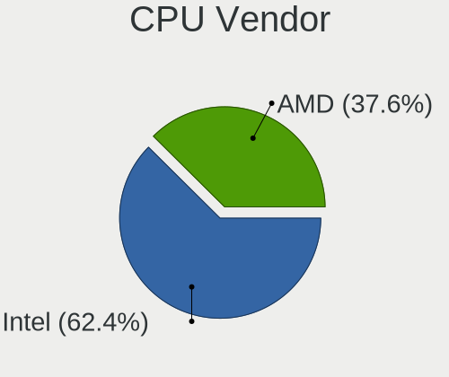

| Vendor | Desktops | Percent |
|--------|----------|---------|
| Intel  | 131      | 65.17%  |
| AMD    | 70       | 34.83%  |

CPU Model
---------

Processor models

| Model                                       | Desktops | Percent |
|---------------------------------------------|----------|---------|
| AMD FX-8350 Eight-Core Processor            | 8        | 3.98%   |
| AMD Ryzen 7 3700X 8-Core Processor          | 6        | 2.99%   |
| Intel Core i5-4590 CPU @ 3.30GHz            | 5        | 2.49%   |
| Intel Core i3-2120 CPU @ 3.30GHz            | 5        | 2.49%   |
| Intel Core i7-4790K CPU @ 4.00GHz           | 4        | 1.99%   |
| Intel Core i7-4790 CPU @ 3.60GHz            | 4        | 1.99%   |
| Intel Core 2 Quad CPU Q6600 @ 2.40GHz       | 4        | 1.99%   |
| Intel Pentium CPU G4400 @ 3.30GHz           | 3        | 1.49%   |
| Intel Pentium CPU G3240 @ 3.10GHz           | 3        | 1.49%   |
| Intel Core i7-6700K CPU @ 4.00GHz           | 3        | 1.49%   |
| Intel Core i5-6400 CPU @ 2.70GHz            | 3        | 1.49%   |
| Intel Core i5-2400S CPU @ 2.50GHz           | 3        | 1.49%   |
| AMD Ryzen 5 2600 Six-Core Processor         | 3        | 1.49%   |
| AMD FX-8120 Eight-Core Processor            | 3        | 1.49%   |
| Intel Pentium Dual CPU E2200 @ 2.20GHz      | 2        | 1%      |
| Intel Pentium Dual CPU E2180 @ 2.00GHz      | 2        | 1%      |
| Intel Core i7-7700 CPU @ 3.60GHz            | 2        | 1%      |
| Intel Core i7-5820K CPU @ 3.30GHz           | 2        | 1%      |
| Intel Core i7-4770 CPU @ 3.40GHz            | 2        | 1%      |
| Intel Core i7-3770 CPU @ 3.40GHz            | 2        | 1%      |
| Intel Core i7-2600 CPU @ 3.40GHz            | 2        | 1%      |
| Intel Core i5-9600K CPU @ 3.70GHz           | 2        | 1%      |
| Intel Core i5-7400 CPU @ 3.00GHz            | 2        | 1%      |
| Intel Core i5-4440 CPU @ 3.10GHz            | 2        | 1%      |
| Intel Core i5-3570K CPU @ 3.40GHz           | 2        | 1%      |
| Intel Core i5-3470 CPU @ 3.20GHz            | 2        | 1%      |
| Intel Core i5-2500K CPU @ 3.30GHz           | 2        | 1%      |
| Intel Core i5-2500 CPU @ 3.30GHz            | 2        | 1%      |
| Intel Core 2 Quad CPU Q9650 @ 3.00GHz       | 2        | 1%      |
| Intel Core 2 Duo CPU E4600 @ 2.40GHz        | 2        | 1%      |
| Intel Core 2 CPU 4400 @ 2.00GHz             | 2        | 1%      |
| AMD Ryzen 9 3900X 12-Core Processor         | 2        | 1%      |
| AMD Ryzen 7 2700X Eight-Core Processor      | 2        | 1%      |
| AMD Ryzen 5 3600 6-Core Processor           | 2        | 1%      |
| AMD Ryzen 5 3400G with Radeon Vega Graphics | 2        | 1%      |
| AMD Ryzen 3 2200G with Radeon Vega Graphics | 2        | 1%      |
| AMD Ryzen 3 1200 Quad-Core Processor        | 2        | 1%      |
| AMD FX-4300 Quad-Core Processor             | 2        | 1%      |
| AMD Athlon II X4 630 Processor              | 2        | 1%      |
| AMD Athlon 3000G with Radeon Vega Graphics  | 2        | 1%      |
| Intel Xeon CPU X5680 @ 3.33GHz              | 1        | 0.5%    |
| Intel Xeon CPU X5460 @ 3.16GHz              | 1        | 0.5%    |
| Intel Xeon CPU X3430 @ 2.40GHz              | 1        | 0.5%    |
| Intel Xeon CPU W3670 @ 3.20GHz              | 1        | 0.5%    |
| Intel Xeon CPU E5-2678 v3 @ 2.50GHz         | 1        | 0.5%    |
| Intel Xeon CPU E5-2637 v2 @ 3.50GHz         | 1        | 0.5%    |
| Intel Xeon CPU 3060 @ 2.40GHz               | 1        | 0.5%    |
| Intel Pentium Dual-Core CPU E5300 @ 2.60GHz | 1        | 0.5%    |
| Intel Pentium Dual-Core CPU E5200 @ 2.50GHz | 1        | 0.5%    |
| Intel Pentium Dual-Core CPU E2210 @ 2.20GHz | 1        | 0.5%    |
| Intel Pentium Dual CPU E2220 @ 2.40GHz      | 1        | 0.5%    |
| Intel Pentium D CPU 3.00GHz                 | 1        | 0.5%    |
| Intel Pentium D CPU 2.66GHz                 | 1        | 0.5%    |
| Intel Pentium CPU G3260 @ 3.30GHz           | 1        | 0.5%    |
| Intel Genuine CPU 0000 @ 2.40GHz            | 1        | 0.5%    |
| Intel Core i9-9820X CPU @ 3.30GHz           | 1        | 0.5%    |
| Intel Core i9-10900KF CPU @ 3.70GHz         | 1        | 0.5%    |
| Intel Core i9-10900F CPU @ 2.80GHz          | 1        | 0.5%    |
| Intel Core i7-9700T CPU @ 2.00GHz           | 1        | 0.5%    |
| Intel Core i7-9700 CPU @ 3.00GHz            | 1        | 0.5%    |

CPU Model Family
----------------

Processor model prefix

| Model                   | Desktops | Percent |
|-------------------------|----------|---------|
| Intel Core i5           | 37       | 18.41%  |
| Intel Core i7           | 29       | 14.43%  |
| Intel Core i3           | 15       | 7.46%   |
| AMD FX                  | 13       | 6.47%   |
| AMD Ryzen 5             | 12       | 5.97%   |
| AMD Ryzen 7             | 9        | 4.48%   |
| Intel Xeon              | 7        | 3.48%   |
| Intel Pentium           | 7        | 3.48%   |
| Intel Core 2 Duo        | 7        | 3.48%   |
| Intel Core 2 Quad       | 6        | 2.99%   |
| Intel Celeron           | 6        | 2.99%   |
| Intel Pentium Dual      | 5        | 2.49%   |
| AMD Athlon              | 5        | 2.49%   |
| AMD Ryzen 9             | 4        | 1.99%   |
| AMD Ryzen 3             | 4        | 1.99%   |
| Intel Pentium Dual-Core | 3        | 1.49%   |
| Intel Core i9           | 3        | 1.49%   |
| Intel Core 2            | 3        | 1.49%   |
| AMD Sempron             | 3        | 1.49%   |
| AMD Athlon II X4        | 3        | 1.49%   |
| Intel Pentium D         | 2        | 1%      |
| AMD Athlon II X2        | 2        | 1%      |
| AMD A8                  | 2        | 1%      |
| AMD A4                  | 2        | 1%      |
| AMD A10                 | 2        | 1%      |
| Other                   | 1        | 0.5%    |
| Intel Genuine           | 1        | 0.5%    |
| AMD Ryzen Embedded      | 1        | 0.5%    |
| AMD Ryzen 5 PRO         | 1        | 0.5%    |
| AMD Phenom II X6        | 1        | 0.5%    |
| AMD Phenom II X4        | 1        | 0.5%    |
| AMD Athlon X4           | 1        | 0.5%    |
| AMD Athlon II X3        | 1        | 0.5%    |
| AMD Athlon 64 X2        | 1        | 0.5%    |
| AMD Athlon 64           | 1        | 0.5%    |

CPU Cores
---------

Number of processor cores

| Number | Desktops | Percent |
|--------|----------|---------|
| 4      | 89       | 44.28%  |
| 2      | 62       | 30.85%  |
| 6      | 22       | 10.95%  |
| 8      | 12       | 5.97%   |
| 1      | 7        | 3.48%   |
| 10     | 3        | 1.49%   |
| 16     | 2        | 1%      |
| 12     | 2        | 1%      |
| 24     | 1        | 0.5%    |
| 3      | 1        | 0.5%    |

CPU Sockets
-----------

Number of sockets

| Number | Desktops | Percent |
|--------|----------|---------|
| 1      | 199      | 99%     |
| 2      | 2        | 1%      |

CPU Threads
-----------

Threads per core (Hyper-Threading)

| Number | Desktops | Percent |
|--------|----------|---------|
| 1      | 103      | 51.24%  |
| 2      | 98       | 48.76%  |

CPU Op-Modes
------------

CPU Operation Modes (32-bit, 64-bit)

| Op mode        | Desktops | Percent |
|----------------|----------|---------|
| 32-bit, 64-bit | 201      | 100%    |

CPU Microcode
-------------

Microcode number

| Number     | Desktops | Percent |
|------------|----------|---------|
| 0x306c3    | 29       | 14.43%  |
| Unknown    | 20       | 9.95%   |
| 0x206a7    | 16       | 7.96%   |
| 0x08701021 | 10       | 4.98%   |
| 0x506e3    | 9        | 4.48%   |
| 0x306a9    | 9        | 4.48%   |
| 0x06000852 | 9        | 4.48%   |
| 0x6fd      | 8        | 3.98%   |
| 0x0800820d | 7        | 3.48%   |
| 0x1067a    | 6        | 2.99%   |
| 0x010000c8 | 5        | 2.49%   |
| 0x906ed    | 4        | 1.99%   |
| 0x906e9    | 4        | 1.99%   |
| 0x6fb      | 4        | 1.99%   |
| 0x106e5    | 4        | 1.99%   |
| 0x10676    | 4        | 1.99%   |
| 0x08108109 | 4        | 1.99%   |
| 0x06003106 | 4        | 1.99%   |
| 0xa0655    | 3        | 1.49%   |
| 0x206c2    | 3        | 1.49%   |
| 0x0810100b | 3        | 1.49%   |
| 0x0600063e | 3        | 1.49%   |
| 0x010000db | 3        | 1.49%   |
| 0x906eb    | 2        | 1%      |
| 0x6f6      | 2        | 1%      |
| 0x6f2      | 2        | 1%      |
| 0x306f2    | 2        | 1%      |
| 0xf65      | 1        | 0.5%    |
| 0xf47      | 1        | 0.5%    |
| 0x906ec    | 1        | 0.5%    |
| 0x906ea    | 1        | 0.5%    |
| 0x706a1    | 1        | 0.5%    |
| 0x50654    | 1        | 0.5%    |
| 0x306e4    | 1        | 0.5%    |
| 0x30679    | 1        | 0.5%    |
| 0x20655    | 1        | 0.5%    |
| 0x20652    | 1        | 0.5%    |
| 0x08701013 | 1        | 0.5%    |
| 0x08600106 | 1        | 0.5%    |
| 0x08101016 | 1        | 0.5%    |
| 0x0800820b | 1        | 0.5%    |
| 0x08001138 | 1        | 0.5%    |
| 0x08001129 | 1        | 0.5%    |
| 0x08001105 | 1        | 0.5%    |
| 0x0700010f | 1        | 0.5%    |
| 0x0600611a | 1        | 0.5%    |
| 0x06006118 | 1        | 0.5%    |
| 0x03000027 | 1        | 0.5%    |
| 0x01000095 | 1        | 0.5%    |

CPU Microarch
-------------

Microarchitecture

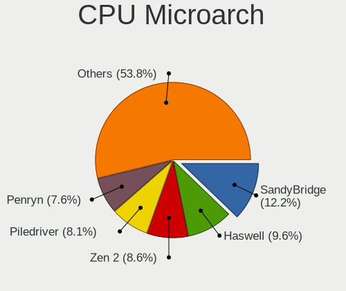

| Name          | Desktops | Percent |
|---------------|----------|---------|
| Haswell       | 33       | 16.42%  |
| SandyBridge   | 16       | 7.96%   |
| Core          | 16       | 7.96%   |
| KabyLake      | 14       | 6.97%   |
| Zen 2         | 13       | 6.47%   |
| Skylake       | 13       | 6.47%   |
| Zen+          | 12       | 5.97%   |
| IvyBridge     | 12       | 5.97%   |
| Penryn        | 11       | 5.47%   |
| Piledriver    | 10       | 4.98%   |
| K10           | 10       | 4.98%   |
| Zen           | 8        | 3.98%   |
| Westmere      | 5        | 2.49%   |
| K8 Hammer     | 5        | 2.49%   |
| Steamroller   | 4        | 1.99%   |
| Nehalem       | 4        | 1.99%   |
| CometLake     | 3        | 1.49%   |
| Bulldozer     | 3        | 1.49%   |
| NetBurst      | 2        | 1%      |
| Excavator     | 2        | 1%      |
| Zen 3         | 1        | 0.5%    |
| Silvermont    | 1        | 0.5%    |
| K10 Llano     | 1        | 0.5%    |
| Jaguar        | 1        | 0.5%    |
| Goldmont plus | 1        | 0.5%    |

GPU Vendor
----------

Vendors of graphics cards

| Vendor                     | Desktops | Percent |
|----------------------------|----------|---------|
| Nvidia                     | 83       | 38.43%  |
| Intel                      | 76       | 35.19%  |
| AMD                        | 55       | 25.46%  |
| VIA Technologies           | 1        | 0.46%   |
| Matrox Electronics Systems | 1        | 0.46%   |

GPU Model
---------

Graphics card models

| Model                                                                       | Desktops | Percent |
|-----------------------------------------------------------------------------|----------|---------|
| Intel Xeon E3-1200 v3/4th Gen Core Processor Integrated Graphics Controller | 21       | 9.46%   |
| Intel 2nd Generation Core Processor Family Integrated Graphics Controller   | 11       | 4.95%   |
| Nvidia GK208B [GeForce GT 710]                                              | 10       | 4.5%    |
| Nvidia GM206 [GeForce GTX 960]                                              | 7        | 3.15%   |
| Intel Xeon E3-1200 v2/3rd Gen Core processor Graphics Controller            | 7        | 3.15%   |
| Intel HD Graphics 530                                                       | 6        | 2.7%    |
| Nvidia TU117 [GeForce GTX 1650]                                             | 5        | 2.25%   |
| Intel 82G33/G31 Express Integrated Graphics Controller                      | 5        | 2.25%   |
| AMD Ellesmere [Radeon RX 470/480/570/570X/580/580X/590]                     | 5        | 2.25%   |
| Nvidia GP108 [GeForce GT 1030]                                              | 4        | 1.8%    |
| Nvidia GP107 [GeForce GTX 1050 Ti]                                          | 4        | 1.8%    |
| Nvidia GP106 [GeForce GTX 1060 6GB]                                         | 4        | 1.8%    |
| Intel CoffeeLake-S GT2 [UHD Graphics 630]                                   | 4        | 1.8%    |
| AMD Raven Ridge [Radeon Vega Series / Radeon Vega Mobile Series]            | 4        | 1.8%    |
| AMD Picasso                                                                 | 4        | 1.8%    |
| AMD Caicos [Radeon HD 6450/7450/8450 / R5 230 OEM]                          | 4        | 1.8%    |
| Nvidia TU106 [GeForce RTX 2070 Rev. A]                                      | 3        | 1.35%   |
| Nvidia GP107 [GeForce GTX 1050]                                             | 3        | 1.35%   |
| Intel HD Graphics 630                                                       | 3        | 1.35%   |
| Intel HD Graphics 510                                                       | 3        | 1.35%   |
| Intel 4 Series Chipset Integrated Graphics Controller                       | 3        | 1.35%   |
| AMD Oland PRO [Radeon R7 240/340]                                           | 3        | 1.35%   |
| AMD Kaveri [Radeon R7 Graphics]                                             | 3        | 1.35%   |
| Nvidia GT218 [GeForce 210]                                                  | 2        | 0.9%    |
| Nvidia GM204 [GeForce GTX 970]                                              | 2        | 0.9%    |
| Nvidia GK107 [GeForce GTX 650]                                              | 2        | 0.9%    |
| Nvidia GK106 [GeForce GTX 645 OEM]                                          | 2        | 0.9%    |
| Nvidia G96C [GeForce 9500 GT]                                               | 2        | 0.9%    |
| Intel CometLake-S GT2 [UHD Graphics 630]                                    | 2        | 0.9%    |
| Intel 82945G/GZ Integrated Graphics Controller                              | 2        | 0.9%    |
| Intel 4th Generation Core Processor Family Integrated Graphics Controller   | 2        | 0.9%    |
| AMD Lexa PRO [Radeon 540/540X/550/550X / RX 540X/550/550X]                  | 2        | 0.9%    |
| AMD Hawaii XT / Grenada XT [Radeon R9 290X/390X]                            | 2        | 0.9%    |
| AMD Baffin [Radeon RX 550 640SP / RX 560/560X]                              | 2        | 0.9%    |
| VIA Technologies P4M890 [S3 UniChrome Pro]                                  | 1        | 0.45%   |
| Nvidia TU116 [GeForce GTX 1660 SUPER]                                       | 1        | 0.45%   |
| Nvidia TU116 [GeForce GTX 1650 SUPER]                                       | 1        | 0.45%   |
| Nvidia TU106 [GeForce RTX 2060 Rev. A]                                      | 1        | 0.45%   |
| Nvidia TU102 [GeForce RTX 2080 Ti Rev. A]                                   | 1        | 0.45%   |
| Nvidia NV44 [GeForce 6200 TurboCache]                                       | 1        | 0.45%   |
| Nvidia GT218 [GeForce 8400 GS Rev. 3]                                       | 1        | 0.45%   |
| Nvidia GT216M [GeForce GT 230M]                                             | 1        | 0.45%   |
| Nvidia GT200b [GeForce GTX 285]                                             | 1        | 0.45%   |
| Nvidia GP107GL [Quadro P620]                                                | 1        | 0.45%   |
| Nvidia GP104 [GeForce GTX 1080]                                             | 1        | 0.45%   |
| Nvidia GP102 [GeForce GTX 1080 Ti]                                          | 1        | 0.45%   |
| Nvidia GM206 [GeForce GTX 950]                                              | 1        | 0.45%   |
| Nvidia GM107 [GeForce GTX 750]                                              | 1        | 0.45%   |
| Nvidia GK208B [GeForce GT 730]                                              | 1        | 0.45%   |
| Nvidia GK208B [GeForce GT 720]                                              | 1        | 0.45%   |
| Nvidia GK110 [GeForce GTX 780]                                              | 1        | 0.45%   |
| Nvidia GK107 [GeForce GT 640 OEM]                                           | 1        | 0.45%   |
| Nvidia GK104GL [Quadro K5000]                                               | 1        | 0.45%   |
| Nvidia GK104 [GeForce GTX 760]                                              | 1        | 0.45%   |
| Nvidia GK104 [GeForce GTX 760 OEM]                                          | 1        | 0.45%   |
| Nvidia GK104 [GeForce GTX 670]                                              | 1        | 0.45%   |
| Nvidia GF114 [GeForce GTX 560]                                              | 1        | 0.45%   |
| Nvidia GF108 [GeForce GT 520]                                               | 1        | 0.45%   |
| Nvidia GF108 [GeForce GT 420]                                               | 1        | 0.45%   |
| Nvidia GF106GL [Quadro 2000]                                                | 1        | 0.45%   |

GPU Combo
---------

Combinations of graphics cards

| Name           | Desktops | Percent |
|----------------|----------|---------|
| 1 x Nvidia     | 78       | 38.81%  |
| 1 x Intel      | 63       | 31.34%  |
| 1 x AMD        | 49       | 24.38%  |
| 2 x AMD        | 3        | 1.49%   |
| 2 x Nvidia     | 2        | 1%      |
| Intel + Nvidia | 2        | 1%      |
| 1 x VIA        | 1        | 0.5%    |
| 1 x Matrox     | 1        | 0.5%    |
| Intel + AMD    | 1        | 0.5%    |
| AMD + Nvidia   | 1        | 0.5%    |

GPU Driver
----------

Free vs proprietary

| Driver      | Desktops | Percent |
|-------------|----------|---------|
| Free        | 131      | 65.17%  |
| Proprietary | 63       | 31.34%  |
| Unknown     | 7        | 3.48%   |

GPU Memory
----------

Total video memory

| Size in GB | Desktops | Percent |
|------------|----------|---------|
| Unknown    | 75       | 37.31%  |
| 1.01-2.0   | 38       | 18.91%  |
| 3.01-4.0   | 26       | 12.94%  |
| 0.51-1.0   | 22       | 10.95%  |
| 0.01-0.5   | 22       | 10.95%  |
| 7.01-8.0   | 9        | 4.48%   |
| 5.01-6.0   | 6        | 2.99%   |
| 8.01-16.0  | 2        | 1%      |
| 2.01-3.0   | 1        | 0.5%    |

Monitor Vendor
--------------

Monitor vendors

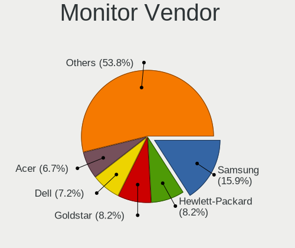

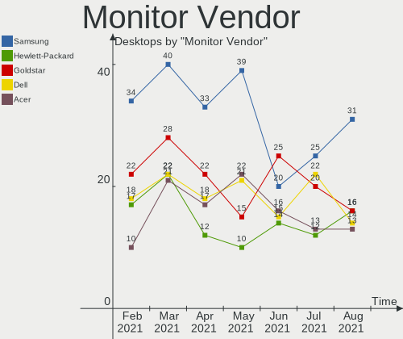

| Vendor               | Desktops | Percent |
|----------------------|----------|---------|
| Samsung Electronics  | 39       | 19.4%   |
| Acer                 | 22       | 10.95%  |
| Dell                 | 21       | 10.45%  |
| Goldstar             | 15       | 7.46%   |
| AOC                  | 13       | 6.47%   |
| Hewlett-Packard      | 10       | 4.98%   |
| Ancor Communications | 10       | 4.98%   |
| BenQ                 | 8        | 3.98%   |
| Philips              | 5        | 2.49%   |
| ViewSonic            | 4        | 1.99%   |
| Unknown              | 4        | 1.99%   |
| LG Electronics       | 4        | 1.99%   |
| Iiyama               | 4        | 1.99%   |
| Eizo                 | 3        | 1.49%   |
| ASUSTek Computer     | 3        | 1.49%   |
| Westinghouse         | 2        | 1%      |
| Sharp                | 2        | 1%      |
| MiTAC                | 2        | 1%      |
| HKC                  | 2        | 1%      |
| HannStar             | 2        | 1%      |
| VIZ                  | 1        | 0.5%    |
| Vestel               | 1        | 0.5%    |
| Toshiba              | 1        | 0.5%    |
| TopView              | 1        | 0.5%    |
| Sony                 | 1        | 0.5%    |
| PLN                  | 1        | 0.5%    |
| ONN                  | 1        | 0.5%    |
| NEC Computers        | 1        | 0.5%    |
| MStar                | 1        | 0.5%    |
| MSI                  | 1        | 0.5%    |
| Medion               | 1        | 0.5%    |
| Lenovo Group Limited | 1        | 0.5%    |
| Lenovo               | 1        | 0.5%    |
| Insignia             | 1        | 0.5%    |
| Idek Iiyama          | 1        | 0.5%    |
| GRM                  | 1        | 0.5%    |
| FUS                  | 1        | 0.5%    |
| Denver               | 1        | 0.5%    |
| Daewoo               | 1        | 0.5%    |
| CNC                  | 1        | 0.5%    |
| Cbox                 | 1        | 0.5%    |
| Braview              | 1        | 0.5%    |
| BBY                  | 1        | 0.5%    |
| Apple                | 1        | 0.5%    |
| AGO                  | 1        | 0.5%    |
| ADI                  | 1        | 0.5%    |

Monitor Model
-------------

Monitor models

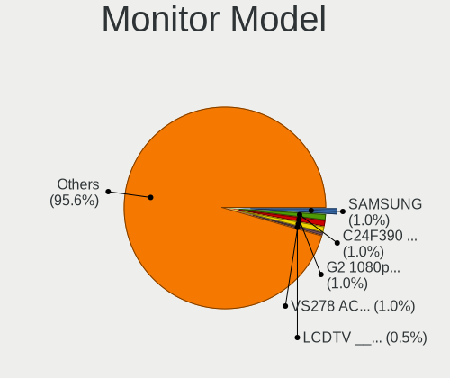

| Model                                                                  | Desktops | Percent |
|------------------------------------------------------------------------|----------|---------|
| Samsung Electronics SyncMaster SAM0598 1360x768 410x230mm 18.5-inch    | 2        | 0.95%   |
| Philips LCD Monitor PHILIPS FTV 1920x1080                              | 2        | 0.95%   |
| MiTAC JVC TV SZM0074 3840x2160 800x450mm 36.1-inch                     | 2        | 0.95%   |
| Goldstar W1752 GSM4490 1440x900 370x232mm 17.2-inch                    | 2        | 0.95%   |
| Goldstar LG ULTRAWIDE GSM59F1 1920x1080 580x240mm 24.7-inch            | 2        | 0.95%   |
| Dell 1909W DELA03D 1440x900 408x255mm 18.9-inch                        | 2        | 0.95%   |
| Westinghouse WD32HBR105 WET6486 1366x768 700x390mm 31.5-inch           | 1        | 0.48%   |
| Westinghouse EU24H1G1 WDT1D42 1366x768 1150x650mm 52.0-inch            | 1        | 0.48%   |
| VIZ LCD Monitor E320i-A2 1280x720                                      | 1        | 0.48%   |
| ViewSonic VX2457 VSCB931 1920x1080 520x290mm 23.4-inch                 | 1        | 0.48%   |
| ViewSonic VX2453 Series VSC0C28 1920x1080 520x290mm 23.4-inch          | 1        | 0.48%   |
| ViewSonic VG2439 SERIES VSCD22B 1920x1080 521x293mm 23.5-inch          | 1        | 0.48%   |
| ViewSonic VA2248 SERIES VSC0E28 1920x1080 477x268mm 21.5-inch          | 1        | 0.48%   |
| ViewSonic VA2231 Series VSCBB25 1920x1080 477x268mm 21.5-inch          | 1        | 0.48%   |
| Vestel LCD Monitor 40W LCD-TV 3600x1080                                | 1        | 0.48%   |
| Vestel LCD Monitor 40W LCD-TV 1920x1080                                | 1        | 0.48%   |
| Unknown LCD Monitor Toshiba 55UHD_LCD_TV 4096x2160                     | 1        | 0.48%   |
| Unknown LCD Monitor SAMSUNG                                            | 1        | 0.48%   |
| Unknown LCD Monitor KSA LD4262D 1360x768                               | 1        | 0.48%   |
| Unknown LCD Monitor BENQ G2320HDB 1920x1080                            | 1        | 0.48%   |
| Toshiba TV TSB0109 1920x1080 1600x900mm 72.3-inch                      | 1        | 0.48%   |
| TopView HD TV TOPC37E 1920x1080 700x390mm 31.5-inch                    | 1        | 0.48%   |
| Sony TV SNY4803 1920x1080 1107x623mm 50.0-inch                         | 1        | 0.48%   |
| Sharp LCDTV SHP1003 1360x768 440x250mm 19.9-inch                       | 1        | 0.48%   |
| Sharp HDMI SHP10FF 1920x1080 1770x1000mm 80.0-inch                     | 1        | 0.48%   |
| Samsung Electronics U32R59x SAM0F96 3840x2160 697x392mm 31.5-inch      | 1        | 0.48%   |
| Samsung Electronics U28D590 SAM0B80 3840x2160 607x345mm 27.5-inch      | 1        | 0.48%   |
| Samsung Electronics T24D390 SAM0B6E 1920x1080 520x290mm 23.4-inch      | 1        | 0.48%   |
| Samsung Electronics T24C300 SAM0A99 1920x1080 521x293mm 23.5-inch      | 1        | 0.48%   |
| Samsung Electronics T22C350 SAM0AB9 1920x1080 480x270mm 21.7-inch      | 1        | 0.48%   |
| Samsung Electronics SyncMaster SAM0588 1920x1080 521x293mm 23.5-inch   | 1        | 0.48%   |
| Samsung Electronics SyncMaster SAM0587 1920x1200 518x324mm 24.1-inch   | 1        | 0.48%   |
| Samsung Electronics SyncMaster SAM0523 1920x1080 477x268mm 21.5-inch   | 1        | 0.48%   |
| Samsung Electronics SyncMaster SAM0115 1280x1024 376x301mm 19.0-inch   | 1        | 0.48%   |
| Samsung Electronics SMBX2450 SAM0722 1920x1080 531x299mm 24.0-inch     | 1        | 0.48%   |
| Samsung Electronics SMBX2440 SAM068B 1920x1080 530x300mm 24.0-inch     | 1        | 0.48%   |
| Samsung Electronics SMB2430L SAM0645 1920x1080 521x293mm 23.5-inch     | 1        | 0.48%   |
| Samsung Electronics SMB2030N SAM0634 1440x900 440x250mm 19.9-inch      | 1        | 0.48%   |
| Samsung Electronics SE790C SAM0C62 2560x1080 700x310mm 30.1-inch       | 1        | 0.48%   |
| Samsung Electronics S34J55x SAM0F70 3440x1440 797x333mm 34.0-inch      | 1        | 0.48%   |
| Samsung Electronics S27R35x SAM1053 1920x1080 598x336mm 27.0-inch      | 1        | 0.48%   |
| Samsung Electronics S24R65x SAM1027 1920x1080 527x296mm 23.8-inch      | 1        | 0.48%   |
| Samsung Electronics S24D300 SAM0B42 1920x1080 531x299mm 24.0-inch      | 1        | 0.48%   |
| Samsung Electronics S24C450D SAM0A00 1920x1080 531x299mm 24.0-inch     | 1        | 0.48%   |
| Samsung Electronics S23B300 SAM08AF 1920x1080 510x287mm 23.0-inch      | 1        | 0.48%   |
| Samsung Electronics S22E310 SAM0C2D 1920x1080 477x268mm 21.5-inch      | 1        | 0.48%   |
| Samsung Electronics S22E310 SAM0C2C 1920x1080 477x268mm 21.5-inch      | 1        | 0.48%   |
| Samsung Electronics S22D300 SAM0B3F 1920x1080 477x268mm 21.5-inch      | 1        | 0.48%   |
| Samsung Electronics S22B150 SAM08A3 1920x1080 477x268mm 21.5-inch      | 1        | 0.48%   |
| Samsung Electronics LCD Monitor T24D390 1920x1080                      | 1        | 0.48%   |
| Samsung Electronics LCD Monitor SyncMaster 3360x1050                   | 1        | 0.48%   |
| Samsung Electronics LCD Monitor SyncMaster 1920x1080                   | 1        | 0.48%   |
| Samsung Electronics LCD Monitor SyncMaster                             | 1        | 0.48%   |
| Samsung Electronics LCD Monitor SAM7016 3840x2160 950x540mm 43.0-inch  | 1        | 0.48%   |
| Samsung Electronics LCD Monitor SAM0C26 1920x1080 1209x680mm 54.6-inch | 1        | 0.48%   |
| Samsung Electronics LCD Monitor SAM090B 1920x1080 1020x570mm 46.0-inch | 1        | 0.48%   |
| Samsung Electronics LCD Monitor SAM0902 1920x1080 1020x570mm 46.0-inch | 1        | 0.48%   |
| Samsung Electronics LCD Monitor S24D300 1920x1080                      | 1        | 0.48%   |
| Samsung Electronics LCD Monitor S22E390 1920x1080                      | 1        | 0.48%   |
| Samsung Electronics LCD Monitor S22E310 3280x1080                      | 1        | 0.48%   |

Monitor Resolution
------------------

Monitor screen resolution

| Resolution         | Desktops | Percent |
|--------------------|----------|---------|
| 1920x1080 (FHD)    | 89       | 44.28%  |
| 1280x1024 (SXGA)   | 15       | 7.46%   |
| 1440x900 (WXGA+)   | 12       | 5.97%   |
| Unknown            | 12       | 5.97%   |
| 3840x2160 (4K)     | 9        | 4.48%   |
| 1680x1050 (WSXGA+) | 9        | 4.48%   |
| 1366x768 (WXGA)    | 9        | 4.48%   |
| 1360x768           | 9        | 4.48%   |
| 1920x1200 (WUXGA)  | 6        | 2.99%   |
| 2560x1440 (QHD)    | 5        | 2.49%   |
| 1600x900 (HD+)     | 5        | 2.49%   |
| 2560x1080          | 4        | 1.99%   |
| 3840x1080          | 3        | 1.49%   |
| 3440x1440          | 3        | 1.49%   |
| 6400x1440          | 1        | 0.5%    |
| 5120x1440          | 1        | 0.5%    |
| 4480x1440          | 1        | 0.5%    |
| 4096x2160          | 1        | 0.5%    |
| 3600x1080          | 1        | 0.5%    |
| 3360x1050          | 1        | 0.5%    |
| 3280x1080          | 1        | 0.5%    |
| 3200x1080          | 1        | 0.5%    |
| 2384x768           | 1        | 0.5%    |
| 1600x1200          | 1        | 0.5%    |
| 1280x720 (HD)      | 1        | 0.5%    |

Monitor Diagonal
----------------

Diagonal size in inches

| Inches  | Desktops | Percent |
|---------|----------|---------|
| Unknown | 38       | 20%     |
| 21      | 22       | 11.58%  |
| 23      | 19       | 10%     |
| 24      | 18       | 9.47%   |
| 19      | 15       | 7.89%   |
| 18      | 13       | 6.84%   |
| 27      | 12       | 6.32%   |
| 22      | 8        | 4.21%   |
| 17      | 8        | 4.21%   |
| 31      | 6        | 3.16%   |
| 34      | 5        | 2.63%   |
| 32      | 4        | 2.11%   |
| 25      | 3        | 1.58%   |
| 54      | 2        | 1.05%   |
| 52      | 2        | 1.05%   |
| 36      | 2        | 1.05%   |
| 20      | 2        | 1.05%   |
| 15      | 2        | 1.05%   |
| 84      | 1        | 0.53%   |
| 80      | 1        | 0.53%   |
| 72      | 1        | 0.53%   |
| 55      | 1        | 0.53%   |
| 46      | 1        | 0.53%   |
| 40      | 1        | 0.53%   |
| 35      | 1        | 0.53%   |
| 30      | 1        | 0.53%   |
| 16      | 1        | 0.53%   |

Monitor Width
-------------

Physical width

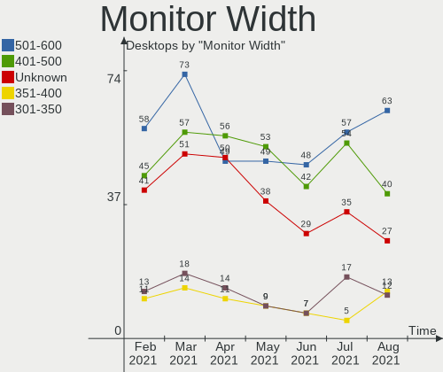

| Width in mm | Desktops | Percent |
|-------------|----------|---------|
| 401-500     | 53       | 28.19%  |
| 501-600     | 49       | 26.06%  |
| Unknown     | 38       | 20.21%  |
| 701-800     | 11       | 5.85%   |
| 351-400     | 9        | 4.79%   |
| 301-350     | 9        | 4.79%   |
| 601-700     | 8        | 4.26%   |
| 1001-1500   | 6        | 3.19%   |
| 1501-2000   | 3        | 1.6%    |
| 801-900     | 2        | 1.06%   |

Aspect Ratio
------------

Proportional relationship between the width and the height

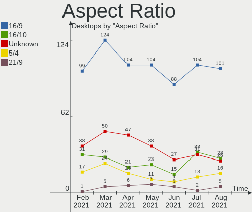

| Ratio   | Desktops | Percent |
|---------|----------|---------|
| 16/9    | 104      | 55.91%  |
| Unknown | 38       | 20.43%  |
| 16/10   | 23       | 12.37%  |
| 5/4     | 11       | 5.91%   |
| 21/9    | 7        | 3.76%   |
| 6/5     | 1        | 0.54%   |
| 4/3     | 1        | 0.54%   |
| 3/2     | 1        | 0.54%   |

Monitor Area
------------

Area in inch²

| Area in inch² | Desktops | Percent |
|----------------|----------|---------|
| 201-250        | 58       | 30.69%  |
| Unknown        | 38       | 20.11%  |
| 151-200        | 24       | 12.7%   |
| 141-150        | 17       | 8.99%   |
| 351-500        | 16       | 8.47%   |
| 301-350        | 13       | 6.88%   |
| More than 1000 | 8        | 4.23%   |
| 251-300        | 6        | 3.17%   |
| 501-1000       | 4        | 2.12%   |
| 131-140        | 3        | 1.59%   |
| 101-110        | 2        | 1.06%   |

Pixel Density
-------------

Pixels per inch

| Density | Desktops | Percent |
|---------|----------|---------|
| 51-100  | 105      | 56.45%  |
| Unknown | 38       | 20.43%  |
| 101-120 | 27       | 14.52%  |
| 1-50    | 10       | 5.38%   |
| 121-160 | 5        | 2.69%   |
| 161-240 | 1        | 0.54%   |

Multiple Monitors
-----------------

Total monitors connected

| Total | Desktops | Percent |
|-------|----------|---------|
| 1     | 161      | 80.1%   |
| 2     | 33       | 16.42%  |
| 0     | 7        | 3.48%   |

Net Controller Vendor
---------------------

Controller vendors

| Vendor                                 | Desktops | Percent |
|----------------------------------------|----------|---------|
| Realtek Semiconductor                  | 124      | 43.36%  |
| Intel                                  | 75       | 26.22%  |
| Qualcomm Atheros                       | 20       | 6.99%   |
| Broadcom                               | 9        | 3.15%   |
| Nvidia                                 | 8        | 2.8%    |
| Ralink Technology                      | 7        | 2.45%   |
| TP-Link                                | 4        | 1.4%    |
| Samsung Electronics                    | 4        | 1.4%    |
| Ralink                                 | 4        | 1.4%    |
| Qualcomm Atheros Communications        | 4        | 1.4%    |
| Marvell Technology Group               | 4        | 1.4%    |
| D-Link System                          | 4        | 1.4%    |
| NetGear                                | 3        | 1.05%   |
| VIA Technologies                       | 2        | 0.7%    |
| Sony Ericsson Mobile Communications AB | 2        | 0.7%    |
| Microsoft                              | 2        | 0.7%    |
| Mercucys                               | 2        | 0.7%    |
| Xiaomi                                 | 1        | 0.35%   |
| Motorola                               | 1        | 0.35%   |
| MediaTek                               | 1        | 0.35%   |
| Holtek Semiconductor                   | 1        | 0.35%   |
| Google                                 | 1        | 0.35%   |
| Edimax Technology                      | 1        | 0.35%   |
| D-Link                                 | 1        | 0.35%   |
| ASUSTek Computer                       | 1        | 0.35%   |

Net Controller Model
--------------------

Controller models

| Model                                                             | Desktops | Percent |
|-------------------------------------------------------------------|----------|---------|
| Realtek RTL8111/8168/8411 PCI Express Gigabit Ethernet Controller | 102      | 31.58%  |
| Intel Ethernet Connection (2) I219-V                              | 16       | 4.95%   |
| Intel Wi-Fi 6 AX200                                               | 10       | 3.1%    |
| Intel Ethernet Connection I217-LM                                 | 7        | 2.17%   |
| Intel 82579LM Gigabit Network Connection (Lewisville)             | 7        | 2.17%   |
| Nvidia MCP61 Ethernet                                             | 6        | 1.86%   |
| Intel Ethernet Connection (2) I218-V                              | 6        | 1.86%   |
| Realtek RTL810xE PCI Express Fast Ethernet controller             | 5        | 1.55%   |
| Qualcomm Atheros AR93xx Wireless Network Adapter                  | 5        | 1.55%   |
| Realtek RTL8125 2.5GbE Controller                                 | 4        | 1.24%   |
| Realtek 802.11ac NIC                                              | 4        | 1.24%   |
| Qualcomm Atheros AR9271 802.11n                                   | 4        | 1.24%   |
| Intel Wireless-AC 9260                                            | 4        | 1.24%   |
| Intel Ethernet Connection I217-V                                  | 4        | 1.24%   |
| Realtek RTL8192EU 802.11b/g/n WLAN Adapter                        | 3        | 0.93%   |
| Qualcomm Atheros Killer E220x Gigabit Ethernet Controller         | 3        | 0.93%   |
| Intel Wireless 7260                                               | 3        | 0.93%   |
| Intel Ethernet Controller I225-V                                  | 3        | 0.93%   |
| Intel Ethernet Connection (2) I219-LM                             | 3        | 0.93%   |
| Intel Dual Band Wireless-AC 3168NGW [Stone Peak]                  | 3        | 0.93%   |
| Intel 82567LM-3 Gigabit Network Connection                        | 3        | 0.93%   |
| VIA VT6102/VT6103 [Rhine-II]                                      | 2        | 0.62%   |
| TP-Link TL-WN823N v2/v3 [Realtek RTL8192EU]                       | 2        | 0.62%   |
| Samsung GT-I9070 (network tethering, USB debugging enabled)       | 2        | 0.62%   |
| Samsung Galaxy series, misc. (tethering mode)                     | 2        | 0.62%   |
| Realtek RTL88x2bu [AC1200 Techkey]                                | 2        | 0.62%   |
| Realtek RTL8822BE 802.11a/b/g/n/ac WiFi adapter                   | 2        | 0.62%   |
| Realtek RTL8812AU 802.11a/b/g/n/ac 2T2R DB WLAN Adapter           | 2        | 0.62%   |
| Realtek RTL8191SU 802.11n WLAN Adapter                            | 2        | 0.62%   |
| Realtek RTL8188SU 802.11n WLAN Adapter                            | 2        | 0.62%   |
| Realtek RTL8188EUS 802.11n Wireless Network Adapter               | 2        | 0.62%   |
| Realtek 802.11n                                                   | 2        | 0.62%   |
| Ralink RT5370 Wireless Adapter                                    | 2        | 0.62%   |
| Ralink RT2870/RT3070 Wireless Adapter                             | 2        | 0.62%   |
| Ralink MT7601U Wireless Adapter                                   | 2        | 0.62%   |
| Qualcomm Atheros AR9485 Wireless Network Adapter                  | 2        | 0.62%   |
| Microsoft Xbox 360 Wireless Adapter                               | 2        | 0.62%   |
| Marvell Group 88E8071 PCI-E Gigabit Ethernet Controller           | 2        | 0.62%   |
| Intel Wireless 8265 / 8275                                        | 2        | 0.62%   |
| Intel NM10/ICH7 Family LAN Controller                             | 2        | 0.62%   |
| Intel I211 Gigabit Network Connection                             | 2        | 0.62%   |
| Intel I210 Gigabit Network Connection                             | 2        | 0.62%   |
| Intel Ethernet Connection (7) I219-LM                             | 2        | 0.62%   |
| Intel 82579V Gigabit Network Connection                           | 2        | 0.62%   |
| Intel 82574L Gigabit Network Connection                           | 2        | 0.62%   |
| Broadcom NetLink BCM57781 Gigabit Ethernet PCIe                   | 2        | 0.62%   |
| Xiaomi Mi/Redmi series (RNDIS + ADB)                              | 1        | 0.31%   |
| TP-Link TL-WN822N Version 4 RTL8192EU                             | 1        | 0.31%   |
| TP-Link 802.11ac WLAN Adapter                                     | 1        | 0.31%   |
| Sony Ericsson Mobile AB F3311                                     | 1        | 0.31%   |
| Sony Ericsson Mobile AB E5603                                     | 1        | 0.31%   |
| Realtek RTL8821CE 802.11ac PCIe Wireless Network Adapter          | 1        | 0.31%   |
| Realtek RTL8821AE 802.11ac PCIe Wireless Network Adapter          | 1        | 0.31%   |
| Realtek RTL8192EE PCIe Wireless Network Adapter                   | 1        | 0.31%   |
| Realtek RTL8192CE PCIe Wireless Network Adapter                   | 1        | 0.31%   |
| Realtek RTL8188EE Wireless Network Adapter                        | 1        | 0.31%   |
| Realtek RTL8187B Wireless 802.11g 54Mbps Network Adapter          | 1        | 0.31%   |
| Realtek RTL8169 PCI Gigabit Ethernet Controller                   | 1        | 0.31%   |
| Realtek RTL8153 Gigabit Ethernet Adapter                          | 1        | 0.31%   |
| Realtek RTL-8185 IEEE 802.11a/b/g Wireless LAN Controller         | 1        | 0.31%   |

Wireless Vendor
---------------

Wireless vendors

| Vendor                          | Desktops | Percent |
|---------------------------------|----------|---------|
| Realtek Semiconductor           | 30       | 30%     |
| Intel                           | 23       | 23%     |
| Qualcomm Atheros                | 12       | 12%     |
| Ralink Technology               | 7        | 7%      |
| TP-Link                         | 4        | 4%      |
| Ralink                          | 4        | 4%      |
| Qualcomm Atheros Communications | 4        | 4%      |
| NetGear                         | 3        | 3%      |
| Broadcom                        | 3        | 3%      |
| Microsoft                       | 2        | 2%      |
| Mercucys                        | 2        | 2%      |
| D-Link System                   | 2        | 2%      |
| MediaTek                        | 1        | 1%      |
| Edimax Technology               | 1        | 1%      |
| D-Link                          | 1        | 1%      |
| ASUSTek Computer                | 1        | 1%      |

Wireless Model
--------------

Wireless models

| Model                                                                                         | Desktops | Percent |
|-----------------------------------------------------------------------------------------------|----------|---------|
| Intel Wi-Fi 6 AX200                                                                           | 10       | 9.9%    |
| Qualcomm Atheros AR93xx Wireless Network Adapter                                              | 5        | 4.95%   |
| Realtek 802.11ac NIC                                                                          | 4        | 3.96%   |
| Qualcomm Atheros AR9271 802.11n                                                               | 4        | 3.96%   |
| Intel Wireless-AC 9260                                                                        | 4        | 3.96%   |
| Realtek RTL8192EU 802.11b/g/n WLAN Adapter                                                    | 3        | 2.97%   |
| Intel Wireless 7260                                                                           | 3        | 2.97%   |
| Intel Dual Band Wireless-AC 3168NGW [Stone Peak]                                              | 3        | 2.97%   |
| TP-Link TL-WN823N v2/v3 [Realtek RTL8192EU]                                                   | 2        | 1.98%   |
| Realtek RTL88x2bu [AC1200 Techkey]                                                            | 2        | 1.98%   |
| Realtek RTL8822BE 802.11a/b/g/n/ac WiFi adapter                                               | 2        | 1.98%   |
| Realtek RTL8812AU 802.11a/b/g/n/ac 2T2R DB WLAN Adapter                                       | 2        | 1.98%   |
| Realtek RTL8191SU 802.11n WLAN Adapter                                                        | 2        | 1.98%   |
| Realtek RTL8188SU 802.11n WLAN Adapter                                                        | 2        | 1.98%   |
| Realtek RTL8188EUS 802.11n Wireless Network Adapter                                           | 2        | 1.98%   |
| Realtek 802.11n                                                                               | 2        | 1.98%   |
| Ralink RT5370 Wireless Adapter                                                                | 2        | 1.98%   |
| Ralink RT2870/RT3070 Wireless Adapter                                                         | 2        | 1.98%   |
| Ralink MT7601U Wireless Adapter                                                               | 2        | 1.98%   |
| Qualcomm Atheros AR9485 Wireless Network Adapter                                              | 2        | 1.98%   |
| Microsoft Xbox 360 Wireless Adapter                                                           | 2        | 1.98%   |
| Intel Wireless 8265 / 8275                                                                    | 2        | 1.98%   |
| TP-Link TL-WN822N Version 4 RTL8192EU                                                         | 1        | 0.99%   |
| TP-Link 802.11ac WLAN Adapter                                                                 | 1        | 0.99%   |
| Realtek RTL8821CE 802.11ac PCIe Wireless Network Adapter                                      | 1        | 0.99%   |
| Realtek RTL8821AE 802.11ac PCIe Wireless Network Adapter                                      | 1        | 0.99%   |
| Realtek RTL8192EE PCIe Wireless Network Adapter                                               | 1        | 0.99%   |
| Realtek RTL8192CE PCIe Wireless Network Adapter                                               | 1        | 0.99%   |
| Realtek RTL8188EE Wireless Network Adapter                                                    | 1        | 0.99%   |
| Realtek RTL8187B Wireless 802.11g 54Mbps Network Adapter                                      | 1        | 0.99%   |
| Realtek RTL-8185 IEEE 802.11a/b/g Wireless LAN Controller                                     | 1        | 0.99%   |
| Realtek Realtek 8812AU/8821AU 802.11ac WLAN Adapter [USB Wireless Dual-Band Adapter 2.4/5Ghz] | 1        | 0.99%   |
| Realtek 802.11ac WLAN Adapter                                                                 | 1        | 0.99%   |
| Ralink RT5372 Wireless Adapter                                                                | 1        | 0.99%   |
| Ralink RT2070 Wireless Adapter                                                                | 1        | 0.99%   |
| Ralink RT5592 PCIe Wireless Network Adapter                                                   | 1        | 0.99%   |
| Ralink RT5390 Wireless 802.11n 1T/1R PCIe                                                     | 1        | 0.99%   |
| Ralink RT3092 Wireless 802.11n 2T/2R PCIe                                                     | 1        | 0.99%   |
| Ralink RT2561/RT61 802.11g PCI                                                                | 1        | 0.99%   |
| Qualcomm Atheros QCA9565 / AR9565 Wireless Network Adapter                                    | 1        | 0.99%   |
| Qualcomm Atheros QCA9377 802.11ac Wireless Network Adapter                                    | 1        | 0.99%   |
| Qualcomm Atheros QCA6174 802.11ac Wireless Network Adapter                                    | 1        | 0.99%   |
| Qualcomm Atheros AR9287 Wireless Network Adapter (PCI-Express)                                | 1        | 0.99%   |
| Qualcomm Atheros AR2417 Wireless Network Adapter [AR5007G 802.11bg]                           | 1        | 0.99%   |
| NetGear WNA3100(v1) Wireless-N 300 [Broadcom BCM43231]                                        | 1        | 0.99%   |
| NetGear WNA1100 Wireless-N 150 [Atheros AR9271]                                               | 1        | 0.99%   |
| NetGear A6210                                                                                 | 1        | 0.99%   |
| Mercucys MW300UM RTL8192EU wifi                                                               | 1        | 0.99%   |
| Mercucys 802.11n NIC                                                                          | 1        | 0.99%   |
| MediaTek WiFi                                                                                 | 1        | 0.99%   |
| Intel Wireless 8260                                                                           | 1        | 0.99%   |
| Edimax EW-7811Un 802.11n Wireless Adapter [Realtek RTL8188CUS]                                | 1        | 0.99%   |
| D-Link System DWA-140 RangeBooster N Adapter(rev.B2) [Ralink RT3072]                          | 1        | 0.99%   |
| D-Link System DWA-131 802.11n Wireless N Nano Adapter(rev.A1) [Realtek RTL8192SU]             | 1        | 0.99%   |
| D-Link DWA-160 802.11abgn Xtreme N Dual Band Adapter(rev.B2) [Ralink RT5572]                  | 1        | 0.99%   |
| Broadcom BCM4352 802.11ac Wireless Network Adapter                                            | 1        | 0.99%   |
| Broadcom BCM4322 802.11a/b/g/n Wireless LAN Controller                                        | 1        | 0.99%   |
| Broadcom BCM4306 802.11b/g Wireless LAN Controller                                            | 1        | 0.99%   |
| ASUS USB-N14 802.11b/g/n (2x2) Wireless Adapter [Ralink RT5372]                               | 1        | 0.99%   |

Ethernet Vendor
---------------

Ethernet vendors

| Vendor                                 | Desktops | Percent |
|----------------------------------------|----------|---------|
| Realtek Semiconductor                  | 112      | 52.09%  |
| Intel                                  | 64       | 29.77%  |
| Qualcomm Atheros                       | 9        | 4.19%   |
| Nvidia                                 | 8        | 3.72%   |
| Broadcom                               | 6        | 2.79%   |
| Samsung Electronics                    | 4        | 1.86%   |
| Marvell Technology Group               | 4        | 1.86%   |
| VIA Technologies                       | 2        | 0.93%   |
| Sony Ericsson Mobile Communications AB | 2        | 0.93%   |
| D-Link System                          | 2        | 0.93%   |
| Xiaomi                                 | 1        | 0.47%   |
| Google                                 | 1        | 0.47%   |

Ethernet Model
--------------

Ethernet models

| Model                                                                         | Desktops | Percent |
|-------------------------------------------------------------------------------|----------|---------|
| Realtek RTL8111/8168/8411 PCI Express Gigabit Ethernet Controller             | 102      | 46.36%  |
| Intel Ethernet Connection (2) I219-V                                          | 16       | 7.27%   |
| Intel Ethernet Connection I217-LM                                             | 7        | 3.18%   |
| Intel 82579LM Gigabit Network Connection (Lewisville)                         | 7        | 3.18%   |
| Nvidia MCP61 Ethernet                                                         | 6        | 2.73%   |
| Intel Ethernet Connection (2) I218-V                                          | 6        | 2.73%   |
| Realtek RTL810xE PCI Express Fast Ethernet controller                         | 5        | 2.27%   |
| Realtek RTL8125 2.5GbE Controller                                             | 4        | 1.82%   |
| Intel Ethernet Connection I217-V                                              | 4        | 1.82%   |
| Qualcomm Atheros Killer E220x Gigabit Ethernet Controller                     | 3        | 1.36%   |
| Intel Ethernet Controller I225-V                                              | 3        | 1.36%   |
| Intel Ethernet Connection (2) I219-LM                                         | 3        | 1.36%   |
| Intel 82567LM-3 Gigabit Network Connection                                    | 3        | 1.36%   |
| VIA VT6102/VT6103 [Rhine-II]                                                  | 2        | 0.91%   |
| Samsung GT-I9070 (network tethering, USB debugging enabled)                   | 2        | 0.91%   |
| Samsung Galaxy series, misc. (tethering mode)                                 | 2        | 0.91%   |
| Marvell Group 88E8071 PCI-E Gigabit Ethernet Controller                       | 2        | 0.91%   |
| Intel NM10/ICH7 Family LAN Controller                                         | 2        | 0.91%   |
| Intel I211 Gigabit Network Connection                                         | 2        | 0.91%   |
| Intel I210 Gigabit Network Connection                                         | 2        | 0.91%   |
| Intel Ethernet Connection (7) I219-LM                                         | 2        | 0.91%   |
| Intel 82579V Gigabit Network Connection                                       | 2        | 0.91%   |
| Intel 82574L Gigabit Network Connection                                       | 2        | 0.91%   |
| Broadcom NetLink BCM57781 Gigabit Ethernet PCIe                               | 2        | 0.91%   |
| Xiaomi Mi/Redmi series (RNDIS + ADB)                                          | 1        | 0.45%   |
| Sony Ericsson Mobile AB F3311                                                 | 1        | 0.45%   |
| Sony Ericsson Mobile AB E5603                                                 | 1        | 0.45%   |
| Realtek RTL8169 PCI Gigabit Ethernet Controller                               | 1        | 0.45%   |
| Realtek RTL8153 Gigabit Ethernet Adapter                                      | 1        | 0.45%   |
| Realtek RTL-8100/8101L/8139 PCI Fast Ethernet Adapter                         | 1        | 0.45%   |
| Qualcomm Atheros QCA8171 Gigabit Ethernet                                     | 1        | 0.45%   |
| Qualcomm Atheros Killer E2500 Gigabit Ethernet Controller                     | 1        | 0.45%   |
| Qualcomm Atheros Attansic L2 Fast Ethernet                                    | 1        | 0.45%   |
| Qualcomm Atheros Attansic L1 Gigabit Ethernet                                 | 1        | 0.45%   |
| Qualcomm Atheros AR8132 Fast Ethernet                                         | 1        | 0.45%   |
| Qualcomm Atheros AR8121/AR8113/AR8114 Gigabit or Fast Ethernet                | 1        | 0.45%   |
| Nvidia MCP77 Ethernet                                                         | 1        | 0.45%   |
| Nvidia CK8S Ethernet Controller                                               | 1        | 0.45%   |
| Marvell Group 88E8057 PCI-E Gigabit Ethernet Controller                       | 1        | 0.45%   |
| Marvell Group 88E8001 Gigabit Ethernet Controller                             | 1        | 0.45%   |
| Intel 82578DM Gigabit Network Connection                                      | 1        | 0.45%   |
| Intel 82573E Gigabit Ethernet Controller (Copper)                             | 1        | 0.45%   |
| Intel 82571EB/82571GB Gigabit Ethernet Controller D0/D1 (copper applications) | 1        | 0.45%   |
| Intel 82566DM-2 Gigabit Network Connection                                    | 1        | 0.45%   |
| Intel 82562V-2 10/100 Network Connection                                      | 1        | 0.45%   |
| Intel 82562V 10/100 Network Connection                                        | 1        | 0.45%   |
| Google Nexus/Pixel Device (tether)                                            | 1        | 0.45%   |
| D-Link System Gigabit Ethernet Adapter                                        | 1        | 0.45%   |
| D-Link System DGE-528T Gigabit Ethernet Adapter                               | 1        | 0.45%   |
| Broadcom NetXtreme BCM5764M Gigabit Ethernet PCIe                             | 1        | 0.45%   |
| Broadcom NetXtreme BCM5762 Gigabit Ethernet PCIe                              | 1        | 0.45%   |
| Broadcom NetXtreme BCM5761 Gigabit Ethernet PCIe                              | 1        | 0.45%   |
| Broadcom NetXtreme BCM5723 Gigabit Ethernet PCIe                              | 1        | 0.45%   |

Net Controller Kind
-------------------

Ethernet, WiFi or modem

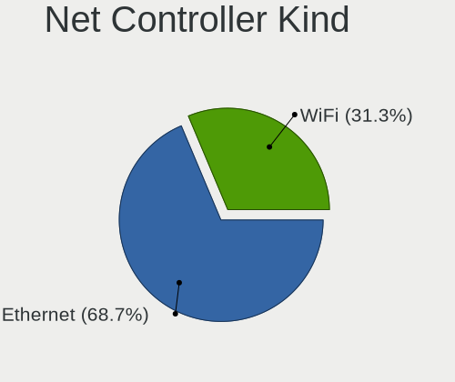

| Kind     | Desktops | Percent |
|----------|----------|---------|
| Ethernet | 199      | 67.92%  |
| WiFi     | 92       | 31.4%   |
| Modem    | 1        | 0.34%   |
| Unknown  | 1        | 0.34%   |

Used Controller
---------------

Currently used network controller

| Kind     | Desktops | Percent |
|----------|----------|---------|
| Ethernet | 184      | 73.31%  |
| WiFi     | 67       | 26.69%  |

NICs
----

Total network controllers on board

| Total | Desktops | Percent |
|-------|----------|---------|
| 1     | 144      | 71.64%  |
| 2     | 50       | 24.88%  |
| 3     | 7        | 3.48%   |

IPv6
----

IPv6 vs IPv4

| Used | Desktops | Percent |
|------|----------|---------|
| No   | 134      | 66.67%  |
| Yes  | 67       | 33.33%  |

Memory Vendor
-------------

Memory module vendors

| Vendor              | Desktops | Percent |
|---------------------|----------|---------|
| Kingston            | 12       | 14.46%  |
| Corsair             | 12       | 14.46%  |
| Samsung Electronics | 9        | 10.84%  |
| Crucial             | 9        | 10.84%  |
| SK Hynix            | 7        | 8.43%   |
| G.Skill             | 7        | 8.43%   |
| Unknown             | 6        | 7.23%   |
| Team                | 5        | 6.02%   |
| A-DATA Technology   | 3        | 3.61%   |
| Nanya Technology    | 2        | 2.41%   |
| Micron Technology   | 2        | 2.41%   |
| AMD                 | 2        | 2.41%   |
| Sesame              | 1        | 1.2%    |
| Ramos Technology    | 1        | 1.2%    |
| Ramaxel Technology  | 1        | 1.2%    |
| PNY                 | 1        | 1.2%    |
| OLOY                | 1        | 1.2%    |
| Elpida              | 1        | 1.2%    |
| Carry               | 1        | 1.2%    |

Memory Model
------------

Memory module models

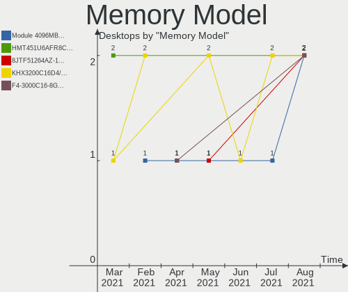

| Model                                                     | Desktops | Percent |
|-----------------------------------------------------------|----------|---------|
| Team RAM TEAMGROUP-UD4-3600 16384MB DIMM DDR4 3600MT/s    | 3        | 3.13%   |
| Kingston RAM KHX3200C16D4/8GX 8GB DIMM DDR4 3533MT/s      | 2        | 2.08%   |
| Corsair RAM CMZ16GX3M2A1866C10 8192MB DIMM DDR3 1333MT/s  | 2        | 2.08%   |
| Unknown RAM Module 512MB DIMM DDR 200MT/s                 | 1        | 1.04%   |
| Unknown RAM Module 4GB DIMM 1333MT/s                      | 1        | 1.04%   |
| Unknown RAM Module 4096MB DIMM 1333MT/s                   | 1        | 1.04%   |
| Unknown RAM Module 2048MB DIMM DDR2 667MT/s               | 1        | 1.04%   |
| Unknown RAM Module 2048MB DIMM DDR2 52217MT/s             | 1        | 1.04%   |
| Unknown RAM Module 1024MB DIMM DDR 200MT/s                | 1        | 1.04%   |
| Unknown RAM Module 1024MB DIMM 52217MT/s                  | 1        | 1.04%   |
| Unknown RAM 1866 CL10 Series 8192MB DIMM DDR3 933MT/s     | 1        | 1.04%   |
| Team RAM TEAMGROUP-UD4-3000 8GB DIMM DDR4 3000MT/s        | 1        | 1.04%   |
| Team RAM Elite-1333 4GB DIMM DDR3 1333MT/s                | 1        | 1.04%   |
| SK Hynix RAM Module 8192MB SODIMM DDR4 2133MT/s           | 1        | 1.04%   |
| SK Hynix RAM HYMP125U 2048MB DIMM DDR2 800MT/s            | 1        | 1.04%   |
| SK Hynix RAM HMT451U6BFR8A-PB 4096MB DIMM DDR3 1600MT/s   | 1        | 1.04%   |
| SK Hynix RAM HMT351U6EFR8C-PB 4096MB DIMM DDR3 1800MT/s   | 1        | 1.04%   |
| SK Hynix RAM HMT351U6CFR8C-PB 4096MB DIMM DDR3 1800MT/s   | 1        | 1.04%   |
| SK Hynix RAM HMP125U6EFR8C-S6 2048MB DIMM DDR2 800MT/s    | 1        | 1.04%   |
| SK Hynix RAM HMA851S6AFR6N-UH 4GB SODIMM DDR4 2667MT/s    | 1        | 1.04%   |
| SK Hynix RAM 484D543435315536 4096MB SODIMM DDR3 1600MT/s | 1        | 1.04%   |
| Sesame RAM S939A2UGS-ITR 8192MB DIMM DDR3 1600MT/s        | 1        | 1.04%   |
| Samsung RAM M471A5244CB0-CRC 4GB SODIMM DDR4 2667MT/s     | 1        | 1.04%   |
| Samsung RAM M378B5673FH0-CH9 2GB DIMM SDRAM 1600MT/s      | 1        | 1.04%   |
| Samsung RAM M378B5273CH0-CH9 4GB DIMM DDR3 1867MT/s       | 1        | 1.04%   |
| Samsung RAM M378B5173QH0-CK0 4GB DIMM DDR3 1866MT/s       | 1        | 1.04%   |
| Samsung RAM M378B5173EB0-CK0 4GB DIMM DDR3 1600MT/s       | 1        | 1.04%   |
| Samsung RAM M378A1K43DB2-CVF 8192MB DIMM DDR4 2933MT/s    | 1        | 1.04%   |
| Samsung RAM M378A1K43CB2-CTD 8GB DIMM DDR4 3200MT/s       | 1        | 1.04%   |
| Samsung RAM M3 78T5663QZ3-CF7 2048MB DIMM DDR2 1639MT/s   | 1        | 1.04%   |
| Samsung RAM M3 78T2953EZ3-CF7 1024MB DIMM DDR2 800MT/s    | 1        | 1.04%   |
| Samsung RAM M3 78T2863RZS-CF7 1GB DIMM DDR2 800MT/s       | 1        | 1.04%   |
| Ramos RAM EWB4GB681PAE-16IC 4096MB DIMM DDR3 1600MT/s     | 1        | 1.04%   |
| Ramaxel RAM RMR5030EF68F9W1600 4096MB DIMM DDR3 1600MT/s  | 1        | 1.04%   |
| PNY RAM 8GBF1X08RHJJ40-135-K 8192MB DIMM DDR4 3000MT/s    | 1        | 1.04%   |
| OLOY RAM CL16-18-18 D4-3000 8192MB DIMM DDR4 3000MT/s     | 1        | 1.04%   |
| Nanya RAM NT2GT64U8HD0BY-AD 2048MB DIMM DDR2 2048MT/s     | 1        | 1.04%   |
| Nanya RAM NT1GT64U88D0BY-AD 1024MB DIMM DDR2 49926MT/s    | 1        | 1.04%   |
| Nanya RAM M2F8G64CB8HD5N-DI 8192MB DIMM DDR3 800MT/s      | 1        | 1.04%   |
| Micron RAM 8JTF51264AZ-1G6E1 4GB DIMM DDR3 1600MT/s       | 1        | 1.04%   |
| Micron RAM 16HTF25664AY-800J1 2048MB DIMM DDR2 800MT/s    | 1        | 1.04%   |
| Kingston RAM Module 2048MB DIMM DDR2 800MT/s              | 1        | 1.04%   |
| Kingston RAM KHX2133C14/8G 8GB DIMM DDR4 2400MT/s         | 1        | 1.04%   |
| Kingston RAM KHX1866C10D3/8G 8GB DIMM DDR3 2133MT/s       | 1        | 1.04%   |
| Kingston RAM 99U5702-094.A00G 8192MB DIMM DDR4 2400MT/s   | 1        | 1.04%   |
| Kingston RAM 99U5584-005.A00LF 4096MB DIMM DDR3 1600MT/s  | 1        | 1.04%   |
| Kingston RAM 99U5471-012.A00LF 4096MB DIMM DDR3 1600MT/s  | 1        | 1.04%   |
| Kingston RAM 9905734-019.A00G 16384MB DIMM DDR4 2400MT/s  | 1        | 1.04%   |
| Kingston RAM 9905713-017.A00G 4096MB DIMM DDR4 2400MT/s   | 1        | 1.04%   |
| Kingston RAM 9905711-022.A00G 4096MB SODIMM DDR4 2933MT/s | 1        | 1.04%   |
| Kingston RAM 9905678-043.A00G 8192MB DIMM DDR4 2133MT/s   | 1        | 1.04%   |
| Kingston RAM 9905622-058.A00G 8192MB DIMM DDR4 2133MT/s   | 1        | 1.04%   |
| Kingston RAM 9905584-014.A00LF 4096MB DIMM DDR3 1600MT/s  | 1        | 1.04%   |
| Kingston RAM 9905471-030.A00LF 8192MB DIMM DDR3 1600MT/s  | 1        | 1.04%   |
| G.Skill RAM F4-3200C16-32GTZN 32GB DIMM DDR4 3200MT/s     | 1        | 1.04%   |
| G.Skill RAM F4-3200C14-8GFX 8GB DIMM DDR4 3733MT/s        | 1        | 1.04%   |
| G.Skill RAM F4-2400C17-4GNT 4096MB DIMM DDR4 2400MT/s     | 1        | 1.04%   |
| G.Skill RAM F4-2400C15-8GNT 8192MB DIMM DDR4 2400MT/s     | 1        | 1.04%   |
| G.Skill RAM F4-2133C15-4GIS 4GB DIMM DDR4 2133MT/s        | 1        | 1.04%   |
| G.Skill RAM F3-1600C8-4GAB 4096MB DIMM DDR3 1600MT/s      | 1        | 1.04%   |

Memory Kind
-----------

Memory module kinds

| Kind    | Desktops | Percent |
|---------|----------|---------|
| DDR4    | 34       | 47.89%  |
| DDR3    | 22       | 30.99%  |
| DDR2    | 8        | 11.27%  |
| Unknown | 3        | 4.23%   |
| SDRAM   | 2        | 2.82%   |
| LPDDR4  | 1        | 1.41%   |
| DDR     | 1        | 1.41%   |

Memory Form Factor
------------------

Physical design of the memory module

| Name   | Desktops | Percent |
|--------|----------|---------|
| DIMM   | 63       | 92.65%  |
| SODIMM | 5        | 7.35%   |

Memory Size
-----------

Memory module size

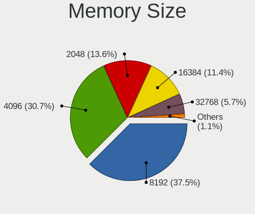

| Size  | Desktops | Percent |
|-------|----------|---------|
| 8192  | 31       | 38.75%  |
| 4096  | 23       | 28.75%  |
| 16384 | 10       | 12.5%   |
| 2048  | 9        | 11.25%  |
| 1024  | 5        | 6.25%   |
| 32768 | 1        | 1.25%   |
| 512   | 1        | 1.25%   |

Memory Speed
------------

Memory module speed

| Speed | Desktops | Percent |
|-------|----------|---------|
| 1600  | 15       | 18.99%  |
| 2400  | 9        | 11.39%  |
| 2133  | 8        | 10.13%  |
| 1333  | 6        | 7.59%   |
| 800   | 6        | 7.59%   |
| 3200  | 5        | 6.33%   |
| 3600  | 4        | 5.06%   |
| 1867  | 4        | 5.06%   |
| 3000  | 3        | 3.8%    |
| 2667  | 3        | 3.8%    |
| 3533  | 2        | 2.53%   |
| 2933  | 2        | 2.53%   |
| 1866  | 2        | 2.53%   |
| 52217 | 1        | 1.27%   |
| 49926 | 1        | 1.27%   |
| 3733  | 1        | 1.27%   |
| 3466  | 1        | 1.27%   |
| 2048  | 1        | 1.27%   |
| 1800  | 1        | 1.27%   |
| 1639  | 1        | 1.27%   |
| 1200  | 1        | 1.27%   |
| 667   | 1        | 1.27%   |
| 200   | 1        | 1.27%   |

Sound Vendor
------------

Sound card vendors

| Vendor                      | Desktops | Percent |
|-----------------------------|----------|---------|
| Intel                       | 124      | 39.49%  |
| AMD                         | 78       | 24.84%  |
| Nvidia                      | 76       | 24.2%   |
| C-Media Electronics         | 8        | 2.55%   |
| Logitech                    | 3        | 0.96%   |
| Creative Labs               | 3        | 0.96%   |
| VIA Technologies            | 2        | 0.64%   |
| Razer USA                   | 2        | 0.64%   |
| Plantronics                 | 2        | 0.64%   |
| Generalplus Technology      | 2        | 0.64%   |
| XMOS                        | 1        | 0.32%   |
| Unknown                     | 1        | 0.32%   |
| ULi Electronics             | 1        | 0.32%   |
| Texas Instruments           | 1        | 0.32%   |
| Syntek                      | 1        | 0.32%   |
| SHARKOON Technologies       | 1        | 0.32%   |
| Kingston Technology         | 1        | 0.32%   |
| Guillemot                   | 1        | 0.32%   |
| GN Netcom                   | 1        | 0.32%   |
| Fry's Electronics           | 1        | 0.32%   |
| FiiO Electronics Technology | 1        | 0.32%   |
| Ensoniq                     | 1        | 0.32%   |
| Creative Technology         | 1        | 0.32%   |
| ASUSTek Computer            | 1        | 0.32%   |

Sound Model
-----------

Sound card models

| Model                                                                             | Desktops | Percent |
|-----------------------------------------------------------------------------------|----------|---------|
| Intel 8 Series/C220 Series Chipset High Definition Audio Controller               | 23       | 6.23%   |
| Intel Xeon E3-1200 v3/4th Gen Core Processor HD Audio Controller                  | 21       | 5.69%   |
| AMD SBx00 Azalia (Intel HDA)                                                      | 19       | 5.15%   |
| Intel 6 Series/C200 Series Chipset Family High Definition Audio Controller        | 16       | 4.34%   |
| Intel NM10/ICH7 Family High Definition Audio Controller                           | 13       | 3.52%   |
| Intel 100 Series/C230 Series Chipset Family HD Audio Controller                   | 13       | 3.52%   |
| AMD Starship/Matisse HD Audio Controller                                          | 13       | 3.52%   |
| Nvidia GK208 HDMI/DP Audio Controller                                             | 12       | 3.25%   |
| Intel 200 Series PCH HD Audio                                                     | 11       | 2.98%   |
| Intel 7 Series/C216 Chipset Family High Definition Audio Controller               | 10       | 2.71%   |
| AMD Family 17h (Models 10h-1fh) HD Audio Controller                               | 10       | 2.71%   |
| AMD Family 17h (Models 00h-0fh) HD Audio Controller                               | 10       | 2.71%   |
| AMD Oland/Hainan/Cape Verde/Pitcairn HDMI Audio [Radeon HD 7000 Series]           | 9        | 2.44%   |
| Nvidia GP107GL High Definition Audio Controller                                   | 8        | 2.17%   |
| AMD Raven/Raven2/Fenghuang HDMI/DP Audio Controller                               | 8        | 2.17%   |
| Nvidia MCP61 High Definition Audio                                                | 6        | 1.63%   |
| Nvidia GM206 High Definition Audio Controller                                     | 6        | 1.63%   |
| Intel 9 Series Chipset Family HD Audio Controller                                 | 6        | 1.63%   |
| AMD FCH Azalia Controller                                                         | 6        | 1.63%   |
| Nvidia TU107 GeForce GTX 1650 High Definition Audio Controller                    | 5        | 1.36%   |
| Intel 82801JI (ICH10 Family) HD Audio Controller                                  | 5        | 1.36%   |
| Intel 82801I (ICH9 Family) HD Audio Controller                                    | 5        | 1.36%   |
| Intel 5 Series/3400 Series Chipset High Definition Audio                          | 5        | 1.36%   |
| AMD Ellesmere HDMI Audio [Radeon RX 470/480 / 570/580/590]                        | 5        | 1.36%   |
| AMD Baffin HDMI/DP Audio [Radeon RX 550 640SP / RX 560/560X]                      | 5        | 1.36%   |
| Nvidia TU106 High Definition Audio Controller                                     | 4        | 1.08%   |
| Nvidia GP108 High Definition Audio Controller                                     | 4        | 1.08%   |
| Nvidia GP106 High Definition Audio Controller                                     | 4        | 1.08%   |
| Nvidia GK104 HDMI Audio Controller                                                | 4        | 1.08%   |
| AMD Caicos HDMI Audio [Radeon HD 6450 / 7450/8450/8490 OEM / R5 230/235/235X OEM] | 4        | 1.08%   |
| Nvidia High Definition Audio Controller                                           | 3        | 0.81%   |
| Nvidia GK107 HDMI Audio Controller                                                | 3        | 0.81%   |
| Intel Comet Lake PCH cAVS                                                         | 3        | 0.81%   |
| Intel Cannon Lake PCH cAVS                                                        | 3        | 0.81%   |
| Intel C610/X99 series chipset HD Audio Controller                                 | 3        | 0.81%   |
| Intel 82801JD/DO (ICH10 Family) HD Audio Controller                               | 3        | 0.81%   |
| C-Media Electronics CMI8788 [Oxygen HD Audio]                                     | 3        | 0.81%   |
| AMD Kaveri HDMI/DP Audio Controller                                               | 3        | 0.81%   |
| AMD Hawaii HDMI Audio [Radeon R9 290/290X / 390/390X]                             | 3        | 0.81%   |
| Nvidia GM204 High Definition Audio Controller                                     | 2        | 0.54%   |
| Nvidia GK106 HDMI Audio Controller                                                | 2        | 0.54%   |
| Nvidia GF116 High Definition Audio Controller                                     | 2        | 0.54%   |
| Nvidia GF108 High Definition Audio Controller                                     | 2        | 0.54%   |
| Generalplus Technology USB Audio Device                                           | 2        | 0.54%   |
| Creative Labs Sound Core3D [Sound Blaster Recon3D / Z-Series]                     | 2        | 0.54%   |
| C-Media Electronics USB Audio Device                                              | 2        | 0.54%   |
| AMD Navi 21 HDMI Audio [Radeon RX 6800/6800 XT / 6900 XT]                         | 2        | 0.54%   |
| AMD Family 15h (Models 60h-6fh) Audio Controller                                  | 2        | 0.54%   |
| XMOS X1S USB DAC                                                                  | 1        | 0.27%   |
| VIA Technologies VX900/VT8xxx High Definition Audio Controller                    | 1        | 0.27%   |
| VIA Technologies VT8233/A/8235/8237 AC97 Audio Controller                         | 1        | 0.27%   |
| Unknown USB PnP Audio Device                                                      | 1        | 0.27%   |
| ULi Electronics HD Audio Controller                                               | 1        | 0.27%   |
| Texas Instruments PCM2901 Audio Codec                                             | 1        | 0.27%   |
| Syntek STK1160 Video Capture Device                                               | 1        | 0.27%   |
| SHARKOON Technologies USB PnP Sound Device                                        | 1        | 0.27%   |
| Razer USA Kraken Tournament Edition                                               | 1        | 0.27%   |
| Razer USA Electra V2 USB                                                          | 1        | 0.27%   |
| Plantronics Blackwire 5220 Series                                                 | 1        | 0.27%   |
| Plantronics Blackwire 3220 Series                                                 | 1        | 0.27%   |

Camera Vendor
-------------

Camera device vendors

| Vendor                        | Desktops | Percent |
|-------------------------------|----------|---------|
| Logitech                      | 14       | 32.56%  |
| Microsoft                     | 6        | 13.95%  |
| Microdia                      | 3        | 6.98%   |
| Generalplus Technology        | 3        | 6.98%   |
| Sunplus Innovation Technology | 2        | 4.65%   |
| Samsung Electronics           | 2        | 4.65%   |
| GEMBIRD                       | 2        | 4.65%   |
| Creative Technology           | 2        | 4.65%   |
| Chicony Electronics           | 2        | 4.65%   |
| Arkmicro Technologies         | 2        | 4.65%   |
| Z-Star Microelectronics       | 1        | 2.33%   |
| Novatek Microelectronics      | 1        | 2.33%   |
| Aveo Technology               | 1        | 2.33%   |
| Asuscom Network               | 1        | 2.33%   |
| Apple                         | 1        | 2.33%   |

Camera Model
------------

Camera device models

| Model                                             | Desktops | Percent |
|---------------------------------------------------|----------|---------|
| Logitech Webcam C270                              | 6        | 13.95%  |
| Microsoft LifeCam HD-3000                         | 4        | 9.3%    |
| Sunplus Full HD webcam                            | 2        | 4.65%   |
| Samsung Galaxy A5 (MTP)                           | 2        | 4.65%   |
| Microdia Camera                                   | 2        | 4.65%   |
| Logitech Webcam C310                              | 2        | 4.65%   |
| Logitech HD Webcam C525                           | 2        | 4.65%   |
| GEMBIRD Generic UVC 1.00 camera [AppoTech AX2311] | 2        | 4.65%   |
| Z-Star Venus USB2.0 Camera                        | 1        | 2.33%   |
| Novatek USB HD Camera                             | 1        | 2.33%   |
| Microsoft LifeCam VX-2000                         | 1        | 2.33%   |
| Microsoft LifeCam Cinema                          | 1        | 2.33%   |
| Microdia AQIRYS PHASE 1080p Webcam                | 1        | 2.33%   |
| Logitech Webcam C925e                             | 1        | 2.33%   |
| Logitech HD Webcam C910                           | 1        | 2.33%   |
| Logitech HD Pro Webcam C920                       | 1        | 2.33%   |
| Logitech C930c                                    | 1        | 2.33%   |
| Generalplus WEB CAM                               | 1        | 2.33%   |
| Generalplus GENERAL WEBCAM                        | 1        | 2.33%   |
| Generalplus GENERAL - UVC                         | 1        | 2.33%   |
| Creative Live! Cam Optia                          | 1        | 2.33%   |
| Creative Live! Cam Chat HD [VF0700]               | 1        | 2.33%   |
| Chicony CNFA257                                   | 1        | 2.33%   |
| Chicony CNF8050 Webcam                            | 1        | 2.33%   |
| Aveo USB2.0 Camera                                | 1        | 2.33%   |
| Asuscom Network HD 1080P PC-Camera                | 1        | 2.33%   |
| Arkmicro Webcam Carrefour                         | 1        | 2.33%   |
| Arkmicro USB2.0 PC CAMERA                         | 1        | 2.33%   |
| Apple iPhone 5/5C/5S/6/SE                         | 1        | 2.33%   |

Fingerprint Vendor
------------------

Fingerprint sensor vendors

Zero info for selected period =(

Fingerprint Model
-----------------

Fingerprint sensor models

Zero info for selected period =(

Chipcard Vendor
---------------

Chipcard module vendors

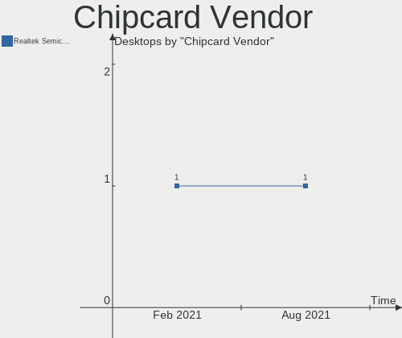

| Vendor      | Desktops | Percent |
|-------------|----------|---------|
| Alcor Micro | 1        | 100%    |

Chipcard Model
--------------

Chipcard module models

| Model                               | Desktops | Percent |
|-------------------------------------|----------|---------|
| Alcor Micro AU9540 Smartcard Reader | 1        | 100%    |

Printer Vendor
--------------

Printer device vendors

| Vendor              | Desktops | Percent |
|---------------------|----------|---------|
| Hewlett-Packard     | 4        | 36.36%  |
| Canon               | 4        | 36.36%  |
| Samsung Electronics | 2        | 18.18%  |
| Xerox               | 1        | 9.09%   |

Printer Model
-------------

Printer device models

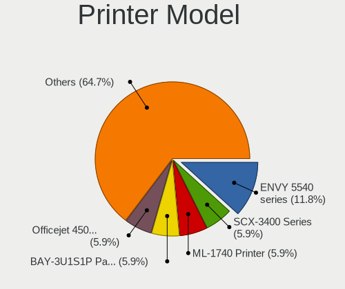

| Model                                                 | Desktops | Percent |
|-------------------------------------------------------|----------|---------|
| Xerox Phaser 6180N                                    | 1        | 9.09%   |
| Samsung ML-1740 Printer                               | 1        | 9.09%   |
| Samsung C48x Series Color Laser Multifunction Printer | 1        | 9.09%   |
| HP Officejet 6600                                     | 1        | 9.09%   |
| HP LaserJet P2015 series                              | 1        | 9.09%   |
| HP LaserJet 1020                                      | 1        | 9.09%   |
| HP DeskJet F4100 Printer series                       | 1        | 9.09%   |
| Canon TS3100 series                                   | 1        | 9.09%   |
| Canon PIXMA MX450 Series                              | 1        | 9.09%   |
| Canon PIXMA iX6850 Printer                            | 1        | 9.09%   |
| Canon LiDE 400                                        | 1        | 9.09%   |

Scanner Vendor
--------------

Scanner device vendors

| Vendor      | Desktops | Percent |
|-------------|----------|---------|
| Canon       | 2        | 66.67%  |
| Seiko Epson | 1        | 33.33%  |

Scanner Model
-------------

Scanner device models

| Model                                 | Desktops | Percent |
|---------------------------------------|----------|---------|
| Seiko Epson GT-F600 [Perfection 4180] | 1        | 33.33%  |
| Canon CanoScan LIDE 25                | 1        | 33.33%  |
| Canon CanoScan                        | 1        | 33.33%  |

Bluetooth Vendor
----------------

Controller vendors

| Vendor                          | Desktops | Percent |
|---------------------------------|----------|---------|
| Intel                           | 21       | 37.5%   |
| Cambridge Silicon Radio         | 15       | 26.79%  |
| ASUSTek Computer                | 6        | 10.71%  |
| Realtek Semiconductor           | 4        | 7.14%   |
| Broadcom                        | 4        | 7.14%   |
| Qualcomm Atheros Communications | 2        | 3.57%   |
| IMC Networks                    | 1        | 1.79%   |
| Conwise Technology              | 1        | 1.79%   |
| Belkin Components               | 1        | 1.79%   |
| Apple                           | 1        | 1.79%   |

Bluetooth Model
---------------

Controller models

| Model                                               | Desktops | Percent |
|-----------------------------------------------------|----------|---------|
| Cambridge Silicon Radio Bluetooth Dongle (HCI mode) | 15       | 26.79%  |
| Intel AX200 Bluetooth                               | 8        | 14.29%  |
| Intel Bluetooth wireless interface                  | 6        | 10.71%  |
| Realtek Bluetooth Radio                             | 4        | 7.14%   |
| Intel Wireless-AC 9260 Bluetooth Adapter            | 4        | 7.14%   |
| Intel Wireless-AC 3168 Bluetooth                    | 3        | 5.36%   |
| ASUS Broadcom BCM20702A0 Bluetooth                  | 3        | 5.36%   |
| Qualcomm Atheros  Bluetooth Device                  | 2        | 3.57%   |
| IMC Networks Bluetooth Radio                        | 1        | 1.79%   |
| Conwise CW6622                                      | 1        | 1.79%   |
| Broadcom HP Bluetooth Module                        | 1        | 1.79%   |
| Broadcom BCM20702A0 Bluetooth 4.0                   | 1        | 1.79%   |
| Broadcom BCM20702A0                                 | 1        | 1.79%   |
| Broadcom BCM2045 Bluetooth                          | 1        | 1.79%   |
| Belkin Components Bluetooth Mini Dongle             | 1        | 1.79%   |
| ASUS Qualcomm Bluetooth 4.1                         | 1        | 1.79%   |
| ASUS Bluetooth Radio                                | 1        | 1.79%   |
| ASUS BCM20702A0                                     | 1        | 1.79%   |
| Apple Built-in Bluetooth 2.0+EDR HCI                | 1        | 1.79%   |

Unsupported Devices
-------------------

Total unsupported devices on board

| Total | Desktops | Percent |
|-------|----------|---------|
| 0     | 169      | 84.08%  |
| 1     | 29       | 14.43%  |
| 2     | 3        | 1.49%   |

Unsupported Device Types
------------------------

Types of unsupported devices

| Type                     | Desktops | Percent |
|--------------------------|----------|---------|
| Net/wireless             | 10       | 30.3%   |
| Graphics card            | 10       | 30.3%   |
| Unassigned class         | 3        | 9.09%   |
| Communication controller | 3        | 9.09%   |
| Multimedia controller    | 2        | 6.06%   |
| Storage/raid             | 1        | 3.03%   |
| Storage/ide              | 1        | 3.03%   |
| Sound                    | 1        | 3.03%   |
| Modem                    | 1        | 3.03%   |
| Chipcard                 | 1        | 3.03%   |

