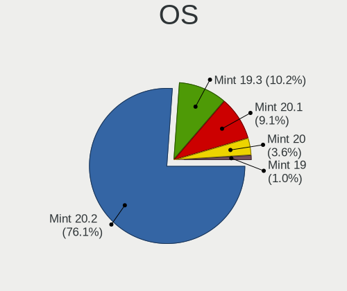
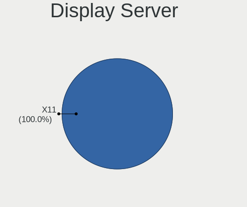
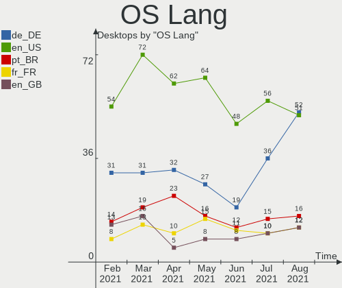
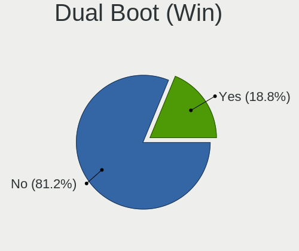
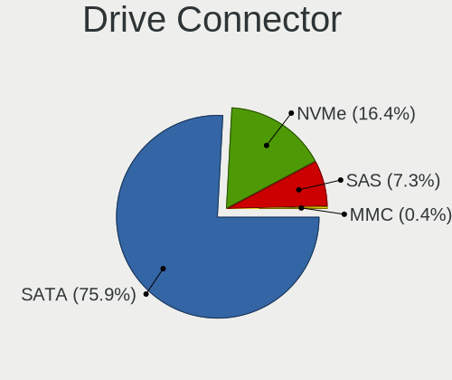
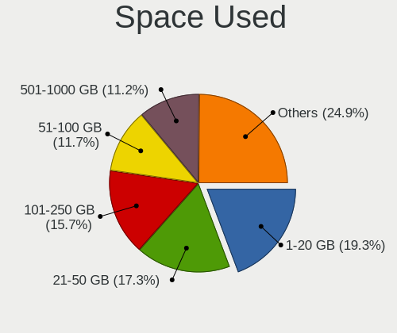
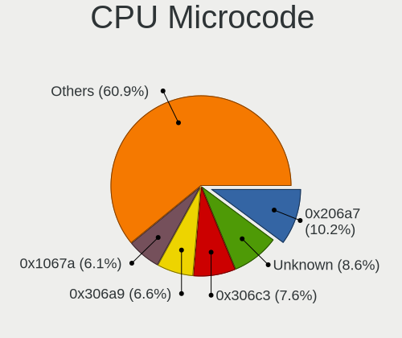
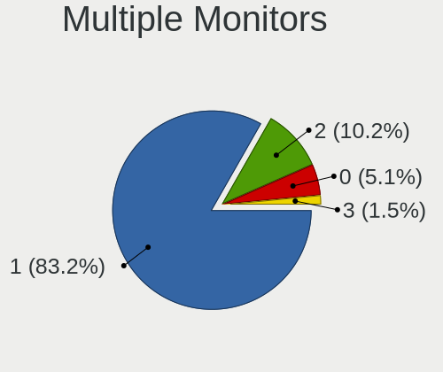
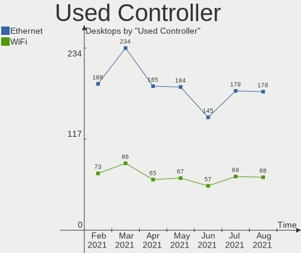
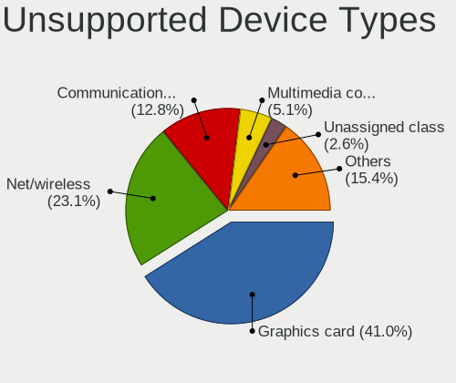

Mint Hardware Trends (Desktop)
------------------------------

A project to identify most popular hardware characteristics and track their change
over time based on data collected by Mint users at https://Linux-Hardware.org.

Anyone can contribute to the study by uploading probes of their computers by
the [hw-probe](https://github.com/linuxhw/hw-probe) tool:

    sudo hw-probe -all -upload

Full-feature report is available here: https://linux-hardware.org/?view=trends&formfactor=desktop

Period: Mar, 2020.

Contents
--------

- [ OS                       ](#os)
- [ OS Family                ](#os-family)
- [ Kernel                   ](#kernel)
- [ Kernel Family            ](#kernel-family)
- [ Kernel Major Ver.        ](#kernel-major-ver)
- [ Arch                     ](#arch)
- [ DE                       ](#de)
- [ Display Server           ](#display-server)
- [ OS Lang                  ](#os-lang)
- [ Boot Mode                ](#boot-mode)
- [ Filesystem               ](#filesystem)
- [ Dual Boot with Linux     ](#dual-boot-with-linux)
- [ Dual Boot (Win)          ](#dual-boot-win)
- [ Country                  ](#country)
- [ City                     ](#city)
- [ Vendor                   ](#vendor)
- [ Model                    ](#model)
- [ Model Family             ](#model-family)
- [ MFG Year                 ](#mfg-year)
- [ Form Factor              ](#form-factor)
- [ Secure Boot              ](#secure-boot)
- [ Coreboot                 ](#coreboot)
- [ RAM Size                 ](#ram-size)
- [ RAM Used                 ](#ram-used)
- [ Drive Vendor             ](#drive-vendor)
- [ Drive Model              ](#drive-model)
- [ Drive Kind               ](#drive-kind)
- [ Drive Connector          ](#drive-connector)
- [ Drive Size               ](#drive-size)
- [ Space Total              ](#space-total)
- [ Space Used               ](#space-used)
- [ Malfunc. Drives          ](#malfunc-drives)
- [ Malfunc. Drive Vendor    ](#malfunc-drive-vendor)
- [ Malfunc. Drive Kind      ](#malfunc-drive-kind)
- [ Failed Drives            ](#failed-drives)
- [ Failed Drive Vendor      ](#failed-drive-vendor)
- [ Drive Status             ](#drive-status)
- [ Storage Vendor           ](#storage-vendor)
- [ Storage Model            ](#storage-model)
- [ Storage Kind             ](#storage-kind)
- [ CPU Vendor               ](#cpu-vendor)
- [ CPU Model                ](#cpu-model)
- [ CPU Model Family         ](#cpu-model-family)
- [ CPU Cores                ](#cpu-cores)
- [ CPU Sockets              ](#cpu-sockets)
- [ CPU Threads              ](#cpu-threads)
- [ CPU Op-Modes             ](#cpu-op-modes)
- [ CPU Microarch            ](#cpu-microarch)
- [ CPU Microcode            ](#cpu-microcode)
- [ GPU Vendor               ](#gpu-vendor)
- [ GPU Model                ](#gpu-model)
- [ GPU Combo                ](#gpu-combo)
- [ GPU Driver               ](#gpu-driver)
- [ GPU Memory               ](#gpu-memory)
- [ Monitor Vendor           ](#monitor-vendor)
- [ Monitor Model            ](#monitor-model)
- [ Monitor Resolution       ](#monitor-resolution)
- [ Monitor Diagonal         ](#monitor-diagonal)
- [ Monitor Width            ](#monitor-width)
- [ Aspect Ratio             ](#aspect-ratio)
- [ Monitor Area             ](#monitor-area)
- [ Pixel Density            ](#pixel-density)
- [ Multiple Monitors        ](#multiple-monitors)
- [ Net Controller Vendor    ](#net-controller-vendor)
- [ Net Controller Model     ](#net-controller-model)
- [ Net Controller Kind      ](#net-controller-kind)
- [ Used Controller          ](#used-controller)
- [ NICs                     ](#nics)
- [ Unsupported Devices      ](#unsupported-devices)
- [ Unsupported Device Types ](#unsupported-device-types)

OS
--

Installed operating systems

| Name      | Computers | Percent |
|-----------|-----------|---------|
| Mint 19.3 | 72        | 76.6%   |
| Mint 19.2 | 6         | 6.38%   |
| Mint 4    | 5         | 5.32%   |
| Mint 18.3 | 5         | 5.32%   |
| Mint 19.1 | 3         | 3.19%   |
| Mint 19   | 3         | 3.19%   |

OS Family
---------

OS without a version

| Name | Computers | Percent |
|------|-----------|---------|
| Mint | 94        | 100%    |

Kernel
------

Version of the Linux kernel

| Version              | Computers | Percent |
|----------------------|-----------|---------|
| 5.3.0-40-generic     | 27        | 28.72%  |
| 5.3.0-42-generic     | 24        | 25.53%  |
| 5.0.0-32-generic     | 11        | 11.7%   |
| 4.15.0-91-generic    | 9         | 9.57%   |
| 4.15.0-88-generic    | 5         | 5.32%   |
| 4.19.0-8-amd64       | 4         | 4.26%   |
| 5.3.0-45-generic     | 3         | 3.19%   |
| 4.15.0-20-generic    | 3         | 3.19%   |
| 5.4.0-0.bpo.4-amd64  | 1         | 1.06%   |
| 5.3.0-28-generic     | 1         | 1.06%   |
| 4.15.0-88-lowlatency | 1         | 1.06%   |
| 4.15.0-76-generic    | 1         | 1.06%   |
| 4.15.0-65-generic    | 1         | 1.06%   |
| 4.15.0-54-generic    | 1         | 1.06%   |
| 4.15.0-45-generic    | 1         | 1.06%   |
| 4.10.0-38-generic    | 1         | 1.06%   |

Kernel Family
-------------

Linux kernel without a distro release

| Version | Computers | Percent |
|---------|-----------|---------|
| 5.3.0   | 55        | 58.51%  |
| 4.15.0  | 22        | 23.4%   |
| 5.0.0   | 11        | 11.7%   |
| 4.19.0  | 4         | 4.26%   |
| 5.4.0   | 1         | 1.06%   |
| 4.10.0  | 1         | 1.06%   |

Kernel Major Ver.
-----------------

Linux kernel major version

| Version | Computers | Percent |
|---------|-----------|---------|
| 5.3     | 55        | 58.51%  |
| 4.15    | 22        | 23.4%   |
| 5.0     | 11        | 11.7%   |
| 4.19    | 4         | 4.26%   |
| 5.4     | 1         | 1.06%   |
| 4.10    | 1         | 1.06%   |

Arch
----

OS architecture (x86_64, i586, etc.)

| Name   | Computers | Percent |
|--------|-----------|---------|
| x86_64 | 87        | 92.55%  |
| i686   | 7         | 7.45%   |

DE
--

Desktop Environment

| Name       | Computers | Percent |
|------------|-----------|---------|
| X-Cinnamon | 67        | 71.28%  |
| MATE       | 11        | 11.7%   |
| XFCE       | 8         | 8.51%   |
| GNOME      | 3         | 3.19%   |
| Cinnamon   | 3         | 3.19%   |
| KDE5       | 1         | 1.06%   |
| KDE        | 1         | 1.06%   |

Display Server
--------------

X11 or Wayland

| Name | Computers | Percent |
|------|-----------|---------|
| X11  | 94        | 100%    |

OS Lang
-------

Language

| Lang    | Computers | Percent |
|---------|-----------|---------|
| en_US   | 22        | 23.4%   |
| de_DE   | 13        | 13.83%  |
| pt_BR   | 9         | 9.57%   |
| fr_FR   | 8         | 8.51%   |
| en_GB   | 6         | 6.38%   |
| en_CA   | 4         | 4.26%   |
| ru_RU   | 3         | 3.19%   |
| it_IT   | 3         | 3.19%   |
| ru_UA   | 2         | 2.13%   |
| pl_PL   | 2         | 2.13%   |
| nl_NL   | 2         | 2.13%   |
| fr_CA   | 2         | 2.13%   |
| es_UY   | 2         | 2.13%   |
| es_ES   | 2         | 2.13%   |
| en_AU   | 2         | 2.13%   |
| uk_UA   | 1         | 1.06%   |
| sr_RS   | 1         | 1.06%   |
| sk_SK   | 1         | 1.06%   |
| ro_RO   | 1         | 1.06%   |
| nl_BE   | 1         | 1.06%   |
| es_VE   | 1         | 1.06%   |
| es_AR   | 1         | 1.06%   |
| en_PH   | 1         | 1.06%   |
| en_IL   | 1         | 1.06%   |
| en_IE   | 1         | 1.06%   |
| bg_BG   | 1         | 1.06%   |
| Unknown | 1         | 1.06%   |

Boot Mode
---------

EFI or BIOS

| Mode | Computers | Percent |
|------|-----------|---------|
| BIOS | 71        | 75.53%  |
| EFI  | 23        | 24.47%  |

Filesystem
----------

Type of filesystem

| Type  | Computers | Percent |
|-------|-----------|---------|
| Ext4  | 90        | 95.74%  |
| Btrfs | 4         | 4.26%   |

Dual Boot with Linux
--------------------

Hosting more than one Linux

| Dual boot | Computers | Percent |
|-----------|-----------|---------|
| No        | 93        | 98.94%  |
| Yes       | 1         | 1.06%   |

Dual Boot (Win)
---------------

Hosting Linux and Windows

| Dual boot | Computers | Percent |
|-----------|-----------|---------|
| No        | 89        | 94.68%  |
| Yes       | 5         | 5.32%   |

Country
-------

Geographic location (country)

| Country                | Computers | Percent |
|------------------------|-----------|---------|
| USA                    | 20        | 21.28%  |
| Germany                | 15        | 15.96%  |
| Brazil                 | 10        | 10.64%  |
| France                 | 5         | 5.32%   |
| Canada                 | 5         | 5.32%   |
| UK                     | 4         | 4.26%   |
| Ukraine                | 3         | 3.19%   |
| Spain                  | 3         | 3.19%   |
| Russia                 | 3         | 3.19%   |
| Italy                  | 3         | 3.19%   |
| Belgium                | 3         | 3.19%   |
| Australia              | 3         | 3.19%   |
| Uruguay                | 2         | 2.13%   |
| Poland                 | 2         | 2.13%   |
| Netherlands            | 2         | 2.13%   |
| Ireland                | 2         | 2.13%   |
| Venezuela              | 1         | 1.06%   |
| Slovakia               | 1         | 1.06%   |
| Puerto Rico            | 1         | 1.06%   |
| Philippines            | 1         | 1.06%   |
| Morocco                | 1         | 1.06%   |
| Israel                 | 1         | 1.06%   |
| Bulgaria               | 1         | 1.06%   |
| Bosnia and Herzegovina | 1         | 1.06%   |
| Argentina              | 1         | 1.06%   |

City
----

Geographic location (city)

| City                  | Computers | Percent |
|-----------------------|-----------|---------|
| São Paulo            | 2         | 2.13%   |
| Zelafon               | 1         | 1.06%   |
| West Des Moines       | 1         | 1.06%   |
| Weiden                | 1         | 1.06%   |
| Wahroonga             | 1         | 1.06%   |
| Valladolid            | 1         | 1.06%   |
| Thornton              | 1         | 1.06%   |
| São José dos Campos | 1         | 1.06%   |
| Sylvan Lake           | 1         | 1.06%   |
| Surgut                | 1         | 1.06%   |
| Stuttgart             | 1         | 1.06%   |
| Strasbourg            | 1         | 1.06%   |
| Stoke-on-Trent        | 1         | 1.06%   |
| St. Petersburg        | 1         | 1.06%   |
| St Petersburg         | 1         | 1.06%   |
| Sofia                 | 1         | 1.06%   |
| Seattle               | 1         | 1.06%   |
| San Jose              | 1         | 1.06%   |
| San Diego             | 1         | 1.06%   |
| Saguenay              | 1         | 1.06%   |
| Rogatica              | 1         | 1.06%   |
| Rock Hill             | 1         | 1.06%   |
| Riverview             | 1         | 1.06%   |
| Ringgold              | 1         | 1.06%   |
| Rheda                 | 1         | 1.06%   |
| Quezon City           | 1         | 1.06%   |
| Prešov               | 1         | 1.06%   |
| Pelotas               | 1         | 1.06%   |
| Paris                 | 1         | 1.06%   |
| Owosso                | 1         | 1.06%   |
| Oberhausen            | 1         | 1.06%   |
| Niterói              | 1         | 1.06%   |
| Nijmegen              | 1         | 1.06%   |
| Newbury               | 1         | 1.06%   |
| Namur                 | 1         | 1.06%   |
| Montevideo            | 1         | 1.06%   |
| Moncton               | 1         | 1.06%   |
| Minneapolis           | 1         | 1.06%   |
| Mililani Town         | 1         | 1.06%   |
| Milford               | 1         | 1.06%   |
| Milan                 | 1         | 1.06%   |
| McMasterville         | 1         | 1.06%   |
| McAllen               | 1         | 1.06%   |
| Marienheide           | 1         | 1.06%   |
| Lyon                  | 1         | 1.06%   |
| Lorena                | 1         | 1.06%   |
| Letychiv              | 1         | 1.06%   |
| Leipzig               | 1         | 1.06%   |
| Lagrange              | 1         | 1.06%   |
| La Louvière          | 1         | 1.06%   |
| Kyiv                  | 1         | 1.06%   |
| Kraainem              | 1         | 1.06%   |
| Klobuck               | 1         | 1.06%   |
| Kirchroth             | 1         | 1.06%   |
| Kansas City           | 1         | 1.06%   |
| Hillsville            | 1         | 1.06%   |
| Herne                 | 1         | 1.06%   |
| Hatzenbuhl            | 1         | 1.06%   |
| Hamburg               | 1         | 1.06%   |
| Gig Harbor            | 1         | 1.06%   |

Vendor
------

Motherboard manufacturer

| Name                | Computers | Percent |
|---------------------|-----------|---------|
| ASUSTek Computer    | 22        | 23.4%   |
| Gigabyte Technology | 18        | 19.15%  |
| Hewlett-Packard     | 12        | 12.77%  |
| MSI                 | 8         | 8.51%   |
| ASRock              | 8         | 8.51%   |
| Dell                | 7         | 7.45%   |
| Lenovo              | 4         | 4.26%   |
| Pegatron            | 3         | 3.19%   |
| Acer                | 3         | 3.19%   |
| Biostar             | 2         | 2.13%   |
| Wistron             | 1         | 1.06%   |
| WinFast             | 1         | 1.06%   |
| Medion              | 1         | 1.06%   |
| Login Informatica   | 1         | 1.06%   |
| Intel               | 1         | 1.06%   |
| Fujitsu             | 1         | 1.06%   |
| Foxconn             | 1         | 1.06%   |

Model
-----

Motherboard model

| Name                               | Computers | Percent |
|------------------------------------|-----------|---------|
| MSI MS-7C02                        | 3         | 3.19%   |
| HP Compaq 8200 Elite CMT PC        | 2         | 2.13%   |
| Dell OptiPlex 790                  | 2         | 2.13%   |
| ASUS M5A99X EVO R2.0               | 2         | 2.13%   |
| ASUS M5A78L-M PLUS/USB3            | 2         | 2.13%   |
| Wistron ProLiant ML110 G5          | 1         | 1.06%   |
| WinFast MCP61M2MA                  | 1         | 1.06%   |
| Pegatron h8-1360t                  | 1         | 1.06%   |
| Pegatron Compaq dx2400 Microtower  | 1         | 1.06%   |
| Pegatron AY030AA-ABA CQ5320F       | 1         | 1.06%   |
| MSI MS-7B84                        | 1         | 1.06%   |
| MSI MS-7793                        | 1         | 1.06%   |
| MSI MS-7666                        | 1         | 1.06%   |
| MSI MS-7383                        | 1         | 1.06%   |
| MSI Compaq dx2420 Microtower       | 1         | 1.06%   |
| Medion MS-7501                     | 1         | 1.06%   |
| Login Informatica LOG-Q77H2-M      | 1         | 1.06%   |
| Lenovo ThinkCentre M91p 5067A1U    | 1         | 1.06%   |
| Lenovo ThinkCentre M91p 4480B1U    | 1         | 1.06%   |
| Lenovo ThinkCentre M900 10FLS34Y00 | 1         | 1.06%   |
| Lenovo ThinkCentre A70 7844Q2G     | 1         | 1.06%   |
| Intel GT5408                       | 1         | 1.06%   |
| HP Z620 Workstation                | 1         | 1.06%   |
| HP Z400 Workstation                | 1         | 1.06%   |
| HP EliteDesk 800 G1 TWR            | 1         | 1.06%   |
| HP Compaq Elite 8300 SFF           | 1         | 1.06%   |
| HP Compaq dc5800 Small Form Factor | 1         | 1.06%   |
| HP Compaq dc5100 SFF(PM215AV)      | 1         | 1.06%   |
| HP Compaq 8100 Elite SFF PC        | 1         | 1.06%   |
| HP Compaq 8100 Elite CMT PC        | 1         | 1.06%   |
| HP Compaq 6200 Pro SFF PC          | 1         | 1.06%   |
| HP Compaq 6005 Pro SFF PC          | 1         | 1.06%   |
| Gigabyte Z97N-WIFI                 | 1         | 1.06%   |
| Gigabyte Z87X-OC                   | 1         | 1.06%   |
| Gigabyte Z370 AORUS Gaming 7       | 1         | 1.06%   |
| Gigabyte Z170-HD3                  | 1         | 1.06%   |
| Gigabyte X570 AORUS PRO WIFI       | 1         | 1.06%   |
| Gigabyte P55A-UD4                  | 1         | 1.06%   |
| Gigabyte P55-USB3                  | 1         | 1.06%   |
| Gigabyte H81M-D2V                  | 1         | 1.06%   |
| Gigabyte H61M-D2H-USB3             | 1         | 1.06%   |
| Gigabyte H55M-UD2H                 | 1         | 1.06%   |
| Gigabyte H170-D3HP                 | 1         | 1.06%   |
| Gigabyte H170-D3H                  | 1         | 1.06%   |
| Gigabyte H110M-S2H                 | 1         | 1.06%   |
| Gigabyte GA-990FXA-UD3             | 1         | 1.06%   |
| Gigabyte G31M-S2L                  | 1         | 1.06%   |
| Gigabyte F2A88XM-D3H               | 1         | 1.06%   |
| Gigabyte EP45-DS3L                 | 1         | 1.06%   |
| Gigabyte B450M DS3H                | 1         | 1.06%   |
| Fujitsu ESPRIMO P500               | 1         | 1.06%   |
| Foxconn p6-2003nl                  | 1         | 1.06%   |
| Dell OptiPlex 760                  | 1         | 1.06%   |
| Dell OptiPlex 745                  | 1         | 1.06%   |
| Dell OptiPlex 7010                 | 1         | 1.06%   |
| Dell OptiPlex 390                  | 1         | 1.06%   |
| Dell Inspiron 560                  | 1         | 1.06%   |
| Biostar G41D3C                     | 1         | 1.06%   |
| Biostar A320MH                     | 1         | 1.06%   |
| ASUS SABERTOOTH Z77                | 1         | 1.06%   |

Model Family
------------

Motherboard model prefix

| Name                          | Computers | Percent |
|-------------------------------|-----------|---------|
| HP Compaq                     | 9         | 9.57%   |
| Dell OptiPlex                 | 6         | 6.38%   |
| Lenovo ThinkCentre            | 4         | 4.26%   |
| ASUS PRIME                    | 4         | 4.26%   |
| ASUS M5A78L-M                 | 4         | 4.26%   |
| MSI MS-7C02                   | 3         | 3.19%   |
| Acer Aspire                   | 3         | 3.19%   |
| ASUS SABERTOOTH               | 2         | 2.13%   |
| ASUS M5A99X                   | 2         | 2.13%   |
| Wistron ProLiant              | 1         | 1.06%   |
| WinFast MCP61M2MA             | 1         | 1.06%   |
| Pegatron h8-1360t             | 1         | 1.06%   |
| Pegatron Compaq               | 1         | 1.06%   |
| Pegatron AY030AA-ABA          | 1         | 1.06%   |
| MSI MS-7B84                   | 1         | 1.06%   |
| MSI MS-7793                   | 1         | 1.06%   |
| MSI MS-7666                   | 1         | 1.06%   |
| MSI MS-7383                   | 1         | 1.06%   |
| MSI Compaq                    | 1         | 1.06%   |
| Medion MS-7501                | 1         | 1.06%   |
| Login Informatica LOG-Q77H2-M | 1         | 1.06%   |
| Intel GT5408                  | 1         | 1.06%   |
| HP Z620                       | 1         | 1.06%   |
| HP Z400                       | 1         | 1.06%   |
| HP EliteDesk                  | 1         | 1.06%   |
| Gigabyte Z97N-WIFI            | 1         | 1.06%   |
| Gigabyte Z87X-OC              | 1         | 1.06%   |
| Gigabyte Z370                 | 1         | 1.06%   |
| Gigabyte Z170-HD3             | 1         | 1.06%   |
| Gigabyte X570                 | 1         | 1.06%   |
| Gigabyte P55A-UD4             | 1         | 1.06%   |
| Gigabyte P55-USB3             | 1         | 1.06%   |
| Gigabyte H81M-D2V             | 1         | 1.06%   |
| Gigabyte H61M-D2H-USB3        | 1         | 1.06%   |
| Gigabyte H55M-UD2H            | 1         | 1.06%   |
| Gigabyte H170-D3HP            | 1         | 1.06%   |
| Gigabyte H170-D3H             | 1         | 1.06%   |
| Gigabyte H110M-S2H            | 1         | 1.06%   |
| Gigabyte GA-990FXA-UD3        | 1         | 1.06%   |
| Gigabyte G31M-S2L             | 1         | 1.06%   |
| Gigabyte F2A88XM-D3H          | 1         | 1.06%   |
| Gigabyte EP45-DS3L            | 1         | 1.06%   |
| Gigabyte B450M                | 1         | 1.06%   |
| Fujitsu ESPRIMO               | 1         | 1.06%   |
| Foxconn p6-2003nl             | 1         | 1.06%   |
| Dell Inspiron                 | 1         | 1.06%   |
| Biostar G41D3C                | 1         | 1.06%   |
| Biostar A320MH                | 1         | 1.06%   |
| ASUS P8B75-M                  | 1         | 1.06%   |
| ASUS P5G41T-M                 | 1         | 1.06%   |
| ASUS P5B-Deluxe               | 1         | 1.06%   |
| ASUS M5A97                    | 1         | 1.06%   |
| ASUS M4A77T                   | 1         | 1.06%   |
| ASUS M2N68-AM                 | 1         | 1.06%   |
| ASUS M2N-SLI                  | 1         | 1.06%   |
| ASUS H110M-K                  | 1         | 1.06%   |
| ASUS H110M-A                  | 1         | 1.06%   |
| ASUS All                      | 1         | 1.06%   |
| ASRock Z97                    | 1         | 1.06%   |
| ASRock X99                    | 1         | 1.06%   |

MFG Year
--------

Motherboard manufacture year

| Year | Computers | Percent |
|------|-----------|---------|
| 2014 | 12        | 12.77%  |
| 2010 | 12        | 12.77%  |
| 2019 | 11        | 11.7%   |
| 2011 | 10        | 10.64%  |
| 2012 | 8         | 8.51%   |
| 2009 | 8         | 8.51%   |
| 2018 | 7         | 7.45%   |
| 2017 | 6         | 6.38%   |
| 2016 | 6         | 6.38%   |
| 2007 | 4         | 4.26%   |
| 2013 | 3         | 3.19%   |
| 2008 | 3         | 3.19%   |
| 2015 | 2         | 2.13%   |
| 2006 | 1         | 1.06%   |
| 2004 | 1         | 1.06%   |

Form Factor
-----------

Physical design of the computer

| Name    | Computers | Percent |
|---------|-----------|---------|
| Desktop | 94        | 100%    |

Secure Boot
-----------

Enabled or disabled

| State    | Computers | Percent |
|----------|-----------|---------|
| Disabled | 93        | 98.94%  |
| Enabled  | 1         | 1.06%   |

Coreboot
--------

Have coreboot on board

| Used | Computers | Percent |
|------|-----------|---------|
| No   | 94        | 100%    |

RAM Size
--------

Total RAM memory

| Size in GB | Computers | Percent |
|------------|-----------|---------|
| 16.01-24.0 | 23        | 24.47%  |
| 3.01-4.0   | 19        | 20.21%  |
| 8.01-16.0  | 17        | 18.09%  |
| 4.01-8.0   | 15        | 15.96%  |
| 1.01-2.0   | 7         | 7.45%   |
| 32.01-64.0 | 6         | 6.38%   |
| 2.01-3.0   | 5         | 5.32%   |
| 24.01-32.0 | 2         | 2.13%   |

RAM Used
--------

Used RAM memory

| Used GB   | Computers | Percent |
|-----------|-----------|---------|
| 1.01-2.0  | 47        | 50%     |
| 2.01-3.0  | 24        | 25.53%  |
| 0.01-1.0  | 9         | 9.57%   |
| 4.01-8.0  | 8         | 8.51%   |
| 3.01-4.0  | 4         | 4.26%   |
| 8.01-16.0 | 2         | 2.13%   |

Drive Vendor
------------

Hard drive vendors

| Vendor              | Computers | Drives | Percent |
|---------------------|-----------|--------|---------|
| Seagate             | 39        | 48     | 25.83%  |
| WDC                 | 35        | 42     | 23.18%  |
| Samsung Electronics | 21        | 22     | 13.91%  |
| Toshiba             | 10        | 11     | 6.62%   |
| Kingston            | 8         | 8      | 5.3%    |
| Hitachi             | 7         | 8      | 4.64%   |
| Transcend           | 3         | 3      | 1.99%   |
| SanDisk             | 3         | 3      | 1.99%   |
| OCZ                 | 3         | 3      | 1.99%   |
| MAXTOR              | 3         | 3      | 1.99%   |
| China               | 3         | 3      | 1.99%   |
| HGST                | 2         | 2      | 1.32%   |
| Gigabyte Technology | 2         | 2      | 1.32%   |
| Crucial             | 2         | 4      | 1.32%   |
| Vi550               | 1         | 1      | 0.66%   |
| TCSUNBOW            | 1         | 1      | 0.66%   |
| PNY                 | 1         | 1      | 0.66%   |
| Micron Technology   | 1         | 1      | 0.66%   |
| Maxone              | 1         | 1      | 0.66%   |
| KingSpec            | 1         | 2      | 0.66%   |
| Intenso             | 1         | 1      | 0.66%   |
| Intel               | 1         | 1      | 0.66%   |
| Generic             | 1         | 1      | 0.66%   |
| A-DATA Technology   | 1         | 1      | 0.66%   |

Drive Model
-----------

Hard drive models

| Model                        | Computers | Percent |
|------------------------------|-----------|---------|
| ST500DM002-1BD142 500GB      | 6         | 3.49%   |
| WD10EZEX-08WN4A0 1TB         | 3         | 1.74%   |
| WD10EZEX-00WN4A0 1TB         | 3         | 1.74%   |
| ST3500418AS 500GB            | 3         | 1.74%   |
| ST31000528AS 1TB             | 3         | 1.74%   |
| HD161HJ 160GB                | 3         | 1.74%   |
| WD5000AAKX-003CA0 500GB      | 2         | 1.16%   |
| WD10EZRX-00L4HB0 1TB         | 2         | 1.16%   |
| SV300S37A120G 120GB SSD      | 2         | 1.16%   |
| ST3320418AS 320GB            | 2         | 1.16%   |
| ST2000DM008-2FR102 2TB       | 2         | 1.16%   |
| ST2000DM006-2DM164 2TB       | 2         | 1.16%   |
| SSD 860 EVO 500GB            | 2         | 1.16%   |
| SSD 850 EVO 120GB            | 2         | 1.16%   |
| SA400S37240G 240GB SSD       | 2         | 1.16%   |
| SA400S37120G 120GB SSD       | 2         | 1.16%   |
| HDT721010SLA360 1TB          | 2         | 1.16%   |
| HDP725050GLA360 500GB        | 2         | 1.16%   |
| HD322HJ 320GB                | 2         | 1.16%   |
| HD154UI 1TB                  | 2         | 1.16%   |
| X3 120GB                     | 1         | 0.58%   |
| WDS500G2B0A-00SM50 500GB SSD | 1         | 0.58%   |
| WDS480G2G0B-00EPW0 480GB SSD | 1         | 0.58%   |
| WDS200T2B0A 2TB SSD          | 1         | 0.58%   |
| WDS120G2G0A-00JH30 120GB SSD | 1         | 0.58%   |
| WD6400AACS-00G8B0 640GB      | 1         | 0.58%   |
| WD5002AALX-00J37A0 500GB     | 1         | 0.58%   |
| WD5000BEVT-35A0RT0 500GB     | 1         | 0.58%   |
| WD5000AZLX-00K4KA0 500GB     | 1         | 0.58%   |
| WD5000AZLX-00CL5A0 500GB     | 1         | 0.58%   |
| WD5000AAKX-603CA0 500GB      | 1         | 0.58%   |
| WD5000AAKX-083CA1 500GB      | 1         | 0.58%   |
| WD5000AAKS-65V0A0 500GB      | 1         | 0.58%   |
| WD5000AADS-00S9B0 500GB      | 1         | 0.58%   |
| WD5000AACS-00G8B0 500GB      | 1         | 0.58%   |
| WD40EURX-633GY0 4TB          | 1         | 0.58%   |
| WD40EFRX-68N32N0 4TB         | 1         | 0.58%   |
| WD3200AAJS-60Z0A0 320GB      | 1         | 0.58%   |
| WD2502ABYS-18B7A0 250GB      | 1         | 0.58%   |
| WD2500AAKX-753CA1 250GB      | 1         | 0.58%   |
| WD20EZRZ-00Z5HB0 2TB         | 1         | 0.58%   |
| WD20EARX-00ZUDB0 2TB         | 1         | 0.58%   |
| WD20EARX-00PASB0 2TB         | 1         | 0.58%   |
| WD1600AAJS-00B4A0 160GB      | 1         | 0.58%   |
| WD10SPZX-24Z10T0 1TB         | 1         | 0.58%   |
| WD10EZEX-60WN4A0 1TB         | 1         | 0.58%   |
| WD10EZEX-22BN5A0 1TB         | 1         | 0.58%   |
| WD10EZEX-21WN4A0 1TB         | 1         | 0.58%   |
| WD10EZEX-00ER1A0 1TB         | 1         | 0.58%   |
| WD10EZEX-00BN5A0 1TB         | 1         | 0.58%   |
| WD10EFRX-68FYTN0 1TB         | 1         | 0.58%   |
| WD10EARS-00Y5B1 1TB          | 1         | 0.58%   |
| WD1003FBYX-05Y7B0 1TB        | 1         | 0.58%   |
| VERTEX4 512GB SSD            | 1         | 0.58%   |
| VERTEX PLUS 64GB SSD         | 1         | 0.58%   |
| USB 3.0 500GB                | 1         | 0.58%   |
| TS256GSSD370S 256GB          | 1         | 0.58%   |
| TS240GSSD220S 240GB          | 1         | 0.58%   |
| TS128GSSD370 128GB           | 1         | 0.58%   |
| TR150 960GB SSD              | 1         | 0.58%   |

Drive Kind
----------

HDD or SSD

| Kind    | Computers | Drives | Percent |
|---------|-----------|--------|---------|
| HDD     | 81        | 120    | 66.39%  |
| SSD     | 38        | 50     | 31.15%  |
| Unknown | 3         | 3      | 2.46%   |

Drive Connector
---------------

SATA, SAS, NVMe, etc.

| Type | Computers | Drives | Percent |
|------|-----------|--------|---------|
| SATA | 92        | 170    | 96.84%  |
| SAS  | 3         | 3      | 3.16%   |

Drive Size
----------

Size of hard drive

| Size in TB | Computers | Drives | Percent |
|------------|-----------|--------|---------|
| 0.01-0.5   | 75        | 102    | 55.15%  |
| 0.51-1.0   | 38        | 46     | 27.94%  |
| 1.01-2.0   | 14        | 15     | 10.29%  |
| 2.01-3.0   | 5         | 5      | 3.68%   |
| 3.01-4.0   | 4         | 5      | 2.94%   |

Space Total
-----------

Amount of disk space available on the file system

| Size in GB     | Computers | Percent |
|----------------|-----------|---------|
| 101-250        | 25        | 26.6%   |
| 251-500        | 20        | 21.28%  |
| 501-1000       | 17        | 18.09%  |
| 1001-2000      | 14        | 14.89%  |
| More than 3000 | 7         | 7.45%   |
| 51-100         | 7         | 7.45%   |
| 2001-3000      | 4         | 4.26%   |

Space Used
----------

Amount of used disk space

| Used GB        | Computers | Percent |
|----------------|-----------|---------|
| 1-20           | 22        | 23.4%   |
| 101-250        | 18        | 19.15%  |
| 21-50          | 17        | 18.09%  |
| 251-500        | 11        | 11.7%   |
| 501-1000       | 9         | 9.57%   |
| 51-100         | 9         | 9.57%   |
| 1001-2000      | 4         | 4.26%   |
| More than 3000 | 2         | 2.13%   |
| 2001-3000      | 2         | 2.13%   |

Malfunc. Drives
---------------

Drive models with a malfunction

| Model                   | Computers | Drives | Percent |
|-------------------------|-----------|--------|---------|
| ST500DM002-1BD142 500GB | 2         | 2      | 40%     |
| WD2500AAKX-753CA1 250GB | 1         | 1      | 20%     |
| ST3160023AS 160GB       | 1         | 1      | 20%     |
| SSDSC2CT120A3 120GB     | 1         | 1      | 20%     |

Malfunc. Drive Vendor
---------------------

Vendors of faulty drives

| Vendor  | Computers | Drives | Percent |
|---------|-----------|--------|---------|
| Seagate | 3         | 3      | 60%     |
| WDC     | 1         | 1      | 20%     |
| Intel   | 1         | 1      | 20%     |

Malfunc. Drive Kind
-------------------

Kinds of faulty drives

| Kind | Computers | Drives | Percent |
|------|-----------|--------|---------|
| HDD  | 4         | 4      | 80%     |
| SSD  | 1         | 1      | 20%     |

Failed Drives
-------------

Failed drive models

Zero info for selected period =(

Failed Drive Vendor
-------------------

Failed drive vendors

Zero info for selected period =(

Drive Status
------------

Number of failed and malfunc. drives

| Status   | Computers | Drives | Percent |
|----------|-----------|--------|---------|
| Detected | 83        | 162    | 90.22%  |
| Malfunc  | 5         | 5      | 5.43%   |
| Works    | 4         | 6      | 4.35%   |

Storage Vendor
--------------

Storage controller vendors

| Vendor                        | Computers | Percent |
|-------------------------------|-----------|---------|
| Intel                         | 66        | 54.55%  |
| AMD                           | 23        | 19.01%  |
| Nvidia                        | 6         | 4.96%   |
| JMicron Technology            | 6         | 4.96%   |
| ASMedia Technology            | 6         | 4.96%   |
| Samsung Electronics           | 3         | 2.48%   |
| Marvell Technology Group      | 3         | 2.48%   |
| Phison Electronics            | 2         | 1.65%   |
| ADATA Technology              | 2         | 1.65%   |
| Silicon Motion                | 1         | 0.83%   |
| Silicon Image                 | 1         | 0.83%   |
| Kingston Technology Company   | 1         | 0.83%   |
| Integrated Technology Express | 1         | 0.83%   |

Storage Model
-------------

Storage controller models

| Model                                                                             | Computers | Percent |
|-----------------------------------------------------------------------------------|-----------|---------|
| FCH SATA Controller [AHCI mode]                                                   | 10        | 6.25%   |
| SB7x0/SB8x0/SB9x0 IDE Controller                                                  | 8         | 5%      |
| Q170/Q150/B150/H170/H110/Z170/CM236 Chipset SATA Controller [AHCI Mode]           | 8         | 5%      |
| NM10/ICH7 Family SATA Controller [IDE mode]                                       | 8         | 5%      |
| 6 Series/C200 Series Chipset Family 6 port Desktop SATA AHCI Controller           | 8         | 5%      |
| SB7x0/SB8x0/SB9x0 SATA Controller [AHCI mode]                                     | 7         | 4.38%   |
| SB7x0/SB8x0/SB9x0 SATA Controller [IDE mode]                                      | 6         | 3.75%   |
| ASM1062 Serial ATA Controller                                                     | 6         | 3.75%   |
| 8 Series/C220 Series Chipset Family 6-port SATA Controller 1 [AHCI mode]          | 6         | 3.75%   |
| 7 Series/C210 Series Chipset Family 6-port SATA Controller [AHCI mode]            | 6         | 3.75%   |
| 5 Series/3400 Series Chipset 6 port SATA AHCI Controller                          | 6         | 3.75%   |
| 400 Series Chipset SATA Controller                                                | 6         | 3.75%   |
| MCP61 SATA Controller                                                             | 5         | 3.13%   |
| 82801G (ICH7 Family) IDE Controller                                               | 5         | 3.13%   |
| MCP61 IDE                                                                         | 4         | 2.5%    |
| JMB363 SATA/IDE Controller                                                        | 4         | 2.5%    |
| 200 Series PCH SATA controller [AHCI mode]                                        | 4         | 2.5%    |
| SATA Controller [RAID mode]                                                       | 3         | 1.88%   |
| Non-Volatile memory controller                                                    | 3         | 1.88%   |
| 82801I (ICH9 Family) 2 port SATA Controller [IDE mode]                            | 3         | 1.88%   |
| 6 Series/C200 Series Chipset Family Desktop SATA Controller (IDE mode, ports 4-5) | 3         | 1.88%   |
| 6 Series/C200 Series Chipset Family Desktop SATA Controller (IDE mode, ports 0-3) | 3         | 1.88%   |
| XPG SX8200 Pro PCIe Gen3x4 M.2 2280 Solid State Drive                             | 2         | 1.25%   |
| NVMe SSD Controller SM981/PM981/PM983                                             | 2         | 1.25%   |
| 9 Series Chipset Family SATA Controller [AHCI Mode]                               | 2         | 1.25%   |
| 82801JI (ICH10 Family) SATA AHCI Controller                                       | 2         | 1.25%   |
| 82801IR/IO/IH (ICH9R/DO/DH) 4 port SATA Controller [IDE mode]                     | 2         | 1.25%   |
| SSD 660P Series                                                                   | 1         | 0.63%   |
| SiI 3114 [SATALink/SATARaid] Serial ATA Controller                                | 1         | 0.63%   |
| NVMe SSD Controller SM961/PM961                                                   | 1         | 0.63%   |
| JMB368 IDE controller                                                             | 1         | 0.63%   |
| JMB362 SATA Controller                                                            | 1         | 0.63%   |
| IT8213 IDE Controller                                                             | 1         | 0.63%   |
| FCH SATA Controller D                                                             | 1         | 0.63%   |
| E12 NVMe Controller                                                               | 1         | 0.63%   |
| CK804 Serial ATA Controller                                                       | 1         | 0.63%   |
| CK804 IDE                                                                         | 1         | 0.63%   |
| C610/X99 series chipset sSATA Controller [AHCI mode]                              | 1         | 0.63%   |
| C610/X99 series chipset 6-Port SATA Controller [AHCI mode]                        | 1         | 0.63%   |
| C602 chipset 4-Port SATA Storage Control Unit                                     | 1         | 0.63%   |
| C600/X79 series chipset IDE-r Controller                                          | 1         | 0.63%   |
| C600/X79 series chipset 6-Port SATA AHCI Controller                               | 1         | 0.63%   |
| 88SE91A3 SATA-600 Controller                                                      | 1         | 0.63%   |
| 88SE9172 SATA 6Gb/s Controller                                                    | 1         | 0.63%   |
| 88SE9128 PCIe SATA 6 Gb/s RAID controller                                         | 1         | 0.63%   |
| 82801JI (ICH10 Family) 4 port SATA IDE Controller #1                              | 1         | 0.63%   |
| 82801JI (ICH10 Family) 2 port SATA IDE Controller #2                              | 1         | 0.63%   |
| 82801JD/DO (ICH10 Family) SATA AHCI Controller                                    | 1         | 0.63%   |
| 82801IB (ICH9) 2 port SATA Controller [IDE mode]                                  | 1         | 0.63%   |
| 82801HR/HO/HH (ICH8R/DO/DH) 6 port SATA Controller [AHCI mode]                    | 1         | 0.63%   |
| 82801HR/HO/HH (ICH8R/DO/DH) 2 port SATA Controller [IDE mode]                     | 1         | 0.63%   |
| 82801H (ICH8 Family) 4 port SATA Controller [IDE mode]                            | 1         | 0.63%   |
| 82801FB/FW (ICH6/ICH6W) SATA Controller                                           | 1         | 0.63%   |
| 82801FB/FBM/FR/FW/FRW (ICH6 Family) IDE Controller                                | 1         | 0.63%   |
| 4 Series Chipset PT IDER Controller                                               | 1         | 0.63%   |

Storage Kind
------------

Kind of storage controller (IDE, SATA, NVMe, SAS, ...)

| Kind | Computers | Percent |
|------|-----------|---------|
| SATA | 70        | 57.85%  |
| IDE  | 37        | 30.58%  |
| NVMe | 9         | 7.44%   |
| RAID | 4         | 3.31%   |
| SAS  | 1         | 0.83%   |

CPU Vendor
----------

Processor vendors

| Vendor | Computers | Percent |
|--------|-----------|---------|
| Intel  | 65        | 69.15%  |
| AMD    | 29        | 30.85%  |

CPU Model
---------

Processor models

| Model                                       | Computers | Percent |
|---------------------------------------------|-----------|---------|
| Intel Core i3-2120 CPU @ 3.30GHz            | 3         | 3.19%   |
| Intel Pentium Dual-Core CPU E5300 @ 2.60GHz | 2         | 2.13%   |
| Intel Core i7-8700K CPU @ 3.70GHz           | 2         | 2.13%   |
| Intel Core i7-6700K CPU @ 4.00GHz           | 2         | 2.13%   |
| Intel Core i7-4790 CPU @ 3.60GHz            | 2         | 2.13%   |
| Intel Core i7-2600 CPU @ 3.40GHz            | 2         | 2.13%   |
| Intel Core i5-7500 CPU @ 3.40GHz            | 2         | 2.13%   |
| Intel Core i5-4570 CPU @ 3.20GHz            | 2         | 2.13%   |
| Intel Core i5-3470 CPU @ 3.20GHz            | 2         | 2.13%   |
| Intel Core i5-2400 CPU @ 3.10GHz            | 2         | 2.13%   |
| Intel Core i5 CPU 650 @ 3.20GHz             | 2         | 2.13%   |
| AMD FX-8350 Eight-Core Processor            | 2         | 2.13%   |
| AMD Athlon 64 X2 Dual Core Processor 5200+  | 2         | 2.13%   |
| Intel Xeon CPU X5570 @ 2.93GHz              | 1         | 1.06%   |
| Intel Xeon CPU X3210 @ 2.13GHz              | 1         | 1.06%   |
| Intel Xeon CPU E5-2620 v2 @ 2.10GHz         | 1         | 1.06%   |
| Intel Xeon CPU E5-1650 v3 @ 3.50GHz         | 1         | 1.06%   |
| Intel Pentium Dual-Core CPU E5800 @ 3.20GHz | 1         | 1.06%   |
| Intel Pentium Dual-Core CPU E5700 @ 3.00GHz | 1         | 1.06%   |
| Intel Pentium Dual-Core CPU E5500 @ 2.80GHz | 1         | 1.06%   |
| Intel Pentium Dual-Core CPU E5200 @ 2.50GHz | 1         | 1.06%   |
| Intel Pentium CPU G850 @ 2.90GHz            | 1         | 1.06%   |
| Intel Pentium CPU G620 @ 2.60GHz            | 1         | 1.06%   |
| Intel Pentium CPU G4400 @ 3.30GHz           | 1         | 1.06%   |
| Intel Pentium CPU G3420 @ 3.20GHz           | 1         | 1.06%   |
| Intel Pentium CPU G2030 @ 3.00GHz           | 1         | 1.06%   |
| Intel Pentium 4 CPU 3.00GHz                 | 1         | 1.06%   |
| Intel Core i7-7700 CPU @ 3.60GHz            | 1         | 1.06%   |
| Intel Core i7-4790K CPU @ 4.00GHz           | 1         | 1.06%   |
| Intel Core i7-3770K CPU @ 3.50GHz           | 1         | 1.06%   |
| Intel Core i7-3770 CPU @ 3.40GHz            | 1         | 1.06%   |
| Intel Core i7 CPU K 875 @ 2.93GHz           | 1         | 1.06%   |
| Intel Core i7 CPU 950 @ 3.07GHz             | 1         | 1.06%   |
| Intel Core i7 CPU 860 @ 2.80GHz             | 1         | 1.06%   |
| Intel Core i5-9400 CPU @ 2.90GHz            | 1         | 1.06%   |
| Intel Core i5-7400 CPU @ 3.00GHz            | 1         | 1.06%   |
| Intel Core i5-6500T CPU @ 2.50GHz           | 1         | 1.06%   |
| Intel Core i5-6400 CPU @ 2.70GHz            | 1         | 1.06%   |
| Intel Core i5-4460 CPU @ 3.20GHz            | 1         | 1.06%   |
| Intel Core i5-3550 CPU @ 3.30GHz            | 1         | 1.06%   |
| Intel Core i5-2400S CPU @ 2.50GHz           | 1         | 1.06%   |
| Intel Core i3-7100 CPU @ 3.90GHz            | 1         | 1.06%   |
| Intel Core i3-4330 CPU @ 3.50GHz            | 1         | 1.06%   |
| Intel Core i3-2100 CPU @ 3.10GHz            | 1         | 1.06%   |
| Intel Core i3 CPU 550 @ 3.20GHz             | 1         | 1.06%   |
| Intel Core i3 CPU 540 @ 3.07GHz             | 1         | 1.06%   |
| Intel Core 2 Quad CPU Q6700 @ 2.66GHz       | 1         | 1.06%   |
| Intel Core 2 Duo CPU E8400 @ 3.00GHz        | 1         | 1.06%   |
| Intel Core 2 Duo CPU E7500 @ 2.93GHz        | 1         | 1.06%   |
| Intel Core 2 Duo CPU E7400 @ 2.80GHz        | 1         | 1.06%   |
| Intel Core 2 Duo CPU E7200 @ 2.53GHz        | 1         | 1.06%   |
| Intel Core 2 Duo CPU E6550 @ 2.33GHz        | 1         | 1.06%   |
| Intel Core 2 Duo CPU E4600 @ 2.40GHz        | 1         | 1.06%   |
| Intel Core 2 CPU 6300 @ 1.86GHz             | 1         | 1.06%   |
| Intel Core 2 CPU 4300 @ 1.80GHz             | 1         | 1.06%   |
| AMD Ryzen 9 3900X 12-Core Processor         | 1         | 1.06%   |
| AMD Ryzen 7 2700X Eight-Core Processor      | 1         | 1.06%   |
| AMD Ryzen 7 2700 Eight-Core Processor       | 1         | 1.06%   |
| AMD Ryzen 5 3600 6-Core Processor           | 1         | 1.06%   |
| AMD Ryzen 5 2600X Six-Core Processor        | 1         | 1.06%   |

CPU Model Family
----------------

Processor model prefix

| Model                   | Computers | Percent |
|-------------------------|-----------|---------|
| Intel Core i5           | 17        | 18.09%  |
| Intel Core i7           | 15        | 15.96%  |
| Intel Core i3           | 8         | 8.51%   |
| AMD FX                  | 7         | 7.45%   |
| Intel Pentium Dual-Core | 6         | 6.38%   |
| Intel Core 2 Duo        | 6         | 6.38%   |
| Intel Pentium           | 5         | 5.32%   |
| Intel Xeon              | 4         | 4.26%   |
| AMD Ryzen 5             | 4         | 4.26%   |
| AMD Athlon II X2        | 4         | 4.26%   |
| AMD Athlon 64 X2        | 4         | 4.26%   |
| Intel Core 2            | 2         | 2.13%   |
| AMD Ryzen 7             | 2         | 2.13%   |
| Intel Pentium 4         | 1         | 1.06%   |
| Intel Core 2 Quad       | 1         | 1.06%   |
| AMD Ryzen 9             | 1         | 1.06%   |
| AMD Ryzen 3             | 1         | 1.06%   |
| AMD Phenom II X6        | 1         | 1.06%   |
| AMD Phenom II X4        | 1         | 1.06%   |
| AMD Phenom II X2        | 1         | 1.06%   |
| AMD Phenom              | 1         | 1.06%   |
| AMD Athlon X4           | 1         | 1.06%   |
| AMD A10                 | 1         | 1.06%   |

CPU Cores
---------

Number of processor cores

| Number | Computers | Percent |
|--------|-----------|---------|
| 2      | 40        | 42.55%  |
| 4      | 36        | 38.3%   |
| 6      | 10        | 10.64%  |
| 3      | 3         | 3.19%   |
| 8      | 2         | 2.13%   |
| 1      | 2         | 2.13%   |
| 12     | 1         | 1.06%   |

CPU Sockets
-----------

Number of sockets

| Number | Computers | Percent |
|--------|-----------|---------|
| 1      | 94        | 100%    |

CPU Threads
-----------

Threads per core (Hyper-Threading)

| Number | Computers | Percent |
|--------|-----------|---------|
| 1      | 50        | 53.19%  |
| 2      | 44        | 46.81%  |

CPU Op-Modes
------------

CPU Operation Modes (32-bit, 64-bit)

| Op mode        | Computers | Percent |
|----------------|-----------|---------|
| 32-bit, 64-bit | 93        | 98.94%  |
| 32-bit         | 1         | 1.06%   |

CPU Microarch
-------------

Microarchitecture

| Name        | Computers | Percent |
|-------------|-----------|---------|
| Core        | 16        | 17.02%  |
| Skylake     | 13        | 13.83%  |
| SandyBridge | 11        | 11.7%   |
| Haswell     | 9         | 9.57%   |
| K10         | 8         | 8.51%   |
| IvyBridge   | 7         | 7.45%   |
| Piledriver  | 5         | 5.32%   |
| Westmere    | 4         | 4.26%   |
| Nehalem     | 4         | 4.26%   |
| K8 Hammer   | 4         | 4.26%   |
| Zen+        | 3         | 3.19%   |
| Zen         | 3         | 3.19%   |
| Bulldozer   | 3         | 3.19%   |
| Zen 2       | 2         | 2.13%   |
| Steamroller | 1         | 1.06%   |
| NetBurst    | 1         | 1.06%   |

CPU Microcode
-------------

Microcode number

| Number     | Computers | Percent |
|------------|-----------|---------|
| Unknown    | 12        | 12.77%  |
| 0x206a7    | 10        | 10.64%  |
| 0x1067a    | 8         | 8.51%   |
| 0x306c3    | 6         | 6.38%   |
| 0x906e9    | 5         | 5.32%   |
| 0x506e3    | 5         | 5.32%   |
| 0x306a9    | 5         | 5.32%   |
| 0x06000852 | 4         | 4.26%   |
| 0x010000c8 | 4         | 4.26%   |
| 0x20655    | 3         | 3.19%   |
| 0x0800820d | 3         | 3.19%   |
| 0x0600063e | 3         | 3.19%   |
| 0x906ea    | 2         | 2.13%   |
| 0x6fb      | 2         | 2.13%   |
| 0x6f2      | 2         | 2.13%   |
| 0x106e5    | 2         | 2.13%   |
| 0x106a5    | 2         | 2.13%   |
| 0x10676    | 2         | 2.13%   |
| 0x08701013 | 2         | 2.13%   |
| 0x906ed    | 1         | 1.06%   |
| 0x6fd      | 1         | 1.06%   |
| 0x306f2    | 1         | 1.06%   |
| 0x306e4    | 1         | 1.06%   |
| 0x20652    | 1         | 1.06%   |
| 0x08001138 | 1         | 1.06%   |
| 0x08001137 | 1         | 1.06%   |
| 0x06003104 | 1         | 1.06%   |
| 0x06001119 | 1         | 1.06%   |
| 0x010000dc | 1         | 1.06%   |
| 0x010000db | 1         | 1.06%   |
| 0x01000083 | 1         | 1.06%   |

GPU Vendor
----------

Vendors of graphics cards

| Vendor                     | Computers | Percent |
|----------------------------|-----------|---------|
| Nvidia                     | 38        | 38%     |
| Intel                      | 32        | 32%     |
| AMD                        | 29        | 29%     |
| Matrox Electronics Systems | 1         | 1%      |

GPU Model
---------

Graphics card models

| Model                                                                 | Computers | Percent |
|-----------------------------------------------------------------------|-----------|---------|
| 2nd Generation Core Processor Family Integrated Graphics Controller   | 7         | 6.86%   |
| Ellesmere [Radeon RX 470/480/570/570X/580/580X/590]                   | 6         | 5.88%   |
| Xeon E3-1200 v3/4th Gen Core Processor Integrated Graphics Controller | 5         | 4.9%    |
| Caicos [Radeon HD 6450/7450/8450 / R5 230 OEM]                        | 4         | 3.92%   |
| Xeon E3-1200 v2/3rd Gen Core processor Graphics Controller            | 3         | 2.94%   |
| RS780L [Radeon 3000]                                                  | 3         | 2.94%   |
| GK208B [GeForce GT 710]                                               | 3         | 2.94%   |
| Core Processor Integrated Graphics Controller                         | 3         | 2.94%   |
| 82G33/G31 Express Integrated Graphics Controller                      | 3         | 2.94%   |
| 4 Series Chipset Integrated Graphics Controller                       | 3         | 2.94%   |
| TU117 [GeForce GTX 1650]                                              | 2         | 1.96%   |
| HD Graphics 630                                                       | 2         | 1.96%   |
| GT218 [GeForce 8400 GS Rev. 3]                                        | 2         | 1.96%   |
| GP107 [GeForce GTX 1050 Ti]                                           | 2         | 1.96%   |
| GP106 [GeForce GTX 1060 6GB]                                          | 2         | 1.96%   |
| GK208B [GeForce GT 730]                                               | 2         | 1.96%   |
| Curacao PRO [Radeon R7 370 / R9 270/370 OEM]                          | 2         | 1.96%   |
| C61 [GeForce 7025 / nForce 630a]                                      | 2         | 1.96%   |
| UHD Graphics 630 (Desktop 9 Series)                                   | 1         | 0.98%   |
| Turks PRO [Radeon HD 6570/7570/8550]                                  | 1         | 0.98%   |
| TU116 [GeForce GTX 1650 SUPER]                                        | 1         | 0.98%   |
| TU106 [GeForce RTX 2070]                                              | 1         | 0.98%   |
| Tonga PRO [Radeon R9 285/380]                                         | 1         | 0.98%   |
| Tahiti PRO [Radeon HD 7950/8950 OEM / R9 280]                         | 1         | 0.98%   |
| Tahiti LE [Radeon HD 7870 XT]                                         | 1         | 0.98%   |
| RV620 LE [Radeon HD 3450]                                             | 1         | 0.98%   |
| RS880 [Radeon HD 4200]                                                | 1         | 0.98%   |
| Redwood XT [Radeon HD 5670/5690/5730]                                 | 1         | 0.98%   |
| Raven Ridge [Radeon Vega Series / Radeon Vega Mobile Series]          | 1         | 0.98%   |
| Oland [Radeon HD 8570 / R7 240/340 / Radeon 520 OEM]                  | 1         | 0.98%   |
| MGA G200e [Pilot] ServerEngines (SEP1)                                | 1         | 0.98%   |
| Kaveri [Radeon R7 Graphics]                                           | 1         | 0.98%   |
| Juniper XT [Radeon HD 5770]                                           | 1         | 0.98%   |
| HD Graphics 530                                                       | 1         | 0.98%   |
| HD Graphics 510                                                       | 1         | 0.98%   |
| GT218 [GeForce 310]                                                   | 1         | 0.98%   |
| GT218 [GeForce 210]                                                   | 1         | 0.98%   |
| GP108 [GeForce GT 1030]                                               | 1         | 0.98%   |
| GP104 [GeForce GTX 1080]                                              | 1         | 0.98%   |
| GP104 [GeForce GTX 1060 6GB]                                          | 1         | 0.98%   |
| GP102 [GeForce GTX 1080 Ti]                                           | 1         | 0.98%   |
| GM204 [GeForce GTX 970]                                               | 1         | 0.98%   |
| GM107 [GeForce GTX 750 Ti]                                            | 1         | 0.98%   |
| GK107GL [Quadro K2000]                                                | 1         | 0.98%   |
| GK107 [GeForce GT 640]                                                | 1         | 0.98%   |
| GK107 [GeForce GT 630 OEM]                                            | 1         | 0.98%   |
| GF119 [GeForce GT 620 OEM]                                            | 1         | 0.98%   |
| GF119 [GeForce GT 610]                                                | 1         | 0.98%   |
| GF119 [GeForce GT 520]                                                | 1         | 0.98%   |
| GF110 [GeForce GTX 570 Rev. 2]                                        | 1         | 0.98%   |
| G96CGL [Quadro FX 580]                                                | 1         | 0.98%   |
| G94 [GeForce 9600 GT]                                                 | 1         | 0.98%   |
| G84 [GeForce 8600 GT]                                                 | 1         | 0.98%   |
| G73 [GeForce 7600 GT]                                                 | 1         | 0.98%   |
| G72 [GeForce 7300 GS]                                                 | 1         | 0.98%   |
| Cape Verde XT [Radeon HD 7770/8760 / R7 250X]                         | 1         | 0.98%   |
| C61 [GeForce 6150SE nForce 430]                                       | 1         | 0.98%   |
| Bonaire XTX [Radeon R7 260X/360]                                      | 1         | 0.98%   |
| Barts XT [Radeon HD 6870]                                             | 1         | 0.98%   |
| Baffin [Radeon RX 550 640SP / RX 560/560X]                            | 1         | 0.98%   |

GPU Combo
---------

Combinations of graphics cards

| Name           | Computers | Percent |
|----------------|-----------|---------|
| 1 x Nvidia     | 36        | 38.3%   |
| 1 x Intel      | 27        | 28.72%  |
| 1 x AMD        | 25        | 26.6%   |
| 2 x AMD        | 2         | 2.13%   |
| Intel + AMD    | 2         | 2.13%   |
| 1 x Matrox     | 1         | 1.06%   |
| Intel + Nvidia | 1         | 1.06%   |

GPU Driver
----------

Free vs proprietary

| Driver      | Computers | Percent |
|-------------|-----------|---------|
| Free        | 64        | 68.09%  |
| Proprietary | 28        | 29.79%  |
| Unknown     | 2         | 2.13%   |

GPU Memory
----------

Total video memory

| Size in GB | Computers | Percent |
|------------|-----------|---------|
| Unknown    | 23        | 24.47%  |
| 1.01-2.0   | 22        | 23.4%   |
| 0.51-1.0   | 14        | 14.89%  |
| 0.01-0.5   | 13        | 13.83%  |
| 3.01-4.0   | 10        | 10.64%  |
| 7.01-8.0   | 7         | 7.45%   |
| 5.01-6.0   | 3         | 3.19%   |
| 2.01-3.0   | 1         | 1.06%   |
| 8.01-16.0  | 1         | 1.06%   |

Monitor Vendor
--------------

Monitor vendors

| Vendor                  | Computers | Percent |
|-------------------------|-----------|---------|
| Samsung Electronics     | 10        | 10.53%  |
| Hewlett-Packard         | 10        | 10.53%  |
| ViewSonic               | 8         | 8.42%   |
| LG Electronics          | 8         | 8.42%   |
| Dell                    | 7         | 7.37%   |
| Goldstar                | 6         | 6.32%   |
| BenQ                    | 6         | 6.32%   |
| AOC                     | 6         | 6.32%   |
| Unknown                 | 5         | 5.26%   |
| Ancor Communications    | 5         | 5.26%   |
| Acer                    | 5         | 5.26%   |
| Iiyama                  | 4         | 4.21%   |
| Philips                 | 3         | 3.16%   |
| Unknown (AAA)           | 1         | 1.05%   |
| Sony                    | 1         | 1.05%   |
| Packard Bell            | 1         | 1.05%   |
| MStar                   | 1         | 1.05%   |
| JVC                     | 1         | 1.05%   |
| Insignia                | 1         | 1.05%   |
| Idek Iiyama             | 1         | 1.05%   |
| IBM                     | 1         | 1.05%   |
| HannStar                | 1         | 1.05%   |
| Fujitsu Siemens         | 1         | 1.05%   |
| eMachines               | 1         | 1.05%   |
| Chi Mei Optoelectronics | 1         | 1.05%   |

Monitor Model
-------------

Monitor models

| Model                                               | Computers | Percent |
|-----------------------------------------------------|-----------|---------|
| X193W ACR000F 1440x900 408x255mm 18.9-inch          | 1         | 1.04%   |
| W2343 GSM5700 1920x1080 474x296mm 22.0-inch         | 1         | 1.04%   |
| W2253 GSM56DC 1920x1080 477x268mm 21.5-inch         | 1         | 1.04%   |
| W2252 GSM567D 1680x1050 474x296mm 22.0-inch         | 1         | 1.04%   |
| VX2336 SERIES VSC402A 1920x1080 510x290mm 23.1-inch | 1         | 1.04%   |
| Viseo 191DXL PKB0222 1366x768 409x230mm 18.5-inch   | 1         | 1.04%   |
| VG2030wm VSCA51E 1680x1050 433x270mm 20.1-inch      | 1         | 1.04%   |
| VA925 SERIES VSC8F29 1280x1024 380x300mm 19.1-inch  | 1         | 1.04%   |
| VA2719 Series VSCC132 1920x1080 598x336mm 27.0-inch | 1         | 1.04%   |
| VA2246 SERIES VSC6F2E 1920x1080 477x268mm 21.5-inch | 1         | 1.04%   |
| VA2226w-3 VSC2051 1680x1050 495x291mm 22.6-inch     | 1         | 1.04%   |
| VA1916wSERIES VSCF91F 1440x900 410x256mm 19.0-inch  | 1         | 1.04%   |
| TV *00 SNY4B04 3840x2160 1600x900mm 72.3-inch       | 1         | 1.04%   |
| SyncMaster SAM060D 1920x1080 531x299mm 24.0-inch    | 1         | 1.04%   |
| SyncMaster SAM037B 1680x1050 474x296mm 22.0-inch    | 1         | 1.04%   |
| SyncMaster SAM030C 1680x1050 474x296mm 22.0-inch    | 1         | 1.04%   |
| SyncMaster SAM027E 1680x1050 474x296mm 22.0-inch    | 1         | 1.04%   |
| SMS19A200 SAM0830 1440x900 408x255mm 18.9-inch      | 1         | 1.04%   |
| SMB2430H SAM064E 1920x1080                          | 1         | 1.04%   |
| S2409W DELA039 1920x1080 531x298mm 24.0-inch        | 1         | 1.04%   |
| S22F350 SAM0D1B 1920x1080 477x268mm 21.5-inch       | 1         | 1.04%   |
| S2231 HWP2905 1920x1080 477x268mm 21.5-inch         | 1         | 1.04%   |
| R230H ACR046E 1920x1080 509x286mm 23.0-inch         | 1         | 1.04%   |
| Q2775 AOC2775 2560x1440 597x336mm 27.0-inch         | 1         | 1.04%   |
| PLT2336 IVM5628 1920x1080 509x286mm 23.0-inch       | 1         | 1.04%   |
| PLE2207WS IVM5609 1680x1050 474x296mm 22.0-inch     | 1         | 1.04%   |
| PL2773HD IVM6606 1920x1080 598x336mm 27.0-inch      | 1         | 1.04%   |
| PL2377 IVM561D 1920x1080 510x287mm 23.0-inch        | 1         | 1.04%   |
| PHL 193V5 PHLC0CD 1366x768 410x230mm 18.5-inch      | 1         | 1.04%   |
| P2213 DELF042 1680x1050 473x296mm 22.0-inch         | 1         | 1.04%   |
| P2014H DEL4096 1600x900 434x236mm 19.4-inch         | 1         | 1.04%   |
| P191W ACR0010 1600x1200 408x255mm 18.9-inch         | 1         | 1.04%   |
| NS-32D310NA17 BBY0050 1360x768 760x450mm 34.8-inch  | 1         | 1.04%   |
| LV2011 HWP299A 1600x900 443x249mm 20.0-inch         | 1         | 1.04%   |
| LE2201w HWP2843 1680x1050 473x296mm 22.0-inch       | 1         | 1.04%   |
| LCDTV AAA3393 1360x768 890x500mm 40.2-inch          | 1         | 1.04%   |
| LCD Monitor X223W 1680x1050                         | 1         | 1.04%   |
| LCD Monitor X223W                                   | 1         | 1.04%   |
| LCD Monitor W2252 1680x1050                         | 1         | 1.04%   |
| LCD Monitor W2234 3600x1080                         | 1         | 1.04%   |
| LCD Monitor W2042 1680x1050                         | 1         | 1.04%   |
| LCD Monitor VX2770 SERIES 3600x1080                 | 1         | 1.04%   |
| LCD Monitor VA925 SERIES 1280x1024                  | 1         | 1.04%   |
| LCD Monitor SyncMaster 2304x1024                    | 1         | 1.04%   |
| LCD Monitor SAMSUNG 1920x1080                       | 1         | 1.04%   |
| LCD Monitor S27D590                                 | 1         | 1.04%   |
| LCD Monitor S2419HN 1920x1080                       | 1         | 1.04%   |
| LCD Monitor ProView/EMC/PTS PMA982 1280x1024        | 1         | 1.04%   |
| LCD Monitor PL2530H 1920x1080                       | 1         | 1.04%   |
| LCD Monitor PHLC0B1 1920x1080 480x270mm 21.7-inch   | 1         | 1.04%   |
| LCD Monitor PHL 288P6L 3840x2160                    | 1         | 1.04%   |
| LCD Monitor Northgate                               | 1         | 1.04%   |
| LCD Monitor M2794DP 1920x1080                       | 1         | 1.04%   |
| LCD Monitor LG ULTRAWIDE 2560x1080                  | 1         | 1.04%   |
| LCD Monitor LG IPS FULLHD 1920x1080                 | 1         | 1.04%   |
| LCD Monitor LA2205 1680x1050                        | 1         | 1.04%   |
| LCD Monitor L192WS 1440x900                         | 1         | 1.04%   |
| LCD Monitor Kingston Technology 42 TV 3200x1080     | 1         | 1.04%   |
| LCD Monitor HISENSE 3840x2160                       | 1         | 1.04%   |
| LCD Monitor G74                                     | 1         | 1.04%   |

Monitor Resolution
------------------

Monitor screen resolution

| Resolution         | Computers | Percent |
|--------------------|-----------|---------|
| 1920x1080 (FHD)    | 36        | 38.71%  |
| 1680x1050 (WSXGA+) | 15        | 16.13%  |
| 1280x1024 (SXGA)   | 7         | 7.53%   |
| 1440x900 (WXGA+)   | 6         | 6.45%   |
| 1366x768 (WXGA)    | 5         | 5.38%   |
| Unknown            | 5         | 5.38%   |
| 3840x2160 (4K)     | 4         | 4.3%    |
| 3600x1080          | 2         | 2.15%   |
| 1920x1200 (WUXGA)  | 2         | 2.15%   |
| 1600x900 (HD+)     | 2         | 2.15%   |
| 1360x768           | 2         | 2.15%   |
| 3286x1080          | 1         | 1.08%   |
| 3200x1080          | 1         | 1.08%   |
| 2560x1440 (QHD)    | 1         | 1.08%   |
| 2560x1080          | 1         | 1.08%   |
| 2304x1024          | 1         | 1.08%   |
| 1920x540           | 1         | 1.08%   |
| 1280x960           | 1         | 1.08%   |

Monitor Diagonal
----------------

Diagonal size in inches

| Inches  | Computers | Percent |
|---------|-----------|---------|
| Unknown | 27        | 30%     |
| 22      | 11        | 12.22%  |
| 21      | 9         | 10%     |
| 18      | 9         | 10%     |
| 23      | 8         | 8.89%   |
| 19      | 7         | 7.78%   |
| 27      | 5         | 5.56%   |
| 24      | 5         | 5.56%   |
| 20      | 2         | 2.22%   |
| 17      | 2         | 2.22%   |
| 72      | 1         | 1.11%   |
| 40      | 1         | 1.11%   |
| 32      | 1         | 1.11%   |
| 31      | 1         | 1.11%   |
| 26      | 1         | 1.11%   |

Monitor Width
-------------

Physical width

| Width in mm | Computers | Percent |
|-------------|-----------|---------|
| 401-500     | 32        | 35.96%  |
| Unknown     | 27        | 30.34%  |
| 501-600     | 19        | 21.35%  |
| 351-400     | 5         | 5.62%   |
| 301-350     | 2         | 2.25%   |
| 801-900     | 1         | 1.12%   |
| 701-800     | 1         | 1.12%   |
| 601-700     | 1         | 1.12%   |
| 1501-2000   | 1         | 1.12%   |

Aspect Ratio
------------

Proportional relationship between the width and the height

| Ratio   | Computers | Percent |
|---------|-----------|---------|
| 16/9    | 37        | 42.05%  |
| Unknown | 25        | 28.41%  |
| 16/10   | 17        | 19.32%  |
| 5/4     | 7         | 7.95%   |
| 4/3     | 1         | 1.14%   |
| 32/9    | 1         | 1.14%   |

Monitor Area
------------

Area in inch²

| Area in inch² | Computers | Percent |
|----------------|-----------|---------|
| Unknown        | 27        | 30.34%  |
| 201-250        | 25        | 28.09%  |
| 151-200        | 19        | 21.35%  |
| 141-150        | 7         | 7.87%   |
| 301-350        | 6         | 6.74%   |
| 351-500        | 2         | 2.25%   |
| More than 1000 | 1         | 1.12%   |
| 251-300        | 1         | 1.12%   |
| 501-1000       | 1         | 1.12%   |

Pixel Density
-------------

Pixels per inch

| Density | Computers | Percent |
|---------|-----------|---------|
| 51-100  | 48        | 54.55%  |
| Unknown | 27        | 30.68%  |
| 101-120 | 11        | 12.5%   |
| 1-50    | 2         | 2.27%   |

Multiple Monitors
-----------------

Total monitors connected

| Total | Computers | Percent |
|-------|-----------|---------|
| 1     | 83        | 88.3%   |
| 2     | 10        | 10.64%  |
| 0     | 1         | 1.06%   |

Net Controller Vendor
---------------------

Controller vendors

| Vendor                 | Computers | Percent |
|------------------------|-----------|---------|
| Intel                  | 18        | 62.07%  |
| Nvidia                 | 6         | 20.69%  |
| Huawei Technologies    | 2         | 6.9%    |
| Trendchip Technologies | 1         | 3.45%   |
| Realtek Semiconductor  | 1         | 3.45%   |
| ASIX Electronics       | 1         | 3.45%   |

Net Controller Model
--------------------

Controller models

| Model                                           | Computers | Percent |
|-------------------------------------------------|-----------|---------|
| 82579LM Gigabit Network Connection (Lewisville) | 10        | 32.26%  |
| MCP61 Ethernet                                  | 5         | 16.13%  |
| DLI-TL20                                        | 2         | 6.45%   |
| 82578DM Gigabit Network Connection              | 2         | 6.45%   |
| Wi-Fi 6 AX200                                   | 1         | 3.23%   |
| RTL8187 Wireless LAN Adapter                    | 1         | 3.23%   |
| NM10/ICH7 Family LAN Controller                 | 1         | 3.23%   |
| I211 Gigabit Network Connection                 | 1         | 3.23%   |
| I210 Gigabit Network Connection                 | 1         | 3.23%   |
| CK804 Ethernet Controller                       | 1         | 3.23%   |
| AX88772                                         | 1         | 3.23%   |
| 82579V Gigabit Network Connection               | 1         | 3.23%   |
| 82574L Gigabit Network Connection               | 1         | 3.23%   |
| 82567LM-3 Gigabit Network Connection            | 1         | 3.23%   |
| 82566DM-2 Gigabit Network Connection            | 1         | 3.23%   |
| Unknown                                         | 1         | 3.23%   |

Net Controller Kind
-------------------

Ethernet, WiFi or modem

| Kind     | Computers | Percent |
|----------|-----------|---------|
| Ethernet | 26        | 89.66%  |
| WiFi     | 2         | 6.9%    |
| Modem    | 1         | 3.45%   |

Used Controller
---------------

Currently used network controller

| Kind     | Computers | Percent |
|----------|-----------|---------|
| Ethernet | 17        | 89.47%  |
| WiFi     | 2         | 10.53%  |

NICs
----

Total network controllers on board

| Total | Computers | Percent |
|-------|-----------|---------|
| 1     | 65        | 69.15%  |
| 2     | 26        | 27.66%  |
| 3     | 3         | 3.19%   |

Unsupported Devices
-------------------

Total unsupported devices on board

| Total | Computers | Percent |
|-------|-----------|---------|
| 0     | 84        | 89.36%  |
| 1     | 9         | 9.57%   |
| 2     | 1         | 1.06%   |

Unsupported Device Types
------------------------

Types of unsupported devices

| Type                     | Computers | Percent |
|--------------------------|-----------|---------|
| Graphics card            | 2         | 18.18%  |
| Communication controller | 2         | 18.18%  |
| Unassigned class         | 1         | 9.09%   |
| Net/wireless             | 1         | 9.09%   |
| Multimedia controller    | 1         | 9.09%   |
| Dvb card                 | 1         | 9.09%   |
| Chipcard                 | 1         | 9.09%   |
| Camera                   | 1         | 9.09%   |
| Bluetooth                | 1         | 9.09%   |

