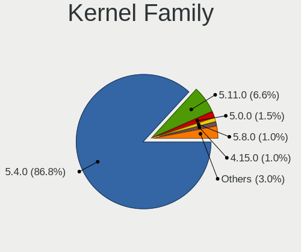
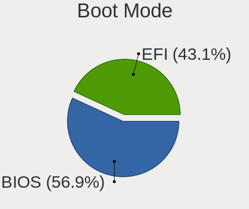
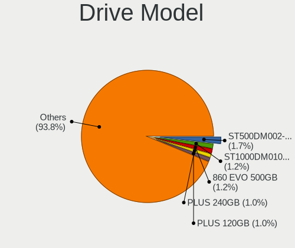
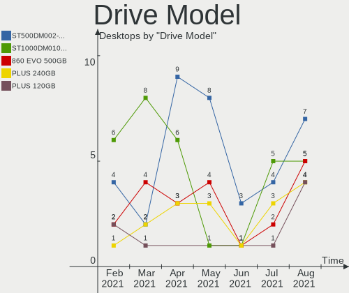
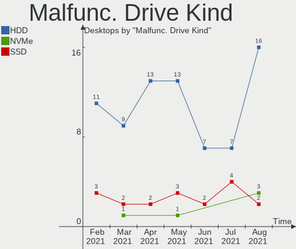
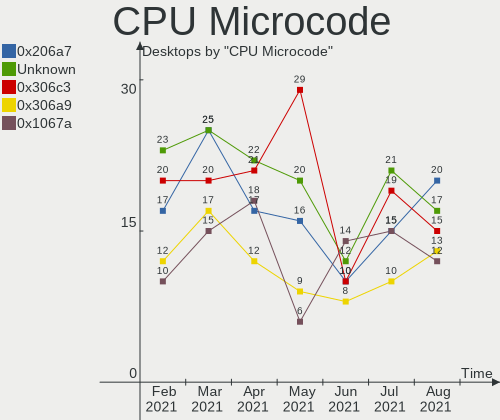
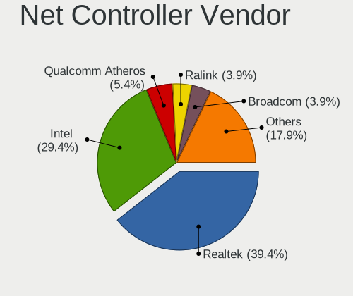

Mint Hardware Trends (Desktop)
------------------------------

A project to identify most popular hardware characteristics and track their change
over time based on data collected by Mint users at https://Linux-Hardware.org.

Anyone can contribute to the study by uploading probes of their computers by
the [hw-probe](https://github.com/linuxhw/hw-probe) tool:

    sudo hw-probe -all -upload

Full-feature report is available here: https://linux-hardware.org/?view=trends&formfactor=desktop

Period: Feb, 2020.

Contents
--------

- [ OS                       ](#os)
- [ OS Family                ](#os-family)
- [ Kernel                   ](#kernel)
- [ Kernel Family            ](#kernel-family)
- [ Kernel Major Ver.        ](#kernel-major-ver)
- [ Arch                     ](#arch)
- [ DE                       ](#de)
- [ Display Server           ](#display-server)
- [ OS Lang                  ](#os-lang)
- [ Boot Mode                ](#boot-mode)
- [ Filesystem               ](#filesystem)
- [ Dual Boot with Linux     ](#dual-boot-with-linux)
- [ Dual Boot (Win)          ](#dual-boot-win)
- [ Country                  ](#country)
- [ City                     ](#city)
- [ Vendor                   ](#vendor)
- [ Model                    ](#model)
- [ Model Family             ](#model-family)
- [ MFG Year                 ](#mfg-year)
- [ Form Factor              ](#form-factor)
- [ Secure Boot              ](#secure-boot)
- [ Coreboot                 ](#coreboot)
- [ RAM Size                 ](#ram-size)
- [ RAM Used                 ](#ram-used)
- [ Drive Vendor             ](#drive-vendor)
- [ Drive Model              ](#drive-model)
- [ Drive Kind               ](#drive-kind)
- [ Drive Connector          ](#drive-connector)
- [ Drive Size               ](#drive-size)
- [ Space Total              ](#space-total)
- [ Space Used               ](#space-used)
- [ Malfunc. Drives          ](#malfunc-drives)
- [ Malfunc. Drive Vendor    ](#malfunc-drive-vendor)
- [ Malfunc. Drive Kind      ](#malfunc-drive-kind)
- [ Failed Drives            ](#failed-drives)
- [ Failed Drive Vendor      ](#failed-drive-vendor)
- [ Drive Status             ](#drive-status)
- [ Storage Vendor           ](#storage-vendor)
- [ Storage Model            ](#storage-model)
- [ Storage Kind             ](#storage-kind)
- [ CPU Vendor               ](#cpu-vendor)
- [ CPU Model                ](#cpu-model)
- [ CPU Model Family         ](#cpu-model-family)
- [ CPU Cores                ](#cpu-cores)
- [ CPU Sockets              ](#cpu-sockets)
- [ CPU Threads              ](#cpu-threads)
- [ CPU Op-Modes             ](#cpu-op-modes)
- [ CPU Microarch            ](#cpu-microarch)
- [ CPU Microcode            ](#cpu-microcode)
- [ GPU Vendor               ](#gpu-vendor)
- [ GPU Model                ](#gpu-model)
- [ GPU Combo                ](#gpu-combo)
- [ GPU Driver               ](#gpu-driver)
- [ GPU Memory               ](#gpu-memory)
- [ Monitor Vendor           ](#monitor-vendor)
- [ Monitor Model            ](#monitor-model)
- [ Monitor Resolution       ](#monitor-resolution)
- [ Monitor Diagonal         ](#monitor-diagonal)
- [ Monitor Width            ](#monitor-width)
- [ Aspect Ratio             ](#aspect-ratio)
- [ Monitor Area             ](#monitor-area)
- [ Pixel Density            ](#pixel-density)
- [ Multiple Monitors        ](#multiple-monitors)
- [ Net Controller Vendor    ](#net-controller-vendor)
- [ Net Controller Model     ](#net-controller-model)
- [ Net Controller Kind      ](#net-controller-kind)
- [ Used Controller          ](#used-controller)
- [ NICs                     ](#nics)
- [ Unsupported Devices      ](#unsupported-devices)
- [ Unsupported Device Types ](#unsupported-device-types)

OS
--

Installed operating systems

| Name      | Computers | Percent |
|-----------|-----------|---------|
| Mint 19.3 | 74        | 75.51%  |
| Mint 19.2 | 10        | 10.2%   |
| Mint 19.1 | 6         | 6.12%   |
| Mint 18.3 | 4         | 4.08%   |
| Mint 19   | 2         | 2.04%   |
| Mint 3    | 1         | 1.02%   |
| Mint 18   | 1         | 1.02%   |

OS Family
---------

OS without a version

| Name | Computers | Percent |
|------|-----------|---------|
| Mint | 98        | 100%    |

Kernel
------

Version of the Linux kernel

| Version              | Computers | Percent |
|----------------------|-----------|---------|
| 5.3.0-28-generic     | 30        | 30.61%  |
| 5.3.0-40-generic     | 24        | 24.49%  |
| 5.0.0-32-generic     | 11        | 11.22%  |
| 4.15.0-76-generic    | 11        | 11.22%  |
| 4.15.0-88-generic    | 4         | 4.08%   |
| 4.15.0-20-generic    | 4         | 4.08%   |
| 4.15.0-74-generic    | 2         | 2.04%   |
| 4.15.0-70-generic    | 2         | 2.04%   |
| 4.15.0-54-generic    | 2         | 2.04%   |
| 5.5.1                | 1         | 1.02%   |
| 5.3.0-26-generic     | 1         | 1.02%   |
| 5.3.0-24-generic     | 1         | 1.02%   |
| 5.3.0-050300-generic | 1         | 1.02%   |
| 4.9.0-8-amd64        | 1         | 1.02%   |
| 4.4.0-21-generic     | 1         | 1.02%   |
| 4.15.0-72-generic    | 1         | 1.02%   |
| 4.15.0-60-generic    | 1         | 1.02%   |

Kernel Family
-------------

Linux kernel without a distro release

| Version | Computers | Percent |
|---------|-----------|---------|
| 5.3.0   | 57        | 58.16%  |
| 4.15.0  | 27        | 27.55%  |
| 5.0.0   | 11        | 11.22%  |
| 5.5.1   | 1         | 1.02%   |
| 4.9.0   | 1         | 1.02%   |
| 4.4.0   | 1         | 1.02%   |

Kernel Major Ver.
-----------------

Linux kernel major version

| Version | Computers | Percent |
|---------|-----------|---------|
| 5.3     | 57        | 58.16%  |
| 4.15    | 27        | 27.55%  |
| 5.0     | 11        | 11.22%  |
| 5.5     | 1         | 1.02%   |
| 4.9     | 1         | 1.02%   |
| 4.4     | 1         | 1.02%   |

Arch
----

OS architecture (x86_64, i586, etc.)

| Name   | Computers | Percent |
|--------|-----------|---------|
| x86_64 | 90        | 91.84%  |
| i686   | 8         | 8.16%   |

DE
--

Desktop Environment

| Name       | Computers | Percent |
|------------|-----------|---------|
| X-Cinnamon | 51        | 52.04%  |
| MATE       | 15        | 15.31%  |
| Cinnamon   | 15        | 15.31%  |
| XFCE       | 11        | 11.22%  |
| Unknown    | 4         | 4.08%   |
| GNOME      | 2         | 2.04%   |

Display Server
--------------

X11 or Wayland

| Name | Computers | Percent |
|------|-----------|---------|
| X11  | 98        | 100%    |

OS Lang
-------

Language

| Lang    | Computers | Percent |
|---------|-----------|---------|
| en_US   | 27        | 27.55%  |
| de_DE   | 11        | 11.22%  |
| Unknown | 9         | 9.18%   |
| ru_RU   | 8         | 8.16%   |
| pt_BR   | 8         | 8.16%   |
| en_GB   | 6         | 6.12%   |
| ru_UA   | 4         | 4.08%   |
| pl_PL   | 3         | 3.06%   |
| en_CA   | 3         | 3.06%   |
| uk_UA   | 2         | 2.04%   |
| pt_PT   | 2         | 2.04%   |
| nl_BE   | 2         | 2.04%   |
| fr_FR   | 2         | 2.04%   |
| en_AU   | 2         | 2.04%   |
| nl_NL   | 1         | 1.02%   |
| fr_CA   | 1         | 1.02%   |
| fr_BE   | 1         | 1.02%   |
| fi_FI   | 1         | 1.02%   |
| es_ES   | 1         | 1.02%   |
| es_AR   | 1         | 1.02%   |
| en_IN   | 1         | 1.02%   |
| C       | 1         | 1.02%   |
| bg_BG   | 1         | 1.02%   |

Boot Mode
---------

EFI or BIOS

| Mode | Computers | Percent |
|------|-----------|---------|
| BIOS | 73        | 74.49%  |
| EFI  | 25        | 25.51%  |

Filesystem
----------

Type of filesystem

| Type    | Computers | Percent |
|---------|-----------|---------|
| Ext4    | 96        | 97.96%  |
| Overlay | 1         | 1.02%   |
| Btrfs   | 1         | 1.02%   |

Dual Boot with Linux
--------------------

Hosting more than one Linux

| Dual boot | Computers | Percent |
|-----------|-----------|---------|
| No        | 91        | 92.86%  |
| Yes       | 7         | 7.14%   |

Dual Boot (Win)
---------------

Hosting Linux and Windows

| Dual boot | Computers | Percent |
|-----------|-----------|---------|
| No        | 86        | 87.76%  |
| Yes       | 12        | 12.24%  |

Country
-------

Geographic location (country)

| Country     | Computers | Percent |
|-------------|-----------|---------|
| USA         | 19        | 19.39%  |
| Germany     | 11        | 11.22%  |
| UK          | 9         | 9.18%   |
| Brazil      | 9         | 9.18%   |
| Ukraine     | 8         | 8.16%   |
| Russia      | 8         | 8.16%   |
| France      | 5         | 5.1%    |
| Canada      | 4         | 4.08%   |
| Poland      | 3         | 3.06%   |
| Belgium     | 3         | 3.06%   |
| Australia   | 3         | 3.06%   |
| Spain       | 2         | 2.04%   |
| Serbia      | 2         | 2.04%   |
| Portugal    | 2         | 2.04%   |
| Argentina   | 2         | 2.04%   |
| Puerto Rico | 1         | 1.02%   |
| Netherlands | 1         | 1.02%   |
| Mexico      | 1         | 1.02%   |
| Italy       | 1         | 1.02%   |
| Israel      | 1         | 1.02%   |
| India       | 1         | 1.02%   |
| Finland     | 1         | 1.02%   |
| Bulgaria    | 1         | 1.02%   |

City
----

Geographic location (city)

| City                    | Computers | Percent |
|-------------------------|-----------|---------|
| Odesa                   | 2         | 2.04%   |
| Novi Sad                | 2         | 2.04%   |
| Kryvyy Rih              | 2         | 2.04%   |
| Zulte                   | 1         | 1.02%   |
| Zabrze                  | 1         | 1.02%   |
| Windsor                 | 1         | 1.02%   |
| Wellingore              | 1         | 1.02%   |
| Warsaw                  | 1         | 1.02%   |
| Warrington              | 1         | 1.02%   |
| Wahroonga               | 1         | 1.02%   |
| Vila Franca             | 1         | 1.02%   |
| Valence                 | 1         | 1.02%   |
| Vadodara                | 1         | 1.02%   |
| Turramurra              | 1         | 1.02%   |
| Tucson                  | 1         | 1.02%   |
| Troutdale               | 1         | 1.02%   |
| Temiskaming Shores      | 1         | 1.02%   |
| Tampere                 | 1         | 1.02%   |
| São Paulo              | 1         | 1.02%   |
| São Leopoldo           | 1         | 1.02%   |
| Swartz Creek            | 1         | 1.02%   |
| Stroud                  | 1         | 1.02%   |
| Stoke-on-Trent          | 1         | 1.02%   |
| St Petersburg           | 1         | 1.02%   |
| Spring                  | 1         | 1.02%   |
| Spokane                 | 1         | 1.02%   |
| South Ozone Park        | 1         | 1.02%   |
| Smolensk                | 1         | 1.02%   |
| Schoenau-Berzdorf       | 1         | 1.02%   |
| Schmalkalden            | 1         | 1.02%   |
| Sao Jose                | 1         | 1.02%   |
| Sao Geraldo do Baixio   | 1         | 1.02%   |
| Saguenay                | 1         | 1.02%   |
| Rosario                 | 1         | 1.02%   |
| Reggio Emilia           | 1         | 1.02%   |
| Pernik                  | 1         | 1.02%   |
| Perm                    | 1         | 1.02%   |
| Paris                   | 1         | 1.02%   |
| Oklahoma City           | 1         | 1.02%   |
| New York                | 1         | 1.02%   |
| Mount Prospect          | 1         | 1.02%   |
| Moscow                  | 1         | 1.02%   |
| Mission                 | 1         | 1.02%   |
| Metz                    | 1         | 1.02%   |
| Melbourne               | 1         | 1.02%   |
| Matosinhos Municipality | 1         | 1.02%   |
| Manlius                 | 1         | 1.02%   |
| Madrid                  | 1         | 1.02%   |
| Lviv                    | 1         | 1.02%   |
| Ludwigshafen am Rhein   | 1         | 1.02%   |
| Los Llanos de Aridane   | 1         | 1.02%   |
| Londrina                | 1         | 1.02%   |
| Letychiv                | 1         | 1.02%   |
| Leeds                   | 1         | 1.02%   |
| La Rochelle             | 1         | 1.02%   |
| Kostrovo                | 1         | 1.02%   |
| Kharkiv                 | 1         | 1.02%   |
| Khabarovsk              | 1         | 1.02%   |
| Katowice                | 1         | 1.02%   |
| Joinville               | 1         | 1.02%   |

Vendor
------

Motherboard manufacturer

| Name                | Computers | Percent |
|---------------------|-----------|---------|
| ASUSTek Computer    | 35        | 35.71%  |
| MSI                 | 13        | 13.27%  |
| Dell                | 11        | 11.22%  |
| ASRock              | 9         | 9.18%   |
| Gigabyte Technology | 7         | 7.14%   |
| Acer                | 5         | 5.1%    |
| Lenovo              | 4         | 4.08%   |
| Hewlett-Packard     | 4         | 4.08%   |
| Biostar             | 4         | 4.08%   |
| Pegatron            | 1         | 1.02%   |
| Intel               | 1         | 1.02%   |
| Fujitsu             | 1         | 1.02%   |
| Foxconn             | 1         | 1.02%   |
| ASRockRack          | 1         | 1.02%   |
| AAEON               | 1         | 1.02%   |

Model
-----

Motherboard model

| Name                                   | Computers | Percent |
|----------------------------------------|-----------|---------|
| MSI MS-7C02                            | 2         | 2.04%   |
| ASUS P5Q                               | 2         | 2.04%   |
| ASRock AB350M Pro4 R2.0                | 2         | 2.04%   |
| Pegatron p7-1257c                      | 1         | 1.02%   |
| MSI Z1-7641                            | 1         | 1.02%   |
| MSI MS-7B79                            | 1         | 1.02%   |
| MSI MS-7B78                            | 1         | 1.02%   |
| MSI MS-7A70                            | 1         | 1.02%   |
| MSI MS-7A39                            | 1         | 1.02%   |
| MSI MS-7A37                            | 1         | 1.02%   |
| MSI MS-7976                            | 1         | 1.02%   |
| MSI MS-7817                            | 1         | 1.02%   |
| MSI MS-7666                            | 1         | 1.02%   |
| MSI MS-7592                            | 1         | 1.02%   |
| MSI EP120AA-ABD t3337.de               | 1         | 1.02%   |
| Lenovo ThinkCentre M93p 10AAA0GLAU     | 1         | 1.02%   |
| Lenovo ThinkCentre M55 8804Y1K         | 1         | 1.02%   |
| Lenovo IdeaCentre K450 10120           | 1         | 1.02%   |
| Lenovo H420                            | 1         | 1.02%   |
| Intel D34010WYK H14771-303             | 1         | 1.02%   |
| HP Pavilion Desktop PC 570-p0xx        | 1         | 1.02%   |
| HP EliteDesk 800 G1 TWR                | 1         | 1.02%   |
| HP Compaq Elite 8300 CMT               | 1         | 1.02%   |
| HP Compaq dc7800 Convertible Minitower | 1         | 1.02%   |
| Gigabyte Z170XP-SLI                    | 1         | 1.02%   |
| Gigabyte X58A-UD3R                     | 1         | 1.02%   |
| Gigabyte X570 AORUS PRO                | 1         | 1.02%   |
| Gigabyte H81M-DS2                      | 1         | 1.02%   |
| Gigabyte H61M-D2H-USB3                 | 1         | 1.02%   |
| Gigabyte GA-78LMT-USB3 R2              | 1         | 1.02%   |
| Gigabyte AX370-Gaming K7               | 1         | 1.02%   |
| Fujitsu PRIMERGY TX100 S3              | 1         | 1.02%   |
| Foxconn NC688AA-ABA s3720y             | 1         | 1.02%   |
| Dell Precision T3610                   | 1         | 1.02%   |
| Dell Precision T1600                   | 1         | 1.02%   |
| Dell OptiPlex GX280                    | 1         | 1.02%   |
| Dell OptiPlex 790                      | 1         | 1.02%   |
| Dell OptiPlex 780                      | 1         | 1.02%   |
| Dell OptiPlex 760                      | 1         | 1.02%   |
| Dell OptiPlex 740                      | 1         | 1.02%   |
| Dell OptiPlex 390                      | 1         | 1.02%   |
| Dell OptiPlex 3020                     | 1         | 1.02%   |
| Dell Inspiron 580                      | 1         | 1.02%   |
| Dell Inspiron 545                      | 1         | 1.02%   |
| Biostar TH67+                          | 1         | 1.02%   |
| Biostar NF61V-M2                       | 1         | 1.02%   |
| Biostar G41D3C                         | 1         | 1.02%   |
| Biostar G31-M7 TE                      | 1         | 1.02%   |
| ASUS Z170M-PLUS/BR                     | 1         | 1.02%   |
| ASUS Z170-AR                           | 1         | 1.02%   |
| ASUS VM40B                             | 1         | 1.02%   |
| ASUS SABERTOOTH Z77                    | 1         | 1.02%   |
| ASUS ROG ZENITH II EXTREME             | 1         | 1.02%   |
| ASUS ROG STRIX B450-F GAMING           | 1         | 1.02%   |
| ASUS ROG STRIX B360-G GAMING           | 1         | 1.02%   |
| ASUS PRIME Z370-P                      | 1         | 1.02%   |
| ASUS PRIME H310M-E R2.0                | 1         | 1.02%   |
| ASUS P8Z77-V LK                        | 1         | 1.02%   |
| ASUS P8H67                             | 1         | 1.02%   |
| ASUS P8B75-M                           | 1         | 1.02%   |

Model Family
------------

Motherboard model prefix

| Name                       | Computers | Percent |
|----------------------------|-----------|---------|
| Dell OptiPlex              | 7         | 7.14%   |
| ASUS ROG                   | 3         | 3.06%   |
| Acer Aspire                | 3         | 3.06%   |
| MSI MS-7C02                | 2         | 2.04%   |
| Lenovo ThinkCentre         | 2         | 2.04%   |
| HP Compaq                  | 2         | 2.04%   |
| Dell Precision             | 2         | 2.04%   |
| Dell Inspiron              | 2         | 2.04%   |
| ASUS PRIME                 | 2         | 2.04%   |
| ASUS P5Q                   | 2         | 2.04%   |
| ASUS M5A78L-M              | 2         | 2.04%   |
| ASRock AB350M              | 2         | 2.04%   |
| Acer Veriton               | 2         | 2.04%   |
| Pegatron p7-1257c          | 1         | 1.02%   |
| MSI Z1-7641                | 1         | 1.02%   |
| MSI MS-7B79                | 1         | 1.02%   |
| MSI MS-7B78                | 1         | 1.02%   |
| MSI MS-7A70                | 1         | 1.02%   |
| MSI MS-7A39                | 1         | 1.02%   |
| MSI MS-7A37                | 1         | 1.02%   |
| MSI MS-7976                | 1         | 1.02%   |
| MSI MS-7817                | 1         | 1.02%   |
| MSI MS-7666                | 1         | 1.02%   |
| MSI MS-7592                | 1         | 1.02%   |
| MSI EP120AA-ABD            | 1         | 1.02%   |
| Lenovo IdeaCentre          | 1         | 1.02%   |
| Lenovo H420                | 1         | 1.02%   |
| Intel D34010WYK            | 1         | 1.02%   |
| HP Pavilion                | 1         | 1.02%   |
| HP EliteDesk               | 1         | 1.02%   |
| Gigabyte Z170XP-SLI        | 1         | 1.02%   |
| Gigabyte X58A-UD3R         | 1         | 1.02%   |
| Gigabyte X570              | 1         | 1.02%   |
| Gigabyte H81M-DS2          | 1         | 1.02%   |
| Gigabyte H61M-D2H-USB3     | 1         | 1.02%   |
| Gigabyte GA-78LMT-USB3     | 1         | 1.02%   |
| Gigabyte AX370-Gaming      | 1         | 1.02%   |
| Fujitsu PRIMERGY           | 1         | 1.02%   |
| Foxconn NC688AA-ABA        | 1         | 1.02%   |
| Biostar TH67+              | 1         | 1.02%   |
| Biostar NF61V-M2           | 1         | 1.02%   |
| Biostar G41D3C             | 1         | 1.02%   |
| Biostar G31-M7             | 1         | 1.02%   |
| ASUS Z170M-PLUS            | 1         | 1.02%   |
| ASUS Z170-AR               | 1         | 1.02%   |
| ASUS VM40B                 | 1         | 1.02%   |
| ASUS SABERTOOTH            | 1         | 1.02%   |
| ASUS P8Z77-V               | 1         | 1.02%   |
| ASUS P8H67                 | 1         | 1.02%   |
| ASUS P8B75-M               | 1         | 1.02%   |
| ASUS P7H55-M               | 1         | 1.02%   |
| ASUS P5LD2-VM              | 1         | 1.02%   |
| ASUS P5KPL-AM-CKD-VISUM-SI | 1         | 1.02%   |
| ASUS P5GC-MX               | 1         | 1.02%   |
| ASUS P5G41T-M              | 1         | 1.02%   |
| ASUS P4P800-MX             | 1         | 1.02%   |
| ASUS M5A78L                | 1         | 1.02%   |
| ASUS M2N4-SLI              | 1         | 1.02%   |
| ASUS M2N-SLI               | 1         | 1.02%   |
| ASUS KJ253AA-ABD           | 1         | 1.02%   |

MFG Year
--------

Motherboard manufacture year

| Year | Computers | Percent |
|------|-----------|---------|
| 2019 | 16        | 16.33%  |
| 2011 | 11        | 11.22%  |
| 2018 | 10        | 10.2%   |
| 2014 | 10        | 10.2%   |
| 2015 | 7         | 7.14%   |
| 2013 | 7         | 7.14%   |
| 2010 | 6         | 6.12%   |
| 2007 | 6         | 6.12%   |
| 2016 | 5         | 5.1%    |
| 2012 | 5         | 5.1%    |
| 2008 | 5         | 5.1%    |
| 2017 | 4         | 4.08%   |
| 2009 | 3         | 3.06%   |
| 2004 | 2         | 2.04%   |
| 2005 | 1         | 1.02%   |

Form Factor
-----------

Physical design of the computer

| Name    | Computers | Percent |
|---------|-----------|---------|
| Desktop | 98        | 100%    |

Secure Boot
-----------

Enabled or disabled

| State    | Computers | Percent |
|----------|-----------|---------|
| Disabled | 95        | 96.94%  |
| Enabled  | 3         | 3.06%   |

Coreboot
--------

Have coreboot on board

| Used | Computers | Percent |
|------|-----------|---------|
| No   | 98        | 100%    |

RAM Size
--------

Total RAM memory

| Size in GB  | Computers | Percent |
|-------------|-----------|---------|
| 16.01-24.0  | 27        | 27.55%  |
| 3.01-4.0    | 19        | 19.39%  |
| 8.01-16.0   | 15        | 15.31%  |
| 4.01-8.0    | 14        | 14.29%  |
| 1.01-2.0    | 9         | 9.18%   |
| 32.01-64.0  | 6         | 6.12%   |
| 24.01-32.0  | 2         | 2.04%   |
| 2.01-3.0    | 2         | 2.04%   |
| 64.01-256.0 | 2         | 2.04%   |
| 0.01-1.0    | 2         | 2.04%   |

RAM Used
--------

Used RAM memory

| Used GB    | Computers | Percent |
|------------|-----------|---------|
| 1.01-2.0   | 39        | 39.8%   |
| 2.01-3.0   | 18        | 18.37%  |
| 4.01-8.0   | 15        | 15.31%  |
| 0.01-1.0   | 14        | 14.29%  |
| 3.01-4.0   | 9         | 9.18%   |
| 8.01-16.0  | 2         | 2.04%   |
| 24.01-32.0 | 1         | 1.02%   |

Drive Vendor
------------

Hard drive vendors

| Vendor              | Computers | Drives | Percent |
|---------------------|-----------|--------|---------|
| WDC                 | 40        | 53     | 25.32%  |
| Samsung Electronics | 26        | 31     | 16.46%  |
| Seagate             | 24        | 32     | 15.19%  |
| Kingston            | 10        | 11     | 6.33%   |
| Hitachi             | 10        | 13     | 6.33%   |
| Toshiba             | 7         | 8      | 4.43%   |
| Crucial             | 5         | 6      | 3.16%   |
| MAXTOR              | 4         | 4      | 2.53%   |
| SanDisk             | 3         | 4      | 1.9%    |
| Intel               | 3         | 3      | 1.9%    |
| HGST                | 3         | 3      | 1.9%    |
| Gigabyte Technology | 3         | 3      | 1.9%    |
| Unknown             | 2         | 2      | 1.27%   |
| OCZ                 | 2         | 2      | 1.27%   |
| KingSpec            | 2         | 4      | 1.27%   |
| Fujitsu             | 2         | 2      | 1.27%   |
| China               | 2         | 2      | 1.27%   |
| XPG                 | 1         | 1      | 0.63%   |
| Team                | 1         | 2      | 0.63%   |
| PLEXTOR             | 1         | 1      | 0.63%   |
| Patriot             | 1         | 1      | 0.63%   |
| Maxtor 6            | 1         | 1      | 0.63%   |
| LITEONIT            | 1         | 1      | 0.63%   |
| Lexar               | 1         | 1      | 0.63%   |
| Integrated          | 1         | 1      | 0.63%   |
| GOODRAM             | 1         | 1      | 0.63%   |
| ASMT                | 1         | 1      | 0.63%   |

Drive Model
-----------

Hard drive models

| Model                        | Computers | Percent |
|------------------------------|-----------|---------|
| SA400S37120G 120GB SSD       | 6         | 3.3%    |
| ST500DM002-1BD142 500GB      | 4         | 2.2%    |
| SSD 840 EVO 250GB            | 3         | 1.65%   |
| DT01ACA100 1TB               | 3         | 1.65%   |
| WD10EZEX-60WN4A0 1TB         | 2         | 1.1%    |
| WD10EZEX-08WN4A0 1TB         | 2         | 1.1%    |
| WD10EZEX-00WN4A0 1TB         | 2         | 1.1%    |
| ST3160815AS 160GB            | 2         | 1.1%    |
| ST31000524AS 1TB             | 2         | 1.1%    |
| ST2000DX001-1NS164 2TB       | 2         | 1.1%    |
| ST2000DL003-9VT166 2TB       | 2         | 1.1%    |
| SSD 850 EVO 250GB            | 2         | 1.1%    |
| SA400S37240G 240GB SSD       | 2         | 1.1%    |
| HTS545050A7E380 500GB        | 2         | 1.1%    |
| HDS721616PLA380 160GB        | 2         | 1.1%    |
| HDS721025CLA382 250GB        | 2         | 1.1%    |
| HD322HJ 320GB                | 2         | 1.1%    |
| HD160JJ 160GB                | 2         | 1.1%    |
| Expansion 1TB                | 2         | 1.1%    |
| Y080L0 81GB                  | 1         | 0.55%   |
| WDS240G2G0A-00JH30 240GB SSD | 1         | 0.55%   |
| WDS120G2G0A-00JH30 120GB SSD | 1         | 0.55%   |
| WD800JD-55JRC0 80GB          | 1         | 0.55%   |
| WD6400AAKS-22A7B2 640GB      | 1         | 0.55%   |
| WD6400AAKS-08A7B2 640GB      | 1         | 0.55%   |
| WD60EZRX-00MVLB1 6TB         | 1         | 0.55%   |
| WD5002AALX-00J37A0 500GB     | 1         | 0.55%   |
| WD5000AAVS-00ZTB0 500GB      | 1         | 0.55%   |
| WD5000AAKS-75A7B2 500GB      | 1         | 0.55%   |
| WD40EZRZ-00GXCB0 4TB         | 1         | 0.55%   |
| WD400BD-75JMA0 40GB          | 1         | 0.55%   |
| WD3200BPVT-80JJ5T0 320GB     | 1         | 0.55%   |
| WD3200AVJS-63B6A0 320GB      | 1         | 0.55%   |
| WD3200AAJS-22L7A0 320GB      | 1         | 0.55%   |
| WD3200AAJS-00YZCA0 320GB     | 1         | 0.55%   |
| WD30EZRX-00DC0B0 3TB         | 1         | 0.55%   |
| WD30EFRX-68N32N0 3TB         | 1         | 0.55%   |
| WD2500AAKX-75U6AA0 250GB     | 1         | 0.55%   |
| WD2500AAJS-08L7A0 250GB      | 1         | 0.55%   |
| WD20EZRZ-00Z5HB0 2TB         | 1         | 0.55%   |
| WD20EZRX-00D8PB0 2TB         | 1         | 0.55%   |
| WD20EZAZ-00GGJB0 2TB         | 1         | 0.55%   |
| WD20EURX-63T0FY0 2TB         | 1         | 0.55%   |
| WD20EARX-00PASB0 2TB         | 1         | 0.55%   |
| WD2005FBYZ-01YCBB2 2TB       | 1         | 0.55%   |
| WD1600AAJS-00B4A0 160GB      | 1         | 0.55%   |
| WD1200JS-00MHB0 120GB        | 1         | 0.55%   |
| WD10PURX-64E5EY0 1TB         | 1         | 0.55%   |
| WD10JPVX-22JC3T0 1TB         | 1         | 0.55%   |
| WD10EZRX-00L4HB0 1TB         | 1         | 0.55%   |
| WD10EZEX-75ZF5A0 1TB         | 1         | 0.55%   |
| WD10EZEX-07WN4A0 1TB         | 1         | 0.55%   |
| WD10EURX-83UY4Y0 1TB         | 1         | 0.55%   |
| WD10EURX-63FH1Y0 1TB         | 1         | 0.55%   |
| WD10EURX-63C57Y0 1TB         | 1         | 0.55%   |
| WD10EARS-00Y5B1 1TB          | 1         | 0.55%   |
| WD10EARS-00MVWB0 1TB         | 1         | 0.55%   |
| WD10EADX-22TDHB0 1TB         | 1         | 0.55%   |
| WD10EADS-00P8B0 1TB          | 1         | 0.55%   |
| WD1003FBYX-05Y7B0 1TB        | 1         | 0.55%   |

Drive Kind
----------

HDD or SSD

| Kind    | Computers | Drives | Percent |
|---------|-----------|--------|---------|
| HDD     | 76        | 126    | 59.38%  |
| SSD     | 45        | 57     | 35.16%  |
| NVMe    | 3         | 4      | 2.34%   |
| Unknown | 3         | 6      | 2.34%   |
| MMC     | 1         | 1      | 0.78%   |

Drive Connector
---------------

SATA, SAS, NVMe, etc.

| Type | Computers | Drives | Percent |
|------|-----------|--------|---------|
| SATA | 94        | 180    | 90.38%  |
| SAS  | 6         | 9      | 5.77%   |
| NVMe | 3         | 4      | 2.88%   |
| MMC  | 1         | 1      | 0.96%   |

Drive Size
----------

Size of hard drive

| Size in TB | Computers | Drives | Percent |
|------------|-----------|--------|---------|
| 0.01-0.5   | 76        | 117    | 56.72%  |
| 0.51-1.0   | 36        | 50     | 26.87%  |
| 1.01-2.0   | 15        | 20     | 11.19%  |
| 3.01-4.0   | 3         | 3      | 2.24%   |
| 2.01-3.0   | 3         | 3      | 2.24%   |
| 4.01-10.0  | 1         | 1      | 0.75%   |

Space Total
-----------

Amount of disk space available on the file system

| Size in GB     | Computers | Percent |
|----------------|-----------|---------|
| 101-250        | 32        | 32.65%  |
| 251-500        | 16        | 16.33%  |
| 501-1000       | 14        | 14.29%  |
| 1001-2000      | 10        | 10.2%   |
| More than 3000 | 9         | 9.18%   |
| 51-100         | 7         | 7.14%   |
| 2001-3000      | 6         | 6.12%   |
| 21-50          | 3         | 3.06%   |
| 1-20           | 1         | 1.02%   |

Space Used
----------

Amount of used disk space

| Used GB        | Computers | Percent |
|----------------|-----------|---------|
| 1-20           | 22        | 22.45%  |
| 101-250        | 20        | 20.41%  |
| 21-50          | 18        | 18.37%  |
| 51-100         | 12        | 12.24%  |
| 501-1000       | 9         | 9.18%   |
| 251-500        | 7         | 7.14%   |
| 1001-2000      | 6         | 6.12%   |
| More than 3000 | 3         | 3.06%   |
| 2001-3000      | 1         | 1.02%   |

Malfunc. Drives
---------------

Drive models with a malfunction

| Model                 | Computers | Drives | Percent |
|-----------------------|-----------|--------|---------|
| SSDSC2CT120A3 120GB   | 1         | 1      | 16.67%  |
| MQ01ABD050 500GB      | 1         | 1      | 16.67%  |
| HDS721050CLA360 500GB | 1         | 1      | 16.67%  |
| HD502HI 500GB         | 1         | 1      | 16.67%  |
| HD322HJ 320GB         | 1         | 1      | 16.67%  |
| AGILITY3 128GB SSD    | 1         | 1      | 16.67%  |

Malfunc. Drive Vendor
---------------------

Vendors of faulty drives

| Vendor              | Computers | Drives | Percent |
|---------------------|-----------|--------|---------|
| Samsung Electronics | 2         | 2      | 33.33%  |
| Toshiba             | 1         | 1      | 16.67%  |
| OCZ                 | 1         | 1      | 16.67%  |
| Intel               | 1         | 1      | 16.67%  |
| Hitachi             | 1         | 1      | 16.67%  |

Malfunc. Drive Kind
-------------------

Kinds of faulty drives

| Kind | Computers | Drives | Percent |
|------|-----------|--------|---------|
| HDD  | 4         | 4      | 66.67%  |
| SSD  | 2         | 2      | 33.33%  |

Failed Drives
-------------

Failed drive models

Zero info for selected period =(

Failed Drive Vendor
-------------------

Failed drive vendors

Zero info for selected period =(

Drive Status
------------

Number of failed and malfunc. drives

| Status   | Computers | Drives | Percent |
|----------|-----------|--------|---------|
| Detected | 79        | 160    | 75.96%  |
| Works    | 19        | 28     | 18.27%  |
| Malfunc  | 6         | 6      | 5.77%   |

Storage Vendor
--------------

Storage controller vendors

| Vendor                        | Computers | Percent |
|-------------------------------|-----------|---------|
| Intel                         | 65        | 55.08%  |
| AMD                           | 25        | 21.19%  |
| Nvidia                        | 7         | 5.93%   |
| Samsung Electronics           | 4         | 3.39%   |
| Marvell Technology Group      | 4         | 3.39%   |
| Phison Electronics            | 3         | 2.54%   |
| JMicron Technology            | 2         | 1.69%   |
| ASMedia Technology            | 2         | 1.69%   |
| ADATA Technology              | 2         | 1.69%   |
| VIA Technologies              | 1         | 0.85%   |
| Realtek Semiconductor         | 1         | 0.85%   |
| Kingston Technology Company   | 1         | 0.85%   |
| Integrated Technology Express | 1         | 0.85%   |

Storage Model
-------------

Storage controller models

| Model                                                                             | Computers | Percent |
|-----------------------------------------------------------------------------------|-----------|---------|
| FCH SATA Controller [AHCI mode]                                                   | 16        | 9.41%   |
| NM10/ICH7 Family SATA Controller [IDE mode]                                       | 8         | 4.71%   |
| Q170/Q150/B150/H170/H110/Z170/CM236 Chipset SATA Controller [AHCI Mode]           | 7         | 4.12%   |
| 82801G (ICH7 Family) IDE Controller                                               | 7         | 4.12%   |
| 8 Series/C220 Series Chipset Family 6-port SATA Controller 1 [AHCI mode]          | 7         | 4.12%   |
| SATA Controller [RAID mode]                                                       | 6         | 3.53%   |
| SB7x0/SB8x0/SB9x0 IDE Controller                                                  | 5         | 2.94%   |
| 400 Series Chipset SATA Controller                                                | 5         | 2.94%   |
| 200 Series PCH SATA controller [AHCI mode]                                        | 5         | 2.94%   |
| NVMe SSD Controller SM981/PM981/PM983                                             | 4         | 2.35%   |
| 7 Series/C210 Series Chipset Family 6-port SATA Controller [AHCI mode]            | 4         | 2.35%   |
| 6 Series/C200 Series Chipset Family 6 port Desktop SATA AHCI Controller           | 4         | 2.35%   |
| SB7x0/SB8x0/SB9x0 SATA Controller [IDE mode]                                      | 3         | 1.76%   |
| MCP61 SATA Controller                                                             | 3         | 1.76%   |
| 82801JI (ICH10 Family) 4 port SATA IDE Controller #1                              | 3         | 1.76%   |
| 82801JI (ICH10 Family) 2 port SATA IDE Controller #2                              | 3         | 1.76%   |
| 82801IR/IO/IH (ICH9R/DO/DH) 4 port SATA Controller [IDE mode]                     | 3         | 1.76%   |
| 82801I (ICH9 Family) 2 port SATA Controller [IDE mode]                            | 3         | 1.76%   |
| 6 Series/C200 Series Chipset Family Desktop SATA Controller (IDE mode, ports 4-5) | 3         | 1.76%   |
| 6 Series/C200 Series Chipset Family Desktop SATA Controller (IDE mode, ports 0-3) | 3         | 1.76%   |
| 300 Series Chipset SATA Controller                                                | 3         | 1.76%   |
| XPG SX8200 Pro PCIe Gen3x4 M.2 2280 Solid State Drive                             | 2         | 1.18%   |
| SB7x0/SB8x0/SB9x0 SATA Controller [AHCI mode]                                     | 2         | 1.18%   |
| MCP61 IDE                                                                         | 2         | 1.18%   |
| FCH SATA Controller [IDE mode]                                                    | 2         | 1.18%   |
| FCH IDE Controller                                                                | 2         | 1.18%   |
| CK804 Serial ATA Controller                                                       | 2         | 1.18%   |
| CK804 IDE                                                                         | 2         | 1.18%   |
| ASM1062 Serial ATA Controller                                                     | 2         | 1.18%   |
| 88SE91A3 SATA-600 Controller                                                      | 2         | 1.18%   |
| 88SE6111/6121 SATA II / PATA Controller                                           | 2         | 1.18%   |
| 8 Series/C220 Series Chipset Family 4-port SATA Controller 1 [IDE mode]           | 2         | 1.18%   |
| 5 Series/3400 Series Chipset 4 port SATA IDE Controller                           | 2         | 1.18%   |
| 4 Series Chipset PT IDER Controller                                               | 2         | 1.18%   |
| X370 Series Chipset SATA Controller                                               | 1         | 0.59%   |
| VT6415 PATA IDE Host Controller                                                   | 1         | 0.59%   |
| SSD 660P Series                                                                   | 1         | 0.59%   |
| SB600 Non-Raid-5 SATA                                                             | 1         | 0.59%   |
| SB600 IDE                                                                         | 1         | 0.59%   |
| Realtek Non-Volatile memory controller                                            | 1         | 0.59%   |
| NVMe Storage Controller                                                           | 1         | 0.59%   |
| Non-Volatile memory controller                                                    | 1         | 0.59%   |
| NM10/ICH7 Family SATA Controller [AHCI mode]                                      | 1         | 0.59%   |
| MCP73 SATA Controller (IDE mode)                                                  | 1         | 0.59%   |
| MCP73 IDE Controller                                                              | 1         | 0.59%   |
| MCP51 Serial ATA Controller                                                       | 1         | 0.59%   |
| JMB363 SATA/IDE Controller                                                        | 1         | 0.59%   |
| JMB362 SATA Controller                                                            | 1         | 0.59%   |
| IXP SB4x0 Serial ATA Controller                                                   | 1         | 0.59%   |
| IXP SB4x0 IDE Controller                                                          | 1         | 0.59%   |
| IT8212 Dual channel ATA RAID controller                                           | 1         | 0.59%   |
| FCH SATA Controller D                                                             | 1         | 0.59%   |
| E16 PCIe4 NVMe Controller                                                         | 1         | 0.59%   |
| E12 NVMe Controller                                                               | 1         | 0.59%   |
| Cannon Lake PCH SATA AHCI Controller                                              | 1         | 0.59%   |
| C600/X79 series chipset IDE-r Controller                                          | 1         | 0.59%   |
| C600/X79 series chipset 4-Port SATA IDE Controller                                | 1         | 0.59%   |
| C600/X79 series chipset 2-Port SATA IDE Controller                                | 1         | 0.59%   |
| Atom Processor E3800 Series SATA AHCI Controller                                  | 1         | 0.59%   |
| 82Q35 Express PT IDER Controller                                                  | 1         | 0.59%   |

Storage Kind
------------

Kind of storage controller (IDE, SATA, NVMe, SAS, ...)

| Kind | Computers | Percent |
|------|-----------|---------|
| SATA | 58        | 48.33%  |
| IDE  | 45        | 37.5%   |
| NVMe | 10        | 8.33%   |
| RAID | 7         | 5.83%   |

CPU Vendor
----------

Processor vendors

| Vendor | Computers | Percent |
|--------|-----------|---------|
| Intel  | 67        | 68.37%  |
| AMD    | 31        | 31.63%  |

CPU Model
---------

Processor models

| Model                                          | Computers | Percent |
|------------------------------------------------|-----------|---------|
| Intel Core i5-7400 CPU @ 3.00GHz               | 3         | 3.06%   |
| Intel Core 2 Duo CPU E7500 @ 2.93GHz           | 3         | 3.06%   |
| Intel Xeon CPU X5650 @ 2.67GHz                 | 2         | 2.04%   |
| Intel Pentium CPU G620 @ 2.60GHz               | 2         | 2.04%   |
| Intel Core i7-6700K CPU @ 4.00GHz              | 2         | 2.04%   |
| Intel Core i7-4770 CPU @ 3.40GHz               | 2         | 2.04%   |
| Intel Core i5-7500 CPU @ 3.40GHz               | 2         | 2.04%   |
| Intel Core i5-4570 CPU @ 3.20GHz               | 2         | 2.04%   |
| Intel Core 2 Quad CPU Q6600 @ 2.40GHz          | 2         | 2.04%   |
| Intel Core 2 Duo CPU E8400 @ 3.00GHz           | 2         | 2.04%   |
| AMD Ryzen 7 2700X Eight-Core Processor         | 2         | 2.04%   |
| AMD Ryzen 3 1200 Quad-Core Processor           | 2         | 2.04%   |
| AMD FX-6300 Six-Core Processor                 | 2         | 2.04%   |
| Intel Xeon CPU X3470 @ 2.93GHz                 | 1         | 1.02%   |
| Intel Xeon CPU E5450 @ 3.00GHz                 | 1         | 1.02%   |
| Intel Xeon CPU E5-1650 v2 @ 3.50GHz            | 1         | 1.02%   |
| Intel Xeon CPU E31225 @ 3.10GHz                | 1         | 1.02%   |
| Intel Xeon CPU E31220 @ 3.10GHz                | 1         | 1.02%   |
| Intel Pentium Dual-Core CPU E5700 @ 3.00GHz    | 1         | 1.02%   |
| Intel Pentium Dual-Core CPU E5200 @ 2.50GHz    | 1         | 1.02%   |
| Intel Pentium Dual CPU E2200 @ 2.20GHz         | 1         | 1.02%   |
| Intel Pentium Dual CPU E2140 @ 1.60GHz         | 1         | 1.02%   |
| Intel Pentium D CPU 2.80GHz                    | 1         | 1.02%   |
| Intel Pentium CPU G850 @ 2.90GHz               | 1         | 1.02%   |
| Intel Pentium CPU G6960 @ 2.93GHz              | 1         | 1.02%   |
| Intel Pentium CPU G3420 @ 3.20GHz              | 1         | 1.02%   |
| Intel Pentium CPU G2030 @ 3.00GHz              | 1         | 1.02%   |
| Intel Pentium 4 CPU 3.00GHz                    | 1         | 1.02%   |
| Intel Pentium 4 CPU 2.80GHz                    | 1         | 1.02%   |
| Intel Core i7-8700 CPU @ 3.20GHz               | 1         | 1.02%   |
| Intel Core i7-6700 CPU @ 3.40GHz               | 1         | 1.02%   |
| Intel Core i7-3770K CPU @ 3.50GHz              | 1         | 1.02%   |
| Intel Core i5-9600K CPU @ 3.70GHz              | 1         | 1.02%   |
| Intel Core i5-6500T CPU @ 2.50GHz              | 1         | 1.02%   |
| Intel Core i5-4590 CPU @ 3.30GHz               | 1         | 1.02%   |
| Intel Core i5-4570T CPU @ 2.90GHz              | 1         | 1.02%   |
| Intel Core i5-4460 CPU @ 3.20GHz               | 1         | 1.02%   |
| Intel Core i5-3570K CPU @ 3.40GHz              | 1         | 1.02%   |
| Intel Core i5-2500 CPU @ 3.30GHz               | 1         | 1.02%   |
| Intel Core i5-2400 CPU @ 3.10GHz               | 1         | 1.02%   |
| Intel Core i5-2320 CPU @ 3.00GHz               | 1         | 1.02%   |
| Intel Core i3-9100 CPU @ 3.60GHz               | 1         | 1.02%   |
| Intel Core i3-8100 CPU @ 3.60GHz               | 1         | 1.02%   |
| Intel Core i3-7100 CPU @ 3.90GHz               | 1         | 1.02%   |
| Intel Core i3-6100T CPU @ 3.20GHz              | 1         | 1.02%   |
| Intel Core i3-4010U CPU @ 1.70GHz              | 1         | 1.02%   |
| Intel Core i3-2120 CPU @ 3.30GHz               | 1         | 1.02%   |
| Intel Core i3 CPU 540 @ 3.07GHz                | 1         | 1.02%   |
| Intel Core 2 Quad CPU Q9400 @ 2.66GHz          | 1         | 1.02%   |
| Intel Core 2 Quad CPU Q8200 @ 2.33GHz          | 1         | 1.02%   |
| Intel Core 2 Duo CPU E6550 @ 2.33GHz           | 1         | 1.02%   |
| Intel Core 2 CPU 6400 @ 2.13GHz                | 1         | 1.02%   |
| Intel Celeron CPU J1800 @ 2.41GHz              | 1         | 1.02%   |
| Intel Celeron CPU G1820 @ 2.70GHz              | 1         | 1.02%   |
| Intel Celeron CPU 420 @ 1.60GHz                | 1         | 1.02%   |
| Intel Celeron CPU 1017U @ 1.60GHz              | 1         | 1.02%   |
| Intel Atom x5-Z8350 CPU @ 1.44GHz              | 1         | 1.02%   |
| Intel Atom CPU D2550 @ 1.86GHz                 | 1         | 1.02%   |
| AMD Ryzen Threadripper 3970X 32-Core Processor | 1         | 1.02%   |
| AMD Ryzen 9 3900X 12-Core Processor            | 1         | 1.02%   |

CPU Model Family
----------------

Processor model prefix

| Model                   | Computers | Percent |
|-------------------------|-----------|---------|
| Intel Core i5           | 16        | 16.33%  |
| Intel Xeon              | 7         | 7.14%   |
| Intel Core i7           | 7         | 7.14%   |
| Intel Core i3           | 7         | 7.14%   |
| Intel Pentium           | 6         | 6.12%   |
| Intel Core 2 Duo        | 6         | 6.12%   |
| AMD FX                  | 5         | 5.1%    |
| Intel Core 2 Quad       | 4         | 4.08%   |
| Intel Celeron           | 4         | 4.08%   |
| AMD Ryzen 7             | 4         | 4.08%   |
| AMD Athlon 64 X2        | 4         | 4.08%   |
| AMD Ryzen 5             | 3         | 3.06%   |
| AMD Ryzen 3             | 3         | 3.06%   |
| AMD A8                  | 3         | 3.06%   |
| Intel Pentium Dual-Core | 2         | 2.04%   |
| Intel Pentium Dual      | 2         | 2.04%   |
| Intel Pentium 4         | 2         | 2.04%   |
| Intel Atom              | 2         | 2.04%   |
| AMD Athlon II X4        | 2         | 2.04%   |
| Intel Pentium D         | 1         | 1.02%   |
| Intel Core 2            | 1         | 1.02%   |
| AMD Ryzen Threadripper  | 1         | 1.02%   |
| AMD Ryzen 9             | 1         | 1.02%   |
| AMD Phenom              | 1         | 1.02%   |
| AMD Athlon Dual Core    | 1         | 1.02%   |
| AMD Athlon 64           | 1         | 1.02%   |
| AMD A6                  | 1         | 1.02%   |
| AMD A10                 | 1         | 1.02%   |

CPU Cores
---------

Number of processor cores

| Number | Computers | Percent |
|--------|-----------|---------|
| 4      | 42        | 42.86%  |
| 2      | 36        | 36.73%  |
| 6      | 6         | 6.12%   |
| 1      | 6         | 6.12%   |
| 8      | 4         | 4.08%   |
| 3      | 2         | 2.04%   |
| 32     | 1         | 1.02%   |
| 12     | 1         | 1.02%   |

CPU Sockets
-----------

Number of sockets

| Number | Computers | Percent |
|--------|-----------|---------|
| 1      | 98        | 100%    |

CPU Threads
-----------

Threads per core (Hyper-Threading)

| Number | Computers | Percent |
|--------|-----------|---------|
| 1      | 62        | 63.27%  |
| 2      | 36        | 36.73%  |

CPU Op-Modes
------------

CPU Operation Modes (32-bit, 64-bit)

| Op mode        | Computers | Percent |
|----------------|-----------|---------|
| 32-bit, 64-bit | 95        | 96.94%  |
| 32-bit         | 2         | 2.04%   |
| Unknown        | 1         | 1.02%   |

CPU Microarch
-------------

Microarchitecture

| Name        | Computers | Percent |
|-------------|-----------|---------|
| Core        | 16        | 16.33%  |
| Skylake     | 15        | 15.31%  |
| Haswell     | 10        | 10.2%   |
| SandyBridge | 9         | 9.18%   |
| Zen         | 6         | 6.12%   |
| Piledriver  | 6         | 6.12%   |
| K8 Hammer   | 6         | 6.12%   |
| IvyBridge   | 5         | 5.1%    |
| Zen+        | 4         | 4.08%   |
| Westmere    | 4         | 4.08%   |
| NetBurst    | 3         | 3.06%   |
| Zen 2       | 2         | 2.04%   |
| Steamroller | 2         | 2.04%   |
| Silvermont  | 2         | 2.04%   |
| K10 Llano   | 2         | 2.04%   |
| K10         | 2         | 2.04%   |
| Penryn      | 1         | 1.02%   |
| Nehalem     | 1         | 1.02%   |
| Bulldozer   | 1         | 1.02%   |
| Bonnell     | 1         | 1.02%   |

CPU Microcode
-------------

Microcode number

| Number     | Computers | Percent |
|------------|-----------|---------|
| Unknown    | 13        | 13.27%  |
| 0x306c3    | 9         | 9.18%   |
| 0x206a7    | 7         | 7.14%   |
| 0x906e9    | 6         | 6.12%   |
| 0x1067a    | 6         | 6.12%   |
| 0x506e3    | 5         | 5.1%    |
| 0x306a9    | 4         | 4.08%   |
| 0x6fb      | 3         | 3.06%   |
| 0x10676    | 3         | 3.06%   |
| 0x0800820d | 3         | 3.06%   |
| 0x906eb    | 2         | 2.04%   |
| 0x6fd      | 2         | 2.04%   |
| 0x206c2    | 2         | 2.04%   |
| 0x08001138 | 2         | 2.04%   |
| 0x08001137 | 2         | 2.04%   |
| 0x06003106 | 2         | 2.04%   |
| 0x06001119 | 2         | 2.04%   |
| 0x06000852 | 2         | 2.04%   |
| 0x03000027 | 2         | 2.04%   |
| 0xf41      | 1         | 1.02%   |
| 0xf29      | 1         | 1.02%   |
| 0x906ec    | 1         | 1.02%   |
| 0x906ea    | 1         | 1.02%   |
| 0x6f6      | 1         | 1.02%   |
| 0x406c4    | 1         | 1.02%   |
| 0x40651    | 1         | 1.02%   |
| 0x306e4    | 1         | 1.02%   |
| 0x30678    | 1         | 1.02%   |
| 0x30661    | 1         | 1.02%   |
| 0x20655    | 1         | 1.02%   |
| 0x20652    | 1         | 1.02%   |
| 0x106e5    | 1         | 1.02%   |
| 0x10661    | 1         | 1.02%   |
| 0x08701013 | 1         | 1.02%   |
| 0x08301025 | 1         | 1.02%   |
| 0x0800820b | 1         | 1.02%   |
| 0x08001105 | 1         | 1.02%   |
| 0x06000822 | 1         | 1.02%   |
| 0x010000c8 | 1         | 1.02%   |
| 0x01000095 | 1         | 1.02%   |

GPU Vendor
----------

Vendors of graphics cards

| Vendor                     | Computers | Percent |
|----------------------------|-----------|---------|
| Nvidia                     | 41        | 40.2%   |
| Intel                      | 34        | 33.33%  |
| AMD                        | 25        | 24.51%  |
| Matrox Electronics Systems | 1         | 0.98%   |
| ASPEED Technology          | 1         | 0.98%   |

GPU Model
---------

Graphics card models

| Model                                                                 | Computers | Percent |
|-----------------------------------------------------------------------|-----------|---------|
| Xeon E3-1200 v3/4th Gen Core Processor Integrated Graphics Controller | 6         | 5.77%   |
| HD Graphics 630                                                       | 5         | 4.81%   |
| GP107 [GeForce GTX 1050 Ti]                                           | 4         | 3.85%   |
| GK208B [GeForce GT 710]                                               | 4         | 3.85%   |
| 2nd Generation Core Processor Family Integrated Graphics Controller   | 4         | 3.85%   |
| GT218 [GeForce 210]                                                   | 3         | 2.88%   |
| TU117 [GeForce GTX 1650]                                              | 2         | 1.92%   |
| Lexa PRO [Radeon 540/540X/550/550X / RX 540X/550/550X]                | 2         | 1.92%   |
| Kaveri [Radeon R7 Graphics]                                           | 2         | 1.92%   |
| HD Graphics 530                                                       | 2         | 1.92%   |
| GK107 [GeForce GT 640]                                                | 2         | 1.92%   |
| GF108 [GeForce GT 430]                                                | 2         | 1.92%   |
| G98 [GeForce 8400 GS Rev. 2]                                          | 2         | 1.92%   |
| Ellesmere [Radeon RX 470/480/570/570X/580/580X/590]                   | 2         | 1.92%   |
| Caicos PRO [Radeon HD 7450]                                           | 2         | 1.92%   |
| Baffin [Radeon RX 460/560D / Pro 450/455/460/555/555X/560/560X]       | 2         | 1.92%   |
| 82G33/G31 Express Integrated Graphics Controller                      | 2         | 1.92%   |
| 4 Series Chipset Integrated Graphics Controller                       | 2         | 1.92%   |
| Xeon E3-1200 v2/3rd Gen Core processor Graphics Controller            | 1         | 0.96%   |
| Xeon E3-1200 Processor Family Integrated Graphics Controller          | 1         | 0.96%   |
| Vega 10 XL/XT [Radeon RX Vega 56/64]                                  | 1         | 0.96%   |
| Turks PRO [Radeon HD 7570]                                            | 1         | 0.96%   |
| TU116 [GeForce GTX 1660 SUPER]                                        | 1         | 0.96%   |
| Trinity [Radeon HD 7560D]                                             | 1         | 0.96%   |
| Sumo [Radeon HD 6550D]                                                | 1         | 0.96%   |
| RV710 [Radeon HD 4350/4550]                                           | 1         | 0.96%   |
| RS780L [Radeon 3000]                                                  | 1         | 0.96%   |
| RS690 [Radeon X1200]                                                  | 1         | 0.96%   |
| Richland [Radeon HD 8470D]                                            | 1         | 0.96%   |
| Raven Ridge [Radeon Vega Series / Radeon Vega Mobile Series]          | 1         | 0.96%   |
| Oland XT [Radeon HD 8670 / R7 250/350]                                | 1         | 0.96%   |
| NV44 [GeForce 6200 SE TurboCache]                                     | 1         | 0.96%   |
| M91XX                                                                 | 1         | 0.96%   |
| Hawaii XT / Grenada XT [Radeon R9 290X/390X]                          | 1         | 0.96%   |
| Hawaii PRO [Radeon R9 290/390]                                        | 1         | 0.96%   |
| Haswell-ULT Integrated Graphics Controller                            | 1         | 0.96%   |
| GT218 [GeForce 8400 GS Rev. 3]                                        | 1         | 0.96%   |
| GP106 [P106-090]                                                      | 1         | 0.96%   |
| GP104 [GeForce GTX 1070]                                              | 1         | 0.96%   |
| GP102 [GeForce GTX 1080 Ti]                                           | 1         | 0.96%   |
| GM206 [GeForce GTX 960]                                               | 1         | 0.96%   |
| GM107 [GeForce GTX 750]                                               | 1         | 0.96%   |
| GK106 [GeForce GTX 650 Ti]                                            | 1         | 0.96%   |
| GK104 [GeForce GTX 760]                                               | 1         | 0.96%   |
| GK104 [GeForce GTX 670]                                               | 1         | 0.96%   |
| GF119 [GeForce GT 610]                                                | 1         | 0.96%   |
| GF110 [GeForce GTX 570 Rev. 2]                                        | 1         | 0.96%   |
| GF108 [GeForce GT 730]                                                | 1         | 0.96%   |
| GF108 [GeForce GT 630]                                                | 1         | 0.96%   |
| GF106 [GeForce GTS 450]                                               | 1         | 0.96%   |
| G94 [GeForce 9600 GS]                                                 | 1         | 0.96%   |
| G86 [GeForce 8400 GS]                                                 | 1         | 0.96%   |
| ES1000                                                                | 1         | 0.96%   |
| Core Processor Integrated Graphics Controller                         | 1         | 0.96%   |
| Cedar [Radeon HD 5000/6000/7350/8350 Series]                          | 1         | 0.96%   |
| Cape Verde XT [Radeon HD 7770/8760 / R7 250X]                         | 1         | 0.96%   |
| Cape Verde PRO [Radeon HD 7750/8740 / R7 250E]                        | 1         | 0.96%   |
| C73 [GeForce 7100 / nForce 630i]                                      | 1         | 0.96%   |
| C61 [GeForce 7025 / nForce 630a]                                      | 1         | 0.96%   |
| C61 [GeForce 6150SE nForce 430]                                       | 1         | 0.96%   |

GPU Combo
---------

Combinations of graphics cards

| Name            | Computers | Percent |
|-----------------|-----------|---------|
| 1 x Nvidia      | 39        | 39.8%   |
| 1 x Intel       | 32        | 32.65%  |
| 1 x AMD         | 22        | 22.45%  |
| 2 x AMD         | 2         | 2.04%   |
| Nvidia + ASPEED | 1         | 1.02%   |
| 1 x Matrox      | 1         | 1.02%   |
| AMD + Nvidia    | 1         | 1.02%   |

GPU Driver
----------

Free vs proprietary

| Driver      | Computers | Percent |
|-------------|-----------|---------|
| Free        | 65        | 66.33%  |
| Proprietary | 31        | 31.63%  |
| Unknown     | 2         | 2.04%   |

GPU Memory
----------

Total video memory

| Size in GB | Computers | Percent |
|------------|-----------|---------|
| Unknown    | 30        | 30.61%  |
| 0.51-1.0   | 19        | 19.39%  |
| 0.01-0.5   | 16        | 16.33%  |
| 3.01-4.0   | 15        | 15.31%  |
| 1.01-2.0   | 12        | 12.24%  |
| 7.01-8.0   | 4         | 4.08%   |
| 5.01-6.0   | 1         | 1.02%   |
| 8.01-16.0  | 1         | 1.02%   |

Monitor Vendor
--------------

Monitor vendors

| Vendor               | Computers | Percent |
|----------------------|-----------|---------|
| Samsung Electronics  | 16        | 15.24%  |
| Goldstar             | 14        | 13.33%  |
| Dell                 | 10        | 9.52%   |
| Unknown              | 9         | 8.57%   |
| Hewlett-Packard      | 7         | 6.67%   |
| Acer                 | 7         | 6.67%   |
| LG Electronics       | 6         | 5.71%   |
| BenQ                 | 4         | 3.81%   |
| AOC                  | 4         | 3.81%   |
| Ancor Communications | 4         | 3.81%   |
| ViewSonic            | 3         | 2.86%   |
| Sony                 | 3         | 2.86%   |
| Philips              | 3         | 2.86%   |
| Eizo                 | 2         | 1.9%    |
| ___                  | 1         | 0.95%   |
| Vizio                | 1         | 0.95%   |
| Toshiba              | 1         | 0.95%   |
| Plain Tree Systems   | 1         | 0.95%   |
| Panasonic            | 1         | 0.95%   |
| NEC Computers        | 1         | 0.95%   |
| LTM                  | 1         | 0.95%   |
| Lenovo Group Limited | 1         | 0.95%   |
| Iiyama               | 1         | 0.95%   |
| Hyundai ImageQuest   | 1         | 0.95%   |
| Fujitsu Siemens      | 1         | 0.95%   |
| CTV                  | 1         | 0.95%   |
| CNC                  | 1         | 0.95%   |

Monitor Model
-------------

Monitor models

| Model                                               | Computers | Percent |
|-----------------------------------------------------|-----------|---------|
| LG ULTRAWIDE GSM59F1 1920x1080 580x240mm 24.7-inch  | 2         | 1.8%    |
| LCD Monitor SyncMaster 1024x768                     | 2         | 1.8%    |
| ASUS VP278 ACI27C8 1920x1080 598x336mm 27.0-inch    | 2         | 1.8%    |
| X223W ACR0050 1680x1050 474x296mm 22.0-inch         | 1         | 0.9%    |
| X223HQ ACR0098 1920x1080 470x270mm 21.3-inch        | 1         | 0.9%    |
| w2408 HWP26CF 1920x1200 518x324mm 24.1-inch         | 1         | 0.9%    |
| W2353 GSM56F0 1920x1080 510x290mm 23.1-inch         | 1         | 0.9%    |
| W2253 GSM56DC 1920x1080 477x268mm 21.5-inch         | 1         | 0.9%    |
| W2243 GSM56FE 1920x1080 477x269mm 21.6-inch         | 1         | 0.9%    |
| w2207 HWP26A8 1680x1050 473x296mm 22.0-inch         | 1         | 0.9%    |
| w2007 HWP26A7 1680x1050 433x271mm 20.1-inch         | 1         | 0.9%    |
| w1907 HWP26A2 1440x900 408x255mm 18.9-inch          | 1         | 0.9%    |
| VX2250 SERIES VSCCB25 1920x1080 477x268mm 21.5-inch | 1         | 0.9%    |
| VO320E VIZ0035 1366x768 700x390mm 31.5-inch         | 1         | 0.9%    |
| V206WQL ACR045D 1440x900 419x262mm 19.5-inch        | 1         | 0.9%    |
| TV SNY7A02 1360x768 576x324mm 26.0-inch             | 1         | 0.9%    |
| TV MEIA0A6 1920x1080 698x392mm 31.5-inch            | 1         | 0.9%    |
| TV *00 SNY4B04 3840x2160 1600x900mm 72.3-inch       | 1         | 0.9%    |
| TV  *06 SNY8B03 4096x2160 1220x680mm 55.0-inch      | 1         | 0.9%    |
| SyncMaster SAM04E2 1600x900 443x249mm 20.0-inch     | 1         | 0.9%    |
| SyncMaster SAM0472 1440x900 367x229mm 17.0-inch     | 1         | 0.9%    |
| SyncMaster SAM03E5 1680x1050 470x300mm 22.0-inch    | 1         | 0.9%    |
| SP1908FP DEL4030 1280x1024 376x301mm 19.0-inch      | 1         | 0.9%    |
| SME2220NW SAM0697 1680x1050 474x296mm 22.0-inch     | 1         | 0.9%    |
| SMB2430H SAM064E 1920x1080                          | 1         | 0.9%    |
| SMB1630N SAM0630 1366x768 344x194mm 15.5-inch       | 1         | 0.9%    |
| SM2333T SAM0736 1920x1080 510x290mm 23.1-inch       | 1         | 0.9%    |
| SE2717H/HX DELD0A1 1920x1080 600x340mm 27.2-inch    | 1         | 0.9%    |
| SE2717H/HX DELD0A0 1920x1080 598x336mm 27.0-inch    | 1         | 0.9%    |
| SA300/SA350 SAM0790 1920x1080 510x287mm 23.0-inch   | 1         | 0.9%    |
| S2716DG DELA0D0 2560x1440 598x336mm 27.0-inch       | 1         | 0.9%    |
| S24B150 SAM0983 1680x1050 520x290mm 23.4-inch       | 1         | 0.9%    |
| R271 ACR0496 1920x1080 598x336mm 27.0-inch          | 1         | 0.9%    |
| PMA982 PTS0319 1280x1024 376x301mm 19.0-inch        | 1         | 0.9%    |
| PL2409HD IVM560C 1920x1080 521x293mm 23.5-inch      | 1         | 0.9%    |
| PHL 243V5 PHLC0D1 1920x1080 521x293mm 23.5-inch     | 1         | 0.9%    |
| P2418D DELD0C2 2560x1440 526x296mm 23.8-inch        | 1         | 0.9%    |
| P196HQL ACR019C 1366x768 410x230mm 18.5-inch        | 1         | 0.9%    |
| P1913S DELA084 1280x1024 376x301mm 19.0-inch        | 1         | 0.9%    |
| LONTIUM LTM2C02 1920x1080 886x498mm 40.0-inch       | 1         | 0.9%    |
| LG ULTRAWIDE GSM59F2 1920x1080 800x340mm 34.2-inch  | 1         | 0.9%    |
| LCD-MONITOR LCDE980 1440x900 408x255mm 18.9-inch    | 1         | 0.9%    |
| LCD Monitor X223W                                   | 1         | 0.9%    |
| LCD Monitor W2042 1680x1050                         | 1         | 0.9%    |
| LCD Monitor VX2770 SERIES 3600x1080                 | 1         | 0.9%    |
| LCD Monitor VA925 SERIES 1280x1024                  | 1         | 0.9%    |
| LCD Monitor U2312HM 3840x1080                       | 1         | 0.9%    |
| LCD Monitor TV 1366x768                             | 1         | 0.9%    |
| LCD Monitor SyncMaster 3280x1200                    | 1         | 0.9%    |
| LCD Monitor SyncMaster 2304x1024                    | 1         | 0.9%    |
| LCD Monitor SMB2230N                                | 1         | 0.9%    |
| LCD Monitor SAMSUNG                                 | 1         | 0.9%    |
| LCD Monitor SAM0E4A 1366x768 522x293mm 23.6-inch    | 1         | 0.9%    |
| LCD Monitor SAM0503 1920x1080                       | 1         | 0.9%    |
| LCD Monitor SAC DP 2560x1440                        | 1         | 0.9%    |
| LCD Monitor S2419HN 1920x1080                       | 1         | 0.9%    |
| LCD Monitor ProView/EMC/PTS PMA982 1280x1024        | 1         | 0.9%    |
| LCD Monitor Northgate                               | 1         | 0.9%    |
| LCD Monitor LG ULTRAWIDE 3840x1600                  | 1         | 0.9%    |
| LCD Monitor LEN D222 Wide 3046x1050                 | 1         | 0.9%    |

Monitor Resolution
------------------

Monitor screen resolution

| Resolution         | Computers | Percent |
|--------------------|-----------|---------|
| 1920x1080 (FHD)    | 41        | 40.2%   |
| 1280x1024 (SXGA)   | 12        | 11.76%  |
| 1680x1050 (WSXGA+) | 7         | 6.86%   |
| Unknown            | 6         | 5.88%   |
| 1440x900 (WXGA+)   | 5         | 4.9%    |
| 1366x768 (WXGA)    | 5         | 4.9%    |
| 1024x768 (XGA)     | 4         | 3.92%   |
| 2560x1440 (QHD)    | 3         | 2.94%   |
| 1360x768           | 3         | 2.94%   |
| 3840x2160 (4K)     | 2         | 1.96%   |
| 2560x1080          | 2         | 1.96%   |
| 1600x900 (HD+)     | 2         | 1.96%   |
| 5200x1080          | 1         | 0.98%   |
| 3840x1600          | 1         | 0.98%   |
| 3840x1080          | 1         | 0.98%   |
| 3600x1080          | 1         | 0.98%   |
| 3280x1200          | 1         | 0.98%   |
| 3046x1050          | 1         | 0.98%   |
| 2304x1024          | 1         | 0.98%   |
| 1920x1200 (WUXGA)  | 1         | 0.98%   |
| 1280x960           | 1         | 0.98%   |
| 1280x720 (HD)      | 1         | 0.98%   |

Monitor Diagonal
----------------

Diagonal size in inches

| Inches  | Computers | Percent |
|---------|-----------|---------|
| Unknown | 28        | 27.45%  |
| 23      | 11        | 10.78%  |
| 19      | 11        | 10.78%  |
| 27      | 8         | 7.84%   |
| 21      | 8         | 7.84%   |
| 22      | 5         | 4.9%    |
| 18      | 5         | 4.9%    |
| 17      | 5         | 4.9%    |
| 31      | 4         | 3.92%   |
| 24      | 3         | 2.94%   |
| 20      | 3         | 2.94%   |
| 29      | 2         | 1.96%   |
| 72      | 1         | 0.98%   |
| 49      | 1         | 0.98%   |
| 44      | 1         | 0.98%   |
| 40      | 1         | 0.98%   |
| 34      | 1         | 0.98%   |
| 32      | 1         | 0.98%   |
| 26      | 1         | 0.98%   |
| 15      | 1         | 0.98%   |
| 14      | 1         | 0.98%   |

Monitor Width
-------------

Physical width

| Width in mm | Computers | Percent |
|-------------|-----------|---------|
| Unknown     | 28        | 27.45%  |
| 501-600     | 23        | 22.55%  |
| 401-500     | 23        | 22.55%  |
| 351-400     | 10        | 9.8%    |
| 601-700     | 6         | 5.88%   |
| 301-350     | 5         | 4.9%    |
| 701-800     | 2         | 1.96%   |
| 801-900     | 1         | 0.98%   |
| 201-300     | 1         | 0.98%   |
| 1501-2000   | 1         | 0.98%   |
| 1001-1500   | 1         | 0.98%   |
| 901-1000    | 1         | 0.98%   |

Aspect Ratio
------------

Proportional relationship between the width and the height

| Ratio   | Computers | Percent |
|---------|-----------|---------|
| 16/9    | 44        | 45.36%  |
| Unknown | 26        | 26.8%   |
| 5/4     | 12        | 12.37%  |
| 16/10   | 12        | 12.37%  |
| 21/9    | 2         | 2.06%   |
| 4/3     | 1         | 1.03%   |

Monitor Area
------------

Area in inch²

| Area in inch² | Computers | Percent |
|----------------|-----------|---------|
| Unknown        | 28        | 27.72%  |
| 151-200        | 21        | 20.79%  |
| 201-250        | 20        | 19.8%   |
| 301-350        | 10        | 9.9%    |
| 141-150        | 7         | 6.93%   |
| 351-500        | 6         | 5.94%   |
| More than 1000 | 2         | 1.98%   |
| 251-300        | 2         | 1.98%   |
| 101-110        | 2         | 1.98%   |
| 501-1000       | 2         | 1.98%   |
| 121-130        | 1         | 0.99%   |

Pixel Density
-------------

Pixels per inch

| Density | Computers | Percent |
|---------|-----------|---------|
| 51-100  | 56        | 57.14%  |
| Unknown | 28        | 28.57%  |
| 101-120 | 10        | 10.2%   |
| 1-50    | 3         | 3.06%   |
| 121-160 | 1         | 1.02%   |

Multiple Monitors
-----------------

Total monitors connected

| Total | Computers | Percent |
|-------|-----------|---------|
| 1     | 80        | 81.63%  |
| 2     | 13        | 13.27%  |
| 0     | 3         | 3.06%   |
| 3     | 2         | 2.04%   |

Net Controller Vendor
---------------------

Controller vendors

| Vendor                   | Computers | Percent |
|--------------------------|-----------|---------|
| Intel                    | 15        | 57.69%  |
| Nvidia                   | 5         | 19.23%  |
| Realtek Semiconductor    | 2         | 7.69%   |
| Samsung Electronics      | 1         | 3.85%   |
| HTC (High Tech Computer) | 1         | 3.85%   |
| Belkin Components        | 1         | 3.85%   |
| Arduino SA               | 1         | 3.85%   |

Net Controller Model
--------------------

Controller models

| Model                                                              | Computers | Percent |
|--------------------------------------------------------------------|-----------|---------|
| I211 Gigabit Network Connection                                    | 5         | 17.86%  |
| 82579LM Gigabit Network Connection (Lewisville)                    | 4         | 14.29%  |
| MCP61 Ethernet                                                     | 3         | 10.71%  |
| RTL8153 Gigabit Ethernet Adapter                                   | 2         | 7.14%   |
| CK804 Ethernet Controller                                          | 2         | 7.14%   |
| 82579V Gigabit Network Connection                                  | 2         | 7.14%   |
| 82567LM-3 Gigabit Network Connection                               | 2         | 7.14%   |
| Wi-Fi 6 AX200                                                      | 1         | 3.57%   |
| Mega 2560 (CDC ACM)                                                | 1         | 3.57%   |
| I210 Gigabit Network Connection                                    | 1         | 3.57%   |
| GT-I9500 [Galaxy S4] / GT-I9250 [Galaxy Nexus] (network tethering) | 1         | 3.57%   |
| F5D7051 802.11g Adapter v1000 [Broadcom 4320 USB]                  | 1         | 3.57%   |
| Android Incorporated GSM Handset                                   | 1         | 3.57%   |
| 82574L Gigabit Network Connection                                  | 1         | 3.57%   |
| 82566DM-2 Gigabit Network Connection                               | 1         | 3.57%   |

Net Controller Kind
-------------------

Ethernet, WiFi or modem

| Kind     | Computers | Percent |
|----------|-----------|---------|
| Ethernet | 23        | 88.46%  |
| Modem    | 1         | 3.85%   |
| WiFi     | 1         | 3.85%   |
| Unknown  | 1         | 3.85%   |

Used Controller
---------------

Currently used network controller

| Kind     | Computers | Percent |
|----------|-----------|---------|
| Ethernet | 19        | 100%    |

NICs
----

Total network controllers on board

| Total | Computers | Percent |
|-------|-----------|---------|
| 1     | 75        | 76.53%  |
| 2     | 21        | 21.43%  |
| 3     | 1         | 1.02%   |
| 0     | 1         | 1.02%   |

Unsupported Devices
-------------------

Total unsupported devices on board

| Total | Computers | Percent |
|-------|-----------|---------|
| 0     | 87        | 88.78%  |
| 1     | 10        | 10.2%   |
| 2     | 1         | 1.02%   |

Unsupported Device Types
------------------------

Types of unsupported devices

| Type                     | Computers | Percent |
|--------------------------|-----------|---------|
| Graphics card            | 5         | 38.46%  |
| Net/wireless             | 3         | 23.08%  |
| Communication controller | 3         | 23.08%  |
| Sound                    | 1         | 7.69%   |
| Multimedia controller    | 1         | 7.69%   |

