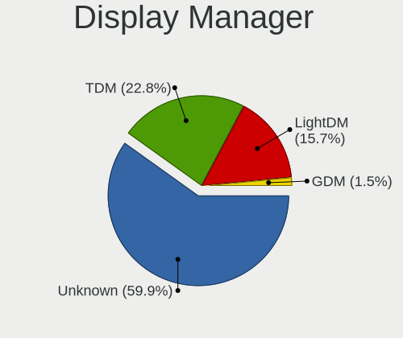
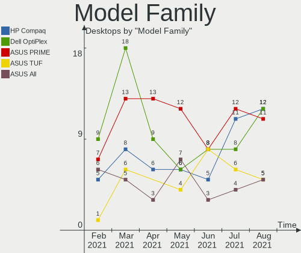
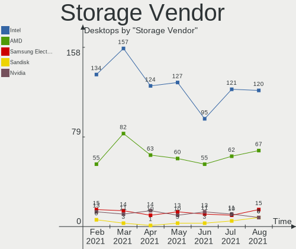
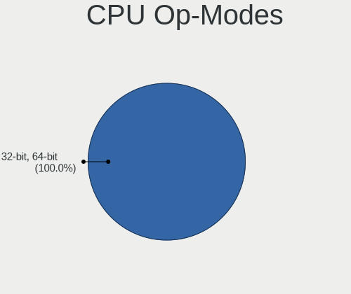
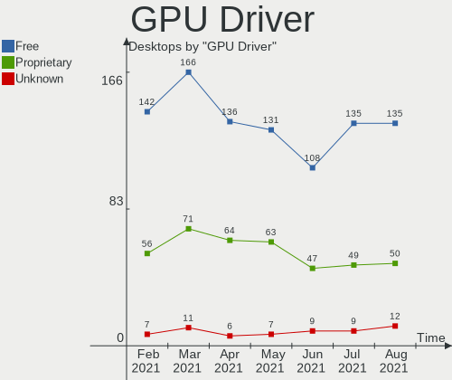
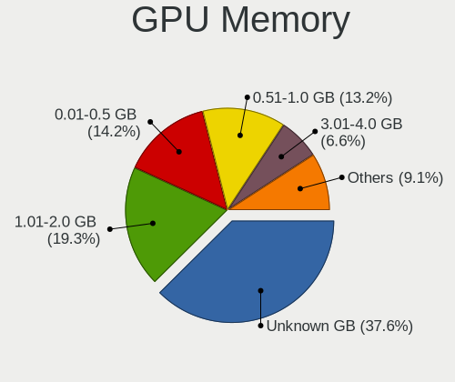
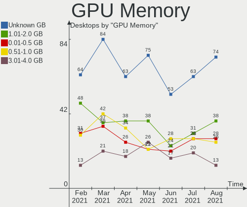
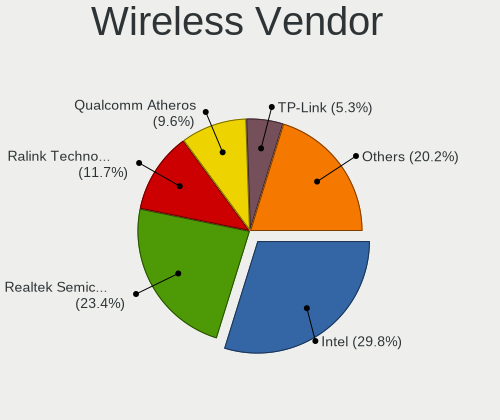

Mint Hardware Trends (Desktop)
------------------------------

A project to identify most popular hardware characteristics and track their change
over time based on data collected by Mint users at https://Linux-Hardware.org.

Anyone can contribute to the study by uploading probes of their computers by
the [hw-probe](https://github.com/linuxhw/hw-probe) tool:

    sudo -E hw-probe -all -upload

Full-feature report is available here: https://linux-hardware.org/?view=trends&formfactor=desktop

Period: Jan, 2021.

Contents
--------

- [ OS                       ](#os)
- [ OS Family                ](#os-family)
- [ Kernel                   ](#kernel)
- [ Kernel Family            ](#kernel-family)
- [ Kernel Major Ver.        ](#kernel-major-ver)
- [ Arch                     ](#arch)
- [ DE                       ](#de)
- [ Display Server           ](#display-server)
- [ Display Manager          ](#display-manager)
- [ OS Lang                  ](#os-lang)
- [ Boot Mode                ](#boot-mode)
- [ Filesystem               ](#filesystem)
- [ Part. scheme             ](#part-scheme)
- [ Dual Boot with Linux/BSD ](#dual-boot-with-linux/bsd)
- [ Dual Boot (Win)          ](#dual-boot-win)
- [ Country                  ](#country)
- [ City                     ](#city)
- [ Vendor                   ](#vendor)
- [ Model                    ](#model)
- [ Model Family             ](#model-family)
- [ MFG Year                 ](#mfg-year)
- [ Form Factor              ](#form-factor)
- [ Secure Boot              ](#secure-boot)
- [ Coreboot                 ](#coreboot)
- [ RAM Size                 ](#ram-size)
- [ RAM Used                 ](#ram-used)
- [ Has CD-ROM               ](#has-cd-rom)
- [ Total Drives             ](#total-drives)
- [ Has Ethernet             ](#has-ethernet)
- [ Drive Vendor             ](#drive-vendor)
- [ Drive Model              ](#drive-model)
- [ HDD Vendor               ](#hdd-vendor)
- [ SSD Vendor               ](#ssd-vendor)
- [ Drive Kind               ](#drive-kind)
- [ Drive Connector          ](#drive-connector)
- [ Drive Size               ](#drive-size)
- [ Space Total              ](#space-total)
- [ Space Used               ](#space-used)
- [ Malfunc. Drives          ](#malfunc-drives)
- [ Malfunc. Drive Vendor    ](#malfunc-drive-vendor)
- [ Malfunc. HDD Vendor      ](#malfunc-hdd-vendor)
- [ Malfunc. Drive Kind      ](#malfunc-drive-kind)
- [ Failed Drives            ](#failed-drives)
- [ Failed Drive Vendor      ](#failed-drive-vendor)
- [ Drive Status             ](#drive-status)
- [ Storage Vendor           ](#storage-vendor)
- [ Storage Model            ](#storage-model)
- [ Storage Kind             ](#storage-kind)
- [ CPU Vendor               ](#cpu-vendor)
- [ CPU Model                ](#cpu-model)
- [ CPU Model Family         ](#cpu-model-family)
- [ CPU Cores                ](#cpu-cores)
- [ CPU Sockets              ](#cpu-sockets)
- [ CPU Threads              ](#cpu-threads)
- [ CPU Op-Modes             ](#cpu-op-modes)
- [ CPU Microcode            ](#cpu-microcode)
- [ CPU Microarch            ](#cpu-microarch)
- [ GPU Vendor               ](#gpu-vendor)
- [ GPU Model                ](#gpu-model)
- [ GPU Combo                ](#gpu-combo)
- [ GPU Driver               ](#gpu-driver)
- [ GPU Memory               ](#gpu-memory)
- [ Monitor Vendor           ](#monitor-vendor)
- [ Monitor Model            ](#monitor-model)
- [ Monitor Resolution       ](#monitor-resolution)
- [ Monitor Diagonal         ](#monitor-diagonal)
- [ Monitor Width            ](#monitor-width)
- [ Aspect Ratio             ](#aspect-ratio)
- [ Monitor Area             ](#monitor-area)
- [ Pixel Density            ](#pixel-density)
- [ Multiple Monitors        ](#multiple-monitors)
- [ Net Controller Vendor    ](#net-controller-vendor)
- [ Net Controller Model     ](#net-controller-model)
- [ Wireless Vendor          ](#wireless-vendor)
- [ Wireless Model           ](#wireless-model)
- [ Ethernet Vendor          ](#ethernet-vendor)
- [ Ethernet Model           ](#ethernet-model)
- [ Net Controller Kind      ](#net-controller-kind)
- [ Used Controller          ](#used-controller)
- [ NICs                     ](#nics)
- [ Memory Vendor            ](#memory-vendor)
- [ Memory Model             ](#memory-model)
- [ Memory Kind              ](#memory-kind)
- [ Memory Form Factor       ](#memory-form-factor)
- [ Memory Size              ](#memory-size)
- [ Memory Speed             ](#memory-speed)
- [ Sound Vendor             ](#sound-vendor)
- [ Sound Model              ](#sound-model)
- [ Camera Vendor            ](#camera-vendor)
- [ Camera Model             ](#camera-model)
- [ Fingerprint Vendor       ](#fingerprint-vendor)
- [ Fingerprint Model        ](#fingerprint-model)
- [ Chipcard Vendor          ](#chipcard-vendor)
- [ Chipcard Model           ](#chipcard-model)
- [ Printer Vendor           ](#printer-vendor)
- [ Printer Model            ](#printer-model)
- [ Scanner Vendor           ](#scanner-vendor)
- [ Scanner Model            ](#scanner-model)
- [ Bluetooth Vendor         ](#bluetooth-vendor)
- [ Bluetooth Model          ](#bluetooth-model)
- [ Unsupported Devices      ](#unsupported-devices)
- [ Unsupported Device Types ](#unsupported-device-types)

OS
--

Installed operating systems

| Name      | Desktops | Percent |
|-----------|----------|---------|
| Mint 20.1 | 105      | 40.54%  |
| Mint 20   | 102      | 39.38%  |
| Mint 19.3 | 37       | 14.29%  |
| Mint 19.1 | 7        | 2.7%    |
| Mint 19   | 6        | 2.32%   |
| Mint 19.2 | 1        | 0.39%   |
| Mint 18.3 | 1        | 0.39%   |

OS Family
---------

OS without a version

| Name | Desktops | Percent |
|------|----------|---------|
| Mint | 259      | 100%    |

Kernel
------

Version of the Linux kernel

| Version                   | Desktops | Percent |
|---------------------------|----------|---------|
| 5.4.0-58-generic          | 52       | 20.08%  |
| 5.4.0-64-generic          | 41       | 15.83%  |
| 5.4.0-60-generic          | 41       | 15.83%  |
| 5.4.0-62-generic          | 29       | 11.2%   |
| 5.4.0-59-generic          | 25       | 9.65%   |
| 5.4.0-65-generic          | 18       | 6.95%   |
| 5.4.0-26-generic          | 6        | 2.32%   |
| 5.0.0-32-generic          | 5        | 1.93%   |
| 4.15.0-135-generic        | 4        | 1.54%   |
| 5.4.0-54-generic          | 3        | 1.16%   |
| 4.15.0-128-generic        | 3        | 1.16%   |
| 5.8.0-34-generic          | 2        | 0.77%   |
| 5.4.0-56-generic          | 2        | 0.77%   |
| 5.4.0-51-generic          | 2        | 0.77%   |
| 5.4.0-47-generic          | 2        | 0.77%   |
| 5.4.0-42-generic          | 2        | 0.77%   |
| 4.15.0-20-generic         | 2        | 0.77%   |
| 5.9.0-050900-lowlatency   | 1        | 0.39%   |
| 5.9.0-050900-generic      | 1        | 0.39%   |
| 5.8.0-38-generic          | 1        | 0.39%   |
| 5.8.0-36-generic          | 1        | 0.39%   |
| 5.8.0-33-generic          | 1        | 0.39%   |
| 5.8.0-23-generic          | 1        | 0.39%   |
| 5.6.0-1042-oem            | 1        | 0.39%   |
| 5.4.0-60-lowlatency       | 1        | 0.39%   |
| 5.4.0-52-generic          | 1        | 0.39%   |
| 5.4.0-48-generic          | 1        | 0.39%   |
| 5.10.4-051004-generic     | 1        | 0.39%   |
| 5.10.11-051011-generic    | 1        | 0.39%   |
| 5.10.0-4.3-liquorix-amd64 | 1        | 0.39%   |
| 4.15.0-91-generic         | 1        | 0.39%   |
| 4.15.0-70-generic         | 1        | 0.39%   |
| 4.15.0-55-generic         | 1        | 0.39%   |
| 4.15.0-30-generic         | 1        | 0.39%   |
| 4.15.0-132-generic        | 1        | 0.39%   |
| 4.15.0-130-generic        | 1        | 0.39%   |
| 4.15.0-112-generic        | 1        | 0.39%   |

Kernel Family
-------------

Linux kernel without a distro release

| Version | Desktops | Percent |
|---------|----------|---------|
| 5.4.0   | 226      | 87.26%  |
| 4.15.0  | 16       | 6.18%   |
| 5.8.0   | 6        | 2.32%   |
| 5.0.0   | 5        | 1.93%   |
| 5.9.0   | 2        | 0.77%   |
| 5.6.0   | 1        | 0.39%   |
| 5.10.4  | 1        | 0.39%   |
| 5.10.11 | 1        | 0.39%   |
| 5.10.0  | 1        | 0.39%   |

Kernel Major Ver.
-----------------

Linux kernel major version

| Version | Desktops | Percent |
|---------|----------|---------|
| 5.4     | 226      | 87.26%  |
| 4.15    | 16       | 6.18%   |
| 5.8     | 6        | 2.32%   |
| 5.0     | 5        | 1.93%   |
| 5.10    | 3        | 1.16%   |
| 5.9     | 2        | 0.77%   |
| 5.6     | 1        | 0.39%   |

Arch
----

OS architecture (x86_64, i586, etc.)

| Name   | Desktops | Percent |
|--------|----------|---------|
| x86_64 | 249      | 96.14%  |
| i686   | 10       | 3.86%   |

DE
--

Desktop Environment

| Name       | Desktops | Percent |
|------------|----------|---------|
| X-Cinnamon | 170      | 65.64%  |
| MATE       | 36       | 13.9%   |
| XFCE       | 25       | 9.65%   |
| Cinnamon   | 16       | 6.18%   |
| GNOME      | 6        | 2.32%   |
| Unknown    | 4        | 1.54%   |
| LXDE       | 1        | 0.39%   |
| KDE        | 1        | 0.39%   |

Display Server
--------------

X11 or Wayland

| Name | Desktops | Percent |
|------|----------|---------|
| X11  | 253      | 97.68%  |
| Tty  | 6        | 2.32%   |

Display Manager
---------------

SDDM, LightDM, etc.

| Name    | Desktops | Percent |
|---------|----------|---------|
| Unknown | 201      | 77.61%  |
| TDM     | 57       | 22.01%  |
| MDM     | 1        | 0.39%   |

OS Lang
-------

Language

| Lang  | Desktops | Percent |
|-------|----------|---------|
| en_US | 78       | 30.12%  |
| de_DE | 44       | 16.99%  |
| pt_BR | 23       | 8.88%   |
| fr_FR | 13       | 5.02%   |
| ru_RU | 11       | 4.25%   |
| es_ES | 10       | 3.86%   |
| pl_PL | 8        | 3.09%   |
| it_IT | 8        | 3.09%   |
| en_CA | 8        | 3.09%   |
| en_GB | 6        | 2.32%   |
| C     | 5        | 1.93%   |
| nl_NL | 4        | 1.54%   |
| en_AU | 4        | 1.54%   |
| cs_CZ | 4        | 1.54%   |
| uk_UA | 3        | 1.16%   |
| ru_UA | 3        | 1.16%   |
| tr_TR | 2        | 0.77%   |
| sv_SE | 2        | 0.77%   |
| fr_CA | 2        | 0.77%   |
| en_ZA | 2        | 0.77%   |
| de_AT | 2        | 0.77%   |
| zh_CN | 1        | 0.39%   |
| nl_BE | 1        | 0.39%   |
| nb_NO | 1        | 0.39%   |
| lv_LV | 1        | 0.39%   |
| it_CH | 1        | 0.39%   |
| hu_HU | 1        | 0.39%   |
| hr_HR | 1        | 0.39%   |
| gl_ES | 1        | 0.39%   |
| fr_BE | 1        | 0.39%   |
| fi_FI | 1        | 0.39%   |
| es_VE | 1        | 0.39%   |
| es_MX | 1        | 0.39%   |
| es_CL | 1        | 0.39%   |
| es_AR | 1        | 0.39%   |
| en_PH | 1        | 0.39%   |
| en_IE | 1        | 0.39%   |
| de_CH | 1        | 0.39%   |

Boot Mode
---------

EFI or BIOS

| Mode | Desktops | Percent |
|------|----------|---------|
| BIOS | 181      | 69.88%  |
| EFI  | 78       | 30.12%  |

Filesystem
----------

Type of filesystem

| Type    | Desktops | Percent |
|---------|----------|---------|
| Ext4    | 249      | 96.14%  |
| Btrfs   | 5        | 1.93%   |
| Overlay | 4        | 1.54%   |
| Xfs     | 1        | 0.39%   |

Part. scheme
------------

Scheme of partitioning

| Type    | Desktops | Percent |
|---------|----------|---------|
| Unknown | 198      | 76.45%  |
| GPT     | 39       | 15.06%  |
| MBR     | 22       | 8.49%   |

Dual Boot with Linux/BSD
------------------------

Hosting more than one Linux/BSD

| Dual boot | Desktops | Percent |
|-----------|----------|---------|
| No        | 235      | 90.73%  |
| Yes       | 24       | 9.27%   |

Dual Boot (Win)
---------------

Hosting Linux and Windows

| Dual boot | Desktops | Percent |
|-----------|----------|---------|
| No        | 226      | 87.26%  |
| Yes       | 33       | 12.74%  |

Country
-------

Geographic location (country)

| Country                   | Desktops | Percent |
|---------------------------|----------|---------|
| Germany                   | 49       | 18.92%  |
| USA                       | 47       | 18.15%  |
| Brazil                    | 24       | 9.27%   |
| France                    | 13       | 5.02%   |
| Russia                    | 12       | 4.63%   |
| Spain                     | 11       | 4.25%   |
| Canada                    | 11       | 4.25%   |
| Italy                     | 10       | 3.86%   |
| Ukraine                   | 9        | 3.47%   |
| Netherlands               | 7        | 2.7%    |
| UK                        | 5        | 1.93%   |
| Poland                    | 5        | 1.93%   |
| Australia                 | 5        | 1.93%   |
| Austria                   | 4        | 1.54%   |
| Switzerland               | 3        | 1.16%   |
| Romania                   | 3        | 1.16%   |
| Finland                   | 3        | 1.16%   |
| Bulgaria                  | 3        | 1.16%   |
| Turkey                    | 2        | 0.77%   |
| Sweden                    | 2        | 0.77%   |
| South Africa              | 2        | 0.77%   |
| Czech Republic            | 2        | 0.77%   |
| Belgium                   | 2        | 0.77%   |
| Venezuela                 | 1        | 0.39%   |
| Thailand                  | 1        | 0.39%   |
| Slovakia                  | 1        | 0.39%   |
| Puerto Rico               | 1        | 0.39%   |
| Philippines               | 1        | 0.39%   |
| Norway                    | 1        | 0.39%   |
| Mexico                    | 1        | 0.39%   |
| Malaysia                  | 1        | 0.39%   |
| Macedonia                 | 1        | 0.39%   |
| Latvia                    | 1        | 0.39%   |
| Japan                     | 1        | 0.39%   |
| Jamaica                   | 1        | 0.39%   |
| Ireland                   | 1        | 0.39%   |
| Iran, Islamic Republic of | 1        | 0.39%   |
| India                     | 1        | 0.39%   |
| Hungary                   | 1        | 0.39%   |
| Greece                    | 1        | 0.39%   |
| Egypt                     | 1        | 0.39%   |
| Croatia                   | 1        | 0.39%   |
| Costa Rica                | 1        | 0.39%   |
| China                     | 1        | 0.39%   |
| Chile                     | 1        | 0.39%   |
| Belarus                   | 1        | 0.39%   |
| Argentina                 | 1        | 0.39%   |
| Angola                    | 1        | 0.39%   |

City
----

Geographic location (city)

| City                  | Desktops | Percent |
|-----------------------|----------|---------|
| Lutsk                 | 6        | 2.32%   |
| Joinville             | 4        | 1.54%   |
| Vienna                | 3        | 1.16%   |
| Paris                 | 3        | 1.16%   |
| Munich                | 3        | 1.16%   |
| Montreal              | 3        | 1.16%   |
| Berlin                | 3        | 1.16%   |
| Amsterdam             | 3        | 1.16%   |
| Wrocław              | 2        | 0.77%   |
| Vancouver             | 2        | 0.77%   |
| Tolyatti              | 2        | 0.77%   |
| São Paulo            | 2        | 0.77%   |
| Redfield              | 2        | 0.77%   |
| Phoenix               | 2        | 0.77%   |
| Moscow                | 2        | 0.77%   |
| Los Angeles           | 2        | 0.77%   |
| Kharkiv               | 2        | 0.77%   |
| Istanbul              | 2        | 0.77%   |
| Helsinki              | 2        | 0.77%   |
| Dresden               | 2        | 0.77%   |
| Chicago               | 2        | 0.77%   |
| Barcelona             | 2        | 0.77%   |
| Zwaag                 | 1        | 0.39%   |
| Zurich                | 1        | 0.39%   |
| Zagreb                | 1        | 0.39%   |
| Yoshkar-Ola           | 1        | 0.39%   |
| Yaroslavl             | 1        | 0.39%   |
| Wolfeboro             | 1        | 0.39%   |
| West Chicago          | 1        | 0.39%   |
| Wesel                 | 1        | 0.39%   |
| Wennigsen             | 1        | 0.39%   |
| Weiden                | 1        | 0.39%   |
| Warsaw                | 1        | 0.39%   |
| Walthamstow           | 1        | 0.39%   |
| Volgograd             | 1        | 0.39%   |
| Voerde                | 1        | 0.39%   |
| Vidal Ramos           | 1        | 0.39%   |
| Vernon                | 1        | 0.39%   |
| Vendargues            | 1        | 0.39%   |
| Varese                | 1        | 0.39%   |
| Valencia              | 1        | 0.39%   |
| Ulyanovsk             | 1        | 0.39%   |
| Uberlândia           | 1        | 0.39%   |
| Traralgon             | 1        | 0.39%   |
| Tocantins             | 1        | 0.39%   |
| Tiete                 | 1        | 0.39%   |
| São Bento do Sul     | 1        | 0.39%   |
| Sydney                | 1        | 0.39%   |
| Swiatniki Gorne       | 1        | 0.39%   |
| Swarthmore            | 1        | 0.39%   |
| Summerville           | 1        | 0.39%   |
| Stockholm             | 1        | 0.39%   |
| St Petersburg         | 1        | 0.39%   |
| Spaichingen           | 1        | 0.39%   |
| Sofia                 | 1        | 0.39%   |
| Skopje                | 1        | 0.39%   |
| Skalica               | 1        | 0.39%   |
| Schweitenkirchen      | 1        | 0.39%   |
| Schio                 | 1        | 0.39%   |
| Scherpenheuvel-Zichem | 1        | 0.39%   |

Vendor
------

Motherboard manufacturer

| Name                | Desktops | Percent |
|---------------------|----------|---------|
| ASUSTek Computer    | 58       | 22.39%  |
| Gigabyte Technology | 49       | 18.92%  |
| Hewlett-Packard     | 26       | 10.04%  |
| MSI                 | 25       | 9.65%   |
| Dell                | 22       | 8.49%   |
| ASRock              | 20       | 7.72%   |
| Lenovo              | 11       | 4.25%   |
| Intel               | 9        | 3.47%   |
| Fujitsu             | 5        | 1.93%   |
| Acer                | 4        | 1.54%   |
| Unknown             | 4        | 1.54%   |
| Pegatron            | 3        | 1.16%   |
| Fujitsu Siemens     | 3        | 1.16%   |
| PCWare              | 2        | 0.77%   |
| Medion              | 2        | 0.77%   |
| Foxconn             | 2        | 0.77%   |
| ECS                 | 2        | 0.77%   |
| VS Company          | 1        | 0.39%   |
| Positivo            | 1        | 0.39%   |
| Philco              | 1        | 0.39%   |
| Packard Bell        | 1        | 0.39%   |
| Inventec            | 1        | 0.39%   |
| HARDKERNEL          | 1        | 0.39%   |
| Gateway             | 1        | 0.39%   |
| FIC                 | 1        | 0.39%   |
| EVGA                | 1        | 0.39%   |
| eMachines           | 1        | 0.39%   |
| AOpen               | 1        | 0.39%   |
| Alienware           | 1        | 0.39%   |

Model
-----

Motherboard model

| Name                                   | Desktops | Percent |
|----------------------------------------|----------|---------|
| ASUS All Series                        | 4        | 1.54%   |
| Unknown                                | 4        | 1.54%   |
| HP Z400 Workstation                    | 3        | 1.16%   |
| Gigabyte G31M-ES2L                     | 3        | 1.16%   |
| MSI MS-7758                            | 2        | 0.77%   |
| Lenovo ThinkCentre M800 10FW001NUS     | 2        | 0.77%   |
| HP Z230 Tower Workstation              | 2        | 0.77%   |
| HP Compaq dc7900 Convertible Minitower | 2        | 0.77%   |
| Gigabyte G41M-Combo                    | 2        | 0.77%   |
| Dell OptiPlex 790                      | 2        | 0.77%   |
| Dell OptiPlex 780                      | 2        | 0.77%   |
| Dell OptiPlex 760                      | 2        | 0.77%   |
| Dell Inspiron 660s                     | 2        | 0.77%   |
| Dell Inspiron 580                      | 2        | 0.77%   |
| ASUS TUF GAMING X570-PLUS              | 2        | 0.77%   |
| ASUS PRIME B450M-A                     | 2        | 0.77%   |
| VS Company VS-MCP61M                   | 1        | 0.39%   |
| Positivo POS-EAA75DE                   | 1        | 0.39%   |
| Philco DTA-H61                         | 1        | 0.39%   |
| Pegatron Compaq dx2400 Microtower PC   | 1        | 0.39%   |
| Pegatron AZ226AV-ABA 600-1105xt        | 1        | 0.39%   |
| Pegatron 23-b010ez                     | 1        | 0.39%   |
| PCWare PW-945GCX                       | 1        | 0.39%   |
| PCWare IPMH81G1                        | 1        | 0.39%   |
| Packard Bell imedia S3810              | 1        | 0.39%   |
| MSI MS-7C86                            | 1        | 0.39%   |
| MSI MS-7C56                            | 1        | 0.39%   |
| MSI MS-7B89                            | 1        | 0.39%   |
| MSI MS-7B86                            | 1        | 0.39%   |
| MSI MS-7A40                            | 1        | 0.39%   |
| MSI MS-7A39                            | 1        | 0.39%   |
| MSI MS-7A36                            | 1        | 0.39%   |
| MSI MS-7A34                            | 1        | 0.39%   |
| MSI MS-7996                            | 1        | 0.39%   |
| MSI MS-7994                            | 1        | 0.39%   |
| MSI MS-7980                            | 1        | 0.39%   |
| MSI MS-7917                            | 1        | 0.39%   |
| MSI MS-7808                            | 1        | 0.39%   |
| MSI MS-7788                            | 1        | 0.39%   |
| MSI MS-7759                            | 1        | 0.39%   |
| MSI MS-7693                            | 1        | 0.39%   |
| MSI MS-7641                            | 1        | 0.39%   |
| MSI MS-7597                            | 1        | 0.39%   |
| MSI MS-7276                            | 1        | 0.39%   |
| MSI MS-7025                            | 1        | 0.39%   |
| MSI MS-7012                            | 1        | 0.39%   |
| MSI Mr. Business V                     | 1        | 0.39%   |
| MSI B250 Gaming Nightblade 3 (MS-B910) | 1        | 0.39%   |
| Medion MS-7848                         | 1        | 0.39%   |
| Medion MS-7728                         | 1        | 0.39%   |
| Lenovo ThinkStation D20 4158AF8        | 1        | 0.39%   |
| Lenovo ThinkCentre M93p 10A8S1MG04     | 1        | 0.39%   |
| Lenovo ThinkCentre M90p 3257A8G        | 1        | 0.39%   |
| Lenovo ThinkCentre M900 10NE000EMX     | 1        | 0.39%   |
| Lenovo ThinkCentre M800 10FW0004US     | 1        | 0.39%   |
| Lenovo ThinkCentre A57 970274G         | 1        | 0.39%   |
| Lenovo IC 310S-08IGM                   | 1        | 0.39%   |
| Lenovo H30-50 90B8004JFR               | 1        | 0.39%   |
| Lenovo 10BSS01F08                      | 1        | 0.39%   |
| Inventec D CLASS                       | 1        | 0.39%   |

Model Family
------------

Motherboard model prefix

| Name                    | Desktops | Percent |
|-------------------------|----------|---------|
| Dell OptiPlex           | 13       | 5.02%   |
| ASUS PRIME              | 10       | 3.86%   |
| HP Compaq               | 9        | 3.47%   |
| Lenovo ThinkCentre      | 7        | 2.7%    |
| HP EliteDesk            | 4        | 1.54%   |
| Fujitsu ESPRIMO         | 4        | 1.54%   |
| Dell Inspiron           | 4        | 1.54%   |
| ASUS TUF                | 4        | 1.54%   |
| ASUS All                | 4        | 1.54%   |
| Unknown                 | 4        | 1.54%   |
| HP Z400                 | 3        | 1.16%   |
| Gigabyte G31M-ES2L      | 3        | 1.16%   |
| ASUS ROG                | 3        | 1.16%   |
| ASUS P8H61-M            | 3        | 1.16%   |
| MSI MS-7758             | 2        | 0.77%   |
| HP Z230                 | 2        | 0.77%   |
| HP ProDesk              | 2        | 0.77%   |
| Gigabyte G41M-Combo     | 2        | 0.77%   |
| Gigabyte B550           | 2        | 0.77%   |
| Gigabyte B450M          | 2        | 0.77%   |
| Fujitsu Siemens ESPRIMO | 2        | 0.77%   |
| Dell XPS                | 2        | 0.77%   |
| Dell Precision          | 2        | 0.77%   |
| ASUS P8Z77-V            | 2        | 0.77%   |
| ASUS P5Q                | 2        | 0.77%   |
| ASUS P5KPL-AM           | 2        | 0.77%   |
| ASUS M5A97              | 2        | 0.77%   |
| ASUS M2N-MX             | 2        | 0.77%   |
| Acer Veriton            | 2        | 0.77%   |
| Acer Aspire             | 2        | 0.77%   |
| VS Company VS-MCP61M    | 1        | 0.39%   |
| Positivo POS-EAA75DE    | 1        | 0.39%   |
| Philco DTA-H61          | 1        | 0.39%   |
| Pegatron Compaq         | 1        | 0.39%   |
| Pegatron AZ226AV-ABA    | 1        | 0.39%   |
| Pegatron 23-b010ez      | 1        | 0.39%   |
| PCWare PW-945GCX        | 1        | 0.39%   |
| PCWare IPMH81G1         | 1        | 0.39%   |
| Packard Bell imedia     | 1        | 0.39%   |
| MSI MS-7C86             | 1        | 0.39%   |
| MSI MS-7C56             | 1        | 0.39%   |
| MSI MS-7B89             | 1        | 0.39%   |
| MSI MS-7B86             | 1        | 0.39%   |
| MSI MS-7A40             | 1        | 0.39%   |
| MSI MS-7A39             | 1        | 0.39%   |
| MSI MS-7A36             | 1        | 0.39%   |
| MSI MS-7A34             | 1        | 0.39%   |
| MSI MS-7996             | 1        | 0.39%   |
| MSI MS-7994             | 1        | 0.39%   |
| MSI MS-7980             | 1        | 0.39%   |
| MSI MS-7917             | 1        | 0.39%   |
| MSI MS-7808             | 1        | 0.39%   |
| MSI MS-7788             | 1        | 0.39%   |
| MSI MS-7759             | 1        | 0.39%   |
| MSI MS-7693             | 1        | 0.39%   |
| MSI MS-7641             | 1        | 0.39%   |
| MSI MS-7597             | 1        | 0.39%   |
| MSI MS-7276             | 1        | 0.39%   |
| MSI MS-7025             | 1        | 0.39%   |
| MSI MS-7012             | 1        | 0.39%   |

MFG Year
--------

Motherboard manufacture year

| Year    | Desktops | Percent |
|---------|----------|---------|
| 2012    | 29       | 11.2%   |
| 2020    | 28       | 10.81%  |
| 2013    | 24       | 9.27%   |
| 2019    | 22       | 8.49%   |
| 2010    | 22       | 8.49%   |
| 2011    | 20       | 7.72%   |
| 2009    | 20       | 7.72%   |
| 2018    | 19       | 7.34%   |
| 2015    | 18       | 6.95%   |
| 2014    | 18       | 6.95%   |
| 2016    | 14       | 5.41%   |
| 2008    | 8        | 3.09%   |
| 2007    | 6        | 2.32%   |
| 2017    | 5        | 1.93%   |
| 2021    | 2        | 0.77%   |
| 2005    | 1        | 0.39%   |
| 2004    | 1        | 0.39%   |
| 2003    | 1        | 0.39%   |
| Unknown | 1        | 0.39%   |

Form Factor
-----------

Physical design of the computer

| Name    | Desktops | Percent |
|---------|----------|---------|
| Desktop | 259      | 100%    |

Secure Boot
-----------

Enabled or disabled

| State    | Desktops | Percent |
|----------|----------|---------|
| Disabled | 252      | 97.3%   |
| Enabled  | 7        | 2.7%    |

Coreboot
--------

Have coreboot on board

| Used | Desktops | Percent |
|------|----------|---------|
| No   | 259      | 100%    |

RAM Size
--------

Total RAM memory

| Size in GB  | Desktops | Percent |
|-------------|----------|---------|
| 8.01-16.0   | 55       | 21.24%  |
| 3.01-4.0    | 51       | 19.69%  |
| 16.01-24.0  | 51       | 19.69%  |
| 4.01-8.0    | 48       | 18.53%  |
| 32.01-64.0  | 29       | 11.2%   |
| 1.01-2.0    | 10       | 3.86%   |
| 64.01-256.0 | 5        | 1.93%   |
| 2.01-3.0    | 4        | 1.54%   |
| 24.01-32.0  | 3        | 1.16%   |
| 0.51-1.0    | 3        | 1.16%   |

RAM Used
--------

Used RAM memory

| Used GB    | Desktops | Percent |
|------------|----------|---------|
| 1.01-2.0   | 110      | 42.47%  |
| 2.01-3.0   | 58       | 22.39%  |
| 4.01-8.0   | 32       | 12.36%  |
| 0.51-1.0   | 29       | 11.2%   |
| 3.01-4.0   | 21       | 8.11%   |
| 8.01-16.0  | 7        | 2.7%    |
| 24.01-32.0 | 1        | 0.39%   |
| 0.01-0.5   | 1        | 0.39%   |

Has CD-ROM
----------

Has CD-ROM on board

| Presented | Desktops | Percent |
|-----------|----------|---------|
| Yes       | 153      | 59.07%  |
| No        | 106      | 40.93%  |

Total Drives
------------

Number of drives on board

| Drives | Desktops | Percent |
|--------|----------|---------|
| 1      | 95       | 36.68%  |
| 2      | 81       | 31.27%  |
| 3      | 46       | 17.76%  |
| 4      | 23       | 8.88%   |
| 5      | 10       | 3.86%   |
| 7      | 2        | 0.77%   |
| 8      | 1        | 0.39%   |
| 6      | 1        | 0.39%   |

Has Ethernet
------------

Has Ethernet on board

| Presented | Desktops | Percent |
|-----------|----------|---------|
| Yes       | 253      | 97.68%  |
| No        | 6        | 2.32%   |

Drive Vendor
------------

Hard drive vendors

| Vendor                    | Desktops | Drives | Percent |
|---------------------------|----------|--------|---------|
| WDC                       | 111      | 142    | 23.82%  |
| Seagate                   | 93       | 123    | 19.96%  |
| Samsung Electronics       | 67       | 87     | 14.38%  |
| Kingston                  | 35       | 38     | 7.51%   |
| Hitachi                   | 19       | 21     | 4.08%   |
| Toshiba                   | 16       | 17     | 3.43%   |
| Sandisk                   | 16       | 16     | 3.43%   |
| Crucial                   | 15       | 19     | 3.22%   |
| Maxtor                    | 7        | 7      | 1.5%    |
| Intel                     | 7        | 7      | 1.5%    |
| A-DATA Technology         | 7        | 7      | 1.5%    |
| Patriot                   | 6        | 6      | 1.29%   |
| HGST                      | 5        | 7      | 1.07%   |
| China                     | 5        | 5      | 1.07%   |
| Unknown                   | 4        | 4      | 0.86%   |
| Phison                    | 4        | 4      | 0.86%   |
| Transcend                 | 3        | 3      | 0.64%   |
| PNY                       | 3        | 3      | 0.64%   |
| Intenso                   | 3        | 3      | 0.64%   |
| Apacer                    | 3        | 3      | 0.64%   |
| SPCC                      | 2        | 2      | 0.43%   |
| SK Hynix                  | 2        | 2      | 0.43%   |
| OCZ                       | 2        | 2      | 0.43%   |
| Lexar                     | 2        | 2      | 0.43%   |
| ASMT                      | 2        | 3      | 0.43%   |
| XPG                       | 1        | 1      | 0.21%   |
| WD MediaMax               | 1        | 1      | 0.21%   |
| ViperTeq                  | 1        | 1      | 0.21%   |
| USB30                     | 1        | 1      | 0.21%   |
| Team                      | 1        | 1      | 0.21%   |
| Super Talent              | 1        | 1      | 0.21%   |
| Silicon Motion            | 1        | 1      | 0.21%   |
| SABRENT                   | 1        | 1      | 0.21%   |
| PLEXTOR                   | 1        | 1      | 0.21%   |
| Micron/Crucial Technology | 1        | 1      | 0.21%   |
| Micron Technology         | 1        | 1      | 0.21%   |
| LITEONIT                  | 1        | 1      | 0.21%   |
| LITEON                    | 1        | 1      | 0.21%   |
| KingSpec                  | 1        | 1      | 0.21%   |
| Kingmax                   | 1        | 1      | 0.21%   |
| JMicron                   | 1        | 1      | 0.21%   |
| INNOVATION IT             | 1        | 1      | 0.21%   |
| IBM-ESXS                  | 1        | 2      | 0.21%   |
| Hikvision                 | 1        | 1      | 0.21%   |
| Hewlett-Packard           | 1        | 1      | 0.21%   |
| GOODRAM                   | 1        | 1      | 0.21%   |
| Fujitsu                   | 1        | 1      | 0.21%   |
| Corsair                   | 1        | 1      | 0.21%   |
| Config                    | 1        | 2      | 0.21%   |
| BIWIN                     | 1        | 1      | 0.21%   |
| BAITITON                  | 1        | 1      | 0.21%   |
| AMD                       | 1        | 1      | 0.21%   |

Drive Model
-----------

Hard drive models

| Model                              | Desktops | Percent |
|------------------------------------|----------|---------|
| Toshiba DT01ACA100 1TB             | 8        | 1.48%   |
| Kingston SA400S37240G 240GB SSD    | 8        | 1.48%   |
| Seagate ST500DM002-1BD142 500GB    | 7        | 1.29%   |
| Samsung SSD 860 EVO 500GB          | 7        | 1.29%   |
| Kingston SA400S37480G 480GB SSD    | 7        | 1.29%   |
| Seagate ST3500418AS 500GB          | 6        | 1.11%   |
| Seagate ST2000DM008-2FR102 2TB     | 6        | 1.11%   |
| WDC WD20EZRZ-00Z5HB0 2TB           | 5        | 0.92%   |
| WDC WD10EZEX-00BN5A0 1TB           | 5        | 0.92%   |
| Seagate ST1000DM003-1ER162 1TB     | 5        | 0.92%   |
| Seagate ST1000DM003-1CH162 1TB     | 5        | 0.92%   |
| Samsung SSD 860 EVO 250GB          | 5        | 0.92%   |
| Samsung SSD 850 EVO 500GB          | 5        | 0.92%   |
| Samsung HD250HJ 250GB              | 5        | 0.92%   |
| Kingston SA400S37120G 120GB SSD    | 5        | 0.92%   |
| WDC WD20EZRX-00D8PB0 2TB           | 4        | 0.74%   |
| Seagate ST31000528AS 1TB           | 4        | 0.74%   |
| Seagate ST2000DM006-2DM164 2TB     | 4        | 0.74%   |
| Seagate ST2000DM001-1ER164 2TB     | 4        | 0.74%   |
| Seagate ST1000LM024 HN-M101MBB 1TB | 4        | 0.74%   |
| Samsung SSD 860 EVO 1TB            | 4        | 0.74%   |
| Samsung SSD 850 EVO 250GB          | 4        | 0.74%   |
| Samsung NVMe SSD Drive 250GB       | 4        | 0.74%   |
| Patriot Burst 240GB SSD            | 4        | 0.74%   |
| Kingston SV300S37A240G 240GB SSD   | 4        | 0.74%   |
| Hitachi HDT721010SLA360 1TB        | 4        | 0.74%   |
| WDC WD5000AAKX-60U6AA0 500GB       | 3        | 0.55%   |
| WDC WD3200AAKS-00VYA0 320GB        | 3        | 0.55%   |
| WDC WD20EARS-00MVWB0 2TB           | 3        | 0.55%   |
| Seagate ST3500630AS 500GB          | 3        | 0.55%   |
| Seagate ST1000DM003-9YN162 1TB     | 3        | 0.55%   |
| SanDisk SSD PLUS 120GB             | 3        | 0.55%   |
| Samsung SSD 750 EVO 250GB          | 3        | 0.55%   |
| Samsung HD103UJ 1TB                | 3        | 0.55%   |
| Kingston SV300S37A120G 120GB SSD   | 3        | 0.55%   |
| Crucial CT1000MX500SSD1 1TB        | 3        | 0.55%   |
| WDC WDS240G2G0A-00JH30 240GB SSD   | 2        | 0.37%   |
| WDC WD6400AAKS-22A7B0 640GB        | 2        | 0.37%   |
| WDC WD5002ABYS-01B1B0 500GB        | 2        | 0.37%   |
| WDC WD5000AAKX-08U6AA0 500GB       | 2        | 0.37%   |
| WDC WD4003FZEX-00Z4SA0 4TB         | 2        | 0.37%   |
| WDC WD3200AAJS-00L7A0 320GB        | 2        | 0.37%   |
| WDC WD20EARX-00PASB0 2TB           | 2        | 0.37%   |
| WDC WD1600AAJS-75M0A0 160GB        | 2        | 0.37%   |
| WDC WD10EZRX-00L4HB0 1TB           | 2        | 0.37%   |
| WDC WD10EZEX-22MFCA0 1TB           | 2        | 0.37%   |
| WDC WD10EZEX-00RKKA0 1TB           | 2        | 0.37%   |
| WDC WD10EAVS-00D7B1 1TB            | 2        | 0.37%   |
| WDC WD10EARS-00Y5B1 1TB            | 2        | 0.37%   |
| WDC WD1003FBYX-05Y7B0 1TB          | 2        | 0.37%   |
| WDC WD1002FAEX-00Z3A0 1TB          | 2        | 0.37%   |
| Toshiba HDWD120 2TB                | 2        | 0.37%   |
| Seagate ST4000DM004-2CV104 4TB     | 2        | 0.37%   |
| Seagate ST3500413AS 500GB          | 2        | 0.37%   |
| Seagate ST3250312AS 250GB          | 2        | 0.37%   |
| Seagate ST3160815AS 160GB          | 2        | 0.37%   |
| Seagate ST31000524AS 1TB           | 2        | 0.37%   |
| Seagate ST31000520AS 1TB           | 2        | 0.37%   |
| Seagate ST3000DM001-9YN166 3TB     | 2        | 0.37%   |
| Seagate ST2000DM001-9YN164 2TB     | 2        | 0.37%   |

HDD Vendor
----------

Hard disk drive vendors

| Vendor              | Desktops | Drives | Percent |
|---------------------|----------|--------|---------|
| WDC                 | 103      | 132    | 39.02%  |
| Seagate             | 92       | 122    | 34.85%  |
| Hitachi             | 19       | 21     | 7.2%    |
| Samsung Electronics | 18       | 20     | 6.82%   |
| Toshiba             | 15       | 15     | 5.68%   |
| MAXTOR              | 7        | 7      | 2.65%   |
| HGST                | 5        | 7      | 1.89%   |
| WD MediaMax         | 1        | 1      | 0.38%   |
| Hewlett-Packard     | 1        | 1      | 0.38%   |
| Fujitsu             | 1        | 1      | 0.38%   |
| Config              | 1        | 1      | 0.38%   |
| ASMT                | 1        | 1      | 0.38%   |

SSD Vendor
----------

Solid state drive vendors

| Vendor              | Desktops | Drives | Percent |
|---------------------|----------|--------|---------|
| Samsung Electronics | 44       | 54     | 26.04%  |
| Kingston            | 32       | 35     | 18.93%  |
| Crucial             | 14       | 18     | 8.28%   |
| SanDisk             | 13       | 13     | 7.69%   |
| WDC                 | 7        | 7      | 4.14%   |
| A-DATA Technology   | 7        | 7      | 4.14%   |
| Patriot             | 6        | 6      | 3.55%   |
| Intel               | 6        | 6      | 3.55%   |
| China               | 5        | 5      | 2.96%   |
| Transcend           | 3        | 3      | 1.78%   |
| PNY                 | 3        | 3      | 1.78%   |
| Apacer              | 3        | 3      | 1.78%   |
| Toshiba             | 2        | 2      | 1.18%   |
| SPCC                | 2        | 2      | 1.18%   |
| OCZ                 | 2        | 2      | 1.18%   |
| Lexar               | 2        | 2      | 1.18%   |
| ViperTeq            | 1        | 1      | 0.59%   |
| USB30               | 1        | 1      | 0.59%   |
| Unknown             | 1        | 1      | 0.59%   |
| Team                | 1        | 1      | 0.59%   |
| SABRENT             | 1        | 1      | 0.59%   |
| PLEXTOR             | 1        | 1      | 0.59%   |
| Micron Technology   | 1        | 1      | 0.59%   |
| LITEONIT            | 1        | 1      | 0.59%   |
| LITEON              | 1        | 1      | 0.59%   |
| KingSpec            | 1        | 1      | 0.59%   |
| Kingmax             | 1        | 1      | 0.59%   |
| JMicron             | 1        | 1      | 0.59%   |
| Intenso             | 1        | 1      | 0.59%   |
| INNOVATION IT       | 1        | 1      | 0.59%   |
| GOODRAM             | 1        | 1      | 0.59%   |
| Corsair             | 1        | 1      | 0.59%   |
| BIWIN               | 1        | 1      | 0.59%   |
| BAITITON            | 1        | 1      | 0.59%   |

Drive Kind
----------

HDD or SSD

| Kind    | Desktops | Drives | Percent |
|---------|----------|--------|---------|
| HDD     | 199      | 329    | 51.42%  |
| SSD     | 147      | 186    | 37.98%  |
| NVMe    | 31       | 35     | 8.01%   |
| Unknown | 8        | 10     | 2.07%   |
| MMC     | 2        | 2      | 0.52%   |

Drive Connector
---------------

SATA, SAS, NVMe, etc.

| Type | Desktops | Drives | Percent |
|------|----------|--------|---------|
| SATA | 255      | 505    | 83.33%  |
| NVMe | 31       | 35     | 10.13%  |
| SAS  | 18       | 20     | 5.88%   |
| MMC  | 2        | 2      | 0.65%   |

Drive Size
----------

Size of hard drive

| Size in TB | Desktops | Drives | Percent |
|------------|----------|--------|---------|
| 0.01-0.5   | 201      | 295    | 54.62%  |
| 0.51-1.0   | 108      | 133    | 29.35%  |
| 1.01-2.0   | 40       | 62     | 10.87%  |
| 3.01-4.0   | 10       | 14     | 2.72%   |
| 2.01-3.0   | 5        | 6      | 1.36%   |
| 4.01-10.0  | 3        | 4      | 0.82%   |
| 10.01-20.0 | 1        | 1      | 0.27%   |

Space Total
-----------

Amount of disk space available on the file system

| Size in GB     | Desktops | Percent |
|----------------|----------|---------|
| 101-250        | 72       | 27.8%   |
| 251-500        | 51       | 19.69%  |
| 501-1000       | 43       | 16.6%   |
| 1001-2000      | 33       | 12.74%  |
| More than 3000 | 24       | 9.27%   |
| 51-100         | 14       | 5.41%   |
| 2001-3000      | 12       | 4.63%   |
| 21-50          | 5        | 1.93%   |
| 1-20           | 5        | 1.93%   |

Space Used
----------

Amount of used disk space

| Used GB        | Desktops | Percent |
|----------------|----------|---------|
| 1-20           | 68       | 26.25%  |
| 21-50          | 49       | 18.92%  |
| 101-250        | 41       | 15.83%  |
| 51-100         | 28       | 10.81%  |
| 501-1000       | 24       | 9.27%   |
| 251-500        | 19       | 7.34%   |
| 1001-2000      | 15       | 5.79%   |
| 2001-3000      | 10       | 3.86%   |
| More than 3000 | 5        | 1.93%   |

Malfunc. Drives
---------------

Drive models with a malfunction

| Model                           | Desktops | Drives | Percent |
|---------------------------------|----------|--------|---------|
| WDC WD7500AARS-00Y5B1 752GB     | 1        | 1      | 5.88%   |
| WDC WD5002ABYS-01B1B0 500GB     | 1        | 1      | 5.88%   |
| WDC WD5000AVDS-63U7B1 500GB     | 1        | 1      | 5.88%   |
| WDC WD5000AAKX-00ERMA0 500GB    | 1        | 1      | 5.88%   |
| WDC WD3200AAJS-56M0A0 320GB     | 1        | 1      | 5.88%   |
| WDC WD3200AAJS-00L7A0 320GB     | 1        | 1      | 5.88%   |
| WDC WD2500BEKT-75PVMT1 250GB    | 1        | 1      | 5.88%   |
| WDC WD1600AAJS-75M0A0 160GB     | 1        | 1      | 5.88%   |
| WDC WD1003FBYX-05Y7B0 1TB       | 1        | 1      | 5.88%   |
| Seagate ST3500630NS 500GB       | 1        | 1      | 5.88%   |
| Seagate ST3500418AS 500GB       | 1        | 1      | 5.88%   |
| Seagate ST2000DM006-2DM164 2TB  | 1        | 1      | 5.88%   |
| Seagate ST1500DL003-9VT16L 1TB  | 1        | 1      | 5.88%   |
| Samsung Electronics HD103UJ 1TB | 1        | 1      | 5.88%   |
| Intel SSDSC2KW180H6 180GB       | 1        | 1      | 5.88%   |
| Hitachi HDS721050CLA362 500GB   | 1        | 1      | 5.88%   |
| Hitachi HDS721010CLA332 1TB     | 1        | 1      | 5.88%   |

Malfunc. Drive Vendor
---------------------

Vendors of faulty drives

| Vendor              | Desktops | Drives | Percent |
|---------------------|----------|--------|---------|
| WDC                 | 9        | 9      | 52.94%  |
| Seagate             | 4        | 4      | 23.53%  |
| Hitachi             | 2        | 2      | 11.76%  |
| Samsung Electronics | 1        | 1      | 5.88%   |
| Intel               | 1        | 1      | 5.88%   |

Malfunc. HDD Vendor
-------------------

Vendors of faulty HDD drives

| Vendor              | Desktops | Drives | Percent |
|---------------------|----------|--------|---------|
| WDC                 | 9        | 9      | 56.25%  |
| Seagate             | 4        | 4      | 25%     |
| Hitachi             | 2        | 2      | 12.5%   |
| Samsung Electronics | 1        | 1      | 6.25%   |

Malfunc. Drive Kind
-------------------

Kinds of faulty drives

| Kind | Desktops | Drives | Percent |
|------|----------|--------|---------|
| HDD  | 16       | 16     | 94.12%  |
| SSD  | 1        | 1      | 5.88%   |

Failed Drives
-------------

Failed drive models

Zero info for selected period =(

Failed Drive Vendor
-------------------

Failed drive vendors

Zero info for selected period =(

Drive Status
------------

Number of failed and malfunc. drives

| Status   | Desktops | Drives | Percent |
|----------|----------|--------|---------|
| Detected | 200      | 430    | 72.2%   |
| Works    | 60       | 115    | 21.66%  |
| Malfunc  | 17       | 17     | 6.14%   |

Storage Vendor
--------------

Storage controller vendors

| Vendor                        | Desktops | Percent |
|-------------------------------|----------|---------|
| Intel                         | 173      | 51.95%  |
| AMD                           | 69       | 20.72%  |
| Nvidia                        | 16       | 4.8%    |
| JMicron Technology            | 15       | 4.5%    |
| Marvell Technology Group      | 13       | 3.9%    |
| Samsung Electronics           | 12       | 3.6%    |
| ASMedia Technology            | 8        | 2.4%    |
| Sandisk                       | 6        | 1.8%    |
| Phison Electronics            | 5        | 1.5%    |
| VIA Technologies              | 3        | 0.9%    |
| Kingston Technology Company   | 3        | 0.9%    |
| SK Hynix                      | 2        | 0.6%    |
| LSI Logic / Symbios Logic     | 2        | 0.6%    |
| Silicon Motion                | 1        | 0.3%    |
| Micron/Crucial Technology     | 1        | 0.3%    |
| Lite-On IT Corp. / Plextor    | 1        | 0.3%    |
| Integrated Technology Express | 1        | 0.3%    |
| Broadcom / LSI                | 1        | 0.3%    |
| ADATA Technology              | 1        | 0.3%    |

Storage Model
-------------

Storage controller models

| Model                                                                                   | Desktops | Percent |
|-----------------------------------------------------------------------------------------|----------|---------|
| AMD FCH SATA Controller [AHCI mode]                                                     | 35       | 8.12%   |
| Intel 8 Series/C220 Series Chipset Family 6-port SATA Controller 1 [AHCI mode]          | 22       | 5.1%    |
| Intel 6 Series/C200 Series Chipset Family 6 port Desktop SATA AHCI Controller           | 22       | 5.1%    |
| Intel 7 Series/C210 Series Chipset Family 6-port SATA Controller [AHCI mode]            | 17       | 3.94%   |
| AMD SB7x0/SB8x0/SB9x0 IDE Controller                                                    | 16       | 3.71%   |
| AMD 400 Series Chipset SATA Controller                                                  | 15       | 3.48%   |
| Intel NM10/ICH7 Family SATA Controller [IDE mode]                                       | 14       | 3.25%   |
| Intel Q170/Q150/B150/H170/H110/Z170/CM236 Chipset SATA Controller [AHCI Mode]           | 13       | 3.02%   |
| Nvidia MCP61 SATA Controller                                                            | 11       | 2.55%   |
| Intel SATA Controller [RAID mode]                                                       | 11       | 2.55%   |
| Intel 82801G (ICH7 Family) IDE Controller                                               | 11       | 2.55%   |
| AMD SB7x0/SB8x0/SB9x0 SATA Controller [IDE mode]                                        | 11       | 2.55%   |
| Samsung NVMe SSD Controller SM981/PM981/PM983                                           | 10       | 2.32%   |
| AMD SB7x0/SB8x0/SB9x0 SATA Controller [AHCI mode]                                       | 10       | 2.32%   |
| JMicron JMB368 IDE controller                                                           | 8        | 1.86%   |
| Intel 200 Series PCH SATA controller [AHCI mode]                                        | 8        | 1.86%   |
| Nvidia MCP61 IDE                                                                        | 7        | 1.62%   |
| Intel 6 Series/C200 Series Chipset Family Desktop SATA Controller (IDE mode, ports 4-5) | 7        | 1.62%   |
| Intel 6 Series/C200 Series Chipset Family Desktop SATA Controller (IDE mode, ports 0-3) | 7        | 1.62%   |
| ASMedia ASM1062 Serial ATA Controller                                                   | 7        | 1.62%   |
| JMicron JMB363 SATA/IDE Controller                                                      | 6        | 1.39%   |
| Intel 82801JD/DO (ICH10 Family) SATA AHCI Controller                                    | 6        | 1.39%   |
| Intel 4 Series Chipset PT IDER Controller                                               | 6        | 1.39%   |
| AMD SATA controller                                                                     | 6        | 1.39%   |
| Marvell Group 88SE9172 SATA 6Gb/s Controller                                            | 5        | 1.16%   |
| Intel 82801JI (ICH10 Family) SATA AHCI Controller                                       | 5        | 1.16%   |
| Intel 82801JI (ICH10 Family) 4 port SATA IDE Controller #1                              | 5        | 1.16%   |
| Intel 82801JI (ICH10 Family) 2 port SATA IDE Controller #2                              | 5        | 1.16%   |
| Intel 5 Series/3400 Series Chipset 4 port SATA IDE Controller                           | 5        | 1.16%   |
| Sandisk WD Black 2018 / PC SN720 NVMe SSD                                               | 4        | 0.93%   |
| Intel 5 Series/3400 Series Chipset 6 port SATA AHCI Controller                          | 4        | 0.93%   |
| Intel 400 Series Chipset Family SATA AHCI Controller                                    | 4        | 0.93%   |
| AMD FCH SATA Controller D                                                               | 4        | 0.93%   |
| AMD 300 Series Chipset SATA Controller                                                  | 4        | 0.93%   |
| Phison E12 NVMe Controller                                                              | 3        | 0.7%    |
| Intel Celeron/Pentium Silver Processor SATA Controller                                  | 3        | 0.7%    |
| Intel 9 Series Chipset Family SATA Controller [AHCI Mode]                               | 3        | 0.7%    |
| Intel 82801I (ICH9 Family) 2 port SATA Controller [IDE mode]                            | 3        | 0.7%    |
| Intel 5 Series/3400 Series Chipset 2 port SATA IDE Controller                           | 3        | 0.7%    |
| VIA VT6415 PATA IDE Host Controller                                                     | 2        | 0.46%   |
| SK Hynix Non-Volatile memory controller                                                 | 2        | 0.46%   |
| Phison E16 PCIe4 NVMe Controller                                                        | 2        | 0.46%   |
| Marvell Group 88SE9215 PCIe 2.0 x1 4-port SATA 6 Gb/s Controller                        | 2        | 0.46%   |
| Marvell Group 88SE91A3 SATA-600 Controller                                              | 2        | 0.46%   |
| Marvell Group 88SE6111/6121 SATA II / PATA Controller                                   | 2        | 0.46%   |
| LSI Logic / Symbios Logic SAS1068E PCI-Express Fusion-MPT SAS                           | 2        | 0.46%   |
| Kingston Company A2000 NVMe SSD                                                         | 2        | 0.46%   |
| Intel Cannon Lake PCH SATA AHCI Controller                                              | 2        | 0.46%   |
| Intel 82801JD/DO (ICH10 Family) 4-port SATA IDE Controller                              | 2        | 0.46%   |
| Intel 82801JD/DO (ICH10 Family) 2-port SATA IDE Controller                              | 2        | 0.46%   |
| Intel 82801IR/IO/IH (ICH9R/DO/DH) 6 port SATA Controller [AHCI mode]                    | 2        | 0.46%   |
| Intel 82801IR/IO/IH (ICH9R/DO/DH) 4 port SATA Controller [IDE mode]                     | 2        | 0.46%   |
| Intel 82801EB/ER (ICH5/ICH5R) IDE Controller                                            | 2        | 0.46%   |
| Intel 8 Series SATA Controller 1 [AHCI mode]                                            | 2        | 0.46%   |
| AMD SB7x0/SB8x0/SB9x0 SATA Controller [Non-RAID5 mode]                                  | 2        | 0.46%   |
| VIA VT82C586A/B/VT82C686/A/B/VT823x/A/C PIPC Bus Master IDE                             | 1        | 0.23%   |
| VIA Serial ATA Controller                                                               | 1        | 0.23%   |
| Silicon Motion SM2263EN/SM2263XT SSD Controller                                         | 1        | 0.23%   |
| Sandisk WD Blue SN550 NVMe SSD                                                          | 1        | 0.23%   |
| Sandisk WD Blue SN500 / PC SN520 NVMe SSD                                               | 1        | 0.23%   |

Storage Kind
------------

Kind of storage controller (IDE, SATA, NVMe, SAS, ...)

| Kind | Desktops | Percent |
|------|----------|---------|
| SATA | 190      | 57.58%  |
| IDE  | 91       | 27.58%  |
| NVMe | 31       | 9.39%   |
| RAID | 15       | 4.55%   |
| SCSI | 2        | 0.61%   |
| SAS  | 1        | 0.3%    |

CPU Vendor
----------

Processor vendors

| Vendor | Desktops | Percent |
|--------|----------|---------|
| Intel  | 175      | 67.57%  |
| AMD    | 84       | 32.43%  |

CPU Model
---------

Processor models

| Model                                       | Desktops | Percent |
|---------------------------------------------|----------|---------|
| Intel Core i5-3470 CPU @ 3.20GHz            | 7        | 2.7%    |
| Intel Core i5-4570 CPU @ 3.20GHz            | 6        | 2.32%   |
| Intel Core i3-3240 CPU @ 3.40GHz            | 5        | 1.93%   |
| AMD Ryzen 7 3700X 8-Core Processor          | 5        | 1.93%   |
| Intel Core i7-6700 CPU @ 3.40GHz            | 4        | 1.54%   |
| Intel Core i3-2100 CPU @ 3.10GHz            | 4        | 1.54%   |
| Intel Core 2 Quad CPU Q6600 @ 2.40GHz       | 4        | 1.54%   |
| Intel Pentium Dual-Core CPU E6600 @ 3.06GHz | 3        | 1.16%   |
| Intel Core i7-4790K CPU @ 4.00GHz           | 3        | 1.16%   |
| Intel Core i7-4790 CPU @ 3.60GHz            | 3        | 1.16%   |
| Intel Core i7-4770K CPU @ 3.50GHz           | 3        | 1.16%   |
| Intel Core i5-6500 CPU @ 3.20GHz            | 3        | 1.16%   |
| Intel Core i5-3570K CPU @ 3.40GHz           | 3        | 1.16%   |
| Intel Core i5-3330 CPU @ 3.00GHz            | 3        | 1.16%   |
| Intel Core i5-2500K CPU @ 3.30GHz           | 3        | 1.16%   |
| Intel Core i3-2120 CPU @ 3.30GHz            | 3        | 1.16%   |
| Intel Core i3 CPU 550 @ 3.20GHz             | 3        | 1.16%   |
| Intel Core 2 Duo CPU E8500 @ 3.16GHz        | 3        | 1.16%   |
| Intel Core 2 Duo CPU E8400 @ 3.00GHz        | 3        | 1.16%   |
| AMD Ryzen 5 3600 6-Core Processor           | 3        | 1.16%   |
| AMD Ryzen 5 3400G with Radeon Vega Graphics | 3        | 1.16%   |
| AMD Ryzen 3 3200G with Radeon Vega Graphics | 3        | 1.16%   |
| AMD Athlon II X2 250 Processor              | 3        | 1.16%   |
| Intel Xeon CPU X5690 @ 3.47GHz              | 2        | 0.77%   |
| Intel Pentium Dual-Core CPU E5200 @ 2.50GHz | 2        | 0.77%   |
| Intel Pentium CPU G2020 @ 2.90GHz           | 2        | 0.77%   |
| Intel Core i7-8700 CPU @ 3.20GHz            | 2        | 0.77%   |
| Intel Core i7-4770 CPU @ 3.40GHz            | 2        | 0.77%   |
| Intel Core i7-3770K CPU @ 3.50GHz           | 2        | 0.77%   |
| Intel Core i7-10700K CPU @ 3.80GHz          | 2        | 0.77%   |
| Intel Core i7 CPU 860 @ 2.80GHz             | 2        | 0.77%   |
| Intel Core i5-6600K CPU @ 3.50GHz           | 2        | 0.77%   |
| Intel Core i5-6500T CPU @ 2.50GHz           | 2        | 0.77%   |
| Intel Core i5-6400 CPU @ 2.70GHz            | 2        | 0.77%   |
| Intel Core i5-4590 CPU @ 3.30GHz            | 2        | 0.77%   |
| Intel Core i5-4440 CPU @ 3.10GHz            | 2        | 0.77%   |
| Intel Core i5-3570 CPU @ 3.40GHz            | 2        | 0.77%   |
| Intel Core i5-3330S CPU @ 2.70GHz           | 2        | 0.77%   |
| Intel Core i5-2500 CPU @ 3.30GHz            | 2        | 0.77%   |
| Intel Core i5-2400 CPU @ 3.10GHz            | 2        | 0.77%   |
| Intel Core 2 Quad CPU Q9400 @ 2.66GHz       | 2        | 0.77%   |
| Intel Core 2 Quad CPU Q9300 @ 2.50GHz       | 2        | 0.77%   |
| Intel Celeron J4005 CPU @ 2.00GHz           | 2        | 0.77%   |
| AMD Ryzen 5 3600X 6-Core Processor          | 2        | 0.77%   |
| AMD Ryzen 5 1600 Six-Core Processor         | 2        | 0.77%   |
| AMD Phenom II X4 955 Processor              | 2        | 0.77%   |
| AMD FX-8350 Eight-Core Processor            | 2        | 0.77%   |
| AMD A4-5300B APU with Radeon HD Graphics    | 2        | 0.77%   |
| Intel Xeon CPU X5675 @ 3.07GHz              | 1        | 0.39%   |
| Intel Xeon CPU X5660 @ 2.80GHz              | 1        | 0.39%   |
| Intel Xeon CPU X5570 @ 2.93GHz              | 1        | 0.39%   |
| Intel Xeon CPU X5460 @ 3.16GHz              | 1        | 0.39%   |
| Intel Xeon CPU W3690 @ 3.47GHz              | 1        | 0.39%   |
| Intel Xeon CPU E5620 @ 2.40GHz              | 1        | 0.39%   |
| Intel Xeon CPU E5506 @ 2.13GHz              | 1        | 0.39%   |
| Intel Xeon CPU E5472 @ 3.00GHz              | 1        | 0.39%   |
| Intel Xeon CPU E5405 @ 2.00GHz              | 1        | 0.39%   |
| Intel Xeon CPU E5-2640 0 @ 2.50GHz          | 1        | 0.39%   |
| Intel Xeon CPU E5-2440 0 @ 2.40GHz          | 1        | 0.39%   |
| Intel Xeon CPU E3-1230 V2 @ 3.30GHz         | 1        | 0.39%   |

CPU Model Family
----------------

Processor model prefix

| Model                   | Desktops | Percent |
|-------------------------|----------|---------|
| Intel Core i5           | 52       | 20.08%  |
| Intel Core i7           | 32       | 12.36%  |
| Intel Core i3           | 23       | 8.88%   |
| Intel Xeon              | 14       | 5.41%   |
| AMD Ryzen 5             | 13       | 5.02%   |
| Intel Core 2 Duo        | 12       | 4.63%   |
| Intel Core 2 Quad       | 11       | 4.25%   |
| AMD Ryzen 7             | 11       | 4.25%   |
| AMD FX                  | 10       | 3.86%   |
| Intel Pentium Dual-Core | 8        | 3.09%   |
| Intel Pentium           | 8        | 3.09%   |
| Intel Celeron           | 7        | 2.7%    |
| AMD Phenom II X4        | 6        | 2.32%   |
| AMD Ryzen 3             | 4        | 1.54%   |
| AMD Athlon II X2        | 4        | 1.54%   |
| Intel Pentium 4         | 3        | 1.16%   |
| Intel Core 2            | 3        | 1.16%   |
| AMD Athlon II X4        | 3        | 1.16%   |
| AMD Athlon 64 X2        | 3        | 1.16%   |
| AMD Athlon              | 3        | 1.16%   |
| AMD A4                  | 3        | 1.16%   |
| Other                   | 2        | 0.77%   |
| AMD Ryzen 9             | 2        | 0.77%   |
| AMD Ryzen 5 PRO         | 2        | 0.77%   |
| AMD Phenom II X2        | 2        | 0.77%   |
| AMD Athlon X4           | 2        | 0.77%   |
| AMD A8                  | 2        | 0.77%   |
| AMD A10                 | 2        | 0.77%   |
| Intel Pentium Dual      | 1        | 0.39%   |
| Intel Core 2 Extreme    | 1        | 0.39%   |
| AMD Sempron             | 1        | 0.39%   |
| AMD Phenom II X6        | 1        | 0.39%   |
| AMD Phenom II X3        | 1        | 0.39%   |
| AMD Phenom              | 1        | 0.39%   |
| AMD G                   | 1        | 0.39%   |
| AMD E1                  | 1        | 0.39%   |
| AMD C-60                | 1        | 0.39%   |
| AMD Athlon Dual Core    | 1        | 0.39%   |
| AMD Athlon 64           | 1        | 0.39%   |
| AMD A6                  | 1        | 0.39%   |

CPU Cores
---------

Number of processor cores

| Number | Desktops | Percent |
|--------|----------|---------|
| 4      | 115      | 44.4%   |
| 2      | 85       | 32.82%  |
| 6      | 22       | 8.49%   |
| 8      | 18       | 6.95%   |
| 1      | 11       | 4.25%   |
| 3      | 4        | 1.54%   |
| 12     | 3        | 1.16%   |
| 16     | 1        | 0.39%   |

CPU Sockets
-----------

Number of sockets

| Number | Desktops | Percent |
|--------|----------|---------|
| 1      | 255      | 98.46%  |
| 2      | 4        | 1.54%   |

CPU Threads
-----------

Threads per core (Hyper-Threading)

| Number | Desktops | Percent |
|--------|----------|---------|
| 1      | 141      | 54.44%  |
| 2      | 118      | 45.56%  |

CPU Op-Modes
------------

CPU Operation Modes (32-bit, 64-bit)

| Op mode        | Desktops | Percent |
|----------------|----------|---------|
| 32-bit, 64-bit | 256      | 98.84%  |
| 32-bit         | 3        | 1.16%   |

CPU Microcode
-------------

Microcode number

| Number     | Desktops | Percent |
|------------|----------|---------|
| 0x306a9    | 29       | 11.2%   |
| 0x306c3    | 26       | 10.04%  |
| 0x1067a    | 20       | 7.72%   |
| Unknown    | 20       | 7.72%   |
| 0x206a7    | 19       | 7.34%   |
| 0x506e3    | 14       | 5.41%   |
| 0x08701021 | 9        | 3.47%   |
| 0x010000c8 | 9        | 3.47%   |
| 0x08108109 | 7        | 2.7%    |
| 0x10676    | 6        | 2.32%   |
| 0x06001119 | 6        | 2.32%   |
| 0x06000852 | 6        | 2.32%   |
| 0x010000db | 6        | 2.32%   |
| 0xa0655    | 5        | 1.93%   |
| 0x6fb      | 5        | 1.93%   |
| 0x206c2    | 5        | 1.93%   |
| 0x0800820d | 4        | 1.54%   |
| 0x0600063e | 4        | 1.54%   |
| 0xf29      | 3        | 1.16%   |
| 0x906ea    | 3        | 1.16%   |
| 0x906e9    | 3        | 1.16%   |
| 0x706a1    | 3        | 1.16%   |
| 0x20655    | 3        | 1.16%   |
| 0x106e5    | 3        | 1.16%   |
| 0x08701013 | 3        | 1.16%   |
| 0x05000119 | 3        | 1.16%   |
| 0x6fd      | 2        | 0.77%   |
| 0x6f2      | 2        | 0.77%   |
| 0x206d7    | 2        | 0.77%   |
| 0x20652    | 2        | 0.77%   |
| 0x106a5    | 2        | 0.77%   |
| 0x10677    | 2        | 0.77%   |
| 0x0600611a | 2        | 0.77%   |
| 0x06003106 | 2        | 0.77%   |
| 0x010000dc | 2        | 0.77%   |
| 0x906ec    | 1        | 0.39%   |
| 0x906eb    | 1        | 0.39%   |
| 0x6f6      | 1        | 0.39%   |
| 0x406c4    | 1        | 0.39%   |
| 0x40651    | 1        | 0.39%   |
| 0x306f2    | 1        | 0.39%   |
| 0x10661    | 1        | 0.39%   |
| 0x08600106 | 1        | 0.39%   |
| 0x08108102 | 1        | 0.39%   |
| 0x0810100b | 1        | 0.39%   |
| 0x08001138 | 1        | 0.39%   |
| 0x08001137 | 1        | 0.39%   |
| 0x0800111c | 1        | 0.39%   |
| 0x08001105 | 1        | 0.39%   |
| 0x0700010f | 1        | 0.39%   |
| 0x01000083 | 1        | 0.39%   |
| 0x01000065 | 1        | 0.39%   |

CPU Microarch
-------------

Microarchitecture

| Name          | Desktops | Percent |
|---------------|----------|---------|
| Haswell       | 31       | 11.97%  |
| IvyBridge     | 30       | 11.58%  |
| Penryn        | 29       | 11.2%   |
| SandyBridge   | 21       | 8.11%   |
| K10           | 21       | 8.11%   |
| Zen+          | 14       | 5.41%   |
| Zen 2         | 14       | 5.41%   |
| Skylake       | 14       | 5.41%   |
| Westmere      | 12       | 4.63%   |
| Piledriver    | 12       | 4.63%   |
| Core          | 11       | 4.25%   |
| KabyLake      | 9        | 3.47%   |
| Nehalem       | 6        | 2.32%   |
| Zen           | 5        | 1.93%   |
| K8 Hammer     | 5        | 1.93%   |
| CometLake     | 5        | 1.93%   |
| Bulldozer     | 4        | 1.54%   |
| NetBurst      | 3        | 1.16%   |
| Goldmont plus | 3        | 1.16%   |
| Bobcat        | 3        | 1.16%   |
| Steamroller   | 2        | 0.77%   |
| Excavator     | 2        | 0.77%   |
| Silvermont    | 1        | 0.39%   |
| Jaguar        | 1        | 0.39%   |
| Unknown       | 1        | 0.39%   |

GPU Vendor
----------

Vendors of graphics cards

| Vendor | Desktops | Percent |
|--------|----------|---------|
| Nvidia | 98       | 35.77%  |
| Intel  | 94       | 34.31%  |
| AMD    | 82       | 29.93%  |

GPU Model
---------

Graphics card models

| Model                                                                       | Desktops | Percent |
|-----------------------------------------------------------------------------|----------|---------|
| Intel Xeon E3-1200 v3/4th Gen Core Processor Integrated Graphics Controller | 19       | 6.81%   |
| Intel Xeon E3-1200 v2/3rd Gen Core processor Graphics Controller            | 14       | 5.02%   |
| Intel 2nd Generation Core Processor Family Integrated Graphics Controller   | 13       | 4.66%   |
| Intel HD Graphics 530                                                       | 10       | 3.58%   |
| Intel 4 Series Chipset Integrated Graphics Controller                       | 9        | 3.23%   |
| AMD Ellesmere [Radeon RX 470/480/570/570X/580/580X/590]                     | 9        | 3.23%   |
| Intel 82G33/G31 Express Integrated Graphics Controller                      | 8        | 2.87%   |
| AMD Picasso                                                                 | 8        | 2.87%   |
| Nvidia GP108 [GeForce GT 1030]                                              | 6        | 2.15%   |
| Nvidia GK208B [GeForce GT 710]                                              | 6        | 2.15%   |
| Nvidia TU116 [GeForce GTX 1660 SUPER]                                       | 4        | 1.43%   |
| Nvidia GP107 [GeForce GTX 1050 Ti]                                          | 4        | 1.43%   |
| Nvidia GP106 [GeForce GTX 1060 3GB]                                         | 4        | 1.43%   |
| Intel Core Processor Integrated Graphics Controller                         | 4        | 1.43%   |
| AMD Cedar [Radeon HD 5000/6000/7350/8350 Series]                            | 4        | 1.43%   |
| Nvidia GT218 [GeForce 210]                                                  | 3        | 1.08%   |
| Nvidia GP107 [GeForce GTX 1050]                                             | 3        | 1.08%   |
| Nvidia GP106 [GeForce GTX 1060 6GB]                                         | 3        | 1.08%   |
| Nvidia GM206 [GeForce GTX 960]                                              | 3        | 1.08%   |
| Nvidia GM107 [GeForce GTX 750 Ti]                                           | 3        | 1.08%   |
| Nvidia GF108 [GeForce GT 430]                                               | 3        | 1.08%   |
| Intel UHD Graphics 605                                                      | 3        | 1.08%   |
| AMD RV710 [Radeon HD 4350/4550]                                             | 3        | 1.08%   |
| AMD RS780L [Radeon 3000]                                                    | 3        | 1.08%   |
| AMD Curacao XT / Trinidad XT [Radeon R7 370 / R9 270X/370X]                 | 3        | 1.08%   |
| AMD Baffin [Radeon RX 460/560D / Pro 450/455/460/555/555X/560/560X]         | 3        | 1.08%   |
| Nvidia TU116 [GeForce GTX 1660]                                             | 2        | 0.72%   |
| Nvidia GP104 [GeForce GTX 1080]                                             | 2        | 0.72%   |
| Nvidia GP102 [GeForce GTX 1080 Ti]                                          | 2        | 0.72%   |
| Nvidia GM107 [GeForce GTX 750]                                              | 2        | 0.72%   |
| Nvidia GK208 [GeForce GT 635]                                               | 2        | 0.72%   |
| Nvidia GF100GL [Quadro 4000]                                                | 2        | 0.72%   |
| Nvidia G94 [GeForce 9600 GT]                                                | 2        | 0.72%   |
| Nvidia G86 [GeForce 8500 GT]                                                | 2        | 0.72%   |
| Nvidia C61 [GeForce 7025 / nForce 630a]                                     | 2        | 0.72%   |
| Nvidia C61 [GeForce 6150SE nForce 430]                                      | 2        | 0.72%   |
| Intel Haswell-ULT Integrated Graphics Controller                            | 2        | 0.72%   |
| Intel CometLake-S GT2 [UHD Graphics 630]                                    | 2        | 0.72%   |
| Intel 82945G/GZ Integrated Graphics Controller                              | 2        | 0.72%   |
| AMD Turks XT [Radeon HD 6670/7670]                                          | 2        | 0.72%   |
| AMD Tahiti XT [Radeon HD 7970/8970 OEM / R9 280X]                           | 2        | 0.72%   |
| AMD RS880 [Radeon HD 4200]                                                  | 2        | 0.72%   |
| AMD Cape Verde XT [Radeon HD 7770/8760 / R7 250X]                           | 2        | 0.72%   |
| AMD Cape Verde PRO [Radeon HD 7750/8740 / R7 250E]                          | 2        | 0.72%   |
| AMD Caicos [Radeon HD 6450/7450/8450 / R5 230 OEM]                          | 2        | 0.72%   |
| AMD Baffin [Radeon RX 550 640SP / RX 560/560X]                              | 2        | 0.72%   |
| Nvidia TU117 [GeForce GTX 1650]                                             | 1        | 0.36%   |
| Nvidia TU106 [GeForce RTX 2060 Rev. A]                                      | 1        | 0.36%   |
| Nvidia TU104 [GeForce RTX 2080 SUPER]                                       | 1        | 0.36%   |
| Nvidia TU104 [GeForce RTX 2070 SUPER]                                       | 1        | 0.36%   |
| Nvidia NV45GL [Quadro FX 3400/4400]                                         | 1        | 0.36%   |
| Nvidia GT218 [NVS 300]                                                      | 1        | 0.36%   |
| Nvidia GT218 [GeForce 8400 GS Rev. 3]                                       | 1        | 0.36%   |
| Nvidia GT216M [GeForce GT 230M]                                             | 1        | 0.36%   |
| Nvidia GT216 [GeForce GT 220]                                               | 1        | 0.36%   |
| Nvidia GT200GL [Quadro FX 3800]                                             | 1        | 0.36%   |
| Nvidia GM206 [GeForce GTX 950]                                              | 1        | 0.36%   |
| Nvidia GM204 [GeForce GTX 980]                                              | 1        | 0.36%   |
| Nvidia GM204 [GeForce GTX 970]                                              | 1        | 0.36%   |
| Nvidia GK208B [GeForce GT 720]                                              | 1        | 0.36%   |

GPU Combo
---------

Combinations of graphics cards

| Name           | Desktops | Percent |
|----------------|----------|---------|
| 1 x Nvidia     | 91       | 35.14%  |
| 1 x Intel      | 83       | 32.05%  |
| 1 x AMD        | 71       | 27.41%  |
| 2 x AMD        | 4        | 1.54%   |
| Intel + AMD    | 4        | 1.54%   |
| Intel + Nvidia | 3        | 1.16%   |
| AMD + Nvidia   | 2        | 0.77%   |
| 2 x Nvidia     | 1        | 0.39%   |

GPU Driver
----------

Free vs proprietary

| Driver      | Desktops | Percent |
|-------------|----------|---------|
| Free        | 186      | 71.81%  |
| Proprietary | 69       | 26.64%  |
| Unknown     | 4        | 1.54%   |

GPU Memory
----------

Total video memory

| Size in GB | Desktops | Percent |
|------------|----------|---------|
| Unknown    | 94       | 36.29%  |
| 1.01-2.0   | 47       | 18.15%  |
| 0.51-1.0   | 35       | 13.51%  |
| 0.01-0.5   | 35       | 13.51%  |
| 3.01-4.0   | 17       | 6.56%   |
| 7.01-8.0   | 11       | 4.25%   |
| 5.01-6.0   | 10       | 3.86%   |
| 2.01-3.0   | 6        | 2.32%   |
| 8.01-16.0  | 3        | 1.16%   |
| 16.01-24.0 | 1        | 0.39%   |

Monitor Vendor
--------------

Monitor vendors

| Vendor               | Desktops | Percent |
|----------------------|----------|---------|
| Samsung Electronics  | 44       | 16.12%  |
| Hewlett-Packard      | 28       | 10.26%  |
| Dell                 | 27       | 9.89%   |
| Goldstar             | 25       | 9.16%   |
| Ancor Communications | 21       | 7.69%   |
| Acer                 | 20       | 7.33%   |
| LG Electronics       | 13       | 4.76%   |
| BenQ                 | 13       | 4.76%   |
| Philips              | 10       | 3.66%   |
| Sony                 | 7        | 2.56%   |
| AOC                  | 7        | 2.56%   |
| Unknown              | 6        | 2.2%    |
| Eizo                 | 5        | 1.83%   |
| ASUSTek Computer     | 5        | 1.83%   |
| ViewSonic            | 4        | 1.47%   |
| NEC Computers        | 4        | 1.47%   |
| Vestel Elektronik    | 2        | 0.73%   |
| Sceptre Tech         | 2        | 0.73%   |
| Pioneer              | 2        | 0.73%   |
| Panasonic            | 2        | 0.73%   |
| Lenovo               | 2        | 0.73%   |
| Iiyama               | 2        | 0.73%   |
| HannStar             | 2        | 0.73%   |
| Fujitsu Siemens      | 2        | 0.73%   |
| Xiaomi               | 1        | 0.37%   |
| Vizio                | 1        | 0.37%   |
| MStar                | 1        | 0.37%   |
| Microstep            | 1        | 0.37%   |
| Medion               | 1        | 0.37%   |
| INS                  | 1        | 0.37%   |
| HannStar Display     | 1        | 0.37%   |
| GSV                  | 1        | 0.37%   |
| GKK                  | 1        | 0.37%   |
| FUS                  | 1        | 0.37%   |
| Envision Peripherals | 1        | 0.37%   |
| ENM                  | 1        | 0.37%   |
| eMachines            | 1        | 0.37%   |
| CVT                  | 1        | 0.37%   |
| CTL                  | 1        | 0.37%   |
| CNC                  | 1        | 0.37%   |
| Belinea              | 1        | 0.37%   |
| AUS                  | 1        | 0.37%   |

Monitor Model
-------------

Monitor models

| Model                                                                  | Desktops | Percent |
|------------------------------------------------------------------------|----------|---------|
| Samsung Electronics SyncMaster SAM0364 1360x768 344x194mm 15.5-inch    | 4        | 1.39%   |
| Goldstar 2D FHD LG TV GSM59C6 1920x1080 509x286mm 23.0-inch            | 3        | 1.05%   |
| Dell P2411H DELA06D 1920x1080 531x299mm 24.0-inch                      | 3        | 1.05%   |
| Vestel Elektronik 50UHD_LCD_TV VES3700 3840x2160 1872x1053mm 84.6-inch | 2        | 0.7%    |
| Samsung Electronics SyncMaster SAM036E 1280x1024 376x301mm 19.0-inch   | 2        | 0.7%    |
| Hewlett-Packard VH240a HPN3499 1920x1080 527x296mm 23.8-inch           | 2        | 0.7%    |
| Hewlett-Packard 2011 HWP2934 1600x900 443x249mm 20.0-inch              | 2        | 0.7%    |
| Dell P2213 DELF043 1680x1050 473x296mm 22.0-inch                       | 2        | 0.7%    |
| Dell P190S DEL405B 1280x1024 380x300mm 19.1-inch                       | 2        | 0.7%    |
| BenQ GL2580 BNQ78E5 1920x1080 544x303mm 24.5-inch                      | 2        | 0.7%    |
| BenQ GL2450 BNQ78A5 1920x1080 531x298mm 24.0-inch                      | 2        | 0.7%    |
| Ancor Communications VW225 ACI22A0 1680x1050 473x296mm 22.0-inch       | 2        | 0.7%    |
| Ancor Communications ASUS PB278 ACI27A3 2560x1440 597x336mm 27.0-inch  | 2        | 0.7%    |
| Acer AL1715 ACRAD12 1280x1024 338x270mm 17.0-inch                      | 2        | 0.7%    |
| Xiaomi Mi TV XMD00E2 3840x2160 800x450mm 36.1-inch                     | 1        | 0.35%   |
| Vizio M550NV VIZ0063 1920x1080 1210x680mm 54.6-inch                    | 1        | 0.35%   |
| ViewSonic VA902b VSC211C 1280x1024 376x301mm 19.0-inch                 | 1        | 0.35%   |
| ViewSonic VA2216w SERIE VSC2920 1680x1050 465x291mm 21.6-inch          | 1        | 0.35%   |
| ViewSonic LCD Monitor VX2770 SERIES                                    | 1        | 0.35%   |
| ViewSonic LCD Monitor Q7b                                              | 1        | 0.35%   |
| Unknown LCD Monitor YUK YM17NPXA                                       | 1        | 0.35%   |
| Unknown LCD Monitor XXX FullHD TV 1920x1080                            | 1        | 0.35%   |
| Unknown LCD Monitor Sony SDM-HX95 1280x1024                            | 1        | 0.35%   |
| Unknown LCD Monitor ProView/EMC/PTS 1440x900                           | 1        | 0.35%   |
| Unknown LCD Monitor IODATA LCD-A174G 1280x1024                         | 1        | 0.35%   |
| Unknown LCD Monitor HUION 3840x2160                                    | 1        | 0.35%   |
| Sony TV SNYF301 1920x1080 1600x900mm 72.3-inch                         | 1        | 0.35%   |
| Sony TV SNYEA01 1920x1080 1600x900mm 72.3-inch                         | 1        | 0.35%   |
| Sony TV SNY5801 1280x720 1600x900mm 72.3-inch                          | 1        | 0.35%   |
| Sony TV SNY4C03 1920x1080 1063x598mm 48.0-inch                         | 1        | 0.35%   |
| Sony TV SNY4803 1920x1080 1107x623mm 50.0-inch                         | 1        | 0.35%   |
| Sony TV *00 SNY4B04 3840x2160 1600x900mm 72.3-inch                     | 1        | 0.35%   |
| Sony AVAMP SNY2B02 1920x1080                                           | 1        | 0.35%   |
| Sceptre Tech Sceptre C24 SPT09AB 1920x1080 530x300mm 24.0-inch         | 1        | 0.35%   |
| Sceptre Tech E205W-1600 SPT080D 1600x900 477x268mm 21.5-inch           | 1        | 0.35%   |
| Samsung Electronics U28E590 SAM0C4C 3840x2160 608x345mm 27.5-inch      | 1        | 0.35%   |
| Samsung Electronics SyncMaster SAM060C 1920x1080 510x290mm 23.1-inch   | 1        | 0.35%   |
| Samsung Electronics SyncMaster SAM0575 1280x1024 338x270mm 17.0-inch   | 1        | 0.35%   |
| Samsung Electronics SyncMaster SAM03E5 1680x1050 470x300mm 22.0-inch   | 1        | 0.35%   |
| Samsung Electronics SyncMaster SAM0376 1680x1050 494x320mm 23.2-inch   | 1        | 0.35%   |
| Samsung Electronics SyncMaster SAM036F 1440x900 428x255mm 19.6-inch    | 1        | 0.35%   |
| Samsung Electronics SyncMaster SAM027F 1680x1050 474x296mm 22.0-inch   | 1        | 0.35%   |
| Samsung Electronics SyncMaster SAM027E 1680x1050 474x296mm 22.0-inch   | 1        | 0.35%   |
| Samsung Electronics SyncMaster SAM0274 1440x900 410x257mm 19.1-inch    | 1        | 0.35%   |
| Samsung Electronics SyncMaster SAM0255 1680x1050 474x296mm 22.0-inch   | 1        | 0.35%   |
| Samsung Electronics SyncMaster SAM01DE 1280x1024 376x301mm 19.0-inch   | 1        | 0.35%   |
| Samsung Electronics SyncMaster SAM01B7 1280x1024 338x270mm 17.0-inch   | 1        | 0.35%   |
| Samsung Electronics SyncMaster SAM00A6 1280x1024 380x310mm 19.3-inch   | 1        | 0.35%   |
| Samsung Electronics SMBX2250 SAM071A 1920x1080 477x268mm 21.5-inch     | 1        | 0.35%   |
| Samsung Electronics SMB2230H SAM0647 1920x1080 477x268mm 21.5-inch     | 1        | 0.35%   |
| Samsung Electronics SMB1930N SAM0632 1366x768 410x230mm 18.5-inch      | 1        | 0.35%   |
| Samsung Electronics SAMTRON STN0021 1280x1024 338x270mm 17.0-inch      | 1        | 0.35%   |
| Samsung Electronics S27B550 SAM091B 1920x1080 598x336mm 27.0-inch      | 1        | 0.35%   |
| Samsung Electronics S24E450 SAM0C80 1920x1080 521x293mm 23.5-inch      | 1        | 0.35%   |
| Samsung Electronics S24D390 SAM0B65 1920x1080 520x290mm 23.4-inch      | 1        | 0.35%   |
| Samsung Electronics S24D390 SAM0B64 1920x1080 521x293mm 23.5-inch      | 1        | 0.35%   |
| Samsung Electronics S24D330 SAM0D92 1920x1080 531x299mm 24.0-inch      | 1        | 0.35%   |
| Samsung Electronics S22E310 SAM0C2D 1920x1080 477x268mm 21.5-inch      | 1        | 0.35%   |
| Samsung Electronics S22B300 SAM08A9 1440x900 440x250mm 19.9-inch       | 1        | 0.35%   |
| Samsung Electronics LF24T35 SAM707D 1920x1080 528x297mm 23.9-inch      | 1        | 0.35%   |

Monitor Resolution
------------------

Monitor screen resolution

| Resolution         | Desktops | Percent |
|--------------------|----------|---------|
| 1920x1080 (FHD)    | 113      | 41.7%   |
| 1280x1024 (SXGA)   | 33       | 12.18%  |
| 1680x1050 (WSXGA+) | 25       | 9.23%   |
| 3840x2160 (4K)     | 17       | 6.27%   |
| 1440x900 (WXGA+)   | 11       | 4.06%   |
| 2560x1440 (QHD)    | 10       | 3.69%   |
| 1600x900 (HD+)     | 10       | 3.69%   |
| 1366x768 (WXGA)    | 10       | 3.69%   |
| 1920x1200 (WUXGA)  | 9        | 3.32%   |
| 1360x768           | 8        | 2.95%   |
| Unknown            | 8        | 2.95%   |
| 1600x1200          | 4        | 1.48%   |
| 3840x1080          | 2        | 0.74%   |
| 3600x1080          | 2        | 0.74%   |
| 2560x1080          | 2        | 0.74%   |
| 1280x720 (HD)      | 2        | 0.74%   |
| 4000x1440          | 1        | 0.37%   |
| 3286x1080          | 1        | 0.37%   |
| 3200x1080          | 1        | 0.37%   |
| 2560x1024          | 1        | 0.37%   |
| 1280x960           | 1        | 0.37%   |

Monitor Diagonal
----------------

Diagonal size in inches

| Inches  | Desktops | Percent |
|---------|----------|---------|
| Unknown | 50       | 18.59%  |
| 24      | 39       | 14.5%   |
| 23      | 27       | 10.04%  |
| 27      | 21       | 7.81%   |
| 22      | 21       | 7.81%   |
| 19      | 19       | 7.06%   |
| 21      | 18       | 6.69%   |
| 17      | 15       | 5.58%   |
| 20      | 11       | 4.09%   |
| 18      | 11       | 4.09%   |
| 31      | 7        | 2.6%    |
| 84      | 5        | 1.86%   |
| 15      | 5        | 1.86%   |
| 72      | 4        | 1.49%   |
| 32      | 3        | 1.12%   |
| 36      | 2        | 0.74%   |
| 25      | 2        | 0.74%   |
| 55      | 1        | 0.37%   |
| 54      | 1        | 0.37%   |
| 52      | 1        | 0.37%   |
| 48      | 1        | 0.37%   |
| 39      | 1        | 0.37%   |
| 37      | 1        | 0.37%   |
| 34      | 1        | 0.37%   |
| 33      | 1        | 0.37%   |
| 26      | 1        | 0.37%   |

Monitor Width
-------------

Physical width

| Width in mm | Desktops | Percent |
|-------------|----------|---------|
| 501-600     | 84       | 31.94%  |
| 401-500     | 64       | 24.33%  |
| Unknown     | 50       | 19.01%  |
| 301-350     | 20       | 7.6%    |
| 351-400     | 13       | 4.94%   |
| 601-700     | 10       | 3.8%    |
| 1501-2000   | 9        | 3.42%   |
| 701-800     | 7        | 2.66%   |
| 1001-1500   | 4        | 1.52%   |
| 801-900     | 2        | 0.76%   |

Aspect Ratio
------------

Proportional relationship between the width and the height

| Ratio   | Desktops | Percent |
|---------|----------|---------|
| 16/9    | 141      | 55.08%  |
| Unknown | 42       | 16.41%  |
| 16/10   | 39       | 15.23%  |
| 5/4     | 27       | 10.55%  |
| 4/3     | 4        | 1.56%   |
| 6/5     | 1        | 0.39%   |
| 3/2     | 1        | 0.39%   |
| 21/9    | 1        | 0.39%   |

Monitor Area
------------

Area in inch²

| Area in inch² | Desktops | Percent |
|----------------|----------|---------|
| 201-250        | 85       | 32.08%  |
| Unknown        | 50       | 18.87%  |
| 151-200        | 41       | 15.47%  |
| 301-350        | 22       | 8.3%    |
| 141-150        | 22       | 8.3%    |
| 351-500        | 12       | 4.53%   |
| 251-300        | 12       | 4.53%   |
| More than 1000 | 11       | 4.15%   |
| 101-110        | 5        | 1.89%   |
| 501-1000       | 5        | 1.89%   |

Pixel Density
-------------

Pixels per inch

| Density | Desktops | Percent |
|---------|----------|---------|
| 51-100  | 157      | 62.3%   |
| Unknown | 50       | 19.84%  |
| 101-120 | 26       | 10.32%  |
| 1-50    | 10       | 3.97%   |
| 121-160 | 6        | 2.38%   |
| 161-240 | 3        | 1.19%   |

Multiple Monitors
-----------------

Total monitors connected

| Total | Desktops | Percent |
|-------|----------|---------|
| 1     | 211      | 81.47%  |
| 2     | 39       | 15.06%  |
| 0     | 7        | 2.7%    |
| 3     | 2        | 0.77%   |

Net Controller Vendor
---------------------

Controller vendors

| Vendor                            | Desktops | Percent |
|-----------------------------------|----------|---------|
| Realtek Semiconductor             | 152      | 42.7%   |
| Intel                             | 80       | 22.47%  |
| Qualcomm Atheros                  | 33       | 9.27%   |
| Broadcom Inc. and subsidiaries    | 16       | 4.49%   |
| Ralink Technology                 | 14       | 3.93%   |
| Nvidia                            | 12       | 3.37%   |
| TP-Link                           | 6        | 1.69%   |
| Ralink                            | 5        | 1.4%    |
| Broadcom Limited                  | 5        | 1.4%    |
| Marvell Technology Group          | 4        | 1.12%   |
| Microsoft                         | 3        | 0.84%   |
| D-Link System                     | 3        | 0.84%   |
| VIA Technologies                  | 2        | 0.56%   |
| Qualcomm Atheros Communications   | 2        | 0.56%   |
| NetGear                           | 2        | 0.56%   |
| D-Link                            | 2        | 0.56%   |
| ZyDAS                             | 1        | 0.28%   |
| Xiaomi                            | 1        | 0.28%   |
| Texas Instruments                 | 1        | 0.28%   |
| Sundance Technology Inc / IC Plus | 1        | 0.28%   |
| Samsung Electronics               | 1        | 0.28%   |
| MediaTek                          | 1        | 0.28%   |
| Linksys                           | 1        | 0.28%   |
| Intersil                          | 1        | 0.28%   |
| IMC Networks                      | 1        | 0.28%   |
| Huawei Technologies               | 1        | 0.28%   |
| Holtek Semiconductor              | 1        | 0.28%   |
| DisplayLink                       | 1        | 0.28%   |
| Broadcom                          | 1        | 0.28%   |
| ASUSTek Computer                  | 1        | 0.28%   |
| Accton Technology                 | 1        | 0.28%   |

Net Controller Model
--------------------

Controller models

| Model                                                                         | Desktops | Percent |
|-------------------------------------------------------------------------------|----------|---------|
| Realtek RTL8111/8168/8411 PCI Express Gigabit Ethernet Controller             | 122      | 30.73%  |
| Intel Wi-Fi 6 AX200                                                           | 12       | 3.02%   |
| Intel Ethernet Connection I217-LM                                             | 10       | 2.52%   |
| Nvidia MCP61 Ethernet                                                         | 9        | 2.27%   |
| Intel Ethernet Connection (2) I219-V                                          | 8        | 2.02%   |
| Intel 82567LM-3 Gigabit Network Connection                                    | 8        | 2.02%   |
| Qualcomm Atheros AR9287 Wireless Network Adapter (PCI-Express)                | 7        | 1.76%   |
| Intel 82579V Gigabit Network Connection                                       | 7        | 1.76%   |
| Realtek RTL810xE PCI Express Fast Ethernet controller                         | 6        | 1.51%   |
| Ralink MT7601U Wireless Adapter                                               | 6        | 1.51%   |
| Qualcomm Atheros AR8151 v2.0 Gigabit Ethernet                                 | 6        | 1.51%   |
| Intel 82579LM Gigabit Network Connection (Lewisville)                         | 6        | 1.51%   |
| Realtek RTL8169 PCI Gigabit Ethernet Controller                               | 5        | 1.26%   |
| Realtek RTL8125 2.5GbE Controller                                             | 5        | 1.26%   |
| Ralink RT5370 Wireless Adapter                                                | 5        | 1.26%   |
| Intel Ethernet Connection (2) I219-LM                                         | 5        | 1.26%   |
| Realtek RTL88x2bu [AC1200 Techkey]                                            | 4        | 1.01%   |
| Realtek RTL-8100/8101L/8139 PCI Fast Ethernet Adapter                         | 4        | 1.01%   |
| Intel I211 Gigabit Network Connection                                         | 4        | 1.01%   |
| Intel Ethernet Connection I217-V                                              | 4        | 1.01%   |
| Broadcom Inc. and subsidiaries NetXtreme BCM5764M Gigabit Ethernet PCIe       | 4        | 1.01%   |
| Realtek RTL8811AU 802.11a/b/g/n/ac WLAN Adapter                               | 3        | 0.76%   |
| Realtek RTL8192CU 802.11n WLAN Adapter                                        | 3        | 0.76%   |
| Realtek 802.11n                                                               | 3        | 0.76%   |
| Qualcomm Atheros AR9485 Wireless Network Adapter                              | 3        | 0.76%   |
| Qualcomm Atheros AR8131 Gigabit Ethernet                                      | 3        | 0.76%   |
| Qualcomm Atheros AR8121/AR8113/AR8114 Gigabit or Fast Ethernet                | 3        | 0.76%   |
| Microsoft Xbox 360 Wireless Adapter                                           | 3        | 0.76%   |
| Intel Ethernet Connection (2) I218-V                                          | 3        | 0.76%   |
| Broadcom Inc. and subsidiaries NetXtreme BCM5754 Gigabit Ethernet PCI Express | 3        | 0.76%   |
| Broadcom Inc. and subsidiaries NetLink BCM57788 Gigabit Ethernet PCIe         | 3        | 0.76%   |
| TP-Link TL-WN822N Version 4 RTL8192EU                                         | 2        | 0.5%    |
| TP-Link TL WN823N RTL8192EU                                                   | 2        | 0.5%    |
| Realtek RTL8821CE 802.11ac PCIe Wireless Network Adapter                      | 2        | 0.5%    |
| Realtek RTL8192EE PCIe Wireless Network Adapter                               | 2        | 0.5%    |
| Realtek RTL8192CE PCIe Wireless Network Adapter                               | 2        | 0.5%    |
| Realtek RTL8188SU 802.11n WLAN Adapter                                        | 2        | 0.5%    |
| Realtek RTL8188EUS 802.11n Wireless Network Adapter                           | 2        | 0.5%    |
| Qualcomm Atheros AR9271 802.11n                                               | 2        | 0.5%    |
| Qualcomm Atheros AR93xx Wireless Network Adapter                              | 2        | 0.5%    |
| Qualcomm Atheros AR5212/5213/2414 Wireless Network Adapter                    | 2        | 0.5%    |
| Marvell Group 88E8056 PCI-E Gigabit Ethernet Controller                       | 2        | 0.5%    |
| Intel Wireless 8260                                                           | 2        | 0.5%    |
| Intel Wireless 7260                                                           | 2        | 0.5%    |
| Intel Dual Band Wireless-AC 3168NGW [Stone Peak]                              | 2        | 0.5%    |
| Intel 82578DC Gigabit Network Connection                                      | 2        | 0.5%    |
| D-Link System DGE-528T Gigabit Ethernet Adapter                               | 2        | 0.5%    |
| Broadcom Limited NetXtreme BCM5761 Gigabit Ethernet PCIe                      | 2        | 0.5%    |
| Broadcom Inc. and subsidiaries BCM4360 802.11ac Wireless Network Adapter      | 2        | 0.5%    |
| ZyDAS ZD1211B 802.11g                                                         | 1        | 0.25%   |
| Xiaomi Mi/Redmi series (RNDIS)                                                | 1        | 0.25%   |
| VIA VT6105/VT6106S [Rhine-III]                                                | 1        | 0.25%   |
| VIA VT6102/VT6103 [Rhine-II]                                                  | 1        | 0.25%   |
| TP-Link AC600 wireless Realtek RTL8811AU [Archer T2U Nano]                    | 1        | 0.25%   |
| TP-Link 802.11ac NIC                                                          | 1        | 0.25%   |
| Texas Instruments ACX 100 22Mbps Wireless Interface                           | 1        | 0.25%   |
| Sundance Inc / IC Plus IC Plus IP100A Integrated 10/100 Ethernet MAC + PHY    | 1        | 0.25%   |
| Samsung Galaxy series, misc. (tethering mode)                                 | 1        | 0.25%   |
| Realtek RTL8822CE 802.11ac PCIe Wireless Network Adapter                      | 1        | 0.25%   |
| Realtek RTL8822BE 802.11a/b/g/n/ac WiFi adapter                               | 1        | 0.25%   |

Wireless Vendor
---------------

Wireless vendors

| Vendor                          | Desktops | Percent |
|---------------------------------|----------|---------|
| Realtek Semiconductor           | 31       | 26.27%  |
| Intel                           | 22       | 18.64%  |
| Qualcomm Atheros                | 18       | 15.25%  |
| Ralink Technology               | 14       | 11.86%  |
| TP-Link                         | 6        | 5.08%   |
| Ralink                          | 5        | 4.24%   |
| Microsoft                       | 3        | 2.54%   |
| Broadcom Inc. and subsidiaries  | 3        | 2.54%   |
| Qualcomm Atheros Communications | 2        | 1.69%   |
| NetGear                         | 2        | 1.69%   |
| D-Link                          | 2        | 1.69%   |
| Broadcom Limited                | 2        | 1.69%   |
| ZyDAS                           | 1        | 0.85%   |
| Texas Instruments               | 1        | 0.85%   |
| Marvell Technology Group        | 1        | 0.85%   |
| Linksys                         | 1        | 0.85%   |
| IMC Networks                    | 1        | 0.85%   |
| D-Link System                   | 1        | 0.85%   |
| ASUSTek Computer                | 1        | 0.85%   |
| Accton Technology               | 1        | 0.85%   |

Wireless Model
--------------

Wireless models

| Model                                                                                         | Desktops | Percent |
|-----------------------------------------------------------------------------------------------|----------|---------|
| Intel Wi-Fi 6 AX200                                                                           | 12       | 10.08%  |
| Qualcomm Atheros AR9287 Wireless Network Adapter (PCI-Express)                                | 7        | 5.88%   |
| Ralink MT7601U Wireless Adapter                                                               | 6        | 5.04%   |
| Ralink RT5370 Wireless Adapter                                                                | 5        | 4.2%    |
| Realtek RTL88x2bu [AC1200 Techkey]                                                            | 4        | 3.36%   |
| Realtek RTL8811AU 802.11a/b/g/n/ac WLAN Adapter                                               | 3        | 2.52%   |
| Realtek RTL8192CU 802.11n WLAN Adapter                                                        | 3        | 2.52%   |
| Realtek 802.11n                                                                               | 3        | 2.52%   |
| Qualcomm Atheros AR9485 Wireless Network Adapter                                              | 3        | 2.52%   |
| Microsoft Xbox 360 Wireless Adapter                                                           | 3        | 2.52%   |
| TP-Link TL-WN822N Version 4 RTL8192EU                                                         | 2        | 1.68%   |
| TP-Link TL WN823N RTL8192EU                                                                   | 2        | 1.68%   |
| Realtek RTL8821CE 802.11ac PCIe Wireless Network Adapter                                      | 2        | 1.68%   |
| Realtek RTL8192EE PCIe Wireless Network Adapter                                               | 2        | 1.68%   |
| Realtek RTL8192CE PCIe Wireless Network Adapter                                               | 2        | 1.68%   |
| Realtek RTL8188SU 802.11n WLAN Adapter                                                        | 2        | 1.68%   |
| Realtek RTL8188EUS 802.11n Wireless Network Adapter                                           | 2        | 1.68%   |
| Qualcomm Atheros AR9271 802.11n                                                               | 2        | 1.68%   |
| Qualcomm Atheros AR93xx Wireless Network Adapter                                              | 2        | 1.68%   |
| Qualcomm Atheros AR5212/5213/2414 Wireless Network Adapter                                    | 2        | 1.68%   |
| Intel Wireless 8260                                                                           | 2        | 1.68%   |
| Intel Wireless 7260                                                                           | 2        | 1.68%   |
| Intel Dual Band Wireless-AC 3168NGW [Stone Peak]                                              | 2        | 1.68%   |
| Broadcom Inc. and subsidiaries BCM4360 802.11ac Wireless Network Adapter                      | 2        | 1.68%   |
| ZyDAS ZD1211B 802.11g                                                                         | 1        | 0.84%   |
| TP-Link AC600 wireless Realtek RTL8811AU [Archer T2U Nano]                                    | 1        | 0.84%   |
| TP-Link 802.11ac NIC                                                                          | 1        | 0.84%   |
| Texas Instruments ACX 100 22Mbps Wireless Interface                                           | 1        | 0.84%   |
| Realtek RTL8822CE 802.11ac PCIe Wireless Network Adapter                                      | 1        | 0.84%   |
| Realtek RTL8822BE 802.11a/b/g/n/ac WiFi adapter                                               | 1        | 0.84%   |
| Realtek RTL8821AE 802.11ac PCIe Wireless Network Adapter                                      | 1        | 0.84%   |
| Realtek RTL8812AU 802.11a/b/g/n/ac 2T2R DB WLAN Adapter                                       | 1        | 0.84%   |
| Realtek RTL8191SU 802.11n WLAN Adapter                                                        | 1        | 0.84%   |
| Realtek RTL8187 Wireless Adapter                                                              | 1        | 0.84%   |
| Realtek RTL-8185 IEEE 802.11a/b/g Wireless LAN Controller                                     | 1        | 0.84%   |
| Realtek Realtek 8812AU/8821AU 802.11ac WLAN Adapter [USB Wireless Dual-Band Adapter 2.4/5Ghz] | 1        | 0.84%   |
| Realtek 802.11ac NIC                                                                          | 1        | 0.84%   |
| Ralink RT5372 Wireless Adapter                                                                | 1        | 0.84%   |
| Ralink RT3572 Wireless Adapter                                                                | 1        | 0.84%   |
| Ralink RT2070 Wireless Adapter                                                                | 1        | 0.84%   |
| Ralink RT5390R 802.11bgn PCIe Wireless Network Adapter                                        | 1        | 0.84%   |
| Ralink RT3290 Wireless 802.11n 1T/1R PCIe                                                     | 1        | 0.84%   |
| Ralink RT3092 Wireless 802.11n 2T/2R PCIe                                                     | 1        | 0.84%   |
| Ralink RT3090 Wireless 802.11n 1T/1R PCIe                                                     | 1        | 0.84%   |
| Ralink RT2561/RT61 802.11g PCI                                                                | 1        | 0.84%   |
| Qualcomm Atheros QCA9565 / AR9565 Wireless Network Adapter                                    | 1        | 0.84%   |
| Qualcomm Atheros AR9462 Wireless Network Adapter                                              | 1        | 0.84%   |
| Qualcomm Atheros AR9285 Wireless Network Adapter (PCI-Express)                                | 1        | 0.84%   |
| Qualcomm Atheros AR2417 Wireless Network Adapter [AR5007G 802.11bg]                           | 1        | 0.84%   |
| NetGear WNA3100M(v1) Wireless-N 300 [Realtek RTL8192CU]                                       | 1        | 0.84%   |
| NetGear A6200 802.11a/b/g/n/ac Wireless Adapter [Broadcom BCM43526]                           | 1        | 0.84%   |
| Marvell Group 88w8335 [Libertas] 802.11b/g Wireless                                           | 1        | 0.84%   |
| Linksys WUSB6100M 802.11a/b/g/n/ac Wireless Adapter                                           | 1        | 0.84%   |
| Intel Wireless 7265                                                                           | 1        | 0.84%   |
| Intel PRO/Wireless 3945ABG [Golan] Network Connection                                         | 1        | 0.84%   |
| Intel Comet Lake PCH CNVi WiFi                                                                | 1        | 0.84%   |
| Intel Centrino Advanced-N 6200                                                                | 1        | 0.84%   |
| IMC Networks Mediao 802.11n WLAN [Realtek RTL8191SU]                                          | 1        | 0.84%   |
| D-Link System DWA-140 RangeBooster N Adapter(rev.B2) [Ralink RT3072]                          | 1        | 0.84%   |
| D-Link DWA-123 Wireless N 150 Adapter (rev.D1)                                                | 1        | 0.84%   |

Ethernet Vendor
---------------

Ethernet vendors

| Vendor                            | Desktops | Percent |
|-----------------------------------|----------|---------|
| Realtek Semiconductor             | 142      | 52.59%  |
| Intel                             | 72       | 26.67%  |
| Qualcomm Atheros                  | 15       | 5.56%   |
| Broadcom Inc. and subsidiaries    | 13       | 4.81%   |
| Nvidia                            | 12       | 4.44%   |
| Marvell Technology Group          | 3        | 1.11%   |
| Broadcom Limited                  | 3        | 1.11%   |
| VIA Technologies                  | 2        | 0.74%   |
| D-Link System                     | 2        | 0.74%   |
| Xiaomi                            | 1        | 0.37%   |
| Sundance Technology Inc / IC Plus | 1        | 0.37%   |
| Samsung Electronics               | 1        | 0.37%   |
| MediaTek                          | 1        | 0.37%   |
| DisplayLink                       | 1        | 0.37%   |
| Broadcom                          | 1        | 0.37%   |

Ethernet Model
--------------

Ethernet models

| Model                                                                          | Desktops | Percent |
|--------------------------------------------------------------------------------|----------|---------|
| Realtek RTL8111/8168/8411 PCI Express Gigabit Ethernet Controller              | 122      | 44.53%  |
| Intel Ethernet Connection I217-LM                                              | 10       | 3.65%   |
| Nvidia MCP61 Ethernet                                                          | 9        | 3.28%   |
| Intel Ethernet Connection (2) I219-V                                           | 8        | 2.92%   |
| Intel 82567LM-3 Gigabit Network Connection                                     | 8        | 2.92%   |
| Intel 82579V Gigabit Network Connection                                        | 7        | 2.55%   |
| Realtek RTL810xE PCI Express Fast Ethernet controller                          | 6        | 2.19%   |
| Qualcomm Atheros AR8151 v2.0 Gigabit Ethernet                                  | 6        | 2.19%   |
| Intel 82579LM Gigabit Network Connection (Lewisville)                          | 6        | 2.19%   |
| Realtek RTL8169 PCI Gigabit Ethernet Controller                                | 5        | 1.82%   |
| Intel Ethernet Connection (2) I219-LM                                          | 5        | 1.82%   |
| Realtek RTL8125 2.5GbE Controller                                              | 4        | 1.46%   |
| Realtek RTL-8100/8101L/8139 PCI Fast Ethernet Adapter                          | 4        | 1.46%   |
| Intel I211 Gigabit Network Connection                                          | 4        | 1.46%   |
| Intel Ethernet Connection I217-V                                               | 4        | 1.46%   |
| Broadcom Inc. and subsidiaries NetXtreme BCM5764M Gigabit Ethernet PCIe        | 4        | 1.46%   |
| Qualcomm Atheros AR8131 Gigabit Ethernet                                       | 3        | 1.09%   |
| Qualcomm Atheros AR8121/AR8113/AR8114 Gigabit or Fast Ethernet                 | 3        | 1.09%   |
| Intel Ethernet Connection (2) I218-V                                           | 3        | 1.09%   |
| Broadcom Inc. and subsidiaries NetXtreme BCM5754 Gigabit Ethernet PCI Express  | 3        | 1.09%   |
| Broadcom Inc. and subsidiaries NetLink BCM57788 Gigabit Ethernet PCIe          | 3        | 1.09%   |
| Marvell Group 88E8056 PCI-E Gigabit Ethernet Controller                        | 2        | 0.73%   |
| Intel 82578DC Gigabit Network Connection                                       | 2        | 0.73%   |
| D-Link System DGE-528T Gigabit Ethernet Adapter                                | 2        | 0.73%   |
| Broadcom Limited NetXtreme BCM5761 Gigabit Ethernet PCIe                       | 2        | 0.73%   |
| Xiaomi Mi/Redmi series (RNDIS)                                                 | 1        | 0.36%   |
| VIA VT6105/VT6106S [Rhine-III]                                                 | 1        | 0.36%   |
| VIA VT6102/VT6103 [Rhine-II]                                                   | 1        | 0.36%   |
| Sundance Inc / IC Plus IC Plus IP100A Integrated 10/100 Ethernet MAC + PHY     | 1        | 0.36%   |
| Samsung Galaxy series, misc. (tethering mode)                                  | 1        | 0.36%   |
| Realtek RTL8153 Gigabit Ethernet Adapter                                       | 1        | 0.36%   |
| Realtek Killer E2600 Gigabit Ethernet Controller                               | 1        | 0.36%   |
| Qualcomm Atheros Killer E2400 Gigabit Ethernet Controller                      | 1        | 0.36%   |
| Qualcomm Atheros Killer E220x Gigabit Ethernet Controller                      | 1        | 0.36%   |
| Qualcomm Atheros AR8161 Gigabit Ethernet                                       | 1        | 0.36%   |
| Nvidia MCP79 Ethernet                                                          | 1        | 0.36%   |
| Nvidia MCP77 Ethernet                                                          | 1        | 0.36%   |
| Nvidia CK8S Ethernet Controller                                                | 1        | 0.36%   |
| MediaTek MEIZU_M5                                                              | 1        | 0.36%   |
| Marvell Group Yukon Optima 88E8059 [PCIe Gigabit Ethernet Controller with AVB] | 1        | 0.36%   |
| Marvell Group 88E8001 Gigabit Ethernet Controller                              | 1        | 0.36%   |
| Intel PRO/100 VE Network Connection                                            | 1        | 0.36%   |
| Intel NM10/ICH7 Family LAN Controller                                          | 1        | 0.36%   |
| Intel Ethernet Controller I225-V                                               | 1        | 0.36%   |
| Intel Ethernet Connection I218-V                                               | 1        | 0.36%   |
| Intel Ethernet Connection (11) I219-V                                          | 1        | 0.36%   |
| Intel 82801DB PRO/100 VE (CNR) Ethernet Controller                             | 1        | 0.36%   |
| Intel 82578DM Gigabit Network Connection                                       | 1        | 0.36%   |
| Intel 82577LM Gigabit Network Connection                                       | 1        | 0.36%   |
| Intel 82573E Gigabit Ethernet Controller (Copper)                              | 1        | 0.36%   |
| Intel 82572EI Gigabit Ethernet Controller (Copper)                             | 1        | 0.36%   |
| Intel 82571EB/82571GB Gigabit Ethernet Controller D0/D1 (copper applications)  | 1        | 0.36%   |
| Intel 82567V-4 Gigabit Network Connection                                      | 1        | 0.36%   |
| Intel 82567LF-3 Gigabit Network Connection                                     | 1        | 0.36%   |
| Intel 82566DM-2 Gigabit Network Connection                                     | 1        | 0.36%   |
| Intel 82566DM Gigabit Network Connection                                       | 1        | 0.36%   |
| Intel 82557/8/9/0/1 Ethernet Pro 100                                           | 1        | 0.36%   |
| Intel 82541PI Gigabit Ethernet Controller                                      | 1        | 0.36%   |
| DisplayLink Dell Universal Dock D6000                                          | 1        | 0.36%   |
| Broadcom NetXtreme BCM5721 Gigabit Ethernet PCI Express                        | 1        | 0.36%   |

Net Controller Kind
-------------------

Ethernet, WiFi or modem

| Kind     | Desktops | Percent |
|----------|----------|---------|
| Ethernet | 253      | 68.94%  |
| WiFi     | 110      | 29.97%  |
| Unknown  | 3        | 0.82%   |
| Modem    | 1        | 0.27%   |

Used Controller
---------------

Currently used network controller

| Kind     | Desktops | Percent |
|----------|----------|---------|
| Ethernet | 237      | 71.82%  |
| WiFi     | 93       | 28.18%  |

NICs
----

Total network controllers on board

| Total | Desktops | Percent |
|-------|----------|---------|
| 1     | 177      | 68.34%  |
| 2     | 76       | 29.34%  |
| 3     | 4        | 1.54%   |
| 0     | 2        | 0.77%   |

Memory Vendor
-------------

Memory module vendors

| Vendor              | Desktops | Percent |
|---------------------|----------|---------|
| Kingston            | 19       | 22.35%  |
| Unknown             | 12       | 14.12%  |
| Samsung Electronics | 12       | 14.12%  |
| G.Skill             | 9        | 10.59%  |
| SK Hynix            | 7        | 8.24%   |
| Corsair             | 6        | 7.06%   |
| Micron Technology   | 5        | 5.88%   |
| A-DATA Technology   | 3        | 3.53%   |
| Patriot             | 2        | 2.35%   |
| Crucial             | 2        | 2.35%   |
| Unknown (ABCD)      | 1        | 1.18%   |
| Ramaxel Technology  | 1        | 1.18%   |
| OCZ                 | 1        | 1.18%   |
| H                   | 1        | 1.18%   |
| GOODRAM             | 1        | 1.18%   |
| CSX                 | 1        | 1.18%   |
| Apacer              | 1        | 1.18%   |
| AMD                 | 1        | 1.18%   |

Memory Model
------------

Memory module models

| Model                                                        | Desktops | Percent |
|--------------------------------------------------------------|----------|---------|
| Unknown RAM Module 2048MB DIMM 800MT/s                       | 2        | 2.11%   |
| Kingston RAM KHX2400C15D4/4G 4096MB DIMM DDR4 2400MT/s       | 2        | 2.11%   |
| Kingston RAM KHX2133C14D4/4G 4096MB DIMM DDR4 2933MT/s       | 2        | 2.11%   |
| Corsair RAM CMZ16GX3M2A1600C10 8GB DIMM DDR3 1600MT/s        | 2        | 2.11%   |
| Unknown RAM Module 8192MB DIMM DDR3 1866MT/s                 | 1        | 1.05%   |
| Unknown RAM Module 4GB SODIMM DDR3 1333MT/s                  | 1        | 1.05%   |
| Unknown RAM Module 4GB DIMM DDR3 1333MT/s                    | 1        | 1.05%   |
| Unknown RAM Module 4096MB DIMM 667MT/s                       | 1        | 1.05%   |
| Unknown RAM Module 2GB DIMM DDR2 800MT/s                     | 1        | 1.05%   |
| Unknown RAM Module 256MB DIMM SDRAM                          | 1        | 1.05%   |
| Unknown RAM Module 2048MB DIMM DDR 800MT/s                   | 1        | 1.05%   |
| Unknown RAM Module 2048MB DIMM 667MT/s                       | 1        | 1.05%   |
| Unknown RAM Module 1GB DIMM 1333MT/s                         | 1        | 1.05%   |
| Unknown RAM Module 1024MB DIMM DDR2 800MT/s                  | 1        | 1.05%   |
| Unknown RAM C2NA0-0007-QBEX... 4096MB DIMM DDR2 800MT/s      | 1        | 1.05%   |
| Unknown (ABCD) RAM 123456789012345678 2GB DIMM DDR3 2400MT/s | 1        | 1.05%   |
| SK Hynix RAM HYMP112U64CP8-Y5 1024MB DIMM DDR2 1639MT/s      | 1        | 1.05%   |
| SK Hynix RAM HMT451U6BFR8A-PB 4GB DIMM DDR3 1600MT/s         | 1        | 1.05%   |
| SK Hynix RAM HMT351U6CFR8C-PB 4096MB DIMM DDR3 1800MT/s      | 1        | 1.05%   |
| SK Hynix RAM HMT31GR7BFR4C-H9 8192MB DIMM DDR3 1333MT/s      | 1        | 1.05%   |
| SK Hynix RAM HMT125U6DFR8C-H9 2GB DIMM DDR3 1066MT/s         | 1        | 1.05%   |
| SK Hynix RAM HMT125U6BFR8C-G7 2048MB DIMM DDR3 1066MT/s      | 1        | 1.05%   |
| SK Hynix RAM HMA41GU6AFR8N-TF 8192MB DIMM DDR4 2465MT/s      | 1        | 1.05%   |
| Samsung RAM Module 4096MB SODIMM DDR3 1333MT/s               | 1        | 1.05%   |
| Samsung RAM M393B1K70QB0 8192MB DIMM DDR3 1866MT/s           | 1        | 1.05%   |
| Samsung RAM M393B1K70CH0-CH9 8192MB DIMM DDR3 1333MT/s       | 1        | 1.05%   |
| Samsung RAM M391B2873EH1-CH9 1024MB DIMM DDR3 1067MT/s       | 1        | 1.05%   |
| Samsung RAM M378B5773DH0-CH9 2048MB DIMM DDR3 1333MT/s       | 1        | 1.05%   |
| Samsung RAM M378B5773CH0-CH9 2048MB DIMM DDR3 1867MT/s       | 1        | 1.05%   |
| Samsung RAM M378B5673FH0-CH9 2GB DIMM DDR3 1600MT/s          | 1        | 1.05%   |
| Samsung RAM M378B5173QH0-CK0 4096MB DIMM DDR3 1866MT/s       | 1        | 1.05%   |
| Samsung RAM M378B5173EB0-YK0 4096MB DIMM DDR3 1600MT/s       | 1        | 1.05%   |
| Samsung RAM M378B5173DB0-CK0 4096MB DIMM DDR3 1600MT/s       | 1        | 1.05%   |
| Samsung RAM M378B2873GB0-CH9 1024MB DIMM DDR3 1400MT/s       | 1        | 1.05%   |
| Samsung RAM M378B2873FHS-CH9 1024MB DIMM DDR3 1333MT/s       | 1        | 1.05%   |
| Samsung RAM M378B2873EH1-CF8 1024MB DIMM DDR3 1067MT/s       | 1        | 1.05%   |
| Samsung RAM M378A5143EB1-CPB 4096MB DIMM DDR4 2400MT/s       | 1        | 1.05%   |
| Samsung RAM M378A1K43DB2-CTD 8192MB DIMM DDR4 4333MT/s       | 1        | 1.05%   |
| Ramaxel RAM RMUA5090KB78HAF2133 8192MB DIMM DDR4 2133MT/s    | 1        | 1.05%   |
| Patriot RAM PSD48G21332 8192MB DIMM DDR4 2133MT/s            | 1        | 1.05%   |
| Patriot RAM 4400 C19 Series 8192MB DIMM DDR4 4266MT/s        | 1        | 1.05%   |
| OCZ RAM OCZ3P1333LV2G 2GB DIMM DDR3 1066MT/s                 | 1        | 1.05%   |
| Micron RAM Module 8192MB SODIMM DDR4 2133MT/s                | 1        | 1.05%   |
| Micron RAM ATECH16GPC42666U2Rx8 16GB DIMM DDR4 2400MT/s      | 1        | 1.05%   |
| Micron RAM 16JTF51264AZ-1G6M1 4096MB DIMM DDR3 1600MT/s      | 1        | 1.05%   |
| Micron RAM 16JTF51264AZ-1G4M1 4096MB DIMM DDR3 1333MT/s      | 1        | 1.05%   |
| Micron RAM 16JTF25664AZ-1G4F1 2048MB DIMM DDR3 1333MT/s      | 1        | 1.05%   |
| Kingston RAM Module 4096MB DIMM DDR3 1333MT/s                | 1        | 1.05%   |
| Kingston RAM Module 16384MB DIMM DDR4 2933MT/s               | 1        | 1.05%   |
| Kingston RAM KVR1333D3N9/4G 4096MB DIMM DDR3 1333MT/s        | 1        | 1.05%   |
| Kingston RAM KTW149-ELD 1024MB DIMM DDR3 1067MT/s            | 1        | 1.05%   |
| Kingston RAM KHX3200C16D4/16GX 16GB DIMM DDR4 3400MT/s       | 1        | 1.05%   |
| Kingston RAM KHX2666C16/16G 16384MB DIMM DDR4 3200MT/s       | 1        | 1.05%   |
| Kingston RAM KHX2400C11D3/4GX 4096MB DIMM DDR3 2400MT/s      | 1        | 1.05%   |
| Kingston RAM K531R8-MIN 4GB DIMM DDR3 1600MT/s               | 1        | 1.05%   |
| Kingston RAM K531R8-ETB 4096MB DIMM DDR3 1600MT/s            | 1        | 1.05%   |
| Kingston RAM 99U5584-007.A00LF 4096MB DIMM DDR3 1333MT/s     | 1        | 1.05%   |
| Kingston RAM 99U5471-012.A00LF 4096MB DIMM DDR3 1600MT/s     | 1        | 1.05%   |
| Kingston RAM 99U5403-083.A00LF 8192MB DIMM DDR3 1333MT/s     | 1        | 1.05%   |
| Kingston RAM 9905734-019.A00G 16384MB DIMM DDR4 2400MT/s     | 1        | 1.05%   |

Memory Kind
-----------

Memory module kinds

| Kind    | Desktops | Percent |
|---------|----------|---------|
| DDR3    | 31       | 44.29%  |
| DDR4    | 27       | 38.57%  |
| Unknown | 6        | 8.57%   |
| DDR2    | 3        | 4.29%   |
| SDRAM   | 1        | 1.43%   |
| LPDDR4  | 1        | 1.43%   |
| DDR     | 1        | 1.43%   |

Memory Form Factor
------------------

Physical design of the memory module

| Name   | Desktops | Percent |
|--------|----------|---------|
| DIMM   | 67       | 95.71%  |
| SODIMM | 3        | 4.29%   |

Memory Size
-----------

Memory module size

| Size  | Desktops | Percent |
|-------|----------|---------|
| 4096  | 24       | 32.88%  |
| 8192  | 21       | 28.77%  |
| 16384 | 11       | 15.07%  |
| 2048  | 9        | 12.33%  |
| 1024  | 6        | 8.22%   |
| 32768 | 1        | 1.37%   |
| 256   | 1        | 1.37%   |

Memory Speed
------------

Memory module speed

| Speed   | Desktops | Percent |
|---------|----------|---------|
| 1333    | 16       | 20%     |
| 1600    | 13       | 16.25%  |
| 2400    | 8        | 10%     |
| 3200    | 7        | 8.75%   |
| 2133    | 5        | 6.25%   |
| 800     | 5        | 6.25%   |
| 667     | 4        | 5%      |
| 2933    | 3        | 3.75%   |
| 3600    | 2        | 2.5%    |
| 1866    | 2        | 2.5%    |
| 1066    | 2        | 2.5%    |
| 4333    | 1        | 1.25%   |
| 4266    | 1        | 1.25%   |
| 3400    | 1        | 1.25%   |
| 3000    | 1        | 1.25%   |
| 2667    | 1        | 1.25%   |
| 2465    | 1        | 1.25%   |
| 2134    | 1        | 1.25%   |
| 1867    | 1        | 1.25%   |
| 1800    | 1        | 1.25%   |
| 1639    | 1        | 1.25%   |
| 1400    | 1        | 1.25%   |
| 1067    | 1        | 1.25%   |
| Unknown | 1        | 1.25%   |

Sound Vendor
------------

Sound card vendors

| Vendor                                          | Desktops | Percent |
|-------------------------------------------------|----------|---------|
| Intel                                           | 164      | 40.1%   |
| AMD                                             | 102      | 24.94%  |
| Nvidia                                          | 93       | 22.74%  |
| C-Media Electronics                             | 10       | 2.44%   |
| Creative Labs                                   | 8        | 1.96%   |
| Logitech                                        | 7        | 1.71%   |
| VIA Technologies                                | 3        | 0.73%   |
| Texas Instruments                               | 3        | 0.73%   |
| Generalplus Technology                          | 3        | 0.73%   |
| Creative Technology                             | 2        | 0.49%   |
| Corsair                                         | 2        | 0.49%   |
| XMOS                                            | 1        | 0.24%   |
| Tenx Technology                                 | 1        | 0.24%   |
| Samson Technologies                             | 1        | 0.24%   |
| Realtek Semiconductor                           | 1        | 0.24%   |
| Razer USA                                       | 1        | 0.24%   |
| M-Audio                                         | 1        | 0.24%   |
| Licensed by Sony Computer Entertainment America | 1        | 0.24%   |
| Lenovo                                          | 1        | 0.24%   |
| Focusrite-Novation                              | 1        | 0.24%   |
| ASUSTek Computer                                | 1        | 0.24%   |
| Argosy research                                 | 1        | 0.24%   |
| AKAI Professional M.I.                          | 1        | 0.24%   |

Sound Model
-----------

Sound card models

| Model                                                                             | Desktops | Percent |
|-----------------------------------------------------------------------------------|----------|---------|
| Intel 6 Series/C200 Series Chipset Family High Definition Audio Controller        | 30       | 6.34%   |
| Intel 8 Series/C220 Series Chipset High Definition Audio Controller               | 23       | 4.86%   |
| AMD SBx00 Azalia (Intel HDA)                                                      | 23       | 4.86%   |
| Intel 7 Series/C216 Chipset Family High Definition Audio Controller               | 17       | 3.59%   |
| Intel Xeon E3-1200 v3/4th Gen Core Processor HD Audio Controller                  | 16       | 3.38%   |
| Intel NM10/ICH7 Family High Definition Audio Controller                           | 15       | 3.17%   |
| AMD Starship/Matisse HD Audio Controller                                          | 14       | 2.96%   |
| Intel 82801JI (ICH10 Family) HD Audio Controller                                  | 13       | 2.75%   |
| Intel 100 Series/C230 Series Chipset Family HD Audio Controller                   | 13       | 2.75%   |
| AMD Family 17h (Models 10h-1fh) HD Audio Controller                               | 11       | 2.33%   |
| Nvidia MCP61 High Definition Audio                                                | 10       | 2.11%   |
| Intel 82801JD/DO (ICH10 Family) HD Audio Controller                               | 10       | 2.11%   |
| Nvidia GK208 HDMI/DP Audio Controller                                             | 9        | 1.9%    |
| Intel 5 Series/3400 Series Chipset High Definition Audio                          | 9        | 1.9%    |
| AMD Raven/Raven2/Fenghuang HDMI/DP Audio Controller                               | 9        | 1.9%    |
| AMD Oland/Hainan/Cape Verde/Pitcairn HDMI Audio [Radeon HD 7000 Series]           | 9        | 1.9%    |
| AMD FCH Azalia Controller                                                         | 9        | 1.9%    |
| AMD Family 17h (Models 00h-0fh) HD Audio Controller                               | 9        | 1.9%    |
| AMD Ellesmere HDMI Audio [Radeon RX 470/480 / 570/580/590]                        | 9        | 1.9%    |
| Nvidia GP107GL High Definition Audio Controller                                   | 7        | 1.48%   |
| Intel 200 Series PCH HD Audio                                                     | 7        | 1.48%   |
| Nvidia TU116 High Definition Audio Controller                                     | 6        | 1.27%   |
| Nvidia GP108 High Definition Audio Controller                                     | 6        | 1.27%   |
| Nvidia GP106 High Definition Audio Controller                                     | 6        | 1.27%   |
| AMD Baffin HDMI/DP Audio [Radeon RX 550 640SP / RX 560/560X]                      | 6        | 1.27%   |
| Nvidia High Definition Audio Controller                                           | 5        | 1.06%   |
| Nvidia GM107 High Definition Audio Controller [GeForce 940MX]                     | 5        | 1.06%   |
| Nvidia GF108 High Definition Audio Controller                                     | 5        | 1.06%   |
| Intel 82801I (ICH9 Family) HD Audio Controller                                    | 5        | 1.06%   |
| AMD Cedar HDMI Audio [Radeon HD 5400/6300/7300 Series]                            | 5        | 1.06%   |
| Nvidia GM206 High Definition Audio Controller                                     | 4        | 0.85%   |
| Intel Comet Lake PCH cAVS                                                         | 4        | 0.85%   |
| AMD Trinity HDMI Audio Controller                                                 | 4        | 0.85%   |
| AMD RV710/730 HDMI Audio [Radeon HD 4000 series]                                  | 4        | 0.85%   |
| AMD Caicos HDMI Audio [Radeon HD 6450 / 7450/8450/8490 OEM / R5 230/235/235X OEM] | 4        | 0.85%   |
| Intel Celeron/Pentium Silver Processor High Definition Audio                      | 3        | 0.63%   |
| Intel 9 Series Chipset Family HD Audio Controller                                 | 3        | 0.63%   |
| Generalplus Technology Usb Audio Device                                           | 3        | 0.63%   |
| AMD RS780 HDMI Audio [Radeon 3000/3100 / HD 3200/3300]                            | 3        | 0.63%   |
| VIA Technologies VT1720/24 [Envy24PT/HT] PCI Multi-Channel Audio Controller       | 2        | 0.42%   |
| Nvidia TU104 HD Audio Controller                                                  | 2        | 0.42%   |
| Nvidia GT216 HDMI Audio Controller                                                | 2        | 0.42%   |
| Nvidia GP104 High Definition Audio Controller                                     | 2        | 0.42%   |
| Nvidia GP102 HDMI Audio Controller                                                | 2        | 0.42%   |
| Nvidia GM204 High Definition Audio Controller                                     | 2        | 0.42%   |
| Nvidia GK107 HDMI Audio Controller                                                | 2        | 0.42%   |
| Nvidia GK104 HDMI Audio Controller                                                | 2        | 0.42%   |
| Nvidia GF119 HDMI Audio Controller                                                | 2        | 0.42%   |
| Nvidia GF116 High Definition Audio Controller                                     | 2        | 0.42%   |
| Nvidia GF110 High Definition Audio Controller                                     | 2        | 0.42%   |
| Nvidia GF100 High Definition Audio Controller                                     | 2        | 0.42%   |
| Nvidia GA102 High Definition Audio Controller                                     | 2        | 0.42%   |
| Logitech USB Headset                                                              | 2        | 0.42%   |
| Logitech G432 Gaming Headset                                                      | 2        | 0.42%   |
| Logitech G430 Surround Sound Gaming Headset                                       | 2        | 0.42%   |
| Intel Haswell-ULT HD Audio Controller                                             | 2        | 0.42%   |
| Intel Cannon Lake PCH cAVS                                                        | 2        | 0.42%   |
| Intel 82801EB/ER (ICH5/ICH5R) AC'97 Audio Controller                              | 2        | 0.42%   |
| Intel 8 Series HD Audio Controller                                                | 2        | 0.42%   |
| Creative Labs Sound Core3D [Sound Blaster Recon3D / Z-Series]                     | 2        | 0.42%   |

Camera Vendor
-------------

Camera device vendors

| Vendor                        | Desktops | Percent |
|-------------------------------|----------|---------|
| Logitech                      | 19       | 36.54%  |
| Microsoft                     | 6        | 11.54%  |
| Sunplus Innovation Technology | 3        | 5.77%   |
| Samsung Electronics           | 3        | 5.77%   |
| ARC International             | 3        | 5.77%   |
| KYE Systems (Mouse Systems)   | 2        | 3.85%   |
| Chicony Electronics           | 2        | 3.85%   |
| Z-Star Microelectronics       | 1        | 1.92%   |
| YSD-2053--200409              | 1        | 1.92%   |
| Syntek                        | 1        | 1.92%   |
| Sonix Technology              | 1        | 1.92%   |
| Realtek Semiconductor         | 1        | 1.92%   |
| Philips (or NXP)              | 1        | 1.92%   |
| Microdia                      | 1        | 1.92%   |
| LG Electronics                | 1        | 1.92%   |
| Jieli Technology              | 1        | 1.92%   |
| IMC Networks                  | 1        | 1.92%   |
| Hewlett-Packard               | 1        | 1.92%   |
| Guillemot                     | 1        | 1.92%   |
| Generalplus Technology        | 1        | 1.92%   |
| Aveo Technology               | 1        | 1.92%   |

Camera Model
------------

Camera device models

| Model                                                 | Desktops | Percent |
|-------------------------------------------------------|----------|---------|
| Logitech Webcam C270                                  | 7        | 13.46%  |
| Samsung Galaxy series, misc. (MTP mode)               | 3        | 5.77%   |
| Microsoft LifeCam HD-3000                             | 3        | 5.77%   |
| Logitech Webcam C310                                  | 3        | 5.77%   |
| ARC International Camera                              | 3        | 5.77%   |
| Logitech Webcam C170                                  | 2        | 3.85%   |
| Logitech HD Webcam C525                               | 2        | 3.85%   |
| Z-Star Full HD 1080P PC Camera                        | 1        | 1.92%   |
| YSD-2053--200409 YSD-586                              | 1        | 1.92%   |
| Syntek Integrated RGB Camera                          | 1        | 1.92%   |
| Sunplus SPCA2281 Web Camera                           | 1        | 1.92%   |
| Sunplus Lihappe8 Webcam L0485A2SP                     | 1        | 1.92%   |
| Sunplus Full HD webcam                                | 1        | 1.92%   |
| Sonix USB 2.0 Camera                                  | 1        | 1.92%   |
| Realtek HP 1.0MP High Definition Webcam               | 1        | 1.92%   |
| Philips (or NXP) SPZ2000 Webcam [PixArt PAC7332]      | 1        | 1.92%   |
| Microsoft Microsoft LifeCam VX-5500                 | 1        | 1.92%   |
| Microsoft LifeCam VX-2000                             | 1        | 1.92%   |
| Microsoft LifeCam HD-5000                             | 1        | 1.92%   |
| Microdia Camera                                       | 1        | 1.92%   |
| Logitech Webcam C210                                  | 1        | 1.92%   |
| Logitech Webcam C200                                  | 1        | 1.92%   |
| Logitech Portable Webcam C905                         | 1        | 1.92%   |
| Logitech HD Webcam C615                               | 1        | 1.92%   |
| Logitech HD Pro Webcam C920                           | 1        | 1.92%   |
| LG LM-X420xxx/G2/G3 Android Phone (MTP/download mode) | 1        | 1.92%   |
| KYE Systems (Mouse Systems) Genius WideCam F100       | 1        | 1.92%   |
| KYE Systems (Mouse Systems) FaceCam 311               | 1        | 1.92%   |
| Jieli USB PHY 2.0                                     | 1        | 1.92%   |
| IMC Networks XHC Camera                               | 1        | 1.92%   |
| HP Webcam HD 4310                                     | 1        | 1.92%   |
| Guillemot Hercules HD Sunset                          | 1        | 1.92%   |
| Generalplus 808 Camera #9 (web-cam mode)              | 1        | 1.92%   |
| Chicony HP 720p HD Monitor Webcam                     | 1        | 1.92%   |
| Chicony CNF8050 Webcam                                | 1        | 1.92%   |
| Aveo UVC camera (Bresser microscope)                  | 1        | 1.92%   |

Fingerprint Vendor
------------------

Fingerprint sensor vendors

Zero info for selected period =(

Fingerprint Model
-----------------

Fingerprint sensor models

Zero info for selected period =(

Chipcard Vendor
---------------

Chipcard module vendors

Zero info for selected period =(

Chipcard Model
--------------

Chipcard module models

Zero info for selected period =(

Printer Vendor
--------------

Printer device vendors

| Vendor                 | Desktops | Percent |
|------------------------|----------|---------|
| Canon                  | 4        | 28.57%  |
| Samsung Electronics    | 3        | 21.43%  |
| Hewlett-Packard        | 3        | 21.43%  |
| Brother Industries     | 3        | 21.43%  |
| Agere Systems (Lucent) | 1        | 7.14%   |

Printer Model
-------------

Printer device models

| Model                                       | Desktops | Percent |
|---------------------------------------------|----------|---------|
| Samsung ML-1865W Series                     | 1        | 7.14%   |
| Samsung M2020 Series                        | 1        | 7.14%   |
| Samsung Color Laser Printer                 | 1        | 7.14%   |
| HP OfficeJet Pro 8020 series                | 1        | 7.14%   |
| HP LaserJet P1005                           | 1        | 7.14%   |
| HP Ink Tank Wireless 410 series             | 1        | 7.14%   |
| Canon PIXMA MX720 Series                    | 1        | 7.14%   |
| Canon MF3110                                | 1        | 7.14%   |
| Canon LBP3010/LBP3018/LBP3050               | 1        | 7.14%   |
| Canon iP2600 series                         | 1        | 7.14%   |
| Brother MFC-J5335DW                         | 1        | 7.14%   |
| Brother DCP-J105                            | 1        | 7.14%   |
| Brother DCP-7055 scanner/printer            | 1        | 7.14%   |
| Agere Systems (Lucent) USS720 Parallel Port | 1        | 7.14%   |

Scanner Vendor
--------------

Scanner device vendors

| Vendor             | Desktops | Percent |
|--------------------|----------|---------|
| Canon              | 4        | 57.14%  |
| Ultima Electronics | 1        | 14.29%  |
| Seiko Epson        | 1        | 14.29%  |
| Hewlett-Packard    | 1        | 14.29%  |

Scanner Model
-------------

Scanner device models

| Model                                                                                 | Desktops | Percent |
|---------------------------------------------------------------------------------------|----------|---------|
| Ultima Artec Ultima 2000 (GT6801 based)/Lifetec LT9385/ScanMagic 1200 UB Plus Scanner | 1        | 14.29%  |
| Seiko Epson GT-X770 [Perfection V500]                                                 | 1        | 14.29%  |
| HP Scanjet 200                                                                        | 1        | 14.29%  |
| Canon CanoScan LiDE 220                                                               | 1        | 14.29%  |
| Canon CanoScan LiDE 120                                                               | 1        | 14.29%  |
| Canon CanoScan LiDE 110                                                               | 1        | 14.29%  |
| Canon CanoScan 9000F Mark II                                                          | 1        | 14.29%  |

Bluetooth Vendor
----------------

Controller vendors

| Vendor                          | Desktops | Percent |
|---------------------------------|----------|---------|
| Intel                           | 17       | 33.33%  |
| Cambridge Silicon Radio         | 16       | 31.37%  |
| Realtek Semiconductor           | 5        | 9.8%    |
| ASUSTek Computer                | 4        | 7.84%   |
| Broadcom                        | 3        | 5.88%   |
| Qualcomm Atheros Communications | 2        | 3.92%   |
| Ralink                          | 1        | 1.96%   |
| Micro Star International        | 1        | 1.96%   |
| Lite-On Technology              | 1        | 1.96%   |
| Dell                            | 1        | 1.96%   |

Bluetooth Model
---------------

Controller models

| Model                                                    | Desktops | Percent |
|----------------------------------------------------------|----------|---------|
| Cambridge Silicon Radio Bluetooth Dongle (HCI mode)      | 16       | 31.37%  |
| Intel AX200 Bluetooth                                    | 11       | 21.57%  |
| Realtek Bluetooth Radio                                  | 3        | 5.88%   |
| Intel Bluetooth wireless interface                       | 3        | 5.88%   |
| Realtek  Bluetooth 4.2 Adapter                           | 2        | 3.92%   |
| Intel Wireless-AC 3168 Bluetooth                         | 2        | 3.92%   |
| ASUS BCM20702A0                                          | 2        | 3.92%   |
| Ralink RT3290 Bluetooth                                  | 1        | 1.96%   |
| Qualcomm Atheros Bluetooth USB Host Controller           | 1        | 1.96%   |
| Qualcomm Atheros AR3011 Bluetooth                        | 1        | 1.96%   |
| Micro Star International MS-6970 BToes Bluetooth adapter | 1        | 1.96%   |
| Lite-On Bluetooth Device                                 | 1        | 1.96%   |
| Intel Bluetooth Device                                   | 1        | 1.96%   |
| Dell Broadcom BCM20702A0 Bluetooth                       | 1        | 1.96%   |
| Broadcom HP Bluetooth Module                             | 1        | 1.96%   |
| Broadcom BCM92046DG-CL1ROM Bluetooth 2.1 Adapter         | 1        | 1.96%   |
| Broadcom BCM20702A0 Bluetooth 4.0                        | 1        | 1.96%   |
| ASUS Broadcom BCM20702A0 Bluetooth                       | 1        | 1.96%   |
| ASUS Bluetooth Radio                                     | 1        | 1.96%   |

Unsupported Devices
-------------------

Total unsupported devices on board

| Total | Desktops | Percent |
|-------|----------|---------|
| 0     | 228      | 88.03%  |
| 1     | 26       | 10.04%  |
| 2     | 3        | 1.16%   |
| 4     | 1        | 0.39%   |
| 3     | 1        | 0.39%   |

Unsupported Device Types
------------------------

Types of unsupported devices

| Type                     | Desktops | Percent |
|--------------------------|----------|---------|
| Net/wireless             | 13       | 37.14%  |
| Graphics card            | 9        | 25.71%  |
| Sound                    | 3        | 8.57%   |
| Communication controller | 3        | 8.57%   |
| Unassigned class         | 1        | 2.86%   |
| Network                  | 1        | 2.86%   |
| Multimedia controller    | 1        | 2.86%   |
| Dvb card                 | 1        | 2.86%   |
| Card reader              | 1        | 2.86%   |
| Camera                   | 1        | 2.86%   |
| Bluetooth                | 1        | 2.86%   |

