Mint Hardware Trends (Desktop)
------------------------------

A project to identify most popular hardware characteristics and track their change
over time based on data collected by Mint users at https://Linux-Hardware.org.

Anyone can contribute to the study by uploading probes of their computers by
the [hw-probe](https://github.com/linuxhw/hw-probe) tool:

    sudo -E hw-probe -all -upload

Full-feature report is available here: https://linux-hardware.org/?view=trends&formfactor=desktop

Period: Mar, 2021.

Contents
--------

- [ OS                       ](#os)
- [ OS Family                ](#os-family)
- [ Kernel                   ](#kernel)
- [ Kernel Family            ](#kernel-family)
- [ Kernel Major Ver.        ](#kernel-major-ver)
- [ Arch                     ](#arch)
- [ DE                       ](#de)
- [ Display Server           ](#display-server)
- [ Display Manager          ](#display-manager)
- [ OS Lang                  ](#os-lang)
- [ Boot Mode                ](#boot-mode)
- [ Filesystem               ](#filesystem)
- [ Part. scheme             ](#part-scheme)
- [ Dual Boot with Linux/BSD ](#dual-boot-with-linux/bsd)
- [ Dual Boot (Win)          ](#dual-boot-win)
- [ Country                  ](#country)
- [ City                     ](#city)
- [ Vendor                   ](#vendor)
- [ Model                    ](#model)
- [ Model Family             ](#model-family)
- [ MFG Year                 ](#mfg-year)
- [ Form Factor              ](#form-factor)
- [ Secure Boot              ](#secure-boot)
- [ Coreboot                 ](#coreboot)
- [ RAM Size                 ](#ram-size)
- [ RAM Used                 ](#ram-used)
- [ Has CD-ROM               ](#has-cd-rom)
- [ Total Drives             ](#total-drives)
- [ Has Ethernet             ](#has-ethernet)
- [ Has WiFi                 ](#has-wifi)
- [ Has Bluetooth            ](#has-bluetooth)
- [ Drive Vendor             ](#drive-vendor)
- [ Drive Model              ](#drive-model)
- [ HDD Vendor               ](#hdd-vendor)
- [ SSD Vendor               ](#ssd-vendor)
- [ Drive Kind               ](#drive-kind)
- [ Drive Connector          ](#drive-connector)
- [ Drive Size               ](#drive-size)
- [ Space Total              ](#space-total)
- [ Space Used               ](#space-used)
- [ Malfunc. Drives          ](#malfunc-drives)
- [ Malfunc. Drive Vendor    ](#malfunc-drive-vendor)
- [ Malfunc. HDD Vendor      ](#malfunc-hdd-vendor)
- [ Malfunc. Drive Kind      ](#malfunc-drive-kind)
- [ Failed Drives            ](#failed-drives)
- [ Failed Drive Vendor      ](#failed-drive-vendor)
- [ Drive Status             ](#drive-status)
- [ Storage Vendor           ](#storage-vendor)
- [ Storage Model            ](#storage-model)
- [ Storage Kind             ](#storage-kind)
- [ CPU Vendor               ](#cpu-vendor)
- [ CPU Model                ](#cpu-model)
- [ CPU Model Family         ](#cpu-model-family)
- [ CPU Cores                ](#cpu-cores)
- [ CPU Sockets              ](#cpu-sockets)
- [ CPU Threads              ](#cpu-threads)
- [ CPU Op-Modes             ](#cpu-op-modes)
- [ CPU Microcode            ](#cpu-microcode)
- [ CPU Microarch            ](#cpu-microarch)
- [ GPU Vendor               ](#gpu-vendor)
- [ GPU Model                ](#gpu-model)
- [ GPU Combo                ](#gpu-combo)
- [ GPU Driver               ](#gpu-driver)
- [ GPU Memory               ](#gpu-memory)
- [ Monitor Vendor           ](#monitor-vendor)
- [ Monitor Model            ](#monitor-model)
- [ Monitor Resolution       ](#monitor-resolution)
- [ Monitor Diagonal         ](#monitor-diagonal)
- [ Monitor Width            ](#monitor-width)
- [ Aspect Ratio             ](#aspect-ratio)
- [ Monitor Area             ](#monitor-area)
- [ Pixel Density            ](#pixel-density)
- [ Multiple Monitors        ](#multiple-monitors)
- [ Net Controller Vendor    ](#net-controller-vendor)
- [ Net Controller Model     ](#net-controller-model)
- [ Wireless Vendor          ](#wireless-vendor)
- [ Wireless Model           ](#wireless-model)
- [ Ethernet Vendor          ](#ethernet-vendor)
- [ Ethernet Model           ](#ethernet-model)
- [ Net Controller Kind      ](#net-controller-kind)
- [ Used Controller          ](#used-controller)
- [ NICs                     ](#nics)
- [ IPv6                     ](#ipv6)
- [ Memory Vendor            ](#memory-vendor)
- [ Memory Model             ](#memory-model)
- [ Memory Kind              ](#memory-kind)
- [ Memory Form Factor       ](#memory-form-factor)
- [ Memory Size              ](#memory-size)
- [ Memory Speed             ](#memory-speed)
- [ Sound Vendor             ](#sound-vendor)
- [ Sound Model              ](#sound-model)
- [ Camera Vendor            ](#camera-vendor)
- [ Camera Model             ](#camera-model)
- [ Fingerprint Vendor       ](#fingerprint-vendor)
- [ Fingerprint Model        ](#fingerprint-model)
- [ Chipcard Vendor          ](#chipcard-vendor)
- [ Chipcard Model           ](#chipcard-model)
- [ Printer Vendor           ](#printer-vendor)
- [ Printer Model            ](#printer-model)
- [ Scanner Vendor           ](#scanner-vendor)
- [ Scanner Model            ](#scanner-model)
- [ Bluetooth Vendor         ](#bluetooth-vendor)
- [ Bluetooth Model          ](#bluetooth-model)
- [ Unsupported Devices      ](#unsupported-devices)
- [ Unsupported Device Types ](#unsupported-device-types)

OS
--

Installed operating systems

| Name      | Desktops | Percent |
|-----------|----------|---------|
| Mint 20.1 | 164      | 66.4%   |
| Mint 19.3 | 33       | 13.36%  |
| Mint 20   | 25       | 10.12%  |
| Mint 19.1 | 11       | 4.45%   |
| Mint 19.2 | 7        | 2.83%   |
| Mint 18.3 | 5        | 2.02%   |
| Mint 19   | 1        | 0.4%    |
| Mint 17.3 | 1        | 0.4%    |

OS Family
---------

OS without a version

| Name | Desktops | Percent |
|------|----------|---------|
| Mint | 247      | 100%    |

Kernel
------

Version of the Linux kernel

| Version                    | Desktops | Percent |
|----------------------------|----------|---------|
| 5.4.0-66-generic           | 86       | 34.82%  |
| 5.4.0-67-generic           | 46       | 18.62%  |
| 5.4.0-70-generic           | 36       | 14.57%  |
| 5.8.0-45-generic           | 10       | 4.05%   |
| 5.4.0-58-generic           | 10       | 4.05%   |
| 5.4.0-65-generic           | 7        | 2.83%   |
| 5.4.0-26-generic           | 7        | 2.83%   |
| 5.8.0-44-generic           | 5        | 2.02%   |
| 4.15.0-137-generic         | 5        | 2.02%   |
| 4.15.0-139-generic         | 4        | 1.62%   |
| 4.15.0-136-generic         | 4        | 1.62%   |
| 5.0.0-32-generic           | 3        | 1.21%   |
| 4.15.0-54-generic          | 2        | 0.81%   |
| 4.15.0-20-generic          | 2        | 0.81%   |
| 4.10.0-38-generic          | 2        | 0.81%   |
| 5.8.0-7625-generic         | 1        | 0.4%    |
| 5.8.0-44-lowlatency        | 1        | 0.4%    |
| 5.8.0-432102030405-generic | 1        | 0.4%    |
| 5.8.0-41-lowlatency        | 1        | 0.4%    |
| 5.4.0-68-generic           | 1        | 0.4%    |
| 5.4.0-67-lowlatency        | 1        | 0.4%    |
| 5.4.0-62-generic           | 1        | 0.4%    |
| 5.4.0-60-generic           | 1        | 0.4%    |
| 5.4.0-47-generic           | 1        | 0.4%    |
| 5.3.0-42-generic           | 1        | 0.4%    |
| 5.11.6-xanmod1-cacule      | 1        | 0.4%    |
| 5.10.21-051021-generic     | 1        | 0.4%    |
| 5.10.15-051015-generic     | 1        | 0.4%    |
| 4.4.0-170-generic          | 1        | 0.4%    |
| 4.15.0-66-generic          | 1        | 0.4%    |
| 4.15.0-140-generic         | 1        | 0.4%    |
| 4.15.0-135-generic         | 1        | 0.4%    |
| 4.13.0-45-generic          | 1        | 0.4%    |

Kernel Family
-------------

Linux kernel without a distro release

| Version | Desktops | Percent |
|---------|----------|---------|
| 5.4.0   | 197      | 79.76%  |
| 4.15.0  | 20       | 8.1%    |
| 5.8.0   | 19       | 7.69%   |
| 5.0.0   | 3        | 1.21%   |
| 4.10.0  | 2        | 0.81%   |
| 5.3.0   | 1        | 0.4%    |
| 5.11.6  | 1        | 0.4%    |
| 5.10.21 | 1        | 0.4%    |
| 5.10.15 | 1        | 0.4%    |
| 4.4.0   | 1        | 0.4%    |
| 4.13.0  | 1        | 0.4%    |

Kernel Major Ver.
-----------------

Linux kernel major version

| Version | Desktops | Percent |
|---------|----------|---------|
| 5.4     | 197      | 79.76%  |
| 4.15    | 20       | 8.1%    |
| 5.8     | 19       | 7.69%   |
| 5.0     | 3        | 1.21%   |
| 5.10    | 2        | 0.81%   |
| 4.10    | 2        | 0.81%   |
| 5.3     | 1        | 0.4%    |
| 5.11    | 1        | 0.4%    |
| 4.4     | 1        | 0.4%    |
| 4.13    | 1        | 0.4%    |

Arch
----

OS architecture (x86_64, i586, etc.)

| Name   | Desktops | Percent |
|--------|----------|---------|
| x86_64 | 236      | 95.55%  |
| i686   | 11       | 4.45%   |

DE
--

Desktop Environment

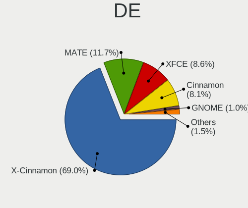

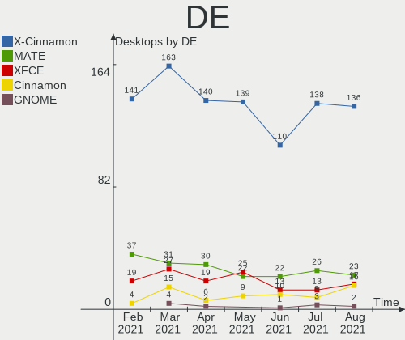

| Name       | Desktops | Percent |
|------------|----------|---------|
| X-Cinnamon | 160      | 64.78%  |
| MATE       | 30       | 12.15%  |
| XFCE       | 27       | 10.93%  |
| Cinnamon   | 16       | 6.48%   |
| Unknown    | 8        | 3.24%   |
| GNOME      | 4        | 1.62%   |
| KDE5       | 1        | 0.4%    |
| KDE        | 1        | 0.4%    |

Display Server
--------------

X11 or Wayland

| Name    | Desktops | Percent |
|---------|----------|---------|
| X11     | 243      | 98.38%  |
| Tty     | 2        | 0.81%   |
| Wayland | 1        | 0.4%    |
| Unknown | 1        | 0.4%    |

Display Manager
---------------

SDDM, LightDM, etc.

| Name    | Desktops | Percent |
|---------|----------|---------|
| Unknown | 196      | 79.35%  |
| TDM     | 49       | 19.84%  |
| SDDM    | 1        | 0.4%    |
| MDM     | 1        | 0.4%    |

OS Lang
-------

Language

| Lang  | Desktops | Percent |
|-------|----------|---------|
| en_US | 72       | 29.15%  |
| de_DE | 30       | 12.15%  |
| pt_BR | 19       | 7.69%   |
| en_GB | 16       | 6.48%   |
| ru_RU | 15       | 6.07%   |
| fr_FR | 13       | 5.26%   |
| en_CA | 13       | 5.26%   |
| it_IT | 10       | 4.05%   |
| pl_PL | 8        | 3.24%   |
| es_ES | 5        | 2.02%   |
| ru_UA | 4        | 1.62%   |
| nl_NL | 4        | 1.62%   |
| es_AR | 4        | 1.62%   |
| en_AU | 4        | 1.62%   |
| C     | 4        | 1.62%   |
| pt_PT | 3        | 1.21%   |
| fi_FI | 2        | 0.81%   |
| es_MX | 2        | 0.81%   |
| en_NZ | 2        | 0.81%   |
| sv_SE | 1        | 0.4%    |
| ro_RO | 1        | 0.4%    |
| nl_BE | 1        | 0.4%    |
| ja_JP | 1        | 0.4%    |
| hu_HU | 1        | 0.4%    |
| hr_HR | 1        | 0.4%    |
| fr_CH | 1        | 0.4%    |
| fr_CA | 1        | 0.4%    |
| es_UY | 1        | 0.4%    |
| es_CL | 1        | 0.4%    |
| es_BO | 1        | 0.4%    |
| en_ZA | 1        | 0.4%    |
| en_IL | 1        | 0.4%    |
| de_CH | 1        | 0.4%    |
| de_AT | 1        | 0.4%    |
| cs_CZ | 1        | 0.4%    |
| bg_BG | 1        | 0.4%    |

Boot Mode
---------

EFI or BIOS

| Mode | Desktops | Percent |
|------|----------|---------|
| BIOS | 161      | 65.18%  |
| EFI  | 86       | 34.82%  |

Filesystem
----------

Type of filesystem

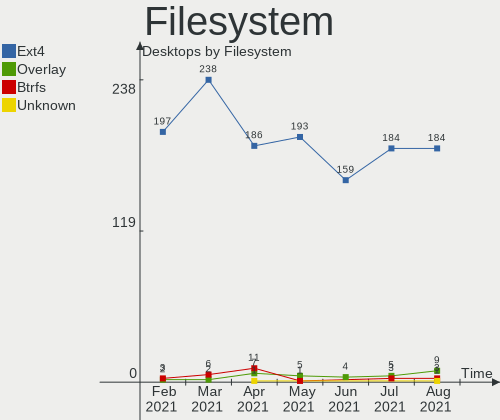

| Type    | Desktops | Percent |
|---------|----------|---------|
| Ext4    | 237      | 95.95%  |
| Btrfs   | 6        | 2.43%   |
| Overlay | 2        | 0.81%   |
| Xfs     | 1        | 0.4%    |
| Ext2    | 1        | 0.4%    |

Part. scheme
------------

Scheme of partitioning

| Type    | Desktops | Percent |
|---------|----------|---------|
| Unknown | 193      | 78.14%  |
| GPT     | 31       | 12.55%  |
| MBR     | 23       | 9.31%   |

Dual Boot with Linux/BSD
------------------------

Hosting more than one Linux/BSD

| Dual boot | Desktops | Percent |
|-----------|----------|---------|
| No        | 228      | 92.31%  |
| Yes       | 19       | 7.69%   |

Dual Boot (Win)
---------------

Hosting Linux and Windows

| Dual boot | Desktops | Percent |
|-----------|----------|---------|
| No        | 212      | 85.83%  |
| Yes       | 35       | 14.17%  |

Country
-------

Geographic location (country)

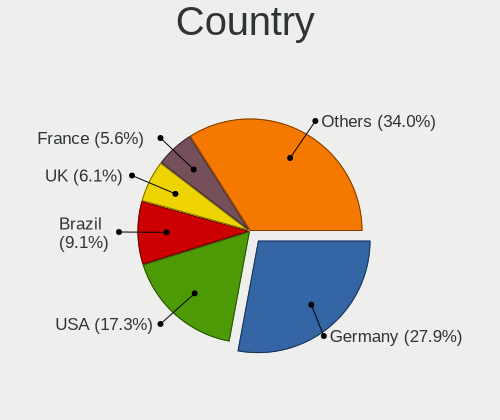

| Country                | Desktops | Percent |
|------------------------|----------|---------|
| USA                    | 44       | 17.81%  |
| Germany                | 31       | 12.55%  |
| Brazil                 | 24       | 9.72%   |
| Canada                 | 16       | 6.48%   |
| UK                     | 14       | 5.67%   |
| France                 | 13       | 5.26%   |
| Russia                 | 10       | 4.05%   |
| Poland                 | 8        | 3.24%   |
| Italy                  | 7        | 2.83%   |
| Ukraine                | 6        | 2.43%   |
| Switzerland            | 6        | 2.43%   |
| Argentina              | 5        | 2.02%   |
| Spain                  | 4        | 1.62%   |
| Sweden                 | 3        | 1.21%   |
| Portugal               | 3        | 1.21%   |
| Finland                | 3        | 1.21%   |
| Bulgaria               | 3        | 1.21%   |
| Austria                | 3        | 1.21%   |
| Australia              | 3        | 1.21%   |
| Serbia                 | 2        | 0.81%   |
| New Zealand            | 2        | 0.81%   |
| Netherlands            | 2        | 0.81%   |
| Mexico                 | 2        | 0.81%   |
| Latvia                 | 2        | 0.81%   |
| Japan                  | 2        | 0.81%   |
| Israel                 | 2        | 0.81%   |
| Hungary                | 2        | 0.81%   |
| Czechia                | 2        | 0.81%   |
| Costa Rica             | 2        | 0.81%   |
| Bosnia and Herzegovina | 2        | 0.81%   |
| Belgium                | 2        | 0.81%   |
| Belarus                | 2        | 0.81%   |
| Uruguay                | 1        | 0.4%    |
| Taiwan                 | 1        | 0.4%    |
| South Africa           | 1        | 0.4%    |
| Slovakia               | 1        | 0.4%    |
| Romania                | 1        | 0.4%    |
| Qatar                  | 1        | 0.4%    |
| Peru                   | 1        | 0.4%    |
| Montenegro             | 1        | 0.4%    |
| Lithuania              | 1        | 0.4%    |
| Iran                   | 1        | 0.4%    |
| India                  | 1        | 0.4%    |
| Croatia                | 1        | 0.4%    |
| Burkina Faso           | 1        | 0.4%    |
| Bolivia                | 1        | 0.4%    |
| Angola                 | 1        | 0.4%    |

City
----

Geographic location (city)

| City                  | Desktops | Percent |
|-----------------------|----------|---------|
| Berlin                | 5        | 2.02%   |
| Vienna                | 3        | 1.21%   |
| São Paulo            | 3        | 1.21%   |
| Zurich                | 2        | 0.81%   |
| Windsor               | 2        | 0.81%   |
| Warsaw                | 2        | 0.81%   |
| Toronto               | 2        | 0.81%   |
| Tel Aviv              | 2        | 0.81%   |
| St Petersburg         | 2        | 0.81%   |
| Paris                 | 2        | 0.81%   |
| Moscow                | 2        | 0.81%   |
| Minsk                 | 2        | 0.81%   |
| Miami                 | 2        | 0.81%   |
| La Grande             | 2        | 0.81%   |
| Helsinki              | 2        | 0.81%   |
| Ganterschwil          | 2        | 0.81%   |
| Florianópolis        | 2        | 0.81%   |
| Córdoba              | 2        | 0.81%   |
| Bremen                | 2        | 0.81%   |
| Belgrade              | 2        | 0.81%   |
| Auckland              | 2        | 0.81%   |
| Zagreb                | 1        | 0.4%    |
| West Jordan           | 1        | 0.4%    |
| Waterloo              | 1        | 0.4%    |
| Wasilla               | 1        | 0.4%    |
| Walthamstow           | 1        | 0.4%    |
| Volvera               | 1        | 0.4%    |
| Volgograd             | 1        | 0.4%    |
| Vladimir              | 1        | 0.4%    |
| Vilnius               | 1        | 0.4%    |
| Ville-la-Grand        | 1        | 0.4%    |
| Vila Velha            | 1        | 0.4%    |
| Vancouver             | 1        | 0.4%    |
| Valenciennes          | 1        | 0.4%    |
| Union City            | 1        | 0.4%    |
| Turku                 | 1        | 0.4%    |
| Tulsa                 | 1        | 0.4%    |
| Trenton               | 1        | 0.4%    |
| Trajano de Morais     | 1        | 0.4%    |
| Tokyo                 | 1        | 0.4%    |
| Teslic                | 1        | 0.4%    |
| Tehran                | 1        | 0.4%    |
| Taubate               | 1        | 0.4%    |
| Szigetszentmiklos     | 1        | 0.4%    |
| Stratford             | 1        | 0.4%    |
| Stoke-on-Trent        | 1        | 0.4%    |
| Stockholm             | 1        | 0.4%    |
| St. John's            | 1        | 0.4%    |
| Springfield           | 1        | 0.4%    |
| Spokane               | 1        | 0.4%    |
| Sorocaba              | 1        | 0.4%    |
| Sofia                 | 1        | 0.4%    |
| Slough                | 1        | 0.4%    |
| Skawina               | 1        | 0.4%    |
| Sioux Falls           | 1        | 0.4%    |
| Shinjuku              | 1        | 0.4%    |
| Seattle               | 1        | 0.4%    |
| Scunthorpe            | 1        | 0.4%    |
| Schonbuhl             | 1        | 0.4%    |
| Sao Jose do Rio Preto | 1        | 0.4%    |

Vendor
------

Motherboard manufacturer

| Name                | Desktops | Percent |
|---------------------|----------|---------|
| ASUSTek Computer    | 66       | 26.72%  |
| Gigabyte Technology | 36       | 14.57%  |
| ASRock              | 27       | 10.93%  |
| Dell                | 24       | 9.72%   |
| MSI                 | 23       | 9.31%   |
| Hewlett-Packard     | 16       | 6.48%   |
| Intel               | 7        | 2.83%   |
| Acer                | 6        | 2.43%   |
| Pegatron            | 5        | 2.02%   |
| Lenovo              | 5        | 2.02%   |
| Unknown             | 4        | 1.62%   |
| Medion              | 3        | 1.21%   |
| ECS                 | 3        | 1.21%   |
| Supermicro          | 2        | 0.81%   |
| Shuttle             | 2        | 0.81%   |
| Biostar             | 2        | 0.81%   |
| AZW                 | 2        | 0.81%   |
| TPV-INVENTA         | 1        | 0.4%    |
| Semp Toshiba        | 1        | 0.4%    |
| Positivo            | 1        | 0.4%    |
| PCWare              | 1        | 0.4%    |
| Packard Bell        | 1        | 0.4%    |
| Minix               | 1        | 0.4%    |
| Koloe               | 1        | 0.4%    |
| Inventec            | 1        | 0.4%    |
| HARDKERNEL          | 1        | 0.4%    |
| Gateway             | 1        | 0.4%    |
| Fujitsu Siemens     | 1        | 0.4%    |
| Foxconn             | 1        | 0.4%    |
| EVGA                | 1        | 0.4%    |
| BCM                 | 1        | 0.4%    |

Model
-----

Motherboard model

| Name                            | Desktops | Percent |
|---------------------------------|----------|---------|
| Dell OptiPlex 7010              | 5        | 2.02%   |
| ASUS All Series                 | 5        | 2.02%   |
| MSI MS-7693                     | 4        | 1.62%   |
| Unknown                         | 4        | 1.62%   |
| MSI MS-7721                     | 3        | 1.21%   |
| ASUS PRIME B350-PLUS            | 3        | 1.21%   |
| HP EliteDesk 800 G1 SFF         | 2        | 0.81%   |
| HP Compaq 8200 Elite CMT PC     | 2        | 0.81%   |
| Gigabyte Z97X-Gaming 3          | 2        | 0.81%   |
| Gigabyte G31M-ES2L              | 2        | 0.81%   |
| Gigabyte B450M DS3H             | 2        | 0.81%   |
| Dell OptiPlex 790               | 2        | 0.81%   |
| Dell OptiPlex 390               | 2        | 0.81%   |
| Dell OptiPlex 3020              | 2        | 0.81%   |
| ASUS ROG STRIX B450-F GAMING    | 2        | 0.81%   |
| ASUS PRIME X370-PRO             | 2        | 0.81%   |
| ASUS P8H67-M EVO                | 2        | 0.81%   |
| ASRock B550M Pro4               | 2        | 0.81%   |
| ASRock B450M Pro4               | 2        | 0.81%   |
| TPV-INVENTA 18-2003LA           | 1        | 0.4%    |
| Supermicro X9DAi                | 1        | 0.4%    |
| Supermicro P4DMS                | 1        | 0.4%    |
| Shuttle XH61V                   | 1        | 0.4%    |
| Shuttle SZ77                    | 1        | 0.4%    |
| Semp Toshiba STI                | 1        | 0.4%    |
| Positivo POS-MIG31AG            | 1        | 0.4%    |
| Pegatron WC889AA-ABF 600-1130fr | 1        | 0.4%    |
| Pegatron p7-1219                | 1        | 0.4%    |
| Pegatron IPX41-D3               | 1        | 0.4%    |
| Pegatron IPMSB-H61              | 1        | 0.4%    |
| Pegatron 27-1010eg              | 1        | 0.4%    |
| PCWare IPX1800E2                | 1        | 0.4%    |
| Packard Bell imedia S3810       | 1        | 0.4%    |
| MSI WC701AA-UUG HPE-120be       | 1        | 0.4%    |
| MSI MS-7C95                     | 1        | 0.4%    |
| MSI MS-7C86                     | 1        | 0.4%    |
| MSI MS-7C37                     | 1        | 0.4%    |
| MSI MS-7C02                     | 1        | 0.4%    |
| MSI MS-7B98                     | 1        | 0.4%    |
| MSI MS-7B79                     | 1        | 0.4%    |
| MSI MS-7B54                     | 1        | 0.4%    |
| MSI MS-7B51                     | 1        | 0.4%    |
| MSI MS-7B48                     | 1        | 0.4%    |
| MSI MS-7B33                     | 1        | 0.4%    |
| MSI MS-7971                     | 1        | 0.4%    |
| MSI MS-7895                     | 1        | 0.4%    |
| MSI MS-7823                     | 1        | 0.4%    |
| MSI MS-7817                     | 1        | 0.4%    |
| MSI CML-U PRO Cubi 5 (MS-B183)  | 1        | 0.4%    |
| Minix D2550-HD V1.0             | 1        | 0.4%    |
| Medion MS-7728                  | 1        | 0.4%    |
| Medion MS-7708                  | 1        | 0.4%    |
| Medion MS-7621                  | 1        | 0.4%    |
| Lenovo ThinkStation C20 4263BA7 | 1        | 0.4%    |
| Lenovo ThinkCentre M92z 3325AG6 | 1        | 0.4%    |
| Lenovo ThinkCentre M72e 3598E3U | 1        | 0.4%    |
| Lenovo ThinkCentre M72e 3267AP5 | 1        | 0.4%    |
| Lenovo ThinkCentre M57e 6176A13 | 1        | 0.4%    |
| Koloe Thurley                   | 1        | 0.4%    |
| Inventec Z CLASS                | 1        | 0.4%    |

Model Family
------------

Motherboard model prefix

| Name                  | Desktops | Percent |
|-----------------------|----------|---------|
| Dell OptiPlex         | 18       | 7.29%   |
| ASUS PRIME            | 13       | 5.26%   |
| HP Compaq             | 8        | 3.24%   |
| ASUS TUF              | 6        | 2.43%   |
| ASUS ROG              | 6        | 2.43%   |
| Acer Aspire           | 6        | 2.43%   |
| ASUS All              | 5        | 2.02%   |
| MSI MS-7693           | 4        | 1.62%   |
| Lenovo ThinkCentre    | 4        | 1.62%   |
| ASUS M5A97            | 4        | 1.62%   |
| Unknown               | 4        | 1.62%   |
| MSI MS-7721           | 3        | 1.21%   |
| Gigabyte B450M        | 3        | 1.21%   |
| Dell Precision        | 3        | 1.21%   |
| ASRock B450M          | 3        | 1.21%   |
| Intel H55             | 2        | 0.81%   |
| HP EliteDesk          | 2        | 0.81%   |
| Gigabyte Z97X-Gaming  | 2        | 0.81%   |
| Gigabyte G31M-ES2L    | 2        | 0.81%   |
| Gigabyte B450         | 2        | 0.81%   |
| Gigabyte A320M-S2H    | 2        | 0.81%   |
| Dell Inspiron         | 2        | 0.81%   |
| AZW Gemini            | 2        | 0.81%   |
| ASUS P8H67-M          | 2        | 0.81%   |
| ASUS M5A78L-M         | 2        | 0.81%   |
| ASRock B550M          | 2        | 0.81%   |
| ASRock B550           | 2        | 0.81%   |
| TPV-INVENTA 18-2003LA | 1        | 0.4%    |
| Supermicro X9DAi      | 1        | 0.4%    |
| Supermicro P4DMS      | 1        | 0.4%    |
| Shuttle XH61V         | 1        | 0.4%    |
| Shuttle SZ77          | 1        | 0.4%    |
| Semp Toshiba STI      | 1        | 0.4%    |
| Positivo POS-MIG31AG  | 1        | 0.4%    |
| Pegatron WC889AA-ABF  | 1        | 0.4%    |
| Pegatron p7-1219      | 1        | 0.4%    |
| Pegatron IPX41-D3     | 1        | 0.4%    |
| Pegatron IPMSB-H61    | 1        | 0.4%    |
| Pegatron 27-1010eg    | 1        | 0.4%    |
| PCWare IPX1800E2      | 1        | 0.4%    |
| Packard Bell imedia   | 1        | 0.4%    |
| MSI WC701AA-UUG       | 1        | 0.4%    |
| MSI MS-7C95           | 1        | 0.4%    |
| MSI MS-7C86           | 1        | 0.4%    |
| MSI MS-7C37           | 1        | 0.4%    |
| MSI MS-7C02           | 1        | 0.4%    |
| MSI MS-7B98           | 1        | 0.4%    |
| MSI MS-7B79           | 1        | 0.4%    |
| MSI MS-7B54           | 1        | 0.4%    |
| MSI MS-7B51           | 1        | 0.4%    |
| MSI MS-7B48           | 1        | 0.4%    |
| MSI MS-7B33           | 1        | 0.4%    |
| MSI MS-7971           | 1        | 0.4%    |
| MSI MS-7895           | 1        | 0.4%    |
| MSI MS-7823           | 1        | 0.4%    |
| MSI MS-7817           | 1        | 0.4%    |
| MSI CML-U             | 1        | 0.4%    |
| Minix D2550-HD        | 1        | 0.4%    |
| Medion MS-7728        | 1        | 0.4%    |
| Medion MS-7708        | 1        | 0.4%    |

MFG Year
--------

Motherboard manufacture year

| Year | Desktops | Percent |
|------|----------|---------|
| 2020 | 38       | 15.38%  |
| 2019 | 25       | 10.12%  |
| 2013 | 22       | 8.91%   |
| 2018 | 21       | 8.5%    |
| 2015 | 18       | 7.29%   |
| 2012 | 17       | 6.88%   |
| 2011 | 17       | 6.88%   |
| 2010 | 17       | 6.88%   |
| 2009 | 13       | 5.26%   |
| 2008 | 11       | 4.45%   |
| 2017 | 10       | 4.05%   |
| 2021 | 9        | 3.64%   |
| 2016 | 8        | 3.24%   |
| 2014 | 8        | 3.24%   |
| 2007 | 5        | 2.02%   |
| 2005 | 4        | 1.62%   |
| 2006 | 2        | 0.81%   |
| 2004 | 1        | 0.4%    |
| 2003 | 1        | 0.4%    |

Form Factor
-----------

Physical design of the computer

| Name    | Desktops | Percent |
|---------|----------|---------|
| Desktop | 247      | 100%    |

Secure Boot
-----------

Enabled or disabled

| State    | Desktops | Percent |
|----------|----------|---------|
| Disabled | 241      | 97.57%  |
| Enabled  | 6        | 2.43%   |

Coreboot
--------

Have coreboot on board

| Used | Desktops | Percent |
|------|----------|---------|
| No   | 247      | 100%    |

RAM Size
--------

Total RAM memory

| Size in GB      | Desktops | Percent |
|-----------------|----------|---------|
| 3.01-4.0        | 55       | 22.27%  |
| 16.01-24.0      | 55       | 22.27%  |
| 8.01-16.0       | 48       | 19.43%  |
| 4.01-8.0        | 42       | 17%     |
| 32.01-64.0      | 28       | 11.34%  |
| 2.01-3.0        | 5        | 2.02%   |
| 1.01-2.0        | 5        | 2.02%   |
| 24.01-32.0      | 4        | 1.62%   |
| 64.01-256.0     | 2        | 0.81%   |
| 0.51-1.0        | 2        | 0.81%   |
| More than 256.0 | 1        | 0.4%    |

RAM Used
--------

Used RAM memory

| Used GB    | Desktops | Percent |
|------------|----------|---------|
| 1.01-2.0   | 105      | 42.51%  |
| 2.01-3.0   | 70       | 28.34%  |
| 3.01-4.0   | 22       | 8.91%   |
| 4.01-8.0   | 21       | 8.5%    |
| 0.51-1.0   | 19       | 7.69%   |
| 8.01-16.0  | 8        | 3.24%   |
| 16.01-24.0 | 1        | 0.4%    |
| 0.01-0.5   | 1        | 0.4%    |

Has CD-ROM
----------

Has CD-ROM on board

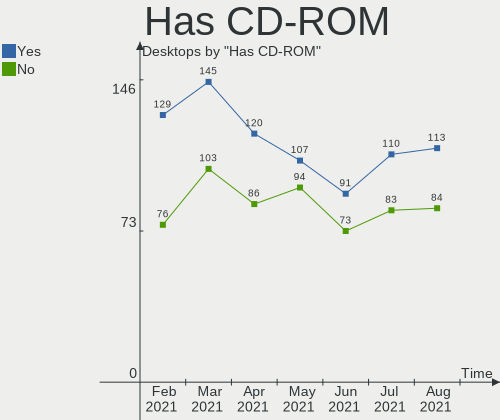

| Presented | Desktops | Percent |
|-----------|----------|---------|
| Yes       | 145      | 58.7%   |
| No        | 102      | 41.3%   |

Total Drives
------------

Number of drives on board

| Drives | Desktops | Percent |
|--------|----------|---------|
| 1      | 96       | 38.87%  |
| 2      | 77       | 31.17%  |
| 3      | 38       | 15.38%  |
| 4      | 24       | 9.72%   |
| 5      | 5        | 2.02%   |
| 6      | 3        | 1.21%   |
| 8      | 2        | 0.81%   |
| 9      | 1        | 0.4%    |
| 7      | 1        | 0.4%    |

Has Ethernet
------------

Has Ethernet on board

| Presented | Desktops | Percent |
|-----------|----------|---------|
| Yes       | 244      | 98.79%  |
| No        | 3        | 1.21%   |

Has WiFi
--------

Has WiFi module

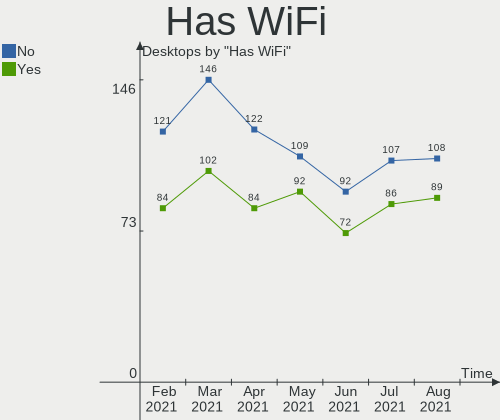

| Presented | Desktops | Percent |
|-----------|----------|---------|
| No        | 146      | 59.11%  |
| Yes       | 101      | 40.89%  |

Has Bluetooth
-------------

Has Bluetooth module

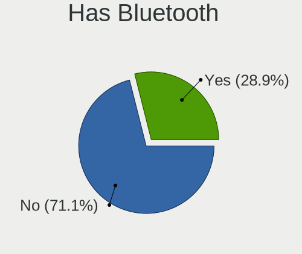

| Presented | Desktops | Percent |
|-----------|----------|---------|
| No        | 196      | 79.35%  |
| Yes       | 51       | 20.65%  |

Drive Vendor
------------

Hard drive vendors

| Vendor                    | Desktops | Drives | Percent |
|---------------------------|----------|--------|---------|
| WDC                       | 94       | 118    | 21.66%  |
| Seagate                   | 82       | 120    | 18.89%  |
| Samsung Electronics       | 58       | 81     | 13.36%  |
| Kingston                  | 25       | 26     | 5.76%   |
| Hitachi                   | 23       | 24     | 5.3%    |
| SanDisk                   | 18       | 20     | 4.15%   |
| Toshiba                   | 16       | 16     | 3.69%   |
| Crucial                   | 14       | 17     | 3.23%   |
| Unknown                   | 9        | 10     | 2.07%   |
| A-DATA Technology         | 9        | 10     | 2.07%   |
| Maxtor                    | 8        | 9      | 1.84%   |
| HGST                      | 7        | 7      | 1.61%   |
| Phison                    | 6        | 7      | 1.38%   |
| Intel                     | 5        | 6      | 1.15%   |
| SPCC                      | 4        | 5      | 0.92%   |
| China                     | 4        | 4      | 0.92%   |
| JMicron                   | 3        | 3      | 0.69%   |
| Intenso                   | 3        | 3      | 0.69%   |
| Corsair                   | 3        | 3      | 0.69%   |
| Apacer                    | 3        | 3      | 0.69%   |
| XPG                       | 2        | 2      | 0.46%   |
| Transcend                 | 2        | 3      | 0.46%   |
| Team                      | 2        | 2      | 0.46%   |
| SK Hynix                  | 2        | 2      | 0.46%   |
| PNY                       | 2        | 4      | 0.46%   |
| PLEXTOR                   | 2        | 2      | 0.46%   |
| Micron/Crucial Technology | 2        | 2      | 0.46%   |
| Micron Technology         | 2        | 2      | 0.46%   |
| LITEON                    | 2        | 2      | 0.46%   |
| GOODRAM                   | 2        | 2      | 0.46%   |
| Fujitsu                   | 2        | 2      | 0.46%   |
| ASMT                      | 2        | 3      | 0.46%   |
| WD MediaMax               | 1        | 1      | 0.23%   |
| Vaseky                    | 1        | 2      | 0.23%   |
| TO Exter                  | 1        | 1      | 0.23%   |
| THU                       | 1        | 1      | 0.23%   |
| T-FORCE                   | 1        | 1      | 0.23%   |
| Silicon Motion            | 1        | 1      | 0.23%   |
| Patriot                   | 1        | 1      | 0.23%   |
| OCZ                       | 1        | 1      | 0.23%   |
| Lexar                     | 1        | 1      | 0.23%   |
| KIOXIA                    | 1        | 1      | 0.23%   |
| KingFast                  | 1        | 1      | 0.23%   |
| Inateck                   | 1        | 1      | 0.23%   |
| IBM-ESXS                  | 1        | 1      | 0.23%   |
| HPE                       | 1        | 1      | 0.23%   |
| External                  | 1        | 1      | 0.23%   |
| CLOVER                    | 1        | 1      | 0.23%   |

Drive Model
-----------

Hard drive models

| Model                              | Desktops | Percent |
|------------------------------------|----------|---------|
| Kingston SA400S37240G 240GB SSD    | 10       | 1.98%   |
| Samsung SSD 860 EVO 1TB            | 9        | 1.78%   |
| Seagate ST1000DM010-2EP102 1TB     | 8        | 1.58%   |
| Toshiba DT01ACA100 1TB             | 6        | 1.19%   |
| WDC WD10EZEX-08WN4A0 1TB           | 5        | 0.99%   |
| Seagate ST2000DM008-2FR102 2TB     | 5        | 0.99%   |
| Samsung SSD 850 EVO 250GB          | 5        | 0.99%   |
| WDC WDS240G2G0A-00JH30 240GB SSD   | 4        | 0.79%   |
| Unknown SD/MMC/MS PRO 128GB        | 4        | 0.79%   |
| Seagate ST4000DM004-2CV104 4TB     | 4        | 0.79%   |
| Seagate ST3500418AS 500GB          | 4        | 0.79%   |
| Seagate ST31000524AS 1TB           | 4        | 0.79%   |
| Seagate ST1000DM003-1CH162 1TB     | 4        | 0.79%   |
| Samsung SSD 860 EVO 500GB          | 4        | 0.79%   |
| Samsung SSD 860 EVO 250GB          | 4        | 0.79%   |
| Samsung SSD 850 EVO 500GB          | 4        | 0.79%   |
| Samsung NVMe SSD Drive 500GB       | 4        | 0.79%   |
| Crucial CT240BX500SSD1 240GB       | 4        | 0.79%   |
| Crucial CT1000MX500SSD1 1TB        | 4        | 0.79%   |
| WDC WD5000AAKX-60U6AA0 500GB       | 3        | 0.59%   |
| WDC WD20EZRX-00D8PB0 2TB           | 3        | 0.59%   |
| Toshiba DT01ACA300 3TB             | 3        | 0.59%   |
| Seagate ST1000DM003-1SB10C 1TB     | 3        | 0.59%   |
| SanDisk SDSSDA240G 240GB           | 3        | 0.59%   |
| A-DATA SU630 240GB SSD             | 3        | 0.59%   |
| XPG NVMe SSD Drive 1024GB          | 2        | 0.4%    |
| WDC WDS100T2B0B-00YS70 1TB SSD     | 2        | 0.4%    |
| WDC WD5000AZRX-00L4HB0 500GB       | 2        | 0.4%    |
| WDC WD5000AAKX-00ERMA0 500GB       | 2        | 0.4%    |
| WDC WD3200AAJS-56B4A0 320GB        | 2        | 0.4%    |
| WDC WD20EZRZ-00Z5HB0 2TB           | 2        | 0.4%    |
| WDC WD20EARS-00MVWB0 2TB           | 2        | 0.4%    |
| WDC WD10JPVX-22JC3T0 1TB           | 2        | 0.4%    |
| WDC WD10EZEX-00BN5A0 1TB           | 2        | 0.4%    |
| WDC WD10EARS-22Y5B1 1TB            | 2        | 0.4%    |
| WDC WD10EARS-00Y5B1 1TB            | 2        | 0.4%    |
| WDC WD1003FZEX-00MK2A0 1TB         | 2        | 0.4%    |
| Toshiba HDWD120 2TB                | 2        | 0.4%    |
| Toshiba DT01ACA050 500GB           | 2        | 0.4%    |
| SPCC Solid State Disk 512GB        | 2        | 0.4%    |
| SPCC Solid State Disk 240GB        | 2        | 0.4%    |
| Seagate ST9320325AS 320GB          | 2        | 0.4%    |
| Seagate ST8000VN0022-2EL112 8TB    | 2        | 0.4%    |
| Seagate ST500DM002-1BD142 500GB    | 2        | 0.4%    |
| Seagate ST500DM002-1BC142 500GB    | 2        | 0.4%    |
| Seagate ST3500630AS 500GB          | 2        | 0.4%    |
| Seagate ST3000DM008-2DM166 3TB     | 2        | 0.4%    |
| Seagate ST2000LM007-1R8174 2TB     | 2        | 0.4%    |
| Seagate ST2000DM006-2DM164 2TB     | 2        | 0.4%    |
| Seagate ST2000DM001-1CH164 2TB     | 2        | 0.4%    |
| Seagate ST1000VN002-2EY102 1TB     | 2        | 0.4%    |
| Seagate ST1000LM024 HN-M101MBB 1TB | 2        | 0.4%    |
| Seagate ST1000DM003-1ER162 1TB     | 2        | 0.4%    |
| Seagate Expansion Desk 8TB         | 2        | 0.4%    |
| Seagate BUP Slim SL 2TB            | 2        | 0.4%    |
| SanDisk SSD PLUS 480GB             | 2        | 0.4%    |
| SanDisk SSD PLUS 240GB             | 2        | 0.4%    |
| SanDisk SDSSDP064G 64GB            | 2        | 0.4%    |
| Sandisk NVMe SSD Drive 250GB       | 2        | 0.4%    |
| Samsung SSD 970 EVO Plus 500GB     | 2        | 0.4%    |

HDD Vendor
----------

Hard disk drive vendors

| Vendor              | Desktops | Drives | Percent |
|---------------------|----------|--------|---------|
| WDC                 | 83       | 105    | 34.16%  |
| Seagate             | 82       | 118    | 33.74%  |
| Hitachi             | 23       | 24     | 9.47%   |
| Samsung Electronics | 18       | 20     | 7.41%   |
| Toshiba             | 15       | 15     | 6.17%   |
| Maxtor              | 8        | 9      | 3.29%   |
| HGST                | 7        | 7      | 2.88%   |
| Unknown             | 2        | 3      | 0.82%   |
| Fujitsu             | 2        | 2      | 0.82%   |
| WD MediaMax         | 1        | 1      | 0.41%   |
| TO Exter            | 1        | 1      | 0.41%   |
| HPE                 | 1        | 1      | 0.41%   |

SSD Vendor
----------

Solid state drive vendors

| Vendor              | Desktops | Drives | Percent |
|---------------------|----------|--------|---------|
| Samsung Electronics | 35       | 46     | 23.65%  |
| Kingston            | 24       | 25     | 16.22%  |
| SanDisk             | 16       | 17     | 10.81%  |
| Crucial             | 13       | 16     | 8.78%   |
| WDC                 | 12       | 13     | 8.11%   |
| A-DATA Technology   | 8        | 8      | 5.41%   |
| SPCC                | 4        | 5      | 2.7%    |
| China               | 4        | 4      | 2.7%    |
| Corsair             | 3        | 3      | 2.03%   |
| Apacer              | 3        | 3      | 2.03%   |
| Transcend           | 2        | 3      | 1.35%   |
| Team                | 2        | 2      | 1.35%   |
| SK Hynix            | 2        | 2      | 1.35%   |
| PNY                 | 2        | 4      | 1.35%   |
| PLEXTOR             | 2        | 2      | 1.35%   |
| LITEON              | 2        | 2      | 1.35%   |
| Intenso             | 2        | 2      | 1.35%   |
| GOODRAM             | 2        | 2      | 1.35%   |
| Vaseky              | 1        | 2      | 0.68%   |
| THU                 | 1        | 1      | 0.68%   |
| Seagate             | 1        | 1      | 0.68%   |
| Patriot             | 1        | 1      | 0.68%   |
| OCZ                 | 1        | 1      | 0.68%   |
| Micron Technology   | 1        | 1      | 0.68%   |
| JMicron             | 1        | 1      | 0.68%   |
| Intel               | 1        | 1      | 0.68%   |
| External            | 1        | 1      | 0.68%   |
| ASMT                | 1        | 1      | 0.68%   |

Drive Kind
----------

HDD or SSD

| Kind    | Desktops | Drives | Percent |
|---------|----------|--------|---------|
| HDD     | 185      | 306    | 50.55%  |
| SSD     | 130      | 170    | 35.52%  |
| NVMe    | 34       | 43     | 9.29%   |
| Unknown | 17       | 18     | 4.64%   |

Drive Connector
---------------

SATA, SAS, NVMe, etc.

| Type | Desktops | Drives | Percent |
|------|----------|--------|---------|
| SATA | 238      | 462    | 81.23%  |
| NVMe | 34       | 43     | 11.6%   |
| SAS  | 21       | 32     | 7.17%   |

Drive Size
----------

Size of hard drive

| Size in TB | Desktops | Drives | Percent |
|------------|----------|--------|---------|
| 0.01-0.5   | 174      | 247    | 49.57%  |
| 0.51-1.0   | 107      | 134    | 30.48%  |
| 1.01-2.0   | 40       | 46     | 11.4%   |
| 3.01-4.0   | 13       | 16     | 3.7%    |
| 2.01-3.0   | 12       | 17     | 3.42%   |
| 4.01-10.0  | 5        | 16     | 1.42%   |

Space Total
-----------

Amount of disk space available on the file system

| Size in GB     | Desktops | Percent |
|----------------|----------|---------|
| 101-250        | 72       | 29.15%  |
| 501-1000       | 42       | 17%     |
| 251-500        | 41       | 16.6%   |
| 1001-2000      | 31       | 12.55%  |
| More than 3000 | 22       | 8.91%   |
| 2001-3000      | 15       | 6.07%   |
| 51-100         | 14       | 5.67%   |
| 21-50          | 6        | 2.43%   |
| 1-20           | 2        | 0.81%   |
| Unknown        | 2        | 0.81%   |

Space Used
----------

Amount of used disk space

| Used GB        | Desktops | Percent |
|----------------|----------|---------|
| 21-50          | 58       | 23.48%  |
| 1-20           | 47       | 19.03%  |
| 101-250        | 42       | 17%     |
| 501-1000       | 28       | 11.34%  |
| 51-100         | 23       | 9.31%   |
| 251-500        | 21       | 8.5%    |
| 1001-2000      | 15       | 6.07%   |
| More than 3000 | 8        | 3.24%   |
| 2001-3000      | 3        | 1.21%   |
| Unknown        | 2        | 0.81%   |

Malfunc. Drives
---------------

Drive models with a malfunction

| Model                          | Desktops | Drives | Percent |
|--------------------------------|----------|--------|---------|
| WDC WD5002ABYS-01B1B0 500GB    | 1        | 1      | 7.14%   |
| WDC WD40EZRZ-00WN9B0 4TB       | 1        | 1      | 7.14%   |
| WDC WD3200AAKS-00UU3A0 320GB   | 1        | 1      | 7.14%   |
| WDC WD30EZRX-00DC0B0 3TB       | 1        | 1      | 7.14%   |
| WDC WD2002FAEX-007BA0 2TB      | 1        | 1      | 7.14%   |
| WDC WD10EARS-22Y5B1 1TB        | 1        | 1      | 7.14%   |
| Seagate ST340016A 40GB         | 1        | 1      | 7.14%   |
| Seagate ST31000524AS 1TB       | 1        | 1      | 7.14%   |
| Seagate ST1000VN002-2EY102 1TB | 1        | 1      | 7.14%   |
| SanDisk SDSSDA240G 240GB       | 1        | 1      | 7.14%   |
| MAXTOR STM380215A 80GB         | 1        | 1      | 7.14%   |
| Kingston SHPM2280P2H 240G SSD  | 1        | 1      | 7.14%   |
| HGST HTS541075A9E680 752GB     | 1        | 1      | 7.14%   |
| Crucial CT500P1SSD8 500GB      | 1        | 1      | 7.14%   |

Malfunc. Drive Vendor
---------------------

Vendors of faulty drives

| Vendor   | Desktops | Drives | Percent |
|----------|----------|--------|---------|
| WDC      | 6        | 6      | 42.86%  |
| Seagate  | 3        | 3      | 21.43%  |
| SanDisk  | 1        | 1      | 7.14%   |
| MAXTOR   | 1        | 1      | 7.14%   |
| Kingston | 1        | 1      | 7.14%   |
| HGST     | 1        | 1      | 7.14%   |
| Crucial  | 1        | 1      | 7.14%   |

Malfunc. HDD Vendor
-------------------

Vendors of faulty HDD drives

| Vendor  | Desktops | Drives | Percent |
|---------|----------|--------|---------|
| WDC     | 6        | 6      | 54.55%  |
| Seagate | 3        | 3      | 27.27%  |
| MAXTOR  | 1        | 1      | 9.09%   |
| HGST    | 1        | 1      | 9.09%   |

Malfunc. Drive Kind
-------------------

Kinds of faulty drives

| Kind | Desktops | Drives | Percent |
|------|----------|--------|---------|
| HDD  | 9        | 11     | 75%     |
| SSD  | 2        | 2      | 16.67%  |
| NVMe | 1        | 1      | 8.33%   |

Failed Drives
-------------

Failed drive models

| Model                         | Desktops | Drives | Percent |
|-------------------------------|----------|--------|---------|
| Hitachi HDS721050DLE630 500GB | 1        | 1      | 100%    |

Failed Drive Vendor
-------------------

Failed drive vendors

| Vendor  | Desktops | Drives | Percent |
|---------|----------|--------|---------|
| Hitachi | 1        | 1      | 100%    |

Drive Status
------------

Number of failed and malfunc. drives

| Status   | Desktops | Drives | Percent |
|----------|----------|--------|---------|
| Detected | 198      | 418    | 75%     |
| Works    | 54       | 104    | 20.45%  |
| Malfunc  | 11       | 14     | 4.17%   |
| Failed   | 1        | 1      | 0.38%   |

Storage Vendor
--------------

Storage controller vendors

| Vendor                       | Desktops | Percent |
|------------------------------|----------|---------|
| Intel                        | 156      | 49.52%  |
| AMD                          | 82       | 26.03%  |
| Samsung Electronics          | 13       | 4.13%   |
| Nvidia                       | 11       | 3.49%   |
| JMicron Technology           | 11       | 3.49%   |
| Marvell Technology Group     | 8        | 2.54%   |
| ASMedia Technology           | 8        | 2.54%   |
| Phison Electronics           | 6        | 1.9%    |
| Sandisk                      | 3        | 0.95%   |
| ADATA Technology             | 3        | 0.95%   |
| VIA Technologies             | 2        | 0.63%   |
| Silicon Image                | 2        | 0.63%   |
| Micron/Crucial Technology    | 2        | 0.63%   |
| Kingston Technology Company  | 2        | 0.63%   |
| Adaptec                      | 2        | 0.63%   |
| Toshiba America Info Systems | 1        | 0.32%   |
| Silicon Motion               | 1        | 0.32%   |
| Micron Technology            | 1        | 0.32%   |
| KIOXIA                       | 1        | 0.32%   |

Storage Model
-------------

Storage controller models

| Model                                                                                   | Desktops | Percent |
|-----------------------------------------------------------------------------------------|----------|---------|
| AMD FCH SATA Controller [AHCI mode]                                                     | 42       | 10.05%  |
| Intel 6 Series/C200 Series Chipset Family 6 port Desktop SATA AHCI Controller           | 19       | 4.55%   |
| AMD 400 Series Chipset SATA Controller                                                  | 19       | 4.55%   |
| Intel NM10/ICH7 Family SATA Controller [IDE mode]                                       | 17       | 4.07%   |
| Intel 8 Series/C220 Series Chipset Family 6-port SATA Controller 1 [AHCI mode]          | 17       | 4.07%   |
| AMD SB7x0/SB8x0/SB9x0 SATA Controller [AHCI mode]                                       | 16       | 3.83%   |
| Intel 82801G (ICH7 Family) IDE Controller                                               | 13       | 3.11%   |
| AMD SB7x0/SB8x0/SB9x0 IDE Controller                                                    | 13       | 3.11%   |
| Intel 6 Series/C200 Series Chipset Family Desktop SATA Controller (IDE mode, ports 4-5) | 12       | 2.87%   |
| Intel 6 Series/C200 Series Chipset Family Desktop SATA Controller (IDE mode, ports 0-3) | 12       | 2.87%   |
| Intel Cannon Lake PCH SATA AHCI Controller                                              | 11       | 2.63%   |
| Intel 7 Series/C210 Series Chipset Family 6-port SATA Controller [AHCI mode]            | 10       | 2.39%   |
| AMD Starship/Matisse Chipset SATA Controller [AHCI mode]                                | 10       | 2.39%   |
| AMD SB7x0/SB8x0/SB9x0 SATA Controller [IDE mode]                                        | 10       | 2.39%   |
| Samsung NVMe SSD Controller SM981/PM981/PM983                                           | 8        | 1.91%   |
| ASMedia ASM1062 Serial ATA Controller                                                   | 8        | 1.91%   |
| Intel 5 Series/3400 Series Chipset 6 port SATA AHCI Controller                          | 7        | 1.67%   |
| Intel 200 Series PCH SATA controller [AHCI mode]                                        | 7        | 1.67%   |
| Nvidia MCP61 SATA Controller                                                            | 6        | 1.44%   |
| Nvidia MCP61 IDE                                                                        | 6        | 1.44%   |
| JMicron JMB363 SATA/IDE Controller                                                      | 6        | 1.44%   |
| Intel SATA Controller [RAID mode]                                                       | 6        | 1.44%   |
| Intel Q170/Q150/B150/H170/H110/Z170/CM236 Chipset SATA Controller [AHCI Mode]           | 6        | 1.44%   |
| Intel 9 Series Chipset Family SATA Controller [AHCI Mode]                               | 5        | 1.2%    |
| Intel 82801JI (ICH10 Family) 4 port SATA IDE Controller #1                              | 5        | 1.2%    |
| Intel 82801JI (ICH10 Family) 2 port SATA IDE Controller #2                              | 5        | 1.2%    |
| AMD 300 Series Chipset SATA Controller                                                  | 5        | 1.2%    |
| Phison E16 PCIe4 NVMe Controller                                                        | 4        | 0.96%   |
| Intel 4 Series Chipset PT IDER Controller                                               | 4        | 0.96%   |
| Samsung NVMe SSD Controller SM961/PM961/SM963                                           | 3        | 0.72%   |
| JMicron JMB368 IDE controller                                                           | 3        | 0.72%   |
| Intel SSD 660P Series                                                                   | 3        | 0.72%   |
| Intel Comet Lake SATA AHCI Controller                                                   | 3        | 0.72%   |
| Intel 5 Series/3400 Series Chipset 4 port SATA IDE Controller                           | 3        | 0.72%   |
| Intel 5 Series/3400 Series Chipset 2 port SATA IDE Controller                           | 3        | 0.72%   |
| Intel 400 Series Chipset Family SATA AHCI Controller                                    | 3        | 0.72%   |
| AMD X370 Series Chipset SATA Controller                                                 | 3        | 0.72%   |
| AMD FCH SATA Controller D                                                               | 3        | 0.72%   |
| ADATA XPG SX8200 Pro PCIe Gen3x4 M.2 2280 Solid State Drive                             | 3        | 0.72%   |
| VIA VT6415 PATA IDE Host Controller                                                     | 2        | 0.48%   |
| Sandisk WD Blue SN550 NVMe SSD                                                          | 2        | 0.48%   |
| Phison E12 NVMe Controller                                                              | 2        | 0.48%   |
| Nvidia MCP79 AHCI Controller                                                            | 2        | 0.48%   |
| Micron/Crucial P1 NVMe PCIe SSD                                                         | 2        | 0.48%   |
| Marvell Group 88SE6111/6121 SATA II / PATA Controller                                   | 2        | 0.48%   |
| Intel Celeron/Pentium Silver Processor SATA Controller                                  | 2        | 0.48%   |
| Intel C600/X79 series chipset 6-Port SATA AHCI Controller                               | 2        | 0.48%   |
| Intel 82801JI (ICH10 Family) SATA AHCI Controller                                       | 2        | 0.48%   |
| Intel 82801JD/DO (ICH10 Family) SATA AHCI Controller                                    | 2        | 0.48%   |
| Intel 82801IR/IO/IH (ICH9R/DO/DH) 6 port SATA Controller [AHCI mode]                    | 2        | 0.48%   |
| Intel 82801IR/IO/IH (ICH9R/DO/DH) 4 port SATA Controller [IDE mode]                     | 2        | 0.48%   |
| Intel 82801I (ICH9 Family) 2 port SATA Controller [IDE mode]                            | 2        | 0.48%   |
| AMD FCH IDE Controller                                                                  | 2        | 0.48%   |
| Toshiba America Info Systems BG3 NVMe SSD Controller                                    | 1        | 0.24%   |
| Silicon Motion SM2262/SM2262EN SSD Controller                                           | 1        | 0.24%   |
| Silicon Image SiI 3512 [SATALink/SATARaid] Serial ATA Controller                        | 1        | 0.24%   |
| Silicon Image SiI 3114 [SATALink/SATARaid] Serial ATA Controller                        | 1        | 0.24%   |
| Sandisk WD Black SN750 / PC SN730 NVMe SSD                                              | 1        | 0.24%   |
| Samsung NVMe SSD Controller SM951/PM951                                                 | 1        | 0.24%   |
| Samsung NVMe SSD Controller PM9A1/980PRO                                                | 1        | 0.24%   |

Storage Kind
------------

Kind of storage controller (IDE, SATA, NVMe, SAS, ...)

| Kind | Desktops | Percent |
|------|----------|---------|
| SATA | 193      | 60.31%  |
| IDE  | 79       | 24.69%  |
| NVMe | 34       | 10.63%  |
| RAID | 11       | 3.44%   |
| SCSI | 2        | 0.63%   |
| SAS  | 1        | 0.31%   |

CPU Vendor
----------

Processor vendors

| Vendor | Desktops | Percent |
|--------|----------|---------|
| Intel  | 158      | 63.97%  |
| AMD    | 89       | 36.03%  |

CPU Model
---------

Processor models

| Model                                       | Desktops | Percent |
|---------------------------------------------|----------|---------|
| AMD FX-8350 Eight-Core Processor            | 8        | 3.24%   |
| Intel Core i5-3470 CPU @ 3.20GHz            | 7        | 2.83%   |
| AMD Ryzen 5 3600 6-Core Processor           | 7        | 2.83%   |
| Intel Core i5-4590 CPU @ 3.30GHz            | 4        | 1.62%   |
| Intel Core 2 Duo CPU E8500 @ 3.16GHz        | 4        | 1.62%   |
| AMD Ryzen 7 3700X 8-Core Processor          | 4        | 1.62%   |
| AMD Ryzen 3 2200G with Radeon Vega Graphics | 4        | 1.62%   |
| Intel Pentium CPU G3220 @ 3.00GHz           | 3        | 1.21%   |
| Intel Core i7-8700 CPU @ 3.20GHz            | 3        | 1.21%   |
| Intel Core i7-2600 CPU @ 3.40GHz            | 3        | 1.21%   |
| Intel Core i5-9400F CPU @ 2.90GHz           | 3        | 1.21%   |
| Intel Core i5-2500 CPU @ 3.30GHz            | 3        | 1.21%   |
| Intel Core i5-2400 CPU @ 3.10GHz            | 3        | 1.21%   |
| Intel Core i5 CPU 650 @ 3.20GHz             | 3        | 1.21%   |
| Intel Core i3-8100 CPU @ 3.60GHz            | 3        | 1.21%   |
| Intel Core i3 CPU 550 @ 3.20GHz             | 3        | 1.21%   |
| Intel Core 2 Quad CPU Q9400 @ 2.66GHz       | 3        | 1.21%   |
| Intel Core 2 Duo CPU E8400 @ 3.00GHz        | 3        | 1.21%   |
| AMD Ryzen 7 5800X 8-Core Processor          | 3        | 1.21%   |
| AMD Ryzen 5 2400G with Radeon Vega Graphics | 3        | 1.21%   |
| AMD Ryzen 5 1600 Six-Core Processor         | 3        | 1.21%   |
| Intel Pentium Gold G5400 CPU @ 3.70GHz      | 2        | 0.81%   |
| Intel Pentium Dual-Core CPU E6600 @ 3.06GHz | 2        | 0.81%   |
| Intel Pentium CPU G620 @ 2.60GHz            | 2        | 0.81%   |
| Intel Pentium 4 CPU 3.00GHz                 | 2        | 0.81%   |
| Intel Core i7-6700K CPU @ 4.00GHz           | 2        | 0.81%   |
| Intel Core i7-4790 CPU @ 3.60GHz            | 2        | 0.81%   |
| Intel Core i7-10700 CPU @ 2.90GHz           | 2        | 0.81%   |
| Intel Core i5-9400 CPU @ 2.90GHz            | 2        | 0.81%   |
| Intel Core i5-6600K CPU @ 3.50GHz           | 2        | 0.81%   |
| Intel Core i5-4570 CPU @ 3.20GHz            | 2        | 0.81%   |
| Intel Core i5-2500K CPU @ 3.30GHz           | 2        | 0.81%   |
| Intel Core i5-2320 CPU @ 3.00GHz            | 2        | 0.81%   |
| Intel Core i3-3220T CPU @ 2.80GHz           | 2        | 0.81%   |
| Intel Core i3-3220 CPU @ 3.30GHz            | 2        | 0.81%   |
| Intel Core i3-2120 CPU @ 3.30GHz            | 2        | 0.81%   |
| Intel Core i3-2100 CPU @ 3.10GHz            | 2        | 0.81%   |
| Intel Core i3 CPU 530 @ 2.93GHz             | 2        | 0.81%   |
| AMD Ryzen 7 2700X Eight-Core Processor      | 2        | 0.81%   |
| AMD Ryzen 7 2700 Eight-Core Processor       | 2        | 0.81%   |
| AMD Ryzen 5 2600X Six-Core Processor        | 2        | 0.81%   |
| AMD Ryzen 5 2600 Six-Core Processor         | 2        | 0.81%   |
| AMD Phenom II X6 1090T Processor            | 2        | 0.81%   |
| AMD FX-8370 Eight-Core Processor            | 2        | 0.81%   |
| AMD FX-6300 Six-Core Processor              | 2        | 0.81%   |
| AMD Athlon II X2 250 Processor              | 2        | 0.81%   |
| AMD A4-5300 APU with Radeon HD Graphics     | 2        | 0.81%   |
| Intel Xeon CPU X5670 @ 2.93GHz              | 1        | 0.4%    |
| Intel Xeon CPU X5650 @ 2.67GHz              | 1        | 0.4%    |
| Intel Xeon CPU W3690 @ 3.47GHz              | 1        | 0.4%    |
| Intel Xeon CPU W3680 @ 3.33GHz              | 1        | 0.4%    |
| Intel Xeon CPU E5-2660 v2 @ 2.20GHz         | 1        | 0.4%    |
| Intel Xeon CPU E5-2620 v2 @ 2.10GHz         | 1        | 0.4%    |
| Intel Xeon CPU E3-1245 v5 @ 3.50GHz         | 1        | 0.4%    |
| Intel Xeon CPU 3.06GHz                      | 1        | 0.4%    |
| Intel Xeon CPU 2.40GHz                      | 1        | 0.4%    |
| Intel Pentium Silver J5005 CPU @ 1.50GHz    | 1        | 0.4%    |
| Intel Pentium Dual-Core CPU T4500 @ 2.30GHz | 1        | 0.4%    |
| Intel Pentium Dual-Core CPU E6700 @ 3.20GHz | 1        | 0.4%    |
| Intel Pentium Dual-Core CPU E5700 @ 3.00GHz | 1        | 0.4%    |

CPU Model Family
----------------

Processor model prefix

| Model                   | Desktops | Percent |
|-------------------------|----------|---------|
| Intel Core i5           | 44       | 17.81%  |
| Intel Core i7           | 28       | 11.34%  |
| Intel Core i3           | 21       | 8.5%    |
| AMD Ryzen 5             | 21       | 8.5%    |
| AMD FX                  | 15       | 6.07%   |
| AMD Ryzen 7             | 13       | 5.26%   |
| Intel Core 2 Duo        | 11       | 4.45%   |
| Intel Xeon              | 9        | 3.64%   |
| Intel Pentium           | 9        | 3.64%   |
| Intel Core 2 Quad       | 9        | 3.64%   |
| Intel Celeron           | 8        | 3.24%   |
| Intel Pentium Dual-Core | 7        | 2.83%   |
| AMD Ryzen 3             | 6        | 2.43%   |
| Intel Pentium 4         | 4        | 1.62%   |
| AMD Phenom II X6        | 4        | 1.62%   |
| AMD Phenom II X4        | 3        | 1.21%   |
| AMD Athlon II X2        | 3        | 1.21%   |
| AMD Athlon 64 X2        | 3        | 1.21%   |
| AMD A8                  | 3        | 1.21%   |
| Intel Pentium Gold      | 2        | 0.81%   |
| Intel Core 2            | 2        | 0.81%   |
| AMD Sempron             | 2        | 0.81%   |
| AMD Ryzen 9             | 2        | 0.81%   |
| AMD Phenom              | 2        | 0.81%   |
| AMD A6                  | 2        | 0.81%   |
| AMD A4                  | 2        | 0.81%   |
| AMD A10                 | 2        | 0.81%   |
| Intel Pentium Silver    | 1        | 0.4%    |
| Intel Pentium D         | 1        | 0.4%    |
| Intel Core i9           | 1        | 0.4%    |
| Intel Atom              | 1        | 0.4%    |
| AMD Ryzen 5 PRO         | 1        | 0.4%    |
| AMD Phenom II X2        | 1        | 0.4%    |
| AMD G                   | 1        | 0.4%    |
| AMD E2                  | 1        | 0.4%    |
| AMD E1                  | 1        | 0.4%    |
| AMD Athlon X4           | 1        | 0.4%    |

CPU Cores
---------

Number of processor cores

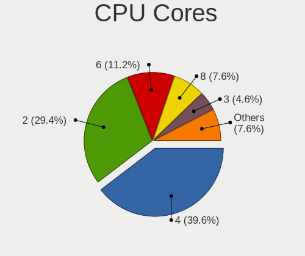

| Number | Desktops | Percent |
|--------|----------|---------|
| 4      | 94       | 38.06%  |
| 2      | 77       | 31.17%  |
| 6      | 38       | 15.38%  |
| 8      | 19       | 7.69%   |
| 1      | 12       | 4.86%   |
| 12     | 3        | 1.21%   |
| 3      | 3        | 1.21%   |
| 20     | 1        | 0.4%    |

CPU Sockets
-----------

Number of sockets

| Number | Desktops | Percent |
|--------|----------|---------|
| 1      | 243      | 98.38%  |
| 2      | 4        | 1.62%   |

CPU Threads
-----------

Threads per core (Hyper-Threading)

| Number | Desktops | Percent |
|--------|----------|---------|
| 2      | 125      | 50.61%  |
| 1      | 122      | 49.39%  |

CPU Op-Modes
------------

CPU Operation Modes (32-bit, 64-bit)

| Op mode        | Desktops | Percent |
|----------------|----------|---------|
| 32-bit, 64-bit | 243      | 98.38%  |
| 32-bit         | 4        | 1.62%   |

CPU Microcode
-------------

Microcode number

| Number     | Desktops | Percent |
|------------|----------|---------|
| 0x206a7    | 25       | 10.12%  |
| Unknown    | 25       | 10.12%  |
| 0x306c3    | 20       | 8.1%    |
| 0x306a9    | 17       | 6.88%   |
| 0x1067a    | 15       | 6.07%   |
| 0x06000852 | 14       | 5.67%   |
| 0x08701021 | 12       | 4.86%   |
| 0x906ea    | 9        | 3.64%   |
| 0x20655    | 7        | 2.83%   |
| 0x0800820d | 6        | 2.43%   |
| 0x506e3    | 5        | 2.02%   |
| 0xa0655    | 4        | 1.62%   |
| 0x206c2    | 4        | 1.62%   |
| 0x10676    | 4        | 1.62%   |
| 0x08101016 | 4        | 1.62%   |
| 0xf29      | 3        | 1.21%   |
| 0x906ed    | 3        | 1.21%   |
| 0x6fb      | 3        | 1.21%   |
| 0x0a201009 | 3        | 1.21%   |
| 0x06003106 | 3        | 1.21%   |
| 0x06001119 | 3        | 1.21%   |
| 0x010000dc | 3        | 1.21%   |
| 0x010000c8 | 3        | 1.21%   |
| 0x906eb    | 2        | 0.81%   |
| 0x706a1    | 2        | 0.81%   |
| 0x6f6      | 2        | 0.81%   |
| 0x306e4    | 2        | 0.81%   |
| 0x20652    | 2        | 0.81%   |
| 0x10677    | 2        | 0.81%   |
| 0x08701013 | 2        | 0.81%   |
| 0x08001138 | 2        | 0.81%   |
| 0x0600611a | 2        | 0.81%   |
| 0x05000119 | 2        | 0.81%   |
| 0x010000c7 | 2        | 0.81%   |
| 0xf47      | 1        | 0.4%    |
| 0xf41      | 1        | 0.4%    |
| 0xf27      | 1        | 0.4%    |
| 0xa0653    | 1        | 0.4%    |
| 0x906ec    | 1        | 0.4%    |
| 0x906e9    | 1        | 0.4%    |
| 0x806ec    | 1        | 0.4%    |
| 0x806eb    | 1        | 0.4%    |
| 0x6fd      | 1        | 0.4%    |
| 0x6f7      | 1        | 0.4%    |
| 0x506c9    | 1        | 0.4%    |
| 0x306f2    | 1        | 0.4%    |
| 0x30678    | 1        | 0.4%    |
| 0x30661    | 1        | 0.4%    |
| 0x106e5    | 1        | 0.4%    |
| 0x106a4    | 1        | 0.4%    |
| 0x10661    | 1        | 0.4%    |
| 0x0a201003 | 1        | 0.4%    |
| 0x08600106 | 1        | 0.4%    |
| 0x08108109 | 1        | 0.4%    |
| 0x0810100b | 1        | 0.4%    |
| 0x08101007 | 1        | 0.4%    |
| 0x0800820b | 1        | 0.4%    |
| 0x08001137 | 1        | 0.4%    |
| 0x08001126 | 1        | 0.4%    |
| 0x07030104 | 1        | 0.4%    |

CPU Microarch
-------------

Microarchitecture

| Name          | Desktops | Percent |
|---------------|----------|---------|
| SandyBridge   | 25       | 10.12%  |
| Haswell       | 24       | 9.72%   |
| Penryn        | 22       | 8.91%   |
| KabyLake      | 20       | 8.1%    |
| IvyBridge     | 19       | 7.69%   |
| Piledriver    | 18       | 7.29%   |
| Zen 2         | 15       | 6.07%   |
| Zen           | 14       | 5.67%   |
| K10           | 14       | 5.67%   |
| Westmere      | 13       | 5.26%   |
| Zen+          | 10       | 4.05%   |
| NetBurst      | 8        | 3.24%   |
| Core          | 8        | 3.24%   |
| Skylake       | 7        | 2.83%   |
| CometLake     | 5        | 2.02%   |
| Zen 3         | 4        | 1.62%   |
| K8 Hammer     | 4        | 1.62%   |
| Steamroller   | 3        | 1.21%   |
| Nehalem       | 2        | 0.81%   |
| Goldmont plus | 2        | 0.81%   |
| Excavator     | 2        | 0.81%   |
| Bulldozer     | 2        | 0.81%   |
| Bobcat        | 2        | 0.81%   |
| Silvermont    | 1        | 0.4%    |
| Puma          | 1        | 0.4%    |
| Goldmont      | 1        | 0.4%    |
| Bonnell       | 1        | 0.4%    |

GPU Vendor
----------

Vendors of graphics cards

| Vendor                     | Desktops | Percent |
|----------------------------|----------|---------|
| AMD                        | 93       | 35.36%  |
| Nvidia                     | 87       | 33.08%  |
| Intel                      | 81       | 30.8%   |
| S3 Graphics                | 1        | 0.38%   |
| Matrox Electronics Systems | 1        | 0.38%   |

GPU Model
---------

Graphics card models

| Model                                                                       | Desktops | Percent |
|-----------------------------------------------------------------------------|----------|---------|
| Intel Xeon E3-1200 v3/4th Gen Core Processor Integrated Graphics Controller | 15       | 5.54%   |
| Intel 2nd Generation Core Processor Family Integrated Graphics Controller   | 15       | 5.54%   |
| AMD Ellesmere [Radeon RX 470/480/570/570X/580/580X/590]                     | 14       | 5.17%   |
| Intel Xeon E3-1200 v2/3rd Gen Core processor Graphics Controller            | 12       | 4.43%   |
| Intel Core Processor Integrated Graphics Controller                         | 7        | 2.58%   |
| AMD Raven Ridge [Radeon Vega Series / Radeon Vega Mobile Series]            | 7        | 2.58%   |
| AMD Cedar [Radeon HD 5000/6000/7350/8350 Series]                            | 7        | 2.58%   |
| Nvidia GT218 [GeForce 210]                                                  | 6        | 2.21%   |
| Intel CometLake-S GT2 [UHD Graphics 630]                                    | 6        | 2.21%   |
| Nvidia GP107 [GeForce GTX 1050 Ti]                                          | 5        | 1.85%   |
| AMD Lexa PRO [Radeon 540/540X/550/550X / RX 540X/550/550X]                  | 5        | 1.85%   |
| Nvidia GM206 [GeForce GTX 960]                                              | 4        | 1.48%   |
| Nvidia GF116 [GeForce GTX 550 Ti]                                           | 4        | 1.48%   |
| Intel HD Graphics 530                                                       | 4        | 1.48%   |
| AMD Park [Mobility Radeon HD 5430]                                          | 4        | 1.48%   |
| AMD Caicos [Radeon HD 6450/7450/8450 / R5 230 OEM]                          | 4        | 1.48%   |
| Nvidia GP106 [GeForce GTX 1060 6GB]                                         | 3        | 1.11%   |
| Nvidia GP104 [GeForce GTX 1070]                                             | 3        | 1.11%   |
| Nvidia GM204 [GeForce GTX 970]                                              | 3        | 1.11%   |
| Nvidia G98 [GeForce 8400 GS Rev. 2]                                         | 3        | 1.11%   |
| Intel CoffeeLake-S GT2 [UHD Graphics 630]                                   | 3        | 1.11%   |
| Intel 82945G/GZ Integrated Graphics Controller                              | 3        | 1.11%   |
| Intel 4 Series Chipset Integrated Graphics Controller                       | 3        | 1.11%   |
| Nvidia TU117 [GeForce GTX 1650]                                             | 2        | 0.74%   |
| Nvidia TU116 [GeForce GTX 1660]                                             | 2        | 0.74%   |
| Nvidia TU116 [GeForce GTX 1660 SUPER]                                       | 2        | 0.74%   |
| Nvidia TU106 [GeForce RTX 2060 Rev. A]                                      | 2        | 0.74%   |
| Nvidia GP106 [GeForce GTX 1060 3GB]                                         | 2        | 0.74%   |
| Nvidia GK208B [GeForce GT 730]                                              | 2        | 0.74%   |
| Nvidia GK208B [GeForce GT 710]                                              | 2        | 0.74%   |
| Nvidia GK106 [GeForce GTX 660]                                              | 2        | 0.74%   |
| Nvidia GK106 [GeForce GTX 650 Ti]                                           | 2        | 0.74%   |
| Nvidia GK104 [GeForce GTX 660 Ti]                                           | 2        | 0.74%   |
| Nvidia GF119 [GeForce GT 520]                                               | 2        | 0.74%   |
| Nvidia GF108 [GeForce GT 630]                                               | 2        | 0.74%   |
| Nvidia C61 [GeForce 6150SE nForce 430]                                      | 2        | 0.74%   |
| AMD Wani [Radeon R5/R6/R7 Graphics]                                         | 2        | 0.74%   |
| AMD Vega 10 XL/XT [Radeon RX Vega 56/64]                                    | 2        | 0.74%   |
| AMD RV730 XT [Radeon HD 4670]                                               | 2        | 0.74%   |
| AMD RV710 [Radeon HD 4350/4550]                                             | 2        | 0.74%   |
| AMD RS880 [Radeon HD 4250]                                                  | 2        | 0.74%   |
| AMD RS780L [Radeon 3000]                                                    | 2        | 0.74%   |
| AMD Redwood XT [Radeon HD 5670/5690/5730]                                   | 2        | 0.74%   |
| AMD Kaveri [Radeon R7 Graphics]                                             | 2        | 0.74%   |
| S3 Graphics 86c775/86c785 [Trio 64V2/DX or /GX]                             | 1        | 0.37%   |
| Nvidia TU116 [GeForce GTX 1660 Ti]                                          | 1        | 0.37%   |
| Nvidia TU116 [GeForce GTX 1650 SUPER]                                       | 1        | 0.37%   |
| Nvidia TU106 [GeForce RTX 2070 Rev. A]                                      | 1        | 0.37%   |
| Nvidia TU104 [GeForce RTX 2070 SUPER]                                       | 1        | 0.37%   |
| Nvidia TU104 [GeForce RTX 2060]                                             | 1        | 0.37%   |
| Nvidia NV43 [GeForce 6600]                                                  | 1        | 0.37%   |
| Nvidia NV25 [GeForce4 Ti 4600]                                              | 1        | 0.37%   |
| Nvidia GT215 [GeForce GT 240]                                               | 1        | 0.37%   |
| Nvidia GP106 [GeForce GTX 1060 6GB Rev. 2]                                  | 1        | 0.37%   |
| Nvidia GP102 [GeForce GTX 1080 Ti]                                          | 1        | 0.37%   |
| Nvidia GM206 [GeForce GTX 950]                                              | 1        | 0.37%   |
| Nvidia GM107 [GeForce GTX 750 Ti]                                           | 1        | 0.37%   |
| Nvidia GK107 [GeForce GTX 650]                                              | 1        | 0.37%   |
| Nvidia GK104 [GeForce GTX 760]                                              | 1        | 0.37%   |
| Nvidia GF119 [GeForce GT 610]                                               | 1        | 0.37%   |

GPU Combo
---------

Combinations of graphics cards

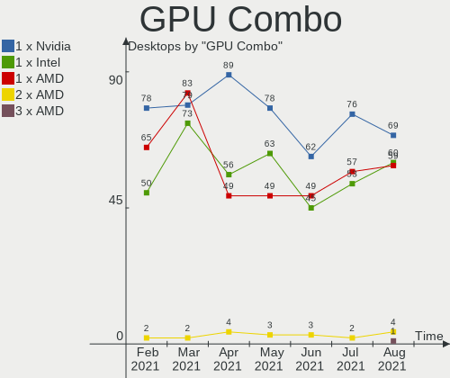

| Name            | Desktops | Percent |
|-----------------|----------|---------|
| 1 x AMD         | 82       | 33.2%   |
| 1 x Nvidia      | 79       | 31.98%  |
| 1 x Intel       | 73       | 29.55%  |
| AMD + Nvidia    | 4        | 1.62%   |
| Intel + Nvidia  | 3        | 1.21%   |
| 2 x AMD         | 2        | 0.81%   |
| Intel + AMD     | 2        | 0.81%   |
| 1 x S3 Graphics | 1        | 0.4%    |
| 1 x Matrox      | 1        | 0.4%    |

GPU Driver
----------

Free vs proprietary

| Driver      | Desktops | Percent |
|-------------|----------|---------|
| Free        | 166      | 67.21%  |
| Proprietary | 70       | 28.34%  |
| Unknown     | 11       | 4.45%   |

GPU Memory
----------

Total video memory

| Size in GB | Desktops | Percent |
|------------|----------|---------|
| Unknown    | 88       | 35.63%  |
| 0.51-1.0   | 39       | 15.79%  |
| 1.01-2.0   | 37       | 14.98%  |
| 0.01-0.5   | 35       | 14.17%  |
| 3.01-4.0   | 21       | 8.5%    |
| 7.01-8.0   | 13       | 5.26%   |
| 5.01-6.0   | 10       | 4.05%   |
| 2.01-3.0   | 2        | 0.81%   |
| 16.01-24.0 | 1        | 0.4%    |
| 8.01-16.0  | 1        | 0.4%    |

Monitor Vendor
--------------

Monitor vendors

| Vendor               | Desktops | Percent |
|----------------------|----------|---------|
| Samsung Electronics  | 40       | 15.63%  |
| Goldstar             | 28       | 10.94%  |
| Hewlett-Packard      | 22       | 8.59%   |
| Dell                 | 22       | 8.59%   |
| Acer                 | 21       | 8.2%    |
| Philips              | 16       | 6.25%   |
| BenQ                 | 14       | 5.47%   |
| Ancor Communications | 13       | 5.08%   |
| Unknown              | 9        | 3.52%   |
| AOC                  | 8        | 3.13%   |
| LG Electronics       | 7        | 2.73%   |
| ViewSonic            | 3        | 1.17%   |
| NEC Computers        | 3        | 1.17%   |
| HannStar             | 3        | 1.17%   |
| Vizio                | 2        | 0.78%   |
| Sony                 | 2        | 0.78%   |
| Lenovo               | 2        | 0.78%   |
| Insignia             | 2        | 0.78%   |
| Iiyama               | 2        | 0.78%   |
| Gateway              | 2        | 0.78%   |
| ASUSTek Computer     | 2        | 0.78%   |
| Westinghouse         | 1        | 0.39%   |
| TXD                  | 1        | 0.39%   |
| Sharp                | 1        | 0.39%   |
| Semp Toshiba         | 1        | 0.39%   |
| Sceptre Tech         | 1        | 0.39%   |
| Sceptre              | 1        | 0.39%   |
| PZG                  | 1        | 0.39%   |
| Plain Tree Systems   | 1        | 0.39%   |
| Pioneer              | 1        | 0.39%   |
| Panasonic            | 1        | 0.39%   |
| Orion                | 1        | 0.39%   |
| ONN                  | 1        | 0.39%   |
| Onkyo                | 1        | 0.39%   |
| OEM                  | 1        | 0.39%   |
| NUL                  | 1        | 0.39%   |
| NFC                  | 1        | 0.39%   |
| NCS                  | 1        | 0.39%   |
| MSI                  | 1        | 0.39%   |
| Medion               | 1        | 0.39%   |
| LLL                  | 1        | 0.39%   |
| KTC                  | 1        | 0.39%   |
| INS                  | 1        | 0.39%   |
| Idek Iiyama          | 1        | 0.39%   |
| Grundig              | 1        | 0.39%   |
| GNR                  | 1        | 0.39%   |
| Gigabyte Technology  | 1        | 0.39%   |
| GDH                  | 1        | 0.39%   |
| FUS                  | 1        | 0.39%   |
| Fujitsu Siemens      | 1        | 0.39%   |
| CVT                  | 1        | 0.39%   |
| Compaq               | 1        | 0.39%   |
| AUS                  | 1        | 0.39%   |
| AGO                  | 1        | 0.39%   |

Monitor Model
-------------

Monitor models

| Model                                                                | Desktops | Percent |
|----------------------------------------------------------------------|----------|---------|
| ViewSonic VX2235wm-EU VSC591E 1680x1050 470x300mm 22.0-inch          | 2        | 0.75%   |
| Samsung Electronics C27F390 SAM0D32 1920x1080 600x340mm 27.2-inch    | 2        | 0.75%   |
| Samsung Electronics C24F390 SAM0D2C 1920x1080 520x290mm 23.4-inch    | 2        | 0.75%   |
| HannStar Hanns.G HW191 HSD8991 1440x900 408x255mm 18.9-inch          | 2        | 0.75%   |
| Goldstar ULTRAWIDE GSM76F9 2560x1080 531x298mm 24.0-inch             | 2        | 0.75%   |
| Goldstar LG ULTRAWIDE GSM59F1 1920x1080 580x240mm 24.7-inch          | 2        | 0.75%   |
| Goldstar 2D FHD LG TV GSM59C6 1920x1080 509x286mm 23.0-inch          | 2        | 0.75%   |
| Dell P2319H DELD0D6 1920x1080 509x286mm 23.0-inch                    | 2        | 0.75%   |
| Dell P190S DEL405B 1280x1024 380x300mm 19.1-inch                     | 2        | 0.75%   |
| Dell 1908FP DEL4025 1280x1024 380x300mm 19.1-inch                    | 2        | 0.75%   |
| Westinghouse WD32HBR105 WET6486 1366x768 700x390mm 31.5-inch         | 1        | 0.38%   |
| Vizio E321VL VIZ0083 1366x768 700x400mm 31.7-inch                    | 1        | 0.38%   |
| Vizio D32h-D1 VIZ1002 1360x768 697x392mm 31.5-inch                   | 1        | 0.38%   |
| ViewSonic LCD Monitor VA2226w-3                                      | 1        | 0.38%   |
| Unknown LCD Monitor XXX AAA 1920x1080                                | 1        | 0.38%   |
| Unknown LCD Monitor XXX AAA 1366x768                                 | 1        | 0.38%   |
| Unknown LCD Monitor SZM DSGi TV 1280x720                             | 1        | 0.38%   |
| Unknown LCD Monitor STK HDTV 1920x1080                               | 1        | 0.38%   |
| Unknown LCD Monitor SAMSUNG 3840x2160                                | 1        | 0.38%   |
| Unknown LCD Monitor SAMSUNG 1920x1080                                | 1        | 0.38%   |
| Unknown LCD Monitor HSG HS245HPB 1920x1080                           | 1        | 0.38%   |
| Unknown LCD Monitor HIS HU32N50H                                     | 1        | 0.38%   |
| Unknown LCD Monitor EMA E19T5W 1440x900                              | 1        | 0.38%   |
| TXD HDMI TXD7825 1600x900 410x260mm 19.1-inch                        | 1        | 0.38%   |
| Sony TV SNY4803 1920x1080 1107x623mm 50.0-inch                       | 1        | 0.38%   |
| Sony LCD Monitor TV 1360x768                                         | 1        | 0.38%   |
| Sharp HDMI SHP0FE8 1920x1080 1152x648mm 52.0-inch                    | 1        | 0.38%   |
| Semp Toshiba MLE1951 STI1951 1366x768 410x230mm 18.5-inch            | 1        | 0.38%   |
| Sceptre Tech Sceptre M27 SPT0ACD 1920x1080 598x336mm 27.0-inch       | 1        | 0.38%   |
| Sceptre LCD Monitor E24 3840x1080                                    | 1        | 0.38%   |
| Samsung Electronics U28E570 SAM0D6F 3840x2160 607x345mm 27.5-inch    | 1        | 0.38%   |
| Samsung Electronics SyncMaster SAM0352 1680x1050 459x296mm 21.5-inch | 1        | 0.38%   |
| Samsung Electronics SyncMaster SAM027D 1680x1050 433x271mm 20.1-inch | 1        | 0.38%   |
| Samsung Electronics SyncMaster SAM0226 1440x900 410x257mm 19.1-inch  | 1        | 0.38%   |
| Samsung Electronics SyncMaster SAM021B 1400x1050 408x300mm 19.9-inch | 1        | 0.38%   |
| Samsung Electronics SyncMaster SAM01F9 1280x1024 376x301mm 19.0-inch | 1        | 0.38%   |
| Samsung Electronics SyncMaster SAM01DF 1280x1024 376x301mm 19.0-inch | 1        | 0.38%   |
| Samsung Electronics SyncMaster SAM01D0 1600x1200 432x324mm 21.3-inch | 1        | 0.38%   |
| Samsung Electronics SyncMaster SAM0197 1280x1024 338x270mm 17.0-inch | 1        | 0.38%   |
| Samsung Electronics SyncMaster SAM011E 1280x1024 338x270mm 17.0-inch | 1        | 0.38%   |
| Samsung Electronics SMT24A550 SAM07B5 1920x1080 531x299mm 24.0-inch  | 1        | 0.38%   |
| Samsung Electronics SMB2330H SAM064B 1920x1080                       | 1        | 0.38%   |
| Samsung Electronics SMB1930N SAM0632 1366x768 410x230mm 18.5-inch    | 1        | 0.38%   |
| Samsung Electronics S27D590 SAM0B49 1920x1080 598x336mm 27.0-inch    | 1        | 0.38%   |
| Samsung Electronics S24E390 SAM0C1A 1920x1080 520x290mm 23.4-inch    | 1        | 0.38%   |
| Samsung Electronics S24D390 SAM0B64 1920x1080 521x293mm 23.5-inch    | 1        | 0.38%   |
| Samsung Electronics S24D300 SAM0B43 1920x1080 531x299mm 24.0-inch    | 1        | 0.38%   |
| Samsung Electronics S24D300 SAM0B42 1920x1080 531x299mm 24.0-inch    | 1        | 0.38%   |
| Samsung Electronics S24B240 SAM08E9 1920x1080 521x293mm 23.5-inch    | 1        | 0.38%   |
| Samsung Electronics S23C350 SAM0A35 1920x1080 510x287mm 23.0-inch    | 1        | 0.38%   |
| Samsung Electronics S22D300 SAM0B3F 1920x1080 477x268mm 21.5-inch    | 1        | 0.38%   |
| Samsung Electronics S22D300 SAM0B3E 1920x1080 477x268mm 21.5-inch    | 1        | 0.38%   |
| Samsung Electronics S22D300 SAM0B3D 1920x1080 477x268mm 21.5-inch    | 1        | 0.38%   |
| Samsung Electronics S19D300 SAM0B36 1366x768 410x230mm 18.5-inch     | 1        | 0.38%   |
| Samsung Electronics LF27T35 SAM707F 1920x1080 600x340mm 27.2-inch    | 1        | 0.38%   |
| Samsung Electronics LCD Monitor U28E590 3840x2160                    | 1        | 0.38%   |
| Samsung Electronics LCD Monitor SyncMaster 1680x1050                 | 1        | 0.38%   |
| Samsung Electronics LCD Monitor SMS23A350H 4480x1080                 | 1        | 0.38%   |
| Samsung Electronics LCD Monitor SMS23A350H                           | 1        | 0.38%   |
| Samsung Electronics LCD Monitor SMS19A100 1366x768                   | 1        | 0.38%   |

Monitor Resolution
------------------

Monitor screen resolution

| Resolution         | Desktops | Percent |
|--------------------|----------|---------|
| 1920x1080 (FHD)    | 117      | 47.56%  |
| 1280x1024 (SXGA)   | 27       | 10.98%  |
| 1680x1050 (WSXGA+) | 15       | 6.1%    |
| 1366x768 (WXGA)    | 14       | 5.69%   |
| 3840x2160 (4K)     | 12       | 4.88%   |
| 1440x900 (WXGA+)   | 10       | 4.07%   |
| 2560x1440 (QHD)    | 7        | 2.85%   |
| Unknown            | 7        | 2.85%   |
| 2560x1080          | 5        | 2.03%   |
| 1920x1200 (WUXGA)  | 5        | 2.03%   |
| 1600x900 (HD+)     | 4        | 1.63%   |
| 1360x768           | 4        | 1.63%   |
| 3440x1440          | 2        | 0.81%   |
| 1920x540           | 2        | 0.81%   |
| 1280x960           | 2        | 0.81%   |
| 5520x2160          | 1        | 0.41%   |
| 4480x1440          | 1        | 0.41%   |
| 4480x1080          | 1        | 0.41%   |
| 3840x1080          | 1        | 0.41%   |
| 3520x1080          | 1        | 0.41%   |
| 3360x1080          | 1        | 0.41%   |
| 2966x900           | 1        | 0.41%   |
| 1600x1200          | 1        | 0.41%   |
| 1400x1050          | 1        | 0.41%   |
| 1280x768           | 1        | 0.41%   |
| 1280x720 (HD)      | 1        | 0.41%   |
| 1152x864           | 1        | 0.41%   |
| 1024x768 (XGA)     | 1        | 0.41%   |

Monitor Diagonal
----------------

Diagonal size in inches

| Inches  | Desktops | Percent |
|---------|----------|---------|
| Unknown | 50       | 20%     |
| 23      | 37       | 14.8%   |
| 21      | 25       | 10%     |
| 27      | 20       | 8%      |
| 19      | 20       | 8%      |
| 24      | 17       | 6.8%    |
| 17      | 12       | 4.8%    |
| 18      | 11       | 4.4%    |
| 31      | 8        | 3.2%    |
| 22      | 8        | 3.2%    |
| 20      | 7        | 2.8%    |
| 34      | 5        | 2%      |
| 15      | 5        | 2%      |
| 84      | 3        | 1.2%    |
| 32      | 3        | 1.2%    |
| 25      | 3        | 1.2%    |
| 72      | 2        | 0.8%    |
| 39      | 2        | 0.8%    |
| 12      | 2        | 0.8%    |
| 55      | 1        | 0.4%    |
| 52      | 1        | 0.4%    |
| 47      | 1        | 0.4%    |
| 46      | 1        | 0.4%    |
| 44      | 1        | 0.4%    |
| 40      | 1        | 0.4%    |
| 38      | 1        | 0.4%    |
| 36      | 1        | 0.4%    |
| 33      | 1        | 0.4%    |
| 16      | 1        | 0.4%    |

Monitor Width
-------------

Physical width

| Width in mm | Desktops | Percent |
|-------------|----------|---------|
| 501-600     | 74       | 29.84%  |
| 401-500     | 57       | 22.98%  |
| Unknown     | 50       | 20.16%  |
| 301-350     | 18       | 7.26%   |
| 351-400     | 14       | 5.65%   |
| 701-800     | 10       | 4.03%   |
| 601-700     | 9        | 3.63%   |
| 1501-2000   | 5        | 2.02%   |
| 801-900     | 4        | 1.61%   |
| 1001-1500   | 4        | 1.61%   |
| 201-300     | 2        | 0.81%   |
| 901-1000    | 1        | 0.4%    |

Aspect Ratio
------------

Proportional relationship between the width and the height

| Ratio   | Desktops | Percent |
|---------|----------|---------|
| 16/9    | 124      | 51.67%  |
| Unknown | 49       | 20.42%  |
| 16/10   | 29       | 12.08%  |
| 5/4     | 24       | 10%     |
| 4/3     | 8        | 3.33%   |
| 21/9    | 5        | 2.08%   |
| 3/2     | 1        | 0.42%   |

Monitor Area
------------

Area in inch²

| Area in inch² | Desktops | Percent |
|----------------|----------|---------|
| 201-250        | 73       | 29.55%  |
| Unknown        | 50       | 20.24%  |
| 151-200        | 38       | 15.38%  |
| 301-350        | 20       | 8.1%    |
| 141-150        | 20       | 8.1%    |
| 351-500        | 17       | 6.88%   |
| More than 1000 | 7        | 2.83%   |
| 251-300        | 7        | 2.83%   |
| 501-1000       | 7        | 2.83%   |
| 101-110        | 3        | 1.21%   |
| 71-80          | 2        | 0.81%   |
| 121-130        | 1        | 0.4%    |
| 111-120        | 1        | 0.4%    |
| 91-100         | 1        | 0.4%    |

Pixel Density
-------------

Pixels per inch

| Density | Desktops | Percent |
|---------|----------|---------|
| 51-100  | 143      | 58.85%  |
| Unknown | 50       | 20.58%  |
| 101-120 | 29       | 11.93%  |
| 1-50    | 12       | 4.94%   |
| 161-240 | 7        | 2.88%   |
| 121-160 | 2        | 0.82%   |

Multiple Monitors
-----------------

Total monitors connected

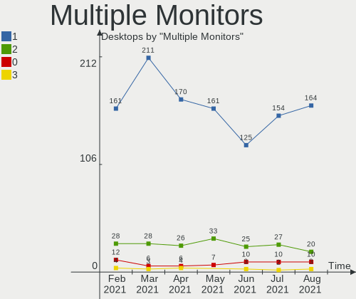

| Total | Desktops | Percent |
|-------|----------|---------|
| 1     | 210      | 85.02%  |
| 2     | 28       | 11.34%  |
| 0     | 6        | 2.43%   |
| 3     | 3        | 1.21%   |

Net Controller Vendor
---------------------

Controller vendors

| Vendor                            | Desktops | Percent |
|-----------------------------------|----------|---------|
| Realtek Semiconductor             | 159      | 45.43%  |
| Intel                             | 74       | 21.14%  |
| Qualcomm Atheros                  | 23       | 6.57%   |
| Ralink Technology                 | 12       | 3.43%   |
| TP-Link                           | 10       | 2.86%   |
| Broadcom Inc. and subsidiaries    | 10       | 2.86%   |
| Ralink                            | 9        | 2.57%   |
| Nvidia                            | 9        | 2.57%   |
| Marvell Technology Group          | 7        | 2%      |
| D-Link                            | 3        | 0.86%   |
| Broadcom Limited                  | 3        | 0.86%   |
| NetGear                           | 2        | 0.57%   |
| Microsoft                         | 2        | 0.57%   |
| IMC Networks                      | 2        | 0.57%   |
| D-Link System                     | 2        | 0.57%   |
| ASUSTek Computer                  | 2        | 0.57%   |
| Aquantia                          | 2        | 0.57%   |
| ZyDAS                             | 1        | 0.29%   |
| Xiaomi                            | 1        | 0.29%   |
| WiseGroup                         | 1        | 0.29%   |
| Uniden                            | 1        | 0.29%   |
| Sundance Technology Inc / IC Plus | 1        | 0.29%   |
| Sitecom Europe                    | 1        | 0.29%   |
| Qualcomm Atheros Communications   | 1        | 0.29%   |
| Qualcomm                          | 1        | 0.29%   |
| Mercucys                          | 1        | 0.29%   |
| MediaTek                          | 1        | 0.29%   |
| Linksys                           | 1        | 0.29%   |
| LG Electronics                    | 1        | 0.29%   |
| HTC (High Tech Computer)          | 1        | 0.29%   |
| Guillemot                         | 1        | 0.29%   |
| Google                            | 1        | 0.29%   |
| Edimax Technology                 | 1        | 0.29%   |
| DisplayLink                       | 1        | 0.29%   |
| Belkin Components                 | 1        | 0.29%   |
| ASIX Electronics                  | 1        | 0.29%   |

Net Controller Model
--------------------

Controller models

| Model                                                                      | Desktops | Percent |
|----------------------------------------------------------------------------|----------|---------|
| Realtek RTL8111/8168/8411 PCI Express Gigabit Ethernet Controller          | 131      | 34.29%  |
| Intel 82579LM Gigabit Network Connection (Lewisville)                      | 16       | 4.19%   |
| Realtek RTL810xE PCI Express Fast Ethernet controller                      | 11       | 2.88%   |
| Intel I211 Gigabit Network Connection                                      | 10       | 2.62%   |
| Intel Wi-Fi 6 AX200                                                        | 9        | 2.36%   |
| Realtek RTL8125 2.5GbE Controller                                          | 8        | 2.09%   |
| Intel Ethernet Connection (7) I219-V                                       | 6        | 1.57%   |
| Ralink MT7601U Wireless Adapter                                            | 5        | 1.31%   |
| Qualcomm Atheros Killer E220x Gigabit Ethernet Controller                  | 5        | 1.31%   |
| Nvidia MCP61 Ethernet                                                      | 5        | 1.31%   |
| Marvell Group 88E8056 PCI-E Gigabit Ethernet Controller                    | 5        | 1.31%   |
| Intel Ethernet Connection (2) I219-V                                       | 5        | 1.31%   |
| TP-Link TL-WN823N v2/v3 [Realtek RTL8192EU]                                | 4        | 1.05%   |
| Realtek RTL88x2bu [AC1200 Techkey]                                         | 4        | 1.05%   |
| Realtek RTL8192CU 802.11n WLAN Adapter                                     | 4        | 1.05%   |
| Ralink RT2870/RT3070 Wireless Adapter                                      | 4        | 1.05%   |
| Realtek RTL8188EUS 802.11n Wireless Network Adapter                        | 3        | 0.79%   |
| Ralink RT5370 Wireless Adapter                                             | 3        | 0.79%   |
| Ralink RT2561/RT61 802.11g PCI                                             | 3        | 0.79%   |
| Qualcomm Atheros AR8151 v2.0 Gigabit Ethernet                              | 3        | 0.79%   |
| Intel Wireless-AC 9560 [Jefferson Peak]                                    | 3        | 0.79%   |
| Intel Ethernet Connection I217-V                                           | 3        | 0.79%   |
| Intel Ethernet Connection I217-LM                                          | 3        | 0.79%   |
| Intel Ethernet Connection (2) I219-LM                                      | 3        | 0.79%   |
| Intel Dual Band Wireless-AC 3168NGW [Stone Peak]                           | 3        | 0.79%   |
| Intel 82567LM-3 Gigabit Network Connection                                 | 3        | 0.79%   |
| TP-Link Archer T2U PLUS [RTL8821AU]                                        | 2        | 0.52%   |
| Realtek RTL8812AE 802.11ac PCIe Wireless Network Adapter                   | 2        | 0.52%   |
| Realtek RTL8169 PCI Gigabit Ethernet Controller                            | 2        | 0.52%   |
| Realtek RTL-8100/8101L/8139 PCI Fast Ethernet Adapter                      | 2        | 0.52%   |
| Ralink RT3090 Wireless 802.11n 1T/1R PCIe                                  | 2        | 0.52%   |
| Qualcomm Atheros Attansic L2 Fast Ethernet                                 | 2        | 0.52%   |
| Qualcomm Atheros AR9485 Wireless Network Adapter                           | 2        | 0.52%   |
| Qualcomm Atheros AR9462 Wireless Network Adapter                           | 2        | 0.52%   |
| Qualcomm Atheros AR9287 Wireless Network Adapter (PCI-Express)             | 2        | 0.52%   |
| Qualcomm Atheros AR8131 Gigabit Ethernet                                   | 2        | 0.52%   |
| Nvidia MCP79 Ethernet                                                      | 2        | 0.52%   |
| Microsoft Xbox 360 Wireless Adapter                                        | 2        | 0.52%   |
| Intel Wireless 8260                                                        | 2        | 0.52%   |
| Intel Wireless 3165                                                        | 2        | 0.52%   |
| Intel Ethernet Connection (11) I219-V                                      | 2        | 0.52%   |
| Intel 82574L Gigabit Network Connection                                    | 2        | 0.52%   |
| Intel 82557/8/9/0/1 Ethernet Pro 100                                       | 2        | 0.52%   |
| IMC Networks Mediao 802.11n WLAN [Realtek RTL8191SU]                       | 2        | 0.52%   |
| D-Link System DWA-140 RangeBooster N Adapter(rev.B2) [Ralink RT3072]       | 2        | 0.52%   |
| Broadcom Inc. and subsidiaries BCM4360 802.11ac Wireless Network Adapter   | 2        | 0.52%   |
| ZyDAS ZD1211 802.11g                                                       | 1        | 0.26%   |
| Xiaomi Mi/Redmi series (RNDIS)                                             | 1        | 0.26%   |
| WiseGroup Deluxe Dance Mat                                                 | 1        | 0.26%   |
| Uniden BC125AT                                                             | 1        | 0.26%   |
| TP-Link TL-WN822N Version 4 RTL8192EU                                      | 1        | 0.26%   |
| TP-Link TL-WN722N v2/v3 [Realtek RTL8188EUS]                               | 1        | 0.26%   |
| TP-Link RTL8812AU Archer T4U 802.11ac                                      | 1        | 0.26%   |
| TP-Link 802.11ac WLAN Adapter                                              | 1        | 0.26%   |
| Sundance Inc / IC Plus IC Plus IP100A Integrated 10/100 Ethernet MAC + PHY | 1        | 0.26%   |
| Sitecom Europe WL-349v3 Wireless Micro Adapter 150N X1 [Realtek RTL8192SU] | 1        | 0.26%   |
| Realtek RTL8821CE 802.11ac PCIe Wireless Network Adapter                   | 1        | 0.26%   |
| Realtek RTL8812AU 802.11a/b/g/n/ac 2T2R DB WLAN Adapter                    | 1        | 0.26%   |
| Realtek RTL8811AU 802.11a/b/g/n/ac WLAN Adapter                            | 1        | 0.26%   |
| Realtek RTL8192EU 802.11b/g/n WLAN Adapter                                 | 1        | 0.26%   |

Wireless Vendor
---------------

Wireless vendors

| Vendor                          | Desktops | Percent |
|---------------------------------|----------|---------|
| Intel                           | 22       | 20.37%  |
| Realtek Semiconductor           | 20       | 18.52%  |
| Ralink Technology               | 12       | 11.11%  |
| TP-Link                         | 10       | 9.26%   |
| Ralink                          | 9        | 8.33%   |
| Qualcomm Atheros                | 9        | 8.33%   |
| Broadcom Inc. and subsidiaries  | 4        | 3.7%    |
| D-Link                          | 3        | 2.78%   |
| NetGear                         | 2        | 1.85%   |
| Microsoft                       | 2        | 1.85%   |
| IMC Networks                    | 2        | 1.85%   |
| D-Link System                   | 2        | 1.85%   |
| ASUSTek Computer                | 2        | 1.85%   |
| ZyDAS                           | 1        | 0.93%   |
| Sitecom Europe                  | 1        | 0.93%   |
| Qualcomm Atheros Communications | 1        | 0.93%   |
| Mercucys                        | 1        | 0.93%   |
| Linksys                         | 1        | 0.93%   |
| Guillemot                       | 1        | 0.93%   |
| Edimax Technology               | 1        | 0.93%   |
| Broadcom Limited                | 1        | 0.93%   |
| Belkin Components               | 1        | 0.93%   |

Wireless Model
--------------

Wireless models

| Model                                                                         | Desktops | Percent |
|-------------------------------------------------------------------------------|----------|---------|
| Intel Wi-Fi 6 AX200                                                           | 9        | 8.26%   |
| Ralink MT7601U Wireless Adapter                                               | 5        | 4.59%   |
| TP-Link TL-WN823N v2/v3 [Realtek RTL8192EU]                                   | 4        | 3.67%   |
| Realtek RTL88x2bu [AC1200 Techkey]                                            | 4        | 3.67%   |
| Realtek RTL8192CU 802.11n WLAN Adapter                                        | 4        | 3.67%   |
| Ralink RT2870/RT3070 Wireless Adapter                                         | 4        | 3.67%   |
| Realtek RTL8188EUS 802.11n Wireless Network Adapter                           | 3        | 2.75%   |
| Ralink RT5370 Wireless Adapter                                                | 3        | 2.75%   |
| Ralink RT2561/RT61 802.11g PCI                                                | 3        | 2.75%   |
| Intel Wireless-AC 9560 [Jefferson Peak]                                       | 3        | 2.75%   |
| Intel Dual Band Wireless-AC 3168NGW [Stone Peak]                              | 3        | 2.75%   |
| TP-Link Archer T2U PLUS [RTL8821AU]                                           | 2        | 1.83%   |
| Realtek RTL8812AE 802.11ac PCIe Wireless Network Adapter                      | 2        | 1.83%   |
| Ralink RT3090 Wireless 802.11n 1T/1R PCIe                                     | 2        | 1.83%   |
| Qualcomm Atheros AR9485 Wireless Network Adapter                              | 2        | 1.83%   |
| Qualcomm Atheros AR9462 Wireless Network Adapter                              | 2        | 1.83%   |
| Qualcomm Atheros AR9287 Wireless Network Adapter (PCI-Express)                | 2        | 1.83%   |
| Microsoft Xbox 360 Wireless Adapter                                           | 2        | 1.83%   |
| Intel Wireless 8260                                                           | 2        | 1.83%   |
| Intel Wireless 3165                                                           | 2        | 1.83%   |
| IMC Networks Mediao 802.11n WLAN [Realtek RTL8191SU]                          | 2        | 1.83%   |
| D-Link System DWA-140 RangeBooster N Adapter(rev.B2) [Ralink RT3072]          | 2        | 1.83%   |
| Broadcom Inc. and subsidiaries BCM4360 802.11ac Wireless Network Adapter      | 2        | 1.83%   |
| ZyDAS ZD1211 802.11g                                                          | 1        | 0.92%   |
| TP-Link TL-WN822N Version 4 RTL8192EU                                         | 1        | 0.92%   |
| TP-Link TL-WN722N v2/v3 [Realtek RTL8188EUS]                                  | 1        | 0.92%   |
| TP-Link RTL8812AU Archer T4U 802.11ac                                         | 1        | 0.92%   |
| TP-Link 802.11ac WLAN Adapter                                                 | 1        | 0.92%   |
| Sitecom Europe WL-349v3 Wireless Micro Adapter 150N X1 [Realtek RTL8192SU]    | 1        | 0.92%   |
| Realtek RTL8821CE 802.11ac PCIe Wireless Network Adapter                      | 1        | 0.92%   |
| Realtek RTL8812AU 802.11a/b/g/n/ac 2T2R DB WLAN Adapter                       | 1        | 0.92%   |
| Realtek RTL8811AU 802.11a/b/g/n/ac WLAN Adapter                               | 1        | 0.92%   |
| Realtek RTL8192EU 802.11b/g/n WLAN Adapter                                    | 1        | 0.92%   |
| Realtek RTL8191SU 802.11n WLAN Adapter                                        | 1        | 0.92%   |
| Realtek RTL8191SEvB Wireless LAN Controller                                   | 1        | 0.92%   |
| Realtek RTL8187B Wireless 802.11g 54Mbps Network Adapter                      | 1        | 0.92%   |
| Realtek RTL8187 Wireless Adapter                                              | 1        | 0.92%   |
| Ralink RT5390R 802.11bgn PCIe Wireless Network Adapter                        | 1        | 0.92%   |
| Ralink RT5390 Wireless 802.11n 1T/1R PCIe                                     | 1        | 0.92%   |
| Ralink RT3290 Wireless 802.11n 1T/1R PCIe                                     | 1        | 0.92%   |
| Ralink RT3092 Wireless 802.11n 2T/2R PCIe                                     | 1        | 0.92%   |
| Qualcomm Atheros TP-Link TL-WN322G v3 / TL-WN422G v2 802.11g [Atheros AR9271] | 1        | 0.92%   |
| Qualcomm Atheros AR93xx Wireless Network Adapter                              | 1        | 0.92%   |
| Qualcomm Atheros AR9285 Wireless Network Adapter (PCI-Express)                | 1        | 0.92%   |
| Qualcomm Atheros AR9227 Wireless Network Adapter                              | 1        | 0.92%   |
| NetGear WNDA3100v3 802.11abgn 2x2:2 [MediaTek MT7632U]                        | 1        | 0.92%   |
| NetGear A6210                                                                 | 1        | 0.92%   |
| Mercucys 802.11n NIC                                                          | 1        | 0.92%   |
| Linksys WUSB54GC v1 802.11g Adapter [Ralink RT73]                             | 1        | 0.92%   |
| Intel Wireless 7265                                                           | 1        | 0.92%   |
| Intel Wireless 3160                                                           | 1        | 0.92%   |
| Intel Comet Lake PCH-LP CNVi WiFi                                             | 1        | 0.92%   |
| Guillemot Hercules HWNUm-300 Wireless N mini [Realtek RTL8191SU]              | 1        | 0.92%   |
| Edimax EW-7811Un 802.11n Wireless Adapter [Realtek RTL8188CUS]                | 1        | 0.92%   |
| D-Link DWA-131 Wireless N Nano Adapter (Rev. E1) [Realtek RTL8192EU]          | 1        | 0.92%   |
| D-Link DWA-123 Wireless N 150 Adapter (rev.D1)                                | 1        | 0.92%   |
| D-Link 802.11 n WLAN                                                          | 1        | 0.92%   |
| Broadcom Limited BCM4306 802.11b/g Wireless LAN Controller                    | 1        | 0.92%   |
| Broadcom Inc. and subsidiaries BCM43228 802.11a/b/g/n                         | 1        | 0.92%   |
| Broadcom Inc. and subsidiaries BCM43225 802.11b/g/n                           | 1        | 0.92%   |

Ethernet Vendor
---------------

Ethernet vendors

| Vendor                            | Desktops | Percent |
|-----------------------------------|----------|---------|
| Realtek Semiconductor             | 154      | 58.11%  |
| Intel                             | 60       | 22.64%  |
| Qualcomm Atheros                  | 16       | 6.04%   |
| Nvidia                            | 9        | 3.4%    |
| Marvell Technology Group          | 7        | 2.64%   |
| Broadcom Inc. and subsidiaries    | 6        | 2.26%   |
| Broadcom Limited                  | 2        | 0.75%   |
| Aquantia                          | 2        | 0.75%   |
| Xiaomi                            | 1        | 0.38%   |
| Sundance Technology Inc / IC Plus | 1        | 0.38%   |
| Qualcomm                          | 1        | 0.38%   |
| MediaTek                          | 1        | 0.38%   |
| LG Electronics                    | 1        | 0.38%   |
| HTC (High Tech Computer)          | 1        | 0.38%   |
| Google                            | 1        | 0.38%   |
| DisplayLink                       | 1        | 0.38%   |
| ASIX Electronics                  | 1        | 0.38%   |

Ethernet Model
--------------

Ethernet models

| Model                                                                          | Desktops | Percent |
|--------------------------------------------------------------------------------|----------|---------|
| Realtek RTL8111/8168/8411 PCI Express Gigabit Ethernet Controller              | 131      | 48.34%  |
| Intel 82579LM Gigabit Network Connection (Lewisville)                          | 16       | 5.9%    |
| Realtek RTL810xE PCI Express Fast Ethernet controller                          | 11       | 4.06%   |
| Intel I211 Gigabit Network Connection                                          | 10       | 3.69%   |
| Realtek RTL8125 2.5GbE Controller                                              | 8        | 2.95%   |
| Intel Ethernet Connection (7) I219-V                                           | 6        | 2.21%   |
| Qualcomm Atheros Killer E220x Gigabit Ethernet Controller                      | 5        | 1.85%   |
| Nvidia MCP61 Ethernet                                                          | 5        | 1.85%   |
| Marvell Group 88E8056 PCI-E Gigabit Ethernet Controller                        | 5        | 1.85%   |
| Intel Ethernet Connection (2) I219-V                                           | 5        | 1.85%   |
| Qualcomm Atheros AR8151 v2.0 Gigabit Ethernet                                  | 3        | 1.11%   |
| Intel Ethernet Connection I217-V                                               | 3        | 1.11%   |
| Intel Ethernet Connection I217-LM                                              | 3        | 1.11%   |
| Intel Ethernet Connection (2) I219-LM                                          | 3        | 1.11%   |
| Intel 82567LM-3 Gigabit Network Connection                                     | 3        | 1.11%   |
| Realtek RTL8169 PCI Gigabit Ethernet Controller                                | 2        | 0.74%   |
| Realtek RTL-8100/8101L/8139 PCI Fast Ethernet Adapter                          | 2        | 0.74%   |
| Qualcomm Atheros Attansic L2 Fast Ethernet                                     | 2        | 0.74%   |
| Qualcomm Atheros AR8131 Gigabit Ethernet                                       | 2        | 0.74%   |
| Nvidia MCP79 Ethernet                                                          | 2        | 0.74%   |
| Intel Ethernet Connection (11) I219-V                                          | 2        | 0.74%   |
| Intel 82574L Gigabit Network Connection                                        | 2        | 0.74%   |
| Intel 82557/8/9/0/1 Ethernet Pro 100                                           | 2        | 0.74%   |
| Xiaomi Mi/Redmi series (RNDIS)                                                 | 1        | 0.37%   |
| Sundance Inc / IC Plus IC Plus IP100A Integrated 10/100 Ethernet MAC + PHY     | 1        | 0.37%   |
| Qualcomm Nokia 6300 4G                                                         | 1        | 0.37%   |
| Qualcomm Atheros QCA8171 Gigabit Ethernet                                      | 1        | 0.37%   |
| Qualcomm Atheros Killer E2400 Gigabit Ethernet Controller                      | 1        | 0.37%   |
| Qualcomm Atheros Attansic L1 Gigabit Ethernet                                  | 1        | 0.37%   |
| Qualcomm Atheros AR8121/AR8113/AR8114 Gigabit or Fast Ethernet                 | 1        | 0.37%   |
| Nvidia MCP77 Ethernet                                                          | 1        | 0.37%   |
| Nvidia MCP55 Ethernet                                                          | 1        | 0.37%   |
| MediaTek Nokia 3.1 Plus                                                        | 1        | 0.37%   |
| Marvell Group Yukon Optima 88E8059 [PCIe Gigabit Ethernet Controller with AVB] | 1        | 0.37%   |
| Marvell Group 88E8039 PCI-E Fast Ethernet Controller                           | 1        | 0.37%   |
| Marvell Group 88E8001 Gigabit Ethernet Controller                              | 1        | 0.37%   |
| LG LM-X420xxx/G2 Android Phone (USB tethering mode)                            | 1        | 0.37%   |
| Intel I350 Gigabit Network Connection                                          | 1        | 0.37%   |
| Intel I210 Gigabit Network Connection                                          | 1        | 0.37%   |
| Intel Ethernet Connection (6) I219-V                                           | 1        | 0.37%   |
| Intel Ethernet Connection (12) I219-V                                          | 1        | 0.37%   |
| Intel 82801DB PRO/100 VE (CNR) Ethernet Controller                             | 1        | 0.37%   |
| Intel 82578DC Gigabit Network Connection                                       | 1        | 0.37%   |
| Intel 82567LF-3 Gigabit Network Connection                                     | 1        | 0.37%   |
| Intel 82562V-2 10/100 Network Connection                                       | 1        | 0.37%   |
| Intel 82547GI Gigabit Ethernet Controller                                      | 1        | 0.37%   |
| Intel 82544GC Gigabit Ethernet Controller (LOM)                                | 1        | 0.37%   |
| HTC (High Tech Computer) MT65xx Android Phone                                  | 1        | 0.37%   |
| Google Nexus/Pixel Device (tether)                                             | 1        | 0.37%   |
| DisplayLink Plugable UD-3900                                                   | 1        | 0.37%   |
| Broadcom Limited NetXtreme BCM5755 Gigabit Ethernet PCI Express                | 1        | 0.37%   |
| Broadcom Limited NetXtreme BCM5752 Gigabit Ethernet PCI Express                | 1        | 0.37%   |
| Broadcom Inc. and subsidiaries NetXtreme BCM5764M Gigabit Ethernet PCIe        | 1        | 0.37%   |
| Broadcom Inc. and subsidiaries NetXtreme BCM5761 Gigabit Ethernet PCIe         | 1        | 0.37%   |
| Broadcom Inc. and subsidiaries NetXtreme BCM5754 Gigabit Ethernet PCI Express  | 1        | 0.37%   |
| Broadcom Inc. and subsidiaries NetXtreme BCM5751 Gigabit Ethernet PCI Express  | 1        | 0.37%   |
| Broadcom Inc. and subsidiaries NetLink BCM57788 Gigabit Ethernet PCIe          | 1        | 0.37%   |
| Broadcom Inc. and subsidiaries NetLink BCM57781 Gigabit Ethernet PCIe          | 1        | 0.37%   |
| ASIX AX88179 Gigabit Ethernet                                                  | 1        | 0.37%   |
| Aquantia AQC111 NBase-T/IEEE 802.3bz Ethernet Controller [AQtion]              | 1        | 0.37%   |

Net Controller Kind
-------------------

Ethernet, WiFi or modem

| Kind     | Desktops | Percent |
|----------|----------|---------|
| Ethernet | 244      | 70.32%  |
| WiFi     | 101      | 29.11%  |
| Modem    | 1        | 0.29%   |
| Unknown  | 1        | 0.29%   |

Used Controller
---------------

Currently used network controller

| Kind     | Desktops | Percent |
|----------|----------|---------|
| Ethernet | 233      | 73.27%  |
| WiFi     | 85       | 26.73%  |

NICs
----

Total network controllers on board

| Total | Desktops | Percent |
|-------|----------|---------|
| 1     | 184      | 74.49%  |
| 2     | 55       | 22.27%  |
| 3     | 7        | 2.83%   |
| 0     | 1        | 0.4%    |

IPv6
----

IPv6 vs IPv4

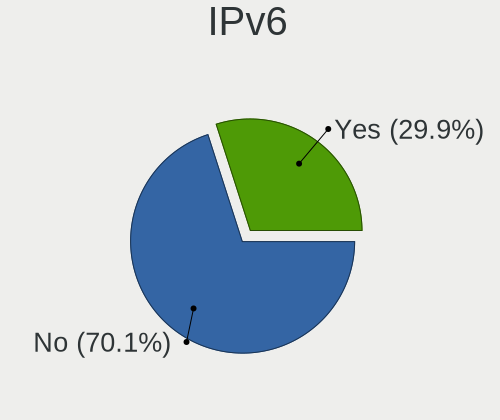

| Used | Desktops | Percent |
|------|----------|---------|
| No   | 175      | 70.85%  |
| Yes  | 72       | 29.15%  |

Memory Vendor
-------------

Memory module vendors

| Vendor              | Desktops | Percent |
|---------------------|----------|---------|
| Unknown             | 14       | 17.28%  |
| Kingston            | 13       | 16.05%  |
| Corsair             | 12       | 14.81%  |
| SK Hynix            | 11       | 13.58%  |
| Samsung Electronics | 8        | 9.88%   |
| G.Skill             | 6        | 7.41%   |
| Crucial             | 6        | 7.41%   |
| Unknown (ABCD)      | 2        | 2.47%   |
| Patriot             | 2        | 2.47%   |
| Sesame              | 1        | 1.23%   |
| Nanya Technology    | 1        | 1.23%   |
| Micron Technology   | 1        | 1.23%   |
| Kingmax             | 1        | 1.23%   |
| GOODRAM             | 1        | 1.23%   |
| ELPIDA              | 1        | 1.23%   |
| A-DATA Technology   | 1        | 1.23%   |

Memory Model
------------

Memory module models

| Model                                                          | Desktops | Percent |
|----------------------------------------------------------------|----------|---------|
| Unknown RAM Module 4096MB DIMM DDR3 1600MT/s                   | 2        | 2.35%   |
| Unknown RAM Module 4096MB DIMM DDR3 1333MT/s                   | 2        | 2.35%   |
| Unknown RAM Module 2048MB DIMM SDRAM                           | 2        | 2.35%   |
| Unknown (ABCD) RAM 123456789012345678 2GB DIMM LPDDR4 2400MT/s | 2        | 2.35%   |
| SK Hynix RAM HMT451U6AFR8C-PB 4096MB DIMM DDR3 1600MT/s        | 2        | 2.35%   |
| Kingston RAM KHX2400C11D3/8GX 8192MB DIMM DDR3 2400MT/s        | 2        | 2.35%   |
| Unknown RAM Module 4096MB DIMM DDR2 800MT/s                    | 1        | 1.18%   |
| Unknown RAM Module 2GB DIMM DDR2 800MT/s                       | 1        | 1.18%   |
| Unknown RAM Module 2GB DIMM 800MT/s                            | 1        | 1.18%   |
| Unknown RAM Module 256MB DIMM SDRAM                            | 1        | 1.18%   |
| Unknown RAM Module 2048MB DIMM DDR2 800MT/s                    | 1        | 1.18%   |
| Unknown RAM Module 2048MB DIMM DDR 1333MT/s                    | 1        | 1.18%   |
| Unknown RAM Module 2048MB DIMM 1333MT/s                        | 1        | 1.18%   |
| Unknown RAM Module 1024MB DIMM DDR2                            | 1        | 1.18%   |
| SK Hynix RAM Module 2048MB DIMM DDR3 1333MT/s                  | 1        | 1.18%   |
| SK Hynix RAM HYMP112U72CP8-S6 1024MB DIMM DDR2 800MT/s         | 1        | 1.18%   |
| SK Hynix RAM HMT41GU6MFR8C-PB 8GB DIMM DDR3 1600MT/s           | 1        | 1.18%   |
| SK Hynix RAM HMT41GS6BFR8A-PB 8192MB SODIMM DDR3 1600MT/s      | 1        | 1.18%   |
| SK Hynix RAM HMT351U6EFR8C-PB 4GB DIMM DDR3 1800MT/s           | 1        | 1.18%   |
| SK Hynix RAM HMT351S6CFR8C-PB 4GB SODIMM DDR3 1600MT/s         | 1        | 1.18%   |
| SK Hynix RAM HMT125U6BFR8C-H9 2048MB DIMM DDR3 1067MT/s        | 1        | 1.18%   |
| SK Hynix RAM HMA851S6AFR6N-UH 4GB SODIMM DDR4 2667MT/s         | 1        | 1.18%   |
| SK Hynix RAM HMA451U6AFR8N-TF 4096MB DIMM DDR4 2133MT/s        | 1        | 1.18%   |
| SK Hynix RAM 8G1600CL11 8192MB DIMM DDR3 1600MT/s              | 1        | 1.18%   |
| Sesame RAM S949B2UUH-ITR 8192MB DIMM DDR4 2133MT/s             | 1        | 1.18%   |
| Samsung RAM Module 8192MB DIMM DDR4 2666MT/s                   | 1        | 1.18%   |
| Samsung RAM Module 2048MB DIMM DDR3 1333MT/s                   | 1        | 1.18%   |
| Samsung RAM M471B5773CHS-CK0 2GB SODIMM DDR3 1600MT/s          | 1        | 1.18%   |
| Samsung RAM M471B5673FH0-CH9 2048MB DIMM SDRAM 4199MT/s        | 1        | 1.18%   |
| Samsung RAM M471A5244CB0-CRC 4GB SODIMM DDR4 2667MT/s          | 1        | 1.18%   |
| Samsung RAM M378B5173QH0-CK0 4096MB DIMM DDR3 1866MT/s         | 1        | 1.18%   |
| Samsung RAM M378B1G73QH0-CK0 8GB DIMM DDR3 1600MT/s            | 1        | 1.18%   |
| Samsung RAM M378A1G43DB0-CPB 8192MB DIMM DDR4 2133MT/s         | 1        | 1.18%   |
| Patriot RAM PSD38G16002 8192MB DIMM DDR3 1600MT/s              | 1        | 1.18%   |
| Patriot RAM PSD34G133381 4096MB DIMM DDR3 1333MT/s             | 1        | 1.18%   |
| Nanya RAM NT4GC64B8HG0NF-CG 4GB DIMM DDR3 1333MT/s             | 1        | 1.18%   |
| Micron RAM ITC 4096MB DIMM DDR3 1648MT/s                       | 1        | 1.18%   |
| Kingston RAM KHX3200C16D4/8GX 8GB DIMM DDR4 3533MT/s           | 1        | 1.18%   |
| Kingston RAM KHX2666C16/8G 8192MB DIMM DDR4 3200MT/s           | 1        | 1.18%   |
| Kingston RAM KHX2400C15/8G 8GB DIMM DDR4 2933MT/s              | 1        | 1.18%   |
| Kingston RAM KHX2400C15/16G 16384MB DIMM DDR4 3334MT/s         | 1        | 1.18%   |
| Kingston RAM KHX1866C10D3/4G 4GB DIMM DDR3 1866MT/s            | 1        | 1.18%   |
| Kingston RAM KHX1600C10D3/8G 8192MB DIMM DDR3 1867MT/s         | 1        | 1.18%   |
| Kingston RAM 99U5471-054.A00LF 8GB DIMM DDR3 1600MT/s          | 1        | 1.18%   |
| Kingston RAM 9905584-027.A00LF 4GB DIMM DDR3 1600MT/s          | 1        | 1.18%   |
| Kingston RAM 9905403-442.A00LF 4096MB DIMM DDR3 1333MT/s       | 1        | 1.18%   |
| Kingston RAM 9905403-011.A03LF 2GB DIMM DDR3 1333MT/s          | 1        | 1.18%   |
| Kingston RAM 9905403-011.A02LF 4096MB DIMM DDR3 1333MT/s       | 1        | 1.18%   |
| Kingmax RAM FLFF65F-D8KQ9 4096MB DIMM DDR3 1333MT/s            | 1        | 1.18%   |
| GOODRAM RAM GR1600D3V64L11/8G 8GB DIMM DDR3 1600MT/s           | 1        | 1.18%   |
| GOODRAM RAM GR1600D364L11/8G 8GB DIMM DDR3 1600MT/s            | 1        | 1.18%   |
| G.Skill RAM F4-3600C18-8GTZRX 8GB DIMM DDR4 3600MT/s           | 1        | 1.18%   |
| G.Skill RAM F4-3600C16-8GVKC 8192MB DIMM DDR4 3600MT/s         | 1        | 1.18%   |
| G.Skill RAM F4-3600C16-8GTZNC 8192MB DIMM DDR4 3800MT/s        | 1        | 1.18%   |
| G.Skill RAM F4-3600C16-16GTZNC 16384MB DIMM DDR4 3600MT/s      | 1        | 1.18%   |
| G.Skill RAM F4-3200C16-8GIS 8192MB DIMM DDR4 3200MT/s          | 1        | 1.18%   |
| G.Skill RAM F4-2400C15-8GVB 8GB DIMM DDR4 2133MT/s             | 1        | 1.18%   |
| ELPIDA RAM EBJ21UE8BDS0-DJ-F 2048MB SODIMM DDR3 1334MT/s       | 1        | 1.18%   |
| Crucial RAM CT8G4DFS824A.C8FP 8192MB DIMM DDR4 2400MT/s        | 1        | 1.18%   |
| Crucial RAM CT4G4DFS824A.C8FBR2 4096MB DIMM DDR4 2400MT/s      | 1        | 1.18%   |

Memory Kind
-----------

Memory module kinds

| Kind    | Desktops | Percent |
|---------|----------|---------|
| DDR3    | 31       | 44.29%  |
| DDR4    | 24       | 34.29%  |
| DDR2    | 5        | 7.14%   |
| SDRAM   | 4        | 5.71%   |
| LPDDR4  | 3        | 4.29%   |
| Unknown | 2        | 2.86%   |
| DDR     | 1        | 1.43%   |

Memory Form Factor
------------------

Physical design of the memory module

| Name   | Desktops | Percent |
|--------|----------|---------|
| DIMM   | 65       | 94.2%   |
| SODIMM | 4        | 5.8%    |

Memory Size
-----------

Memory module size

| Size  | Desktops | Percent |
|-------|----------|---------|
| 8192  | 31       | 41.33%  |
| 4096  | 21       | 28%     |
| 2048  | 13       | 17.33%  |
| 16384 | 7        | 9.33%   |
| 1024  | 2        | 2.67%   |
| 256   | 1        | 1.33%   |

Memory Speed
------------

Memory module speed

| Speed   | Desktops | Percent |
|---------|----------|---------|
| 1600    | 18       | 23.68%  |
| 1333    | 12       | 15.79%  |
| 2400    | 7        | 9.21%   |
| 3200    | 5        | 6.58%   |
| 800     | 5        | 6.58%   |
| 3600    | 4        | 5.26%   |
| 2133    | 4        | 5.26%   |
| Unknown | 4        | 5.26%   |
| 2667    | 2        | 2.63%   |
| 2666    | 2        | 2.63%   |
| 4199    | 1        | 1.32%   |
| 3800    | 1        | 1.32%   |
| 3533    | 1        | 1.32%   |
| 3334    | 1        | 1.32%   |
| 3266    | 1        | 1.32%   |
| 2933    | 1        | 1.32%   |
| 2800    | 1        | 1.32%   |
| 1867    | 1        | 1.32%   |
| 1866    | 1        | 1.32%   |
| 1800    | 1        | 1.32%   |
| 1648    | 1        | 1.32%   |
| 1334    | 1        | 1.32%   |
| 1067    | 1        | 1.32%   |

Sound Vendor
------------

Sound card vendors

| Vendor                    | Desktops | Percent |
|---------------------------|----------|---------|
| Intel                     | 146      | 37.15%  |
| AMD                       | 118      | 30.03%  |
| Nvidia                    | 80       | 20.36%  |
| C-Media Electronics       | 9        | 2.29%   |
| Creative Labs             | 7        | 1.78%   |
| Logitech                  | 5        | 1.27%   |
| GN Netcom                 | 4        | 1.02%   |
| Generalplus Technology    | 2        | 0.51%   |
| Ensoniq                   | 2        | 0.51%   |
| Creative Technology       | 2        | 0.51%   |
| WinChipHead               | 1        | 0.25%   |
| TOWA Electronics          | 1        | 0.25%   |
| Texas Instruments         | 1        | 0.25%   |
| Sennheiser Communications | 1        | 0.25%   |
| Samson Technologies       | 1        | 0.25%   |
| Rockwell International    | 1        | 0.25%   |
| Razer USA                 | 1        | 0.25%   |
| Plantronics               | 1        | 0.25%   |
| Philips (or NXP)          | 1        | 0.25%   |
| Native Instruments        | 1        | 0.25%   |
| Microsoft                 | 1        | 0.25%   |
| Microchip Technology      | 1        | 0.25%   |
| Medeli Electronics        | 1        | 0.25%   |
| Kingston Technology       | 1        | 0.25%   |
| JMTek                     | 1        | 0.25%   |
| Evolution Electronics     | 1        | 0.25%   |
| Dell                      | 1        | 0.25%   |
| BEHRINGER International   | 1        | 0.25%   |

Sound Model
-----------

Sound card models

| Model                                                                             | Desktops | Percent |
|-----------------------------------------------------------------------------------|----------|---------|
| Intel 6 Series/C200 Series Chipset Family High Definition Audio Controller        | 31       | 6.7%    |
| AMD SBx00 Azalia (Intel HDA)                                                      | 27       | 5.83%   |
| Intel 8 Series/C220 Series Chipset High Definition Audio Controller               | 18       | 3.89%   |
| AMD Starship/Matisse HD Audio Controller                                          | 18       | 3.89%   |
| Intel NM10/ICH7 Family High Definition Audio Controller                           | 16       | 3.46%   |
| AMD Family 17h (Models 00h-0fh) HD Audio Controller                               | 16       | 3.46%   |
| Intel Xeon E3-1200 v3/4th Gen Core Processor HD Audio Controller                  | 15       | 3.24%   |
| AMD Ellesmere HDMI Audio [Radeon RX 470/480 / 570/580/590]                        | 14       | 3.02%   |
| AMD FCH Azalia Controller                                                         | 12       | 2.59%   |
| Intel Cannon Lake PCH cAVS                                                        | 11       | 2.38%   |
| AMD Cedar HDMI Audio [Radeon HD 5400/6300/7300 Series]                            | 11       | 2.38%   |
| Intel 7 Series/C216 Chipset Family High Definition Audio Controller               | 10       | 2.16%   |
| Intel 5 Series/3400 Series Chipset High Definition Audio                          | 10       | 2.16%   |
| AMD Family 17h (Models 10h-1fh) HD Audio Controller                               | 9        | 1.94%   |
| AMD Raven/Raven2/Fenghuang HDMI/DP Audio Controller                               | 8        | 1.73%   |
| Intel 82801JI (ICH10 Family) HD Audio Controller                                  | 7        | 1.51%   |
| Intel 200 Series PCH HD Audio                                                     | 7        | 1.51%   |
| Intel 100 Series/C230 Series Chipset Family HD Audio Controller                   | 7        | 1.51%   |
| AMD RV710/730 HDMI Audio [Radeon HD 4000 series]                                  | 7        | 1.51%   |
| Nvidia TU116 High Definition Audio Controller                                     | 6        | 1.3%    |
| Nvidia MCP61 High Definition Audio                                                | 6        | 1.3%    |
| Nvidia High Definition Audio Controller                                           | 6        | 1.3%    |
| Nvidia GP106 High Definition Audio Controller                                     | 6        | 1.3%    |
| Nvidia GF108 High Definition Audio Controller                                     | 6        | 1.3%    |
| AMD Oland/Hainan/Cape Verde/Pitcairn HDMI Audio [Radeon HD 7000 Series]           | 6        | 1.3%    |
| AMD Baffin HDMI/DP Audio [Radeon RX 550 640SP / RX 560/560X]                      | 6        | 1.3%    |
| Nvidia GP107GL High Definition Audio Controller                                   | 5        | 1.08%   |
| Nvidia GF116 High Definition Audio Controller                                     | 5        | 1.08%   |
| Nvidia GM206 High Definition Audio Controller                                     | 4        | 0.86%   |
| Nvidia GK208 HDMI/DP Audio Controller                                             | 4        | 0.86%   |
| Nvidia GK106 HDMI Audio Controller                                                | 4        | 0.86%   |
| Intel 9 Series Chipset Family HD Audio Controller                                 | 4        | 0.86%   |
| Creative Labs EMU20k1 [Sound Blaster X-Fi Series]                                 | 4        | 0.86%   |
| AMD Caicos HDMI Audio [Radeon HD 6450 / 7450/8450/8490 OEM / R5 230/235/235X OEM] | 4        | 0.86%   |
| Nvidia TU106 High Definition Audio Controller                                     | 3        | 0.65%   |
| Nvidia MCP79 High Definition Audio                                                | 3        | 0.65%   |
| Nvidia GP104 High Definition Audio Controller                                     | 3        | 0.65%   |
| Nvidia GM204 High Definition Audio Controller                                     | 3        | 0.65%   |
| Nvidia GK104 HDMI Audio Controller                                                | 3        | 0.65%   |
| Nvidia GF119 HDMI Audio Controller                                                | 3        | 0.65%   |
| Intel Comet Lake PCH-V Smart Sound Technology Audio Controller                    | 3        | 0.65%   |
| Intel 82801JD/DO (ICH10 Family) HD Audio Controller                               | 3        | 0.65%   |
| Intel 82801I (ICH9 Family) HD Audio Controller                                    | 3        | 0.65%   |
| C-Media Electronics CMI8788 [Oxygen HD Audio]                                     | 3        | 0.65%   |
| AMD Vega 10 HDMI Audio [Radeon Vega 56/64]                                        | 3        | 0.65%   |
| AMD RS880 HDMI Audio [Radeon HD 4200 Series]                                      | 3        | 0.65%   |
| AMD Redwood HDMI Audio [Radeon HD 5000 Series]                                    | 3        | 0.65%   |
| AMD Kabini HDMI/DP Audio                                                          | 3        | 0.65%   |
| Nvidia TU107 GeForce GTX 1650 High Definition Audio Controller                    | 2        | 0.43%   |
| Nvidia TU104 HD Audio Controller                                                  | 2        | 0.43%   |
| Intel Comet Lake PCH cAVS                                                         | 2        | 0.43%   |
| Intel Celeron/Pentium Silver Processor High Definition Audio                      | 2        | 0.43%   |
| Intel C600/X79 series chipset High Definition Audio Controller                    | 2        | 0.43%   |
| Intel 82801H (ICH8 Family) HD Audio Controller                                    | 2        | 0.43%   |
| GN Netcom Jabra EVOLVE LINK MS                                                    | 2        | 0.43%   |
| Generalplus Technology USB Audio Device                                           | 2        | 0.43%   |
| Creative Labs Sound Core3D [Sound Blaster Recon3D / Z-Series]                     | 2        | 0.43%   |
| C-Media Electronics Audio Adapter (Unitek Y-247A)                                 | 2        | 0.43%   |
| AMD Turks HDMI Audio [Radeon HD 6500/6600 / 6700M Series]                         | 2        | 0.43%   |
| AMD Trinity HDMI Audio Controller                                                 | 2        | 0.43%   |

Camera Vendor
-------------

Camera device vendors

| Vendor                      | Desktops | Percent |
|-----------------------------|----------|---------|
| Logitech                    | 13       | 26%     |
| Microsoft                   | 6        | 12%     |
| Microdia                    | 6        | 12%     |
| Realtek Semiconductor       | 3        | 6%      |
| Samsung Electronics         | 2        | 4%      |
| MacroSilicon                | 2        | 4%      |
| Genesys Logic               | 2        | 4%      |
| GEMBIRD                     | 2        | 4%      |
| Creative Technology         | 2        | 4%      |
| Chicony Electronics         | 2        | 4%      |
| Apple                       | 2        | 4%      |
| Silicon Motion              | 1        | 2%      |
| SHENZHEN Fullhan            | 1        | 2%      |
| Novatek Microelectronics    | 1        | 2%      |
| KYE Systems (Mouse Systems) | 1        | 2%      |
| IMC Networks                | 1        | 2%      |
| Hewlett-Packard             | 1        | 2%      |
| ARC International           | 1        | 2%      |
| Alcor Micro                 | 1        | 2%      |

Camera Model
------------

Camera device models

| Model                                             | Desktops | Percent |
|---------------------------------------------------|----------|---------|
| Logitech Webcam C270                              | 5        | 10%     |
| Samsung Galaxy A5 (MTP)                           | 2        | 4%      |
| Microsoft LifeCam HD-3000                         | 2        | 4%      |
| Microdia USB Camera                               | 2        | 4%      |
| Microdia USB 2.0 Camera                           | 2        | 4%      |
| MacroSilicon USB Video                            | 2        | 4%      |
| Logitech QuickCam Pro 9000                        | 2        | 4%      |
| Creative Live! Cam Chat HD [VF0700]               | 2        | 4%      |
| Apple iPhone 5/5C/5S/6/SE                         | 2        | 4%      |
| Silicon Motion Endoscope camera                   | 1        | 2%      |
| SHENZHEN Fullhan webcam                           | 1        | 2%      |
| Realtek HP 1.0MP High Definition Webcam           | 1        | 2%      |
| Realtek HD Webcam eMeet C960                      | 1        | 2%      |
| Realtek FULL HD 1080P Webcam                      | 1        | 2%      |
| Novatek HP High Definition 2MP Webcam             | 1        | 2%      |
| Microsoft LifeCam VX-500 [1357]                   | 1        | 2%      |
| Microsoft LifeCam VX-2000                         | 1        | 2%      |
| Microsoft LifeCam Studio                          | 1        | 2%      |
| Microsoft LifeCam Cinema                          | 1        | 2%      |
| Microdia Webcam Vitade AF                         | 1        | 2%      |
| Microdia Integrated Camera                        | 1        | 2%      |
| Logitech Webcam C310                              | 1        | 2%      |
| Logitech Webcam C200                              | 1        | 2%      |
| Logitech QuickCam Pro 5000                        | 1        | 2%      |
| Logitech Quickcam 3000 For Business               | 1        | 2%      |
| Logitech HD Webcam C525                           | 1        | 2%      |
| Logitech C505e HD Webcam                          | 1        | 2%      |
| KYE Systems (Mouse Systems) FaceCam 1000X         | 1        | 2%      |
| IMC Networks USB 2.0 Camera                       | 1        | 2%      |
| HP Webcam 3100                                    | 1        | 2%      |
| Genesys Logic Integrated Camera                   | 1        | 2%      |
| Genesys Logic Camera                              | 1        | 2%      |
| GEMBIRD USB2.0 PC CAMERA                          | 1        | 2%      |
| GEMBIRD Generic UVC 1.00 camera [AppoTech AX2311] | 1        | 2%      |
| Chicony HP High Definition Webcam                 | 1        | 2%      |
| Chicony CNF8050 Webcam                            | 1        | 2%      |
| ARC International Camera                          | 1        | 2%      |
| Alcor Micro USB 2.0 PC Camera                     | 1        | 2%      |

Fingerprint Vendor
------------------

Fingerprint sensor vendors

Zero info for selected period =(

Fingerprint Model
-----------------

Fingerprint sensor models

Zero info for selected period =(

Chipcard Vendor
---------------

Chipcard module vendors

| Vendor                   | Desktops | Percent |
|--------------------------|----------|---------|
| SCM Microsystems         | 1        | 25%     |
| Reiner SCT Kartensysteme | 1        | 25%     |
| BIT4ID                   | 1        | 25%     |
| Advanced Card Systems    | 1        | 25%     |

Chipcard Model
--------------

Chipcard module models

| Model                                                  | Desktops | Percent |
|--------------------------------------------------------|----------|---------|
| SCM Microsystems SCR331-LC1 / SCR3310 SmartCard Reader | 1        | 25%     |
| Reiner SCT Kartensysteme tanJack USB                   | 1        | 25%     |
| BIT4ID miniLector-S                                    | 1        | 25%     |
| Advanced Card Systems ACR122U                          | 1        | 25%     |

Printer Vendor
--------------

Printer device vendors

| Vendor              | Desktops | Percent |
|---------------------|----------|---------|
| Hewlett-Packard     | 8        | 42.11%  |
| Canon               | 5        | 26.32%  |
| Seiko Epson         | 1        | 5.26%   |
| Sato                | 1        | 5.26%   |
| Samsung Electronics | 1        | 5.26%   |
| QinHeng Electronics | 1        | 5.26%   |
| Dell                | 1        | 5.26%   |
| Brother Industries  | 1        | 5.26%   |

Printer Model
-------------

Printer device models

| Model                          | Desktops | Percent |
|--------------------------------|----------|---------|
| Seiko Epson WF-3520 Series     | 1        | 5.26%   |
| Sato CG408                     | 1        | 5.26%   |
| Samsung M332x 382x 402x Series | 1        | 5.26%   |
| QinHeng CH340S                 | 1        | 5.26%   |
| HP PSC 1400                    | 1        | 5.26%   |
| HP OfficeJet Pro 69            | 1        | 5.26%   |
| HP Officejet 6600              | 1        | 5.26%   |
| HP OfficeJet 4650 series       | 1        | 5.26%   |
| HP LaserJet P2014              | 1        | 5.26%   |
| HP LaserJet 1320               | 1        | 5.26%   |
| HP ENVY 5000 series            | 1        | 5.26%   |
| HP DeskJet F4200 series        | 1        | 5.26%   |
| Dell 1250c Color Printer       | 1        | 5.26%   |
| Canon PIXMA MX450 Series       | 1        | 5.26%   |
| Canon PIXMA MG2900 Series      | 1        | 5.26%   |
| Canon PIXMA iP1800 Printer     | 1        | 5.26%   |
| Canon G3000 series             | 1        | 5.26%   |
| Canon E400 series              | 1        | 5.26%   |
| Brother MFC-1810               | 1        | 5.26%   |

Scanner Vendor
--------------

Scanner device vendors

| Vendor             | Desktops | Percent |
|--------------------|----------|---------|
| Canon              | 4        | 66.67%  |
| Ultima Electronics | 1        | 16.67%  |
| Seiko Epson        | 1        | 16.67%  |

Scanner Model
-------------

Scanner device models

| Model                                                                                 | Desktops | Percent |
|---------------------------------------------------------------------------------------|----------|---------|
| Ultima Artec Ultima 2000 (GT6801 based)/Lifetec LT9385/ScanMagic 1200 UB Plus Scanner | 1        | 16.67%  |
| Seiko Epson GT-9300UF [Perfection 2400 PHOTO]                                         | 1        | 16.67%  |
| Canon CanoScan N1240U/LiDE 30                                                         | 1        | 16.67%  |
| Canon CanoScan LiDE 700F                                                              | 1        | 16.67%  |
| Canon CanoScan LiDE 60                                                                | 1        | 16.67%  |
| Canon CanoScan LiDE 110                                                               | 1        | 16.67%  |

Bluetooth Vendor
----------------

Controller vendors

| Vendor                  | Desktops | Percent |
|-------------------------|----------|---------|
| Cambridge Silicon Radio | 21       | 40.38%  |
| Intel                   | 19       | 36.54%  |
| Broadcom                | 5        | 9.62%   |
| ASUSTek Computer        | 2        | 3.85%   |
| Realtek Semiconductor   | 1        | 1.92%   |
| Ralink                  | 1        | 1.92%   |
| Primax Electronics      | 1        | 1.92%   |
| IMC Networks            | 1        | 1.92%   |
| Foxconn / Hon Hai       | 1        | 1.92%   |

Bluetooth Model
---------------

Controller models

| Model                                               | Desktops | Percent |
|-----------------------------------------------------|----------|---------|
| Cambridge Silicon Radio Bluetooth Dongle (HCI mode) | 21       | 40.38%  |
| Intel AX200 Bluetooth                               | 8        | 15.38%  |
| Intel Bluetooth wireless interface                  | 4        | 7.69%   |
| Intel Bluetooth 9460/9560 Jefferson Peak (JfP)      | 4        | 7.69%   |
| Intel Bluetooth Device                              | 3        | 5.77%   |
| ASUS Broadcom BCM20702A0 Bluetooth                  | 2        | 3.85%   |
| Realtek  Bluetooth 4.2 Adapter                      | 1        | 1.92%   |
| Ralink RT3290 Bluetooth                             | 1        | 1.92%   |
| Primax Rocketfish RF-FLBTAD Bluetooth Adapter       | 1        | 1.92%   |
| IMC Networks Bluetooth Device                       | 1        | 1.92%   |
| Foxconn / Hon Hai Bluetooth USB Host Controller     | 1        | 1.92%   |
| Broadcom HP Portable Bumble Bee                     | 1        | 1.92%   |
| Broadcom HP Bluetooth Module                        | 1        | 1.92%   |
| Broadcom HP Bluethunder                             | 1        | 1.92%   |
| Broadcom BCM20702A0 Bluetooth 4.0                   | 1        | 1.92%   |
| Broadcom BCM20702A0                                 | 1        | 1.92%   |

Unsupported Devices
-------------------

Total unsupported devices on board

| Total | Desktops | Percent |
|-------|----------|---------|
| 0     | 210      | 85.02%  |
| 1     | 28       | 11.34%  |
| 2     | 8        | 3.24%   |
| 3     | 1        | 0.4%    |

Unsupported Device Types
------------------------

Types of unsupported devices

| Type                     | Desktops | Percent |
|--------------------------|----------|---------|
| Graphics card            | 18       | 41.86%  |
| Net/wireless             | 11       | 25.58%  |
| Sound                    | 3        | 6.98%   |
| Unassigned class         | 2        | 4.65%   |
| Multimedia controller    | 2        | 4.65%   |
| Communication controller | 2        | 4.65%   |
| Chipcard                 | 2        | 4.65%   |
| Modem                    | 1        | 2.33%   |
| Camera                   | 1        | 2.33%   |
| Bluetooth                | 1        | 2.33%   |

