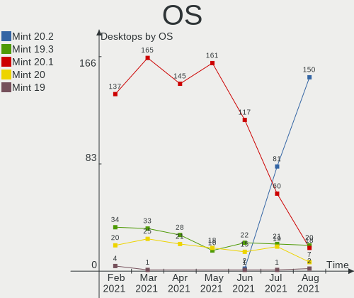
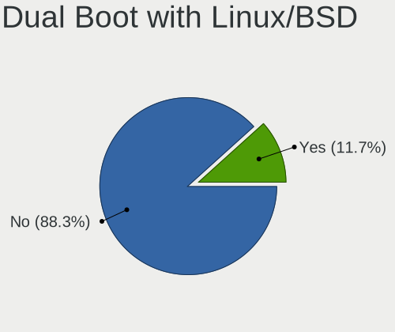
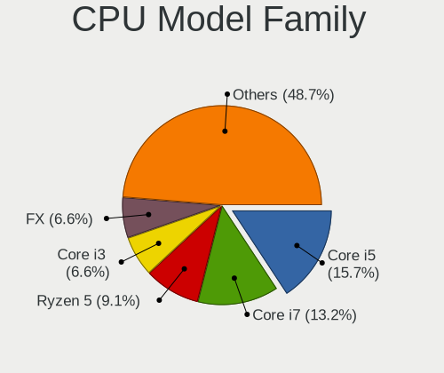
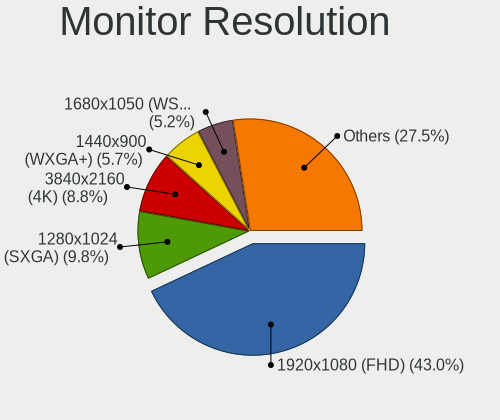
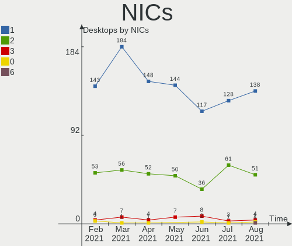

Mint Hardware Trends (Desktop)
------------------------------

A project to identify most popular hardware characteristics and track their change
over time based on data collected by Mint users at https://Linux-Hardware.org.

Anyone can contribute to the study by uploading probes of their computers by
the [hw-probe](https://github.com/linuxhw/hw-probe) tool:

    sudo hw-probe -all -upload

Full-feature report is available here: https://linux-hardware.org/?view=trends&formfactor=desktop

Period: Apr, 2020.

Contents
--------

- [ OS                       ](#os)
- [ OS Family                ](#os-family)
- [ Kernel                   ](#kernel)
- [ Kernel Family            ](#kernel-family)
- [ Kernel Major Ver.        ](#kernel-major-ver)
- [ Arch                     ](#arch)
- [ DE                       ](#de)
- [ Display Server           ](#display-server)
- [ Display Manager          ](#display-manager)
- [ OS Lang                  ](#os-lang)
- [ Boot Mode                ](#boot-mode)
- [ Filesystem               ](#filesystem)
- [ Dual Boot with Linux/BSD ](#dual-boot-with-linux/bsd)
- [ Dual Boot (Win)          ](#dual-boot-win)
- [ Country                  ](#country)
- [ City                     ](#city)
- [ Vendor                   ](#vendor)
- [ Model                    ](#model)
- [ Model Family             ](#model-family)
- [ MFG Year                 ](#mfg-year)
- [ Form Factor              ](#form-factor)
- [ Secure Boot              ](#secure-boot)
- [ Coreboot                 ](#coreboot)
- [ RAM Size                 ](#ram-size)
- [ RAM Used                 ](#ram-used)
- [ Drive Vendor             ](#drive-vendor)
- [ Drive Model              ](#drive-model)
- [ Drive Kind               ](#drive-kind)
- [ Drive Connector          ](#drive-connector)
- [ Drive Size               ](#drive-size)
- [ Space Total              ](#space-total)
- [ Space Used               ](#space-used)
- [ Malfunc. Drives          ](#malfunc-drives)
- [ Malfunc. Drive Vendor    ](#malfunc-drive-vendor)
- [ Malfunc. Drive Kind      ](#malfunc-drive-kind)
- [ Failed Drives            ](#failed-drives)
- [ Failed Drive Vendor      ](#failed-drive-vendor)
- [ Drive Status             ](#drive-status)
- [ Storage Vendor           ](#storage-vendor)
- [ Storage Model            ](#storage-model)
- [ Storage Kind             ](#storage-kind)
- [ CPU Vendor               ](#cpu-vendor)
- [ CPU Model                ](#cpu-model)
- [ CPU Model Family         ](#cpu-model-family)
- [ CPU Cores                ](#cpu-cores)
- [ CPU Sockets              ](#cpu-sockets)
- [ CPU Threads              ](#cpu-threads)
- [ CPU Op-Modes             ](#cpu-op-modes)
- [ CPU Microarch            ](#cpu-microarch)
- [ CPU Microcode            ](#cpu-microcode)
- [ GPU Vendor               ](#gpu-vendor)
- [ GPU Model                ](#gpu-model)
- [ GPU Combo                ](#gpu-combo)
- [ GPU Driver               ](#gpu-driver)
- [ GPU Memory               ](#gpu-memory)
- [ Monitor Vendor           ](#monitor-vendor)
- [ Monitor Model            ](#monitor-model)
- [ Monitor Resolution       ](#monitor-resolution)
- [ Monitor Diagonal         ](#monitor-diagonal)
- [ Monitor Width            ](#monitor-width)
- [ Aspect Ratio             ](#aspect-ratio)
- [ Monitor Area             ](#monitor-area)
- [ Pixel Density            ](#pixel-density)
- [ Multiple Monitors        ](#multiple-monitors)
- [ Net Controller Vendor    ](#net-controller-vendor)
- [ Net Controller Model     ](#net-controller-model)
- [ Net Controller Kind      ](#net-controller-kind)
- [ Used Controller          ](#used-controller)
- [ NICs                     ](#nics)
- [ Unsupported Devices      ](#unsupported-devices)
- [ Unsupported Device Types ](#unsupported-device-types)

OS
--

Installed operating systems

| Name      | Computers | Percent |
|-----------|-----------|---------|
| Mint 19.3 | 92        | 76.03%  |
| Mint 19.2 | 11        | 9.09%   |
| Mint 19.1 | 6         | 4.96%   |
| Mint 4    | 4         | 3.31%   |
| Mint 19   | 4         | 3.31%   |
| Mint 18.3 | 3         | 2.48%   |
| Mint 17.3 | 1         | 0.83%   |

OS Family
---------

OS without a version

| Name | Computers | Percent |
|------|-----------|---------|
| Mint | 121       | 100%    |

Kernel
------

Version of the Linux kernel

| Version               | Computers | Percent |
|-----------------------|-----------|---------|
| 5.3.0-46-generic      | 53        | 43.8%   |
| 5.3.0-45-generic      | 13        | 10.74%  |
| 5.0.0-32-generic      | 12        | 9.92%   |
| 4.15.0-96-generic     | 11        | 9.09%   |
| 4.15.0-91-generic     | 6         | 4.96%   |
| 4.15.0-54-generic     | 5         | 4.13%   |
| 5.3.0-42-generic      | 4         | 3.31%   |
| 4.19.0-8-amd64        | 4         | 3.31%   |
| 5.3.0-51-generic      | 2         | 1.65%   |
| 5.5.13-050513-generic | 1         | 0.83%   |
| 5.3.6-050306-generic  | 1         | 0.83%   |
| 5.3.0-40-generic      | 1         | 0.83%   |
| 5.3.0-28-generic      | 1         | 0.83%   |
| 4.4.0-148-generic     | 1         | 0.83%   |
| 4.15.0-99-generic     | 1         | 0.83%   |
| 4.15.0-96-lowlatency  | 1         | 0.83%   |
| 4.15.0-88-generic     | 1         | 0.83%   |
| 4.15.0-74-generic     | 1         | 0.83%   |
| 4.15.0-65-generic     | 1         | 0.83%   |
| 4.15.0-20-generic     | 1         | 0.83%   |

Kernel Family
-------------

Linux kernel without a distro release

| Version | Computers | Percent |
|---------|-----------|---------|
| 5.3.0   | 74        | 61.16%  |
| 4.15.0  | 28        | 23.14%  |
| 5.0.0   | 12        | 9.92%   |
| 4.19.0  | 4         | 3.31%   |
| 5.5.13  | 1         | 0.83%   |
| 5.3.6   | 1         | 0.83%   |
| 4.4.0   | 1         | 0.83%   |

Kernel Major Ver.
-----------------

Linux kernel major version

| Version | Computers | Percent |
|---------|-----------|---------|
| 5.3     | 75        | 61.98%  |
| 4.15    | 28        | 23.14%  |
| 5.0     | 12        | 9.92%   |
| 4.19    | 4         | 3.31%   |
| 5.5     | 1         | 0.83%   |
| 4.4     | 1         | 0.83%   |

Arch
----

OS architecture (x86_64, i586, etc.)

| Name   | Computers | Percent |
|--------|-----------|---------|
| x86_64 | 109       | 90.08%  |
| i686   | 12        | 9.92%   |

DE
--

Desktop Environment

| Name       | Computers | Percent |
|------------|-----------|---------|
| X-Cinnamon | 74        | 61.16%  |
| MATE       | 20        | 16.53%  |
| XFCE       | 14        | 11.57%  |
| Cinnamon   | 11        | 9.09%   |
| GNOME      | 1         | 0.83%   |
| Unknown    | 1         | 0.83%   |

Display Server
--------------

X11 or Wayland

| Name | Computers | Percent |
|------|-----------|---------|
| X11  | 121       | 100%    |

Display Manager
---------------

SDDM, LightDM, etc.

| Name    | Computers | Percent |
|---------|-----------|---------|
| Unknown | 105       | 86.78%  |
| LightDM | 16        | 13.22%  |

OS Lang
-------

Language

| Lang  | Computers | Percent |
|-------|-----------|---------|
| en_US | 31        | 25.62%  |
| pt_BR | 12        | 9.92%   |
| de_DE | 11        | 9.09%   |
| ru_RU | 10        | 8.26%   |
| en_AU | 7         | 5.79%   |
| pt_PT | 5         | 4.13%   |
| en_GB | 5         | 4.13%   |
| it_IT | 4         | 3.31%   |
| nl_NL | 3         | 2.48%   |
| en_ZA | 3         | 2.48%   |
| C     | 3         | 2.48%   |
| pl_PL | 2         | 1.65%   |
| fr_FR | 2         | 1.65%   |
| fr_CA | 2         | 1.65%   |
| fi_FI | 2         | 1.65%   |
| sl_SI | 1         | 0.83%   |
| ro_RO | 1         | 0.83%   |
| ja_JP | 1         | 0.83%   |
| hu_HU | 1         | 0.83%   |
| fr_BE | 1         | 0.83%   |
| es_UY | 1         | 0.83%   |
| es_PE | 1         | 0.83%   |
| es_MX | 1         | 0.83%   |
| es_ES | 1         | 0.83%   |
| es_CO | 1         | 0.83%   |
| es_AR | 1         | 0.83%   |
| en_PH | 1         | 0.83%   |
| en_IL | 1         | 0.83%   |
| en_IE | 1         | 0.83%   |
| en_CA | 1         | 0.83%   |
| el_GR | 1         | 0.83%   |
| cs_CZ | 1         | 0.83%   |
| ca_ES | 1         | 0.83%   |
| bg_BG | 1         | 0.83%   |

Boot Mode
---------

EFI or BIOS

| Mode | Computers | Percent |
|------|-----------|---------|
| BIOS | 86        | 71.07%  |
| EFI  | 35        | 28.93%  |

Filesystem
----------

Type of filesystem

| Type    | Computers | Percent |
|---------|-----------|---------|
| Ext4    | 115       | 95.04%  |
| Overlay | 2         | 1.65%   |
| Xfs     | 1         | 0.83%   |
| Ext3    | 1         | 0.83%   |
| Ext2    | 1         | 0.83%   |
| Btrfs   | 1         | 0.83%   |

Dual Boot with Linux/BSD
------------------------

Hosting more than one Linux/BSD

| Dual boot | Computers | Percent |
|-----------|-----------|---------|
| No        | 116       | 95.87%  |
| Yes       | 5         | 4.13%   |

Dual Boot (Win)
---------------

Hosting Linux and Windows

| Dual boot | Computers | Percent |
|-----------|-----------|---------|
| No        | 106       | 87.6%   |
| Yes       | 15        | 12.4%   |

Country
-------

Geographic location (country)

| Country        | Computers | Percent |
|----------------|-----------|---------|
| USA            | 20        | 16.53%  |
| Brazil         | 14        | 11.57%  |
| Russia         | 11        | 9.09%   |
| Germany        | 11        | 9.09%   |
| Australia      | 7         | 5.79%   |
| Netherlands    | 5         | 4.13%   |
| Italy          | 5         | 4.13%   |
| France         | 4         | 3.31%   |
| Canada         | 4         | 3.31%   |
| UK             | 3         | 2.48%   |
| South Africa   | 3         | 2.48%   |
| Portugal       | 3         | 2.48%   |
| Spain          | 2         | 1.65%   |
| Poland         | 2         | 1.65%   |
| Finland        | 2         | 1.65%   |
| Bulgaria       | 2         | 1.65%   |
| Belgium        | 2         | 1.65%   |
| Argentina      | 2         | 1.65%   |
| Uruguay        | 1         | 0.83%   |
| Ukraine        | 1         | 0.83%   |
| Slovenia       | 1         | 0.83%   |
| Romania        | 1         | 0.83%   |
| Philippines    | 1         | 0.83%   |
| Peru           | 1         | 0.83%   |
| Mexico         | 1         | 0.83%   |
| Malaysia       | 1         | 0.83%   |
| Japan          | 1         | 0.83%   |
| Israel         | 1         | 0.83%   |
| Ireland        | 1         | 0.83%   |
| Iraq           | 1         | 0.83%   |
| India          | 1         | 0.83%   |
| Hungary        | 1         | 0.83%   |
| Greece         | 1         | 0.83%   |
| Egypt          | 1         | 0.83%   |
| Czech Republic | 1         | 0.83%   |
| Colombia       | 1         | 0.83%   |
| Belarus        | 1         | 0.83%   |

City
----

Geographic location (city)

| City                 | Computers | Percent |
|----------------------|-----------|---------|
| Moscow               | 5         | 4.13%   |
| São Paulo           | 3         | 2.48%   |
| Perth                | 2         | 1.65%   |
| Lisbon               | 2         | 1.65%   |
| Brisbane             | 2         | 1.65%   |
| Zalaegerszeg         | 1         | 0.83%   |
| York                 | 1         | 0.83%   |
| Voronezh             | 1         | 0.83%   |
| Val-d'Or             | 1         | 0.83%   |
| Ubatuba              | 1         | 0.83%   |
| Treviolo             | 1         | 0.83%   |
| Toronto              | 1         | 0.83%   |
| Tarnowskie Gory      | 1         | 0.83%   |
| Sydney               | 1         | 0.83%   |
| Surrey               | 1         | 0.83%   |
| Surgut               | 1         | 0.83%   |
| Steubenville         | 1         | 0.83%   |
| Sterling Heights     | 1         | 0.83%   |
| Staranzano           | 1         | 0.83%   |
| Stadskanaal          | 1         | 0.83%   |
| Sonneberg            | 1         | 0.83%   |
| Sofia                | 1         | 0.83%   |
| Sobradinho           | 1         | 0.83%   |
| Slane                | 1         | 0.83%   |
| Sheffield            | 1         | 0.83%   |
| Sao Domingos de Rana | 1         | 0.83%   |
| Rotterdam            | 1         | 0.83%   |
| Rome                 | 1         | 0.83%   |
| Rennes               | 1         | 0.83%   |
| Ravda                | 1         | 0.83%   |
| Quincy               | 1         | 0.83%   |
| Pretoria             | 1         | 0.83%   |
| Phoenix              | 1         | 0.83%   |
| Philadelphia         | 1         | 0.83%   |
| Petrozavodsk         | 1         | 0.83%   |
| Pervomayskiy         | 1         | 0.83%   |
| Ostrava              | 1         | 0.83%   |
| Ocean Springs        | 1         | 0.83%   |
| Oberstadion          | 1         | 0.83%   |
| O'Fallon             | 1         | 0.83%   |
| Nuremberg            | 1         | 0.83%   |
| Nova Iguaçu         | 1         | 0.83%   |
| Nordhorn             | 1         | 0.83%   |
| Montevideo           | 1         | 0.83%   |
| Monte Marenzo        | 1         | 0.83%   |
| Moers                | 1         | 0.83%   |
| Milford              | 1         | 0.83%   |
| Middelie             | 1         | 0.83%   |
| Mehlville            | 1         | 0.83%   |
| McAllen              | 1         | 0.83%   |
| Mar del Plata        | 1         | 0.83%   |
| Lyon                 | 1         | 0.83%   |
| Ljubljana            | 1         | 0.83%   |
| Lima                 | 1         | 0.83%   |
| Langley              | 1         | 0.83%   |
| Langenhagen          | 1         | 0.83%   |
| Kyiv                 | 1         | 0.83%   |
| Kochi                | 1         | 0.83%   |
| Koblenz              | 1         | 0.83%   |
| Knoxville            | 1         | 0.83%   |

Vendor
------

Motherboard manufacturer

| Name                | Computers | Percent |
|---------------------|-----------|---------|
| ASUSTek Computer    | 28        | 23.14%  |
| Gigabyte Technology | 24        | 19.83%  |
| ASRock              | 14        | 11.57%  |
| MSI                 | 11        | 9.09%   |
| Dell                | 8         | 6.61%   |
| Hewlett-Packard     | 7         | 5.79%   |
| Intel               | 6         | 4.96%   |
| Acer                | 3         | 2.48%   |
| Shuttle             | 2         | 1.65%   |
| Lenovo              | 2         | 1.65%   |
| eMachines           | 2         | 1.65%   |
| Unknown             | 2         | 1.65%   |
| WinFast             | 1         | 0.83%   |
| Quanta              | 1         | 0.83%   |
| Pegatron            | 1         | 0.83%   |
| Nvidia              | 1         | 0.83%   |
| Medion              | 1         | 0.83%   |
| Login Informatica   | 1         | 0.83%   |
| Lite-On             | 1         | 0.83%   |
| IP3                 | 1         | 0.83%   |
| Foxconn             | 1         | 0.83%   |
| ECS                 | 1         | 0.83%   |
| Biostar             | 1         | 0.83%   |
| AMI                 | 1         | 0.83%   |

Model
-----

Motherboard model

| Name                                | Computers | Percent |
|-------------------------------------|-----------|---------|
| Gigabyte GA-990FXA-UD3              | 2         | 1.65%   |
| Dell OptiPlex 755                   | 2         | 1.65%   |
| ASUS SABERTOOTH 990FX R2.0          | 2         | 1.65%   |
| ASUS P8H61-M PRO                    | 2         | 1.65%   |
| ASUS All Series                     | 2         | 1.65%   |
| ASRock J4205-ITX                    | 2         | 1.65%   |
| Unknown                             | 2         | 1.65%   |
| WinFast MCP61M2MA                   | 1         | 0.83%   |
| Shuttle XH81V                       | 1         | 0.83%   |
| Shuttle DS81D                       | 1         | 0.83%   |
| Quanta 120-1136                     | 1         | 0.83%   |
| Pegatron WW645AAR-ABA 300-1223      | 1         | 0.83%   |
| Nvidia SN68PT                       | 1         | 0.83%   |
| MSI MS-7C37                         | 1         | 0.83%   |
| MSI MS-7C02                         | 1         | 0.83%   |
| MSI MS-7B92                         | 1         | 0.83%   |
| MSI MS-7B86                         | 1         | 0.83%   |
| MSI MS-7817                         | 1         | 0.83%   |
| MSI MS-7788                         | 1         | 0.83%   |
| MSI MS-7732                         | 1         | 0.83%   |
| MSI MS-7721                         | 1         | 0.83%   |
| MSI MS-7641                         | 1         | 0.83%   |
| MSI MS-7250                         | 1         | 0.83%   |
| MSI ER101AA-ABA M7330N              | 1         | 0.83%   |
| Medion MS-7728                      | 1         | 0.83%   |
| Login Informatica LOG-H61H2-M2      | 1         | 0.83%   |
| Lite-On dX2000 MT                   | 1         | 0.83%   |
| Lenovo ThinkCentre M91p 4480B1U     | 1         | 0.83%   |
| Lenovo ThinkCentre M58 7360CN3      | 1         | 0.83%   |
| IP3 GLK                             | 1         | 0.83%   |
| Intel H55 INTEL                     | 1         | 0.83%   |
| Intel DH61WW AAG23116-204           | 1         | 0.83%   |
| Intel DG33FB AAD81072-308           | 1         | 0.83%   |
| Intel D945GCLF2 AAE46416-103        | 1         | 0.83%   |
| Intel D525MW AAE93082-401           | 1         | 0.83%   |
| Intel ChiefRiver                    | 1         | 0.83%   |
| HP workstation xw8200               | 1         | 0.83%   |
| HP t5540                            | 1         | 0.83%   |
| HP EliteDesk 705 G2 MINI            | 1         | 0.83%   |
| HP Desktop 190-0xxx                 | 1         | 0.83%   |
| HP Compaq dc7900 Ultra-Slim Desktop | 1         | 0.83%   |
| HP Compaq dc5800 Small Form Factor  | 1         | 0.83%   |
| HP Compaq dc5750 Microtower         | 1         | 0.83%   |
| Gigabyte Z97X-Gaming 7              | 1         | 0.83%   |
| Gigabyte Z87-HD3                    | 1         | 0.83%   |
| Gigabyte Z77X-UD3H                  | 1         | 0.83%   |
| Gigabyte Z68X-UD3P-B3               | 1         | 0.83%   |
| Gigabyte Z170XP-SLI                 | 1         | 0.83%   |
| Gigabyte P43-ES3G                   | 1         | 0.83%   |
| Gigabyte M68MT-S2P                  | 1         | 0.83%   |
| Gigabyte H81M-S1                    | 1         | 0.83%   |
| Gigabyte H370 WIFI                  | 1         | 0.83%   |
| Gigabyte GA-MA790FXT-UD5P           | 1         | 0.83%   |
| Gigabyte GA-MA78LM-S2               | 1         | 0.83%   |
| Gigabyte GA-990X-Gaming SLI-CF      | 1         | 0.83%   |
| Gigabyte GA-78LMT-USB3 6.0          | 1         | 0.83%   |
| Gigabyte GA-73PVM-S2H               | 1         | 0.83%   |
| Gigabyte G31M-ES2C                  | 1         | 0.83%   |
| Gigabyte F2A88X-D3HP                | 1         | 0.83%   |
| Gigabyte F2A68HM-S1                 | 1         | 0.83%   |

Model Family
------------

Motherboard model prefix

| Name                           | Computers | Percent |
|--------------------------------|-----------|---------|
| Dell OptiPlex                  | 5         | 4.13%   |
| HP Compaq                      | 3         | 2.48%   |
| ASUS SABERTOOTH                | 3         | 2.48%   |
| Acer Aspire                    | 3         | 2.48%   |
| Lenovo ThinkCentre             | 2         | 1.65%   |
| Gigabyte GA-990FXA-UD3         | 2         | 1.65%   |
| ASUS P8H61-M                   | 2         | 1.65%   |
| ASUS All                       | 2         | 1.65%   |
| ASRock J4205-ITX               | 2         | 1.65%   |
| Unknown                        | 2         | 1.65%   |
| WinFast MCP61M2MA              | 1         | 0.83%   |
| Shuttle XH81V                  | 1         | 0.83%   |
| Shuttle DS81D                  | 1         | 0.83%   |
| Quanta 120-1136                | 1         | 0.83%   |
| Pegatron WW645AAR-ABA          | 1         | 0.83%   |
| Nvidia SN68PT                  | 1         | 0.83%   |
| MSI MS-7C37                    | 1         | 0.83%   |
| MSI MS-7C02                    | 1         | 0.83%   |
| MSI MS-7B92                    | 1         | 0.83%   |
| MSI MS-7B86                    | 1         | 0.83%   |
| MSI MS-7817                    | 1         | 0.83%   |
| MSI MS-7788                    | 1         | 0.83%   |
| MSI MS-7732                    | 1         | 0.83%   |
| MSI MS-7721                    | 1         | 0.83%   |
| MSI MS-7641                    | 1         | 0.83%   |
| MSI MS-7250                    | 1         | 0.83%   |
| MSI ER101AA-ABA                | 1         | 0.83%   |
| Medion MS-7728                 | 1         | 0.83%   |
| Login Informatica LOG-H61H2-M2 | 1         | 0.83%   |
| Lite-On dX2000                 | 1         | 0.83%   |
| IP3 GLK                        | 1         | 0.83%   |
| Intel H55                      | 1         | 0.83%   |
| Intel DH61WW                   | 1         | 0.83%   |
| Intel DG33FB                   | 1         | 0.83%   |
| Intel D945GCLF2                | 1         | 0.83%   |
| Intel D525MW                   | 1         | 0.83%   |
| Intel ChiefRiver               | 1         | 0.83%   |
| HP workstation                 | 1         | 0.83%   |
| HP t5540                       | 1         | 0.83%   |
| HP EliteDesk                   | 1         | 0.83%   |
| HP Desktop                     | 1         | 0.83%   |
| Gigabyte Z97X-Gaming           | 1         | 0.83%   |
| Gigabyte Z87-HD3               | 1         | 0.83%   |
| Gigabyte Z77X-UD3H             | 1         | 0.83%   |
| Gigabyte Z68X-UD3P-B3          | 1         | 0.83%   |
| Gigabyte Z170XP-SLI            | 1         | 0.83%   |
| Gigabyte P43-ES3G              | 1         | 0.83%   |
| Gigabyte M68MT-S2P             | 1         | 0.83%   |
| Gigabyte H81M-S1               | 1         | 0.83%   |
| Gigabyte H370                  | 1         | 0.83%   |
| Gigabyte GA-MA790FXT-UD5P      | 1         | 0.83%   |
| Gigabyte GA-MA78LM-S2          | 1         | 0.83%   |
| Gigabyte GA-990X-Gaming        | 1         | 0.83%   |
| Gigabyte GA-78LMT-USB3         | 1         | 0.83%   |
| Gigabyte GA-73PVM-S2H          | 1         | 0.83%   |
| Gigabyte G31M-ES2C             | 1         | 0.83%   |
| Gigabyte F2A88X-D3HP           | 1         | 0.83%   |
| Gigabyte F2A68HM-S1            | 1         | 0.83%   |
| Gigabyte B360N                 | 1         | 0.83%   |
| Gigabyte B360M-DS3H            | 1         | 0.83%   |

MFG Year
--------

Motherboard manufacture year

| Year | Computers | Percent |
|------|-----------|---------|
| 2018 | 17        | 14.05%  |
| 2011 | 14        | 11.57%  |
| 2010 | 14        | 11.57%  |
| 2012 | 11        | 9.09%   |
| 2014 | 9         | 7.44%   |
| 2019 | 8         | 6.61%   |
| 2013 | 8         | 6.61%   |
| 2016 | 6         | 4.96%   |
| 2015 | 6         | 4.96%   |
| 2009 | 6         | 4.96%   |
| 2008 | 6         | 4.96%   |
| 2007 | 6         | 4.96%   |
| 2006 | 4         | 3.31%   |
| 2020 | 2         | 1.65%   |
| 2017 | 2         | 1.65%   |
| 2005 | 2         | 1.65%   |

Form Factor
-----------

Physical design of the computer

| Name    | Computers | Percent |
|---------|-----------|---------|
| Desktop | 121       | 100%    |

Secure Boot
-----------

Enabled or disabled

| State    | Computers | Percent |
|----------|-----------|---------|
| Disabled | 118       | 97.52%  |
| Enabled  | 3         | 2.48%   |

Coreboot
--------

Have coreboot on board

| Used | Computers | Percent |
|------|-----------|---------|
| No   | 121       | 100%    |

RAM Size
--------

Total RAM memory

| Size in GB  | Computers | Percent |
|-------------|-----------|---------|
| 3.01-4.0    | 27        | 22.31%  |
| 4.01-8.0    | 23        | 19.01%  |
| 8.01-16.0   | 21        | 17.36%  |
| 16.01-24.0  | 19        | 15.7%   |
| 32.01-64.0  | 12        | 9.92%   |
| 1.01-2.0    | 12        | 9.92%   |
| 24.01-32.0  | 2         | 1.65%   |
| 2.01-3.0    | 2         | 1.65%   |
| 0.01-1.0    | 2         | 1.65%   |
| 64.01-256.0 | 1         | 0.83%   |

RAM Used
--------

Used RAM memory

| Used GB   | Computers | Percent |
|-----------|-----------|---------|
| 1.01-2.0  | 50        | 41.32%  |
| 2.01-3.0  | 24        | 19.83%  |
| 0.01-1.0  | 21        | 17.36%  |
| 3.01-4.0  | 12        | 9.92%   |
| 4.01-8.0  | 11        | 9.09%   |
| 8.01-16.0 | 3         | 2.48%   |

Drive Vendor
------------

Hard drive vendors

| Vendor              | Computers | Drives | Percent |
|---------------------|-----------|--------|---------|
| WDC                 | 46        | 58     | 23%     |
| Seagate             | 45        | 52     | 22.5%   |
| Samsung Electronics | 27        | 32     | 13.5%   |
| Kingston            | 17        | 18     | 8.5%    |
| Toshiba             | 10        | 11     | 5%      |
| Hitachi             | 9         | 10     | 4.5%    |
| Crucial             | 7         | 7      | 3.5%    |
| Maxtor              | 6         | 7      | 3%      |
| SanDisk             | 4         | 4      | 2%      |
| HGST                | 4         | 6      | 2%      |
| Unknown             | 3         | 3      | 1.5%    |
| Corsair             | 3         | 3      | 1.5%    |
| Transcend           | 2         | 2      | 1%      |
| SPCC                | 2         | 3      | 1%      |
| OCZ                 | 2         | 2      | 1%      |
| JMicron             | 2         | 5      | 1%      |
| WDC WD30            | 1         | 1      | 0.5%    |
| Team                | 1         | 1      | 0.5%    |
| PLEXTOR             | 1         | 1      | 0.5%    |
| Patriot             | 1         | 1      | 0.5%    |
| Mushkin             | 1         | 1      | 0.5%    |
| Micron Technology   | 1         | 1      | 0.5%    |
| MicroData           | 1         | 1      | 0.5%    |
| Lexar               | 1         | 1      | 0.5%    |
| External            | 1         | 1      | 0.5%    |
| ASMT109x            | 1         | 1      | 0.5%    |
| Asmedia             | 1         | 1      | 0.5%    |

Drive Model
-----------

Hard drive models

| Model                                      | Computers | Percent |
|--------------------------------------------|-----------|---------|
| SSD 850 EVO 250GB                          | 6         | 2.6%    |
| ST500DM002-1BD142 500GB                    | 5         | 2.16%   |
| SA400S37240G 240GB SSD                     | 4         | 1.73%   |
| SV300S37A120G 120GB SSD                    | 3         | 1.3%    |
| ST2000DM006-2DM164 2TB                     | 3         | 1.3%    |
| SA400S37120G 120GB SSD                     | 3         | 1.3%    |
| HDWD110 1TB                                | 3         | 1.3%    |
| WD20EZRZ-00Z5HB0 2TB                       | 2         | 0.87%   |
| STM3160215AS 160GB                         | 2         | 0.87%   |
| ST380815AS 80GB                            | 2         | 0.87%   |
| ST31000524AS 1TB                           | 2         | 0.87%   |
| ST2000DM001-1CH164 2TB                     | 2         | 0.87%   |
| ST1000DM003-9YN162 1TB                     | 2         | 0.87%   |
| SSD 860 EVO 500GB                          | 2         | 0.87%   |
| SSD 850 EVO 120GB                          | 2         | 0.87%   |
| SSD 840 PRO Series 128GB                   | 2         | 0.87%   |
| Solid State Disk 512GB                     | 2         | 0.87%   |
| SA400S37480G 480GB SSD                     | 2         | 0.87%   |
| HD103UJ 1TB                                | 2         | 0.87%   |
| DT01ACA100 1TB                             | 2         | 0.87%   |
| DT01ACA050 500GB                           | 2         | 0.87%   |
| CT240BX500SSD1 240GB                       | 2         | 0.87%   |
| WDS240G2G0B-00EPW0 240GB SSD               | 1         | 0.43%   |
| WDS200T2B0A 2TB SSD                        | 1         | 0.43%   |
| WDS120G2G0A-00JH30 120GB SSD               | 1         | 0.43%   |
| WD800JD-75MSA3 80GB                        | 1         | 0.43%   |
| WD7500AAVS-00D7B1 752GB                    | 1         | 0.43%   |
| WD6400BEVT-22A0RT0 640GB                   | 1         | 0.43%   |
| WD5002AALX-00J37A0 500GB                   | 1         | 0.43%   |
| WD5000LPCX-24VHAT0 500GB                   | 1         | 0.43%   |
| WD5000AAKX-08U6AA0 500GB                   | 1         | 0.43%   |
| WD5000AAKX-00U6AA0 500GB                   | 1         | 0.43%   |
| WD5000AAKX-003CA0 500GB                    | 1         | 0.43%   |
| WD5000AAKX-001CA0 500GB                    | 1         | 0.43%   |
| WD5000AAKS-65YGA0 500GB                    | 1         | 0.43%   |
| WD5000AAKS-00V6A0 500GB                    | 1         | 0.43%   |
| WD5000AAKS-00A7B0 500GB                    | 1         | 0.43%   |
| WD5000AAJS-08A8B0 500GB                    | 1         | 0.43%   |
| WD5000AADS-00S9B0 500GB                    | 1         | 0.43%   |
| WD5000AADS-00M2B0 500GB                    | 1         | 0.43%   |
| WD40EZRZ-00GXCB0 4TB                       | 1         | 0.43%   |
| WD3200KS-00PFB0 320GB                      | 1         | 0.43%   |
| WD3200JD-00KLB0 320GB                      | 1         | 0.43%   |
| WD3200AVVS-62L2B0 320GB                    | 1         | 0.43%   |
| WD3200AAKS-00L9A0 320GB                    | 1         | 0.43%   |
| WD3200AAJS-41VWA0 320GB                    | 1         | 0.43%   |
| WD3200AAJS-22L7A0 320GB                    | 1         | 0.43%   |
| WD3200AAJS-00YZCA0 320GB                   | 1         | 0.43%   |
| WD30EZRX-00MMMB0 3TB                       | 1         | 0.43%   |
| WD30EZRX-00DC0B0 3TB                       | 1         | 0.43%   |
| WD20EZRX-00DC0B0 2TB                       | 1         | 0.43%   |
| WD20EARX-00ZUDB0 2TB                       | 1         | 0.43%   |
| WD2003FZEX-00Z4SA0 2TB                     | 1         | 0.43%   |
| WD2003FZEX-00SRLA0 2TB                     | 1         | 0.43%   |
| WD1602ABYS-23B7A0 39M4507 42C0462IBM 160GB | 1         | 0.43%   |
| WD1600JD-00HBB0 160GB                      | 1         | 0.43%   |
| WD1600BEVT-22A23T0 160GB                   | 1         | 0.43%   |
| WD1600AAJS-22PSA0 160GB                    | 1         | 0.43%   |
| WD1600AAJB-00J3A0 160GB                    | 1         | 0.43%   |
| WD15EARS-00MVWB0 1TB                       | 1         | 0.43%   |

Drive Kind
----------

HDD or SSD

| Kind    | Computers | Drives | Percent |
|---------|-----------|--------|---------|
| HDD     | 101       | 155    | 61.96%  |
| SSD     | 52        | 65     | 31.9%   |
| Unknown | 6         | 9      | 3.68%   |
| MMC     | 2         | 2      | 1.23%   |
| NVMe    | 2         | 3      | 1.23%   |

Drive Connector
---------------

SATA, SAS, NVMe, etc.

| Type | Computers | Drives | Percent |
|------|-----------|--------|---------|
| SATA | 117       | 214    | 90%     |
| SAS  | 9         | 15     | 6.92%   |
| NVMe | 2         | 3      | 1.54%   |
| MMC  | 2         | 2      | 1.54%   |

Drive Size
----------

Size of hard drive

| Size in TB | Computers | Drives | Percent |
|------------|-----------|--------|---------|
| 0.01-0.5   | 97        | 139    | 56.07%  |
| 0.51-1.0   | 47        | 55     | 27.17%  |
| 1.01-2.0   | 17        | 20     | 9.83%   |
| 2.01-3.0   | 6         | 8      | 3.47%   |
| 3.01-4.0   | 4         | 9      | 2.31%   |
| 10.01-20.0 | 1         | 2      | 0.58%   |
| 4.01-10.0  | 1         | 1      | 0.58%   |

Space Total
-----------

Amount of disk space available on the file system

| Size in GB     | Computers | Percent |
|----------------|-----------|---------|
| 101-250        | 27        | 22.31%  |
| 251-500        | 22        | 18.18%  |
| 501-1000       | 21        | 17.36%  |
| More than 3000 | 14        | 11.57%  |
| 1001-2000      | 14        | 11.57%  |
| 51-100         | 12        | 9.92%   |
| 21-50          | 5         | 4.13%   |
| 2001-3000      | 5         | 4.13%   |
| 1-20           | 1         | 0.83%   |

Space Used
----------

Amount of used disk space

| Used GB        | Computers | Percent |
|----------------|-----------|---------|
| 21-50          | 29        | 23.97%  |
| 1-20           | 22        | 18.18%  |
| 51-100         | 21        | 17.36%  |
| 101-250        | 14        | 11.57%  |
| 251-500        | 10        | 8.26%   |
| 1001-2000      | 9         | 7.44%   |
| 501-1000       | 8         | 6.61%   |
| More than 3000 | 4         | 3.31%   |
| 2001-3000      | 4         | 3.31%   |

Malfunc. Drives
---------------

Drive models with a malfunction

| Model                    | Computers | Drives | Percent |
|--------------------------|-----------|--------|---------|
| WD7500AAVS-00D7B1 752GB  | 1         | 1      | 9.09%   |
| WD5000AAKX-001CA0 500GB  | 1         | 1      | 9.09%   |
| WD5000AAKS-65YGA0 500GB  | 1         | 1      | 9.09%   |
| WD3200AAJS-00YZCA0 320GB | 1         | 1      | 9.09%   |
| WD1600BEVT-22A23T0 160GB | 1         | 1      | 9.09%   |
| ST380817AS 80GB          | 1         | 1      | 9.09%   |
| ST31000524AS 1TB         | 1         | 1      | 9.09%   |
| HDP725050GLA360 500GB    | 1         | 1      | 9.09%   |
| HD322HJ 320GB            | 1         | 1      | 9.09%   |
| HD154UI 1TB              | 1         | 1      | 9.09%   |
| 6Y160P0 164GB            | 1         | 1      | 9.09%   |

Malfunc. Drive Vendor
---------------------

Vendors of faulty drives

| Vendor              | Computers | Drives | Percent |
|---------------------|-----------|--------|---------|
| WDC                 | 3         | 5      | 33.33%  |
| Seagate             | 2         | 2      | 22.22%  |
| Samsung Electronics | 2         | 2      | 22.22%  |
| Maxtor              | 1         | 1      | 11.11%  |
| Hitachi             | 1         | 1      | 11.11%  |

Malfunc. Drive Kind
-------------------

Kinds of faulty drives

| Kind | Computers | Drives | Percent |
|------|-----------|--------|---------|
| HDD  | 9         | 11     | 100%    |

Failed Drives
-------------

Failed drive models

Zero info for selected period =(

Failed Drive Vendor
-------------------

Failed drive vendors

Zero info for selected period =(

Drive Status
------------

Number of failed and malfunc. drives

| Status   | Computers | Drives | Percent |
|----------|-----------|--------|---------|
| Detected | 105       | 198    | 82.03%  |
| Works    | 14        | 25     | 10.94%  |
| Malfunc  | 9         | 11     | 7.03%   |

Storage Vendor
--------------

Storage controller vendors

| Vendor                       | Computers | Percent |
|------------------------------|-----------|---------|
| Intel                        | 69        | 42.07%  |
| AMD                          | 35        | 21.34%  |
| Nvidia                       | 15        | 9.15%   |
| ASMedia Technology           | 14        | 8.54%   |
| Marvell Technology Group     | 13        | 7.93%   |
| Samsung Electronics          | 5         | 3.05%   |
| JMicron Technology           | 5         | 3.05%   |
| Phison Electronics           | 3         | 1.83%   |
| Silicon Motion               | 2         | 1.22%   |
| VIA Technologies             | 1         | 0.61%   |
| Toshiba America Info Systems | 1         | 0.61%   |
| Realtek Semiconductor        | 1         | 0.61%   |

Storage Model
-------------

Storage controller models

| Model                                                                             | Computers | Percent |
|-----------------------------------------------------------------------------------|-----------|---------|
| SB7x0/SB8x0/SB9x0 SATA Controller [AHCI mode]                                     | 14        | 6.39%   |
| SB7x0/SB8x0/SB9x0 IDE Controller                                                  | 13        | 5.94%   |
| ASM1062 Serial ATA Controller                                                     | 13        | 5.94%   |
| MCP61 SATA Controller                                                             | 10        | 4.57%   |
| SB7x0/SB8x0/SB9x0 SATA Controller [IDE mode]                                      | 9         | 4.11%   |
| FCH SATA Controller [AHCI mode]                                                   | 9         | 4.11%   |
| NM10/ICH7 Family SATA Controller [IDE mode]                                       | 8         | 3.65%   |
| Cannon Lake PCH SATA AHCI Controller                                              | 7         | 3.2%    |
| 8 Series/C220 Series Chipset Family 6-port SATA Controller 1 [AHCI mode]          | 7         | 3.2%    |
| 6 Series/C200 Series Chipset Family Desktop SATA Controller (IDE mode, ports 4-5) | 7         | 3.2%    |
| 6 Series/C200 Series Chipset Family Desktop SATA Controller (IDE mode, ports 0-3) | 7         | 3.2%    |
| MCP61 IDE                                                                         | 6         | 2.74%   |
| 82801G (ICH7 Family) IDE Controller                                               | 6         | 2.74%   |
| 88SE9172 SATA 6Gb/s Controller                                                    | 5         | 2.28%   |
| 6 Series/C200 Series Chipset Family 6 port Desktop SATA AHCI Controller           | 5         | 2.28%   |
| NVMe SSD Controller SM981/PM981/PM983                                             | 4         | 1.83%   |
| 200 Series PCH SATA controller [AHCI mode]                                        | 4         | 1.83%   |
| Celeron N3350/Pentium N4200/Atom E3900 Series SATA AHCI Controller                | 3         | 1.37%   |
| 9 Series Chipset Family SATA Controller [AHCI Mode]                               | 3         | 1.37%   |
| 82801IR/IO/IH (ICH9R/DO/DH) 6 port SATA Controller [AHCI mode]                    | 3         | 1.37%   |
| 400 Series Chipset SATA Controller                                                | 3         | 1.37%   |
| SATA Controller [RAID mode]                                                       | 2         | 0.91%   |
| Non-Volatile memory controller                                                    | 2         | 0.91%   |
| MCP73 IDE Controller                                                              | 2         | 0.91%   |
| JMB363 SATA/IDE Controller                                                        | 2         | 0.91%   |
| JMB362 SATA Controller                                                            | 2         | 0.91%   |
| GeForce 7100/nForce 630i SATA                                                     | 2         | 0.91%   |
| 88SE912x SATA 6Gb/s Controller [IDE mode]                                         | 2         | 0.91%   |
| 88SE9123 PCIe SATA 6.0 Gb/s controller                                            | 2         | 0.91%   |
| 82801JI (ICH10 Family) SATA AHCI Controller                                       | 2         | 0.91%   |
| 82801JD/DO (ICH10 Family) SATA AHCI Controller                                    | 2         | 0.91%   |
| 82801EB/ER (ICH5/ICH5R) IDE Controller                                            | 2         | 0.91%   |
| 5 Series/3400 Series Chipset 6 port SATA AHCI Controller                          | 2         | 0.91%   |
| 5 Series/3400 Series Chipset 4 port SATA IDE Controller                           | 2         | 0.91%   |
| 5 Series/3400 Series Chipset 2 port SATA IDE Controller                           | 2         | 0.91%   |
| 4 Series Chipset PT IDER Controller                                               | 2         | 0.91%   |
| X399 Series Chipset SATA Controller                                               | 1         | 0.46%   |
| X370 Series Chipset SATA Controller                                               | 1         | 0.46%   |
| VX800 Serial ATA and EIDE Controller                                              | 1         | 0.46%   |
| SB600 Non-Raid-5 SATA                                                             | 1         | 0.46%   |
| SB600 IDE                                                                         | 1         | 0.46%   |
| SATA controller                                                                   | 1         | 0.46%   |
| Realtek Non-Volatile memory controller                                            | 1         | 0.46%   |
| Q170/Q150/B150/H170/H110/Z170/CM236 Chipset SATA Controller [AHCI Mode]           | 1         | 0.46%   |
| NVMe SSD Controller SM961/PM961                                                   | 1         | 0.46%   |
| NVMe Controller                                                                   | 1         | 0.46%   |
| MCP67 IDE Controller                                                              | 1         | 0.46%   |
| MCP67 AHCI Controller                                                             | 1         | 0.46%   |
| MCP55 SATA Controller                                                             | 1         | 0.46%   |
| MCP55 IDE                                                                         | 1         | 0.46%   |
| JMB368 IDE controller                                                             | 1         | 0.46%   |
| IXP SB4x0 Serial ATA Controller                                                   | 1         | 0.46%   |
| IXP SB4x0 IDE Controller                                                          | 1         | 0.46%   |
| FCH SATA Controller [IDE mode]                                                    | 1         | 0.46%   |
| E7 NVMe Controller                                                                | 1         | 0.46%   |
| E16 PCIe4 NVMe Controller                                                         | 1         | 0.46%   |
| E12 NVMe Controller                                                               | 1         | 0.46%   |
| CK804 Serial ATA Controller                                                       | 1         | 0.46%   |
| CK804 IDE                                                                         | 1         | 0.46%   |
| C600/X79 series chipset IDE-r Controller                                          | 1         | 0.46%   |

Storage Kind
------------

Kind of storage controller (IDE, SATA, NVMe, SAS, ...)

| Kind | Computers | Percent |
|------|-----------|---------|
| SATA | 81        | 51.59%  |
| IDE  | 63        | 40.13%  |
| NVMe | 11        | 7.01%   |
| RAID | 2         | 1.27%   |

CPU Vendor
----------

Processor vendors

| Vendor       | Computers | Percent |
|--------------|-----------|---------|
| Intel        | 72        | 59.5%   |
| AMD          | 48        | 39.67%  |
| CentaurHauls | 1         | 0.83%   |

CPU Model
---------

Processor models

| Model                                       | Computers | Percent |
|---------------------------------------------|-----------|---------|
| Intel Core i7-2600 CPU @ 3.40GHz            | 5         | 4.13%   |
| AMD FX-6100 Six-Core Processor              | 4         | 3.31%   |
| Intel Core i5-8400 CPU @ 2.80GHz            | 3         | 2.48%   |
| Intel Core i5-2400 CPU @ 3.10GHz            | 3         | 2.48%   |
| Intel Core 2 Duo CPU E8400 @ 3.00GHz        | 3         | 2.48%   |
| Intel Pentium Dual-Core CPU E5200 @ 2.50GHz | 2         | 1.65%   |
| Intel Pentium CPU J4205 @ 1.50GHz           | 2         | 1.65%   |
| Intel Pentium CPU G3260 @ 3.30GHz           | 2         | 1.65%   |
| Intel Core i7-7700K CPU @ 4.20GHz           | 2         | 1.65%   |
| Intel Core i3-2100 CPU @ 3.10GHz            | 2         | 1.65%   |
| Intel Core 2 Duo CPU E4600 @ 2.40GHz        | 2         | 1.65%   |
| AMD FX-8370E Eight-Core Processor           | 2         | 1.65%   |
| AMD FX-8350 Eight-Core Processor            | 2         | 1.65%   |
| AMD FX-8300 Eight-Core Processor            | 2         | 1.65%   |
| AMD FX-6300 Six-Core Processor              | 2         | 1.65%   |
| AMD Athlon 64 X2 Dual Core Processor 5600+  | 2         | 1.65%   |
| AMD Athlon 64 X2 Dual Core Processor 5200+  | 2         | 1.65%   |
| Intel Xeon CPU E5-1650 v2 @ 3.50GHz         | 1         | 0.83%   |
| Intel Xeon CPU 3.40GHz                      | 1         | 0.83%   |
| Intel Pentium Gold G5400 CPU @ 3.70GHz      | 1         | 0.83%   |
| Intel Pentium Dual-Core CPU E6500 @ 2.93GHz | 1         | 0.83%   |
| Intel Pentium Dual-Core CPU E6300 @ 2.80GHz | 1         | 0.83%   |
| Intel Pentium Dual-Core CPU E5400 @ 2.70GHz | 1         | 0.83%   |
| Intel Pentium D CPU 2.80GHz                 | 1         | 0.83%   |
| Intel Pentium 4 CPU 2.80GHz                 | 1         | 0.83%   |
| Intel Genuine CPU 2160 @ 1.80GHz            | 1         | 0.83%   |
| Intel Core i7-8700K CPU @ 3.70GHz           | 1         | 0.83%   |
| Intel Core i7-8700 CPU @ 3.20GHz            | 1         | 0.83%   |
| Intel Core i7-6700 CPU @ 3.40GHz            | 1         | 0.83%   |
| Intel Core i7-4790S CPU @ 3.20GHz           | 1         | 0.83%   |
| Intel Core i7-4790K CPU @ 4.00GHz           | 1         | 0.83%   |
| Intel Core i7-4790 CPU @ 3.60GHz            | 1         | 0.83%   |
| Intel Core i7-4770K CPU @ 3.50GHz           | 1         | 0.83%   |
| Intel Core i7-4770 CPU @ 3.40GHz            | 1         | 0.83%   |
| Intel Core i7-3770 CPU @ 3.40GHz            | 1         | 0.83%   |
| Intel Core i7-2600K CPU @ 3.40GHz           | 1         | 0.83%   |
| Intel Core i7 CPU 870 @ 2.93GHz             | 1         | 0.83%   |
| Intel Core i5-9600K CPU @ 3.70GHz           | 1         | 0.83%   |
| Intel Core i5-7400 CPU @ 3.00GHz            | 1         | 0.83%   |
| Intel Core i5-4690S CPU @ 3.20GHz           | 1         | 0.83%   |
| Intel Core i5-4690 CPU @ 3.50GHz            | 1         | 0.83%   |
| Intel Core i5-4570 CPU @ 3.20GHz            | 1         | 0.83%   |
| Intel Core i5-3570K CPU @ 3.40GHz           | 1         | 0.83%   |
| Intel Core i5-2520M CPU @ 2.50GHz           | 1         | 0.83%   |
| Intel Core i5 CPU 680 @ 3.60GHz             | 1         | 0.83%   |
| Intel Core i5 CPU 650 @ 3.20GHz             | 1         | 0.83%   |
| Intel Core i3-8100 CPU @ 3.60GHz            | 1         | 0.83%   |
| Intel Core i3-3220 CPU @ 3.30GHz            | 1         | 0.83%   |
| Intel Core i3-2120 CPU @ 3.30GHz            | 1         | 0.83%   |
| Intel Core i3 CPU 550 @ 3.20GHz             | 1         | 0.83%   |
| Intel Core i3 CPU 540 @ 3.07GHz             | 1         | 0.83%   |
| Intel Core 2 Quad CPU Q6600 @ 2.40GHz       | 1         | 0.83%   |
| Intel Core 2 Quad CPU @ 2.40GHz             | 1         | 0.83%   |
| Intel Core 2 Duo CPU E8500 @ 3.16GHz        | 1         | 0.83%   |
| Intel Core 2 Duo CPU E8300 @ 2.83GHz        | 1         | 0.83%   |
| Intel Core 2 Duo CPU E7500 @ 2.93GHz        | 1         | 0.83%   |
| Intel Celeron N4100 CPU @ 1.10GHz           | 1         | 0.83%   |
| Intel Celeron CPU J3455 @ 1.50GHz           | 1         | 0.83%   |
| Intel Celeron CPU 2.66GHz                   | 1         | 0.83%   |
| Intel Atom x5-Z8350 CPU @ 1.44GHz           | 1         | 0.83%   |

CPU Model Family
----------------

Processor model prefix

| Model                   | Computers | Percent |
|-------------------------|-----------|---------|
| Intel Core i7           | 18        | 14.88%  |
| Intel Core i5           | 15        | 12.4%   |
| AMD FX                  | 14        | 11.57%  |
| AMD Athlon 64 X2        | 9         | 7.44%   |
| Intel Core 2 Duo        | 8         | 6.61%   |
| Intel Core i3           | 7         | 5.79%   |
| Intel Pentium Dual-Core | 5         | 4.13%   |
| Intel Pentium           | 4         | 3.31%   |
| Intel Atom              | 4         | 3.31%   |
| AMD Athlon II X2        | 4         | 3.31%   |
| Intel Celeron           | 3         | 2.48%   |
| AMD Phenom II X6        | 3         | 2.48%   |
| AMD Phenom II X4        | 3         | 2.48%   |
| Intel Xeon              | 2         | 1.65%   |
| Intel Core 2 Quad       | 2         | 1.65%   |
| AMD Ryzen 7             | 2         | 1.65%   |
| AMD Ryzen 5             | 2         | 1.65%   |
| Other                   | 1         | 0.83%   |
| Intel Pentium Gold      | 1         | 0.83%   |
| Intel Pentium D         | 1         | 0.83%   |
| Intel Pentium 4         | 1         | 0.83%   |
| Intel Genuine           | 1         | 0.83%   |
| CentaurHauls VIA Eden   | 1         | 0.83%   |
| AMD Sempron             | 1         | 0.83%   |
| AMD Ryzen Threadripper  | 1         | 0.83%   |
| AMD Ryzen 3             | 1         | 0.83%   |
| AMD Phenom II X2        | 1         | 0.83%   |
| AMD E2                  | 1         | 0.83%   |
| AMD Athlon II X4        | 1         | 0.83%   |
| AMD Athlon 64           | 1         | 0.83%   |
| AMD A8                  | 1         | 0.83%   |
| AMD A6                  | 1         | 0.83%   |
| AMD A4                  | 1         | 0.83%   |

CPU Cores
---------

Number of processor cores

| Number | Computers | Percent |
|--------|-----------|---------|
| 2      | 46        | 38.02%  |
| 4      | 45        | 37.19%  |
| 6      | 12        | 9.92%   |
| 1      | 9         | 7.44%   |
| 3      | 6         | 4.96%   |
| 8      | 2         | 1.65%   |
| 16     | 1         | 0.83%   |

CPU Sockets
-----------

Number of sockets

| Number | Computers | Percent |
|--------|-----------|---------|
| 1      | 120       | 99.17%  |
| 2      | 1         | 0.83%   |

CPU Threads
-----------

Threads per core (Hyper-Threading)

| Number | Computers | Percent |
|--------|-----------|---------|
| 1      | 66        | 54.55%  |
| 2      | 55        | 45.45%  |

CPU Op-Modes
------------

CPU Operation Modes (32-bit, 64-bit)

| Op mode        | Computers | Percent |
|----------------|-----------|---------|
| 32-bit, 64-bit | 118       | 97.52%  |
| 32-bit         | 3         | 2.48%   |

CPU Microarch
-------------

Microarchitecture

| Name          | Computers | Percent |
|---------------|-----------|---------|
| Core          | 15        | 12.4%   |
| SandyBridge   | 13        | 10.74%  |
| K10           | 13        | 10.74%  |
| Piledriver    | 12        | 9.92%   |
| Skylake       | 10        | 8.26%   |
| K8 Hammer     | 10        | 8.26%   |
| Haswell       | 10        | 8.26%   |
| Bulldozer     | 5         | 4.13%   |
| Westmere      | 4         | 3.31%   |
| NetBurst      | 4         | 3.31%   |
| IvyBridge     | 4         | 3.31%   |
| Zen 2         | 3         | 2.48%   |
| Goldmont      | 3         | 2.48%   |
| Bonnell       | 3         | 2.48%   |
| Zen           | 2         | 1.65%   |
| KabyLake      | 2         | 1.65%   |
| Zen+          | 1         | 0.83%   |
| Silvermont    | 1         | 0.83%   |
| Penryn        | 1         | 0.83%   |
| Nehalem       | 1         | 0.83%   |
| Goldmont plus | 1         | 0.83%   |
| Excavator     | 1         | 0.83%   |
| Bobcat        | 1         | 0.83%   |
| Unknown       | 1         | 0.83%   |

CPU Microcode
-------------

Microcode number

| Number     | Computers | Percent |
|------------|-----------|---------|
| Unknown    | 19        | 15.7%   |
| 0x206a7    | 12        | 9.92%   |
| 0x306c3    | 10        | 8.26%   |
| 0x1067a    | 8         | 6.61%   |
| 0x06000852 | 7         | 5.79%   |
| 0x906ea    | 5         | 4.13%   |
| 0x010000c8 | 5         | 4.13%   |
| 0x0600063e | 4         | 3.31%   |
| 0x506c9    | 3         | 2.48%   |
| 0x306a9    | 3         | 2.48%   |
| 0x20655    | 3         | 2.48%   |
| 0x10676    | 3         | 2.48%   |
| 0x06001119 | 3         | 2.48%   |
| 0xf41      | 2         | 1.65%   |
| 0x906e9    | 2         | 1.65%   |
| 0x6fd      | 2         | 1.65%   |
| 0x106c2    | 2         | 1.65%   |
| 0x08701013 | 2         | 1.65%   |
| 0x06000822 | 2         | 1.65%   |
| 0x010000dc | 2         | 1.65%   |
| 0x010000db | 2         | 1.65%   |
| 0x010000c7 | 2         | 1.65%   |
| 0xf47      | 1         | 0.83%   |
| 0xf43      | 1         | 0.83%   |
| 0x906ed    | 1         | 0.83%   |
| 0x906eb    | 1         | 0.83%   |
| 0x706a1    | 1         | 0.83%   |
| 0x6fb      | 1         | 0.83%   |
| 0x6f7      | 1         | 0.83%   |
| 0x6f2      | 1         | 0.83%   |
| 0x506e3    | 1         | 0.83%   |
| 0x306e4    | 1         | 0.83%   |
| 0x106e5    | 1         | 0.83%   |
| 0x106ca    | 1         | 0.83%   |
| 0x0870100a | 1         | 0.83%   |
| 0x0810100b | 1         | 0.83%   |
| 0x0800820b | 1         | 0.83%   |
| 0x08001137 | 1         | 0.83%   |
| 0x0600611a | 1         | 0.83%   |
| 0x0500010d | 1         | 0.83%   |

GPU Vendor
----------

Vendors of graphics cards

| Vendor           | Computers | Percent |
|------------------|-----------|---------|
| Nvidia           | 46        | 36.8%   |
| AMD              | 40        | 32%     |
| Intel            | 38        | 30.4%   |
| VIA Technologies | 1         | 0.8%    |

GPU Model
---------

Graphics card models

| Model                                                                        | Computers | Percent |
|------------------------------------------------------------------------------|-----------|---------|
| Xeon E3-1200 v3/4th Gen Core Processor Integrated Graphics Controller        | 7         | 5.47%   |
| 2nd Generation Core Processor Family Integrated Graphics Controller          | 5         | 3.91%   |
| GP104 [GeForce GTX 1070]                                                     | 4         | 3.13%   |
| Ellesmere [Radeon RX 470/480/570/570X/580/580X/590]                          | 4         | 3.13%   |
| GK106 [GeForce GTX 660]                                                      | 3         | 2.34%   |
| GF119 [GeForce GT 610]                                                       | 3         | 2.34%   |
| GF108 [GeForce GT 730]                                                       | 3         | 2.34%   |
| Cedar [Radeon HD 5000/6000/7350/8350 Series]                                 | 3         | 2.34%   |
| Caicos [Radeon HD 6450/7450/8450 / R5 230 OEM]                               | 3         | 2.34%   |
| 82G33/G31 Express Integrated Graphics Controller                             | 3         | 2.34%   |
| 4 Series Chipset Integrated Graphics Controller                              | 3         | 2.34%   |
| Xeon E3-1200 v2/3rd Gen Core processor Graphics Controller                   | 2         | 1.56%   |
| UHD Graphics 630 (Desktop)                                                   | 2         | 1.56%   |
| RV610 [Radeon HD 2400 PRO/XT]                                                | 2         | 1.56%   |
| RS780L [Radeon 3000]                                                         | 2         | 1.56%   |
| Oland PRO [Radeon R7 240/340]                                                | 2         | 1.56%   |
| GP104 [GeForce GTX 1080]                                                     | 2         | 1.56%   |
| GP104 [GeForce GTX 1070 Ti]                                                  | 2         | 1.56%   |
| GK208B [GeForce GT 710]                                                      | 2         | 1.56%   |
| GK107 [GeForce GT 640]                                                       | 2         | 1.56%   |
| GF108 [GeForce GT 430]                                                       | 2         | 1.56%   |
| Core Processor Integrated Graphics Controller                                | 2         | 1.56%   |
| Celeron N3350/Pentium N4200/Atom E3900 Series Integrated Graphics Controller | 2         | 1.56%   |
| C73 [GeForce 7100 / nForce 630i]                                             | 2         | 1.56%   |
| C61 [GeForce 6150SE nForce 430]                                              | 2         | 1.56%   |
| Wrestler [Radeon HD 7340]                                                    | 1         | 0.78%   |
| Wani [Radeon R5/R6/R7 Graphics]                                              | 1         | 0.78%   |
| VX800/VX820 Chrome 9 HC3 Integrated Graphics                                 | 1         | 0.78%   |
| UHD Graphics 605                                                             | 1         | 0.78%   |
| Turks XT [Radeon HD 6670/7670]                                               | 1         | 0.78%   |
| TU117 [GeForce GTX 1650]                                                     | 1         | 0.78%   |
| TU116 [GeForce GTX 1660 SUPER]                                               | 1         | 0.78%   |
| TU116 [GeForce GTX 1650 SUPER]                                               | 1         | 0.78%   |
| TU106 [GeForce RTX 2070]                                                     | 1         | 0.78%   |
| Tahiti PRO [Radeon HD 7950/8950 OEM / R9 280]                                | 1         | 0.78%   |
| RV730 XT [Radeon HD 4670]                                                    | 1         | 0.78%   |
| RV710 [Radeon HD 4550]                                                       | 1         | 0.78%   |
| RV710 [Radeon HD 4350/4550]                                                  | 1         | 0.78%   |
| RV535 PRO [Radeon X1300 Series] (Secondary)                                  | 1         | 0.78%   |
| RV535 PRO [Radeon X1300 Series]                                              | 1         | 0.78%   |
| RS880 [Radeon HD 4200]                                                       | 1         | 0.78%   |
| RS780M [Mobility Radeon HD 3200]                                             | 1         | 0.78%   |
| RS482/RS485 [Radeon Xpress 1100/1150]                                        | 1         | 0.78%   |
| RS480 [Radeon Xpress 1150] (Secondary)                                       | 1         | 0.78%   |
| Richland [Radeon HD 8570D]                                                   | 1         | 0.78%   |
| Richland [Radeon HD 8370D]                                                   | 1         | 0.78%   |
| Raven Ridge [Radeon Vega Series / Radeon Vega Mobile Series]                 | 1         | 0.78%   |
| Pitcairn PRO [Radeon HD 7850 / R7 265 / R9 270 1024SP]                       | 1         | 0.78%   |
| Oland [Radeon HD 8570 / R7 240/340 / Radeon 520 OEM]                         | 1         | 0.78%   |
| Navi 14 [Radeon RX 5500/5500M / Pro 5500M]                                   | 1         | 0.78%   |
| Mobile 945GSE Express Integrated Graphics Controller                         | 1         | 0.78%   |
| Mobile 945GM/GMS/GME, 943/940GML Express Integrated Graphics Controller      | 1         | 0.78%   |
| Juniper XT [Radeon HD 5770]                                                  | 1         | 0.78%   |
| HD Graphics 530                                                              | 1         | 0.78%   |
| HD Graphics 500                                                              | 1         | 0.78%   |
| GT218 [GeForce 8400 GS Rev. 3]                                               | 1         | 0.78%   |
| GT218 [GeForce 210]                                                          | 1         | 0.78%   |
| GP107 [GeForce GTX 1050 Ti]                                                  | 1         | 0.78%   |
| GP106 [GeForce GTX 1060 6GB]                                                 | 1         | 0.78%   |
| GM204 [GeForce GTX 970]                                                      | 1         | 0.78%   |

GPU Combo
---------

Combinations of graphics cards

| Name           | Computers | Percent |
|----------------|-----------|---------|
| 1 x Nvidia     | 43        | 35.54%  |
| 1 x AMD        | 37        | 30.58%  |
| 1 x Intel      | 36        | 29.75%  |
| 2 x AMD        | 2         | 1.65%   |
| 1 x VIA        | 1         | 0.83%   |
| Intel + Nvidia | 1         | 0.83%   |
| Intel + AMD    | 1         | 0.83%   |

GPU Driver
----------

Free vs proprietary

| Driver      | Computers | Percent |
|-------------|-----------|---------|
| Free        | 80        | 66.12%  |
| Proprietary | 34        | 28.1%   |
| Unknown     | 7         | 5.79%   |

GPU Memory
----------

Total video memory

| Size in GB | Computers | Percent |
|------------|-----------|---------|
| Unknown    | 34        | 28.1%   |
| 0.51-1.0   | 25        | 20.66%  |
| 0.01-0.5   | 23        | 19.01%  |
| 1.01-2.0   | 14        | 11.57%  |
| 7.01-8.0   | 12        | 9.92%   |
| 3.01-4.0   | 10        | 8.26%   |
| 5.01-6.0   | 2         | 1.65%   |
| 2.01-3.0   | 1         | 0.83%   |

Monitor Vendor
--------------

Monitor vendors

| Vendor               | Computers | Percent |
|----------------------|-----------|---------|
| Samsung Electronics  | 26        | 22.41%  |
| Hewlett-Packard      | 12        | 10.34%  |
| Acer                 | 10        | 8.62%   |
| Dell                 | 9         | 7.76%   |
| AOC                  | 9         | 7.76%   |
| Unknown              | 7         | 6.03%   |
| Ancor Communications | 7         | 6.03%   |
| Goldstar             | 6         | 5.17%   |
| ViewSonic            | 5         | 4.31%   |
| BenQ                 | 4         | 3.45%   |
| Panasonic            | 2         | 1.72%   |
| LG Electronics       | 2         | 1.72%   |
| Iiyama               | 2         | 1.72%   |
| Westinghouse         | 1         | 0.86%   |
| Vizio                | 1         | 0.86%   |
| Sunplus              | 1         | 0.86%   |
| Sony                 | 1         | 0.86%   |
| Sceptre Tech         | 1         | 0.86%   |
| Philips              | 1         | 0.86%   |
| OEM                  | 1         | 0.86%   |
| NEC Computers        | 1         | 0.86%   |
| MStar                | 1         | 0.86%   |
| Mitac                | 1         | 0.86%   |
| IZI                  | 1         | 0.86%   |
| Idek Iiyama          | 1         | 0.86%   |
| Gateway              | 1         | 0.86%   |
| CTV                  | 1         | 0.86%   |
| Compaq Computer      | 1         | 0.86%   |

Monitor Model
-------------

Monitor models

| Model                                               | Computers | Percent |
|-----------------------------------------------------|-----------|---------|
| LCD Monitor SAMSUNG 1920x1080                       | 2         | 1.68%   |
| X193HQ ACR0064 1366x768 344x194mm 15.5-inch         | 1         | 0.84%   |
| W1943 GSM4BAD 1024x768 410x230mm 18.5-inch          | 1         | 0.84%   |
| VX24A ACI24AA 2560x1440 530x300mm 24.0-inch         | 1         | 0.84%   |
| VX2336 SERIES VSC402A 1920x1080 510x290mm 23.1-inch | 1         | 0.84%   |
| VR-4625 WDT1950 1920x1080 698x392mm 31.5-inch       | 1         | 0.84%   |
| VP930 Series VSCE41B 1280x1024 376x310mm 19.2-inch  | 1         | 0.84%   |
| VO320E VIZ0035 1366x768 700x390mm 31.5-inch         | 1         | 0.84%   |
| VMM26F10I IZI0055 1920x1200 550x309mm 24.8-inch     | 1         | 0.84%   |
| VC279 ACI27C4 1920x1080 598x336mm 27.0-inch         | 1         | 0.84%   |
| VA2246 SERIES VSC6F2E 1920x1080 477x268mm 21.5-inch | 1         | 0.84%   |
| VA2012wSERIES VSC6A1C 1680x1050 433x271mm 20.1-inch | 1         | 0.84%   |
| V243HL ACR00BE 1920x1080 531x298mm 24.0-inch        | 1         | 0.84%   |
| TV_MONITOR MST0030 1440x900 1150x650mm 52.0-inch    | 1         | 0.84%   |
| TV SPV1C00 1920x540 531x398mm 26.1-inch             | 1         | 0.84%   |
| TV MTCEE01 1920x1080 1600x900mm 72.3-inch           | 1         | 0.84%   |
| TV MEIC329 1920x1080 698x392mm 31.5-inch            | 1         | 0.84%   |
| TouchSmart HWP400B 1600x900 443x249mm 20.0-inch     | 1         | 0.84%   |
| SyncMaster SAM05C5 1920x1080                        | 1         | 0.84%   |
| SyncMaster SAM0497 1600x900 443x249mm 20.0-inch     | 1         | 0.84%   |
| SyncMaster SAM03E5 1680x1050 470x300mm 22.0-inch    | 1         | 0.84%   |
| SyncMaster SAM036F 1440x900 428x255mm 19.6-inch     | 1         | 0.84%   |
| SyncMaster SAM027F 1680x1050 474x296mm 22.0-inch    | 1         | 0.84%   |
| SyncMaster SAM0254 1680x1050 474x296mm 22.0-inch    | 1         | 0.84%   |
| SyncMaster SAM0225 1440x900 410x257mm 19.1-inch     | 1         | 0.84%   |
| SyncMaster SAM01CE 1024x768 304x228mm 15.0-inch     | 1         | 0.84%   |
| SyncMaster SAM010B 1280x1024 338x270mm 17.0-inch    | 1         | 0.84%   |
| SyncMaster SAM001B 1280x1024 338x270mm 17.0-inch    | 1         | 0.84%   |
| SMT24A550 SAM07B5 1920x1080 531x299mm 24.0-inch     | 1         | 0.84%   |
| SMT24A550 SAM07B3 1920x1080 531x299mm 24.0-inch     | 1         | 0.84%   |
| SMT22A350 SAM07A5 1920x1080 477x268mm 21.5-inch     | 1         | 0.84%   |
| SME1920 SAM06B7 1366x768 410x230mm 18.5-inch        | 1         | 0.84%   |
| SE2717H/HX DELD0A0 1920x1080 598x336mm 27.0-inch    | 1         | 0.84%   |
| S24E310 SAM0C2F 1920x1080 521x293mm 23.5-inch       | 1         | 0.84%   |
| S23C550 SAM0A42 1920x1080 510x287mm 23.0-inch       | 1         | 0.84%   |
| S22B350 SAM08D4 1920x1080 480x270mm 21.7-inch       | 1         | 0.84%   |
| S2209W DELA042 1920x1080 477x268mm 21.5-inch        | 1         | 0.84%   |
| S20B300 SAM08A8 1600x900 443x249mm 20.0-inch        | 1         | 0.84%   |
| S19C301 SAM0B07 1366x768 410x230mm 18.5-inch        | 1         | 0.84%   |
| PLT2336 IVM5628 1920x1080 509x286mm 23.0-inch       | 1         | 0.84%   |
| PL2788H IVM6628 1920x1080 600x340mm 27.2-inch       | 1         | 0.84%   |
| PHL 276E8V PHLC18F 3840x2160 597x336mm 27.0-inch    | 1         | 0.84%   |
| PanasonicTV1 MEIC30A 1920x540 698x392mm 31.5-inch   | 1         | 0.84%   |
| Monitor SPV7100 1280x1024 380x300mm 19.1-inch       | 1         | 0.84%   |
| M2232 GSM595B 1920x1080 476x267mm 21.5-inch         | 1         | 0.84%   |
| LCD72VM NEC6659 1280x1024 338x270mm 17.0-inch       | 1         | 0.84%   |
| LCD Monitor ZR2440w 1920x1200                       | 1         | 0.84%   |
| LCD Monitor ZR22w 3200x1080                         | 1         | 0.84%   |
| LCD Monitor VW2220 1920x1080                        | 1         | 0.84%   |
| LCD Monitor VE228                                   | 1         | 0.84%   |
| LCD Monitor VA2719 Series                           | 1         | 0.84%   |
| LCD Monitor V50 1024x768                            | 1         | 0.84%   |
| LCD Monitor SyncMaster 3840x1080                    | 1         | 0.84%   |
| LCD Monitor SyncMaster 2304x1024                    | 1         | 0.84%   |
| LCD Monitor SyncMaster 1680x1050                    | 1         | 0.84%   |
| LCD Monitor SAMSUNG 3840x2160                       | 1         | 0.84%   |
| LCD Monitor SAM090B 1920x1080 1020x570mm 46.0-inch  | 1         | 0.84%   |
| LCD Monitor SAM04FA 1920x1080 886x498mm 40.0-inch   | 1         | 0.84%   |
| LCD Monitor S22F350 1920x1080                       | 1         | 0.84%   |
| LCD Monitor ROW AAA 3360x1200                       | 1         | 0.84%   |

Monitor Resolution
------------------

Monitor screen resolution

| Resolution         | Computers | Percent |
|--------------------|-----------|---------|
| 1920x1080 (FHD)    | 50        | 42.74%  |
| 1280x1024 (SXGA)   | 11        | 9.4%    |
| 1680x1050 (WSXGA+) | 8         | 6.84%   |
| 1600x900 (HD+)     | 7         | 5.98%   |
| 1440x900 (WXGA+)   | 7         | 5.98%   |
| Unknown            | 7         | 5.98%   |
| 1366x768 (WXGA)    | 6         | 5.13%   |
| 1920x1200 (WUXGA)  | 4         | 3.42%   |
| 1920x540           | 3         | 2.56%   |
| 3840x2160 (4K)     | 2         | 1.71%   |
| 3840x1080          | 2         | 1.71%   |
| 2560x1440 (QHD)    | 2         | 1.71%   |
| 1024x768 (XGA)     | 2         | 1.71%   |
| 3360x1200          | 1         | 0.85%   |
| 3200x1080          | 1         | 0.85%   |
| 2704x1050          | 1         | 0.85%   |
| 2304x1024          | 1         | 0.85%   |
| 1600x1200          | 1         | 0.85%   |
| 1360x768           | 1         | 0.85%   |

Monitor Diagonal
----------------

Diagonal size in inches

| Inches  | Computers | Percent |
|---------|-----------|---------|
| Unknown | 31        | 27.43%  |
| 19      | 10        | 8.85%   |
| 18      | 10        | 8.85%   |
| 24      | 9         | 7.96%   |
| 21      | 9         | 7.96%   |
| 23      | 8         | 7.08%   |
| 20      | 7         | 6.19%   |
| 27      | 6         | 5.31%   |
| 22      | 5         | 4.42%   |
| 31      | 4         | 3.54%   |
| 17      | 4         | 3.54%   |
| 32      | 2         | 1.77%   |
| 26      | 2         | 1.77%   |
| 15      | 2         | 1.77%   |
| 84      | 1         | 0.88%   |
| 72      | 1         | 0.88%   |
| 46      | 1         | 0.88%   |
| 40      | 1         | 0.88%   |

Monitor Width
-------------

Physical width

| Width in mm | Computers | Percent |
|-------------|-----------|---------|
| 401-500     | 32        | 28.57%  |
| Unknown     | 31        | 27.68%  |
| 501-600     | 25        | 22.32%  |
| 351-400     | 8         | 7.14%   |
| 301-350     | 6         | 5.36%   |
| 601-700     | 4         | 3.57%   |
| 701-800     | 2         | 1.79%   |
| 1501-2000   | 2         | 1.79%   |
| 801-900     | 1         | 0.89%   |
| 1001-1500   | 1         | 0.89%   |

Aspect Ratio
------------

Proportional relationship between the width and the height

| Ratio   | Computers | Percent |
|---------|-----------|---------|
| 16/9    | 52        | 47.27%  |
| Unknown | 29        | 26.36%  |
| 16/10   | 14        | 12.73%  |
| 5/4     | 9         | 8.18%   |
| 4/3     | 4         | 3.64%   |
| 6/5     | 1         | 0.91%   |
| 32/9    | 1         | 0.91%   |

Monitor Area
------------

Area in inch²

| Area in inch² | Computers | Percent |
|----------------|-----------|---------|
| Unknown        | 31        | 27.68%  |
| 151-200        | 30        | 26.79%  |
| 201-250        | 18        | 16.07%  |
| 141-150        | 9         | 8.04%   |
| 301-350        | 8         | 7.14%   |
| 351-500        | 6         | 5.36%   |
| 251-300        | 4         | 3.57%   |
| More than 1000 | 2         | 1.79%   |
| 101-110        | 2         | 1.79%   |
| 501-1000       | 2         | 1.79%   |

Pixel Density
-------------

Pixels per inch

| Density | Computers | Percent |
|---------|-----------|---------|
| 51-100  | 62        | 55.86%  |
| Unknown | 31        | 27.93%  |
| 101-120 | 12        | 10.81%  |
| 1-50    | 4         | 3.6%    |
| 161-240 | 1         | 0.9%    |
| 121-160 | 1         | 0.9%    |

Multiple Monitors
-----------------

Total monitors connected

| Total | Computers | Percent |
|-------|-----------|---------|
| 1     | 102       | 84.3%   |
| 2     | 13        | 10.74%  |
| 0     | 6         | 4.96%   |

Net Controller Vendor
---------------------

Controller vendors

| Vendor                | Computers | Percent |
|-----------------------|-----------|---------|
| Intel                 | 16        | 45.71%  |
| Nvidia                | 11        | 31.43%  |
| Realtek Semiconductor | 2         | 5.71%   |
| NetGear               | 1         | 2.86%   |
| Motorola PCS          | 1         | 2.86%   |
| Huawei Technologies   | 1         | 2.86%   |
| D-Link System         | 1         | 2.86%   |
| D-Link                | 1         | 2.86%   |
| Belkin Components     | 1         | 2.86%   |

Net Controller Model
--------------------

Controller models

| Model                                                  | Computers | Percent |
|--------------------------------------------------------|-----------|---------|
| MCP61 Ethernet                                         | 9         | 25.71%  |
| I211 Gigabit Network Connection                        | 4         | 11.43%  |
| 82566DM-2 Gigabit Network Connection                   | 3         | 8.57%   |
| RTL8152 Fast Ethernet Adapter                          | 2         | 5.71%   |
| 82579V Gigabit Network Connection                      | 2         | 5.71%   |
| 82579LM Gigabit Network Connection (Lewisville)        | 2         | 5.71%   |
| 82574L Gigabit Network Connection                      | 2         | 5.71%   |
| 82567LM-3 Gigabit Network Connection                   | 2         | 5.71%   |
| WG111v2 54 Mbps Wireless [RealTek RTL8187L]            | 1         | 2.86%   |
| Moto G (4)                                             | 1         | 2.86%   |
| MCP55 Ethernet                                         | 1         | 2.86%   |
| F5D5050 100Mbps Ethernet                               | 1         | 2.86%   |
| DWA-140 RangeBooster N Adapter(rev.B2) [Ralink RT3072] | 1         | 2.86%   |
| DWA-123 11n Adapter                                    | 1         | 2.86%   |
| DLI-TL20                                               | 1         | 2.86%   |
| CK804 Ethernet Controller                              | 1         | 2.86%   |
| 82566DC-2 Gigabit Network Connection                   | 1         | 2.86%   |

Net Controller Kind
-------------------

Ethernet, WiFi or modem

| Kind     | Computers | Percent |
|----------|-----------|---------|
| Ethernet | 29        | 87.88%  |
| WiFi     | 3         | 9.09%   |
| Unknown  | 1         | 3.03%   |

Used Controller
---------------

Currently used network controller

| Kind     | Computers | Percent |
|----------|-----------|---------|
| Ethernet | 20        | 90.91%  |
| WiFi     | 2         | 9.09%   |

NICs
----

Total network controllers on board

| Total | Computers | Percent |
|-------|-----------|---------|
| 1     | 91        | 75.21%  |
| 2     | 27        | 22.31%  |
| 3     | 3         | 2.48%   |

Unsupported Devices
-------------------

Total unsupported devices on board

| Total | Computers | Percent |
|-------|-----------|---------|
| 0     | 104       | 85.95%  |
| 1     | 13        | 10.74%  |
| 2     | 2         | 1.65%   |
| 5     | 1         | 0.83%   |
| 4     | 1         | 0.83%   |

Unsupported Device Types
------------------------

Types of unsupported devices

| Type                     | Computers | Percent |
|--------------------------|-----------|---------|
| Graphics card            | 8         | 36.36%  |
| Net/wireless             | 5         | 22.73%  |
| Sound                    | 2         | 9.09%   |
| Communication controller | 2         | 9.09%   |
| Tv card                  | 1         | 4.55%   |
| Storage/ide              | 1         | 4.55%   |
| Storage/ata              | 1         | 4.55%   |
| Fingerprint reader       | 1         | 4.55%   |
| Camera                   | 1         | 4.55%   |

