Mint Hardware Trends (Desktop)
------------------------------

A project to identify most popular hardware characteristics and track their change
over time based on data collected by Mint users at https://Linux-Hardware.org.

Anyone can contribute to the study by uploading probes of their computers by
the [hw-probe](https://github.com/linuxhw/hw-probe) tool:

    sudo -E hw-probe -all -upload

Full-feature report is available here: https://linux-hardware.org/?view=trends&formfactor=desktop

Period: Oct, 2020.

Contents
--------

- [ OS                       ](#os)
- [ OS Family                ](#os-family)
- [ Kernel                   ](#kernel)
- [ Kernel Family            ](#kernel-family)
- [ Kernel Major Ver.        ](#kernel-major-ver)
- [ Arch                     ](#arch)
- [ DE                       ](#de)
- [ Display Server           ](#display-server)
- [ Display Manager          ](#display-manager)
- [ OS Lang                  ](#os-lang)
- [ Boot Mode                ](#boot-mode)
- [ Filesystem               ](#filesystem)
- [ Part. scheme             ](#part-scheme)
- [ Dual Boot with Linux/BSD ](#dual-boot-with-linux/bsd)
- [ Dual Boot (Win)          ](#dual-boot-win)
- [ Country                  ](#country)
- [ City                     ](#city)
- [ Vendor                   ](#vendor)
- [ Model                    ](#model)
- [ Model Family             ](#model-family)
- [ MFG Year                 ](#mfg-year)
- [ Form Factor              ](#form-factor)
- [ Secure Boot              ](#secure-boot)
- [ Coreboot                 ](#coreboot)
- [ RAM Size                 ](#ram-size)
- [ RAM Used                 ](#ram-used)
- [ Has CD-ROM               ](#has-cd-rom)
- [ Total Drives             ](#total-drives)
- [ Has Ethernet             ](#has-ethernet)
- [ Drive Vendor             ](#drive-vendor)
- [ HDD Vendor               ](#hdd-vendor)
- [ SSD Vendor               ](#ssd-vendor)
- [ Drive Model              ](#drive-model)
- [ Drive Kind               ](#drive-kind)
- [ Drive Connector          ](#drive-connector)
- [ Drive Size               ](#drive-size)
- [ Space Total              ](#space-total)
- [ Space Used               ](#space-used)
- [ Malfunc. Drives          ](#malfunc-drives)
- [ Malfunc. Drive Vendor    ](#malfunc-drive-vendor)
- [ Malfunc. HDD Vendor      ](#malfunc-hdd-vendor)
- [ Malfunc. Drive Kind      ](#malfunc-drive-kind)
- [ Failed Drives            ](#failed-drives)
- [ Failed Drive Vendor      ](#failed-drive-vendor)
- [ Drive Status             ](#drive-status)
- [ Storage Vendor           ](#storage-vendor)
- [ Storage Model            ](#storage-model)
- [ Storage Kind             ](#storage-kind)
- [ CPU Vendor               ](#cpu-vendor)
- [ CPU Model                ](#cpu-model)
- [ CPU Model Family         ](#cpu-model-family)
- [ CPU Cores                ](#cpu-cores)
- [ CPU Sockets              ](#cpu-sockets)
- [ CPU Threads              ](#cpu-threads)
- [ CPU Op-Modes             ](#cpu-op-modes)
- [ CPU Microcode            ](#cpu-microcode)
- [ CPU Microarch            ](#cpu-microarch)
- [ GPU Vendor               ](#gpu-vendor)
- [ GPU Model                ](#gpu-model)
- [ GPU Combo                ](#gpu-combo)
- [ GPU Driver               ](#gpu-driver)
- [ GPU Memory               ](#gpu-memory)
- [ Monitor Vendor           ](#monitor-vendor)
- [ Monitor Model            ](#monitor-model)
- [ Monitor Resolution       ](#monitor-resolution)
- [ Monitor Diagonal         ](#monitor-diagonal)
- [ Monitor Width            ](#monitor-width)
- [ Aspect Ratio             ](#aspect-ratio)
- [ Monitor Area             ](#monitor-area)
- [ Pixel Density            ](#pixel-density)
- [ Multiple Monitors        ](#multiple-monitors)
- [ Net Controller Vendor    ](#net-controller-vendor)
- [ Net Controller Model     ](#net-controller-model)
- [ Wireless Vendor          ](#wireless-vendor)
- [ Wireless Model           ](#wireless-model)
- [ Ethernet Vendor          ](#ethernet-vendor)
- [ Ethernet Model           ](#ethernet-model)
- [ Net Controller Kind      ](#net-controller-kind)
- [ Used Controller          ](#used-controller)
- [ NICs                     ](#nics)
- [ Memory Vendor            ](#memory-vendor)
- [ Memory Model             ](#memory-model)
- [ Memory Kind              ](#memory-kind)
- [ Memory Form Factor       ](#memory-form-factor)
- [ Memory Size              ](#memory-size)
- [ Memory Speed             ](#memory-speed)
- [ Sound Vendor             ](#sound-vendor)
- [ Sound Model              ](#sound-model)
- [ Camera Vendor            ](#camera-vendor)
- [ Camera Model             ](#camera-model)
- [ Fingerprint Vendor       ](#fingerprint-vendor)
- [ Fingerprint Model        ](#fingerprint-model)
- [ Chipcard Vendor          ](#chipcard-vendor)
- [ Chipcard Model           ](#chipcard-model)
- [ Printer Vendor           ](#printer-vendor)
- [ Printer Model            ](#printer-model)
- [ Scanner Vendor           ](#scanner-vendor)
- [ Scanner Model            ](#scanner-model)
- [ Bluetooth Vendor         ](#bluetooth-vendor)
- [ Bluetooth Model          ](#bluetooth-model)
- [ Unsupported Devices      ](#unsupported-devices)
- [ Unsupported Device Types ](#unsupported-device-types)

OS
--

Installed operating systems

| Name      | Desktops | Percent |
|-----------|----------|---------|
| Mint 20   | 88       | 67.18%  |
| Mint 19.3 | 32       | 24.43%  |
| Mint 19   | 5        | 3.82%   |
| Mint 19.1 | 3        | 2.29%   |
| Mint 18.3 | 2        | 1.53%   |
| Mint 19.2 | 1        | 0.76%   |

OS Family
---------

OS without a version

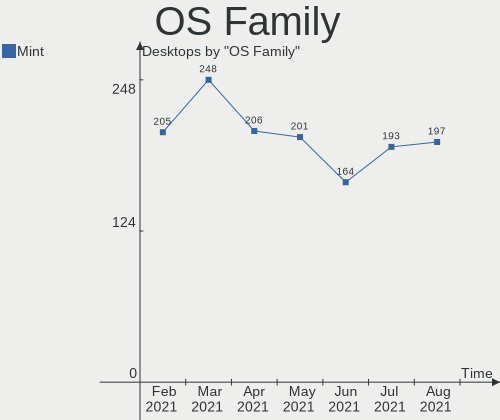

| Name | Desktops | Percent |
|------|----------|---------|
| Mint | 131      | 100%    |

Kernel
------

Version of the Linux kernel

| Version                    | Desktops | Percent |
|----------------------------|----------|---------|
| 5.4.0-48-generic           | 42       | 32.06%  |
| 5.4.0-52-generic           | 28       | 21.37%  |
| 5.4.0-51-generic           | 18       | 13.74%  |
| 5.4.0-26-generic           | 6        | 4.58%   |
| 5.8.0-23-generic           | 5        | 3.82%   |
| 4.15.0-118-generic         | 5        | 3.82%   |
| 5.4.0-47-generic           | 4        | 3.05%   |
| 5.4.0-42-generic           | 2        | 1.53%   |
| 4.15.0-121-generic         | 2        | 1.53%   |
| 5.9.2-050902-generic       | 1        | 0.76%   |
| 5.9.0-050900-generic       | 1        | 0.76%   |
| 5.8.12-050812-generic      | 1        | 0.76%   |
| 5.8.0-25-generic           | 1        | 0.76%   |
| 5.8.0-16.1-liquorix-amd64  | 1        | 0.76%   |
| 5.7.19-mint19.3            | 1        | 0.76%   |
| 5.4.14-050414-generic      | 1        | 0.76%   |
| 5.4.0-472009090909-generic | 1        | 0.76%   |
| 5.4.0-45-generic           | 1        | 0.76%   |
| 5.4.0-40-generic           | 1        | 0.76%   |
| 5.4.0-37-generic           | 1        | 0.76%   |
| 5.3.0-24-generic           | 1        | 0.76%   |
| 4.15.0-91-generic          | 1        | 0.76%   |
| 4.15.0-88-generic          | 1        | 0.76%   |
| 4.15.0-20-generic          | 1        | 0.76%   |
| 4.15.0-122-generic         | 1        | 0.76%   |
| 4.15.0-117-generic         | 1        | 0.76%   |
| 4.15.0-112-generic         | 1        | 0.76%   |
| 4.15.0-101-generic         | 1        | 0.76%   |

Kernel Family
-------------

Linux kernel without a distro release

| Version | Desktops | Percent |
|---------|----------|---------|
| 5.4.0   | 104      | 79.39%  |
| 4.15.0  | 14       | 10.69%  |
| 5.8.0   | 7        | 5.34%   |
| 5.9.2   | 1        | 0.76%   |
| 5.9.0   | 1        | 0.76%   |
| 5.8.12  | 1        | 0.76%   |
| 5.7.19  | 1        | 0.76%   |
| 5.4.14  | 1        | 0.76%   |
| 5.3.0   | 1        | 0.76%   |

Kernel Major Ver.
-----------------

Linux kernel major version

| Version | Desktops | Percent |
|---------|----------|---------|
| 5.4     | 105      | 80.15%  |
| 4.15    | 14       | 10.69%  |
| 5.8     | 8        | 6.11%   |
| 5.9     | 2        | 1.53%   |
| 5.7     | 1        | 0.76%   |
| 5.3     | 1        | 0.76%   |

Arch
----

OS architecture (x86_64, i586, etc.)

| Name   | Desktops | Percent |
|--------|----------|---------|
| x86_64 | 129      | 98.47%  |
| i686   | 2        | 1.53%   |

DE
--

Desktop Environment

| Name       | Desktops | Percent |
|------------|----------|---------|
| X-Cinnamon | 63       | 48.09%  |
| Cinnamon   | 29       | 22.14%  |
| MATE       | 24       | 18.32%  |
| XFCE       | 10       | 7.63%   |
| GNOME      | 4        | 3.05%   |
| KDE        | 1        | 0.76%   |

Display Server
--------------

X11 or Wayland

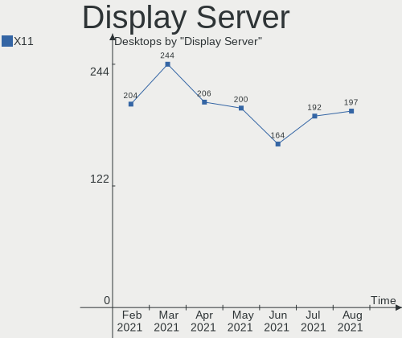

| Name | Desktops | Percent |
|------|----------|---------|
| X11  | 131      | 100%    |

Display Manager
---------------

SDDM, LightDM, etc.

| Name    | Desktops | Percent |
|---------|----------|---------|
| Unknown | 89       | 67.94%  |
| TDM     | 41       | 31.3%   |
| SDDM    | 1        | 0.76%   |

OS Lang
-------

Language

| Lang       | Desktops | Percent |
|------------|----------|---------|
| en_US      | 35       | 26.72%  |
| de_DE      | 19       | 14.5%   |
| pt_BR      | 15       | 11.45%  |
| ru_RU      | 10       | 7.63%   |
| fi_FI      | 4        | 3.05%   |
| en_CA      | 4        | 3.05%   |
| pl_PL      | 3        | 2.29%   |
| hu_HU      | 3        | 2.29%   |
| es_ES      | 3        | 2.29%   |
| en_AU      | 3        | 2.29%   |
| cs_CZ      | 3        | 2.29%   |
| sv_SE      | 2        | 1.53%   |
| ru_UA      | 2        | 1.53%   |
| pt_PT      | 2        | 1.53%   |
| it_IT      | 2        | 1.53%   |
| es_AR      | 2        | 1.53%   |
| en_IE      | 2        | 1.53%   |
| da_DK      | 2        | 1.53%   |
| C          | 2        | 1.53%   |
| ro_RO      | 1        | 0.76%   |
| nl_NL      | 1        | 0.76%   |
| nl_BE      | 1        | 0.76%   |
| nb_NO      | 1        | 0.76%   |
| lv_LV      | 1        | 0.76%   |
| lt_LT      | 1        | 0.76%   |
| ja_JP      | 1        | 0.76%   |
| fr_FR      | 1        | 0.76%   |
| fi_FI.utf8 | 1        | 0.76%   |
| es_UY      | 1        | 0.76%   |
| es_MX      | 1        | 0.76%   |
| en_IN      | 1        | 0.76%   |
| de_CH      | 1        | 0.76%   |

Boot Mode
---------

EFI or BIOS

| Mode | Desktops | Percent |
|------|----------|---------|
| BIOS | 89       | 67.94%  |
| EFI  | 42       | 32.06%  |

Filesystem
----------

Type of filesystem

| Type    | Desktops | Percent |
|---------|----------|---------|
| Ext4    | 123      | 93.89%  |
| Btrfs   | 4        | 3.05%   |
| Overlay | 3        | 2.29%   |
| Ext3    | 1        | 0.76%   |

Part. scheme
------------

Scheme of partitioning

| Type    | Desktops | Percent |
|---------|----------|---------|
| Unknown | 87       | 66.41%  |
| GPT     | 31       | 23.66%  |
| MBR     | 13       | 9.92%   |

Dual Boot with Linux/BSD
------------------------

Hosting more than one Linux/BSD

| Dual boot | Desktops | Percent |
|-----------|----------|---------|
| No        | 123      | 93.89%  |
| Yes       | 8        | 6.11%   |

Dual Boot (Win)
---------------

Hosting Linux and Windows

| Dual boot | Desktops | Percent |
|-----------|----------|---------|
| No        | 98       | 74.81%  |
| Yes       | 33       | 25.19%  |

Country
-------

Geographic location (country)

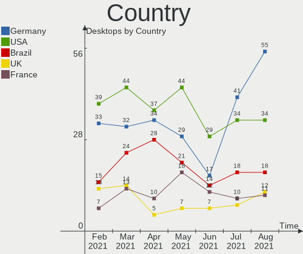

| Country            | Desktops | Percent |
|--------------------|----------|---------|
| Germany            | 17       | 12.98%  |
| Brazil             | 17       | 12.98%  |
| USA                | 16       | 12.21%  |
| Russia             | 8        | 6.11%   |
| Canada             | 6        | 4.58%   |
| Ukraine            | 5        | 3.82%   |
| Spain              | 5        | 3.82%   |
| Finland            | 5        | 3.82%   |
| Sweden             | 4        | 3.05%   |
| Poland             | 4        | 3.05%   |
| Netherlands        | 3        | 2.29%   |
| Italy              | 3        | 2.29%   |
| Hungary            | 3        | 2.29%   |
| Czech Republic     | 3        | 2.29%   |
| Australia          | 3        | 2.29%   |
| Portugal           | 2        | 1.53%   |
| Norway             | 2        | 1.53%   |
| Ireland            | 2        | 1.53%   |
| France             | 2        | 1.53%   |
| Denmark            | 2        | 1.53%   |
| Belarus            | 2        | 1.53%   |
| Argentina          | 2        | 1.53%   |
| Uruguay            | 1        | 0.76%   |
| Thailand           | 1        | 0.76%   |
| Slovakia           | 1        | 0.76%   |
| Romania            | 1        | 0.76%   |
| Mexico             | 1        | 0.76%   |
| Lithuania          | 1        | 0.76%   |
| Latvia             | 1        | 0.76%   |
| Korea, Republic of | 1        | 0.76%   |
| Kazakhstan         | 1        | 0.76%   |
| Japan              | 1        | 0.76%   |
| Indonesia          | 1        | 0.76%   |
| India              | 1        | 0.76%   |
| Egypt              | 1        | 0.76%   |
| Belgium            | 1        | 0.76%   |
| Bangladesh         | 1        | 0.76%   |

City
----

Geographic location (city)

| City                   | Desktops | Percent |
|------------------------|----------|---------|
| São Paulo             | 5        | 3.82%   |
| Warsaw                 | 2        | 1.53%   |
| Rio de Janeiro         | 2        | 1.53%   |
| Queimadas              | 2        | 1.53%   |
| Paris                  | 2        | 1.53%   |
| Kyiv                   | 2        | 1.53%   |
| Helsinki               | 2        | 1.53%   |
| Düsseldorf            | 2        | 1.53%   |
| Zwickau                | 1        | 0.76%   |
| Yaroslavl              | 1        | 0.76%   |
| Windsor                | 1        | 0.76%   |
| Westerlo               | 1        | 0.76%   |
| Utena                  | 1        | 0.76%   |
| Union                  | 1        | 0.76%   |
| Turku                  | 1        | 0.76%   |
| Trim                   | 1        | 0.76%   |
| Tlalnepantla           | 1        | 0.76%   |
| Tigre                  | 1        | 0.76%   |
| Szczecin               | 1        | 0.76%   |
| Szazhalombatta         | 1        | 0.76%   |
| Sylhet                 | 1        | 0.76%   |
| Sydney                 | 1        | 0.76%   |
| Skowarcz               | 1        | 0.76%   |
| Seoul                  | 1        | 0.76%   |
| Sao Goncalo            | 1        | 0.76%   |
| Salvador               | 1        | 0.76%   |
| Salobreña             | 1        | 0.76%   |
| Saint Cloud            | 1        | 0.76%   |
| Rønnede               | 1        | 0.76%   |
| Roscommon              | 1        | 0.76%   |
| Rokland                | 1        | 0.76%   |
| Rochester              | 1        | 0.76%   |
| Rinteln                | 1        | 0.76%   |
| Riga                   | 1        | 0.76%   |
| Rendsburg              | 1        | 0.76%   |
| Ramenskoye             | 1        | 0.76%   |
| Pécs                  | 1        | 0.76%   |
| Porto                  | 1        | 0.76%   |
| Portland               | 1        | 0.76%   |
| Port Tobacco           | 1        | 0.76%   |
| Petropavl              | 1        | 0.76%   |
| Pervouralsk            | 1        | 0.76%   |
| Perth                  | 1        | 0.76%   |
| Pedro II               | 1        | 0.76%   |
| Partille               | 1        | 0.76%   |
| Paradise Valley        | 1        | 0.76%   |
| Palm Springs           | 1        | 0.76%   |
| Ottawa                 | 1        | 0.76%   |
| Ostrava                | 1        | 0.76%   |
| Oslo                   | 1        | 0.76%   |
| Obertshausen           | 1        | 0.76%   |
| Nuremberg              | 1        | 0.76%   |
| Northville             | 1        | 0.76%   |
| Neugersdorf            | 1        | 0.76%   |
| Navarredonda de Gredos | 1        | 0.76%   |
| Murmansk               | 1        | 0.76%   |
| Munich                 | 1        | 0.76%   |
| Moscow                 | 1        | 0.76%   |
| Moravska Trebova       | 1        | 0.76%   |
| Montevideo             | 1        | 0.76%   |

Vendor
------

Motherboard manufacturer

| Name                | Desktops | Percent |
|---------------------|----------|---------|
| ASUSTek Computer    | 39       | 29.77%  |
| Gigabyte Technology | 22       | 16.79%  |
| MSI                 | 12       | 9.16%   |
| Hewlett-Packard     | 12       | 9.16%   |
| ASRock              | 11       | 8.4%    |
| Dell                | 10       | 7.63%   |
| Lenovo              | 7        | 5.34%   |
| Acer                | 5        | 3.82%   |
| Intel               | 3        | 2.29%   |
| Biostar             | 2        | 1.53%   |
| Megaware            | 1        | 0.76%   |
| Medion              | 1        | 0.76%   |
| Itautec             | 1        | 0.76%   |
| Fujitsu Siemens     | 1        | 0.76%   |
| eMachines           | 1        | 0.76%   |
| BESSTAR Tech        | 1        | 0.76%   |
| AZW                 | 1        | 0.76%   |
| Unknown             | 1        | 0.76%   |

Model
-----

Motherboard model

| Name                                | Desktops | Percent |
|-------------------------------------|----------|---------|
| ASUS All Series                     | 4        | 3.05%   |
| ASUS M5A78L-M/USB3                  | 2        | 1.53%   |
| ASRock B450 Gaming K4               | 2        | 1.53%   |
| MSI MS-7C37                         | 1        | 0.76%   |
| MSI MS-7B46                         | 1        | 0.76%   |
| MSI MS-7B07                         | 1        | 0.76%   |
| MSI MS-7A70                         | 1        | 0.76%   |
| MSI MS-7A62                         | 1        | 0.76%   |
| MSI MS-7971                         | 1        | 0.76%   |
| MSI MS-7851                         | 1        | 0.76%   |
| MSI MS-7823                         | 1        | 0.76%   |
| MSI MS-7788                         | 1        | 0.76%   |
| MSI MS-7759                         | 1        | 0.76%   |
| MSI MS-7721                         | 1        | 0.76%   |
| MSI MS-7250                         | 1        | 0.76%   |
| Megaware MW-H61HD-MA                | 1        | 0.76%   |
| Medion BSWD-CM                      | 1        | 0.76%   |
| Lenovo ThinkCentre M92p 32282P2     | 1        | 0.76%   |
| Lenovo ThinkCentre M91p 4480B1U     | 1        | 0.76%   |
| Lenovo ThinkCentre M58p 6137E61     | 1        | 0.76%   |
| Lenovo ThinkCentre M58 6258W1M      | 1        | 0.76%   |
| Lenovo ThinkCentre E73 10AU003FMX   | 1        | 0.76%   |
| Lenovo M4350 10164                  | 1        | 0.76%   |
| Lenovo K450e 10181                  | 1        | 0.76%   |
| Itautec Infoway                     | 1        | 0.76%   |
| Intel H61                           | 1        | 0.76%   |
| Intel DH67CL AAG10212-208           | 1        | 0.76%   |
| Intel B75                           | 1        | 0.76%   |
| HP EliteDesk 800 G1 USDT            | 1        | 0.76%   |
| HP EliteDesk 800 G1 SFF             | 1        | 0.76%   |
| HP Compaq Pro 6300 SFF              | 1        | 0.76%   |
| HP Compaq Elite 8300 USDT           | 1        | 0.76%   |
| HP Compaq Elite 8300 CMT            | 1        | 0.76%   |
| HP Compaq dc7700 Ultra-slim Desktop | 1        | 0.76%   |
| HP Compaq dc5750 Small Form Factor  | 1        | 0.76%   |
| HP Compaq 8200 Elite USDT PC        | 1        | 0.76%   |
| HP Compaq 8200 Elite SFF PC         | 1        | 0.76%   |
| HP Compaq 8100 Elite SFF PC         | 1        | 0.76%   |
| HP Compaq 6200 Pro MT PC            | 1        | 0.76%   |
| HP 23-h001la                        | 1        | 0.76%   |
| Gigabyte Z77M-D3H                   | 1        | 0.76%   |
| Gigabyte Z370P D3                   | 1        | 0.76%   |
| Gigabyte X570 AORUS ELITE           | 1        | 0.76%   |
| Gigabyte X170-Extreme ECC           | 1        | 0.76%   |
| Gigabyte H67MA-USB3-B3              | 1        | 0.76%   |
| Gigabyte H61M-S1                    | 1        | 0.76%   |
| Gigabyte GA-MA78LMT-US2H            | 1        | 0.76%   |
| Gigabyte GA-990FXA-UD3              | 1        | 0.76%   |
| Gigabyte GA-970A-UD3                | 1        | 0.76%   |
| Gigabyte GA-78LMT-USB3 6.0          | 1        | 0.76%   |
| Gigabyte GA-78LMT-S2P               | 1        | 0.76%   |
| Gigabyte G31M-ES2L                  | 1        | 0.76%   |
| Gigabyte B550 GAMING X              | 1        | 0.76%   |
| Gigabyte B550 AORUS PRO             | 1        | 0.76%   |
| Gigabyte B450M DS3H                 | 1        | 0.76%   |
| Gigabyte B450 AORUS ELITE           | 1        | 0.76%   |
| Gigabyte B360 AORUS GAMING 3 WIFI   | 1        | 0.76%   |
| Gigabyte A320M-S2H                  | 1        | 0.76%   |
| Gigabyte 970A-DS3P FX               | 1        | 0.76%   |
| Gigabyte 970A-DS3P                  | 1        | 0.76%   |

Model Family
------------

Motherboard model prefix

| Name                     | Desktops | Percent |
|--------------------------|----------|---------|
| HP Compaq                | 9        | 6.87%   |
| Lenovo ThinkCentre       | 5        | 3.82%   |
| Dell OptiPlex            | 4        | 3.05%   |
| Dell Inspiron            | 4        | 3.05%   |
| ASUS All                 | 4        | 3.05%   |
| Acer Aspire              | 4        | 3.05%   |
| ASUS ROG                 | 3        | 2.29%   |
| ASUS PRIME               | 3        | 2.29%   |
| ASUS M5A78L-M            | 3        | 2.29%   |
| HP EliteDesk             | 2        | 1.53%   |
| Gigabyte B550            | 2        | 1.53%   |
| Gigabyte 970A-DS3P       | 2        | 1.53%   |
| ASUS SABERTOOTH          | 2        | 1.53%   |
| ASUS M5A97               | 2        | 1.53%   |
| ASRock B450              | 2        | 1.53%   |
| MSI MS-7C37              | 1        | 0.76%   |
| MSI MS-7B46              | 1        | 0.76%   |
| MSI MS-7B07              | 1        | 0.76%   |
| MSI MS-7A70              | 1        | 0.76%   |
| MSI MS-7A62              | 1        | 0.76%   |
| MSI MS-7971              | 1        | 0.76%   |
| MSI MS-7851              | 1        | 0.76%   |
| MSI MS-7823              | 1        | 0.76%   |
| MSI MS-7788              | 1        | 0.76%   |
| MSI MS-7759              | 1        | 0.76%   |
| MSI MS-7721              | 1        | 0.76%   |
| MSI MS-7250              | 1        | 0.76%   |
| Megaware MW-H61HD-MA     | 1        | 0.76%   |
| Medion BSWD-CM           | 1        | 0.76%   |
| Lenovo M4350             | 1        | 0.76%   |
| Lenovo K450e             | 1        | 0.76%   |
| Itautec Infoway          | 1        | 0.76%   |
| Intel H61                | 1        | 0.76%   |
| Intel DH67CL             | 1        | 0.76%   |
| Intel B75                | 1        | 0.76%   |
| HP 23-h001la             | 1        | 0.76%   |
| Gigabyte Z77M-D3H        | 1        | 0.76%   |
| Gigabyte Z370P           | 1        | 0.76%   |
| Gigabyte X570            | 1        | 0.76%   |
| Gigabyte X170-Extreme    | 1        | 0.76%   |
| Gigabyte H67MA-USB3-B3   | 1        | 0.76%   |
| Gigabyte H61M-S1         | 1        | 0.76%   |
| Gigabyte GA-MA78LMT-US2H | 1        | 0.76%   |
| Gigabyte GA-990FXA-UD3   | 1        | 0.76%   |
| Gigabyte GA-970A-UD3     | 1        | 0.76%   |
| Gigabyte GA-78LMT-USB3   | 1        | 0.76%   |
| Gigabyte GA-78LMT-S2P    | 1        | 0.76%   |
| Gigabyte G31M-ES2L       | 1        | 0.76%   |
| Gigabyte B450M           | 1        | 0.76%   |
| Gigabyte B450            | 1        | 0.76%   |
| Gigabyte B360            | 1        | 0.76%   |
| Gigabyte A320M-S2H       | 1        | 0.76%   |
| Gigabyte 970A-DS3        | 1        | 0.76%   |
| Gigabyte 970A-D3         | 1        | 0.76%   |
| Fujitsu Siemens ESPRIMO  | 1        | 0.76%   |
| eMachines ET1331G        | 1        | 0.76%   |
| Dell Studio              | 1        | 0.76%   |
| Dell Precision           | 1        | 0.76%   |
| Biostar Hi-Fi            | 1        | 0.76%   |
| Biostar A68I-350         | 1        | 0.76%   |

MFG Year
--------

Motherboard manufacture year

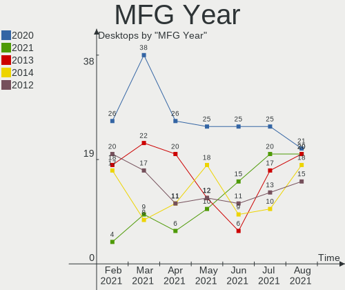

| Year | Desktops | Percent |
|------|----------|---------|
| 2019 | 20       | 15.27%  |
| 2013 | 18       | 13.74%  |
| 2012 | 15       | 11.45%  |
| 2018 | 11       | 8.4%    |
| 2014 | 11       | 8.4%    |
| 2020 | 9        | 6.87%   |
| 2016 | 7        | 5.34%   |
| 2015 | 7        | 5.34%   |
| 2011 | 7        | 5.34%   |
| 2009 | 7        | 5.34%   |
| 2008 | 6        | 4.58%   |
| 2007 | 5        | 3.82%   |
| 2010 | 4        | 3.05%   |
| 2017 | 3        | 2.29%   |
| 2006 | 1        | 0.76%   |

Form Factor
-----------

Physical design of the computer

| Name    | Desktops | Percent |
|---------|----------|---------|
| Desktop | 131      | 100%    |

Secure Boot
-----------

Enabled or disabled

| State    | Desktops | Percent |
|----------|----------|---------|
| Disabled | 128      | 97.71%  |
| Enabled  | 3        | 2.29%   |

Coreboot
--------

Have coreboot on board

| Used | Desktops | Percent |
|------|----------|---------|
| No   | 131      | 100%    |

RAM Size
--------

Total RAM memory

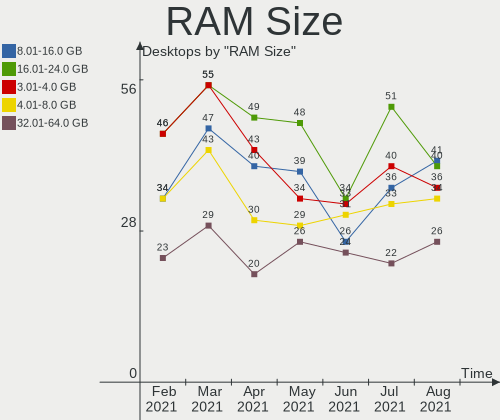

| Size in GB  | Desktops | Percent |
|-------------|----------|---------|
| 16.01-24.0  | 38       | 29.01%  |
| 4.01-8.0    | 27       | 20.61%  |
| 3.01-4.0    | 26       | 19.85%  |
| 8.01-16.0   | 23       | 17.56%  |
| 32.01-64.0  | 12       | 9.16%   |
| 1.01-2.0    | 2        | 1.53%   |
| 24.01-32.0  | 1        | 0.76%   |
| 2.01-3.0    | 1        | 0.76%   |
| 64.01-256.0 | 1        | 0.76%   |

RAM Used
--------

Used RAM memory

| Used GB    | Desktops | Percent |
|------------|----------|---------|
| 1.01-2.0   | 45       | 34.35%  |
| 2.01-3.0   | 30       | 22.9%   |
| 4.01-8.0   | 18       | 13.74%  |
| 3.01-4.0   | 18       | 13.74%  |
| 0.01-1.0   | 11       | 8.4%    |
| 8.01-16.0  | 8        | 6.11%   |
| 16.01-24.0 | 1        | 0.76%   |

Has CD-ROM
----------

Has CD-ROM on board

| Presented | Desktops | Percent |
|-----------|----------|---------|
| Yes       | 80       | 61.07%  |
| No        | 51       | 38.93%  |

Total Drives
------------

Number of drives on board

| Drives | Desktops | Percent |
|--------|----------|---------|
| 1      | 44       | 33.59%  |
| 2      | 39       | 29.77%  |
| 3      | 27       | 20.61%  |
| 4      | 13       | 9.92%   |
| 6      | 3        | 2.29%   |
| 5      | 3        | 2.29%   |
| 7      | 1        | 0.76%   |
| 0      | 1        | 0.76%   |

Has Ethernet
------------

Has Ethernet on board

| Presented | Desktops | Percent |
|-----------|----------|---------|
| Yes       | 129      | 98.47%  |
| No        | 2        | 1.53%   |

Drive Vendor
------------

Hard drive vendors

| Vendor              | Desktops | Drives | Percent |
|---------------------|----------|--------|---------|
| Seagate             | 55       | 71     | 21.91%  |
| WDC                 | 52       | 68     | 20.72%  |
| Samsung Electronics | 30       | 35     | 11.95%  |
| Kingston            | 23       | 25     | 9.16%   |
| Toshiba             | 17       | 18     | 6.77%   |
| Hitachi             | 11       | 11     | 4.38%   |
| SanDisk             | 8        | 8      | 3.19%   |
| Crucial             | 7        | 7      | 2.79%   |
| A-DATA Technology   | 6        | 7      | 2.39%   |
| Intel               | 4        | 4      | 1.59%   |
| MAXTOR              | 3        | 3      | 1.2%    |
| HGST                | 3        | 4      | 1.2%    |
| GOODRAM             | 3        | 3      | 1.2%    |
| China               | 3        | 3      | 1.2%    |
| Transcend           | 2        | 2      | 0.8%    |
| Smartbuy            | 2        | 2      | 0.8%    |
| Phison              | 2        | 2      | 0.8%    |
| OCZ                 | 2        | 2      | 0.8%    |
| Intenso             | 2        | 2      | 0.8%    |
| XPG                 | 1        | 1      | 0.4%    |
| WD MediaMax         | 1        | 1      | 0.4%    |
| USB3.0              | 1        | 1      | 0.4%    |
| SPCC                | 1        | 1      | 0.4%    |
| Silicon Motion      | 1        | 2      | 0.4%    |
| SATA SSD            | 1        | 1      | 0.4%    |
| PLEXTOR             | 1        | 1      | 0.4%    |
| Patriot             | 1        | 1      | 0.4%    |
| PALIT               | 1        | 1      | 0.4%    |
| ORICO               | 1        | 1      | 0.4%    |
| Micron Technology   | 1        | 1      | 0.4%    |
| Lite-On             | 1        | 1      | 0.4%    |
| KingSpec            | 1        | 1      | 0.4%    |
| HS-SSD-E100         | 1        | 1      | 0.4%    |
| Fujitsu             | 1        | 1      | 0.4%    |
| Freecom             | 1        | 1      | 0.4%    |

HDD Vendor
----------

Hard disk drive vendors

| Vendor              | Desktops | Drives | Percent |
|---------------------|----------|--------|---------|
| Seagate             | 54       | 70     | 36.73%  |
| WDC                 | 49       | 64     | 33.33%  |
| Toshiba             | 16       | 17     | 10.88%  |
| Hitachi             | 11       | 11     | 7.48%   |
| Samsung Electronics | 9        | 9      | 6.12%   |
| MAXTOR              | 3        | 3      | 2.04%   |
| HGST                | 3        | 4      | 2.04%   |
| Intenso             | 1        | 1      | 0.68%   |
| Fujitsu             | 1        | 1      | 0.68%   |

SSD Vendor
----------

Solid state drive vendors

| Vendor              | Desktops | Drives | Percent |
|---------------------|----------|--------|---------|
| Kingston            | 22       | 24     | 25.88%  |
| Samsung Electronics | 16       | 16     | 18.82%  |
| SanDisk             | 7        | 7      | 8.24%   |
| Crucial             | 6        | 6      | 7.06%   |
| A-DATA Technology   | 5        | 5      | 5.88%   |
| WDC                 | 4        | 4      | 4.71%   |
| Intel               | 3        | 3      | 3.53%   |
| GOODRAM             | 3        | 3      | 3.53%   |
| China               | 3        | 3      | 3.53%   |
| Transcend           | 2        | 2      | 2.35%   |
| SmartBuy            | 2        | 2      | 2.35%   |
| OCZ                 | 2        | 2      | 2.35%   |
| Toshiba             | 1        | 1      | 1.18%   |
| SPCC                | 1        | 1      | 1.18%   |
| PLEXTOR             | 1        | 1      | 1.18%   |
| Patriot             | 1        | 1      | 1.18%   |
| PALIT               | 1        | 1      | 1.18%   |
| ORICO               | 1        | 1      | 1.18%   |
| Micron Technology   | 1        | 1      | 1.18%   |
| KingSpec            | 1        | 1      | 1.18%   |
| Intenso             | 1        | 1      | 1.18%   |
| HS-SSD-E100         | 1        | 1      | 1.18%   |

Drive Model
-----------

Hard drive models

| Model                        | Desktops | Percent |
|------------------------------|----------|---------|
| ST3500418AS 500GB            | 6        | 2.13%   |
| WD10EZEX-08WN4A0 1TB         | 5        | 1.77%   |
| SV300S37A120G 120GB SSD      | 5        | 1.77%   |
| ST1000DM010-2EP102 1TB       | 5        | 1.77%   |
| ST1000DM003-1SB102 1TB       | 5        | 1.77%   |
| SA400S37120G 120GB SSD       | 5        | 1.77%   |
| SA400S37240G 240GB SSD       | 4        | 1.42%   |
| DT01ACA100 1TB               | 4        | 1.42%   |
| WD5000AAKX-60U6AA0 500GB     | 3        | 1.06%   |
| ST500DM002-1BD142 500GB      | 3        | 1.06%   |
| ST3500312CS 500GB            | 3        | 1.06%   |
| ST3000DM001-1ER166 3TB       | 3        | 1.06%   |
| ST2000DM008-2FR102 2TB       | 3        | 1.06%   |
| ST1000DM003-1ER162 1TB       | 3        | 1.06%   |
| ST1000DM003-1CH162 1TB       | 3        | 1.06%   |
| SSD 860 EVO 250GB            | 3        | 1.06%   |
| SSD 850 EVO 500GB            | 3        | 1.06%   |
| NVMe SSD Drive 500GB         | 3        | 1.06%   |
| HDWD110 1TB                  | 3        | 1.06%   |
| DT01ACA050 500GB             | 3        | 1.06%   |
| WD5000AAKX-00ERMA0 500GB     | 2        | 0.71%   |
| WD5000AAKX-001CA0 500GB      | 2        | 0.71%   |
| WD20EZRZ-00Z5HB0 2TB         | 2        | 0.71%   |
| WD20EARS-00MVWB0 2TB         | 2        | 0.71%   |
| ST500LM000-1EJ162 500GB      | 2        | 0.71%   |
| ST3250310AS 250GB            | 2        | 0.71%   |
| ST1000DM003-9YN162 1TB       | 2        | 0.71%   |
| SSD 970 EVO 500GB            | 2        | 0.71%   |
| SSD 960 EVO 250GB            | 2        | 0.71%   |
| SSD 860 EVO 500GB            | 2        | 0.71%   |
| SSD 750 EVO 250GB            | 2        | 0.71%   |
| SSD 120GB                    | 2        | 0.71%   |
| SDSSDP128G 128GB             | 2        | 0.71%   |
| SA400S37480G 480GB SSD       | 2        | 0.71%   |
| NVMe SSD Drive 512GB         | 2        | 0.71%   |
| NVMe SSD Drive 2TB           | 2        | 0.71%   |
| NVMe SSD Drive 256GB         | 2        | 0.71%   |
| NVMe SSD Drive 1TB           | 2        | 0.71%   |
| HDP725050GLA360 500GB        | 2        | 0.71%   |
| DT01ACA200 2TB               | 2        | 0.71%   |
| CT240BX500SSD1 240GB         | 2        | 0.71%   |
| CT1000MX500SSD1 1TB          | 2        | 0.71%   |
| X400 M.2 2280 256GB SSD      | 1        | 0.35%   |
| WL2500GSA6472B 2TB           | 1        | 0.35%   |
| WDS250G2B0B-00YS70 250GB SSD | 1        | 0.35%   |
| WDS240G2G0B-00EPW0 240GB SSD | 1        | 0.35%   |
| WDS120G2G0A-00JH30 120GB SSD | 1        | 0.35%   |
| WDS100T2B0A-00SM50 1TB SSD   | 1        | 0.35%   |
| WD800JD-60LSA5 80GB          | 1        | 0.35%   |
| WD800JD-55MSA1 80GB          | 1        | 0.35%   |
| WD7500AADS-00L5B1 752GB      | 1        | 0.35%   |
| WD5000AAKX-22ERMA0 500GB     | 1        | 0.35%   |
| WD5000AAKX-08U6AA0 500GB     | 1        | 0.35%   |
| WD5000AAKX-07U6AA0 500GB     | 1        | 0.35%   |
| WD5000AAKX-00U6AA0 500GB     | 1        | 0.35%   |
| WD40EZRZ-00GXCB0 4TB         | 1        | 0.35%   |
| WD40EFRX-68WT0N0 4TB         | 1        | 0.35%   |
| WD3200BEVT-11ZCT0 320GB      | 1        | 0.35%   |
| WD3200BEVT-00A1TT0 320GB     | 1        | 0.35%   |
| WD3200BEVT-00A0RT0 320GB     | 1        | 0.35%   |

Drive Kind
----------

HDD or SSD

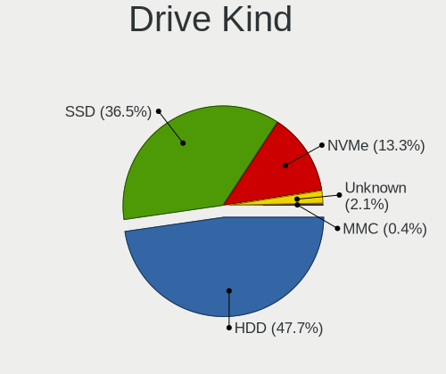

| Kind    | Desktops | Drives | Percent |
|---------|----------|--------|---------|
| HDD     | 112      | 180    | 54.63%  |
| SSD     | 71       | 87     | 34.63%  |
| NVMe    | 18       | 23     | 8.78%   |
| Unknown | 4        | 4      | 1.95%   |

Drive Connector
---------------

SATA, SAS, NVMe, etc.

| Type | Desktops | Drives | Percent |
|------|----------|--------|---------|
| SATA | 128      | 262    | 82.58%  |
| NVMe | 18       | 23     | 11.61%  |
| SAS  | 9        | 9      | 5.81%   |

Drive Size
----------

Size of hard drive

| Size in TB | Desktops | Drives | Percent |
|------------|----------|--------|---------|
| 0.01-0.5   | 104      | 155    | 54.74%  |
| 0.51-1.0   | 50       | 65     | 26.32%  |
| 1.01-2.0   | 21       | 30     | 11.05%  |
| 2.01-3.0   | 8        | 9      | 4.21%   |
| 3.01-4.0   | 6        | 7      | 3.16%   |
| 4.01-10.0  | 1        | 1      | 0.53%   |

Space Total
-----------

Amount of disk space available on the file system

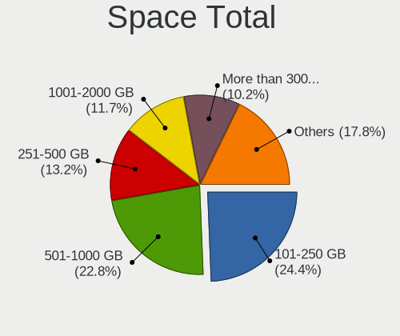

| Size in GB     | Desktops | Percent |
|----------------|----------|---------|
| 101-250        | 35       | 26.72%  |
| 251-500        | 25       | 19.08%  |
| 501-1000       | 19       | 14.5%   |
| 1001-2000      | 18       | 13.74%  |
| More than 3000 | 17       | 12.98%  |
| 2001-3000      | 7        | 5.34%   |
| 51-100         | 5        | 3.82%   |
| 21-50          | 4        | 3.05%   |
| 1-20           | 1        | 0.76%   |

Space Used
----------

Amount of used disk space

| Used GB        | Desktops | Percent |
|----------------|----------|---------|
| 101-250        | 34       | 25.95%  |
| 51-100         | 18       | 13.74%  |
| 21-50          | 16       | 12.21%  |
| 1-20           | 15       | 11.45%  |
| 501-1000       | 14       | 10.69%  |
| 251-500        | 11       | 8.4%    |
| 1001-2000      | 10       | 7.63%   |
| More than 3000 | 8        | 6.11%   |
| 2001-3000      | 5        | 3.82%   |

Malfunc. Drives
---------------

Drive models with a malfunction

| Model                   | Desktops | Drives | Percent |
|-------------------------|----------|--------|---------|
| WD2500AAJS-00B4A0 250GB | 1        | 1      | 7.69%   |
| WD20EURS-73TLHY0 2TB    | 1        | 1      | 7.69%   |
| TOURO Mobile 1TB        | 1        | 1      | 7.69%   |
| ST500DM002-1BD142 500GB | 1        | 1      | 7.69%   |
| ST3500418AS 500GB       | 1        | 1      | 7.69%   |
| ST3500412AS 500GB       | 1        | 1      | 7.69%   |
| ST3500320AS 500GB       | 1        | 2      | 7.69%   |
| ST1000DM003-1CH162 1TB  | 1        | 1      | 7.69%   |
| SSD 970 EVO 500GB       | 1        | 1      | 7.69%   |
| SSD 128G                | 1        | 1      | 7.69%   |
| SA400S37120G 120GB SSD  | 1        | 1      | 7.69%   |
| MHZ2250BH G2 250GB      | 1        | 1      | 7.69%   |
| HDP725050GLA360 500GB   | 1        | 1      | 7.69%   |

Malfunc. Drive Vendor
---------------------

Vendors of faulty drives

| Vendor              | Desktops | Drives | Percent |
|---------------------|----------|--------|---------|
| Seagate             | 4        | 6      | 33.33%  |
| WDC                 | 2        | 2      | 16.67%  |
| Samsung Electronics | 1        | 1      | 8.33%   |
| Kingston            | 1        | 1      | 8.33%   |
| HS-SSD-E100         | 1        | 1      | 8.33%   |
| Hitachi             | 1        | 1      | 8.33%   |
| HGST                | 1        | 1      | 8.33%   |
| Fujitsu             | 1        | 1      | 8.33%   |

Malfunc. HDD Vendor
-------------------

Vendors of faulty HDD drives

| Vendor  | Desktops | Drives | Percent |
|---------|----------|--------|---------|
| Seagate | 4        | 6      | 44.44%  |
| WDC     | 2        | 2      | 22.22%  |
| Hitachi | 1        | 1      | 11.11%  |
| HGST    | 1        | 1      | 11.11%  |
| Fujitsu | 1        | 1      | 11.11%  |

Malfunc. Drive Kind
-------------------

Kinds of faulty drives

| Kind | Desktops | Drives | Percent |
|------|----------|--------|---------|
| HDD  | 7        | 11     | 70%     |
| SSD  | 2        | 2      | 20%     |
| NVMe | 1        | 1      | 10%     |

Failed Drives
-------------

Failed drive models

| Model         | Desktops | Drives | Percent |
|---------------|----------|--------|---------|
| HD252HJ 250GB | 1        | 1      | 100%    |

Failed Drive Vendor
-------------------

Failed drive vendors

| Vendor              | Desktops | Drives | Percent |
|---------------------|----------|--------|---------|
| Samsung Electronics | 1        | 1      | 100%    |

Drive Status
------------

Number of failed and malfunc. drives

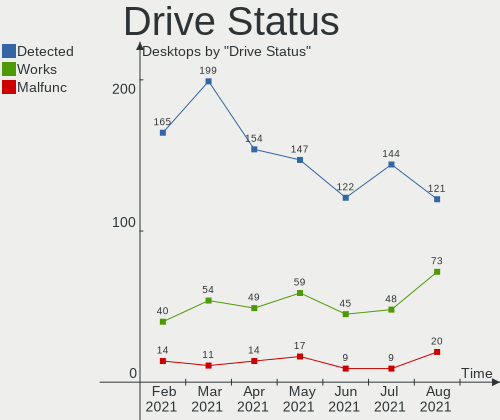

| Status   | Desktops | Drives | Percent |
|----------|----------|--------|---------|
| Detected | 90       | 192    | 64.29%  |
| Works    | 39       | 87     | 27.86%  |
| Malfunc  | 10       | 14     | 7.14%   |
| Failed   | 1        | 1      | 0.71%   |

Storage Vendor
--------------

Storage controller vendors

| Vendor                      | Desktops | Percent |
|-----------------------------|----------|---------|
| Intel                       | 76       | 45.78%  |
| AMD                         | 47       | 28.31%  |
| Samsung Electronics         | 9        | 5.42%   |
| Nvidia                      | 8        | 4.82%   |
| ASMedia Technology          | 7        | 4.22%   |
| JMicron Technology          | 4        | 2.41%   |
| Marvell Technology Group    | 3        | 1.81%   |
| Phison Electronics          | 2        | 1.2%    |
| ADATA Technology            | 2        | 1.2%    |
| VIA Technologies            | 1        | 0.6%    |
| Silicon Motion              | 1        | 0.6%    |
| Seagate Technology          | 1        | 0.6%    |
| Sandisk                     | 1        | 0.6%    |
| Realtek Semiconductor       | 1        | 0.6%    |
| Micron/Crucial Technology   | 1        | 0.6%    |
| Lite-On Technology          | 1        | 0.6%    |
| Kingston Technology Company | 1        | 0.6%    |

Storage Model
-------------

Storage controller models

| Model                                                                             | Desktops | Percent |
|-----------------------------------------------------------------------------------|----------|---------|
| FCH SATA Controller [AHCI mode]                                                   | 22       | 9.87%   |
| SB7x0/SB8x0/SB9x0 IDE Controller                                                  | 13       | 5.83%   |
| 8 Series/C220 Series Chipset Family 6-port SATA Controller 1 [AHCI mode]          | 12       | 5.38%   |
| SB7x0/SB8x0/SB9x0 SATA Controller [AHCI mode]                                     | 11       | 4.93%   |
| 7 Series/C210 Series Chipset Family 6-port SATA Controller [AHCI mode]            | 11       | 4.93%   |
| 6 Series/C200 Series Chipset Family 6 port Desktop SATA AHCI Controller           | 9        | 4.04%   |
| SB7x0/SB8x0/SB9x0 SATA Controller [IDE mode]                                      | 7        | 3.14%   |
| ASM1062 Serial ATA Controller                                                     | 7        | 3.14%   |
| 400 Series Chipset SATA Controller                                                | 7        | 3.14%   |
| 200 Series PCH SATA controller [AHCI mode]                                        | 7        | 3.14%   |
| Q170/Q150/B150/H170/H110/Z170/CM236 Chipset SATA Controller [AHCI Mode]           | 6        | 2.69%   |
| NVMe SSD Controller SM981/PM981/PM983                                             | 6        | 2.69%   |
| MCP61 SATA Controller                                                             | 5        | 2.24%   |
| MCP61 IDE                                                                         | 5        | 2.24%   |
| 6 Series/C200 Series Chipset Family Desktop SATA Controller (IDE mode, ports 4-5) | 5        | 2.24%   |
| 6 Series/C200 Series Chipset Family Desktop SATA Controller (IDE mode, ports 0-3) | 5        | 2.24%   |
| Non-Volatile memory controller                                                    | 4        | 1.79%   |
| SATA Controller [RAID mode]                                                       | 3        | 1.35%   |
| NVMe SSD Controller SM961/PM961                                                   | 3        | 1.35%   |
| FCH SATA Controller D                                                             | 3        | 1.35%   |
| Cannon Lake PCH SATA AHCI Controller                                              | 3        | 1.35%   |
| 82801I (ICH9 Family) 2 port SATA Controller [IDE mode]                            | 3        | 1.35%   |
| 4 Series Chipset PT IDER Controller                                               | 3        | 1.35%   |
| XPG SX8200 Pro PCIe Gen3x4 M.2 2280 Solid State Drive                             | 2        | 0.9%    |
| X370 Series Chipset SATA Controller                                               | 2        | 0.9%    |
| SATA controller                                                                   | 2        | 0.9%    |
| NM10/ICH7 Family SATA Controller [IDE mode]                                       | 2        | 0.9%    |
| JMB368 IDE controller                                                             | 2        | 0.9%    |
| FCH SATA Controller [IDE mode]                                                    | 2        | 0.9%    |
| FCH IDE Controller                                                                | 2        | 0.9%    |
| 82801IR/IO/IH (ICH9R/DO/DH) 4 port SATA Controller [IDE mode]                     | 2        | 0.9%    |
| 6 Series/C200 Series Chipset Family IDE-r Controller                              | 2        | 0.9%    |
| 5 Series/3400 Series Chipset 6 port SATA AHCI Controller                          | 2        | 0.9%    |
| 400 Series Chipset Family SATA AHCI Controller                                    | 2        | 0.9%    |
| WD Black 2018 / PC SN520 NVMe SSD                                                 | 1        | 0.45%   |
| VT6415 PATA IDE Host Controller                                                   | 1        | 0.45%   |
| SSD 600P Series                                                                   | 1        | 0.45%   |
| SB7x0/SB8x0/SB9x0 SATA Controller [Non-RAID5 mode]                                | 1        | 0.45%   |
| SB600 Non-Raid-5 SATA                                                             | 1        | 0.45%   |
| SB600 IDE                                                                         | 1        | 0.45%   |
| RS690 PCI to PCI Bridge (PCI Express Port 2)                                      | 1        | 0.45%   |
| Realtek Non-Volatile memory controller                                            | 1        | 0.45%   |
| MCP55 SATA Controller                                                             | 1        | 0.45%   |
| MCP55 IDE                                                                         | 1        | 0.45%   |
| MCP51 Serial ATA Controller                                                       | 1        | 0.45%   |
| JMB363 SATA/IDE Controller                                                        | 1        | 0.45%   |
| JMB361 AHCI/IDE                                                                   | 1        | 0.45%   |
| E16 PCIe4 NVMe Controller                                                         | 1        | 0.45%   |
| E12 NVMe Controller                                                               | 1        | 0.45%   |
| CK804 Serial ATA Controller                                                       | 1        | 0.45%   |
| CK804 IDE                                                                         | 1        | 0.45%   |
| Celeron N3350/Pentium N4200/Atom E3900 Series SATA AHCI Controller                | 1        | 0.45%   |
| C610/X99 series chipset sSATA Controller [AHCI mode]                              | 1        | 0.45%   |
| C610/X99 series chipset 6-Port SATA Controller [AHCI mode]                        | 1        | 0.45%   |
| Atom/Celeron/Pentium Processor x5-E8000/J3xxx/N3xxx Series SATA Controller        | 1        | 0.45%   |
| A2000, M.2, 500GB                                                                 | 1        | 0.45%   |
| 88SE9172 SATA 6Gb/s Controller                                                    | 1        | 0.45%   |
| 88SE914D SATA-600 Controller                                                      | 1        | 0.45%   |
| 88SE912x SATA 6Gb/s Controller [IDE mode]                                         | 1        | 0.45%   |
| 88SE6111/6121 SATA II / PATA Controller                                           | 1        | 0.45%   |

Storage Kind
------------

Kind of storage controller (IDE, SATA, NVMe, SAS, ...)

| Kind | Desktops | Percent |
|------|----------|---------|
| SATA | 104      | 60.47%  |
| IDE  | 45       | 26.16%  |
| NVMe | 18       | 10.47%  |
| RAID | 5        | 2.91%   |

CPU Vendor
----------

Processor vendors

| Vendor | Desktops | Percent |
|--------|----------|---------|
| Intel  | 76       | 58.02%  |
| AMD    | 55       | 41.98%  |

CPU Model
---------

Processor models

| Model                                       | Desktops | Percent |
|---------------------------------------------|----------|---------|
| AMD FX-6300 Six-Core Processor              | 4        | 3.05%   |
| Intel Core i3-3220 CPU @ 3.30GHz            | 3        | 2.29%   |
| AMD Ryzen 5 1600 Six-Core Processor         | 3        | 2.29%   |
| AMD FX-8350 Eight-Core Processor            | 3        | 2.29%   |
| Intel Core i7-8700K CPU @ 3.70GHz           | 2        | 1.53%   |
| Intel Core i7-4770 CPU @ 3.40GHz            | 2        | 1.53%   |
| Intel Core i5-7500 CPU @ 3.40GHz            | 2        | 1.53%   |
| Intel Core i5-6400 CPU @ 2.70GHz            | 2        | 1.53%   |
| Intel Core i5-4460 CPU @ 3.20GHz            | 2        | 1.53%   |
| Intel Core i5-3570 CPU @ 3.40GHz            | 2        | 1.53%   |
| Intel Core i5-2500 CPU @ 3.30GHz            | 2        | 1.53%   |
| Intel Core i5-2400S CPU @ 2.50GHz           | 2        | 1.53%   |
| Intel Core i5-2400 CPU @ 3.10GHz            | 2        | 1.53%   |
| Intel Core i3-4150 CPU @ 3.50GHz            | 2        | 1.53%   |
| Intel Core i3-4130 CPU @ 3.40GHz            | 2        | 1.53%   |
| Intel Core 2 Duo CPU E8400 @ 3.00GHz        | 2        | 1.53%   |
| Intel Core 2 Duo CPU E7200 @ 2.53GHz        | 2        | 1.53%   |
| Intel Celeron CPU G1610 @ 2.60GHz           | 2        | 1.53%   |
| AMD Ryzen 5 3600 6-Core Processor           | 2        | 1.53%   |
| AMD Ryzen 5 3500X 6-Core Processor          | 2        | 1.53%   |
| AMD Ryzen 5 2600 Six-Core Processor         | 2        | 1.53%   |
| AMD Ryzen 3 3200G with Radeon Vega Graphics | 2        | 1.53%   |
| AMD FX-8320 Eight-Core Processor            | 2        | 1.53%   |
| AMD Athlon II X4 630 Processor              | 2        | 1.53%   |
| Intel Xeon CPU E5472 @ 3.00GHz              | 1        | 0.76%   |
| Intel Xeon CPU E3-1245 v5 @ 3.50GHz         | 1        | 0.76%   |
| Intel Xeon CPU E3-1245 V2 @ 3.40GHz         | 1        | 0.76%   |
| Intel Xeon CPU E3-1230 V2 @ 3.30GHz         | 1        | 0.76%   |
| Intel Pentium Gold G5400 CPU @ 3.70GHz      | 1        | 0.76%   |
| Intel Pentium Dual-Core CPU E5300 @ 2.60GHz | 1        | 0.76%   |
| Intel Pentium Dual-Core CPU E5200 @ 2.50GHz | 1        | 0.76%   |
| Intel Pentium Dual CPU E2200 @ 2.20GHz      | 1        | 0.76%   |
| Intel Pentium D CPU 3.00GHz                 | 1        | 0.76%   |
| Intel Core i7-9700K CPU @ 3.60GHz           | 1        | 0.76%   |
| Intel Core i7-8700T CPU @ 2.40GHz           | 1        | 0.76%   |
| Intel Core i7-7700 CPU @ 3.60GHz            | 1        | 0.76%   |
| Intel Core i7-5820K CPU @ 3.30GHz           | 1        | 0.76%   |
| Intel Core i7-3770K CPU @ 3.50GHz           | 1        | 0.76%   |
| Intel Core i7-3770 CPU @ 3.40GHz            | 1        | 0.76%   |
| Intel Core i7-2600S CPU @ 2.80GHz           | 1        | 0.76%   |
| Intel Core i7-2600 CPU @ 3.40GHz            | 1        | 0.76%   |
| Intel Core i7-10700K CPU @ 3.80GHz          | 1        | 0.76%   |
| Intel Core i7 CPU 920 @ 2.67GHz             | 1        | 0.76%   |
| Intel Core i5-9600K CPU @ 3.70GHz           | 1        | 0.76%   |
| Intel Core i5-7600K CPU @ 3.80GHz           | 1        | 0.76%   |
| Intel Core i5-6500T CPU @ 2.50GHz           | 1        | 0.76%   |
| Intel Core i5-6500 CPU @ 3.20GHz            | 1        | 0.76%   |
| Intel Core i5-4690K CPU @ 3.50GHz           | 1        | 0.76%   |
| Intel Core i5-4690 CPU @ 3.50GHz            | 1        | 0.76%   |
| Intel Core i5-4570S CPU @ 2.90GHz           | 1        | 0.76%   |
| Intel Core i5-4440 CPU @ 3.10GHz            | 1        | 0.76%   |
| Intel Core i5-3470S CPU @ 2.90GHz           | 1        | 0.76%   |
| Intel Core i5-3470 CPU @ 3.20GHz            | 1        | 0.76%   |
| Intel Core i5-3330 CPU @ 3.00GHz            | 1        | 0.76%   |
| Intel Core i5-2500K CPU @ 3.30GHz           | 1        | 0.76%   |
| Intel Core i5-10500 CPU @ 3.10GHz           | 1        | 0.76%   |
| Intel Core i5 CPU 760 @ 2.80GHz             | 1        | 0.76%   |
| Intel Core i5 CPU 750 @ 2.67GHz             | 1        | 0.76%   |
| Intel Core i5 CPU 650 @ 3.20GHz             | 1        | 0.76%   |
| Intel Core i3-7100 CPU @ 3.90GHz            | 1        | 0.76%   |

CPU Model Family
----------------

Processor model prefix

| Model                   | Desktops | Percent |
|-------------------------|----------|---------|
| Intel Core i5           | 30       | 22.9%   |
| Intel Core i7           | 14       | 10.69%  |
| AMD FX                  | 13       | 9.92%   |
| Intel Core i3           | 11       | 8.4%    |
| AMD Ryzen 5             | 11       | 8.4%    |
| Intel Core 2 Duo        | 5        | 3.82%   |
| Intel Celeron           | 5        | 3.82%   |
| AMD Ryzen 7             | 5        | 3.82%   |
| AMD Athlon 64 X2        | 5        | 3.82%   |
| Intel Xeon              | 4        | 3.05%   |
| AMD Ryzen 3             | 3        | 2.29%   |
| AMD Phenom II X4        | 3        | 2.29%   |
| AMD Athlon II X2        | 3        | 2.29%   |
| AMD A10                 | 3        | 2.29%   |
| Intel Pentium Dual-Core | 2        | 1.53%   |
| Intel Core 2 Quad       | 2        | 1.53%   |
| AMD Athlon II X4        | 2        | 1.53%   |
| AMD A6                  | 2        | 1.53%   |
| AMD A4                  | 2        | 1.53%   |
| Intel Pentium Gold      | 1        | 0.76%   |
| Intel Pentium Dual      | 1        | 0.76%   |
| Intel Pentium D         | 1        | 0.76%   |
| AMD E                   | 1        | 0.76%   |
| AMD Athlon II X3        | 1        | 0.76%   |
| AMD Athlon              | 1        | 0.76%   |

CPU Cores
---------

Number of processor cores

| Number | Desktops | Percent |
|--------|----------|---------|
| 4      | 60       | 45.8%   |
| 2      | 38       | 29.01%  |
| 6      | 16       | 12.21%  |
| 8      | 8        | 6.11%   |
| 3      | 6        | 4.58%   |
| 1      | 3        | 2.29%   |

CPU Sockets
-----------

Number of sockets

| Number | Desktops | Percent |
|--------|----------|---------|
| 1      | 130      | 99.24%  |
| 2      | 1        | 0.76%   |

CPU Threads
-----------

Threads per core (Hyper-Threading)

| Number | Desktops | Percent |
|--------|----------|---------|
| 1      | 70       | 53.44%  |
| 2      | 61       | 46.56%  |

CPU Op-Modes
------------

CPU Operation Modes (32-bit, 64-bit)

| Op mode        | Desktops | Percent |
|----------------|----------|---------|
| 32-bit, 64-bit | 131      | 100%    |

CPU Microcode
-------------

Microcode number

| Number     | Desktops | Percent |
|------------|----------|---------|
| Unknown    | 21       | 16.03%  |
| 0x306a9    | 14       | 10.69%  |
| 0x06000852 | 10       | 7.63%   |
| 0x306c3    | 9        | 6.87%   |
| 0x206a7    | 8        | 6.11%   |
| 0x0800820d | 6        | 4.58%   |
| 0x906e9    | 5        | 3.82%   |
| 0x1067a    | 5        | 3.82%   |
| 0x010000c8 | 5        | 3.82%   |
| 0x506e3    | 4        | 3.05%   |
| 0x10676    | 4        | 3.05%   |
| 0x906ea    | 3        | 2.29%   |
| 0x08701021 | 3        | 2.29%   |
| 0x20655    | 2        | 1.53%   |
| 0x106e5    | 2        | 1.53%   |
| 0x08701013 | 2        | 1.53%   |
| 0x08108109 | 2        | 1.53%   |
| 0x08108102 | 2        | 1.53%   |
| 0x0700010f | 2        | 1.53%   |
| 0x06003106 | 2        | 1.53%   |
| 0x0600063e | 2        | 1.53%   |
| 0x010000db | 2        | 1.53%   |
| 0xf65      | 1        | 0.76%   |
| 0xa0655    | 1        | 0.76%   |
| 0xa0653    | 1        | 0.76%   |
| 0x906ed    | 1        | 0.76%   |
| 0x6fb      | 1        | 0.76%   |
| 0x506c9    | 1        | 0.76%   |
| 0x406c3    | 1        | 0.76%   |
| 0x306f2    | 1        | 0.76%   |
| 0x106a4    | 1        | 0.76%   |
| 0x08001138 | 1        | 0.76%   |
| 0x08001136 | 1        | 0.76%   |
| 0x0800111c | 1        | 0.76%   |
| 0x06001119 | 1        | 0.76%   |
| 0x06000822 | 1        | 0.76%   |
| 0x05000029 | 1        | 0.76%   |
| 0x010000c7 | 1        | 0.76%   |

CPU Microarch
-------------

Microarchitecture

| Name        | Desktops | Percent |
|-------------|----------|---------|
| IvyBridge   | 15       | 11.45%  |
| Piledriver  | 13       | 9.92%   |
| Haswell     | 13       | 9.92%   |
| SandyBridge | 11       | 8.4%    |
| KabyLake    | 11       | 8.4%    |
| Zen+        | 10       | 7.63%   |
| Penryn      | 9        | 6.87%   |
| K10         | 9        | 6.87%   |
| Zen 2       | 6        | 4.58%   |
| K8 Hammer   | 6        | 4.58%   |
| Skylake     | 5        | 3.82%   |
| Zen         | 3        | 2.29%   |
| Steamroller | 3        | 2.29%   |
| Nehalem     | 3        | 2.29%   |
| Westmere    | 2        | 1.53%   |
| Jaguar      | 2        | 1.53%   |
| Core        | 2        | 1.53%   |
| CometLake   | 2        | 1.53%   |
| Bulldozer   | 2        | 1.53%   |
| Silvermont  | 1        | 0.76%   |
| NetBurst    | 1        | 0.76%   |
| Goldmont    | 1        | 0.76%   |
| Bobcat      | 1        | 0.76%   |

GPU Vendor
----------

Vendors of graphics cards

| Vendor | Desktops | Percent |
|--------|----------|---------|
| Nvidia | 53       | 39.55%  |
| Intel  | 43       | 32.09%  |
| AMD    | 38       | 28.36%  |

GPU Model
---------

Graphics card models

| Model                                                                 | Desktops | Percent |
|-----------------------------------------------------------------------|----------|---------|
| Xeon E3-1200 v2/3rd Gen Core processor Graphics Controller            | 9        | 6.62%   |
| Ellesmere [Radeon RX 470/480/570/570X/580/580X/590]                   | 6        | 4.41%   |
| 2nd Generation Core Processor Family Integrated Graphics Controller   | 5        | 3.68%   |
| Xeon E3-1200 v3/4th Gen Core Processor Integrated Graphics Controller | 4        | 2.94%   |
| RS780L [Radeon 3000]                                                  | 4        | 2.94%   |
| GP107 [GeForce GTX 1050 Ti]                                           | 4        | 2.94%   |
| GP106 [GeForce GTX 1060 6GB]                                          | 4        | 2.94%   |
| GK208B [GeForce GT 710]                                               | 4        | 2.94%   |
| TU116 [GeForce GTX 1650 SUPER]                                        | 3        | 2.21%   |
| Picasso                                                               | 3        | 2.21%   |
| HD Graphics 530                                                       | 3        | 2.21%   |
| GM107 [GeForce GTX 750 Ti]                                            | 3        | 2.21%   |
| 82G33/G31 Express Integrated Graphics Controller                      | 3        | 2.21%   |
| 4th Generation Core Processor Family Integrated Graphics Controller   | 3        | 2.21%   |
| 4 Series Chipset Integrated Graphics Controller                       | 3        | 2.21%   |
| Tahiti PRO [Radeon HD 7950/8950 OEM / R9 280]                         | 2        | 1.47%   |
| Oland [Radeon HD 8570 / R5 430 OEM / R7 240/340 / Radeon 520 OEM]     | 2        | 1.47%   |
| Navi 10 [Radeon RX 5600 OEM/5600 XT / 5700/5700 XT]                   | 2        | 1.47%   |
| HD Graphics 630                                                       | 2        | 1.47%   |
| GT218 [GeForce 210]                                                   | 2        | 1.47%   |
| GP108 [GeForce GT 1030]                                               | 2        | 1.47%   |
| GP104 [GeForce GTX 1080]                                              | 2        | 1.47%   |
| GM206 [GeForce GTX 960]                                               | 2        | 1.47%   |
| GM200 [GeForce GTX 980 Ti]                                            | 2        | 1.47%   |
| GK106 [GeForce GTX 660]                                               | 2        | 1.47%   |
| GF119 [GeForce GT 610]                                                | 2        | 1.47%   |
| G96C [GeForce 9400 GT]                                                | 2        | 1.47%   |
| Core Processor Integrated Graphics Controller                         | 2        | 1.47%   |
| Wrestler [Radeon HD 6310]                                             | 1        | 0.74%   |
| Vega 10 XL/XT [Radeon RX Vega 56/64]                                  | 1        | 0.74%   |
| UHD Graphics 630 (Desktop)                                            | 1        | 0.74%   |
| UHD Graphics 630                                                      | 1        | 0.74%   |
| Turks GL [FirePro V4900]                                              | 1        | 0.74%   |
| TU116 [GeForce GTX 1660]                                              | 1        | 0.74%   |
| TU106 [GeForce RTX 2070]                                              | 1        | 0.74%   |
| TU106 [GeForce RTX 2060 SUPER]                                        | 1        | 0.74%   |
| Tonga PRO [Radeon R9 285/380]                                         | 1        | 0.74%   |
| RV770 [Radeon HD 4870]                                                | 1        | 0.74%   |
| RV370 [Radeon X300]                                                   | 1        | 0.74%   |
| RV370 [Radeon X300 SE]                                                | 1        | 0.74%   |
| RS482/RS485 [Radeon Xpress 1100/1150]                                 | 1        | 0.74%   |
| RS480 [Radeon Xpress 1150] (Secondary)                                | 1        | 0.74%   |
| Pitcairn PRO [Radeon HD 7850 / R7 265 / R9 270 1024SP]                | 1        | 0.74%   |
| Lexa PRO [Radeon 540/540X/550/550X / RX 540X/550/550X]                | 1        | 0.74%   |
| Kaveri [Radeon R5 Graphics]                                           | 1        | 0.74%   |
| Kabini [Radeon HD 8400 / R3 Series]                                   | 1        | 0.74%   |
| Kabini [Radeon HD 8330]                                               | 1        | 0.74%   |
| Juniper PRO [Radeon HD 5750]                                          | 1        | 0.74%   |
| HD Graphics P530                                                      | 1        | 0.74%   |
| HD Graphics 500                                                       | 1        | 0.74%   |
| Hawaii PRO [Radeon R9 290/390]                                        | 1        | 0.74%   |
| GP107 [GeForce GTX 1050]                                              | 1        | 0.74%   |
| GP104 [GeForce GTX 1070]                                              | 1        | 0.74%   |
| GM206 [GeForce GTX 950]                                               | 1        | 0.74%   |
| GK208B [GeForce GT 720]                                               | 1        | 0.74%   |
| GK107 [GeForce GTX 650]                                               | 1        | 0.74%   |
| GK106 [GeForce GTX 650 Ti Boost]                                      | 1        | 0.74%   |
| GF119 [GeForce GT 520]                                                | 1        | 0.74%   |
| GF116 [GeForce GTS 450 Rev. 2]                                        | 1        | 0.74%   |
| GF114 [GeForce GTX 560]                                               | 1        | 0.74%   |

GPU Combo
---------

Combinations of graphics cards

| Name       | Desktops | Percent |
|------------|----------|---------|
| 1 x Nvidia | 52       | 39.69%  |
| 1 x Intel  | 42       | 32.06%  |
| 1 x AMD    | 35       | 26.72%  |
| 2 x AMD    | 2        | 1.53%   |

GPU Driver
----------

Free vs proprietary

| Driver      | Desktops | Percent |
|-------------|----------|---------|
| Free        | 84       | 64.12%  |
| Proprietary | 45       | 34.35%  |
| Unknown     | 2        | 1.53%   |

GPU Memory
----------

Total video memory

| Size in GB | Desktops | Percent |
|------------|----------|---------|
| Unknown    | 42       | 32.06%  |
| 1.01-2.0   | 22       | 16.79%  |
| 0.51-1.0   | 18       | 13.74%  |
| 0.01-0.5   | 15       | 11.45%  |
| 3.01-4.0   | 13       | 9.92%   |
| 7.01-8.0   | 11       | 8.4%    |
| 5.01-6.0   | 8        | 6.11%   |
| 2.01-3.0   | 2        | 1.53%   |

Monitor Vendor
--------------

Monitor vendors

| Vendor               | Desktops | Percent |
|----------------------|----------|---------|
| Samsung Electronics  | 22       | 15.07%  |
| Goldstar             | 20       | 13.7%   |
| Dell                 | 15       | 10.27%  |
| Acer                 | 14       | 9.59%   |
| Ancor Communications | 9        | 6.16%   |
| Hewlett-Packard      | 8        | 5.48%   |
| AOC                  | 8        | 5.48%   |
| Unknown              | 6        | 4.11%   |
| Philips              | 6        | 4.11%   |
| BenQ                 | 6        | 4.11%   |
| LG Electronics       | 4        | 2.74%   |
| Iiyama               | 4        | 2.74%   |
| Sharp                | 2        | 1.37%   |
| Medion               | 2        | 1.37%   |
| Fujitsu Siemens      | 2        | 1.37%   |
| ViewSonic            | 1        | 0.68%   |
| Vestel Elektronik    | 1        | 0.68%   |
| Tech Concepts        | 1        | 0.68%   |
| STA                  | 1        | 0.68%   |
| Plain Tree Systems   | 1        | 0.68%   |
| NCS                  | 1        | 0.68%   |
| MStar                | 1        | 0.68%   |
| Microstep            | 1        | 0.68%   |
| Lenovo Group Limited | 1        | 0.68%   |
| Lenovo               | 1        | 0.68%   |
| Hitachi              | 1        | 0.68%   |
| HIC                  | 1        | 0.68%   |
| Grundig              | 1        | 0.68%   |
| Gateway              | 1        | 0.68%   |
| FUS                  | 1        | 0.68%   |
| Eizo                 | 1        | 0.68%   |
| CVT                  | 1        | 0.68%   |
| AUS                  | 1        | 0.68%   |

Monitor Model
-------------

Monitor models

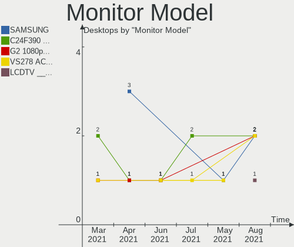

| Model                                               | Desktops | Percent |
|-----------------------------------------------------|----------|---------|
| PLT2336 IVM5628 1920x1080 509x286mm 23.0-inch       | 2        | 1.31%   |
| G276HL ACR0300 1920x1080 600x340mm 27.2-inch        | 2        | 1.31%   |
| FULL HD GSM5B55 1920x1080 480x270mm 21.7-inch       | 2        | 1.31%   |
| Z24i HWP309E 1920x1200 518x324mm 24.1-inch          | 1        | 0.65%   |
| XV272U ACR06C1 2560x1440 597x336mm 27.0-inch        | 1        | 0.65%   |
| X223W ACR0009 1680x1050 473x296mm 22.0-inch         | 1        | 0.65%   |
| X163W ACR0015 1366x768 344x193mm 15.5-inch          | 1        | 0.65%   |
| W2453 GSM56F5 1920x1080 531x299mm 24.0-inch         | 1        | 0.65%   |
| W2241 GSM56B3 1680x1050 474x296mm 22.0-inch         | 1        | 0.65%   |
| w2207 HWP26A9 1680x1050 473x296mm 22.0-inch         | 1        | 0.65%   |
| W1942 GSM4B6F 1440x900 408x255mm 18.9-inch          | 1        | 0.65%   |
| Viseo 220Dx ACR00FF 1920x1080 477x268mm 21.5-inch   | 1        | 0.65%   |
| VA2246 SERIES VSC6F2E 1920x1080 477x268mm 21.5-inch | 1        | 0.65%   |
| V246HQL ACR0424 1920x1080 521x293mm 23.5-inch       | 1        | 0.65%   |
| V206HQL ACR0334 1280x1024 430x240mm 19.4-inch       | 1        | 0.65%   |
| U2719D DEL415A 2560x1440 597x336mm 27.0-inch        | 1        | 0.65%   |
| U2412M DELA07B 1920x1200 518x324mm 24.1-inch        | 1        | 0.65%   |
| U2412M DELA07A 1920x1200 518x324mm 24.1-inch        | 1        | 0.65%   |
| U2312HM DEL4072 1920x1080 510x290mm 23.1-inch       | 1        | 0.65%   |
| TV_MONITOR MST0030 1440x900 1150x650mm 52.0-inch    | 1        | 0.65%   |
| TFT19DXP PTS03A0 1280x1024 376x301mm 19.0-inch      | 1        | 0.65%   |
| SyncMaster SAM0601 1600x900                         | 1        | 0.65%   |
| SyncMaster SAM0524 1920x1080 477x268mm 21.5-inch    | 1        | 0.65%   |
| SyncMaster SAM0522 1600x900 443x249mm 20.0-inch     | 1        | 0.65%   |
| SyncMaster SAM034F 1440x900 428x255mm 19.6-inch     | 1        | 0.65%   |
| SyncMaster SAM027E 1680x1050 474x296mm 22.0-inch    | 1        | 0.65%   |
| SyncMaster SAM027D 1680x1050 433x271mm 20.1-inch    | 1        | 0.65%   |
| SyncMaster SAM0254 1680x1050 474x296mm 22.0-inch    | 1        | 0.65%   |
| SyncMaster SAM020D 1280x1024 338x270mm 17.0-inch    | 1        | 0.65%   |
| SyncMaster SAM0194 1280x1024 376x301mm 19.0-inch    | 1        | 0.65%   |
| SyncMaster SAM011F 1280x1024 376x301mm 19.0-inch    | 1        | 0.65%   |
| STi LEDTV STA0030 1920x1080 700x390mm 31.5-inch     | 1        | 0.65%   |
| SE2416H DELD082 1920x1080 527x296mm 23.8-inch       | 1        | 0.65%   |
| SA300/SA350 SAM078F 1920x1080 477x268mm 21.5-inch   | 1        | 0.65%   |
| SA300/SA350 SAM0788 1366x768 410x230mm 18.5-inch    | 1        | 0.65%   |
| S24D300 SAM0B42 1920x1080 531x299mm 24.0-inch       | 1        | 0.65%   |
| S2340L DELD057 1920x1080 509x286mm 23.0-inch        | 1        | 0.65%   |
| S22C300 SAM0A20 1920x1080 477x268mm 21.5-inch       | 1        | 0.65%   |
| S2031 HWP2903 1600x900 443x249mm 20.0-inch          | 1        | 0.65%   |
| RL2450H BNQ7F0E 1920x1080 531x298mm 24.0-inch       | 1        | 0.65%   |
| PL2792H IVM664F 1920x1080 598x336mm 27.0-inch       | 1        | 0.65%   |
| PL2590 IVM6120 1920x1080 553x309mm 24.9-inch        | 1        | 0.65%   |
| PA279 ACI27B2 2560x1440 597x336mm 27.0-inch         | 1        | 0.65%   |
| P24q-10 LEN61A5 2560x1440 527x296mm 23.8-inch       | 1        | 0.65%   |
| P2217H DELA0D9 1920x1080 476x267mm 21.5-inch        | 1        | 0.65%   |
| P2214H DELA098 1920x1080 480x270mm 21.7-inch        | 1        | 0.65%   |
| P2014H DEL4095 1600x900 434x236mm 19.4-inch         | 1        | 0.65%   |
| P190S DEL405A 1280x1024 376x301mm 19.0-inch         | 1        | 0.65%   |
| MP59G GSM5B35 1920x1080 480x270mm 21.7-inch         | 1        | 0.65%   |
| MD30919PO S09 MED89AD 1280x1024 376x301mm 19.0-inch | 1        | 0.65%   |
| MD20630 MED365A 1920x1080 527x296mm 23.8-inch       | 1        | 0.65%   |
| LP2475w HWP26F8 1920x1200 546x352mm 25.6-inch       | 1        | 0.65%   |
| LL 3190TS FUS07A3 1366x768 430x255mm 19.7-inch      | 1        | 0.65%   |
| LE1901w HWP2842 1440x900 410x256mm 19.0-inch        | 1        | 0.65%   |
| LE1711 HWP2856 1280x960 340x270mm 17.1-inch         | 1        | 0.65%   |
| LCD Monitor XXX MS553P1 1366x768                    | 1        | 0.65%   |
| LCD Monitor XF251Q 1920x1080                        | 1        | 0.65%   |
| LCD Monitor XF240H 1920x2160                        | 1        | 0.65%   |
| LCD Monitor W2453 1920x1080                         | 1        | 0.65%   |
| LCD Monitor W2043 1024x768                          | 1        | 0.65%   |

Monitor Resolution
------------------

Monitor screen resolution

| Resolution         | Desktops | Percent |
|--------------------|----------|---------|
| 1920x1080 (FHD)    | 53       | 36.05%  |
| 1280x1024 (SXGA)   | 15       | 10.2%   |
| 1680x1050 (WSXGA+) | 12       | 8.16%   |
| Unknown            | 12       | 8.16%   |
| 1440x900 (WXGA+)   | 8        | 5.44%   |
| 2560x1440 (QHD)    | 7        | 4.76%   |
| 1600x900 (HD+)     | 7        | 4.76%   |
| 1366x768 (WXGA)    | 7        | 4.76%   |
| 3840x1080          | 5        | 3.4%    |
| 1920x1200 (WUXGA)  | 5        | 3.4%    |
| 3840x2160 (4K)     | 4        | 2.72%   |
| 4480x1440          | 2        | 1.36%   |
| 7680x1080          | 1        | 0.68%   |
| 5760x1080          | 1        | 0.68%   |
| 4000x1440          | 1        | 0.68%   |
| 2560x1080          | 1        | 0.68%   |
| 2304x1024          | 1        | 0.68%   |
| 1920x540           | 1        | 0.68%   |
| 1920x2160          | 1        | 0.68%   |
| 1600x1200          | 1        | 0.68%   |
| 1280x960           | 1        | 0.68%   |
| 1024x768 (XGA)     | 1        | 0.68%   |

Monitor Diagonal
----------------

Diagonal size in inches

| Inches  | Desktops | Percent |
|---------|----------|---------|
| Unknown | 32       | 23.19%  |
| 23      | 16       | 11.59%  |
| 19      | 15       | 10.87%  |
| 27      | 12       | 8.7%    |
| 21      | 12       | 8.7%    |
| 24      | 10       | 7.25%   |
| 22      | 7        | 5.07%   |
| 17      | 7        | 5.07%   |
| 20      | 6        | 4.35%   |
| 18      | 6        | 4.35%   |
| 31      | 2        | 1.45%   |
| 15      | 2        | 1.45%   |
| 12      | 2        | 1.45%   |
| 84      | 1        | 0.72%   |
| 72      | 1        | 0.72%   |
| 52      | 1        | 0.72%   |
| 48      | 1        | 0.72%   |
| 47      | 1        | 0.72%   |
| 37      | 1        | 0.72%   |
| 34      | 1        | 0.72%   |
| 26      | 1        | 0.72%   |
| 25      | 1        | 0.72%   |

Monitor Width
-------------

Physical width

| Width in mm | Desktops | Percent |
|-------------|----------|---------|
| 501-600     | 38       | 27.74%  |
| 401-500     | 37       | 27.01%  |
| Unknown     | 32       | 23.36%  |
| 351-400     | 10       | 7.3%    |
| 301-350     | 9        | 6.57%   |
| 1001-1500   | 3        | 2.19%   |
| 601-700     | 2        | 1.46%   |
| 201-300     | 2        | 1.46%   |
| 1501-2000   | 2        | 1.46%   |
| 801-900     | 1        | 0.73%   |
| 701-800     | 1        | 0.73%   |

Aspect Ratio
------------

Proportional relationship between the width and the height

| Ratio   | Desktops | Percent |
|---------|----------|---------|
| 16/9    | 63       | 47.01%  |
| Unknown | 31       | 23.13%  |
| 16/10   | 17       | 12.69%  |
| 5/4     | 16       | 11.94%  |
| 4/3     | 3        | 2.24%   |
| 3/2     | 2        | 1.49%   |
| 21/9    | 1        | 0.75%   |
| 1.96    | 1        | 0.75%   |

Monitor Area
------------

Area in inch²

| Area in inch² | Desktops | Percent |
|----------------|----------|---------|
| 201-250        | 41       | 29.71%  |
| Unknown        | 32       | 23.19%  |
| 151-200        | 26       | 18.84%  |
| 301-350        | 12       | 8.7%    |
| 141-150        | 9        | 6.52%   |
| 251-300        | 5        | 3.62%   |
| More than 1000 | 3        | 2.17%   |
| 351-500        | 3        | 2.17%   |
| 501-1000       | 3        | 2.17%   |
| 71-80          | 2        | 1.45%   |
| 101-110        | 2        | 1.45%   |

Pixel Density
-------------

Pixels per inch

| Density | Desktops | Percent |
|---------|----------|---------|
| 51-100  | 73       | 55.3%   |
| Unknown | 32       | 24.24%  |
| 101-120 | 20       | 15.15%  |
| 1-50    | 4        | 3.03%   |
| 161-240 | 2        | 1.52%   |
| 121-160 | 1        | 0.76%   |

Multiple Monitors
-----------------

Total monitors connected

| Total | Desktops | Percent |
|-------|----------|---------|
| 1     | 103      | 78.63%  |
| 2     | 25       | 19.08%  |
| 0     | 2        | 1.53%   |
| 4     | 1        | 0.76%   |

Net Controller Vendor
---------------------

Controller vendors

| Vendor                          | Desktops | Percent |
|---------------------------------|----------|---------|
| Realtek Semiconductor           | 80       | 43.48%  |
| Intel                           | 41       | 22.28%  |
| Qualcomm Atheros                | 16       | 8.7%    |
| Broadcom Inc. and subsidiaries  | 8        | 4.35%   |
| Ralink Technology               | 5        | 2.72%   |
| Nvidia                          | 5        | 2.72%   |
| TP-Link                         | 4        | 2.17%   |
| Qualcomm Atheros Communications | 4        | 2.17%   |
| VIA Technologies                | 2        | 1.09%   |
| Sitecom Europe                  | 2        | 1.09%   |
| Microsoft                       | 2        | 1.09%   |
| MediaTek                        | 2        | 1.09%   |
| Marvell Technology Group        | 2        | 1.09%   |
| ZyDAS                           | 1        | 0.54%   |
| Xiaomi                          | 1        | 0.54%   |
| Ralink                          | 1        | 0.54%   |
| Qualcomm                        | 1        | 0.54%   |
| Mellanox Technologies           | 1        | 0.54%   |
| Linksys                         | 1        | 0.54%   |
| Huawei Technologies             | 1        | 0.54%   |
| D-Link                          | 1        | 0.54%   |
| Broadcom Limited                | 1        | 0.54%   |
| Belkin Components               | 1        | 0.54%   |
| ASUSTek Computer                | 1        | 0.54%   |

Net Controller Model
--------------------

Controller models

| Model                                                                                 | Desktops | Percent |
|---------------------------------------------------------------------------------------|----------|---------|
| RTL8111/8168/8411 PCI Express Gigabit Ethernet Controller                             | 71       | 36.41%  |
| 82579LM Gigabit Network Connection (Lewisville)                                       | 8        | 4.1%    |
| RTL810xE PCI Express Fast Ethernet controller                                         | 4        | 2.05%   |
| I211 Gigabit Network Connection                                                       | 4        | 2.05%   |
| AR9271 802.11n                                                                        | 4        | 2.05%   |
| RTL8821AE 802.11ac PCIe Wireless Network Adapter                                      | 3        | 1.54%   |
| NetXtreme BCM5754 Gigabit Ethernet PCI Express                                        | 3        | 1.54%   |
| MCP61 Ethernet                                                                        | 3        | 1.54%   |
| Ethernet Connection (2) I219-V                                                        | 3        | 1.54%   |
| AR8151 v2.0 Gigabit Ethernet                                                          | 3        | 1.54%   |
| 82567LM-3 Gigabit Network Connection                                                  | 3        | 1.54%   |
| 802.11ac NIC                                                                          | 3        | 1.54%   |
| Xbox 360 Wireless Adapter                                                             | 2        | 1.03%   |
| VT6105/VT6106S [Rhine-III]                                                            | 2        | 1.03%   |
| RTL8188EUS 802.11n Wireless Network Adapter                                           | 2        | 1.03%   |
| MT7601U Wireless Adapter                                                              | 2        | 1.03%   |
| Ethernet Connection I217-LM                                                           | 2        | 1.03%   |
| Ethernet Connection (7) I219-V                                                        | 2        | 1.03%   |
| Dual Band Wireless-AC 3168NGW [Stone Peak]                                            | 2        | 1.03%   |
| BCM4360 802.11ac Wireless Network Adapter                                             | 2        | 1.03%   |
| BCM43228 802.11a/b/g/n                                                                | 2        | 1.03%   |
| AR93xx Wireless Network Adapter                                                       | 2        | 1.03%   |
| 88E8056 PCI-E Gigabit Ethernet Controller                                             | 2        | 1.03%   |
| 82579V Gigabit Network Connection                                                     | 2        | 1.03%   |
| 82578DM Gigabit Network Connection                                                    | 2        | 1.03%   |
| 82562V-2 10/100 Network Connection                                                    | 2        | 1.03%   |
| ZD1211B 802.11g                                                                       | 1        | 0.51%   |
| WLA-5000 802.11abgn [Ralink RT3572]                                                   | 1        | 0.51%   |
| Wireless 7265                                                                         | 1        | 0.51%   |
| Wireless 3165                                                                         | 1        | 0.51%   |
| Wireless 3160                                                                         | 1        | 0.51%   |
| Wireless                                                                              | 1        | 0.51%   |
| Wi-Fi 6 AX200                                                                         | 1        | 0.51%   |
| TL-WN821N v5/v6 [RTL8192EU]                                                           | 1        | 0.51%   |
| TL-WN722N v2/v3 [Realtek RTL8188EUS]                                                  | 1        | 0.51%   |
| RTL8192EU 802.11b/g/n WLAN Adapter                                                    | 1        | 0.51%   |
| RTL8191SU 802.11n WLAN Adapter                                                        | 1        | 0.51%   |
| RTL8188FTV 802.11b/g/n 1T1R 2.4G WLAN Adapter                                         | 1        | 0.51%   |
| RTL8152 Fast Ethernet Adapter                                                         | 1        | 0.51%   |
| RTL8125 2.5GbE Controller                                                             | 1        | 0.51%   |
| RTL-8100/8101L/8139 PCI Fast Ethernet Adapter                                         | 1        | 0.51%   |
| RT5372 Wireless Adapter                                                               | 1        | 0.51%   |
| RT5370 Wireless Adapter                                                               | 1        | 0.51%   |
| RT2870/RT3070 Wireless Adapter                                                        | 1        | 0.51%   |
| RT2561/RT61 802.11g PCI                                                               | 1        | 0.51%   |
| Realtek 8812AU/8821AU 802.11ac WLAN Adapter [USB Wireless Dual-Band Adapter 2.4/5Ghz] | 1        | 0.51%   |
| QCA8171 Gigabit Ethernet                                                              | 1        | 0.51%   |
| Nokia 3.1                                                                             | 1        | 0.51%   |
| NetXtreme BCM5755 Gigabit Ethernet PCI Express                                        | 1        | 0.51%   |
| MT27500 Family [ConnectX-3]                                                           | 1        | 0.51%   |
| Mi/Redmi series (RNDIS)                                                               | 1        | 0.51%   |
| MCP55 Ethernet                                                                        | 1        | 0.51%   |
| Killer E2500 Gigabit Ethernet Controller                                              | 1        | 0.51%   |
| Killer E2400 Gigabit Ethernet Controller                                              | 1        | 0.51%   |
| Killer E220x Gigabit Ethernet Controller                                              | 1        | 0.51%   |
| F7D1101 v1 Basic Wireless Adapter [Realtek RTL8188SU]                                 | 1        | 0.51%   |
| Ethernet Controller I225-V                                                            | 1        | 0.51%   |
| Ethernet Connection I217-V                                                            | 1        | 0.51%   |
| Ethernet Connection (2) I219-LM                                                       | 1        | 0.51%   |
| Ethernet Connection (2) I218-V                                                        | 1        | 0.51%   |

Wireless Vendor
---------------

Wireless vendors

| Vendor                          | Desktops | Percent |
|---------------------------------|----------|---------|
| Realtek Semiconductor           | 11       | 20%     |
| Qualcomm Atheros                | 9        | 16.36%  |
| Intel                           | 6        | 10.91%  |
| Ralink Technology               | 5        | 9.09%   |
| Broadcom Inc. and subsidiaries  | 5        | 9.09%   |
| TP-Link                         | 4        | 7.27%   |
| Qualcomm Atheros Communications | 4        | 7.27%   |
| Sitecom Europe                  | 2        | 3.64%   |
| Microsoft                       | 2        | 3.64%   |
| ZyDAS                           | 1        | 1.82%   |
| Ralink                          | 1        | 1.82%   |
| MediaTek                        | 1        | 1.82%   |
| Linksys                         | 1        | 1.82%   |
| D-Link                          | 1        | 1.82%   |
| Belkin Components               | 1        | 1.82%   |
| ASUSTek Computer                | 1        | 1.82%   |

Wireless Model
--------------

Wireless models

| Model                                                                                 | Desktops | Percent |
|---------------------------------------------------------------------------------------|----------|---------|
| AR9271 802.11n                                                                        | 4        | 7.27%   |
| RTL8821AE 802.11ac PCIe Wireless Network Adapter                                      | 3        | 5.45%   |
| 802.11ac NIC                                                                          | 3        | 5.45%   |
| Xbox 360 Wireless Adapter                                                             | 2        | 3.64%   |
| RTL8188EUS 802.11n Wireless Network Adapter                                           | 2        | 3.64%   |
| MT7601U Wireless Adapter                                                              | 2        | 3.64%   |
| Dual Band Wireless-AC 3168NGW [Stone Peak]                                            | 2        | 3.64%   |
| BCM4360 802.11ac Wireless Network Adapter                                             | 2        | 3.64%   |
| BCM43228 802.11a/b/g/n                                                                | 2        | 3.64%   |
| AR93xx Wireless Network Adapter                                                       | 2        | 3.64%   |
| ZD1211B 802.11g                                                                       | 1        | 1.82%   |
| WLA-5000 802.11abgn [Ralink RT3572]                                                   | 1        | 1.82%   |
| Wireless 7265                                                                         | 1        | 1.82%   |
| Wireless 3165                                                                         | 1        | 1.82%   |
| Wireless 3160                                                                         | 1        | 1.82%   |
| Wireless                                                                              | 1        | 1.82%   |
| Wi-Fi 6 AX200                                                                         | 1        | 1.82%   |
| TL-WN821N v5/v6 [RTL8192EU]                                                           | 1        | 1.82%   |
| TL-WN722N v2/v3 [Realtek RTL8188EUS]                                                  | 1        | 1.82%   |
| RTL8192EU 802.11b/g/n WLAN Adapter                                                    | 1        | 1.82%   |
| RTL8191SU 802.11n WLAN Adapter                                                        | 1        | 1.82%   |
| RTL8188FTV 802.11b/g/n 1T1R 2.4G WLAN Adapter                                         | 1        | 1.82%   |
| RT5372 Wireless Adapter                                                               | 1        | 1.82%   |
| RT5370 Wireless Adapter                                                               | 1        | 1.82%   |
| RT2870/RT3070 Wireless Adapter                                                        | 1        | 1.82%   |
| RT2561/RT61 802.11g PCI                                                               | 1        | 1.82%   |
| Realtek 8812AU/8821AU 802.11ac WLAN Adapter [USB Wireless Dual-Band Adapter 2.4/5Ghz] | 1        | 1.82%   |
| F7D1101 v1 Basic Wireless Adapter [Realtek RTL8188SU]                                 | 1        | 1.82%   |
| BCM4352 802.11ac Wireless Network Adapter                                             | 1        | 1.82%   |
| Archer T4U v2 [Realtek RTL8812AU]                                                     | 1        | 1.82%   |
| AR9485 Wireless Network Adapter                                                       | 1        | 1.82%   |
| AR9462 Wireless Network Adapter                                                       | 1        | 1.82%   |
| AR9287 Wireless Network Adapter (PCI-Express)                                         | 1        | 1.82%   |
| AR922X Wireless Network Adapter                                                       | 1        | 1.82%   |
| AR5416 Wireless Network Adapter [AR5008 802.11(a)bgn]                                 | 1        | 1.82%   |
| AR5212/5213/2414 Wireless Network Adapter                                             | 1        | 1.82%   |
| AR242x / AR542x Wireless Network Adapter (PCI-Express)                                | 1        | 1.82%   |
| AE1000 v1 802.11n [Ralink RT3572]                                                     | 1        | 1.82%   |
| 802.11n WLAN Adapter                                                                  | 1        | 1.82%   |
| 802.11ac WLAN Adapter                                                                 | 1        | 1.82%   |
| 802.11 n WLAN                                                                         | 1        | 1.82%   |

Ethernet Vendor
---------------

Ethernet vendors

| Vendor                         | Desktops | Percent |
|--------------------------------|----------|---------|
| Realtek Semiconductor          | 76       | 55.07%  |
| Intel                          | 35       | 25.36%  |
| Qualcomm Atheros               | 9        | 6.52%   |
| Nvidia                         | 5        | 3.62%   |
| Broadcom Inc. and subsidiaries | 3        | 2.17%   |
| VIA Technologies               | 2        | 1.45%   |
| Marvell Technology Group       | 2        | 1.45%   |
| Xiaomi                         | 1        | 0.72%   |
| Qualcomm                       | 1        | 0.72%   |
| Mellanox Technologies          | 1        | 0.72%   |
| MediaTek                       | 1        | 0.72%   |
| Huawei Technologies            | 1        | 0.72%   |
| Broadcom Limited               | 1        | 0.72%   |

Ethernet Model
--------------

Ethernet models

| Model                                                     | Desktops | Percent |
|-----------------------------------------------------------|----------|---------|
| RTL8111/8168/8411 PCI Express Gigabit Ethernet Controller | 71       | 50.71%  |
| 82579LM Gigabit Network Connection (Lewisville)           | 8        | 5.71%   |
| RTL810xE PCI Express Fast Ethernet controller             | 4        | 2.86%   |
| I211 Gigabit Network Connection                           | 4        | 2.86%   |
| NetXtreme BCM5754 Gigabit Ethernet PCI Express            | 3        | 2.14%   |
| MCP61 Ethernet                                            | 3        | 2.14%   |
| Ethernet Connection (2) I219-V                            | 3        | 2.14%   |
| AR8151 v2.0 Gigabit Ethernet                              | 3        | 2.14%   |
| 82567LM-3 Gigabit Network Connection                      | 3        | 2.14%   |
| VT6105/VT6106S [Rhine-III]                                | 2        | 1.43%   |
| Ethernet Connection I217-LM                               | 2        | 1.43%   |
| Ethernet Connection (7) I219-V                            | 2        | 1.43%   |
| 88E8056 PCI-E Gigabit Ethernet Controller                 | 2        | 1.43%   |
| 82579V Gigabit Network Connection                         | 2        | 1.43%   |
| 82578DM Gigabit Network Connection                        | 2        | 1.43%   |
| 82562V-2 10/100 Network Connection                        | 2        | 1.43%   |
| RTL8152 Fast Ethernet Adapter                             | 1        | 0.71%   |
| RTL8125 2.5GbE Controller                                 | 1        | 0.71%   |
| RTL-8100/8101L/8139 PCI Fast Ethernet Adapter             | 1        | 0.71%   |
| QCA8171 Gigabit Ethernet                                  | 1        | 0.71%   |
| Nokia 3.1                                                 | 1        | 0.71%   |
| NetXtreme BCM5755 Gigabit Ethernet PCI Express            | 1        | 0.71%   |
| MT27500 Family [ConnectX-3]                               | 1        | 0.71%   |
| Mi/Redmi series (RNDIS)                                   | 1        | 0.71%   |
| MCP55 Ethernet                                            | 1        | 0.71%   |
| Killer E2500 Gigabit Ethernet Controller                  | 1        | 0.71%   |
| Killer E2400 Gigabit Ethernet Controller                  | 1        | 0.71%   |
| Killer E220x Gigabit Ethernet Controller                  | 1        | 0.71%   |
| Ethernet Controller I225-V                                | 1        | 0.71%   |
| Ethernet Connection I217-V                                | 1        | 0.71%   |
| Ethernet Connection (2) I219-LM                           | 1        | 0.71%   |
| Ethernet Connection (2) I218-V                            | 1        | 0.71%   |
| Ethernet Connection (12) I219-V                           | 1        | 0.71%   |
| E353/E3131                                                | 1        | 0.71%   |
| CK804 Ethernet Controller                                 | 1        | 0.71%   |
| Attansic L1 Gigabit Ethernet                              | 1        | 0.71%   |
| AR8131 Gigabit Ethernet                                   | 1        | 0.71%   |
| Aquaris X Pro                                             | 1        | 0.71%   |
| 82567LF-2 Gigabit Network Connection                      | 1        | 0.71%   |
| 82566DM Gigabit Network Connection                        | 1        | 0.71%   |

Net Controller Kind
-------------------

Ethernet, WiFi or modem

| Kind     | Desktops | Percent |
|----------|----------|---------|
| Ethernet | 129      | 72.07%  |
| WiFi     | 50       | 27.93%  |

Used Controller
---------------

Currently used network controller

| Kind     | Desktops | Percent |
|----------|----------|---------|
| Ethernet | 117      | 76.97%  |
| WiFi     | 35       | 23.03%  |

NICs
----

Total network controllers on board

| Total | Desktops | Percent |
|-------|----------|---------|
| 1     | 102      | 77.86%  |
| 2     | 26       | 19.85%  |
| 3     | 2        | 1.53%   |
| 0     | 1        | 0.76%   |

Memory Vendor
-------------

Memory module vendors

| Vendor              | Desktops | Percent |
|---------------------|----------|---------|
| Unknown             | 14       | 25.93%  |
| Kingston            | 12       | 22.22%  |
| Samsung Electronics | 5        | 9.26%   |
| Corsair             | 5        | 9.26%   |
| SK Hynix            | 4        | 7.41%   |
| Micron Technology   | 4        | 7.41%   |
| Patriot             | 2        | 3.7%    |
| A-DATA Technology   | 2        | 3.7%    |
| Unknown (09C8)      | 1        | 1.85%   |
| Multilaser          | 1        | 1.85%   |
| GOODRAM             | 1        | 1.85%   |
| G.Skill             | 1        | 1.85%   |
| Elpida              | 1        | 1.85%   |
| Crucial             | 1        | 1.85%   |

Memory Model
------------

Memory module models

| Model                                             | Desktops | Percent |
|---------------------------------------------------|----------|---------|
| RAM Module 8192MB DIMM DDR3 1600MT/s              | 2        | 3.39%   |
| RAM Module 4096MB DIMM DDR3 1333MT/s              | 2        | 3.39%   |
| RAM Module 2048MB DIMM DDR 1333MT/s               | 2        | 3.39%   |
| RAM M378A1K43CB2-CTD 8192MB DIMM DDR4 3200MT/s    | 2        | 3.39%   |
| RAM VS1GB667D2 1024MB DIMM DDR2 667MT/s           | 1        | 1.69%   |
| RAM SemsoTai 4096MB DIMM DDR4 2400MT/s            | 1        | 1.69%   |
| RAM Module 8192MB DIMM 667MT/s                    | 1        | 1.69%   |
| RAM Module 8192MB DIMM 1600MT/s                   | 1        | 1.69%   |
| RAM Module 4GB DIMM 1333MT/s                      | 1        | 1.69%   |
| RAM Module 4096MB SODIMM DDR3 1333MT/s            | 1        | 1.69%   |
| RAM Module 4096MB DIMM DDR3 1600MT/s              | 1        | 1.69%   |
| RAM Module 4096MB DIMM DDR 1333MT/s               | 1        | 1.69%   |
| RAM Module 2048MB DIMM DDR2 800MT/s               | 1        | 1.69%   |
| RAM Module 2048MB DIMM DDR2 333MT/s               | 1        | 1.69%   |
| RAM Module 2048MB DIMM 1333MT/s                   | 1        | 1.69%   |
| RAM Module 1024MB DIMM DDR2 333MT/s               | 1        | 1.69%   |
| RAM MD3512NSA-CA3G1 4096MB DIMM DDR3 1333MT/s     | 1        | 1.69%   |
| RAM M471B5273CH0-CH9 4096MB SODIMM DDR3 1334MT/s  | 1        | 1.69%   |
| RAM M471B5173QH0-YK0 4096MB SODIMM DDR3 1600MT/s  | 1        | 1.69%   |
| RAM KHX3333C16D4/8GX 8192MB DIMM DDR4 3333MT/s    | 1        | 1.69%   |
| RAM KHX3200C16D4/8GX 8192MB DIMM DDR4 3333MT/s    | 1        | 1.69%   |
| RAM KHX2666C15S4/16G 16384MB SODIMM DDR4 2667MT/s | 1        | 1.69%   |
| RAM KHX2400C15/16G 16384MB DIMM DDR4 2400MT/s     | 1        | 1.69%   |
| RAM KHX2133C14D4/8G 8192MB DIMM DDR4 2667MT/s     | 1        | 1.69%   |
| RAM KHX1866C10D3/8G 8GB DIMM DDR3 1904MT/s        | 1        | 1.69%   |
| RAM KHX1600C9D3/4GX 4096MB DIMM DDR3 2400MT/s     | 1        | 1.69%   |
| RAM KHX1600C10D3/8G 8192MB DIMM 1867MT/s          | 1        | 1.69%   |
| RAM KHX1600C10D3/4G 4096MB DIMM DDR3 1866MT/s     | 1        | 1.69%   |
| RAM HYMP512U64CP8-Y5 1024MB DIMM DDR2 667MT/s     | 1        | 1.69%   |
| RAM HMT451U6AFR8C-PB 4096MB DIMM DDR3 1600MT/s    | 1        | 1.69%   |
| RAM HMT351U6EFR8C-PB 4096MB DIMM DDR3 1800MT/s    | 1        | 1.69%   |
| RAM HMT351U6EFR8C-PB 4096MB DIMM DDR3 1600MT/s    | 1        | 1.69%   |
| RAM HMT351U6CFR8C-PB 4096MB DIMM DDR3 1800MT/s    | 1        | 1.69%   |
| RAM HMT351S6EFR8C-PB 4096MB SODIMM DDR3 1600MT/s  | 1        | 1.69%   |
| RAM GR1600D364L11/8G 8192MB DIMM DDR3 1600MT/s    | 1        | 1.69%   |
| RAM F4-3200C16-8GVKB 8192MB DIMM DDR4 3200MT/s    | 1        | 1.69%   |
| RAM DDR4 3000 8192MB DIMM DDR4 3066MT/s           | 1        | 1.69%   |
| RAM DDR4 2400 2OZ 8192MB DIMM DDR4 2400MT/s       | 1        | 1.69%   |
| RAM CT51264BA1339.M16F 4096MB DIMM DDR3 1333MT/s  | 1        | 1.69%   |
| RAM CMZ4GX3M1A1600C9 4096MB DIMM 1600MT/s         | 1        | 1.69%   |
| RAM CMY8GX3M2A1600C9 4096MB DIMM DDR3 1600MT/s    | 1        | 1.69%   |
| RAM CMX4GX3M2A1333C8 2048MB DIMM DDR3 1333MT/s    | 1        | 1.69%   |
| RAM CMK8GX4M1D3000C16 8192MB DIMM DDR4 3200MT/s   | 1        | 1.69%   |
| RAM CMK32GX4M2A2400C14 16384MB DIMM DDR4 2400MT/s | 1        | 1.69%   |
| RAM CMK16GX4M2A2400C14 8192MB DIMM DDR4 2800MT/s  | 1        | 1.69%   |
| RAM CL18-22-22 D4-3600 16384MB DIMM DDR4 3600MT/s | 1        | 1.69%   |
| RAM 99U5471-020.A00LF 4096MB DIMM DDR3 1600MT/s   | 1        | 1.69%   |
| RAM 9905471-011.A00LF 4096MB DIMM DDR3 1600MT/s   | 1        | 1.69%   |
| RAM 9905403-559.A 8192MB DIMM DDR3 667MT/s        | 1        | 1.69%   |
| RAM 8JTF51264AZ-1G6E1 4GB DIMM DDR3 1600MT/s      | 1        | 1.69%   |
| RAM 4ATF51264HZ-2G6E3 4096MB SODIMM DDR4 2667MT/s | 1        | 1.69%   |
| RAM 4ATF51264AZ-2G3B1 4096MB DIMM DDR4 2400MT/s   | 1        | 1.69%   |
| RAM 3400 C16 Series 8192MB DIMM DDR4 3200MT/s     | 1        | 1.69%   |
| RAM 3200 C16 Series 8GB DIMM DDR4 3200MT/s        | 1        | 1.69%   |
| RAM 16ATF1G64AZ-2G1B1 8192MB DIMM DDR4 2133MT/s   | 1        | 1.69%   |

Memory Kind
-----------

Memory module kinds

| Kind    | Desktops | Percent |
|---------|----------|---------|
| DDR3    | 22       | 43.14%  |
| DDR4    | 19       | 37.25%  |
| Unknown | 4        | 7.84%   |
| DDR2    | 3        | 5.88%   |
| DDR     | 2        | 3.92%   |
| SDRAM   | 1        | 1.96%   |

Memory Form Factor
------------------

Physical design of the memory module

| Name   | Desktops | Percent |
|--------|----------|---------|
| DIMM   | 44       | 88%     |
| SODIMM | 6        | 12%     |

Memory Size
-----------

Memory module size

| Size  | Desktops | Percent |
|-------|----------|---------|
| 4096  | 21       | 38.89%  |
| 8192  | 19       | 35.19%  |
| 16384 | 6        | 11.11%  |
| 2048  | 6        | 11.11%  |
| 1024  | 2        | 3.7%    |

Memory Speed
------------

Memory module speed

| Speed | Desktops | Percent |
|-------|----------|---------|
| 1600  | 13       | 24.07%  |
| 1333  | 10       | 18.52%  |
| 3200  | 6        | 11.11%  |
| 2400  | 6        | 11.11%  |
| 2667  | 3        | 5.56%   |
| 667   | 3        | 5.56%   |
| 3333  | 2        | 3.7%    |
| 2133  | 2        | 3.7%    |
| 3600  | 1        | 1.85%   |
| 3066  | 1        | 1.85%   |
| 2800  | 1        | 1.85%   |
| 1867  | 1        | 1.85%   |
| 1866  | 1        | 1.85%   |
| 1800  | 1        | 1.85%   |
| 1334  | 1        | 1.85%   |
| 800   | 1        | 1.85%   |
| 333   | 1        | 1.85%   |

Sound Vendor
------------

Sound card vendors

| Vendor                    | Desktops | Percent |
|---------------------------|----------|---------|
| Intel                     | 75       | 36.41%  |
| AMD                       | 58       | 28.16%  |
| Nvidia                    | 51       | 24.76%  |
| Creative Labs             | 5        | 2.43%   |
| C-Media Electronics       | 4        | 1.94%   |
| Texas Instruments         | 3        | 1.46%   |
| Logitech                  | 2        | 0.97%   |
| Creative Technology       | 2        | 0.97%   |
| VIA Technologies          | 1        | 0.49%   |
| Sennheiser Communications | 1        | 0.49%   |
| Razer USA                 | 1        | 0.49%   |
| Corsair                   | 1        | 0.49%   |
| ASUSTek Computer          | 1        | 0.49%   |
| AKAI Professional M.I.    | 1        | 0.49%   |

Sound Model
-----------

Sound card models

| Model                                                                | Desktops | Percent |
|----------------------------------------------------------------------|----------|---------|
| SBx00 Azalia (Intel HDA)                                             | 19       | 8.05%   |
| 6 Series/C200 Series Chipset Family High Definition Audio Controller | 14       | 5.93%   |
| 8 Series/C220 Series Chipset High Definition Audio Controller        | 12       | 5.08%   |
| 7 Series/C216 Chipset Family High Definition Audio Controller        | 12       | 5.08%   |
| Family 17h (Models 00h-0fh) HD Audio Controller                      | 9        | 3.81%   |
| FCH Azalia Controller                                                | 8        | 3.39%   |
| 200 Series PCH HD Audio                                              | 7        | 2.97%   |
| Xeon E3-1200 v3/4th Gen Core Processor HD Audio Controller           | 6        | 2.54%   |
| Starship/Matisse HD Audio Controller                                 | 6        | 2.54%   |
| Ellesmere HDMI Audio [Radeon RX 470/480 / 570/580/590]               | 6        | 2.54%   |
| 100 Series/C230 Series Chipset Family HD Audio Controller            | 6        | 2.54%   |
| GP107GL High Definition Audio Controller                             | 5        | 2.12%   |
| GK208 HDMI/DP Audio Controller                                       | 5        | 2.12%   |
| TU116 High Definition Audio Controller                               | 4        | 1.69%   |
| Oland/Hainan/Cape Verde/Pitcairn HDMI Audio [Radeon HD 7000 Series]  | 4        | 1.69%   |
| MCP61 High Definition Audio                                          | 4        | 1.69%   |
| GP106 High Definition Audio Controller                               | 4        | 1.69%   |
| Family 17h (Models 10h-1fh) HD Audio Controller                      | 4        | 1.69%   |
| 82801I (ICH9 Family) HD Audio Controller                             | 4        | 1.69%   |
| 5 Series/3400 Series Chipset High Definition Audio                   | 4        | 1.69%   |
| RS780 HDMI Audio [Radeon 3000/3100 / HD 3200/3300]                   | 3        | 1.27%   |
| Raven/Raven2/Fenghuang HDMI/DP Audio Controller                      | 3        | 1.27%   |
| GP104 High Definition Audio Controller                               | 3        | 1.27%   |
| GM206 High Definition Audio Controller                               | 3        | 1.27%   |
| GM107 High Definition Audio Controller [GeForce 940MX]               | 3        | 1.27%   |
| GK106 HDMI Audio Controller                                          | 3        | 1.27%   |
| GF119 HDMI Audio Controller                                          | 3        | 1.27%   |
| EMU20k1 [Sound Blaster X-Fi Series]                                  | 3        | 1.27%   |
| Cannon Lake PCH cAVS                                                 | 3        | 1.27%   |
| 82801JD/DO (ICH10 Family) HD Audio Controller                        | 3        | 1.27%   |
| USB Audio Device                                                     | 2        | 0.85%   |
| TU106 High Definition Audio Controller                               | 2        | 0.85%   |
| Tahiti HDMI Audio [Radeon HD 7870 XT / 7950/7970]                    | 2        | 0.85%   |
| NM10/ICH7 Family High Definition Audio Controller                    | 2        | 0.85%   |
| Navi 10 HDMI Audio                                                   | 2        | 0.85%   |
| GP108 High Definition Audio Controller                               | 2        | 0.85%   |
| GM200 High Definition Audio                                          | 2        | 0.85%   |
| GF114 HDMI Audio Controller                                          | 2        | 0.85%   |
| CMI8788 [Oxygen HD Audio]                                            | 2        | 0.85%   |
| Baffin HDMI/DP Audio [Radeon RX 550 640SP / RX 560/560X]             | 2        | 0.85%   |
| Wrestler HDMI Audio                                                  | 1        | 0.42%   |
| Vengeance 2100                                                       | 1        | 0.42%   |
| Vega 10 HDMI Audio [Radeon Vega 56/64]                               | 1        | 0.42%   |
| USB PnP Sound Device                                                 | 1        | 0.42%   |
| USB Audio                                                            | 1        | 0.42%   |
| Turks HDMI Audio [Radeon HD 6500/6600 / 6700M Series]                | 1        | 0.42%   |
| Tonga HDMI Audio [Radeon R9 285/380]                                 | 1        | 0.42%   |
| SB X-Fi Surround 5.1 Pro                                             | 1        | 0.42%   |
| SB Omni Surround 5.1                                                 | 1        | 0.42%   |
| RV770 HDMI Audio [Radeon HD 4850/4870]                               | 1        | 0.42%   |
| Razer Kraken Tournament Edition                                      | 1        | 0.42%   |
| QuickCam OEM Cisco VT Camera II                                      | 1        | 0.42%   |
| PCM2906C Audio CODEC                                                 | 1        | 0.42%   |
| PCM2904 Audio Codec                                                  | 1        | 0.42%   |
| PCM2902 Audio Codec                                                  | 1        | 0.42%   |
| MCP55 High Definition Audio                                          | 1        | 0.42%   |
| MCP51 High Definition Audio                                          | 1        | 0.42%   |
| Kaveri HDMI/DP Audio Controller                                      | 1        | 0.42%   |
| Kabini HDMI/DP Audio                                                 | 1        | 0.42%   |
| Juniper HDMI Audio [Radeon HD 5700 Series]                           | 1        | 0.42%   |

Camera Vendor
-------------

Camera device vendors

| Vendor                  | Desktops | Percent |
|-------------------------|----------|---------|
| Logitech                | 7        | 26.92%  |
| Microsoft               | 3        | 11.54%  |
| Microdia                | 3        | 11.54%  |
| Z-Star Microelectronics | 2        | 7.69%   |
| Cubeternet              | 2        | 7.69%   |
| Aveo Technology         | 2        | 7.69%   |
| Samsung Electronics     | 1        | 3.85%   |
| Linux Foundation        | 1        | 3.85%   |
| Jieli Technology        | 1        | 3.85%   |
| IMC Networks            | 1        | 3.85%   |
| Generalplus Technology  | 1        | 3.85%   |
| Chicony Electronics     | 1        | 3.85%   |
| Apple                   | 1        | 3.85%   |

Camera Model
------------

Camera device models

| Model                              | Desktops | Percent |
|------------------------------------|----------|---------|
| Webcam C270                        | 2        | 7.69%   |
| USB2.0 Camera                      | 2        | 7.69%   |
| LifeCam HD-3000                    | 2        | 7.69%   |
| Webcam Vitade AF                   | 1        | 3.85%   |
| Webcam C925e                       | 1        | 3.85%   |
| Webcam C600                        | 1        | 3.85%   |
| Vimicro USB Camera (Altair)        | 1        | 3.85%   |
| UVC camera (Bresser microscope)    | 1        | 3.85%   |
| USB2.0 UVC HD Webcam               | 1        | 3.85%   |
| USB Webcam gadget                  | 1        | 3.85%   |
| USB PHY 2.0                        | 1        | 3.85%   |
| Live Streaming USB Device          | 1        | 3.85%   |
| LifeCam VX-2000                    | 1        | 3.85%   |
| iPhone 5/5C/5S/6/SE                | 1        | 3.85%   |
| HP High Definition 1MP Webcam      | 1        | 3.85%   |
| HD Webcam C910                     | 1        | 3.85%   |
| HD Webcam C615                     | 1        | 3.85%   |
| HD Pro Webcam C920                 | 1        | 3.85%   |
| GENERAL WEBCAM                     | 1        | 3.85%   |
| Galaxy series, misc. (MTP mode)    | 1        | 3.85%   |
| Defender G-Lens 2577 HD720p Camera | 1        | 3.85%   |
| Camera                             | 1        | 3.85%   |
| A4 TECH USB2.0 PC Camera J         | 1        | 3.85%   |

Fingerprint Vendor
------------------

Fingerprint sensor vendors

Zero info for selected period =(

Fingerprint Model
-----------------

Fingerprint sensor models

Zero info for selected period =(

Chipcard Vendor
---------------

Chipcard module vendors

| Vendor  | Desktops | Percent |
|---------|----------|---------|
| OmniKey | 1        | 100%    |

Chipcard Model
--------------

Chipcard module models

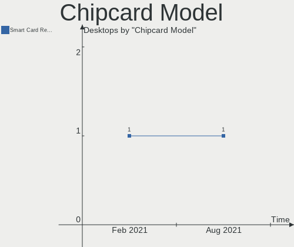

| Model               | Desktops | Percent |
|---------------------|----------|---------|
| CardMan 3021 / 3121 | 1        | 100%    |

Printer Vendor
--------------

Printer device vendors

| Vendor              | Desktops | Percent |
|---------------------|----------|---------|
| Hewlett-Packard     | 4        | 50%     |
| Seiko Epson         | 1        | 12.5%   |
| Samsung Electronics | 1        | 12.5%   |
| QinHeng Electronics | 1        | 12.5%   |
| Canon               | 1        | 12.5%   |

Printer Model
-------------

Printer device models

| Model                | Desktops | Percent |
|----------------------|----------|---------|
| SCX-4200 series      | 1        | 12.5%   |
| MF4410               | 1        | 12.5%   |
| LaserJet 1018        | 1        | 12.5%   |
| L360 Series          | 1        | 12.5%   |
| DeskJet F4200 series | 1        | 12.5%   |
| DeskJet 920c         | 1        | 12.5%   |
| Deskjet 2050 J510    | 1        | 12.5%   |
| CH340S               | 1        | 12.5%   |

Scanner Vendor
--------------

Scanner device vendors

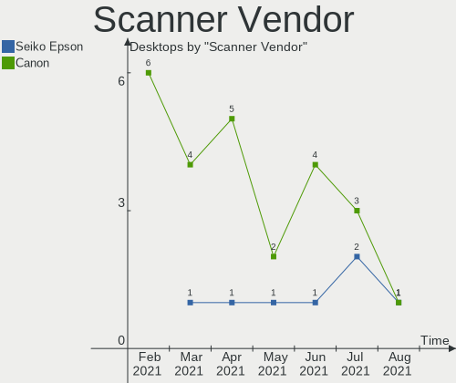

| Vendor         | Desktops | Percent |
|----------------|----------|---------|
| Canon          | 2        | 50%     |
| Seiko Epson    | 1        | 25%     |
| Mustek Systems | 1        | 25%     |

Scanner Model
-------------

Scanner device models

| Model                                   | Desktops | Percent |
|-----------------------------------------|----------|---------|
| ScanExpress 1200 UB                     | 1        | 25%     |
| GT-F520/GT-F570 [Perfection 3590 PHOTO] | 1        | 25%     |
| CanoScan LiDE 90                        | 1        | 25%     |
| CanoScan LIDE 25                        | 1        | 25%     |

Bluetooth Vendor
----------------

Controller vendors

| Vendor                  | Desktops | Percent |
|-------------------------|----------|---------|
| Cambridge Silicon Radio | 13       | 40.63%  |
| Intel                   | 6        | 18.75%  |
| Broadcom                | 5        | 15.63%  |
| Realtek Semiconductor   | 3        | 9.38%   |
| ASUSTek Computer        | 2        | 6.25%   |
| Lite-On Technology      | 1        | 3.13%   |
| IMC Networks            | 1        | 3.13%   |
| Conwise Technology      | 1        | 3.13%   |

Bluetooth Model
---------------

Controller models

| Model                                     | Desktops | Percent |
|-------------------------------------------|----------|---------|
| Bluetooth Dongle (HCI mode)               | 13       | 40.63%  |
| Bluetooth Radio                           | 4        | 12.5%   |
| Bluetooth wireless interface              | 3        | 9.38%   |
| Wireless-AC 3168 Bluetooth                | 2        | 6.25%   |
| BCM20702A0 Bluetooth 4.0                  | 2        | 6.25%   |
| RTL8821A Bluetooth                        | 1        | 3.13%   |
| HP Portable Bumble Bee                    | 1        | 3.13%   |
| CW6622                                    | 1        | 3.13%   |
| Bluetooth Device                          | 1        | 3.13%   |
| Bluetooth 3.0 Dongle                      | 1        | 3.13%   |
| BCM920702 Bluetooth 4.0 Zero Touch Dongle | 1        | 3.13%   |
| BCM20702A0                                | 1        | 3.13%   |
| AX200 Bluetooth                           | 1        | 3.13%   |

Unsupported Devices
-------------------

Total unsupported devices on board

| Total | Desktops | Percent |
|-------|----------|---------|
| 0     | 113      | 86.26%  |
| 1     | 17       | 12.98%  |
| 3     | 1        | 0.76%   |

Unsupported Device Types
------------------------

Types of unsupported devices

| Type                     | Desktops | Percent |
|--------------------------|----------|---------|
| Net/wireless             | 6        | 30%     |
| Graphics card            | 4        | 20%     |
| Multimedia controller    | 3        | 15%     |
| Storage/ide              | 2        | 10%     |
| Card reader              | 2        | 10%     |
| Unassigned class         | 1        | 5%      |
| Communication controller | 1        | 5%      |
| Chipcard                 | 1        | 5%      |

