Mint Hardware Trends (Desktop)
------------------------------

A project to identify most popular hardware characteristics and track their change
over time based on data collected by Mint users at https://Linux-Hardware.org.

Anyone can contribute to the study by uploading probes of their computers by
the [hw-probe](https://github.com/linuxhw/hw-probe) tool:

    sudo -E hw-probe -all -upload

Full-feature report is available here: https://linux-hardware.org/?view=trends&formfactor=desktop

Period: Dec, 2020.

Contents
--------

- [ OS                       ](#os)
- [ OS Family                ](#os-family)
- [ Kernel                   ](#kernel)
- [ Kernel Family            ](#kernel-family)
- [ Kernel Major Ver.        ](#kernel-major-ver)
- [ Arch                     ](#arch)
- [ DE                       ](#de)
- [ Display Server           ](#display-server)
- [ Display Manager          ](#display-manager)
- [ OS Lang                  ](#os-lang)
- [ Boot Mode                ](#boot-mode)
- [ Filesystem               ](#filesystem)
- [ Part. scheme             ](#part-scheme)
- [ Dual Boot with Linux/BSD ](#dual-boot-with-linux/bsd)
- [ Dual Boot (Win)          ](#dual-boot-win)
- [ Country                  ](#country)
- [ City                     ](#city)
- [ Vendor                   ](#vendor)
- [ Model                    ](#model)
- [ Model Family             ](#model-family)
- [ MFG Year                 ](#mfg-year)
- [ Form Factor              ](#form-factor)
- [ Secure Boot              ](#secure-boot)
- [ Coreboot                 ](#coreboot)
- [ RAM Size                 ](#ram-size)
- [ RAM Used                 ](#ram-used)
- [ Has CD-ROM               ](#has-cd-rom)
- [ Total Drives             ](#total-drives)
- [ Has Ethernet             ](#has-ethernet)
- [ Drive Vendor             ](#drive-vendor)
- [ Drive Model              ](#drive-model)
- [ HDD Vendor               ](#hdd-vendor)
- [ SSD Vendor               ](#ssd-vendor)
- [ Drive Kind               ](#drive-kind)
- [ Drive Connector          ](#drive-connector)
- [ Drive Size               ](#drive-size)
- [ Space Total              ](#space-total)
- [ Space Used               ](#space-used)
- [ Malfunc. Drives          ](#malfunc-drives)
- [ Malfunc. Drive Vendor    ](#malfunc-drive-vendor)
- [ Malfunc. HDD Vendor      ](#malfunc-hdd-vendor)
- [ Malfunc. Drive Kind      ](#malfunc-drive-kind)
- [ Failed Drives            ](#failed-drives)
- [ Failed Drive Vendor      ](#failed-drive-vendor)
- [ Drive Status             ](#drive-status)
- [ Storage Vendor           ](#storage-vendor)
- [ Storage Model            ](#storage-model)
- [ Storage Kind             ](#storage-kind)
- [ CPU Vendor               ](#cpu-vendor)
- [ CPU Model                ](#cpu-model)
- [ CPU Model Family         ](#cpu-model-family)
- [ CPU Cores                ](#cpu-cores)
- [ CPU Sockets              ](#cpu-sockets)
- [ CPU Threads              ](#cpu-threads)
- [ CPU Op-Modes             ](#cpu-op-modes)
- [ CPU Microcode            ](#cpu-microcode)
- [ CPU Microarch            ](#cpu-microarch)
- [ GPU Vendor               ](#gpu-vendor)
- [ GPU Model                ](#gpu-model)
- [ GPU Combo                ](#gpu-combo)
- [ GPU Driver               ](#gpu-driver)
- [ GPU Memory               ](#gpu-memory)
- [ Monitor Vendor           ](#monitor-vendor)
- [ Monitor Model            ](#monitor-model)
- [ Monitor Resolution       ](#monitor-resolution)
- [ Monitor Diagonal         ](#monitor-diagonal)
- [ Monitor Width            ](#monitor-width)
- [ Aspect Ratio             ](#aspect-ratio)
- [ Monitor Area             ](#monitor-area)
- [ Pixel Density            ](#pixel-density)
- [ Multiple Monitors        ](#multiple-monitors)
- [ Net Controller Vendor    ](#net-controller-vendor)
- [ Net Controller Model     ](#net-controller-model)
- [ Wireless Vendor          ](#wireless-vendor)
- [ Wireless Model           ](#wireless-model)
- [ Ethernet Vendor          ](#ethernet-vendor)
- [ Ethernet Model           ](#ethernet-model)
- [ Net Controller Kind      ](#net-controller-kind)
- [ Used Controller          ](#used-controller)
- [ NICs                     ](#nics)
- [ Memory Vendor            ](#memory-vendor)
- [ Memory Model             ](#memory-model)
- [ Memory Kind              ](#memory-kind)
- [ Memory Form Factor       ](#memory-form-factor)
- [ Memory Size              ](#memory-size)
- [ Memory Speed             ](#memory-speed)
- [ Sound Vendor             ](#sound-vendor)
- [ Sound Model              ](#sound-model)
- [ Camera Vendor            ](#camera-vendor)
- [ Camera Model             ](#camera-model)
- [ Fingerprint Vendor       ](#fingerprint-vendor)
- [ Fingerprint Model        ](#fingerprint-model)
- [ Chipcard Vendor          ](#chipcard-vendor)
- [ Chipcard Model           ](#chipcard-model)
- [ Printer Vendor           ](#printer-vendor)
- [ Printer Model            ](#printer-model)
- [ Scanner Vendor           ](#scanner-vendor)
- [ Scanner Model            ](#scanner-model)
- [ Bluetooth Vendor         ](#bluetooth-vendor)
- [ Bluetooth Model          ](#bluetooth-model)
- [ Unsupported Devices      ](#unsupported-devices)
- [ Unsupported Device Types ](#unsupported-device-types)

OS
--

Installed operating systems

| Name      | Desktops | Percent |
|-----------|----------|---------|
| Mint 20   | 127      | 66.84%  |
| Mint 19.3 | 34       | 17.89%  |
| Mint 20.1 | 7        | 3.68%   |
| Mint 19.2 | 7        | 3.68%   |
| Mint 19.1 | 6        | 3.16%   |
| Mint 18.3 | 5        | 2.63%   |
| Mint 19   | 4        | 2.11%   |

OS Family
---------

OS without a version

| Name | Desktops | Percent |
|------|----------|---------|
| Mint | 190      | 100%    |

Kernel
------

Version of the Linux kernel

| Version                   | Desktops | Percent |
|---------------------------|----------|---------|
| 5.4.0-58-generic          | 89       | 46.84%  |
| 5.4.0-56-generic          | 32       | 16.84%  |
| 5.4.0-26-generic          | 12       | 6.32%   |
| 5.4.0-54-generic          | 11       | 5.79%   |
| 5.8.0-33-generic          | 7        | 3.68%   |
| 4.15.0-128-generic        | 5        | 2.63%   |
| 4.15.0-126-generic        | 5        | 2.63%   |
| 4.15.0-54-generic         | 4        | 2.11%   |
| 4.15.0-20-generic         | 4        | 2.11%   |
| 5.8.0-31-generic          | 2        | 1.05%   |
| 5.8.0-29-generic          | 2        | 1.05%   |
| 5.0.0-32-generic          | 2        | 1.05%   |
| 4.15.0-124-generic        | 2        | 1.05%   |
| 4.10.0-38-generic         | 2        | 1.05%   |
| 5.9.0-12.1-liquorix-amd64 | 1        | 0.53%   |
| 5.8.18-050818-generic     | 1        | 0.53%   |
| 5.8.0-25-generic          | 1        | 0.53%   |
| 5.4.0-45-generic          | 1        | 0.53%   |
| 5.4.0-42-generic          | 1        | 0.53%   |
| 5.3.0-61-generic          | 1        | 0.53%   |
| 5.10.1-rt17-xanmod1       | 1        | 0.53%   |
| 5.10.1-051001-generic     | 1        | 0.53%   |
| 5.10.0-rc5local+          | 1        | 0.53%   |
| 4.4.0-150-generic         | 1        | 0.53%   |
| 4.15.0-46-generic         | 1        | 0.53%   |

Kernel Family
-------------

Linux kernel without a distro release

| Version | Desktops | Percent |
|---------|----------|---------|
| 5.4.0   | 146      | 76.84%  |
| 4.15.0  | 21       | 11.05%  |
| 5.8.0   | 12       | 6.32%   |
| 5.10.1  | 2        | 1.05%   |
| 5.0.0   | 2        | 1.05%   |
| 4.10.0  | 2        | 1.05%   |
| 5.9.0   | 1        | 0.53%   |
| 5.8.18  | 1        | 0.53%   |
| 5.3.0   | 1        | 0.53%   |
| 5.10.0  | 1        | 0.53%   |
| 4.4.0   | 1        | 0.53%   |

Kernel Major Ver.
-----------------

Linux kernel major version

| Version | Desktops | Percent |
|---------|----------|---------|
| 5.4     | 146      | 76.84%  |
| 4.15    | 21       | 11.05%  |
| 5.8     | 13       | 6.84%   |
| 5.10    | 3        | 1.58%   |
| 5.0     | 2        | 1.05%   |
| 4.10    | 2        | 1.05%   |
| 5.9     | 1        | 0.53%   |
| 5.3     | 1        | 0.53%   |
| 4.4     | 1        | 0.53%   |

Arch
----

OS architecture (x86_64, i586, etc.)

| Name   | Desktops | Percent |
|--------|----------|---------|
| x86_64 | 182      | 95.79%  |
| i686   | 8        | 4.21%   |

DE
--

Desktop Environment

| Name       | Desktops | Percent |
|------------|----------|---------|
| X-Cinnamon | 125      | 65.79%  |
| MATE       | 33       | 17.37%  |
| XFCE       | 24       | 12.63%  |
| Cinnamon   | 5        | 2.63%   |
| KDE5       | 1        | 0.53%   |
| KDE        | 1        | 0.53%   |
| Unknown    | 1        | 0.53%   |

Display Server
--------------

X11 or Wayland

| Name | Desktops | Percent |
|------|----------|---------|
| X11  | 190      | 100%    |

Display Manager
---------------

SDDM, LightDM, etc.

| Name    | Desktops | Percent |
|---------|----------|---------|
| Unknown | 158      | 83.16%  |
| TDM     | 31       | 16.32%  |
| SDDM    | 1        | 0.53%   |

OS Lang
-------

Language

| Lang  | Desktops | Percent |
|-------|----------|---------|
| en_US | 54       | 28.42%  |
| de_DE | 31       | 16.32%  |
| pt_BR | 16       | 8.42%   |
| fr_FR | 9        | 4.74%   |
| ru_RU | 8        | 4.21%   |
| pl_PL | 7        | 3.68%   |
| es_ES | 6        | 3.16%   |
| en_GB | 6        | 3.16%   |
| en_CA | 6        | 3.16%   |
| nl_NL | 5        | 2.63%   |
| en_AU | 4        | 2.11%   |
| it_IT | 3        | 1.58%   |
| tr_TR | 2        | 1.05%   |
| sk_SK | 2        | 1.05%   |
| ru_UA | 2        | 1.05%   |
| lv_LV | 2        | 1.05%   |
| fr_CA | 2        | 1.05%   |
| fi_FI | 2        | 1.05%   |
| en_ZA | 2        | 1.05%   |
| de_CH | 2        | 1.05%   |
| cs_CZ | 2        | 1.05%   |
| C     | 2        | 1.05%   |
| uk_UA | 1        | 0.53%   |
| pt_PT | 1        | 0.53%   |
| nl_BE | 1        | 0.53%   |
| ko_KR | 1        | 0.53%   |
| ja_JP | 1        | 0.53%   |
| hu_HU | 1        | 0.53%   |
| es_UY | 1        | 0.53%   |
| es_PE | 1        | 0.53%   |
| es_MX | 1        | 0.53%   |
| es_AR | 1        | 0.53%   |
| en_PH | 1        | 0.53%   |
| en_NZ | 1        | 0.53%   |
| de_BE | 1        | 0.53%   |
| de_AT | 1        | 0.53%   |
| bg_BG | 1        | 0.53%   |

Boot Mode
---------

EFI or BIOS

| Mode | Desktops | Percent |
|------|----------|---------|
| BIOS | 133      | 70%     |
| EFI  | 57       | 30%     |

Filesystem
----------

Type of filesystem

| Type    | Desktops | Percent |
|---------|----------|---------|
| Ext4    | 183      | 96.32%  |
| Btrfs   | 3        | 1.58%   |
| Xfs     | 1        | 0.53%   |
| Overlay | 1        | 0.53%   |
| Ext2    | 1        | 0.53%   |
| Unknown | 1        | 0.53%   |

Part. scheme
------------

Scheme of partitioning

| Type    | Desktops | Percent |
|---------|----------|---------|
| Unknown | 158      | 83.16%  |
| MBR     | 16       | 8.42%   |
| GPT     | 16       | 8.42%   |

Dual Boot with Linux/BSD
------------------------

Hosting more than one Linux/BSD

| Dual boot | Desktops | Percent |
|-----------|----------|---------|
| No        | 185      | 97.37%  |
| Yes       | 5        | 2.63%   |

Dual Boot (Win)
---------------

Hosting Linux and Windows

| Dual boot | Desktops | Percent |
|-----------|----------|---------|
| No        | 172      | 90.53%  |
| Yes       | 18       | 9.47%   |

Country
-------

Geographic location (country)

| Country              | Desktops | Percent |
|----------------------|----------|---------|
| USA                  | 40       | 21.05%  |
| Germany              | 33       | 17.37%  |
| Brazil               | 16       | 8.42%   |
| Canada               | 9        | 4.74%   |
| France               | 8        | 4.21%   |
| Spain                | 7        | 3.68%   |
| Russia               | 7        | 3.68%   |
| Poland               | 6        | 3.16%   |
| Netherlands          | 6        | 3.16%   |
| UK                   | 4        | 2.11%   |
| Italy                | 4        | 2.11%   |
| Ukraine              | 3        | 1.58%   |
| Switzerland          | 3        | 1.58%   |
| Japan                | 3        | 1.58%   |
| Greece               | 3        | 1.58%   |
| Austria              | 3        | 1.58%   |
| Australia            | 3        | 1.58%   |
| Turkey               | 2        | 1.05%   |
| South Africa         | 2        | 1.05%   |
| Slovakia             | 2        | 1.05%   |
| Latvia               | 2        | 1.05%   |
| Hungary              | 2        | 1.05%   |
| Finland              | 2        | 1.05%   |
| Czech Republic       | 2        | 1.05%   |
| Vietnam              | 1        | 0.53%   |
| Uruguay              | 1        | 0.53%   |
| Sweden               | 1        | 0.53%   |
| Singapore            | 1        | 0.53%   |
| Reunion              | 1        | 0.53%   |
| Portugal             | 1        | 0.53%   |
| Philippines          | 1        | 0.53%   |
| Peru                 | 1        | 0.53%   |
| New Zealand          | 1        | 0.53%   |
| Moldova, Republic of | 1        | 0.53%   |
| Mexico               | 1        | 0.53%   |
| Malaysia             | 1        | 0.53%   |
| Korea, Republic of   | 1        | 0.53%   |
| Indonesia            | 1        | 0.53%   |
| Iceland              | 1        | 0.53%   |
| Bulgaria             | 1        | 0.53%   |
| Belgium              | 1        | 0.53%   |
| Argentina            | 1        | 0.53%   |

City
----

Geographic location (city)

| City                 | Desktops | Percent |
|----------------------|----------|---------|
| São Paulo           | 3        | 1.58%   |
| Munich               | 3        | 1.58%   |
| Montreal             | 3        | 1.58%   |
| Łódź              | 2        | 1.05%   |
| Seattle              | 2        | 1.05%   |
| Riga                 | 2        | 1.05%   |
| Paris                | 2        | 1.05%   |
| Moscow               | 2        | 1.05%   |
| Madrid               | 2        | 1.05%   |
| Linz                 | 2        | 1.05%   |
| Hooglanderveen       | 2        | 1.05%   |
| Budapest             | 2        | 1.05%   |
| Berlin               | 2        | 1.05%   |
| Athens               | 2        | 1.05%   |
| Zwickau              | 1        | 0.53%   |
| Zurich               | 1        | 0.53%   |
| Zaragoza             | 1        | 0.53%   |
| Yaroslavl            | 1        | 0.53%   |
| Whiting              | 1        | 0.53%   |
| Wausau               | 1        | 0.53%   |
| Warsaw               | 1        | 0.53%   |
| Wallenstein          | 1        | 0.53%   |
| Waldkraiburg         | 1        | 0.53%   |
| Wald-Michelbach      | 1        | 0.53%   |
| Vladikavkaz          | 1        | 0.53%   |
| Vienna               | 1        | 0.53%   |
| Vernon               | 1        | 0.53%   |
| Veauche              | 1        | 0.53%   |
| Turin                | 1        | 0.53%   |
| Traverse City        | 1        | 0.53%   |
| Toronto              | 1        | 0.53%   |
| Tokyo                | 1        | 0.53%   |
| Tiraspol             | 1        | 0.53%   |
| Stare Czarnowo       | 1        | 0.53%   |
| St Louis             | 1        | 0.53%   |
| Springfield          | 1        | 0.53%   |
| Sofia                | 1        | 0.53%   |
| Singapore            | 1        | 0.53%   |
| Shibuya              | 1        | 0.53%   |
| Shah Alam            | 1        | 0.53%   |
| Schwandorf in Bayern | 1        | 0.53%   |
| Sao Jose             | 1        | 0.53%   |
| Sao Goncalo          | 1        | 0.53%   |
| Sandy                | 1        | 0.53%   |
| San Diego            | 1        | 0.53%   |
| Salt Lake City       | 1        | 0.53%   |
| Saint-Pierre         | 1        | 0.53%   |
| Saint Paul           | 1        | 0.53%   |
| Royse City           | 1        | 0.53%   |
| Rotterdam            | 1        | 0.53%   |
| Rome                 | 1        | 0.53%   |
| Rock Hill            | 1        | 0.53%   |
| Rochester            | 1        | 0.53%   |
| Roberts Creek        | 1        | 0.53%   |
| Rio de Janeiro       | 1        | 0.53%   |
| Reykjavik            | 1        | 0.53%   |
| Regensburg           | 1        | 0.53%   |
| Quincy               | 1        | 0.53%   |
| Prosperity           | 1        | 0.53%   |
| Pritzwalk            | 1        | 0.53%   |

Vendor
------

Motherboard manufacturer

| Name                | Desktops | Percent |
|---------------------|----------|---------|
| ASUSTek Computer    | 49       | 25.79%  |
| Gigabyte Technology | 29       | 15.26%  |
| ASRock              | 23       | 12.11%  |
| Dell                | 16       | 8.42%   |
| Pegatron            | 11       | 5.79%   |
| MSI                 | 11       | 5.79%   |
| Hewlett-Packard     | 10       | 5.26%   |
| Lenovo              | 9        | 4.74%   |
| Intel               | 7        | 3.68%   |
| Fujitsu             | 4        | 2.11%   |
| Biostar             | 4        | 2.11%   |
| Medion              | 2        | 1.05%   |
| Foxconn             | 2        | 1.05%   |
| ECS                 | 2        | 1.05%   |
| Acer                | 2        | 1.05%   |
| ABIT                | 2        | 1.05%   |
| TYAN Computer       | 1        | 0.53%   |
| Shuttle             | 1        | 0.53%   |
| Positivo            | 1        | 0.53%   |
| Huanan              | 1        | 0.53%   |
| HARDKERNEL          | 1        | 0.53%   |
| eMachines           | 1        | 0.53%   |
| AMD                 | 1        | 0.53%   |

Model
-----

Motherboard model

| Name                               | Desktops | Percent |
|------------------------------------|----------|---------|
| ASUS All Series                    | 4        | 2.11%   |
| Intel X99                          | 2        | 1.05%   |
| HP Z440 Workstation                | 2        | 1.05%   |
| Gigabyte B450 AORUS ELITE          | 2        | 1.05%   |
| Gigabyte B365M DS3H                | 2        | 1.05%   |
| Dell OptiPlex 780                  | 2        | 1.05%   |
| Dell OptiPlex 7010                 | 2        | 1.05%   |
| ASUS PRIME A320M-K                 | 2        | 1.05%   |
| ASUS P7H55-M BR                    | 2        | 1.05%   |
| ASUS P5KPL-AM SE                   | 2        | 1.05%   |
| ASUS H110M-A                       | 2        | 1.05%   |
| ASRock H310CM-ITX/ac               | 2        | 1.05%   |
| TYAN S2925                         | 1        | 0.53%   |
| Shuttle X70                        | 1        | 0.53%   |
| Positivo POS-AG31AP                | 1        | 0.53%   |
| Pegatron WW645AAR-ABA 300-1223     | 1        | 0.53%   |
| Pegatron s5713w                    | 1        | 0.53%   |
| Pegatron p7-1210                   | 1        | 0.53%   |
| Pegatron p2-1033w                  | 1        | 0.53%   |
| Pegatron NC109AA-ABH SR5722NL      | 1        | 0.53%   |
| Pegatron KQ497AA-A2L m9340f        | 1        | 0.53%   |
| Pegatron IPMIP-GS                  | 1        | 0.53%   |
| Pegatron IPMH110Pro                | 1        | 0.53%   |
| Pegatron BK383AA-AC4 CQ1-1010br    | 1        | 0.53%   |
| Pegatron AY747AA-ABA p6310y        | 1        | 0.53%   |
| Pegatron 520-1020it                | 1        | 0.53%   |
| MSI MS-7C37                        | 1        | 0.53%   |
| MSI MS-7B84                        | 1        | 0.53%   |
| MSI MS-7A70                        | 1        | 0.53%   |
| MSI MS-7A39                        | 1        | 0.53%   |
| MSI MS-7996                        | 1        | 0.53%   |
| MSI MS-7917                        | 1        | 0.53%   |
| MSI MS-7792                        | 1        | 0.53%   |
| MSI MS-7597                        | 1        | 0.53%   |
| MSI MS-7596                        | 1        | 0.53%   |
| MSI MS-7592                        | 1        | 0.53%   |
| MSI MS-7577                        | 1        | 0.53%   |
| Medion MS-7713                     | 1        | 0.53%   |
| Medion H81H3-EM2                   | 1        | 0.53%   |
| Lenovo ThinkStation D20 4158AF8    | 1        | 0.53%   |
| Lenovo ThinkCentre M93p 10A8S37W00 | 1        | 0.53%   |
| Lenovo ThinkCentre M93p 10A8S1MG04 | 1        | 0.53%   |
| Lenovo ThinkCentre M92p 3209EK4    | 1        | 0.53%   |
| Lenovo ThinkCentre M90p 3853W1B    | 1        | 0.53%   |
| Lenovo ThinkCentre M83 10AM0007US  | 1        | 0.53%   |
| Lenovo ThinkCentre M72e 4004B8U    | 1        | 0.53%   |
| Lenovo ThinkCentre Edge72 3496AJG  | 1        | 0.53%   |
| Lenovo H30-50 90B8004JFR           | 1        | 0.53%   |
| Intel HM65DESK                     | 1        | 0.53%   |
| Intel H61                          | 1        | 0.53%   |
| Intel DP55WG AAE57269-407          | 1        | 0.53%   |
| Intel DH67BL AAG10189-213          | 1        | 0.53%   |
| Intel D865GSA AAD53275-204         | 1        | 0.53%   |
| Huanan B75                         | 1        | 0.53%   |
| HP Z230 SFF Workstation            | 1        | 0.53%   |
| HP Pavilion Desktop 595-p0xxx      | 1        | 0.53%   |
| HP EliteDesk 800 G3 SFF            | 1        | 0.53%   |
| HP EliteDesk 800 G2 DM 35W         | 1        | 0.53%   |
| HP Compaq dc5700 Microtower        | 1        | 0.53%   |
| HP Compaq 8200 Elite USDT PC       | 1        | 0.53%   |

Model Family
------------

Motherboard model prefix

| Name                  | Desktops | Percent |
|-----------------------|----------|---------|
| Dell OptiPlex         | 12       | 6.32%   |
| Lenovo ThinkCentre    | 7        | 3.68%   |
| ASUS PRIME            | 7        | 3.68%   |
| ASUS All              | 4        | 2.11%   |
| HP Compaq             | 3        | 1.58%   |
| Gigabyte B450         | 3        | 1.58%   |
| Fujitsu ESPRIMO       | 3        | 1.58%   |
| ASUS ROG              | 3        | 1.58%   |
| ASUS P7H55-M          | 3        | 1.58%   |
| ASUS H110M-A          | 3        | 1.58%   |
| Intel X99             | 2        | 1.05%   |
| HP Z440               | 2        | 1.05%   |
| HP EliteDesk          | 2        | 1.05%   |
| Gigabyte Z170X-Gaming | 2        | 1.05%   |
| Gigabyte B365M        | 2        | 1.05%   |
| Dell Inspiron         | 2        | 1.05%   |
| ASUS P8H61-M          | 2        | 1.05%   |
| ASUS P5KPL-AM         | 2        | 1.05%   |
| ASUS M5A78L-M         | 2        | 1.05%   |
| ASRock H310CM-ITX     | 2        | 1.05%   |
| TYAN S2925            | 1        | 0.53%   |
| Shuttle X70           | 1        | 0.53%   |
| Positivo POS-AG31AP   | 1        | 0.53%   |
| Pegatron WW645AAR-ABA | 1        | 0.53%   |
| Pegatron s5713w       | 1        | 0.53%   |
| Pegatron p7-1210      | 1        | 0.53%   |
| Pegatron p2-1033w     | 1        | 0.53%   |
| Pegatron NC109AA-ABH  | 1        | 0.53%   |
| Pegatron KQ497AA-A2L  | 1        | 0.53%   |
| Pegatron IPMIP-GS     | 1        | 0.53%   |
| Pegatron IPMH110Pro   | 1        | 0.53%   |
| Pegatron BK383AA-AC4  | 1        | 0.53%   |
| Pegatron AY747AA-ABA  | 1        | 0.53%   |
| Pegatron 520-1020it   | 1        | 0.53%   |
| MSI MS-7C37           | 1        | 0.53%   |
| MSI MS-7B84           | 1        | 0.53%   |
| MSI MS-7A70           | 1        | 0.53%   |
| MSI MS-7A39           | 1        | 0.53%   |
| MSI MS-7996           | 1        | 0.53%   |
| MSI MS-7917           | 1        | 0.53%   |
| MSI MS-7792           | 1        | 0.53%   |
| MSI MS-7597           | 1        | 0.53%   |
| MSI MS-7596           | 1        | 0.53%   |
| MSI MS-7592           | 1        | 0.53%   |
| MSI MS-7577           | 1        | 0.53%   |
| Medion MS-7713        | 1        | 0.53%   |
| Medion H81H3-EM2      | 1        | 0.53%   |
| Lenovo ThinkStation   | 1        | 0.53%   |
| Lenovo H30-50         | 1        | 0.53%   |
| Intel HM65DESK        | 1        | 0.53%   |
| Intel H61             | 1        | 0.53%   |
| Intel DP55WG          | 1        | 0.53%   |
| Intel DH67BL          | 1        | 0.53%   |
| Intel D865GSA         | 1        | 0.53%   |
| Huanan B75            | 1        | 0.53%   |
| HP Z230               | 1        | 0.53%   |
| HP Pavilion           | 1        | 0.53%   |
| HP 700-402no          | 1        | 0.53%   |
| HARDKERNEL ODROID-H2  | 1        | 0.53%   |
| Gigabyte Z77X-UD3H    | 1        | 0.53%   |

MFG Year
--------

Motherboard manufacture year

| Year | Desktops | Percent |
|------|----------|---------|
| 2010 | 21       | 11.05%  |
| 2020 | 20       | 10.53%  |
| 2019 | 20       | 10.53%  |
| 2011 | 20       | 10.53%  |
| 2018 | 17       | 8.95%   |
| 2012 | 17       | 8.95%   |
| 2016 | 12       | 6.32%   |
| 2014 | 12       | 6.32%   |
| 2015 | 11       | 5.79%   |
| 2017 | 8        | 4.21%   |
| 2013 | 8        | 4.21%   |
| 2009 | 8        | 4.21%   |
| 2008 | 5        | 2.63%   |
| 2007 | 5        | 2.63%   |
| 2006 | 2        | 1.05%   |
| 2004 | 2        | 1.05%   |
| 2005 | 1        | 0.53%   |
| 2003 | 1        | 0.53%   |

Form Factor
-----------

Physical design of the computer

| Name    | Desktops | Percent |
|---------|----------|---------|
| Desktop | 190      | 100%    |

Secure Boot
-----------

Enabled or disabled

| State    | Desktops | Percent |
|----------|----------|---------|
| Disabled | 188      | 98.95%  |
| Enabled  | 2        | 1.05%   |

Coreboot
--------

Have coreboot on board

| Used | Desktops | Percent |
|------|----------|---------|
| No   | 190      | 100%    |

RAM Size
--------

Total RAM memory

| Size in GB  | Desktops | Percent |
|-------------|----------|---------|
| 8.01-16.0   | 44       | 23.16%  |
| 16.01-24.0  | 39       | 20.53%  |
| 4.01-8.0    | 36       | 18.95%  |
| 3.01-4.0    | 36       | 18.95%  |
| 32.01-64.0  | 14       | 7.37%   |
| 1.01-2.0    | 9        | 4.74%   |
| 64.01-256.0 | 6        | 3.16%   |
| 2.01-3.0    | 4        | 2.11%   |
| 24.01-32.0  | 2        | 1.05%   |

RAM Used
--------

Used RAM memory

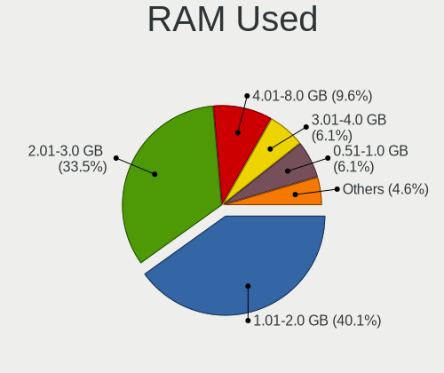

| Used GB    | Desktops | Percent |
|------------|----------|---------|
| 1.01-2.0   | 83       | 43.68%  |
| 2.01-3.0   | 39       | 20.53%  |
| 4.01-8.0   | 26       | 13.68%  |
| 3.01-4.0   | 19       | 10%     |
| 0.51-1.0   | 19       | 10%     |
| 8.01-16.0  | 3        | 1.58%   |
| 16.01-24.0 | 1        | 0.53%   |

Has CD-ROM
----------

Has CD-ROM on board

| Presented | Desktops | Percent |
|-----------|----------|---------|
| Yes       | 115      | 60.53%  |
| No        | 75       | 39.47%  |

Total Drives
------------

Number of drives on board

| Drives | Desktops | Percent |
|--------|----------|---------|
| 1      | 78       | 41.05%  |
| 2      | 50       | 26.32%  |
| 3      | 43       | 22.63%  |
| 4      | 8        | 4.21%   |
| 5      | 6        | 3.16%   |
| 7      | 2        | 1.05%   |
| 10     | 1        | 0.53%   |
| 6      | 1        | 0.53%   |
| 0      | 1        | 0.53%   |

Has Ethernet
------------

Has Ethernet on board

| Presented | Desktops | Percent |
|-----------|----------|---------|
| Yes       | 184      | 96.84%  |
| No        | 6        | 3.16%   |

Drive Vendor
------------

Hard drive vendors

| Vendor                    | Desktops | Drives | Percent |
|---------------------------|----------|--------|---------|
| Seagate                   | 77       | 105    | 23.05%  |
| WDC                       | 67       | 84     | 20.06%  |
| Samsung Electronics       | 53       | 70     | 15.87%  |
| Kingston                  | 24       | 26     | 7.19%   |
| Hitachi                   | 17       | 17     | 5.09%   |
| Crucial                   | 13       | 14     | 3.89%   |
| Toshiba                   | 9        | 9      | 2.69%   |
| SanDisk                   | 9        | 9      | 2.69%   |
| A-DATA Technology         | 7        | 7      | 2.1%    |
| SPCC                      | 5        | 7      | 1.5%    |
| China                     | 5        | 5      | 1.5%    |
| Patriot                   | 4        | 4      | 1.2%    |
| OCZ                       | 3        | 4      | 0.9%    |
| MAXTOR                    | 3        | 3      | 0.9%    |
| XPG                       | 2        | 2      | 0.6%    |
| WD MediaMax               | 2        | 2      | 0.6%    |
| Unknown                   | 2        | 2      | 0.6%    |
| Transcend                 | 2        | 2      | 0.6%    |
| TO Exter                  | 2        | 2      | 0.6%    |
| PNY                       | 2        | 2      | 0.6%    |
| KingSpec                  | 2        | 2      | 0.6%    |
| JMicron                   | 2        | 2      | 0.6%    |
| Intel                     | 2        | 2      | 0.6%    |
| HGST                      | 2        | 2      | 0.6%    |
| GOODRAM                   | 2        | 2      | 0.6%    |
| ViperTeq                  | 1        | 1      | 0.3%    |
| Super Talent              | 1        | 1      | 0.3%    |
| SK Hynix                  | 1        | 1      | 0.3%    |
| Silicon Motion            | 1        | 1      | 0.3%    |
| Sabrent                   | 1        | 1      | 0.3%    |
| PLEXTOR                   | 1        | 1      | 0.3%    |
| Phison                    | 1        | 1      | 0.3%    |
| Micron/Crucial Technology | 1        | 1      | 0.3%    |
| Micron Technology         | 1        | 1      | 0.3%    |
| LITEONIT                  | 1        | 1      | 0.3%    |
| LITEON                    | 1        | 1      | 0.3%    |
| KingDian                  | 1        | 1      | 0.3%    |
| Intenso                   | 1        | 1      | 0.3%    |
| Gigabyte Technology       | 1        | 1      | 0.3%    |
| Corsair                   | 1        | 1      | 0.3%    |
| Apacer                    | 1        | 1      | 0.3%    |

Drive Model
-----------

Hard drive models

| Model                            | Desktops | Percent |
|----------------------------------|----------|---------|
| Seagate ST500DM002-1BD142 500GB  | 9        | 2.28%   |
| Seagate ST4000DM004-2CV104 4TB   | 5        | 1.27%   |
| Seagate ST31000524AS 1TB         | 5        | 1.27%   |
| Samsung NVMe SSD Drive 500GB     | 5        | 1.27%   |
| Kingston SA400S37240G 240GB SSD  | 5        | 1.27%   |
| Seagate ST2000DM001-1CH164 2TB   | 4        | 1.01%   |
| Seagate ST1000DM010-2EP102 1TB   | 4        | 1.01%   |
| Seagate ST1000DM003-1CH162 1TB   | 4        | 1.01%   |
| Samsung SSD 850 EVO 120GB        | 4        | 1.01%   |
| Patriot Burst 120GB SSD          | 4        | 1.01%   |
| Kingston SV300S37A240G 240GB SSD | 4        | 1.01%   |
| Kingston SA400S37480G 480GB SSD  | 4        | 1.01%   |
| WDC WD1002FAEX-00Z3A0 1TB        | 3        | 0.76%   |
| Toshiba DT01ACA100 1TB           | 3        | 0.76%   |
| Seagate ST3160815AS 160GB        | 3        | 0.76%   |
| Seagate ST31000528AS 1TB         | 3        | 0.76%   |
| Seagate ST2000DM006-2DM164 2TB   | 3        | 0.76%   |
| Seagate Expansion+ 4TB           | 3        | 0.76%   |
| Samsung SSD 860 EVO 250GB        | 3        | 0.76%   |
| Samsung SSD 860 EVO 1TB          | 3        | 0.76%   |
| Samsung HD322HJ 320GB            | 3        | 0.76%   |
| Kingston SV300S37A120G 120GB SSD | 3        | 0.76%   |
| Kingston SUV400S37240G 240GB SSD | 3        | 0.76%   |
| WDC WD5000AAKX-08U6AA0 500GB     | 2        | 0.51%   |
| WDC WD5000AADS-00S9B0 500GB      | 2        | 0.51%   |
| WDC WD40EFRX-68N32N0 4TB         | 2        | 0.51%   |
| WDC WD30EZRX-00MMMB0 3TB         | 2        | 0.51%   |
| WDC WD20EZRZ-00Z5HB0 2TB         | 2        | 0.51%   |
| WDC WD20EZRX-00D8PB0 2TB         | 2        | 0.51%   |
| WDC WD20EFRX-68EUZN0 2TB         | 2        | 0.51%   |
| WDC WD2003FZEX-00SRLA0 2TB       | 2        | 0.51%   |
| WDC WD10EZRX-00A8LB0 1TB         | 2        | 0.51%   |
| WDC WD10EZEX-08WN4A0 1TB         | 2        | 0.51%   |
| Toshiba HDWD130 3TB              | 2        | 0.51%   |
| Toshiba HDWD110 1TB              | 2        | 0.51%   |
| TO Exter nal USB 3.0 752GB       | 2        | 0.51%   |
| SPCC Solid State Disk 256GB      | 2        | 0.51%   |
| Seagate ST3808110AS 80GB         | 2        | 0.51%   |
| Seagate ST3250310AS 250GB        | 2        | 0.51%   |
| Seagate ST250DM000-1BD141 250GB  | 2        | 0.51%   |
| Seagate ST2000DM008-2FR102 2TB   | 2        | 0.51%   |
| Seagate ST2000DM001-9YN164 2TB   | 2        | 0.51%   |
| Seagate ST1000VX000-1CU162 1TB   | 2        | 0.51%   |
| Seagate ST1000DM003-1SB102 1TB   | 2        | 0.51%   |
| Seagate ST1000DM003-1ER162 1TB   | 2        | 0.51%   |
| Seagate BUP Portable 4TB         | 2        | 0.51%   |
| SanDisk SDSSDH3 500G             | 2        | 0.51%   |
| Samsung SSD 970 EVO Plus 500GB   | 2        | 0.51%   |
| Samsung SSD 860 QVO 2TB          | 2        | 0.51%   |
| Samsung SSD 850 EVO 1TB          | 2        | 0.51%   |
| Samsung NVMe SSD Drive 1TB       | 2        | 0.51%   |
| Samsung M3 Portable 1TB          | 2        | 0.51%   |
| Samsung HD161GJ 160GB            | 2        | 0.51%   |
| Samsung HD103UJ 1TB              | 2        | 0.51%   |
| Kingston SV300S37A60G 64GB SSD   | 2        | 0.51%   |
| Kingston SA400S37120G 120GB SSD  | 2        | 0.51%   |
| Hitachi HUA722020ALA331 2TB      | 2        | 0.51%   |
| Hitachi HDS723020BLA642 1TB      | 2        | 0.51%   |
| Hitachi HDS721010CLA332 1TB      | 2        | 0.51%   |
| Crucial CT500MX500SSD1 500GB     | 2        | 0.51%   |

HDD Vendor
----------

Hard disk drive vendors

| Vendor              | Desktops | Drives | Percent |
|---------------------|----------|--------|---------|
| Seagate             | 76       | 102    | 38.19%  |
| WDC                 | 64       | 80     | 32.16%  |
| Samsung Electronics | 24       | 28     | 12.06%  |
| Hitachi             | 17       | 17     | 8.54%   |
| Toshiba             | 8        | 8      | 4.02%   |
| MAXTOR              | 3        | 3      | 1.51%   |
| TO Exter            | 2        | 2      | 1.01%   |
| HGST                | 2        | 2      | 1.01%   |
| WD MediaMax         | 1        | 1      | 0.5%    |
| Unknown             | 1        | 1      | 0.5%    |
| Sabrent             | 1        | 1      | 0.5%    |

SSD Vendor
----------

Solid state drive vendors

| Vendor              | Desktops | Drives | Percent |
|---------------------|----------|--------|---------|
| Samsung Electronics | 23       | 29     | 20.54%  |
| Kingston            | 23       | 25     | 20.54%  |
| Crucial             | 12       | 13     | 10.71%  |
| SanDisk             | 9        | 9      | 8.04%   |
| SPCC                | 5        | 7      | 4.46%   |
| China               | 5        | 5      | 4.46%   |
| A-DATA Technology   | 5        | 5      | 4.46%   |
| Patriot             | 4        | 4      | 3.57%   |
| WDC                 | 3        | 3      | 2.68%   |
| Transcend           | 2        | 2      | 1.79%   |
| OCZ                 | 2        | 2      | 1.79%   |
| KingSpec            | 2        | 2      | 1.79%   |
| Intel               | 2        | 2      | 1.79%   |
| GOODRAM             | 2        | 2      | 1.79%   |
| ViperTeq            | 1        | 1      | 0.89%   |
| Toshiba             | 1        | 1      | 0.89%   |
| SK Hynix            | 1        | 1      | 0.89%   |
| PNY                 | 1        | 1      | 0.89%   |
| PLEXTOR             | 1        | 1      | 0.89%   |
| Micron Technology   | 1        | 1      | 0.89%   |
| LITEONIT            | 1        | 1      | 0.89%   |
| LITEON              | 1        | 1      | 0.89%   |
| KingDian            | 1        | 1      | 0.89%   |
| JMicron             | 1        | 1      | 0.89%   |
| Gigabyte Technology | 1        | 1      | 0.89%   |
| Corsair             | 1        | 1      | 0.89%   |
| Apacer              | 1        | 1      | 0.89%   |

Drive Kind
----------

HDD or SSD

| Kind    | Desktops | Drives | Percent |
|---------|----------|--------|---------|
| HDD     | 156      | 245    | 55.12%  |
| SSD     | 97       | 123    | 34.28%  |
| NVMe    | 22       | 26     | 7.77%   |
| Unknown | 8        | 8      | 2.83%   |

Drive Connector
---------------

SATA, SAS, NVMe, etc.

| Type | Desktops | Drives | Percent |
|------|----------|--------|---------|
| SATA | 184      | 352    | 81.78%  |
| NVMe | 22       | 26     | 9.78%   |
| SAS  | 19       | 24     | 8.44%   |

Drive Size
----------

Size of hard drive

| Size in TB | Desktops | Drives | Percent |
|------------|----------|--------|---------|
| 0.01-0.5   | 136      | 198    | 50.37%  |
| 0.51-1.0   | 73       | 95     | 27.04%  |
| 1.01-2.0   | 33       | 44     | 12.22%  |
| 3.01-4.0   | 16       | 18     | 5.93%   |
| 2.01-3.0   | 8        | 9      | 2.96%   |
| 4.01-10.0  | 4        | 4      | 1.48%   |

Space Total
-----------

Amount of disk space available on the file system

| Size in GB     | Desktops | Percent |
|----------------|----------|---------|
| 101-250        | 50       | 26.32%  |
| 251-500        | 35       | 18.42%  |
| 501-1000       | 31       | 16.32%  |
| 1001-2000      | 28       | 14.74%  |
| More than 3000 | 20       | 10.53%  |
| 2001-3000      | 12       | 6.32%   |
| 21-50          | 6        | 3.16%   |
| 51-100         | 6        | 3.16%   |
| 1-20           | 1        | 0.53%   |
| Unknown        | 1        | 0.53%   |

Space Used
----------

Amount of used disk space

| Used GB        | Desktops | Percent |
|----------------|----------|---------|
| 1-20           | 43       | 22.63%  |
| 21-50          | 39       | 20.53%  |
| 101-250        | 29       | 15.26%  |
| 501-1000       | 23       | 12.11%  |
| 51-100         | 21       | 11.05%  |
| 1001-2000      | 18       | 9.47%   |
| More than 3000 | 7        | 3.68%   |
| 251-500        | 7        | 3.68%   |
| 2001-3000      | 2        | 1.05%   |
| Unknown        | 1        | 0.53%   |

Malfunc. Drives
---------------

Drive models with a malfunction

| Model                             | Desktops | Drives | Percent |
|-----------------------------------|----------|--------|---------|
| WDC WD800JB-00JJA0 80GB           | 1        | 1      | 6.25%   |
| WDC WD5000AVVS-63H0B1 500GB       | 1        | 1      | 6.25%   |
| WDC WD3200AAJS-00L7A0 320GB       | 1        | 1      | 6.25%   |
| WDC WD10EZEX-60WN4A0 1TB          | 1        | 1      | 6.25%   |
| WDC WD10EADS-00L5B1 1TB           | 1        | 1      | 6.25%   |
| Unknown S050 Hard drive 500GB     | 1        | 1      | 6.25%   |
| Seagate ST500LT012-9WS142 500GB   | 1        | 1      | 6.25%   |
| Seagate ST380815AS 80GB           | 1        | 1      | 6.25%   |
| Seagate ST2000DM001-9YN164 2TB    | 1        | 1      | 6.25%   |
| Seagate ST1000DM003-1CH162 1TB    | 1        | 1      | 6.25%   |
| Samsung Electronics HM160HI 160GB | 1        | 1      | 6.25%   |
| Samsung Electronics HM121HI 120GB | 1        | 1      | 6.25%   |
| Samsung Electronics HD642JJ 640GB | 1        | 1      | 6.25%   |
| Samsung Electronics HD103UJ 1TB   | 1        | 1      | 6.25%   |
| Kingston SA400S37240G 240GB SSD   | 1        | 1      | 6.25%   |
| Hitachi HDP725050GLA360 500GB     | 1        | 1      | 6.25%   |

Malfunc. Drive Vendor
---------------------

Vendors of faulty drives

| Vendor              | Desktops | Drives | Percent |
|---------------------|----------|--------|---------|
| WDC                 | 4        | 5      | 28.57%  |
| Seagate             | 4        | 4      | 28.57%  |
| Samsung Electronics | 3        | 4      | 21.43%  |
| Unknown             | 1        | 1      | 7.14%   |
| Kingston            | 1        | 1      | 7.14%   |
| Hitachi             | 1        | 1      | 7.14%   |

Malfunc. HDD Vendor
-------------------

Vendors of faulty HDD drives

| Vendor              | Desktops | Drives | Percent |
|---------------------|----------|--------|---------|
| WDC                 | 4        | 5      | 30.77%  |
| Seagate             | 4        | 4      | 30.77%  |
| Samsung Electronics | 3        | 4      | 23.08%  |
| Unknown             | 1        | 1      | 7.69%   |
| Hitachi             | 1        | 1      | 7.69%   |

Malfunc. Drive Kind
-------------------

Kinds of faulty drives

| Kind | Desktops | Drives | Percent |
|------|----------|--------|---------|
| HDD  | 10       | 15     | 90.91%  |
| SSD  | 1        | 1      | 9.09%   |

Failed Drives
-------------

Failed drive models

| Model                             | Desktops | Drives | Percent |
|-----------------------------------|----------|--------|---------|
| Samsung Electronics HD252HJ 250GB | 1        | 1      | 100%    |

Failed Drive Vendor
-------------------

Failed drive vendors

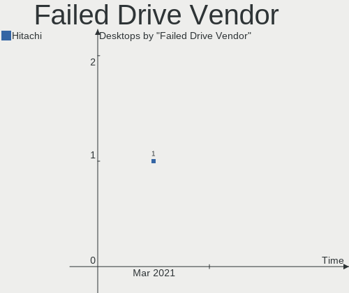

| Vendor              | Desktops | Drives | Percent |
|---------------------|----------|--------|---------|
| Samsung Electronics | 1        | 1      | 100%    |

Drive Status
------------

Number of failed and malfunc. drives

| Status   | Desktops | Drives | Percent |
|----------|----------|--------|---------|
| Detected | 160      | 316    | 77.67%  |
| Works    | 34       | 69     | 16.5%   |
| Malfunc  | 11       | 16     | 5.34%   |
| Failed   | 1        | 1      | 0.49%   |

Storage Vendor
--------------

Storage controller vendors

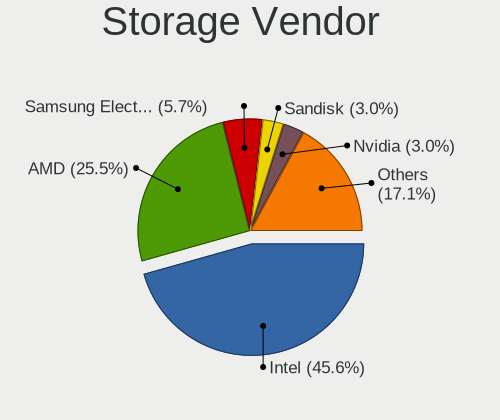

| Vendor                      | Desktops | Percent |
|-----------------------------|----------|---------|
| Intel                       | 122      | 53.51%  |
| AMD                         | 54       | 23.68%  |
| Nvidia                      | 12       | 5.26%   |
| Samsung Electronics         | 11       | 4.82%   |
| Marvell Technology Group    | 6        | 2.63%   |
| JMicron Technology          | 4        | 1.75%   |
| ASMedia Technology          | 4        | 1.75%   |
| ADATA Technology            | 4        | 1.75%   |
| VIA Technologies            | 2        | 0.88%   |
| Phison Electronics          | 2        | 0.88%   |
| Adaptec                     | 2        | 0.88%   |
| Silicon Motion              | 1        | 0.44%   |
| Sandisk                     | 1        | 0.44%   |
| OCZ Technology Group        | 1        | 0.44%   |
| Micron/Crucial Technology   | 1        | 0.44%   |
| Kingston Technology Company | 1        | 0.44%   |

Storage Model
-------------

Storage controller models

| Model                                                                                   | Desktops | Percent |
|-----------------------------------------------------------------------------------------|----------|---------|
| AMD FCH SATA Controller [AHCI mode]                                                     | 30       | 9.97%   |
| Intel 8 Series/C220 Series Chipset Family 6-port SATA Controller 1 [AHCI mode]          | 15       | 4.98%   |
| Intel 6 Series/C200 Series Chipset Family 6 port Desktop SATA AHCI Controller           | 14       | 4.65%   |
| AMD SB7x0/SB8x0/SB9x0 SATA Controller [AHCI mode]                                       | 14       | 4.65%   |
| Intel NM10/ICH7 Family SATA Controller [IDE mode]                                       | 13       | 4.32%   |
| Intel 82801G (ICH7 Family) IDE Controller                                               | 13       | 4.32%   |
| AMD SB7x0/SB8x0/SB9x0 IDE Controller                                                    | 13       | 4.32%   |
| Intel Q170/Q150/B150/H170/H110/Z170/CM236 Chipset SATA Controller [AHCI Mode]           | 12       | 3.99%   |
| Intel 200 Series PCH SATA controller [AHCI mode]                                        | 12       | 3.99%   |
| Samsung NVMe SSD Controller SM981/PM981/PM983                                           | 10       | 3.32%   |
| Intel 7 Series/C210 Series Chipset Family 6-port SATA Controller [AHCI mode]            | 9        | 2.99%   |
| AMD 400 Series Chipset SATA Controller                                                  | 8        | 2.66%   |
| Nvidia MCP61 SATA Controller                                                            | 7        | 2.33%   |
| Intel SATA Controller [RAID mode]                                                       | 7        | 2.33%   |
| AMD SB7x0/SB8x0/SB9x0 SATA Controller [IDE mode]                                        | 6        | 1.99%   |
| Intel 5 Series/3400 Series Chipset 6 port SATA AHCI Controller                          | 5        | 1.66%   |
| Nvidia MCP61 IDE                                                                        | 4        | 1.33%   |
| Intel C610/X99 series chipset 6-Port SATA Controller [AHCI mode]                        | 4        | 1.33%   |
| ASMedia ASM1062 Serial ATA Controller                                                   | 4        | 1.33%   |
| AMD FCH SATA Controller D                                                               | 4        | 1.33%   |
| AMD 300 Series Chipset SATA Controller                                                  | 4        | 1.33%   |
| ADATA XPG SX8200 Pro PCIe Gen3x4 M.2 2280 Solid State Drive                             | 4        | 1.33%   |
| Intel C610/X99 series chipset sSATA Controller [AHCI mode]                              | 3        | 1%      |
| Intel 82801HR/HO/HH (ICH8R/DO/DH) 2 port SATA Controller [IDE mode]                     | 3        | 1%      |
| Intel 82801H (ICH8 Family) 4 port SATA Controller [IDE mode]                            | 3        | 1%      |
| Intel 82801EB/ER (ICH5/ICH5R) IDE Controller                                            | 3        | 1%      |
| Intel 82801EB (ICH5) SATA Controller                                                    | 3        | 1%      |
| Intel 6 Series/C200 Series Chipset Family Desktop SATA Controller (IDE mode, ports 4-5) | 3        | 1%      |
| Intel 6 Series/C200 Series Chipset Family Desktop SATA Controller (IDE mode, ports 0-3) | 3        | 1%      |
| Intel 5 Series/3400 Series Chipset 4 port SATA IDE Controller                           | 3        | 1%      |
| Intel 5 Series/3400 Series Chipset 2 port SATA IDE Controller                           | 3        | 1%      |
| AMD FCH IDE Controller                                                                  | 3        | 1%      |
| Nvidia MCP78S [GeForce 8200] AHCI Controller                                            | 2        | 0.66%   |
| Marvell Group 88SE9172 SATA 6Gb/s Controller                                            | 2        | 0.66%   |
| JMicron JMB368 IDE controller                                                           | 2        | 0.66%   |
| JMicron JMB363 SATA/IDE Controller                                                      | 2        | 0.66%   |
| Intel Cannon Lake PCH SATA AHCI Controller                                              | 2        | 0.66%   |
| Intel 82801JI (ICH10 Family) SATA AHCI Controller                                       | 2        | 0.66%   |
| Intel 82801JD/DO (ICH10 Family) SATA AHCI Controller                                    | 2        | 0.66%   |
| Intel 82801GBM/GHM (ICH7-M Family) SATA Controller [IDE mode]                           | 2        | 0.66%   |
| Intel 4 Series Chipset PT IDER Controller                                               | 2        | 0.66%   |
| AMD SATA controller                                                                     | 2        | 0.66%   |
| VIA VT82C586A/B/VT82C686/A/B/VT823x/A/C PIPC Bus Master IDE                             | 1        | 0.33%   |
| VIA VT6415 PATA IDE Host Controller                                                     | 1        | 0.33%   |
| VIA VIA VT6420 SATA RAID Controller                                                     | 1        | 0.33%   |
| Silicon Motion SM2263EN/SM2263XT SSD Controller                                         | 1        | 0.33%   |
| Sandisk WD Black 2018 / PC SN720 NVMe SSD                                               | 1        | 0.33%   |
| Samsung Electronics Non-Volatile memory controller                                      | 1        | 0.33%   |
| Phison E16 PCIe4 NVMe Controller                                                        | 1        | 0.33%   |
| Phison E12 NVMe Controller                                                              | 1        | 0.33%   |
| OCZ Group RD400/400A SSD                                                                | 1        | 0.33%   |
| Nvidia MCP73 SATA Controller (IDE mode)                                                 | 1        | 0.33%   |
| Nvidia MCP73 IDE Controller                                                             | 1        | 0.33%   |
| Nvidia MCP55 SATA Controller                                                            | 1        | 0.33%   |
| Nvidia MCP55 IDE                                                                        | 1        | 0.33%   |
| Nvidia MCP51 Serial ATA Controller                                                      | 1        | 0.33%   |
| Micron/Crucial Non-Volatile memory controller                                           | 1        | 0.33%   |
| Marvell Group MV64460/64461/64462 System Controller, Revision B                         | 1        | 0.33%   |
| Marvell Group 92xx SATA 6G Controller                                                   | 1        | 0.33%   |
| Marvell Group 88SE9172 SATA III 6Gb/s RAID Controller                                   | 1        | 0.33%   |

Storage Kind
------------

Kind of storage controller (IDE, SATA, NVMe, SAS, ...)

| Kind | Desktops | Percent |
|------|----------|---------|
| SATA | 139      | 58.4%   |
| IDE  | 63       | 26.47%  |
| NVMe | 22       | 9.24%   |
| RAID | 12       | 5.04%   |
| SCSI | 2        | 0.84%   |

CPU Vendor
----------

Processor vendors

| Vendor | Desktops | Percent |
|--------|----------|---------|
| Intel  | 125      | 65.79%  |
| AMD    | 65       | 34.21%  |

CPU Model
---------

Processor models

| Model                                       | Desktops | Percent |
|---------------------------------------------|----------|---------|
| AMD FX-8350 Eight-Core Processor            | 5        | 2.63%   |
| Intel Core i5-6500 CPU @ 3.20GHz            | 4        | 2.11%   |
| Intel Core i5-2400 CPU @ 3.10GHz            | 4        | 2.11%   |
| Intel Core i3-3220 CPU @ 3.30GHz            | 4        | 2.11%   |
| Intel Pentium Dual-Core CPU E5400 @ 2.70GHz | 3        | 1.58%   |
| Intel Core i5-9400 CPU @ 2.90GHz            | 3        | 1.58%   |
| Intel Core i5-4590 CPU @ 3.30GHz            | 3        | 1.58%   |
| Intel Core i5-4570 CPU @ 3.20GHz            | 3        | 1.58%   |
| Intel Core i5-4460 CPU @ 3.20GHz            | 3        | 1.58%   |
| Intel Core i5 CPU 650 @ 3.20GHz             | 3        | 1.58%   |
| Intel Core 2 Quad CPU Q6600 @ 2.40GHz       | 3        | 1.58%   |
| Intel Core 2 Duo CPU E8400 @ 3.00GHz        | 3        | 1.58%   |
| AMD FX-6300 Six-Core Processor              | 3        | 1.58%   |
| Intel Xeon CPU E5-2620 v3 @ 2.40GHz         | 2        | 1.05%   |
| Intel Pentium 4 CPU 2.80GHz                 | 2        | 1.05%   |
| Intel Core i7-6700K CPU @ 4.00GHz           | 2        | 1.05%   |
| Intel Core i5-7500 CPU @ 3.40GHz            | 2        | 1.05%   |
| Intel Core i3-7100 CPU @ 3.90GHz            | 2        | 1.05%   |
| Intel Core i3-6100 CPU @ 3.70GHz            | 2        | 1.05%   |
| Intel Core i3-2120 CPU @ 3.30GHz            | 2        | 1.05%   |
| Intel Core 2 Duo CPU E6750 @ 2.66GHz        | 2        | 1.05%   |
| AMD Ryzen 9 3950X 16-Core Processor         | 2        | 1.05%   |
| AMD Ryzen 9 3900X 12-Core Processor         | 2        | 1.05%   |
| AMD Ryzen 7 2700 Eight-Core Processor       | 2        | 1.05%   |
| AMD Ryzen 5 3600 6-Core Processor           | 2        | 1.05%   |
| AMD Ryzen 5 1600 Six-Core Processor         | 2        | 1.05%   |
| AMD Phenom II X4 955 Processor              | 2        | 1.05%   |
| AMD A8-6600K APU with Radeon HD Graphics    | 2        | 1.05%   |
| Intel Xeon CPU X5690 @ 3.47GHz              | 1        | 0.53%   |
| Intel Xeon CPU E5520 @ 2.27GHz              | 1        | 0.53%   |
| Intel Xeon CPU E5-2690 v3 @ 2.60GHz         | 1        | 0.53%   |
| Intel Xeon CPU E5-2683 v3 @ 2.00GHz         | 1        | 0.53%   |
| Intel Xeon CPU E5-2680 v3 @ 2.50GHz         | 1        | 0.53%   |
| Intel Xeon CPU E31270 @ 3.40GHz             | 1        | 0.53%   |
| Intel Xeon CPU E3-1240 V2 @ 3.40GHz         | 1        | 0.53%   |
| Intel Xeon CPU E3-1220 V2 @ 3.10GHz         | 1        | 0.53%   |
| Intel Pentium Gold G5420 CPU @ 3.80GHz      | 1        | 0.53%   |
| Intel Pentium Gold G5400 CPU @ 3.70GHz      | 1        | 0.53%   |
| Intel Pentium Dual-Core CPU E6500 @ 2.93GHz | 1        | 0.53%   |
| Intel Pentium Dual-Core CPU E5800 @ 3.20GHz | 1        | 0.53%   |
| Intel Pentium Dual-Core CPU E5700 @ 3.00GHz | 1        | 0.53%   |
| Intel Pentium Dual-Core CPU E5200 @ 2.50GHz | 1        | 0.53%   |
| Intel Pentium Dual CPU E2160 @ 1.80GHz      | 1        | 0.53%   |
| Intel Pentium D CPU 3.40GHz                 | 1        | 0.53%   |
| Intel Pentium CPU G3240 @ 3.10GHz           | 1        | 0.53%   |
| Intel Pentium 4 CPU 3.20GHz                 | 1        | 0.53%   |
| Intel Pentium 4 CPU 3.00GHz                 | 1        | 0.53%   |
| Intel Pentium 4 CPU 2.40GHz                 | 1        | 0.53%   |
| Intel Core i7-8700K CPU @ 3.70GHz           | 1        | 0.53%   |
| Intel Core i7-8700 CPU @ 3.20GHz            | 1        | 0.53%   |
| Intel Core i7-6800K CPU @ 3.40GHz           | 1        | 0.53%   |
| Intel Core i7-6700 CPU @ 3.40GHz            | 1        | 0.53%   |
| Intel Core i7-4790 CPU @ 3.60GHz            | 1        | 0.53%   |
| Intel Core i7-4770K CPU @ 3.50GHz           | 1        | 0.53%   |
| Intel Core i7-4770 CPU @ 3.40GHz            | 1        | 0.53%   |
| Intel Core i7-3930K CPU @ 3.20GHz           | 1        | 0.53%   |
| Intel Core i7-2600K CPU @ 3.40GHz           | 1        | 0.53%   |
| Intel Core i7-2600 CPU @ 3.40GHz            | 1        | 0.53%   |
| Intel Core i7-10700K CPU @ 3.80GHz          | 1        | 0.53%   |
| Intel Core i5-8400 CPU @ 2.80GHz            | 1        | 0.53%   |

CPU Model Family
----------------

Processor model prefix

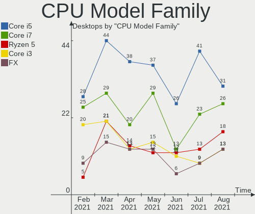

| Model                   | Desktops | Percent |
|-------------------------|----------|---------|
| Intel Core i5           | 43       | 22.63%  |
| Intel Core i3           | 20       | 10.53%  |
| Intel Core i7           | 13       | 6.84%   |
| AMD FX                  | 11       | 5.79%   |
| Intel Xeon              | 10       | 5.26%   |
| Intel Core 2 Duo        | 8        | 4.21%   |
| AMD Ryzen 5             | 8        | 4.21%   |
| Intel Pentium Dual-Core | 7        | 3.68%   |
| AMD Ryzen 7             | 6        | 3.16%   |
| Intel Pentium 4         | 5        | 2.63%   |
| Intel Core 2 Quad       | 5        | 2.63%   |
| AMD Ryzen 9             | 5        | 2.63%   |
| AMD Phenom II X4        | 5        | 2.63%   |
| Intel Celeron           | 4        | 2.11%   |
| AMD A8                  | 4        | 2.11%   |
| Intel Core 2            | 3        | 1.58%   |
| AMD Athlon II X4        | 3        | 1.58%   |
| AMD Athlon II X2        | 3        | 1.58%   |
| AMD A10                 | 3        | 1.58%   |
| Intel Pentium Gold      | 2        | 1.05%   |
| Intel Atom              | 2        | 1.05%   |
| AMD Phenom II X2        | 2        | 1.05%   |
| AMD Athlon II X3        | 2        | 1.05%   |
| AMD Athlon 64 X2        | 2        | 1.05%   |
| AMD Athlon              | 2        | 1.05%   |
| AMD A4                  | 2        | 1.05%   |
| Other                   | 1        | 0.53%   |
| Intel Pentium Dual      | 1        | 0.53%   |
| Intel Pentium D         | 1        | 0.53%   |
| Intel Pentium           | 1        | 0.53%   |
| AMD Ryzen 3 PRO         | 1        | 0.53%   |
| AMD Ryzen 3             | 1        | 0.53%   |
| AMD PRO A10             | 1        | 0.53%   |
| AMD Phenom II X6        | 1        | 0.53%   |
| AMD E                   | 1        | 0.53%   |
| AMD A6                  | 1        | 0.53%   |

CPU Cores
---------

Number of processor cores

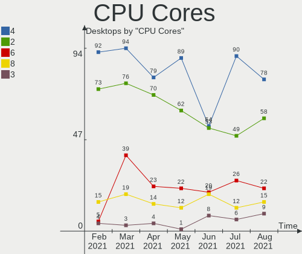

| Number | Desktops | Percent |
|--------|----------|---------|
| 4      | 71       | 37.37%  |
| 2      | 70       | 36.84%  |
| 6      | 18       | 9.47%   |
| 1      | 9        | 4.74%   |
| 8      | 7        | 3.68%   |
| 3      | 5        | 2.63%   |
| 12     | 4        | 2.11%   |
| 16     | 3        | 1.58%   |
| 24     | 1        | 0.53%   |
| 14     | 1        | 0.53%   |
| 5      | 1        | 0.53%   |

CPU Sockets
-----------

Number of sockets

| Number | Desktops | Percent |
|--------|----------|---------|
| 1      | 188      | 98.95%  |
| 2      | 2        | 1.05%   |

CPU Threads
-----------

Threads per core (Hyper-Threading)

| Number | Desktops | Percent |
|--------|----------|---------|
| 2      | 97       | 51.05%  |
| 1      | 93       | 48.95%  |

CPU Op-Modes
------------

CPU Operation Modes (32-bit, 64-bit)

| Op mode        | Desktops | Percent |
|----------------|----------|---------|
| 32-bit, 64-bit | 184      | 96.84%  |
| 32-bit         | 5        | 2.63%   |
| Unknown        | 1        | 0.53%   |

CPU Microcode
-------------

Microcode number

| Number     | Desktops | Percent |
|------------|----------|---------|
| Unknown    | 19       | 10%     |
| 0x306c3    | 16       | 8.42%   |
| 0x206a7    | 16       | 8.42%   |
| 0x506e3    | 11       | 5.79%   |
| 0x306a9    | 10       | 5.26%   |
| 0x1067a    | 10       | 5.26%   |
| 0x06000852 | 8        | 4.21%   |
| 0x906ea    | 7        | 3.68%   |
| 0x010000c8 | 7        | 3.68%   |
| 0x906e9    | 6        | 3.16%   |
| 0x6fb      | 6        | 3.16%   |
| 0x06001119 | 6        | 3.16%   |
| 0x08701021 | 5        | 2.63%   |
| 0x010000db | 5        | 2.63%   |
| 0x306f2    | 4        | 2.11%   |
| 0x0800820d | 4        | 2.11%   |
| 0xf29      | 3        | 1.58%   |
| 0x20652    | 3        | 1.58%   |
| 0x10676    | 3        | 1.58%   |
| 0xf65      | 2        | 1.05%   |
| 0x6f2      | 2        | 1.05%   |
| 0x20655    | 2        | 1.05%   |
| 0x106e5    | 2        | 1.05%   |
| 0x08701013 | 2        | 1.05%   |
| 0x0600063e | 2        | 1.05%   |
| 0x03000027 | 2        | 1.05%   |
| 0xf27      | 1        | 0.53%   |
| 0xa0655    | 1        | 0.53%   |
| 0xa0653    | 1        | 0.53%   |
| 0x906eb    | 1        | 0.53%   |
| 0x706a1    | 1        | 0.53%   |
| 0x6fd      | 1        | 0.53%   |
| 0x6f6      | 1        | 0.53%   |
| 0x406f1    | 1        | 0.53%   |
| 0x206d7    | 1        | 0.53%   |
| 0x206c2    | 1        | 0.53%   |
| 0x106ca    | 1        | 0.53%   |
| 0x106c2    | 1        | 0.53%   |
| 0x106a5    | 1        | 0.53%   |
| 0x0a201009 | 1        | 0.53%   |
| 0x08600103 | 1        | 0.53%   |
| 0x08108109 | 1        | 0.53%   |
| 0x08101016 | 1        | 0.53%   |
| 0x0810100b | 1        | 0.53%   |
| 0x08001138 | 1        | 0.53%   |
| 0x08001137 | 1        | 0.53%   |
| 0x08001126 | 1        | 0.53%   |
| 0x08001105 | 1        | 0.53%   |
| 0x0600611a | 1        | 0.53%   |
| 0x06003106 | 1        | 0.53%   |
| 0x05000119 | 1        | 0.53%   |
| 0x010000dc | 1        | 0.53%   |
| 0x01000095 | 1        | 0.53%   |

CPU Microarch
-------------

Microarchitecture

| Name          | Desktops | Percent |
|---------------|----------|---------|
| Haswell       | 22       | 11.58%  |
| SandyBridge   | 19       | 10%     |
| K10           | 17       | 8.95%   |
| Piledriver    | 15       | 7.89%   |
| KabyLake      | 15       | 7.89%   |
| Penryn        | 14       | 7.37%   |
| Skylake       | 11       | 5.79%   |
| IvyBridge     | 11       | 5.79%   |
| Core          | 11       | 5.79%   |
| Zen 2         | 9        | 4.74%   |
| Zen           | 7        | 3.68%   |
| Westmere      | 7        | 3.68%   |
| NetBurst      | 6        | 3.16%   |
| Zen+          | 5        | 2.63%   |
| Nehalem       | 3        | 1.58%   |
| K8 Hammer     | 3        | 1.58%   |
| Steamroller   | 2        | 1.05%   |
| K10 Llano     | 2        | 1.05%   |
| CometLake     | 2        | 1.05%   |
| Bulldozer     | 2        | 1.05%   |
| Bonnell       | 2        | 1.05%   |
| Goldmont plus | 1        | 0.53%   |
| Excavator     | 1        | 0.53%   |
| Broadwell     | 1        | 0.53%   |
| Bobcat        | 1        | 0.53%   |
| Unknown       | 1        | 0.53%   |

GPU Vendor
----------

Vendors of graphics cards

| Vendor                     | Desktops | Percent |
|----------------------------|----------|---------|
| Nvidia                     | 80       | 41.24%  |
| Intel                      | 62       | 31.96%  |
| AMD                        | 50       | 25.77%  |
| Matrox Electronics Systems | 1        | 0.52%   |
| ATI Technologies           | 1        | 0.52%   |

GPU Model
---------

Graphics card models

| Model                                                                         | Desktops | Percent |
|-------------------------------------------------------------------------------|----------|---------|
| Intel 2nd Generation Core Processor Family Integrated Graphics Controller     | 13       | 6.53%   |
| Intel HD Graphics 530                                                         | 7        | 3.52%   |
| Intel 4 Series Chipset Integrated Graphics Controller                         | 7        | 3.52%   |
| AMD Ellesmere [Radeon RX 470/480/570/570X/580/580X/590]                       | 7        | 3.52%   |
| Nvidia GT218 [GeForce 210]                                                    | 6        | 3.02%   |
| Nvidia GP106 [GeForce GTX 1060 6GB]                                           | 6        | 3.02%   |
| Nvidia GK208B [GeForce GT 710]                                                | 6        | 3.02%   |
| Intel Xeon E3-1200 v2/3rd Gen Core processor Graphics Controller              | 6        | 3.02%   |
| Intel Xeon E3-1200 v3/4th Gen Core Processor Integrated Graphics Controller   | 5        | 2.51%   |
| Intel 82G33/G31 Express Integrated Graphics Controller                        | 5        | 2.51%   |
| Nvidia GP107 [GeForce GTX 1050 Ti]                                            | 4        | 2.01%   |
| Nvidia GK208B [GeForce GT 730]                                                | 4        | 2.01%   |
| Intel UHD Graphics 630 (Desktop)                                              | 4        | 2.01%   |
| Nvidia GT218 [GeForce 8400 GS Rev. 3]                                         | 3        | 1.51%   |
| Nvidia GF119 [GeForce GT 610]                                                 | 3        | 1.51%   |
| AMD Turks XT [Radeon HD 6670/7670]                                            | 3        | 1.51%   |
| AMD Baffin [Radeon RX 550 640SP / RX 560/560X]                                | 3        | 1.51%   |
| Nvidia TU117 [GeForce GTX 1650]                                               | 2        | 1.01%   |
| Nvidia GP108 [GeForce GT 1030]                                                | 2        | 1.01%   |
| Nvidia GP107 [GeForce GTX 1050]                                               | 2        | 1.01%   |
| Nvidia GP104 [GeForce GTX 1070]                                               | 2        | 1.01%   |
| Nvidia GM206 [GeForce GTX 960]                                                | 2        | 1.01%   |
| Nvidia GF116 [GeForce GTX 550 Ti]                                             | 2        | 1.01%   |
| Nvidia G73 [GeForce 7300 GT]                                                  | 2        | 1.01%   |
| Nvidia C61 [GeForce 7025 / nForce 630a]                                       | 2        | 1.01%   |
| Intel Mobile 945GM/GMS/GME, 943/940GML Express Integrated Graphics Controller | 2        | 1.01%   |
| Intel Coffee Lake UHD Graphics 610                                            | 2        | 1.01%   |
| Intel 82Q963/Q965 Integrated Graphics Controller                              | 2        | 1.01%   |
| AMD Richland [Radeon HD 8570D]                                                | 2        | 1.01%   |
| AMD Navi 10 [Radeon RX 5600 OEM/5600 XT / 5700/5700 XT]                       | 2        | 1.01%   |
| AMD Curacao XT / Trinidad XT [Radeon R7 370 / R9 270X/370X]                   | 2        | 1.01%   |
| AMD Cedar [Radeon HD 5000/6000/7350/8350 Series]                              | 2        | 1.01%   |
| AMD Cape Verde PRO [Radeon HD 7750/8740 / R7 250E]                            | 2        | 1.01%   |
| AMD Caicos [Radeon HD 6450/7450/8450 / R5 230 OEM]                            | 2        | 1.01%   |
| Nvidia TU116 [GeForce GTX 1660 Ti]                                            | 1        | 0.5%    |
| Nvidia TU116 [GeForce GTX 1660 SUPER]                                         | 1        | 0.5%    |
| Nvidia TU106 [GeForce RTX 2060 SUPER]                                         | 1        | 0.5%    |
| Nvidia TU104 [GeForce RTX 2070 SUPER]                                         | 1        | 0.5%    |
| Nvidia GT215 [GeForce GT 240]                                                 | 1        | 0.5%    |
| Nvidia GT215 [GeForce GT 220]                                                 | 1        | 0.5%    |
| Nvidia GT200 [GeForce GTX 260]                                                | 1        | 0.5%    |
| Nvidia GP104GL [Quadro P4000]                                                 | 1        | 0.5%    |
| Nvidia GM107GL [Quadro K620]                                                  | 1        | 0.5%    |
| Nvidia GM107 [GeForce GTX 750]                                                | 1        | 0.5%    |
| Nvidia GM107 [GeForce GTX 745]                                                | 1        | 0.5%    |
| Nvidia GK208B [GeForce GT 720]                                                | 1        | 0.5%    |
| Nvidia GK208 [GeForce GT 630 Rev. 2]                                          | 1        | 0.5%    |
| Nvidia GK107 [GeForce GT 640]                                                 | 1        | 0.5%    |
| Nvidia GK106 [GeForce GTX 660]                                                | 1        | 0.5%    |
| Nvidia GK106 [GeForce GTX 650 Ti]                                             | 1        | 0.5%    |
| Nvidia GK104 [GeForce GTX 770]                                                | 1        | 0.5%    |
| Nvidia GK104 [GeForce GTX 760]                                                | 1        | 0.5%    |
| Nvidia GF119 [GeForce GT 520]                                                 | 1        | 0.5%    |
| Nvidia GF114 [GeForce GTX 560]                                                | 1        | 0.5%    |
| Nvidia GF108GL [Quadro 600]                                                   | 1        | 0.5%    |
| Nvidia GF108 [GeForce GT 630]                                                 | 1        | 0.5%    |
| Nvidia GF108 [GeForce GT 430]                                                 | 1        | 0.5%    |
| Nvidia GF100GL [Quadro 4000]                                                  | 1        | 0.5%    |
| Nvidia GA104 [GeForce RTX 3070]                                               | 1        | 0.5%    |
| Nvidia G96C [GeForce 9500 GT]                                                 | 1        | 0.5%    |

GPU Combo
---------

Combinations of graphics cards

| Name        | Desktops | Percent |
|-------------|----------|---------|
| 1 x Nvidia  | 78       | 41.05%  |
| 1 x Intel   | 58       | 30.53%  |
| 1 x AMD     | 48       | 25.26%  |
| 2 x Nvidia  | 2        | 1.05%   |
| 2 x AMD     | 2        | 1.05%   |
| 1 x Matrox  | 1        | 0.53%   |
| Intel + AMD | 1        | 0.53%   |

GPU Driver
----------

Free vs proprietary

| Driver      | Desktops | Percent |
|-------------|----------|---------|
| Free        | 125      | 65.79%  |
| Proprietary | 58       | 30.53%  |
| Unknown     | 7        | 3.68%   |

GPU Memory
----------

Total video memory

| Size in GB | Desktops | Percent |
|------------|----------|---------|
| Unknown    | 65       | 34.21%  |
| 0.51-1.0   | 34       | 17.89%  |
| 1.01-2.0   | 29       | 15.26%  |
| 0.01-0.5   | 25       | 13.16%  |
| 3.01-4.0   | 16       | 8.42%   |
| 7.01-8.0   | 10       | 5.26%   |
| 5.01-6.0   | 10       | 5.26%   |
| 2.01-3.0   | 1        | 0.53%   |

Monitor Vendor
--------------

Monitor vendors

| Vendor                  | Desktops | Percent |
|-------------------------|----------|---------|
| Samsung Electronics     | 29       | 15.1%   |
| Goldstar                | 22       | 11.46%  |
| Hewlett-Packard         | 16       | 8.33%   |
| Dell                    | 15       | 7.81%   |
| Acer                    | 11       | 5.73%   |
| Ancor Communications    | 10       | 5.21%   |
| AOC                     | 9        | 4.69%   |
| Philips                 | 8        | 4.17%   |
| LG Electronics          | 8        | 4.17%   |
| BenQ                    | 8        | 4.17%   |
| Iiyama                  | 7        | 3.65%   |
| NEC Computers           | 4        | 2.08%   |
| Lenovo                  | 4        | 2.08%   |
| ViewSonic               | 3        | 1.56%   |
| Sceptre Tech            | 3        | 1.56%   |
| Vizio                   | 2        | 1.04%   |
| Unknown                 | 2        | 1.04%   |
| Panasonic               | 2        | 1.04%   |
| HannStar Display        | 2        | 1.04%   |
| FUS                     | 2        | 1.04%   |
| Westinghouse            | 1        | 0.52%   |
| VIZ                     | 1        | 0.52%   |
| Vestel                  | 1        | 0.52%   |
| Sony                    | 1        | 0.52%   |
| Seiki                   | 1        | 0.52%   |
| Sceptre                 | 1        | 0.52%   |
| S2-Tek                  | 1        | 0.52%   |
| RCA                     | 1        | 0.52%   |
| NXP                     | 1        | 0.52%   |
| Lenovo Group Limited    | 1        | 0.52%   |
| JRY                     | 1        | 0.52%   |
| Insignia                | 1        | 0.52%   |
| INS                     | 1        | 0.52%   |
| Idek Iiyama             | 1        | 0.52%   |
| HannStar                | 1        | 0.52%   |
| Gateway                 | 1        | 0.52%   |
| Fujitsu Siemens         | 1        | 0.52%   |
| Eizo                    | 1        | 0.52%   |
| CVT                     | 1        | 0.52%   |
| Compal                  | 1        | 0.52%   |
| CNC                     | 1        | 0.52%   |
| Chi Mei Optoelectronics | 1        | 0.52%   |
| BBY                     | 1        | 0.52%   |
| ASUSTek Computer        | 1        | 0.52%   |
| Arnos Instruments       | 1        | 0.52%   |

Monitor Model
-------------

Monitor models

| Model                                                                 | Desktops | Percent |
|-----------------------------------------------------------------------|----------|---------|
| Sceptre Tech E248W-1920 SPT099D 1920x1080 443x249mm 20.0-inch         | 2        | 0.97%   |
| Hewlett-Packard w2007 HWP26A6 1680x1050 433x271mm 20.1-inch           | 2        | 0.97%   |
| Goldstar W1943 GSM4BAD 1024x768 410x230mm 18.5-inch                   | 2        | 0.97%   |
| Goldstar HD GSM5ACB 1366x768 410x230mm 18.5-inch                      | 2        | 0.97%   |
| Dell LCD Monitor P190S 1280x1024                                      | 2        | 0.97%   |
| Ancor Communications ASUS VS228 ACI22FD 1920x1080 476x268mm 21.5-inch | 2        | 0.97%   |
| Acer KA220HQ ACR0497 1920x1080 477x268mm 21.5-inch                    | 2        | 0.97%   |
| Westinghouse DWM40F1Y1 WDT1E29 1920x1080 880x490mm 39.7-inch          | 1        | 0.48%   |
| Vizio V405-H9 VIZ1039 3840x2160 870x480mm 39.1-inch                   | 1        | 0.48%   |
| Vizio E190VA VIZ0067 1360x768 410x230mm 18.5-inch                     | 1        | 0.48%   |
| VIZ LCD Monitor SV470M-C 1920x1080                                    | 1        | 0.48%   |
| ViewSonic VG2030wm VSCA51E 1680x1050 433x270mm 20.1-inch              | 1        | 0.48%   |
| ViewSonic VA2248 SERIES VSC0E28 1920x1080 477x268mm 21.5-inch         | 1        | 0.48%   |
| ViewSonic VA2231 Series VSCBB25 1920x1080 477x268mm 21.5-inch         | 1        | 0.48%   |
| ViewSonic LCD Monitor VG2448 1920x1080                                | 1        | 0.48%   |
| Vestel LCD Monitor 43UHD_LCD_TV 3840x2160                             | 1        | 0.48%   |
| Unknown LCD Monitor SAMSUNG                                           | 1        | 0.48%   |
| Unknown LCD Monitor OOO LED MONITOR 2560x1440                         | 1        | 0.48%   |
| Sony LCD Monitor TV 3840x1080                                         | 1        | 0.48%   |
| Seiki SE32HY SEK0CA8 1360x768 700x400mm 31.7-inch                     | 1        | 0.48%   |
| Sceptre Tech Sceptre X24WG SPT2401 1920x1200 518x324mm 24.1-inch      | 1        | 0.48%   |
| Sceptre LCD Monitor E24 1920x1080                                     | 1        | 0.48%   |
| Samsung Electronics U28E590 SAM0C4D 3840x2160 607x345mm 27.5-inch     | 1        | 0.48%   |
| Samsung Electronics SyncMaster SAM05CC 1920x1080 530x300mm 24.0-inch  | 1        | 0.48%   |
| Samsung Electronics SyncMaster SAM058B 1920x1080 531x298mm 24.0-inch  | 1        | 0.48%   |
| Samsung Electronics SyncMaster SAM0472 1440x900 367x229mm 17.0-inch   | 1        | 0.48%   |
| Samsung Electronics SyncMaster SAM0467 1920x1200 518x324mm 24.1-inch  | 1        | 0.48%   |
| Samsung Electronics SyncMaster SAM0372 1680x1050 459x296mm 21.5-inch  | 1        | 0.48%   |
| Samsung Electronics SyncMaster SAM036E 1280x1024 376x301mm 19.0-inch  | 1        | 0.48%   |
| Samsung Electronics SyncMaster SAM02AD 1440x900 410x257mm 19.1-inch   | 1        | 0.48%   |
| Samsung Electronics SyncMaster SAM027E 1680x1050 474x296mm 22.0-inch  | 1        | 0.48%   |
| Samsung Electronics SyncMaster SAM01F9 1280x1024 376x301mm 19.0-inch  | 1        | 0.48%   |
| Samsung Electronics SMS27A650 SAM082E 1920x1080 600x340mm 27.2-inch   | 1        | 0.48%   |
| Samsung Electronics SMS19A100 SAM0867 1366x768 410x230mm 18.5-inch    | 1        | 0.48%   |
| Samsung Electronics SMB2030 SAM063C 1600x900 443x249mm 20.0-inch      | 1        | 0.48%   |
| Samsung Electronics SA300/SA350 SAM0795 1920x1080 521x293mm 23.5-inch | 1        | 0.48%   |
| Samsung Electronics S27F350 SAM0D22 1920x1080 598x336mm 27.0-inch     | 1        | 0.48%   |
| Samsung Electronics S27E330 SAM0D91 1920x1080 598x336mm 27.0-inch     | 1        | 0.48%   |
| Samsung Electronics S27C750 SAM0A60 1920x1080 600x340mm 27.2-inch     | 1        | 0.48%   |
| Samsung Electronics S24F350 SAM0D21 1680x1050 520x290mm 23.4-inch     | 1        | 0.48%   |
| Samsung Electronics S23C350 SAM0A35 1920x1080 510x287mm 23.0-inch     | 1        | 0.48%   |
| Samsung Electronics S22D300 SAM0B3F 1920x1080 477x268mm 21.5-inch     | 1        | 0.48%   |
| Samsung Electronics S19B150 SAM08A2 1366x768 410x230mm 18.5-inch      | 1        | 0.48%   |
| Samsung Electronics LCD Monitor SyncMaster 3360x1050                  | 1        | 0.48%   |
| Samsung Electronics LCD Monitor SyncMaster 1920x1080                  | 1        | 0.48%   |
| Samsung Electronics LCD Monitor SyncMaster                            | 1        | 0.48%   |
| Samsung Electronics LCD Monitor SAM039B 1280x720                      | 1        | 0.48%   |
| Samsung Electronics LCD Monitor S22B300 1920x1080                     | 1        | 0.48%   |
| Samsung Electronics LCD Monitor S16B110 1366x768                      | 1        | 0.48%   |
| Samsung Electronics LCD Monitor C27F390 1920x1080                     | 1        | 0.48%   |
| Samsung Electronics C27F390 SAM0D32 1920x1080 600x340mm 27.2-inch     | 1        | 0.48%   |
| Samsung Electronics C24F390 SAM0D2D 1920x1080 521x293mm 23.5-inch     | 1        | 0.48%   |
| S2-Tek TV STK531A 1920x1080 930x530mm 42.1-inch                       | 1        | 0.48%   |
| RCA RTRU5528-CA RCA0B01 3840x2160 800x450mm 36.1-inch                 | 1        | 0.48%   |
| Philips PHL 275E1 PHLC20C 2560x1440 597x336mm 27.0-inch               | 1        | 0.48%   |
| Philips PHL 244E5 PHLC0C0 1920x1080 530x300mm 24.0-inch               | 1        | 0.48%   |
| Philips PHL 243V7 PHLC155 1920x1080 530x300mm 24.0-inch               | 1        | 0.48%   |
| Philips PHL 227E6 PHLC0E5 1920x1080 477x268mm 21.5-inch               | 1        | 0.48%   |
| Philips PHL 223V5LH PHLC114 1920x1080 477x268mm 21.5-inch             | 1        | 0.48%   |
| Philips LCD Monitor 231T 1920x1080                                    | 1        | 0.48%   |

Monitor Resolution
------------------

Monitor screen resolution

| Resolution         | Desktops | Percent |
|--------------------|----------|---------|
| 1920x1080 (FHD)    | 82       | 41.84%  |
| 1280x1024 (SXGA)   | 23       | 11.73%  |
| 1680x1050 (WSXGA+) | 16       | 8.16%   |
| Unknown            | 12       | 6.12%   |
| 3840x2160 (4K)     | 10       | 5.1%    |
| 2560x1440 (QHD)    | 8        | 4.08%   |
| 1366x768 (WXGA)    | 7        | 3.57%   |
| 1920x1200 (WUXGA)  | 6        | 3.06%   |
| 1360x768           | 6        | 3.06%   |
| 1600x900 (HD+)     | 5        | 2.55%   |
| 1440x900 (WXGA+)   | 5        | 2.55%   |
| 3840x1080          | 4        | 2.04%   |
| 3200x1080          | 2        | 1.02%   |
| 7280x1440          | 1        | 0.51%   |
| 3840x1920          | 1        | 0.51%   |
| 3600x1080          | 1        | 0.51%   |
| 3440x1440          | 1        | 0.51%   |
| 3360x1050          | 1        | 0.51%   |
| 2880x900           | 1        | 0.51%   |
| 1920x540           | 1        | 0.51%   |
| 1600x1200          | 1        | 0.51%   |
| 1358x763           | 1        | 0.51%   |
| 1280x720 (HD)      | 1        | 0.51%   |

Monitor Diagonal
----------------

Diagonal size in inches

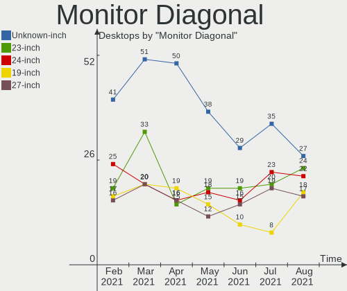

| Inches  | Desktops | Percent |
|---------|----------|---------|
| Unknown | 44       | 23.28%  |
| 23      | 23       | 12.17%  |
| 21      | 20       | 10.58%  |
| 24      | 19       | 10.05%  |
| 27      | 16       | 8.47%   |
| 17      | 11       | 5.82%   |
| 19      | 10       | 5.29%   |
| 18      | 10       | 5.29%   |
| 22      | 8        | 4.23%   |
| 20      | 8        | 4.23%   |
| 31      | 6        | 3.17%   |
| 39      | 3        | 1.59%   |
| 36      | 2        | 1.06%   |
| 33      | 2        | 1.06%   |
| 32      | 2        | 1.06%   |
| 84      | 1        | 0.53%   |
| 42      | 1        | 0.53%   |
| 38      | 1        | 0.53%   |
| 34      | 1        | 0.53%   |
| 25      | 1        | 0.53%   |

Monitor Width
-------------

Physical width

| Width in mm | Desktops | Percent |
|-------------|----------|---------|
| 501-600     | 55       | 29.41%  |
| 401-500     | 49       | 26.2%   |
| Unknown     | 44       | 23.53%  |
| 351-400     | 10       | 5.35%   |
| 301-350     | 9        | 4.81%   |
| 701-800     | 7        | 3.74%   |
| 601-700     | 7        | 3.74%   |
| 801-900     | 4        | 2.14%   |
| 1501-2000   | 1        | 0.53%   |
| 901-1000    | 1        | 0.53%   |

Aspect Ratio
------------

Proportional relationship between the width and the height

| Ratio   | Desktops | Percent |
|---------|----------|---------|
| 16/9    | 91       | 50.56%  |
| Unknown | 42       | 23.33%  |
| 16/10   | 24       | 13.33%  |
| 5/4     | 17       | 9.44%   |
| 4/3     | 3        | 1.67%   |
| 3/2     | 2        | 1.11%   |
| 21/9    | 1        | 0.56%   |

Monitor Area
------------

Area in inch²

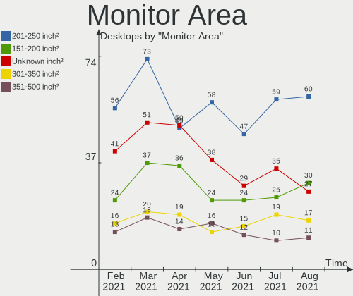

| Area in inch² | Desktops | Percent |
|----------------|----------|---------|
| 201-250        | 60       | 32.43%  |
| Unknown        | 44       | 23.78%  |
| 151-200        | 20       | 10.81%  |
| 141-150        | 18       | 9.73%   |
| 301-350        | 16       | 8.65%   |
| 351-500        | 10       | 5.41%   |
| 251-300        | 8        | 4.32%   |
| 501-1000       | 7        | 3.78%   |
| More than 1000 | 1        | 0.54%   |
| 131-140        | 1        | 0.54%   |

Pixel Density
-------------

Pixels per inch

| Density | Desktops | Percent |
|---------|----------|---------|
| 51-100  | 100      | 56.82%  |
| Unknown | 44       | 25%     |
| 101-120 | 23       | 13.07%  |
| 121-160 | 4        | 2.27%   |
| 1-50    | 3        | 1.7%    |
| 161-240 | 2        | 1.14%   |

Multiple Monitors
-----------------

Total monitors connected

| Total | Desktops | Percent |
|-------|----------|---------|
| 1     | 152      | 80%     |
| 2     | 24       | 12.63%  |
| 0     | 8        | 4.21%   |
| 3     | 6        | 3.16%   |

Net Controller Vendor
---------------------

Controller vendors

| Vendor                            | Desktops | Percent |
|-----------------------------------|----------|---------|
| Realtek Semiconductor             | 121      | 46.36%  |
| Intel                             | 56       | 21.46%  |
| Qualcomm Atheros                  | 19       | 7.28%   |
| Ralink Technology                 | 12       | 4.6%    |
| Nvidia                            | 10       | 3.83%   |
| Ralink                            | 5        | 1.92%   |
| Qualcomm Atheros Communications   | 5        | 1.92%   |
| TP-Link                           | 4        | 1.53%   |
| Broadcom Inc. and subsidiaries    | 3        | 1.15%   |
| Xiaomi                            | 2        | 0.77%   |
| Samsung Electronics               | 2        | 0.77%   |
| NetGear                           | 2        | 0.77%   |
| Marvell Technology Group          | 2        | 0.77%   |
| D-Link                            | 2        | 0.77%   |
| Broadcom Limited                  | 2        | 0.77%   |
| ASUSTek Computer                  | 2        | 0.77%   |
| VIA Technologies                  | 1        | 0.38%   |
| Tenda                             | 1        | 0.38%   |
| Sundance Technology Inc / IC Plus | 1        | 0.38%   |
| PLANEX                            | 1        | 0.38%   |
| Motorola PCS                      | 1        | 0.38%   |
| Motorola                          | 1        | 0.38%   |
| MediaTek                          | 1        | 0.38%   |
| IMC Networks                      | 1        | 0.38%   |
| Edimax Technology                 | 1        | 0.38%   |
| Broadcom                          | 1        | 0.38%   |
| Belkin Components                 | 1        | 0.38%   |
| Aquantia                          | 1        | 0.38%   |

Net Controller Model
--------------------

Controller models

| Model                                                                                | Desktops | Percent |
|--------------------------------------------------------------------------------------|----------|---------|
| Realtek RTL8111/8168/8411 PCI Express Gigabit Ethernet Controller                    | 103      | 36.65%  |
| Intel Ethernet Connection (2) I219-V                                                 | 10       | 3.56%   |
| Intel 82579LM Gigabit Network Connection (Lewisville)                                | 8        | 2.85%   |
| Ralink RT5370 Wireless Adapter                                                       | 6        | 2.14%   |
| Nvidia MCP61 Ethernet                                                                | 6        | 2.14%   |
| Ralink MT7601U Wireless Adapter                                                      | 5        | 1.78%   |
| Intel Wi-Fi 6 AX200                                                                  | 5        | 1.78%   |
| Intel Ethernet Connection I217-LM                                                    | 5        | 1.78%   |
| Realtek RTL88x2bu [AC1200 Techkey]                                                   | 4        | 1.42%   |
| Qualcomm Atheros AR9271 802.11n                                                      | 4        | 1.42%   |
| Intel I211 Gigabit Network Connection                                                | 4        | 1.42%   |
| Realtek RTL8188EUS 802.11n Wireless Network Adapter                                  | 3        | 1.07%   |
| Realtek RTL8125 2.5GbE Controller                                                    | 3        | 1.07%   |
| Realtek RTL810xE PCI Express Fast Ethernet controller                                | 3        | 1.07%   |
| Intel Dual Band Wireless-AC 3168NGW [Stone Peak]                                     | 3        | 1.07%   |
| Intel 82579V Gigabit Network Connection                                              | 3        | 1.07%   |
| Intel 82567LM-3 Gigabit Network Connection                                           | 3        | 1.07%   |
| Xiaomi Mi/Redmi series (RNDIS)                                                       | 2        | 0.71%   |
| Samsung Galaxy series, misc. (tethering mode)                                        | 2        | 0.71%   |
| Realtek RTL8192CU 802.11n WLAN Adapter                                               | 2        | 0.71%   |
| Realtek RTL8192CE PCIe Wireless Network Adapter                                      | 2        | 0.71%   |
| Realtek RTL8188CUS 802.11n WLAN Adapter                                              | 2        | 0.71%   |
| Realtek RTL-8100/8101L/8139 PCI Fast Ethernet Adapter                                | 2        | 0.71%   |
| Realtek 802.11ac NIC                                                                 | 2        | 0.71%   |
| Ralink RT2870/RT3070 Wireless Adapter                                                | 2        | 0.71%   |
| Ralink RT3090 Wireless 802.11n 1T/1R PCIe                                            | 2        | 0.71%   |
| Qualcomm Atheros Killer E2400 Gigabit Ethernet Controller                            | 2        | 0.71%   |
| Qualcomm Atheros Attansic L1 Gigabit Ethernet                                        | 2        | 0.71%   |
| Qualcomm Atheros AR9485 Wireless Network Adapter                                     | 2        | 0.71%   |
| Qualcomm Atheros AR8152 v2.0 Fast Ethernet                                           | 2        | 0.71%   |
| Qualcomm Atheros AR8151 v2.0 Gigabit Ethernet                                        | 2        | 0.71%   |
| Nvidia MCP77 Ethernet                                                                | 2        | 0.71%   |
| Intel Ethernet Connection (2) I218-LM                                                | 2        | 0.71%   |
| Broadcom Limited NetXtreme BCM5755 Gigabit Ethernet PCI Express                      | 2        | 0.71%   |
| Broadcom Inc. and subsidiaries NetXtreme BCM5754 Gigabit Ethernet PCI Express        | 2        | 0.71%   |
| ASUS USB-N13 802.11n Network Adapter (rev. B1) [Realtek RTL8192CU]                   | 2        | 0.71%   |
| VIA VT6102/VT6103 [Rhine-II]                                                         | 1        | 0.36%   |
| TP-Link TL-WN823N v2/v3 [Realtek RTL8192EU]                                          | 1        | 0.36%   |
| TP-Link TL-WN821N Version 5 RTL8192EU                                                | 1        | 0.36%   |
| TP-Link AC600 wireless Realtek RTL8811AU [Archer T2U Nano]                           | 1        | 0.36%   |
| TP-Link 802.11ac WLAN Adapter                                                        | 1        | 0.36%   |
| Tenda U12                                                                            | 1        | 0.36%   |
| Sundance Inc / IC Plus IC Plus IP100A Integrated 10/100 Ethernet MAC + PHY           | 1        | 0.36%   |
| Realtek RTL8822BE 802.11a/b/g/n/ac WiFi adapter                                      | 1        | 0.36%   |
| Realtek RTL8821CE 802.11ac PCIe Wireless Network Adapter                             | 1        | 0.36%   |
| Realtek RTL8811AU 802.11a/b/g/n/ac WLAN Adapter                                      | 1        | 0.36%   |
| Realtek RTL8192EU 802.11b/g/n WLAN Adapter                                           | 1        | 0.36%   |
| Realtek RTL8191SU 802.11n WLAN Adapter                                               | 1        | 0.36%   |
| Realtek RTL8188SU 802.11n WLAN Adapter                                               | 1        | 0.36%   |
| Realtek RTL8188ETV Wireless LAN 802.11n Network Adapter                              | 1        | 0.36%   |
| Ralink RT5390 Wireless 802.11n 1T/1R PCIe                                            | 1        | 0.36%   |
| Ralink RT2790 Wireless 802.11n 1T/2R PCIe                                            | 1        | 0.36%   |
| Ralink RT2561/RT61 802.11g PCI                                                       | 1        | 0.36%   |
| Qualcomm Atheros QCA9565 / AR9565 Wireless Network Adapter                           | 1        | 0.36%   |
| Qualcomm Atheros Killer E220x Gigabit Ethernet Controller                            | 1        | 0.36%   |
| Qualcomm Atheros TP-Link TL-WN821N v3 / TL-WN822N v2 802.11n [Atheros AR7010+AR9287] | 1        | 0.36%   |
| Qualcomm Atheros AR9462 Wireless Network Adapter                                     | 1        | 0.36%   |
| Qualcomm Atheros AR9287 Wireless Network Adapter (PCI-Express)                       | 1        | 0.36%   |
| Qualcomm Atheros AR8161 Gigabit Ethernet                                             | 1        | 0.36%   |
| Qualcomm Atheros AR8132 Fast Ethernet                                                | 1        | 0.36%   |

Wireless Vendor
---------------

Wireless vendors

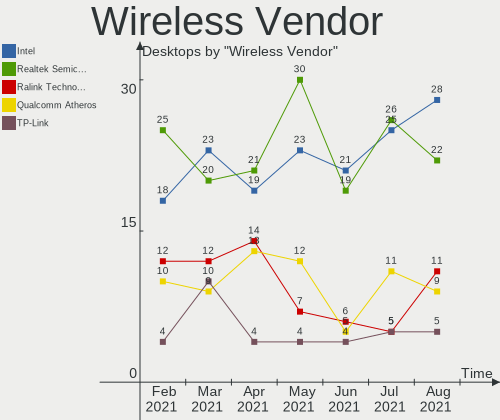

| Vendor                          | Desktops | Percent |
|---------------------------------|----------|---------|
| Realtek Semiconductor           | 21       | 26.58%  |
| Intel                           | 14       | 17.72%  |
| Ralink Technology               | 12       | 15.19%  |
| Qualcomm Atheros                | 6        | 7.59%   |
| Ralink                          | 5        | 6.33%   |
| Qualcomm Atheros Communications | 5        | 6.33%   |
| TP-Link                         | 4        | 5.06%   |
| NetGear                         | 2        | 2.53%   |
| D-Link                          | 2        | 2.53%   |
| ASUSTek Computer                | 2        | 2.53%   |
| Tenda                           | 1        | 1.27%   |
| PLANEX                          | 1        | 1.27%   |
| IMC Networks                    | 1        | 1.27%   |
| Edimax Technology               | 1        | 1.27%   |
| Broadcom Inc. and subsidiaries  | 1        | 1.27%   |
| Belkin Components               | 1        | 1.27%   |

Wireless Model
--------------

Wireless models

| Model                                                                                | Desktops | Percent |
|--------------------------------------------------------------------------------------|----------|---------|
| Ralink RT5370 Wireless Adapter                                                       | 6        | 7.41%   |
| Ralink MT7601U Wireless Adapter                                                      | 5        | 6.17%   |
| Intel Wi-Fi 6 AX200                                                                  | 5        | 6.17%   |
| Realtek RTL88x2bu [AC1200 Techkey]                                                   | 4        | 4.94%   |
| Qualcomm Atheros AR9271 802.11n                                                      | 4        | 4.94%   |
| Realtek RTL8188EUS 802.11n Wireless Network Adapter                                  | 3        | 3.7%    |
| Intel Dual Band Wireless-AC 3168NGW [Stone Peak]                                     | 3        | 3.7%    |
| Realtek RTL8192CU 802.11n WLAN Adapter                                               | 2        | 2.47%   |
| Realtek RTL8192CE PCIe Wireless Network Adapter                                      | 2        | 2.47%   |
| Realtek RTL8188CUS 802.11n WLAN Adapter                                              | 2        | 2.47%   |
| Realtek 802.11ac NIC                                                                 | 2        | 2.47%   |
| Ralink RT2870/RT3070 Wireless Adapter                                                | 2        | 2.47%   |
| Ralink RT3090 Wireless 802.11n 1T/1R PCIe                                            | 2        | 2.47%   |
| Qualcomm Atheros AR9485 Wireless Network Adapter                                     | 2        | 2.47%   |
| ASUS USB-N13 802.11n Network Adapter (rev. B1) [Realtek RTL8192CU]                   | 2        | 2.47%   |
| TP-Link TL-WN823N v2/v3 [Realtek RTL8192EU]                                          | 1        | 1.23%   |
| TP-Link TL-WN821N Version 5 RTL8192EU                                                | 1        | 1.23%   |
| TP-Link AC600 wireless Realtek RTL8811AU [Archer T2U Nano]                           | 1        | 1.23%   |
| TP-Link 802.11ac WLAN Adapter                                                        | 1        | 1.23%   |
| Tenda U12                                                                            | 1        | 1.23%   |
| Realtek RTL8822BE 802.11a/b/g/n/ac WiFi adapter                                      | 1        | 1.23%   |
| Realtek RTL8821CE 802.11ac PCIe Wireless Network Adapter                             | 1        | 1.23%   |
| Realtek RTL8811AU 802.11a/b/g/n/ac WLAN Adapter                                      | 1        | 1.23%   |
| Realtek RTL8192EU 802.11b/g/n WLAN Adapter                                           | 1        | 1.23%   |
| Realtek RTL8191SU 802.11n WLAN Adapter                                               | 1        | 1.23%   |
| Realtek RTL8188SU 802.11n WLAN Adapter                                               | 1        | 1.23%   |
| Realtek RTL8188ETV Wireless LAN 802.11n Network Adapter                              | 1        | 1.23%   |
| Ralink RT5390 Wireless 802.11n 1T/1R PCIe                                            | 1        | 1.23%   |
| Ralink RT2790 Wireless 802.11n 1T/2R PCIe                                            | 1        | 1.23%   |
| Ralink RT2561/RT61 802.11g PCI                                                       | 1        | 1.23%   |
| Qualcomm Atheros QCA9565 / AR9565 Wireless Network Adapter                           | 1        | 1.23%   |
| Qualcomm Atheros TP-Link TL-WN821N v3 / TL-WN822N v2 802.11n [Atheros AR7010+AR9287] | 1        | 1.23%   |
| Qualcomm Atheros AR9462 Wireless Network Adapter                                     | 1        | 1.23%   |
| Qualcomm Atheros AR9287 Wireless Network Adapter (PCI-Express)                       | 1        | 1.23%   |
| Qualcomm Atheros AR5212/5213/2414 Wireless Network Adapter                           | 1        | 1.23%   |
| PLANEX GW-USNano2 802.11n Wireless Adapter [Realtek RTL8188CUS]                      | 1        | 1.23%   |
| NetGear WNA3100(v1) Wireless-N 300 [Broadcom BCM43231]                               | 1        | 1.23%   |
| NetGear WNA1100 Wireless-N 150 [Atheros AR9271]                                      | 1        | 1.23%   |
| Intel Wireless-AC 9260                                                               | 1        | 1.23%   |
| Intel Wireless 8265 / 8275                                                           | 1        | 1.23%   |
| Intel Wireless 8260                                                                  | 1        | 1.23%   |
| Intel Wireless 7265                                                                  | 1        | 1.23%   |
| Intel Wireless 7260                                                                  | 1        | 1.23%   |
| Intel Comet Lake PCH CNVi WiFi                                                       | 1        | 1.23%   |
| IMC Networks Mediao 802.11n WLAN [Realtek RTL8191SU]                                 | 1        | 1.23%   |
| Edimax EW-7733UnD 802.11abgn 3x3:3 [Ralink RT3573]                                   | 1        | 1.23%   |
| D-Link AirPlus G DWL-G122 Wireless Adapter(rev.B1) [Ralink RT2571]                   | 1        | 1.23%   |
| D-Link 11ac Adapter                                                                  | 1        | 1.23%   |
| Broadcom Inc. and subsidiaries BCM43225 802.11b/g/n                                  | 1        | 1.23%   |
| Belkin Components F9L1103 N750 DB 802.11abgn 2x3:3 [Ralink RT3573]                   | 1        | 1.23%   |

Ethernet Vendor
---------------

Ethernet vendors

| Vendor                            | Desktops | Percent |
|-----------------------------------|----------|---------|
| Realtek Semiconductor             | 111      | 56.06%  |
| Intel                             | 49       | 24.75%  |
| Qualcomm Atheros                  | 13       | 6.57%   |
| Nvidia                            | 10       | 5.05%   |
| Xiaomi                            | 2        | 1.01%   |
| Samsung Electronics               | 2        | 1.01%   |
| Marvell Technology Group          | 2        | 1.01%   |
| Broadcom Limited                  | 2        | 1.01%   |
| Broadcom Inc. and subsidiaries    | 2        | 1.01%   |
| VIA Technologies                  | 1        | 0.51%   |
| Sundance Technology Inc / IC Plus | 1        | 0.51%   |
| MediaTek                          | 1        | 0.51%   |
| Broadcom                          | 1        | 0.51%   |
| Aquantia                          | 1        | 0.51%   |

Ethernet Model
--------------

Ethernet models

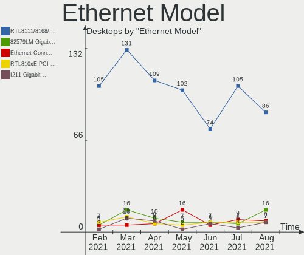

| Model                                                                         | Desktops | Percent |
|-------------------------------------------------------------------------------|----------|---------|
| Realtek RTL8111/8168/8411 PCI Express Gigabit Ethernet Controller             | 103      | 52.02%  |
| Intel Ethernet Connection (2) I219-V                                          | 10       | 5.05%   |
| Intel 82579LM Gigabit Network Connection (Lewisville)                         | 8        | 4.04%   |
| Nvidia MCP61 Ethernet                                                         | 6        | 3.03%   |
| Intel Ethernet Connection I217-LM                                             | 5        | 2.53%   |
| Intel I211 Gigabit Network Connection                                         | 4        | 2.02%   |
| Realtek RTL8125 2.5GbE Controller                                             | 3        | 1.52%   |
| Realtek RTL810xE PCI Express Fast Ethernet controller                         | 3        | 1.52%   |
| Intel 82579V Gigabit Network Connection                                       | 3        | 1.52%   |
| Intel 82567LM-3 Gigabit Network Connection                                    | 3        | 1.52%   |
| Xiaomi Mi/Redmi series (RNDIS)                                                | 2        | 1.01%   |
| Samsung Galaxy series, misc. (tethering mode)                                 | 2        | 1.01%   |
| Realtek RTL-8100/8101L/8139 PCI Fast Ethernet Adapter                         | 2        | 1.01%   |
| Qualcomm Atheros Killer E2400 Gigabit Ethernet Controller                     | 2        | 1.01%   |
| Qualcomm Atheros Attansic L1 Gigabit Ethernet                                 | 2        | 1.01%   |
| Qualcomm Atheros AR8152 v2.0 Fast Ethernet                                    | 2        | 1.01%   |
| Qualcomm Atheros AR8151 v2.0 Gigabit Ethernet                                 | 2        | 1.01%   |
| Nvidia MCP77 Ethernet                                                         | 2        | 1.01%   |
| Intel Ethernet Connection (2) I218-LM                                         | 2        | 1.01%   |
| Broadcom Limited NetXtreme BCM5755 Gigabit Ethernet PCI Express               | 2        | 1.01%   |
| Broadcom Inc. and subsidiaries NetXtreme BCM5754 Gigabit Ethernet PCI Express | 2        | 1.01%   |
| VIA VT6102/VT6103 [Rhine-II]                                                  | 1        | 0.51%   |
| Sundance Inc / IC Plus IC Plus IP100A Integrated 10/100 Ethernet MAC + PHY    | 1        | 0.51%   |
| Qualcomm Atheros Killer E220x Gigabit Ethernet Controller                     | 1        | 0.51%   |
| Qualcomm Atheros AR8161 Gigabit Ethernet                                      | 1        | 0.51%   |
| Qualcomm Atheros AR8132 Fast Ethernet                                         | 1        | 0.51%   |
| Qualcomm Atheros AR8131 Gigabit Ethernet                                      | 1        | 0.51%   |
| Qualcomm Atheros AR8121/AR8113/AR8114 Gigabit or Fast Ethernet                | 1        | 0.51%   |
| Nvidia MCP73 Ethernet                                                         | 1        | 0.51%   |
| Nvidia MCP55 Ethernet                                                         | 1        | 0.51%   |
| MediaTek U304AA                                                               | 1        | 0.51%   |
| Marvell Group 88E8071 PCI-E Gigabit Ethernet Controller                       | 1        | 0.51%   |
| Marvell Group 88E8056 PCI-E Gigabit Ethernet Controller                       | 1        | 0.51%   |
| Intel NM10/ICH7 Family LAN Controller                                         | 1        | 0.51%   |
| Intel I210 Gigabit Network Connection                                         | 1        | 0.51%   |
| Intel Ethernet Controller I225-V                                              | 1        | 0.51%   |
| Intel Ethernet Connection I217-V                                              | 1        | 0.51%   |
| Intel Ethernet Connection (5) I219-LM                                         | 1        | 0.51%   |
| Intel Ethernet Connection (2) I219-LM                                         | 1        | 0.51%   |
| Intel Ethernet Connection (2) I218-V                                          | 1        | 0.51%   |
| Intel 82578DM Gigabit Network Connection                                      | 1        | 0.51%   |
| Intel 82578DC Gigabit Network Connection                                      | 1        | 0.51%   |
| Intel 82574L Gigabit Network Connection                                       | 1        | 0.51%   |
| Intel 82573L Gigabit Ethernet Controller                                      | 1        | 0.51%   |
| Intel 82567LF-3 Gigabit Network Connection                                    | 1        | 0.51%   |
| Intel 82562EZ 10/100 Ethernet Controller                                      | 1        | 0.51%   |
| Intel 82557/8/9/0/1 Ethernet Pro 100                                          | 1        | 0.51%   |
| Broadcom NetLink BCM5784M Gigabit Ethernet PCIe                               | 1        | 0.51%   |
| Aquantia AQC111 NBase-T/IEEE 802.3bz Ethernet Controller [AQtion]             | 1        | 0.51%   |

Net Controller Kind
-------------------

Ethernet, WiFi or modem

| Kind     | Desktops | Percent |
|----------|----------|---------|
| Ethernet | 184      | 70.77%  |
| WiFi     | 74       | 28.46%  |
| Modem    | 1        | 0.38%   |
| Unknown  | 1        | 0.38%   |

Used Controller
---------------

Currently used network controller

| Kind     | Desktops | Percent |
|----------|----------|---------|
| Ethernet | 177      | 74.37%  |
| WiFi     | 61       | 25.63%  |

NICs
----

Total network controllers on board

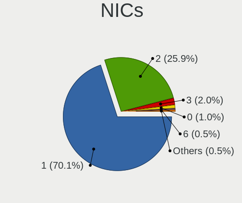

| Total | Desktops | Percent |
|-------|----------|---------|
| 1     | 150      | 78.95%  |
| 2     | 35       | 18.42%  |
| 0     | 3        | 1.58%   |
| 3     | 2        | 1.05%   |

Memory Vendor
-------------

Memory module vendors

| Vendor              | Desktops | Percent |
|---------------------|----------|---------|
| Unknown             | 11       | 21.57%  |
| Kingston            | 9        | 17.65%  |
| Corsair             | 6        | 11.76%  |
| G.Skill             | 5        | 9.8%    |
| SK Hynix            | 3        | 5.88%   |
| Patriot             | 2        | 3.92%   |
| Micron Technology   | 2        | 3.92%   |
| Crucial             | 2        | 3.92%   |
| Unknown (ABCD)      | 1        | 1.96%   |
| Silicon Power       | 1        | 1.96%   |
| Samsung Electronics | 1        | 1.96%   |
| Ramaxel Technology  | 1        | 1.96%   |
| Qimonda             | 1        | 1.96%   |
| Nanya Technology    | 1        | 1.96%   |
| Kingmax             | 1        | 1.96%   |
| GOODRAM             | 1        | 1.96%   |
| atermiter           | 1        | 1.96%   |
| A-DATA Technology   | 1        | 1.96%   |
| 83250000830B        | 1        | 1.96%   |

Memory Model
------------

Memory module models

| Model                                                          | Desktops | Percent |
|----------------------------------------------------------------|----------|---------|
| Unknown RAM Module 8192MB DIMM DDR3 1600MT/s                   | 1        | 1.82%   |
| Unknown RAM Module 512MB DIMM DDR2 533MT/s                     | 1        | 1.82%   |
| Unknown RAM Module 4096MB DIMM SDRAM 1066MT/s                  | 1        | 1.82%   |
| Unknown RAM Module 4096MB DIMM 1600MT/s                        | 1        | 1.82%   |
| Unknown RAM Module 4096MB DIMM 1066MT/s                        | 1        | 1.82%   |
| Unknown RAM Module 2048MB DIMM SDRAM 1333MT/s                  | 1        | 1.82%   |
| Unknown RAM Module 2048MB DIMM DDR3 1333MT/s                   | 1        | 1.82%   |
| Unknown RAM Module 2048MB DIMM DDR2 800MT/s                    | 1        | 1.82%   |
| Unknown RAM Module 2048MB DIMM DDR 1333MT/s                    | 1        | 1.82%   |
| Unknown RAM Module 2048MB DIMM 1333MT/s                        | 1        | 1.82%   |
| Unknown RAM Module 1GB DIMM DDR2 533MT/s                       | 1        | 1.82%   |
| Unknown RAM 992000 (997000) 4096MB DIMM DDR3 1333MT/s          | 1        | 1.82%   |
| Unknown (ABCD) RAM 123456789012345678 8GB DIMM DDR4 2400MT/s   | 1        | 1.82%   |
| SK Hynix RAM HMT351U6EFR8C-PB 4096MB DIMM DDR3 1600MT/s        | 1        | 1.82%   |
| SK Hynix RAM HMT351U6BFR8C-H9 4096MB DIMM DDR3 1333MT/s        | 1        | 1.82%   |
| SK Hynix RAM HMA42GR7MFR4N-TF 16384MB DIMM DDR4 2133MT/s       | 1        | 1.82%   |
| Silicon Power RAM SP008GBLFU266B02 8GB DIMM DDR4 2400MT/s      | 1        | 1.82%   |
| Samsung RAM M378A1K43CB2-CRC 8192MB DIMM DDR4 3500MT/s         | 1        | 1.82%   |
| Samsung RAM M378A1G43EB1-CRC 8192MB DIMM DDR4 2400MT/s         | 1        | 1.82%   |
| Ramaxel RAM RMR5030MN68F9F1600 4096MB DIMM DDR3 1600MT/s       | 1        | 1.82%   |
| Qimonda RAM 64T128020EU3SB2 1024MB DIMM DDR2 667MT/s           | 1        | 1.82%   |
| Patriot RAM 3200 C16 Series 32GB DIMM DDR4 3200MT/s            | 1        | 1.82%   |
| Patriot RAM 1600EL Series00000 2048MB DIMM 1162MT/s            | 1        | 1.82%   |
| Nanya RAM NT2GC64B88B0NF-CG 2048MB DIMM DDR3 1333MT/s          | 1        | 1.82%   |
| Micron RAM Module 8192MB SODIMM DDR4 2133MT/s                  | 1        | 1.82%   |
| Micron RAM 16KTF51264AZ-1G6M1 4GB DIMM DDR3 1333MT/s           | 1        | 1.82%   |
| Kingston RAM Module 2GB DIMM DDR2 667MT/s                      | 1        | 1.82%   |
| Kingston RAM Module 2048MB DIMM DDR2 800MT/s                   | 1        | 1.82%   |
| Kingston RAM KY7N41-MIE 8192MB DIMM DDR4 2666MT/s              | 1        | 1.82%   |
| Kingston RAM KHX3200C16D4/32GX 32GB DIMM DDR4 3200MT/s         | 1        | 1.82%   |
| Kingston RAM KHX2800C14D4/4GX 4096MB DIMM DDR4 2667MT/s        | 1        | 1.82%   |
| Kingston RAM KHX2133C14D4/8G 8192MB DIMM DDR4 2667MT/s         | 1        | 1.82%   |
| Kingston RAM 99U5584-005.A00LF 4096MB DIMM DDR3 1600MT/s       | 1        | 1.82%   |
| Kingston RAM 99P5471-004.A01LF 4GB DIMM DDR3 1333MT/s          | 1        | 1.82%   |
| Kingston RAM 9905625-075.A00G 16384MB DIMM DDR4 2400MT/s       | 1        | 1.82%   |
| Kingston RAM 9905316-005.A04LF 1024MB DIMM DDR2 667MT/s        | 1        | 1.82%   |
| Kingmax RAM GLAF62F-DA--------- 4GB DIMM DDR4 2400MT/s         | 1        | 1.82%   |
| GOODRAM RAM GR800D264L5/2G 2048MB DIMM DDR2 1332MT/s           | 1        | 1.82%   |
| G.Skill RAM F4-4000C15-8GTZR 8192MB DIMM DDR4 2133MT/s         | 1        | 1.82%   |
| G.Skill RAM F4-3600C16-16GVKC 16GB DIMM DDR4 3600MT/s          | 1        | 1.82%   |
| G.Skill RAM F4-3200C14-8GFX 8GB DIMM DDR4 3733MT/s             | 1        | 1.82%   |
| G.Skill RAM F3-12800CL9-4GBRL0 4096MB DIMM 1162MT/s            | 1        | 1.82%   |
| G.Skill RAM F3-10666CL9-8GBNT 8192MB DIMM DDR3 1333MT/s        | 1        | 1.82%   |
| Crucial RAM CT8G4DFS8266.M8FD 8192MB DIMM DDR4 2667MT/s        | 1        | 1.82%   |
| Crucial RAM BLS8G4D240FSA.16FADG 8192MB DIMM DDR4 2133MT/s     | 1        | 1.82%   |
| Corsair RAM CMX4GX3M2A1333C8 2048MB DIMM DDR3 1333MT/s         | 1        | 1.82%   |
| Corsair RAM CMT16GX3M4X2133C9 4096MB DIMM DDR3 1600MT/s        | 1        | 1.82%   |
| Corsair RAM CMK8GX4M2B3200C16 4096MB DIMM DDR4 3200MT/s        | 1        | 1.82%   |
| Corsair RAM CMK64GX4M2E3200C16 32GB DIMM DDR4 3200MT/s         | 1        | 1.82%   |
| Corsair RAM CMK16GX4M2B3200C16 8192MB DIMM DDR4 3266MT/s       | 1        | 1.82%   |
| Corsair RAM CMK16GX4M2B3000C15 8GB DIMM DDR4 3466MT/s          | 1        | 1.82%   |
| Corsair RAM CM3X1G1333C9 1024MB DIMM DDR2 1066MT/s             | 1        | 1.82%   |
| atermiter RAM Module 8192MB DIMM DDR4 2400MT/s                 | 1        | 1.82%   |
| A-DATA RAM DDR3 1600 4096MB DIMM 1333MT/s                      | 1        | 1.82%   |
| 83250000830B RAM GLLG42F-DA--------- 8192MB DIMM DDR4 2400MT/s | 1        | 1.82%   |

Memory Kind
-----------

Memory module kinds

| Kind    | Desktops | Percent |
|---------|----------|---------|
| DDR4    | 18       | 42.86%  |
| DDR3    | 11       | 26.19%  |
| DDR2    | 5        | 11.9%   |
| Unknown | 4        | 9.52%   |
| SDRAM   | 2        | 4.76%   |
| LPDDR4  | 1        | 2.38%   |
| DDR     | 1        | 2.38%   |

Memory Form Factor
------------------

Physical design of the memory module

| Name   | Desktops | Percent |
|--------|----------|---------|
| DIMM   | 40       | 97.56%  |
| SODIMM | 1        | 2.44%   |

Memory Size
-----------

Memory module size

| Size  | Desktops | Percent |
|-------|----------|---------|
| 8192  | 14       | 28%     |
| 4096  | 14       | 28%     |
| 2048  | 11       | 22%     |
| 16384 | 4        | 8%      |
| 32768 | 3        | 6%      |
| 1024  | 3        | 6%      |
| 512   | 1        | 2%      |

Memory Speed
------------

Memory module speed

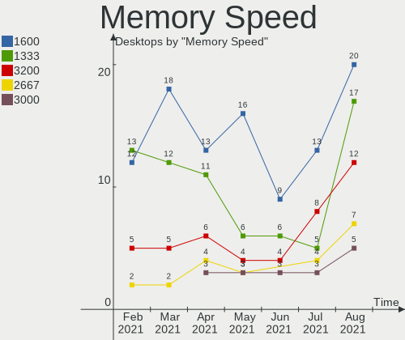

| Speed | Desktops | Percent |
|-------|----------|---------|
| 1333  | 11       | 22.45%  |
| 1600  | 6        | 12.24%  |
| 2400  | 5        | 10.2%   |
| 3200  | 4        | 8.16%   |
| 2133  | 4        | 8.16%   |
| 2667  | 3        | 6.12%   |
| 1066  | 3        | 6.12%   |
| 800   | 2        | 4.08%   |
| 667   | 2        | 4.08%   |
| 3733  | 1        | 2.04%   |
| 3600  | 1        | 2.04%   |
| 3500  | 1        | 2.04%   |
| 3466  | 1        | 2.04%   |
| 3266  | 1        | 2.04%   |
| 2666  | 1        | 2.04%   |
| 1332  | 1        | 2.04%   |
| 1162  | 1        | 2.04%   |
| 533   | 1        | 2.04%   |

Sound Vendor
------------

Sound card vendors

| Vendor                  | Desktops | Percent |
|-------------------------|----------|---------|
| Intel                   | 121      | 41.02%  |
| Nvidia                  | 76       | 25.76%  |
| AMD                     | 67       | 22.71%  |
| Creative Labs           | 8        | 2.71%   |
| C-Media Electronics     | 7        | 2.37%   |
| JMTek                   | 4        | 1.36%   |
| Generalplus Technology  | 3        | 1.02%   |
| Logitech                | 2        | 0.68%   |
| XMOS                    | 1        | 0.34%   |
| VIA Technologies        | 1        | 0.34%   |
| Samson Technologies     | 1        | 0.34%   |
| Ensoniq                 | 1        | 0.34%   |
| Dell                    | 1        | 0.34%   |
| BEHRINGER International | 1        | 0.34%   |
| ATI Technologies        | 1        | 0.34%   |

Sound Model
-----------

Sound card models

| Model                                                                             | Desktops | Percent |
|-----------------------------------------------------------------------------------|----------|---------|
| AMD SBx00 Azalia (Intel HDA)                                                      | 21       | 6.29%   |
| Intel 6 Series/C200 Series Chipset Family High Definition Audio Controller        | 20       | 5.99%   |
| Intel NM10/ICH7 Family High Definition Audio Controller                           | 17       | 5.09%   |
| Intel 8 Series/C220 Series Chipset High Definition Audio Controller               | 16       | 4.79%   |
| Nvidia GK208 HDMI/DP Audio Controller                                             | 12       | 3.59%   |
| Intel 200 Series PCH HD Audio                                                     | 12       | 3.59%   |
| Intel 100 Series/C230 Series Chipset Family HD Audio Controller                   | 12       | 3.59%   |
| Nvidia High Definition Audio Controller                                           | 11       | 3.29%   |
| Intel 7 Series/C216 Chipset Family High Definition Audio Controller               | 9        | 2.69%   |
| AMD Starship/Matisse HD Audio Controller                                          | 9        | 2.69%   |
| AMD FCH Azalia Controller                                                         | 9        | 2.69%   |
| Intel 5 Series/3400 Series Chipset High Definition Audio                          | 8        | 2.4%    |
| AMD Family 17h (Models 00h-0fh) HD Audio Controller                               | 8        | 2.4%    |
| Nvidia MCP61 High Definition Audio                                                | 7        | 2.1%    |
| AMD Ellesmere HDMI Audio [Radeon RX 470/480 / 570/580/590]                        | 7        | 2.1%    |
| Nvidia GP107GL High Definition Audio Controller                                   | 6        | 1.8%    |
| Nvidia GP106 High Definition Audio Controller                                     | 6        | 1.8%    |
| Intel Xeon E3-1200 v3/4th Gen Core Processor HD Audio Controller                  | 6        | 1.8%    |
| AMD Oland/Hainan/Cape Verde/Pitcairn HDMI Audio [Radeon HD 7000 Series]           | 6        | 1.8%    |
| Intel C610/X99 series chipset HD Audio Controller                                 | 5        | 1.5%    |
| Nvidia GF119 HDMI Audio Controller                                                | 4        | 1.2%    |
| Intel 82801JD/DO (ICH10 Family) HD Audio Controller                               | 4        | 1.2%    |
| Creative Labs Sound Core3D [Sound Blaster Recon3D / Z-Series]                     | 4        | 1.2%    |
| AMD Turks HDMI Audio [Radeon HD 6500/6600 / 6700M Series]                         | 4        | 1.2%    |
| AMD Family 17h (Models 10h-1fh) HD Audio Controller                               | 4        | 1.2%    |
| Nvidia GP104 High Definition Audio Controller                                     | 3        | 0.9%    |
| Nvidia GM107 High Definition Audio Controller [GeForce 940MX]                     | 3        | 0.9%    |
| Nvidia GF108 High Definition Audio Controller                                     | 3        | 0.9%    |
| Intel 82801I (ICH9 Family) HD Audio Controller                                    | 3        | 0.9%    |
| Intel 82801H (ICH8 Family) HD Audio Controller                                    | 3        | 0.9%    |
| Intel 82801EB/ER (ICH5/ICH5R) AC'97 Audio Controller                              | 3        | 0.9%    |
| Generalplus Technology USB Audio Device                                           | 3        | 0.9%    |
| C-Media Electronics CMI8788 [Oxygen HD Audio]                                     | 3        | 0.9%    |
| AMD Trinity HDMI Audio Controller                                                 | 3        | 0.9%    |
| AMD Navi 10 HDMI Audio                                                            | 3        | 0.9%    |
| AMD Baffin HDMI/DP Audio [Radeon RX 550 640SP / RX 560/560X]                      | 3        | 0.9%    |
| Nvidia TU116 High Definition Audio Controller                                     | 2        | 0.6%    |
| Nvidia TU107 GeForce GTX 1650 High Definition Audio Controller                    | 2        | 0.6%    |
| Nvidia MCP72XE/MCP72P/MCP78U/MCP78S High Definition Audio                         | 2        | 0.6%    |
| Nvidia GP108 High Definition Audio Controller                                     | 2        | 0.6%    |
| Nvidia GM206 High Definition Audio Controller                                     | 2        | 0.6%    |
| Nvidia GK106 HDMI Audio Controller                                                | 2        | 0.6%    |
| Nvidia GK104 HDMI Audio Controller                                                | 2        | 0.6%    |
| Nvidia GF116 High Definition Audio Controller                                     | 2        | 0.6%    |
| JMTek USB PnP Audio Device                                                        | 2        | 0.6%    |
| Intel Comet Lake PCH cAVS                                                         | 2        | 0.6%    |
| Intel Cannon Lake PCH cAVS                                                        | 2        | 0.6%    |
| Intel 82801JI (ICH10 Family) HD Audio Controller                                  | 2        | 0.6%    |
| Creative Labs CA0106/CA0111 [SB Live!/Audigy/X-Fi Series]                         | 2        | 0.6%    |
| C-Media Electronics CMI8738/CMI8768 PCI Audio                                     | 2        | 0.6%    |
| AMD RV710/730 HDMI Audio [Radeon HD 4000 series]                                  | 2        | 0.6%    |
| AMD Raven/Raven2/Fenghuang HDMI/DP Audio Controller                               | 2        | 0.6%    |
| AMD Cedar HDMI Audio [Radeon HD 5400/6300/7300 Series]                            | 2        | 0.6%    |
| AMD Caicos HDMI Audio [Radeon HD 6450 / 7450/8450/8490 OEM / R5 230/235/235X OEM] | 2        | 0.6%    |
| XMOS iFi (by AMR) HD USB Audio                                                    | 1        | 0.3%    |
| VIA Technologies VT8233/A/8235/8237 AC97 Audio Controller                         | 1        | 0.3%    |
| Samson Technologies C03U multi-pattern microphone                                 | 1        | 0.3%    |
| Nvidia TU106 High Definition Audio Controller                                     | 1        | 0.3%    |
| Nvidia TU104 HD Audio Controller                                                  | 1        | 0.3%    |
| Nvidia MCP73 High Definition Audio                                                | 1        | 0.3%    |

Camera Vendor
-------------

Camera device vendors

| Vendor                      | Desktops | Percent |
|-----------------------------|----------|---------|
| Logitech                    | 13       | 33.33%  |
| Microdia                    | 4        | 10.26%  |
| Microsoft                   | 3        | 7.69%   |
| Z-Star Microelectronics     | 2        | 5.13%   |
| Samsung Electronics         | 2        | 5.13%   |
| Generalplus Technology      | 2        | 5.13%   |
| Chicony Electronics         | 2        | 5.13%   |
| YGTek                       | 1        | 2.56%   |
| Xiongmai                    | 1        | 2.56%   |
| USB3.0 HD Audio Capture     | 1        | 2.56%   |
| Sonix Technology            | 1        | 2.56%   |
| Philips (or NXP)            | 1        | 2.56%   |
| Novatek Microelectronics    | 1        | 2.56%   |
| KYE Systems (Mouse Systems) | 1        | 2.56%   |
| IMC Networks                | 1        | 2.56%   |
| Huawei Technologies         | 1        | 2.56%   |
| Creative Technology         | 1        | 2.56%   |
| ARC International           | 1        | 2.56%   |

Camera Model
------------

Camera device models

| Model                                           | Desktops | Percent |
|-------------------------------------------------|----------|---------|
| Logitech Webcam C170                            | 4        | 10.26%  |
| Logitech Webcam C270                            | 3        | 7.69%   |
| Logitech HD Pro Webcam C920                     | 3        | 7.69%   |
| Samsung Galaxy A5 (MTP)                         | 2        | 5.13%   |
| Microdia Sonix USB 2.0 Camera                   | 2        | 5.13%   |
| Logitech HD Webcam C525                         | 2        | 5.13%   |
| Z-Star Venus USB2.0 Camera                      | 1        | 2.56%   |
| Z-Star Vega USB 2.0 Camera                      | 1        | 2.56%   |
| YGTek webcam                                    | 1        | 2.56%   |
| Xiongmai web camera                             | 1        | 2.56%   |
| USB3.0 HD Audio Capture USB3.0 HD Video Capture | 1        | 2.56%   |
| Sonix HDF Webcam USB                            | 1        | 2.56%   |
| Philips (or NXP) PCVC740K ToUcam Pro [pwc]      | 1        | 2.56%   |
| Novatek USB HD Camera                           | 1        | 2.56%   |
| Microsoft Microsoft LifeCam Studio            | 1        | 2.56%   |
| Microsoft LifeCam Studio                        | 1        | 2.56%   |
| Microsoft LifeCam HD-3000                       | 1        | 2.56%   |
| Microdia Webcam Vitade AF                       | 1        | 2.56%   |
| Microdia Defender G-Lens 2577 HD720p Camera     | 1        | 2.56%   |
| Logitech HD Webcam C615                         | 1        | 2.56%   |
| KYE Systems (Mouse Systems) Genius WideCam F100 | 1        | 2.56%   |
| IMC Networks Integrated Camera                  | 1        | 2.56%   |
| Huawei HiCamera                                 | 1        | 2.56%   |
| Generalplus GENERAL WEBCAM                      | 1        | 2.56%   |
| Generalplus 808 Camera                          | 1        | 2.56%   |
| Creative VF0610 Live! Cam Socialize HD          | 1        | 2.56%   |
| Chicony HP High Definition 1MP Webcam           | 1        | 2.56%   |
| Chicony CNF8050 Webcam                          | 1        | 2.56%   |
| ARC International Camera                        | 1        | 2.56%   |

Fingerprint Vendor
------------------

Fingerprint sensor vendors

Zero info for selected period =(

Fingerprint Model
-----------------

Fingerprint sensor models

Zero info for selected period =(

Chipcard Vendor
---------------

Chipcard module vendors

Zero info for selected period =(

Chipcard Model
--------------

Chipcard module models

Zero info for selected period =(

Printer Vendor
--------------

Printer device vendors

| Vendor             | Desktops | Percent |
|--------------------|----------|---------|
| Brother Industries | 6        | 31.58%  |
| Seiko Epson        | 4        | 21.05%  |
| Hewlett-Packard    | 4        | 21.05%  |
| Canon              | 4        | 21.05%  |
| Pantum             | 1        | 5.26%   |

Printer Model
-------------

Printer device models

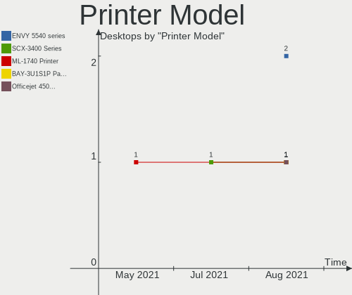

| Model                                         | Desktops | Percent |
|-----------------------------------------------|----------|---------|
| Seiko Epson ME 340 Series/Stylus NX130 Series | 1        | 5.26%   |
| Seiko Epson L555 Series                       | 1        | 5.26%   |
| Seiko Epson L365 Series                       | 1        | 5.26%   |
| Seiko Epson ET-2700 Series                    | 1        | 5.26%   |
| Pantum P2200 series                           | 1        | 5.26%   |
| HP OfficeJet 5200 series                      | 1        | 5.26%   |
| HP OfficeJet 3830 series                      | 1        | 5.26%   |
| HP LaserJet 1018                              | 1        | 5.26%   |
| HP DeskJet 3630 series                        | 1        | 5.26%   |
| Canon PIXMA MX720 Series                      | 1        | 5.26%   |
| Canon PIXMA MG3000 series                     | 1        | 5.26%   |
| Canon MF4010 series                           | 1        | 5.26%   |
| Canon I-SENSYS MF4550d                        | 1        | 5.26%   |
| Brother HL-L2360D series                      | 1        | 5.26%   |
| Brother HL-L2320D series                      | 1        | 5.26%   |
| Brother DCP-T500W                             | 1        | 5.26%   |
| Brother DCP-9020CDW                           | 1        | 5.26%   |
| Brother DCP-7055 scanner/printer              | 1        | 5.26%   |
| Brother DCP-1610W                             | 1        | 5.26%   |

Scanner Vendor
--------------

Scanner device vendors

| Vendor         | Desktops | Percent |
|----------------|----------|---------|
| Canon          | 2        | 50%     |
| Seiko Epson    | 1        | 25%     |
| Mustek Systems | 1        | 25%     |

Scanner Model
-------------

Scanner device models

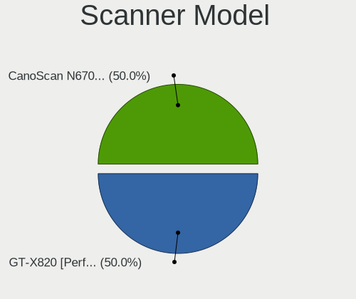

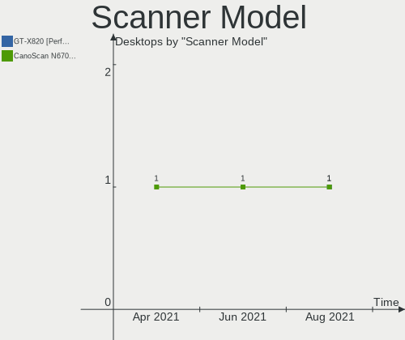

| Model                                             | Desktops | Percent |
|---------------------------------------------------|----------|---------|
| Seiko Epson GT-F650 [GT-S600/Perfection V10/V100] | 1        | 25%     |
| Mustek Systems SNAPSCAN e22                       | 1        | 25%     |
| Canon CanoScan LiDE 700F                          | 1        | 25%     |
| Canon CanoScan LiDE 110                           | 1        | 25%     |

Bluetooth Vendor
----------------

Controller vendors

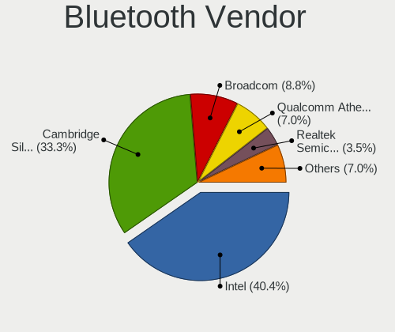

| Vendor                          | Desktops | Percent |
|---------------------------------|----------|---------|
| Cambridge Silicon Radio         | 16       | 39.02%  |
| Intel                           | 14       | 34.15%  |
| Broadcom                        | 4        | 9.76%   |
| Qualcomm Atheros Communications | 3        | 7.32%   |
| Realtek Semiconductor           | 2        | 4.88%   |
| Micro Star International        | 1        | 2.44%   |
| Belkin Components               | 1        | 2.44%   |

Bluetooth Model
---------------

Controller models

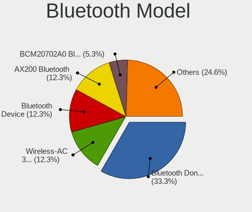

| Model                                                    | Desktops | Percent |
|----------------------------------------------------------|----------|---------|
| Cambridge Silicon Radio Bluetooth Dongle (HCI mode)      | 16       | 39.02%  |
| Intel Bluetooth Device                                   | 7        | 17.07%  |
| Intel Wireless-AC 3168 Bluetooth                         | 3        | 7.32%   |
| Qualcomm Atheros AR3011 Bluetooth                        | 2        | 4.88%   |
| Intel Bluetooth wireless interface                       | 2        | 4.88%   |
| Broadcom BCM20702A0 Bluetooth 4.0                        | 2        | 4.88%   |
| Realtek  Bluetooth 4.2 Adapter                           | 1        | 2.44%   |
| Realtek Bluetooth Radio                                  | 1        | 2.44%   |
| Qualcomm Atheros  Bluetooth Device                       | 1        | 2.44%   |
| Micro Star International MS-6970 BToes Bluetooth adapter | 1        | 2.44%   |
| Intel Wireless-AC 9260 Bluetooth Adapter                 | 1        | 2.44%   |
| Intel Bluetooth 9460/9560 Jefferson Peak (JfP)           | 1        | 2.44%   |
| Broadcom HP Bluethunder                                  | 1        | 2.44%   |
| Broadcom BCM92046DG-CL1ROM Bluetooth 2.1 Adapter         | 1        | 2.44%   |
| Belkin Components Bluetooth Mini Dongle                  | 1        | 2.44%   |

Unsupported Devices
-------------------

Total unsupported devices on board

| Total | Desktops | Percent |
|-------|----------|---------|
| 0     | 161      | 84.74%  |
| 1     | 27       | 14.21%  |
| 2     | 2        | 1.05%   |

Unsupported Device Types
------------------------

Types of unsupported devices

| Type                     | Desktops | Percent |
|--------------------------|----------|---------|
| Net/wireless             | 9        | 29.03%  |
| Graphics card            | 9        | 29.03%  |
| Unassigned class         | 6        | 19.35%  |
| Network                  | 2        | 6.45%   |
| Communication controller | 2        | 6.45%   |
| Multimedia controller    | 1        | 3.23%   |
| Modem                    | 1        | 3.23%   |
| Bluetooth                | 1        | 3.23%   |

