Mint Hardware Trends (Notebook)
-------------------------------

A project to identify most popular hardware characteristics and track their change
over time based on data collected by Mint users at https://Linux-Hardware.org.

Anyone can contribute to the study by uploading probes of their computers by
the [hw-probe](https://github.com/linuxhw/hw-probe) tool:

    sudo -E hw-probe -all -upload

Full-feature report is available here: https://linux-hardware.org/?view=trends&formfactor=notebook

Period: Feb, 2021.

Contents
--------

- [ OS                       ](#os)
- [ OS Family                ](#os-family)
- [ Kernel                   ](#kernel)
- [ Kernel Family            ](#kernel-family)
- [ Kernel Major Ver.        ](#kernel-major-ver)
- [ Arch                     ](#arch)
- [ DE                       ](#de)
- [ Display Server           ](#display-server)
- [ Display Manager          ](#display-manager)
- [ OS Lang                  ](#os-lang)
- [ Boot Mode                ](#boot-mode)
- [ Filesystem               ](#filesystem)
- [ Part. scheme             ](#part-scheme)
- [ Dual Boot with Linux/BSD ](#dual-boot-with-linux/bsd)
- [ Dual Boot (Win)          ](#dual-boot-win)
- [ Country                  ](#country)
- [ City                     ](#city)
- [ Vendor                   ](#vendor)
- [ Model                    ](#model)
- [ Model Family             ](#model-family)
- [ MFG Year                 ](#mfg-year)
- [ Form Factor              ](#form-factor)
- [ Secure Boot              ](#secure-boot)
- [ Coreboot                 ](#coreboot)
- [ RAM Size                 ](#ram-size)
- [ RAM Used                 ](#ram-used)
- [ Has CD-ROM               ](#has-cd-rom)
- [ Total Drives             ](#total-drives)
- [ Has Ethernet             ](#has-ethernet)
- [ Drive Vendor             ](#drive-vendor)
- [ Drive Model              ](#drive-model)
- [ HDD Vendor               ](#hdd-vendor)
- [ SSD Vendor               ](#ssd-vendor)
- [ Drive Kind               ](#drive-kind)
- [ Drive Connector          ](#drive-connector)
- [ Drive Size               ](#drive-size)
- [ Space Total              ](#space-total)
- [ Space Used               ](#space-used)
- [ Malfunc. Drives          ](#malfunc-drives)
- [ Malfunc. Drive Vendor    ](#malfunc-drive-vendor)
- [ Malfunc. HDD Vendor      ](#malfunc-hdd-vendor)
- [ Malfunc. Drive Kind      ](#malfunc-drive-kind)
- [ Failed Drives            ](#failed-drives)
- [ Failed Drive Vendor      ](#failed-drive-vendor)
- [ Drive Status             ](#drive-status)
- [ Storage Vendor           ](#storage-vendor)
- [ Storage Model            ](#storage-model)
- [ Storage Kind             ](#storage-kind)
- [ CPU Vendor               ](#cpu-vendor)
- [ CPU Model                ](#cpu-model)
- [ CPU Model Family         ](#cpu-model-family)
- [ CPU Cores                ](#cpu-cores)
- [ CPU Sockets              ](#cpu-sockets)
- [ CPU Threads              ](#cpu-threads)
- [ CPU Op-Modes             ](#cpu-op-modes)
- [ CPU Microcode            ](#cpu-microcode)
- [ CPU Microarch            ](#cpu-microarch)
- [ GPU Vendor               ](#gpu-vendor)
- [ GPU Model                ](#gpu-model)
- [ GPU Combo                ](#gpu-combo)
- [ GPU Driver               ](#gpu-driver)
- [ GPU Memory               ](#gpu-memory)
- [ Monitor Vendor           ](#monitor-vendor)
- [ Monitor Model            ](#monitor-model)
- [ Monitor Resolution       ](#monitor-resolution)
- [ Monitor Diagonal         ](#monitor-diagonal)
- [ Monitor Width            ](#monitor-width)
- [ Aspect Ratio             ](#aspect-ratio)
- [ Monitor Area             ](#monitor-area)
- [ Pixel Density            ](#pixel-density)
- [ Multiple Monitors        ](#multiple-monitors)
- [ Net Controller Vendor    ](#net-controller-vendor)
- [ Net Controller Model     ](#net-controller-model)
- [ Wireless Vendor          ](#wireless-vendor)
- [ Wireless Model           ](#wireless-model)
- [ Ethernet Vendor          ](#ethernet-vendor)
- [ Ethernet Model           ](#ethernet-model)
- [ Net Controller Kind      ](#net-controller-kind)
- [ Used Controller          ](#used-controller)
- [ NICs                     ](#nics)
- [ Memory Vendor            ](#memory-vendor)
- [ Memory Model             ](#memory-model)
- [ Memory Kind              ](#memory-kind)
- [ Memory Form Factor       ](#memory-form-factor)
- [ Memory Size              ](#memory-size)
- [ Memory Speed             ](#memory-speed)
- [ Sound Vendor             ](#sound-vendor)
- [ Sound Model              ](#sound-model)
- [ Camera Vendor            ](#camera-vendor)
- [ Camera Model             ](#camera-model)
- [ Fingerprint Vendor       ](#fingerprint-vendor)
- [ Fingerprint Model        ](#fingerprint-model)
- [ Chipcard Vendor          ](#chipcard-vendor)
- [ Chipcard Model           ](#chipcard-model)
- [ Printer Vendor           ](#printer-vendor)
- [ Printer Model            ](#printer-model)
- [ Scanner Vendor           ](#scanner-vendor)
- [ Scanner Model            ](#scanner-model)
- [ Bluetooth Vendor         ](#bluetooth-vendor)
- [ Bluetooth Model          ](#bluetooth-model)
- [ Unsupported Devices      ](#unsupported-devices)
- [ Unsupported Device Types ](#unsupported-device-types)

OS
--

Installed operating systems

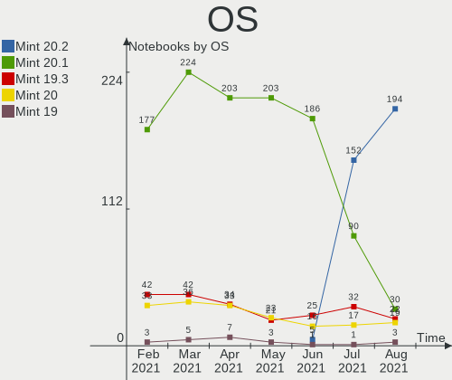

| Name      | Notebooks | Percent |
|-----------|-----------|---------|
| Mint 20.1 | 177       | 66.79%  |
| Mint 19.3 | 42        | 15.85%  |
| Mint 20   | 33        | 12.45%  |
| Mint 19.1 | 5         | 1.89%   |
| Mint 19   | 3         | 1.13%   |
| Mint 18.3 | 3         | 1.13%   |
| Mint 19.2 | 2         | 0.75%   |

OS Family
---------

OS without a version

| Name | Notebooks | Percent |
|------|-----------|---------|
| Mint | 265       | 100%    |

Kernel
------

Version of the Linux kernel

| Version                   | Notebooks | Percent |
|---------------------------|-----------|---------|
| 5.4.0-65-generic          | 144       | 54.34%  |
| 5.4.0-66-generic          | 28        | 10.57%  |
| 5.8.0-43-generic          | 13        | 4.91%   |
| 5.4.0-58-generic          | 11        | 4.15%   |
| 5.8.0-41-generic          | 9         | 3.4%    |
| 5.4.0-26-generic          | 7         | 2.64%   |
| 5.0.0-32-generic          | 7         | 2.64%   |
| 5.4.0-64-generic          | 6         | 2.26%   |
| 4.15.0-135-generic        | 5         | 1.89%   |
| 5.8.0-44-generic          | 4         | 1.51%   |
| 5.10.0-1011-oem           | 4         | 1.51%   |
| 4.15.0-20-generic         | 3         | 1.13%   |
| 5.4.0-62-generic          | 2         | 0.75%   |
| 5.4.0-56-generic          | 2         | 0.75%   |
| 5.4.0-54-generic          | 2         | 0.75%   |
| 5.10.12-051012-generic    | 2         | 0.75%   |
| 5.9.1-050901-generic      | 1         | 0.38%   |
| 5.8.0-33-generic          | 1         | 0.38%   |
| 5.6.0-1047-oem            | 1         | 0.38%   |
| 5.6.0-1036-oem            | 1         | 0.38%   |
| 5.4.0-52-generic          | 1         | 0.38%   |
| 5.4.0-42-generic          | 1         | 0.38%   |
| 5.11.0-2.2-liquorix-amd64 | 1         | 0.38%   |
| 5.10.15-051015-generic    | 1         | 0.38%   |
| 5.10.13-051013-generic    | 1         | 0.38%   |
| 5.10.0-1013-oem           | 1         | 0.38%   |
| 4.4.0-201-generic         | 1         | 0.38%   |
| 4.15.0-54-generic         | 1         | 0.38%   |
| 4.15.0-50-generic         | 1         | 0.38%   |
| 4.15.0-136-generic        | 1         | 0.38%   |
| 4.15.0-133-generic        | 1         | 0.38%   |
| 4.10.0-38-generic         | 1         | 0.38%   |

Kernel Family
-------------

Linux kernel without a distro release

| Version | Notebooks | Percent |
|---------|-----------|---------|
| 5.4.0   | 204       | 76.98%  |
| 5.8.0   | 27        | 10.19%  |
| 4.15.0  | 12        | 4.53%   |
| 5.0.0   | 7         | 2.64%   |
| 5.10.0  | 5         | 1.89%   |
| 5.6.0   | 2         | 0.75%   |
| 5.10.12 | 2         | 0.75%   |
| 5.9.1   | 1         | 0.38%   |
| 5.11.0  | 1         | 0.38%   |
| 5.10.15 | 1         | 0.38%   |
| 5.10.13 | 1         | 0.38%   |
| 4.4.0   | 1         | 0.38%   |
| 4.10.0  | 1         | 0.38%   |

Kernel Major Ver.
-----------------

Linux kernel major version

| Version | Notebooks | Percent |
|---------|-----------|---------|
| 5.4     | 204       | 76.98%  |
| 5.8     | 27        | 10.19%  |
| 4.15    | 12        | 4.53%   |
| 5.10    | 9         | 3.4%    |
| 5.0     | 7         | 2.64%   |
| 5.6     | 2         | 0.75%   |
| 5.9     | 1         | 0.38%   |
| 5.11    | 1         | 0.38%   |
| 4.4     | 1         | 0.38%   |
| 4.10    | 1         | 0.38%   |

Arch
----

OS architecture (x86_64, i586, etc.)

| Name   | Notebooks | Percent |
|--------|-----------|---------|
| x86_64 | 245       | 92.45%  |
| i686   | 20        | 7.55%   |

DE
--

Desktop Environment

| Name       | Notebooks | Percent |
|------------|-----------|---------|
| X-Cinnamon | 171       | 64.53%  |
| XFCE       | 38        | 14.34%  |
| MATE       | 36        | 13.58%  |
| Cinnamon   | 12        | 4.53%   |
| GNOME      | 5         | 1.89%   |
| Unknown    | 3         | 1.13%   |

Display Server
--------------

X11 or Wayland

| Name | Notebooks | Percent |
|------|-----------|---------|
| X11  | 263       | 99.25%  |
| Tty  | 2         | 0.75%   |

Display Manager
---------------

SDDM, LightDM, etc.

| Name    | Notebooks | Percent |
|---------|-----------|---------|
| Unknown | 197       | 74.34%  |
| TDM     | 67        | 25.28%  |
| GDM     | 1         | 0.38%   |

OS Lang
-------

Language

| Lang    | Notebooks | Percent |
|---------|-----------|---------|
| en_US   | 77        | 29.06%  |
| de_DE   | 30        | 11.32%  |
| pt_BR   | 20        | 7.55%   |
| ru_RU   | 19        | 7.17%   |
| fr_FR   | 18        | 6.79%   |
| en_GB   | 15        | 5.66%   |
| pl_PL   | 10        | 3.77%   |
| zh_CN   | 7         | 2.64%   |
| C       | 7         | 2.64%   |
| pt_PT   | 6         | 2.26%   |
| en_AU   | 6         | 2.26%   |
| es_ES   | 5         | 1.89%   |
| en_CA   | 4         | 1.51%   |
| nl_NL   | 3         | 1.13%   |
| es_AR   | 3         | 1.13%   |
| en_IN   | 3         | 1.13%   |
| tr_TR   | 2         | 0.75%   |
| ru_UA   | 2         | 0.75%   |
| it_IT   | 2         | 0.75%   |
| es_CO   | 2         | 0.75%   |
| en_IE   | 2         | 0.75%   |
| de_CH   | 2         | 0.75%   |
| cs_CZ   | 2         | 0.75%   |
| bg_BG   | 2         | 0.75%   |
| sv_SE   | 1         | 0.38%   |
| sk_SK   | 1         | 0.38%   |
| hu_HU   | 1         | 0.38%   |
| fr_CA   | 1         | 0.38%   |
| fr_BE   | 1         | 0.38%   |
| fi_FI   | 1         | 0.38%   |
| es_PY   | 1         | 0.38%   |
| es_PE   | 1         | 0.38%   |
| es_MX   | 1         | 0.38%   |
| es_CR   | 1         | 0.38%   |
| en_ZA   | 1         | 0.38%   |
| en_IL   | 1         | 0.38%   |
| en_DK   | 1         | 0.38%   |
| el_GR   | 1         | 0.38%   |
| ca_ES   | 1         | 0.38%   |
| Unknown | 1         | 0.38%   |

Boot Mode
---------

EFI or BIOS

| Mode | Notebooks | Percent |
|------|-----------|---------|
| BIOS | 144       | 54.34%  |
| EFI  | 121       | 45.66%  |

Filesystem
----------

Type of filesystem

| Type    | Notebooks | Percent |
|---------|-----------|---------|
| Ext4    | 254       | 95.85%  |
| Overlay | 7         | 2.64%   |
| Xfs     | 1         | 0.38%   |
| Ext3    | 1         | 0.38%   |
| Ext2    | 1         | 0.38%   |
| Btrfs   | 1         | 0.38%   |

Part. scheme
------------

Scheme of partitioning

| Type    | Notebooks | Percent |
|---------|-----------|---------|
| Unknown | 196       | 73.96%  |
| GPT     | 47        | 17.74%  |
| MBR     | 22        | 8.3%    |

Dual Boot with Linux/BSD
------------------------

Hosting more than one Linux/BSD

| Dual boot | Notebooks | Percent |
|-----------|-----------|---------|
| No        | 255       | 96.23%  |
| Yes       | 10        | 3.77%   |

Dual Boot (Win)
---------------

Hosting Linux and Windows

| Dual boot | Notebooks | Percent |
|-----------|-----------|---------|
| No        | 235       | 88.68%  |
| Yes       | 30        | 11.32%  |

Country
-------

Geographic location (country)

| Country        | Notebooks | Percent |
|----------------|-----------|---------|
| USA            | 36        | 13.58%  |
| Germany        | 32        | 12.08%  |
| Brazil         | 24        | 9.06%   |
| Russia         | 19        | 7.17%   |
| France         | 18        | 6.79%   |
| UK             | 12        | 4.53%   |
| Poland         | 10        | 3.77%   |
| Portugal       | 7         | 2.64%   |
| Australia      | 7         | 2.64%   |
| Ukraine        | 6         | 2.26%   |
| Spain          | 6         | 2.26%   |
| China          | 6         | 2.26%   |
| Canada         | 5         | 1.89%   |
| Turkey         | 4         | 1.51%   |
| Slovakia       | 4         | 1.51%   |
| Netherlands    | 4         | 1.51%   |
| Mexico         | 4         | 1.51%   |
| India          | 4         | 1.51%   |
| Finland        | 4         | 1.51%   |
| Belgium        | 4         | 1.51%   |
| Sweden         | 3         | 1.13%   |
| Italy          | 3         | 1.13%   |
| Ireland        | 3         | 1.13%   |
| Indonesia      | 3         | 1.13%   |
| Greece         | 3         | 1.13%   |
| Czech Republic | 3         | 1.13%   |
| Bulgaria       | 3         | 1.13%   |
| Austria        | 3         | 1.13%   |
| Switzerland    | 2         | 0.75%   |
| Paraguay       | 2         | 0.75%   |
| Colombia       | 2         | 0.75%   |
| Argentina      | 2         | 0.75%   |
| Uzbekistan     | 1         | 0.38%   |
| Sri Lanka      | 1         | 0.38%   |
| South Africa   | 1         | 0.38%   |
| Peru           | 1         | 0.38%   |
| Malaysia       | 1         | 0.38%   |
| Kyrgyzstan     | 1         | 0.38%   |
| Japan          | 1         | 0.38%   |
| Israel         | 1         | 0.38%   |
| Hungary        | 1         | 0.38%   |
| Hong Kong      | 1         | 0.38%   |
| Estonia        | 1         | 0.38%   |
| Denmark        | 1         | 0.38%   |
| Costa Rica     | 1         | 0.38%   |
| Belarus        | 1         | 0.38%   |
| Bangladesh     | 1         | 0.38%   |
| Angola         | 1         | 0.38%   |
| Algeria        | 1         | 0.38%   |

City
----

Geographic location (city)

| City              | Notebooks | Percent |
|-------------------|-----------|---------|
| São Paulo        | 5         | 1.89%   |
| Nanning           | 5         | 1.89%   |
| Berlin            | 5         | 1.89%   |
| Moscow            | 3         | 1.13%   |
| Ludlow            | 3         | 1.13%   |
| Helsinki          | 3         | 1.13%   |
| Bratislava        | 3         | 1.13%   |
| Zlatoust          | 2         | 0.75%   |
| Voronezh          | 2         | 0.75%   |
| Vienna            | 2         | 0.75%   |
| Spokane           | 2         | 0.75%   |
| Omaha             | 2         | 0.75%   |
| Novosibirsk       | 2         | 0.75%   |
| New York          | 2         | 0.75%   |
| New Delhi         | 2         | 0.75%   |
| Neunkirchen       | 2         | 0.75%   |
| Montijo           | 2         | 0.75%   |
| Madrid            | 2         | 0.75%   |
| Krakow            | 2         | 0.75%   |
| Katowice          | 2         | 0.75%   |
| Glasgow           | 2         | 0.75%   |
| Athens            | 2         | 0.75%   |
| Asunción         | 2         | 0.75%   |
| Antalya           | 2         | 0.75%   |
| Adelaide          | 2         | 0.75%   |
| Çankırı        | 1         | 0.38%   |
| Zurich            | 1         | 0.38%   |
| Znojmo            | 1         | 0.38%   |
| Zdolbuniv         | 1         | 0.38%   |
| Zapopan           | 1         | 0.38%   |
| Yonkers           | 1         | 0.38%   |
| Yogyakarta        | 1         | 0.38%   |
| Yallourn          | 1         | 0.38%   |
| Wrocław          | 1         | 0.38%   |
| Westerkappeln     | 1         | 0.38%   |
| Warendorf         | 1         | 0.38%   |
| Walldorf          | 1         | 0.38%   |
| Volta Redonda     | 1         | 0.38%   |
| Vitória          | 1         | 0.38%   |
| Vitoria-Gasteiz   | 1         | 0.38%   |
| Villach           | 1         | 0.38%   |
| Vila Nova de Gaia | 1         | 0.38%   |
| Verona            | 1         | 0.38%   |
| Varna             | 1         | 0.38%   |
| Vancouver         | 1         | 0.38%   |
| Van Vleck         | 1         | 0.38%   |
| Valdurenque       | 1         | 0.38%   |
| Ulyanovsk         | 1         | 0.38%   |
| Udachnoye         | 1         | 0.38%   |
| Turku             | 1         | 0.38%   |
| Trim              | 1         | 0.38%   |
| Toulouse          | 1         | 0.38%   |
| Torring           | 1         | 0.38%   |
| Topeka            | 1         | 0.38%   |
| Tomsk             | 1         | 0.38%   |
| Thessaloniki      | 1         | 0.38%   |
| Tencin            | 1         | 0.38%   |
| Tashkent          | 1         | 0.38%   |
| Taganrog          | 1         | 0.38%   |
| Syracuse          | 1         | 0.38%   |

Vendor
------

Motherboard manufacturer

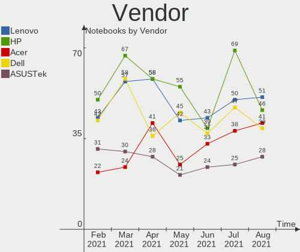

| Name                  | Notebooks | Percent |
|-----------------------|-----------|---------|
| Hewlett-Packard       | 50        | 18.87%  |
| Lenovo                | 43        | 16.23%  |
| Dell                  | 42        | 15.85%  |
| ASUSTek Computer      | 31        | 11.7%   |
| Acer                  | 22        | 8.3%    |
| Toshiba               | 17        | 6.42%   |
| Sony                  | 10        | 3.77%   |
| Samsung Electronics   | 10        | 3.77%   |
| Apple                 | 9         | 3.4%    |
| Positivo              | 4         | 1.51%   |
| Timi                  | 3         | 1.13%   |
| Packard Bell          | 3         | 1.13%   |
| HUAWEI                | 3         | 1.13%   |
| OEM                   | 2         | 0.75%   |
| Google                | 2         | 0.75%   |
| Fujitsu               | 2         | 0.75%   |
| TUXEDO                | 1         | 0.38%   |
| Notebook              | 1         | 0.38%   |
| MSI                   | 1         | 0.38%   |
| Medion                | 1         | 0.38%   |
| Inupur                | 1         | 0.38%   |
| Gateway               | 1         | 0.38%   |
| EVOO Products Company | 1         | 0.38%   |
| eMachines             | 1         | 0.38%   |
| DEXP                  | 1         | 0.38%   |
| Clevo                 | 1         | 0.38%   |
| BLAUPUNKT             | 1         | 0.38%   |
| Alienware             | 1         | 0.38%   |

Model
-----

Motherboard model

| Name                                  | Notebooks | Percent |
|---------------------------------------|-----------|---------|
| HP Notebook                           | 3         | 1.13%   |
| HP G62                                | 3         | 1.13%   |
| Dell Latitude E6420                   | 3         | 1.13%   |
| Toshiba Satellite C660                | 2         | 0.75%   |
| Timi TM1703                           | 2         | 0.75%   |
| HP Pavilion dv7                       | 2         | 0.75%   |
| HP 15                                 | 2         | 0.75%   |
| Dell Latitude E7470                   | 2         | 0.75%   |
| Dell Latitude E6540                   | 2         | 0.75%   |
| Dell G3 3590                          | 2         | 0.75%   |
| ASUS N61Jq                            | 2         | 0.75%   |
| Apple MacBook4,1                      | 2         | 0.75%   |
| Acer Aspire V3-771                    | 2         | 0.75%   |
| TUXEDO Pulse 14 Gen1                  | 1         | 0.38%   |
| Toshiba TECRA A50-C                   | 1         | 0.38%   |
| Toshiba Satellite P105                | 1         | 0.38%   |
| Toshiba Satellite L50-C               | 1         | 0.38%   |
| Toshiba Satellite L40                 | 1         | 0.38%   |
| Toshiba Satellite L300                | 1         | 0.38%   |
| Toshiba Satellite C75D-B              | 1         | 0.38%   |
| Toshiba Satellite C55t-C              | 1         | 0.38%   |
| Toshiba Satellite C55Dt-A             | 1         | 0.38%   |
| Toshiba Satellite C55D-C              | 1         | 0.38%   |
| Toshiba Satellite C55-B               | 1         | 0.38%   |
| Toshiba Satellite C40-C               | 1         | 0.38%   |
| Toshiba Satellite A665                | 1         | 0.38%   |
| Toshiba Satellite A500                | 1         | 0.38%   |
| Toshiba Satellite A200                | 1         | 0.38%   |
| Toshiba PORTEGE R500                  | 1         | 0.38%   |
| Timi RedmiBook 14 II                  | 1         | 0.38%   |
| Sony VPCYB35AL                        | 1         | 0.38%   |
| Sony VPCX11Z1E                        | 1         | 0.38%   |
| Sony VPCEB3E4E                        | 1         | 0.38%   |
| Sony VPCEB33FM                        | 1         | 0.38%   |
| Sony VGN-NR130FE                      | 1         | 0.38%   |
| Sony SVF15415CDW                      | 1         | 0.38%   |
| Sony SVF1521A7EB                      | 1         | 0.38%   |
| Sony SVE1713L1RW                      | 1         | 0.38%   |
| Sony SVE1511F4E                       | 1         | 0.38%   |
| Sony 91                               | 1         | 0.38%   |
| Samsung RV415/RV515/E3415             | 1         | 0.38%   |
| Samsung RV411/RV511/E3511/S3511/RV711 | 1         | 0.38%   |
| Samsung RF511/RF411/RF711             | 1         | 0.38%   |
| Samsung N250P                         | 1         | 0.38%   |
| Samsung N102SP/N100SP/N101SP          | 1         | 0.38%   |
| Samsung 550XBE/350XBE                 | 1         | 0.38%   |
| Samsung 355V4C/356V4C/3445VC/3545VC   | 1         | 0.38%   |
| Samsung 350V5C/351V5C/3540VC/3440VC   | 1         | 0.38%   |
| Samsung 300E4C/300E5C/300E7C          | 1         | 0.38%   |
| Samsung 270E5J/2570EJ                 | 1         | 0.38%   |
| Positivo W217CUQD                     | 1         | 0.38%   |
| Positivo SW6H                         | 1         | 0.38%   |
| Positivo Q232A                        | 1         | 0.38%   |
| Positivo Mobile                       | 1         | 0.38%   |
| Packard Bell ENLK11BZ                 | 1         | 0.38%   |
| Packard Bell EasyNote TV11HC          | 1         | 0.38%   |
| Packard Bell EasyNote NX86            | 1         | 0.38%   |
| OEM I41SI                             | 1         | 0.38%   |
| OEM I40SI1                            | 1         | 0.38%   |
| Notebook W65_67SJ                     | 1         | 0.38%   |

Model Family
------------

Motherboard model prefix

| Name                  | Notebooks | Percent |
|-----------------------|-----------|---------|
| Lenovo ThinkPad       | 24        | 9.06%   |
| Dell Latitude         | 17        | 6.42%   |
| Toshiba Satellite     | 15        | 5.66%   |
| Acer Aspire           | 15        | 5.66%   |
| Dell Inspiron         | 11        | 4.15%   |
| Lenovo IdeaPad        | 8         | 3.02%   |
| HP ProBook            | 8         | 3.02%   |
| HP Laptop             | 7         | 2.64%   |
| HP EliteBook          | 6         | 2.26%   |
| HP Compaq             | 6         | 2.26%   |
| Dell Vostro           | 6         | 2.26%   |
| HP Pavilion           | 5         | 1.89%   |
| HP Notebook           | 3         | 1.13%   |
| HP G62                | 3         | 1.13%   |
| Dell XPS              | 3         | 1.13%   |
| Timi TM1703           | 2         | 0.75%   |
| Packard Bell EasyNote | 2         | 0.75%   |
| Lenovo Yoga           | 2         | 0.75%   |
| HP Stream             | 2         | 0.75%   |
| HP 15                 | 2         | 0.75%   |
| Fujitsu LIFEBOOK      | 2         | 0.75%   |
| Dell Precision        | 2         | 0.75%   |
| Dell G3               | 2         | 0.75%   |
| ASUS N61Jq            | 2         | 0.75%   |
| Apple MacBook4        | 2         | 0.75%   |
| Acer TravelMate       | 2         | 0.75%   |
| Acer Swift            | 2         | 0.75%   |
| TUXEDO Pulse          | 1         | 0.38%   |
| Toshiba TECRA         | 1         | 0.38%   |
| Toshiba PORTEGE       | 1         | 0.38%   |
| Timi RedmiBook        | 1         | 0.38%   |
| Sony VPCYB35AL        | 1         | 0.38%   |
| Sony VPCX11Z1E        | 1         | 0.38%   |
| Sony VPCEB3E4E        | 1         | 0.38%   |
| Sony VPCEB33FM        | 1         | 0.38%   |
| Sony VGN-NR130FE      | 1         | 0.38%   |
| Sony SVF15415CDW      | 1         | 0.38%   |
| Sony SVF1521A7EB      | 1         | 0.38%   |
| Sony SVE1713L1RW      | 1         | 0.38%   |
| Sony SVE1511F4E       | 1         | 0.38%   |
| Sony 91               | 1         | 0.38%   |
| Samsung RV415         | 1         | 0.38%   |
| Samsung RV411         | 1         | 0.38%   |
| Samsung RF511         | 1         | 0.38%   |
| Samsung N250P         | 1         | 0.38%   |
| Samsung N102SP        | 1         | 0.38%   |
| Samsung 550XBE        | 1         | 0.38%   |
| Samsung 355V4C        | 1         | 0.38%   |
| Samsung 350V5C        | 1         | 0.38%   |
| Samsung 300E4C        | 1         | 0.38%   |
| Samsung 270E5J        | 1         | 0.38%   |
| Positivo W217CUQD     | 1         | 0.38%   |
| Positivo SW6H         | 1         | 0.38%   |
| Positivo Q232A        | 1         | 0.38%   |
| Positivo Mobile       | 1         | 0.38%   |
| Packard Bell ENLK11BZ | 1         | 0.38%   |
| OEM I41SI             | 1         | 0.38%   |
| OEM I40SI1            | 1         | 0.38%   |
| Notebook W65          | 1         | 0.38%   |
| MSI GE60              | 1         | 0.38%   |

MFG Year
--------

Motherboard manufacture year

| Year    | Notebooks | Percent |
|---------|-----------|---------|
| 2020    | 44        | 16.6%   |
| 2012    | 25        | 9.43%   |
| 2019    | 21        | 7.92%   |
| 2013    | 21        | 7.92%   |
| 2011    | 21        | 7.92%   |
| 2018    | 20        | 7.55%   |
| 2010    | 19        | 7.17%   |
| 2015    | 18        | 6.79%   |
| 2009    | 15        | 5.66%   |
| 2014    | 13        | 4.91%   |
| 2017    | 12        | 4.53%   |
| 2008    | 12        | 4.53%   |
| 2016    | 10        | 3.77%   |
| 2007    | 7         | 2.64%   |
| 2006    | 3         | 1.13%   |
| 2021    | 1         | 0.38%   |
| 2005    | 1         | 0.38%   |
| 2004    | 1         | 0.38%   |
| Unknown | 1         | 0.38%   |

Form Factor
-----------

Physical design of the computer

| Name     | Notebooks | Percent |
|----------|-----------|---------|
| Notebook | 265       | 100%    |

Secure Boot
-----------

Enabled or disabled

| State    | Notebooks | Percent |
|----------|-----------|---------|
| Disabled | 241       | 90.94%  |
| Enabled  | 24        | 9.06%   |

Coreboot
--------

Have coreboot on board

| Used | Notebooks | Percent |
|------|-----------|---------|
| No   | 263       | 99.25%  |
| Yes  | 2         | 0.75%   |

RAM Size
--------

Total RAM memory

| Size in GB | Notebooks | Percent |
|------------|-----------|---------|
| 4.01-8.0   | 72        | 27.17%  |
| 3.01-4.0   | 72        | 27.17%  |
| 8.01-16.0  | 47        | 17.74%  |
| 1.01-2.0   | 30        | 11.32%  |
| 16.01-24.0 | 26        | 9.81%   |
| 2.01-3.0   | 7         | 2.64%   |
| 32.01-64.0 | 6         | 2.26%   |
| 0.51-1.0   | 4         | 1.51%   |
| 24.01-32.0 | 1         | 0.38%   |

RAM Used
--------

Used RAM memory

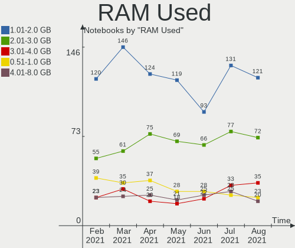

| Used GB   | Notebooks | Percent |
|-----------|-----------|---------|
| 1.01-2.0  | 120       | 45.28%  |
| 2.01-3.0  | 55        | 20.75%  |
| 0.51-1.0  | 39        | 14.72%  |
| 4.01-8.0  | 23        | 8.68%   |
| 3.01-4.0  | 23        | 8.68%   |
| 8.01-16.0 | 3         | 1.13%   |
| 0.01-0.5  | 2         | 0.75%   |

Has CD-ROM
----------

Has CD-ROM on board

| Presented | Notebooks | Percent |
|-----------|-----------|---------|
| No        | 136       | 51.32%  |
| Yes       | 129       | 48.68%  |

Total Drives
------------

Number of drives on board

| Drives | Notebooks | Percent |
|--------|-----------|---------|
| 1      | 185       | 69.81%  |
| 2      | 71        | 26.79%  |
| 3      | 6         | 2.26%   |
| 0      | 2         | 0.75%   |
| 4      | 1         | 0.38%   |

Has Ethernet
------------

Has Ethernet on board

| Presented | Notebooks | Percent |
|-----------|-----------|---------|
| Yes       | 226       | 85.28%  |
| No        | 39        | 14.72%  |

Drive Vendor
------------

Hard drive vendors

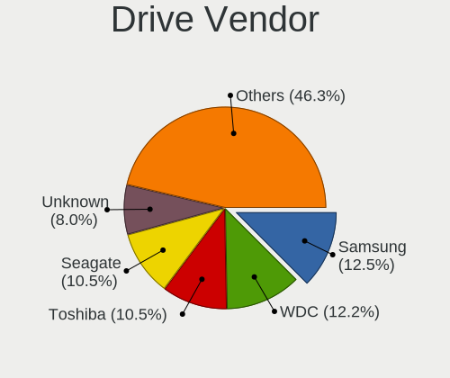

| Vendor                  | Notebooks | Drives | Percent |
|-------------------------|-----------|--------|---------|
| Seagate                 | 46        | 47     | 14.15%  |
| Samsung Electronics     | 42        | 48     | 12.92%  |
| WDC                     | 40        | 40     | 12.31%  |
| Toshiba                 | 27        | 27     | 8.31%   |
| SanDisk                 | 21        | 21     | 6.46%   |
| Unknown                 | 20        | 24     | 6.15%   |
| Kingston                | 17        | 17     | 5.23%   |
| Hitachi                 | 17        | 17     | 5.23%   |
| Crucial                 | 17        | 18     | 5.23%   |
| HGST                    | 9         | 9      | 2.77%   |
| SK Hynix                | 7         | 7      | 2.15%   |
| Micron Technology       | 6         | 6      | 1.85%   |
| Intel                   | 5         | 5      | 1.54%   |
| PNY                     | 3         | 3      | 0.92%   |
| GOODRAM                 | 3         | 3      | 0.92%   |
| China                   | 3         | 3      | 0.92%   |
| Apple                   | 3         | 3      | 0.92%   |
| A-DATA Technology       | 3         | 4      | 0.92%   |
| SPCC                    | 2         | 2      | 0.62%   |
| PLEXTOR                 | 2         | 2      | 0.62%   |
| OCZ                     | 2         | 2      | 0.62%   |
| KIOXIA                  | 2         | 2      | 0.62%   |
| Intenso                 | 2         | 2      | 0.62%   |
| Fujitsu                 | 2         | 2      | 0.62%   |
| Vaseky                  | 1         | 1      | 0.31%   |
| Union Memory (Shenzhen) | 1         | 1      | 0.31%   |
| Union Memory            | 1         | 1      | 0.31%   |
| Transcend               | 1         | 1      | 0.31%   |
| TCSUNBOW                | 1         | 1      | 0.31%   |
| SILICONMOTION           | 1         | 1      | 0.31%   |
| Realtek Semiconductor   | 1         | 1      | 0.31%   |
| RDM-II                  | 1         | 1      | 0.31%   |
| Phison                  | 1         | 2      | 0.31%   |
| Netac                   | 1         | 1      | 0.31%   |
| MyDigitalSSD            | 1         | 1      | 0.31%   |
| Mushkin                 | 1         | 1      | 0.31%   |
| Maxtor                  | 1         | 1      | 0.31%   |
| LITEONIT                | 1         | 1      | 0.31%   |
| LITEON                  | 1         | 1      | 0.31%   |
| KingSpec                | 1         | 1      | 0.31%   |
| KingFast                | 1         | 1      | 0.31%   |
| JMicron                 | 1         | 1      | 0.31%   |
| HS-SSD-C100             | 1         | 1      | 0.31%   |
| HGST HTS                | 1         | 1      | 0.31%   |
| Colorful                | 1         | 1      | 0.31%   |
| BHT                     | 1         | 1      | 0.31%   |
| Apacer                  | 1         | 1      | 0.31%   |
| ADATA Technology        | 1         | 1      | 0.31%   |

Drive Model
-----------

Hard drive models

| Model                               | Notebooks | Percent |
|-------------------------------------|-----------|---------|
| Unknown MMC Card  32GB              | 11        | 3.24%   |
| Seagate ST9500325AS 500GB           | 8         | 2.36%   |
| Seagate ST1000LM024 HN-M101MBB 1TB  | 7         | 2.06%   |
| Toshiba MQ04ABF100 1TB              | 5         | 1.47%   |
| Seagate ST500LT012-1DG142 500GB     | 5         | 1.47%   |
| Samsung SSD 850 EVO 250GB           | 5         | 1.47%   |
| Crucial CT1000MX500SSD1 1TB         | 5         | 1.47%   |
| Seagate ST1000LM035-1RK172 1TB      | 4         | 1.18%   |
| Samsung MZ7KM480HMHQ-000 480GB SSD  | 4         | 1.18%   |
| HGST HTS545050A7E680 500GB          | 4         | 1.18%   |
| WDC WDS240G2G0A-00JH30 240GB SSD    | 3         | 0.88%   |
| Toshiba MQ01ABD100 1TB              | 3         | 0.88%   |
| Seagate ST500LT012-9WS142 500GB     | 3         | 0.88%   |
| SanDisk SSD PLUS 240GB              | 3         | 0.88%   |
| Samsung NVMe SSD Drive 256GB        | 3         | 0.88%   |
| Kingston SV300S37A120G 120GB SSD    | 3         | 0.88%   |
| Hitachi HTS547575A9E384 752GB       | 3         | 0.88%   |
| Crucial CT240BX500SSD1 240GB        | 3         | 0.88%   |
| WDC WD10JPCX-24UE4T0 1TB            | 2         | 0.59%   |
| Unknown MMC Card  64GB              | 2         | 0.59%   |
| Unknown MMC Card  256GB             | 2         | 0.59%   |
| Unknown MMC Card  16GB              | 2         | 0.59%   |
| Unknown MMC Card  128GB             | 2         | 0.59%   |
| Toshiba NVMe SSD Drive 256GB        | 2         | 0.59%   |
| Seagate ST500LM000-1EJ162 500GB     | 2         | 0.59%   |
| Seagate ST2000LM003 HN-M201RAD 2TB  | 2         | 0.59%   |
| Seagate Expansion 500GB             | 2         | 0.59%   |
| SanDisk SSD PLUS 480GB              | 2         | 0.59%   |
| SanDisk SSD PLUS 120GB              | 2         | 0.59%   |
| SanDisk SD8SN8U-128G-1006 128GB SSD | 2         | 0.59%   |
| Sandisk NVMe SSD Drive 256GB        | 2         | 0.59%   |
| Samsung SSD 860 EVO 500GB           | 2         | 0.59%   |
| Micron 1100_MTFDDAV256TBN 256GB SSD | 2         | 0.59%   |
| Kingston SV300S37A60G 64GB SSD      | 2         | 0.59%   |
| Kingston SA400S37480G 480GB SSD     | 2         | 0.59%   |
| Kingston SA400S37240G 240GB SSD     | 2         | 0.59%   |
| Hitachi HTS725032A9A364 320GB       | 2         | 0.59%   |
| Hitachi HTS545050B9A300 500GB       | 2         | 0.59%   |
| Hitachi HTS545025B9A300 250GB       | 2         | 0.59%   |
| Hitachi HTS543232A7A384 320GB       | 2         | 0.59%   |
| HGST HTS725050A7E630 500GB          | 2         | 0.59%   |
| HGST HTS721010A9E630 1TB            | 2         | 0.59%   |
| WDC WDS250G1B0B-00AS40 250GB SSD    | 1         | 0.29%   |
| WDC WDS240G2G0B-00EPW0 240GB SSD    | 1         | 0.29%   |
| WDC WDS120G2G0A-00JH30 120GB SSD    | 1         | 0.29%   |
| WDC WDS100T2B0A-00SM50 1TB SSD      | 1         | 0.29%   |
| WDC WDBRPG0020BNC-WRSN 2TB          | 1         | 0.29%   |
| WDC WD7500BPVT-24HXZT3 752GB        | 1         | 0.29%   |
| WDC WD7500BPKX-00HPJT0 752GB        | 1         | 0.29%   |
| WDC WD6400BEVT-80A0RT0 640GB        | 1         | 0.29%   |
| WDC WD5000LPVX-22V0TT0 500GB        | 1         | 0.29%   |
| WDC WD5000LPVT-00FMCT0 500GB        | 1         | 0.29%   |
| WDC WD5000LPLX-08ZNTT0 500GB        | 1         | 0.29%   |
| WDC WD5000BPVT-22HXZT1 500GB        | 1         | 0.29%   |
| WDC WD400VE-75HDT1 40GB             | 1         | 0.29%   |
| WDC WD3200BEVT-75ZCT2 320GB         | 1         | 0.29%   |
| WDC WD3200BEVT-60A23T0 320GB        | 1         | 0.29%   |
| WDC WD3200BEVT-11ZCT0 320GB         | 1         | 0.29%   |
| WDC WD3200BEVT-00A1TT0 320GB        | 1         | 0.29%   |
| WDC WD2500BEVT-80A23T0 250GB        | 1         | 0.29%   |

HDD Vendor
----------

Hard disk drive vendors

| Vendor              | Notebooks | Drives | Percent |
|---------------------|-----------|--------|---------|
| Seagate             | 46        | 47     | 34.85%  |
| WDC                 | 30        | 30     | 22.73%  |
| Toshiba             | 22        | 22     | 16.67%  |
| Hitachi             | 17        | 17     | 12.88%  |
| HGST                | 9         | 9      | 6.82%   |
| Samsung Electronics | 4         | 4      | 3.03%   |
| Fujitsu             | 2         | 2      | 1.52%   |
| SILICONMOTION       | 1         | 1      | 0.76%   |
| Apple               | 1         | 1      | 0.76%   |

SSD Vendor
----------

Solid state drive vendors

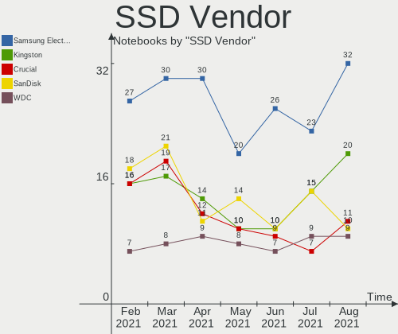

| Vendor              | Notebooks | Drives | Percent |
|---------------------|-----------|--------|---------|
| Samsung Electronics | 27        | 29     | 21.09%  |
| SanDisk             | 18        | 18     | 14.06%  |
| Kingston            | 16        | 16     | 12.5%   |
| Crucial             | 16        | 17     | 12.5%   |
| WDC                 | 7         | 7      | 5.47%   |
| Micron Technology   | 5         | 5      | 3.91%   |
| PNY                 | 3         | 3      | 2.34%   |
| Intel               | 3         | 3      | 2.34%   |
| GOODRAM             | 3         | 3      | 2.34%   |
| China               | 3         | 3      | 2.34%   |
| A-DATA Technology   | 3         | 4      | 2.34%   |
| Toshiba             | 2         | 2      | 1.56%   |
| SPCC                | 2         | 2      | 1.56%   |
| PLEXTOR             | 2         | 2      | 1.56%   |
| OCZ                 | 2         | 2      | 1.56%   |
| Intenso             | 2         | 2      | 1.56%   |
| Vaseky              | 1         | 1      | 0.78%   |
| Transcend           | 1         | 1      | 0.78%   |
| TCSUNBOW            | 1         | 1      | 0.78%   |
| SK Hynix            | 1         | 1      | 0.78%   |
| Netac               | 1         | 1      | 0.78%   |
| MyDigitalSSD        | 1         | 1      | 0.78%   |
| Mushkin             | 1         | 1      | 0.78%   |
| Maxtor              | 1         | 1      | 0.78%   |
| LITEONIT            | 1         | 1      | 0.78%   |
| LITEON              | 1         | 1      | 0.78%   |
| KingSpec            | 1         | 1      | 0.78%   |
| BHT                 | 1         | 1      | 0.78%   |
| Apple               | 1         | 1      | 0.78%   |
| Apacer              | 1         | 1      | 0.78%   |

Drive Kind
----------

HDD or SSD

| Kind    | Notebooks | Drives | Percent |
|---------|-----------|--------|---------|
| HDD     | 128       | 133    | 41.16%  |
| SSD     | 117       | 132    | 37.62%  |
| NVMe    | 40        | 44     | 12.86%  |
| MMC     | 19        | 23     | 6.11%   |
| Unknown | 7         | 7      | 2.25%   |

Drive Connector
---------------

SATA, SAS, NVMe, etc.

| Type | Notebooks | Drives | Percent |
|------|-----------|--------|---------|
| SATA | 223       | 262    | 76.37%  |
| NVMe | 40        | 44     | 13.7%   |
| MMC  | 19        | 23     | 6.51%   |
| SAS  | 10        | 10     | 3.42%   |

Drive Size
----------

Size of hard drive

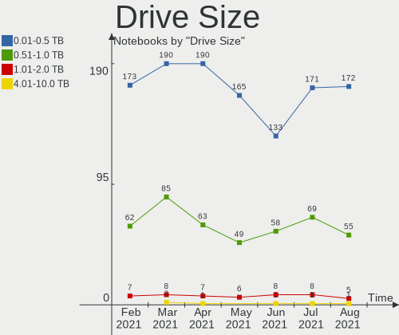

| Size in TB | Notebooks | Drives | Percent |
|------------|-----------|--------|---------|
| 0.01-0.5   | 174       | 197    | 72.5%   |
| 0.51-1.0   | 60        | 62     | 25%     |
| 1.01-2.0   | 6         | 6      | 2.5%    |

Space Total
-----------

Amount of disk space available on the file system

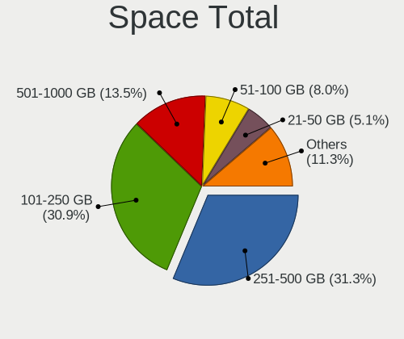

| Size in GB     | Notebooks | Percent |
|----------------|-----------|---------|
| 101-250        | 93        | 35.09%  |
| 251-500        | 63        | 23.77%  |
| 501-1000       | 37        | 13.96%  |
| 51-100         | 26        | 9.81%   |
| 21-50          | 19        | 7.17%   |
| 1001-2000      | 16        | 6.04%   |
| 1-20           | 6         | 2.26%   |
| 2001-3000      | 4         | 1.51%   |
| More than 3000 | 1         | 0.38%   |

Space Used
----------

Amount of used disk space

| Used GB   | Notebooks | Percent |
|-----------|-----------|---------|
| 21-50     | 73        | 27.55%  |
| 1-20      | 73        | 27.55%  |
| 101-250   | 46        | 17.36%  |
| 51-100    | 42        | 15.85%  |
| 251-500   | 17        | 6.42%   |
| 501-1000  | 9         | 3.4%    |
| 1001-2000 | 5         | 1.89%   |

Malfunc. Drives
---------------

Drive models with a malfunction

| Model                               | Notebooks | Drives | Percent |
|-------------------------------------|-----------|--------|---------|
| WDC WD6400BEVT-80A0RT0 640GB        | 1         | 1      | 5.88%   |
| WDC WD2500BEVT-80A23T0 250GB        | 1         | 1      | 5.88%   |
| Toshiba MQ01ABD100 1TB              | 1         | 1      | 5.88%   |
| Toshiba MK5065GSXF 500GB            | 1         | 1      | 5.88%   |
| Toshiba MK2046GSX 200GB             | 1         | 1      | 5.88%   |
| Toshiba MK1652GSX 160GB             | 1         | 1      | 5.88%   |
| Toshiba MK1237GSX 120GB             | 1         | 1      | 5.88%   |
| Seagate ST9500423AS 500GB           | 1         | 1      | 5.88%   |
| Seagate ST9500420AS 500GB           | 1         | 1      | 5.88%   |
| Seagate ST9250410AS 250GB           | 1         | 1      | 5.88%   |
| Seagate ST1000LM024 HN-M101MBB 1TB  | 1         | 1      | 5.88%   |
| SanDisk SD8SN8U-128G-1006 128GB SSD | 1         | 1      | 5.88%   |
| Kingston SH103S3240G 240GB SSD      | 1         | 1      | 5.88%   |
| Intel SSDSC2BF240A5L 240GB          | 1         | 1      | 5.88%   |
| Hitachi HTS545025B9A300 250GB       | 1         | 1      | 5.88%   |
| HGST HTS545050A7E680 500GB          | 1         | 1      | 5.88%   |
| Crucial CT1050MX300SSD1 1TB         | 1         | 1      | 5.88%   |

Malfunc. Drive Vendor
---------------------

Vendors of faulty drives

| Vendor   | Notebooks | Drives | Percent |
|----------|-----------|--------|---------|
| Toshiba  | 5         | 5      | 29.41%  |
| Seagate  | 4         | 4      | 23.53%  |
| WDC      | 2         | 2      | 11.76%  |
| SanDisk  | 1         | 1      | 5.88%   |
| Kingston | 1         | 1      | 5.88%   |
| Intel    | 1         | 1      | 5.88%   |
| Hitachi  | 1         | 1      | 5.88%   |
| HGST     | 1         | 1      | 5.88%   |
| Crucial  | 1         | 1      | 5.88%   |

Malfunc. HDD Vendor
-------------------

Vendors of faulty HDD drives

| Vendor  | Notebooks | Drives | Percent |
|---------|-----------|--------|---------|
| Toshiba | 5         | 5      | 38.46%  |
| Seagate | 4         | 4      | 30.77%  |
| WDC     | 2         | 2      | 15.38%  |
| Hitachi | 1         | 1      | 7.69%   |
| HGST    | 1         | 1      | 7.69%   |

Malfunc. Drive Kind
-------------------

Kinds of faulty drives

| Kind | Notebooks | Drives | Percent |
|------|-----------|--------|---------|
| HDD  | 13        | 13     | 76.47%  |
| SSD  | 4         | 4      | 23.53%  |

Failed Drives
-------------

Failed drive models

Zero info for selected period =(

Failed Drive Vendor
-------------------

Failed drive vendors

Zero info for selected period =(

Drive Status
------------

Number of failed and malfunc. drives

| Status   | Notebooks | Drives | Percent |
|----------|-----------|--------|---------|
| Detected | 199       | 248    | 72.89%  |
| Works    | 57        | 74     | 20.88%  |
| Malfunc  | 17        | 17     | 6.23%   |

Storage Vendor
--------------

Storage controller vendors

| Vendor                           | Notebooks | Percent |
|----------------------------------|-----------|---------|
| Intel                            | 204       | 72.6%   |
| AMD                              | 31        | 11.03%  |
| Samsung Electronics              | 14        | 4.98%   |
| SK Hynix                         | 6         | 2.14%   |
| Sandisk                          | 5         | 1.78%   |
| Toshiba America Info Systems     | 3         | 1.07%   |
| Nvidia                           | 3         | 1.07%   |
| Union Memory (Shenzhen)          | 2         | 0.71%   |
| Silicon Integrated Systems [SiS] | 2         | 0.71%   |
| KIOXIA                           | 2         | 0.71%   |
| Solid State Storage Technology   | 1         | 0.36%   |
| Realtek Semiconductor            | 1         | 0.36%   |
| Phison Electronics               | 1         | 0.36%   |
| Micron/Crucial Technology        | 1         | 0.36%   |
| Micron Technology                | 1         | 0.36%   |
| Marvell Technology Group         | 1         | 0.36%   |
| Kingston Technology Company      | 1         | 0.36%   |
| Apple                            | 1         | 0.36%   |
| ADATA Technology                 | 1         | 0.36%   |

Storage Model
-------------

Storage controller models

| Model                                                                            | Notebooks | Percent |
|----------------------------------------------------------------------------------|-----------|---------|
| Intel 7 Series Chipset Family 6-port SATA Controller [AHCI mode]                 | 30        | 9.8%    |
| Intel Sunrise Point-LP SATA Controller [AHCI mode]                               | 24        | 7.84%   |
| AMD FCH SATA Controller [AHCI mode]                                              | 22        | 7.19%   |
| Intel 6 Series/C200 Series Chipset Family 6 port Mobile SATA AHCI Controller     | 19        | 6.21%   |
| Intel 82801 Mobile SATA Controller [RAID mode]                                   | 16        | 5.23%   |
| Intel 82801HM/HEM (ICH8M/ICH8M-E) IDE Controller                                 | 15        | 4.9%    |
| Intel 82801HM/HEM (ICH8M/ICH8M-E) SATA Controller [AHCI mode]                    | 12        | 3.92%   |
| Intel 8 Series/C220 Series Chipset Family 6-port SATA Controller 1 [AHCI mode]   | 12        | 3.92%   |
| Intel 8 Series SATA Controller 1 [AHCI mode]                                     | 12        | 3.92%   |
| Intel 5 Series/3400 Series Chipset 4 port SATA AHCI Controller                   | 12        | 3.92%   |
| Samsung NVMe SSD Controller SM981/PM981/PM983                                    | 11        | 3.59%   |
| Intel 82801IBM/IEM (ICH9M/ICH9M-E) 4 port SATA Controller [AHCI mode]            | 9         | 2.94%   |
| AMD SB7x0/SB8x0/SB9x0 SATA Controller [AHCI mode]                                | 8         | 2.61%   |
| Intel NM10/ICH7 Family SATA Controller [AHCI mode]                               | 6         | 1.96%   |
| Intel Wildcat Point-LP SATA Controller [AHCI Mode]                               | 5         | 1.63%   |
| SK Hynix BC511                                                                   | 4         | 1.31%   |
| Intel Cannon Point-LP SATA Controller [AHCI Mode]                                | 4         | 1.31%   |
| Intel Cannon Lake Mobile PCH SATA AHCI Controller                                | 4         | 1.31%   |
| Intel Atom Processor E3800 Series SATA AHCI Controller                           | 4         | 1.31%   |
| Intel 82801GBM/GHM (ICH7-M Family) SATA Controller [IDE mode]                    | 4         | 1.31%   |
| Samsung Electronics Non-Volatile memory controller                               | 3         | 0.98%   |
| Intel Celeron N3350/Pentium N4200/Atom E3900 Series SATA AHCI Controller         | 3         | 0.98%   |
| Intel 82801HM/HEM (ICH8M/ICH8M-E) SATA Controller [IDE mode]                     | 3         | 0.98%   |
| Intel 82801G (ICH7 Family) IDE Controller                                        | 3         | 0.98%   |
| Intel 5 Series/3400 Series Chipset 6 port SATA AHCI Controller                   | 3         | 0.98%   |
| SK Hynix Non-Volatile memory controller                                          | 2         | 0.65%   |
| Silicon Integrated Systems [SiS] 5513 IDE Controller                             | 2         | 0.65%   |
| Sandisk PC SN520 NVMe SSD                                                        | 2         | 0.65%   |
| Nvidia MCP79 AHCI Controller                                                     | 2         | 0.65%   |
| KIOXIA Non-Volatile memory controller                                            | 2         | 0.65%   |
| Intel SSD 660P Series                                                            | 2         | 0.65%   |
| Intel NM10/ICH7 Family SATA Controller [IDE mode]                                | 2         | 0.65%   |
| Intel Comet Lake SATA AHCI Controller                                            | 2         | 0.65%   |
| Intel Celeron/Pentium Silver Processor SATA Controller                           | 2         | 0.65%   |
| Intel Atom/Celeron/Pentium Processor x5-E8000/J3xxx/N3xxx Series SATA Controller | 2         | 0.65%   |
| Intel 82801IBM/IEM (ICH9M/ICH9M-E) 2 port SATA Controller [IDE mode]             | 2         | 0.65%   |
| Intel 82801GBM/GHM (ICH7-M Family) SATA Controller [AHCI mode]                   | 2         | 0.65%   |
| Intel 82801DBM (ICH4-M) IDE Controller                                           | 2         | 0.65%   |
| Union Memory (Shenzhen) NVMe 256G SSD device                                     | 1         | 0.33%   |
| Union Memory (Shenzhen) Non-Volatile memory controller                           | 1         | 0.33%   |
| Toshiba America Info Systems XG4 NVMe SSD Controller                             | 1         | 0.33%   |
| Toshiba America Info Systems Toshiba America Info Non-Volatile memory controller | 1         | 0.33%   |
| Toshiba America Info Systems BG3 NVMe SSD Controller                             | 1         | 0.33%   |
| Solid State Storage Non-Volatile memory controller                               | 1         | 0.33%   |
| Silicon Integrated Systems [SiS] SATA Controller / IDE mode                      | 1         | 0.33%   |
| Silicon Integrated Systems [SiS] AHCI IDE Controller (0106)                      | 1         | 0.33%   |
| Sandisk WD Blue SN500 / PC SN520 NVMe SSD                                        | 1         | 0.33%   |
| Sandisk WD Black 2018/SN750 / PC SN720 NVMe SSD                                  | 1         | 0.33%   |
| Sandisk Non-Volatile memory controller                                           | 1         | 0.33%   |
| Realtek Realtek Non-Volatile memory controller                                   | 1         | 0.33%   |
| Phison E12 NVMe Controller                                                       | 1         | 0.33%   |
| Nvidia MCP67 IDE Controller                                                      | 1         | 0.33%   |
| Nvidia MCP67 AHCI Controller                                                     | 1         | 0.33%   |
| Micron/Crucial P1 NVMe PCIe SSD                                                  | 1         | 0.33%   |
| Micron Non-Volatile memory controller                                            | 1         | 0.33%   |
| Marvell Group 88SS9183 PCIe SSD Controller                                       | 1         | 0.33%   |
| Kingston Company U-SNS8154P3 NVMe SSD                                            | 1         | 0.33%   |
| Intel Volume Management Device NVMe RAID Controller                              | 1         | 0.33%   |
| Intel US15W/US15X/US15L/UL11L SCH [Poulsbo] IDE Controller                       | 1         | 0.33%   |
| Intel Mobile 4 Series Chipset PT IDER Controller                                 | 1         | 0.33%   |

Storage Kind
------------

Kind of storage controller (IDE, SATA, NVMe, SAS, ...)

| Kind | Notebooks | Percent |
|------|-----------|---------|
| SATA | 204       | 68.69%  |
| NVMe | 40        | 13.47%  |
| IDE  | 36        | 12.12%  |
| RAID | 17        | 5.72%   |

CPU Vendor
----------

Processor vendors

| Vendor | Notebooks | Percent |
|--------|-----------|---------|
| Intel  | 226       | 85.28%  |
| AMD    | 39        | 14.72%  |

CPU Model
---------

Processor models

| Model                                         | Notebooks | Percent |
|-----------------------------------------------|-----------|---------|
| Intel Core i5-8250U CPU @ 1.60GHz             | 8         | 3.02%   |
| Intel Celeron CPU N3060 @ 1.60GHz             | 6         | 2.26%   |
| Intel Core i7-9750H CPU @ 2.60GHz             | 5         | 1.89%   |
| Intel Core i5-8265U CPU @ 1.60GHz             | 5         | 1.89%   |
| Intel Core i5-6200U CPU @ 2.30GHz             | 5         | 1.89%   |
| AMD Ryzen 5 4500U with Radeon Graphics        | 5         | 1.89%   |
| Intel Core i7 CPU Q 720 @ 1.60GHz             | 4         | 1.51%   |
| Intel Core i5-6300U CPU @ 2.40GHz             | 4         | 1.51%   |
| Intel Core i5-3210M CPU @ 2.50GHz             | 4         | 1.51%   |
| Intel Core i5-2520M CPU @ 2.50GHz             | 4         | 1.51%   |
| Intel Core i3-2310M CPU @ 2.10GHz             | 4         | 1.51%   |
| Intel Pentium CPU P6100 @ 2.00GHz             | 3         | 1.13%   |
| Intel Pentium CPU B960 @ 2.20GHz              | 3         | 1.13%   |
| Intel Core i7-7500U CPU @ 2.70GHz             | 3         | 1.13%   |
| Intel Core i5-7200U CPU @ 2.50GHz             | 3         | 1.13%   |
| Intel Core i5-2450M CPU @ 2.50GHz             | 3         | 1.13%   |
| Intel Core i3-4005U CPU @ 1.70GHz             | 3         | 1.13%   |
| Intel Core i3-4000M CPU @ 2.40GHz             | 3         | 1.13%   |
| Intel Core i3-2370M CPU @ 2.40GHz             | 3         | 1.13%   |
| Intel Core 2 Duo CPU T8300 @ 2.40GHz          | 3         | 1.13%   |
| Intel Core 2 Duo CPU T8100 @ 2.10GHz          | 3         | 1.13%   |
| Intel Core 2 Duo CPU T6500 @ 2.10GHz          | 3         | 1.13%   |
| Intel Core 2 Duo CPU P8400 @ 2.26GHz          | 3         | 1.13%   |
| Intel Atom CPU N450 @ 1.66GHz                 | 3         | 1.13%   |
| AMD Ryzen 5 3500U with Radeon Vega Mobile Gfx | 3         | 1.13%   |
| AMD E-450 APU with Radeon HD Graphics         | 3         | 1.13%   |
| Intel Pentium CPU P6000 @ 1.87GHz             | 2         | 0.75%   |
| Intel Pentium CPU 2020M @ 2.40GHz             | 2         | 0.75%   |
| Intel Core i7-8550U CPU @ 1.80GHz             | 2         | 0.75%   |
| Intel Core i7-4710HQ CPU @ 2.50GHz            | 2         | 0.75%   |
| Intel Core i7-3630QM CPU @ 2.40GHz            | 2         | 0.75%   |
| Intel Core i7-2670QM CPU @ 2.20GHz            | 2         | 0.75%   |
| Intel Core i7-2620M CPU @ 2.70GHz             | 2         | 0.75%   |
| Intel Core i7-10750H CPU @ 2.60GHz            | 2         | 0.75%   |
| Intel Core i7 CPU M 640 @ 2.80GHz             | 2         | 0.75%   |
| Intel Core i5-5200U CPU @ 2.20GHz             | 2         | 0.75%   |
| Intel Core i5-4300M CPU @ 2.60GHz             | 2         | 0.75%   |
| Intel Core i5-4210U CPU @ 1.70GHz             | 2         | 0.75%   |
| Intel Core i5-3320M CPU @ 2.60GHz             | 2         | 0.75%   |
| Intel Core i5-3317U CPU @ 1.70GHz             | 2         | 0.75%   |
| Intel Core i5-3230M CPU @ 2.60GHz             | 2         | 0.75%   |
| Intel Core i5-2410M CPU @ 2.30GHz             | 2         | 0.75%   |
| Intel Core i5-10210U CPU @ 1.60GHz            | 2         | 0.75%   |
| Intel Core i3-4010U CPU @ 1.70GHz             | 2         | 0.75%   |
| Intel Core i3-3217U CPU @ 1.80GHz             | 2         | 0.75%   |
| Intel Core i3-2350M CPU @ 2.30GHz             | 2         | 0.75%   |
| Intel Core i3 CPU M 370 @ 2.40GHz             | 2         | 0.75%   |
| Intel Core 2 Duo CPU T7500 @ 2.20GHz          | 2         | 0.75%   |
| Intel Core 2 Duo CPU P8700 @ 2.53GHz          | 2         | 0.75%   |
| Intel Celeron CPU N3350 @ 1.10GHz             | 2         | 0.75%   |
| Intel Celeron CPU N2840 @ 2.16GHz             | 2         | 0.75%   |
| Intel Atom CPU N455 @ 1.66GHz                 | 2         | 0.75%   |
| Intel Atom CPU N2800 @ 1.86GHz                | 2         | 0.75%   |
| Intel Atom CPU N270 @ 1.60GHz                 | 2         | 0.75%   |
| AMD Athlon 64 X2 Dual-Core Processor TK-55    | 2         | 0.75%   |
| AMD A8-7410 APU with AMD Radeon R5 Graphics   | 2         | 0.75%   |
| Intel Pentium Silver N5000 CPU @ 1.10GHz      | 1         | 0.38%   |
| Intel Pentium M processor 1600MHz             | 1         | 0.38%   |
| Intel Pentium M processor 1500MHz             | 1         | 0.38%   |
| Intel Pentium Dual-Core CPU T4500 @ 2.30GHz   | 1         | 0.38%   |

CPU Model Family
----------------

Processor model prefix

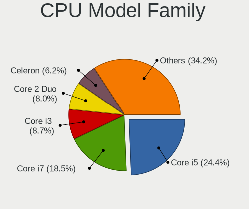

| Model                   | Notebooks | Percent |
|-------------------------|-----------|---------|
| Intel Core i5           | 68        | 25.66%  |
| Intel Core i7           | 41        | 15.47%  |
| Intel Core i3           | 30        | 11.32%  |
| Intel Core 2 Duo        | 21        | 7.92%   |
| Intel Celeron           | 17        | 6.42%   |
| Intel Pentium           | 16        | 6.04%   |
| Intel Atom              | 15        | 5.66%   |
| AMD Ryzen 5             | 8         | 3.02%   |
| Intel Pentium Dual-Core | 4         | 1.51%   |
| Intel Core 2            | 4         | 1.51%   |
| AMD E                   | 4         | 1.51%   |
| Intel Pentium Dual      | 3         | 1.13%   |
| Intel Celeron M         | 3         | 1.13%   |
| AMD Ryzen 7             | 3         | 1.13%   |
| AMD A4                  | 3         | 1.13%   |
| Other                   | 2         | 0.75%   |
| Intel Pentium M         | 2         | 0.75%   |
| AMD Ryzen 3             | 2         | 0.75%   |
| AMD Athlon II           | 2         | 0.75%   |
| AMD Athlon 64 X2        | 2         | 0.75%   |
| AMD A8                  | 2         | 0.75%   |
| AMD A6                  | 2         | 0.75%   |
| Intel Pentium Silver    | 1         | 0.38%   |
| AMD Turion II Dual-Core | 1         | 0.38%   |
| AMD Ryzen 7 PRO         | 1         | 0.38%   |
| AMD Ryzen 5 PRO         | 1         | 0.38%   |
| AMD FX                  | 1         | 0.38%   |
| AMD E2                  | 1         | 0.38%   |
| AMD E1                  | 1         | 0.38%   |
| AMD C-70                | 1         | 0.38%   |
| AMD Athlon II Dual-Core | 1         | 0.38%   |
| AMD A12                 | 1         | 0.38%   |
| AMD A10                 | 1         | 0.38%   |

CPU Cores
---------

Number of processor cores

| Number | Notebooks | Percent |
|--------|-----------|---------|
| 2      | 176       | 66.42%  |
| 4      | 54        | 20.38%  |
| 1      | 16        | 6.04%   |
| 6      | 15        | 5.66%   |
| 8      | 4         | 1.51%   |

CPU Sockets
-----------

Number of sockets

| Number | Notebooks | Percent |
|--------|-----------|---------|
| 1      | 265       | 100%    |

CPU Threads
-----------

Threads per core (Hyper-Threading)

| Number | Notebooks | Percent |
|--------|-----------|---------|
| 2      | 165       | 62.26%  |
| 1      | 100       | 37.74%  |

CPU Op-Modes
------------

CPU Operation Modes (32-bit, 64-bit)

| Op mode        | Notebooks | Percent |
|----------------|-----------|---------|
| 32-bit, 64-bit | 255       | 96.23%  |
| 32-bit         | 10        | 3.77%   |

CPU Microcode
-------------

Microcode number

| Number     | Notebooks | Percent |
|------------|-----------|---------|
| 0x206a7    | 28        | 10.57%  |
| 0x306a9    | 24        | 9.06%   |
| Unknown    | 18        | 6.79%   |
| 0x40651    | 14        | 5.28%   |
| 0x406e3    | 11        | 4.15%   |
| 0x306c3    | 11        | 4.15%   |
| 0x1067a    | 11        | 4.15%   |
| 0x806ea    | 10        | 3.77%   |
| 0x10676    | 10        | 3.77%   |
| 0x20655    | 9         | 3.4%    |
| 0x806e9    | 8         | 3.02%   |
| 0x906ea    | 7         | 2.64%   |
| 0x406c4    | 7         | 2.64%   |
| 0x806ec    | 5         | 1.89%   |
| 0x30678    | 5         | 1.89%   |
| 0x106ca    | 5         | 1.89%   |
| 0x08600106 | 5         | 1.89%   |
| 0x05000119 | 5         | 1.89%   |
| 0x6fd      | 4         | 1.51%   |
| 0x306d4    | 4         | 1.51%   |
| 0x30661    | 4         | 1.51%   |
| 0x6fb      | 3         | 1.13%   |
| 0x6f6      | 3         | 1.13%   |
| 0x106e5    | 3         | 1.13%   |
| 0x106c2    | 3         | 1.13%   |
| 0x08600104 | 3         | 1.13%   |
| 0x07030105 | 3         | 1.13%   |
| 0xa0652    | 2         | 0.75%   |
| 0x806eb    | 2         | 0.75%   |
| 0x706a1    | 2         | 0.75%   |
| 0x6d8      | 2         | 0.75%   |
| 0x695      | 2         | 0.75%   |
| 0x506c9    | 2         | 0.75%   |
| 0x406c3    | 2         | 0.75%   |
| 0x20652    | 2         | 0.75%   |
| 0x08600103 | 2         | 0.75%   |
| 0x08108102 | 2         | 0.75%   |
| 0x07030106 | 2         | 0.75%   |
| 0x0700010f | 2         | 0.75%   |
| 0x06001119 | 2         | 0.75%   |
| 0x010000c8 | 2         | 0.75%   |
| 0x906ed    | 1         | 0.38%   |
| 0x806c1    | 1         | 0.38%   |
| 0x706e5    | 1         | 0.38%   |
| 0x6f2      | 1         | 0.38%   |
| 0x6e8      | 1         | 0.38%   |
| 0x506e3    | 1         | 0.38%   |
| 0x30673    | 1         | 0.38%   |
| 0x10661    | 1         | 0.38%   |
| 0x08108109 | 1         | 0.38%   |
| 0x08101007 | 1         | 0.38%   |
| 0x06006705 | 1         | 0.38%   |
| 0x06006118 | 1         | 0.38%   |
| 0x06003106 | 1         | 0.38%   |
| 0x03000027 | 1         | 0.38%   |

CPU Microarch
-------------

Microarchitecture

| Name          | Notebooks | Percent |
|---------------|-----------|---------|
| KabyLake      | 35        | 13.21%  |
| SandyBridge   | 29        | 10.94%  |
| IvyBridge     | 26        | 9.81%   |
| Haswell       | 26        | 9.81%   |
| Penryn        | 21        | 7.92%   |
| Silvermont    | 15        | 5.66%   |
| Westmere      | 13        | 4.91%   |
| Skylake       | 13        | 4.91%   |
| Core          | 12        | 4.53%   |
| Bonnell       | 12        | 4.53%   |
| Zen 2         | 10        | 3.77%   |
| Puma          | 5         | 1.89%   |
| P6            | 5         | 1.89%   |
| Broadwell     | 5         | 1.89%   |
| Bobcat        | 5         | 1.89%   |
| Zen+          | 4         | 1.51%   |
| Nehalem       | 4         | 1.51%   |
| K10           | 4         | 1.51%   |
| Goldmont      | 3         | 1.13%   |
| Piledriver    | 2         | 0.75%   |
| K8 Hammer     | 2         | 0.75%   |
| Jaguar        | 2         | 0.75%   |
| IceLake       | 2         | 0.75%   |
| Goldmont plus | 2         | 0.75%   |
| Excavator     | 2         | 0.75%   |
| CometLake     | 2         | 0.75%   |
| Zen           | 1         | 0.38%   |
| TigerLake     | 1         | 0.38%   |
| Steamroller   | 1         | 0.38%   |
| K10 Llano     | 1         | 0.38%   |

GPU Vendor
----------

Vendors of graphics cards

| Vendor                           | Notebooks | Percent |
|----------------------------------|-----------|---------|
| Intel                            | 202       | 63.32%  |
| AMD                              | 61        | 19.12%  |
| Nvidia                           | 54        | 16.93%  |
| Silicon Integrated Systems [SiS] | 2         | 0.63%   |

GPU Model
---------

Graphics card models

| Model                                                                                    | Notebooks | Percent |
|------------------------------------------------------------------------------------------|-----------|---------|
| Intel 2nd Generation Core Processor Family Integrated Graphics Controller                | 29        | 8.5%    |
| Intel 3rd Gen Core processor Graphics Controller                                         | 24        | 7.04%   |
| Intel Haswell-ULT Integrated Graphics Controller                                         | 14        | 4.11%   |
| Intel Skylake GT2 [HD Graphics 520]                                                      | 12        | 3.52%   |
| Intel Mobile GM965/GL960 Integrated Graphics Controller (secondary)                      | 12        | 3.52%   |
| Intel Mobile GM965/GL960 Integrated Graphics Controller (primary)                        | 12        | 3.52%   |
| Intel Core Processor Integrated Graphics Controller                                      | 12        | 3.52%   |
| Intel 4th Gen Core Processor Integrated Graphics Controller                              | 12        | 3.52%   |
| Intel UHD Graphics 620                                                                   | 10        | 2.93%   |
| AMD Renoir                                                                               | 10        | 2.93%   |
| Intel Atom/Celeron/Pentium Processor x5-E8000/J3xxx/N3xxx Integrated Graphics Controller | 9         | 2.64%   |
| Intel HD Graphics 620                                                                    | 7         | 2.05%   |
| Intel Mobile 4 Series Chipset Integrated Graphics Controller                             | 6         | 1.76%   |
| Intel CoffeeLake-H GT2 [UHD Graphics 630]                                                | 6         | 1.76%   |
| Intel Atom Processor Z36xxx/Z37xxx Series Graphics & Display                             | 6         | 1.76%   |
| Nvidia GP108M [GeForce MX150]                                                            | 5         | 1.47%   |
| Nvidia GF117M [GeForce 610M/710M/810M/820M / GT 620M/625M/630M/720M]                     | 5         | 1.47%   |
| Intel Mobile 945GM/GMS/GME, 943/940GML Express Integrated Graphics Controller            | 5         | 1.47%   |
| Intel Atom Processor D4xx/D5xx/N4xx/N5xx Integrated Graphics Controller                  | 5         | 1.47%   |
| Intel WhiskeyLake-U GT2 [UHD Graphics 620]                                               | 4         | 1.17%   |
| Intel HD Graphics 5500                                                                   | 4         | 1.17%   |
| Intel CometLake-U GT2 [UHD Graphics]                                                     | 4         | 1.17%   |
| Intel Atom Processor D2xxx/N2xxx Integrated Graphics Controller                          | 4         | 1.17%   |
| AMD Thames [Radeon HD 7500M/7600M Series]                                                | 4         | 1.17%   |
| AMD Picasso                                                                              | 4         | 1.17%   |
| Nvidia TU117M [GeForce GTX 1650 Mobile / Max-Q]                                          | 3         | 0.88%   |
| Nvidia GM108M [GeForce 930M]                                                             | 3         | 0.88%   |
| Intel Mobile 945GM/GMS, 943/940GML Express Integrated Graphics Controller                | 3         | 0.88%   |
| Intel HD Graphics 500                                                                    | 3         | 0.88%   |
| AMD Park [Mobility Radeon HD 5430/5450/5470]                                             | 3         | 0.88%   |
| Silicon Integrated Systems [SiS] 771/671 PCIE VGA Display Adapter                        | 2         | 0.59%   |
| Nvidia TU116M [GeForce GTX 1660 Ti Mobile]                                               | 2         | 0.59%   |
| Nvidia TU106M [GeForce RTX 2060 Mobile]                                                  | 2         | 0.59%   |
| Nvidia GT218M [GeForce 310M]                                                             | 2         | 0.59%   |
| Nvidia GT216M [GeForce GT 330M]                                                          | 2         | 0.59%   |
| Nvidia GM108M [GeForce MX110]                                                            | 2         | 0.59%   |
| Nvidia GK208M [GeForce GT 740M]                                                          | 2         | 0.59%   |
| Intel Mobile 945GSE Express Integrated Graphics Controller                               | 2         | 0.59%   |
| Intel Mobile 915GM/GMS/910GML Express Graphics Controller                                | 2         | 0.59%   |
| AMD Wrestler [Radeon HD 6320]                                                            | 2         | 0.59%   |
| AMD Topaz XT [Radeon R7 M260/M265 / M340/M360 / M440/M445 / 530/535 / 620/625 Mobile]    | 2         | 0.59%   |
| AMD Sun XT [Radeon HD 8670A/8670M/8690M / R5 M330 / M430 / Radeon 520 Mobile]            | 2         | 0.59%   |
| AMD Seymour [Radeon HD 6400M/7400M Series]                                               | 2         | 0.59%   |
| AMD Mullins [Radeon R4/R5 Graphics]                                                      | 2         | 0.59%   |
| AMD Mullins [Radeon R2 Graphics]                                                         | 2         | 0.59%   |
| AMD Madison [Mobility Radeon HD 5730 / 6570M]                                            | 2         | 0.59%   |
| AMD Jet PRO [Radeon R5 M230 / R7 M260DX / Radeon 520 Mobile]                             | 2         | 0.59%   |
| Nvidia TU106M [GeForce RTX 2070 Mobile / Max-Q Refresh]                                  | 1         | 0.29%   |
| Nvidia GT218M [NVS 3100M]                                                                | 1         | 0.29%   |
| Nvidia GT216M [GeForce GT 240M]                                                          | 1         | 0.29%   |
| Nvidia GT216GLM [Quadro FX 880M]                                                         | 1         | 0.29%   |
| Nvidia GP108M [GeForce MX230]                                                            | 1         | 0.29%   |
| Nvidia GP107M [GeForce GTX 1050 Ti Mobile]                                               | 1         | 0.29%   |
| Nvidia GP107M [GeForce GTX 1050 3 GB Max-Q]                                              | 1         | 0.29%   |
| Nvidia GM108M [GeForce 930MX]                                                            | 1         | 0.29%   |
| Nvidia GM108M [GeForce 840M]                                                             | 1         | 0.29%   |
| Nvidia GM107M [GeForce GTX 960M]                                                         | 1         | 0.29%   |
| Nvidia GM107M [GeForce GTX 860M]                                                         | 1         | 0.29%   |
| Nvidia GM107M [GeForce GTX 850M]                                                         | 1         | 0.29%   |
| Nvidia GK107M [GeForce GTX 660M]                                                         | 1         | 0.29%   |

GPU Combo
---------

Combinations of graphics cards

| Name           | Notebooks | Percent |
|----------------|-----------|---------|
| 1 x Intel      | 148       | 55.85%  |
| 1 x AMD        | 43        | 16.23%  |
| Intel + Nvidia | 40        | 15.09%  |
| 1 x Nvidia     | 14        | 5.28%   |
| Intel + AMD    | 13        | 4.91%   |
| 2 x AMD        | 5         | 1.89%   |
| 1 x SiS        | 2         | 0.75%   |

GPU Driver
----------

Free vs proprietary

| Driver      | Notebooks | Percent |
|-------------|-----------|---------|
| Free        | 232       | 87.55%  |
| Proprietary | 25        | 9.43%   |
| Unknown     | 8         | 3.02%   |

GPU Memory
----------

Total video memory

| Size in GB | Notebooks | Percent |
|------------|-----------|---------|
| Unknown    | 168       | 63.4%   |
| 0.01-0.5   | 39        | 14.72%  |
| 1.01-2.0   | 28        | 10.57%  |
| 0.51-1.0   | 21        | 7.92%   |
| 3.01-4.0   | 6         | 2.26%   |
| 7.01-8.0   | 1         | 0.38%   |
| 5.01-6.0   | 1         | 0.38%   |
| 2.01-3.0   | 1         | 0.38%   |

Monitor Vendor
--------------

Monitor vendors

| Vendor                  | Notebooks | Percent |
|-------------------------|-----------|---------|
| AU Optronics            | 60        | 21.9%   |
| LG Display              | 43        | 15.69%  |
| BOE                     | 33        | 12.04%  |
| Chimei Innolux          | 30        | 10.95%  |
| Samsung Electronics     | 26        | 9.49%   |
| Apple                   | 9         | 3.28%   |
| AOC                     | 6         | 2.19%   |
| Sony                    | 5         | 1.82%   |
| LG Philips              | 5         | 1.82%   |
| InfoVision              | 5         | 1.82%   |
| Chi Mei Optoelectronics | 5         | 1.82%   |
| Sharp                   | 4         | 1.46%   |
| Lenovo                  | 4         | 1.46%   |
| Goldstar                | 4         | 1.46%   |
| Dell                    | 4         | 1.46%   |
| Acer                    | 4         | 1.46%   |
| InnoLux Display         | 3         | 1.09%   |
| CPT                     | 3         | 1.09%   |
| Vestel Elektronik       | 2         | 0.73%   |
| Toshiba                 | 2         | 0.73%   |
| Philips                 | 2         | 0.73%   |
| Hewlett-Packard         | 2         | 0.73%   |
| Seiko/Epson             | 1         | 0.36%   |
| Seiki                   | 1         | 0.36%   |
| PANDA                   | 1         | 0.36%   |
| ONN                     | 1         | 0.36%   |
| LGD                     | 1         | 0.36%   |
| KDC                     | 1         | 0.36%   |
| JDI                     | 1         | 0.36%   |
| IBM                     | 1         | 0.36%   |
| HannStar                | 1         | 0.36%   |
| Eizo                    | 1         | 0.36%   |
| DMT                     | 1         | 0.36%   |
| CVT                     | 1         | 0.36%   |
| BenQ                    | 1         | 0.36%   |

Monitor Model
-------------

Monitor models

| Model                                                                  | Notebooks | Percent |
|------------------------------------------------------------------------|-----------|---------|
| Samsung Electronics LCD Monitor SEC5441 1366x768 344x194mm 15.5-inch   | 5         | 1.81%   |
| LG Display LCD Monitor LGD02DC 1366x768 344x194mm 15.5-inch            | 4         | 1.45%   |
| AU Optronics LCD Monitor AUO26EC 1366x768 344x193mm 15.5-inch          | 4         | 1.45%   |
| InfoVision LCD Monitor IVO03F4 1920x1200 263x164mm 12.2-inch           | 3         | 1.09%   |
| BOE LCD Monitor BOE0696 1366x768 309x173mm 13.9-inch                   | 3         | 1.09%   |
| AU Optronics LCD Monitor AUO403D 1920x1080 309x173mm 13.9-inch         | 3         | 1.09%   |
| AU Optronics LCD Monitor AUO139E 1600x900 382x214mm 17.2-inch          | 3         | 1.09%   |
| Vestel Elektronik 50UHD_LCD_TV VES3700 3840x2160 1872x1053mm 84.6-inch | 2         | 0.72%   |
| Samsung Electronics LCD Monitor SEC3451 1366x768 344x194mm 15.5-inch   | 2         | 0.72%   |
| LG Display LCD Monitor LGD045E 1366x768 309x174mm 14.0-inch            | 2         | 0.72%   |
| LG Display LCD Monitor LGD0354 1366x768 293x165mm 13.2-inch            | 2         | 0.72%   |
| Chimei Innolux LCD Monitor CMN1728 1600x900 382x215mm 17.3-inch        | 2         | 0.72%   |
| Chimei Innolux LCD Monitor CMN15C3 1920x1080 340x190mm 15.3-inch       | 2         | 0.72%   |
| Chimei Innolux LCD Monitor CMN14D6 1366x768 309x173mm 13.9-inch        | 2         | 0.72%   |
| Chimei Innolux LCD Monitor CMN1493 1366x768 310x170mm 13.9-inch        | 2         | 0.72%   |
| Chimei Innolux LCD Monitor CMN1469 1366x768 309x174mm 14.0-inch        | 2         | 0.72%   |
| Chimei Innolux LCD Monitor CMN1118 1366x768 256x144mm 11.6-inch        | 2         | 0.72%   |
| BOE LCD Monitor BOE0718 1920x1080 309x173mm 13.9-inch                  | 2         | 0.72%   |
| AU Optronics LCD Monitor AUO71EC 1366x768 340x190mm 15.3-inch          | 2         | 0.72%   |
| AU Optronics LCD Monitor AUO45EC 1366x768 340x190mm 15.3-inch          | 2         | 0.72%   |
| AU Optronics LCD Monitor AUO42EC 1366x768 340x190mm 15.3-inch          | 2         | 0.72%   |
| AU Optronics LCD Monitor AUO405C 1366x768 256x144mm 11.6-inch          | 2         | 0.72%   |
| AU Optronics LCD Monitor AUO38ED 1920x1080 340x190mm 15.3-inch         | 2         | 0.72%   |
| AU Optronics LCD Monitor AUO21ED 1920x1080 344x194mm 15.5-inch         | 2         | 0.72%   |
| AU Optronics LCD Monitor AUO21EC 1366x768 340x190mm 15.3-inch          | 2         | 0.72%   |
| AU Optronics LCD Monitor AUO106C 1366x768 277x156mm 12.5-inch          | 2         | 0.72%   |
| AU Optronics LCD Monitor AUO1036 2560x1440 309x174mm 14.0-inch         | 2         | 0.72%   |
| Apple Color LCD APP9C5B 1280x800 290x180mm 13.4-inch                   | 2         | 0.72%   |
| AOC 2460 AOC2460 1920x1080 531x299mm 24.0-inch                         | 2         | 0.72%   |
| Acer AL1717 A ACRAD46 1280x1024 338x270mm 17.0-inch                    | 2         | 0.72%   |
| Toshiba TV TSB0108 1920x1080 890x500mm 40.2-inch                       | 1         | 0.36%   |
| Toshiba ScreenXpert TSB8888 1080x2160                                  | 1         | 0.36%   |
| Sony TV SNYDB01 1920x1080 1600x900mm 72.3-inch                         | 1         | 0.36%   |
| Sony TV SNY4B03 1920x1080 1110x620mm 50.1-inch                         | 1         | 0.36%   |
| Sony TV SNY020D 1600x1200 1600x900mm 72.3-inch                         | 1         | 0.36%   |
| Sony SDM-HS95P SNY2500 1280x1024 376x301mm 19.0-inch                   | 1         | 0.36%   |
| Sony AVAMP SNY9201 1920x1080 698x392mm 31.5-inch                       | 1         | 0.36%   |
| Sharp LCD Monitor SHP149A 1920x1080 344x194mm 15.5-inch                | 1         | 0.36%   |
| Sharp LCD Monitor SHP1453 1920x1080 346x194mm 15.6-inch                | 1         | 0.36%   |
| Sharp LCD Monitor SHP144A 3200x1800 294x165mm 13.3-inch                | 1         | 0.36%   |
| Sharp LCD Monitor SHP1447 1920x1080 290x170mm 13.2-inch                | 1         | 0.36%   |
| Seiko/Epson LCD Monitor 1366x768                                       | 1         | 0.36%   |
| Seiki SE29HY34 SEK9333 1366x768 700x390mm 31.5-inch                    | 1         | 0.36%   |
| Samsung Electronics T24E390 SAM0C1F 1920x1080 521x293mm 23.5-inch      | 1         | 0.36%   |
| Samsung Electronics LCD Monitor SEC4D45 1280x800 331x207mm 15.4-inch   | 1         | 0.36%   |
| Samsung Electronics LCD Monitor SEC4542 1280x800 303x190mm 14.1-inch   | 1         | 0.36%   |
| Samsung Electronics LCD Monitor SEC3953 1366x768 256x144mm 11.6-inch   | 1         | 0.36%   |
| Samsung Electronics LCD Monitor SEC384A 1366x768 344x194mm 15.5-inch   | 1         | 0.36%   |
| Samsung Electronics LCD Monitor SEC3741 1280x800 331x207mm 15.4-inch   | 1         | 0.36%   |
| Samsung Electronics LCD Monitor SEC364A 1366x768 344x194mm 15.5-inch   | 1         | 0.36%   |
| Samsung Electronics LCD Monitor SEC3642 1366x768 344x194mm 15.5-inch   | 1         | 0.36%   |
| Samsung Electronics LCD Monitor SEC3641 1366x768 353x198mm 15.9-inch   | 1         | 0.36%   |
| Samsung Electronics LCD Monitor SEC3358 1280x800 331x207mm 15.4-inch   | 1         | 0.36%   |
| Samsung Electronics LCD Monitor SEC3041 1366x768 353x198mm 15.9-inch   | 1         | 0.36%   |
| Samsung Electronics LCD Monitor SEC3030 1024x600 223x125mm 10.1-inch   | 1         | 0.36%   |
| Samsung Electronics LCD Monitor SDC8B4F 1920x1080 344x194mm 15.5-inch  | 1         | 0.36%   |
| Samsung Electronics LCD Monitor SDC4C48 1920x1080 409x230mm 18.5-inch  | 1         | 0.36%   |
| Samsung Electronics LCD Monitor SDC4147 1366x768 344x194mm 15.5-inch   | 1         | 0.36%   |
| Samsung Electronics LCD Monitor SDC4141 1366x768 340x190mm 15.3-inch   | 1         | 0.36%   |
| Samsung Electronics LCD Monitor SDC3754 1600x900 382x215mm 17.3-inch   | 1         | 0.36%   |

Monitor Resolution
------------------

Monitor screen resolution

| Resolution         | Notebooks | Percent |
|--------------------|-----------|---------|
| 1366x768 (WXGA)    | 115       | 43.89%  |
| 1920x1080 (FHD)    | 71        | 27.1%   |
| 1600x900 (HD+)     | 18        | 6.87%   |
| 1280x800 (WXGA)    | 16        | 6.11%   |
| 1440x900 (WXGA+)   | 7         | 2.67%   |
| 2560x1440 (QHD)    | 5         | 1.91%   |
| 1920x1200 (WUXGA)  | 5         | 1.91%   |
| 1024x600           | 5         | 1.91%   |
| 3840x2160 (4K)     | 4         | 1.53%   |
| 1680x1050 (WSXGA+) | 3         | 1.15%   |
| 1280x1024 (SXGA)   | 3         | 1.15%   |
| 1360x768           | 2         | 0.76%   |
| 3200x1800 (QHD+)   | 1         | 0.38%   |
| 3000x2000          | 1         | 0.38%   |
| 2880x1800          | 1         | 0.38%   |
| 2560x1600          | 1         | 0.38%   |
| 1920x540           | 1         | 0.38%   |
| 1600x1200          | 1         | 0.38%   |
| 1080x2160          | 1         | 0.38%   |
| Unknown            | 1         | 0.38%   |

Monitor Diagonal
----------------

Diagonal size in inches

| Inches  | Notebooks | Percent |
|---------|-----------|---------|
| 15      | 104       | 37.96%  |
| 13      | 43        | 15.69%  |
| 14      | 38        | 13.87%  |
| 17      | 23        | 8.39%   |
| 11      | 12        | 4.38%   |
| 12      | 7         | 2.55%   |
| 24      | 6         | 2.19%   |
| 18      | 5         | 1.82%   |
| 10      | 5         | 1.82%   |
| 23      | 4         | 1.46%   |
| 72      | 3         | 1.09%   |
| 31      | 3         | 1.09%   |
| 27      | 3         | 1.09%   |
| 22      | 3         | 1.09%   |
| Unknown | 3         | 1.09%   |
| 84      | 2         | 0.73%   |
| 19      | 2         | 0.73%   |
| 65      | 1         | 0.36%   |
| 54      | 1         | 0.36%   |
| 50      | 1         | 0.36%   |
| 46      | 1         | 0.36%   |
| 32      | 1         | 0.36%   |
| 26      | 1         | 0.36%   |
| 21      | 1         | 0.36%   |
| 5       | 1         | 0.36%   |

Monitor Width
-------------

Physical width

| Width in mm | Notebooks | Percent |
|-------------|-----------|---------|
| 301-350     | 163       | 59.49%  |
| 201-300     | 41        | 14.96%  |
| 351-400     | 29        | 10.58%  |
| 501-600     | 14        | 5.11%   |
| 401-500     | 10        | 3.65%   |
| 1501-2000   | 5         | 1.82%   |
| 1001-1500   | 4         | 1.46%   |
| 601-700     | 3         | 1.09%   |
| Unknown     | 3         | 1.09%   |
| 701-800     | 1         | 0.36%   |
| 1-100       | 1         | 0.36%   |

Aspect Ratio
------------

Proportional relationship between the width and the height

| Ratio   | Notebooks | Percent |
|---------|-----------|---------|
| 16/9    | 209       | 82.28%  |
| 16/10   | 36        | 14.17%  |
| 5/4     | 3         | 1.18%   |
| Unknown | 3         | 1.18%   |
| 3/2     | 2         | 0.79%   |
| 0.46    | 1         | 0.39%   |

Monitor Area
------------

Area in inch²

| Area in inch² | Notebooks | Percent |
|----------------|-----------|---------|
| 101-110        | 103       | 37.59%  |
| 81-90          | 70        | 25.55%  |
| 121-130        | 16        | 5.84%   |
| 51-60          | 12        | 4.38%   |
| 71-80          | 11        | 4.01%   |
| 201-250        | 11        | 4.01%   |
| More than 1000 | 8         | 2.92%   |
| 61-70          | 7         | 2.55%   |
| 41-50          | 5         | 1.82%   |
| 151-200        | 5         | 1.82%   |
| 131-140        | 5         | 1.82%   |
| 351-500        | 4         | 1.46%   |
| 251-300        | 4         | 1.46%   |
| 141-150        | 4         | 1.46%   |
| 301-350        | 3         | 1.09%   |
| Unknown        | 3         | 1.09%   |
| 1-40           | 1         | 0.36%   |
| 111-120        | 1         | 0.36%   |
| 501-1000       | 1         | 0.36%   |

Pixel Density
-------------

Pixels per inch

| Density       | Notebooks | Percent |
|---------------|-----------|---------|
| 101-120       | 120       | 44.44%  |
| 121-160       | 77        | 28.52%  |
| 51-100        | 45        | 16.67%  |
| 161-240       | 11        | 4.07%   |
| 1-50          | 10        | 3.7%    |
| More than 240 | 4         | 1.48%   |
| Unknown       | 3         | 1.11%   |

Multiple Monitors
-----------------

Total monitors connected

| Total | Notebooks | Percent |
|-------|-----------|---------|
| 1     | 222       | 83.77%  |
| 2     | 33        | 12.45%  |
| 0     | 8         | 3.02%   |
| 3     | 2         | 0.75%   |

Net Controller Vendor
---------------------

Controller vendors

| Vendor                            | Notebooks | Percent |
|-----------------------------------|-----------|---------|
| Realtek Semiconductor             | 137       | 31.14%  |
| Intel                             | 110       | 25%     |
| Qualcomm Atheros                  | 84        | 19.09%  |
| Broadcom Inc. and subsidiaries    | 37        | 8.41%   |
| Marvell Technology Group          | 12        | 2.73%   |
| Ralink                            | 9         | 2.05%   |
| Broadcom Limited                  | 6         | 1.36%   |
| Dell                              | 5         | 1.14%   |
| Broadcom                          | 5         | 1.14%   |
| Ralink Technology                 | 4         | 0.91%   |
| Xiaomi                            | 2         | 0.45%   |
| Silicon Integrated Systems [SiS]  | 2         | 0.45%   |
| Sierra Wireless                   | 2         | 0.45%   |
| Samsung Electronics               | 2         | 0.45%   |
| Nvidia                            | 2         | 0.45%   |
| Motorola PCS                      | 2         | 0.45%   |
| JMicron Technology                | 2         | 0.45%   |
| Hewlett-Packard                   | 2         | 0.45%   |
| TP-Link                           | 1         | 0.23%   |
| Qualcomm Atheros Communications   | 1         | 0.23%   |
| Qualcomm                          | 1         | 0.23%   |
| MEDIATEK                          | 1         | 0.23%   |
| Linksys                           | 1         | 0.23%   |
| LG Electronics                    | 1         | 0.23%   |
| Huawei Technologies               | 1         | 0.23%   |
| Gemtek                            | 1         | 0.23%   |
| Fibocom                           | 1         | 0.23%   |
| Ericsson Business Mobile Networks | 1         | 0.23%   |
| Edimax Technology                 | 1         | 0.23%   |
| Belkin Components                 | 1         | 0.23%   |
| Attansic Technology               | 1         | 0.23%   |
| ASUSTek Computer                  | 1         | 0.23%   |
| Apple                             | 1         | 0.23%   |

Net Controller Model
--------------------

Controller models

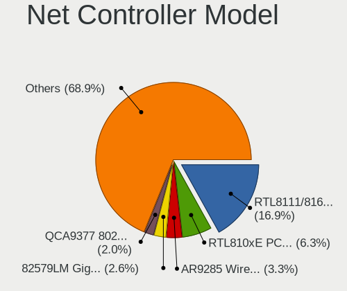

| Model                                                                          | Notebooks | Percent |
|--------------------------------------------------------------------------------|-----------|---------|
| Realtek RTL8111/8168/8411 PCI Express Gigabit Ethernet Controller              | 65        | 12.57%  |
| Realtek RTL810xE PCI Express Fast Ethernet controller                          | 40        | 7.74%   |
| Qualcomm Atheros AR9285 Wireless Network Adapter (PCI-Express)                 | 20        | 3.87%   |
| Qualcomm Atheros AR9485 Wireless Network Adapter                               | 18        | 3.48%   |
| Intel 82579LM Gigabit Network Connection (Lewisville)                          | 13        | 2.51%   |
| Intel Wireless 8265 / 8275                                                     | 12        | 2.32%   |
| Qualcomm Atheros QCA9377 802.11ac Wireless Network Adapter                     | 10        | 1.93%   |
| Intel Wireless 7260                                                            | 9         | 1.74%   |
| Intel Centrino Advanced-N 6205 [Taylor Peak]                                   | 9         | 1.74%   |
| Qualcomm Atheros QCA9565 / AR9565 Wireless Network Adapter                     | 8         | 1.55%   |
| Realtek RTL8821CE 802.11ac PCIe Wireless Network Adapter                       | 7         | 1.35%   |
| Qualcomm Atheros AR8131 Gigabit Ethernet                                       | 7         | 1.35%   |
| Intel Wi-Fi 6 AX200                                                            | 7         | 1.35%   |
| Realtek RTL8188CE 802.11b/g/n WiFi Adapter                                     | 6         | 1.16%   |
| Realtek RTL8153 Gigabit Ethernet Adapter                                       | 6         | 1.16%   |
| Ralink RT3290 Wireless 802.11n 1T/1R PCIe                                      | 6         | 1.16%   |
| Qualcomm Atheros AR8151 v2.0 Gigabit Ethernet                                  | 6         | 1.16%   |
| Qualcomm Atheros AR242x / AR542x Wireless Network Adapter (PCI-Express)        | 6         | 1.16%   |
| Intel PRO/Wireless 3945ABG [Golan] Network Connection                          | 6         | 1.16%   |
| Broadcom Inc. and subsidiaries BCM43142 802.11b/g/n                            | 6         | 1.16%   |
| Broadcom Inc. and subsidiaries BCM4313 802.11bgn Wireless Network Adapter      | 6         | 1.16%   |
| Realtek RTL8822CE 802.11ac PCIe Wireless Network Adapter                       | 5         | 0.97%   |
| Intel Wireless 8260                                                            | 5         | 0.97%   |
| Intel Wireless 7265                                                            | 5         | 0.97%   |
| Broadcom Inc. and subsidiaries NetLink BCM57785 Gigabit Ethernet PCIe          | 5         | 0.97%   |
| Realtek RTL-8100/8101L/8139 PCI Fast Ethernet Adapter                          | 4         | 0.77%   |
| Qualcomm Atheros AR9462 Wireless Network Adapter                               | 4         | 0.77%   |
| Intel Wireless-AC 9560 [Jefferson Peak]                                        | 4         | 0.77%   |
| Intel PRO/Wireless 4965 AG or AGN [Kedron] Network Connection                  | 4         | 0.77%   |
| Intel Ethernet Connection I219-LM                                              | 4         | 0.77%   |
| Intel 82577LM Gigabit Network Connection                                       | 4         | 0.77%   |
| Realtek RTL8822BE 802.11a/b/g/n/ac WiFi adapter                                | 3         | 0.58%   |
| Realtek RTL8723BE PCIe Wireless Network Adapter                                | 3         | 0.58%   |
| Qualcomm Atheros AR8152 v2.0 Fast Ethernet                                     | 3         | 0.58%   |
| Marvell Group 88E8058 PCI-E Gigabit Ethernet Controller                        | 3         | 0.58%   |
| Intel Wireless 3165                                                            | 3         | 0.58%   |
| Intel Wireless 3160                                                            | 3         | 0.58%   |
| Intel Ethernet Connection I217-LM                                              | 3         | 0.58%   |
| Intel Centrino Wireless-N 2230                                                 | 3         | 0.58%   |
| Intel Centrino Wireless-N 1030 [Rainbow Peak]                                  | 3         | 0.58%   |
| Intel Centrino Advanced-N 6235                                                 | 3         | 0.58%   |
| Intel Centrino Advanced-N 6200                                                 | 3         | 0.58%   |
| Broadcom Inc. and subsidiaries BCM4321 802.11a/b/g/n                           | 3         | 0.58%   |
| Silicon Integrated Systems [SiS] 191 Gigabit Ethernet Adapter                  | 2         | 0.39%   |
| Samsung Galaxy series, misc. (tethering mode)                                  | 2         | 0.39%   |
| Realtek RTL8723DE Wireless Network Adapter                                     | 2         | 0.39%   |
| Realtek RTL8191SEvB Wireless LAN Controller                                    | 2         | 0.39%   |
| Realtek RTL8188EE Wireless Network Adapter                                     | 2         | 0.39%   |
| Realtek RTL8187SE Wireless LAN Controller                                      | 2         | 0.39%   |
| Realtek Killer E3000 2.5GbE Controller                                         | 2         | 0.39%   |
| Realtek 802.11ac NIC                                                           | 2         | 0.39%   |
| Ralink RT2870/RT3070 Wireless Adapter                                          | 2         | 0.39%   |
| Ralink RT3090 Wireless 802.11n 1T/1R PCIe                                      | 2         | 0.39%   |
| Qualcomm Atheros QCA6174 802.11ac Wireless Network Adapter                     | 2         | 0.39%   |
| Qualcomm Atheros AR928X Wireless Network Adapter (PCI-Express)                 | 2         | 0.39%   |
| Qualcomm Atheros AR9287 Wireless Network Adapter (PCI-Express)                 | 2         | 0.39%   |
| Qualcomm Atheros AR8132 Fast Ethernet                                          | 2         | 0.39%   |
| Motorola PCS Moto G (5)                                                        | 2         | 0.39%   |
| Marvell Group Yukon Optima 88E8059 [PCIe Gigabit Ethernet Controller with AVB] | 2         | 0.39%   |
| Marvell Group 88E8040 PCI-E Fast Ethernet Controller                           | 2         | 0.39%   |

Wireless Vendor
---------------

Wireless vendors

| Vendor                          | Notebooks | Percent |
|---------------------------------|-----------|---------|
| Intel                           | 103       | 37.59%  |
| Qualcomm Atheros                | 74        | 27.01%  |
| Realtek Semiconductor           | 40        | 14.6%   |
| Broadcom Inc. and subsidiaries  | 26        | 9.49%   |
| Ralink                          | 9         | 3.28%   |
| Ralink Technology               | 4         | 1.46%   |
| Broadcom Limited                | 4         | 1.46%   |
| Sierra Wireless                 | 2         | 0.73%   |
| Dell                            | 2         | 0.73%   |
| Broadcom                        | 2         | 0.73%   |
| Xiaomi                          | 1         | 0.36%   |
| TP-Link                         | 1         | 0.36%   |
| Qualcomm Atheros Communications | 1         | 0.36%   |
| MEDIATEK                        | 1         | 0.36%   |
| Fibocom                         | 1         | 0.36%   |
| Edimax Technology               | 1         | 0.36%   |
| Belkin Components               | 1         | 0.36%   |
| ASUSTek Computer                | 1         | 0.36%   |

Wireless Model
--------------

Wireless models

| Model                                                                     | Notebooks | Percent |
|---------------------------------------------------------------------------|-----------|---------|
| Qualcomm Atheros AR9285 Wireless Network Adapter (PCI-Express)            | 20        | 7.25%   |
| Qualcomm Atheros AR9485 Wireless Network Adapter                          | 18        | 6.52%   |
| Intel Wireless 8265 / 8275                                                | 12        | 4.35%   |
| Qualcomm Atheros QCA9377 802.11ac Wireless Network Adapter                | 10        | 3.62%   |
| Intel Wireless 7260                                                       | 9         | 3.26%   |
| Intel Centrino Advanced-N 6205 [Taylor Peak]                              | 9         | 3.26%   |
| Qualcomm Atheros QCA9565 / AR9565 Wireless Network Adapter                | 8         | 2.9%    |
| Realtek RTL8821CE 802.11ac PCIe Wireless Network Adapter                  | 7         | 2.54%   |
| Intel Wi-Fi 6 AX200                                                       | 7         | 2.54%   |
| Realtek RTL8188CE 802.11b/g/n WiFi Adapter                                | 6         | 2.17%   |
| Ralink RT3290 Wireless 802.11n 1T/1R PCIe                                 | 6         | 2.17%   |
| Qualcomm Atheros AR242x / AR542x Wireless Network Adapter (PCI-Express)   | 6         | 2.17%   |
| Intel PRO/Wireless 3945ABG [Golan] Network Connection                     | 6         | 2.17%   |
| Broadcom Inc. and subsidiaries BCM43142 802.11b/g/n                       | 6         | 2.17%   |
| Broadcom Inc. and subsidiaries BCM4313 802.11bgn Wireless Network Adapter | 6         | 2.17%   |
| Realtek RTL8822CE 802.11ac PCIe Wireless Network Adapter                  | 5         | 1.81%   |
| Intel Wireless 8260                                                       | 5         | 1.81%   |
| Intel Wireless 7265                                                       | 5         | 1.81%   |
| Qualcomm Atheros AR9462 Wireless Network Adapter                          | 4         | 1.45%   |
| Intel Wireless-AC 9560 [Jefferson Peak]                                   | 4         | 1.45%   |
| Intel PRO/Wireless 4965 AG or AGN [Kedron] Network Connection             | 4         | 1.45%   |
| Realtek RTL8822BE 802.11a/b/g/n/ac WiFi adapter                           | 3         | 1.09%   |
| Realtek RTL8723BE PCIe Wireless Network Adapter                           | 3         | 1.09%   |
| Intel Wireless 3165                                                       | 3         | 1.09%   |
| Intel Wireless 3160                                                       | 3         | 1.09%   |
| Intel Centrino Wireless-N 2230                                            | 3         | 1.09%   |
| Intel Centrino Wireless-N 1030 [Rainbow Peak]                             | 3         | 1.09%   |
| Intel Centrino Advanced-N 6235                                            | 3         | 1.09%   |
| Intel Centrino Advanced-N 6200                                            | 3         | 1.09%   |
| Broadcom Inc. and subsidiaries BCM4321 802.11a/b/g/n                      | 3         | 1.09%   |
| Realtek RTL8723DE Wireless Network Adapter                                | 2         | 0.72%   |
| Realtek RTL8191SEvB Wireless LAN Controller                               | 2         | 0.72%   |
| Realtek RTL8188EE Wireless Network Adapter                                | 2         | 0.72%   |
| Realtek RTL8187SE Wireless LAN Controller                                 | 2         | 0.72%   |
| Realtek 802.11ac NIC                                                      | 2         | 0.72%   |
| Ralink RT2870/RT3070 Wireless Adapter                                     | 2         | 0.72%   |
| Ralink RT3090 Wireless 802.11n 1T/1R PCIe                                 | 2         | 0.72%   |
| Qualcomm Atheros QCA6174 802.11ac Wireless Network Adapter                | 2         | 0.72%   |
| Qualcomm Atheros AR928X Wireless Network Adapter (PCI-Express)            | 2         | 0.72%   |
| Qualcomm Atheros AR9287 Wireless Network Adapter (PCI-Express)            | 2         | 0.72%   |
| Intel WiFi Link 5100                                                      | 2         | 0.72%   |
| Intel Killer Wi-Fi 6 AX1650i 160MHz Wireless Network Adapter (201NGW)     | 2         | 0.72%   |
| Intel Comet Lake PCH-LP CNVi WiFi                                         | 2         | 0.72%   |
| Intel Comet Lake PCH CNVi WiFi                                            | 2         | 0.72%   |
| Intel Centrino Ultimate-N 6300                                            | 2         | 0.72%   |
| Dell DW5811e Snapdragon™ X7 LTE                                      | 2         | 0.72%   |
| Broadcom Inc. and subsidiaries BCM43228 802.11a/b/g/n                     | 2         | 0.72%   |
| Broadcom Inc. and subsidiaries BCM4312 802.11b/g LP-PHY                   | 2         | 0.72%   |
| Xiaomi MediaTek MT7601U [MI WiFi]                                         | 1         | 0.36%   |
| TP-Link 802.11n NIC                                                       | 1         | 0.36%   |
| Sierra Wireless EM7345 4G LTE                                             | 1         | 0.36%   |
| Sierra Wireless EM7305 Modem                                              | 1         | 0.36%   |
| Realtek RTL8821AE 802.11ac PCIe Wireless Network Adapter                  | 1         | 0.36%   |
| Realtek RTL8723BU 802.11b/g/n WLAN Adapter                                | 1         | 0.36%   |
| Realtek RTL8723AE PCIe Wireless Network Adapter                           | 1         | 0.36%   |
| Realtek RTL8192CE PCIe Wireless Network Adapter                           | 1         | 0.36%   |
| Realtek RTL8188SU 802.11n WLAN Adapter                                    | 1         | 0.36%   |
| Realtek RTL8188EUS 802.11n Wireless Network Adapter                       | 1         | 0.36%   |
| Realtek RTL8188CUS 802.11n WLAN Adapter                                   | 1         | 0.36%   |
| Realtek RTL8187B Wireless Adapter                                         | 1         | 0.36%   |

Ethernet Vendor
---------------

Ethernet vendors

| Vendor                           | Notebooks | Percent |
|----------------------------------|-----------|---------|
| Realtek Semiconductor            | 117       | 50.43%  |
| Intel                            | 43        | 18.53%  |
| Qualcomm Atheros                 | 23        | 9.91%   |
| Broadcom Inc. and subsidiaries   | 15        | 6.47%   |
| Marvell Technology Group         | 12        | 5.17%   |
| Broadcom                         | 3         | 1.29%   |
| Silicon Integrated Systems [SiS] | 2         | 0.86%   |
| Samsung Electronics              | 2         | 0.86%   |
| Nvidia                           | 2         | 0.86%   |
| Motorola PCS                     | 2         | 0.86%   |
| JMicron Technology               | 2         | 0.86%   |
| Broadcom Limited                 | 2         | 0.86%   |
| Xiaomi                           | 1         | 0.43%   |
| Qualcomm                         | 1         | 0.43%   |
| Linksys                          | 1         | 0.43%   |
| Huawei Technologies              | 1         | 0.43%   |
| Gemtek                           | 1         | 0.43%   |
| Attansic Technology              | 1         | 0.43%   |
| Apple                            | 1         | 0.43%   |

Ethernet Model
--------------

Ethernet models

| Model                                                                          | Notebooks | Percent |
|--------------------------------------------------------------------------------|-----------|---------|
| Realtek RTL8111/8168/8411 PCI Express Gigabit Ethernet Controller              | 65        | 28.02%  |
| Realtek RTL810xE PCI Express Fast Ethernet controller                          | 40        | 17.24%  |
| Intel 82579LM Gigabit Network Connection (Lewisville)                          | 13        | 5.6%    |
| Qualcomm Atheros AR8131 Gigabit Ethernet                                       | 7         | 3.02%   |
| Realtek RTL8153 Gigabit Ethernet Adapter                                       | 6         | 2.59%   |
| Qualcomm Atheros AR8151 v2.0 Gigabit Ethernet                                  | 6         | 2.59%   |
| Broadcom Inc. and subsidiaries NetLink BCM57785 Gigabit Ethernet PCIe          | 5         | 2.16%   |
| Realtek RTL-8100/8101L/8139 PCI Fast Ethernet Adapter                          | 4         | 1.72%   |
| Intel Ethernet Connection I219-LM                                              | 4         | 1.72%   |
| Intel 82577LM Gigabit Network Connection                                       | 4         | 1.72%   |
| Qualcomm Atheros AR8152 v2.0 Fast Ethernet                                     | 3         | 1.29%   |
| Marvell Group 88E8058 PCI-E Gigabit Ethernet Controller                        | 3         | 1.29%   |
| Intel Ethernet Connection I217-LM                                              | 3         | 1.29%   |
| Silicon Integrated Systems [SiS] 191 Gigabit Ethernet Adapter                  | 2         | 0.86%   |
| Samsung Galaxy series, misc. (tethering mode)                                  | 2         | 0.86%   |
| Realtek Killer E3000 2.5GbE Controller                                         | 2         | 0.86%   |
| Qualcomm Atheros AR8132 Fast Ethernet                                          | 2         | 0.86%   |
| Motorola PCS Moto G (5)                                                        | 2         | 0.86%   |
| Marvell Group Yukon Optima 88E8059 [PCIe Gigabit Ethernet Controller with AVB] | 2         | 0.86%   |
| Marvell Group 88E8040 PCI-E Fast Ethernet Controller                           | 2         | 0.86%   |
| Intel Ethernet Connection I218-LM                                              | 2         | 0.86%   |
| Intel Ethernet Connection I217-V                                               | 2         | 0.86%   |
| Intel Ethernet Connection (4) I219-V                                           | 2         | 0.86%   |
| Intel 82579V Gigabit Network Connection                                        | 2         | 0.86%   |
| Intel 82567LM Gigabit Network Connection                                       | 2         | 0.86%   |
| Intel 82566MM Gigabit Network Connection                                       | 2         | 0.86%   |
| Broadcom NetLink BCM57780 Gigabit Ethernet PCIe                                | 2         | 0.86%   |
| Broadcom Inc. and subsidiaries NetLink BCM5787M Gigabit Ethernet PCI Express   | 2         | 0.86%   |
| Xiaomi Mi/Redmi series (RNDIS)                                                 | 1         | 0.43%   |
| Qualcomm Atheros QCA8171 Gigabit Ethernet                                      | 1         | 0.43%   |
| Qualcomm Atheros Killer E220x Gigabit Ethernet Controller                      | 1         | 0.43%   |
| Qualcomm Atheros Attansic L2 Fast Ethernet                                     | 1         | 0.43%   |
| Qualcomm Atheros AR8161 Gigabit Ethernet                                       | 1         | 0.43%   |
| Qualcomm Atheros AR8121/AR8113/AR8114 Gigabit or Fast Ethernet                 | 1         | 0.43%   |
| Qualcomm Android                                                               | 1         | 0.43%   |
| Nvidia MCP79 Ethernet                                                          | 1         | 0.43%   |
| Nvidia MCP67 Ethernet                                                          | 1         | 0.43%   |
| Marvell Group 88E8072 PCI-E Gigabit Ethernet Controller                        | 1         | 0.43%   |
| Marvell Group 88E8057 PCI-E Gigabit Ethernet Controller                        | 1         | 0.43%   |
| Marvell Group 88E8053 PCI-E Gigabit Ethernet Controller                        | 1         | 0.43%   |
| Marvell Group 88E8039 PCI-E Fast Ethernet Controller                           | 1         | 0.43%   |
| Marvell Group 88E8036 PCI-E Fast Ethernet Controller                           | 1         | 0.43%   |
| Linksys Gigabit Ethernet Adapter                                               | 1         | 0.43%   |
| JMicron JMC260 PCI Express Fast Ethernet Controller                            | 1         | 0.43%   |
| JMicron JMC250 PCI Express Gigabit Ethernet Controller                         | 1         | 0.43%   |
| Intel WiMAX Connection 2400m                                                   | 1         | 0.43%   |
| Intel Ethernet Connection I219-V                                               | 1         | 0.43%   |
| Intel Ethernet Connection I218-V                                               | 1         | 0.43%   |
| Intel Ethernet Connection (6) I219-V                                           | 1         | 0.43%   |
| Intel Ethernet Connection (4) I219-LM                                          | 1         | 0.43%   |
| Intel Ethernet Connection (3) I218-LM                                          | 1         | 0.43%   |
| Intel 82573L Gigabit Ethernet Controller                                       | 1         | 0.43%   |
| Huawei JNY-LX1                                                                 | 1         | 0.43%   |
| Gemtek WLTUBA-107 [Yota 4G LTE]                                                | 1         | 0.43%   |
| Broadcom NetLink BCM5784M Gigabit Ethernet PCIe                                | 1         | 0.43%   |
| Broadcom Limited NetLink BCM5787M Gigabit Ethernet PCI Express                 | 1         | 0.43%   |
| Broadcom Limited BCM4401-B0 100Base-TX                                         | 1         | 0.43%   |
| Broadcom Inc. and subsidiaries NetXtreme BCM57786 Gigabit Ethernet PCIe        | 1         | 0.43%   |
| Broadcom Inc. and subsidiaries NetXtreme BCM57765 Gigabit Ethernet PCIe        | 1         | 0.43%   |
| Broadcom Inc. and subsidiaries NetXtreme BCM5764M Gigabit Ethernet PCIe        | 1         | 0.43%   |

Net Controller Kind
-------------------

Ethernet, WiFi or modem

| Kind     | Notebooks | Percent |
|----------|-----------|---------|
| WiFi     | 260       | 52.53%  |
| Ethernet | 226       | 45.66%  |
| Modem    | 9         | 1.82%   |

Used Controller
---------------

Currently used network controller

| Kind     | Notebooks | Percent |
|----------|-----------|---------|
| WiFi     | 240       | 58.97%  |
| Ethernet | 167       | 41.03%  |

NICs
----

Total network controllers on board

| Total | Notebooks | Percent |
|-------|-----------|---------|
| 2     | 207       | 78.11%  |
| 1     | 51        | 19.25%  |
| 0     | 5         | 1.89%   |
| 3     | 2         | 0.75%   |

Memory Vendor
-------------

Memory module vendors

| Vendor              | Notebooks | Percent |
|---------------------|-----------|---------|
| Samsung Electronics | 26        | 27.08%  |
| SK Hynix            | 20        | 20.83%  |
| Micron Technology   | 11        | 11.46%  |
| Unknown             | 7         | 7.29%   |
| Crucial             | 7         | 7.29%   |
| Kingston            | 6         | 6.25%   |
| Nanya Technology    | 3         | 3.13%   |
| Corsair             | 2         | 2.08%   |
| A-DATA Technology   | 2         | 2.08%   |
| Transcend           | 1         | 1.04%   |
| Toshiba             | 1         | 1.04%   |
| Teikon              | 1         | 1.04%   |
| Smart               | 1         | 1.04%   |
| Ramaxel Technology  | 1         | 1.04%   |
| Qimonda             | 1         | 1.04%   |
| Goldkey             | 1         | 1.04%   |
| G.Skill             | 1         | 1.04%   |
| Elpida              | 1         | 1.04%   |
| Avant               | 1         | 1.04%   |
| ASint Technology    | 1         | 1.04%   |
| Apacer              | 1         | 1.04%   |

Memory Model
------------

Memory module models

| Model                                                             | Notebooks | Percent |
|-------------------------------------------------------------------|-----------|---------|
| Samsung RAM M471B5173QH0-YK0 4096MB SODIMM DDR3 1600MT/s          | 4         | 3.85%   |
| SK Hynix RAM HMT41GS6BFR8A-PB 8GB SODIMM DDR3 1600MT/s            | 3         | 2.88%   |
| SK Hynix RAM HMA81GS6AFR8N-UH 8GB SODIMM DDR4 2667MT/s            | 3         | 2.88%   |
| Samsung RAM M471A1K43DB1-CWE 8192MB SODIMM DDR4 3200MT/s          | 3         | 2.88%   |
| Unknown RAM Module 4096MB SODIMM DDR3                             | 2         | 1.92%   |
| Unknown RAM Module 1024MB SODIMM DDR2 667MT/s                     | 2         | 1.92%   |
| Samsung RAM M471B5273DH0-CH9 4096MB SODIMM DDR3 1334MT/s          | 2         | 1.92%   |
| Samsung RAM M471A1G44AB0-CWE 8192MB SODIMM DDR4 3200MT/s          | 2         | 1.92%   |
| Micron RAM 8ATF1G64HZ-3G2J1 8192MB SODIMM DDR4 3200MT/s           | 2         | 1.92%   |
| Unknown RAM Module 8192MB Row Of Chips LPDDR4 4266MT/s            | 1         | 0.96%   |
| Unknown RAM Module 256MB SODIMM DDR 266MT/s                       | 1         | 0.96%   |
| Unknown RAM Module 2048MB SODIMM DDR2 667MT/s                     | 1         | 0.96%   |
| Unknown RAM Module 1GB SODIMM DDR 266MT/s                         | 1         | 0.96%   |
| Unknown RAM Module 1024MB SODIMM DDR2                             | 1         | 0.96%   |
| Transcend RAM Module 1024MB SODIMM DDR2 667MT/s                   | 1         | 0.96%   |
| Toshiba RAM 8HTF12864HDY-800G1 4GB SODIMM 1066MT/s                | 1         | 0.96%   |
| Toshiba RAM 64T128020EDL2.5C2 1GB SODIMM 1066MT/s                 | 1         | 0.96%   |
| Teikon RAM TMA851S6CJR6N-VKSC 4096MB SODIMM DDR4 2667MT/s         | 1         | 0.96%   |
| Smart RAM SH564128FJ8NWRNSQG 4GB SODIMM DDR3 1600MT/s             | 1         | 0.96%   |
| SK Hynix RAM Module 4GB SODIMM DDR3 1600MT/s                      | 1         | 0.96%   |
| SK Hynix RAM HYMP125S64CP8-S6 2GB SODIMM DDR2 800MT/s             | 1         | 0.96%   |
| SK Hynix RAM HMT451S6BFR8A-PB 4GB SODIMM DDR3 1600MT/s            | 1         | 0.96%   |
| SK Hynix RAM HMT425S6AFR6A-PB 2GB SODIMM DDR3 1600MT/s            | 1         | 0.96%   |
| SK Hynix RAM HMT351S6BFR8C-H9 4096MB SODIMM DDR3 1334MT/s         | 1         | 0.96%   |
| SK Hynix RAM HMT325S6BFR8C-H9 2GB SODIMM DDR3 1334MT/s            | 1         | 0.96%   |
| SK Hynix RAM HMAB2GS6AMR6N-XN 16384MB SODIMM DDR4 3200MT/s        | 1         | 0.96%   |
| SK Hynix RAM HMAA1GS6CMR6N-VK 8192MB Row Of Chips DDR4 2667MT/s   | 1         | 0.96%   |
| SK Hynix RAM HMA82GS6JJR8N-VK 16384MB SODIMM DDR4 2667MT/s        | 1         | 0.96%   |
| SK Hynix RAM HMA81GS6JJR8N-VK 8GB SODIMM DDR4 2667MT/s            | 1         | 0.96%   |
| SK Hynix RAM HMA81GS6JJR8N-VK 8192MB SODIMM DDR4 2667MT/s         | 1         | 0.96%   |
| SK Hynix RAM HMA81GS6CJR8N-VK 8GB SODIMM DDR4 2667MT/s            | 1         | 0.96%   |
| SK Hynix RAM HMA81GS6AFR8N-UH 8192MB SODIMM DDR4 2400MT/s         | 1         | 0.96%   |
| SK Hynix RAM HCNNNBKMMLXR-NEE 1024MB Row Of Chips LPDDR4 4267MT/s | 1         | 0.96%   |
| Samsung RAM Module 8GB SODIMM DDR3 1600MT/s                       | 1         | 0.96%   |
| Samsung RAM Module 8192MB SODIMM DDR4 2400MT/s                    | 1         | 0.96%   |
| Samsung RAM Module 2048MB SODIMM DDR2 667MT/s                     | 1         | 0.96%   |
| Samsung RAM Module 2048MB Row Of Chips DDR3 1600MT/s              | 1         | 0.96%   |
| Samsung RAM Module 16384MB SODIMM DDR4 3200MT/s                   | 1         | 0.96%   |
| Samsung RAM M471B5773EB0-CK0 2048MB SODIMM DDR3 1600MT/s          | 1         | 0.96%   |
| Samsung RAM M471B5773DH0-CH9 2048MB SODIMM DDR3 1600MT/s          | 1         | 0.96%   |
| Samsung RAM M471B5273EB0-CK0 4096MB SODIMM DDR3 1600MT/s          | 1         | 0.96%   |
| Samsung RAM M471B5273CH0-CH9 4096MB SODIMM DDR3 1334MT/s          | 1         | 0.96%   |
| Samsung RAM M471B5173EB0-YK0 4096MB SODIMM DDR3 1600MT/s          | 1         | 0.96%   |
| Samsung RAM M471B5173DB0-YK0 4GB SODIMM DDR3 1600MT/s             | 1         | 0.96%   |
| Samsung RAM M471B2873FHS-CF8 1GB SODIMM DDR3 1067MT/s             | 1         | 0.96%   |
| Samsung RAM M471B1G73QH0-YK0 8192MB SODIMM DDR3 1600MT/s          | 1         | 0.96%   |
| Samsung RAM M471B1G73DB0-YK0 8GB SODIMM DDR3 1600MT/s             | 1         | 0.96%   |
| Samsung RAM M471A5644EB0-CRC 2GB SODIMM DDR4 2400MT/s             | 1         | 0.96%   |
| Samsung RAM M471A5244CB0-CWE 4GB SODIMM DDR4 3200MT/s             | 1         | 0.96%   |
| Samsung RAM M471A5244BB0-CRC 4GB SODIMM DDR4 2400MT/s             | 1         | 0.96%   |
| Samsung RAM M471A1G44AB0-CTD 8GB SODIMM DDR4 2667MT/s             | 1         | 0.96%   |
| Samsung RAM K4EBE3 4ED-EGCG 8192MB Row Of Chips LPDDR3 2133MT/s   | 1         | 0.96%   |
| Samsung RAM K4E6E304EB-EGCG 4096MB Row Of Chips LPDDR3 2133MT/s   | 1         | 0.96%   |
| Ramaxel RAM RMT3170EB68E9W1600 4GB SODIMM DDR3 1600MT/s           | 1         | 0.96%   |
| Qimonda RAM 64T128020EDL2.5C2 1024MB SODIMM DDR2 800MT/s          | 1         | 0.96%   |
| Nanya RAM NT4GC64B8HG0NS-CG 4096MB SODIMM DDR3 1333MT/s           | 1         | 0.96%   |
| Nanya RAM NT4GC64B8HB0NS-CG 4GB SODIMM DDR3 1334MT/s              | 1         | 0.96%   |
| Nanya RAM NT1GT64U8HA0BN-37B 1024MB SODIMM DDR2 533MT/s           | 1         | 0.96%   |
| Micron RAM MT52L512M32D2PF-09 4096MB Row Of Chips LPDDR3 2133MT/s | 1         | 0.96%   |
| Micron RAM Module 8192MB SODIMM DDR3 1600MT/s                     | 1         | 0.96%   |

Memory Kind
-----------

Memory module kinds

| Kind   | Notebooks | Percent |
|--------|-----------|---------|
| DDR3   | 37        | 47.44%  |
| DDR4   | 28        | 35.9%   |
| DDR2   | 7         | 8.97%   |
| LPDDR3 | 3         | 3.85%   |
| LPDDR4 | 2         | 2.56%   |
| DDR    | 1         | 1.28%   |

Memory Form Factor
------------------

Physical design of the memory module

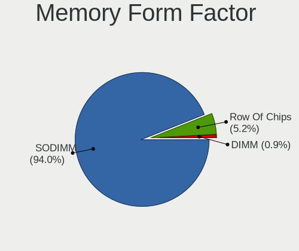

| Name         | Notebooks | Percent |
|--------------|-----------|---------|
| SODIMM       | 71        | 91.03%  |
| Row Of Chips | 7         | 8.97%   |

Memory Size
-----------

Memory module size

| Size  | Notebooks | Percent |
|-------|-----------|---------|
| 8192  | 32        | 34.41%  |
| 4096  | 28        | 30.11%  |
| 2048  | 16        | 17.2%   |
| 1024  | 9         | 9.68%   |
| 16384 | 7         | 7.53%   |
| 256   | 1         | 1.08%   |

Memory Speed
------------

Memory module speed

| Speed   | Notebooks | Percent |
|---------|-----------|---------|
| 1600    | 22        | 26.51%  |
| 2667    | 14        | 16.87%  |
| 3200    | 9         | 10.84%  |
| 1334    | 7         | 8.43%   |
| 1333    | 6         | 7.23%   |
| 2400    | 5         | 6.02%   |
| 1067    | 4         | 4.82%   |
| 2133    | 3         | 3.61%   |
| 667     | 3         | 3.61%   |
| Unknown | 3         | 3.61%   |
| 1066    | 2         | 2.41%   |
| 4267    | 1         | 1.2%    |
| 4266    | 1         | 1.2%    |
| 800     | 1         | 1.2%    |
| 533     | 1         | 1.2%    |
| 266     | 1         | 1.2%    |

Sound Vendor
------------

Sound card vendors

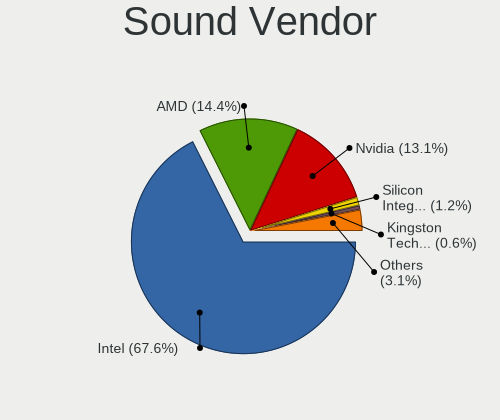

| Vendor                           | Notebooks | Percent |
|----------------------------------|-----------|---------|
| Intel                            | 218       | 72.43%  |
| AMD                              | 45        | 14.95%  |
| Nvidia                           | 21        | 6.98%   |
| Silicon Integrated Systems [SiS] | 2         | 0.66%   |
| Generalplus Technology           | 2         | 0.66%   |
| C-Media Electronics              | 2         | 0.66%   |
| XMOS                             | 1         | 0.33%   |
| Texas Instruments                | 1         | 0.33%   |
| Samson Technologies              | 1         | 0.33%   |
| Realtek Semiconductor            | 1         | 0.33%   |
| Plantronics                      | 1         | 0.33%   |
| Pioneer                          | 1         | 0.33%   |
| M-Audio                          | 1         | 0.33%   |
| Logitech                         | 1         | 0.33%   |
| Creative Technology              | 1         | 0.33%   |
| Casio Computer                   | 1         | 0.33%   |
| Apple                            | 1         | 0.33%   |

Sound Model
-----------

Sound card models

| Model                                                                                             | Notebooks | Percent |
|---------------------------------------------------------------------------------------------------|-----------|---------|
| Intel 7 Series/C216 Chipset Family High Definition Audio Controller                               | 33        | 8.94%   |
| Intel Sunrise Point-LP HD Audio                                                                   | 30        | 8.13%   |
| Intel 6 Series/C200 Series Chipset Family High Definition Audio Controller                        | 22        | 5.96%   |
| Intel 5 Series/3400 Series Chipset High Definition Audio                                          | 17        | 4.61%   |
| Intel NM10/ICH7 Family High Definition Audio Controller                                           | 15        | 4.07%   |
| Intel 82801H (ICH8 Family) HD Audio Controller                                                    | 15        | 4.07%   |
| AMD Family 17h (Models 10h-1fh) HD Audio Controller                                               | 15        | 4.07%   |
| Intel Haswell-ULT HD Audio Controller                                                             | 14        | 3.79%   |
| Intel 8 Series HD Audio Controller                                                                | 14        | 3.79%   |
| Intel Xeon E3-1200 v3/4th Gen Core Processor HD Audio Controller                                  | 12        | 3.25%   |
| Intel 8 Series/C220 Series Chipset High Definition Audio Controller                               | 12        | 3.25%   |
| AMD FCH Azalia Controller                                                                         | 12        | 3.25%   |
| Intel 82801I (ICH9 Family) HD Audio Controller                                                    | 11        | 2.98%   |
| AMD Renoir Radeon High Definition Audio Controller                                                | 10        | 2.71%   |
| AMD SBx00 Azalia (Intel HDA)                                                                      | 9         | 2.44%   |
| Intel Atom/Celeron/Pentium Processor x5-E8000/J3xxx/N3xxx Series High Definition Audio Controller | 8         | 2.17%   |
| Intel Cannon Lake PCH cAVS                                                                        | 7         | 1.9%    |
| AMD Kabini HDMI/DP Audio                                                                          | 7         | 1.9%    |
| Intel Wildcat Point-LP High Definition Audio Controller                                           | 5         | 1.36%   |
| Intel Cannon Point-LP High Definition Audio Controller                                            | 5         | 1.36%   |
| Intel Broadwell-U Audio Controller                                                                | 5         | 1.36%   |
| AMD Raven/Raven2/Fenghuang HDMI/DP Audio Controller                                               | 5         | 1.36%   |
| Nvidia GT216 HDMI Audio Controller                                                                | 4         | 1.08%   |
| Intel Comet Lake PCH-LP cAVS                                                                      | 4         | 1.08%   |
| Intel Atom Processor Z36xxx/Z37xxx Series High Definition Audio Controller                        | 4         | 1.08%   |
| Nvidia TU106 High Definition Audio Controller                                                     | 3         | 0.81%   |
| Intel Celeron N3350/Pentium N4200/Atom E3900 Series Audio Cluster                                 | 3         | 0.81%   |
| AMD Wrestler HDMI Audio                                                                           | 3         | 0.81%   |
| AMD Cedar HDMI Audio [Radeon HD 5400/6300/7300 Series]                                            | 3         | 0.81%   |
| Silicon Integrated Systems [SiS] Azalia Audio Controller                                          | 2         | 0.54%   |
| Nvidia TU116 High Definition Audio Controller                                                     | 2         | 0.54%   |
| Nvidia TU107 GeForce GTX 1650 High Definition Audio Controller                                    | 2         | 0.54%   |
| Nvidia MCP79 High Definition Audio                                                                | 2         | 0.54%   |
| Nvidia High Definition Audio Controller                                                           | 2         | 0.54%   |
| Nvidia GK107 HDMI Audio Controller                                                                | 2         | 0.54%   |
| Nvidia GF108 High Definition Audio Controller                                                     | 2         | 0.54%   |
| Intel Ice Lake-LP Smart Sound Technology Audio Controller                                         | 2         | 0.54%   |
| Intel Comet Lake PCH cAVS                                                                         | 2         | 0.54%   |
| Intel Celeron/Pentium Silver Processor High Definition Audio                                      | 2         | 0.54%   |
| Intel 82801FB/FBM/FR/FW/FRW (ICH6 Family) High Definition Audio Controller                        | 2         | 0.54%   |
| Intel 82801DB/DBL/DBM (ICH4/ICH4-L/ICH4-M) AC'97 Audio Controller                                 | 2         | 0.54%   |
| Generalplus Technology USB Audio Device                                                           | 2         | 0.54%   |
| AMD Trinity HDMI Audio Controller                                                                 | 2         | 0.54%   |
| AMD RV710/730 HDMI Audio [Radeon HD 4000 series]                                                  | 2         | 0.54%   |
| AMD Redwood HDMI Audio [Radeon HD 5000 Series]                                                    | 2         | 0.54%   |
| AMD Family 15h (Models 60h-6fh) Audio Controller                                                  | 2         | 0.54%   |
| XMOS USB HiRes Audio F-20                                                                         | 1         | 0.27%   |
| Texas Instruments PCM2704 16-bit stereo audio DAC                                                 | 1         | 0.27%   |
| Samson Technologies GoMic compact condenser mic                                                   | 1         | 0.27%   |
| Realtek Semiconductor USB Audio                                                                   | 1         | 0.27%   |
| Plantronics BT600                                                                                 | 1         | 0.27%   |
| Pioneer DDJ-SB                                                                                    | 1         | 0.27%   |
| Nvidia stereo controller                                                                          | 1         | 0.27%   |
| Nvidia MCP67 High Definition Audio                                                                | 1         | 0.27%   |
| Nvidia GF119 HDMI Audio Controller                                                                | 1         | 0.27%   |
| M-Audio M-Audio RunTime DFU                                                                       | 1         | 0.27%   |
| Logitech Headset H340                                                                             | 1         | 0.27%   |
| Intel US15W/US15X/US15L/UL11L SCH [Poulsbo] HD Audio Controller                                   | 1         | 0.27%   |
| Intel Tiger Lake-LP Smart Sound Technology Audio Controller                                       | 1         | 0.27%   |
| Intel 100 Series/C230 Series Chipset Family HD Audio Controller                                   | 1         | 0.27%   |

Camera Vendor
-------------

Camera device vendors

| Vendor                                 | Notebooks | Percent |
|----------------------------------------|-----------|---------|
| Chicony Electronics                    | 71        | 33.18%  |
| Realtek Semiconductor                  | 19        | 8.88%   |
| IMC Networks                           | 19        | 8.88%   |
| Microdia                               | 15        | 7.01%   |
| Sunplus Innovation Technology          | 14        | 6.54%   |
| Cheng Uei Precision Industry (Foxlink) | 12        | 5.61%   |
| Acer                                   | 10        | 4.67%   |
| Suyin                                  | 8         | 3.74%   |
| Silicon Motion                         | 8         | 3.74%   |
| Lite-On Technology                     | 5         | 2.34%   |
| Syntek                                 | 4         | 1.87%   |
| Ricoh                                  | 4         | 1.87%   |
| Apple                                  | 3         | 1.4%    |
| Alcor Micro                            | 3         | 1.4%    |
| Quanta                                 | 2         | 0.93%   |
| Primax Electronics                     | 2         | 0.93%   |
| Lenovo                                 | 2         | 0.93%   |
| Importek                               | 2         | 0.93%   |
| Z-Star Microelectronics                | 1         | 0.47%   |
| Sunplus Technology                     | 1         | 0.47%   |
| Sonix Technology                       | 1         | 0.47%   |
| MacroSilicon                           | 1         | 0.47%   |
| Logitech                               | 1         | 0.47%   |
| Intel                                  | 1         | 0.47%   |
| GenesysLogic Technology                | 1         | 0.47%   |
| Generalplus Technology                 | 1         | 0.47%   |
| eMPIA Technology                       | 1         | 0.47%   |
| Creative Technology                    | 1         | 0.47%   |
| ALi                                    | 1         | 0.47%   |

Camera Model
------------

Camera device models

| Model                                                          | Notebooks | Percent |
|----------------------------------------------------------------|-----------|---------|
| Chicony Integrated Camera                                      | 8         | 3.74%   |
| Chicony HD WebCam                                              | 8         | 3.74%   |
| Realtek Integrated_Webcam_HD                                   | 7         | 3.27%   |
| Chicony HP Webcam                                              | 5         | 2.34%   |
| Sunplus Integrated_Webcam_HD                                   | 4         | 1.87%   |
| Sunplus HD WebCam                                              | 4         | 1.87%   |
| Microdia Integrated Webcam                                     | 4         | 1.87%   |
| Acer Integrated Camera                                         | 4         | 1.87%   |
| Syntek Integrated Camera                                       | 3         | 1.4%    |
| Realtek HP Truevision HD                                       | 3         | 1.4%    |
| Microdia USB 2.0 Camera                                        | 3         | 1.4%    |
| Lite-On Integrated Camera                                      | 3         | 1.4%    |
| IMC Networks Integrated Camera                                 | 3         | 1.4%    |
| Chicony USB2.0 HD UVC WebCam                                   | 3         | 1.4%    |
| Chicony TOSHIBA Web Camera - HD                                | 3         | 1.4%    |
| Chicony HP HD Camera                                           | 3         | 1.4%    |
| Chicony EasyCamera                                             | 3         | 1.4%    |
| Chicony CNF9055 Toshiba Webcam                                 | 3         | 1.4%    |
| Acer BisonCam, NB Pro                                          | 3         | 1.4%    |
| Sunplus Laptop_Integrated_Webcam_FHD                           | 2         | 0.93%   |
| Silicon Motion WebCam SC-0311139N                              | 2         | 0.93%   |
| Realtek USB2.0 HD UVC WebCam                                   | 2         | 0.93%   |
| Microdia Integrated_Webcam_HD                                  | 2         | 0.93%   |
| IMC Networks VGA UVC WebCam                                    | 2         | 0.93%   |
| IMC Networks 2M Integrated Webcam                              | 2         | 0.93%   |
| Chicony VGA WebCam                                             | 2         | 0.93%   |
| Chicony USB2.0 VGA UVC WebCam                                  | 2         | 0.93%   |
| Chicony Lenovo EasyCamera                                      | 2         | 0.93%   |
| Chicony 1.3M HD WebCam                                         | 2         | 0.93%   |
| Cheng Uei Precision Industry (Foxlink) HP TrueVision HD Camera | 2         | 0.93%   |
| Cheng Uei Precision Industry (Foxlink) HP HD Webcam [Fixed]    | 2         | 0.93%   |
| Cheng Uei Precision Industry (Foxlink) HP HD Camera            | 2         | 0.93%   |
| Apple Built-in iSight                                          | 2         | 0.93%   |
| Z-Star Venus USB2.0 Camera                                     | 1         | 0.47%   |
| Syntek Lenovo EasyCamera                                       | 1         | 0.47%   |
| Suyin UVC 1.3MPixel WebCam                                     | 1         | 0.47%   |
| Suyin USB Webcam                                               | 1         | 0.47%   |
| Suyin Integrated_Webcam_HD                                     | 1         | 0.47%   |
| Suyin Integrated Webcam                                        | 1         | 0.47%   |
| Suyin HP webcam [dv6-1190en]                                   | 1         | 0.47%   |
| Suyin HP Truevision HD                                         | 1         | 0.47%   |
| Suyin HD WebCam                                                | 1         | 0.47%   |
| Suyin Acer CrystalEye Webcam                                   | 1         | 0.47%   |
| Sunplus 1.3M HD WebCam                                         | 1         | 0.47%   |
| Sunplus Laptop_Integrated_Webcam_HD                            | 1         | 0.47%   |
| Sunplus Integrated_Webcam_FHD                                  | 1         | 0.47%   |
| Sunplus Dell Integrated Webcam                                 | 1         | 0.47%   |
| Sunplus Dell HD Webcam                                         | 1         | 0.47%   |
| Sonix USB 2.0 Camera                                           | 1         | 0.47%   |
| Silicon Motion WebCam SCB-1100N                                | 1         | 0.47%   |
| Silicon Motion WebCam SCB-0385N                                | 1         | 0.47%   |
| Silicon Motion WebCam SCB-0355N                                | 1         | 0.47%   |
| Silicon Motion WebCam SC-13HDL11939N                           | 1         | 0.47%   |
| Silicon Motion WebCam SC-03FFL11939N                           | 1         | 0.47%   |
| Silicon Motion Web Camera                                      | 1         | 0.47%   |
| Ricoh Visual Communication Camera VGP-VCC8 [R5U870]            | 1         | 0.47%   |
| Ricoh Sony Visual Communication Camera                         | 1         | 0.47%   |
| Ricoh Integrated Webcam                                        | 1         | 0.47%   |
| Ricoh HD Webcam                                                | 1         | 0.47%   |
| Realtek USB2.0 VGA UVC WebCam                                  | 1         | 0.47%   |

Fingerprint Vendor
------------------

Fingerprint sensor vendors

| Vendor                     | Notebooks | Percent |
|----------------------------|-----------|---------|
| Validity Sensors           | 14        | 41.18%  |
| AuthenTec                  | 5         | 14.71%  |
| Synaptics                  | 4         | 11.76%  |
| STMicroelectronics         | 3         | 8.82%   |
| Elan Microelectronics      | 3         | 8.82%   |
| Upek                       | 2         | 5.88%   |
| Shenzhen Goodix Technology | 2         | 5.88%   |
| LighTuning Technology      | 1         | 2.94%   |

Fingerprint Model
-----------------

Fingerprint sensor models

| Model                                                  | Notebooks | Percent |
|--------------------------------------------------------|-----------|---------|
| Validity Sensors VFS495 Fingerprint Reader             | 5         | 14.71%  |
| Validity Sensors VFS491                                | 3         | 8.82%   |
| STMicroelectronics Fingerprint Reader                  | 3         | 8.82%   |
| Elan ELAN:Fingerprint                                  | 3         | 8.82%   |
| Upek Biometric Touchchip/Touchstrip Fingerprint Sensor | 2         | 5.88%   |
| Synaptics Prometheus MIS Touch Fingerprint Reader      | 2         | 5.88%   |
| AuthenTec AES2501 Fingerprint Sensor                   | 2         | 5.88%   |
| Validity Sensors VFS451 Fingerprint Reader             | 1         | 2.94%   |
| Validity Sensors VFS300 Fingerprint Reader             | 1         | 2.94%   |
| Validity Sensors VFS Fingerprint sensor                | 1         | 2.94%   |
| Validity Sensors VFS 5011 fingerprint sensor           | 1         | 2.94%   |
| Validity Sensors Synaptics WBDI                        | 1         | 2.94%   |
| Validity Sensors Fingerprint scanner                   | 1         | 2.94%   |
| Synaptics  WBDI                                        | 1         | 2.94%   |
| Synaptics Metallica MIS Touch Fingerprint Reader       | 1         | 2.94%   |
| Shenzhen Goodix  FingerPrint Device                    | 1         | 2.94%   |
| Shenzhen Goodix Fingerprint Reader                     | 1         | 2.94%   |
| LighTuning EgisTec Touch Fingerprint Sensor            | 1         | 2.94%   |
| AuthenTec AES2810                                      | 1         | 2.94%   |
| AuthenTec AES2550 Fingerprint Sensor                   | 1         | 2.94%   |
| AuthenTec AES1600                                      | 1         | 2.94%   |

Chipcard Vendor
---------------

Chipcard module vendors

| Vendor      | Notebooks | Percent |
|-------------|-----------|---------|
| Broadcom    | 9         | 56.25%  |
| Lenovo      | 3         | 18.75%  |
| Alcor Micro | 3         | 18.75%  |
| O2 Micro    | 1         | 6.25%   |

Chipcard Model
--------------

Chipcard module models

| Model                                                                        | Notebooks | Percent |
|------------------------------------------------------------------------------|-----------|---------|
| Broadcom BCM5880 Secure Applications Processor                               | 6         | 37.5%   |
| Lenovo Integrated Smart Card Reader                                          | 3         | 18.75%  |
| Alcor Micro AU9540 Smartcard Reader                                          | 3         | 18.75%  |
| Broadcom BCM5880 Secure Applications Processor with fingerprint swipe sensor | 2         | 12.5%   |
| O2 Micro OZ776 CCID Smartcard Reader                                         | 1         | 6.25%   |
| Broadcom 5880                                                                | 1         | 6.25%   |

Printer Vendor
--------------

Printer device vendors

| Vendor             | Notebooks | Percent |
|--------------------|-----------|---------|
| Hewlett-Packard    | 3         | 75%     |
| STMicroelectronics | 1         | 25%     |

Printer Model
-------------

Printer device models

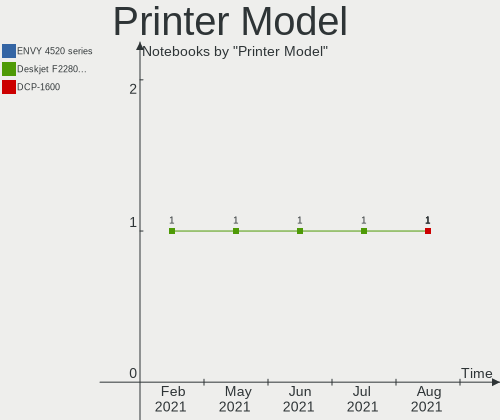

| Model                                                     | Notebooks | Percent |
|-----------------------------------------------------------|-----------|---------|
| STMicroelectronics LED badge -- mini LED display -- 11x44 | 1         | 25%     |
| HP OfficeJet 3830 series                                  | 1         | 25%     |
| HP LaserJet Pro M404-M405                                 | 1         | 25%     |
| HP Deskjet F2280 series                                   | 1         | 25%     |

Scanner Vendor
--------------

Scanner device vendors

Zero info for selected period =(

Scanner Model
-------------

Scanner device models

Zero info for selected period =(

Bluetooth Vendor
----------------

Controller vendors

| Vendor                          | Notebooks | Percent |
|---------------------------------|-----------|---------|
| Intel                           | 64        | 37.21%  |
| Qualcomm Atheros Communications | 21        | 12.21%  |
| Realtek Semiconductor           | 16        | 9.3%    |
| Broadcom                        | 15        | 8.72%   |
| Apple                           | 8         | 4.65%   |
| IMC Networks                    | 7         | 4.07%   |
| Ralink                          | 6         | 3.49%   |
| Dell                            | 6         | 3.49%   |
| Toshiba                         | 5         | 2.91%   |
| Lite-On Technology              | 5         | 2.91%   |
| Hewlett-Packard                 | 5         | 2.91%   |
| Foxconn / Hon Hai               | 3         | 1.74%   |
| Realtek                         | 2         | 1.16%   |
| Ralink Technology               | 2         | 1.16%   |
| Alps Electric                   | 2         | 1.16%   |
| MediaTek                        | 1         | 0.58%   |
| Fujitsu                         | 1         | 0.58%   |
| Cambridge Silicon Radio         | 1         | 0.58%   |
| ASUSTek Computer                | 1         | 0.58%   |
| Askey Computer                  | 1         | 0.58%   |

Bluetooth Model
---------------

Controller models

| Model                                                                               | Notebooks | Percent |
|-------------------------------------------------------------------------------------|-----------|---------|
| Intel Bluetooth wireless interface                                                  | 34        | 19.77%  |
| Qualcomm Atheros  Bluetooth Device                                                  | 11        | 6.4%    |
| Intel Bluetooth Device                                                              | 11        | 6.4%    |
| Realtek  Bluetooth 4.2 Adapter                                                      | 8         | 4.65%   |
| Realtek Bluetooth Radio                                                             | 7         | 4.07%   |
| Intel AX200 Bluetooth                                                               | 7         | 4.07%   |
| Ralink RT3290 Bluetooth                                                             | 6         | 3.49%   |
| Intel Centrino Bluetooth Wireless Transceiver                                       | 5         | 2.91%   |
| Intel Bluetooth 9460/9560 Jefferson Peak (JfP)                                      | 5         | 2.91%   |
| Qualcomm Atheros AR3012 Bluetooth 4.0                                               | 4         | 2.33%   |
| Dell DW375 Bluetooth Module                                                         | 4         | 2.33%   |
| Apple Bluetooth HCI                                                                 | 4         | 2.33%   |
| Qualcomm Atheros AR3011 Bluetooth                                                   | 3         | 1.74%   |
| Lite-On Bluetooth Device                                                            | 3         | 1.74%   |
| HP Bluetooth 2.0 Interface [Broadcom BCM2045]                                       | 3         | 1.74%   |
| Broadcom BCM43142A0 Bluetooth 4.0                                                   | 3         | 1.74%   |
| Apple Bluetooth Host Controller                                                     | 3         | 1.74%   |
| Toshiba Integrated Bluetooth HCI                                                    | 2         | 1.16%   |
| Toshiba BCM43142A0                                                                  | 2         | 1.16%   |
| Realtek Bluetooth Radio                                                             | 2         | 1.16%   |
| Ralink Motorola BC4 Bluetooth 3.0+HS Adapter                                        | 2         | 1.16%   |
| IMC Networks Bluetooth Radio                                                        | 2         | 1.16%   |
| IMC Networks Bluetooth Device                                                       | 2         | 1.16%   |
| IMC Networks Atheros AR3012 Bluetooth 4.0 Adapter                                   | 2         | 1.16%   |
| HP Broadcom 2070 Bluetooth Combo                                                    | 2         | 1.16%   |
| Broadcom HP Portable SoftSailing                                                    | 2         | 1.16%   |
| Broadcom BCM2045 Bluetooth                                                          | 2         | 1.16%   |
| Toshiba Bluetooth Radio                                                             | 1         | 0.58%   |
| Realtek RTL8822BE Bluetooth 4.2 Adapter                                             | 1         | 0.58%   |
| Qualcomm Atheros Bluetooth USB Host Controller                                      | 1         | 0.58%   |
| Qualcomm Atheros Bluetooth                                                          | 1         | 0.58%   |
| Qualcomm Atheros AR9462 Bluetooth                                                   | 1         | 0.58%   |
| MediaTek BT                                                                         | 1         | 0.58%   |
| Lite-On Qualcomm Atheros QCA9377 Bluetooth                                          | 1         | 0.58%   |
| Lite-On Atheros AR3012 Bluetooth                                                    | 1         | 0.58%   |
| Intel Wireless-AC 9260 Bluetooth Adapter                                            | 1         | 0.58%   |
| Intel Wireless-AC 3168 Bluetooth                                                    | 1         | 0.58%   |
| IMC Networks Bluetooth                                                              | 1         | 0.58%   |
| Fujitsu Bluetooth Device                                                            | 1         | 0.58%   |
| Foxconn / Hon Hai Foxconn T77H114 BCM2070 [Single-Chip Bluetooth 2.1 + EDR Adapter] | 1         | 0.58%   |
| Foxconn / Hon Hai Bluetooth Device                                                  | 1         | 0.58%   |
| Foxconn / Hon Hai BCM20702A0                                                        | 1         | 0.58%   |
| Dell BCM20702A0 Bluetooth Module                                                    | 1         | 0.58%   |
| Dell BC02 Bluetooth Adapter                                                         | 1         | 0.58%   |
| Cambridge Silicon Radio Bluetooth Dongle (HCI mode)                                 | 1         | 0.58%   |
| Broadcom HP Portable Bumble Bee                                                     | 1         | 0.58%   |
| Broadcom BCM20703A1 Bluetooth 4.1 + LE                                              | 1         | 0.58%   |
| Broadcom BCM20702A0 Bluetooth 4.0                                                   | 1         | 0.58%   |
| Broadcom BCM20702A0                                                                 | 1         | 0.58%   |
| Broadcom BCM2070 Bluetooth Device                                                   | 1         | 0.58%   |
| Broadcom BCM2045B (BDC-2.1) [Bluetooth Controller]                                  | 1         | 0.58%   |
| Broadcom BCM2045B (BDC-2.1)                                                         | 1         | 0.58%   |
| Broadcom BCM2045B (BDC-2) [Bluetooth Controller]                                    | 1         | 0.58%   |
| ASUS BT-270 Bluetooth Adapter                                                       | 1         | 0.58%   |
| Askey Bluetooth Device                                                              | 1         | 0.58%   |
| Apple Bluetooth USB Host Controller                                                 | 1         | 0.58%   |
| Alps Electric Bluetooth Adapter                                                     | 1         | 0.58%   |
| Alps Electric BCM2046 Bluetooth Device                                              | 1         | 0.58%   |

Unsupported Devices
-------------------

Total unsupported devices on board

| Total | Notebooks | Percent |
|-------|-----------|---------|
| 0     | 177       | 66.79%  |
| 1     | 68        | 25.66%  |
| 2     | 19        | 7.17%   |
| 3     | 1         | 0.38%   |

Unsupported Device Types
------------------------

Types of unsupported devices

| Type                     | Notebooks | Percent |
|--------------------------|-----------|---------|
| Fingerprint reader       | 33        | 30.56%  |
| Graphics card            | 21        | 19.44%  |
| Chipcard                 | 15        | 13.89%  |
| Net/wireless             | 10        | 9.26%   |
| Storage                  | 8         | 7.41%   |
| Bluetooth                | 7         | 6.48%   |
| Multimedia controller    | 6         | 5.56%   |
| Sound                    | 3         | 2.78%   |
| Modem                    | 2         | 1.85%   |
| Net/ethernet             | 1         | 0.93%   |
| Communication controller | 1         | 0.93%   |
| Camera                   | 1         | 0.93%   |

