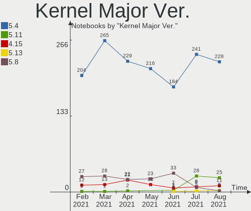
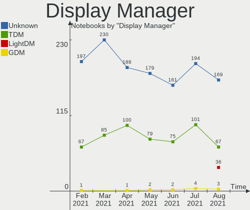
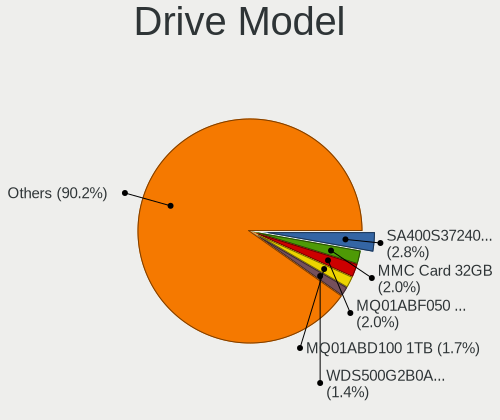
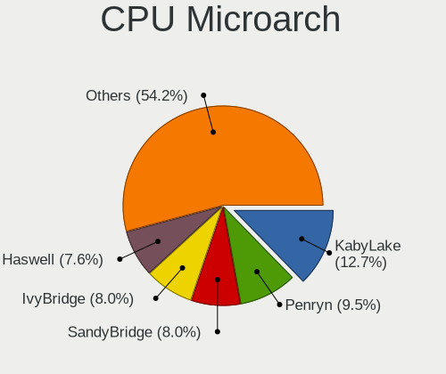
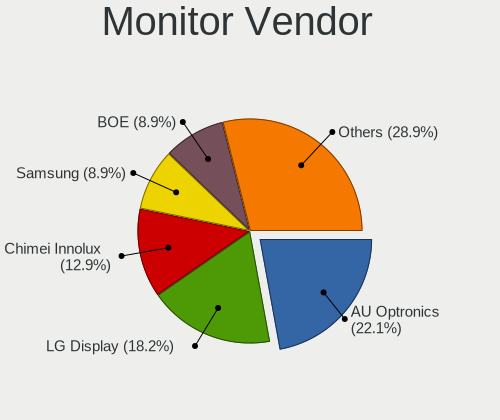
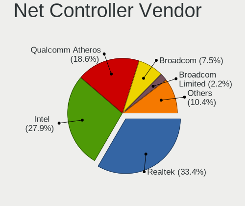

Mint Hardware Trends (Notebook)
-------------------------------

A project to identify most popular hardware characteristics and track their change
over time based on data collected by Mint users at https://Linux-Hardware.org.

Anyone can contribute to the study by uploading probes of their computers by
the [hw-probe](https://github.com/linuxhw/hw-probe) tool:

    sudo hw-probe -all -upload

Full-feature report is available here: https://linux-hardware.org/?view=trends&formfactor=notebook

Period: Apr, 2020.

Contents
--------

- [ OS                       ](#os)
- [ OS Family                ](#os-family)
- [ Kernel                   ](#kernel)
- [ Kernel Family            ](#kernel-family)
- [ Kernel Major Ver.        ](#kernel-major-ver)
- [ Arch                     ](#arch)
- [ DE                       ](#de)
- [ Display Server           ](#display-server)
- [ Display Manager          ](#display-manager)
- [ OS Lang                  ](#os-lang)
- [ Boot Mode                ](#boot-mode)
- [ Filesystem               ](#filesystem)
- [ Dual Boot with Linux/BSD ](#dual-boot-with-linux/bsd)
- [ Dual Boot (Win)          ](#dual-boot-win)
- [ Country                  ](#country)
- [ City                     ](#city)
- [ Vendor                   ](#vendor)
- [ Model                    ](#model)
- [ Model Family             ](#model-family)
- [ MFG Year                 ](#mfg-year)
- [ Form Factor              ](#form-factor)
- [ Secure Boot              ](#secure-boot)
- [ Coreboot                 ](#coreboot)
- [ RAM Size                 ](#ram-size)
- [ RAM Used                 ](#ram-used)
- [ Drive Vendor             ](#drive-vendor)
- [ Drive Model              ](#drive-model)
- [ Drive Kind               ](#drive-kind)
- [ Drive Connector          ](#drive-connector)
- [ Drive Size               ](#drive-size)
- [ Space Total              ](#space-total)
- [ Space Used               ](#space-used)
- [ Malfunc. Drives          ](#malfunc-drives)
- [ Malfunc. Drive Vendor    ](#malfunc-drive-vendor)
- [ Malfunc. Drive Kind      ](#malfunc-drive-kind)
- [ Failed Drives            ](#failed-drives)
- [ Failed Drive Vendor      ](#failed-drive-vendor)
- [ Drive Status             ](#drive-status)
- [ Storage Vendor           ](#storage-vendor)
- [ Storage Model            ](#storage-model)
- [ Storage Kind             ](#storage-kind)
- [ CPU Vendor               ](#cpu-vendor)
- [ CPU Model                ](#cpu-model)
- [ CPU Model Family         ](#cpu-model-family)
- [ CPU Cores                ](#cpu-cores)
- [ CPU Sockets              ](#cpu-sockets)
- [ CPU Threads              ](#cpu-threads)
- [ CPU Op-Modes             ](#cpu-op-modes)
- [ CPU Microarch            ](#cpu-microarch)
- [ CPU Microcode            ](#cpu-microcode)
- [ GPU Vendor               ](#gpu-vendor)
- [ GPU Model                ](#gpu-model)
- [ GPU Combo                ](#gpu-combo)
- [ GPU Driver               ](#gpu-driver)
- [ GPU Memory               ](#gpu-memory)
- [ Monitor Vendor           ](#monitor-vendor)
- [ Monitor Model            ](#monitor-model)
- [ Monitor Resolution       ](#monitor-resolution)
- [ Monitor Diagonal         ](#monitor-diagonal)
- [ Monitor Width            ](#monitor-width)
- [ Aspect Ratio             ](#aspect-ratio)
- [ Monitor Area             ](#monitor-area)
- [ Pixel Density            ](#pixel-density)
- [ Multiple Monitors        ](#multiple-monitors)
- [ Net Controller Vendor    ](#net-controller-vendor)
- [ Net Controller Model     ](#net-controller-model)
- [ Net Controller Kind      ](#net-controller-kind)
- [ Used Controller          ](#used-controller)
- [ NICs                     ](#nics)
- [ Unsupported Devices      ](#unsupported-devices)
- [ Unsupported Device Types ](#unsupported-device-types)

OS
--

Installed operating systems

| Name      | Computers | Percent |
|-----------|-----------|---------|
| Mint 19.3 | 171       | 85.5%   |
| Mint 4    | 10        | 5%      |
| Mint 19.1 | 8         | 4%      |
| Mint 19   | 4         | 2%      |
| Mint 19.2 | 3         | 1.5%    |
| Mint 18.3 | 3         | 1.5%    |
| Mint 18.1 | 1         | 0.5%    |

OS Family
---------

OS without a version

| Name | Computers | Percent |
|------|-----------|---------|
| Mint | 200       | 100%    |

Kernel
------

Version of the Linux kernel

| Version                   | Computers | Percent |
|---------------------------|-----------|---------|
| 5.3.0-46-generic          | 80        | 40%     |
| 5.0.0-32-generic          | 33        | 16.5%   |
| 5.3.0-45-generic          | 24        | 12%     |
| 4.15.0-96-generic         | 16        | 8%      |
| 5.3.0-51-generic          | 10        | 5%      |
| 4.19.0-8-amd64            | 9         | 4.5%    |
| 5.3.0-42-generic          | 7         | 3.5%    |
| 4.15.0-91-generic         | 5         | 2.5%    |
| 4.15.0-74-generic         | 2         | 1%      |
| 4.15.0-58-generic         | 2         | 1%      |
| 5.6.2-050602-generic      | 1         | 0.5%    |
| 5.5.0-18.1-liquorix-amd64 | 1         | 0.5%    |
| 5.5.0-050500-generic      | 1         | 0.5%    |
| 5.4.0-0.bpo.4-amd64       | 1         | 0.5%    |
| 5.3.8-050308-generic      | 1         | 0.5%    |
| 5.3.0-28-generic          | 1         | 0.5%    |
| 4.4.0-176-generic         | 1         | 0.5%    |
| 4.19.18-041918-lowlatency | 1         | 0.5%    |
| 4.15.0-42-generic         | 1         | 0.5%    |
| 4.15.0-20-generic         | 1         | 0.5%    |
| 4.10.0-42-generic         | 1         | 0.5%    |
| 4.10.0-38-generic         | 1         | 0.5%    |

Kernel Family
-------------

Linux kernel without a distro release

| Version | Computers | Percent |
|---------|-----------|---------|
| 5.3.0   | 122       | 61%     |
| 5.0.0   | 33        | 16.5%   |
| 4.15.0  | 27        | 13.5%   |
| 4.19.0  | 9         | 4.5%    |
| 5.5.0   | 2         | 1%      |
| 4.10.0  | 2         | 1%      |
| 5.6.2   | 1         | 0.5%    |
| 5.4.0   | 1         | 0.5%    |
| 5.3.8   | 1         | 0.5%    |
| 4.4.0   | 1         | 0.5%    |
| 4.19.18 | 1         | 0.5%    |

Kernel Major Ver.
-----------------

Linux kernel major version

| Version | Computers | Percent |
|---------|-----------|---------|
| 5.3     | 123       | 61.5%   |
| 5.0     | 33        | 16.5%   |
| 4.15    | 27        | 13.5%   |
| 4.19    | 10        | 5%      |
| 5.5     | 2         | 1%      |
| 4.10    | 2         | 1%      |
| 5.6     | 1         | 0.5%    |
| 5.4     | 1         | 0.5%    |
| 4.4     | 1         | 0.5%    |

Arch
----

OS architecture (x86_64, i586, etc.)

| Name   | Computers | Percent |
|--------|-----------|---------|
| x86_64 | 173       | 86.5%   |
| i686   | 27        | 13.5%   |

DE
--

Desktop Environment

| Name       | Computers | Percent |
|------------|-----------|---------|
| X-Cinnamon | 107       | 53.5%   |
| Cinnamon   | 29        | 14.5%   |
| MATE       | 25        | 12.5%   |
| XFCE       | 21        | 10.5%   |
| GNOME      | 9         | 4.5%    |
| Unknown    | 9         | 4.5%    |

Display Server
--------------

X11 or Wayland

| Name | Computers | Percent |
|------|-----------|---------|
| X11  | 200       | 100%    |

Display Manager
---------------

SDDM, LightDM, etc.

| Name    | Computers | Percent |
|---------|-----------|---------|
| Unknown | 156       | 78%     |
| LightDM | 43        | 21.5%   |
| MDM     | 1         | 0.5%    |

OS Lang
-------

Language

| Lang       | Computers | Percent |
|------------|-----------|---------|
| en_US      | 66        | 33%     |
| ru_RU      | 26        | 13%     |
| de_DE      | 17        | 8.5%    |
| pt_BR      | 16        | 8%      |
| en_GB      | 12        | 6%      |
| pl_PL      | 7         | 3.5%    |
| ru_UA      | 4         | 2%      |
| nl_NL      | 4         | 2%      |
| fr_FR      | 4         | 2%      |
| es_ES      | 4         | 2%      |
| pt_PT      | 3         | 1.5%    |
| es_CL      | 3         | 1.5%    |
| en_IN      | 3         | 1.5%    |
| fi_FI      | 2         | 1%      |
| es_AR      | 2         | 1%      |
| en_CA      | 2         | 1%      |
| el_GR      | 2         | 1%      |
| Unknown    | 2         | 1%      |
| uk_UA      | 1         | 0.5%    |
| sv_SE      | 1         | 0.5%    |
| ru_RU.utf8 | 1         | 0.5%    |
| ro_RO      | 1         | 0.5%    |
| nl_BE      | 1         | 0.5%    |
| lv_LV      | 1         | 0.5%    |
| it_IT      | 1         | 0.5%    |
| hu_HU      | 1         | 0.5%    |
| fr_CA      | 1         | 0.5%    |
| es_PA      | 1         | 0.5%    |
| es_MX      | 1         | 0.5%    |
| es_CO      | 1         | 0.5%    |
| en_NZ      | 1         | 0.5%    |
| en_NG      | 1         | 0.5%    |
| en_IE      | 1         | 0.5%    |
| en_AU      | 1         | 0.5%    |
| de_CH      | 1         | 0.5%    |
| de_AT      | 1         | 0.5%    |
| ca_ES      | 1         | 0.5%    |
| ca_AD      | 1         | 0.5%    |
| C          | 1         | 0.5%    |

Boot Mode
---------

EFI or BIOS

| Mode | Computers | Percent |
|------|-----------|---------|
| BIOS | 111       | 55.5%   |
| EFI  | 89        | 44.5%   |

Filesystem
----------

Type of filesystem

| Type    | Computers | Percent |
|---------|-----------|---------|
| Ext4    | 197       | 98.5%   |
| Btrfs   | 2         | 1%      |
| Overlay | 1         | 0.5%    |

Dual Boot with Linux/BSD
------------------------

Hosting more than one Linux/BSD

| Dual boot | Computers | Percent |
|-----------|-----------|---------|
| No        | 190       | 95%     |
| Yes       | 10        | 5%      |

Dual Boot (Win)
---------------

Hosting Linux and Windows

| Dual boot | Computers | Percent |
|-----------|-----------|---------|
| No        | 183       | 91.5%   |
| Yes       | 17        | 8.5%    |

Country
-------

Geographic location (country)

| Country            | Computers | Percent |
|--------------------|-----------|---------|
| USA                | 35        | 17.5%   |
| Russia             | 31        | 15.5%   |
| Brazil             | 18        | 9%      |
| Germany            | 17        | 8.5%    |
| UK                 | 9         | 4.5%    |
| Poland             | 8         | 4%      |
| Ukraine            | 7         | 3.5%    |
| Spain              | 6         | 3%      |
| Netherlands        | 5         | 2.5%    |
| India              | 5         | 2.5%    |
| Canada             | 5         | 2.5%    |
| Portugal           | 4         | 2%      |
| Switzerland        | 3         | 1.5%    |
| Romania            | 3         | 1.5%    |
| Hungary            | 3         | 1.5%    |
| Greece             | 3         | 1.5%    |
| France             | 3         | 1.5%    |
| Chile              | 3         | 1.5%    |
| Austria            | 3         | 1.5%    |
| Sweden             | 2         | 1%      |
| Mexico             | 2         | 1%      |
| Malaysia           | 2         | 1%      |
| Finland            | 2         | 1%      |
| Bulgaria           | 2         | 1%      |
| Belgium            | 2         | 1%      |
| Argentina          | 2         | 1%      |
| Turkey             | 1         | 0.5%    |
| Serbia             | 1         | 0.5%    |
| Panama             | 1         | 0.5%    |
| Norway             | 1         | 0.5%    |
| New Zealand        | 1         | 0.5%    |
| Latvia             | 1         | 0.5%    |
| Korea, Republic of | 1         | 0.5%    |
| Italy              | 1         | 0.5%    |
| Ireland            | 1         | 0.5%    |
| Indonesia          | 1         | 0.5%    |
| Ghana              | 1         | 0.5%    |
| Denmark            | 1         | 0.5%    |
| Colombia           | 1         | 0.5%    |
| Belarus            | 1         | 0.5%    |
| Australia          | 1         | 0.5%    |

City
----

Geographic location (city)

| City                   | Computers | Percent |
|------------------------|-----------|---------|
| Moscow                 | 8         | 4%      |
| St Petersburg          | 4         | 2%      |
| São Paulo             | 3         | 1.5%    |
| Rio de Janeiro         | 3         | 1.5%    |
| Kyiv                   | 3         | 1.5%    |
| Curitiba               | 3         | 1.5%    |
| Berlin                 | 3         | 1.5%    |
| Warsaw                 | 2         | 1%      |
| Ufa                    | 2         | 1%      |
| Quierschied            | 2         | 1%      |
| Porto Alegre           | 2         | 1%      |
| Montreal               | 2         | 1%      |
| Kazan’               | 2         | 1%      |
| Denver                 | 2         | 1%      |
| Budapest               | 2         | 1%      |
| Athens                 | 2         | 1%      |
| Zufikon                | 1         | 0.5%    |
| Zoetermeer             | 1         | 0.5%    |
| Zaragoza               | 1         | 0.5%    |
| Wrocław               | 1         | 0.5%    |
| Warrensburg            | 1         | 0.5%    |
| Waldheim               | 1         | 0.5%    |
| Wabern                 | 1         | 0.5%    |
| Västerås             | 1         | 0.5%    |
| Voorhout               | 1         | 0.5%    |
| Volochysk              | 1         | 0.5%    |
| Villingen-Schwenningen | 1         | 0.5%    |
| Vienna                 | 1         | 0.5%    |
| Valencia               | 1         | 0.5%    |
| Upper Marlboro         | 1         | 0.5%    |
| Tyumen                 | 1         | 0.5%    |
| Trier                  | 1         | 0.5%    |
| Toulon                 | 1         | 0.5%    |
| Toguchin               | 1         | 0.5%    |
| Tijuana                | 1         | 0.5%    |
| Thessaloniki           | 1         | 0.5%    |
| Ternat                 | 1         | 0.5%    |
| Tangerang              | 1         | 0.5%    |
| Tampa                  | 1         | 0.5%    |
| Sueca                  | 1         | 0.5%    |
| Stockholm              | 1         | 0.5%    |
| Steffisburg            | 1         | 0.5%    |
| St. Petersburg         | 1         | 0.5%    |
| St Louis               | 1         | 0.5%    |
| Srinagar               | 1         | 0.5%    |
| Squamish               | 1         | 0.5%    |
| Springboro             | 1         | 0.5%    |
| Sofia                  | 1         | 0.5%    |
| Smolensk               | 1         | 0.5%    |
| Silver Spring          | 1         | 0.5%    |
| Sheffield              | 1         | 0.5%    |
| Shah Alam              | 1         | 0.5%    |
| Seminole               | 1         | 0.5%    |
| Selimbar               | 1         | 0.5%    |
| Saransk                | 1         | 0.5%    |
| Santiago               | 1         | 0.5%    |
| Santa Teresa           | 1         | 0.5%    |
| Salvador               | 1         | 0.5%    |
| Sakule                 | 1         | 0.5%    |
| Saint Paul             | 1         | 0.5%    |

Vendor
------

Motherboard manufacturer

| Name                | Computers | Percent |
|---------------------|-----------|---------|
| Hewlett-Packard     | 56        | 28%     |
| Dell                | 29        | 14.5%   |
| Lenovo              | 28        | 14%     |
| ASUSTek Computer    | 22        | 11%     |
| Acer                | 19        | 9.5%    |
| Toshiba             | 11        | 5.5%    |
| Clevo               | 4         | 2%      |
| Apple               | 4         | 2%      |
| Samsung Electronics | 3         | 1.5%    |
| Packard Bell        | 2         | 1%      |
| MSI                 | 2         | 1%      |
| Fujitsu             | 2         | 1%      |
| Unknown             | 2         | 1%      |
| Timi                | 1         | 0.5%    |
| Sony                | 1         | 0.5%    |
| Quanta              | 1         | 0.5%    |
| Positivo            | 1         | 0.5%    |
| PC Specialist       | 1         | 0.5%    |
| Medion              | 1         | 0.5%    |
| Itautec             | 1         | 0.5%    |
| Irbis               | 1         | 0.5%    |
| IBM                 | 1         | 0.5%    |
| Fujitsu Siemens     | 1         | 0.5%    |
| eMachines           | 1         | 0.5%    |
| Dixonsxp            | 1         | 0.5%    |
| Compal              | 1         | 0.5%    |
| Chuwi               | 1         | 0.5%    |
| BUSH                | 1         | 0.5%    |
| AMI                 | 1         | 0.5%    |

Model
-----

Motherboard model

| Name                                              | Computers | Percent |
|---------------------------------------------------|-----------|---------|
| Unknown                                           | 6         | 3%      |
| HP Laptop 15-bw0xx                                | 3         | 1.5%    |
| Toshiba Satellite L650                            | 2         | 1%      |
| HP ProBook 4540s                                  | 2         | 1%      |
| HP ProBook 450 G6                                 | 2         | 1%      |
| HP Pavilion g6                                    | 2         | 1%      |
| HP Pavilion dv7                                   | 2         | 1%      |
| HP Pavilion dv6                                   | 2         | 1%      |
| HP Laptop 15-db0xxx                               | 2         | 1%      |
| HP Laptop 15-bs1xx                                | 2         | 1%      |
| HP EliteBook 8460p                                | 2         | 1%      |
| Dell Inspiron 1525                                | 2         | 1%      |
| Dell Inspiron 15-3567                             | 2         | 1%      |
| Toshiba TECRA Z50-A                               | 1         | 0.5%    |
| Toshiba Satellite Pro M70                         | 1         | 0.5%    |
| Toshiba Satellite P300                            | 1         | 0.5%    |
| Toshiba Satellite L75-B                           | 1         | 0.5%    |
| Toshiba Satellite C70D-B                          | 1         | 0.5%    |
| Toshiba Satellite C660D                           | 1         | 0.5%    |
| Toshiba Satellite C660                            | 1         | 0.5%    |
| Toshiba Satellite A200                            | 1         | 0.5%    |
| Toshiba QOSMIO G30                                | 1         | 0.5%    |
| Timi TM1613                                       | 1         | 0.5%    |
| Sony VGN-FE41E                                    | 1         | 0.5%    |
| Samsung Electronics R540/R580/R780/SA41/E452/E852 | 1         | 0.5%    |
| Samsung Electronics 550P5C/550P7C                 | 1         | 0.5%    |
| Samsung Electronics 300E4C/300E5C/300E7C          | 1         | 0.5%    |
| Quanta TWS                                        | 1         | 0.5%    |
| Positivo MOBILE                                   | 1         | 0.5%    |
| PC Specialist P9XXEN_EF_ED                        | 1         | 0.5%    |
| Packard Bell EasyNote TS11HR                      | 1         | 0.5%    |
| Packard Bell EasyNote MH35                        | 1         | 0.5%    |
| MSI GF63 Thin 9RCX                                | 1         | 0.5%    |
| MSI GE62 2QC                                      | 1         | 0.5%    |
| Medion P7815                                      | 1         | 0.5%    |
| Lenovo Z70-80 80FG                                | 1         | 0.5%    |
| Lenovo ThinkPad X1 Carbon 6th 20KGS4KM00          | 1         | 0.5%    |
| Lenovo ThinkPad W530 24491A3                      | 1         | 0.5%    |
| Lenovo ThinkPad W530 24415QG                      | 1         | 0.5%    |
| Lenovo ThinkPad T500 2055WJJ                      | 1         | 0.5%    |
| Lenovo ThinkPad T460 20FMS1VC03                   | 1         | 0.5%    |
| Lenovo ThinkPad T430 23501F9                      | 1         | 0.5%    |
| Lenovo ThinkPad T420 4177Q5U                      | 1         | 0.5%    |
| Lenovo ThinkPad T410 2522NZ5                      | 1         | 0.5%    |
| Lenovo ThinkPad Edge E530 32597CG                 | 1         | 0.5%    |
| Lenovo ThinkPad E590 20NB0029GE                   | 1         | 0.5%    |
| Lenovo ThinkPad E490 20N80017RT                   | 1         | 0.5%    |
| Lenovo ThinkBook 13s-IML 20RR                     | 1         | 0.5%    |
| Lenovo IdeaPad S145-15AST 81N3                    | 1         | 0.5%    |
| Lenovo IdeaPad P400 Touch 20211                   | 1         | 0.5%    |
| Lenovo IdeaPad L340-15IWL 81LG                    | 1         | 0.5%    |
| Lenovo IdeaPad L340-15API 81LW                    | 1         | 0.5%    |
| Lenovo IdeaPad 330-15ARR 81D2                     | 1         | 0.5%    |
| Lenovo IdeaPad 320-15ISK 80XH                     | 1         | 0.5%    |
| Lenovo IdeaPad 320-15IKB 80YH                     | 1         | 0.5%    |
| Lenovo IdeaPad 320-15ABR 80XS                     | 1         | 0.5%    |
| Lenovo IdeaPad 310-15ABR 80ST                     | 1         | 0.5%    |
| Lenovo G510 20238                                 | 1         | 0.5%    |
| Lenovo G505 20240                                 | 1         | 0.5%    |
| Lenovo B570e HuronRiver Platform                  | 1         | 0.5%    |

Model Family
------------

Motherboard model prefix

| Name                       | Computers | Percent |
|----------------------------|-----------|---------|
| HP Laptop                  | 14        | 7%      |
| Dell Inspiron              | 13        | 6.5%    |
| Acer Aspire                | 13        | 6.5%    |
| Lenovo ThinkPad            | 11        | 5.5%    |
| HP Pavilion                | 11        | 5.5%    |
| Dell Latitude              | 10        | 5%      |
| Toshiba Satellite          | 9         | 4.5%    |
| Lenovo IdeaPad             | 9         | 4.5%    |
| HP EliteBook               | 7         | 3.5%    |
| HP ProBook                 | 6         | 3%      |
| Unknown                    | 6         | 3%      |
| HP Presario                | 3         | 1.5%    |
| HP 250                     | 3         | 1.5%    |
| Dell Precision             | 3         | 1.5%    |
| Packard Bell EasyNote      | 2         | 1%      |
| Lenovo 3000                | 2         | 1%      |
| HP ENVY                    | 2         | 1%      |
| Fujitsu LIFEBOOK           | 2         | 1%      |
| Dell Vostro                | 2         | 1%      |
| Toshiba TECRA              | 1         | 0.5%    |
| Toshiba QOSMIO             | 1         | 0.5%    |
| Timi TM1613                | 1         | 0.5%    |
| Sony VGN-FE41E             | 1         | 0.5%    |
| Samsung Electronics R540   | 1         | 0.5%    |
| Samsung Electronics 550P5C | 1         | 0.5%    |
| Samsung Electronics 300E4C | 1         | 0.5%    |
| Quanta TWS                 | 1         | 0.5%    |
| Positivo MOBILE            | 1         | 0.5%    |
| PC Specialist P9XXEN       | 1         | 0.5%    |
| MSI GF63                   | 1         | 0.5%    |
| MSI GE62                   | 1         | 0.5%    |
| Medion P7815               | 1         | 0.5%    |
| Lenovo Z70-80              | 1         | 0.5%    |
| Lenovo ThinkBook           | 1         | 0.5%    |
| Lenovo G510                | 1         | 0.5%    |
| Lenovo G505                | 1         | 0.5%    |
| Lenovo B570e               | 1         | 0.5%    |
| Lenovo B50-10              | 1         | 0.5%    |
| Itautec Infoway            | 1         | 0.5%    |
| Irbis TW118                | 1         | 0.5%    |
| IBM ThinkPad               | 1         | 0.5%    |
| HP ZBook                   | 1         | 0.5%    |
| HP Spectre                 | 1         | 0.5%    |
| HP Notebook                | 1         | 0.5%    |
| HP Mini                    | 1         | 0.5%    |
| HP HDX16                   | 1         | 0.5%    |
| HP HDX                     | 1         | 0.5%    |
| HP G42                     | 1         | 0.5%    |
| HP Compaq                  | 1         | 0.5%    |
| Fujitsu Siemens AMILO      | 1         | 0.5%    |
| eMachines eM350            | 1         | 0.5%    |
| Dell G5                    | 1         | 0.5%    |
| Compal QAL51               | 1         | 0.5%    |
| Clevo W240EL               | 1         | 0.5%    |
| Clevo M570U                | 1         | 0.5%    |
| Clevo M540SS               | 1         | 0.5%    |
| Clevo D400V                | 1         | 0.5%    |
| Chuwi LapBook              | 1         | 0.5%    |
| BUSH Windows               | 1         | 0.5%    |
| ASUS ZenBook               | 1         | 0.5%    |

MFG Year
--------

Motherboard manufacture year

| Year    | Computers | Percent |
|---------|-----------|---------|
| 2019    | 41        | 20.5%   |
| 2018    | 26        | 13%     |
| 2013    | 19        | 9.5%    |
| 2012    | 17        | 8.5%    |
| 2011    | 14        | 7%      |
| 2010    | 11        | 5.5%    |
| 2007    | 11        | 5.5%    |
| 2016    | 9         | 4.5%    |
| 2014    | 9         | 4.5%    |
| 2009    | 9         | 4.5%    |
| 2015    | 8         | 4%      |
| 2008    | 7         | 3.5%    |
| 2017    | 6         | 3%      |
| 2006    | 4         | 2%      |
| 2020    | 3         | 1.5%    |
| 2005    | 3         | 1.5%    |
| Unknown | 2         | 1%      |
| 2004    | 1         | 0.5%    |

Form Factor
-----------

Physical design of the computer

| Name     | Computers | Percent |
|----------|-----------|---------|
| Notebook | 200       | 100%    |

Secure Boot
-----------

Enabled or disabled

| State    | Computers | Percent |
|----------|-----------|---------|
| Disabled | 185       | 92.5%   |
| Enabled  | 15        | 7.5%    |

Coreboot
--------

Have coreboot on board

| Used | Computers | Percent |
|------|-----------|---------|
| No   | 200       | 100%    |

RAM Size
--------

Total RAM memory

| Size in GB | Computers | Percent |
|------------|-----------|---------|
| 4.01-8.0   | 56        | 28%     |
| 3.01-4.0   | 51        | 25.5%   |
| 8.01-16.0  | 34        | 17%     |
| 16.01-24.0 | 21        | 10.5%   |
| 1.01-2.0   | 20        | 10%     |
| 2.01-3.0   | 6         | 3%      |
| 0.01-1.0   | 6         | 3%      |
| 32.01-64.0 | 4         | 2%      |
| 24.01-32.0 | 2         | 1%      |

RAM Used
--------

Used RAM memory

| Used GB   | Computers | Percent |
|-----------|-----------|---------|
| 1.01-2.0  | 73        | 36.5%   |
| 2.01-3.0  | 44        | 22%     |
| 3.01-4.0  | 28        | 14%     |
| 0.01-1.0  | 28        | 14%     |
| 4.01-8.0  | 23        | 11.5%   |
| 8.01-16.0 | 4         | 2%      |

Drive Vendor
------------

Hard drive vendors

| Vendor              | Computers | Drives  | Percent |
|---------------------|-----------|---------|---------|
| Seagate             | 37        | 37      | 16.52%  |
| WDC                 | 27        | 27      | 12.05%  |
| Samsung Electronics | 26        | 27      | 11.61%  |
| Toshiba             | 24        | 24      | 10.71%  |
| Hitachi             | 16        | 17      | 7.14%   |
| SanDisk             | 14        | 15      | 6.25%   |
| HGST                | 12        | 12      | 5.36%   |
| Unknown             | 11        | 12      | 4.91%   |
| Kingston            | 10        | 10      | 4.46%   |
| Crucial             | 6         | 6       | 2.68%   |
| SK Hynix            | 4         | 4       | 1.79%   |
| Micron Technology   | 4         | 4       | 1.79%   |
| Intel               | 4         | 4       | 1.79%   |
| Fujitsu             | 4         | 4       | 1.79%   |
| KingSpec            | 3         | 3       | 1.34%   |
| Apple               | 3         | 3       | 1.34%   |
| PNY                 | 2         | 2       | 0.89%   |
| OCZ                 | 2         | 2       | 0.89%   |
| A-DATA Technology   | 2         | 2       | 0.89%   |
| Team                | 1         | 1       | 0.45%   |
| TAMMUZ              | 1         | 1       | 0.45%   |
| Mushkin             | 1         | 1       | 0.45%   |
| LITEON              | 1         | 1       | 0.45%   |
| KingFast            | 1         | 1       | 0.45%   |
| KingDian            | 1         | 1       | 0.45%   |
| HL-DT-ST            | 1         | Unknown | 0.45%   |
| Hewlett-Packard     | 1         | 1       | 0.45%   |
| GOODRAM             | 1         | 1       | 0.45%   |
| Generic             | 1         | 1       | 0.45%   |
| FORESEE             | 1         | 1       | 0.45%   |
| Corsair             | 1         | 1       | 0.45%   |
| China               | 1         | 1       | 0.45%   |

Drive Model
-----------

Hard drive models

| Model                        | Computers | Percent |
|------------------------------|-----------|---------|
| ST1000LM035-1RK172 1TB       | 10        | 4.39%   |
| MQ01ABF050 500GB             | 5         | 2.19%   |
| ST9500325AS 500GB            | 4         | 1.75%   |
| SA400S37240G 240GB SSD       | 4         | 1.75%   |
| MQ01ABD100 1TB               | 4         | 1.75%   |
| ST1000LM024 HN-M101MBB 1TB   | 3         | 1.32%   |
| HTS725050A7E630 500GB        | 3         | 1.32%   |
| HTS721010A9E630 1TB          | 3         | 1.32%   |
| HTS545050A7E680 500GB        | 3         | 1.32%   |
| CT525MX300SSD1 528GB         | 3         | 1.32%   |
| WD10JPVX-22JC3T0 1TB         | 2         | 0.88%   |
| ST500LT012-1DG142 500GB      | 2         | 0.88%   |
| SSD PLUS 480GB               | 2         | 0.88%   |
| SSD PLUS 240GB               | 2         | 0.88%   |
| SSD 860 EVO 250GB            | 2         | 0.88%   |
| SSD 850 EVO 500GB            | 2         | 0.88%   |
| SA400S37480G 480GB SSD       | 2         | 0.88%   |
| SA400S37120G 120GB SSD       | 2         | 0.88%   |
| MZNLN256HAJQ-000H1 256GB SSD | 2         | 0.88%   |
| MMC Card  7GB                | 2         | 0.88%   |
| MMC Card  32GB               | 2         | 0.88%   |
| MMC Card  128GB              | 2         | 0.88%   |
| MHV2080AH 80GB               | 2         | 0.88%   |
| HTS725032A7E630 320GB        | 2         | 0.88%   |
| HTS723232A7A364 320GB        | 2         | 0.88%   |
| DF4032  32GB                 | 2         | 0.88%   |
| WDS500G2B0B-00YS70 500GB SSD | 1         | 0.44%   |
| WDS100T2B0A-00SM50 1TB SSD   | 1         | 0.44%   |
| WDBNCE5000PNC 500GB SSD      | 1         | 0.44%   |
| WDBNCE2500PNC 250GB SSD      | 1         | 0.44%   |
| WD800BEVS-22RST0 80GB        | 1         | 0.44%   |
| WD7500BPVT-22HXZT3 752GB     | 1         | 0.44%   |
| WD7500BPVT-22HXZT1 752GB     | 1         | 0.44%   |
| WD5000LPVX-60V0TT0 500GB     | 1         | 0.44%   |
| WD5000LPCX-60VHAT1 500GB     | 1         | 0.44%   |
| WD5000BPVT-24HXZT3 500GB     | 1         | 0.44%   |
| WD5000BEVT-24A0RT0 500GB     | 1         | 0.44%   |
| WD5000BEKT-60KA9T0 500GB     | 1         | 0.44%   |
| WD3200BPVT-22ZEST0 320GB     | 1         | 0.44%   |
| WD3200BEVT-22ZCT0 320GB      | 1         | 0.44%   |
| WD3200BEVT-00A0RT0 320GB     | 1         | 0.44%   |
| WD3200BEKT-60F3T1 320GB      | 1         | 0.44%   |
| WD2500LPCX-24C6HT0 250GB     | 1         | 0.44%   |
| WD2500BEVT-22ZCT0 250GB      | 1         | 0.44%   |
| WD2500BEKT-60V5T1 250GB      | 1         | 0.44%   |
| WD20SPZX-75UA7T0 2TB         | 1         | 0.44%   |
| WD1200BEVS-26UST0 120GB      | 1         | 0.44%   |
| WD10SPZX-24Z10T0 1TB         | 1         | 0.44%   |
| WD10SPZX-24Z10 1TB           | 1         | 0.44%   |
| WD10SPZX-21Z10T0 1TB         | 1         | 0.44%   |
| WD10JPLX-00MBPT0 1TB         | 1         | 0.44%   |
| VERTEX3 240GB SSD            | 1         | 0.44%   |
| Ultra II 480GB SSD           | 1         | 0.44%   |
| TRION100 120GB SSD           | 1         | 0.44%   |
| THNSNH256GBST SSD            | 1         | 0.44%   |
| THNSNF128GCSS 128GB SSD      | 1         | 0.44%   |
| T253X1120G 120GB SSD         | 1         | 0.44%   |
| SUV500MS120G 120GB SSD       | 1         | 0.44%   |
| SU800 512GB SSD              | 1         | 0.44%   |
| SU650 120GB SSD              | 1         | 0.44%   |

Drive Kind
----------

HDD or SSD

| Kind    | Computers | Drives | Percent |
|---------|-----------|--------|---------|
| HDD     | 115       | 118    | 53%     |
| SSD     | 81        | 87     | 37.33%  |
| MMC     | 11        | 13     | 5.07%   |
| NVMe    | 7         | 7      | 3.23%   |
| Unknown | 3         | 2      | 1.38%   |

Drive Connector
---------------

SATA, SAS, NVMe, etc.

| Type | Computers | Drives | Percent |
|------|-----------|--------|---------|
| SATA | 179       | 205    | 89.5%   |
| MMC  | 11        | 13     | 5.5%    |
| NVMe | 7         | 7      | 3.5%    |
| SAS  | 3         | 2      | 1.5%    |

Drive Size
----------

Size of hard drive

| Size in TB | Computers | Drives | Percent |
|------------|-----------|--------|---------|
| 0.01-0.5   | 148       | 169    | 72.55%  |
| 0.51-1.0   | 51        | 53     | 25%     |
| 1.01-2.0   | 5         | 5      | 2.45%   |

Space Total
-----------

Amount of disk space available on the file system

| Size in GB     | Computers | Percent |
|----------------|-----------|---------|
| 101-250        | 64        | 32%     |
| 251-500        | 60        | 30%     |
| 501-1000       | 35        | 17.5%   |
| 51-100         | 15        | 7.5%    |
| 21-50          | 9         | 4.5%    |
| 1001-2000      | 9         | 4.5%    |
| Unknown        | 3         | 1.5%    |
| More than 3000 | 2         | 1%      |
| 2001-3000      | 2         | 1%      |
| 1-20           | 1         | 0.5%    |

Space Used
----------

Amount of used disk space

| Used GB   | Computers | Percent |
|-----------|-----------|---------|
| 1-20      | 60        | 30%     |
| 21-50     | 46        | 23%     |
| 51-100    | 32        | 16%     |
| 101-250   | 31        | 15.5%   |
| 251-500   | 17        | 8.5%    |
| 501-1000  | 10        | 5%      |
| Unknown   | 3         | 1.5%    |
| 1001-2000 | 1         | 0.5%    |

Malfunc. Drives
---------------

Drive models with a malfunction

| Model                             | Computers | Drives | Percent |
|-----------------------------------|-----------|--------|---------|
| WD3200BPVT-22ZEST0 320GB          | 1         | 1      | 7.14%   |
| WD3200BEKT-60F3T1 320GB           | 1         | 1      | 7.14%   |
| ST500LT012-1DG142 500GB           | 1         | 1      | 7.14%   |
| ST1000LM035-1RK172 1TB            | 1         | 1      | 7.14%   |
| SSD2SC120G3LC726B104-370P 120GB   | 1         | 1      | 7.14%   |
| SSD TS128E 121GB                  | 1         | 1      | 7.14%   |
| SSD i100 24GB                     | 1         | 1      | 7.14%   |
| SD9SN8W-256G-1006 256GB SSD       | 1         | 1      | 7.14%   |
| MZNLN256HAJQ-000H1 256GB SSD      | 1         | 1      | 7.14%   |
| MTFDDAV256TDL-1AW1ZABHA 256GB SSD | 1         | 1      | 7.14%   |
| HTS725050A7E630 500GB             | 1         | 1      | 7.14%   |
| HTS545050A7E680 500GB             | 1         | 1      | 7.14%   |
| HM500JI 500GB                     | 1         | 1      | 7.14%   |
| HM321HI 320GB                     | 1         | 1      | 7.14%   |

Malfunc. Drive Vendor
---------------------

Vendors of faulty drives

| Vendor              | Computers | Drives | Percent |
|---------------------|-----------|--------|---------|
| Samsung Electronics | 3         | 3      | 21.43%  |
| WDC                 | 2         | 2      | 14.29%  |
| Seagate             | 2         | 2      | 14.29%  |
| SanDisk             | 2         | 2      | 14.29%  |
| HGST                | 2         | 2      | 14.29%  |
| PNY                 | 1         | 1      | 7.14%   |
| Micron Technology   | 1         | 1      | 7.14%   |
| Apple               | 1         | 1      | 7.14%   |

Malfunc. Drive Kind
-------------------

Kinds of faulty drives

| Kind | Computers | Drives | Percent |
|------|-----------|--------|---------|
| HDD  | 8         | 8      | 57.14%  |
| SSD  | 6         | 6      | 42.86%  |

Failed Drives
-------------

Failed drive models

Zero info for selected period =(

Failed Drive Vendor
-------------------

Failed drive vendors

Zero info for selected period =(

Drive Status
------------

Number of failed and malfunc. drives

| Status   | Computers | Drives | Percent |
|----------|-----------|--------|---------|
| Detected | 145       | 165    | 73.6%   |
| Works    | 39        | 48     | 19.8%   |
| Malfunc  | 13        | 14     | 6.6%    |

Storage Vendor
--------------

Storage controller vendors

| Vendor                           | Computers | Percent |
|----------------------------------|-----------|---------|
| Intel                            | 151       | 71.56%  |
| AMD                              | 32        | 15.17%  |
| Samsung Electronics              | 10        | 4.74%   |
| Silicon Integrated Systems [SiS] | 5         | 2.37%   |
| Toshiba America Info Systems     | 3         | 1.42%   |
| SK Hynix                         | 3         | 1.42%   |
| Sandisk                          | 2         | 0.95%   |
| VIA Technologies                 | 1         | 0.47%   |
| Phison Electronics               | 1         | 0.47%   |
| Marvell Technology Group         | 1         | 0.47%   |
| JMicron Technology               | 1         | 0.47%   |
| Apple                            | 1         | 0.47%   |

Storage Model
-------------

Storage controller models

| Model                                                                      | Computers | Percent |
|----------------------------------------------------------------------------|-----------|---------|
| 7 Series Chipset Family 6-port SATA Controller [AHCI mode]                 | 26        | 10.88%  |
| FCH SATA Controller [AHCI mode]                                            | 21        | 8.79%   |
| Sunrise Point-LP SATA Controller [AHCI mode]                               | 14        | 5.86%   |
| 82801 Mobile SATA Controller [RAID mode]                                   | 14        | 5.86%   |
| 6 Series/C200 Series Chipset Family 6 port Mobile SATA AHCI Controller     | 12        | 5.02%   |
| 82801HM/HEM (ICH8M/ICH8M-E) IDE Controller                                 | 10        | 4.18%   |
| 82801IBM/IEM (ICH9M/ICH9M-E) 4 port SATA Controller [AHCI mode]            | 9         | 3.77%   |
| 82801HM/HEM (ICH8M/ICH8M-E) SATA Controller [AHCI mode]                    | 9         | 3.77%   |
| 8 Series SATA Controller 1 [AHCI mode]                                     | 7         | 2.93%   |
| 5 Series/3400 Series Chipset 4 port SATA AHCI Controller                   | 7         | 2.93%   |
| Wildcat Point-LP SATA Controller [AHCI Mode]                               | 6         | 2.51%   |
| Cannon Point-LP SATA Controller [AHCI Mode]                                | 6         | 2.51%   |
| SB7x0/SB8x0/SB9x0 SATA Controller [AHCI mode]                              | 5         | 2.09%   |
| 5513 IDE Controller                                                        | 5         | 2.09%   |
| SATA Controller / IDE mode                                                 | 4         | 1.67%   |
| NVMe SSD Controller SM981/PM981/PM983                                      | 4         | 1.67%   |
| Cannon Lake Mobile PCH SATA AHCI Controller                                | 4         | 1.67%   |
| SB600 Non-Raid-5 SATA                                                      | 3         | 1.26%   |
| SB600 IDE                                                                  | 3         | 1.26%   |
| SATA controller                                                            | 3         | 1.26%   |
| NM10/ICH7 Family SATA Controller [AHCI mode]                               | 3         | 1.26%   |
| IXP SB4x0 IDE Controller                                                   | 3         | 1.26%   |
| Electronics Non-Volatile memory controller                                 | 3         | 1.26%   |
| BC501 NVMe Solid State Drive 512GB                                         | 3         | 1.26%   |
| Atom Processor E3800 Series SATA AHCI Controller                           | 3         | 1.26%   |
| 82801IBM/IEM (ICH9M/ICH9M-E) 2 port SATA Controller [IDE mode]             | 3         | 1.26%   |
| 82801GBM/GHM (ICH7-M Family) SATA Controller [IDE mode]                    | 3         | 1.26%   |
| 82801FB/FBM/FR/FW/FRW (ICH6 Family) IDE Controller                         | 3         | 1.26%   |
| 8 Series/C220 Series Chipset Family 6-port SATA Controller 1 [AHCI mode]   | 3         | 1.26%   |
| 5 Series/3400 Series Chipset 6 port SATA AHCI Controller                   | 3         | 1.26%   |
| WD Black 2018/PC SN520 NVMe SSD                                            | 2         | 0.84%   |
| Q170/Q150/B150/H170/H110/Z170/CM236 Chipset SATA Controller [AHCI Mode]    | 2         | 0.84%   |
| NVMe Controller                                                            | 2         | 0.84%   |
| HM170/QM170 Chipset SATA Controller [AHCI Mode]                            | 2         | 0.84%   |
| Atom/Celeron/Pentium Processor x5-E8000/J3xxx/N3xxx Series SATA Controller | 2         | 0.84%   |
| 82801G (ICH7 Family) IDE Controller                                        | 2         | 0.84%   |
| 82801FBM (ICH6M) SATA Controller                                           | 2         | 0.84%   |
| VT82C586A/B/VT82C686/A/B/VT823x/A/C PIPC Bus Master IDE                    | 1         | 0.42%   |
| VT8237A SATA 2-Port Controller                                             | 1         | 0.42%   |
| Toshiba America Info Non-Volatile memory controller                        | 1         | 0.42%   |
| SSD Pro 7600p/760p/E 6100p Series                                          | 1         | 0.42%   |
| SSD 660P Series                                                            | 1         | 0.42%   |
| SB7x0/SB8x0/SB9x0 IDE Controller                                           | 1         | 0.42%   |
| S3X NVMe Controller                                                        | 1         | 0.42%   |
| NVMe SSD Controller SM961/PM961                                            | 1         | 0.42%   |
| NVMe SSD Controller SM951/PM951                                            | 1         | 0.42%   |
| Mobile PM965/GM965 PT IDER Controller                                      | 1         | 0.42%   |
| JMB360 AHCI Controller                                                     | 1         | 0.42%   |
| Ice Lake-LP SATA Controller [AHCI mode]                                    | 1         | 0.42%   |
| FCH IDE Controller                                                         | 1         | 0.42%   |
| Electronics SATA controller                                                | 1         | 0.42%   |
| E12 NVMe Controller                                                        | 1         | 0.42%   |
| Celeron N3350/Pentium N4200/Atom E3900 Series SATA AHCI Controller         | 1         | 0.42%   |
| 88SS9183 PCIe SSD Controller                                               | 1         | 0.42%   |
| 82801HM/HEM (ICH8M/ICH8M-E) SATA Controller [IDE mode]                     | 1         | 0.42%   |
| 82801GBM/GHM (ICH7-M Family) SATA Controller [AHCI mode]                   | 1         | 0.42%   |
| 7 Series Chipset Family 4-port SATA Controller [IDE mode]                  | 1         | 0.42%   |
| 7 Series Chipset Family 2-port SATA Controller [IDE mode]                  | 1         | 0.42%   |
| 5 Series/3400 Series Chipset 4 port SATA IDE Controller                    | 1         | 0.42%   |
| 5 Series/3400 Series Chipset 2 port SATA IDE Controller                    | 1         | 0.42%   |

Storage Kind
------------

Kind of storage controller (IDE, SATA, NVMe, SAS, ...)

| Kind | Computers | Percent |
|------|-----------|---------|
| SATA | 155       | 68.28%  |
| IDE  | 37        | 16.3%   |
| NVMe | 21        | 9.25%   |
| RAID | 14        | 6.17%   |

CPU Vendor
----------

Processor vendors

| Vendor | Computers | Percent |
|--------|-----------|---------|
| Intel  | 169       | 84.5%   |
| AMD    | 31        | 15.5%   |

CPU Model
---------

Processor models

| Model                                           | Computers | Percent |
|-------------------------------------------------|-----------|---------|
| Intel Core i7-8565U CPU @ 1.80GHz               | 5         | 2.5%    |
| Intel Core i5-3210M CPU @ 2.50GHz               | 4         | 2%      |
| Intel Core i7-5500U CPU @ 2.40GHz               | 3         | 1.5%    |
| Intel Core i7-3612QM CPU @ 2.10GHz              | 3         | 1.5%    |
| Intel Core i7-10510U CPU @ 1.80GHz              | 3         | 1.5%    |
| Intel Core i5-8250U CPU @ 1.60GHz               | 3         | 1.5%    |
| Intel Core i5-3320M CPU @ 2.60GHz               | 3         | 1.5%    |
| Intel Core i5-3230M CPU @ 2.60GHz               | 3         | 1.5%    |
| Intel Core i5 CPU M 520 @ 2.40GHz               | 3         | 1.5%    |
| Intel Core i3-6006U CPU @ 2.00GHz               | 3         | 1.5%    |
| Intel Core i3-5005U CPU @ 2.00GHz               | 3         | 1.5%    |
| Intel Celeron CPU N2840 @ 2.16GHz               | 3         | 1.5%    |
| AMD A6-9225 RADEON R4, 5 COMPUTE CORES 2C+3G    | 3         | 1.5%    |
| AMD A10-9620P RADEON R5, 10 COMPUTE CORES 4C+6G | 3         | 1.5%    |
| Intel Pentium Dual-Core CPU T4400 @ 2.20GHz     | 2         | 1%      |
| Intel Pentium Dual CPU T2310 @ 1.46GHz          | 2         | 1%      |
| Intel Pentium CPU N3710 @ 1.60GHz               | 2         | 1%      |
| Intel Core i7-9750H CPU @ 2.60GHz               | 2         | 1%      |
| Intel Core i7-8750H CPU @ 2.20GHz               | 2         | 1%      |
| Intel Core i7-8550U CPU @ 1.80GHz               | 2         | 1%      |
| Intel Core i7-7820HQ CPU @ 2.90GHz              | 2         | 1%      |
| Intel Core i7-7500U CPU @ 2.70GHz               | 2         | 1%      |
| Intel Core i7-6500U CPU @ 2.50GHz               | 2         | 1%      |
| Intel Core i7-4500U CPU @ 1.80GHz               | 2         | 1%      |
| Intel Core i7-3632QM CPU @ 2.20GHz              | 2         | 1%      |
| Intel Core i7-2620M CPU @ 2.70GHz               | 2         | 1%      |
| Intel Core i5-8265U CPU @ 1.60GHz               | 2         | 1%      |
| Intel Core i5-7200U CPU @ 2.50GHz               | 2         | 1%      |
| Intel Core i5-6300U CPU @ 2.40GHz               | 2         | 1%      |
| Intel Core i5-4200U CPU @ 1.60GHz               | 2         | 1%      |
| Intel Core i5-4200M CPU @ 2.50GHz               | 2         | 1%      |
| Intel Core i5-2540M CPU @ 2.60GHz               | 2         | 1%      |
| Intel Core i5-2410M CPU @ 2.30GHz               | 2         | 1%      |
| Intel Core i5 CPU M 480 @ 2.67GHz               | 2         | 1%      |
| Intel Core i3-7020U CPU @ 2.30GHz               | 2         | 1%      |
| Intel Core i3-2310M CPU @ 2.10GHz               | 2         | 1%      |
| Intel Core i3 CPU M 380 @ 2.53GHz               | 2         | 1%      |
| Intel Core 2 Duo CPU T9300 @ 2.50GHz            | 2         | 1%      |
| Intel Core 2 Duo CPU P8600 @ 2.40GHz            | 2         | 1%      |
| Intel Core 2 CPU T5500 @ 1.66GHz                | 2         | 1%      |
| AMD Turion 64 X2 Mobile Technology TL-56        | 2         | 1%      |
| AMD A9-9420 RADEON R5, 5 COMPUTE CORES 2C+3G    | 2         | 1%      |
| AMD A6-3420M APU with Radeon HD Graphics        | 2         | 1%      |
| Intel Pentium Silver N5000 CPU @ 1.10GHz        | 1         | 0.5%    |
| Intel Pentium M processor 2.00GHz               | 1         | 0.5%    |
| Intel Pentium M processor 1.86GHz               | 1         | 0.5%    |
| Intel Pentium M processor 1.73GHz               | 1         | 0.5%    |
| Intel Pentium Dual-Core CPU T4500 @ 2.30GHz     | 1         | 0.5%    |
| Intel Pentium Dual CPU T3200 @ 2.00GHz          | 1         | 0.5%    |
| Intel Pentium Dual CPU T2330 @ 1.60GHz          | 1         | 0.5%    |
| Intel Pentium CPU B960 @ 2.20GHz                | 1         | 0.5%    |
| Intel Pentium CPU 4417U @ 2.30GHz               | 1         | 0.5%    |
| Intel Pentium CPU 2117U @ 1.80GHz               | 1         | 0.5%    |
| Intel Pentium 4 CPU 2.80GHz                     | 1         | 0.5%    |
| Intel Genuine CPU T2500 @ 2.00GHz               | 1         | 0.5%    |
| Intel Genuine CPU 585 @ 2.16GHz                 | 1         | 0.5%    |
| Intel Core m7-6Y75 CPU @ 1.20GHz                | 1         | 0.5%    |
| Intel Core i7-7700HQ CPU @ 2.80GHz              | 1         | 0.5%    |
| Intel Core i7-6700HQ CPU @ 2.60GHz              | 1         | 0.5%    |
| Intel Core i7-5700HQ CPU @ 2.70GHz              | 1         | 0.5%    |

CPU Model Family
----------------

Processor model prefix

| Model                   | Computers | Percent |
|-------------------------|-----------|---------|
| Intel Core i5           | 47        | 23.5%   |
| Intel Core i7           | 45        | 22.5%   |
| Intel Core i3           | 19        | 9.5%    |
| Intel Core 2 Duo        | 14        | 7%      |
| Intel Celeron           | 12        | 6%      |
| AMD A6                  | 7         | 3.5%    |
| Intel Pentium           | 5         | 2.5%    |
| Intel Atom              | 5         | 2.5%    |
| AMD A10                 | 5         | 2.5%    |
| Intel Pentium Dual      | 4         | 2%      |
| Intel Pentium M         | 3         | 1.5%    |
| Intel Pentium Dual-Core | 3         | 1.5%    |
| Intel Core 2            | 3         | 1.5%    |
| Intel Celeron M         | 3         | 1.5%    |
| AMD A8                  | 3         | 1.5%    |
| Other                   | 2         | 1%      |
| Intel Genuine           | 2         | 1%      |
| AMD Turion 64 X2 Mobile | 2         | 1%      |
| AMD Turion 64 Mobile    | 2         | 1%      |
| AMD Ryzen 3             | 2         | 1%      |
| AMD Phenom II           | 2         | 1%      |
| AMD Athlon II           | 2         | 1%      |
| Intel Pentium Silver    | 1         | 0.5%    |
| Intel Pentium 4         | 1         | 0.5%    |
| Intel Core m7           | 1         | 0.5%    |
| Intel Celeron Dual-Core | 1         | 0.5%    |
| AMD Ryzen 5             | 1         | 0.5%    |
| AMD E                   | 1         | 0.5%    |
| AMD Athlon 64           | 1         | 0.5%    |
| AMD A4                  | 1         | 0.5%    |

CPU Cores
---------

Number of processor cores

| Number | Computers | Percent |
|--------|-----------|---------|
| 2      | 130       | 65%     |
| 4      | 47        | 23.5%   |
| 1      | 18        | 9%      |
| 6      | 4         | 2%      |
| 3      | 1         | 0.5%    |

CPU Sockets
-----------

Number of sockets

| Number | Computers | Percent |
|--------|-----------|---------|
| 1      | 200       | 100%    |

CPU Threads
-----------

Threads per core (Hyper-Threading)

| Number | Computers | Percent |
|--------|-----------|---------|
| 2      | 126       | 63%     |
| 1      | 74        | 37%     |

CPU Op-Modes
------------

CPU Operation Modes (32-bit, 64-bit)

| Op mode        | Computers | Percent |
|----------------|-----------|---------|
| 32-bit, 64-bit | 192       | 96%     |
| 32-bit         | 8         | 4%      |

CPU Microarch
-------------

Microarchitecture

| Name          | Computers | Percent |
|---------------|-----------|---------|
| Skylake       | 40        | 20%     |
| Core          | 30        | 15%     |
| IvyBridge     | 25        | 12.5%   |
| SandyBridge   | 16        | 8%      |
| Westmere      | 10        | 5%      |
| Haswell       | 10        | 5%      |
| Excavator     | 9         | 4.5%    |
| Broadwell     | 9         | 4.5%    |
| Silvermont    | 8         | 4%      |
| P6            | 6         | 3%      |
| K8 Hammer     | 5         | 2.5%    |
| K10           | 4         | 2%      |
| Piledriver    | 3         | 1.5%    |
| KabyLake      | 3         | 1.5%    |
| K10 Llano     | 3         | 1.5%    |
| Goldmont plus | 3         | 1.5%    |
| Bonnell       | 3         | 1.5%    |
| Zen+          | 2         | 1%      |
| Puma          | 2         | 1%      |
| Nehalem       | 2         | 1%      |
| Zen           | 1         | 0.5%    |
| Penryn        | 1         | 0.5%    |
| NetBurst      | 1         | 0.5%    |
| Jaguar        | 1         | 0.5%    |
| Goldmont      | 1         | 0.5%    |
| Bobcat        | 1         | 0.5%    |
| Unknown       | 1         | 0.5%    |

CPU Microcode
-------------

Microcode number

| Number     | Computers | Percent |
|------------|-----------|---------|
| 0x306a9    | 23        | 11.5%   |
| 0x206a7    | 16        | 8%      |
| Unknown    | 11        | 5.5%    |
| 0x806ec    | 9         | 4.5%    |
| 0x406e3    | 9         | 4.5%    |
| 0x20655    | 9         | 4.5%    |
| 0x1067a    | 9         | 4.5%    |
| 0x806e9    | 8         | 4%      |
| 0x6fd      | 8         | 4%      |
| 0x40651    | 8         | 4%      |
| 0x306d4    | 7         | 3.5%    |
| 0x806ea    | 6         | 3%      |
| 0x906ea    | 5         | 2.5%    |
| 0x406c4    | 4         | 2%      |
| 0x10676    | 4         | 2%      |
| 0x06006705 | 4         | 2%      |
| 0x010000c8 | 4         | 2%      |
| 0x906e9    | 3         | 1.5%    |
| 0x706a1    | 3         | 1.5%    |
| 0x6d8      | 3         | 1.5%    |
| 0x30678    | 3         | 1.5%    |
| 0x10661    | 3         | 1.5%    |
| 0x03000027 | 3         | 1.5%    |
| 0x6f6      | 2         | 1%      |
| 0x6f2      | 2         | 1%      |
| 0x106e5    | 2         | 1%      |
| 0x106ca    | 2         | 1%      |
| 0x08108102 | 2         | 1%      |
| 0x07030105 | 2         | 1%      |
| 0x0600611a | 2         | 1%      |
| 0x06001119 | 2         | 1%      |
| 0xf29      | 1         | 0.5%    |
| 0x806eb    | 1         | 0.5%    |
| 0x706e5    | 1         | 0.5%    |
| 0x6fb      | 1         | 0.5%    |
| 0x6fa      | 1         | 0.5%    |
| 0x6ec      | 1         | 0.5%    |
| 0x6e8      | 1         | 0.5%    |
| 0x6d6      | 1         | 0.5%    |
| 0x506e3    | 1         | 0.5%    |
| 0x506c9    | 1         | 0.5%    |
| 0x406c3    | 1         | 0.5%    |
| 0x40671    | 1         | 0.5%    |
| 0x306c3    | 1         | 0.5%    |
| 0x30661    | 1         | 0.5%    |
| 0x20652    | 1         | 0.5%    |
| 0x08101007 | 1         | 0.5%    |
| 0x0700010f | 1         | 0.5%    |
| 0x06006704 | 1         | 0.5%    |
| 0x06006118 | 1         | 0.5%    |
| 0x06006115 | 1         | 0.5%    |
| 0x06001116 | 1         | 0.5%    |
| 0x05000029 | 1         | 0.5%    |

GPU Vendor
----------

Vendors of graphics cards

| Vendor                           | Computers | Percent |
|----------------------------------|-----------|---------|
| Intel                            | 141       | 57.09%  |
| AMD                              | 54        | 21.86%  |
| Nvidia                           | 47        | 19.03%  |
| Silicon Integrated Systems [SiS] | 4         | 1.62%   |
| VIA Technologies                 | 1         | 0.4%    |

GPU Model
---------

Graphics card models

| Model                                                                              | Computers | Percent |
|------------------------------------------------------------------------------------|-----------|---------|
| 3rd Gen Core processor Graphics Controller                                         | 23        | 8.81%   |
| 2nd Generation Core Processor Family Integrated Graphics Controller                | 16        | 6.13%   |
| Mobile 4 Series Chipset Integrated Graphics Controller                             | 9         | 3.45%   |
| UHD Graphics 620 (Whiskey Lake)                                                    | 8         | 3.07%   |
| Haswell-ULT Integrated Graphics Controller                                         | 8         | 3.07%   |
| Skylake GT2 [HD Graphics 520]                                                      | 7         | 2.68%   |
| Mobile GM965/GL960 Integrated Graphics Controller (secondary)                      | 7         | 2.68%   |
| Mobile GM965/GL960 Integrated Graphics Controller (primary)                        | 7         | 2.68%   |
| HD Graphics 620                                                                    | 7         | 2.68%   |
| HD Graphics 5500                                                                   | 7         | 2.68%   |
| Core Processor Integrated Graphics Controller                                      | 7         | 2.68%   |
| UHD Graphics 630 (Mobile)                                                          | 5         | 1.92%   |
| UHD Graphics 620                                                                   | 5         | 1.92%   |
| Topaz XT [Radeon R7 M260/M265 / M340/M360 / M440/M445 / 530/535 / 620/625 Mobile]  | 5         | 1.92%   |
| Stoney [Radeon R2/R3/R4/R5 Graphics]                                               | 5         | 1.92%   |
| GF117M [GeForce 610M/710M/810M/820M / GT 620M/625M/630M/720M]                      | 5         | 1.92%   |
| Atom/Celeron/Pentium Processor x5-E8000/J3xxx/N3xxx Integrated Graphics Controller | 5         | 1.92%   |
| Wani [Radeon R5/R6/R7 Graphics]                                                    | 4         | 1.53%   |
| RS880M [Mobility Radeon HD 4225/4250]                                              | 4         | 1.53%   |
| 771/671 PCIE VGA Display Adapter                                                   | 4         | 1.53%   |
| UHD Graphics 605                                                                   | 3         | 1.15%   |
| UHD Graphics                                                                       | 3         | 1.15%   |
| RS480M [Mobility Radeon Xpress 200]                                                | 3         | 1.15%   |
| HD Graphics 630                                                                    | 3         | 1.15%   |
| GM108M [GeForce 940MX]                                                             | 3         | 1.15%   |
| GM108M [GeForce 840M]                                                              | 3         | 1.15%   |
| GK208M [GeForce GT 740M]                                                           | 3         | 1.15%   |
| Atom Processor Z36xxx/Z37xxx Series Graphics & Display                             | 3         | 1.15%   |
| TU117M [GeForce GTX 1650 Mobile / Max-Q]                                           | 2         | 0.77%   |
| Thames [Radeon HD 7550M/7570M/7650M]                                               | 2         | 0.77%   |
| Sun XT [Radeon HD 8670A/8670M/8690M / R5 M330 / M430 / Radeon 520 Mobile]          | 2         | 0.77%   |
| Sumo [Radeon HD 6520G]                                                             | 2         | 0.77%   |
| RV710/M92 [Mobility Radeon HD 4530/4570/545v]                                      | 2         | 0.77%   |
| RV635/M86 [Mobility Radeon HD 3650]                                                | 2         | 0.77%   |
| Picasso                                                                            | 2         | 0.77%   |
| Park [Mobility Radeon HD 5430/5450/5470]                                           | 2         | 0.77%   |
| Mobile 915GM/GMS/910GML Express Graphics Controller                                | 2         | 0.77%   |
| Madison [Mobility Radeon HD 5650/5750 / 6530M/6550M]                               | 2         | 0.77%   |
| Lexa PRO [Radeon 540/540X/550/550X / RX 540X/550/550X]                             | 2         | 0.77%   |
| GP107M [GeForce GTX 1050 Ti Mobile]                                                | 2         | 0.77%   |
| GK107M [GeForce GT 640M]                                                           | 2         | 0.77%   |
| Atom Processor D4xx/D5xx/N4xx/N5xx Integrated Graphics Controller                  | 2         | 0.77%   |
| 4th Gen Core Processor Integrated Graphics Controller                              | 2         | 0.77%   |
| Wrestler [Radeon HD 6310]                                                          | 1         | 0.38%   |
| Whistler [Radeon HD 6630M/6650M/6750M/7670M/7690M]                                 | 1         | 0.38%   |
| TU106M [GeForce RTX 2070 Mobile]                                                   | 1         | 0.38%   |
| Trinity [Radeon HD 7600G]                                                          | 1         | 0.38%   |
| Trinity 2 [Radeon HD 7520G]                                                        | 1         | 0.38%   |
| Thames [Radeon HD 7500M/7600M Series]                                              | 1         | 0.38%   |
| Sumo [Radeon HD 6620G]                                                             | 1         | 0.38%   |
| Seymour [Radeon HD 6400M/7400M Series]                                             | 1         | 0.38%   |
| RV620/M82 [Mobility Radeon HD 3450/3470]                                           | 1         | 0.38%   |
| RV516/M64-S [Mobility Radeon X2300]                                                | 1         | 0.38%   |
| RV380/M24C [Mobility Radeon X600 SE]                                               | 1         | 0.38%   |
| RV370/M22 [Mobility Radeon X300]                                                   | 1         | 0.38%   |
| RV350/M10 / RV360/M11 [Mobility Radeon 9600 (PRO) / 9700]                          | 1         | 0.38%   |
| RS482M [Mobility Radeon Xpress 200]                                                | 1         | 0.38%   |
| Richland [Radeon HD 8650G]                                                         | 1         | 0.38%   |
| RC410M [Mobility Radeon Xpress 200M]                                               | 1         | 0.38%   |
| Raven Ridge [Radeon Vega Series / Radeon Vega Mobile Series]                       | 1         | 0.38%   |

GPU Combo
---------

Combinations of graphics cards

| Name           | Computers | Percent |
|----------------|-----------|---------|
| 1 x Intel      | 95        | 47.5%   |
| Intel + Nvidia | 35        | 17.5%   |
| 1 x AMD        | 35        | 17.5%   |
| 1 x Nvidia     | 11        | 5.5%    |
| Intel + AMD    | 11        | 5.5%    |
| 2 x AMD        | 7         | 3.5%    |
| 1 x SiS        | 4         | 2%      |
| 1 x VIA        | 1         | 0.5%    |
| AMD + Nvidia   | 1         | 0.5%    |

GPU Driver
----------

Free vs proprietary

| Driver      | Computers | Percent |
|-------------|-----------|---------|
| Free        | 159       | 79.5%   |
| Proprietary | 32        | 16%     |
| Unknown     | 9         | 4.5%    |

GPU Memory
----------

Total video memory

| Size in GB | Computers | Percent |
|------------|-----------|---------|
| Unknown    | 92        | 46%     |
| 0.01-0.5   | 39        | 19.5%   |
| 1.01-2.0   | 36        | 18%     |
| 0.51-1.0   | 19        | 9.5%    |
| 3.01-4.0   | 12        | 6%      |
| 7.01-8.0   | 1         | 0.5%    |
| 5.01-6.0   | 1         | 0.5%    |

Monitor Vendor
--------------

Monitor vendors

| Vendor                  | Computers | Percent |
|-------------------------|-----------|---------|
| AU Optronics            | 46        | 22.01%  |
| LG Display              | 36        | 17.22%  |
| Samsung Electronics     | 32        | 15.31%  |
| BOE                     | 24        | 11.48%  |
| Chimei Innolux          | 17        | 8.13%   |
| Chi Mei Optoelectronics | 6         | 2.87%   |
| Lenovo                  | 5         | 2.39%   |
| LG Philips              | 4         | 1.91%   |
| Goldstar                | 4         | 1.91%   |
| Apple                   | 4         | 1.91%   |
| PANDA                   | 3         | 1.44%   |
| Acer                    | 3         | 1.44%   |
| Sony                    | 2         | 0.96%   |
| Sharp                   | 2         | 0.96%   |
| Seiko/Epson             | 2         | 0.96%   |
| Sceptre Tech            | 2         | 0.96%   |
| Quanta Display          | 2         | 0.96%   |
| Hewlett-Packard         | 2         | 0.96%   |
| Dell                    | 2         | 0.96%   |
| TAA                     | 1         | 0.48%   |
| S2-Tek                  | 1         | 0.48%   |
| Philips                 | 1         | 0.48%   |
| NEC Computers           | 1         | 0.48%   |
| InnoLux Display         | 1         | 0.48%   |
| InfoVision              | 1         | 0.48%   |
| Iiyama                  | 1         | 0.48%   |
| CPT                     | 1         | 0.48%   |
| BOE Technology Group    | 1         | 0.48%   |
| BenQ                    | 1         | 0.48%   |
| Ancor Communications    | 1         | 0.48%   |

Monitor Model
-------------

Monitor models

| Model                                              | Computers | Percent |
|----------------------------------------------------|-----------|---------|
| LCD Monitor AUO71EC 1366x768 340x190mm 15.3-inch   | 4         | 1.9%    |
| LCD Monitor SEC5541 1366x768 344x193mm 15.5-inch   | 3         | 1.42%   |
| LCD Monitor SEC5441 1366x768 344x194mm 15.5-inch   | 3         | 1.42%   |
| LCD Monitor LGD046F 1920x1080 344x194mm 15.5-inch  | 3         | 1.42%   |
| LCD Monitor AUO22EC 1366x768 344x193mm 15.5-inch   | 3         | 1.42%   |
| LCD Monitor AUO21ED 1920x1080 344x194mm 15.5-inch  | 3         | 1.42%   |
| LCD Monitor SEC3358 1280x800 331x207mm 15.4-inch   | 2         | 0.95%   |
| LCD Monitor SEC324A 1366x768 344x194mm 15.5-inch   | 2         | 0.95%   |
| LCD Monitor LGD0430 1366x768 345x194mm 15.6-inch   | 2         | 0.95%   |
| LCD Monitor LGD02E9 1366x768 309x174mm 14.0-inch   | 2         | 0.95%   |
| LCD Monitor LGD02DC 1366x768 344x194mm 15.5-inch   | 2         | 0.95%   |
| LCD Monitor CMO15A7 1366x768 350x190mm 15.7-inch   | 2         | 0.95%   |
| LCD Monitor CMN15BC 1366x768 350x190mm 15.7-inch   | 2         | 0.95%   |
| LCD Monitor BOE0729 1920x1080 344x193mm 15.5-inch  | 2         | 0.95%   |
| LCD Monitor BOE06A5 1366x768 344x194mm 15.5-inch   | 2         | 0.95%   |
| LCD Monitor BOE06A4 1366x768 344x194mm 15.5-inch   | 2         | 0.95%   |
| LCD Monitor BOE0690 1920x1080 344x193mm 15.5-inch  | 2         | 0.95%   |
| LCD Monitor BOE0687 1920x1080 344x193mm 15.5-inch  | 2         | 0.95%   |
| LCD Monitor AUO45EC 1366x768 340x190mm 15.3-inch   | 2         | 0.95%   |
| LCD Monitor AUO2E3C 1366x768 309x173mm 13.9-inch   | 2         | 0.95%   |
| LCD Monitor AUO26EC 1366x768 344x193mm 15.5-inch   | 2         | 0.95%   |
| LCD Monitor AUO223E 1600x900 309x174mm 14.0-inch   | 2         | 0.95%   |
| LCD Monitor AUO11ED 1920x1080 344x193mm 15.5-inch  | 2         | 0.95%   |
| LCD Monitor 1920x1080                              | 2         | 0.95%   |
| W2241 GSM56B3 1680x1050 474x296mm 22.0-inch        | 1         | 0.47%   |
| W1752 GSM4490 1440x900 370x232mm 17.2-inch         | 1         | 0.47%   |
| TV STK531A 1920x1080 930x530mm 42.1-inch           | 1         | 0.47%   |
| TV SNY5B01 1920x1080 1600x900mm 72.3-inch          | 1         | 0.47%   |
| T24D390 SAM0B6E 1920x1080 520x290mm 23.4-inch      | 1         | 0.47%   |
| T24B350 SAM093C 1920x1080 531x299mm 24.0-inch      | 1         | 0.47%   |
| SyncMaster SAM0593 1920x1080 477x268mm 21.5-inch   | 1         | 0.47%   |
| SyncMaster SAM036F 1440x900 428x255mm 19.6-inch    | 1         | 0.47%   |
| SMBX2050 SAM0718 1600x900 443x249mm 20.0-inch      | 1         | 0.47%   |
| SE2216H DELF071 1920x1080 476x268mm 21.5-inch      | 1         | 0.47%   |
| SDM-X52 SNY1F50 1024x768 304x228mm 15.0-inch       | 1         | 0.47%   |
| Sceptre L24 SPT098C 1920x1080 530x300mm 24.0-inch  | 1         | 0.47%   |
| S27F350 SAM0D22 1920x1080 598x336mm 27.0-inch      | 1         | 0.47%   |
| S241HL ACR0312 1920x1080 531x299mm 24.0-inch       | 1         | 0.47%   |
| PL2792Q IVM6630 2560x1440 597x336mm 27.0-inch      | 1         | 0.47%   |
| PHL 275E1 PHLC20C 2560x1440 597x336mm 27.0-inch    | 1         | 0.47%   |
| P222va HWP322C 1920x1080 477x268mm 21.5-inch       | 1         | 0.47%   |
| P2219H DELA115 1920x1080 476x267mm 21.5-inch       | 1         | 0.47%   |
| LQ133M1JW08 SHP1425 1920x1080 294x165mm 13.3-inch  | 1         | 0.47%   |
| LP156WH1-TLA1 LGD6301 1366x768 344x194mm 15.5-inch | 1         | 0.47%   |
| LP140WH2-TLA1 LGD0201 1366x768 310x174mm 14.0-inch | 1         | 0.47%   |
| LM156LF1L03 NCP001C 1920x1080 344x194mm 15.5-inch  | 1         | 0.47%   |
| LCD Monitor SHP1476 3840x2160 346x194mm 15.6-inch  | 1         | 0.47%   |
| LCD Monitor SEC5742 1366x768 309x174mm 14.0-inch   | 1         | 0.47%   |
| LCD Monitor SEC544B 1600x900 382x214mm 17.2-inch   | 1         | 0.47%   |
| LCD Monitor SEC5448 1920x1080 344x194mm 15.5-inch  | 1         | 0.47%   |
| LCD Monitor SEC524D 1366x768 353x198mm 15.9-inch   | 1         | 0.47%   |
| LCD Monitor SEC4154 1366x768 322x181mm 14.5-inch   | 1         | 0.47%   |
| LCD Monitor SEC3945 1280x800 331x207mm 15.4-inch   | 1         | 0.47%   |
| LCD Monitor SEC384A 1366x768 344x194mm 15.5-inch   | 1         | 0.47%   |
| LCD Monitor SEC3847 1440x900 367x230mm 17.1-inch   | 1         | 0.47%   |
| LCD Monitor SEC3345 1280x800 331x207mm 15.4-inch   | 1         | 0.47%   |
| LCD Monitor SEC325A 1366x768 344x194mm 15.5-inch   | 1         | 0.47%   |
| LCD Monitor SEC324C 1366x768 353x198mm 15.9-inch   | 1         | 0.47%   |
| LCD Monitor SEC315A 1366x768 344x194mm 15.5-inch   | 1         | 0.47%   |
| LCD Monitor SDC4752 1366x768 340x190mm 15.3-inch   | 1         | 0.47%   |

Monitor Resolution
------------------

Monitor screen resolution

| Resolution         | Computers | Percent |
|--------------------|-----------|---------|
| 1366x768 (WXGA)    | 76        | 37.81%  |
| 1920x1080 (FHD)    | 64        | 31.84%  |
| 1600x900 (HD+)     | 16        | 7.96%   |
| 1280x800 (WXGA)    | 16        | 7.96%   |
| 1440x900 (WXGA+)   | 11        | 5.47%   |
| 2560x1440 (QHD)    | 3         | 1.49%   |
| 1024x768 (XGA)     | 3         | 1.49%   |
| 3840x2160 (4K)     | 2         | 1%      |
| 1680x1050 (WSXGA+) | 2         | 1%      |
| 1024x600           | 2         | 1%      |
| 2880x1800          | 1         | 0.5%    |
| 2560x1600          | 1         | 0.5%    |
| 1920x1280          | 1         | 0.5%    |
| 1920x1200 (WUXGA)  | 1         | 0.5%    |
| 1360x768           | 1         | 0.5%    |
| 1280x720 (HD)      | 1         | 0.5%    |

Monitor Diagonal
----------------

Diagonal size in inches

| Inches  | Computers | Percent |
|---------|-----------|---------|
| 15      | 104       | 49.76%  |
| 14      | 30        | 14.35%  |
| 13      | 19        | 9.09%   |
| 17      | 14        | 6.7%    |
| 21      | 8         | 3.83%   |
| Unknown | 6         | 2.87%   |
| 24      | 4         | 1.91%   |
| 11      | 4         | 1.91%   |
| 27      | 3         | 1.44%   |
| 12      | 3         | 1.44%   |
| 31      | 2         | 0.96%   |
| 19      | 2         | 0.96%   |
| 10      | 2         | 0.96%   |
| 72      | 1         | 0.48%   |
| 42      | 1         | 0.48%   |
| 40      | 1         | 0.48%   |
| 26      | 1         | 0.48%   |
| 23      | 1         | 0.48%   |
| 22      | 1         | 0.48%   |
| 20      | 1         | 0.48%   |
| 18      | 1         | 0.48%   |

Monitor Width
-------------

Physical width

| Width in mm | Computers | Percent |
|-------------|-----------|---------|
| 301-350     | 142       | 67.94%  |
| 201-300     | 20        | 9.57%   |
| 351-400     | 14        | 6.7%    |
| 401-500     | 13        | 6.22%   |
| 501-600     | 9         | 4.31%   |
| Unknown     | 6         | 2.87%   |
| 601-700     | 2         | 0.96%   |
| 801-900     | 1         | 0.48%   |
| 1501-2000   | 1         | 0.48%   |
| 901-1000    | 1         | 0.48%   |

Aspect Ratio
------------

Proportional relationship between the width and the height

| Ratio   | Computers | Percent |
|---------|-----------|---------|
| 16/9    | 151       | 80.32%  |
| 16/10   | 29        | 15.43%  |
| Unknown | 4         | 2.13%   |
| 4/3     | 3         | 1.6%    |
| 3/2     | 1         | 0.53%   |

Monitor Area
------------

Area in inch²

| Area in inch² | Computers | Percent |
|----------------|-----------|---------|
| 101-110        | 104       | 49.52%  |
| 81-90          | 38        | 18.1%   |
| 71-80          | 11        | 5.24%   |
| 121-130        | 11        | 5.24%   |
| 151-200        | 10        | 4.76%   |
| 201-250        | 8         | 3.81%   |
| Unknown        | 6         | 2.86%   |
| 51-60          | 4         | 1.9%    |
| 301-350        | 3         | 1.43%   |
| 131-140        | 3         | 1.43%   |
| 61-70          | 2         | 0.95%   |
| 351-500        | 2         | 0.95%   |
| 41-50          | 2         | 0.95%   |
| 251-300        | 2         | 0.95%   |
| 501-1000       | 2         | 0.95%   |
| More than 1000 | 1         | 0.48%   |
| 91-100         | 1         | 0.48%   |

Pixel Density
-------------

Pixels per inch

| Density       | Computers | Percent |
|---------------|-----------|---------|
| 101-120       | 88        | 42.93%  |
| 121-160       | 64        | 31.22%  |
| 51-100        | 33        | 16.1%   |
| 161-240       | 9         | 4.39%   |
| Unknown       | 6         | 2.93%   |
| More than 240 | 3         | 1.46%   |
| 1-50          | 2         | 0.98%   |

Multiple Monitors
-----------------

Total monitors connected

| Total | Computers | Percent |
|-------|-----------|---------|
| 1     | 164       | 82%     |
| 2     | 27        | 13.5%   |
| 0     | 8         | 4%      |
| 3     | 1         | 0.5%    |

Net Controller Vendor
---------------------

Controller vendors

| Vendor                           | Computers | Percent |
|----------------------------------|-----------|---------|
| Intel                            | 32        | 47.06%  |
| Realtek Semiconductor            | 17        | 25%     |
| Samsung Electronics              | 3         | 4.41%   |
| ASIX Electronics                 | 3         | 4.41%   |
| AMD                              | 3         | 4.41%   |
| VIA Technologies                 | 1         | 1.47%   |
| Silicon Integrated Systems [SiS] | 1         | 1.47%   |
| Lenovo                           | 1         | 1.47%   |
| Hewlett-Packard                  | 1         | 1.47%   |
| Edimax Technology                | 1         | 1.47%   |
| Dell                             | 1         | 1.47%   |
| D-Link System                    | 1         | 1.47%   |
| Broadcom Inc. and subsidiaries   | 1         | 1.47%   |
| Arduino SA                       | 1         | 1.47%   |
| Android                          | 1         | 1.47%   |

Net Controller Model
--------------------

Controller models

| Model                                                              | Computers | Percent |
|--------------------------------------------------------------------|-----------|---------|
| 82579LM Gigabit Network Connection (Lewisville)                    | 14        | 17.28%  |
| RTL8723DE Wireless Network Adapter                                 | 11        | 13.58%  |
| Centrino Advanced-N 6205 [Taylor Peak]                             | 7         | 8.64%   |
| Centrino Ultimate-N 6300                                           | 5         | 6.17%   |
| 82801FB/FBM/FR/FW/FRW (ICH6 Family) AC'97 Modem Controller         | 4         | 4.94%   |
| 82577LM Gigabit Network Connection                                 | 4         | 4.94%   |
| RTL8153 Gigabit Ethernet Adapter                                   | 3         | 3.7%    |
| IXP SB400 AC'97 Modem Controller                                   | 3         | 3.7%    |
| GT-I9500 [Galaxy S4] / GT-I9250 [Galaxy Nexus] (network tethering) | 3         | 3.7%    |
| Wireless 8265 / 8275                                               | 2         | 2.47%   |
| Centrino Advanced-N 6235                                           | 2         | 2.47%   |
| AX88179 Gigabit Ethernet                                           | 2         | 2.47%   |
| 82567LM Gigabit Network Connection                                 | 2         | 2.47%   |
| 82566MM Gigabit Network Connection                                 | 2         | 2.47%   |
| Wi-Fi 6 AX200                                                      | 1         | 1.23%   |
| VT6102/VT6103 [Rhine-II]                                           | 1         | 1.23%   |
| USB-C Dock Ethernet                                                | 1         | 1.23%   |
| SDM636-MTP _SN:5F93851E                                            | 1         | 1.23%   |
| RTL8811AU AC600 USB                                                | 1         | 1.23%   |
| RTL8187 Wireless LAN Adapter                                       | 1         | 1.23%   |
| RTL8152 Fast Ethernet Adapter                                      | 1         | 1.23%   |
| RTL8111/8168/8411 PCI Express Gigabit Ethernet Controller          | 1         | 1.23%   |
| PRO/100 VE Network Connection                                      | 1         | 1.23%   |
| Mega 2560 R3 (CDC ACM)                                             | 1         | 1.23%   |
| hs2350 HSPA+ MobileBroadband                                       | 1         | 1.23%   |
| DWA-140 RangeBooster N Adapter(rev.B2) [Ralink RT3072]             | 1         | 1.23%   |
| Dell Wireless 5560 Single-mode HSPA Mini Card with A-GPS           | 1         | 1.23%   |
| Centrino Advanced-N 6200                                           | 1         | 1.23%   |
| BCM4401-B0 100Base-TX                                              | 1         | 1.23%   |
| AX88772B Fast Ethernet Controller                                  | 1         | 1.23%   |
| AC'97 Modem Controller                                             | 1         | 1.23%   |

Net Controller Kind
-------------------

Ethernet, WiFi or modem

| Kind     | Computers | Percent |
|----------|-----------|---------|
| Ethernet | 34        | 44.16%  |
| WiFi     | 32        | 41.56%  |
| Modem    | 11        | 14.29%  |

Used Controller
---------------

Currently used network controller

| Kind     | Computers | Percent |
|----------|-----------|---------|
| WiFi     | 22        | 64.71%  |
| Ethernet | 12        | 35.29%  |

NICs
----

Total network controllers on board

| Total | Computers | Percent |
|-------|-----------|---------|
| 2     | 169       | 84.5%   |
| 1     | 29        | 14.5%   |
| 0     | 2         | 1%      |

Unsupported Devices
-------------------

Total unsupported devices on board

| Total | Computers | Percent |
|-------|-----------|---------|
| 0     | 109       | 54.5%   |
| 1     | 73        | 36.5%   |
| 2     | 18        | 9%      |

Unsupported Device Types
------------------------

Types of unsupported devices

| Type                     | Computers | Percent |
|--------------------------|-----------|---------|
| Fingerprint reader       | 39        | 36.45%  |
| Graphics card            | 15        | 14.02%  |
| Chipcard                 | 15        | 14.02%  |
| Net/wireless             | 11        | 10.28%  |
| Network                  | 6         | 5.61%   |
| Bluetooth                | 6         | 5.61%   |
| Camera                   | 5         | 4.67%   |
| Modem                    | 4         | 3.74%   |
| Multimedia controller    | 3         | 2.8%    |
| Communication controller | 2         | 1.87%   |
| Storage                  | 1         | 0.93%   |

