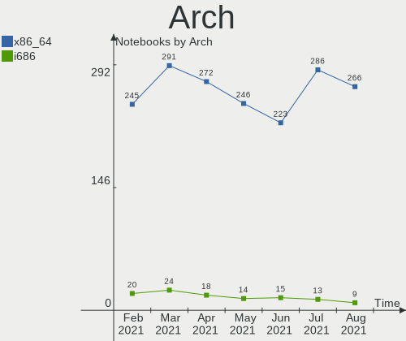
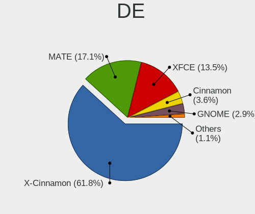
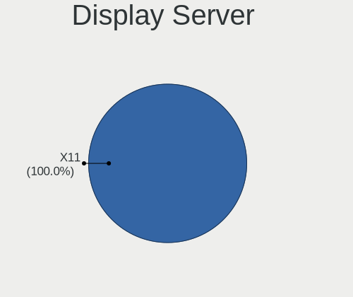
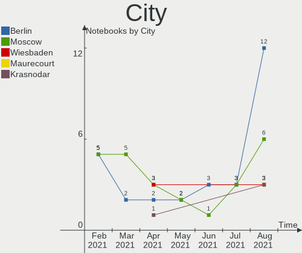
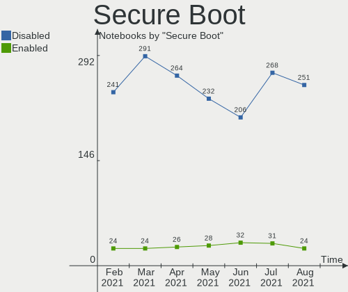
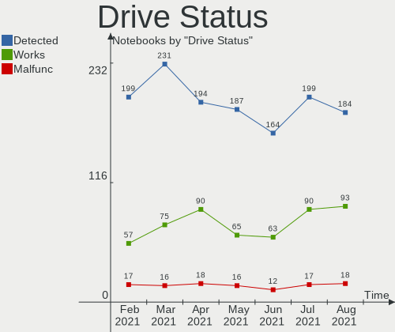
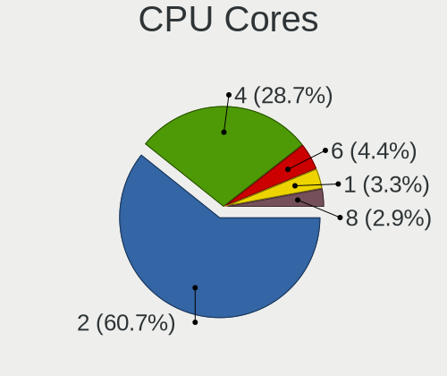
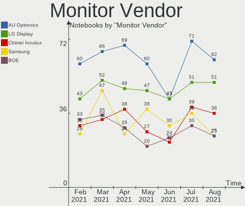
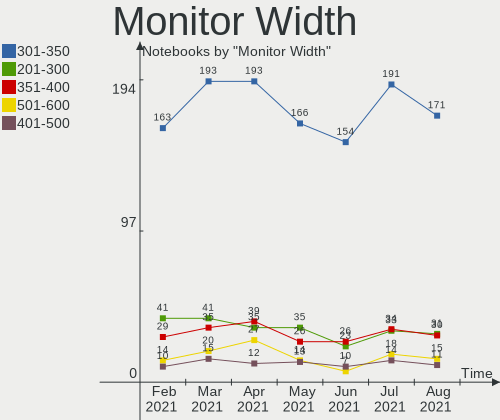
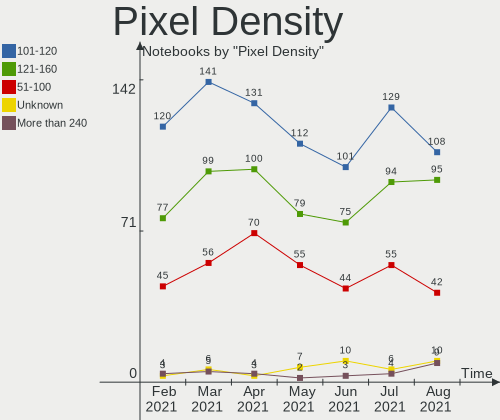

Mint Hardware Trends (Notebook)
-------------------------------

A project to identify most popular hardware characteristics and track their change
over time based on data collected by Mint users at https://Linux-Hardware.org.

Anyone can contribute to the study by uploading probes of their computers by
the [hw-probe](https://github.com/linuxhw/hw-probe) tool:

    sudo hw-probe -all -upload

Full-feature report is available here: https://linux-hardware.org/?view=trends&formfactor=notebook

Period: Feb, 2020.

Contents
--------

- [ OS                       ](#os)
- [ OS Family                ](#os-family)
- [ Kernel                   ](#kernel)
- [ Kernel Family            ](#kernel-family)
- [ Kernel Major Ver.        ](#kernel-major-ver)
- [ Arch                     ](#arch)
- [ DE                       ](#de)
- [ Display Server           ](#display-server)
- [ OS Lang                  ](#os-lang)
- [ Boot Mode                ](#boot-mode)
- [ Filesystem               ](#filesystem)
- [ Dual Boot with Linux     ](#dual-boot-with-linux)
- [ Dual Boot (Win)          ](#dual-boot-win)
- [ Country                  ](#country)
- [ City                     ](#city)
- [ Vendor                   ](#vendor)
- [ Model                    ](#model)
- [ Model Family             ](#model-family)
- [ MFG Year                 ](#mfg-year)
- [ Form Factor              ](#form-factor)
- [ Secure Boot              ](#secure-boot)
- [ Coreboot                 ](#coreboot)
- [ RAM Size                 ](#ram-size)
- [ RAM Used                 ](#ram-used)
- [ Drive Vendor             ](#drive-vendor)
- [ Drive Model              ](#drive-model)
- [ Drive Kind               ](#drive-kind)
- [ Drive Connector          ](#drive-connector)
- [ Drive Size               ](#drive-size)
- [ Space Total              ](#space-total)
- [ Space Used               ](#space-used)
- [ Malfunc. Drives          ](#malfunc-drives)
- [ Malfunc. Drive Vendor    ](#malfunc-drive-vendor)
- [ Malfunc. Drive Kind      ](#malfunc-drive-kind)
- [ Failed Drives            ](#failed-drives)
- [ Failed Drive Vendor      ](#failed-drive-vendor)
- [ Drive Status             ](#drive-status)
- [ Storage Vendor           ](#storage-vendor)
- [ Storage Model            ](#storage-model)
- [ Storage Kind             ](#storage-kind)
- [ CPU Vendor               ](#cpu-vendor)
- [ CPU Model                ](#cpu-model)
- [ CPU Model Family         ](#cpu-model-family)
- [ CPU Cores                ](#cpu-cores)
- [ CPU Sockets              ](#cpu-sockets)
- [ CPU Threads              ](#cpu-threads)
- [ CPU Op-Modes             ](#cpu-op-modes)
- [ CPU Microarch            ](#cpu-microarch)
- [ CPU Microcode            ](#cpu-microcode)
- [ GPU Vendor               ](#gpu-vendor)
- [ GPU Model                ](#gpu-model)
- [ GPU Combo                ](#gpu-combo)
- [ GPU Driver               ](#gpu-driver)
- [ GPU Memory               ](#gpu-memory)
- [ Monitor Vendor           ](#monitor-vendor)
- [ Monitor Model            ](#monitor-model)
- [ Monitor Resolution       ](#monitor-resolution)
- [ Monitor Diagonal         ](#monitor-diagonal)
- [ Monitor Width            ](#monitor-width)
- [ Aspect Ratio             ](#aspect-ratio)
- [ Monitor Area             ](#monitor-area)
- [ Pixel Density            ](#pixel-density)
- [ Multiple Monitors        ](#multiple-monitors)
- [ Net Controller Vendor    ](#net-controller-vendor)
- [ Net Controller Model     ](#net-controller-model)
- [ Net Controller Kind      ](#net-controller-kind)
- [ Used Controller          ](#used-controller)
- [ NICs                     ](#nics)
- [ Unsupported Devices      ](#unsupported-devices)
- [ Unsupported Device Types ](#unsupported-device-types)

OS
--

Installed operating systems

| Name      | Computers | Percent |
|-----------|-----------|---------|
| Mint 19.3 | 94        | 81.03%  |
| Mint 19.2 | 8         | 6.9%    |
| Mint 19.1 | 7         | 6.03%   |
| Mint 19   | 6         | 5.17%   |
| Mint 18.3 | 1         | 0.86%   |

OS Family
---------

OS without a version

| Name | Computers | Percent |
|------|-----------|---------|
| Mint | 116       | 100%    |

Kernel
------

Version of the Linux kernel

| Version                 | Computers | Percent |
|-------------------------|-----------|---------|
| 5.3.0-28-generic        | 44        | 37.93%  |
| 5.3.0-40-generic        | 23        | 19.83%  |
| 4.15.0-76-generic       | 15        | 12.93%  |
| 5.0.0-32-generic        | 14        | 12.07%  |
| 4.15.0-88-generic       | 5         | 4.31%   |
| 5.3.0-26-generic        | 2         | 1.72%   |
| 4.15.0-74-generic       | 2         | 1.72%   |
| 4.15.0-54-generic       | 2         | 1.72%   |
| 5.6.0-050600rc2-generic | 1         | 0.86%   |
| 5.5.7-050507-generic    | 1         | 0.86%   |
| 5.5.1-050501-generic    | 1         | 0.86%   |
| 5.4.13-050413-generic   | 1         | 0.86%   |
| 5.4.10-050410-generic   | 1         | 0.86%   |
| 5.3.6-050306-generic    | 1         | 0.86%   |
| 4.15.0-65-generic       | 1         | 0.86%   |
| 4.15.0-64-generic       | 1         | 0.86%   |
| 4.15.0-20-generic       | 1         | 0.86%   |

Kernel Family
-------------

Linux kernel without a distro release

| Version | Computers | Percent |
|---------|-----------|---------|
| 5.3.0   | 69        | 59.48%  |
| 4.15.0  | 27        | 23.28%  |
| 5.0.0   | 14        | 12.07%  |
| 5.6.0   | 1         | 0.86%   |
| 5.5.7   | 1         | 0.86%   |
| 5.5.1   | 1         | 0.86%   |
| 5.4.13  | 1         | 0.86%   |
| 5.4.10  | 1         | 0.86%   |
| 5.3.6   | 1         | 0.86%   |

Kernel Major Ver.
-----------------

Linux kernel major version

| Version | Computers | Percent |
|---------|-----------|---------|
| 5.3     | 70        | 60.34%  |
| 4.15    | 27        | 23.28%  |
| 5.0     | 14        | 12.07%  |
| 5.5     | 2         | 1.72%   |
| 5.4     | 2         | 1.72%   |
| 5.6     | 1         | 0.86%   |

Arch
----

OS architecture (x86_64, i586, etc.)

| Name   | Computers | Percent |
|--------|-----------|---------|
| x86_64 | 107       | 92.24%  |
| i686   | 9         | 7.76%   |

DE
--

Desktop Environment

| Name       | Computers | Percent |
|------------|-----------|---------|
| X-Cinnamon | 70        | 60.34%  |
| MATE       | 13        | 11.21%  |
| Cinnamon   | 13        | 11.21%  |
| XFCE       | 9         | 7.76%   |
| Unknown    | 7         | 6.03%   |
| GNOME      | 4         | 3.45%   |

Display Server
--------------

X11 or Wayland

| Name | Computers | Percent |
|------|-----------|---------|
| X11  | 116       | 100%    |

OS Lang
-------

Language

| Lang    | Computers | Percent |
|---------|-----------|---------|
| en_US   | 29        | 25%     |
| pt_BR   | 16        | 13.79%  |
| de_DE   | 10        | 8.62%   |
| Unknown | 9         | 7.76%   |
| ru_RU   | 8         | 6.9%    |
| es_ES   | 7         | 6.03%   |
| fr_FR   | 5         | 4.31%   |
| ru_UA   | 3         | 2.59%   |
| en_GB   | 3         | 2.59%   |
| uk_UA   | 2         | 1.72%   |
| sv_SE   | 2         | 1.72%   |
| pl_PL   | 2         | 1.72%   |
| hu_HU   | 2         | 1.72%   |
| fi_FI   | 2         | 1.72%   |
| en_ZA   | 2         | 1.72%   |
| en_AU   | 2         | 1.72%   |
| sk_SK   | 1         | 0.86%   |
| nl_NL   | 1         | 0.86%   |
| it_IT   | 1         | 0.86%   |
| es_MX   | 1         | 0.86%   |
| es_CR   | 1         | 0.86%   |
| es_AR   | 1         | 0.86%   |
| en_NG   | 1         | 0.86%   |
| en_IE   | 1         | 0.86%   |
| en_CA   | 1         | 0.86%   |
| el_GR   | 1         | 0.86%   |
| de_CH   | 1         | 0.86%   |
| de_AT   | 1         | 0.86%   |

Boot Mode
---------

EFI or BIOS

| Mode | Computers | Percent |
|------|-----------|---------|
| BIOS | 64        | 55.17%  |
| EFI  | 52        | 44.83%  |

Filesystem
----------

Type of filesystem

| Type  | Computers | Percent |
|-------|-----------|---------|
| Ext4  | 114       | 98.28%  |
| Ext2  | 1         | 0.86%   |
| Btrfs | 1         | 0.86%   |

Dual Boot with Linux
--------------------

Hosting more than one Linux

| Dual boot | Computers | Percent |
|-----------|-----------|---------|
| No        | 111       | 95.69%  |
| Yes       | 5         | 4.31%   |

Dual Boot (Win)
---------------

Hosting Linux and Windows

| Dual boot | Computers | Percent |
|-----------|-----------|---------|
| No        | 103       | 88.79%  |
| Yes       | 13        | 11.21%  |

Country
-------

Geographic location (country)

| Country        | Computers | Percent |
|----------------|-----------|---------|
| USA            | 19        | 16.38%  |
| Brazil         | 15        | 12.93%  |
| Germany        | 11        | 9.48%   |
| Russia         | 9         | 7.76%   |
| Spain          | 8         | 6.9%    |
| Ukraine        | 5         | 4.31%   |
| France         | 5         | 4.31%   |
| Turkey         | 3         | 2.59%   |
| Mexico         | 3         | 2.59%   |
| Canada         | 3         | 2.59%   |
| UK             | 2         | 1.72%   |
| Sweden         | 2         | 1.72%   |
| South Africa   | 2         | 1.72%   |
| Morocco        | 2         | 1.72%   |
| Hungary        | 2         | 1.72%   |
| Greece         | 2         | 1.72%   |
| Finland        | 2         | 1.72%   |
| Belgium        | 2         | 1.72%   |
| Australia      | 2         | 1.72%   |
| Switzerland    | 1         | 0.86%   |
| Slovakia       | 1         | 0.86%   |
| Serbia         | 1         | 0.86%   |
| Saudi Arabia   | 1         | 0.86%   |
| Puerto Rico    | 1         | 0.86%   |
| Portugal       | 1         | 0.86%   |
| Poland         | 1         | 0.86%   |
| Nigeria        | 1         | 0.86%   |
| Netherlands    | 1         | 0.86%   |
| Latvia         | 1         | 0.86%   |
| Italy          | 1         | 0.86%   |
| Ireland        | 1         | 0.86%   |
| Czech Republic | 1         | 0.86%   |
| Costa Rica     | 1         | 0.86%   |
| Belarus        | 1         | 0.86%   |
| Austria        | 1         | 0.86%   |
| Argentina      | 1         | 0.86%   |

City
----

Geographic location (city)

| City                      | Computers | Percent |
|---------------------------|-----------|---------|
| Moscow                    | 3         | 2.59%   |
| Madrid                    | 3         | 2.59%   |
| São Paulo                | 2         | 1.72%   |
| Rio de Janeiro            | 2         | 1.72%   |
| Regina                    | 2         | 1.72%   |
| Paris                     | 2         | 1.72%   |
| Kyiv                      | 2         | 1.72%   |
| Chicago                   | 2         | 1.72%   |
| Zurich                    | 1         | 0.86%   |
| Wiesbaden                 | 1         | 0.86%   |
| Welling                   | 1         | 0.86%   |
| Voskresensk               | 1         | 0.86%   |
| Volos                     | 1         | 0.86%   |
| Vitória                  | 1         | 0.86%   |
| Vienna                    | 1         | 0.86%   |
| Valleyview                | 1         | 0.86%   |
| Ulyanovsk                 | 1         | 0.86%   |
| Trofa                     | 1         | 0.86%   |
| Toenisvorst               | 1         | 0.86%   |
| Thessaloniki              | 1         | 0.86%   |
| Szarvas                   | 1         | 0.86%   |
| Sumaré                   | 1         | 0.86%   |
| Stuttgart                 | 1         | 0.86%   |
| Stockholm                 | 1         | 0.86%   |
| St. Petersburg            | 1         | 0.86%   |
| Soest                     | 1         | 0.86%   |
| Siuro                     | 1         | 0.86%   |
| Sevastopol                | 1         | 0.86%   |
| Sarreguemines             | 1         | 0.86%   |
| Santos                    | 1         | 0.86%   |
| Santa Terezinha de Itaipu | 1         | 0.86%   |
| San Martín de los Andes  | 1         | 0.86%   |
| Safi                      | 1         | 0.86%   |
| Riyadh                    | 1         | 0.86%   |
| Ripon                     | 1         | 0.86%   |
| Riga                      | 1         | 0.86%   |
| Richardson                | 1         | 0.86%   |
| Petrie                    | 1         | 0.86%   |
| Orlando                   | 1         | 0.86%   |
| Odesa                     | 1         | 0.86%   |
| Oberasbach                | 1         | 0.86%   |
| Nyekladhaza               | 1         | 0.86%   |
| Novosibirsk               | 1         | 0.86%   |
| Nova Iguaçu              | 1         | 0.86%   |
| North Charleston          | 1         | 0.86%   |
| Nizhniy Novgorod          | 1         | 0.86%   |
| Málaga                   | 1         | 0.86%   |
| Munich                    | 1         | 0.86%   |
| Mons                      | 1         | 0.86%   |
| Monclova                  | 1         | 0.86%   |
| Minsk                     | 1         | 0.86%   |
| Minneapolis               | 1         | 0.86%   |
| Mexico City               | 1         | 0.86%   |
| Mattoon                   | 1         | 0.86%   |
| Mansfield                 | 1         | 0.86%   |
| Lviv                      | 1         | 0.86%   |
| Logroño                  | 1         | 0.86%   |
| Le Dorat                  | 1         | 0.86%   |
| Laguna                    | 1         | 0.86%   |
| Khimki                    | 1         | 0.86%   |

Vendor
------

Motherboard manufacturer

| Name                | Computers | Percent |
|---------------------|-----------|---------|
| Hewlett-Packard     | 31        | 26.72%  |
| Dell                | 21        | 18.1%   |
| Lenovo              | 17        | 14.66%  |
| Acer                | 11        | 9.48%   |
| ASUSTek Computer    | 10        | 8.62%   |
| Samsung Electronics | 4         | 3.45%   |
| Toshiba             | 3         | 2.59%   |
| MSI                 | 2         | 1.72%   |
| Intel               | 2         | 1.72%   |
| Gigabyte Technology | 2         | 1.72%   |
| Timi                | 1         | 0.86%   |
| Positivo            | 1         | 0.86%   |
| Pegatron            | 1         | 0.86%   |
| Packard Bell        | 1         | 0.86%   |
| Medion              | 1         | 0.86%   |
| Itautec             | 1         | 0.86%   |
| Gateway             | 1         | 0.86%   |
| Fujitsu Siemens     | 1         | 0.86%   |
| Fujitsu             | 1         | 0.86%   |
| Digma               | 1         | 0.86%   |
| Compal              | 1         | 0.86%   |
| Apple               | 1         | 0.86%   |
| AMI                 | 1         | 0.86%   |

Model
-----

Motherboard model

| Name                                            | Computers | Percent |
|-------------------------------------------------|-----------|---------|
| HP Pavilion dv7                                 | 2         | 1.72%   |
| HP Laptop 15-bw0xx                              | 2         | 1.72%   |
| HP 250 G3                                       | 2         | 1.72%   |
| Dell Latitude E5550                             | 2         | 1.72%   |
| Dell Inspiron 3576                              | 2         | 1.72%   |
| Acer Nitro AN515-52                             | 2         | 1.72%   |
| Toshiba Satellite P750                          | 1         | 0.86%   |
| Toshiba Satellite L850-150                      | 1         | 0.86%   |
| Toshiba Satellite A100                          | 1         | 0.86%   |
| Timi TM1701                                     | 1         | 0.86%   |
| Samsung Electronics X120/X170/X171              | 1         | 0.86%   |
| Samsung Electronics RF511/RF411/RF711           | 1         | 0.86%   |
| Samsung Electronics 530U3C/530U4C/532U3C        | 1         | 0.86%   |
| Samsung Electronics 350V5C/351V5C/3540VC/3440VC | 1         | 0.86%   |
| Positivo C14CR01                                | 1         | 0.86%   |
| Pegatron A15                                    | 1         | 0.86%   |
| Packard Bell EasyNote TK85                      | 1         | 0.86%   |
| MSI Prestige 15 A10SC                           | 1         | 0.86%   |
| MSI MS-N014                                     | 1         | 0.86%   |
| Medion WIM2180                                  | 1         | 0.86%   |
| Lenovo Y520-15IKBN 80WK                         | 1         | 0.86%   |
| Lenovo ThinkPad X61s 874824U                    | 1         | 0.86%   |
| Lenovo ThinkPad X250 20CLS3ST01                 | 1         | 0.86%   |
| Lenovo ThinkPad X220 4293AF4                    | 1         | 0.86%   |
| Lenovo ThinkPad X1 Carbon 4th 20FCA0GC00        | 1         | 0.86%   |
| Lenovo ThinkPad X1 Carbon 34602SG               | 1         | 0.86%   |
| Lenovo ThinkPad T440s 20ARS0LU00                | 1         | 0.86%   |
| Lenovo ThinkPad T430 2349RB7                    | 1         | 0.86%   |
| Lenovo ThinkPad T420 4236AK9                    | 1         | 0.86%   |
| Lenovo ThinkPad T410s 29122PG                   | 1         | 0.86%   |
| Lenovo ThinkPad T400 6474AH2                    | 1         | 0.86%   |
| Lenovo ThinkPad SL510 28477MG                   | 1         | 0.86%   |
| Lenovo ThinkPad E14 20RA001MGE                  | 1         | 0.86%   |
| Lenovo IdeaPad Y700 Touch-15ISK 80NW            | 1         | 0.86%   |
| Lenovo IdeaPad 720S-13IKB 81BV                  | 1         | 0.86%   |
| Lenovo G585 2181                                | 1         | 0.86%   |
| Lenovo G400s VILG1                              | 1         | 0.86%   |
| Itautec Infoway N8755                           | 1         | 0.86%   |
| Intel Infoway                                   | 1         | 0.86%   |
| Intel HuronRiver Platform                       | 1         | 0.86%   |
| HP ZBook 15 G2                                  | 1         | 0.86%   |
| HP ProBook 650 G1                               | 1         | 0.86%   |
| HP Pavilion Sleekbook 14 PC                     | 1         | 0.86%   |
| HP Pavilion Notebook                            | 1         | 0.86%   |
| HP Pavilion Laptop 15-cw1xxx                    | 1         | 0.86%   |
| HP Pavilion Laptop 15-cw0xxx                    | 1         | 0.86%   |
| HP Pavilion Laptop 15-cs2xxx                    | 1         | 0.86%   |
| HP Pavilion dv6                                 | 1         | 0.86%   |
| HP Pavilion 15                                  | 1         | 0.86%   |
| HP Pavilion 14                                  | 1         | 0.86%   |
| HP Notebook                                     | 1         | 0.86%   |
| HP Mini 110-4100                                | 1         | 0.86%   |
| HP Laptop 17-by0xxx                             | 1         | 0.86%   |
| HP Laptop 15-db1xxx                             | 1         | 0.86%   |
| HP Laptop 15-bs1xx                              | 1         | 0.86%   |
| HP HDX16                                        | 1         | 0.86%   |
| HP ENVY TS m6 Sleekbook                         | 1         | 0.86%   |
| HP ElitePad 1000 G2                             | 1         | 0.86%   |
| HP EliteBook 8570w                              | 1         | 0.86%   |
| HP EliteBook 8530w                              | 1         | 0.86%   |

Model Family
------------

Motherboard model prefix

| Name                       | Computers | Percent |
|----------------------------|-----------|---------|
| Lenovo ThinkPad            | 12        | 10.34%  |
| HP Pavilion                | 10        | 8.62%   |
| Dell Inspiron              | 10        | 8.62%   |
| Dell Latitude              | 6         | 5.17%   |
| Acer Aspire                | 6         | 5.17%   |
| HP Laptop                  | 5         | 4.31%   |
| Toshiba Satellite          | 3         | 2.59%   |
| HP EliteBook               | 3         | 2.59%   |
| HP Compaq                  | 3         | 2.59%   |
| Dell Vostro                | 3         | 2.59%   |
| Lenovo IdeaPad             | 2         | 1.72%   |
| HP 250                     | 2         | 1.72%   |
| Dell Precision             | 2         | 1.72%   |
| Acer Nitro                 | 2         | 1.72%   |
| Timi TM1701                | 1         | 0.86%   |
| Samsung Electronics X120   | 1         | 0.86%   |
| Samsung Electronics RF511  | 1         | 0.86%   |
| Samsung Electronics 530U3C | 1         | 0.86%   |
| Samsung Electronics 350V5C | 1         | 0.86%   |
| Positivo C14CR01           | 1         | 0.86%   |
| Pegatron A15               | 1         | 0.86%   |
| Packard Bell EasyNote      | 1         | 0.86%   |
| MSI Prestige               | 1         | 0.86%   |
| MSI MS-N014                | 1         | 0.86%   |
| Medion WIM2180             | 1         | 0.86%   |
| Lenovo Y520-15IKBN         | 1         | 0.86%   |
| Lenovo G585                | 1         | 0.86%   |
| Lenovo G400s               | 1         | 0.86%   |
| Itautec Infoway            | 1         | 0.86%   |
| Intel Infoway              | 1         | 0.86%   |
| Intel HuronRiver           | 1         | 0.86%   |
| HP ZBook                   | 1         | 0.86%   |
| HP ProBook                 | 1         | 0.86%   |
| HP Notebook                | 1         | 0.86%   |
| HP Mini                    | 1         | 0.86%   |
| HP HDX16                   | 1         | 0.86%   |
| HP ENVY                    | 1         | 0.86%   |
| HP ElitePad                | 1         | 0.86%   |
| HP 240                     | 1         | 0.86%   |
| Gigabyte GB-BXA8-5557      | 1         | 0.86%   |
| Gigabyte GB-BSi7A-6500     | 1         | 0.86%   |
| Gateway NV53A              | 1         | 0.86%   |
| Fujitsu Siemens ESPRIMO    | 1         | 0.86%   |
| Fujitsu LIFEBOOK           | 1         | 0.86%   |
| Digma ES6017EW             | 1         | 0.86%   |
| ASUS X55VD                 | 1         | 0.86%   |
| ASUS X553MA                | 1         | 0.86%   |
| ASUS X551MA                | 1         | 0.86%   |
| ASUS X550CL                | 1         | 0.86%   |
| ASUS K55N                  | 1         | 0.86%   |
| ASUS K52F                  | 1         | 0.86%   |
| ASUS K46CA                 | 1         | 0.86%   |
| ASUS GL702ZC               | 1         | 0.86%   |
| ASUS BU401LAV              | 1         | 0.86%   |
| ASUS BU201LA               | 1         | 0.86%   |
| Apple MacBookPro8          | 1         | 0.86%   |
| AMI Intel                  | 1         | 0.86%   |
| Acer V5-171                | 1         | 0.86%   |
| Acer Extensa               | 1         | 0.86%   |
| Acer AOD257                | 1         | 0.86%   |

MFG Year
--------

Motherboard manufacture year

| Year | Computers | Percent |
|------|-----------|---------|
| 2019 | 21        | 18.1%   |
| 2018 | 16        | 13.79%  |
| 2012 | 15        | 12.93%  |
| 2013 | 14        | 12.07%  |
| 2014 | 8         | 6.9%    |
| 2017 | 7         | 6.03%   |
| 2010 | 7         | 6.03%   |
| 2016 | 5         | 4.31%   |
| 2015 | 5         | 4.31%   |
| 2011 | 5         | 4.31%   |
| 2008 | 5         | 4.31%   |
| 2009 | 4         | 3.45%   |
| 2007 | 2         | 1.72%   |
| 2006 | 2         | 1.72%   |

Form Factor
-----------

Physical design of the computer

| Name     | Computers | Percent |
|----------|-----------|---------|
| Notebook | 116       | 100%    |

Secure Boot
-----------

Enabled or disabled

| State    | Computers | Percent |
|----------|-----------|---------|
| Disabled | 101       | 87.07%  |
| Enabled  | 15        | 12.93%  |

Coreboot
--------

Have coreboot on board

| Used | Computers | Percent |
|------|-----------|---------|
| No   | 116       | 100%    |

RAM Size
--------

Total RAM memory

| Size in GB | Computers | Percent |
|------------|-----------|---------|
| 4.01-8.0   | 32        | 27.59%  |
| 3.01-4.0   | 31        | 26.72%  |
| 8.01-16.0  | 20        | 17.24%  |
| 16.01-24.0 | 14        | 12.07%  |
| 2.01-3.0   | 8         | 6.9%    |
| 1.01-2.0   | 8         | 6.9%    |
| 0.01-1.0   | 2         | 1.72%   |
| 32.01-64.0 | 1         | 0.86%   |

RAM Used
--------

Used RAM memory

| Used GB   | Computers | Percent |
|-----------|-----------|---------|
| 1.01-2.0  | 58        | 50%     |
| 2.01-3.0  | 26        | 22.41%  |
| 0.01-1.0  | 16        | 13.79%  |
| 4.01-8.0  | 9         | 7.76%   |
| 3.01-4.0  | 5         | 4.31%   |
| 8.01-16.0 | 2         | 1.72%   |

Drive Vendor
------------

Hard drive vendors

| Vendor              | Computers | Drives | Percent |
|---------------------|-----------|--------|---------|
| Seagate             | 27        | 28     | 20.93%  |
| WDC                 | 23        | 26     | 17.83%  |
| Samsung Electronics | 16        | 17     | 12.4%   |
| Toshiba             | 15        | 15     | 11.63%  |
| Hitachi             | 8         | 8      | 6.2%    |
| Kingston            | 7         | 7      | 5.43%   |
| SanDisk             | 6         | 6      | 4.65%   |
| Unknown             | 5         | 7      | 3.88%   |
| SPCC                | 3         | 3      | 2.33%   |
| HGST                | 3         | 3      | 2.33%   |
| Crucial             | 3         | 3      | 2.33%   |
| PNY                 | 2         | 2      | 1.55%   |
| Hewlett-Packard     | 2         | 2      | 1.55%   |
| WDC WD50            | 1         | 1      | 0.78%   |
| Super Talent        | 1         | 1      | 0.78%   |
| SK Hynix            | 1         | 1      | 0.78%   |
| OCZ                 | 1         | 1      | 0.78%   |
| Micron Technology   | 1         | 1      | 0.78%   |
| LITEONIT            | 1         | 1      | 0.78%   |
| Kingchuxing         | 1         | 1      | 0.78%   |
| DREVO               | 1         | 1      | 0.78%   |
| Corsair             | 1         | 1      | 0.78%   |

Drive Model
-----------

Hard drive models

| Model                        | Computers | Percent |
|------------------------------|-----------|---------|
| ST500LM012 HN-M500MBB 500GB  | 6         | 4.44%   |
| WD10SPZX-21Z10T0 1TB         | 4         | 2.96%   |
| ST500LT012-1DG142 500GB      | 4         | 2.96%   |
| SA400S37240G 240GB SSD       | 4         | 2.96%   |
| MQ01ABD100 1TB               | 4         | 2.96%   |
| ST1000LM024 HN-M101MBB 1TB   | 3         | 2.22%   |
| WDS250G1B0A-00H9H0 250GB SSD | 2         | 1.48%   |
| WD3200BPVT-22ZEST0 320GB     | 2         | 1.48%   |
| ST750LM022 HN-M750MBB 752GB  | 2         | 1.48%   |
| SA400S37480G 480GB SSD       | 2         | 1.48%   |
| MMC Card  16GB               | 2         | 1.48%   |
| MK5059GSXP 500GB             | 2         | 1.48%   |
| HTS545050A7E380 500GB        | 2         | 1.48%   |
| HTS543216L9A300 160GB        | 2         | 1.48%   |
| X1 Pro SSD 128GB             | 1         | 0.74%   |
| WDS500G2B0B 500GB SSD        | 1         | 0.74%   |
| WDS240G2G0A-00JH30 240GB SSD | 1         | 0.74%   |
| WDS240G1G0A-00SS50 240GB SSD | 1         | 0.74%   |
| WD800BEVS-08RST2 80GB        | 1         | 0.74%   |
| WD6400BEVT-80A0RT0 640GB     | 1         | 0.74%   |
| WD5000LPVX-60V0TT0 500GB     | 1         | 0.74%   |
| WD5000BEVT-22A0RT0 500GB     | 1         | 0.74%   |
| WD3200BEVT-80A0RT0 320GB     | 1         | 0.74%   |
| WD3200BEVT-22ZCT0 320GB      | 1         | 0.74%   |
| WD3200BEKT-75PVMT1 320GB     | 1         | 0.74%   |
| WD1600BJKT-75F4T0 160GB      | 1         | 0.74%   |
| WD10SPZX-75Z10T1 1TB         | 1         | 0.74%   |
| WD10SPZX-60Z10T0 1TB         | 1         | 0.74%   |
| WD10SPZX-22Z10T0 1TB         | 1         | 0.74%   |
| WD10SPCX-24HWST1 1TB         | 1         | 0.74%   |
| WD10JPVX-60JC3T1 1TB         | 1         | 0.74%   |
| WD10JPVX-60JC3T0 1TB         | 1         | 0.74%   |
| SU04G  4GB                   | 1         | 0.74%   |
| ST980811AS 80GB              | 1         | 0.74%   |
| ST9750420AS 752GB            | 1         | 0.74%   |
| ST9500420AS 500GB            | 1         | 0.74%   |
| ST9500325ASG 500GB           | 1         | 0.74%   |
| ST9320423AS 320GB            | 1         | 0.74%   |
| ST9250410AS 250GB            | 1         | 0.74%   |
| ST9250315AS 250GB            | 1         | 0.74%   |
| ST500LT012-9WS142 500GB      | 1         | 0.74%   |
| ST320LT020-9YG142 320GB      | 1         | 0.74%   |
| ST2000LM007-1R8174 2TB       | 1         | 0.74%   |
| SSD S700 250GB               | 1         | 0.74%   |
| SSD PLUS 480GB               | 1         | 0.74%   |
| SSD i100 24GB                | 1         | 0.74%   |
| SSD 860 EVO 500GB            | 1         | 0.74%   |
| SSD 860 EVO 250GB            | 1         | 0.74%   |
| SSD 860 EVO 1TB              | 1         | 0.74%   |
| SSD 850 EVO mSATA 120GB      | 1         | 0.74%   |
| SSD 850 EVO 500GB            | 1         | 0.74%   |
| SSD 850 EVO 250GB            | 1         | 0.74%   |
| SSD 840 Series 500GB         | 1         | 0.74%   |
| SSD 840 EVO 250GB            | 1         | 0.74%   |
| SSD 480GB                    | 1         | 0.74%   |
| Solid State Disk 64GB        | 1         | 0.74%   |
| Solid State Disk 256GB       | 1         | 0.74%   |
| Solid State Disk 240GB       | 1         | 0.74%   |
| SG9MSM6D024GPM00 22GB SSD    | 1         | 0.74%   |
| SD8SN8U256G1002 256GB SSD    | 1         | 0.74%   |

Drive Kind
----------

HDD or SSD

| Kind    | Computers | Drives | Percent |
|---------|-----------|--------|---------|
| HDD     | 73        | 73     | 56.59%  |
| SSD     | 44        | 47     | 34.11%  |
| MMC     | 5         | 8      | 3.88%   |
| NVMe    | 5         | 5      | 3.88%   |
| Unknown | 2         | 3      | 1.55%   |

Drive Connector
---------------

SATA, SAS, NVMe, etc.

| Type | Computers | Drives | Percent |
|------|-----------|--------|---------|
| SATA | 104       | 118    | 88.14%  |
| NVMe | 5         | 5      | 4.24%   |
| MMC  | 5         | 8      | 4.24%   |
| SAS  | 4         | 5      | 3.39%   |

Drive Size
----------

Size of hard drive

| Size in TB | Computers | Drives | Percent |
|------------|-----------|--------|---------|
| 0.01-0.5   | 83        | 100    | 70.94%  |
| 0.51-1.0   | 32        | 34     | 27.35%  |
| 3.01-4.0   | 1         | 1      | 0.85%   |
| 1.01-2.0   | 1         | 1      | 0.85%   |

Space Total
-----------

Amount of disk space available on the file system

| Size in GB     | Computers | Percent |
|----------------|-----------|---------|
| 251-500        | 39        | 33.62%  |
| 101-250        | 35        | 30.17%  |
| 501-1000       | 20        | 17.24%  |
| 51-100         | 12        | 10.34%  |
| 21-50          | 3         | 2.59%   |
| 1001-2000      | 3         | 2.59%   |
| More than 3000 | 2         | 1.72%   |
| Unknown        | 2         | 1.72%   |

Space Used
----------

Amount of used disk space

| Used GB        | Computers | Percent |
|----------------|-----------|---------|
| 21-50          | 32        | 27.59%  |
| 1-20           | 31        | 26.72%  |
| 51-100         | 17        | 14.66%  |
| 101-250        | 16        | 13.79%  |
| 251-500        | 13        | 11.21%  |
| 501-1000       | 3         | 2.59%   |
| Unknown        | 2         | 1.72%   |
| More than 3000 | 1         | 0.86%   |
| 2001-3000      | 1         | 0.86%   |

Malfunc. Drives
---------------

Drive models with a malfunction

| Model                        | Computers | Drives | Percent |
|------------------------------|-----------|--------|---------|
| WD10JPVX-60JC3T1 1TB         | 1         | 1      | 12.5%   |
| WD10JPVX-60JC3T0 1TB         | 1         | 1      | 12.5%   |
| ST500LM012 HN-M500MBB 500GB  | 1         | 1      | 12.5%   |
| SD7SB3Q256G1002 256GB SSD    | 1         | 1      | 12.5%   |
| MZNLN128HAHQ-000H1 128GB SSD | 1         | 1      | 12.5%   |
| MK5059GSXP 500GB             | 1         | 1      | 12.5%   |
| HTS547550A9E384 500GB        | 1         | 1      | 12.5%   |
| HTS545050A7E680 500GB        | 1         | 1      | 12.5%   |

Malfunc. Drive Vendor
---------------------

Vendors of faulty drives

| Vendor              | Computers | Drives | Percent |
|---------------------|-----------|--------|---------|
| WDC                 | 2         | 2      | 25%     |
| Toshiba             | 1         | 1      | 12.5%   |
| Seagate             | 1         | 1      | 12.5%   |
| SanDisk             | 1         | 1      | 12.5%   |
| Samsung Electronics | 1         | 1      | 12.5%   |
| Hitachi             | 1         | 1      | 12.5%   |
| HGST                | 1         | 1      | 12.5%   |

Malfunc. Drive Kind
-------------------

Kinds of faulty drives

| Kind | Computers | Drives | Percent |
|------|-----------|--------|---------|
| HDD  | 6         | 6      | 75%     |
| SSD  | 2         | 2      | 25%     |

Failed Drives
-------------

Failed drive models

Zero info for selected period =(

Failed Drive Vendor
-------------------

Failed drive vendors

Zero info for selected period =(

Drive Status
------------

Number of failed and malfunc. drives

| Status   | Computers | Drives | Percent |
|----------|-----------|--------|---------|
| Detected | 87        | 110    | 77.68%  |
| Works    | 17        | 18     | 15.18%  |
| Malfunc  | 8         | 8      | 7.14%   |

Storage Vendor
--------------

Storage controller vendors

| Vendor                           | Computers | Percent |
|----------------------------------|-----------|---------|
| Intel                            | 91        | 74.59%  |
| AMD                              | 18        | 14.75%  |
| Samsung Electronics              | 4         | 3.28%   |
| Toshiba America Info Systems     | 2         | 1.64%   |
| SK Hynix                         | 2         | 1.64%   |
| Silicon Integrated Systems [SiS] | 1         | 0.82%   |
| Silicon Image                    | 1         | 0.82%   |
| Seagate Technology               | 1         | 0.82%   |
| Sandisk                          | 1         | 0.82%   |
| Phison Electronics               | 1         | 0.82%   |

Storage Model
-------------

Storage controller models

| Model                                                                            | Computers | Percent |
|----------------------------------------------------------------------------------|-----------|---------|
| FCH SATA Controller [AHCI mode]                                                  | 15        | 10.71%  |
| 7 Series Chipset Family 6-port SATA Controller [AHCI mode]                       | 14        | 10%     |
| 82801 Mobile SATA Controller [RAID mode]                                         | 10        | 7.14%   |
| 6 Series/C200 Series Chipset Family 6 port Mobile SATA AHCI Controller           | 10        | 7.14%   |
| Sunrise Point-LP SATA Controller [AHCI mode]                                     | 7         | 5%      |
| 82801IBM/IEM (ICH9M/ICH9M-E) 4 port SATA Controller [AHCI mode]                  | 7         | 5%      |
| 8 Series SATA Controller 1 [AHCI mode]                                           | 7         | 5%      |
| Atom Processor E3800 Series SATA AHCI Controller                                 | 5         | 3.57%   |
| 82801HM/HEM (ICH8M/ICH8M-E) SATA Controller [AHCI mode]                          | 4         | 2.86%   |
| 82801HM/HEM (ICH8M/ICH8M-E) IDE Controller                                       | 4         | 2.86%   |
| Wildcat Point-LP SATA Controller [AHCI Mode]                                     | 3         | 2.14%   |
| Non-Volatile memory controller                                                   | 3         | 2.14%   |
| HM170/QM170 Chipset SATA Controller [AHCI Mode]                                  | 3         | 2.14%   |
| 5 Series/3400 Series Chipset 4 port SATA AHCI Controller                         | 3         | 2.14%   |
| NVMe SSD Controller SM961/PM961                                                  | 2         | 1.43%   |
| NM10/ICH7 Family SATA Controller [AHCI mode]                                     | 2         | 1.43%   |
| FCH IDE Controller                                                               | 2         | 1.43%   |
| Cannon Lake Mobile PCH SATA AHCI Controller                                      | 2         | 1.43%   |
| 5 Series/3400 Series Chipset 6 port SATA AHCI Controller                         | 2         | 1.43%   |
| 5 Series/3400 Series Chipset 4 port SATA IDE Controller                          | 2         | 1.43%   |
| 5 Series/3400 Series Chipset 2 port SATA IDE Controller                          | 2         | 1.43%   |
| WD Black 2018/PC SN520 NVMe SSD                                                  | 1         | 0.71%   |
| SSD 660P Series                                                                  | 1         | 0.71%   |
| SiI 3531 [SATALink/SATARaid] Serial ATA Controller                               | 1         | 0.71%   |
| SB7x0/SB8x0/SB9x0 SATA Controller [AHCI mode]                                    | 1         | 0.71%   |
| SB600 Non-Raid-5 SATA                                                            | 1         | 0.71%   |
| SB600 IDE                                                                        | 1         | 0.71%   |
| SATA Controller / IDE mode                                                       | 1         | 0.71%   |
| Q170/Q150/B150/H170/H110/Z170/CM236 Chipset SATA Controller [AHCI Mode]          | 1         | 0.71%   |
| NVMe SSD Controller SM981/PM981/PM983                                            | 1         | 0.71%   |
| NVMe SSD Controller SM951/PM951                                                  | 1         | 0.71%   |
| NVMe Controller                                                                  | 1         | 0.71%   |
| NM10/ICH7 Family SATA Controller [IDE mode]                                      | 1         | 0.71%   |
| Mobile PM965/GM965 PT IDER Controller                                            | 1         | 0.71%   |
| FCH SATA Controller [IDE mode]                                                   | 1         | 0.71%   |
| E12 NVMe Controller                                                              | 1         | 0.71%   |
| Comet Lake SATA AHCI Controller                                                  | 1         | 0.71%   |
| Cannon Point-LP SATA Controller [AHCI Mode]                                      | 1         | 0.71%   |
| BG3 NVMe SSD Controller                                                          | 1         | 0.71%   |
| 82801HM/HEM (ICH8M/ICH8M-E) SATA Controller [IDE mode]                           | 1         | 0.71%   |
| 82801GBM/GHM (ICH7-M Family) SATA Controller [IDE mode]                          | 1         | 0.71%   |
| 82801GBM/GHM (ICH7-M Family) SATA Controller [AHCI mode]                         | 1         | 0.71%   |
| 82801G (ICH7 Family) IDE Controller                                              | 1         | 0.71%   |
| 8 Series/C220 Series Chipset Family 2-port SATA Controller 2 [IDE mode]          | 1         | 0.71%   |
| 8 Series Chipset Family 4-port SATA Controller 1 [IDE mode] - Mobile             | 1         | 0.71%   |
| 7 Series Chipset Family 4-port SATA Controller [IDE mode]                        | 1         | 0.71%   |
| 7 Series Chipset Family 2-port SATA Controller [IDE mode]                        | 1         | 0.71%   |
| 6 Series/C200 Series Chipset Family Mobile SATA Controller (IDE mode, ports 4-5) | 1         | 0.71%   |
| 6 Series/C200 Series Chipset Family Mobile SATA Controller (IDE mode, ports 0-3) | 1         | 0.71%   |
| 5513 IDE Controller                                                              | 1         | 0.71%   |
| 5 Series/3400 Series Chipset PT IDER Controller                                  | 1         | 0.71%   |
| 300 Series Chipset SATA Controller                                               | 1         | 0.71%   |

Storage Kind
------------

Kind of storage controller (IDE, SATA, NVMe, SAS, ...)

| Kind | Computers | Percent |
|------|-----------|---------|
| SATA | 91        | 68.94%  |
| IDE  | 18        | 13.64%  |
| NVMe | 12        | 9.09%   |
| RAID | 11        | 8.33%   |

CPU Vendor
----------

Processor vendors

| Vendor | Computers | Percent |
|--------|-----------|---------|
| Intel  | 97        | 83.62%  |
| AMD    | 19        | 16.38%  |

CPU Model
---------

Processor models

| Model                                           | Computers | Percent |
|-------------------------------------------------|-----------|---------|
| Intel Core i5-2450M CPU @ 2.50GHz               | 3         | 2.59%   |
| Intel Pentium CPU N3540 @ 2.16GHz               | 2         | 1.72%   |
| Intel Core i7-9750H CPU @ 2.60GHz               | 2         | 1.72%   |
| Intel Core i7-8550U CPU @ 1.80GHz               | 2         | 1.72%   |
| Intel Core i7-5600U CPU @ 2.60GHz               | 2         | 1.72%   |
| Intel Core i7-4500U CPU @ 1.80GHz               | 2         | 1.72%   |
| Intel Core i7-2670QM CPU @ 2.20GHz              | 2         | 1.72%   |
| Intel Core i7-2640M CPU @ 2.80GHz               | 2         | 1.72%   |
| Intel Core i7-2630QM CPU @ 2.00GHz              | 2         | 1.72%   |
| Intel Core i5-8265U CPU @ 1.60GHz               | 2         | 1.72%   |
| Intel Core i5-8250U CPU @ 1.60GHz               | 2         | 1.72%   |
| Intel Core i5-4210U CPU @ 1.70GHz               | 2         | 1.72%   |
| Intel Core i5-3317U CPU @ 1.70GHz               | 2         | 1.72%   |
| Intel Core i3-3110M CPU @ 2.40GHz               | 2         | 1.72%   |
| Intel Core i3 CPU M 370 @ 2.40GHz               | 2         | 1.72%   |
| Intel Core 2 Duo CPU T7500 @ 2.20GHz            | 2         | 1.72%   |
| Intel Celeron CPU N2840 @ 2.16GHz               | 2         | 1.72%   |
| Intel Atom x5-Z8350 CPU @ 1.44GHz               | 2         | 1.72%   |
| Intel Atom CPU N455 @ 1.66GHz                   | 2         | 1.72%   |
| AMD A9-9420 RADEON R5, 5 COMPUTE CORES 2C+3G    | 2         | 1.72%   |
| AMD A8-7410 APU with AMD Radeon R5 Graphics     | 2         | 1.72%   |
| AMD A10-9600P RADEON R5, 10 COMPUTE CORES 4C+6G | 2         | 1.72%   |
| Intel Pentium Dual-Core CPU T4200 @ 2.00GHz     | 1         | 0.86%   |
| Intel Pentium Dual CPU T3400 @ 2.16GHz          | 1         | 0.86%   |
| Intel Pentium CPU 4417U @ 2.30GHz               | 1         | 0.86%   |
| Intel Pentium CPU 2117U @ 1.80GHz               | 1         | 0.86%   |
| Intel Genuine CPU U2300 @ 1.20GHz               | 1         | 0.86%   |
| Intel Genuine CPU T2250 @ 1.73GHz               | 1         | 0.86%   |
| Intel Core i7-8750H CPU @ 2.20GHz               | 1         | 0.86%   |
| Intel Core i7-7820HQ CPU @ 2.90GHz              | 1         | 0.86%   |
| Intel Core i7-7700HQ CPU @ 2.80GHz              | 1         | 0.86%   |
| Intel Core i7-7500U CPU @ 2.70GHz               | 1         | 0.86%   |
| Intel Core i7-6700HQ CPU @ 2.60GHz              | 1         | 0.86%   |
| Intel Core i7-6600U CPU @ 2.60GHz               | 1         | 0.86%   |
| Intel Core i7-6500U CPU @ 2.50GHz               | 1         | 0.86%   |
| Intel Core i7-4810MQ CPU @ 2.80GHz              | 1         | 0.86%   |
| Intel Core i7-4650U CPU @ 1.70GHz               | 1         | 0.86%   |
| Intel Core i7-4600U CPU @ 2.10GHz               | 1         | 0.86%   |
| Intel Core i7-4510U CPU @ 2.00GHz               | 1         | 0.86%   |
| Intel Core i7-3720QM CPU @ 2.60GHz              | 1         | 0.86%   |
| Intel Core i7-3610QM CPU @ 2.30GHz              | 1         | 0.86%   |
| Intel Core i7-3517U CPU @ 1.90GHz               | 1         | 0.86%   |
| Intel Core i7-2760QM CPU @ 2.40GHz              | 1         | 0.86%   |
| Intel Core i7-10710U CPU @ 1.10GHz              | 1         | 0.86%   |
| Intel Core i7 CPU M 620 @ 2.67GHz               | 1         | 0.86%   |
| Intel Core i5-8300H CPU @ 2.30GHz               | 1         | 0.86%   |
| Intel Core i5-7300HQ CPU @ 2.50GHz              | 1         | 0.86%   |
| Intel Core i5-7200U CPU @ 2.50GHz               | 1         | 0.86%   |
| Intel Core i5-5300U CPU @ 2.30GHz               | 1         | 0.86%   |
| Intel Core i5-5200U CPU @ 2.20GHz               | 1         | 0.86%   |
| Intel Core i5-4200M CPU @ 2.50GHz               | 1         | 0.86%   |
| Intel Core i5-3427U CPU @ 1.80GHz               | 1         | 0.86%   |
| Intel Core i5-3320M CPU @ 2.60GHz               | 1         | 0.86%   |
| Intel Core i5-3210M CPU @ 2.50GHz               | 1         | 0.86%   |
| Intel Core i5-2520M CPU @ 2.50GHz               | 1         | 0.86%   |
| Intel Core i5-2435M CPU @ 2.40GHz               | 1         | 0.86%   |
| Intel Core i5-10210U CPU @ 1.60GHz              | 1         | 0.86%   |
| Intel Core i5 CPU M 560 @ 2.67GHz               | 1         | 0.86%   |
| Intel Core i5 CPU M 540 @ 2.53GHz               | 1         | 0.86%   |
| Intel Core i5 CPU M 520 @ 2.40GHz               | 1         | 0.86%   |

CPU Model Family
----------------

Processor model prefix

| Model                   | Computers | Percent |
|-------------------------|-----------|---------|
| Intel Core i7           | 31        | 26.72%  |
| Intel Core i5           | 27        | 23.28%  |
| Intel Core i3           | 11        | 9.48%   |
| Intel Core 2 Duo        | 10        | 8.62%   |
| Intel Atom              | 6         | 5.17%   |
| AMD A8                  | 5         | 4.31%   |
| Intel Pentium           | 4         | 3.45%   |
| Other                   | 3         | 2.59%   |
| Intel Celeron           | 3         | 2.59%   |
| AMD A10                 | 3         | 2.59%   |
| Intel Genuine           | 2         | 1.72%   |
| AMD Ryzen 7             | 2         | 1.72%   |
| Intel Pentium Dual-Core | 1         | 0.86%   |
| Intel Pentium Dual      | 1         | 0.86%   |
| Intel Core 2            | 1         | 0.86%   |
| AMD Turion 64 X2 Mobile | 1         | 0.86%   |
| AMD Ryzen 5             | 1         | 0.86%   |
| AMD Phenom II           | 1         | 0.86%   |
| AMD E1                  | 1         | 0.86%   |
| AMD A4                  | 1         | 0.86%   |
| AMD A12                 | 1         | 0.86%   |

CPU Cores
---------

Number of processor cores

| Number | Computers | Percent |
|--------|-----------|---------|
| 2      | 78        | 67.24%  |
| 4      | 30        | 25.86%  |
| 6      | 4         | 3.45%   |
| 1      | 2         | 1.72%   |
| 8      | 1         | 0.86%   |
| 3      | 1         | 0.86%   |

CPU Sockets
-----------

Number of sockets

| Number | Computers | Percent |
|--------|-----------|---------|
| 1      | 116       | 100%    |

CPU Threads
-----------

Threads per core (Hyper-Threading)

| Number | Computers | Percent |
|--------|-----------|---------|
| 2      | 81        | 69.83%  |
| 1      | 35        | 30.17%  |

CPU Op-Modes
------------

CPU Operation Modes (32-bit, 64-bit)

| Op mode        | Computers | Percent |
|----------------|-----------|---------|
| 32-bit, 64-bit | 114       | 98.28%  |
| 32-bit         | 2         | 1.72%   |

CPU Microarch
-------------

Microarchitecture

| Name        | Computers | Percent |
|-------------|-----------|---------|
| Skylake     | 22        | 18.97%  |
| SandyBridge | 16        | 13.79%  |
| Core        | 14        | 12.07%  |
| IvyBridge   | 12        | 10.34%  |
| Haswell     | 9         | 7.76%   |
| Westmere    | 8         | 6.9%    |
| Silvermont  | 8         | 6.9%    |
| Excavator   | 7         | 6.03%   |
| Broadwell   | 4         | 3.45%   |
| Piledriver  | 3         | 2.59%   |
| Bonnell     | 3         | 2.59%   |
| Zen+        | 2         | 1.72%   |
| Puma        | 2         | 1.72%   |
| Zen         | 1         | 0.86%   |
| P6          | 1         | 0.86%   |
| K8 Hammer   | 1         | 0.86%   |
| K10 Llano   | 1         | 0.86%   |
| K10         | 1         | 0.86%   |
| Bobcat      | 1         | 0.86%   |

CPU Microcode
-------------

Microcode number

| Number     | Computers | Percent |
|------------|-----------|---------|
| 0x206a7    | 16        | 13.79%  |
| Unknown    | 13        | 11.21%  |
| 0x306a9    | 10        | 8.62%   |
| 0x40651    | 6         | 5.17%   |
| 0x806ea    | 5         | 4.31%   |
| 0x1067a    | 5         | 4.31%   |
| 0x906ea    | 4         | 3.45%   |
| 0x30678    | 4         | 3.45%   |
| 0x20655    | 4         | 3.45%   |
| 0x906e9    | 3         | 2.59%   |
| 0x6fd      | 3         | 2.59%   |
| 0x306d4    | 3         | 2.59%   |
| 0x20652    | 3         | 2.59%   |
| 0x0600611a | 3         | 2.59%   |
| 0x06001119 | 3         | 2.59%   |
| 0x806ec    | 2         | 1.72%   |
| 0x806e9    | 2         | 1.72%   |
| 0x6fb      | 2         | 1.72%   |
| 0x406c4    | 2         | 1.72%   |
| 0x306c3    | 2         | 1.72%   |
| 0x106ca    | 2         | 1.72%   |
| 0x10676    | 2         | 1.72%   |
| 0x08108102 | 2         | 1.72%   |
| 0x06006705 | 2         | 1.72%   |
| 0x06006704 | 2         | 1.72%   |
| 0xa0660    | 1         | 0.86%   |
| 0x806eb    | 1         | 0.86%   |
| 0x6fa      | 1         | 0.86%   |
| 0x6f6      | 1         | 0.86%   |
| 0x6e8      | 1         | 0.86%   |
| 0x506e3    | 1         | 0.86%   |
| 0x30673    | 1         | 0.86%   |
| 0x08001122 | 1         | 0.86%   |
| 0x07030105 | 1         | 0.86%   |
| 0x03000027 | 1         | 0.86%   |
| 0x010000c8 | 1         | 0.86%   |

GPU Vendor
----------

Vendors of graphics cards

| Vendor                           | Computers | Percent |
|----------------------------------|-----------|---------|
| Intel                            | 88        | 59.46%  |
| Nvidia                           | 31        | 20.95%  |
| AMD                              | 28        | 18.92%  |
| Silicon Integrated Systems [SiS] | 1         | 0.68%   |

GPU Model
---------

Graphics card models

| Model                                                                              | Computers | Percent |
|------------------------------------------------------------------------------------|-----------|---------|
| 2nd Generation Core Processor Family Integrated Graphics Controller                | 15        | 9.55%   |
| 3rd Gen Core processor Graphics Controller                                         | 10        | 6.37%   |
| Haswell-ULT Integrated Graphics Controller                                         | 7         | 4.46%   |
| Core Processor Integrated Graphics Controller                                      | 7         | 4.46%   |
| Atom Processor Z36xxx/Z37xxx Series Graphics & Display                             | 6         | 3.82%   |
| UHD Graphics 630 (Mobile)                                                          | 4         | 2.55%   |
| UHD Graphics 620                                                                   | 4         | 2.55%   |
| Stoney [Radeon R2/R3/R4/R5 Graphics]                                               | 4         | 2.55%   |
| Mobile GM965/GL960 Integrated Graphics Controller (secondary)                      | 4         | 2.55%   |
| Mobile GM965/GL960 Integrated Graphics Controller (primary)                        | 4         | 2.55%   |
| Mobile 4 Series Chipset Integrated Graphics Controller                             | 4         | 2.55%   |
| HD Graphics 5500                                                                   | 4         | 2.55%   |
| Wani [Radeon R5/R6/R7 Graphics]                                                    | 3         | 1.91%   |
| Topaz XT [Radeon R7 M260/M265 / M340/M360 / M440/M445 / 530/535 / 620/625 Mobile]  | 3         | 1.91%   |
| Skylake GT2 [HD Graphics 520]                                                      | 3         | 1.91%   |
| HD Graphics 630                                                                    | 3         | 1.91%   |
| GM108M [GeForce 840M]                                                              | 3         | 1.91%   |
| GF117M [GeForce 610M/710M/810M/820M / GT 620M/625M/630M/720M]                      | 3         | 1.91%   |
| UHD Graphics 620 (Whiskey Lake)                                                    | 2         | 1.27%   |
| UHD Graphics                                                                       | 2         | 1.27%   |
| TU117M [GeForce GTX 1650 Mobile / Max-Q]                                           | 2         | 1.27%   |
| Thames [Radeon HD 7500M/7600M Series]                                              | 2         | 1.27%   |
| Picasso                                                                            | 2         | 1.27%   |
| Mullins [Radeon R4/R5 Graphics]                                                    | 2         | 1.27%   |
| Mobile 945GM/GMS/GME, 943/940GML Express Integrated Graphics Controller            | 2         | 1.27%   |
| Mobile 945GM/GMS, 943/940GML Express Integrated Graphics Controller                | 2         | 1.27%   |
| Jet PRO [Radeon R5 M230 / R7 M260DX / Radeon 520 Mobile]                           | 2         | 1.27%   |
| HD Graphics 620                                                                    | 2         | 1.27%   |
| GT218M [NVS 3100M]                                                                 | 2         | 1.27%   |
| GP107M [GeForce GTX 1050 Mobile]                                                   | 2         | 1.27%   |
| GP106M [GeForce GTX 1060 Mobile]                                                   | 2         | 1.27%   |
| GF108M [GeForce GT 540M]                                                           | 2         | 1.27%   |
| Atom/Celeron/Pentium Processor x5-E8000/J3xxx/N3xxx Integrated Graphics Controller | 2         | 1.27%   |
| Atom Processor D4xx/D5xx/N4xx/N5xx Integrated Graphics Controller                  | 2         | 1.27%   |
| 4th Gen Core Processor Integrated Graphics Controller                              | 2         | 1.27%   |
| Wrestler [Radeon HD 7310]                                                          | 1         | 0.64%   |
| Whistler [Radeon HD 6730M/6770M/7690M XT]                                          | 1         | 0.64%   |
| Whistler [Radeon HD 6630M/6650M/6750M/7670M/7690M]                                 | 1         | 0.64%   |
| TU117GLM [Quadro T1000 Mobile]                                                     | 1         | 0.64%   |
| Trinity [Radeon HD 7640G]                                                          | 1         | 0.64%   |
| Sun XT [Radeon HD 8670A/8670M/8690M / R5 M330 / M430 / Radeon 520 Mobile]          | 1         | 0.64%   |
| Sumo [Radeon HD 6620G]                                                             | 1         | 0.64%   |
| Seymour [Radeon HD 6400M/7400M Series]                                             | 1         | 0.64%   |
| RS880M [Mobility Radeon HD 4225/4250]                                              | 1         | 0.64%   |
| RS690M [Radeon Xpress 1200/1250/1270]                                              | 1         | 0.64%   |
| Richland [Radeon HD 8610G]                                                         | 1         | 0.64%   |
| Richland [Radeon HD 8550G]                                                         | 1         | 0.64%   |
| Lexa PRO [Radeon 540/540X/550/550X / RX 540X/550/550X]                             | 1         | 0.64%   |
| Kaby Lake-U GT1 Integrated Graphics Controller                                     | 1         | 0.64%   |
| HD Graphics 530                                                                    | 1         | 0.64%   |
| GP108M [GeForce MX150]                                                             | 1         | 0.64%   |
| GM108M [GeForce 830M]                                                              | 1         | 0.64%   |
| GM107M [GeForce GTX 960M]                                                          | 1         | 0.64%   |
| GM107GLM [Quadro M1200 Mobile]                                                     | 1         | 0.64%   |
| GK107GLM [Quadro K1000M]                                                           | 1         | 0.64%   |
| GK106GLM [Quadro K2100M]                                                           | 1         | 0.64%   |
| GF119M [NVS 4200M]                                                                 | 1         | 0.64%   |
| GF119M [GeForce GT 520M]                                                           | 1         | 0.64%   |
| GF119M [GeForce 610M]                                                              | 1         | 0.64%   |
| GF108M [GeForce GT 620M/630M/635M/640M LE]                                         | 1         | 0.64%   |

GPU Combo
---------

Combinations of graphics cards

| Name           | Computers | Percent |
|----------------|-----------|---------|
| 1 x Intel      | 56        | 48.28%  |
| Intel + Nvidia | 25        | 21.55%  |
| 1 x AMD        | 18        | 15.52%  |
| Intel + AMD    | 7         | 6.03%   |
| 1 x Nvidia     | 6         | 5.17%   |
| 2 x AMD        | 3         | 2.59%   |
| 1 x SiS        | 1         | 0.86%   |

GPU Driver
----------

Free vs proprietary

| Driver      | Computers | Percent |
|-------------|-----------|---------|
| Free        | 97        | 83.62%  |
| Proprietary | 18        | 15.52%  |
| Unknown     | 1         | 0.86%   |

GPU Memory
----------

Total video memory

| Size in GB | Computers | Percent |
|------------|-----------|---------|
| Unknown    | 52        | 44.83%  |
| 1.01-2.0   | 20        | 17.24%  |
| 0.01-0.5   | 20        | 17.24%  |
| 0.51-1.0   | 13        | 11.21%  |
| 3.01-4.0   | 11        | 9.48%   |

Monitor Vendor
--------------

Monitor vendors

| Vendor                  | Computers | Percent |
|-------------------------|-----------|---------|
| AU Optronics            | 28        | 22.76%  |
| LG Display              | 25        | 20.33%  |
| Samsung Electronics     | 15        | 12.2%   |
| BOE                     | 13        | 10.57%  |
| Chimei Innolux          | 11        | 8.94%   |
| Goldstar                | 5         | 4.07%   |
| Lenovo                  | 4         | 3.25%   |
| LG Philips              | 3         | 2.44%   |
| CPT                     | 3         | 2.44%   |
| Sharp                   | 2         | 1.63%   |
| InnoLux Display         | 2         | 1.63%   |
| Chi Mei Optoelectronics | 2         | 1.63%   |
| Seiko/Epson             | 1         | 0.81%   |
| Philips                 | 1         | 0.81%   |
| PANDA                   | 1         | 0.81%   |
| LPL                     | 1         | 0.81%   |
| LGD                     | 1         | 0.81%   |
| Hewlett-Packard         | 1         | 0.81%   |
| HannStar                | 1         | 0.81%   |
| Dell                    | 1         | 0.81%   |
| Apple                   | 1         | 0.81%   |
| Acer                    | 1         | 0.81%   |

Monitor Model
-------------

Monitor models

| Model                                              | Computers | Percent |
|----------------------------------------------------|-----------|---------|
| LCD Monitor AUO61ED 1920x1080 340x190mm 15.3-inch  | 4         | 3.23%   |
| LCD Monitor SEC5441 1366x768 344x194mm 15.5-inch   | 3         | 2.42%   |
| LCD Monitor SEC324A 1366x768 344x194mm 15.5-inch   | 2         | 1.61%   |
| LCD Monitor CMN15DB 1366x768 344x193mm 15.5-inch   | 2         | 1.61%   |
| LCD Monitor AUO71EC 1366x768 340x190mm 15.3-inch   | 2         | 1.61%   |
| LCD Monitor AUO313C 1366x768 310x170mm 13.9-inch   | 2         | 1.61%   |
| LCD Monitor AUO10EC 1366x768 340x190mm 15.3-inch   | 2         | 1.61%   |
| LCD Monitor 1280x800                               | 2         | 1.61%   |
| S24F350 SAM0D20 1920x1080 521x293mm 23.5-inch      | 1         | 0.81%   |
| S220HQL ACR0281 1920x1080 477x268mm 21.5-inch      | 1         | 0.81%   |
| PHL 193V5 PHLC0CD 1366x768 410x230mm 18.5-inch     | 1         | 0.81%   |
| P2419H DELD0DA 1920x1080 527x296mm 23.8-inch       | 1         | 0.81%   |
| P2419H DELD0D9 1920x1080 527x296mm 23.8-inch       | 1         | 0.81%   |
| MP59G GSM5B34 1920x1080 480x270mm 21.7-inch        | 1         | 0.81%   |
| LG ULTRAWIDE GSM59F2 1920x1080 800x340mm 34.2-inch | 1         | 0.81%   |
| LG FULL HD GSM5ABB 1920x1080 480x270mm 21.7-inch   | 1         | 0.81%   |
| LCD Monitor SHP14BA 1920x1080 344x194mm 15.5-inch  | 1         | 0.81%   |
| LCD Monitor SHP1476 3840x2160 346x194mm 15.6-inch  | 1         | 0.81%   |
| LCD Monitor SEC5541 1366x768 344x193mm 15.5-inch   | 1         | 0.81%   |
| LCD Monitor SEC544B 1600x900 382x214mm 17.2-inch   | 1         | 0.81%   |
| LCD Monitor SEC5341 1366x768 340x190mm 15.3-inch   | 1         | 0.81%   |
| LCD Monitor SEC364A 1366x768 344x194mm 15.5-inch   | 1         | 0.81%   |
| LCD Monitor SEC3052 1366x768 256x144mm 11.6-inch   | 1         | 0.81%   |
| LCD Monitor SDC4C48 1920x1080 409x230mm 18.5-inch  | 1         | 0.81%   |
| LCD Monitor SAM0D4D 1366x768 609x347mm 27.6-inch   | 1         | 0.81%   |
| LCD Monitor SAM0B32 1920x1080 890x500mm 40.2-inch  | 1         | 0.81%   |
| LCD Monitor SAM0659 1920x1080                      | 1         | 0.81%   |
| LCD Monitor NCP0032 1920x1080 344x194mm 15.5-inch  | 1         | 0.81%   |
| LCD Monitor LPLD700 1280x800 331x207mm 15.4-inch   | 1         | 0.81%   |
| LCD Monitor LPL8D00 1280x800 304x190mm 14.1-inch   | 1         | 0.81%   |
| LCD Monitor LPL0601 1280x800 331x207mm 15.4-inch   | 1         | 0.81%   |
| LCD Monitor LGD05C4 1920x1080 344x194mm 15.5-inch  | 1         | 0.81%   |
| LCD Monitor LGD056D 1920x1080 380x210mm 17.1-inch  | 1         | 0.81%   |
| LCD Monitor LGD0563 1920x1080 344x194mm 15.5-inch  | 1         | 0.81%   |
| LCD Monitor LGD0513 1920x1080 382x215mm 17.3-inch  | 1         | 0.81%   |
| LCD Monitor LGD04EF 1920x1080 294x165mm 13.3-inch  | 1         | 0.81%   |
| LCD Monitor LGD04E8 1920x1080 382x215mm 17.3-inch  | 1         | 0.81%   |
| LCD Monitor LGD04A9 1920x1080 309x174mm 14.0-inch  | 1         | 0.81%   |
| LCD Monitor LGD04A7 1920x1080 340x190mm 15.3-inch  | 1         | 0.81%   |
| LCD Monitor LGD0493 1366x768 344x194mm 15.5-inch   | 1         | 0.81%   |
| LCD Monitor LGD046F 1920x1080 344x194mm 15.5-inch  | 1         | 0.81%   |
| LCD Monitor LGD046B 1366x768 340x190mm 15.3-inch   | 1         | 0.81%   |
| LCD Monitor LGD045C 1366x768 350x190mm 15.7-inch   | 1         | 0.81%   |
| LCD Monitor LGD0458 1366x768 310x174mm 14.0-inch   | 1         | 0.81%   |
| LCD Monitor LGD0437 1920x1080 276x156mm 12.5-inch  | 1         | 0.81%   |
| LCD Monitor LGD0382 1600x900 310x170mm 13.9-inch   | 1         | 0.81%   |
| LCD Monitor LGD034A 1366x768 345x194mm 15.6-inch   | 1         | 0.81%   |
| LCD Monitor LGD033A 1366x768 340x190mm 15.3-inch   | 1         | 0.81%   |
| LCD Monitor LGD0306 1600x900 310x174mm 14.0-inch   | 1         | 0.81%   |
| LCD Monitor LGD02F2 1366x768 344x194mm 15.5-inch   | 1         | 0.81%   |
| LCD Monitor LGD02EB 1366x768 309x174mm 14.0-inch   | 1         | 0.81%   |
| LCD Monitor LGD02E3 1366x768 344x194mm 15.5-inch   | 1         | 0.81%   |
| LCD Monitor LGD02E2 1600x900 310x174mm 14.0-inch   | 1         | 0.81%   |
| LCD Monitor LGD02D3 1366x768 277x156mm 12.5-inch   | 1         | 0.81%   |
| LCD Monitor LGD0283 1920x1080 380x220mm 17.3-inch  | 1         | 0.81%   |
| LCD Monitor LGD01AF 1680x1050 331x207mm 15.4-inch  | 1         | 0.81%   |
| LCD Monitor LEN40B0 1366x768 344x194mm 15.5-inch   | 1         | 0.81%   |
| LCD Monitor LEN4036 1440x900 304x190mm 14.1-inch   | 1         | 0.81%   |
| LCD Monitor LEN4031 1280x800 303x190mm 14.1-inch   | 1         | 0.81%   |
| LCD Monitor LEN4000 1024x768 246x185mm 12.1-inch   | 1         | 0.81%   |

Monitor Resolution
------------------

Monitor screen resolution

| Resolution         | Computers | Percent |
|--------------------|-----------|---------|
| 1366x768 (WXGA)    | 53        | 44.17%  |
| 1920x1080 (FHD)    | 36        | 30%     |
| 1600x900 (HD+)     | 10        | 8.33%   |
| 1280x800 (WXGA)    | 10        | 8.33%   |
| 1024x600           | 4         | 3.33%   |
| 3840x2160 (4K)     | 1         | 0.83%   |
| 2560x1440 (QHD)    | 1         | 0.83%   |
| 2560x1080          | 1         | 0.83%   |
| 1920x1200 (WUXGA)  | 1         | 0.83%   |
| 1680x1050 (WSXGA+) | 1         | 0.83%   |
| 1440x900 (WXGA+)   | 1         | 0.83%   |
| 1024x768 (XGA)     | 1         | 0.83%   |

Monitor Diagonal
----------------

Diagonal size in inches

| Inches  | Computers | Percent |
|---------|-----------|---------|
| 15      | 62        | 50%     |
| 14      | 19        | 15.32%  |
| 13      | 9         | 7.26%   |
| 17      | 7         | 5.65%   |
| 10      | 5         | 4.03%   |
| 23      | 4         | 3.23%   |
| 12      | 4         | 3.23%   |
| Unknown | 4         | 3.23%   |
| 27      | 3         | 2.42%   |
| 21      | 3         | 2.42%   |
| 34      | 1         | 0.81%   |
| 24      | 1         | 0.81%   |
| 18      | 1         | 0.81%   |
| 11      | 1         | 0.81%   |

Monitor Width
-------------

Physical width

| Width in mm | Computers | Percent |
|-------------|-----------|---------|
| 301-350     | 88        | 71.54%  |
| 201-300     | 12        | 9.76%   |
| 351-400     | 7         | 5.69%   |
| 501-600     | 5         | 4.07%   |
| 401-500     | 4         | 3.25%   |
| Unknown     | 4         | 3.25%   |
| 601-700     | 2         | 1.63%   |
| 701-800     | 1         | 0.81%   |

Aspect Ratio
------------

Proportional relationship between the width and the height

| Ratio   | Computers | Percent |
|---------|-----------|---------|
| 16/9    | 98        | 85.96%  |
| 16/10   | 11        | 9.65%   |
| Unknown | 3         | 2.63%   |
| 4/3     | 1         | 0.88%   |
| 21/9    | 1         | 0.88%   |

Monitor Area
------------

Area in inch²

| Area in inch² | Computers | Percent |
|----------------|-----------|---------|
| 101-110        | 62        | 50.41%  |
| 81-90          | 26        | 21.14%  |
| 121-130        | 7         | 5.69%   |
| 201-250        | 6         | 4.88%   |
| 41-50          | 5         | 4.07%   |
| 61-70          | 4         | 3.25%   |
| Unknown        | 4         | 3.25%   |
| 301-350        | 3         | 2.44%   |
| 71-80          | 2         | 1.63%   |
| 51-60          | 1         | 0.81%   |
| 351-500        | 1         | 0.81%   |
| 151-200        | 1         | 0.81%   |
| 141-150        | 1         | 0.81%   |

Pixel Density
-------------

Pixels per inch

| Density       | Computers | Percent |
|---------------|-----------|---------|
| 101-120       | 63        | 51.64%  |
| 121-160       | 38        | 31.15%  |
| 51-100        | 13        | 10.66%  |
| Unknown       | 4         | 3.28%   |
| 161-240       | 3         | 2.46%   |
| More than 240 | 1         | 0.82%   |

Multiple Monitors
-----------------

Total monitors connected

| Total | Computers | Percent |
|-------|-----------|---------|
| 1     | 102       | 87.93%  |
| 2     | 12        | 10.34%  |
| 3     | 1         | 0.86%   |
| 0     | 1         | 0.86%   |

Net Controller Vendor
---------------------

Controller vendors

| Vendor                            | Computers | Percent |
|-----------------------------------|-----------|---------|
| Intel                             | 22        | 57.89%  |
| Realtek Semiconductor             | 6         | 15.79%  |
| Ericsson Business Mobile Networks | 3         | 7.89%   |
| Van Ooijen Technische Informatica | 1         | 2.63%   |
| T & A Mobile Phones               | 1         | 2.63%   |
| Lenovo                            | 1         | 2.63%   |
| Huawei Technologies               | 1         | 2.63%   |
| Broadcom Limited                  | 1         | 2.63%   |
| Broadcom Inc. and subsidiaries    | 1         | 2.63%   |
| ASIX Electronics                  | 1         | 2.63%   |

Net Controller Model
--------------------

Controller models

| Model                                           | Computers | Percent |
|-------------------------------------------------|-----------|---------|
| 82579LM Gigabit Network Connection (Lewisville) | 7         | 14.29%  |
| Centrino Advanced-N 6205 [Taylor Peak]          | 5         | 10.2%   |
| Centrino Ultimate-N 6300                        | 4         | 8.16%   |
| 82577LM Gigabit Network Connection              | 4         | 8.16%   |
| Wi-Fi 6 AX200                                   | 3         | 6.12%   |
| RTL8723DE Wireless Network Adapter              | 3         | 6.12%   |
| Centrino Advanced-N 6200                        | 3         | 6.12%   |
| RTL8153 Gigabit Ethernet Adapter                | 2         | 4.08%   |
| Centrino Advanced-N 6235                        | 2         | 4.08%   |
| 82567LM Gigabit Network Connection              | 2         | 4.08%   |
| 82566MM Gigabit Network Connection              | 2         | 4.08%   |
| Teensyduino Serial                              | 1         | 2.04%   |
| RTL8152 Fast Ethernet Adapter                   | 1         | 2.04%   |
| PRO/100 VE Network Connection                   | 1         | 2.04%   |
| NetLink BCM5906M Fast Ethernet PCI Express      | 1         | 2.04%   |
| N5321 gw                                        | 1         | 2.04%   |
| Mobile                                          | 1         | 2.04%   |
| H5321 gw Mobile Broadband Driver                | 1         | 2.04%   |
| F3507g Mobile Broadband Module                  | 1         | 2.04%   |
| Ethernet adapter [U2L 100P-Y1]                  | 1         | 2.04%   |
| BCM4401-B0 100Base-TX                           | 1         | 2.04%   |
| AX88179 Gigabit Ethernet                        | 1         | 2.04%   |
| ALCATEL ONETOUCH PIXI 3 (3.5)                   | 1         | 2.04%   |

Net Controller Kind
-------------------

Ethernet, WiFi or modem

| Kind     | Computers | Percent |
|----------|-----------|---------|
| Ethernet | 23        | 47.92%  |
| WiFi     | 21        | 43.75%  |
| Modem    | 4         | 8.33%   |

Used Controller
---------------

Currently used network controller

| Kind     | Computers | Percent |
|----------|-----------|---------|
| WiFi     | 12        | 54.55%  |
| Ethernet | 10        | 45.45%  |

NICs
----

Total network controllers on board

| Total | Computers | Percent |
|-------|-----------|---------|
| 2     | 104       | 89.66%  |
| 1     | 9         | 7.76%   |
| 0     | 3         | 2.59%   |

Unsupported Devices
-------------------

Total unsupported devices on board

| Total | Computers | Percent |
|-------|-----------|---------|
| 0     | 64        | 55.17%  |
| 1     | 38        | 32.76%  |
| 2     | 14        | 12.07%  |

Unsupported Device Types
------------------------

Types of unsupported devices

| Type                     | Computers | Percent |
|--------------------------|-----------|---------|
| Fingerprint reader       | 25        | 39.06%  |
| Chipcard                 | 10        | 15.63%  |
| Graphics card            | 8         | 12.5%   |
| Net/wireless             | 6         | 9.38%   |
| Bluetooth                | 5         | 7.81%   |
| Storage                  | 3         | 4.69%   |
| Network                  | 2         | 3.13%   |
| Sound                    | 1         | 1.56%   |
| Multimedia controller    | 1         | 1.56%   |
| Modem                    | 1         | 1.56%   |
| Communication controller | 1         | 1.56%   |
| Card reader              | 1         | 1.56%   |

