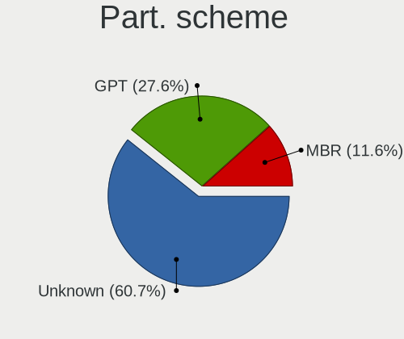
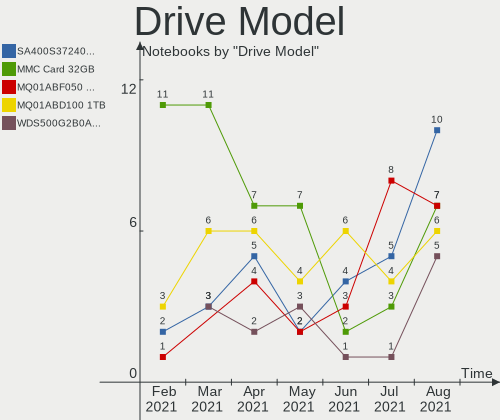
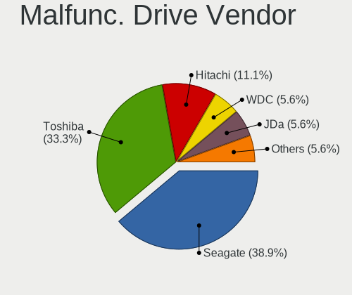
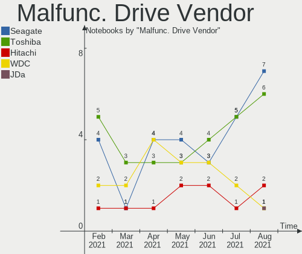
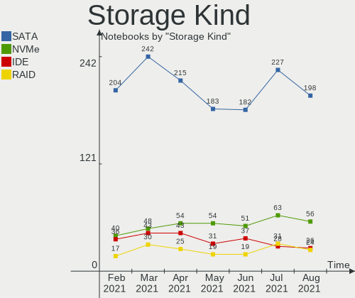
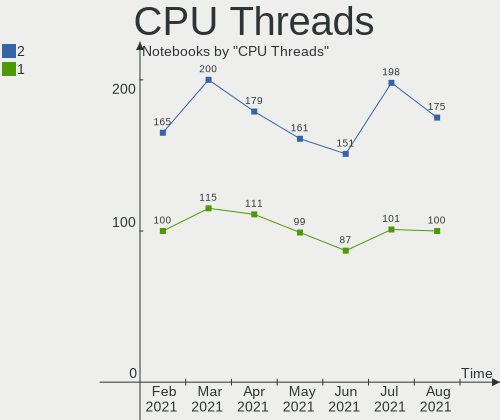
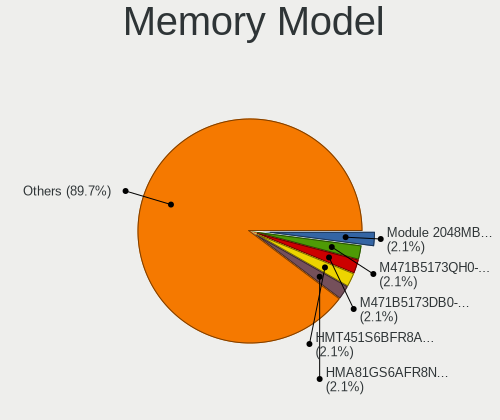
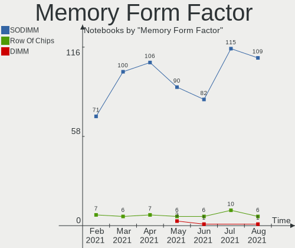
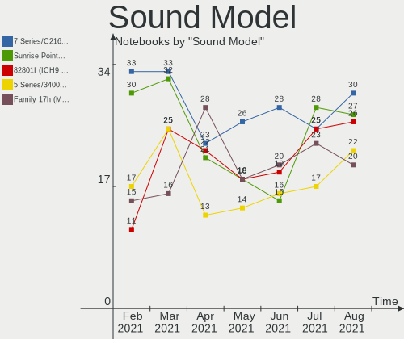
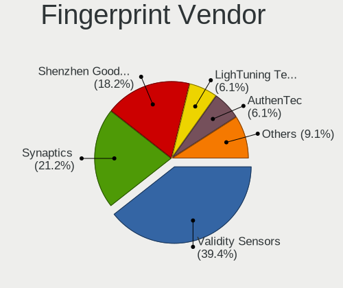

Mint Hardware Trends (Notebook)
-------------------------------

A project to identify most popular hardware characteristics and track their change
over time based on data collected by Mint users at https://Linux-Hardware.org.

Anyone can contribute to the study by uploading probes of their computers by
the [hw-probe](https://github.com/linuxhw/hw-probe) tool:

    sudo -E hw-probe -all -upload

Full-feature report is available here: https://linux-hardware.org/?view=trends&formfactor=notebook

Period: Oct, 2020.

Contents
--------

- [ OS                       ](#os)
- [ OS Family                ](#os-family)
- [ Kernel                   ](#kernel)
- [ Kernel Family            ](#kernel-family)
- [ Kernel Major Ver.        ](#kernel-major-ver)
- [ Arch                     ](#arch)
- [ DE                       ](#de)
- [ Display Server           ](#display-server)
- [ Display Manager          ](#display-manager)
- [ OS Lang                  ](#os-lang)
- [ Boot Mode                ](#boot-mode)
- [ Filesystem               ](#filesystem)
- [ Part. scheme             ](#part-scheme)
- [ Dual Boot with Linux/BSD ](#dual-boot-with-linux/bsd)
- [ Dual Boot (Win)          ](#dual-boot-win)
- [ Country                  ](#country)
- [ City                     ](#city)
- [ Vendor                   ](#vendor)
- [ Model                    ](#model)
- [ Model Family             ](#model-family)
- [ MFG Year                 ](#mfg-year)
- [ Form Factor              ](#form-factor)
- [ Secure Boot              ](#secure-boot)
- [ Coreboot                 ](#coreboot)
- [ RAM Size                 ](#ram-size)
- [ RAM Used                 ](#ram-used)
- [ Has CD-ROM               ](#has-cd-rom)
- [ Total Drives             ](#total-drives)
- [ Has Ethernet             ](#has-ethernet)
- [ Drive Vendor             ](#drive-vendor)
- [ HDD Vendor               ](#hdd-vendor)
- [ SSD Vendor               ](#ssd-vendor)
- [ Drive Model              ](#drive-model)
- [ Drive Kind               ](#drive-kind)
- [ Drive Connector          ](#drive-connector)
- [ Drive Size               ](#drive-size)
- [ Space Total              ](#space-total)
- [ Space Used               ](#space-used)
- [ Malfunc. Drives          ](#malfunc-drives)
- [ Malfunc. Drive Vendor    ](#malfunc-drive-vendor)
- [ Malfunc. HDD Vendor      ](#malfunc-hdd-vendor)
- [ Malfunc. Drive Kind      ](#malfunc-drive-kind)
- [ Failed Drives            ](#failed-drives)
- [ Failed Drive Vendor      ](#failed-drive-vendor)
- [ Drive Status             ](#drive-status)
- [ Storage Vendor           ](#storage-vendor)
- [ Storage Model            ](#storage-model)
- [ Storage Kind             ](#storage-kind)
- [ CPU Vendor               ](#cpu-vendor)
- [ CPU Model                ](#cpu-model)
- [ CPU Model Family         ](#cpu-model-family)
- [ CPU Cores                ](#cpu-cores)
- [ CPU Sockets              ](#cpu-sockets)
- [ CPU Threads              ](#cpu-threads)
- [ CPU Op-Modes             ](#cpu-op-modes)
- [ CPU Microcode            ](#cpu-microcode)
- [ CPU Microarch            ](#cpu-microarch)
- [ GPU Vendor               ](#gpu-vendor)
- [ GPU Model                ](#gpu-model)
- [ GPU Combo                ](#gpu-combo)
- [ GPU Driver               ](#gpu-driver)
- [ GPU Memory               ](#gpu-memory)
- [ Monitor Vendor           ](#monitor-vendor)
- [ Monitor Model            ](#monitor-model)
- [ Monitor Resolution       ](#monitor-resolution)
- [ Monitor Diagonal         ](#monitor-diagonal)
- [ Monitor Width            ](#monitor-width)
- [ Aspect Ratio             ](#aspect-ratio)
- [ Monitor Area             ](#monitor-area)
- [ Pixel Density            ](#pixel-density)
- [ Multiple Monitors        ](#multiple-monitors)
- [ Net Controller Vendor    ](#net-controller-vendor)
- [ Net Controller Model     ](#net-controller-model)
- [ Wireless Vendor          ](#wireless-vendor)
- [ Wireless Model           ](#wireless-model)
- [ Ethernet Vendor          ](#ethernet-vendor)
- [ Ethernet Model           ](#ethernet-model)
- [ Net Controller Kind      ](#net-controller-kind)
- [ Used Controller          ](#used-controller)
- [ NICs                     ](#nics)
- [ Memory Vendor            ](#memory-vendor)
- [ Memory Model             ](#memory-model)
- [ Memory Kind              ](#memory-kind)
- [ Memory Form Factor       ](#memory-form-factor)
- [ Memory Size              ](#memory-size)
- [ Memory Speed             ](#memory-speed)
- [ Sound Vendor             ](#sound-vendor)
- [ Sound Model              ](#sound-model)
- [ Camera Vendor            ](#camera-vendor)
- [ Camera Model             ](#camera-model)
- [ Fingerprint Vendor       ](#fingerprint-vendor)
- [ Fingerprint Model        ](#fingerprint-model)
- [ Chipcard Vendor          ](#chipcard-vendor)
- [ Chipcard Model           ](#chipcard-model)
- [ Printer Vendor           ](#printer-vendor)
- [ Printer Model            ](#printer-model)
- [ Scanner Vendor           ](#scanner-vendor)
- [ Scanner Model            ](#scanner-model)
- [ Bluetooth Vendor         ](#bluetooth-vendor)
- [ Bluetooth Model          ](#bluetooth-model)
- [ Unsupported Devices      ](#unsupported-devices)
- [ Unsupported Device Types ](#unsupported-device-types)

OS
--

Installed operating systems

| Name      | Notebooks | Percent |
|-----------|-----------|---------|
| Mint 20   | 154       | 83.24%  |
| Mint 19.3 | 23        | 12.43%  |
| Mint 19.2 | 2         | 1.08%   |
| Mint 19   | 2         | 1.08%   |
| Mint 18.3 | 2         | 1.08%   |
| Mint 19.1 | 1         | 0.54%   |
| Mint 18   | 1         | 0.54%   |

OS Family
---------

OS without a version

| Name | Notebooks | Percent |
|------|-----------|---------|
| Mint | 185       | 100%    |

Kernel
------

Version of the Linux kernel

| Version                    | Notebooks | Percent |
|----------------------------|-----------|---------|
| 5.4.0-48-generic           | 76        | 41.08%  |
| 5.4.0-52-generic           | 35        | 18.92%  |
| 5.4.0-51-generic           | 31        | 16.76%  |
| 5.4.0-26-generic           | 8         | 4.32%   |
| 5.8.0-23-generic           | 7         | 3.78%   |
| 4.15.0-118-generic         | 4         | 2.16%   |
| 5.4.0-47-generic           | 3         | 1.62%   |
| 5.0.0-32-generic           | 2         | 1.08%   |
| 5.9.1-xanmod1              | 1         | 0.54%   |
| 5.9.0-050900rc6-lowlatency | 1         | 0.54%   |
| 5.8.16-xanmod1             | 1         | 0.54%   |
| 5.8.0-25-generic           | 1         | 0.54%   |
| 5.7.1-050701-generic       | 1         | 0.54%   |
| 5.6.0-1031-oem             | 1         | 0.54%   |
| 5.6.0-050600-generic       | 1         | 0.54%   |
| 5.4.0-48-lowlatency        | 1         | 0.54%   |
| 5.4.0-45-generic           | 1         | 0.54%   |
| 5.4.0-42-generic           | 1         | 0.54%   |
| 5.3.0-62-generic           | 1         | 0.54%   |
| 5.3.0-46-generic           | 1         | 0.54%   |
| 4.4.0-21-generic           | 1         | 0.54%   |
| 4.15.0-72-generic          | 1         | 0.54%   |
| 4.15.0-54-generic          | 1         | 0.54%   |
| 4.15.0-20-generic          | 1         | 0.54%   |
| 4.15.0-122-generic         | 1         | 0.54%   |
| 4.15.0-121-generic         | 1         | 0.54%   |
| Unknown                    | 1         | 0.54%   |

Kernel Family
-------------

Linux kernel without a distro release

| Version | Notebooks | Percent |
|---------|-----------|---------|
| 5.4.0   | 156       | 84.32%  |
| 4.15.0  | 9         | 4.86%   |
| 5.8.0   | 8         | 4.32%   |
| 5.6.0   | 2         | 1.08%   |
| 5.3.0   | 2         | 1.08%   |
| 5.0.0   | 2         | 1.08%   |
| 5.9.1   | 1         | 0.54%   |
| 5.9.0   | 1         | 0.54%   |
| 5.8.16  | 1         | 0.54%   |
| 5.7.1   | 1         | 0.54%   |
| 4.4.0   | 1         | 0.54%   |
| Unknown | 1         | 0.54%   |

Kernel Major Ver.
-----------------

Linux kernel major version

| Version | Notebooks | Percent |
|---------|-----------|---------|
| 5.4     | 156       | 84.32%  |
| 5.8     | 9         | 4.86%   |
| 4.15    | 9         | 4.86%   |
| 5.9     | 2         | 1.08%   |
| 5.6     | 2         | 1.08%   |
| 5.3     | 2         | 1.08%   |
| 5.0     | 2         | 1.08%   |
| 5.7     | 1         | 0.54%   |
| 4.4     | 1         | 0.54%   |
| Unknown | 1         | 0.54%   |

Arch
----

OS architecture (x86_64, i586, etc.)

| Name   | Notebooks | Percent |
|--------|-----------|---------|
| x86_64 | 178       | 96.22%  |
| i686   | 7         | 3.78%   |

DE
--

Desktop Environment

| Name       | Notebooks | Percent |
|------------|-----------|---------|
| Cinnamon   | 64        | 34.59%  |
| X-Cinnamon | 62        | 33.51%  |
| MATE       | 25        | 13.51%  |
| XFCE       | 18        | 9.73%   |
| GNOME      | 11        | 5.95%   |
| Unknown    | 5         | 2.7%    |

Display Server
--------------

X11 or Wayland

| Name | Notebooks | Percent |
|------|-----------|---------|
| X11  | 184       | 99.46%  |
| Tty  | 1         | 0.54%   |

Display Manager
---------------

SDDM, LightDM, etc.

| Name    | Notebooks | Percent |
|---------|-----------|---------|
| Unknown | 100       | 54.05%  |
| TDM     | 83        | 44.86%  |
| LightDM | 1         | 0.54%   |
| GDM     | 1         | 0.54%   |

OS Lang
-------

Language

| Lang    | Notebooks | Percent |
|---------|-----------|---------|
| en_US   | 58        | 31.35%  |
| pt_BR   | 25        | 13.51%  |
| de_DE   | 25        | 13.51%  |
| en_GB   | 13        | 7.03%   |
| ru_RU   | 8         | 4.32%   |
| es_ES   | 7         | 3.78%   |
| it_IT   | 6         | 3.24%   |
| C       | 6         | 3.24%   |
| pl_PL   | 4         | 2.16%   |
| fr_FR   | 4         | 2.16%   |
| en_IN   | 3         | 1.62%   |
| fr_BE   | 2         | 1.08%   |
| es_MX   | 2         | 1.08%   |
| cs_CZ   | 2         | 1.08%   |
| Unknown | 2         | 1.08%   |
| uk_UA   | 1         | 0.54%   |
| sk_SK   | 1         | 0.54%   |
| ru_UA   | 1         | 0.54%   |
| pt_PT   | 1         | 0.54%   |
| nl_NL   | 1         | 0.54%   |
| nb_NO   | 1         | 0.54%   |
| lt_LT   | 1         | 0.54%   |
| hu_HU   | 1         | 0.54%   |
| fr_CA   | 1         | 0.54%   |
| es_VE   | 1         | 0.54%   |
| es_DO   | 1         | 0.54%   |
| es_CL   | 1         | 0.54%   |
| en_ZW   | 1         | 0.54%   |
| en_IN   | 1         | 0.54%   |
| en_IL   | 1         | 0.54%   |
| en_HK   | 1         | 0.54%   |
| en_AU   | 1         | 0.54%   |
| bg_BG   | 1         | 0.54%   |

Boot Mode
---------

EFI or BIOS

| Mode | Notebooks | Percent |
|------|-----------|---------|
| BIOS | 101       | 54.59%  |
| EFI  | 84        | 45.41%  |

Filesystem
----------

Type of filesystem

| Type    | Notebooks | Percent |
|---------|-----------|---------|
| Ext4    | 175       | 94.59%  |
| Overlay | 5         | 2.7%    |
| Btrfs   | 3         | 1.62%   |
| Ext3    | 2         | 1.08%   |

Part. scheme
------------

Scheme of partitioning

| Type    | Notebooks | Percent |
|---------|-----------|---------|
| Unknown | 100       | 54.05%  |
| GPT     | 54        | 29.19%  |
| MBR     | 31        | 16.76%  |

Dual Boot with Linux/BSD
------------------------

Hosting more than one Linux/BSD

| Dual boot | Notebooks | Percent |
|-----------|-----------|---------|
| No        | 173       | 93.51%  |
| Yes       | 12        | 6.49%   |

Dual Boot (Win)
---------------

Hosting Linux and Windows

| Dual boot | Notebooks | Percent |
|-----------|-----------|---------|
| No        | 136       | 73.51%  |
| Yes       | 49        | 26.49%  |

Country
-------

Geographic location (country)

| Country            | Notebooks | Percent |
|--------------------|-----------|---------|
| USA                | 36        | 19.46%  |
| Germany            | 30        | 16.22%  |
| Brazil             | 27        | 14.59%  |
| UK                 | 11        | 5.95%   |
| Russia             | 10        | 5.41%   |
| Italy              | 7         | 3.78%   |
| Spain              | 6         | 3.24%   |
| India              | 4         | 2.16%   |
| France             | 4         | 2.16%   |
| Bulgaria           | 4         | 2.16%   |
| Ukraine            | 3         | 1.62%   |
| Poland             | 3         | 1.62%   |
| Czech Republic     | 3         | 1.62%   |
| Belgium            | 3         | 1.62%   |
| Sweden             | 2         | 1.08%   |
| Netherlands        | 2         | 1.08%   |
| Mexico             | 2         | 1.08%   |
| Zimbabwe           | 1         | 0.54%   |
| Venezuela          | 1         | 0.54%   |
| UAE                | 1         | 0.54%   |
| Turkey             | 1         | 0.54%   |
| Sri Lanka          | 1         | 0.54%   |
| Slovakia           | 1         | 0.54%   |
| Romania            | 1         | 0.54%   |
| Portugal           | 1         | 0.54%   |
| Panama             | 1         | 0.54%   |
| Pakistan           | 1         | 0.54%   |
| Norway             | 1         | 0.54%   |
| Nepal              | 1         | 0.54%   |
| Lithuania          | 1         | 0.54%   |
| Jordan             | 1         | 0.54%   |
| Israel             | 1         | 0.54%   |
| Hungary            | 1         | 0.54%   |
| Hong Kong          | 1         | 0.54%   |
| Greece             | 1         | 0.54%   |
| Finland            | 1         | 0.54%   |
| Dominican Republic | 1         | 0.54%   |
| Croatia            | 1         | 0.54%   |
| Colombia           | 1         | 0.54%   |
| Chile              | 1         | 0.54%   |
| Canada             | 1         | 0.54%   |
| Bangladesh         | 1         | 0.54%   |
| Australia          | 1         | 0.54%   |
| Algeria            | 1         | 0.54%   |
| Unknown            | 1         | 0.54%   |

City
----

Geographic location (city)

| City                   | Notebooks | Percent |
|------------------------|-----------|---------|
| Hamburg                | 5         | 2.7%    |
| São Paulo             | 4         | 2.16%   |
| Rio de Janeiro         | 4         | 2.16%   |
| Berlin                 | 4         | 2.16%   |
| Sofia                  | 3         | 1.62%   |
| Birmingham             | 3         | 1.62%   |
| St Petersburg          | 2         | 1.08%   |
| Pune                   | 2         | 1.08%   |
| Paris                  | 2         | 1.08%   |
| Palo Alto              | 2         | 1.08%   |
| Mérida                | 2         | 1.08%   |
| Maceió                | 2         | 1.08%   |
| Karlsruhe              | 2         | 1.08%   |
| Glasgow                | 2         | 1.08%   |
| Frankfurt am Main      | 2         | 1.08%   |
| Douradina              | 2         | 1.08%   |
| Chicago                | 2         | 1.08%   |
| Barcelona              | 2         | 1.08%   |
| Atlanta                | 2         | 1.08%   |
| Zulpich                | 1         | 0.54%   |
| Yeovil                 | 1         | 0.54%   |
| Wolfsburg              | 1         | 0.54%   |
| Whitney                | 1         | 0.54%   |
| West Islip             | 1         | 0.54%   |
| Weilburg               | 1         | 0.54%   |
| Voronezh               | 1         | 0.54%   |
| Volzhskiy              | 1         | 0.54%   |
| Vilnius                | 1         | 0.54%   |
| Velika Gorica          | 1         | 0.54%   |
| Valladolid             | 1         | 0.54%   |
| Tyreso Strand          | 1         | 0.54%   |
| Tucson                 | 1         | 0.54%   |
| Torokszentmiklos       | 1         | 0.54%   |
| Teplice                | 1         | 0.54%   |
| Tapiratiba             | 1         | 0.54%   |
| Tallahassee            | 1         | 0.54%   |
| São Luís             | 1         | 0.54%   |
| São Lourenço         | 1         | 0.54%   |
| Stuttgart              | 1         | 0.54%   |
| Springfield            | 1         | 0.54%   |
| Sharjah                | 1         | 0.54%   |
| Satu Mare              | 1         | 0.54%   |
| Santos                 | 1         | 0.54%   |
| Santa Rosa             | 1         | 0.54%   |
| Santa Ana              | 1         | 0.54%   |
| Sandusky               | 1         | 0.54%   |
| San Cesario sul Panaro | 1         | 0.54%   |
| San Bernardo           | 1         | 0.54%   |
| Sabadell               | 1         | 0.54%   |
| Rybnik                 | 1         | 0.54%   |
| Rotterdam              | 1         | 0.54%   |
| Rostock                | 1         | 0.54%   |
| Rome                   | 1         | 0.54%   |
| Quaregnon              | 1         | 0.54%   |
| Qiryat Tiv`on          | 1         | 0.54%   |
| Puebla                 | 1         | 0.54%   |
| Prague                 | 1         | 0.54%   |
| Porto Alegre           | 1         | 0.54%   |
| Plovdiv                | 1         | 0.54%   |
| Perth                  | 1         | 0.54%   |

Vendor
------

Motherboard manufacturer

| Name                | Notebooks | Percent |
|---------------------|-----------|---------|
| Lenovo              | 42        | 22.7%   |
| Hewlett-Packard     | 39        | 21.08%  |
| Dell                | 25        | 13.51%  |
| Acer                | 22        | 11.89%  |
| ASUSTek Computer    | 12        | 6.49%   |
| Toshiba             | 6         | 3.24%   |
| Apple               | 6         | 3.24%   |
| MSI                 | 5         | 2.7%    |
| Samsung Electronics | 4         | 2.16%   |
| Sony                | 3         | 1.62%   |
| Medion              | 3         | 1.62%   |
| Positivo            | 2         | 1.08%   |
| Notebook            | 2         | 1.08%   |
| Itautec             | 2         | 1.08%   |
| Unknown             | 2         | 1.08%   |
| TaNix               | 1         | 0.54%   |
| Semp Toshiba        | 1         | 0.54%   |
| Pegatron            | 1         | 0.54%   |
| PC Specialist       | 1         | 0.54%   |
| HUAWEI              | 1         | 0.54%   |
| Fujitsu             | 1         | 0.54%   |
| Digma               | 1         | 0.54%   |
| Compaq              | 1         | 0.54%   |
| CCE                 | 1         | 0.54%   |
| Board Manufacturer  | 1         | 0.54%   |

Model
-----

Motherboard model

| Name                                                       | Notebooks | Percent |
|------------------------------------------------------------|-----------|---------|
| HP Notebook                                                | 4         | 2.16%   |
| Positivo MOBILE                                            | 2         | 1.08%   |
| Lenovo IdeaPad S145-15IWL 81S9                             | 2         | 1.08%   |
| Lenovo G50-70 20351                                        | 2         | 1.08%   |
| HP Presario CQ57                                           | 2         | 1.08%   |
| HP Pavilion Sleekbook 14 PC                                | 2         | 1.08%   |
| HP Pavilion dm4                                            | 2         | 1.08%   |
| Dell Latitude E6440                                        | 2         | 1.08%   |
| Dell Latitude E6400                                        | 2         | 1.08%   |
| Unknown                                                    | 2         | 1.08%   |
| Toshiba Satellite P770                                     | 1         | 0.54%   |
| Toshiba Satellite P205                                     | 1         | 0.54%   |
| Toshiba Satellite C850-11L                                 | 1         | 0.54%   |
| Toshiba Satellite C75D-B                                   | 1         | 0.54%   |
| Toshiba Satellite C55-A-1M7                                | 1         | 0.54%   |
| Toshiba Satellite C50-A-1HF                                | 1         | 0.54%   |
| TaNix Tx85                                                 | 1         | 0.54%   |
| Sony VPCEJ2J1E                                             | 1         | 0.54%   |
| Sony VGN-FW180E                                            | 1         | 0.54%   |
| Sony SVF1521A7EB                                           | 1         | 0.54%   |
| Semp Toshiba NI 1403                                       | 1         | 0.54%   |
| Samsung Electronics R519/R719                              | 1         | 0.54%   |
| Samsung Electronics 700Z3C/700Z5C                          | 1         | 0.54%   |
| Samsung Electronics 340XAA/350XAA/550XAA                   | 1         | 0.54%   |
| Samsung Electronics 300E5EV/300E4EV/270E5EV/270E4EV/2470EV | 1         | 0.54%   |
| Pegatron A15                                               | 1         | 0.54%   |
| PC Specialist N750HU                                       | 1         | 0.54%   |
| Notebook P9XXEN_EF_ED                                      | 1         | 0.54%   |
| Notebook DCL C483                                          | 1         | 0.54%   |
| MSI Prestige 15 A10SC                                      | 1         | 0.54%   |
| MSI MS-1453                                                | 1         | 0.54%   |
| MSI GL63 8RD                                               | 1         | 0.54%   |
| MSI GE75 Raider 10SFS                                      | 1         | 0.54%   |
| MSI GE60 2OC\2OD\2OE                                       | 1         | 0.54%   |
| Medion X681X                                               | 1         | 0.54%   |
| Medion P7649 MD60825                                       | 1         | 0.54%   |
| Medion E6435 MD60948                                       | 1         | 0.54%   |
| Lenovo Yoga 2 11 20428                                     | 1         | 0.54%   |
| Lenovo Y50-70 20378                                        | 1         | 0.54%   |
| Lenovo ThinkPad X240 20AMS0J009                            | 1         | 0.54%   |
| Lenovo ThinkPad X220 4291T5Q                               | 1         | 0.54%   |
| Lenovo ThinkPad X201 3680F8G                               | 1         | 0.54%   |
| Lenovo ThinkPad X200 7455FPG                               | 1         | 0.54%   |
| Lenovo ThinkPad X1 Carbon 4th 20FCS14X04                   | 1         | 0.54%   |
| Lenovo ThinkPad X1 Carbon 3444FEU                          | 1         | 0.54%   |
| Lenovo ThinkPad T520 424049U                               | 1         | 0.54%   |
| Lenovo ThinkPad T500 2089W9Z                               | 1         | 0.54%   |
| Lenovo ThinkPad T430 2350A39                               | 1         | 0.54%   |
| Lenovo ThinkPad T430 2344BPU                               | 1         | 0.54%   |
| Lenovo ThinkPad T420s 4174EK3                              | 1         | 0.54%   |
| Lenovo ThinkPad T420s 41732AU                              | 1         | 0.54%   |
| Lenovo ThinkPad T420 4180W15                               | 1         | 0.54%   |
| Lenovo ThinkPad R400 7440WET                               | 1         | 0.54%   |
| Lenovo ThinkPad P1 20MDS00S00                              | 1         | 0.54%   |
| Lenovo ThinkPad Edge E530 32597AU                          | 1         | 0.54%   |
| Lenovo ThinkPad Edge E440 20C50052US                       | 1         | 0.54%   |
| Lenovo ThinkPad E580 20KS001JUK                            | 1         | 0.54%   |
| Lenovo ThinkPad 13 2nd Gen 20J10015GE                      | 1         | 0.54%   |
| Lenovo Legion Y540-17IRH 81Q4                              | 1         | 0.54%   |
| Lenovo Legion Y540-15IRH-PG0 81SY                          | 1         | 0.54%   |

Model Family
------------

Motherboard model prefix

| Name                        | Notebooks | Percent |
|-----------------------------|-----------|---------|
| Lenovo ThinkPad             | 19        | 10.27%  |
| Acer Aspire                 | 17        | 9.19%   |
| Lenovo IdeaPad              | 14        | 7.57%   |
| Dell Latitude               | 11        | 5.95%   |
| Dell Inspiron               | 10        | 5.41%   |
| HP Pavilion                 | 9         | 4.86%   |
| Toshiba Satellite           | 6         | 3.24%   |
| HP ProBook                  | 6         | 3.24%   |
| HP EliteBook                | 6         | 3.24%   |
| HP Notebook                 | 4         | 2.16%   |
| Lenovo Legion               | 3         | 1.62%   |
| HP Presario                 | 3         | 1.62%   |
| Apple MacBookPro11          | 3         | 1.62%   |
| Positivo Mobile             | 2         | 1.08%   |
| Lenovo G50-70               | 2         | 1.08%   |
| Itautec Infoway             | 2         | 1.08%   |
| HP ZBook                    | 2         | 1.08%   |
| HP Compaq                   | 2         | 1.08%   |
| Dell XPS                    | 2         | 1.08%   |
| Acer Swift                  | 2         | 1.08%   |
| Unknown                     | 2         | 1.08%   |
| TaNix Tx85                  | 1         | 0.54%   |
| Sony VPCEJ2J1E              | 1         | 0.54%   |
| Sony VGN-FW180E             | 1         | 0.54%   |
| Sony SVF1521A7EB            | 1         | 0.54%   |
| Semp Toshiba NI             | 1         | 0.54%   |
| Samsung Electronics R519    | 1         | 0.54%   |
| Samsung Electronics 700Z3C  | 1         | 0.54%   |
| Samsung Electronics 340XAA  | 1         | 0.54%   |
| Samsung Electronics 300E5EV | 1         | 0.54%   |
| Pegatron A15                | 1         | 0.54%   |
| PC Specialist N750HU        | 1         | 0.54%   |
| Notebook P9XXEN             | 1         | 0.54%   |
| Notebook DCL                | 1         | 0.54%   |
| MSI Prestige                | 1         | 0.54%   |
| MSI MS-1453                 | 1         | 0.54%   |
| MSI GL63                    | 1         | 0.54%   |
| MSI GE75                    | 1         | 0.54%   |
| MSI GE60                    | 1         | 0.54%   |
| Medion X681X                | 1         | 0.54%   |
| Medion P7649                | 1         | 0.54%   |
| Medion E6435                | 1         | 0.54%   |
| Lenovo Yoga                 | 1         | 0.54%   |
| Lenovo Y50-70               | 1         | 0.54%   |
| Lenovo G460                 | 1         | 0.54%   |
| Lenovo B50-80               | 1         | 0.54%   |
| HUAWEI MACH-WX9             | 1         | 0.54%   |
| HP OMEN                     | 1         | 0.54%   |
| HP Laptop                   | 1         | 0.54%   |
| HP ENVY                     | 1         | 0.54%   |
| HP 255                      | 1         | 0.54%   |
| HP 250                      | 1         | 0.54%   |
| HP 2000                     | 1         | 0.54%   |
| HP 15                       | 1         | 0.54%   |
| Fujitsu LIFEBOOK            | 1         | 0.54%   |
| Digma CITI                  | 1         | 0.54%   |
| Dell Vostro                 | 1         | 0.54%   |
| Dell Studio                 | 1         | 0.54%   |
| Compaq Presario             | 1         | 0.54%   |
| CCE Capella                 | 1         | 0.54%   |

MFG Year
--------

Motherboard manufacture year

| Year | Notebooks | Percent |
|------|-----------|---------|
| 2019 | 32        | 17.3%   |
| 2020 | 27        | 14.59%  |
| 2018 | 22        | 11.89%  |
| 2012 | 17        | 9.19%   |
| 2014 | 14        | 7.57%   |
| 2013 | 14        | 7.57%   |
| 2011 | 14        | 7.57%   |
| 2015 | 12        | 6.49%   |
| 2017 | 8         | 4.32%   |
| 2009 | 8         | 4.32%   |
| 2010 | 6         | 3.24%   |
| 2016 | 5         | 2.7%    |
| 2007 | 3         | 1.62%   |
| 2008 | 2         | 1.08%   |
| 2006 | 1         | 0.54%   |

Form Factor
-----------

Physical design of the computer

| Name     | Notebooks | Percent |
|----------|-----------|---------|
| Notebook | 185       | 100%    |

Secure Boot
-----------

Enabled or disabled

| State    | Notebooks | Percent |
|----------|-----------|---------|
| Disabled | 169       | 91.35%  |
| Enabled  | 16        | 8.65%   |

Coreboot
--------

Have coreboot on board

| Used | Notebooks | Percent |
|------|-----------|---------|
| No   | 185       | 100%    |

RAM Size
--------

Total RAM memory

| Size in GB  | Notebooks | Percent |
|-------------|-----------|---------|
| 4.01-8.0    | 55        | 29.73%  |
| 3.01-4.0    | 51        | 27.57%  |
| 16.01-24.0  | 40        | 21.62%  |
| 8.01-16.0   | 24        | 12.97%  |
| 1.01-2.0    | 9         | 4.86%   |
| 32.01-64.0  | 4         | 2.16%   |
| 64.01-256.0 | 1         | 0.54%   |
| 0.01-1.0    | 1         | 0.54%   |

RAM Used
--------

Used RAM memory

| Used GB   | Notebooks | Percent |
|-----------|-----------|---------|
| 1.01-2.0  | 76        | 41.08%  |
| 2.01-3.0  | 41        | 22.16%  |
| 3.01-4.0  | 30        | 16.22%  |
| 4.01-8.0  | 20        | 10.81%  |
| 0.01-1.0  | 14        | 7.57%   |
| 8.01-16.0 | 4         | 2.16%   |

Has CD-ROM
----------

Has CD-ROM on board

| Presented | Notebooks | Percent |
|-----------|-----------|---------|
| No        | 93        | 50.27%  |
| Yes       | 92        | 49.73%  |

Total Drives
------------

Number of drives on board

| Drives | Notebooks | Percent |
|--------|-----------|---------|
| 1      | 118       | 63.78%  |
| 2      | 55        | 29.73%  |
| 3      | 11        | 5.95%   |
| 9      | 1         | 0.54%   |

Has Ethernet
------------

Has Ethernet on board

| Presented | Notebooks | Percent |
|-----------|-----------|---------|
| Yes       | 163       | 88.11%  |
| No        | 22        | 11.89%  |

Drive Vendor
------------

Hard drive vendors

| Vendor              | Notebooks | Drives | Percent |
|---------------------|-----------|--------|---------|
| WDC                 | 39        | 47     | 15.92%  |
| Seagate             | 34        | 35     | 13.88%  |
| Samsung Electronics | 29        | 31     | 11.84%  |
| Toshiba             | 18        | 18     | 7.35%   |
| Unknown             | 17        | 22     | 6.94%   |
| Sandisk             | 17        | 17     | 6.94%   |
| Kingston            | 15        | 15     | 6.12%   |
| Intel               | 12        | 13     | 4.9%    |
| Crucial             | 11        | 12     | 4.49%   |
| SK Hynix            | 9         | 9      | 3.67%   |
| Hitachi             | 9         | 9      | 3.67%   |
| HGST                | 7         | 7      | 2.86%   |
| Micron Technology   | 3         | 3      | 1.22%   |
| Union Memory        | 2         | 2      | 0.82%   |
| Transcend           | 2         | 2      | 0.82%   |
| LITEON              | 2         | 2      | 0.82%   |
| China               | 2         | 2      | 0.82%   |
| Apple               | 2         | 2      | 0.82%   |
| A-DATA Technology   | 2         | 2      | 0.82%   |
| XPG                 | 1         | 1      | 0.41%   |
| USB3.0              | 1         | 1      | 0.41%   |
| TCSUNBOW            | 1         | 1      | 0.41%   |
| Mushkin             | 1         | 1      | 0.41%   |
| LITEONIT            | 1         | 1      | 0.41%   |
| Lite-On             | 1         | 1      | 0.41%   |
| Lenovo              | 1         | 1      | 0.41%   |
| KingSpec            | 1         | 1      | 0.41%   |
| KingFast            | 1         | 1      | 0.41%   |
| GOODRAM             | 1         | 1      | 0.41%   |
| Fujitsu             | 1         | 1      | 0.41%   |
| CT240BX5            | 1         | 1      | 0.41%   |
| Apricorn            | 1         | 2      | 0.41%   |

HDD Vendor
----------

Hard disk drive vendors

| Vendor              | Notebooks | Drives | Percent |
|---------------------|-----------|--------|---------|
| WDC                 | 34        | 41     | 33.66%  |
| Seagate             | 33        | 33     | 32.67%  |
| Toshiba             | 14        | 14     | 13.86%  |
| Hitachi             | 9         | 9      | 8.91%   |
| HGST                | 7         | 7      | 6.93%   |
| Samsung Electronics | 3         | 3      | 2.97%   |
| Fujitsu             | 1         | 1      | 0.99%   |

SSD Vendor
----------

Solid state drive vendors

| Vendor              | Notebooks | Drives | Percent |
|---------------------|-----------|--------|---------|
| Samsung Electronics | 18        | 19     | 20.22%  |
| Kingston            | 15        | 15     | 16.85%  |
| SanDisk             | 12        | 12     | 13.48%  |
| Crucial             | 11        | 12     | 12.36%  |
| SK Hynix            | 6         | 6      | 6.74%   |
| Intel               | 6         | 7      | 6.74%   |
| WDC                 | 3         | 3      | 3.37%   |
| Transcend           | 2         | 2      | 2.25%   |
| Micron Technology   | 2         | 2      | 2.25%   |
| LITEON              | 2         | 2      | 2.25%   |
| China               | 2         | 2      | 2.25%   |
| Apple               | 2         | 2      | 2.25%   |
| A-DATA Technology   | 2         | 2      | 2.25%   |
| Mushkin             | 1         | 1      | 1.12%   |
| LITEONIT            | 1         | 1      | 1.12%   |
| KingSpec            | 1         | 1      | 1.12%   |
| KingFast            | 1         | 1      | 1.12%   |
| GOODRAM             | 1         | 1      | 1.12%   |
| CT240BX5            | 1         | 1      | 1.12%   |

Drive Model
-----------

Hard drive models

| Model                        | Notebooks | Percent |
|------------------------------|-----------|---------|
| SA400S37240G 240GB SSD       | 6         | 2.35%   |
| MMC Card  32GB               | 5         | 1.96%   |
| WD10SPZX-24Z10 1TB           | 4         | 1.57%   |
| ST1000LM035-1RK172 1TB       | 4         | 1.57%   |
| SSDPEKNW010T8 1TB            | 4         | 1.57%   |
| NVMe SSD Drive 128GB         | 4         | 1.57%   |
| MMC Card  64GB               | 4         | 1.57%   |
| SV300S37A120G 120GB SSD      | 3         | 1.18%   |
| ST1000LM049-2GH172 1TB       | 3         | 1.18%   |
| ST1000LM024 HN-M101MBB 1TB   | 3         | 1.18%   |
| SSD 860 EVO 500GB            | 3         | 1.18%   |
| SSD 850 EVO 500GB            | 3         | 1.18%   |
| NVMe SSD Drive 512GB         | 3         | 1.18%   |
| HTS721010A9E630 1TB          | 3         | 1.18%   |
| CT1000MX500SSD1 1TB          | 3         | 1.18%   |
| WD7500BPKX-00HPJT0 752GB     | 2         | 0.78%   |
| WD5000LPVX-22V0TT0 500GB     | 2         | 0.78%   |
| WD5000LPCX-24C6HT0 500GB     | 2         | 0.78%   |
| ST320LM001 HN-M320MBB 320GB  | 2         | 0.78%   |
| ST1500LM012-1R817G 1TB       | 2         | 0.78%   |
| ST1000LM014-1EJ164 1TB       | 2         | 0.78%   |
| SSD PLUS 480GB               | 2         | 0.78%   |
| SSD PLUS 240GB               | 2         | 0.78%   |
| SSD 850 PRO 128GB            | 2         | 0.78%   |
| SSD 850 EVO 250GB            | 2         | 0.78%   |
| SD/MMC/MS PRO 32GB           | 2         | 0.78%   |
| SA400S37120G 120GB SSD       | 2         | 0.78%   |
| NVMe SSD Drive 500GB         | 2         | 0.78%   |
| NVMe SSD Drive 256GB         | 2         | 0.78%   |
| MZVLB512HAJQ-00000 512GB     | 2         | 0.78%   |
| MZMPC032HBCD-000H1 32GB SSD  | 2         | 0.78%   |
| MQ04ABF100 1TB               | 2         | 0.78%   |
| MQ01ABD075 752GB             | 2         | 0.78%   |
| M3 Portable 1TB              | 2         | 0.78%   |
| HTS547575A9E384 752GB        | 2         | 0.78%   |
| HTS547550A9E384 500GB        | 2         | 0.78%   |
| HTS545050A7E680 500GB        | 2         | 0.78%   |
| CT525MX300SSD1 528GB         | 2         | 0.78%   |
| CT250MX500SSD1 250GB         | 2         | 0.78%   |
| X400 M.2 2280 512GB SSD      | 1         | 0.39%   |
| WDS500G2B0C-00PXH0 500GB     | 1         | 0.39%   |
| WDS500G2B0A-00SM50 500GB SSD | 1         | 0.39%   |
| WDS480G2G0A-00JH30 480GB SSD | 1         | 0.39%   |
| WDS250G2B0B-00YS70 250GB SSD | 1         | 0.39%   |
| WDS100T2B0C-00PXH0 1TB       | 1         | 0.39%   |
| WD800BEVS-22RST0 80GB        | 1         | 0.39%   |
| WD6400BEVT-22A0RT0 640GB     | 1         | 0.39%   |
| WD60EFRX-68MYMN1 6TB         | 1         | 0.39%   |
| WD5000LPVX-75V0TT0 500GB     | 1         | 0.39%   |
| WD5000BPVT-24HXZT3 500GB     | 1         | 0.39%   |
| WD5000BPVT-22HXZT3 500GB     | 1         | 0.39%   |
| WD5000BEVT-60ZAT1 500GB      | 1         | 0.39%   |
| WD5000BEVT-22A0RT0 500GB     | 1         | 0.39%   |
| WD3200BEVT-22A23T0 320GB     | 1         | 0.39%   |
| WD3200BEVT-00ZCT0 320GB      | 1         | 0.39%   |
| WD3200BEKT-75PVMT1 320GB     | 1         | 0.39%   |
| WD3200BEKT-60PVMT0 320GB     | 1         | 0.39%   |
| WD3200BEKT-08PVMT1 320GB     | 1         | 0.39%   |
| WD2500BEVS-22UST0 250GB      | 1         | 0.39%   |
| WD2500BEKT-60V5T1 250GB      | 1         | 0.39%   |

Drive Kind
----------

HDD or SSD

| Kind    | Notebooks | Drives | Percent |
|---------|-----------|--------|---------|
| HDD     | 100       | 108    | 41.84%  |
| SSD     | 82        | 92     | 34.31%  |
| NVMe    | 34        | 37     | 14.23%  |
| MMC     | 14        | 17     | 5.86%   |
| Unknown | 9         | 10     | 3.77%   |

Drive Connector
---------------

SATA, SAS, NVMe, etc.

| Type | Notebooks | Drives | Percent |
|------|-----------|--------|---------|
| SATA | 161       | 196    | 72.52%  |
| NVMe | 34        | 37     | 15.32%  |
| MMC  | 14        | 17     | 6.31%   |
| SAS  | 13        | 14     | 5.86%   |

Drive Size
----------

Size of hard drive

| Size in TB | Notebooks | Drives | Percent |
|------------|-----------|--------|---------|
| 0.01-0.5   | 119       | 128    | 65.03%  |
| 0.51-1.0   | 58        | 59     | 31.69%  |
| 1.01-2.0   | 4         | 4      | 2.19%   |
| 3.01-4.0   | 1         | 1      | 0.55%   |
| 4.01-10.0  | 1         | 8      | 0.55%   |

Space Total
-----------

Amount of disk space available on the file system

| Size in GB     | Notebooks | Percent |
|----------------|-----------|---------|
| 101-250        | 63        | 34.05%  |
| 251-500        | 54        | 29.19%  |
| 501-1000       | 30        | 16.22%  |
| 1001-2000      | 13        | 7.03%   |
| 51-100         | 10        | 5.41%   |
| 21-50          | 8         | 4.32%   |
| More than 3000 | 4         | 2.16%   |
| 1-20           | 2         | 1.08%   |
| 2001-3000      | 1         | 0.54%   |

Space Used
----------

Amount of used disk space

| Used GB        | Notebooks | Percent |
|----------------|-----------|---------|
| 1-20           | 49        | 26.49%  |
| 101-250        | 42        | 22.7%   |
| 21-50          | 35        | 18.92%  |
| 51-100         | 28        | 15.14%  |
| 251-500        | 16        | 8.65%   |
| 501-1000       | 8         | 4.32%   |
| More than 3000 | 3         | 1.62%   |
| 1001-2000      | 3         | 1.62%   |
| 2001-3000      | 1         | 0.54%   |

Malfunc. Drives
---------------

Drive models with a malfunction

| Model                      | Notebooks | Drives | Percent |
|----------------------------|-----------|--------|---------|
| WD5000LPVX-22V0TT0 500GB   | 1         | 1      | 5.56%   |
| WD5000LPCX-24C6HT0 500GB   | 1         | 1      | 5.56%   |
| WD5000BPVT-24HXZT3 500GB   | 1         | 1      | 5.56%   |
| WD5000BEVT-60ZAT1 500GB    | 1         | 1      | 5.56%   |
| WD10JPCX-24UE4T0 1TB       | 1         | 1      | 5.56%   |
| ST9320325AS 320GB          | 1         | 1      | 5.56%   |
| ST1000LM049-2GH172 1TB     | 1         | 1      | 5.56%   |
| ST1000LM024 HN-M101MBB 1TB | 1         | 1      | 5.56%   |
| SSD i100 16GB              | 1         | 1      | 5.56%   |
| MQ04ABF100 1TB             | 1         | 1      | 5.56%   |
| LMT-128M3M 128GB SSD       | 1         | 1      | 5.56%   |
| HTS725050A7E630 500GB      | 1         | 1      | 5.56%   |
| HTS547575A9E384 752GB      | 1         | 1      | 5.56%   |
| HTS545050A7E380 500GB      | 1         | 1      | 5.56%   |
| HTS543232A7A384 320GB      | 1         | 1      | 5.56%   |
| HM320II 320GB              | 1         | 1      | 5.56%   |
| CV8-8E128-HP 128GB SSD     | 1         | 1      | 5.56%   |
| CT525MX300SSD1 528GB       | 1         | 1      | 5.56%   |

Malfunc. Drive Vendor
---------------------

Vendors of faulty drives

| Vendor              | Notebooks | Drives | Percent |
|---------------------|-----------|--------|---------|
| WDC                 | 5         | 5      | 27.78%  |
| Seagate             | 3         | 3      | 16.67%  |
| Hitachi             | 3         | 3      | 16.67%  |
| Toshiba             | 1         | 1      | 5.56%   |
| SanDisk             | 1         | 1      | 5.56%   |
| Samsung Electronics | 1         | 1      | 5.56%   |
| LITEONIT            | 1         | 1      | 5.56%   |
| LITEON              | 1         | 1      | 5.56%   |
| HGST                | 1         | 1      | 5.56%   |
| Crucial             | 1         | 1      | 5.56%   |

Malfunc. HDD Vendor
-------------------

Vendors of faulty HDD drives

| Vendor              | Notebooks | Drives | Percent |
|---------------------|-----------|--------|---------|
| WDC                 | 5         | 5      | 35.71%  |
| Seagate             | 3         | 3      | 21.43%  |
| Hitachi             | 3         | 3      | 21.43%  |
| Toshiba             | 1         | 1      | 7.14%   |
| Samsung Electronics | 1         | 1      | 7.14%   |
| HGST                | 1         | 1      | 7.14%   |

Malfunc. Drive Kind
-------------------

Kinds of faulty drives

| Kind | Notebooks | Drives | Percent |
|------|-----------|--------|---------|
| HDD  | 14        | 14     | 77.78%  |
| SSD  | 4         | 4      | 22.22%  |

Failed Drives
-------------

Failed drive models

Zero info for selected period =(

Failed Drive Vendor
-------------------

Failed drive vendors

Zero info for selected period =(

Drive Status
------------

Number of failed and malfunc. drives

| Status   | Notebooks | Drives | Percent |
|----------|-----------|--------|---------|
| Detected | 109       | 151    | 54.23%  |
| Works    | 75        | 95     | 37.31%  |
| Malfunc  | 17        | 18     | 8.46%   |

Storage Vendor
--------------

Storage controller vendors

| Vendor                           | Notebooks | Percent |
|----------------------------------|-----------|---------|
| Intel                            | 149       | 71.29%  |
| AMD                              | 24        | 11.48%  |
| Samsung Electronics              | 11        | 5.26%   |
| Sandisk                          | 8         | 3.83%   |
| Toshiba America Info Systems     | 4         | 1.91%   |
| SK Hynix                         | 3         | 1.44%   |
| Union Memory (Shenzhen)          | 2         | 0.96%   |
| Silicon Integrated Systems [SiS] | 1         | 0.48%   |
| Silicon Image                    | 1         | 0.48%   |
| Nvidia                           | 1         | 0.48%   |
| Micron Technology                | 1         | 0.48%   |
| Marvell Technology Group         | 1         | 0.48%   |
| Lite-On Technology               | 1         | 0.48%   |
| Lenovo                           | 1         | 0.48%   |
| ADATA Technology                 | 1         | 0.48%   |

Storage Model
-------------

Storage controller models

| Model                                                                            | Notebooks | Percent |
|----------------------------------------------------------------------------------|-----------|---------|
| FCH SATA Controller [AHCI mode]                                                  | 21        | 9.55%   |
| 7 Series Chipset Family 6-port SATA Controller [AHCI mode]                       | 20        | 9.09%   |
| 82801 Mobile SATA Controller [RAID mode]                                         | 18        | 8.18%   |
| 6 Series/C200 Series Chipset Family 6 port Mobile SATA AHCI Controller           | 18        | 8.18%   |
| Sunrise Point-LP SATA Controller [AHCI mode]                                     | 13        | 5.91%   |
| 8 Series SATA Controller 1 [AHCI mode]                                           | 12        | 5.45%   |
| 82801IBM/IEM (ICH9M/ICH9M-E) 4 port SATA Controller [AHCI mode]                  | 11        | 5%      |
| Cannon Lake Mobile PCH SATA AHCI Controller                                      | 9         | 4.09%   |
| Non-Volatile memory controller                                                   | 8         | 3.64%   |
| NVMe SSD Controller SM981/PM981/PM983                                            | 7         | 3.18%   |
| 8 Series/C220 Series Chipset Family 6-port SATA Controller 1 [AHCI mode]         | 6         | 2.73%   |
| SSD 660P Series                                                                  | 5         | 2.27%   |
| Wildcat Point-LP SATA Controller [AHCI Mode]                                     | 4         | 1.82%   |
| Cannon Point-LP SATA Controller [AHCI Mode]                                      | 4         | 1.82%   |
| 5 Series/3400 Series Chipset 6 port SATA AHCI Controller                         | 4         | 1.82%   |
| 5 Series/3400 Series Chipset 4 port SATA AHCI Controller                         | 4         | 1.82%   |
| SB7x0/SB8x0/SB9x0 SATA Controller [AHCI mode]                                    | 3         | 1.36%   |
| HM170/QM170 Chipset SATA Controller [AHCI Mode]                                  | 3         | 1.36%   |
| Atom/Celeron/Pentium Processor x5-E8000/J3xxx/N3xxx Series SATA Controller       | 3         | 1.36%   |
| 82801HM/HEM (ICH8M/ICH8M-E) SATA Controller [AHCI mode]                          | 3         | 1.36%   |
| 82801HM/HEM (ICH8M/ICH8M-E) IDE Controller                                       | 3         | 1.36%   |
| WD Blue SN550 NVMe SSD                                                           | 2         | 0.91%   |
| WD Black 2018 / PC SN520 NVMe SSD                                                | 2         | 0.91%   |
| Electronics Non-Volatile memory controller                                       | 2         | 0.91%   |
| BC501 NVMe Solid State Drive 512GB                                               | 2         | 0.91%   |
| Apple PCIe SSD                                                                   | 2         | 0.91%   |
| 82801GBM/GHM (ICH7-M Family) SATA Controller [IDE mode]                          | 2         | 0.91%   |
| 82801G (ICH7 Family) IDE Controller                                              | 2         | 0.91%   |
| XPG SX8200 Pro PCIe Gen3x4 M.2 2280 Solid State Drive                            | 1         | 0.45%   |
| XG4 NVMe SSD Controller                                                          | 1         | 0.45%   |
| WD Black 2019/PC SN750 NVMe SSD                                                  | 1         | 0.45%   |
| WD Black 2018 / PC SN720 NVMe SSD                                                | 1         | 0.45%   |
| Toshiba America Info Non-Volatile memory controller                              | 1         | 0.45%   |
| SSD Pro 7600p/760p/E 6100p Series                                                | 1         | 0.45%   |
| SiI 3132 Serial ATA Raid II Controller                                           | 1         | 0.45%   |
| SATA Controller / IDE mode                                                       | 1         | 0.45%   |
| SATA controller                                                                  | 1         | 0.45%   |
| NVMe Controller                                                                  | 1         | 0.45%   |
| NM10/ICH7 Family SATA Controller [AHCI mode]                                     | 1         | 0.45%   |
| Mobile 4 Series Chipset PT IDER Controller                                       | 1         | 0.45%   |
| MCP79 AHCI Controller                                                            | 1         | 0.45%   |
| Ice Lake-LP SATA Controller [AHCI mode]                                          | 1         | 0.45%   |
| Celeron N3350/Pentium N4200/Atom E3900 Series SATA AHCI Controller               | 1         | 0.45%   |
| BG3 NVMe SSD Controller                                                          | 1         | 0.45%   |
| Atom Processor E3800 Series SATA AHCI Controller                                 | 1         | 0.45%   |
| 88SE9182 SATA 6G Controller                                                      | 1         | 0.45%   |
| 82801GBM/GHM (ICH7-M Family) SATA Controller [AHCI mode]                         | 1         | 0.45%   |
| 7 Series Chipset Family 4-port SATA Controller [IDE mode]                        | 1         | 0.45%   |
| 7 Series Chipset Family 2-port SATA Controller [IDE mode]                        | 1         | 0.45%   |
| 6 Series/C200 Series Chipset Family Mobile SATA Controller (IDE mode, ports 4-5) | 1         | 0.45%   |
| 6 Series/C200 Series Chipset Family Mobile SATA Controller (IDE mode, ports 0-3) | 1         | 0.45%   |
| 5513 IDE Controller                                                              | 1         | 0.45%   |
| 5 Series/3400 Series Chipset 4 port SATA IDE Controller                          | 1         | 0.45%   |
| 5 Series/3400 Series Chipset 2 port SATA IDE Controller                          | 1         | 0.45%   |
| 400 Series Chipset Family SATA AHCI Controller                                   | 1         | 0.45%   |

Storage Kind
------------

Kind of storage controller (IDE, SATA, NVMe, SAS, ...)

| Kind | Notebooks | Percent |
|------|-----------|---------|
| SATA | 150       | 70.75%  |
| NVMe | 34        | 16.04%  |
| RAID | 17        | 8.02%   |
| IDE  | 11        | 5.19%   |

CPU Vendor
----------

Processor vendors

| Vendor | Notebooks | Percent |
|--------|-----------|---------|
| Intel  | 160       | 86.49%  |
| AMD    | 25        | 13.51%  |

CPU Model
---------

Processor models

| Model                                         | Notebooks | Percent |
|-----------------------------------------------|-----------|---------|
| Intel Core i7-9750H CPU @ 2.60GHz             | 6         | 3.24%   |
| Intel Core i7-8750H CPU @ 2.20GHz             | 5         | 2.7%    |
| Intel Core i5-8250U CPU @ 1.60GHz             | 5         | 2.7%    |
| Intel Core i5-7200U CPU @ 2.50GHz             | 5         | 2.7%    |
| Intel Core i7-3632QM CPU @ 2.20GHz            | 4         | 2.16%   |
| Intel Core i5-8265U CPU @ 1.60GHz             | 4         | 2.16%   |
| Intel Core i5-2520M CPU @ 2.50GHz             | 4         | 2.16%   |
| Intel Core i7-4500U CPU @ 1.80GHz             | 3         | 1.62%   |
| Intel Core i7-2670QM CPU @ 2.20GHz            | 3         | 1.62%   |
| Intel Core i7-1065G7 CPU @ 1.30GHz            | 3         | 1.62%   |
| Intel Core i5-5200U CPU @ 2.20GHz             | 3         | 1.62%   |
| Intel Core i5-3210M CPU @ 2.50GHz             | 3         | 1.62%   |
| Intel Core 2 Duo CPU P8400 @ 2.26GHz          | 3         | 1.62%   |
| Intel Atom x5-Z8350 CPU @ 1.44GHz             | 3         | 1.62%   |
| Intel Pentium Dual-Core CPU T4300 @ 2.10GHz   | 2         | 1.08%   |
| Intel Pentium CPU 2117U @ 1.80GHz             | 2         | 1.08%   |
| Intel Core i7-7700HQ CPU @ 2.80GHz            | 2         | 1.08%   |
| Intel Core i7-6600U CPU @ 2.60GHz             | 2         | 1.08%   |
| Intel Core i7-4770HQ CPU @ 2.20GHz            | 2         | 1.08%   |
| Intel Core i7-4700MQ CPU @ 2.40GHz            | 2         | 1.08%   |
| Intel Core i7-2620M CPU @ 2.70GHz             | 2         | 1.08%   |
| Intel Core i5-4300U CPU @ 1.90GHz             | 2         | 1.08%   |
| Intel Core i5-3337U CPU @ 1.80GHz             | 2         | 1.08%   |
| Intel Core i5-3317U CPU @ 1.70GHz             | 2         | 1.08%   |
| Intel Core i5-2540M CPU @ 2.60GHz             | 2         | 1.08%   |
| Intel Core i5-2450M CPU @ 2.50GHz             | 2         | 1.08%   |
| Intel Core i3-7020U CPU @ 2.30GHz             | 2         | 1.08%   |
| Intel Core i3-4010U CPU @ 1.70GHz             | 2         | 1.08%   |
| Intel Core i3-4005U CPU @ 1.70GHz             | 2         | 1.08%   |
| Intel Core i3-3110M CPU @ 2.40GHz             | 2         | 1.08%   |
| Intel Core 2 Duo CPU P8600 @ 2.40GHz          | 2         | 1.08%   |
| AMD Ryzen 7 4700U with Radeon Graphics        | 2         | 1.08%   |
| AMD Ryzen 5 3500U with Radeon Vega Mobile Gfx | 2         | 1.08%   |
| AMD E-300 APU with Radeon HD Graphics         | 2         | 1.08%   |
| AMD A6-9225 RADEON R4, 5 COMPUTE CORES 2C+3G  | 2         | 1.08%   |
| Intel Pentium Dual-Core CPU T4400 @ 2.20GHz   | 1         | 0.54%   |
| Intel Pentium CPU P6200 @ 2.13GHz             | 1         | 0.54%   |
| Intel Pentium CPU N4200 @ 1.10GHz             | 1         | 0.54%   |
| Intel Pentium CPU N3710 @ 1.60GHz             | 1         | 0.54%   |
| Intel Pentium CPU B960 @ 2.20GHz              | 1         | 0.54%   |
| Intel Pentium CPU B950 @ 2.10GHz              | 1         | 0.54%   |
| Intel Pentium CPU B940 @ 2.00GHz              | 1         | 0.54%   |
| Intel Pentium CPU 4415U @ 2.30GHz             | 1         | 0.54%   |
| Intel Pentium 3558U @ 1.70GHz                 | 1         | 0.54%   |
| Intel Genuine CPU T2080 @ 1.73GHz             | 1         | 0.54%   |
| Intel Core i7-9750HF CPU @ 2.60GHz            | 1         | 0.54%   |
| Intel Core i7-8650U CPU @ 1.90GHz             | 1         | 0.54%   |
| Intel Core i7-8565U CPU @ 1.80GHz             | 1         | 0.54%   |
| Intel Core i7-8550U CPU @ 1.80GHz             | 1         | 0.54%   |
| Intel Core i7-6700HQ CPU @ 2.60GHz            | 1         | 0.54%   |
| Intel Core i7-4980HQ CPU @ 2.80GHz            | 1         | 0.54%   |
| Intel Core i7-4810MQ CPU @ 2.80GHz            | 1         | 0.54%   |
| Intel Core i7-4720HQ CPU @ 2.60GHz            | 1         | 0.54%   |
| Intel Core i7-4610M CPU @ 3.00GHz             | 1         | 0.54%   |
| Intel Core i7-3667U CPU @ 2.00GHz             | 1         | 0.54%   |
| Intel Core i7-3615QM CPU @ 2.30GHz            | 1         | 0.54%   |
| Intel Core i7-3610QM CPU @ 2.30GHz            | 1         | 0.54%   |
| Intel Core i7-2720QM CPU @ 2.20GHz            | 1         | 0.54%   |
| Intel Core i7-2640M CPU @ 2.80GHz             | 1         | 0.54%   |
| Intel Core i7-10875H CPU @ 2.30GHz            | 1         | 0.54%   |

CPU Model Family
----------------

Processor model prefix

| Model                   | Notebooks | Percent |
|-------------------------|-----------|---------|
| Intel Core i7           | 52        | 28.11%  |
| Intel Core i5           | 45        | 24.32%  |
| Intel Core i3           | 20        | 10.81%  |
| Intel Core 2 Duo        | 14        | 7.57%   |
| Intel Pentium           | 10        | 5.41%   |
| Intel Celeron           | 7         | 3.78%   |
| Intel Atom              | 5         | 2.7%    |
| AMD A6                  | 5         | 2.7%    |
| AMD Ryzen 5             | 4         | 2.16%   |
| Intel Pentium Dual-Core | 3         | 1.62%   |
| AMD Ryzen 7             | 3         | 1.62%   |
| AMD A8                  | 3         | 1.62%   |
| AMD E                   | 2         | 1.08%   |
| Other                   | 1         | 0.54%   |
| Intel Genuine           | 1         | 0.54%   |
| Intel Core 2            | 1         | 0.54%   |
| Intel Celeron M         | 1         | 0.54%   |
| Intel Celeron Dual-Core | 1         | 0.54%   |
| AMD Ryzen 9             | 1         | 0.54%   |
| AMD Ryzen 3             | 1         | 0.54%   |
| AMD E2                  | 1         | 0.54%   |
| AMD E1                  | 1         | 0.54%   |
| AMD C-50                | 1         | 0.54%   |
| AMD A4                  | 1         | 0.54%   |
| AMD A10                 | 1         | 0.54%   |

CPU Cores
---------

Number of processor cores

| Number | Notebooks | Percent |
|--------|-----------|---------|
| 2      | 112       | 60.54%  |
| 4      | 51        | 27.57%  |
| 6      | 15        | 8.11%   |
| 8      | 4         | 2.16%   |
| 1      | 2         | 1.08%   |
| 3      | 1         | 0.54%   |

CPU Sockets
-----------

Number of sockets

| Number | Notebooks | Percent |
|--------|-----------|---------|
| 1      | 185       | 100%    |

CPU Threads
-----------

Threads per core (Hyper-Threading)

| Number | Notebooks | Percent |
|--------|-----------|---------|
| 2      | 124       | 67.03%  |
| 1      | 61        | 32.97%  |

CPU Op-Modes
------------

CPU Operation Modes (32-bit, 64-bit)

| Op mode        | Notebooks | Percent |
|----------------|-----------|---------|
| 32-bit, 64-bit | 183       | 98.92%  |
| 32-bit         | 2         | 1.08%   |

CPU Microcode
-------------

Microcode number

| Number     | Notebooks | Percent |
|------------|-----------|---------|
| 0x206a7    | 20        | 10.81%  |
| 0x306a9    | 18        | 9.73%   |
| 0x906ea    | 12        | 6.49%   |
| 0x1067a    | 12        | 6.49%   |
| Unknown    | 12        | 6.49%   |
| 0x40651    | 11        | 5.95%   |
| 0x806ea    | 9         | 4.86%   |
| 0x306c3    | 7         | 3.78%   |
| 0x806e9    | 6         | 3.24%   |
| 0x10676    | 6         | 3.24%   |
| 0x406c4    | 5         | 2.7%    |
| 0x08108102 | 5         | 2.7%    |
| 0x406e3    | 4         | 2.16%   |
| 0x306d4    | 4         | 2.16%   |
| 0x20655    | 4         | 2.16%   |
| 0x20652    | 4         | 2.16%   |
| 0x06006705 | 4         | 2.16%   |
| 0x806ec    | 3         | 1.62%   |
| 0x706e5    | 3         | 1.62%   |
| 0x40661    | 3         | 1.62%   |
| 0x07030105 | 3         | 1.62%   |
| 0xa0652    | 2         | 1.08%   |
| 0x906e9    | 2         | 1.08%   |
| 0x6f6      | 2         | 1.08%   |
| 0x30678    | 2         | 1.08%   |
| 0x05000119 | 2         | 1.08%   |
| 0x03000027 | 2         | 1.08%   |
| 0xa0660    | 1         | 0.54%   |
| 0x906ed    | 1         | 0.54%   |
| 0x806eb    | 1         | 0.54%   |
| 0x706a1    | 1         | 0.54%   |
| 0x6fa      | 1         | 0.54%   |
| 0x6e8      | 1         | 0.54%   |
| 0x506e3    | 1         | 0.54%   |
| 0x506c9    | 1         | 0.54%   |
| 0x406c3    | 1         | 0.54%   |
| 0x106ca    | 1         | 0.54%   |
| 0x08600106 | 1         | 0.54%   |
| 0x08600103 | 1         | 0.54%   |
| 0x08600102 | 1         | 0.54%   |
| 0x07030106 | 1         | 0.54%   |
| 0x06006704 | 1         | 0.54%   |
| 0x06006118 | 1         | 0.54%   |
| 0x06001119 | 1         | 0.54%   |
| 0x05000029 | 1         | 0.54%   |

CPU Microarch
-------------

Microarchitecture

| Name          | Notebooks | Percent |
|---------------|-----------|---------|
| KabyLake      | 36        | 19.46%  |
| Haswell       | 23        | 12.43%  |
| SandyBridge   | 22        | 11.89%  |
| IvyBridge     | 21        | 11.35%  |
| Penryn        | 18        | 9.73%   |
| Westmere      | 9         | 4.86%   |
| Silvermont    | 8         | 4.32%   |
| Excavator     | 6         | 3.24%   |
| Zen+          | 5         | 2.7%    |
| Skylake       | 5         | 2.7%    |
| Zen 2         | 4         | 2.16%   |
| Puma          | 4         | 2.16%   |
| IceLake       | 4         | 2.16%   |
| Broadwell     | 4         | 2.16%   |
| CometLake     | 3         | 1.62%   |
| Bobcat        | 3         | 1.62%   |
| P6            | 2         | 1.08%   |
| K10 Llano     | 2         | 1.08%   |
| Core          | 2         | 1.08%   |
| Piledriver    | 1         | 0.54%   |
| Goldmont plus | 1         | 0.54%   |
| Goldmont      | 1         | 0.54%   |
| Bonnell       | 1         | 0.54%   |

GPU Vendor
----------

Vendors of graphics cards

| Vendor                           | Notebooks | Percent |
|----------------------------------|-----------|---------|
| Intel                            | 141       | 61.3%   |
| Nvidia                           | 50        | 21.74%  |
| AMD                              | 38        | 16.52%  |
| Silicon Integrated Systems [SiS] | 1         | 0.43%   |

GPU Model
---------

Graphics card models

| Model                                                                              | Notebooks | Percent |
|------------------------------------------------------------------------------------|-----------|---------|
| 3rd Gen Core processor Graphics Controller                                         | 21        | 8.82%   |
| 2nd Generation Core Processor Family Integrated Graphics Controller                | 18        | 7.56%   |
| Haswell-ULT Integrated Graphics Controller                                         | 11        | 4.62%   |
| Mobile 4 Series Chipset Integrated Graphics Controller                             | 10        | 4.2%    |
| UHD Graphics 630 (Mobile)                                                          | 9         | 3.78%   |
| UHD Graphics 620                                                                   | 8         | 3.36%   |
| HD Graphics 620                                                                    | 7         | 2.94%   |
| Core Processor Integrated Graphics Controller                                      | 7         | 2.94%   |
| 4th Gen Core Processor Integrated Graphics Controller                              | 7         | 2.94%   |
| Atom/Celeron/Pentium Processor x5-E8000/J3xxx/N3xxx Integrated Graphics Controller | 6         | 2.52%   |
| UHD Graphics 620 (Whiskey Lake)                                                    | 5         | 2.1%    |
| TU117M [GeForce GTX 1650 Mobile / Max-Q]                                           | 5         | 2.1%    |
| Stoney [Radeon R2/R3/R4/R5 Graphics]                                               | 5         | 2.1%    |
| Picasso                                                                            | 5         | 2.1%    |
| Skylake GT2 [HD Graphics 520]                                                      | 4         | 1.68%   |
| Renoir                                                                             | 4         | 1.68%   |
| HD Graphics 5500                                                                   | 4         | 1.68%   |
| UHD Graphics                                                                       | 3         | 1.26%   |
| Seymour [Radeon HD 6400M/7400M Series]                                             | 3         | 1.26%   |
| Mobile 945GM/GMS/GME, 943/940GML Express Integrated Graphics Controller            | 3         | 1.26%   |
| Mobile 945GM/GMS, 943/940GML Express Integrated Graphics Controller                | 3         | 1.26%   |
| Iris Plus Graphics G7                                                              | 3         | 1.26%   |
| Wrestler [Radeon HD 6310]                                                          | 2         | 0.84%   |
| TU116M [GeForce GTX 1660 Ti Mobile]                                                | 2         | 0.84%   |
| Sun XT [Radeon HD 8670A/8670M/8690M / R5 M330 / M430 / Radeon 520 Mobile]          | 2         | 0.84%   |
| Sumo [Radeon HD 6520G]                                                             | 2         | 0.84%   |
| RV620/M82 [Mobility Radeon HD 3450/3470]                                           | 2         | 0.84%   |
| Mullins [Radeon R4/R5 Graphics]                                                    | 2         | 0.84%   |
| Mobile GM965/GL960 Integrated Graphics Controller (secondary)                      | 2         | 0.84%   |
| Mobile GM965/GL960 Integrated Graphics Controller (primary)                        | 2         | 0.84%   |
| HD Graphics 630                                                                    | 2         | 0.84%   |
| GP107M [GeForce GTX 1050 Ti Mobile]                                                | 2         | 0.84%   |
| GM108M [GeForce 940MX]                                                             | 2         | 0.84%   |
| GM107M [GeForce GTX 960M]                                                          | 2         | 0.84%   |
| GK107M [GeForce GT 640M]                                                           | 2         | 0.84%   |
| GF119M [Quadro NVS 4200M]                                                          | 2         | 0.84%   |
| GF117M [GeForce 610M/710M/810M/820M / GT 620M/625M/630M/720M]                      | 2         | 0.84%   |
| G98M [Quadro NVS 160M]                                                             | 2         | 0.84%   |
| Crystal Well Integrated Graphics Controller                                        | 2         | 0.84%   |
| Atom Processor Z36xxx/Z37xxx Series Graphics & Display                             | 2         | 0.84%   |
| Wrestler [Radeon HD 6250]                                                          | 1         | 0.42%   |
| Whistler LE [Radeon HD 6610M/7610M]                                                | 1         | 0.42%   |
| Wani [Radeon R5/R6/R7 Graphics]                                                    | 1         | 0.42%   |
| Venus PRO [Radeon HD 8850M / R9 M265X]                                             | 1         | 0.42%   |
| UHD Graphics 605                                                                   | 1         | 0.42%   |
| TU117M                                                                             | 1         | 0.42%   |
| TU117GLM [Quadro T1000 Mobile]                                                     | 1         | 0.42%   |
| TU106M [GeForce RTX 2070 Mobile]                                                   | 1         | 0.42%   |
| TU106M [GeForce RTX 2060 Mobile]                                                   | 1         | 0.42%   |
| TU106M [GeForce RTX 2060 Max-Q]                                                    | 1         | 0.42%   |
| TU104M [GeForce RTX 2070 SUPER Mobile / Max-Q]                                     | 1         | 0.42%   |
| Trinity [Radeon HD 7640G]                                                          | 1         | 0.42%   |
| Thames [Radeon HD 7550M/7570M/7650M]                                               | 1         | 0.42%   |
| Thames [Radeon HD 7500M/7600M Series]                                              | 1         | 0.42%   |
| RV710/M92 [Mobility Radeon HD 4350/4550]                                           | 1         | 0.42%   |
| RV710/M92 [Mobility Radeon HD 4330/4350/4550]                                      | 1         | 0.42%   |
| Mullins [Radeon R3 Graphics]                                                       | 1         | 0.42%   |
| Mullins [Radeon R2 Graphics]                                                       | 1         | 0.42%   |
| Lexa [Radeon 540X/550X/630 / RX 640 / E9171 MCM]                                   | 1         | 0.42%   |
| Kaby Lake-U GT1 Integrated Graphics Controller                                     | 1         | 0.42%   |

GPU Combo
---------

Combinations of graphics cards

| Name           | Notebooks | Percent |
|----------------|-----------|---------|
| 1 x Intel      | 98        | 52.97%  |
| Intel + Nvidia | 35        | 18.92%  |
| 1 x AMD        | 25        | 13.51%  |
| 1 x Nvidia     | 13        | 7.03%   |
| Intel + AMD    | 8         | 4.32%   |
| 2 x AMD        | 3         | 1.62%   |
| AMD + Nvidia   | 2         | 1.08%   |
| 1 x SiS        | 1         | 0.54%   |

GPU Driver
----------

Free vs proprietary

| Driver      | Notebooks | Percent |
|-------------|-----------|---------|
| Free        | 144       | 77.84%  |
| Proprietary | 38        | 20.54%  |
| Unknown     | 3         | 1.62%   |

GPU Memory
----------

Total video memory

| Size in GB | Notebooks | Percent |
|------------|-----------|---------|
| Unknown    | 109       | 58.92%  |
| 1.01-2.0   | 26        | 14.05%  |
| 0.01-0.5   | 22        | 11.89%  |
| 3.01-4.0   | 13        | 7.03%   |
| 0.51-1.0   | 11        | 5.95%   |
| 5.01-6.0   | 2         | 1.08%   |
| 7.01-8.0   | 1         | 0.54%   |
| 2.01-3.0   | 1         | 0.54%   |

Monitor Vendor
--------------

Monitor vendors

| Vendor                  | Notebooks | Percent |
|-------------------------|-----------|---------|
| AU Optronics            | 45        | 20.74%  |
| LG Display              | 38        | 17.51%  |
| Chimei Innolux          | 24        | 11.06%  |
| BOE                     | 23        | 10.6%   |
| Samsung Electronics     | 20        | 9.22%   |
| Chi Mei Optoelectronics | 7         | 3.23%   |
| Lenovo                  | 6         | 2.76%   |
| Goldstar                | 6         | 2.76%   |
| Dell                    | 6         | 2.76%   |
| Apple                   | 6         | 2.76%   |
| Hewlett-Packard         | 4         | 1.84%   |
| Philips                 | 3         | 1.38%   |
| BenQ                    | 3         | 1.38%   |
| Ancor Communications    | 3         | 1.38%   |
| Sharp                   | 2         | 0.92%   |
| PANDA                   | 2         | 0.92%   |
| LG Philips              | 2         | 0.92%   |
| Acer                    | 2         | 0.92%   |
| ViewSonic               | 1         | 0.46%   |
| Vestel Elektronik       | 1         | 0.46%   |
| Toshiba                 | 1         | 0.46%   |
| TAA                     | 1         | 0.46%   |
| Seiko/Epson             | 1         | 0.46%   |
| Rubin                   | 1         | 0.46%   |
| NEC Computers           | 1         | 0.46%   |
| Medion                  | 1         | 0.46%   |
| LPL                     | 1         | 0.46%   |
| JDI                     | 1         | 0.46%   |
| Iiyama                  | 1         | 0.46%   |
| HYT                     | 1         | 0.46%   |
| CPT                     | 1         | 0.46%   |
| CMN                     | 1         | 0.46%   |
| AOC                     | 1         | 0.46%   |

Monitor Model
-------------

Monitor models

| Model                                              | Notebooks | Percent |
|----------------------------------------------------|-----------|---------|
| LCD Monitor LGD02DC 1366x768 344x194mm 15.5-inch   | 4         | 1.81%   |
| LCD Monitor AUO38ED 1920x1080 340x190mm 15.3-inch  | 4         | 1.81%   |
| LCD Monitor LGD02E9 1366x768 309x174mm 14.0-inch   | 3         | 1.36%   |
| LCD Monitor CMN15E6 1366x768 344x193mm 15.5-inch   | 3         | 1.36%   |
| LCD Monitor AUO203E 1600x900 310x170mm 13.9-inch   | 3         | 1.36%   |
| FULL HD GSM5B55 1920x1080 480x270mm 21.7-inch      | 3         | 1.36%   |
| LCD Monitor SEC544B 1600x900 382x214mm 17.2-inch   | 2         | 0.9%    |
| LCD Monitor SEC3942 1366x768 309x174mm 14.0-inch   | 2         | 0.9%    |
| LCD Monitor LGD0533 1920x1080 344x194mm 15.5-inch  | 2         | 0.9%    |
| LCD Monitor LGD02F2 1366x768 344x194mm 15.5-inch   | 2         | 0.9%    |
| LCD Monitor LEN4011 1280x800 261x163mm 12.1-inch   | 2         | 0.9%    |
| LCD Monitor CMO15A1 1366x768 344x193mm 15.5-inch   | 2         | 0.9%    |
| LCD Monitor CMN15F5 1920x1080 344x193mm 15.5-inch  | 2         | 0.9%    |
| LCD Monitor CMN14D4 1920x1080 309x173mm 13.9-inch  | 2         | 0.9%    |
| LCD Monitor CMN14C4 1366x768 309x173mm 13.9-inch   | 2         | 0.9%    |
| LCD Monitor BOE0671 1366x768 344x194mm 15.5-inch   | 2         | 0.9%    |
| LCD Monitor AUO8074 1280x800 331x207mm 15.4-inch   | 2         | 0.9%    |
| LCD Monitor AUO46EC 1366x768 344x193mm 15.5-inch   | 2         | 0.9%    |
| LCD Monitor AUO45EC 1366x768 340x190mm 15.3-inch   | 2         | 0.9%    |
| LCD Monitor AUO313C 1366x768 310x170mm 13.9-inch   | 2         | 0.9%    |
| LCD Monitor AUO21ED 1920x1080 344x194mm 15.5-inch  | 2         | 0.9%    |
| LCD Monitor AUO213E 1600x900 309x174mm 14.0-inch   | 2         | 0.9%    |
| LCD Monitor AUO139E 1600x900 382x214mm 17.2-inch   | 2         | 0.9%    |
| LCD Monitor AUO103C 1366x768 310x170mm 13.9-inch   | 2         | 0.9%    |
| Color LCD APPA022 2880x1800 331x207mm 15.4-inch    | 2         | 0.9%    |
| w1907 HWP26A2 1440x900 408x255mm 18.9-inch         | 1         | 0.45%   |
| VE249 ACI2495 1920x1080 531x299mm 24.0-inch        | 1         | 0.45%   |
| VE245 ACI24F8 1920x1080 531x299mm 24.0-inch        | 1         | 0.45%   |
| U2414H DELA0B2 1920x1080 530x300mm 24.0-inch       | 1         | 0.45%   |
| SyncMaster SAM036F 1440x900 428x255mm 19.6-inch    | 1         | 0.45%   |
| SP2208WFP DEL403A 1680x1050 473x296mm 22.0-inch    | 1         | 0.45%   |
| S2721QS DELA198 3840x2160 597x336mm 27.0-inch      | 1         | 0.45%   |
| S24F350 SAM0D20 1920x1080 521x293mm 23.5-inch      | 1         | 0.45%   |
| RB-22SL1F RUB2011 1920x1080 476x268mm 21.5-inch    | 1         | 0.45%   |
| PL2495W IVM613B 1920x1200 518x324mm 24.1-inch      | 1         | 0.45%   |
| P2211H DEL4060 1920x1080 477x268mm 21.5-inch       | 1         | 0.45%   |
| MD 20094 MED3611 1920x1200 550x340mm 25.5-inch     | 1         | 0.45%   |
| LQ173M1JW05 SHP14EC 1920x1080 382x215mm 17.3-inch  | 1         | 0.45%   |
| LG ULTRAWIDE GSM59F1 1920x1080 580x240mm 24.7-inch | 1         | 0.45%   |
| LEN L27i-28 LEN65E0 1920x1080 598x336mm 27.0-inch  | 1         | 0.45%   |
| LCD Monitor VP2771                                 | 1         | 0.45%   |
| LCD Monitor SHP14A1 3840x2160 344x194mm 15.5-inch  | 1         | 0.45%   |
| LCD Monitor SEC5842 1366x768 309x174mm 14.0-inch   | 1         | 0.45%   |
| LCD Monitor SEC5442 1440x900 367x230mm 17.1-inch   | 1         | 0.45%   |
| LCD Monitor SEC5441 1366x768 344x194mm 15.5-inch   | 1         | 0.45%   |
| LCD Monitor SEC4149 1366x768 292x174mm 13.4-inch   | 1         | 0.45%   |
| LCD Monitor SEC3945 1280x800 331x207mm 15.4-inch   | 1         | 0.45%   |
| LCD Monitor SEC324C 1366x768 353x198mm 15.9-inch   | 1         | 0.45%   |
| LCD Monitor SEC324A 1366x768 344x194mm 15.5-inch   | 1         | 0.45%   |
| LCD Monitor SEC3245 1366x768 344x194mm 15.5-inch   | 1         | 0.45%   |
| LCD Monitor SEC314B 1680x945 409x230mm 18.5-inch   | 1         | 0.45%   |
| LCD Monitor SEC3047 1366x768 277x156mm 12.5-inch   | 1         | 0.45%   |
| LCD Monitor SDC4E51 1366x768 340x190mm 15.3-inch   | 1         | 0.45%   |
| LCD Monitor SDC4951 1366x768 344x194mm 15.5-inch   | 1         | 0.45%   |
| LCD Monitor SDC484E 1600x900 309x174mm 14.0-inch   | 1         | 0.45%   |
| LCD Monitor SAM0D4F 1920x1080 1210x680mm 54.6-inch | 1         | 0.45%   |
| LCD Monitor SAM0C3C 1920x1080 700x390mm 31.5-inch  | 1         | 0.45%   |
| LCD Monitor SAM08FE 1920x1080                      | 1         | 0.45%   |
| LCD Monitor PHL0001 1920x1080 710x400mm 32.1-inch  | 1         | 0.45%   |
| LCD Monitor PD2500Q                                | 1         | 0.45%   |

Monitor Resolution
------------------

Monitor screen resolution

| Resolution         | Notebooks | Percent |
|--------------------|-----------|---------|
| 1366x768 (WXGA)    | 78        | 36.79%  |
| 1920x1080 (FHD)    | 69        | 32.55%  |
| 1600x900 (HD+)     | 22        | 10.38%  |
| 1280x800 (WXGA)    | 14        | 6.6%    |
| 1440x900 (WXGA+)   | 5         | 2.36%   |
| 3840x2160 (4K)     | 3         | 1.42%   |
| 2880x1800          | 3         | 1.42%   |
| 1920x1200 (WUXGA)  | 3         | 1.42%   |
| 2560x1440 (QHD)    | 2         | 0.94%   |
| 1680x1050 (WSXGA+) | 2         | 0.94%   |
| 1280x1024 (SXGA)   | 2         | 0.94%   |
| 7040x1440          | 1         | 0.47%   |
| 3000x2000          | 1         | 0.47%   |
| 2560x1080          | 1         | 0.47%   |
| 2256x1504          | 1         | 0.47%   |
| 1680x945           | 1         | 0.47%   |
| 1360x768           | 1         | 0.47%   |
| 1024x768 (XGA)     | 1         | 0.47%   |
| 1024x600           | 1         | 0.47%   |
| Unknown            | 1         | 0.47%   |

Monitor Diagonal
----------------

Diagonal size in inches

| Inches  | Notebooks | Percent |
|---------|-----------|---------|
| 15      | 93        | 42.86%  |
| 14      | 29        | 13.36%  |
| 13      | 27        | 12.44%  |
| 17      | 17        | 7.83%   |
| 27      | 7         | 3.23%   |
| 21      | 7         | 3.23%   |
| Unknown | 6         | 2.76%   |
| 24      | 5         | 2.3%    |
| 12      | 5         | 2.3%    |
| 19      | 4         | 1.84%   |
| 31      | 3         | 1.38%   |
| 22      | 2         | 0.92%   |
| 20      | 2         | 0.92%   |
| 11      | 2         | 0.92%   |
| 84      | 1         | 0.46%   |
| 54      | 1         | 0.46%   |
| 40      | 1         | 0.46%   |
| 34      | 1         | 0.46%   |
| 25      | 1         | 0.46%   |
| 23      | 1         | 0.46%   |
| 18      | 1         | 0.46%   |
| 16      | 1         | 0.46%   |

Monitor Width
-------------

Physical width

| Width in mm | Notebooks | Percent |
|-------------|-----------|---------|
| 301-350     | 135       | 62.5%   |
| 351-400     | 22        | 10.19%  |
| 201-300     | 18        | 8.33%   |
| 401-500     | 14        | 6.48%   |
| 501-600     | 13        | 6.02%   |
| Unknown     | 6         | 2.78%   |
| 601-700     | 4         | 1.85%   |
| 801-900     | 1         | 0.46%   |
| 701-800     | 1         | 0.46%   |
| 1501-2000   | 1         | 0.46%   |
| 1001-1500   | 1         | 0.46%   |

Aspect Ratio
------------

Proportional relationship between the width and the height

| Ratio   | Notebooks | Percent |
|---------|-----------|---------|
| 16/9    | 158       | 81.87%  |
| 16/10   | 21        | 10.88%  |
| Unknown | 5         | 2.59%   |
| 3/2     | 4         | 2.07%   |
| 5/4     | 2         | 1.04%   |
| 6/5     | 1         | 0.52%   |
| 4/3     | 1         | 0.52%   |
| 21/9    | 1         | 0.52%   |

Monitor Area
------------

Area in inch²

| Area in inch² | Notebooks | Percent |
|----------------|-----------|---------|
| 101-110        | 92        | 42.4%   |
| 81-90          | 50        | 23.04%  |
| 121-130        | 16        | 7.37%   |
| 151-200        | 10        | 4.61%   |
| 201-250        | 9         | 4.15%   |
| 301-350        | 7         | 3.23%   |
| 71-80          | 6         | 2.76%   |
| Unknown        | 6         | 2.76%   |
| 61-70          | 5         | 2.3%    |
| 351-500        | 4         | 1.84%   |
| 251-300        | 3         | 1.38%   |
| More than 1000 | 2         | 0.92%   |
| 51-60          | 2         | 0.92%   |
| 131-140        | 2         | 0.92%   |
| 141-150        | 1         | 0.46%   |
| 501-1000       | 1         | 0.46%   |
| 91-100         | 1         | 0.46%   |

Pixel Density
-------------

Pixels per inch

| Density       | Notebooks | Percent |
|---------------|-----------|---------|
| 101-120       | 96        | 45.28%  |
| 121-160       | 59        | 27.83%  |
| 51-100        | 36        | 16.98%  |
| 161-240       | 10        | 4.72%   |
| Unknown       | 6         | 2.83%   |
| 1-50          | 3         | 1.42%   |
| More than 240 | 2         | 0.94%   |

Multiple Monitors
-----------------

Total monitors connected

| Total | Notebooks | Percent |
|-------|-----------|---------|
| 1     | 145       | 78.38%  |
| 2     | 34        | 18.38%  |
| 3     | 4         | 2.16%   |
| 0     | 2         | 1.08%   |

Net Controller Vendor
---------------------

Controller vendors

| Vendor                            | Notebooks | Percent |
|-----------------------------------|-----------|---------|
| Realtek Semiconductor             | 104       | 34.21%  |
| Intel                             | 91        | 29.93%  |
| Qualcomm Atheros                  | 55        | 18.09%  |
| Broadcom Inc. and subsidiaries    | 19        | 6.25%   |
| Broadcom Limited                  | 5         | 1.64%   |
| Samsung Electronics               | 4         | 1.32%   |
| Ralink                            | 4         | 1.32%   |
| Marvell Technology Group          | 3         | 0.99%   |
| Broadcom                          | 3         | 0.99%   |
| TP-Link                           | 2         | 0.66%   |
| Ralink Technology                 | 2         | 0.66%   |
| Xiaomi                            | 1         | 0.33%   |
| U-Blox                            | 1         | 0.33%   |
| Silicon Integrated Systems [SiS]  | 1         | 0.33%   |
| Nvidia                            | 1         | 0.33%   |
| NetGear                           | 1         | 0.33%   |
| Motorola PCS                      | 1         | 0.33%   |
| JMicron Technology                | 1         | 0.33%   |
| Huawei Technologies               | 1         | 0.33%   |
| Ericsson Business Mobile Networks | 1         | 0.33%   |
| Edimax Technology                 | 1         | 0.33%   |
| DisplayLink                       | 1         | 0.33%   |
| Dell                              | 1         | 0.33%   |

Net Controller Model
--------------------

Controller models

| Model                                                           | Notebooks | Percent |
|-----------------------------------------------------------------|-----------|---------|
| RTL8111/8168/8411 PCI Express Gigabit Ethernet Controller       | 63        | 17.21%  |
| RTL810xE PCI Express Fast Ethernet controller                   | 30        | 8.2%    |
| QCA9565 / AR9565 Wireless Network Adapter                       | 12        | 3.28%   |
| Wireless 7260                                                   | 11        | 3.01%   |
| QCA9377 802.11ac Wireless Network Adapter                       | 11        | 3.01%   |
| 82579LM Gigabit Network Connection (Lewisville)                 | 11        | 3.01%   |
| AR9285 Wireless Network Adapter (PCI-Express)                   | 9         | 2.46%   |
| Wireless-AC 9560 [Jefferson Peak]                               | 8         | 2.19%   |
| Centrino Advanced-N 6205 [Taylor Peak]                          | 8         | 2.19%   |
| RTL8723BE PCIe Wireless Network Adapter                         | 7         | 1.91%   |
| AR9485 Wireless Network Adapter                                 | 7         | 1.91%   |
| AR8151 v2.0 Gigabit Ethernet                                    | 6         | 1.64%   |
| Wireless 8265 / 8275                                            | 5         | 1.37%   |
| Wireless 3165                                                   | 5         | 1.37%   |
| Centrino Wireless-N 1030 [Rainbow Peak]                         | 5         | 1.37%   |
| BCM43142 802.11b/g/n                                            | 5         | 1.37%   |
| Wi-Fi 6 AX200                                                   | 4         | 1.09%   |
| RTL8821CE 802.11ac PCIe Wireless Network Adapter                | 4         | 1.09%   |
| RTL8153 Gigabit Ethernet Adapter                                | 4         | 1.09%   |
| RT3290 Wireless 802.11n 1T/1R PCIe                              | 4         | 1.09%   |
| Galaxy series, misc. (tethering mode)                           | 4         | 1.09%   |
| Centrino Wireless-N 2230                                        | 4         | 1.09%   |
| Centrino Advanced-N 6235                                        | 4         | 1.09%   |
| 82567LM Gigabit Network Connection                              | 4         | 1.09%   |
| Wireless 8260                                                   | 3         | 0.82%   |
| RTL8822CE 802.11ac PCIe Wireless Network Adapter                | 3         | 0.82%   |
| RTL8191SEvB Wireless LAN Controller                             | 3         | 0.82%   |
| QCA8171 Gigabit Ethernet                                        | 3         | 0.82%   |
| QCA6174 802.11ac Wireless Network Adapter                       | 3         | 0.82%   |
| PRO/Wireless 5100 AGN [Shiloh] Network Connection               | 3         | 0.82%   |
| PRO/Wireless 3945ABG [Golan] Network Connection                 | 3         | 0.82%   |
| NetLink BCM5787M Gigabit Ethernet PCI Express                   | 3         | 0.82%   |
| NetLink BCM57785 Gigabit Ethernet PCIe                          | 3         | 0.82%   |
| Ethernet Connection I219-LM                                     | 3         | 0.82%   |
| Ethernet Connection I217-LM                                     | 3         | 0.82%   |
| Ethernet Connection (4) I219-LM                                 | 3         | 0.82%   |
| Dual Band Wireless-AC 3168NGW [Stone Peak]                      | 3         | 0.82%   |
| Dual Band Wireless-AC 3165 Plus Bluetooth                       | 3         | 0.82%   |
| 82577LM Gigabit Network Connection                              | 3         | 0.82%   |
| Wireless 7265                                                   | 2         | 0.55%   |
| WiFi Link 5100                                                  | 2         | 0.55%   |
| RTL8822BE 802.11a/b/g/n/ac WiFi adapter                         | 2         | 0.55%   |
| RTL8723AE PCIe Wireless Network Adapter                         | 2         | 0.55%   |
| RTL8188CE 802.11b/g/n WiFi Adapter                              | 2         | 0.55%   |
| RTL8187B Wireless 802.11g 54Mbps Network Adapter                | 2         | 0.55%   |
| Killer Wi-Fi 6 AX1650i 160MHz Wireless Network Adapter (201NGW) | 2         | 0.55%   |
| Ethernet Connection I218-LM                                     | 2         | 0.55%   |
| Ethernet Connection (7) I219-LM                                 | 2         | 0.55%   |
| Centrino Advanced-N 6200                                        | 2         | 0.55%   |
| BCM4360 802.11ac Wireless Network Adapter                       | 2         | 0.55%   |
| BCM4322 802.11a/b/g/n Wireless LAN Controller                   | 2         | 0.55%   |
| BCM4313 802.11bgn Wireless Network Adapter                      | 2         | 0.55%   |
| BCM4312 802.11b/g LP-PHY                                        | 2         | 0.55%   |
| AR9287 Wireless Network Adapter (PCI-Express)                   | 2         | 0.55%   |
| AR8131 Gigabit Ethernet                                         | 2         | 0.55%   |
| AR242x / AR542x Wireless Network Adapter (PCI-Express)          | 2         | 0.55%   |
| 82567LF Gigabit Network Connection                              | 2         | 0.55%   |
| [u-blox 7]                                                      | 1         | 0.27%   |
| WNA1100 Wireless-N 150 [Atheros AR9271]                         | 1         | 0.27%   |
| Wireless-AC 9260                                                | 1         | 0.27%   |

Wireless Vendor
---------------

Wireless vendors

| Vendor                         | Notebooks | Percent |
|--------------------------------|-----------|---------|
| Intel                          | 85        | 44.97%  |
| Qualcomm Atheros               | 48        | 25.4%   |
| Realtek Semiconductor          | 28        | 14.81%  |
| Broadcom Inc. and subsidiaries | 13        | 6.88%   |
| Ralink                         | 4         | 2.12%   |
| TP-Link                        | 2         | 1.06%   |
| Ralink Technology              | 2         | 1.06%   |
| Broadcom Limited               | 2         | 1.06%   |
| Broadcom                       | 2         | 1.06%   |
| NetGear                        | 1         | 0.53%   |
| Edimax Technology              | 1         | 0.53%   |
| Dell                           | 1         | 0.53%   |

Wireless Model
--------------

Wireless models

| Model                                                                                 | Notebooks | Percent |
|---------------------------------------------------------------------------------------|-----------|---------|
| QCA9565 / AR9565 Wireless Network Adapter                                             | 12        | 6.28%   |
| Wireless 7260                                                                         | 11        | 5.76%   |
| QCA9377 802.11ac Wireless Network Adapter                                             | 11        | 5.76%   |
| AR9285 Wireless Network Adapter (PCI-Express)                                         | 9         | 4.71%   |
| Wireless-AC 9560 [Jefferson Peak]                                                     | 8         | 4.19%   |
| Centrino Advanced-N 6205 [Taylor Peak]                                                | 8         | 4.19%   |
| RTL8723BE PCIe Wireless Network Adapter                                               | 7         | 3.66%   |
| AR9485 Wireless Network Adapter                                                       | 7         | 3.66%   |
| Wireless 8265 / 8275                                                                  | 5         | 2.62%   |
| Wireless 3165                                                                         | 5         | 2.62%   |
| Centrino Wireless-N 1030 [Rainbow Peak]                                               | 5         | 2.62%   |
| BCM43142 802.11b/g/n                                                                  | 5         | 2.62%   |
| Wi-Fi 6 AX200                                                                         | 4         | 2.09%   |
| RTL8821CE 802.11ac PCIe Wireless Network Adapter                                      | 4         | 2.09%   |
| RT3290 Wireless 802.11n 1T/1R PCIe                                                    | 4         | 2.09%   |
| Centrino Wireless-N 2230                                                              | 4         | 2.09%   |
| Centrino Advanced-N 6235                                                              | 4         | 2.09%   |
| Wireless 8260                                                                         | 3         | 1.57%   |
| RTL8822CE 802.11ac PCIe Wireless Network Adapter                                      | 3         | 1.57%   |
| RTL8191SEvB Wireless LAN Controller                                                   | 3         | 1.57%   |
| QCA6174 802.11ac Wireless Network Adapter                                             | 3         | 1.57%   |
| PRO/Wireless 5100 AGN [Shiloh] Network Connection                                     | 3         | 1.57%   |
| PRO/Wireless 3945ABG [Golan] Network Connection                                       | 3         | 1.57%   |
| Dual Band Wireless-AC 3168NGW [Stone Peak]                                            | 3         | 1.57%   |
| Dual Band Wireless-AC 3165 Plus Bluetooth                                             | 3         | 1.57%   |
| Wireless 7265                                                                         | 2         | 1.05%   |
| WiFi Link 5100                                                                        | 2         | 1.05%   |
| RTL8822BE 802.11a/b/g/n/ac WiFi adapter                                               | 2         | 1.05%   |
| RTL8723AE PCIe Wireless Network Adapter                                               | 2         | 1.05%   |
| RTL8188CE 802.11b/g/n WiFi Adapter                                                    | 2         | 1.05%   |
| RTL8187B Wireless 802.11g 54Mbps Network Adapter                                      | 2         | 1.05%   |
| Killer Wi-Fi 6 AX1650i 160MHz Wireless Network Adapter (201NGW)                       | 2         | 1.05%   |
| Centrino Advanced-N 6200                                                              | 2         | 1.05%   |
| BCM4360 802.11ac Wireless Network Adapter                                             | 2         | 1.05%   |
| BCM4322 802.11a/b/g/n Wireless LAN Controller                                         | 2         | 1.05%   |
| BCM4313 802.11bgn Wireless Network Adapter                                            | 2         | 1.05%   |
| BCM4312 802.11b/g LP-PHY                                                              | 2         | 1.05%   |
| AR9287 Wireless Network Adapter (PCI-Express)                                         | 2         | 1.05%   |
| AR242x / AR542x Wireless Network Adapter (PCI-Express)                                | 2         | 1.05%   |
| WNA1100 Wireless-N 150 [Atheros AR9271]                                               | 1         | 0.52%   |
| Wireless-AC 9260                                                                      | 1         | 0.52%   |
| Ultimate N WiFi Link 5300                                                             | 1         | 0.52%   |
| TL-WN822N Version 4 RTL8192EU                                                         | 1         | 0.52%   |
| RTL8821AE 802.11ac PCIe Wireless Network Adapter                                      | 1         | 0.52%   |
| RTL8191SEvA Wireless LAN Controller                                                   | 1         | 0.52%   |
| RT5370 Wireless Adapter                                                               | 1         | 0.52%   |
| Realtek 8812AU/8821AU 802.11ac WLAN Adapter [USB Wireless Dual-Band Adapter 2.4/5Ghz] | 1         | 0.52%   |
| PRODUCT_MODEM                                                                         | 1         | 0.52%   |
| MT7601U Wireless Adapter                                                              | 1         | 0.52%   |
| EW-7811Un 802.11n Wireless Adapter [Realtek RTL8188CUS]                               | 1         | 0.52%   |
| DW5811e Snapdragon™ X7 LTE                                                       | 1         | 0.52%   |
| Comet Lake PCH CNVi WiFi                                                              | 1         | 0.52%   |
| Centrino Wireless-N 105                                                               | 1         | 0.52%   |
| Centrino Wireless-N + WiMAX 6150                                                      | 1         | 0.52%   |
| Centrino Ultimate-N 6300                                                              | 1         | 0.52%   |
| Centrino Advanced-N 6230 [Rainbow Peak]                                               | 1         | 0.52%   |
| Cannon Point-LP CNVi [Wireless-AC]                                                    | 1         | 0.52%   |
| BCM43602 802.11ac Wireless LAN SoC                                                    | 1         | 0.52%   |
| BCM4331 802.11a/b/g/n                                                                 | 1         | 0.52%   |
| BCM43227 802.11b/g/n                                                                  | 1         | 0.52%   |

Ethernet Vendor
---------------

Ethernet vendors

| Vendor                           | Notebooks | Percent |
|----------------------------------|-----------|---------|
| Realtek Semiconductor            | 97        | 56.73%  |
| Intel                            | 35        | 20.47%  |
| Qualcomm Atheros                 | 15        | 8.77%   |
| Broadcom Inc. and subsidiaries   | 7         | 4.09%   |
| Samsung Electronics              | 4         | 2.34%   |
| Marvell Technology Group         | 3         | 1.75%   |
| Broadcom Limited                 | 3         | 1.75%   |
| Xiaomi                           | 1         | 0.58%   |
| Silicon Integrated Systems [SiS] | 1         | 0.58%   |
| Nvidia                           | 1         | 0.58%   |
| Motorola PCS                     | 1         | 0.58%   |
| JMicron Technology               | 1         | 0.58%   |
| DisplayLink                      | 1         | 0.58%   |
| Broadcom                         | 1         | 0.58%   |

Ethernet Model
--------------

Ethernet models

| Model                                                     | Notebooks | Percent |
|-----------------------------------------------------------|-----------|---------|
| RTL8111/8168/8411 PCI Express Gigabit Ethernet Controller | 63        | 36.63%  |
| RTL810xE PCI Express Fast Ethernet controller             | 30        | 17.44%  |
| 82579LM Gigabit Network Connection (Lewisville)           | 11        | 6.4%    |
| AR8151 v2.0 Gigabit Ethernet                              | 6         | 3.49%   |
| RTL8153 Gigabit Ethernet Adapter                          | 4         | 2.33%   |
| Galaxy series, misc. (tethering mode)                     | 4         | 2.33%   |
| 82567LM Gigabit Network Connection                        | 4         | 2.33%   |
| QCA8171 Gigabit Ethernet                                  | 3         | 1.74%   |
| NetLink BCM5787M Gigabit Ethernet PCI Express             | 3         | 1.74%   |
| NetLink BCM57785 Gigabit Ethernet PCIe                    | 3         | 1.74%   |
| Ethernet Connection I219-LM                               | 3         | 1.74%   |
| Ethernet Connection I217-LM                               | 3         | 1.74%   |
| Ethernet Connection (4) I219-LM                           | 3         | 1.74%   |
| 82577LM Gigabit Network Connection                        | 3         | 1.74%   |
| Ethernet Connection I218-LM                               | 2         | 1.16%   |
| Ethernet Connection (7) I219-LM                           | 2         | 1.16%   |
| AR8131 Gigabit Ethernet                                   | 2         | 1.16%   |
| 82567LF Gigabit Network Connection                        | 2         | 1.16%   |
| Targus USB3 DV1K-2K Compact Dock                          | 1         | 0.58%   |
| RTL-8100/8101L/8139 PCI Fast Ethernet Adapter             | 1         | 0.58%   |
| QCA8172 Fast Ethernet                                     | 1         | 0.58%   |
| NetXtreme BCM57765 Gigabit Ethernet PCIe                  | 1         | 0.58%   |
| NetXtreme BCM57762 Gigabit Ethernet PCIe                  | 1         | 0.58%   |
| NetXtreme BCM5761e Gigabit Ethernet PCIe                  | 1         | 0.58%   |
| NetXtreme BCM5761 Gigabit Ethernet PCIe                   | 1         | 0.58%   |
| NetLink BCM5784M Gigabit Ethernet PCIe                    | 1         | 0.58%   |
| moto g(7)                                                 | 1         | 0.58%   |
| Mi/Redmi series (RNDIS)                                   | 1         | 0.58%   |
| MCP79 Ethernet                                            | 1         | 0.58%   |
| Killer E2500 Gigabit Ethernet Controller                  | 1         | 0.58%   |
| Killer E220x Gigabit Ethernet Controller                  | 1         | 0.58%   |
| JMC260 PCI Express Fast Ethernet Controller               | 1         | 0.58%   |
| Ethernet Connection (7) I219-V                            | 1         | 0.58%   |
| Ethernet Connection (4) I219-V                            | 1         | 0.58%   |
| AR8152 v2.0 Fast Ethernet                                 | 1         | 0.58%   |
| 88E8055 PCI-E Gigabit Ethernet Controller                 | 1         | 0.58%   |
| 88E8053 PCI-E Gigabit Ethernet Controller                 | 1         | 0.58%   |
| 88E8040 PCI-E Fast Ethernet Controller                    | 1         | 0.58%   |
| 191 Gigabit Ethernet Adapter                              | 1         | 0.58%   |

Net Controller Kind
-------------------

Ethernet, WiFi or modem

| Kind     | Notebooks | Percent |
|----------|-----------|---------|
| WiFi     | 182       | 52.3%   |
| Ethernet | 163       | 46.84%  |
| Modem    | 3         | 0.86%   |

Used Controller
---------------

Currently used network controller

| Kind     | Notebooks | Percent |
|----------|-----------|---------|
| WiFi     | 157       | 62.06%  |
| Ethernet | 96        | 37.94%  |

NICs
----

Total network controllers on board

| Total | Notebooks | Percent |
|-------|-----------|---------|
| 2     | 156       | 84.32%  |
| 1     | 25        | 13.51%  |
| 0     | 3         | 1.62%   |
| 3     | 1         | 0.54%   |

Memory Vendor
-------------

Memory module vendors

| Vendor              | Notebooks | Percent |
|---------------------|-----------|---------|
| SK Hynix            | 26        | 22.81%  |
| Samsung Electronics | 26        | 22.81%  |
| Micron Technology   | 14        | 12.28%  |
| Kingston            | 11        | 9.65%   |
| Unknown             | 10        | 8.77%   |
| Ramaxel Technology  | 5         | 4.39%   |
| Smart               | 4         | 3.51%   |
| A-DATA Technology   | 4         | 3.51%   |
| Elpida              | 3         | 2.63%   |
| Crucial             | 3         | 2.63%   |
| SMART Brazil        | 2         | 1.75%   |
| Corsair             | 2         | 1.75%   |
| Transcend           | 1         | 0.88%   |
| Nanya Technology    | 1         | 0.88%   |
| G.Skill             | 1         | 0.88%   |
| Apacer              | 1         | 0.88%   |

Memory Model
------------

Memory module models

| Model                                                   | Notebooks | Percent |
|---------------------------------------------------------|-----------|---------|
| RAM M471A5244CB0-CRC 4GB SODIMM DDR4 2667MT/s           | 4         | 3.31%   |
| RAM RMSA3260ME78HAF-2666 8GB SODIMM DDR4 2667MT/s       | 3         | 2.48%   |
| RAM M471B5173DB0-YK0 4096MB SODIMM DDR3 1600MT/s        | 3         | 2.48%   |
| RAM HMT451S6BFR8A-PB 4GB SODIMM DDR3 1600MT/s           | 3         | 2.48%   |
| RAM SMS4TDC3C0K0446SCG 4096MB SODIMM DDR4 2667MT/s      | 2         | 1.65%   |
| RAM SH564568FH8NZPHSCG 2048MB SODIMM DDR3 1333MT/s      | 2         | 1.65%   |
| RAM SH564128FH8NZPHSCG 4096MB SODIMM DDR3 1333MT/s      | 2         | 1.65%   |
| RAM Module 8192MB SODIMM DDR4 2133MT/s                  | 2         | 1.65%   |
| RAM Module 8192MB SODIMM DDR3 1600MT/s                  | 2         | 1.65%   |
| RAM M471B1G73QH0-YK0 8GB SODIMM DDR3 1600MT/s           | 2         | 1.65%   |
| RAM M471B1G73BH0-CK0 8GB SODIMM DDR3 1600MT/s           | 2         | 1.65%   |
| RAM M471A5244CB0-CTD 4096MB SODIMM DDR4 2667MT/s        | 2         | 1.65%   |
| RAM M471A1K43DB1-CTD 8GB SODIMM DDR4 2667MT/s           | 2         | 1.65%   |
| RAM HMT425S6AFR6A-PB 2GB SODIMM DDR3 1600MT/s           | 2         | 1.65%   |
| RAM HMT325S6BFR8C-H9 2GB SODIMM DDR3 1333MT/s           | 2         | 1.65%   |
| RAM HMA81GS6AFR8N-UH 8GB SODIMM DDR4 2667MT/s           | 2         | 1.65%   |
| RAM 4ATF51264HZ-2G6E1 4GB SODIMM DDR4 2667MT/s          | 2         | 1.65%   |
| SODIMM 1024MB SODIMM DDR2 800MT/s                       | 1         | 0.83%   |
| SODIMM 1024MB SODIMM DDR2 667MT/s                       | 1         | 0.83%   |
| RAM SH564128FJ8NZRNSDG 4096MB SODIMM DDR3 1600MT/s      | 1         | 0.83%   |
| RAM SF4641G8CK8IEHLSBG 8192MB SODIMM DDR4 2400MT/s      | 1         | 0.83%   |
| RAM RMT3170EF68F9W1600 4GB SODIMM DDR3 1600MT/s         | 1         | 0.83%   |
| RAM RMSA3260MD78HAF-2666 8192MB SODIMM DDR4 2667MT/s    | 1         | 0.83%   |
| RAM NT4GC64B8HB0NS-CG 4096MB SODIMM DDR3 1334MT/s       | 1         | 0.83%   |
| RAM Module 8192MB SODIMM DDR4 2400MT/s                  | 1         | 0.83%   |
| RAM Module 4096MB SODIMM DDR4 2400MT/s                  | 1         | 0.83%   |
| RAM Module 4096MB SODIMM DDR3 1066MT/s                  | 1         | 0.83%   |
| RAM Module 2048MB SODIMM DDR2 800MT/s                   | 1         | 0.83%   |
| RAM Module 2048MB SODIMM DDR2                           | 1         | 0.83%   |
| RAM Module 2048MB SODIMM                                | 1         | 0.83%   |
| RAM Module 2048MB DIMM DDR3 1600MT/s                    | 1         | 0.83%   |
| RAM Module 2048MB DIMM DDR3 1333MT/s                    | 1         | 0.83%   |
| RAM Module 16384MB SODIMM DDR4 3200MT/s                 | 1         | 0.83%   |
| RAM Module 16384MB SODIMM DDR4 2667MT/s                 | 1         | 0.83%   |
| RAM Module 1024MB SODIMM DDR                            | 1         | 0.83%   |
| RAM M471B5773CHS-CK0 2048MB SODIMM DDR3 1600MT/s        | 1         | 0.83%   |
| RAM M471B5273EB0-CK0 4096MB SODIMM DDR3 1600MT/s        | 1         | 0.83%   |
| RAM M471B5273DH0-YK0 4096MB SODIMM DDR3 1600MT/s        | 1         | 0.83%   |
| RAM M471B5173QH0-YK0 4096MB SODIMM DDR3 1600MT/s        | 1         | 0.83%   |
| RAM M471A5143EB0-CPB 4096MB SODIMM DDR4 2133MT/s        | 1         | 0.83%   |
| RAM M471A2K43DB1-CWE 16384MB SODIMM DDR4 3200MT/s       | 1         | 0.83%   |
| RAM M471A2K43CB1-CTD 16384MB SODIMM DDR4 2667MT/s       | 1         | 0.83%   |
| RAM M471A1K43DB1-CWE 8GB SODIMM DDR4 3200MT/s           | 1         | 0.83%   |
| RAM M471A1K43CB1-CTD 8GB SODIMM DDR4 2667MT/s           | 1         | 0.83%   |
| RAM KHX2666C15S4/16G 16384MB SODIMM DDR4 2667MT/s       | 1         | 0.83%   |
| RAM KHX1600C9S3L/8G 8GB SODIMM DDR3 1600MT/s            | 1         | 0.83%   |
| RAM K4UBE3D4AA-MGCH 8192MB Row Of Chips LPDDR4 3200MT/s | 1         | 0.83%   |
| RAM K4EBE304EE-EGCF 8192MB SODIMM LPDDR3 1867MT/s       | 1         | 0.83%   |
| RAM K4EBE304EE-EGCF 8192MB Chip LPDDR3 1867MT/s         | 1         | 0.83%   |
| RAM K4EBE304EB-EGCG 8192MB Row Of Chips LPDDR3 2133MT/s | 1         | 0.83%   |
| RAM JM1333KSN-4G 4096MB SODIMM DDR3 1334MT/s            | 1         | 0.83%   |
| RAM HP26D4S9S8MHF-8 8192MB SODIMM DDR4 2667MT/s         | 1         | 0.83%   |
| RAM HMT451S6AFR8C-PB 4096MB SODIMM DDR3 1600MT/s        | 1         | 0.83%   |
| RAM HMT41GS6BFR8A-PB 8192MB SODIMM DDR3 1600MT/s        | 1         | 0.83%   |
| RAM HMT41GS6AFR8A-PB 8GB SODIMM DDR3 1600MT/s           | 1         | 0.83%   |
| RAM HMT351S6EFR8A-PB 4GB SODIMM DDR3 1600MT/s           | 1         | 0.83%   |
| RAM HMT351S6EFR8A-PB 4096MB SODIMM DDR3 1600MT/s        | 1         | 0.83%   |
| RAM HMT325S6CFR8A-PB 2048MB SODIMM DDR3 1600MT/s        | 1         | 0.83%   |
| RAM HMT325S6BFR8C-H9 2048MB SODIMM DDR3 1600MT/s        | 1         | 0.83%   |
| RAM HMAA1GS6CMR6N-VK 8GB SODIMM DDR4 2667MT/s           | 1         | 0.83%   |

Memory Kind
-----------

Memory module kinds

| Kind    | Notebooks | Percent |
|---------|-----------|---------|
| DDR3    | 46        | 47.92%  |
| DDR4    | 39        | 40.63%  |
| DDR2    | 4         | 4.17%   |
| LPDDR4  | 2         | 2.08%   |
| LPDDR3  | 2         | 2.08%   |
| SDRAM   | 1         | 1.04%   |
| DDR     | 1         | 1.04%   |
| Unknown | 1         | 1.04%   |

Memory Form Factor
------------------

Physical design of the memory module

| Name         | Notebooks | Percent |
|--------------|-----------|---------|
| SODIMM       | 88        | 91.67%  |
| Row Of Chips | 4         | 4.17%   |
| DIMM         | 2         | 2.08%   |
| Chip         | 2         | 2.08%   |

Memory Size
-----------

Memory module size

| Size  | Notebooks | Percent |
|-------|-----------|---------|
| 8192  | 41        | 37.27%  |
| 4096  | 40        | 36.36%  |
| 2048  | 18        | 16.36%  |
| 16384 | 8         | 7.27%   |
| 1024  | 3         | 2.73%   |

Memory Speed
------------

Memory module speed

| Speed   | Notebooks | Percent |
|---------|-----------|---------|
| 1600    | 29        | 28.71%  |
| 2667    | 25        | 24.75%  |
| 1333    | 10        | 9.9%    |
| 3200    | 6         | 5.94%   |
| 2400    | 6         | 5.94%   |
| 2133    | 5         | 4.95%   |
| 1334    | 5         | 4.95%   |
| 1867    | 3         | 2.97%   |
| Unknown | 3         | 2.97%   |
| 800     | 2         | 1.98%   |
| 4267    | 1         | 0.99%   |
| 4199    | 1         | 0.99%   |
| 1866    | 1         | 0.99%   |
| 1200    | 1         | 0.99%   |
| 1067    | 1         | 0.99%   |
| 1066    | 1         | 0.99%   |
| 667     | 1         | 0.99%   |

Sound Vendor
------------

Sound card vendors

| Vendor                           | Notebooks | Percent |
|----------------------------------|-----------|---------|
| Intel                            | 154       | 69.68%  |
| AMD                              | 31        | 14.03%  |
| Nvidia                           | 26        | 11.76%  |
| Texas Instruments                | 2         | 0.9%    |
| C-Media Electronics              | 2         | 0.9%    |
| Silicon Integrated Systems [SiS] | 1         | 0.45%   |
| Realtek Semiconductor            | 1         | 0.45%   |
| Logitech                         | 1         | 0.45%   |
| Lenovo                           | 1         | 0.45%   |
| Kingston Technology              | 1         | 0.45%   |
| Generalplus Technology           | 1         | 0.45%   |

Sound Model
-----------

Sound card models

| Model                                                                                       | Notebooks | Percent |
|---------------------------------------------------------------------------------------------|-----------|---------|
| 7 Series/C216 Chipset Family High Definition Audio Controller                               | 24        | 8.96%   |
| Sunrise Point-LP HD Audio                                                                   | 20        | 7.46%   |
| 6 Series/C200 Series Chipset Family High Definition Audio Controller                        | 19        | 7.09%   |
| 82801I (ICH9 Family) HD Audio Controller                                                    | 14        | 5.22%   |
| Cannon Lake PCH cAVS                                                                        | 13        | 4.85%   |
| Haswell-ULT HD Audio Controller                                                             | 12        | 4.48%   |
| 8 Series HD Audio Controller                                                                | 12        | 4.48%   |
| 8 Series/C220 Series Chipset High Definition Audio Controller                               | 11        | 4.1%    |
| Family 17h (Models 10h-1fh) HD Audio Controller                                             | 9         | 3.36%   |
| 5 Series/3400 Series Chipset High Definition Audio                                          | 9         | 3.36%   |
| Xeon E3-1200 v3/4th Gen Core Processor HD Audio Controller                                  | 7         | 2.61%   |
| FCH Azalia Controller                                                                       | 7         | 2.61%   |
| Family 15h (Models 60h-6fh) Audio Controller                                                | 6         | 2.24%   |
| TU107 GeForce GTX 1650 High Definition Audio Controller                                     | 5         | 1.87%   |
| Kabini HDMI/DP Audio                                                                        | 5         | 1.87%   |
| High Definition Audio Controller                                                            | 5         | 1.87%   |
| Cannon Point-LP High Definition Audio Controller                                            | 5         | 1.87%   |
| Wildcat Point-LP High Definition Audio Controller                                           | 4         | 1.49%   |
| Smart Sound Technology Audio Controller                                                     | 4         | 1.49%   |
| Renoir Radeon High Definition Audio Controller                                              | 4         | 1.49%   |
| Raven/Raven2/Fenghuang HDMI/DP Audio Controller                                             | 4         | 1.49%   |
| NM10/ICH7 Family High Definition Audio Controller                                           | 4         | 1.49%   |
| GP107GL High Definition Audio Controller                                                    | 4         | 1.49%   |
| Broadwell-U Audio Controller                                                                | 4         | 1.49%   |
| SBx00 Azalia (Intel HDA)                                                                    | 3         | 1.12%   |
| GF119 HDMI Audio Controller                                                                 | 3         | 1.12%   |
| Atom/Celeron/Pentium Processor x5-E8000/J3xxx/N3xxx Series High Definition Audio Controller | 3         | 1.12%   |
| 82801H (ICH8 Family) HD Audio Controller                                                    | 3         | 1.12%   |
| TU116 High Definition Audio Controller                                                      | 2         | 0.75%   |
| TU106 High Definition Audio Controller                                                      | 2         | 0.75%   |
| RV710/730 HDMI Audio [Radeon HD 4000 series]                                                | 2         | 0.75%   |
| RV620 HDMI Audio [Radeon HD 3450/3470/3550/3570]                                            | 2         | 0.75%   |
| GF108 High Definition Audio Controller                                                      | 2         | 0.75%   |
| Crystal Well HD Audio Controller                                                            | 2         | 0.75%   |
| Comet Lake PCH cAVS                                                                         | 2         | 0.75%   |
| CM238 HD Audio Controller                                                                   | 2         | 0.75%   |
| BeaverCreek HDMI Audio [Radeon HD 6500D and 6400G-6600G series]                             | 2         | 0.75%   |
| Wrestler HDMI Audio                                                                         | 1         | 0.37%   |
| USB Soundbar                                                                                | 1         | 0.37%   |
| USB Audio Device                                                                            | 1         | 0.37%   |
| USB Audio                                                                                   | 1         | 0.37%   |
| Turks HDMI Audio [Radeon HD 6500/6600 / 6700M Series]                                       | 1         | 0.37%   |
| TU104 HD Audio Controller                                                                   | 1         | 0.37%   |
| Trinity HDMI Audio Controller                                                               | 1         | 0.37%   |
| SMSL M-3 Desktop DAC                                                                        | 1         | 0.37%   |
| PCM2902 Audio Codec                                                                         | 1         | 0.37%   |
| MCP79 High Definition Audio                                                                 | 1         | 0.37%   |
| HyperX 7.1 Audio                                                                            | 1         | 0.37%   |
| Headset H390                                                                                | 1         | 0.37%   |
| GT216 HDMI Audio Controller                                                                 | 1         | 0.37%   |
| GK107 HDMI Audio Controller                                                                 | 1         | 0.37%   |
| GK106 HDMI Audio Controller                                                                 | 1         | 0.37%   |
| GF116 High Definition Audio Controller                                                      | 1         | 0.37%   |
| GF114 HDMI Audio Controller                                                                 | 1         | 0.37%   |
| GF106 High Definition Audio Controller                                                      | 1         | 0.37%   |
| Comet Lake PCH-LP cAVS                                                                      | 1         | 0.37%   |
| CM108 Audio Controller                                                                      | 1         | 0.37%   |
| Celeron/Pentium Silver Processor High Definition Audio                                      | 1         | 0.37%   |
| Celeron N3350/Pentium N4200/Atom E3900 Series Audio Cluster                                 | 1         | 0.37%   |
| Caicos HDMI Audio [Radeon HD 6450 / 7450/8450/8490 OEM / R5 230/235/235X OEM]               | 1         | 0.37%   |

Camera Vendor
-------------

Camera device vendors

| Vendor                                 | Notebooks | Percent |
|----------------------------------------|-----------|---------|
| Chicony Electronics                    | 46        | 29.11%  |
| Acer                                   | 16        | 10.13%  |
| Sunplus Innovation Technology          | 14        | 8.86%   |
| Cheng Uei Precision Industry (Foxlink) | 11        | 6.96%   |
| Microdia                               | 10        | 6.33%   |
| Quanta                                 | 8         | 5.06%   |
| Realtek Semiconductor                  | 7         | 4.43%   |
| Lite-On Technology                     | 6         | 3.8%    |
| IMC Networks                           | 6         | 3.8%    |
| Suyin                                  | 5         | 3.16%   |
| Logitech                               | 5         | 3.16%   |
| Silicon Motion                         | 4         | 2.53%   |
| Alcor Micro                            | 4         | 2.53%   |
| Ricoh                                  | 3         | 1.9%    |
| Z-Star Microelectronics                | 2         | 1.27%   |
| Syntek                                 | 2         | 1.27%   |
| Primax Electronics                     | 2         | 1.27%   |
| Importek                               | 2         | 1.27%   |
| Trust                                  | 1         | 0.63%   |
| Huawei Technologies                    | 1         | 0.63%   |
| DJKCVA1G4DRJFS                         | 1         | 0.63%   |
| Arkmicro Technologies                  | 1         | 0.63%   |
| Apple                                  | 1         | 0.63%   |

Camera Model
------------

Camera device models

| Model                                    | Notebooks | Percent |
|------------------------------------------|-----------|---------|
| Integrated Camera                        | 17        | 10.76%  |
| HD WebCam                                | 9         | 5.7%    |
| Lenovo EasyCamera                        | 8         | 5.06%   |
| Integrated_Webcam_HD                     | 7         | 4.43%   |
| VGA WebCam                               | 6         | 3.8%    |
| HP Truevision HD                         | 6         | 3.8%    |
| USB2.0 HD UVC WebCam                     | 5         | 3.16%   |
| HP Wide Vision HD Camera                 | 5         | 3.16%   |
| HP Webcam                                | 5         | 3.16%   |
| USB2.0 VGA UVC WebCam                    | 4         | 2.53%   |
| TOSHIBA Web Camera - HD                  | 4         | 2.53%   |
| HP HD Webcam [Fixed]                     | 4         | 2.53%   |
| HD User Facing                           | 4         | 2.53%   |
| SunplusIT Integrated Camera              | 3         | 1.9%    |
| Laptop_Integrated_Webcam_HD              | 3         | 1.9%    |
| Integrated Webcam                        | 3         | 1.9%    |
| HP Truevision HD Integrated Webcam       | 3         | 1.9%    |
| HP HD Camera                             | 3         | 1.9%    |
| EasyCamera                               | 3         | 1.9%    |
| Acer Integrated Webcam                   | 3         | 1.9%    |
| USB2.0 Camera                            | 2         | 1.27%   |
| USB 2.0 Camera                           | 2         | 1.27%   |
| Lenovo Integrated Camera (0.3MP)         | 2         | 1.27%   |
| HP Webcam-101                            | 2         | 1.27%   |
| HP Truevision HD camera                  | 2         | 1.27%   |
| BisonCam, NB Pro                         | 2         | 1.27%   |
| WebCam SCB-0320N                         | 1         | 0.63%   |
| WebCam SC-13HDL12131N                    | 1         | 0.63%   |
| WebCam SC-10HDD12636N                    | 1         | 0.63%   |
| Webcam C930e                             | 1         | 0.63%   |
| Webcam C270                              | 1         | 0.63%   |
| Webcam C170                              | 1         | 0.63%   |
| Web Camera                               | 1         | 0.63%   |
| Vimicro USB Camera (Altair)              | 1         | 0.63%   |
| UVC VGA Webcam                           | 1         | 0.63%   |
| UVC Camera                               | 1         | 0.63%   |
| USB2.0 UVC 1.3M Webcam                   | 1         | 0.63%   |
| USB2.0 PC CAMERA                         | 1         | 0.63%   |
| USB Camera                               | 1         | 0.63%   |
| thinkpad t430s camera                    | 1         | 0.63%   |
| SunplusIT INC. Integrated Camera         | 1         | 0.63%   |
| Sony Visual Communication Camera         | 1         | 0.63%   |
| Sony Vaio Integrated Webcam              | 1         | 0.63%   |
| Sonix USB 2.0 Camera                     | 1         | 0.63%   |
| Sonix Integrated Webcam                  | 1         | 0.63%   |
| NoData                                   | 1         | 0.63%   |
| Laptop_Integrated_Webcam_E4HD            | 1         | 0.63%   |
| Laptop_Integrated_Webcam_2HDM            | 1         | 0.63%   |
| Laptop_Integrated_Webcam_1.3M            | 1         | 0.63%   |
| Integrated Webcam HD                     | 1         | 0.63%   |
| HP Webcam [2 MP Macro]                   | 1         | 0.63%   |
| HP Webcam [2 MP Fixed]                   | 1         | 0.63%   |
| HP Laptop Integrated Webcam [2 MP Fixed] | 1         | 0.63%   |
| HP HD Webcam                             | 1         | 0.63%   |
| HP EliteBook integrated HD Webcam        | 1         | 0.63%   |
| HD Webcam C525                           | 1         | 0.63%   |
| HD Camera                                | 1         | 0.63%   |
| FJ Camera                                | 1         | 0.63%   |
| FHD Webcam                               | 1         | 0.63%   |
| FaceTime HD Camera                       | 1         | 0.63%   |

Fingerprint Vendor
------------------

Fingerprint sensor vendors

| Vendor                | Notebooks | Percent |
|-----------------------|-----------|---------|
| Validity Sensors      | 12        | 48%     |
| Synaptics             | 5         | 20%     |
| LighTuning Technology | 4         | 16%     |
| Upek                  | 3         | 12%     |
| AuthenTec             | 1         | 4%      |

Fingerprint Model
-----------------

Fingerprint sensor models

| Model                                                     | Notebooks | Percent |
|-----------------------------------------------------------|-----------|---------|
| VFS495 Fingerprint Reader                                 | 4         | 16%     |
| EgisTec Touch Fingerprint Sensor                          | 4         | 16%     |
| Biometric Touchchip/Touchstrip Fingerprint Sensor         | 3         | 12%     |
| Unknown                                                   | 3         | 12%     |
| VFS491                                                    | 2         | 8%      |
| Fingerprint scanner                                       | 2         | 8%      |
| VFS5011 Fingerprint Reader                                | 1         | 4%      |
| VFS471 Fingerprint Reader                                 | 1         | 4%      |
| VFS451 Fingerprint Reader                                 | 1         | 4%      |
| Synaptics VFS7552 Touch Fingerprint Sensor with PurePrint | 1         | 4%      |
| Metallica MOH Touch Fingerprint Reader                    | 1         | 4%      |
| Metallica MIS Touch Fingerprint Reader                    | 1         | 4%      |
| AES2501 Fingerprint Sensor                                | 1         | 4%      |

Chipcard Vendor
---------------

Chipcard module vendors

| Vendor      | Notebooks | Percent |
|-------------|-----------|---------|
| Broadcom    | 4         | 40%     |
| Alcor Micro | 4         | 40%     |
| Upek        | 2         | 20%     |

Chipcard Model
--------------

Chipcard module models

| Model                                                               | Notebooks | Percent |
|---------------------------------------------------------------------|-----------|---------|
| AU9540 Smartcard Reader                                             | 4         | 40%     |
| BCM5880 Secure Applications Processor                               | 3         | 30%     |
| TouchChip Fingerprint Coprocessor (WBF advanced mode)               | 2         | 20%     |
| BCM5880 Secure Applications Processor with fingerprint swipe sensor | 1         | 10%     |

Printer Vendor
--------------

Printer device vendors

| Vendor              | Notebooks | Percent |
|---------------------|-----------|---------|
| Hewlett-Packard     | 3         | 42.86%  |
| Canon               | 2         | 28.57%  |
| Samsung Electronics | 1         | 14.29%  |
| Kyocera             | 1         | 14.29%  |

Printer Model
-------------

Printer device models

| Model                 | Notebooks | Percent |
|-----------------------|-----------|---------|
| PIXMA MG2500 Series   | 1         | 14.29%  |
| MF230 Series UFRII LT | 1         | 14.29%  |
| M267x 287x Series     | 1         | 14.29%  |
| FS-1030D printer      | 1         | 14.29%  |
| ENVY 5000 series      | 1         | 14.29%  |
| ENVY 4520 series      | 1         | 14.29%  |
| DeskJet 3630 series   | 1         | 14.29%  |

Scanner Vendor
--------------

Scanner device vendors

Zero info for selected period =(

Scanner Model
-------------

Scanner device models

Zero info for selected period =(

Bluetooth Vendor
----------------

Controller vendors

| Vendor                          | Notebooks | Percent |
|---------------------------------|-----------|---------|
| Intel                           | 54        | 38.85%  |
| Qualcomm Atheros Communications | 18        | 12.95%  |
| Realtek Semiconductor           | 15        | 10.79%  |
| Lite-On Technology              | 9         | 6.47%   |
| Broadcom                        | 8         | 5.76%   |
| IMC Networks                    | 7         | 5.04%   |
| Apple                           | 6         | 4.32%   |
| Hewlett-Packard                 | 5         | 3.6%    |
| Ralink                          | 4         | 2.88%   |
| Dell                            | 4         | 2.88%   |
| Foxconn International           | 2         | 1.44%   |
| Cambridge Silicon Radio         | 2         | 1.44%   |
| Toshiba                         | 1         | 0.72%   |
| Qcom                            | 1         | 0.72%   |
| Foxconn / Hon Hai               | 1         | 0.72%   |
| Edimax Technology               | 1         | 0.72%   |
| Belkin Components               | 1         | 0.72%   |

Bluetooth Model
---------------

Controller models

| Model                                            | Notebooks | Percent |
|--------------------------------------------------|-----------|---------|
| Bluetooth wireless interface                     | 23        | 16.55%  |
| Bluetooth Radio                                  | 11        | 7.91%   |
| Qualcomm Atheros Bluetooth Device                | 10        | 7.19%   |
| Bluetooth Device                                 | 10        | 7.19%   |
| Bluetooth 9460/9560 Jefferson Peak (JfP)         | 9         | 6.47%   |
| Centrino Bluetooth Wireless Transceiver          | 8         | 5.76%   |
| RT3290 Bluetooth                                 | 4         | 2.88%   |
| Qualcomm Atheros QCA9377 Bluetooth               | 4         | 2.88%   |
| Centrino Advanced-N 6230 Bluetooth adapter       | 4         | 2.88%   |
| Broadcom 2070 Bluetooth Combo                    | 4         | 2.88%   |
| AX200 Bluetooth                                  | 4         | 2.88%   |
| AR3011 Bluetooth                                 | 4         | 2.88%   |
| Wireless 370 Bluetooth Mini-card                 | 3         | 2.16%   |
| Bluetooth Host Controller                        | 3         | 2.16%   |
| BCM2045B (BDC-2.1)                               | 3         | 2.16%   |
| Wireless-AC 3168 Bluetooth                       | 2         | 1.44%   |
| RTL8723B Bluetooth                               | 2         | 1.44%   |
| Realtek Bluetooth 4.2 Adapter                    | 2         | 1.44%   |
| Bluetooth Dongle (HCI mode)                      | 2         | 1.44%   |
| Bluetooth                                        | 2         | 1.44%   |
| BCM43142A0 Bluetooth module                      | 2         | 1.44%   |
| BCM2045B (BDC-2.1) [Bluetooth Controller]        | 2         | 1.44%   |
| Atheros AR3012 Bluetooth                         | 2         | 1.44%   |
| AR3012 Bluetooth 4.0                             | 2         | 1.44%   |
| RTL8822BE Bluetooth 4.2 Adapter                  | 1         | 0.72%   |
| RTL8821A Bluetooth                               | 1         | 0.72%   |
| Internal Bluetooth                               | 1         | 0.72%   |
| EW-7611ULB 802.11b/g/n and Bluetooth 4.0 Adapter | 1         | 0.72%   |
| Built-in Bluetooth 2.0+EDR HCI                   | 1         | 0.72%   |
| Bluetooth USB Host Controller                    | 1         | 0.72%   |
| Bluetooth USB                                    | 1         | 0.72%   |
| Bluetooth HCI                                    | 1         | 0.72%   |
| Bluetooth Device with trace filter               | 1         | 0.72%   |
| Bluetooth Controller                             | 1         | 0.72%   |
| Bluetooth 2.0 Interface [Broadcom BCM2045]       | 1         | 0.72%   |
| BCM43142A0 broadcom bluetooth                    | 1         | 0.72%   |
| BCM43142A0 Bluetooth 4.0                         | 1         | 0.72%   |
| BCM20702A0 Bluetooth Module                      | 1         | 0.72%   |
| BCM20702 Bluetooth 4.0 [ThinkPad]                | 1         | 0.72%   |
| Atheros AR3012 Bluetooth 4.0 Adapter             | 1         | 0.72%   |
| AR3012 Bluetooth                                 | 1         | 0.72%   |

Unsupported Devices
-------------------

Total unsupported devices on board

| Total | Notebooks | Percent |
|-------|-----------|---------|
| 0     | 131       | 70.81%  |
| 1     | 46        | 24.86%  |
| 2     | 6         | 3.24%   |
| 4     | 1         | 0.54%   |
| 3     | 1         | 0.54%   |

Unsupported Device Types
------------------------

Types of unsupported devices

| Type                  | Notebooks | Percent |
|-----------------------|-----------|---------|
| Fingerprint reader    | 25        | 40.98%  |
| Graphics card         | 10        | 16.39%  |
| Chipcard              | 10        | 16.39%  |
| Net/wireless          | 6         | 9.84%   |
| Bluetooth             | 5         | 8.2%    |
| Multimedia controller | 2         | 3.28%   |
| Camera                | 2         | 3.28%   |
| Sound                 | 1         | 1.64%   |

