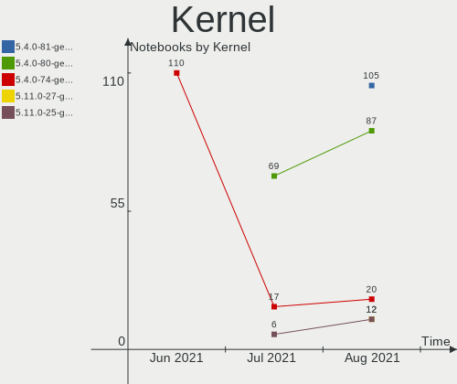
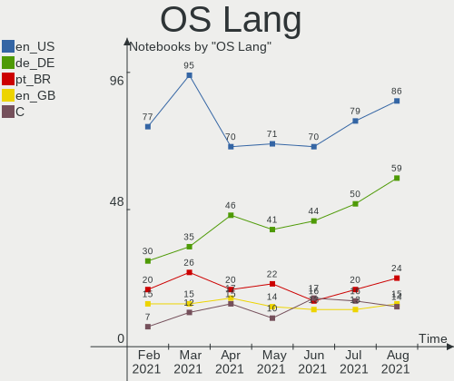
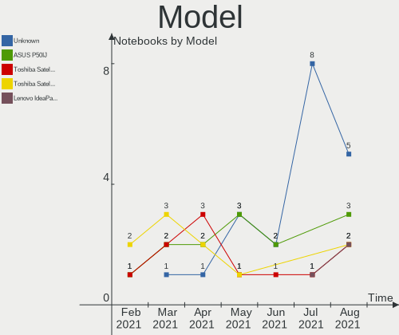
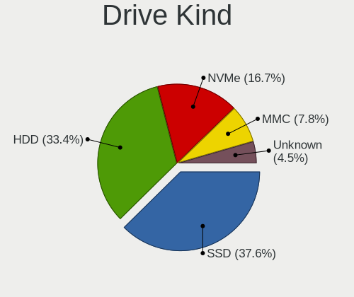
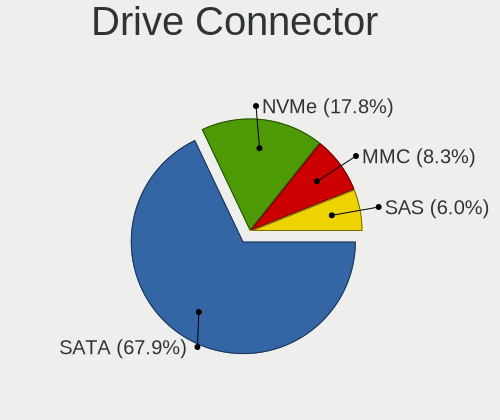
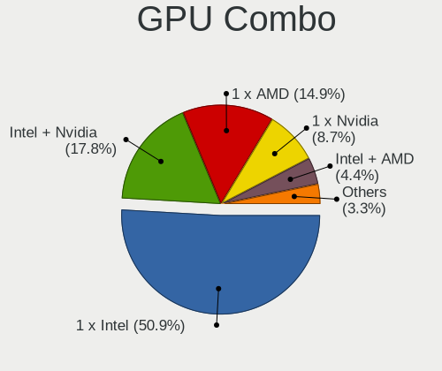
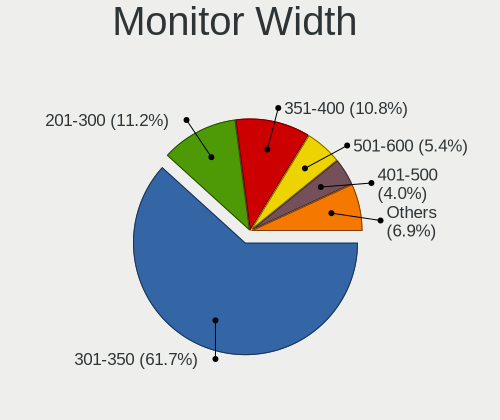
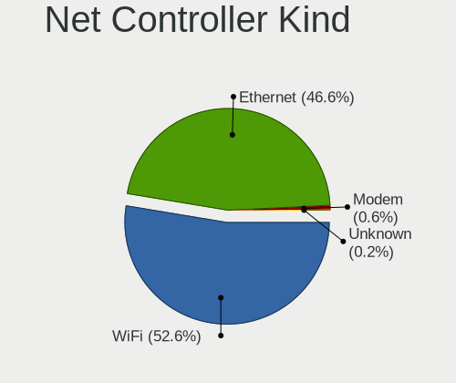
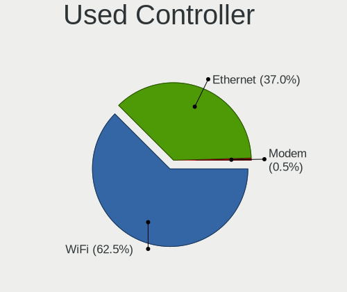

Mint Hardware Trends (Notebook)
-------------------------------

A project to identify most popular hardware characteristics and track their change
over time based on data collected by Mint users at https://Linux-Hardware.org.

Anyone can contribute to the study by uploading probes of their computers by
the [hw-probe](https://github.com/linuxhw/hw-probe) tool:

    sudo hw-probe -all -upload

Full-feature report is available here: https://linux-hardware.org/?view=trends&formfactor=notebook

Period: Mar, 2020.

Contents
--------

- [ OS                       ](#os)
- [ OS Family                ](#os-family)
- [ Kernel                   ](#kernel)
- [ Kernel Family            ](#kernel-family)
- [ Kernel Major Ver.        ](#kernel-major-ver)
- [ Arch                     ](#arch)
- [ DE                       ](#de)
- [ Display Server           ](#display-server)
- [ OS Lang                  ](#os-lang)
- [ Boot Mode                ](#boot-mode)
- [ Filesystem               ](#filesystem)
- [ Dual Boot with Linux     ](#dual-boot-with-linux)
- [ Dual Boot (Win)          ](#dual-boot-win)
- [ Country                  ](#country)
- [ City                     ](#city)
- [ Vendor                   ](#vendor)
- [ Model                    ](#model)
- [ Model Family             ](#model-family)
- [ MFG Year                 ](#mfg-year)
- [ Form Factor              ](#form-factor)
- [ Secure Boot              ](#secure-boot)
- [ Coreboot                 ](#coreboot)
- [ RAM Size                 ](#ram-size)
- [ RAM Used                 ](#ram-used)
- [ Drive Vendor             ](#drive-vendor)
- [ Drive Model              ](#drive-model)
- [ Drive Kind               ](#drive-kind)
- [ Drive Connector          ](#drive-connector)
- [ Drive Size               ](#drive-size)
- [ Space Total              ](#space-total)
- [ Space Used               ](#space-used)
- [ Malfunc. Drives          ](#malfunc-drives)
- [ Malfunc. Drive Vendor    ](#malfunc-drive-vendor)
- [ Malfunc. Drive Kind      ](#malfunc-drive-kind)
- [ Failed Drives            ](#failed-drives)
- [ Failed Drive Vendor      ](#failed-drive-vendor)
- [ Drive Status             ](#drive-status)
- [ Storage Vendor           ](#storage-vendor)
- [ Storage Model            ](#storage-model)
- [ Storage Kind             ](#storage-kind)
- [ CPU Vendor               ](#cpu-vendor)
- [ CPU Model                ](#cpu-model)
- [ CPU Model Family         ](#cpu-model-family)
- [ CPU Cores                ](#cpu-cores)
- [ CPU Sockets              ](#cpu-sockets)
- [ CPU Threads              ](#cpu-threads)
- [ CPU Op-Modes             ](#cpu-op-modes)
- [ CPU Microarch            ](#cpu-microarch)
- [ CPU Microcode            ](#cpu-microcode)
- [ GPU Vendor               ](#gpu-vendor)
- [ GPU Model                ](#gpu-model)
- [ GPU Combo                ](#gpu-combo)
- [ GPU Driver               ](#gpu-driver)
- [ GPU Memory               ](#gpu-memory)
- [ Monitor Vendor           ](#monitor-vendor)
- [ Monitor Model            ](#monitor-model)
- [ Monitor Resolution       ](#monitor-resolution)
- [ Monitor Diagonal         ](#monitor-diagonal)
- [ Monitor Width            ](#monitor-width)
- [ Aspect Ratio             ](#aspect-ratio)
- [ Monitor Area             ](#monitor-area)
- [ Pixel Density            ](#pixel-density)
- [ Multiple Monitors        ](#multiple-monitors)
- [ Net Controller Vendor    ](#net-controller-vendor)
- [ Net Controller Model     ](#net-controller-model)
- [ Net Controller Kind      ](#net-controller-kind)
- [ Used Controller          ](#used-controller)
- [ NICs                     ](#nics)
- [ Unsupported Devices      ](#unsupported-devices)
- [ Unsupported Device Types ](#unsupported-device-types)

OS
--

Installed operating systems

| Name      | Computers | Percent |
|-----------|-----------|---------|
| Mint 19.3 | 115       | 83.33%  |
| Mint 19.1 | 7         | 5.07%   |
| Mint 19.2 | 4         | 2.9%    |
| Mint 19   | 4         | 2.9%    |
| Mint 3    | 2         | 1.45%   |
| Mint 18.3 | 2         | 1.45%   |
| Mint 4    | 1         | 0.72%   |
| Mint 18.2 | 1         | 0.72%   |
| Mint 18.1 | 1         | 0.72%   |
| Mint 18   | 1         | 0.72%   |

OS Family
---------

OS without a version

| Name | Computers | Percent |
|------|-----------|---------|
| Mint | 138       | 100%    |

Kernel
------

Version of the Linux kernel

| Version                    | Computers | Percent |
|----------------------------|-----------|---------|
| 5.3.0-40-generic           | 42        | 30.43%  |
| 5.3.0-42-generic           | 39        | 28.26%  |
| 5.0.0-32-generic           | 16        | 11.59%  |
| 4.15.0-91-generic          | 8         | 5.8%    |
| 4.15.0-88-generic          | 7         | 5.07%   |
| 5.3.0-45-generic           | 3         | 2.17%   |
| 5.3.0-28-generic           | 3         | 2.17%   |
| 4.15.0-54-generic          | 3         | 2.17%   |
| 5.6.0-050600rc7-lowlatency | 1         | 0.72%   |
| 5.5.6-050506-generic       | 1         | 0.72%   |
| 5.4.2-050402-generic       | 1         | 0.72%   |
| 5.4.16-050416-generic      | 1         | 0.72%   |
| 5.3.0-45-lowlatency        | 1         | 0.72%   |
| 5.3.0-40-lowlatency        | 1         | 0.72%   |
| 5.3.0-26-generic           | 1         | 0.72%   |
| 4.9.0-8-amd64              | 1         | 0.72%   |
| 4.4.0-53-generic           | 1         | 0.72%   |
| 4.4.0-141-generic          | 1         | 0.72%   |
| 4.19.0-8-686               | 1         | 0.72%   |
| 4.19.0-0.bpo.8-amd64       | 1         | 0.72%   |
| 4.18.0-18-generic          | 1         | 0.72%   |
| 4.15.0-76-generic          | 1         | 0.72%   |
| 4.15.0-74-generic          | 1         | 0.72%   |
| 4.15.0-66-generic          | 1         | 0.72%   |
| 4.15.0-60-generic          | 1         | 0.72%   |

Kernel Family
-------------

Linux kernel without a distro release

| Version | Computers | Percent |
|---------|-----------|---------|
| 5.3.0   | 90        | 65.22%  |
| 4.15.0  | 22        | 15.94%  |
| 5.0.0   | 16        | 11.59%  |
| 4.4.0   | 2         | 1.45%   |
| 4.19.0  | 2         | 1.45%   |
| 5.6.0   | 1         | 0.72%   |
| 5.5.6   | 1         | 0.72%   |
| 5.4.2   | 1         | 0.72%   |
| 5.4.16  | 1         | 0.72%   |
| 4.9.0   | 1         | 0.72%   |
| 4.18.0  | 1         | 0.72%   |

Kernel Major Ver.
-----------------

Linux kernel major version

| Version | Computers | Percent |
|---------|-----------|---------|
| 5.3     | 90        | 65.22%  |
| 4.15    | 22        | 15.94%  |
| 5.0     | 16        | 11.59%  |
| 5.4     | 2         | 1.45%   |
| 4.4     | 2         | 1.45%   |
| 4.19    | 2         | 1.45%   |
| 5.6     | 1         | 0.72%   |
| 5.5     | 1         | 0.72%   |
| 4.9     | 1         | 0.72%   |
| 4.18    | 1         | 0.72%   |

Arch
----

OS architecture (x86_64, i586, etc.)

| Name   | Computers | Percent |
|--------|-----------|---------|
| x86_64 | 122       | 88.41%  |
| i686   | 16        | 11.59%  |

DE
--

Desktop Environment

| Name       | Computers | Percent |
|------------|-----------|---------|
| X-Cinnamon | 70        | 50.72%  |
| Cinnamon   | 27        | 19.57%  |
| MATE       | 23        | 16.67%  |
| XFCE       | 10        | 7.25%   |
| GNOME      | 3         | 2.17%   |
| Unknown    | 3         | 2.17%   |
| Deepin     | 2         | 1.45%   |

Display Server
--------------

X11 or Wayland

| Name | Computers | Percent |
|------|-----------|---------|
| X11  | 138       | 100%    |

OS Lang
-------

Language

| Lang    | Computers | Percent |
|---------|-----------|---------|
| en_US   | 46        | 33.33%  |
| ru_RU   | 17        | 12.32%  |
| en_GB   | 11        | 7.97%   |
| de_DE   | 11        | 7.97%   |
| pt_BR   | 9         | 6.52%   |
| pl_PL   | 5         | 3.62%   |
| es_ES   | 5         | 3.62%   |
| en_CA   | 5         | 3.62%   |
| it_IT   | 4         | 2.9%    |
| es_AR   | 4         | 2.9%    |
| nl_NL   | 3         | 2.17%   |
| fr_FR   | 3         | 2.17%   |
| pt_PT   | 2         | 1.45%   |
| tr_TR   | 1         | 0.72%   |
| ru_UA   | 1         | 0.72%   |
| nl_BE   | 1         | 0.72%   |
| hr_HR   | 1         | 0.72%   |
| fi_FI   | 1         | 0.72%   |
| es_CO   | 1         | 0.72%   |
| en_IN   | 1         | 0.72%   |
| de_LI   | 1         | 0.72%   |
| de_AT   | 1         | 0.72%   |
| da_DK   | 1         | 0.72%   |
| cs_CZ   | 1         | 0.72%   |
| ca_AD   | 1         | 0.72%   |
| Unknown | 1         | 0.72%   |

Boot Mode
---------

EFI or BIOS

| Mode | Computers | Percent |
|------|-----------|---------|
| BIOS | 80        | 57.97%  |
| EFI  | 58        | 42.03%  |

Filesystem
----------

Type of filesystem

| Type  | Computers | Percent |
|-------|-----------|---------|
| Ext4  | 133       | 96.38%  |
| Btrfs | 5         | 3.62%   |

Dual Boot with Linux
--------------------

Hosting more than one Linux

| Dual boot | Computers | Percent |
|-----------|-----------|---------|
| No        | 133       | 96.38%  |
| Yes       | 5         | 3.62%   |

Dual Boot (Win)
---------------

Hosting Linux and Windows

| Dual boot | Computers | Percent |
|-----------|-----------|---------|
| No        | 115       | 83.33%  |
| Yes       | 23        | 16.67%  |

Country
-------

Geographic location (country)

| Country        | Computers | Percent |
|----------------|-----------|---------|
| USA            | 21        | 15.22%  |
| Russia         | 15        | 10.87%  |
| Germany        | 14        | 10.14%  |
| UK             | 12        | 8.7%    |
| Brazil         | 10        | 7.25%   |
| Italy          | 6         | 4.35%   |
| Canada         | 6         | 4.35%   |
| Spain          | 5         | 3.62%   |
| Poland         | 4         | 2.9%    |
| Netherlands    | 4         | 2.9%    |
| France         | 4         | 2.9%    |
| Argentina      | 4         | 2.9%    |
| Ukraine        | 2         | 1.45%   |
| Turkey         | 2         | 1.45%   |
| Portugal       | 2         | 1.45%   |
| Mexico         | 2         | 1.45%   |
| Kyrgyzstan     | 2         | 1.45%   |
| Czech Republic | 2         | 1.45%   |
| Belgium        | 2         | 1.45%   |
| Austria        | 2         | 1.45%   |
| Switzerland    | 1         | 0.72%   |
| Sweden         | 1         | 0.72%   |
| Slovakia       | 1         | 0.72%   |
| Romania        | 1         | 0.72%   |
| Puerto Rico    | 1         | 0.72%   |
| Norway         | 1         | 0.72%   |
| Latvia         | 1         | 0.72%   |
| Iran           | 1         | 0.72%   |
| Indonesia      | 1         | 0.72%   |
| India          | 1         | 0.72%   |
| Iceland        | 1         | 0.72%   |
| Finland        | 1         | 0.72%   |
| Denmark        | 1         | 0.72%   |
| Croatia        | 1         | 0.72%   |
| Colombia       | 1         | 0.72%   |
| Bulgaria       | 1         | 0.72%   |
| Belarus        | 1         | 0.72%   |

City
----

Geographic location (city)

| City               | Computers | Percent |
|--------------------|-----------|---------|
| Walton on Thames   | 2         | 1.45%   |
| Toronto            | 2         | 1.45%   |
| São Paulo         | 2         | 1.45%   |
| Rio de Janeiro     | 2         | 1.45%   |
| Prague             | 2         | 1.45%   |
| Moscow             | 2         | 1.45%   |
| Lisbon             | 2         | 1.45%   |
| Krasnodar          | 2         | 1.45%   |
| Kostroma           | 2         | 1.45%   |
| Halifax            | 2         | 1.45%   |
| Bishkek            | 2         | 1.45%   |
| Yuzhno-Sakhalinsk  | 1         | 0.72%   |
| Winnipeg           | 1         | 0.72%   |
| Wichita Falls      | 1         | 0.72%   |
| Voronezh           | 1         | 0.72%   |
| Voorhout           | 1         | 0.72%   |
| Vinkovci           | 1         | 0.72%   |
| Villa Flandria     | 1         | 0.72%   |
| Vienna             | 1         | 0.72%   |
| Tver               | 1         | 0.72%   |
| Turin              | 1         | 0.72%   |
| Tunja              | 1         | 0.72%   |
| Tula               | 1         | 0.72%   |
| Toenisvorst        | 1         | 0.72%   |
| Timelkam           | 1         | 0.72%   |
| Tehran             | 1         | 0.72%   |
| Tampa              | 1         | 0.72%   |
| St Petersburg      | 1         | 0.72%   |
| St Austell         | 1         | 0.72%   |
| Spruce Grove       | 1         | 0.72%   |
| Sonneberg          | 1         | 0.72%   |
| Sjomarken          | 1         | 0.72%   |
| Severomorsk        | 1         | 0.72%   |
| Schwabmunchen      | 1         | 0.72%   |
| Sarpsborg          | 1         | 0.72%   |
| San Giuliano Terme | 1         | 0.72%   |
| Samara             | 1         | 0.72%   |
| Rousse             | 1         | 0.72%   |
| Rogersville        | 1         | 0.72%   |
| Rockville          | 1         | 0.72%   |
| Rochester          | 1         | 0.72%   |
| Riga               | 1         | 0.72%   |
| Reykjavik          | 1         | 0.72%   |
| Reston             | 1         | 0.72%   |
| Requena            | 1         | 0.72%   |
| Recife             | 1         | 0.72%   |
| Providence         | 1         | 0.72%   |
| Petaluma           | 1         | 0.72%   |
| Paulista           | 1         | 0.72%   |
| Paris              | 1         | 0.72%   |
| Olivos             | 1         | 0.72%   |
| Ocean Springs      | 1         | 0.72%   |
| Northampton        | 1         | 0.72%   |
| Norresundby        | 1         | 0.72%   |
| Nogent-sur-Marne   | 1         | 0.72%   |
| Málaga            | 1         | 0.72%   |
| Murmansk           | 1         | 0.72%   |
| Montreal           | 1         | 0.72%   |
| Minsk              | 1         | 0.72%   |
| Milan              | 1         | 0.72%   |

Vendor
------

Motherboard manufacturer

| Name                | Computers | Percent |
|---------------------|-----------|---------|
| Hewlett-Packard     | 35        | 25.36%  |
| Lenovo              | 22        | 15.94%  |
| Dell                | 21        | 15.22%  |
| Acer                | 19        | 13.77%  |
| ASUSTek Computer    | 13        | 9.42%   |
| Toshiba             | 9         | 6.52%   |
| Samsung Electronics | 4         | 2.9%    |
| Unknown             | 4         | 2.9%    |
| Sony                | 2         | 1.45%   |
| Notebook            | 2         | 1.45%   |
| Apple               | 2         | 1.45%   |
| OEGStone            | 1         | 0.72%   |
| MSI                 | 1         | 0.72%   |
| Google              | 1         | 0.72%   |
| Gateway             | 1         | 0.72%   |
| Fujitsu             | 1         | 0.72%   |

Model
-----

Motherboard model

| Name                                     | Computers | Percent |
|------------------------------------------|-----------|---------|
| Unknown                                  | 7         | 5.07%   |
| Toshiba Satellite L650                   | 2         | 1.45%   |
| Samsung Electronics 300E4C/300E5C/300E7C | 2         | 1.45%   |
| HP ProBook 650 G1                        | 2         | 1.45%   |
| HP ProBook 4540s                         | 2         | 1.45%   |
| HP Pavilion g6                           | 2         | 1.45%   |
| HP Pavilion dv4                          | 2         | 1.45%   |
| HP Laptop 15-bw0xx                       | 2         | 1.45%   |
| Dell Latitude E6430                      | 2         | 1.45%   |
| Dell Inspiron 15-3567                    | 2         | 1.45%   |
| Acer AO725                               | 2         | 1.45%   |
| Toshiba Satellite Pro C640               | 1         | 0.72%   |
| Toshiba Satellite L775D                  | 1         | 0.72%   |
| Toshiba Satellite L50-B                  | 1         | 0.72%   |
| Toshiba Satellite L300                   | 1         | 0.72%   |
| Toshiba Satellite C670D-10C              | 1         | 0.72%   |
| Toshiba PORTEGE R500                     | 1         | 0.72%   |
| Sony VPCEB1E1R                           | 1         | 0.72%   |
| Sony SVE1512B1EW                         | 1         | 0.72%   |
| Samsung Electronics R430/P430/R480       | 1         | 0.72%   |
| Samsung Electronics 530U3C/530U4C/532U3C | 1         | 0.72%   |
| OEGStone M570RU                          | 1         | 0.72%   |
| Notebook N8xEJEK                         | 1         | 0.72%   |
| Notebook N85_N87HCHNHZ                   | 1         | 0.72%   |
| MSI GX60 3CC                             | 1         | 0.72%   |
| Lenovo Yoga 300-11IBR 80M1               | 1         | 0.72%   |
| Lenovo V145-15AST 81MT                   | 1         | 0.72%   |
| Lenovo ThinkPad X250 20CM002VUS          | 1         | 0.72%   |
| Lenovo ThinkPad X220 42872WU             | 1         | 0.72%   |
| Lenovo ThinkPad X200 7459Z7N             | 1         | 0.72%   |
| Lenovo ThinkPad X1 Carbon 34485S4        | 1         | 0.72%   |
| Lenovo ThinkPad T440 20B7S26602          | 1         | 0.72%   |
| Lenovo ThinkPad T430 2349S52             | 1         | 0.72%   |
| Lenovo ThinkPad T420s 4173RR4            | 1         | 0.72%   |
| Lenovo ThinkPad P50 20EN0005SP           | 1         | 0.72%   |
| Lenovo ThinkPad Edge 13IAL# 01962EG      | 1         | 0.72%   |
| Lenovo ThinkPad E495 20NE000BGE          | 1         | 0.72%   |
| Lenovo ThinkPad E475 20H4CTO1WW          | 1         | 0.72%   |
| Lenovo IdeaPad 520-15IKB 81BF            | 1         | 0.72%   |
| Lenovo IdeaPad 500-15ACZ 80K4            | 1         | 0.72%   |
| Lenovo IdeaPad 330-15IKB 81DE            | 1         | 0.72%   |
| Lenovo G550 2958                         | 1         | 0.72%   |
| Lenovo G50-80 80L0                       | 1         | 0.72%   |
| Lenovo G50-70 20351                      | 1         | 0.72%   |
| Lenovo E31-70 80KX                       | 1         | 0.72%   |
| Lenovo 3000 G530 4151/200                | 1         | 0.72%   |
| Lenovo 3000 C30010020                    | 1         | 0.72%   |
| HP ProBook 6570b                         | 1         | 0.72%   |
| HP ProBook 6440b                         | 1         | 0.72%   |
| HP ProBook 6360b                         | 1         | 0.72%   |
| HP ProBook 4535s                         | 1         | 0.72%   |
| HP Presario V4000 (PX316UA#ABA)          | 1         | 0.72%   |
| HP Presario CQ57                         | 1         | 0.72%   |
| HP Pavilion Laptop 15-cc5xx              | 1         | 0.72%   |
| HP Pavilion Laptop 14-ce0xxx             | 1         | 0.72%   |
| HP Pavilion dv6                          | 1         | 0.72%   |
| HP Notebook                              | 1         | 0.72%   |
| HP Laptop 17-by0xxx                      | 1         | 0.72%   |
| HP Laptop 15-bs0xx                       | 1         | 0.72%   |
| HP ENVY TS m6 Sleekbook                  | 1         | 0.72%   |

Model Family
------------

Motherboard model prefix

| Name                       | Computers | Percent |
|----------------------------|-----------|---------|
| Acer Aspire                | 13        | 9.42%   |
| Lenovo ThinkPad            | 11        | 7.97%   |
| Dell Inspiron              | 10        | 7.25%   |
| HP ProBook                 | 8         | 5.8%    |
| Toshiba Satellite          | 7         | 5.07%   |
| HP Pavilion                | 7         | 5.07%   |
| Dell Latitude              | 7         | 5.07%   |
| Unknown                    | 7         | 5.07%   |
| HP Laptop                  | 4         | 2.9%    |
| HP EliteBook               | 4         | 2.9%    |
| Lenovo IdeaPad             | 3         | 2.17%   |
| Samsung Electronics 300E4C | 2         | 1.45%   |
| Lenovo 3000                | 2         | 1.45%   |
| HP Presario                | 2         | 1.45%   |
| Dell Vostro                | 2         | 1.45%   |
| Acer TravelMate            | 2         | 1.45%   |
| Acer AO725                 | 2         | 1.45%   |
| Toshiba PORTEGE            | 1         | 0.72%   |
| Sony VPCEB1E1R             | 1         | 0.72%   |
| Sony SVE1512B1EW           | 1         | 0.72%   |
| Samsung Electronics R430   | 1         | 0.72%   |
| Samsung Electronics 530U3C | 1         | 0.72%   |
| OEGStone M570RU            | 1         | 0.72%   |
| Notebook N8xEJEK           | 1         | 0.72%   |
| Notebook N85               | 1         | 0.72%   |
| MSI GX60                   | 1         | 0.72%   |
| Lenovo Yoga                | 1         | 0.72%   |
| Lenovo V145-15AST          | 1         | 0.72%   |
| Lenovo G550                | 1         | 0.72%   |
| Lenovo G50-80              | 1         | 0.72%   |
| Lenovo G50-70              | 1         | 0.72%   |
| Lenovo E31-70              | 1         | 0.72%   |
| HP Notebook                | 1         | 0.72%   |
| HP ENVY                    | 1         | 0.72%   |
| HP Compaq                  | 1         | 0.72%   |
| HP 635                     | 1         | 0.72%   |
| HP 530                     | 1         | 0.72%   |
| HP 355                     | 1         | 0.72%   |
| HP 255                     | 1         | 0.72%   |
| HP 250                     | 1         | 0.72%   |
| HP 2000                    | 1         | 0.72%   |
| Google Quawks              | 1         | 0.72%   |
| Gateway M-6823             | 1         | 0.72%   |
| Fujitsu LIFEBOOK           | 1         | 0.72%   |
| Dell XPS                   | 1         | 0.72%   |
| Dell Precision             | 1         | 0.72%   |
| ASUS X75VB                 | 1         | 0.72%   |
| ASUS X550CL                | 1         | 0.72%   |
| ASUS UX310UQ               | 1         | 0.72%   |
| ASUS TUF                   | 1         | 0.72%   |
| ASUS Strix                 | 1         | 0.72%   |
| ASUS ROG                   | 1         | 0.72%   |
| ASUS GL553VD               | 1         | 0.72%   |
| ASUS GL552VW               | 1         | 0.72%   |
| ASUS G750JZA               | 1         | 0.72%   |
| ASUS G750JM                | 1         | 0.72%   |
| ASUS G73Jh                 | 1         | 0.72%   |
| ASUS All                   | 1         | 0.72%   |
| ASUS 1101HA                | 1         | 0.72%   |
| Apple MacBookPro14         | 1         | 0.72%   |

MFG Year
--------

Motherboard manufacture year

| Year | Computers | Percent |
|------|-----------|---------|
| 2019 | 25        | 18.12%  |
| 2018 | 22        | 15.94%  |
| 2014 | 13        | 9.42%   |
| 2013 | 13        | 9.42%   |
| 2011 | 11        | 7.97%   |
| 2016 | 8         | 5.8%    |
| 2012 | 8         | 5.8%    |
| 2008 | 8         | 5.8%    |
| 2010 | 7         | 5.07%   |
| 2009 | 6         | 4.35%   |
| 2017 | 5         | 3.62%   |
| 2015 | 5         | 3.62%   |
| 2006 | 3         | 2.17%   |
| 2007 | 2         | 1.45%   |
| 2020 | 1         | 0.72%   |
| 2005 | 1         | 0.72%   |

Form Factor
-----------

Physical design of the computer

| Name     | Computers | Percent |
|----------|-----------|---------|
| Notebook | 138       | 100%    |

Secure Boot
-----------

Enabled or disabled

| State    | Computers | Percent |
|----------|-----------|---------|
| Disabled | 128       | 92.75%  |
| Enabled  | 10        | 7.25%   |

Coreboot
--------

Have coreboot on board

| Used | Computers | Percent |
|------|-----------|---------|
| No   | 137       | 99.28%  |
| Yes  | 1         | 0.72%   |

RAM Size
--------

Total RAM memory

| Size in GB | Computers | Percent |
|------------|-----------|---------|
| 4.01-8.0   | 44        | 31.88%  |
| 3.01-4.0   | 39        | 28.26%  |
| 8.01-16.0  | 18        | 13.04%  |
| 16.01-24.0 | 13        | 9.42%   |
| 1.01-2.0   | 13        | 9.42%   |
| 32.01-64.0 | 5         | 3.62%   |
| 2.01-3.0   | 4         | 2.9%    |
| 24.01-32.0 | 1         | 0.72%   |
| 0.01-1.0   | 1         | 0.72%   |

RAM Used
--------

Used RAM memory

| Used GB    | Computers | Percent |
|------------|-----------|---------|
| 1.01-2.0   | 47        | 34.06%  |
| 2.01-3.0   | 43        | 31.16%  |
| 0.01-1.0   | 19        | 13.77%  |
| 4.01-8.0   | 16        | 11.59%  |
| 3.01-4.0   | 9         | 6.52%   |
| 16.01-24.0 | 2         | 1.45%   |
| 8.01-16.0  | 2         | 1.45%   |

Drive Vendor
------------

Hard drive vendors

| Vendor              | Computers | Drives  | Percent |
|---------------------|-----------|---------|---------|
| Seagate             | 37        | 39      | 21.76%  |
| WDC                 | 20        | 21      | 11.76%  |
| Toshiba             | 18        | 18      | 10.59%  |
| Samsung Electronics | 16        | 17      | 9.41%   |
| Unknown             | 10        | 10      | 5.88%   |
| SanDisk             | 8         | 8       | 4.71%   |
| Hitachi             | 8         | 8       | 4.71%   |
| HGST                | 8         | 8       | 4.71%   |
| Crucial             | 8         | 8       | 4.71%   |
| Kingston            | 6         | 6       | 3.53%   |
| Intel               | 4         | 4       | 2.35%   |
| PLEXTOR             | 3         | 3       | 1.76%   |
| HL-DT-ST            | 3         | Unknown | 1.76%   |
| A-DATA Technology   | 3         | 3       | 1.76%   |
| SPCC                | 2         | 2       | 1.18%   |
| SK Hynix            | 2         | 2       | 1.18%   |
| KingSpec            | 2         | 2       | 1.18%   |
| KingDian            | 2         | 2       | 1.18%   |
| TO Exter            | 1         | 1       | 0.59%   |
| Super Talent        | 1         | 1       | 0.59%   |
| PNY                 | 1         | 1       | 0.59%   |
| MyDigitalSSD        | 1         | 1       | 0.59%   |
| Micron Technology   | 1         | 1       | 0.59%   |
| LITEON              | 1         | 1       | 0.59%   |
| Hewlett-Packard     | 1         | 1       | 0.59%   |
| Fujitsu             | 1         | 1       | 0.59%   |
| China               | 1         | 1       | 0.59%   |
| Apple               | 1         | 1       | 0.59%   |

Drive Model
-----------

Hard drive models

| Model                        | Computers | Percent |
|------------------------------|-----------|---------|
| ST1000LM035-1RK172 1TB       | 5         | 2.87%   |
| ST1000LM024 HN-M101MBB 1TB   | 5         | 2.87%   |
| ST9500420AS 500GB            | 3         | 1.72%   |
| SSD 860 EVO 500GB            | 3         | 1.72%   |
| MQ01ABF050 500GB             | 3         | 1.72%   |
| MMC Card  16GB               | 3         | 1.72%   |
| HTS545050A7E380 500GB        | 3         | 1.72%   |
| DVDRAM GUE1N 3GB             | 3         | 1.72%   |
| WDS240G2G0A-00JH30 240GB SSD | 2         | 1.15%   |
| WDS120G2G0B-00EPW0 120GB SSD | 2         | 1.15%   |
| WDS100T2B0A-00SM50 1TB SSD   | 2         | 1.15%   |
| ST500LT012-1DG142 500GB      | 2         | 1.15%   |
| ST500LM021-1KJ152 500GB      | 2         | 1.15%   |
| ST2000LX001-1RG174 2TB       | 2         | 1.15%   |
| ST1000LM014-1EJ164 1TB       | 2         | 1.15%   |
| SSD 860 EVO 250GB            | 2         | 1.15%   |
| SA400S37480G 480GB SSD       | 2         | 1.15%   |
| MQ04ABF100 1TB               | 2         | 1.15%   |
| MQ01ABD100 1TB               | 2         | 1.15%   |
| MK3265GSX 320GB              | 2         | 1.15%   |
| HTS543232A7A384 320GB        | 2         | 1.15%   |
| HTS541075A9E680 752GB        | 2         | 1.15%   |
| HTS541010A9E680 1TB          | 2         | 1.15%   |
| Expansion 1TB                | 2         | 1.15%   |
| CT1000MX500SSD1 1TB          | 2         | 1.15%   |
| WDS480G2G0B-00EPW0 480GB SSD | 1         | 0.57%   |
| WDBNCE2500PNC 250GB SSD      | 1         | 0.57%   |
| WD7500BPKX-80HPJT0 752GB     | 1         | 0.57%   |
| WD6400BPVT-60HXZT3 640GB     | 1         | 0.57%   |
| WD5000LPVX-60V0TT0 500GB     | 1         | 0.57%   |
| WD5000LPLX-60ZNTT1 500GB     | 1         | 0.57%   |
| WD3200BPVT-22JJ5T0 320GB     | 1         | 0.57%   |
| WD2500BEVT-35A23T0 250GB     | 1         | 0.57%   |
| WD2500BEVT-22ZCT0 250GB      | 1         | 0.57%   |
| WD1600BEVS-60VAT0 160GB      | 1         | 0.57%   |
| WD10SPZX-75Z10T3 1TB         | 1         | 0.57%   |
| WD10SPZX-60Z10T0 1TB         | 1         | 0.57%   |
| WD10SPZX-21Z10T0 1TB         | 1         | 0.57%   |
| WD10JPVX-22JC3T0 1TB         | 1         | 0.57%   |
| SVP200S3120G 120GB SSD       | 1         | 0.57%   |
| SV300S37A240G 240GB SSD      | 1         | 0.57%   |
| SUV500480G 480GB SSD         | 1         | 0.57%   |
| SU800NS38 256GB SSD          | 1         | 0.57%   |
| SU800 512GB SSD              | 1         | 0.57%   |
| SU630 240GB SSD              | 1         | 0.57%   |
| ST9750420AS 752GB            | 1         | 0.57%   |
| ST96812AS 58GB               | 1         | 0.57%   |
| ST9500423AS 500GB            | 1         | 0.57%   |
| ST9500325AS 500GB            | 1         | 0.57%   |
| ST9250410AS 250GB            | 1         | 0.57%   |
| ST9250315AS 250GB            | 1         | 0.57%   |
| ST9160314AS 160GB            | 1         | 0.57%   |
| ST500LT012-9WS142 500GB      | 1         | 0.57%   |
| ST500LM030-2E717D 500GB      | 1         | 0.57%   |
| ST320LT012-9WS14C 320GB      | 1         | 0.57%   |
| ST3160815AS 160GB            | 1         | 0.57%   |
| ST2000LM015-2E8174 2TB       | 1         | 0.57%   |
| ST2000LM007-1R8174 2TB       | 1         | 0.57%   |
| ST1000LM048-2E7172 1TB       | 1         | 0.57%   |
| ST1000DM003-9YN162 1TB       | 1         | 0.57%   |

Drive Kind
----------

HDD or SSD

| Kind    | Computers | Drives | Percent |
|---------|-----------|--------|---------|
| HDD     | 83        | 86     | 50.3%   |
| SSD     | 58        | 64     | 35.15%  |
| MMC     | 11        | 11     | 6.67%   |
| Unknown | 7         | 4      | 4.24%   |
| NVMe    | 6         | 6      | 3.64%   |

Drive Connector
---------------

SATA, SAS, NVMe, etc.

| Type | Computers | Drives | Percent |
|------|-----------|--------|---------|
| SATA | 128       | 149    | 83.66%  |
| MMC  | 11        | 11     | 7.19%   |
| SAS  | 8         | 5      | 5.23%   |
| NVMe | 6         | 6      | 3.92%   |

Drive Size
----------

Size of hard drive

| Size in TB | Computers | Drives | Percent |
|------------|-----------|--------|---------|
| 0.01-0.5   | 98        | 115    | 66.67%  |
| 0.51-1.0   | 44        | 51     | 29.93%  |
| 1.01-2.0   | 4         | 4      | 2.72%   |
| 2.01-3.0   | 1         | 1      | 0.68%   |

Space Total
-----------

Amount of disk space available on the file system

| Size in GB     | Computers | Percent |
|----------------|-----------|---------|
| 101-250        | 46        | 33.33%  |
| 251-500        | 34        | 24.64%  |
| 501-1000       | 22        | 15.94%  |
| 51-100         | 12        | 8.7%    |
| 1001-2000      | 10        | 7.25%   |
| 21-50          | 8         | 5.8%    |
| 2001-3000      | 2         | 1.45%   |
| 1-20           | 2         | 1.45%   |
| More than 3000 | 1         | 0.72%   |
| Unknown        | 1         | 0.72%   |

Space Used
----------

Amount of used disk space

| Used GB        | Computers | Percent |
|----------------|-----------|---------|
| 21-50          | 37        | 26.81%  |
| 1-20           | 36        | 26.09%  |
| 101-250        | 24        | 17.39%  |
| 51-100         | 20        | 14.49%  |
| 251-500        | 13        | 9.42%   |
| 501-1000       | 6         | 4.35%   |
| More than 3000 | 1         | 0.72%   |
| Unknown        | 1         | 0.72%   |

Malfunc. Drives
---------------

Drive models with a malfunction

| Model                       | Computers | Drives | Percent |
|-----------------------------|-----------|--------|---------|
| WD10SPZX-60Z10T0 1TB        | 1         | 1      | 7.69%   |
| ST9250410AS 250GB           | 1         | 1      | 7.69%   |
| ST500LT012-9WS142 500GB     | 1         | 1      | 7.69%   |
| ST1000LM035-1RK172 1TB      | 1         | 1      | 7.69%   |
| ST1000LM014-1EJ164 1TB      | 1         | 1      | 7.69%   |
| SD8SN8U-128G-1006 128GB SSD | 1         | 1      | 7.69%   |
| SD7SB3Q256G1002 256GB SSD   | 1         | 1      | 7.69%   |
| MQ02ABD100H 1TB             | 1         | 1      | 7.69%   |
| MQ01ABD100 1TB              | 1         | 1      | 7.69%   |
| MP0402H 40GB                | 1         | 1      | 7.69%   |
| MK3265GSX 320GB             | 1         | 1      | 7.69%   |
| HTS541075A9E680 752GB       | 1         | 1      | 7.69%   |
| CT240M500SSD1 240GB         | 1         | 1      | 7.69%   |

Malfunc. Drive Vendor
---------------------

Vendors of faulty drives

| Vendor              | Computers | Drives | Percent |
|---------------------|-----------|--------|---------|
| Seagate             | 4         | 4      | 30.77%  |
| Toshiba             | 3         | 3      | 23.08%  |
| SanDisk             | 2         | 2      | 15.38%  |
| WDC                 | 1         | 1      | 7.69%   |
| Samsung Electronics | 1         | 1      | 7.69%   |
| HGST                | 1         | 1      | 7.69%   |
| Crucial             | 1         | 1      | 7.69%   |

Malfunc. Drive Kind
-------------------

Kinds of faulty drives

| Kind | Computers | Drives | Percent |
|------|-----------|--------|---------|
| HDD  | 10        | 10     | 76.92%  |
| SSD  | 3         | 3      | 23.08%  |

Failed Drives
-------------

Failed drive models

Zero info for selected period =(

Failed Drive Vendor
-------------------

Failed drive vendors

Zero info for selected period =(

Drive Status
------------

Number of failed and malfunc. drives

| Status   | Computers | Drives | Percent |
|----------|-----------|--------|---------|
| Detected | 104       | 125    | 72.73%  |
| Works    | 26        | 33     | 18.18%  |
| Malfunc  | 13        | 13     | 9.09%   |

Storage Vendor
--------------

Storage controller vendors

| Vendor                       | Computers | Percent |
|------------------------------|-----------|---------|
| Intel                        | 111       | 77.08%  |
| AMD                          | 22        | 15.28%  |
| Toshiba America Info Systems | 3         | 2.08%   |
| Samsung Electronics          | 3         | 2.08%   |
| SK Hynix                     | 2         | 1.39%   |
| Sandisk                      | 1         | 0.69%   |
| Lite-On Technology           | 1         | 0.69%   |
| Apple                        | 1         | 0.69%   |

Storage Model
-------------

Storage controller models

| Model                                                                      | Computers | Percent |
|----------------------------------------------------------------------------|-----------|---------|
| FCH SATA Controller [AHCI mode]                                            | 19        | 12.1%   |
| Sunrise Point-LP SATA Controller [AHCI mode]                               | 14        | 8.92%   |
| 7 Series Chipset Family 6-port SATA Controller [AHCI mode]                 | 14        | 8.92%   |
| 82801 Mobile SATA Controller [RAID mode]                                   | 10        | 6.37%   |
| 8 Series SATA Controller 1 [AHCI mode]                                     | 9         | 5.73%   |
| 6 Series/C200 Series Chipset Family 6 port Mobile SATA AHCI Controller     | 7         | 4.46%   |
| 5 Series/3400 Series Chipset 4 port SATA AHCI Controller                   | 7         | 4.46%   |
| 82801IBM/IEM (ICH9M/ICH9M-E) 4 port SATA Controller [AHCI mode]            | 6         | 3.82%   |
| HM170/QM170 Chipset SATA Controller [AHCI Mode]                            | 5         | 3.18%   |
| 82801GBM/GHM (ICH7-M Family) SATA Controller [IDE mode]                    | 5         | 3.18%   |
| Wildcat Point-LP SATA Controller [AHCI Mode]                               | 3         | 1.91%   |
| SSD 660P Series                                                            | 3         | 1.91%   |
| SB7x0/SB8x0/SB9x0 SATA Controller [AHCI mode]                              | 3         | 1.91%   |
| FCH IDE Controller                                                         | 3         | 1.91%   |
| Cannon Lake Mobile PCH SATA AHCI Controller                                | 3         | 1.91%   |
| 82801HM/HEM (ICH8M/ICH8M-E) SATA Controller [AHCI mode]                    | 3         | 1.91%   |
| 82801HM/HEM (ICH8M/ICH8M-E) IDE Controller                                 | 3         | 1.91%   |
| 82801G (ICH7 Family) IDE Controller                                        | 3         | 1.91%   |
| 8 Series/C220 Series Chipset Family 6-port SATA Controller 1 [AHCI mode]   | 3         | 1.91%   |
| Q170/Q150/B150/H170/H110/Z170/CM236 Chipset SATA Controller [AHCI Mode]    | 2         | 1.27%   |
| NVMe SSD Controller SM981/PM981/PM983                                      | 2         | 1.27%   |
| NVMe Controller                                                            | 2         | 1.27%   |
| Non-Volatile memory controller                                             | 2         | 1.27%   |
| 82801GBM/GHM (ICH7-M Family) SATA Controller [AHCI mode]                   | 2         | 1.27%   |
| 5 Series/3400 Series Chipset 6 port SATA AHCI Controller                   | 2         | 1.27%   |
| WD Black 2018/PC SN520 NVMe SSD                                            | 1         | 0.64%   |
| US15W/US15X/US15L/UL11L SCH [Poulsbo] IDE Controller                       | 1         | 0.64%   |
| Toshiba America Info Non-Volatile memory controller                        | 1         | 0.64%   |
| SB7x0/SB8x0/SB9x0 IDE Controller                                           | 1         | 0.64%   |
| SATA controller                                                            | 1         | 0.64%   |
| S3X NVMe Controller                                                        | 1         | 0.64%   |
| NM10/ICH7 Family SATA Controller [IDE mode]                                | 1         | 0.64%   |
| NM10/ICH7 Family SATA Controller [AHCI mode]                               | 1         | 0.64%   |
| Mobile 4 Series Chipset PT IDER Controller                                 | 1         | 0.64%   |
| Electronics SATA controller                                                | 1         | 0.64%   |
| Comet Lake SATA AHCI Controller                                            | 1         | 0.64%   |
| BC501 NVMe Solid State Drive 512GB                                         | 1         | 0.64%   |
| Atom/Celeron/Pentium Processor x5-E8000/J3xxx/N3xxx Series SATA Controller | 1         | 0.64%   |
| Atom Processor E3800 Series SATA AHCI Controller                           | 1         | 0.64%   |
| 82801IBM/IEM (ICH9M/ICH9M-E) 2 port SATA Controller [IDE mode]             | 1         | 0.64%   |
| 82801HM/HEM (ICH8M/ICH8M-E) SATA Controller [IDE mode]                     | 1         | 0.64%   |
| 82801FBM (ICH6M) SATA Controller                                           | 1         | 0.64%   |
| 82801FB/FBM/FR/FW/FRW (ICH6 Family) IDE Controller                         | 1         | 0.64%   |
| 8 Series/C220 Series Chipset Family 2-port SATA Controller 2 [IDE mode]    | 1         | 0.64%   |
| 8 Series Chipset Family 4-port SATA Controller 1 [IDE mode] - Mobile       | 1         | 0.64%   |
| 5 Series/3400 Series Chipset 4 port SATA IDE Controller                    | 1         | 0.64%   |
| 5 Series/3400 Series Chipset 2 port SATA IDE Controller                    | 1         | 0.64%   |

Storage Kind
------------

Kind of storage controller (IDE, SATA, NVMe, SAS, ...)

| Kind | Computers | Percent |
|------|-----------|---------|
| SATA | 108       | 70.59%  |
| IDE  | 23        | 15.03%  |
| NVMe | 12        | 7.84%   |
| RAID | 10        | 6.54%   |

CPU Vendor
----------

Processor vendors

| Vendor | Computers | Percent |
|--------|-----------|---------|
| Intel  | 115       | 83.33%  |
| AMD    | 23        | 16.67%  |

CPU Model
---------

Processor models

| Model                                       | Computers | Percent |
|---------------------------------------------|-----------|---------|
| Intel Core i7-8750H CPU @ 2.20GHz           | 3         | 2.17%   |
| Intel Core i5-4210U CPU @ 1.70GHz           | 3         | 2.17%   |
| Intel Core i5-2520M CPU @ 2.50GHz           | 3         | 2.17%   |
| Intel Core i5 CPU M 430 @ 2.27GHz           | 3         | 2.17%   |
| Intel Core i3-8130U CPU @ 2.20GHz           | 3         | 2.17%   |
| Intel Core i7-7700HQ CPU @ 2.80GHz          | 2         | 1.45%   |
| Intel Core i7-6700HQ CPU @ 2.60GHz          | 2         | 1.45%   |
| Intel Core i5-8265U CPU @ 1.60GHz           | 2         | 1.45%   |
| Intel Core i5-7300HQ CPU @ 2.50GHz          | 2         | 1.45%   |
| Intel Core i5-6200U CPU @ 2.30GHz           | 2         | 1.45%   |
| Intel Core i5-3320M CPU @ 2.60GHz           | 2         | 1.45%   |
| Intel Core i5-3230M CPU @ 2.60GHz           | 2         | 1.45%   |
| Intel Core i5-3210M CPU @ 2.50GHz           | 2         | 1.45%   |
| Intel Core i5-2410M CPU @ 2.30GHz           | 2         | 1.45%   |
| Intel Core i5 CPU M 480 @ 2.67GHz           | 2         | 1.45%   |
| Intel Core i3-7020U CPU @ 2.30GHz           | 2         | 1.45%   |
| Intel Core i3-6006U CPU @ 2.00GHz           | 2         | 1.45%   |
| Intel Core 2 CPU T7200 @ 2.00GHz            | 2         | 1.45%   |
| AMD E-450 APU with Radeon HD Graphics       | 2         | 1.45%   |
| Intel Pentium M processor 1.86GHz           | 1         | 0.72%   |
| Intel Pentium Dual-Core CPU T4500 @ 2.30GHz | 1         | 0.72%   |
| Intel Pentium Dual-Core CPU T4400 @ 2.20GHz | 1         | 0.72%   |
| Intel Pentium Dual CPU T3200 @ 2.00GHz      | 1         | 0.72%   |
| Intel Pentium CPU N3710 @ 1.60GHz           | 1         | 0.72%   |
| Intel Pentium CPU 2117U @ 1.80GHz           | 1         | 0.72%   |
| Intel Pentium CPU 2020M @ 2.40GHz           | 1         | 0.72%   |
| Intel Pentium 3805U @ 1.90GHz               | 1         | 0.72%   |
| Intel Genuine CPU U7300 @ 1.30GHz           | 1         | 0.72%   |
| Intel Genuine CPU T2300 @ 1.66GHz           | 1         | 0.72%   |
| Intel Genuine CPU T2050 @ 1.60GHz           | 1         | 0.72%   |
| Intel Core m3-8100Y CPU @ 1.10GHz           | 1         | 0.72%   |
| Intel Core i9-8950HK CPU @ 2.90GHz          | 1         | 0.72%   |
| Intel Core i7-9750H CPU @ 2.60GHz           | 1         | 0.72%   |
| Intel Core i7-8550U CPU @ 1.80GHz           | 1         | 0.72%   |
| Intel Core i7-7820HQ CPU @ 2.90GHz          | 1         | 0.72%   |
| Intel Core i7-7500U CPU @ 2.70GHz           | 1         | 0.72%   |
| Intel Core i7-6600U CPU @ 2.60GHz           | 1         | 0.72%   |
| Intel Core i7-4710HQ CPU @ 2.50GHz          | 1         | 0.72%   |
| Intel Core i7-4702MQ CPU @ 2.20GHz          | 1         | 0.72%   |
| Intel Core i7-4700HQ CPU @ 2.40GHz          | 1         | 0.72%   |
| Intel Core i7-4600U CPU @ 2.10GHz           | 1         | 0.72%   |
| Intel Core i7-4510U CPU @ 2.00GHz           | 1         | 0.72%   |
| Intel Core i7-4500U CPU @ 1.80GHz           | 1         | 0.72%   |
| Intel Core i7-3720QM CPU @ 2.60GHz          | 1         | 0.72%   |
| Intel Core i7-3667U CPU @ 2.00GHz           | 1         | 0.72%   |
| Intel Core i7-3630QM CPU @ 2.40GHz          | 1         | 0.72%   |
| Intel Core i7-2670QM CPU @ 2.20GHz          | 1         | 0.72%   |
| Intel Core i7-2620M CPU @ 2.70GHz           | 1         | 0.72%   |
| Intel Core i7 CPU Q 740 @ 1.73GHz           | 1         | 0.72%   |
| Intel Core i7 CPU M 620 @ 2.67GHz           | 1         | 0.72%   |
| Intel Core i5-8300H CPU @ 2.30GHz           | 1         | 0.72%   |
| Intel Core i5-7360U CPU @ 2.30GHz           | 1         | 0.72%   |
| Intel Core i5-7200U CPU @ 2.50GHz           | 1         | 0.72%   |
| Intel Core i5-5300U CPU @ 2.30GHz           | 1         | 0.72%   |
| Intel Core i5-5287U CPU @ 2.90GHz           | 1         | 0.72%   |
| Intel Core i5-5200U CPU @ 2.20GHz           | 1         | 0.72%   |
| Intel Core i5-4340M CPU @ 2.90GHz           | 1         | 0.72%   |
| Intel Core i5-4300U CPU @ 1.90GHz           | 1         | 0.72%   |
| Intel Core i5-4200U CPU @ 1.60GHz           | 1         | 0.72%   |
| Intel Core i5-4200M CPU @ 2.50GHz           | 1         | 0.72%   |

CPU Model Family
----------------

Processor model prefix

| Model                   | Computers | Percent |
|-------------------------|-----------|---------|
| Intel Core i5           | 37        | 26.81%  |
| Intel Core i7           | 25        | 18.12%  |
| Intel Core i3           | 17        | 12.32%  |
| Intel Celeron           | 7         | 5.07%   |
| Intel Core 2 Duo        | 6         | 4.35%   |
| AMD A6                  | 5         | 3.62%   |
| Intel Pentium           | 4         | 2.9%    |
| AMD A10                 | 4         | 2.9%    |
| Intel Genuine           | 3         | 2.17%   |
| Intel Celeron M         | 3         | 2.17%   |
| Intel Atom              | 3         | 2.17%   |
| AMD E                   | 3         | 2.17%   |
| Other                   | 2         | 1.45%   |
| Intel Pentium Dual-Core | 2         | 1.45%   |
| Intel Core 2            | 2         | 1.45%   |
| AMD A8                  | 2         | 1.45%   |
| Intel Pentium M         | 1         | 0.72%   |
| Intel Pentium Dual      | 1         | 0.72%   |
| Intel Core m3           | 1         | 0.72%   |
| Intel Core i9           | 1         | 0.72%   |
| Intel Core 2 Solo       | 1         | 0.72%   |
| Intel Core 2 Extreme    | 1         | 0.72%   |
| AMD Sempron             | 1         | 0.72%   |
| AMD Ryzen 7             | 1         | 0.72%   |
| AMD Ryzen 5             | 1         | 0.72%   |
| AMD E2                  | 1         | 0.72%   |
| AMD C-70                | 1         | 0.72%   |
| AMD C-60                | 1         | 0.72%   |
| AMD A4                  | 1         | 0.72%   |

CPU Cores
---------

Number of processor cores

| Number | Computers | Percent |
|--------|-----------|---------|
| 2      | 92        | 66.67%  |
| 4      | 28        | 20.29%  |
| 1      | 13        | 9.42%   |
| 6      | 5         | 3.62%   |

CPU Sockets
-----------

Number of sockets

| Number | Computers | Percent |
|--------|-----------|---------|
| 1      | 138       | 100%    |

CPU Threads
-----------

Threads per core (Hyper-Threading)

| Number | Computers | Percent |
|--------|-----------|---------|
| 2      | 91        | 65.94%  |
| 1      | 47        | 34.06%  |

CPU Op-Modes
------------

CPU Operation Modes (32-bit, 64-bit)

| Op mode        | Computers | Percent |
|----------------|-----------|---------|
| 32-bit, 64-bit | 131       | 94.93%  |
| 32-bit         | 7         | 5.07%   |

CPU Microarch
-------------

Microarchitecture

| Name          | Computers | Percent |
|---------------|-----------|---------|
| Skylake       | 27        | 19.57%  |
| Core          | 15        | 10.87%  |
| IvyBridge     | 14        | 10.14%  |
| Haswell       | 14        | 10.14%  |
| SandyBridge   | 11        | 7.97%   |
| Westmere      | 9         | 6.52%   |
| P6            | 6         | 4.35%   |
| KabyLake      | 5         | 3.62%   |
| Excavator     | 5         | 3.62%   |
| Bobcat        | 5         | 3.62%   |
| Silvermont    | 4         | 2.9%    |
| Piledriver    | 4         | 2.9%    |
| Broadwell     | 4         | 2.9%    |
| Bonnell       | 3         | 2.17%   |
| Zen+          | 2         | 1.45%   |
| Puma          | 2         | 1.45%   |
| K10 Llano     | 2         | 1.45%   |
| Jaguar        | 2         | 1.45%   |
| Steamroller   | 1         | 0.72%   |
| Penryn        | 1         | 0.72%   |
| Nehalem       | 1         | 0.72%   |
| Goldmont plus | 1         | 0.72%   |

CPU Microcode
-------------

Microcode number

| Number     | Computers | Percent |
|------------|-----------|---------|
| 0x306a9    | 13        | 9.42%   |
| 0x40651    | 9         | 6.52%   |
| 0x206a7    | 9         | 6.52%   |
| Unknown    | 8         | 5.8%    |
| 0x906ea    | 6         | 4.35%   |
| 0x806e9    | 6         | 4.35%   |
| 0x1067a    | 6         | 4.35%   |
| 0x906e9    | 5         | 3.62%   |
| 0x406e3    | 5         | 3.62%   |
| 0x20652    | 5         | 3.62%   |
| 0x806ea    | 4         | 2.9%    |
| 0x306d4    | 4         | 2.9%    |
| 0x306c3    | 4         | 2.9%    |
| 0x20655    | 4         | 2.9%    |
| 0x06001119 | 4         | 2.9%    |
| 0x05000119 | 4         | 2.9%    |
| 0x806ec    | 3         | 2.17%   |
| 0x6fd      | 3         | 2.17%   |
| 0x06006705 | 3         | 2.17%   |
| 0x6f6      | 2         | 1.45%   |
| 0x6e8      | 2         | 1.45%   |
| 0x506e3    | 2         | 1.45%   |
| 0x406c4    | 2         | 1.45%   |
| 0x30678    | 2         | 1.45%   |
| 0x106c2    | 2         | 1.45%   |
| 0x10676    | 2         | 1.45%   |
| 0x10661    | 2         | 1.45%   |
| 0x08108102 | 2         | 1.45%   |
| 0x03000027 | 2         | 1.45%   |
| 0x706a1    | 1         | 0.72%   |
| 0x6fa      | 1         | 0.72%   |
| 0x6ec      | 1         | 0.72%   |
| 0x6d8      | 1         | 0.72%   |
| 0x6d6      | 1         | 0.72%   |
| 0x30661    | 1         | 0.72%   |
| 0x106e5    | 1         | 0.72%   |
| 0x07030106 | 1         | 0.72%   |
| 0x07030104 | 1         | 0.72%   |
| 0x0700010f | 1         | 0.72%   |
| 0x0700010b | 1         | 0.72%   |
| 0x06006110 | 1         | 0.72%   |
| 0x05000029 | 1         | 0.72%   |

GPU Vendor
----------

Vendors of graphics cards

| Vendor | Computers | Percent |
|--------|-----------|---------|
| Intel  | 106       | 59.89%  |
| Nvidia | 36        | 20.34%  |
| AMD    | 35        | 19.77%  |

GPU Model
---------

Graphics card models

| Model                                                                              | Computers | Percent |
|------------------------------------------------------------------------------------|-----------|---------|
| 3rd Gen Core processor Graphics Controller                                         | 13        | 6.81%   |
| 2nd Generation Core Processor Family Integrated Graphics Controller                | 11        | 5.76%   |
| Haswell-ULT Integrated Graphics Controller                                         | 9         | 4.71%   |
| Mobile 4 Series Chipset Integrated Graphics Controller                             | 8         | 4.19%   |
| Mobile 945GM/GMS/GME, 943/940GML Express Integrated Graphics Controller            | 7         | 3.66%   |
| Mobile 945GM/GMS, 943/940GML Express Integrated Graphics Controller                | 6         | 3.14%   |
| Core Processor Integrated Graphics Controller                                      | 6         | 3.14%   |
| Skylake GT2 [HD Graphics 520]                                                      | 5         | 2.62%   |
| HD Graphics 630                                                                    | 5         | 2.62%   |
| 4th Gen Core Processor Integrated Graphics Controller                              | 5         | 2.62%   |
| UHD Graphics 630 (Mobile)                                                          | 4         | 2.09%   |
| UHD Graphics 620                                                                   | 4         | 2.09%   |
| HD Graphics 620                                                                    | 4         | 2.09%   |
| GP107M [GeForce GTX 1050 Mobile]                                                   | 4         | 2.09%   |
| Stoney [Radeon R2/R3/R4/R5 Graphics]                                               | 3         | 1.57%   |
| GK107M [GeForce GT 750M]                                                           | 3         | 1.57%   |
| Wrestler [Radeon HD 6320]                                                          | 2         | 1.05%   |
| Wani [Radeon R5/R6/R7 Graphics]                                                    | 2         | 1.05%   |
| UHD Graphics 620 (Whiskey Lake)                                                    | 2         | 1.05%   |
| TU117M [GeForce GTX 1650 Mobile / Max-Q]                                           | 2         | 1.05%   |
| Thames [Radeon HD 7550M/7570M/7650M]                                               | 2         | 1.05%   |
| Thames [Radeon HD 7500M/7600M Series]                                              | 2         | 1.05%   |
| Sun XT [Radeon HD 8670A/8670M/8690M / R5 M330 / M430 / Radeon 520 Mobile]          | 2         | 1.05%   |
| Sumo [Radeon HD 6520G]                                                             | 2         | 1.05%   |
| Picasso                                                                            | 2         | 1.05%   |
| Park [Mobility Radeon HD 5430/5450/5470]                                           | 2         | 1.05%   |
| Mobile GM965/GL960 Integrated Graphics Controller (secondary)                      | 2         | 1.05%   |
| Mobile GM965/GL960 Integrated Graphics Controller (primary)                        | 2         | 1.05%   |
| Mobile 915GM/GMS/910GML Express Graphics Controller                                | 2         | 1.05%   |
| HD Graphics 5500                                                                   | 2         | 1.05%   |
| HD Graphics 530                                                                    | 2         | 1.05%   |
| GP108M [GeForce MX150]                                                             | 2         | 1.05%   |
| GP107M [GeForce GTX 1050 Ti Mobile]                                                | 2         | 1.05%   |
| GM107 [GeForce 940MX]                                                              | 2         | 1.05%   |
| GF117M [GeForce 610M/710M/810M/820M / GT 620M/625M/630M/720M]                      | 2         | 1.05%   |
| GF108GLM [NVS 5200M]                                                               | 2         | 1.05%   |
| Atom/Celeron/Pentium Processor x5-E8000/J3xxx/N3xxx Integrated Graphics Controller | 2         | 1.05%   |
| Atom Processor Z36xxx/Z37xxx Series Graphics & Display                             | 2         | 1.05%   |
| Wrestler [Radeon HD 7290]                                                          | 1         | 0.52%   |
| Wrestler [Radeon HD 6310]                                                          | 1         | 0.52%   |
| Wrestler [Radeon HD 6290]                                                          | 1         | 0.52%   |
| US15W/US15X SCH [Poulsbo] Graphics Controller                                      | 1         | 0.52%   |
| UHD Graphics 615                                                                   | 1         | 0.52%   |
| UHD Graphics 605                                                                   | 1         | 0.52%   |
| UHD Graphics                                                                       | 1         | 0.52%   |
| Trinity [Radeon HD 7660G]                                                          | 1         | 0.52%   |
| Trinity 2 [Radeon HD 7520G]                                                        | 1         | 0.52%   |
| Seymour [Radeon HD 6400M/7400M Series]                                             | 1         | 0.52%   |
| RV710/M92 [Mobility Radeon HD 4530/4570/545v]                                      | 1         | 0.52%   |
| RV710/M92 [Mobility Radeon HD 4350/4550]                                           | 1         | 0.52%   |
| RV515/M54 [Mobility Radeon X1400]                                                  | 1         | 0.52%   |
| Richland [Radeon HD 8650G]                                                         | 1         | 0.52%   |
| Richland [Radeon HD 8610G]                                                         | 1         | 0.52%   |
| Neptune XT [Radeon HD 8970M]                                                       | 1         | 0.52%   |
| Mullins [Radeon R4/R5 Graphics]                                                    | 1         | 0.52%   |
| Mullins [Radeon R3 Graphics]                                                       | 1         | 0.52%   |
| Mobile GME965/GLE960 Integrated Graphics Controller                                | 1         | 0.52%   |
| Mobile 945GSE Express Integrated Graphics Controller                               | 1         | 0.52%   |
| Mars [Radeon HD 8730M]                                                             | 1         | 0.52%   |
| Madison [Mobility Radeon HD 5650/5750 / 6530M/6550M]                               | 1         | 0.52%   |

GPU Combo
---------

Combinations of graphics cards

| Name           | Computers | Percent |
|----------------|-----------|---------|
| 1 x Intel      | 68        | 49.28%  |
| Intel + Nvidia | 32        | 23.19%  |
| 1 x AMD        | 23        | 16.67%  |
| Intel + AMD    | 6         | 4.35%   |
| 2 x AMD        | 5         | 3.62%   |
| 1 x Nvidia     | 3         | 2.17%   |
| AMD + Nvidia   | 1         | 0.72%   |

GPU Driver
----------

Free vs proprietary

| Driver      | Computers | Percent |
|-------------|-----------|---------|
| Free        | 115       | 83.33%  |
| Proprietary | 22        | 15.94%  |
| Unknown     | 1         | 0.72%   |

GPU Memory
----------

Total video memory

| Size in GB | Computers | Percent |
|------------|-----------|---------|
| Unknown    | 70        | 50.72%  |
| 1.01-2.0   | 23        | 16.67%  |
| 0.01-0.5   | 21        | 15.22%  |
| 3.01-4.0   | 12        | 8.7%    |
| 0.51-1.0   | 11        | 7.97%   |
| 7.01-8.0   | 1         | 0.72%   |

Monitor Vendor
--------------

Monitor vendors

| Vendor                  | Computers | Percent |
|-------------------------|-----------|---------|
| AU Optronics            | 34        | 22.67%  |
| Samsung Electronics     | 25        | 16.67%  |
| LG Display              | 20        | 13.33%  |
| Chimei Innolux          | 19        | 12.67%  |
| BOE                     | 13        | 8.67%   |
| LG Philips              | 5         | 3.33%   |
| Apple                   | 4         | 2.67%   |
| Lenovo                  | 3         | 2%      |
| Goldstar                | 3         | 2%      |
| Chi Mei Optoelectronics | 3         | 2%      |
| Sony                    | 2         | 1.33%   |
| Quanta Display          | 2         | 1.33%   |
| InfoVision              | 2         | 1.33%   |
| Hewlett-Packard         | 2         | 1.33%   |
| Dell                    | 2         | 1.33%   |
| BenQ                    | 2         | 1.33%   |
| Toshiba                 | 1         | 0.67%   |
| Sharp                   | 1         | 0.67%   |
| Sceptre Tech            | 1         | 0.67%   |
| Philips                 | 1         | 0.67%   |
| PANDA                   | 1         | 0.67%   |
| Iiyama                  | 1         | 0.67%   |
| Eizo                    | 1         | 0.67%   |
| AOC                     | 1         | 0.67%   |
| Acer                    | 1         | 0.67%   |

Monitor Model
-------------

Monitor models

| Model                                               | Computers | Percent |
|-----------------------------------------------------|-----------|---------|
| LCD Monitor CMN15D5 1920x1080 340x190mm 15.3-inch   | 3         | 1.96%   |
| LCD Monitor LGD0384 1366x768 344x194mm 15.5-inch    | 2         | 1.31%   |
| LCD Monitor CMN1470 1366x768 309x174mm 14.0-inch    | 2         | 1.31%   |
| LCD Monitor BOE0690 1920x1080 344x193mm 15.5-inch   | 2         | 1.31%   |
| LCD Monitor AUO71EC 1366x768 340x190mm 15.3-inch    | 2         | 1.31%   |
| LCD Monitor AUO61ED 1920x1080 340x190mm 15.3-inch   | 2         | 1.31%   |
| LCD Monitor AUO325C 1366x768 256x144mm 11.6-inch    | 2         | 1.31%   |
| LCD Monitor AUO219D 1920x1080 381x214mm 17.2-inch   | 2         | 1.31%   |
| LCD Monitor AUO106C 1366x768 277x156mm 12.5-inch    | 2         | 1.31%   |
| Thunderbolt APP9227 2560x1440 600x340mm 27.2-inch   | 1         | 0.65%   |
| SyncMaster SAM0580 1280x1024 376x301mm 19.0-inch    | 1         | 0.65%   |
| SyncMaster SAM036F 1440x900 428x255mm 19.6-inch     | 1         | 0.65%   |
| SDM-X52 SNY1F50 1024x768 304x228mm 15.0-inch        | 1         | 0.65%   |
| S2719DM DEL4166 2560x1440 600x340mm 27.2-inch       | 1         | 0.65%   |
| S24E390 SAM0C1A 1920x1080 520x290mm 23.4-inch       | 1         | 0.65%   |
| R240HY ACR046F 1920x1080 530x300mm 24.0-inch        | 1         | 0.65%   |
| PLX2483H IVM6114 1920x1080 531x299mm 24.0-inch      | 1         | 0.65%   |
| P2715Q DEL40BF 3840x2160 597x336mm 27.0-inch        | 1         | 0.65%   |
| Nvidia Defaul SNY05FA 1366x768 290x170mm 13.2-inch  | 1         | 0.65%   |
| LP154WX4-TLC8 LPL0120 1280x800 331x207mm 15.4-inch  | 1         | 0.65%   |
| LG ULTRAWIDE GSM59F1 1920x1080 580x240mm 24.7-inch  | 1         | 0.65%   |
| LG FULL HD GSM5ABB 1920x1080 480x270mm 21.7-inch    | 1         | 0.65%   |
| LCD Monitor SHP1476 3840x2160 346x194mm 15.6-inch   | 1         | 0.65%   |
| LCD Monitor SEC5741 1280x800 261x163mm 12.1-inch    | 1         | 0.65%   |
| LCD Monitor SEC5541 1366x768 344x193mm 15.5-inch    | 1         | 0.65%   |
| LCD Monitor SEC544B 1600x900 382x214mm 17.2-inch    | 1         | 0.65%   |
| LCD Monitor SEC5448 1920x1080 344x194mm 15.5-inch   | 1         | 0.65%   |
| LCD Monitor SEC5341 1366x768 340x190mm 15.3-inch    | 1         | 0.65%   |
| LCD Monitor SEC5142 1280x800 303x190mm 14.1-inch    | 1         | 0.65%   |
| LCD Monitor SEC4E45 1280x800 331x207mm 15.4-inch    | 1         | 0.65%   |
| LCD Monitor SEC4542 1280x800 303x190mm 14.1-inch    | 1         | 0.65%   |
| LCD Monitor SEC4345 1366x768 309x174mm 14.0-inch    | 1         | 0.65%   |
| LCD Monitor SEC4251 1366x768 344x194mm 15.5-inch    | 1         | 0.65%   |
| LCD Monitor SEC384A 1366x768 344x194mm 15.5-inch    | 1         | 0.65%   |
| LCD Monitor SEC3555 1366x768 308x184mm 14.1-inch    | 1         | 0.65%   |
| LCD Monitor SEC3450 1400x1050 286x214mm 14.1-inch   | 1         | 0.65%   |
| LCD Monitor SEC3250 1680x1050 331x207mm 15.4-inch   | 1         | 0.65%   |
| LCD Monitor SEC324A 1366x768 344x194mm 15.5-inch    | 1         | 0.65%   |
| LCD Monitor SEC3051 1600x900 398x232mm 18.1-inch    | 1         | 0.65%   |
| LCD Monitor SDC4C48 1920x1080 409x230mm 18.5-inch   | 1         | 0.65%   |
| LCD Monitor SDC4A51 1366x768 344x194mm 15.5-inch    | 1         | 0.65%   |
| LCD Monitor SDC4852 3840x2160 340x190mm 15.3-inch   | 1         | 0.65%   |
| LCD Monitor SDC4146 1366x768 344x194mm 15.5-inch    | 1         | 0.65%   |
| LCD Monitor SAM0F13 3840x2160 1872x1053mm 84.6-inch | 1         | 0.65%   |
| LCD Monitor SAM0E90 1366x768 609x347mm 27.6-inch    | 1         | 0.65%   |
| LCD Monitor SAM050F 1920x1080                       | 1         | 0.65%   |
| LCD Monitor QDS0041 1280x800 331x207mm 15.4-inch    | 1         | 0.65%   |
| LCD Monitor QDS0040 1280x800 331x207mm 15.4-inch    | 1         | 0.65%   |
| LCD Monitor NCP0036 1920x1080 344x194mm 15.5-inch   | 1         | 0.65%   |
| LCD Monitor LPLE800 1280x800 304x190mm 14.1-inch    | 1         | 0.65%   |
| LCD Monitor LPLDB00 1280x800 331x207mm 15.4-inch    | 1         | 0.65%   |
| LCD Monitor LPL1E01 1280x800 330x210mm 15.4-inch    | 1         | 0.65%   |
| LCD Monitor LPL0601 1280x800 331x207mm 15.4-inch    | 1         | 0.65%   |
| LCD Monitor LGD4601 1280x800 286x179mm 13.3-inch    | 1         | 0.65%   |
| LCD Monitor LGD11F9 1280x800 290x180mm 13.4-inch    | 1         | 0.65%   |
| LCD Monitor LGD056D 1920x1080 380x210mm 17.1-inch   | 1         | 0.65%   |
| LCD Monitor LGD0563 1920x1080 344x194mm 15.5-inch   | 1         | 0.65%   |
| LCD Monitor LGD0533 1920x1080 344x194mm 15.5-inch   | 1         | 0.65%   |
| LCD Monitor LGD0435 1600x900 309x174mm 14.0-inch    | 1         | 0.65%   |
| LCD Monitor LGD03FA 1366x768 310x174mm 14.0-inch    | 1         | 0.65%   |

Monitor Resolution
------------------

Monitor screen resolution

| Resolution         | Computers | Percent |
|--------------------|-----------|---------|
| 1366x768 (WXGA)    | 56        | 39.16%  |
| 1920x1080 (FHD)    | 46        | 32.17%  |
| 1280x800 (WXGA)    | 15        | 10.49%  |
| 1600x900 (HD+)     | 12        | 8.39%   |
| 3840x2160 (4K)     | 2         | 1.4%    |
| 2560x1440 (QHD)    | 2         | 1.4%    |
| 2880x1800          | 1         | 0.7%    |
| 2560x1600          | 1         | 0.7%    |
| 2560x1080          | 1         | 0.7%    |
| 1920x1200 (WUXGA)  | 1         | 0.7%    |
| 1680x1050 (WSXGA+) | 1         | 0.7%    |
| 1440x900 (WXGA+)   | 1         | 0.7%    |
| 1400x1050          | 1         | 0.7%    |
| 1280x1024 (SXGA)   | 1         | 0.7%    |
| 1024x768 (XGA)     | 1         | 0.7%    |
| 1024x600           | 1         | 0.7%    |

Monitor Diagonal
----------------

Diagonal size in inches

| Inches  | Computers | Percent |
|---------|-----------|---------|
| 15      | 69        | 45.7%   |
| 17      | 17        | 11.26%  |
| 13      | 16        | 10.6%   |
| 14      | 15        | 9.93%   |
| 27      | 6         | 3.97%   |
| 23      | 6         | 3.97%   |
| 12      | 6         | 3.97%   |
| 11      | 4         | 2.65%   |
| 24      | 2         | 1.32%   |
| 19      | 2         | 1.32%   |
| Unknown | 2         | 1.32%   |
| 84      | 1         | 0.66%   |
| 31      | 1         | 0.66%   |
| 28      | 1         | 0.66%   |
| 26      | 1         | 0.66%   |
| 21      | 1         | 0.66%   |
| 10      | 1         | 0.66%   |

Monitor Width
-------------

Physical width

| Width in mm | Computers | Percent |
|-------------|-----------|---------|
| 301-350     | 91        | 60.67%  |
| 201-300     | 20        | 13.33%  |
| 351-400     | 18        | 12%     |
| 501-600     | 14        | 9.33%   |
| 601-700     | 2         | 1.33%   |
| 401-500     | 2         | 1.33%   |
| Unknown     | 2         | 1.33%   |
| 1501-2000   | 1         | 0.67%   |

Aspect Ratio
------------

Proportional relationship between the width and the height

| Ratio   | Computers | Percent |
|---------|-----------|---------|
| 16/9    | 112       | 82.35%  |
| 16/10   | 19        | 13.97%  |
| 4/3     | 2         | 1.47%   |
| 5/4     | 1         | 0.74%   |
| 21/9    | 1         | 0.74%   |
| Unknown | 1         | 0.74%   |

Monitor Area
------------

Area in inch²

| Area in inch² | Computers | Percent |
|----------------|-----------|---------|
| 101-110        | 65        | 42.76%  |
| 81-90          | 23        | 15.13%  |
| 121-130        | 16        | 10.53%  |
| 201-250        | 9         | 5.92%   |
| 71-80          | 8         | 5.26%   |
| 61-70          | 6         | 3.95%   |
| 301-350        | 6         | 3.95%   |
| 91-100         | 5         | 3.29%   |
| 51-60          | 4         | 2.63%   |
| 251-300        | 2         | 1.32%   |
| 151-200        | 2         | 1.32%   |
| Unknown        | 2         | 1.32%   |
| More than 1000 | 1         | 0.66%   |
| 351-500        | 1         | 0.66%   |
| 41-50          | 1         | 0.66%   |
| 131-140        | 1         | 0.66%   |

Pixel Density
-------------

Pixels per inch

| Density       | Computers | Percent |
|---------------|-----------|---------|
| 101-120       | 62        | 42.18%  |
| 121-160       | 53        | 36.05%  |
| 51-100        | 23        | 15.65%  |
| 161-240       | 4         | 2.72%   |
| More than 240 | 2         | 1.36%   |
| Unknown       | 2         | 1.36%   |
| 1-50          | 1         | 0.68%   |

Multiple Monitors
-----------------

Total monitors connected

| Total | Computers | Percent |
|-------|-----------|---------|
| 1     | 120       | 86.96%  |
| 2     | 16        | 11.59%  |
| 3     | 2         | 1.45%   |

Net Controller Vendor
---------------------

Controller vendors

| Vendor                            | Computers | Percent |
|-----------------------------------|-----------|---------|
| Intel                             | 23        | 58.97%  |
| Realtek Semiconductor             | 5         | 12.82%  |
| Ericsson Business Mobile Networks | 3         | 7.69%   |
| Huawei Technologies               | 2         | 5.13%   |
| DisplayLink                       | 2         | 5.13%   |
| Broadcom Inc. and subsidiaries    | 2         | 5.13%   |
| Spreadtrum Communications         | 1         | 2.56%   |
| MediaTek                          | 1         | 2.56%   |

Net Controller Model
--------------------

Controller models

| Model                                                      | Computers | Percent |
|------------------------------------------------------------|-----------|---------|
| 82579LM Gigabit Network Connection (Lewisville)            | 8         | 18.18%  |
| Centrino Advanced-N 6205 [Taylor Peak]                     | 6         | 13.64%  |
| Wi-Fi 6 AX200                                              | 2         | 4.55%   |
| RTL8723DE Wireless Network Adapter                         | 2         | 4.55%   |
| RTL8153 Gigabit Ethernet Adapter                           | 2         | 4.55%   |
| H5321 gw Mobile Broadband Driver                           | 2         | 4.55%   |
| BCM4401-B0 100Base-TX                                      | 2         | 4.55%   |
| 82801FB/FBM/FR/FW/FRW (ICH6 Family) AC'97 Modem Controller | 2         | 4.55%   |
| 82579V Gigabit Network Connection                          | 2         | 4.55%   |
| 82567LM Gigabit Network Connection                         | 2         | 4.55%   |
| X5max_PRO                                                  | 1         | 2.27%   |
| Wireless-AC 9462                                           | 1         | 2.27%   |
| USB3.0 Dual Video Dock                                     | 1         | 2.27%   |
| USB 3.0 5K Graphic Docking                                 | 1         | 2.27%   |
| Spreadtrum                                                 | 1         | 2.27%   |
| RTL8822CE 802.11ac PCIe Wireless Network Adapter           | 1         | 2.27%   |
| PRO/100 VE Network Connection                              | 1         | 2.27%   |
| F5521gw                                                    | 1         | 2.27%   |
| E353/E3131 34GB                                            | 1         | 2.27%   |
| DLI-TL20                                                   | 1         | 2.27%   |
| Centrino Advanced-N 6235                                   | 1         | 2.27%   |
| Centrino Advanced-N 6230 [Rainbow Peak]                    | 1         | 2.27%   |
| Centrino Advanced-N 6200                                   | 1         | 2.27%   |
| 82562GT 10/100 Network Connection                          | 1         | 2.27%   |

Net Controller Kind
-------------------

Ethernet, WiFi or modem

| Kind     | Computers | Percent |
|----------|-----------|---------|
| Ethernet | 21        | 53.85%  |
| WiFi     | 15        | 38.46%  |
| Modem    | 3         | 7.69%   |

Used Controller
---------------

Currently used network controller

| Kind     | Computers | Percent |
|----------|-----------|---------|
| WiFi     | 9         | 50%     |
| Ethernet | 9         | 50%     |

NICs
----

Total network controllers on board

| Total | Computers | Percent |
|-------|-----------|---------|
| 2     | 125       | 90.58%  |
| 1     | 12        | 8.7%    |
| 3     | 1         | 0.72%   |

Unsupported Devices
-------------------

Total unsupported devices on board

| Total | Computers | Percent |
|-------|-----------|---------|
| 0     | 87        | 63.04%  |
| 1     | 41        | 29.71%  |
| 2     | 8         | 5.8%    |
| 3     | 2         | 1.45%   |

Unsupported Device Types
------------------------

Types of unsupported devices

| Type                     | Computers | Percent |
|--------------------------|-----------|---------|
| Fingerprint reader       | 23        | 37.1%   |
| Graphics card            | 12        | 19.35%  |
| Chipcard                 | 9         | 14.52%  |
| Net/wireless             | 6         | 9.68%   |
| Bluetooth                | 4         | 6.45%   |
| Network                  | 2         | 3.23%   |
| Flash memory             | 2         | 3.23%   |
| Storage                  | 1         | 1.61%   |
| Modem                    | 1         | 1.61%   |
| Communication controller | 1         | 1.61%   |
| Camera                   | 1         | 1.61%   |

