Mint Hardware Trends (Notebook)
-------------------------------

A project to identify most popular hardware characteristics and track their change
over time based on data collected by Mint users at https://Linux-Hardware.org.

Anyone can contribute to the study by uploading probes of their computers by
the [hw-probe](https://github.com/linuxhw/hw-probe) tool:

    sudo -E hw-probe -all -upload

Full-feature report is available here: https://linux-hardware.org/?view=trends&formfactor=notebook

Period: Sep, 2020.

Contents
--------

- [ OS                       ](#os)
- [ OS Family                ](#os-family)
- [ Kernel                   ](#kernel)
- [ Kernel Family            ](#kernel-family)
- [ Kernel Major Ver.        ](#kernel-major-ver)
- [ Arch                     ](#arch)
- [ DE                       ](#de)
- [ Display Server           ](#display-server)
- [ Display Manager          ](#display-manager)
- [ OS Lang                  ](#os-lang)
- [ Boot Mode                ](#boot-mode)
- [ Filesystem               ](#filesystem)
- [ Part. scheme             ](#part-scheme)
- [ Dual Boot with Linux/BSD ](#dual-boot-with-linux/bsd)
- [ Dual Boot (Win)          ](#dual-boot-win)
- [ Country                  ](#country)
- [ City                     ](#city)
- [ Vendor                   ](#vendor)
- [ Model                    ](#model)
- [ Model Family             ](#model-family)
- [ MFG Year                 ](#mfg-year)
- [ Form Factor              ](#form-factor)
- [ Secure Boot              ](#secure-boot)
- [ Coreboot                 ](#coreboot)
- [ RAM Size                 ](#ram-size)
- [ RAM Used                 ](#ram-used)
- [ Has CD-ROM               ](#has-cd-rom)
- [ Total Drives             ](#total-drives)
- [ Has Ethernet             ](#has-ethernet)
- [ Drive Vendor             ](#drive-vendor)
- [ HDD Vendor               ](#hdd-vendor)
- [ SSD Vendor               ](#ssd-vendor)
- [ Drive Model              ](#drive-model)
- [ Drive Kind               ](#drive-kind)
- [ Drive Connector          ](#drive-connector)
- [ Drive Size               ](#drive-size)
- [ Space Total              ](#space-total)
- [ Space Used               ](#space-used)
- [ Malfunc. Drives          ](#malfunc-drives)
- [ Malfunc. Drive Vendor    ](#malfunc-drive-vendor)
- [ Malfunc. HDD Vendor      ](#malfunc-hdd-vendor)
- [ Malfunc. Drive Kind      ](#malfunc-drive-kind)
- [ Failed Drives            ](#failed-drives)
- [ Failed Drive Vendor      ](#failed-drive-vendor)
- [ Drive Status             ](#drive-status)
- [ Storage Vendor           ](#storage-vendor)
- [ Storage Model            ](#storage-model)
- [ Storage Kind             ](#storage-kind)
- [ CPU Vendor               ](#cpu-vendor)
- [ CPU Model                ](#cpu-model)
- [ CPU Model Family         ](#cpu-model-family)
- [ CPU Cores                ](#cpu-cores)
- [ CPU Sockets              ](#cpu-sockets)
- [ CPU Threads              ](#cpu-threads)
- [ CPU Op-Modes             ](#cpu-op-modes)
- [ CPU Microcode            ](#cpu-microcode)
- [ CPU Microarch            ](#cpu-microarch)
- [ GPU Vendor               ](#gpu-vendor)
- [ GPU Model                ](#gpu-model)
- [ GPU Combo                ](#gpu-combo)
- [ GPU Driver               ](#gpu-driver)
- [ GPU Memory               ](#gpu-memory)
- [ Monitor Vendor           ](#monitor-vendor)
- [ Monitor Model            ](#monitor-model)
- [ Monitor Resolution       ](#monitor-resolution)
- [ Monitor Diagonal         ](#monitor-diagonal)
- [ Monitor Width            ](#monitor-width)
- [ Aspect Ratio             ](#aspect-ratio)
- [ Monitor Area             ](#monitor-area)
- [ Pixel Density            ](#pixel-density)
- [ Multiple Monitors        ](#multiple-monitors)
- [ Net Controller Vendor    ](#net-controller-vendor)
- [ Net Controller Model     ](#net-controller-model)
- [ Wireless Vendor          ](#wireless-vendor)
- [ Wireless Model           ](#wireless-model)
- [ Ethernet Vendor          ](#ethernet-vendor)
- [ Ethernet Model           ](#ethernet-model)
- [ Net Controller Kind      ](#net-controller-kind)
- [ Used Controller          ](#used-controller)
- [ NICs                     ](#nics)
- [ Memory Vendor            ](#memory-vendor)
- [ Memory Model             ](#memory-model)
- [ Memory Kind              ](#memory-kind)
- [ Memory Form Factor       ](#memory-form-factor)
- [ Memory Size              ](#memory-size)
- [ Memory Speed             ](#memory-speed)
- [ Sound Vendor             ](#sound-vendor)
- [ Sound Model              ](#sound-model)
- [ Camera Vendor            ](#camera-vendor)
- [ Camera Model             ](#camera-model)
- [ Fingerprint Vendor       ](#fingerprint-vendor)
- [ Fingerprint Model        ](#fingerprint-model)
- [ Chipcard Vendor          ](#chipcard-vendor)
- [ Chipcard Model           ](#chipcard-model)
- [ Printer Vendor           ](#printer-vendor)
- [ Printer Model            ](#printer-model)
- [ Scanner Vendor           ](#scanner-vendor)
- [ Scanner Model            ](#scanner-model)
- [ Bluetooth Vendor         ](#bluetooth-vendor)
- [ Bluetooth Model          ](#bluetooth-model)
- [ Unsupported Devices      ](#unsupported-devices)
- [ Unsupported Device Types ](#unsupported-device-types)

OS
--

Installed operating systems

| Name      | Notebooks | Percent |
|-----------|-----------|---------|
| Mint 20   | 121       | 73.33%  |
| Mint 19.3 | 31        | 18.79%  |
| Mint 19.1 | 4         | 2.42%   |
| Mint 18.3 | 4         | 2.42%   |
| Mint 19.2 | 3         | 1.82%   |
| Mint 19   | 2         | 1.21%   |

OS Family
---------

OS without a version

| Name | Notebooks | Percent |
|------|-----------|---------|
| Mint | 165       | 100%    |

Kernel
------

Version of the Linux kernel

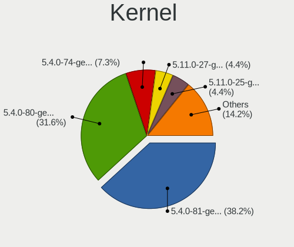

| Version                    | Notebooks | Percent |
|----------------------------|-----------|---------|
| 5.4.0-47-generic           | 46        | 27.88%  |
| 5.4.0-45-generic           | 46        | 27.88%  |
| 5.4.0-48-generic           | 30        | 18.18%  |
| 5.4.0-42-generic           | 8         | 4.85%   |
| 5.4.0-26-generic           | 4         | 2.42%   |
| 4.15.0-117-generic         | 3         | 1.82%   |
| 5.8.9-050809-generic       | 2         | 1.21%   |
| 5.7.1-050701-generic       | 2         | 1.21%   |
| 5.0.0-32-generic           | 2         | 1.21%   |
| 4.15.0-50-generic          | 2         | 1.21%   |
| 4.15.0-20-generic          | 2         | 1.21%   |
| 4.15.0-115-generic         | 2         | 1.21%   |
| 4.10.0-38-generic          | 2         | 1.21%   |
| 5.9.0-050900rc4-generic    | 1         | 0.61%   |
| 5.8.10-xanmod1             | 1         | 0.61%   |
| 5.8.0-050800-generic       | 1         | 0.61%   |
| 5.7.0-8.1-liquorix-amd64   | 1         | 0.61%   |
| 5.4.0-472009090909-generic | 1         | 0.61%   |
| 5.4.0-40-generic           | 1         | 0.61%   |
| 5.4.0-37-generic           | 1         | 0.61%   |
| 5.3.0-46-generic           | 1         | 0.61%   |
| 5.3.0-40-generic           | 1         | 0.61%   |
| 4.19.106-rt44-lcnc         | 1         | 0.61%   |
| 4.15.18-041518-generic     | 1         | 0.61%   |
| 4.15.0-54-generic          | 1         | 0.61%   |
| 4.15.0-118-generic         | 1         | 0.61%   |
| 4.15.0-112-generic         | 1         | 0.61%   |

Kernel Family
-------------

Linux kernel without a distro release

| Version  | Notebooks | Percent |
|----------|-----------|---------|
| 5.4.0    | 137       | 83.03%  |
| 4.15.0   | 12        | 7.27%   |
| 5.8.9    | 2         | 1.21%   |
| 5.7.1    | 2         | 1.21%   |
| 5.3.0    | 2         | 1.21%   |
| 5.0.0    | 2         | 1.21%   |
| 4.10.0   | 2         | 1.21%   |
| 5.9.0    | 1         | 0.61%   |
| 5.8.10   | 1         | 0.61%   |
| 5.8.0    | 1         | 0.61%   |
| 5.7.0    | 1         | 0.61%   |
| 4.19.106 | 1         | 0.61%   |
| 4.15.18  | 1         | 0.61%   |

Kernel Major Ver.
-----------------

Linux kernel major version

| Version | Notebooks | Percent |
|---------|-----------|---------|
| 5.4     | 137       | 83.03%  |
| 4.15    | 13        | 7.88%   |
| 5.8     | 4         | 2.42%   |
| 5.7     | 3         | 1.82%   |
| 5.3     | 2         | 1.21%   |
| 5.0     | 2         | 1.21%   |
| 4.10    | 2         | 1.21%   |
| 5.9     | 1         | 0.61%   |
| 4.19    | 1         | 0.61%   |

Arch
----

OS architecture (x86_64, i586, etc.)

| Name   | Notebooks | Percent |
|--------|-----------|---------|
| x86_64 | 162       | 98.18%  |
| i686   | 3         | 1.82%   |

DE
--

Desktop Environment

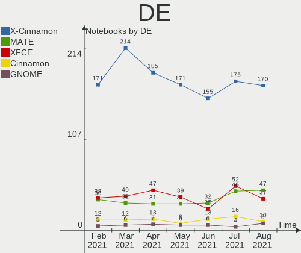

| Name       | Notebooks | Percent |
|------------|-----------|---------|
| X-Cinnamon | 73        | 44.24%  |
| Cinnamon   | 49        | 29.7%   |
| XFCE       | 17        | 10.3%   |
| MATE       | 17        | 10.3%   |
| GNOME      | 6         | 3.64%   |
| Unknown    | 2         | 1.21%   |
| KDE        | 1         | 0.61%   |

Display Server
--------------

X11 or Wayland

| Name | Notebooks | Percent |
|------|-----------|---------|
| X11  | 165       | 100%    |

Display Manager
---------------

SDDM, LightDM, etc.

| Name    | Notebooks | Percent |
|---------|-----------|---------|
| Unknown | 105       | 63.64%  |
| TDM     | 59        | 35.76%  |
| GDM     | 1         | 0.61%   |

OS Lang
-------

Language

| Lang    | Notebooks | Percent |
|---------|-----------|---------|
| en_US   | 48        | 29.09%  |
| de_DE   | 24        | 14.55%  |
| pt_BR   | 19        | 11.52%  |
| en_GB   | 11        | 6.67%   |
| ru_RU   | 9         | 5.45%   |
| en_CA   | 5         | 3.03%   |
| pl_PL   | 4         | 2.42%   |
| it_IT   | 4         | 2.42%   |
| fr_FR   | 4         | 2.42%   |
| es_ES   | 4         | 2.42%   |
| es_AR   | 3         | 1.82%   |
| en_AU   | 3         | 1.82%   |
| nl_NL   | 2         | 1.21%   |
| es_MX   | 2         | 1.21%   |
| es_EC   | 2         | 1.21%   |
| en_ZA   | 2         | 1.21%   |
| en_IN   | 2         | 1.21%   |
| bg_BG   | 2         | 1.21%   |
| zh_CN   | 1         | 0.61%   |
| tr_TR   | 1         | 0.61%   |
| sv_SE   | 1         | 0.61%   |
| ru_UA   | 1         | 0.61%   |
| pt_BR   | 1         | 0.61%   |
| hu_HU   | 1         | 0.61%   |
| fr_CA   | 1         | 0.61%   |
| fr_BE   | 1         | 0.61%   |
| en_PH   | 1         | 0.61%   |
| en_NZ   | 1         | 0.61%   |
| de_AT   | 1         | 0.61%   |
| cs_CZ   | 1         | 0.61%   |
| ca_ES   | 1         | 0.61%   |
| C       | 1         | 0.61%   |
| Unknown | 1         | 0.61%   |

Boot Mode
---------

EFI or BIOS

| Mode | Notebooks | Percent |
|------|-----------|---------|
| EFI  | 83        | 50.3%   |
| BIOS | 82        | 49.7%   |

Filesystem
----------

Type of filesystem

| Type    | Notebooks | Percent |
|---------|-----------|---------|
| Ext4    | 160       | 96.97%  |
| Btrfs   | 3         | 1.82%   |
| Xfs     | 1         | 0.61%   |
| Overlay | 1         | 0.61%   |

Part. scheme
------------

Scheme of partitioning

| Type    | Notebooks | Percent |
|---------|-----------|---------|
| Unknown | 102       | 61.82%  |
| GPT     | 41        | 24.85%  |
| MBR     | 22        | 13.33%  |

Dual Boot with Linux/BSD
------------------------

Hosting more than one Linux/BSD

| Dual boot | Notebooks | Percent |
|-----------|-----------|---------|
| No        | 158       | 95.76%  |
| Yes       | 7         | 4.24%   |

Dual Boot (Win)
---------------

Hosting Linux and Windows

| Dual boot | Notebooks | Percent |
|-----------|-----------|---------|
| No        | 139       | 84.24%  |
| Yes       | 26        | 15.76%  |

Country
-------

Geographic location (country)

| Country        | Notebooks | Percent |
|----------------|-----------|---------|
| USA            | 27        | 16.36%  |
| Germany        | 26        | 15.76%  |
| Brazil         | 22        | 13.33%  |
| Russia         | 11        | 6.67%   |
| UK             | 9         | 5.45%   |
| Italy          | 7         | 4.24%   |
| Canada         | 7         | 4.24%   |
| Spain          | 5         | 3.03%   |
| Poland         | 5         | 3.03%   |
| Argentina      | 5         | 3.03%   |
| France         | 4         | 2.42%   |
| Finland        | 3         | 1.82%   |
| Bulgaria       | 3         | 1.82%   |
| Australia      | 3         | 1.82%   |
| Ukraine        | 2         | 1.21%   |
| New Zealand    | 2         | 1.21%   |
| Netherlands    | 2         | 1.21%   |
| Mexico         | 2         | 1.21%   |
| India          | 2         | 1.21%   |
| Ecuador        | 2         | 1.21%   |
| Turkey         | 1         | 0.61%   |
| Switzerland    | 1         | 0.61%   |
| Sweden         | 1         | 0.61%   |
| Sri Lanka      | 1         | 0.61%   |
| South Africa   | 1         | 0.61%   |
| Philippines    | 1         | 0.61%   |
| Indonesia      | 1         | 0.61%   |
| Hungary        | 1         | 0.61%   |
| Estonia        | 1         | 0.61%   |
| Egypt          | 1         | 0.61%   |
| Czech Republic | 1         | 0.61%   |
| China          | 1         | 0.61%   |
| Chile          | 1         | 0.61%   |
| Belgium        | 1         | 0.61%   |
| Austria        | 1         | 0.61%   |
| Unknown        | 1         | 0.61%   |

City
----

Geographic location (city)

| City                  | Notebooks | Percent |
|-----------------------|-----------|---------|
| São Paulo            | 3         | 1.82%   |
| Moscow                | 3         | 1.82%   |
| Rome                  | 2         | 1.21%   |
| Paris                 | 2         | 1.21%   |
| Kyiv                  | 2         | 1.21%   |
| Inver Grove Heights   | 2         | 1.21%   |
| Helsinki              | 2         | 1.21%   |
| Hamburg               | 2         | 1.21%   |
| Dallas                | 2         | 1.21%   |
| Curitiba              | 2         | 1.21%   |
| Chelyabinsk           | 2         | 1.21%   |
| Birmingham            | 2         | 1.21%   |
| Yuzhno-Sakhalinsk     | 1         | 0.61%   |
| Wiesbaden             | 1         | 0.61%   |
| Weilburg              | 1         | 0.61%   |
| Weiden                | 1         | 0.61%   |
| Warsaw                | 1         | 0.61%   |
| Volgograd             | 1         | 0.61%   |
| Vitória              | 1         | 0.61%   |
| Villa San Giovanni    | 1         | 0.61%   |
| Vijayawada            | 1         | 0.61%   |
| Vienna                | 1         | 0.61%   |
| Viamão               | 1         | 0.61%   |
| Verbania              | 1         | 0.61%   |
| Valleyview            | 1         | 0.61%   |
| Vaasa                 | 1         | 0.61%   |
| Utrera                | 1         | 0.61%   |
| Unkel                 | 1         | 0.61%   |
| Trostberg an der Alz  | 1         | 0.61%   |
| Teresopolis           | 1         | 0.61%   |
| Tallinn               | 1         | 0.61%   |
| Sydney                | 1         | 0.61%   |
| Swansea               | 1         | 0.61%   |
| Sulzbach              | 1         | 0.61%   |
| St. Gallen            | 1         | 0.61%   |
| St Petersburg         | 1         | 0.61%   |
| Springfield           | 1         | 0.61%   |
| Sofia                 | 1         | 0.61%   |
| Sleen                 | 1         | 0.61%   |
| Sinop                 | 1         | 0.61%   |
| Seropedica            | 1         | 0.61%   |
| Semarang              | 1         | 0.61%   |
| Saskatoon             | 1         | 0.61%   |
| Sapucaia do Sul       | 1         | 0.61%   |
| Santiago              | 1         | 0.61%   |
| Santa Etelvina        | 1         | 0.61%   |
| Sant Boi de Llobregat | 1         | 0.61%   |
| Samara                | 1         | 0.61%   |
| Salvador              | 1         | 0.61%   |
| Sabadell              | 1         | 0.61%   |
| Saarbrücken          | 1         | 0.61%   |
| Rosario               | 1         | 0.61%   |
| Rockford              | 1         | 0.61%   |
| Repentigny            | 1         | 0.61%   |
| Rennes                | 1         | 0.61%   |
| Quimper               | 1         | 0.61%   |
| Pune                  | 1         | 0.61%   |
| Poznan                | 1         | 0.61%   |
| Porto Alegre          | 1         | 0.61%   |
| Portland              | 1         | 0.61%   |

Vendor
------

Motherboard manufacturer

| Name                | Notebooks | Percent |
|---------------------|-----------|---------|
| Hewlett-Packard     | 38        | 23.03%  |
| Lenovo              | 33        | 20%     |
| Dell                | 23        | 13.94%  |
| ASUSTek Computer    | 21        | 12.73%  |
| Acer                | 16        | 9.7%    |
| MSI                 | 6         | 3.64%   |
| Toshiba             | 5         | 3.03%   |
| Notebook            | 4         | 2.42%   |
| Samsung Electronics | 3         | 1.82%   |
| Packard Bell        | 3         | 1.82%   |
| Medion              | 2         | 1.21%   |
| System76            | 1         | 0.61%   |
| Sony                | 1         | 0.61%   |
| PC Specialist       | 1         | 0.61%   |
| Insyde              | 1         | 0.61%   |
| HUAWEI              | 1         | 0.61%   |
| Google              | 1         | 0.61%   |
| Gateway             | 1         | 0.61%   |
| Fujitsu             | 1         | 0.61%   |
| Eluktronics         | 1         | 0.61%   |
| Clevo               | 1         | 0.61%   |
| Apple               | 1         | 0.61%   |

Model
-----

Motherboard model

| Name                                                              | Notebooks | Percent |
|-------------------------------------------------------------------|-----------|---------|
| ASUS P50IJ                                                        | 5         | 3.03%   |
| Toshiba Satellite A665                                            | 2         | 1.21%   |
| HP ProBook 4530s                                                  | 2         | 1.21%   |
| HP Pavilion dv6                                                   | 2         | 1.21%   |
| HP Pavilion 15                                                    | 2         | 1.21%   |
| HP Pavilion 14                                                    | 2         | 1.21%   |
| HP Laptop 15-bw0xx                                                | 2         | 1.21%   |
| HP 250 G3                                                         | 2         | 1.21%   |
| Dell XPS 15 9550                                                  | 2         | 1.21%   |
| Dell XPS 13 9380                                                  | 2         | 1.21%   |
| ASUS X555LA                                                       | 2         | 1.21%   |
| ASUS X541UAK                                                      | 2         | 1.21%   |
| Toshiba Satellite P55t-A                                          | 1         | 0.61%   |
| Toshiba Satellite C45-A                                           | 1         | 0.61%   |
| Toshiba Satellite A300                                            | 1         | 0.61%   |
| System76 Lemur                                                    | 1         | 0.61%   |
| Sony SVF1521A7EB                                                  | 1         | 0.61%   |
| Samsung Electronics 550P5C/550P7C                                 | 1         | 0.61%   |
| Samsung Electronics 500R4K/500R5H/5400RK/501R5H/5500RH/500R5S     | 1         | 0.61%   |
| Samsung Electronics 300E5EV/300E4EV/270E5EV/270E4EV/2470EV/2470EE | 1         | 0.61%   |
| PC Specialist PCX0DX                                              | 1         | 0.61%   |
| Packard Bell EasyNote_MX37-U-004                                  | 1         | 0.61%   |
| Packard Bell EasyNote ENTG71BM                                    | 1         | 0.61%   |
| Packard Bell DOTS E2                                              | 1         | 0.61%   |
| Notebook W65_W67RZ                                                | 1         | 0.61%   |
| Notebook W65_W67RB                                                | 1         | 0.61%   |
| Notebook W230SS                                                   | 1         | 0.61%   |
| Notebook PA70ES                                                   | 1         | 0.61%   |
| MSI MS-1453                                                       | 1         | 0.61%   |
| MSI GX60 3CC                                                      | 1         | 0.61%   |
| MSI GT80S 6QD                                                     | 1         | 0.61%   |
| MSI GS60 2PE                                                      | 1         | 0.61%   |
| MSI GP62 6QE                                                      | 1         | 0.61%   |
| MSI GE60 2OC\2OD\2OE                                              | 1         | 0.61%   |
| Medion X681X                                                      | 1         | 0.61%   |
| Medion S6417 MD99649                                              | 1         | 0.61%   |
| Lenovo Z50-70 20354                                               | 1         | 0.61%   |
| Lenovo Yoga 2 Pro 20266                                           | 1         | 0.61%   |
| Lenovo V370 HuronRiver Platform                                   | 1         | 0.61%   |
| Lenovo V310-15ISK 80SY                                            | 1         | 0.61%   |
| Lenovo ThinkPad X250 20CM001PGE                                   | 1         | 0.61%   |
| Lenovo ThinkPad X220 4291T5Q                                      | 1         | 0.61%   |
| Lenovo ThinkPad X201 3626B12                                      | 1         | 0.61%   |
| Lenovo ThinkPad X1 Carbon 3444FEU                                 | 1         | 0.61%   |
| Lenovo ThinkPad T530 239237G                                      | 1         | 0.61%   |
| Lenovo ThinkPad T450 20BV000BUS                                   | 1         | 0.61%   |
| Lenovo ThinkPad T420s 4174EK3                                     | 1         | 0.61%   |
| Lenovo ThinkPad R400 7440WET                                      | 1         | 0.61%   |
| Lenovo ThinkPad P1 20MDS00S00                                     | 1         | 0.61%   |
| Lenovo ThinkPad L512 444733U                                      | 1         | 0.61%   |
| Lenovo ThinkPad L490 20Q50020MX                                   | 1         | 0.61%   |
| Lenovo ThinkPad L440 20ASS17300                                   | 1         | 0.61%   |
| Lenovo ThinkPad E490 20N80017RT                                   | 1         | 0.61%   |
| Lenovo ThinkPad E470 20H1006XRT                                   | 1         | 0.61%   |
| Lenovo ThinkPad 13 20GJCTO1WW                                     | 1         | 0.61%   |
| Lenovo Legion Y7000 2019 81NS                                     | 1         | 0.61%   |
| Lenovo Legion Y540-17IRH 81Q4                                     | 1         | 0.61%   |
| Lenovo IdeaPad S145-15API 81V7                                    | 1         | 0.61%   |
| Lenovo IdeaPad L340-15IWL 81LG                                    | 1         | 0.61%   |
| Lenovo IdeaPad 5 14ARE05 81YM                                     | 1         | 0.61%   |

Model Family
------------

Motherboard model prefix

| Name                        | Notebooks | Percent |
|-----------------------------|-----------|---------|
| Lenovo ThinkPad             | 15        | 9.09%   |
| Acer Aspire                 | 12        | 7.27%   |
| HP Laptop                   | 9         | 5.45%   |
| HP Pavilion                 | 8         | 4.85%   |
| Dell Inspiron               | 8         | 4.85%   |
| Lenovo IdeaPad              | 7         | 4.24%   |
| HP EliteBook                | 6         | 3.64%   |
| Dell XPS                    | 6         | 3.64%   |
| Dell Latitude               | 6         | 3.64%   |
| Toshiba Satellite           | 5         | 3.03%   |
| ASUS P50IJ                  | 5         | 3.03%   |
| HP ProBook                  | 4         | 2.42%   |
| HP 250                      | 3         | 1.82%   |
| Packard Bell EasyNote       | 2         | 1.21%   |
| Notebook W65                | 2         | 1.21%   |
| Lenovo Legion               | 2         | 1.21%   |
| Lenovo 3000                 | 2         | 1.21%   |
| HP ENVY                     | 2         | 1.21%   |
| Dell Precision              | 2         | 1.21%   |
| ASUS X555LA                 | 2         | 1.21%   |
| ASUS X541UAK                | 2         | 1.21%   |
| System76 Lemur              | 1         | 0.61%   |
| Sony SVF1521A7EB            | 1         | 0.61%   |
| Samsung Electronics 550P5C  | 1         | 0.61%   |
| Samsung Electronics 500R4K  | 1         | 0.61%   |
| Samsung Electronics 300E5EV | 1         | 0.61%   |
| PC Specialist PCX0DX        | 1         | 0.61%   |
| Packard Bell DOTS           | 1         | 0.61%   |
| Notebook W230SS             | 1         | 0.61%   |
| Notebook PA70ES             | 1         | 0.61%   |
| MSI MS-1453                 | 1         | 0.61%   |
| MSI GX60                    | 1         | 0.61%   |
| MSI GT80S                   | 1         | 0.61%   |
| MSI GS60                    | 1         | 0.61%   |
| MSI GP62                    | 1         | 0.61%   |
| MSI GE60                    | 1         | 0.61%   |
| Medion X681X                | 1         | 0.61%   |
| Medion S6417                | 1         | 0.61%   |
| Lenovo Z50-70               | 1         | 0.61%   |
| Lenovo Yoga                 | 1         | 0.61%   |
| Lenovo V370                 | 1         | 0.61%   |
| Lenovo V310-15ISK           | 1         | 0.61%   |
| Lenovo G405                 | 1         | 0.61%   |
| Lenovo G400s                | 1         | 0.61%   |
| Lenovo Flex                 | 1         | 0.61%   |
| Insyde B14                  | 1         | 0.61%   |
| HUAWEI KPL-W0X              | 1         | 0.61%   |
| HP Presario                 | 1         | 0.61%   |
| HP Notebook                 | 1         | 0.61%   |
| HP 255                      | 1         | 0.61%   |
| HP 240                      | 1         | 0.61%   |
| HP 2000                     | 1         | 0.61%   |
| HP 14                       | 1         | 0.61%   |
| Google Relm                 | 1         | 0.61%   |
| Gateway M-7332H             | 1         | 0.61%   |
| Fujitsu LIFEBOOK            | 1         | 0.61%   |
| Eluktronics MAX-17          | 1         | 0.61%   |
| Dell Vostro                 | 1         | 0.61%   |
| Clevo M540SR                | 1         | 0.61%   |
| ASUS X555LPB                | 1         | 0.61%   |

MFG Year
--------

Motherboard manufacture year

| Year | Notebooks | Percent |
|------|-----------|---------|
| 2019 | 24        | 14.55%  |
| 2020 | 21        | 12.73%  |
| 2014 | 17        | 10.3%   |
| 2015 | 15        | 9.09%   |
| 2013 | 14        | 8.48%   |
| 2011 | 13        | 7.88%   |
| 2018 | 11        | 6.67%   |
| 2016 | 11        | 6.67%   |
| 2012 | 9         | 5.45%   |
| 2010 | 8         | 4.85%   |
| 2009 | 6         | 3.64%   |
| 2017 | 5         | 3.03%   |
| 2008 | 5         | 3.03%   |
| 2007 | 4         | 2.42%   |
| 2006 | 2         | 1.21%   |

Form Factor
-----------

Physical design of the computer

| Name     | Notebooks | Percent |
|----------|-----------|---------|
| Notebook | 165       | 100%    |

Secure Boot
-----------

Enabled or disabled

| State    | Notebooks | Percent |
|----------|-----------|---------|
| Disabled | 152       | 92.12%  |
| Enabled  | 13        | 7.88%   |

Coreboot
--------

Have coreboot on board

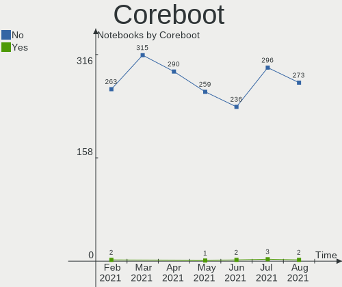

| Used | Notebooks | Percent |
|------|-----------|---------|
| No   | 164       | 99.39%  |
| Yes  | 1         | 0.61%   |

RAM Size
--------

Total RAM memory

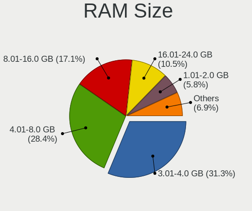

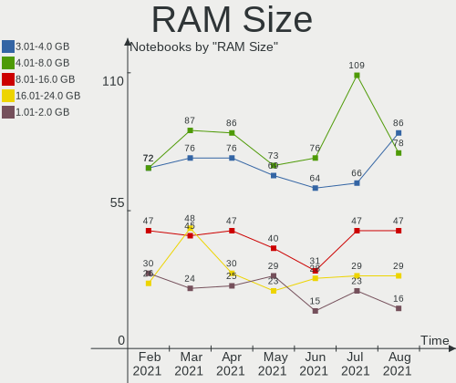

| Size in GB | Notebooks | Percent |
|------------|-----------|---------|
| 4.01-8.0   | 52        | 31.52%  |
| 3.01-4.0   | 46        | 27.88%  |
| 8.01-16.0  | 27        | 16.36%  |
| 16.01-24.0 | 22        | 13.33%  |
| 32.01-64.0 | 6         | 3.64%   |
| 1.01-2.0   | 5         | 3.03%   |
| 0.01-1.0   | 4         | 2.42%   |
| 24.01-32.0 | 2         | 1.21%   |
| 2.01-3.0   | 1         | 0.61%   |

RAM Used
--------

Used RAM memory

| Used GB   | Notebooks | Percent |
|-----------|-----------|---------|
| 1.01-2.0  | 63        | 38.18%  |
| 2.01-3.0  | 43        | 26.06%  |
| 4.01-8.0  | 24        | 14.55%  |
| 3.01-4.0  | 18        | 10.91%  |
| 0.01-1.0  | 14        | 8.48%   |
| 8.01-16.0 | 3         | 1.82%   |

Has CD-ROM
----------

Has CD-ROM on board

| Presented | Notebooks | Percent |
|-----------|-----------|---------|
| Yes       | 90        | 54.55%  |
| No        | 75        | 45.45%  |

Total Drives
------------

Number of drives on board

| Drives | Notebooks | Percent |
|--------|-----------|---------|
| 1      | 126       | 76.36%  |
| 2      | 33        | 20%     |
| 3      | 6         | 3.64%   |

Has Ethernet
------------

Has Ethernet on board

| Presented | Notebooks | Percent |
|-----------|-----------|---------|
| Yes       | 151       | 91.52%  |
| No        | 14        | 8.48%   |

Drive Vendor
------------

Hard drive vendors

| Vendor              | Notebooks | Drives  | Percent |
|---------------------|-----------|---------|---------|
| Samsung Electronics | 34        | 37      | 16.43%  |
| Seagate             | 28        | 29      | 13.53%  |
| WDC                 | 27        | 28      | 13.04%  |
| Toshiba             | 16        | 17      | 7.73%   |
| Kingston            | 16        | 16      | 7.73%   |
| SanDisk             | 13        | 13      | 6.28%   |
| Unknown             | 11        | 11      | 5.31%   |
| Hitachi             | 8         | 8       | 3.86%   |
| Crucial             | 8         | 8       | 3.86%   |
| HGST                | 6         | 6       | 2.9%    |
| SK Hynix            | 5         | 5       | 2.42%   |
| HL-DT-ST            | 5         | Unknown | 2.42%   |
| A-DATA Technology   | 5         | 5       | 2.42%   |
| Intel               | 3         | 3       | 1.45%   |
| Transcend           | 2         | 2       | 0.97%   |
| SPCC                | 2         | 2       | 0.97%   |
| Micron Technology   | 2         | 2       | 0.97%   |
| LITEON              | 2         | 2       | 0.97%   |
| KIOXIA              | 2         | 2       | 0.97%   |
| Intenso             | 2         | 2       | 0.97%   |
| China               | 2         | 2       | 0.97%   |
| Teclast             | 1         | 1       | 0.48%   |
| Team                | 1         | 1       | 0.48%   |
| Silicon Motion      | 1         | 1       | 0.48%   |
| SABRENT             | 1         | 1       | 0.48%   |
| PNY                 | 1         | 1       | 0.48%   |
| Lenovo              | 1         | 1       | 0.48%   |
| Fujitsu             | 1         | 1       | 0.48%   |
| Dell                | 1         | 1       | 0.48%   |

HDD Vendor
----------

Hard disk drive vendors

| Vendor  | Notebooks | Drives | Percent |
|---------|-----------|--------|---------|
| Seagate | 28        | 29     | 35.44%  |
| WDC     | 22        | 22     | 27.85%  |
| Toshiba | 13        | 14     | 16.46%  |
| Hitachi | 8         | 8      | 10.13%  |
| HGST    | 6         | 6      | 7.59%   |
| Fujitsu | 1         | 1      | 1.27%   |
| Dell    | 1         | 1      | 1.27%   |

SSD Vendor
----------

Solid state drive vendors

| Vendor              | Notebooks | Drives | Percent |
|---------------------|-----------|--------|---------|
| Samsung Electronics | 24        | 24     | 27.27%  |
| Kingston            | 16        | 16     | 18.18%  |
| SanDisk             | 10        | 10     | 11.36%  |
| Crucial             | 8         | 8      | 9.09%   |
| WDC                 | 5         | 5      | 5.68%   |
| A-DATA Technology   | 4         | 4      | 4.55%   |
| SK Hynix            | 3         | 3      | 3.41%   |
| Unknown             | 2         | 2      | 2.27%   |
| Transcend           | 2         | 2      | 2.27%   |
| SPCC                | 2         | 2      | 2.27%   |
| Micron Technology   | 2         | 2      | 2.27%   |
| Intenso             | 2         | 2      | 2.27%   |
| China               | 2         | 2      | 2.27%   |
| Teclast             | 1         | 1      | 1.14%   |
| Team                | 1         | 1      | 1.14%   |
| SABRENT             | 1         | 1      | 1.14%   |
| PNY                 | 1         | 1      | 1.14%   |
| LITEON              | 1         | 1      | 1.14%   |
| Intel               | 1         | 1      | 1.14%   |

Drive Model
-----------

Hard drive models

| Model                        | Notebooks | Percent |
|------------------------------|-----------|---------|
| NVMe SSD Drive 256GB         | 7         | 3.29%   |
| SA400S37240G 240GB SSD       | 6         | 2.82%   |
| ST1000LM035-1RK172 1TB       | 5         | 2.35%   |
| SA400S37480G 480GB SSD       | 5         | 2.35%   |
| ST500LT012-1DG142 500GB      | 4         | 1.88%   |
| SSD 840 EVO 500GB            | 4         | 1.88%   |
| MQ01ABF050 500GB             | 4         | 1.88%   |
| MMC Card  32GB               | 4         | 1.88%   |
| WD10JPVX-22JC3T0 1TB         | 3         | 1.41%   |
| ST500LM012 HN-M500MBB 500GB  | 3         | 1.41%   |
| ST1000LM024 HN-M101MBB 1TB   | 3         | 1.41%   |
| SSD 850 EVO 500GB            | 3         | 1.41%   |
| DVDRAM GUE1N 3GB             | 3         | 1.41%   |
| WD10SPZX-24Z10 1TB           | 2         | 0.94%   |
| ST2000LM007-1R8174 2TB       | 2         | 0.94%   |
| SSD PLUS 120GB               | 2         | 0.94%   |
| SSD PLUS 1000GB              | 2         | 0.94%   |
| SSD 850 EVO 250GB            | 2         | 0.94%   |
| SSD 850 EVO 1TB              | 2         | 0.94%   |
| NVMe SSD Drive 512GB         | 2         | 0.94%   |
| MQ01ABD100 1TB               | 2         | 0.94%   |
| KBG40ZNV512G 512GB           | 2         | 0.94%   |
| HTS721010A9E630 1TB          | 2         | 0.94%   |
| HTS547575A9E384 752GB        | 2         | 0.94%   |
| HTS545050A7E680 500GB        | 2         | 0.94%   |
| Expansion Desk 6TB           | 2         | 0.94%   |
| DVDRAM GUC0N 1GB             | 2         | 0.94%   |
| CT500MX500SSD4 500GB         | 2         | 0.94%   |
| WDS500G2B0A-00SM50 500GB SSD | 1         | 0.47%   |
| WDS240G2G0B-00EPW0 240GB SSD | 1         | 0.47%   |
| WDS240G2G0A-00JH30 240GB SSD | 1         | 0.47%   |
| WDS120G2G0A-00JH30 120GB SSD | 1         | 0.47%   |
| WDS100T2B0A-00SM50 1TB SSD   | 1         | 0.47%   |
| WDC PC SN520 SDA 256GB       | 1         | 0.47%   |
| WD800BEVS-22RST0 80GB        | 1         | 0.47%   |
| WD7500BPKX-80HPJT0 752GB     | 1         | 0.47%   |
| WD7500BPKX-00HPJT0 752GB     | 1         | 0.47%   |
| WD6400BPVT-22HXZT3 640GB     | 1         | 0.47%   |
| WD5000LPVX-80V0TT0 500GB     | 1         | 0.47%   |
| WD5000LPVX-22V0TT0 500GB     | 1         | 0.47%   |
| WD5000LPLX-60ZNTT1 500GB     | 1         | 0.47%   |
| WD5000LPCX-60VHAT0 500GB     | 1         | 0.47%   |
| WD3200BEVT-60A23T0 320GB     | 1         | 0.47%   |
| WD3200BEVT-22ZCT0 320GB      | 1         | 0.47%   |
| WD3200BEVT-22A23T0 320GB     | 1         | 0.47%   |
| WD2500BEVT-35A23T0 250GB     | 1         | 0.47%   |
| WD20SPZX-08UA7 2TB           | 1         | 0.47%   |
| WD10SPZX-60Z10T0 1TB         | 1         | 0.47%   |
| WD10SPZX-24Z10T0 1TB         | 1         | 0.47%   |
| WD10JPVX-60JC3T0 1TB         | 1         | 0.47%   |
| WD10JPCX-24UE4T0 1TB         | 1         | 0.47%   |
| USB Portable HDD 500GB       | 1         | 0.47%   |
| Ultra II 240GB SSD           | 1         | 0.47%   |
| TS512GMTS430S 512GB SSD      | 1         | 0.47%   |
| TS128GSSD25S-M 128GB         | 1         | 0.47%   |
| TOURO Mobile 3.0 1TB         | 1         | 0.47%   |
| THNSN5512GPUK NVMe 512GB     | 1         | 0.47%   |
| T253X1240G 240GB SSD         | 1         | 0.47%   |
| SWORDFISH 1TB                | 1         | 0.47%   |
| SV300S37A240G 240GB SSD      | 1         | 0.47%   |

Drive Kind
----------

HDD or SSD

| Kind    | Notebooks | Drives  | Percent |
|---------|-----------|---------|---------|
| SSD     | 80        | 88      | 40.4%   |
| HDD     | 77        | 81      | 38.89%  |
| NVMe    | 30        | 33      | 15.15%  |
| Unknown | 6         | Unknown | 3.03%   |
| MMC     | 5         | 6       | 2.53%   |

Drive Connector
---------------

SATA, SAS, NVMe, etc.

| Type | Notebooks | Drives | Percent |
|------|-----------|--------|---------|
| SATA | 139       | 161    | 73.94%  |
| NVMe | 30        | 33     | 15.96%  |
| SAS  | 14        | 8      | 7.45%   |
| MMC  | 5         | 6      | 2.66%   |

Drive Size
----------

Size of hard drive

| Size in TB | Notebooks | Drives | Percent |
|------------|-----------|--------|---------|
| 0.01-0.5   | 123       | 132    | 62.44%  |
| 0.51-1.0   | 61        | 63     | 30.96%  |
| 1.01-2.0   | 9         | 9      | 4.57%   |
| 4.01-10.0  | 3         | 3      | 1.52%   |
| 3.01-4.0   | 1         | 1      | 0.51%   |

Space Total
-----------

Amount of disk space available on the file system

| Size in GB     | Notebooks | Percent |
|----------------|-----------|---------|
| 101-250        | 54        | 32.73%  |
| 251-500        | 50        | 30.3%   |
| 501-1000       | 23        | 13.94%  |
| 1001-2000      | 12        | 7.27%   |
| 51-100         | 11        | 6.67%   |
| 21-50          | 6         | 3.64%   |
| 2001-3000      | 4         | 2.42%   |
| More than 3000 | 2         | 1.21%   |
| Unknown        | 2         | 1.21%   |
| 1-20           | 1         | 0.61%   |

Space Used
----------

Amount of used disk space

| Used GB        | Notebooks | Percent |
|----------------|-----------|---------|
| 21-50          | 44        | 26.67%  |
| 101-250        | 38        | 23.03%  |
| 51-100         | 28        | 16.97%  |
| 1-20           | 27        | 16.36%  |
| 251-500        | 15        | 9.09%   |
| 501-1000       | 6         | 3.64%   |
| 1001-2000      | 4         | 2.42%   |
| Unknown        | 2         | 1.21%   |
| More than 3000 | 1         | 0.61%   |

Malfunc. Drives
---------------

Drive models with a malfunction

| Model                        | Notebooks | Drives | Percent |
|------------------------------|-----------|--------|---------|
| WD6400BPVT-22HXZT3 640GB     | 1         | 1      | 9.09%   |
| WD3200BEVT-60A23T0 320GB     | 1         | 1      | 9.09%   |
| ST9750420AS 752GB            | 1         | 1      | 9.09%   |
| ST500LT012-9WS142 500GB      | 1         | 1      | 9.09%   |
| ST1000LM024 HN-M101MBB 1TB   | 1         | 1      | 9.09%   |
| MQ01ABF050 500GB             | 1         | 1      | 9.09%   |
| MQ01ABD1 1TB                 | 1         | 1      | 9.09%   |
| HTS723232A7A364 320GB        | 1         | 1      | 9.09%   |
| HTS545050B9A300 500GB        | 1         | 1      | 9.09%   |
| HTS545050A7E680 500GB        | 1         | 1      | 9.09%   |
| HFS128G38MNB-2200A 128GB SSD | 1         | 1      | 9.09%   |

Malfunc. Drive Vendor
---------------------

Vendors of faulty drives

| Vendor   | Notebooks | Drives | Percent |
|----------|-----------|--------|---------|
| Seagate  | 3         | 3      | 27.27%  |
| WDC      | 2         | 2      | 18.18%  |
| Toshiba  | 2         | 2      | 18.18%  |
| Hitachi  | 2         | 2      | 18.18%  |
| SK Hynix | 1         | 1      | 9.09%   |
| HGST     | 1         | 1      | 9.09%   |

Malfunc. HDD Vendor
-------------------

Vendors of faulty HDD drives

| Vendor  | Notebooks | Drives | Percent |
|---------|-----------|--------|---------|
| Seagate | 3         | 3      | 30%     |
| WDC     | 2         | 2      | 20%     |
| Toshiba | 2         | 2      | 20%     |
| Hitachi | 2         | 2      | 20%     |
| HGST    | 1         | 1      | 10%     |

Malfunc. Drive Kind
-------------------

Kinds of faulty drives

| Kind | Notebooks | Drives | Percent |
|------|-----------|--------|---------|
| HDD  | 10        | 10     | 90.91%  |
| SSD  | 1         | 1      | 9.09%   |

Failed Drives
-------------

Failed drive models

Zero info for selected period =(

Failed Drive Vendor
-------------------

Failed drive vendors

Zero info for selected period =(

Drive Status
------------

Number of failed and malfunc. drives

| Status   | Notebooks | Drives | Percent |
|----------|-----------|--------|---------|
| Detected | 108       | 132    | 62.79%  |
| Works    | 53        | 65     | 30.81%  |
| Malfunc  | 11        | 11     | 6.4%    |

Storage Vendor
--------------

Storage controller vendors

| Vendor                           | Notebooks | Percent |
|----------------------------------|-----------|---------|
| Intel                            | 127       | 68.65%  |
| AMD                              | 25        | 13.51%  |
| Samsung Electronics              | 12        | 6.49%   |
| Sandisk                          | 4         | 2.16%   |
| KIOXIA                           | 4         | 2.16%   |
| Toshiba America Info Systems     | 3         | 1.62%   |
| SK Hynix                         | 2         | 1.08%   |
| VIA Technologies                 | 1         | 0.54%   |
| Union Memory (Shenzhen)          | 1         | 0.54%   |
| Silicon Motion                   | 1         | 0.54%   |
| Silicon Integrated Systems [SiS] | 1         | 0.54%   |
| Realtek Semiconductor            | 1         | 0.54%   |
| Lite-On Technology               | 1         | 0.54%   |
| Lenovo                           | 1         | 0.54%   |
| JMicron Technology               | 1         | 0.54%   |

Storage Model
-------------

Storage controller models

| Model                                                                      | Notebooks | Percent |
|----------------------------------------------------------------------------|-----------|---------|
| FCH SATA Controller [AHCI mode]                                            | 22        | 10.95%  |
| 7 Series Chipset Family 6-port SATA Controller [AHCI mode]                 | 15        | 7.46%   |
| Sunrise Point-LP SATA Controller [AHCI mode]                               | 13        | 6.47%   |
| 8 Series SATA Controller 1 [AHCI mode]                                     | 13        | 6.47%   |
| 6 Series/C200 Series Chipset Family 6 port Mobile SATA AHCI Controller     | 11        | 5.47%   |
| NVMe SSD Controller SM981/PM981/PM983                                      | 10        | 4.98%   |
| 82801IBM/IEM (ICH9M/ICH9M-E) 4 port SATA Controller [AHCI mode]            | 9         | 4.48%   |
| Wildcat Point-LP SATA Controller [AHCI Mode]                               | 7         | 3.48%   |
| Non-Volatile memory controller                                             | 7         | 3.48%   |
| 82801 Mobile SATA Controller [RAID mode]                                   | 7         | 3.48%   |
| 5 Series/3400 Series Chipset 4 port SATA AHCI Controller                   | 7         | 3.48%   |
| HM170/QM170 Chipset SATA Controller [AHCI Mode]                            | 6         | 2.99%   |
| 8 Series/C220 Series Chipset Family 6-port SATA Controller 1 [AHCI mode]   | 6         | 2.99%   |
| 5 Series/3400 Series Chipset 6 port SATA AHCI Controller                   | 5         | 2.49%   |
| Cannon Lake Mobile PCH SATA AHCI Controller                                | 4         | 1.99%   |
| 82801HM/HEM (ICH8M/ICH8M-E) IDE Controller                                 | 4         | 1.99%   |
| WD Black 2018/PC SN520 NVMe SSD                                            | 3         | 1.49%   |
| Atom Processor E3800 Series SATA AHCI Controller                           | 3         | 1.49%   |
| Toshiba America Info Non-Volatile memory controller                        | 2         | 1%      |
| SB7x0/SB8x0/SB9x0 SATA Controller [AHCI mode]                              | 2         | 1%      |
| NVMe SSD Controller SM961/PM961                                            | 2         | 1%      |
| Cannon Point-LP SATA Controller [AHCI Mode]                                | 2         | 1%      |
| 82801HM/HEM (ICH8M/ICH8M-E) SATA Controller [IDE mode]                     | 2         | 1%      |
| 82801HM/HEM (ICH8M/ICH8M-E) SATA Controller [AHCI mode]                    | 2         | 1%      |
| 5 Series/3400 Series Chipset 4 port SATA IDE Controller                    | 2         | 1%      |
| 5 Series/3400 Series Chipset 2 port SATA IDE Controller                    | 2         | 1%      |
| 400 Series Chipset Family SATA AHCI Controller                             | 2         | 1%      |
| XG4 NVMe SSD Controller                                                    | 1         | 0.5%    |
| VT82C586A/B/VT82C686/A/B/VT823x/A/C PIPC Bus Master IDE                    | 1         | 0.5%    |
| VT8237A SATA 2-Port Controller                                             | 1         | 0.5%    |
| SSD 660P Series                                                            | 1         | 0.5%    |
| SSD 600P Series                                                            | 1         | 0.5%    |
| SM2262/SM2262EN SSD Controller                                             | 1         | 0.5%    |
| SATA Controller [RAID mode]                                                | 1         | 0.5%    |
| SATA Controller / IDE mode                                                 | 1         | 0.5%    |
| SATA controller                                                            | 1         | 0.5%    |
| Realtek Non-Volatile memory controller                                     | 1         | 0.5%    |
| Q170/Q150/B150/H170/H110/Z170/CM236 Chipset SATA Controller [AHCI Mode]    | 1         | 0.5%    |
| NVMe SSD Controller SM951/PM951                                            | 1         | 0.5%    |
| NVMe Controller                                                            | 1         | 0.5%    |
| NVMe 256G SSD device                                                       | 1         | 0.5%    |
| NM10/ICH7 Family SATA Controller [AHCI mode]                               | 1         | 0.5%    |
| JMB360 AHCI Controller                                                     | 1         | 0.5%    |
| IXP SB4x0 Serial ATA Controller                                            | 1         | 0.5%    |
| IXP SB4x0 IDE Controller                                                   | 1         | 0.5%    |
| Ice Lake-LP SATA Controller [AHCI mode]                                    | 1         | 0.5%    |
| FCH IDE Controller                                                         | 1         | 0.5%    |
| Celeron N3350/Pentium N4200/Atom E3900 Series SATA AHCI Controller         | 1         | 0.5%    |
| BC501 NVMe Solid State Drive 512GB                                         | 1         | 0.5%    |
| Atom/Celeron/Pentium Processor x5-E8000/J3xxx/N3xxx Series SATA Controller | 1         | 0.5%    |
| 82801IBM/IEM (ICH9M/ICH9M-E) 2 port SATA Controller [IDE mode]             | 1         | 0.5%    |
| 82801GBM/GHM (ICH7-M Family) SATA Controller [IDE mode]                    | 1         | 0.5%    |
| 82801GBM/GHM (ICH7-M Family) SATA Controller [AHCI mode]                   | 1         | 0.5%    |
| 82801G (ICH7 Family) IDE Controller                                        | 1         | 0.5%    |
| 7 Series Chipset Family 4-port SATA Controller [IDE mode]                  | 1         | 0.5%    |
| 7 Series Chipset Family 2-port SATA Controller [IDE mode]                  | 1         | 0.5%    |
| 5513 IDE Controller                                                        | 1         | 0.5%    |
| 5 Series/3400 Series Chipset PT IDER Controller                            | 1         | 0.5%    |

Storage Kind
------------

Kind of storage controller (IDE, SATA, NVMe, SAS, ...)

| Kind | Notebooks | Percent |
|------|-----------|---------|
| SATA | 136       | 72.34%  |
| NVMe | 30        | 15.96%  |
| IDE  | 14        | 7.45%   |
| RAID | 8         | 4.26%   |

CPU Vendor
----------

Processor vendors

| Vendor | Notebooks | Percent |
|--------|-----------|---------|
| Intel  | 139       | 84.24%  |
| AMD    | 26        | 15.76%  |

CPU Model
---------

Processor models

| Model                                         | Notebooks | Percent |
|-----------------------------------------------|-----------|---------|
| Intel Core i7-8565U CPU @ 1.80GHz             | 5         | 3.03%   |
| Intel Core i7-6700HQ CPU @ 2.60GHz            | 5         | 3.03%   |
| Intel Core i5-2430M CPU @ 2.40GHz             | 4         | 2.42%   |
| Intel Core i5 CPU M 520 @ 2.40GHz             | 4         | 2.42%   |
| Intel Core 2 Duo CPU T6670 @ 2.20GHz          | 4         | 2.42%   |
| AMD Ryzen 5 2500U with Radeon Vega Mobile Gfx | 4         | 2.42%   |
| Intel Core i7-8750H CPU @ 2.20GHz             | 3         | 1.82%   |
| Intel Core i7-5500U CPU @ 2.40GHz             | 3         | 1.82%   |
| Intel Core i5-8265U CPU @ 1.60GHz             | 3         | 1.82%   |
| Intel Core i5-4200U CPU @ 1.60GHz             | 3         | 1.82%   |
| Intel Core i5-3210M CPU @ 2.50GHz             | 3         | 1.82%   |
| Intel Core i3-6100U CPU @ 2.30GHz             | 3         | 1.82%   |
| Intel Core i7-8550U CPU @ 1.80GHz             | 2         | 1.21%   |
| Intel Core i7-4700MQ CPU @ 2.40GHz            | 2         | 1.21%   |
| Intel Core i7-4500U CPU @ 1.80GHz             | 2         | 1.21%   |
| Intel Core i7-10875H CPU @ 2.30GHz            | 2         | 1.21%   |
| Intel Core i7-1065G7 CPU @ 1.30GHz            | 2         | 1.21%   |
| Intel Core i7 CPU Q 720 @ 1.60GHz             | 2         | 1.21%   |
| Intel Core i5-7200U CPU @ 2.50GHz             | 2         | 1.21%   |
| Intel Core i5-6300U CPU @ 2.40GHz             | 2         | 1.21%   |
| Intel Core i5-6300HQ CPU @ 2.30GHz            | 2         | 1.21%   |
| Intel Core i5-4210U CPU @ 1.70GHz             | 2         | 1.21%   |
| Intel Core i5-3317U CPU @ 1.70GHz             | 2         | 1.21%   |
| Intel Core i5-3230M CPU @ 2.60GHz             | 2         | 1.21%   |
| Intel Core i5 CPU M 430 @ 2.27GHz             | 2         | 1.21%   |
| Intel Core i3-7100U CPU @ 2.40GHz             | 2         | 1.21%   |
| Intel Core i3-5005U CPU @ 2.00GHz             | 2         | 1.21%   |
| Intel Core i3-4005U CPU @ 1.70GHz             | 2         | 1.21%   |
| Intel Core i3-3110M CPU @ 2.40GHz             | 2         | 1.21%   |
| Intel Core i3-1005G1 CPU @ 1.20GHz            | 2         | 1.21%   |
| Intel Core i3 CPU M 350 @ 2.27GHz             | 2         | 1.21%   |
| Intel Celeron M CPU 430 @ 1.73GHz             | 2         | 1.21%   |
| AMD E1-2100 APU with Radeon HD Graphics       | 2         | 1.21%   |
| Intel Pentium Dual-Core CPU T4500 @ 2.30GHz   | 1         | 0.61%   |
| Intel Pentium Dual-Core CPU T4200 @ 2.00GHz   | 1         | 0.61%   |
| Intel Pentium Dual CPU T2310 @ 1.46GHz        | 1         | 0.61%   |
| Intel Pentium CPU N3540 @ 2.16GHz             | 1         | 0.61%   |
| Intel Pentium CPU B950 @ 2.10GHz              | 1         | 0.61%   |
| Intel Pentium CPU 2117U @ 1.80GHz             | 1         | 0.61%   |
| Intel Core M-5Y31 CPU @ 0.90GHz               | 1         | 0.61%   |
| Intel Core i7-9750H CPU @ 2.60GHz             | 1         | 0.61%   |
| Intel Core i7-7700HQ CPU @ 2.80GHz            | 1         | 0.61%   |
| Intel Core i7-6500U CPU @ 2.50GHz             | 1         | 0.61%   |
| Intel Core i7-5600U CPU @ 2.60GHz             | 1         | 0.61%   |
| Intel Core i7-4712MQ CPU @ 2.30GHz            | 1         | 0.61%   |
| Intel Core i7-4710HQ CPU @ 2.50GHz            | 1         | 0.61%   |
| Intel Core i7-4510U CPU @ 2.00GHz             | 1         | 0.61%   |
| Intel Core i7-3667U CPU @ 2.00GHz             | 1         | 0.61%   |
| Intel Core i7-3630QM CPU @ 2.40GHz            | 1         | 0.61%   |
| Intel Core i7-3610QM CPU @ 2.30GHz            | 1         | 0.61%   |
| Intel Core i7-2960XM CPU @ 2.70GHz            | 1         | 0.61%   |
| Intel Core i7-2670QM CPU @ 2.20GHz            | 1         | 0.61%   |
| Intel Core i7-2640M CPU @ 2.80GHz             | 1         | 0.61%   |
| Intel Core i7-10510U CPU @ 1.80GHz            | 1         | 0.61%   |
| Intel Core i7 CPU Q 740 @ 1.73GHz             | 1         | 0.61%   |
| Intel Core i5-9300H CPU @ 2.40GHz             | 1         | 0.61%   |
| Intel Core i5-8250U CPU @ 1.60GHz             | 1         | 0.61%   |
| Intel Core i5-6200U CPU @ 2.30GHz             | 1         | 0.61%   |
| Intel Core i5-4300U CPU @ 1.90GHz             | 1         | 0.61%   |
| Intel Core i5-4300M CPU @ 2.60GHz             | 1         | 0.61%   |

CPU Model Family
----------------

Processor model prefix

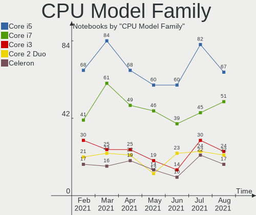

| Model                   | Notebooks | Percent |
|-------------------------|-----------|---------|
| Intel Core i7           | 43        | 26.06%  |
| Intel Core i5           | 43        | 26.06%  |
| Intel Core i3           | 21        | 12.73%  |
| Intel Core 2 Duo        | 12        | 7.27%   |
| Intel Celeron           | 9         | 5.45%   |
| AMD Ryzen 5             | 6         | 3.64%   |
| Intel Pentium           | 3         | 1.82%   |
| AMD E1                  | 3         | 1.82%   |
| AMD A8                  | 3         | 1.82%   |
| AMD A6                  | 3         | 1.82%   |
| Intel Pentium Dual-Core | 2         | 1.21%   |
| Intel Celeron M         | 2         | 1.21%   |
| Intel Atom              | 2         | 1.21%   |
| AMD Ryzen 7             | 2         | 1.21%   |
| AMD A10                 | 2         | 1.21%   |
| Other                   | 1         | 0.61%   |
| Intel Pentium Dual      | 1         | 0.61%   |
| Intel Core M            | 1         | 0.61%   |
| AMD Turion II Dual-Core | 1         | 0.61%   |
| AMD Turion 64 Mobile    | 1         | 0.61%   |
| AMD Ryzen 3             | 1         | 0.61%   |
| AMD E2                  | 1         | 0.61%   |
| AMD Athlon II           | 1         | 0.61%   |
| AMD A4                  | 1         | 0.61%   |

CPU Cores
---------

Number of processor cores

| Number | Notebooks | Percent |
|--------|-----------|---------|
| 2      | 107       | 64.85%  |
| 4      | 44        | 26.67%  |
| 1      | 6         | 3.64%   |
| 6      | 5         | 3.03%   |
| 8      | 3         | 1.82%   |

CPU Sockets
-----------

Number of sockets

| Number | Notebooks | Percent |
|--------|-----------|---------|
| 1      | 165       | 100%    |

CPU Threads
-----------

Threads per core (Hyper-Threading)

| Number | Notebooks | Percent |
|--------|-----------|---------|
| 2      | 118       | 71.52%  |
| 1      | 47        | 28.48%  |

CPU Op-Modes
------------

CPU Operation Modes (32-bit, 64-bit)

| Op mode        | Notebooks | Percent |
|----------------|-----------|---------|
| 32-bit, 64-bit | 163       | 98.79%  |
| 32-bit         | 2         | 1.21%   |

CPU Microcode
-------------

Microcode number

| Number     | Notebooks | Percent |
|------------|-----------|---------|
| Unknown    | 16        | 9.7%    |
| 0x306a9    | 14        | 8.48%   |
| 0x206a7    | 13        | 7.88%   |
| 0x40651    | 12        | 7.27%   |
| 0x1067a    | 8         | 4.85%   |
| 0x806ec    | 7         | 4.24%   |
| 0x306d4    | 7         | 4.24%   |
| 0x20652    | 7         | 4.24%   |
| 0x406e3    | 6         | 3.64%   |
| 0x906ea    | 5         | 3.03%   |
| 0x306c3    | 5         | 3.03%   |
| 0x806e9    | 4         | 2.42%   |
| 0x506e3    | 4         | 2.42%   |
| 0x30678    | 4         | 2.42%   |
| 0x20655    | 4         | 2.42%   |
| 0x06006705 | 4         | 2.42%   |
| 0x806ea    | 3         | 1.82%   |
| 0x6fd      | 3         | 1.82%   |
| 0x106e5    | 3         | 1.82%   |
| 0x10676    | 3         | 1.82%   |
| 0x0810100b | 3         | 1.82%   |
| 0xa0652    | 2         | 1.21%   |
| 0x706e5    | 2         | 1.21%   |
| 0x6e8      | 2         | 1.21%   |
| 0x10661    | 2         | 1.21%   |
| 0x08108102 | 2         | 1.21%   |
| 0x0700010f | 2         | 1.21%   |
| 0x06001119 | 2         | 1.21%   |
| 0x906e9    | 1         | 0.61%   |
| 0x806eb    | 1         | 0.61%   |
| 0x706a1    | 1         | 0.61%   |
| 0x506c9    | 1         | 0.61%   |
| 0x406c3    | 1         | 0.61%   |
| 0x106ca    | 1         | 0.61%   |
| 0x08600106 | 1         | 0.61%   |
| 0x08600104 | 1         | 0.61%   |
| 0x08108109 | 1         | 0.61%   |
| 0x08101007 | 1         | 0.61%   |
| 0x07030105 | 1         | 0.61%   |
| 0x07030104 | 1         | 0.61%   |
| 0x06006704 | 1         | 0.61%   |
| 0x06003106 | 1         | 0.61%   |
| 0x05000119 | 1         | 0.61%   |
| 0x010000c8 | 1         | 0.61%   |

CPU Microarch
-------------

Microarchitecture

| Name          | Notebooks | Percent |
|---------------|-----------|---------|
| Skylake       | 36        | 21.82%  |
| Haswell       | 19        | 11.52%  |
| Core          | 17        | 10.3%   |
| IvyBridge     | 15        | 9.09%   |
| SandyBridge   | 13        | 7.88%   |
| Westmere      | 11        | 6.67%   |
| Broadwell     | 7         | 4.24%   |
| Silvermont    | 6         | 3.64%   |
| Excavator     | 5         | 3.03%   |
| Zen           | 4         | 2.42%   |
| Icelake       | 4         | 2.42%   |
| Zen+          | 3         | 1.82%   |
| Piledriver    | 3         | 1.82%   |
| Nehalem       | 3         | 1.82%   |
| KabyLake      | 3         | 1.82%   |
| Zen 2         | 2         | 1.21%   |
| Puma          | 2         | 1.21%   |
| P6            | 2         | 1.21%   |
| K10           | 2         | 1.21%   |
| Jaguar        | 2         | 1.21%   |
| Steamroller   | 1         | 0.61%   |
| K8 Hammer     | 1         | 0.61%   |
| Goldmont plus | 1         | 0.61%   |
| Goldmont      | 1         | 0.61%   |
| Bonnell       | 1         | 0.61%   |
| Bobcat        | 1         | 0.61%   |

GPU Vendor
----------

Vendors of graphics cards

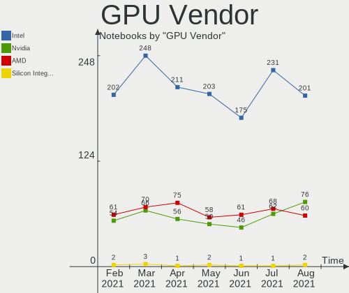

| Vendor                           | Notebooks | Percent |
|----------------------------------|-----------|---------|
| Intel                            | 122       | 62.56%  |
| Nvidia                           | 37        | 18.97%  |
| AMD                              | 34        | 17.44%  |
| VIA Technologies                 | 1         | 0.51%   |
| Silicon Integrated Systems [SiS] | 1         | 0.51%   |

GPU Model
---------

Graphics card models

| Model                                                                              | Notebooks | Percent |
|------------------------------------------------------------------------------------|-----------|---------|
| Haswell-ULT Integrated Graphics Controller                                         | 13        | 6.44%   |
| 3rd Gen Core processor Graphics Controller                                         | 13        | 6.44%   |
| 2nd Generation Core Processor Family Integrated Graphics Controller                | 12        | 5.94%   |
| Mobile 4 Series Chipset Integrated Graphics Controller                             | 10        | 4.95%   |
| Core Processor Integrated Graphics Controller                                      | 9         | 4.46%   |
| UHD Graphics 620 (Whiskey Lake)                                                    | 8         | 3.96%   |
| Skylake GT2 [HD Graphics 520]                                                      | 8         | 3.96%   |
| HD Graphics 5500                                                                   | 6         | 2.97%   |
| HD Graphics 530                                                                    | 6         | 2.97%   |
| 4th Gen Core Processor Integrated Graphics Controller                              | 6         | 2.97%   |
| Stoney [Radeon R2/R3/R4/R5 Graphics]                                               | 5         | 2.48%   |
| Raven Ridge [Radeon Vega Series / Radeon Vega Mobile Series]                       | 4         | 1.98%   |
| HD Graphics 620                                                                    | 4         | 1.98%   |
| Atom Processor Z36xxx/Z37xxx Series Graphics & Display                             | 4         | 1.98%   |
| UHD Graphics 630 (Mobile)                                                          | 3         | 1.49%   |
| UHD Graphics 620                                                                   | 3         | 1.49%   |
| Picasso                                                                            | 3         | 1.49%   |
| GM107M [GeForce GTX 960M]                                                          | 3         | 1.49%   |
| UHD Graphics                                                                       | 2         | 0.99%   |
| TU116M [GeForce GTX 1660 Ti Mobile]                                                | 2         | 0.99%   |
| Sun XT [Radeon HD 8670A/8670M/8690M / R5 M330 / M430 / Radeon 520 Mobile]          | 2         | 0.99%   |
| Renoir                                                                             | 2         | 0.99%   |
| Mullins [Radeon R4/R5 Graphics]                                                    | 2         | 0.99%   |
| Mobile GM965/GL960 Integrated Graphics Controller (secondary)                      | 2         | 0.99%   |
| Mobile GM965/GL960 Integrated Graphics Controller (primary)                        | 2         | 0.99%   |
| Mobile 945GM/GMS/GME, 943/940GML Express Integrated Graphics Controller            | 2         | 0.99%   |
| Mobile 945GM/GMS, 943/940GML Express Integrated Graphics Controller                | 2         | 0.99%   |
| Kabini [Radeon HD 8210]                                                            | 2         | 0.99%   |
| Iris Plus Graphics G7                                                              | 2         | 0.99%   |
| Iris Plus Graphics G1 (Ice Lake)                                                   | 2         | 0.99%   |
| GM108M [GeForce 940M]                                                              | 2         | 0.99%   |
| GM108M [GeForce 840M]                                                              | 2         | 0.99%   |
| Atom/Celeron/Pentium Processor x5-E8000/J3xxx/N3xxx Integrated Graphics Controller | 2         | 0.99%   |
| Wrestler [Radeon HD 7310]                                                          | 1         | 0.5%    |
| UHD Graphics 605                                                                   | 1         | 0.5%    |
| TU106M [GeForce RTX 2060 Mobile]                                                   | 1         | 0.5%    |
| TU104M [GeForce RTX 2080 SUPER Mobile / Max-Q]                                     | 1         | 0.5%    |
| Trinity [Radeon HD 7640G]                                                          | 1         | 0.5%    |
| Thames [Radeon HD 7500M/7600M Series]                                              | 1         | 0.5%    |
| Sun LE [Radeon HD 8550M / R5 M230]                                                 | 1         | 0.5%    |
| RV730/M96 [Mobility Radeon HD 4650/5165]                                           | 1         | 0.5%    |
| RV620/M82 [Mobility Radeon HD 3450/3470]                                           | 1         | 0.5%    |
| RS880M [Mobility Radeon HD 4225/4250]                                              | 1         | 0.5%    |
| RS482M [Mobility Radeon Xpress 200]                                                | 1         | 0.5%    |
| Richland [Radeon HD 8650G]                                                         | 1         | 0.5%    |
| Richland [Radeon HD 8510G]                                                         | 1         | 0.5%    |
| Neptune XT [Radeon HD 8970M]                                                       | 1         | 0.5%    |
| Mars LE [Radeon HD 8530M / R5 M240]                                                | 1         | 0.5%    |
| Madison [Mobility Radeon HD 5650/5750 / 6530M/6550M]                               | 1         | 0.5%    |
| Kaveri [Radeon R6 Graphics]                                                        | 1         | 0.5%    |
| Jet PRO [Radeon R5 M230 / R7 M260DX / Radeon 520 Mobile]                           | 1         | 0.5%    |
| HD Graphics 630                                                                    | 1         | 0.5%    |
| HD Graphics 5300                                                                   | 1         | 0.5%    |
| HD Graphics 500                                                                    | 1         | 0.5%    |
| GT218M [NVS 3100M]                                                                 | 1         | 0.5%    |
| GT216GLM [Quadro FX 880M]                                                          | 1         | 0.5%    |
| GP107GLM [Quadro P1000 Mobile]                                                     | 1         | 0.5%    |
| GP106M [GeForce GTX 1060 Mobile]                                                   | 1         | 0.5%    |
| GP104M [GeForce GTX 1070 Mobile]                                                   | 1         | 0.5%    |
| GM206GLM [Quadro M2200 Mobile]                                                     | 1         | 0.5%    |

GPU Combo
---------

Combinations of graphics cards

| Name           | Notebooks | Percent |
|----------------|-----------|---------|
| 1 x Intel      | 92        | 55.76%  |
| 1 x AMD        | 26        | 15.76%  |
| Intel + Nvidia | 25        | 15.15%  |
| 1 x Nvidia     | 12        | 7.27%   |
| Intel + AMD    | 5         | 3.03%   |
| 2 x AMD        | 3         | 1.82%   |
| 1 x VIA        | 1         | 0.61%   |
| 1 x SiS        | 1         | 0.61%   |

GPU Driver
----------

Free vs proprietary

| Driver      | Notebooks | Percent |
|-------------|-----------|---------|
| Free        | 132       | 80%     |
| Proprietary | 28        | 16.97%  |
| Unknown     | 5         | 3.03%   |

GPU Memory
----------

Total video memory

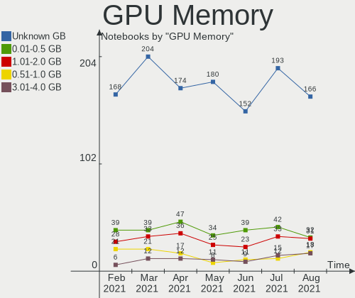

| Size in GB | Notebooks | Percent |
|------------|-----------|---------|
| Unknown    | 99        | 60%     |
| 1.01-2.0   | 24        | 14.55%  |
| 0.01-0.5   | 19        | 11.52%  |
| 0.51-1.0   | 12        | 7.27%   |
| 3.01-4.0   | 7         | 4.24%   |
| 5.01-6.0   | 3         | 1.82%   |
| 7.01-8.0   | 1         | 0.61%   |

Monitor Vendor
--------------

Monitor vendors

| Vendor                  | Notebooks | Percent |
|-------------------------|-----------|---------|
| AU Optronics            | 49        | 26.34%  |
| Samsung Electronics     | 25        | 13.44%  |
| LG Display              | 24        | 12.9%   |
| BOE                     | 22        | 11.83%  |
| Chimei Innolux          | 12        | 6.45%   |
| LG Philips              | 7         | 3.76%   |
| Sharp                   | 6         | 3.23%   |
| Dell                    | 5         | 2.69%   |
| Philips                 | 4         | 2.15%   |
| Lenovo                  | 4         | 2.15%   |
| Chi Mei Optoelectronics | 4         | 2.15%   |
| Toshiba                 | 3         | 1.61%   |
| AOC                     | 3         | 1.61%   |
| PANDA                   | 2         | 1.08%   |
| Hewlett-Packard         | 2         | 1.08%   |
| Goldstar                | 2         | 1.08%   |
| YTH                     | 1         | 0.54%   |
| ViewSonic               | 1         | 0.54%   |
| Vestel Elektronik       | 1         | 0.54%   |
| Seiko/Epson             | 1         | 0.54%   |
| Panasonic               | 1         | 0.54%   |
| LGD                     | 1         | 0.54%   |
| InfoVision              | 1         | 0.54%   |
| Envision                | 1         | 0.54%   |
| CMN                     | 1         | 0.54%   |
| BenQ                    | 1         | 0.54%   |
| Apple                   | 1         | 0.54%   |
| Acer                    | 1         | 0.54%   |

Monitor Model
-------------

Monitor models

| Model                                              | Notebooks | Percent |
|----------------------------------------------------|-----------|---------|
| LCD Monitor AUO23EC 1366x768 344x193mm 15.5-inch   | 5         | 2.67%   |
| LCD Monitor BOE06A5 1366x768 344x194mm 15.5-inch   | 4         | 2.14%   |
| LCD Monitor SEC5441 1366x768 344x194mm 15.5-inch   | 3         | 1.6%    |
| LCD Monitor AUO70EC 1366x768 340x190mm 15.3-inch   | 3         | 1.6%    |
| LCD Monitor SHP1453 1920x1080 346x194mm 15.6-inch  | 2         | 1.07%   |
| LCD Monitor SEC3641 1366x768 353x198mm 15.9-inch   | 2         | 1.07%   |
| LCD Monitor LGD039F 1366x768 345x194mm 15.6-inch   | 2         | 1.07%   |
| LCD Monitor LGD0259 1920x1080 350x190mm 15.7-inch  | 2         | 1.07%   |
| LCD Monitor CMO15A3 1366x768 344x193mm 15.5-inch   | 2         | 1.07%   |
| LCD Monitor CMN15DB 1366x768 344x193mm 15.5-inch   | 2         | 1.07%   |
| LCD Monitor BOE0812 1920x1080 344x194mm 15.5-inch  | 2         | 1.07%   |
| LCD Monitor BOE05B1 1366x768 309x173mm 13.9-inch   | 2         | 1.07%   |
| LCD Monitor AUO5B2D 1920x1080 293x162mm 13.2-inch  | 2         | 1.07%   |
| LCD Monitor AUO45EC 1366x768 340x190mm 15.3-inch   | 2         | 1.07%   |
| LCD Monitor AUO42EC 1366x768 340x190mm 15.3-inch   | 2         | 1.07%   |
| LCD Monitor AUO38ED 1920x1080 340x190mm 15.3-inch  | 2         | 1.07%   |
| LCD Monitor AUO303C 1366x768 309x173mm 13.9-inch   | 2         | 1.07%   |
| LCD Monitor AUO233C 1366x768 309x173mm 13.9-inch   | 2         | 1.07%   |
| LCD Monitor AUO139E 1600x900 382x214mm 17.2-inch   | 2         | 1.07%   |
| LCD Monitor 1920x1080                              | 2         | 1.07%   |
| C32F391 SAM0D34 1920x1080 698x393mm 31.5-inch      | 2         | 1.07%   |
| 27E1 AOC2701 1920x1080 598x336mm 27.0-inch         | 2         | 1.07%   |
| Z23n HWP3284 1920x1080 509x286mm 23.0-inch         | 1         | 0.53%   |
| YTH156PC YTH1560 1920x1080 600x330mm 27.0-inch     | 1         | 0.53%   |
| VVX13F009G00 MEI96A2 1920x1080 290x170mm 13.2-inch | 1         | 0.53%   |
| VH240a HPN3499 1920x1080 527x296mm 23.8-inch       | 1         | 0.53%   |
| V246HL ACR032E 1920x1080 531x299mm 24.0-inch       | 1         | 0.53%   |
| U4919DW DELA10D 3840x1080 1198x337mm 49.0-inch     | 1         | 0.53%   |
| U2417H DEL40E8 1920x1080 527x296mm 23.8-inch       | 1         | 0.53%   |
| U2414H DELA0B2 1920x1080 530x300mm 24.0-inch       | 1         | 0.53%   |
| TV TSB0206 1920x1080 886x498mm 40.0-inch           | 1         | 0.53%   |
| SMB2430H SAM064D 1920x1080 531x299mm 24.0-inch     | 1         | 0.53%   |
| SE2219H DELF10F 1920x1080 476x268mm 21.5-inch      | 1         | 0.53%   |
| PHL 273V7 PHLC156 1920x1080 598x336mm 27.0-inch    | 1         | 0.53%   |
| PHL 243V7 PHLC155 1920x1080 530x300mm 24.0-inch    | 1         | 0.53%   |
| PHL 243V5 PHLC0D1 1920x1080 521x293mm 23.5-inch    | 1         | 0.53%   |
| PHL 223V5LH PHLC114 1920x1080 477x268mm 21.5-inch  | 1         | 0.53%   |
| P2719H DEL4185 1920x1080 598x336mm 27.0-inch       | 1         | 0.53%   |
| LT133EE09500 LCD090A 1366x768 295x166mm 13.3-inch  | 1         | 0.53%   |
| LP156WH2-TLQ1 LGD021B 1366x768 344x194mm 15.5-inch | 1         | 0.53%   |
| LP154WX4-TLC8 LPL0120 1280x800 331x207mm 15.4-inch | 1         | 0.53%   |
| LG FULL HD GSM5ABB 1920x1080 480x270mm 21.7-inch   | 1         | 0.53%   |
| LEN L27i-28 LEN65E0 1920x1080 598x336mm 27.0-inch  | 1         | 0.53%   |
| LCD Monitor VP2771                                 | 1         | 0.53%   |
| LCD Monitor SHP14CB 1920x1200 288x180mm 13.4-inch  | 1         | 0.53%   |
| LCD Monitor SHP144A 3200x1800 294x165mm 13.3-inch  | 1         | 0.53%   |
| LCD Monitor SHP1430 3840x2160 350x190mm 15.7-inch  | 1         | 0.53%   |
| LCD Monitor SEC5442 1440x900 367x230mm 17.1-inch   | 1         | 0.53%   |
| LCD Monitor SEC4351 1366x768 344x194mm 15.5-inch   | 1         | 0.53%   |
| LCD Monitor SEC434E 1600x900 310x170mm 13.9-inch   | 1         | 0.53%   |
| LCD Monitor SEC3945 1280x800 331x207mm 15.4-inch   | 1         | 0.53%   |
| LCD Monitor SEC3633 1280x800 331x207mm 15.4-inch   | 1         | 0.53%   |
| LCD Monitor SEC3358 1280x800 331x207mm 15.4-inch   | 1         | 0.53%   |
| LCD Monitor SEC324C 1366x768 353x198mm 15.9-inch   | 1         | 0.53%   |
| LCD Monitor SEC324A 1366x768 344x194mm 15.5-inch   | 1         | 0.53%   |
| LCD Monitor SEC315A 1366x768 344x194mm 15.5-inch   | 1         | 0.53%   |
| LCD Monitor SEC3047 1366x768 277x156mm 12.5-inch   | 1         | 0.53%   |
| LCD Monitor SDCC34F 3840x2160 344x194mm 15.5-inch  | 1         | 0.53%   |
| LCD Monitor SDC4E51 1366x768 340x190mm 15.3-inch   | 1         | 0.53%   |
| LCD Monitor SDC4C48 1920x1080 409x230mm 18.5-inch  | 1         | 0.53%   |

Monitor Resolution
------------------

Monitor screen resolution

| Resolution         | Notebooks | Percent |
|--------------------|-----------|---------|
| 1366x768 (WXGA)    | 80        | 45.71%  |
| 1920x1080 (FHD)    | 58        | 33.14%  |
| 1280x800 (WXGA)    | 13        | 7.43%   |
| 1600x900 (HD+)     | 8         | 4.57%   |
| 2560x1440 (QHD)    | 3         | 1.71%   |
| 3840x2160 (4K)     | 2         | 1.14%   |
| 3200x1800 (QHD+)   | 2         | 1.14%   |
| 1680x1050 (WSXGA+) | 2         | 1.14%   |
| 1440x900 (WXGA+)   | 2         | 1.14%   |
| 7040x1440          | 1         | 0.57%   |
| 3840x1080          | 1         | 0.57%   |
| 1920x1200 (WUXGA)  | 1         | 0.57%   |
| 1024x600           | 1         | 0.57%   |
| Unknown            | 1         | 0.57%   |

Monitor Diagonal
----------------

Diagonal size in inches

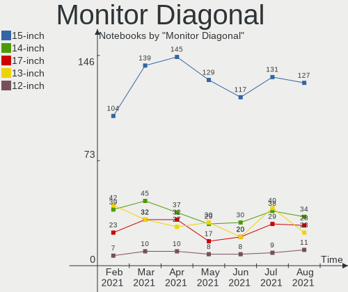

| Inches  | Notebooks | Percent |
|---------|-----------|---------|
| 15      | 90        | 48.65%  |
| 13      | 28        | 15.14%  |
| 14      | 17        | 9.19%   |
| 17      | 12        | 6.49%   |
| 27      | 6         | 3.24%   |
| 23      | 6         | 3.24%   |
| 21      | 5         | 2.7%    |
| 12      | 4         | 2.16%   |
| Unknown | 4         | 2.16%   |
| 11      | 3         | 1.62%   |
| 31      | 2         | 1.08%   |
| 24      | 2         | 1.08%   |
| 49      | 1         | 0.54%   |
| 40      | 1         | 0.54%   |
| 37      | 1         | 0.54%   |
| 32      | 1         | 0.54%   |
| 22      | 1         | 0.54%   |
| 10      | 1         | 0.54%   |

Monitor Width
-------------

Physical width

| Width in mm | Notebooks | Percent |
|-------------|-----------|---------|
| 301-350     | 125       | 67.57%  |
| 201-300     | 18        | 9.73%   |
| 501-600     | 14        | 7.57%   |
| 351-400     | 12        | 6.49%   |
| 401-500     | 6         | 3.24%   |
| Unknown     | 4         | 2.16%   |
| 801-900     | 2         | 1.08%   |
| 601-700     | 2         | 1.08%   |
| 701-800     | 1         | 0.54%   |
| 1001-1500   | 1         | 0.54%   |

Aspect Ratio
------------

Proportional relationship between the width and the height

| Ratio   | Notebooks | Percent |
|---------|-----------|---------|
| 16/9    | 141       | 87.04%  |
| 16/10   | 16        | 9.88%   |
| Unknown | 4         | 2.47%   |
| 32/9    | 1         | 0.62%   |

Monitor Area
------------

Area in inch²

| Area in inch² | Notebooks | Percent |
|----------------|-----------|---------|
| 101-110        | 88        | 47.57%  |
| 81-90          | 35        | 18.92%  |
| 121-130        | 12        | 6.49%   |
| 71-80          | 11        | 5.95%   |
| 201-250        | 11        | 5.95%   |
| 301-350        | 6         | 3.24%   |
| Unknown        | 4         | 2.16%   |
| 61-70          | 3         | 1.62%   |
| 51-60          | 3         | 1.62%   |
| 351-500        | 3         | 1.62%   |
| 151-200        | 3         | 1.62%   |
| 501-1000       | 3         | 1.62%   |
| 91-100         | 2         | 1.08%   |
| 41-50          | 1         | 0.54%   |

Pixel Density
-------------

Pixels per inch

| Density       | Notebooks | Percent |
|---------------|-----------|---------|
| 101-120       | 86        | 48.04%  |
| 121-160       | 50        | 27.93%  |
| 51-100        | 28        | 15.64%  |
| 161-240       | 7         | 3.91%   |
| More than 240 | 4         | 2.23%   |
| Unknown       | 4         | 2.23%   |

Multiple Monitors
-----------------

Total monitors connected

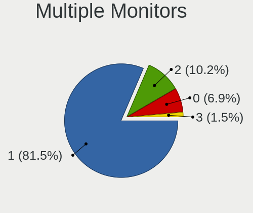

| Total | Notebooks | Percent |
|-------|-----------|---------|
| 1     | 131       | 79.39%  |
| 2     | 28        | 16.97%  |
| 0     | 4         | 2.42%   |
| 3     | 2         | 1.21%   |

Net Controller Vendor
---------------------

Controller vendors

| Vendor                            | Notebooks | Percent |
|-----------------------------------|-----------|---------|
| Realtek Semiconductor             | 96        | 34.78%  |
| Qualcomm Atheros                  | 68        | 24.64%  |
| Intel                             | 68        | 24.64%  |
| Broadcom Inc. and subsidiaries    | 14        | 5.07%   |
| Ralink                            | 5         | 1.81%   |
| Broadcom Limited                  | 5         | 1.81%   |
| TP-Link                           | 4         | 1.45%   |
| Samsung Electronics               | 2         | 0.72%   |
| Ralink Technology                 | 2         | 0.72%   |
| Xiaomi                            | 1         | 0.36%   |
| VIA Technologies                  | 1         | 0.36%   |
| Silicon Integrated Systems [SiS]  | 1         | 0.36%   |
| MediaTek                          | 1         | 0.36%   |
| Marvell Technology Group          | 1         | 0.36%   |
| Hewlett-Packard                   | 1         | 0.36%   |
| FIBOCOM                           | 1         | 0.36%   |
| Ericsson Business Mobile Networks | 1         | 0.36%   |
| DisplayLink                       | 1         | 0.36%   |
| D-Link System                     | 1         | 0.36%   |
| AVM                               | 1         | 0.36%   |
| ASUSTek Computer                  | 1         | 0.36%   |

Net Controller Model
--------------------

Controller models

| Model                                                                | Notebooks | Percent |
|----------------------------------------------------------------------|-----------|---------|
| RTL8111/8168/8411 PCI Express Gigabit Ethernet Controller            | 60        | 17.86%  |
| RTL810xE PCI Express Fast Ethernet controller                        | 27        | 8.04%   |
| AR9485 Wireless Network Adapter                                      | 14        | 4.17%   |
| AR9285 Wireless Network Adapter (PCI-Express)                        | 14        | 4.17%   |
| QCA9565 / AR9565 Wireless Network Adapter                            | 11        | 3.27%   |
| QCA9377 802.11ac Wireless Network Adapter                            | 10        | 2.98%   |
| Wireless 7260                                                        | 8         | 2.38%   |
| RTL8821CE 802.11ac PCIe Wireless Network Adapter                     | 6         | 1.79%   |
| Wireless-AC 9560 [Jefferson Peak]                                    | 5         | 1.49%   |
| Wireless 8260                                                        | 5         | 1.49%   |
| RT3290 Wireless 802.11n 1T/1R PCIe                                   | 5         | 1.49%   |
| QCA6174 802.11ac Wireless Network Adapter                            | 5         | 1.49%   |
| Centrino Advanced-N 6200                                             | 5         | 1.49%   |
| AR8121/AR8113/AR8114 Gigabit or Fast Ethernet                        | 5         | 1.49%   |
| 82577LM Gigabit Network Connection                                   | 5         | 1.49%   |
| Wireless 3165                                                        | 4         | 1.19%   |
| Wi-Fi 6 AX200                                                        | 4         | 1.19%   |
| RTL8723BE PCIe Wireless Network Adapter                              | 4         | 1.19%   |
| RTL8153 Gigabit Ethernet Adapter                                     | 4         | 1.19%   |
| Dual Band Wireless-AC 3168NGW [Stone Peak]                           | 4         | 1.19%   |
| Centrino Advanced-N 6205 [Taylor Peak]                               | 4         | 1.19%   |
| BCM43142 802.11b/g/n                                                 | 4         | 1.19%   |
| 82579LM Gigabit Network Connection (Lewisville)                      | 4         | 1.19%   |
| Wireless 7265                                                        | 3         | 0.89%   |
| RTL8723DE Wireless Network Adapter                                   | 3         | 0.89%   |
| PRO/Wireless 3945ABG [Golan] Network Connection                      | 3         | 0.89%   |
| Killer E220x Gigabit Ethernet Controller                             | 3         | 0.89%   |
| AR928X Wireless Network Adapter (PCI-Express)                        | 3         | 0.89%   |
| AR9287 Wireless Network Adapter (PCI-Express)                        | 3         | 0.89%   |
| AR8151 v2.0 Gigabit Ethernet                                         | 3         | 0.89%   |
| Wireless-AC 9260                                                     | 2         | 0.6%    |
| Wireless 8265 / 8275                                                 | 2         | 0.6%    |
| Wireless 3160                                                        | 2         | 0.6%    |
| TL WN823N RTL8192EU                                                  | 2         | 0.6%    |
| RTL8822BE 802.11a/b/g/n/ac WiFi adapter                              | 2         | 0.6%    |
| RTL-8100/8101L/8139 PCI Fast Ethernet Adapter                        | 2         | 0.6%    |
| QCA8172 Fast Ethernet                                                | 2         | 0.6%    |
| NetLink BCM5906M Fast Ethernet PCI Express                           | 2         | 0.6%    |
| NetLink BCM57785 Gigabit Ethernet PCIe                               | 2         | 0.6%    |
| L830-EB                                                              | 2         | 0.6%    |
| Killer Wi-Fi 6 AX1650i 160MHz Wireless Network Adapter (201NGW)      | 2         | 0.6%    |
| Killer E2400 Gigabit Ethernet Controller                             | 2         | 0.6%    |
| Galaxy series, misc. (tethering mode)                                | 2         | 0.6%    |
| Ethernet Connection I219-LM                                          | 2         | 0.6%    |
| Ethernet Connection I218-LM                                          | 2         | 0.6%    |
| Ethernet Connection I217-V                                           | 2         | 0.6%    |
| Ethernet Connection (6) I219-V                                       | 2         | 0.6%    |
| Centrino Ultimate-N 6300                                             | 2         | 0.6%    |
| BCM4311 802.11b/g WLAN                                               | 2         | 0.6%    |
| AR8151 v1.0 Gigabit Ethernet                                         | 2         | 0.6%    |
| 82567LM Gigabit Network Connection                                   | 2         | 0.6%    |
| WiFi Link 5100                                                       | 1         | 0.3%    |
| VT6102/VT6103 [Rhine-II]                                             | 1         | 0.3%    |
| USB3.0 802.11ac 1200M Adapter                                        | 1         | 0.3%    |
| USB-AC68 802.11a/b/g/n/ac (4x4) Wireless Adapter [Realtek RTL8814AU] | 1         | 0.3%    |
| Ultimate N WiFi Link 5300                                            | 1         | 0.3%    |
| TL-WN821N Version 5 RTL8192EU                                        | 1         | 0.3%    |
| Targus USB3.0 DV2K Dock w Power                                      | 1         | 0.3%    |
| RTL8822CE 802.11ac PCIe Wireless Network Adapter                     | 1         | 0.3%    |
| RTL8723AE PCIe Wireless Network Adapter                              | 1         | 0.3%    |

Wireless Vendor
---------------

Wireless vendors

| Vendor                         | Notebooks | Percent |
|--------------------------------|-----------|---------|
| Intel                          | 65        | 37.14%  |
| Qualcomm Atheros               | 62        | 35.43%  |
| Realtek Semiconductor          | 20        | 11.43%  |
| Broadcom Inc. and subsidiaries | 12        | 6.86%   |
| Ralink                         | 5         | 2.86%   |
| TP-Link                        | 4         | 2.29%   |
| Ralink Technology              | 2         | 1.14%   |
| FIBOCOM                        | 1         | 0.57%   |
| D-Link System                  | 1         | 0.57%   |
| Broadcom Limited               | 1         | 0.57%   |
| AVM                            | 1         | 0.57%   |
| ASUSTek Computer               | 1         | 0.57%   |

Wireless Model
--------------

Wireless models

| Model                                                                | Notebooks | Percent |
|----------------------------------------------------------------------|-----------|---------|
| AR9485 Wireless Network Adapter                                      | 14        | 8%      |
| AR9285 Wireless Network Adapter (PCI-Express)                        | 14        | 8%      |
| QCA9565 / AR9565 Wireless Network Adapter                            | 11        | 6.29%   |
| QCA9377 802.11ac Wireless Network Adapter                            | 10        | 5.71%   |
| Wireless 7260                                                        | 8         | 4.57%   |
| RTL8821CE 802.11ac PCIe Wireless Network Adapter                     | 6         | 3.43%   |
| Wireless-AC 9560 [Jefferson Peak]                                    | 5         | 2.86%   |
| Wireless 8260                                                        | 5         | 2.86%   |
| RT3290 Wireless 802.11n 1T/1R PCIe                                   | 5         | 2.86%   |
| QCA6174 802.11ac Wireless Network Adapter                            | 5         | 2.86%   |
| Centrino Advanced-N 6200                                             | 5         | 2.86%   |
| Wireless 3165                                                        | 4         | 2.29%   |
| Wi-Fi 6 AX200                                                        | 4         | 2.29%   |
| RTL8723BE PCIe Wireless Network Adapter                              | 4         | 2.29%   |
| Dual Band Wireless-AC 3168NGW [Stone Peak]                           | 4         | 2.29%   |
| Centrino Advanced-N 6205 [Taylor Peak]                               | 4         | 2.29%   |
| BCM43142 802.11b/g/n                                                 | 4         | 2.29%   |
| Wireless 7265                                                        | 3         | 1.71%   |
| RTL8723DE Wireless Network Adapter                                   | 3         | 1.71%   |
| PRO/Wireless 3945ABG [Golan] Network Connection                      | 3         | 1.71%   |
| AR928X Wireless Network Adapter (PCI-Express)                        | 3         | 1.71%   |
| AR9287 Wireless Network Adapter (PCI-Express)                        | 3         | 1.71%   |
| Wireless-AC 9260                                                     | 2         | 1.14%   |
| Wireless 8265 / 8275                                                 | 2         | 1.14%   |
| Wireless 3160                                                        | 2         | 1.14%   |
| TL WN823N RTL8192EU                                                  | 2         | 1.14%   |
| RTL8822BE 802.11a/b/g/n/ac WiFi adapter                              | 2         | 1.14%   |
| Killer Wi-Fi 6 AX1650i 160MHz Wireless Network Adapter (201NGW)      | 2         | 1.14%   |
| Centrino Ultimate-N 6300                                             | 2         | 1.14%   |
| BCM4311 802.11b/g WLAN                                               | 2         | 1.14%   |
| WiFi Link 5100                                                       | 1         | 0.57%   |
| USB3.0 802.11ac 1200M Adapter                                        | 1         | 0.57%   |
| USB-AC68 802.11a/b/g/n/ac (4x4) Wireless Adapter [Realtek RTL8814AU] | 1         | 0.57%   |
| Ultimate N WiFi Link 5300                                            | 1         | 0.57%   |
| TL-WN821N Version 5 RTL8192EU                                        | 1         | 0.57%   |
| RTL8822CE 802.11ac PCIe Wireless Network Adapter                     | 1         | 0.57%   |
| RTL8723AE PCIe Wireless Network Adapter                              | 1         | 0.57%   |
| RTL8187 Wireless Adapter                                             | 1         | 0.57%   |
| RT5572 Wireless Adapter                                              | 1         | 0.57%   |
| PRO/Wireless 5100 AGN [Shiloh] Network Connection                    | 1         | 0.57%   |
| PRO/Wireless 4965 AG or AGN [Kedron] Network Connection              | 1         | 0.57%   |
| MT7601U Wireless Adapter                                             | 1         | 0.57%   |
| L830-EB                                                              | 1         | 0.57%   |
| Fritz!WLAN N [Atheros AR9001U]                                       | 1         | 0.57%   |
| DWA-131 802.11n Wireless N Nano Adapter(rev.A1) [Realtek RTL8192SU]  | 1         | 0.57%   |
| Dual Band Wireless-AC 3165 Plus Bluetooth                            | 1         | 0.57%   |
| Comet Lake PCH-LP CNVi WiFi                                          | 1         | 0.57%   |
| Comet Lake PCH CNVi WiFi                                             | 1         | 0.57%   |
| Centrino Wireless-N 2230                                             | 1         | 0.57%   |
| Centrino Wireless-N 1030 [Rainbow Peak]                              | 1         | 0.57%   |
| Centrino Advanced-N 6235                                             | 1         | 0.57%   |
| BCM43602 802.11ac Wireless LAN SoC                                   | 1         | 0.57%   |
| BCM4350 802.11ac Wireless Network Adapter                            | 1         | 0.57%   |
| BCM4331 802.11a/b/g/n                                                | 1         | 0.57%   |
| BCM43227 802.11b/g/n                                                 | 1         | 0.57%   |
| BCM43225 802.11b/g/n                                                 | 1         | 0.57%   |
| BCM43224 802.11a/b/g/n                                               | 1         | 0.57%   |
| BCM4313 802.11bgn Wireless Network Adapter                           | 1         | 0.57%   |
| AR242x / AR542x Wireless Network Adapter (PCI-Express)               | 1         | 0.57%   |
| AR2413/AR2414 Wireless Network Adapter [AR5005G(S) 802.11bg]         | 1         | 0.57%   |

Ethernet Vendor
---------------

Ethernet vendors

| Vendor                           | Notebooks | Percent |
|----------------------------------|-----------|---------|
| Realtek Semiconductor            | 92        | 58.6%   |
| Intel                            | 26        | 16.56%  |
| Qualcomm Atheros                 | 23        | 14.65%  |
| Broadcom Limited                 | 4         | 2.55%   |
| Broadcom Inc. and subsidiaries   | 4         | 2.55%   |
| Samsung Electronics              | 2         | 1.27%   |
| Xiaomi                           | 1         | 0.64%   |
| VIA Technologies                 | 1         | 0.64%   |
| Silicon Integrated Systems [SiS] | 1         | 0.64%   |
| MediaTek                         | 1         | 0.64%   |
| Marvell Technology Group         | 1         | 0.64%   |
| DisplayLink                      | 1         | 0.64%   |

Ethernet Model
--------------

Ethernet models

| Model                                                     | Notebooks | Percent |
|-----------------------------------------------------------|-----------|---------|
| RTL8111/8168/8411 PCI Express Gigabit Ethernet Controller | 60        | 37.74%  |
| RTL810xE PCI Express Fast Ethernet controller             | 27        | 16.98%  |
| AR8121/AR8113/AR8114 Gigabit or Fast Ethernet             | 5         | 3.14%   |
| 82577LM Gigabit Network Connection                        | 5         | 3.14%   |
| RTL8153 Gigabit Ethernet Adapter                          | 4         | 2.52%   |
| 82579LM Gigabit Network Connection (Lewisville)           | 4         | 2.52%   |
| Killer E220x Gigabit Ethernet Controller                  | 3         | 1.89%   |
| AR8151 v2.0 Gigabit Ethernet                              | 3         | 1.89%   |
| RTL-8100/8101L/8139 PCI Fast Ethernet Adapter             | 2         | 1.26%   |
| QCA8172 Fast Ethernet                                     | 2         | 1.26%   |
| NetLink BCM5906M Fast Ethernet PCI Express                | 2         | 1.26%   |
| NetLink BCM57785 Gigabit Ethernet PCIe                    | 2         | 1.26%   |
| Killer E2400 Gigabit Ethernet Controller                  | 2         | 1.26%   |
| Galaxy series, misc. (tethering mode)                     | 2         | 1.26%   |
| Ethernet Connection I219-LM                               | 2         | 1.26%   |
| Ethernet Connection I218-LM                               | 2         | 1.26%   |
| Ethernet Connection I217-V                                | 2         | 1.26%   |
| Ethernet Connection (6) I219-V                            | 2         | 1.26%   |
| AR8151 v1.0 Gigabit Ethernet                              | 2         | 1.26%   |
| 82567LM Gigabit Network Connection                        | 2         | 1.26%   |
| VT6102/VT6103 [Rhine-II]                                  | 1         | 0.63%   |
| Targus USB3.0 DV2K Dock w Power                           | 1         | 0.63%   |
| RTL8152 Fast Ethernet Adapter                             | 1         | 0.63%   |
| QCA8171 Gigabit Ethernet                                  | 1         | 0.63%   |
| PRO/100 VE Network Connection                             | 1         | 0.63%   |
| Osprey Emulation Wireless Network Adapter                 | 1         | 0.63%   |
| Nokia 3.1                                                 | 1         | 0.63%   |
| NetXtreme BCM57765 Gigabit Ethernet PCIe                  | 1         | 0.63%   |
| NetXtreme BCM5764M Gigabit Ethernet PCIe                  | 1         | 0.63%   |
| NetXtreme BCM5755M Gigabit Ethernet PCI Express           | 1         | 0.63%   |
| NetLink BCM57780 Gigabit Ethernet PCIe                    | 1         | 0.63%   |
| Mi/Redmi series (RNDIS)                                   | 1         | 0.63%   |
| Ethernet Connection I219-V                                | 1         | 0.63%   |
| Ethernet Connection (7) I219-V                            | 1         | 0.63%   |
| Ethernet Connection (5) I219-LM                           | 1         | 0.63%   |
| Ethernet Connection (4) I219-V                            | 1         | 0.63%   |
| Ethernet Connection (3) I218-LM                           | 1         | 0.63%   |
| Attansic L1 Gigabit Ethernet                              | 1         | 0.63%   |
| AR8162 Fast Ethernet                                      | 1         | 0.63%   |
| AR8152 v1.1 Fast Ethernet                                 | 1         | 0.63%   |
| AR8131 Gigabit Ethernet                                   | 1         | 0.63%   |
| 88E8040 PCI-E Fast Ethernet Controller                    | 1         | 0.63%   |
| 82567LF Gigabit Network Connection                        | 1         | 0.63%   |
| 191 Gigabit Ethernet Adapter                              | 1         | 0.63%   |

Net Controller Kind
-------------------

Ethernet, WiFi or modem

| Kind     | Notebooks | Percent |
|----------|-----------|---------|
| WiFi     | 163       | 51.58%  |
| Ethernet | 151       | 47.78%  |
| Modem    | 1         | 0.32%   |
| Unknown  | 1         | 0.32%   |

Used Controller
---------------

Currently used network controller

| Kind     | Notebooks | Percent |
|----------|-----------|---------|
| WiFi     | 156       | 61.66%  |
| Ethernet | 96        | 37.94%  |
| Modem    | 1         | 0.4%    |

NICs
----

Total network controllers on board

| Total | Notebooks | Percent |
|-------|-----------|---------|
| 2     | 145       | 87.88%  |
| 1     | 19        | 11.52%  |
| 0     | 1         | 0.61%   |

Memory Vendor
-------------

Memory module vendors

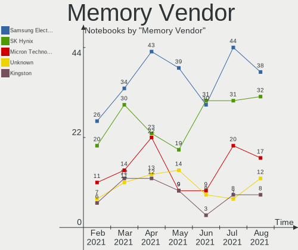

| Vendor              | Notebooks | Percent |
|---------------------|-----------|---------|
| Samsung Electronics | 26        | 30.59%  |
| Unknown             | 11        | 12.94%  |
| SK Hynix            | 10        | 11.76%  |
| Crucial             | 6         | 7.06%   |
| Ramaxel Technology  | 5         | 5.88%   |
| Kingston            | 5         | 5.88%   |
| SMART               | 4         | 4.71%   |
| Micron Technology   | 3         | 3.53%   |
| Corsair             | 3         | 3.53%   |
| Nanya Technology    | 2         | 2.35%   |
| Elpida              | 2         | 2.35%   |
| A-DATA Technology   | 2         | 2.35%   |
| Unknown (090E)      | 1         | 1.18%   |
| SMART Brazil        | 1         | 1.18%   |
| High Bridge         | 1         | 1.18%   |
| ASint Technology    | 1         | 1.18%   |
| Apacer              | 1         | 1.18%   |
| AMD                 | 1         | 1.18%   |

Memory Model
------------

Memory module models

| Model                                                   | Notebooks | Percent |
|---------------------------------------------------------|-----------|---------|
| RAM M471B5173DB0-YK0 4096MB SODIMM DDR3 1600MT/s        | 3         | 3.33%   |
| RAM M471A1K43DB1-CTD 8192MB SODIMM DDR4 2667MT/s        | 3         | 3.33%   |
| RAM SMS4TDC3C0K0446SCG 4096MB SODIMM DDR4 2667MT/s      | 2         | 2.22%   |
| RAM SH564128FJ8NWRNSQG 4096MB SODIMM DDR3 1600MT/s      | 2         | 2.22%   |
| RAM Module 8192MB SODIMM DDR4 2667MT/s                  | 2         | 2.22%   |
| RAM Module 8192MB DIMM DDR3 1600MT/s                    | 2         | 2.22%   |
| RAM M471A5244CB0-CTD 4096MB SODIMM DDR4 2667MT/s        | 2         | 2.22%   |
| RAM M471A2K43CB1-CTD 16GB SODIMM DDR4 2667MT/s          | 2         | 2.22%   |
| RAM M471A1K43BB0-CPB 8192MB SODIMM DDR4 2133MT/s        | 2         | 2.22%   |
| RAM HMT351S6CFR8C-PB 4GB SODIMM DDR3 1600MT/s           | 2         | 2.22%   |
| RAM CT102464BF160B.C16 8192MB SODIMM DDR3 1600MT/s      | 2         | 2.22%   |
| RAM 99U5428-063.A00LF 8192MB SODIMM DDR3 1600MT/s       | 2         | 2.22%   |
| RAM V03D4SF8GB5285282400 8192MB SODIMM DDR4 2133MT/s    | 1         | 1.11%   |
| RAM SH5641G8FJ8NWRNSQG 8192MB SODIMM DDR3 1600MT/s      | 1         | 1.11%   |
| RAM SH564128FJ8NZRNSDG 4096MB SODIMM DDR3 1600MT/s      | 1         | 1.11%   |
| RAM RMT3020EC58E9F1333 4096MB SODIMM DDR3 4199MT/s      | 1         | 1.11%   |
| RAM RMSA3260NA78HAF-2400 8192MB SODIMM DDR4 2400MT/s    | 1         | 1.11%   |
| RAM RMSA3260MH78HAF-2666 8192MB SODIMM DDR4 2400MT/s    | 1         | 1.11%   |
| RAM RMSA3260ME78HAF-2666 8GB SODIMM DDR4 2667MT/s       | 1         | 1.11%   |
| RAM RMSA3230KB78HAF2133 8192MB SODIMM DDR4 2133MT/s     | 1         | 1.11%   |
| RAM R538G1601S2SL-U 8192MB SODIMM DDR3 1600MT/s         | 1         | 1.11%   |
| RAM NT2GC64B8HC0NS-CG 2GB DIMM DDR3 1334MT/s            | 1         | 1.11%   |
| RAM MT52L256M32D1PF107 2048MB SODIMM LPDDR3 1776MT/s    | 1         | 1.11%   |
| RAM MT41K512M8RH-125:E 4096MB SODIMM DDR3 1600MT/s      | 1         | 1.11%   |
| RAM Module 8192MB SODIMM DDR4 3200MT/s                  | 1         | 1.11%   |
| RAM Module 8192MB Row Of Chips LPDDR4 4267MT/s          | 1         | 1.11%   |
| RAM Module 4096MB SODIMM DDR3 1600MT/s                  | 1         | 1.11%   |
| RAM Module 4096MB SODIMM DDR3                           | 1         | 1.11%   |
| RAM Module 4096MB DIMM DDR3 667MT/s                     | 1         | 1.11%   |
| RAM Module 4096MB DIMM 667MT/s                          | 1         | 1.11%   |
| RAM Module 2048MB DIMM SDRAM                            | 1         | 1.11%   |
| RAM Module 2048MB DIMM DDR3 1333MT/s                    | 1         | 1.11%   |
| RAM Module 2048MB DIMM DDR2 667MT/s                     | 1         | 1.11%   |
| RAM Module 16384MB SODIMM DDR4 2667MT/s                 | 1         | 1.11%   |
| RAM Module 16384MB SODIMM DDR4 2400MT/s                 | 1         | 1.11%   |
| RAM MENTAL16G3200 16384MB SODIMM DDR4 3200MT/s          | 1         | 1.11%   |
| RAM M471B5273DH0-CK0 4096MB SODIMM DDR3 1600MT/s        | 1         | 1.11%   |
| RAM M471B5273DH0-CH9 4096MB SODIMM DDR3 1334MT/s        | 1         | 1.11%   |
| RAM M471B5273CH0-CK0 4096MB SODIMM DDR3 1600MT/s        | 1         | 1.11%   |
| RAM M471B5173EB0-YK0 4096MB SODIMM DDR3 1600MT/s        | 1         | 1.11%   |
| RAM M471B1G73QH0-YK0 8192MB SODIMM DDR3 1600MT/s        | 1         | 1.11%   |
| RAM M471B1G73DB0-YK0 8192MB SODIMM DDR3 1600MT/s        | 1         | 1.11%   |
| RAM M471A5244BB0-CRC 4096MB SODIMM DDR4 2400MT/s        | 1         | 1.11%   |
| RAM M471A2K43CB1-CRC 16GB SODIMM DDR4 2667MT/s          | 1         | 1.11%   |
| RAM M471A1G44AB0-CWE 8192MB SODIMM DDR4 3200MT/s        | 1         | 1.11%   |
| RAM M2S4G64CB8HB5N-CG 4096MB SODIMM DDR3 1334MT/s       | 1         | 1.11%   |
| RAM K4EBE304EC-EGCG 8192MB Row Of Chips LPDDR3 2133MT/s | 1         | 1.11%   |
| RAM K4E6E304EC-EGCG 4096MB Row Of Chips LPDDR3 2133MT/s | 1         | 1.11%   |
| RAM HP691160-H63-KEB 8192MB SODIMM DDR3 1600MT/s        | 1         | 1.11%   |
| RAM HMT451S6BFR8A-PB 4096MB SODIMM DDR3 1600MT/s        | 1         | 1.11%   |
| RAM HMT41GS6MFR8C-PB 8192MB SODIMM DDR3 1600MT/s        | 1         | 1.11%   |
| RAM HMT351S6CFR8C-H9 4096MB SODIMM DDR3 1333MT/s        | 1         | 1.11%   |
| RAM HMT125S6BFR8C-H9 2048MB SODIMM DDR3 1333MT/s        | 1         | 1.11%   |
| RAM HMA851S6CJR6N-VK 4096MB Row Of Chips DDR4 2667MT/s  | 1         | 1.11%   |
| RAM HMA851S6AFR6N-UH 4096MB SODIMM DDR4 2667MT/s        | 1         | 1.11%   |
| RAM HMA82GS6MFR8N-TF 16GB SODIMM DDR4 2133MT/s          | 1         | 1.11%   |
| RAM HB3SU002GFM8MMC16 2048MB SODIMM DDR3 1600MT/s       | 1         | 1.11%   |
| RAM H9CCNNNCLTMLAR-NUD 8192MB Chip LPDDR3 1867MT/s      | 1         | 1.11%   |
| RAM EBJ41UF8BDU0-DJ-F 4096MB Chip DDR3 1333MT/s         | 1         | 1.11%   |
| RAM CT8G4SFD824A.M16FB 8192MB SODIMM DDR4 2400MT/s      | 1         | 1.11%   |

Memory Kind
-----------

Memory module kinds

| Kind    | Notebooks | Percent |
|---------|-----------|---------|
| DDR3    | 38        | 51.35%  |
| DDR4    | 28        | 37.84%  |
| LPDDR3  | 4         | 5.41%   |
| SDRAM   | 1         | 1.35%   |
| LPDDR4  | 1         | 1.35%   |
| DDR2    | 1         | 1.35%   |
| Unknown | 1         | 1.35%   |

Memory Form Factor
------------------

Physical design of the memory module

| Name         | Notebooks | Percent |
|--------------|-----------|---------|
| SODIMM       | 63        | 82.89%  |
| DIMM         | 7         | 9.21%   |
| Row Of Chips | 4         | 5.26%   |
| Chip         | 2         | 2.63%   |

Memory Size
-----------

Memory module size

| Size  | Notebooks | Percent |
|-------|-----------|---------|
| 8192  | 33        | 39.76%  |
| 4096  | 29        | 34.94%  |
| 2048  | 9         | 10.84%  |
| 16384 | 4         | 4.82%   |
| 16000 | 4         | 4.82%   |
| 4000  | 2         | 2.41%   |
| 8000  | 1         | 1.2%    |
| 2000  | 1         | 1.2%    |

Memory Speed
------------

Memory module speed

| Speed   | Notebooks | Percent |
|---------|-----------|---------|
| 1600    | 19        | 25%     |
| 1333    | 13        | 17.11%  |
| 2667    | 11        | 14.47%  |
| 2133    | 10        | 13.16%  |
| 2400    | 6         | 7.89%   |
| 3200    | 3         | 3.95%   |
| 1067    | 3         | 3.95%   |
| 1867    | 2         | 2.63%   |
| 667     | 2         | 2.63%   |
| Unknown | 2         | 2.63%   |
| 4267    | 1         | 1.32%   |
| 1776    | 1         | 1.32%   |
| 1334    | 1         | 1.32%   |
| 1066    | 1         | 1.32%   |
| 800     | 1         | 1.32%   |

Sound Vendor
------------

Sound card vendors

| Vendor                           | Notebooks | Percent |
|----------------------------------|-----------|---------|
| Intel                            | 136       | 67.66%  |
| AMD                              | 29        | 14.43%  |
| Nvidia                           | 17        | 8.46%   |
| SteelSeries ApS                  | 3         | 1.49%   |
| C-Media Electronics              | 3         | 1.49%   |
| VIA Technologies                 | 2         | 1%      |
| Plantronics                      | 2         | 1%      |
| Silicon Integrated Systems [SiS] | 1         | 0.5%    |
| Realtek Semiconductor            | 1         | 0.5%    |
| Pixart Imaging                   | 1         | 0.5%    |
| Micro Star International         | 1         | 0.5%    |
| Lenovo                           | 1         | 0.5%    |
| JMTek                            | 1         | 0.5%    |
| Generalplus Technology           | 1         | 0.5%    |
| AudioQuest                       | 1         | 0.5%    |
| Antlion Audio                    | 1         | 0.5%    |

Sound Model
-----------

Sound card models

| Model                                                                                       | Notebooks | Percent |
|---------------------------------------------------------------------------------------------|-----------|---------|
| 7 Series/C216 Chipset Family High Definition Audio Controller                               | 17        | 6.72%   |
| Sunrise Point-LP HD Audio                                                                   | 15        | 5.93%   |
| 5 Series/3400 Series Chipset High Definition Audio                                          | 14        | 5.53%   |
| Haswell-ULT HD Audio Controller                                                             | 13        | 5.14%   |
| 8 Series HD Audio Controller                                                                | 13        | 5.14%   |
| 82801I (ICH9 Family) HD Audio Controller                                                    | 11        | 4.35%   |
| 6 Series/C200 Series Chipset Family High Definition Audio Controller                        | 11        | 4.35%   |
| FCH Azalia Controller                                                                       | 9         | 3.56%   |
| Family 17h (Models 10h-1fh) HD Audio Controller                                             | 9         | 3.56%   |
| Cannon Point-LP High Definition Audio Controller                                            | 8         | 3.16%   |
| Wildcat Point-LP High Definition Audio Controller                                           | 7         | 2.77%   |
| Raven/Raven2/Fenghuang HDMI/DP Audio Controller                                             | 7         | 2.77%   |
| Broadwell-U Audio Controller                                                                | 7         | 2.77%   |
| 100 Series/C230 Series Chipset Family HD Audio Controller                                   | 7         | 2.77%   |
| Xeon E3-1200 v3/4th Gen Core Processor HD Audio Controller                                  | 6         | 2.37%   |
| High Definition Audio Controller                                                            | 6         | 2.37%   |
| 8 Series/C220 Series Chipset High Definition Audio Controller                               | 6         | 2.37%   |
| Family 15h (Models 60h-6fh) Audio Controller                                                | 5         | 1.98%   |
| Cannon Lake PCH cAVS                                                                        | 5         | 1.98%   |
| Smart Sound Technology Audio Controller                                                     | 4         | 1.58%   |
| Kabini HDMI/DP Audio                                                                        | 4         | 1.58%   |
| 82801H (ICH8 Family) HD Audio Controller                                                    | 4         | 1.58%   |
| Trinity HDMI Audio Controller                                                               | 3         | 1.19%   |
| NM10/ICH7 Family High Definition Audio Controller                                           | 3         | 1.19%   |
| GK107 HDMI Audio Controller                                                                 | 3         | 1.19%   |
| GF108 High Definition Audio Controller                                                      | 3         | 1.19%   |
| Atom Processor Z36xxx/Z37xxx Series High Definition Audio Controller                        | 3         | 1.19%   |
| TU116 High Definition Audio Controller                                                      | 2         | 0.79%   |
| SBx00 Azalia (Intel HDA)                                                                    | 2         | 0.79%   |
| Renoir Radeon High Definition Audio Controller                                              | 2         | 0.79%   |
| Comet Lake PCH cAVS                                                                         | 2         | 0.79%   |
| Atom/Celeron/Pentium Processor x5-E8000/J3xxx/N3xxx Series High Definition Audio Controller | 2         | 0.79%   |
| Xtreme Audio DAC                                                                            | 1         | 0.4%    |
| Wrestler HDMI Audio                                                                         | 1         | 0.4%    |
| VT8237A/VT8251 HDA Controller                                                               | 1         | 0.4%    |
| USB Soundbar                                                                                | 1         | 0.4%    |
| USB PnP Audio Device(EEPROM)                                                                | 1         | 0.4%    |
| USB Audio Device                                                                            | 1         | 0.4%    |
| USB Audio                                                                                   | 1         | 0.4%    |
| USB Advanced Audio Device                                                                   | 1         | 0.4%    |
| TU104 HD Audio Controller                                                                   | 1         | 0.4%    |
| stereo controller                                                                           | 1         | 0.4%    |
| SteelSeries Arctis 5                                                                        | 1         | 0.4%    |
| SteelSeries Arctis 1 Wireless                                                               | 1         | 0.4%    |
| RV710/730 HDMI Audio [Radeon HD 4000 series]                                                | 1         | 0.4%    |
| RV620 HDMI Audio [Radeon HD 3450/3470/3550/3570]                                            | 1         | 0.4%    |
| RS880 HDMI Audio [Radeon HD 4200 Series]                                                    | 1         | 0.4%    |
| Redwood HDMI Audio [Radeon HD 5000 Series]                                                  | 1         | 0.4%    |
| Multimedia audio controller                                                                 | 1         | 0.4%    |
| Kaveri HDMI/DP Audio Controller                                                             | 1         | 0.4%    |
| Juniper HDMI Audio [Radeon HD 5700 Series]                                                  | 1         | 0.4%    |
| IXP SB4x0 High Definition Audio Controller                                                  | 1         | 0.4%    |
| GT216 HDMI Audio Controller                                                                 | 1         | 0.4%    |
| GP107GL High Definition Audio Controller                                                    | 1         | 0.4%    |
| GM206 High Definition Audio Controller                                                      | 1         | 0.4%    |
| GM204 High Definition Audio Controller                                                      | 1         | 0.4%    |
| GF119 HDMI Audio Controller                                                                 | 1         | 0.4%    |
| GF116 High Definition Audio Controller                                                      | 1         | 0.4%    |
| GF114 HDMI Audio Controller                                                                 | 1         | 0.4%    |
| FX-AUDIO-DAC-X6                                                                             | 1         | 0.4%    |

Camera Vendor
-------------

Camera device vendors

| Vendor                                 | Notebooks | Percent |
|----------------------------------------|-----------|---------|
| Chicony Electronics                    | 41        | 28.87%  |
| Realtek Semiconductor                  | 15        | 10.56%  |
| Sunplus Innovation Technology          | 13        | 9.15%   |
| IMC Networks                           | 13        | 9.15%   |
| Quanta                                 | 9         | 6.34%   |
| Cheng Uei Precision Industry (Foxlink) | 9         | 6.34%   |
| Acer                                   | 9         | 6.34%   |
| Microdia                               | 7         | 4.93%   |
| Silicon Motion                         | 3         | 2.11%   |
| Lite-On Technology                     | 3         | 2.11%   |
| Suyin                                  | 2         | 1.41%   |
| Logitech                               | 2         | 1.41%   |
| Apple                                  | 2         | 1.41%   |
| ALi                                    | 2         | 1.41%   |
| Syntek                                 | 1         | 0.7%    |
| Sunplus Technology                     | 1         | 0.7%    |
| Samsung Electronics                    | 1         | 0.7%    |
| Ricoh                                  | 1         | 0.7%    |
| Primax Electronics                     | 1         | 0.7%    |
| Lenovo                                 | 1         | 0.7%    |
| Importek                               | 1         | 0.7%    |
| GEMBIRD                                | 1         | 0.7%    |
| DJKCVA1BIDYUKT                         | 1         | 0.7%    |
| DJJHFA19IDY5OF                         | 1         | 0.7%    |
| Alcor Micro                            | 1         | 0.7%    |
| 8SSC20X55506L1GZ01200G7                | 1         | 0.7%    |

Camera Model
------------

Camera device models

| Model                            | Notebooks | Percent |
|----------------------------------|-----------|---------|
| Integrated_Webcam_HD             | 14        | 9.93%   |
| Integrated Camera                | 14        | 9.93%   |
| HP Webcam                        | 10        | 7.09%   |
| USB Camera                       | 8         | 5.67%   |
| HP Truevision HD                 | 7         | 4.96%   |
| Lenovo EasyCamera                | 6         | 4.26%   |
| HD WebCam                        | 6         | 4.26%   |
| VGA Webcam                       | 5         | 3.55%   |
| Webcam                           | 4         | 2.84%   |
| USB2.0 UVC VGA WebCam            | 4         | 2.84%   |
| HP Truevision HD camera          | 4         | 2.84%   |
| HP HD Camera                     | 4         | 2.84%   |
| EasyCamera                       | 4         | 2.84%   |
| USB 2.0 Camera                   | 3         | 2.13%   |
| USB2.0 VGA UVC WebCam            | 2         | 1.42%   |
| TOSHIBA Web Camera - HD          | 2         | 1.42%   |
| Gateway Webcam                   | 2         | 1.42%   |
| BisonCam, NB Pro                 | 2         | 1.42%   |
| ASUS USB2.0 Webcam               | 2         | 1.42%   |
| WebCam SC-13HDL11939N            | 1         | 0.71%   |
| WebCam SC-10HDD12636N            | 1         | 0.71%   |
| Webcam HD                        | 1         | 0.71%   |
| USB2.0 UVC HD Webcam             | 1         | 0.71%   |
| USB2.0 PC CAMERA                 | 1         | 0.71%   |
| USB2.0 HD UVC WebCam             | 1         | 0.71%   |
| USB2.0 2.0M UVC WebCam           | 1         | 0.71%   |
| USB 2.0 Webcam Device            | 1         | 0.71%   |
| Sonix Integrated Webcam          | 1         | 0.71%   |
| Lenovo Integrated Camera (0.3MP) | 1         | 0.71%   |
| Laptop_Integrated_Webcam_FHD     | 1         | 0.71%   |
| Laptop_Integrated_Webcam_2M      | 1         | 0.71%   |
| iPhone5/5C/5S/6                  | 1         | 0.71%   |
| Integrated Webcam [R5U877]       | 1         | 0.71%   |
| Integrated Webcam                | 1         | 0.71%   |
| Integrated HP HD Webcam          | 1         | 0.71%   |
| Integrated Camera [ThinkPad]     | 1         | 0.71%   |
| Integrated Camera (1280x720@30)  | 1         | 0.71%   |
| HP Webcam [2 MP Macro]           | 1         | 0.71%   |
| HP HD Webcam [Fixed]             | 1         | 0.71%   |
| HP HD Webcam                     | 1         | 0.71%   |
| HD Pro Webcam C920               | 1         | 0.71%   |
| Gateway USB 2.0 Webcam           | 1         | 0.71%   |
| Galaxy series, misc. (MTP mode)  | 1         | 0.71%   |
| FJ Camera                        | 1         | 0.71%   |
| FaceTime HD Camera               | 1         | 0.71%   |
| CNF9055 Toshiba Webcam           | 1         | 0.71%   |
| Chromebook HD Camera             | 1         | 0.71%   |
| C922 Pro Stream Webcam           | 1         | 0.71%   |
| BisonCam,NB Pro                  | 1         | 0.71%   |
| ATIV VGA Camera                  | 1         | 0.71%   |
| ASUS Webcam                      | 1         | 0.71%   |
| Asus laptop camera               | 1         | 0.71%   |
| Acer Integrated Webcam           | 1         | 0.71%   |
| Acer 640 x 480 laptop camera     | 1         | 0.71%   |
| 1.3M WebCam                      | 1         | 0.71%   |
| 1.3M HD WebCam                   | 1         | 0.71%   |
| 1.3 MPixel UVC Webcam            | 1         | 0.71%   |

Fingerprint Vendor
------------------

Fingerprint sensor vendors

| Vendor                | Notebooks | Percent |
|-----------------------|-----------|---------|
| Validity Sensors      | 11        | 47.83%  |
| Synaptics             | 6         | 26.09%  |
| Upek                  | 3         | 13.04%  |
| AuthenTec             | 2         | 8.7%    |
| LighTuning Technology | 1         | 4.35%   |

Fingerprint Model
-----------------

Fingerprint sensor models

| Model                                                     | Notebooks | Percent |
|-----------------------------------------------------------|-----------|---------|
| Unknown                                                   | 3         | 13.04%  |
| VFS471 Fingerprint Reader                                 | 2         | 8.7%    |
| VFS 5011 fingerprint sensor                               | 2         | 8.7%    |
| Synaptics VFS7552 Touch Fingerprint Sensor with PurePrint | 2         | 8.7%    |
| Biometric Touchchip/Touchstrip Fingerprint Sensor         | 2         | 8.7%    |
| VFS5011 Fingerprint Reader                                | 1         | 4.35%   |
| VFS495 Fingerprint Reader                                 | 1         | 4.35%   |
| VFS451 Fingerprint Reader                                 | 1         | 4.35%   |
| VFS301 Fingerprint Reader                                 | 1         | 4.35%   |
| VFS300 Fingerprint Reader                                 | 1         | 4.35%   |
| TCS5B Fingerprint sensor                                  | 1         | 4.35%   |
| Swipe Fingerprint Sensor                                  | 1         | 4.35%   |
| Metallica MOH Touch Fingerprint Reader                    | 1         | 4.35%   |
| Metallica MIS Touch Fingerprint Reader                    | 1         | 4.35%   |
| EgisTec_ES603                                             | 1         | 4.35%   |
| AES2550 Fingerprint Sensor                                | 1         | 4.35%   |
| AES2501 Fingerprint Sensor                                | 1         | 4.35%   |

Chipcard Vendor
---------------

Chipcard module vendors

| Vendor                | Notebooks | Percent |
|-----------------------|-----------|---------|
| Broadcom              | 6         | 42.86%  |
| Upek                  | 2         | 14.29%  |
| Realtek Semiconductor | 1         | 7.14%   |
| OmniKey               | 1         | 7.14%   |
| O2 Micro              | 1         | 7.14%   |
| Lenovo                | 1         | 7.14%   |
| Gemalto (was Gemplus) | 1         | 7.14%   |
| Alcor Micro           | 1         | 7.14%   |

Chipcard Model
--------------

Chipcard module models

| Model                                                               | Notebooks | Percent |
|---------------------------------------------------------------------|-----------|---------|
| BCM5880 Secure Applications Processor                               | 4         | 28.57%  |
| TouchChip Fingerprint Coprocessor (WBF advanced mode)               | 2         | 14.29%  |
| Smart Card Reader Interface                                         | 1         | 7.14%   |
| OZ776 CCID Smartcard Reader                                         | 1         | 7.14%   |
| Integrated Smart Card Reader                                        | 1         | 7.14%   |
| Compact Smart Card Reader Writer                                    | 1         | 7.14%   |
| CardMan 1021                                                        | 1         | 7.14%   |
| BCM5880 Secure Applications Processor with fingerprint swipe sensor | 1         | 7.14%   |
| AU9540 Smartcard Reader                                             | 1         | 7.14%   |
| 5880                                                                | 1         | 7.14%   |

Printer Vendor
--------------

Printer device vendors

| Vendor          | Notebooks | Percent |
|-----------------|-----------|---------|
| Hewlett-Packard | 1         | 100%    |

Printer Model
-------------

Printer device models

| Model                        | Notebooks | Percent |
|------------------------------|-----------|---------|
| Ink Tank Wireless 410 series | 1         | 100%    |

Scanner Vendor
--------------

Scanner device vendors

| Vendor | Notebooks | Percent |
|--------|-----------|---------|
| Canon  | 2         | 100%    |

Scanner Model
-------------

Scanner device models

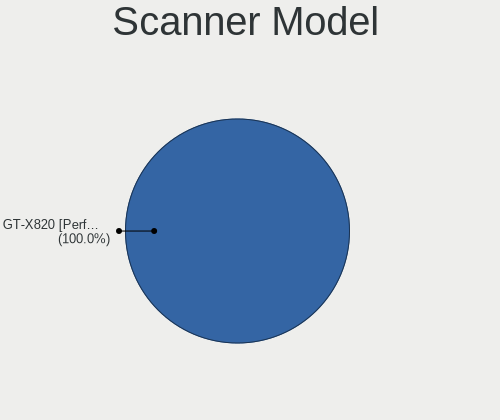

| Model                | Notebooks | Percent |
|----------------------|-----------|---------|
| CanoScan N650U/N656U | 1         | 50%     |
| CanoScan 4200F       | 1         | 50%     |

Bluetooth Vendor
----------------

Controller vendors

| Vendor                          | Notebooks | Percent |
|---------------------------------|-----------|---------|
| Intel                           | 43        | 34.68%  |
| Qualcomm Atheros Communications | 20        | 16.13%  |
| Realtek Semiconductor           | 14        | 11.29%  |
| Broadcom                        | 8         | 6.45%   |
| Lite-On Technology              | 7         | 5.65%   |
| Ralink                          | 5         | 4.03%   |
| Foxconn / Hon Hai               | 5         | 4.03%   |
| Dell                            | 5         | 4.03%   |
| Cambridge Silicon Radio         | 5         | 4.03%   |
| IMC Networks                    | 4         | 3.23%   |
| ASUSTek Computer                | 2         | 1.61%   |
| Unknown                         | 1         | 0.81%   |
| Toshiba                         | 1         | 0.81%   |
| Hewlett-Packard                 | 1         | 0.81%   |
| Foxconn International           | 1         | 0.81%   |
| Askey Computer                  | 1         | 0.81%   |
| Apple                           | 1         | 0.81%   |

Bluetooth Model
---------------

Controller models

| Model                                   | Notebooks | Percent |
|-----------------------------------------|-----------|---------|
| Bluetooth Device                        | 49        | 39.52%  |
| Qualcomm Atheros Bluetooth Device       | 15        | 12.1%   |
| Bluetooth Radio                         | 12        | 9.68%   |
| RT3290 Bluetooth                        | 5         | 4.03%   |
| Bluetooth Dongle (HCI mode)             | 5         | 4.03%   |
| Wireless-AC 3168 Bluetooth              | 4         | 3.23%   |
| AR3011 Bluetooth                        | 3         | 2.42%   |
| 802.11n WLAN Adapter                    | 3         | 2.42%   |
| DW375 Bluetooth Module                  | 2         | 1.61%   |
| BCM20702 Bluetooth 4.0 [ThinkPad]       | 2         | 1.61%   |
| BCM2045B (BDC-2.1)                      | 2         | 1.61%   |
| Atheros Bluetooth                       | 2         | 1.61%   |
| Atheros AR3012 Bluetooth 4.0 Adapter    | 2         | 1.61%   |
| Wireless 370 Bluetooth Mini-card        | 1         | 0.81%   |
| Wireless 365 Bluetooth                  | 1         | 0.81%   |
| Qualcomm Atheros Bluetooth              | 1         | 0.81%   |
| BT-270 Bluetooth Adapter                | 1         | 0.81%   |
| BT-183 Bluetooth 2.0+EDR adapter        | 1         | 0.81%   |
| Broadcom BCM43142A0 Bluetooth Device    | 1         | 0.81%   |
| Broadcom 2070 Bluetooth Combo           | 1         | 0.81%   |
| Bluetooth USB Host Controller           | 1         | 0.81%   |
| Bluetooth                               | 1         | 0.81%   |
| BCM92046DG-CL1ROM Bluetooth 2.1 Adapter | 1         | 0.81%   |
| BCM43142A0 broadcom bluetooth           | 1         | 0.81%   |
| BCM43142A0 Bluetooth module             | 1         | 0.81%   |
| BCM20703A1 Bluetooth 4.1 + LE           | 1         | 0.81%   |
| BCM20702A0                              | 1         | 0.81%   |
| BCM2045A0                               | 1         | 0.81%   |
| BCM2045 Bluetooth                       | 1         | 0.81%   |
| AR3012 Bluetooth 4.0                    | 1         | 0.81%   |
| AR3012 Bluetooth                        | 1         | 0.81%   |

Unsupported Devices
-------------------

Total unsupported devices on board

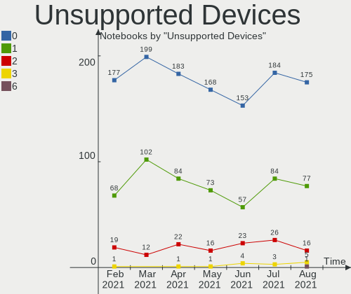

| Total | Notebooks | Percent |
|-------|-----------|---------|
| 0     | 107       | 64.85%  |
| 1     | 47        | 28.48%  |
| 2     | 11        | 6.67%   |

Unsupported Device Types
------------------------

Types of unsupported devices

| Type                  | Notebooks | Percent |
|-----------------------|-----------|---------|
| Fingerprint reader    | 23        | 35.38%  |
| Chipcard              | 11        | 16.92%  |
| Graphics card         | 10        | 15.38%  |
| Net/wireless          | 8         | 12.31%  |
| Bluetooth             | 5         | 7.69%   |
| Storage               | 3         | 4.62%   |
| Multimedia controller | 2         | 3.08%   |
| Flash memory          | 2         | 3.08%   |
| Net/ethernet          | 1         | 1.54%   |

