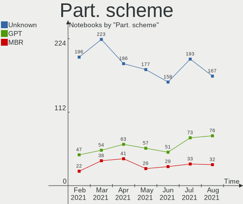
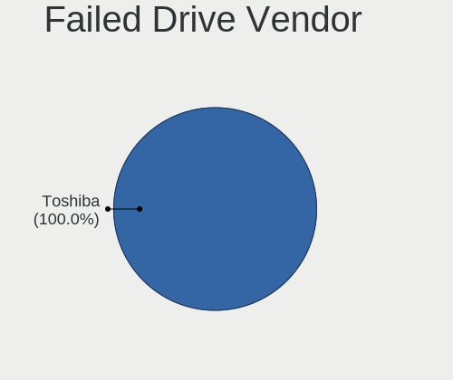
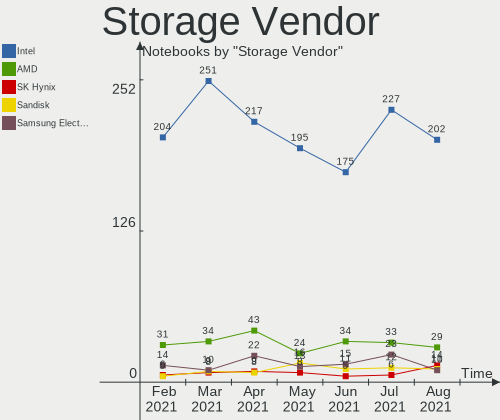
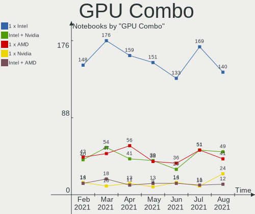
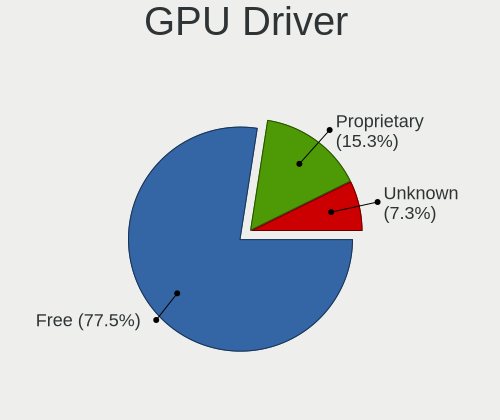
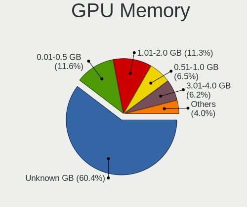
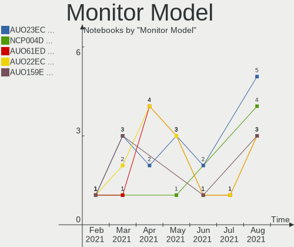
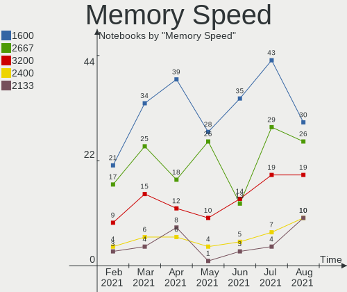
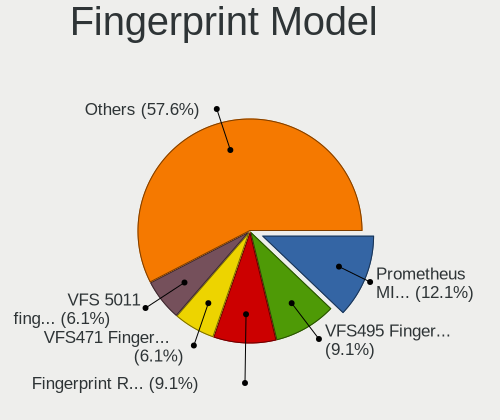

Mint Hardware Trends (Notebook)
-------------------------------

A project to identify most popular hardware characteristics and track their change
over time based on data collected by Mint users at https://Linux-Hardware.org.

Anyone can contribute to the study by uploading probes of their computers by
the [hw-probe](https://github.com/linuxhw/hw-probe) tool:

    sudo -E hw-probe -all -upload

Full-feature report is available here: https://linux-hardware.org/?view=trends&formfactor=notebook

Period: Mar, 2021.

Contents
--------

- [ OS                       ](#os)
- [ OS Family                ](#os-family)
- [ Kernel                   ](#kernel)
- [ Kernel Family            ](#kernel-family)
- [ Kernel Major Ver.        ](#kernel-major-ver)
- [ Arch                     ](#arch)
- [ DE                       ](#de)
- [ Display Server           ](#display-server)
- [ Display Manager          ](#display-manager)
- [ OS Lang                  ](#os-lang)
- [ Boot Mode                ](#boot-mode)
- [ Filesystem               ](#filesystem)
- [ Part. scheme             ](#part-scheme)
- [ Dual Boot with Linux/BSD ](#dual-boot-with-linux/bsd)
- [ Dual Boot (Win)          ](#dual-boot-win)
- [ Country                  ](#country)
- [ City                     ](#city)
- [ Vendor                   ](#vendor)
- [ Model                    ](#model)
- [ Model Family             ](#model-family)
- [ MFG Year                 ](#mfg-year)
- [ Form Factor              ](#form-factor)
- [ Secure Boot              ](#secure-boot)
- [ Coreboot                 ](#coreboot)
- [ RAM Size                 ](#ram-size)
- [ RAM Used                 ](#ram-used)
- [ Has CD-ROM               ](#has-cd-rom)
- [ Total Drives             ](#total-drives)
- [ Has Ethernet             ](#has-ethernet)
- [ Has WiFi                 ](#has-wifi)
- [ Has Bluetooth            ](#has-bluetooth)
- [ Drive Vendor             ](#drive-vendor)
- [ Drive Model              ](#drive-model)
- [ HDD Vendor               ](#hdd-vendor)
- [ SSD Vendor               ](#ssd-vendor)
- [ Drive Kind               ](#drive-kind)
- [ Drive Connector          ](#drive-connector)
- [ Drive Size               ](#drive-size)
- [ Space Total              ](#space-total)
- [ Space Used               ](#space-used)
- [ Malfunc. Drives          ](#malfunc-drives)
- [ Malfunc. Drive Vendor    ](#malfunc-drive-vendor)
- [ Malfunc. HDD Vendor      ](#malfunc-hdd-vendor)
- [ Malfunc. Drive Kind      ](#malfunc-drive-kind)
- [ Failed Drives            ](#failed-drives)
- [ Failed Drive Vendor      ](#failed-drive-vendor)
- [ Drive Status             ](#drive-status)
- [ Storage Vendor           ](#storage-vendor)
- [ Storage Model            ](#storage-model)
- [ Storage Kind             ](#storage-kind)
- [ CPU Vendor               ](#cpu-vendor)
- [ CPU Model                ](#cpu-model)
- [ CPU Model Family         ](#cpu-model-family)
- [ CPU Cores                ](#cpu-cores)
- [ CPU Sockets              ](#cpu-sockets)
- [ CPU Threads              ](#cpu-threads)
- [ CPU Op-Modes             ](#cpu-op-modes)
- [ CPU Microcode            ](#cpu-microcode)
- [ CPU Microarch            ](#cpu-microarch)
- [ GPU Vendor               ](#gpu-vendor)
- [ GPU Model                ](#gpu-model)
- [ GPU Combo                ](#gpu-combo)
- [ GPU Driver               ](#gpu-driver)
- [ GPU Memory               ](#gpu-memory)
- [ Monitor Vendor           ](#monitor-vendor)
- [ Monitor Model            ](#monitor-model)
- [ Monitor Resolution       ](#monitor-resolution)
- [ Monitor Diagonal         ](#monitor-diagonal)
- [ Monitor Width            ](#monitor-width)
- [ Aspect Ratio             ](#aspect-ratio)
- [ Monitor Area             ](#monitor-area)
- [ Pixel Density            ](#pixel-density)
- [ Multiple Monitors        ](#multiple-monitors)
- [ Net Controller Vendor    ](#net-controller-vendor)
- [ Net Controller Model     ](#net-controller-model)
- [ Wireless Vendor          ](#wireless-vendor)
- [ Wireless Model           ](#wireless-model)
- [ Ethernet Vendor          ](#ethernet-vendor)
- [ Ethernet Model           ](#ethernet-model)
- [ Net Controller Kind      ](#net-controller-kind)
- [ Used Controller          ](#used-controller)
- [ NICs                     ](#nics)
- [ IPv6                     ](#ipv6)
- [ Memory Vendor            ](#memory-vendor)
- [ Memory Model             ](#memory-model)
- [ Memory Kind              ](#memory-kind)
- [ Memory Form Factor       ](#memory-form-factor)
- [ Memory Size              ](#memory-size)
- [ Memory Speed             ](#memory-speed)
- [ Sound Vendor             ](#sound-vendor)
- [ Sound Model              ](#sound-model)
- [ Camera Vendor            ](#camera-vendor)
- [ Camera Model             ](#camera-model)
- [ Fingerprint Vendor       ](#fingerprint-vendor)
- [ Fingerprint Model        ](#fingerprint-model)
- [ Chipcard Vendor          ](#chipcard-vendor)
- [ Chipcard Model           ](#chipcard-model)
- [ Printer Vendor           ](#printer-vendor)
- [ Printer Model            ](#printer-model)
- [ Scanner Vendor           ](#scanner-vendor)
- [ Scanner Model            ](#scanner-model)
- [ Bluetooth Vendor         ](#bluetooth-vendor)
- [ Bluetooth Model          ](#bluetooth-model)
- [ Unsupported Devices      ](#unsupported-devices)
- [ Unsupported Device Types ](#unsupported-device-types)

OS
--

Installed operating systems

| Name      | Notebooks | Percent |
|-----------|-----------|---------|
| Mint 20.1 | 225       | 71.2%   |
| Mint 19.3 | 42        | 13.29%  |
| Mint 20   | 36        | 11.39%  |
| Mint 19   | 5         | 1.58%   |
| Mint 19.1 | 4         | 1.27%   |
| Mint 19.2 | 3         | 0.95%   |
| Mint 18.3 | 1         | 0.32%   |

OS Family
---------

OS without a version

| Name | Notebooks | Percent |
|------|-----------|---------|
| Mint | 316       | 100%    |

Kernel
------

Version of the Linux kernel

| Version                 | Notebooks | Percent |
|-------------------------|-----------|---------|
| 5.4.0-66-generic        | 134       | 42.41%  |
| 5.4.0-67-generic        | 56        | 17.72%  |
| 5.4.0-70-generic        | 33        | 10.44%  |
| 5.4.0-58-generic        | 18        | 5.7%    |
| 5.8.0-44-generic        | 11        | 3.48%   |
| 5.4.0-65-generic        | 11        | 3.48%   |
| 5.8.0-45-generic        | 8         | 2.53%   |
| 5.8.0-48-generic        | 4         | 1.27%   |
| 5.8.0-43-generic        | 4         | 1.27%   |
| 5.4.0-62-generic        | 4         | 1.27%   |
| 5.4.0-26-generic        | 4         | 1.27%   |
| 4.15.0-136-generic      | 4         | 1.27%   |
| 5.4.0-56-generic        | 2         | 0.63%   |
| 5.4.0-54-generic        | 2         | 0.63%   |
| 5.0.0-32-generic        | 2         | 0.63%   |
| 4.15.0-20-generic       | 2         | 0.63%   |
| 4.15.0-140-generic      | 2         | 0.63%   |
| 5.9.4-050904-generic    | 1         | 0.32%   |
| 5.9.16-050916-generic   | 1         | 0.32%   |
| 5.9.1-050901-lowlatency | 1         | 0.32%   |
| 5.6.0-1052-oem          | 1         | 0.32%   |
| 5.6.0-1048-oem          | 1         | 0.32%   |
| 5.4.105-xanmod1         | 1         | 0.32%   |
| 5.4.0-45-generic        | 1         | 0.32%   |
| 5.4.0-39-generic        | 1         | 0.32%   |
| 5.11.8-051108-generic   | 1         | 0.32%   |
| 4.4.0-206-generic       | 1         | 0.32%   |
| 4.15.0-66-generic       | 1         | 0.32%   |
| 4.15.0-54-generic       | 1         | 0.32%   |
| 4.15.0-135-generic      | 1         | 0.32%   |
| 4.15.0-132-generic      | 1         | 0.32%   |
| 4.15.0-118-generic      | 1         | 0.32%   |

Kernel Family
-------------

Linux kernel without a distro release

| Version | Notebooks | Percent |
|---------|-----------|---------|
| 5.4.0   | 266       | 84.18%  |
| 5.8.0   | 27        | 8.54%   |
| 4.15.0  | 13        | 4.11%   |
| 5.6.0   | 2         | 0.63%   |
| 5.0.0   | 2         | 0.63%   |
| 5.9.4   | 1         | 0.32%   |
| 5.9.16  | 1         | 0.32%   |
| 5.9.1   | 1         | 0.32%   |
| 5.4.105 | 1         | 0.32%   |
| 5.11.8  | 1         | 0.32%   |
| 4.4.0   | 1         | 0.32%   |

Kernel Major Ver.
-----------------

Linux kernel major version

| Version | Notebooks | Percent |
|---------|-----------|---------|
| 5.4     | 267       | 84.49%  |
| 5.8     | 27        | 8.54%   |
| 4.15    | 13        | 4.11%   |
| 5.9     | 3         | 0.95%   |
| 5.6     | 2         | 0.63%   |
| 5.0     | 2         | 0.63%   |
| 5.11    | 1         | 0.32%   |
| 4.4     | 1         | 0.32%   |

Arch
----

OS architecture (x86_64, i586, etc.)

| Name   | Notebooks | Percent |
|--------|-----------|---------|
| x86_64 | 292       | 92.41%  |
| i686   | 24        | 7.59%   |

DE
--

Desktop Environment

| Name       | Notebooks | Percent |
|------------|-----------|---------|
| X-Cinnamon | 215       | 68.04%  |
| XFCE       | 41        | 12.97%  |
| MATE       | 32        | 10.13%  |
| Cinnamon   | 12        | 3.8%    |
| Unknown    | 10        | 3.16%   |
| GNOME      | 4         | 1.27%   |
| LXQt       | 1         | 0.32%   |
| i3         | 1         | 0.32%   |

Display Server
--------------

X11 or Wayland

| Name | Notebooks | Percent |
|------|-----------|---------|
| X11  | 316       | 100%    |

Display Manager
---------------

SDDM, LightDM, etc.

| Name    | Notebooks | Percent |
|---------|-----------|---------|
| Unknown | 231       | 73.1%   |
| TDM     | 85        | 26.9%   |

OS Lang
-------

Language

| Lang       | Notebooks | Percent |
|------------|-----------|---------|
| en_US      | 95        | 30.06%  |
| de_DE      | 36        | 11.39%  |
| pt_BR      | 26        | 8.23%   |
| fr_FR      | 18        | 5.7%    |
| ru_RU      | 15        | 4.75%   |
| en_GB      | 15        | 4.75%   |
| pl_PL      | 14        | 4.43%   |
| C          | 12        | 3.8%    |
| es_ES      | 8         | 2.53%   |
| en_CA      | 7         | 2.22%   |
| it_IT      | 6         | 1.9%    |
| en_IN      | 6         | 1.9%    |
| en_AU      | 5         | 1.58%   |
| es_AR      | 4         | 1.27%   |
| de_CH      | 4         | 1.27%   |
| nl_NL      | 3         | 0.95%   |
| hu_HU      | 3         | 0.95%   |
| Unknown    | 3         | 0.95%   |
| uk_UA      | 2         | 0.63%   |
| tr_TR      | 2         | 0.63%   |
| pt_PT      | 2         | 0.63%   |
| fr_CA      | 2         | 0.63%   |
| fr_BE      | 2         | 0.63%   |
| es_MX      | 2         | 0.63%   |
| en_IE      | 2         | 0.63%   |
| el_GR      | 2         | 0.63%   |
| de_AT      | 2         | 0.63%   |
| ca_ES      | 2         | 0.63%   |
| sv_SE      | 1         | 0.32%   |
| ru_UA      | 1         | 0.32%   |
| ru_RU.UTF8 | 1         | 0.32%   |
| ro_RO      | 1         | 0.32%   |
| nl_BE      | 1         | 0.32%   |
| lzh_TW     | 1         | 0.32%   |
| lt_LT      | 1         | 0.32%   |
| fr_CH      | 1         | 0.32%   |
| fi_FI      | 1         | 0.32%   |
| es_GT      | 1         | 0.32%   |
| es_EC      | 1         | 0.32%   |
| es_CL      | 1         | 0.32%   |
| en_ZA      | 1         | 0.32%   |
| en_IL      | 1         | 0.32%   |
| cs_CZ      | 1         | 0.32%   |
| bg_BG      | 1         | 0.32%   |

Boot Mode
---------

EFI or BIOS

| Mode | Notebooks | Percent |
|------|-----------|---------|
| BIOS | 181       | 57.28%  |
| EFI  | 135       | 42.72%  |

Filesystem
----------

Type of filesystem

| Type    | Notebooks | Percent |
|---------|-----------|---------|
| Ext4    | 298       | 94.3%   |
| Overlay | 12        | 3.8%    |
| Ext2    | 2         | 0.63%   |
| Btrfs   | 2         | 0.63%   |
| Xfs     | 1         | 0.32%   |
| Ext3    | 1         | 0.32%   |

Part. scheme
------------

Scheme of partitioning

| Type    | Notebooks | Percent |
|---------|-----------|---------|
| Unknown | 224       | 70.89%  |
| GPT     | 54        | 17.09%  |
| MBR     | 38        | 12.03%  |

Dual Boot with Linux/BSD
------------------------

Hosting more than one Linux/BSD

| Dual boot | Notebooks | Percent |
|-----------|-----------|---------|
| No        | 306       | 96.84%  |
| Yes       | 10        | 3.16%   |

Dual Boot (Win)
---------------

Hosting Linux and Windows

| Dual boot | Notebooks | Percent |
|-----------|-----------|---------|
| No        | 281       | 88.92%  |
| Yes       | 35        | 11.08%  |

Country
-------

Geographic location (country)

| Country      | Notebooks | Percent |
|--------------|-----------|---------|
| USA          | 56        | 17.72%  |
| Germany      | 39        | 12.34%  |
| Brazil       | 34        | 10.76%  |
| Russia       | 18        | 5.7%    |
| France       | 18        | 5.7%    |
| Poland       | 17        | 5.38%   |
| UK           | 14        | 4.43%   |
| Ukraine      | 8         | 2.53%   |
| Switzerland  | 8         | 2.53%   |
| Spain        | 8         | 2.53%   |
| Netherlands  | 8         | 2.53%   |
| Canada       | 7         | 2.22%   |
| Belgium      | 7         | 2.22%   |
| Italy        | 6         | 1.9%    |
| India        | 5         | 1.58%   |
| Australia    | 5         | 1.58%   |
| Argentina    | 5         | 1.58%   |
| Turkey       | 4         | 1.27%   |
| Sweden       | 4         | 1.27%   |
| Mexico       | 4         | 1.27%   |
| Austria      | 4         | 1.27%   |
| Hungary      | 3         | 0.95%   |
| Finland      | 3         | 0.95%   |
| Bulgaria     | 3         | 0.95%   |
| Romania      | 2         | 0.63%   |
| Portugal     | 2         | 0.63%   |
| Greece       | 2         | 0.63%   |
| Taiwan       | 1         | 0.32%   |
| South Africa | 1         | 0.32%   |
| Slovenia     | 1         | 0.32%   |
| Slovakia     | 1         | 0.32%   |
| Singapore    | 1         | 0.32%   |
| Serbia       | 1         | 0.32%   |
| Saudi Arabia | 1         | 0.32%   |
| Panama       | 1         | 0.32%   |
| Norway       | 1         | 0.32%   |
| Moldova      | 1         | 0.32%   |
| Lithuania    | 1         | 0.32%   |
| Latvia       | 1         | 0.32%   |
| Israel       | 1         | 0.32%   |
| Ireland      | 1         | 0.32%   |
| Indonesia    | 1         | 0.32%   |
| Guatemala    | 1         | 0.32%   |
| Estonia      | 1         | 0.32%   |
| Ecuador      | 1         | 0.32%   |
| Czechia      | 1         | 0.32%   |
| Chile        | 1         | 0.32%   |
| Belarus      | 1         | 0.32%   |
| Bahrain      | 1         | 0.32%   |

City
----

Geographic location (city)

| City                | Notebooks | Percent |
|---------------------|-----------|---------|
| Rockville           | 5         | 1.58%   |
| Moscow              | 5         | 1.58%   |
| São Paulo          | 4         | 1.27%   |
| Wroclaw             | 3         | 0.95%   |
| Warsaw              | 3         | 0.95%   |
| St Petersburg       | 3         | 0.95%   |
| Porto Alegre        | 3         | 0.95%   |
| Los Angeles         | 3         | 0.95%   |
| London              | 3         | 0.95%   |
| Istanbul            | 3         | 0.95%   |
| Wheaton             | 2         | 0.63%   |
| Villard-de-Lans     | 2         | 0.63%   |
| Vienna              | 2         | 0.63%   |
| São Caetano do Sul | 2         | 0.63%   |
| Rome                | 2         | 0.63%   |
| Rio de Janeiro      | 2         | 0.63%   |
| Poznan              | 2         | 0.63%   |
| Odessa              | 2         | 0.63%   |
| Milan               | 2         | 0.63%   |
| Kyiv                | 2         | 0.63%   |
| Joplin              | 2         | 0.63%   |
| Frankfurt am Main   | 2         | 0.63%   |
| Eugene              | 2         | 0.63%   |
| Elk Grove Village   | 2         | 0.63%   |
| Chelyabinsk         | 2         | 0.63%   |
| Campinas            | 2         | 0.63%   |
| Bremen              | 2         | 0.63%   |
| Bitterfeld-Wolfen   | 2         | 0.63%   |
| Berlin              | 2         | 0.63%   |
| Amsterdam           | 2         | 0.63%   |
| Adelaide            | 2         | 0.63%   |
| Aalst               | 2         | 0.63%   |
| Żyrardów          | 1         | 0.32%   |
| Zurich              | 1         | 0.32%   |
| Yonkers             | 1         | 0.32%   |
| Yekaterinburg       | 1         | 0.32%   |
| Woonsocket          | 1         | 0.32%   |
| Willow Springs      | 1         | 0.32%   |
| Wellington          | 1         | 0.32%   |
| Weert               | 1         | 0.32%   |
| Wavre               | 1         | 0.32%   |
| Verndale            | 1         | 0.32%   |
| Varenguebec         | 1         | 0.32%   |
| Valkenswaard        | 1         | 0.32%   |
| Tver                | 1         | 0.32%   |
| Tuusula             | 1         | 0.32%   |
| Tucson              | 1         | 0.32%   |
| Tubarao             | 1         | 0.32%   |
| Troy                | 1         | 0.32%   |
| Tregueux            | 1         | 0.32%   |
| Traunreut           | 1         | 0.32%   |
| Toulouse            | 1         | 0.32%   |
| Torun               | 1         | 0.32%   |
| Torquay             | 1         | 0.32%   |
| Toeroekbalint       | 1         | 0.32%   |
| Titusville          | 1         | 0.32%   |
| Timișoara          | 1         | 0.32%   |
| Tijuana             | 1         | 0.32%   |
| The Bronx           | 1         | 0.32%   |
| Temple              | 1         | 0.32%   |

Vendor
------

Motherboard manufacturer

| Name                    | Notebooks | Percent |
|-------------------------|-----------|---------|
| Hewlett-Packard         | 67        | 21.2%   |
| Dell                    | 58        | 18.35%  |
| Lenovo                  | 57        | 18.04%  |
| ASUSTek Computer        | 30        | 9.49%   |
| Acer                    | 24        | 7.59%   |
| Toshiba                 | 17        | 5.38%   |
| Samsung Electronics     | 12        | 3.8%    |
| Sony                    | 7         | 2.22%   |
| Apple                   | 5         | 1.58%   |
| Medion                  | 4         | 1.27%   |
| Fujitsu Siemens         | 4         | 1.27%   |
| Positivo                | 3         | 0.95%   |
| Packard Bell            | 3         | 0.95%   |
| MSI                     | 3         | 0.95%   |
| Tangent Computer        | 2         | 0.63%   |
| Itautec                 | 2         | 0.63%   |
| TUXEDO                  | 1         | 0.32%   |
| Thomson                 | 1         | 0.32%   |
| SLIMBOOK                | 1         | 0.32%   |
| Quest                   | 1         | 0.32%   |
| Panasonic               | 1         | 0.32%   |
| Notebook                | 1         | 0.32%   |
| Motion Computing        | 1         | 0.32%   |
| Info Quest Technologies | 1         | 0.32%   |
| IDEALMAX                | 1         | 0.32%   |
| HUAWEI                  | 1         | 0.32%   |
| Gateway                 | 1         | 0.32%   |
| Foxconn                 | 1         | 0.32%   |
| EVOO Products Company   | 1         | 0.32%   |
| Coradir                 | 1         | 0.32%   |
| Compal                  | 1         | 0.32%   |
| Clevo                   | 1         | 0.32%   |
| Alienware               | 1         | 0.32%   |
| Unknown                 | 1         | 0.32%   |

Model
-----

Motherboard model

| Name                                  | Notebooks | Percent |
|---------------------------------------|-----------|---------|
| HP Pavilion dv7                       | 5         | 1.58%   |
| Toshiba Satellite C660                | 3         | 0.95%   |
| Toshiba Satellite L40                 | 2         | 0.63%   |
| Tangent Medix T19B                    | 2         | 0.63%   |
| Lenovo Y520-15IKBN 80WK               | 2         | 0.63%   |
| Lenovo IdeaPad 520-15IKB 81BF         | 2         | 0.63%   |
| HP Pavilion Gaming Laptop 17-cd1xxx   | 2         | 0.63%   |
| HP Pavilion g7                        | 2         | 0.63%   |
| HP Pavilion g6                        | 2         | 0.63%   |
| HP Pavilion dv6                       | 2         | 0.63%   |
| HP G62                                | 2         | 0.63%   |
| HP Compaq Mini                        | 2         | 0.63%   |
| HP 250 G8 Notebook PC                 | 2         | 0.63%   |
| Dell Vostro 3560                      | 2         | 0.63%   |
| Dell Latitude E7440                   | 2         | 0.63%   |
| Dell Latitude E6420                   | 2         | 0.63%   |
| Dell Inspiron 5521                    | 2         | 0.63%   |
| ASUS P50IJ                            | 2         | 0.63%   |
| Acer Aspire 5741G                     | 2         | 0.63%   |
| Acer Aspire 5735                      | 2         | 0.63%   |
| TUXEDO P7xxTM1                        | 1         | 0.32%   |
| Toshiba Satellite PRO NB10t-A-11J     | 1         | 0.32%   |
| Toshiba Satellite P300                | 1         | 0.32%   |
| Toshiba Satellite L855                | 1         | 0.32%   |
| Toshiba Satellite C855D               | 1         | 0.32%   |
| Toshiba Satellite C75D-C              | 1         | 0.32%   |
| Toshiba Satellite C55t-C              | 1         | 0.32%   |
| Toshiba Satellite C55-A               | 1         | 0.32%   |
| Toshiba Satellite C40D-A              | 1         | 0.32%   |
| Toshiba PORTEGE Z830                  | 1         | 0.32%   |
| Toshiba PORTEGE Z30-A                 | 1         | 0.32%   |
| Toshiba PORTEGE R830                  | 1         | 0.32%   |
| Toshiba PORTEGE R500                  | 1         | 0.32%   |
| Thomson HERO9.32B                     | 1         | 0.32%   |
| Sony VPCF11M1E                        | 1         | 0.32%   |
| Sony VPCEH1J8E                        | 1         | 0.32%   |
| Sony VPCEA36FG                        | 1         | 0.32%   |
| Sony VPCCW21FX                        | 1         | 0.32%   |
| Sony VGN-TZ21WN_B                     | 1         | 0.32%   |
| Sony VGN-NR420D                       | 1         | 0.32%   |
| Sony VGN-NR130FE                      | 1         | 0.32%   |
| SLIMBOOK PROX15-AMD                   | 1         | 0.32%   |
| Samsung RV411/RV511/E3511/S3511/RV711 | 1         | 0.32%   |
| Samsung RV410/RV510/S3510/E3510       | 1         | 0.32%   |
| Samsung R780                          | 1         | 0.32%   |
| Samsung R540/R580/R780/SA41/E452/E852 | 1         | 0.32%   |
| Samsung R410                          | 1         | 0.32%   |
| Samsung N150                          | 1         | 0.32%   |
| Samsung 767XCL                        | 1         | 0.32%   |
| Samsung 550XBE/350XBE                 | 1         | 0.32%   |
| Samsung 550P5C/550P7C                 | 1         | 0.32%   |
| Samsung 355V4C/356V4C/3445VC/3545VC   | 1         | 0.32%   |
| Samsung 350V5C/351V5C/3540VC/3440VC   | 1         | 0.32%   |
| Samsung 300E5M/300E5L                 | 1         | 0.32%   |
| Quest GTN1408                         | 1         | 0.32%   |
| Positivo S14CT01                      | 1         | 0.32%   |
| Positivo Q232A                        | 1         | 0.32%   |
| Positivo MOBILE                       | 1         | 0.32%   |
| Panasonic CF-31JCG802M                | 1         | 0.32%   |
| Packard Bell EasyNote_BG35-V-003BE    | 1         | 0.32%   |

Model Family
------------

Motherboard model prefix

| Name                   | Notebooks | Percent |
|------------------------|-----------|---------|
| Lenovo ThinkPad        | 26        | 8.23%   |
| HP Pavilion            | 23        | 7.28%   |
| Dell Latitude          | 23        | 7.28%   |
| Dell Inspiron          | 22        | 6.96%   |
| Acer Aspire            | 20        | 6.33%   |
| Lenovo IdeaPad         | 17        | 5.38%   |
| Toshiba Satellite      | 13        | 4.11%   |
| HP EliteBook           | 8         | 2.53%   |
| HP ProBook             | 6         | 1.9%    |
| HP Laptop              | 6         | 1.9%    |
| Dell Precision         | 6         | 1.9%    |
| HP Compaq              | 5         | 1.58%   |
| Toshiba PORTEGE        | 4         | 1.27%   |
| HP 250                 | 4         | 1.27%   |
| Fujitsu Siemens AMILO  | 4         | 1.27%   |
| Dell XPS               | 4         | 1.27%   |
| Packard Bell EasyNote  | 3         | 0.95%   |
| Dell Vostro            | 3         | 0.95%   |
| ASUS VivoBook          | 3         | 0.95%   |
| Tangent Medix          | 2         | 0.63%   |
| Lenovo Y520-15IKBN     | 2         | 0.63%   |
| Itautec Infoway        | 2         | 0.63%   |
| HP Stream              | 2         | 0.63%   |
| HP Mini                | 2         | 0.63%   |
| HP G62                 | 2         | 0.63%   |
| HP ENVY                | 2         | 0.63%   |
| HP 15                  | 2         | 0.63%   |
| ASUS ZenBook           | 2         | 0.63%   |
| ASUS P50IJ             | 2         | 0.63%   |
| TUXEDO P7xxTM1         | 1         | 0.32%   |
| Thomson HERO9.32B      | 1         | 0.32%   |
| Sony VPCF11M1E         | 1         | 0.32%   |
| Sony VPCEH1J8E         | 1         | 0.32%   |
| Sony VPCEA36FG         | 1         | 0.32%   |
| Sony VPCCW21FX         | 1         | 0.32%   |
| Sony VGN-TZ21WN        | 1         | 0.32%   |
| Sony VGN-NR420D        | 1         | 0.32%   |
| Sony VGN-NR130FE       | 1         | 0.32%   |
| SLIMBOOK PROX15-AMD    | 1         | 0.32%   |
| Samsung RV411          | 1         | 0.32%   |
| Samsung RV410          | 1         | 0.32%   |
| Samsung R780           | 1         | 0.32%   |
| Samsung R540           | 1         | 0.32%   |
| Samsung R410           | 1         | 0.32%   |
| Samsung N150           | 1         | 0.32%   |
| Samsung 767XCL         | 1         | 0.32%   |
| Samsung 550XBE         | 1         | 0.32%   |
| Samsung 550P5C         | 1         | 0.32%   |
| Samsung 355V4C         | 1         | 0.32%   |
| Samsung 350V5C         | 1         | 0.32%   |
| Samsung 300E5M         | 1         | 0.32%   |
| Quest GTN1408          | 1         | 0.32%   |
| Positivo S14CT01       | 1         | 0.32%   |
| Positivo Q232A         | 1         | 0.32%   |
| Positivo MOBILE        | 1         | 0.32%   |
| Panasonic CF-31JCG802M | 1         | 0.32%   |
| Notebook MAM2120       | 1         | 0.32%   |
| MSI X600               | 1         | 0.32%   |
| MSI GV72               | 1         | 0.32%   |
| MSI GL62               | 1         | 0.32%   |

MFG Year
--------

Motherboard manufacture year

| Year | Notebooks | Percent |
|------|-----------|---------|
| 2020 | 44        | 13.92%  |
| 2018 | 39        | 12.34%  |
| 2019 | 26        | 8.23%   |
| 2010 | 26        | 8.23%   |
| 2013 | 25        | 7.91%   |
| 2011 | 25        | 7.91%   |
| 2012 | 18        | 5.7%    |
| 2009 | 17        | 5.38%   |
| 2016 | 16        | 5.06%   |
| 2014 | 16        | 5.06%   |
| 2008 | 16        | 5.06%   |
| 2017 | 14        | 4.43%   |
| 2015 | 14        | 4.43%   |
| 2007 | 12        | 3.8%    |
| 2021 | 6         | 1.9%    |
| 2006 | 2         | 0.63%   |

Form Factor
-----------

Physical design of the computer

| Name     | Notebooks | Percent |
|----------|-----------|---------|
| Notebook | 316       | 100%    |

Secure Boot
-----------

Enabled or disabled

| State    | Notebooks | Percent |
|----------|-----------|---------|
| Disabled | 292       | 92.41%  |
| Enabled  | 24        | 7.59%   |

Coreboot
--------

Have coreboot on board

| Used | Notebooks | Percent |
|------|-----------|---------|
| No   | 316       | 100%    |

RAM Size
--------

Total RAM memory

| Size in GB  | Notebooks | Percent |
|-------------|-----------|---------|
| 4.01-8.0    | 87        | 27.53%  |
| 3.01-4.0    | 76        | 24.05%  |
| 16.01-24.0  | 48        | 15.19%  |
| 8.01-16.0   | 45        | 14.24%  |
| 1.01-2.0    | 24        | 7.59%   |
| 2.01-3.0    | 15        | 4.75%   |
| 32.01-64.0  | 12        | 3.8%    |
| 0.51-1.0    | 8         | 2.53%   |
| 64.01-256.0 | 1         | 0.32%   |

RAM Used
--------

Used RAM memory

| Used GB    | Notebooks | Percent |
|------------|-----------|---------|
| 1.01-2.0   | 148       | 46.84%  |
| 2.01-3.0   | 62        | 19.62%  |
| 0.51-1.0   | 34        | 10.76%  |
| 3.01-4.0   | 28        | 8.86%   |
| 4.01-8.0   | 26        | 8.23%   |
| 8.01-16.0  | 8         | 2.53%   |
| 0.01-0.5   | 8         | 2.53%   |
| 16.01-24.0 | 2         | 0.63%   |

Has CD-ROM
----------

Has CD-ROM on board

| Presented | Notebooks | Percent |
|-----------|-----------|---------|
| Yes       | 168       | 53.16%  |
| No        | 148       | 46.84%  |

Total Drives
------------

Number of drives on board

| Drives | Notebooks | Percent |
|--------|-----------|---------|
| 1      | 219       | 69.3%   |
| 2      | 87        | 27.53%  |
| 3      | 4         | 1.27%   |
| 4      | 3         | 0.95%   |
| 0      | 3         | 0.95%   |

Has Ethernet
------------

Has Ethernet on board

| Presented | Notebooks | Percent |
|-----------|-----------|---------|
| Yes       | 282       | 89.24%  |
| No        | 34        | 10.76%  |

Has WiFi
--------

Has WiFi module

| Presented | Notebooks | Percent |
|-----------|-----------|---------|
| Yes       | 307       | 97.15%  |
| No        | 9         | 2.85%   |

Has Bluetooth
-------------

Has Bluetooth module

| Presented | Notebooks | Percent |
|-----------|-----------|---------|
| Yes       | 198       | 62.66%  |
| No        | 118       | 37.34%  |

Drive Vendor
------------

Hard drive vendors

| Vendor                | Notebooks | Drives | Percent |
|-----------------------|-----------|--------|---------|
| Seagate               | 55        | 55     | 14.29%  |
| WDC                   | 54        | 54     | 14.03%  |
| Samsung Electronics   | 49        | 52     | 12.73%  |
| Unknown               | 32        | 35     | 8.31%   |
| Toshiba               | 31        | 32     | 8.05%   |
| SanDisk               | 24        | 25     | 6.23%   |
| Hitachi               | 22        | 22     | 5.71%   |
| Crucial               | 21        | 21     | 5.45%   |
| Kingston              | 17        | 17     | 4.42%   |
| Intel                 | 13        | 13     | 3.38%   |
| SK Hynix              | 10        | 10     | 2.6%    |
| HGST                  | 8         | 8      | 2.08%   |
| A-DATA Technology     | 7         | 7      | 1.82%   |
| Micron Technology     | 4         | 4      | 1.04%   |
| OCZ                   | 3         | 4      | 0.78%   |
| LITEON                | 3         | 3      | 0.78%   |
| Fujitsu               | 3         | 3      | 0.78%   |
| Transcend             | 2         | 2      | 0.52%   |
| SPCC                  | 2         | 2      | 0.52%   |
| Realtek               | 2         | 2      | 0.52%   |
| LITEONIT              | 2         | 2      | 0.52%   |
| KIOXIA                | 2         | 2      | 0.52%   |
| GOODRAM               | 2         | 2      | 0.52%   |
| Apple                 | 2         | 3      | 0.52%   |
| XPG                   | 1         | 1      | 0.26%   |
| Verbatim              | 1         | 1      | 0.26%   |
| Vaseky                | 1         | 1      | 0.26%   |
| Union Memory          | 1         | 1      | 0.26%   |
| SILICONMOTION         | 1         | 1      | 0.26%   |
| Realtek Semiconductor | 1         | 1      | 0.26%   |
| PLEXTOR               | 1         | 1      | 0.26%   |
| Phison                | 1         | 1      | 0.26%   |
| Patriot               | 1         | 1      | 0.26%   |
| Leven                 | 1         | 1      | 0.26%   |
| LDLC                  | 1         | 1      | 0.26%   |
| China                 | 1         | 1      | 0.26%   |
| BHT                   | 1         | 1      | 0.26%   |
| ASMT                  | 1         | 1      | 0.26%   |
| Apacer                | 1         | 1      | 0.26%   |

Drive Model
-----------

Hard drive models

| Model                                   | Notebooks | Percent |
|-----------------------------------------|-----------|---------|
| Unknown MMC Card  32GB                  | 12        | 3.05%   |
| Seagate ST1000LM024 HN-M101MBB 1TB      | 7         | 1.78%   |
| Toshiba MQ01ABD100 1TB                  | 6         | 1.52%   |
| Seagate ST9500325AS 500GB               | 6         | 1.52%   |
| Samsung SSD 860 EVO 500GB               | 6         | 1.52%   |
| Unknown MMC Card  64GB                  | 5         | 1.27%   |
| Seagate ST1000LM035-1RK172 1TB          | 5         | 1.27%   |
| Toshiba MQ01ABD075 752GB                | 4         | 1.02%   |
| Samsung SSD 850 EVO 500GB               | 4         | 1.02%   |
| Kingston SA400S37480G 480GB SSD         | 4         | 1.02%   |
| Crucial CT1000MX500SSD1 1TB             | 4         | 1.02%   |
| WDC WDS500G2B0A-00SM50 500GB SSD        | 3         | 0.76%   |
| WDC WD3200BEVT-22ZCT0 320GB             | 3         | 0.76%   |
| WDC WD10JPVX-60JC3T0 1TB                | 3         | 0.76%   |
| Unknown MMC Card  16GB                  | 3         | 0.76%   |
| Unknown MMC Card  128GB                 | 3         | 0.76%   |
| Toshiba MQ04ABF100 1TB                  | 3         | 0.76%   |
| Toshiba MK1237GSX 120GB                 | 3         | 0.76%   |
| Seagate ST500LT012-1DG142 500GB         | 3         | 0.76%   |
| Seagate ST2000LM007-1R8174 2TB          | 3         | 0.76%   |
| Seagate ST1000LM014-SSHD-8GB            | 3         | 0.76%   |
| Seagate Expansion 1TB                   | 3         | 0.76%   |
| SanDisk SSD PLUS 240GB                  | 3         | 0.76%   |
| Samsung SSD 860 EVO 1TB                 | 3         | 0.76%   |
| Samsung HM321HI 320GB                   | 3         | 0.76%   |
| Kingston SA400S37240G 240GB SSD         | 3         | 0.76%   |
| Intel NVMe SSD Drive 512GB              | 3         | 0.76%   |
| Hitachi HTS547575A9E384 752GB           | 3         | 0.76%   |
| HGST HTS541010A9E680 1TB                | 3         | 0.76%   |
| Crucial CT240BX500SSD1 240GB            | 3         | 0.76%   |
| WDC WDS240G2G0A-00JH30 240GB SSD        | 2         | 0.51%   |
| WDC WD7500BPKX-00HPJT0 752GB            | 2         | 0.51%   |
| WDC WD5000LPVX-22V0TT0 500GB            | 2         | 0.51%   |
| WDC WD3200BEKT-60V5T1 320GB             | 2         | 0.51%   |
| WDC WD1600BEVT-22ZCT0 160GB             | 2         | 0.51%   |
| WDC WD10SPZX-21Z10T0 1TB                | 2         | 0.51%   |
| WDC WD10SPZX-00Z10T0 1TB                | 2         | 0.51%   |
| Unknown SC128  128GB                    | 2         | 0.51%   |
| Unknown MMC Card  7GB                   | 2         | 0.51%   |
| SPCC Solid State Disk 128GB             | 2         | 0.51%   |
| SK Hynix NVMe SSD Drive 512GB           | 2         | 0.51%   |
| SK Hynix BC511 HFM512GDJTNI-82A0A 512GB | 2         | 0.51%   |
| Seagate ST9320325AS 320GB               | 2         | 0.51%   |
| Seagate ST750LM022 HN-M750MBB 752GB     | 2         | 0.51%   |
| Seagate ST500LM012 HN-M500MBB 500GB     | 2         | 0.51%   |
| Seagate ST1000LM049-2GH172 1TB          | 2         | 0.51%   |
| Seagate ST1000LM048-2E7172 1TB          | 2         | 0.51%   |
| Seagate Expansion Desk 8TB              | 2         | 0.51%   |
| SanDisk SSD PLUS 120GB                  | 2         | 0.51%   |
| SanDisk SDSSDA240G 240GB                | 2         | 0.51%   |
| SanDisk SD8SN8U-256G-1006 256GB SSD     | 2         | 0.51%   |
| Sandisk NVMe SSD Drive 500GB            | 2         | 0.51%   |
| Samsung SSD 850 EVO 250GB               | 2         | 0.51%   |
| Samsung SSD 840 EVO 500GB               | 2         | 0.51%   |
| Samsung NVMe SSD Drive 256GB            | 2         | 0.51%   |
| Samsung MZVLQ256HAJD-000H1 256GB        | 2         | 0.51%   |
| Samsung HS06THB 64GB                    | 2         | 0.51%   |
| Realtek RTL9210 NVME 250GB              | 2         | 0.51%   |
| OCZ AGILITY3 120GB SSD                  | 2         | 0.51%   |
| Kingston SUV400S37240G 240GB SSD        | 2         | 0.51%   |

HDD Vendor
----------

Hard disk drive vendors

| Vendor              | Notebooks | Drives | Percent |
|---------------------|-----------|--------|---------|
| Seagate             | 54        | 54     | 33.33%  |
| WDC                 | 41        | 41     | 25.31%  |
| Toshiba             | 24        | 24     | 14.81%  |
| Hitachi             | 22        | 22     | 13.58%  |
| Samsung Electronics | 8         | 8      | 4.94%   |
| HGST                | 8         | 8      | 4.94%   |
| Fujitsu             | 3         | 3      | 1.85%   |
| SILICONMOTION       | 1         | 1      | 0.62%   |
| ASMT                | 1         | 1      | 0.62%   |

SSD Vendor
----------

Solid state drive vendors

| Vendor              | Notebooks | Drives | Percent |
|---------------------|-----------|--------|---------|
| Samsung Electronics | 30        | 32     | 21.28%  |
| SanDisk             | 21        | 21     | 14.89%  |
| Crucial             | 19        | 19     | 13.48%  |
| Kingston            | 17        | 17     | 12.06%  |
| WDC                 | 8         | 8      | 5.67%   |
| Toshiba             | 6         | 6      | 4.26%   |
| A-DATA Technology   | 6         | 6      | 4.26%   |
| Intel               | 5         | 5      | 3.55%   |
| OCZ                 | 3         | 4      | 2.13%   |
| LITEON              | 3         | 3      | 2.13%   |
| Unknown             | 2         | 2      | 1.42%   |
| Transcend           | 2         | 2      | 1.42%   |
| SPCC                | 2         | 2      | 1.42%   |
| SK Hynix            | 2         | 2      | 1.42%   |
| Micron Technology   | 2         | 2      | 1.42%   |
| LITEONIT            | 2         | 2      | 1.42%   |
| GOODRAM             | 2         | 2      | 1.42%   |
| Verbatim            | 1         | 1      | 0.71%   |
| Vaseky              | 1         | 1      | 0.71%   |
| Seagate             | 1         | 1      | 0.71%   |
| Phison              | 1         | 1      | 0.71%   |
| Patriot             | 1         | 1      | 0.71%   |
| China               | 1         | 1      | 0.71%   |
| BHT                 | 1         | 1      | 0.71%   |
| Apple               | 1         | 1      | 0.71%   |
| Apacer              | 1         | 1      | 0.71%   |

Drive Kind
----------

HDD or SSD

| Kind    | Notebooks | Drives | Percent |
|---------|-----------|--------|---------|
| HDD     | 156       | 162    | 42.16%  |
| SSD     | 131       | 144    | 35.41%  |
| NVMe    | 49        | 52     | 13.24%  |
| MMC     | 29        | 32     | 7.84%   |
| Unknown | 5         | 5      | 1.35%   |

Drive Connector
---------------

SATA, SAS, NVMe, etc.

| Type | Notebooks | Drives | Percent |
|------|-----------|--------|---------|
| SATA | 267       | 300    | 75.21%  |
| NVMe | 49        | 52     | 13.8%   |
| MMC  | 29        | 32     | 8.17%   |
| SAS  | 10        | 11     | 2.82%   |

Drive Size
----------

Size of hard drive

| Size in TB | Notebooks | Drives | Percent |
|------------|-----------|--------|---------|
| 0.01-0.5   | 191       | 208    | 66.32%  |
| 0.51-1.0   | 88        | 89     | 30.56%  |
| 1.01-2.0   | 7         | 7      | 2.43%   |
| 4.01-10.0  | 2         | 2      | 0.69%   |

Space Total
-----------

Amount of disk space available on the file system

| Size in GB     | Notebooks | Percent |
|----------------|-----------|---------|
| 101-250        | 98        | 31.01%  |
| 251-500        | 78        | 24.68%  |
| 501-1000       | 62        | 19.62%  |
| 51-100         | 25        | 7.91%   |
| 21-50          | 17        | 5.38%   |
| 1001-2000      | 12        | 3.8%    |
| 1-20           | 12        | 3.8%    |
| More than 3000 | 5         | 1.58%   |
| 2001-3000      | 4         | 1.27%   |
| Unknown        | 3         | 0.95%   |

Space Used
----------

Amount of used disk space

| Used GB   | Notebooks | Percent |
|-----------|-----------|---------|
| 1-20      | 97        | 30.7%   |
| 51-100    | 62        | 19.62%  |
| 21-50     | 60        | 18.99%  |
| 101-250   | 46        | 14.56%  |
| 251-500   | 29        | 9.18%   |
| 501-1000  | 14        | 4.43%   |
| 1001-2000 | 4         | 1.27%   |
| Unknown   | 3         | 0.95%   |
| 2001-3000 | 1         | 0.32%   |

Malfunc. Drives
---------------

Drive models with a malfunction

| Model                                 | Notebooks | Drives | Percent |
|---------------------------------------|-----------|--------|---------|
| WDC WD2500BEVT-80A23T0 250GB          | 1         | 1      | 5.88%   |
| WDC WD10SPZX-21Z10T0 1TB              | 1         | 1      | 5.88%   |
| Toshiba MQ01ABD075 752GB              | 1         | 1      | 5.88%   |
| Toshiba MK3265GSXN 320GB              | 1         | 1      | 5.88%   |
| Toshiba MK1237GSX 120GB               | 1         | 1      | 5.88%   |
| SK Hynix SH920 mSATA 256GB SSD        | 1         | 1      | 5.88%   |
| Seagate ST250LM004 HN-M250MBB 250GB   | 1         | 1      | 5.88%   |
| Samsung Electronics HM500JI 500GB     | 1         | 1      | 5.88%   |
| LITEONIT LCM-256M3S 2.5 7mm 256GB SSD | 1         | 1      | 5.88%   |
| LITEON CV8-8E128-HP 128GB SSD         | 1         | 1      | 5.88%   |
| Intel SSDSCKKF256H6 SATA 256GB        | 1         | 1      | 5.88%   |
| Intel SSDSC2CW120A3 120GB             | 1         | 1      | 5.88%   |
| Hitachi HTS547575A9E384 752GB         | 1         | 1      | 5.88%   |
| HGST HTS545050A7E680 500GB            | 1         | 1      | 5.88%   |
| HGST HTS541010A9E680 1TB              | 1         | 1      | 5.88%   |
| A-DATA Technology XM12 32GB SSD       | 1         | 1      | 5.88%   |
| A-DATA Technology XM11 128GB SSD      | 1         | 1      | 5.88%   |

Malfunc. Drive Vendor
---------------------

Vendors of faulty drives

| Vendor              | Notebooks | Drives | Percent |
|---------------------|-----------|--------|---------|
| Toshiba             | 3         | 3      | 17.65%  |
| WDC                 | 2         | 2      | 11.76%  |
| Intel               | 2         | 2      | 11.76%  |
| HGST                | 2         | 2      | 11.76%  |
| A-DATA Technology   | 2         | 2      | 11.76%  |
| SK Hynix            | 1         | 1      | 5.88%   |
| Seagate             | 1         | 1      | 5.88%   |
| Samsung Electronics | 1         | 1      | 5.88%   |
| LITEONIT            | 1         | 1      | 5.88%   |
| LITEON              | 1         | 1      | 5.88%   |
| Hitachi             | 1         | 1      | 5.88%   |

Malfunc. HDD Vendor
-------------------

Vendors of faulty HDD drives

| Vendor              | Notebooks | Drives | Percent |
|---------------------|-----------|--------|---------|
| Toshiba             | 3         | 3      | 30%     |
| WDC                 | 2         | 2      | 20%     |
| HGST                | 2         | 2      | 20%     |
| Seagate             | 1         | 1      | 10%     |
| Samsung Electronics | 1         | 1      | 10%     |
| Hitachi             | 1         | 1      | 10%     |

Malfunc. Drive Kind
-------------------

Kinds of faulty drives

| Kind | Notebooks | Drives | Percent |
|------|-----------|--------|---------|
| HDD  | 10        | 10     | 58.82%  |
| SSD  | 7         | 7      | 41.18%  |

Failed Drives
-------------

Failed drive models

| Model                    | Notebooks | Drives | Percent |
|--------------------------|-----------|--------|---------|
| Toshiba MQ01ABD075 752GB | 1         | 1      | 100%    |

Failed Drive Vendor
-------------------

Failed drive vendors

| Vendor  | Notebooks | Drives | Percent |
|---------|-----------|--------|---------|
| Toshiba | 1         | 1      | 100%    |

Drive Status
------------

Number of failed and malfunc. drives

| Status   | Notebooks | Drives | Percent |
|----------|-----------|--------|---------|
| Detected | 232       | 287    | 71.6%   |
| Works    | 75        | 90     | 23.15%  |
| Malfunc  | 16        | 17     | 4.94%   |
| Failed   | 1         | 1      | 0.31%   |

Storage Vendor
--------------

Storage controller vendors

| Vendor                           | Notebooks | Percent |
|----------------------------------|-----------|---------|
| Intel                            | 252       | 75%     |
| AMD                              | 34        | 10.12%  |
| Samsung Electronics              | 11        | 3.27%   |
| Sandisk                          | 9         | 2.68%   |
| SK Hynix                         | 8         | 2.38%   |
| Silicon Integrated Systems [SiS] | 3         | 0.89%   |
| VIA Technologies                 | 2         | 0.6%    |
| Toshiba America Info Systems     | 2         | 0.6%    |
| Realtek Semiconductor            | 2         | 0.6%    |
| Micron/Crucial Technology        | 2         | 0.6%    |
| Micron Technology                | 2         | 0.6%    |
| KIOXIA                           | 2         | 0.6%    |
| Union Memory (Shenzhen)          | 1         | 0.3%    |
| ULi Electronics                  | 1         | 0.3%    |
| Nvidia                           | 1         | 0.3%    |
| Marvell Technology Group         | 1         | 0.3%    |
| Lite-On Technology               | 1         | 0.3%    |
| Apple                            | 1         | 0.3%    |
| ADATA Technology                 | 1         | 0.3%    |

Storage Model
-------------

Storage controller models

| Model                                                                                  | Notebooks | Percent |
|----------------------------------------------------------------------------------------|-----------|---------|
| AMD FCH SATA Controller [AHCI mode]                                                    | 30        | 7.87%   |
| Intel 7 Series Chipset Family 6-port SATA Controller [AHCI mode]                       | 26        | 6.82%   |
| Intel Sunrise Point-LP SATA Controller [AHCI mode]                                     | 25        | 6.56%   |
| Intel 82801 Mobile SATA Controller [RAID mode]                                         | 25        | 6.56%   |
| Intel 6 Series/C200 Series Chipset Family 6 port Mobile SATA AHCI Controller           | 23        | 6.04%   |
| Intel 82801IBM/IEM (ICH9M/ICH9M-E) 4 port SATA Controller [AHCI mode]                  | 22        | 5.77%   |
| Intel 82801HM/HEM (ICH8M/ICH8M-E) IDE Controller                                       | 15        | 3.94%   |
| Intel 5 Series/3400 Series Chipset 4 port SATA AHCI Controller                         | 15        | 3.94%   |
| Intel Wildcat Point-LP SATA Controller [AHCI Mode]                                     | 13        | 3.41%   |
| Intel 82801HM/HEM (ICH8M/ICH8M-E) SATA Controller [AHCI mode]                          | 13        | 3.41%   |
| Intel 8 Series SATA Controller 1 [AHCI mode]                                           | 12        | 3.15%   |
| Intel 8 Series/C220 Series Chipset Family 6-port SATA Controller 1 [AHCI mode]         | 9         | 2.36%   |
| Intel 5 Series/3400 Series Chipset 6 port SATA AHCI Controller                         | 8         | 2.1%    |
| Intel HM170/QM170 Chipset SATA Controller [AHCI Mode]                                  | 7         | 1.84%   |
| Intel NM10/ICH7 Family SATA Controller [AHCI mode]                                     | 6         | 1.57%   |
| Intel 82801G (ICH7 Family) IDE Controller                                              | 6         | 1.57%   |
| Samsung NVMe SSD Controller SM981/PM981/PM983                                          | 5         | 1.31%   |
| Intel Volume Management Device NVMe RAID Controller                                    | 5         | 1.31%   |
| Intel SSD 660P Series                                                                  | 5         | 1.31%   |
| Intel Cannon Point-LP SATA Controller [AHCI Mode]                                      | 5         | 1.31%   |
| Samsung NVMe Controller                                                                | 4         | 1.05%   |
| Intel Cannon Lake Mobile PCH SATA AHCI Controller                                      | 4         | 1.05%   |
| Intel Atom/Celeron/Pentium Processor x5-E8000/J3xxx/N3xxx Series SATA Controller       | 4         | 1.05%   |
| Intel 82801GBM/GHM (ICH7-M Family) SATA Controller [AHCI mode]                         | 4         | 1.05%   |
| SK Hynix Non-Volatile memory controller                                                | 3         | 0.79%   |
| SK Hynix BC511                                                                         | 3         | 0.79%   |
| Silicon Integrated Systems [SiS] SATA Controller / IDE mode                            | 3         | 0.79%   |
| Silicon Integrated Systems [SiS] 5513 IDE Controller                                   | 3         | 0.79%   |
| Sandisk WD Blue SN550 NVMe SSD                                                         | 3         | 0.79%   |
| Intel Atom Processor E3800 Series SATA AHCI Controller                                 | 3         | 0.79%   |
| Intel 82801HM/HEM (ICH8M/ICH8M-E) SATA Controller [IDE mode]                           | 3         | 0.79%   |
| Intel 7 Series Chipset Family 4-port SATA Controller [IDE mode]                        | 3         | 0.79%   |
| Intel 7 Series Chipset Family 2-port SATA Controller [IDE mode]                        | 3         | 0.79%   |
| VIA VT82C586A/B/VT82C686/A/B/VT823x/A/C PIPC Bus Master IDE                            | 2         | 0.52%   |
| VIA VT8237A SATA 2-Port Controller                                                     | 2         | 0.52%   |
| SK Hynix BC501 NVMe Solid State Drive 512GB                                            | 2         | 0.52%   |
| Sandisk WD Black SN750 / PC SN730 NVMe SSD                                             | 2         | 0.52%   |
| Sandisk Non-Volatile memory controller                                                 | 2         | 0.52%   |
| Realtek Realtek Non-Volatile memory controller                                         | 2         | 0.52%   |
| Micron Non-Volatile memory controller                                                  | 2         | 0.52%   |
| KIOXIA Non-Volatile memory controller                                                  | 2         | 0.52%   |
| Intel Tiger Lake-LP SATA Controller [AHCI mode]                                        | 2         | 0.52%   |
| Intel Mobile 4 Series Chipset PT IDER Controller                                       | 2         | 0.52%   |
| Intel Comet Lake SATA AHCI Controller                                                  | 2         | 0.52%   |
| Intel 82801GBM/GHM (ICH7-M Family) SATA Controller [IDE mode]                          | 2         | 0.52%   |
| Intel 6 Series/C200 Series Chipset Family Mobile SATA Controller (IDE mode, ports 4-5) | 2         | 0.52%   |
| Intel 6 Series/C200 Series Chipset Family Mobile SATA Controller (IDE mode, ports 0-3) | 2         | 0.52%   |
| AMD SB7x0/SB8x0/SB9x0 SATA Controller [AHCI mode]                                      | 2         | 0.52%   |
| Union Memory (Shenzhen) Non-Volatile memory controller                                 | 1         | 0.26%   |
| ULi M5229 IDE                                                                          | 1         | 0.26%   |
| Toshiba America Info Systems XG6 NVMe SSD Controller                                   | 1         | 0.26%   |
| Toshiba America Info Systems BG3 NVMe SSD Controller                                   | 1         | 0.26%   |
| Sandisk WD Blue SN500 / PC SN520 NVMe SSD                                              | 1         | 0.26%   |
| Sandisk PC SN520 NVMe SSD                                                              | 1         | 0.26%   |
| Samsung NVMe SSD Controller SM961/PM961/SM963                                          | 1         | 0.26%   |
| Samsung NVMe SSD Controller SM951/PM951                                                | 1         | 0.26%   |
| Nvidia MCP89 SATA Controller (AHCI mode)                                               | 1         | 0.26%   |
| Micron/Crucial NVMe Controller                                                         | 1         | 0.26%   |
| Micron/Crucial Non-Volatile memory controller                                          | 1         | 0.26%   |
| Marvell Group 88SS9183 PCIe SSD Controller                                             | 1         | 0.26%   |

Storage Kind
------------

Kind of storage controller (IDE, SATA, NVMe, SAS, ...)

| Kind | Notebooks | Percent |
|------|-----------|---------|
| SATA | 243       | 66.58%  |
| NVMe | 49        | 13.42%  |
| IDE  | 43        | 11.78%  |
| RAID | 30        | 8.22%   |

CPU Vendor
----------

Processor vendors

| Vendor | Notebooks | Percent |
|--------|-----------|---------|
| Intel  | 277       | 87.66%  |
| AMD    | 39        | 12.34%  |

CPU Model
---------

Processor models

| Model                                         | Notebooks | Percent |
|-----------------------------------------------|-----------|---------|
| Intel Core i5-2520M CPU @ 2.50GHz             | 9         | 2.85%   |
| Intel Core i5-3210M CPU @ 2.50GHz             | 7         | 2.22%   |
| Intel Core i5-8265U CPU @ 1.60GHz             | 6         | 1.9%    |
| Intel Core i5-8250U CPU @ 1.60GHz             | 6         | 1.9%    |
| Intel Core i5-5200U CPU @ 2.20GHz             | 6         | 1.9%    |
| Intel Core i5-5300U CPU @ 2.30GHz             | 5         | 1.58%   |
| Intel Pentium Dual-Core CPU T4200 @ 2.00GHz   | 4         | 1.27%   |
| Intel Pentium CPU P6200 @ 2.13GHz             | 4         | 1.27%   |
| Intel Core i7-7500U CPU @ 2.70GHz             | 4         | 1.27%   |
| Intel Core i7-10750H CPU @ 2.60GHz            | 4         | 1.27%   |
| Intel Celeron CPU N3060 @ 1.60GHz             | 4         | 1.27%   |
| Intel Core i7-8565U CPU @ 1.80GHz             | 3         | 0.95%   |
| Intel Core i7-8550U CPU @ 1.80GHz             | 3         | 0.95%   |
| Intel Core i7-7700HQ CPU @ 2.80GHz            | 3         | 0.95%   |
| Intel Core i7-4600U CPU @ 2.10GHz             | 3         | 0.95%   |
| Intel Core i7-2670QM CPU @ 2.20GHz            | 3         | 0.95%   |
| Intel Core i5-7200U CPU @ 2.50GHz             | 3         | 0.95%   |
| Intel Core i5-6300HQ CPU @ 2.30GHz            | 3         | 0.95%   |
| Intel Core i5-6200U CPU @ 2.30GHz             | 3         | 0.95%   |
| Intel Core i5-3230M CPU @ 2.60GHz             | 3         | 0.95%   |
| Intel Core i3-6006U CPU @ 2.00GHz             | 3         | 0.95%   |
| Intel Atom x5-Z8350 CPU @ 1.44GHz             | 3         | 0.95%   |
| Intel Atom CPU Z3735F @ 1.33GHz               | 3         | 0.95%   |
| Intel Atom CPU N450 @ 1.66GHz                 | 3         | 0.95%   |
| Intel Atom CPU N270 @ 1.60GHz                 | 3         | 0.95%   |
| AMD Ryzen 5 4500U with Radeon Graphics        | 3         | 0.95%   |
| AMD Ryzen 5 3500U with Radeon Vega Mobile Gfx | 3         | 0.95%   |
| AMD E2-1800 APU with Radeon HD Graphics       | 3         | 0.95%   |
| Intel Pentium Dual-Core CPU T4500 @ 2.30GHz   | 2         | 0.63%   |
| Intel Pentium Dual CPU T2390 @ 1.86GHz        | 2         | 0.63%   |
| Intel Pentium Dual CPU T2310 @ 1.46GHz        | 2         | 0.63%   |
| Intel Pentium CPU P6000 @ 1.87GHz             | 2         | 0.63%   |
| Intel Pentium 3558U @ 1.70GHz                 | 2         | 0.63%   |
| Intel Core i7-9750H CPU @ 2.60GHz             | 2         | 0.63%   |
| Intel Core i7-6600U CPU @ 2.60GHz             | 2         | 0.63%   |
| Intel Core i7-5600U CPU @ 2.60GHz             | 2         | 0.63%   |
| Intel Core i7-4500U CPU @ 1.80GHz             | 2         | 0.63%   |
| Intel Core i7-3630QM CPU @ 2.40GHz            | 2         | 0.63%   |
| Intel Core i7-2630QM CPU @ 2.00GHz            | 2         | 0.63%   |
| Intel Core i7 CPU Q 720 @ 1.60GHz             | 2         | 0.63%   |
| Intel Core i5-6300U CPU @ 2.40GHz             | 2         | 0.63%   |
| Intel Core i5-4200U CPU @ 1.60GHz             | 2         | 0.63%   |
| Intel Core i5-3320M CPU @ 2.60GHz             | 2         | 0.63%   |
| Intel Core i5-3317U CPU @ 1.70GHz             | 2         | 0.63%   |
| Intel Core i5-2540M CPU @ 2.60GHz             | 2         | 0.63%   |
| Intel Core i5-2430M CPU @ 2.40GHz             | 2         | 0.63%   |
| Intel Core i5 CPU M 480 @ 2.67GHz             | 2         | 0.63%   |
| Intel Core i5 CPU M 460 @ 2.53GHz             | 2         | 0.63%   |
| Intel Core i3-3120M CPU @ 2.50GHz             | 2         | 0.63%   |
| Intel Core i3-3110M CPU @ 2.40GHz             | 2         | 0.63%   |
| Intel Core i3 CPU M 380 @ 2.53GHz             | 2         | 0.63%   |
| Intel Core i3 CPU M 350 @ 2.27GHz             | 2         | 0.63%   |
| Intel Core i3 CPU M 330 @ 2.13GHz             | 2         | 0.63%   |
| Intel Core 2 Solo CPU U3500 @ 1.40GHz         | 2         | 0.63%   |
| Intel Core 2 Duo CPU T8300 @ 2.40GHz          | 2         | 0.63%   |
| Intel Core 2 Duo CPU T7250 @ 2.00GHz          | 2         | 0.63%   |
| Intel Core 2 Duo CPU T6670 @ 2.20GHz          | 2         | 0.63%   |
| Intel Core 2 Duo CPU T5250 @ 1.50GHz          | 2         | 0.63%   |
| Intel Core 2 Duo CPU P8700 @ 2.53GHz          | 2         | 0.63%   |
| Intel Celeron CPU 847 @ 1.10GHz               | 2         | 0.63%   |

CPU Model Family
----------------

Processor model prefix

| Model                          | Notebooks | Percent |
|--------------------------------|-----------|---------|
| Intel Core i5                  | 84        | 26.58%  |
| Intel Core i7                  | 62        | 19.62%  |
| Intel Core i3                  | 25        | 7.91%   |
| Intel Core 2 Duo               | 23        | 7.28%   |
| Intel Atom                     | 17        | 5.38%   |
| Intel Celeron                  | 16        | 5.06%   |
| Intel Pentium                  | 13        | 4.11%   |
| Other                          | 8         | 2.53%   |
| Intel Pentium Dual-Core        | 7         | 2.22%   |
| Intel Pentium Dual             | 7         | 2.22%   |
| AMD Ryzen 5                    | 7         | 2.22%   |
| AMD Ryzen 7                    | 6         | 1.9%    |
| AMD A6                         | 6         | 1.9%    |
| Intel Genuine                  | 5         | 1.58%   |
| Intel Core 2                   | 3         | 0.95%   |
| AMD E2                         | 3         | 0.95%   |
| Intel Core Duo                 | 2         | 0.63%   |
| Intel Core 2 Solo              | 2         | 0.63%   |
| Intel Celeron Dual-Core        | 2         | 0.63%   |
| AMD Ryzen 7 PRO                | 2         | 0.63%   |
| AMD Ryzen 3                    | 2         | 0.63%   |
| AMD A8                         | 2         | 0.63%   |
| AMD A10                        | 2         | 0.63%   |
| Intel Pentium Gold             | 1         | 0.32%   |
| Intel Core m5                  | 1         | 0.32%   |
| Intel Core m3                  | 1         | 0.32%   |
| Intel Core i9                  | 1         | 0.32%   |
| Intel Celeron M                | 1         | 0.32%   |
| AMD Turion X2 Dual-Core Mobile | 1         | 0.32%   |
| AMD Turion 64 Mobile           | 1         | 0.32%   |
| AMD Phenom II                  | 1         | 0.32%   |
| AMD E                          | 1         | 0.32%   |
| AMD A4                         | 1         | 0.32%   |

CPU Cores
---------

Number of processor cores

| Number | Notebooks | Percent |
|--------|-----------|---------|
| 2      | 204       | 64.56%  |
| 4      | 74        | 23.42%  |
| 1      | 16        | 5.06%   |
| 6      | 15        | 4.75%   |
| 8      | 6         | 1.9%    |
| 5      | 1         | 0.32%   |

CPU Sockets
-----------

Number of sockets

| Number | Notebooks | Percent |
|--------|-----------|---------|
| 1      | 316       | 100%    |

CPU Threads
-----------

Threads per core (Hyper-Threading)

| Number | Notebooks | Percent |
|--------|-----------|---------|
| 2      | 201       | 63.61%  |
| 1      | 115       | 36.39%  |

CPU Op-Modes
------------

CPU Operation Modes (32-bit, 64-bit)

| Op mode        | Notebooks | Percent |
|----------------|-----------|---------|
| 32-bit, 64-bit | 306       | 96.84%  |
| 32-bit         | 10        | 3.16%   |

CPU Microcode
-------------

Microcode number

| Number     | Notebooks | Percent |
|------------|-----------|---------|
| 0x206a7    | 28        | 8.86%   |
| Unknown    | 26        | 8.23%   |
| 0x306a9    | 25        | 7.91%   |
| 0x1067a    | 19        | 6.01%   |
| 0x6fd      | 15        | 4.75%   |
| 0x40651    | 14        | 4.43%   |
| 0x306d4    | 14        | 4.43%   |
| 0x20655    | 14        | 4.43%   |
| 0x406e3    | 11        | 3.48%   |
| 0x806ea    | 10        | 3.16%   |
| 0x306c3    | 8         | 2.53%   |
| 0x806e9    | 7         | 2.22%   |
| 0x406c4    | 7         | 2.22%   |
| 0x20652    | 7         | 2.22%   |
| 0x30678    | 6         | 1.9%    |
| 0x10676    | 6         | 1.9%    |
| 0x906ea    | 5         | 1.58%   |
| 0x806ec    | 5         | 1.58%   |
| 0x806eb    | 5         | 1.58%   |
| 0x806c1    | 5         | 1.58%   |
| 0x06001119 | 5         | 1.58%   |
| 0xa0652    | 4         | 1.27%   |
| 0x906e9    | 4         | 1.27%   |
| 0x6ec      | 4         | 1.27%   |
| 0x106ca    | 4         | 1.27%   |
| 0x506e3    | 3         | 0.95%   |
| 0x406c3    | 3         | 0.95%   |
| 0x106e5    | 3         | 0.95%   |
| 0x106c2    | 3         | 0.95%   |
| 0x10661    | 3         | 0.95%   |
| 0x08600103 | 3         | 0.95%   |
| 0x08108102 | 3         | 0.95%   |
| 0x07030105 | 3         | 0.95%   |
| 0x06006705 | 3         | 0.95%   |
| 0x05000119 | 3         | 0.95%   |
| 0x6f2      | 2         | 0.63%   |
| 0x30661    | 2         | 0.63%   |
| 0x08600106 | 2         | 0.63%   |
| 0x08600104 | 2         | 0.63%   |
| 0x08108109 | 2         | 0.63%   |
| 0xa0660    | 1         | 0.32%   |
| 0x906ed    | 1         | 0.32%   |
| 0x806a1    | 1         | 0.32%   |
| 0x706e5    | 1         | 0.32%   |
| 0x706a1    | 1         | 0.32%   |
| 0x6fb      | 1         | 0.32%   |
| 0x6f6      | 1         | 0.32%   |
| 0x6e8      | 1         | 0.32%   |
| 0x6d8      | 1         | 0.32%   |
| 0x506c9    | 1         | 0.32%   |
| 0x08600102 | 1         | 0.32%   |
| 0x0810100b | 1         | 0.32%   |
| 0x07030104 | 1         | 0.32%   |
| 0x0700010f | 1         | 0.32%   |
| 0x06006704 | 1         | 0.32%   |
| 0x0600611a | 1         | 0.32%   |
| 0x02000057 | 1         | 0.32%   |
| 0x010000c8 | 1         | 0.32%   |

CPU Microarch
-------------

Microarchitecture

| Name            | Notebooks | Percent |
|-----------------|-----------|---------|
| KabyLake        | 41        | 12.97%  |
| SandyBridge     | 33        | 10.44%  |
| IvyBridge       | 28        | 8.86%   |
| Penryn          | 27        | 8.54%   |
| Haswell         | 23        | 7.28%   |
| Westmere        | 22        | 6.96%   |
| Core            | 22        | 6.96%   |
| Skylake         | 17        | 5.38%   |
| Silvermont      | 16        | 5.06%   |
| Broadwell       | 15        | 4.75%   |
| Bonnell         | 9         | 2.85%   |
| Zen 2           | 8         | 2.53%   |
| Zen+            | 7         | 2.22%   |
| P6              | 6         | 1.9%    |
| CometLake       | 6         | 1.9%    |
| TigerLake       | 5         | 1.58%   |
| Piledriver      | 5         | 1.58%   |
| Excavator       | 5         | 1.58%   |
| Puma            | 4         | 1.27%   |
| Bobcat          | 4         | 1.27%   |
| Nehalem         | 3         | 0.95%   |
| Zen             | 2         | 0.63%   |
| K8 Hammer       | 1         | 0.32%   |
| K8 & K10 hybrid | 1         | 0.32%   |
| K10             | 1         | 0.32%   |
| Jaguar          | 1         | 0.32%   |
| IceLake         | 1         | 0.32%   |
| Goldmont plus   | 1         | 0.32%   |
| Goldmont        | 1         | 0.32%   |
| Unknown         | 1         | 0.32%   |

GPU Vendor
----------

Vendors of graphics cards

| Vendor                           | Notebooks | Percent |
|----------------------------------|-----------|---------|
| Intel                            | 248       | 63.59%  |
| AMD                              | 70        | 17.95%  |
| Nvidia                           | 67        | 17.18%  |
| Silicon Integrated Systems [SiS] | 3         | 0.77%   |
| VIA Technologies                 | 2         | 0.51%   |

GPU Model
---------

Graphics card models

| Model                                                                                    | Notebooks | Percent |
|------------------------------------------------------------------------------------------|-----------|---------|
| Intel 2nd Generation Core Processor Family Integrated Graphics Controller                | 33        | 7.97%   |
| Intel 3rd Gen Core processor Graphics Controller                                         | 27        | 6.52%   |
| Intel Mobile 4 Series Chipset Integrated Graphics Controller                             | 21        | 5.07%   |
| Intel HD Graphics 5500                                                                   | 15        | 3.62%   |
| Intel Haswell-ULT Integrated Graphics Controller                                         | 14        | 3.38%   |
| Intel Mobile GM965/GL960 Integrated Graphics Controller (secondary)                      | 13        | 3.14%   |
| Intel Mobile GM965/GL960 Integrated Graphics Controller (primary)                        | 13        | 3.14%   |
| Intel Core Processor Integrated Graphics Controller                                      | 13        | 3.14%   |
| Intel UHD Graphics 620                                                                   | 10        | 2.42%   |
| Intel Atom/Celeron/Pentium Processor x5-E8000/J3xxx/N3xxx Integrated Graphics Controller | 10        | 2.42%   |
| Intel WhiskeyLake-U GT2 [UHD Graphics 620]                                               | 9         | 2.17%   |
| Intel Skylake GT2 [HD Graphics 520]                                                      | 9         | 2.17%   |
| Intel 4th Gen Core Processor Integrated Graphics Controller                              | 9         | 2.17%   |
| Intel Mobile 945GM/GMS/GME, 943/940GML Express Integrated Graphics Controller            | 8         | 1.93%   |
| Intel HD Graphics 620                                                                    | 8         | 1.93%   |
| AMD Renoir                                                                               | 7         | 1.69%   |
| AMD Picasso                                                                              | 7         | 1.69%   |
| Intel CoffeeLake-H GT2 [UHD Graphics 630]                                                | 6         | 1.45%   |
| Intel Atom Processor Z36xxx/Z37xxx Series Graphics & Display                             | 6         | 1.45%   |
| AMD Park [Mobility Radeon HD 5430/5450/5470]                                             | 6         | 1.45%   |
| Intel Mobile 945GM/GMS, 943/940GML Express Integrated Graphics Controller                | 5         | 1.21%   |
| Intel CometLake-H GT2 [UHD Graphics]                                                     | 5         | 1.21%   |
| Nvidia GP108M [GeForce MX150]                                                            | 4         | 0.97%   |
| Intel HD Graphics 630                                                                    | 4         | 0.97%   |
| Intel Atom Processor D4xx/D5xx/N4xx/N5xx Integrated Graphics Controller                  | 4         | 0.97%   |
| AMD Topaz XT [Radeon R7 M260/M265 / M340/M360 / M440/M445 / 530/535 / 620/625 Mobile]    | 4         | 0.97%   |
| AMD Thames [Radeon HD 7500M/7600M Series]                                                | 4         | 0.97%   |
| AMD Stoney [Radeon R2/R3/R4/R5 Graphics]                                                 | 4         | 0.97%   |
| AMD Seymour [Radeon HD 6400M/7400M Series]                                               | 4         | 0.97%   |
| Silicon Integrated Systems [SiS] 771/671 PCIE VGA Display Adapter                        | 3         | 0.72%   |
| Nvidia TU117M [GeForce GTX 1650 Mobile / Max-Q]                                          | 3         | 0.72%   |
| Nvidia TU116M [GeForce GTX 1660 Ti Mobile]                                               | 3         | 0.72%   |
| Nvidia GP107M [GeForce GTX 1050 Mobile]                                                  | 3         | 0.72%   |
| Nvidia GM108M [GeForce 920MX]                                                            | 3         | 0.72%   |
| Nvidia GM108M [GeForce 840M]                                                             | 3         | 0.72%   |
| Intel TigerLake GT2 [Iris Xe Graphics]                                                   | 3         | 0.72%   |
| Intel Mobile 945GSE Express Integrated Graphics Controller                               | 3         | 0.72%   |
| Intel HD Graphics 530                                                                    | 3         | 0.72%   |
| Intel CometLake-U GT2 [UHD Graphics]                                                     | 3         | 0.72%   |
| AMD Wrestler [Radeon HD 7340]                                                            | 3         | 0.72%   |
| AMD Mullins [Radeon R4/R5 Graphics]                                                      | 3         | 0.72%   |
| AMD Madison [Mobility Radeon HD 5650/5750 / 6530M/6550M]                                 | 3         | 0.72%   |
| VIA Technologies CN896/VN896/P4M900 [Chrome 9 HC]                                        | 2         | 0.48%   |
| Nvidia GT216M [GeForce GT 330M]                                                          | 2         | 0.48%   |
| Nvidia GP108M [GeForce MX250]                                                            | 2         | 0.48%   |
| Nvidia GP107M [GeForce GTX 1050 Ti Mobile]                                               | 2         | 0.48%   |
| Nvidia GM108M [GeForce MX130]                                                            | 2         | 0.48%   |
| Nvidia GM107M [GeForce GTX 960M]                                                         | 2         | 0.48%   |
| Nvidia GM107M [GeForce GTX 950M]                                                         | 2         | 0.48%   |
| Nvidia GF119M [NVS 4200M]                                                                | 2         | 0.48%   |
| Nvidia GF108M [GeForce GT 620M/630M/635M/640M LE]                                        | 2         | 0.48%   |
| Intel Tiger Lake UHD Graphics                                                            | 2         | 0.48%   |
| Intel HD Graphics 520                                                                    | 2         | 0.48%   |
| Intel HD Graphics 515                                                                    | 2         | 0.48%   |
| Intel Atom Processor D2xxx/N2xxx Integrated Graphics Controller                          | 2         | 0.48%   |
| AMD Mars XTX [Radeon HD 8790M]                                                           | 2         | 0.48%   |
| Nvidia TU117M [GeForce GTX 1650 Ti Mobile]                                               | 1         | 0.24%   |
| Nvidia TU117M                                                                            | 1         | 0.24%   |
| Nvidia TU106M [GeForce RTX 2060 Max-Q]                                                   | 1         | 0.24%   |
| Nvidia MCP89 [GeForce 320M]                                                              | 1         | 0.24%   |

GPU Combo
---------

Combinations of graphics cards

| Name           | Notebooks | Percent |
|----------------|-----------|---------|
| 1 x Intel      | 176       | 55.7%   |
| Intel + Nvidia | 54        | 17.09%  |
| 1 x AMD        | 47        | 14.87%  |
| Intel + AMD    | 18        | 5.7%    |
| 1 x Nvidia     | 11        | 3.48%   |
| 2 x AMD        | 3         | 0.95%   |
| 1 x SiS        | 3         | 0.95%   |
| 1 x VIA        | 2         | 0.63%   |
| AMD + Nvidia   | 2         | 0.63%   |

GPU Driver
----------

Free vs proprietary

| Driver      | Notebooks | Percent |
|-------------|-----------|---------|
| Free        | 259       | 81.96%  |
| Proprietary | 45        | 14.24%  |
| Unknown     | 12        | 3.8%    |

GPU Memory
----------

Total video memory

| Size in GB | Notebooks | Percent |
|------------|-----------|---------|
| Unknown    | 204       | 64.56%  |
| 0.01-0.5   | 39        | 12.34%  |
| 1.01-2.0   | 33        | 10.44%  |
| 0.51-1.0   | 21        | 6.65%   |
| 3.01-4.0   | 12        | 3.8%    |
| 5.01-6.0   | 5         | 1.58%   |
| 2.01-3.0   | 1         | 0.32%   |
| 8.01-16.0  | 1         | 0.32%   |

Monitor Vendor
--------------

Monitor vendors

| Vendor                  | Notebooks | Percent |
|-------------------------|-----------|---------|
| AU Optronics            | 67        | 20.12%  |
| LG Display              | 52        | 15.62%  |
| Samsung Electronics     | 47        | 14.11%  |
| BOE                     | 35        | 10.51%  |
| Chimei Innolux          | 33        | 9.91%   |
| Chi Mei Optoelectronics | 11        | 3.3%    |
| Dell                    | 9         | 2.7%    |
| LG Philips              | 7         | 2.1%    |
| CPT                     | 6         | 1.8%    |
| Sharp                   | 5         | 1.5%    |
| Apple                   | 5         | 1.5%    |
| Sony                    | 4         | 1.2%    |
| Philips                 | 4         | 1.2%    |
| Lenovo                  | 4         | 1.2%    |
| HannStar                | 4         | 1.2%    |
| Goldstar                | 4         | 1.2%    |
| PANDA                   | 3         | 0.9%    |
| BenQ                    | 3         | 0.9%    |
| AOC                     | 3         | 0.9%    |
| Unknown                 | 2         | 0.6%    |
| Toshiba                 | 2         | 0.6%    |
| Medion                  | 2         | 0.6%    |
| LGD                     | 2         | 0.6%    |
| InfoVision              | 2         | 0.6%    |
| Hewlett-Packard         | 2         | 0.6%    |
| Ancor Communications    | 2         | 0.6%    |
| Acer                    | 2         | 0.6%    |
| Vestel Elektronik       | 1         | 0.3%    |
| TM@                     | 1         | 0.3%    |
| TIANMA XM               | 1         | 0.3%    |
| Seiko/Epson             | 1         | 0.3%    |
| Seiki                   | 1         | 0.3%    |
| Panasonic               | 1         | 0.3%    |
| NEC Computers           | 1         | 0.3%    |
| IBM                     | 1         | 0.3%    |
| Fujitsu Siemens         | 1         | 0.3%    |
| Eizo                    | 1         | 0.3%    |
| BBY                     | 1         | 0.3%    |

Monitor Model
-------------

Monitor models

| Model                                                                     | Notebooks | Percent |
|---------------------------------------------------------------------------|-----------|---------|
| Samsung Electronics LCD Monitor SEC5441 1366x768 344x194mm 15.5-inch      | 5         | 1.5%    |
| LG Display LCD Monitor LGD02DC 1366x768 344x194mm 15.5-inch               | 4         | 1.2%    |
| Chimei Innolux LCD Monitor CMN15DB 1366x768 344x193mm 15.5-inch           | 4         | 1.2%    |
| AU Optronics LCD Monitor AUO21EC 1366x768 340x190mm 15.3-inch             | 4         | 1.2%    |
| Chi Mei Optoelectronics LCD Monitor CMO15A7 1366x768 350x190mm 15.7-inch  | 3         | 0.9%    |
| BOE LCD Monitor BOE06A4 1366x768 344x194mm 15.5-inch                      | 3         | 0.9%    |
| AU Optronics LCD Monitor AUO23EC 1366x768 344x193mm 15.5-inch             | 3         | 0.9%    |
| AU Optronics LCD Monitor AUO20EC 1366x768 344x193mm 15.5-inch             | 3         | 0.9%    |
| AU Optronics LCD Monitor AUO159E 1600x900 380x210mm 17.1-inch             | 3         | 0.9%    |
| AU Optronics LCD Monitor AUO106C 1366x768 277x156mm 12.5-inch             | 3         | 0.9%    |
| Samsung Electronics LCD Monitor SEC5541 1366x768 344x193mm 15.5-inch      | 2         | 0.6%    |
| Samsung Electronics LCD Monitor SEC544B 1600x900 382x214mm 17.2-inch      | 2         | 0.6%    |
| Samsung Electronics LCD Monitor SEC3651 1366x768 344x194mm 15.5-inch      | 2         | 0.6%    |
| Samsung Electronics LCD Monitor SDC5441 1366x768 340x190mm 15.3-inch      | 2         | 0.6%    |
| Samsung Electronics LCD Monitor SDC4C48 1920x1080 409x230mm 18.5-inch     | 2         | 0.6%    |
| LG Display LCD Monitor LGD0468 1366x768 340x190mm 15.3-inch               | 2         | 0.6%    |
| LG Display LCD Monitor LGD03AB 1366x768 344x194mm 15.5-inch               | 2         | 0.6%    |
| LG Display LCD Monitor LGD038E 1366x768 340x190mm 15.3-inch               | 2         | 0.6%    |
| LG Display LCD Monitor LGD0354 1366x768 293x165mm 13.2-inch               | 2         | 0.6%    |
| LG Display LCD Monitor LGD033A 1366x768 340x190mm 15.3-inch               | 2         | 0.6%    |
| HannStar LCD Monitor HSD03E9 1024x600 220x129mm 10.0-inch                 | 2         | 0.6%    |
| Dell U2412M DELA07A 1920x1200 518x324mm 24.1-inch                         | 2         | 0.6%    |
| CPT LCD Monitor CPT04EC 1024x600 222x130mm 10.1-inch                      | 2         | 0.6%    |
| Chimei Innolux LCD Monitor CMN1735 1920x1080 382x215mm 17.3-inch          | 2         | 0.6%    |
| Chimei Innolux LCD Monitor CMN15AB 1366x768 350x190mm 15.7-inch           | 2         | 0.6%    |
| Chi Mei Optoelectronics LCD Monitor CMO1720 1920x1080 382x215mm 17.3-inch | 2         | 0.6%    |
| BOE LCD Monitor BOE08D3 1920x1080 382x215mm 17.3-inch                     | 2         | 0.6%    |
| BOE LCD Monitor BOE0852 1920x1080 344x194mm 15.5-inch                     | 2         | 0.6%    |
| BOE LCD Monitor BOE0812 1920x1080 344x194mm 15.5-inch                     | 2         | 0.6%    |
| BOE LCD Monitor BOE06BA 1920x1080 344x193mm 15.5-inch                     | 2         | 0.6%    |
| BOE LCD Monitor BOE06A5 1366x768 344x194mm 15.5-inch                      | 2         | 0.6%    |
| BOE LCD Monitor BOE0698 1366x768 309x173mm 13.9-inch                      | 2         | 0.6%    |
| BOE LCD Monitor BOE0685 1600x900 382x215mm 17.3-inch                      | 2         | 0.6%    |
| AU Optronics LCD Monitor AUO70EC 1366x768 340x190mm 15.3-inch             | 2         | 0.6%    |
| AU Optronics LCD Monitor AUO38ED 1920x1080 340x190mm 15.3-inch            | 2         | 0.6%    |
| AU Optronics LCD Monitor AUO31D2 1024x600 223x125mm 10.1-inch             | 2         | 0.6%    |
| AU Optronics LCD Monitor AUO313E 1600x900 309x174mm 14.0-inch             | 2         | 0.6%    |
| AU Optronics LCD Monitor AUO313C 1366x768 310x170mm 13.9-inch             | 2         | 0.6%    |
| AU Optronics LCD Monitor AUO312C 1366x768 293x164mm 13.2-inch             | 2         | 0.6%    |
| AU Optronics LCD Monitor AUO22EC 1366x768 344x193mm 15.5-inch             | 2         | 0.6%    |
| AU Optronics LCD Monitor AUO139E 1600x900 382x214mm 17.2-inch             | 2         | 0.6%    |
| Vestel Elektronik 50UHD_LCD_TV VES3700 3840x2160 1872x1053mm 84.6-inch    | 1         | 0.3%    |
| Unknown LCD Monitor Sony Nvidia Default Flat Panel 1366x768               | 1         | 0.3%    |
| Unknown LCD Monitor Data Export HDMI to VGA                               | 1         | 0.3%    |
| Toshiba LCD Monitor LCD2207 1280x800 287x180mm 13.3-inch                  | 1         | 0.3%    |
| Toshiba LCD Monitor LCD0906 1366x768 295x166mm 13.3-inch                  | 1         | 0.3%    |
| TM@ LCD Monitor TM@1390 1920x1080 310x170mm 13.9-inch                     | 1         | 0.3%    |
| TIANMA XM LCD Monitor 1390 1920x1080 308x173mm 13.9-inch                  | 1         | 0.3%    |
| Sony TV SNYDB01 1920x1080 1600x900mm 72.3-inch                            | 1         | 0.3%    |
| Sony TV SNY020D 1600x1200 1600x900mm 72.3-inch                            | 1         | 0.3%    |
| Sony Nvidia Defaul t Flat Panel MS_0025 1920x1080 531x299mm 24.0-inch     | 1         | 0.3%    |
| Sony Nvidia Defaul SNY05FA 1366x768 290x170mm 13.2-inch                   | 1         | 0.3%    |
| Sharp LQ156M1JW01 SHP14C3 1920x1080 344x194mm 15.5-inch                   | 1         | 0.3%    |
| Sharp LCD Monitor SHP14D1 1920x1200 336x210mm 15.6-inch                   | 1         | 0.3%    |
| Sharp LCD Monitor SHP148B 3840x2160 294x165mm 13.3-inch                   | 1         | 0.3%    |
| Sharp LCD Monitor SHP1464 1920x1080 294x165mm 13.3-inch                   | 1         | 0.3%    |
| Sharp HDMI SHP0FF5 1920x540 820x460mm 37.0-inch                           | 1         | 0.3%    |
| Seiko/Epson LCD Monitor 1366x768                                          | 1         | 0.3%    |
| Seiki SE29HY34 SEK9333 1366x768 700x390mm 31.5-inch                       | 1         | 0.3%    |
| Samsung Electronics SME1920 SAM06B7 1366x768 410x230mm 18.5-inch          | 1         | 0.3%    |

Monitor Resolution
------------------

Monitor screen resolution

| Resolution         | Notebooks | Percent |
|--------------------|-----------|---------|
| 1366x768 (WXGA)    | 128       | 40.25%  |
| 1920x1080 (FHD)    | 89        | 27.99%  |
| 1600x900 (HD+)     | 27        | 8.49%   |
| 1280x800 (WXGA)    | 22        | 6.92%   |
| 3840x2160 (4K)     | 9         | 2.83%   |
| 1440x900 (WXGA+)   | 7         | 2.2%    |
| 1024x600           | 7         | 2.2%    |
| 1920x1200 (WUXGA)  | 6         | 1.89%   |
| 2560x1440 (QHD)    | 4         | 1.26%   |
| 1680x1050 (WSXGA+) | 3         | 0.94%   |
| 1360x768           | 2         | 0.63%   |
| 1280x1024 (SXGA)   | 2         | 0.63%   |
| Unknown            | 2         | 0.63%   |
| 3360x1080          | 1         | 0.31%   |
| 3280x1080          | 1         | 0.31%   |
| 3200x1800 (QHD+)   | 1         | 0.31%   |
| 2560x1600          | 1         | 0.31%   |
| 2560x1080          | 1         | 0.31%   |
| 2304x1440          | 1         | 0.31%   |
| 1920x540           | 1         | 0.31%   |
| 1680x945           | 1         | 0.31%   |
| 1600x1200          | 1         | 0.31%   |
| 1400x1050          | 1         | 0.31%   |

Monitor Diagonal
----------------

Diagonal size in inches

| Inches  | Notebooks | Percent |
|---------|-----------|---------|
| 15      | 139       | 42.25%  |
| 14      | 45        | 13.68%  |
| 17      | 32        | 9.73%   |
| 13      | 32        | 9.73%   |
| 12      | 10        | 3.04%   |
| 27      | 8         | 2.43%   |
| 24      | 8         | 2.43%   |
| 10      | 7         | 2.13%   |
| Unknown | 7         | 2.13%   |
| 23      | 6         | 1.82%   |
| 18      | 5         | 1.52%   |
| 31      | 4         | 1.22%   |
| 21      | 4         | 1.22%   |
| 19      | 4         | 1.22%   |
| 11      | 4         | 1.22%   |
| 84      | 3         | 0.91%   |
| 72      | 2         | 0.61%   |
| 46      | 2         | 0.61%   |
| 22      | 2         | 0.61%   |
| 65      | 1         | 0.3%    |
| 54      | 1         | 0.3%    |
| 37      | 1         | 0.3%    |
| 28      | 1         | 0.3%    |
| 8       | 1         | 0.3%    |

Monitor Width
-------------

Physical width

| Width in mm | Notebooks | Percent |
|-------------|-----------|---------|
| 301-350     | 193       | 58.66%  |
| 201-300     | 41        | 12.46%  |
| 351-400     | 35        | 10.64%  |
| 501-600     | 20        | 6.08%   |
| 401-500     | 15        | 4.56%   |
| 601-700     | 7         | 2.13%   |
| Unknown     | 7         | 2.13%   |
| 1501-2000   | 5         | 1.52%   |
| 1001-1500   | 4         | 1.22%   |
| 801-900     | 1         | 0.3%    |
| 101-200     | 1         | 0.3%    |

Aspect Ratio
------------

Proportional relationship between the width and the height

| Ratio   | Notebooks | Percent |
|---------|-----------|---------|
| 16/9    | 247       | 83.73%  |
| 16/10   | 38        | 12.88%  |
| Unknown | 6         | 2.03%   |
| 5/4     | 2         | 0.68%   |
| 4/3     | 1         | 0.34%   |
| 21/9    | 1         | 0.34%   |

Monitor Area
------------

Area in inch²

| Area in inch² | Notebooks | Percent |
|----------------|-----------|---------|
| 101-110        | 137       | 41.64%  |
| 81-90          | 58        | 17.63%  |
| 121-130        | 27        | 8.21%   |
| 71-80          | 18        | 5.47%   |
| 201-250        | 14        | 4.26%   |
| 61-70          | 10        | 3.04%   |
| 301-350        | 8         | 2.43%   |
| More than 1000 | 7         | 2.13%   |
| 41-50          | 7         | 2.13%   |
| 151-200        | 7         | 2.13%   |
| Unknown        | 7         | 2.13%   |
| 141-150        | 6         | 1.82%   |
| 251-300        | 5         | 1.52%   |
| 51-60          | 4         | 1.22%   |
| 351-500        | 4         | 1.22%   |
| 131-140        | 3         | 0.91%   |
| 501-1000       | 3         | 0.91%   |
| 91-100         | 3         | 0.91%   |
| 1-40           | 1         | 0.3%    |

Pixel Density
-------------

Pixels per inch

| Density       | Notebooks | Percent |
|---------------|-----------|---------|
| 101-120       | 141       | 43.52%  |
| 121-160       | 99        | 30.56%  |
| 51-100        | 56        | 17.28%  |
| 1-50          | 9         | 2.78%   |
| 161-240       | 7         | 2.16%   |
| Unknown       | 7         | 2.16%   |
| More than 240 | 5         | 1.54%   |

Multiple Monitors
-----------------

Total monitors connected

| Total | Notebooks | Percent |
|-------|-----------|---------|
| 1     | 258       | 81.65%  |
| 2     | 45        | 14.24%  |
| 0     | 9         | 2.85%   |
| 3     | 4         | 1.27%   |

Net Controller Vendor
---------------------

Controller vendors

| Vendor                            | Notebooks | Percent |
|-----------------------------------|-----------|---------|
| Realtek Semiconductor             | 166       | 31.5%   |
| Intel                             | 141       | 26.76%  |
| Qualcomm Atheros                  | 102       | 19.35%  |
| Broadcom Inc. and subsidiaries    | 43        | 8.16%   |
| Marvell Technology Group          | 18        | 3.42%   |
| Ralink                            | 8         | 1.52%   |
| Broadcom Limited                  | 6         | 1.14%   |
| Dell                              | 5         | 0.95%   |
| TP-Link                           | 3         | 0.57%   |
| Ralink Technology                 | 3         | 0.57%   |
| Ericsson Business Mobile Networks | 3         | 0.57%   |
| Xiaomi                            | 2         | 0.38%   |
| VIA Technologies                  | 2         | 0.38%   |
| Toshiba                           | 2         | 0.38%   |
| Silicon Integrated Systems [SiS]  | 2         | 0.38%   |
| Samsung Electronics               | 2         | 0.38%   |
| MosChip Semiconductor             | 2         | 0.38%   |
| JMicron Technology                | 2         | 0.38%   |
| DisplayLink                       | 2         | 0.38%   |
| Broadcom                          | 2         | 0.38%   |
| Winbond Electronics               | 1         | 0.19%   |
| ULi Electronics                   | 1         | 0.19%   |
| Sierra Wireless                   | 1         | 0.19%   |
| Nvidia                            | 1         | 0.19%   |
| MediaTek                          | 1         | 0.19%   |
| Linksys                           | 1         | 0.19%   |
| LG Electronics                    | 1         | 0.19%   |
| D-Link                            | 1         | 0.19%   |
| Belkin Components                 | 1         | 0.19%   |
| AVM                               | 1         | 0.19%   |
| ASUSTek Computer                  | 1         | 0.19%   |

Net Controller Model
--------------------

Controller models

| Model                                                                        | Notebooks | Percent |
|------------------------------------------------------------------------------|-----------|---------|
| Realtek RTL8111/8168/8411 PCI Express Gigabit Ethernet Controller            | 93        | 14.67%  |
| Realtek RTL810xE PCI Express Fast Ethernet controller                        | 48        | 7.57%   |
| Intel 82579LM Gigabit Network Connection (Lewisville)                        | 20        | 3.15%   |
| Qualcomm Atheros AR9485 Wireless Network Adapter                             | 18        | 2.84%   |
| Qualcomm Atheros AR9285 Wireless Network Adapter (PCI-Express)               | 15        | 2.37%   |
| Qualcomm Atheros QCA9565 / AR9565 Wireless Network Adapter                   | 14        | 2.21%   |
| Qualcomm Atheros QCA9377 802.11ac Wireless Network Adapter                   | 13        | 2.05%   |
| Broadcom Inc. and subsidiaries BCM4313 802.11bgn Wireless Network Adapter    | 12        | 1.89%   |
| Intel Wireless 7265                                                          | 11        | 1.74%   |
| Intel Wireless 7260                                                          | 11        | 1.74%   |
| Qualcomm Atheros AR242x / AR542x Wireless Network Adapter (PCI-Express)      | 10        | 1.58%   |
| Intel Wireless 8265 / 8275                                                   | 9         | 1.42%   |
| Intel Wi-Fi 6 AX200                                                          | 9         | 1.42%   |
| Intel Centrino Advanced-N 6205 [Taylor Peak]                                 | 9         | 1.42%   |
| Intel Centrino Ultimate-N 6300                                               | 8         | 1.26%   |
| Qualcomm Atheros QCA6174 802.11ac Wireless Network Adapter                   | 7         | 1.1%    |
| Intel Ethernet Connection (3) I218-LM                                        | 7         | 1.1%    |
| Realtek RTL8188EE Wireless Network Adapter                                   | 6         | 0.95%   |
| Realtek RTL8153 Gigabit Ethernet Adapter                                     | 6         | 0.95%   |
| Marvell Group 88E8040 PCI-E Fast Ethernet Controller                         | 6         | 0.95%   |
| Intel Centrino Wireless-N 2230                                               | 6         | 0.95%   |
| Qualcomm Atheros AR8162 Fast Ethernet                                        | 5         | 0.79%   |
| Intel Wireless 8260                                                          | 5         | 0.79%   |
| Intel WiFi Link 5100                                                         | 5         | 0.79%   |
| Intel PRO/Wireless 3945ABG [Golan] Network Connection                        | 5         | 0.79%   |
| Broadcom Inc. and subsidiaries BCM4312 802.11b/g LP-PHY                      | 5         | 0.79%   |
| Realtek RTL8822CE 802.11ac PCIe Wireless Network Adapter                     | 4         | 0.63%   |
| Realtek RTL8822BE 802.11a/b/g/n/ac WiFi adapter                              | 4         | 0.63%   |
| Realtek RTL8821CE 802.11ac PCIe Wireless Network Adapter                     | 4         | 0.63%   |
| Realtek RTL8723DE Wireless Network Adapter                                   | 4         | 0.63%   |
| Realtek RTL8188CE 802.11b/g/n WiFi Adapter                                   | 4         | 0.63%   |
| Qualcomm Atheros QCA8171 Gigabit Ethernet                                    | 4         | 0.63%   |
| Intel PRO/Wireless 4965 AG or AGN [Kedron] Network Connection                | 4         | 0.63%   |
| Intel Ethernet Connection I219-LM                                            | 4         | 0.63%   |
| Intel Ethernet Connection I218-LM                                            | 4         | 0.63%   |
| Intel Ethernet Connection I217-LM                                            | 4         | 0.63%   |
| Intel Comet Lake PCH-LP CNVi WiFi                                            | 4         | 0.63%   |
| Intel Comet Lake PCH CNVi WiFi                                               | 4         | 0.63%   |
| Intel Centrino Wireless-N 1000 [Condor Peak]                                 | 4         | 0.63%   |
| Intel Centrino Advanced-N 6235                                               | 4         | 0.63%   |
| Intel 82577LM Gigabit Network Connection                                     | 4         | 0.63%   |
| Intel 82567LM Gigabit Network Connection                                     | 4         | 0.63%   |
| Broadcom Inc. and subsidiaries NetLink BCM5787M Gigabit Ethernet PCI Express | 4         | 0.63%   |
| Realtek RTL88x2bu [AC1200 Techkey]                                           | 3         | 0.47%   |
| Realtek RTL8821AE 802.11ac PCIe Wireless Network Adapter                     | 3         | 0.47%   |
| Realtek RTL8723BE PCIe Wireless Network Adapter                              | 3         | 0.47%   |
| Realtek RTL8188EUS 802.11n Wireless Network Adapter                          | 3         | 0.47%   |
| Realtek RTL-8100/8101L/8139 PCI Fast Ethernet Adapter                        | 3         | 0.47%   |
| Realtek 802.11ac NIC                                                         | 3         | 0.47%   |
| Ralink RT3090 Wireless 802.11n 1T/1R PCIe                                    | 3         | 0.47%   |
| Qualcomm Atheros AR9462 Wireless Network Adapter                             | 3         | 0.47%   |
| Qualcomm Atheros AR9287 Wireless Network Adapter (PCI-Express)               | 3         | 0.47%   |
| Qualcomm Atheros AR8151 v2.0 Gigabit Ethernet                                | 3         | 0.47%   |
| Qualcomm Atheros AR8131 Gigabit Ethernet                                     | 3         | 0.47%   |
| Intel Wireless-AC 9560 [Jefferson Peak]                                      | 3         | 0.47%   |
| Intel Wireless 3165                                                          | 3         | 0.47%   |
| Intel Wireless 3160                                                          | 3         | 0.47%   |
| Intel Wi-Fi 6 AX201                                                          | 3         | 0.47%   |
| Intel Ultimate N WiFi Link 5300                                              | 3         | 0.47%   |
| Intel Dual Band Wireless-AC 3165 Plus Bluetooth                              | 3         | 0.47%   |

Wireless Vendor
---------------

Wireless vendors

| Vendor                         | Notebooks | Percent |
|--------------------------------|-----------|---------|
| Intel                          | 131       | 39.82%  |
| Qualcomm Atheros               | 88        | 26.75%  |
| Realtek Semiconductor          | 49        | 14.89%  |
| Broadcom Inc. and subsidiaries | 32        | 9.73%   |
| Ralink                         | 8         | 2.43%   |
| Dell                           | 4         | 1.22%   |
| Broadcom Limited               | 4         | 1.22%   |
| Ralink Technology              | 3         | 0.91%   |
| TP-Link                        | 2         | 0.61%   |
| Winbond Electronics            | 1         | 0.3%    |
| Sierra Wireless                | 1         | 0.3%    |
| MediaTek                       | 1         | 0.3%    |
| Linksys                        | 1         | 0.3%    |
| D-Link                         | 1         | 0.3%    |
| Belkin Components              | 1         | 0.3%    |
| AVM                            | 1         | 0.3%    |
| ASUSTek Computer               | 1         | 0.3%    |

Wireless Model
--------------

Wireless models

| Model                                                                         | Notebooks | Percent |
|-------------------------------------------------------------------------------|-----------|---------|
| Qualcomm Atheros AR9485 Wireless Network Adapter                              | 18        | 5.39%   |
| Qualcomm Atheros AR9285 Wireless Network Adapter (PCI-Express)                | 15        | 4.49%   |
| Qualcomm Atheros QCA9565 / AR9565 Wireless Network Adapter                    | 14        | 4.19%   |
| Qualcomm Atheros QCA9377 802.11ac Wireless Network Adapter                    | 13        | 3.89%   |
| Broadcom Inc. and subsidiaries BCM4313 802.11bgn Wireless Network Adapter     | 12        | 3.59%   |
| Intel Wireless 7265                                                           | 11        | 3.29%   |
| Intel Wireless 7260                                                           | 11        | 3.29%   |
| Qualcomm Atheros AR242x / AR542x Wireless Network Adapter (PCI-Express)       | 10        | 2.99%   |
| Intel Wireless 8265 / 8275                                                    | 9         | 2.69%   |
| Intel Wi-Fi 6 AX200                                                           | 9         | 2.69%   |
| Intel Centrino Advanced-N 6205 [Taylor Peak]                                  | 9         | 2.69%   |
| Intel Centrino Ultimate-N 6300                                                | 8         | 2.4%    |
| Qualcomm Atheros QCA6174 802.11ac Wireless Network Adapter                    | 7         | 2.1%    |
| Realtek RTL8188EE Wireless Network Adapter                                    | 6         | 1.8%    |
| Intel Centrino Wireless-N 2230                                                | 6         | 1.8%    |
| Intel Wireless 8260                                                           | 5         | 1.5%    |
| Intel WiFi Link 5100                                                          | 5         | 1.5%    |
| Intel PRO/Wireless 3945ABG [Golan] Network Connection                         | 5         | 1.5%    |
| Broadcom Inc. and subsidiaries BCM4312 802.11b/g LP-PHY                       | 5         | 1.5%    |
| Realtek RTL8822CE 802.11ac PCIe Wireless Network Adapter                      | 4         | 1.2%    |
| Realtek RTL8822BE 802.11a/b/g/n/ac WiFi adapter                               | 4         | 1.2%    |
| Realtek RTL8821CE 802.11ac PCIe Wireless Network Adapter                      | 4         | 1.2%    |
| Realtek RTL8723DE Wireless Network Adapter                                    | 4         | 1.2%    |
| Realtek RTL8188CE 802.11b/g/n WiFi Adapter                                    | 4         | 1.2%    |
| Intel PRO/Wireless 4965 AG or AGN [Kedron] Network Connection                 | 4         | 1.2%    |
| Intel Comet Lake PCH-LP CNVi WiFi                                             | 4         | 1.2%    |
| Intel Comet Lake PCH CNVi WiFi                                                | 4         | 1.2%    |
| Intel Centrino Wireless-N 1000 [Condor Peak]                                  | 4         | 1.2%    |
| Intel Centrino Advanced-N 6235                                                | 4         | 1.2%    |
| Realtek RTL88x2bu [AC1200 Techkey]                                            | 3         | 0.9%    |
| Realtek RTL8821AE 802.11ac PCIe Wireless Network Adapter                      | 3         | 0.9%    |
| Realtek RTL8723BE PCIe Wireless Network Adapter                               | 3         | 0.9%    |
| Realtek RTL8188EUS 802.11n Wireless Network Adapter                           | 3         | 0.9%    |
| Realtek 802.11ac NIC                                                          | 3         | 0.9%    |
| Ralink RT3090 Wireless 802.11n 1T/1R PCIe                                     | 3         | 0.9%    |
| Qualcomm Atheros AR9462 Wireless Network Adapter                              | 3         | 0.9%    |
| Qualcomm Atheros AR9287 Wireless Network Adapter (PCI-Express)                | 3         | 0.9%    |
| Intel Wireless-AC 9560 [Jefferson Peak]                                       | 3         | 0.9%    |
| Intel Wireless 3165                                                           | 3         | 0.9%    |
| Intel Wireless 3160                                                           | 3         | 0.9%    |
| Intel Wi-Fi 6 AX201                                                           | 3         | 0.9%    |
| Intel Ultimate N WiFi Link 5300                                               | 3         | 0.9%    |
| Intel Dual Band Wireless-AC 3165 Plus Bluetooth                               | 3         | 0.9%    |
| Intel Centrino Advanced-N 6230 [Rainbow Peak]                                 | 3         | 0.9%    |
| Intel Cannon Point-LP CNVi [Wireless-AC]                                      | 3         | 0.9%    |
| Broadcom Inc. and subsidiaries BCM43142 802.11b/g/n                           | 3         | 0.9%    |
| Broadcom Inc. and subsidiaries BCM4311 802.11b/g WLAN                         | 3         | 0.9%    |
| Realtek RTL8723BU 802.11b/g/n WLAN Adapter                                    | 2         | 0.6%    |
| Realtek RTL8191SEvB Wireless LAN Controller                                   | 2         | 0.6%    |
| Realtek RTL8187B Wireless 802.11g 54Mbps Network Adapter                      | 2         | 0.6%    |
| Ralink RT3290 Wireless 802.11n 1T/1R PCIe                                     | 2         | 0.6%    |
| Ralink RT2790 Wireless 802.11n 1T/2R PCIe                                     | 2         | 0.6%    |
| Qualcomm Atheros AR928X Wireless Network Adapter (PCI-Express)                | 2         | 0.6%    |
| Qualcomm Atheros AR2413/AR2414 Wireless Network Adapter [AR5005G(S) 802.11bg] | 2         | 0.6%    |
| Intel Wireless-AC 9260                                                        | 2         | 0.6%    |
| Intel Dual Band Wireless-AC 3168NGW [Stone Peak]                              | 2         | 0.6%    |
| Intel Centrino Wireless-N + WiMAX 6150                                        | 2         | 0.6%    |
| Dell Hub of E-Port Replicator                                                 | 2         | 0.6%    |
| Broadcom Limited BCM4352 802.11ac Wireless Network Adapter                    | 2         | 0.6%    |
| Broadcom Inc. and subsidiaries BCM43224 802.11a/b/g/n                         | 2         | 0.6%    |

Ethernet Vendor
---------------

Ethernet vendors

| Vendor                           | Notebooks | Percent |
|----------------------------------|-----------|---------|
| Realtek Semiconductor            | 149       | 51.38%  |
| Intel                            | 60        | 20.69%  |
| Qualcomm Atheros                 | 25        | 8.62%   |
| Marvell Technology Group         | 18        | 6.21%   |
| Broadcom Inc. and subsidiaries   | 18        | 6.21%   |
| Xiaomi                           | 2         | 0.69%   |
| VIA Technologies                 | 2         | 0.69%   |
| Silicon Integrated Systems [SiS] | 2         | 0.69%   |
| MosChip Semiconductor            | 2         | 0.69%   |
| JMicron Technology               | 2         | 0.69%   |
| DisplayLink                      | 2         | 0.69%   |
| Broadcom Limited                 | 2         | 0.69%   |
| Broadcom                         | 2         | 0.69%   |
| ULi Electronics                  | 1         | 0.34%   |
| TP-Link                          | 1         | 0.34%   |
| Samsung Electronics              | 1         | 0.34%   |
| Nvidia                           | 1         | 0.34%   |

Ethernet Model
--------------

Ethernet models

| Model                                                                          | Notebooks | Percent |
|--------------------------------------------------------------------------------|-----------|---------|
| Realtek RTL8111/8168/8411 PCI Express Gigabit Ethernet Controller              | 93        | 31.96%  |
| Realtek RTL810xE PCI Express Fast Ethernet controller                          | 48        | 16.49%  |
| Intel 82579LM Gigabit Network Connection (Lewisville)                          | 20        | 6.87%   |
| Intel Ethernet Connection (3) I218-LM                                          | 7         | 2.41%   |
| Realtek RTL8153 Gigabit Ethernet Adapter                                       | 6         | 2.06%   |
| Marvell Group 88E8040 PCI-E Fast Ethernet Controller                           | 6         | 2.06%   |
| Qualcomm Atheros AR8162 Fast Ethernet                                          | 5         | 1.72%   |
| Qualcomm Atheros QCA8171 Gigabit Ethernet                                      | 4         | 1.37%   |
| Intel Ethernet Connection I219-LM                                              | 4         | 1.37%   |
| Intel Ethernet Connection I218-LM                                              | 4         | 1.37%   |
| Intel Ethernet Connection I217-LM                                              | 4         | 1.37%   |
| Intel 82577LM Gigabit Network Connection                                       | 4         | 1.37%   |
| Intel 82567LM Gigabit Network Connection                                       | 4         | 1.37%   |
| Broadcom Inc. and subsidiaries NetLink BCM5787M Gigabit Ethernet PCI Express   | 4         | 1.37%   |
| Realtek RTL-8100/8101L/8139 PCI Fast Ethernet Adapter                          | 3         | 1.03%   |
| Qualcomm Atheros AR8151 v2.0 Gigabit Ethernet                                  | 3         | 1.03%   |
| Qualcomm Atheros AR8131 Gigabit Ethernet                                       | 3         | 1.03%   |
| Broadcom Inc. and subsidiaries NetLink BCM57780 Gigabit Ethernet PCIe          | 3         | 1.03%   |
| Xiaomi Mi/Redmi series (RNDIS)                                                 | 2         | 0.69%   |
| VIA VT6102/VT6103 [Rhine-II]                                                   | 2         | 0.69%   |
| Silicon Integrated Systems [SiS] 191 Gigabit Ethernet Adapter                  | 2         | 0.69%   |
| Qualcomm Atheros AR8152 v1.1 Fast Ethernet                                     | 2         | 0.69%   |
| Qualcomm Atheros AR8121/AR8113/AR8114 Gigabit or Fast Ethernet                 | 2         | 0.69%   |
| MosChip MCS7830 10/100 Mbps Ethernet adapter                                   | 2         | 0.69%   |
| Marvell Group Yukon Optima 88E8059 [PCIe Gigabit Ethernet Controller with AVB] | 2         | 0.69%   |
| Marvell Group 88E8071 PCI-E Gigabit Ethernet Controller                        | 2         | 0.69%   |
| Marvell Group 88E8057 PCI-E Gigabit Ethernet Controller                        | 2         | 0.69%   |
| Marvell Group 88E8055 PCI-E Gigabit Ethernet Controller                        | 2         | 0.69%   |
| Marvell Group 88E8039 PCI-E Fast Ethernet Controller                           | 2         | 0.69%   |
| JMicron JMC250 PCI Express Gigabit Ethernet Controller                         | 2         | 0.69%   |
| Intel Ethernet Connection (7) I219-LM                                          | 2         | 0.69%   |
| Intel 82573L Gigabit Ethernet Controller                                       | 2         | 0.69%   |
| Intel 82566MM Gigabit Network Connection                                       | 2         | 0.69%   |
| Broadcom Limited NetLink BCM57780 Gigabit Ethernet PCIe                        | 2         | 0.69%   |
| Broadcom Inc. and subsidiaries NetLink BCM5906M Fast Ethernet PCI Express      | 2         | 0.69%   |
| Broadcom Inc. and subsidiaries NetLink BCM57785 Gigabit Ethernet PCIe          | 2         | 0.69%   |
| ULi ULi 1689,1573 integrated ethernet.                                         | 1         | 0.34%   |
| TP-Link UE300 10/100/1000 LAN (ethernet mode) [Realtek RTL8153]                | 1         | 0.34%   |
| Samsung GT-I9070 (network tethering, USB debugging enabled)                    | 1         | 0.34%   |
| Qualcomm Atheros Killer E2500 Gigabit Ethernet Controller                      | 1         | 0.34%   |
| Qualcomm Atheros Killer E2400 Gigabit Ethernet Controller                      | 1         | 0.34%   |
| Qualcomm Atheros Attansic L2 Fast Ethernet                                     | 1         | 0.34%   |
| Qualcomm Atheros AR8161 Gigabit Ethernet                                       | 1         | 0.34%   |
| Qualcomm Atheros AR8152 v2.0 Fast Ethernet                                     | 1         | 0.34%   |
| Qualcomm Atheros AR8132 Fast Ethernet                                          | 1         | 0.34%   |
| Nvidia MCP89 Ethernet                                                          | 1         | 0.34%   |
| Marvell Group 88E8058 PCI-E Gigabit Ethernet Controller                        | 1         | 0.34%   |
| Marvell Group 88E8040T PCI-E Fast Ethernet Controller                          | 1         | 0.34%   |
| Intel WiMAX Connection 2400m                                                   | 1         | 0.34%   |
| Intel PRO/100 VE Network Connection                                            | 1         | 0.34%   |
| Intel Ethernet Connection I219-V                                               | 1         | 0.34%   |
| Intel Ethernet Connection (4) I219-V                                           | 1         | 0.34%   |
| Intel Ethernet Connection (4) I219-LM                                          | 1         | 0.34%   |
| Intel Ethernet Connection (10) I219-LM                                         | 1         | 0.34%   |
| Intel 82579V Gigabit Network Connection                                        | 1         | 0.34%   |
| DisplayLink USB-C Hybrid UHD Video Dock                                        | 1         | 0.34%   |
| DisplayLink dynadock 4K                                                        | 1         | 0.34%   |
| Broadcom NetXtreme BCM57761 Gigabit Ethernet PCIe                              | 1         | 0.34%   |
| Broadcom NetLink BCM57780 Gigabit Ethernet PCIe                                | 1         | 0.34%   |
| Broadcom Inc. and subsidiaries NetXtreme BCM57786 Gigabit Ethernet PCIe        | 1         | 0.34%   |

Net Controller Kind
-------------------

Ethernet, WiFi or modem

| Kind     | Notebooks | Percent |
|----------|-----------|---------|
| WiFi     | 307       | 51.42%  |
| Ethernet | 281       | 47.07%  |
| Modem    | 9         | 1.51%   |

Used Controller
---------------

Currently used network controller

| Kind     | Notebooks | Percent |
|----------|-----------|---------|
| WiFi     | 288       | 59.38%  |
| Ethernet | 197       | 40.62%  |

NICs
----

Total network controllers on board

| Total | Notebooks | Percent |
|-------|-----------|---------|
| 2     | 262       | 82.91%  |
| 1     | 40        | 12.66%  |
| 0     | 9         | 2.85%   |
| 3     | 5         | 1.58%   |

IPv6
----

IPv6 vs IPv4

| Used | Notebooks | Percent |
|------|-----------|---------|
| No   | 243       | 76.9%   |
| Yes  | 73        | 23.1%   |

Memory Vendor
-------------

Memory module vendors

| Vendor                               | Notebooks | Percent |
|--------------------------------------|-----------|---------|
| Samsung Electronics                  | 34        | 25.37%  |
| SK Hynix                             | 30        | 22.39%  |
| Micron Technology                    | 14        | 10.45%  |
| Kingston                             | 12        | 8.96%   |
| Unknown                              | 11        | 8.21%   |
| Ramaxel Technology                   | 5         | 3.73%   |
| Crucial                              | 5         | 3.73%   |
| Nanya Technology                     | 3         | 2.24%   |
| G.Skill                              | 2         | 1.49%   |
| Avant                                | 2         | 1.49%   |
| Apacer                               | 2         | 1.49%   |
| A-DATA Technology                    | 2         | 1.49%   |
| Teikon                               | 1         | 0.75%   |
| Team                                 | 1         | 0.75%   |
| Smart                                | 1         | 0.75%   |
| Qimonda                              | 1         | 0.75%   |
| Positivo                             | 1         | 0.75%   |
| Novatech                             | 1         | 0.75%   |
| Foxline                              | 1         | 0.75%   |
| ELPIDA                               | 1         | 0.75%   |
| Corsair                              | 1         | 0.75%   |
| Chun Well Technology Holding Limited | 1         | 0.75%   |
| 430112204340C940                     | 1         | 0.75%   |
| 430112174392063E                     | 1         | 0.75%   |

Memory Model
------------

Memory module models

| Model                                                         | Notebooks | Percent |
|---------------------------------------------------------------|-----------|---------|
| Samsung RAM M471A1K43DB1-CWE 8GB SODIMM DDR4 3200MT/s         | 4         | 2.68%   |
| SK Hynix RAM HMT41GS6BFR8A-PB 8192MB SODIMM DDR3 1600MT/s     | 3         | 2.01%   |
| Samsung RAM M471B5273CH0-CK0 4096MB SODIMM DDR3 1600MT/s      | 3         | 2.01%   |
| SK Hynix RAM HMT451S6MFR8A-PB 4GB SODIMM DDR3 1600MT/s        | 2         | 1.34%   |
| SK Hynix RAM HMA851S6AFR6N-UH 4GB SODIMM DDR4 2667MT/s        | 2         | 1.34%   |
| SK Hynix RAM HMA81GS6CJR8N-VK 8192MB SODIMM DDR4 2667MT/s     | 2         | 1.34%   |
| Samsung RAM M471B5773DH0-CH9 2048MB SODIMM DDR3 1600MT/s      | 2         | 1.34%   |
| Samsung RAM M471B5273CH0-YK0 4GB SODIMM DDR3 1600MT/s         | 2         | 1.34%   |
| Samsung RAM M471B5273CH0-CH9 4GB SODIMM DDR3 1334MT/s         | 2         | 1.34%   |
| Samsung RAM M471B5173EB0-YK0 4GB SODIMM DDR3 1600MT/s         | 2         | 1.34%   |
| Samsung RAM M471B1G73EB0-YK0 8192MB SODIMM DDR3 1600MT/s      | 2         | 1.34%   |
| Samsung RAM M471B1G73DB0-YK0 8GB SODIMM DDR3 1600MT/s         | 2         | 1.34%   |
| Samsung RAM M471A5244CB0-CRC 4GB SODIMM DDR4 2667MT/s         | 2         | 1.34%   |
| Samsung RAM M471A1K43CB1-CRC 8GB SODIMM DDR4 2667MT/s         | 2         | 1.34%   |
| Ramaxel RAM RMSA3260MH78HAF-2666 8192MB SODIMM DDR4 2667MT/s  | 2         | 1.34%   |
| Micron RAM MT52L1G32D4PG-093 8GB Row Of Chips LPDDR3 2133MT/s | 2         | 1.34%   |
| Micron RAM 8ATF1G64HZ-3G2J1 8GB SODIMM DDR4 3200MT/s          | 2         | 1.34%   |
| Micron RAM 4ATF51264HZ-2G6E1 4GB SODIMM DDR4 2667MT/s         | 2         | 1.34%   |
| Kingston RAM 9905744-066.A00G 32GB SODIMM DDR4 3200MT/s       | 2         | 1.34%   |
| Avant RAM H641GU67G1600G 8192MB SODIMM DDR3 1600MT/s          | 2         | 1.34%   |
| Unknown SODIMM 2048MB SODIMM DDR2 667MT/s                     | 1         | 0.67%   |
| Unknown RAM Module 8GB SODIMM DDR3 1333MT/s                   | 1         | 0.67%   |
| Unknown RAM Module 8192MB Row Of Chips LPDDR4 4266MT/s        | 1         | 0.67%   |
| Unknown RAM Module 4096MB SODIMM DDR3                         | 1         | 0.67%   |
| Unknown RAM Module 4096MB SODIMM DDR2 667MT/s                 | 1         | 0.67%   |
| Unknown RAM Module 2GB SODIMM DDR3 1600MT/s                   | 1         | 0.67%   |
| Unknown RAM Module 2GB SODIMM DDR2                            | 1         | 0.67%   |
| Unknown RAM Module 2048MB SODIMM DRAM                         | 1         | 0.67%   |
| Unknown RAM Module 2048MB SODIMM DDR2 667MT/s                 | 1         | 0.67%   |
| Unknown RAM Module 1GB SODIMM DDR2                            | 1         | 0.67%   |
| Unknown RAM Module 1024MB SODIMM SDRAM                        | 1         | 0.67%   |
| Unknown RAM Module 1024MB SODIMM DDR2 667MT/s                 | 1         | 0.67%   |
| Unknown RAM Module 1024MB SODIMM DDR2                         | 1         | 0.67%   |
| Teikon RAM TMA81GS6CJR8N-VKSC 8GB SODIMM DDR4 2667MT/s        | 1         | 0.67%   |
| Team RAM TEAMGROUP-SD4-2666 16384MB SODIMM DDR4 2667MT/s      | 1         | 0.67%   |
| Smart RAM SH5641G8FJ8NWRNSQG 8192MB SODIMM DDR3 1600MT/s      | 1         | 0.67%   |
| SK Hynix RAM Module 4096MB Row Of Chips LPDDR4 4267MT/s       | 1         | 0.67%   |
| SK Hynix RAM Module 16384MB SODIMM DDR4 3200MT/s              | 1         | 0.67%   |
| SK Hynix RAM Module 16384MB SODIMM DDR4 2667MT/s              | 1         | 0.67%   |
| SK Hynix RAM HMT451S6BFR8A-PB 4GB SODIMM DDR3 1600MT/s        | 1         | 0.67%   |
| SK Hynix RAM HMT451S6BFR8A-PB 4096MB SODIMM DDR3 1600MT/s     | 1         | 0.67%   |
| SK Hynix RAM HMT451S6AFR8A-PB 4GB SODIMM DDR3 1600MT/s        | 1         | 0.67%   |
| SK Hynix RAM HMT451S6AFR8A-PB 4096MB SODIMM DDR3 1600MT/s     | 1         | 0.67%   |
| SK Hynix RAM HMT41GS6MFR8C-PB 8192MB SODIMM DDR3 1600MT/s     | 1         | 0.67%   |
| SK Hynix RAM HMT41GS6DFR8A-PB 8192MB SODIMM DDR3 1600MT/s     | 1         | 0.67%   |
| SK Hynix RAM HMT41GS6AFR8A-PB 8GB SODIMM DDR3 1600MT/s        | 1         | 0.67%   |
| SK Hynix RAM HMT351S6EFR8C-PB 4GB SODIMM DDR3 1600MT/s        | 1         | 0.67%   |
| SK Hynix RAM HMT351S6EFR8A-PB 4GB SODIMM DDR3 1600MT/s        | 1         | 0.67%   |
| SK Hynix RAM HMT351S6BFR8C-H9 4096MB SODIMM DDR3 1333MT/s     | 1         | 0.67%   |
| SK Hynix RAM HMT325S6CFR8C-PB 2GB SODIMM DDR3 1600MT/s        | 1         | 0.67%   |
| SK Hynix RAM HMAA1GS6CMR6N-XN 8GB SODIMM DDR4 3200MT/s        | 1         | 0.67%   |
| SK Hynix RAM HMAA1GS6C.R8N-VK 8192MB SODIMM DDR4 2667MT/s     | 1         | 0.67%   |
| SK Hynix RAM HMA851S6DJR6N-XN 4096MB SODIMM DDR4 3200MT/s     | 1         | 0.67%   |
| SK Hynix RAM HMA851S6AFR6N-UH 4096MB SODIMM DDR4 2400MT/s     | 1         | 0.67%   |
| SK Hynix RAM HMA82GS6JJR8N-VK 16384MB SODIMM DDR4 2667MT/s    | 1         | 0.67%   |
| SK Hynix RAM HMA82GS6DJR8N-VK 16384MB SODIMM DDR4 2667MT/s    | 1         | 0.67%   |
| SK Hynix RAM HMA81GS6JJR8N-VK 8GB SODIMM DDR4 2667MT/s        | 1         | 0.67%   |
| SK Hynix RAM HMA81GS6DJR8N-XN 8GB SODIMM DDR4 3200MT/s        | 1         | 0.67%   |
| SK Hynix RAM HMA81GS6CJR8N-XN 8GB SODIMM DDR4 3200MT/s        | 1         | 0.67%   |
| SK Hynix RAM HMA425S6BJR6N-UH 2048MB SODIMM DDR4 2667MT/s     | 1         | 0.67%   |

Memory Kind
-----------

Memory module kinds

| Kind   | Notebooks | Percent |
|--------|-----------|---------|
| DDR3   | 48        | 44.44%  |
| DDR4   | 41        | 37.96%  |
| DDR2   | 8         | 7.41%   |
| LPDDR4 | 5         | 4.63%   |
| SDRAM  | 3         | 2.78%   |
| LPDDR3 | 2         | 1.85%   |
| DRAM   | 1         | 0.93%   |

Memory Form Factor
------------------

Physical design of the memory module

| Name         | Notebooks | Percent |
|--------------|-----------|---------|
| SODIMM       | 100       | 94.34%  |
| Row Of Chips | 6         | 5.66%   |

Memory Size
-----------

Memory module size

| Size  | Notebooks | Percent |
|-------|-----------|---------|
| 8192  | 44        | 35.2%   |
| 4096  | 43        | 34.4%   |
| 2048  | 19        | 15.2%   |
| 16384 | 9         | 7.2%    |
| 1024  | 6         | 4.8%    |
| 32768 | 4         | 3.2%    |

Memory Speed
------------

Memory module speed

| Speed   | Notebooks | Percent |
|---------|-----------|---------|
| 1600    | 34        | 29.06%  |
| 2667    | 23        | 19.66%  |
| 3200    | 15        | 12.82%  |
| 1333    | 9         | 7.69%   |
| 2400    | 6         | 5.13%   |
| 2133    | 5         | 4.27%   |
| 1334    | 5         | 4.27%   |
| 667     | 5         | 4.27%   |
| Unknown | 5         | 4.27%   |
| 4267    | 2         | 1.71%   |
| 1067    | 2         | 1.71%   |
| 800     | 2         | 1.71%   |
| 4266    | 1         | 0.85%   |
| 4199    | 1         | 0.85%   |
| 2048    | 1         | 0.85%   |
| 1066    | 1         | 0.85%   |

Sound Vendor
------------

Sound card vendors

| Vendor                                          | Notebooks | Percent |
|-------------------------------------------------|-----------|---------|
| Intel                                           | 261       | 70.35%  |
| AMD                                             | 52        | 14.02%  |
| Nvidia                                          | 31        | 8.36%   |
| C-Media Electronics                             | 5         | 1.35%   |
| Silicon Integrated Systems [SiS]                | 3         | 0.81%   |
| Realtek Semiconductor                           | 3         | 0.81%   |
| Logitech                                        | 3         | 0.81%   |
| VIA Technologies                                | 2         | 0.54%   |
| ULi Electronics                                 | 1         | 0.27%   |
| Texas Instruments                               | 1         | 0.27%   |
| Shure                                           | 1         | 0.27%   |
| Plantronics                                     | 1         | 0.27%   |
| Licensed by Sony Computer Entertainment America | 1         | 0.27%   |
| Kingston Technology                             | 1         | 0.27%   |
| Hewlett-Packard                                 | 1         | 0.27%   |
| Creative Technology                             | 1         | 0.27%   |
| Corsair                                         | 1         | 0.27%   |
| Cambridge Silicon Radio                         | 1         | 0.27%   |
| Apple                                           | 1         | 0.27%   |

Sound Model
-----------

Sound card models

| Model                                                                                             | Notebooks | Percent |
|---------------------------------------------------------------------------------------------------|-----------|---------|
| Intel 7 Series/C216 Chipset Family High Definition Audio Controller                               | 33        | 7.42%   |
| Intel Sunrise Point-LP HD Audio                                                                   | 32        | 7.19%   |
| Intel 6 Series/C200 Series Chipset Family High Definition Audio Controller                        | 28        | 6.29%   |
| Intel 82801I (ICH9 Family) HD Audio Controller                                                    | 25        | 5.62%   |
| Intel 5 Series/3400 Series Chipset High Definition Audio                                          | 25        | 5.62%   |
| Intel 82801H (ICH8 Family) HD Audio Controller                                                    | 16        | 3.6%    |
| AMD Family 17h (Models 10h-1fh) HD Audio Controller                                               | 16        | 3.6%    |
| Intel Wildcat Point-LP High Definition Audio Controller                                           | 15        | 3.37%   |
| Intel Broadwell-U Audio Controller                                                                | 15        | 3.37%   |
| Intel NM10/ICH7 Family High Definition Audio Controller                                           | 14        | 3.15%   |
| Intel Haswell-ULT HD Audio Controller                                                             | 14        | 3.15%   |
| Intel 8 Series HD Audio Controller                                                                | 14        | 3.15%   |
| AMD FCH Azalia Controller                                                                         | 14        | 3.15%   |
| Intel Xeon E3-1200 v3/4th Gen Core Processor HD Audio Controller                                  | 9         | 2.02%   |
| Intel Cannon Point-LP High Definition Audio Controller                                            | 9         | 2.02%   |
| Intel 8 Series/C220 Series Chipset High Definition Audio Controller                               | 9         | 2.02%   |
| AMD Renoir Radeon High Definition Audio Controller                                                | 7         | 1.57%   |
| AMD Raven/Raven2/Fenghuang HDMI/DP Audio Controller                                               | 7         | 1.57%   |
| Intel Cannon Lake PCH cAVS                                                                        | 6         | 1.35%   |
| AMD Kabini HDMI/DP Audio                                                                          | 6         | 1.35%   |
| Nvidia GF108 High Definition Audio Controller                                                     | 5         | 1.12%   |
| Intel Tiger Lake-LP Smart Sound Technology Audio Controller                                       | 5         | 1.12%   |
| Intel Comet Lake PCH cAVS                                                                         | 5         | 1.12%   |
| Intel Atom/Celeron/Pentium Processor x5-E8000/J3xxx/N3xxx Series High Definition Audio Controller | 5         | 1.12%   |
| AMD Trinity HDMI Audio Controller                                                                 | 5         | 1.12%   |
| AMD Family 15h (Models 60h-6fh) Audio Controller                                                  | 5         | 1.12%   |
| AMD Cedar HDMI Audio [Radeon HD 5400/6300/7300 Series]                                            | 5         | 1.12%   |
| Nvidia GT216 HDMI Audio Controller                                                                | 4         | 0.9%    |
| Intel Comet Lake PCH-LP cAVS                                                                      | 4         | 0.9%    |
| Intel CM238 HD Audio Controller                                                                   | 4         | 0.9%    |
| AMD High Definition Audio Controller                                                              | 4         | 0.9%    |
| Silicon Integrated Systems [SiS] Azalia Audio Controller                                          | 3         | 0.67%   |
| Realtek Semiconductor USB Audio                                                                   | 3         | 0.67%   |
| Nvidia TU116 High Definition Audio Controller                                                     | 3         | 0.67%   |
| Nvidia TU107 GeForce GTX 1650 High Definition Audio Controller                                    | 3         | 0.67%   |
| Nvidia GF119 HDMI Audio Controller                                                                | 3         | 0.67%   |
| Intel Atom Processor Z36xxx/Z37xxx Series High Definition Audio Controller                        | 3         | 0.67%   |
| Intel 100 Series/C230 Series Chipset Family HD Audio Controller                                   | 3         | 0.67%   |
| AMD Wrestler HDMI Audio                                                                           | 3         | 0.67%   |
| AMD SBx00 Azalia (Intel HDA)                                                                      | 3         | 0.67%   |
| AMD Redwood HDMI Audio [Radeon HD 5000 Series]                                                    | 3         | 0.67%   |
| VIA Technologies VX900/VT8xxx High Definition Audio Controller                                    | 2         | 0.45%   |
| Nvidia GP106 High Definition Audio Controller                                                     | 2         | 0.45%   |
| Nvidia GF106 High Definition Audio Controller                                                     | 2         | 0.45%   |
| C-Media Electronics Audio Adapter (Unitek Y-247A)                                                 | 2         | 0.45%   |
| AMD RV710/730 HDMI Audio [Radeon HD 4000 series]                                                  | 2         | 0.45%   |
| ULi Electronics M5455 PCI AC-Link Controller Audio Device                                         | 1         | 0.22%   |
| Texas Instruments PCM2902 Audio Codec                                                             | 1         | 0.22%   |
| Shure MV5                                                                                         | 1         | 0.22%   |
| Plantronics BT600                                                                                 | 1         | 0.22%   |
| Nvidia TU106 High Definition Audio Controller                                                     | 1         | 0.22%   |
| Nvidia MCP89 High Definition Audio                                                                | 1         | 0.22%   |
| Nvidia High Definition Audio Controller                                                           | 1         | 0.22%   |
| Nvidia GP107GL High Definition Audio Controller                                                   | 1         | 0.22%   |
| Nvidia GP104 High Definition Audio Controller                                                     | 1         | 0.22%   |
| Nvidia GM107 High Definition Audio Controller [GeForce 940MX]                                     | 1         | 0.22%   |
| Nvidia GK208 HDMI/DP Audio Controller                                                             | 1         | 0.22%   |
| Nvidia GK107 HDMI Audio Controller                                                                | 1         | 0.22%   |
| Nvidia GK104 HDMI Audio Controller                                                                | 1         | 0.22%   |
| Logitech USB Headset                                                                              | 1         | 0.22%   |

Camera Vendor
-------------

Camera device vendors

| Vendor                                 | Notebooks | Percent |
|----------------------------------------|-----------|---------|
| Chicony Electronics                    | 48        | 18.05%  |
| Realtek Semiconductor                  | 31        | 11.65%  |
| Microdia                               | 28        | 10.53%  |
| IMC Networks                           | 19        | 7.14%   |
| Suyin                                  | 17        | 6.39%   |
| Sunplus Innovation Technology          | 17        | 6.39%   |
| Acer                                   | 15        | 5.64%   |
| Quanta                                 | 12        | 4.51%   |
| Cheng Uei Precision Industry (Foxlink) | 12        | 4.51%   |
| Syntek                                 | 11        | 4.14%   |
| Lite-On Technology                     | 8         | 3.01%   |
| Silicon Motion                         | 7         | 2.63%   |
| Ricoh                                  | 5         | 1.88%   |
| Importek                               | 4         | 1.5%    |
| Apple                                  | 4         | 1.5%    |
| Luxvisions Innotech Limited            | 3         | 1.13%   |
| Logitech                               | 3         | 1.13%   |
| Alcor Micro                            | 3         | 1.13%   |
| Z-Star Microelectronics                | 2         | 0.75%   |
| OmniVision Technologies                | 2         | 0.75%   |
| ALi                                    | 2         | 0.75%   |
| Sunplus Technology                     | 1         | 0.38%   |
| Samsung Electronics                    | 1         | 0.38%   |
| Primax Electronics                     | 1         | 0.38%   |
| Pixart Imaging                         | 1         | 0.38%   |
| MacroSilicon                           | 1         | 0.38%   |
| Lenovo                                 | 1         | 0.38%   |
| Intel                                  | 1         | 0.38%   |
| Huawei Technologies                    | 1         | 0.38%   |
| Generalplus Technology                 | 1         | 0.38%   |
| eMPIA Technology                       | 1         | 0.38%   |
| DigiTech                               | 1         | 0.38%   |
| Cubeternet                             | 1         | 0.38%   |
| ARC International                      | 1         | 0.38%   |

Camera Model
------------

Camera device models

| Model                                                                      | Notebooks | Percent |
|----------------------------------------------------------------------------|-----------|---------|
| Chicony Integrated Camera                                                  | 10        | 3.73%   |
| Microdia Integrated_Webcam_HD                                              | 7         | 2.61%   |
| Realtek Integrated_Webcam_HD                                               | 6         | 2.24%   |
| Microdia Integrated Webcam                                                 | 6         | 2.24%   |
| Suyin Acer CrystalEye Webcam                                               | 5         | 1.87%   |
| Sunplus Integrated_Webcam_HD                                               | 5         | 1.87%   |
| Realtek USB Camera                                                         | 4         | 1.49%   |
| Microdia Laptop_Integrated_Webcam_HD                                       | 4         | 1.49%   |
| IMC Networks Integrated Camera                                             | 4         | 1.49%   |
| Acer Integrated Camera                                                     | 4         | 1.49%   |
| Syntek Integrated Camera                                                   | 3         | 1.12%   |
| Realtek USB2.0 HD UVC WebCam                                               | 3         | 1.12%   |
| Realtek Lenovo EasyCamera                                                  | 3         | 1.12%   |
| Realtek EasyCamera                                                         | 3         | 1.12%   |
| Quanta HP TrueVision HD Camera                                             | 3         | 1.12%   |
| IMC Networks USB2.0 VGA UVC WebCam                                         | 3         | 1.12%   |
| IMC Networks USB2.0 UVC VGA WebCam                                         | 3         | 1.12%   |
| IMC Networks USB2.0 HD UVC WebCam                                          | 3         | 1.12%   |
| Chicony USB2.0 HD UVC WebCam                                               | 3         | 1.12%   |
| Chicony HP Truevision HD                                                   | 3         | 1.12%   |
| Chicony HD WebCam                                                          | 3         | 1.12%   |
| Chicony EasyCamera                                                         | 3         | 1.12%   |
| Cheng Uei Precision Industry (Foxlink) HP Webcam                           | 3         | 1.12%   |
| Acer EasyCamera                                                            | 3         | 1.12%   |
| Syntek Lenovo EasyCamera                                                   | 2         | 0.75%   |
| Syntek EasyCamera                                                          | 2         | 0.75%   |
| Suyin Sony Visual Communication Camera                                     | 2         | 0.75%   |
| Suyin Acer/HP Integrated Webcam [CN0314]                                   | 2         | 0.75%   |
| Sunplus Laptop_Integrated_Webcam_HD                                        | 2         | 0.75%   |
| Sunplus Laptop_Integrated_Webcam_FHD                                       | 2         | 0.75%   |
| Sunplus HD WebCam                                                          | 2         | 0.75%   |
| Sunplus Dell Integrated Webcam                                             | 2         | 0.75%   |
| Sunplus Asus Webcam                                                        | 2         | 0.75%   |
| Silicon Motion WebCam SC-13HDL11939N                                       | 2         | 0.75%   |
| Silicon Motion Web Camera                                                  | 2         | 0.75%   |
| Realtek Integrated Webcam                                                  | 2         | 0.75%   |
| Realtek HP Webcam-101                                                      | 2         | 0.75%   |
| Realtek HP Truevision HD integrated webcam                                 | 2         | 0.75%   |
| Quanta HP Wide Vision HD Camera                                            | 2         | 0.75%   |
| OmniVision OV2640 Webcam                                                   | 2         | 0.75%   |
| Microdia USB 2.0 Camera                                                    | 2         | 0.75%   |
| Microdia HP Webcam                                                         | 2         | 0.75%   |
| Luxvisions Innotech Limited Integrated Camera                              | 2         | 0.75%   |
| Lite-On TOSHIBA Web Camera - HD                                            | 2         | 0.75%   |
| Lite-On Integrated Camera                                                  | 2         | 0.75%   |
| Lite-On HP Wide Vision HD Camera                                           | 2         | 0.75%   |
| Lite-On HP HD Camera                                                       | 2         | 0.75%   |
| Importek TOSHIBA Web Camera - HD                                           | 2         | 0.75%   |
| Importek Internal Webcam                                                   | 2         | 0.75%   |
| IMC Networks UVC VGA Webcam                                                | 2         | 0.75%   |
| IMC Networks USB2.0 UVC HD Webcam                                          | 2         | 0.75%   |
| Chicony Webcam-101                                                         | 2         | 0.75%   |
| Chicony USB2.0 0.3M UVC WebCam                                             | 2         | 0.75%   |
| Chicony USB 2.0 Camera                                                     | 2         | 0.75%   |
| Chicony Integrated HP HD Webcam                                            | 2         | 0.75%   |
| Chicony HP HD Webcam                                                       | 2         | 0.75%   |
| Chicony HP HD Camera                                                       | 2         | 0.75%   |
| Cheng Uei Precision Industry (Foxlink) HP Wide Vision HD integrated webcam | 2         | 0.75%   |
| Cheng Uei Precision Industry (Foxlink) HP Truevision HD                    | 2         | 0.75%   |
| Cheng Uei Precision Industry (Foxlink) HP EliteBook integrated HD Webcam   | 2         | 0.75%   |

Fingerprint Vendor
------------------

Fingerprint sensor vendors

| Vendor                     | Notebooks | Percent |
|----------------------------|-----------|---------|
| Validity Sensors           | 20        | 47.62%  |
| AuthenTec                  | 7         | 16.67%  |
| Synaptics                  | 6         | 14.29%  |
| Upek                       | 5         | 11.9%   |
| Shenzhen Goodix Technology | 2         | 4.76%   |
| STMicroelectronics         | 1         | 2.38%   |
| Elan Microelectronics      | 1         | 2.38%   |

Fingerprint Model
-----------------

Fingerprint sensor models

| Model                                                     | Notebooks | Percent |
|-----------------------------------------------------------|-----------|---------|
| Upek Biometric Touchchip/Touchstrip Fingerprint Sensor    | 5         | 11.9%   |
| Validity Sensors VFS 5011 fingerprint sensor              | 4         | 9.52%   |
| Validity Sensors Fingerprint scanner                      | 4         | 9.52%   |
| Validity Sensors VFS495 Fingerprint Reader                | 3         | 7.14%   |
| Validity Sensors VFS5011 Fingerprint Reader               | 2         | 4.76%   |
| Validity Sensors VFS471 Fingerprint Reader                | 2         | 4.76%   |
| Validity Sensors VFS301 Fingerprint Reader                | 2         | 4.76%   |
| Synaptics  FS7604 Touch Fingerprint Sensor with PurePrint | 2         | 4.76%   |
| AuthenTec Fingerprint Sensor                              | 2         | 4.76%   |
| AuthenTec AES1600                                         | 2         | 4.76%   |
| Validity Sensors VFS491                                   | 1         | 2.38%   |
| Validity Sensors VFS Fingerprint sensor                   | 1         | 2.38%   |
| Validity Sensors Swipe Fingerprint Sensor                 | 1         | 2.38%   |
| Synaptics WBDI Device                                     | 1         | 2.38%   |
| Synaptics  WBDI                                           | 1         | 2.38%   |
| Synaptics Prometheus MIS Touch Fingerprint Reader         | 1         | 2.38%   |
| STMicroelectronics Fingerprint Reader                     | 1         | 2.38%   |
| Shenzhen Goodix  FingerPrint Device                       | 1         | 2.38%   |
| Shenzhen Goodix FingerPrint                               | 1         | 2.38%   |
| Elan ELAN:Fingerprint                                     | 1         | 2.38%   |
| AuthenTec AES2810                                         | 1         | 2.38%   |
| AuthenTec AES2550 Fingerprint Sensor                      | 1         | 2.38%   |
| AuthenTec AES2501 Fingerprint Sensor                      | 1         | 2.38%   |
| Unknown                                                   | 1         | 2.38%   |

Chipcard Vendor
---------------

Chipcard module vendors

| Vendor           | Notebooks | Percent |
|------------------|-----------|---------|
| Broadcom         | 19        | 73.08%  |
| Alcor Micro      | 3         | 11.54%  |
| Upek             | 1         | 3.85%   |
| SCM Microsystems | 1         | 3.85%   |
| O2 Micro         | 1         | 3.85%   |
| Lenovo           | 1         | 3.85%   |

Chipcard Model
--------------

Chipcard module models

| Model                                                                        | Notebooks | Percent |
|------------------------------------------------------------------------------|-----------|---------|
| Broadcom BCM5880 Secure Applications Processor                               | 11        | 42.31%  |
| Broadcom BCM5880 Secure Applications Processor with fingerprint swipe sensor | 3         | 11.54%  |
| Broadcom 5880                                                                | 3         | 11.54%  |
| Alcor Micro AU9540 Smartcard Reader                                          | 3         | 11.54%  |
| Broadcom 58200                                                               | 2         | 7.69%   |
| Upek TouchChip Fingerprint Coprocessor (WBF advanced mode)                   | 1         | 3.85%   |
| SCM Microsystems SCR35xx Smart Card Reader                                   | 1         | 3.85%   |
| O2 Micro OZ776 CCID Smartcard Reader                                         | 1         | 3.85%   |
| Lenovo Integrated Smart Card Reader                                          | 1         | 3.85%   |

Printer Vendor
--------------

Printer device vendors

| Vendor             | Notebooks | Percent |
|--------------------|-----------|---------|
| Brother Industries | 2         | 66.67%  |
| Hewlett-Packard    | 1         | 33.33%  |

Printer Model
-------------

Printer device models

| Model                    | Notebooks | Percent |
|--------------------------|-----------|---------|
| HP OfficeJet 3830 series | 1         | 33.33%  |
| Brother HL-L2340D series | 1         | 33.33%  |
| Brother HL-3040CN series | 1         | 33.33%  |

Scanner Vendor
--------------

Scanner device vendors

Zero info for selected period =(

Scanner Model
-------------

Scanner device models

Zero info for selected period =(

Bluetooth Vendor
----------------

Controller vendors

| Vendor                          | Notebooks | Percent |
|---------------------------------|-----------|---------|
| Intel                           | 80        | 39.8%   |
| Qualcomm Atheros Communications | 33        | 16.42%  |
| Realtek Semiconductor           | 19        | 9.45%   |
| Broadcom                        | 19        | 9.45%   |
| Dell                            | 10        | 4.98%   |
| Lite-On Technology              | 7         | 3.48%   |
| IMC Networks                    | 6         | 2.99%   |
| Toshiba                         | 5         | 2.49%   |
| Foxconn / Hon Hai               | 4         | 1.99%   |
| Apple                           | 4         | 1.99%   |
| Ralink Technology               | 2         | 1%      |
| Ralink                          | 2         | 1%      |
| Hewlett-Packard                 | 2         | 1%      |
| Cambridge Silicon Radio         | 2         | 1%      |
| ASUSTek Computer                | 2         | 1%      |
| Alps Electric                   | 2         | 1%      |
| Qcom                            | 1         | 0.5%    |
| Edimax Technology               | 1         | 0.5%    |

Bluetooth Model
---------------

Controller models

| Model                                                                               | Notebooks | Percent |
|-------------------------------------------------------------------------------------|-----------|---------|
| Intel Bluetooth wireless interface                                                  | 41        | 20.3%   |
| Qualcomm Atheros  Bluetooth Device                                                  | 16        | 7.92%   |
| Realtek Bluetooth Radio                                                             | 12        | 5.94%   |
| Intel Bluetooth Device                                                              | 10        | 4.95%   |
| Intel Bluetooth 9460/9560 Jefferson Peak (JfP)                                      | 10        | 4.95%   |
| Intel AX200 Bluetooth                                                               | 8         | 3.96%   |
| Intel Centrino Bluetooth Wireless Transceiver                                       | 7         | 3.47%   |
| Qualcomm Atheros AR3012 Bluetooth 4.0                                               | 5         | 2.48%   |
| Dell DW375 Bluetooth Module                                                         | 5         | 2.48%   |
| Qualcomm Atheros QCA61x4 Bluetooth 4.0                                              | 4         | 1.98%   |
| Broadcom BCM2045B (BDC-2.1)                                                         | 4         | 1.98%   |
| Realtek  Bluetooth 4.2 Adapter                                                      | 3         | 1.49%   |
| Realtek 802.11n WLAN Adapter                                                        | 3         | 1.49%   |
| Qualcomm Atheros AR3011 Bluetooth                                                   | 3         | 1.49%   |
| Lite-On Bluetooth Device                                                            | 3         | 1.49%   |
| Dell BCM20702A0 Bluetooth Module                                                    | 3         | 1.49%   |
| Apple Bluetooth Host Controller                                                     | 3         | 1.49%   |
| Ralink RT3290 Bluetooth                                                             | 2         | 0.99%   |
| Qualcomm Atheros Bluetooth USB Host Controller                                      | 2         | 0.99%   |
| Qualcomm Atheros AR9462 Bluetooth                                                   | 2         | 0.99%   |
| Lite-On Qualcomm Atheros QCA9377 Bluetooth                                          | 2         | 0.99%   |
| Intel Wireless-AC 9260 Bluetooth Adapter                                            | 2         | 0.99%   |
| Intel Centrino Advanced-N 6230 Bluetooth adapter                                    | 2         | 0.99%   |
| IMC Networks Bluetooth Radio                                                        | 2         | 0.99%   |
| IMC Networks Bluetooth Device                                                       | 2         | 0.99%   |
| IMC Networks Atheros AR3012 Bluetooth 4.0 Adapter                                   | 2         | 0.99%   |
| HP Bluetooth 2.0 Interface [Broadcom BCM2045]                                       | 2         | 0.99%   |
| Foxconn / Hon Hai Foxconn T77H114 BCM2070 [Single-Chip Bluetooth 2.1 + EDR Adapter] | 2         | 0.99%   |
| Foxconn / Hon Hai Bluetooth Device                                                  | 2         | 0.99%   |
| Cambridge Silicon Radio Bluetooth Dongle (HCI mode)                                 | 2         | 0.99%   |
| Broadcom BCM2070 Bluetooth Device                                                   | 2         | 0.99%   |
| Broadcom BCM2045B (BDC-2) [Bluetooth Controller]                                    | 2         | 0.99%   |
| Broadcom BCM2045 Bluetooth                                                          | 2         | 0.99%   |
| Toshiba RT Bluetooth Radio                                                          | 1         | 0.5%    |
| Toshiba Integrated Bluetooth HCI                                                    | 1         | 0.5%    |
| Toshiba Bluetooth Radio                                                             | 1         | 0.5%    |
| Toshiba Bluetooth Device                                                            | 1         | 0.5%    |
| Toshiba BCM43142A0                                                                  | 1         | 0.5%    |
| Realtek RTL8723B Bluetooth                                                          | 1         | 0.5%    |
| Ralink Motorola BC4 Bluetooth 3.0+HS Adapter                                        | 1         | 0.5%    |
| Ralink CSR BS8510                                                                   | 1         | 0.5%    |
| Qualcomm Atheros Bluetooth                                                          | 1         | 0.5%    |
| Qcom Bluetooth USB                                                                  | 1         | 0.5%    |
| Lite-On Qualcomm Atheros Bluetooth                                                  | 1         | 0.5%    |
| Lite-On Atheros AR3012 Bluetooth                                                    | 1         | 0.5%    |
| Edimax EW-7611ULB 802.11b/g/n and Bluetooth 4.0 Adapter                             | 1         | 0.5%    |
| Dell Wireless 370 Bluetooth Mini-card                                               | 1         | 0.5%    |
| Dell Wireless 365 Bluetooth                                                         | 1         | 0.5%    |
| Dell Wireless 360 Bluetooth                                                         | 1         | 0.5%    |
| Broadcom HP Portable SoftSailing                                                    | 1         | 0.5%    |
| Broadcom Bluetooth 2.1 Device                                                       | 1         | 0.5%    |
| Broadcom BCM43142A0 Bluetooth Device                                                | 1         | 0.5%    |
| Broadcom BCM43142A0 Bluetooth 4.0                                                   | 1         | 0.5%    |
| Broadcom BCM20702A0 Bluetooth 4.0                                                   | 1         | 0.5%    |
| Broadcom BCM20702A0                                                                 | 1         | 0.5%    |
| Broadcom BCM20702 Bluetooth 4.0 [ThinkPad]                                          | 1         | 0.5%    |
| Broadcom BCM2070 Bluetooth 2.1 + EDR                                                | 1         | 0.5%    |
| Broadcom BCM2045B (BDC-2.1) [Bluetooth Controller]                                  | 1         | 0.5%    |
| ASUS BT-270 Bluetooth Adapter                                                       | 1         | 0.5%    |
| ASUS Bluetooth Radio                                                                | 1         | 0.5%    |

Unsupported Devices
-------------------

Total unsupported devices on board

| Total | Notebooks | Percent |
|-------|-----------|---------|
| 0     | 199       | 62.97%  |
| 1     | 103       | 32.59%  |
| 2     | 12        | 3.8%    |
| 7     | 1         | 0.32%   |
| 5     | 1         | 0.32%   |

Unsupported Device Types
------------------------

Types of unsupported devices

| Type                     | Notebooks | Percent |
|--------------------------|-----------|---------|
| Fingerprint reader       | 42        | 30.43%  |
| Graphics card            | 26        | 18.84%  |
| Chipcard                 | 24        | 17.39%  |
| Net/wireless             | 16        | 11.59%  |
| Storage                  | 8         | 5.8%    |
| Multimedia controller    | 7         | 5.07%   |
| Sound                    | 4         | 2.9%    |
| Camera                   | 3         | 2.17%   |
| Bluetooth                | 3         | 2.17%   |
| Communication controller | 2         | 1.45%   |
| Card reader              | 2         | 1.45%   |
| Modem                    | 1         | 0.72%   |

