Mint Hardware Trends (Notebook)
-------------------------------

A project to identify most popular hardware characteristics and track their change
over time based on data collected by Mint users at https://Linux-Hardware.org.

Anyone can contribute to the study by uploading probes of their computers by
the [hw-probe](https://github.com/linuxhw/hw-probe) tool:

    sudo -E hw-probe -all -upload

Full-feature report is available here: https://linux-hardware.org/?view=trends&formfactor=notebook

Period: Jun, 2021.

Contents
--------

- [ OS                       ](#os)
- [ OS Family                ](#os-family)
- [ Kernel                   ](#kernel)
- [ Kernel Family            ](#kernel-family)
- [ Kernel Major Ver.        ](#kernel-major-ver)
- [ Arch                     ](#arch)
- [ DE                       ](#de)
- [ Display Server           ](#display-server)
- [ Display Manager          ](#display-manager)
- [ OS Lang                  ](#os-lang)
- [ Boot Mode                ](#boot-mode)
- [ Filesystem               ](#filesystem)
- [ Part. scheme             ](#part-scheme)
- [ Dual Boot with Linux/BSD ](#dual-boot-with-linux/bsd)
- [ Dual Boot (Win)          ](#dual-boot-win)
- [ Country                  ](#country)
- [ City                     ](#city)
- [ Vendor                   ](#vendor)
- [ Model                    ](#model)
- [ Model Family             ](#model-family)
- [ MFG Year                 ](#mfg-year)
- [ Form Factor              ](#form-factor)
- [ Secure Boot              ](#secure-boot)
- [ Coreboot                 ](#coreboot)
- [ RAM Size                 ](#ram-size)
- [ RAM Used                 ](#ram-used)
- [ Has CD-ROM               ](#has-cd-rom)
- [ Total Drives             ](#total-drives)
- [ Has Ethernet             ](#has-ethernet)
- [ Has WiFi                 ](#has-wifi)
- [ Has Bluetooth            ](#has-bluetooth)
- [ Drive Vendor             ](#drive-vendor)
- [ Drive Model              ](#drive-model)
- [ HDD Vendor               ](#hdd-vendor)
- [ SSD Vendor               ](#ssd-vendor)
- [ Drive Kind               ](#drive-kind)
- [ Drive Connector          ](#drive-connector)
- [ Drive Size               ](#drive-size)
- [ Space Total              ](#space-total)
- [ Space Used               ](#space-used)
- [ Malfunc. Drives          ](#malfunc-drives)
- [ Malfunc. Drive Vendor    ](#malfunc-drive-vendor)
- [ Malfunc. HDD Vendor      ](#malfunc-hdd-vendor)
- [ Malfunc. Drive Kind      ](#malfunc-drive-kind)
- [ Failed Drives            ](#failed-drives)
- [ Failed Drive Vendor      ](#failed-drive-vendor)
- [ Drive Status             ](#drive-status)
- [ Storage Vendor           ](#storage-vendor)
- [ Storage Model            ](#storage-model)
- [ Storage Kind             ](#storage-kind)
- [ CPU Vendor               ](#cpu-vendor)
- [ CPU Model                ](#cpu-model)
- [ CPU Model Family         ](#cpu-model-family)
- [ CPU Cores                ](#cpu-cores)
- [ CPU Sockets              ](#cpu-sockets)
- [ CPU Threads              ](#cpu-threads)
- [ CPU Op-Modes             ](#cpu-op-modes)
- [ CPU Microcode            ](#cpu-microcode)
- [ CPU Microarch            ](#cpu-microarch)
- [ GPU Vendor               ](#gpu-vendor)
- [ GPU Model                ](#gpu-model)
- [ GPU Combo                ](#gpu-combo)
- [ GPU Driver               ](#gpu-driver)
- [ GPU Memory               ](#gpu-memory)
- [ Monitor Vendor           ](#monitor-vendor)
- [ Monitor Model            ](#monitor-model)
- [ Monitor Resolution       ](#monitor-resolution)
- [ Monitor Diagonal         ](#monitor-diagonal)
- [ Monitor Width            ](#monitor-width)
- [ Aspect Ratio             ](#aspect-ratio)
- [ Monitor Area             ](#monitor-area)
- [ Pixel Density            ](#pixel-density)
- [ Multiple Monitors        ](#multiple-monitors)
- [ Net Controller Vendor    ](#net-controller-vendor)
- [ Net Controller Model     ](#net-controller-model)
- [ Wireless Vendor          ](#wireless-vendor)
- [ Wireless Model           ](#wireless-model)
- [ Ethernet Vendor          ](#ethernet-vendor)
- [ Ethernet Model           ](#ethernet-model)
- [ Net Controller Kind      ](#net-controller-kind)
- [ Used Controller          ](#used-controller)
- [ NICs                     ](#nics)
- [ IPv6                     ](#ipv6)
- [ Memory Vendor            ](#memory-vendor)
- [ Memory Model             ](#memory-model)
- [ Memory Kind              ](#memory-kind)
- [ Memory Form Factor       ](#memory-form-factor)
- [ Memory Size              ](#memory-size)
- [ Memory Speed             ](#memory-speed)
- [ Sound Vendor             ](#sound-vendor)
- [ Sound Model              ](#sound-model)
- [ Camera Vendor            ](#camera-vendor)
- [ Camera Model             ](#camera-model)
- [ Fingerprint Vendor       ](#fingerprint-vendor)
- [ Fingerprint Model        ](#fingerprint-model)
- [ Chipcard Vendor          ](#chipcard-vendor)
- [ Chipcard Model           ](#chipcard-model)
- [ Printer Vendor           ](#printer-vendor)
- [ Printer Model            ](#printer-model)
- [ Scanner Vendor           ](#scanner-vendor)
- [ Scanner Model            ](#scanner-model)
- [ Bluetooth Vendor         ](#bluetooth-vendor)
- [ Bluetooth Model          ](#bluetooth-model)
- [ Unsupported Devices      ](#unsupported-devices)
- [ Unsupported Device Types ](#unsupported-device-types)

OS
--

Installed operating systems

| Name      | Notebooks | Percent |
|-----------|-----------|---------|
| Mint 20.1 | 186       | 78.15%  |
| Mint 19.3 | 25        | 10.5%   |
| Mint 20   | 16        | 6.72%   |
| Mint 20.2 | 5         | 2.1%    |
| Mint 19.2 | 3         | 1.26%   |
| Mint 19.1 | 2         | 0.84%   |
| Mint 19   | 1         | 0.42%   |

OS Family
---------

OS without a version

| Name | Notebooks | Percent |
|------|-----------|---------|
| Mint | 238       | 100%    |

Kernel
------

Version of the Linux kernel

| Version                 | Notebooks | Percent |
|-------------------------|-----------|---------|
| 5.4.0-74-generic        | 110       | 46.22%  |
| 5.4.0-73-generic        | 26        | 10.92%  |
| 5.4.0-77-generic        | 20        | 8.4%    |
| 5.4.0-58-generic        | 19        | 7.98%   |
| 5.8.0-55-generic        | 15        | 6.3%    |
| 5.8.0-53-generic        | 8         | 3.36%   |
| 5.8.0-59-generic        | 4         | 1.68%   |
| 5.4.0-72-generic        | 4         | 1.68%   |
| 5.8.0-33-generic        | 3         | 1.26%   |
| 5.4.0-26-generic        | 2         | 0.84%   |
| 5.0.0-32-generic        | 2         | 0.84%   |
| 4.15.0-20-generic       | 2         | 0.84%   |
| 5.9.3-050903-generic    | 1         | 0.42%   |
| 5.9.1-050901-lowlatency | 1         | 0.42%   |
| 5.8.0-55-lowlatency     | 1         | 0.42%   |
| 5.8.0-50-generic        | 1         | 0.42%   |
| 5.8.0-43-generic        | 1         | 0.42%   |
| 5.4.0-70-generic        | 1         | 0.42%   |
| 5.4.0-65-generic        | 1         | 0.42%   |
| 5.4.0-64-generic        | 1         | 0.42%   |
| 5.3.0-28-generic        | 1         | 0.42%   |
| 5.13.0-051300-generic   | 1         | 0.42%   |
| 5.12.9-051209-generic   | 1         | 0.42%   |
| 5.12.8-051208-generic   | 1         | 0.42%   |
| 5.12.11                 | 1         | 0.42%   |
| 5.11.6-051106-generic   | 1         | 0.42%   |
| 5.11.0-7614-generic     | 1         | 0.42%   |
| 5.11.0-22-generic       | 1         | 0.42%   |
| 5.10.45-xanmod1         | 1         | 0.42%   |
| 5.10.0-051000-generic   | 1         | 0.42%   |
| 4.15.0-58-generic       | 1         | 0.42%   |
| 4.15.0-54-generic       | 1         | 0.42%   |
| 4.15.0-144-generic      | 1         | 0.42%   |
| 4.15.0-143-generic      | 1         | 0.42%   |
| 4.15.0-136-generic      | 1         | 0.42%   |

Kernel Family
-------------

Linux kernel without a distro release

| Version | Notebooks | Percent |
|---------|-----------|---------|
| 5.4.0   | 184       | 77.31%  |
| 5.8.0   | 33        | 13.87%  |
| 4.15.0  | 7         | 2.94%   |
| 5.11.0  | 2         | 0.84%   |
| 5.0.0   | 2         | 0.84%   |
| 5.9.3   | 1         | 0.42%   |
| 5.9.1   | 1         | 0.42%   |
| 5.3.0   | 1         | 0.42%   |
| 5.13.0  | 1         | 0.42%   |
| 5.12.9  | 1         | 0.42%   |
| 5.12.8  | 1         | 0.42%   |
| 5.12.11 | 1         | 0.42%   |
| 5.11.6  | 1         | 0.42%   |
| 5.10.45 | 1         | 0.42%   |
| 5.10.0  | 1         | 0.42%   |

Kernel Major Ver.
-----------------

Linux kernel major version

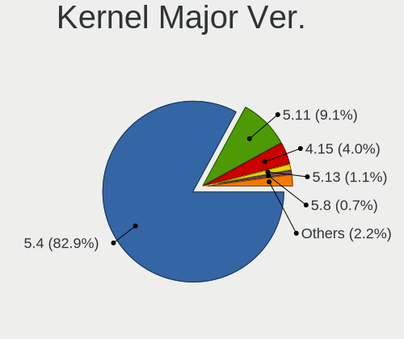

| Version | Notebooks | Percent |
|---------|-----------|---------|
| 5.4     | 184       | 77.31%  |
| 5.8     | 33        | 13.87%  |
| 4.15    | 7         | 2.94%   |
| 5.12    | 3         | 1.26%   |
| 5.11    | 3         | 1.26%   |
| 5.9     | 2         | 0.84%   |
| 5.10    | 2         | 0.84%   |
| 5.0     | 2         | 0.84%   |
| 5.3     | 1         | 0.42%   |
| 5.13    | 1         | 0.42%   |

Arch
----

OS architecture (x86_64, i586, etc.)

| Name   | Notebooks | Percent |
|--------|-----------|---------|
| x86_64 | 223       | 93.7%   |
| i686   | 15        | 6.3%    |

DE
--

Desktop Environment

| Name          | Notebooks | Percent |
|---------------|-----------|---------|
| X-Cinnamon    | 155       | 65.13%  |
| MATE          | 32        | 13.45%  |
| XFCE          | 25        | 10.5%   |
| Cinnamon      | 13        | 5.46%   |
| GNOME         | 6         | 2.52%   |
| Unknown       | 6         | 2.52%   |
| GNOME Classic | 1         | 0.42%   |

Display Server
--------------

X11 or Wayland

| Name | Notebooks | Percent |
|------|-----------|---------|
| X11  | 238       | 100%    |

Display Manager
---------------

SDDM, LightDM, etc.

| Name    | Notebooks | Percent |
|---------|-----------|---------|
| Unknown | 161       | 67.65%  |
| TDM     | 75        | 31.51%  |
| GDM     | 2         | 0.84%   |

OS Lang
-------

Language

| Lang  | Notebooks | Percent |
|-------|-----------|---------|
| en_US | 70        | 29.41%  |
| de_DE | 44        | 18.49%  |
| C     | 17        | 7.14%   |
| pt_BR | 16        | 6.72%   |
| en_GB | 13        | 5.46%   |
| en_AU | 9         | 3.78%   |
| fr_FR | 8         | 3.36%   |
| en_CA | 7         | 2.94%   |
| pl_PL | 5         | 2.1%    |
| en_IN | 5         | 2.1%    |
| ru_RU | 4         | 1.68%   |
| it_IT | 4         | 1.68%   |
| es_MX | 4         | 1.68%   |
| nl_NL | 3         | 1.26%   |
| fr_BE | 3         | 1.26%   |
| tr_TR | 2         | 0.84%   |
| hu_HU | 2         | 0.84%   |
| es_UY | 2         | 0.84%   |
| es_ES | 2         | 0.84%   |
| es_AR | 2         | 0.84%   |
| de_AT | 2         | 0.84%   |
| ro_RO | 1         | 0.42%   |
| fr_CA | 1         | 0.42%   |
| fi_FI | 1         | 0.42%   |
| es_US | 1         | 0.42%   |
| es_SV | 1         | 0.42%   |
| es_EC | 1         | 0.42%   |
| es_DO | 1         | 0.42%   |
| es_CO | 1         | 0.42%   |
| en_ZA | 1         | 0.42%   |
| en_NZ | 1         | 0.42%   |
| en_IE | 1         | 0.42%   |
| en_DK | 1         | 0.42%   |
| de_CH | 1         | 0.42%   |
| da_DK | 1         | 0.42%   |

Boot Mode
---------

EFI or BIOS

| Mode | Notebooks | Percent |
|------|-----------|---------|
| BIOS | 120       | 50.42%  |
| EFI  | 118       | 49.58%  |

Filesystem
----------

Type of filesystem

| Type    | Notebooks | Percent |
|---------|-----------|---------|
| Ext4    | 219       | 92.02%  |
| Overlay | 14        | 5.88%   |
| Btrfs   | 3         | 1.26%   |
| Xfs     | 1         | 0.42%   |
| Ext2    | 1         | 0.42%   |

Part. scheme
------------

Scheme of partitioning

| Type    | Notebooks | Percent |
|---------|-----------|---------|
| Unknown | 158       | 66.39%  |
| GPT     | 51        | 21.43%  |
| MBR     | 29        | 12.18%  |

Dual Boot with Linux/BSD
------------------------

Hosting more than one Linux/BSD

| Dual boot | Notebooks | Percent |
|-----------|-----------|---------|
| No        | 225       | 94.54%  |
| Yes       | 13        | 5.46%   |

Dual Boot (Win)
---------------

Hosting Linux and Windows

| Dual boot | Notebooks | Percent |
|-----------|-----------|---------|
| No        | 212       | 89.08%  |
| Yes       | 26        | 10.92%  |

Country
-------

Geographic location (country)

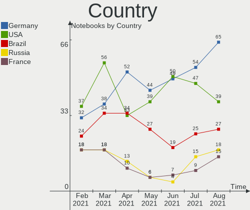

| Country            | Notebooks | Percent |
|--------------------|-----------|---------|
| USA                | 50        | 21.01%  |
| Germany            | 49        | 20.59%  |
| Brazil             | 19        | 7.98%   |
| UK                 | 13        | 5.46%   |
| Australia          | 9         | 3.78%   |
| Italy              | 7         | 2.94%   |
| France             | 7         | 2.94%   |
| Netherlands        | 6         | 2.52%   |
| Canada             | 6         | 2.52%   |
| Poland             | 5         | 2.1%    |
| Mexico             | 5         | 2.1%    |
| India              | 5         | 2.1%    |
| Spain              | 4         | 1.68%   |
| Russia             | 4         | 1.68%   |
| Belgium            | 4         | 1.68%   |
| Turkey             | 3         | 1.26%   |
| Romania            | 3         | 1.26%   |
| Moldova            | 3         | 1.26%   |
| Finland            | 3         | 1.26%   |
| Austria            | 3         | 1.26%   |
| Uruguay            | 2         | 0.84%   |
| Switzerland        | 2         | 0.84%   |
| Hungary            | 2         | 0.84%   |
| Chile              | 2         | 0.84%   |
| Bulgaria           | 2         | 0.84%   |
| Argentina          | 2         | 0.84%   |
| South Africa       | 1         | 0.42%   |
| Serbia             | 1         | 0.42%   |
| Norway             | 1         | 0.42%   |
| New Zealand        | 1         | 0.42%   |
| Lebanon            | 1         | 0.42%   |
| Ireland            | 1         | 0.42%   |
| Iran               | 1         | 0.42%   |
| Indonesia          | 1         | 0.42%   |
| Estonia            | 1         | 0.42%   |
| El Salvador        | 1         | 0.42%   |
| Egypt              | 1         | 0.42%   |
| Ecuador            | 1         | 0.42%   |
| Dominican Republic | 1         | 0.42%   |
| Denmark            | 1         | 0.42%   |
| Czechia            | 1         | 0.42%   |
| Colombia           | 1         | 0.42%   |
| Belarus            | 1         | 0.42%   |
| Albania            | 1         | 0.42%   |

City
----

Geographic location (city)

| City              | Notebooks | Percent |
|-------------------|-----------|---------|
| Rockville         | 7         | 2.94%   |
| Leipzig           | 4         | 1.68%   |
| Chisinau          | 3         | 1.26%   |
| Berlin            | 3         | 1.26%   |
| Vienna            | 2         | 0.84%   |
| Stuttgart         | 2         | 0.84%   |
| Sorocaba          | 2         | 0.84%   |
| Perth             | 2         | 0.84%   |
| Munich            | 2         | 0.84%   |
| Montreal          | 2         | 0.84%   |
| Montevideo        | 2         | 0.84%   |
| Mexico City       | 2         | 0.84%   |
| Marseille         | 2         | 0.84%   |
| Izmir             | 2         | 0.84%   |
| Frankfurt am Main | 2         | 0.84%   |
| Feeding Hills     | 2         | 0.84%   |
| Dresden           | 2         | 0.84%   |
| Curitiba          | 2         | 0.84%   |
| Brisbane          | 2         | 0.84%   |
| Bonn              | 2         | 0.84%   |
| Blaton            | 2         | 0.84%   |
| Augsburg          | 2         | 0.84%   |
| Amsterdam         | 2         | 0.84%   |
| Zurich            | 1         | 0.42%   |
| Zephyrhills       | 1         | 0.42%   |
| Włocławek       | 1         | 0.42%   |
| Würzburg         | 1         | 0.42%   |
| Wolverhampton     | 1         | 0.42%   |
| Wollongong        | 1         | 0.42%   |
| Whitefish         | 1         | 0.42%   |
| West Bromwich     | 1         | 0.42%   |
| Werder            | 1         | 0.42%   |
| Wasilla           | 1         | 0.42%   |
| Washington        | 1         | 0.42%   |
| Warwick           | 1         | 0.42%   |
| Warsaw            | 1         | 0.42%   |
| Waimea            | 1         | 0.42%   |
| Votuporanga       | 1         | 0.42%   |
| Viña del Mar     | 1         | 0.42%   |
| Vicenza           | 1         | 0.42%   |
| Varnville         | 1         | 0.42%   |
| Vancouver         | 1         | 0.42%   |
| Tucson            | 1         | 0.42%   |
| Truro             | 1         | 0.42%   |
| Trivandrum        | 1         | 0.42%   |
| Toronto           | 1         | 0.42%   |
| Tomball           | 1         | 0.42%   |
| Tirana            | 1         | 0.42%   |
| Szolnok           | 1         | 0.42%   |
| Sydney            | 1         | 0.42%   |
| Surabaya          | 1         | 0.42%   |
| Summer Hill       | 1         | 0.42%   |
| Staten Island     | 1         | 0.42%   |
| Sooke             | 1         | 0.42%   |
| Sofia             | 1         | 0.42%   |
| Slidell           | 1         | 0.42%   |
| Silver Spring     | 1         | 0.42%   |
| Sersheim          | 1         | 0.42%   |
| Serra Talhada     | 1         | 0.42%   |
| Schoenberg        | 1         | 0.42%   |

Vendor
------

Motherboard manufacturer

| Name                | Notebooks | Percent |
|---------------------|-----------|---------|
| Lenovo              | 43        | 18.07%  |
| Hewlett-Packard     | 39        | 16.39%  |
| Dell                | 37        | 15.55%  |
| Acer                | 33        | 13.87%  |
| ASUSTek Computer    | 24        | 10.08%  |
| Toshiba             | 9         | 3.78%   |
| Samsung Electronics | 9         | 3.78%   |
| Medion              | 6         | 2.52%   |
| Apple               | 6         | 2.52%   |
| MSI                 | 4         | 1.68%   |
| Sony                | 3         | 1.26%   |
| Fujitsu Siemens     | 3         | 1.26%   |
| Fujitsu             | 2         | 0.84%   |
| Unknown             | 2         | 0.84%   |
| Teclast             | 1         | 0.42%   |
| Schenker            | 1         | 0.42%   |
| QUANMAX             | 1         | 0.42%   |
| Positivo            | 1         | 0.42%   |
| Pegatron            | 1         | 0.42%   |
| MAXDATA             | 1         | 0.42%   |
| LG Electronics      | 1         | 0.42%   |
| Lanix Internacional | 1         | 0.42%   |
| Itautec             | 1         | 0.42%   |
| iNet                | 1         | 0.42%   |
| IBM                 | 1         | 0.42%   |
| HONOR               | 1         | 0.42%   |
| Google              | 1         | 0.42%   |
| Gateway             | 1         | 0.42%   |
| DukaPC              | 1         | 0.42%   |
| Casper              | 1         | 0.42%   |
| AZW                 | 1         | 0.42%   |
| Alienware           | 1         | 0.42%   |

Model
-----

Motherboard model

| Name                                                  | Notebooks | Percent |
|-------------------------------------------------------|-----------|---------|
| ASUS VivoBook_ASUSLaptop X521IA_D533IA                | 3         | 1.26%   |
| Lenovo Yoga 300-11IBR 80M1                            | 2         | 0.84%   |
| HP Pavilion Notebook                                  | 2         | 0.84%   |
| HP Pavilion g7                                        | 2         | 0.84%   |
| Dell Latitude D830                                    | 2         | 0.84%   |
| Dell G5 5505                                          | 2         | 0.84%   |
| ASUS P50IJ                                            | 2         | 0.84%   |
| Acer Aspire A517-52                                   | 2         | 0.84%   |
| Acer Aspire 5733Z                                     | 2         | 0.84%   |
| Unknown                                               | 2         | 0.84%   |
| Toshiba TECRA R950                                    | 1         | 0.42%   |
| Toshiba Satellite R630                                | 1         | 0.42%   |
| Toshiba Satellite L745                                | 1         | 0.42%   |
| Toshiba Satellite L50-B                               | 1         | 0.42%   |
| Toshiba Satellite L40                                 | 1         | 0.42%   |
| Toshiba Satellite C855-2J5                            | 1         | 0.42%   |
| Toshiba Satellite C850-1KN                            | 1         | 0.42%   |
| Toshiba Satellite C55t-C                              | 1         | 0.42%   |
| Toshiba Satellite A215                                | 1         | 0.42%   |
| Teclast F7S                                           | 1         | 0.42%   |
| Sony VGN-TZ21WN_B                                     | 1         | 0.42%   |
| Sony SVF1521A7EB                                      | 1         | 0.42%   |
| Sony SVE14A15FGS                                      | 1         | 0.42%   |
| Schenker SCHENKER VISION 15 (SVS15E21)                | 1         | 0.42%   |
| Samsung RV415                                         | 1         | 0.42%   |
| Samsung R530/R730/P530                                | 1         | 0.42%   |
| Samsung R520/R522/R620                                | 1         | 0.42%   |
| Samsung Q330                                          | 1         | 0.42%   |
| Samsung NC210/NC110                                   | 1         | 0.42%   |
| Samsung NC10                                          | 1         | 0.42%   |
| Samsung 950XDB/951XDB/950XDY                          | 1         | 0.42%   |
| Samsung 350V5C/351V5C/3540VC/3440VC                   | 1         | 0.42%   |
| Samsung 300E5EV/300E4EV/270E5EV/270E4EV/2470EV/2470EE | 1         | 0.42%   |
| QUANMAX Netbook Neo                                   | 1         | 0.42%   |
| Positivo Mobile                                       | 1         | 0.42%   |
| Pegatron A15                                          | 1         | 0.42%   |
| MSI MS-N033                                           | 1         | 0.42%   |
| MSI Modern 14 B4MW                                    | 1         | 0.42%   |
| MSI GT70 2OC/2OD                                      | 1         | 0.42%   |
| MSI GP72 2QE                                          | 1         | 0.42%   |
| Medion X681X                                          | 1         | 0.42%   |
| Medion WIM2200                                        | 1         | 0.42%   |
| Medion P7649 MD60825                                  | 1         | 0.42%   |
| Medion P6613                                          | 1         | 0.42%   |
| Medion P15651                                         | 1         | 0.42%   |
| Medion D17D                                           | 1         | 0.42%   |
| MAXDATA obook2-1                                      | 1         | 0.42%   |
| LG P420-G.BC44P1                                      | 1         | 0.42%   |
| Lenovo ThinkPad X250 20CLS0KM00                       | 1         | 0.42%   |
| Lenovo ThinkPad X230 Tablet 3434CTO                   | 1         | 0.42%   |
| Lenovo ThinkPad X230 2325VHP                          | 1         | 0.42%   |
| Lenovo ThinkPad X220 42912XG                          | 1         | 0.42%   |
| Lenovo ThinkPad X1 Carbon 7th 20R1CTO1WW              | 1         | 0.42%   |
| Lenovo ThinkPad W520 42844YU                          | 1         | 0.42%   |
| Lenovo ThinkPad T61 6463W9Q                           | 1         | 0.42%   |
| Lenovo ThinkPad T550 20CJS1ET00                       | 1         | 0.42%   |
| Lenovo ThinkPad T530 2392APF                          | 1         | 0.42%   |
| Lenovo ThinkPad T520 4243W83                          | 1         | 0.42%   |
| Lenovo ThinkPad T510 4314D4G                          | 1         | 0.42%   |
| Lenovo ThinkPad T470 W10DG 20JM0000GE                 | 1         | 0.42%   |

Model Family
------------

Motherboard model prefix

| Name                    | Notebooks | Percent |
|-------------------------|-----------|---------|
| Lenovo ThinkPad         | 25        | 10.5%   |
| Acer Aspire             | 24        | 10.08%  |
| Dell Latitude           | 16        | 6.72%   |
| HP Pavilion             | 10        | 4.2%    |
| Dell Inspiron           | 9         | 3.78%   |
| Toshiba Satellite       | 8         | 3.36%   |
| Lenovo IdeaPad          | 8         | 3.36%   |
| HP ProBook              | 5         | 2.1%    |
| ASUS VivoBook           | 5         | 2.1%    |
| HP EliteBook            | 4         | 1.68%   |
| HP Laptop               | 3         | 1.26%   |
| Dell XPS                | 3         | 1.26%   |
| Dell Vostro             | 3         | 1.26%   |
| Lenovo Yoga             | 2         | 0.84%   |
| Lenovo ThinkBook        | 2         | 0.84%   |
| HP ZBook                | 2         | 0.84%   |
| HP OMEN                 | 2         | 0.84%   |
| HP Compaq               | 2         | 0.84%   |
| HP 250                  | 2         | 0.84%   |
| Fujitsu Siemens ESPRIMO | 2         | 0.84%   |
| Dell Precision          | 2         | 0.84%   |
| Dell G5                 | 2         | 0.84%   |
| ASUS TUF                | 2         | 0.84%   |
| ASUS P50IJ              | 2         | 0.84%   |
| Apple MacBookPro8       | 2         | 0.84%   |
| Acer Predator           | 2         | 0.84%   |
| Unknown                 | 2         | 0.84%   |
| Toshiba TECRA           | 1         | 0.42%   |
| Teclast F7S             | 1         | 0.42%   |
| Sony VGN-TZ21WN         | 1         | 0.42%   |
| Sony SVF1521A7EB        | 1         | 0.42%   |
| Sony SVE14A15FGS        | 1         | 0.42%   |
| Schenker SCHENKER       | 1         | 0.42%   |
| Samsung RV415           | 1         | 0.42%   |
| Samsung R530            | 1         | 0.42%   |
| Samsung R520            | 1         | 0.42%   |
| Samsung Q330            | 1         | 0.42%   |
| Samsung NC210           | 1         | 0.42%   |
| Samsung NC10            | 1         | 0.42%   |
| Samsung 950XDB          | 1         | 0.42%   |
| Samsung 350V5C          | 1         | 0.42%   |
| Samsung 300E5EV         | 1         | 0.42%   |
| QUANMAX Netbook         | 1         | 0.42%   |
| Positivo Mobile         | 1         | 0.42%   |
| Pegatron A15            | 1         | 0.42%   |
| MSI MS-N033             | 1         | 0.42%   |
| MSI Modern              | 1         | 0.42%   |
| MSI GT70                | 1         | 0.42%   |
| MSI GP72                | 1         | 0.42%   |
| Medion X681X            | 1         | 0.42%   |
| Medion WIM2200          | 1         | 0.42%   |
| Medion P7649            | 1         | 0.42%   |
| Medion P6613            | 1         | 0.42%   |
| Medion P15651           | 1         | 0.42%   |
| Medion D17D             | 1         | 0.42%   |
| MAXDATA obook2-1        | 1         | 0.42%   |
| LG P420-G.BC44P1        | 1         | 0.42%   |
| Lenovo Legion           | 1         | 0.42%   |
| Lenovo G550             | 1         | 0.42%   |
| Lenovo G50-70           | 1         | 0.42%   |

MFG Year
--------

Motherboard manufacture year

| Year | Notebooks | Percent |
|------|-----------|---------|
| 2021 | 28        | 11.76%  |
| 2020 | 26        | 10.92%  |
| 2019 | 26        | 10.92%  |
| 2016 | 22        | 9.24%   |
| 2009 | 19        | 7.98%   |
| 2013 | 18        | 7.56%   |
| 2011 | 17        | 7.14%   |
| 2012 | 16        | 6.72%   |
| 2018 | 14        | 5.88%   |
| 2008 | 12        | 5.04%   |
| 2014 | 11        | 4.62%   |
| 2007 | 8         | 3.36%   |
| 2015 | 7         | 2.94%   |
| 2010 | 6         | 2.52%   |
| 2017 | 4         | 1.68%   |
| 2006 | 3         | 1.26%   |
| 2005 | 1         | 0.42%   |

Form Factor
-----------

Physical design of the computer

| Name     | Notebooks | Percent |
|----------|-----------|---------|
| Notebook | 238       | 100%    |

Secure Boot
-----------

Enabled or disabled

| State    | Notebooks | Percent |
|----------|-----------|---------|
| Disabled | 206       | 86.55%  |
| Enabled  | 32        | 13.45%  |

Coreboot
--------

Have coreboot on board

| Used | Notebooks | Percent |
|------|-----------|---------|
| No   | 236       | 99.16%  |
| Yes  | 2         | 0.84%   |

RAM Size
--------

Total RAM memory

| Size in GB | Notebooks | Percent |
|------------|-----------|---------|
| 4.01-8.0   | 76        | 31.93%  |
| 3.01-4.0   | 64        | 26.89%  |
| 8.01-16.0  | 31        | 13.03%  |
| 16.01-24.0 | 28        | 11.76%  |
| 1.01-2.0   | 15        | 6.3%    |
| 2.01-3.0   | 9         | 3.78%   |
| 32.01-64.0 | 5         | 2.1%    |
| 24.01-32.0 | 5         | 2.1%    |
| 0.51-1.0   | 5         | 2.1%    |

RAM Used
--------

Used RAM memory

| Used GB    | Notebooks | Percent |
|------------|-----------|---------|
| 1.01-2.0   | 93        | 39.08%  |
| 2.01-3.0   | 66        | 27.73%  |
| 0.51-1.0   | 28        | 11.76%  |
| 4.01-8.0   | 25        | 10.5%   |
| 3.01-4.0   | 22        | 9.24%   |
| 0.01-0.5   | 3         | 1.26%   |
| 16.01-24.0 | 1         | 0.42%   |

Has CD-ROM
----------

Has CD-ROM on board

| Presented | Notebooks | Percent |
|-----------|-----------|---------|
| Yes       | 126       | 52.94%  |
| No        | 112       | 47.06%  |

Total Drives
------------

Number of drives on board

| Drives | Notebooks | Percent |
|--------|-----------|---------|
| 1      | 165       | 69.33%  |
| 2      | 60        | 25.21%  |
| 0      | 6         | 2.52%   |
| 3      | 5         | 2.1%    |
| 4      | 2         | 0.84%   |

Has Ethernet
------------

Has Ethernet on board

| Presented | Notebooks | Percent |
|-----------|-----------|---------|
| Yes       | 213       | 89.5%   |
| No        | 25        | 10.5%   |

Has WiFi
--------

Has WiFi module

| Presented | Notebooks | Percent |
|-----------|-----------|---------|
| Yes       | 232       | 97.48%  |
| No        | 6         | 2.52%   |

Has Bluetooth
-------------

Has Bluetooth module

| Presented | Notebooks | Percent |
|-----------|-----------|---------|
| Yes       | 173       | 72.69%  |
| No        | 65        | 27.31%  |

Drive Vendor
------------

Hard drive vendors

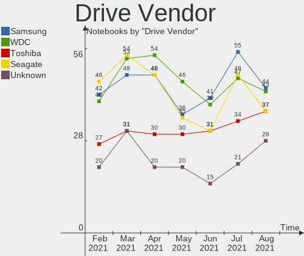

| Vendor                    | Notebooks | Drives | Percent |
|---------------------------|-----------|--------|---------|
| Samsung Electronics       | 41        | 44     | 14.59%  |
| WDC                       | 39        | 41     | 13.88%  |
| Toshiba                   | 31        | 31     | 11.03%  |
| Seagate                   | 31        | 36     | 11.03%  |
| Sandisk                   | 16        | 16     | 5.69%   |
| Unknown                   | 15        | 17     | 5.34%   |
| Kingston                  | 14        | 14     | 4.98%   |
| Hitachi                   | 14        | 14     | 4.98%   |
| Crucial                   | 10        | 10     | 3.56%   |
| HGST                      | 8         | 8      | 2.85%   |
| SK Hynix                  | 7         | 7      | 2.49%   |
| Micron Technology         | 7         | 7      | 2.49%   |
| Intel                     | 7         | 7      | 2.49%   |
| China                     | 5         | 5      | 1.78%   |
| A-DATA Technology         | 5         | 5      | 1.78%   |
| KIOXIA                    | 3         | 3      | 1.07%   |
| Fujitsu                   | 3         | 3      | 1.07%   |
| SPCC                      | 2         | 2      | 0.71%   |
| LITEON                    | 2         | 2      | 0.71%   |
| Intenso                   | 2         | 2      | 0.71%   |
| Transcend                 | 1         | 1      | 0.36%   |
| Teclast                   | 1         | 1      | 0.36%   |
| TCSUNBOW                  | 1         | 1      | 0.36%   |
| SMART                     | 1         | 1      | 0.36%   |
| Silicon Motion            | 1         | 1      | 0.36%   |
| SABRENT                   | 1         | 1      | 0.36%   |
| PNY                       | 1         | 1      | 0.36%   |
| Phison                    | 1         | 1      | 0.36%   |
| OWC                       | 1         | 1      | 0.36%   |
| Micron/Crucial Technology | 1         | 1      | 0.36%   |
| LITEONIT                  | 1         | 1      | 0.36%   |
| KingSpec                  | 1         | 1      | 0.36%   |
| JMicron                   | 1         | 2      | 0.36%   |
| JAMESDONKEY               | 1         | 1      | 0.36%   |
| HS-SSD-C100               | 1         | 1      | 0.36%   |
| HGST HTS                  | 1         | 1      | 0.36%   |
| GOODRAM                   | 1         | 1      | 0.36%   |
| Dogfish                   | 1         | 1      | 0.36%   |
| Apple                     | 1         | 1      | 0.36%   |

Drive Model
-----------

Hard drive models

| Model                              | Notebooks | Percent |
|------------------------------------|-----------|---------|
| Toshiba MQ01ABD100 1TB             | 6         | 2.05%   |
| SanDisk SSD PLUS 240GB             | 4         | 1.37%   |
| Samsung NVMe SSD Drive 512GB       | 4         | 1.37%   |
| Kingston SA400S37240G 240GB SSD    | 4         | 1.37%   |
| WDC WD3200BEVT-22ZCT0 320GB        | 3         | 1.03%   |
| Unknown SD/MMC/MS PRO 128GB        | 3         | 1.03%   |
| Unknown MMC Card  64GB             | 3         | 1.03%   |
| Unknown MMC Card  16GB             | 3         | 1.03%   |
| Toshiba MQ01ABF050 500GB           | 3         | 1.03%   |
| Seagate ST500LT012-1DG142 500GB    | 3         | 1.03%   |
| Seagate ST1000LM024 HN-M101MBB 1TB | 3         | 1.03%   |
| Sandisk NVMe SSD Drive 512GB       | 3         | 1.03%   |
| Samsung SSD 850 EVO 250GB          | 3         | 1.03%   |
| Samsung SSD 840 EVO 120GB          | 3         | 1.03%   |
| Micron NVMe SSD Drive 512GB        | 3         | 1.03%   |
| Kingston SA400S37480G 480GB SSD    | 3         | 1.03%   |
| WDC WDS100T2B0A-00SM50 1TB SSD     | 2         | 0.68%   |
| WDC WDBNCE5000PNC 500GB SSD        | 2         | 0.68%   |
| WDC WD3200BEVT-60ZCT1 320GB        | 2         | 0.68%   |
| WDC WD10SPZX-22Z10T1 1TB           | 2         | 0.68%   |
| Unknown MMC Card  32GB             | 2         | 0.68%   |
| Unknown MMC Card  256GB            | 2         | 0.68%   |
| Toshiba NVMe SSD Drive 512GB       | 2         | 0.68%   |
| Toshiba MQ04ABF100 1TB             | 2         | 0.68%   |
| Toshiba MK1652GSX 160GB            | 2         | 0.68%   |
| Seagate ST9500325AS 500GB          | 2         | 0.68%   |
| Seagate ST9250410AS 250GB          | 2         | 0.68%   |
| Seagate ST1000LM035-1RK172 1TB     | 2         | 0.68%   |
| Seagate BUP Ultra Touch 2TB        | 2         | 0.68%   |
| Sandisk NVMe SSD Drive 256GB       | 2         | 0.68%   |
| Samsung SSD PM851 mSATA 256GB      | 2         | 0.68%   |
| Samsung SSD 860 EVO 1TB            | 2         | 0.68%   |
| Samsung SSD 850 EVO 500GB          | 2         | 0.68%   |
| Samsung SSD 840 EVO 500GB          | 2         | 0.68%   |
| Samsung NVMe SSD Drive 1024GB      | 2         | 0.68%   |
| Intel NVMe SSD Drive 256GB         | 2         | 0.68%   |
| Hitachi HTS545032A7E380 320GB      | 2         | 0.68%   |
| Hitachi HTS543225L9A300 250GB      | 2         | 0.68%   |
| HGST HTS721010A9E630 1TB           | 2         | 0.68%   |
| Crucial CT500MX500SSD1 500GB       | 2         | 0.68%   |
| Crucial CT240BX500SSD1 240GB       | 2         | 0.68%   |
| Crucial CT1000MX500SSD1 1TB        | 2         | 0.68%   |
| China SATA SSD 120GB               | 2         | 0.68%   |
| WDC WDS500G2B0A-00SM50 500GB SSD   | 1         | 0.34%   |
| WDC WDS240G2G0A-00JH30 240GB SSD   | 1         | 0.34%   |
| WDC WDS120G2G0A-00JH30 120GB SSD   | 1         | 0.34%   |
| WDC WDS100T2G0A-00JH30 1TB SSD     | 1         | 0.34%   |
| WDC WDBRPG0020BNC-WRSN 2TB         | 1         | 0.34%   |
| WDC WD7500BPVX-00JC3T0 752GB       | 1         | 0.34%   |
| WDC WD7500BPVT-22HXZT3 752GB       | 1         | 0.34%   |
| WDC WD7500BPVT-22A1YT0 752GB       | 1         | 0.34%   |
| WDC WD6400BPVT-60HXZT1 640GB       | 1         | 0.34%   |
| WDC WD5000LPVX-22V0TT0 500GB       | 1         | 0.34%   |
| WDC WD5000LPCX-24C6HT0 500GB       | 1         | 0.34%   |
| WDC WD5000BPVT-80HXZT1 500GB       | 1         | 0.34%   |
| WDC WD5000BEVT-35A0RT0 500GB       | 1         | 0.34%   |
| WDC WD5000BEVT-22A0RT0 500GB       | 1         | 0.34%   |
| WDC WD20SPZX-22CRAT0 2TB           | 1         | 0.34%   |
| WDC WD1600BEVT-75A23T0 160GB       | 1         | 0.34%   |
| WDC WD1600BEVT-22ZCT0 160GB        | 1         | 0.34%   |

HDD Vendor
----------

Hard disk drive vendors

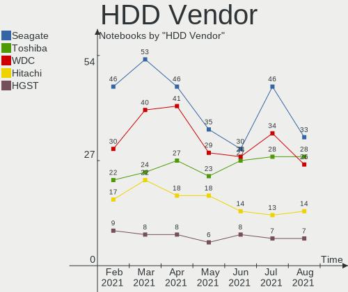

| Vendor   | Notebooks | Drives | Percent |
|----------|-----------|--------|---------|
| Seagate  | 30        | 35     | 26.79%  |
| WDC      | 28        | 28     | 25%     |
| Toshiba  | 27        | 27     | 24.11%  |
| Hitachi  | 14        | 14     | 12.5%   |
| HGST     | 8         | 8      | 7.14%   |
| Fujitsu  | 3         | 3      | 2.68%   |
| Intenso  | 1         | 1      | 0.89%   |
| HGST HTS | 1         | 1      | 0.89%   |

SSD Vendor
----------

Solid state drive vendors

| Vendor              | Notebooks | Drives | Percent |
|---------------------|-----------|--------|---------|
| Samsung Electronics | 26        | 28     | 27.37%  |
| SanDisk             | 10        | 10     | 10.53%  |
| Kingston            | 10        | 10     | 10.53%  |
| Crucial             | 9         | 9      | 9.47%   |
| WDC                 | 7         | 8      | 7.37%   |
| China               | 5         | 5      | 5.26%   |
| Intel               | 4         | 4      | 4.21%   |
| A-DATA Technology   | 4         | 4      | 4.21%   |
| Toshiba             | 2         | 2      | 2.11%   |
| SK Hynix            | 2         | 2      | 2.11%   |
| LITEON              | 2         | 2      | 2.11%   |
| Transcend           | 1         | 1      | 1.05%   |
| Teclast             | 1         | 1      | 1.05%   |
| SPCC                | 1         | 1      | 1.05%   |
| SMART               | 1         | 1      | 1.05%   |
| Seagate             | 1         | 1      | 1.05%   |
| SABRENT             | 1         | 1      | 1.05%   |
| PNY                 | 1         | 1      | 1.05%   |
| OWC                 | 1         | 1      | 1.05%   |
| Micron Technology   | 1         | 1      | 1.05%   |
| LITEONIT            | 1         | 1      | 1.05%   |
| KingSpec            | 1         | 1      | 1.05%   |
| Intenso             | 1         | 1      | 1.05%   |
| GOODRAM             | 1         | 1      | 1.05%   |
| Dogfish             | 1         | 1      | 1.05%   |

Drive Kind
----------

HDD or SSD

| Kind    | Notebooks | Drives | Percent |
|---------|-----------|--------|---------|
| HDD     | 106       | 117    | 40%     |
| SSD     | 88        | 98     | 33.21%  |
| NVMe    | 52        | 59     | 19.62%  |
| MMC     | 12        | 13     | 4.53%   |
| Unknown | 7         | 7      | 2.64%   |

Drive Connector
---------------

SATA, SAS, NVMe, etc.

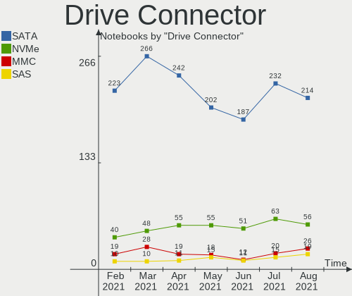

| Type | Notebooks | Drives | Percent |
|------|-----------|--------|---------|
| SATA | 187       | 211    | 71.65%  |
| NVMe | 51        | 57     | 19.54%  |
| MMC  | 12        | 13     | 4.6%    |
| SAS  | 11        | 13     | 4.21%   |

Drive Size
----------

Size of hard drive

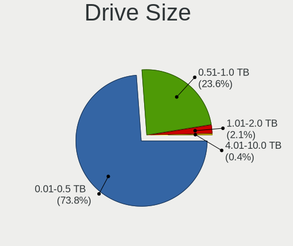

| Size in TB | Notebooks | Drives | Percent |
|------------|-----------|--------|---------|
| 0.01-0.5   | 133       | 143    | 66.5%   |
| 0.51-1.0   | 58        | 60     | 29%     |
| 1.01-2.0   | 8         | 11     | 4%      |
| 3.01-4.0   | 1         | 1      | 0.5%    |

Space Total
-----------

Amount of disk space available on the file system

| Size in GB     | Notebooks | Percent |
|----------------|-----------|---------|
| 251-500        | 72        | 30.25%  |
| 101-250        | 72        | 30.25%  |
| 501-1000       | 39        | 16.39%  |
| 51-100         | 16        | 6.72%   |
| 1-20           | 13        | 5.46%   |
| 1001-2000      | 12        | 5.04%   |
| 21-50          | 10        | 4.2%    |
| More than 3000 | 2         | 0.84%   |
| 2001-3000      | 2         | 0.84%   |

Space Used
----------

Amount of used disk space

| Used GB        | Notebooks | Percent |
|----------------|-----------|---------|
| 1-20           | 70        | 29.41%  |
| 21-50          | 47        | 19.75%  |
| 101-250        | 47        | 19.75%  |
| 51-100         | 35        | 14.71%  |
| 251-500        | 27        | 11.34%  |
| 501-1000       | 6         | 2.52%   |
| 1001-2000      | 4         | 1.68%   |
| More than 3000 | 2         | 0.84%   |

Malfunc. Drives
---------------

Drive models with a malfunction

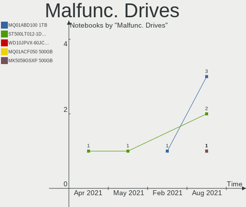

| Model                          | Notebooks | Drives | Percent |
|--------------------------------|-----------|--------|---------|
| WDC WD6400BPVT-60HXZT1 640GB   | 1         | 1      | 7.14%   |
| WDC WD10SPZX-21Z10T0 1TB       | 1         | 1      | 7.14%   |
| WDC WD10JPVX-22JC3T0 1TB       | 1         | 1      | 7.14%   |
| Toshiba MQ01ABF050 500GB       | 1         | 1      | 7.14%   |
| Toshiba MK5075GSX 500GB        | 1         | 1      | 7.14%   |
| Toshiba MK3276GSX 320GB        | 1         | 1      | 7.14%   |
| Toshiba MK1237GSX 120GB        | 1         | 1      | 7.14%   |
| Seagate ST9500325AS 500GB      | 1         | 1      | 7.14%   |
| Seagate ST2000LX001-1RG174 2TB | 1         | 1      | 7.14%   |
| Seagate ST2000LM007-1R8174 2TB | 1         | 1      | 7.14%   |
| Seagate ST1000LM035-1RK172 1TB | 1         | 1      | 7.14%   |
| Hitachi HTS725025A9A364 250GB  | 1         | 1      | 7.14%   |
| Hitachi HTS547564A9E384 640GB  | 1         | 1      | 7.14%   |
| HGST HTS541010A9E680 1TB       | 1         | 1      | 7.14%   |

Malfunc. Drive Vendor
---------------------

Vendors of faulty drives

| Vendor  | Notebooks | Drives | Percent |
|---------|-----------|--------|---------|
| Toshiba | 4         | 4      | 30.77%  |
| WDC     | 3         | 3      | 23.08%  |
| Seagate | 3         | 4      | 23.08%  |
| Hitachi | 2         | 2      | 15.38%  |
| HGST    | 1         | 1      | 7.69%   |

Malfunc. HDD Vendor
-------------------

Vendors of faulty HDD drives

| Vendor  | Notebooks | Drives | Percent |
|---------|-----------|--------|---------|
| Toshiba | 4         | 4      | 30.77%  |
| WDC     | 3         | 3      | 23.08%  |
| Seagate | 3         | 4      | 23.08%  |
| Hitachi | 2         | 2      | 15.38%  |
| HGST    | 1         | 1      | 7.69%   |

Malfunc. Drive Kind
-------------------

Kinds of faulty drives

| Kind | Notebooks | Drives | Percent |
|------|-----------|--------|---------|
| HDD  | 12        | 14     | 100%    |

Failed Drives
-------------

Failed drive models

Zero info for selected period =(

Failed Drive Vendor
-------------------

Failed drive vendors

Zero info for selected period =(

Drive Status
------------

Number of failed and malfunc. drives

| Status   | Notebooks | Drives | Percent |
|----------|-----------|--------|---------|
| Detected | 164       | 206    | 68.62%  |
| Works    | 63        | 74     | 26.36%  |
| Malfunc  | 12        | 14     | 5.02%   |

Storage Vendor
--------------

Storage controller vendors

| Vendor                           | Notebooks | Percent |
|----------------------------------|-----------|---------|
| Intel                            | 175       | 65.3%   |
| AMD                              | 34        | 12.69%  |
| Samsung Electronics              | 15        | 5.6%    |
| Sandisk                          | 11        | 4.1%    |
| Micron Technology                | 6         | 2.24%   |
| SK Hynix                         | 5         | 1.87%   |
| Kingston Technology Company      | 4         | 1.49%   |
| KIOXIA                           | 3         | 1.12%   |
| Toshiba America Info Systems     | 2         | 0.75%   |
| Silicon Integrated Systems [SiS] | 2         | 0.75%   |
| Phison Electronics               | 2         | 0.75%   |
| Nvidia                           | 2         | 0.75%   |
| Micron/Crucial Technology        | 2         | 0.75%   |
| Silicon Motion                   | 1         | 0.37%   |
| Silicon Image                    | 1         | 0.37%   |
| ASMedia Technology               | 1         | 0.37%   |
| Apple                            | 1         | 0.37%   |
| ADATA Technology                 | 1         | 0.37%   |

Storage Model
-------------

Storage controller models

| Model                                                                            | Notebooks | Percent |
|----------------------------------------------------------------------------------|-----------|---------|
| AMD FCH SATA Controller [AHCI mode]                                              | 27        | 8.85%   |
| Intel 7 Series Chipset Family 6-port SATA Controller [AHCI mode]                 | 23        | 7.54%   |
| Intel 82801IBM/IEM (ICH9M/ICH9M-E) 4 port SATA Controller [AHCI mode]            | 18        | 5.9%    |
| Intel 6 Series/C200 Series Chipset Family 6 port Mobile SATA AHCI Controller     | 16        | 5.25%   |
| Intel Sunrise Point-LP SATA Controller [AHCI mode]                               | 12        | 3.93%   |
| Intel 82801 Mobile SATA Controller [RAID mode]                                   | 11        | 3.61%   |
| Intel 8 Series SATA Controller 1 [AHCI mode]                                     | 11        | 3.61%   |
| Intel 82801HM/HEM (ICH8M/ICH8M-E) IDE Controller                                 | 10        | 3.28%   |
| Intel 82801HM/HEM (ICH8M/ICH8M-E) SATA Controller [AHCI mode]                    | 9         | 2.95%   |
| Intel 5 Series/3400 Series Chipset 4 port SATA AHCI Controller                   | 9         | 2.95%   |
| Samsung NVMe SSD Controller SM981/PM981/PM983                                    | 7         | 2.3%    |
| Samsung NVMe Controller                                                          | 7         | 2.3%    |
| Intel Wildcat Point-LP SATA Controller [AHCI Mode]                               | 7         | 2.3%    |
| Intel Volume Management Device NVMe RAID Controller                              | 7         | 2.3%    |
| Intel 8 Series/C220 Series Chipset Family 6-port SATA Controller 1 [AHCI mode]   | 7         | 2.3%    |
| Micron Non-Volatile memory controller                                            | 6         | 1.97%   |
| Intel Tiger Lake-LP SATA Controller [AHCI mode]                                  | 6         | 1.97%   |
| Sandisk WD Black SN750 / PC SN730 NVMe SSD                                       | 4         | 1.31%   |
| Intel Atom/Celeron/Pentium Processor x5-E8000/J3xxx/N3xxx Series SATA Controller | 4         | 1.31%   |
| Intel Atom Processor E3800 Series SATA AHCI Controller                           | 4         | 1.31%   |
| Intel 82801GBM/GHM (ICH7-M Family) SATA Controller [IDE mode]                    | 4         | 1.31%   |
| Intel 82801G (ICH7 Family) IDE Controller                                        | 4         | 1.31%   |
| Intel 5 Series/3400 Series Chipset 6 port SATA AHCI Controller                   | 4         | 1.31%   |
| Sandisk Non-Volatile memory controller                                           | 3         | 0.98%   |
| KIOXIA Non-Volatile memory controller                                            | 3         | 0.98%   |
| Intel HM170/QM170 Chipset SATA Controller [AHCI Mode]                            | 3         | 0.98%   |
| Intel Celeron N3350/Pentium N4200/Atom E3900 Series SATA AHCI Controller         | 3         | 0.98%   |
| Intel Cannon Lake Mobile PCH SATA AHCI Controller                                | 3         | 0.98%   |
| AMD SB7x0/SB8x0/SB9x0 SATA Controller [AHCI mode]                                | 3         | 0.98%   |
| AMD SB600 Non-Raid-5 SATA                                                        | 3         | 0.98%   |
| AMD SB600 IDE                                                                    | 3         | 0.98%   |
| Toshiba America Info Systems XG6 NVMe SSD Controller                             | 2         | 0.66%   |
| SK Hynix NVMe SSD Controller                                                     | 2         | 0.66%   |
| SK Hynix BC511                                                                   | 2         | 0.66%   |
| Silicon Integrated Systems [SiS] SATA Controller / IDE mode                      | 2         | 0.66%   |
| Silicon Integrated Systems [SiS] 5513 IDE Controller                             | 2         | 0.66%   |
| Sandisk WD Black 2018/SN750 / PC SN720 NVMe SSD                                  | 2         | 0.66%   |
| Phison E12 NVMe Controller                                                       | 2         | 0.66%   |
| Kingston Company Company Non-Volatile memory controller                          | 2         | 0.66%   |
| Intel SSD 600P Series                                                            | 2         | 0.66%   |
| Intel NM10/ICH7 Family SATA Controller [AHCI mode]                               | 2         | 0.66%   |
| Intel Mobile 4 Series Chipset PT IDER Controller                                 | 2         | 0.66%   |
| Intel Cannon Point-LP SATA Controller [AHCI Mode]                                | 2         | 0.66%   |
| Intel 82801GBM/GHM (ICH7-M Family) SATA Controller [AHCI mode]                   | 2         | 0.66%   |
| Intel 8 Series/C220 Series Chipset Family 2-port SATA Controller 2 [IDE mode]    | 2         | 0.66%   |
| Intel 8 Series Chipset Family 4-port SATA Controller 1 [IDE mode] - Mobile       | 2         | 0.66%   |
| Intel 7 Series Chipset Family 4-port SATA Controller [IDE mode]                  | 2         | 0.66%   |
| Intel 7 Series Chipset Family 2-port SATA Controller [IDE mode]                  | 2         | 0.66%   |
| Intel 5 Series/3400 Series Chipset 4 port SATA IDE Controller                    | 2         | 0.66%   |
| Intel 5 Series/3400 Series Chipset 2 port SATA IDE Controller                    | 2         | 0.66%   |
| SK Hynix BC501 NVMe Solid State Drive                                            | 1         | 0.33%   |
| Silicon Motion SM2263EN/SM2263XT SSD Controller                                  | 1         | 0.33%   |
| Silicon Image SiI 3531 [SATALink/SATARaid] Serial ATA Controller                 | 1         | 0.33%   |
| Sandisk WD Blue SN550 NVMe SSD                                                   | 1         | 0.33%   |
| Sandisk WD Blue SN500 / PC SN520 NVMe SSD                                        | 1         | 0.33%   |
| Samsung NVMe SSD Controller PM9A1/PM9A3/980PRO                                   | 1         | 0.33%   |
| Nvidia MCP79 SATA Controller                                                     | 1         | 0.33%   |
| Nvidia MCP79 AHCI Controller                                                     | 1         | 0.33%   |
| Micron/Crucial P2 NVMe PCIe SSD                                                  | 1         | 0.33%   |
| Micron/Crucial P1 NVMe PCIe SSD                                                  | 1         | 0.33%   |

Storage Kind
------------

Kind of storage controller (IDE, SATA, NVMe, SAS, ...)

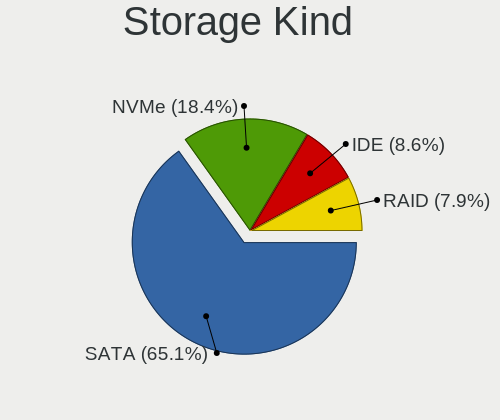

| Kind | Notebooks | Percent |
|------|-----------|---------|
| SATA | 182       | 62.98%  |
| NVMe | 51        | 17.65%  |
| IDE  | 37        | 12.8%   |
| RAID | 19        | 6.57%   |

CPU Vendor
----------

Processor vendors

| Vendor | Notebooks | Percent |
|--------|-----------|---------|
| Intel  | 197       | 82.77%  |
| AMD    | 41        | 17.23%  |

CPU Model
---------

Processor models

| Model                                         | Notebooks | Percent |
|-----------------------------------------------|-----------|---------|
| Intel 11th Gen Core i5-1135G7 @ 2.40GHz       | 7         | 2.94%   |
| AMD Ryzen 5 4500U with Radeon Graphics        | 6         | 2.52%   |
| Intel Core i5-2450M CPU @ 2.50GHz             | 5         | 2.1%    |
| Intel 11th Gen Core i7-1165G7 @ 2.80GHz       | 5         | 2.1%    |
| Intel Core i5-8265U CPU @ 1.60GHz             | 4         | 1.68%   |
| Intel Core i5-8250U CPU @ 1.60GHz             | 4         | 1.68%   |
| Intel Core i5-4210U CPU @ 1.70GHz             | 4         | 1.68%   |
| Intel Core i5-3230M CPU @ 2.60GHz             | 4         | 1.68%   |
| Intel Core i5-3210M CPU @ 2.50GHz             | 4         | 1.68%   |
| Intel Pentium Dual-Core CPU T4200 @ 2.00GHz   | 3         | 1.26%   |
| Intel Pentium CPU P6200 @ 2.13GHz             | 3         | 1.26%   |
| Intel Core i7-9750H CPU @ 2.60GHz             | 3         | 1.26%   |
| Intel Core i7-10510U CPU @ 1.80GHz            | 3         | 1.26%   |
| Intel Core i5-6300U CPU @ 2.40GHz             | 3         | 1.26%   |
| Intel Core i5-6200U CPU @ 2.30GHz             | 3         | 1.26%   |
| Intel Core i5-5300U CPU @ 2.30GHz             | 3         | 1.26%   |
| Intel Core i5-3320M CPU @ 2.60GHz             | 3         | 1.26%   |
| Intel Core 2 Duo CPU P8700 @ 2.53GHz          | 3         | 1.26%   |
| Intel Celeron CPU N2840 @ 2.16GHz             | 3         | 1.26%   |
| Intel Atom CPU N270 @ 1.60GHz                 | 3         | 1.26%   |
| AMD Turion 64 X2 Mobile Technology TL-60      | 3         | 1.26%   |
| Intel Pentium CPU B960 @ 2.20GHz              | 2         | 0.84%   |
| Intel Pentium CPU 2117U @ 1.80GHz             | 2         | 0.84%   |
| Intel Core i7-7700HQ CPU @ 2.80GHz            | 2         | 0.84%   |
| Intel Core i7-7500U CPU @ 2.70GHz             | 2         | 0.84%   |
| Intel Core i7-4700MQ CPU @ 2.40GHz            | 2         | 0.84%   |
| Intel Core i7-2670QM CPU @ 2.20GHz            | 2         | 0.84%   |
| Intel Core i7-2640M CPU @ 2.80GHz             | 2         | 0.84%   |
| Intel Core i5-4200U CPU @ 1.60GHz             | 2         | 0.84%   |
| Intel Core i5-2520M CPU @ 2.50GHz             | 2         | 0.84%   |
| Intel Core i5 CPU M 520 @ 2.40GHz             | 2         | 0.84%   |
| Intel Core i5 CPU M 460 @ 2.53GHz             | 2         | 0.84%   |
| Intel Core i3-3110M CPU @ 2.40GHz             | 2         | 0.84%   |
| Intel Core i3-2350M CPU @ 2.30GHz             | 2         | 0.84%   |
| Intel Core i3 CPU M 350 @ 2.27GHz             | 2         | 0.84%   |
| Intel Core i3 CPU M 330 @ 2.13GHz             | 2         | 0.84%   |
| Intel Core 2 Duo CPU T8100 @ 2.10GHz          | 2         | 0.84%   |
| Intel Core 2 Duo CPU T7700 @ 2.40GHz          | 2         | 0.84%   |
| Intel Core 2 Duo CPU T6670 @ 2.20GHz          | 2         | 0.84%   |
| Intel Core 2 Duo CPU T5250 @ 1.50GHz          | 2         | 0.84%   |
| Intel Atom CPU N455 @ 1.66GHz                 | 2         | 0.84%   |
| AMD Ryzen 7 3750H with Radeon Vega Mobile Gfx | 2         | 0.84%   |
| AMD Ryzen 5 4600H with Radeon Graphics        | 2         | 0.84%   |
| AMD Ryzen 5 3500U with Radeon Vega Mobile Gfx | 2         | 0.84%   |
| AMD E-300 APU with Radeon HD Graphics         | 2         | 0.84%   |
| Intel Pentium M processor 2.00GHz             | 1         | 0.42%   |
| Intel Pentium Dual-Core CPU T4300 @ 2.10GHz   | 1         | 0.42%   |
| Intel Pentium Dual CPU T2330 @ 1.60GHz        | 1         | 0.42%   |
| Intel Pentium Dual CPU T2310 @ 1.46GHz        | 1         | 0.42%   |
| Intel Pentium CPU P6100 @ 2.00GHz             | 1         | 0.42%   |
| Intel Pentium CPU N4200 @ 1.10GHz             | 1         | 0.42%   |
| Intel Pentium CPU N3710 @ 1.60GHz             | 1         | 0.42%   |
| Intel Pentium CPU N3700 @ 1.60GHz             | 1         | 0.42%   |
| Intel Pentium CPU N3520 @ 2.16GHz             | 1         | 0.42%   |
| Intel Pentium CPU 4405U @ 2.10GHz             | 1         | 0.42%   |
| Intel Pentium 3558U @ 1.70GHz                 | 1         | 0.42%   |
| Intel Pentium 3556U @ 1.70GHz                 | 1         | 0.42%   |
| Intel Genuine CPU U2700 @ 1.30GHz             | 1         | 0.42%   |
| Intel Genuine CPU U2500 @ 1.20GHz             | 1         | 0.42%   |
| Intel Genuine CPU T2060 @ 1.60GHz             | 1         | 0.42%   |

CPU Model Family
----------------

Processor model prefix

| Model                   | Notebooks | Percent |
|-------------------------|-----------|---------|
| Intel Core i5           | 60        | 25.21%  |
| Intel Core i7           | 39        | 16.39%  |
| Intel Core 2 Duo        | 23        | 9.66%   |
| Other                   | 15        | 6.3%    |
| Intel Pentium           | 15        | 6.3%    |
| Intel Core i3           | 14        | 5.88%   |
| AMD Ryzen 5             | 13        | 5.46%   |
| Intel Celeron           | 10        | 4.2%    |
| Intel Atom              | 8         | 3.36%   |
| AMD Ryzen 7             | 5         | 2.1%    |
| Intel Pentium Dual-Core | 4         | 1.68%   |
| Intel Genuine           | 4         | 1.68%   |
| AMD Turion 64 X2 Mobile | 4         | 1.68%   |
| AMD E                   | 3         | 1.26%   |
| AMD A6                  | 3         | 1.26%   |
| Intel Pentium Dual      | 2         | 0.84%   |
| Intel Celeron M         | 2         | 0.84%   |
| AMD A8                  | 2         | 0.84%   |
| AMD A12                 | 2         | 0.84%   |
| AMD A10                 | 2         | 0.84%   |
| Intel Pentium M         | 1         | 0.42%   |
| Intel Core M            | 1         | 0.42%   |
| Intel Core 2 Extreme    | 1         | 0.42%   |
| Intel Core 2            | 1         | 0.42%   |
| AMD Ryzen 7 PRO         | 1         | 0.42%   |
| AMD Ryzen 3             | 1         | 0.42%   |
| AMD E2                  | 1         | 0.42%   |
| AMD E1                  | 1         | 0.42%   |

CPU Cores
---------

Number of processor cores

| Number | Notebooks | Percent |
|--------|-----------|---------|
| 2      | 143       | 60.08%  |
| 4      | 63        | 26.47%  |
| 6      | 15        | 6.3%    |
| 1      | 13        | 5.46%   |
| 8      | 4         | 1.68%   |

CPU Sockets
-----------

Number of sockets

| Number | Notebooks | Percent |
|--------|-----------|---------|
| 1      | 238       | 100%    |

CPU Threads
-----------

Threads per core (Hyper-Threading)

| Number | Notebooks | Percent |
|--------|-----------|---------|
| 2      | 151       | 63.45%  |
| 1      | 87        | 36.55%  |

CPU Op-Modes
------------

CPU Operation Modes (32-bit, 64-bit)

| Op mode        | Notebooks | Percent |
|----------------|-----------|---------|
| 32-bit, 64-bit | 229       | 96.22%  |
| 32-bit         | 9         | 3.78%   |

CPU Microcode
-------------

Microcode number

| Number     | Notebooks | Percent |
|------------|-----------|---------|
| 0x306a9    | 23        | 9.66%   |
| Unknown    | 22        | 9.24%   |
| 0x206a7    | 21        | 8.82%   |
| 0x1067a    | 17        | 7.14%   |
| 0x806c1    | 12        | 5.04%   |
| 0x20655    | 12        | 5.04%   |
| 0x40651    | 11        | 4.62%   |
| 0x306d4    | 8         | 3.36%   |
| 0x406e3    | 7         | 2.94%   |
| 0x306c3    | 7         | 2.94%   |
| 0x6fd      | 6         | 2.52%   |
| 0x10676    | 6         | 2.52%   |
| 0x906ea    | 5         | 2.1%    |
| 0x806ec    | 4         | 1.68%   |
| 0x30678    | 4         | 1.68%   |
| 0x20652    | 4         | 1.68%   |
| 0x106c2    | 4         | 1.68%   |
| 0x08600106 | 4         | 1.68%   |
| 0x806eb    | 3         | 1.26%   |
| 0x506c9    | 3         | 1.26%   |
| 0x406c4    | 3         | 1.26%   |
| 0x406c3    | 3         | 1.26%   |
| 0x08600104 | 3         | 1.26%   |
| 0x08108109 | 3         | 1.26%   |
| 0xa0652    | 2         | 0.84%   |
| 0x906e9    | 2         | 0.84%   |
| 0x806ea    | 2         | 0.84%   |
| 0x806e9    | 2         | 0.84%   |
| 0x6fb      | 2         | 0.84%   |
| 0x6e8      | 2         | 0.84%   |
| 0x6d8      | 2         | 0.84%   |
| 0x106ca    | 2         | 0.84%   |
| 0x07030105 | 2         | 0.84%   |
| 0x0600611a | 2         | 0.84%   |
| 0x05000119 | 2         | 0.84%   |
| 0x706e5    | 1         | 0.42%   |
| 0x706a8    | 1         | 0.42%   |
| 0x6fa      | 1         | 0.42%   |
| 0x6f2      | 1         | 0.42%   |
| 0x6ec      | 1         | 0.42%   |
| 0x506e3    | 1         | 0.42%   |
| 0x30673    | 1         | 0.42%   |
| 0x0a50000c | 1         | 0.42%   |
| 0x08608103 | 1         | 0.42%   |
| 0x08608102 | 1         | 0.42%   |
| 0x08600103 | 1         | 0.42%   |
| 0x08600102 | 1         | 0.42%   |
| 0x08108102 | 1         | 0.42%   |
| 0x07030106 | 1         | 0.42%   |
| 0x0700010f | 1         | 0.42%   |
| 0x06006705 | 1         | 0.42%   |
| 0x06006704 | 1         | 0.42%   |
| 0x06006115 | 1         | 0.42%   |
| 0x06001119 | 1         | 0.42%   |
| 0x05000029 | 1         | 0.42%   |
| 0x010000c8 | 1         | 0.42%   |

CPU Microarch
-------------

Microarchitecture

| Name          | Notebooks | Percent |
|---------------|-----------|---------|
| Penryn        | 24        | 10.08%  |
| IvyBridge     | 23        | 9.66%   |
| SandyBridge   | 22        | 9.24%   |
| KabyLake      | 22        | 9.24%   |
| Haswell       | 20        | 8.4%    |
| Westmere      | 16        | 6.72%   |
| TigerLake     | 12        | 5.04%   |
| Silvermont    | 11        | 4.62%   |
| Zen 2         | 10        | 4.2%    |
| Core          | 10        | 4.2%    |
| Skylake       | 9         | 3.78%   |
| Broadwell     | 9         | 3.78%   |
| Excavator     | 7         | 2.94%   |
| Zen+          | 6         | 2.52%   |
| Bonnell       | 6         | 2.52%   |
| P6            | 5         | 2.1%    |
| K8 Hammer     | 4         | 1.68%   |
| Puma          | 3         | 1.26%   |
| Goldmont      | 3         | 1.26%   |
| CometLake     | 3         | 1.26%   |
| Bobcat        | 3         | 1.26%   |
| Unknown       | 2         | 0.84%   |
| Zen 3         | 1         | 0.42%   |
| Zen           | 1         | 0.42%   |
| Piledriver    | 1         | 0.42%   |
| K10 Llano     | 1         | 0.42%   |
| K10           | 1         | 0.42%   |
| Jaguar        | 1         | 0.42%   |
| IceLake       | 1         | 0.42%   |
| Goldmont plus | 1         | 0.42%   |

GPU Vendor
----------

Vendors of graphics cards

| Vendor                           | Notebooks | Percent |
|----------------------------------|-----------|---------|
| Intel                            | 175       | 61.84%  |
| AMD                              | 61        | 21.55%  |
| Nvidia                           | 46        | 16.25%  |
| Silicon Integrated Systems [SiS] | 1         | 0.35%   |

GPU Model
---------

Graphics card models

| Model                                                                                    | Notebooks | Percent |
|------------------------------------------------------------------------------------------|-----------|---------|
| Intel 3rd Gen Core processor Graphics Controller                                         | 21        | 6.86%   |
| Intel 2nd Generation Core Processor Family Integrated Graphics Controller                | 21        | 6.86%   |
| Intel Mobile 4 Series Chipset Integrated Graphics Controller                             | 14        | 4.58%   |
| Intel Core Processor Integrated Graphics Controller                                      | 14        | 4.58%   |
| Intel TigerLake-LP GT2 [Iris Xe Graphics]                                                | 12        | 3.92%   |
| Intel Haswell-ULT Integrated Graphics Controller                                         | 11        | 3.59%   |
| AMD Renoir                                                                               | 10        | 3.27%   |
| Intel Mobile 945GM/GMS/GME, 943/940GML Express Integrated Graphics Controller            | 8         | 2.61%   |
| Intel 4th Gen Core Processor Integrated Graphics Controller                              | 8         | 2.61%   |
| Intel Skylake GT2 [HD Graphics 520]                                                      | 7         | 2.29%   |
| Intel HD Graphics 5500                                                                   | 7         | 2.29%   |
| Intel Mobile GM965/GL960 Integrated Graphics Controller (secondary)                      | 6         | 1.96%   |
| Intel Mobile GM965/GL960 Integrated Graphics Controller (primary)                        | 6         | 1.96%   |
| Intel Atom/Celeron/Pentium Processor x5-E8000/J3xxx/N3xxx Integrated Graphics Controller | 6         | 1.96%   |
| AMD Picasso                                                                              | 6         | 1.96%   |
| Intel WhiskeyLake-U GT2 [UHD Graphics 620]                                               | 5         | 1.63%   |
| Intel CoffeeLake-H GT2 [UHD Graphics 630]                                                | 5         | 1.63%   |
| Intel Atom Processor Z36xxx/Z37xxx Series Graphics & Display                             | 5         | 1.63%   |
| AMD Topaz XT [Radeon R7 M260/M265 / M340/M360 / M440/M445 / 530/535 / 620/625 Mobile]    | 5         | 1.63%   |
| Nvidia TU117M [GeForce GTX 1650 Mobile / Max-Q]                                          | 4         | 1.31%   |
| Intel UHD Graphics 620                                                                   | 4         | 1.31%   |
| Intel Mobile 945GSE Express Integrated Graphics Controller                               | 4         | 1.31%   |
| Intel Mobile 945GM/GMS, 943/940GML Express Integrated Graphics Controller                | 4         | 1.31%   |
| AMD Wani [Radeon R5/R6/R7 Graphics]                                                      | 4         | 1.31%   |
| AMD Thames [Radeon HD 7500M/7600M Series]                                                | 4         | 1.31%   |
| AMD Sun XT [Radeon HD 8670A/8670M/8690M / R5 M330 / M430 / Radeon 520 Mobile]            | 4         | 1.31%   |
| Nvidia GM108M [GeForce 940MX]                                                            | 3         | 0.98%   |
| Nvidia GM107M [GeForce GTX 950M]                                                         | 3         | 0.98%   |
| Intel CometLake-U GT2 [UHD Graphics]                                                     | 3         | 0.98%   |
| Intel CometLake-H GT2 [UHD Graphics]                                                     | 3         | 0.98%   |
| AMD Wrestler [Radeon HD 6310]                                                            | 3         | 0.98%   |
| AMD Stoney [Radeon R2/R3/R4/R5 Graphics]                                                 | 3         | 0.98%   |
| AMD Seymour [Radeon HD 6400M/7400M Series]                                               | 3         | 0.98%   |
| AMD RS690M [Radeon Xpress 1200/1250/1270]                                                | 3         | 0.98%   |
| Nvidia TU106M [GeForce RTX 2060 Mobile]                                                  | 2         | 0.65%   |
| Nvidia GP108M [GeForce MX150]                                                            | 2         | 0.65%   |
| Nvidia GK107M [GeForce GT 750M]                                                          | 2         | 0.65%   |
| Nvidia G86M [Quadro NVS 140M]                                                            | 2         | 0.65%   |
| Nvidia C79 [GeForce 9400M]                                                               | 2         | 0.65%   |
| Intel HD Graphics 620                                                                    | 2         | 0.65%   |
| Intel HD Graphics 500                                                                    | 2         | 0.65%   |
| Intel Atom Processor D4xx/D5xx/N4xx/N5xx Integrated Graphics Controller                  | 2         | 0.65%   |
| AMD Navi 10 [Radeon RX 5600 OEM/5600 XT / 5700/5700 XT]                                  | 2         | 0.65%   |
| AMD Mullins [Radeon R4/R5 Graphics]                                                      | 2         | 0.65%   |
| AMD Lucienne                                                                             | 2         | 0.65%   |
| Silicon Integrated Systems [SiS] 771/671 PCIE VGA Display Adapter                        | 1         | 0.33%   |
| Nvidia TU117M [GeForce MX450]                                                            | 1         | 0.33%   |
| Nvidia TU116M [GeForce GTX 1660 Ti Mobile]                                               | 1         | 0.33%   |
| Nvidia GT218M [NVS 3100M]                                                                | 1         | 0.33%   |
| Nvidia GT218M [GeForce 310M]                                                             | 1         | 0.33%   |
| Nvidia GP107M [GeForce MX150]                                                            | 1         | 0.33%   |
| Nvidia GP107M [GeForce GTX 1050 Mobile]                                                  | 1         | 0.33%   |
| Nvidia GP107GLM [Quadro P2000 Mobile]                                                    | 1         | 0.33%   |
| Nvidia GP106M [GeForce GTX 1060 Mobile]                                                  | 1         | 0.33%   |
| Nvidia GP106BM [GeForce GTX 1060 Mobile 6GB]                                             | 1         | 0.33%   |
| Nvidia GM108M [GeForce 920MX]                                                            | 1         | 0.33%   |
| Nvidia GM108M [GeForce 840M]                                                             | 1         | 0.33%   |
| Nvidia GK107M [GeForce GT 730M]                                                          | 1         | 0.33%   |
| Nvidia GK107M [GeForce GT 650M Mac Edition]                                              | 1         | 0.33%   |
| Nvidia GK106M [GeForce GTX 765M]                                                         | 1         | 0.33%   |

GPU Combo
---------

Combinations of graphics cards

| Name           | Notebooks | Percent |
|----------------|-----------|---------|
| 1 x Intel      | 133       | 55.88%  |
| 1 x AMD        | 36        | 15.13%  |
| Intel + Nvidia | 29        | 12.18%  |
| 1 x Nvidia     | 14        | 5.88%   |
| Intel + AMD    | 13        | 5.46%   |
| 2 x AMD        | 9         | 3.78%   |
| AMD + Nvidia   | 3         | 1.26%   |
| 1 x SiS        | 1         | 0.42%   |

GPU Driver
----------

Free vs proprietary

| Driver      | Notebooks | Percent |
|-------------|-----------|---------|
| Free        | 195       | 81.93%  |
| Proprietary | 29        | 12.18%  |
| Unknown     | 14        | 5.88%   |

GPU Memory
----------

Total video memory

| Size in GB | Notebooks | Percent |
|------------|-----------|---------|
| Unknown    | 152       | 63.87%  |
| 0.01-0.5   | 39        | 16.39%  |
| 1.01-2.0   | 23        | 9.66%   |
| 0.51-1.0   | 11        | 4.62%   |
| 3.01-4.0   | 9         | 3.78%   |
| 5.01-6.0   | 3         | 1.26%   |
| 2.01-3.0   | 1         | 0.42%   |

Monitor Vendor
--------------

Monitor vendors

| Vendor                  | Notebooks | Percent |
|-------------------------|-----------|---------|
| LG Display              | 43        | 17.92%  |
| AU Optronics            | 43        | 17.92%  |
| Samsung Electronics     | 30        | 12.5%   |
| BOE                     | 24        | 10%     |
| Chimei Innolux          | 22        | 9.17%   |
| Chi Mei Optoelectronics | 10        | 4.17%   |
| Lenovo                  | 7         | 2.92%   |
| Dell                    | 5         | 2.08%   |
| CPT                     | 5         | 2.08%   |
| Apple                   | 5         | 2.08%   |
| Acer                    | 5         | 2.08%   |
| Sharp                   | 4         | 1.67%   |
| Quanta Display          | 4         | 1.67%   |
| PANDA                   | 4         | 1.67%   |
| LG Philips              | 4         | 1.67%   |
| Seiko/Epson             | 3         | 1.25%   |
| Toshiba                 | 2         | 0.83%   |
| Hewlett-Packard         | 2         | 0.83%   |
| HannStar                | 2         | 0.83%   |
| AOC                     | 2         | 0.83%   |
| Vizio                   | 1         | 0.42%   |
| Vestel Elektronik       | 1         | 0.42%   |
| Sony                    | 1         | 0.42%   |
| SLD                     | 1         | 0.42%   |
| SKY                     | 1         | 0.42%   |
| Packard Bell            | 1         | 0.42%   |
| LGD                     | 1         | 0.42%   |
| Lenovo Group Limited    | 1         | 0.42%   |
| InnoLux Display         | 1         | 0.42%   |
| InfoVision              | 1         | 0.42%   |
| IBM                     | 1         | 0.42%   |
| Goldstar                | 1         | 0.42%   |
| BenQ                    | 1         | 0.42%   |
| Ancor Communications    | 1         | 0.42%   |

Monitor Model
-------------

Monitor models

| Model                                                                    | Notebooks | Percent |
|--------------------------------------------------------------------------|-----------|---------|
| BOE LCD Monitor BOE0672 1366x768 344x194mm 15.5-inch                     | 4         | 1.65%   |
| Samsung Electronics LCD Monitor SEC5441 1366x768 344x194mm 15.5-inch     | 3         | 1.24%   |
| LG Display LCD Monitor LGD0563 1920x1080 344x194mm 15.5-inch             | 3         | 1.24%   |
| AU Optronics LCD Monitor AUO139E 1600x900 382x214mm 17.2-inch            | 3         | 1.24%   |
| Samsung Electronics LCD Monitor SEC3358 1280x800 331x207mm 15.4-inch     | 2         | 0.83%   |
| Samsung Electronics LCD Monitor SEC325A 1366x768 344x194mm 15.5-inch     | 2         | 0.83%   |
| Samsung Electronics LCD Monitor SEC3245 1366x768 344x194mm 15.5-inch     | 2         | 0.83%   |
| Lenovo LCD Monitor LEN40B2 1920x1080 344x193mm 15.5-inch                 | 2         | 0.83%   |
| Lenovo LCD Monitor LEN40B1 1600x900 344x194mm 15.5-inch                  | 2         | 0.83%   |
| HannStar HSD121PHW1 HSD04B6 1366x768 270x150mm 12.2-inch                 | 2         | 0.83%   |
| CPT LCD Monitor CPT04C4 1024x600 222x130mm 10.1-inch                     | 2         | 0.83%   |
| Chimei Innolux LCD Monitor CMN15DB 1366x768 344x193mm 15.5-inch          | 2         | 0.83%   |
| Chimei Innolux LCD Monitor CMN15B7 1366x768 340x190mm 15.3-inch          | 2         | 0.83%   |
| Chi Mei Optoelectronics LCD Monitor CMO1592 1366x768 344x193mm 15.5-inch | 2         | 0.83%   |
| AU Optronics LCD Monitor AUO23EC 1366x768 344x193mm 15.5-inch            | 2         | 0.83%   |
| AU Optronics LCD Monitor AUO219E 1600x900 382x214mm 17.2-inch            | 2         | 0.83%   |
| AU Optronics LCD Monitor AUO20EC 1366x768 344x193mm 15.5-inch            | 2         | 0.83%   |
| AU Optronics LCD Monitor AUO162C 1366x768 293x164mm 13.2-inch            | 2         | 0.83%   |
| Vizio E241i-A1 VIZ1005 1920x1080 521x293mm 23.5-inch                     | 1         | 0.41%   |
| Vestel Elektronik 50UHD_LCD_TV VES3700 3840x2160 1872x1053mm 84.6-inch   | 1         | 0.41%   |
| Toshiba TV TSB010F 1920x1080 882x498mm 39.9-inch                         | 1         | 0.41%   |
| Toshiba ScreenXpert TSB8888 1080x2160                                    | 1         | 0.41%   |
| Sony TV SNY5D01 1360x768 1600x900mm 72.3-inch                            | 1         | 0.41%   |
| SLD LCD Monitor SLD003C 1366x768 309x173mm 13.9-inch                     | 1         | 0.41%   |
| SKY TV-monitor SKY0001 1920x1080 697x392mm 31.5-inch                     | 1         | 0.41%   |
| Sharp LCD Monitor SHP14D1 1920x1200 336x210mm 15.6-inch                  | 1         | 0.41%   |
| Sharp LCD Monitor SHP149A 1920x1080 344x194mm 15.5-inch                  | 1         | 0.41%   |
| Sharp LCD Monitor SHP144A 3200x1800 294x165mm 13.3-inch                  | 1         | 0.41%   |
| Sharp LCD Monitor SHP142E 1920x1080 239x134mm 10.8-inch                  | 1         | 0.41%   |
| Seiko/Epson LCD Monitor 1600x900                                         | 1         | 0.41%   |
| Seiko/Epson LCD Monitor 1366x768                                         | 1         | 0.41%   |
| Seiko/Epson LCD Monitor 1280x800                                         | 1         | 0.41%   |
| Samsung Electronics LCD Monitor SEC544B 1600x900 382x214mm 17.2-inch     | 1         | 0.41%   |
| Samsung Electronics LCD Monitor SEC4742 1280x800 303x190mm 14.1-inch     | 1         | 0.41%   |
| Samsung Electronics LCD Monitor SEC4249 1366x768 309x174mm 14.0-inch     | 1         | 0.41%   |
| Samsung Electronics LCD Monitor SEC3741 1280x800 331x207mm 15.4-inch     | 1         | 0.41%   |
| Samsung Electronics LCD Monitor SEC364C 1366x768 309x174mm 14.0-inch     | 1         | 0.41%   |
| Samsung Electronics LCD Monitor SEC3645 1280x800 331x207mm 15.4-inch     | 1         | 0.41%   |
| Samsung Electronics LCD Monitor SEC354C 1366x768 353x198mm 15.9-inch     | 1         | 0.41%   |
| Samsung Electronics LCD Monitor SEC3442 1366x768 344x194mm 15.5-inch     | 1         | 0.41%   |
| Samsung Electronics LCD Monitor SEC3242 1920x1080 230x130mm 10.4-inch    | 1         | 0.41%   |
| Samsung Electronics LCD Monitor SEC3150 1366x768 344x193mm 15.5-inch     | 1         | 0.41%   |
| Samsung Electronics LCD Monitor SEC314C 1920x1080 344x194mm 15.5-inch    | 1         | 0.41%   |
| Samsung Electronics LCD Monitor SEC3052 1366x768 256x144mm 11.6-inch     | 1         | 0.41%   |
| Samsung Electronics LCD Monitor SDC5344 1920x1080 344x194mm 15.5-inch    | 1         | 0.41%   |
| Samsung Electronics LCD Monitor SDC4C51 1366x768 344x194mm 15.5-inch     | 1         | 0.41%   |
| Samsung Electronics LCD Monitor SDC4159 1920x1080 344x194mm 15.5-inch    | 1         | 0.41%   |
| Samsung Electronics LCD Monitor SDC4146 1366x768 344x194mm 15.5-inch     | 1         | 0.41%   |
| Samsung Electronics LCD Monitor SDC4141 1366x768 340x190mm 15.3-inch     | 1         | 0.41%   |
| Samsung Electronics LCD Monitor SDC324C 1920x1080 344x194mm 15.5-inch    | 1         | 0.41%   |
| Samsung Electronics LCD Monitor SAM0BB3 3840x2160 1872x1053mm 84.6-inch  | 1         | 0.41%   |
| Samsung Electronics LCD Monitor SAM050F 1920x1080                        | 1         | 0.41%   |
| Samsung Electronics C32F391 SAM0D35 1920x1080 698x393mm 31.5-inch        | 1         | 0.41%   |
| Samsung Electronics C27F390 SAM0D32 1920x1080 600x340mm 27.2-inch        | 1         | 0.41%   |
| Quanta Display LCD Monitor QDS0041 1280x800 331x207mm 15.4-inch          | 1         | 0.41%   |
| Quanta Display LCD Monitor QDS0035 1280x800 331x207mm 15.4-inch          | 1         | 0.41%   |
| Quanta Display LCD Monitor QDS0027 1280x800 331x207mm 15.4-inch          | 1         | 0.41%   |
| Quanta Display LCD Monitor QDS0026 1280x800 331x207mm 15.4-inch          | 1         | 0.41%   |
| PANDA LCD Monitor NCP0057 1920x1080 344x194mm 15.5-inch                  | 1         | 0.41%   |
| PANDA LCD Monitor NCP0036 1920x1080 344x194mm 15.5-inch                  | 1         | 0.41%   |

Monitor Resolution
------------------

Monitor screen resolution

| Resolution         | Notebooks | Percent |
|--------------------|-----------|---------|
| 1366x768 (WXGA)    | 88        | 37.45%  |
| 1920x1080 (FHD)    | 72        | 30.64%  |
| 1600x900 (HD+)     | 26        | 11.06%  |
| 1280x800 (WXGA)    | 24        | 10.21%  |
| 1440x900 (WXGA+)   | 5         | 2.13%   |
| 3840x2160 (4K)     | 4         | 1.7%    |
| 1024x600           | 4         | 1.7%    |
| 1920x1200 (WUXGA)  | 3         | 1.28%   |
| 2560x1440 (QHD)    | 2         | 0.85%   |
| 1680x1050 (WSXGA+) | 2         | 0.85%   |
| 3200x1800 (QHD+)   | 1         | 0.43%   |
| 2560x1080          | 1         | 0.43%   |
| 1360x768           | 1         | 0.43%   |
| 1280x1024 (SXGA)   | 1         | 0.43%   |
| 1080x2160          | 1         | 0.43%   |

Monitor Diagonal
----------------

Diagonal size in inches

| Inches  | Notebooks | Percent |
|---------|-----------|---------|
| 15      | 117       | 48.35%  |
| 14      | 30        | 12.4%   |
| 17      | 20        | 8.26%   |
| 13      | 20        | 8.26%   |
| Unknown | 10        | 4.13%   |
| 12      | 8         | 3.31%   |
| 21      | 6         | 2.48%   |
| 10      | 5         | 2.07%   |
| 24      | 3         | 1.24%   |
| 11      | 3         | 1.24%   |
| 84      | 2         | 0.83%   |
| 40      | 2         | 0.83%   |
| 31      | 2         | 0.83%   |
| 27      | 2         | 0.83%   |
| 23      | 2         | 0.83%   |
| 20      | 2         | 0.83%   |
| 19      | 2         | 0.83%   |
| 72      | 1         | 0.41%   |
| 34      | 1         | 0.41%   |
| 33      | 1         | 0.41%   |
| 22      | 1         | 0.41%   |
| 8       | 1         | 0.41%   |
| 5       | 1         | 0.41%   |

Monitor Width
-------------

Physical width

| Width in mm | Notebooks | Percent |
|-------------|-----------|---------|
| 301-350     | 154       | 63.9%   |
| 351-400     | 26        | 10.79%  |
| 201-300     | 23        | 9.54%   |
| 401-500     | 10        | 4.15%   |
| Unknown     | 10        | 4.15%   |
| 501-600     | 7         | 2.9%    |
| 1501-2000   | 3         | 1.24%   |
| 801-900     | 2         | 0.83%   |
| 701-800     | 2         | 0.83%   |
| 601-700     | 2         | 0.83%   |
| 101-200     | 1         | 0.41%   |
| 1-100       | 1         | 0.41%   |

Aspect Ratio
------------

Proportional relationship between the width and the height

| Ratio   | Notebooks | Percent |
|---------|-----------|---------|
| 16/9    | 179       | 81%     |
| 16/10   | 30        | 13.57%  |
| Unknown | 9         | 4.07%   |
| 5/4     | 1         | 0.45%   |
| 21/9    | 1         | 0.45%   |
| 0.46    | 1         | 0.45%   |

Monitor Area
------------

Area in inch²

| Area in inch² | Notebooks | Percent |
|----------------|-----------|---------|
| 101-110        | 117       | 48.55%  |
| 81-90          | 43        | 17.84%  |
| 121-130        | 18        | 7.47%   |
| Unknown        | 10        | 4.15%   |
| 61-70          | 8         | 3.32%   |
| 71-80          | 7         | 2.9%    |
| 201-250        | 7         | 2.9%    |
| 151-200        | 7         | 2.9%    |
| 41-50          | 5         | 2.07%   |
| 351-500        | 4         | 1.66%   |
| More than 1000 | 3         | 1.24%   |
| 51-60          | 3         | 1.24%   |
| 1-40           | 2         | 0.83%   |
| 301-350        | 2         | 0.83%   |
| 131-140        | 2         | 0.83%   |
| 501-1000       | 2         | 0.83%   |
| 251-300        | 1         | 0.41%   |

Pixel Density
-------------

Pixels per inch

| Density       | Notebooks | Percent |
|---------------|-----------|---------|
| 101-120       | 101       | 42.26%  |
| 121-160       | 75        | 31.38%  |
| 51-100        | 44        | 18.41%  |
| Unknown       | 10        | 4.18%   |
| 161-240       | 4         | 1.67%   |
| More than 240 | 3         | 1.26%   |
| 1-50          | 2         | 0.84%   |

Multiple Monitors
-----------------

Total monitors connected

| Total | Notebooks | Percent |
|-------|-----------|---------|
| 1     | 196       | 82.35%  |
| 2     | 26        | 10.92%  |
| 0     | 14        | 5.88%   |
| 3     | 2         | 0.84%   |

Net Controller Vendor
---------------------

Controller vendors

| Vendor                            | Notebooks | Percent |
|-----------------------------------|-----------|---------|
| Realtek Semiconductor             | 128       | 31.76%  |
| Intel                             | 109       | 27.05%  |
| Qualcomm Atheros                  | 70        | 17.37%  |
| Broadcom                          | 31        | 7.69%   |
| Broadcom Limited                  | 10        | 2.48%   |
| Ralink                            | 8         | 1.99%   |
| Marvell Technology Group          | 8         | 1.99%   |
| Ralink Technology                 | 5         | 1.24%   |
| Xiaomi                            | 3         | 0.74%   |
| TP-Link                           | 3         | 0.74%   |
| Samsung Electronics               | 3         | 0.74%   |
| JMicron Technology                | 2         | 0.5%    |
| Dell                              | 2         | 0.5%    |
| D-Link System                     | 2         | 0.5%    |
| D-Link                            | 2         | 0.5%    |
| Attansic Technology               | 2         | 0.5%    |
| Silicon Integrated Systems [SiS]  | 1         | 0.25%   |
| Sierra Wireless                   | 1         | 0.25%   |
| Raspberry Pi                      | 1         | 0.25%   |
| OPPO Electronics                  | 1         | 0.25%   |
| Nvidia                            | 1         | 0.25%   |
| NetGear                           | 1         | 0.25%   |
| MEDIATEK                          | 1         | 0.25%   |
| Manta                             | 1         | 0.25%   |
| LG Electronics                    | 1         | 0.25%   |
| Huawei Technologies               | 1         | 0.25%   |
| Ericsson Business Mobile Networks | 1         | 0.25%   |
| Edimax Technology                 | 1         | 0.25%   |
| DisplayLink                       | 1         | 0.25%   |
| ASUSTek Computer                  | 1         | 0.25%   |
| ASIX Electronics                  | 1         | 0.25%   |

Net Controller Model
--------------------

Controller models

| Model                                                                   | Notebooks | Percent |
|-------------------------------------------------------------------------|-----------|---------|
| Realtek RTL8111/8168/8411 PCI Express Gigabit Ethernet Controller       | 68        | 14.2%   |
| Realtek RTL810xE PCI Express Fast Ethernet controller                   | 35        | 7.31%   |
| Qualcomm Atheros AR9485 Wireless Network Adapter                        | 13        | 2.71%   |
| Intel 82579LM Gigabit Network Connection (Lewisville)                   | 12        | 2.51%   |
| Intel Wireless 7260                                                     | 10        | 2.09%   |
| Intel Wi-Fi 6 AX200                                                     | 10        | 2.09%   |
| Realtek RTL8821CE 802.11ac PCIe Wireless Network Adapter                | 9         | 1.88%   |
| Qualcomm Atheros QCA9565 / AR9565 Wireless Network Adapter              | 9         | 1.88%   |
| Intel Centrino Advanced-N 6205 [Taylor Peak]                            | 9         | 1.88%   |
| Qualcomm Atheros AR9285 Wireless Network Adapter (PCI-Express)          | 8         | 1.67%   |
| Qualcomm Atheros AR242x / AR542x Wireless Network Adapter (PCI-Express) | 8         | 1.67%   |
| Qualcomm Atheros QCA9377 802.11ac Wireless Network Adapter              | 7         | 1.46%   |
| Intel Wireless 8260                                                     | 7         | 1.46%   |
| Intel Wireless 7265                                                     | 7         | 1.46%   |
| Intel Wi-Fi 6 AX201                                                     | 7         | 1.46%   |
| Broadcom BCM4313 802.11bgn Wireless Network Adapter                     | 7         | 1.46%   |
| Qualcomm Atheros AR9462 Wireless Network Adapter                        | 6         | 1.25%   |
| Qualcomm Atheros AR928X Wireless Network Adapter (PCI-Express)          | 6         | 1.25%   |
| Intel PRO/Wireless 3945ABG [Golan] Network Connection                   | 6         | 1.25%   |
| Qualcomm Atheros QCA6174 802.11ac Wireless Network Adapter              | 5         | 1.04%   |
| Intel Wireless 3160                                                     | 5         | 1.04%   |
| Intel 82577LM Gigabit Network Connection                                | 5         | 1.04%   |
| Realtek RTL8822CE 802.11ac PCIe Wireless Network Adapter                | 4         | 0.84%   |
| Realtek RTL8723BE PCIe Wireless Network Adapter                         | 4         | 0.84%   |
| Realtek RTL8153 Gigabit Ethernet Adapter                                | 4         | 0.84%   |
| Qualcomm Atheros Killer E220x Gigabit Ethernet Controller               | 4         | 0.84%   |
| Qualcomm Atheros AR8151 v2.0 Gigabit Ethernet                           | 4         | 0.84%   |
| Marvell Group 88E8040 PCI-E Fast Ethernet Controller                    | 4         | 0.84%   |
| Intel Ethernet Connection (3) I218-LM                                   | 4         | 0.84%   |
| Intel Cannon Point-LP CNVi [Wireless-AC]                                | 4         | 0.84%   |
| Broadcom Limited BCM4311 802.11a/b/g                                    | 4         | 0.84%   |
| Xiaomi Mi/Redmi series (RNDIS)                                          | 3         | 0.63%   |
| Realtek RTL8188CE 802.11b/g/n WiFi Adapter                              | 3         | 0.63%   |
| Realtek RTL-8100/8101L/8139 PCI Fast Ethernet Adapter                   | 3         | 0.63%   |
| Ralink MT7601U Wireless Adapter                                         | 3         | 0.63%   |
| Ralink RT2790 Wireless 802.11n 1T/2R PCIe                               | 3         | 0.63%   |
| Intel Comet Lake PCH CNVi WiFi                                          | 3         | 0.63%   |
| Intel Cannon Lake PCH CNVi WiFi                                         | 3         | 0.63%   |
| Intel 82567LM Gigabit Network Connection                                | 3         | 0.63%   |
| Broadcom NetXtreme BCM57765 Gigabit Ethernet PCIe                       | 3         | 0.63%   |
| Broadcom NetXtreme BCM5764M Gigabit Ethernet PCIe                       | 3         | 0.63%   |
| Broadcom NetLink BCM57785 Gigabit Ethernet PCIe                         | 3         | 0.63%   |
| Broadcom NetLink BCM57780 Gigabit Ethernet PCIe                         | 3         | 0.63%   |
| Broadcom Limited NetXtreme BCM5755M Gigabit Ethernet PCI Express        | 3         | 0.63%   |
| Broadcom BCM4331 802.11a/b/g/n                                          | 3         | 0.63%   |
| Broadcom BCM43142 802.11b/g/n                                           | 3         | 0.63%   |
| Realtek RTL8821AE 802.11ac PCIe Wireless Network Adapter                | 2         | 0.42%   |
| Realtek RTL8723AE PCIe Wireless Network Adapter                         | 2         | 0.42%   |
| Realtek RTL8188EUS 802.11n Wireless Network Adapter                     | 2         | 0.42%   |
| Realtek RTL8188EE Wireless Network Adapter                              | 2         | 0.42%   |
| Realtek RTL8152 Fast Ethernet Adapter                                   | 2         | 0.42%   |
| Ralink RT3090 Wireless 802.11n 1T/1R PCIe                               | 2         | 0.42%   |
| Qualcomm Atheros AR9287 Wireless Network Adapter (PCI-Express)          | 2         | 0.42%   |
| Qualcomm Atheros AR8131 Gigabit Ethernet                                | 2         | 0.42%   |
| Qualcomm Atheros AR8121/AR8113/AR8114 Gigabit or Fast Ethernet          | 2         | 0.42%   |
| JMicron JMC250 PCI Express Gigabit Ethernet Controller                  | 2         | 0.42%   |
| Intel Wireless-AC 9260                                                  | 2         | 0.42%   |
| Intel Wireless 8265 / 8275                                              | 2         | 0.42%   |
| Intel WiFi Link 5100                                                    | 2         | 0.42%   |
| Intel Ethernet Connection I219-V                                        | 2         | 0.42%   |

Wireless Vendor
---------------

Wireless vendors

| Vendor                | Notebooks | Percent |
|-----------------------|-----------|---------|
| Intel                 | 99        | 39.44%  |
| Qualcomm Atheros      | 64        | 25.5%   |
| Realtek Semiconductor | 35        | 13.94%  |
| Broadcom              | 19        | 7.57%   |
| Ralink                | 8         | 3.19%   |
| Broadcom Limited      | 7         | 2.79%   |
| Ralink Technology     | 5         | 1.99%   |
| TP-Link               | 3         | 1.2%    |
| Dell                  | 2         | 0.8%    |
| D-Link System         | 2         | 0.8%    |
| D-Link                | 2         | 0.8%    |
| Sierra Wireless       | 1         | 0.4%    |
| NetGear               | 1         | 0.4%    |
| MEDIATEK              | 1         | 0.4%    |
| Edimax Technology     | 1         | 0.4%    |
| ASUSTek Computer      | 1         | 0.4%    |

Wireless Model
--------------

Wireless models

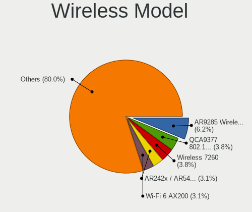

| Model                                                                                         | Notebooks | Percent |
|-----------------------------------------------------------------------------------------------|-----------|---------|
| Qualcomm Atheros AR9485 Wireless Network Adapter                                              | 13        | 5.16%   |
| Intel Wireless 7260                                                                           | 10        | 3.97%   |
| Intel Wi-Fi 6 AX200                                                                           | 10        | 3.97%   |
| Realtek RTL8821CE 802.11ac PCIe Wireless Network Adapter                                      | 9         | 3.57%   |
| Qualcomm Atheros QCA9565 / AR9565 Wireless Network Adapter                                    | 9         | 3.57%   |
| Intel Centrino Advanced-N 6205 [Taylor Peak]                                                  | 9         | 3.57%   |
| Qualcomm Atheros AR9285 Wireless Network Adapter (PCI-Express)                                | 8         | 3.17%   |
| Qualcomm Atheros AR242x / AR542x Wireless Network Adapter (PCI-Express)                       | 8         | 3.17%   |
| Qualcomm Atheros QCA9377 802.11ac Wireless Network Adapter                                    | 7         | 2.78%   |
| Intel Wireless 8260                                                                           | 7         | 2.78%   |
| Intel Wireless 7265                                                                           | 7         | 2.78%   |
| Intel Wi-Fi 6 AX201                                                                           | 7         | 2.78%   |
| Broadcom BCM4313 802.11bgn Wireless Network Adapter                                           | 7         | 2.78%   |
| Qualcomm Atheros AR9462 Wireless Network Adapter                                              | 6         | 2.38%   |
| Qualcomm Atheros AR928X Wireless Network Adapter (PCI-Express)                                | 6         | 2.38%   |
| Intel PRO/Wireless 3945ABG [Golan] Network Connection                                         | 6         | 2.38%   |
| Qualcomm Atheros QCA6174 802.11ac Wireless Network Adapter                                    | 5         | 1.98%   |
| Intel Wireless 3160                                                                           | 5         | 1.98%   |
| Realtek RTL8822CE 802.11ac PCIe Wireless Network Adapter                                      | 4         | 1.59%   |
| Realtek RTL8723BE PCIe Wireless Network Adapter                                               | 4         | 1.59%   |
| Intel Cannon Point-LP CNVi [Wireless-AC]                                                      | 4         | 1.59%   |
| Broadcom Limited BCM4311 802.11a/b/g                                                          | 4         | 1.59%   |
| Realtek RTL8188CE 802.11b/g/n WiFi Adapter                                                    | 3         | 1.19%   |
| Ralink MT7601U Wireless Adapter                                                               | 3         | 1.19%   |
| Ralink RT2790 Wireless 802.11n 1T/2R PCIe                                                     | 3         | 1.19%   |
| Intel Comet Lake PCH CNVi WiFi                                                                | 3         | 1.19%   |
| Intel Cannon Lake PCH CNVi WiFi                                                               | 3         | 1.19%   |
| Broadcom BCM4331 802.11a/b/g/n                                                                | 3         | 1.19%   |
| Broadcom BCM43142 802.11b/g/n                                                                 | 3         | 1.19%   |
| Realtek RTL8821AE 802.11ac PCIe Wireless Network Adapter                                      | 2         | 0.79%   |
| Realtek RTL8723AE PCIe Wireless Network Adapter                                               | 2         | 0.79%   |
| Realtek RTL8188EUS 802.11n Wireless Network Adapter                                           | 2         | 0.79%   |
| Realtek RTL8188EE Wireless Network Adapter                                                    | 2         | 0.79%   |
| Ralink RT3090 Wireless 802.11n 1T/1R PCIe                                                     | 2         | 0.79%   |
| Qualcomm Atheros AR9287 Wireless Network Adapter (PCI-Express)                                | 2         | 0.79%   |
| Intel Wireless-AC 9260                                                                        | 2         | 0.79%   |
| Intel Wireless 8265 / 8275                                                                    | 2         | 0.79%   |
| Intel WiFi Link 5100                                                                          | 2         | 0.79%   |
| Intel Dual Band Wireless-AC 3165 Plus Bluetooth                                               | 2         | 0.79%   |
| Intel Comet Lake PCH-LP CNVi WiFi                                                             | 2         | 0.79%   |
| Intel Centrino Wireless-N 2230                                                                | 2         | 0.79%   |
| Intel Centrino Wireless-N 1000 [Condor Peak]                                                  | 2         | 0.79%   |
| Intel Centrino Ultimate-N 6300                                                                | 2         | 0.79%   |
| Intel Centrino Advanced-N 6200                                                                | 2         | 0.79%   |
| TP-Link TL WN823N RTL8192EU                                                                   | 1         | 0.4%    |
| TP-Link Archer T3U [Realtek RTL8812BU]                                                        | 1         | 0.4%    |
| TP-Link 802.11ac WLAN Adapter                                                                 | 1         | 0.4%    |
| Sierra Wireless EM7345 4G LTE                                                                 | 1         | 0.4%    |
| Realtek RTL8812AU 802.11a/b/g/n/ac 2T2R DB WLAN Adapter                                       | 1         | 0.4%    |
| Realtek RTL8723DE Wireless Network Adapter                                                    | 1         | 0.4%    |
| Realtek RTL8192EU 802.11b/g/n WLAN Adapter                                                    | 1         | 0.4%    |
| Realtek RTL8187SE Wireless LAN Controller                                                     | 1         | 0.4%    |
| Realtek RTL8187B Wireless Adapter                                                             | 1         | 0.4%    |
| Realtek RTL8187B Wireless 802.11g 54Mbps Network Adapter                                      | 1         | 0.4%    |
| Realtek Realtek 8812AU/8821AU 802.11ac WLAN Adapter [USB Wireless Dual-Band Adapter 2.4/5Ghz] | 1         | 0.4%    |
| Realtek 802.11ac NIC                                                                          | 1         | 0.4%    |
| Ralink WLAN controller                                                                        | 1         | 0.4%    |
| Ralink RT2870/RT3070 Wireless Adapter                                                         | 1         | 0.4%    |
| Ralink RT2501/RT2573 Wireless Adapter                                                         | 1         | 0.4%    |
| Ralink RT5390 Wireless 802.11n 1T/1R PCIe                                                     | 1         | 0.4%    |

Ethernet Vendor
---------------

Ethernet vendors

| Vendor                           | Notebooks | Percent |
|----------------------------------|-----------|---------|
| Realtek Semiconductor            | 112       | 51.61%  |
| Intel                            | 46        | 21.2%   |
| Broadcom                         | 18        | 8.29%   |
| Qualcomm Atheros                 | 14        | 6.45%   |
| Marvell Technology Group         | 8         | 3.69%   |
| Broadcom Limited                 | 6         | 2.76%   |
| Xiaomi                           | 3         | 1.38%   |
| JMicron Technology               | 2         | 0.92%   |
| Attansic Technology              | 2         | 0.92%   |
| Silicon Integrated Systems [SiS] | 1         | 0.46%   |
| Samsung Electronics              | 1         | 0.46%   |
| OPPO Electronics                 | 1         | 0.46%   |
| Nvidia                           | 1         | 0.46%   |
| DisplayLink                      | 1         | 0.46%   |
| ASIX Electronics                 | 1         | 0.46%   |

Ethernet Model
--------------

Ethernet models

| Model                                                                          | Notebooks | Percent |
|--------------------------------------------------------------------------------|-----------|---------|
| Realtek RTL8111/8168/8411 PCI Express Gigabit Ethernet Controller              | 68        | 31.19%  |
| Realtek RTL810xE PCI Express Fast Ethernet controller                          | 35        | 16.06%  |
| Intel 82579LM Gigabit Network Connection (Lewisville)                          | 12        | 5.5%    |
| Intel 82577LM Gigabit Network Connection                                       | 5         | 2.29%   |
| Realtek RTL8153 Gigabit Ethernet Adapter                                       | 4         | 1.83%   |
| Qualcomm Atheros Killer E220x Gigabit Ethernet Controller                      | 4         | 1.83%   |
| Qualcomm Atheros AR8151 v2.0 Gigabit Ethernet                                  | 4         | 1.83%   |
| Marvell Group 88E8040 PCI-E Fast Ethernet Controller                           | 4         | 1.83%   |
| Intel Ethernet Connection (3) I218-LM                                          | 4         | 1.83%   |
| Xiaomi Mi/Redmi series (RNDIS)                                                 | 3         | 1.38%   |
| Realtek RTL-8100/8101L/8139 PCI Fast Ethernet Adapter                          | 3         | 1.38%   |
| Intel 82567LM Gigabit Network Connection                                       | 3         | 1.38%   |
| Broadcom NetXtreme BCM57765 Gigabit Ethernet PCIe                              | 3         | 1.38%   |
| Broadcom NetXtreme BCM5764M Gigabit Ethernet PCIe                              | 3         | 1.38%   |
| Broadcom NetLink BCM57785 Gigabit Ethernet PCIe                                | 3         | 1.38%   |
| Broadcom NetLink BCM57780 Gigabit Ethernet PCIe                                | 3         | 1.38%   |
| Broadcom Limited NetXtreme BCM5755M Gigabit Ethernet PCI Express               | 3         | 1.38%   |
| Realtek RTL8152 Fast Ethernet Adapter                                          | 2         | 0.92%   |
| Qualcomm Atheros AR8131 Gigabit Ethernet                                       | 2         | 0.92%   |
| Qualcomm Atheros AR8121/AR8113/AR8114 Gigabit or Fast Ethernet                 | 2         | 0.92%   |
| JMicron JMC250 PCI Express Gigabit Ethernet Controller                         | 2         | 0.92%   |
| Intel Ethernet Connection I219-V                                               | 2         | 0.92%   |
| Intel Ethernet Connection I219-LM                                              | 2         | 0.92%   |
| Intel Ethernet Connection (13) I219-V                                          | 2         | 0.92%   |
| Intel 82579V Gigabit Network Connection                                        | 2         | 0.92%   |
| Intel 82567LF Gigabit Network Connection                                       | 2         | 0.92%   |
| Broadcom NetXtreme BCM5751M Gigabit Ethernet PCI Express                       | 2         | 0.92%   |
| Broadcom NetLink BCM5906M Fast Ethernet PCI Express                            | 2         | 0.92%   |
| Broadcom Limited NetXtreme BCM5761e Gigabit Ethernet PCIe                      | 2         | 0.92%   |
| Attansic AR8152 v2.0 Fast Ethernet                                             | 2         | 0.92%   |
| Silicon Integrated Systems [SiS] 191 Gigabit Ethernet Adapter                  | 1         | 0.46%   |
| Samsung Galaxy series, misc. (tethering mode)                                  | 1         | 0.46%   |
| Realtek Killer E3000 2.5GbE Controller                                         | 1         | 0.46%   |
| Qualcomm Atheros AR8161 Gigabit Ethernet                                       | 1         | 0.46%   |
| Qualcomm Atheros AR8152 v2.0 Fast Ethernet                                     | 1         | 0.46%   |
| OPPO OPPO A83                                                                  | 1         | 0.46%   |
| Nvidia MCP79 Ethernet                                                          | 1         | 0.46%   |
| Marvell Group Yukon Optima 88E8059 [PCIe Gigabit Ethernet Controller with AVB] | 1         | 0.46%   |
| Marvell Group 88E8057 PCI-E Gigabit Ethernet Controller                        | 1         | 0.46%   |
| Marvell Group 88E8055 PCI-E Gigabit Ethernet Controller                        | 1         | 0.46%   |
| Marvell Group 88E8039 PCI-E Fast Ethernet Controller                           | 1         | 0.46%   |
| Intel PRO/100 VE Network Connection                                            | 1         | 0.46%   |
| Intel Ethernet Connection I218-LM                                              | 1         | 0.46%   |
| Intel Ethernet Connection I217-V                                               | 1         | 0.46%   |
| Intel Ethernet Connection I217-LM                                              | 1         | 0.46%   |
| Intel Ethernet Connection (6) I219-V                                           | 1         | 0.46%   |
| Intel Ethernet Connection (4) I219-LM                                          | 1         | 0.46%   |
| Intel Ethernet Connection (11) I219-LM                                         | 1         | 0.46%   |
| Intel Ethernet Connection (10) I219-V                                          | 1         | 0.46%   |
| Intel 82577LC Gigabit Network Connection                                       | 1         | 0.46%   |
| Intel 82573L Gigabit Ethernet Controller                                       | 1         | 0.46%   |
| Intel 82566MM Gigabit Network Connection                                       | 1         | 0.46%   |
| Intel 82566MC Gigabit Network Connection                                       | 1         | 0.46%   |
| DisplayLink Dell Universal Dock D6000                                          | 1         | 0.46%   |
| Broadcom NetXtreme BCM5761 Gigabit Ethernet PCIe                               | 1         | 0.46%   |
| Broadcom NetXtreme BCM5752 Gigabit Ethernet PCI Express                        | 1         | 0.46%   |
| Broadcom Limited NetLink BCM5787M Gigabit Ethernet PCI Express                 | 1         | 0.46%   |
| ASIX AX88179 Gigabit Ethernet                                                  | 1         | 0.46%   |

Net Controller Kind
-------------------

Ethernet, WiFi or modem

| Kind     | Notebooks | Percent |
|----------|-----------|---------|
| WiFi     | 232       | 51.1%   |
| Ethernet | 213       | 46.92%  |
| Modem    | 7         | 1.54%   |
| Unknown  | 2         | 0.44%   |

Used Controller
---------------

Currently used network controller

| Kind     | Notebooks | Percent |
|----------|-----------|---------|
| WiFi     | 214       | 60.28%  |
| Ethernet | 141       | 39.72%  |

NICs
----

Total network controllers on board

| Total | Notebooks | Percent |
|-------|-----------|---------|
| 2     | 196       | 82.35%  |
| 1     | 37        | 15.55%  |
| 0     | 4         | 1.68%   |
| 3     | 1         | 0.42%   |

IPv6
----

IPv6 vs IPv4

| Used | Notebooks | Percent |
|------|-----------|---------|
| No   | 172       | 72.27%  |
| Yes  | 66        | 27.73%  |

Memory Vendor
-------------

Memory module vendors

| Vendor              | Notebooks | Percent |
|---------------------|-----------|---------|
| SK Hynix            | 31        | 29.25%  |
| Samsung Electronics | 30        | 28.3%   |
| Micron Technology   | 9         | 8.49%   |
| Unknown             | 8         | 7.55%   |
| Crucial             | 5         | 4.72%   |
| Smart               | 4         | 3.77%   |
| Kingston            | 3         | 2.83%   |
| Corsair             | 3         | 2.83%   |
| Unknown (ABCD)      | 2         | 1.89%   |
| Ramaxel Technology  | 2         | 1.89%   |
| Transcend           | 1         | 0.94%   |
| Sesame              | 1         | 0.94%   |
| Nanya Technology    | 1         | 0.94%   |
| Foxline             | 1         | 0.94%   |
| Elpida              | 1         | 0.94%   |
| AXIOM               | 1         | 0.94%   |
| ASint Technology    | 1         | 0.94%   |
| Apacer              | 1         | 0.94%   |
| 48spaces            | 1         | 0.94%   |

Memory Model
------------

Memory module models

| Model                                                               | Notebooks | Percent |
|---------------------------------------------------------------------|-----------|---------|
| Samsung RAM M471B5273DH0-CH9 4096MB SODIMM DDR3 1334MT/s            | 5         | 4.39%   |
| SK Hynix RAM HMA81GS6DJR8N-XN 8GB SODIMM DDR4 3200MT/s              | 4         | 3.51%   |
| Unknown (ABCD) RAM 123456789012345678 1536MB SODIMM LPDDR4 2400MT/s | 2         | 1.75%   |
| Smart RAM SH564128FH8NZQNSCG 4096MB SODIMM DDR3 1600MT/s            | 2         | 1.75%   |
| SK Hynix RAM HMT451S6BFR8A-PB 4GB SODIMM DDR3 1600MT/s              | 2         | 1.75%   |
| SK Hynix RAM HMT451S6AFR8A-PB 4096MB SODIMM DDR3 1600MT/s           | 2         | 1.75%   |
| SK Hynix RAM HMT41GS6BFR8A-PB 8192MB SODIMM DDR3 1600MT/s           | 2         | 1.75%   |
| SK Hynix RAM HMT325S6BFR8C-H9 2048MB SODIMM DDR3 1333MT/s           | 2         | 1.75%   |
| SK Hynix RAM HMT125S6TFR8C-H9 2GB SODIMM DDR3 1333MT/s              | 2         | 1.75%   |
| Samsung RAM M471B1G73QH0-YK0 8GB SODIMM DDR3 1600MT/s               | 2         | 1.75%   |
| Samsung RAM M471B1G73EB0-YK0 8192MB SODIMM DDR3 1600MT/s            | 2         | 1.75%   |
| Samsung RAM M471A1K43DB1-CWE 8GB SODIMM DDR4 3200MT/s               | 2         | 1.75%   |
| Micron RAM Module 2048MB SODIMM DDR3 1600MT/s                       | 2         | 1.75%   |
| Micron RAM 4ATF1G64HZ-3G2E2 8192MB SODIMM DDR4 3200MT/s             | 2         | 1.75%   |
| Unknown RAM WPBS26D408SWC-8G 8192MB SODIMM DDR4 2667MT/s            | 1         | 0.88%   |
| Unknown RAM Module 8GB SODIMM DDR3 1600MT/s                         | 1         | 0.88%   |
| Unknown RAM Module 4GB SODIMM DDR3 1600MT/s                         | 1         | 0.88%   |
| Unknown RAM Module 4096MB SODIMM DDR3 1066MT/s                      | 1         | 0.88%   |
| Unknown RAM Module 4096MB SODIMM DDR3                               | 1         | 0.88%   |
| Unknown RAM Module 2048MB SODIMM LPDDR4 1600MT/s                    | 1         | 0.88%   |
| Unknown RAM Module 2048MB SODIMM DDR2 667MT/s                       | 1         | 0.88%   |
| Unknown RAM Module 1024MB SODIMM DDR2                               | 1         | 0.88%   |
| Transcend RAM JM1333KSN-4G 4096MB SODIMM DDR3 1334MT/s              | 1         | 0.88%   |
| Smart RAM SH564128FJ8NWRNSQG 4GB SODIMM DDR3 1600MT/s               | 1         | 0.88%   |
| Smart RAM SH564128FH8NZPHSCR 4GB SODIMM DDR2                        | 1         | 0.88%   |
| SK Hynix RAM Module 2048MB SODIMM DDR3 1600MT/s                     | 1         | 0.88%   |
| SK Hynix RAM HYMP125S64CP8-S6 2GB SODIMM DDR2 800MT/s               | 1         | 0.88%   |
| SK Hynix RAM HMT451S6MFR8A-PB 4096MB SODIMM DDR3 1600MT/s           | 1         | 0.88%   |
| SK Hynix RAM HMT451S6MFR6A-PB 4096MB SODIMM DDR3 1600MT/s           | 1         | 0.88%   |
| SK Hynix RAM HMT451S6BFR8A-PB 4096MB SODIMM DDR3 1600MT/s           | 1         | 0.88%   |
| SK Hynix RAM HMT425S6CFR6A-PB 2048MB SODIMM DDR3 1600MT/s           | 1         | 0.88%   |
| SK Hynix RAM HMT425S6AFR6A-PB 2GB SODIMM DDR3 1600MT/s              | 1         | 0.88%   |
| SK Hynix RAM HMT41GS6BFR8A-PB 8GB SODIMM DDR3 1600MT/s              | 1         | 0.88%   |
| SK Hynix RAM HMT351S6CFR8C-PB 4GB SODIMM DDR3 1600MT/s              | 1         | 0.88%   |
| SK Hynix RAM HMT351S6CFR8C-H9 4096MB SODIMM DDR3 1333MT/s           | 1         | 0.88%   |
| SK Hynix RAM HMT351S6BFR8C-H9 4096MB SODIMM DDR3 1334MT/s           | 1         | 0.88%   |
| SK Hynix RAM HMT325S6BFR8C-H9 2048MB SODIMM DDR3 1600MT/s           | 1         | 0.88%   |
| SK Hynix RAM HMT112S6AFP8C-G7N0 1024MB SODIMM DDR3 1066MT/s         | 1         | 0.88%   |
| SK Hynix RAM HMAA2GS6CJR8N-XN 16384MB SODIMM DDR4 3200MT/s          | 1         | 0.88%   |
| SK Hynix RAM HMA851S6CJR6N-VK 4096MB SODIMM DDR4 2667MT/s           | 1         | 0.88%   |
| SK Hynix RAM HMA82GS6JJR8N-VK 16384MB SODIMM DDR4 2667MT/s          | 1         | 0.88%   |
| SK Hynix RAM HMA81GS6JJR8N-VK 8192MB SODIMM DDR4 2667MT/s           | 1         | 0.88%   |
| SK Hynix RAM HMA81GS6CJR8N-VK 8192MB SODIMM DDR4 2667MT/s           | 1         | 0.88%   |
| SK Hynix RAM H9CCNNNBJTMLAR-NUD 4096MB Row Of Chips LPDDR3 1867MT/s | 1         | 0.88%   |
| Sesame RAM S939A2SGS-ITR 8192MB SODIMM DDR3 1600MT/s                | 1         | 0.88%   |
| Samsung RAM U6E3S4AA-MGCR 4096MB Row Of Chips LPDDR4 4267MT/s       | 1         | 0.88%   |
| Samsung RAM Module 8192MB Row Of Chips LPDDR3 2133MT/s              | 1         | 0.88%   |
| Samsung RAM Module 2GB DIMM DDR2 533MT/s                            | 1         | 0.88%   |
| Samsung RAM Module 1GB DIMM DDR2 533MT/s                            | 1         | 0.88%   |
| Samsung RAM M471B5773EB0-CK0 2048MB SODIMM DDR3 1600MT/s            | 1         | 0.88%   |
| Samsung RAM M471B5773DH0-CH9 2048MB SODIMM DDR3 1600MT/s            | 1         | 0.88%   |
| Samsung RAM M471B5674EB0-YK0 2048MB SODIMM DDR3 1600MT/s            | 1         | 0.88%   |
| Samsung RAM M471B5673FH0-CF8 2GB SODIMM DDR3 1067MT/s               | 1         | 0.88%   |
| Samsung RAM M471B5673EH1-CF8 2048MB SODIMM DDR3 4199MT/s            | 1         | 0.88%   |
| Samsung RAM M471B5273EB0-CK0 4096MB SODIMM DDR3 4199MT/s            | 1         | 0.88%   |
| Samsung RAM M471B5273CH0-CH9 4GB SODIMM DDR3 1334MT/s               | 1         | 0.88%   |
| Samsung RAM M471B5173QH0-YK0 4096MB SODIMM DDR3 1600MT/s            | 1         | 0.88%   |
| Samsung RAM M471B5173EB0-YK0 4096MB SODIMM DDR3 1600MT/s            | 1         | 0.88%   |
| Samsung RAM M471B5173DB0-YK0 4096MB SODIMM DDR3 1600MT/s            | 1         | 0.88%   |
| Samsung RAM M471B2874EH1-CF8 1GB SODIMM DDR3 1067MT/s               | 1         | 0.88%   |

Memory Kind
-----------

Memory module kinds

| Kind   | Notebooks | Percent |
|--------|-----------|---------|
| DDR3   | 52        | 57.14%  |
| DDR4   | 25        | 27.47%  |
| LPDDR4 | 4         | 4.4%    |
| DDR2   | 4         | 4.4%    |
| SDRAM  | 3         | 3.3%    |
| LPDDR3 | 3         | 3.3%    |

Memory Form Factor
------------------

Physical design of the memory module

| Name         | Notebooks | Percent |
|--------------|-----------|---------|
| SODIMM       | 82        | 92.13%  |
| Row Of Chips | 6         | 6.74%   |
| DIMM         | 1         | 1.12%   |

Memory Size
-----------

Memory module size

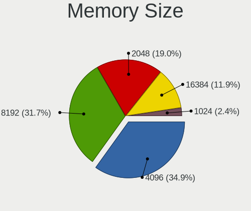

| Size  | Notebooks | Percent |
|-------|-----------|---------|
| 4096  | 36        | 36%     |
| 8192  | 30        | 30%     |
| 2048  | 22        | 22%     |
| 16384 | 7         | 7%      |
| 1024  | 5         | 5%      |

Memory Speed
------------

Memory module speed

| Speed   | Notebooks | Percent |
|---------|-----------|---------|
| 1600    | 36        | 35.29%  |
| 3200    | 14        | 13.73%  |
| 2667    | 11        | 10.78%  |
| 1334    | 8         | 7.84%   |
| 1333    | 6         | 5.88%   |
| 2400    | 5         | 4.9%    |
| 1067    | 4         | 3.92%   |
| 4199    | 3         | 2.94%   |
| 2133    | 3         | 2.94%   |
| 4267    | 2         | 1.96%   |
| 1066    | 2         | 1.96%   |
| 800     | 2         | 1.96%   |
| 667     | 2         | 1.96%   |
| Unknown | 2         | 1.96%   |
| 1867    | 1         | 0.98%   |
| 533     | 1         | 0.98%   |

Sound Vendor
------------

Sound card vendors

| Vendor                           | Notebooks | Percent |
|----------------------------------|-----------|---------|
| Intel                            | 191       | 71%     |
| AMD                              | 47        | 17.47%  |
| Nvidia                           | 24        | 8.92%   |
| Silicon Integrated Systems [SiS] | 2         | 0.74%   |
| Texas Instruments                | 1         | 0.37%   |
| Sennheiser Communications        | 1         | 0.37%   |
| Microsoft                        | 1         | 0.37%   |
| Logitech                         | 1         | 0.37%   |
| Griffin Technology               | 1         | 0.37%   |

Sound Model
-----------

Sound card models

| Model                                                                                             | Notebooks | Percent |
|---------------------------------------------------------------------------------------------------|-----------|---------|
| Intel 7 Series/C216 Chipset Family High Definition Audio Controller                               | 28        | 8.48%   |
| AMD Family 17h (Models 10h-1fh) HD Audio Controller                                               | 20        | 6.06%   |
| Intel 82801I (ICH9 Family) HD Audio Controller                                                    | 19        | 5.76%   |
| Intel 6 Series/C200 Series Chipset Family High Definition Audio Controller                        | 16        | 4.85%   |
| Intel 5 Series/3400 Series Chipset High Definition Audio                                          | 16        | 4.85%   |
| Intel Sunrise Point-LP HD Audio                                                                   | 15        | 4.55%   |
| AMD Renoir Radeon High Definition Audio Controller                                                | 13        | 3.94%   |
| Intel Tiger Lake-LP Smart Sound Technology Audio Controller                                       | 12        | 3.64%   |
| Intel 8 Series HD Audio Controller                                                                | 11        | 3.33%   |
| Intel NM10/ICH7 Family High Definition Audio Controller                                           | 10        | 3.03%   |
| Intel Haswell-ULT HD Audio Controller                                                             | 10        | 3.03%   |
| Intel 82801H (ICH8 Family) HD Audio Controller                                                    | 10        | 3.03%   |
| Intel Broadwell-U Audio Controller                                                                | 9         | 2.73%   |
| Intel 8 Series/C220 Series Chipset High Definition Audio Controller                               | 9         | 2.73%   |
| Intel Wildcat Point-LP High Definition Audio Controller                                           | 8         | 2.42%   |
| AMD Kabini HDMI/DP Audio                                                                          | 8         | 2.42%   |
| AMD FCH Azalia Controller                                                                         | 7         | 2.12%   |
| AMD Family 15h (Models 60h-6fh) Audio Controller                                                  | 7         | 2.12%   |
| Intel Xeon E3-1200 v3/4th Gen Core Processor HD Audio Controller                                  | 6         | 1.82%   |
| AMD SBx00 Azalia (Intel HDA)                                                                      | 6         | 1.82%   |
| Intel Cannon Point-LP High Definition Audio Controller                                            | 5         | 1.52%   |
| Intel Cannon Lake PCH cAVS                                                                        | 5         | 1.52%   |
| Intel Atom Processor Z36xxx/Z37xxx Series High Definition Audio Controller                        | 5         | 1.52%   |
| AMD Raven/Raven2/Fenghuang HDMI/DP Audio Controller                                               | 5         | 1.52%   |
| Intel Atom/Celeron/Pentium Processor x5-E8000/J3xxx/N3xxx Series High Definition Audio Controller | 4         | 1.21%   |
| Nvidia TU107 GeForce GTX 1650 High Definition Audio Controller                                    | 3         | 0.91%   |
| Intel Comet Lake PCH-LP cAVS                                                                      | 3         | 0.91%   |
| Intel Comet Lake PCH cAVS                                                                         | 3         | 0.91%   |
| Intel Celeron N3350/Pentium N4200/Atom E3900 Series Audio Cluster                                 | 3         | 0.91%   |
| AMD Wrestler HDMI Audio                                                                           | 3         | 0.91%   |
| AMD High Definition Audio Controller                                                              | 3         | 0.91%   |
| Silicon Integrated Systems [SiS] Azalia Audio Controller                                          | 2         | 0.61%   |
| Nvidia TU106 High Definition Audio Controller                                                     | 2         | 0.61%   |
| Nvidia MCP79 High Definition Audio                                                                | 2         | 0.61%   |
| Nvidia High Definition Audio Controller                                                           | 2         | 0.61%   |
| Nvidia GP106 High Definition Audio Controller                                                     | 2         | 0.61%   |
| Nvidia GM107 High Definition Audio Controller [GeForce 940MX]                                     | 2         | 0.61%   |
| Nvidia GK106 HDMI Audio Controller                                                                | 2         | 0.61%   |
| Nvidia GF114 HDMI Audio Controller                                                                | 2         | 0.61%   |
| Intel CM238 HD Audio Controller                                                                   | 2         | 0.61%   |
| Intel 82801FB/FBM/FR/FW/FRW (ICH6 Family) AC'97 Audio Controller                                  | 2         | 0.61%   |
| AMD Navi 10 HDMI Audio                                                                            | 2         | 0.61%   |
| Texas Instruments PCM2704 16-bit stereo audio DAC                                                 | 1         | 0.3%    |
| Sennheiser Communications Sennheiser USB headset                                                  | 1         | 0.3%    |
| Nvidia TU116 High Definition Audio Controller                                                     | 1         | 0.3%    |
| Nvidia GP107GL High Definition Audio Controller                                                   | 1         | 0.3%    |
| Nvidia GK107 HDMI Audio Controller                                                                | 1         | 0.3%    |
| Nvidia GF119 HDMI Audio Controller                                                                | 1         | 0.3%    |
| Nvidia GF116 High Definition Audio Controller                                                     | 1         | 0.3%    |
| Nvidia GF106 High Definition Audio Controller                                                     | 1         | 0.3%    |
| Nvidia GA104 High Definition Audio Controller                                                     | 1         | 0.3%    |
| Microsoft LifeChat LX-3000 Headset                                                                | 1         | 0.3%    |
| Logitech Speaker Lapdesk N700                                                                     | 1         | 0.3%    |
| Intel USB PnP Sound Device                                                                        | 1         | 0.3%    |
| Intel Ice Lake-LP Smart Sound Technology Audio Controller                                         | 1         | 0.3%    |
| Intel Celeron/Pentium Silver Processor High Definition Audio                                      | 1         | 0.3%    |
| Intel 100 Series/C230 Series Chipset Family HD Audio Controller                                   | 1         | 0.3%    |
| Griffin Technology PowerWave                                                                      | 1         | 0.3%    |
| AMD Turks HDMI Audio [Radeon HD 6500/6600 / 6700M Series]                                         | 1         | 0.3%    |
| AMD Trinity HDMI Audio Controller                                                                 | 1         | 0.3%    |

Camera Vendor
-------------

Camera device vendors

| Vendor                                 | Notebooks | Percent |
|----------------------------------------|-----------|---------|
| Chicony Electronics                    | 53        | 27.89%  |
| IMC Networks                           | 21        | 11.05%  |
| Acer                                   | 17        | 8.95%   |
| Realtek Semiconductor                  | 15        | 7.89%   |
| Sunplus Innovation Technology          | 12        | 6.32%   |
| Microdia                               | 11        | 5.79%   |
| Suyin                                  | 10        | 5.26%   |
| Cheng Uei Precision Industry (Foxlink) | 10        | 5.26%   |
| Quanta                                 | 8         | 4.21%   |
| Apple                                  | 5         | 2.63%   |
| Syntek                                 | 4         | 2.11%   |
| Lite-On Technology                     | 4         | 2.11%   |
| Z-Star Microelectronics                | 3         | 1.58%   |
| Silicon Motion                         | 3         | 1.58%   |
| Logitech                               | 3         | 1.58%   |
| DigiTech                               | 2         | 1.05%   |
| Alcor Micro                            | 2         | 1.05%   |
| Y Media                                | 1         | 0.53%   |
| Unknown                                | 1         | 0.53%   |
| Sonix Technology                       | 1         | 0.53%   |
| Samsung Electronics                    | 1         | 0.53%   |
| Ricoh                                  | 1         | 0.53%   |
| OmniVision Technologies                | 1         | 0.53%   |
| Lenovo                                 | 1         | 0.53%   |

Camera Model
------------

Camera device models

| Model                                                                      | Notebooks | Percent |
|----------------------------------------------------------------------------|-----------|---------|
| Chicony Integrated Camera                                                  | 8         | 4.19%   |
| IMC Networks USB2.0 HD UVC WebCam                                          | 7         | 3.66%   |
| Microdia Integrated_Webcam_HD                                              | 5         | 2.62%   |
| Chicony HD WebCam                                                          | 5         | 2.62%   |
| Acer Lenovo EasyCamera                                                     | 5         | 2.62%   |
| Realtek Integrated_Webcam_HD                                               | 4         | 2.09%   |
| Chicony TOSHIBA Web Camera - HD                                            | 4         | 2.09%   |
| Chicony HD User Facing                                                     | 4         | 2.09%   |
| Acer Integrated Camera                                                     | 4         | 2.09%   |
| Quanta VGA Webcam                                                          | 3         | 1.57%   |
| Lite-On Integrated Camera                                                  | 3         | 1.57%   |
| Chicony Lenovo Integrated Camera (0.3MP)                                   | 3         | 1.57%   |
| Chicony HP TrueVision HD                                                   | 3         | 1.57%   |
| Cheng Uei Precision Industry (Foxlink) HP Truevision HD                    | 3         | 1.57%   |
| Acer MSI Integrated Webcam                                                 | 3         | 1.57%   |
| Z-Star Namuga 1.3M Webcam                                                  | 2         | 1.05%   |
| Syntek EasyCamera                                                          | 2         | 1.05%   |
| Suyin Acer/Lenovo Webcam [CN0316]                                          | 2         | 1.05%   |
| Suyin Acer/HP Integrated Webcam [CN0314]                                   | 2         | 1.05%   |
| Sunplus Integrated Webcam                                                  | 2         | 1.05%   |
| Quanta HD User Facing                                                      | 2         | 1.05%   |
| Logitech Webcam C270                                                       | 2         | 1.05%   |
| IMC Networks UVC VGA Webcam                                                | 2         | 1.05%   |
| IMC Networks USB2.0 VGA UVC WebCam                                         | 2         | 1.05%   |
| IMC Networks USB2.0 UVC VGA WebCam                                         | 2         | 1.05%   |
| IMC Networks Integrated Camera                                             | 2         | 1.05%   |
| DigiTech USB 2.0 PC Camera                                                 | 2         | 1.05%   |
| Chicony USB2.0 HD UVC WebCam                                               | 2         | 1.05%   |
| Chicony HP Wide Vision HD Camera                                           | 2         | 1.05%   |
| Chicony HP HD Camera                                                       | 2         | 1.05%   |
| Cheng Uei Precision Industry (Foxlink) Webcam (UVC)                        | 2         | 1.05%   |
| Cheng Uei Precision Industry (Foxlink) HP Wide Vision HD Integrated Webcam | 2         | 1.05%   |
| Apple FaceTime HD Camera                                                   | 2         | 1.05%   |
| Apple Built-in iSight                                                      | 2         | 1.05%   |
| Z-Star Sirius USB2.0 Camera                                                | 1         | 0.52%   |
| Y Media USB Camera                                                         | 1         | 0.52%   |
| Unknown 720p HD Camera                                                     | 1         | 0.52%   |
| Syntek Integrated Camera                                                   | 1         | 0.52%   |
| Syntek HP Webcam                                                           | 1         | 0.52%   |
| Suyin WebCam                                                               | 1         | 0.52%   |
| Suyin Laptop_Integrated_Webcam_HD                                          | 1         | 0.52%   |
| Suyin Integrated_Webcam_HD                                                 | 1         | 0.52%   |
| Suyin HP Webcam-50                                                         | 1         | 0.52%   |
| Suyin HP Truevision HD                                                     | 1         | 0.52%   |
| Suyin Acer CrystalEye Webcam                                               | 1         | 0.52%   |
| Sunplus USB 2.0 Camera                                                     | 1         | 0.52%   |
| Sunplus Laptop_Integrated_Webcam_FHD                                       | 1         | 0.52%   |
| Sunplus Laptop_Integrated_Webcam_1.3M                                      | 1         | 0.52%   |
| Sunplus Laptop Integrated WebCam HD                                        | 1         | 0.52%   |
| Sunplus Laptop Integrated Webcam FHD                                       | 1         | 0.52%   |
| Sunplus Integrated_Webcam_HD                                               | 1         | 0.52%   |
| Sunplus HP TrueVision HD Camera                                            | 1         | 0.52%   |
| Sunplus ASUS Webcam                                                        | 1         | 0.52%   |
| Sunplus ASUS USB2.0 Webcam                                                 | 1         | 0.52%   |
| Sunplus 1.3M HD WebCam                                                     | 1         | 0.52%   |
| Sonix USB2.0 HD UVC WebCam                                                 | 1         | 0.52%   |
| Silicon Motion WebCam SCB-1100N                                            | 1         | 0.52%   |
| Silicon Motion WebCam SC-10HDD12636N                                       | 1         | 0.52%   |
| Silicon Motion WebCam SC-0311139N                                          | 1         | 0.52%   |
| Samsung Galaxy A5 (MTP)                                                    | 1         | 0.52%   |

Fingerprint Vendor
------------------

Fingerprint sensor vendors

| Vendor                     | Notebooks | Percent |
|----------------------------|-----------|---------|
| Validity Sensors           | 12        | 32.43%  |
| Upek                       | 6         | 16.22%  |
| Synaptics                  | 5         | 13.51%  |
| Shenzhen Goodix Technology | 5         | 13.51%  |
| AuthenTec                  | 5         | 13.51%  |
| STMicroelectronics         | 2         | 5.41%   |
| Suprema                    | 1         | 2.7%    |
| Elan Microelectronics      | 1         | 2.7%    |

Fingerprint Model
-----------------

Fingerprint sensor models

| Model                                                      | Notebooks | Percent |
|------------------------------------------------------------|-----------|---------|
| Upek Biometric Touchchip/Touchstrip Fingerprint Sensor     | 6         | 16.22%  |
| Validity Sensors VFS 5011 fingerprint sensor               | 3         | 8.11%   |
| Shenzhen Goodix  FingerPrint Device                        | 3         | 8.11%   |
| AuthenTec AES2550 Fingerprint Sensor                       | 3         | 8.11%   |
| Validity Sensors VFS5011 Fingerprint Reader                | 2         | 5.41%   |
| Validity Sensors VFS495 Fingerprint Reader                 | 2         | 5.41%   |
| Validity Sensors VFS471 Fingerprint Reader                 | 2         | 5.41%   |
| Synaptics Prometheus MIS Touch Fingerprint Reader          | 2         | 5.41%   |
| STMicroelectronics Fingerprint Reader                      | 2         | 5.41%   |
| Validity Sensors VFS451 Fingerprint Reader                 | 1         | 2.7%    |
| Validity Sensors Synaptics WBDI                            | 1         | 2.7%    |
| Validity Sensors Fingerprint scanner                       | 1         | 2.7%    |
| Synaptics  VFS7552 Touch Fingerprint Sensor with PurePrint | 1         | 2.7%    |
| Synaptics  FS7604 Touch Fingerprint Sensor with PurePrint  | 1         | 2.7%    |
| Suprema SUP-SFR400(A) BioMini Fingerprint Reader           | 1         | 2.7%    |
| Shenzhen Goodix Fingerprint Reader                         | 1         | 2.7%    |
| Shenzhen Goodix FingerPrint                                | 1         | 2.7%    |
| Elan ELAN:Fingerprint                                      | 1         | 2.7%    |
| AuthenTec AES2501 Fingerprint Sensor                       | 1         | 2.7%    |
| AuthenTec AES1600                                          | 1         | 2.7%    |
| Unknown                                                    | 1         | 2.7%    |

Chipcard Vendor
---------------

Chipcard module vendors

| Vendor      | Notebooks | Percent |
|-------------|-----------|---------|
| Broadcom    | 9         | 47.37%  |
| O2 Micro    | 5         | 26.32%  |
| Lenovo      | 3         | 15.79%  |
| Alcor Micro | 2         | 10.53%  |

Chipcard Model
--------------

Chipcard module models

| Model                                                                        | Notebooks | Percent |
|------------------------------------------------------------------------------|-----------|---------|
| O2 Micro OZ776 CCID Smartcard Reader                                         | 4         | 21.05%  |
| Broadcom BCM5880 Secure Applications Processor                               | 4         | 21.05%  |
| Lenovo Integrated Smart Card Reader                                          | 3         | 15.79%  |
| Broadcom BCM5880 Secure Applications Processor with fingerprint swipe sensor | 2         | 10.53%  |
| Broadcom 58200                                                               | 2         | 10.53%  |
| Alcor Micro AU9540 Smartcard Reader                                          | 2         | 10.53%  |
| O2 Micro Oz776 SmartCard Reader                                              | 1         | 5.26%   |
| Broadcom BCM5880 Secure Applications Processor with fingerprint touch sensor | 1         | 5.26%   |

Printer Vendor
--------------

Printer device vendors

| Vendor          | Notebooks | Percent |
|-----------------|-----------|---------|
| Hewlett-Packard | 2         | 100%    |

Printer Model
-------------

Printer device models

| Model                        | Notebooks | Percent |
|------------------------------|-----------|---------|
| HP OfficeJet Pro 8030 series | 1         | 50%     |
| HP Deskjet F2280 series      | 1         | 50%     |

Scanner Vendor
--------------

Scanner device vendors

Zero info for selected period =(

Scanner Model
-------------

Scanner device models

Zero info for selected period =(

Bluetooth Vendor
----------------

Controller vendors

| Vendor                          | Notebooks | Percent |
|---------------------------------|-----------|---------|
| Intel                           | 69        | 39.88%  |
| Qualcomm Atheros Communications | 21        | 12.14%  |
| Broadcom                        | 16        | 9.25%   |
| Realtek Semiconductor           | 14        | 8.09%   |
| IMC Networks                    | 12        | 6.94%   |
| Lite-On Technology              | 9         | 5.2%    |
| Cambridge Silicon Radio         | 9         | 5.2%    |
| Dell                            | 8         | 4.62%   |
| Apple                           | 6         | 3.47%   |
| Foxconn / Hon Hai               | 3         | 1.73%   |
| Toshiba                         | 1         | 0.58%   |
| Taiyo Yuden                     | 1         | 0.58%   |
| Realtek                         | 1         | 0.58%   |
| Ralink Technology               | 1         | 0.58%   |
| Ralink                          | 1         | 0.58%   |
| Alps Electric                   | 1         | 0.58%   |

Bluetooth Model
---------------

Controller models

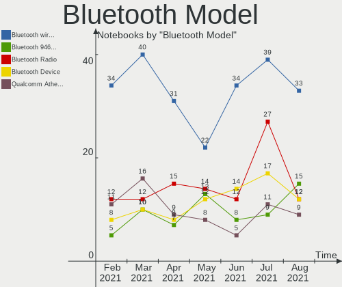

| Model                                               | Notebooks | Percent |
|-----------------------------------------------------|-----------|---------|
| Intel Bluetooth wireless interface                  | 34        | 19.65%  |
| Realtek Bluetooth Radio                             | 12        | 6.94%   |
| Intel Bluetooth Device                              | 12        | 6.94%   |
| Intel AX200 Bluetooth                               | 10        | 5.78%   |
| Cambridge Silicon Radio Bluetooth Dongle (HCI mode) | 9         | 5.2%    |
| Qualcomm Atheros AR3012 Bluetooth 4.0               | 8         | 4.62%   |
| Intel Bluetooth 9460/9560 Jefferson Peak (JfP)      | 8         | 4.62%   |
| IMC Networks Bluetooth Radio                        | 7         | 4.05%   |
| Qualcomm Atheros  Bluetooth Device                  | 5         | 2.89%   |
| Lite-On Qualcomm Atheros QCA9377 Bluetooth          | 4         | 2.31%   |
| Broadcom BCM2045B (BDC-2.1)                         | 4         | 2.31%   |
| Lite-On Bluetooth Device                            | 3         | 1.73%   |
| Intel Centrino Bluetooth Wireless Transceiver       | 3         | 1.73%   |
| Dell Wireless 360 Bluetooth                         | 3         | 1.73%   |
| Apple Bluetooth USB Host Controller                 | 3         | 1.73%   |
| Apple Bluetooth Host Controller                     | 3         | 1.73%   |
| Qualcomm Atheros Bluetooth USB Host Controller      | 2         | 1.16%   |
| Qualcomm Atheros AR9462 Bluetooth                   | 2         | 1.16%   |
| Qualcomm Atheros AR3011 Bluetooth                   | 2         | 1.16%   |
| Lite-On Atheros AR3012 Bluetooth                    | 2         | 1.16%   |
| Intel Wireless-AC 9260 Bluetooth Adapter            | 2         | 1.16%   |
| IMC Networks Bluetooth Device                       | 2         | 1.16%   |
| Foxconn / Hon Hai Bluetooth Device                  | 2         | 1.16%   |
| Broadcom BCM20702 Bluetooth 4.0 [ThinkPad]          | 2         | 1.16%   |
| Broadcom BCM2045B (BDC-2) [Bluetooth Controller]    | 2         | 1.16%   |
| Toshiba Askey Bluetooth Module                      | 1         | 0.58%   |
| Taiyo Yuden Bluetooth Device                        | 1         | 0.58%   |
| Realtek RTL8723B Bluetooth                          | 1         | 0.58%   |
| Realtek  Bluetooth 4.2 Adapter                      | 1         | 0.58%   |
| Realtek Bluetooth Radio                             | 1         | 0.58%   |
| Ralink Motorola BC4 Bluetooth 3.0+HS Adapter        | 1         | 0.58%   |
| Ralink RT3290 Bluetooth                             | 1         | 0.58%   |
| Qualcomm Atheros QCA61x4 Bluetooth 4.0              | 1         | 0.58%   |
| Qualcomm Atheros Bluetooth (AR3011)                 | 1         | 0.58%   |
| IMC Networks Wireless_Device                        | 1         | 0.58%   |
| IMC Networks Bluetooth module                       | 1         | 0.58%   |
| IMC Networks Bluetooth                              | 1         | 0.58%   |
| Foxconn / Hon Hai Bluetooth USB Host Controller     | 1         | 0.58%   |
| Dell Wireless 370 Bluetooth Mini-card               | 1         | 0.58%   |
| Dell Wireless 365 Bluetooth                         | 1         | 0.58%   |
| Dell Wireless 355 Bluetooth                         | 1         | 0.58%   |
| Dell DW375 Bluetooth Module                         | 1         | 0.58%   |
| Dell BCM20702A0 Bluetooth Module                    | 1         | 0.58%   |
| Broadcom IBM Integrated Bluetooth IV                | 1         | 0.58%   |
| Broadcom HP Portable SoftSailing                    | 1         | 0.58%   |
| Broadcom BCM43142A0 Bluetooth 4.0                   | 1         | 0.58%   |
| Broadcom BCM20702A0 Bluetooth 4.0                   | 1         | 0.58%   |
| Broadcom BCM20702A0                                 | 1         | 0.58%   |
| Broadcom BCM2070 Bluetooth Device                   | 1         | 0.58%   |
| Broadcom BCM2070 Bluetooth 2.1 + EDR                | 1         | 0.58%   |
| Broadcom BCM2046 Bluetooth Device                   | 1         | 0.58%   |
| Alps Electric Bluetooth Controller (ALPS/UGPZ6)     | 1         | 0.58%   |

Unsupported Devices
-------------------

Total unsupported devices on board

| Total | Notebooks | Percent |
|-------|-----------|---------|
| 0     | 153       | 64.29%  |
| 1     | 57        | 23.95%  |
| 2     | 23        | 9.66%   |
| 3     | 4         | 1.68%   |
| 4     | 1         | 0.42%   |

Unsupported Device Types
------------------------

Types of unsupported devices

| Type                     | Notebooks | Percent |
|--------------------------|-----------|---------|
| Fingerprint reader       | 36        | 31.58%  |
| Graphics card            | 23        | 20.18%  |
| Chipcard                 | 18        | 15.79%  |
| Net/wireless             | 12        | 10.53%  |
| Multimedia controller    | 8         | 7.02%   |
| Storage                  | 5         | 4.39%   |
| Storage/ide              | 2         | 1.75%   |
| Modem                    | 2         | 1.75%   |
| Camera                   | 2         | 1.75%   |
| Bluetooth                | 2         | 1.75%   |
| Net/ethernet             | 1         | 0.88%   |
| Flash memory             | 1         | 0.88%   |
| Communication controller | 1         | 0.88%   |
| Card reader              | 1         | 0.88%   |

