Mint Hardware Trends (Notebook)
-------------------------------

A project to identify most popular hardware characteristics and track their change
over time based on data collected by Mint users at https://Linux-Hardware.org.

Anyone can contribute to the study by uploading probes of their computers by
the [hw-probe](https://github.com/linuxhw/hw-probe) tool:

    sudo -E hw-probe -all -upload

Full-feature report is available here: https://linux-hardware.org/?view=trends&formfactor=notebook

Period: May, 2021.

Contents
--------

- [ OS                       ](#os)
- [ OS Family                ](#os-family)
- [ Kernel                   ](#kernel)
- [ Kernel Family            ](#kernel-family)
- [ Kernel Major Ver.        ](#kernel-major-ver)
- [ Arch                     ](#arch)
- [ DE                       ](#de)
- [ Display Server           ](#display-server)
- [ Display Manager          ](#display-manager)
- [ OS Lang                  ](#os-lang)
- [ Boot Mode                ](#boot-mode)
- [ Filesystem               ](#filesystem)
- [ Part. scheme             ](#part-scheme)
- [ Dual Boot with Linux/BSD ](#dual-boot-with-linux/bsd)
- [ Dual Boot (Win)          ](#dual-boot-win)
- [ Country                  ](#country)
- [ City                     ](#city)
- [ Vendor                   ](#vendor)
- [ Model                    ](#model)
- [ Model Family             ](#model-family)
- [ MFG Year                 ](#mfg-year)
- [ Form Factor              ](#form-factor)
- [ Secure Boot              ](#secure-boot)
- [ Coreboot                 ](#coreboot)
- [ RAM Size                 ](#ram-size)
- [ RAM Used                 ](#ram-used)
- [ Has CD-ROM               ](#has-cd-rom)
- [ Total Drives             ](#total-drives)
- [ Has Ethernet             ](#has-ethernet)
- [ Has WiFi                 ](#has-wifi)
- [ Has Bluetooth            ](#has-bluetooth)
- [ Drive Vendor             ](#drive-vendor)
- [ Drive Model              ](#drive-model)
- [ HDD Vendor               ](#hdd-vendor)
- [ SSD Vendor               ](#ssd-vendor)
- [ Drive Kind               ](#drive-kind)
- [ Drive Connector          ](#drive-connector)
- [ Drive Size               ](#drive-size)
- [ Space Total              ](#space-total)
- [ Space Used               ](#space-used)
- [ Malfunc. Drives          ](#malfunc-drives)
- [ Malfunc. Drive Vendor    ](#malfunc-drive-vendor)
- [ Malfunc. HDD Vendor      ](#malfunc-hdd-vendor)
- [ Malfunc. Drive Kind      ](#malfunc-drive-kind)
- [ Failed Drives            ](#failed-drives)
- [ Failed Drive Vendor      ](#failed-drive-vendor)
- [ Drive Status             ](#drive-status)
- [ Storage Vendor           ](#storage-vendor)
- [ Storage Model            ](#storage-model)
- [ Storage Kind             ](#storage-kind)
- [ CPU Vendor               ](#cpu-vendor)
- [ CPU Model                ](#cpu-model)
- [ CPU Model Family         ](#cpu-model-family)
- [ CPU Cores                ](#cpu-cores)
- [ CPU Sockets              ](#cpu-sockets)
- [ CPU Threads              ](#cpu-threads)
- [ CPU Op-Modes             ](#cpu-op-modes)
- [ CPU Microcode            ](#cpu-microcode)
- [ CPU Microarch            ](#cpu-microarch)
- [ GPU Vendor               ](#gpu-vendor)
- [ GPU Model                ](#gpu-model)
- [ GPU Combo                ](#gpu-combo)
- [ GPU Driver               ](#gpu-driver)
- [ GPU Memory               ](#gpu-memory)
- [ Monitor Vendor           ](#monitor-vendor)
- [ Monitor Model            ](#monitor-model)
- [ Monitor Resolution       ](#monitor-resolution)
- [ Monitor Diagonal         ](#monitor-diagonal)
- [ Monitor Width            ](#monitor-width)
- [ Aspect Ratio             ](#aspect-ratio)
- [ Monitor Area             ](#monitor-area)
- [ Pixel Density            ](#pixel-density)
- [ Multiple Monitors        ](#multiple-monitors)
- [ Net Controller Vendor    ](#net-controller-vendor)
- [ Net Controller Model     ](#net-controller-model)
- [ Wireless Vendor          ](#wireless-vendor)
- [ Wireless Model           ](#wireless-model)
- [ Ethernet Vendor          ](#ethernet-vendor)
- [ Ethernet Model           ](#ethernet-model)
- [ Net Controller Kind      ](#net-controller-kind)
- [ Used Controller          ](#used-controller)
- [ NICs                     ](#nics)
- [ IPv6                     ](#ipv6)
- [ Memory Vendor            ](#memory-vendor)
- [ Memory Model             ](#memory-model)
- [ Memory Kind              ](#memory-kind)
- [ Memory Form Factor       ](#memory-form-factor)
- [ Memory Size              ](#memory-size)
- [ Memory Speed             ](#memory-speed)
- [ Sound Vendor             ](#sound-vendor)
- [ Sound Model              ](#sound-model)
- [ Camera Vendor            ](#camera-vendor)
- [ Camera Model             ](#camera-model)
- [ Fingerprint Vendor       ](#fingerprint-vendor)
- [ Fingerprint Model        ](#fingerprint-model)
- [ Chipcard Vendor          ](#chipcard-vendor)
- [ Chipcard Model           ](#chipcard-model)
- [ Printer Vendor           ](#printer-vendor)
- [ Printer Model            ](#printer-model)
- [ Scanner Vendor           ](#scanner-vendor)
- [ Scanner Model            ](#scanner-model)
- [ Bluetooth Vendor         ](#bluetooth-vendor)
- [ Bluetooth Model          ](#bluetooth-model)
- [ Unsupported Devices      ](#unsupported-devices)
- [ Unsupported Device Types ](#unsupported-device-types)

OS
--

Installed operating systems

| Name      | Notebooks | Percent |
|-----------|-----------|---------|
| Mint 20.1 | 203       | 78.08%  |
| Mint 20   | 23        | 8.85%   |
| Mint 19.3 | 21        | 8.08%   |
| Mint 19.1 | 5         | 1.92%   |
| Mint 19.2 | 3         | 1.15%   |
| Mint 19   | 3         | 1.15%   |
| Mint 18.3 | 2         | 0.77%   |

OS Family
---------

OS without a version

| Name | Notebooks | Percent |
|------|-----------|---------|
| Mint | 260       | 100%    |

Kernel
------

Version of the Linux kernel

| Version               | Notebooks | Percent |
|-----------------------|-----------|---------|
| 5.4.0-73-generic      | 110       | 42.31%  |
| 5.4.0-72-generic      | 70        | 26.92%  |
| 5.4.0-58-generic      | 25        | 9.62%   |
| 5.8.0-53-generic      | 15        | 5.77%   |
| 5.8.0-50-generic      | 6         | 2.31%   |
| 5.4.0-26-generic      | 6         | 2.31%   |
| 4.15.0-143-generic    | 4         | 1.54%   |
| 4.15.0-142-generic    | 4         | 1.54%   |
| 5.6.0-1056-oem        | 2         | 0.77%   |
| 4.15.0-54-generic     | 2         | 0.77%   |
| 4.15.0-20-generic     | 2         | 0.77%   |
| 5.9.0-050900-generic  | 1         | 0.38%   |
| 5.8.0-48-generic      | 1         | 0.38%   |
| 5.8.0-43-generic      | 1         | 0.38%   |
| 5.4.0-71-generic      | 1         | 0.38%   |
| 5.4.0-70-generic      | 1         | 0.38%   |
| 5.4.0-65-generic      | 1         | 0.38%   |
| 5.4.0-59-generic      | 1         | 0.38%   |
| 5.4.0-56-generic      | 1         | 0.38%   |
| 5.12.6-051206-generic | 1         | 0.38%   |
| 5.12.3-051203-generic | 1         | 0.38%   |
| 5.12.2-051202-generic | 1         | 0.38%   |
| 5.0.0-32-generic      | 1         | 0.38%   |
| 4.4.0-210-generic     | 1         | 0.38%   |
| 4.15.0-106-generic    | 1         | 0.38%   |

Kernel Family
-------------

Linux kernel without a distro release

| Version | Notebooks | Percent |
|---------|-----------|---------|
| 5.4.0   | 216       | 83.08%  |
| 5.8.0   | 23        | 8.85%   |
| 4.15.0  | 13        | 5%      |
| 5.6.0   | 2         | 0.77%   |
| 5.9.0   | 1         | 0.38%   |
| 5.12.6  | 1         | 0.38%   |
| 5.12.3  | 1         | 0.38%   |
| 5.12.2  | 1         | 0.38%   |
| 5.0.0   | 1         | 0.38%   |
| 4.4.0   | 1         | 0.38%   |

Kernel Major Ver.
-----------------

Linux kernel major version

| Version | Notebooks | Percent |
|---------|-----------|---------|
| 5.4     | 216       | 83.08%  |
| 5.8     | 23        | 8.85%   |
| 4.15    | 13        | 5%      |
| 5.12    | 3         | 1.15%   |
| 5.6     | 2         | 0.77%   |
| 5.9     | 1         | 0.38%   |
| 5.0     | 1         | 0.38%   |
| 4.4     | 1         | 0.38%   |

Arch
----

OS architecture (x86_64, i586, etc.)

| Name   | Notebooks | Percent |
|--------|-----------|---------|
| x86_64 | 246       | 94.62%  |
| i686   | 14        | 5.38%   |

DE
--

Desktop Environment

| Name       | Notebooks | Percent |
|------------|-----------|---------|
| X-Cinnamon | 171       | 65.77%  |
| XFCE       | 39        | 15%     |
| MATE       | 31        | 11.92%  |
| Cinnamon   | 8         | 3.08%   |
| GNOME      | 6         | 2.31%   |
| Unknown    | 4         | 1.54%   |
| KDE        | 1         | 0.38%   |

Display Server
--------------

X11 or Wayland

| Name | Notebooks | Percent |
|------|-----------|---------|
| X11  | 260       | 100%    |

Display Manager
---------------

SDDM, LightDM, etc.

| Name    | Notebooks | Percent |
|---------|-----------|---------|
| Unknown | 179       | 68.85%  |
| TDM     | 79        | 30.38%  |
| GDM     | 2         | 0.77%   |

OS Lang
-------

Language

| Lang        | Notebooks | Percent |
|-------------|-----------|---------|
| en_US       | 71        | 27.31%  |
| de_DE       | 41        | 15.77%  |
| pt_BR       | 22        | 8.46%   |
| en_GB       | 14        | 5.38%   |
| C           | 10        | 3.85%   |
| fr_FR       | 9         | 3.46%   |
| it_IT       | 8         | 3.08%   |
| ru_RU       | 7         | 2.69%   |
| pl_PL       | 7         | 2.69%   |
| nl_NL       | 5         | 1.92%   |
| es_ES       | 5         | 1.92%   |
| en_CA       | 5         | 1.92%   |
| tr_TR       | 4         | 1.54%   |
| es_CL       | 4         | 1.54%   |
| sk_SK       | 3         | 1.15%   |
| pt_PT       | 3         | 1.15%   |
| fr_CA       | 3         | 1.15%   |
| es_UY       | 3         | 1.15%   |
| en_ZA       | 3         | 1.15%   |
| en_IN       | 3         | 1.15%   |
| en_AU       | 3         | 1.15%   |
| de_AT       | 3         | 1.15%   |
| cs_CZ       | 3         | 1.15%   |
| el_GR       | 2         | 0.77%   |
| de_CH       | 2         | 0.77%   |
| da_DK       | 2         | 0.77%   |
| zh_CN       | 1         | 0.38%   |
| sr_RS@latin | 1         | 0.38%   |
| sr_RS       | 1         | 0.38%   |
| ru_UA       | 1         | 0.38%   |
| ro_RO       | 1         | 0.38%   |
| eu_ES       | 1         | 0.38%   |
| es_VE       | 1         | 0.38%   |
| es_US       | 1         | 0.38%   |
| es_MX       | 1         | 0.38%   |
| es_BO       | 1         | 0.38%   |
| es_AR       | 1         | 0.38%   |
| en_PH       | 1         | 0.38%   |
| en_NZ       | 1         | 0.38%   |
| en_IL       | 1         | 0.38%   |
| Unknown     | 1         | 0.38%   |

Boot Mode
---------

EFI or BIOS

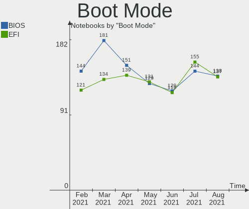

| Mode | Notebooks | Percent |
|------|-----------|---------|
| EFI  | 131       | 50.38%  |
| BIOS | 129       | 49.62%  |

Filesystem
----------

Type of filesystem

| Type    | Notebooks | Percent |
|---------|-----------|---------|
| Ext4    | 247       | 95%     |
| Overlay | 8         | 3.08%   |
| Btrfs   | 3         | 1.15%   |
| Xfs     | 1         | 0.38%   |
| Ext2    | 1         | 0.38%   |

Part. scheme
------------

Scheme of partitioning

| Type    | Notebooks | Percent |
|---------|-----------|---------|
| Unknown | 177       | 68.08%  |
| GPT     | 57        | 21.92%  |
| MBR     | 26        | 10%     |

Dual Boot with Linux/BSD
------------------------

Hosting more than one Linux/BSD

| Dual boot | Notebooks | Percent |
|-----------|-----------|---------|
| No        | 247       | 95%     |
| Yes       | 13        | 5%      |

Dual Boot (Win)
---------------

Hosting Linux and Windows

| Dual boot | Notebooks | Percent |
|-----------|-----------|---------|
| No        | 215       | 82.69%  |
| Yes       | 45        | 17.31%  |

Country
-------

Geographic location (country)

| Country                | Notebooks | Percent |
|------------------------|-----------|---------|
| Germany                | 44        | 16.92%  |
| USA                    | 39        | 15%     |
| Brazil                 | 27        | 10.38%  |
| UK                     | 15        | 5.77%   |
| Italy                  | 12        | 4.62%   |
| Poland                 | 8         | 3.08%   |
| Canada                 | 8         | 3.08%   |
| Spain                  | 7         | 2.69%   |
| Netherlands            | 7         | 2.69%   |
| Russia                 | 6         | 2.31%   |
| France                 | 6         | 2.31%   |
| Slovakia               | 4         | 1.54%   |
| Serbia                 | 4         | 1.54%   |
| Portugal               | 4         | 1.54%   |
| India                  | 4         | 1.54%   |
| Chile                  | 4         | 1.54%   |
| Uruguay                | 3         | 1.15%   |
| Turkey                 | 3         | 1.15%   |
| Switzerland            | 3         | 1.15%   |
| South Africa           | 3         | 1.15%   |
| Romania                | 3         | 1.15%   |
| Bulgaria               | 3         | 1.15%   |
| Austria                | 3         | 1.15%   |
| Australia              | 3         | 1.15%   |
| Argentina              | 3         | 1.15%   |
| Ukraine                | 2         | 0.77%   |
| Norway                 | 2         | 0.77%   |
| Mexico                 | 2         | 0.77%   |
| Greece                 | 2         | 0.77%   |
| Denmark                | 2         | 0.77%   |
| Czechia                | 2         | 0.77%   |
| China                  | 2         | 0.77%   |
| Algeria                | 2         | 0.77%   |
| Venezuela              | 1         | 0.38%   |
| UAE                    | 1         | 0.38%   |
| Thailand               | 1         | 0.38%   |
| Philippines            | 1         | 0.38%   |
| New Zealand            | 1         | 0.38%   |
| Lithuania              | 1         | 0.38%   |
| Kazakhstan             | 1         | 0.38%   |
| Israel                 | 1         | 0.38%   |
| Iran                   | 1         | 0.38%   |
| Indonesia              | 1         | 0.38%   |
| Hungary                | 1         | 0.38%   |
| Finland                | 1         | 0.38%   |
| Ethiopia               | 1         | 0.38%   |
| Estonia                | 1         | 0.38%   |
| Egypt                  | 1         | 0.38%   |
| Cuba                   | 1         | 0.38%   |
| Bosnia and Herzegovina | 1         | 0.38%   |
| Bolivia                | 1         | 0.38%   |

City
----

Geographic location (city)

| City                  | Notebooks | Percent |
|-----------------------|-----------|---------|
| Rockville             | 5         | 1.92%   |
| Santiago              | 3         | 1.15%   |
| Belgrade              | 3         | 1.15%   |
| Warsaw                | 2         | 0.77%   |
| Toronto               | 2         | 0.77%   |
| Sydney                | 2         | 0.77%   |
| Stuttgart             | 2         | 0.77%   |
| Sofia                 | 2         | 0.77%   |
| Rio de Janeiro        | 2         | 0.77%   |
| Oslo                  | 2         | 0.77%   |
| Moscow                | 2         | 0.77%   |
| Lodz                  | 2         | 0.77%   |
| Hamburg               | 2         | 0.77%   |
| Halle                 | 2         | 0.77%   |
| Granada               | 2         | 0.77%   |
| Glasgow               | 2         | 0.77%   |
| Florianópolis        | 2         | 0.77%   |
| Campinas              | 2         | 0.77%   |
| Buenos Aires          | 2         | 0.77%   |
| Berlin                | 2         | 0.77%   |
| Bensheim              | 2         | 0.77%   |
| Zurich                | 1         | 0.38%   |
| Zuidhorn              | 1         | 0.38%   |
| Zalău                | 1         | 0.38%   |
| Wolfville             | 1         | 0.38%   |
| Wokingham             | 1         | 0.38%   |
| Wellington            | 1         | 0.38%   |
| Wehretal              | 1         | 0.38%   |
| Webster               | 1         | 0.38%   |
| Wałbrzych            | 1         | 0.38%   |
| Waskom                | 1         | 0.38%   |
| Washington            | 1         | 0.38%   |
| Volgograd             | 1         | 0.38%   |
| Vitória da Conquista | 1         | 0.38%   |
| Vilnius               | 1         | 0.38%   |
| Villard-de-Lans       | 1         | 0.38%   |
| Varna                 | 1         | 0.38%   |
| Valencia              | 1         | 0.38%   |
| Valby                 | 1         | 0.38%   |
| Unterschleissheim     | 1         | 0.38%   |
| Tuxtla Gutiérrez     | 1         | 0.38%   |
| Turin                 | 1         | 0.38%   |
| Trivandrum            | 1         | 0.38%   |
| Tolosa                | 1         | 0.38%   |
| Tizi Ouzou            | 1         | 0.38%   |
| Timișoara            | 1         | 0.38%   |
| Thebes                | 1         | 0.38%   |
| The Hague             | 1         | 0.38%   |
| Termini Imerese       | 1         | 0.38%   |
| Tel Aviv              | 1         | 0.38%   |
| Taunton               | 1         | 0.38%   |
| Tamm                  | 1         | 0.38%   |
| Tallinn               | 1         | 0.38%   |
| Surabaya              | 1         | 0.38%   |
| Sumperk               | 1         | 0.38%   |
| Sulejowek             | 1         | 0.38%   |
| Strasbourg            | 1         | 0.38%   |
| Sochi                 | 1         | 0.38%   |
| Slovenske Nove Mesto  | 1         | 0.38%   |
| Shippensburg          | 1         | 0.38%   |

Vendor
------

Motherboard manufacturer

| Name                      | Notebooks | Percent |
|---------------------------|-----------|---------|
| Hewlett-Packard           | 55        | 21.15%  |
| Dell                      | 45        | 17.31%  |
| Lenovo                    | 42        | 16.15%  |
| Acer                      | 25        | 9.62%   |
| ASUSTek Computer          | 21        | 8.08%   |
| Toshiba                   | 12        | 4.62%   |
| Samsung Electronics       | 11        | 4.23%   |
| Fujitsu Siemens           | 6         | 2.31%   |
| Apple                     | 5         | 1.92%   |
| Notebook                  | 4         | 1.54%   |
| Sony                      | 3         | 1.15%   |
| Intel                     | 3         | 1.15%   |
| Digibras                  | 3         | 1.15%   |
| Unknown                   | 3         | 1.15%   |
| Teclast                   | 2         | 0.77%   |
| MSI                       | 2         | 0.77%   |
| HUAWEI                    | 2         | 0.77%   |
| Fujitsu                   | 2         | 0.77%   |
| Schenker                  | 1         | 0.38%   |
| Prestigio                 | 1         | 0.38%   |
| Positivo                  | 1         | 0.38%   |
| Personal Computer Factory | 1         | 0.38%   |
| Panasonic                 | 1         | 0.38%   |
| Packard Bell              | 1         | 0.38%   |
| Medion                    | 1         | 0.38%   |
| Insyde                    | 1         | 0.38%   |
| Google                    | 1         | 0.38%   |
| Gateway                   | 1         | 0.38%   |
| Board Manufacturer        | 1         | 0.38%   |
| AZW                       | 1         | 0.38%   |
| AMI                       | 1         | 0.38%   |
| Alienware                 | 1         | 0.38%   |

Model
-----

Motherboard model

| Name                                                                                     | Notebooks | Percent |
|------------------------------------------------------------------------------------------|-----------|---------|
| HP Pavilion g7                                                                           | 3         | 1.15%   |
| Dell Inspiron 1545                                                                       | 3         | 1.15%   |
| ASUS P50IJ                                                                               | 3         | 1.15%   |
| Unknown                                                                                  | 3         | 1.15%   |
| Samsung 300E4C/300E5C/300E7C                                                             | 2         | 0.77%   |
| Lenovo IdeaPad S145-14AST 81ST                                                           | 2         | 0.77%   |
| Intel Intel powered classmate PC                                                         | 2         | 0.77%   |
| HP ProBook 4530s                                                                         | 2         | 0.77%   |
| HP Pavilion Gaming Laptop 15-dk0xxx                                                      | 2         | 0.77%   |
| HP Pavilion dv7                                                                          | 2         | 0.77%   |
| HP Notebook                                                                              | 2         | 0.77%   |
| HP Laptop 15-bs0xx                                                                       | 2         | 0.77%   |
| HP G60                                                                                   | 2         | 0.77%   |
| HP EliteBook 8470p                                                                       | 2         | 0.77%   |
| Fujitsu Siemens AMILO Pi 1505                                                            | 2         | 0.77%   |
| Digibras NH4CU53                                                                         | 2         | 0.77%   |
| Dell G5 5587                                                                             | 2         | 0.77%   |
| Dell G3 3579                                                                             | 2         | 0.77%   |
| Acer Aspire ES1-711                                                                      | 2         | 0.77%   |
| Toshiba Satellite PRO U200                                                               | 1         | 0.38%   |
| Toshiba Satellite L645                                                                   | 1         | 0.38%   |
| Toshiba Satellite L50-B                                                                  | 1         | 0.38%   |
| Toshiba Satellite L50-A                                                                  | 1         | 0.38%   |
| Toshiba Satellite L40                                                                    | 1         | 0.38%   |
| Toshiba Satellite C660                                                                   | 1         | 0.38%   |
| Toshiba Satellite C55t-C                                                                 | 1         | 0.38%   |
| Toshiba Satellite C55-C                                                                  | 1         | 0.38%   |
| Toshiba Satellite C55-A-136                                                              | 1         | 0.38%   |
| Toshiba Satellite C55-A                                                                  | 1         | 0.38%   |
| Toshiba Satellite C45-A                                                                  | 1         | 0.38%   |
| Toshiba Satellite A300                                                                   | 1         | 0.38%   |
| Teclast F6 Plus                                                                          | 1         | 0.38%   |
| Teclast F15                                                                              | 1         | 0.38%   |
| Sony VPCEH35FM                                                                           | 1         | 0.38%   |
| Sony VGN-FS415B                                                                          | 1         | 0.38%   |
| Sony SVE11126CGB                                                                         | 1         | 0.38%   |
| Schenker SCHENKER VISION 15 (SVS15E21)                                                   | 1         | 0.38%   |
| Samsung RV411/RV511/E3511/S3511/RV711                                                    | 1         | 0.38%   |
| Samsung Q330                                                                             | 1         | 0.38%   |
| Samsung NC10                                                                             | 1         | 0.38%   |
| Samsung N150P/N210P/N220P                                                                | 1         | 0.38%   |
| Samsung N150/N210/N220                                                                   | 1         | 0.38%   |
| Samsung 350V5C/351V5C/3540VC/3440VC                                                      | 1         | 0.38%   |
| Samsung 350V5C/350V5X/350V4C/350V4X/351V5C/351V5X/351V4C/351V4X/3540VC/3540VX/3440VC/344 | 1         | 0.38%   |
| Samsung 300V3A/300V4A/300V5A/200A4B/200A5B                                               | 1         | 0.38%   |
| Samsung 300E5K/300E5Q                                                                    | 1         | 0.38%   |
| Prestigio PSB133S01ZFH                                                                   | 1         | 0.38%   |
| Positivo CHT14B                                                                          | 1         | 0.38%   |
| Personal Factory Iris                                                                    | 1         | 0.38%   |
| Panasonic CF-191HACHFG                                                                   | 1         | 0.38%   |
| Packard Bell EasyNote TE11HC                                                             | 1         | 0.38%   |
| Notebook P9XXEN_EF_ED                                                                    | 1         | 0.38%   |
| Notebook P770ZM-G                                                                        | 1         | 0.38%   |
| Notebook P15SM                                                                           | 1         | 0.38%   |
| Notebook NS50MU                                                                          | 1         | 0.38%   |
| MSI X300/X340/X350/X400 series                                                           | 1         | 0.38%   |
| MSI EX620                                                                                | 1         | 0.38%   |
| Medion P7621                                                                             | 1         | 0.38%   |
| Lenovo V145-15AST 81MT                                                                   | 1         | 0.38%   |
| Lenovo V110-15IAP 80TG                                                                   | 1         | 0.38%   |

Model Family
------------

Motherboard model prefix

| Name                   | Notebooks | Percent |
|------------------------|-----------|---------|
| Lenovo ThinkPad        | 25        | 9.62%   |
| Acer Aspire            | 19        | 7.31%   |
| Dell Inspiron          | 17        | 6.54%   |
| HP Pavilion            | 14        | 5.38%   |
| Toshiba Satellite      | 12        | 4.62%   |
| Lenovo IdeaPad         | 10        | 3.85%   |
| Dell Latitude          | 9         | 3.46%   |
| HP Laptop              | 8         | 3.08%   |
| Dell Vostro            | 8         | 3.08%   |
| HP EliteBook           | 7         | 2.69%   |
| HP Compaq              | 5         | 1.92%   |
| Fujitsu Siemens AMILO  | 5         | 1.92%   |
| HP ProBook             | 4         | 1.54%   |
| Dell Precision         | 3         | 1.15%   |
| Dell G3                | 3         | 1.15%   |
| ASUS TUF               | 3         | 1.15%   |
| ASUS ROG               | 3         | 1.15%   |
| ASUS P50IJ             | 3         | 1.15%   |
| Acer Swift             | 3         | 1.15%   |
| Unknown                | 3         | 1.15%   |
| Samsung 350V5C         | 2         | 0.77%   |
| Samsung 300E4C         | 2         | 0.77%   |
| Intel Intel            | 2         | 0.77%   |
| HP Notebook            | 2         | 0.77%   |
| HP G60                 | 2         | 0.77%   |
| Fujitsu LIFEBOOK       | 2         | 0.77%   |
| Digibras NH4CU53       | 2         | 0.77%   |
| Dell XPS               | 2         | 0.77%   |
| Dell G5                | 2         | 0.77%   |
| ASUS VivoBook          | 2         | 0.77%   |
| Teclast F6             | 1         | 0.38%   |
| Teclast F15            | 1         | 0.38%   |
| Sony VPCEH35FM         | 1         | 0.38%   |
| Sony VGN-FS415B        | 1         | 0.38%   |
| Sony SVE11126CGB       | 1         | 0.38%   |
| Schenker SCHENKER      | 1         | 0.38%   |
| Samsung RV411          | 1         | 0.38%   |
| Samsung Q330           | 1         | 0.38%   |
| Samsung NC10           | 1         | 0.38%   |
| Samsung N150P          | 1         | 0.38%   |
| Samsung N150           | 1         | 0.38%   |
| Samsung 300V3A         | 1         | 0.38%   |
| Samsung 300E5K         | 1         | 0.38%   |
| Prestigio PSB133S01ZFH | 1         | 0.38%   |
| Positivo CHT14B        | 1         | 0.38%   |
| Personal Factory Iris  | 1         | 0.38%   |
| Panasonic CF-191HACHFG | 1         | 0.38%   |
| Packard Bell EasyNote  | 1         | 0.38%   |
| Notebook P9XXEN        | 1         | 0.38%   |
| Notebook P770ZM-G      | 1         | 0.38%   |
| Notebook P15SM         | 1         | 0.38%   |
| Notebook NS50MU        | 1         | 0.38%   |
| MSI X300               | 1         | 0.38%   |
| MSI EX620              | 1         | 0.38%   |
| Medion P7621           | 1         | 0.38%   |
| Lenovo V145-15AST      | 1         | 0.38%   |
| Lenovo V110-15IAP      | 1         | 0.38%   |
| Lenovo G550            | 1         | 0.38%   |
| Lenovo G50-70          | 1         | 0.38%   |
| Lenovo B590            | 1         | 0.38%   |

MFG Year
--------

Motherboard manufacture year

| Year    | Notebooks | Percent |
|---------|-----------|---------|
| 2020    | 39        | 15%     |
| 2019    | 32        | 12.31%  |
| 2012    | 25        | 9.62%   |
| 2021    | 21        | 8.08%   |
| 2011    | 21        | 8.08%   |
| 2013    | 20        | 7.69%   |
| 2018    | 18        | 6.92%   |
| 2009    | 17        | 6.54%   |
| 2015    | 13        | 5%      |
| 2010    | 12        | 4.62%   |
| 2008    | 10        | 3.85%   |
| 2017    | 7         | 2.69%   |
| 2014    | 7         | 2.69%   |
| 2016    | 6         | 2.31%   |
| 2007    | 5         | 1.92%   |
| 2006    | 4         | 1.54%   |
| 2005    | 1         | 0.38%   |
| 2004    | 1         | 0.38%   |
| Unknown | 1         | 0.38%   |

Form Factor
-----------

Physical design of the computer

| Name     | Notebooks | Percent |
|----------|-----------|---------|
| Notebook | 260       | 100%    |

Secure Boot
-----------

Enabled or disabled

| State    | Notebooks | Percent |
|----------|-----------|---------|
| Disabled | 232       | 89.23%  |
| Enabled  | 28        | 10.77%  |

Coreboot
--------

Have coreboot on board

| Used | Notebooks | Percent |
|------|-----------|---------|
| No   | 259       | 99.62%  |
| Yes  | 1         | 0.38%   |

RAM Size
--------

Total RAM memory

| Size in GB  | Notebooks | Percent |
|-------------|-----------|---------|
| 4.01-8.0    | 73        | 28.08%  |
| 3.01-4.0    | 69        | 26.54%  |
| 8.01-16.0   | 40        | 15.38%  |
| 1.01-2.0    | 29        | 11.15%  |
| 16.01-24.0  | 23        | 8.85%   |
| 2.01-3.0    | 12        | 4.62%   |
| 32.01-64.0  | 8         | 3.08%   |
| 24.01-32.0  | 3         | 1.15%   |
| 64.01-256.0 | 2         | 0.77%   |
| 0.01-0.5    | 1         | 0.38%   |

RAM Used
--------

Used RAM memory

| Used GB   | Notebooks | Percent |
|-----------|-----------|---------|
| 1.01-2.0  | 119       | 45.77%  |
| 2.01-3.0  | 69        | 26.54%  |
| 0.51-1.0  | 28        | 10.77%  |
| 4.01-8.0  | 21        | 8.08%   |
| 3.01-4.0  | 18        | 6.92%   |
| 8.01-16.0 | 3         | 1.15%   |
| 0.01-0.5  | 2         | 0.77%   |

Has CD-ROM
----------

Has CD-ROM on board

| Presented | Notebooks | Percent |
|-----------|-----------|---------|
| No        | 141       | 54.23%  |
| Yes       | 119       | 45.77%  |

Total Drives
------------

Number of drives on board

| Drives | Notebooks | Percent |
|--------|-----------|---------|
| 1      | 180       | 69.23%  |
| 2      | 64        | 24.62%  |
| 3      | 9         | 3.46%   |
| 0      | 4         | 1.54%   |
| 4      | 2         | 0.77%   |
| 5      | 1         | 0.38%   |

Has Ethernet
------------

Has Ethernet on board

| Presented | Notebooks | Percent |
|-----------|-----------|---------|
| Yes       | 220       | 84.62%  |
| No        | 40        | 15.38%  |

Has WiFi
--------

Has WiFi module

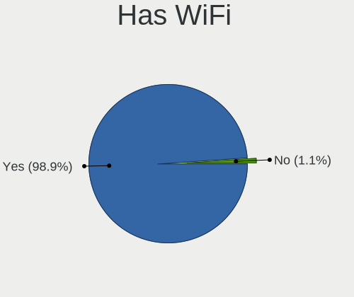

| Presented | Notebooks | Percent |
|-----------|-----------|---------|
| Yes       | 253       | 97.31%  |
| No        | 7         | 2.69%   |

Has Bluetooth
-------------

Has Bluetooth module

| Presented | Notebooks | Percent |
|-----------|-----------|---------|
| Yes       | 172       | 66.15%  |
| No        | 88        | 33.85%  |

Drive Vendor
------------

Hard drive vendors

| Vendor                | Notebooks | Drives | Percent |
|-----------------------|-----------|--------|---------|
| WDC                   | 46        | 49     | 14.51%  |
| Samsung Electronics   | 36        | 40     | 11.36%  |
| Seagate               | 35        | 36     | 11.04%  |
| Toshiba               | 30        | 30     | 9.46%   |
| SanDisk               | 21        | 21     | 6.62%   |
| Unknown               | 20        | 24     | 6.31%   |
| Hitachi               | 18        | 18     | 5.68%   |
| Kingston              | 13        | 13     | 4.1%    |
| SK Hynix              | 12        | 12     | 3.79%   |
| Crucial               | 10        | 11     | 3.15%   |
| Intel                 | 9         | 9      | 2.84%   |
| Fujitsu               | 7         | 7      | 2.21%   |
| HGST                  | 6         | 6      | 1.89%   |
| China                 | 6         | 6      | 1.89%   |
| A-DATA Technology     | 5         | 5      | 1.58%   |
| XPG                   | 2         | 2      | 0.63%   |
| Union Memory          | 2         | 2      | 0.63%   |
| Teclast               | 2         | 2      | 0.63%   |
| SPCC                  | 2         | 2      | 0.63%   |
| PNY                   | 2         | 2      | 0.63%   |
| Micron Technology     | 2         | 2      | 0.63%   |
| KIOXIA                | 2         | 3      | 0.63%   |
| Intenso               | 2         | 2      | 0.63%   |
| Apple                 | 2         | 2      | 0.63%   |
| ADATA Technology      | 2         | 2      | 0.63%   |
| USB                   | 1         | 1      | 0.32%   |
| TO Exter              | 1         | 1      | 0.32%   |
| Solid State Storage   | 1         | 1      | 0.32%   |
| Silicon Motion        | 1         | 1      | 0.32%   |
| Realtek Semiconductor | 1         | 1      | 0.32%   |
| Patriot               | 1         | 1      | 0.32%   |
| OEM                   | 1         | 1      | 0.32%   |
| OCZ                   | 1         | 1      | 0.32%   |
| Netac                 | 1         | 1      | 0.32%   |
| LITEON                | 1         | 1      | 0.32%   |
| Lenovo                | 1         | 1      | 0.32%   |
| KingDian              | 1         | 1      | 0.32%   |
| KESU                  | 1         | 1      | 0.32%   |
| JMicron               | 1         | 1      | 0.32%   |
| HGST HTS              | 1         | 1      | 0.32%   |
| Gigabyte Technology   | 1         | 1      | 0.32%   |
| Freecom               | 1         | 1      | 0.32%   |
| FORESEE               | 1         | 1      | 0.32%   |
| External              | 1         | 2      | 0.32%   |
| EMTEC                 | 1         | 1      | 0.32%   |
| BP4e                  | 1         | 1      | 0.32%   |
| ASMT                  | 1         | 2      | 0.32%   |
| Apricorn              | 1         | 1      | 0.32%   |

Drive Model
-----------

Hard drive models

| Model                               | Notebooks | Percent |
|-------------------------------------|-----------|---------|
| Seagate ST9500325AS 500GB           | 8         | 2.44%   |
| Unknown MMC Card  32GB              | 7         | 2.13%   |
| Unknown MMC Card  128GB             | 4         | 1.22%   |
| Toshiba MQ01ABD100 1TB              | 4         | 1.22%   |
| SK Hynix NVMe SSD Drive 512GB       | 4         | 1.22%   |
| SanDisk SSD PLUS 240GB              | 4         | 1.22%   |
| Kingston SA400S37480G 480GB SSD     | 4         | 1.22%   |
| WDC WDS500G2B0A-00SM50 500GB SSD    | 3         | 0.91%   |
| Unknown MMC Card  64GB              | 3         | 0.91%   |
| Toshiba MQ04ABF100 1TB              | 3         | 0.91%   |
| Seagate ST9500420AS 500GB           | 3         | 0.91%   |
| Samsung SSD 840 EVO 500GB           | 3         | 0.91%   |
| Samsung NVMe SSD Drive 256GB        | 3         | 0.91%   |
| HGST HTS725050A7E630 500GB          | 3         | 0.91%   |
| WDC WD5000LPCX-24VHAT0 500GB        | 2         | 0.61%   |
| WDC WD2500BEVT-75A23T0 250GB        | 2         | 0.61%   |
| WDC WD10JPVX-22JC3T0 1TB            | 2         | 0.61%   |
| WDC WD10JPVX-00JC3T0 1TB            | 2         | 0.61%   |
| Unknown SD/MMC/MS PRO 8GB           | 2         | 0.61%   |
| Union Memory RTOTJ128VGD2EYX 128GB  | 2         | 0.61%   |
| Toshiba MQ01ABF050 500GB            | 2         | 0.61%   |
| Toshiba MQ01ABD075 752GB            | 2         | 0.61%   |
| Toshiba MQ01ABD050 500GB            | 2         | 0.61%   |
| SPCC Solid State Disk 128GB         | 2         | 0.61%   |
| Seagate ST500LT012-1DG142 500GB     | 2         | 0.61%   |
| Seagate ST500LM012 HN-M500MBB 500GB | 2         | 0.61%   |
| Seagate ST320LT007-9ZV142 320GB     | 2         | 0.61%   |
| Seagate ST2000LX001-1RG174 2TB      | 2         | 0.61%   |
| Seagate ST1000LM035-1RK172 1TB      | 2         | 0.61%   |
| Seagate ST1000LM024 HN-M101MBB 1TB  | 2         | 0.61%   |
| Sandisk NVMe SSD Drive 512GB        | 2         | 0.61%   |
| Sandisk NVMe SSD Drive 256GB        | 2         | 0.61%   |
| Samsung SSD 860 EVO M.2 500GB       | 2         | 0.61%   |
| Kingston SA400S37240G 240GB SSD     | 2         | 0.61%   |
| Kingston SA400S37120G 120GB SSD     | 2         | 0.61%   |
| Intenso SSD SATAIII 512GB           | 2         | 0.61%   |
| Intel SSDPEKNW010T8 1TB             | 2         | 0.61%   |
| Intel NVMe SSD Drive 512GB          | 2         | 0.61%   |
| Hitachi HTS723232A7A364 320GB       | 2         | 0.61%   |
| Hitachi HTS547575A9E384 752GB       | 2         | 0.61%   |
| Hitachi HTS545050A7E380 500GB       | 2         | 0.61%   |
| Hitachi HTS543225L9A300 250GB       | 2         | 0.61%   |
| HGST HTS721010A9E630 1TB            | 2         | 0.61%   |
| Fujitsu MHZ2160BH G2 160GB          | 2         | 0.61%   |
| Fujitsu MHY2120BH 120GB             | 2         | 0.61%   |
| Crucial CT500MX500SSD1 500GB        | 2         | 0.61%   |
| Crucial CT480BX500SSD1 480GB        | 2         | 0.61%   |
| ADATA NVMe SSD Drive 256GB          | 2         | 0.61%   |
| XPG NVMe SSD Drive 256GB            | 1         | 0.3%    |
| XPG GAMMIX S11 Pro 512GB            | 1         | 0.3%    |
| WDC WDS500G2B0C-00PXH0 500GB        | 1         | 0.3%    |
| WDC WDS480G2G0A-00JH30 480GB SSD    | 1         | 0.3%    |
| WDC WDS240G2G0B-00EPW0 240GB SSD    | 1         | 0.3%    |
| WDC WDS240G2G0A-00JH30 240GB SSD    | 1         | 0.3%    |
| WDC WDS200T2B0C-00PXH0 2TB          | 1         | 0.3%    |
| WDC WDS200T2B0B-00YS70 2TB SSD      | 1         | 0.3%    |
| WDC WDBNCE5000PNC 500GB SSD         | 1         | 0.3%    |
| WDC WD7500BPVT-75HXZT3 752GB        | 1         | 0.3%    |
| WDC WD6400BPVT-75HXZT1 640GB        | 1         | 0.3%    |
| WDC WD5000LPVX-75V0TT0 500GB        | 1         | 0.3%    |

HDD Vendor
----------

Hard disk drive vendors

| Vendor              | Notebooks | Drives | Percent |
|---------------------|-----------|--------|---------|
| Seagate             | 35        | 36     | 28.46%  |
| WDC                 | 29        | 29     | 23.58%  |
| Toshiba             | 23        | 23     | 18.7%   |
| Hitachi             | 18        | 18     | 14.63%  |
| HGST                | 6         | 6      | 4.88%   |
| Fujitsu             | 6         | 6      | 4.88%   |
| Samsung Electronics | 4         | 4      | 3.25%   |
| HGST HTS            | 1         | 1      | 0.81%   |
| ASMT                | 1         | 2      | 0.81%   |

SSD Vendor
----------

Solid state drive vendors

| Vendor              | Notebooks | Drives | Percent |
|---------------------|-----------|--------|---------|
| Samsung Electronics | 20        | 24     | 18.52%  |
| SanDisk             | 14        | 14     | 12.96%  |
| Kingston            | 10        | 10     | 9.26%   |
| Crucial             | 10        | 11     | 9.26%   |
| WDC                 | 8         | 8      | 7.41%   |
| China               | 6         | 6      | 5.56%   |
| A-DATA Technology   | 5         | 5      | 4.63%   |
| SK Hynix            | 4         | 4      | 3.7%    |
| Toshiba             | 3         | 3      | 2.78%   |
| Intel               | 3         | 3      | 2.78%   |
| Union Memory        | 2         | 2      | 1.85%   |
| Teclast             | 2         | 2      | 1.85%   |
| SPCC                | 2         | 2      | 1.85%   |
| PNY                 | 2         | 2      | 1.85%   |
| Intenso             | 2         | 2      | 1.85%   |
| Apple               | 2         | 2      | 1.85%   |
| TO Exter            | 1         | 1      | 0.93%   |
| Patriot             | 1         | 1      | 0.93%   |
| OCZ                 | 1         | 1      | 0.93%   |
| Netac               | 1         | 1      | 0.93%   |
| Micron Technology   | 1         | 1      | 0.93%   |
| LITEON              | 1         | 1      | 0.93%   |
| KingDian            | 1         | 1      | 0.93%   |
| KESU                | 1         | 1      | 0.93%   |
| JMicron             | 1         | 1      | 0.93%   |
| Gigabyte Technology | 1         | 1      | 0.93%   |
| Fujitsu             | 1         | 1      | 0.93%   |
| FORESEE             | 1         | 1      | 0.93%   |
| BP4e                | 1         | 1      | 0.93%   |

Drive Kind
----------

HDD or SSD

| Kind    | Notebooks | Drives | Percent |
|---------|-----------|--------|---------|
| HDD     | 120       | 125    | 39.74%  |
| SSD     | 101       | 113    | 33.44%  |
| NVMe    | 56        | 65     | 18.54%  |
| MMC     | 18        | 23     | 5.96%   |
| Unknown | 7         | 7      | 2.32%   |

Drive Connector
---------------

SATA, SAS, NVMe, etc.

| Type | Notebooks | Drives | Percent |
|------|-----------|--------|---------|
| SATA | 202       | 228    | 69.66%  |
| NVMe | 55        | 63     | 18.97%  |
| MMC  | 18        | 23     | 6.21%   |
| SAS  | 15        | 19     | 5.17%   |

Drive Size
----------

Size of hard drive

| Size in TB | Notebooks | Drives | Percent |
|------------|-----------|--------|---------|
| 0.01-0.5   | 164       | 178    | 74.21%  |
| 0.51-1.0   | 49        | 50     | 22.17%  |
| 1.01-2.0   | 7         | 8      | 3.17%   |
| 3.01-4.0   | 1         | 2      | 0.45%   |

Space Total
-----------

Amount of disk space available on the file system

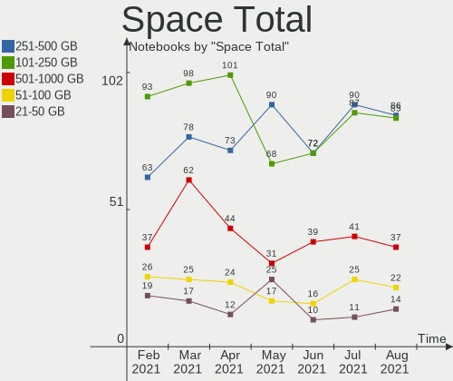

| Size in GB     | Notebooks | Percent |
|----------------|-----------|---------|
| 251-500        | 90        | 34.62%  |
| 101-250        | 68        | 26.15%  |
| 501-1000       | 31        | 11.92%  |
| 21-50          | 25        | 9.62%   |
| 51-100         | 17        | 6.54%   |
| 1001-2000      | 12        | 4.62%   |
| 1-20           | 8         | 3.08%   |
| More than 3000 | 6         | 2.31%   |
| Unknown        | 2         | 0.77%   |
| 2001-3000      | 1         | 0.38%   |

Space Used
----------

Amount of used disk space

| Used GB        | Notebooks | Percent |
|----------------|-----------|---------|
| 1-20           | 79        | 30.38%  |
| 21-50          | 68        | 26.15%  |
| 51-100         | 40        | 15.38%  |
| 101-250        | 38        | 14.62%  |
| 251-500        | 17        | 6.54%   |
| 501-1000       | 12        | 4.62%   |
| More than 3000 | 2         | 0.77%   |
| 2001-3000      | 2         | 0.77%   |
| Unknown        | 2         | 0.77%   |

Malfunc. Drives
---------------

Drive models with a malfunction

| Model                              | Notebooks | Drives | Percent |
|------------------------------------|-----------|--------|---------|
| HGST HTS725050A7E630 500GB         | 2         | 2      | 12.5%   |
| WDC WD3200BEKT-60V5T1 320GB        | 1         | 1      | 6.25%   |
| WDC WD2500BEVT-80A23T0 250GB       | 1         | 1      | 6.25%   |
| WDC WD2500BEVT-75A23T0 250GB       | 1         | 1      | 6.25%   |
| Toshiba MQ04ABF100 1TB             | 1         | 1      | 6.25%   |
| Toshiba MK6465GSX 640GB            | 1         | 1      | 6.25%   |
| Toshiba MK1237GSX 120GB            | 1         | 1      | 6.25%   |
| Seagate ST500LT012-1DG142 500GB    | 1         | 1      | 6.25%   |
| Seagate ST500LM021-1KJ152 500GB    | 1         | 1      | 6.25%   |
| Seagate ST320LT007-9ZV142 320GB    | 1         | 1      | 6.25%   |
| Seagate ST1000LM024 HN-M101MBB 1TB | 1         | 1      | 6.25%   |
| SanDisk SSD PLUS 240GB             | 1         | 1      | 6.25%   |
| Patriot P200 256GB SSD             | 1         | 1      | 6.25%   |
| Hitachi HTS545050A7E380 500GB      | 1         | 1      | 6.25%   |
| Hitachi HTS543232L9A300 320GB      | 1         | 1      | 6.25%   |

Malfunc. Drive Vendor
---------------------

Vendors of faulty drives

| Vendor  | Notebooks | Drives | Percent |
|---------|-----------|--------|---------|
| Seagate | 4         | 4      | 25%     |
| WDC     | 3         | 3      | 18.75%  |
| Toshiba | 3         | 3      | 18.75%  |
| Hitachi | 2         | 2      | 12.5%   |
| HGST    | 2         | 2      | 12.5%   |
| SanDisk | 1         | 1      | 6.25%   |
| Patriot | 1         | 1      | 6.25%   |

Malfunc. HDD Vendor
-------------------

Vendors of faulty HDD drives

| Vendor  | Notebooks | Drives | Percent |
|---------|-----------|--------|---------|
| Seagate | 4         | 4      | 28.57%  |
| WDC     | 3         | 3      | 21.43%  |
| Toshiba | 3         | 3      | 21.43%  |
| Hitachi | 2         | 2      | 14.29%  |
| HGST    | 2         | 2      | 14.29%  |

Malfunc. Drive Kind
-------------------

Kinds of faulty drives

| Kind | Notebooks | Drives | Percent |
|------|-----------|--------|---------|
| HDD  | 14        | 14     | 87.5%   |
| SSD  | 2         | 2      | 12.5%   |

Failed Drives
-------------

Failed drive models

| Model                         | Notebooks | Drives | Percent |
|-------------------------------|-----------|--------|---------|
| Hitachi HTS547550A9E384 500GB | 1         | 1      | 100%    |

Failed Drive Vendor
-------------------

Failed drive vendors

| Vendor  | Notebooks | Drives | Percent |
|---------|-----------|--------|---------|
| Hitachi | 1         | 1      | 100%    |

Drive Status
------------

Number of failed and malfunc. drives

| Status   | Notebooks | Drives | Percent |
|----------|-----------|--------|---------|
| Detected | 187       | 230    | 69.52%  |
| Works    | 65        | 86     | 24.16%  |
| Malfunc  | 16        | 16     | 5.95%   |
| Failed   | 1         | 1      | 0.37%   |

Storage Vendor
--------------

Storage controller vendors

| Vendor                           | Notebooks | Percent |
|----------------------------------|-----------|---------|
| Intel                            | 195       | 69.15%  |
| AMD                              | 24        | 8.51%   |
| Sandisk                          | 16        | 5.67%   |
| Samsung Electronics              | 13        | 4.61%   |
| SK Hynix                         | 8         | 2.84%   |
| Toshiba America Info Systems     | 3         | 1.06%   |
| KIOXIA                           | 3         | 1.06%   |
| Kingston Technology Company      | 3         | 1.06%   |
| ADATA Technology                 | 3         | 1.06%   |
| VIA Technologies                 | 2         | 0.71%   |
| Silicon Motion                   | 2         | 0.71%   |
| Silicon Integrated Systems [SiS] | 2         | 0.71%   |
| Nvidia                           | 2         | 0.71%   |
| Solid State Storage Technology   | 1         | 0.35%   |
| Realtek Semiconductor            | 1         | 0.35%   |
| Micron Technology                | 1         | 0.35%   |
| Marvell Technology Group         | 1         | 0.35%   |
| Lenovo                           | 1         | 0.35%   |
| ASMedia Technology               | 1         | 0.35%   |

Storage Model
-------------

Storage controller models

| Model                                                                                  | Notebooks | Percent |
|----------------------------------------------------------------------------------------|-----------|---------|
| Intel 7 Series Chipset Family 6-port SATA Controller [AHCI mode]                       | 23        | 7.47%   |
| Intel 6 Series/C200 Series Chipset Family 6 port Mobile SATA AHCI Controller           | 22        | 7.14%   |
| AMD FCH SATA Controller [AHCI mode]                                                    | 19        | 6.17%   |
| Intel 82801IBM/IEM (ICH9M/ICH9M-E) 4 port SATA Controller [AHCI mode]                  | 17        | 5.52%   |
| Intel 82801 Mobile SATA Controller [RAID mode]                                         | 15        | 4.87%   |
| Intel Sunrise Point-LP SATA Controller [AHCI mode]                                     | 14        | 4.55%   |
| Intel 5 Series/3400 Series Chipset 4 port SATA AHCI Controller                         | 10        | 3.25%   |
| Samsung NVMe SSD Controller SM981/PM981/PM983                                          | 8         | 2.6%    |
| Intel Cannon Lake Mobile PCH SATA AHCI Controller                                      | 8         | 2.6%    |
| Intel 82801HM/HEM (ICH8M/ICH8M-E) IDE Controller                                       | 8         | 2.6%    |
| Intel 8 Series SATA Controller 1 [AHCI mode]                                           | 8         | 2.6%    |
| Sandisk WD Black SN750 / PC SN730 NVMe SSD                                             | 6         | 1.95%   |
| Intel Wildcat Point-LP SATA Controller [AHCI Mode]                                     | 6         | 1.95%   |
| Intel 82801HM/HEM (ICH8M/ICH8M-E) SATA Controller [AHCI mode]                          | 6         | 1.95%   |
| Intel 8 Series/C220 Series Chipset Family 6-port SATA Controller 1 [AHCI mode]         | 6         | 1.95%   |
| Intel SSD 660P Series                                                                  | 5         | 1.62%   |
| Intel NM10/ICH7 Family SATA Controller [AHCI mode]                                     | 5         | 1.62%   |
| Intel Atom Processor E3800 Series SATA AHCI Controller                                 | 5         | 1.62%   |
| Intel 82801G (ICH7 Family) IDE Controller                                              | 5         | 1.62%   |
| SK Hynix BC511                                                                         | 4         | 1.3%    |
| Sandisk WD Blue SN550 NVMe SSD                                                         | 4         | 1.3%    |
| Sandisk Non-Volatile memory controller                                                 | 4         | 1.3%    |
| Intel Comet Lake SATA AHCI Controller                                                  | 4         | 1.3%    |
| Intel Celeron/Pentium Silver Processor SATA Controller                                 | 4         | 1.3%    |
| Intel Atom/Celeron/Pentium Processor x5-E8000/J3xxx/N3xxx Series SATA Controller       | 4         | 1.3%    |
| Intel 82801GBM/GHM (ICH7-M Family) SATA Controller [IDE mode]                          | 4         | 1.3%    |
| Intel 6 Series/C200 Series Chipset Family Mobile SATA Controller (IDE mode, ports 4-5) | 4         | 1.3%    |
| Intel 6 Series/C200 Series Chipset Family Mobile SATA Controller (IDE mode, ports 0-3) | 4         | 1.3%    |
| AMD SB7x0/SB8x0/SB9x0 SATA Controller [AHCI mode]                                      | 4         | 1.3%    |
| Toshiba America Info Systems XG6 NVMe SSD Controller                                   | 3         | 0.97%   |
| Samsung NVMe Controller                                                                | 3         | 0.97%   |
| KIOXIA Non-Volatile memory controller                                                  | 3         | 0.97%   |
| Intel Volume Management Device NVMe RAID Controller                                    | 3         | 0.97%   |
| Intel Ice Lake-LP SATA Controller [AHCI mode]                                          | 3         | 0.97%   |
| Intel 82801GBM/GHM (ICH7-M Family) SATA Controller [AHCI mode]                         | 3         | 0.97%   |
| Intel 7 Series Chipset Family 4-port SATA Controller [IDE mode]                        | 3         | 0.97%   |
| Intel 7 Series Chipset Family 2-port SATA Controller [IDE mode]                        | 3         | 0.97%   |
| Intel 5 Series/3400 Series Chipset 6 port SATA AHCI Controller                         | 3         | 0.97%   |
| SK Hynix BC501 NVMe Solid State Drive 512GB                                            | 2         | 0.65%   |
| Silicon Motion SM2263EN/SM2263XT SSD Controller                                        | 2         | 0.65%   |
| Silicon Integrated Systems [SiS] 5513 IDE Controller                                   | 2         | 0.65%   |
| Kingston Company U-SNS8154P3 NVMe SSD                                                  | 2         | 0.65%   |
| Intel Celeron N3350/Pentium N4200/Atom E3900 Series SATA AHCI Controller               | 2         | 0.65%   |
| Intel 82801HM/HEM (ICH8M/ICH8M-E) SATA Controller [IDE mode]                           | 2         | 0.65%   |
| ADATA Non-Volatile memory controller                                                   | 2         | 0.65%   |
| VIA VT82C586A/B/VT82C686/A/B/VT823x/A/C PIPC Bus Master IDE                            | 1         | 0.32%   |
| VIA VT8237A SATA 2-Port Controller                                                     | 1         | 0.32%   |
| VIA VT6421 IDE/SATA Controller                                                         | 1         | 0.32%   |
| Solid State Storage Non-Volatile memory controller                                     | 1         | 0.32%   |
| SK Hynix NVMe SSD Controller                                                           | 1         | 0.32%   |
| SK Hynix Non-Volatile memory controller                                                | 1         | 0.32%   |
| Silicon Integrated Systems [SiS] SATA Controller / IDE mode                            | 1         | 0.32%   |
| Sandisk WD Blue SN500 / PC SN520 NVMe SSD                                              | 1         | 0.32%   |
| Sandisk PC SN520 NVMe SSD                                                              | 1         | 0.32%   |
| Samsung NVMe SSD Controller PM9A1/PM9A3/980PRO                                         | 1         | 0.32%   |
| Samsung Electronics SATA controller                                                    | 1         | 0.32%   |
| Realtek RTS5763DL NVMe SSD Controller                                                  | 1         | 0.32%   |
| Nvidia MCP89 SATA Controller                                                           | 1         | 0.32%   |
| Nvidia MCP51 Serial ATA Controller                                                     | 1         | 0.32%   |
| Nvidia MCP51 IDE                                                                       | 1         | 0.32%   |

Storage Kind
------------

Kind of storage controller (IDE, SATA, NVMe, SAS, ...)

| Kind | Notebooks | Percent |
|------|-----------|---------|
| SATA | 183       | 63.76%  |
| NVMe | 54        | 18.82%  |
| IDE  | 31        | 10.8%   |
| RAID | 19        | 6.62%   |

CPU Vendor
----------

Processor vendors

| Vendor | Notebooks | Percent |
|--------|-----------|---------|
| Intel  | 220       | 84.62%  |
| AMD    | 40        | 15.38%  |

CPU Model
---------

Processor models

| Model                                         | Notebooks | Percent |
|-----------------------------------------------|-----------|---------|
| Intel Core i5-2520M CPU @ 2.50GHz             | 6         | 2.31%   |
| Intel Core i7-2670QM CPU @ 2.20GHz            | 5         | 1.92%   |
| Intel Core i5-3320M CPU @ 2.60GHz             | 5         | 1.92%   |
| Intel Core i5-2450M CPU @ 2.50GHz             | 5         | 1.92%   |
| Intel Atom x5-Z8350 CPU @ 1.44GHz             | 5         | 1.92%   |
| Intel 11th Gen Core i5-1135G7 @ 2.40GHz       | 5         | 1.92%   |
| Intel Pentium CPU N3540 @ 2.16GHz             | 4         | 1.54%   |
| Intel Core i5-4210U CPU @ 1.70GHz             | 4         | 1.54%   |
| Intel 11th Gen Core i7-1165G7 @ 2.80GHz       | 4         | 1.54%   |
| AMD Ryzen 5 4500U with Radeon Graphics        | 4         | 1.54%   |
| Intel Core i7-8750H CPU @ 2.20GHz             | 3         | 1.15%   |
| Intel Core i7-10510U CPU @ 1.80GHz            | 3         | 1.15%   |
| Intel Core i5-8300H CPU @ 2.30GHz             | 3         | 1.15%   |
| Intel Core i5-6300U CPU @ 2.40GHz             | 3         | 1.15%   |
| Intel Core i5-3230M CPU @ 2.60GHz             | 3         | 1.15%   |
| Intel Core i5 CPU M 460 @ 2.53GHz             | 3         | 1.15%   |
| Intel Core 2 Duo CPU T6670 @ 2.20GHz          | 3         | 1.15%   |
| AMD A6-9225 RADEON R4, 5 COMPUTE CORES 2C+3G  | 3         | 1.15%   |
| Intel Pentium Dual-Core CPU T4200 @ 2.00GHz   | 2         | 0.77%   |
| Intel Pentium CPU B960 @ 2.20GHz              | 2         | 0.77%   |
| Intel Pentium CPU B940 @ 2.00GHz              | 2         | 0.77%   |
| Intel Core i9-8950HK CPU @ 2.90GHz            | 2         | 0.77%   |
| Intel Core i7-9750H CPU @ 2.60GHz             | 2         | 0.77%   |
| Intel Core i7-8550U CPU @ 1.80GHz             | 2         | 0.77%   |
| Intel Core i7-7500U CPU @ 2.70GHz             | 2         | 0.77%   |
| Intel Core i7-4800MQ CPU @ 2.70GHz            | 2         | 0.77%   |
| Intel Core i7-4700MQ CPU @ 2.40GHz            | 2         | 0.77%   |
| Intel Core i7-3630QM CPU @ 2.40GHz            | 2         | 0.77%   |
| Intel Core i7-3610QM CPU @ 2.30GHz            | 2         | 0.77%   |
| Intel Core i7-2630QM CPU @ 2.00GHz            | 2         | 0.77%   |
| Intel Core i7-1065G7 CPU @ 1.30GHz            | 2         | 0.77%   |
| Intel Core i7 CPU Q 720 @ 1.60GHz             | 2         | 0.77%   |
| Intel Core i5-8265U CPU @ 1.60GHz             | 2         | 0.77%   |
| Intel Core i5-8250U CPU @ 1.60GHz             | 2         | 0.77%   |
| Intel Core i5-5200U CPU @ 2.20GHz             | 2         | 0.77%   |
| Intel Core i5-2430M CPU @ 2.40GHz             | 2         | 0.77%   |
| Intel Core i3-7100U CPU @ 2.40GHz             | 2         | 0.77%   |
| Intel Core i3-5005U CPU @ 2.00GHz             | 2         | 0.77%   |
| Intel Core i3-2350M CPU @ 2.30GHz             | 2         | 0.77%   |
| Intel Core i3 CPU M 350 @ 2.27GHz             | 2         | 0.77%   |
| Intel Celeron N4100 CPU @ 1.10GHz             | 2         | 0.77%   |
| Intel Celeron CPU B820 @ 1.70GHz              | 2         | 0.77%   |
| Intel Celeron CPU 847 @ 1.10GHz               | 2         | 0.77%   |
| Intel Atom CPU N455 @ 1.66GHz                 | 2         | 0.77%   |
| Intel Atom CPU N450 @ 1.66GHz                 | 2         | 0.77%   |
| Intel Atom CPU N270 @ 1.60GHz                 | 2         | 0.77%   |
| AMD Ryzen 7 PRO 4750U with Radeon Graphics    | 2         | 0.77%   |
| AMD Ryzen 7 4700U with Radeon Graphics        | 2         | 0.77%   |
| AMD Ryzen 5 3500U with Radeon Vega Mobile Gfx | 2         | 0.77%   |
| AMD Ryzen 3 3250U with Radeon Graphics        | 2         | 0.77%   |
| AMD A6-3420M APU with Radeon HD Graphics      | 2         | 0.77%   |
| Intel Xeon W-10885M CPU @ 2.40GHz             | 1         | 0.38%   |
| Intel Pentium Silver N6000 @ 1.10GHz          | 1         | 0.38%   |
| Intel Pentium Silver N5030 CPU @ 1.10GHz      | 1         | 0.38%   |
| Intel Pentium M processor 1.73GHz             | 1         | 0.38%   |
| Intel Pentium Dual-Core CPU T4500 @ 2.30GHz   | 1         | 0.38%   |
| Intel Pentium Dual-Core CPU T4400 @ 2.20GHz   | 1         | 0.38%   |
| Intel Pentium Dual-Core CPU T4300 @ 2.10GHz   | 1         | 0.38%   |
| Intel Pentium Dual CPU T3400 @ 2.16GHz        | 1         | 0.38%   |
| Intel Pentium Dual CPU T3200 @ 2.00GHz        | 1         | 0.38%   |

CPU Model Family
----------------

Processor model prefix

| Model                                | Notebooks | Percent |
|--------------------------------------|-----------|---------|
| Intel Core i5                        | 60        | 23.08%  |
| Intel Core i7                        | 46        | 17.69%  |
| Intel Core i3                        | 19        | 7.31%   |
| Intel Atom                           | 18        | 6.92%   |
| Intel Pentium                        | 16        | 6.15%   |
| Intel Celeron                        | 14        | 5.38%   |
| Intel Core 2 Duo                     | 12        | 4.62%   |
| Other                                | 10        | 3.85%   |
| AMD Ryzen 5                          | 8         | 3.08%   |
| AMD A6                               | 6         | 2.31%   |
| Intel Pentium Dual-Core              | 5         | 1.92%   |
| Intel Pentium Dual                   | 5         | 1.92%   |
| AMD Ryzen 7                          | 5         | 1.92%   |
| Intel Genuine                        | 3         | 1.15%   |
| AMD A4                               | 3         | 1.15%   |
| Intel Pentium Silver                 | 2         | 0.77%   |
| Intel Core i9                        | 2         | 0.77%   |
| Intel Core 2                         | 2         | 0.77%   |
| AMD Turion 64 X2 Mobile              | 2         | 0.77%   |
| AMD Ryzen 7 PRO                      | 2         | 0.77%   |
| AMD Ryzen 3                          | 2         | 0.77%   |
| AMD E2                               | 2         | 0.77%   |
| Intel Xeon                           | 1         | 0.38%   |
| Intel Pentium M                      | 1         | 0.38%   |
| Intel Pentium 4                      | 1         | 0.38%   |
| Intel Core m5                        | 1         | 0.38%   |
| Intel Core Duo                       | 1         | 0.38%   |
| Intel Core 2 Solo                    | 1         | 0.38%   |
| AMD Turion II Ultra Dual-Core Mobile | 1         | 0.38%   |
| AMD Turion 64 Mobile                 | 1         | 0.38%   |
| AMD Turion                           | 1         | 0.38%   |
| AMD Ryzen 9                          | 1         | 0.38%   |
| AMD Mobile Sempron                   | 1         | 0.38%   |
| AMD C-60                             | 1         | 0.38%   |
| AMD Athlon X2                        | 1         | 0.38%   |
| AMD Athlon II Dual-Core              | 1         | 0.38%   |
| AMD A12                              | 1         | 0.38%   |
| AMD A10                              | 1         | 0.38%   |

CPU Cores
---------

Number of processor cores

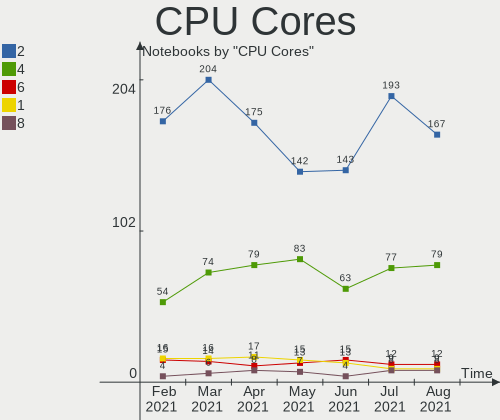

| Number | Notebooks | Percent |
|--------|-----------|---------|
| 2      | 142       | 54.62%  |
| 4      | 83        | 31.92%  |
| 1      | 15        | 5.77%   |
| 6      | 13        | 5%      |
| 8      | 7         | 2.69%   |

CPU Sockets
-----------

Number of sockets

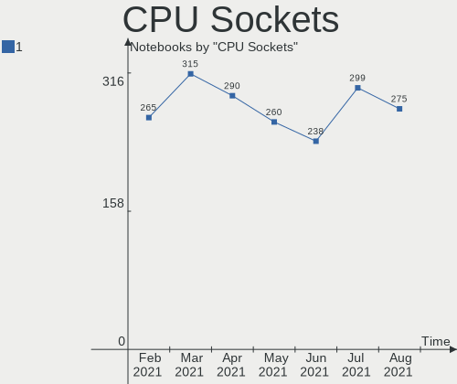

| Number | Notebooks | Percent |
|--------|-----------|---------|
| 1      | 260       | 100%    |

CPU Threads
-----------

Threads per core (Hyper-Threading)

| Number | Notebooks | Percent |
|--------|-----------|---------|
| 2      | 161       | 61.92%  |
| 1      | 99        | 38.08%  |

CPU Op-Modes
------------

CPU Operation Modes (32-bit, 64-bit)

| Op mode        | Notebooks | Percent |
|----------------|-----------|---------|
| 32-bit, 64-bit | 253       | 97.31%  |
| 32-bit         | 7         | 2.69%   |

CPU Microcode
-------------

Microcode number

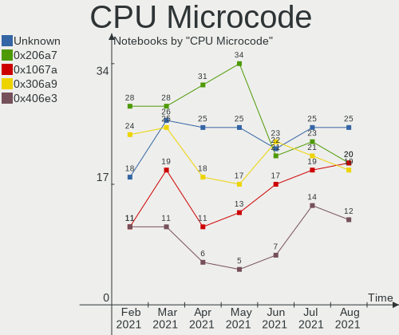

| Number     | Notebooks | Percent |
|------------|-----------|---------|
| 0x206a7    | 34        | 13.08%  |
| Unknown    | 25        | 9.62%   |
| 0x306a9    | 17        | 6.54%   |
| 0x1067a    | 13        | 5%      |
| 0x806c1    | 10        | 3.85%   |
| 0x6fd      | 10        | 3.85%   |
| 0x906ea    | 9         | 3.46%   |
| 0x40651    | 9         | 3.46%   |
| 0x406c4    | 8         | 3.08%   |
| 0x30678    | 8         | 3.08%   |
| 0x806ec    | 7         | 2.69%   |
| 0x306c3    | 7         | 2.69%   |
| 0x20655    | 7         | 2.69%   |
| 0x806ea    | 6         | 2.31%   |
| 0x306d4    | 6         | 2.31%   |
| 0x806e9    | 5         | 1.92%   |
| 0x406e3    | 5         | 1.92%   |
| 0x08108109 | 5         | 1.92%   |
| 0x706e5    | 4         | 1.54%   |
| 0x20652    | 4         | 1.54%   |
| 0x106ca    | 4         | 1.54%   |
| 0x08600103 | 4         | 1.54%   |
| 0x406c3    | 3         | 1.15%   |
| 0x10676    | 3         | 1.15%   |
| 0x08600106 | 3         | 1.15%   |
| 0x06006705 | 3         | 1.15%   |
| 0x03000027 | 3         | 1.15%   |
| 0xa0652    | 2         | 0.77%   |
| 0x906ed    | 2         | 0.77%   |
| 0x706a1    | 2         | 0.77%   |
| 0x6f6      | 2         | 0.77%   |
| 0x6e8      | 2         | 0.77%   |
| 0x506e3    | 2         | 0.77%   |
| 0x506c9    | 2         | 0.77%   |
| 0x106c2    | 2         | 0.77%   |
| 0x0600611a | 2         | 0.77%   |
| 0x05000119 | 2         | 0.77%   |
| 0x02000032 | 2         | 0.77%   |
| 0xf33      | 1         | 0.38%   |
| 0x906e9    | 1         | 0.38%   |
| 0x906c0    | 1         | 0.38%   |
| 0x806eb    | 1         | 0.38%   |
| 0x706a8    | 1         | 0.38%   |
| 0x6ec      | 1         | 0.38%   |
| 0x6d8      | 1         | 0.38%   |
| 0x30661    | 1         | 0.38%   |
| 0x106e5    | 1         | 0.38%   |
| 0x10661    | 1         | 0.38%   |
| 0x08608103 | 1         | 0.38%   |
| 0x08608102 | 1         | 0.38%   |
| 0x08600102 | 1         | 0.38%   |
| 0x08108102 | 1         | 0.38%   |
| 0x06006704 | 1         | 0.38%   |
| 0x06001119 | 1         | 0.38%   |

CPU Microarch
-------------

Microarchitecture

| Name            | Notebooks | Percent |
|-----------------|-----------|---------|
| SandyBridge     | 38        | 14.62%  |
| KabyLake        | 33        | 12.69%  |
| Silvermont      | 19        | 7.31%   |
| IvyBridge       | 18        | 6.92%   |
| Haswell         | 18        | 6.92%   |
| Penryn          | 16        | 6.15%   |
| Core            | 13        | 5%      |
| Westmere        | 12        | 4.62%   |
| TigerLake       | 10        | 3.85%   |
| Skylake         | 9         | 3.46%   |
| Zen 2           | 8         | 3.08%   |
| Excavator       | 8         | 3.08%   |
| Zen+            | 7         | 2.69%   |
| Broadwell       | 7         | 2.69%   |
| Bonnell         | 7         | 2.69%   |
| P6              | 4         | 1.54%   |
| K8 Hammer       | 4         | 1.54%   |
| IceLake         | 4         | 1.54%   |
| Goldmont plus   | 4         | 1.54%   |
| K10 Llano       | 3         | 1.15%   |
| Unknown         | 3         | 1.15%   |
| Nehalem         | 2         | 0.77%   |
| K8 & K10 hybrid | 2         | 0.77%   |
| K10             | 2         | 0.77%   |
| Goldmont        | 2         | 0.77%   |
| CometLake       | 2         | 0.77%   |
| Bobcat          | 2         | 0.77%   |
| Zen 3           | 1         | 0.38%   |
| Piledriver      | 1         | 0.38%   |
| NetBurst        | 1         | 0.38%   |

GPU Vendor
----------

Vendors of graphics cards

| Vendor                           | Notebooks | Percent |
|----------------------------------|-----------|---------|
| Intel                            | 203       | 64.65%  |
| AMD                              | 58        | 18.47%  |
| Nvidia                           | 50        | 15.92%  |
| Silicon Integrated Systems [SiS] | 2         | 0.64%   |
| VIA Technologies                 | 1         | 0.32%   |

GPU Model
---------

Graphics card models

| Model                                                                                      | Notebooks | Percent |
|--------------------------------------------------------------------------------------------|-----------|---------|
| Intel 2nd Generation Core Processor Family Integrated Graphics Controller                  | 37        | 11.25%  |
| Intel 3rd Gen Core processor Graphics Controller                                           | 18        | 5.47%   |
| Intel Mobile 4 Series Chipset Integrated Graphics Controller                               | 16        | 4.86%   |
| Intel Core Processor Integrated Graphics Controller                                        | 11        | 3.34%   |
| Intel Atom/Celeron/Pentium Processor x5-E8000/J3xxx/N3xxx Integrated Graphics Controller   | 11        | 3.34%   |
| Intel TigerLake-LP GT2 [Iris Xe Graphics]                                                  | 10        | 3.04%   |
| Intel CoffeeLake-H GT2 [UHD Graphics 630]                                                  | 10        | 3.04%   |
| Intel Haswell-ULT Integrated Graphics Controller                                           | 9         | 2.74%   |
| Intel Atom Processor Z36xxx/Z37xxx Series Graphics & Display                               | 8         | 2.43%   |
| AMD Renoir                                                                                 | 8         | 2.43%   |
| AMD Picasso                                                                                | 7         | 2.13%   |
| Intel UHD Graphics 620                                                                     | 6         | 1.82%   |
| Intel Skylake GT2 [HD Graphics 520]                                                        | 6         | 1.82%   |
| Intel 4th Gen Core Processor Integrated Graphics Controller                                | 6         | 1.82%   |
| AMD Stoney [Radeon R2/R3/R4/R5 Graphics]                                                   | 6         | 1.82%   |
| Intel Mobile GM965/GL960 Integrated Graphics Controller (secondary)                        | 5         | 1.52%   |
| Intel Mobile GM965/GL960 Integrated Graphics Controller (primary)                          | 5         | 1.52%   |
| Intel Mobile 945GM/GMS/GME, 943/940GML Express Integrated Graphics Controller              | 5         | 1.52%   |
| Intel HD Graphics 620                                                                      | 5         | 1.52%   |
| Intel HD Graphics 5500                                                                     | 5         | 1.52%   |
| Intel CometLake-U GT2 [UHD Graphics]                                                       | 5         | 1.52%   |
| Nvidia TU117M [GeForce GTX 1650 Mobile / Max-Q]                                            | 4         | 1.22%   |
| Nvidia GF117M [GeForce 610M/710M/810M/820M / GT 620M/625M/630M/720M]                       | 4         | 1.22%   |
| Intel WhiskeyLake-U GT2 [UHD Graphics 620]                                                 | 4         | 1.22%   |
| Intel Atom Processor D4xx/D5xx/N4xx/N5xx Integrated Graphics Controller                    | 4         | 1.22%   |
| AMD Thames [Radeon HD 7500M/7600M Series]                                                  | 4         | 1.22%   |
| AMD Seymour [Radeon HD 6400M/7400M Series]                                                 | 4         | 1.22%   |
| Nvidia GP107M [GeForce GTX 1050 Mobile]                                                    | 3         | 0.91%   |
| Nvidia GP106M [GeForce GTX 1060 Mobile]                                                    | 3         | 0.91%   |
| Intel Mobile 945GM/GMS, 943/940GML Express Integrated Graphics Controller                  | 3         | 0.91%   |
| Intel GeminiLake [UHD Graphics 600]                                                        | 3         | 0.91%   |
| Nvidia GT216M [GeForce GT 330M]                                                            | 2         | 0.61%   |
| Nvidia GP108M [GeForce MX250]                                                              | 2         | 0.61%   |
| Nvidia GP108M [GeForce MX150]                                                              | 2         | 0.61%   |
| Nvidia GM107M [GeForce GTX 960M]                                                           | 2         | 0.61%   |
| Nvidia GK106GLM [Quadro K2100M]                                                            | 2         | 0.61%   |
| Intel Mobile 945GSE Express Integrated Graphics Controller                                 | 2         | 0.61%   |
| Intel Iris Plus Graphics G7                                                                | 2         | 0.61%   |
| Intel Iris Plus Graphics G1 (Ice Lake)                                                     | 2         | 0.61%   |
| Intel HD Graphics 530                                                                      | 2         | 0.61%   |
| AMD Wani [Radeon R5/R6/R7 Graphics]                                                        | 2         | 0.61%   |
| AMD Topaz XT [Radeon R7 M260/M265 / M340/M360 / M440/M445 / 530/535 / 620/625 Mobile]      | 2         | 0.61%   |
| AMD Sun XT [Radeon HD 8670A/8670M/8690M / R5 M330 / M430 / Radeon 520 Mobile]              | 2         | 0.61%   |
| AMD Sumo [Radeon HD 6520G]                                                                 | 2         | 0.61%   |
| AMD RV620/M82 [Mobility Radeon HD 3450/3470]                                               | 2         | 0.61%   |
| AMD RS880M [Mobility Radeon HD 4225/4250]                                                  | 2         | 0.61%   |
| AMD RS780M [Mobility Radeon HD 3200]                                                       | 2         | 0.61%   |
| AMD Park [Mobility Radeon HD 5430/5450/5470]                                               | 2         | 0.61%   |
| AMD Lucienne                                                                               | 2         | 0.61%   |
| VIA Technologies K8M890CE/K8N890CE [Chrome 9]                                              | 1         | 0.3%    |
| Silicon Integrated Systems [SiS] 771/671 PCIE VGA Display Adapter                          | 1         | 0.3%    |
| Silicon Integrated Systems [SiS] 661/741/760 PCI/AGP or 662/761Gx PCIE VGA Display Adapter | 1         | 0.3%    |
| Nvidia TU117M [GeForce MX450]                                                              | 1         | 0.3%    |
| Nvidia TU116M [GeForce GTX 1660 Ti Mobile]                                                 | 1         | 0.3%    |
| Nvidia TU106M [GeForce RTX 2070 Mobile]                                                    | 1         | 0.3%    |
| Nvidia TU104GLM [Quadro RTX 5000 Mobile / Max-Q]                                           | 1         | 0.3%    |
| Nvidia GT218M [NVS 3100M]                                                                  | 1         | 0.3%    |
| Nvidia GT218M [GeForce 310M]                                                               | 1         | 0.3%    |
| Nvidia GT216GLM [Quadro FX 880M]                                                           | 1         | 0.3%    |
| Nvidia GP108M [GeForce MX230]                                                              | 1         | 0.3%    |

GPU Combo
---------

Combinations of graphics cards

| Name           | Notebooks | Percent |
|----------------|-----------|---------|
| 1 x Intel      | 151       | 58.08%  |
| Intel + Nvidia | 39        | 15%     |
| 1 x AMD        | 38        | 14.62%  |
| Intel + AMD    | 13        | 5%      |
| 1 x Nvidia     | 9         | 3.46%   |
| 2 x AMD        | 5         | 1.92%   |
| 1 x SiS        | 2         | 0.77%   |
| AMD + Nvidia   | 2         | 0.77%   |
| 1 x VIA        | 1         | 0.38%   |

GPU Driver
----------

Free vs proprietary

| Driver      | Notebooks | Percent |
|-------------|-----------|---------|
| Free        | 211       | 81.15%  |
| Proprietary | 30        | 11.54%  |
| Unknown     | 19        | 7.31%   |

GPU Memory
----------

Total video memory

| Size in GB | Notebooks | Percent |
|------------|-----------|---------|
| Unknown    | 180       | 69.23%  |
| 0.01-0.5   | 34        | 13.08%  |
| 1.01-2.0   | 25        | 9.62%   |
| 3.01-4.0   | 11        | 4.23%   |
| 0.51-1.0   | 8         | 3.08%   |
| 7.01-8.0   | 2         | 0.77%   |

Monitor Vendor
--------------

Monitor vendors

| Vendor                  | Notebooks | Percent |
|-------------------------|-----------|---------|
| AU Optronics            | 60        | 21.9%   |
| LG Display              | 47        | 17.15%  |
| Samsung Electronics     | 38        | 13.87%  |
| Chimei Innolux          | 27        | 9.85%   |
| BOE                     | 20        | 7.3%    |
| LG Philips              | 8         | 2.92%   |
| Chi Mei Optoelectronics | 8         | 2.92%   |
| PANDA                   | 7         | 2.55%   |
| Lenovo                  | 6         | 2.19%   |
| Apple                   | 6         | 2.19%   |
| Acer                    | 6         | 2.19%   |
| Goldstar                | 5         | 1.82%   |
| Dell                    | 4         | 1.46%   |
| Sharp                   | 3         | 1.09%   |
| InnoLux Display         | 3         | 1.09%   |
| Hewlett-Packard         | 3         | 1.09%   |
| CPT                     | 3         | 1.09%   |
| BenQ                    | 3         | 1.09%   |
| Sony                    | 2         | 0.73%   |
| LGD                     | 2         | 0.73%   |
| InfoVision              | 2         | 0.73%   |
| Iiyama                  | 2         | 0.73%   |
| SDC                     | 1         | 0.36%   |
| Philips                 | 1         | 0.36%   |
| Mi                      | 1         | 0.36%   |
| JVC                     | 1         | 0.36%   |
| Hitachi                 | 1         | 0.36%   |
| CTV                     | 1         | 0.36%   |
| ASUSTek Computer        | 1         | 0.36%   |
| AOC                     | 1         | 0.36%   |
| Ancor Communications    | 1         | 0.36%   |

Monitor Model
-------------

Monitor models

| Model                                                                    | Notebooks | Percent |
|--------------------------------------------------------------------------|-----------|---------|
| Samsung Electronics LCD Monitor SEC5441 1366x768 344x194mm 15.5-inch     | 3         | 1.08%   |
| LG Display LCD Monitor LGD033A 1366x768 340x190mm 15.3-inch              | 3         | 1.08%   |
| LG Display LCD Monitor LGD02DC 1366x768 344x194mm 15.5-inch              | 3         | 1.08%   |
| Lenovo LCD Monitor LEN40BA 1920x1080 344x194mm 15.5-inch                 | 3         | 1.08%   |
| Chimei Innolux LCD Monitor CMN15DB 1366x768 344x193mm 15.5-inch          | 3         | 1.08%   |
| AU Optronics LCD Monitor AUO71EC 1366x768 340x190mm 15.3-inch            | 3         | 1.08%   |
| AU Optronics LCD Monitor AUO61ED 1920x1080 340x190mm 15.3-inch           | 3         | 1.08%   |
| AU Optronics LCD Monitor AUO23EC 1366x768 344x193mm 15.5-inch            | 3         | 1.08%   |
| AU Optronics LCD Monitor AUO22EC 1366x768 344x193mm 15.5-inch            | 3         | 1.08%   |
| AU Optronics LCD Monitor AUO183C 1366x768 309x173mm 13.9-inch            | 3         | 1.08%   |
| Samsung Electronics LCD Monitor SEC4251 1366x768 344x194mm 15.5-inch     | 2         | 0.72%   |
| Samsung Electronics LCD Monitor SEC3741 1280x800 331x207mm 15.4-inch     | 2         | 0.72%   |
| PANDA LM156LF1L03 NCP001C 1920x1080 344x194mm 15.5-inch                  | 2         | 0.72%   |
| LG Display LCD Monitor LGD05D0 1920x1080 344x194mm 15.5-inch             | 2         | 0.72%   |
| LG Display LCD Monitor LGD0493 1366x768 344x194mm 15.5-inch              | 2         | 0.72%   |
| LG Display LCD Monitor LGD0385 1366x768 309x174mm 14.0-inch              | 2         | 0.72%   |
| LG Display LCD Monitor LGD0306 1600x900 310x174mm 14.0-inch              | 2         | 0.72%   |
| Chimei Innolux LCD Monitor CMN15E7 1920x1080 344x193mm 15.5-inch         | 2         | 0.72%   |
| Chimei Innolux LCD Monitor CMN15E6 1366x768 344x193mm 15.5-inch          | 2         | 0.72%   |
| Chi Mei Optoelectronics LCD Monitor CMO15A7 1366x768 350x190mm 15.7-inch | 2         | 0.72%   |
| AU Optronics LCD Monitor AUO31EC 1366x768 340x190mm 15.3-inch            | 2         | 0.72%   |
| AU Optronics LCD Monitor AUO21EC 1366x768 340x190mm 15.3-inch            | 2         | 0.72%   |
| AU Optronics LCD Monitor AUO203D 1920x1080 309x174mm 14.0-inch           | 2         | 0.72%   |
| AU Optronics LCD Monitor AUO193C 1366x768 309x173mm 13.9-inch            | 2         | 0.72%   |
| AU Optronics LCD Monitor AUO129E 1600x900 382x214mm 17.2-inch            | 2         | 0.72%   |
| AU Optronics LCD Monitor 1280x800                                        | 2         | 0.72%   |
| Sony TV XV SNY5C01 1920x1080 1600x900mm 72.3-inch                        | 1         | 0.36%   |
| Sony TV SNYA401 1920x1080 1600x900mm 72.3-inch                           | 1         | 0.36%   |
| Sharp LCD Monitor SHP14F9 1920x1200 288x180mm 13.4-inch                  | 1         | 0.36%   |
| Sharp LCD Monitor SHP14CB 1920x1200 288x180mm 13.4-inch                  | 1         | 0.36%   |
| Sharp LCD Monitor SHP1464 1920x1080 294x165mm 13.3-inch                  | 1         | 0.36%   |
| SDC LCD Monitor 1920x1080                                                | 1         | 0.36%   |
| Samsung Electronics U28E590 SAM0C4C 3840x2160 608x345mm 27.5-inch        | 1         | 0.36%   |
| Samsung Electronics S19C150 SAM0AE6 1366x768 410x230mm 18.5-inch         | 1         | 0.36%   |
| Samsung Electronics LCD Monitor SEC5448 1920x1080 344x194mm 15.5-inch    | 1         | 0.36%   |
| Samsung Electronics LCD Monitor SEC4F45 1280x800 331x207mm 15.4-inch     | 1         | 0.36%   |
| Samsung Electronics LCD Monitor SEC4351 1366x768 344x194mm 15.5-inch     | 1         | 0.36%   |
| Samsung Electronics LCD Monitor SEC4241 1280x800 261x163mm 12.1-inch     | 1         | 0.36%   |
| Samsung Electronics LCD Monitor SEC4145 1366x768 309x174mm 14.0-inch     | 1         | 0.36%   |
| Samsung Electronics LCD Monitor SEC4144 1400x1050 305x228mm 15.0-inch    | 1         | 0.36%   |
| Samsung Electronics LCD Monitor SEC384A 1366x768 344x194mm 15.5-inch     | 1         | 0.36%   |
| Samsung Electronics LCD Monitor SEC354C 1366x768 353x198mm 15.9-inch     | 1         | 0.36%   |
| Samsung Electronics LCD Monitor SEC3451 1366x768 344x194mm 15.5-inch     | 1         | 0.36%   |
| Samsung Electronics LCD Monitor SEC344C 1366x768 353x198mm 15.9-inch     | 1         | 0.36%   |
| Samsung Electronics LCD Monitor SEC3355 1366x768 293x165mm 13.2-inch     | 1         | 0.36%   |
| Samsung Electronics LCD Monitor SEC3253 1366x768 344x194mm 15.5-inch     | 1         | 0.36%   |
| Samsung Electronics LCD Monitor SEC324A 1366x768 344x194mm 15.5-inch     | 1         | 0.36%   |
| Samsung Electronics LCD Monitor SEC314C 1920x1080 344x194mm 15.5-inch    | 1         | 0.36%   |
| Samsung Electronics LCD Monitor SEC3148 1920x1200 367x230mm 17.1-inch    | 1         | 0.36%   |
| Samsung Electronics LCD Monitor SEC3052 1366x768 256x144mm 11.6-inch     | 1         | 0.36%   |
| Samsung Electronics LCD Monitor SEC3050 1366x768 309x174mm 14.0-inch     | 1         | 0.36%   |
| Samsung Electronics LCD Monitor SEC304C 1920x1080 353x198mm 15.9-inch    | 1         | 0.36%   |
| Samsung Electronics LCD Monitor SEC3030 1024x600 223x125mm 10.1-inch     | 1         | 0.36%   |
| Samsung Electronics LCD Monitor SDC5441 1366x768 340x190mm 15.3-inch     | 1         | 0.36%   |
| Samsung Electronics LCD Monitor SDC4C48 1920x1080 409x230mm 18.5-inch    | 1         | 0.36%   |
| Samsung Electronics LCD Monitor SDC4951 1366x768 344x194mm 15.5-inch     | 1         | 0.36%   |
| Samsung Electronics LCD Monitor SDC4852 3840x2160 340x190mm 15.3-inch    | 1         | 0.36%   |
| Samsung Electronics LCD Monitor SDC4146 1366x768 344x194mm 15.5-inch     | 1         | 0.36%   |
| Samsung Electronics LCD Monitor SDC4141 1366x768 340x190mm 15.3-inch     | 1         | 0.36%   |
| Samsung Electronics LCD Monitor SAM0D4D 1366x768 609x347mm 27.6-inch     | 1         | 0.36%   |

Monitor Resolution
------------------

Monitor screen resolution

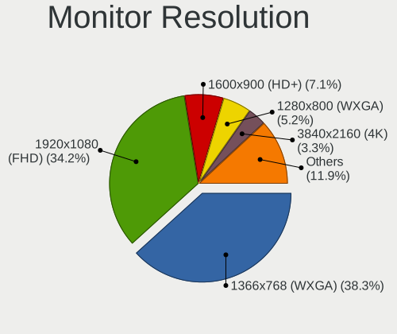

| Resolution         | Notebooks | Percent |
|--------------------|-----------|---------|
| 1366x768 (WXGA)    | 111       | 43.19%  |
| 1920x1080 (FHD)    | 80        | 31.13%  |
| 1280x800 (WXGA)    | 16        | 6.23%   |
| 1600x900 (HD+)     | 13        | 5.06%   |
| 3840x2160 (4K)     | 8         | 3.11%   |
| 1920x1200 (WUXGA)  | 6         | 2.33%   |
| 1440x900 (WXGA+)   | 6         | 2.33%   |
| 1024x600           | 4         | 1.56%   |
| 1680x1050 (WSXGA+) | 2         | 0.78%   |
| 5760x2160          | 1         | 0.39%   |
| 3440x1440          | 1         | 0.39%   |
| 2560x1600          | 1         | 0.39%   |
| 2560x1440 (QHD)    | 1         | 0.39%   |
| 2560x1080          | 1         | 0.39%   |
| 2288x1287          | 1         | 0.39%   |
| 2160x1440          | 1         | 0.39%   |
| 1400x1050          | 1         | 0.39%   |
| 1280x1024 (SXGA)   | 1         | 0.39%   |
| 1024x576           | 1         | 0.39%   |
| Unknown            | 1         | 0.39%   |

Monitor Diagonal
----------------

Diagonal size in inches

| Inches  | Notebooks | Percent |
|---------|-----------|---------|
| 15      | 129       | 47.08%  |
| 13      | 30        | 10.95%  |
| 14      | 29        | 10.58%  |
| 17      | 17        | 6.2%    |
| 12      | 8         | 2.92%   |
| 10      | 7         | 2.55%   |
| Unknown | 7         | 2.55%   |
| 24      | 6         | 2.19%   |
| 23      | 6         | 2.19%   |
| 18      | 5         | 1.82%   |
| 11      | 5         | 1.82%   |
| 19      | 4         | 1.46%   |
| 31      | 3         | 1.09%   |
| 27      | 3         | 1.09%   |
| 21      | 3         | 1.09%   |
| 84      | 2         | 0.73%   |
| 72      | 2         | 0.73%   |
| 48      | 2         | 0.73%   |
| 34      | 2         | 0.73%   |
| 32      | 1         | 0.36%   |
| 22      | 1         | 0.36%   |
| 20      | 1         | 0.36%   |
| 16      | 1         | 0.36%   |

Monitor Width
-------------

Physical width

| Width in mm | Notebooks | Percent |
|-------------|-----------|---------|
| 301-350     | 166       | 60.58%  |
| 201-300     | 35        | 12.77%  |
| 351-400     | 26        | 9.49%   |
| 501-600     | 14        | 5.11%   |
| 401-500     | 13        | 4.74%   |
| Unknown     | 7         | 2.55%   |
| 601-700     | 4         | 1.46%   |
| 1501-2000   | 4         | 1.46%   |
| 701-800     | 3         | 1.09%   |
| 1001-1500   | 2         | 0.73%   |

Aspect Ratio
------------

Proportional relationship between the width and the height

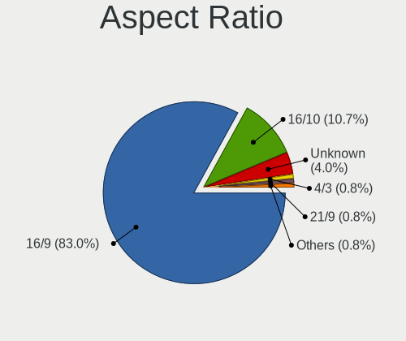

| Ratio   | Notebooks | Percent |
|---------|-----------|---------|
| 16/9    | 203       | 82.86%  |
| 16/10   | 30        | 12.24%  |
| Unknown | 7         | 2.86%   |
| 21/9    | 2         | 0.82%   |
| 5/4     | 1         | 0.41%   |
| 4/3     | 1         | 0.41%   |
| 3/2     | 1         | 0.41%   |

Monitor Area
------------

Area in inch²

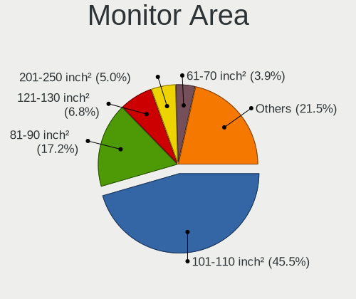

| Area in inch² | Notebooks | Percent |
|----------------|-----------|---------|
| 101-110        | 130       | 47.1%   |
| 81-90          | 46        | 16.67%  |
| 201-250        | 14        | 5.07%   |
| 71-80          | 13        | 4.71%   |
| 121-130        | 13        | 4.71%   |
| 61-70          | 8         | 2.9%    |
| 41-50          | 7         | 2.54%   |
| Unknown        | 7         | 2.54%   |
| More than 1000 | 6         | 2.17%   |
| 351-500        | 6         | 2.17%   |
| 151-200        | 6         | 2.17%   |
| 51-60          | 5         | 1.81%   |
| 141-150        | 5         | 1.81%   |
| 131-140        | 4         | 1.45%   |
| 301-350        | 3         | 1.09%   |
| 91-100         | 2         | 0.72%   |
| 251-300        | 1         | 0.36%   |

Pixel Density
-------------

Pixels per inch

| Density       | Notebooks | Percent |
|---------------|-----------|---------|
| 101-120       | 112       | 41.18%  |
| 121-160       | 79        | 29.04%  |
| 51-100        | 55        | 20.22%  |
| 161-240       | 12        | 4.41%   |
| Unknown       | 7         | 2.57%   |
| 1-50          | 5         | 1.84%   |
| More than 240 | 2         | 0.74%   |

Multiple Monitors
-----------------

Total monitors connected

| Total | Notebooks | Percent |
|-------|-----------|---------|
| 1     | 207       | 79.62%  |
| 2     | 40        | 15.38%  |
| 0     | 13        | 5%      |

Net Controller Vendor
---------------------

Controller vendors

| Vendor                            | Notebooks | Percent |
|-----------------------------------|-----------|---------|
| Realtek Semiconductor             | 151       | 35.36%  |
| Intel                             | 108       | 25.29%  |
| Qualcomm Atheros                  | 79        | 18.5%   |
| Broadcom                          | 27        | 6.32%   |
| Broadcom Limited                  | 11        | 2.58%   |
| Marvell Technology Group          | 9         | 2.11%   |
| Ralink                            | 5         | 1.17%   |
| Ericsson Business Mobile Networks | 5         | 1.17%   |
| Ralink Technology                 | 4         | 0.94%   |
| Silicon Integrated Systems [SiS]  | 2         | 0.47%   |
| Sierra Wireless                   | 2         | 0.47%   |
| Qualcomm                          | 2         | 0.47%   |
| Huawei Technologies               | 2         | 0.47%   |
| Hewlett-Packard                   | 2         | 0.47%   |
| AVM                               | 2         | 0.47%   |
| Xiaomi                            | 1         | 0.23%   |
| VIA Technologies                  | 1         | 0.23%   |
| T & A Mobile Phones               | 1         | 0.23%   |
| Samsung Electronics               | 1         | 0.23%   |
| Qualcomm Atheros Communications   | 1         | 0.23%   |
| Nvidia                            | 1         | 0.23%   |
| NetGear                           | 1         | 0.23%   |
| Microsoft                         | 1         | 0.23%   |
| LG Electronics                    | 1         | 0.23%   |
| Fujitsu Siemens Computers         | 1         | 0.23%   |
| Edimax Technology                 | 1         | 0.23%   |
| Dell                              | 1         | 0.23%   |
| D-Link                            | 1         | 0.23%   |
| ASUSTek Computer                  | 1         | 0.23%   |
| ASIX Electronics                  | 1         | 0.23%   |
| Apple                             | 1         | 0.23%   |

Net Controller Model
--------------------

Controller models

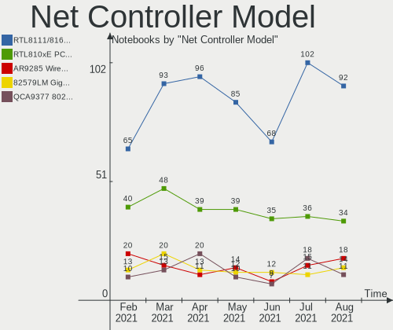

| Model                                                                   | Notebooks | Percent |
|-------------------------------------------------------------------------|-----------|---------|
| Realtek RTL8111/8168/8411 PCI Express Gigabit Ethernet Controller       | 85        | 16.73%  |
| Realtek RTL810xE PCI Express Fast Ethernet controller                   | 39        | 7.68%   |
| Qualcomm Atheros AR9485 Wireless Network Adapter                        | 14        | 2.76%   |
| Qualcomm Atheros AR9285 Wireless Network Adapter (PCI-Express)          | 14        | 2.76%   |
| Intel Wi-Fi 6 AX200                                                     | 13        | 2.56%   |
| Intel 82579LM Gigabit Network Connection (Lewisville)                   | 12        | 2.36%   |
| Realtek RTL8821CE 802.11ac PCIe Wireless Network Adapter                | 10        | 1.97%   |
| Qualcomm Atheros QCA9565 / AR9565 Wireless Network Adapter              | 10        | 1.97%   |
| Qualcomm Atheros QCA9377 802.11ac Wireless Network Adapter              | 10        | 1.97%   |
| Intel Centrino Advanced-N 6205 [Taylor Peak]                            | 9         | 1.77%   |
| Intel Cannon Lake PCH CNVi WiFi                                         | 9         | 1.77%   |
| Realtek RTL8188CE 802.11b/g/n WiFi Adapter                              | 8         | 1.57%   |
| Realtek RTL8153 Gigabit Ethernet Adapter                                | 8         | 1.57%   |
| Qualcomm Atheros QCA6174 802.11ac Wireless Network Adapter              | 7         | 1.38%   |
| Qualcomm Atheros AR242x / AR542x Wireless Network Adapter (PCI-Express) | 7         | 1.38%   |
| Marvell Group 88E8040 PCI-E Fast Ethernet Controller                    | 7         | 1.38%   |
| Intel Wireless 7260                                                     | 7         | 1.38%   |
| Intel PRO/Wireless 3945ABG [Golan] Network Connection                   | 7         | 1.38%   |
| Broadcom BCM4313 802.11bgn Wireless Network Adapter                     | 7         | 1.38%   |
| Intel Wireless 8260                                                     | 6         | 1.18%   |
| Intel Wi-Fi 6 AX201                                                     | 6         | 1.18%   |
| Qualcomm Atheros AR8151 v2.0 Gigabit Ethernet                           | 5         | 0.98%   |
| Intel Ethernet Connection I219-LM                                       | 5         | 0.98%   |
| Intel Centrino Wireless-N 1000 [Condor Peak]                            | 5         | 0.98%   |
| Broadcom BCM43142 802.11b/g/n                                           | 5         | 0.98%   |
| Realtek RTL8822CE 802.11ac PCIe Wireless Network Adapter                | 4         | 0.79%   |
| Realtek RTL8723BE PCIe Wireless Network Adapter                         | 4         | 0.79%   |
| Qualcomm Atheros AR8121/AR8113/AR8114 Gigabit or Fast Ethernet          | 4         | 0.79%   |
| Intel Wireless 8265 / 8275                                              | 4         | 0.79%   |
| Broadcom Limited BCM4312 802.11b/g LP-PHY                               | 4         | 0.79%   |
| Realtek RTL88x2bu [AC1200 Techkey]                                      | 3         | 0.59%   |
| Realtek RTL-8100/8101L/8139 PCI Fast Ethernet Adapter                   | 3         | 0.59%   |
| Ralink RT5390 Wireless 802.11n 1T/1R PCIe                               | 3         | 0.59%   |
| Qualcomm Atheros AR928X Wireless Network Adapter (PCI-Express)          | 3         | 0.59%   |
| Qualcomm Atheros AR9287 Wireless Network Adapter (PCI-Express)          | 3         | 0.59%   |
| Qualcomm Atheros AR8161 Gigabit Ethernet                                | 3         | 0.59%   |
| Intel Wireless 3165                                                     | 3         | 0.59%   |
| Intel Ethernet Connection I218-LM                                       | 3         | 0.59%   |
| Intel Ethernet Connection I217-LM                                       | 3         | 0.59%   |
| Intel Dual Band Wireless-AC 3168NGW [Stone Peak]                        | 3         | 0.59%   |
| Intel Comet Lake PCH-LP CNVi WiFi                                       | 3         | 0.59%   |
| Intel Centrino Wireless-N 2230                                          | 3         | 0.59%   |
| Intel Centrino Wireless-N 1030 [Rainbow Peak]                           | 3         | 0.59%   |
| Intel Centrino Advanced-N 6200                                          | 3         | 0.59%   |
| Intel 82577LM Gigabit Network Connection                                | 3         | 0.59%   |
| Ericsson Business Mobile Networks F5521gw                               | 3         | 0.59%   |
| Broadcom NetLink BCM5906M Fast Ethernet PCI Express                     | 3         | 0.59%   |
| Broadcom BCM4312 802.11b/g LP-PHY                                       | 3         | 0.59%   |
| Realtek RTL8822BE 802.11a/b/g/n/ac WiFi adapter                         | 2         | 0.39%   |
| Realtek RTL8723BU 802.11b/g/n WLAN Adapter                              | 2         | 0.39%   |
| Realtek RTL8192CE PCIe Wireless Network Adapter                         | 2         | 0.39%   |
| Realtek RTL8188EE Wireless Network Adapter                              | 2         | 0.39%   |
| Ralink MT7601U Wireless Adapter                                         | 2         | 0.39%   |
| Qualcomm Atheros Killer E2400 Gigabit Ethernet Controller               | 2         | 0.39%   |
| Qualcomm Atheros AR9462 Wireless Network Adapter                        | 2         | 0.39%   |
| Qualcomm Atheros AR8162 Fast Ethernet                                   | 2         | 0.39%   |
| Intel PRO/Wireless 5100 AGN [Shiloh] Network Connection                 | 2         | 0.39%   |
| Intel Ice Lake-LP PCH CNVi WiFi                                         | 2         | 0.39%   |
| Intel Ethernet Connection (4) I219-LM                                   | 2         | 0.39%   |
| Intel Comet Lake PCH CNVi WiFi                                          | 2         | 0.39%   |

Wireless Vendor
---------------

Wireless vendors

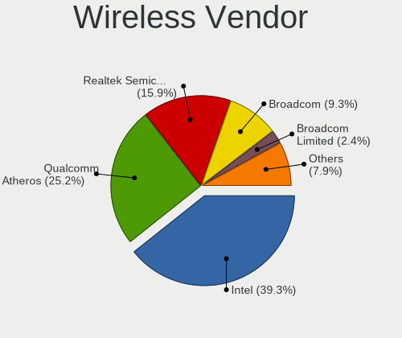

| Vendor                          | Notebooks | Percent |
|---------------------------------|-----------|---------|
| Intel                           | 104       | 38.81%  |
| Qualcomm Atheros                | 70        | 26.12%  |
| Realtek Semiconductor           | 44        | 16.42%  |
| Broadcom                        | 22        | 8.21%   |
| Broadcom Limited                | 8         | 2.99%   |
| Ralink                          | 5         | 1.87%   |
| Ralink Technology               | 4         | 1.49%   |
| Sierra Wireless                 | 2         | 0.75%   |
| AVM                             | 2         | 0.75%   |
| Qualcomm Atheros Communications | 1         | 0.37%   |
| Qualcomm                        | 1         | 0.37%   |
| NetGear                         | 1         | 0.37%   |
| Microsoft                       | 1         | 0.37%   |
| Fujitsu Siemens Computers       | 1         | 0.37%   |
| Edimax Technology               | 1         | 0.37%   |
| ASUSTek Computer                | 1         | 0.37%   |

Wireless Model
--------------

Wireless models

| Model                                                                   | Notebooks | Percent |
|-------------------------------------------------------------------------|-----------|---------|
| Qualcomm Atheros AR9485 Wireless Network Adapter                        | 14        | 5.2%    |
| Qualcomm Atheros AR9285 Wireless Network Adapter (PCI-Express)          | 14        | 5.2%    |
| Intel Wi-Fi 6 AX200                                                     | 13        | 4.83%   |
| Realtek RTL8821CE 802.11ac PCIe Wireless Network Adapter                | 10        | 3.72%   |
| Qualcomm Atheros QCA9565 / AR9565 Wireless Network Adapter              | 10        | 3.72%   |
| Qualcomm Atheros QCA9377 802.11ac Wireless Network Adapter              | 10        | 3.72%   |
| Intel Centrino Advanced-N 6205 [Taylor Peak]                            | 9         | 3.35%   |
| Intel Cannon Lake PCH CNVi WiFi                                         | 9         | 3.35%   |
| Realtek RTL8188CE 802.11b/g/n WiFi Adapter                              | 8         | 2.97%   |
| Qualcomm Atheros QCA6174 802.11ac Wireless Network Adapter              | 7         | 2.6%    |
| Qualcomm Atheros AR242x / AR542x Wireless Network Adapter (PCI-Express) | 7         | 2.6%    |
| Intel Wireless 7260                                                     | 7         | 2.6%    |
| Intel PRO/Wireless 3945ABG [Golan] Network Connection                   | 7         | 2.6%    |
| Broadcom BCM4313 802.11bgn Wireless Network Adapter                     | 7         | 2.6%    |
| Intel Wireless 8260                                                     | 6         | 2.23%   |
| Intel Wi-Fi 6 AX201                                                     | 6         | 2.23%   |
| Intel Centrino Wireless-N 1000 [Condor Peak]                            | 5         | 1.86%   |
| Broadcom BCM43142 802.11b/g/n                                           | 5         | 1.86%   |
| Realtek RTL8822CE 802.11ac PCIe Wireless Network Adapter                | 4         | 1.49%   |
| Realtek RTL8723BE PCIe Wireless Network Adapter                         | 4         | 1.49%   |
| Intel Wireless 8265 / 8275                                              | 4         | 1.49%   |
| Broadcom Limited BCM4312 802.11b/g LP-PHY                               | 4         | 1.49%   |
| Realtek RTL88x2bu [AC1200 Techkey]                                      | 3         | 1.12%   |
| Ralink RT5390 Wireless 802.11n 1T/1R PCIe                               | 3         | 1.12%   |
| Qualcomm Atheros AR928X Wireless Network Adapter (PCI-Express)          | 3         | 1.12%   |
| Qualcomm Atheros AR9287 Wireless Network Adapter (PCI-Express)          | 3         | 1.12%   |
| Intel Wireless 3165                                                     | 3         | 1.12%   |
| Intel Dual Band Wireless-AC 3168NGW [Stone Peak]                        | 3         | 1.12%   |
| Intel Comet Lake PCH-LP CNVi WiFi                                       | 3         | 1.12%   |
| Intel Centrino Wireless-N 2230                                          | 3         | 1.12%   |
| Intel Centrino Wireless-N 1030 [Rainbow Peak]                           | 3         | 1.12%   |
| Intel Centrino Advanced-N 6200                                          | 3         | 1.12%   |
| Broadcom BCM4312 802.11b/g LP-PHY                                       | 3         | 1.12%   |
| Realtek RTL8822BE 802.11a/b/g/n/ac WiFi adapter                         | 2         | 0.74%   |
| Realtek RTL8723BU 802.11b/g/n WLAN Adapter                              | 2         | 0.74%   |
| Realtek RTL8192CE PCIe Wireless Network Adapter                         | 2         | 0.74%   |
| Realtek RTL8188EE Wireless Network Adapter                              | 2         | 0.74%   |
| Ralink MT7601U Wireless Adapter                                         | 2         | 0.74%   |
| Qualcomm Atheros AR9462 Wireless Network Adapter                        | 2         | 0.74%   |
| Intel PRO/Wireless 5100 AGN [Shiloh] Network Connection                 | 2         | 0.74%   |
| Intel Ice Lake-LP PCH CNVi WiFi                                         | 2         | 0.74%   |
| Intel Comet Lake PCH CNVi WiFi                                          | 2         | 0.74%   |
| Intel Centrino Wireless-N 130                                           | 2         | 0.74%   |
| Intel Centrino Wireless-N + WiMAX 6150                                  | 2         | 0.74%   |
| Intel Centrino Ultimate-N 6300                                          | 2         | 0.74%   |
| Intel Cannon Point-LP CNVi [Wireless-AC]                                | 2         | 0.74%   |
| Broadcom Limited BCM4360 802.11ac Wireless Network Adapter              | 2         | 0.74%   |
| Broadcom Limited BCM4311 802.11a/b/g                                    | 2         | 0.74%   |
| Broadcom BCM4331 802.11a/b/g/n                                          | 2         | 0.74%   |
| Broadcom BCM43224 802.11a/b/g/n                                         | 2         | 0.74%   |
| AVM FRITZ!WLAN AC 860                                                   | 2         | 0.74%   |
| Sierra Wireless EM7345 4G LTE                                           | 1         | 0.37%   |
| Sierra Wireless EM7305 Modem                                            | 1         | 0.37%   |
| Realtek RTL8821AE 802.11ac PCIe Wireless Network Adapter                | 1         | 0.37%   |
| Realtek RTL8812AU 802.11a/b/g/n/ac 2T2R DB WLAN Adapter                 | 1         | 0.37%   |
| Realtek RTL8723DE Wireless Network Adapter                              | 1         | 0.37%   |
| Realtek RTL8188EUS 802.11n Wireless Network Adapter                     | 1         | 0.37%   |
| Realtek RTL8187B Wireless Adapter                                       | 1         | 0.37%   |
| Realtek RTL8187B Wireless 802.11g 54Mbps Network Adapter                | 1         | 0.37%   |
| Realtek 802.11ac NIC                                                    | 1         | 0.37%   |

Ethernet Vendor
---------------

Ethernet vendors

| Vendor                           | Notebooks | Percent |
|----------------------------------|-----------|---------|
| Realtek Semiconductor            | 136       | 60.18%  |
| Intel                            | 36        | 15.93%  |
| Qualcomm Atheros                 | 21        | 9.29%   |
| Broadcom                         | 10        | 4.42%   |
| Marvell Technology Group         | 9         | 3.98%   |
| Broadcom Limited                 | 3         | 1.33%   |
| Silicon Integrated Systems [SiS] | 2         | 0.88%   |
| Xiaomi                           | 1         | 0.44%   |
| VIA Technologies                 | 1         | 0.44%   |
| Samsung Electronics              | 1         | 0.44%   |
| Qualcomm                         | 1         | 0.44%   |
| Nvidia                           | 1         | 0.44%   |
| Huawei Technologies              | 1         | 0.44%   |
| D-Link                           | 1         | 0.44%   |
| ASIX Electronics                 | 1         | 0.44%   |
| Apple                            | 1         | 0.44%   |

Ethernet Model
--------------

Ethernet models

| Model                                                                | Notebooks | Percent |
|----------------------------------------------------------------------|-----------|---------|
| Realtek RTL8111/8168/8411 PCI Express Gigabit Ethernet Controller    | 85        | 37.61%  |
| Realtek RTL810xE PCI Express Fast Ethernet controller                | 39        | 17.26%  |
| Intel 82579LM Gigabit Network Connection (Lewisville)                | 12        | 5.31%   |
| Realtek RTL8153 Gigabit Ethernet Adapter                             | 8         | 3.54%   |
| Marvell Group 88E8040 PCI-E Fast Ethernet Controller                 | 7         | 3.1%    |
| Qualcomm Atheros AR8151 v2.0 Gigabit Ethernet                        | 5         | 2.21%   |
| Intel Ethernet Connection I219-LM                                    | 5         | 2.21%   |
| Qualcomm Atheros AR8121/AR8113/AR8114 Gigabit or Fast Ethernet       | 4         | 1.77%   |
| Realtek RTL-8100/8101L/8139 PCI Fast Ethernet Adapter                | 3         | 1.33%   |
| Qualcomm Atheros AR8161 Gigabit Ethernet                             | 3         | 1.33%   |
| Intel Ethernet Connection I218-LM                                    | 3         | 1.33%   |
| Intel Ethernet Connection I217-LM                                    | 3         | 1.33%   |
| Intel 82577LM Gigabit Network Connection                             | 3         | 1.33%   |
| Broadcom NetLink BCM5906M Fast Ethernet PCI Express                  | 3         | 1.33%   |
| Qualcomm Atheros Killer E2400 Gigabit Ethernet Controller            | 2         | 0.88%   |
| Qualcomm Atheros AR8162 Fast Ethernet                                | 2         | 0.88%   |
| Intel Ethernet Connection (4) I219-LM                                | 2         | 0.88%   |
| Broadcom NetLink BCM57785 Gigabit Ethernet PCIe                      | 2         | 0.88%   |
| Broadcom Limited NetLink BCM5787M Gigabit Ethernet PCI Express       | 2         | 0.88%   |
| Xiaomi Mi/Redmi series (RNDIS)                                       | 1         | 0.44%   |
| VIA VT6102/VT6103 [Rhine-II]                                         | 1         | 0.44%   |
| Silicon Integrated Systems [SiS] SiS900 PCI Fast Ethernet            | 1         | 0.44%   |
| Silicon Integrated Systems [SiS] 191 Gigabit Ethernet Adapter        | 1         | 0.44%   |
| Samsung Galaxy series, misc. (tethering mode)                        | 1         | 0.44%   |
| Realtek RTL8169 PCI Gigabit Ethernet Controller                      | 1         | 0.44%   |
| Qualcomm U693CL                                                      | 1         | 0.44%   |
| Qualcomm Atheros QCA8172 Fast Ethernet                               | 1         | 0.44%   |
| Qualcomm Atheros QCA8171 Gigabit Ethernet                            | 1         | 0.44%   |
| Qualcomm Atheros AR8152 v1.1 Fast Ethernet                           | 1         | 0.44%   |
| Qualcomm Atheros AR8151 v1.0 Gigabit Ethernet                        | 1         | 0.44%   |
| Qualcomm Atheros AR8131 Gigabit Ethernet                             | 1         | 0.44%   |
| Nvidia MCP51 Ethernet Controller                                     | 1         | 0.44%   |
| Marvell Group 88E8053 PCI-E Gigabit Ethernet Controller              | 1         | 0.44%   |
| Marvell Group 88E8042 PCI-E Fast Ethernet Controller                 | 1         | 0.44%   |
| Intel PRO/100 VE Network Connection                                  | 1         | 0.44%   |
| Intel Ethernet Connection I217-V                                     | 1         | 0.44%   |
| Intel Ethernet Connection (6) I219-LM                                | 1         | 0.44%   |
| Intel Ethernet Connection (2) I219-LM                                | 1         | 0.44%   |
| Intel Ethernet Connection (13) I219-V                                | 1         | 0.44%   |
| Intel Ethernet Connection (11) I219-LM                               | 1         | 0.44%   |
| Intel 82567LM Gigabit Network Connection                             | 1         | 0.44%   |
| Intel 82562ET/EZ/GT/GZ - PRO/100 VE (LOM) Ethernet Controller Mobile | 1         | 0.44%   |
| Huawei RNE-L21                                                       | 1         | 0.44%   |
| D-Link DUB-1312                                                      | 1         | 0.44%   |
| Broadcom NetXtreme BCM5788 Gigabit Ethernet                          | 1         | 0.44%   |
| Broadcom NetXtreme BCM57765 Gigabit Ethernet PCIe                    | 1         | 0.44%   |
| Broadcom NetXtreme BCM57760 Gigabit Ethernet PCIe                    | 1         | 0.44%   |
| Broadcom NetXtreme BCM5764M Gigabit Ethernet PCIe                    | 1         | 0.44%   |
| Broadcom Limited BCM4401-B0 100Base-TX                               | 1         | 0.44%   |
| Broadcom BCM4401 100Base-T                                           | 1         | 0.44%   |
| ASIX AX88772B                                                        | 1         | 0.44%   |
| Apple iPhone 4(CDMA)                                                 | 1         | 0.44%   |

Net Controller Kind
-------------------

Ethernet, WiFi or modem

| Kind     | Notebooks | Percent |
|----------|-----------|---------|
| WiFi     | 254       | 52.16%  |
| Ethernet | 220       | 45.17%  |
| Modem    | 12        | 2.46%   |
| Unknown  | 1         | 0.21%   |

Used Controller
---------------

Currently used network controller

| Kind     | Notebooks | Percent |
|----------|-----------|---------|
| WiFi     | 236       | 61.3%   |
| Ethernet | 146       | 37.92%  |
| Modem    | 3         | 0.78%   |

NICs
----

Total network controllers on board

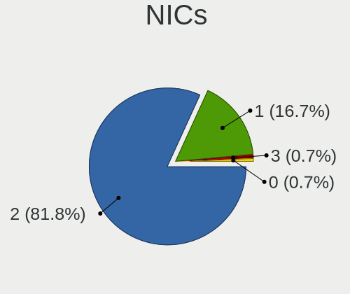

| Total | Notebooks | Percent |
|-------|-----------|---------|
| 2     | 203       | 78.08%  |
| 1     | 45        | 17.31%  |
| 0     | 11        | 4.23%   |
| 3     | 1         | 0.38%   |

IPv6
----

IPv6 vs IPv4

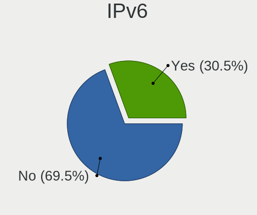

| Used | Notebooks | Percent |
|------|-----------|---------|
| No   | 186       | 71.54%  |
| Yes  | 74        | 28.46%  |

Memory Vendor
-------------

Memory module vendors

| Vendor              | Notebooks | Percent |
|---------------------|-----------|---------|
| Samsung Electronics | 39        | 34.82%  |
| SK Hynix            | 19        | 16.96%  |
| Unknown             | 14        | 12.5%   |
| Micron Technology   | 9         | 8.04%   |
| Kingston            | 9         | 8.04%   |
| Crucial             | 6         | 5.36%   |
| Unknown (ABCD)      | 2         | 1.79%   |
| Ramaxel Technology  | 2         | 1.79%   |
| Nanya Technology    | 2         | 1.79%   |
| A-DATA Technology   | 2         | 1.79%   |
| Qimonda             | 1         | 0.89%   |
| Patriot             | 1         | 0.89%   |
| Kllisre             | 1         | 0.89%   |
| GOODRAM             | 1         | 0.89%   |
| Goldkey             | 1         | 0.89%   |
| Elpida              | 1         | 0.89%   |
| Corsair             | 1         | 0.89%   |
| 3235CB0010E4        | 1         | 0.89%   |

Memory Model
------------

Memory module models

| Model                                                            | Notebooks | Percent |
|------------------------------------------------------------------|-----------|---------|
| Samsung RAM M471A5244CB0-CTD 4GB SODIMM DDR4 2667MT/s            | 4         | 3.23%   |
| SK Hynix RAM HMA81GS6CJR8N-VK 8GB SODIMM DDR4 2667MT/s           | 3         | 2.42%   |
| Samsung RAM M471B5273DH0-CH9 4GB SODIMM DDR3 1334MT/s            | 3         | 2.42%   |
| Unknown RAM Module 2048MB SODIMM DDR2 667MT/s                    | 2         | 1.61%   |
| Unknown (ABCD) RAM 123456789012345678 4GB SODIMM LPDDR4 2400MT/s | 2         | 1.61%   |
| SK Hynix RAM HMT451S6BFR8A-PB 4GB SODIMM DDR3 1600MT/s           | 2         | 1.61%   |
| SK Hynix RAM HMT351S6CFR8C-PB 4GB SODIMM DDR3 1600MT/s           | 2         | 1.61%   |
| Samsung RAM M471B5674QH0-YK0 2GB SODIMM DDR3 1600MT/s            | 2         | 1.61%   |
| Samsung RAM M471B5673FH0-CH9 2GB SODIMM DDR3 1334MT/s            | 2         | 1.61%   |
| Samsung RAM M471B5273CH0-CH9 4GB SODIMM DDR3 1334MT/s            | 2         | 1.61%   |
| Samsung RAM M471B5173QH0-YK0 4GB SODIMM DDR3 1600MT/s            | 2         | 1.61%   |
| Samsung RAM M471A2K43DB1-CWE 16384MB SODIMM DDR4 3200MT/s        | 2         | 1.61%   |
| Micron RAM 4ATF51264HZ-2G6E1 4096MB SODIMM DDR4 2667MT/s         | 2         | 1.61%   |
| Kingston RAM 99U5469-046.A00LF 4GB SODIMM DDR3 1333MT/s          | 2         | 1.61%   |
| Crucial RAM CT102464BF160B.M16 8192MB SODIMM DDR3 1600MT/s       | 2         | 1.61%   |
| Crucial RAM CT102464BF160B.C16 8192MB SODIMM DDR3 1600MT/s       | 2         | 1.61%   |
| Unknown SODIMM 2048MB SODIMM DDR2 533MT/s                        | 1         | 0.81%   |
| Unknown RAM Module 8192MB Row Of Chips LPDDR4 4267MT/s           | 1         | 0.81%   |
| Unknown RAM Module 8192MB DIMM DDR3 1066MT/s                     | 1         | 0.81%   |
| Unknown RAM Module 4096MB SODIMM DDR3 1600MT/s                   | 1         | 0.81%   |
| Unknown RAM Module 4096MB SODIMM DDR3                            | 1         | 0.81%   |
| Unknown RAM Module 4096MB Row Of Chips LPDDR4 4267MT/s           | 1         | 0.81%   |
| Unknown RAM Module 2GB SODIMM DDR3 1333MT/s                      | 1         | 0.81%   |
| Unknown RAM Module 2048MB SODIMM DDR3 1066MT/s                   | 1         | 0.81%   |
| Unknown RAM Module 2048MB DIMM DDR3 1333MT/s                     | 1         | 0.81%   |
| Unknown RAM Module 16384MB SODIMM DDR4 2400MT/s                  | 1         | 0.81%   |
| Unknown RAM Module 1024MB SODIMM DRAM                            | 1         | 0.81%   |
| Unknown RAM Module 1024MB SODIMM DDR2                            | 1         | 0.81%   |
| SK Hynix RAM HYMP112S64CP6-S6 1024MB SODIMM DDR 975MT/s          | 1         | 0.81%   |
| SK Hynix RAM HMT451S6MFR8C-PB 4096MB SODIMM DDR3 1600MT/s        | 1         | 0.81%   |
| SK Hynix RAM HMT451S6MFR8A-PB 4096MB SODIMM DDR3 1600MT/s        | 1         | 0.81%   |
| SK Hynix RAM HMT451S6MFR6A-PB 4096MB SODIMM DDR3 1600MT/s        | 1         | 0.81%   |
| SK Hynix RAM HMT451S6DFR8A-PB 4096MB SODIMM DDR3 1600MT/s        | 1         | 0.81%   |
| SK Hynix RAM HMT351S6CFR8C-H9 4096MB SODIMM DDR3 1333MT/s        | 1         | 0.81%   |
| SK Hynix RAM HMAA1GS6CMR8N-VK 8GB Row Of Chips DDR4 2667MT/s     | 1         | 0.81%   |
| SK Hynix RAM HMAA1GS6CMR6N-VK 8192MB SODIMM DDR4 2667MT/s        | 1         | 0.81%   |
| SK Hynix RAM HMA851S6JJR6N-VK 4096MB SODIMM DDR4 2667MT/s        | 1         | 0.81%   |
| SK Hynix RAM HMA851S6AFR6N-UH 4GB SODIMM DDR4 2667MT/s           | 1         | 0.81%   |
| SK Hynix RAM HMA82GS6JJR8N-VK 16GB SODIMM DDR4 2667MT/s          | 1         | 0.81%   |
| SK Hynix RAM HMA81GS6JJR8N-VK 8192MB SODIMM DDR4 2667MT/s        | 1         | 0.81%   |
| SK Hynix RAM HMA81GS6CJR8N-VK 8192MB SODIMM DDR4 2667MT/s        | 1         | 0.81%   |
| SK Hynix RAM HMA41GS6AFR8N-TF 8GB SODIMM DDR4 2133MT/s           | 1         | 0.81%   |
| Samsung RAM U6E3S4AA-MGCR 1GB Row Of Chips LPDDR4 4267MT/s       | 1         | 0.81%   |
| Samsung RAM Module 8192MB SODIMM DDR4 3200MT/s                   | 1         | 0.81%   |
| Samsung RAM Module 4096MB SODIMM DDR3 1600MT/s                   | 1         | 0.81%   |
| Samsung RAM Module 2GB DIMM DDR2 533MT/s                         | 1         | 0.81%   |
| Samsung RAM Module 2048MB SODIMM DDR3 1600MT/s                   | 1         | 0.81%   |
| Samsung RAM Module 1GB DIMM DDR2 533MT/s                         | 1         | 0.81%   |
| Samsung RAM M474A4G43AB1-CWE 32GB SODIMM DDR4 3200MT/s           | 1         | 0.81%   |
| Samsung RAM M471B5773EB0-CK0 2048MB SODIMM DDR3 1600MT/s         | 1         | 0.81%   |
| Samsung RAM M471B5773DH0-CK0 2GB SODIMM DDR3 1600MT/s            | 1         | 0.81%   |
| Samsung RAM M471B5773DH0-CH9 2GB SODIMM DDR3 1600MT/s            | 1         | 0.81%   |
| Samsung RAM M471B5773CHS-CH9 2GB SODIMM DDR3 4199MT/s            | 1         | 0.81%   |
| Samsung RAM M471B5673EH1-CF8 2048MB SODIMM 4199MT/s              | 1         | 0.81%   |
| Samsung RAM M471B5273EB0-CK0 4GB SODIMM DDR3 4199MT/s            | 1         | 0.81%   |
| Samsung RAM M471B5273DH0-YH9 4096MB SODIMM DDR3 1600MT/s         | 1         | 0.81%   |
| Samsung RAM M471B2874EH1-CF8 1024MB SODIMM 1067MT/s              | 1         | 0.81%   |
| Samsung RAM M471B1G73EB0-YK0 8192MB SODIMM DDR3 1600MT/s         | 1         | 0.81%   |
| Samsung RAM M471A5244CB0-CWE 4GB SODIMM DDR4 3200MT/s            | 1         | 0.81%   |
| Samsung RAM M471A5244BB0-CRC 4096MB SODIMM DDR4 2400MT/s         | 1         | 0.81%   |

Memory Kind
-----------

Memory module kinds

| Kind   | Notebooks | Percent |
|--------|-----------|---------|
| DDR3   | 45        | 43.69%  |
| DDR4   | 38        | 36.89%  |
| DDR2   | 8         | 7.77%   |
| LPDDR4 | 7         | 6.8%    |
| SDRAM  | 4         | 3.88%   |
| DRAM   | 1         | 0.97%   |

Memory Form Factor
------------------

Physical design of the memory module

| Name         | Notebooks | Percent |
|--------------|-----------|---------|
| SODIMM       | 90        | 90.91%  |
| Row Of Chips | 6         | 6.06%   |
| DIMM         | 3         | 3.03%   |

Memory Size
-----------

Memory module size

| Size  | Notebooks | Percent |
|-------|-----------|---------|
| 4096  | 43        | 38.74%  |
| 8192  | 26        | 23.42%  |
| 2048  | 23        | 20.72%  |
| 16384 | 10        | 9.01%   |
| 1024  | 7         | 6.31%   |
| 32768 | 2         | 1.8%    |

Memory Speed
------------

Memory module speed

| Speed   | Notebooks | Percent |
|---------|-----------|---------|
| 1600    | 28        | 26.17%  |
| 2667    | 25        | 23.36%  |
| 3200    | 10        | 9.35%   |
| 1334    | 9         | 8.41%   |
| 1333    | 7         | 6.54%   |
| 2400    | 5         | 4.67%   |
| 4267    | 4         | 3.74%   |
| 4199    | 3         | 2.8%    |
| 667     | 3         | 2.8%    |
| Unknown | 3         | 2.8%    |
| 2133    | 2         | 1.87%   |
| 1066    | 2         | 1.87%   |
| 975     | 2         | 1.87%   |
| 533     | 2         | 1.87%   |
| 2048    | 1         | 0.93%   |
| 1067    | 1         | 0.93%   |

Sound Vendor
------------

Sound card vendors

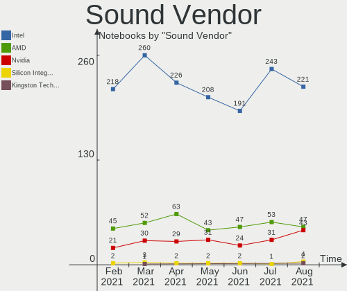

| Vendor                           | Notebooks | Percent |
|----------------------------------|-----------|---------|
| Intel                            | 208       | 69.1%   |
| AMD                              | 43        | 14.29%  |
| Nvidia                           | 31        | 10.3%   |
| C-Media Electronics              | 5         | 1.66%   |
| Texas Instruments                | 2         | 0.66%   |
| Silicon Integrated Systems [SiS] | 2         | 0.66%   |
| Logitech                         | 2         | 0.66%   |
| VIA Technologies                 | 1         | 0.33%   |
| Sony                             | 1         | 0.33%   |
| ROCCAT                           | 1         | 0.33%   |
| Plantronics                      | 1         | 0.33%   |
| GYROCOM C&C                      | 1         | 0.33%   |
| Griffin Technology               | 1         | 0.33%   |
| GN Netcom                        | 1         | 0.33%   |
| Conexant Systems                 | 1         | 0.33%   |

Sound Model
-----------

Sound card models

| Model                                                                                             | Notebooks | Percent |
|---------------------------------------------------------------------------------------------------|-----------|---------|
| Intel 6 Series/C200 Series Chipset Family High Definition Audio Controller                        | 30        | 8.43%   |
| Intel 7 Series/C216 Chipset Family High Definition Audio Controller                               | 26        | 7.3%    |
| Intel Sunrise Point-LP HD Audio                                                                   | 18        | 5.06%   |
| Intel 82801I (ICH9 Family) HD Audio Controller                                                    | 18        | 5.06%   |
| AMD Family 17h (Models 10h-1fh) HD Audio Controller                                               | 18        | 5.06%   |
| Intel 5 Series/3400 Series Chipset High Definition Audio                                          | 14        | 3.93%   |
| Intel NM10/ICH7 Family High Definition Audio Controller                                           | 12        | 3.37%   |
| Intel Cannon Lake PCH cAVS                                                                        | 12        | 3.37%   |
| AMD Renoir Radeon High Definition Audio Controller                                                | 11        | 3.09%   |
| Intel Tiger Lake-LP Smart Sound Technology Audio Controller                                       | 10        | 2.81%   |
| Intel Haswell-ULT HD Audio Controller                                                             | 10        | 2.81%   |
| Intel 8 Series HD Audio Controller                                                                | 10        | 2.81%   |
| Intel 82801H (ICH8 Family) HD Audio Controller                                                    | 8         | 2.25%   |
| Intel Wildcat Point-LP High Definition Audio Controller                                           | 7         | 1.97%   |
| Intel Broadwell-U Audio Controller                                                                | 7         | 1.97%   |
| Intel 8 Series/C220 Series Chipset High Definition Audio Controller                               | 7         | 1.97%   |
| AMD Family 15h (Models 60h-6fh) Audio Controller                                                  | 7         | 1.97%   |
| Intel Xeon E3-1200 v3/4th Gen Core Processor HD Audio Controller                                  | 6         | 1.69%   |
| AMD Raven/Raven2/Fenghuang HDMI/DP Audio Controller                                               | 6         | 1.69%   |
| AMD High Definition Audio Controller                                                              | 6         | 1.69%   |
| AMD FCH Azalia Controller                                                                         | 6         | 1.69%   |
| Intel Comet Lake PCH-LP cAVS                                                                      | 5         | 1.4%    |
| Intel Atom Processor Z36xxx/Z37xxx Series High Definition Audio Controller                        | 5         | 1.4%    |
| Nvidia TU107 GeForce GTX 1650 High Definition Audio Controller                                    | 4         | 1.12%   |
| Nvidia GP107GL High Definition Audio Controller                                                   | 4         | 1.12%   |
| Intel Ice Lake-LP Smart Sound Technology Audio Controller                                         | 4         | 1.12%   |
| Intel Cannon Point-LP High Definition Audio Controller                                            | 4         | 1.12%   |
| Intel Atom/Celeron/Pentium Processor x5-E8000/J3xxx/N3xxx Series High Definition Audio Controller | 4         | 1.12%   |
| AMD SBx00 Azalia (Intel HDA)                                                                      | 4         | 1.12%   |
| Nvidia GT216 HDMI Audio Controller                                                                | 3         | 0.84%   |
| Nvidia GP106 High Definition Audio Controller                                                     | 3         | 0.84%   |
| Nvidia GK106 HDMI Audio Controller                                                                | 3         | 0.84%   |
| Intel Celeron/Pentium Silver Processor High Definition Audio                                      | 3         | 0.84%   |
| AMD BeaverCreek HDMI Audio [Radeon HD 6500D and 6400G-6600G series]                               | 3         | 0.84%   |
| Nvidia GK107 HDMI Audio Controller                                                                | 2         | 0.56%   |
| Nvidia GF108 High Definition Audio Controller                                                     | 2         | 0.56%   |
| Intel Comet Lake PCH cAVS                                                                         | 2         | 0.56%   |
| Intel Celeron N3350/Pentium N4200/Atom E3900 Series Audio Cluster                                 | 2         | 0.56%   |
| Intel 100 Series/C230 Series Chipset Family HD Audio Controller                                   | 2         | 0.56%   |
| C-Media Electronics Audio Adapter (Unitek Y-247A)                                                 | 2         | 0.56%   |
| AMD Wrestler HDMI Audio                                                                           | 2         | 0.56%   |
| AMD Kabini HDMI/DP Audio                                                                          | 2         | 0.56%   |
| AMD Juniper HDMI Audio [Radeon HD 5700 Series]                                                    | 2         | 0.56%   |
| AMD Cedar HDMI Audio [Radeon HD 5400/6300/7300 Series]                                            | 2         | 0.56%   |
| VIA Technologies VX900/VT8xxx High Definition Audio Controller                                    | 1         | 0.28%   |
| Texas Instruments PCM2900 Audio Codec                                                             | 1         | 0.28%   |
| Texas Instruments PCM2704 16-bit stereo audio DAC                                                 | 1         | 0.28%   |
| Sony DualShock 4 [CUH-ZCT2x]                                                                      | 1         | 0.28%   |
| Silicon Integrated Systems [SiS] SiS7012 AC'97 Sound Controller                                   | 1         | 0.28%   |
| Silicon Integrated Systems [SiS] Azalia Audio Controller                                          | 1         | 0.28%   |
| ROCCAT Juke                                                                                       | 1         | 0.28%   |
| Plantronics Blackwire 320                                                                         | 1         | 0.28%   |
| Nvidia TU116 High Definition Audio Controller                                                     | 1         | 0.28%   |
| Nvidia TU106 High Definition Audio Controller                                                     | 1         | 0.28%   |
| Nvidia TU104 HD Audio Controller                                                                  | 1         | 0.28%   |
| Nvidia MCP51 High Definition Audio                                                                | 1         | 0.28%   |
| Nvidia High Definition Audio Controller                                                           | 1         | 0.28%   |
| Nvidia GP104 High Definition Audio Controller                                                     | 1         | 0.28%   |
| Nvidia GM204 High Definition Audio Controller                                                     | 1         | 0.28%   |
| Nvidia GM107 High Definition Audio Controller [GeForce 940MX]                                     | 1         | 0.28%   |

Camera Vendor
-------------

Camera device vendors

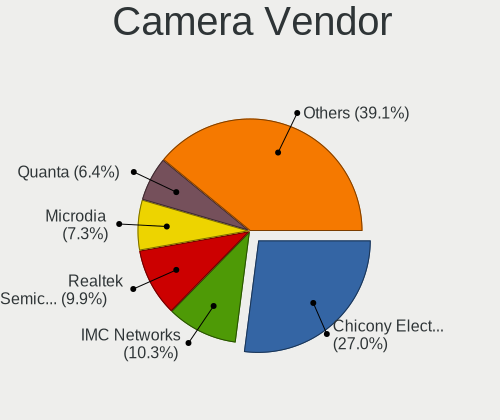

| Vendor                                 | Notebooks | Percent |
|----------------------------------------|-----------|---------|
| Chicony Electronics                    | 55        | 26.07%  |
| Microdia                               | 20        | 9.48%   |
| Realtek Semiconductor                  | 19        | 9%      |
| IMC Networks                           | 19        | 9%      |
| Acer                                   | 15        | 7.11%   |
| Quanta                                 | 13        | 6.16%   |
| Cheng Uei Precision Industry (Foxlink) | 13        | 6.16%   |
| Suyin                                  | 8         | 3.79%   |
| Sunplus Innovation Technology          | 8         | 3.79%   |
| Silicon Motion                         | 6         | 2.84%   |
| Ricoh                                  | 5         | 2.37%   |
| Z-Star Microelectronics                | 3         | 1.42%   |
| Syntek                                 | 3         | 1.42%   |
| Lite-On Technology                     | 3         | 1.42%   |
| Alcor Micro                            | 3         | 1.42%   |
| Apple                                  | 2         | 0.95%   |
| ALi                                    | 2         | 0.95%   |
| Trust                                  | 1         | 0.47%   |
| Samsung Electronics                    | 1         | 0.47%   |
| Luxvisions Innotech Limited            | 1         | 0.47%   |
| Logitech                               | 1         | 0.47%   |
| Lenovo                                 | 1         | 0.47%   |
| Intel                                  | 1         | 0.47%   |
| Importek                               | 1         | 0.47%   |
| Image Processor                        | 1         | 0.47%   |
| GEMBIRD                                | 1         | 0.47%   |
| Elecom                                 | 1         | 0.47%   |
| DigiTech                               | 1         | 0.47%   |
| Alpha Imaging Technology               | 1         | 0.47%   |
| 8SSC20X55495L1GZ04205G1                | 1         | 0.47%   |
| 8SSC20F27114V1SR0AM1M3P                | 1         | 0.47%   |

Camera Model
------------

Camera device models

| Model                                                           | Notebooks | Percent |
|-----------------------------------------------------------------|-----------|---------|
| Chicony Integrated Camera                                       | 11        | 5.14%   |
| Realtek Integrated_Webcam_HD                                    | 9         | 4.21%   |
| IMC Networks Integrated Camera                                  | 5         | 2.34%   |
| Acer Integrated Camera                                          | 5         | 2.34%   |
| Microdia Integrated_Webcam_HD                                   | 4         | 1.87%   |
| IMC Networks USB2.0 HD UVC WebCam                               | 4         | 1.87%   |
| Chicony HD WebCam                                               | 4         | 1.87%   |
| Silicon Motion WebCam SC-13HDL11939N                            | 3         | 1.4%    |
| Realtek Integrated Webcam                                       | 3         | 1.4%    |
| Quanta HD User Facing                                           | 3         | 1.4%    |
| Microdia Webcam Vitade AF                                       | 3         | 1.4%    |
| Microdia Laptop_Integrated_Webcam_HD                            | 3         | 1.4%    |
| IMC Networks USB2.0 UVC VGA WebCam                              | 3         | 1.4%    |
| Chicony VGA Webcam                                              | 3         | 1.4%    |
| Alcor Micro USB 2.0 WebCamera                                   | 3         | 1.4%    |
| Z-Star Webcam                                                   | 2         | 0.93%   |
| Syntek HP Webcam                                                | 2         | 0.93%   |
| Suyin Acer/Lenovo Webcam [CN0316]                               | 2         | 0.93%   |
| Ricoh Integrated Webcam                                         | 2         | 0.93%   |
| Realtek Acer 640 x 480 laptop camera                            | 2         | 0.93%   |
| Quanta VGA WebCam                                               | 2         | 0.93%   |
| Quanta HP TrueVision HD Camera                                  | 2         | 0.93%   |
| Quanta HD Webcam                                                | 2         | 0.93%   |
| Microdia Integrated_Webcam_1.3M                                 | 2         | 0.93%   |
| Microdia Integrated Webcam                                      | 2         | 0.93%   |
| IMC Networks TOSHIBA Web Camera - HD                            | 2         | 0.93%   |
| IMC Networks HP TrueVision HD Camera                            | 2         | 0.93%   |
| Chicony Webcam                                                  | 2         | 0.93%   |
| Chicony USB2.0 Camera                                           | 2         | 0.93%   |
| Chicony USB 2.0 Camera                                          | 2         | 0.93%   |
| Chicony TOSHIBA Web Camera - HD                                 | 2         | 0.93%   |
| Chicony Lenovo Integrated Camera (0.3MP)                        | 2         | 0.93%   |
| Chicony Lenovo Integrated Camera                                | 2         | 0.93%   |
| Chicony Integrated HP HD Webcam                                 | 2         | 0.93%   |
| Chicony HP TrueVision HD Camera                                 | 2         | 0.93%   |
| Chicony HP HD Camera                                            | 2         | 0.93%   |
| Chicony FJ Camera                                               | 2         | 0.93%   |
| Chicony EasyCamera                                              | 2         | 0.93%   |
| Chicony CNF9055 Toshiba Webcam                                  | 2         | 0.93%   |
| Cheng Uei Precision Industry (Foxlink) HP Wide Vision HD Camera | 2         | 0.93%   |
| Cheng Uei Precision Industry (Foxlink) HP Webcam-101            | 2         | 0.93%   |
| Cheng Uei Precision Industry (Foxlink) HP Truevision HD         | 2         | 0.93%   |
| ALi Gateway Webcam                                              | 2         | 0.93%   |
| Acer Lenovo EasyCamera                                          | 2         | 0.93%   |
| Acer BisonCam, NB Pro                                           | 2         | 0.93%   |
| Z-Star Namuga 1.3M Webcam                                       | 1         | 0.47%   |
| Trust USB Camera                                                | 1         | 0.47%   |
| Syntek Lenovo EasyCamera                                        | 1         | 0.47%   |
| Suyin UVC HD Webcam                                             | 1         | 0.47%   |
| Suyin TOSHIBA Web Camera - HD                                   | 1         | 0.47%   |
| Suyin Integrated_Webcam_2M                                      | 1         | 0.47%   |
| Suyin HD WebCam                                                 | 1         | 0.47%   |
| Suyin Acer/HP Integrated Webcam [CN0314]                        | 1         | 0.47%   |
| Suyin Acer CrystalEye Webcam                                    | 1         | 0.47%   |
| Sunplus Laptop_Integrated_Webcam_HD                             | 1         | 0.47%   |
| Sunplus Integrated_Webcam_HD                                    | 1         | 0.47%   |
| Sunplus Integrated_Webcam_FHD                                   | 1         | 0.47%   |
| Sunplus HP TrueVision HD Camera                                 | 1         | 0.47%   |
| Sunplus HP HD Webcam [Fixed]                                    | 1         | 0.47%   |
| Sunplus HD WebCam                                               | 1         | 0.47%   |

Fingerprint Vendor
------------------

Fingerprint sensor vendors

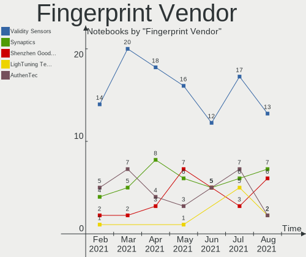

| Vendor                     | Notebooks | Percent |
|----------------------------|-----------|---------|
| Validity Sensors           | 16        | 40%     |
| Shenzhen Goodix Technology | 7         | 17.5%   |
| Upek                       | 6         | 15%     |
| Synaptics                  | 6         | 15%     |
| AuthenTec                  | 3         | 7.5%    |
| STMicroelectronics         | 1         | 2.5%    |
| LighTuning Technology      | 1         | 2.5%    |

Fingerprint Model
-----------------

Fingerprint sensor models

| Model                                                  | Notebooks | Percent |
|--------------------------------------------------------|-----------|---------|
| Upek Biometric Touchchip/Touchstrip Fingerprint Sensor | 6         | 15%     |
| Validity Sensors VFS5011 Fingerprint Reader            | 5         | 12.5%   |
| Shenzhen Goodix  FingerPrint Device                    | 3         | 7.5%    |
| Shenzhen Goodix Fingerprint Reader                     | 3         | 7.5%    |
| Unknown                                                | 3         | 7.5%    |
| Validity Sensors VFS495 Fingerprint Reader             | 2         | 5%      |
| Validity Sensors VFS491                                | 2         | 5%      |
| Validity Sensors VFS471 Fingerprint Reader             | 2         | 5%      |
| Validity Sensors Fingerprint scanner                   | 2         | 5%      |
| Synaptics Metallica MIS Touch Fingerprint Reader       | 2         | 5%      |
| AuthenTec AES2501 Fingerprint Sensor                   | 2         | 5%      |
| Validity Sensors VFS101 Fingerprint Reader             | 1         | 2.5%    |
| Validity Sensors VFS 5011 fingerprint sensor           | 1         | 2.5%    |
| Validity Sensors Synaptics WBDI                        | 1         | 2.5%    |
| Synaptics Prometheus MIS Touch Fingerprint Reader      | 1         | 2.5%    |
| STMicroelectronics Fingerprint Reader                  | 1         | 2.5%    |
| Shenzhen Goodix FingerPrint                            | 1         | 2.5%    |
| LighTuning ES603 Swipe Fingerprint Sensor              | 1         | 2.5%    |
| AuthenTec Fingerprint Sensor                           | 1         | 2.5%    |

Chipcard Vendor
---------------

Chipcard module vendors

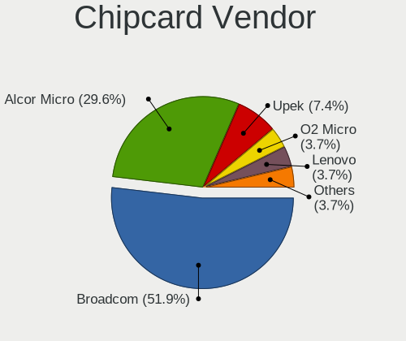

| Vendor      | Notebooks | Percent |
|-------------|-----------|---------|
| Broadcom    | 11        | 61.11%  |
| Alcor Micro | 4         | 22.22%  |
| O2 Micro    | 1         | 5.56%   |
| Lenovo      | 1         | 5.56%   |
| Cherry      | 1         | 5.56%   |

Chipcard Model
--------------

Chipcard module models

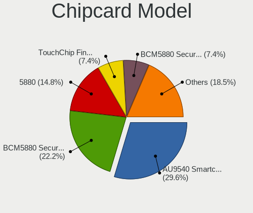

| Model                                          | Notebooks | Percent |
|------------------------------------------------|-----------|---------|
| Broadcom BCM5880 Secure Applications Processor | 7         | 38.89%  |
| Alcor Micro AU9540 Smartcard Reader            | 4         | 22.22%  |
| Broadcom 5880                                  | 2         | 11.11%  |
| Broadcom 58200                                 | 2         | 11.11%  |
| O2 Micro OZ776 CCID Smartcard Reader           | 1         | 5.56%   |
| Lenovo Integrated Smart Card Reader            | 1         | 5.56%   |
| Cherry SmartCard Reader Keyboard KC 1000 SC    | 1         | 5.56%   |

Printer Vendor
--------------

Printer device vendors

| Vendor             | Notebooks | Percent |
|--------------------|-----------|---------|
| Hewlett-Packard    | 2         | 40%     |
| Seiko Epson        | 1         | 20%     |
| Canon              | 1         | 20%     |
| Brother Industries | 1         | 20%     |

Printer Model
-------------

Printer device models

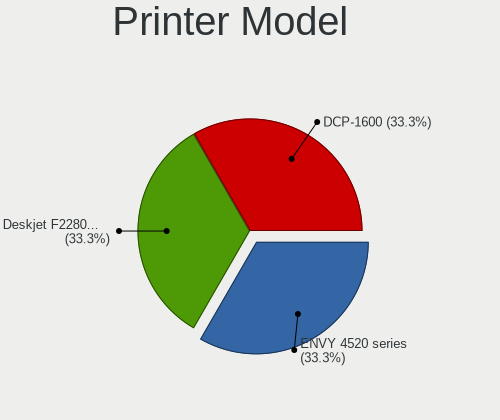

| Model                    | Notebooks | Percent |
|--------------------------|-----------|---------|
| Seiko Epson L395 Series  | 1         | 20%     |
| HP LaserJet CP 1025      | 1         | 20%     |
| HP Deskjet F2280 series  | 1         | 20%     |
| Canon PIXMA MX920 Series | 1         | 20%     |
| Brother DCP-T300         | 1         | 20%     |

Scanner Vendor
--------------

Scanner device vendors

| Vendor      | Notebooks | Percent |
|-------------|-----------|---------|
| Seiko Epson | 1         | 100%    |

Scanner Model
-------------

Scanner device models

| Model                                       | Notebooks | Percent |
|---------------------------------------------|-----------|---------|
| Seiko Epson GT-X820 [Perfection V600 Photo] | 1         | 100%    |

Bluetooth Vendor
----------------

Controller vendors

| Vendor                          | Notebooks | Percent |
|---------------------------------|-----------|---------|
| Intel                           | 71        | 41.28%  |
| Qualcomm Atheros Communications | 27        | 15.7%   |
| Realtek Semiconductor           | 19        | 11.05%  |
| Broadcom                        | 10        | 5.81%   |
| Lite-On Technology              | 8         | 4.65%   |
| Cambridge Silicon Radio         | 7         | 4.07%   |
| Toshiba                         | 6         | 3.49%   |
| Hewlett-Packard                 | 5         | 2.91%   |
| Dell                            | 5         | 2.91%   |
| Apple                           | 5         | 2.91%   |
| IMC Networks                    | 3         | 1.74%   |
| Foxconn / Hon Hai               | 3         | 1.74%   |
| Realtek                         | 1         | 0.58%   |
| Ralink Technology               | 1         | 0.58%   |
| ASUSTek Computer                | 1         | 0.58%   |

Bluetooth Model
---------------

Controller models

| Model                                               | Notebooks | Percent |
|-----------------------------------------------------|-----------|---------|
| Intel Bluetooth Device                              | 22        | 12.79%  |
| Intel Bluetooth wireless interface                  | 17        | 9.88%   |
| Realtek Bluetooth Radio                             | 14        | 8.14%   |
| Intel Bluetooth 9460/9560 Jefferson Peak (JfP)      | 13        | 7.56%   |
| Intel AX200 Bluetooth                               | 13        | 7.56%   |
| Qualcomm Atheros  Bluetooth Device                  | 10        | 5.81%   |
| Qualcomm Atheros AR3012 Bluetooth 4.0               | 8         | 4.65%   |
| Cambridge Silicon Radio Bluetooth Dongle (HCI mode) | 7         | 4.07%   |
| Qualcomm Atheros AR3011 Bluetooth                   | 5         | 2.91%   |
| Lite-On Qualcomm Atheros QCA9377 Bluetooth          | 4         | 2.33%   |
| Toshiba Bluetooth Device                            | 3         | 1.74%   |
| Qualcomm Atheros Bluetooth USB Host Controller      | 3         | 1.74%   |
| Intel Wireless-AC 3168 Bluetooth                    | 3         | 1.74%   |
| Intel Centrino Bluetooth Wireless Transceiver       | 3         | 1.74%   |
| HP Bluetooth 2.0 Interface [Broadcom BCM2045]       | 3         | 1.74%   |
| Dell DW375 Bluetooth Module                         | 3         | 1.74%   |
| Broadcom BCM2045B (BDC-2.1)                         | 3         | 1.74%   |
| Apple Bluetooth Host Controller                     | 3         | 1.74%   |
| Lite-On Atheros AR3012 Bluetooth                    | 2         | 1.16%   |
| IMC Networks Bluetooth Radio                        | 2         | 1.16%   |
| HP Broadcom 2070 Bluetooth Combo                    | 2         | 1.16%   |
| Foxconn / Hon Hai Bluetooth USB Host Controller     | 2         | 1.16%   |
| Toshiba Integrated Bluetooth HCI                    | 1         | 0.58%   |
| Toshiba BCM43142A0                                  | 1         | 0.58%   |
| Toshiba Askey Bluetooth Module                      | 1         | 0.58%   |
| Realtek RTL8822BE Bluetooth 4.2 Adapter             | 1         | 0.58%   |
| Realtek RTL8821A Bluetooth                          | 1         | 0.58%   |
| Realtek RTL8723B Bluetooth                          | 1         | 0.58%   |
| Realtek  Bluetooth 4.2 Adapter                      | 1         | 0.58%   |
| Realtek CSR BS8510                                  | 1         | 0.58%   |
| Realtek Bluetooth Radio                             | 1         | 0.58%   |
| Ralink Motorola BC4 Bluetooth 3.0+HS Adapter        | 1         | 0.58%   |
| Qualcomm Atheros AR9462 Bluetooth                   | 1         | 0.58%   |
| Lite-On Broadcom BCM43142A0 Bluetooth Device        | 1         | 0.58%   |
| Lite-On Bluetooth Device                            | 1         | 0.58%   |
| IMC Networks Atheros AR3012 Bluetooth 4.0 Adapter   | 1         | 0.58%   |
| Foxconn / Hon Hai Bluetooth Device                  | 1         | 0.58%   |
| Dell Wireless 360 Bluetooth                         | 1         | 0.58%   |
| Dell BC02 Bluetooth Adapter                         | 1         | 0.58%   |
| Broadcom HP Portable SoftSailing                    | 1         | 0.58%   |
| Broadcom BCM43142A0 Bluetooth Device                | 1         | 0.58%   |
| Broadcom BCM43142A0 Bluetooth 4.0                   | 1         | 0.58%   |
| Broadcom BCM20702 Bluetooth 4.0 [ThinkPad]          | 1         | 0.58%   |
| Broadcom BCM2070 Bluetooth Device                   | 1         | 0.58%   |
| Broadcom BCM2070 Bluetooth 2.1 + EDR                | 1         | 0.58%   |
| Broadcom BCM2046 Bluetooth Device                   | 1         | 0.58%   |
| ASUS BT-183 Bluetooth 2.0+EDR adapter               | 1         | 0.58%   |
| Apple Bluetooth USB Host Controller                 | 1         | 0.58%   |
| Apple Bluetooth HCI                                 | 1         | 0.58%   |

Unsupported Devices
-------------------

Total unsupported devices on board

| Total | Notebooks | Percent |
|-------|-----------|---------|
| 0     | 168       | 64.62%  |
| 1     | 73        | 28.08%  |
| 2     | 16        | 6.15%   |
| 5     | 1         | 0.38%   |
| 4     | 1         | 0.38%   |
| 3     | 1         | 0.38%   |

Unsupported Device Types
------------------------

Types of unsupported devices

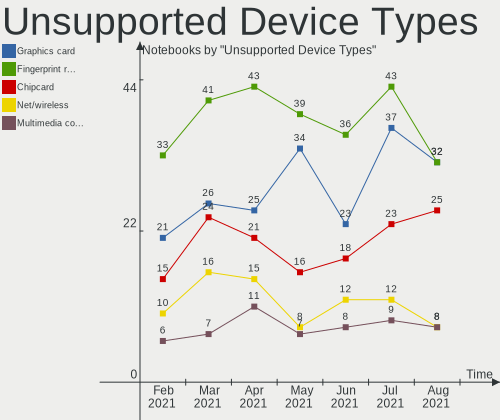

| Type                  | Notebooks | Percent |
|-----------------------|-----------|---------|
| Fingerprint reader    | 39        | 34.21%  |
| Graphics card         | 34        | 29.82%  |
| Chipcard              | 16        | 14.04%  |
| Net/wireless          | 8         | 7.02%   |
| Multimedia controller | 7         | 6.14%   |
| Storage               | 5         | 4.39%   |
| Modem                 | 2         | 1.75%   |
| Net/ethernet          | 1         | 0.88%   |
| Card reader           | 1         | 0.88%   |
| Bluetooth             | 1         | 0.88%   |

