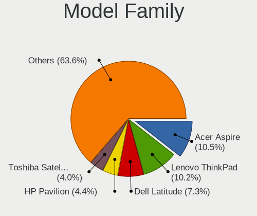
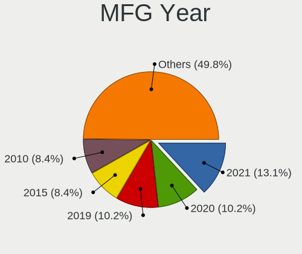
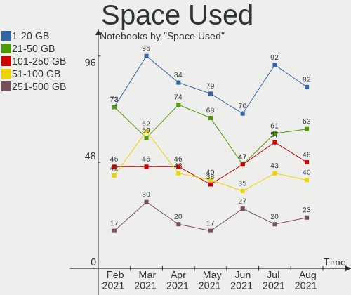
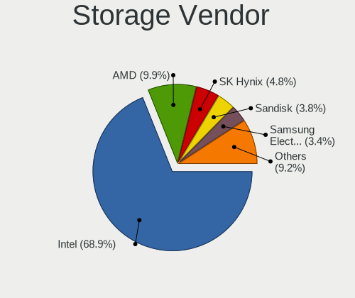
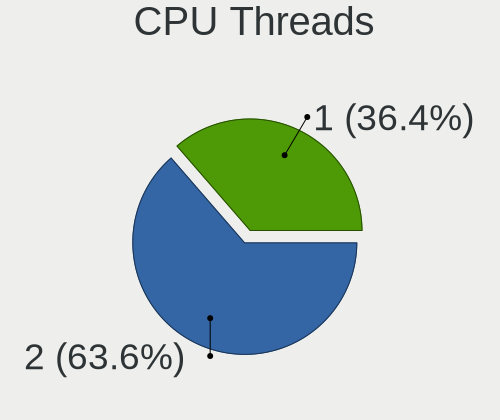
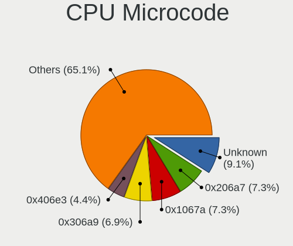
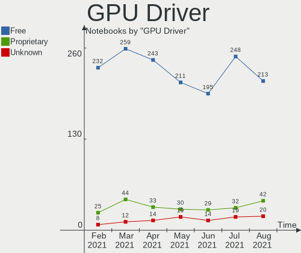
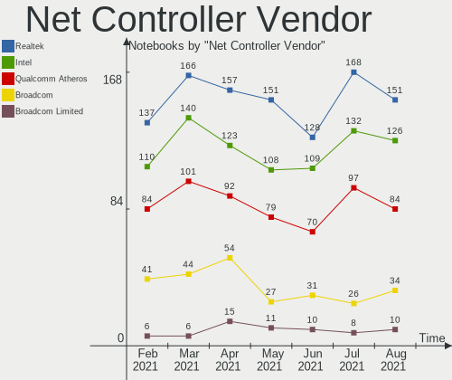
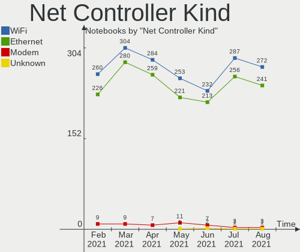

Mint Hardware Trends (Notebook)
-------------------------------

A project to identify most popular hardware characteristics and track their change
over time based on data collected by Mint users at https://Linux-Hardware.org.

Anyone can contribute to the study by uploading probes of their computers by
the [hw-probe](https://github.com/linuxhw/hw-probe) tool:

    sudo -E hw-probe -all -upload

Full-feature report is available here: https://linux-hardware.org/?view=trends&formfactor=notebook

Period: May, 2020.

Contents
--------

- [ OS                       ](#os)
- [ OS Family                ](#os-family)
- [ Kernel                   ](#kernel)
- [ Kernel Family            ](#kernel-family)
- [ Kernel Major Ver.        ](#kernel-major-ver)
- [ Arch                     ](#arch)
- [ DE                       ](#de)
- [ Display Server           ](#display-server)
- [ Display Manager          ](#display-manager)
- [ OS Lang                  ](#os-lang)
- [ Boot Mode                ](#boot-mode)
- [ Filesystem               ](#filesystem)
- [ Part. scheme             ](#part-scheme)
- [ Dual Boot with Linux/BSD ](#dual-boot-with-linux/bsd)
- [ Dual Boot (Win)          ](#dual-boot-win)
- [ Country                  ](#country)
- [ City                     ](#city)
- [ Vendor                   ](#vendor)
- [ Model                    ](#model)
- [ Model Family             ](#model-family)
- [ MFG Year                 ](#mfg-year)
- [ Form Factor              ](#form-factor)
- [ Secure Boot              ](#secure-boot)
- [ Coreboot                 ](#coreboot)
- [ RAM Size                 ](#ram-size)
- [ RAM Used                 ](#ram-used)
- [ Drive Vendor             ](#drive-vendor)
- [ Drive Model              ](#drive-model)
- [ Drive Kind               ](#drive-kind)
- [ Drive Connector          ](#drive-connector)
- [ Drive Size               ](#drive-size)
- [ Space Total              ](#space-total)
- [ Space Used               ](#space-used)
- [ Malfunc. Drives          ](#malfunc-drives)
- [ Malfunc. Drive Vendor    ](#malfunc-drive-vendor)
- [ Malfunc. Drive Kind      ](#malfunc-drive-kind)
- [ Failed Drives            ](#failed-drives)
- [ Failed Drive Vendor      ](#failed-drive-vendor)
- [ Drive Status             ](#drive-status)
- [ Storage Vendor           ](#storage-vendor)
- [ Storage Model            ](#storage-model)
- [ Storage Kind             ](#storage-kind)
- [ CPU Vendor               ](#cpu-vendor)
- [ CPU Model                ](#cpu-model)
- [ CPU Model Family         ](#cpu-model-family)
- [ CPU Cores                ](#cpu-cores)
- [ CPU Sockets              ](#cpu-sockets)
- [ CPU Threads              ](#cpu-threads)
- [ CPU Op-Modes             ](#cpu-op-modes)
- [ CPU Microcode            ](#cpu-microcode)
- [ CPU Microarch            ](#cpu-microarch)
- [ GPU Vendor               ](#gpu-vendor)
- [ GPU Model                ](#gpu-model)
- [ GPU Combo                ](#gpu-combo)
- [ GPU Driver               ](#gpu-driver)
- [ GPU Memory               ](#gpu-memory)
- [ Monitor Vendor           ](#monitor-vendor)
- [ Monitor Model            ](#monitor-model)
- [ Monitor Resolution       ](#monitor-resolution)
- [ Monitor Diagonal         ](#monitor-diagonal)
- [ Monitor Width            ](#monitor-width)
- [ Aspect Ratio             ](#aspect-ratio)
- [ Monitor Area             ](#monitor-area)
- [ Pixel Density            ](#pixel-density)
- [ Multiple Monitors        ](#multiple-monitors)
- [ Net Controller Vendor    ](#net-controller-vendor)
- [ Net Controller Model     ](#net-controller-model)
- [ Net Controller Kind      ](#net-controller-kind)
- [ Used Controller          ](#used-controller)
- [ NICs                     ](#nics)
- [ Unsupported Devices      ](#unsupported-devices)
- [ Unsupported Device Types ](#unsupported-device-types)

OS
--

Installed operating systems

| Name      | Computers | Percent |
|-----------|-----------|---------|
| Mint 19.3 | 144       | 77.84%  |
| Mint 4    | 18        | 9.73%   |
| Mint 18.3 | 7         | 3.78%   |
| Mint 19.1 | 6         | 3.24%   |
| Mint 19.2 | 5         | 2.7%    |
| Mint 19   | 3         | 1.62%   |
| Mint 18.2 | 1         | 0.54%   |
| Mint 18.1 | 1         | 0.54%   |

OS Family
---------

OS without a version

| Name | Computers | Percent |
|------|-----------|---------|
| Mint | 185       | 100%    |

Kernel
------

Version of the Linux kernel

| Version              | Computers | Percent |
|----------------------|-----------|---------|
| 5.3.0-51-generic     | 70        | 37.84%  |
| 5.3.0-53-generic     | 35        | 18.92%  |
| 5.0.0-32-generic     | 17        | 9.19%   |
| 4.15.0-99-generic    | 13        | 7.03%   |
| 4.19.0-9-amd64       | 9         | 4.86%   |
| 4.19.0-8-amd64       | 8         | 4.32%   |
| 4.15.0-101-generic   | 8         | 4.32%   |
| 5.3.0-46-generic     | 7         | 3.78%   |
| 4.15.0-96-generic    | 3         | 1.62%   |
| 4.10.0-38-generic    | 2         | 1.08%   |
| 5.6.7-050607-generic | 1         | 0.54%   |
| 5.3.0-42-generic     | 1         | 0.54%   |
| 5.3.0-40-generic     | 1         | 0.54%   |
| 5.3.0-28-generic     | 1         | 0.54%   |
| 4.4.0-53-generic     | 1         | 0.54%   |
| 4.19.0-9-686         | 1         | 0.54%   |
| 4.15.0-65-generic    | 1         | 0.54%   |
| 4.15.0-62-generic    | 1         | 0.54%   |
| 4.15.0-54-generic    | 1         | 0.54%   |
| 4.15.0-51-generic    | 1         | 0.54%   |
| 4.15.0-34-generic    | 1         | 0.54%   |
| 4.15.0-20-generic    | 1         | 0.54%   |
| 4.10.0-42-generic    | 1         | 0.54%   |

Kernel Family
-------------

Linux kernel without a distro release

| Version | Computers | Percent |
|---------|-----------|---------|
| 5.3.0   | 115       | 62.16%  |
| 4.15.0  | 30        | 16.22%  |
| 4.19.0  | 18        | 9.73%   |
| 5.0.0   | 17        | 9.19%   |
| 4.10.0  | 3         | 1.62%   |
| 5.6.7   | 1         | 0.54%   |
| 4.4.0   | 1         | 0.54%   |

Kernel Major Ver.
-----------------

Linux kernel major version

| Version | Computers | Percent |
|---------|-----------|---------|
| 5.3     | 115       | 62.16%  |
| 4.15    | 30        | 16.22%  |
| 4.19    | 18        | 9.73%   |
| 5.0     | 17        | 9.19%   |
| 4.10    | 3         | 1.62%   |
| 5.6     | 1         | 0.54%   |
| 4.4     | 1         | 0.54%   |

Arch
----

OS architecture (x86_64, i586, etc.)

| Name   | Computers | Percent |
|--------|-----------|---------|
| x86_64 | 169       | 91.35%  |
| i686   | 16        | 8.65%   |

DE
--

Desktop Environment

| Name       | Computers | Percent |
|------------|-----------|---------|
| X-Cinnamon | 107       | 57.84%  |
| MATE       | 24        | 12.97%  |
| Cinnamon   | 22        | 11.89%  |
| XFCE       | 18        | 9.73%   |
| Unknown    | 8         | 4.32%   |
| GNOME      | 5         | 2.7%    |
| i3         | 1         | 0.54%   |

Display Server
--------------

X11 or Wayland

| Name | Computers | Percent |
|------|-----------|---------|
| X11  | 185       | 100%    |

Display Manager
---------------

SDDM, LightDM, etc.

| Name    | Computers | Percent |
|---------|-----------|---------|
| Unknown | 153       | 82.7%   |
| LightDM | 32        | 17.3%   |

OS Lang
-------

Language

| Lang    | Computers | Percent |
|---------|-----------|---------|
| en_US   | 53        | 28.65%  |
| pt_BR   | 18        | 9.73%   |
| ru_RU   | 17        | 9.19%   |
| de_DE   | 14        | 7.57%   |
| fr_FR   | 10        | 5.41%   |
| en_GB   | 9         | 4.86%   |
| nl_NL   | 6         | 3.24%   |
| pl_PL   | 5         | 2.7%    |
| en_CA   | 5         | 2.7%    |
| en_IN   | 4         | 2.16%   |
| Unknown | 4         | 2.16%   |
| ru_UA   | 3         | 1.62%   |
| ja_JP   | 3         | 1.62%   |
| it_IT   | 3         | 1.62%   |
| es_ES   | 3         | 1.62%   |
| bg_BG   | 3         | 1.62%   |
| es_UY   | 2         | 1.08%   |
| es_MX   | 2         | 1.08%   |
| en_NZ   | 2         | 1.08%   |
| cs_CZ   | 2         | 1.08%   |
| C       | 2         | 1.08%   |
| tr_TR   | 1         | 0.54%   |
| sv_SE   | 1         | 0.54%   |
| pt_PT   | 1         | 0.54%   |
| hr_HR   | 1         | 0.54%   |
| fr_BE   | 1         | 0.54%   |
| fi_FI   | 1         | 0.54%   |
| es_CO   | 1         | 0.54%   |
| es_AR   | 1         | 0.54%   |
| en_ZA   | 1         | 0.54%   |
| en_PH   | 1         | 0.54%   |
| en_NG   | 1         | 0.54%   |
| en_IN   | 1         | 0.54%   |
| en_AU   | 1         | 0.54%   |
| de_CH   | 1         | 0.54%   |
| de_AT   | 1         | 0.54%   |

Boot Mode
---------

EFI or BIOS

| Mode | Computers | Percent |
|------|-----------|---------|
| BIOS | 112       | 60.54%  |
| EFI  | 73        | 39.46%  |

Filesystem
----------

Type of filesystem

| Type    | Computers | Percent |
|---------|-----------|---------|
| Ext4    | 179       | 96.76%  |
| Btrfs   | 3         | 1.62%   |
| Overlay | 2         | 1.08%   |
| Tmpfs   | 1         | 0.54%   |

Part. scheme
------------

Scheme of partitioning

| Type    | Computers | Percent |
|---------|-----------|---------|
| Unknown | 172       | 92.97%  |
| MBR     | 7         | 3.78%   |
| GPT     | 6         | 3.24%   |

Dual Boot with Linux/BSD
------------------------

Hosting more than one Linux/BSD

| Dual boot | Computers | Percent |
|-----------|-----------|---------|
| No        | 175       | 94.59%  |
| Yes       | 10        | 5.41%   |

Dual Boot (Win)
---------------

Hosting Linux and Windows

| Dual boot | Computers | Percent |
|-----------|-----------|---------|
| No        | 154       | 83.24%  |
| Yes       | 31        | 16.76%  |

Country
-------

Geographic location (country)

| Country                | Computers | Percent |
|------------------------|-----------|---------|
| USA                    | 25        | 13.51%  |
| Brazil                 | 20        | 10.81%  |
| Russia                 | 19        | 10.27%  |
| Germany                | 14        | 7.57%   |
| UK                     | 11        | 5.95%   |
| France                 | 11        | 5.95%   |
| Ukraine                | 6         | 3.24%   |
| Netherlands            | 6         | 3.24%   |
| India                  | 6         | 3.24%   |
| Canada                 | 6         | 3.24%   |
| Poland                 | 5         | 2.7%    |
| Bulgaria               | 5         | 2.7%    |
| Spain                  | 4         | 2.16%   |
| Turkey                 | 3         | 1.62%   |
| Italy                  | 3         | 1.62%   |
| Uruguay                | 2         | 1.08%   |
| Serbia                 | 2         | 1.08%   |
| Romania                | 2         | 1.08%   |
| Portugal               | 2         | 1.08%   |
| Philippines            | 2         | 1.08%   |
| New Zealand            | 2         | 1.08%   |
| Mexico                 | 2         | 1.08%   |
| Japan                  | 2         | 1.08%   |
| Hungary                | 2         | 1.08%   |
| Czech Republic         | 2         | 1.08%   |
| Bahrain                | 2         | 1.08%   |
| Switzerland            | 1         | 0.54%   |
| Sweden                 | 1         | 0.54%   |
| Slovenia               | 1         | 0.54%   |
| Norway                 | 1         | 0.54%   |
| Namibia                | 1         | 0.54%   |
| Morocco                | 1         | 0.54%   |
| Jamaica                | 1         | 0.54%   |
| Ireland                | 1         | 0.54%   |
| Ghana                  | 1         | 0.54%   |
| Finland                | 1         | 0.54%   |
| Colombia               | 1         | 0.54%   |
| Chile                  | 1         | 0.54%   |
| Bosnia and Herzegovina | 1         | 0.54%   |
| Belgium                | 1         | 0.54%   |
| Belarus                | 1         | 0.54%   |
| Austria                | 1         | 0.54%   |
| Australia              | 1         | 0.54%   |
| Argentina              | 1         | 0.54%   |
| Angola                 | 1         | 0.54%   |

City
----

Geographic location (city)

| City                | Computers | Percent |
|---------------------|-----------|---------|
| Moscow              | 8         | 4.32%   |
| São Paulo          | 3         | 1.62%   |
| Westminster         | 2         | 1.08%   |
| Toulouse            | 2         | 1.08%   |
| Toronto             | 2         | 1.08%   |
| St Petersburg       | 2         | 1.08%   |
| Spruce Grove        | 2         | 1.08%   |
| Sevran              | 2         | 1.08%   |
| Paris               | 2         | 1.08%   |
| Montevideo          | 2         | 1.08%   |
| Manama              | 2         | 1.08%   |
| London              | 2         | 1.08%   |
| Berlin              | 2         | 1.08%   |
| Amsterdam           | 2         | 1.08%   |
| Čačak             | 1         | 0.54%   |
| Zufikon             | 1         | 0.54%   |
| Windhoek            | 1         | 0.54%   |
| Wellington          | 1         | 0.54%   |
| Warsaw              | 1         | 0.54%   |
| Waalwijk            | 1         | 0.54%   |
| Vitória            | 1         | 0.54%   |
| Vila Franca de Xira | 1         | 0.54%   |
| Vienna              | 1         | 0.54%   |
| Varna               | 1         | 0.54%   |
| Valenii de Munte    | 1         | 0.54%   |
| Tuzla               | 1         | 0.54%   |
| Turin               | 1         | 0.54%   |
| Tucson              | 1         | 0.54%   |
| Trindade            | 1         | 0.54%   |
| Trier               | 1         | 0.54%   |
| Tournefeuille       | 1         | 0.54%   |
| Tikhvin             | 1         | 0.54%   |
| Tekirdağ           | 1         | 0.54%   |
| Talisay City        | 1         | 0.54%   |
| Takamatsu           | 1         | 0.54%   |
| Taganrog            | 1         | 0.54%   |
| Szeged              | 1         | 0.54%   |
| Stadthagen          | 1         | 0.54%   |
| St Louis            | 1         | 0.54%   |
| St Helens           | 1         | 0.54%   |
| Sorocaba            | 1         | 0.54%   |
| Sonneberg           | 1         | 0.54%   |
| Sofia               | 1         | 0.54%   |
| Sochocin            | 1         | 0.54%   |
| Signal Hill         | 1         | 0.54%   |
| Shepetivka          | 1         | 0.54%   |
| Sete Lagoas         | 1         | 0.54%   |
| Santiago            | 1         | 0.54%   |
| Ryazan              | 1         | 0.54%   |
| Rousse              | 1         | 0.54%   |
| Rotterdam           | 1         | 0.54%   |
| Rotherham           | 1         | 0.54%   |
| Rostock             | 1         | 0.54%   |
| Rockville           | 1         | 0.54%   |
| Rho                 | 1         | 0.54%   |
| Resistencia         | 1         | 0.54%   |
| Raleigh             | 1         | 0.54%   |
| Quezon City         | 1         | 0.54%   |
| Pune                | 1         | 0.54%   |
| Prague              | 1         | 0.54%   |

Vendor
------

Motherboard manufacturer

| Name                | Computers | Percent |
|---------------------|-----------|---------|
| Hewlett-Packard     | 53        | 28.65%  |
| Lenovo              | 29        | 15.68%  |
| Dell                | 27        | 14.59%  |
| ASUSTek Computer    | 22        | 11.89%  |
| Acer                | 19        | 10.27%  |
| Samsung Electronics | 5         | 2.7%    |
| Toshiba             | 3         | 1.62%   |
| Notebook            | 3         | 1.62%   |
| MSI                 | 3         | 1.62%   |
| Fujitsu Siemens     | 3         | 1.62%   |
| Fujitsu             | 3         | 1.62%   |
| Sony                | 2         | 1.08%   |
| Medion              | 2         | 1.08%   |
| Positivo            | 1         | 0.54%   |
| Panasonic           | 1         | 0.54%   |
| Packard Bell        | 1         | 0.54%   |
| NEC Computers       | 1         | 0.54%   |
| LG Electronics      | 1         | 0.54%   |
| Itautec             | 1         | 0.54%   |
| Gigabyte Technology | 1         | 0.54%   |
| Digibras            | 1         | 0.54%   |
| Chuwi               | 1         | 0.54%   |
| Apple               | 1         | 0.54%   |
| Unknown             | 1         | 0.54%   |

Model
-----

Motherboard model

| Name                                                              | Computers | Percent |
|-------------------------------------------------------------------|-----------|---------|
| Lenovo IdeaPad S340-15IWL 81N8                                    | 2         | 1.08%   |
| Lenovo E41-25 81FS                                                | 2         | 1.08%   |
| HP Pavilion g6                                                    | 2         | 1.08%   |
| HP Pavilion dv7                                                   | 2         | 1.08%   |
| HP Laptop 15-ra0xx                                                | 2         | 1.08%   |
| HP Compaq Presario CQ60                                           | 2         | 1.08%   |
| HP 2000                                                           | 2         | 1.08%   |
| Dell Latitude D630                                                | 2         | 1.08%   |
| ASUS K50IJ                                                        | 2         | 1.08%   |
| Acer Aspire A114-32                                               | 2         | 1.08%   |
| Unknown                                                           | 2         | 1.08%   |
| Toshiba Satellite U300                                            | 1         | 0.54%   |
| Toshiba Satellite C850-D1K                                        | 1         | 0.54%   |
| Toshiba Qosmio X870                                               | 1         | 0.54%   |
| Sony VPCSB4M9E                                                    | 1         | 0.54%   |
| Sony VGN-AW41MF_H                                                 | 1         | 0.54%   |
| Samsung Electronics RV411/RV511/E3511/S3511/RV711/E3411           | 1         | 0.54%   |
| Samsung Electronics QX310/QX410/QX510/SF310/SF410/SF510           | 1         | 0.54%   |
| Samsung Electronics 3570R/370R/470R/450R/510R/4450RV              | 1         | 0.54%   |
| Samsung Electronics 300E5EV/300E4EV/270E5EV/270E4EV/2470EV/2470EE | 1         | 0.54%   |
| Samsung Electronics 270E5G/270E5U                                 | 1         | 0.54%   |
| Positivo MOBILE                                                   | 1         | 0.54%   |
| Panasonic CFSX4-1L                                                | 1         | 0.54%   |
| Packard Bell EasyNote TK85                                        | 1         | 0.54%   |
| Notebook W51XTU                                                   | 1         | 0.54%   |
| Notebook P9XXEN_EF_ED                                             | 1         | 0.54%   |
| Notebook N750BU                                                   | 1         | 0.54%   |
| NEC Computers Packard Bell EasyNote                               | 1         | 0.54%   |
| MSI Prestige 15 A10SC                                             | 1         | 0.54%   |
| MSI GX60 3CC                                                      | 1         | 0.54%   |
| MSI CX61 2QF                                                      | 1         | 0.54%   |
| Medion E7220                                                      | 1         | 0.54%   |
| Medion E4254 MD62100                                              | 1         | 0.54%   |
| LG Electronics F1-2A78R                                           | 1         | 0.54%   |
| Lenovo Z70-80 80FG                                                | 1         | 0.54%   |
| Lenovo V330-14IKB 81B0                                            | 1         | 0.54%   |
| Lenovo V155-15API 81V5                                            | 1         | 0.54%   |
| Lenovo V110-15ISK 80TL                                            | 1         | 0.54%   |
| Lenovo ThinkPad X220 4293AF4                                      | 1         | 0.54%   |
| Lenovo ThinkPad W530 2447AE3                                      | 1         | 0.54%   |
| Lenovo ThinkPad T520 42405GG                                      | 1         | 0.54%   |
| Lenovo ThinkPad T510 43492MU                                      | 1         | 0.54%   |
| Lenovo ThinkPad T440 20B6CTO1WW                                   | 1         | 0.54%   |
| Lenovo ThinkPad T430 23501F9                                      | 1         | 0.54%   |
| Lenovo ThinkPad SL510 2875RS2                                     | 1         | 0.54%   |
| Lenovo ThinkPad P52s 20LB0019US                                   | 1         | 0.54%   |
| Lenovo ThinkPad P50 20EN0005SP                                    | 1         | 0.54%   |
| Lenovo ThinkPad Edge 0578KKP                                      | 1         | 0.54%   |
| Lenovo ThinkPad E520 1143CTO                                      | 1         | 0.54%   |
| Lenovo IdeaPad Z510 20287                                         | 1         | 0.54%   |
| Lenovo IdeaPad S540-15IML 81NG                                    | 1         | 0.54%   |
| Lenovo IdeaPad S540-14IWL 81ND                                    | 1         | 0.54%   |
| Lenovo IdeaPad 330S-14IKB 81JM                                    | 1         | 0.54%   |
| Lenovo IdeaPad 320-15IKB 80YH                                     | 1         | 0.54%   |
| Lenovo IdeaPad 110-15IBR 80T7                                     | 1         | 0.54%   |
| Lenovo G770 20089                                                 | 1         | 0.54%   |
| Lenovo G50-70 20351                                               | 1         | 0.54%   |
| Lenovo B570e HuronRiver Platform                                  | 1         | 0.54%   |
| Lenovo 3000 N100 0768E2U                                          | 1         | 0.54%   |
| Itautec Infoway w7550                                             | 1         | 0.54%   |

Model Family
------------

Motherboard model prefix

| Name                        | Computers | Percent |
|-----------------------------|-----------|---------|
| Acer Aspire                 | 14        | 7.57%   |
| Dell Latitude               | 12        | 6.49%   |
| Lenovo ThinkPad             | 11        | 5.95%   |
| Dell Inspiron               | 11        | 5.95%   |
| HP ProBook                  | 10        | 5.41%   |
| Lenovo IdeaPad              | 8         | 4.32%   |
| HP Laptop                   | 8         | 4.32%   |
| HP EliteBook                | 8         | 4.32%   |
| HP Pavilion                 | 6         | 3.24%   |
| HP Presario                 | 4         | 2.16%   |
| HP Compaq                   | 4         | 2.16%   |
| Fujitsu LIFEBOOK            | 3         | 1.62%   |
| Toshiba Satellite           | 2         | 1.08%   |
| Lenovo E41-25               | 2         | 1.08%   |
| HP 2000                     | 2         | 1.08%   |
| HP 15                       | 2         | 1.08%   |
| Fujitsu Siemens AMILO       | 2         | 1.08%   |
| Dell Vostro                 | 2         | 1.08%   |
| ASUS TUF                    | 2         | 1.08%   |
| ASUS K50IJ                  | 2         | 1.08%   |
| Unknown                     | 2         | 1.08%   |
| Toshiba Qosmio              | 1         | 0.54%   |
| Sony VPCSB4M9E              | 1         | 0.54%   |
| Sony VGN-AW41MF             | 1         | 0.54%   |
| Samsung Electronics RV411   | 1         | 0.54%   |
| Samsung Electronics QX310   | 1         | 0.54%   |
| Samsung Electronics 3570R   | 1         | 0.54%   |
| Samsung Electronics 300E5EV | 1         | 0.54%   |
| Samsung Electronics 270E5G  | 1         | 0.54%   |
| Positivo MOBILE             | 1         | 0.54%   |
| Panasonic CFSX4-1L          | 1         | 0.54%   |
| Packard Bell EasyNote       | 1         | 0.54%   |
| Notebook W51XTU             | 1         | 0.54%   |
| Notebook P9XXEN             | 1         | 0.54%   |
| Notebook N750BU             | 1         | 0.54%   |
| NEC Computers Packard       | 1         | 0.54%   |
| MSI Prestige                | 1         | 0.54%   |
| MSI GX60                    | 1         | 0.54%   |
| MSI CX61                    | 1         | 0.54%   |
| Medion E7220                | 1         | 0.54%   |
| Medion E4254                | 1         | 0.54%   |
| LG Electronics F1-2A78R     | 1         | 0.54%   |
| Lenovo Z70-80               | 1         | 0.54%   |
| Lenovo V330-14IKB           | 1         | 0.54%   |
| Lenovo V155-15API           | 1         | 0.54%   |
| Lenovo V110-15ISK           | 1         | 0.54%   |
| Lenovo G770                 | 1         | 0.54%   |
| Lenovo G50-70               | 1         | 0.54%   |
| Lenovo B570e                | 1         | 0.54%   |
| Lenovo 3000                 | 1         | 0.54%   |
| Itautec Infoway             | 1         | 0.54%   |
| HP Notebook                 | 1         | 0.54%   |
| HP Mini                     | 1         | 0.54%   |
| HP HDX16                    | 1         | 0.54%   |
| HP G61                      | 1         | 0.54%   |
| HP ENVY                     | 1         | 0.54%   |
| HP 255                      | 1         | 0.54%   |
| HP 250                      | 1         | 0.54%   |
| HP 240                      | 1         | 0.54%   |
| HP 14                       | 1         | 0.54%   |

MFG Year
--------

Motherboard manufacture year

| Year | Computers | Percent |
|------|-----------|---------|
| 2019 | 36        | 19.46%  |
| 2018 | 22        | 11.89%  |
| 2013 | 17        | 9.19%   |
| 2012 | 17        | 9.19%   |
| 2011 | 16        | 8.65%   |
| 2017 | 13        | 7.03%   |
| 2009 | 11        | 5.95%   |
| 2016 | 10        | 5.41%   |
| 2014 | 10        | 5.41%   |
| 2010 | 10        | 5.41%   |
| 2015 | 6         | 3.24%   |
| 2007 | 6         | 3.24%   |
| 2008 | 4         | 2.16%   |
| 2020 | 3         | 1.62%   |
| 2005 | 3         | 1.62%   |
| 2006 | 1         | 0.54%   |

Form Factor
-----------

Physical design of the computer

| Name     | Computers | Percent |
|----------|-----------|---------|
| Notebook | 185       | 100%    |

Secure Boot
-----------

Enabled or disabled

| State    | Computers | Percent |
|----------|-----------|---------|
| Disabled | 175       | 94.59%  |
| Enabled  | 10        | 5.41%   |

Coreboot
--------

Have coreboot on board

| Used | Computers | Percent |
|------|-----------|---------|
| No   | 185       | 100%    |

RAM Size
--------

Total RAM memory

| Size in GB | Computers | Percent |
|------------|-----------|---------|
| 3.01-4.0   | 64        | 34.59%  |
| 4.01-8.0   | 44        | 23.78%  |
| 16.01-24.0 | 25        | 13.51%  |
| 8.01-16.0  | 22        | 11.89%  |
| 1.01-2.0   | 20        | 10.81%  |
| 32.01-64.0 | 8         | 4.32%   |
| 24.01-32.0 | 1         | 0.54%   |
| 2.01-3.0   | 1         | 0.54%   |

RAM Used
--------

Used RAM memory

| Used GB   | Computers | Percent |
|-----------|-----------|---------|
| 1.01-2.0  | 77        | 41.62%  |
| 2.01-3.0  | 48        | 25.95%  |
| 0.01-1.0  | 29        | 15.68%  |
| 4.01-8.0  | 15        | 8.11%   |
| 3.01-4.0  | 14        | 7.57%   |
| 8.01-16.0 | 2         | 1.08%   |

Drive Vendor
------------

Hard drive vendors

| Vendor              | Computers | Drives  | Percent |
|---------------------|-----------|---------|---------|
| Seagate             | 43        | 44      | 20%     |
| WDC                 | 40        | 40      | 18.6%   |
| Toshiba             | 24        | 24      | 11.16%  |
| Samsung Electronics | 21        | 25      | 9.77%   |
| Unknown             | 14        | 14      | 6.51%   |
| Kingston            | 10        | 10      | 4.65%   |
| Hitachi             | 9         | 9       | 4.19%   |
| SanDisk             | 8         | 8       | 3.72%   |
| HGST                | 8         | 8       | 3.72%   |
| Crucial             | 8         | 8       | 3.72%   |
| A-DATA Technology   | 5         | 5       | 2.33%   |
| LITEON              | 3         | 3       | 1.4%    |
| Transcend           | 2         | 2       | 0.93%   |
| SPCC                | 2         | 2       | 0.93%   |
| SK Hynix            | 2         | 2       | 0.93%   |
| Wolf                | 1         | 1       | 0.47%   |
| Vi550               | 1         | 1       | 0.47%   |
| TSA                 | 1         | 1       | 0.47%   |
| PLEXTOR             | 1         | 1       | 0.47%   |
| Phison              | 1         | 1       | 0.47%   |
| OCZ                 | 1         | 1       | 0.47%   |
| Micron Technology   | 1         | 1       | 0.47%   |
| Intel               | 1         | 1       | 0.47%   |
| INNOVATION          | 1         | 1       | 0.47%   |
| HL-DT-ST            | 1         | Unknown | 0.47%   |
| Hewlett-Packard     | 1         | 1       | 0.47%   |
| GOODRAM             | 1         | 1       | 0.47%   |
| FORESEE             | 1         | 1       | 0.47%   |
| DF4128              | 1         | 1       | 0.47%   |
| ASMT                | 1         | 1       | 0.47%   |
| Apple               | 1         | 1       | 0.47%   |

Drive Model
-----------

Hard drive models

| Model                        | Computers | Percent |
|------------------------------|-----------|---------|
| ST500LT012-1DG142 500GB      | 7         | 3.18%   |
| ST1000LM035-1RK172 1TB       | 5         | 2.27%   |
| ST9500420AS 500GB            | 4         | 1.82%   |
| SSD 860 EVO 1TB              | 4         | 1.82%   |
| MMC Card  64GB               | 4         | 1.82%   |
| MMC Card  32GB               | 4         | 1.82%   |
| HTS545050A7E380 500GB        | 4         | 1.82%   |
| ST9320325AS 320GB            | 3         | 1.36%   |
| ST1000LM024 HN-M101MBB 1TB   | 3         | 1.36%   |
| SSD 850 EVO 500GB            | 3         | 1.36%   |
| MQ04ABF100 1TB               | 3         | 1.36%   |
| MQ01ABD100 1TB               | 3         | 1.36%   |
| WDS240G2G0B-00EPW0 240GB SSD | 2         | 0.91%   |
| WDS240G2G0A-00JH30 240GB SSD | 2         | 0.91%   |
| WD5000LPCX-24VHAT0 500GB     | 2         | 0.91%   |
| WD1200BEVS-22UST0 120GB      | 2         | 0.91%   |
| WD10SPZX-24Z10T0 1TB         | 2         | 0.91%   |
| WD10JPVX-22JC3T0 1TB         | 2         | 0.91%   |
| SV300S37A120G 120GB SSD      | 2         | 0.91%   |
| SU650 120GB SSD              | 2         | 0.91%   |
| ST500LT012-9WS142 500GB      | 2         | 0.91%   |
| ST500LM012 HN-M500MBB 500GB  | 2         | 0.91%   |
| ST2000LX001-1RG174 2TB       | 2         | 0.91%   |
| SSD 860 PRO 512GB            | 2         | 0.91%   |
| SSD 860 EVO 250GB            | 2         | 0.91%   |
| SA400S37480G 480GB SSD       | 2         | 0.91%   |
| SA400S37120G 120GB SSD       | 2         | 0.91%   |
| SA400M8240G 240GB SSD        | 2         | 0.91%   |
| MQ01ABD050 500GB             | 2         | 0.91%   |
| MK7575GSX 752GB              | 2         | 0.91%   |
| XM11 128GB SSD               | 1         | 0.45%   |
| WDS500G2B0C-00PXH0 500GB     | 1         | 0.45%   |
| WDS500G2B0A-00SM50 500GB SSD | 1         | 0.45%   |
| WDBNCE2500PNC 250GB SSD      | 1         | 0.45%   |
| WD7500BPVT-75HXZT3 752GB     | 1         | 0.45%   |
| WD7500BPVT-60HXZT1 752GB     | 1         | 0.45%   |
| WD7500BPKX-00HPJT0 752GB     | 1         | 0.45%   |
| WD6400BPVT-60HXZT3 640GB     | 1         | 0.45%   |
| WD6400BPVT-55HXZT2 640GB     | 1         | 0.45%   |
| WD5000LPVX-60V0TT0 500GB     | 1         | 0.45%   |
| WD5000LPVX-22V0TT0 500GB     | 1         | 0.45%   |
| WD5000LPVT-75G33T0 500GB     | 1         | 0.45%   |
| WD5000LPCX-60VHAT1 500GB     | 1         | 0.45%   |
| WD5000LPCX-24C6HT0 500GB     | 1         | 0.45%   |
| WD5000LPCX-22VHAT1 500GB     | 1         | 0.45%   |
| WD5000BPVT-24HXZT3 500GB     | 1         | 0.45%   |
| WD5000BEVT-75A0RT0 500GB     | 1         | 0.45%   |
| WD5000BEVT-60A0RT0 500GB     | 1         | 0.45%   |
| WD5000BEVT-00ZAT0 500GB      | 1         | 0.45%   |
| WD3200BPVT-80JJ5T0 320GB     | 1         | 0.45%   |
| WD3200BPVT-22ZEST0 320GB     | 1         | 0.45%   |
| WD3200BEVT-22A23T0 320GB     | 1         | 0.45%   |
| WD3200BEVT-11ZCT0 320GB      | 1         | 0.45%   |
| WD3200BEKT-60PVMT0 320GB     | 1         | 0.45%   |
| WD1600BEVS-07RST0 160GB      | 1         | 0.45%   |
| WD1200BEVS-22RST0 120GB      | 1         | 0.45%   |
| WD10SPZX-75Z10T1 1TB         | 1         | 0.45%   |
| WD10SPZX-22Z10T0 1TB         | 1         | 0.45%   |
| WD10JPCX-24UE4T0 1TB         | 1         | 0.45%   |
| Ultra II 480GB SSD           | 1         | 0.45%   |

Drive Kind
----------

HDD or SSD

| Kind    | Computers | Drives | Percent |
|---------|-----------|--------|---------|
| HDD     | 112       | 118    | 54.11%  |
| SSD     | 70        | 76     | 33.82%  |
| MMC     | 14        | 14     | 6.76%   |
| NVMe    | 7         | 8      | 3.38%   |
| Unknown | 4         | 3      | 1.93%   |

Drive Connector
---------------

SATA, SAS, NVMe, etc.

| Type | Computers | Drives | Percent |
|------|-----------|--------|---------|
| SATA | 169       | 191    | 85.79%  |
| MMC  | 14        | 14     | 7.11%   |
| SAS  | 7         | 6      | 3.55%   |
| NVMe | 7         | 8      | 3.55%   |

Drive Size
----------

Size of hard drive

| Size in TB | Computers | Drives | Percent |
|------------|-----------|--------|---------|
| 0.01-0.5   | 138       | 155    | 69.7%   |
| 0.51-1.0   | 53        | 57     | 26.77%  |
| 1.01-2.0   | 6         | 6      | 3.03%   |
| 3.01-4.0   | 1         | 1      | 0.51%   |

Space Total
-----------

Amount of disk space available on the file system

| Size in GB     | Computers | Percent |
|----------------|-----------|---------|
| 101-250        | 57        | 30.81%  |
| 251-500        | 56        | 30.27%  |
| 501-1000       | 37        | 20%     |
| 51-100         | 16        | 8.65%   |
| 1001-2000      | 6         | 3.24%   |
| More than 3000 | 5         | 2.7%    |
| 21-50          | 3         | 1.62%   |
| 2001-3000      | 2         | 1.08%   |
| Unknown        | 2         | 1.08%   |
| 1-20           | 1         | 0.54%   |

Space Used
----------

Amount of used disk space

| Used GB        | Computers | Percent |
|----------------|-----------|---------|
| 21-50          | 46        | 24.86%  |
| 101-250        | 42        | 22.7%   |
| 1-20           | 42        | 22.7%   |
| 51-100         | 30        | 16.22%  |
| 251-500        | 12        | 6.49%   |
| 501-1000       | 6         | 3.24%   |
| More than 3000 | 2         | 1.08%   |
| 2001-3000      | 2         | 1.08%   |
| Unknown        | 2         | 1.08%   |
| 1001-2000      | 1         | 0.54%   |

Malfunc. Drives
---------------

Drive models with a malfunction

| Model                             | Computers | Drives | Percent |
|-----------------------------------|-----------|--------|---------|
| ST9500420AS 500GB                 | 2         | 2      | 22.22%  |
| ST9320325AS 320GB                 | 1         | 1      | 11.11%  |
| SD8SN8U-256G-1006 256GB SSD       | 1         | 1      | 11.11%  |
| SD8SN8U-128G-1006 128GB SSD       | 1         | 1      | 11.11%  |
| MTFDDAV256TDL-1AW1ZABHA 256GB SSD | 1         | 1      | 11.11%  |
| MQ01ABD100 1TB                    | 1         | 1      | 11.11%  |
| HTS547550A9E384 500GB             | 1         | 1      | 11.11%  |
| HM320JI 320GB                     | 1         | 1      | 11.11%  |

Malfunc. Drive Vendor
---------------------

Vendors of faulty drives

| Vendor              | Computers | Drives | Percent |
|---------------------|-----------|--------|---------|
| Seagate             | 3         | 3      | 33.33%  |
| SanDisk             | 2         | 2      | 22.22%  |
| Toshiba             | 1         | 1      | 11.11%  |
| Samsung Electronics | 1         | 1      | 11.11%  |
| Micron Technology   | 1         | 1      | 11.11%  |
| Hitachi             | 1         | 1      | 11.11%  |

Malfunc. Drive Kind
-------------------

Kinds of faulty drives

| Kind | Computers | Drives | Percent |
|------|-----------|--------|---------|
| HDD  | 6         | 6      | 66.67%  |
| SSD  | 3         | 3      | 33.33%  |

Failed Drives
-------------

Failed drive models

Zero info for selected period =(

Failed Drive Vendor
-------------------

Failed drive vendors

Zero info for selected period =(

Drive Status
------------

Number of failed and malfunc. drives

| Status   | Computers | Drives | Percent |
|----------|-----------|--------|---------|
| Detected | 143       | 172    | 78.14%  |
| Works    | 31        | 38     | 16.94%  |
| Malfunc  | 9         | 9      | 4.92%   |

Storage Vendor
--------------

Storage controller vendors

| Vendor                           | Computers | Percent |
|----------------------------------|-----------|---------|
| Intel                            | 147       | 72.77%  |
| AMD                              | 28        | 13.86%  |
| Samsung Electronics              | 8         | 3.96%   |
| Sandisk                          | 5         | 2.48%   |
| SK Hynix                         | 3         | 1.49%   |
| Silicon Integrated Systems [SiS] | 2         | 0.99%   |
| Kingston Technology Company      | 2         | 0.99%   |
| VIA Technologies                 | 1         | 0.5%    |
| Toshiba America Info Systems     | 1         | 0.5%    |
| Realtek Semiconductor            | 1         | 0.5%    |
| Phison Electronics               | 1         | 0.5%    |
| Nvidia                           | 1         | 0.5%    |
| Micron Technology                | 1         | 0.5%    |
| JMicron Technology               | 1         | 0.5%    |

Storage Model
-------------

Storage controller models

| Model                                                                      | Computers | Percent |
|----------------------------------------------------------------------------|-----------|---------|
| FCH SATA Controller [AHCI mode]                                            | 24        | 10.96%  |
| 7 Series Chipset Family 6-port SATA Controller [AHCI mode]                 | 21        | 9.59%   |
| 6 Series/C200 Series Chipset Family 6 port Mobile SATA AHCI Controller     | 20        | 9.13%   |
| 82801IBM/IEM (ICH9M/ICH9M-E) 4 port SATA Controller [AHCI mode]            | 14        | 6.39%   |
| Sunrise Point-LP SATA Controller [AHCI mode]                               | 13        | 5.94%   |
| 82801 Mobile SATA Controller [RAID mode]                                   | 9         | 4.11%   |
| 5 Series/3400 Series Chipset 4 port SATA AHCI Controller                   | 8         | 3.65%   |
| 82801HM/HEM (ICH8M/ICH8M-E) IDE Controller                                 | 7         | 3.2%    |
| Cannon Point-LP SATA Controller [AHCI Mode]                                | 6         | 2.74%   |
| 8 Series SATA Controller 1 [AHCI mode]                                     | 6         | 2.74%   |
| 5 Series/3400 Series Chipset 6 port SATA AHCI Controller                   | 6         | 2.74%   |
| SATA controller                                                            | 5         | 2.28%   |
| NVMe SSD Controller SM981/PM981/PM983                                      | 5         | 2.28%   |
| Non-Volatile memory controller                                             | 5         | 2.28%   |
| Atom/Celeron/Pentium Processor x5-E8000/J3xxx/N3xxx Series SATA Controller | 5         | 2.28%   |
| 82801HM/HEM (ICH8M/ICH8M-E) SATA Controller [AHCI mode]                    | 5         | 2.28%   |
| Cannon Lake Mobile PCH SATA AHCI Controller                                | 4         | 1.83%   |
| Wildcat Point-LP SATA Controller [AHCI Mode]                               | 3         | 1.37%   |
| SB7x0/SB8x0/SB9x0 SATA Controller [AHCI mode]                              | 3         | 1.37%   |
| NM10/ICH7 Family SATA Controller [AHCI mode]                               | 3         | 1.37%   |
| BC501 NVMe Solid State Drive 512GB                                         | 3         | 1.37%   |
| 82801GBM/GHM (ICH7-M Family) SATA Controller [IDE mode]                    | 3         | 1.37%   |
| 8 Series/C220 Series Chipset Family 6-port SATA Controller 1 [AHCI mode]   | 3         | 1.37%   |
| Technology Company Non-Volatile memory controller                          | 2         | 0.91%   |
| SSD 660P Series                                                            | 2         | 0.91%   |
| NVMe SSD Controller SM961/PM961                                            | 2         | 0.91%   |
| FCH IDE Controller                                                         | 2         | 0.91%   |
| Atom Processor E3800 Series SATA AHCI Controller                           | 2         | 0.91%   |
| 82801HM/HEM (ICH8M/ICH8M-E) SATA Controller [IDE mode]                     | 2         | 0.91%   |
| 5513 IDE Controller                                                        | 2         | 0.91%   |
| WD Black 2018/PC SN520 NVMe SSD                                            | 1         | 0.46%   |
| VT82C586A/B/VT82C686/A/B/VT823x/A/C PIPC Bus Master IDE                    | 1         | 0.46%   |
| SSD Pro 7600p/760p/E 6100p Series                                          | 1         | 0.46%   |
| SB7x0/SB8x0/SB9x0 IDE Controller                                           | 1         | 0.46%   |
| SATA Controller [RAID mode]                                                | 1         | 0.46%   |
| SATA Controller / IDE mode                                                 | 1         | 0.46%   |
| Realtek Non-Volatile memory controller                                     | 1         | 0.46%   |
| Q170/Q150/B150/H170/H110/Z170/CM236 Chipset SATA Controller [AHCI Mode]    | 1         | 0.46%   |
| NVMe Controller                                                            | 1         | 0.46%   |
| Mobile 4 Series Chipset PT IDER Controller                                 | 1         | 0.46%   |
| MCP78S [GeForce 8200] SATA Controller (non-AHCI mode)                      | 1         | 0.46%   |
| MCP78S [GeForce 8200] IDE                                                  | 1         | 0.46%   |
| JMB360 AHCI Controller                                                     | 1         | 0.46%   |
| IXP SB4x0 IDE Controller                                                   | 1         | 0.46%   |
| HM170/QM170 Chipset SATA Controller [AHCI Mode]                            | 1         | 0.46%   |
| Electronics Non-Volatile memory controller                                 | 1         | 0.46%   |
| E16 PCIe4 NVMe Controller                                                  | 1         | 0.46%   |
| Comet Lake SATA AHCI Controller                                            | 1         | 0.46%   |
| 82801GBM/GHM (ICH7-M Family) SATA Controller [AHCI mode]                   | 1         | 0.46%   |
| 82801FB/FBM/FR/FW/FRW (ICH6 Family) IDE Controller                         | 1         | 0.46%   |
| 8 Series/C220 Series Chipset Family 2-port SATA Controller 2 [IDE mode]    | 1         | 0.46%   |
| 8 Series Chipset Family 4-port SATA Controller 1 [IDE mode] - Mobile       | 1         | 0.46%   |
| 7 Series Chipset Family 4-port SATA Controller [IDE mode]                  | 1         | 0.46%   |
| 7 Series Chipset Family 2-port SATA Controller [IDE mode]                  | 1         | 0.46%   |

Storage Kind
------------

Kind of storage controller (IDE, SATA, NVMe, SAS, ...)

| Kind | Computers | Percent |
|------|-----------|---------|
| SATA | 155       | 73.46%  |
| NVMe | 24        | 11.37%  |
| IDE  | 22        | 10.43%  |
| RAID | 10        | 4.74%   |

CPU Vendor
----------

Processor vendors

| Vendor | Computers | Percent |
|--------|-----------|---------|
| Intel  | 154       | 83.24%  |
| AMD    | 31        | 16.76%  |

CPU Model
---------

Processor models

| Model                                         | Computers | Percent |
|-----------------------------------------------|-----------|---------|
| Intel Core i7-8565U CPU @ 1.80GHz             | 5         | 2.7%    |
| Intel Core i5-8265U CPU @ 1.60GHz             | 4         | 2.16%   |
| Intel Core i5 CPU M 460 @ 2.53GHz             | 4         | 2.16%   |
| Intel Celeron CPU N3060 @ 1.60GHz             | 4         | 2.16%   |
| Intel Core i7-8750H CPU @ 2.20GHz             | 3         | 1.62%   |
| Intel Core i5-6200U CPU @ 2.30GHz             | 3         | 1.62%   |
| Intel Core i5-2520M CPU @ 2.50GHz             | 3         | 1.62%   |
| Intel Pentium Silver N5000 CPU @ 1.10GHz      | 2         | 1.08%   |
| Intel Pentium Dual-Core CPU T4500 @ 2.30GHz   | 2         | 1.08%   |
| Intel Core i7-7500U CPU @ 2.70GHz             | 2         | 1.08%   |
| Intel Core i7-6700HQ CPU @ 2.60GHz            | 2         | 1.08%   |
| Intel Core i7-4712MQ CPU @ 2.30GHz            | 2         | 1.08%   |
| Intel Core i7-3610QM CPU @ 2.30GHz            | 2         | 1.08%   |
| Intel Core i7-2670QM CPU @ 2.20GHz            | 2         | 1.08%   |
| Intel Core i5-8250U CPU @ 1.60GHz             | 2         | 1.08%   |
| Intel Core i5-4200U CPU @ 1.60GHz             | 2         | 1.08%   |
| Intel Core i5-3320M CPU @ 2.60GHz             | 2         | 1.08%   |
| Intel Core i5-3230M CPU @ 2.60GHz             | 2         | 1.08%   |
| Intel Core i5-2410M CPU @ 2.30GHz             | 2         | 1.08%   |
| Intel Core i5 CPU M 520 @ 2.40GHz             | 2         | 1.08%   |
| Intel Core i3-3110M CPU @ 2.40GHz             | 2         | 1.08%   |
| Intel Core i3-2330M CPU @ 2.20GHz             | 2         | 1.08%   |
| Intel Core i3 CPU M 370 @ 2.40GHz             | 2         | 1.08%   |
| Intel Celeron N4000 CPU @ 1.10GHz             | 2         | 1.08%   |
| Intel Atom CPU N270 @ 1.60GHz                 | 2         | 1.08%   |
| AMD Ryzen 5 3500U with Radeon Vega Mobile Gfx | 2         | 1.08%   |
| AMD PRO A4-4350B R4, 5 COMPUTE CORES 2C+3G    | 2         | 1.08%   |
| AMD E1-2100 APU with Radeon HD Graphics       | 2         | 1.08%   |
| AMD A9-9420 RADEON R5, 5 COMPUTE CORES 2C+3G  | 2         | 1.08%   |
| Intel Pentium Dual-Core CPU T4400 @ 2.20GHz   | 1         | 0.54%   |
| Intel Pentium Dual-Core CPU T4200 @ 2.00GHz   | 1         | 0.54%   |
| Intel Pentium Dual CPU T2330 @ 1.60GHz        | 1         | 0.54%   |
| Intel Pentium CPU P6100 @ 2.00GHz             | 1         | 0.54%   |
| Intel Pentium CPU N3710 @ 1.60GHz             | 1         | 0.54%   |
| Intel Pentium CPU B940 @ 2.00GHz              | 1         | 0.54%   |
| Intel Pentium CPU 987 @ 1.50GHz               | 1         | 0.54%   |
| Intel Pentium 3558U @ 1.70GHz                 | 1         | 0.54%   |
| Intel Genuine CPU U4100 @ 1.30GHz             | 1         | 0.54%   |
| Intel Genuine CPU T2250 @ 1.73GHz             | 1         | 0.54%   |
| Intel Genuine CPU 585 @ 2.16GHz               | 1         | 0.54%   |
| Intel Core i7-9750H CPU @ 2.60GHz             | 1         | 0.54%   |
| Intel Core i7-8650U CPU @ 1.90GHz             | 1         | 0.54%   |
| Intel Core i7-8550U CPU @ 1.80GHz             | 1         | 0.54%   |
| Intel Core i7-7700HQ CPU @ 2.80GHz            | 1         | 0.54%   |
| Intel Core i7-7600U CPU @ 2.80GHz             | 1         | 0.54%   |
| Intel Core i7-6820HQ CPU @ 2.70GHz            | 1         | 0.54%   |
| Intel Core i7-6500U CPU @ 2.50GHz             | 1         | 0.54%   |
| Intel Core i7-5600U CPU @ 2.60GHz             | 1         | 0.54%   |
| Intel Core i7-5500U CPU @ 2.40GHz             | 1         | 0.54%   |
| Intel Core i7-4810MQ CPU @ 2.80GHz            | 1         | 0.54%   |
| Intel Core i7-4702MQ CPU @ 2.20GHz            | 1         | 0.54%   |
| Intel Core i7-4700MQ CPU @ 2.40GHz            | 1         | 0.54%   |
| Intel Core i7-4600U CPU @ 2.10GHz             | 1         | 0.54%   |
| Intel Core i7-3740QM CPU @ 2.70GHz            | 1         | 0.54%   |
| Intel Core i7-3720QM CPU @ 2.60GHz            | 1         | 0.54%   |
| Intel Core i7-3630QM CPU @ 2.40GHz            | 1         | 0.54%   |
| Intel Core i7-2720QM CPU @ 2.20GHz            | 1         | 0.54%   |
| Intel Core i7-2677M CPU @ 1.80GHz             | 1         | 0.54%   |
| Intel Core i7-2630QM CPU @ 2.00GHz            | 1         | 0.54%   |
| Intel Core i7-2620M CPU @ 2.70GHz             | 1         | 0.54%   |

CPU Model Family
----------------

Processor model prefix

| Model                   | Computers | Percent |
|-------------------------|-----------|---------|
| Intel Core i7           | 42        | 22.7%   |
| Intel Core i5           | 41        | 22.16%  |
| Intel Core i3           | 21        | 11.35%  |
| Intel Core 2 Duo        | 16        | 8.65%   |
| Intel Celeron           | 12        | 6.49%   |
| Other                   | 6         | 3.24%   |
| Intel Pentium           | 5         | 2.7%    |
| Intel Atom              | 5         | 2.7%    |
| AMD E1                  | 5         | 2.7%    |
| Intel Pentium Dual-Core | 4         | 2.16%   |
| Intel Genuine           | 3         | 1.62%   |
| AMD Ryzen 5             | 3         | 1.62%   |
| Intel Pentium Silver    | 2         | 1.08%   |
| AMD Turion 64 Mobile    | 2         | 1.08%   |
| AMD Sempron             | 2         | 1.08%   |
| AMD A8                  | 2         | 1.08%   |
| AMD A6                  | 2         | 1.08%   |
| AMD A4                  | 2         | 1.08%   |
| AMD A10                 | 2         | 1.08%   |
| Intel Pentium Dual      | 1         | 0.54%   |
| Intel Core 2            | 1         | 0.54%   |
| Intel Celeron M         | 1         | 0.54%   |
| AMD Ryzen 7             | 1         | 0.54%   |
| AMD Phenom II           | 1         | 0.54%   |
| AMD Mobile Sempron      | 1         | 0.54%   |
| AMD E                   | 1         | 0.54%   |
| AMD Athlon II           | 1         | 0.54%   |

CPU Cores
---------

Number of processor cores

| Number | Computers | Percent |
|--------|-----------|---------|
| 2      | 123       | 66.49%  |
| 4      | 44        | 23.78%  |
| 1      | 12        | 6.49%   |
| 6      | 5         | 2.7%    |
| 8      | 1         | 0.54%   |

CPU Sockets
-----------

Number of sockets

| Number | Computers | Percent |
|--------|-----------|---------|
| 1      | 185       | 100%    |

CPU Threads
-----------

Threads per core (Hyper-Threading)

| Number | Computers | Percent |
|--------|-----------|---------|
| 2      | 117       | 63.24%  |
| 1      | 68        | 36.76%  |

CPU Op-Modes
------------

CPU Operation Modes (32-bit, 64-bit)

| Op mode        | Computers | Percent |
|----------------|-----------|---------|
| 32-bit, 64-bit | 178       | 96.22%  |
| 32-bit         | 6         | 3.24%   |
| Unknown        | 1         | 0.54%   |

CPU Microcode
-------------

Microcode number

| Number     | Computers | Percent |
|------------|-----------|---------|
| 0x206a7    | 23        | 12.43%  |
| 0x306a9    | 18        | 9.73%   |
| Unknown    | 13        | 7.03%   |
| 0x1067a    | 12        | 6.49%   |
| 0x20655    | 11        | 5.95%   |
| 0x806eb    | 6         | 3.24%   |
| 0x6fd      | 6         | 3.24%   |
| 0x40651    | 6         | 3.24%   |
| 0x806ec    | 5         | 2.7%    |
| 0x806ea    | 5         | 2.7%    |
| 0x706a1    | 5         | 2.7%    |
| 0x406e3    | 5         | 2.7%    |
| 0x406c4    | 5         | 2.7%    |
| 0x906ea    | 4         | 2.16%   |
| 0x806e9    | 4         | 2.16%   |
| 0x306c3    | 4         | 2.16%   |
| 0x06006705 | 4         | 2.16%   |
| 0x506e3    | 3         | 1.62%   |
| 0x306d4    | 3         | 1.62%   |
| 0x07030105 | 3         | 1.62%   |
| 0x06006704 | 3         | 1.62%   |
| 0x6fb      | 2         | 1.08%   |
| 0x30678    | 2         | 1.08%   |
| 0x20652    | 2         | 1.08%   |
| 0x106ca    | 2         | 1.08%   |
| 0x106c2    | 2         | 1.08%   |
| 0x10676    | 2         | 1.08%   |
| 0x08108102 | 2         | 1.08%   |
| 0x0700010f | 2         | 1.08%   |
| 0x06001119 | 2         | 1.08%   |
| 0x03000027 | 2         | 1.08%   |
| 0x010000c8 | 2         | 1.08%   |
| 0xa0660    | 1         | 0.54%   |
| 0x906e9    | 1         | 0.54%   |
| 0x6fa      | 1         | 0.54%   |
| 0x6f6      | 1         | 0.54%   |
| 0x6e8      | 1         | 0.54%   |
| 0x6d6      | 1         | 0.54%   |
| 0x406c3    | 1         | 0.54%   |
| 0x30661    | 1         | 0.54%   |
| 0x106e5    | 1         | 0.54%   |
| 0x08600102 | 1         | 0.54%   |
| 0x08108109 | 1         | 0.54%   |
| 0x0600611a | 1         | 0.54%   |
| 0x0600111f | 1         | 0.54%   |
| 0x05000119 | 1         | 0.54%   |
| 0x02000057 | 1         | 0.54%   |

CPU Microarch
-------------

Microarchitecture

| Name            | Computers | Percent |
|-----------------|-----------|---------|
| Skylake         | 36        | 19.46%  |
| SandyBridge     | 25        | 13.51%  |
| Core            | 24        | 12.97%  |
| IvyBridge       | 18        | 9.73%   |
| Westmere        | 14        | 7.57%   |
| Haswell         | 11        | 5.95%   |
| Silvermont      | 8         | 4.32%   |
| Excavator       | 8         | 4.32%   |
| Goldmont plus   | 5         | 2.7%    |
| Bonnell         | 5         | 2.7%    |
| Broadwell       | 4         | 2.16%   |
| Zen+            | 3         | 1.62%   |
| Puma            | 3         | 1.62%   |
| Piledriver      | 3         | 1.62%   |
| K8 Hammer       | 3         | 1.62%   |
| K10             | 3         | 1.62%   |
| P6              | 2         | 1.08%   |
| K10 Llano       | 2         | 1.08%   |
| Jaguar          | 2         | 1.08%   |
| Bobcat          | 2         | 1.08%   |
| Nehalem         | 1         | 0.54%   |
| KabyLake        | 1         | 0.54%   |
| K8 & K10 hybrid | 1         | 0.54%   |
| Unknown         | 1         | 0.54%   |

GPU Vendor
----------

Vendors of graphics cards

| Vendor                           | Computers | Percent |
|----------------------------------|-----------|---------|
| Intel                            | 133       | 61.01%  |
| Nvidia                           | 42        | 19.27%  |
| AMD                              | 40        | 18.35%  |
| Silicon Integrated Systems [SiS] | 2         | 0.92%   |
| VIA Technologies                 | 1         | 0.46%   |

GPU Model
---------

Graphics card models

| Model                                                                              | Computers | Percent |
|------------------------------------------------------------------------------------|-----------|---------|
| 2nd Generation Core Processor Family Integrated Graphics Controller                | 23        | 9.91%   |
| 3rd Gen Core processor Graphics Controller                                         | 14        | 6.03%   |
| UHD Graphics 620 (Whiskey Lake)                                                    | 10        | 4.31%   |
| Core Processor Integrated Graphics Controller                                      | 10        | 4.31%   |
| Mobile 4 Series Chipset Integrated Graphics Controller                             | 9         | 3.88%   |
| Stoney [Radeon R2/R3/R4/R5 Graphics]                                               | 7         | 3.02%   |
| Skylake GT2 [HD Graphics 520]                                                      | 6         | 2.59%   |
| Mobile GM965/GL960 Integrated Graphics Controller (secondary)                      | 6         | 2.59%   |
| Mobile GM965/GL960 Integrated Graphics Controller (primary)                        | 6         | 2.59%   |
| Haswell-ULT Integrated Graphics Controller                                         | 6         | 2.59%   |
| Atom/Celeron/Pentium Processor x5-E8000/J3xxx/N3xxx Integrated Graphics Controller | 6         | 2.59%   |
| UHD Graphics 620                                                                   | 5         | 2.16%   |
| UHD Graphics 605                                                                   | 5         | 2.16%   |
| HD Graphics 620                                                                    | 5         | 2.16%   |
| 4th Gen Core Processor Integrated Graphics Controller                              | 5         | 2.16%   |
| UHD Graphics 630 (Mobile)                                                          | 4         | 1.72%   |
| HD Graphics 5500                                                                   | 4         | 1.72%   |
| TU117M [GeForce GTX 1650 Mobile / Max-Q]                                           | 3         | 1.29%   |
| Seymour [Radeon HD 6400M/7400M Series]                                             | 3         | 1.29%   |
| RS880M [Mobility Radeon HD 4225/4250]                                              | 3         | 1.29%   |
| Picasso                                                                            | 3         | 1.29%   |
| Mobile 945GM/GMS/GME, 943/940GML Express Integrated Graphics Controller            | 3         | 1.29%   |
| HD Graphics 530                                                                    | 3         | 1.29%   |
| Whistler [Radeon HD 6630M/6650M/6750M/7670M/7690M]                                 | 2         | 0.86%   |
| UHD Graphics                                                                       | 2         | 0.86%   |
| Thames [Radeon HD 7550M/7570M/7650M]                                               | 2         | 0.86%   |
| Sun XT [Radeon HD 8670A/8670M/8690M / R5 M330 / M430 / Radeon 520 Mobile]          | 2         | 0.86%   |
| Mullins [Radeon R2 Graphics]                                                       | 2         | 0.86%   |
| Mobile 945GSE Express Integrated Graphics Controller                               | 2         | 0.86%   |
| Mars [Radeon HD 8670A/8670M/8750M]                                                 | 2         | 0.86%   |
| Kabini [Radeon HD 8210]                                                            | 2         | 0.86%   |
| GP108M [GeForce MX250]                                                             | 2         | 0.86%   |
| GP108M [GeForce MX150]                                                             | 2         | 0.86%   |
| GP107M [GeForce GTX 1050 Ti Mobile]                                                | 2         | 0.86%   |
| GM108M [GeForce 840M]                                                              | 2         | 0.86%   |
| GF114M [GeForce GTX 670M]                                                          | 2         | 0.86%   |
| G96CM [GeForce 9600M GT]                                                           | 2         | 0.86%   |
| Atom Processor Z36xxx/Z37xxx Series Graphics & Display                             | 2         | 0.86%   |
| Atom Processor D4xx/D5xx/N4xx/N5xx Integrated Graphics Controller                  | 2         | 0.86%   |
| Wrestler [Radeon HD 7310]                                                          | 1         | 0.43%   |
| Wrestler [Radeon HD 6310]                                                          | 1         | 0.43%   |
| Wani [Radeon R5/R6/R7 Graphics]                                                    | 1         | 0.43%   |
| TU116M [GeForce GTX 1660 Ti Mobile]                                                | 1         | 0.43%   |
| TU106M [GeForce RTX 2070 Mobile]                                                   | 1         | 0.43%   |
| Trinity 2 [Radeon HD 7520G]                                                        | 1         | 0.43%   |
| Trinity 2 [Radeon HD 7420G]                                                        | 1         | 0.43%   |
| Topaz XT [Radeon R7 M260/M265 / M340/M360 / M440/M445 / 530/535 / 620/625 Mobile]  | 1         | 0.43%   |
| Thames [Radeon HD 7500M/7600M Series]                                              | 1         | 0.43%   |
| Sumo [Radeon HD 6620G]                                                             | 1         | 0.43%   |
| Sumo [Radeon HD 6520G]                                                             | 1         | 0.43%   |
| RS480M [Mobility Radeon Xpress 200]                                                | 1         | 0.43%   |
| Richland [Radeon HD 8650G]                                                         | 1         | 0.43%   |
| Renoir                                                                             | 1         | 0.43%   |
| Neptune XT [Radeon HD 8970M]                                                       | 1         | 0.43%   |
| Mullins [Radeon R4/R5 Graphics]                                                    | 1         | 0.43%   |
| Mobile 945GM/GMS, 943/940GML Express Integrated Graphics Controller                | 1         | 0.43%   |
| Mobile 915GM/GMS/910GML Express Graphics Controller                                | 1         | 0.43%   |
| Madison [Mobility Radeon HD 5650/5750 / 6530M/6550M]                               | 1         | 0.43%   |
| K8M800/K8N800/K8N800A [S3 UniChrome Pro]                                           | 1         | 0.43%   |
| Jet PRO [Radeon R5 M230 / R7 M260DX / Radeon 520 Mobile]                           | 1         | 0.43%   |

GPU Combo
---------

Combinations of graphics cards

| Name           | Computers | Percent |
|----------------|-----------|---------|
| 1 x Intel      | 100       | 54.05%  |
| Intel + Nvidia | 26        | 14.05%  |
| 1 x AMD        | 26        | 14.05%  |
| 1 x Nvidia     | 16        | 8.65%   |
| Intel + AMD    | 7         | 3.78%   |
| 2 x AMD        | 5         | 2.7%    |
| 1 x SiS        | 2         | 1.08%   |
| AMD + Nvidia   | 2         | 1.08%   |
| 1 x VIA        | 1         | 0.54%   |

GPU Driver
----------

Free vs proprietary

| Driver      | Computers | Percent |
|-------------|-----------|---------|
| Free        | 152       | 82.16%  |
| Proprietary | 25        | 13.51%  |
| Unknown     | 8         | 4.32%   |

GPU Memory
----------

Total video memory

| Size in GB | Computers | Percent |
|------------|-----------|---------|
| Unknown    | 102       | 55.14%  |
| 0.01-0.5   | 30        | 16.22%  |
| 1.01-2.0   | 27        | 14.59%  |
| 3.01-4.0   | 12        | 6.49%   |
| 0.51-1.0   | 10        | 5.41%   |
| 2.01-3.0   | 3         | 1.62%   |
| 7.01-8.0   | 1         | 0.54%   |

Monitor Vendor
--------------

Monitor vendors

| Vendor                  | Computers | Percent |
|-------------------------|-----------|---------|
| LG Display              | 38        | 19.39%  |
| AU Optronics            | 37        | 18.88%  |
| Samsung Electronics     | 22        | 11.22%  |
| Chimei Innolux          | 21        | 10.71%  |
| BOE                     | 19        | 9.69%   |
| Chi Mei Optoelectronics | 11        | 5.61%   |
| Lenovo                  | 5         | 2.55%   |
| Seiko/Epson             | 4         | 2.04%   |
| HannStar                | 4         | 2.04%   |
| Goldstar                | 4         | 2.04%   |
| Philips                 | 3         | 1.53%   |
| PANDA                   | 3         | 1.53%   |
| InnoLux Display         | 3         | 1.53%   |
| Dell                    | 3         | 1.53%   |
| Apple                   | 3         | 1.53%   |
| Sharp                   | 2         | 1.02%   |
| LGD                     | 2         | 1.02%   |
| Hewlett-Packard         | 2         | 1.02%   |
| CPT                     | 2         | 1.02%   |
| ViewSonic               | 1         | 0.51%   |
| Toshiba                 | 1         | 0.51%   |
| STD                     | 1         | 0.51%   |
| Sony                    | 1         | 0.51%   |
| LG Philips              | 1         | 0.51%   |
| Insignia                | 1         | 0.51%   |
| InfoVision              | 1         | 0.51%   |
| HannStar Display        | 1         | 0.51%   |

Monitor Model
-------------

Monitor models

| Model                                               | Computers | Percent |
|-----------------------------------------------------|-----------|---------|
| LCD Monitor AUO2E3C 1366x768 309x173mm 13.9-inch    | 4         | 2.02%   |
| LCD Monitor 1920x1080                               | 4         | 2.02%   |
| LCD Monitor CMN14C3 1366x768 309x173mm 13.9-inch    | 3         | 1.52%   |
| LP156WH1-TLA3 LGD01C2 1366x768 344x194mm 15.5-inch  | 2         | 1.01%   |
| LCD Monitor SEC5441 1366x768 344x194mm 15.5-inch    | 2         | 1.01%   |
| LCD Monitor SEC315A 1366x768 344x194mm 15.5-inch    | 2         | 1.01%   |
| LCD Monitor LGD0469 1920x1080 382x215mm 17.3-inch   | 2         | 1.01%   |
| LCD Monitor LGD02F1 1366x768 344x194mm 15.5-inch    | 2         | 1.01%   |
| LCD Monitor LEN40B0 1366x768 344x194mm 15.5-inch    | 2         | 1.01%   |
| LCD Monitor HSD03E9 1024x600 220x129mm 10.0-inch    | 2         | 1.01%   |
| LCD Monitor CMO15A1 1366x768 344x193mm 15.5-inch    | 2         | 1.01%   |
| LCD Monitor BOE0812 1920x1080 344x194mm 15.5-inch   | 2         | 1.01%   |
| LCD Monitor BOE06A5 1366x768 344x194mm 15.5-inch    | 2         | 1.01%   |
| LCD Monitor BOE0696 1366x768 309x173mm 13.9-inch    | 2         | 1.01%   |
| LCD Monitor BOE0675 1366x768 344x194mm 15.5-inch    | 2         | 1.01%   |
| LCD Monitor AUO71EC 1366x768 340x190mm 15.3-inch    | 2         | 1.01%   |
| LCD Monitor AUO70EC 1366x768 340x190mm 15.3-inch    | 2         | 1.01%   |
| LCD Monitor AUO61ED 1920x1080 340x190mm 15.3-inch   | 2         | 1.01%   |
| LCD Monitor AUO26EC 1366x768 344x193mm 15.5-inch    | 2         | 1.01%   |
| LCD Monitor AUO21EC 1366x768 340x190mm 15.3-inch    | 2         | 1.01%   |
| VX2457 VSCB931 1920x1080 520x290mm 23.4-inch        | 1         | 0.51%   |
| vs17 HWP2647 1280x1024 340x270mm 17.1-inch          | 1         | 0.51%   |
| TV SNYA301 1920x1080 1600x900mm 72.3-inch           | 1         | 0.51%   |
| SyncMaster SAM01B7 1280x1024 338x270mm 17.0-inch    | 1         | 0.51%   |
| STD HDMI TV STD00C7 1920x1080 698x392mm 31.5-inch   | 1         | 0.51%   |
| S23B350 SAM08D6 1920x1080 510x287mm 23.0-inch       | 1         | 0.51%   |
| PHL 240V5 PHLC10A 1920x1080 527x296mm 23.8-inch     | 1         | 0.51%   |
| P2719H DEL4183 1920x1080 598x336mm 27.0-inch        | 1         | 0.51%   |
| P222va HWP322C 1920x1080 477x268mm 21.5-inch        | 1         | 0.51%   |
| P2016 DEL40D0 1440x900 419x262mm 19.5-inch          | 1         | 0.51%   |
| P116NWR1 R2 COR0489 1366x768 256x144mm 11.6-inch    | 1         | 0.51%   |
| NS28D310NA15 BBY0028 1680x1050 640x384mm 29.4-inch  | 1         | 0.51%   |
| LQ133M1JW08 SHP1425 1920x1080 294x165mm 13.3-inch   | 1         | 0.51%   |
| LP156WH2-TLAA LGD0230 1366x768 344x194mm 15.5-inch  | 1         | 0.51%   |
| LP156WH1-TLA1 LGD6301 1366x768 344x194mm 15.5-inch  | 1         | 0.51%   |
| LP101WSA-TLA1 LGD01B9 1024x600 224x126mm 10.1-inch  | 1         | 0.51%   |
| LM156LF1L02 NCP000B 1920x1080 344x194mm 15.5-inch   | 1         | 0.51%   |
| LG FULL HD GSM5AB9 1680x1050 480x270mm 21.7-inch    | 1         | 0.51%   |
| LCD Monitor SyncMaster 3840x1200                    | 1         | 0.51%   |
| LCD Monitor SHP14A1 3840x2160 344x194mm 15.5-inch   | 1         | 0.51%   |
| LCD Monitor SEC5142 1280x800 303x190mm 14.1-inch    | 1         | 0.51%   |
| LCD Monitor SEC4542 1280x800 303x190mm 14.1-inch    | 1         | 0.51%   |
| LCD Monitor SEC4351 1366x768 344x194mm 15.5-inch    | 1         | 0.51%   |
| LCD Monitor SEC4251 1366x768 344x194mm 15.5-inch    | 1         | 0.51%   |
| LCD Monitor SEC4156 1600x900 382x215mm 17.3-inch    | 1         | 0.51%   |
| LCD Monitor SEC4154 1366x768 322x181mm 14.5-inch    | 1         | 0.51%   |
| LCD Monitor SEC4149 1366x768 292x174mm 13.4-inch    | 1         | 0.51%   |
| LCD Monitor SEC3659 1600x900 344x194mm 15.5-inch    | 1         | 0.51%   |
| LCD Monitor SEC3555 1366x768 308x184mm 14.1-inch    | 1         | 0.51%   |
| LCD Monitor SEC3355 1366x768 293x165mm 13.2-inch    | 1         | 0.51%   |
| LCD Monitor SEC324C 1366x768 353x198mm 15.9-inch    | 1         | 0.51%   |
| LCD Monitor SEC3157 1280x800 300x190mm 14.0-inch    | 1         | 0.51%   |
| LCD Monitor SAM0F13 3840x2160 1872x1053mm 84.6-inch | 1         | 0.51%   |
| LCD Monitor SAM0902 1920x1080 1020x570mm 46.0-inch  | 1         | 0.51%   |
| LCD Monitor SAM0678 1920x1080                       | 1         | 0.51%   |
| LCD Monitor S24C200                                 | 1         | 0.51%   |
| LCD Monitor NCP0040 1920x1080 344x194mm 15.5-inch   | 1         | 0.51%   |
| LCD Monitor NCP0036 1920x1080 344x194mm 15.5-inch   | 1         | 0.51%   |
| LCD Monitor LPL0C01 1280x800 304x190mm 14.1-inch    | 1         | 0.51%   |
| LCD Monitor LGD05F2 1920x1080 344x194mm 15.5-inch   | 1         | 0.51%   |

Monitor Resolution
------------------

Monitor screen resolution

| Resolution         | Computers | Percent |
|--------------------|-----------|---------|
| 1366x768 (WXGA)    | 98        | 50.78%  |
| 1920x1080 (FHD)    | 52        | 26.94%  |
| 1280x800 (WXGA)    | 10        | 5.18%   |
| 1600x900 (HD+)     | 9         | 4.66%   |
| 1280x1024 (SXGA)   | 5         | 2.59%   |
| 1024x600           | 4         | 2.07%   |
| 1440x900 (WXGA+)   | 3         | 1.55%   |
| 3840x2160 (4K)     | 2         | 1.04%   |
| 1360x768           | 2         | 1.04%   |
| Unknown            | 2         | 1.04%   |
| 3840x1200          | 1         | 0.52%   |
| 3600x1080          | 1         | 0.52%   |
| 2880x1800          | 1         | 0.52%   |
| 1920x1200 (WUXGA)  | 1         | 0.52%   |
| 1680x1050 (WSXGA+) | 1         | 0.52%   |
| 1024x768 (XGA)     | 1         | 0.52%   |

Monitor Diagonal
----------------

Diagonal size in inches

| Inches  | Computers | Percent |
|---------|-----------|---------|
| 15      | 92        | 47.42%  |
| 13      | 28        | 14.43%  |
| 14      | 24        | 12.37%  |
| 17      | 12        | 6.19%   |
| Unknown | 10        | 5.15%   |
| 11      | 6         | 3.09%   |
| 10      | 4         | 2.06%   |
| 23      | 3         | 1.55%   |
| 19      | 3         | 1.55%   |
| 21      | 2         | 1.03%   |
| 12      | 2         | 1.03%   |
| 72      | 1         | 0.52%   |
| 43      | 1         | 0.52%   |
| 40      | 1         | 0.52%   |
| 31      | 1         | 0.52%   |
| 29      | 1         | 0.52%   |
| 27      | 1         | 0.52%   |
| 24      | 1         | 0.52%   |
| 16      | 1         | 0.52%   |

Monitor Width
-------------

Physical width

| Width in mm | Computers | Percent |
|-------------|-----------|---------|
| 301-350     | 136       | 71.58%  |
| 201-300     | 20        | 10.53%  |
| 351-400     | 10        | 5.26%   |
| Unknown     | 10        | 5.26%   |
| 501-600     | 5         | 2.63%   |
| 401-500     | 4         | 2.11%   |
| 601-700     | 2         | 1.05%   |
| 801-900     | 1         | 0.53%   |
| 1501-2000   | 1         | 0.53%   |
| 901-1000    | 1         | 0.53%   |

Aspect Ratio
------------

Proportional relationship between the width and the height

| Ratio   | Computers | Percent |
|---------|-----------|---------|
| 16/9    | 153       | 83.61%  |
| 16/10   | 15        | 8.2%    |
| Unknown | 9         | 4.92%   |
| 5/4     | 5         | 2.73%   |
| 4/3     | 1         | 0.55%   |

Monitor Area
------------

Area in inch²

| Area in inch² | Computers | Percent |
|----------------|-----------|---------|
| 101-110        | 92        | 47.42%  |
| 81-90          | 44        | 22.68%  |
| Unknown        | 10        | 5.15%   |
| 71-80          | 8         | 4.12%   |
| 121-130        | 8         | 4.12%   |
| 51-60          | 6         | 3.09%   |
| 41-50          | 4         | 2.06%   |
| 201-250        | 4         | 2.06%   |
| 151-200        | 4         | 2.06%   |
| 141-150        | 4         | 2.06%   |
| 61-70          | 2         | 1.03%   |
| 351-500        | 2         | 1.03%   |
| 501-1000       | 2         | 1.03%   |
| More than 1000 | 1         | 0.52%   |
| 301-350        | 1         | 0.52%   |
| 251-300        | 1         | 0.52%   |
| 91-100         | 1         | 0.52%   |

Pixel Density
-------------

Pixels per inch

| Density       | Computers | Percent |
|---------------|-----------|---------|
| 101-120       | 106       | 55.21%  |
| 121-160       | 51        | 26.56%  |
| 51-100        | 19        | 9.9%    |
| Unknown       | 10        | 5.21%   |
| 161-240       | 4         | 2.08%   |
| More than 240 | 1         | 0.52%   |
| 1-50          | 1         | 0.52%   |

Multiple Monitors
-----------------

Total monitors connected

| Total | Computers | Percent |
|-------|-----------|---------|
| 1     | 155       | 83.78%  |
| 2     | 23        | 12.43%  |
| 0     | 6         | 3.24%   |
| 3     | 1         | 0.54%   |

Net Controller Vendor
---------------------

Controller vendors

| Vendor                            | Computers | Percent |
|-----------------------------------|-----------|---------|
| Intel                             | 29        | 50.88%  |
| Realtek Semiconductor             | 11        | 19.3%   |
| Hewlett-Packard                   | 4         | 7.02%   |
| Xiaomi                            | 2         | 3.51%   |
| Sierra Wireless                   | 2         | 3.51%   |
| ASIX Electronics                  | 2         | 3.51%   |
| VIA Technologies                  | 1         | 1.75%   |
| Silicon Integrated Systems [SiS]  | 1         | 1.75%   |
| MediaTek                          | 1         | 1.75%   |
| Huawei Technologies               | 1         | 1.75%   |
| Ericsson Business Mobile Networks | 1         | 1.75%   |
| DisplayLink                       | 1         | 1.75%   |
| AMD                               | 1         | 1.75%   |

Net Controller Model
--------------------

Controller models

| Model                                                      | Computers | Percent |
|------------------------------------------------------------|-----------|---------|
| 82579LM Gigabit Network Connection (Lewisville)            | 11        | 14.86%  |
| Centrino Advanced-N 6205 [Taylor Peak]                     | 9         | 12.16%  |
| RTL8723DE Wireless Network Adapter                         | 7         | 9.46%   |
| Centrino Advanced-N 6200                                   | 4         | 5.41%   |
| 82577LM Gigabit Network Connection                         | 4         | 5.41%   |
| Wireless 8265 / 8275                                       | 3         | 4.05%   |
| Centrino Ultimate-N 6300                                   | 3         | 4.05%   |
| 82579V Gigabit Network Connection                          | 3         | 4.05%   |
| Mi/Redmi series (RNDIS)                                    | 2         | 2.7%    |
| hs2340 HSPA+ mobile broadband                              | 2         | 2.7%    |
| Centrino Advanced-N 6230 [Rainbow Peak]                    | 2         | 2.7%    |
| AX88179 Gigabit Ethernet                                   | 2         | 2.7%    |
| AC'97 Modem Controller                                     | 2         | 2.7%    |
| 82567LM Gigabit Network Connection                         | 2         | 2.7%    |
| Wi-Fi 6 AX200                                              | 1         | 1.35%   |
| VT6102/VT6103 [Rhine-II]                                   | 1         | 1.35%   |
| un2430 Mobile Broadband Module                             | 1         | 1.35%   |
| RTL8822CE 802.11ac PCIe Wireless Network Adapter           | 1         | 1.35%   |
| RTL8192EE PCIe Wireless Network Adapter                    | 1         | 1.35%   |
| RTL8153 Gigabit Ethernet Adapter                           | 1         | 1.35%   |
| RTL8111/8168/8411 PCI Express Gigabit Ethernet Controller  | 1         | 1.35%   |
| MC8305                                                     | 1         | 1.35%   |
| Le                                                         | 1         | 1.35%   |
| IXP SB400 AC'97 Modem Controller                           | 1         | 1.35%   |
| hs2350 HSPA+ MobileBroadband                               | 1         | 1.35%   |
| H5321 gw Mobile Broadband Driver                           | 1         | 1.35%   |
| Gobi 3000 HSPA+ Modem                                      | 1         | 1.35%   |
| EM7305                                                     | 1         | 1.35%   |
| Dell D3100 USB3.0 Dock                                     | 1         | 1.35%   |
| Centrino Advanced-N 6235                                   | 1         | 1.35%   |
| 82801FB/FBM/FR/FW/FRW (ICH6 Family) AC'97 Modem Controller | 1         | 1.35%   |
| 82577LC Gigabit Network Connection                         | 1         | 1.35%   |

Net Controller Kind
-------------------

Ethernet, WiFi or modem

| Kind     | Computers | Percent |
|----------|-----------|---------|
| WiFi     | 33        | 46.48%  |
| Ethernet | 29        | 40.85%  |
| Modem    | 8         | 11.27%  |
| Unknown  | 1         | 1.41%   |

Used Controller
---------------

Currently used network controller

| Kind     | Computers | Percent |
|----------|-----------|---------|
| WiFi     | 20        | 64.52%  |
| Ethernet | 11        | 35.48%  |

NICs
----

Total network controllers on board

| Total | Computers | Percent |
|-------|-----------|---------|
| 2     | 163       | 88.11%  |
| 1     | 22        | 11.89%  |

Unsupported Devices
-------------------

Total unsupported devices on board

| Total | Computers | Percent |
|-------|-----------|---------|
| 0     | 109       | 58.92%  |
| 1     | 60        | 32.43%  |
| 2     | 14        | 7.57%   |
| 3     | 2         | 1.08%   |

Unsupported Device Types
------------------------

Types of unsupported devices

| Type                  | Computers | Percent |
|-----------------------|-----------|---------|
| Fingerprint reader    | 31        | 33.7%   |
| Graphics card         | 18        | 19.57%  |
| Chipcard              | 18        | 19.57%  |
| Network               | 6         | 6.52%   |
| Net/wireless          | 6         | 6.52%   |
| Bluetooth             | 4         | 4.35%   |
| Net/ethernet          | 2         | 2.17%   |
| Multimedia controller | 2         | 2.17%   |
| Unclassified device   | 1         | 1.09%   |
| Storage               | 1         | 1.09%   |
| Modem                 | 1         | 1.09%   |
| Firewire controller   | 1         | 1.09%   |
| Camera                | 1         | 1.09%   |

